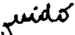
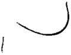
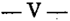

TOMO 311

Volumen 2

FALLOS DE LA CORTE SUPREMA DE JUSTICIA DE LA NACION

e

'.

f

r'

\..

R E PUB L ,1 e A ARGENTINA

FALLOS

DE LA

SUPREMA

CORTE

DE

## JUSTICIA DE LA NACION'

PUBLICACION A CARGO DE LA SECRETARIA DE JURISPRUDENCIA DEL TRIBUNAL

TOMO311VOLUMEN2

SEPTIEMBRE -DICIEMBRE

LA LEY SAE. e 1.

Tucumán 1471 (1050) BumosAires

1988

Copyright e J991 by Cortc Suprcma dc Justicia dc la Nación Queda hecho el dcp6sito quc previene la Icy 11.723 Impreso cn la Argentina

## Pn"nJed in Argentina

## I. s. B. N. 950-527.b909

## AÑO 1988

## SEPTIEMBRE - DICIEMBRE

## PERITOS. INSCRIPCION.

-N" 37-

En la Ciudad de Buenos Aires, al 12 día .del mes de septiembre del año mil novecientas ochenta y ocho, reunidos en la Sala de Acuerdos del Tribunal el Señor Presidente de la Corte Suprema de Justicia de la Nación, doctor Don José Severo Caballero y los señores Jueces doctores Don Augusto César"Benuscio, Don Carlos Santiago Fayt. Don Enrique Santiago Petracchi y Don Jorge Antonio Bacqué,

## Considerando:

Que corresponde establecer las fechas para el cumplimiento de los trámites previstos en la Acornada n2 25 de 1985 para la inscripción y reinscripci6n de peritos en las especialidades determinadas en dicha acordada, ampliadas en la nº 45 del mismo año, en la nº 59 del año 1986, y en la nO 24 del año 1987;

## Acordaron:

lº)Fíjasc el plazo del!7 de octubre al,18 de noviembre de 1988 inclusive, para que los profesionales de las especialidades cuyo registro se lleva en esta Corte procedan a su inscripción o reinscripción para el año 1989.

- 2º) Ampliase la nómina del punto 1ºde la Acordada nº 25/85 incluyendo en la misma a Ingenieros Geodestas Geofísicos.
- 3º) La lista a que se refiere el punto 5º de la Acordada n ll 25/85 se exhibirá por cinco días a partir del día 28 de noviembre de 1988.
- 42) Los trámites referidos en los puntos anteriores se efectuarán en la Oficina"de Ceremonial de esta Corte durante el plazo fijado y exclusivamente en el horario de 10 a 12 hs.

511) Dése la publicidad pertinen~ por intermedio de hl Oficina de Prensa.

Todo lo cual dispusieron y mandaron, ordenando q;"'ese comunicase y registrase en el libro correspondiente, por ante mi, que doy fe. J osl!:SEVEROABALLERO AUGUSTO l!:. C ~ C SAR BELLUSCIO CARLOS. FAYT \_ \_ ENRIQUE SÁNTIAGO TRAccm JORGE ANToNIOACQul!:. PE -B Eduardo D. Crauiotto (Secretario).

1728

## ACUERDOS DE LA CORTE SUPREMA

gil

## NOMINA DE ESPECIAUDADES

(Acordadas Nros. 25/85, 45/85, 59/86, 24/87 Y37/88)

- .Agrimensores
- . Arquitectos
- . Dres. en Ciencias Económicas
- . Dres. en Química
- . Enólogos 'fruticultores
- . Fotointérpretes
- . Geólogos
- . Licenciados en Economía
- . Ingenieros Civiles
- . Ing. r:J especialidad en Hidráulica
- . Ing. Industriales
- . Ing. Mecánicos
- . fug. en Petróleo
- . Ing. Geodestas Geofisicos
- . Ing. Químicos
- . lng. Meteorólogos
- . Veterinarios.

•

•

CORTE SUPREMA DE JUSTICIA. VISITAS A LAS CAMARAS FEDERALES ..

-NO38-

En Buenos Aires, a los 8 días del mes de septiembre del año mil novecientos ochenta y ocho, reunidos en la Sala de Acuerdos del Tribunal el señor Presidente de la Corte Suprema de Justicia de la Nación, d0e:tor don José Severo Caballero, el señor Vicep're-

sidente doctor don Augusto César Belluscio y los señores Ministros doctores don Carlos Santiago Fayt, don Enrique Santiago Petracchi y don Jorge Antonio Bacqué.

## Consideraron:

Que en virtud de lo dispuesto por el punto 3° de la Acordada 35/86 y en atención a la creación de la Cámara Federal de Apelaciones de Posadas,

## Se resilelve:

- 10) Agregar a la zona 2 de la Cámara Federal de Apelaciones de Posadas y Juzgado Federal de Primera Instancia de Eldorado. --
- 2º) Distribuir el turnp de visitas correspondiente al período que se inicia en septiembre del corriente año, de la siguiente forma:

ZONA 1:- Dr. Jorge Antonio Bacqué.-

ZONA 2: - Dr. José Severo Caballero.-

ZONA 3: - Dr. Augusto César Belluscio .•

ZONA 4: - Dr.

Carlos Santiago Fayt.-

ZONA 5: - Dr. Enrique Santiago Petracchi.-

Todo lo cual dispusieron y mandaron, ordenando que se comunicase y registrase en el libro correspondiente, por ante mí, doy fe. Jost SEVERO CABALLEROAUGUSTO CtsAR -BELLUSCIO \_ CARLOSS. FAY1' ENRIQUESANI1AGO E-rnAccmP JORGEANToNIO BACQut. Eduardo D. Craviotto (Secretario).

## PROCURACION GENERAL DE LA NACION.

## DESIGNACION DE PROSECRETARIOS LETRADOS.

-N" 39-

En Buenos Aires, a los 20 días del mes de septiembre del año mil novecientos ochenta y ocho, reunidos en la Sala de Acuerdos del Tribunal, el Señor Presidente de la Corte Suprema de Justicia de la Nación, doctor Don José Severo Caballero y los señores Jueces doctores Don Augusto César Belluscio, Don Carlos Santiago Fayt, Don Enrique Santiago Petracchi y Don Jorge Antonio Bacqué,

## Considerando:

Que mediante acordada 34 del 7 de junio de 1984, aclarada por la 53 del 14de agosto del mismo añO", esta Corte estableció que la designación de funcionarios en los cargos que requieren título habilitante debe efectuarse por el régimen de concursos.

Que por resolución nO455 de fecha 19 de mayo de 1988, se llamó a concurso para cubrir tres cargos de Prosecretario Letrado en la Procuración General de la Nación.

Que la Comisión Asesora designada para dictaminar en el mencionado concurso procedió a la evaluación de los .antecedentes de los postulantes y el m6rito de la prueba escrita.

## Por ello, se Resuelve:

Efectuar las siguientes designaciones en la Procuración General de la Nación: Prosecretarios Letrados: a las Dras. Mónica Patricia Karayan (D.N.I. nO16.009.927 \_ clase 1962); Mónica Alejandra Antonini (C.I. nO7.879.952 clase 1964) y al Dr. Jorge HoracioIglesias (C.I. nO 7.468.722 -clase 1956), quienes ocuparon los primeros lugares en el orden de mérito.

Todo lo cual dispusieron y mandaron, ordenando que se comunicase y registrase en el libro correspondiente, por ante mí, que doy fe. Jos~ SEVERO CABALLERO AUGUSTO \_ CtsAR BElLUSCIO -CARLOS S. F AYT ENRIQUE SANTIAGO PETRACCHI \_ JORCE ANToNIO BACQm. Eduardo D. Croviotto (Secretario).

CUERPO MEDICO FORENSE.

DESIGNACION DE PERITOS MEDICaS.

-NO 40-

Buenos Aires, a los 22 días del mes de septiembre del año mil novecientos ochenta y ocho, reunidos en la Sala de Acuerdos del Tribunal el Señor Presidente de la Corte Suprema de Justicia de la Nación, doctor José Severo Caballero,"el Señor Vicepresidente, doctor Augusto C6sar Bclluscio y los Señores Jueces doctores Don Carlos Santiago Fayt, Don Enrique Santiago Petracchi y Don Jorge Antonio Bacqué,

## Considerando:

Que mediante acordada 34 del 7 dejunio de 1984, aclarada por la 5 del 14 deagasto del mismo año, esta Corte estableció que la designación de funcionarios en los cargos que requieren título habilitante debe efectuarse por régimen de,concursos.

Que por resolución 195 de fecha 17 de marzo de 1988, se llamó a concurso para cubrir once cargos de Peritos Médicos en el.Cuerpo Médico Forense.

Que la Comisión Asesora designada para dictaminar en el mencionado concurso procedió a la evaluación de los antecedentes de los postulantes y el mérito de la prueba escrita.

## Por ello, se Resuelve:

Efectuar las siguientes designaciones en el Cuerpo Médico Forense de la Justicia Nacional:PeritoM~dico a los doctores Nestor Stingo (D.N.I. 4.423. 190-clase 1943); Félix

## DE .rnSTICIA DE LA NACION 311

Molleroeh (C. 1. 2.457.372-010" 1929) Lucio E. Bellomo (DN.I. 4.317.462-o100e 1940); Roúl Edgor Pacheeo (C.1. 3.978.275-010" 1936); José Angel Potito (C.1. 4.886.529-clo,. 1942); Oovaldo H. Curei (DN.I. 7.594.152-o100e 1947); LuioM. Gineoin (L.E. 4.528.229clase 1945); Carlos Carranza Casares (D.N.!. 4.239.417-clase 1930); OsvaldoRafTo (C.I. 1.888.316-010,. 1930); Morio E. A. Bosco (C.1. 5.444.679-010" 1946) YPrimitivo H. Burgo (C.I. 3.726.266-clase 1937), todos los cuales ocuparon los once primeros lugares en el orden de mérito.

Todo lo cual dispusieron.y mandaron, ordenando se comunicase y registrase en el libro correspondiente, por ante mí, que doy fe. Jos~ SEVERO CABALLEROAUGUSTOtsAR -C BELLUSCIO \_ CARLOSS. FAYT ENRIQUESANTIAGO ETRAcem P JORGE ANToNIO BACQ\ffi. Eduardo D. Craviotto (Secretario).

## CORTE SUPREMA DE JUSTICIA.

## DESIGNACION DE PROSECRETARIA LETRADA.

-Nº 41-

En Buenos Aires, a los 27 días del mes de septiembre del año mil novecientos ochenta y ocho, reunidos en la Sala de Acuerdos del Tribunal el señor Presidente de la Corte Suprema de Justicia de la Naci6n, doctor don José Severo Caballero, el señor Vicepresidente doctor don Augusto César Belluscio y los señores Ministros doctores don Carlos Santiago Fayt, don Enrique Santiago Petracchi y don Jorge Antonio Bacqué,

## Consideraron:

Que mediante acordada 34 del 7 dejunio de 1984, aclarada por la 53 del 14 de agosto del mismo año, esta Corte estableci6que la designación de funcionarios en los cargos que requieren título habilitante debe efectuarse por el régimen de concursos.

Que por resolución nO47 de fecha 9 de febrero de 1988, se llamó a concurso para cubrir un cargo de Prosecretario Letrado en la Corte Suprema.

Que la Comisión Asesora designada para dictaminar en el mencionado concurso procedió a la evaluación de los antecedentes de los postulantes y el mérito de la prueba escrita.

Por E;!l1o,e s Resuelve:

Efectuar la siguiente designaci6n en la Corte Suprema de Justicia de la Nación:

Prosecretaria Letrada a la Doctora Marta Inés Schweizer de Carlde (C.I. nO 5.597.616-clase 1948), la cual ocupó el primer lugar en el orden de mérito.-

Todo lo cual dispusieron y mandaron, ordenando se comunicase y registrase en el libro correspondiente, por ante mí, doy fe. Jos~ SEVERO CABALLEROAUGUSTO CtsAR -BELLUSCIO \_ CARLOSS. FAYT ENRIQUESAN'nAGO ETRAcem P JORGE ANToNIO BACQu1:. Eduardo D. Craviotto (Secretario).

ACUERDOS

DE LA CORTE

SUPREMA

311

## COM1SIONlIQUIDADORA LEY 12.910-.

DETERMINACIONDE PLAZO.

-NO42-

En Buenos Aires, a los 29 días del mes de septiembre del año mil novecientos ochenta y ocho, reunidos en la Sala de Acuerdos del Tribunal el señor Presidente de la Corte Suprema de Justicia de la Nación, doctor don José Severo Caballero, el señor Vicepresidente doctor don Augusto César Belluscio y los señores Ministros doctores don Carlos Santiago Fayt, don Enrique Santiago Petracchi y don Jorge Antonio Bacqué.

## Consideraron:

Que en atención a lo solicitado con fecha 21 del corriente por el señor Presidente de la Comisión Liquidadora Ley 12.910, corresponde -por las razones invocadas en la presentaci6nacceder a la petición.

## Por ello, Resolvieron:

Determinar que el plazo fijado en el Artículo lº) de la Acordada nO 26 de fecha 9 de junio última, deberá regir a partir del día primero del corriente.Todo lo cual dispusieron y mandaron, ordenando que se comunicase y registrase en el libro correspondiente, por antcmí, que doy fe. JoSÉ SEVEROABALLERO-AUGUSTO sABBELLUSClO-CARLOS S. FAYT C Ct -ENRIQUE SANTIAGO-rRAccm PE JORGE ANToNIOACQUlt B Eduardo D. Crauiotto (Secretario).

## CAMARAS NACIONALES DE APELACIONES. CONCURSOS.

ACLARACION DE ACORDADA 25/88.

-N" 43-

En la Ciudad de Buenos Aires, a los 4 días del mes de octubre del año mil novecientos ochenta y ocho, reunidos en la Sala de Acuerdo.s del Tribunal el señor Presidente de la Corte Suprema de Justicia de la N ación, doctor Don José Severo Caballero y los señores Jueces doctores Don Augusto César Juan Belluscio, Don Carlos Santiago Fayt, y Don Énrique Santiago Petracchi y Don Jorge Antonio Bacqué,

## Consideraron:

Que resulta conveniente formular algunas precisiones con relación a la acordada 25/88, dictada por esta Corte el9 de junio último, que dispuso que los concursos que se lleven a cabo en el interior del país para cubrir los cargos de secretarios de juzgado o sus equivalentes, médicos de cámara y bibliotecarios dében realizarse en el lugar donde se ha producido la vacante.

## Acordaron:

Aclarar que en los supuestos previstos por la acordada 25/88 la recepción de los exámenes la hará el juez del lugar, quien deberá elevarlos a la cámara respectiva, tribunal que calificará y seleccionará la terna correspondiente.

Todo lo cual dispusieron y mandaron, ordenando que se comunicase y registrase en el libro correspondiente, por ante mi, que doy fe. -Joslt SEVEROABALLERO AUGUSTO C -CltsAR BELLUSClOCARLOS . FA'YT~ENRlQUE ANTIAGOTRACCHI RGE AmoNIO BACQut-\_ S S P'E -JO Eduardo D. Craviotto (Secretario)

## PRESUPUESTO PARA EL AÑo 1989

-N" 44-

En Buenos Aires, a los 18 días del mes de octubre del año mil novecientos ochenta y ocho, reunidos en la Sala de Acuerdos del Tribunal el señor Presidente de la Corte Suprema de Justicia de la Nación, doctor don José Severo Caballero, el señor Viccpre M sidente don Augusto César Belluscio y los señores Ministros doctores don Carlos Santiago Fayt, don Enrique Santiago Petracchi y don Jorge Antonio Bacqué.

## Consideraron:

Que de conformidad con lo prescripto por el artículo 99 de la Constitución Nacional, rorresponde a la Corte Suprema dictar -para el año 1989el presupuesto del Poder Judicial de la Nación (Fallos: 240:6; 241:109; 303:48; doctrina de fallos: 289:365; 293:493; 302:27; acordadas números 47/82; 7 Y 75/84; 2 Y 62/86 Y 38/87) Y remitirlo al Poder Ejecutivo Nacional para que sea enviado al Honorable Congreso de la Nación, a fm de que se suministren a la administración de justicia nacional los recursos fmancie M ros necesarios para cumplir con su cometido en el marco de la independencia de poderes que exige el sistema republicano de gobierno.

Que el Tribunal debe reiterar -una vez más-lo expuesto en años anteriores, en el sentido de que el plan de erogaciones elaborado se ajusta a una política de máxima austeridad, en razón de no ser ajena esta Corte a la grave situación financiera que afecta al país.

Que en materia de recursos, este Poder se ha visto sumamente restringido en el rorriente año por la exigilidad del presupuesto para 1987 y, además, por la demora en la sanción del que tendría actual vigencia, tal como se hiciera saber al señor Presidente de la Honorable Cámara de Diputados de la Nación en nota remitida con fecha 21 de setiembre último.

Que el Tribunal --consciente de la situaciónha dictado diversas medidas de contención de gastos (confr. Acordada 40/85), reduciendo las adquisiciones, los servicios y de manera especial los pasajes Y viáticos.

Que, por lo expuesto, esta Corte Suprema deniu"estra que comparte el criterio de severa parquedad que la realidad económica extremadamente dificil impone, pero debe

declarar que tal circunstancia no puede menoscabar la dignidad y decoro de la función judicial.

Que corresponde aclarar que -salvo excepcionesen las últimas décadas la administración de justicia se ha visto limitada en materia presupuestaria para poder solucionar sus innumerables problemas de inadecuada instalación de tribunales y organismos de Capital Federal e interior y que el número de magistrados, funcionarios y empleados no solamente es el mínimo, sino insuficiente, circunstancia que se agrava por el incesante incremento de la cantidad de procesos sometidos a decisión y su consiguiente expansión.

Que es menesier destacar el esfuerzo que ha significado afroniar --con escasos recursoslas recientes creaciones de tribunales, tales como las Cámaras de la Seguridad Social, de Posadas y de General Roca y los Juzgados Federales de Eldorado, Junín y Bariloche, Defensorías Oficiales, numerosas Secreiarías de Primera Instancia, eic.

Que en razón de que el presente proyecto de presupuesto está calculado para solventar las necesidades del Poq.er Judicial en su actual conformación, no resulta posible atender los requerimientos resultantes de la constitución de nuevos tribunales.

Que en consecuencia, todo acto legal que irrogue una nueva erogación no prevista en este proyecto debe contemplar -con arreglo a lo estipulado en el arto 15 de la Ley de Contabilidadsu iotal financiamiento (gastos en personal, necesidades en materia de edificios, equipamiento, etc.), con cargo a "rentas generales" por cuanto los ingresos que brinda la Cuenta Especial 510 "Infraestructura Judicial" se encuentran afectados a los destinos señalados en la distribución de la misma.

Que se juzga propicia la oportunidad para requerir el estudio -por parte de los oiros poderes del Estadode una solución a las deficiencias de un Poder Judicial que no responde en su estructura a las necesidades mínimas de los justiciables.

Que de conformidad con lo expuesto en los considerandos precedentes, el prcsu~ puesto del Poder Judicial de la Nación para el ejercicio 1989 ha sido estimado conforme al detalle que se consigna a continuación, dejándose constancia que los niveles de créditos de los respectivo incisos han sido formulados en base a los valores promedio de precios al mes de julio de 1988:

## INCISO 11 PERSONAL

El monto anual previsto para este inciso --calculado a valores de julio ppdo.asciende a la suma de australes un mil cuatrocientos sesenta millones novecientos cincuenta y cinro mil (A 1.460.955.000).

En el total consignado se incluye la cantidad de australes treinta y siete millones ochocientos treinta y cinco mil (A 37.835.(00) con destino ah Partida Principal 1199 -Crédito a Distribuir, para las finalidades que a continuaciót:l se describen:

1. A 30.235.000 en el Programa 001 Administración de Justicia en Ultima Instancia, destinada a hacer frente a los disiintos requerimientos de carácter impres.

cindible sobre creación o transformación de cargos, formulados por los tribunales y organismos de la Capital e interior del paí~.

- 2. A. 7.600.000 en el Programa 002 - Administración de Justicia en Primera Instancia y Segunda Instancia, con la finalidad de disponer de los recursos humanos necesarios que permitan proseguir con el plan de Informatización del Poder Judicial de la Nación que ha tenido principio de ejecución en los ejercicios financieros 19B7 y 19BB, confonne se expresara en oportunidad del dictado de las aco~dadas nO 62186 y 3B/67.

## INCISO 12 BIENES Y SERVICIOS NO PERSONALES

- El monto total que requiere este inciso asciende a la suma de australes doscientos cinco millones cuatrocientos setenta y seis mil (A. 205.476.000) de acuerdo con las solicitudes formuladas que contemplan, entre otras, la atención de Gastos de Funcionamiento para los tribunales y organismos de la Justicia Nacional, como asimismo cabe destacar que con la citada partida se sufragan los requerimientos exigidos por diversas prestaciones de relevancia, que a título ilustrativo se mencionan a continuaci6n sin que ello impliquc la totalidad de los conceptos, como ser: alquileres de inmuebles (44 edificios en todo el país), honorarios, servicios públicos, servicios anuales, viáticos, etc.

Otra aplicaci6n significativa de los créditos de este inciso es, sin duda, la que insumirá la prosecusión del Plan de Informatizaci6n de la administración de la justicia nacional (A.76.770.000), que ha tenido principio de ejecuci6n--conforme.se señalaraen los ejercicios financieros de 19B7 y 198B.

## INCISO 31 TRANSFERENCIAS PARA FINANCIAR EROGACIONES CORRIENTES

Con relación a este inciso, se considera conveniente asignarle la suma de australes dos millones trescientos cuarenta mil (A. 2.340.000) al Patronato de Liberados de la Capital Federal, con el fin de posibilitar la realización de los informes que son requeridos por la Justicia en lo Criminal y Correccional, conforme lo previsto en los artículos 26,40 Y41 del Código Penal, regulados por el artículo 111 del Reglamento del Fuero Penal.

## INCISO 41BIENES DE CAPITAL

En este inciso se contempla un crédito de australes veintiún millones trescientos veintiséis mil (A. 21.326.000) con el objeto de posibilitar el apoyo a la tarea de los magistrados, funcionarios, empleados y auxiliares de la justicia mediante la provisión, del indispensable y adecuado equipamiento y la incorporación de aparatos e instrumental científico para el Cuerpo MédicoForense de la Justicia Nacional y la Margue Judicial.

## INCISO 42 CONSTRUCCIONES

El monto total de este inciso se ha estimado en la suma de australes ciento treinta y dos millones setecientos cincuenta y cinco mil (A. 132.755.000), destinados 8 financiar los siguientes trabajos públicos en el interior del país: a) Obras en ejecución: Tribunales Federales de General Roca y Viedma (Pcia. de Río Negro) y Tierra del Fuego (Territorio Naciana! de la Tierra del Fuego, Antártida e Islas del Atlántico Sur); b) obras en proyecto: Tribunales Federales de Rosario (peia. de Santa Fe); c) obras a proseguir: Tribunales

Federales' de Resistencia (Pcia. del Chaco), del Neuquén y de Posadas (Pcia. de Misiones); d) obras con proyecto a realizar: Tribunales Federales de San Marlín (Pcia. de Buenos Aires), Catamarca y Jujuy; e) obras con proyecto realizado: viviE:ndas para magistrados en Comodoro Rivadavia (Pcia. del Chubut).

Por otra parte está prevista la ejecuci6n de otras obras a realizar en distintos edificios: Mar del Plata, La Plata y San Nicolás (Pcia. de ~uenos Aires); Santiago del Estero; Santa Rosa (Pcia. de La Pampa); Tucumán; Mendoza; Lavalle 1220 (Capital Federal), etc.

El plan precedentemente expuesto tiende a dotar gradualmente a los tribunales nacionales y federales, de edificios propios y adecuados a los especiales requerimiéntos funcionales que la labor judicial demanda, con lo cual se podrá reemplazar a varios inmuebles en locaci6n y acondicionar a otros de propiedad fiscal, que por su estado de conservaci6n actual y demás condiciones de habitabilidad no resultan aptos para el fin al que se los destina.

## INCISO 51 BIENES PREEXISTENTES

En este inciso se contempla un crédito de australes dieciocho millones ciento setenta y ocho mil (A 18.178.000) para la adquisici6n de edificios o terrenos que posibiliten el adecuado funcionamiento de'los Tribunales Federales de San Isidro y Morón (Pcia. de Buenos Aires).

## CUENTA ESPECIAL 510 INFRAESTRUCTURA JUDICIAL

Con relaci6n a esta Cuenta Especial procede fijar los recursos propios y los gastos en la suma de australes doscientos cuarenta y nueve millones quinientos mil (A 249.500.000) imporle resultante de anualizar la recaudación operada en el mes de agosto (no resulta representativa la evaluación al mes de julio de 1988, por abarcar ese período una feria judicial), más el remanente estimado al cierre del ejercicio del año en curso, cuyo destino se discrimina de la siguiente forma:

| INCISO 12 - BIENES Y SERVICIOS NO PERSONALES   | A 102.744.000   |
|------------------------------------------------|-----------------|
| INCISO 41 - BIENES DE CAPITAL                  | A 17.699.000    |
| INCISO 42 - CONSTRUCCIONES                     | A 85.457.000    |
| INCISO 51 - BIENES PREEXISTENTES               | A 43.600.000    |

En conocimiento del proyecto de modificaci6n de la. ley 21.859 -en trámite parlamentariO-:es oportuno destacar que, si bien el mismo ha previsto un sistema de inversi6n de esos fondos que reportará mayores recursos, se producirá una disminución efectiva de ingresos y por lo tanto los montos resultantes no mantendrán los niveles presupuestados en el ?lrrientepro)'ecto, raz6n por la cual se hace indispensable atender tales diferencias mediante la incorporación de cróditos financiados por "rentas generales".

Para el supuesto de no tener tratamiento favorable la expuesta modificación estímase propicio reiterar la conveniencia del otorgamiento de la facultad de inversi6n transitoria de esos recursos, tal como fuera solicitado en oportunidad del dictado de las Acordadas 62186 y 38187 (presupuestos 1987 y 1988).

## DE.ruSTICIAELANACION D 311

Asimismo, se requiere --conforme ya fuera peticionado en las Acordadas citadas precedentemente-la facultad del uso de los recursos que se generen en los servicios de Cuentas Especiales, modificando a ese fin el artículo 17 de la ley Nº 16.432, incorporado a la Ley Nº 11.672 (Complementaria Permanente de Presupuesto) por el artículo 83 de la citada ley N2 16.432 y modificado por su similar 33 de la ley NV 22.202,

## Por ello, Resolvieron:

- 1º) Fijar el Presupuesto de la Jurisdicci6n 05 . Poder Judicial de la Naci6n para el ejercicio de 1989 en la suma de australes dos mil noventa millones quinientos treinta mil (A 2.090.530.000), conforme al siguiente detall.e:

## CARACTER O ADMINISTRACION CENTRAL

INCISO 11- PERSONAL

A

1.460.955.000

INCISO 12 - BIENES Y SERVICIOS NO

PERSONALES

A

205.476.000

INCISO

31 -

TRANSFERENCIAS

PARA

FINANCIAR

EROGACIONES

CORRIENTES

A

2.340.000

INCISO 41- BIENES DE CAPITAL

A

21.326.000

INCISO 42 - CONSTRUCCIONES

A

132.755.000

INCISO 51 - BIENES PREEXISTENTES

A

18.178.000

TOTAL CARACTER o:

A

1.841.030.000

CARACTER 1- CUENTAS ESPECIALES

CUENTA ESPECIAL 510 - INFRAESTRUCTURA JUDICIAL

INCISO 12 - BIENES Y SERVICIOS NO

PERSONALES

A

102.744.000

INCISO 41- BIENES DE CAPITAL

A

17.699.000

INCISO 42 - CONSTRUCCIONES

A

85.457.000

INCISO 51 - BIENES PREEXISTENTES

A

43.600.000

TOTAL CARACTER 1:

A

249.500.000

TOTAL CARACTER O y 1:

A 2.090.530.000

- 2º) Aprobar las planillas de distribución de créditos correspondientes al Plan Analitico de Trabajos Públicos elaborado por la Subsecretaría de Administración, que forman parte de esta acordada ,y que serán suscriptas por el señor Secretario de Superintendencia Administrativa.
- 3º) Comuníquese al Poder Ejecutivo Nacional-por intermedio del señor Ministro de Educación y Justiciapara su remisión al Honorable Congreso Nacional. Asimismo, póngase en conocimiento del señor Ministro de Economía.
- 4º) Hágase saber a la Subsecretaría de Administración y a las Cámaras Nacionales y Federales de todo el país.

Todo lo cual dispusieron y mandaron, ordenando se comunicase y regístrase en el libro correspondiente, por ante mí, que doy fe. JOSÉ SEVERO ABAUERO C -AUGUSTO ÉSAR C BELLUSCIO -CARLOS S. FAYT -ENRlQUE SANTIAGO PE.-rnAccm -JORGE ANToNIO BACQut. Rugo L. M. Piacentino (Secretario)

## PLAN ANALITICO DE TRABAJOS PUBLICOS

FINALIDAD

FUNCION

JUBISDICCION

1

40

05

ADMINISTRACION GENERAL

JUSTICIA

PODER JUDICIAL DE LA NACION

PARTIDA PRINClPAL

EROGACIONES EN AUSTRALES

UBICACION GEOGRAFICA

PROYECTO

PROGRAMA 004 -

CONSTRUCCION y

REMODELACION

DE EDIFICIOS

JUDICIALES

CARACTER O-

ADMINISTRACION

CENTRAL S. A. 320

51- BUENOS AIRES

01 - TRIBUNALES FEDERALES DE SAN MARTIN CONSTRUCCION EDIFICIO

AUTORIZADA

1989

8.000.000

8.000.000

EJERCICIOS

ANTERIORES

y FUTUROS

| PARTIDA PRlNCIPAL UB1CAClON                                                                 | EROGAClONES EN AUSTRALES      | EROGAClONES EN AUSTRALES   | EROGAClONES EN AUSTRALES        |
|---------------------------------------------------------------------------------------------|-------------------------------|----------------------------|---------------------------------|
| GEOGRAFlCA PROYECTO                                                                         | AUTORIZADA 1989               | AUTORIZADA 1989            | EJERC1ClOS ANTERIORES Y FUTUROS |
| 10 - MONEDA NAClONAL C.C. 55 - CATAMARCA                                                    | 8.000.000 5.650.000 5.650.000 |                            |                                 |
| CONSTRUCClON EDIFICIO 10 - MONEDA NACIONAL C. C. 770213                                     |                               |                            |                                 |
|                                                                                             |                               | 5.650.000                  |                                 |
| 01 - TRIBUNALES FEDERALES CONSTRUCCION EDIFlCIO 10 - MONEDA NAClONAL                        |                               | 5.400.000                  |                                 |
| C. C. 760722 57 - ClillBUT                                                                  |                               | 5.400.000 3.000.000        |                                 |
| VIVIENDAS PARA MAGISTRADOS EN COMODORO RIVADAVIA 10 - MONEDA NAClONAL C. C. 770221 64-JUJUY |                               | 3.000.000 5.650.000        |                                 |
| 01 - JUZGADO FEDERAL CONSTRUCCION EDIFICIO                                                  |                               | 5.650.000                  |                                 |
| 10 - MONEDA NAClONAL C. C. 742155                                                           |                               | 5.650.000                  |                                 |

311

| PARTIDA PRINCIPAL UBICACION GEOGRAFICA PROYECTO                                                                                             | EROGACIONES                     | EN AUSTRALES                    |
|---------------------------------------------------------------------------------------------------------------------------------------------|---------------------------------|---------------------------------|
|                                                                                                                                             | AUTORIZADA 1989                 | EJERCICIOS ANTERIORES Y FUTUROS |
| 68 - MISIONES. 01 - JUZGADO FEDERAL                                                                                                         | 10.125.000                      |                                 |
| CONSTRUCCION EDIFICIO 10 - MONEDA NACIONAL C. C. 719250                                                                                     | 10.125.000 10.125.000 7.875.000 |                                 |
| 01 - JUZGADO FEDERAL CONSTRUCCION EDIFICIO 10 - MONEDA NACIONAL C. C. 719269                                                                |                                 |                                 |
| 70 - RIO NEGRO                                                                                                                              | 7.875.000 37.500.000            |                                 |
| 02 - JUZGADO FEDERAL DEVIEDMA CONSTRUCCION EDIFICIO 10 - MONEDA NACIONAL C. C. 770256                                                       | 29.500.000 29.500.000           |                                 |
| FEDERAL CONSTRUCCION 10 - MONEDA NACIONAL C. C. 770248 79 - TERRITORIO NACIONAL DE LA TIERRA DEL FUEGO, ANTARTIDA E ISLAS DEL ATLANTICO SUR | 16.000.000 16.000.000           |                                 |
|                                                                                                                                             | 5.650.000                       |                                 |

| PARTIDA PRiNClPAL                                                                          | EROGACIONES           | EN AUSTRALES                    |
|--------------------------------------------------------------------------------------------|-----------------------|---------------------------------|
| UBICACION GEOGRAFICA                                                                       | AUTORIZADA 1989       | EJERCICIOS ANTERIORES Y FUTUBOS |
| PROYECTO.                                                                                  |                       |                                 |
| 01 - CONSTRUCCION EDIFICIO JUZGADO FEDERAL 10 - MONEDA NACIONAL                            | 5.650.000             |                                 |
| C. C. 728861                                                                               | 5.650.000             |                                 |
| 93 -TODO ELPAlS 01 - AMPLIACION Y/O REMODELACIONES Y OBRAS VARIAS EN                       | 27.905.000            |                                 |
| EDIFICIOS JUDICIALES 10 - MONEDA NACIONAL                                                  | 27.905.000            |                                 |
| C. C. 776319                                                                               | 27.905.000            |                                 |
| 4210 - TRABAJOS PUBLICOS                                                                   | 132.755.000           |                                 |
| CARACTER I -lNFRAESTRUCTURA JUDICIAL                                                       |                       |                                 |
| C. E. 510 - S. A. 320 81- CAPITAL FEDERAL                                                  | 9.000.000             |                                 |
| 03 - EDIFICIO JUNiN760/88 10 - MONEDA NACIONAL                                             | 9.000.000             |                                 |
| 93 - TODO EL PAlS 01 -AMPLIACIONY/O REMO DELACIONES Y OBRAS VARIAS EN EDIFICIOS JUDICIALES | 76.457.000            |                                 |
| 10 - MONEDA NACIONAL                                                                       | 76.567.000 76.457.000 |                                 |
| C. C. 742163                                                                               |                       |                                 |
| 4210 - TRABAJOS PUBLICOS                                                                   | 85.457.000            |                                 |
| TOTAL                                                                                      | 218.212.000           |                                 |

Hugo Luis Mario Piacentino (Secretario)

PODER JUDICIAL DE LA NACION. 8pLICITliDES SOBRE NECESIDADES DE FUNCIONAMIENTO.

-N" 45-

En Buenos Aires, a los 25 días del mes de octubre del año mil novecientos ochenta y ocho, reunidos en la Sala de Acuerdos del Tribunal el señor Presidente de la Corte

Suprema de Justicia de la Nación, doctor Don José Severo Caballero, el señor Vicepresidente doctor Don Augusto César Belluscio y los señores Ministros doctores Don Carlos Santiago Fayt y Don Enrique Santiago Petracchi.

## Consideraron:

Que mediante acordadas nros. 33na y 2/80, entre otras disposiciones¡.la Corte Suprema estableció normas destinadas a lograr un mejoramiento en el sistema de administración, que facilite satisfacer de modo más eficiente y oportuno las variadas y complejas necesidades de infraestroctura que soporta el Poder Judicial de la Nación, dentro del marco de una decorosa austeridad que impone la situación general del país.

Que las experiencias recogidas determinan la conveniencia de producir los ajustes necesarios para afianzar esos objetivos, con vista al máximo aprovechamiento de los escasos recursos otorgados al presupuesto judicial.

## Por ello, Resolvieron:

- 1) Disponer que los magistrados y funcionarios del Poder Judicial de la Nación efectúen las solicitudes relativas a las necesidades de funcionamiento, por intermedio de las cámaras correspondientes.
- 2) La presidencia de cada cámara -previa evaluación comparativa de los diversos grados de prioridaddeberá remitir anualmente en el mes de marzo:
- -a) al Centro de Distribución de Bienes y Vtiles de la Subdirección General de Servicios y Producción: los pedidos de mobiliario y demás elementos que resulten de impostergable necesidad y que no puedan ser diferidos para futuros ejercicios financieros. La lista que se confeccione", contendrá el detalle de los elementos requeridos, discriminados por tribunal u organismo y con precisión amplia de sus características técnicas. Quedan exceptuados los requerimientos en materia de útiles de oficina, papel, formularios impresos, artículos de limpieza y vajilla y la provisión de material bibliográfico, para la cual seguirá aplicándose el régimen establecido por Acordada nro. 37na (Fallos: 300; 35);
- -b) al Departamento de Compras de la Subsecretaría de Administraci~n: los semcios imprescidibles para el mantenimiento y conservación de los bienes existentes; y
- -&lt;:) al Departamento de Arquitectura de la Subdirección General de Servicios y Producción: los trabajos que fuese indispensable realizar en los respectivos inmuebles, agrupados por edificios y acompañando --especü~lmente para el interior del país-la mayor cantidad de elementos dejuicio y antecedentes que pudieren aportarse, agregandoun presupuesto estimativo, si ello fuere posible. Quedan eximidos de la limitación del mes de marzo aquellos pedidos relativos a obras esenciales para preservar la seguridad de personas o bienes.
- 3) En las solicitudes confeccionadas según lo dispuesto en el artículo que antecede deberá aclararse si se trata de una reiteración de algún pedido anterior no sat.isfecho.
- 4) Las normas precedentes no regirán para la constitución de tribunales u organismos nuevos, los que gozarán de prioridad hasta su plena puesta en funcionamiento.

'

## DE .ruSTICIA DE LA NACION

- 5) Los pedidos recibidos fuera del mes mencionado o que no se ajusten a las exigencias establecidas en los artículos lQ)y 2º), serán devueltos a la respectiva Cámara sin más trámite, salvo que se tratare de alguna de las excepciones previstas.
- 6) Las adquisiciones y contrataciones que se concreten como consecuencia del plan general de compras elaborado sobre la base de los pedidos que se ajusten a este régimen, deberán ser comunicadas a la Cámara de la jurisdicción respectiva.

Todo lo cual dispusieron y mandaron, ordenando que se comunicase y registrase en el libro correspondiente, por ante mí que doy fe. Jos~ SEVEROABALLERO AUGUSTO ÉSAR C -C BELLUSClOCARLOS . FATI' -\_ S ENRIQUE ANTIAGO TRACCHI. S PE Rugo L. M. Piacentino (Secretario).

## OBRA SOCIAL DEL PODER JUDICIAL,

DEROGACION DE EXCEPCION.

-N' 46-

En la Ciudad de Buenos Aires, a los 24 días del mes de noviembre del año mil novecientos ochenta y ocho, reunidos en la Sala de Acuerdos del Tribunal el señor Presidente de la Corte Suprema de Justicia de la Nación doctor Don José Severo Caballero y los señores Ministros doctores Don Augusto César Juan Belluscio, Don Carlos Santiago Fayt, Don Enrique Santiago Petracchi y Don Jorge Antonio Bacqué,

## Consideraron:

- lº) Que en la acordada 21/80 se dispuso que la cuota de contribución de los afiliados a la Obra Social del Poder Judicial de la Nación no tendría vigencia para los tribunales con sede en la Ciudad de La Plata.
- 2º) Que en el expediente de Superintendencia Judicial 8-531/88, a raíz del informe del señor Interventor Interino, se hizo saber a la Subsecretaría de Administración que corresponde efectuar los descuentos pertinentes pues los servicios asistenciales se prestarán en la jurisdicción citada.

## Por ello, Acordaron:

Derogar parcialmente el punto 2º de la acordada 21180, en lo que se refiere a la excepción establecida cqn relación a los tribunales con sede en la Ciudad de La Plata (Pcia. de Buenos Aires).

Todo 10cual dispusieron y mandaron, ordenando que se comunicase y registrase en el libro correspondiente, por "ante mí, doy fe. Jos! SEVEROABALLERO AUGUSTO ÉSAR C -C BELLUSCIO ARLOSS. FAYT-ENRIQUEANTIAGO .Rt..ccm -C S PEr -JORGE ANToNIO ACQUÉ. B Eduardo D. Crauiotto (Secretario).

## ACUERDOS DE LA CORTE SUPREMA

## EMPLEADOS JUDICIALES. DESORDEN EN EL PALACIO DE JUSTICIA.

-Nº 47-

En Buenos Aires, a los 25 días del mes de noviembre del año mil novecientos ochenta y ocho, reunidos en la Sala de Acuerdos del Tribunal, el señor Presidente de la Corte Suprema de Justicia de la Nación doctor Don José Severo Caballero. el señor Ministro Decano doctor Don Augusto César Juan Belluscio y los señores Ministros doctores Don Carlos Santiago Fayt, Don Enrique Santiago Petracchi y Don Jorge Antonio Bacqué,

## Consideraron:

Que ha sido público y notorio el grave desorden que un grupo de agentes judiciales ha provocado, el pasado día 24, en diferentes lugares del Palacio de Justicia, 80 color de expresar sus pretensiones en materia laboral y previsional.

Que resulta a todas luces descalificable tal proceder, que no traduce ni el ejercicio del derecho a expresar las ideas ni el de huelga sino una lisa y Hana manera de entorpecer la administración de justicia que se ejerce en el ámbito de este Palacio, y da muestra de una intolerancia e irrespetuosidad indignos de aquéllos que se encuentran, de una mánera u otra, al servicio de tan elevada misión;

Que no es del caso recordar las abundantes exhortaciones que esta Corte ha realizado respecto de la gravedad que invisten las medidas de acción directa llevadas a cabo por el personal del Poder judicial, toda vez que, como fue puntualizado, el comportamiento tumultuoso e impertinente que ha caracterizado al grupo de empleados en cuestión, carece de todo vínculo con el derecho amparado por el arto 14 bis de la Constitución Nacional, al cual, en rigor, termina agraviando.

## Por ello Resolvieron:

- 1. Iniciar, por intermedio de la Secretaria de Superintendencia Judicial, la investigación de los referidos desórdenes ocunidos en este Palacio el día 24 del corriente mes.
- 2. Hacer saber al personal del Pod(':r Judicial de la Nación que la promoción de manifestaciones en el ámbito de las depe~dencias de este Poder, o su participación en aquéllas, los hará pasibles de las sanciones pertinentes.
- 3. Hacer saber a las cámaras de apelaciones y a los señores jueces de primera instancia que deberán tomar las medidas necesarias para evitar la realización de dichas manifestaciones y, en su caso, imponer las sanciones correspondientes.

Todo lo cual dispusieron y mandaron, ordenando que se comunicase y registrase en el libro correspondiente, por ante mí, que doy fe. Jost SEVEROABAllERO C AUGUSTO esAR C BELLUSClOCARLOS . FAYT-ENRIQUE SANTIAGo RTaAccm-JoRGEANroNIO BACQuE. -S P Eduardo D. CrauiotÚJ (Secretario).

## DE JUSTICIA DE LA NACION 31\

## CORTE SUPREMA DE JUSTICIA.

## DESIGNAClON DEPROSECRETARIA LETRADA.

-Nº 48-

Buenos Aires, a los 29 días del mes de noviembre del año mil novecientos ochenta y ocho, reunidos en la Sala de Acuerdos del Tribunal, el señor Vicepresidente de la Corte Suprema de Justicia de la Nación, doctor Don Augusto César Belluscio, y los señores Jueces d9ctores Don Carlos Santiago Fayt, Don Enrique S. Petracchi y Don Jorge Antonio Bacqué, .

## Consideraron:

Que mediante acordada 34 del.día 7 de junio de 1984, aclarada por la 53 del 14 de agosto del mismo año, esta Corte estableció que la designación de funcionarios en los cargos que requieren título habilitante debe efeeutarse por régimen de concursos.

Que por resolución n2885 de fecha 27 de octubre de 1987, se llamó a concurso para, cubrir un cargo de Prosecretario Letrado de la Corte Suprema de Justicia de la Nación.

Que la Comisión Asesora designada para dictaminar en el mencionado concurso procedió a la evaluación de los antecedentes de los postulantes y el mérito de la prueba escrita.

Que por acordada 41 de fecha 27 de septiembre de 1988, fue designada Prosecretaria Letrada la doctora Marta Inés SclÍweizer de Caride, la cual ocupó el-primer lugar en el orden de mérito.

## Por ello, se Resuelve:

Efectuar la siguiente designación en la Corte Suprema de Justicia de la Nación: Prosecretaria Letrada ala doctora Beatriz Blanco (L. C. N25.741.814 - clase 1948), la cual ocupó el segUndo lugar en el orden de mérito.

Todo lo cual dispusieron y mandaron, ordenando que se comunicase y registrase en el libro correspondiente, por ante mí, que doy fe. AUGUSTO tsARBim..USClOARLOSS. FATI C -C \_ ENRIQUEAN"I1AGO TaAccm -JORGE ANToNIOACQut. S PE B Eduardo D. Cmviotto (Secretario).

## CUERPO DE CALIGRAFOS OFICIALES DE LA JUSTICIA NAClONAL.

DESIGNAClON DE PERITO.

-Nº 49-

En Buenos Aires, al 111 dia del mes de diciembre del año mil novecientas ochenta y ocho, reunidos en la Sala de Acuerdos del Tribunal, el señor Vicepresidente de la Corte Suprema de Justicia de la Nación, doctor Don Augusto César Juan Belluscio, y los

1746

311

señores Jueces doctores Don Carlos Santiago Fayt, Don Enrique Santiago Pctracchi. y Don Jorge Antonio Bacqué,

## Consideraron:

Que mediante acordada 34 del 7 de junio de 1984-,aclarada por la acordada 53 del 14 de agosto del mismo año, esta Corte estableció que la designación de funcionarios en los cargos que requieren título habilitante debe efectuarse por régimen de a)Ocursos.

Que por reBOlución179 de fecha 15 de marzo de 1988, se llamó a concurso para cubrir un cargo de perito calígrafo en el Cuerpo de Calígrafos Oficiales.

Que la Comisión Asesora designada para dictaminar en el mencionado concurso procedió a la evaluación de los antecedentes de los postulantes y el mérito de la prueba escrita.

## Por ello, se Resuelve:

Efectuar la siguiente designación en el Cuerpo de Calígrafos Oficiales de la Justicia Nacional: Perito CaUgrafo al señor Luis Marta Fernández Rojo (D. N. 1. Nº 4.182.172 -clase 1936), el cual ocupó el primer lugar en el orden de mérito.

Todo lo cual dispusieron y-mandaron, que se comunicase y registrase en el libro correspondiente, por ante mí, que doy fe. AUGUSTO tsAR BF.LLUSCIO CARLOS . FAYTC -S ENRIQUE ANTIAGO TRAccm JORGENToNIO ACQuf. S PE -A B Eduardo D. Crauiotto (Secretario).

## PALACIO DE JUSTICIA, CONTROL Y VIGILANCIA.

-N' 50-

En la Ciudad de Buenos Aires, a los 6 días del mes de diciembre del año mil novecientos ochenta y ocho, reunidos en la Sala-de Acuerdos del Tribunal, el seiíor Presidente de la Corte Suprema de Justicia de la'Naci6n doctor Don José Severo Caballero y los señores Ministros doctores Don Augusto César Juan Bclluscio, Don Carlos Santiago Fayt, Don Enrique Santiago Pelracchi y Don Jorge Antonio Bacqué,

## Consideraron:

1º)Que constituye motivo de preocupación para el Tribunal la falta de vigilancia en los corredores y pasillos en los distintos pisos del Palacio de Justicia, por los que son conducidos a diario los detenidos que comparecen ante los jueces de las causas.

22) Que también se advierte una cada vez mayor concentraci6n de personas en los sectores próximos a los juzgados con competencia penal, aun fuera de su horario hábil de funcionamiento, que intentan mantener diálogo con los detenidos, hecho que conspira no sólo contra su custodia sino contra la orden de incomunicación que a veces pesa sobre ellos.

Por ello, Acordaron:

1º)Disponer que durante las horas hábiles de funcionamiento de los tribunales con competencia penal, los agentes policiales que ejercer la custodia de cada uno de los juzgados, deberán encontrarse apostados, con su unifonne reglamentario, en sÓ..s lugares de acceso, para controlar la circulación de personas, impedir reuniones qu~ dificulten el desplazamiento del personal ocupado del comparendo de detenidos y los diálogos con éstos.

- 2º) Hacer saber que en horario inhábil queda prohibido el ingreso y permanencia en los pasillos del Palacio de Justicia de personas que no justifiquen debidamente su intervención en diligencias j.udiciales.
- 39) Ordenar que fuera del horario de atención al público se establezca un servicio de rondas de agentes policiales P9r los pasillos del Palacio, en número suficiente para impedir la comisión de los hechos consignados en esta acordada.

-Todolo cual dispusieron y mandaron, ordenando que se comunicase y registrase en el libro correspondiente, por ante mí, que.doy fe. JosÉ SEVERO ABALLERO UGUSTO C -A CtsAR BELLUSCIO CARLOS .FAY'!' ENlUQUE ANTIAGO -S -S PETRAccm -JORGEANToNIO ACQtm. B Eduardo D. Craviotio (Secretario).

CAMARAS NAClONALES DE APELAClONES.

RETlRO DE CEDULAS DE NOTlF1CAClON.

-N" 51-

En BuenosAires, a los 13 días del mes de diciembre del año mil novecientos ochenta y ocho, reunidos en la Sala de Acuerdos del Tribunal, el señor Presidente de la Corte Suprema de Justicia de la Nación, Dr. José Severo Caballero y los señores Jueces doctores Don Augusto César Belluscio, pon Carlos Santiago Fayt, Don Enrique S. Petracchi \_yDon Jorge Antonio Bacqué,

Consideraron:

Que, a raíz de la demora registrada en la devolución de las cédulas de notificación diligenciadas a sus respectivos Juzgados de origen, la Asociación de Abogados de Buenos Aires solicitó al señor jefe de la oficina de notrncaciones que se le proporcionara un informe de la entrega y retiro de cédulas en un período continuado de quinc~ días hábiles;'

Que el señor jefe de la oficina elevó a esta Corte el resultado de la compulsa realizada, la que tuvo lugar entre cl-26 de agosto y el 15 de septiembre de 1988;

Que de ella resulta que en un apreciable número dejuzgádos y salas de cámara no se ha procedido al retiro de las códulas diligenciadas, en algunos casos durante variaR dfas consecutivos;

~--

-

Que el arto 40 del Reglamento para las Oficinas de Mandamientos y Notificaciones para la Justicia Nacional de la Capital Federal dispone que los juzgados, aún no teniendo mandamientos para remitir a la oficina, diariamente comisionarán a un empleado a fin de que retire los diligenciados, y esa norma es igualmente aplicable a las cédulas de notificación en virtud de lo dispuesto en el arto 130 del mismo reglamento;

Que la omisión representa una grave falta, debido no sólo a la negligencia trasuntada en el cumplimiento de las disposciones emanadas de esta Corte, sino a los perjuicios ocasionados a los litigantes al provocar innecesarias demoras en la tramitación de los procesos.

## Acordaron:

Hacer saber a las cámaras nacionales de apelaciones con asiento en la Capital Federal que en ejercicio de sus facultades delegadas de supcrintendencia deben tomar las medidas necesarias para que se dé cumplimiento al retiro diario de las cédulas diligenciadas por parte de los juzgados de primera instancia y de sus propias salas, así como aplicar las sanciones disciplinarias que sean pertinentes para el caso de no procederse así.

Todo lo cual dispusieron y mandaron, ordenando que se comunicase a las cámaras nacionales con copia del informe de la oficina de notificaciones y se registrase en el libro correspondiente, por ante nú, que doy fe. Jost SEVERO ABALLEROUGUSTOSAREUUSCIO C -A CÉ B -CARLOS . FAYT S ENRIQUE ANT1AGO 'ffiACCIIIJORGE ANroNTOACQut . S PE -B Eduardo D. Craviotto (Secretario).

## LICENCIA POR ENFERMEDAD. ALCANCE. PAGO DE GRATIFICACION.

-N' 52-

En la Ciudad Buenos Aires, a los 13 días del mes de diciembre del año mil novecientos ochenta y ocho, reunidos en la Sala de Acuerdos del Tribunal el señor Presidente de la Corte Suprema de Justicia de la Nación, doctor Don José Severo Caballero y los señores Ministros doctores Don Augusto César Juan Belluscio, Don Carlos Santiago Fayt, Don Enrique Santiago Petracchi y Don Jorge Antonio Bacqué,

## Consideraron:

- 1º) Que .por los fundamentos vertidos en la acordada 8/88 del 22 de marzo del corriente año, este Tribunal dispuso el pago de la gratificación prevista por el decreto 5046/51, aun en los supuestos en que el titular a quien se reemplaza percibe haberes, teniendo en vista supuestos de licencias por enfermedad de largo tratamiento.
- 2º}Que posteriormente, por providencia dictada el 7 de junio en el expediente de Superintendencia Judicial S-274/88 "Cortelezzi", esta Corte precisó los alcances de esa acordada.
- 3º) Que no obstante ello, se han suscitado dudas en cuanto a su correcta aplicaci6n, y los pedidos formulados en su virtud en muchos casos se apartan de la finalidad que inspirió su dictado. .

Por ello, Acamaron:

Aclarar el alcance de la acordada 8/88 en el sentido de que sólo se refiere a los supuestos de licencias por enfermedad de largo tratamiento de los titulares (aIt. 23 del R. L.J.N.).

Todo lo cual dispusieron y mandaron, ordenando que se comunicase y registrase en el libro correspondiente, por ante mí, que doy fe. Joslt SEVERO ABALLEROGUSTO CÉSAR C -AU BELLUSCIO CARLOS . FAYT- ENRIQUE ANTIAGO TRACCHIRGEANro~'1OACQUÉ. -S S PE -JO B Eduardn D. Craviotto (Secretario).

## PODER JUDICIAL DE LA NACION.

## MODIFICACION DE ACORDADA SOBRE LICITACIONES Y CONTRATACIONES.

-N" 53,--

En Buenos Aires, a los 22 días del mes de diciembre del año mil novecientos ochenta y ocho, reunidos en la Sala de Acuerdos del Tribunal el señor Presidente de la Corte Suprema de Justicia de la Nación, doctor Don José Severo Caballero y los señores Jueces, doctores Augusto César Belluscio, Don Carlos Santiago Fayt, Don Enrique Santiago Petracchi y don Jorge Antonio Bacqué,

## Consideraron:

Que por Acordada nº 44183 se reguló el sistema de licitaciones y contrataciones en el ámbito del Poder Judicial de la Nación, con arreglo al regimen de la Ley de Contabilidad y sus decretos reglamentarios.

Que en esos actos se presentan dos etapas nítidamente diferenciadas: la autoriza. ción -decisión del gasto dentro de la política general de compras del Tribunaly la aprobación -ejecución de tal política en un marco de normas técnicas de carácter eminentemente instrumental-o Así, en el primer supuesto, la resolución debe ser atribuida ampliamente a la autoridad superior, mientras que, en la restante, procede su delegación en otro nivel jerárquico.

Que, por 10tanto, se estima conveniente modificar la mencionada norma, tendiendo a lograr una mayor celeridad operativa en el trámite administrativo y evitar una sobrecarga de tareas al Tri1?unal.

## Por ello, Resolvieron:

1º) Sustituir el aItículo lro. de la Acordada nº 44 de fecha 27 de setiembre de 1983, por el siguiente:

"1 9 ) Las licitaciones y contrataciones que se realicen en el ámbito del Poder Judicial de la Nación serán autorizadas y aprobadas con arreglo al siguiente detalle:

## -A) AUTORIZACION:

a) por el señor Presidente del Tribunal cuando resulten superiores a treinta (30) sueldos del cargo de Auxiliar de Séptima del escalafón del Personal Administrativo y Técnico --categoría que a todos los efectas de la presente se toma como unidad de medición;

b) porel señor8ecretario de la Corte Suprema cuando superen seis (6) sueldos hasta treinta (30) de esas unidades y

- e) por la señora Directora General a cargo de la Subsecretaría de Administración o su reemplazante legal hasta la cantidad de seis (6) sueldos.

## -B) APROBACION:

- a) por el señor Presidente del Tribunal cuando en la autorización respectiva se reservara expresamente tal fseu ltad y

b) por la señora Directora General a cargo de la Subsecretaría de Administración o su ~emplazante legal en los restantes casos y cualquiera fuese su monto",

2º)El régimen establecido precedentemente entrará en vigencia a partir de la fecha, aplicándose de oficio a las actuaciones en .trámite.

Todo lo cual dispusieron y mandaron, ordenando que se comunicase y registrase en el libro correspondiente, por ante mí que doy fe. JosJl:SEVERO ABALLERO.GUSTO CJl:sAR C -AU BELLUSClO.CARLOS . FAYT. -ENRIQUESA.NTL\GO CHI. -S ~C -JORGE ANToNIOACQUlt B Rugo L. M. Picu:entino (Secretario).

## FERIA JUDICIAL DE ENERO.

DESIGNAClON DE AUTORIDADES.

-NO 54-

En Buenos Aires, a los 22 días del mes de diciembre del año mil novecientos ochenta y ocho, reunidos en la Sala de Acuerdos del Tribunal el señor Presidente de la Corte Suprema de Justicia de la Naci6n Doctor José Severo Caballero y los Señores Ministros doctores Augusto César Belluscio, Don Carlos Santiago Fayt, Don Enrique Santiago Petracchi y Don Jorge Antonio Bacqué, con la presencia del Señor Procurador General de la Naci6n, doctor Andrés José D'Alessio, con el objeto de designar las autoridades de Feria para el mes de enero de 1989,

Resolvieron:

12 ) Al Dr. Enrique Santiago Petracchi romo Juez de Feria.

2º) A la Dra. María Graciela Reiriz como Procuradora Fiscal.

-.\_.,,~,,~.

=m=!!!I

DE JUSTICIA DE LA NACION 311

- 3 2 ) Al Dr. Carlos Alberto Tavares como DeCensor ante la Corte Suprema y demás tribunales federales de Capital.
- 42) A los Señores Secretarios Dr. Alfredo H. Bisordi -desde el día 2 al día 20y al Doctor Hugo Galmarini -desde el día 23 al día 31 de enero.

59) Al Dr. Luis Piacentino como Secretario de Superintendencia del Tribunal.

- 60) El personal que preste funciones durante las ferias judiciales deberá acreditarlo mediante certificación otorgada por los Señores Secretarios de Feria.

Todo lo cual dispusieron y mandaron, ordenando que se comunicase y registrase en el libro correspondiente, por ante mí, que doy Ce. Josi SEVEROABALLERO. UGUSTOCtsAR C -A BELLUSCIO. CARLOS. FAYT.--ENRIQUE SANTIAGO Env.CCHI. P JORGEANToNIO BACQt1t. Eduardo D. Crauiotto (Secretario).

## CAMARA NACIONAL DE APELACIONES EN LO CRIMINAL FEDERAL. MODIFICACION DE ACORDADA 69/88.

-N" 55-

En la Ciudad de Buenos Aires, a los 22 días del mes de diciembre del afto mil novecientos ochenta y ocho, reunidos en la Sala de Acuerdos del Tribunal, el señor Presidente de la Corte Suprema de Justicia de la Nación, doctor don José Severo Caballero, el señor vicepresidente doctor Don Augusto César Belluscio y los señores Ministros doctores Don Carlos Santiago Fayt, Don Enrique Santiago Petracchi y Don Jorge Antonio Bacqué,

## Consideraron:

Que el arto 3ro de la Acordada 69/88 de la Cámara Nacional de Apelaciones en 10 Criminal y Correccional Federal expresa que "producida la vacante de Secretario de Primera Instancia o equivalente, se efectuará un llamado a concurso, exclusivamente de oposición ...··.

Que el arto 11'0. de la Acordada 34/84 dictada por este Tribunal -modificada en cuanto a su alcance por la acordada 30/87-, preceptúa expresamente que "la designación en los cargos que requieren título habilitante se hará previo concurso de antecedentes y oposición".

Que por ser ello así, corresponde que la Corte se avoque.

## Resolvieron:

- 12 ) Reasumir a este sólo efecto las atribuciones delegadas a la Cámara Nacional de Apelaciones en 10 Criminal y Correccional Federal, dejando sin efecto el arto 3ro. de la Arord.da 69/88. .
- 22) Sustituir dicho artículo por el siguiente: "Producida la vacante de secretario de prim~ra instancia o equivalente, se efectuará un llamado a concurso de antecedentes y

1752

311

oposició~ conforme al programa y condiciones que se establece por separado. La convocatoria será publicada en el Boletín Oficial por un día y se comunicará al Colegio /Público de Abogados de la Capital Fedéral, sin peljuicio de toda otra publicación que se estime pertinente, y deberá notificarse por oficio a los inscriptos en el registro permanente de aspirantes.

Durante el término de diez días hábiles, computados a partir de la publicación, los interesados procederán a inscribirse en la Secretaría General y acompañar o complementar los antecedentes que estimen oportunos".

Todo lo cual dispusieron y mandaron, ordenando que se comunicase y registrase en el libro correspondiente, por ante mí, que doy fe. Jos~ SEVEROABALLEROAUGUSTO. C -C BEU.USCIO -CARLOS. FAYTENRIQUE S. PETRACCHI JORGEA. BACQtm. -Eduardo D. Craviotto (Secretario).

## CORTE SUPREMA DE JUSTICIA.

RENuNCIA DE SECRETARIO LETRADO.

-N" 56-

En Buenos Aires, a los 29 días del mes de diciembre del año mil novecientos ochenta y ocho, reunidos en la Sala de Acuerdos del Tribunal el señor Presidente de la Corte Suprema de Justicia de la Nación doctor José Severo Caballero y los Señores\_Ministros doctores .Don Augusto César Belluscio, Don Carlos Santiago Fayt, Don Enrique Santiago Petracchi y Don Jorge Antonio Bacqué,

Resolvieron:

Aceptar a partir del día de la fecha, la renuncia presentada por el señor Secretario Letrado de la Corte Suprema de Justicia de la Nación, Dr. Gerardo F. Larrambebere.

Todo lo cual dispusieron y mandaron, ordenando que se comunicase y registrase en el libro correspondiente, por ante mí, que doy fe. Jos~ SEVEROABALLERO AUGUSTO tsAR C -C BELLUSCIo- CARLOS. FAYT-ENRIQUE SANTIAooPErBAccm-JORGENToNIO S A BAcQut.Eduardo D. Craviotto (Secretario) ..

## CORTE SUPREMA DE JUSTICIA.

RENUNCIA DE SECRETARIO DEL TRIBUNAL.

-N' 57-

En Buenos Aires, a los 29 días del mes de diciembre del año mil novecientos ochenta y ocho, reunidos en la Sala de Acuerdos del Tribunal el señor Presidente de la Corte

Suprema de Justicia de la Nación Dr. José Severo Caballero y los Señores Ministros Doctores don Augusto César Belluscio, don Carlos Santiago Fayt, don Enrique Santiago Petracchi y don Jorge Antonio Bacqué,

## Resolvieron:

Aceptar, a partir del día de la fecha, la renuncia presentada por el señor Secretario de la Corte Su prema de Justicia de la N ación, doctor Eduardo Dalmacio Craviotto. Todo lo cual dispusieron y mandaron, ordenando que se comunicase y registrase en el libro correspondiente, por ante mí, que doy fe. JosÉ SEVERO CABALLERO AUGUSTO CtsAR -BF..LLUSCIO CARLOS S. FAYT --ENRIQUEANnAGO ErnAccmS P JORGE ANToNIOACQUÉ. B Hugo L. M. Piacennno (Secretario).

## CORTE SUPREMA DE JUSTICIA.

DESIGNACION DE SECRETARIO DE SUPERlNTENDENCIA JUDICIAL.

-Nº 58-

En Buenos Aires, a los 29 días del mes de diciembre de mil novecientos ochenta y ocho, reunidos en la Sala de Acuerdos del Tribunal el señor Presidente de la Corte Suprema de Justicia de la Nación, doctor don José Severo Caballero, el señor Vicepresidente doctor don Augusto César Belluscio y los señores Ministros doctores don Enrique Santiago Petracehi, don Carlos Santiago Fayt y don Jorge Antonio Bacqué,

Acordaron:

Designar Secretario de Superintendencia Judicial de la Corte Suprema de Justicia de la Nación, al doctor Claudia l'tfarcela Kiper (D. N. I. nº 12.946.717 - cIase 1957).

Todo lo cual dispusieron y mandaron, ordenando que se comunicase y registrase en el libro correspondiente, por ante mí, que doy fe. JosÉ SEVF.RO ABALLERO AUGUSTO JmAR C -C BELLUSCIO CARLOS. FAYT --S ENRIQUE SANTIAGOTRACCHIJORGE ANToNIOACQUÉ. PE -B Hugo L. M. Piacennno (Secretario).

## RESOLUCIONES DE LA CORTE SUPREMA

## SETIEMBRE -DICIEMBRE

## SUPERINTENDENCIA JUDICIAL

## ACTUALlZACION DE MONTOS LEY 22.434

-N'886-

Buenos Aires, 13 de setiembre de 1988.

Visto el expediente S. 2323nS y lo previsto por el artículo 1!!de la ley 22.434, y

Considerando:

Civil y Comercial de la N ación, con arreglo a los índices de precios al por mayor nivel gP.ncral, salvo para el artículo 242, al que debe aplicarse los de precios mayoristas no agropecuarios total.

2º) Que, de acuerdo al informe de Secretaría obrante a fs. 959, corresponde aplicar a los montos originarios determinados en la ley los índices de aumentos de los precios, al por mayor nivel general, señalados por el Instituto Nacional de Estadística y Censos, para los meses de febrero de 1981 y agosto de 1988, que en valores base 1981=100 son 61,439866 y 2.191.883,4, respectivamente. Por lo tanto, el coeficiente que debe aplicarse para el semestre que va desde el 26 de setiembre de 1988 al 25 de marzo de 1989, es 35.675,26.

Sil) Que referente al arto242 del C6digocitado el índice a aplicar-al monto señalado en la leyes el de precios al por mayor no agropecuario total, que en valores base 1981=100 para el mes de' febrero de 1981 es 62,914548, en tanto que para el mes de agosto de 1988 ascendi6 a 2.206.684,0; el coeficiente en este caso es de 35.074,30.

- 4º) Que multiplicando dichos coeficientes por los montos respeciivos resultan las siguientes cantidades:

ARTICULO 29: A 3.210,77.

ARTICULO 45: A 1.070,26 YA 46.377,84

ARTICULO 128: A 28,54 a A 1.070,26

ARTICULO 130: A 85,40 YA 28.540,21 ARTICULO 145: A 535,13 A 53.512,89 ARTICULO 242: A 3.507,43 ARTICULO 286: A 3.210,77 ARTICULO 320 inc. 1': A 2.854,02 A 46.377,84 ARTICULO 321 inc. l' : A 2.854,02 ARTICULO 329, ler. párrafo: A 142,70 a A 24.972,68 ARTICULO 329, 3er. párrafo: A 178,38 a A 2.854,02 ARTICULO 399: A 53.51 ARTICULO 431: A 178,38 aA 3.210,77

ARTICULO 436: A 356,75 a A 5.351,29

ARTICULO 446: A 178,38

ARTICULO 640, .ine. 1': A 535,13 yA 10.702,58

ARTICULO 691:

A 142,70 a A 2.497,27

## Por ello

Se resuelve:

- 1º) Reajustar los montos establecidos en los artículos mencionados en el considerando 42 de la presente, fijándolos en"las cantidades allí consignadas.
- ~) Dichos montos regirán a partir del 26 de setiembre del corriente año al 25 de marzo de 1989.
- 3º)Regístrese, hagáse sabcrypublíq~ese en el Boletín Oficial. Jos! SEVEROABALLERO C AUGUSTO~ C BELLUSCIO CARLOS. FATI --S ENRIQUE SANTIAGOmAccm Px -JORGE ANTomo BACQUlt

## ACTUALIZACION DE MONTOS. LEY 22.383.

-1&lt;" 1023-

Buenos Aires, 27 de octubre de 1988.

Visto el expediente S.505 bis/81, y

## Considerando:

- 1º) Que por resolución 371/88 este Tribunal efectuó la actualización ordenada por el artículo 7º de la ley 22.383, que se aplicó desde mayo hasta octubre de 1988.
- 29) Que corresponde ahora, conforme con la norma citada, realizar la que regirá para el semestre comprendido entre los meses de noviembre de 1988 y abril de 1989.
- 3º) Que de acuerdo a los índices publicados por el Instituto Nacional de Estadísticas y Censos, los de aumento de precios mayoristas nivel general para los meses de marzo y septiembre de 1988 son, respectivamente, de 743.813,2 y 2.330.818,2. El coeficiente que corresponde aplicar es, pues, 3,13.
- 4"') Que multiplicando dicho coeficiente por los montos que deben actualizarse, se obtienen los siguientes:

arto 27 .

A 261,98

arto 28 inc. 1 2 ·

art. 130

.

arto 133

.

A 16,80

A 35,40 a A 215,65

A

35,40 a A 215,65

1755

1756

## RESOLUCIONES DE LA CORTE SUPREMA

311

arto 142

.

arto 186

.

art.291

.

arto 700 .

A 53,74aA 261,98

A 89,89 a A 895,21

A

35,40a A 215,65

A 35,33 a A 902,97

Por ello,

Se resuelve:

Reajustar los montos previstos en las normas mencionadas en el considerando 42 en la forma allí establecida, los que regirán a partir de la fecha de su publicación en el Boletín Oficial.

Regístrese, hágase saber y publíquese. JosÉ SEVERO CABALLERO -AU(lUSTO CtsAR BELLUSCIO -CARLOS S. FAYT -ENRIQUE SANTIAGO PETRAcem.

## TRASLADO DE DETENIDOS.

-N' 1110-

Buenos Aires, 3 de noviembre de 1988.

Visto: El expediente de Su perintenrlencia Nº 2271/86,

## y Considerando:

- 1 º) Que los magistrados a cargo de los juzgados con asiento en el Palacio de Justicia han efectuarlo reiterados reclamos por las demoras que se producen en el traslado de los detenidos desde el Centro de Detenci6n Judicial (U.28) hasta la sede de sus tribunales.
- 2º) Que en virtud de las facultades resclVadas en el Convenio celebrado con el Ministerio de Justicia -servicio Penitenciario Federalde fecha 26 de marzo de 1981, y de lo dispuesto en el artículo 86 del Reglamento para la Justicia Nacional (modificado por la Acordada 36/81), esta Corte dictó las resoluciones 182/87 y 1074/87.
- 3º) Que en la primera de ellas se dispuso que el tmslado de detenidos fuese efectuado por el personal del Servicio Penitenciario Federal, para evitar de lal modo las demoras que producia la intervención en una misma tarea de dos instituciones distintas (Servicio Penitenciario Fedeml y Policía Federal Argentina).
- 4º) Que la segunda resolución -dictada en el expediente 596/87-estableció límites al traslado de detenidos, disponiendo que ellos s610po-dían ser requeridos para practicar diligencias procesales, tmslado que, en ningún caso, podría disponerse al solo fin de efectuar notificaciones que deben realizarse por las vías previstas en las normas legales pertinentes.
- 59) Que del informe producido por el Secretario del Tribunal se desprende que la ineficacia del servicio de traslado de detenidos responde a causas diversas entre las que se cuenta el acatamiento sólo parciid de las resoluciones del Tribunal.

..

## Por ello:

## Se Resuelve:

- 1) Remitir copia del informe de fs. 1~/130 y de la presente a la Cámara Nacional de Apelaciones en lo Criminal y Correccional Federal y a la Cámara Nacional de Apelaciones en lo Criminal y Correccional de la Capital Federal para que informen los motivos por los cuales no se cumplió la resolución 1074/87 y dispongan las medidas necesarias para que los tribunales de primera instancia den inmediato y efectivo cumplimiento a lo allí dispuesto.
- TI) Instar al Servicio Penitenciario Federal para que adopte de inmediato las medidas necesarias que permitan contar con personal suficiente para el cumplimiento eficiente del servicio de traslado de detenidos del Centro de Detención Judicial al asiento de los juzgados.

IlI) Disponer que la dirección del Centro de Detención Judicial informe quincenalmente la nómina de detenidos que hayan sido alojados en esa dependencia al solo efecto de ser notificados allí o que fueron devueltos sin ser atendidos por los tribunales, indicando además del nombre del detenido y la fecha del comparendo, el juzgado o autoridad que ordenó tal remisión. JosÉ SEVEROABALLEROAuoUSTO CÉSAR BELLUSCIOC -CARLOS. FAYT S ENRIQUE SANTIAGO ETRACCHI P -JORGE AmoNIOBACQUJ!:.

## ACTUALIZACION DE MONTOS. LEY 21.708.

## -Nº1242-

## Buenos Aires, 27 de diciembre de 1988

Visto el expediente S-2323n8 y lo previsto por el arto 4º de la ley 21.708, y

Considerando:

- 1º) Que según surge de lo dispuesto por el arto 4º de la ley 21.708, corresponde a esta Corte actualizar semestralmente los montos establecidos en los arts. 2º y 3º de dicha ley, con arreglo a los índices de precios al por mayor no agropecuario.
- 2º) Que, de acuerdo al informe suministrado por el Instituto Nacional de Estadistica y Censos, los correspondientes a los meses de mayo y no\-;embre de 1988 fueron, respectivamente, 1.052.718,9 y 2.426.434,7.
- El coeficiente que corresponde aplicar para el semestre que va desde el6 de enero al 5 de julio de 1989, es, pucs, de 2,30.
- 3º) Que multiplicando dicho coeficiente por los montos respectivos resultan las siguientes cantidades:

| a) art. 16 del decreto.ley 1285158         | A 842,42       |
|--------------------------------------------|----------------|
| b) arto 24, inc. 6º, ap. a del mismo .     | A 8.424.306,14 |
| e) ley 17.116, art. 6º •.•.•.......•...... | A 842,42       |

..

~

.

?

Por lo expuesto,

Se Resuelve:

Ajustar los montos previstos en las normas mencionadas en el.considerando 3º de la presente, para el período del 6 de enero al 5 de julio de 1989, fijándolos en la forma allí establecida.

Regístrese, hágase saber y publíquese en el Boletín Oficial. Jost SEVERO CABALLERO -AUGUSTO CÉSAR BELLUSCIO CARLOS S. FATI-ENRIQUE SANTIAGO PETRACCHI-JORGE AmoNIO BACQl1t.

## SEPTIEMBRE

## COMALTEX COMERCIAL ALGODONERA y TEXTILES S.A.

ADUANA: Infracciones. Manifestáeión inexada.

La figura del arto 954 del Código Aduanero distingue el supuesto en que se produzca, de manera cierta, alguno de los efectos contemplados en los mes. a), b) y e) de aquel ot.ro en que la maniobra sea descubierta, en cuyo caso, para que la acción sea punible deberá concurrir la posibilidad, si se hubiese superado el control aduanero, de generar alguno de los resultados previstos; es decir, que la diferencia entre una y otra conducta radica en que la primera requiere un daño ooncreto, en tanto que basta para que se consume la segunda que la acción desplegada ponga en peligro el bien que la norma tutela.

ADUANA: Infracciones. Manifestación inexacta.

La falsa declaración contemplada por el al1.ículo 954 del Código Aduanero está sujeta a sanción no sólo cuando produce daño, sino también cuando puede producirlo, exista o no exista control aduanero, sea éste obligatorio o no obliga~orio. sea eficiente o ineficiente (Disidencia del Dr. Carlos S. Fayt).

DICTAMEN DE LA PROCURADORA FISCAL DE LA CORTE SUPREMA

## Suprema Corte:

La Cámara Nacional de Apelaciones en lo Contencioso Administrativo Federal de la Capital (Sala IV) revocó lo decidido por el Tribunal Fiscal de la Nación y, en consecuencia, dejó sin efecto el fallo aduanero que había condenado a "Comaltex S.A" por violación del artículo 954 del código de la materia, en cuanto sanciona con pena de multa a quien, para cumplir cualquiera de las tareas de importación y exportación, efectuare ante la Aduana una' declaración que difiera con la que resultare de la comprobación y que, en caso de pasar inadvertida, produjere ohubiere podido producir' un perjuicio fiscal, una transgresión a una prohibición a la importación o exportación, o el ingreso o el egreso desde o hacia el exterior, de un importe pagado o por pagar, distinto del que efectivamente corespondiere.

Para arribar a esa solución, consideró el a quo, en lo sustancial y sobre la base de lo declarado por la Corte en Fallos: 305:1294, que la

.

potencialidad del daño como configurante del hecho ilícito tiende a proteger las rentas aduaneras en supuestos en que no exista un servicio de pesaje obligatorio, de tal forma que, "Establecido por la Aduana el régimen en cuestión, tiene a su disposición los elementos necesarios para impedir las inexactitudes como las de autos, quedando bajo la responsabilidad de los funcionarios actuantes las consecuencias dañosas que puedan ocurrir en el supuesto de un ineficiente servicio que causen perjuicio al erario".

Contra dicho fallo, la representación fiscal interpuso recurso extraordinario, que es procedente, a mi modo de ver, toda vez que se cuestiona la interpretación de normas federales y la sentencia definitiva del superior tribunal de la causa es contraria al derecho que la recurrente funda en aquélla (art. 14 inc. 3" de la ley 48).

En cuanto al fondo del asunto, sostiene la apelante, en síntesis, que la falsa declaración contemplada por el artículo 954 del Código Aduanero está sujeta a sanción no sólo cuando produce daño, sino también cuando puede producirlo, exista o no exista control aduanero, sea éste obligatorio o no obligatorio, sea eficiente o ineficiente.

Entiendo que debe otorgársele razón a la recurrente. Como ella bien señala, V.E. ha declarado en un Fallo que resulta aplicable al sub lite que el pago de los tributos que correspondan a la mercadería faltante a la descarga constituye sólo una de las consecuencias de orden tributario atribuidas legalmente a las declaraciones inexactas, la que no puede ser entendida con el alcance de invalidar la restante previsión ---&lt;:le ndole í sancionatoriacontenida en la misma ley para los casos en que dichas discordancias se configuren (Fallos: 300:713).

Ello así, estimó el Tribunal que, conforme al art. 142 inc. 3" del Código Aduanero, el tratamiento tributario otorgado según el inc. 2º será de aplicación sin perjuicio de la responsabilidad por las sanciones que pudieren corresponder por los hechos ilícitos que se hubieran cometido; y el arto 954 no exige que el perjuicio fiscal sea efectivo, sino que basta la mera posibilidad de su existencia.

Tal posibilidad existe, sin duda, en el momento de formularse la declaración-añadió V.E.sin que el pago de los derechos a que alude el arto 142 -por ser una consecuencia y, como tal, posterior a la presentación de aquéllaobste a la configuración de la conducta punible, que consiste en la transgresión a los principios de veracidad y

exactitud que deben regir las declaraciones efectuadas por los responsables, sobre los cuales reposa el sistema aduanero en su conjunto, sumada a la posibilidad o existencia del perjuicio fiscal" (Conf. sentencia del 15 de abril de 1986, in re A 424, XX,"Agencia de Transportes Moore Mc Cormarck S.A. si recurso de apelación").

En el mismo sentido, creo conveniente recordar lo expuesto por el Procurador General en el citado precedente de Fallos: 305:1294 respecto a que, en aquellas hipótesis en que la declaración inexacta ha resultado frustrada por la intervención del órgano aduanero, "no parece razonable concluir que la efectividad del control aduanero sea suficiente para eliminar el disvalor de la acción".

Ello.resulta plenamente aplicable al sub examine a mi juicio, pues contrariamente a lo acaecido en aquella oportunidad, la apelante controvierte la conclusión del a quo, según la cual la existencia del control de pesaje descartaría la idoneidad de la inexactitud de la manifestación para poner en peligro el bien que la norma protege, al mencionar, con acierto en mi concepto, que la norma no distingue entre controles aduaneros obligatorios ono obligatorios, sino que se refiere a las falsas declaraciones que hubieran podido producir daño de pasar inadvertidas, ya que ningún tipo de control puede asegurar una eficiencia total.

Opino, por lo dicho y demás fundamentos de la jurisprudencia citada, que corresponde revocar la sentencia de fs. 56/57 en cuanto fue materia de recurso extraordinario y devolver las actuaciones al tribunal de procedencia para que, por la sala que corresponda, se dicte una nueva de acuerdo con la inteligencia expuesta. Buenos Aires, 28 de abril de 1988. María Oraciela Reiriz.

## FALLO DE LA CORTE SUPREMA

Buenos Aires, 1 de setiembre de 1988.

Vistos los autos: "Comaltex Comercial Algodonera y Textiles S.A si recurso de apelación".

## Considerando:

Que la cuestión planteada en el sub-examine, por las características del caso y la intervención necesaria de la autoridad aduanera -para hacer adverlible la diferencia de peso-, guarda sustancial analogía

con la resuelta por esta Corte el 8 de setiembre de 1983, en los autos "Frigorífico El Duraznillo I.F.C.A S.A.I.F.C.A. si recurso de apelación" (Fallos: 305:1294), a cuyos fundamentos cabe remitirse, brevitatis causa.

Por ello, y habiendo dictaminado la Sra. Procuradora Fiscal, se confirma el pronunciamiento de fs. 56/57 vta. en cuanto fue materia de recurso extraordinario. Las costas de esta instancia se imponen a la vencida.

JOSÉ SEVERO CABALLERO AUGusro CÉSAR BELWSCIO -CARLOS S. FAYT (en disidencia) -JORGE ANToNIO BACQUÉ.

DISIDENCIA DEL SEÑOR MINISTRO DOCTOR DON CARLOS S. FAYT

Considerando:

Que esta Corte comparte los fundamentos y conclusiones del dictamen de la Señora Procuradora Fiscal, cuyos términos se dan aquí por reproducidos en razón de brevedad.

Que a lo dicho cabe añadir que el control de pesaje previsto en el caso, no basta para desincriminar a la imputada pues ello significaría dejar librada la calificación de disvaliosa o no disvaliosa de su acción, de por sí apta para causar un perjuicio al Estado, a la efectividad con que aquél realice su tarea. Ello implicaría así no tener en cuenta una conducta negativa para los intereses fiscales y cuya sanción está prevista en la ley, en tanto de pasar inadvertida la manifestación inexacta por circunstancias aleatorias,\_ hubiera producido evidentemente un daño (confr. arto 954, ley 22.415).

Por ello, y de conformidad con lo dictaminado por la señora Procuradora Fiscal, se deja sin efecto la sentencia apelada. Con costas. Vuelvan los autos al tribunal de origen para que, por quien corresponda, se dicte una nueva. Carlos S. Fayt.

## MARGARITA BELEN (CHACO)

JURISDICCION y COMPETENCIA: Competencia militar.

Las facultades conferidas por el arto 10 de la ley 23.049 deben ser ejercidas por el tribunal federal del lugar donde se impartieron las órdenes concretas o de carácter general referentes a los hechos ilícitos investigados.

## CORTE SUPREMA.

La Corte no puede prescindir de las vías' que determinan los arts. 100 y 101 de la Constitución Nacional,.ni de las reglas y excepciones prescriptas por el Congreso para el ejercicio de su jurisdicción por apelación.

JURISDICCION y COMPETENCIA: Competencia federal. Competencia originaria de la Corte Suprema. Generalidades.

La Corte no puede asumir competencia originaria y exclusiva sobre una causa, si no se dan las circunstancias que legalmente la habilitan (arts. 1º de la ley 48; 2º de la ley 4055 y 24; inc. 1!!del decreto-ley 1285/58) ni tampoco el asunto concierne a los Embajadores, Ministros y Cónsules extranjeros, ni es parte una provincia (art. 101 in fine de la Constitución Nacional).

## GRAVEDAD INSTITUCIONAL.

No es de aplicación la doctrina de la gravedad institucional cuando el caso es ajeno al arto 14 de la ley 48.

## RECURSO EXI'RAORDINARIO: Gravedad institucional.

La doctrina de la gravedad institucional procura la remoción de'óbices formales a la apertura de la instancia extraordinaria cuando la Corte es llamada a intervenir por esa vía.

JURISDICCION y COMPETENCIA: Competencia federal. Competencia originaria de la Corte Suprema. Generalidades.

Una ley 'del Congreso no podía (y, en consecuencia, rr',¿nosaún lajurisprndencia) ampliar ni restringir lajurisdicción originaria del T, ¡'bunal sin violar los arts. 100 y 101 de la Constitución Nacional (Voto del Dr.~! ,rge Antonio Bacqu~).

## GRAVEDAD INSTITUCIONAL.

La existencia de aspectos de gravedad institucional puede justificar la interven. ción de la Corte superando los ápices procesales frustratorios del control consti. tucional confiado a ella. Se trata de condiciones pertinentes para la eficiencia del control de constitucionalidad y de la casación federal que la Corte debe cumplir, cuya consideración ha guiado tradicionalmente la interpretación de las 'normas que gobiernan la jurisdicción del tribunal (Disidencia del Dr. Enrique Santiago Petracchi).

## GRAVEDAD INSTITUCIONAL.

Si las cuestiones sometidas al juicio de la Corte superan los intereses de los partícipes de la causa, de modo que conmueven a ]a comunidad entera en sus valores más sustanciales y profundos, es inadmisible la demora en la tutela del derecho comprometido cuya naturaleza requiere consideración inmediata: en el

## 1764

caso, se investigan hechos relacionados con un presunto enfrentamiento entre elementos subversivos y fuerzas armadas y de seguridad de resultas del cual fueron muertos varios detenidos (Disidencia del Dr. Enrique Santiago PetTacchi).

JURISDICCION y COMPETENCIA: Competencia fedeml. Competencia originaria de la Corte Suprema. Generalidades.

Corresponde, sin más, expedir pronunciamiento respecto de los puntos substanciales contenidos en el proceso llegado a la Corte en virtud de la contienda negativa de competencia trabada entre dos cámaras federales, si ello no importa la extensión de la competencia de la Corte a supuestos no previstos por las leyes reglamentarias de aqu~lla. sino solamente de la oportunidad en que ha de ejercitarse lajurisdicci6n inequívocamente acordada, con arreglo a irrecusables precedentes ha de ser la que requiera la efectiva tutela del derecho federal en juego (Disidencia del Dr. Enrique Santiago Petracchi)

## JURISDICCION y COMPETENCIA: Principios ge.'l£rales.

Debe ser desechada toda interpretación que, so color del aparente respeto a las formas procedimentales, termine produciendo la impotencia del propio órgano jurisdiccional al que aquéllas deben servir (Disidencia del Dr. Enrique Santiago Petracehi).

## CORTE SUPREMA.

En momentos en los cuales quien constituyó el Poder Judicial como gobierno de la Nación, esto es: el pueblo, se dirige a aquél, espectant.e, en procura de defmitiva respuesta a los graves problemas que entrañan causas como las que se juzga, mantener incólume esa confianza a través de la prudencia y sabiduría con que la Corte ejercita su jurisdicción es, quizá, su misión más elevada (Disidencia del Dr. Enrique Santiago Petracchi).

## CORTE SUPREMA:

El derecho, y su intérprete, no deben desentenderse de la vida real, que incluye la conciencia juI1dica y moral de la comunidad cuyas dimensiones, a veces rígidas, a veces flexibles, resulta imperativo observar y comprender para quienes tienen a su cargo el indeclinable deber de administrar justicia desde el más alto Tribunal (Disidencia del Dr. Enrique Santiago Petracchi).

DICTAMEN DEL PROCURADOR GENERAL

## Suprema Corte:

Lapresente contienda negativa de competencia seha trabado entre la Excma. Cámara de Apelaciones en lo Criminal y Correccional

Federal y de la Cámara Federal de Apelaciones de Resistencia, Provincia del Chaco, tribunales que en sus respectivas resoluciones de fs. 1429/1432 y 1437/1439 declinaron su competencia para intervenir en los presentes actuados.

Loshechos que se investigan se relacionan con un presunto enfrentamiento entre elementos subversivos y fuerzas armadas y de seguridad en la localidad de Margarita Belén, Provincia del Chaco el día 13 de diciembre de 1976, en horas de la madrugada y de resultas del cual fueron muertos varios detenidos que eran trasladados de la Provincia del Chaco a la de Formosa.

Ami entender, V. E. es competente para dirimirla, en virtud de lo establecido en el arto 24 inc. 7"del Decreto-Ley 1285/58.

Cabe destacar que todo el personal militar y de seguridad, éste último perteneciente a la Policía del Chaco, se halla perfectamente individualizado por su jerarquía y su nombre y que todos ellos dependían funcionalmente de la VII Brigada de Infantería con asiento en Corrientes, la cual, a su vez, dependía operativamente del 11Cuerpo de Ejército, sito en la ciudad de Rosario, Provincia de Santa Fe.

Ami modo de ver resultan aplicables al ca'solos criterios expuestos por V. E, al resolver la causa "Camps, Ramón Juan Alberto-General de Brigada slcausa incoada en virtud del Decreto 280/84 Comp. 631 L. xx, de fecha 30 de diciembre de 1985, en la que se declaró que corresponderá conocer al tribunal donde se halla establecida la sede del comando responsable de la conducción en la jurisdicción territorial, teniéndose como base las exigencias planteadas por la economía procesal, la buena administración de Justicia y la defensa de los imputados.

Esos criterios son también los que inspiraron el dictamen, en la Comp. 122L. XXI "Consejo Supremo de las Fuerzas Armadas si planteo de inhibitoria", en el cual, además, se invocó también la reiteradamente conocida facultad del Tribunal para determinar la competencia del Juez al que realmente le corresponda aunque no haya participado en el conflicto (confr. Comp. 92, L. XX "Benet, Armando s/ denuncia" sentencia de fecha 25 de septiembre de 1986).

Por todo lo precedentemente expuesto, soy de opinión que el conocimiento de estos actuados deberá atribuirse a la Cámara de

-

Apelaciones de Rosario, Provincia de Santa Fe. Buenos Aires, 20 de marzo de 1987. Juan OctavÍo Gauna.

## FALLO DE LA CORTE SUPREMA

Buenos Aires, 1 de setiembre de 1988.

## Autos y Vistos; Considerando:

- 1') Que la presente contienda negativa de competencia se trabó entre la Cámara Federal de Apelaciones de Resistencia y la Cámara Nacional de Apelaciones en lo Criminal y Correccional Federal, las que se han declarado incompetentes para ejercer las facultades de conoci. miento que otorga el artículo 10 de la ley 23.049 en esta causa, por la que se investigan las circunstancias en las que perdieron la vida varias personas detenidas por su presunta participación en actividades sub. versivas, que eran trasladadas por personal militar y policial debida. mente individualizado, desde Resistencia a Formosa.
- 2º) Que de la prueba producida -confrontar la declaración del comandante de la Brigada de Infantería Séptima obrante a fs. 469; y especialmente la copia del teletipograma que contiene el "mensaje militar conjunto" agregada a fs. 537se infiere que la orden de trasladar a los detenidos habría sido dada por el Segundo Cuerpo de Ejército. En tales condiciones, y habida cuenta de que esta Corte Suprema tiene establecido que las facultades conferidas por el artículo 10de la ley 23.049 deben ser ejercidas por el tribunal federal del lugar donde se impartieron las órdenes concretas o de carácter general referentes a los hechos ilícitos investigados (Competencia Nº 234, XXI, "Cámara Federal de Apelaciones de Tucumán remite causas por incompetencia", resuelta el20 dejunio de 1987, entre otros), correspon. de atribuir el conocimiento de la causa -aunque no haya sido parte en la contienda (Fallos: 307:1523)a la Cámara Federal de Apelaciones de Rosario, que tiene competencia territorial sobre el asiento del referido comando militar.
- 3º) Que al decidir de tal modo, esta Corte Suprema se limita a ejercer la atribución de dirimir una contienda de competencia conforme al artículo 102 de la Ley Fundamental, y según lo prevén los artículos 17de la ley 48, 22 inc. 4º del Código de Procedimientos en Materia Penal y 24 inc. 7º del decreto.ley 1285/58. Ello es así, pues no puede prescindir

--

de las vías que determinan los artículos 100 y 101 de la Constitución Nacional, ni de las reglas y excepciones prescriptas por el Congreso para el ejercicio de su jurisdicción por apelación; ni actuar de otra manera -para asumir competencia originaria y exclusiva sobre la causaya que no se dan las circunstancias que legalmente la habilitan (confrontar los artículos l' de la ley 48; 2' de la ley 4055 y 24 inciso l' del decreto-ley 1285/58), ni tampoco el asunto concierne a los Embajadores, Ministros y Cónsules extranjeros, ni es parte una Província (artículo 101 ín fine de la Constitución Nacional). Además, por ser el caso ajeno al artículo 14 de la ley 48, la doctrina de la gravedad instituCional-que procura la remoción de óbices formales a la apertura de la instancia extraordinaria cuando la Corte es llamada a intervenir por esa vía-no es de aplicación.

Por ello, y de conformidad conlo dictaminado por el señor Procurador General, se declara que debe entender en la presente la Cámara Federal de ApelaCiones de Rosario a la que se remitirán las actuaciones. Hágase saber lo resuelto a la Cámara Nacional de Apelaciones en lo Criminal y Correccional Federal y a la Cámara Federal de Resistencia.

JOSÉ SEVERO CABALLERO -AUGUSTO CÉSAR BELLUSCIO (según su voto) -CARLOS S. FAYT -ENRIQUE SANTIAGO PETRACCHI (en disidencia) -JORGE ANTONIO BACQUÉ (según mi voto).

VOTO DEL SEÑOR VICEPRESIDENTE DOCTOR DON AUGUSTO CÉSAR BELLUSCIO

Considerando:

1') Que la presente contienda negativa de competencia se trabó entre la Cámara Federal de Apelaciones de Resistencia y la Cámara Nacional de Apelaciones en lo Criminal y Correccional Federal, las que se han declarado incompetentes para ejercer las facultades de conocimiento que otorga el artículo 10 de la ley 23.049 en esta causa, por la que se investigan las circunstancias en las que perdieron la vída varias personas detenidas por su presunta participación en activídades subversivas, que eran trasladadas por personal militar y policial debidamente individualizado, desde Resistencia a Formosa.

2') Que de la prueba producida -confrontar la declaración del comandante de la Brigada de Infantería séptima obrante a fs. 469; y especialmente la copia del teletipograma que. contiene el "mensaje militar conjunto" agregada a fs. 537se infiere que la orden de trasladar a los detenidos habría sido dada por el Segundo Cuerpo de Ejército. En tales condiciones, y habida cuenta de que esta Corte Suprema tiene establecido que las facultades conferidas por el artículo 10 de la ley 23.049 deben ser ejercidas por el tribunal federal del lugar donde se impartieron las órdenes concretas o de carácter general referentes a los hechos ilícitos investigados (Competencia N' 234; XXI, "Cámara Federal de Apelaciones de Tucumán remite causas por incompetencia", resuelta el 20 dejunio de 1987, entre otros), corresponde atribuir el conocimiento de la causa -aunque no haya sido parte en la contienda (Fallos: 307:1523)a la Cámara Federal de Apelaciones de Rosario, que tiene competencia territorial sobre el asiento del referido comando militar.

Por ello, y de conformidad con lo dictaminado por el señor Procurador General, se declara que debe entender en la presente la Cámara Federal deApelaciones de Rosario a la que se remitirán las actuaciones. Hágase saber lo resuelto a la Cámara Nacional de Apelaciones en lo Criminal y Correccional Federal y a la Cámara Federal de Resistencia.

AUGUSTO CÉSAR BELLUSCIO.

VOTO DEL SEÑOR MINISTRO DOCTOR DON JORGE ANToNIO BAQuÉ

## Considerando:

F) Que en la presente causa se ha planteado una contienda negativa de competencia entre la Cámara Federal de Apelaciones de Resistencia, Chaco y la Cámara Nacional de Apelaciones en loCriminal y Correccional Federal de esta Capital.

El tribunal federal con sede en la Provincia del Chaco opina que su igual de la Capital sería competente en razón de que este último ya habría dictado sentencia respecto de los hechos de la causa al fallar in re "Causa originariamente instruida por el Concejo Supremo de las Fuerzas Armadas en cumplimiento del decreto 158/83 del P. E. N. ".

En cambio, la Cámara de la Capital rechaza la competencia que se le atribuye, pues considera que es necesario separar las causas relati-

vas a los delitos que pudieran haber cometido los comandantes en jefe, de los que, en diversas jurisdicciones, hubiesen cometido sus subordinados en ejecución de las órdenes impartidas por aquéllos.

- 2.) Que los hechos del expediente han sido efectivamente objeto de pronunciamiento por la Cámara Nacional de Apelaciones en lo Criminal y Correccional Federal de la Capital en la citada causa 13, donde el mencionado tribunal declaró responsable al Tte. General Jorge Rafael Videla (caso Nº 678), como autor de homicidio agravado por alevosía y por haber sido perpetrado por tres personas por lo menos.
- 3.) Que, sin peIjuicio de la minuciosa descripción que se hizo en la causa mencionada de los hechos que integran la presente contienda, no parece superfluo realizar aquí un relato de las circunstancias fácticas más relevantes.

De acuerdo a la versión que las autoridades militares y policiales han dado de los hechos investigados, en las primeras horas del día 13 de diciembre de 1976, una columna integrada por elementos de la policía del Chaco y del Ejército Argentino, partió de la Alcaídía de la Policía de Resistencia (Chaco), con el objeto de trasladar a un grupo de 13 detenidos a la Unidad Carcelaria N. 10, con asiento en la Ciudad de Formosa.

- 4.) Que, conforme a las declaraciones del Tte. Gral. Cristino Nicolaides, prestadas a tenor del arto 235, 2. párrafo C. J. M. la orden de efectuar el citado traslado emanó del comando de la 7ma. Brigada de Infantería con asiento en la Ciudad de Corrientes, del cual el nombrado era titular, sin perjuicio de haber informado oportunamente de tal evento al Comando Superior y obtenido su aprobación (ver las citadas declaraciones a fs. 469170 del expte. militar y copia de la orden de traslado suscripta por el jefe militar nombrado, a fs. 537).

Los detenidos, que fueron trasladados, habrían sido privados de su libertad, con el motivo alegado de combatir la subversión.

Una parte de los nombrados se encontraba detenida en ellJlomento de los hechos, en la Unidad Carcelaria N. 7 de Resistencia, y la otra en la Alcaidía de Policía de dicha ciudad. A los fines del traslado, todos ellos fueron derivados a la dependencia citada en último término, y allí entregados a la comisión del Ejército Argentino que debería efectuar el

traslado (ver constancias de fs. 139/139 vta. del expte. del juzgado de Instrucción N" 2 de la Provincia del Chaco).

De acuerdo a las declaraciones del personal militar y policial que participó en el operativo, la columna, que partió de la A1caidía en horas de la madrugada del día 13 de diciembre, estaba compuesta por dos camiones militares (uno de los cuales transportaba a la totalidad de los detenidos) y un patrullero de la Policía de la Provincia del Chaco.

Siempre de acuerdo a las declaraciones dél personal militar interviniente, cuando la columna se encontraba en las proximidades de la localidad chaqueña de Margarita Belén (aproximadamente a 30 km de la Ciudad de Resistencia) fue atacada con armas de fuego, por elementos subversivos que se encontraban emboscados a los costados de la Ruta Nacional N" 11 (ver declaraciones -arto 235, 2" párrafo, Código Justicia Militar del Tte. Coronel Athos Gustavo Renes y del Mayor Jorge Rafael Camero Sabol, fs. 382/384 y 386/388, respectivamente, del expediente militar). Según las manifestaciones del segundo de los nombrados, en el enfrentamiento que se produjo a continuación fallecieron tres de los detenidos que eran trasladados, fugando los restantes. Ello determinó, siempre de acuerdo al declarante, que se iniciara una operación de búsqueda lo que dio origen a nuevos enfrentamientos con elementos subversivos, a resultas de los cuales fallecieron "cuatro o cinco", permaneciendo prófugos el resto de los mismos.

Cabe agregar que según las constancias de fs. 548, del expediente militar, al 13 de abril de 1985, aún figuraban comoprófugos tres de los detenidos.

La Cámara Federal, al dictar el fallo en el caso N" 678 que se mencionara al comienzo, resolvió que la versión reseñada ut supra no era verosímil llegando a la conclusión, de que los detenidos que se hallaban en la columna militar, fueron muertos por las fuerzas encargadas de su traslado y no por elementos subversivos como oficialmente se anunciara, basándose el tribunal-para llegar a tal conclusiónen las numerosas contradicciones que aparecían en la versión oficial de los hechos. Así, la afirmación de las autoridades militares, en el sentido que el retiro de los detenidos se debió a la necesidad de trasladarlos a la Unidad Carcelaria N" 10 de Formosa, se ve fuertemente contradicha por la constancia defs.141, del expediente deljuzgadofederal, en donde el director de dicho establecimiento informa que: "... no obran constan-

i

,

"

J

I

I

I

I

l

cias de instrucciones de disponer preparativos tendientes al alojamiento de detenidos subversivos que serían trasladados de esa ciudad capital a esta Unidad el día 13 de diciembre de 1976.. .".

5'} Que, por otra parte, resulta indudable que en la presente causa existe personal militar, suficientemente individualizado, que se encuentra imputado, tal comosurge de las constancias de fs. 382/384, 3861 388,469/470, citadas en el considerando anterior, 369/370 Y 389/390.

Tal circunstancia. determina la intervención en la presente de las Cámaras Federales de Apelación en ejercicio de las facultades de control que les otorga el arto 10 de la ley 23.049 (confr. sentencia del 14 de abril de 1987, P. 231. XX"Procurador Fiscal plantea incompetencia por declinatoria en causa N' 40.780, Fateche, Carlos José sI víctima de privación ilegal de la libertad" y.sus citas).

6') Que, a los fines de determinar la competencia territorial en la presente causa resulta decisivo el hecho que la autorización de traslado de detenidos, ocasión en la cual se produjeron los presuntos delitos investigados, habría partido del Comando del Segundo Cuerpo de Ejército, con sede en la Ciudad de Rosario, Provincia de Santa Fe (ver, en tal sentido, la citada declaración del Tte. General Nicolaides, a fs. 469), lo cual determina que el tribunal federal conjurisdicción en dicha ciudad sea competente para ejercer las mencionadas funciones de control (confr. el fallo dictado in re "Causa incoada en virtud del decreto 280/84 del Poder Ejecutivo Nacional", Comp. N' 631.XX, del 30 de diciembre de 1985). Tal solución no hace más que ratificar la conocida facultad del Tribunal para determinar la competencia del juez al que realmente le corresponda aunque no haya participado en el conflicto (confr. Comp. N' 92. XX "Benet, Armando si denuncia", del 25 de setiembre de 1986, entre muchos otros).

7') Que no corresponde que la Corte asuma el conocimiento de esta causa y entre a resolver sobre el fondo del asunto, sin la previa intervención del tribunal competente para ello.

Aceptar tal posibilidad significaría, en primer lugar, desconocer lo reglado por el arto l' de la ley 48, el arto 2' de la ley 4055 y el arto 24, inc. 1', del decreto-ley 1285/58 acerca del alcance de la jurisdicción originaria del Tribunal.

Por otra parte, ello llevaría a apartarse de la firme doctrina de la Corte Suprema, establecida a partir del caso "Sojo" (Fallos: 32:120),

según la cual una ley del Congreso no podría (y, en consecuencia, menos aún la jurisprudencia) ampliar ni restringir lajurisdicción originaria del Tribunal sin violar los arts. 100 y 101 de la Constitución Nacional.

No existe, por lo demás, ningún precedente posterior a "Sojo" en el cual se haya aceptado que el Tribunal ejerza su jurisdicción originaria más allá de los límites impuestos por la Constitución y las leyes, pues ello hubiera significado una clara intromisión en las legítimas facultades de los tribunales inferiores. Si bien se ha admitido en ciertos casos, a título excepcional el rebajamiento de los requisitos formales para acceder a la Corte, en dichas oportunidades el Tribunal ejerció su jurisdicción apelada al revisar decisiones de tribunales inferiores (ver, Fallos: 248:189 "Caso Antonio" y 257:132 "Caso Penjerek", como los ejemplos más característicos de aquella línea jurisprudencia\).

Tampoco la necesidad de resolver los graves problemas que entrañan causas como la presente puede justificar el desconocimiento de principios fundamentales de nuestro estado de derecho, como lo es el del debido proceso, pues "... así como está vedado la intervención de los jueces, so color de inconveniencia, error o injusticia cuando los.poderes públicos ejercitan facultades que les han sido conferidas ... , tampoco le es dado a los tribunales validar los actos cometidos en violación de la Constitución, por causa de las miras perseguidas por quienes los cumplieran .. ."(Fallos: 198:78).

Por ello, de conformidad con lo dictaminado por el señor Procurador General, se declara que debe entender en la presente la Cámara Federal de Apelaciones de Rosario, Provincia de Santa Fe, a quien se remitirán las actuaciones. Hágase saber lo resuelto a las Cámaras Federales de la Capital Federal y de Resistencia.

JORGE ANToNIO BACQUÉ.

DISIDENCIA DEL SEÑOR MINISTRO DOCTOR DON ENRIQUE SANTIAGO PETRACCHI

Autos y Vistos; Considerando:

1") Que la presente contienda negativa de competencia se ha trabado entre la Cámara Federal de Apelaciones de Resistencia, Provincia. del Chaco y la Cámara Nacional de Apelaciones en lo

Criminal y Correccional Federal de esta Capital, las que se han declarado incompetentes para intervenir en esta causa, en ejercicio de las facultades de control que les otorga el artículo 10 de la ley 23.049.

2.) Que a esta altura de la investigación, de las constancias de autos surge que en las pnmeras horas del 13 de diciembre de 1976, miembros de la policía de la Provincia del Chaco y del Ejército Argentino, partieron de la Alcaidía de la Policía de Resistencia, con el objeto presunto de trasladar a un grupo de trece detenidos a la Unidad Carcelaria N.10, con asiento en la ciudad de Formosa. Estos detenidos, que habían sido privados de su libertad con el motivo alegado de pertenecer a grupos subversivos, fueron trasladados en dos camiones militares escoltados por un patrullero policial.

De acuerdo con las declaraciones del personal policial interviniente, cuando la columna se encontraba en las proximidades de la localidad chaqueña de Margarita Belén (aproximadamente a 30 kilómetros de la ciudad de Resistencia), fue atacada con armas de guerra por presuntos elementos subversivos que se encontraban emboscádos -alos costados de la Ruta Nacional N. 11 (ver declaraciones del Teniente Coronel Athos Gustavo Renes y del Mayor Jorge Rafael Carnero Sabol, fs. 382/ 384 y 386/388, respectivamente, del expediente militar). Según manifestaciones del segundo de ellos, en el enfrentamiento fallecieron tres de los detenidos que eran trasladados, y fugaron los restantes. Como consecuencia del operativo de búsqueda montado inmediatamente -siempre de acuerdo con los dichos de este oficialse produjeron nuevos enfrentamientos con elementos subversivos, a resulta de los cuales fallecieron "cuatro o cinco" personas más, y se fugaron los restantes.

3.) Que al no resultar verosímiles estas versiones, y toda vez que existe en autos personal militar suficientemente individualizado que se encuentra imputado por la presunta comisión del delito de homicidio, tal como surge de las constancias de fs. 369/370,382/384,386/3288, 389/390 y 469/470, se trabó la presente cuestión de competencia entre las Cámaras Federales que se atribuyeron recíprocamente las facultades conferidas por el artículo 10 de la ley 23.049.

- 4.) Que, en este sentido, el tribunal con sede en Resistencia declinó su competencia en favor de la Cámara de esta Capital, en virtud de haber dictado sentencia esta última respecto de los hechos sub examine al fallar .\_in re: "Causa originariamente instruida por el Concejo Supremo de las Fuerzas Armadas en cumplimiento del decreto 158/83

del P. E.N.", en la que se declaró responsable el Teniente General Jorge Rafael Videla como autor de homicidio agravado por alevosía y por haber sido perpetrado por tres personas por lo menos.

Por su parte, la cámara federal de Capital rechazó la competencia atribuida, pues consideró que deben separarse las causas relativas a los delitos que pudieran haber cometido los comandantes en jefe, de los que, en diversas jurisdicciones, hubiesen cometido sus subordinados.

- 5") Que, no obstante la situación procesal en que se encuentra la causa, corresponde igualmente pasar a sujuzgamiento sustancial. En efecto, cuenta con hondo arraigo en las decisiones de esta Corte la doctrina según la cual la existencia de aspectos de gravedad institucional puede justificar su intervención superando los ápices procesales frustratorios del control constitucional confiado a ella (Fallos; 197;426; 244;203, 235, 245; 245:216, 311, 467; 248;189, 503; 263;72, entre muchos otros). Se trata, en efecto, de condiciones pertinentes para la eficiencia del control de constitucionalidad y de la casación federal que esta Corte debe cumplir, cuya consideración ha guiado tradicionalmente la interpretación de las normas que gobiernan la jurisdicción del Tribunal.
- 6")Que en tal orden de ideas y a los fines de superar dichos ápices, se ha hecho mérito de circunstancias demostrativas de que las cuestiones sometidas a su juicio superaban los intereses de los partícipes en la causa, de modo que conmovieran a la comunidad entera, en sus valores más sustanciales y profundos. Estas condiciones, señaladas en el caso "Penjerek" (Fallos; 257;132), tienen una fuerte presencia en el sub examine, de manera que cabe en éste repetir lo expuesto en aquel pronunciamiento, acerca de que es inadmisible la demora en la tutela del derecho comprometido, cuya naturaleza requiere consideración inmediata.

Es más, frente a situaciones que, aunque excepcionales, ostentaban una inferior relevancia que las del sub lite, el Tribunal ha procedido a decidir aspectos de carácter federal "sin esperar las resultas del juicio ordinario ni del resultado de la demanda contencioso administrativa pendiente" (Fallos; 158;78).

Al respecto, en fecha reciente, esta Corte ingresó en el tratamiento de aspectos intrínsécos relativos a la tenencia de una menor, no obstante que el expediente llegó a su conocimiento con motivo de una declaración de incompetencia. Fue expresado entonces, que la existencia de riesgo cierto para la salud psíquica de la menor y la necesidad de

despejar conflictos e incertidumbres para que no se acreciente el daño, determinaba que se debiese superar el obstáculo formal que impedía la intervención del Tribunal (voto del juez Enrique S. Petracchi, in re: S.706, XX,"Scaccheri de López, Maria sI su denuncia", sentencia del 29 de octubre de 1987).

7.) Que, por lo demás, tales lineamientos no traducen la extensión de la competencia del Tribunal a supuestos no previstos por las leyes reglamentarias de aquélla, sino solamente de la oportunidad en que ha de ejercitarse la jurisdicción inequívocamente acordada, que con arreglo también a irrecusables precedentes ha de ser la que requiera la efectiva tutela del derecho federal en juego (Fallos: 210:396). ,

8.) Que debe ser desechada toda interpretación que,. so color del aparente respeto a las formas procedimental es, termine produciendo la impotencia del propio órgano jurisdiccional al que aquéllas deben servir (doctrina de Fallos: 243:467, pág. 476). Esto .es así, máxime cuando, en rigor, no se encuentra en el debate la definitiva competencia de esta Corte para entender sobre el fondo del caso, sino la oportunidad en la que tal tarea deba realizarse. Sobre todo, en presencia de circunstancias a todas luces extraordinarias y en momentos en los cuales qillen constituyó al Poder Judicial como gobierno de la Nación, esto es: el pueblo, se dirige a aquél, espectante, en procura de esa definitiva respuesta a los graves problemas que entrañan causas como la presente. Mantener incólume esa confianza a través de la prudencia y sabiduría con que esta Corte ejercita su jurisdicción es, quizá, su misión más elevada (del dictamen de Fallos: 257:132).

El derecho, y su intérprete, cabe reiterarlo, no deben desentenderse de la vida real (doctrina de Fallos: 240:233; B. 85, xx, "Bazterrica, Gustavo", y S. 35, XXI, "Sejean, Juan Bautista", sentencias del 29 de agosto y 27 de noviembre de 1986), que incluye las conciencia jurídica y moral de la comunidad cuyas dimensiones, a veces rígidas, a veces flexibles, resulta imperativo observar y comprender para quienes tienen a su cargo el indeclinable deber de administrar justicia desde el más alto Tribunal.

Por ende, corresponde, sin más expedir pronunciamiento respecto de los puntos substanciales contenidos en el proceso.

Por ello, habiendo dictaminado el señor Procurador General, se resuelve asumir el conocimiento de esta causa.

ENRIQUE SANTIAGO PETRACCHI.

1776

## GUILLERMO ALEJANDRO CASH v. NACION ARGENTINA (MINISTERIO D' RELACIONES EXTERIORES y CULTO)

RECURSO EXTRAORDINARIO: Requisitos propios. Cuestídn federal. Cuestiones federales simples. Interpretación de las leyes federales. Leyes federales en general.

Procede el recurso extraordinario en la medida en que se discute la inteligencia de la ley 23.053, de carácter federal, y la interpretación efectuada es contraria a las pretensiones que en ella funda el recurrente.

## SERVICIO EJITERlOR DE LA NACION.

Si la comisión asesora creada por el arto 3 9 de la ley 23.053 dictaminó que el demandante se encontraba en condiciones para ser reincorporado, importó tanto como concluir que el sumario al que se 10 sometió tuvo connotaciones políticas y no cumplió estrictamente con las reglamentaciones y causales fijadas con "relación a dichos actos de instrucción.

## SERVICIO EJITERlOR DE LA NACION.

Si al emitir el decreto 3694/84, que dispuso la reincorporación del diplomático, el Poder Ejecutivo aceptó el dictamen de la comisión asesora creada por el arto 3° de la ley 23.053 que concluía que el sumario al que, se sometió a aquél tuvo connotaciones políticas y no cumplió estrictamente con las reglamentaciones y causales fijadas con relación a dichos actos de instrncción, la propia administración reconoció la ilegitimidad de la resolución que aplicó la sanción disciplinaria de retiro obligatorio.

CONSTlTUCION NACIONAL: Derechos y garonUas. Defensa enjuicio. Procedimiento y sentencia.

Si el decreto que dispuso la reincorporación del diplomático y su pase a retiro nuevamente fue presentado por éste como hecho nuevo (art. 260 del Código Procesal) y en tal carácter fue admitido, la Cámara sólo estaba procesalmente habilitada para analizar la incidencia de la reincorporación dispuesta sobre las pretensiones de nulidad de la resolución que aplicó la sanción disciplinaria de retiro obligatorio, y el reingreso pedido en la demanda, pero carecía de aptitud para expedirse sobre la legitimidad del nuevo acto' que dispuso el pase a retiro del diplomático, por no haber integrado dicha cuestión la litis e importar una mutación del objeto procesal, con la consecuente lesión a la garantía de la defensa en juicio.

## FALLO DE LA CORTE SUPREMA

Buenos Aires, 1 de setiembre de 1988.

Vistos los 'autos: "Recurso de hecho deducido por el Ministerio de Relaciones Exteriores y Culto en la causa Cash, Guillermo Alejandro

rJ Estado nacional (Ministerio de Relaciones Exteriores y Culto)", para decidir sobre su procedencia:

Considerando:

- 1') Que la Cámara Nacional de Apelaciones en lo Contencioso Administrativo Federal (fs. 532 de los autos principales), revocó parcialmente la sentencia dictada en la instancia anterior, declarando la nulidad del decreto 3694/84 del Poder Ejecutivo Nacional y que el reintegro del actor al Servicio Exterior de la Nación deberá efectuarse en la situación de activo "con los plenos derechos y obligaciones que prescribe la ley 20.957". Asimismo, confirmó el pronunciamiento apelado respecto de la declaración de ilegitimidad de la resolución que sancionara primitivamente al demandante con retiro obligatorio, la consecuente condena a resarcir el daño moral derivado de aquel acto y el rechazo de las pretensiones relativas al cobro de salarios caídos y vacaciones no gozadas. Contra esa decisión- dedujo recurso extraordinario el Estado nacional (fs. 540) que, denegado, dio origen a la presente queja.
- 2') Que la apelación federal es procedente en la medida en que se discute la inteligencia que corresponde asignar a las disposiciones de la ley 23.053, de carácter federal, y la interpretación efectuada por el a quo es contraria a las pretensiones que en ellas funda el recurrente.
- 3') Que, con el fin de poder analizar adecuadamente las cuestiones planteadas, cabe efectuar una síntesis de los temas que se debaten en autos:
- a) al actor se le aplicó la sanción disciplinaria de retiro obligatorio p~r resolución 1470/80 a raíz de las conclusiones a que se arribó en el sumario instruido en virtud de la resolución 1627/79;
- b) en virtud de ello, el embajador demandó en estas actuaciones por nulidad del acto separatorio del servicio activo, solicitando ---iln lo que aquí interesasu reincorporación, pago de salarios caídos y daño mora]; .
- c) en trámite este expediente se dictó la ley 23.053, publicada en el Boletín Oficial el4 de abril de 1984, a cuyos beneficios se acogió el actor (fs. 217), haciendo reserva de los derechos ejercidos en la presente causa.

.

- d) como consecuencia de tal pedido y en virtud de la disposición legal supra citada, el Poder Éjecutivo dispuso, mediante decreto 3694/84 del .26 de noviembre de 1984 (fs. 471), la reincorporación del diplomático y su pase a retiro nuevamente.
- e) tal circunstancia fue denunciada por el demandante en su memorial de agravios ante la cámara en los términos del arto 260 del Código Procesal Civil y Comercial de la Nación, oportunidad en la que además cuestionó la legitimidad de su nuevo pase a situación de retiro.
- 4.) Que el a quo para resolver como lo hizo consideró esencialmente, que la reincorporación del actor efectuada por el Poder Ejecutivo importó el reconocimiento de la nulidad del primitivo acto segregatorio del servicio activo y que, en consecuencia, la situación debía retrotraerse al momento de su dictado y era procedente el reclamo por daño moral. En cuanto al decreto 3694/84, estimó que el nuevo pase a retiro del embajador era arbitrario y sin sustento normativo alguno, por no encontrarse aquél en los supuestos que autorizan la adopción de dicha medida.
- 5') Que el representante del Ministerio de Relaciones Exteriores se agravia respecto de la pronunciada nulidad de la resolución 1470/80 por entender que la l;lplicación de las normas de la ley 23.053 no importó reconocimiento alguno respecto de la ilegitimidad de aquella disposición y, en cuanto a la declarada arbitrariedad del decreto 3694/84, por estimar que, en ese aspecto, el pronunciamiento ha excedido los términos en que quedó trabada la litis, ya que la introducción del citado documento sólo autorizaba a la cámara a valorarlo con relación a la legitimidad o ilegitimidad de la resolución primitivamente impugnada pero no a expedirse sobre su validez, pues ello debió ser motivo de otro proceso.
- 6') Que en función de las referidas quejas corresponde analizar primeramente la legitimidad o ilegitimidad del originario pase a retiro del diplomático, pues el apelante impugna la procedencia del resarcimiento por daño moral admitido por el a quo, sobre la base de considerar lícita la conducta de la administración en aquella oportunidad.
- 7') Que, a tales efectos, debe destacarse que la ley 23.053 estableció en su arto l' que "aquella persona que hubiese integrado el cuerpo

permanente activo del Servicio Exterior de la Nación y que hubiere sido separado de dicho cuerpo en virtud de actos administrativos fundados en las leyes 17.343,20.549,20.173,21.260,21.262,21.274,21.315, decreto 2999/55 y demás leyes y decretos de prescindibilidad, podrá ser reintegrada al servicio activo con los plenos derechos y obligaciones que prescribe la ley 20.957 ... "; a cuyo efecto, la comisión asesora que debía intervenir en la órbita del Ministerio de Relaciones Exteriores y Culto, frente a cuya propuesta tendría que expedirse el titular del Ejecutivo, debía tener primordialmente en cuenta si la medida poseía connotaciones políticas (arts. 3' y 5'), agregándose que "... si la pérdida del estado diplomático ha sido dictada en virtud de un sumario deberá investigarse si el mismo reviste esas características o cumple estrictamente con las reglamentaciones y causales fijadas con relación a dichos actos de instrucción" (art. 5').

- 8') Que, en el caso, el actor separado del servicio activo por una medida disciplinaria dictada como consecuencia de un sumario, invocó aquella disposición legal a los fines de su reingreso al servicio activo, argumentando -tal como lo hizo en el presente juicioque la sanción adoptada a su respecto fue nula por traducir una desviación de poder, ya que no fueron los hechos investigados en la actuación administrativa los que motivaron su adopción, sino motivos de orden político.
- 9') Que frente a la presentación del demandante en sede administrativa la comisión asesora creada por el arto 3' de la ley 23.053 dictaminó que aquél se encontraba en las condiciones previstas por la norma mencionada para ser reincorporado (fs. 479), lo cual importa tanto como concluir que el sumario al que se lo sometió tuvo connotaciones políticas y "no cumplió estrictamente con las reglamentaciones y causales fijadas con relación a dichos actos de instrucción",.toda vez que ésa es la única hipótesis en que en situaciones como las planteadas en el sub lite, el arto 5' de la ley autoriza la reincorporación.

10) Que si bien el dictamen de la comisión asesora no era obligatorio para el Poder Ejecutivo, éste lo aceptó al emitir el decreto 3694/84, de cuyos considerandos se desprende que la adopción de la medida que allí se efectúa responde al espíritu y a la letra de la ley 23.053, "en cuanto reparan situaciones de marcada injusticia a que dicha ley se refiere".

- 11) Que en tales condiciones cabe concluir que la propia administración reconoció la ilegitimidad de la resolución 1470/80 ya que en caso de diplómaticos sumariados su reincorporación sólo resultó factible en

la medida en que se verificara desviación de poder en la actuación administrativa.

- 12) Que por ello cabe confirmar lo resuelto sobre el punto en la instancia anterior acerca de la nulidad de la resolución sancionatoria y la procedencia del resarcimiento por daño moral fijado, toda vez que sobre la cuantía de dicho rubro no existe agravio concreto del apelante.

13) Que de conformidad con lo establecido en el decreto 3694/84 el actor fue reincorporado, tal como lo pretendió en el presente juicio, aunque lo haya sido con las limitaciones que allí se establecen y se lo haya pasado nuevamente a la situación de retiro, pero en esta ocasión no ya como resultado de una medida sancionatoria sino como consecuencia de facultades ordenadoras conferidas discrecionalmente por el legislador al Poder Ejecutivo.

- 14) Que el aludido decreto fue presentado por el actor como hecho nuevo en los términos del arto 260 del Código Procesal Civil y Comercial de la Nación, y en tal carácter fue admitido ..Es decir, que su consideración resultaba obligatoria para la cámara en la medida en que se hallara encuadrado dentro de los términos de la presentación que es objeto del proceso, pues de lo contrario, aquélla no resultaría integrada sino transformada.
- 15) Que en esas condiciones, el a quo sólo estaba procesal mente habilitado para analizar la incidencia que la reincorporación dispuesta en dicha norma tenía sobre las pretensiones de nulidad de la resolución 1470/80 Yel reingreso pedido en la demanda, pero carecía de aptitud para expedirse sobre la legitimidad del nuevo acto que dispuso el pase a retiro del diplomático, por no haber integrado dicha cuestión la litis e importar una mutación del objeto procesal del pleito, con la consecuente lesión a la garantía de defensa en juicio del demandado.

16) Que lo expuesto no significa emitir opinión sobre la validez del segundo pase a retiro del demandante, el cual deberá ser tema de un nuevo juicio si el interesado lo entendiere.

Por ello, se hace lugar a la queja y se declara procedente el recurso extraordinario interpuesto a fs. 540. Confírmase la nulidad de la resolución 1470/80 y. el resarcimiento por daño moral establecido. Declárase abstracta la pretensión de reincorporación del actor deducida en la demanda. Revócase la nulidad parcial del decreto 3694/84 con

el alcance indicado en los considerandos .14 a 16 de la presente. En atención a la forma en que se resuelve, las costas del pleito deberán ser soportadas por su orden.

JOSÉ SEVERO CABALLERO -AUGUSTO CÉSAR BELLUSCIO &lt;endisidencia) -CARLOS S. FAYT -ENRIQUE SANTIAGO PETRACCHI -JORGE ANToNIO BACQUÉ.

DISIDENCIA DEL SEÑOR VICEPRESIDENTE DOCTOR DON AUGUSTO CÉSAR BELLUSCIO

Que el recurso extraordinario, cuya denegación origina esta queja, no cumple con el requisito de fundamentación autónoma.

Por ello, se desestima la queja.

AUGUSTO CÉSAR BELLUSCIO.

## ARMANDO BRESKY

RECURSO EXTRAORDINARIO: Requisitos propios. Sentencia definitiva. Resoluciones anteriores a la sentencia definitiva. Varias.

Las decisiones que rechazan la excepción de falta de acción no configuran sentencia definitiva en los términos del arto 14 de la ley 48, ni resultan equiparables a ella a los efectos de la habilitación de la instancia ~raordinaria.

RECURSO EXI'RAORDINARIO: Requisitos propios. Sentencia definitiva. Resolucio. nes anteriores a la sentencia definitiva. Varias.

Las resoluciones cuya consecuencia sea la obligación de seguir sometido a proceso criminal no reúnen, por regla, la calidad de sentencia defmitiva aunque se invoquen garantías constitucionales o la tacha de arbitrariedad.

RECURSO EXTRAORDINARIO: Requisitos propios ..Sentencia definitiva. Resoluciones anteriores a la sentencia definitiva. Varias.

Cabe hacer excepción al principio según el cual las resoluciones cuya consecuencia sea la obligación de seguir sometido a proceso criminal no constituyen sentencia definitiva, cuando la resolución recurrida causa algún p{Hjuicio de imposible reparación ulterior.

RECURSO EXTRAORDINARIO: Requisitos propios: Sentencia definitiva. Resoluciones anteriores a la sentencia definitiva. Varias.

Las restricciones normales que derivan del sometimiento ajuicio, no constituyen un peljuicio de imposible reparación ulterior que autorice a hacer excepción al

principio según el cual las resoluciones cuya consecuencia sea la obligación de seguir sometido a proceso criminal no constituyen sentencia defInitiva.

RECURSO EXTRAORDINARIO: Requisitos propios. Sentencia definitiva. Resoluciones anteriores a la sentencia definitiva. Varias.

Si quien interpuso la excepción de falta de acción, que fue rechazada, sólo ha sido convocado a prestar declaración en los términos delarl. 236, segunda parte, del Código de Procedimientos en Materia Penal, no se está ante un caso que aut.orice a hacer excepción al principio según el cual las resoluciones cuya consecuencia sea la obligación de seguir sometido al proceso criminal no const.ituyen sentencia definitiva.

RECURSO EXTRAORDINARIO: Requisitos propios. Sentencia definitiva. Resoluciones anteriores a la sentencia definitiva. Varias.

La circunstancia de que se haya dispuesto el secuest.ro de la copia de una película, que impide su disposición y exhibición comercial hasta que la causa por violación al arto 128 del Código Penal sea resuelta, es suscep,tible de producir un perjuicio de carácter patrimonial de imposible reparación ulterior, que equipara a sentencia definitiva la resolución que rechaza la excepción de falt.a de acción (Disidencia del Dr. Enrique Santiago Petracchi).

RECURSO EXTRAORDINARIO: Réquisitos propios. Cuestión federal. Cuestiones federales simples. Interpretación de las leyes federales. Leyes federales en general.

La ley 23.052, que establece un sistema de caIlficaci6n de películas en el ámbito de la Capital Fe.~eral y territorios fedcralcs, excede la calidad de norma local, sancionada- de aCuerdo con lo dispuestO pOrel arl. 67, inc. 27 de'la Constitución Nacional, para adquirir la norma de carácter fedcral a los efectos del recurso extraordinario, en tanto su arto 2° dispone que sus normas son apli~ables a las películas que se pretenden exhibir en las-provincias, habiéndola incorporado a sus legislaciones varias provincias; Corriente~ (ley 3874), Buenos Aires (ley 10.273) y Chubut (ley 2661) (Disidencia del Dr. Enrique Santiago Petracchi).

RECURSO EXTRAORDINARIO: Requisitos propios. Cuestión federal. Cuestiones federales simples. Interpretación de las leyes federales. Leyes federales en general.

Cuando una norma,de carácter común, --en el caso, el art.l28 dcI-CódigoPcnalse relaciona directamente con una de naturaleza fedcral, adquiere esta última calidad en lo vinculado con el derecho federal' que se invoca' (Disidencia del Dr. Enrique Santiago Petracehi).

RECURSO EXTRAORDINARIO: Requisitos propios. 'Cuestión federal. Cuestiones federales simples. Interpretación de las leyes federales. Leyes federales en general.

El arto 128 del Código Penal debe ser considerado ley federal en el ámbito de las exhibiciones cinemat.ográficas, por estar est.rechament.e vinculado con las dispo~ siclones de la ley 23.052 (Disidencia del Dr. Enrique Santiago Petracchi).

## DELITOS CONTRA LA HONESTIDAD.

El arto 128 del Código Penal tiene por objeto tutelar el pudor de manera impersonal, como bien social consistente en el concepto medio de decencia y de buenas costumbres, en roanto se refiere a las cuestiones sexuales (Disidencia del Dr. Enrique Santiago Petracehi).

## CINEMATOGRAFIA.

La ley 23.052 ha creado un sistema de calificación de películas que se pretenden exhibir en público, con el objeto de resguardar el bien jurídico que tutela el arto 128 del Código Penal, al determinar la aptitud de esas películas para ser mostradas a menores de edad, y los recaudos necesarios para que los adultos sean prevenidos acerca .de su contenido mediante una calificación específica (Disidencia del Dr. Enrique Santiago Petracchi).

## DELITOS CONTRA LA HONESTIDAD .

. Las normas de la ley 23.052 y del decreto reglamentario 828/84 modificado por el 3899/84, surgidas del reconocimiento de la libertad de expresión y que reglamentan el derecho de cada individuo a ver lo que quiera ver en la medida en qu~ su conduela no peljudique bienes jutidicos ajenos. constituyen un resguardo suficiente al pudor en el ámbito de las exhibiciones cinematográficas, y por lo tanto, su cumplimiento excluye en ese campo la configuración del delito previsto por el art,. 128 del Código Penal (Disidencia del Dr. Enrique Santiago Petracchi).

## DICTAMEN DEL PROCURADOR GENERAL

## Suprema Corte:

Contra la resolución de la Sala 2a. de la Cámara Nacional de Apelaciones en lo Criminal y Correccional de esta Capital, del 25 de agosto de este año, que dispuso confirmar el auto dictado en primera instancia que rechazó la excepción de falta de acción deducida por Armando Bresky, se interpuso recurso extraordinario cuya denegatoria dio origen a la presente queja .

- . A mi modo de ver el fallo impugnado no es de carácter definitivo, pues conforme tiene establecido V.E., las decisiones que rechazan la excepción de falta de acción no configuran sentencia definitiva en los

--

términos del artículo 14 de la ley 48, ni resultan equiparables a ella a los efectos de la habilitación de la instancia extraordinaria (causas: G. 311, XX "Greco, HéctorOsvaldo", del 15 de octubre de 1985;y F. 118, XXI "Fardin, Pío Domingo slcumplimiento de los deberes de asistencia familiar", del 10 de febrero de 1987, y sus citas).

Por otra parte, si reiterada jurisprudencia del Tribunal ha establecido que las resoluciones cuya consecuencia sea la obligación de seguir sometido a proceso criminal no reúnen por regla, la calidad de sentencia definitiva (Fallos: 295:405; 298:408; y causa G. 163, XXI "Goijman, Mario D. del 5 de febrero de 1987, entre otros), aunque se invoquen garantías constitucionales ola tacha de arbitrariedad (Fallos: 297:551 y 298:408), y que si bien es cierto que cabe hacer excepción a este principio en aquellos supuestos en que la resolución recurrida causa algún perjuicio de imposible reparación ulterior, no constituyental circunstancia las restricciones normales que derivan del sometimiento a juicio (causa C. 574, XXI "Castro Viera, Gregorio Daniel si denuncia infracción ley 22.262 -piezas separadas de nulidad de actuacionescausa N" 25.022", del 30 dejulio de este año), ello resulta mucho más claro en este caso, en el cual el apelante sólo ha sido convocado, hasta ahora, a prestar declaración en los términos del artículo 236, segunda parte, del Código de Procedimientos en Materia Penal.

Por ello opino que V.E. debe desestimar la presente queja. Buenos Aires, 17 de diciembre de 1987. Andrés José D'Alessio.

## FALLO DE LA CORTE-SUPREMA

## Buenos Aires, 1 de setiembre de 1988.

Vistos los autos: "Recurso de hecho deducido por Armando Bresky yen representación de la firma GHB-Films S.R.L. en la causa Bresky, Armando s/inc. excep. falta de acción (Causa N° 32.955)", para decidir sobre su procedencia.

## Considerando:

Que esta Corte Suprema comparte los fundamentos y conclusiones del dictamen que antecede, cuyos términos se dan por reproducidos en razón de brevedad.

Por ello, y de acuerdo con lo dictaminado por el señor Procurador General, se desestima la queja. Intimese a la parte recurrente a que dentro del quinto día efectúe el depósito que dispone el arto 286 del Código Procesal Civil/" y Comercial de la Nación, en el Banco de la Ciudad de Buenos Aires, a la orden de esta Corte y bajo apercibimiento de ejecución. Hágase saber y, previa devolución de los autos principales, archívese.

JosÉ SEVERO CABALLERO -AUGUSTO CÉSAR BELLUSCIO -CARLOS S. FAYT -ENRIQUE SANTIAGO PETRACCHI (en disidencia) -JORGE AmONIO BACQUÉ.

## DISIDENCIA DEL SEÑOR MINISTRO DOCTOR DON ENRIQUE SANTIAGO PETRACCHI

## Considerando:

- 1") Que contra la resolución de la Sala 11de la Cámara Nacional de Apelaciones en lo Criminal y Correccional, por la que se rechazó la excepción de falta de acción por inexistencia de delito, deducida por Armando Bresky, se interpuso el recurso extraordinario cuya denegación originó esta queja.
- 2" ) Que la presente causa se inició por el delito de exhibiciones obscenas, prevista en el arto 128 del Código Penal, que se habría cometido a raíz de la proyección del filme "Las Hembras", distribuido por la empresa "G.H.B. Films S.R.L.", en la que Bresky se desempañaba como socio gerente.
- 3") Que la excepción deducida por el recurrente se basó en que no se ha cometido el delito previsto por el artículo 128 del Código Penal, toda vez que la película secuestrada por orden judicial contaba con los certificados de calificación y exhibición, expedidos por el Instituto Nacional de Cinematografía de acuerdo con lo dispuesto por la ley 23.052 y sus decretos reglamentarios 828/84 y 3899/84. El a quo rechazó la excepción, sobre la base de queja autorización del Instituto mencionado no excluye la posible comisión del delito de exhibiciones obscenas, el que considera en principio configurado.
- 4" ) Que el recurso extraordinario se fundó en la inconstitucionalidad del artículo '128 del Código penal, al que considera violatorio del

principio de legalidad garantizado por el artículo 18 de la Constitución Nacional, en cuanto no describe acabadamente cuáles son los hechos punibles. Sostiene además que existe una colisión entre el artículo 128 que prohíbe una conducta, y las disposiciones de la ley 23.052 que la autorizan.

- 5. ) Que si bien esta Corte tiene establecido que las resoluciones comola impugnada no constituyen, en principio, sentencia definitiva a los efectos del recurso extraordinario (causa: F. 118, XXI, "Fardín, Pío Domingo", del 10 de febrero de 1987 y sus citas), este principio debe ceder en los casos en los que la resolución ocasione un perjuicio de insusceptible reparación ulterior (Fallos: 302:1116; 304:769, 1817;causa: S. 622, XX, "Serafín Zurita e Hijos Bodegas Toledo SA cJEstado Nacional", del 31 de julio de 1986).
- 6.) Que en el caso de autos, ese perjuicio se encuentra acreditado, de acuerdo con las constancias del acta de fs. 49 vta./50, que da cuenta del allanamiento de la distribuidora "G.H.B. Films S.R.L.", y el secuestro de una copia de la película "Las Hembras" y varias copias de trozos del mismo filme, que se reservan actualmente en la caja fuerte del juzgado (fs. 98). Esta circunstancia, que impide la disposición y exhibición comercial de la película hasta que la causa sea resuelta, es susceptible de producir un perjuicio de carácter patrimonial de imposible reparación ulterior, que equipara la resolución a sentencia definitiva en los términos de la doctrina del Tribunal.
- 7.) Que si bien es cierto que la ley 23.052 establece un sistema de calificación de películas en el ámbito de la Capital Federal y territorios federales, en su artículo 2. dispone que sus normas son aplicables a las películas que se pretendan exhibir en las jurisdicciones provinciales, cuando en las mismas se dicten expresamente normas de adhesión a ese régimen.

En consecuencia, toda vez que varias Provincias han incorporado dicha norma a sus legislaciones (Provincia de Corrientes, ley 3874, sancionada el 30 de mayo de 1984; Provincia de Buenos Aires, ley 10.273, sancionada el 11 de abril de 1985; Provincia del Chubut, ley 2661, sancionada el 27 de diciembre de 1986), resulta de aplica~ión el criterio del Tribunal según el cual este tipo de leyes exceden la calidad de normas locales, sancionadas de acuerdo con lo dispuesto por el artículo 67, inc. 27 de la Constitución Nacional y adquieren la de normas de carácter federal a los efectos del recurso extraordinario (doctrina de Fallos 149:47; 169:219; 180:153; 183:230, entre otros).

- 8.) Que también ha decidido esta Corte que cuando una norma de carácter común -en este caso el artículo 128 del Código Penalse relaciona directamente con una de naturaleza federal, adquiere esta última calidad en lo vinculado con el derecho federal que se invoca (doctrina de Fallos: 153:142; 154:31; 179:121; 193:36; 194:47; 271:103; 304:568).

En este sentido, en lo referido a las exhibiciones cinematográficas, el artículo 128 del Código Penal está estrechamente vinculado con las disposiciones de la ley 23.052. Por ello, en el ámbito de esta clase de exhibiciones, esa norma penal debe ser considerada ley federal, cuya interpretación es materia de recurso extraordinario.

- 9.) Que el artículo 128 del Código Penal reprime al que publicare, fabricare o reprodujere libros, escritos, imágenes y objetos obscenos y al que los expusiere, distribuyere o hiciere circular.

Esta norma está ubicada entre los Delitos contra la Honestidad, en el Capítulo III del Título III, que se refiere a los ultrajes al pudor, y tiene por objeto tutelar el pudor de manera impersonal "como bien social consistente en el concepto medio de decencia y de buenas costumbres, en cuanto se refiere a las cuestiones sexuales..." (Soler, Sebastián, Derecho Penal Argentino, Ed. T.E.A., año 1978, pág. 323 Ysus citas).

En su tarea de proteger los derechos individuales la ley penal trata de evitar que las personas sean agredidas por manifestaciones que ofendan su sentido de pudor. Para ello reprime a quienes invadiendo la esfera de intimad o reserva, sorprendan con exhibiciones lesivas a quienes no estarían dispuestos a presenciarlas en forma voluntaria.

- 10) Que la ley 23.052 ha creado un sistema de calificación de películas que se pretenden exhibir en público, precisamente con el objeto de resguardar el bien jurídico que tutela el artículo 128, al determinar la aptitud de esas películas para ser mostradas a menores de edad, y los recaudos necesarios para que los adultos sean prevenidos acerca de su contenido mediante una calificación específica.

En ese sentido, el artículo 1. del decreto reglamentario 828/84, modificado por el 3899/84, dispone que "la calificación debe proteger a los menores contra exhibiciones que impliquen un peligro concreto de perturbación intelectual, afectiva o moral ya los adultos no dispuestos a presenciar exhibiciones que ofendan la sensibilidad o el pudor sexual

medio de individuos razonables". A tai efecto, establece categorías de calificaciones y recaudos para advertir suficientemente al público acerca de la naturaleza de determinadas películas que pudiesen afectar eventualmente su sentido de pudor.

11) Que estas normas, surgidas del reconocimiento de la libertad de expresión y que reglamentan el derecho de cada individuo a ver lo que quiera ver, en la medida en que su conducta no perjudique bienes jurídicos, ajenos, constituyen un resguardo suficiente al pudor en el ámbito de las exhibiciones cinematográficas, y por lo tanto, su cumplimiento excluye en ese campo la configuración del delito previsto por el artículo 128 del Código Penal.

12) Que de acuerdo con las constancias de autos, la película "Las Hembras" contaba al momento de su exhibición con los certificados correspondientes (fs. 9/10). Por su parte, en el cine en el cual eljuez de primera instancia presenció su proyección y posteriormente ordenó su secuestro, no se verificó la presencia de menores de edad (fs. 23); además su calificación como prohibida para menores de 18 años, con reservas, estaba suficientemente aclarada en la publicidad (fs. 20), los programas (fs. 21, 56) y en los afiches colocadós en la puerta del cine (fs. 86/88).

Todo ello excluye en este caso, de acuerdo con lo antes expuesto, la posible comisión del delito previsto por el artículo 128 del Código Penal, y otorga razón al recurrente en su planteo.

Por ello, habiendo dictaminado el señor Procurador General, se hace lugar a la queja y se revoca la resolución de fs. 23 del incidente de excepción de falta de acción. Acumúlese al incidente mencionado, hágase saber y devuélvase a fin de que, por quien corresponda, se dicte una nueva sentencia de conformidad con lo aquí resuelto (artículo 16 de la ley 48).

ENRIQUE SANTIAGO PETRACCHI.

MEVOPAL S. A. y OTRA v. BANCO H1POTECABIO NAC10NAL RECURSO DE REPOSICION.

En principio, las decisiones de la Corte Suprema no son susceptibles del recurso de reposici6n, salvo el supuesto error de hecho evidente. .

## RECURSO DE REVOCAIDRlA.

En principio, las decisiones de la Corte Suprema no 80n susceptibles del recurso de revocatoria, salvo el supuesto error de hecho evidente.

## RECURSO DE NULIDAD.

En principio, las decisiones de la Corte Suprema no son susceptibles del recurso de nulidad, salvo el supuesto enor de h~ho evidente.

RECURSO ORDINARIO DE APELACION: Tercera instancia. Juicios en que la Nación es parte.

La circunstancia de que la resolución N° 63/87, que determina el monto mfnimo para acceder a la tercera instancia ordinaria fuera publicada en el Boletín Oficial con posterioridad a la fecha de interposición del recurso, no impide que dicho acto administrativo. de alcance general, destinado a integrar un texto legal en vigencia (art. 4º de la ley 21.708) pueda regir para el caso, cuando surgía de modo inequívoco tal intención de la Corte, al establecer de modo expreso que la determinación se hacía para el período dentro del cual tuvo lugar la apelación y la resolución 487/86 que la precedió ya había consumado su lapso de vigencia en-. fecha anterior a la de la interposición del recurso.

## RECURSO DE REVOCAIDRIA.

Corresponde hacer lugar parcialmente a la revocatoria en cuanto a la condena en costas, e imponerlas en el orden causado, si la situación fáctica suscitada en cuanto a la sucesión temporal de las resoluciones de la Corte fijando el monto m.fnimo para acceder a la tercera instancia ordinaria, pudo ofrecer dudas al apelante acerca de la admisibilidad del recurso por él interpuesto.

COSTAS: Derecho para litigar.

Corresponde imponer las costas en el orden causado, si la situación fáctica suscitada en cuanto a la sucesión temporal de las resoluciones de la Corte fijando el monto mínimo para acceder a la tercera instancia ordinaria, pudo ofrecer dudas al apelante acerca de la admisibilidad del recurso por él interpuesto.

## FALLO DE LA CORTE SUPREMA

Buenos Aires, 6 de setiembre de 1988.

Autos y Vistos; Considerando:

1") Que esta Corte tiene establecido que, en principio, sus decisiones no son susceptibles de los recursos de reposición, revocatoria o nulidad

(Fallos: 297:543; 302:1319; M.409.XXI "Mangieri, Miguel y otros clDirección de Vialidad de la Provincia de Buenos Aires", del25 dejunio de 1987).

- 2 Q ) Que si bien en supuestos de error de hecho evidentes ha hecho excepción a la regla mencionada (Fallos: 295:753, 801; entre otros) no se advierte que el planteo de la recurrente, fundado en dicha circunstancia, concurra en el ,sub examine, por lo que tampoco resulta procedente en 10 sustancial, superado el óbice formal mencionado supra.
- 3 Q ) Que en efecto, si bien la resolución N° 63/87, destinada a determinar -entre otros supuestosel monto mínimo para acceder a la tercera instancia ordinaria en el semestre comprendido entre los meses de febrero a julio de 1987 fue publicada en el Boletín Oficial con posterioridad a la fecha de interposición del recurso declarado inadmisible en la resolución impugnada (véase cargo de fs. 2530 del 18 de febrero de 1987, Fallos: 179:39, resolución de esta Corte NQ 86 del 11 de marzo de 1986, entre otros), tal circunstancia no impide que dicho acto administrativo de alcance general-destinado a integrar un texto legal en vigencia (art. 4 de la ley 21.708)pueda regir para el caso, cuando surgía de modo inequívoco tal intención de la autoridad de la cual emana -la Corte Nacional al establecer de modo expreso que la determinación se hacía para el período dentro del cual tuvo lugar la apelación de la impugnante (considerando 2 Q )-y la resolución 487/86 que la precedió, cuya aplicación pretende la recurrente, ya había consumado su lapso de vigencia en fecha anterior a la de la interposición del recurso (véase resolución 487/86 consid. 2 Q ).
- 4 Q )Que, por 10 demás, establecido en la norma del artículo 4 de la ley 21.708 el procedimiento de reajuste conindicación del índice y lapso de aplicación, no se advierte -en todo supuestoque concurra una hipótesis de aplicación retroactiva de las pautas conforme a las cuales fue resuelta la admisibilidad del recurso; antes bien, frente a la postura del Banco Hipotecario Nacional que pretende la ultra actividad de una resolución que había agotado sus efectos a la fecha de interposición del recurso, la decisión de fs. 2565 se limitó a hacer aplicación inmediata de la resolución vigente en la oportunidad procesal útil para que este Tribunal-como juez del recursose pronunciase acerca de la procedencia formal del deducido a fs. 2527/2530.
- 5 Q ) Que, ello no obstante, en función de 10 expresado precedentemente y de que la situación fáctica suscitada en cuanto a la sucesión

temporal de las resoluciones de esta Corte pudo ofrecer dudas al apelante acerca de la admisibilidad del recurso por él interpuesto, se juzga prudente modificar la distribución de las costas que contiene la decisión impugnada y establecerlas en el orden causado.

Por ello se hace lugar parcialmente a la revocatoria interpuesta respecto de la resolución de fs. 2565 en cuanto a la condena en costas, las que por la presente se declaran que correrán en el orden causado.

AUGUSTO CÉSAR BELLUSCIO CARLOS S. FAYTENRIQUE SANTIAGO PETRACCHI.

## DlARIOS y NOTIClAS S. A. v. PROVINClA DE FORMOSA

JURISDICCION y COMPETENCIA: Competencia federal. Competencia originaria de la Corte Suprema. Causas en que es parte una provincia. Causas civiles. Causas regidas por el derecho común.

Se ha atribuido el carácter de causa civil a los casos en los que su decisión hacfa sustancialmente aplicables disposiciones del derecho común, entendido comotal el que se relaciona con el régimen de legislación contenido en la facullad del arto 67, inc. 11, de la Constitución Nacional.

JURISDICCION y COMPETENCIA: Competencia federal. Competencia originaria. de la Corte Suprema. Causas en que es parte una provincia. Causas civiles. Causas que versan sobre normas locales y actos de las autoridades provinciales regidas por aquéllas.

Carecen del carácter de causa civil los supuestos que requieren para su solución la aplicación de normas de derecho público provincial o el examen y revisión, en sentido estricto, de actos administrativos o legislativos de carácter local.

JURISDICCION y COMPETENCIA: Competencia federal. Competencia originaria de la Corte Suprema. Causas en que es parte una provincia. Causas civiles. Causas que versan robre normas locales y actos de las autoridades provinciales regidas por aquéllas.

No es causa civil aquella en que a pesar de demandarse restituciones, campen. saciones o indemnizaciones de carácter civil, tienda al examen y revisión de los actos administrativos, legislativos o judiciales de las provincias en que éstas procedieron dent.ro de las facultades propias reconocidas por el arto 104 y siguientes de la Constitución Nacional.

.

1792

JURISDICCION y COMPETENCIA: Competencia federal. Competencia originaria de la Corte Suprema. Causas en que es parte una provincia. Causas civiles. Causas que versan sobre normas locales y actos de las autoridades provinciales regidas por aquéllas.

No basta indagar la naturaleza de la acción para determinar su caráct:er civil; es necesario además, examinar el origen de dicha acción así como también la relación de derecho existente entre las partes.

JURISDICCION y COMPETENCIA: Competencia feehral. Competencia originaria eh la Corte Suprema. Causas en que es parte una provincia. Causas civiles. Causas regidas por el derecho común.

El concepto de causa civil no puede ser tomado sobre la base exclusivamente de los términos formales de la demanda, sino con relación a la efectiva naturaleza del litigio.

JURISDICCION y COMPETENCIA: Competencia feehral. Competencia originaria de . la Corte Suprema. Causas en que es parte una provincia. Causas civiles. Causas regidas por el derecho común. .

El respeto de las autonomías provinciales exige que se reserve a los jueces locales el conocimiento y decisión de las causa que, en lo esencial, versan sobre aspectos propios del derecho público local.

JURISDICCION y COMPETENCIA: Competencia federal. CompeÚncia originaria eh la Corte Suprema. Causas en que es pane una provi!1cia. Causas civiles. Causas que versan sobre normas locales y actos de las autoridades provinciales regidas por aquéllas.

La eventual aplicación de normas del derecho privado, con carácter meramente supletorio, respecto a las situaciones no previstas en las disposiciones de derecho público local que rigen el caso, no basta para convertir en causa civil a la materia del debate.

JURISDICCION y COMPETENCIA: Competencia federal. Competencia originaria de la Corte Suprema. Causas en que es parte una provincia. Causas civiles. Causas que versan sobre normas locales y actos de las autoridades provinciales regidas por aquéllos.

La circunstancia de que por hallarse regida JX'rnormas de derecho público local, la causa no sea de competencia originaria de la Corte no obsta a que las cuestiones federales que pueda comprender sean susceptibles de adecuada t~tela por vía del recurso extraordinario.

## DE JUSTICIA DE LA NACION 311

## DICTAMEN DEL PROCURADOR GENERAL

Suprema Corte:

De los términos de la demanda y la documentación acompañada a fs. 3/42 no cabe descartar la posibilidad de que la materia de la causa requiera la consideración de cuestiones de derecho público local (fs. 26).

De ahí que, por aplicacióri de reiterada jurisprudencia dictada por V.E. en la materia, la cuestión resultaría ajena a la instancia originaria del Tribunal (Fallos: 297:368; 302:1339; 303:1418; 304:1957 entre muchos otros)..

Opino, pues, que no se encuentran debidamente reunidos en la causa los extremos que autorizan la intervención de V. E. en la instancia pretendida. Buenos Aires, 2 de junio de 1988. Andrés José D'AlessÚJ. .

## FALLO DE LA CORTE. SUPREMA

Buenos Aires, 6 de setiembre de 1988.

## Autos y Vistos; Considerando:

1") Que Diarios y Noticias S. A. sostiene que es una empresa periodística que contrató con el estado provincial demandado el suministro de información de actualidad, así comotambién el alquiler de determinados equipos afectados a tal servicio. Ante el incumplimiento de lo oportunamente acordado reclama la devolución de parte de aquellos equipos y elpago de las.sumas adeudadas. Funda la competencia originaria del Tribunal en su distinta vecindad conla provincia y en el carácter de causa civil que -a su juicio-asume la materia en debate. .

- 2") Que se ha atribuido aquel carácter a los casos en los que su decisión hacía sustancialmente aplicables disposiciones del derecho común, entendido como tal el que se relaciona con el régimen de legislación contenido en la facultad del arto 67, inc. 11, de la Constitución Nacional. Por el contrario, quedan excluidos de tal concepto los

-1

supuestos que requieren para su solución la aplicación de nonnas de derecho público provincial o el examen y revisión, en sentido estricto, de actos administrativos olegislativos de carácter local. Así la Corte lo afinnó en Fallos 187:436, donde sostuvo: "si bien por la naturaleza misma de la vinculación, le son aplicables los principios que rigen el seguro comercial, solamente lo serían como supletorias en las situaciones no previstas por la ley y decretos de referencia. De esta manera, para resolver la cuestión planteada por la demanda el Tribunal tendría que hacer el examen de los antecedentes de que se ha hecho mérito a lal=de la ley local y de todas sus reglamentaciones, interpretándolas en su espíritu y en los efectos que la soberanía local ha querido darles, todo lo cual no es del resorte de la Corte Suprema" (cfr. S.536.XX "Sedero de Cannona, Ruth el Buenos Aires, Provincia de si daños y perjuicios", pronunciamiento del 9 de junio de 1987, considerandos 3' y 5').

- 3') Que de acuerdo con tal doctrina -y con particular atinencia al asunto de que se tratase ha sostenido que no es causa civil aquella en que a pesar de demandarse restituciones, compensaciones oindemnizaciones de carácter civil, tienda al examen y revisión .de los actos administrativos, legislativo ojudiciales de las provincias en que éstas procedieron dentro de las facultades propias reconocidas por los arts. 104 y siguientes de la Constitución Nacional (cfr. Fallos 180:87 y, más recientemente S.130.XXI. "Sosto, Armando y otros cl Santa Fe, Provincia de si daños y perjuicios", sentencia del 11de diciembre de 1986, y sus respectivas citas). Para la dilucidación del tema, entonces, no basta indagar la naturaleza de la acción para determinar su carácter civil; es necesario ademas, examinar el origen de dicha acción así como también la relación de derecho existente entre las partes. En efecto, el concepto de causa civil no puede ser tomado sobre la base exclusivamente de los términos fonnales de la demanda, sino con relación a la efectiva naturaleza del litigio (conf. Fallos 296:36).
- 4') Que de los documentos acompañados por la actora y de los antecedentes en que sustenta su pretensión surge inequívoca la naturaleza pública del contrato que vincula a las partes (conf. fs. 23/42, especialmente fs. 26). Consecuentemente, el respeto de las autonomías provinciales exige que se reserve a los jueces locales el conocimiento y decisión de las causas que, en lo esencial, versan sobre aspectos propios del derecho público local, sin que lo debatido en autos justifique hacer excepción a tal principio pues, en todo caso, la eventual aplicación de nonnas de derecho privado sólo adquiriría un carácter meramente

--.

supletorio respecto de las situaciones no previstas en aquellas disposiciones, circunstancia que -en razón de los fundamentos desarrollados en el considerando 2"no basta para convertir en causa ciVila la materia del debate (conf. Fallos 269:270; 273:75; 283:429; 297:368; 302:1339; 303:1418; 304:1957 y, más recientemente, D.286.XX "Dycasa-Dragados y Construcciones Argentinas SAlCI el Santa Cruz, Provincia de si cobro de intereses y actualización", del 10 de febrero de 1987,yS.51.XXI."Sanico S.A.1.yC. el Corrientes, Provincia de si cobro de australes", del 17 de mayo de 1988, y sus respectivas citas). Lo expuesto, desde luego, sin perjuicio de que las cuestiones federales que también pueden comprender este tipo de pleitos sean susceptibles de adecuada tutela por via del recurso extraordinario (conf. C.887.XXI. "Casanova, Miguel Rodolfo el Buenos Aires, Provincia de si acción de amparo", pronunciamiento del 24 de diciembre de 1987).

Por ello, y de conformidad en lo pertinente con lo dictaminado por el Sr. Procurador General, se declara que la presente causa es ajena de la competencia originaria de esta Corte.Archívese.

AUGUSTO CÉSAR BELLUsCro -ENRIQUE SANTIAGO PETRACCHI -JORGE ANTONIO BACQUÉ.

## PROVINClA DE SALTA v. NACION ARGENTINA

## PROVINCIAS.

- Las provincias, en su carácter de personas jurídicas, pueden ser demandadas y ejecutadas en sus bienes por las obligaciones que contraigan, de acuerdo al arto 42 del Código Civil.

## PROVINCIAS.

Siendo las provincias personas de existencia necesaria, no pueden por via de embargo ser privadas de las rentas o recursos indispensables a 8U vida y desarollo normal.

## PROVINCIAS.

No existiendo un precepto legal, que distinga las rentas o recursos de las provincias necesarios a su vida y desarroUo normal, de los que no lo son a tal fin,

corresponde a los jueces hacer esa distinción en cada caso que se presente, a los efectos de que las condenaciones de la justicia en que hubiesen caído las entidades provinciales, tengan el efecto compulsivo que nuestra legislación positiva les da.

## PROVINCIAS.

Cualesquiera que sean las disposiciones que contengan las leyes locales tendientes a sustraer de la acción de los acreedores los bienes, recursos y renlas del Estado contrariando los derechos y garantías que acuerda la ley civil, no pueden ser válidamente invocados, pues las relaciones entre acreedor y deudor son de la exclusiva legislación del Congreso Nacional.

## FALLO DE LA CORTE SUPREMA

## Buenos Aires, 6 de setiembre de 1988.

Autos y vistos: Para resolver el pedido de levantamiento de embargo efectuado a fs. 111/114, cuyo traslado fue contestado a fs. 116/119.

## Considerando:

1') Que la provincia de Salta solicita que se deje sin efecto el embargo dispuesto a fs. 52 vta. sobre los fondos que pudiesen corresponder a dicha parte en los autos S.580 XXI "Salta, Provincia de el Estado nacional si cobro de australes". Sustenta su petición en lo reglado en el decreto provincial 281/88 -aprobado por la ley local 6507~ que suspendió transitoriamente "la ejecutoriedad de las sentencias y los actos de ejecución forzada" que afecten al Estado provincial, "cualquiera sea la materia o el fuero atribuido al Organo Jurisdiccional sen tenciante y cualquiera sea la naturaleza del proceso", con la única excepción de las"ejecuciones de sentencias que impongan obligaciones dinerarias de carácter alimentarlo oprovenientesde accidentes de trabajo" (cfr. fs. 81/83). Recuerda, asimismo, la crisis económica que afecta a la provincia y que motivó la declaración de su estado de emergencia económica mediante el decreto de necesidad y urgencia 104187, ratificado por la ley provincial 6504. También sostiene que el decreto 281/88 se ha inspirado en la ley 3952, en cuanto dispone el carácter meramente declarativo de las sentencias dictadas contra la Nación, y en la doctrina elaborada sobre el particular por esta Corte Suprema; que la cuestión excede el marco local pues, en última instancia, de lo que se trata es de

establecer mecanismos que posibiliten el adecuado cumplimiento de los requisitos que el arto 5 de la Constitución Nacional exige a los estados provinciales; y que, en definitiva, el acreedor podrá percibir su crédito en el año 1989 para lo cual la provincia realizaría las previsiones presupuestarias correspondientes. Finalmente, plantea la reducción del embargo hasta el monto que se considere de carácter alimentario, para el supuesto de que este Tribunal así califique al crédito del reclamante, y pide imposición de costas en caso de que aquél se oponga al levantamiento peticionado.

2') Que el embargo de fs. 52 vta. -notificado a fs. 58fue oportunamente consentido por la provincia de Salta. Precluida entonces la facultad de impugnarlo por medio de los recursos previstos en el arto 198,3' párrafo, del Código Procesal, puede no obstante ser dejado sin efecto --en razón de que las resoluciones en esta materia se caracterizan por ser provisionalessiempre que se demuestre que han variado las circunstancias que determinaron la medida cautelar (art. 202 del código citado). En el sub examine, la £onfiguración de tal presupuesto ni siquiera ha sido invocado por la ejecutada. Es más, los decretos locales en los que, sustancialmente, se apoya la petición de la provincia ya habían sido dictados cuando se trabó el embargo (cfr. fs. 81/ 83 y 94/97). En tales condiciones, las manifestaciones de fs. 111/114 resultan formalmente extemporáneas.

3') Que, por lo demás, el examen del fondo de la cuestión que se somete a decisión de esta Corte también conduce a un resultado adverso a las pretensiones de la Provincia. Sobre el tema el Tribunal ha elaborado una serie de conclusiones que se encuentran adecuadamente sintetizadas en Fallos 188:383. Allí sostuvo: "a) que las provincias en su carácter de personas jurídicas pueden ser demandadas y ejecutadas en sus bienes por las obligaciones que contraigan, de acuerdo al arto 42 del Código Civil; b) que siendo personas de existencia necesaria no pueden por vía de embargo ser privadas de las rentas o recursos indispensables a su vida y desarrollo normal; c) que no existiendo un precepto legal que distinga las rentas o recursos necesarios de los que no lo son a tal fin, corresponde a los jueces hacer esa distinción en cada caso que se presente, a los efectos de que las condenaciones de lajusticia en que hubiesen caido las entidades provinciales, tengan el efecto compulsivo que nuestra legislación positiva les da; d) que cualesquiera que sean las disposiciones que contengan las leyes locales tendientes a sustraer de la acción de los acreedores los bienes, recursos y rentas del Estado contrariando los derechos y garantías que acuerda la ley civil,

no pueden ser válidamente invocadas, pues las relaciones entre acreedory deudor son de la exclusiva legislación del Congreso Nacional" (cfr., asimismo, Fallos 61:19; 113:158; 119:117; 121:250; 133:161; 171:431; 172:11; 176:230; 182:498; 198:458; 275:254; 284:458 y, más recientemente, F.578JUX. "Frutícola Búfalo S. A. A. C. 1. F.1. el Río Negro, Provincia de si daños y perjuicios", pronunciamiento del 29 de septiembre de 1987).

4') Que, en el caso, la provincia de Salta no ha demostrado que los fondos embargados resulten indispensables para su vida y desarrollo normal, pues, a ese fin, no son suficientes las genéricas afirmaciones que realiza. Tampoco concurren las circunstancias que en determinados precedentes han justificado que esta Corte adoptase una solución contraria (cfr. Fallos 176:230; 182:498;y 198:458). Por otro lado, parece difícil calificar de indispensables a los fondos embargados a fs. 52 vta. desde que se trata de sumas concernientes en su origen a un crédito litigioso de la provincia y, consecuentemente, de un ingreso meramente hipotético en su patrimonio.

5') Que igualmente inocuos son los argumentos de la ejecutada referentes a la previsión legislativa para el ejercicio presupuestario de 1989 de su deuda con el ejecutante, y a que el asunto por sus connotaciones que exceden el marco local otorga fundamento a las normas provinciales alegadas. En relación al primer tema es suficiente con remitirse a lo decidido por el Tribunal en la causa F.578 XIX "Frutícola Búfalo S. A. A. C. 1.F. 1.el Río Negro, Provincia de sI daños y perjuicios", resolución del 29 de septiembre de 1987, considerando 3'. Respecto de la segunda cuestión, debe destacarse que admitir la posición del Estado provincial importaría asentir que por medio de disposiciones provinciales se afectase la distribución de competencias establecida en la Constitución Nacional, lo que resulta inaceptable. Ello, además, diferencia a la ley 3952 de aquellas normas locales.

6') Que, por último, es conveniente poner de relieve otros aspectos particulares de la causa que coadyuvan a la conclusión expuesta. En efecto, la ejecutada se encuentra en mora en el pago de los honorarios reclamados desde fines del año 1986, diversas constancias de la causa son demostrativas de reiterados incumplimientos sobre el particular (cfr. fs. 6/7, 29/32, 42/43, 46, 48 Y77, entre otras), y finalmente, no debe olvidarse que la provincia de Salta, defendida por el ejecutante, obtuvo en el pleito una suma varias veces superior a los honorarios cuyo cobro aquí se persigue.

Por ello, se resuelve: 1) desestimar el levantamiento de embargo pedido. Con costas (art. 69 del Código Procesa\); 2) ordenar que se lleve adelante la ejecución hasta hacerse íntegro pago al acreedor del capital reclamado, con más su actualización monetaria, intereses y costas (art. 508 del Código Procesa\), toda vez que la ejecutada, no obstante estar notificada de la citación de venta, no ha opuesto excepciones (cfr. fs. 57 vta.l58); 3) diferir la regulación de honorarios para una vez concluido el trámite de esta ejecución (arg. arto 40 de la ley 21.839); y 4) decretar -atento lo peticionado a fs. 71/72embargo ejecutorio para la cantidad de treinta y cinco millones ochocientos mil australes (A 35.800.000), más la de veinte millones de australes (A 20.000.000) que se fija provisionalmente para responder a intereses, costas y depreciación monetaria. Dicho embargo se hará mensualmente efectivo en la forma solicitada en el escrito de fs. 71/72 punto IV, y sobre los fondos allí indicados. Para su cumplimiento, hbrese oficio a la Dirección General Impositiva, adjunlándose copia certificada de la aludida presentación de fs. 71/72.

AUGUSTO CÉSAR BELLUSCIO -CARLOS S. FAYT -JORGE ANToNIO BACQUÉ.

## CICLOPE S.A.C.F.A.S.I.

JURISDICCION y COMPETENCIA: Competencia federal. Causas penales. Casos varios.

La causa es de rompetencia federal, si los hechos imputados deben atribuirse al órgano de gobierno de una sociedad mixta, cuyos estatutos establecen que el presidente y el vicepresidente serári en todos los casos representantes del Estada (1).

## DARDO LEOPOLDO MENDEZ

RECURSO EXTRAORDINARIO: Requisitos propios. Cuestiones no federales. Sentencias arbitrarias. Procedencia del recurso. Excesos u omisiones en el pronunciamiento.

Corresponde dejar sin efecto la sentencia que absolvió al imputado del delito de tenencia de, estupefacientes, prescindiendo de considerar el arto 6º de la ley 20.771, que resulta .conducente para la oorrecta solución del caso.

(1) 6 de setiembre.

DICTAMEN DEL PROCURADOR FISCAL DE LA COIlT;; 'SUPREMA

Suprema Corte:

I.

La sentencia de Ira. Instancia impone a Dardo Leopoldo Méndez la pena de un año de prisión, multa, y el pago de las costas; la primera de las sanciones es dejada en suspenso. El fundamento de la pena lo constituye la tenencia, por parte del procesado, de una cantidad considerable de marihuana, en transgresión al artículo 6. de la ley 20.771.

Al decidir en segunda instancia, la Sala VI de la Cámara Criminal y Correccional de la Capital Federal, revocó la condena impuesta, absolviendo, en consecuencia, al imputado.

La última resolución fue objeto de recurso extraordinario por parte del Sr. Fiscal de Cámara. Son tres los fundamentos del recurso: a) La sentencia interpreta incorrectamente el arto 6. de la ley 20.771. Es necesario, por consiguiente, establecer el alcance de esta norma federal.

b) El a quo invoca hechos que no surgen de la causa, lo que torna arbitraria la sentencia de 2da. instancia. Esta es la primera tacha.

- c) El otro motivo de impugnación, también por arbitrariedad, se funda en que la Cámara se limita a absolver. Alhacerlo no da un motivo para no aplicar el artículo 6. de la ley 20.771 y, por ello, omiteaplicar normas positivas vigentes, sin invocar una razón que ]0 autorice.

II

Uno de los role.s de la Justicia en un orden jurídico que confiera a los derechos individuales un lugar esencial, es el de proteger a los habitantes de daños y salvaguardar la autonomía de las personas. Cuando, como en el caso, ambas finalidades entran en conflicto, corresponde emprender la difícil tarea de encontrar el punto de equi-

librio que permita una mejor convivencia sobre la base del respeto de las personas.

V.E. tuvo ya oportunidad de ocuparse de este difícil tema. Ha dedicado así su empeño en proteger la intimidad de las personas (Ponzetti de Balbín) y destacado, aunque con disidencia la no punibiIidad de las acciones que no dañen a terceros. Esto último en relación a la tenencia de drogas para consumo personal.

Las personas responsables tienen derecho a que sus elecciones de vida sean respetadas por el Estado aun cuando, para la generalidad, estas elecciones sean irracionales, desafortunadas y hasta perjudiciales para quien las adopta. El límite del ejercicio de esta autonomía está dado por la autonomía que puedan gozar terceras personas ("Bazterrica", B.85,XX, 1986).

Loexpresado hasta aquí debe constituir, a mi modo de ver, el punto de partida para interpretar el correcto alcance del artículo 19 de la Constitución, y, por ende, la cuestión de qué acciones privadas deben quedar colocadas más allá de las prohibiciones legales. Si bien es difícil hallar una definición que abarque esta clase de acciones, es dable considerar, en cambio que ellas no pueden t.rascender la esfera de intereses del individuo: no pueden dañar (real o potencialmente), u ofender, a terceros. Si la acción produce uno de estos efectos, la inmunidad del artículo 19 de la Constitución desaparece.

Hay dos cuestiones que dificultan, a mi modo de ver, la determina. ción del alcance del arto 6' de la ley 20.771. La primera radica en que la "tenencia" -eomo contenido del tipo penal-no constituye p~opiamente una-acción, sino una relación entre una persona y alguna cosa, pero bien puede ser entendido como "adquirir", "nodesprenderse de"o "no denunciar la existencia de" (a este tema me he referido en mi reciente dictamen en autos "Sergio Ricardo Scharaer", Sala VI, Expte. N' S. 482).

La segunda cuestión es la de decidir si es aceptable ono la creación de un delito de peligro abstracto. Si bien omitiré pronunciarme sobre el tema de esta clase de delitos en general, creo que, detrás de una interpretación para la que basta la mera adquisición de estupefacientes para justificar la pena, se esconde una concepción perfeccionista del derecho penal. Esto significa que, para este punto de vista, quien tiene escondida sustancia estupefaciente, puede ser castigado por apartarse

de cierto ideal de persona. El daño (o afectación del bien jurídico) desaparece así, como piedra angular de la ley penal.

Por lo expuesto, entiendo que el arto 19 de la Constitución exige que el peligro revista cierta entidad, una posibilidad efectiva de transformarse en un daño para la salud de otros. Abona esta tesis la ya mencionada cantidad de droga obtenida por el procesado. Tenerla toda para sí y despues distribuirla, o compartirla desde su adquisición es, a mi juicio, irrelevante.

En el caso qe autos'hay dos elementos esenciales a considerar. El primero es la cantidad de marihuana adquirida (con ella se puede fabricar unos 30 a 40 cigarrillos).

El segundo tema es el marco en que aparece ubicado el tenedor. Se encuentra rodeado de gente joven y altamente proclive a insumir drogas.' Basta para corroborar lo expresado las declaraciones del procesado (fs. 50), de Alonso (fs. 48) y de Bauta (fs. 60). Existen "amigos de amigos" involucrados en el tema; su acceso a la marihuana ha de desembocar probablemente en su consumo por terceros indeterminados. Y este peligro, grave por cierto, coloca a la acción fuera de la exclusión del arto 19 de la Constitución Nacional, al amenazar idóneamente al bien jurídico protegido, la salud colectiva.

Es de destacar que la edad de los acompañantes es un elemento a tener en cuenta, como lo es también que no se disponga en nuestro derecho de otro correctivo que la pena criminal, aunque ésta sea dejada en suspenso.

Por las razones expuestas corresponde dejar sin efecto la sentencia recurrida de fs. 186 y mandar se dicte una nueva por el tribunal que corresponda. Buenos Aires, 2 de febrero de 1988. Jaime Malamud Goti.

## FALLO DE LA CORTE SUPREMA

Buenos Aires, 8 de setiembre de 1988.

Vistos los autos: "Méndez, Dardo Leopoldo si inf. ley 20.771"

Considerando:

1') Que contra la sentencia de la Sala VI de la Cámara Nacional de Apelaciones en lo Criminal y Corrrecional, que revocó el fallo de la instancia anterior y absolvió a Dardo Leopoldo Méndez del delito de tenencia de estupefacientes, previsto y penado en el arto 6. de la ley 20.771, el Fiscal ante esa alzada interpuso el recurso extraordinario, que fue concedido.

2') Que, para así decidir, el a quo ponderó que sehabían secuestrado 63 gramos de marihuana de la guantera del automóvil que conducía el acusado, a quien acompañaban otros jóvenes. Luego, interpretó la confesión, juzgando que aquél no dijo que el estupefaciente estuviera en su poder para su propio consumo, sino que era tenido "en común" con sus tres consortes de causa; y, en tal virtud, valoró que no existían elementos que permitiesen dividir esos dichos en su contra, por lo que concluyó en que no era posible imputarle la tenencia de toda la cantidad secuestrada, sino sólo de la parte alícuota que reconoció que le correspondía, la que entraba dentro de lo que es "racional que se pueda destinar a propio consumo".

3') Que el recurrente se agravia porque la Cámara se apartó de las constancias de la causa, 10 que le permitió adjudicar al procesado la tenencia de una cantidad de droga notoriamente inferior a aquélla que según su razonamiento correspondía. En tal sentido, señala que en su confesión Méndez expresó textualmente que "el dicente y Alonso se repartían en partes iguales la marihuana entregada ..."; por lo que insiste en que la tenencia comprendería cuando menos 31,5 gramos y no 15,75 gramos como surge de la fundamentación del sentencian te.

Por otra parte, afirma que aunque el a quo tuvo por probada una acción comprendida por el arto 6' de la ley 20.771, absolvió al procesado sin dar razón o motivo que permitiese dejar de lado tal norma; y asimismo señala que dada la cantidad de droga incautada en el interior de un automóvil ocupado por varias personas, estacionado en la vía pública, es innegable la posibilidad de trascendencia a terceros de la conducta incriminada, lo que no fue tratado por el tribunal de grado.

- 4') Que la apelación federal resulta procedente, y corresponde revocar lo decidido, pues el a quo prescindió de considerar el arto 6' de la ley 20.771, que resulta conducente para la correcta solución del caso; con lo que va dicho que por omitir la ponderación de tal norma federal, el pronunciamiento es descalificable como acto judicial válido (Fallos:

302:352; causas C.431.XVIJI. "Cosacow, Enrique el suco Pablo Castro Nieto y/o herederos y otra" y F.286.XIX. "Fiscal el Rosales, Juan José s1inf. arto 35, ley 17.671-t.o.ley 20.974-", falladas el4 de marzo y el 14 de diciembre de 1982). De tal modo, se torna inoficioso el tratamiento de los restantes agravios.

Por ello, habiendo dictaminado el señor Procurador Fiscal, se revoca la sentencia de fs. 186/187. Notifíquese y devuélvanse para que dicte por quien corresponda un nuevo fallo con arreglo a derecho (art. 16, primera parte, de la ley 48).

José SEVr-RO CABALLERO AUGUSTOéSAR -C BELLUSCIO CARLOS S. FAYT. -

DARW1N PERALTA V. CAJA DE RETIROS, JUB1LACIONES v PENSIONES DE LA POL1CIA FEDERAL.

RECURSO EXTRAORDINARIO: Requisitos formales. Introducción de la cuestión federol. Oportunidad. Planteamiento en el escrito de interpm,ici6n del recurso extraordinario.

La tacha consti~ucional que se plantea, respecto de la norma cuya aplicación al caso declc.l'óla Cámara, -nofue deducida tempestivamente, si la recurrente nada dij'} sobre el particular al responder al traslado de la pretensión de su contraria, quien propuso con claridarlen defensa de su derecho la solución cuyo acogimiento ahora se impugna, pues la posibilidad de que tal pretensión fuera aceptada era evento previsible que imponía introducir la cueslión eh aquella oJXlrtunidad.

RECURSO EXTRAORDINARIO: Requisitos formales. IntrOducción de la cuestión federal. Forma.

- El requisito indefeciible del planteamiento oportuno de la cueslión federal no puede oonsiderarsc cumplido oonla mera :reserva de que, para el su puesto de que la Cámara aoogiera favorablemenlc las prclensiones de la oonlraria, dejaba inlroducido el caso federal.

RECURSO EXTRAORDINARIO: Requisitos formales. Introducción de la cuestión federal. Forma .

.Si bien no deben exigirse fórmulas sacramenlales, la simple reserva genérica, a modo de anuncio, no pu~de suplir la indispensable mención concrela del derecho

federal invocado, así como la demostración de su vincula con la materia del pleito, lo cual presupone un mínimo desarrollo argumental de la inconstitucionalidad que se alega y de su atinencia al caso.

## DICTAMEN DE LA PROCURADORA FISCAL DE LA CORTE SUPREMA

## Suprema Corte:

-1-

La Sala III de la Cámara Nacional de Apelaciones en lo Contencioso Administrativo Federal hizo lugar, por sentencia firme del 25 de septiembre de 1984 a la solicitud del titular de estas actuaciones, don . Darwin Peralta -agente civil de la Secretaría de Inteligencia del Estado, categoría IN 8-, reconociéndole su derecho al retiro obligatorio, cualquiera sea el tiempo de servicios que tuviera computado (art. 83, ap. 1, inc. a), del decreto-ley 333/58 y arto 13 ap. "B", inc. 5. de la ley "S" 19.373), beneficio que debía serie otorgado por la Caja de Retiros, Jubilaciones y Pensiones de.la Policía Federal.

En cumplimiento de la sentencia, el mencionado organismo previsional concedió al ex agente la jubilación extraordinaria que prevé eL arto 83, ap. 1),inc. ay art. 84, ap. 2, del decreto-ley 333/58, estableciéndosele un haber igual al sueldo básico y adicionales generales correspondientes a la categoría que ocupaba al cesar, es decir, la IN 8.-

El actor no quedó con la categoría tomada en cuenta para liquidar su haber ya que, a su criterio, éste debía determinarse con arreglo al sueldo básico y adicionales generales íntegros del grado inmediato superior, o sea el IN7, desde que así surgía del texto de la norma aplicable en su caso ~art. 86, inc. a; ap. 1, del decreto "S" 4639/73-. No estuvo de acuerdo, tampoco, con que las sumas retroactivas que se le abonaron no fueran actualizadas por desvalorización del signo monetario. Por ambos motivos, inició las gestiones pertinentes para que sus pretensiones le fueran reconocidas.

Tales reclamos no fueron acogidos en sede administrativa, ya que se desconoció el derecho a la mayor categoría pretendida y, si bien se otorgó la actualización de las sumas retroactivas, tal reconocimiento no lo fue en la medida solicitada. Por ello, el nombrado Peralta interpuso

recurso de apelación ante la Cámara Nacional de Apelaciones en lo Contencioso Administrativo Federal (fs. 280/287 vta.), del cual se corrió tralado a la Caja demandada (v. fs. 308/311).

Losjueces de la Sala lB, a cuyo conocimiento arribaron nuevamente las actuaciones, en su sentencia obrante a fs. 315/317 vta., modificaron las resoluciones administrativas contra las que recurrió el exagente civil de la Secretaría de Inteligencia de Estado. Como consecuencia de ello y, en lo que es materia de recurso, dispusieron que su beneficio previsional debía calcularse sobre el sueldo y suplementos correspondientes a la jerarquía IN7, así como que la retroactividad ya acordada tenía que ajustarse y devengar intereses.

Respecto de la jerarquía a tener en cuenta, sostuvieron, en principio, que no cabía atender en el caso a la distinción que, según la Caja policial, efectúa el arto 84 del Estatuto de la Policía Federal, aprobado por el decreto-ley 333/58, entre inutilizaciones ocurridas "por acto de servicio" o meramente "en servicio", toda vez que, afinnaron, el arto 86, inc. a), ap. 1, del decreto "S" 4639/73 -reglamentario de la ley "S" 19.373-, establece que el haber jubila torio de los agentes civiles de la S. I. D. E. se determinará conforme al sueldo y suplementos íntegros de la categoría inmediata superior a la que se desempeñara al cesar, tanto si la inutilización del agente se produjo "por actos de servicio", cuanto "en actos de servicio". A su criterio, la remisión genérica que efectúa el arto 13, ap. b), inc. 5', de la ley "S" 19.737, a los beneficiosjubilatorios en vigencia para el personal superior de seguridad de la Policía Federal, no es óbice para que las disposiciones específicas que disciplinan la actividad de aquellos agentes civiles -aun cuando de naturaleza reglamentariaregulen determinadas situaciones, sin que, por lo demás, sea posible revisar de oficio la validez constitucional del arto 86 del decreto "S" 4639/73.

Dado que no está controvertido en autos, añadieron, que el accidente que dio origen a la inutilización del titular ocurrió en actos de servicio, corresponde otorgar al accionante el beneficio con la jerarquía que pretende, pues no empece a ello lo manifestado por la caja respecto a que tal infortunio pudo ocurrirle a cualquier persona en la "...vida ciudadana .. .", por no ser ésta una excepción prevista por la ley o que la jurisprudencia vigente admita.

Finalmente, con referencia al reajuste monetario, expresaron que cuadraba aceptarlo conforme a los términos de la doctrina de Fallos:

.

296:304 ----eriterio adoptado por el Tribunal en su actual composición, in re: "Orlando, Jorge Raúl" -sentencia del 17 de febrero de 1987-, y que los intereses "puros" debían alcanzar una tasa del 6 % anual, ya que mediante ellos lo que se busca es retribuir'sólo la privación del capital, dado que la preservación del valor del crédito queda salvada mediante el mecanismo de reajuste aplicable.

-Il-

Contra lo así resuelto, dedujo la apoderada de la Caja de Retiros, Jubilaciones y Pensiones de la Policía Federal recurso extraordinario a fs. 321J326 el que, previo traslado de ley, le fue concedido parcialmente a fs. 333.

En dicho escrito de recurso alega, en lo sustancial, que si bien es correcta la cita que del contenido del arto 86, inc. a), ap. 1', del decreto "S" 4639/73 hace el sentenciante, éste incurre en error al aplicar dicha norma mecánicamente, sin atender a la distinción que entre inutilización producida "por acto de servicio" o meramente "en servicio", efectúa el arto 84, del mencionado decreto-ley 333/58.

Detal manera-añadeeljuzgador no advirtió que si la propia ley que ese decreto secreto reglamenta ("S" Nº 19.373) remite, en lo referente a los beneficios a los cuales tienen derecho los agentes civiles de la S. I. D. E., a las prestaciones en vigencia para el personal superior de seguridad de la Policía Federal, dicha remisión supone, es obvio, extender similares prestaciones y requerir iguales exigencias para acceder a aquéllas.

De haber tenido en cuenta el sentencian te esa circunstancia, continúa, hubiera apreciado que en razón de lo prescripto por el arto 490, inc. b), del decreto Nº 6580/58 -reglamentario del Estatuto policial-, al peticionario no le correspondía la prestación que ordenó otorgarle ya que, según este artículo, el accidente que sufrió debía considerarse ocurrido "en servicio", y el beneficio extraordinario con que se vio favorecido sólo se defiere a quien se inutilizó "por actos de servicio", es decir, como consecuencia directa e inmediata del ejercicio de funciones policiales.

Además, expresa, si bien el arto 86 del decreto "S" 4639/73, tiene carácter complementario de las normas previsionales vigentes en la

Caja policial, es irrazonable que utilice el criterio más amplio de inutilización "en y/o por actos de servicio" ya que, de tal manera, se otorgaría porvia reglamentaria, en razón de esa modificación indebida, mayores beneficios a los agentes del servicio de inteligencia que los que corresponden, en iguales condiciones, al personal de la Policía Federal, es decir se excederían los límites del decreto-ley 333/58, al asignarse preeminencia a una disposición reglament¡lria que,altera su espíritu y su letra.

Cuestiona también, la apoderada de la Caja Policial, el sistema del reajuste monetario aplicado por el a quo, ya que considera que la actualización debió llevarse a cabo según las prescripciones de la ley 21.864, que es la norma específicamente prevista para reajustar las prestaciones y los créditos relacionados con la seguridad social y de la cual, arguye, no se pudo prescindir en el caso.

Pienso que los agravios que trae la apelante resultan ineficaces para habilitar la instancia extraordinaria, desde que no introdujo en tiempo oportuno la cuestión federal.

En efecto, es dable advertir que la tacha constitucional que plantea respecto de la norma cuya aplicación en el caso declaró el a quo, no fue deducida tempestivamente ya que nada dijo sobre el particular la recurrente al responder el traslado de las pretensiones de su contraria (v. fs. 308/311) quien propuso con claridad, en defensa de su derecho la solución cuyo acogimiento ahora tardíamente se impugna (fs. 280/287).

La posibilidad de que tal pretensión fuera aceptada era evento previsible que imponía, en aquella oportunidad introducir la cuestión (Fallos: 298:661; 301:409; 305:1835).

Tal requisito indefectible del planteamiento oportuno de la cuestión federal no puede considerarse cumplido en el sub examine con la mera reserva que la recurrente efectuó en el mencionado escrito de fs. 308/311, al manifestar que para el supuesto de que la cámara acogiera favorablemente las pretensiones de la contraria dejaba introducido el caso federal, en razón de que se vulnerarían expresas garantías y derechos constitucionales.

Así cabe estimarlo porque si bien no deben eXlg¡rse fórmulas sacramentales al respecto, la simple reserva genérica, a modo de anuncio, no puede suplir la indispensable mención concreta del derecho federal invocado, así como la demostración de su vínculo con la materia del pleito, lo cual presupone un mínimo de desarrollo argumental de la inconstitucionalidad que se alega y de su atinencia al caso (Fallos: 286:71; 294:50; 306:979, entre otros).

No está demás señalar que esta ausencia de oportuno planteamiento fue advertida por los jueces en la sentencia, al sostener que no les correspondía" ... revisar de oficiola validez constitucional del arto 86 del decreto N' 4639173",manifestación de la que, por lo demás, la recurrente no se hizo cargo de manera cabal, como es menester, en su escrito de recurso.

Considero, por último, inhábiles, los agravios que la accionada articula en relación con lo resuelto por los jueces acerca del reajuste de los haberes adeudados y de la imposición de intereses. Ello así, porque en ellos no expone argumentos destinados a controvertir las razones en que se sustentan los precedentes análogos del Tribunal -que el juzgador citaen los cuales se declaró aplicable el mismo sistema que aquí se cuestiona y, con referencia a los intereses, tampoco se hace cargo de las afirmaciones vertidas para resolver su imposición.

En consecuencia, por todo 10 expuesto, opino que eLrecurso extraordinario deducido en estos autos es improcedente. Buenos Aires, 3 de junio de 1988. María GraeÍela Reiriz.

## FALLO DE LA CORTE SUPREMA

Buenos Aires, 8 de setiembre de 1988.

Vistos los autos: "Peralta, Darwin el Caja de Retiros, Jubilaciones y Pensiones de la Policía Federal si apelación".

## Considerando:

Que esta Corte comparte los términos y conclusiones del dictamen de la señora Procuradora Fiscal, que da por reproducidos en esta sentencia por razones de brevedad.

Por ello, se declara improcedente el recurso extraordinario interpuesto.

AUGUSTO CÉSAR BELLUSCIO -ENRIQUE SANTIAGO PETRACCHI -JORGE ANToNIO BACQUÉ.

## CARWS ROBERTO GRILLO

RECURSO EXTRAORDINARIO: Requisitos comunes. Subsistencia -de los requisitos.

Las sentencias de la Corte Suprema deben atender a las circunstancias existen. tes al momento de la decisi6n, aunque ellas fueren sobrevinientes a la interpo. sición del recurso extraordinario (1).

(

flECURSO EXTRAORDINARIO: Requisitos comunes. Gravamen.

Es inoficiosa la intervención de la Corte si falta el gravamen derivado de la aplicaci6n de las normas cuya constitucionalidad se cuestiona (2).

RECURSO EXTRAORDINARIO: Requisitos comunes. Gravamen.

No corresponde pronunciamiento de la Corte, si el actor falleci6, yel supuesto agravio derivaba de su desempeño como escribano, circunstancia que no puede ser invocada por sus sucesores, por cuanto como tales no pueden suplir al causante ep el ejercicio de la función notarial.

## MAGAR SOClEDAD EN COMANDITA POR ACCIONES v. PROVINCIA DE BUENOS AIRES

EXCEPCIONES: Clases. Prescripción.

La responsabilidad extracontractual del Estado por la actividad de uno de sus 6rganos; genera un daño independiente de la antecedente relación entre la aetora y sus respectivos deudores, juzgada en el juicio ejecutivo, por 10 que corresponde desestimar la prescripci6n opuesta porla provincia con fundamento en que en ese juicio debió haberse articulado la caducidad de la instancia.

(1) 8 de setiembre.

Fallos:

298:33; 301:947; 302:721.

(2) Fallos:

300:587.

EXCEPCIONES: Clases. Falta de legitimacidn para obrar.

El titular del crédito emergente de la condena en costas dictada en su favor en un juicio ejecutivo, y eventual sujeto pasivo del reclamo de los letrados que lo defendieron, está habilitado para demandar a la provincia-por la responsabilidad derivada de la actividad de uno de sus órganos: expedición de certificados de dominio.

## FALLO DE LA CORTE SUPREMA

Buenos Nres, 8 de setiembre de 1988.

## Autos y Vistos:

Para resolver las excepciones de prescripción yde falta de legitimación sustancial activa opuestas por la Provincia de Buenos Nres en el escrito de fs. 76/81, cuyo traslado fue contestado a fs. 84/87.

## Considerando:

1.) Que según surge de las actuaciones de fs. 109/113 de los autos "Magar S.C.A. el Asnal, Raúl Alfredo y otro si ejecutivo" que corren por cuerda separada, la actora tomó conocimiento del hecho dañoso alegado a propósito del pedido de certificación realizado no el 2 de julio de 1985 como afirma la demandada, sino el 29 de julio de ese liño. Ello basta para sostener que no se cumplió el plazo del arto 4037 -sobre cuya aplicación en el punto no discrepan los contendientesa poco que se repare en que la presente demanda fue interpuesta el 27 de julio de 1987 (confr. cargo de fs. 7 vta.). Tampoco es aceptable el argumento de la provincia referente a que el demandante debió cerciorarse del resultado de los certificados de dominio de cuya expedición daba cuenta un anterior informe del registro, pues tal conducta será examinada en la sentencia definitiva con motivo de la defensa opuesta sobre el particular sustentada en el arto 1111 del Código Civil, mas no asume. relevancia a fin de modificar el dies a qua de la prescripción. Finalmente, debe señalarse que las conclusiones expuestas hacen inoficiosa la consideración de la causal de suspensión invocada.

2.) Que también -aunque por otras razonescorresponde desestimar la prescripción opuesta con fundamento en que en el juicio ejecutivo debió haberse articulado la caducidad de la instancia y,

respecto de los honorarios reclamados, en 10 dispuesto en el arto 4032, inc. 12,del Código Civil. Ello es así, pues de 10 que se trata en este pleito es de dilucidar la responsabilidad extracontractual del Estado por la actividad de uno de sus órganos, la que -de verse comprometidageneraría un daño independiente de la antecedente relación entre la parte actora y sus respectivos deudores yajuzgada en eljuicio ejecutivo (confr. C.90.XX. "Compañía Financiera SIC S.A el Santa Cruz, Provincia de si daños y perjuicios", sentencia del 10 de septiembre de 1985, considerando 9').

3') Que igualmente inocua resulta la excepción de falta de legitimación sustancial activa. En efecto, la parte actora, como titular del crédito emergente de la condena en costas dictada en su favor en el juicio ejecutivo y por su carácter de eventual sujeto pasivo del reclamo de los letrados que la defendieron, se encuentra habilitada para articular la pretensión aquí cuestionada. Ello, desde luego, sin perjuicio de lo que en su oportunidad se resuelva acerca de su procedencia.

Por ello, se rechazan las excepciones previas de falta de legitimación sustancial activa y de prescripción. Con costas. Difiérese la regulación de honorarios para una vez que quede definitivamente establecido el monto del proceso.

AUGUSTO CÉSAR BELLUSCIO -CARWS S. FAYT ENRIQUE SANTIAGO PETRACCHI JORGE ANTONIO BACQUÉ.

## TELECOR S.A.C. E I. v. PROVINClA DE CATAMARCA

JURISDICCION y COMPETENCIA: Competencia federal .. Competencia originaria de la Corte Suprema. Causas en que es parte una provincia. Causas que versan sobre cuestiones federales.

.

La competencia originaria de la Corte en razón de la materia 'procede en la medida en que la acción entablada se funde directa y exclusivamente en prescripciones constitucionales de carácter nacional, en leyes del Congreso o en tratados con naciones extranjeras, de tal suerte que la cuestión federal sea la predominante en la causa.

JURISDICCION y COMPETENCIA: Competencia federal. Competencia originaria de la Corte Suprema. Causas en que es parte una provincia. Causas que versan sobre cuestíones federales.

Es de la competencia originaria de la Corte la demanda que, en loesencial, ha sido sustentada en disposiciones y actos de inequívoco carácter federal, como Banla ley 22.285 y distintos decretos y resoluciones dictado~ por el Poder EjecUtivo Nacional y el Comité Federal de Radiodifusi6n, respectivamente, a propósito de la aplicaci6n de aquella ley.

JURlSDlCClON y COMPETF..NClA: Competencia federal. Competencia originaria de la Corte Suprema. Causas en que es parte una provincia. Causas que' versan sobre cuestiones feehrales. ,

Cuando el caso es de aquellos reservados a lajurisdicci6n originaria de la Corle habida cuenta de que es parle una provincia y la causa tiene, además, un manifiesto contenido federal, carece de relevancia el tema concerniente a la distinta vecindad de los litigantes, el que es esencial cuando aquellajurisdicci6n surge en raz6n de las personas.

JURISDICCION y COMPETENCIA: Competencia federal. Competencia originaria eh la Corle Suprema. Causas en que es parle una provincia. Generalidades.

La expresión "cxclusiva" ~on que el arC 101 de la Constitución califica"a la competencia originaria cuando surge porque participa en la contienda una provincia, significa que tal jurisdicción no cs prorrogable a los restantes tribunales federalcs, mas no que en algunas hipótesis ---en las quejucga el arto 12, inc. 4\ de la ley 48tampoco puedan conocer del litigio los tribunales provinciales o, eventualmente, los arbitrales.

JlJRISDICCION y COMPETENCIA: Competencia federal. Competencia originaria de la Corte Suprema. yeneralidades.

No es posibl~ prorrogar lajurisdicclón originaria de la Corte en los casos en que es llamada a decidir en razón de la materia, cn favor de los tribunalcs provincialcs.

## JURISDICCION y COMPETENCIA: Competencia federo!' Principios genera~es.

Cuando la jurisdicción federal surge' "rahone materiae" es improrrogable, privativa y excluycn"tede l~s tribunales provinciales, sin que el consentimiento ni el silencio de las partes sean hábiles para derogar eBaSprincipios.

JURISDICCION y COMPETENCIA: Competencia federo!' Competencia originaria de la Corte Suprema. Generalidades.

- "Alprovenir de la'Constitución Nacional la competencia originaria de la Corte, no es susceptible de ampliarse, restringirse ni modificarse mediante normas legales.

J

## FALLOS DE LA CORTE SUPREMA 311

## DICTAMEN DEL PROCURADOR GENERAL

## Suprema Corte:

Concretamente el reclamo central de "Telecor Sociedad Anónima Comercial e Industrial" se circunscribe a que el gobierno de la Provincia de Catamarca cese en la utilización, como lo está haciendo por intermedio de la sociedad de economía mixta "Catamarca Televisora Color", de la frecuencia asignada a la estación repetidora de Sierra Ancasti, Canal 11, más allá de los límites especificados en las disposiciones del decreto nacional 2938/84 y la resolución del Comité Federal de Radiodifusión N' 963/84 del 19 de diciembre de 1984.

Por su parte, la provincia demandada funda el aumento de su horario de transmisión en el decreto provincial 2855/87 que regula el tiempo de emisión propia para la sociedad de referencia, facultad delegada por el Gobierno Federal en el artículo 2" del decreto nacional 1416/87, de aplicación para las repetidoras de televisión propiedad de estados provinciales.

Así, toca ahora decidir si procede la excepción de incompetencia que la provincia de Catamarca opuso al progreso de la demanda, sobre la base de que la materia del debate es una cuestión de derecho público local y subsidiariamente que no se verifica el extremo de la distinta vecindad en la sociedad actora (fs. 248/56).

Soy de la opinión que la solución de esta litis propone, en definitiva, el tratamiento de cuestiones de derecho federal cuyo conocimiento compete a V.E. en razón de ser demandada una provincia.

Ello, toda vez que el debate ventilado en autos impone necesariamente determinar si resulta de aplicación al caso la legislación nacional invocada por la actora o si, por el contrario, la materia se rige por el decreto provincial nº 2855/87 ya citado, según sostiene la demandada para justificar su accionar.

La dilucidación de tal conflicto exige, además, el análisis de disposiciones emanadas de la autoridad y jurisdicción nacionales invocadas por la demandante, ya que la validez de las disposiciones locales en dicha materia está circunscripta por las dictadas por el gobierno federal vigente en la cuestión. Tal es el caso de la ley 22.285 en cuanto regula

la prestación de servicios de radioilifusión por parte de los estados provinciales-Título 11,Cap. 1, arts. 8 y sS.y su decreto reglamentario 286/81 en cuanto se refiere a laRed Básica de Repetidoras y define a estas últimas; y la aplicabilidad del Plan Nacional de Radiodifusión aprobado por el decreto nO462/81 que asignaría la titularidad de la repetidora de Sierra Ancasti a la estación LV8l Canal 12 de Córdoba, por medio de la cual presta servicios de televisión la actora.

Asimismo, la resolución nO690/85 del Comité Federal de Radiodifusión mediante la cual se hace saber a TELECOR SACI que, como titular de la frecuencia de la repetidora, deberá cumplir con las obligaciones que le impone el arto 9º de la ley 22.285 sobre la regularidad de las transmisiones y cumplimiento de los horarios; y la nO136/86 del mismo organismo que autoriza al gobierno de Catamarca a difundir programación con el alcance de la legislación nacional invocada por la actora.

Por lo demás, razones vinculadas a la tutela y resguardo de la competencia que la Ley de Radiodifusión confiere al Gobierno Nacional,"aun cuando se tratara de radiodifusoras de propiedad provincial o municipal, hace que la causa sea de aquéllas especialmente regidas por legislación sancionada por el Congreso, a las que alude el arto 20, inciso 1°, de la ley 48 (doctrina del 28 de noviembre de 1985, in re "Marrese, Alberto Andrés c/Cámara de Diputados pcia. de Santa Fe slrec. de amparo y medida de no innovar", Comp. 281, L.xX; reiterada en C.863, L. XX, "Cía. Entrerriana de Teléfonos S.A. slamparo", el 22 de abril de 1986).

En este sentido, la propia ley 22.285 dispone: "Los servicios de radiodifusión, en el territorio de la República Argentina y en los lugares sometidos a su jurisdicción, se regirán por esta ley ... tales servicios comprenden las radiocomunicaciones cuyas emisiones sonoras, de televisión o de otro género ..." (artículo 1°);"Los servicios de radiodifusión estarán sujetos a lajurisdicción nacional" (art. 20); "La administración de las frecuencias y la orientación, promoción y control de los sel'Vicios de radiodifusión son competencia exclusiva del Poder Ejecutivo Nacional" (art. 3°);"... serán prestados por: ... b) El estado nacional, los estados provinciales o las municipalidades, en los casos especialmente previstos por esta ley" (art. 8°); "Los estados provinciales y las municipalidades podrán prestar excepcionalmente, con la previa autorización del Poder Ejecutivo Nacional, hasta un (1) servicio de radiodifusión ... La autorización procederá únicamente cuando el servicio no

fuera prestado por la actividad privada, y siempre que su localización esté prevista en el plan nacional de radiodifusión ..." (art. 11) con la excepción que allí establece para las que se venían prestando a la fecha de promulgación de la ley; "... Las provincias y las municipalidades podrán instalar repetidoras externas al área primaria de servicio que tengan asignadas las estaciones de origen, previa autorización del Comité Federal de Radiodifusión ..." (art. 12).

Asimismo, regula el régimen de licencias para la prestación' del servicio de radiodifusión por particulares (arts. 39 y ss.) con la intervención del Comité Federal de Radiodifusión como autoridad de aplicación (art. 92) con las funciones enunciadas por el arto 95.

Como V.E. ha tenido oportunidad de decir, al pronunciarse en P.277, L.xX, "Peralta, Roberto Aldo cJlnstituto Nacional de Servicios Sociales para Jubilados y Pensionados s1dañomoral", el 2 de septiembre de 1986, "...es función específica de la justicia federal el resguardo y tutela de las instituciones e intereses nacionales (Fallos: 210:643 y 830 y sus citas; 286:153 y sus citas), pues el gobierno federal dejaría de existir si perdiera la posibilidad de defenderse a sí mismo en el ejercicio de las facultades que como tal le corresponden (Fallos: 226:55 y sus citas), lo que se relaciona estrechamente con la idea de que la facultad acordada al Congreso para crear una institución envuelve la de protegerla en todos sus actos, lo cual sería imposible sin la intervención, cuando procede, de la justicia federal (Fallos: 180:378 y sus citas; "181:326 y sus citas; 181:343; 226:55 y sus citas, entre otros)".

"El fundamento de lo expuesto se encuentra en las facultades indiscutibles que la Ley Fundamental confiere al Congreso de la Nación en normas comolas de los incisos 12), 16)Y28) del arto 67, pues toda vez que aquél crea un ente destinado a cumplir finalidades de la política social o económica que el legislador federal está autorizado a trazar, se halla presupuesto el derecho de reservar para la justicia nacional el conocimiento de las causas que deriven de su funcionamiento" (considerando 3º).

y más aún, en Fallos: 304:1186, si bien refiriéndose a la prestación del servicio público telefónico regulado, con anterioridad a la entrada en vigencia de la ley 22.285' conjuntamente con el tema de radiodifusión, por la Ley Nacional deTelecomunicaciones nº 19.798 (ADLA-1972 p. 3422), Ypor ende, aplicable en lo pertinente, ese Tribunal dijo que

"...Ia prestación del servicio público telefónico está incluido en la expresión "comercio" del inciso 12 del arto 67 de la Constitución Nacional (Fallos: 154:104; 198:445; 257:169; 299:149), como así también en los supuestos de los incisos 13 y 16 del mismo; todo ello, por lo demás, concorde con el propósito del Preámbulo de "promover el bienestar general", con los objetivos enunciados en el inciso 16 del arto 67 y las facultades otorgados al Congreso en el inc. 28. Siendo así, resulta manifiesto que cuando la Nación actúa como poder concedente del servicio público ..., no lo hace en virtud de una gracia, o permiso revocable o precario de la provincia, sino con plena jurisdicción y en ejercicio de un derecho emanado de su naturaleza constitucional, fundado a su vez en el deber de "promover el bienestar general" y más concretamente en el de cumplir los objetivos enunciados en los antes citados incisos 12, 13, 16 Y28 del arto 67...".

La circunstancia de que la materia del pleito involucre la consideración de actos emanados de autoridades locales-los decretos 1925/78 y 2855/87 Yla nota NQ132 del SOSPno obsta a la solución que se propone. Adviértase que la sociedad actora cuestiona el último de los decretos por no ajustarse a su par nacional 1416/87 y el restante en virtud de haber sido derogado por legislación "también nacional -principalmente la ley 22.285 y el Plan Nacional de Radiodifusión-. De ahí que tales actos no aparecen como sustanciales ni directa ni inmediatamente vinculados para la decisión de la causa, sin perjuicio de la relevancia que pudieran tener, sino que por el contrario su vigencia o aplicación resulta en función de la legislación federal a que he hecho referencia.

Es de aplicación, por ende, la jurisprudencia de V.E. en cuanto establece que al ser una provincia parte en la causa y tener ésta un manifiesto contenido federal, el caso se revela como de aquellos reservados a lajurisdicción originaria de ese Tribunal (in re L.125, "Lavalle, Cayetano Alberto y Gutiérrez de Lavalle, Juan slrec. de amparo", del 30 de abril de 1987 y sus citas).

Habida cuenta de ello, resulta irrelevante la consideración del planteo de la distinta vecindad introducido por la excepcionante (con£' pacífica y reiterada jurisprudencia de ese Tribunal en Fallos: 249:165; 270:73; 271:145; 280:176; 285:203; 302:63, entre otros)

Opino, pues, que corresponde rechazar la excepción de incompetencia opuesta por la provincia de Catamarca al progreso de la acción. Buenos Aires, 29 de junio de 1988. Andrés José D'Aíessio.

## FALLOS DE LA CORTE SuPREMA 311

## FALLO DE LA CORTE SUPREMA

Buenos Aires, 8 de setiembre de 1988.

Autos y Vistos: Para resolver la excepción de incompetencia opuesta por la provincia de Catamarca a fs. 248/256, cuyo traslado fue contestado a fs. 284/300.

## Considerando:

1') Que, de acuerdo con reiterada doctrina de esta Corte, su competencia originaria en razón de la materia procede en la medida en que la acción entablada se funde directa y exclusivamente en prescripciones constitucionales de carácter nacional, en leyes del Congreso, oen tratados con las naciones extranjeras, de tal suerte que la cuestión federal sea la predominante en la causa (confr. Fallos 115:167; 122:244; 292:625 y S.98.XXII. "Solbingo S.A. clBuenos Aires, Provincia de si in constitucionalidad decreto 690/88", sentencia del 23 de agosto de 1988). Tal hipótesis concurre en el sub lite, toda vez que la demanda, en lo esencial, ha sido sustentada en disposiciones y actos de inequívoco carácter federal como son la ley 22.285, y distintos decretos y resoluciones dictados por el Poder Ejecutivo Nacional y el Comité Federal de Radiodifusión, respectivamente, a propósito de la aplicación de aquella ley.

2') Que no obstan a esa conclusión las normas de derecho público provincial-principalmente los decretos 1925/78 y 2855/87invocados por la demandada en apoyo de su posicion pues, como lo demuestra el Sr. Procurador General en su dictamen de fs. 325/328, el caso deberá ser resuelto, sustancialmente, en función de la legislación federal a que se hace referencia en aquel dictamen. Por lo demás, la actora ha impugnado esos decretos en virtud de que vulneran el derecho federal alegado por dicha parte y "contra las leyes y decretos provinciales que se califican de ilegitimos, caben tres procedimientos y jurisdicciones según la calidad del vicio imputado: a) si son violatorios de la Constitucion Nacional, tratados con las naciones extranjeras, o leyes federales, debe irse directamente a la justicia nacional... " (confr. causa S.98.XXII. ya citada, considerando 6').

3') Que, sentado lo expuesto, resulta inoficioso pronunciarse sobre el cuestionamiento efectuado por el estado provincial acerca de la ve-

cindad de la demandante. En efecto, los argumentos desarrollados en los considerandos precedentes revelan que el sub lite es de aquellos reservados a la jurisdicción originaria de esta Corte, habida cuenta de que es parte una provincia y la causa tiene, además, un manifiesto contenido federal. Dadas esas condiciones, carece de relevancia el tema concerniente a la distinta vecindad de los litigantes el que -por el contrarioes esencial cuando aquella jurisdicción surge en razón de las personas (confr. doctrina invariablemente sustentada por esta Corte a partir del pronunciamiento del 3 de mayo de 1865 recaído en el expediente "Domingo Mendoza y Arias clProvincia de San Luis", registrado en Fallos: 1:485. Recientemente ver, entre muchos otros, Comp. N" 127.XXI. "Asociación Trabajadores del Estado el Estado de la Provincia de Entre Ríos s/laboral", resolución del 26 de marzo de 1987).

4") Que, en atención a la naturaleza federal de la materia en debate, igualmente inocuas a fin de fundar el progreso de la excepción opuesta son las consecuencias que la Provincia de Catamarca pretende hacer derivar de la prórroga dejurisdicción que denuncia, asunto sobre el cual, no obstante, es necesario realizar algunas precisiones.

En principio, es conveniente recalcar que en innumerables ocasiones el Tribunal sostuvo la validez de esa prórroga en causas que corresponden a su jurisdicción originaria, en tanto tal jurisdicción únicamente surja en razón de las personas. Es así que en Fallos: 298:665 -eon remisión a precedentes que datan desde sus orígenes hasta el dictado de ese pronunciamientoha dicho "que el arto 12 de la ley 48 cuando prevé excepciones a la jurisdicción privativa de la justicia federal es comprensivo tanto de los tribunales inferiores como de esta Corte", excepciones que se justifican, en definitiva, porque "la competencia federal en razón de las personas ha sido instituida en favor de los particulares quienes pueden, en consecuencia, renunciar a dicho privilegio". En su actual composición ha reafirmado estos conceptos (confr., entre otros, B.146.XX. "Banco de Intercambio Regional S. A (en liquidación) el Buenos Aires, Provincia de si escrituración", del 9 de mayo de 1985).

Distinta ha sido la suerte de la prórroga de su competencia originaria cuando es parte una provincia en favor de los tribunales inferiores de la Nación, cuya validez no fue aceptada (confr. Comp. N" 386 XXI "S. U. P. E. el Provincia de Santa Cruz si acción de reivindicación", del 24 de noviembre de 1987, considerando 4"y suscitas). Indudablemente,

la alta investidura de los estados provinciales ha motivado que en el supuesto de que se vean sometidos a la justicia federal, sólo sea esta Corte Suprema --eomo más importante Tribunal de la N ación-la que intervenga en el pleito (conf. W.1.XXIl. "Wilensky, Pedro el Salta, Provincia de, si acción de amparo", del 12 de abril de 1988, cons. 3º).

Sobre la base de tales premisas es posible fijar el alcance que el Tribunal asignó a la expresión "exclusiva" con que el arto 101 de la Constitución califica a la competencia originaria cuando surge porque participa en la contienda una provincia. Exclusiva significa que tal jurisdicción no es prorrogable a los restantes tribunales federales, mas no que en algunas hipótesis -en las que juega el arto 12, inc. 4º, de la ley 48tampoco puedan conocer del litigio los tribunales provinciales o, eventualmente, los arbitrales. Así se expresó claramente el Tribunal en Fallos 90:97: "la prescripción de la parte final del artículo ciento uno de la Constitución en que se establece que la Corte Suprema ejercerá jurisdicción originaria y exclusiva en los asuntos en que alguna provincia sea parte ... debe entenderse y aplicarse a todos los asuntos en que se requiera a instancia de parte la jurisdicción federal, debiendo entonces, según el texto de la Constitución, la Suprema Corte conocer de ellos originariamente y no por apelación ... lo que implica que esa jurisdicción no sea prorrogable á los tribunales inferiores de la Nación en el orden federal, pero no que se excluya en su mérito la jurisdicción provincial o arbitral si por ella optasen las partes .. .".

Establecido ello, corresponde ahora ocuparse de dilucidar si es posible prorrogar la jurisdicción originaria de esta Corte, en los casos en que es llamada a decidir en razón de la materia -no ya en razón de las personas-en favor de los tribunales provinciales. Bastaría para desestimar dicha posibilidad con señalar que -desde que el Tribunal ha considerado que en el tema en examen su competencia originaria participa de los caracteres de lajurisdicción federalen fecha cercana se ha negado esa solución cuando la jurisdicción federal surge ratione materiae (confr. Comp. Nº 138.XX. "Dufour, Arturo Aquiles el Secretaría de Estado de Desarrollo Urbano y Vivienda y otro si cobro de pesos", del 18 de diciembre de 1984, y Comp. Nº 684.xx. "Sosa, Ana Martina el Comisión Municipal de la Vivienda si escrituración", del 25 de marzo de 1986). Empero, quizás sea más elocuente recordar los términos del pronunciamiento de Fallos 27:449 que se relacionan con la cuestión. Allí se afirmó "que el artículo cien de la Constitución, y el dos, inciso primero de la ley del catorce de setiembre de mil ochocientos

sesenta y tres, atribuyen á los Tribunales Nacionales el conocimiento y decisiones de todas las causas que versan sobre puntos regidos por la Constitución, por las leyes del Congreso ó por los Tratados celebrados con las Naciones extranjeras, y como la jurisdicción en estos casos es conferida á dichos Tribunales por razón de la materia, con prescindencia absoluta de las personas, no puede ser alterada, ni modificada de manera alguna ... Que la jurisdicción de los Tribunales Nacionales en las causas expresadas, es privativa, según se dispone por el artículo doce de dicha ley. Los Jueces de provincia no pueden conocer de ellos, sopretexto de ser también intérpretes de la Constitución y de las leyes del Congreso. Interpretan y aplican estas leyes, como leyes supremas de la Nación, en las causas cuyo conocimiento le corresponde originariamente, óen las que, siendo de conipetencia nacional, por razón de las personas, han quedado sujetas á su jurisdicción, con arreglo a lo dispuesto en el inciso cuarto del artículo citado, no pudiendo, por consiguiente, deducirse de aquí que tengan jurisdicción concurrente con los Tribunales Nacionales".

En suma, cuando -como en el sub examinela jurisdicción federal surge ratione materiae -función cuya fundamental importancia el tribunal ha tenido oportunidad de destacar en los autos P.227.XX "Peralta Roberto A1do d Instituto Nacional de Servicios Sociales para Jubilados y Pensionados si daño moral", en decisión del 2 de setiembre de 1986es improrrogable, privativa y excluyente de los tribunales provinciales, sin que el consentimiento ni el silencio de las partes sean hábiles para derogar esos principios (confr. asimismo Fallos: 66:222; 146:49; 149:210; 180:378 y 181:326 y 343).

5') Que, por último, tampoco son atendibles las objeciones que se relacionan con la falta de observación de la actora de los trámites previstos en los códigos provinciales de procedimientos administrativos y contencioso administrativo, toda vez que, al provenir de la Constitución Nacional la competencia originaria de esta Corte, no es susceptible de ampliarse, restringirse, ni modificarse mediante normas legales (confr. Fallos:302:63; 305:1067; 306:105; M.365 XXI "Movimiento de Intransigencia y Participación (MIP) de la Unión Cívica Radical de la Provincia de Buenos Aires", del 28 de noviembre de 1986; e I.lO.XXI. "Israel Aircraft Industries Ltd. dFormosa, Provincia de", del 5 de marzo de 1987, entre muchos otros).

Por ello, y de conformidad en lo pertinente con lo dictaminado por el Sr. Procurador General, se rechaza la excepción de incompetencia

1822

opuesta por la provincia de Catamarca. Con costas (arts. 68 y 69 del Código Procesal). Difiérese la regulación de honorarios para el momento en que quede definitivamente establecido el monto del proceso.

AUGU8TO CÉSAR BELLUSCIO -CARWS S. FATI -ENRIQUE SANTIAGO PETRACCH! -JORGE ANTONIO BACQUÉ.

ALEJANDRO DANTE CARAMASCHI v. INSTITUTO DE PREVISION, SEGURIDAD v ASISTENClA DE LA PROVINClA DE LA RIOJA v Ornos

JURISDICCIOl:l y COMPETENCIA: Competencia federal. Competencia originaria de la Corte Suprema. Causas en que es parte una provincia. Generalidades.

Para que proceda la competencia originaria de la Corte es necesario que una provincia sea parte en sentido nominal y sustancial, requisitos que deben concurrir.

JllRISDICCION y COMPETENCIA: Competencia federal. Competencia originaria de la Corte Suprema, Causas en que es parte una provincia. Generalidades.

El dato .de que el estado provincial figure como parte en el expediente es necesario, pero no suficiente, para que proceda la competencia originaria de la Corte,

JURISDICCION y COMPETENCIA: Competencia federal. Competencia originaria de la Corte Suprema. Causas en que es parte una provincia. Generalidades.

No es suficiente iniciar demanda contra una provincia para que el requisito de "parte" se encuentre cumplido.

JURISDICCION y COMPETENCIA: Competencia federal. Competencia originaria de la Corte Suprema. Causas en que es parte una provincia. Generalidades.

Para determinar si la provincia demandada es parte sustancial en el juicio, no basta la voluntad de los litigantes, sino que es necesario el examen de la realidad jurídica.

JURISDICCION y COMPETENCIA: Competencia federal. Competencia originaria. de la Corte Suprema. Causas en que es parte una provincia. Generalidades.

La provincia no es parte sustancial en el juicio, no obstanlc que la demanda se dirigiera también contra ella, si se persigue el cumplimiento de las obligaciones

.

emcrgenteft de la emisión de billetes de lotería por una entidad autárquica provincial.

DICTAMEN DE LA PROCURADORA FISCAL DE LA CORTE SUPREMA

Suprema Corte:

•

-1-

La parte actora, vecina de la Provincia de Buenos Aires, dedujo demanda contra la Provincia de La Rioja y su Instituto de Previsión, Seguridad y Asistencia Social, por entrega de los premios correspondientes a los billetes que dejó individualizados, y a los cuales se hiciera acreedora en la jugada denominada TA-TE-TI de la Lotería de dicho estado local, del día 13 de julio de 1985.

La provincia demandada, opuso en tiempo oportuno las excepciones previas que regula el artículo 347, incisos F y 3", del Código Procesal Civil y Comercial de la Nación.

La titular del Juzgado Nacional de Primera Instancia en lo Civil N" 17 postergó considerar la cuestión relativa a la legitimación de la parte demandada para la oportunidad de la sentencia definitiva y admitió, la excepción de incompetencia deducida, sobre la base de la jurisdicción originaria de esta Corte para entender en .eljuicio.

Esto último fue confirmado por la Sala "F" de la Cámara Nacional de Apelaciones en lo Civil de esta Capital Federal, la cual puso énfasis en que, en esta etapa procesal, sólo correspondía el análisis de la cuestión de competencia y que, más allá del eventual éxito o rechazo de la excepción de falta de legitimación deducida, lo relevante es que la Provincia de La Rioja ha sido demandada, sin importar el carácter de obligada subsidiaria que le atribuye la parte actora.

-II-

Esta Corte, en su resolución del 1"dejulio de 1986 in re Q. 30, L. XX Originario "Quinteros Carlos y otros d La Rioja Provincia de si incum-

1824

plimiento de contrato y entrega de premios", ya puso de manifiesto la procedencia de resolver, como de previo y especial pronunciamiento, defensas análogas a las que planteó en este proceso la provincia demandada.

Partiendo de dicho principio, V. E. destacó que el artículo 1º de la Ley 4353 otorga al Instituto de Previsión, Seguridad yAsistencia Social de esa provincia --codemandado en autosindividualidad jurídica y funcional, a la vez que dispone que actúe como ente descentralizado en la esfera deL Ministerio de Gobierno e Instrucción Pública. Dicho organismo -del que depende la explotación de la lotería provincialconstituye entonces una entidad autárquica con capacidad para actuar pública y privadamente, que no se identifica con el estado provincial. Sobre esa base, concluyó que la Provincia de La Rioja carece de legitimación pasiva para ser demandada en juicios como el aquí analizado (v. considerandos segundo y tercero de la referida sentencia).

Con apoyo en tales antecedentes, V. E. debe acoger la excepción opuesta y, al no encontrarse habilitada la provincia para integrar la litis, decidir, en consecuencia, que la causa no resúlta de la competencia originaria del Tribunal (v. asimismo sentencias del 18 de noviembre de 1986, G. 408, L. XX, Originario "Gattei, Arigela Irma el Instituto de Previsión, Seguridad y Asistencia Social de La Rioja y Provincia de La Rioja si incump. de contrato" y del 26 de abril de 1988, Competencia 12, L. XXII "Sienra, .Rubén y otros el Instituto de Previsión, Seguridad y Asistencia Social - Lotería de La Rioja"). Buenos Aires, 30 de mayo de 1988. María Graciela Reiriz.

## FALLODELACORTESUPREMA

Buenos Aires, 8 de setiembre de 1988.

Autos y Vistos; Considerando:

1 º) Que en las presentes actuaciones, adecuadamente reseñadas en el dictamen de la señora Procuradora Fiscal, corresponde que esta Corte decida si están dadas las condiciones para considerarlas comprendidas en el ámbito de su competencia originaria. A este respecto debe'recordarse que para que esta última proceda -en casos como el sub litees necesario que una provincia sea parte en sentido nominal

y sustancial, requisitos que deben concurrir, lo cual explica que el dato de que el Estado Provincial figure como parte en el expediente es necesario, pero no suficiente, a los indicados efectos (Fallos: 307:2249, consids. 6' y 7'). Por ello, el Tribunal ha resuelto que no es suficiente iniciar demanda contra una provincia para que el requisito de "parte" se encuentre cumplido (Fallos: 176:164, considero 2') y que, para det&amp;minar si la provincia demandada es parte sustancial en el juicio, no basta la voluntad de los litigantes, sino que es necesario el examen de la realidad jurídica (Fallos: 297:396; 299:89; 301:702).

2') Que en el sub examine el actor sostiene haber adquirido varios billetes de la Lotería de La Rioja y ser acreedor a los premios ofrecidos a los que acertaren el juego denominado ''TA. TE. TI.", cuyo pago reclama sobre la base de lo dispuesto "en los arts. 1137, 1144, 1197, 1198 sgtes. y concordantes del Código Civil" (fs. 7). Invoca haber celebrado un "contrato de adhesión" con motivo de la mentada adquisición y solicita el cumplimiento de las obligaciones de él emergentes. Si bien es cierto que -al par que el Instituto de Previsión, Seguridad y Asistencia Social de La Riojademanda también a esa Provincia, no invoca circunstancias fácticas o razones jurídicas que fundamenten haber traído a juicio a esta última.

- 3') Que debe repararse en que el codemandado Instituto de Previsión, Seguridad y Asistencia Social de La Rioja es el ente emisor de los mencionados billetes de lotería (fs. 2 vta.) Yel que establece su número, la cantidad y naturaleza de los premios y los programas de cada jugada (fs. 75). Dicho organismo es una entidad autárquica, con capacidad para actuar pública y privadamente que, por lo tanto, no se identifica con la provincia (conf. sentencia del F de julio de 1986 in re Q.30.XX. "Quinteros, Carlos y otros el La Rioja, Provincia de si incumplimiento de contrato y entrega de premios", considero 2').
- 4') Que, en tales condiciones, sumado a que por la demanda interpuesta se persigue el cumplimiento de un contrato (conf. sentencia del 18 de noviembre de 1986 in re "Gattei, Angela Irma el Instituto de Previsión, Seguridad y Asistencia Social de La Rioja, y Provincia de La Rioja si incumplimiento de contrato", consider. 2') in fine), cabe concluir en que la Provincia de La Rioja no es parte sustancial en este juicio, conforme al sentido que a este concepto ha dado la jurisprudencia del Tribunal.

Por ello y lo concordantemente dictaminado por la Sra. Procuradora Fiscal, se resuelve que la causa es ajena a la competencia originaria de esta Corte, lo que trae aparejado, como consecuencia, el apartamiento de dicho Estado Provincial de las actuaciones y la necesaria adecuación del procedimiento a seguir ante los tribunales de grado al presente fallo.

AUGUSTO CÉSAR BELLUSClO -CARLOS S. FAYT ENRIQUE SANTIAGO PETRACCHI JORGE ANTONIO BACQUÉ.

## RICARDO ALFREDO ALLENDEZ v. MUNICIPALIDAD DE YERBA BUENA

RECURSO EXTRAORDINARIO: Requisitos propios. Cuestiones no federales. Sentencias arbitrarias. Procedencia del recurso. Defectos en la consideración de extremos conducentes.

- Corresponde dejar sin efecto la sentencia que considero que la ordenanza municipal que establece un régimen de prescindibilidad aplicable sólo al personal designado entre el 24 de marzo de 1976 y el!!! de diciembre de 1983 viola el principio de igualdad, al circunscribirse al perlado en que gobernó un régimen de facto, pues no ha tenido en cuenta que la restituci6n del orden constitucional en el país requiere que los poderes del Estado Nacional o de las Provincias, en su caso, ratifiquen o desechen expHcita o impHcitamente los actos del gobierno de racto (1).

RECURSO F.JCTRAORDINARIO:Requisitos propios. Cuestiones no federales. Interpretación de normas y actos locales en general.

La circunstancia de que los agravios de la apelante remitan al estudio de cuestiones de derecho público locelllo resulta 6bice decisivo para abrir el recurso, cuando lo resuelto sólo pone de manifiesto un enfoque parcial del asunto.

## JUAN CARLOS CAVALLARO v. PROVINCIA DE ENTRE RIOS

RECURSO EXTRAORDINARIO: Requisitos propios. Cuestiones no federales. Interpretación de normas y actos locales en general.

Procede el recurso extraordinario, no obstante que los agravios del apelante remitan al tratamiento de cuestiones de derecho público iocal, si lo resuelto

(1)

8 de setiembre.

Fallos:

310:2268.

.

.

satisface sólo de manera aparente la exigencia de constituir una derivación razonada del derecho vigente y pone de manifiesto un enfoque parCial del asun. to (1).

RECURSO EXTRAORDINARIO: Requisitos propios. C.uestiones no federales. Sentencias arbitrarias. Procedencia del recurso. Defectos en la consideración de extremos conducentes. ~

Corresponde dejar sin efecto la sentencia que rechazó la demanda de nulidad de los decreios que desestimaron el reclamo indemnizalorio sin tener en cuenta que la demandada, al alegar la caducidad de la acción contenciosoadminisirativa, se puso en contradicción con sus propios actos, pues el rechazo del reclamo en sede administrativa se basó en argumentos vinculados con el fondo de la cuestión planteada, io que permitfa interpretar que en dicha oportunidad la Administración había estimado tempestivo aquel planteo.

RECURSO EXTRAORDINARIO: Requisitos propios. Cuestiones no federales. Sentencias arbitrarias. Procedencia del recurso. Contradicción.

Corresponde dejar sin efecto la sentencia que rechazó la demanda de nulidad de los decretos que desestimaron el reclamo indemnizalorio por los daños que el actor dijo haber sufrido a raíz del acto mediante el cual se había dispuesto su baja del tribunal de cuentas provincial, si la afirmación hecha en la decisión, en el sentido de que la reincorporación era en realidad una nueva designación, se contradice no sólo con lo dispuesto expresamente en.la parte dispositiva de tal acto sino también con las razones invocadas en su sustento.

## MARIA SOLEDAD TOGNETTI

## PRIVACION DE JUSTICIA.

El recargo de tareas que pesa sobre las salas de la Cámara Nacional de Apelaciones del Trabajo resulta insuficienic para justificar una demora de más de dos años en la asignación del tribunal que debe entender en un causa jubilaiorla, por 10que corresponde hacer saber al tribunal de alzada que deberá sortear el expediente dentro de un breve plazo, pues atendiendo a la índole alimentaria del reclamo ya las circunstancias económicas actuales, se caería, en caso contrario, en una suerte de denegación de justicia respecto de quienes necesitan especialmente de la tutela jurisdiccional .

1828

## FALWS DE LA CORTE SUPREMA 311

## FALLO DE LA CORTE SUPREMA

Buenos Aires, 8 de setiembre de 1988.

Vistos los autos: "Recurso de hecho deducido por María Soledad Tognetti en la causa Tognetti, María Soledad si jubilación", para decidir sobre su procedencia.

## Considerando:

- 1') Que de acuerdo con lo que surge del informe de fs. 12, el expediente que motiva esta queja por retardo dejusticia fue recibido en la Mesa General de Entradas de la Cámara Nacional deApelaciones del Trabajo con fecha 16 de junio de 1986, sin que hasta la fecha haya sido sorteado, según surge de lo manifestado por el interesado a fs. 13.
- 2') Que si bien es cierto que esta Corte por las razones dadas por la Cámara en oportunidad de haber sido dictada la Acordada N' 1938/87, tiene conocimiento del recargo de tareas que pesa sobre las salas del fuero, tal circunstancia resulta insuficiente para justificar una demora tan prolongada en la asignación del tribunal que debe entender en la presente causa.
- 3') Que por otra parte, si se atiende a la índole alimentaria del reclamo y a las circunstancias económicas actuales, se advierte la necesidad de atender a los requerimientos que se fundan en una excesiva demora en el sorteo y asignación de los casos, pues de lo contrario se caería en una suerte de denegación de justicia respecto de quienes necesitan especialmente de la tutela jurisdiccional.
- 4') Que, por lo demás, no debe prescindirse en la asignación y distribución de las causas pendientes de la situación por la que atraviesa la clase pasiva en general, por lo que resulta imprescindible proceder en breve término a encauzar el trámite por los tribunales que corresponde.

Por ello, se hace lugar al recurso y se dispone hacer saber al tribunal .de alzada que deberá sortear el expediente dentro de un breve plazo.

JosÉ SEVERO CABALLERO AUGUSTO CÉSAR BELLUSCIO -CARLOS S. FAYT -ENRIQUE SANTIAGO PETRACCHI JORGE ANToNIO BACQUÉ.

## DE JUSTICIA DE LA NACION 311

## MARTIN EDUARDO URIONDO TOCHON v. CECILIA TILLARD DE URIONDO

RECURSO EXTRAORDINARIO: Requisitos propios. Cuestiones no federales.Interpretad6n de normas locales de procedimientos. Casos varios.

Si bien la determinaci6n de las cuestiones comprendidas en la litis y el alcance de las peticiones de las partes constituyen extremos de índole fáctica y procesal, ajenos a la instancia extraordinaria, ello no impide admitir la apertura del remedio federal cuando la sentencia impugnada traduce un exceso en el límite de la potestad jurisdiccional del tribunal al resolver acerca de alegaciones extrañas al contenido del objeto litigioso, lo que importa menoscabo a las garantías de los arts. 17 y 18 de la Constituci6n Nacional.

RECURSO EXTRAORDINARIO: Requisitos propios. Cuestiones no federales. Sentencias arbitrarias. Procedencia del recurso. Valoraci6n de circunstancias de hecho y prueba.

Corresponde dejar sin efecto la sentencia que deelaTÓla nulidad del matrimonio del actor e hizo lugar a la impugnaci6n de la paternidad de la hija nacida después de su celebraci6n, modificando oficiosamente los elementos cónfigurativos de la "causa petendi" so pretexto de'que la estrategia del actor había sido equivocada y pese a admitir que las pruebas irrefutables contenidas en el proceso, como el propio reconocimiento del actor, daban cuenta de que la versi6n fáctica que constituy6 la estructura de la contienda no se ajustaba a la realidad.

RECURSO EXTRAORDINARIO: Requisitos propios. Cuestiones no federales. Sentencias arbitrarias. Procedencia del recurso. Excesos u omisiones en el pronunciamiento.

Es descalificable el fallo que, cambiando los términos. del litigio, adopta una soluci6n que resulta extraña al conflicto efectivamente sometido a la decisi6n de la jurisdicci6n, con mengua del debido proceso.

RECURSO EXTRAORDINARIO: Requisitos propios. Cuestiones no federales. Sentencias arbitrarias. Procedencia del recurso. Defectos en la con..&lt;rideracwnde extremos conducentes.

Debe descalificarse la sentencia que hizolugar a la impugnaci6n de la paternidad con la única base de una investigación comparativa de la fecha de la única relaci6n sexual admitida por el actor y la probable fecha de concepci6n determinada empfricamente por tres testigos médicos, prescindiendo, sin raz6n plausible para ello, de las normas del C6digoCivil que establecen la época de concepci6n

- · de las personas (arts. 76 y 77) de que el actor no acreditó haber estado imposibilitado de tener acceso a su cónyuge como lo exige 'el arto 246 del C6digo Civil, de que existía una prueba positiva contraria y de las conclusiones del peritaje hematol6gico.

## FALLOS DE LA CORTE SUPREMA

## FALLO DE LA CORTE SUPREMA

Buenos Aires, 8 de setiembre de 1988.

Vistos los autos: "Recurso de hecho deducido por la demandada en la causa Uriondo Tochón, Martín Eduardo el Uriondo, Cecilia Tillard de", para decidir sobre su procedencia.

## Considerando:

- 1.) Que contra el pronunciamiento del Superior Tribunal de Justicia de Jujuy, que al revocar el fallo de la instancia anterior, admitió las pretensiones tendientes a obtener la declaración de nulidad del matrimonio del actor así como el desconocimiento de la patemidad de la hija nacida dentro de los ciento ochenta días de la celebración de aquellas nupcias, la vencida interpuso el recurso extraordinario cuya denegación dio motivo a esta presentación directa.
- 2') Que si bien esta Corte ha sostenido que la determinación de las cuestiones comprendidas en la litis y el alcance de las peticiones de las partes constituyen extremos de índole fáctica y procesal, ajenos -en principioa la instancia extraordinaria, tal regla no impide admitir la apertura del remedio federal cuando -&lt;:omo en el caso----Ia sentencia impugnada traduce un exceso en el límite de la potestadjurisdiccional del tribunal a quo, al resolver acerca de alegaciones extrañas al contenido del objeto litigioso, lo que importa menoscabo a las garantías de los artículos 17 y 18 de la Constitución Nacional.
- 3') Que la lectura de los escritos iniciales de los dos procesos acumulados para el dictado de un único pronunciamiento (fs. 1/4 y fs. 4721474) pone de manifiesto que el actor había sustentado la nulidad del matrimonio contraído con la recurrente así como la posterior impugnación de la patemidad de la hija nacida después de su celebración en el "ocultamiento doloso del estado de embarazo" de su cónyuge así como en la ausencia de contacto sexual de la pareja con anterioridad que pudiera servir de fundamento a una filiación, fruto de la relación habida entre las partes.
- 4') Que trabada así la litis -tal cual lo tuvieron en claro los fallos de las dos instancias precedentesel a quo modificó oficiosamente los elementos configurativos de la causa petendi so pretexto de que la

estrategia del actor había sido equivocada y pese a admitir que las pruebas irrefutables contenidas en el proceso como el propio reconocimiento del actor (Recurso de inconstitucionalidad int. en expte. N' 246/ 84) daban cuenta de que la versión fáctica que constituyó la estructura de la contienda.no se ajustaba a la realidad, concluyó de un modo favorable a las acciones deducidas, al entender que la causa de la nulidad y de la impugnación de la paternidad se hallaba centrada en el "ocultamiento doloso de que la paternidad de la recién nacida correspondía a un tercero".

- 5') Que en las circunstancias expuestas y cambiados de este modo los términos del litigio, el fallo adopta una solución que resultaba extraña al conflicto efectivamente sometido a la decisión de lajurisdicción, con mengua del debido proceso de la apelante, por lo que esta sola circunstancia resulta suficiente para la descalificación del pronunciamiento conforme a la doctrina de Fallos 307:510 y precedentes allí citados.
- 6') Que, por lo demás, y aun cuando por vía de hipótesis pudiera admitirse el criterio tendiente a la comprensión del fundamento de las acciones intentadas en el sub lite del modo efectuado por el superior tribunal local, su decisión debe igualmente ser invalidada por esta Corte al no dar satisfacción al requisito de ser derivación razonada del derecho vigente con aplicación a las circunstancias comprobadas de la causa (Fallos: 307:93, 257, 644, 742; entre otros).
- 7') Que, en efecto, pese a admitir de modo expreso la ausencia de prueba del actor tendiente siquiera a demostrar la relación entre su cónyuge y un tercero -verdadero padre de la niña Irene Lucíael tribunal descartó sin más la paternidad del impugnante y abrió camino a la nulidad del matrimonio por la existencia de "dolo" en el consentimiento con la única base de una investigación comparativa de las fechas de la "única" relación sexual "admitida" por el actor (fs. 16 del expte. rec. de inconstitucionalidad int. en expte. 246/84) y la probable fecha de concepción determinada empíricamente por tres testigos médicos vinculados con la atención del nacimiento y, al así resolver, prescindió -sin razón plausible para ellode la aplicación de las normas del Código Civil que establecen la época de concepción de las personas (arts. 76 y 77) a partir del dato cierto del nacimiento --{)currido el día 7 de febrero de 1974-, que dentro del período legal el actor no habría acreditado verse imposibilitado de tener acceso con su actual cónyuge como lo exige el artículo 246 del Código citado -única vía judicial de impugnación frente al ya incontrovertido conocimiento

anterior del embarazo y los términos inequívocos del artículo 253 del Código Civil-, que existía una prueba positiva contraria consistente en la relación sexual habida entre los esposos el 13 de abril de 1973 y que las conclusiones del peritaje hematológico citadas en el propio pronunciamiento (fs. 54) hacían referencia a que "las pruebas sanguíneas permitían afirmar que el actor, por sus características biológicas, no podía ser excluido como probable padre de la niña".

8') Que, en función de la inexistencia de actividad probatoria que pesaba en cabeza del interesado, deljuego de las presunciones y normas legales omitidas abiertamente por el a quo, y a la luz de las constancias mencionadas en el considerando precedente, aparecía de modo inequívoco la improcedencia del desconocimiento de la paternidad alegado y falto de apoyo el pretendido engaño del que habría sido víctima al prestar su consentimiento para un matrimonio celebrado con cabal conocimiento del embarazo de la mujer y previa consulta médica con resultado favorable para sus inquietudes (fs. 303/304 de los autos principales), sin que la peculiar confesión prestada por la madre el mismo día de la promoción de las actuaciones y tres días antes de dar a luz a su hija (fs. 5 de los autos citados) pueda erigirse en sustento suficiente para las conclusiones del tribunal, pues si no pudieron ser objeto de comprobación los vicios de la voluntad invocados para restar todo valor a esa declaración, igual solución venía impuesta por la regla clara e inequívoca del artículo 255 del Código Civil y, aun con el alcance interpretativo que acuñó el fallo por aplicación del criterio del actual artículo 258, ante el carácter de única prueba contradicha por los restantes elementos de convi.cciónincorporados al proceso y las disposiciones legales de ineludible aplicación al sub-lite.

9') Que, en tales condiciones, cabe atender a las objeciones señaladas a la luz de lo expresado pues en esa medida la sentencia impugnada guarda nexo directo e inmediato con las garantías constitucionales que se invocan como vulneradas (art. 15 de la ley 48), circunstancia que hace procedente el acogimiento del remedio federal.

Por ello, se hace lugar a la queja, se declara procedente el recurso extraordinario, se deja sin efecto la sentencia y se declara firme el fallo revocado por ésta. Con costas. Agréguese la queja al principal.

AUGUSTO CÉSAR BELLUSCIO -CARLOS S. FAYT ENRIQUE SANTIAGO PETRACCHI JORGE ANToNIO BACQUÉ

## DE JUSTICIA DE LA NACION

311

## BANCO D' LA PROVINCIA DE MISIONES v. MELO FAJARDO LAPHITZ 1.M. S.A.

## RECURSO DE QUF-JA: Plazo.

Si denegado el recurso federal deducido contra una cámara provincial de apelaciones, el recurrente dedujo un recurso de queja ante el superior tribunal de la provincia,.y sólo cuando éste le fue denegado interpuso el recurso de hecho ante la Corte, este recurso resulta extemporáneo (1).

## RECURSO DE QUEJA: Plazo.

El plazo del arto 285 del C6digo Procesal es perentorio y no se suspende por la deducci6n de otros remedios declarados improcedentes en el orden local.

## CARLOS J. PACHECO SANTAMARINA y ÜTEo

RECURSO EXTRAORDINARIO: Requisitos propios. Sentencia definitiva. Resoluciones anteriores a la sentencia definitiva. Vanas.

La procedencia del recurso extraordinario en funci6n de lo dispuesto por el arto 7º-de la ley 23.098, s610asimila a sentencia definitiva a las decisiones que se pronuncien en los casos del arto 3º de la misma ley.

RECURSO EXTRAORDINARIO: Requisitos propios. Sentencia aefinitiva. Resoluciones anteriores a la sentencia definitiva. Varias.

En el procedimiento de la Provincia de Buenos Aires el hábeas corpus na es más que la vía ordinaria para impugnar las situaciones ~ontempladas expresamente en él; circunstancias por completo extrañas al alcance que a tal remedio le atribuye la ley nacional 23.098, de modo que su mera invocación no basta para subsanar la falta de definitividadque caracteriza a este tipo de pronunciamiento.

## FALLO DE LA CORTE SUPREMA

Buenos Aires, 8 de setiembre de 1988.

Vistos los autos: "Recurso de hecho deducido por la defensa en la causa Pacheco Santamarina, Carlos Juan y otro si recurso de hábeas

(1) 8 de setiembre.

corpus interpuesto a su favor-causa 49.886", para decidir sobre su procedencia.

## Considerando:

Que la Suprema Corte de Justicia de la Provincia de Buenos Aires declaró bien denegado el recurso extraordinario de inaplicabilidad de ley deducido contra el fallo de la Cámara de Apelación en lo Penal del Departamento Judicial de Mercedes, que no hizo lugar al hábeas corpus articulado en favor de Carlos Juan Pacheco Santamarina y Alfredo Salaberry. Contra dicho pronunciamiento la defensa interpuso el recurso extraordinario copiado a fs. 56/64, cuyo rechazo motivó esta queja.

Que según conocida jurisprudencia del Tribunal los aspectos relativos a la procedencia o improcedencia de los recursos extraordinarios en el orden provincial no son regularmente susceptibles de revisión en la instancia del arto 14 de la ley 48, y la tacha de arbitrariedad resulta restrictiva a su respecto, en virtud de las facultades locales en materia de organización de sus tribunales y de los procedimientos pertinentes (Fallos: 306:501 y 597, y sus citas); máxime cuando, como en el sub lite, la decisión se corresponde con la doctrina de esta Corte según la cual la procedencia del recurso extraordinario en función de lo dispuesto en el arto 7' de la ley 23.098, sólo asimila a senteneia definitiva a las decisiones que se pronuncien en los casos del arto 3 2 de la misma ley, situación que obviamente no se da en la especie, toda vez que los imputados, sometidos a proceso por el delito de estafas reiteradas, se encuentran en libertad. Es que en el procedimiento local el hábeas corpus no es más que la vía ordinaria para impugnar las situaciones contempladas expresamente en él; circunstancias por completo extrañas al alcance que a tal remedio le atribuye la mencionada ley nacional, de modo que su mera invocación no basta para subsanar la falta de definitividad que caracteriza a ese tipo de pronunciamientos (causas: L.217.XX "Lucchetta, Ernesto" y G.377.XX. "Garone, Jorge Horacio", resueltas el30 de abril y 3 de diciembre de 1985, respectivamente).

Por ello, se desestima la queja. Intímese a cada uno de los recurrentes a que dentro del quinto día efectúen el depósito que dispone el arto 286 del Código Procesal Civil y Comercial de la Nación, en el Banco

## DE JUSTICIA DE LA NACION

1835

311

de la Ciudad de Buenos Aires, a la orden de esta Corte y bajo apercibimiento de ejecución.

JOSÉ SEVERO CABALLERO -AUGUSTO CÉSAR BELLUSCIO -CARLOS S. FAYT -ENRIQUE SANTIAGO PETRACCHI -JORGE ANToNIO BACQUÉ

## LEDESMA S.A. AGRICOLA INDUSTRlAL

RECURSO EXTRAORDINARIO: Requisitos propios. Cuestión federal. Cuestiones federales simples. Interpretación de las leyes federales.

Procede el recurso extraordinario contra el pronunciamiento que confIrm6 la decisi6n del Tribunal Fiscal que había admitido la muliaimpuesta a la aclara por la Administración Nacional de Aduanas, en razón de estar controvertido el alcance de normas de naturaleza federal: arts. 140 ter, y 171, 2º párrafo, inc. e) y 367 de la Ley de Aduana (1. o. en 1962 y sus modificaciones) (1).

## ADUANA: Infracciones. Generalidades.

El arto 367 del Código Aduanero, que instituye que el deber de reincorporación se considera oportunamente acatado, si con anterioridad al vencimiento del plazo otorgado para el reingreso de la mercadería al territorio aduanero nacional se verifican los requisitos que dicho precepto impone, no reviste naturaleza penal, lo cual obsta a su aplicación retroactiva comoley más benigna al transgresor del régimen acordado (2).

## LA PLATA REMOLQUES S. A. v. PROVINClA DE BUENOS AlRES

## ACClON DECLARATIVA.

La acción de certeza, en tanto no tenga carácter simplemente consultivo, no importe una indagación meramente espcculativa y corresponda a un "'caso"en el que se busque precaver los efectos de un aclo en ciernes al que se atribuye ilegitimidad y lesión al régimen constitucional federal, constituye causa en los términos de la Ley Fundamental (3).

(1) 13 de setiembre.

(2) Fallos: 301:395.

(3) 13 de setiembre. Fallos: 310:977.

1836

## ACClON DECLARATNA.

Concurre un estado de incertidumbre sobre la existencia y modalidad de una relación jurídica (art. 322 del Código Procesal) en tanto se trata de la aplicación de un gravamen o sanción respecto de actividades ya cumplidas.

## ACClON DECLARATNA.

Existe un interés jurídico suficiente en quien interpuso una acción declarativa fundada en la pretendida inconstilucionalidad del arto 118 del Código Fiscal de Buenos Aires, si el poder administrador, al intervenir en un juicio solicitó el rechazo de la pretensión basada en idénticos pIsoteos 8 los presentes, y cxterio~ rizó su voluntad de seguir percibiendo los impuestos para e! futuro.

## ACClON DIRECTA DE lNCONSTITUClONALIDAD .

. Es formalmente admisible la acción meramente declarativa (art. 322 del Código Procesal) promovida con especial fundamento en la pretendida inconstituciona. lidad del arto 118 del Código Fiscal de Buenos Aires en cuanto grava con el impuesto a los ingresos brotas a los servicios de remolque que la aetara lleva a cabo en zonas portuarias por constituir una violación directa del arto 67, ine. 12, de la Constitución Nacional. -

## MEDIDA DE NO?NNOVAR.

En tanto el procedimiento previsto en el arto 322 del Código Procesal (acción meramente'-declarativa) no excluye necesariamente el cobro compulsivo que la demandada estaría habilitada a intentar por las vías procesales pertinentes del impuesto que se tacha de inconstitucional, corresponde desestimar la prohibición de innovar peticionada.

## JOSE MARIA CANTOS v. LillS ARNALDO LUCENA

JURISDICCION y COMPETENCIA: Conflictos entrejueces.

COlTCsponde declarar la incompetencia del juez provincial y la consiguiente nulidad de todo 10 actuado en el juicio de amparo cuya -finalidad es impedir la concreción de medidas cautelares ordenadas por un juez federal en ot~ juicio.

## DICTAMEN DE LA PROCURADORA FISCAL DE LA CORTE S¡TPREMA

## Suprema Corte:

De las constancias del expediente Nº1211 caratulado "Cantos José María cl Lucena Luis Arnaldo si cumplimiento de contrato -daños y perjuicios(sumario)" que en trámite ante el Juzgado Federal de Santiago del Estero, obra actualmente agregado a estos autos, surge que el allí actor dedujo demanda por cumplimiento de contrato a fin de que se condenara al demandado a entregarle la totalidad de las acciones a su nombre, correspondientes a la empresa Radiodifusora Santiago del Estero S. A., con más los dañosyperjuicios devengados por la mora en haberse hecho efectiva dicha obligación. Esa demanda prosperó en primera iristancia, encontrándose actualmente en grado de apelación (v. fs. 326 y 340 del referido juicio).

Asimismo, estando en sustanciación, esa c~usa -y otras conexas-, el demandante promovió ante el referido Juzgado incidente cautelar, solicitando la designación de un interventor judicial en el carácter de administrador en la mencionada sociedad anónima, con fundamento en el peligro de su eventual enajenación o vaciamiento, medida decretada a fojas 74/75 Y179 de la causa 1633 que en fotocopia obra tambien agregada a los autos principales. Habida cuenta de ello, .empleados de la referida firma radiodifusora dedujeron con sustento en su estabilidad laboral -ante el Juzgado de Instrucción en lo Criminal y Correccional de la Cuarta Nominación de la Provincia de Santiago del Estero-, recurso de amparo en los términos de la ley nacional y del Código Procesal local, a fin de que se cancelara la medida cautelar referida: (v. fs. 1/2 de los autos "Recurso de amparo interpuesto por Walter R. Machin y otros en autos 'Cantos José María el Luis Arnaldo Lucena si cumplimiento de contrato-daños y perjuicios'").

En dicha situación, a raíz de un requerimiento de informes y prohibición de innovar dispuestos por el Juez de provincia durante el trámite de dicho recurso (v. fs. 1), el citado Juez federal declaró la competencia de la Justicia Nacional para entender en el mencionado amparo desde que -según sostuvoen autos se impugna un acto de

.

autoridad nacional (art. 18 de la ley 16.986 -v. fs. 11-). Ello así, requirió al juez local que se inhibiese de seguir entendiendo en eljuicio.

Por su parte, el Juez de Instrucción en lo Criminal y Correccional de Santiago del Estero consideró que el juicio es ajeno a la jurisdicción federal por tres razones: a) En virtud de la materia, desde que la cuestión debatida se vincula con relaciones laborales entre patrones y obreros, propias del derecho común; b) En orden a las personas, ya que ni la Nación ni ninguno de sus entes descentralizados, se verían comprometidos en la litis; c)En atención al territorio, ya que el carácter que revestiría la radio en cuestión -&lt;lmpresa comercial privada-, la excluiría de la jurisdicción nacional exclusiva sobre los establecimientos de utilidad nacional (ver fs. 14).

En tales condiciones, desestimó la inhibitoria de referencia (v. fs. 13)y continuó con el trámite del proceso, dictando sentencia definitiva en la que hizo lugar al amparo interpuesto por los actores sobre la base de que, una prisión preventiva dictada contra don José María Cantos por los supuestos delitos de falsificación y defraudación, impedirían una definición patrimonial en la situación de L. V. 11, hasta tanto se dicte sentencia definitiva en ese juicio (v. fs. 83 Y vta. de la causa Recurso de amparo interpuesto por Walter R. Machin y otros en autos "Cantos José María el Luis Arnaldo Lucena si cumplimiento de contrato-daños y perjuicios").

De los antecedentes expuestos surge, entonces, que se planteó en el caso un conflicto que corresponde a esta Corte dirimir, en los términos del artículo 24, inc. 7, del decreto-ley 1285/58.

-Il-

En primer lugar, creo propicio poner de resalto que, conforme lo ha dicho este Tribunal, la materia y las personas constituyen dos categorías distintas a tomarse en cuenta para atribuir el conocimiento de las causas a la Justicia Federal con arreglo a la Constitución Nacional.

En uno y otro supuesto, se responde a diferentes conceptos o fundamentos. En el primero, se persigue el propósito de afirmar atribuciones del gobierno federal en las causas relacionadas con la Constitución, tratados y leyes nacionales, así comoen las concernientes a almirantazgo y jurisdicción marítima. En el segundo, se procura

asegurar esencialmente la imparcialidad de la decisión, la armonía nacional y las buenas relaciones con los países extranjeros (arts. 100, 101 Y109 de la Constitución Nacional; v. sobre el particular, sentencia del 12 de abril de 1988, W. 1, L.XXIl, Originario "Wilensky Pedro e/ Salta Pcia. de si acción de amparo", considerando sexto).

Pues bien, el presupuesto necesario de la competencia federal de primer grado "ratione materiae" estriba, como se sabe, en que el derecho que se pretende hacer valer esté directa e inmediatamente fundado en un artículo de la Constitución Nacional, de una ley federal ode un tratado (v. sentencia del 13de septiembre de 1984-Competencia N" 132L.XX, "Carattoli Walter Hugo e/Universidad Católica de la Plata si nulidad de sanción").

En relación con tal principio, esta Corte ha puntualizado reiteradamente que la procedencia de dicho fuero se da cuando median razones vinculadas a la tutela y resguardo de las competencias que la Constitución confiere al gobierno nacional (v. sentencia del 28 de noviembre de 1985 -Competencia N" 281L.XX "Marresse Alberto Andrés e/Cámara de Diputados Pcia. de Santa Fe sI recurso de amparo y medida de no innovar", considerando tercero in fine; sentencia del 22 de abril de 1986 - C.863, L.XX, "Cía. Entrerriana de Teléfonos S. A si amparo", considerandos sexto y séptimo).

De otro lado, considero válido extraer de la jurisprudencia del Tribunal dos de los substanciales motivos por los que se ha admitido el amparo ante la justicia federal en razón de la materia; ellos son: a) para que los habitantes del país obtengan tutela contra eve.ntuales excesos de autoridades y empleados nacionales que conculquen garantías de la Carta Magna; b) para la protección de aquéllas y de sus empleados, contra el impedimento al ejercicio de sus facultades que provenga de organismos provinciales. Ambas hipótesis se cuentan entre las causas especialmente regidas por la Constitución Nacional, a las que alude el artículo 2",inciso 1",de la ley 48, pues versan sobre la preservación del ordenamiento de las competencias entre las provincias argentinas y entre éstas y el gobierno federal (v. las mencionadas sentencias del 28 de noviembre de 1985, Competencia N"281, L.xx, "Marresse, Alberto Andrés e/ Cámara de Diputados Pcia. de Santa Fe si recurso de amparo y medida de no innovar" considerando tercero y del 22 de abril de 1986, C.863, L.XX,"Cía. Entrerriana de Teléfonos S. A. si amparo" conside. rando sexto; así como las del 24 de setiembre de 1985 Competencia

Nº 540, L.xX, "San Martín, José América y otros el Sra. Rectora del Colegio Comercial Dr. Carlos Lubetkin si amparo" considerando sexto y del 30 de abril de 1987, L.125, XXI, "Lava]]e, Cayetano Alberto y Gutiérrez de LavaIJe, Juana si recurso de amparo" considerando tercero).

-111 -

Ami juicio, el presente caso encuadra dentro de las pautas características que reseñé, desde que, tal comoquedó indicado, los recurrentes atacaron ---eon fundamento en la ley de amparo nacional-, una decisión emanada de la justicia federal, que dispuso la intervención judicial de la sociedad Radiodifusora Santiago del Estero S. A. y la justicia local pretendió suspender sus efectos mediante una prohibición de innovar.

Así la dilucidación del conflicto exige el análisis de disposiciones emanadas de la autoridad nacional y de las facultades en ese contexto, de la jurisdicción federal para dictarlas, que de ninguna forma pueden quedar sujetas a la justicia local. Esto, es obvio, sin abrir juicio acerca de la viabilidad de la acción elegida para resistir el contenido de una resolución judicial.

Además, la situación prevista es regulada por la ley 22.285, que somete lo relativo a los servicios de radiodifusión a la jurisdicción nacional, en orden al carácter de interes público que se les atribuye (arts. 2º y 4º)..

Ese carácter se declara categóricamente, en la mencionada ley de radiodifusión, sobre la base de tres notas propias de dichos servicios: "que deben satisfacer los objetivos comunitarios que se le fijan; que su prestación no debe ser, obligatoriamente, monopolio del Estado y que la prestación resultante del principio de subsidiariedad no debe constituir una mera actividad mercantil o lucrativa. En tal sentido, el interés privado de la explotación debe conciliarse con el interés público del servicio, habida cuenta de que el Estado no asegura la provisión del servicio, donde éste no sea rentable o donde lo exijan razones de soberanía nacional" (v. nota de elevación al Poder Ejecutivo acompañando el mencionado proyecto de ley).

De tal suerte, los referidos motivos vinculados a la tutela yresguardode la competencia que, en orden a lo expuesto la Ley de Radiodifusión

confiere al Gobierno Nacional, hacen que esta causa pueda considerarse razonablemente comprendida entre aquellas especialmente regidas por la legislación sancionada -y sometida consecuentemente a la jurisdicción federalpor el Congreso (art. 2", inc. 1", de la ley 48 y precedente referidos en el punto II de mi dictamen).

-IV-

Valga advertir que la solución que propicio no resulta desvirtuada por la circunstancia de que ella pueda conducir, en lo personal, a la . intervención en el amparo de los mismos jueces cuyas resoluciones se atacan, pues los interesados cuentan -de estimarlo conveniente-con recaudos legales aptos para separarlos del juicio (artículos 17y concordantes del Código Procesal Civil y Comercial de la Nación).

Finalmente, la competencia del juez federal para entender en el mencionado proceso de amparo, vicia de nulidad las diligenciascumplidas en ese juicio por el juez local con posterioridad al requerimiento inhibitorio del primero de dichos magistrados, debiendo así declararlo el Tribunal. No hacerlo importaría privar de efectos prácticos a lo que aquí se resuelva, desde que sin perjuicio de la cuestión de competencia en debate, el juez provincial procedió a dictar sentencia definitiva en el juicio (v. Fallos: 294:110; sentencia del4 dejunio de 1985 -in re Comp. 167, XX"Banco General de Negocios S. A. el Industria Tecnográfica S.A. 1.C. si ejecución", considerando sexto, y sentencia del 29 de marzo de 1988-Competencia N"630 XXI"SoldimarS. A. sI concurso prev." que remite al dictamen de esta Procuración General, v. especialmente punto IV, de aplicación analógica).

Por todo ello, soy de opinión que corresponde sostener la procedencia de la inhibitoria planteada por el Juez Federal de la Provincia de Santiago del Estero, debiendo declararse su competencia para seguir entendiendo en los autos "Recurso de Amparo interpuesto por Walter R. Machin y otros en autos 'Cantos José María cl Luis Arnaldo Lucena si cumplimiento de contrato, daños y perjuicios' ", actualmente en trámite ante el Juzgado de Instrucción en lo Criminal y Correccional de la Provincia de Santiago del Estero, con el alcance indicado en el párrafo que antecede. Buenos Aires, 11 de agosto de 1988. María Graciela Reiriz. ~; .

## FALLOS DE LA CORTE SUPREMA 311

## FALLODE LACORTESUPREMA

## Buenos Aires, 13 de setiembre de 1988.

## Autos y Vistos; Considerando:

Que 10 sustancial del conflicto suscitado entre el señor juez de instrucción en 10criminal y correccional de la Cuarta Nominación de la Provincia de Santiago del Estero y el señor juez federal con asiento en ese estado, consiste en que el magistrado provincial ha dictado resoluciones --en el marco de un proceso de amparo iniciado precisamente con ese objetivoque tienen por finalidad impedir la concreción de medidas cautelares ordenadas por el mencionado juez nacional en otro juicio.

Que las mismas razones que imponen la intervención de la justicia federal en los amparos promovidos para que los habitantes del país obtengan tutela contra eventuales excesos de autoridades y empleados nacionales que conculquen garantías de la Ley Fundamental, y también en aquellos otros deducidos para la protección de las autoridades de la Nación y de sus empleados contra el impedimento al ejercicio de sus facultades que provenga de organismos provinciales (confr. Fallos: 307:2249, considero 5º), son los que llevan en elsub examine a negar toda competencia al juez provincial para interferir en el proceso que se sustancia ante el magistrado nacional. Es más, por la virtualidad de dichas razones, aun en la hipótesis -descartable, según el arto 2, inc. b, de la ley 16.986de que fuera posible cuestionar resoluciones de jueces federales por la vía elegida -amparoresulta evidente que sólo tribunales de igual naturaleza serían los llamados a entender en la causa.

Por ello, y lo concordemente dictaminado por la señora Procuradora Fiscal, se declara la incompetencia del señor juez provincial de instrucción en 10criminal y correccional de la Cuarta Nominación de Santiago del Estero para conocer en la causa "Recurso de amparo interpuesto por Walter R. Machin y otros en autos 'Cantos, José María el Luis Arnaldo Lucena sI cumplimiento de contrato, daños y perjuicios'" y la consiguiente nulidad de todo 10actuado en dicho juicio, el que se remitirá al señor juez federal de primera instancia de esa provincia, en razón de la inhibitoria por él librada, al solo efecto de que dicte en

ese proceso las resoluciones que exijan los alcances de este pronunciamiento.

AUGUSTO CÉSAR BELLUSCIO -CARWS S. FAYTENRIQUE SANTIAGO I'ETRACCHI -JORGE ANToNIO BACQUÉ.

## RUBEN OSVALDO COPPOLA y Ornos

RECURSO EXTRAORDINARIO: Requisitos formales. Interposición del recurso. Qu~nes pueden interponerlo.

No obstante que en el Código de Procedimientos en Materia Penal no se encuentra prevista la intervención del fiscal en los procedimientos de apelación de las sanciones aplicadas PQrel Jefe de la Policía Federal está legitimado para interponer el recurso extraordinario si el juez declaró de oficio en la sentencia la inconstitucionalidad de una ley.

CONSTITUCION NACIONAL: Control de constiiucionalidad. Facultodes del Poder Judicial.

- Está vedado a los jueces declarar de oficio, sin previa petición de parte, la inconstitucionalidad de las leyes.

CONSTITUCION NACIONAL: Control de constitucionalidad. Facultades del Poder Judicial. -

Los jueces están facultados a declarar de oficio la inconstitucionalidad de las leyes (Voto de los Dres. Augusto César Belluscio y Carlos S. Fayt).

## TRIBUNALES ADMINISTRATIVOS.

Cucntan con validcz constitucional las resoluciones de contenido jurisdiccional dictadas por organismos administrativos, en la medida en que estén sujetas a 'control judicial suficiente que evite la posibilidad de que aquéllos ejcrzan un poder absolutamente discrecional, sustraído a toda especie de revisión ulterior (Voto de los Drcs. Augusto César BelIuscio y Carlos S. Fayt).

## TRIBUNALES ADMINISTRATIVOS.

Tratándose de una sanci~n de arresto impuesta por el Jefe de la Policía Federal a quiencs protagonizaron una riña luego de un partido de fútbol, en uso de las atribuciones que le confiere cl arto 30 de la ley 23.184, la exigencia de control

1844

judicial resulta satisfecha con el procedimiento recursivo que prevé el arto 587 y siguientes del Código de Procedimientos en Materia Penal (Voto de los Dres. Augusto César Belluscio y Carlos S. Fayt).

## FALTAS Y CONTRAVENCIONES.

El argumento según el cual los tipos penales abiertos contenidos en las disposiciones contravencionales son repugnantes a los principios de legalidad y reserva que emanan de los arts. 18 y 19 de la Constitución Nacional, constituye una afirmación genérica y vaga, carente de sustento para fundar la tacha de inconstitucionalidad del arto30 de la ley 23.184 que reprime los actos de violencia cometidos en espectáculos deportivos (Voto de los Dres. Augusto César Bel1uscio y Carlos S. Fayt).

DICTAMEN DEL PROCURADOR GENERAL

•

## Suprema Corte:

La Sra. Juez en lo Criminal Correccional a cargo del Juzgado Nacional de Primera Instancia Letra H, en su sentencia del 24 de marzo de 1988, declaró la inconstitucionalidad del arto 30 de la ley 23.184 y de los arts. 27 y 586 del Código de Procedimientos en Materia Penal y -eonsecuentementedeclaró la nulidad de todo lo actuado por la Policía Federal y ordenó la libertad de los contraventores.

Contra dicho pronunciamiento, el Sr. Fiscal a cargo de la Fiscalía Nacional de Primera Instancia en lo Criminal y Correccional N° 3 interpuso recurso extraordinario, cuya denegatoria dio origen a la presente queja.

El recurrente, en su escrito de fs. 9/11, se remite a los fundamentos por él expresados al interponer el recurso extraordinario en donde da cuenta de que la Sra. Juez prescindió de las circunstancias del caso para declarar la inconstitucionalidad de las disposiciones que facultan el juzgamiento administrativo en primera instancia y de las que prevé el recurso judicial, agregando finalmente una crítica del auto denegatorio.

Respecto del acierto de esa decisión, estimo que asiste razón al quejoso.

En efecto, el a qua se ha apoyado, tan solo en que no se encuentra prevista, en el Código de Procedimientos en Materia Penal, la intervención del fiscal en los procedimientos de apelación de las sanciones aplicadas por el Jefe de la Policía Federal.

Más allá de la corrección de ese aserto en los casos generales, estimo que él no guarda relación con el caso de autos.

Así lo pienso porque el recurrente ha señalado que su legitimación proviene de la circunstancia particular de que se haya declarado la inconstitucionalidad de una ley del Congreso y de los deberes que, ante ello, le impone el arto 117 de la ley 1893.

Parece obvia la necesidad de legitimación del Ministerio Público frente a decisiones de ese alcance que, según reiterada y uniforme jurisprudencia de esta Corte, constituyen actos de suma gravedad institucional y deben ser consideradas comola "última ratio" del orden jurídico (Fallos: 288:325; 290:83; 292:180 y 294:383), más aún cuando conducen a suprimir la pretensión punitiva establecida por. el legislador.

Cierto es que resulta desusado que pueda deducir recurso extraordinario quien no haya investido el carácter de parte antes de dictarse pronunciamiento, pero no lo es menos que ello deriva de la regla según la cual están habilitados para interponer esa apelación quienes lo están para introducir la cuestión federal (Imaz, Esteban y Rey, Ricardo "Recurso extraordinario", 2. edición, 1962, pág. 244).

Del hecho, también anómalo, de que fuera la propia Juez quien introdujo esa cuestión federal de características singulares en el último acto del proceso y por iniciativa propia, deriva la excepcionalidad de esta legitimación, aparentemente tardía del Ministerio Público.

En efecto, si la Sra. Juez no hubiese actuado de oficio, sino a petición de parte, la cuestión federal habría sido introducida durante el curso del proceso y hubiera debido escucharse al respecto al fiscal, para darle oportunidad de actuar conforme lo establece el arto 117, inc. 4, de la ley 1893. De tal modo se habría adecuado el caso a la ya citada regla ..

Obsérvese que, aclarada la relación entre la facultad de deducir el recurso y la introducción de la cuestión federal, se hace evidente que es

aplicable al primer tema el criterio reiterado, en la doctrina del Tribunal, que prescinde de la segunda comoreq~sito, para habilitar la instancia cuando la cuestión se haya suscitado de modo sorpresivo (Fallos: 238:444; 248:125, entre muchos otros).

En definitiva, el hecho de que no haya podido actuar el fiscal antes del dictado de la sentencia, lejos de obstar a su derecho a apelar por esta vía, viene a resultar el fundamento de su facultad de hacerlo, por haberse sólo entonces suscitado la cuestión para debatir la cual se encuentra legitimada.

Por ello y las demás razones relativas a la procedencia del recurso que expongo al dictaminar, en el día de la fecha, en la causa, "Cóppola, Rubén Osvaldo, Quivil, Julio Raúl sI apelación" (C. 262, L. XXII), estimo que el recurso ha sido mal denegado y, por ende, la queja es procedente.

En cuanto al fondo del asunto, a lo que hace a los agravios relativos a la declaración oficiosa de la inconstitucionalidad y al desacierto de los motivos que la funda, me remito a las consideraciones que vierto en la citada vista, que estimo íntegramente aplicables.

Pienso que asiste también razón al apelante acerca de la tacha de arbitrariedad que el apelante deduce, pues la sentencia recurrida no guarda relación alguna con las circunstancias del caso, reduciéndose a una exposición abstracta acerca de figuras ajenas a la causa.

Por todo ello, opino que debe hacerse lugar a la queja, revocar el pronunciamiento apelado y mandar se dicte uno nuevo con arreglo a derecho. Buenos rures, 25 de julio de 1988. Andrés José D'Alessio.

## FALLO DE LA CORTE SUPREMA

Buenos rures, 13 de setiembre de 1988.

Vistos los autos: "Recurso de hecho deducido por Enrique Mario Pose (Fiscal a cargo de la Fiscalía Nacional de 1" Instancia en lo Criminal S ,Correccional N" 3) en la causa Cóppola, Rubén Osval-

do y otros si arto 30 de la ley 23.184", para decidir sobre su procedencia.

## Considerando:

- 1°) Que, a fs. 48/49 vta., la jueza a cargo del Juzgado Nacional de Primera Instancia en lo Correccional Letra H declaró la inconstitucionalidad del artículo 30 de la ley 23.184 que reprime los actos de violencia cometidos en espectáculos deportivos, y de los arts. 27 y 586 del Código de Procedimientos en Materia Penal. Como consecuencia de ello, declaró la nulidad de lo actuado por la Policía Federal y ordenó la inmediata libertad de Rubén Osvaldo Cóppola y Julio Raúl Quiril.

Los procesados -por haber protagonizado una riña luego de un partido de fútbolhabían sido condenados a 15 días de arresto no redimibles por el pago de multa, por resolución del Jefe de la Policía Federal Argentina adoptada en uso de las atribuciones que le confiere el arto 30 de la ley 23.184.

- 2°)Que el a qua basó la in constitucionalidad de las normas mencionadas por cuanto consideró que al delegar en la Policía Federal el juzgamiento de contravenciones, se otorgan funciones jurisdiccionales a un órgano administrativo, en violación a disposiciones constitucionales. Sostuvo además que los tipos penales descriptos en el Capítulo 11de la ley 23.184 son de tal naturaleza que violan los principios de legalidad y reserva (artículos 18 y 19 de la Constitución Nacional).
- Contra esta resolución el fiscal interpuso el recurso extraordinario de fs. 61165, que fue denegado a fs. 68, pues el a qua entendió que el ministerio público no es parte en los procesos como el de autos por no estar prevista su intervención. En virtud de tal rechazo se interpuso esta presentación directa.
- 3°) Que, respecto de las facultades del fiscal para intervenir en este proceso, el Tribunal comparte los fundamentos y conclusiones del dictamen del señor Procurador General, a los que corresponde remitirse por razón de brevedad.
- 4°) Que, de conformidad con antigua doctrina de esta Corte, está vedado a los jueces declarar de oficio, sin previa petición de parte, la inconstitucionalidadde las leyes (voto de la mayoría en Fallos: 306:303,

1848

yen la causa: P. 7.XXI. "Peyrú, Osvaldo Jorge si apelación", resuelta el 2 de julio de 1987); circunstancias que justifica la procedencia del recurso y la revocación del fallo impugnado.

Por ello, y lo concordemente dictaminado por el señor Procurador General, se hace lugar a la queja y se revoca la resolución de fs. 48/49. Acumúlese al principal, hágase saber y devuélvase, a fin de que por quien corresponda se dicte una nueva sentencia, con arreglo a lo aqui resuelto (art. 16, párrafo primero, de la ley 48).

JosÉ SEVERO CABALLERO -AUGUSTO CÉSAR BELLUSCIO (según su voto) -CARLOS S. FAYT (según su voto) ENRIQUE SANTIAGO PETRACCHI -JORGE ANTONIO BACQUÉ.

v OTO DEL SEÑOR VICEPRESIDENTE DOCTOR DON AUGUSTO CÉSAR BELLUSCIO y DEL SEÑOR MINISTRO DOCTOR DON CARLOS S. FAYT

## Considerando:

1') Que, a fs. 48/49 vta., la juez a cargo del Juzgado Nacional de Primera Instancia en lo Correccional Letra H declaró la inconstitucionalidad del artículo 30 de la ley 23.184 que reprime los actos de violencia cometidos en espectáculos deportivos, y de los artículos 27 y 586 del Código de Procedimientos en Materia Penal. Como consecuencia de ello, declaró la nulidad de lo actuado por la Policía Federal y ordenó la inmediata libertad de Rubén Osvaldo Cóppola yJulio Raúl Quiril.

Los procesados -por haber protagonizado una riña después de un partido de fútbolhabían sido condenados a 15 días de arresto no redimibles por el pago de multa, por resolución del Jefe de la Policía Federal Argentina adoptada en uso de las atribuciones que le confiere el arto 30 de la ley 23.184. .

2°)Que el a qua basó la inconstitucionalidad de las normas mencionadas por cuanto consideró que al delegar en la Policía Federal el juzgamiento de contravenciones, se otorgan funciones jurisdiccionales a un órgano administrativo, en violación a disposiciones constitucionales. Sostuvo, además, que los tipos penales descriptos en el Capítulo JI de la ley 23.184 son de tal naturaleza que violan los

principios de legalidad y reserva (artículos 18 y 19 de la Constitución Nacional).

Contra esta resolución el fiscal interpuso el recurso extraordinario de fs. 61/65, que fue denegado a fs. 68, pues el a quo entendió que el ministerio público no es parte en los procesos como el de autos por no estar prevista su intervención. En virtud de tal rechazo se interpuso esta presentación directa.

- 3') Que, respecto de las facultades del fiscal para intervenir en este proceso, el Tribunal comparte los fundamentos y conclusiones del dictamen del señor Procurador General, a los que corresponde remitirse por razón de brevedad.
- 4') Que esta Corte tiene establecido que losjueces están facultados a declarar de oficio la inconstitucionalidad de las leyes, pues si bien los tribunales judiciales no pueden efectuar tales declaraciones de inconstitucionalidad en abstracto, es decir, fuera de una causa concreta en la cual deban opuedan aplicarse las normas supuestamente en pugna con la Constitución, de ello no se sigue la necesidad de petición expresa de la parte interesada. Ello es así, pues como el control de constitucionalidad versa sobre una cuestión de derecho y no de hecho, la potestad de los jueces de suplir. el derecho que las partes no invocan o invocan erradamente -trasuntado en el antiguo adagio iura nouitcuriaincluye el deber de mantener la supremacía de la Constitución (art. 31 de la Carta Magna) aplicando, en caso de colisión de normas, la de mayor rango, vale decir, la constitucional, y desechando la de rango inferior.

De dicha disposición constitucional deriva la facultad de los jueces de cualquier fuero, jurisdicción y jerarquía, nacionales o provinciales, de examinar las leyes en los casos concretos que se presentan a su decisión, comparándolas con el texto y la significación de la Constitución para averiguar si guardan conformidad a ella, absteniéndose de aplicarlas si las encuentran en oposición; facultad que por estar involucrada en el deber de aplicar el derecho vigente, no puede supeditarse al requerimiento de las partes (voto de los doctores Belluscio y Fayt en Fallos: 306:303; y en la causa: P.7.XXI. "Peyrú, Osvaldo Jorge si apelación", del 2 de julio de 1987).

5') Que en lo relativo al fundamento de la declaración de inconstitucionalidad, cabe recordar que esta Corte ha reconocido en reiteradas

ocasiones la validez constitucional de las resoluciones de contenido jurisdiccional dictadas por organismos administrativos, en la medida en que estén sujetas a un control judicial suficiente que evite la posibilidad de que aquéllos ejerzan un poder absolutamente discrecional, sustraído a toda especie de revisión ulterior (causa: D. 126.XXI."Di Salvo, Octavio si hábeas corpus", resuelta el24 de marzo de 1988 y sus citas). En este sentido, el Tribunal se ha expedido expresamente respecto de la validez de las facultades que aquí se cuestionan, en los precedentes registrados en Fallos: 305:129 y sus citas y en la causa: S.673.XX. "Salort, María Cristina", resuelta el 25 de noviembre de 1986.

6') Que el control judicial al que se viene aludiendo, resulta satisfecho en este caso con el procedimiento recursivo que prevé el artículo 587 y siguientes del Código de Procedimientos en Materia Penal (causa: "Salort", antes mencionada, considerando 6'),y en virtud del cual el a quo tuvo la oportunidad de revisar suficientemente la decisión del jefe de la Policía Federal Argentina, y garantizar de ese modo la intervención de un órgano del Poder Judicial que resguardase adecuadamente los derechos de los procesados.

7') Que, por otra parte, el argumento contenido en la sentencia impugnada, según el cual los tipos penales abiertos contenidos en las disposiciones contravencionales son repugnantes a los principios de legalidad y reserva que emanan de los arts. 18y 19 de la Constitución Nacional, constituye una afirmación genérica y vaga, carente de sustento para fundar la tacha de inconstitucionalidad. Ello es así pues, sin perjuicio de la advertencia que esta Corte hiciese en su momento respecto de tales disposiciones en el considerando 7' de la causa "Salort", en este caso se ha cuestionado la validez de una norma concreta que describe una conducta definida, como es el de participar en una riña (art. 27 de la ley 23.184) y a la cual el a quo no ha hecho referencia alguna en su sentencia.

Por ello, y de conformidad conlo dictaminado por el señor Procurado General, se hace lugar a la queja y se revoca la resolución recurrida. Acumúlese al principal, hágase saber y devuélvase, a fin de que por quien corresponda se dicte una nueva sentencia con arreglo a lo aquí resuelto (art.16, párrafo primero, de la ley 48).

AUGUSTO CÉSAR BELLUSCIO - CARLOS S. FAYT.

## DE JUSTICIA DE LA NACION 311

## GUILLERMO LEONARDO SILVA v. CARLOS ALBERTO SANTlNI y 0rnA

RECURSO EXTRAORDINARIO: Requisitos propios. Cuestiones no federales. Sentencias arbitrarias. Procedencia del recurso. Varias.

Corresponde dejar s~f.Q.ct0 la sentencia que impuso al deudor y a su letradouna multa equivalente al 20 %~dclcapital actualizado, 'sin demostrar la necesaria correlación entre la imputada falta de seriedad de los planteos del ejecutado y el ánimo subjetivo que tipifica a la causal de malicia procesal. .

RECURSO EXTRAORDINARIO: Requisitos propios. Cuestiones no federales. Interpretación de normas locales de procedimientos. Casos varios.

Si la solución impuesta con apoyo en los arts.45 y 551 del CódigoProcesal resulta irrazonable, cabe hacer excepción a la doctrina según la cual la aplicación de medidas disciplinarias, en tanto no excedan de las usuales o de las admitidas en virtud de las disposiciones legales que autorizan su imposición, constituye maleria ajena al recurso extraordinario (Voto del Dr. Carlos S. Fayt).

RECURSO EXTRAORDINARIO: Requisitos propios. Cuestiones no federales. Sentencias arbitrarias. Procedencia del recurso. Varias.

Corresponde dejar sin efecto la sentencia que impuf?oal deudor y a su letrado una multa equivalente a120 % del capital actualizado, fundándose en apreciaciones dogmáticas que sólobrindan sustento aparente al pronunciamiento, toda vez que la sola interposición de defensas inconducentes no basta para presumir, como ella afirma, la existencia deun propósito manifiestamente dilatorio (Voto del Dr. Carlos S. Fayt).

RECURSO EXTRAORDINARIO: Requisitos propios. Cuestiones no federales. Sentencias arbitrarias. Procedencia del recurso. Varias.

Corresponde dejar sin efecto la sentencia que impuso al d(,"!udor a su letrado y una multa equivalente al 20 % del capital actualizado, si la poslura asumida por la Cámara, a más de cercenar el derecho de defensa en juicio, cuya custodia como guardián último de la Constitución compele a la Corte, encierra un reproche inadmisible a quienes en el ejercicio de aquél apelaron una sentencia de primera instancia que les había sido adversa y motivaron con ello su conocimiento en la causa (Voto,del Dr. Carlos S. Fayt).

## FALLO DE LA CORTE SUPREMA

Buenos Aires, 13 de setiembre de 1988.

Vistos los autos: "Recurso de hecho deducido por Claudio César Corol en la causa Silva, Guillermo Leonardo cl Santini, Carlos Alberto y otra", para decidir sobre su procedencia.

Considerando:

1") Que contra el pronunciamiento de la Sala D de la Cámara Nacional de Apelaciones en lo Comercial que confirmó la sentencia de primera instancia que había rechazado las excepciones opuestas, e impuso al deudor y a su letrado una multa equivalente al 20 % del capital actualizado, el profesional dedujo el recurso extraordinario cuya denegación origina la presente queja.

2")Que el a quo sostuvo que la apelación había tenido un propósito manifiestamente dilatorio, pues los argumentos esgrimidos constituyeron un palmario desconocimiento de los derechos cartulary procesal; que ello no era atribuible a ignorancia comocausa de error ojustificativo de la torpeza en que se incurrió, pues al ser co-suscriptor del memorial un letrado, el hipotético desconocimiento de normas positivas debía ser desechado en aras de otra explicación más verosímil.

Concluyó que el propósito dilatorio de los ejecutados y de su letrado sustrajo al tribunal capacidad de trabajo que debió "hallarse puesta al servicio de causas serias", por 10 que resultaba imperativo imponerles una multa solidaria del 20 % del capital actualizado (arts. 551 y 45 del Código Procesal Civil y Comercial).

3")Que si bien lo relativo a la aplicación de medidas disciplinarias, así como lo atinente a la valoración de la conducta de las partes y sus letrados, constituyen materias reservadas a los jueces de la causa y ajenas a la instancia extraordinaria, en el caso, median particulares circunstancias que tornan excesiva la sanción establecida por el a quo y que autorizan a apartarse de dicha regla, en atención a la doctrina de Fallos: 279:325; 302:464; y más recientemente N.n.XXII. "Naya, Publicidad S. R. L. el Nicemboim, Alberto Daniel" del 12 de mayo de 1988.

4")Que en efecto, el a quo no ha demostrado en el caso la necesaria correlación entre la imputada falta de seriedad de los planteos del ejecutado -asistido por el apelantey el ánimo subjetivo que tipifica a la causal de malicia procesal, por lo que sustentada la sanción en el propósito manifiestamente dilatorio sobre la base de la exclusiva inconducencia de las excepciones opuestas al progreso del juicio ejecutivo, la decisión impugnada carece de fundamentos suficientes con grave riesgo para la garantía de la defensa en juicio ya que, al no

hacer referencia a conducta específica alguna, lo resuelto implica prácticamente el reproche al recurrente por su asistencia técnicoprofesional en la apelación a la sentencia de primera instancia.

Por ello se declara procedente el recurso extraordinario y se deja sin efecto la sanción impuesta. Con costas. Agréguese la queja al principal y reintégrese el depósito de fs.1.

AUGUSTO CÉSAR B';LLUSCIO -CARWS S. FAYT (por su voto) -ENRIQUE SANTIACO PETRACCHI -JORGE ANToNIO BACQUÉ

VOTO DEL SEÑOR MINISTRO DOCTOR DON CARLOS S. FAYT

Considerando:

- 1º) Que contra el pronunciamiento de la Sala D de la Cámara Nacional de Apelaciones en lo Comercial que confirmó la sentencia de primera instancia que había rechazado las excepciones opuestas, e impuso al deudor y a su letrado una multa equivalente al 20 % del capital actualizado, el profesional dedujo el recurso extraordinario cuya denegación origina la presente queja.
- 2º) Que el a quo sostuvo que la apelación había tenido un propósito manifiestamente dilatorio, pues los argumentos esgrimidos constituyeron un palmario desconocimiento de los derechos cartular y procesal; que ello no era atribuible a ignorancia como causa de error o justificativo de la torpeza en que se incurrió, pues al ser co-suscriptor. del memorial un letrado, el hipotético desconocimiento de normas positivas debía ser desechado en aras de otra explicación más verosímil.

Concluyó que el propósito dilatorio de los ejecutados y de su letrado sustrajo al tribunal capacidad de trabajo que debió "hallarse puesta al servicio de causas serias", por 10que resultaba imperativo imponerles una multa solidaria del 20 % del capital actualizado (arts. 551 y 45 del Código Procesal Civil y Comercial),

- 3º) Que el quejoso, tacha de arbitraria la sentencia mediante una serie de consideraciones generales sobre la dignidad de su profesión, el carácter restrictivo con que los jueces deben manejarse en esta materia; la jurisprudencia de las otras salas y tribunales acerca de que no

procede la imposición de sanciones cuando se ha ejercitado de manera apropiada el derecho de defensa en juicio. Aduce también que su proceder ha sido conforme con las posibilidades que tenía para ejercitar su defensa y que en ningún momento ha incurrido en actitudes temerarias aparte que la demora que produjo era mínima.

Finalmente y por tales razones, intenta demostrar que medió lesión a las garantías constitucionales de los artículos 14, 17 Y 18 de la Constitución Nacional, por lo que solicita la apertura de esta vía a fin de obtener la descalificación del fallo como acto jurisdiccional, ya que ha excedido la razonable ponderación que debe tener para la aplicación de sanciones por temeridad.

- 4.) Que lo relativo a la aplicación de medidas disciplinarias, en tanto no excedan de las usuales o de las admitidas en vírtud de las disposiciones legales que autorizan su imposición, constituye materia privativa de los jueces ordinarios de la causa, de naturaleza procesal y fáctica y, por lo tanto, ajena a la instancia del arto 14 de la ley 48 (Fallos: 296:228; 300:586, entre otros).
- 5.) Que no obstante, en el caso, cabe hacer excepción a tal doctrina, toda vez que resulta irrazonable la solución impuesta por el a quo con apoyo en los arts. 45 y 551 del Código Procesal.
- 6.) Que ello es así pues para decidirlo de ese modo el tribunal se fundó en apreciaciones dogmáticas que sólo brindan sustento aparente a su pronunciamiento, toda vez que la sola interposición de defensas inconducentes no basta para presumir, como aquél afirma, la existencia de un propósito manifiestamente dilatorio.

Antes bien la postura asumida por la Sala sancionadora, a más de cercenar el derecho de defensa en juicio, cuya custodia como guardián último de la Constitución compete a esta Corte, encierra un reproche inadmisible a quienes en el ejercicio de aquél apelaron una sentencia de primera instancia que les había sido adversa y motivaron con ello su conocimiento en la causa (conf. docto Fallos: 304:1172).

Por ello, se hace lugar al recurso y se deja sin efecto la sentencia apelada en lo que fue materia de recurso. Vuelvan al tribunal de procedencia a fin de que por quien corresponda se dicte una nueva. Reintégrese el depósito de fs. 1.

CARLOS S. FAYT.

## DE JUSTICIA DE LA NACION 311

## MANUEL GUILLERMO FERNANDEZ VALDEZ

RECURSO EXTRAORDINARIO: Requisitos propios. Cuestiones no federales. Interpretación de normas y actos locales en general.

Le relativo a las facultades de los tribunales provinciales, al alcance de su jurisdicción y a la forma en que ejercen su ministerio, todo ello reglado por normas de las constituciones y leyes locales, no es materia revisable en la instancia extraordinaria, en razón del respeto debido a la atribución de los estados provinCiales de darse sus propias instituciones y regirse por ellas.

RECURSO EXTRAORDINARIO: Requisitos propios. Cuestiones no federales. Sentencias arbitrarias. Improcedencia del recurso.

- No incurre en arbitrariedad la sentencia que declaró de oficiola inconstitucionalidad de una ley, en tanto los arts. 9ºy 132 de la Constitución de La Rioja imponen a los jueces la obligación de pronunciarse a requerimiento de parte o de oficio sobre la inconstitucionalidad de las leyes, decretos, ordenanzas o disposiciones contrarias a la Carta Fundamental de la Provincia.

RECURSO EXTRAORDINARIO: Requisitos propios. Cuestiones no federales. Interpretaci6n de normas y actos locales en general.

El agravio que ataca la interpretación del arto 3 2 , de la ley Nº 4297, de La Rioja, remite al examen de cuestiones de derecho público local, ajenas --como regla y por su naturalezaal recurso extraordinario, salvo un supuesto de arbitrariedad.

RECURSO EXTRAORDINARIO: Requisitos propios. Cuestiones no federales. Sentencias arbitrarias. Improcedencia del recurso.

El recurso extraordinario no es admisible cuando se funda en el apartamiento de lo resuelto en pronunciamientos anteriores sobre el tema, aunque los precedentes jurisprudenci.ales que se invoquen emanen del mismo tribunal.

## FALLO DE LA CORTE SUPREMA

Buenos Aires, 13 de setiembre de 1988.

Vistos los autos: "Recurso de hecho deducido por Félix Antonio Rivero y Hugo Horacio Maldonado en la causa Fernández Valdez, Manuel Guillermo si contenciosoadministrativo de plena jurisdicción

1856

el decreto N.1376 del P. E. Provincial", para decidir sobre su procedencia.

## Considerando:

- 10) Que la sentencia del Tribunal Superior de Justicia de la Provincia de La Rioja declaró de oficio la inconstitucionalidad de la condición "no remunerativa" y "no sujeta a aportes" del adicional por función política, estatuido por el arto 3. de la ley local N. 4297; en consecuencia, admitió el recurso contenciosoadministrativo y dispuso la liquidación de la suma reclamada por el actor como jubilado en el cargo de Gobernador de la Provincia.
- 2.) Que contra ese pronunciamiento la demandada dedujo el recurso extraordinario cuya denegación dio origen a la presente queja, en la que sostiene que la sentencia es arbitraria porque decide cuestiones no planteadas -declaración de inconstitucionalidad de una norma no peticionada por el actory carece de fundamentos normativos suficientes, en notoria colisión con decisiones anteriores sobre causas idénticas.
- 3.) Que, según conocida jurisprudencia de esta Corte, lo relativo a las facultades de los tribunales provinciales, al alcance de su jurisdicción y a la forma en que ejercen su ministerio, todo ello reglado por normas de las constituciones y leyes locales, no es materia revisable en la instancia extraordinaria, en razón del respeto debido a la atribución de los estados provinciales de darse sus propias instituciones y regirse por ellas (Fallos: 301:615).
- 4.) Que, en el caso, no concurre un supuesto de arbitrariedad que autorice a apartarse de tal principio, pues si bien es cierto que no medió petición expresa del actor acerca de la inconstitucionalidad de la norma en cuestión, no lo es menos que de conformidad con los arts. 9.y 132 de la Constitución de La Rioja, losjueces tienen la obligación de pronuciarse a requerimiento de parte o de oficio sobre la inconstitucionalidad de las leyes, decretos, ordenanzas o disposiciones contrarias a la Carta Fundamental de la Provincia.
- 5.) Que, con relación al agravio que ataca la interpretación formulada por el a quo respecto de la norma cuestionada, es necesario destacar que no resulta apto para habilitar la in stancia extraordinaria,

pues remite al examen de cuestiones de derecho público local, ajenas ---eomo regla y por su naturalezaa la vía intentada, salvo un supuesto de arbitrariedad.

- 6º) Que no se advierte que se haya configurado tal supuesto, ya que la decisión no adolece de falta de fundamentación ni traduce una inteligencia insostenible de la disposición aplicable que conduzca a frustrar las garantías constitucionales invocadas. Alo que cabe agregar que la estimación del a qua de considerar que una disminución del .30 % del haber de la pasividad vulnera la naturaleza sustitutiva de la prestación, concuerda con la conocida doctrina de esta Corte sobre la m\lteria (Fallos: 255:305; 267:196; 279:389; 300:84).
- 7.º)Que corresponde desestimar también el alegado apartamiento de lo resuelto en pronunciamientos anteriores sobre el tema, toda vez que el recurso extraordinario no es admisible cuando se lofunda en esta causal, aunque los precedentes jurisprudenciales que se invoquen emanen del mismo tribunal (Fallos: 289:403; 294:53 y 302:1491). De igual modo, no es idónea a los fines perseguidos la impugnación que se basa en la existencia de un supuesto de gravedad institucional, habida cuenta de que el apelante se limita a efectuar dicha afirmación sin apoyarla en prueba alguna, por lo que el agravio queda reducido a una mera conjetura.
- 9º)Que, en consecuencia, y dado que no se ha demostrado que exista nexo directo e inmediato entre lo resuelto y las garantías constitucionales .que se dicen vulneradas, corresponde desestimar esta presentación directa (art. 15, ley 48).

Por ello, se desestima la queja.

AUGUSTO CÉSAR BELLUSCIO -CARLOS S. FAYT ENRIQUE SANTIAGO PETRACCHI -JORGE ANTONIO BACQUÉ.

CAMARISTAS DEL FUERO PENAL -

## SUPERINTENDENCIA.

La recusación con causa es inadmisible en las actuaciones de superintendencia.

1858

## SUPERINTENDENCIA.

Es improcedente el planteamiento de cuestiones de constitucionalidad de normas en los procedimientos relativos a la superintendencia.

## JUICIO POUTICO.

Si la invocación de antecedentes inexistentes es inadmisible en toda resolución judicial, tanto más 10es si ellos se utilizan comouno de los fundamentos para el pedido de formación de un juicio politico, que no implica simplemente derivar la investigación de la conducta de los magistrados a la Cámara de Diputados sino que s610puede ser adoptada después de un sereno examen de los antecedentes del caso que lleve a la convicción inequívoca de la existencia de una conducta más grave que la que puede dar lugar al ejercicio de las facultades san&lt;;ionatorias del tribunal por configurar mal desempeño de las funciones en los términos del arto 45 de la Constituci6n.

## JUICIO POUTICO.

Los tribunales del Poder Judicial de la Naci6n no pueden actuar como meros intermediarios de denuncias contra los jueces sino que deben efectuar la debida valoraci6n de ellas antes de poner los hechos en conocimiento del Congreso de la Naci6n, ya que esta actitud avala la denuncia y la hace suya.

## SUPERINTENDENCIA.

Corresponde mantener la sanci6n impuesta por el Tribunal a los miembros de la Cámara Nacional de Apelaciones en lo Criminal y Correccional por la invocación de hechos inexistentes al solicitar la formaci6n de juicio político contra un magistrado.

## SUPERINTENDENCIA.

Si bien las explicaciones vertidas por los camaristas sancionados en su recurso de reconsideraci6n deben ser apreciadas por la Corte Suprema, en razón de las especiales circunstancias que dieron origen a la cuestión planteada, deben dejarse sin efecto las sanciones impuestas (Disidencia de los Dres. Carlos S. Fayt y Enrique Santiago Petracehi).

## FALLO DE LA CORTE SUPREMA

Buenos Aires, 13 de septiembre de 1988.

Vistos: El expediente N' 8-338/87 caratulado "Camaristas del fuero criminal presentan recurso de reconsideración de la resolución N' 451/87", Y

## Considerando:

F) Que los señores jueces de la Cámara Nacional de Apelaciones en lo Criminal y Correccional doctores Oscar M. R. Ocampo, José Massoni, Carlos Alberto Elbert, Guillermo F. Rivarola, PabloJosé Loumagne, Carlos Alberto Tozzini, Luis María Ragucci, Abel Bonorino Peró, Eduardo Luis Vila, Mario Gustavo Costa, Guillermo J. Ouviña y José Manuel Piombo, deducen sendos recursos de reconsideración contra la resolución n. 451/87, que con base en el arto 16 del decreto-ley 1285/58 les impuso la sanción de multa de dieciséis australes con sesenta y ocho centavos.

- 2.) Que la recusación concausa es inadmisible en las actuaciones de' superintendencia, por lo que debe ser rechazada de plano la 'deducida a fs. 52, sin que tampoco existan motivos para que los integrantes del Tribunal se excusen de intervenir en la decisión de los recursos en examen.
- 3.) Que igualmente improcedente es el planteamiento de cuestiones de constitucionalidad de normas en los procedimientos relativos a la superintendencia (F. 242:112 y 301:708) sin perjuicio de lo cual cabe señalar al recurrente de fs. 54 que el decreto-ley 1285/58 fue ratificado expresamente por el Congreso de la Nación mediante la ley n. 14.467.
- 4.) Que, dictados los puntos F y 2. de la resolución recurrida en el ejercicio de las atribuciones propias de esta Corte, que, obviamente, no pueden ser objeto de recurso por parte de los integrantes de los tribunales inferiores, los pedidos de reconsideración deducidos únicamente son atendibles en lo que hace al interés personal de los recurrentes, vale decir, en cuanto a la sanción aplicada.
- 5.) Que dicha sanción tuvo por origen la invocación -&lt;m la resolución de la Cámara Nacional de Apelaciones en lo Criminal y Correccional dictada como culminación de actuaciones anuladas por esta Cortede hechos inexistentes.
- 6.) Que tales inexactitudes fueron clara y concisamente indicadas en la resolución recurrida. Son ellas: a) la referencia a una supuesta denuncia del Colegio Público de Abogados en el expediente N. 739/87, denuncia que no existió; y b) la cita, como elemento de cargo, de las

actuaciones 709/87, de las cuales no resultaba imputación alguna para el juez.

- 7') Que del expediente N' 739/87 surge que el Colegio Público de Abogados efectuó una presentación el día 4 de abril, en la cual, con referencia al expediente 709/87, dijo que "los hechos denunciados pueden constituir una infracción a lo dispuesto por el arto 5' de la ley 23.187", y solicitó que oportunamente se le corriese vista de las actuaciones de dicho expediente administrativo (fs. 1/2).

Es más que evidente que tales expresiones no constituyeron la formulación de una denuncia, y ni siquiera implicaron recoger la denuncia formulada por colegiados, ya que simplemente consistieron en asumir la intervención atribuida por el tribunal a fin de, una vez realizada la investigación, poder expedirse sobre la existencia de los hechos imputados y acerca de si éstos constituían faltas susceptibles de motivar sanciones.

Por tanto, resulta sorprendente la insistencia de los recurrentes en sostener que existió una denuncia del ColegioPúblico oque la indicada presentación constituyó una denuncia, afinnaciones éstas que no se compadecen con los hechos existentes y probados.

El haber invocado una supuesta denuncia constituye pues, la demostración más acabada de que los magistrados sancionados no se instruyeron debidamente de las actuaciones que debían valorar antes de tomar una determinación de tal gravedad institucional como la de solicitar la formación de juicio político contra un magistrado; determinación que se tomó con injustificada premura, omitiendo escuchar la opinión del Colegio al cual se había dado intervención, ya que la decisión data del 22 de mayo y a la vista a la entidad profesional, corrida por cinco días, había quedado notificada el día 21 del mismo mes, por lo que el plazo recién comenzaba a correr. Por lo demás, de las actuaciones no resulta que tal vista haya sido siquiera contestada .

- . 8') Que si la invocación de antecedentes inexistentes es inadmisible en toda resolución judicial, tanto más lo es si ellos se utilizan comouno de los fundamentos para el pedido de formación de un juicio político, que no implica simplemente derivar la investigación de la conducta de los magistrados a la Cámara de Diputados sino que sólo puede ser

adoptada después de un sereno examen, de los antecedentes del caso que lleve a la convicción inequívoca de la existencia de una conducta más grave que la que puede dar lugar al ejercicio de las facultades sancionatorias del tribunal por configurar mal desempeño de las funciones en los términos del arto 45 de la Constitución. Precisamente, a evitar actitudes irreflexivas comola que motiva estas actuaciones se debe la disposición que esta Corte se vió obligada a adoptar mediante acordada 19/87. Pues los tribunales del Poder Judicial de la Nación no pueden actuar como meros intermediarios de denuncias contra los jueces sino efectuar la debida valoración de ellas antes de poner los hechos en conocimiento del Congreso de la Nación, ya que esta actitud avala la denuncia y la hace suya.

9') Que ello, por cierto, no implica que si los magistrados individualmente o los tribunales colegiados como cuerpos conocen la comisión de un delito por parte de otros magistrados, no cumplan la obligación que les impone el arto 164 del Código de Procedimientos en Materia Penal, mediante la denuncia al juez competente, que, en su caso efectuará la comunicación pertinente a la Cámara de Diputados.

- 10)Que tampoco pudo invocarse comofundamento de la comunicación dispuesta a la Cámara de Diputados el expediente 709/87, pues de éste no resulta cargo alguno contra la magistrada sino que se compone fundamentalmente de notas de ésta (fs. 1, 4, 8, 11/12, 13, 15, 17 y 29/35), además de otras actuaciones agregadas sin mayor orden lógico(presentación de letrados defs. 18/19denegada afs. 24; resolución de la cámara de feria de fs. 20; pedido de la juez Ardoy y su despacho de fs. 25/26, manifestaciones periodísticas de un diputado de fs. 36, y resoluciones de la cámara en pleno del 5 de diciembre de 1986 que dispone continuar sumarios y otras disposiciones de fs. 39/40).
- 11)Que, por tanto, no sólo no existen fundamentos para revocar lo decidido, sino que la conducta de los recurrentes se agrava por su insistencia en pretender negar lo que resulta objetivamente de las actuaciones.
- 12) Que, finalmente, la cuestión relativa a la supuestamente prematura publicidad dada a la sanción resulta abstracta, dado que ella es mantenida.

Por esas consideraciones,

Se resuelve:

Mantener la resolución recurrida.

JosÉ SEVERO CABALLERO AUGUSTO CÉSAR BELLUSCIO -CARLOS S. FAYT (en disidencia) -ENRIQUE SANTIAGO PETRACCHI (en disidencia) -JORGE ANTONIO BACQUÉ.

DISIDENCIA DE LOS DOCTORES CARLOS S. FAYT y ENRIQUE S""'TIAGO PETRACCHI

Buenos Aires, 13 de setiembre de 1988.

Vistos: El expemente S-338/87 caratulado "Camaristas del fuero criminal presentan recurso de reconsideración de la resolución N' 4511 87", Y

Considerando:

lº) Que los señores jueces de la Cámara Nacional de Apelaciones en lo Criminal y Correccional doctores Osear M. R. Ocampo, José Massoni, Carlos Alberto Elbert, Guillermo F. Rivarola, Pablo J. Loumagne, Carlos Alberto Tozzini, Luis Maria Ragucci, Abel Bonorino Peró, Eduardo Luis Vila, Mario Gustavo Costa, Guillermo J. Ouviña y José Manuel Piombo deducen sendos recursos contra la resolución N' 4511 87, que con base en el arto 16 del decreto-ley 1285/58 les impuso la sanción de multa de dieciséis australes con sesenta y ocho centavos.

- 2') Que la recusación con causa es inadmisible en las actuaciones de superintendencia, por lo que debe ser rechazada de plano la deducida a fs. 52, sin que tampoco existan motivos para que los integrantes del Tribunal se excusen de intervenir en la decisión de los recursos en examen.

3') Que igualmente improcedente es el planteamiento de cuestiones de constitucionalidad de normas en los .procedimientos relativos a la

superintendencia (Fallos: 242:112 y 301:708), sin perjuicio de lo cual cabe señalar al recurrente de fs. 54 que el decreto-ley 1285/58 fue ratificado expresamente por el Congreso de la Nación mediante la ley 14.467.

- 4') Que no obstante las explicaciones que vierten en sus recursos de reconsideración los camaristas sancionados deben ser apreciadas por este Tribunal, en razón de las especiales circunstancias que dieron origen a la cuestión planteada en el expediente S-338/87.

Por ello,

Se resuelve:

Dejar sin efecto las sanciones impuestas en la resolución N' 451/87.

CARLOS S. FAYT ENRIQUE SANTIAGO PETRACCHI

## EDUARDO DANIEL DOSTAL FREIRE

## NOTIFICACION DE LA DEMANDA.

No hay ninguna disposición ~legal oreglamentaria~ que prevea la exclusión del aviso de ley consignado por el arto339 del Código Procesal Civil y Comercial de la Nación cuando la demandada es una sociedad comercial (1).

## SUPERINTENDENCIA.

El oficial notificador que no dio cumplimiento en el traslado de la demanda a la prescripción del arto 339 del Código Procesal Civil y Comercial de la Nación omitiendo dejar constancia en el acta del aviso de ley, y el jefe de la oficina de notificaciones que dispuso archivar las actuaciones estableciendo que no existía incumplimiento de normas administrativas o procesales incurrieron en una falta disciplinaria al excederse en sus atribuciones: el primero por desconocer una orden expresa del magistrado interviniente en la causa y el segundo por "interpretar" disposiciones procesales sin formular consulta alguna al Tribunal. .

. (1) 29 de setiembre.

## Buenos Aires, 29 de setiembre de 1988.

Visto el expediente S-317/88 caratulado "Dostal Freire, Eduardo Daniel (of. notificador) s1Juzgado Comercial N' 9 eleva actuaciones""y

## Considerando:

1') Que por oficiode fecha 5 de mayo último el Juzgado Nacional de Primera Instancia en lo Comercial N' 9 remitió a la Secretaría de Superintendencia Judicial de la Corte Suprema fotocopias de piezas obran tes en la causa UBigston S.A. cl Dirges S.A. s1sumario" por una eventual irregularidad administrativa cometida por el oficial notificador Ed.uardo Daniel Dostal Freire (ver fs. 5 y 1/4).

Apreció ese"tribunal que el agente no había dado cumplimiento --€n el traslado de la demandaa la prescripción del arto 339 del Código Procesal, pues omitió dejar constancia en el acta del aviso de ley (fs. 3 y 11 vta.).

- 2') Que recibidos los autos, fueron remitidos a la oficina de notificaciones y en su descargo de fs. 7, el señor Dostal Freire rectificó la declaración que prestara ante el juzgado (fs. 3), pues u .·· al tener la cédula a la vista y conforme al arto 141 del Código Procesal no corresponde el cumplimiento del artículo antes mencionado -el 339, 2do. parrafoya que la cédula estaba dirigida a una sociedad anónima y no estaba ordenado expresamente por S. S.".
- 3') Que, finalmente, por los fundamentos vertidos en la resolución de fs. 8, el jefe de la oficina, invocando los términos de la resolución N' 248/81 (fs. 10), dispuso el archivo del expediente y comunicó la decisión a este Tribunal.
- 4') Que no obstante, esta Corte considera necesario intervenir enla cuestión, pues ha advertido una aplicación errónea de específicas disposiciones procesales (arts. 39 y 141) y falta de causa suficiente en el archivo decidido, suscitado por una incorrecta interpretación de una resolución dictada por el Tribunal, en su anterior composición.

En virtud de ello, es dable inferir:

- 1.Que el arto 339 del Código Procesal prescribe que si el demandado no es encontrado en su domicilio el oficial notificador debe dejar el aviso de ley para que éste espera al día siguiente y si tampoco entonces lo hallare, procederá -entonces síde acuerdo con las disposiciones del arto 41 (entrega de cédulas a personas distintas).
- JI. Que el jefe, al disponer el archivo, consideró: a) que el juez no había ordenado el cumplimiento del arto 339 del Código Procesal y que en virtud de ello -eomo la cédula iba dirigida a una sociedad anónima"... no rige tal arto y sí los arts. 140y 141";y b) que no advertía en el proceder del oficial notificador un incumplimiento de normas administrativas o procesales "... conforme a lo resuelto por el Alto Tribunal por res. n' 248/81, expte. letra 'S' N' 154/81 de fecha 12/3/81".
- JII. Que no hay ninguna disposición -legal oreglamentariaque prevea la exclusión del aviso de ley consignado por el arto 339 citado cuando la demandada es una sociedad comercial y la Corte no dijo tal cosa en la resolución 248/81: hizo referencia a los dichos de un oficial notificador, consignó la opinión del jefe de la oficina y se pronunció únicamente sobre un defecto de redacción (ver copia de fs. 10).
- 5'). Que lo expuesto lleva a la conclusión de que la cédula no. fue correctamente diligenciada y que tanto eljefe de la oficina comoel señor Dostal Freire han incurrido en una falta disciplinaria al excederse en sus atribuciones: el primero por "interpretar" disposiciones procesales sin formular cónsulta alguna al Tribunal; y el segundo al pretender desconocer una orden expresa del magistrado interviniente en la causa (ver fs. 12) en el informe de fs. 12 vta.

Por todo ello,

Se resuelve:

- 1') Imponer al señor prosecretario jefe Osear Manuel Espino y al auxiliar superior de 7a. (oficial notificador) Eduardo Daniel Dostal Freire la sanción de apercibimiento (art. 16del decreto-ley 1285/ 58).
- 2') Hacer saber al señor jefe de la oficina de notificaciones que deberá instruir 11 su personal para que dé estricto cumplimiento

1866

a la disposición d~1 arto 339, 2do. párrafo del Código Procesal, en los supuestos de traslados de demanda a sociedades comerciales.

Regístrese, hágase saber y oportunamente, archívese.

JosÉ SEVERO CABALLERO -AUGUSTO CÉSAR BELLUSCIOCARLOS S. FAYT ENRIQUE SANTIAGO PETRACCHl.

## MARlO ALBERTO GAIDO y ÜTROS

RECURSO EXTRAORDINARIO: Requisitos propios. Cuestiones no federales. Sentencias arbitrarias. Improcedencia del recurso.

Noes arbitraria, en tanto sigue la línea autorizada en el anterior fallo de la Corte en cuanto a encontrar "una interpretación de la norma local compatible con la Constitución Nacional", la sentencia que, más allá del acierto o error del criterio adoptado, desarrolla una interpretación del texto legal que trata de armonizarlo con las disposiciones constitucionales locales y las análogas de la Carla Magna.

RECURSO EXTRAORDINARIO: Requisitos propios. Cuestiones no federales. Senten. cias arbilrari¡¡s. Improcedencia del recurso.

No seopone a la anterior sentencia de la Corte que descalificóel pronunciamiento que había declarado de oficiola inconslitucionalidad de una ley, la nueva decisión que, si bien exterioriza la conviccióndel magistrado acerca de que corresponde tal declaración de oficio, ese argumento fue desplegado con carácter subsi. diario.

RECURSO EXTRAORDINARIO: Requisitos propios. Cuestiones no federales. Sentencias arbitrarias. Procedencia del recurso. Excesos u omisiones en el pronunciamiento.

Corresponde dejar sin efecto la sentencia que, al revocar la de Cámara y consiguientemente, rechazar la excepción de falta de legitimación pasiva, omitió el tratamiento de la defensa de falta de derecho, 10 que resultaba ineludible, pues de lo contrario se omitía el pronunciamiento sobre una cuestión que, debidamente propuesta.al tribunal, era decisiva para la adecuada solución del litigio.

## FALLO DE LA CORTE SUPREMA

Buenos Aires, 15 de setiembre de 1988.

Vistos los autos: "Gaido, Mario Alberto y otros-casación (Autos: 'Sucesión Juan Manuel Berger cl Estado Provincialindemnización por expropiación')".

## : Considerando:

- 1º) Que contra la sentencia del Superior Tribunal de Justicia de La Rioja, que se completa con el pronunciamiento dictado a raíz de un pedido de aclaratoria (fs. 199/214 y fs. 219/221 del expediente Nº 4530), Yque hizo lugar al recurso de casación interpuesto por la actora contra el fallo de Cámara, la demandada dedujo el recurso extraordinario de fs. 226/250 que fue concedido a fs. 286.
- 2º) Que estas actuaciones se originan en la demanda que la actora promovió contra el Gobierno de la Provincia de La Rioja para que se 10 condenara "apagar la 'justa indemnización' de los terrenos 'comprendidos en el relevamiento planimétrico efectuado por la Dirección General de Catastro' situados en la Ciudad de Chamical, Departamento Gobernador Gordillo, declarados de utilidad pública y sujetos a expropiación por ley 2635, y afectados a la misma por los respectivos decretos dictados por el Poder Ejecutivo" de la Provincia (fs. 82/87 del expediente Nº 12.980).
- El Estado provincial opuso distintas defensas en su escrito de contestación de demanda, en el cual solicitó el rechazo de la pretensión de la actora. Entre ellas se contaban las de prescripción, "falta de calidad en el sujeto activo", "falta de calidad en el sujeto pasivo"y"falta de derecho" (fs. 105/113).

Después de distintas alternativas procesales (que no viene al caso reseñar), la Cámara Primera en lo Civil, Comercial, Laboral y de Minas, dictó sentencia por la cual rechazó -por una parte-la defensa de falta de legitimación activa para obrar en el actor, e hizo lugar -por la otraa la defensa de falta de'legitimación pasiva para obrar en el demandado. En razón de esto último, concluyó en la ausencia de toda responsabilidad del Gobierno provincial en lo atinente a la indemnización reclamada (fs. 153/164).

3') Que la actora interpuso contra esa sentencia recurso de casación ante el Superior Tribunal de Justicia (fs. 42/53 del expediente N' 4530, que de ahora en más será el citado), órgano jurisdiccional que falló haciendo lugar a aquél, rechazando la excepción de falta de legitimación pasiva y condenando a la Provincia al pago de la indemnización expropiatoria (sentencia de fs. 96/100 y aclaratorias de fs. 105 y 110/ 111). Puesto que para ello ese tribunal prescindió de aplicar la legislación provincial por considerarla atentatoria de los principios de la Constitución Nacional -sin que estuviera a tal fin habilitado por petición concreta y adecuada de parte-, esta Corte, al conocer en el recurso extraordinario deducido por la demandada, hizo lugar al remedio federal y dejó sin efecto las resoluciones cuestionadas (ver fs. 162/164).

- 4') Que vueltas las actuaciones al Superior Tribunal provincial, éste -con distinta integracióndictó nueva sentencia y una posterior aclaratoria, las que, en cuanto hace a la parte dispositiva, no difieren sustancialmente de las mencionadas en el considerando anterior. Dichas resoluciones fueron a su tumo apeladas por la demandada por la vía prevista en el arto 14 de la ley 48, tal como se lo ha puntualizado en el considerando 1').

5') Que el agravio concerniente a que la sentencia habría, una vez más, declarado de oficiola inconstitucionalidad de una norma provincial -el arto 9' de la ley 2635no se corresponde con el tenor del voto del vocal al que, en lo pertinente, adhirieron los otros miembros del Superior Tribunal que formaron la mayoría. En efecto, todo el capítulo n, parágrafos 1) a 4) de aquél, desarrolla una interpretación del citado texto legal que trata de armonizarlo con las disposiciones constitucionales locales y las análogas de la Carta Magna. A ese fin se diseña un ámbito para la ley provincial-y una correlativa interpretaciónque permita no lesionaresos ordenamientos de superior jerarquía. Más allá del acierto o error del criterio adoptado -que no trasluce arbitrariedadtal tratamiento de la cuestión sigue la línea autorizada en el anterior fallo de esta Corte en cuanto a encontrar "una interpretación de la norma local compatible con la Constitución Nacional" (fs. 162 vta.). Si bien es cierto que el capítulo nI del voto contiene expresiones que exteriorizan la convicción del magistrado en el sentido de que corresponde declarar la inconstitucionalidad de las normas, aun de oficio, cuando ésta es descubierta por los jueces y que ese sería el caso sub examine (fs. 204 vta./205 y 205 vta./206), debe repararse en que ese

argumento es desplegado después del aludido en último término, y sólo "a mayor abundamiento y enfocando el motivo desde otro ángulo" (fs. 204). Ello permite fácilmente advertir su carácter subsidiario, razón por la cual su notoria improcedencia -atento lo resuelto por este Tribunal en su anterior pronunciamientono priva a la sentencia, en este punto, de fundamentación autónoma que, por lo demás, en este aspecto no ha sido debidamente atacada por la recurrente.

6') Que, sin perjuicio de lo expuesto, la sentencia apelada presenta vicios-señalados por la apelanteque conducen a su descalificación. En efecto, de loreseñado en los considerandos 2'y 3'y de las constancias de la causa, resulta que la Cámara -al admitir la excepción de falta de legitimación pasiva deducida por la Provinciaestimó ocioso considerar la defensa de falta de derecho incluida por la demandada en su contestación, tratamiento que, sin duda, hubiese sido meramente académico. Esto aparece inequívocamente admitido por la actora en oportunidad de interponer el recurso de casación (fs. 43) y al presentar el memorial (fs. 85), oportunidades ambas en que expresa que, de las tres defensas de fondo esgrimidas por el Estado Provincial-falta de legitimación activa, falta de legitimación pasivay falta de derecho-la última de ellas no fue considerada por la Cámara, debido al acogimiento de la segunda de las nombradas. Coherentemente con lo expuesto, la actora entendió que el objeto del recurso de casación se circunscribía a atacar las razones que habían llevado a la Cámara a admitir la excepción de falta de legitimación pasiva (Ioc. citoy fs. 85 vta.). Esa inteligencia del tema se trasunta también en las expresiones del vocal del tribunal provincial que vota en primer término, quien manifiesta que "en el presente recurso no le compete al Superior Tribunal examinar la cuestión acerca de quiénes son los dueños del inmueble expropiado, por no haberse alcanzado a considerar en la sentencia recurrida ..." (fs. 199 vta.).

7') Que, por lo tanto, al revocar el a quo la decisión de la Cámara y, consiguientemente, rechazar la excepción de falta de legitimación pasiva, se imponía necesariamente el estudio de la defensa de falta de derecho, que seguía a aquélla en la secuencia lógica de los argumentos hechos valer por la demandada en su contestación de demanda. Ese tratamiento era ineludible ---eon independencia de que correspondiera realizarlo ya a la Cámara, ya al Superior Tribunal, según lo determinasen las leyes procesales de la Provinciaporque de lo contrario se omitía el pronunciamiento sobre una cuestión que, debidamente pro-

puesta al tribunal, era decisiva para la adecuada solución del litigio y no había sido todavia abordada en las instancias previas.

- 8') Que lejos de abocarse a esa tarea, el a quo procedió a condenar al Estado provincial a pagar a la actora la indemnización expropiatoria, con lo que dejó sin tratamiento un punto básico postulado por la demandada, es decir, la falta de derecho en la actora para obtener la indemnización expropiatoria que reclama, por carecer -según sus propias palabras"de una norma de la ley que garantice al actor el bien que se pretende" (fs. 109 vta.lllO del expediente N' 12.980).
- 9') Que, en tales condiciones, el pronunciamiento apelado debe ser descalificado por aplicación de la conocida doctrina del Tribunal en materia de sentencias arbitrarias.

Por ello, se hace lugar al recurso extraordinario y se revoca la sentencia recurrida conlos alcances indicados ..Con costas. Vuelvan ios autos al tribunal de origen para que, por quien corresponda, se dicte un nuevo pronunciamiento conforme al presente.

AUGUSTO CÉSAR BELLUSCIO -CARLOS S. FAYT ENRIQUE SANTIAGO PETRACCHI -JORGE ANTONIO BACQUÉ.

## VICTOR GUASCH v. NACION ARGENTINA

## HONORARIOS DE ABOGADOS Y PROCURADORES.

Tratándose de un proceso de los comprendidos en el arto 499 del Código Procesal, el monto a tener en cuenta a los fines arancelarios es el reclamado al iniciarse la ejecución: capital, actualización e intereses fijados en clIando; la existencia de pagos parciales no obsta a esa conclusión, si se realizaron con posterioridad al escrito inicial, sin perjuicio de c;onsidcrar que resultan decisivos para la determinación de la extensión de los trabajos y de las etapas del proceso efectivamente cumplidas.

## HONORARIOS DE ABOGADOS Y PROCURADORES.

Al aplicar las prescripciones del arto 40 de laIey 21.839 al proceso de ejecución de un laudo arbitral, resulta qu"ela primera ctapa debió comprendcr todos los trámites establecidos por el Código procesal hasta la résolución a que hace

referencia el arto508, y la segunda, en atención a la remisión efectuada porel arto 510, aquellos dispuestos en el capítulo III atinentes al cumplimiento de la. sentencia de rematc.

RECURSO EXTRAORDINARIO: Requisitos propios. Cuestiones no federales. Sentencias arbitrarias." Procedencia cki recurso. Defectos en la fundamentación normativa.

Corresponde dejar sin efccto la regulación que se aparta de las pautas fijadas en la ley arancelaria, al establccer un monto menor al mínimo de la escala que allí se determina.

## HONORARIOS DE ABOGADOS Y PROCURADORES.

Si bienes cierto que el valor deljuicio no constituye la única basecompulable para las regulaciones de honorarios, las que deben ajustarse asimismo al mérito, naturaleza e importancia de esa labor, y que los jueces disponen de un amplio margen de discrecionalidad para la ponderación de dichos factores, este examen no puede derivar en la aplicación de un porcentaje que se aparte de los extremos dados por la ley.

## HONORARIOS DE ABOGADOS Y PROCURADORES.

Cuando se trata de un pleito susceptible de apreciación pecuniaria, las argumentaciones relacionadas con la importancia y mórito de la labor no autorizan a fijar un honorario inferior al fijado por la ley.

## HONORARIOS DE ABOGADOS Y PROCURADORES.

No puede resultar conducente, a los fines df~ la evaluación de les tareas cumplidas, la circunstancia de tratarse de una ejecuci6n contra el Estado, pues tal consideraci6n resulta contraria al principio de igualdad de las partes en el proceso (art. 34, inc. 5"',ap. e), del Código Proccsal) y conduce a consagrar un privilegio a favor -del Estado que no rcsulta expresa ni implícitamente de las normas arancclarias aplicablcs.

## HONORARIOS DE ABOGADOS Y PROCURADORES.

Existe en la ley 21.839 un conjunto de pautas generales que constituyen la guía pertinente para llegar a un,a retribución justa y razonable, de modo que la validez constitucional de las regulaciones no depende exclusivamente del monto del juicio o de las escalas pertinentes (Disidencia del Dr. Carlos S. Fayt).

1872

## FALLOS DE LA CORTE SUPREMA 311

## FALLO DE LA CORTE SUPREMA

Buenos ffires, 15 de setiembre de 1988.

Vistos los autos: "Guasch, Víctor cI Estado Nacional si cumplimiento-de transacción".

## Considerando:

- 1') Que contra el pronunciamiento de la Sala N' 2 de la Cámara Nacional de Apelaciones en lo Civil y Comercial Federal, modificatorio del dictado en primera instancia en cuanto redujo la regulación de honorarios efectuada en favor de uno de los letrados apoderados actuantes en la causa, el interesado interpuso el recurso ordinario de apelación que fue concedido. Los memoriales de expresión de agravios y su contestación se agregaron a fs. 172/175 y fs. 178/179, respectivamente.
- 2') Que el recurso resulta formalmente admisible, toda vez que fue deducido en un proceso en que la Nación es parte y el valor disputado en último término supera el límite establecido por el arto 24, inc. 6', aparto a), del decreto-ley 1285/58, reajustado por resolución N' 551/87 de esta Corte.
- 3') Que en su sentencia a fs. 145 el a quo disminuyó la retribución fijada al Dr. Carlos García Montaño a la suma de trescientos cincuenta mil australes-de un millón ciento setenta mil regulados a fs. 134-por considerar que al no haber sido cuestionada la aplicación de las disposiciones del arto 40 de la ley 21.839 al proceso de ejecución de sentencia, cabía tener en cuenta que su actuación profesional comprendió la primera etapa de las dos contempladas por dicha norma legal y que a esta circunstancia se añadió el hecho de que los trabajos, "engorrosos, pero nunca de fondo, estuvieron signados por la peculiaridad que les imponía la circunstancia de tratarse de una ejecución contra el Estado", la que comprendió montos muy disminuidos como consecuencia de los pagos parciales aceptados por la actora.

El apelante, por su parte, sostiene que esta argumentación de la Cámara no se basa en las constanci~s concretas de la causa, por lo que, en definitiva, sus honorarios se regularon en cifras muy inferiores al mínimo que establece la ley arancelaria.

4') Que así planteadas las cuestiones traídas a conocimiento de esta Corte, corresponde examinar las actuaciones producidas no sólo en el incidente en que se dedujo la apelación, sino también en el expediente principal. De acuerdo a las constancias de fs. 1002 de este último, la suma fijada en el laudo arbitral ascendió a seis millones quinientos cuarenta y dos mil australes a valores al mes de mayo de 1986. El plazo determinado para su pago fue de treinta días corridos (fs. 1018), que comenzó a transcurrir a partir del día siguiente de su notificación (ver fs. 1019vta. y 1021). Finalizado el término, la actora inició la ejecución de sentencia por el monto mencionado más su actualización monetaria e intereses (fs. 1036), concediéndose con posterioridad a ello una ampliación de quince días más (fs. 1054), vencidos a su vez al momento en que la demandada comenzó la serie de pagos parciales que motivaron nuevos pedidos de intimación de la parte actora.

De tal modo, por tratarse de un proceso de los comprendidos en el arto 499 del Código Procesal, el monto a tener en cuenta a los fines arancelarios es el reclamado al iniciarse la ejecución: capital, actualización e intereses fijados en el laudo. La existencia de pagos parciales no obsta a esa conclusión desde que -como quedó dicho precedentementese realizaron con posterioridad al escrito inicial, sin perjuicio de considerar que resultan decisivos para la determinación de la extensión de los trabajos y de las etapas del proceso efectivamente cumplidas.

5') Que, sentado ello, corresponde tener en cuenta, a los fines de la aplicación del arto 40 de la ley de aranceles 21.839, cuántas etapas abarcó la tarea profesional desempeñada por el apelante. La citada norma legal dispone que los procesos de ejecución se considerarán divididos en dos tramos: el primero comprenderá el escrito inicial y las actuaciones hasta la sentencia; el segundo, las actuaciones hasta el cumplimiento de la sentencia definitiva. Al aplicar dichas prescripciones al proceso de ejecución del laudo arbitral, resulta que la primera etapa debió comprender todos los trámites establecidos por el Código Procesal hasta la resolución a que hace referencia el arto 508 del mismo cuerpo normativo, y la segunda, en atención a la remisión efectuada por el arto 510, aquellos dispuestos en el capítulo lII, atinentes al cumplimiento de la sentencia de remate. Sólo entonces pudo considerarse que la actuación del recurrente incluyó la totalidad de los tramos del proceso, afirmación que --eontrariamente a lo que sostuvo en su expresión de agraviosse encuentra desvirtuada por las constancias

de la causa. En efecto, además de no haberse dictado sentencia ordenando continuar la ejecución, la primera etapa no fue cumplida totalmente, pues no se trabó embargo en razón de los pagos parciales y sucesivos -aunque tardíosque efectuó la demandada.

6') Que, a pesar de no asistir razón al recurrente en lo relacionado a la extensión de los trabajos cumplidos, sus agravios deben ser acogidos en esta instancia. Ello es así, pues la regulación efectuada por el a quo a fs. 145 se aparta de las pautas fijadas en la ley arancelaria, al establecer un monto menor al mínimo de la escala que allí se determina. Al respecto, esta Corte ha expresado que si bien es cierto que el valor del juicio no constituye la única base computable para las regulaciones de honorarios, las que deben ajustarse asimismo al mérito, naturaleza e importancia de esa labor y que los jueces disponen de un amplio margen de discrecionalidad para la ponderación de dichos factores, este examen no puede derivar en la aplicación de un porcentaje que se aparte de los extremos dados por la ley (Fallos: 306:1265). Estas consideraciones resultan particularmente relevantes en la especie, habida cuenta de que por ser éste un pleito susceptible de apreciación pecuniaria, las argumentaciones relacionadas con la importancia y mérito de la labor no autorizan a fijar un honorario inferior al fijado por la ley y menos aún puede resultar conducente a los fines de la evaluación de las tareas cumplidas la circunstancia de tratarse de una ejecución contra el Estado. Ello es así no sólo porque la parte demandada ha hecho valer en el caso todas aquellas defensas a que se creyó con derecho -lo que se desprende de las constancias de la causasino porque tal consideración resulta contraria al principio de igualdad de las partes en el proceso (art. 34, inc. 5', ap. c), del Código Procesal) y conduce a consagrar un privilegio a favor del Estado que no resulta expresa ni implícitamente de las normas arancelarias aplicables.

7') Que en atención a las consideraciones efectuadas ya la naturaleza y mérito de la labor cumplida, corresponde revocar la sentencia apelada y fijar los honorarios del Dr. Carlos Néstor García Montaño, por sus trabajos en el proceso de ejecución del laudo arbitral en tres millones trescientos dieciocho mil australes (A 3.318.000) (arts. 6', 7', 9', 22 Y40 de la ley 21.839) a valores actualizados a la fecha de la presente resolución.

Por ello, se resuelve: Hacer lugar a la apelación deducida, revocar lasentenciay fijar los honorarios del Dr. CarlosNéstor GarcíaMontaño

.

en la suma de tres millones trescientos dieciocho mil australes (A3.318.000), con arreglo a lo manifestado en el considerando 7·. Con costas (art. 68 del Código Procesal).

Asimismo, regúlanse los honorarios del mismo profesional por el recurso ordinario que se resuelve en la suma de ciento ochenta mil australes (A 180.000) Ylos de la Dra. Lina Eisenkramer, por su labor desarrollada a fs. 352/359 como co-patrocinante del Sr. Fernando Maliandi en el de un millón ciento seis mil australes (A 1.106.000) (arts. 6., incs. a, b, c y d; 7., 9., 14 Y22 de la ley 21.839).'

AUGUSTO CÉSAR BELLUSCIO -CARLOS S. FAYT (endisidencia)ENRIQUE SANTIAGO PETRACCHI -JORGE ANTONIO BACQUÉ

DISIDENCIA DEL SEÑOR MIl\1STRO DOCTOR DON CARLOS S. FAYT

Considerando:

1') Que contra el pronunciamiento de la Sala N. 2 de la Cámara Nacional de Apelaciones en lo Civil y Comercial Federal, modificatorio del dictado en primera instancia en cuanto redujo la regulación de honorarios efectuada en favor de uno de los letrados apoderados actuantes en la causa, el interesado interpuso el recurso ordinario de apelación que fue concedido. Los memoriales de expresión de agravios y su contestación se agregaron a fs. 172/175 y fs. 178/179, respectivamente.

2.) Que el recurso resulta formalmente ndmisible, toda vez que fue deducido enun proceso en que la Nación ee parte y el-valor disputado en último término supera el límite establecido por el arto 24, inc. 6., apartado a), del decreto-ley 1285/58, reaju,tado por resolución N. 551/ 87 de esta Corte.

3.) Que en su sentencia de fs. 145 el a quo disminuyó la retribución fijada al Dr. Carlos García Montaño a la suma de trescientos cincuenta mil australes -&lt;le un millón ciento setenta mil regulados a fs. 134por considerar que al no haber sido cuestionada la aplicación de las disposiciones del arto 40 de la ley 21.839 al proceso de ejecución de

•

sentencia, cabía tener en cuenta que su actuación profesional comprendió la primera etapa de las dos contempladas por dicha norma legal y que a esta circunstancia se añadió el hecho de que los trabajos, "engorrosos, pero nunca de fondo, estuvieron signados por la peculiaridad que les imponía la circunstancia de tratarse de una ejecución contra el Estado", la que comprendió montos muy disminuidos como consecuencia de los pagos parciales aceptados por la actora.

El apelante, por su parte, sostiene que esta argumentación de la Cámara no se basa en las constancias concretas de la causa, por lo que, en definitiva, sus honorarios se regularon en cifras muy inferiores al mínimo que establece la ley arancelaria.

4') Que así planteadas las cuestiones traídas a conocimiento de esta Corte, corresponde examinar las actuaciones producidas no sólo en el incidente en que se dedujo la apelación, sino también en el expediente principal. De acuerdo a las constancias de fs. 1002 de este último, la suma fijada en el laudo arbitral ascendió a seis millones quinientos cuarenta y dos mil australes a valores del mes de mayo de 1986. El plazo determinado para su pago fue de treinta días corridos (fs. 1018), que comenzó a transcurrir a partir del día siguiente de su notificación (ver fs. 1019 vta. Y1021). Finalizado el término, la actora inició la ejecución de sentencia por el monto mencionado más su actualización monetaria e intereses (fs. 1036), concediéndose con posterioridad a ello una ampliación de quince días más (fs. 1054),vencidos a su vez al momento en que la demandada comenzó la serie de pagos parciales que motivaron nuevos pedidos de intimación de la parte actora.

De tal modo, por tratarse de un proceso de los comprendidos en el arto 499 del Código Procesal, el monto a tener en cuenta a los fines arancelarios es el reclamado al iniciarse la ejecución: capital, actualización e intereses fijados en el laudo. La existencia de pagos parciales no obsta a esa conclusión desde que --&lt;:omo quedó dicho precedentementese realizaron con posterioridad al escrito inicial, sin perjuicio de considerar que resultan decisivos para la determinación de la extensión de los trabajos y de las etapas del proceso efectivamente cumplidas.

5') Que, sentado ello, corresponde tener en cuenta, a los fines de la aplicación del arto 40 de la ley de aranceles 21.839, cuántas etapas abarcó la tarea profesional desempeñada por el apelante. La citada

norma legal dispone que los procesos de ejecución se considerarán divididos en dos tramos: el primero comprenderá el escrito inicial y las actuaciones hasta la sentencia; el segundo, las actuaciones hasta el cumplimiento de la sentencia definitiva. Al aplicar dichas prescripciones al proceso de ejecución del laudo arbitral, resulta que la primera etapa debió comprender todos los trámites establecidos por el Código Procesal hasta la resolución a que hace referencia el arto 508 del mismo cuerpo normativo,y la segunda, en atención a la remisión efectuada por el arto 510, aquellos dispuestos en el capítulo UI, atinentes al cumplimiento de la sentencia de remate. Sólo entonces pudo considerarse que la actuación del recurrente incluyó la totalidad de los tramos del proceso, afirmación que -contrariamente a lo que sostuvo en su expresión de agraviosse encuentra desvirtuada por las constancias de la causa. En efecto, además de no haberse dictado sentencia ordenando continuar la ejecución, la primera etapa no fue cumplida totalmente, pues no se trabó embargo en razón de los pagos parciales y sucesivos -aunque tardíosque efectuó la demandada.

6') Que a más de no asistir razón al recurrente en lo relacionado a la extensión de los trabajos cumplidos, sus agravios no deben ser admitidos atento las razones dadas por el a qua al fijar las remuneraciones. Esto porque existe en la mentada ley 21.839 un conjunto de pautas generales que constituyen la guía pertinente para llegar a una retribución justa y razonable, de modo que la validez.constitucional de las regulaciones no depende exclusivamente de dicho .monto o de las escalas pertinentes (voto en disidencia del suscripto en Fallos: 306:1265).

Por ello, se confirma la sentencia apelada. Con costas (art. 68 del Código Procesal Civil y Comercial de la Nación).

CARLOS S. FAYT.

## OSCAR A. PICCffiILLO v. FERROCARRILES ARGENTINOS

RECURSO EXTRAORDINARIO: Requisitos propia.&lt;;.Cuestiones no federales. Sentencias arbitrarias. Procedencia del recurso. Valoraci6n de circunstancias de hecho y prueba.

Corresponde dejar sin efecto la sentencia que hizo lugar a la demanda por la cual el actor perseguía la devolución de la suma abonada en concepto de multa por haber viajado en el ferrocarril sin el correspondiente boleto, máS la indemniza~

ci6n del daño moral, pues el hecho de que debía cruzarse por un túnel hacia el andén opuesto para adquirir el. pasaje, no se muestra por sí solo como una eximente de la obligación del pasajero de proveerse del respectivo boleto antes de subir al tren (art. 141 del Reglamento) máxime cuando no se han acreditado otros obstáculos, tales como impedimentos físicos, problemas de seguridad, etcétera.

## FERROCARRILES ARGENTINOS.

No existe norma alguna que óbliguc a la Empresa Ferrocarriles a mantener abiertas boleterías en ambos andenes.

## LEY: Derogación

La circunstancia de que las normas vigentes sean de antigua data no constituye un argumento válido para que los jueces las dejen de lado o les atribuyan un espíritu distinto al que surge de la literalidad de sus términos, pues corresponde al Congreso apreciar las ventajas e inconvenientes de las leyes y legislar en consecuencia.

## FALLO DE LA CORTE SUPREMA

Buenos Aires, 15 de setiembre de 1988

Vistos los autos: "Picciril1o, Osear A. el E.FA. si ordinario".

## Considerando:

- 1 º) Que contra la sentencia de la Sala IV de la Cámara Nacional de Apelaciones en lo Contencioso Administrativo Federal, revocatoria de la dictada en primera instancia, que hizo lugar a la demanda por la cual el actor perseguía la devolución de la suma abonada en concepto de multa por haber viajado en ferrocarril sin el correspondiente boleto, más la indemnización del daño moral, la demandada dedujo el recurso extraordinario que fue concedido respecto de la cuestión federal planteada, y denegado en tanto se invocó la doctrina de la arbitrariedad.
- 2º) Que surge de la sentencia apelada que el actor se encontraba en infracción por haber viajado en el ferrocarril sin abonar el boleto correspondiente. Asimismo, que la boletería del andén de la via que debía utilizar el actor estaba cerrada, por lo que para adquirir el boleto los pasajeros debían dirigirse a través de un túnel hacia el otro andén,

y después retornar al primitivo. En función de las referidas circunstancias -las que no pueden ser revisadas en esta instancia al no haberse deducido la pertinente queja-, el a qua consideró que la demandada no había satisfecho su obligación de mantener el personal necesario para que el servicio se cumpliera con regularidad, emergente de lo dispuesto por losarts. 34 de la ley 2873,y 129de la reglamentación. Consideró que tales molestias justificaron el proceder del actor de ascender sin el correspondiente boleto, y que la demandada actuó en forma arbitraria al no valorar las referidas circunstancias.

3') Que, ajuicio de esteTribunal, y sin que ello implique desconocer las deficiencias apuntadas por el a qua en torno a la prestación de los servicios públicos, las circúnstancias del caso no justifican la revocación de la multa impuesta, así como la condena a indemnizar el daño moral sufrido. El hecho de que el servicio prestado no haya sido óptimo, en tanto debía cruzarse por un túnel hacía el andén opuesto para adquirir el pasaje, no se muestra por sí solo como una eximente dela obligación del pasajero de proveerse del respectivo boleto antesde subir al tren (art. 141 del Reglamento), máxime cuando no se ha acreditado otros obstáculos, tales como impedimentos físicos, problemas de seguridad, etc.

Como se.ñaló el juez de primera instancia, no existe norma alguna que obligue a la demandada a mantener abiertas boleterías en ambos andenes, ni ello se desprende de las normas citadas por la Cámara. Se trata de una cuestión librada al criterio discrecional de la prestataria, cuya irrazonabilidad en el caso ni siquiera se intentó demostrar (v. [s. 114 vta.). La circunstancia de que las normas vigentes sean de antigua data no constituye un argumento válido para que los jueces las dejen de lado o les atribuyan un espíritu distinto al que surge de la literalidad de sus términos -como pretende el a quo-, pues corresponde al Congreso apreciar las ventajas e inconvenientes de las leyes y legislar en consecuencia (Fallos: 306:655).

Por ello, se deja sin efecto la sentencia apelada en cuanto fue materia de recurso y se rechaza la demanda interpuesta; con costas.

AUGUSTO CÉSAR B"LLUSCIO -CARLOS S. FAYT ENRIQUE SANTIAGO PETRACCHI -JORGE ANTONIO BACQUÉ

## FALWS DE LA CORTE SUPREMA

## BANCO DF.L CHACO v. SUCESION DF. SEGUNDO N. QUIÑA y Orno,

CONSTITUCION NACIONAL: Control de constitucionalidad. Interés para impugnar la constitucionalidad.

Es inadmisible la impugnación de inconstitucionalidad de la ley 2868 del Chaco, en cuanto, a raíz de lo en ella prescripto, se regularon al profesional recurrente sus honorarios reducidos a125 % de la escala legal, si la demanda fue interpuesta con posterioridad a la vigencia de la ley y el ahora recurrente no efectu6 reparo alguno en lorno a su validc7. hasta el momento en que se regularon sus honorarios.

## CONSTITUCION NACIONAL: Control de constitucionalidad. Interés para impugnar la constitucionalidad.

El sometimiento voluntario a un régimen jurídico, sin reserva expresa, determina la improcedencia de su impugnación posterior con base constitucional.

## CONSTITUCION NACIONAL: Derechos y garanUas. Derecho de propiedad.

No cabe pronunciarse sobre la confiscatorledad y l!l violación del derecho a la retribución justa que se imputa a la ley 2868 del Chaco en cuanto dispone la reducción al 25 % de la escala legal los honorarios de los abogados del Estado, si no se ha demostrado, mfnimamente siquiera, que la medida de la reducción dispuesta posca entidad bastante para configurar dichos vicios frente a los ingresos totales del profeRional, integrados por la remuneración mensual más el porcentaje de honorarios.

CONSTITUCION NACIONAL: Control de constitucionalidad. Interés para impugnar la constitucionalidad.

La declaración en juicio de invalidez constitucional no sólo requiere la aserción de que la norma impugnada pueda causar agravio del expresado carácter, sino que se haya afirmado y probado que ello ocurre en el caso.

CONSTITUCION NACIONAL: Derechos y garanlfas. Derecho de propiedad.

La reducción al 25 % de la escala legal, de los honorarios de los abogados del Estado, dispuesta por la ley 2868 del Chaco, no viola el arto 17 de la Constitución Nacional si en el caso los honorarios se devengaron en su totalidad durante la vigencia de dicha ley.

CONSTITUCION NACIONAL: Derechos y garanttas. Igualdad. Derecho de propiedad.

""-No existe un derecho adquirido al mantenimiento de leyes o reglamentaciones.

## DE JUSTICIA DE LA NACION 311

## CONSTITUCION NACIONAL: Derechos y garanUas. Igualdad.

La ley 2868 del Chaco, que reduce al 25 % de la escala lagallos honorarios de los abogados del Estado, no conculca el derecho de igualdad.

## LEY: Derogación.

El restablecimiento deun régimen legal derogado es de incumbencia legislativa.

## CONSTITUCION NACIONAL: Derechos y garanUas. Igualdad.

La diferencia existente enlre las situaciones anteriores y posteriores a la sanción de un régimen normalivo no configura agravio a la garantía de la igualdad, porque de lo conlrario loda modificación legislaliva importarla desconocerla.

RECURSO EXTRAORDINARIO: Requisitos propios. Cuestión federal. Generalidades.

La modificación de normas por otras posteriores, que no afecte derecho adquirido alguno, no configura una cuestión constitucional.

## HONORARIOS DE ABOGADOS Y PROCURADORES.

La reducción dispuesta por la ley 2868 del Chaco de los honorarios de los abogados del Estado, que asciende a un 75 % de los emolumentos correspondien. tes, importa rebajar a una cantidad insignificante la retribución de la labor cumplida por el profesional, que no guarda una razonable proporción con los intereses en juego (Disidencia del Dr. Augusto César Belluscio).

## HONORARIOS DE ABOGADOS Y PROCURADORES.

La validez conslitucional de las regulaciones de honorarios depende esencialmenle, del monto actualizado del litigio, de la consideración que merezca la importancia, m6rito y naturaleza de la labor desarrollada, del resultado final obtenido y de la responsabilidad profesional comprometida, porconstiluir no sólo la forma más idónea para asegurar una adecuada contraprestación de los servicios profesionales, sino también como exigencia de la garantía constitucional de la propiedad, que opera cuando se tiende evitar una verdadera confiscación de dichos servicios (Disidencia del Dr. Augusto César Belluscio).

## HONORARIOS: Regulación.

Si bien es cierto que fijar la retribución correspondiente al desempeño de una actividad de naturaleza profesional es una atribución que, en los términos del

arto 104 de la Constitución Nacional, conservan las provincias, a cuyo poder de policía pertenece tal facultad, su ejercicio debe ser realizado en forma razonable y adecuada para que se lo considere legítimo, pues de 10contrario habría que convalidar una retribución mermada o confiscatoria por los servicios prestados, con menoscabo del respeto por la tarea cumplida por los letrados y de la propia administración de justicia (Disidencia del Dr. Augusto César Bclluscio).

## HONORARIOS DE ABOGADOS Y PROCURADORES

No se advierlc que la reducción de los honorarios de los abogados del Estado dispuesta por la ley 2868 del Chaco tienda, en el caso, "a facilitar posibles soluciones al serio problema del endeudamiento que aqueja a seelores generalizados de la provincia", como pregonan los fundamentos de dicha ley, si tan s610 se revela que queda absorbida una parte esencial del ingreso que podría obtener el letrado por su actuación judicial, que esjuslamenle la que permitiría alEstado obtener el cobro de su crédilo y por otra parte los demandados no han compare. cido al juicio, lo que demuestra que la medida no ha facilitado solución alguna (Disidencia del Dr. Auguslo César Belluscio).

DICTAMEN DEL PnOClffiADOR GENERAL

## Suprema Corte:

Trae el asunto a conocimiento de V. E. la apelación extraordinaria interpuesta por el Dr. Rubén Alberto Coca contra el fallo del Superior Tribunal de la Provincia del Chaco que -al confirmar el de segunda instanciarechazó el planteo de iJiconstitucionalidad de la ley local N' 2868, formulada por el citado profesional en cuanto, a raíz de lo prescripto por ésta, se regularon, reducidos al25 por ciento de la escala legal, sus honorarios comoletrado-apoderado del Banco del Chaco en la ejecución hipotecaria del sub lite.

Cabe señalar que tal reducción alcanza, en todo proceso en que se demande sumas de dinero, a los abogados que actúen, en virtud de una relación remunerada portal actividad, en representación ---comoparte actorade la Provincia, Municipalidades, entidades autárquicas, empresas del Estado, sociedades de economía mixta, etc., con el propósito de "facilitar posibles soluciones al serio problema del endeudamiento que aqueja a sectores generalizados de la Provincia, el que se hace aún más grave cuando al llegarse a instancias judiciales, se adiciona a la deuda el monto de los honorarios profesionales con su escala general actual" (conf. arto l' y exposición de motivos, ley cit.).

Si bien se alega la violación de cláusulas de la Constitución Nacional por una ley de provincia y el pronunciamiento del superior tribunal de la causa ha sido favorable a la validez de la última, extremos que tomarían viable el remedio federal (conf. Fallos: 286:187, entre otros), observo que, mientras la ley impugnada comenzó a regir en octubre de 1983, la demanda de autos fue promovida en setiembre de 1985 y, pese a ello, el ahora recurrente no efectuó reparo alguno en torno a la validez de la primera hasta el momento en que se regularon sus honorarios, una vez dictada la sentencia de remate.

Estas circunstancias, a mi modo de ver, harían que deba resolverse el tema a la luz de reiterada doctrina de la Corte, según la cual, el sometimiento voluntario a un régimen jurídico, sin reserva expresa, determina la improcedencia de su impugnación posterior con base constitucional (conf. Fallos: 285:410; 293:221 y 294:220, entre otros).

Pienso que tampoco cabe pronunciarse sobre la confiscatoriedad y la violación del derecho a la retribución justa que el apelante imputa a la citada ley 2868, toda vez que no demuestra, mínimamente siquiera, que la medida de la reducción dispuesta por aquélla posea entidad bastante para configurar dichos vicios frente a sus ingresos totales, integrados por la remuneración mensual que le corresponde en virtud del vínculo de empleo que lo une al Banco del Chaco, más el porcentaje de honorarios judiciales al que todavía tiene derecho.

En efecto, es doctrina del Tribunal que la declaración en juicio de invalidez constitucional no sólo requiere la aserción de que la norma impugnada puede causar agravio del expresado carácter, sino que se haya afirmado y probado que ello ocurre en el caso (conf.Fallos: 300:353 y 302:1666, entre otros).

NO obstante los expresados reparos formales, creo oportu,:!oseñalar que, a mi modo de ver, tampoco asiste razón al apelante en cuanto al fondo del asunto.

En primer lugar, con referencia al derecho de propiedad, contemplado en el arto 17 de la Ley Fundamental, resulta particularmente decisivo, según mi parecery atento a las fechas supra indicadas, que los honorarios de autos se hayan devengado en su totalidad durante la vigencia de la ley 2868, pues no existe un derecho adquirido al mantenimiento de leyes o reglamentaciones (conf. Fallos: 291:359 y 300:61).

Y, en segundo término, respecto de la aducida violación del derecho de igualdad, comparto los argumentos que llevaron al juzgador a concluir, sobre la base de jurisprudencia de la Corte, que la ley bajo análisis no conculca ese derecho, desde que no evidencia un fin persecutorio ni hostil contra el sector de profesionales integrado por el apelante, sino que regla igualitariamente sus derechos, sin que pueda sustentar la inconstitucionalidad impetrada el trato dispensado a otros profesionales que no se hallan en la misma situación.

Por lo demás, el recurrente funda su planteo, en definitiva, en comparar su status actual en materia de honorarios con el de otros abogados no comprendidos en el ámbito de aplicación de la ley que, por lo tanto, son destinatarios de un régimen similar al que gozaba aquél con anterioridad a la vigencia de ésta (nótese que el poder agregado a fs. 1 data de 1980).

Y, en este sentido, tórnase aplicable en la especie, pues guarda relación con el tema discutido, lo declarado por V. E. en torno a que el restablecimiento de un régimen legal derogado es de incumbencia legislativa, como asimismo que la diferencia existente entre las situaciones anteriores y posteriores a la sanción de un régimen normativo no configura agravio a la garantía de la igualdad, porque de lo contrario toda modificación legislativa importaría desconocerla (conf. Fallos: 295:694 y sus citas).

Lohasta aquí expuesto resulta bastante, a mi juicio, para rechazar las pretensiones del recurrente, aun cuando, como sostiene, no fuere de aplicación el precedente de Fallos: 306:1283, citado por el a qua, en razón de no mediar en el sub examine una relación de empleo público.

Opino, por tanto, que corresponde confirmar la sentencia de fs. 110/ 118 en cuanto pudo ser materia de apelación federal. Buenos Aires, 28 de diciembre de 1987. Andrés José D'Alessio.

## FALLO DE LA CORTE SUPREMA

Buenos Aires, 15 de setiembre de 1988.

Vistos los autos: "Banco del Chaco d sucode Segundo N. Quiña y/o herederos declarados si ejecución hipotecaria".

## Considerando:

Que esta Corte comparte los fundamentos y conclusiones del dictamen del señor Procurador General, cuyos términos se dan por reproducidos en razón de brevedad, conforme a los cuales corresponde declarar improcedente el recurso.

Que' a ellos cabe agregar que es doctrina de esta Corte que la modificación de normas por otras posteriores que no afecte derecho adquirido alguno, no configura una cuestión constitucional (Fallos:' 259:377 y 432; 275:130; 283:360).

Por ello, y de conformidad con lo dictaminado por el señor Procurador General, se declara improcedente el recurso. Con costas.

JOSÉ SEVERO CABALLERO AUGUSTO CÉSAR BELLUSCIO (cn disidencia) -CARLOS S. FA YT ENRIQUf; SANTIAGO PETRACCHI -JORGE ANTONIO BACQUÉ.

DISIDENCIA DEL SEÑOR VICEPRESIDENTE DOCTOR DON AUGUSTO CÉSAR BELLUSCIO

Considerando:

- 1º) Que la sentencia del Superior Tribunal de Justicia del Chaco rechazó el planteo de inconstitucionalidad de la ley 2868 formulado por el letrado de la actora, en cuanto, a raíz de lo prescripto por dicha ley, se regularon sus honorarios por su actuación en la presente ejecución hipotecaria reducidos al veinticinco por ciento de lo establecido por el arancel correspondiente. Contra este fallo, el citado profesional dedujo el recurso extraordinario, que fue concedido.

Sostiene el recurrente que semejante reducción resulta confiscatoria, y que conculca su derecho a una retribución justa y la garantía de igualdad ante la ley.

- 2º) Que la ley 2868 dispone que los abogados que actúen en representación del Esta'do provincial o de organismos en los que éste participe, como parte actora en virtud de un relación remunerada,

percibirán el veinticinco por ciento (25 %) de la escala establecida en el arto 5' de la ley 2011, en los procesos en que se demanden sumas de dinero. En los procesos de ejecución establece que será de aplicación la reducción en los supuestos y porcentajes previstos en el arto 15 del citado arancel.

Los fundamentos expuestos en su expOSlClOn de motivos hacen referencia a que "la medida tiende a facilitar posibles soluciones al serio problema del endeudamiento que aqueja a sectores generalizados de la provincia, el que se hace aún más grave cuando al llegarse a instancias judiciales, se adiciona a la deuda el monto de los honorarios profesionales con su escala general actual".

- 3') Que esta Corte ha expresado en diversas oportunidades que la validez constitucional de las regulaciones de honorarios depende, esencialmente, del monto actualizado del litigio, de la consideración que merezca la importancia, mérito y naturaleza de la labor desarrollada, del resultado final obtenido y de la responsabilidad profesional comprometida, por constituir no sólo la forma más idónea para asegurar una adecuada contraprestación de los servicios profesionales, sino también como exigencia de la garantía constitucional de la propiedad, que opera cuando se tiende a evitar una verdadera confiscación de dichos servicios (Fallos: 253:456; 259:335; 299:85; 300:510; 301:863; 306:1265; entre otros).
- 4') Que, en la especie, la reducción dispuesta por la ley impugnada, que asciende a un 75 % de los emolumentos correspondientes, importa rebajar a una cantidad insignificante la retribución de la labor cumplida por el profesional, que no guarda una razonable proporción con los intereses en juego ni consideración a las restantes pautas señaladas precedentemente.
- 5') Que si bien es cierto que fijar la retribución correspondiente al desempeño de una actividad de naturaleza profesional es una atribución que, en los términos del arto 104 de la Constitución Nacional, conservan las provincias, a cuyo poder de policía pertenece tal facultad (Fallos: 302:231), su ejercicio debe ser realizado en forma razonable y adecuada para que se lo considere legítimo, pues de lo contrario habría que convalidar una retribución mermada o confiscatoria por los servicios prestados, con menoscabo del respeto por la tarea cumplida por los letrados y de la propia administración de justicia.

6') Que, además, en lo que respecta al presente caso, no se advierte que la reducción impugnada tienda "a facilitar posibles soluciones al serio problema del endeudamiehto que aqueja a sectores generalizados de la Provincia", como pregonan los fundamentos de la ley 2868. Tan sólo se revela que queda absorbida una parte esencial del ingreso que podría obtener el letrado por su actuación judicial, que es justamente la que permitiría al Estado obtener el cobro de su crédito. Por otra parte, se advierte también que los demandados ni siquiera han comparecido a la presente ejecución (v.fs. 40), lo que demuestra -al menos en el sub lite'que la medida no ha facilitado solución alguna.

Por ello, habiendo dictaminado el señor Procurador General, se revoca la sentencia apelada y se declara inconstitucional el arto l' de la ley 2868 en cuanto reduce los honorarios que correspondieren al recurrente al 25 % del total. Con costas. Augusto César Belluscio.

## PARTIDO lNTRANSIGENTE

RECURSO EXTRAORDINARIO: Requisitos propios. Resolución contraria.

Si el Tribunal Electoral no atendió al reclamo de que se declarara la inconstitucionalidad del arto49, inc. c) de la ley 1176 de La Pampa porque adujo no ser un tribunal judicial, ello impide que pueda hablarse deuna cuestión federal decidida --{) implícitamente denegada-indispensable para habilitar lajurisdicción de la Cortc.

RECURSO EXTRAORDINARIO: Requisilos propios. Tribunal superior.

La potestad exclusiva que tienen las provincias .:l fin de organizar su justicia (arls. 104, 105 y 108 de la Constitución Nacional) no las habilita a impedir que los magistrados locales puedan considerar y aplicar en su totalidad el orden jurídico del Estado, en cuya cúspide se encuentra la Constitución Nacional, de lo cual se desprende que sus jueces "no pueden estar ccgados al pry.ncipio de supremacía constitucional que consagra el arto 31 de nuestra Carta.

RECURSO EXTRAORDINARIO: Requisitos propios. Cuestiones no federales. Inlerpre. tación de normas y actos locales en general.

Las resoluciones que dictan los tribunales u organismos electorales de las provincias, en materia de su específica competencia, no son revisables en la ,- instanciadelart. 14 de la ley48, porque con arreglo al arto 105 de la Constitución

1888

## FALLOS DE LA COItT!,; SUPREMA 311

Nacional, las provincias se dan sus propias instituciones y se rigen por ellas sin intervención del Gobierno Federal, donde se incluye la Corte.

RECURSO EXTRAORDINARIO: Requisitos formales. Introducción de la cuestión federal. Mantenimiento.

Si el Tribunal Electoral no atendió al reclamo de que se declarara la inconstitucionalidad del arto 49, inc. e), de la ley 1176 de La Pampa, porque adujo no ser un tribunal judicial, y no existir un caSo judicial, el recurrente debió tratar este aspecto.

RECURSO EXTRAORDINARIO: Requisitos propios. Tribunal sup~rior.

Es un rcqu'isilo inexcusable del recurso extraordinario el fenecimiento de las disputas en sede Jócul, lo que implica el agotamiento de todas las instancias hábiles allí establecidas.

DICTAMEN DE LA PROCDRADORAFISCAL DE LA CORTE' SUPREMA

Suprema Corte:

-1-

Afs. 69 el Secretario del Tribunal Electoral de la Provincia de La: Pampa informó que el Partido Intransigente, al no haber alcanzado por dos veces consecutivas, en las elecciones de 1983 y 1987, el porcentaje mínimo de votos que prevé el arto 49 de la norma jurídica de facto N" 1176, ha quedado incurso en las causales de caducidad de los partidos políticos que regula dicho ordenamiento.

De este informe se le corrió vista al representante de dicha agrupaciqn política, quien tras solicitar y obtener una prórroga, compareció a fs. 76/80, plante'ando, en primer término, la nulidad de lo actuado. Sostuvo, en tal sentido, que tanto la resolución por la que se le corrió traslado (de fs. 70), cuanto aquella por la que se le concedió una prórroga (de fs. 74), son ambas providencias simples que requirieron para su validez que las dictase el tribunal y no sólo su presidente (arts.' 64 Y67 de la citada norma N" 1176).Tal defecto, a su criterio, viciaría "ab initio" las actuaciones y enervaria su virtualidad jurimca.

En cuanto a la cuestión de fondo, estimó que el precepto del inc. c) del arto 49 del citado cuerpo normativo de facto es manifiestamente inconstitucional, ya que cercena el derecho de asociación previsto por el arto 14 de la Carta Magna, así comolos derechos políticos adquiridos y ya incorporados al patrimonio jurídico partidario, de resultas de la obtención de la personería jurídico-política con arreglo a las pautas del mismo ordenamiento provincial.

Tras señalar que si bien la constitución formal, en la línea de su fuente, la de los Estados Unidos, no contiene normas expresas sobre partidos políticos, estimó que no puede caber duda que la constitución material los contempla y que, además, su raíz se encuentra en el propio arto 14 del texto fundamental, que consagra el derecho de asociarse con fines útiles. Es este basal derecho -dijoel que anima la existencia partidaria, desde que cada agrupación de esta naturaleza busca, de alguna manera, participar de modo activo en la dinámica del Estado, convirtiéndose en sujetos auxiliares de éste, tal comolo indica Bidart Campos en su "Manual de Derecho Constitucional". De allí que esta moderna concepción de los partidos políticos -añadióno puede ceñirse "al esporádico aunque trascendente acto comicial sino que apunta a una tarea cotidiana", "Por 10 que una norma que mensure exclusivamente un momento dentro de la vida de los partidos (el electoral) estaría regulando una realidad social inexistente o, lo que es aun peor, respondería a un proyecto ideológico determinado (lo que no debería causar extrañeza dado el origen espurio de la normativa de mención)". Por ello -agregóno se puede encorsetar la vida de un partido a una suerte de existencia larvada entre dos elecciones, cuando el grueso de su razón de ser, volcada al control de los mecanismos que dirijen e interpretan la conciencia media de la ciudadanía, se desenvuelve con antelación a los actos eleccionarios.

Acto seguido, pasó a exaltar la trascendencia de la existencia misma de los partidos, que hacen al convivir civilizado de la sociedad en un marco impostergable de pluralismo, tal comoel propio Partido Intransigente lo expresó, en el orden nacional, en la "mesa de consenso",

En este necesario marco global-resaltóuna pauta comola aquí cuestionada del arto 49 inc. c) de la norma jurídica de facto Nº 1176 "aparece como un resabio de una visión maniquea".

Asimismo, estimó que dicho precepto no se compadece con el espíritu razonable del arto 7º del citado ordenamiento, que prevé los

requisitos a reunir para la obtención del reconocimiento de los partidos políticos.

Por último, indicó que el sistema normativo que impugna incurre en la arbitrariedad de no considerar la unicidad de cada fuerza, haciendo perder personería en el orden provincial a quien existe en el orden nacional, obligando eventualmente hasta la búsqueda de una denominación disímil.

-II-

El Tribunal Electoral de la mencionada provincia decidió rechazar el planteo a fs. 82/83.

En lo referente al supuesto vicio que se vincula con la suscripción de los actos procesales de fs. 70 y 74, expresó que es doctrina aceptada en los tribunales colegiados que las providenéias de mero trámite requieren sólolas firmas del presidente y del secretario, a lo cual añadió que la norma jurídica de facto Nº 1176/82 se caracteriza por la simplificación del procedimiento en vez de contener un ordenamiento adjetivo electoral complejo.

Respecto de la objeción de fondo con basamento constitucional, adujo que no podía abordarla, porno constituir un órganojurisdiccional y ser la eventual declaración de inconstitucionalidad de una ley función privativa del Poder Judicial.

Máxime -agregócuando comoen el sub judice no existe "causa judicial" ni "procedimiento litigioso".

En consecuencia, tras considerar que se encontraba dado en la especie el cumplimiento de las previsiones normativas, declaró la caducidad del Partido Intransigente en el orden provincial.

-III-

Contra tal decisión interpuso el apoderado de dicho partido el recurso extraordinario que consta a fs. 85/87. En esta pieza reitera los argumentos expuestos oportunamente a fs. 76/80, es decir: a) que se han dado vicios insalvables en las providencias del traslado y de la

conceSlOn de prórroga, lo cual viola el arto 18 de la Constitución Nacional, pues no se respetó lo dicho en los arts. 64 y 67 de la N. D. F. Nº 1176;b) que se ha lesionado el derecho de asociación, al no tomarse en cuenta el concepto moderno de los partidos políticos que no ciñe la vida partidaria al solo acto comicial; c) que se ha violentado el arto 31 de la Constitución Nacional, al prescindirse del criterio de unicidad legislativa, posibilitando que un partido con personería nacional la perdiera en un distrito del país.

-IV-

Por lo pronto, cabe destacar que es reiterada doctrina de la Corte, que las resoluciones que dictan los tribunales u organismos electorales de las provincias, en materia de su específica competencia, no son revisables en la instancia del arto 14 de la ley 48, porque con arreglo al arto 105de la Constitución.N acional, las provincias se dan sus propias instituciones y se rigen por ellas sin intervención del Gobierno Federal, donde se incluye este Tribunal (Fallos 245:571; 246:68; 252:102; 285:50; entre otros).

En fecha reciente, el 9 de junio de este año, en la causa "Partido Comunista si reconocimiento de personería", V. E. ha venido a ratificar esa doctrina, si bien haciendo la substancial salvedad de que no se . había desconocido la validez constitucional de la norma provincial aplicable.

Es cierto que en el sub lite precisamente el apelante cuestiona la validez de algunas providencias procesales invocando el arto 18 de la Constitución Nacional, así como la constitucionalidad de la norma local que regula a los partidos políticos.

Sin embargo, cabe señalar, respecto de lo primero, que su articulación con dicha base constitucional no se introdujo en tiempo oportuno, pues no sólo se la omitió invocar al responder la vista de fs. 76/80, ocasión en la que no se puntualizó -como en cambio recién se '!-lizo a fs. 85 vta.que lo actuado violentaba el citado arto 18 de la Carta Fundamental, sino que además el recurrente consintió el defecto que luego denunció, tanto en la oportunidad de solicitar la prórroga para responder la vista de [s. 73, como al valerse de su concesión de [s. 74.

Asimismo, valga poner de resalto que las cuestiones por el referido defecto son providencias de mero trámite, esto es, no constituyen ninguna de ellas decisiones de índole jurisdiccional como la que, precisamente, dispuso la caducidad del partido que recurre. Esta, en cambio, fue suscripta por el tribunal en pleno luego de escuchárselo a aquél, razones por las que no ha sido afectada la garantía de la defensa en juicio (art. 18 de la Constitución Nacional) y excluyen la aplicación en el sub lite de la doctrina de Fallos 244: 164.

Por otra parte, estimo decisivo considerar que, en cuanto al fondo del asunto, el a qua no atendió la queja porque adujo no ser un tribunal judicial y, por ende, no tener competencia para dirimir un reclamo de esa índole, dada asimismo, la ausencia específica de juicio.

Ante este argumento trascendente para la suerte de su pedido, cuadra advertir que el apelante guardó pleno silencio, ya que se ciñó de manera exclusiva a replantear su reclamo de fondo, dejando de tal modo firme, al margen de su grado de acierto, la declarada falta de jurisdicción del tribunal electoral.

Empero, antes que nada, debió tratar este aspecto en su pieza recursiva, puesto que la decisión del mencionado tribunal importó admitir, como queda dicho, que no media en la especie un tribunal de justicia, ni un caso judicial, esto es, que no se dan en el sub lite dos de los requisitos comunes indispensables para la procedencia de la apelación federal.

De otro lado, cabía al recurrente la eventual demostración de que la legislación local-en cuyo análisis, en principio, no puede inmiscuirse V. E.no tiene prevista una vía procesal ante la justicia de la provincia para dirimir los conflictos de esta naturaleza, suscitados a raíz de las decisiones del órgano electoral, único supuesto en el que, con arreglo a reiterada doctrina de la Corte, cabría hacer excepción al principio de que el recurso extraordinario sólo procede contra las resoluciones de organismos jurisdiccionales que integran el Poder Judicial de la Nación o de las Provincias.

A esta conclusión no podría obstar, según lo estimo, la circunstancia, cuanto menos prima faeie contradictoria, que deriva del hecho de haber concedido aquel tribunal la apelación que nos ocupa (fs. 89). Ello así, porque tal actitud no puede significar que dicho órgano

estaría reconociendo que su resolución en recurso carecería de revisión judicial en el ordenamiento normativo de la provincia, máxime cuando no es ello lo que traducen los términos del auto de concesión.

De éstos, cabe destacar primero la referencia a que "deberá el interesado ocurrir por la vía pertinente" (fs. 83), que no puede sino traducir lo que es natural que se presuma, esto es, la existencia de un ámbito jurisdiccional local hábil para resolver la cuestión de que se trata; extremo que, dicho sea de paso, evidenciaría que la decisión no es la definitiva a que se refiere el arto 14 de la ley 48; y, en segundo término, procede advertir que, al considerarse reunidos los requisitos exigibles por la ley 48 para la admisibilidad del remedio federal, sólo se hizo referencia al arto 15, esto es, se aludió exclusivamente a los de fundamentación autónoma y relación directa, pero todo se omitió respecto de los substanciales del arto 14, entre los que constan aquellos ínsitos a la naturaleza recursiva judicial, es decir, que medie un tribunal de justicia, exista un juicio o causa judicial y haya una sentencia, que en esta instancia de excepción requiere ser la definitiva que pone fin al pleito, o bien que causa un agravio irreparable.

A esta altura no pueden escapársenos, como ya lo adelanté, las diversas variantes jurisprudenciales que V. E. desarrolló a lo largo de estas décadas, en torno a la eventual procedencia de la apelación federal respecto de las decisiones de naturaleza jurisdiccional de organismos no pertenecientes a los poderes judiciales de la Nación o de las provincias detraídas por ley, con carácter final, a los magistrados ordinarios, desde el primigenio caso de Fallos 107:263, pasando por los precedentes de Fallos 188:394; 191:85; 192:483, hasta el clásico "Fernández Arias" (Fallos 247:646), así comoel de Fallos 261:403, entre muchos otros.

Más lo contundente, reitero, resulta ser el propio, expreso fundamento del tribunal electoral de no considerarse habilitado para tratar el reclamo, con base constitucional que dedujo el recurrente, pues ello impide, por su parte, que pueda hablarse en el sub examine de una cuestión federal decidida -o implícitamente denegadaindispensable asimismo para habilitar la jurisdicción de esta Corte.

Aloque cabe añadir, comoquedó dicho, la relevante incidencia que debe acordarse al absoluto silencio que guardó el interesado acerca de todos estos aspectos básicos que se vinculan conla admisión del recurso

("la deserción -fue dicho en Fallos 55:228, citado en el caso 'Strada'es exactamente igual, en sus efectos, a la falta de interposición").

Por fin, aun cuando cupiera, muy remotamente, admitirse que, en definitiva, el tribunal reconoció de hecho su potestad jurisdiccional al conceder el recurso y que, por ende, hubo en el ca~o una denegatoria tácita de la cuestión federal que se plantease -suposición sin duda más que rebuscada-, cabr'ía aplicar de todos modos en la especie la doctrina de la citada,causa "Strad'a".

Porque V. E. expresó, en ese precedente, que es un requisito inexcusable del recurso extraordinario el fenecimiento de las disputas en sede local, lo que implica el agotamiento de todas las instancias hábiles allí establecidas (cOlisid.79 ), así como que lá potestad exclusiva que tienen las provincias a fin de organizar su justicia (arts. 104, 105 Y108 de la Cónstitución Nacional) no las habilita a impedir que los magistrados locales puedan considerar y aplicar en su totalidad el orden jurídico del Estado, en cuya cúspide se encuentra la Constitución Nacional, de lo cual se desprende que sus jueces no pueden estar cegados al principio de supremacía constitucional que consagra el arto 31 de nuestra Carta (consid. 99 ), motivo por el que sentó la doctrina de que es el tribunal superior de provincia el órgano supremo al que alude el arto 14 de la ley 48.

Por todo lo expuesto, opino que el recurso deducido en estos autos es improcedente. Buenos Aires, 25 de julio de 1988. MarCa Graciela Reiriz.

## FALLO DE LA CORTE SUPREMA

Buenos Aires, 15 de setiembre de 1988.

Vistos los autos: "Partido Intransigente si pedido de reorganizació.n".

Considerando:

Que esta Corte comparte los fundamentos y conclusiones del precedente' dictanien de la señora Procuradora Fiscal.

## DE JUSTICIA m: ,LA NACION 311

Por ello, se declara improcedente el recurso extraordinario.

AUGUSTO CBSAR BELLUSCIO CARLOS S. FA YT ENRIqUE SANTIAGO PETRACCHI.

NILSA ESPONDA DK SILVA v. WARENYCIA y ANDRUJOVICH S. A. C. I. R I.

PLAZO.

· El incidente en que se atribuye la eompetencia en la causa que tramita en una provincia al juez de otra provintia fue deducido por la demandada en tiempo propio, si dejó el escrilo en seerclaría denlro de las dos primeras horas del día inmediato posterior al del vencimienlo del plazo: arL. 124 del Código Procesal Civil y Comercial de la Nación (l).

JURISDICCION y COMPETENCIA: Competencia ordinaria. Por el territorio. Lugar de cumplimiento de la obligación.'

En las pretensiones fundadas en relaciones jurídicas de origen contractual, el arlo 5º, inc. 32 del Código Procesal Civil y Comercial de la Nación establece, en materia de competcneia terrilorial, que el fuero principal está determinado por el lugar en que deba {''U mplirsc la obligación "(forum soIutionis)" en lanto surjan expresamente dc1convenio, o resulte implícitamente establecido (.2).

JURISDICCION y COMPETENCIA: Compelencia ordinaria. Por el territorio. Lugar de cumplimiento de la obligación.

Es competente para conocer en eljuicio de pago por consignación, eljuez del lugar donde fue celebrado el contrato de prenda con regislro que vinculó a las partes, donde también se encuentra el domicilio del acreedor endosatario d';:lmandado,y donde debían efectuarse los pagos ncargo de los aclores,jurisdicción que además fue convenida por las parles, que renunciaron al fuero federal.

(1)

15 de setiembre.

Fallos:

285:4a4;

289:30; 298:447;

302:1380;

310:433,1122.

(2) 310:1101.

## FALLOS m: I...ACORTE SUPREMA 311

## LOLA KASSIS DF. ORBE v. NACION ARGENTINA (MINlSTERIO DF. SALUD y ACCION SOClAL -LOTERlA NACIONAL)

JURISDICCION y COMPETENCIA: Competencia federal. Por la materia. Causas regidas por normas federales.

Es compcLcnlc la justicia en lo contencioso administrativo federal para conocer en In demanda por restitución de las sumas que la aetora debió depositar en conceplo de garantía, para que se le otorgara autorización como titular de una agencia para la venta de tarjetas destinadas a In recepción de apuestas de quiniela.

DICTAMEN DE LA PROCUMDORA FISCAL DE LA CORTE SUPREMA

Suprema Corte:

-1-

De las constancias del proceso se desprende que tanto el Señor Juez a cargo del Juzgado Nacional de Primera Instancia en lo Contencioso Administrativo Federal N' 4 (v. resolución de fojas 34 vta.), como la sala Il de la Cámara Nacional de Apelaciones en lo Civil y Comercial Federal (v. pronunciamiento de fojas 45) se declararon incompetentes para entender en este juicio. En tales condiciones, ha quedado planteada una contienda que corresponde a esta Corte dirimir en los términos del artículo 24 inciso 7' del decreto-ley 1285/58.

-Il-

En autos, la actora promovió demanda contra el Ministerio de Salud y Acción Social - Lotería Nacional, por restitución de las sumas de dinero que debió depositar, en concepto de garantía, para que se le otorgara aut.orización como titular de una agencia para la venta de tarjetas destinadas a la recepción de apuestas de "quiniela". Solicitó su oportuna actualización por depreciación monetaria, intereses y costas.

Funda su pretensión, poi una parte, en la caducidad de la autorización para funcionar como tal, establecida por Disposición 1657/84 del Señor Presidente de la Lotería Nacional (v. fs. 7); y por otra, en una

convención accesoria de la principal, concluida entre la Lotería Nacional y el agente autorizado, relación que participaría de las características propias de un depósito irregular (artículo 2189 y concordantes del Código Civil).

Pone de manifiesto finalmente que la carta certificada de fojas 22 evidencia una clara conducta del Estado que hace presumir la inefica-. cia del reclamo administrativo previo, transformándolo en un ritualismo inútil, que torna innecesario el cumplimiento de dicho requisito (artículo 32, inciso e) de la ley 19.549, texto según ley 21.686).

-III-

Es mi parecer en primer término que, de acuerdo con lo establecido por los artículos 100 de la Constitución Nacional, 2' inciso 6' de la ley 48 y 111 inciso 5' de la ley 1893, corresponde admitir la jurisdicción federal para intervenir en autos, sobre la base del derecho del Estado a ser juzgado por los jueces con esa competencia cuando nos encontramos en presencia de un interés nacional (v. Fallos 297:159 entre muchos otros).

Cumplo en destacar sobre el particular que el Tribunal, en supuestos que guardan analogía con el presente por encontrarse de tela de juicio el cumplimiento de obligaciones asumidas por la Lotería de Beneficencia y Casinos, atribuyó a dicho organismo, en orden a los antecedentes legales que reseña, el carácter de un ente público descentralizado nacional, dato sobre la base del cual admitió la competencia federal para entender en tales causas (v. Fallos 287:234).

Ese criterio resulta también aplicable en la actualidad, desde que todavía se mantiene la relación de dependencia del referido organismo respecto del Poder Ejecutivo Nacional a través iiel Ministerio de Salud y Acción Social (v. artículo 24 inciso 52 de la Ley Orgánica de Ministerios, texto según decreto 132, ordenatorio de las disposiciones de la ley 22.520 con las modificaciones de las leyes 22.641 y 23.023).

No puedo dejar de advertir, por otra parte, que el decreto 858 del 24 de diciembre de 1973, que oficializó el juego de lotería bajo la modalidad denominada "quiniela mecánica", autorizó al Ministerio de Bienestar Social a establecer aquel sistema en jurisdicción nacional y provincial,

mediante convenio con los estados locales. Asimismo facultó, a la Lotería de Beneficencia Nacional y Casinos, cornoorganismo de ejecu-. ción, para dictar la reglamentación del juego y celebrar convenios con las provincias "ad referendum" d~l citado ministerio (v. artículo l' del mencionado decreto).

Loexpuesto me autoriza a admitir en el caso la jurisdicción federal.

-IV-

Establecido ello, se debe determinar a cuál de los tribunales entre los que se encuentra dividida la competencia federal en el ámbito de esta Capital, corresponde atribuir el conocimiento del proceso..

A ese fin, se impone dilucidar el carácter de la relación jurídica nacida en el sub-lite.

Sobre el particular debo poner de manifiesto, en primer término, que en el caso se trata de un vínculo entablado entre un ente público nacional -Lotería Nacional de Beneficencia y Casinosy el agente autorizado, situación diversa de las relaciones jurídicas surgidas por juegos de azar o rifas particulares, entre el Estado y el jugador obien entre particulares (situaciones, estas últimas, ajenas al presente análisis).

Al respecto, ha establecido esta Corte que el permiso conferido -eomo ocurre en autospara la apertura de una casa de juegos de azar, reviste el carácter de una concesión administrativa regida por preceptos propios y a la que sólo subsidiariamente se aplican disposiciones de derecho común. Se resaltó asimismo, en dicho precedente, que no cabe atribuir a la referida autorización una extensión contraria al derecho público (Fallos: 168:83; 178:372).

Consecuentemente, la demanda de autos, relativa al reintegro de lo pagado en concepto de garantía para el otorgamiento de la concesión de referencia, debe considerarse, a mi modo de ver, prima-facie contencioso-administrativa, carácter que no se desnaturaliza por la aplicación supletoria de normas de derecho común (art. 45 inc. a) de la ley 13.998; v. Fallos 306:762 y precedentes allí citados, 889, 1591 entre otros).

No puedo dejar de observar, en segundo término, que de acuerdo con el relato de los hechos formulados en la demanda:

a) La solución del caso exige interpretar normas de derecho público, tales como las disposiciones de la Lotería de Beneficencia Nacional y Casinos N. 815/74 Y2070/74 en tanto ellas prevén los supuestos en los cuales procede la devolución de aquellas sumas (v. Capítulo I arto 6. de la Disposición 815/74 y arto 6. Anexo II de la Disposición 2070/74 -modificatoria de la anterior-l.

b) En autos, previo al análisis de la controversia de fondo, se impone determinar si las diligencias cumplidas por la actora, ante la Lotería, habilitan la instancia contencioso-administrativa.

Todo lo expuesto me conduce a sostener la competencia de la justicia en lo contencioso-administrativo federal para seguir entendiendo en el juicio.

Por ello, soy de opinión que esta Corte debe dirimir la contienda disponiendo que, el Señor Juez a cargo del Juzgado Nacional de Primera Instancia en lo Contencioso Administrativo Federal N. 4, continúe entendiendo en el juicio. Buenos Aires, 19 de abril de 1988. María Graciela Reiriz. '

## FALLO DE LA CORTE SUPREMA

Buenos Aires, 15 de setiembre de 1988.

Autos y Vistos:

De conformidad con 10 dictaminado precedentemente por la señora Procuradora Fiscal, se declara la competencia del señor juez a cargo del Juzgado Nacionalde Primera Instancia en lo Contencioso Administrativo Federal N. 4 para continuar entendiendo en las presentes actuaciones, las que le serán remitidas. Hágase saber a la Sala II de la Cámara Nacional de Apelaciones en lo Civil y Comercial Federal.

AUGUSTO CÉSAR BELLUSCIO -CARLOS S. FAYTENRIQUE SANTIAGO PETRACCHI -JORGE ANTONIO BACQUÉ.

1900

## ANGEL JUAN ORTIZ v. NACION ARGENTINA - MINISTERIO DE DEFENSA

JURISDICCION y COMPETENCIA: Competencia ordinaria. Por la materia. Cuestiones laborales.

Es competente Iajusticia del trabajo para conocer en la demanda fundada en la ley 9688 interpuesta por quien, en ocasión de prestar: serncios con grado de teniente coronel en actividad, sufrió un accidente que determinó la disminución de sus aptitudes físicas permanentes (1).

## HILDA HINOJOSA v OTRo, v. ASOCIACION DE TRABAJADORES DEL ESTADO

JURISDICCION y COMPETENCIA: Competencia federal. Por la materia. Causas regidas por normas federales.

El presupuesto necesario para que surta la competencia federal de primer grado en razón de la materia estriba en que el derecho que se pretende haCer valer esté directa e inmediatamente fundado en un artículo de la Constitución, de la ley federal o de un tratado.

JURISDICCION y COMPETENCIA: Competencia federal. Por la materia. Causas regidas por normas federales.

Una causa no es de las "especialmente" regidas por la Constitución a las que alude el arto 2º, inc. 1º de la ley 48, si no está en juego la inteligencia de una cláu.sula constitucional. Es decir que lo medular de la disputa debe versar sobre el sentido y los alcances de uno o más preceptos de la Ley Fundamental de la Nación, cuya adecuada hermenéutica resultará esencial para la'Justa solución del litigio.

JURISDICCION y COMPETENCIA: Competencia federal. Por la materia. Causas excluidas de la competencia federal.

Si las cuestiones que plantea la demanda remiten a considerar si los actos de la asociación profesional que se impugnan infringieron o no disposiciones que, o pertenecen al derecho común o al estatutario que regula la actividad interna de la demandada, el hecho de que alguna de las reglas se relacionen mcdiatamcntc con algún precepto de la Carta Magna no basta para hacer surtir la competencia federal ratione materiae.

(1) 15 de setiembre. Fallos: 307:871.

## DE JUSTIClA DF: LA NACION 311

JURISDICCION y COMPETENCIA: Competencia federal. Principios'genera/es.

Quien invoca ]a jurisdicción federal liene como carga ineludible el deber de demostrar los extremos necesarios para haccrla surgir (art. 332 del Código Procesal, cuya fuente es el ario tp de la ley 50).

## DICTAMEN DE LA PROCURADORA FISCAL DE LA CORTE SUPR¡;MA

## Suprema Corte:

-1-

Los actores dedujeron acción en los términos del arto 321, inciso 2", del Código Procesal Civil y Comercial de la Nación, contra la Asociación de Trabajadores del Estado (A. T. E.), con el fin de que se declare la nulidad, por arbitrariedad e ilegalidad manifiestas, de las supuestas resoluciones del Consejo Directivo Central de la demandada en las que se habría dispuesto; a) la suspensión de los actores en su carácter de miembros de la Comisión Administrativa de la División Mendoza de esa asociación gremial; b) la intervención de dicha secciona!.

Destacaron ,que la ilegalidad de los actos que cuestionan resulta manifiesta desde que las sanciones -de existirse habrían aplicado sin cu';'plirse requisitos formales y sustanciales contemplados en la ley de Asociaciones Profesionales y en los estatutos pertinentes relativos a órgano legitimado, audiencia y voto de los afectados.

- , Se remitieron a las disposiciones de los artículos 14 bis y 18 de la Constitución Nacional; ley de Asociaciones Profesionales 22.105 y su decreto reglamentario N" 640/80 y artículos 1,26 inc. m) 44, 57, 3, 11, 22,37,39 y concordantes del Estatuto de A. T. E. y arts. 1,3,4,5,9 y 11 del reglamento para las Juntas Internas de Secciones .

•

La demandada opuso excepción previa de incompetencia desde que, según interpretó, el control de las asociaciones gremiales se encuentra a cargo exclusivo del Ministerio de Trabajo de la Nación -arto 64 de la ley 22.105-motivo por el cual los presentantes debieron agotar previo a la demanda judicial, dicha via-cuya alzada es la Cámara del Trabajo de la Capital-o Además, la cuestión vinculada a la distinta vecindad

de las partes -destacócarece de relevancia en los asuntos como el presente de índole laboral. Asimismo, el arto 5 del decreto 640/80, impone a su vez la justicia laboral (fs. 93/94).

-I1-

Eljuez Federal de Primera Instancia N22 de la ciudad de Mendoza admitió la defensa deducida tomando en cuenta: a) el carácter excepcional de lajurisdicción federal; b) la falta de acreditación de la distinta vecindad de todos los actores; c) el marco de derecho laboral común en las cuestiones debatidas y el hecho de tratarse de un conflicto entre particulares (v. fs. 295/296).

Por su parte, el señor Juez a cargo del Décimo Segundo Juzgado en 10 Civil, Comercial y Minas de la Ciudad de Mendoza, desestimó la remisión de los autos que aquél le hizo, sobre la base de lo dispuesto por los artículos 16 de la ley 16.986 y 354 del Código Procesal Civil y Comercial de la Nación. .

-I1I-

Estimo conveniente analizar, en primer término, la cuestión desde la perspectiva de la competencia federal ratione materiae.

Ha sostenido, al respecto, reiteradamente esta Corte, que el presupuesto necesario de su procedencia estriba en que el 'derecho que se pretende hacer valer esté directa e inmediatamente fundado en un 'artículo de la Constitución, de la ley federal odeun tratado (v. sentencia del 13 de septiembre de 1984 --Competencia 132, LJíX"Carattoli, Walter Hugo e/Universidad Católica de La Plata s/nulidadde sanción", considerando décimo y precedentes allí citados, publicado en Fallos: 306:1363).

Ello no ocurre en la especie, desde que los aspectos centrales de la acción entablada están vinculados a la interpretación y aplicación de la ley de Asociaciones Gremiales de Trabajadores 22.105 y estatutos respectivos, de derecho común y laboral (v. Fallos: 302:339; 306:1699).

Además, la violación de garantías constitucionales no sujeta, por sí sola, las causas que de ella surjan al fuero federal, pues éste sólo tendrá

competencia cuando: a) aquéllas sean lesionadas por o contra una autoridad nacional (V. sentencia del día 24 de septiembre de 1985 -Competencia NQ540, L.XX"San Martín José América y otro el Sra. Rectora del Colegio Comercial 'Dr. Carlos Lubetkin' s/amparo", considerando sexto); b) se comprometan sus roles y los de autoridades provinciales (v. sentencia del 26 de marzo de 1987 -Competencia Nº 127, L.XX"Asociación de Trabajadores del Estado c/Estado de la Provincia de Entre Ríos sIlaboral", considerando cuarto). -

-IV-

Advierto, por otra parte, que la ley de asociaciones sindicales Nº 23.551, recientemente sancionada, atribuye competencia a los jueces en lo laboral de las respectivas jurisdicciones para entender en demandas sumarísimas -como la presenteen que trabajadores o asociaciones sindicales invoquen impedimentos u obstáculos en el ejercicio regular de los derechos garantizados en ese cuerpo legal (v. arts. 47 y 63).

Debe observarse, en tal sentido, que el Tribunal ha consagrado desde antiguo el principio de que las leyes modificatorias de lajurisdicción y competencia, aun en caso de silencio de ellas, se aplican de inmediato a las causas pendientes en las oportunidades previstas al efecto -por el ordenamiento procesal (v. Fallos: 233:62; 234:482; 242:308; 249:343 y 496,274:64; 275:459 y 499; 3067:1223, 1615, entre otros).

Los antecedentes expuestos me permiten descartar la competencia federal ratione materiae. .

-V-

En cuanto a la jurisdicción federal ratione personae, debo señalar que esta Corte ha considerado reiteradamente que quien invoca la jurisdicción federal tiene comocarga ineludible el deber de demostrar los extremos necesarios para hacerla surgir'(cf. artículo 332 del Código Procesal Civil y Comercial de la Nación, cuya fuente es el art. 2 Q de la ley NQ50; v. Fallos: 135:431; 259:227 y 293:21).

Es dable resaltar que, en la especie, los actoresno acreditaron, como era rigurosamente exigible en orden a lo expuesto, la distinta vecindad.

.que invocan. Ello me lleva a descartar, también desde esta perspectiva, la jurisdicción federal solicitada, sin peJjuicio de poner de relieve que, de todos modos, no eran los facultados a requerirla, pues no son los que padecen de la extraña jurisdicción, desde que pretenden ser vecinos de aquella Provincia donde litigan (Fallos: 293:499 y sentencia del 23 de abril de 1987 S. 269 "Spezzano de Martín, Rosa María el Bonardo de Martín, Catalina si división de condominio").

-VI-

En razón de lo concluido precedentemente, estimo que la decisión del juez federal de declarar su incompetencia para entender en autos ha sido correcta.

- En cambio, considero que no le asistió razón cuando determinó el envío del expediente al juez provincial, pues se lo vedaba la norma ritual que luego invocó éste para no aceptar esa remisión, esto es, la del arto 354, inc. 1') del Código Procesal Civil y Comercial de la Nación.

No estamos, en consecuencia, en el sub lite, ni ante el supuesto del precedente del 4 de junio de 1985 -Competencia N' 371, L. XX, - "Zalchendler, León cl Cía. Financiera Mumo S. A. si cobro de pesos"-, dado que allí se decidió que el proceso debía quedar radicado ante la Justicia Federal, extremo que tornó posible dar validez a 10ya actuado por ante la provincial; ni tampoco ante el supuesto del precedente "Gradín i Santiago Alberto el Banco Provincial de Salta si nulidad de despido", fallo del 16 de junio de 1987, donde la remisión a la jurisdicción provincial era válida en virtud de encuadrarse el caso en el arto 11 del referido ordenamiento de forma.

De allí que, en rigor, en la especie sólo procede devolver los autos al juez federal a fin de que disponga el archivo de las actuaciones, toda vez que debe entenderse que más allá de alguna expresión contenida en los fundamentos de su resolución, el Juez provincial no vino a declararse incompetente generando un eventual conflicto, sino que se limitó, con amparo en aquel mentado precepto del arto 354 del código de rito, a poner de manifiesto que no admitía la remisión que de manera indebida eljuez federal le había hecho. Buenos Aires, 24 de junio de 1988. María Graciela Reiriz.

.

## DE JUSTICIA DE LA NACION 311

## FALLO DE LA CORTE SUPREMA

Buenos Aires, 15 de setiembre de 1988.

Autos y Vistos; Considerando:

le) Que en las presentes actuaciones, detalladamente reseñadas en los capítulos 1y II del dictamen de la señora Procuradora Fiscal, resulta pertinente recordar las condiciones que -según la jurisprudencia del Tribunaldeterminan la competencia federal de primer grado en razón de la materia. Con relación al tem"a, esta Corte precisó que si bien el presupuesto necesario para que aquélla surta estriba en que el derecho que se pretende hacer valer esté directa e inmediatamente fundado en un artículo de la Constitución, de la ley federal o de un tratado, una causa no es de las especialmente regidas por la Constitución a las que alude el arto 2 e , inc. le de la ley 48, si no está en juego la inteligencia de una cláusula constitucional (Fallos: 306:1363, considerando 10 y sus citas). Es decir que lo medular de la disputa debe versar -para que la mencionada competencia procedasobre el sentido y los alcances de uno o mas preceptos de la Ley Fundamental de la Nación, cuya adecuada hermenéutica resultará, por lo dicho, esencial para)a justa solución del litigio.

2 e ) Que en el sub examine es fácilmente advertible -de acuerdo a los términos en que la demanda ha sido deducidaque las cuestiones que ésta plantea, lejos de exigir el examen aludido supra, remiten a considerar si los actos de la A. T. E. que se impugnan infringieron o no disposiciones que, o pertenecen al derecho común, o al estatutario que regula la actividad interna de la demandada. El hecho de que algunas de esas reglas se relacionen mediatamente con algún precepto de la Carta Magna no basta para hacer surtir la competencia federal ratione materiae, pues no ha sido puesta en juego la inteligencia de ninguna cláusula constitucional y, además, la mentada relación puede encontrarse -en mayor o menor medidaen toda nonna jurídica, circunstancia que, como es obvio, no constituye razón suficiente para declarar la competencia de los tribunales federales.

3 e ) Que descartada la competencia federal en razón de la materia, a idéntica conclusión debe arribarse en punto a la invocada ratione personae, tema en el que cabe remitirse al capítulo V del dictamen.

4') Que, por fin, el Tribunal hace suyos, los argumentos expresados en el capítulo VI de aquél, con relación a la aplicabilidad al caso de lo prescripto porel arto 354, inc.l', del Código Procesal Civil y Comercial de la Nación.

Por ello, y lo concordemente dictaminado por la señora Procuradora Fiscal, se ordena la remisión de las actuaciones al señor juez a cargo del Juzgado Federal de Primera Instancia N' 2 de Mendoza, a los fines de cumplir con lo establecido en el arto 354, inc. l' del Código Procesal Civil y Comercial de la Nación.

AUGUSTO Cf:SAR BELLUSGIO CARLOS S. FAYTENRIQUE SANTIAGO Pf:TI&lt;ACCHl JORGE A,"T01'lIO BACQU~.

GUILLERMO EDUARDO BARROS y ()nu. v. PROVINClA DE CATAMARCA

RECURSO EXTRAORDINARIO: RequiHilo,&lt;;ropios. p Cuestiones no federales.Interpretaci6n de normas y aclos locales en general.

- Corresponde hacercxccpci6n a la regla según la cual lo atinenica la legitimación procesal de los demandantes remite al examen de cuestiones de hecho y derecho público local ajenas a la vía del art. 134 de la ley 48, si la sentencia concluyó que a los reclamantes les asisLfa un inter6s simple no tutclablcjudicialmentc sobre la basc' de una afirmaci6n dogmática que no consulta las particularidadcs del caso (1).

RECURSO EXTRAORDINARIO: Requisitos propios. Cuesliones no federales. Sentencias arbitrarias. Procedencia del recurso. Falla d.efundamentación suficiente.

- Correspondc dejar sin efecto la sentencia que considero que los demandantes carecían deintcres legftimo que los habilitara para ejerccr su pretensi6n, si eslos, en su calidad de escribanos inLegrantCs del colegio local, estaban faculLados, en cal'Ode no violarse las disposiciones legales vigenLes, n intcrvenir en el concurso que reglnmenLariamentc debía realizarse para designar tiLular del rcbJistro vacanic.

(1) 15 de setiembre.

## or; JUSTICIA m; LA NACION 311

## NACION ARGENTlNA v. ELENA G. ETCHEVARNE v On&lt;o,

RECURSO EX7'RAORDINARIO: Requisitos propios. Cuestiones no federales. Senlcn. cias arbitrarias. Proced.cncia del recurso. Excesos u omisiones en el pronunciamiento.

Corresponde dejar sin efecto la senicncia que dispuso que el reclamo de los daños y perjuicios derivados de la ocupación indebida por el Estado de un inmueble había sido materia de decisión positiva en lo sentencia final dictada en la causa, omit.iendo ponderar que el pronunciamiento que fue objeto de confirmación por lo Corte ninguno mención formuló acerca de la pret.ensión accesoria de resarcimiento por la ocupación ilegítima y que t.al omisión no dio mot.ivo a la interposición oportuna de los remedios procesales idóneos para ser subsanada (1).

RECURSO F.xTRAORDINARIO: Requisitos propios. Cuesti6n federal. Cuestiones fede. rales simples.lntcrprcta.ci6n de otras normas j' aelos federales.

Exist.e cuestión federal bastante si está en t.ela de juicio la inteligencia de un pronunciamient.o de In Corte dictado en la causa y el fallo ha sido adverso al derecho que ln apelante suslentó dicha decisión (2).

## RECURSO DE APELAClON.

El aforismo "tantum devolutum qunntum apcllatum" tiene jerarquía legal y constitucional (3).

MARTlNEZ, V1CTOR J. y On&lt;o v. MUNICIPALIDAD DE lA CDAD. DE BS. AS.

RECURSO EXTRAORDINARIO: Requisitos propios. Cuestiones no federales. Senten. cias arbitrarias. Procedencia del recurso. Defectos en la consideraci6n de extremos conducentes.

Corresponde dejar sin efecto In senicncia que hizo lugar al reclamo de daños y perjuicios, considemndo que la prohibición de edificar y de "refaccionar" desvir. tuaba el derecho de propiedad, si no se ha acreditado que tales restricciones afecten de modo inmediato ese derecho, ni que medie acuerdo de los restanics copropietarios que habilite al actor a encorar alguna obra en su unidad sujeta al r6gimen de lo ley 13.512 (4).

(1) 15 de setiembre.

(2) Fallos: :i07:2124; 308:1206. Causas: '1-Iernnnde?, Enrique clEmpresa Rojas, S.A. y otm" y "Torlelli, Carlos Alberto clNación Argenlina", del 19 de febrero de 1985 y 4 de febrero de 1988 respectivamente.

(3) FDllos: 248:548; 252:323; 300:708; 302:264.

(4) 15 de setiembre. Causas: "Gallo, Rosa clMunicipalidad de la Ciudad de Buenos Aires" y "Nanni, Ornar Luis y olro clMunicipalidad de In Ciudad de Buenos Aires", del 17 de marzo de 1988 y 7 de julio de 1988, respectivamente.

1908

## FALLOS DE LA CORTE SUPREMA 311

## ANTONIO MONTIVEROS y OTRo

RECURSO EXTRAORDINARIO: Requisitos comunes. Gravamen.

Si la Cámara, no obstante"haber afirmado que el fiscal federal carecía de intcres para impugnar el fallo castrense, igualmente trató y resolvió los agravios que 6slc planteaba, resulla inoficioso un pronunciamiento de la Corte respecto a si dicho funcionario estaba habilitado conforme el arto56 bis del Código de Justicia Militar para fundar y manlcner el recurso de apelación interpuesto por el fiscal .castrense contra el rallo del tribunal militar que había resuello de conformidad con su dictamen:

RECURSO EXTRAORDINARIO: Requisitos propios. Cuestión federal. Cuesttones federales simples. Interpretacwn de las leyes federales. Leyes federales de carácter procesal.

Las alegaciones concernientes al modo y alcance con que el scntcnciantc aplicó el arto445 bis del Código de Justicia Militar se refieren a la inteligencia de una norma que, aunque federal, es de carácter procesal y por 10 tanto ajena a la intcrpret.ación que pueda efectuar la Corte Suprema.

## CODlGODE JUSTICIA MILITAR.

Cuando el arto 601 del Código de Justicia Militar determina que la acción se prescribe de ~cuerdo a los plazos fijados en el Código Penal o las leyes especiales, está aludiendo a toda la materia prescriptiva contenida en la legislación comdn.

## CODIGODE JUSTICIA MILITAR.

El art. 604 del Código de Justicia Militar es aplicable únicamente a los hechos ilícitos especificamente vinculados con la disciplina militar.

D'CTAMEN m:L PROCURADOR GENERAL

## Suprema Corte:

La Cámara Federal de Apelaciones de Mendoza, en su resolución del 12 de mayo de este año, declaró inadmisible el recurso previsto en . el arto 445 bis del Código de Justicia Militar interpuesto a fs. 504.

Contra ese pronunciamiento el señor Fiscal de Cámara dedujo recurso extraordinario, cuya denegatoria dio origen a la presénte queja.

Según el a quo, el señor Representante del Ministerio Público carece de interés para sostener la apelación, toda vez que el fallo castrense se ajustó a la requisitoria fiscal. Sostiene, además, que tampoco se presenta en el caso la causal de inobservancia o errónea aplicación de la ley invocada por el recurrente para habilitar la instancia, por cuanto entiende que las normas en que se apoyó la decisión fueron correctamente interpretadas.

Si bien la cuestión se refiere a la inteligencia de disposiciones de índole procesal, y que éstas auncuando fueran de naturaleza federal, constituyen materia ajena a la instancia extraordinaria (Fallos: 302:884 y causa 1.53, XX, "Invernizzi, Hernán César slrecurso de queja", del 4 de diciembre de 1984, entre otros), considero que en este caso procede el recurso previsto por el arto 14 de la ley 48, pues de ella depende la amplitud de la revisión judicial de los pronunciamientos castrenses. Ello es así, toda vez que habiéndose reconocido el carácter administrativo de los tribunales militares (Fallos:306:655; causa 368, L.XX,"Capitán Jorge Santa Ana y otros s/abandono de personas y encubrimiento" del 27 de junio de 1985, y causa C. 895, XX "Causa originariamente instruida por el Consejo Supremo de las Fuerzas Armadas en cumplimiento del Decreto 158/83 del P.E.N.", del 30 de diciembre de 1986), su validez constitucional queda, por tanto, subordinada al control suficiente de sus decisiones en sede judicial (Fallos: 247:646).

Por otra parte, tampoco puede pasarse por alto que la cuestión, especialmente en cuanto se vincula a la interpretación del arto56bis del Códigode Justicia Militar, reviste interés institucional, pues ella tiene incidencia sobre las facultades de los representantes de este Ministerio para intervenir en procesos de esta naturaleza, a través de cuyo ejercicio se asegura la revisabilidad judicial de ellos.

A los sólidos argumentos expuestos por el señor Fiscal de Cámara acerca del sentido que debe asignarse a esta última norma, sólo deseo agregar que lo afirmado por el a quo en cuanto a que aquél carecía de interés para sostener la apelación del fiscal militar, supone cierta identidad entre ambos, que a mi juicio no existe, ya que no media entre ellos relación funcional alguna tal comola que establecen los arts. 116 y 117 del Código de Procedimientos en Materia Penal.

Además creo oportuno señalar que uno de los fines sustanciales de la ley 23.049 fue dotar al procedimiento militar de un recurso judicial amplio para la revisión de todas las sentencias dictadas en ese ámbito (causa C. 368,XX, antes mencionada, consid.8°).

El sistema particularmente riguroso que establece la norma objeto de análisis, y según la cual el fiscal militar debe interponer obligatoriamente el recurso ante la justicia federal, sin que el fallo pase en autoridad de cosa juzgada para la parte acusadora mientras no se cumpla ese requisito, se propone" evitar, de acuerdo con aquella idea rectora, que los pronunciamientos de los tribunales militares queden al margen de ese control por la voluntad de sus integrantes y de sus fiscales. Y a tal punto es así que ni siguiera los fiscales de cámara pueden impedir a su antojo esa revisión, pues para ello deben hacerlo en forma fundada, 10 que importa que, aun en ese caso, sean los magistrados del Poder Judicial quienes en definitiva examinen el cumplimiento de esa prescripción legal.

La exigencia del control judicial, así cornoel sistema creado por la ley para garantizarlo, quedarían desvirtuados de admitirse la interpretación del a quo.

Entiendo que también asiste razón al apelante cuando se agravia porque la Cámara tampoco consideró admisible su recurso por entender que no se adecuaba a lo estatuido por el art. 445 bis, inciso a) 2, del Código de Justicia Militar, pues se expidió sobre el fondo de la cuestión cuando debió haberlo hecho acerca de la procedencia formal de la impugnación. Por otra parte este temperamento seguido por el a quo demuestra, contrariamente a su propia conclusión, que el recurso se ajustaba a las previsiones de la disposición citada , ya que no podría haberse pronunciado avalando la interpretación que de las normas relativas a la prescripción hiciera el tribunal militar si ésta no hubiese sido previamente tachada de errónea por el señor Fiscal de Cámara, cuyo criterio en lo relativo a este aspecto coincide además con la opinión sustentada por el suscripto al dictaminar en esta fecha en los autos S. 216, XXI, "Saller, José Orlando y otros s/presuntos ilícitos de hurto y defraudación". Por 10 tanto, mantengo la queja interpuesta. Buenos Aires, 30 de diciembre de 1987. Andrés José D'Alessi.o.

## DE JUSTICIA DE LA N'ACION 311

## FALLO DE LA CORTE SUPREMA

## Buenos AÍTes, 15 de setiembre de 1988.

Vistos los autos: "Recurso de hecho deducido .por el fiscal ante la Cámara Federal de Apelaciones de Mendoza en la causa Montiveros, Antonio y Ríos Julio César slapelación fallo Consejo de Guerra Permanente para Personal Subalterno del Ejército de Córdoba", para decidir sobre su procedencia.

## Considerando:

l.) Que en la causa seguida contra el cabo primero de infantería Antonio Montiveros por hurto, y contra el cabo de infantería Julio César Ríos por encubrimiento, de conformidad con lo solicitado por el ministerio público militar, el Consejo de Guerra Permanente para el personal subalterno "Córdoba" declaró extinguida por prescripción la acción penal, por haber transcurrido el máximo de duración de la pena señalada para tales delitos. Contra dicha decisión, y por imperio del arto 56 bis del código castrense, el fiscal militar interpuso el recurso previsto en el arto 445 bis de ese cuerpo legal, que tramitó ante la Cámara Federal de Apelaciones de Mendoza, cuyo fiscal expresó agravios, aduciendo que había existido inobservancia de la ley, y que el tribunal militar omitió aplicar el arto 67 --&lt;:uarto párrafodel Código Penal, toda vez que aunque los hechos ilícitos fueron cometidos en junio yjulio de 1982, la prescripción de la acción penal se había visto interrumpida por la secuela del juicio. Por ello, solicitó que se revocara la sentencia apelada y se condenara a los procesados a la pena de seis meses de prisión en suspenso.

2") Que el a quo declaró inadmisible el recurso interpuesto. En tal. sentido, ponderó que el tribunal castrense había receptado íntegramente las peticiones del fiscal militarapelante,lo que determinaba que el representante del ministerio público federal careciera de interés, por falta de agravio jurídicamente invocable. No obstante ello, al estar en juego las normas del código de justicia militar y haberse invocado la causal prevista en el inciso 2, apartado a), del arto 445 bis del citado cuerpo legal, declaró que no había existido inobservancia o errónea aplicación de la ley, toda vez que el instituto de la "secuela del juicio" como causa interruptiva de la prescripción de la acción penal no tenía

aplicación en el caso. Para así decidir, valoró que aunque el arto 601 del Código de Justicia Militar determina que en los delitos comunes la acción penal se prescribe de acuerdo a los plazos fijados en el código penal, tal remisión abarca solamente a los términos previsto S en el arto 62 del código de fondo, pero no a todas las reglas referentes a la prescripción que este cuerpo contiene. Y, en tal virtud, juzgó aplicable el arto 604 del código de justicia militar -que fija la interrupción de la prescripción de la acci6n penal únicamente por la comisión de un nuevo delitoya que'a su criterio, esa norma rige tanto para los delitos comunes como para los esencialmente militares.

3') Que contra ese pronunciamiento el fiscal de cámara interpuso el recurso extraordinario, cuya denegación motivó esta queja, que el señor Procurador General mantuvo. Aquél, funda el remedio en li interpretación de la ley federal realizada, y aduce que la sentencia es arbitraria y que ha lesionado la garantía constitucional del debido proceso, al haber los jueces desconocido el sistema de apelación previsto en los arts. 56 bis y 445 bis del código de justicia militar, y al pronunciarse en un mismo acto sobre la admisibilidad formal del remedio y sobre el fondo de la cuestión. En tal sentido, refiere que el sistema legal ha establecido la obligación de apelar del fiscal militar, y que el único caso en que no debe tramitarse el recurso se da cuando el fiscal de cámara desista, con dictamen fundado; y asimismo, que el a quo anticipó el fallo y dejó de lado etapas previas y necesarias, ya que debería haber dado curso a la apelación y, sin entrar a decidir sobre su razón sustancial, haberse limitado a cotejar la causal invocada y su Tl"'érito con la norma ritual que establece los motivos de procedencia del recurso.

4') Que aun cuando el a quo afirmó que el fiscal federal carecía de interés para impugnar el fallo, igualmente trató y resolvió los agravios que éste planteaba. Al ser ello así, lo decidido en tal aspecto no causó gravamen al impugnante, por 10 que carece de objeto que se analice lo concerniente a si dicho funcionario estaba habilitado-eonforme al arto 56 bis del código dejusticia militar-para fundary mantener el recurso de apelación interpuesto por el fiscal castrense contra el fallo del tribunal militar'que había resuelto de conformidad con su dictamen; y se torna inoficioso un pronunciamiento del Tribunal sobre el punto (causa: B.379.XX. "Bertolini, Teófilo C. N. s1causa N' 16.169", fallada' el 17 de setiembre de 1985.

5') Que, asimismo, las alegaciones concernientes al modo y alcance con que el sentenciante aplicó el arto 445 bis del código de justicia militar no pueden tener cabida en esta instancia, pues se refieren a la inteligencia de una norma que, aunque federal, es de carácter procesal, y por lo tanto ajena -'-Como regla y por su naturalezaa la interpretación que pueda efectuar esta Corte Suprema (causa: I.63.XX. "Invernizzi, Hernán César s1recurso de queja", fallada el 4 de diciembre de 1984, y las que siguieron su doctrina). Por otra parte, el tribunal ha dado fundamentos suficientes de aquella naturaleza que, más allá de su acierto o de su error, permiten descartar la tacha de arbitrariedad invocada.

6') Que esta Corte Suprema ya ha desautorizado la inteligencia que la cámara dio a las normas federales de fondo enjuego; declarando que cuando el arto 601 del código de justicia militar determina que la acción se prescribe de acuerdo a los plazos fijados en el Código Penal olas leyes especiales, está aludiendo a toda la materia prescriptiva contenida en la legislación común; y que el arto 604 del código castrense es aplicable .únicamente a los hechos ilícitos específicamente vinculados con la disciplina militar (causa S.216.XXI. "Sumario instruido al Sargento Ayudante Orlando José Satler y otro slhurto y defraudaciÓn militar", fallada el 16 de junio de 1988). Sin embargo, en el sub examine no es posible hacer valer esta interpretación, pues en el recurso no se ha formulado ningún agravio concreto referente a estas normas federales, lo que limita al Tribunal en el ejercicio de su jurisdicción (art. 101 de la Constitución Nacional).

Por ello, y habiendo dictaminado el señor Procurador General, se rechaza la queja ..

.JOSÉSEVERO CABALLERO

-

AUGUSTO CÉSAR

BELLUSCIO -CARLOS S. F4YT.

## ALICIA NILDA PIÑERO y OTRO v. FACULTAD DE DERECHO v CIENCIAS SOCIALES DF. LA UNIVERSIDAD DE BUENOS AIRES

RECURSO DE QUEJA: Depósito previo.

En Jos casos cn que la integración del depósito previsto en el arto 286 del Código Proccsal quede postergada hasta el rechazo de la queja la suma a depositar en esa oportunidad será la vigente al momento mencionado (1).

1914

## Jó'AU.oS DE LA CORn: SUI'Rt;MA 311

## ANTONIO PASCUAL SALAMONE v. DIRECCION NACIONAL DE VIALIDAD

## CONTRATO DE OBRAS PUBLICAS.

La conformidad de In contratista para In aplicación del regimcn de correctores, limitada nI mótodo adoptado y n los resultados conLcnidos en la planilla adjunta n In resolución de la Dirección Nacional de Vialidad, no puede extenderse a los cocficicnlCs por fijarse en el futuro.

## CON1'llA1'ODE OBRAS PUBLICAS.

Al haber estado el contraLista en conocimiento del procedimiento empIcado para el mnnt..cnimicnto de In ecuación económico-financiero del contrato, y de los [ndices publicndo~t se cnconLrnba habilitado para concluir si estos últimos se apartaban o no del r6girncn original, y, si decidió impugnarlos, debió demostrar el apartamiento y In alteración de In economía del contrato,

## JUECES.

Los jueces no estón obligados n resolver cunlquicr cuestión que las parles hayan planteado ni a rererirse a cada medida de prueba, sino solamente a aquellas que sean pertinenLes sebFÓn la forma en que ha quedado trabada la relación procesal.

## CONTRA 1'0 DE OBRAS PUBLICAS.

No es admisible que en la insLancia anLe In Corte la contraLisLa, !'lobrela base de los puntos propuestos a informe del perito ingeniero, intente transrormnr su reclamo en uno mucho más amplio, ni que se invoque la verdadjurldica objetiva o la int.cgrnlidad de la reparación debida a la contraLista, pues por tratarse de derechos renunciables, 6sLa pudo válidamente circunscribir su petición a los t6rminos en que decLivament.c lo hizo.

## CONTRATO DE OBRAS PUBLICAS.

Una interpreLación armónica e intcgrntivn de los decretos 2874175 y 2875n5 y de las resoluciones de la Dirección Nacional de Vialidad 2017176 y 359176 conduce inevitablemente a la conclusión de que su objetivo fue determinar un método de l'Cajuste tendiente n resLnblceercl equilibrio del contrato original, por lo que In validez del procedimiento aplicado dependerá de Jos resultados que se obtengan, los que en definitiva pueden no ser los previstos debido n la incidencia negativa de los coeficientes correctores.

## CONTRATO DE OBRAS PUBLICAS.

Si por aplicación del mótodo de reajuste establecido en los decretos 2874175 y 2875175 Yresoluciones de la Dirección Nacional de Vialidad 2017/56 y 359n61n

## DE JUSTICIA DE"LA NACION 311

contratista percibió menos de 10que le hubiese correspondido por los certificados de obra más las variaciones de costos, la Dirección Nacional de Vialidad modificó unilateralmente los términos del contrato, pues disminuyó la remuneración pactada sin que tal proceder encuentre sustento en la ley o en el convenio.

## COSTAS: Resultado de..llitigio.

-

~.

,

El arlo 68 del Código.Procesal consagra el principio rector en ,materia de costas, que encuentra su-razón de ser en el hecho objetivo de la derrota: quien resulta vencido debe cargar con los gastos que debió realizar la contraria para obtener el reconocimiento de su derecho.

## COSTAS: Res!iltado dellitigio.-

Si ambas partes han triunfado y fracasado parcialmente, la aplicación del principio general del arto 68 del Código Procesal conduce necesariamente a que la distribución de las costas deba ser proporcional a16xito obtenido por cada una de ellas: arto 71 del Código Procesa!.

## COSTAS: Resultado del 'litigio.

La supuesta complejidad de los temas debatidos puede constituir fundamento suficientC para consagrar una excepción al principio de proporcionalidad establecido por el arto 71 del Código Procesal, si ambas partes litigaron en iguald~d de condici~mesrespecto d?l tema central alrededor del cual giró la co~troverSIa.

## HONORARIOS DE PERITOS.

Si uno de los ingenieros fue designado perito "ingeniero civil" único de oficioy el otro fue propuesto comoconsultor técnico por la aetora, no obstante que ambos respondifOlran a los mismos cuestionarios propuestos por las partes arribando a conclusiones similares, tal situación' no es la prevista por el inc. b) del arto 50? del decreto-ley 7887/55, pues dicha norma'se refiere a quienes "'actúen conjuntamente por encargo de un solo comitente".

## HONORARIOS DE PERITOS.

Las pautas regulatorias del decreto-ley 7887/55 determinan los emolumentos "minimos" que deben percibir los profesionales (art. 1º)pero el monto resultante debe ser equitativo en relación al valor de lo cuestionado y la importancia y extensión de los trabajos.

I

/"

1916

## FALLO DE LA CORTE SUPREMA.

Buenos Aires, 20 de setiembre de 1988.

Vistos los autos: "Salamoné, Antonio Pascual el D.N.V. si nulidad de resolución";

Considerando:

1º) Que contra la sentencia de la Sala lII de la Cámara Nacional de Apelaciones en lo Contencioso Administrativo Federal que revocó parcialmente la de primera instancia, hizo lugar a la demanda por las diferencias no percibidas por el actor por la aplicación de coeficientes negativos y la rechazó en lo relacionado a los restantes rubros, e impuso las costas por su orden en ambas instancias, se interpusieron los siguientes recursos ordinarios de apelación: a fs. 718 por la demandada Dirección Naciona., de Vialidad; a fs. 719 por la parte actora, ambas en relación al fondo del asunto; a fs. 723 por el lng. Rodolfo Mario Pueblas en su carácter de consultor técnico de la parte actora, por la regulación de bonorarios practicada a su favor; y a fs. 732 por el lng. Moisés Dolinko, en su carácter de perito ingeniero único de oficio, también por la regulación de sus bonorarios;todos concedidos a fs. 733 y fs. 752. Los memoriales de expresión de agravios se a~egaron a fs. 827/836, 765/ 821,822/824 Y825/826; Ysus contestaciones a fs. 845/846; 847/857; 858/859; 860 Y861/889. .

- 2') Que los mencionados recursos resultan admisibles, toda vez que fueron deducidos en un proceso en que la Nación es parte y los valores disputados en último término aun los relativos a los montos de los honorarios regulados superan el límite establecido por el arto 24, inc. 6, apartado a), del decreto-ley 1285/58, reajustado por resolución Nº 63/87 de esta Corte. En tales condiciones, corresponde tratar sucesivamente cada una de las apelaciones deducidas .
- . 3º) Que la sentencia dictada por la Cámara a fs. 6991707, para revocar la de la instancia inferior, consideró que la situación jurídica debatida en el pleito estaba configurada por las decisiones administrativas dictadas antes de su iniciación y que, en consecuencia, el juez de grado babía excedido cualitativa y cuantitativaménte el objeto de la limitada demanda, por lo que resultaba necesario dejar de lado lo

resuelto y asumir el conocimiento pleno de la controversia. Después de resellar los antecedentes de los decretos 2874/75 y 2875/75 Y de las resoluciones de la Dirección Nacional de Vialidad Nros. 2017/76 y 359/ 76 relativos a la aplicación de fórmulas polinómicas tendientes a reflejar equitativamente las variaciones de costos,'el a quo sostuvo que para que la modificación de las citadas fórmulas resultara procedente, debía acreditarse la existencia de distorsiones de magnitud tal que importaran la alteración de la ecuac,ión económico.financiera del contrato, lo que en el caso no fue demostrado por la actora, pues los medios de prueba elegidos no incluyeron puntos relacionados con el tema, sino limitados a demostrar la existencia del denominado "libro rojo" y las diferencias resultantes de efectuar los cálculos según se aplicara este método o el originalmente ¡Jactado, contenido en el "libro azul". Por lo contrario, cuando la aplicación de esos correctores comenzó a arrojar resultados negativos y tales índices dejaron de cumplir con la finalidad que justificó su incorporación al contrato de obra pública, no era necesaria la demostración de la transformación de la economía del contrato ni la prueba de las mayores erogaciones reales, por lo que correspondía acceder a esa pretensión de la demandante.

4 9 ) Que en su extenso memorial la actora cuestiona, en síntesis, que la sentencia haya fijado los alcances de la pretensión sin tener en cuenta los términos de la contestación de la demanda y las etapas procesales cumplidas y consentidas por las partes; por lo que, excediéndose el a quo en su competencia al fallar, habría omitido la consideración y evaluación de la totalidad de la prueba rendida e ignorado que la alteración de la ecuación económico-financiera del contrato se encuentra debidamente acreditada.

Por su parte, los agravios de la demandada se fundan en que al hacer lugar parcialmente a la demanda, el a quo se apartó de los términos de la sentencia de primera instancia sin declarar su nulidad, acogióuna pretensión extralla a la decisión consentida por la actora sin tener en cuenta que ésta había desistido de su reclamo inicial relativo a la anulación de los actos administrativos, y decidió, en consecuencia, sobre capítulos no propuestos ajuzgamiento. Asimismo se agravia por la forma en que han sido impuestas las costas ---€sto es, en el orden causadopuesto que, en su opinión, de acuerdo a los valores en juego y el resultado final que se dio al pleito, los vencimientos mutuos no fueron equivalentes.

5') Que, como se desprende de lo expuesto, la cuestión central a resolver respecto del fondo del asunto en atención a los agravios de ambas partes, radica en establecer los alcances de la pretensión de la actora, su relación con las actuaciones administrativas previas y la prueba rendida; para lo cual conviene efectuar una reseña de los antecedentes fácticos de la causa.

La demandante resultó adjudicataria de la obra denominada "Ruta N' 55 -Provincia de Salta-Tramo: Límite conTucumán-Rosario de la Frontera - Sección: Límite conTucumán-Arenal", que comprendió la construcción de 22,209 Km. de camino.

El contrato previó el reconocimiento de variaciones de costos conforme a las normas contenidas en los pliegos generales y complementarios de condiciones (A-3-XIV),y por nota del 28 de mayo de 1976, la empresa adhirió expresamente al sistema de corrección establecido por las resoluciones de la Dirección Nacional de Vialidad Nros. 2017 y 359 -ambas de 1976aunque dejó a salvo, para el caso de que la aplicación del método de coeficientes correctores no restableciera la equidad de los términos contractuales, su pedido de aplicación del sistema del decreto 2875/75. Disconforme con las liquidaciones efectuadas por la D.N.V., en abril de 1977 comenzó la serie de reclamos administrativos tendientes a: a) denunciar la inequidad del sistema, .en cuanto significó la aplicación de coeficientes negativos; b){)btener la suspensión del método de liquidaciones "por no resultar obligatorios" con posterioridad al 31 de marzo de 1976; c) allanarse a que las cantidades negativas y positivas resultantes de la aplicación de coeficientes se compensaran; y d) se dispusiera la modificación del método contractual de reconocimiento de mayores costos a partir de los análisis de precios y condiciones actuales de plaza. Al pronunciarse respecto del recurso de alzada, el Ministerio de Economía confirmó mediante la resolución N' 451/80 el rechazo de tales peticiones.

En la demanda de fs. 5/11 la actora persiguió "la revocatoria por ilegitimidad" del citado acto administrativo y "consecuentemente la correcta aplicación, en la totalidad de los certificados de obra y de variaciones de costos emitidos en la obra materia de esta demanda, de los denominados 'coeficientes correctores' aprobados por la demandada por medio de las resoluciones 2017/76 y 359/76...", dem¡mda a la que atribuyó "exclusivamente (el objeto de) interrumpir el plazo de caducidad que prevé el arto 25 de la ley 19.549",reservándose elderechode

ampliar ylo modificar sus términos. Alegó, además, que la Comisión Liquidadora se había apartado de los presupuestos dados por la C:A.P. para la liquidación de los certificados de obra. Es sólo casi dos años después cuando solicitó el traslado del escrito inicial sin modificaciones, contestado a fs. 85/86 por D.N.V., la que negó expresamente el apartamiento denunciado por la actora, la existencia del presunto crédito y la ilegitimidad de la resolución administrativa.

6') Que de las actuaciones administrativas agregadas por cuerda se desprende que la administración tuvo en cuenta, a los fines de decidir el rechazo de las peticiones de Salamone, que su conformidad a los correctores aprobados no tuvo el alcance pretendido por la actora, ya que una vez expresada su protesta no hizo uso del derecho de recurrir en la forma prevista por el arto 3' del decreto 2875/75; que el hecho de que la comisión liquidadora nohubiese computado todos los rubros que indicaba el decreto 2348/76 no significó que los coeficientes fueran ilegítimos, pües es posible que todas las circunstancias previstas en el citado decreto no tuvieran incidencia -en el contrato, máxime cuando las comisiones estaban facultadas a fijar dichos coeficientes sobre la base de los mismos métodos y respetando en lo fundamental que las fórmulas resultaran equitativas, y, por último, que la inequidad no había sido demostrada, inclusive en lo relacionado conla aplicación de los coeficientes correctores negativos.

Afin de impugnar judicialmente tal acto administrativo, la recurrente debió someter a juzgamiento los mismos temas y materias propuestos a decisión administrativa y alegar y acreditar la invalidez de las razones que motivaron su emisión/Sin embargo, ninguno de los fundamentos precedentemente reseñados fue motivo de comentario expreso en el escrito inicial-circunstancia que obviamente eximió a la demandada de mayores explicaciones en su respondede modo tal que el limitadísimo objeto de la demanda, no ampliado con posterioridad, conduce necesariamente al examen de las cuestiones propuestas en aquella sede así como de la prueba rendida en autos.

En este sentido, se advierte que respecto de los alcances de la conformidad prestada por la actora para la aplicación del régimen de correctores, la adhesión estuvo limitada al método adoptado y a los resultados contenidos en la planilla adjunta a la resolución, sin que quepa entender que dicha conformidad pudiera extenderse a los coeficientes por fijarse en el futuro (conf. "Vicente Robles

.

S.A.M.C.I.C.I.F. c/Dirección Nacional de Vialidad", V.210.XX. sentencia del 7 de mayo de 1987), lo que se explica en razón de la finalidad perseguida p.er la implementación de dicha metodología, esto es, el mantenimiento de la ecuación económico-financiera del contrato. En consecuencia, al haber estado el contratista en conocimiento del procedimiento empleado y de los índices publicados, se encontraba habilitado para concluir si estos últimós se apartaban ono del régimen original, y, en el caso concreto, si decidió impugnarlos, debió demostrar el apartamiento y la alteración de la economía del contrato.

Lejos de hacerlo así, las pruebas que proporcionó, evaluadas de conformidad con las reglas de la sana crítica, sólo permiten concluir -con excepción de la aplicación de correctores negativosque la metodología sugerida en el denominado "libro rojo" conduce a resultados diversos de los obtenidos por la Comisión Liquidadora, sin proporcionar argumentos concretos que autoricen a sostener que estos últimos fueron ilegítimos o erróneos o la invocada inequidad en la aplicación de las mencionadas fórmulas. Las conclusiones expuestas por el perito ingeniero Casalderrey en el informe de fs. 651/661 resultan altamente significativas al respecto, en especial al manifestar que no fue probada la alteración de la ecuación económico-financiera del contrato por cuanto el cuestionario propuesto sólo estaba orientado a determinar las diferencias que se obtenían mediante la utilización de ambos métodos.

Finalmente, cabe reiterar la conocida jurisprudencia de esta Corte en el sentido de que los jueces no están obligados a resolver cualquier cuestión que laspartes hayan planteado ni a referirse a cada medida de prueba, sino solamente a aquellas que sean pertinentes según la forma en que ha quedado trabada la relación procesal. No es admisible. que en esta instancia la actora, sobre la base de los puntos propuestos a informe del perito ingeniero, intente transformar su reclamo en uno mucho más amplio; como tampoco es atendible la invocación de la verdad jurídica objetiva o la integralidad de la reparación debida a la demandante, pues por tratarse de derechos renunciables, ésta pudo válidamente circunscribir su petición a los términos en que efectivamente 10hizo (confr. V.246.XXI."Vicente Robles S.A.M.C.I.F. el Dirección Nacional de Vialidad si nulidad de resolución", sentencia del 30 de junio de 1988, considerando 5").En este sentido, el hecho de que el a qua no haya tomado en cuenta la prueba no pertinente o superflua, lejos de constituir un vicio de la sentencia como pretende la adora, es demos-

trativo de la conducta procesal de la parte, quien, comocon acierto se expresa en la resolución impugnada, modificóla pretensión originariamente esgrimida en sede administrativa y lo hizo en forma confusa mediante una escueta demanda de limitadísimo objeto que impidió vislumbrar el cauce posteriormente tomado durante el período de prueba. Consecuentemente, sus agravios deben ser desestimados en esta instancia.

- 7º) Que tampoco pueden prosperadas impugnaciones que la Dirección Nacional de Vialidad formula respecto del fondo del asunto. En efecto, ha quedado establecido en los considerandos precedentes el alcance de las pretensiones de la actora en relación a la debida congruencia entre 10 solicitado en sede administrativa y lo planteado judicialmente.

En este orden de ideas, carece de todo sustento la argumentación tendiente a demostrar que el tema no fue propuesto ante los jueces de grado, pues si éstos debían conocer acerca de la supuesta ilegitimidad de la re~olución 451J80 -conclusión no cuestionada por la demandaday la aplicación"de coeficientes correctores negativos fue expresamente incluida en los consideran'dos de esta decisión, resulta obvio que el a quo no se ha excedido en su pronunciamiento. La demandada en modo alguno pudo desconocer que el tema central en torno al cual se expidieron sus dependencias competentes fue precisamente el relacionado con la aplicación de coeficientes correctores negativos, a punto tal que, por ejemplo, el dictamen de su servicio jurídico agregado a fs. 115/118 del expte. 8227/77, entendió que aquella materia constituía el objl'!o del"reclamo de la contratista y se pronunció en favor del acogimiento del recurso de alzada interpuesto.

Por lo demás, cabe reiterar en el presente lo manifestado por esta Corte eñ las causas ''Vicente Robles S.A." a la que remitió el a qua en su sentencia y "Chacofi S.A.C.I.F.1. cl Dirección Nacional de Vialidad. si ordinario", C.856.XXI.,pronunciamiento del 23deagosto de 1988, en el sentido de que una interpretación armónica e integrativa de las normas en juego conduce inevitablemente a la conclusión de que su objetivo fue determinar un método de reajuste tendiente a restablecer el equilibrio del contrato original, por laque la validez del procedimiento aplicado dependerá de los resultados que se obtengan, los que en definitiva pueden no ser los previstos debido a la incidencia negativa

de los coeficientes correctores. En el sub examine se ha demostrado que debido a la aplicación de tales índices, la actora percibió menos de lo que le hubiese correspondido por los certificados de obra más las variaciones de costos, excepto en los primeros meses de realización de los trabajos (confr. cuadro de fs. 646 y explicaciones del perito Casalderrey) ..

De tal modo, la demandada modificó unilateralmente en este ítem los términos del contrato, pues disminuyó la remuneración pactada sin que tal proceder encuentre sustento en la ley o en el convenio, ya que si en un período determinado fue necesario adicionar un valor equivalente al porcentaje que resultaba de la suma algebraica de diferentes factores (cambio en las condiciones de comercialización, mayores gastos financieros, desabastecimiento o mayores gastos indirectos, etc.) y con posterioridad mejoró la situación de plaza, el máximo valor que se podrá descontar será eqwvalente al que se agregó, pero nunca mayor; es decir que, en el mejor de los supuestos, el corrector deberá ser igual a cero.

8') Que en lo referente a la imposición de costas, el tribunal a qua decidió que en ambas instancias lo sena en el orden causado "dado el modo en que se resuelve y las complejidades de la cuestión", con cita de los arts. 68 y 71 del Código Procesal.

Sostiene la Dirección Nacional de Vialidad que al así resolver, la sentencia no ha respetado la proporción de los vencimientos mutuos. Sus argumentos resultan atendibles, pues el arto 68 del Código Procesal consagra el principio rect.or en materia de costas, que encuentra su razón de ser en el hecho objetivo de la derrota: quien resulta vencido debe cargar con los gastos que debió realizar la contraria para obtener el reconocimiento de su derecho. En la especie, ambas partes han triunfado y fracasado parcialmente, por lo que la aplicación de ese principio general conduce necesariamente a que la distribución de las costas deba ser proporcional al éxito obtenido por cada una de ellas (itrt. 71 del mismo cuerpo legal).

Desde esta perspectiva, asiste.razón a la demanda, pues según las constancias defs. 460, 643Y644Yla conclusión a que se arriba respecto del fondo del asunto, la demanda prospera en sólo el veinte por ciento del total de las sumas pretendidas, y se rechaza en el ochenta por ciento restante. .

En consecuencia, la imposición de costas en la forma dispuesta por el a quo viola el principio de proporcionalidad establecido por el arto 71 del código de procedimientos, sin que la supuesta complejidad de los temas debatidos pueda constituir fundamento suficiente para consagrar una excepción al mentado principio. Ello es así, ya que ambas partes litigaron en igualdad de condiciones respecto del tema central alrededor del cual giró la controversia. Por ello, corresponde imponer las costas en las proporciones antedichas, las que deberán calcularse sobre la base del monto total en discusión.

9') Que el perito ingeniero único de oficio y el consultor técnico de la parte actora fundan también sus agravios en que no se ha respetado el principio de proporcionalidad en las regulaciones de sus honorarios, tanto en lo relativo a la reducción por actuación conjunta por los informes presentados en primera instancia, como en relación a los restantes profesionales intervinientes.

El ingeniero Moisés Dolinko fue designado perito "ingeniero civil" único de oficio (fs. 134)y en ese carácter presentó su informe de fs. 455/ 498 Y534/541. Por su parte, el ingeniero Rodolfo Mario Pueblas fue propuesto como consultor técnico por la parte actora (fs. 117) y" desempeñándose como tal, presentó el informe de fs. 391/452. Si bien ambos profesionales respondieron los mismos cuestionarios propuestos por las partes arribando a conclusiones similares, esa situación no . es la prevista por eUnc. b), del arto 5', del decreto-ley 7887/55, pues dicha norma se refiere a quienes "actúen conjuntamente por encargo de un solo comitente", y en modo alguno las constancias del expediente permiten concluir que ello haya sido aSÍ,máxime si se tiene en cuenta lo manifestado a fs. 656 vta. por el tercer experto designado por la Cámara para mejor proveer.

- En lo relacionado con la cuantificación de tales honorarios asiste también razón a los apelan tes, pues resulta claro que el tribunal a quo ha omitido considerar que las pautas regulatorias del decreto-ley 7887/ 55 determinan los emolumentos "mínimos" que deben percibir los profesionales (art. 1') pero que, en todo caso, el monto resultante debe ser equitativo en relación al valor de lo cuestionado y la importancia y extensión de los trabajos.

En consecuencia, corresponde modificar las regulaciones practicadas fijando los honorarios de los ingenieros Moisés Dolinko y Rodolfo

1924

Mario Pueblas de conformidad con las pautas mencionadas y sobre la base del monto total en discusión, al igual que los de los restantes profesionales que actuaron en la causa .

.Por ello, se resuelve: 1) Declarar admisibles los recursoS ordina.rios interpuestos; 2) .Confirmar la sentencia apelada en cuanto hizo lugar parcialmente a la demanda, con arreglo a 10 manifestado en los considerandos seis y siete; 3) Revocarla en lo relativo a la imposición de costas, las que se distribuyen para las instancias anteriores en el80 % a cargo de la actora y el 20 % a cargo de la demandada; 4) Fijar los honorarios del Dr. Carlos Asensio Zaballa, por sus trabajos de patrocinio letrado y representación de la parte actora correspondientes a primera instancia, en la suma de veinte millones cuatrocientos mil australes (A 20.400.000) y en cinco millones cien mil australes .(A 5.100.000) por los 'cumplidos ante el tribunal a qua. Fijar .los honorarios de los Dres. Amadeo D. Bonzo y José E. Andrada, en conjunto, por la representación y patrocinio letrado de la demandada, en dieciocho millones cien mil australes (A 18.100.000) Ycinco millones cuatrocientos mil australes (A 5.400.000) en primera y segunda instancias, respectiv'amente (arts: 6., incs. a), b), e), d) y e); 7. , 9., 14,22, 37 y 38 de la ley 21.839).Los montos que se determinan comprenden la actualización monetaria a la fecha de la presente sentencia y deberán ser satisfechos el 80 % por la parte actora y el 20 % restante por la parte demandada; 5) Modificar las regulaciones de honorarios del perito ingeniero único de oficio y del consultor técnico de la parte aclara, y teniendo en cuenta la exten. sión y complejidad de la tarea cumplida, fijanse los honorarios del ingeniero Moisés Dolinko en la suma de dos millones quinientos. mil australes (A 2.500.000) y los del ingeniero Rodolfo Mario Pueblas en un millón ochocientos cincuenta mil australes (A 1.850.000) (arts. 1.,6. y concordantes del decreto-ley 7887/55, modificado por decreto-ley 16.146/57 Yley 2l.165),los que estarán a cargo de las partes en las proporciones indicadas; 6) Imponer las costas de esta tercera instancia en el 80 % a la aclara y el 20 % restante a la demandada,

AUGUSTO Cf:SAH BEI,LUSCIO -EKHIQUE SANTIAGO . PETMCCHI '-JOHGE A"TONIO BACQ'uf:.

## m~ Jl&gt;STICIA DI'; LA ;"'ACTON ,'m

## GIOVANNI BATIISTA VENTURA

## EXTRADICION:. Extradición con palses extranjeros. Procedimiento.

La intervención dejos fiscales en el procedimiento de extradición ~art. 656 del Códigode Procedimientos en Materia Penalno loes en el ejercicio de una acción penal pública, sino para vigilar el fiel cumplimiento de las leyes y reglas del procedimiento -arto 118, ioc. 4 9 del código citado~ de modo que si ellos no . expresan agravios contra la sentencia que deniega la extradición, por considetar que la denegatoria se ajusta al tratado respectivo --que también es ley de la Nación según el art. :~lde la Constitución Nacional~ cabe concluir que el interés por ese respeto ha sido convenientcme.nte t~,=-elaao.

## ESTADO EXTRANJERO.

Es un principio elemental de la ley .de -las naciones el que reconoce que un Estado extranjero no puede 'ser compelido a" aceptar la jurisdicción de los tribunales de otro Estado soberano, sin perjuicio del derecho que le asiste para intervenir, por acto espontáneo, como actor o acusador ante aquellos tribunales.

## EXTRADICION:Extradición con pa[ses extranjeros. Generalidades.

Si bien es cierto que la extradición pasiva involucra cuestiones que interesan al orden público y son susceptibles de afectar las relaciones internacionales, no-ha sido voluntad expresa de jos con~tituyentes que el resguardo de estos intereses estuviera necesariamente eonfiado a la Corte Suprema.

## EXl'RADICION: Extradición con palses extranjeros. Procedimiento.

El estabk'CimicntojurisprudenciaJ.dc una jurisdicción de consulta de la Corte en los casós en que-las sentenci'as de los tribunales inferiores han sido contrarias a la concesión de la extradición, t'Uando no ha mediado 'agravio fiscal, podría vulnerar en perjuicio del requerido la prohibición constitucional de la "reformatio in pejus" si se revocara la sentencia.

## CON8TI1'UCION NACIONAL: Dcrechosy garanUas. Defensa enjuicio. Procedimiento y sentencia.

La especial naturaleza de los proccdimientos' de extradici6n, que los diferencia de los juicios criminales propiarryente dichos, no puede llevar a la-con-clusi6n de que el sujeto requerido no se encuentra amparado por la garantía constitucional de la defensa en juicio.

1926

## EXTRADICION: Extradición con patses extranjeros. Procedimiento.

En los procedimientos de extradición la apelación de 10s fiscales sólo procede cuañdo se agravian de pronunciamientos que han sido en todo o en parte contrarios a sus pretensiones, y el ejercicio por el Procurador General de la facultad de desistir de los recursos interpuestos por sus inferiores (art. 521 del Código de Pro~edimientos en Materia Penal) deja sin sustento la apelación.

## CONSTITUCION NACIONAL: Principios generales.

Es principio básico del ordenamiento jurldico que rige en la República que tanto la organización~social como política y económica del país reposan en la ley"

## PODER JUDICIAL.

La función judicial debe cumplirse con sujeción a las leyes válidas que estructuran las instituciones, en el leal acatamiento de aquéllas y en los tórminos de la propia competencia constitucional y legal.

## EXTRADICION: Extradición con pa{ses extranjeros. Generalidades.

La invocación de razones extra legales genéricas, como son las atinentes a la conveniencia universal del enjuiciamiento y castigo de todos los delitos y al interés ya la seguridad de las sociedades humanas no permiten prescindir de la específica reglamentación legal de la materia sometida a decisión de los jueces del país. Porque el servicio de justicia, que;es su ministerio, debe.cúmplirse por medio del derecho argentino vigente, cuya institución excede sus atribuciones regulares.

## LEY: Interpre~ación y aplicación.

Entre los criterios de interpretación posibles no debe prescindirse de las consecuencias que derivan de la adopción de cada uno, pues ellas constituyen uno de los índices más seguros para verificar su razonabilidad y su coherencia con el sistema en que está engar.lada la norma.

## EXTRADICION: Extradición con pa{ses extranjeros. Procedimiento.

Ellímitc que tienen todos los estados en juzgar todos los delitos de su compcten-~ia, está dado, en el orden internacional, por el interés común de todos en el e.stneto respeto a los tratados de extradición que establecen las condiciones bajo las cuales se otorgará la ayuda y, a la falta de tratados, por la existencia de reciprocidad y el respeto de la práctica internacional, porque es mediante los tr~tados o la práctica uniforme que los estados expresan hasta quó medida habrán de a~dar a otros en el juzgamiento de los delitos.

\

## DE JUSTICIA DE LA NACION 311

EXTRADICION: Extradici6n con paise~ extranjeros. Procedimiento.

Si con respecto al único delito por el qU(~ se mantiene e'} pedido de extradición -asociación subversiva continuadano medió en ninguna de las instancias impugnación del ministerio público al rechazo de la ~xtradici6n. la Corte nada debe resolver al respecto, en virtud de la prohibición de la "reformatio in pejus" (Voto del Dr. Jorge Antonio Bacqué).

## DICTAMEN DEL PROCURADOR GENERAL

## Suprema Corte:

En casos como el presente en que la resolución adoptada por los Jueces de las instancias inferiores no resulta favorable a la entrega del detenido, es doctrina del Tribunal que la intervención de los fiscales en , materia de extradición tiene particularmente en vist,a obtener la decisión de la Corte Suprema en causas que, por su índole"son susceptibles de afectar las relaciones internacionales, y en esos casos lajurisdicción debe interpretarse comode la mayor amplitud (Doctrina de Fallos: 212:5 y 301:586),

Por ello, pese a coincidir conlosfundamentos dela decisión apelada mantengo el recurso' interpuesto, Buenos illres, 2de mayo de 1986, Juan Oc/avío Gauna

## FALLO DE LA CORTE SUPREMA

Buenos Aires, 20 de setiembre de 1988.

Vistos los autos: "Ventura, Giovanni Battista sI su extradición",

## Considerando:

, , 1') Que el Fiscal ante la Cámara Nacional de Apelaciones en lo Criminal y Correccional Federal interpuso el recursO ordinario de apelación que prevé el arto24, inc. 6), apartado b), del decreto-ley 1285/ 58 (texto según ley 20.528), contra la sentencia de la Sala II de ese

}

.

tribunal que denegó la extradición solicitada por la República de Italia respecto de Giovanni Battista Ventura, en virtud del Convenio de Extradición firmado en Roma, el 16 de junio de 1886, y ratificado por el Congreso Nacional mediante la ley 3035 (confr. fs. 4041408 y 414).

- 2') Que, concedida la apelación para ante esta Corte Suprema (fs. 416), el señor Procurador General expresó que "pese a coincidir con los fundamentos de la decisión apelada" mantenía el recurso por respeto a la doctrina que emana de los precedentes de Fallos: 212:5 y 301:586 (confr. fs. 419). Ello impone que esta Corte considere si corresponde mantener la doctrina sentada en esos casos o, por el contrario, apartarse de ella; porque sólo en el primero de los supuestos se encontraría habilitada su jurisdicción para el tratamiento de las cuestiones involucradas en este procedimiento de extradición.
- 3') Que en el antiguo caso que se registra en Fallos: 108:181, se declaró que "la circunstancia de que el señor Procurador General haya pedido se confirme la resolución dé la Cámara a.qu'o, en la queno se hace iugar a la extradición, no.es motivo bastante para que este Tribunal tenga por desistida la apelación y devuelva los autos". Ello se fundó en la interpretación que se acordó al art. 659 del Código de Procedimientos en Materia Penal, según la cual este artículo no distingue los casos en qué el Ministerio Público pide la confirmación o la revocación de la sentencia recurrida. A su vez, en el precedente de Fallos: 157:116,.que se refiere al trámite de una extradición pasiva, el Tribunal expresó: "que en procesos judiciales de la naturaleza del presente, susceptible de afect..'u las relaciones internacionales, lajurisdicción de esta Corte debe interpretorse como de la mayor amplitud y comprende, en consecuencia, la facultad de fijar el alcance de la sentencia en recurso".
- 4') Que tambié~' es antigua doctrina del Tribunal que el procedimiento de extradición no reviste el carácter de un verdadero juicio criminal, "pues él no envuelve en el sislema de la legisláción nacional sobre la materia, el conocimiento del proceso en el fondo, ni implica decisión alguna sobre la culpabilidad o inculpabilidad del individuo reclamado, en los hechos que dan lugar al reclamo" (confr. Fallos: 42:409; 150:316; 166:173; 178:81, entre muchos).
- 5') Que, con fundamento e"las interpretaciones reseñadas en los dos considerandos que anteceden, se explicito "que.no existe tampoco motivo para supeditar los recursos interpuestos en las instancias

,

anteriores del procedimiento a la opinión expresada en sus dictámenes por los respectivos ~epresentantes del Ministerio Público sobre la extradición", y que "no lo es el hecho de que la sentencia que la deniega no cause gravamen al referido Ministerio, porque la intervención de los fiscales no tiene lugar en el solo ejercicio de la acción pública, de la que por otra parte no son árbitros, ni esa circunstancia impediría que el fallo tenga la repercusión internacional a que se ha hecho referencia, ni el arto 650 del Código de Procedimientos en lo Criminal supedita a ella la procedencia de la apelación que autoriza" (confr. Fallos: 212:5).

Este criterio fue seguido pacíficamente en algunos precedentes posteriores (Fallos: 219:484 y 489; 229:124 y 235:964) hasta que el entonces señor Procurador General, doctor Ramón Lascano, postuló su modificación al dictaminar en los procedimientos por la extradición de Isaac Gutman y otros (Fallos: 249:360), donde opinó que no es misión' del Ministerio Público encaminar el procedimiento de extradición a la obtención de un pronunciamiento final de la Corte en todos los casos, "pues no estando incluido este tipo de juicio entre los que pertenecen a la jurisdicción originaria de la Corte Suprema, cat&gt;e concluir que no es voluntad del ordenamiento jurídico poner necesariamente a cargo de este Tribunal la tutela de los altos intereses que juegan en tales procesos". No obstante esa opinión, la doctrina fue mantenida hasta la decisión de la causa que se registra en Fallos: 262:409, en la que la Corte reconsideró la jurisprudencia señalada, y la modificó sobre la base de que la obligatoria continuación del trámite hasta obtener su intervención se habia fundado en "consideraciones de bien público" que "no parece indispensable a la altura del actual proceso histórico de las instituciones nacionales", y que la apelación ordinaria prevista por el art. 24, inc. 6Q , del decreto-ley 1285/58 estaba sujeta "a los recaudos comunes de este orden de vías de acceso a la competencia de esta Corte, entre las cuales debe considerarse incluida, comoprimer presupuesto, la existencia de gravamen",

- . 6 Q ) Que, sin embargo, las posteriores decisiones del Tribunal en la materia, en sus sucesivas integraciones, no siguieron el I)uevo criterio y continuaron con el anterior (confr. Fallos: 282:259; 291:195 y 293:468), según el cual en materia de extradición la intervención de los fiscales tiene particularmente en vista obtener la decisión de la Corte Suprema en causas que, por su índole, son susceptibles de afectar las relaciones internacionales; y éste sólo debe ceder en los casos en que el procedimiento fue favorable a la entrega del detenido, y por lo tanto el

.

1930 FALLOS DE LA CORTE SUPR¡':MA 311

Estado extranjero obtuvo satisfacción a sus pretensiones, cuando no se dedujeron agravios contra la' sentencia por el requerido o el fiscal (Fallos: 301:586).

7") Que ha sido distinta la solución en los casos en que la Corte se ha considerado impedida de.pronunciarse respecto de hechos contenidos en el pedido de extradición yno considerados explícitamente por los tribunales inferiores, con sustento en la prohibición de la reformatio in pejus cuando no medió recurso del fiscal de Cámara y la causa sólo llegó a conocimiento del Tribunal en virtud de las apelaciones interpuestas por las defensas (Fallos: 284:459 y 306:386).

.

8") Que, en resumen, la antigua doctrina de esta Corte, especificada a partir de Fallos: 212:5, se funda en los siguientes argumentos: a) que el art. 659 del Código de Procedimientos en Materia Penal no distingue los casos en que el Ministerio Público solicita la revocación o la confirmación de la sentencia apelada; b)~ue los procesos de extradición son susceptibles de afectar las relaciones internacionales,y que por ello. corresponde asegurar la posibilidad de que la Corte Suprema sea quien pronuncie la decisión final en los mismos; c) que el procedimiento de extradición no reviste el carácter de un verdadero juicio y que por lo tanto obedece a principios peculiares; y d) que la intervención de los fiscales no tiene lugar en el solo ejercicio de.la acción pública, dela cual no son árbitros, y que por ende en los procesos de esta índole tiende a asegurar la intervención de la Corte Suprema cuando las sentencias de los tribunales inferiores han sido contrarias a la pretensión del estado requirente. Corresponde ahora analizar la validez de esas p:emisas.

9")Que, en primer lugar, el arto 24, inc. 6, párrafo b), del decreto-ley 1285/58 determina que la Corte conoce en estos casos por vía de una apelación ordinaria. Igual naturaleza se atribuyó a este remedio en el arto 3", inc. 4", de la ley 4055, que permitía interponer recursos de apelación y nulidad, y, a su vez en el arto 659 del Código de Procedimientos en Materia Penal-modificado por la anterior-que establecía que "habrá derecho de apelaCión para .la Corte Suprema". Dentro del régimen de ese código, estaba previsto el procedimiento de consulta para ciertos casos graves CIlIos que el legislador habilitó la jurisdicción de los tribunales superiorés, aun cuando no mediara apelación de la' . sentencia (confr. arts. 690 y 691) de modo que, si el legislador llamó apelación al recurso en examen, y no lo incluyó dentro de los supuestos de consulta, cabe concluir que no pretendió sujetar el arto 659 a

.

recaudos distintos de los que regulan las apelaciones en general. Aeste respecto cabe señalar que rige el arto 501 del mismo código que establece que "el recurso de apelación sólose otorgará de las sentencias que ... causen gravamen irreparable", de modo que la inexistencia de gravamen obsta a la procedencia de la apelación. Ese es en definitiva uno de los argumentos en que se funda la sentencia publicada en Fallos: 262:409. De ello cabe concluir que el texto legal no ha previsto para' estos casos sino el recurso de apelación sujeto a los requisitos generales del mismo, y nada ha establecido expresamente sobre la posibilidad de una jurisdicción de consulta, lo que demuestra que no se ha querido la intervención necesaria de la Corte para los supuestos en que las instancias inferiores realicen el requerimiento de un Estado extranjero.

10) Que es, entonces, del caso examinar si los argumentos que se mencionaron en el considerando octavo, letras b), c) y d), autorizan a fundar una interpretaciónjurisprudencial que admita la existencia de una instancia de consulta en este tipo de procedimientos.

En tal sentido interesa señalar que, si bien es cierto que la extradición pasiva involucra cuestiones que interesan al orden público y son susceptibles de afectar las relaciones internacionales, no ha sido voluntad expresa de los constituyentes que el resguardo de estos intereses estuviera necesariamente confiado a la Corte Suprema, porque en el reparto de poderes reservaron las facultades políticas relativas al arreglo de las relaciones internacionales al Presidente de la Nación (art. 86, inc. 14)y al Congreso Nacional (art. 67, inc. 19);pero principalmente, porque si hubiera sido su voluntad que la Corte Suprema interviniera siempre en esos casos, los habría incluido expresamente dentro de la competencia originaria del arto 101 de la Constitución Nacional. Obsérvese que, por el contrario, la Constitución sólo ha previsto en este aspecto la decisión de las causas que versen sobre puntos regidos por los tratados con las naciones extranjeras (art. 100) -donde cabría ubicar las extradiciones requeridas por países a los cuales nos liga un convenio sobre la materia-, pero aún para ellas ha determinado que la Corte "ejercerá sujurisdicción por apelación según las reglas y excepciones que prescriba el Congreso" (art. 101). De más está decir que no existe previsión alguna para los casos en que no media tratado.

Es asimismo útil señalar que por razones fundadas en el mejor resguardo de la~ relaciones internacionales -como las que se han

invocado para sostener el criterio en examen-, en dicho artículo 101 se le atribuye al Tribunal el conocimiento originario y exclusivo en todos los asuntos concernientes a embajadores, ministros y cónsules extranjeros, pero no existe ninguna referencia al supuesto que nos ocupa. A este extremo también se refirió el ex Procurador General, doctor Ramón Lasca"o, en el ya recordado dictamen de Fallos: 249:360, al expresar que "no es voluntad del ordenamiento jurídico poner necesariamente a cargo de este Tribunal la tutela de los altos intereses que juegan en tales procesos'~.

Por otra parte, el establecimiento jurisprudencial de una jurisdicción de consulta en los casos en que las sentencias de los tribunales inferiores han sido contrarias a la concesión de la extradición, cuando noha mediado agravio fiscal, podría vulnerar en perjuicio del requerido la prohibición constitucional de la reformatio en pejus si se revocara la sentencia, garantía cuya protección no puede ser omitida sopretexto de las especiales características que revisten tales procedimientos. En efecto, la especial naturaleza de ellos, que los diferencia de los juicios criminales propiamente dichos -como se ha recordado en el considerando 4"-, no puede llevar a la conclusión de que el sujeto requerido no se encuentre amparado por la gar¡¡.ntía constitucional de la defensa en juicio, d~ntro de la cual se incluye la prohibición señalada (confr. sentencia del 26 de noviembre de 1985 en la causa L.3.XX "Lanci, Oscar Rafael y otros", y sus citas). Al respecto resulta plenamente aplicable la doctrina que emana de las causas que se registra en Fallos: 284:459 y 306:386, porque cuando no media agravio fiscal no cabe hacer diferencias entre los casos en que la extradición no se ha concedido por decisión expresa de los tribunales, cornopor omisión de-pronunciarse sobre alguno de los hechos involucrados en ella.

De lo expuesto corresponde concluir que fa apelación de los fiscales sólo procede cuando se agravian de pronunciamiel)tos. que han sido en todo o en parte contrarios a sus pretensiones, y que el ejercicio por el sefíor Procurador General de la facultad de desistir de los recursos interpuestos por sus inferiores, de conformidad con la autorización que le acuerda el arto 521 del Código de Procedimientos en Materia Penal -como ha ocurrido en el caso a fs. 419:-, ha dejado en la 'especie sin sustento la apelación. Resulta aplicable en autos la. doctrina según 1a cual "la conformidad inequívoca del fiscal de segunda instancia con el fallo absolutorio del juez de grado, quita sustento al recurso deducido por el inferior, pues la apelación queda entonces privada de agravio real

que justifique la apertura de la jurisdicción de alzada"; como así también que "la circunstancia de haberse mantenido el recurso al solo efecto de que la Cámara se pronuncie no habilita dicha instancia, porque lo contrario importaría legitimar un procedimiento de consulta carente de fundamente legal" (in re C.397JOC"Carballo, Jorge Alberto y otro si infr. arto 6 Q ley 20.771", resuelta el13 de marzo de 1986, y sus citas).

11) Que al respecto conviene recordar que es principio básico del ordenamiento jurídico que rige en la República que tanto la organización social como política y económica del país reposan en la ley (Fallos: 234:82 y sus citas y doctrina de Fallos: 256:474), y que es consecuencia de ello que la función judicial debe cumplirse con sujeción a las leyes válidas que estructuran las instituciones, en el leal acatamiento de aquéllas y en los términos de la propia competencia constitucional y legal (Fallos: 155:248). Al resolver esta Corte el caso de Fallos: 261:94, declaró "que la invocación de razones extralegales genéricas, como son las atinentes a la conveniencia universal del enjuiciamiento y castigo de todos los delitos y al interés y a la seguridad de las sociedades humanas no permiten, con arreglo a lo dicho, prescindir de la específica reglamentación legal de la materia sometida a decisión de losjueces del país. Porque el servicio dejusticia, que es su ministerio, debe cumplirse por medio del derecho argentino vigente, cuya institución excede sus atribuciones regulares". Esa doctrina es plenamente aplicable al caso.

12) Que no escapa a esta Corte la especial circunstancia que concurré en los procedimientos de extradición, en los que al mismo tiempo deben conjugarse el interés del estado requirente en el juzgamiento de todos los delitos que son de su competencia, el del justiciable cuya ex! r ,ldición se requiere, a quien debe asegurarse un debido proceso en el que pueda oponer las defensas que tuviere en cuanto a la procedencia del requerimiento, y el interés común de los estados requerido y requirente en el respecto estricto del convenio de extradición que los.vincula. La interpretación que se sienta en los considerandos 10 y 11 tiene principalmente en miras -mediante el cambio del criterio jurisprudencialgarantizar la protección del interés del requerido de extradición, sin que ello implique un desmedro a los demás intereses mencionados.

Entre los criterios de interpretación posibles no debe prescindir se de las consecuencias que derivan de la adopción de cada uno, pues ellas

•

constituyen uno de los índices más seguros para verificar su razonabilidad y su coherencia con el sistema en que está engarzada la norma (confr. causa C.368.XX"Capitán Jorge Santa Ana y otros", resuelta el 27 dejunio de 1985, y sus citas). Por ello, resulta más adecuado el que ahora se adopta, que contempla la defensa del justiciable, que el anteriormente sostenido porque con éste se sacrificaba ese derecho en aras del interés del país requirente.

En este sentido, no seria suficiente para sostener la anterior jurisprudencia del Tribunal, que ella tendía a hacerse cargo de la circunstancia particular en que se encuentran los estados requirentes en el procedimiento legal de la extradición, en el que no se prevé su · intervención comoparte formal. El límite al interés que tienen todos los .estados en juzgar todos los delitos de su competencia, está dado en el orden internacional, por el interés común de todos en el estricto respeto a los tratados de extradición que establecen las condiciones bajo las cuales se otorgará la ,!-yuda,y, a la falta de tratados, por la existencia de reciprocidad y el respeto de la práctica internacional, porque es mediante los tratados ola práctica uniforme que los estados expresan hasta qué medida habrán de ayudar a otros en el juzgamiento de los delitos. De ello se sigue que la intervención de los fiscales en el procedimiento de extradición -arto 656 del Código de Procedimientos en Materia Penalno 10 es en el ejercicio de una acción penal pública, sino para vigilar el fiel cumplimiento de las leyes y reglas del procedimiento -arto 118, inc. 4., del código citado-, de modo que si ellos no expresan agravios contra la sentencia que deniega una extradición por considerar que la denegatoria es ajustada al tratado respectivo que también es ley de la Nación según el arto 31 de la Constitución Nacionalcabe conc1uirque el interés por ese respeto ha sido convenientemente tutelado. Por lo demás, la imposibilidad de intervención formal de los estados extranjerós en las causas de extradición surge de la ley vigente, pero nada impediría que, si el legislador considerara más adecuado reforzar la protección del interés del estado requirente,autorizara su intervención de modo facultativo. Al respecto cabe recordar la doctrina de esta Corte según la cual es un principio elemental de la ley de las naciones el que reconoce que "un Estado extranjero no puede ser compelido a aceptar la jurisdicción de los tribunales de otro Estado soberano, sin perjuicio del derecho que le asiste para intervenir, por acto espontáneo, como actor o acusador ante aquellos tribunales" (Fallos: 125:40; 178:173y 188:78).Por lo tanto, si el Congreso Nacij'nal no ha considerado necesario darle esa interven-

ción en las causas de extradición, y estimó suficiente garantía para sus intereses la formulación legal vigente con control del Ministerio Público, no corresponde a esta Corte que, so pretexto de interpretación, intervenga en cuestiones que no le competen.

Por ello, tiénese por desistido al señor Procurador General del . . recurso de apelacióñ concedido a fs. 416. Hágase saber y devuélvanse los autos a su origen, donde deberán efectuarse las comunicaciones de rigor.

JosÉ SEVEROABALLEROAUGUSTOÉSAR C -C BELLUSCIOCARLOS.S. FAYT --JORGE ANTONIOACQUÉ B (según mi votO).

VOTO DF:LSEÑORMINISTHO DOCTOR DON JORGE ÁNTONIO BACQUÉ

Considerando:

1') Que el Fiscal ante la Cámara Nacional de Apelaciones en lo Criminal y Correccional Federal interpuso recurso ordinario de apelación que prevé el arto 24 inc. 6, apartado b) del decreto ley 1285/58 (texto según ley 20.528), contra la sentencia de la Sala II de ese tribunal que denegó la extradición solicitada por la República de Italia respecto de Giovanni Battista Ventura en virtud del Convenio de extradición firmado en Roma, el 16 de junio de 1886, y ratificado por el Congreso Nacional mediante la ley 3035 (coitfr. fS.404/408 y 414).

2') Que, comoresultado de una medida para mejor proveer ordena. da por el Tribunal, la Embajada de Italia en nuestro país envió -con fecha 6 de mayo de 1988una traducción no oficial del informe elaborado por el Ministerio de Gracia y Justicia de ese país, en donde se hace saber que, actualmente, el pedido de extradición de Ventura se mantiene exclusivamente, por el delito de asociación subversiva continuada (fs. 489/493). .

q') Que esta Corte advierte que el citado delito no fue considerado en la sentencia apelada pues el a quo resolvió que no correspondía verificar la procedencia de'la extradición respecto de aquellos eventos delectivos por los cuales el Fiscal de primera instancia propició en su momento el rechazo del reclamo extraditorio. Entre estos delitos s~ encontraba, precisamente, el de asociación subversiva, pues el citado funcionario. entendió, al emitir su dictamen de fs. 198/201, que el

FALLOS

DE LA conTE

SUl'HEMA

311

nombrado hecho ilícito era una típica infracción objetivamente política y, por 10 tanto, inválida corno título para pedir la extradición. Cabe agregar, que tal criterio fue compartido por el señor Fiscal de Cámara al fundar éste el recurso de apelación interpuesto contra la sentencia de primera instancia, en tanto aquélla no hacía lugar a la extradición respecto de los delitos de lesiones graves y átentado a la seguridad de. -los transportes. .

- 4') Que, al no haber mediado en ninguna de las instancias impugnación del Ministerio Público respecto del delito de asociación subversiva, esta Corte nada debe resolver al respecto, en virtud de 10 dispuesto en la jurisprudencia que impide la reformatio in pejus (Fallos:284;459 y sus citas y 306;386). .

Por ello, habiendo dictaminado el señor Procurador General, se declara que esta Corte nada debe resolver en la presente causa '

JORGE ANT01\lO BACQUÉ.

DAca S.R.L. v. DIRECCIONGENERAL DE FABRICACIONES MILITARES

RECURSO EXTRAORDINARIO: Requisitos propios. Cuestiones no federales.' Sentencias arbitrarias. Procedencia del recurso. V~loración de circunstancias de hecho y prueba.

Corresponde dejar sin efecto lo. sentencia que ad~itió la aplicación al crédito rcclaf"fludo porla adora dc1 ajuste previsto en el arto 17 del decreto 1568/85, si su pago debió operarse con anterioridad 0.115 dcjunio de 1985, lo que impide aplicar la escala de conversión anexa al arto 4º del decreto 1096/85 (1)

MORA.

k'l mora del deudor supone el incumplimiento jurídicamente relevantc dc las obligaciones a su cargo, con las responsabilidades consiguientes.

(1) 20 de setiembre. Fallos: 308:2018.

## ROBERTO ORDENES v. NACION ARGENTlNA (ARMADA ARGENTlNA)

## CONSTI1'UCION NACIONAL: Control de constitucionalidad. Facultades del Poder Judicial.

Cuando un precepto frustra o desvirtúa los propósitos de la misma ley en que se encuentra inserlo, de modotal que llega a ponerse"en colisi6n con e~unciados de jerarquía constitucional, o que su aplicación, torna ilusorios.derechos por.óstos consagrados, puede eljuzgador apartarse de.tal precepto y omitir su aplicación a efectos de asegurar la primacía de la Ley Fu ndamental, comornedio-dcafianzat la justicia que está consagrado a administrar.

## JUBILACION y PENSION.

- La latitud de facultades que Se han reconocido nI legislador para organizar los sistemas juhilat01ios y establecer las condiciones con sujeción a las cuales se acuerdan los beneficios derivados de aquóllos, debe entenderse condicionada a que esas facultades,se ejerciten dentro de límites rnzonables;o sea, de modo que no hiera de manera sustnnciallos derechos emergentes de la sq.,'Uridad Racial acordados n las ,personas compren'didas en los rcgímc?es previsionales.

## RE11RO MILITAR.

La razonable interpretación que procede atribuir al arto 76, inc. 3°, apartado a), de la ley 14.7J.7 lleva a aceptar que el monto del haber por invalidez plena. que establece no puede, enel momento de hacerse efectivo, ser groseramente inferior al haber mínimo que en la legislaci6n previsional general se reconoce en favor"de quienes ~e encuentran en la misma situaci6n .

## .LEY: Interpretación y aplicación.

Los jueces deben guiarse con la máxima prudencia en la interpretación de las leyes prcvisionales, especialmente cuando el ejercicio de esa función puede. conducir a la pórdida de algún derecho.' .

## PREVISION SOCIAL.

En materia de previsión social no debe llegarse al desconocimiento de derechos sino con extrema cautela. .

## LEY: Interprelación y aplicación.

L.,lS leyes previsionales deben interpretarse conforme a la finalidad que con cUas se persigue, lo que impide: fundamenta.r una interpretación restrictiva.

.

## LEY: Interpretaci.6n y aplicaci6n.

La interpretación restrictiva de las leyes previsionalcs no se compadece con la jurisprudencia de la Corte que ha decidido que 10esencial en esta matcria es cubrir riesgos de subsistencia.

## LEY: Interpretación y aplicación.

Cuando de la interpretación realizada respecto de la aplicación de la ley al caso concrelo deriva una agraviante desigualdad-cnire situaciones personales substancialmente idénticas, debe presdndirse del rigorismo de la misma" para atender al fin tuitivo de la ley.

## PREVISION SOCIAL .

. Las desigualdades surgidas como consecuencia de la aplicación de una ley prcvisional no pueden resolverse sino tendiendo a alcanzar mayores niveles de bienestar. Ello se ajusta al "'objetivopreeminente" de la Constitucióñ Nacional de "lograr el bienestar general", lo que significa decir la justicia en su. más alta expresión que es la justicia sociaL

## RETIRO MILITAR.

En la interpretación del arto 76, inc. 3º, apartado a) de la ley 14.777 cabe deslindar entre el absoluto respetO que la actividad jurisdiccional debe al texto y al contexto de las normas vigentes ~esde que en su ejercicio no se debe suplir al legislador en la potestad que a éste es exclusiva~ y el rigorismo excesivo, el mero apego a la literalidad de los preceptos legales que supone olvidar que para aquélla se torna imprescindible, por encima de todo, tanto la búsqueda de la verdad objetiva, cuanto la realización de la justicia.

## LEY: Intérpretaci6n y aplicación.

'--

. La misión judicial no se agota en la consideración indeliberada de la letra de la ley, porque, sin men~a de ella, es ineludible función de los jueces Gn cuanio a órganos de aplicación del ordenamiento jurídico vigente, determinar la versión, técnicamente elaborada, de la norma aplicable al caso, tarea a la que la Corte se ha referido aludiendo tanto al cstablecimiento del scntido jur(di:.:o de la ley como de su acepción semántica o vulgar y como resultado de una interpretación sistemática y razonable.

## JUECES.

Los jueces son, en cuanto ministros de la ley, servidores del derecho para la realización de la justicia, que puede alcanzarse con resoluciones positivamente valiosas, derivadas razonadamente del ordenamiento jurídico vigente.

LEY, Interpretación y aplicación.

No cabe prescindir, en el cumplimiento de la misión que incumbe a los magistrados, de la preocupación por realizar la justicia.

LEY: Interpretación y aplicación.

La función judicial no se agota en la letra de la ley, como olvido de la efectiva y eficaz r.:!alización del derecho.

LEY: Interpretación y aplicación.

Nada excusa la indiferencia de los jueces respecto de la objetiva verdad en la augusta misión de dar a cada uno 10suyo.

DICTAMEN DEL PROCUIlADOR GENERAL

## Suprema Corte:

-1-

El actor, marinero 2' enfermero de la Armada Nacional, casado y con dos hijos de corta edad, fue pasado a situación de retiro obligatorio, con el 6 % del suel,doy suplementos generales de su grado -lo que importaba, al mes de diciembre de 1985,A 13,26a raíz del accidente acaecido fuera del servicio, de resultas del cual sufre una cuadriplejía por sección traumática de la médula cervical, con una incapacidad del 100 % de su posibilidad laborativa total.

En el escrito de demanda reclama un reajuste ''hasta alcanzar la suma que en concepto de prestación previsional cubren aquellos que en el ámbito civil se encuentran incapacitados laboralmente". Expresa que lo exigüo del monto de su haber lesiona lo que prescriben los arts. 14 bis, 17 y 28 de la Constitución Nacional, así como que su discordancia respecto de la jubilación mínima percibida en el ámbito civil vulnera, de su lado, la garantía del arto 16 de la Ley Fundamental.

-Il-

Los jueces de la causa estimaron que el precepto que se cuestiona (art. 76, inc. 3', ap. a) de la ley 14.777) no es incompatible con las cláusulas constitucionales, desde que la escala que allí se establece se encuentra "directamente relacionada con la antigüedad en la Institución" y que, por tratarse de regímenes distintos, su diferencia con las pautas establecidas en el orden civil no lesionan el arto 16 de la Constitución Nacional. El tribunal a quo, específicamente, descarta las quejas del actor señalando el carácter diverso de la actividad en uno y otro ámbito haciendo hincapié en que si bien en el caso analizado en autos el beneficio es menor en el marco específico, en otros supuestos, como el que prevé el arto 76, inc. 2', ap. b), resulta favorablemente mayor al que se concede en el campo laboral civil.

-I1I-

Considero que el recurso es formalmente procedente, toda vez que se ha cuestionado la validez de una norma legal y la decisión ha sido adversa a las pretensiones que el apelante fundó en los arts. 14bis, 16, 17 y 28 de la Constitución Nacional.

En cuanto al fondo del asunto, creo que corresponde, asimismo, hacer lugar al recurso y acceder, en consecuencia, al reclamo del actor.

En efecto, no cabe estar en desacuerdo, desde ya, con los argumentos y principios hechos valer en el sub judice por los jueces de la causa, en 10 referente a la rigurosidad con que debe arribarse al dictado de la inconstitucionalidad de una ley, a que el legislador válidamente puede tratar de manera diversa situaciones distintas, sin que por ello, viole la garantía de igualdad y a las diferencias sustanciales que presentan la vida militar y la civil. Empero, creo que en aras de la más justa solución del conflicto que en autos se suscita no resulta indispensable tratar en autos acerca del eventual dictado de la inconstitucionalidad de la norma que se controvierte, sino -teniendo en cuenta su carácter federalde la inteligencia con que se la puede aplicar, sin suplirla, ni modificarla, a fin de que no se la desnaturalice y se la torne, entonces sí, de hecho inválida, por estéril.

Cierto es, comose afirma en elfallo apelado, que otras disposiciones de la ley impugnada resultan más favorables en hipótesis diversas,

pero no lo es menos que no es ninguna de ellas la que debe analizarse en el caso concreto, sino la presente, en la cual una estimación razonable conduce al convencimiento de que la norma no sólono cumple siquiera mínimamente con el fin tuitivo que la inspira, sino que probablemente llegue al colmo de la irrazonabilidad de que sea menor el importe liquidado que el valor de los esfuerzos del Estado para pagarlo y del ''beneficiario" para percibirlo.

Procede recordar, por lopronto, que es doctrina de V. E. que "cuando un precepto frustra o desvirtúa los propósitos de la misma ley en que se encuentra inserto, de modo tal que llega a ponerse en colisión con enunciados de jerarquía constitucional, o que su aplicación torna ilusorios derechos por éstos consagrados, puede el juzgador apartarse de tal precepto y omitir su aplicación a efectos de asegurar la primacía de la Ley Fundamental, como medio de afianzar la justicia que está consagrado a administrar" (Fallos: 306:1694 y el allí citado 292:363, entre otros).

Asimismo, dijo el Tribunal que la latitud de facultades que se ha reconocido al legislador para organizar los sistemas jubilatorios y establecer las condiciones con sujeción a las cuales se acuerdan los beneficios derivados de aquéllos, debe entenderse condicionada a que esas facultades se ejerciten dentro de límites razonables, osea, de modo que no hiera de manera sustancial los derechos emergentes de la seguridad social acordados a las personas comprendidas en los regímenes previsionales (Fallos: 247:551; 258:315 y en el mencionado 306:1694; conforme, a su vez, e]fallo dictado ellO de diciembre de 1985 en la causa 1. 39, XX, Recurso de Hecho "Ibáñez, Angel Bernabé si jubilación").

En el sub lite nadie controvierte, ni la demandada, ni los jueces de la causa, que en el ámbito previsional civil el haber de pensión por invalidez era, al tiempo de presentarse esta demanda, de algo más que cuatro veces el exigüo monto que recibía el actor por virtud de la norma legal en que su caso encuadra.

No paso por alto que ella puede ser el resultado de un cálculo actuarial al que se encuentre ligada la posibilidad financiera de funcionamiento del sistema previsional. Empero, cuando la cuestión se vincula con la determinación del haber mínimo en un supuesto excepcional como el presente, esa consideración abstracta, absolutamente

decisiva para una consideración global del tema, pierde de igual modo fuerza, también por razones matemáticas que señalan su insignificante incidencia.

En tales condiciones, la razonable interpretación que procede atribuir a la norma que se cuestiona, lleva aceptar que el monto del haber por invalidez plena que establece no puede, en el momento de hacerse efectivo, ser groseramente inferior al haber mínimo que en la legislación previsional general se reconoce en favor de quienes se encuentren en la misma situación.

Es decir que, por encima de ese piso, eljuez puede aplicar la norma de modo estricto, pero en modo alguno se justifica hacerlo cuando su rigurosa literalidad implica llevar el monto por debajo de tal límite, generando una consecuencia contradictoria respecto del propósito perseguido por el propio legislador. Ello, a la postre, vendría a frustrar el mandato fundamental de otorgar, en los términos del arto 14 bis de la Constitución Nacional, los beneficios de la seguridad social de carácter integral e irrenunciable.

Fortalece lo que vengo afirmando recordar que entre los principios más reiterados por el Tribunal en esta materia están los que sostienen que "los jueces debe guiarse con la máxima prudencia en la interpretación de las leyes previsionales, especialmente cuando el ejercicio de esa función puede conducir a la pérdida de algún derecho" (272:139); que "en materia de previsión social no debe llegarse al desconocimiento de derechos sino con extrema cautela" (Fallos: 272:258; 278:259; 280:75,317; 285:440, etc.); que "las leyes previsionales deben interpretarse conforme a la finalidad que con ellas se persigue, lo que impide fundamentar una interpretación restrictiva" (Fallos: 271:327) y que "la interpretación restrictiva de las leyes previsionales no se compadece con lajurisprudencia de la Corte que ha decidido que lo esencial en esta materia es cubrir riesgos de subsistencia" (Fallos: 280:75; 288:439; 289:148; 293:304; 294:94; etc.).

Ala luz de tales principios substanciales es que considero valedera la interpretación que propugno acerca de la norma que el actor cuestiona, ya que ésta, además, permite una inteligencia amplia en los términos referidos por V. E. en Fallos: 300:722, toda vez que los porcentajes a que alude no tienen por qué haber sido presupuestos por

el legislador como base de un monto inferior al que se le asigna al inválido en el ámbito civil.

Nocreo que a tal posibilidad obste el criterio de Fallos 297:218 pues en dicho precedente se pretendía la transpolación de una norma del régimen general de previsión al regido por una ley especial, mientras que aquí se trata de tomar la primera comopauta indicativa del haber mínimo de subsistencia.

En este supuesto, por el contrario, cabe una aplicación analógica sobre la base de principios reiterados, entre otros, en Fallos: 293:94 y 551; 294: 140, etc., donde V. E. expresó que "cuando de la interpretación realizada respecto de la aplicación de la ley al caso concreto deriva una agraviante desigualdad entre situaciones personales substancialmente idénticas, debe prescindirse del rigorismo de la misma, para atender al fin tuitivo de la ley", ya que "las desigualdades surgidas como consecuencia de la aplicación de una ley previsional no pueden resolverse sino tendiendo a alcanzar mayores niveles de bienestar". Ello se ajusta al "objetivo preeminente" de la Constitución Nacional de "lograr el bienestar general", lo que significa decir la justicia en su más alta expresión que es la justicia social.

A mi modo de ver, en el sub examine, cabe deslindar entre el absoluto respeto que la actividad jurisdiccional debe al texto y al contexto de las normas vigentes -desde que en su ejercicio no se debe suplir al legislador en la potestad que a éste es exclusivay el rigorismo excesivo, el mero apego a la literalidad de los preceptos legales que supone olvidar que para aquélla se torna imprescindible, por encima de todo, tanto la búsqueda de la verdad objetiva, cuanto la realización de la justicia.

V. E. sostuvo, en tal sentido, que "La misión judicial no se agota con la consideración indeliberada de la letra de la ley. En primer término porque, sin mengua de ella, es ineludible función de losjueces en cuanto órganos de aplicación del orden amiento jurídico vigente, determinar la versión, técnicamente elaborada, de la norma aplicable al caso, tarea a que esta Corte se ha referido aludiendo al establecimiento del sentido jurídico de la ley como de su acepción semántica o vulgar -Fajlos: 244:129; 241:227 y otrosy como resultado de una interpretación sistemática y razonable. Y también porque los jueces son, en cuanto ministros de la ley, servidores del derecho para la realización de la

justicia, que puede alcanzarse conresoluciones positivamente valiosas, derivadas razonadamente del ordenamiento jurídico vigente" (Fallos: 249:37).

El Tribunal, en su actual composición, acaba de ratificar estos principios en la causa A. 569, XX, "Acra, Ignacio Ramón el Balpala Construcciones Ferroviarias S. A. accidente de trabajo", sentencia del F de diciembre del pasado año, al sostener que "no cabe prescindir, en el cumplimiento de la misión que incumbe a los magistrados, de la preocupación por realizar la justicia (Fallos: 243:80; 249:37; 263:267; 272:139, entre muchos otros) pues la función judicial no se agota en la letra de la ley, con olvido de la efectiva y eficaz realización del derecho (Fallos: 238:550; 248:291; 249:37, etc.); de manera que nada excusa la indiferencia de los jueces respecto de la objetiva verdad en la augusta misión de dar a cada uno lo suyo (Fallos: 238:550; 278:85, entre otros)".

Opino, por tanto, que corresponde dejar sin efecto la sentencia apeladay devolver los autos al tribunal de origen a fin de que por medio de quien corresponda dicte una nueva con arreglo a lo expuesto. Buenos ilires, 3 de marzo de 1988. Andrés José D'Alessio.

## FALLO DE LA CORTE SUPREMA

Buenos ilires, 20 de setiembre de 1988.

Vistos los autos: "Ordenes, Roberto el Estado Nacional (Armada Argentina) si ordinario".

## Considerando:

Que el Tribunal comparte el dictamen que antecede, a cuyos fundamentos y conclusiones cabe remitirse en razón de brevedad.

Por ello, y de acuerdo con lo dictaminado por el señor Procurador General, se declara procedente el recurso extraordinario y se deja sin efecto la sentencia. Vuelvan los autos al tribunal de origen para que,

## DE JUSTICIA DE LA NACION 311

por quien corresponda, se dicte un nuevo fallo con arreglo a lo expuesto. Con costas.

JosÉ SEVERO CABALLERO CARLOS S. FAYTENRIQUE SANTIAGO PETRACCHI JORGE ANToNIO BACQUÉ.

## EDUARDO ALBERTO PIAS v. NACION ARGENTlNA (SECRETARIA DE lNTELIGENCIA DEL ESTADO)

RECURSO EXTRAORDINARIO: Requisitos propios. Cuestión federal. Cuestiones federales complejas. Inconstitucionalidad de normas y actos nacionales.

Es formalmente admisible el recurso extraordinario interpuesto contra la sentencia que rechaz6 la demanda de nulidad de la resolución de la Secretaría de Inteligencia del Estado que dispuso el cese del actor, reclamo de reincorporación, pago de salarios caídos, indemnización del daño moral e intereses, en tanto se ha puesto en tela de juicio la validez de un acto de autoridad nacional y la decisi6n ha sido contraria a las pretensiones del apelan (1).

EMPLEADOS PUBUCOS: Nombramiento y cesación. Cesantta. Requisitos.

Los arls. 18, inc. O de la ley 19.373 y 140 del decreto 4639173 no pueden interpretarse de modo que excluyan de sus disposiciones a quienes disfrutaban de retiros militares.

## RETIRO MILITAR ..

Las normas por las que se autorizó a quienes disfrutaban de-retiros militares a ejercer funciones civiles conservando aquellos beneficios constituyó una situación extraordinaria en el régimen previsional argentino.

## JUBILACION y PENSION.

Las normas que consagran beneficios de excepción deben apreciarse según un criterio estricto y riguroso; no se avienen con reglas amplias de interpretación por razones de justicia.

(1) 20 de setiembre. Fallos: 308:2246.

## FALLOS DE LA CORTE SUPREMA 311

## CARLOS ENRIQUE SCHUMEYER y 0rR0a

ADUANA' Infracciones. Contrabando.

El arto 949 del Código Aduanero, que atribuye la categoría de delito a la i::l.fracci6n de contrabando menor ante la existencia de una condena anterior por la misma infracción, no resulta irrazonable ni contrario a disposiciones constitucionale (1).

## ADUANA: Infracciones. Contrabando.

Tanto el arto 949 del Código Aduanero (ley 22.415) como la norma de contenido similar contenida en el arto 192 de la Ley de Aduana en texto introducido por ley 14.792, no constituyen sólo una figura agravada de la infracción de contrabando QJ.cnor,sino que forman parte de un sistema destinado a prevenir y reprimir la violación de las disposiciones vigentes en materia de exportación e importación.

## ADUANA: Infracciones. Contrabando.

La figura del contrabando menor, constituye un tratamiento más benigno para el infractor con respecto al delito de contrabando simple, en razón de suponerse la existencia de determinadas condiciones personales como consecuencia de un elemento objetivo del tipo (valor de las mercadenas) por lo que no parece irrazonable que cuando el carácter de reincidente permite presumir que no se está anle una de aquellas situacione .... ue q el legislador ha querido evitaren razón de su disvalor intrínseco, el beneficio no le sea concedido al encartado y que éste quede sujeto a las consecuencias del contrabando simple.

## RICARDO H. PICClRlLLl y On&lt;o v. NAClON ARGENTINA (PODER EJECUTlVO)

## EXCUSACION.

Los miembros de la Corte se halla"1 impedidos de resolver el litigio donde se demanda al Estado Nacional para que se integre a los haberes jubilatorios de los actores el adicional establecido por el decreto 2474/85, planteando la inconstituclonalidad de esta norma en cuanto los excluye del beneficio que otorga.

(1) 20 de setiembre. Causa: "'Valdcz, Enrique Cannelo", del 21 de abril de 1988.

Dado la vinculación existente entre el caso presente y uno anterior resulta aconsejable, con fundamento en la preservación de la seguridad jurídica y la buena administración de justicia, tendiente a la pronta terminación de los procesos, que este caso se resuelva con la misma integración que tuvo en el anterior.

## FALLO DE LA CORTE SUPREMA

Buenos Aires, 20 de setiembre de 1988.

Vistos los autos: "Piccirilli, Ricardo H. y otro el Estado Nacional (P. E. N.) si cobro".

Autos y Vistos; Considerando:

- 1') Que en estas actuaciones los doctores Ricardo H. Piccirilli'y Francisco P. F. Silvano iniciaron demanda contra el Estado Nacion~l para que se integre a sus haberes jubilatorios el adicional establecido por el decreto 2474/85, y plantearon la inconstitucionalidad de esta norma en cuanto los excluye del beneficio que otorga.
- 2º) Que, en consecuencia, en la causa median las mismas razones que determinaron la excusación de los integrantes de la Corte Suprema en los autos G. 24, L.XXII, "García, Carlos J. el Estado Nacional si acción de amparo".
- 3') Que, asimismo, dada I~yinculación existente entre este caso y el precedentemente citado, resulta aconsejable con fundamento en hi preservación de la seguridad jurídica y la buena administración de justicia, tendiente a la pronta terminación de los procesos (Fallos: 234:786 y 256:580), que el tribunal'resuelva la presente con la misma integración que tuvo en el caso antes citado.

Por ello, de conformidad conlo previsto en los arts. 17, inc. 7', y 30 del Código Procesal Civil y Comercial de la Nación, se declara que los miembros del tribunal que suscriben esta decisión se hallan impedidos de resolver el litigio.

A los efectos mencionados en el considerando 3', dé se intervención a la Corte Suprema formada por los jueces de Cámara designados en el caso mencionado en el considerando 2', exceptúase de ello al doctor Néstor Pinzón en razón de haber integrado la Sala a quo, de manera que corresponde completar la integración del Tribunal, mediante sorteo -conforme a lo establecido por el arto 22 del decreto-ley 1285/58 (texto según arto l' de la ley 23.498)a cuyo efecto se designa la audiencia del día 30 de setiembre de 1988, a las 10 hs.

JOSÉ SEVERO CABALLERO -AUGUSTO CÉSAR BELLUSCIO -CARLOS S. FAYT -ENRIQUE SANTIAGO P"'TRACCHI JORGE ANTONIO BACQUÉ.

## JULIO JORGE DOMINGUEZ

JURISDICCION y COMPETENCÍA: Competencia ordinaria. Por' el territorio. Lugar del delito.

- El delito de falsificación de instrumentos públicos debe reputarse cometido en el lugar de producción del documento falso (1).

## FISCAL v. MIGUEL A. FRIEDICH y OTRO'

JURISDICCION y COMPETENCIA: Competencia federal. Causas penales. Delitos que obstruyen el normal funcionamiento de Las instituciones nacionales.

J

Es competente Iajusticia federal para conocer en la causa porsecuestro cxlorsivo seguido de amenazas, si en el hecho tuvo participación un juez de instrucción provincial, que facilitó el delito e informó a sus autores de los avances de la inv~stigación y otro de los procesados era funcionario de la policía provincial quien reiteradamente frostro los procedimientos de un magistrado federal, resultando así afectadas las instituciones nacionales y entorpecido su funciona. miento (2).

(1) 20 de septiembre. Fallos: 300:533; 306:1387. Causas: "Massaro, M. P." Y "Luna, J. A" del 5 de mayo de 1978 y 10 de mayo de 1979 respectivamente. (2) 20 de setiembre. Fallos: 306: 434, 1391.

## DE JUSTICIA DE LA NACION 311

## JORGE MARIO COBUCCI DOMEQ

JURISDICCION y COMPETENCIA: Cuestiones de competenda.

) Los procedimientos que conducen a plantear contiendas de competencia insustanciales causan un grave daño a la administración de justicia, por lo que corresponde advertir al magistrado que promovió innecesariamente una nueva contienda (1).

## CESAR C. DEMESTRE y ÜTRA v. JUAN N. AGUILAR

RECURSO EXTRAORDINARIO: Requisitos propios. Cuestiones no federales. Interpre. taci6n de normas locales de procedimientos. Casos varios.

Procede el recurso extraordinario contra el pronunciamiento que desestimó el incidente de nulidad deducido, si el tribunal ha omitido tratar un planteo oportunamente propuesio y conducente para la correcta solución del caso, lo que lleva a la frustración de garantías que cuentan con amparo constitucional (2).

RECURSO EXTRAORDINARIO: Requisitos propios. Cuestiones no federales. Sentencias arbitrarias. Procedencia del recurso. Contradicci6n.

Corresponde dejar sin efccto la decisión que desestimó el incidente de nulidad deducido, si habiendo la incidentisia solicitado no sólo la nulidad de la cédula, sino también la suspensión del plazo procesal que había comenzado a correr, la Cámara no se expidió respecto a la suspensión del plazo, que ella reconoció como hábil, por lo que el fallo resulta incongruente y autocontradictorio.

## ESTIIER FABEIRO DE CASTAÑO v. CAJA NACIONAL ])EPREVISION DE1,A INDUSTRIA, COMERCIO y ACTIVIDADES CIVILES.

RECURSO EXTRAORDINARIO: Requisitos propios. Cuestiones no federales. Interpretación de normas locales de procedimientos. Casos varios.

Procede el recurso extraordinario contra el pronunciamiento que al hacer lugar al recurso de queja por mora de la administración impuso las costas al ente previsional, si la decisión conduce a la frustración de garantías que cuentan con amparo constitucional (3).

(1) 20 de setiembre. Fallos: 259: 396; 271: 121; 307: 1739.

(2) 20 de setiembre.

(3) 20 de setiembre.

1950

## FALLOS DE LA CORTE SID'REMA 311

RECURSO EXTRAORDINARIO: Requisitos propios. Cuestiones no federales. Sentencias arbitrarias. Procedencia del recurso. Defectos en la fundamentación normativa.

Corresponde dejar sin efecto la sentencia que al hacer lugar al recurso de queja por mOTade la administración, impuso las costas al ente previsional, fundada en el arto 11, párrafo 42 de la ley 23.473, sin dar razones adecuadas y suficientes al respecto, en razón de que la intención del legislador fue subordinar la aplicación integral del régimen a la efectiva instalación y funcionamiento de la Cámara Nacional de Apelaciones de la Seguridad Social, por lo que su aplicación por un órgano judicial distinto contraría el espíritu y la finalidad que se tuvo en mira.

## SALVADOR MARIA LOZADA v. EDITORIAL AMFIN S.A.

RECURSO EXTRAORDINARIO: Requisitos propios. Cuestiones no federales. Sentencias arbitrarias. Principios generales.

La doctrina de la arbitrariedad es de aplicación restringida, no apta para cubrir las meras discrepancias de las partes respecto de los fundamentos de hecho, prueba y de derecho común y procesal, a trav6s de los cuales los jueces de la causa apoyaron sus decisiones en el ámbito de su jurisdicción excluyente.

RECURSO EXTRAORDINARIO: Requisitos propios. Cuestiones no federales. Sentencias arbitrarias. Principios generales.

- La doctrina de la arbitrariedad no tiene por objeto sustituir a los jueces de la causa en la solución de las cuestiones que les son privativas, ni abrir una tercera instancia para debatir temas no federales.

RECURSO EXTRAORDINARIO: Requisitos propios. Cuestiones no federales. Sentencias arbitrarias. Principios generales.

La doctrina de la arbitrariedad no tiene por finalidad abrir una nueva instancia ordinaria donde puedan discutirse cuestiones de hecho, de derecho procesal, ni la corrección de fallos equivocados o que se consideren tales, sino que sólo admite los supuestos desaciertos y omisiones de gravedad extrema, a causa de los cuales los pronunciamientos no pueden adquirir validez jurisdiccional.

RECURSO EXTRAORDINARIO: Requisitos formales. Introducción de la cuestión federal. Oportunidad. Planteamiento en el escrito de interposición del recurso extraordinario.

Es tardía la proposición de cuestiones federales despu6s del fallo final de la causa cuando, no obstante ser la sentencia impugnada confirmatoria de la de primera

instancia por análogas razones, no se plantearon cuestiones ante el tribunal de alzada.

RECURSO EXTRAORDINARIO: Requisitos propios. Cuestiones no federales. Interpretación de normas locales de procedimientos. Costas y honorarios.

La imposición de costas es un problema de carácter accesorio y procesal que no da lugar al recurso extraordinario.

RECURSO EXTRAORDINARIO: Requisitos propios. Cuestiones no federales. Sentencias arbitrarias. Principios generales.

La rigidez de la aplicación de la doctrina de la arbitrariedad es particularmente más intensa en punto a la imposici6n de costas.

RECURSO EXTRAORDINARIO: Requisit~s formales. Interposición del recurso. Fundamento.

Es particularmente rigurosa la exigencia del cumplimiento del requisito de la debida fundamentación del recurso extraordinario, en materia de imposición de las costas.

## DERECHO A LA INTIMIDAD.

La publicación en un peri6dico de un artículo sosteniendo que un tercero había declarado que el actor fue considerado por las Fuerzas Armadas, entonces en el poder, sospechoso de tener vinculaciones con el terrorismo, constituye una intromisión en la vida del actor, lo mortifica en sus sentimientos y perturba su intimidad: arto 1071 bis del Código Civil (Disidencia de los Dres. Carlos S. Fayt y Jorge Antonio Bacqué),

CONSTITUCION NACIONAL: Derechos y garanUas. Libertad de prensa.

Nuestra Constitución se refiere a la prensa en el arto 14, donde reconoce a los habitantes el derecho de expresar sus ideas sin censura previa y en su arto 32, donde dispone queel Congreso Federal no dictará leyes que restrinjan la libertad o establezcan sobre ella lajurisdicci6n federal. Corresponde que la Corte, en su condición de intérprete final de la Constituci6n Nacional, efectúe una hermenéu. tica de los términos constitucionales, considerando cada caso por sus propios méritos, a fin de que no envejezca en el cambio de ideas, el crecimiento o la redistribución de intereses y siga siendo elinstrumento de la ordenación política y moral de la Naci6n (Disidencia de los Dres. Carlos S. Fayt y Jorge Antonio Bacqué).

## DERECHO A LA INTIMIDAD.

No es inadecuado ni irrazonable el contenido del arto 1071 bis del Código Civil, pues quienes ejercen la elevada función de la actividad periodística, no pueden difamar ni causar mortificación a los habitantes a quienes amparan de agresio~ nes y perjuicios gratuitos claras disposiciones constitucionales (Disidencia de los Dres. Carlos S. Fayt y Jorge Antonio Bacqué).

## CONSTITUCION NACIONAL: Derechos y garanUas. Libertad de prensa.

De acuerdo a la Constitución Nacional y como principio, la prensa tiene el derecho de publicar lo que le plazca, pero si publica lo que es impropio, perverso o ilegal, debe afrontar las consecuencias de su propia temeridad. Máxime cuando, con temeraria despreocupación acerca de su falsedad o acierto, ysin que lo justifique un interés público legítimo, se incurre en el abuso de proyectar sospechas que afecten la fama, honra y estimación de una persona (Disidencia de los Dres. Carlos S. Fayt y Jorge Antonio Bacqué),

## DERECHO A LA INTIMIDAD.

En tanto la publicación ya ha sido efectuada, sólo cabe remediar la mortificación mediante una indemnización que corresponde que los jueces fijen equitativa. mente de acuerdo a las circunstancias del caso, así como la publicación de la sentencia en un medio de prensa, como10 dispone el arto 1071 bis del Código Civil, medio que en el caso es adecuado que sea el mismo que efectuó la publicación (Disidencia de los Dres. Carlos S. Fayt y Jorge Antonio Bacqué).

DICTAMEN DEL PROCURADOR GENERAL

Suprema Corte:

El actor acciona contra la Editorial Amfin S.A., responsable de la publicación de "Ambito Financiero", en cuya edición del 15de abril de 1985, aduce que, se había mencionado su nombre comorelacionado con el terrorismo y se afirmaba que desde tal punto de vista era sospechoso para las Fuerzas Annadas.

En la demanda instaurada articula dos acciones: la meramente declarativa que prevé el arto 322 del Código Procesal, en razón del

estado de incertidumbre jurídica en su relación con la potestad represiva del Estado Nacional que aquella noticia provocase, y otra resarcitoria integral, dirigida a restablecer la verdad en la opinión pública, para lo cual solicita se condene a la accionada a publicar a su costa la o las respectivas sentencias a dictarse en diarios de grande y nacional circulación, así como al pago de una suma por daño moral.

-I1-

El tribunal a quo, a fs. 668/672, confirmó en todas sus partes la decisión deljuez de primera instancia que rechazó ambas pretensiones.

En cuanto a la acción meramente declarativa expresó, en primer término, que la declaración genérica que pretende el actor en orden a que ni él ni los miembros que lo acompañaron en la lista de Automóvil Club Argentino tenía vinculaciones con el terrorismo, carece de legítimo contradictor pasivo, puesto que no puede serlo la editorial demandada, ni en rigor puede tenerlo, dado el alcance "erga omnes" que pretende acordarle.

La sentencia meramente declarativa -dicedebe poder adquirir autoridad de cosa juzgada respecto de la persona ante la cual se la quiere hacer valer; en el caso, sólo podría hacer cosa juzgada frente a la editorial, mas no frente al "poder represivo del Estado Nacional",

Por su parte-agreganunca la acción declarativa puede utilizarse a fin de pretender la existencia o inexistencia de un hecho, sino al efecto de otorgarle certeza a la existencia, alcance omodalidades de una relación jurídica.

Tampoco la pretensión de la actora-puntualizacumple con otro de los requisitos básicos de una acción de tal índole, cual es la presencia: de un daño o perjuicio actual y no, como en la especie, de uno futuro o meramente hipotético.

Yen 10que respecta a la demanda resarcitoria, comienza por decir el a qua que tampoco aqui ha comprendido el demandante los alcances reales de los argumentos del fallo de primera instancia. En éste ----dicese hizo hincapié en el incumplimiento de la carga de la prueba relativa a la falsedad del comentario que lo agravia y se concluyó que

respondía a una situación real-la sospecha en sí que las autoridades militares de la época mantenían acerca de las vinculaciones del actor con sectores de izqmerdasin que ello implique entrar a juzgar sobre la existencia o no de dicha vinculación. Esta .característica substancial del sub examine -destacadiferencia a éste del caso "Campillay" invocado por el actor, donde se trató de la difusión periodística de una noticia falsa.

-I1I-

Contra este pronunciamiento dedujo el accionante el recurso extraordinario que luce a fs. 677/684, con apoyo en la doctrina de la arbitrariedad que V.E. tiene elaborada.

En primer lugar, se queja porque el a quo ha incurrido en esa tacha cuando afirmó que la manifestación impugnada fue el reflejo periodístico de un hecho real, desde que ha omitido ponderar algo "absolutamente esencial" como es el que la demandada nunca identificó al imaginario "directivo del A.C.A." a quien le atribuyó el comentario difamatorio; entonces -diceno hubo en rigor información sino, directamente, un comentario, una mera creación periodística.

Seguidamente, se agravia de que el a quo haya apoyado su decisión de tener por cierto el contenido del comentario difamatorio, en el dicho del General Albano Harguindeguy, sin valorar el perfil ético-jurídico del testigo, que incurre, además, en manifiestas contradicciones.

Otro serio motivo de arbitrariedad -aducelo constituye la circunstancia de haber afirmado el juzgador que el contenido del comentario no excede los límites de lo tolerable.

Opina, asimismo, que tampoco es válida la afirmación del tribunal en el sentido de que su caso no es análogo al de la causa "Campillay", cuando en ambos se trata de la difusión de una falsa imputación.

En cuanto al rechazo de la acción declarativa, estima que el a quo incurrió en un exceso ritual manifiesto, en los términos empleados por la Corte en favor del lucimiento de la verdad jurídica objetiva, ya que el efecto combinado de una acción declarativa y de una resarcitoria contra la editorial, obligando a ésta a publicar la sentencia coadyuvaría

a la disipación del infundio. Por su lado, la acción estaba encaminada a hacer cesar un estado de incertidumbre en la relación jurídica del accionante respecto de la potestad represiva del Estado. Dice, por último, que es evidente la actualidad de la lesión.

Finalmente, discute la imposición de costas y afirma que las regulaciones de honorarios efectuados son exorbitantes y lo colocan al borde del concurso civil.

-IV-

Resulta claro que los planteas queel recurrente pretende introducir ante V.E. por la vía excepcional del recurso extraordinario consisten todos en cuestiones de hecho, prueba y de derecho común y procesal, cuya revisación, justamente, no es permitida, por principio, en esta instancia suprema.

Es cierto que el quejoso lo intenta a través de la doctrina de la arbitrariedad que V.E. tiene elaborada, pero no lo es menos que dicha doctrina, comola Corte lotiene muy dicho, es de aplicación restringida, no apta para cubrir las meras discrepancias de las partes respecto de los fundamentos de aquélla índole, aquí irrevisable, a través de los cuales losjueces de la causa apoyaron sus decisiones en el ámbito de su jurisdicción excluyente.

La doctrina de la arbitrariedad -se dijo en Fallos: 306: 1395-, no ,tiene por objeto sustituir a los jueces de la causa en la solución de las cuestiones que le son privativas, ni abrir una tercera instancia para debatir temas no federales; y en Fallos: 306: 1111, volvió una vez más a decirse que tampoco tiene tal doctrina por finalidad abrir una nueva instancia ordinaria donde puedan discutirse cuestiones de hecho, de derecho procesal, ni la corrección de fallos equivocados o que se consideren tales, sino que sólo admite los supuestos de desaciertos y omisiones de gravedad extrema, a causa de los cuales los pronunciamientos no pueden adquirir validez jurisdiccional.

Sobre el recuerdo de tales principios, más allá de destacar que la decisión en recurso dista de carecer de diversos argumentos, que, al margen de su grado de acierto o de error, le otorgan sin duda aquella validez jurisdiccional a que se hizo referencia entiendo que resulta

1956

decisivo advertir que el peso argumental de la sentencia que se apela consiste en afirmar que se ha tenido por probado que las sospechas a que se alude, por parte de las Fuerzas Armadas, respecto del actor, en rigor existían a la indicada fecha.

De tal manera, como lo sostuvieron los jueces, el comentario o repol"taje -resulta indistinto para el cas(}que publicó el periódico accionado, se hizo eco o se refería a una realidad.

Acerca de este particular, observo que si bien el apelante procura controvertir, en el escrito donde dedujo el recurSO federal, la valoración que el juez de primera in stancia realizó de las pruebas, no articuló agravio alguno en punto a esto al tiempo de fundar su apelación a fs. 66l!663. En tal sentido; la Corte tiene también reiterado que es tardía la proposición de cuestiones federales después del fallo final de la causa cuando, no obstante ser la sentencia impugnada confirmatoria de la de primera instancia por análogas razones, no se plantearon cuestiones ante el tribunal de alzada (T. 171: 401; 276:336) y que es improcedente el recurso extraordinario si la cuestión federal no fue deducida en su primera oportunidad, o sea, al impugnarse el fallo de primera instancia, ya que en la alzada éste fue confirmado sobre la base de fundamentos coincidentes (T. 298:55, 354; 302:583, etc.).

Es nítido que si por tal defecto del recurrente ha venido a quedar firme que la referida sospecha era cierta, todos sus demás agravios, basados en.Ja arbitrariedad y tendientes a discutir la eventual viabilidad de la acción declarativa que se ejerció para que se consolide como cierto lo contrario, se tornan, por esta causa también in atendibles.

Finalmente, con relación a la carga de las costas y al monto de los honorarios regulados, es doctrina de V.E., en cuanto a lo primero, que su imposición es un problema de carácter accesorio y procesal que no da lugar al recurso extraordinario (298:538, 616; 299:125; 300:295; 301: 404, 1045, 1224; 302:205, 252, 646, etc.), y en punto a lo segundo, que la rigidez de la aplicación de la doctrina de la arbitrariedad en tal materia es particularmente más intensa (297:287; 300:386; 30J:148, etc.).

Esta estrictez determina, a su turno, que no sea menos rigurosa la natural exigencia del cumplimiento del requisito de la debida fundamentación del recurso por el cual se deducen cuestiones de esa natura-

leza (doctrina sostenida en la causa "Alberto Arturo Lafuente" del 19 de junio de 1980, entre otros).

Pues bien, en lo que hace.a las costas, el apelante se ciñe a decir que al serIe impuestas "la arbitrariedad alcanza su cenit", sin desarrollar, allende de ese juicio, ningún argumento crítico hábil para controvertir 10 decidido por el a quo, y en lo referente a los honorarios, Iimítase a invocar una afirmación que juzga notoria, pero que no lo es, sin haberse preocupado en acreditarla: que su exclusivo ingreso y patrimonio se reducen a su haber de jubilado de la magistratura nacional. Ni esa afirmación, ni el mero hecho de señalar que se trata de unjuicio de valor no determinado, constituyen, ni de lejos, argumentos bastantes para tener por fundada, en el marco de la mencionada y estricta doctrina de la arbitrariedad en esta materia, la apelación federal que interpuso.

Por todas las consideraciones expuestas, opino que corresponde desestimar este recurso de hecho. Buenos Aires, 26 de noviembre de 1987. Andrés José D'Alessio. .

## FALLO DE LA CORTE SUPREMA

Buenos Aíres, 20 de setiembre de 1988.

Vistos los autos: "Recurso de hecho deducido por Salvador María Lozada en la causa Lozada, Salvador María d Editorial Amfin S.A. si acción declarativa", para decidir sobre su procedencia.

## Considerando:

Que contra el pronunciamiento de la Sala E de la Cámara Nacional de Apelaciones en 10 Civil que, al confirmar el fallo de la anterior instancia, desestimó las acciones declarativa y resarcitoria incoadas por el actor con motivo de una publicación periodística contenida en el &lt;;liario"Ambito Financiero", el vencido interpuso el recurso extraordinario que, denegado, motivó la presente queja.

Que los agravios propuestos, circunscriptos en el sub examine a la arbitrariedad del fallo impugnado, han sido objeto de apreciación adecuada en el dictamen del señor Procurador General, cuyos funda-

mentos comparte esta Corte y a los que se remite por razones de brevedad.

Por ello se desestima la queja y se da por perdido el depósito de fS.1.

JOSÉ SEVERO CABALLERO AUGUSTO CÉSAR BELWSCIOCARLOS S. FAYT (en disidencia) -ENRIQUE SANTIAGO PETRACCHI -JORGE ANTONIO BACQUÉ (en disidencia).

DISIDENCIA DE LOS SEÑORES MINISTROS DOCTORES DON CARLOS S. FAYT y DON JORGE ANTONIO BACQUÉ

## Considerando:

- 12) Que contra la sentencia de la Cámara Nacional de Apelaciones en lo Civil, Sala E, que confirmó el rechazo de la demanda que perseguía el resarcimiento del arto 1071 bis del Código Civil, previa declaración de que alcanzaban al actor los beneficios contenidos en sus previsiones, interpuso el actor el recurso extraordinario que denegado dio origen a la presente queja.
- 2') Que en .una publicación del periódico "Ambito Financiero" se sostuvo que un dependiente del AutomóvH Club Argentino había declarado que el actor fue considerado por las Fuerzas Armadas, entonces en el poder, sospechoso de tener vinculaciones con el terrorismo.
- 3') Que al margen de las circunstancias de la causa, es un hecho clave en ella que el periódico Ambito Financiero publicó un artículo de aquellos cuyo contenido se entromete en la vida del actor, lo mortifica en sus sentimientos y perturba su intimidad, sin que el hecho alcance a constituir, por otra parte, un delito penal, lo que cae dentro de las previsiones del arto 1071 bis del Código Civil.
- 4') Que nuestra Constitución se refiere a la prensa en el arto 14, donde reconoce a los habitantes el derecho de expresar sus ideas sin censura previa y en su arto 32, donde dispone que el Congreso Federal

no dictará leyes que restrinjan la libertad o establezcan sobre ella la jurisdicción federal. Corresponde que esta Corte, en su condición de intérprete final de la Constitución Nacional, efectúe una hermenéutica de los términos constitucionales, considerando cada caso por sus propios méritos, a fin de que no envejezca con el cambio de ideas, el crecimiento o la redistribución de intereses y siga siendo el instrumento de la ordenación política y moral de la Nación (Fallos: 178:9).

52) Que esto sentado no es inadecuado ni irrazonable el contenido del arto 1071 bis citado, pues quienes ejercen la elevada función de la actividad periodística, no pueden difamar ni causar mortificación a los habitantes a quienes amparan de agresiones y peljuicios gratuitos claras disposiciones constitucionales. En este sentido, de acuerdo a la Constitución Nacional y como principio, la prensa tiene el derecho de publicar lo que le plazca, "pero si publica 10 que es impropio, perverso o ilegal, debe afrontar las consecuencias de su propia temeridad ..." (Blackstone, William, Commentaries on the Laws of England, compilado por Warren Carey Jones, IV, San Francisco, 1916, p. 181). Máxime cuando con "temeraria despreocupación acerca de su falsedad oacierto" (New York Times Co. Sullivan, 376 U.S. 254) y sin que 10justifique un interés público legítimo, se incurre, como en el presente caso, en el abuso de proyectar sospechas que afectan la fama, honra y estimación del recurrente.

6 2 ) Que en tales condiciones en tanto la publicación ya ha sido efectuada, sólo cabe remediar tal mortificación mediante una indemnización que corresponde que losjueces fijen equitativamente de acuerdo a las circunstancias del caso, así como la publicación de la sentencia en un medio de.prensa, como lo dispone el artículo citado, medio que en el caso es adecuado que sea el mismo que efectuó la publicación.

7 2 ) Que no restando elementos fácticos por los que indagar más de los ya acumulados en el expediente, y debiendo determinarse sólo el quántum de la indemnización debida, cabe fijarlo en la suma de diez mil australes.

Por ello, habiendo dictaminado el señor Procurador General, se hace lugar al recurso y se deja sin efecto la sentencia apelada y se condena a Editorial Amfin S.A. a abonar al Sr. Salvador María Lozada la suma de diez mil australes en concepto de indemnización (art. 1071 bis del Código Civil) y a publicar en el periódico "Ambito Financiero"

1960

## FALLOS DE LA CORTE SUPREMA 311

copia completa de esta sentencia, todo ello en el plazo de diez días. Con costas.

CARLOS S. FAYT - JORGE ANToNIO BAGQUÉ

MERCADO DE VALORES DE LA PLATA S.A. v. MUNICIPALIDAD DE LA PLATA

RECURSO EXTRAORDINARIO: Trámite.

Debe declararse la nulidad, por no aparecer debidamente fundada, de la denegación del recurso extraordinario que se limita a sostener que la resolución atacada no poseía el carácter de definitivo, sin explicar de qué modo podía obtener el apelante, dentro del marco de las vías impugnativas locales, la tutela del derecho federal que estimaba lesionado (1).

LA PROMOTORA DEL PLATA S.C.A. v. RAUL ADOLFO TABERNA

RECURSO DE QUEJA: Trámite.

Las providencias didadas en los recursos de hecho por las cuales se requiere la presentación de recaudos, quedan notificadas de acuerdo con el principio del arto 133 del Código Procesal (2).

## EDUARDO VALOT y OTRO'

RECURSO EXTRAORDINARIO: Requisiws propios. Cuestiones no federales. Interpre- tación de normas y acúJs comunes.

Por la vía del arto 14 de la ley4B no puede revisarse lo relativo al momento en que debe comenzar el plazo de prescripción de la acción penal.

(1) 20 de setiembre.Fallos: 310:2306.

(2) 20 de setiembre. Fallos 303:1236; 305:603; 310:1475.

RECURSO EXTRAORDINARIO: Requisitos propios. Cuestiones no federales. Interpretación de normas y actos comunes.

Por la vía del arto 14 de la ley 48 no puede revisarse lo relativo a la determinación de los actos procesales que constituyen secuela de juicio a efectos de considerar interrumpido el plazo de prescripción de la acción penal.

## RECURSO F...xTRAORDINARIO: Gravedad institucional.

No se configura gravedad institucional, si no se encuentran afcclados principios de orden social vinculados con institudones básicas del derecho, ni se advierte que la intervención de la Corte tenga otro objeto que el de rcvisar-eventualmcn\_ lo--intereses pl.lrticularcs.

## FALLODE LACORTESUPREMA

Buenos Aires, 20 de setiembre de 1988.

Vistos Jos autos: "Recurso de hecho deducido por laquerellánte en la causa Valot, Eduardo y otros s! querella d Promociones Sarco S.A. s! inf ley 111 (Incidente de prescripción de la acción penal en favor de Arnaldo Scherrer y otros)", para decidir sobre su procedencia.

## Considerando:

- F) Que contra el fallo de la Sala I de la Cámara Nacíonal de Apelaciones en lo Criminal y Correccional Federal que, al declarar extinguida por prescripción la acción penal, sobreseyó definitivamente a Arnaldo Scherrer como así también respecto de los hechos imputados a Néstor Mario Pertierra, Oton Lehman, Luis Alberto Fleishman, Mario Oscar Costas y Horacio Adolfo Saionz, la querella dedujo el recurso extraordinario copia'¡o a fs. 22136, que'alserdenegado dio lugar a esta queja.
- 2.) Que según conocida jurisprudencia del Tribunal no es posible que esta Corte revise por la vía prevista en el artículo 14 de la ley 4810 relativo al momento en que debe comenzar el plazo de prescripción de la acción penal (causa H. 72. XXI. "Hagelin, Ragmar D. dTte. de Navío Alfredo Ignacio Astíz", del 25 de febrero de 1988) ni a la determinación de los actos procesales que constituyen secuela de juicio a los efectos de considerarlo interrumpido (G. 475. XX. "González, Rolando A. y otros",

)

\

del 22 de abril de 1986). Ello es así porque tales planteos remiten al examen de temas de hecho y prueba y de derecho común Yprocesal, propios de los jueces de la causa y, como regla y por su naturaleza, ajenos al recurso extraordinario; sin que tampoco se den los presupuestos que hacen aplicable la doctrina de la arbitrariedad de las sentencias, pues no se percibe que medie apartamiento inequívoco de la solución normativa prevista para el caso, ni que existan defectos realmente graves de fundamentación o razonamiento que impidan considerar al fallo dictado como acto jurisdiccional, sino más bien que los agravios trasuntan la discrepancia del impugnante sobre aquellos temas de derecho no federal.

Por lo demás, el recurrente sólo efectúa disquisiciones acerca de la actividad que desplegó su parte y de la supuesta dilación en el trámite de las actuaciones -que achaca a los jueces intervinientespero no controvierte adecuadamente los fundamentos de derecho no federal que llevaron al a quo a decidir la cuestión como lo hizo.

3') Que, finalmente, a juicio de esta Corte no se halla configurada la gravedad institucional pretendida en el recurso, pues no se encuentran afectados principios de orden social vinculados con instituciones básicas del derecho, ni se advierte que la intervención del Tribunal tenga otro objeto que el de revisar -eventualmenteintereses particulares (causa M. 457. XXI. "Manubens, Dolores si excarcelación", del 3 de mayo de 1988, y sus citas).

Por ello, se desestima la queja. Dec1árase perdido el depósito de fs. 1.

JosÉ SEVERO CABALLERO -AUGUSTO CÉSAR BELLUSCIO CARLOS S. FAYTJORGE ANTONIO BACQUÉ.

NACION ARGENTINA v. N.N vio JUAN PEDRO VARELA

RECURSO DE APELACION: Tercera instancia. Juicios en que la Nación es parte.

Si los apelantes no rebaten el principal argumento de la Cámara para fundar la desestimación del reclamo indemnizatorio por las pérdidas sufridas a raíz del depósito a plazo fijo del capital depositado en pago por el fisco, cual es la falta de responsabilidad del Fisco Nacional tanto por la demora en el cobro de las sumas demandadas como por el presunto perjuicio económico sufrido por-lasrecurrentes

.con motivo del sistema por el que optaron a fin de evitar la desvalorizaci6n de los montos indemnizalorios, ello trae aparejada la deserci6n del recurso: arto 280, apartado 2º, del Código Procesal.

## FALLO DE LA CORTE SUPREMA

Buenos Aires, 22 de setiembre de 1988.

Vistos los autos: "Fisco Nacional cJ N.N. y/o Varela, Juan Pedro s/ expropiación - incidente 39".

Considerando:

- 1º) Que la Sala 1de la Cámara Federal de Apelaciones de La Plata revocó, por mayoría, la sentencia de primera instahciay en consecuencia, rechazó la pretensión de los expropiados dirigida a que sefijase una indemnización a su favor por las pérdidas sufridas a raíz del depósito a plazo fijo del capital depositado en pago por el Fisco -en Valores Nacionales Ajustablesy que fue rescatado por el Estado Nacional. Contra tal pronunciamiento, aquéllos dedujeron recurso ordinario de apelación que fue concedido a fs. 85.
- 2º) Que, para así decidir, los vocales que hicieron mayoría sostuvieron en lo esencial que la demora en lograr la disponibilidad de los fondos reclamados no debía ser imputada al Fisco en razón de que el procedimiento para dejar expedita la vía para el cobro no se dilató por culpa del organismo estatal sino debido a la particular complejidad del asunto (fs. 77). Aclaró, por otra parte, el a qua que el rescate anticipado de los Valores Nacionales Ajustables, constituyó una reinversión libremente elegida por los interesados entre las que a ese momento el mercado financiero ofrecía. Por tanto, concluyó, con base en la doctrina de los actos propios, que el Estado no debía soportar las consecuencias que derivaron de una operación que a la postre resultó un mal negocio para los expropiados.
- 3º) Que los recurrentes alegan que en la resolución impugnada, la Cámara se limitó a analizar las alternativas procesales relacionadas con un primer pedido de disponibilidad de fondos formulado en la causa, omitiendo considerar el segundo pedido efectuado, así como el

comportamiento del Fisco, el que, a su juicio, ocasionó la injustificada demora que sufrieron los expropiados para poder disponer efectivamente de los fondos.

42) Que si bien, según lo demuestran los apelantes a fs. 83, se trata en el caso de sentencia definitiva recaída en una causa en que la Nación es parte y el valor disputado en último término excede el mínimo establecido en el arto 24 inc. 6., apartado a), del decreto-ley 1285/58, modificado por la ley 21.718 y resolución de la Corte N" 445/85, los apelantes no rebaten el principal argumento del a quo para fundar la desestimación del reclamo, cual es la falta de responsabilidad del Fisco Nacional tanto por la demora en el cobro de las sumas demandadas como por el presunto perjuicio económico sufrido por los recurrentes con motivo del sistema por el que optaron a fin de evitar la desvalorización de los montos indemnizatorios. Tal circunstañcia trae aparejada la deserción del recurso ordinario de apelación de acuerdo con lo dispuesto por el arto 280, ap. 2., del Código Procesal Civil y Comercial de la Nación (Fallos: 304:556, 1444, sentencia dictada en la causa M. 503. XX "Mackentor SAC.C.I.AJ.F. clDirección Nacional de Vialidad (Mrio. de Obras y Servicios Públicos) (Estado Nacional) si revisión resolución", el 20 de mayo de 1986).

Por ello, se declara desierto el recurso ordinario intentado. Con costas.

AUGUSTO CÉSAR BELLUSClO -CARLOS S. FAYT -ENRIQUE SANTIAGO PETRACCHI -JORGE ANToNIO BACQUÉ'.

## JOSE MARIA TOMASlNI

JURISDICCION y COMPETENCIA: Competencia ordinaria. Por el territorio. Lugar del domicilio de las parles.

El cambio de domicilio, fruto deuna decisión unilateral de quien tiene a su cargo al presunto insano, no puede ser causa idónea para privar de competencia al juzgado que estaba entendiendo en la causa de conformidad al arto 5º, inc. Bº, del Código Procesal, máxime cuando dicho proceso ya se encontraba en estado de dictar sentencia (1).

(1) 22 de septiembre. Causa: "Galdame, Gustavo Javier y otra" del 23 de agosto de 1988.

## DE JUSTICIA DE LA NACION 311

## FRANCISCO A. ZAYAS

JURISDlCClON y COMPETENCIA: Cuestiones de competencia. Generalidades.

La correcta traba de la contienda exige la at.ribución recíproca de competencia.

JURISDICCION y COMPETENCIA: Cuestiones de competencia. Generalidades.

La deficiencia en el planteamiento de la contienda de competencia no obsta al pronunciamiento de la Corte cuando razones de economía procesal aut.orizan a prescindir de los reparos procedimentales relativos a la forma en que se lrabóla contienda, máxime cuando la demora en la resolución podría importar una virtual denegación de just.icia.

JURISDICCION y COMPETENCIA: Competencia ordinaria. Por la materia. Cuestiones penales. Pluralidad de delitos.

Ya sea que la conducta del imput.ado sea calificada como enriquecimiento ilícito o como exacciones ilegales, ella resulta claramente diferenciable de la infracción al arto 173, inc. 11', del Código Penal o del delito marcarlo.

DICTAMEN DEL PROCURADOR GENERAL

## Suprema Corte:

La presente contienda negativa de competencia se ha trabado entre el titular del Juzgado Nacional de Primera Instancia en lo Criminal y Correccional Federal nº 3 de la Capital Federal y el Juez de Instrucción de la Cuarta Nominación de la ciudad de Córdoba, quienes en sus respectivas resoluciones han declinado su conocimiento del presente proceso (ver constancias de fs. 248 y 251/52).

En mi entender, V. E. es competente para dirimirla en virtud de lo preceptuado por el arto 24, inc. 7º, del decreto-ley 1285/58.

- El objeto de la investigación practicada en estas actuaciones se vincula con la conducta del imputado, Francisco Arturo Zayas, durante su gestión como Gerente de Ventas de la Empresa Petroquímica General Mosconi que prima facie se encontraría encuadrada en la figura del arto 266 del Código Penal (fs. 224).

El magistrado federal de la Capital Federal, declina su conocimiento por considerar que el accionar presuntamente delictivo se hallaría comprendido dentro del que tuvo en cuenta V. E. al expedirse sobre la competencia de la Justicia Penal Provincial para investigar las infracciones tipificadas en el arto 173, inc. l' del Código Penal.

A su vez, el juez penal provincial, no acepta tal atribución de competencia en virtud del cargo nacional que desempeñaba el imputado y además porque el presunto delito que se le atribuye, se habría consumado en la Capital Federal.

Cabe recordar ante todo, que la presente causa se encuentra acumulada a la caratulada ''Terrile, Roberto Osear y otros si asociación ilícita y defraudación a la administración pública" en la que V. E. estableció que la justicia provincial investigara los delitos tipificados en el arto 173, inc. 1', del Código Penal y la federal tuviera a su cargo todo 10 atinente a la dilucidación de los delitos calificados como asociación ilícita y defraudación a la administración pública.

El hecho tipificado en el arto 266 del Código Penal se encuentra ubicado dentro del título XI del libro segundo: "Delitos contra la Administración Pública" y el autor debe ser un funcionario público, presupuesto que en el presente caso se da.

En tales condiciones y habida cuenta de que, según mi parecer no se ha establecido fehacientemente el lugar de comisión, entiendo que corresponde atribuir para su conocimiento a la Justicia Federal de Córdoba.

Ello así en virtud de elementales razones de economía procesal y de mejor defensa &lt;:le las partes, ya que en ambos sumarios, existe identidad de objeto y de sujetos (conf. Fallos: 302:1429). Buenos Aires, 10 de diciembre de 1987. Jorge Tomás Médici.

## FALLO DE LA CORTE SUPREMA

Buenos Aires, 22 de setiembre de 1988.

Autos y Vistos; Considerando:

1') Que estas actuaciones se iniciaron el día 27 de setiembre de 1982 ante un reqúerimiento de colaboración policial efectuado por la Fiscalía

Nacional de Investigaciones Administrativas, el que derivó en un sumario penal tendiente a investigar las presuntas irregularidades cometidas por Francisco Arturo Zayas en el ejercicio de sus funciones en la firma Petroquímica Mosconi, en el cual entendió originalmente el Juzgado Nacional de Primera Instancia en lo Criminal y Correcional Federal Nº 3.

Depués de recibir la declaración indagatoria del imputado, el expediente fue remitido al Juzgado Federal Nº 2 por cuanto se consideró en esa oportunidad que el hecho cuya investigación se propugnaba resultaba conexo con el que era materia de la causa "Terrile, Roberto Oscar y otros si asociación ilícita y defraudación a la administración pública".

- 2º) Que no se registra en el legajo ninguna actuación investigativa hasta la presentación de la defensa que interpone la excepción de litispendencia. El magistrado actuante en ese entonces ordena la formación del incidente, pese a lo cual paraliza el trámite del principal.
- El 24 de abril de 1984 se resuelve hacer lugar a la excepción ordenando la acumulación a la causa seguida contra Terrile, decisorio éste que es confirmado por la alzada tres meses más tarde.
- 3.) Que simultáneamente en la causa ''Terrile, Roberto Oscar" tramitaba una incidencia de competencia ante este Tribunal, que fue resuelta el día 3 de mayo de 1984. En esa oportunidad, esta Corte decidió que debía entender en la causa la justicia de instrucción de la Provincia de Córdoba respecto de los delitos que afectaran a particulares y la justicia federal de la misma provincia en la infracción marcaria que podría haberse cometido.
- 4º) Que al haberse resuelto la acumulación de la presente causa después de haberse dirimido la competencia de la causa Terrile, el magistrado de primera instancia optó por remitir las actuaciones al juez provincial de Córdoba sin advertir que a éste sólo se le había' adjudicado parcialmente la competencia en el expediente referido. Ante ello, el titular del Juzgado de Instrucción de la Cuarta Nominación de la Ciudad de Córdoba promovió el18 de noviembre de 1986 una cuestión de competencia que produjo una sucesión de resoluciones de diversos magistrados, sin que hasta la fecha se haya producido en el legajo investigación alguna.

1

r

)

- 5º) Que el Tribunal ha señalado reiteradamente que la correcta traba de la contienda exige la atribución recíproca de competencia, por lo que debe destacarse en autos la deficiencia del planteamiento producido (Fallos: 303:881; 304:342 y 1877; 305:2204 y 306:1683, entre muchos otros). Sin perjuicio de ello, es también doctrina de la Corte que ello no obsta a su pronunciamiento cuando razones de economía procesal autorizan a prescindir de los reparos procedimentales relativos a la forma en que se trabó la contienda, máxime cuando la demora en la resolución podría importar una virtual denegación de justicia (Fallos: 307:1313).
- 6º) Que en oportunidad de resolver la Competencia nº 672. XIX., "Terrile, Roberto Oscar y otros si asociación ilícita y defraudación a la Administración Pública" (Reseñada en Fallos: 306:343), esta Corte atribuyó la competencia de los tribunales que allí se mencionan para entender en los hechos que eran objeto de ese sumario pero no se pronunció sobre la conducta que se le atribuye en el presente al procesado Zayas.
- 7º) Que ya sea que la conducta del nombrado sea calificada como enriquecimiento ilícito o como exacciones ilegales, lo cierto es que ella resulta claramente diferenciable de la eventual infracción al arto 173, inc. 1º, del Código Penal, investigada por el Juzgado provincial de Córdoba, o del delito marcarío cuya competencia se atribuyó al juzgado federal de esa ciudad, por lo que corresponde que siga investigando en el presente sumario el Juzgado Nacional de Primera Instancia en lo Criminal y Correccional Federal Nº 2 de la Capital Federal, que originó la contienda.

Por ello, habiendo dictaminado el señor Procurador General, se declara que corresponde entender en esta causa al Juzgado Nacional de Primera Instancia en lo Criminal y Correcional Federal Nº 2, al que se remitirá, haciéndole saber que en lo sucesivo las cuestiones de competencia habrán de tramitar por la vía incidental correspondiente para evitar la innecesaria paralización de la pesquisa. Hágase saber a los juzgados Nacional de Primera Instancia en lo Criminal y Correcional Federal Nº 3, Federal de Primera Instancia Nº 3 de la Ciudad de Córdoba y de Instrucción de la Cuarta Nominación de la misma ciudad.

JOSÉ SEVEROCABALLERO AUGUSTO CÉSAR BELLUSClOCARLOSS. FAYT -ENRIQUE SANTIAGO PETRACCHIJORGE ANTONIO BACQUÉ.

## DE JUSTICIA DE LA NACION 311

## LUIS MARIA llAMON HERRERO

RECURSO EXTRAORDINARIO: Requisitos propios. Cuestiones no federales. Sentencias arbitrarias. Procedencia del recurso. Defectos en la considerac"ión de extremos conducentes.

Corresponde dejar sin efecto la decisión que declaro válida la resolución del consejo profesional llamando a nuevo concurso, fundándose en que era incuestio"nable su derecho a declarar desierto el anterior, siendo que esta premisa no resulta verdadera, en tanto el colegio considero inexistente, y no desierto, a aquel concurso.

RECURSO EXTRAORDINARIO: Requisitos propios. Cuestiones no federales. Sentencias arbitrarias. Procedencia del recurso. Apartamiento de constancias de la causa.

Procede el recurso extraordinario contra el fallo que traduce una violación de los términos en que el tema litigioso fue llevado ante los estrados judiciales, así como un apartamiento de los hechos comprobados de la causa, pues ello entraña un menoscabo a la garantía de la defensa en juicio reconocida por la Constitución Nacional (art. 18).

## FALLO DE LA CORTE SUPREMA

Buenos rures, 22 de setiembre de 1988.

Vistos los autos: "Recurso de hecho deducido por Luis María Ramón Herrero en la causa Herrero, Luis María Ramón si Resolución N° 276/ 86 del Colegio de Médicos Veterinarios de Entre Ríos", para decidir sobre su procedencia.

Considerando:

- 1°)Que el actor interpone esta queja ante la denegación del recurso extraordinario interpuesto contra el fallo del Superior Tribunal de Justicia de Entre Ríos, que rechazó la apelación deducida por aquél contra la resolución N° 276 del Colegio de Médicos Veterinarios de la citada provincia.
- 2°) Que es conveniente recordar que, según lo consideró el a quo, en puntos no revisables, el Colegio convocó, en 1985, a un concurso a fin de designar profesionales para el servicio de inspección veterinaria, y, en 1986, procedió a nombrar a uno de los intervinientes como titular,

y al actor como suplente, para determinado frigorifico, resultado éste que mereció la impugnación del últimamente nombrado. La corporación, en consecuencia de ese planteo, declaró nulo el acto de designación, pues "no obstante haber evaluado y considerado los presupuestos de hecho y motivos determinantes que hacían a la resolución, los mismos no fueron vertidos por escrito en el acto respectivo"; asimismo, resolvió llamar a lo que, según el juzgador, constituyó un nuevo concurso.

Ahora bien, disconforme con este último aspecto, el actor formuló los recursos correspondientes, basados en que, dados los fundamentos expuestos por el Colegio, la declaración de nulidad debió ser seguida por una nueva decisión del concurso y no, sin más, por el llamado a un nuevo concurso, sopena de quebrantar los derechos que había adquirido como participante. A su turno, la corporación sostuvo como defensa que la convocatoria en la que intervino el actor no configuró un concurso.

El alto tribunal local, en el pronunciamiento desestimatorio del recurso afirmó, de acuerdo con el voto que formó mayoria, que la nueva convocatoria era "una resolución válida, ya que si es incuestionable (el derecho del Colegio) a resolver el concurso, es incuestionable su derecho a declararlo desierto .. .".

3') Que como se desprende de lo reseñado, el fallo sub examine traduce una violación de los términos en que el tema litigioso fue llevado ante los estrados judiciales, así como un apartamiento de los hechos comprobados de la causa, lo cual habilita la instancia del arto 14 de la ley 48 pues, con arreglo a conocida doctrina de esta Corte, ello entraña un menoscabo de la garantía de defensa en juicio reconocida por la Constitución Nacional (art. 18).

4') Que esto es así por cuanto surge con toda-evidencia que una de las premisas sentadas por el a qua no resulta verdadera. En efecto, la declaración de desierto afirmada por el juzgador se ve indudablemente descartada por el propio órgano que la habría expedido dado que éste, comoha sido señalado, opuso como defensa la inexistencia de concurso alguno, de tal suerte que mal puede adjudicársele que haya declarado desierto algo que, a su juicio, nunca tuvo lugar. Es más, de los fundamentos emitidos por la corporación, transcriptos anteriormente, se advierte que la nulidad de la designación por aquélla dispuesta no derivó del tantas veces citado carácter desierto del certamen, sino de

haber omitido expresar las. evaluaciones y consideraciones de los presupuestos de hecho y motivos por los que terminó confiriendo a uno de los participantes el cargo de titular y, al otro, de suplente.

- 5") Que, en tales condiciones, el pronunciamiento debe ser descalificado como acto judicial a fin de que la causa sea nuevamente juzgada (art. 16, primera parte, de la ley 48).

Por ello, se hace lugar a la queja y al recurso extraordinario, y se deja sin efecto la sentencia apelada con los alcances indicados, de manera que el expediente deberá ser devuelto a fin de que, por quien corresponda, se dicte una nueva. Costas al Colegio de Médicos Veterinarios de Entre Ríos.

AUGUSTO CÉSAR BELLUSCIO"':-' CARLOS S. FAYT -ENRIQUE SANTIAGO PETRACCHI JORGE ANToNIO BAcQUÉ.

## IMAI S. A. I. C.

RECURSO EXTRAORDINARIO: Requisitos propios. Cuestiones no federales. Sentencias arbitrarias. Procedencia del recurso. Exceso ritual manifiesto.

Corresponde dejar sin efecLola decisión de la Cámara que confirmó la calificación de cu.lpable y fraudulenta de la conducta de un miembro del consejo de vigilancia de la fallida considerando que no había probado su calidad de suplente, para lo que dispuso el desglose del acta de asamblea a~mpañada a la expresión de agravios estimándola tardíamente introducida en la causa, pues en tales condiciones la sentencia resulLa fruto de un rigorismo formal que se:desentiende de la gravedadjurldica objeLiva (1).

CONSTITUCION NACIONAL: Derechos y garanUas. Defensa enjuicio. Procedimiento y sentencia.

- La interpretación de las normas procesales no puede prevalecer sobre la necesidad de acordar primada a la verdad jurídica objetiva, pues de otro modo se vulnera la exigencia del adecuado servicio de justicia que garantiza el arto 18 de la Constitución Nacional (2).

(1) 22 de setiembre. Fallos: 307:644, 2167.

(2) Fallos: 267:35; 273:180; 288:55; 292:229; 307:1948.

1972

## FALLOS DE LA CORTE SUPREMA 311

## MUNICIPALIDAD DE CHAJARI V. AGUA y ENERGIA ELECTRICA

## TASAS.

El arto 12 de la ley 15.336 no libera a Agua y Energía Eléctrica del pago de tasas municipales sino, antes bien, excluye de la exención dispuesta en su primer párrafo, a las tasas retributivas por servicios y mejoras de oroen local.

## JUICIO DE APREMIO.

El examen del planteo basado en que el tributo no estaría dentro de la facultad municipal de imponer tasas debido a una supuesta falta de prestación efectiva por la actora, lleva al análisis de cuestiones fácticas, ajenas al limitado ámbito del juicio de apremio.

## TASAS.

No existe superposición entre el tributo aplicado por la municipalidad aclara y la contribución realizada a su favor por Agua y Energía Eléctrica, toda vez que el porcentaje de las entradas brulas que ésta debe pagar a los poderes locales es considerado como un costo de producción. trasladable al precio del servicio.

## FALLO DE LA CORTE SUPREMA

Buenos Aires, 27 de setiembre de 1988.

Vistos los autos: "Municipalidad de Chajarí el Agua y Energía Eléctrica si ejecución fiscal".

## Considerando:

1') Que la Cámara Federal de Apelaciones de Paran á confirmó la sentencia de la instancia inferior que rechazó las excepciones articuladas por la demandada, Agua yEnergía Eléctrica, Sociedad del Estado, y mandó seguir adelante la ejecución hasta hacerse el acreedor, Municipalidad de Chajarí, Provincia de Entre Ríos, del íntegro pago de 'la obligación reclamada de 246.239,45 australes, desvalorización monetaria, intereses y costas en concepto de "ocupación de vía pública" y tasa por higiene y seguridad. Contra dicho pronunciamiento la demandada interpuso recurso ordinario de apelación.

2.) Que, en su memorial de fs. 165/173, la recurrente sostiene, en primer lugar, que el grave perjuicio económico que acarrearía a la demandada el tener que abonar las mencionadas obligaciones fiscales, permitiría apartase del principio según el cual no resulta admisible mscutir en eljuicio de apremio la existencia de la causa de la obligación. En tal sentido dice que el principio solve et repete en materia tributaria se encuentra en absoluto retroceso dentro del mundo jurídico y, por tal razón, admite numerosas excepciones. Por otra parte, y entrando al fondo de la cuestión, afirma que el tributo aplicado por la actora no constituye, en realidad, una tasa sino un impuesto. La recurrente agrega que, aun de aceptarse que dicho tributo configure una tasa, esta última tampoco sería válida en razón de no haber existido una prestación efectivamente realizada por la actora en favor de la demandada. Además, alega que las obras e instalaciones de energía eléctrica no pueden ser gravadas con impuestos o contribuciones de carácter provincial o municipal. Por último, señala que cualquier retribución que Agua y Energía Eléctrica debiera abonar a la actora por prestación de servicios ha quedado subsumida en el pago que la demandada ha realizado a la actora en virtud de lo dispuesto por el artículo 4 del decreto 404167.

3.) Que, al contestar los mencionados agravios a fs. 175/182, la actora dice que no es posible discutir la causa del título ejecutivo en el juicio de apremio y que no se dan en el caso las circunstancias excepcionales que permitirían apartarse del principio solve et repete. Por otra parte, sostiene que los municipios se encuentran constitucionalmente habilitados a gravar con tasas las actividades de empresas nacionales como lo es Agua y Energía Eléctrica. Según la actora, dicha conclusión se vería reafirmada por las disposiciones de las leyes 15.336 y 22.016, agregando que la ley 17.004 no sería aplicable al caso pues el tributo municipal en cuestión no ha interferido en la prestación de servicios por parte de la demandada. Además, considera que no es el limitado ámbito del juicio de apremio la ocasión adecuada para acreditar que la actora realizó múltiples servicios en favor de la demandada, tales como inspección de líneas, arreglos de veredas donde estaban ubicados los postes que sostenían las líneas aéreas, etc. La actora también niega que la contribución realizada por Agua y Energía, en virtud de lo ordenado por el citado decreto 404167, suponga una exención en favor de la demandada. Al respecto, sostiene que la citada contribución es una justa participación que la demandada debe abonar por la actividad comercial y la consecuente ganancia que la Municipa-

lidad le permite y, por tal razón, no se superpone con los tributos municipales pues se trataría de un porcentaje sobre ~l 'resultado económico de dicha actividad. .

- 4") Que el agravio de la apelante, según el cual la aetora carecería de facultades tributarias a su respecto en razón de lo establecido por el arto 12 de la ley 15,336, debe ser rechazado toda vez que la disposición legal invocada no libera a la demandada del pago de tasas municipales sino, antes bien, excluye de la exención dispuesta en su primer párrafo a las tasas retributivas por servicios y mejoras de orden local.
- 5") Que la apelante también sostiene que aún aceptándose la facultad municipal de imponer tasas, el presente tributo no reuniría dicho carácter debido a una supuesta falta de prestación efectiva por parte de la actora, Dicho planteo no puede prosperar porque su examen llevaría necesariamente al análisis de cuestiones fácticas que son ajenas al limitado ámbito del juicio de apremio.
- 6") Que tampoco puede tener éxito el agravio respecto a una indebida superposición que existiría entre el tributo aplicado por la actora y la contribución realizada a su favor por la demandada, conforme a lo dispuesto por la ley 17.004 y su decreto reglamentario 404/67. Ello es así toda vez que dicho porcentaje de las entradas brutas que Agua y Energía debe pagar a los poderes locales ha sido considerado como un costo de producción, trasladable al precio del servicio (confr. Fallos: 300:761), por lo cual no se advierte la existencia de la superposición alegada ni el agravio que se pretende derivar de aquélla.

Por ello, se confirma la sentencia apelada en lo que ha sido materia de recurso. Con costas.

S.

AUGUSTO CÉSAR BELLUSCIO -CARLOS FAYT JORGE ANTONIO BAGQUÉ.

MARCELO ISSAC DE LEON v. INSTITIJTO NACIONAL DE SERVICIOS SOCIALES PARA JUBILADOS y PENSIONADOS

RECURSO EXTRAORDINARIO: Rcqúisitos propios. Cuestión federal. Cuestiones federoles simples. Interpretación de las leyes federales.

El recurso extraordinario resulta fonnalmentc procedenlc toda vez que se discute la aplicación de nonnas de carácter federal, como la ley de procedimientos administrativos (19.549) y la ley orgánica del Instituto Nacional de Servicios

.

Sociales para Jubilados y Pensionados -P.A.M.I.(19.032) Yla decisión es contraria al derecho que In parte vencida sustentó en las mismas (art. 14, inc. 3º -ley 48).

ACCION DE AMPARO: Acto.') u omisiones de autoridades públicas. Requisitos.Ilegalidad o arbitrariedad manm-estas. .

La demanda de amparo requiere que la presunta violación a los derechos conslilucionales aparezca con arbitrariedad o ilegalidad manifiesta (art. 12, de la ley 16.986), en virtud de la escasa amplilud de debate y prueba que el carácter sumarísimo de la acción permite.

ACCION DE AMPARO ..Actos u omisiones de autoridades públicas. Requisitos.Ilegalidad o arbilr~riedad manifiestas.

El amparo es un proceso excepcional, cuya utilización sólo procede en las delicadas y extremas situaciones en las que por carencia de olras vías legales aptas, peligra la salvaguarda de derechos fundamentales, por lo cual se exige para su apertura circunstancias muy particulares, caracterizadas por la presencia de arbilrariedad.o ilegalidad manifiestas que, ante la ineficacia de los procedimientos ordinarios, puedan provocar un daño concrelo y grave, sólo eventualmente reparable por esta vía urgente y expeditiva.

ACCION DE AMPARO: Actos u omisiones de autoridades públicas. Principios generales.

La razón de ser de la vía procesál del amparo no es someter a la vigilancia judicial el desempeño de los funcionarios y organismos administrativos, sino proveer el remedio adecuado contra la arbitraria violación de los derechos o garantías reconocidos por la Constitución Nacional; por consiguiente, ni el control del acierto con que la Administración desempeña las funciones que la ley le encomienda válidamente, ni el razonable ejercicio de las atribuciones \_propias de la autoridad administrativa son bastantes para motivar la intervención judicial por esta vía, en tanto no medie arbitrariedad de los organismos corrcs~ pondientes.

## ENTIDADES AUTARQUICAS.

La naturaleza de ente público no estatal del Instituto Nacional de Servicios Sociales para Jubilados y Pensionados, aunque le impide ser encuadrado dentro de la Administración Pública descentralizada, no obsta a la aplicación supletoria de la ley de procedimientos administrativos respecto de los nctos que dicta.

ACCION DE AMPARO: Actos u omisiones de autoridades públicas. Requisitos. Ilegalidad o arbitrariedad manifU!stas. '

No existe manifiesto apartamiento del orden jutídico en la resolución del Instituto Nacional de Servicios Sociales para Jubilados y Pensionados (P.AM.I.) por la que no se le olargó el alta definitiva a una farmacia, sea que haya importado una rescisión contractura1, extinguiendo los efectos del vínculo contraído al otorgar el "altá provisoria" o que se la conciba como la negativa a celebrar un nuevo contrato, pues en ambas situaciones no se advierte que haya transgredido las normas aplicables al cont.rato de prestaciones farmacéuticas que fijó unilateralmente y en las que se prev~ la adhesión incondicionada de los repre1?cntantes del establecimiento, toda vez que su conduela se ajusta -en principioa la autonomía de la voluntad negocial reconocida en el ordenamiento común (arts. 1137, 1144 Y 1197 del Código Civil).

ACCION DE AMPARO: Aclos u omisiones de autoridades públicas. Requisitos. Ilegalidad o arbitrariedad mani{U!stas.

No resulla manifiestamente arbitraria ni conculca grosera'mente los derechos del aelor, la resolución del Instituio Nacional de SelVicios Sociales para Jubila. dos y Pensionados (P.A.M.!.).que rescindió el contrato de prestación farmacóutica respecto de un establecimienio, toda vez que aparece "prima facie" como ejercicio de una prerrogativa claramenteestipulada"en el régimen negocial al que aquól adhirió sin reservas.

INSTITUTO NACIONAL DE SERVICIOS SOCIALES PARA JUBILADOS Y PEN. SIONADOS.

Frente a la amplia libertad contractual que el régimen jurídico le atribuye al Instituto Nacional de Servicios Sociales para Jubilados y Pensionados (P.A.M.I.), optar por no seguir manteniendo relaciones con la farmacia del actor no pasa . de ser una de las decisiones posibles entre las que pudo escoger, dadas las amplias facultades discteeionales que la administración del ente tiene atribuidas.

## PRIVACION DE JUSTICIA.

La decisión del Instituto Nacional de Servicios Sociales para Jubilados y Pensionados de no seguir manteniendo vínculo con una farmacia hasta tanto no desistiera de la acción por daños y perjuicios iniciada, no importó privar de justicia al actor, pues nada le ha impedido continuar con la causa que había iniciado ni ha visio cercenada la vía del reclamo judicial de los perjuicios que a su criterio pudieran derivarse de la extinción del vínculo contractual.

## DICTAMEN DE LA PROCURADORA FISCAL DE LA CORTE SUPREMA

Suprema Corte:

'

-1-

El actor, en su carácter de titular de la farmacia que lleva su nombre, ubicada en la localidad de Balnearia, Provincia de Córdoba, inició demanda de amparo contra el Instituto Nacional de Servicios Sociales para Jubilados y Pensionados (P.A.M.I.), con el objeto de que se anule la resolución de este organismo, por la cual no se le otorgó el alta definitiva al establecimiento; vale decir, solicitó que se le permitiera continuar expendiendo productos medicinales a los beneficiarios de la obra social demandada.

Afirmó que por resolución 1304185 el ente público rescindió por seis meses 'el contrato celebrado con el Colegio Farmacéutico de Córdoba, respecto del establecimiento del actor. Con tal motivo, inició una demanda de amparo que fue rechazada -dijocon la disposición de las costas en el orden causado, en razón de estimarse una cuestión de dudoso derecho. Luego de esta decisión promovió demanda contra la aquí accionada, persiguiendo el resarcimiento de los daños y perjuicios, incluso el daño moral, irrogados comoconsecuencia del acto ya mencionado.

Agregó que, pendiente el pleito, el delegado del PAMI le propuso desistir del juicio de daños y perjuicios, a fin de regularizar la situación del establecimiento, otorgándole el alta' definitiva. Posteriormente, el Instituto le comunicó que había prorrogado, hasta el 28 de febrero de 1987, el alta provisoria acordada a la farmacia y que había resuelto no otorgarle el alta definitiva, en ejercicio del derecho de libre contratación, que lleva ínsita la libertad de no contratar. Como consecuencia, le emplazó a abstenerse, a partir del l' de marzo de 1987, de vender medicamentos a sus afiliados.

En resumen, sostuvo que el resultado de la medida es que los beneficiarios del sistema asistencial se verán privados de adquirir medicamentos en su farmacia, hasta tanto la discrecional voluntad del contratante resuelva restablecer el vínculo, lo que sólo podría ocurrir si reniega de su derecho constitucional de ocurrir a la justicia para cuestionar la legitimidad de la anterior suspensión por seis meses.

Todo ello, a juicio del amparista, resulta violatorio de su derecho a ejercer libremente el comercio, tutelado en el arto 14 de la Ley Funda. mental, desvaloriza el establecimiento, cualquiera sea el propietario actual o futuro, y afecta la garantía contemplada en el arto 19, respecto de los afiliados al PAMI, impidiéndoles concurrir -los días de tumoa una de las tres farmacias que funcionan en la localidad. Indicó, asimismo, que esta medida es manifiestamente ilegítima al resultar discriminatoria y lesionar su derecho de propiedad.

Con relación a los motivos que dio el ente para justificar su decisión, el actor entendió que el contrato ya estaba perfeccionado y vigente, como 10 prueba el hecho de que, con posterioridad a la suspensión de seis meses, la farmacia continuó despachando medicamentos a los afiliados de la demandada. Además, imputó al Instituto carecer de libertad para privar a ningún establecimiento farmacéutico de la prestación de los servicios, si no es mediánte el procedimiento contractual que establece la audiencia previa, 10 que permite un adecuado derecho de defensa. Sin perjuicio de ello, negó al ente la facultad de libre contratación, exten. diéndose en torno al carácter público y a las finalidades perseguidas que, a. su entender, obligan a mantener el vínculo a menos que se invoque alguna falta u otra causal de rescisión porque, de 10 contrario -dijo-, se estaría propiciando la inmoralidad y el peculado, al admi. tirse que el favoritismo del PAMI haga ricos a unos farmacéuticos y pobres a otros, a su solo arbitrio.

En oportunidad de efectuar el informe previsto en el art. 8 de la ley 16.986, los representantes procesales del Instituto demandado se opusieron a la procedencia de la acción. Entendieron implícito, en los arts. 14 y 17 de la Constitución Nacional, el derecho a la libertad de contratación, que importa la posibilidad de celebrar o no un contrato, elegír con quién contratar y regular el contenido de la relación entre las partes, afirmando que los derechos y obligaciones emergentes de los contratOs se hallan amparados por la inviolabilidad de la garantía de la propiedad. Sobre esta base, recapitularon los aspectos más salientes de las normas convencionales establecidas por los sujetos de sub lite.

En tal sentido, destacaron que se había formalizado un contrato entre el Instituto y el Colegío de Farmacéuticos de la Provincia de Córdoba, para la prestación de servicios a los beneficiarios de la institución que representan. En la cláusula octava de dicho convenio se .'ableció el derecho de la demandada a rescindirJo total oparcialmen.

te, conjusta causa; y, en la cláusula novena, la potestad de rescindirlo sin expresión de causa, con respecto a una farmacia determinada, de las' que integran el Colegio. A renglón seguido, pasaron a analizar la resolución 1497/83 producida por su mandante, en las que se determinan las bases y los procedimientos para el inicio, suspensión y extinción de las relaciones contractuales con los establecimientos farmacéuticos; normas que persiguen, entre otros objetivos, la iniciación, en un plazo breve, de las prestaciones de las farmacias, mediante el mecanismo del alta provisoria. Explicaron así que el régimen a través del contrato celebrado con el Colegio, recibe una adhesión expresa de cada farmacia, cuyos titulares se hallan colegiados, y que eligen, libremente, integrarse al sistema.

Hicieron hincapié, asimismo, en que la implantación del "alta provisoria" permite evaluar los antecedentes del prestador, la oportunidad y la necesidad de su contratación definitiva, tras lo cual destacaron, especialmente, que el actor, con fecha 29 de enero de 1986, al suscribir la declaración jurada prevista en los trámites de admisión al sistema, aceptó en forma expresa el carácter revocable del alta provisoria que se le otorgaría admitiendo que, por la sola voluntad del Instituto, se le podría rescindir el vínculo; y que con base en tales antecedentes, el 5 de febrero de 1986 se le acordó a la farmacia, de la que es titular el accionante, el alta provisoria por 90 días; advirtiéndosele que el alta definitiva quedaba supeditada a la decisión del Instituto, el cual procedería según los antecedentes del establecimiento.

Continuaron los abogados de la demandada informando que, luego de la intervención de las áreas técnicas, se decidió en uso de los derechos que surgían de los términos contractuales, no mantener el vínculo con el actor, en forma definitiva, hasta tanto no desistiera de la acción y el derecho invocados en la demanda que, por daños y perjuicios, había planteado en sede judicial contra la aquí accionada. Por tal razón, se resolvió prorrogar hasta el 28 de febrero de 1987 el alta provisoria y, a partir de esa fecha, cancelar toda relación con la Farmacia De León. En resumen, basado el Instituto en la expresa admisión del actor, de su derecho a revocar el alta provisoria, estimó que no puede quedar obligado a formalizar una relación contractual con quien mantiene una cuestión litigiosa pendiente.

Las restantes manifestaciones del informe se orientaron a demostrar la improcedencia de la acción de amparo, dada la ausencia de

ilegitimidad manifiesta y por requerir el pleito, por ende, un mayor debate y prueba que el que permite el restringido ámbito del cauce procesal elegido. Se agregó que la demandada es un ente público no estatal que, en sus relaciones con su personal y con los prestadores de servicios, se rige por normas de derecho privado, las que regulan sus relaciones contractuales. Finalmente, se adujo que existen otros remedios jurisdiccionales, que obstan también a la procedencia de este amparo.

-II-

El fallo de primera instancia (fs. 52/55) acogió la acción. El juez de grado, en primer término, reputó admisible la vía, por no existir en la especie otros remedios judiciales idóneos y efectivos para tutelar el derecho que se invoca, y por resultar el thema decidendum susceptible de ser juzgado, sin requerir mayor debate y prueba que la producida en el sub lite. Destacó el carácter público del ente contra el cual se intenta la acción y los fines de interés general que persigue, para cuya consecución entendió que se halla investido de "imperium", potestad impropia de las personas privadas. Estas circunstancias lo llevaron a decidir que la rescisión del contrato operada con el actor, le ha infligido a éste una restricción de su libertad de comercio e industria, tutelada por el art. 14 de la Constitución Nacional, incompatible con la garantía asegurada por la norma fundamental, toda vez que no se trata de un acuerdo celebrado en un pie de igualdad que le haya frustrado ciertas transacciones comerciales, sino la privación lisa y llana de una numerosa clientela, en forma definitiva, que incide notablemente en el giro comercial del establecimiento, en virtud de los términos de un contrato de adhesión al que el actor debió someterse incondicionalmente.

De todo ello infirió eljuzgador la arbitrariedad del comportamiento del Instituto, que ha desbordado con su conducta los límites de la discrecionalidad, al transgredir el fin público que debe satisfacer. Ello así, por cuanto con la decisión adoptada se haprivado a los beneficiarios de la obra social, domiciliados en Balnearia, de la atención farmacéutica de un establecimiento, lo cual causa una merma en las prestaciones, por una causa no vinculada a la eficiencia oregularidad del servicio dado por el actor. Por otra parte, entendió el juez de primera instancia que se han violado los objetivos perseguidos por el régimen instituido por PAMI para brindar idéntico tratamiento a la totalidad de los prestadores, al unificar criterios respecto de los requisitos exigibles, lo

que pone de manifiesto el respeto que la accionada debe a ciertos límites en el ejercicio de sudiscrecionalidad al actuar en la materia; todo lo cual hace que, la actitud asumida con el actor, al trascender el propio marco fijado por el Instituto, no luzca como prudente, por cuanto no se encuentra en la situación de un particular cualquiera que puede elegir a su antojo con quien contratar, sin tener que dar cuenta de ello a nadie.

Finalmente, puso de manifiesto eljuez la restricción arbitraria que importó la decisión de la accionada, al haber sancionado indirectamente el derecho que le asiste al actor, como cualquier ciudadano, de recurrir a la justicia, al haberle impuesto a De León, como condición para reanudar el contrato, el desistimiento del juicio que había entablado.

-I1I-

Apelado el pronunciamiento por el perdidoso, se pronunció a fs. 72/ 74 la Sala B de la Cámara Federal de Apelaciones de Córdoba, confirmando el decisorio. Para ello, tomó en cuenta que el demandante había identificado puntualmente los derechos constitucionales que estimaba lesionados con el acto que impugna, y que la vía del amparo, pese a su excepcionalidad, resultaba procedente en la especie, en atención a la entidad de las medidas dispuestas por el ente demandado y las consecuencias que infligirían al actor en el caso de concretarse.

Al analizar la naturaleza jurídica del Instituto y de los actos que éste dicta, concluyó el a quo que, en el ejercicio de potestades administrativas funcionales; su condición de entidad pública no estatal no impide que los actos que dicte sean de carácter administrativo, sometidos por tanto al régimen de derecho público que fija la ley 19.549. Este criterio, precisamente, señaló el tribunal, no fue desconocido por la Corte al dictar sentencia en los autos seguidos por Almagro de Somoza y otro contra el Instituto Nacional de Servicios Sociales para Jubilados y Pensionados, pese a decidir en definitiva que el amparo no era procedente. Estimó, asimismo, que la sentencia del juez de grado no resultaba arbitraria, toda vez que había valorado correctamente la actitud asumida por las partes y juzgado adecuadamente a las mismas, de conformidad con las circunstancias fácticas imperantes y el derecho aplicable.

-IV-

El ente demandado interpuso recurso extraordinario (fs. 77/91) contra la decisión del tribunal de alzada. Fundó sus agravios en la improcedencia de la acción que, a su parecer, no supera los óbices establecidos en el arto 2., incisos a) y d) de la ley 16.986; en la arbitrariedad de la sentencia, que no aplicó para la solución del caso el régimen jurídico privado; y en la conculcación de su libertad de contratación.

Adujo que el restringido debate que se admite en el juicio de amparo no es el cauce procesal pertinente para discutir los alcances de un vínculo contractual, como el que unió a las partes; no tratándose en la especie del ejercicio de actividad sancionatoria alguna por parte del Instituto, que somete sus relaciones con los prestadores a las normas del derecho común, por lo cual diferendos como el sub lite deben ventilarse en juicio ordinario. Agregó que, en autos, se ha puesto en discusión la inteligencia de las leyes 19.032 y 19.549, y que la sentencia atacada resulta frustratoria de garantías constitucionales que amparan al ente demandado, por haberse encuadrado el pleito dentro de los preceptos de la Ley Nacional de Procedimientos Administrativos, que no resultan aplicables a las relaciones del PAMI con los prestadores.

A su juicio, el organismo demandado constituye una persona jurídica de derecho público, no encuadrada dentro de la Administración Pública, vale decir, de carácter no estatal. Indicó que desarrolla su función de protección social mediante una gestión indirecta, según la cual permanece como titular del servicio y encomienda su ejecución a particulares, mediante fórmulas contractuales que se enmarcan dentro de un complejo normativo jusprivatístico.

Agregó que, la decisión cuestionada por el amparista, fue un acto adoptado en ejercicio de la potestad de administración del ente, por lo que no se trata de un acto administrativo, sino de un acto jurídico regido por el derecho civil, dentro de un contrato complejo, cuyo análisis demanda mayor debate.

Insistió que la resolución por la que no se otorgó a la farmacia el alta definitiva no importó una rescisión contractual, sino el ejercicio de su derecho a la libre contratación, eligiendo no mantener vínculo con quien sostiene una cuestión litigiosa.

Finalmente, adujo la arbitrariedad del fallo por haber omitido la aplicación de las fórmulas negociales y las reglas del derecho común, resolviendo el litigio mediante prescripciones de la ley 19.549, que no corresponden a la naturaleza del tema debatido.

Ami modo de ver, el recurso resulta formalmente procedente, toda vez -como sostiene el a quo a fs. 97se discute en autos la aplicación de normas de carácter federal, comola ley de procedimientos administrativos (19.549) y la ley orgánica del Instituto demandado (19.032), resultando la decisión contraria al derecho que la parte vencida sustentó en las mismas (art. 14, inc. 3", ley 48).

-VI-

En cuanto al fondo de la cuestión, me parece oportuno, de modo liminar, poner de resalto que V.E. ha sostenido que la demanda de amparo requiere que la presunta violación a los derechos constitucionales aparezca con arbitrariedad o ilegalidad manifiesta (art. 1"de la ley 16.986), en virtud de la escasa amplitud de debate y prueba que el carácter sumarísimo de la acción permite (Fallos: 299:185; 307:747, etc.). En igual sentido, ha dicho el Tribunal que el amparo es un proceso excepcional, cuya utilización sólo procede en las delicadas y extremas situaciones en las que, por carencia de otras vías legales aptas, peligra la salvaguarda de derechos fundamentales, motivo por el cual se erige para su apertura circunstancias muy particulares, caracterizadas por la presencia de arbitrariedad o ilegalidad manifiestas que, ante la ineficacia de los procedimientos ordinarios, puedan provocar un daño concreto y grave, sólo eventualmente reparable por esta vía urgente y expeditiva (Fallos: 294:152; 301:1061; 307:747; sentencia del 19 de diciembre de 1985, en la causa "Cerro, Francisco Eduardo el Universidad Nacional de Santiago del Estero"; entre otras).

Por otra parte, ha reiterado V.E., en su actual composición, que la razón de ser de esta vía procesal no es someter a la vigilancia judicial el desempeño de los funcionarios y organismos administrativos, sino proveer el remedio adecuado contra la arbitraria violación de los derechos o garantías reconocidos por la Constitución Naciona\. Por consiguiente -añadióni el control del acierto con que la Administración desempeña las funciones que laley le encomienda válidamente,

ni el razonable ejercicio de las atribuciones propias de la autoridad administrativa son bastantes para motivar la intervención judicial por vía de amparo, en tanto no medie arbitrariedad de los organismos correspondientes (Fallos: 306:788).

Con base en los principios expuestos, y dado el tenor de los agravios expresados, estimo que en el caso corresponde indagar, substancialmente, si la decisión del Instituto Nacional de Servicios Sociales para Jubilados y Pensionados por la cual se dispuso, en el marco del contrato celebrado con el colegio profesional cordobés, el cese de las prestaciones a través de la farmacia del actor, constituye un acto preñado de manifiesta ilegitimidad -en los términos antedichosque, por su carácter evidente, emerge sin requerir de una mayor indagación; desde que habría venido a importarun ejercicio irrazonable de la competencia contractual de la que se halla investida la entidad demandada, al haberse sustentado en la situación litigiosa que mantenían las partes.

Es conveniente señalar, al respecto, que el Instituto Nacional de Servicios Sociales paraJubiladosy Pensionados se creó mediante la ley 19.032, que estableció los lineamientos de organización básicos a que debe ajustar su cometido. Apoco andar, se dictó la ley 19.465, destinada a reformar la anterior, en lo que hace a la naturaleza jurídica del Instituto, que había sido objeto de controversias en el orden administrativo, según se desprende del mensaje que precedió a la norma de facto. Allí se dijo que, para terminar con esas divergencias, las modificaciones iban a perseguir el propósito de "afirmar el carácter público y no estatal del organismo". Tal finalidad, a mi juicio, se alcanzó en el texto reformado, según el cual el Instituto "funcionará comoentidad de derecho público, con personalidad jurídica e individualidad financiera y administrativa" (art. 1').

La naturaleza de ente público no estatal, aunque le impide ser encuadrado dentro de la Administración Pública descentralizada, no obsta a la aplicación supletoria de la ley de procedimientos administrativos respecto de los actos que dicta el Instituto. En efecto, el decreto 9101/72 -reglamento cuya constitucionalidad no ha sido debatida en autosdispone, en el segundo párrafo de su arto 2', que los procedimientos en entes con personalidadjurídica pública no estatal se regirán por sus respectivos regímenes y, supletoriamente, por la ley 19.549 y su decreto reglamentario. De modo que, tanto por el precepto enunciado como por el arto 7' "in fine" de la ley 19.549, las normas aplicables a los contratos que celebra el ente demandado serán las que establece su ley

orgánica y las reglamentarias que el propio Instituto adopte; recién en su defecto, se aplicará el régimen general del acto y procedimiento administrativos.

Formulada esta aclaración, paso a considerar, en lo que nos ocupa, la ley 19.032 y sus reformas. Advierto, por lo pronto, que son pocas las previsiones que trae respecto de las contrataciones que celebra el Instituto. Según mi parecer, el criterio del legislador fue dotar de amplia competencia al órgano contratante, a fin de que éste pueda en cada caso escoger los términos y el modo de celebrar los negocios, equiparando la situación del organismo -en este aspectoa la de cualquier persona privada. Ello así, por cuanto en lo que al caso interesa, dispone el arto 6" inc. n, que el directorio del ente tiene facultades para celebrar toda clase de convenios de prestación de servicios con entidades nacionales, provinciales, municipales o privadas; sin sujetarlos a requisito alguno en cuanto al sistema y oportunidad de selección del cocontratante. Esta inteligencia se ve robustecida por la exclusión del Instituto del régimen de la ley de contabilidad (art. 15, reformado por leyes 19.465 y 21.545), lo que supone no sólo un sistema de control hacendal propio, sino también la inaplicación de la regla general de la licitación pública para las compraventas, locaciones, arrendamientos, trabajos o suministros (art. 55, ley de contabilidad), por imperativo legal. Va de suyo, que tampoco resulta de vigencia inexcusable en los contratos de esta persona pública el reglamento de las contrataciones del Estado, aprobado por decreto 5720/72.

En consecuencia, entiendo que cabe concluir, en cuanto a la ilegitimidad de la medida discutida en autos, que no existe manifiesto apartamiento del orden jurídico, sea que haya importado una rescisión contractual, extinguiendo los efectos del VÍnculo contraído al otorgar el "alta provisoria"; o que se la conciba como la negativa a celebrar un nuevo contrato, bajo el mecanismo conocido como "alta definitiva". En ambas situaciones, no advierto que el organismo haya transgredido, del modo patente que exige la ley 16.986 para el progreso del amparo, las normas aplicables al contrato de prestaciones farmacéuticas que fijó unilateralmente y en las que se prevé la adhesión incondicionada de los representantes del establecimiento (ver último párrafo de la declaración jurada de fs. 46), toda vez que esta conducta se ajusta -en principioa la autonomía de la voluntad negocial reconocida en el ordenamiento común (arts. 1137, 1144, 1197, del Código Civil).

Desde otro enfoque, la resolución adoptada por el ente accionado no luce, a mi modo de ver, como manifiestamente arbitraria, ni conculca groseramente los derechos del actor, toda vez que aparece "prima facie" como ejercicio de una prerrogativa claramente estipulada en el régimen negocial al que éste adhirió sin reservas.

Frente a la amplia libertad contractual que el régimen jurídico le atribuye al organismo público, optar por no seguir manteniendo relaciones con la farmacia del actor no pasa de ser una de las decisiones posibles entre las que pudo escoger, habida cuenta de las amplias facultades discrecionales -lo destaco una vez másque la administración del ente tiene atribuidas.

De otro lado, cabe destacar que en el estrecho marco cognoscitivo de esta causa, no pudo el a quo concluir, como indebidamente lo hizo, que con tal medida se ha privado de servicios a los afiliados de PAMI, residentes en la localidad, puesto que la eficiencia de las prestaciones es un tema -en principioajeno a la jurisdicción y que, en todo caso, quienes podrian cuestionarla serían los propios beneficiarios de la obra social.

Pienso, por otra parte, que el régimen implementado por el Instituto, al convenir con el colegio profesional la adhesión voluntaria de los farmacéuticos colegiados, prevé la posibilidad de que haya establecimientos no incorporados, por lo que no puede extrañar, ni destruye el sistema, que una farmacia no expenda productos bajo esta fórmula contractual.

Finalmente, tampoco considero que la decisión atacada importe privar dejusticia al actor, puesto que nada le ha impedido continuar con la causa que había iniciado contra el Instituto; ni ha visto cercenada la via del reclamo judicial de los perjuicios que a su criterio pudieran derivarse de la extinción del vínculo contractual.

Por las razones expuestas, opino que corresponde revocar la sentencia: Buenos Aires, 25 de julio de 1988. Mana Graciela Reiriz.

## DE JUSTICIA DE LA NACION 311

## FALLO DE LA CORTE SUPREMA

Buenos Aires, 27 de setiembre de 1988.

Vistos los autos: "De León, Marcelo Isaac cIInstituto Nacional de Servicios Sociales para Jubilados y Pensionados slamparo".

## Considerando:

Que esta Corte Suprema comparte el dictamen que antecede, a cuyos fundamentos y conclusiones cabe remitirse por razones de brevedad.

Por ello,y de acuerdo conlo dictaminado por la señora Procuradora Fiscal, se revoca la sentencia apelada. Con costas.

JoSÉ SEVEROCABALLERO AUGUSTO CÉSAR BELLUSCIOCARLOS S. FAYT:"ENRIQUE SANTIAGO PETRACCHIJORGE ANTONIO BACQUÉ.

## AMELIA A. V. CODECA

## JUBlLACION y PENSION.

La circunstancia de que la Cámara hubiera instrumentado una pauta extraña al criterio utilizado por la ley 18.037 para establecer el haber inicial y la movilidad de las prestaciones cuando se acredita que la reducción operada resulLa confiscatoria, no importa la creación de'un sistema general obligatorio, sino sólo una solución razonable con relación al caso concreto (1).

## JUBlLACION y PENSION.

Si bien el mandato del art.14 bis de la Constitución Nacional, en cuanto establece que "el Estado otorgará los beneficios de la seguridad social" y dispone "que las jubilaciones y pensiones serán móviles", se dirige primordialmente al legislador, cuando los cambios circunstanciales hacen que la solución legal--colTCcta en su comienzo-se torne irrazonable, el cumplimiento del mandato constitucional

## 1988

atañe también a los restantes poderes públicos,los.que dentro de la órbita de su competencia, deben hacQr prevalecer el espfritu de los constituyentes, en el marco que exigen las diversas formas de justicia (1).

## ENRIQUE OMAR CERRUDA v. ROBERTO VARELA

RECURSO EXTRAORDINARIO: Requisitos propios. Tribunal superior.

Corresponde declarar In nulidad de la resolución por la cual un Tribunal del Trabajo concedió el recurso extraordinario sin pronunciarse acerca de si se encontraba observado el requisito referente al tribunal del que debe provenir la sentencia apelada (2).

## RECURSO F..x7'RAORDINARIO: Requisitos propios. Tribunal superior.

Cuando las partes consideren que las vfas previstas en el ordenamiento local han quedado, para el caso concreto, lcrminadas con la intervención de las instancias inferiores a la del órgano judicial supremo de la provincia, deberán exponer las razones pertinentes al interponer el recurso extraordinario, cuya concesión ° denegación habrá de fundamentar, también en ese aspecto, el tribunal de la causa (3).

## RECURSO EXTRAORDINARIO: Trámite.

•

El auto de concesión del recurso extraordinario debe resolver circunstanciadamente si la apelación federal, "prima facie" valorada, cuenta respecto de cada uno de los agravios que la originan, con fundamentos suficientes para darle sustento; lo que es exit,rible no sólo cuando el recurso se basa en la doclrina de la arbitrariedad, sino también en los casos en que se invocan cláusulas constitucionales, respecto de la relación directa que ellas deben gUl;lroarcon la cuestión objeto del pleito (4).

## RECURSO EXTRAORDINARIO: Reqlli.~itos propios. Tribunal superior.

Si la concesión del remedio federal no aparece debidamente fundada con arreglo a los principios que emergen de la jurisprudencia de la Corte referida al tribunal del cual debe provenir la sentencia definitiva f'lUsceptiblede recurso extraordinario, corresponde declarar la nulidad de aquél acto procesal al no dar satisfacción a los requisitos idóneos para la obtención de la finalidad a la que se halla destinada (Voto del Dr. José Severo Caballero) (5).

(1) Fallos: 310:2212.

(2) 27 de setiembre. Fallos: 308:490.

- (3) Fallos: 308:490
- (4) Fallos: 310: 2122, 2306.
- (5) Causa: "Picón, Miguel Angel Ramón d Catamarea - Rioja Refrescos S.A." del 11 de diciembre de 1986.

## m: JUSTICIA m: 1..1\NACION 311

## RECURSO EXTRAORDINARIO: Trámite.

Debe dcclnrnrse In nulidnd de Incnnoo\_sióndel recurso extraordinario basado en In orbitrnnedad si no aparece debidamente fundada, en tanLo no se considero si tal argumento ern atendible (VoLodel Dr. Jos6 Severo Caballero) O).

## FRANCISCO CACIK K HI.JOS SOCIEDAD ANONlMA v. DIRECCION NACIONAL DK VIALIDÁD

RECURSO ORDINARIO DE APELACION: Tercero in.&lt;;iancia.Gel1erolidades.

Lo ausencia de trntnmicnto de los fundnmenLos de lo senlcncia npclndn produce In deserción del recurso ordinario de npclnci6n.

RECURSO ORDINARIO DE APELACION: Tercera instancia. Generalidades.

Debe dcclnrarse desierto el rccunlO, si el memorial no constituye una criticn concreta y razonadn y se limita o formulor considerncionc!'l genéricos, dogmáLicns y obsLrncLas,no referenLcs n los aspectos cspccfficos de la sentencia prcicn. didnmenLe cuestionada.

RECURSO ORDINARIO DE APELACION: Tercera iií.vlancia. Generalidades.

Ln defensn que cs fruLode unn rcnexión tnrdfn, excede el ámbito dc conocimienLo de ln COM.c.

RECURSO ORDINARIO DE APELACION: Tercera in.&lt;;ioncUl. Generalidades.

Correspondc declarar desierto el recurso ordinnrio de apelnci6n si la expresión de ngrnvios pretende fundarse en reiteraciones de piezas anteriores.

## FALLO DE LA CORTE SUPREMA

Buenos Aires, 27 de setiembre de 1988.

Vistos los autos: "Francisco Cacik e Hijos SocoAnónima cJDirección Nacional de Vialidad slrevocación de resolución".

Considerando:

1') Que contra la séntencia de la Sala III de la Cámara Nacional de Apelaciones en lo Contencioso Administrativo Federal, confirmatoria de la dictada en primera instancia, la que a su vez rechazó totalmente la demanda y su ampliación -que perseguían la. revocación de la resolución 1346/78 y el cobro de sumas que, a criterio de la actora, le eran adeudadas poda diferencia de transporte de material desde la Provincia de Córdoba, en vez de la de Corrientes; como también pretendían las que hipotéticamente correspondían por el material de filler incorporado a la masa asfáltica en sustitución de inertesca1cáreas de iguales características técnicas provenientes de Corrientes-, la vencida dedujo recurso ordinario de apelación (fs. 440), que le fue concedido (fs. 441 y 445), Yfundado (fs. 450/457). La parte demandada evacuó el respectivo traslado a fs. 458/460.

2') Que el recurso es formalmente procedente, toda vez que se trata de una sentencia definitiva recaída en una causa en que es parte una entidad autárquica de la Nación, y el valor cuestionado, actualizado a la fecha de interposición del recurso, supera el mínimo establecido por el arto 24, inc. 6', apartado a, del decreto-ley 1285/58 y sus modificaciones.' ,

3') Que la Dirección Nacional de Vialidad adjudicó a Francisco Cacik e Hijos Sociedad Anónima la ejecución de la obra comprendida en el tramo Empalme Ruta Nº 18 - Empalme Ruta Nº 127 de la Ruta Nacional Nº 126, Provincia de Entre Ríos. Para la realización de la obra la demandante debía -a su entender, imperativamente~ proveerse de materiales -agregados pétreosde canteras comerciales de la Provincia de Corrientes. La demandada consideró que la elección de la fuente de aprovisionamiento era optativa para la actora. Dado que no fue posible obtener dichos materiales de las canteras de Corrientes, la actora las obtuvo de otras situadas en Córdoba. Pretende el cobro de sumas ---eon más la actualización monetariapor la mayor erogación de transporte, pues considera que significó un costo adicional no previsto en su oferta. También entiende que le asiste derecho al cobro de importes por incorporación del filler al corrector calcáreo.

4') Que, al rechazar las pretensiones de la actora, el tribunal a quo fundamentó su decisión en las siguientes conclusiones: a) la ley 13.064 es límite de validez externo de la autonomía de la voluntad, y no

inspiradora de su contenido. Dicha norma no determina el contenido máximo de los pliegos de condiciones; en ellos puede incluirse cualquiera no prohibida; b) la defensa del contratista -como aplicación del principio de legalidadtiene un límite: su propia voluntad. Perfeccionado el contrato, es ley para las partes, y ellas pueden aceptar determinadas cláusulas que implican la renuncia a derechos; c) la impugnación de cláusulas del pliego que la actora intenta ahora, significa atacar el contrato o los actos que lo precedieron, y resulta tardía la censura deducida contra actos posteriores que implican la aplicación de disposiciones consentidas. Al existir subordinación al régimen contractual, la actora no puede pretender contradecir sus propios actos anteriores; d) las consideraciones del memorial de agravios de la demandante carecen de entidad para desvirtuar la sentencia de prirnerainstancia; e) conforme al contrato celebrado entre las partes, el contratista debía aportar los materiales; Dquedó establecido que la fuente de aprovisionamiento de éstos que se señaló, era meramente ilustrativa, sin que la actora haya estado obligada a elegir una determinada: su única obligación era que los materiales se ajustaran a las especificaciones de los pliegos; g) no hay relación entre este aspecto de la provisión de materiales, con la confección del proyecto; h) sólo en la segunda instancia la actora sostiene que el arto 9 del pliego complementario de condiciones perdió virtualidad frente al convenio en el cual se acordó en forma expresa el origen Córdoba de los áridos a incorporarse, por lo que este agravio plantea una defensa que contradice las esgrimidas al trabarse la litis, no argüida ni en sede administrativa, ni en la demanda o su ampliación; por ello, su tratamiento está vedado para el a quo, pues el planteo no fue tratado en la primera instancia, y, además de lo establecido en los arts, 271 y 277 del Código Procesal Civil y Comercial de. la Nación, debe recordarse que el principio iura curia novit resulta restringido en materia contenciosoadministrativa, pues los jueces deben ceñirse a las impugnaciones planteadas en sede administrativa que fueron reiteradas en la demanda judicial; i) pero aun cuando esta defensa hubiera sido opuesta en tiempo y forma, ella no habría prosperado porque según el arto 9 del pliego complementario de condiciones, la elección de las fuentes de materiales era de exclusiva responsabilidad de los oferentes, sin que su cambio pudiera dar lugar a reclamo; el contratista hizo saber al comitente, en 1971, que sustituiría el material de origen Corrientes, por el de origen Córdoba, porque las canteras de aquel lugar no podían abastecerlo por compromisos anteriormente contraídos; la comitente no formuló objeciones, siempre que el material cumpliera con los requisitos del pliego;

con posterioridad, la actora sugirió una modificación de la fórmula de obra por otra similar; luego se produjo una modificación de la obra, con nuevo análisis de materiales, de fórmula y de precios, lo que dio lugar a un convenio, en el que se aceptó expresamente el material de origen Córdoba y se pactó un nuevo precio, que fue tomado en cuenta para el reconocimiento de mayores costos; con base en el nuevo precio conve-nido -en el que estaba incluido el material de origen Córdobase efectuaron las certificaciones y pagos -hechos no negados por la actora-; por ello, esta última nada tendría que reclamar por esos rubros; j) en cuanto al reclamo vinculado con el "corrector calcáreo y filler", en junio de 1975 la actora aceptó anular el ítem, sin derecho a reclamación; aprobado por resolución el convenio que al respecto se celebró, el acto no mereció cuestionamiento administrativo ojudicial; pero, fundamentalmente, de la prueba pericial y de sus ampliaciones surge que en la obra no se colocó un solo gramo del material que se pretende cobrar; la resolución del administrador de la demandada que admitió las ofertas presentadas no fue impugnada por la actora, como tampoco 10 fueron los otros actos anteriores; no es oponible la reserva mental supuestamente existente al tiempo de intervenir en la puja y de formalizar el contrato, con la finalidad de procurar la modificación de las bases, en detrimento de los demás oferentes; k) los agravios que pretenden demostrar que el juez de primera instancia no valoró todas las pruebas y peticiones, deben desestimarse, pues él lo hizo en la medida necesaria para fundar su sentencia.

S') Que los numerosos, sólidos y concretos fundamentos de la sentencia de segunda instancia -enumerados en el considerando anteriorno son desvirtuados por los pretendidos agravios de fs. 4S01 4S7 (conf. Fallos: 28S:19 y 289:329). En verdad, el memorial de la actora contiene tan sólo afirmaciones genéricas, abstractas y dogmáticas, que no sólo no rebaten la decisión de fs. 433/437, sino que ni siquiera se ha hecho cargo de la mayoría de sus argumentos. Debió ser esencial el . tratamiento, entre otros, de aquél que afirma que de la prueba pericial y de sus ampliaciones surge que en la obra no .se colocó un solo gramo del material que se pretende cobrar; como también debió ser necesario rebatir el que estableció que la fuente de aprovisionamiento señalada en el pliego era meramente ilustrativa, sin que la actora haya estado obligada a elegir una determinada; como, a su vez, debió tratarse el que aseguró que la confección del proyecto no tiene relación con el aspecto de la provisión de materiales señalado en la frase anterior; también debió atenderse, el que aseveró que los agravios de la demandante

## m; JUSTICIA DE LA NACION 311

contra la sentencia de primera instancia carecen de entidad para desvirtuarla.

La ausencia de tratamiento de los fundamentos de la sentencia. apelada, señalados -que no se limita sólo a éstos-, produce la deserción del recurso (confr. Fallos: 295:1030, consids. 3. y 4.).

Al mismo resultado debe arribarse cuando -como ocurre en el sub liteel memorial no constituye una crítica concreta y razonada y se limita -como ya se dijo al inicio de este considerandoa formular consideraciones genéricas, dogmáticas y abstractas, no referentes a los aspectos específicos de la sentencia pretendidamente cuestionada (confr. Fallos: 289:329).

Tampoco se desvirtuó el argumento del a quo que sostiene que sólo en la segunda instancia la actora afirmó que el arto 9 del pliego complementario de condiciones había perdido virtualidad frente al convenio en el cual se acordó en forma expresa el origen Córdoba de los áridos a incorporarse, por lo que el agravio plantea una defensa que contradice las esgrimidas al trabarse la litis, no argüida ni en sede administrativa ni en la demanda osu ampliación. Pese a ello, a renglón seguido la Cámara desvirtuó el agravio intentado. Sin embargo, ello no impide a este Tribunal resolver que, al ser exacto lo sostenido por el a qua en cuanto a la extemporaneidad de la introducción de la defensa -lo que, inclusive, parece inferirse, a modo de reconocimiento, de los propios dichos de la actora, cuando a fs. 455, en el memorial, dice ",..donde el punto es específicamente tratado, aunque cabe reconocer, que no se hace con la especificidad y precisión que se desarrolla en la expresión de agravios"ella es fruto de una reflexión tardía y excede el ámbito de conocimiento de esta Corte, por lo que no puede ser considerada (confr. Fallos: 289:329; 298:492; 307:2216).

A su vez, como ya se anticipó, la intentada expresión de agravios que se examina pretende fundarse en reiteraciones de piezas anteriores, lo que surge de un simple cotejo, motivo por el cual no es viable para desvirtuar el pronunciamiento apelado (confr. Fallos: 289:329 ya citado).

6.) Que las razones expuestas en los considerandos anteriores, que han servido para la ponderación por este Tribunal a los fines de

1994

## FALLOSDELACORTE SUPREMA

determinar la suficiencia del recurso y, consecuentemente, el alcance de su jurisdicción en la tercera instancia, conducen a la declaración de su deserción (arts. 265, 266 Y289 del Código Procesal Civil y Comercial de la Nación).

Por ello, se declara desierto el recurso ordinario de apelación interpuesto a fs. 450/457; con costas (art. 68 del Código Procesal Civil y Comercial de la Nación).

AUGUSTO CÉSAR BELLUSCIO -CARLOS S. FAYT ENRIQUE SANTIAGO PETRACCHI -JORGE ANTONIO BACQUÉ.

## RUBEN ALDO PIASTRELLINI y OTROS v. NACION ARGENTINA

RECURSO DE APELACION: Tercera instancia. Juicios en que la Nación es parte.

Para la procedencia del recurso ordinario de apelación en tercera instancia, en causas en que la Nación directa o indireciamente revista el carácter de parte, resulta necesario demostrar que el valor disputado en el último término o sea, aquel por el que se pretende la modificación de la sentencia o monto del agravio, cxcede el mínimo legal a la fecha de su interposición, de acuerdo con lo dispuesto por el arto 24, inc. 6º, ap. a), del decreto.ley 1285/58, según las leyes 21.708 y 22.434 (1).

RECURSO ORDINARIO DEAPELACION: Tercera instancia. Juicios en que la Nación es parte.

En el supuesto de lilisconsorcio facultativo son las pretensiones individuales las que deben alcanzar el mínimo legal (2).

(1) 27 de setiembre. "'Serafini, Ricardo Domingo dNación Argentina (Ministerio de Bienestar Social) Subsecretaria de Vivienda", del 8 de mayo de 1986.

(2) Fallos: 220:1212; 258:171; 265:255; 269:230; 277:83; 280:327; 284:392; 297: 190; 300:156. Causa: "'Rodriguez Aranda, Ricardo Adolfoy otra d Instituto Nacional de Servicios Sociales para Jubilados y Pensionados (I.N.S.S.J.P.)", del 18 de diciembre de 1984.

## DE JUSTICIA DE LA NACION .311

## FELIPE CARLOS TERRERO y Orno, v. PROVINCIA DE BUENOS AIRES

EXCEPCIONES:

Clases. Defecto tegat.

Para que sea admisible la excepción de defecto legal es menester que la omisión u obscuridad de la demanda pueda colocar al demandado en verdadero cstado de indefensión, al no permitirle oponer las defensas adecuadas u ofrecer las pruebas conducentes (1).

## EXCEPCIONES: Clases. Defecto legal.

La indeterminación cuantitativa de los daños y perjuicios no puede dar lugar al progreso de la excepción de defecto legal, toda vez que se trata de un tema susceptible de ser acreditado durante el perlado de prueba y cuya omisión no coloca al demandado en ninguna desventaja procesal.

## JOSE ALFREDO LIEBANA

JURISDICCION y COMPETENCIA: Competencia federal. Por la materia. Causas excluidas de la competencia federal.

Corresponde a la justicia provincial conocer en la causa donde se investigan irrcgularidades en la contratación del Instituto Provincial de Desarrollo Urbano y Vivienda del Chaco para la construcción de viviendas con fondos del FONAVI, pues los hechos han estado dirigidos a perjudicar a la Provincia, por cuanlo la ley 21.581 establecc un sistema de financiamicnto por el que las provincias responden palrimonialmenle anle el FONAVI para el reintegro de fondos.

JURISDICCION y COMPETENCIA: Competencia federal. Causas penales. Delitos que obstruyen el normal funcionamiento de las instituciones nacionales.

Corresponde a lajuslicia provincial entender cn la causa donde se investigan los deJitos de fraude en la construcción y"fraude en perjuicio de la administración pública(arts.174, inc. 4'1, cinc. 52,del CódigoPena}), aunque los imputados hayan eyadido los controles de los funcionarios del Ministerio de Salud y Acción Social y, en consecuencia, obstruido el buen servicio de un organismo nacional; pues si bien la ley 21.581, regula y alarga funciones a distintos organismos nacionales no puede confundirse la acción típica dirigida a COITOmperl buen servicio de los e funcionarios de control, con aquella que, dirigida objetivamente a damnificar las rentas' provinci~les, incumple para ello ~isposiciones nacionales de .carácter administrativo.

(1)'27 se setiembre.

DICTAMEN DEL PROCURADOR GENERAL

## Suprema Corte:

La presente contienda positiva de competencia se ha suscitado entre el Sr. Juez de Instrucción de la Sexta Nominación de Resistencia, Provincia del Chaco y el Sr. Juez Federal de dicha ciudad.

Reconoce como antecedente el planteo de inhibitoria efectuado por uno de los procesados ante el Juez Federal; solicitando que éste se declarara competente en la causa penal que, por requerimiento fiscal, se había iniciado contra tres de los profesionales de DYCASAS. A. por fraude en perjuicio de la administración pública a dos de ellos y al restante por fraude en la construcción, así como a dos funcionarios del Instituto de la Vivienda del Chaco, por los delitos de malversación de caudales públicos e incumplimiento de los deberes de funcionario público.

Afs. 39/40, el Juez Federal hizo lugar a la inhibitoria solicitada, por entender aplicable al caso lo dispuesto por el arto 3, inc. 3, de la ley 48.

Por su parte, el Juez de Instrucción, resolvió rechazar el pedido de inhibitoria sobre la base del informe suministrado por la Secretaría de Vivienda y Ordenamiento Ambiental en donde se da cuenta de la falta de perjuicio económico para ésta y por ende para el Estado Nacional.

Considero imprescindible para la resolución de esta contienda de competencia tener en cuenta ciertas consideraciones respecto al origen y características del Fondo Nacional de la Vivienda.

Este organismo fue creado por la ley federal N' 21.581 que en su arto l' establece que su funcionamiento tendrá lugar en jurisdicción de la Secretaria de Estado de Desarrollo Urbano y Vivienda, quien tendrá a su cargo establecer las normas reglamentarias y aclaratorias que considere necesarias para el cumplimiento de los objetivos del Fonavi.

A su vez los arts. 4 y 5 hacen mención del destino que tendrán los recursos asignados al Fondo Nacional de la Vivienda y aclara que las operaciones y programas que se lleven a cabo se realizarán exclusivamente por oa favor de los organismos competentes del ámbito jurisdiccional de las provincias, Territorio Nacional de la Tierra del Fuego,

Antártida e Islas del Atlántico Sud, pudiendo el financiamiento de las obras realizarse bien a través de la secretaría de Estado respectiva o convenirse con aquellos organismos.

De las normas transcriptas se advierte no sólo que los recursos del denominado Fondo Nacional de la Vivienda, como así su creación son de carácter federal, sino que el organismo de aplicación, sea la Secretaría de Estado de Desarrollo Urbano y Vivienda de la Nación -de igual naturalezao los organismos competentes del ámbito jurisdiccional de las provincias, tendrá a su cargo la función limitada a la gestión y ejecución de los proyectos de carácter federal.

Por último, cabe poner de manifiesto que es el Banco Hipotecario Nacional, institución, también, del gobierno de la Nación, el mandatario de la Secretaría de Estado que se encarga de centralizar la recaudación de los fondos y del control técnico (art. 10).

Respecto de la falta de perjuicio a dicho ente, estimo oportuno recordar que esa circunstancia no agota la enumeración de los que surten la jurisdicción de los jueces nacionales, en la que se incluyen el obstáculo ocorrupción del buen servicio de los organismos de la Nación.

En el caso de autos, la mencionada Secretaría de Estado celebró un convenio con el Instituto de Desarrollo Urbano y Vivienda de la provincia del Chaco, quien finalmente contrató los servicios de la Empresa "DYCASA"Dragados y Construcciones Argentinas S. A.

De lo expuesto surge que el Fonavi se encuentra regido, plenamente, por normas propias del ejercicio de los poderes de policía que al gobierno federal confieren los incs. 16y 28 del arto 67 de la Constitución "con el fin de tutelar fundamentales intereses nacionales comprometidos" (Fallos: 199:483; 295:394).

Como V. E. lo ha puesto de manifiesto al pronunciarse en P. 277, L.XX"Peralta, Roberto Aldo el Instituto Nacional de Servicios Sociales para Jubilados y Pensionados si daño moral" el2 de setiembre de 1986, considero que "es función específica de la Justicia Federal el resguardo y tutela de las instituciones e intereses nacionales" (Fallos: 210:643 y 830 y sus citas; 286:153 y sus citas), pues el Gobierno Federal dejaría de existir si perdiera la posibilidad de defenderse a sí mismo en el ejercicio de las facultades que como talle corresponden (Fallos: 226:55

FALLOS

DE LA CORTE

SUPREMA

y SUS citas), lo que se relaciona estrechamente con la idea de que la facultad acordada al Congreso para crear una institución, envuelve la de protegerla en todos sus actos, lo cual sería imposible sin la intervención, cuando procede, de la Justicia Federal (Fallos: 180:378; 181:326; 181:343; 226:55; 295:394 y sus citas).

De lo expuesto precedentemente se deriva, en mi opinión, que corresponda a la Justicia Federal entender en la presente contienda. Buenos Aires, 28 de junio de 1988. Andrés José D'Alessio.

## FALLO DE LA CORTE SUPREMA

Buenos Aires, 27 de setiembre de 1988.

Autos y Vistos:

- 1') Que la defensa de José Alfredo Liebana se presentó ante el Juzgado Federal con asiento en la ciudad de Resistencia solicitando que ese tribunal se declarase competente para entender en la causa que contra el nombrado tramita ante la justicia provincial. Sostuvo para ello que en el Juzgado de instrucción de la Sexta Nominación de la Provincia del Chaco tramita el expediente N" 569/83 donde Liebana se encuentra procesado por los delitos de fraude en la construcción y fraude en perjuicio de la administración pública (arts, 17~, inc. 4'y 174, inc. 5' delCódigo Penal).
- 2') Que, según el relato del presentante, en esa causa se investigan las irregularidades cometidas en la contratación del Instituto Provincial de Desarrollo Urbano y Vivienda con la empresa DYCASA S. A. para la construcción de más de mil viviendas con fondos recibidos del FONAVI, que derivaron en su inhabitabilidad y en el consecuente y grave perjuicio económico.
- 3') Que el magistrado federal libró oficio al Secretario de Estado de Desarrollo Urbano y Vivienda de la Nación solicitando que informara si los hechos de marras produjeron un perjuicio patrimonial a las rentas de la Nación, y asimismo, si por medio de las áreas de control y gestión pertinentes se habían efectuado auditorías en las obras referidas. Como respuesta, el organismo informó que no se había registrado perjuicio económico en ese programa, y remitió copia de una auditoría efectuada en noviembre de 1981.

- 42 ) Que con estos elementos, y sin tomar vista de la causa tramitada en la justicia provincial, el juez federal hizo lugar al pedido y requirió al magistrado de provincia que se inhibiera de continuar entendiendo en ella.

52) Que eljuez requerido rechazó la pretensión afirmando su propia competencia, al entender que la maniobra había perjudicado al órgano provincial de aplicación y comprometido patrimonialmente los fondos provinciales. Con la insistencia del magistrado federal quedó trabada la contienda.

- 62 ) Que los hechos investigados han estado dirigidos a perjudicar patrimonialmente a la Provincia del Chaco. Ello es así, por cuanto la ley 21:581, que reglamenta el funcionamiento del FONAVI, establece un sistema de financiamiento para la construcción de viviendas económicas sustancialmente distinto al reglamentado en la ley 19.929.

En este sentido, el sistema procura descentralizar la responsabilidad operativa del FONAVI, de modo tal que ésta quede en manos de los institutos provinciales, limitando sus funciones al financiamiento de los programas previamente autorizados por las provincias (art. 9) y a la fiscalización y control del cumplimiento de las pautas generales que la propia ley establece.

Como consecuencia de las modificaciones impuestas por la ley 21.581, las provincias responden patrimonialmente ante el FONAVI para el reintegro de fondos, con prescindencia del recupero que ellas puedan efectivamente lograr. Los artículos 17 y 18 de la ley no sólo establecen la responsabilidad directa de las provincias y el modo como se calculan las cuotas de amortización, sino que además indica la afectación directa de los fondos de coparticipación federal para el pago de servicios en mora.

Es por ello que la afirmación del funcionario a cargo de la Secretaría de Vivienda y Ordenamiento Ambiental, en el sentido de que esa institución no ha sufrido perjuicio, debe ser interpretada a la luz de las disposiciones legales citadas y no como 10hace el magistrado federal, que infiere de esas respuestas la posible existencia de eventuales afectaciones patrimoniales.

- 72 ) Que tampoco puede sostenerse la competencia federal en la circunstancia de que, para cometer el delito, sus responsables hayan

\

evadido los controles de los funcionarios del.Ministerio de Salud y Acción Social y, en consecuencia, obstruido el buen servicio de un organismo nacional.

Si bien es cierto que la ley 21.581 es una ley nacional que regula y otorga funciones a distintos organismos nacionales, también lo es que prevé sanciones específicas para quienes incumplen con las obligaciones que establece. No puede, entonces, confundirse la acción típica dirigida a corromper el buen servicio de los funcionarios nacionales de control, con aquella que, dirigida objetivamente a damnificar las rentas provinciales, incumple, para ello, disposiciones nacionales de carácter administrativo.

- 8.) Que, sin perjuicio de ello, cabe señalar que si el magistrado federal advierte que los funcionarios nacionales han incumplido sus deberes de control, nada impide que sustancie el sumario correspondiente con independencia del que se labra en sede provincial.

Por ello, habiendo dictaminado el señor Procurador General, se declara quecorresponde entender en lacausaque motivó este incidente de competencia al Juzgado de Instrucción de Sexta Nominación de la Provincia del Chaco, al que se le remitirá. Hágase saber al Juzgado Federal con asiento en la ciudad de Resistencia.

Jos;, SEVERO CADALLERO -AUGUSTO C;OSAR BELLUSCIO -CARLOS S. FA Yi' -ENRIQUE SANTIAGO P~'TRACCHIJORGE Mr-rONIO BACQUÉ.

## GREGORIO ALBERTO MARTlNEZ v. SUGAR GLAY S. A.Y OTRO

RECURSO F.J('J'RAORDINARIO:Requisitos propios. Cuestiones no federales. Sentencias arbitrarias. Procedencia del recurso. Apartamiento de constancias de la cau,m.

Corresponde dejar sin efecto el pronunciamiento que hizo lugar n la demanda contra la nSCb'llradora si estableciendo la póliza qul"': el seguro s610 cubria nI personal incluido en una nómina, y resultando de la causa que el actor no estaba incluido en ella, el solo hecho de que no se haya discutido que se trale de un operario del establecimiento, no es pauta suficienlc para considerarlo amparado por el contrato de seguro de características normati.vas (1).

(1) 27 de .setiembre.

RECURSO EXTRAORDINARIO: Requisitos propios. Cuestiones no federales. Sentencias arbitrarias. Procedencia dd recurso. Defedos en la consideración de ertremos conducente .··.

Corresponde dejnr sin efecto el pronunciamiento que hace lugar AlAdemanda contra la Bseguradora pues no resultn fundamento adecuado que el art. 118 de la ,ley 17.418 no auloriza al demandado a oponer defensas nacidas dcspuós del siniestro, si se trató de un cuestionamiento que hace al ori~'''n mismo de la conlratación.

## ELDA E. PEREYRA CAPDEVlLA D&lt; MONFERRAN v. PROVINCIA DE CATAMARCA

RECURSO EXTRAORDINARIO: Requisitos propios. Cuesti6n federal. Cuestiones federales complejos. [nconstitucionalidad de norma." j' aelos provinciales.

Es formalmente procedente el recurso extraordinario toda ve? que se hn cucstio. nado la validez del nrt. 40 de la Constitución de Cntamaren y de su reglamentación, bajo la pretensión de ser contrarias a los art.s. 17, lB, 31, 67, inc. 11 y 108 de la Constitución Nacional y la decisión ha sido en favor de la valide? de las normas locales (arl. 14. inc. 'Xl, de la ley 48).

## SENTENCIA: Ejecuci6n.

Ln limitación expuesta en el art. 7° de la ley 3952, no alclinza n Ins sentencias dictadas enjuicio de expropiación, toda vez que su aplicnción sena inconciliable con In exigencia constitucionnl del pago previo de la indemnización debida al expropiado.

CONS'l'ITllCION NACIONAL: Constitucionalidad e inconstitucionalidad. ConBtiluciones provinciales.

Es inconstitucional la aplicación en un juicio de expropiación del art.. 40 de la Constitución de entamnrea y de su reglamenlación -leyes 3768 y 2144-, en cuanlo estoblecen un sistema especial de ejecución a favor de ln provincia que demora el cobro de la indemnización expropiatoria en violación de lo dispuesto en el arto 17 de la Constitución Nacional.

## FALLO DE LA CORTE SUPREMA

Buenos Aires, 27 de setiembre de 1988.

Vistos los autos: "Recurso de hecho deducido por la actora en la causa Monferrán Elda E. Pereyra Capdevila de el Estado Nacional", para decidir sobre su procedencia.

## Considerando:

- 1") Que, según consta en autos, el 11 de marzo de 1986 la Cámara de Apelaciones en lo Civil, Comercial, Laboral y de Minas de San Fernando del Valle de Catamarca confirmó la sentencia de primera instancia que declaró transferido a favor del Estado Provincial el inmueble objeto del presente juicio y fijó la indemnización expropiatoria (fs. 112/114 de los autos principales). El 15 de agosto de ese año el expropiado inició la ejecución de sentencia planteando la inconstitucionalidad del arto 40 de la Constitución de Catamarca y de las leyes reglamentarias 3768 (arts. 4, 5 y 8) y 2144 y solicitó embargo sobre las cuentas o depósitos que la demandada tuviere en el Banco de la Provincia hasta cubrir el importe de la planilla de costas y honorarios, pretensión que se admitió en primera instancia y se rechazó en la alzada.
- 2.) Que contra la sentencia de la Corte de Justicia de la Provincia de Catamarca (fs. 35/46 del agregado) que no hizo lugar al recurso de casación pronunciándose por la validez constitucional del citado art. 40, se interpuso el recurso extraordinario cuya denegación motiva la presente queja. .
- 3.) Que el recurrente sostiene que las normas impugnadas en tanto disponen la exención de ejecución y embargo, estableciendo un plazo para el cumplimiento de la sentencia, contrarían normas expresas de la legislación de fondo y vulneran, por ende los arts. 31, 67, inc. 11 y 108 de la Constitución Nacional. Sostiene, asimismo, la inoperancia de tales normas en las ejecuciones derivadas de juicios de expropiación por estar en juego la garantía que reconoce el arto 17 de la Ley Fundamental.
- 4.) Que el recurso extraordinario es formalmente procedente toda vez que en autos se ha cuestionado la validez del art. 40 de la Constitución de Catamarca y de su reglamentación bajo la pretensión de ser contrarias a los arts. 17,18,31,67, inc. 11y 108 de la Constitución Nacional y la decisión ha sido en favor de la validez de las normas locales (art. 14, inc. 2. de la ley 48). Corresponde, por consiguiente, hacer lugar a la queja, declarar admisible el recurso extraordinario y considerar la cuestión de fondo.

5") Que la deuda que dio origen a la presente ejecución reconoce su causa en la expropiación de una fracción de terreno cuya posesión fue

tomada por la Provincia el 31/12/1979 (confr. sentencia de primera instancia fs. 87 de los autos principales), operándose el desapoderamiento de la actora sin que hasta ahora haya podido cobrar el precio fijado el 11 de marzo de 1986, de lo que resulta indudable que no ha recibido cumplimiento el propósito de protección de la propiedad privada que se expresó en la condición sine qua non del arto 17 de la Constitución Nacional en cuanto prevé que la expropiación por causa de utilidad pública debe ser calificada por la ley y previamente indemnizada.

- 6') Que, en tales condiciones, la aplicación al caso del arto 40 de la Constitución local y de las reglamentaciones correspondientes no hace sino diferir el cobro de la indemnización debida y deviene incompatible con el espíritu de la cláusula constitucional citada.
- 7') Que la Corte Suprema, interpretando en el orden nacional el arto 7' de la ley 3952, que se trae a colación como fundamento del recurso, estableció que la limitación allí expuesta no alcanzaba a las sentencias dictadas en juicios de expropiación toda vez que su aplicación sería inconciliable con la exigencia constitucional del pago previo de la indemnización debida al expropiado-Fallos: 186:151; 211:1544; 217:420; 241:382; causa E. 155.XX."Estado Nacional Argentino (Sec. de Estado de Justicia) el S. A. Las Palmas del Chaco Austral si expropiación", resuelta el 15 de mayo de 1986-.
- 8') Que, sobre la base de tales antecedentes y examinando el caso a la luz de las disposiciones constitucionales y legales referentes a la expropiación de bienes, corresponde declarar inconstitucional la aplicación en esta causa del arto 40 de la Constitución de Catamarca y de su reglamentación en cuanto establecen un sistema especial de ejecución a favor de la provincia que demora el cobro de la indemnización expropiatoria en violación de lo dispuesto en el arto 17 de la Constitución Nacional, sin que ello importe pronunciarse sobre la competencia provincial para dictar este tipo de normas.

Por ello, se revoca la sentencia apelada y se declara inconstitucional la aplicación al caso de las normas citadas. Vuelvan los autos al tribunal de origen a fin de que se adecue su decisión a lo aquí dispuesto. Con costas. Reintégrese el depósito de fs. l.

AUGUSTO CÉSAR BELLUSCIO -CARLOS S. FAYT -ENRIQUE SANTIAGO PETRACCHI -JORGE ANToNIO BACQUÉ.

## FALLOS m: LA canTE supm:MA 311

## JANSSEN FARMACEUTICA S. A. y

## OTRO'

RECURSO EXTRAORDINARIO: Requisitos propios. Cuestión federal. Cuestiones federales complejas. lnconstitucionalidad de normas y actos provinciales.

La declaración de inconslitucionalidad de las leyes locales no constituye cuestión federal que sustente la apelación extraordinaria, ya que no exisie resolución favorable a la validez de la norma local cuestionada, conforme exige el inc. 2º del arto 14 de la ley 48 (1).

RECURSO EXTRAORDINARIO: Requisitos propios. Cuestiones no federales. Interprelación de normas locales de procedimientos. Costas y honorarios.

Procede el recurso extraordinario en lo atinente a la imposición de las costas, cuando el decisorio no satisface la exigencia de validez de las sentencias que impone siempre la aplicación razonada del derecho vigente con adecuada referencia a los hechos comprobados de la causa (2).

## EDUARDO GillLLERMO MOLTEDO V. MUNICIPALIDAD DE PINAMAR

RECURSO EXTRAORDINARIO: Requisitos propios. Cuestiones no federales. Sentencias arbitrarias. Procedencia del recurso. Exceso ritual manifie.',to.

- Si bajo una apariencia formal, ~e clausura definitivamente la vía procesal .....ntentada i por el interesado y se llega a fruslrar de modo definitivo el derecho que la aclara pretendía defender en sede judicial, se desconoce la efectiva primada de la verdad jurídica objeliva.

CONS7'1TUCION NACIONAL: Derechos y gnranUas. Defensa en juicio. Principios generales.

La efectiva primada de la verdadjuridica objetiva reconoce base constitucional, concorde con el adecuado servicio de justicia.

RECURSO EXTRAORDINARIO: Requisito.o; propios. Cuestiones no federales. Senten. cias arbitrarias. Procedencia del recurso. Falta de fundamentaci6n suficiente.

Al sostener el tribunal que no existió arbitrariedad en la actividad administrativa desplegada, sin hacer referencia albruna a las Tazones que, con base en el cxpcdicn+e, motivan su aseveración, formula una afinnación dogmática que no

(1) 29 de setiembre. Fallos: 296:31.

(2) Fallos: 300:927.

CfI derivaci6n razonAda del derecho vigente con adecuada referencia a los hechos de la causa, lo que descnlifica a la decisión como neto judicinl válido.

RECURSO EXTRAORDINARIO: Requisitos propios. RmiOluci6n contraria.

En principio, las cuestioncs dc competcncin en las que no media denegatoria del fuero fedcral, son ajenns a In instnncin extraordinaria.

JURISDICCION y COMPETENCIA: Cuestiones de competencia. Generalidades.

Las cuestiones de compcLencin tienden n proteger a los litignntes a fin de asegurar la moyar eficiedcia y celeridad de las decisionesjudicinles, y si para ello es indispensAble remover los obstáculos que puednn encontrar los jueces para desempcñnr eficazmenle sus funciones, no caben interpretaciones que sólo conducen a atribuir más importancia a los medios que se infltromentan para alcanzar dicha finalidad, que II 6stn en sí mismA.

## JURISPRcmENCIA.

ÚlS tribunales inferiores deben ncatnmiento moral o lo doctrina de la Cort.c según In cunllas cuegtione~ de compelcncia tienden n proteger n los liLiganles a fin de asegurar la moyor eficiencia y celeridad de las decisiones judiciales, y si para ello es indispensable remo\'cr los obsll\culos que puedan encontrnr los jueces para desempeñar efica7.menLcsus funciones, no caben int.erpret.aciones que sólo conducen o ntribuir más importancia a los medios que se instrumentnn porn nlcanzar dicha finalidad que a 6sta en sí misma.

RECURSO EXTRAORDINARIO: Requi.sitos propios. Cuestiones no federales. Inlerpre. ladón de normas j' actos locales en general.

En principio, el examen de cuestiones de derecho público local es ajeno como regla generol n 1ninstancia extraordinaria, en virtud del respeto debido a las atribuciones de las provi ncias de darse sus propias instituciones y de regirse por ellas.

RECURSO EX1'RAORDINARIO: Requisitos propios. Cuestione .·· no fec1eral~s. Interprc. ta.ciÓ1J ele normas y actos locales en general.

Exislc cuesti6n federol bastanlc, no obstanlc tratarse del exnmen de cuestiones de derecho público local, si la resolución que es objeto del recurso extraordinario incurre en un injuslHicndo rigor formal por 10que resulLa lesionada la gnronlfa de la defensa en juicio (arl. 18 de la Constitución Nacional).

2006

RECURSO EXTRAORDINARIO: Requisitos propios, Cuestión federal. Cuestiones federales simples. Interpretación de otras nonnas y actos federales.

Si la nueva decisión del tribunal inferior arriba al mismo resultado que fue dejado sin efecto por la Corte, existe un palmario desconocimiento y total falta de acatamiento de lo dispuesto por ella, acatamiento que, obviamente, en el caso no sólo es moral sino también obligatorio ya que se trata de aplicar lo decidido en y para los aulos.

RECURSO EXTRAORDINARIO: Requisitos propios. Cuestiones no federales. Sentencias arbitrarias. Procedencia del recurso. Varias.

Es descalificablc la sentencia que, sin dar argumento alguno que lojustifique, se aparta de la doctrina de la Corte según la cual las cuestiones de competencia tienden a proteger a los litigantes a fin de asegurar la mayor eficiencia y celeridad de las dccisionesjudiciales, y si para ello es indispensable remover los obstáculos que puedan encontrar losjueces para desempeñar eficazmente sus funciones, no caben interpretaciones que sólo conducen a atribuir más importancia a los medios que se instrumentan para alcanzar dicha finalidad, que a ésta en sí misma.

## PROCEDIMIENTO.

Las formas a las que deben ajustarse los procesos han de ser sopesadas en relación con el fin último a que éstos se enderezan, o sea, contribuir a la más efectiva realización del derecho.

CONSTITUf:ION NACIONAL: Derechos y garantlas. Defensa enjuicio. Procedimiento y sentencia.

El derecho del interesado de obtener una rápida y eficaz decisiónjudicial integra la garantía constitucional de la defensa en juicio.

CONSTITUCION NACIONAL: Derechos y garantlas. Defensa. enjuicio. Procedimiento y sentencia.

Se encuentra lesionado el derecho del interesado de obtener una rápida y eficaz decisión judicial, si después de más de tres anos y medio de tramitación de un pleito que debió tener características abreviadas, el reCUlTCnteno sólo no pudo poner fin a sus conflictos y situaciones de incertidumbre, sino que se vio privado arbitrariamente de la adecuada y oportuna tutela de los derechos que pudieran eventualmente asistirle, por medio de un proceso conducido en legal forma, que concluyera con el dictado de una sentencia fundada.

## 311

CONSTITUCION NACIONAL: Derechos y gararittas. Deren~&lt;;a enjuicio. Procedimiento y sentencia.

Si se encuentra lesionado el derecho del interesado de obtener una rápida y eficaz decisión judicial, cabe requerir del tribunal que con la mayor prontitud repare la situación con el rápido dictado de una sentencia ajustada a derecho y justicia.

## FALLO DE LA CORTE SUPREMA

Buenos Aires, 29 de setiembre de 1988.

Vistos los autos: "Moltedo, Eduardo Guillermo e/Municipalidad de Pinamar slcuestión de competencia - demanda contenciosoadministrativa".

## Considerando:

- 1') Que en virtud de la sentencia de esta Corte defs. 475/477 -que revocó, con base en la doctrina de la arbitrariedad, la dictada por el a quo a fs. 427/429el superior tribunal provincial dictó una nueva decisión a fs. 482/486, contra la que la parte actora dedujo el recurso extraordinario de fs. 489/509, e,n el que se sostiene que también la nueva resolución es arbitraria por incurrir en autocontradicción, apartarse de lo dispuesto por normas locales e incurrir en exceso ritual, lo que conduce al menoscabo de las garantías de defensa y debido proceso.
- 2') Que en la sentencia ahora recurrida, la Suprema Corte de Buenos Aires sostuvo que la decisión de este Tribunal de fs. 475/477 no importó invalidar íntegramente su anterior resolución, pues en otro sector del anterior pronunciamiento el a quo analizó la existencia de elementos que configurarían admisible la vía sumarísima; que el tribunal anterior en grado realizó el juicio de comprobación de la presencia de manifiesta arbitrariedad o ilegalidad de la conducta administrativa, sin poder advertirlas; que por aplicación del arto 6' del Código de Procedimientos en lo Contencioso Administrativo corresponde declarar que el tribunal ordinario careció de compete'ncia para conocer en estos autos. Y, al resolver, declara la incompetencia del tribunal ordinario y la nulidad de todo lo actuado.
- '3') Que si bien lo resuelto conduce, en principio, al examen de cuestiones de derecho público local, ajenas como regla general a esta

.

2008

instancia extraordinaria (Fallos: 275:133, entre otros) en virtud del respeto debido a las atribuciones de las provincias de darse sus propias instituciones y de regirse por ellas (Fallos: 305:112, entre otros), en el caso existe cuestión federal bastante para apartarse de dicha regla, ya que la resolución que es objeto del recurso extraordinario incurre en un injustificado rigor formal (Fallos: 242:243; 267:293; 268:266; 299:344, entre muchos otros) por lo que resulta lesionada la garantía de la defensa en juicio (art. 18, Constitución Nacional).

- 4') Que aunque en la resolución recurrida el tribunal inferior en grado pretenda que la sentencia de esta Corte de fs. 475/477 no revocó íntegramente su anterior decisión, lo cierto es que ahora aquél arriba al mismo resultado que fue dejado sin efecto por este Tribunal.

Por ello, existe un palmario desconocimiento y total falta de acatamiento de 10 dispuesto por esta Corte Suprema, acatamiento que, obviamente, en el caso no sólo es moral (confr. Fallos: 212:51 y 160; 307:1094).sino también obligatorio, ya que se trataba de aplicar lo decidido en y para estos autos.

- 5') Que, en el caso, bajo una apariencia formal, se clausura definitivamente la vía procesal intentada por el interesado y, en atención a las circunstancias del caso -señaladas por el Procurador General de la Nación a fs. 473/474se llega a frustrar de modo .definitivo el derecho que la parte actora pretendía defender en sede judicial. Ello implica desconocer la efectiva primacía de la verdad jurídica objetiva, la cual reconoce base constitucional, concorde con el adecuado servicio de justicia (Fallos: 247:176; 268:413; 279:239; 283:88, entre muchos otros). .
- 6') Que al sostener el tribunal a quo que no existió arbitrariedad en la actividad administrativa desplegada, sin hacer referencia alguna a las razones que, con base en el expediente, motivan su aseveración, formula una afirmación dogmática que no es derivación razonada del derecho vigente con adecuada referencia a los hechos de la causa, 10 que también descalifica a la decisión como acto judicial válido.
- 7') Que esta Corte, en un supuesto análogo al sub examine, dejó sin efecto una sentencia de la Suprema Corte de Buenos Aires que había declarado la incompetencia de la justicia ordinaria para entender en una acción de amparo, decretado la nulidad del proceso cumplido y

dispuesto la remisión del expediente a la justicia provincial para su archivo. Ello tuvo lugar in re L.347.XXI "Laurens, Héctor E. si cuestión de competencia artículo 6' del Código Contencioso Administrativo", pronunciamiento del 28 de abril de 1988, debido a que la inexistencia de presupuesto procesal concerniente al juez competente no autorizaba, per se, la adopción, de la referida sanción de nulidad, ni aparecía como razonable frente a la ausencia de tOda mención acerca de la concurrencia de los requisitos condicionantes de su procedencia (art. 169 y siguientes del Código Procesal Civil y Comercial de la Provincia de Buenos Aires). Esta doctrina es aplicable al sub lite.

8') Que, asimismo, si bien las cuestiones de competencia en las que no media denegatoria del fuero federal son, en principio, ajenas a esta instancia extraordinaria (confr. Fallos: 298:441, entre otros), este Tribunal sostiene el criterio (señaládo en su acordada N' 15 de 1987) de que ellas tienden a proteger a los litigantes a fin de asegurar la mayor eficiencia y celeridad de las decisiones judiciales, y si para ello es indispensable remover los obstáculos que puedan encontrar los jueces para desempeñar eficazmente sus funciones, no caben interpretaciones que sólo conducen a atribuir más importancia a los medios que se instrumentan para alcanzar dicha finalidad, que a ésta en sí misma. Esta doctrina, a la que el a quo debe acatamiento moral (confr. Fallos: 212:51 y 160; 307:1094), no fue observada por él, sin que se haya dado argumento alguno que justifique un apartamiento. También por este motivo cabe la descalificación de la sentencia recurrida, ya que la solución adoptada es, precisamente, 10 opuesto a la postura de esta Corte que se acaba de expresar: luego de largo proceso, bajo el pretexto de una cuestión de competencia, de hecho se priva al interesado de la. administración de justicia, haciendo prevalecer a los medios -las formassobre los fines -la sustancia-, conculcándose también el criterio de esta Corte Suprema que estableció que las formas a las que deben ajustarse los procesos han de ser sopesadas en relación con el fin último a que éstos se enderezan, o sea, contribuir a la más efectiva realización del derecho (confr. Fallos: 308:552, consid. 2'). Lejos de remover los obstáculos para el correcto desempeño judicial, la sentencia impugnada -segunda que sufre el legítimo embate de la actoralos crea ..

9') Que, en el caso, se encuentra lesionado el derecho del interesado de obtener una rápida y eficaz decisión judicial (derecho que integra la garantía constitucional de la defensa en juicio: confr. Fallos: 298:312,

consid. S.): después de más de tres años y medio de tramitación de un pleito que debió tener características abreviadas, el recurrente no sólo no pudo poner fin a sus conflictos y situaciones de incertidumbre, sino que se vio privado arbitrariamente de la adecuada y oportuna tutela de los derechos que pudieran eventualmente. asistirle por medio de un proceso conducido en legal forma y que concluyera.c9n el dictado de una sentencia fundada (confr. Fallos: 26S:266; 295:906; 299:421, entre \ otros). Por tal razón, cabe requerir del tribunal a quo que con la mayor prontitud repare la situación, con el rápido dictado de una sentencia ajustada a derecho y justicia.

Por ello, se declara procedente el recurso extraordinario y se deja sin efecto la sentencia. Con costas (art. 6S, Código Procesal Civil y Comercial de la Nación). Vuelvan los autos al tribunal de origen a fin de que, por quien corresponda, se dicte una nueva con arreglo a la presente.

AUGUSTO CÉSAR BELLUSCIO -CARLOS S. FAYT ENRIQUE SANTIAGO PETRACCHI -JORGE ANTONIO BACQUÉ.

## DISTRIMECO S. R. L.

RECURSO EXTRAORDINARIO: Requisitos comunes. Subsistencia de los requisitos.

Resulta inoficioso todo pronunciamiento sobre el recurso extraordinario interpuesto, si la Administración Nacional de Adunas autorizó a consentir los pronunciamientos recaídos en las causas que, como la presente, se refieran a la configuración de las infracciones previstas en el C6digo Aduanero por incumplimiento al régimen establecido por decreto 637179 (1).

RECURSO EXTRAORDINARIO: Requisitos comunes. Subsistencia de los requisitos.

El recurso extraordinario debe desestimarse cuando el agravio que lo fundamenta, no subsiste cn oportunidad del pronunciamiento de la Corte Suprcma (2).

(1) 29 de septiembre. Fallos: 308:1224.

(2) Fallos: 267:499; 278:357; 279:30; 302:721.

## RAMON G. DIAZ BESSONE -LEOPOLDO FORTUNATO GALTIERI y Ornos

RECURSO EXTRAORDINARIO: Requ.isitos formale,r;. Interposición tÚ!l "recurso. Fundamento.

Corresponde declarar improcedente el recurso extraordinario, si la simple lectura de los agravios demuestra su total falta de relación con el aúto contra el que están dirigidos, al que le endilgan falta de fundamentación a pesar de que contesta punto por punto las exce"pcionesplanteadas y le adjudican la producción de efectos que de ninguna manera se verifican en lós autos.

## DICTAMEN D~;L PROCURADOR FISCAL DE LA CORTE SUPREMA

## Suprema Corte:

La ley 23.521, que fue sancionada con posterioridad al recurso extraordinario interpuesto en autos, podría, al entrar en vigencia, convertir en abstractos los. agraviosallí propuestos.

Pienso, por ello, que corresponde devolver las actuaciones al tribunal de origen para que se pronuncie sobre la aplicación al sub lite de las normas que aquélla establece. Buenos Aires, 29 de junio de 1987. José Osualdo Casá .·.

## DICTAMEN DEL PROCURADOR GENERAL

Suprema Corte:

-I~

A través del auto de fs: 61J75 la Cáma.ra Federal de Apelaciones de Rosario rechazó las excepciones de falta de jurisdicción y litispenden~ cia interpuestas en distintos expedientes instruidos por delitos previstos en el art. 10 de la ley 23.049, a cuyo conocimiento se había avocado el tribunal.

Contra aquella decisión interpusieron recurso extraordinario las defensas de Ramón Genaro Díaz Bessone, Leopoldo Fortunato Galtieri,Julián Gazari Barroso y Enrique González Roulet. Sin embargo, por aplicación de la ley 23.521 dictada con posterioridad a esas diligencias,

2012

fueron desincriminadas las conductas imputadas a los dos últimos, motivo por el cual el planteo formulado a su respecto en este recurso se ~ ha tornado abstracto, lo que así debe declararse.

-II-

Los agravios expresados por las defensas de Díaz Bessone y Galtieri en los únicos recursos subsistentes sólo guardan, a mi juicio, parcial correspondencia con las constancias de los autos principales, y con los fundamentos de las excepciones que les dieron origen. Ello se debe a que los escritos defs. 110/128 y 148/165 son en realidad la transcripción casi textual de la presentación efectuada con anterioridad por la defensa de otros procesados en un expediente distinto en el que se investigan los hechos ocurridos en la ESMA, cuya copia obra agregada a fs. 3/34 del expte. E.139.L.XXI que actualmente también se encuentra en vista ante esta Procuración General (conf. punto 6 y siguientes).

La simple lectura de los agravios enumerados en el capítulo VI de los escritos citados bajo las letras a) hasta la d) inclusive demuestra su total falta de relación con el auto contra el que están dirigidos al que le endilgan falta de fundamentación a pesar de que contesta punto por punto las excepciones planteadas y le adjudican la producción de efectos que de ninguna manera se verifican en los autos principales.

Lo mismo ocurre con el agravio indicado con la letra 1) ya que, de acuerdo con su fundamentación efectuada en el capítulo V bajo el subtítulo "Pacto de San José de Costa Rica", éste consiste en la violación de la norma del arto 8, inc. 2, apartado h, de la ley 23.054 que veda la instancia única y como tal fue tratado por el a qua mientrAS que en el escrito de interposición de excepciones (capítulo II, punto A), sólo se había hecho alusión a la norma del artículo 8, inc. 1 de esa ley, que establece el derecho a ser oído por un juez designado por la ley antes del hecho,.motivo por el cual aquel agravio ha sido interpuesto extemporáneamente.

En consecuencia opino que el recurso es improcedente en cuanto a las impugnaciones tratadas precedentemente.

Resultan formalmente admisibles, en cambio, los agravios relativos a la inconstitucionalidad del arto 10 de la ley 23.049 en cuanto,

según los presentan tes, desconoce la naturaleza de la jurisdicción, militar, sustrae a los procesados del juez natural designado por la ley antes deljuicioy lesiona la igualdad ante la ley al establecerun régimen especial más gravosopara algunos sujetos encausado,s por determinados delitos.

Pese a lo sostenido por los apelantes, estimo que esos planteas son mera reiteración de los que ya fueron rechazados por V. E., entre otros, en Fallos: 306:2101 y 307:671 y 1018, cuya doctrina ni siquiera controvierten, motivo por el cual, sobre la base de las razones allí expuestas, la pretensión de los recurrentes no puede prosperar.

Por las razones expuestas, en mi opinión corresponde: a) Declarar inoficioso todo pronunciamiento respecto de Julián Gazari Barroso y Enrique González Roulet, b) Declarar mal concedido el recurso en cuanto a los agravios analizados en el capítulo Il del presente y, c) Rechazarlo respecto de las impugnaciones descriptas en el capítulo III precedente, confirmando la decisión de fs. 61/75. Buenos Aires, 8 de julio de 1988. Andrés José D'Alessio.

## FALLO DE LA CORTE SUPREMA

Buenos Aires, 29 de setiembre de 1988.

Vistos los autos: "Díaz Bessone, Ramón G. si opone excepciones previas".

## Considerando:

Que esta Corte comparte los fU\ldamentos y conclusiones del dictamen del señor Procurador General, a cuyos términos corresponde remitirse en razón de brevedad.

## Por ello, se resuelve:

- I) Declarar inoficioso todo pronunciamiento respecto de Julián Gazari Barroso y Enrique González Roulet, toda vez que se ha tornado ,abstracto su planteo al haberse aplicado las' disposiciones de la ley 23.521a su respecto.

- I1) Declarar improcedente el recurso extraordinario interpuesto por Leopoldo Fortunato Galtieri y Ramón Genaro Díaz Bessone en lo referente a los agravios individualizados en el punto II del dictamen mencionado.

I1I) Confirmar respecto de los procesados Leopoldo Fortunato Galtieri y Ramón Genaro Díaz Bessone la resolución de fs. 61J75, en cuanto ha sido materia de los restantes agravios.

JosÉ SEVERO CABALLERO -AUGUSTO CÉSAR BELLUSCIO (según su voto) -CARLOS S. FAYT.

VOTO DEL SEÑOR VICEPRESIDENTE DOCTOR DON AUGUSTO CÉSAR BELLU.SCIO

Considerando:

Que esta Corte comparte los fundamentos y conclusiones expuestos por el señor Procurador General, en los apartados 1y II de su dictamen, y a ellos remite en razón de brevedad.

Que en cuanto a los agravios a que se refiere dicho dictamen en el apartado III, suscitan cuestiones sustancialmente análogas a las que motivaron las disidencias del doctor Belluscio en Fallos: 306:2101 y en la causa J.60.XXI. "Jáuregui, Luciano Adolfo si plantea excepciones previas", con fecha 15 de marzo de 1988, a cuyas razones tambiéf, cabe remitir brevitatis causae.

Por ello, se resuelve:

- I) Declarar inoficioso todo pronunciamiento respecto de Julián Gazari Barroso y Enrique González RouJet, toda vez que se ha tornado abstracto su planteo al haberse aplicado las disposiciones de la ley 23.521 a su respecto.

I1) Declarar improcedentes Josrecursos extraordinarios interpuestos por Jos procesados Leopoldo Fortunato Galtieri y Ramón Genaro Díaz Bessone.

AUGUSTO CÉSAR BELLUSCIO.

## DE JUSTICIA DELANACION 311

## FRANCISCO ROSARIO LICClARDI v. ROBERTO RUANOVA

RECURSO EXI'RAORDINARIO: Requisitos propicB. Cuestiones no feckrales. Sentencias arbitrarias. Procedencia del recuSQ.Defectos en la consideración de extnmos conducentes.

Corresponde dejar sin efecto la sentencia que omitió considerar que la responsabilidad de un profesional puede ser contractual o extracontractual-segl1n que los interesados estén o no lig~d08 porun contratoy que la obligación de reparar el daño causado por un hecho ilicito pesa solidariamente sobre todos los que han participado en él como autores, consejeros, cómplices o meros copartícipes, aunque se trate de un hecho que no sea penado por el derecho criminal (alts. 1066, 1081 Y 1109 del C6digo Civil. 23 de la ley 17.801 y 13 de la ley 12.990)(1).

## ACUMULACION DE ACCIONES.

Nada impide la acumulación de las acciones, aunque las responsabilidades deban juzgarse desde distintas órbitas, si la supuesta conducta de los inicialmen. te demandados habría permitido eludir la garantía que le ofrecía al actor el ejercicio del derecho de retención consagrado en el arto 3939 del Código Civil y el daño está representado por la pérdida de derechos y por la imposibilidad de cobrar el crédito res¡xx=tivo.

## RAUL JOSE BALAÑA y Orno Y. BANCO CENTRAL DE LA , REPUBLICA ARGENTINA

RECURSO EXTRAORDINARIO: Requisitos propios. Cuestiones no federales. Sentencias arbitrarias. Procedencia del recurso. Varias.

Corresponde dejar sin efecto la sentencia que rechazó "in limine" la demanda iniciada por los accionistas mayoritarios de una entidad financiera con el fin de obtener el resarcimiento de los daños que les habría iJTOgadola actuación de 108 fundonarios del Banco Central relacionada con la intervención y liquidación de la entidad, considerando que los hechos habían sido examinados al rechazar los recursos fundados en los arta. 32 de la ley 22.529 y 42 Y46 de la ley 21.526, pues lo decidido por la VÍadel recurso de la ley 22.529 no reviste el carácter de cosa juzgada respecto de la pretensión de los actores.

## ENTIDADES FINANCIERAS.

Lo decidido por la vía del arto 32 de la ley 22.529 no reviste el ca~cter de cosa juzgada respecto de la pretensión de los accionistas mayoritarios de la entidad financiera de ser resarcidos de los daños que le ~abría irrogado la actuaci,ón de

(1) 29 de setiembre.

los funcionarios del Banco Cenlral relacionada con la inlcrvención y liquidación de la entidad. por serlal vía más limitada y lcndiente sólo a revisar la legitimidad de medidas tales romo la intervención cautelar y la liquidación.

## ENTIDADES FINANCIERAS.

Las medidas de intervención cautelar y de liquidación de una entidad financiera pueden negar a ser leg1'limas objetivamente, aun cuando la siluación que las juslifique haya sido provocada en rcaHdad por In propia autoridad del Banco Cenlral, extremo cslcdllimo que dará lugar, en todo caso, a la posterior demanda de daños y perjuicios.

## DICTfu'H:N DEL PROCURADOR G':NERAL

## Suprema Corte:

A fs. 98/99 de los autos principales (a los que corresponderán las siguientes citas), la Sala 1 de la Cámara Nacional de Apelaciones en lo Contenciosoadministrativo Federal de la Capital, entre otros puntos, rechazó "in limine" la demanda iniciada por los accionistas mayoritarios de la ex - "Caja de Crédito Escalada S. A." con el.fin de obtener el resarcimiento de los daños que les habría irrogado la a&lt;;tuación de los funcionarios del Banco Central de la República Argentina relacionada con la intervención y liquidación de aquella entidad ..

Para así resolver, consideró el a quo que tales hechos ya fueron examinados por la Sala II de la misma Cámara cuando rechazó los recursos dirigidos por dicha caja contra las respectivas resoluciones del Banco Central, sentencia que -dijono "se fundó únicamente en el carácter discrecional de ciertas atribuciones del Banco Central, como pretenden los actores, sino también en no haberse acreditado los vicios por los que los actos administrativos de intervención y revocación fueron impugnados".

Alo que agregó que "el rechazo de los recursos importó el reconocimiento judicial de los actos atacados, y el alcance de esta decisión comprende no sólo las impugnaciones en que los recursos se fundaron, sino también toda otra impugnación que, pudiendo haber sido formulada por la vía de los arts. 32 de la ley 22.529 y 42 Y46 de la ley 21.526, no lo haya sido ... ". Concluyó el tribunal, por ende, que "en tanto los actores pretenden en autos obtener una calificación de irregularidad respecto de decisiones administrativas cuya validez ha sido resuelta en

el anterior juicio, y con fundamento en tal irregularidad ser indemnizados, su demanda debe desestimarse in limine por oponerse a la cosa juzgada".

Contra tal decisión, los actores dedujeron el recurso extraordinario de fs. 102/110, cuyo núcleo argumental consiste en afirmar, contrariamente a lo declarado por el juzgador, que no pretenden cuestionar la legitimidad de las resoluciones administrativas antes mencionadas sino el daño que a sus patrimonios habrían causado las conductas desarrolladas por los funcionarios del Banco Central con anterioridad y con posterioridad al dictado de aquéllas. La denegatoria de dicho remedio motiva la presente queja.

Si bien los agravios sometidos a decisión de la Corte remiten en principio al examen de fundamentos del fallo vinculados con cuestiones de hecho, prueba y derecho procesal, pienso que, no obstante, son aptos para suscitar la apertura de la instancia del arto 14 de la ley 48 pues, en caso contrario, se podria ocasionar a los actores una sustancial restricción de la defensa y la consiguiente frustración del derecho invocado.

Ello asÍ, toda vez que, a mi modo de ver, tienen aquéllos razón en cuanto refieren que lo decidido por la vía del recurso del arto 32 de la ley 21.526 mal puede revestir el carácter de cosa juzgada respecto de la pretensión del sub lite, por ser aquélla más limitada y tendiente sólo a revisar la legitimidad de medidas tales como la intervención cautelar y la liquidación, que pueden llegar a ser legítimas objetivamente aun cuando la situación que las justifique haya sido provocada en realidad por las propias autoridades del Banco Central, extremo este último que dará lugar, en todo caso, a la posterior demanda de daños y perjuicios.

Entiendo que lo hasta aquí expuesto es suficiente para concluir que la sentencia en recurso no es derivación razonada del derecho vigente con relación a las circunstancias de la causa.

Opino, por tanto, que corresponde hacer lugar a la presente queja, dejar sin efecto la sentencia de fs. 98/99 y devolver las actuaciones al tribunal de procedencia para que, por la Sala que corresponda, dicte una nueva con arreglo a las pautas de este dictamen. Buenos Aires, 31 de marzo de 1987. Juan Octavío Gauna.

•

## FALLOS DE LA CORTE SUPREMA 311

## FALLO DE LA CORTE SUPREMA

Buenos Aires, 29 de setiembre de 1988.

Vistos los autos: "Recurso de hecho deducido por los actores en la . causa Balaña, Raúl José y otro el Banco Central de la República Argentina", para decidir sobre su procedencia.

## Considerando:

Que los agravios expuestos e:lcuentran adecuada apreciación en el dictamen del señor Procurador General que antecede, a cuyos fundamentos y conclusiones cabe remitir, en razón de brevedad.

Por ello, se hace lugar a la queja y se deja sin efecto la sentencia de fs. 98/99 de los autos principales. Reintégrese el depósito de fs. lo Hágase saber, agréguese la queja al principal y devuélvanse las actuaciones al tribunal de origen para que, por quien corresponda, dicte un nuevo pronunciamiento con arreglo a las pautas señaladas en el mencionado dictamen.

AUGUSTO CÉSAR BELLUSCIO -CARLOS S. FATI':'" JORGE ANTONIO BACQUÉ.

## EDUARDO ALBERTO BRAVO v. NACION ARGENTlNA

PRESCRIPCION: Tiempo de la prescripción. Materia civil.

La prescripción de la responsabilidad extracontractual de la administración es de dos años a partir del momento de producido el daño, conforme al arto 4037 del Código Civil modificado por la ley 17.711 (1).

PRESCRIPCION: Comienzo.

Reclamada la reparación de los daños y perjuicios provenientes de la privación ilegal de la libertad sufrida por el actor, la acción no estaba prescripta al ser promovida la demanda el día anterior al vencimiento del plazo de dos años corridos desde que recupero la libertad.

(1) 29 de setiembre. Fallos: 300:143; 302:159; 307:771 y Causa "Di Cola, Silvia d Estado Nacional Argentino" del 16 de agosto de 1988.

## DE JUSTICIA DE LA"NACION 311

PRESCRIPClON: Comienzo.

Tratándose de la reparación de los daños provenientes de la privación ilegal de la libertad sufrida. por el actor, sólo al recuperar la Iibert~d éste se halló en condiciones de apre&lt;:iarla magnitud del pCIjuicio sufrido (1).

## MARIO FRANC1SCO C.aZANO y ÚTR03 Y. PROVINCIA DE CATAMARCA

RECURSO EXTRAORDINARIO: Requisitos propios. Cuestiones no federales. Interpre~ tación de normas y actos locales en general. "

Procede el recurso extraordinario contra la sentencia que decidió que tratándose de una obligación sin plazo determinado la compensación por la actualización monetaria se debía a partir de que el estado provincial fue constituido en mora con el reclamo administrativo, si lo docidido importa un exceso en los términos en que qucdótrabada la litis, viola torio de los principios de congruencia y defensa en juicio.

RECURSO EXTRAORDINARIO: Requisitos propios. Cuestiones no federales. Sentencias arbitrarias. Procedencia del recurso. Apartamiento de constancias de la causa.

Corresponde dejar sin efecto la sentencia que decidió que, tratándose de una obligación sin plazo determinado, la compensación por" actualización monetaria se debía a partir dcqueel estado provincial fue constituido en mora con el reclamo a&lt;4ninislrativo, desconociendo lo exprcsamcn'tc sostenido por las partes en el pleito.

## FALLO DE LA CORTE SUPREMA

Buenos Aires, 29 de setiembre de 1988.

Vistos los autos: "Recurso de hecho deducido por Mario Francisco Gozano; Hugo Vicente Taire y Rafael Martín Dionisio en la causa Gozano, Mario Francisco; Taire, Hugo Vicente y Dionisio, Rafael Martín el Provincia de Catamarca", para decidir sobre su procedencia.

Considerando:

1.) Que la Corte de Justicia de la Provincia de Catamarca (fs. 162/ 169 de los autos principales) hizo lugar parcialmente a la demanda

considerando que, portratarsil en la especie de una obligación sin plazo determinado, caía dentro de la Órbita del arto 509 del Código Civil y, consecuentemente, la compensación por la actualización monetaria se debía a partir de que el Estado Provincial fue constituido en mora con el reclamo administrativo. Contra tal pronunciamiento los actores interpusieron el recurso extraordinario (fs. 1/6 del respectivo incidente) que, denegado, dio origen a la presente queja.

2.) Que si bien el pronunciamiento impugnado ha resuelto cuestiones de hecho, prueba, de derecho común y público local ajenas, en principio, a la vía del arto 14 de la ley48-tales las relativas al momento en que debe reputarse ocurrida la mora del demandado-, en el caso cabe hacer excepción a dicha regla general toda vez que lo decidido por el a quo importa un exceso en los términos en que quedó trabada la litis, violatorio de los principios de congruencia y defensa en juicio.

3.) Que, en efecto, de las actuaciones administrativas originadas en virtud del reclamo formulado por el actor en aquella sede, surge inequívocamente que el Estado Provincial estimó que su mora se produjo el 1. de mayo de 1975, ya que sólo esa circunstancia pudo justificar el reconocimiento de intereses sobre el capital adeudado a partir de esa fecha. Aello cabe agregar que, al contestar la demanda, la representación letrada de esa parte se declaró inhibida de formular defensas acerca de si "el trabajo fue efectivamente realizado, si fue recibido por la comitente ... "por haber sido tales hechos reconocidos por la administración en los actos que resolvieron los planteos efectuados por los demandantes.

4') Que en esas condiciones y frente a la cláusula contractual que imponía el pago a los noventa días de recibidos los trabajos, no pudo válidamente sostener el tribunal de la instancia anterior que, al no estar acreditada la referida recepción, la mora sólo podía tenerse por ocurrida a la fecha del reclamo administrativo, es decir el 23 de noviembre de 1984, pues ello importa desconocer lo expresamente sostenido por las partes en el pleito y hace que lo resuelto sea descalificable con arreglo a la doctrina de esta Corte sobre arbitrariedad.

Por ello, se hace lugar a la queja, se declara procedente el recurso extraordinario deducido afs. 1/6y se deja sin efecto el pronunciamiento impugnado en cuanto fue materia de recurso. Vuelvan los autos al tribunal de origen para que, por quien corresponda, se dicte uno nuevo

## DE JUSTICIA DE LA NACION 3l!

(art. 16, primera parte de la ley 48). Costas a la vencida. Reintégrese el depósito de fs. 1.

AUGUSTO CÉSAR BELLUSCIO -CARLOS S.

FAYT JORGE AmoNIO BACQUÉ.

## RlCARDO MARIO ANDRADE v. EMPRESA NACIONAL DE TELECOMUNICACIONES

## CADUCIDADDE LA INSTANCIA.

Las normas del Código Proccsal atinentes a la caducidad de la instancia son aplicables a los recursos de queja deducidos anie la Cortc, aun cuando se origine en un pleito laboral (1).

RECURSO DE QUEJA: Trámite.

La providencia que dispone la prescntaci6n de copias en los recursos de hecho se notifica pot ministerio de ley (2).

## OMAR LillS ASSEN y OTROS v. COMPAÑIA QUIMICA S. A.

RECURSO DE QUEJA: Trámite.

El pago sin hacer rescrva alguna de continuar el trámite de la apelación, importa una renuncia o desistimiento tácito del recurso (3).

SUBTERRANEOS DE BUENOS AlRES v. DYCASA y &lt;&gt;roo

## HONORARIOS DE ABOGADOS Y PROCURADORES.

Si la Cámara reguló los honorarios por la tarea cumplida en relación al recurso extraordinario, lo que fue consentido por el peticionario, no corresponde que la Corte efectúe una nueva regulación por dicha tarea (4).

(1) 29 de setiembre. Causa: "Duarle Juan c1Mastcllone Hnos. S. A.". del 19 de mayo de 1988.

- (2) FallDS: 306:266, 1780.
- (3) 29 de setiembre. FallDs: 297:40; 302:559, 806; 949. 1264, 1404; 304:1962.

(4) 29 de setiembre.

## HOJA COMPLEMENTARIA

Hoja incorporada a los efectos de permitir la búsqueda por página dentro del Volumen.

## OCTUBRE

## MARCELO H. FABRIS v. NACION ARGENTINA (PODER JUDICIAL DE LA NACION)

## SENTENCIA DE LA CORTE SUPREMA.

Existe mayoría absoluta de los miembros del Tribunal al dictar el fallo que el actor ataca de nulidad ya que la habitual divergencia de opiniones o fundamen. tos de los votantcs,.aun cuando por ella no se obtenga mayoría doctrinaria sobre el tema en consideración, no es obstáculo para que se estime lograda una mayoría real, cuando sobre el fondo del asunto haya vencedor y vencido en el pleito a trav6s del cómputo de las conclusiones a que los jueces del tribunal colegiado arriben. ·.

## SENTENCIA DE LA CORTE SUPREMA.

Carece de sustento lógico y jurídico la pretensión de que la solución coincidente de la mayoría absoluta de los integrantes del Tribunal rechazando el reclamo deducido resultara inválida por no existir similitud en los fundamentos, ya que esta posición s610se justifica por la frustración que produce en el litigante el rechazo de sus pretensiones pero ello no es suficiente para admitir la nulidad del fallo.

## RECURSO DE NULIDAD.

Las resoluciones de la Corte Suprema no son susceptibles de acción, incidente ni recurso de nulidad.

## SENTENCIA: Principios generales.

Si el voto había planteado como aspecto previo a tratar la cuestión de saber si el tema en litigio era judicialmente revisable y concluyó terminantemente que no lo era y que el tratamiento de las cuestiones planlcadas se había convertido en abstracto, resulta autocontradictorio al concluir pronunciándose por el rechazo de las pretensiones articuladas en el recurso extraordinario y por la confirmación de la sentencia apelada (Disidencia del Dr. Jorge O. Benchetrit Medioa).

## SENTENCIA DE LA CORTE SUPREMA.

El voto del miembro del Tribunal que declara judicialmente inimpugnable la cuestión, cuyo tratamiento considera abstracto, no puede "'concordar~con ningu-

2024

## FAlLOS DE LA CORTE SUPREMA 311

no de los otros cuatro miembros que admiten revisar judicialmente las Acordadas cuestionadas sin que sus respectivos votos -dos por el rechazo de la acción y dos por su admisibilidadlogren mayoría absoluta para imponer una decisión válida y tal mayoría no se logra.con aquel voto aunque su decisión final-nula por incongroentcpretenda sumarse a los dos que rechazaron la acción (Disidencia del Dr. Jorge O. Benchetrit MediDa).

## SENTENCIA DE LA CORTE SUPREMA.

El arto 34 inc. 4!! del C.P. C. C. impone a losjueces el deber "bajo pena de nulidad", de fundar toda sentencia "respetando ... el principio de congroencia" y"aun cuando no se refiera a los jueces de la Corte, consagra el principio que es válido en toda sentencia (Disidencia del Dr. Jorge O. Benchetrit Medina).

## NULIDAD DE SENTENCIA.

Si en uno de los votos que aparece constituyendo la mayoría del Tribunal no existe congruencia enlre la conclusión final y sus fundamentos, la decisión adoptada, como sentencia, por aquella mayoría, encontraríase viciada de nulidad, sufriendo el vicio que la Corte ha considerado reiteradamente motivo suficiente para invalidar sentencias -por ser autocontradicioriasal calificarlas de arbitrarias (Disidencia del Dr. Jorge O. Benchetrit Medina).

## RECURSO DE NULIDAD.

AfalLa de una ley que expresamenLe prohiba impugnar, por vía de incidente, la validez de una senLencia ~e la Carie, ante la jurisprudencia emanada del Tribunal que invalida scnLencias de Tribunales Superiores de Provincia cuando no se constiluyóla mayorla absoluta necesaria yen presencia de los arts. 34 inc. 4 y 172 del Código Proccsal Civil y Comercial de la Nación, no obliga a la Corte lajurisprodencia uniforme que establece que sus sentencias no son susceptibles de acción, incidenic ni recurso de nulidad (Disidencia del Dr. Jorge O:Benchetrit Medina).

## CORTE SUPREMA.

Importaría olvidar la altísima función que la Corte, como tribunal supremo, debe cumplir, el inicnto de,mantenerinc61umeuna sentencia, aun viciada de nulidad, porque la Corte haya declarado, por sí y anLesí, que sus fallos no son susceptibles de impugnación alguna ya que aceptar corno ley inmutable esta orientación, implicarla un conformismo incompatible con la función judicial (Disidencia del Dr. Jorge O. Bencheirit Medina).

Se pecarfa de soberbia si se pretendiera convertir a la Corte en un. tribunal infalible, incapaz de cometer errores, aun cuando éstos existan y, por su naturaleza, vicien, en grado de nulidad, a sus sentencias, soberbia que se agrava porque ante análogas circunstancias, esta Corte invalida sentencias de tribunales extraños, al par que se niega a invalidar las propias, afectadas por idéntico vicio (Disidencia del Dr. Jorge O. Benchetrit Medioa).

## SENTENCIA DE LA CORTE SUPREMA.

Al admitirse la posibilidad de declarar la nulidad de las sentencias de la Corte, podría verse afedada su autoridad si se sometieran sus fallos al juego de eventuales maniobras dilatorias, como consecuencia de reiterados planteos de nulidad no siempre fundados, pero el Tribunal tendría a su alcance, con el adecuado ejercicio de las facultades que le son propias. la rápida eliminación del obstáculo dilatorio, si su improcedencia es evidente, resguardando no obstante la posibilidad de reparar el vicio nulificante, si éste resulta manifiesto (Disidencia del Dr. Jorge O. Benchetrit Medina).

## SENTENCIA DE LA CORTE SUPREMA.

Para declarar la nulidad de una sentencia de la Corte no es preciso que al e'mitir voto en ella se haya formulado rcserva sobrc la invalidez de uno de los votos que integraron la mayoría ya que el vicio invocado para sostener la nulidad funciona aut6nomamente y cualquiera de los miembros del Tribunal, al considerar la nulidad planteada después de la emisión de su voto en la sentencia impugnada. aun el propio autor del que aparece inválido, puede invocar aquel vicio, si su conciencia de magistrado aparece convencida de sus efectos nulificantcs, para convertir en nula la sentencia que con aquel voto inválido se produjera (Disiden. cia del Dr. Jorge O. Benchetrit Medioa).

## FALLO DE LA CORTE SUPREMA

## Buenos Aires, 3 de octubre de 1988.

## Autos y Vistos; Considerando:

- 1') Que el Tribunal considera que hubo mayoría absoluta de sus miembros al dictar el fallo que el actor ahora ataca de nulidad ya que

J

1

la habitual divergencia de opiniones o fundamentos de los votantes (aun cuando por ella no se obtenga mayoría doctrinaria sobre el tema en consideración) no es obstáculo para que se estime lograda una mayoría real, cuando sobre el fondo del asunto haya vencedoryvencido en el pleito a través del cómputo de las conclusiones a que los jueces del tribunal colegiado arriben.

- 2.) Que la posición del recurrente carece de todo sustento lógico y jurídico en cuanto pretende que la solución coincidente de la mayoría absoluta de los integrantes del tribunal rechazando la pretensión deducida resultara invalida por no existir similitud en los fundamentos. Esta posición sólo se justifica por la frustración que produce en el litigante el rechazo de sus pretensiones, pero ello no es suficiente para admitir la pretendida nulidad del fallo.
- 3.) Que dichas razones aconsejan no apartarse del criterio general expresado por la Corte Suprema al decir que sus resoluciones no son susceptibles de acción, incidente ni recurso de nulidad (Fallos: 286:50; 294:33; 303:241 y 510; 304:1897; 306:392, etc.), ni configura excepción la opinión de la minoría en el caso F.101.XXI. "Fiscal de Estado Dr. Luis Magín Suárez si formula denuncia - solicita jurado de enjuiciamiento y sus acumulados (Juicio Político a los miembros de la Corte de Justicia de San Juan)", sentencia del 29 de diciembre de 1987, por cuanto partía de la reputación de invalidez ya expresada por ella acerca de uno de los votos emitidos, supuesto que no es el de autos, en los cuales no se formularon reservas sobre una objeción formal de tal carácter.

Por ello, se desestima lo solicitado.

CARLOS A. HERRERA -LUISMOlss~'TDEESPANÉS RoOOLFO EMILIO MUNNÉ JORGEO. BENCHETRIT MEDlNA (en disidencia) -JORGEE. BARRAL.

DISIDENCIA DEL SEÑOR CONJUEZ DOCTOR DON JORGEO. BENCHETRITEDlNA M

Considerando:

l.) Que plantea el actor la nulidad de la sentencia dictada en autos por entender que, al no reunir la mayoría de opiniones que respalden

el decisorio impugnado, aquella sentencia encuéntrase descalificada comopronunciamiento válido. Las garantías del debido proceso y de la defensa en juicio, resultarían lesionadas -a su juiciosi el fallo de esta Corte se mantuviera.

2.) Que los Señores Conjueces preopinantes desestiman la nulidad, por las siguientes razones: a) porque el fallo impugnado cuenta con la mayoría absoluta de los miembros del Tribunal; b) porque esta razón aconseja no apartarse del criterio general expresado por la Corte Suprema, al decir que sus resoluciones no son susceptibles de acción, incidente ni recurso de nulidad; c) porque no configura excepción la opinión de la minoría en el caso F. 101. XXI, que partía de la reputación de invalidez expresada por ella acerca de uno de los votos emitidos, supuesto que, además, no es el de autos y d)porque en el presente caso no se formularon reservas sobre una objeción formal de tal carácter .·

3.) Que en el fallo de autos, pronunciáronse claramente, sobre el fond.Q.llela cuestión planteada, admitiendo que ella era judicialmenfe revisable, cuatro de los miembros del Tribunal. A su vez, dos de ellos votaron por el rechazo de la acción instaurada, y dos por su admisibi. Iidad. El quinto miembro, plantea expresamente como"aspeet&lt;;previo" ,;-¡:;:atar, la cuestión de saber si el tema en litigio era judicialmente revisable, y concluye afiTmando, terminantemente, que no 10era, por cuya razón, al dejar "sentada" la "inexpugnabilidad judicial de las decisiones del más alto Tribunal", afirma que se ha convertido "en abstracto el tratamiento de las cuestiones jurídicas planteadas por el actor al fundar su recurso extraordinario".

Pese a 10 antedicho, su voto concluye pronunciándose "por el rechazo de las pretensiones articuladas en el recurso extraordinario y, en consecuencia, porla confirmación de la sentencia apelada, en cuanto desestima la acción instaurada".

Inadvertidamente, sin duda, esta conclusiÓn aparece contradictoria con la decisión anterior, de d~clarar, "como aspecto previo", la inimpugnabilidad de las Acordadas materia del juicio. Como 10 es también, evidentemente, con la que afirma que el tratamiento de las cuestiones planteadas se ha convertido en abstracto.

La decisión, inequívocamente formulada, de no pronunciarse sobre la cuestión de fondo -por no ser judicialmente revisablecuyo tratamiento, además, se declara abstracto, vuelve incongruente la decisión final, cuyo contenido no puede sumarse, como voto válido, a otros dos, para constituir mayoría. Es un típico voto autocontradictono.

El arto 23 del decreto-ley 1285/58, expresa que "las decisiones d~ la Corte Suprema se adoptarán por el voto de la mayoría absoluta de los jueces que la integran, siempre que éstos concordaren en la solución del caso". En la sentencia impugnada, el voto del miembro que declara judicialmente inimpugnable la cuestión, cuyo tratamiento considera abstracto, no uede "concordar" con nin no de los otros cuatro miembros, que admiten revisar JU !cia mente las Acordadas cuestiona as, y tratan el tema como un caso concreto, y así lo deciden, sin que sus respectivos votos -&lt;los por el rechazo de la acción, y dos por su admisibilidadlogren mayoría absoluta para imponer una decisión válida: Y tal mayoría no se logra con aquel voto del quinto miembro, discordante con todos ellos, aunque su decisión final -nula por ser incongruentepretenda sumarse a los dos que rechazaron la acción. Debió de haberse adoptado el remedio previsto por aquella norma para el supuesto de "desacuerdo", remedio aquí omitido.

- , 4º) Que la Corte Suprema, al decidir recientemente una situación análoga (in re: "Brizuela Gustavo Nicolás -casación-" B-85-XXIIdel 7-VII-988), dijo "que en las condiciones expuestas, se advierte en autos que no se constituyó la mayoría absoluta de los miembros de dicho tribunal (Superior de Justicia de La Rioja) necesaria para resolver, ya sea sobre la procedencia formal del recurso de casación, o acerca del fondo del asunto sometido a su conocimiento, circunstancia qlJe determina la invalidez de la decisión adoptada sobre el rechazo del recur: so. En efecto, del relato efectuado precedentemente surge que cuatro de los miembros del tribunal se expidieron sobre el fondo del asunto, es decir que admitieron la admisibilidad formal del recurso, pero dos de ellos propiciaron casar la sentencia apelada, y los otros dos por mantenerla. A su vez, el restante rechazó dicho recurso por reputarlo formalmente inadmisible, de modo que no hay tres opiniones coincidentes sobre la solución de algunas de las cuestiones sometidas a su decisión".

Resuelve por ello "que no ha existido una mayoría real de sus integrantes que sustente las conclusiones que decide su sentencia respecto de las cuestiones supra indicadas, lo que invalida la decisión adoptada (Fallos: 233:111; 237:23; 302:320; 304:590; 305:2218)".

Tal es, exactamente, la cuestión planteada en autos. Y la misma conclusión se impone: no ha existido una mayoría real de los integrantes de esta Corte, que sustente la decisión adoptada en su sentencia.

5') Queel arto 34 inc. 4'del C. P. C. C. N. impone a los jueces el deber "bajo pena de nulidad", de fundar toda sentencia "respetando ... el principio de congruencia". Esta norma, aún cuando no se refiera a los jueces de la Corte, consagra un principio que es válido en toda sentencia.

En el presente caso, en cuanto uno de los votos que aparece constituyendo la mayoría del TribuníÍl, no "respeta" aquel principio, al no existir congruencia entre la conclusión final y sus fundamentos, la decisión adoptada, como sentencia, por aquella.mayoría, encontraría se viciada de nulidad.

Ofrece el vicio que esta Corte ha considerado, reiteradamente, motivo suficiente para invalidar sentencias -por ser autocontradictorias-, al calificarlas de arbitrarias (Fallos: 247:263; 261:209 y 263;" 296:626; 297:280; 302:1372, entre muchos otros). Yla doctrina, por su parte, ha entendido que "la incongruencia por autocontradicci6n entre la motivación de la sentencia y su parte dispositiva, o sea la condena propiamente dicha, también altera la estructura del fallo y configura un supuesto de nulidad, que quebranta el arto 156 de la Constitución local (de Bs. As.). No hay forma de superar la referida contradicción que implica falta de resolución congruente acerca de cuestión esencial" (A. M. Morello "Prueba, incongruencia, defensa en juicio" -Bs. As. 1977 p. 61-nota 18-).

En cuanto esa nulidad resulta manifiesta, no requiere sustanciación, y aun puede ser declarada de oficio (art. 172 C. P. C. C. N.).

6") Que es jurisprudencia uniforme de la Corte Suprema, como se destaca en los votos que anteceden, qUt las sentencias del Tribunal no son susceptibles de acción, incidente ni recurso de nulidad (Fallos: 178:308 en p. 232; 240:218; 249:83; 252:21y 50; 256:259 y 601; 262:300; 267:119 y 427; 295:387; 297:543, entre muchos otros).

La cuestión que aquí se plantea tiene la forma de un "incidente de nulidad". Encontrariase comprendida, pues, en la orientaciónjurisprudencial aludida.

Entendemos, sin embargo, a falta de una ley que expresamente prohíba impugnar, por vía de incidente, la validez de una sentencia de la Corte, y ante la jurisprudencia emanada de este Tribunal, ya recordada en el Considerando 4",que invalida sentencias de Tribunales Superiores de Provincia, afectadas por un vicio análogo al de autos -vicio que aparece aquí manifiestoy, en fin, en presencia de las normas legales arriba citadas, que aquellos precedentes, a pesar de su autoridad, no nos obligan.

y nos creemos autorizados a apartarnos del criterio general arriba invocado, apoyados, precisamente, en la autoridad que para nosotros resulta de principios esenciales para la función judicial, dirigida al fin superior de hacer justicia.

Aquel maestro del derecho que fue Alfredo Colmo, que se decía "nacido para juez" ,y que por eso, agregaba, "llegué a hacer de la función todo un culto" como lo dice en la introducción de su obra póstuma "La justicia" proclamaba como"norma de conducta" la necesidad de rehuir cuanto pueda interpretarse como "deformidad espiritual, comodidad de tarea, sofisma de pereza", y por ello, concluía diciendo, "limité a lo estricto mi adhesión a los votos de otros, prefiriendo en principio formar juicio por mí mismo en cada supuesto" (ob. cit. Bs. As. 1957-p. 10).

y el juicio que por nosotros mismos nos formamos, en este supuesto -de un fallo, emanado de esta Corte, que aparece viciado de nulidad-, es que importaría olvidar la altísima función que la Corte, como

tribunal supremo, debe cumplir, el intento de mantener incólume aquella sentencia, aun viciada de nulidad, porque la Corte haya declarado, por sí, y ante sí, que sus fallos no son susceptibles de impugnación alguna.

Aceptar cornoley inmutable esta orientación, importaría un conformismo incompatible, a nuestro juicio, con la función judicial. "La peor desgracia que podría ocurrirle a un magistrado -dice Calamandreisería la de enfermar de ese terrible morbo de los burócratas que se llama el conformismo. Es una enfermedad mental, similar a la agorafobia; el terror de su propia independencia" ("Elogiode losjueces escrito por un abogado" -Bs. As. 1956-p. 275).

Ya esa enfermedad se agregaría el pecado de soberbia, si pretendiéramos convertir a la Corte-comoresulta de aquellos innumerables precedentesen un tribunal infalible, incapaz de cometer errores, aun cuándo éstos existan, y, por su naturaleza, vicien, en grado de nulidad, a sus sentencias. Soberbia que se agrava, porque ante análogas circunstancias, esta Corte invalida sentencias de tribunales extraños, al par que se niega a invalidar las propias, afectadas por idéntico vicio.

Excesos de esta índole eran condenados por el maestro Colmo cuando decía, en su recordada obra: "si ya es vituperable de por sí cualquier exceso, cabalmente porque es abuso, en los magistrados encargados. de la augusta misión de justicia, carecerían en rigor de justificación ... Es la vía del neonarcisimo. Es el pródromo del autoendiosamiento" (ob. cit. pág. 157).

La presencia de aquel exceso, bajo la forma de precedentes que imponen con autoridad que se pretende inconmovible, una orientación jurisprudencial como la ya mencionada, "dan lugar -al decir de Salvatore Sattaa una justicia formalística, a una desviación del fin (de hacer justicia), que constituye la verdadera plaga de nuestros procesos" ("Soliloqui e colloqui di un giurista" -Padua. 1968p. 58).

No se nos escapa, por cierto, que la autoridad de esta Corte, corno Tribunal Supremo de la República, podría verse afectada, si se sometiéran sus fallos al juego de eventuales maniobras dilatorias, corno

consecuencia de reiterados planteos de nulidad, no siempre fundados. Pero la Corte tendrá a su alcance, con el adecuado ejercicio de las facultades que le son propias, la rápida eliminación del obstáculo dilatorio, si su improcedencia es evidente, resguardando no obstante la posibilidad de reparar el vicio nulificante, si éste resulta manifiesto. Aquella autoridad será más real y el prestigio del Tribunal, al igual que la efectividad de la Justicia, más seguros, si la Corte, ante situaciones cornola de autos, arbitra remedios procesales hábiles --eomo los que resultan del incidente de nulidadque subsanen el vicio, con una nueva sentencia, que reemplace a la que aparece inválida en razón del vicio manifiesto que llegue a afectarla, corno así ocurre.

Cuando nuestros Constituyentes instituyeron, corno tribunal supremo de la República, a esta Corte, pudieron hacer suyas las palabras que Esquilo, en "Las Euménides", pone en boca de Palas Atenea, al crear el tribunal del Areópago para juzgar a Orestes: "Respetad, pues, -dijo la Diosa a los atenienses-, la majestad de este tribunal, muralla libertadora de esta región y de esta ciudad, y tal que no lo tiene nadie entre los hombres ... Instituyo este tribunal incorruptible, venerable y severo, guardián vigilante de esta tierra, aun durante el sueño de todos, y se lo digo a los ciudadanos para que así sea desde este punto en lo porvenir".

y esta Corte podrá ser merecedora de aquellas palabras, en cuanto sepa admitir, y corregir, en su función de hacer justicia, fallas cornolas que aquí aparecen, en la formulación de la sentencia impugnada. Solo así podrá cumplir el fin que le es propio, corno suprema hacedora de justicia.

- y desde luego que este Tribunal, a lo largo de su historia ha demostrado con creces para prestigio de la Justicia argentina, que esos conceptos le son merecidos, cornoguardián de la Constitución Nacional, pese a las circunstanciales excepciones que esa historia registra, y que, corno tales, sólo confirman la regla que destacarnos. Esta tradición podría ser violentada, si mantuviéramos inmutable la orientación jurisprudencial arriba mencionada.
- 7.) Que para llegar a la conclusión de nuestro voto, no es fundamental el precedente registrado en el caso F.lOl.XXI. "Fiscal de Estado Dr. Luis Magin Suárez si formula denuncia -solicita jurado de enjuicia-

miento y sus acumuladosjuicio político a los miembros de la Corte de Justicia de San Juan", sentencia del 29/XII/87, si bien la opinión sustentada por la minoría, al dar curso a la nulidad por iguales causas que las que aquí se invocan por el actor, puede invocarse en apoyo de nuestras razones.

Tal caso tiene el valor de un precedente más, cuyo significado, y efectos para la decisión de cada supuesto traído ante esta Corte, en procura de justicia, han quedado ya explicados en el considerando. anterior.

8")Que, finalmente, para decidir como lo hacemos en este voto, no es preciso que, al emitir el nuestro -'en disidencia-, en la sentencia impugna:da, se haya formulado reserva-como hiciera la minoría en el caso precitado--, sobre la invalidez de uno de los votos que integraron la mayoría en aquella sentencia.

El vicio invocado para sostener la nulidad que admitimos, funciona autónomamente, y cualquiera de los miembros del Tribunal, al considerar la nulidad planteada después de la emisión de su voto en la sentencia impugnada, aun el propio autor del voto que aparece inválido, puede invocar aquel vicio, si su conciencia de magistrado aparece convencida de sus efectos nulificantes, para convertir en nula la sentencia que con aquel voto inválido se produjera.

Reputarindispensable una reserva sobre la invalidez de tal senten.cia, para admitir su nulidad, significaría consagrar la imposibilidad de declarar la nulidad de un acto procesal, por el juez o tribunal que lo produjo, si esa reserva no existiera, lo que por cierto no es procesalmente admisible. Y sin perjuicio, desde luego, de la responsabilidad -si alguna hubieraque en el aspecto funcional, nos tocara, al suscribir el fallo impugnado, responsabilidad que no pretendemos eludir, y la asumimos en plenitud.

Por ello, se declara la nulidad,del fallo dictado por esta Corte con fecha 22 de agosto de 1988, y procédase a la integración del Tribunal, según el arto 22 del decreto-ley 1285/58, modopor la ley 23.498, para dictar nueva sentencia.

JORGE O. B~;NCHETRIT MEDINA

2034

## CONSORCIO DAMNIFICADOS DE PROMOBRA SOCIEDAD CrvIL v. BANCO . HIPOTECARIO NACIONAL

.

RECURSO ORDINARIO DE APELACION: Tercera instancia. Sentencia definitiva. Concepto.

El pronunciamiento que sostuvo que el otorgamiento de préstamos importó sólo una promesa de mutuo que, al sor dejada de lado, no habilitaba al mutuario para reclamar su cumplimiento y la entrega de la cosa pero dejó a salvo la posibilidad de que el actor discuta, en otro pleito, los daños y perjuicios pertinentes no es de carácter definitivo a los efectos del recurso ordin~rio de apelación.

RECURSO ORDINARIO DE APELACION: Tercera instancia. Sentencia definitiva. Concepto.

El criterio para calificar de definitiva a una sentencia a los efcctas del recurso ordinario de apelación es más severo que en el supuesto del an. 14 de la ley 48.

RECURSO ORDINARIO DE APELACION: Tercera instancia. Juicios en ~ue la Naci6n es parle.

- Es formalmente procedente el recurso ordinario de apelación toda vez que se trata de una sentencia definitiva, recaída en una causa en que es parte la Nación, y el valor cuestionado, actualizado a la fecha de interposición del recurso, supera el nrlnimo eslablecido por el arto 24, inc. 6º, apartado a) del decreto ley 1285/58 y sus modificaciones (Disidencia de los Dres. Augusto César Belluscio y Enrique S.ant~ago Petracchi).

## MUTUO.

Siendo el mutuoun contrato real que se perfecciona por la entrega de lª cosa (arts. 1141 y 2242), no puede aceptarse que la promesa de mutuo importe un conlrato perfecto y definitivo; pues se eslaría violando la norma legal que impone la entrega de la cosa para que haya contralo (Disidencia de los Ores. Augusto César Bclluscio y Enrique Santiago Pelracchi).

## CONTRATOS.

Nada impide queun contrato de derecho administralivo sea clasificado como real en lugar de consensual, y que se apliquen normas de derecho privado en subsidio (Disidencia de los Drcs. Augusto César Belluscio y Enrique Santiago Pelracchi).

## DE JUSTICIA DE LA NACION 311

## CONSTITUCION NACIONAL: Derechos y garantlas. Derecho de propiedad.

La garantía constitucional de la propiedad protege no sólo a los derechos nacidos de relaciones contractuales de derecho privado, sino también a los originados en actos administrativos (Disidenci~ de los Dres. Augusto César Belluscio y Enrique Santiago Petracchi).

## CONSTITUCION NACIONAL: Derechos y gorantla.,. Derecho de propiedad.

El término "propiedad" empIcado por los arts. 14 y 17 de la Constitución comprende todos los inicreses apreciables que un hombre' pueda poseer fuera de sf mismo, fuera de su vida y de su libertad (Disidencia de los Dres. Augusto César Belluscio y Enrique Santiago Petracchi).

## CONSTITUCION NACIONAL: Derechos y garantlas. Generalidades.

Los derechos asegurados por la Carla Magna no son absolutos, sino que están sujetos a las leyes que reglamentan su ejercicio (Disidencia de los Dres. Augusto César BeUuscio y Enrique Santiago Petracchi).

## CONTRATOS.

El "iter negociar' presenta varias etapas, que comienzan con lo que se denomina "promesa de contrato", en la que se estableccn los clcmentos que han de integrarlo, y culmina conel contrato definitivo, por lo tanto no es posible concebir el llamado "prccontrato", sino contemplándolo en relación con el contrato definitivo que la..~ partes preicnden celebrar (Disidencia de los Dres. Augusto César Belluscio y Enrique Santiago Petracchi). '

## BANCO HIPOTECARIO NACIONAL.

Si la resolución NI! 645174 del Ministerio de Bienestar Social dispuso "facultar" al Banco Hipotecario Nacional para actuar comoagente financiero y "otorgar" los préstamos (arts. 11! y 2°) no hubo allí un contrato definitivo sino tan sólo el comienzo de las negociaciones tendientes a la obtención del préstamo, lo que se confirma por la observación de los expedientes administrativos de donde surge la presentación de "solicitudes" de préstamo a ser consideradas por el Banco, por la conducta de la actora que entorpeció las tratativas al pretender que se le permitiera abonar las sumas invenidas por el Banco en la oompra de edificios acogiéndose a los términos de la ley 21.508 y porque no se concretaron las formalidades necesarias para garantizar con hipoteca dichos préstamos (Disidencia de los Dres. Augusto César Belluscio y Enrique Santiago Petracchi).

2036

## CONTRATOS.

La alegación de que el contrato es de naturaleza administrativa no altera la solución del litigio en cuanto a que no se trata de un contrato de mutua perfeccionado sino de una promesa de dicho contrato ya que en el ámbito del Código Civil la solución esiá dada por e] claro texto del arto2244 que impide exigir del promitcntc el cumplimiento de la promesa y si se penetra en el campo del derecho público, no se advierte que se pueda arribar a una conclusión diferente pues a falta de norma expresa que contemple la situaci6n, las normas de derecho privado resultan aplicables por analogía (Disidencia de los Drcs. Augusto César Bclluscio y Enrique Santiago Peiracchi).

## BANCO HIPOTECARIO NACIONAL.

La resolución del Ministerio de Bienestar Social que autoriza al Banco Hipotc. cario para que actúe como agente financiero y otorgue préstamos, únicamente produce efectos entre el órgano del cual emana la autorización y su destinatario mas no respecto de los particulares, para quienes se requiere la emisión de un segundo acto. Como consecuencias de cllo, el organismo que recibe la autoriza. ción puede decidir no realizar lo sugerido sin que tenga innuencia el acto emitido por la Administración y los efectos del acto autorizado se producirán a partir del momento en el que sea emitido (Disidencia de los Dres. Augusto César Belluscio y Enrique Santiago Petracchi).

## FALLO DE LA CORTE SUPREMA

Buenos Aires, 4 de octubre de 1988.

Vistos los autos: "Consorcio Damnificados de PROMOBRA Soco Civil el Banco Hipotecario Nacional sI cumplimiento de resolución".

## Considerando:

Que la Sala N"3 de la Cámara Nacional de Apelaciones en lo Civil y Comercial Federal confirmó la sentencia de la instancia anterior, que había rechazado la demanda tendiente a que se diera cumplimiento a la resolución Nº 645/74 del Ministerio de Bienestar Social, y a que se escriturasen los préstamos otorgados al "Consorcio Damnificados de PROMOBRA" por el Banco Hipotecario Nacional. Para así decidir, en cuanto al caso interesa, el a quo consideró que las alegaciones del apelante no lograban desvirtuar los argumentos del j\i.ez de primera instancia, quien había sostenido que el otorgamiento de préstamos

importó sólo una promesa de mutuo, que, al ser dejada de lado, no habilitaba al mutuario para reclamar su cumplimiento y la entrega de la cosa, sino solamente para demandar los daños y perjuicios pertinentes. Contra aquella decisión la parte vencida interpuso el recurso ordinario de apelación que fue concedido.

Que el pronunciamiento ha dejado a salvo la posibilidad de que el actor discuta, en otro pleito, los daños y perjuicios cuya indemnización ha de satisfacer, a criterio del a quo, el interés para el que ahora se reclama tutela. Luego, dicho fallo no es de carácter definitivo, a los efectos del recurso ordinario de apelación deducido (causa C.262.XXI "Cía. Swift de La Plata S. A F. si quiebra. inc. de verif. de crédito continuidad de la empresa", fallada el 17 de setiembre de 1987, entre otras); máxime cuando el criterio para tal calificación es, respecto de dicho recurso, más severo que en el supuesto del arto 14 de la ley 48 (causa L,417.xlX "Luis De Ridder Ltda. S. A cl Banco de la Nación Argentina si ordinario", fallada el 27 de noviembre de 1984, y sus citas).

Por ello, se declara improcedente el recurso interpuesto. Con costas.

JosÉ SEVERO CABALLERO -AUGUSTO CÉSAR B¡;LLUSCIO (en disidencia) -CARLOS S. FAYT -ENRIQm; SANTIAGO PETRACCHI (en disidencia) -JORGE AvroNIO BACQUÉ.

DISIDENCIA DEL SEÑOR VICEPRESIDEh"TE DOCTOR DON AUGUSTO CÉSAR BELLUsclO y DEL SEÑORMINISTRO DOCTORDON ENRIQUE SANTIAGO P~'TRACCHI

## Considerando:

1') Que la Sala Nº 3 de la Cámara Nacional de Apelaciones en lo Civil y Comercial Federal confirmó la sentencia de la instancia anterior, que había rechazado la demanda tendiente a que se diera cumpli,miento a la resolución Nº 645/74 del Ministerio de Bienestar Social, y a que se escriturasen los préstamos otorgados al "Consorcio Damnificados de PROMOBRA" por el Banco Hipotecario Nacional. Para así decidir, en cuanto al caso interesa, el a quo consideró que las alegaciones del apelante no lograban desvirtuar los argumentos del juez de primera instancia, quien había sostenido que el otorgamiento de préstamos importó sólo una promesa de mutuo, que, al ser dejada de

lado, no habilitaba al mutuario para reclamar su cumplimiento y la entrega de la cosa, sino solamente para demandar los dañosy perjuicios pertinentes. Contra aquella decisión la parte vencida interpuso el recurso ordinario de apelación que fue concedido.

2') Que el recurso es formalmente procedente toda vez que se trata de una sentencia definitiva, recaída en una causa en que es parte la Nación, y el valor cuestionado, actualizado a la fecha de interposición del recurso, supera el mínimo establecido por el arto 24, inc. 6', apartado a, del decreto-ley 1285/58 y sus modificaciones.

3') Que la resolución N" 645/74 del Ministerio de Bienestar Social, a raíz de la quiebra decretada a la empresa PROMOBRA S. A.y con el fin de ofrecer una solución a los damnificados, dispuso "facultar" al Banco Hipotecario Nacional para actuar como agente financiero y otorgar préstamos globales a la sociedad civil "Consorcio Damnificados de PROMOBRA", para la terminación de los edificios adquiridos por el referido ministerio en la quiebra de la empresa, y para la adquisición y terminación de los restantes inmuebles (arts. l' y 2'). Se autorizó también al citado Banco a otorgar préstamos indi viduales (art. 4'); y el arto 5' dispuso que dicho consorcio debería prestar su conformidad para que el Banco adjudicase las unidades respecto de las cuales no identificara a damnificados previos (v. fs. 32/33, expte. administrativo N' 050-1664/74, que corre agregado por cuerda).

Los préstamos no se formalizaron por diversas razones. Cabe señalar que el Banco Hipotecario adquirió el dominio de algunos de los inmuebles involucrados, mientras que gestionó la transmisión del dominio a su favor de otros, como paso previo a la constitución de hipotecas. El21 de marzo de 1977, el consorcio de damnificados solicitó que se le permitiera abonar las sumas invertidas por el Banco en la compra de edificios, acogiéndose a los términos de la ley 21.508,10 que motivó el replanteo de la situación por parte del Banco (v. fs. 89/94, expte. adm. cit.).

Después de diversas negociaciones de las que dan cuenta los expedientes administrativos agregados, y que se advierten de lo manifestado por cada una de las partes, finalmente el Banco Hipotecario resolvió que era menester determinar el número actual de los damnificados por la quiebra que reunieran ciertos requisitos, los que debían acreditarse con algunos comprobantes, y que si tales recaudos

no se verificaban en el plazo de treinta días, se tendría por desistidos del trámite a aquellos damnificados que no hubieran cumplimentado en término la encuesta. Asimismo, se denegó el pedido del consorcio de acogerse a la ley 21.508, por considerarse que no estaba comprendida en sus términos (ver resolución N2128180, fs. 1811186, expte. administrativo SEDUV n 2 15.746174 y otros).

42 ) Que, ajuicio de la actora, la resolución N2 645174 del Ministerio de Bienestar Social importó un contrato de mutuo perfeccionado, definitivo. Señala que no se trata de un contrato de derecho privado sino de derecho público, de lo que resulta que el mutuo deja de ser real para convertirse en un contrato consensual, y que resulta inaplicable el arto 2244 del Código Civil. Al ser así, entiende que corresponde exigir el cumplimiento de lo convenido. Este criterio no fue recogido por los jueces de la causa, quienes entendieron que la promesa de mutuo oneroso incumplida sólo genera la obligación de resarcir los perjuicios.

52) Que, en el ámbito del Código Civil, el mutuo es un contrato real que se perfecciona por la entrega de la cosa (arts. 1141 y 2242). En estas condiciones, no puede aceptarse que la promesa de mutuo importe un contrato perfecto y definitivo, pues se estaría violando la norma legal que impone la entrega de la cosa para que haya contrato. Debe tenerse en cuenta que al redactar el arto 1141, Vélez Sársfield se apartó de su fuente, el Esbozo de Freitas, cuyo arto 1205 decía que "antes de la tradición la promesa aceptada de entregar orecibir la cosa sobre la que versa el contrato entra en la clase de contratos consensuales". Cabe también recordar que en la nota a los arts. 1141 y 1142, el codificador expresa que el derecho francés difiere esencialmente del nuestro y del romano, pues sus disposiciones reposan sobre el principio contrario. En ese sistema, la simple promesa seguida de aceptación a título de comodato, de depósito, de mutuo o de prenda, "es civilmente obligatoria".

De todos modos, en la especie no es menester dilucidar el problema de si es válida o no lo es la promesa de un contrato real, dado que el mutuo oneroso escapa a las reglas generales en virtud de lo dispuesto por el arto 2244, que expresamente determina que si la promesa no es cumplida por el promitente, "dará derecho a la otra parte porel término de tres meses, desde que debió cumplirse, para demandarlo por indemnización de pérdidas e intereses".

2040

6°) Que, en este aspecto, el recurrente presenta un planteo que incurre en algunas confusiones, pues una cosa es sostener que el préstamo a otorgar por el Banco Hipotecario configura un contrato administrativo, otra distinta es sostener que dicho negocio no es real, y otra también diferente es alegar la inaplicabilidad del arto 2244. Ello porque nada impide que un contrato de derecho administrativo sea clasificado comoreal en lugar de consensual, y que se apliquen normas de derecho privado en subsidio.

En este sentido, sostiene el apelante que al tratarse de un contrato administrativo, se generó en su favor un derecho protegido por el concepto amplio de propiedad en los términos del arto 17 de la Constitución Nacional, lo que no sucedería si se encasillase la relación en las prescripciones del Código Civil (v. fs. 910/912). Este razonamiento no puede ser admitido porque la garantía constitucional de la propiedad protege no sólo a los derechos nacidos de relaciones contractuales de derecho privado, sino también a los originados en actos administrativos. Ha dicho esta Corte que el término "propiedad" empleado por los arts. 14y 17 de la Constitución comprende todos los intereses apreciables que un hombre pueda poseer fuera de sí mismo, fuera de su vida y de su libertad (Fallos: 145:307). Además, en el caso no se le ha desconocido un derecho incorporado a su patrimonio en tanto el a quo reconoció la procedencia del reclamo de los dañosy perjuicios derivados de la falta de otorgamiento del préstamo, pues tampoco debe olvidarse que los derechos asegurados por la Carta Magna no son absolutos, sino que están sujetos a las leyes que reglamentan su ejercicio (Fallos: 297:201; 299:352; 300:67,700,736; entre muchos otros).

7°) Que, admitidas las consideraciones expuestas precedentemente, aun cuando se acepte el argumento del recurrente de que esta clase de contratos no son reales, corresponde determinar si la resolución ministerial N° 645/74 implicó la celebración definitiva de un contrato de mutuo, quedando pendiente tan sólo su ejecución, o si, por el contrario, el contrato no quedó perfeccionado.

El "íter negocial" presenta varias etapas, que comienzan con lo que se denomina "promesa de contrato", en la que se establecen los elementos que han de integrarlo, y culmina con el contrato definitivo. De tal forma, no es posible concebir el llamado "precontrato", sino contemplándolo en relación con el co"trato definitivo que las partes pretenden celebrar (v. Federico de Castro, "La promesa de contrato.

Algunas notas para su estudio", Anuario de Derecho Civil, 1950-IlI1135 Yss.).

A tal fin, debe observarse que la resolución citada dispuso "facultar" al Banco Hipotecario para actuar como agente financiero y "otorgar"los préstamos (arts. lºy 2").Nohubo allí un contrato definitivo sino tan sólo el comienzo de las negociaciones tendientes a la obtención del préstamo; se le autorizó o encomendó al Banco que lo otorgase, pero hasta tanto ello no ocurriera no puede decirse que la contratación estuviese concluida.

Confirma lo expuesto la observación de los expedientes administrativos agregados al presente, de donde surge la presentación de "solicitudes" de préstamo a ser consideradas por el Banco. Asimismo, la resolución del directorio de la entidad bancaria de fecha 10 de enero de 1974 alude a que se "autoriza" al consorcio a "tramitar" préstamos, al préstamo "que se asigne", a que después de ello se "concederán" créditos individuales a "aquellos damniÓlcados que acrediten fehacientemente a juicio de la Institución su condición de tales, y cumplan las restantes exigencias requeridas para el otorgamiento de préstamos destinados a vivienda propia", y que el Consorcio deberá prestar su conformidad para la adjudicación de unidades por parte del Banco (v. fs. 16/17, expte. administrativo Nº 050-1664). Estas expresiones no tienen el alcance de un contrato perfeccionado, sino que son indicativas de condiciones establecidas por el otorgante para la concreción final de los préstamos requeridos.

Demuestra igualmente que el "íternegocial" no est::¡baconcluido en la propia conducta de la actora, la que -como se dijoentorpeció las tratativas al pretender que se le permitiera abonar las sumas invertidas por el Banco en la compra de edificios, acogiéndose a los términos de la ley 21.508 (v. fs. 89/94 del expte. administrativo).

Además, los préstamos para vivienda que otorga el Banco Hipotecario se garantizan con hipoteca (Capítulo VI de su Carta Orgánica), lo que requiere la adquisición del dominio por parte de los prestatarios para la posterior constitución de ese derecho real, todo lo cual, a su vez, debe formalizarse por escritura pública (art. 1184, inc. lº, Código Civil). Por otro lado, la constitución de la hipoteca requiere inexorablemente de la existencia de un contrato ---&lt;lado su carácter accesorio (art. 3108)-, el que debe contener los requisitos a que alude el arto 3131. En el caso, ninguna de estas formalidades fue concretada.

8') Que, sin necesidad de examinar otras cuestiones, es claro que el pretendido contrato de mutuo no fue perfeccionado como pretende el apelante. Por ello, en el mejor de los supuestos, se está en presencia de una promesa de dicho contrato, aspecto que no puede ser revisado por no ser viable colocar al apelante en peor situación de la que se encontraba con el dictado del fallo que impugna.

De todas forma~, su abgación de que el contrato en cuestión es de naturaleza administrativa'no altera la solucióndel litigio. En el ámbito del CódigoCivilla solución está dada por el claro texto del arto2244 que impide exigir del promitente el cumplimiento de la promesa. Si se penetra en el campo del derecho público, no se advierte que se pueda arribar a una conclusión diferente, pues a falta de norma expresa que contemple la situación, las normas de derecho privado resultan aplicables por analogía (Fallos: 182:502;298:265; 305:1011).Tampoco indica el recurrente cuál es el régimen legal aplicable en reemplazo de la citada norma.

El apelante se limita a invocar la protección de las normas de derecho público sin demostrar por qué este régimen favorecería su situación. Postura que, desde otro ángulo, es errónea, pues los contratos administrativos se caracterizan por la existencia de un régimen exorbitante del derecho privado (Fallos: 306:731). Más aun, en el caso particular de los préstamos otorgados por el Banco Hipotecario Nacional, esta Corte ha admitido desde antiguo la validez constitucional de las prerrogativas que le concede su régimen legal (v. Fallos: 249:393 y sus numerosas citas).

9') Que cabe también señalar, como lo hizo' el juez de primera instancia a mayor abundamiento, que la resolución N'128/80 del Banco Hipotecario no significó un apartamiento de los principios generales que inspiraron a la resolución N' 645/74 del Ministerio de Bienestar Social, por cuanto esta última tuvo por finalidad solucionar la situación de los damnificados por la quiebra de PROMOBRA,y en aquélla se resolvió que era necesario determinar el número actual de damnificados que reunieran ciertos requisitos, comopaso previo al otorgamiento del préstamo.

10)Que, por último, respecto de la afirmación del recurrente en el sentido de que el contrato de mutuo quedó perfeccionado con el dictado de la resolución del Ministerio de Bienestar Social, cabe agregar que

ésta contiene tan sólo una autorización para que el Banco Hipotecario actúe como agente financiero y otorgue el préstamo. Este tipo de relaciones jurídicas, en principio, únicamente produce efectos entre el órgano del cual emana la autorización y su destinatario, mas no respecto de los particulares, para quienes se requiere la emisión de un segundo acto, que en la especie no se concretó. Ello porque se trata de dos actos distintos, uno configurado por el que contiene la autorización, y otro que debería dictar el Banco si 10considerase pertinente. Esto trae importantes consecuencias porque el organismo que recibe la autorización -,-en el caso una entidad autárquicapuede decidir no realizar lo sugerido sin que tenga influencia el acto emitido por la Administración. Además, al ser dos actos distintos, los efectos del acto autorizado se producirán a partir del momento en el que sea emitido, y no al dictarse la autorización previa.

Por ello, se confirma la sentencia apelada; con costas.

AUGUSTO CÉSAR BELLUSCIO ~ ENRIQUE SANTIAGO PETRACCHI.

## SAMPI S.A.C.I.F. E lo v. ADMINISTRACION GENERAL DE PUERTOS

RECURSO EXTRAORDINARIO: Requisitos propios. Cuestiones no federales. Sentencias arbitrarias. Procedencia del recurso. Falla de fundamentación suficiente.

\

\Corresponde dejar sin efecto el fallo plenario que estableció que la Administra. ción General de Puertos no asume la calidad de depositaria de la mercadería remitida a la plazoleta de emergencia fundándose en que no se trata de un contrato de depósito sino de una locación de espacio o un permiso de uso y citando las normas legales que facultan a los solicitantes de espacio portuario a disponer vigilancia sobre las mercaderías contratando serenos oficializados que se encuentran sometidos a una estricta fiscalización por parte de las autoridades, ya que estas disposiciones son la manifestación de la potestad de control que el Estado ha conservado en todo el ámbito portuario, cuya consecuencia necesaria es su deber de custodiar también los bienes que se encuentran ubicados en plazoletas de emergencia.

## ADMINISTRACION GENERAL DE PUERTOS.

La Administración General de Puertos debe responder por la sustracción de mercaderías de despacho directo forzoso, ocurrida dentro del ámbito de su jurisdicción pero fuera de los galpones cerrados construidos para su depósito.

## :¡"ALLOS DE l.A COHTE SUPREMA 311

## FALLODELACORTESUPREMA

Buenos Aires, 4 de octubre de 1988.

Vistos los autos: "SAMPI S.A.CJ.F. e 1. el A.G.P. si cobro de pesos".

Considerando:

l.) Que la Cámara Nacional de Apelaciones en 10Civil y Comercial Federal resolvió en pleno, por el voto de la mayoría de sus miembros, que la Administración General de Puertos no asume la calidad de depositaria de la mercadería remitida a plazoleta de emergencia -sea que se trate de efectos de despacho directo forzoso o de despacho a depósitoal facturar por su estadía o almacenaje y, en consecuencia, no responde en caso de sustracciones, por incumplimiento del deber de custodia. Contra dicho pronunciamiento el representante de la actora interpuso recurso extraordinario que fue concedido parcialmente.

2.) Que el a quo basó su decisión en el argumento de que la relación jurídica que unía ahs partes no constituía un contrato de depósito sino una locación de espacio o un permiso de uso. En sustento de tal conclusión, citó las normas legales que facultan a los solicitantes de espacio portuario en plazoletas de emergencia a disponer vigilancia sobre las mercancías situadas en dichos lugares, caso en el que deben contratar serenos oficializados. Por tal razón, a juicio del tribunal, la Administración General de Puertos no asumiría obligación alguna por la custodia de las citadas mercancías.

3') Que si bien es cierto que los particulares están autorizados a contratar serenos oficializados, estos últimos se encuentran sometidos a una estricta fiscalización por parte de las autoridades (conf. Régimen de la Seguridad Portuaria-REGISEPORT-, decreto 890/80, título n, sección 2).

Por tal razón, cabe arribar a una solución opuesta a la de la sentencia apelada con fundamento en las disposiciones que ella cita, toda vez que aquéllas son la manifestación de la potestad de control que el Estado ha conservado en todo el ámbito portuario, cuya consecuencia necesaria es su deber de custodiar también los bienes que se encuentran ubicados en plazoletas de emergencia.

49 ) Que, en tales condiciones, resulta aplicable al caso lajurisprudencia del Tribunal según la cual la Administración General de Puertos debe responder por la sustracción de mercaderías de despacho directo forzoso, ocurrida dentro del ámbito de sujurisdicción pero fuera de los galpones cerrados construidos para su depósito (confr. sentencias dictadas en los casos: "Visión S.A. Cía. Argentina de Seguros cJ Administración General de Puertos", V.247.XX, del 20 de mayo de 1986; "Líder Cía. Argentina de Seguros S.A. cl Administración General de Puertos y otro", L.305.XXI, del 15 de octubre de 1987 y "A.Marshall Moffat S.A.I.C. cJ Administración General de Puertos y otra si ordinario", A.401.XXI, del 3 de diciembre de 1987.

Por ello, se deja sin efecto el pronunciamiento apelado. Notifíquese y devuélvase a fin de que, por quien corresponda se dicte un nuevo fallo conforme a las pautas señaladas en la presente. Con costas.

AUGUSTO CÉSAR BELLUSCIO -CARLOS S. FAYT -JORGE ANTO"~O BACQUÉ.

## ANIBAL GORDON y OTRo.

CONSTITUCION NACIONAL: Derechos y garanttas. Defensa en juicio. Principios generales.

No es posible aprovechar las pruebas obtenidas con desconocimiento de garan. tías constitucionales, principio que no permitiría reconocer en el proceso prueba adquirida en virtud de un allanamiento ilegal, pues ello importarla una violación a las garantías del debido proceso y de la defensa en juicio, que exigen que todo habitante sea sometido a un juicio en el marco de reglas objetivas que permitan descubrir la verdad, part.iendo del estado de inocencia, de modo tal que sólo se reprima a quien sea culpable, es decir a aquel a quien la acción punible le pueda ser atribuida tanto objetiva como subjetivamente.

CONSTITUCION NACIONAL: Derechos y garanttas. Domicilio y correspondencia.

No guardan ninguna relación con el caso la garantía de la inviolabilidad del domicilio ni el alcance de la regla de exclusión de las pruebas obtenidas como consecuencia directa y necesaria de un aclo de procedimiento cumplido en violación a dicha garantía desde que los jueces sustentaron el fallo en otras independientemente obtenidas.

2046

## FALLOS DE LA CORTE SUPREMA

## CONSTITUCION NACIONAL: Derechos y garanUas. Domicilio y correspondencia.

Si la orden de captura existía con anterioridad ai ingreso a la morada, el que se produjo después de haberse frustrado su aprehensión durante anteriores registros domiciliarios, como consecuencia de la disposición de medios técnicos poco comunes por parte del procesado, el que fue puesto a disposición del juez inmediatamente después del procedimiento impugnado, no se verifica violación alguna a la garantía de la inviolabilidad de domicilio.

## PRUEBA: Apreciación.

El examen de un proceso exige al juez valorar la concatenación de los actos, de acuerdo con la sana crílica racional y atendiendo a las reglas de la lógica, las que se verían alteradas si se anulase un procedimiento como consecuencia de supuestas irregularidades cometidas en la delenci6n de una persona si la garantía de su libertad personal estuvo suficientemente resguardada al existir una orden judicial perfectamente fundada y válida que dispuso su arresto.

## PRUEBA: Principios generales.

La regla de exclusi6n procura evilar, desde un punto de vista eminentemente axiológico,que el Estado otorgue valor al resultado de un delito y apoye sobre él una sentencia judicial, constituyendo a la justicia en beneficiaria del hecho ilícito, lo que no ocurre en el caso si la condena del acusado reposa en evidencias cuya legitimidad no ha sido cuestionada.

## PRUEBA: Principios generales.

Una a"plicaciónerrónea de la regla de exclusión puede desviar al proceso de la búsqueda de la verdad, y torcer injustificadamente el principio de justicia que debe primar en lodo pronunciamiento judicial.

DICTAMEN DEL PROCURADOR GF.NEllAL

## Suprema Corte:

Conforme reiterada y pacífica doctrina de V.E., es indispensable para habili tar la instanci a extraordi nari a que el recurren te efectúe una correcta crítica de cada uno de los fundamentos del fallo y que, por otra parte, demuestre la existencia de relaeián directa entre la garantía constitucional que estima conculcada y lo decidido (Fallos: 268:247; 278:271; 294:466; 291:188; 293:166; 295:99 y sus citas, entre muchos otros).

Por ello, toda vez que la condena de Marcelo Aníbal Gordon se basa en elementos probatorios incorporados al juicio con total independencia del procedimiento cuestionado; que ello ha sido expresamente declarado por el magistrado de primera instancia (fs. 1690/1704, considerando l' in fine) y por el a quo (fs. 1807/1814, considerando III in fine y IV), Y que el apelante no se ha hecho cargo en ninguna oportunidad de tales argumentaciones, entiendo que debe declararse improcedente el recurso intentado. Buenos Aires, 25 de marzo de 1988. Andrés José D'Alessio.

## FALLO DE LA CORTE SUPREMA

Buenos Aires, 4 de octubre de 1988.

Vistos los autos: "Gordon, Aníbal y otro si privación ilegal de la libertad".

## Considerando:

1') Que contra la sentencia de la Cámara Nacional de Apelaciones en lo Criminal y Correccional Federal-'sala 1que condenó a Marcelo Aníbal Gordon a la pena de ochoaños de prisión y accesorias legales, por considerarlo coautor responsable del delito de privación ilegal de la libertad cometido con violencia y simulando autoridad pública, en concurso ideal con lesiones, que a su vez concurre materialmente con el de robo agravado por el uso de armas, interpuso el abogado defensor recurso extraordinario, el que fue concedido (fs. 1807/1814; 1826/1842 Y1859).

2') Que, en cuanto a la decisión del caso interesa, el a quo entendió que la aprehensión del procesado en la vivienda que transitoriamente ocupaba -practicada por mandato judicial competente aunque sin la orden de allanamiento que prescribe el artículo 188 del Código de Procedimientos en Materia Penalse hallaba legitimada por la excepción establecida por el artículo 189, inc. 2', del citado código al concurrir, según la Cámara, los dos extremos requeridos por dicha norma, esto es, "comisión de un delito grave y acción de persecución para la aprehensión".

- 3') Que al fundar el remedio excepcional, la defensa -eomo lo mantuvo en todas sus intervenciones anterioresexpresó que el procedimiento que derivó en la detención del acusado fue ilegal por el ingreso de la autoridad sin orden de allanamiento a la casa donde residía temporariamente. Tal vicio importa, a su criterio, una violación a la garantía del artículo 18 de la Ley Fundamental, en la medida en que se interpretó arbitrariamente que la situación de hecho probada en el proceso permitía equipararla a la prevista en el artículo 189, inc. 2', de la ley procesa\. En esas condiciones, postuló el defensor la nulidad de todo el procedimiento con base en la doctrina de esta Corte sentada, entre otros, in re "Fiorentino" (Fallos: 306:1752).
- 4') Que preciso es aclarar que lo que corresponde resolver al Tribunal no es la posibilidad de hacer valer en el proceso evidencias adquiridas en violación a garantías constitucionales-como sucedió en el precedente invocado por la defensasino la legitimidad del sometimiento a juicio de una persona, previamente requerida por un juez, cuya aprehensión se habría llevado a cabo -según la defensaen transgresión a la garantía constitucional de la inviolabilidad del domicilio.
- 5') Que esta Corte Suprema ha elaborado la doctrina según la cual no es posible aprovechar las pruebas obtenidas con desconocimiento de garantías constitucionales (Fallos: 46:36; 303:1938; 306:1752), principio que no permitiría reconocer en el proceso prueba adquirida en virtud de un allanamiento ilegal, pues ello importaría una violación a las garantías del debido proceso y de la defensa enjuicio, que exigen que todo habitante sea sometido ajuicio en el marco de reglas objetivás que permitan descubrir la verdad (Fallos: 262: 459; 283:88; 290:293, entre muchos otros), partiendo del estado de inocencia, de modo tal que sólo se reprima a quien sea culpable, es decir, a aquel a quien la acción punible le pueda ser atribuida tanto objetiva como subjetivamente (Fallos: 284:42; 289:336). La efectiva observancia de estas normas de procedimiento constituye la máxima garantía de la libertad individua\.
- 6') Que, sin embargo, ninguna relación guardan con el caso presente la garantía de la inviolabilidad del domicilio ni el alcance de la regla de exclusión de las pruebas obtenidas como consecuencia directa y necesaria de un acto de procedimiento cumplido en violación a dicha garantía (F. 193.XX."Franco, Miguel Angel s/falsificación de documen-

to público", resuelta el 24 de diciembre de 1985), desde que los jueces sustentaron el fallo en otras independientemente obtenidas. En efecto, aquí se trata de la hipótesis concreta de la detención del presunto culpable, respecto de lo cual la garantía de la defensa enjuicio exige que el arresto se funde en una atribución o disposición de autoridad competente (art. 18 de la Constitución Nacional; Fallos 139:154; 210:35, entre muchos otros).

En el sub judice, la orden de captura de Marcelo Aníbal Gordon existía con anterioridad al ingreso a la morada (confr. fs. 318/319), el que se produjo después de haberse frustrado su aprehensión durante anteriores registros domiciliarios, como consecuencia de la disposición de medios técnicos poco comunes por parte del procesado, el que fue puesto a disposición deljuez inmediatamente después del procedimiento impugnado (fs. 749). En tales condiciones, no se verifica violación alguna a la garantía constitucional señalada que justifique invalidar lo actuado.

7') Que, al respecto, conviene recordar lo dicho por esta Corte, en el sentido de que el examen de un proceso exige al juez valorar la concatenación de los actos, de acuedo con la sana crítica racional y atendiendo a las reglas de la lógica (conf. doctrina de la causaR.524.XX. "Ruiz, Roque", resuelta el17 de septiembre de 1987, considerando' 13); y que esas reglas se verían alteradas si se anulase un procedimiento como consecuencia de supuestas irregularidades cometidas en la detención de una persona en casos como el presente, en que la garantía de su libertad personal estuvo suficientemente resguardada al existir una orden judicial perfectamen te fundada y válida que dispuso su arresto. Ello sin perjuicio de que, si se comprobase algún hecho delictivo durante el trámite de la detención, deba ser investigado.

8') Que, por otra parte, el acto de la detención no se tradujo en la incautación de pruebas que después se hicieran valer en contra del procesado. Sólo en este último supuesto debe aplicarse la recordada doctrina de Fallos: 303:1938, toda vez que lo que ella procura evitar, desde un punto de vista eminentemente axiológico, es que el Estado otorgue valor al resultado de un delito y apoye sobre él una sentencia judicial, constituyendo a la justicia en beneficiaria del hecho ilícito, 10 que no ocurre en el sub lite, en que la condena del acusado reposa en evidencias cuya legitimidad no ha sido cuestionada.

9.) Que esta decisión es la que más se adecua a la verdad objetiva, teniendo en cuenta que una aplicación errónea de la regla de exclusión puede desviar al proceso de la búsqueda de la verdad, y torcer injustificadamente el principio de justicia que debe primar en todo pronunciamiento judicial (v; opinión del Juez Powell, en nombre de la Corte Suprema de los Estados Unidos, en "Stone vs. Powell", 428 U.S. 465, 492; 1976).

De este modo se resuelve el conflicto, al que ha aludido esta Corte tantas veces, entre dos intereses fundamentales de la sociedad: su interés en una rápida y eficiente ejecución de la ley y su interés en prevenir que los derechos de sus miembros individuales resulten menoscabados por métodos inconstitucionales de la ley (Fallos: 303:1938).

Por ello, y habiendo dictaminado el señor Procurador General, se declara mal concedido el recurso extraordinario; con costas.

JosÉ SEVERO CABALLERO AUGUSTO CÉSAR BELLUSCIO--CARLOS S. FAYT JORGEANTo¡,~oBACQUÉ.

## AMANDA ESTELA KEES

JURISDICCION y COMPETENCIA: Competencia ordinaria. Por la materia. Cuestiones civiles y comerciales. Honorarios.

Si setrata de una ejecución de honorarios regulados enjuicio, el arto6ll, ine. 1º del Código Procesal Civil y Comercial determinaría la competencia del juez federal de primera instancia con asiento en la ciudad de Resistencia por conocer éste en los autos principales, pero siendo la demandada la Provincia del Chaco ello traena aparejado que ese Estado litigara ante un tribunal inferior de la Nación, solución incompatible con plincipios jurisdiccionales esenciales a nuestro sistema, los que deben primar sobre la norma procesal indicada.

JURISDICCION y COMPETENCIA: Competencia federal. Competencia originaria de ia Corte Suprema. Generalidades.

No corresponde a la competencia originaria de la Corte el planteo de inconstitucionalidad del arto 59 de la ley de aranceles W 2011 de la Provincia del Chaco modificada por la Nº 2385 por ser violatoria de los arts. 14 y 14 bis. de la Constitución Nacional y arts. 11,25 Yconc. de la Constitución de la Provincia ya que debe irse primeramente ante los estrados de la justicia provincial y, en su caso, llegar a la Cortc por el recurso extraordinario del arto 14 de la ley 48.

JURISDICCION y COMPETENCIA: Competencia federal. Por la materia. Causas excluidas de la competencia federal.

Impugnada una ley provincial por ser violatoria de las instituciones provinciales y nacionales, debe irse primeramente ante los estrados de la justicia provincial, yen su caso, negar a la Carie por el recurso extraordinario del arto 14 de la ley 48.

JURISDICCION y COMPETENCIA: Competencia ordinaria. Por la materia. Cuestiones civiles y comerciales. Honorarios.

Excluida tanto la competencia de la Corte Suprema cuanto la de la justicia federal de primera instancia para entender en una ejecución de honorarios en la cual la demandada es una provincia, corresponde que siga entendiendo en la causa el Juzgado en lo Civil y Comercial de Resistencia ante el cual se inició.

## DICTAMEN DEL PROCURADOR FISCAL

## Suprema Corte:

Tanto el señor Juez a cargo del Juzgado Civil y Comercial de la Octava Nominación de la ciudad de Resistencia, Provincia del Chaco, como el señor Magistrado a cargo del Juzgado Federal de Primera Instancia de dicha ciudad, se declararon incompetentes para entender en este juicio (v. fs. 57, 73 Y 75). En tales condiciones, ha venido a plantearse un conflicto de competencia, que corresponde a esta Corte dirimir de acuerdo con lo establecido por el arto 24, inciso 7', del decretoley 1285/58.

En autos los actores dedujeron, ante el referido juzgado provincial, demanda de ejecución de sentencia contra la Provincia del Chaco, tendiente al cobro de honorarios que les fueron regulados en un proceso por apremio que se sustanció en el mismo tribunal.

Ello referido, valga recordar que es criterio rei terado por esta Corte que las demandas por cobro de honorarios judicialmente regulados deben considerarse un incidente del proceso donde se causaron, por lo que su conocimiento ha de promoverse ante el mismo juez que entendió en los autos principales, ya que al ser éste a quien compete todo cuanto concierne a las retribuciones por trabajos profesionales, razones de conveniencia y economía procesal aconsejan que asimismo entienda en

los conflictos por su cobro (Fallos: 127:394 y precedentes allí citados; 302:1608; artículo 6"inciso lº del Código Procesal Civil y Comercial de la Nación).

Estos precedentes resultan, a mi modo de ver, aplicables al sub lite desde que los actores encauzan su reclamo por el procedimiento para la ejecución de sentencia, ya que a la demandada se la condenó en costas en el proceso principal citado (v. fs. 1/26; 29/39 y 43), motivo por el cual es dable calificar esta causa como un incidente de aquélla en que se regularon los honorarios cuyo cobro ahora se demanda.

Obvias tazones de conexidad y accesoriedad justifican, en mi parecer, que la ejecución continúe sustanciándose ante la justicia de provincia, sin perjuicio de su declaración de incompetencia para intervenir en la causa principal, desde que los honorarios reclamados fueron regulados por esos tribunales precisamente con motivo de la incidencia -y subsiguientes apelaciones-, planteadas en materia dejurisdicción y costas. (v. sobre el particular, doctrina de esta Corte que surge de la sentencia del 24 de mayo de 1988, Competencia n" 43, Libro XXII "Michanie Edgardo David e/Ruta Cooperativa Argentina de Seguros si cobro de pesos" considerando s cuarto y quinto).

La solución que propicio no se ve alterada por la circunstancia de que la acción se haya dirigido contra una provincia, habida cuenta de que en las actuaciones -que tengo a la vistano aparece acreditada, comoparte, persona alguna aforada a la jurisdicción originaria de V.E. (v. sentencia del 26 de abril de 1988, S.26-XIX, Originario "Storniolo, Francisco el San Juan, Provincia de y otros s/ordinario", que remite al dictamen de esta Procuración General).

Tampoco modifica, el criterio expuesta, la inconstitucionalidad del régimen arancelario provincial invocada por los actores, toda vez que, para que pueda considerarse que una causa versa sobre puntos regidos por la Constitución a los efectos de la competencia originaria de la Corte Suprema en pleitos en que una provincia es parte, se requiere que lo debatido no comprenda cuestiones de índole local (v. Fallos 277:365 y demás precedentes allí citados).

Tal situación impeditiva del fuero federal se plantea. en mI parecer, en el sub lite. pues para su decisión se requtere establecer preliminarmente la procedencia de la via elegida en orden a la

ejecutoriedad ono del título en que se sustenta y sus efectos para el caso de considerarse configurados los presupuestos de ejecución de sentencias, materia ésta reservada, como principio, a la justicia local.

De su lado, la cuestión relativa a las pautas de actualización de los honorarios. remite a una etapa ulterior, esto es, la de cumplimiento de la resolución que mande llevar adelante la ejecución, y los agravios federales que a todo evento pudieran generarse, estarán atendidos por vía del recurso extraordinario, en la medida en que la sentencia de los jueces provinciales afectara con perjuicios de tal naturaleza a los derechos de los actores.

Por todo ello, soy de opinión que corresponde dirimir la presente contienda declarando la competencia del señor juez a cargo del Juzgado Civíl y Comercial de la Octava Nominación de la ciudad de Resistencia, Provincia del Chaco, para entender en el trámite de ejecución de que se trata. Buenos Aires, 24 de junio de 1988. María Graciela Reiriz.

## FALLO DE LA CORTE SUPREMA

Buenos Aires, 4 de octubre de 1988.

Vistos los autos: "Kees, Amanda Estela -J uez en lo Civil y Comercial 8va. Nominación-Ira. Circunscripción Resistencia-Chaco y Norberto Rubén GiménezJuez Federal. En Autos: 'Fragoso, Francisco Ulises y Castelán Marcelo E. dProvincia del Chaco s/ejecución de honorarios', Expte. N" 1565/87 si incidente de contienda negativa de competencia".

## Considerando:

F) Que el sub examine, como toda contienda de competencia entre jueces de distintas jurisdicciones, debe resolverse por aplicación de las leyes nacionales de procedimientos (Fallos: 307:1245). Ello llevaría, en atención al tipo de actuación de que se trata -ejecución de honorarios regulados en un juicioy a lo dispuesto por la norma que prevé ese supuesto (art. 6", inc. F del Código Procesal Civil y Comercial de la Nación), a declarar competente al juez "del proceso principal" (art. cit.).

2")Que el señalado criterio, de aplicárselo al sub lite, determinaría la competencia del juez federal de primera instancia con asiento en la

ciudad de Resistencia que conoce en los autos principales, caratulados "Provincia del Chaco e/Compañía Azucarera Las Palmas S. A. y/o Las Palmas del Chaco Austral y/o quien resulte responsable si apremio".

3') Que, sin embargo, puesto que la aquí demandada es la Provincia del Chaco (fs. 51) ello traería aparejado que ese Estado litigara ante un tribunal inferior de la Nación, solución incompatible con principios jurisdiccionales esenciales a nuestro sistema, sobre cuya trascendencia el Tribunal recientemente ha puesto énfasis -conf. sentencia del 24 de novielllbre de 1987 in re Competencia N' 386.xXI. "S.U.P.E. e/ Provincia de Santa Cruz si acción de reivindicación", cons. 4'-los cuales, en consecuencia, deben primar sobre la norma procesal arriba indicada.

4') Que, sentado lo expuesto, cabe señalar que tampoco el caso es de los comprendidos en el ámbito de la competencia originaria y exclusiva de la Corte Suprema. Ello por cuanto en la demanda es tema prioritario el planteo de inconstitucionalidad del arto 59 de la ley provincial de aranceles -la número 2011 modificada por ley 2385"por ser violatoria de los arts. 14 y 14 bis de la Consto Nacional y arts. 11,25 y conc. de la Consto de la Provincia", en cuan to impone una determinada forma de "actualización de los honorarios de los profesionales del derecho por la incidencia de la depreciación monetaria" (fs. 53). Es el típico supuesto en el cual, impugnada una ley por serviolatoria de las instituciones provinciales y nacionales, debe irse primeramente ante los estrados de la justicia provincial y, en su caso, llegar a esta Corte por el recurso extraordinario del arto 14 de la ley 48 (conf. sentencia del 23 de agosto de 1988 in re: S.98.XXII. "Solbingo S.A. e/ Provincia de Buenos Aires si inconstitucionalidad decreto 690/88", consids. 6' y 7' y sus citas).

5') Que excluida tanto la competencia del Tribunal cuanto la de la justicia federal de primera instancia, corresponde que siga entendiendo en la causa el juzgado de la Provincia del Chaco ante el cual se la inició.

Por ello, habiendo dictaminado la señora Procuradora Fiscal, se declara la competencia de la señora juez a cargo del Juzgado en lo Civil y Comercial de la Octava Nominación de la Ciudad de Resistencia, Provincia del Chaco, para seguir entendiendo en las presentes actuaciones, las que le serán remitidas. Hágase saber al señor juez a cargo del Juzgado Federal de Primera Instancia de Resistencia, el que, además, deberá considerar si es competente en el proceso mencionado

en el considerando 2" a la luz de la doctrina recordada en el considerando 3"de la presente.

AUGUSTO CÉSAR BELLUSCIO CARL08 S. FAYT ENRIQUE SANTIAGO PETRACCHI JORGE ANToNIO BACQUÉ.

## GUSTAVO HERNAN SANCHEZ DECQUER.

JURISDICCON y COMPETENCIA: Competencia federal. Causas penales. Delitos que obstruyen el normal funcionamiento de las instituciones nacionales.

1

Si el jefe del grupo de Gendarmería Nacional afectado a las tareas migratorias en un paso de frontera habría robado un rodado que ingresara en ese lugar y ultimado a las personas que se encontraban en el vehículo, la causa debe quedar en sede federal, toda vez que de las constancias de autos no es dable inferir, con el grado de certeza necesario que el comportamiento atribuido al procesado no guarde relación alguna con su actividad (1).

## JOSE MARIA CRESPIN

JURISDICCION y COMPETENCIA: Competencia ordinaria. Por la materia. Cueslio. nes penales. Pluralidad de delitos.

- f La sustracción de la pieza postal constituye un hecho distinto del uso ilícito que posteriormente se realice de su contenido (2).

JURISDICCION y COMPETENCIA: Competencia ordinaria. Por l?lterritorio. Lugar del delito.

Tratándose de una maniobra defraudatoria consumada mediante el uso de un cheque adulterado, cuando el ardid propio del delito se comete en un lugar y la disposición patrimonial constitutiva del perjuicio se verifica en otro, ambos han de ser tenidos en cuenta a los fines de determinar la jurisdicción que debe inlervenir, 10 que se resolvería conforme a razones de economía procesal. Así, en el caso resulta aconsejable manlener la competencia del Juzgado de Santiago del Estero, toda vez que ha sido el tribunal prevenlor, conjurisdicción en el lugar del domicilio del denunciante y en el que se encuentra radicada la cuenta afectada, lo que le permitiría recabar, al menos en principio, una mayor información (3).

- (1).4 de octubre.
- (2) 4 de octubre. Causas: "Noto, Eugenio Anionio n y "Crisena, Miguel Angel n , del 9 y 18 de agosto de 1988.
- (3) Fallo", 271:396; 275:361; 277:468; 286:160.

## FALLOS DE LA COHTE SUrm:MA 311

JURISDICCION y COMPETENCIA: Cuestiones de competencia. Intervenci6n de la Corte Suprema.

La Corte Suprema tiene facultades para otorgar el conocimiento de las causas a los jueces realmente competentes aun cuando no hubieren sido parle en la contienda (1).

JURISDICCION y COMPETENCIA: Competencia ordinaria. Por el territorio. Lugar del delito.

Habida cuenta de que no existen en el sumario constancias fehacienlcs acerca del lugar en el que se produjo la suslriH:ción del envío, corresponde atribuir la competencia, en principio, al juzgado federal con asiento en Santiago del Estero, por cuanto fue en aquella jurisdicción donde se impuso la pieza postal, sin perjuicio de que posteriores constataciones permitan precisar el lugar del desapoderamiento (2).

## DOMINGA MAZZACANE v. MUNICIPALIDAD o&gt;: I~ CIUDAD D&gt;:BUENOS AIRES

RECURSO EXTRAORDINARIO: RequisitoH propios. CueHtiones no federales. Sentencias arbitrarias. Procedencia del recurso. Defectos en la fundamentaci6n normativa.

Al juzgar que a lo dictaminado por el perito médico acerca de que la minusvalía física estaba acreditada euando se destinó a la aclara -despUés de la opcraci6na la sección esterilización (tareas livianas), debía abrrcgársele la confesión de. la propia interesada (enfermera), quien al responder a las posiciones de su conlraria había admitido conocer su estado de incapacidad física, la alzada incurrió en una aplicación inadecuada del arto 258 de la ley de Contrato de Trabajo que establece que los dos años se cuentan a partir de l.a"determinación" de la incapacidad (3).

## PRESCRIPCION: Comienzo.

Lo correclo para el cálculo del plazo de prescripción es arrancar desde el hecho que determina la incapacidad en forma fehaciente, lo que requiere una apreciación objetiva que ponga de manifiesto el cabal conocimiento de su invalidez por parte del operario, sin que pueda suplirse esta exigencia sobre bases inciertas que no demuestran de manera concluyenle que la recurrente dej6iranscurrir los plazos legales conscienle de las afecciones que surna (4).

- (1) Fallos: 207:290; 229:601; 300:898 y 301:728.
- (2) causa: "Cimbaro Canella Enriqucla de Maidana, Catalina", del 12 de abril de 1988.
- (3) 4 de octubre.
- (4) Fallos: 306:337; 308:2077.

## ENFERMEDADES INCULPABLES.

No resulta adecuado atribuir al cambio de tareas y a lo manifestado por la aetora en su absolución de posiciones el cumplimiento de la exigencia legal respecto de la determinación del grado de incapacidad total y permanente causada por el trabajo, toda vez que resulta indiferente el criterio normativo aplicable al posible conocimiento del interesado acerca de su invalidez, ya que es menester su concreta "determinación" que no puede sino surgir del examen de los facultativos.

## EME CE S. A. v. EMPRESA NACIONAL DE TELECOMUNICACIONES

RECURSO EXTRAORDINARIO: Requisitos propios. Cuestiones no federales. Sentencias arbitrarias. Procedencia del recurso. Contradicción.

- Corresponde dejar sin efecto la sentencia que, al establecer la diferencia entre . el canon locativo inicial reajustado según pautas reales de inflación y el mismo importe actualizado mediante el grado de inflación previsible, adopta valores -no obstante lo que afirmano comparables a niveles constantes, pues en el primercasotom6 un monlo estimado a octubre de 1984yen el segundo una suma calculada a igual mes de 1985 (1).

RECURSO EX'TRAORDINARIO: Requisitos propios. Cuestiones no federales. Sentencias arbitrarias. Procedencia del recurso. Excesos u omisiones en el pronunciamiento.

Noes razonable omitir en el cálculo de los alquileres correspondientes a períodos posteriores a oelubre de 1985 las diferencias reconocidas por el año anterior, ya que tales sumas se incorporan al canon locativo y constituyen la base a partir de la cual debe estabk'Ccrse la renta de los meses siguientes.

## SERAFIN ESCOBAR ESPINOSA

## RECURSO DE QUEJA:?lazo.

Notificada la defensa de la denegación del recurso extraordinario, la posterior notificaci6n al procesado de la misma proVIdencia resulta irrelevante para el c6mpuw dcl plazo para la interposici6n de la queja (2).

(1) 4 de octubre.

(2) 4 de octubre. Causa: "TroUa, Raúl ··.·. tooio y otro" fallada n el 18 de agosto de 1988.

2058

## FAlLOS DE LA COHTE SUPREMA 311

## CRISTIAN FERRARI SERRA

RECURSO EXTRAORDINARIO: Requisitos propios. Sentencia definitiva. Concepto y generalidades.

No constituye sentencia definitiva o equiparable a tal el auto dcljuez de primera instancia por el que no se hizo lugar a la petición de que se ordenase la revisación médica de la querellante, con el fin de acreditar que no era persona capaz para querellar Y.en consecuencia se sobreseyese definitivamente en la causa (1).

## TOMAS EUGENIO CORMACK y JORGE OSCAR FUENTES

## HABEAS CORPUS.

El hábeas corpus no procede si la privación de libertad se originó en una causa seguida ante juez competente (2).

## HABEAS CORPUS.

En ninguna hipótesis cabe admitir que el hábeas corpus funcione como verdadera recurso para solicitar la revocación de sentencias firmes (3).

## HABEAS CORPUS.

El hábeas corpus no es la vía adecuada para la revisión de pronunciamientos condenatorios firmes (4).

## COSA JUZGADA.

La estabilidad de las dccisioncsjurisdiccionales, en la medida que constituye un presupuesto ineludible de la seguridad jurídica, es exigencia del orden público y posee jerarquía constitucional (5).

(1) 4 de octubre.

(2) 6 de octubre. Fallos: 60:397; 65:369; 71:427; 72:328; 219:111; 275:102; 310:57.

(3) Falloa: 243:306.

(4) Fallos: 244:321; 281:377.

(5) Fallos: 243:306.

## DE JUSTICIA m; LA NACION 311

## HABEAS CORPUS.

Como el amparo, el hábeas C~H'PUS no eslá para reemplazar las instituciones procesales vigentes (1).

## JUAN DOMINGO LOPEZ PEREZ

## SUPERINTENDENCIA.

Corresponde llamar la alención del Secretario de Juzg!).doque, para salvar un error, suprimió el cargo impuesto ean fechador mecánico en una cédula de notificaci6n en la que el beneficiario expresaba su voluntad de recurrir la dt.'Cisi6n ante la Corte e impuso la fecha que eaosideró correcia, si omitió salvar la enmienda lal como lo cxígen sus obligaciones aciuariales a fin de alargar al ~cio el grado de cerleza que corresponde.

## FALLO DE LA CORTE SUPREMA

Buenos Aires, 6 de octubre de 1988.

y Visto:

Este expediente S.274/87 caratulado "Corte Suprema-Secretaría judicial n" 3 silnvestigación dispuesta en el recurso extraordinario L.343.XXI, deducido en los autos 'López Pérez, Juan Domingo slacción de hábeas corpus interpuesto en su favor -presentante Rosa Ofelia Pérez"', de cuyas constancias,

Resulta:

- I. EI8 de junio de 1987, el entonces Secretario del Tribunal, Doctor Leopoldo Schiffrin, informó a la Presidencia que en oportunidad de proceder a la lectura de los autos L.343.XXI. "López Pérez, Juan Domingo slacción de hábeas corpus", observó que el beneficiario había sido notificado de las resoluciones de primera y segunda instancias el día 7 de mayo de 1987, manifestando en dicho acto su voluntad de recurrir ante esta Corte Suprema, de lo cuaJ:se dejó constancia en la misma cédula. Agrega el informe que, segiín el cargo manuscrito

autorizado por el Dr. Rodal fa J. M. Cudicio, la cédula fue recibida en el juzgado el día 21 de mayo de ese alio, pero que a simple vista se advertía que ese cargo había sido estampado cncima de otro, ilegible, impuesto con el fechador mecánico pero sin firma de funcionario autorizado por la ley, sin que la enmienda fuera salvada por el Secretario (fs. 2).

En atención a la irregularidad puesta de manifiesto, la Presidencia del Tribunal ordenó la formación de este sumario administrativo.

- IJ. Como primera diligencia se requirió informe a la Oficina de Notificaciones dependiente de esta Corte Suprema, que hizo saber:
- a) Que la cédula de notificación aludida se recibió en esa oficina el día 5 de mayo de 1987, según 10 acredita la planilla copiada a fs. 4, la que una vez diligenciada fue retirada el 12 de mayo de ese año (fs. 5).
- b) Que el oficial notificador Fernando Regert practicó la diligencia el 7 de mayo, constituyéndose en el Hospital Penitenciario Central, lugar en el que López Pérez manifestó su voluntad de recurrir, consignando tal circunstancia en el reverso del documento (fs. 6).
- IIJ. Se ordenó, además, un peritaje scopométrico, practicado por el gabinete especializado de la Policía Federal Argentina, que determinó que la imposición del fechador mecánico había sido borrada, pudiendo recomponerse tan solo el mes originalmente estampado -"Mayo"y la hora de recepción -"9:30"pero no el día (fs. 10/15).
- IV. Rodolfo José María Cudicio, Secretario del Juzgado en lo Criminal de Instrucción n" 20, y autorizante del cargo cuestionado, fue citado a prestar declaración no jurada en este sumario.

En sus declaraciones de fs. 20/21 y 23/24, relata que en un día que no puede precisar, halló en 10 "canasta" en la que habitualmente se dejan actuaciones para agregar, la cédula en cuestión, que ya tenía estampado el cargo mecánico. Agrega que le llamó particularmente la atención la demora en ser recibida la cédula, razón por la cual interrogó a los empleados para confirn;ar tal circunstancia. Dichas averiguaciones permitieron concluir que el documento se había recibido en la Secretaría con anterioridad a la fecha consignada, pudiendo establecer como fecha probable el 21 de mayo, motivo por el cual borró la constancia mecánica y asentó de su pUlio y letra la fecha cierta -al menos así lo creíade recepción. Aliade que dada la urgencia propia

del trámite de hábeas corpus no practicó otras diligencias y que no pudo establecer quién había asentado el cargo mecánico (fs. 23/24).

- V. Testimonialmente declararon en el sumario Esther Beatriz Ponce (fs. 25); Valerla Hardy (fs. 26); Juan Martín Serres (fs. 27) y Marcelo Alberto Muffatti (fs. 28), todos empleados de la Secretaría nº 160 al momento de producirse el hecho, quienes coincidieron en afirmar en que el mes de mayo de 1987 el Dr. Cudicio halló una cédula de notificación en la canasta de actuaciones para agregar, en la que pudo advertir que se había asentado un cargo mecánico equivocado por lo que, Juego de interrogar a los empleados para establecer la fecha cierta, borró el ya asentado y, de su puño y letra, dejó constancia de la fecha que, según sus averiguaciones, correspondía.

## VI. Finalmente, se requirieron al Juzgado las actuaciones originales, que se recibieron a fs. 31.

## y Considerando:

Primero: Que las diligencias practicadas en el presente sumario, permiten establecer que la supresión del cargo, impuesto con el fechador mecánico, tuvo por finalidad salvar el error cometido al dar fecha cierta a la recepción de la cédula.

En tal sentido, los testimonios prestados en la causa coinciden con las declaraciones del actuario, en cuanto a que, al advertir que el lapso poco común transcurrido entre la fecha de la cédulay la de su recepción en la Secretaría, su titular interrogó a los empleados acerca de tal extremo, pudiendo establecer que la fecha impuesta mecánicamente no se correspondía con la realidad; razón por la cual procuró determinar el día exacto en que el documento fue recibido.

Si bien es cierto que no se agotaron en esa oportunidad las diligencias necesarias para establecer con certeza la fecha de su recepción en Secretaría, resulta atendible el descargo que al respecto formuló el Dr. Cudicio, referente a que el procedimiento de hábeas corpus, por la celeridad de su trámite, impidió que se extendiera en mayores indagaciones.

Segundo: Sentado lo anterior, y admitidas las razones que motivaron la supresión del cargo mecánico y la posterior imposición de una fecha diferente -la que el Secretario creyó correctadebe señalarse, no obstante, 'que dicho funcionario omitió salvar la enmienda tal corno lo exigen sus obligaciones actuariales a fin de otorgar al acto el grado de certeza que corresponde.

No puede dejarse de considerar que tal circunstancia reconoce atenuantes en el caso particular ya que resulta pocohabitual que en el reverso de una cédula de notificación, librada en primera instancia, se manifieste la voluntad de recurrir a esta Corte Suprema; circunstancia que obligó a dar fecha cierta a un documento al que, normalmente, no se le impone cargo y que, según las normales previsiones, habría determinado el archivo de las actuaciones.

No obstante ello, y habida cuenta de que de la inobservancia señalada no ha derivado daño alguno a la administración de justicia, este Tribunal considera adecuado llamar la atención del Actuario para que en el futuro ajuste su actividad a las exigencias de su función.

Por ello, el Tribunal

Resuelve:

Llamar la atención del Dr. RodolfoJosé María Cudicio para que, en procura de evitar en el futuro situaciones cornolas que motivaron estos actuados, ajuste su actividad a las exigencias propias de sus funciones actuariales, cuando cornoen el caso, deba salvar enmiendas o raspaduras aunque el texto venga de instrumentos mecánicos.

JOSÉ SEVERO CABALLERO AUGUSTO CÉSAR BELLUSCIOCARLOS S. FAYT ENRIQUE SANTIAGO PETRACCHI -JORGE ANTONIO BACQUÉ.

## DE JUSTICIA DE LA NACION 311

## RAUL AMBROSIO FERNANDEZ y OTao, Y. BANCO CENTRAL DE LA REPUBLICA ARGENTINA

RECURSO EXTRAORDINARIO: Requisitos propios. Cuestión - federal. Cuestiones federales simples. Interpretación de las leyes federales. Leyes federales en general.

Procede el recurso extraordinario en tanto se puso en tela de juicio la interpretación de las leyes federales 21.526 y 22.529 Yla decisión fue adversa al derecho que en ellas funda el apelante (1).

## ENTIDADES FINANCIERAS.

L

Una vez l~ansCllrridos los 30 días desde la liquidación de una entida~fi andera, la garantía del Estado se extiende al capital invertido más las com nsaciones que correspondan desde la fecha de las imposiciones hasta la del e ectivo pago, inclusive las devengadas durante el período de 30 días a que se re:fifu-c el quinto párrafo del arto 56 de la ley 21.526 (2).

## ROSARIO DIFUSION S. A. V. NACION ARGENTINA (PODER EJECUTIVO).

RECURSO ORDINARIO DE APELACION: Tercera instancia. Sentencia definitiva. Concepto.

El recurso ordinario de apelación para ante la Corte funciona restrictivamente, tan sólorespecto de las sentencias definitivas, entendidas por tales a esos efectos las que ponen fin a la controversia o impiden su continuación, privando al interesado de los medios legales para la tutela de su derecho, regla a la que no hace excepción la circunstancia de invocarse un gravamen irreparable (3).

RECURSO ORDINARIO DE APELACION: Tercera instancia. Sentencia definitiva. Concepto.

El criterio para apreciar el carácter de sentencia definitiva es más estrycto en el recurso de apelación ordinario que en el ámbito del arto 14 de la ley 48, motivo por el cua1 no reviste aquella calidad el pronunciamiento dictado durante el trámite de ejecución de sentencia o de transacciÓn por el cual se liquida el monto de la condena firme (4).

(1) 11 de octubre.

- (2) Fallo", 310:1950; 310:2935.
- (3) 13 de octubre. Fallo", 265:179., 266:236; 268:98, 468; 275:226, 404; 300: 372, 305: 141.

(4) Fallos:

275:374; 277:49; 303:1311.

-

## ¡"AIJ..oS m: loA CORTI: SUPREMA 311

## ASTILLEROS PRINCIPE y MENGHI S. A. v. BANCO NACIONAL DE DESARROLLO.

RECURSO EXTRAORDINARIO: TrámiÚl.

Si la Cámara no sustanció el recurso extraordinario porque ya había concedido el recurso ordinario lambi6n inLcrpuesto, pero CRle TCCUrsO fue declarado inadmisible por la Corte, se lornan actuales Josagravios expuestos en el recurso ext.raordinario, y corresponde remit.ir los auLos a la Cámara a los efectos de la sust.anciación y resolución de este recurso (art. 257 del Código Procesal) (1).

RECURSO ORDINARIO DE APELACION: Tercera instancia. Juicios en que la Nacidn es parte. .

Debe declararse inadmisible el recurso que omite demostrar que el valor disputado en último t6rmino, o sea aquel por el que se pretende In modificación de la condena, excede el mínimo legal a la fecha de su interposición (2).

## FORD MOTOR ARGENTINA S. A.

HONORARIOS: Regulaci6n.

Si bien la regulación es clara en cuanlo mantiene la distribución de coslas delcrminada en la sentencia, se observa a los beneficiarlos de aquólla que, efl.'CLunda la nuevnliquidación se proveerá lo relativo a las diferencias resulLantes de 10decidido con reRpcclo al curso de la actualización monetaria y n la tasa de intereses, razón por la cual dicha regulación no esLé sujeta a discriminación porcentual alguna:

## FALLO DE LA CORTE SUPREMA

Buenos Aires, 13 de octubre de 1988.

## Autos y Vistos:

- 1. La regulación de fs. 838 es suficientemente clara en cuanto mantiene la distribución de costas determinadas en la sentencia de fs. 619/620.

(2) Fanas:

245:46; 246::10:1;297::19:1.

- n. Sin perjuicio de ello, obsérvase a los beneficiarios de la regulación que, en cuanto a las diferencias resultantes de lo decidido en los considerandos 4. y 5. del fallo de este Tribunal, efectuada la nueva. liquidación se proveerá.
- In. Finalmente, con respecto a lo manifestado por la parte demandada, advierte el Tribunal que la regulación de honorarios de fs. 838, no está sujeta a discriminación porcentual alguna, en virtud de lo expresado en el punto n.

JOSÉ SEVERO CABALLERO -AUGUSTO CÉSAR BELLUSCIO ENBIQUE SANTIAGO PETRACCHI JORGE ANTONIO BAQUÉ.

CONTIPEL CATAMARCA S. A. v. PROVINCIA D' SALTA

JURISDICCION y COMPETENCIA: Competencia federal. Competencia originaria de la Corte Suprema. Causas en que es parte una provincia. Causas civiles. Causas que versan sobre normas locales y actos de las autoridades provinciales regidas por aquéllas.

Es ajeno a la compeLencia originaria de la Corte el juicio ejecutivo basado enun ULulode la deuda pública emitido con arreglo a lo dispuesto en el decreto 2355/ 86 de Salla.

JURISDICCION y COMPETENCIA: Competencia federal. Competencia originaria de la Corte Suprema. Causas en que es parte una provincia. Causas civiles. Causas que versan sobre normas locales y actos de las autoridades provinciales regidas por aquéllas.

No es causa civil aquella en que a pesar de demandarse restituciones, compensaciones o indemnizaciones de carácter civil, tienda al examen y revisión de aquel tipo de actos de las provincias en que éstas procedieron dentro de las facultades propias reconocidas por los ans. 104 y siguientes de la Constitución Nacional.

JURISDICCION y COMPETENCIA' Competencia federal. Competencia originaria de la Corte Suprema. Causas en que es parte una provincia. Causas civiles. Causas que versan sobre normas locales y actos de las autoridades provinciales regidas por aquéllas.

No basta con indagar la naturaleza de la acción para determinar su caráctcrcivil; es necesario, además, examinar el origen de dicha acción así como también la relación de derecho existente entre las parles.

JURISDICCION y COMPETENCIA: Competencia federal. Competencia originaria de la Corte Suprema. Causas en que es parte una provincia. Causas civiles. Causas que versan sobre normas locales y actos de las autoridades provinciales regidas por aquéllas.

El concepto de causa civil no puede ser tomado sobre la base exclusivamente de los ténninos formales de la demanda, sino con relación a la efectiva naturaleza del litigio.

## DICTAMEN DEL PHOCUHADOR GENERAL

## Suprema Corte:

La sociedad actora -vecina de esta Capital Federaldedujo el presente juicio ejecutivo contra la Provincia de Salta, respecto del título de la deuda pública obran te a fs. 12 cuyo cobro no pudo hacer efectivo en oportunidad de su vencimiento. Ello por aplicación del Decreto Nro. 81/88 de necesidad y urgencia, por el cual ese estado local prorrogó, hasta el 31 de diciembre de 1989, la cancelación de sendos títulos emitidos con anterioridad a su sanción, cualquiera fuera la fecha de vencimiento estampada en los documentos.

En su opinión, si bien los títulos en cuestión nacen de un acto público -decretos provinciales 2355 del22 de agosto de 1986 y 309 del 18 de febrero de 1987inmediatamente se independizan y circulan como cualquier título de crédito gozando de las características propias de éstos -eual es la de ser un documento autónomo y literal-. En consecuencia, le son aplicables las disposiciones del Código de Comercio, es decir, se rigen por el derecho privado. Tal sería el sentido del art" 744 del mencionado cuerpo legal que resalta, a su juicio, la literalidad que le es propia a los títulos de crédito en general.

Por su parte, la Provincia de Salta opuso la presente excepción de espera o de inhabilidad de título al progreso de la demanda en esta instancia, sobre la base de que la legislación salteña postergó la fecha

en que la obligación en cuestión se tornaba exigible lo que produce un obstáculo insalvable para el progreso de la ejecución y torna a la deuda en no vencida, requisito éste indispensable conforme el arto 520 primer párrafo, del C.P.C.C.

Habida cuenta de ello, opuso también la excepción de incompetenciaya que al versar sustancialmente la materia del pleito sobre nonnas de derecho público local, no tienen lugar ninguno de los supuestos que rationae materiae o rationae personae autorizan al conocimiento de V.E. en instancia originaria.

-IlI-

El título cuya ejecución se pretende fue creado por decreto 2152 de la Provincia de Salta que, en lo que aquí concierne, dispone su emisión como títulos al portador (art. 1') y fija las condiciones de amortización eintereses a que estarán sujetos, comoasí también la posibilidad de que su tenedor los convierta en dinero efectivo antes de su vencimiento (art. 2').

El Capítulo II del Título Xl del Código de Comercio contiene la regulación "De otros papeles de comercio al portador" y dispone en el arto 743 que "Los títulos de renta pública emitidos por la Nación, por las Provincias o Municipalidades, estarán sometidos a las leyes de su creación, en cuanto a sus efectos orgánicos, y a las disposiciones de este título, en cuanto no estatuyan las leyes especiales mencionadas".

Asu vez los artículos 744 y 745 enuncian los requisitos a que deben ajustarse tales títulos. El primero de ellos impone la obligación para el emisor, con cargo de abonar daí10s e intereses en caso contrario, de que estén "redactados, numerados e impresos de acuerdo con las leyes, decretos, ordenanza o estatuto que los autoricen. Las obligaciones y condiciones de pago establecidas por los emisores; serán claramente expresadas en ellos, con transcripción al dorso de la parte de los textos legales, decretos, ordenanzas oreglamen tos que las hayan creado ... " El artículo siguiente exige una ".. ,numeración y las enunciaciones esenciales que las leyes, decretos, ordenanzas oreglamentos hayan.dispuesto para garantizar los derechos de los tenedores ... "

Tales recaudos aparecen, a mi juicio, debidamente satisfechos en el documento que motiva el juicio razón por la cual al revestir el carácter de títulos de la renta pública les son aplicables las disposiciones citadas

de derecho común. Ese ha sido, por otra parte, el criterio sostenido por V.E. en antiguos precedentes refiriéndose a títulos al portador emitidos como consecuencia de empréstitos públicos (Fallos: 138:37; 143:175; 149:226; 151:59; 178:418).

Sentado ello, corresponde ahora determinar si, en tales condiciones, resulta viable el curso procesal elegido por el actor.

Al respecto, el arto 979 del Código Civil considera instrumentas públicos, entre otros, "... cualquier título o crédito emitido por el tesoro público ... " (inc. 52).Y por su parte, el arto 523 del C.P.C.C., en su inc. 1 2 , incluye, como título apto para llevar aparejada ejecución, al "instrumento público presentado en forma".

Por ello, cabe colegir que no existe impedimento alguno para la viabilidad procesal de la acción intentada.

Este fue el criterio que tuve en cuenta al dictaminar a fs. 34 sobre la base de que en principio, la acción se fundaba exclusivamente en normas de derecho común la demandada era una provincia y el actor vecino de esta capital.

Un examen más detenido del thema decidendum a la luz de las excepciones interpuestas y, fundamentalmente, sobre la base del cuestionamiento efectuado por la Provincia acerca de la exigibilidad de la deuda cuya ejecución se pretende, torna aconsejable adoptar una posición distinta en punto a la competencia originaria de V.E.

-IV-

En efecto V.E. ha reiteradamente sostenido, refiriéndose a la naturaleza del juicio ejecutivo, que, en principio, el examen del título en cuestión, en acciones de este tipo, debe limitarse a sus formas extrínsecas (Fallos: 278:346; 295:226; 303:225 y 460).

Pero, al propio tiempo, fijó como excepciones a ese principio general aquellos supuestos en que estuviera ausente alguno de los presupuestos básicos de la acción ejecutiva, como 10 es la existencia de la deuda (fallos citados) o su exigibilidad, supuesto este último sin cuya concurréncia no existiría título hábil (Fallos: 294:420; 295:338).

## DE JUSTICIA DE LA NACION 311

El fundamento de tales excepciones radica en que de lo contrario se iría en desmedro de la verdadjurídica objetiva cuya renuncia conciente es incompatible con el servicio de justicia. Ello no contraría la prohibición que establece el inc. 4' del arto 544 del C.P.C.C. de discutir, por la vía la excepción de inhabilidad de título, la legitimidad de la causa (Fallos: 301: 1015).

En mi opinión, en autos aparece claro, ahora, el último de los supuestos de excepción sefíalados. Si bien coinciden las partes en cuanto a la existencia de la obligación, la Provincia de Salta cuestiona suexigibilidad mediante la aplicación del decreto Nº 81/88 que prorroga unilateralmente el.vencimiento de los títulos del empréstito público. Ello conduce necesariamente a su tratamiento ya que regula un presupuesto imprescindible cual es la exigibilidad de la deud" (conf. arto 520 ya citado).

Tal conclusión no importa la introducción al debate de la causa u origen de la obligación, para 10 cual sí sería menester abrir una instancia probatoria de extremos que exceden el ámbito del juicio ejecutivo. "

Sucede en autos que, para determinar la exigibilidad del título resulta indispensable entrar en el análisis de "normas de derecho público local y en el contexto en que fueron dictadas.

Esa materia es extrafía, por su naturaleza a la instancia originaria ya que es propia de losjueces provinciales, conforme lo dispuesto por el arto 105 de la Constitución, que establece que las provincias se dan sus propias instituciones y se rigen por las mismas ..

Con ello, por lo demás, no se priva al particular afectado de la tutela, por el Tribunal, sobre los aspectos federales que el litigio pudiera abarcar, pues ella podrá procumrse por la vía del recurso extraordinario y en la medida en que la sentencia de los jueces provinciales no satisfaga el legitimo interés del actor (Fallos 238:318; 239:359; 240:210; 244:76; 249:165, entre muchos otros).

-v-

Sobre tales bases, creo que corresponde hacer lugar a la excepción de incompetencia deducida.

2070

Habida cuenta de esa conclusión y de lo que resulta del arto 353, primer párrafo, del Código Procesal Civil y Comercial, me abstengo, por ahora y para el caso de que V.E. compartiera mi punto de vista, de emitir opinión sobre la restante excepción opuesta. Buenos Aires, 25 de agosto de 1988. Andrés José D'Alessio.

## FALLO DE LA CORTE SUPREMA

Buenos Aires, 13 de octubre de 1988.

Autos y Vistos:

Para resolver las excepciones opuestas por la Provincia de Salta a fs. 54/64, cuyo traslado fue contestado a fs. 65170.

## y Considerando:

- l'Y.Que la parte actora promueve el presente Juicio ejecutivo tendiente al cobro de la suma de 10.000 australes ---eon más su actualización monetaria, intereses y costassobre la base del título que adjunta y que ha sido emitido por la Provincia de Salta con arreglo . a lo dispuesto en el decreto provincial 2355/86. Funda la competencia originaria del Tribunal en su distinta vecindad con la provincia y en el carácter de causa civil que -a su juicio-asume la materia en debate.
- 2') Que se ha atribuido aquel carácter a los casos en los que su decisión hacía sustancialmente aplicables disposiciones del derecho común, entendido como tal el que se relaciona con el régimen de legislación contenido en la facultad del arto 67, inc. n,de la Constitución Nacional. por el contrario quedan excluidos de ese concepto los supuestos que requieren para su solución la aplicación de normas de derecho público provincial, oel examen y revisión en sentido estricto de actos administrativos, legislativos o judiciales de carácter local. De acuerdo con tal doctrina -y con particular atinencia al asunto de que se tratase ha sostenido que no es causa civil aquella en que a pesar de demandarse restituciones, compensaciones o indemnizaciones de carácter civil, tienda al examen y revisión de aquel tipo de actos de las provincias en que éstas procedieron dentro de las facultades propias reconocidas por los arts. 104 y siguientes de la Constitución Nacional. Para la dilucidación del tema, entonces, no basta con indagar la

naturaleza de la acción para determinar su carácter civil; es necesario, además, examinar el origen de dicha acción así como también la relación de derecho existente entre las partes. En efecto, el concepto de causa civil no puede ser tomado sobre la base exclusivamente de los términos formales de la demanda, sino con relación a la efectiva naturaleza del litigio (confr. D. 50. XXII. "Diarios y Noticias S.A. el Formosa, Provincia de si cobro de australes y devolución de equipos", sentencia del 6 de setiembre ppdo., considerandos 2. y 3., Ysus citas).

3.) Que de los propios términos de la demanda, y de la documentación acompañada, surge inequívoca la naturaleza administrativa de la relación jurídica que vincula a la actora con la provincia demandada, y que dio origen a este pleito. En efecto, trátase de un empréstito público, el cual pese a hallarse expresado en títulos que circulan en plaza, constituye un contrato administrativo típico.

4.) Que, consecuentemente, el respeto de las autonomías provinciales exige que se reserve a los jueces locales el conocimiento y decisión de las causas que, en lo esencial, versan sobre aspectos propios del derecho público local, sin que lo debatido en autos justifique hacer excepción a tal principio pues, en todo caso, la eventual aplicación de normas de derecho privado sólo adquiriría un carácter meramente supletorio respecto de las situaciones no previstas en aquellas disposiciones, lo que no basta para convertir en causa civil a la materia del debate (confr. causa D.50.XXII, ya citada, considerando 4., y sus citas).

5.) Que, en tal sentido, no obsta a la conclusión expuesta la circunstancia de que a los títulos de la renta pública emitidos por la Nación, por las provincias o municipalidades, les resulten aplicables supletoriamente las disposiciones del título XI del Código de Comercio, en cuanto no estatuyan las leyes especiales de su creación (arts. 743 y concordante s del Código de Comercio). Así lo declaró el Tribunal en los autos S.536.XX "Sedero de Carmona, Ruth cl Buenos Aires, Provincia de si daños y perjuicios", considerando 5', que transcribe la siguiente afirmación de Fallos: 187:346: "Si bien por la naturaleza misma de la vinculación, le son aplicables los principios que rigen el seguro comercial, solamente lo serían cornosupletorias en las situaciones no previstas por la ley y decretos de referencia. De esta manera, para resolver la cuestión planteada por la demanda, el Tribunal tendría que hacer el examen y revisión de los antecedentes de que se ha hecho mérito a la luz de la ley local y de todas sus reglamentaciones, interpretándolas en suespírituy en los efectos que la soberanía local na querido darles, todo

lo cual no es del resorte de la Corte Suprema". Ello, desde luego, sin perjuicio de que las cuestiones federales que también pueden comprender este tipo de litigios sean susceptibles de adecuada tutela por vía del recurso extraordinario (confr. C.887 XXI "Casanova, Miguel Rodolfo el Buenos Aires, Provincia de si acción de amparo" sentencia del 24 de diciembre de 1987, y sus citas).

- 6.) Que, por lo demás, en autos la demandante no ha efectuado el planteo que determinó que en la causa Comp. 28.XXII "Cugliari, Francisco E. el Provincia de Salta si amparo", pronunciamiento del 19 de mayo ppdo., esta Corte declarase su competencia originaria por razón de la materia.

7.) Que, en tales condiciones, no corresponde la consideración de la restante excepción opuesta.

Por ello, y de conformidad en lo pertinente con lo dictaminado por el Sr. Procurador General, se hacer lugar a la excepción de incompetencia opuesta por la Provincia de Salta, y se declara que la presente causa es ajena a la jurisdicción originaria de esta Corte. Con costas.

AUGUb"TO Cf:SAR BELLUSCIO -CARLOS S. FAYT JORGf: ANTONIO BAcQUÉ.

## JULIO CESAR QUINTOS

JURISDICCION y COMPETENCIA: Compeiencia federal. Causas penales. Por el lugar.

Es c~mpetente la justicia provincial para conocer del delito de estupro que se presume cometido en un barrio destinado al personal de las fuenas almadas ubicado fuera de los límites de seguridad que imponen los fines de defensa nacional contemplados por la ley 18.:no (1).

## DE JUSTICIA DE LA NACION :1l1

## JURISDICCION y COMPETENCIA: Competencia federal. Por el lugar.

De conformidad con lo establecido porel art.. 67, inc. 27, de la Constituci6n Nacional yel arto 1" de la ley 18.310, el gobierno nacional ticnejunsdicci6n exclusiva sobre los lugares destinados a los fines de 'de/cnsa nacional (1).

## ADELA ROSA CHIC ORlO y OTROS v. CAJA DE SUBSIDIOS FAMILIARES PARA EL PERSONAL DE LA INDUSTRIA

RECURSO FXTRAORDINARIO: Requisitos propios. Cuestiones no federales. Interpretaci6n de normas locales de procedimientos. Doble instancia y recursos.

La Corte no es competente para conocer las quejas dirigidas contra la denegatoria de un recurso de inaplicabilidad de ley previsto en el C6dib1Q Procesal Civil y Comercial de la Naci6n.

## LEY ACLARATORIA

- Asiste al CongT'Cso la facullad de dictar leyes aclaratorias o interpretativas de otras anteriores con el objeto de despejar dudas sobre conceptos obscuros, equívocos o dudosos, frente a la existencia de inlcl'pretacioncsjudiciales contradictorias, o aun existiendo ya pronunciamicnto de la Corte en sentido contrario al establecido por la ley aclaratoria.

## LEY ACLARATORIA

El Poder Judicial está facultado para detel'minarel carácter de la norma, cualquiera hubiese sido la denominación que le hubiere dado el legislador, con el fin de establecer si, so pretexto de aclarar, se afectaban derechos leg1timamenle adquiridos bajo el amparo de la ley anterior,

CONS7'I1'UCION NACIONAL: Constitucionalidad e inconstilucionalidad. Decretas nacionales.

El decreto 2175/86 no viola el principio de separación de poderes.

(UFanos: 308:199:{. Causa: "'Morales, Domingo" del 30 de junio de 1987.

í

## ¡"AU..oS m: LA conn; SUPREMA 311

DICTAMEN llf:L PHOCUHAIlOH GENEllAL

## Suprema Corte:

La Sala Ua. de la Cámara Nacional de Apelaciones del Trabajo, confirmó la sentencia de primera instancia que había declarado la inconstitucionalidad del decreto 2175/86, y admitido la demanda que interpusieron los actores por diferencias salariales con fundamento en la interpretación que sostuvieron del decreto 3455/84.

Para así decidir, consideró el tribunal a quo que, el punto relativo a la validez constitucional del mencionado decreto ~175, no integró el temario sometido a plenario en la causa "D'Anna Carlos A. y otros el Siam S. A.", en el que se resolvió que era aclaratorio del citado 3455/84. .

Expresó que la función del Poder Legislativo -a la que asimiló la actividad del Poder Ejecutivo al dictar el decreto cuestionadoes la de elaborar normas generales y abstractas, para regular hechos futuros.

Estimé que, al actuar como lo hizo, el Poder Ejecutivo invadió las funciones del Poder Judicial, dado que ha actuado sobre controversias pasadas, sustituyendo o revocando las decisiones de los tribunales, en la medida que el mentado decreto no establece una regla aplicable a los aludidos hechos futuros.

Recordó los fallos de V. E. registrados en los tomos 184:620 y 185:32, y concluyó que, aplicar el decreto 2175/86 al caso, importaría la violación del "principio de división de los poderes consagrados por los arts. 36,86 y 94 de la Constitución Nacional".

Contra ese pronunciamiento, interpuso la demandada recursos de inaplicabilidad de ley y extraordinario federal. Aquél fue denegado por la Sala [Ua. de la Cámara mencionada a fs. 119 de los autos principales, y éste por la propia Sala lIa. a fs. 121 de las mismas actuaciones.

Ambas decisiones motivan esta presentación directa.

Con relación a la primera de ellas, cabe destacar que la Corte no es competente para conocer las quejas dirigidas contra la denegatoria de

un recurso de inaplicabilidad de ley previsto en el Código Procesal Civil y Comercial de la Naci6n (Fallos: 306:141), raz6n por la cual, a mijuicio, debe desestimarse en ese aspecto el recurso de hecho.

En cambio, distinta conclusión corresponde, a mi ver, con referencia a la resolución que deneg6 el remedio federal, toda vez que resulta precedente por haberse puesto en tela de juicio la validez de una norma nacional, y por ser la decisi6n definitiva del superior tribunal de la causa contraria al derecho que el recurrente fundó en dicha norma (art. 14, inc. 1., ley 48).

En cuanto al fondo del asunto, pienso que los agravios del recurrente deben recibir acogida, a la luz de las consideraciones formuladas respecto de la validez de normas interpretativas, en el dictamen emitido por el Sr. Procurador General de la Naci6n in re D'Auna Carlos Alberto y otros d SIAM Sociedad Industrial Americana Maquinarias, S. A. si cobro de pesos" (Expte. D.51O, L.XXI), que la Corte hiciera propias al fallar en esa causa el 17 de marzo pasado.

Se destacó allí que V. E. ha admitido desde antiguo la facultad que asiste al Congreso de la Nación de dictar leyes aclaratorias o interpretativas de otras anteriores con el objeto de despejar dudas sobre conceptos oscuros, equívocos o dudosos (doct. de Fallos: 134:57, 71; 141:78; 166:133 y muchos otros posteriores. En los que si bien se resolvi6 que la ley de que se trataba era modificatoria se acept6 la posibilidad de que se legislara para aclarar o interpretar una norma precedente), o frente a la existencia de interpretaciones judiciales contradictorias (como surge de lo resuelto en Fallos: 187:352 y 360 Y 188:115), o aun existiendo ya pronunciamiento de la Corte en sentido contrario al establecido por la ley aclaratoria (Fallos: 267:297, cons. 5. y 6.).

Asimismo, se puso de relieve que con la sola excepción de Fallos: 187:330, en todos los casos se dej6 a salvo la atribución del Poder Judicial para determinar el carácter de la norma cualquiera hubiese sido la denominaci6nAue le hubiere dado el legislador, con el fin de establecer si so pretexto de aclarar, se afectaban derechos legítimamente adquiridos bajo el amparo de la ley anterior (Fallos: 267:297 y precedentes en él citados; 274:207; 287:104 y 279:48, entre otros).

Ese criterio que se destacó, "aparece coincidente con lo que prescribía el derogado arto 4. del C6digo Civil", es aplicable al caso "de un

decreto mediante el cual se aclara ointerpreta otro precedente, sin que pueda desconocerse al Poder Ejecutivo la facultad de dictarlos, aunque con las mismas limitaciones que para el caso de las leyes ha fijado V. E., y sujeto a idéntica revisión judicial en cuanto a la determinación de su carácter".

Dichos conceptos, a mi juicio, resultan suficientes para descartar la inconstitucionalidad del decreto 2175/86 con base en la violación del principio de separación de poderes.

A mi modo de ver, no sólo no puede ponerse en tela de juicio la potestad interpretativa del legislador respecto de los preceptos que él mismo dicta, sino que aquel principio no resulta conculcado, desde que siempre queda reservado a los jueces la atribución de determinar el verdadero carácter de las normas.

No resulta ocioso destacar que, en el caso del decreto en cuestión, las aludidas facultades judiciales han sido ejercitadas al resolver la Cámara del Trabajo en pleno que revestía el carácter de aclaración e interpretación auténtica del 3455/84, (causa D'Anna ya citada), circunstancia que -ademásimplica necesariamente haber llevado a cabo la hermenéutica de ambas disposiciones.

También es dable señalar que, en las sentencias de V. E. que citó el tribunal a qua, la Corte, por voto único de todos sus integrantes, consideró que las leyes que allí se examinaban eran modificatorias de las que decían aclarar, sin desestimar por ello la posible existencia de normas aclaratorias o interpretativas, y su validez.

Por todo ello, opino que corresponde hacer lugar a la queja en la medida que resulta de lo expuesto precedentemente, declarar procedente el recurso extraordinario, y revocar la sentencia disponiéndose que, por quien competa, se dicte una nueva con arreglo a lo expuesto. Buenos Nres, 14 de setiembre de 1988. Guillermo Horacio López.

## FALLO DE LA CORTE SUPREMA

Buenos Aires, 13 de octubre de 1988.

Vistos los autos; "Recurso de hecho deducido por la demandada en la causa Chicoria, Adela Rosa y otros el Caja de Subsidios Familiares para el Personal de la Industria", para decidir sobre su procedencia.

Considerando:

Que esta Corte comparte los fundamentos y conclusiones del dictamen del señor Procurador General a los que remite en razón de brevedad. .

Por ello se hace lugar a la queja y al recurso extraordinario interpuestos y se deja sin efecto la sentencia. Con costas (art. 68 Código Procesal). Reintégrese el depósito de fs. 1.Vuelvan los autos al tribunal de procedencia a fin de que, por quien corresponda se dicte un nuevo fallo con arreglo al presente. Acumúlense las actuaciones al principal.

AUGUSTO CÉSAR BELLUSCIO -CARLOS S. FATIENRIQUE S"'''TIAGO P"TRACCHI -JORGE ANTONIO BACQUÉ.

## INSTITUTO DE SERVICIOS SOCIALES PARA ACTIVIDADES RURALES Y AFINES (1. S. S. A. R. A.) v. JULIO MARCELINO PERALTA

REcliRSOS EXTRAORDINARIO: Rquisitos propios. Cuestiones no federales. Sentencias arbitrarias. Procedencia del recurso. Exceso ritual manifiesto.

Corresponde dejar sin efecto la decisión que considero insuficientemente fundado el recurso de inaplicabilidad de ley merced a un rigor formal excesivo, lo que irrogó un menoscabo al derecho de defensa enjuicio.

## FALLO DE LA CORTE SUPREMA

Buenos Aires, 13 de octubre de 1988.

Vistos los autos: "Recurso de hecho deducido por la actora en la causa Instituto de Servicios Sociales para Actividades Rurales y Afines

(1. S. S. A. R. A.) el Peralta, Julio Marcelino", para decidir sobre su procedencia.

Considerando:

- 1º) Que el Instituto de. Servicios Sociales para las Actividades Rurales y Afines interpone esta queja contra la denegación del recurso extraordinario por el que impugnó el fa110de la Suprema Corte de la Provincia de Buenos Aires que consideró insuficientemente fundado el recurso de inaplicabiJidad de ley, en lo relativo a los planteos federales vinculados con el arto 14 de la convención colectiva Nº 160/75.
- 2º) Que en el sub examine se ha configurado un supuesto de excepción a la regla con arreglo a la cual, cuestiones como la señalada son ajenas a la instancia del arto 14 de la ley 48. Esto es así, toda vez que la lectura del mendonado recurso de inaplicabiJidad, así como la del fa110que originó a éste, conducen inequívocamente a concluir que sólo merced a un rigorformal excesivo pudo afirmar el a quo que ese remedio no satisfacía el requisito de fundamentación crítica. Se advierte, en tal sentido, que el memorial respectivo, si bien en forma sucinta, exhibe el cuestionamiento de los motivos centrales del fal10 impugnado y la exposición de los derechos que, a juicio del recurrente, le asistían con base en las normas de la Constitución Nacional y en la jurisprudencia de esta Corte que estimó aplicable.
- 3º) Que, en tales condiciones, el pronunciamiento apelado irrogó un menoscabo al derecho de defensa enjuicio consagrado por el arto 18 de la Ley Fundamental, lo que impone su descalificación como acto judicial (Fal1os: 306:879, entre muchos otros).

Por el1o, se hace lugar a la queja y al recurso extraordinario, y se deja sin efecto la decisión apelada con los alcances indicados, de manera que el expediente deberá ser devuelto a fin de que, por quien corresponda, se dicte una nueva según la presente.

CARLOS S. FAYT ENRIQUE SANTIAGO PETRACHI -JORGE ANTONIO BACQUÉ.

## OSVALDO JOSE LO IACONO y Orno v. CONSEJO NACIONAL DE EDUCACION TECNICA

RECURSO EXTRAORDINARIO: Requisitos propios. Cuestión federal. Cuestiones federales simples. Interpretación de las leyes federales. Leyes federales en general.

El decreto 3772164 y la resolución 2953/76 del CO.N.E.T. son normas decarácter federal.

## OBRAS PUBLICAS.

El régimen de certificación cuatrimestral contemplado en el decreto 3772164 no fue modificado por la resolución 2953/76 de 1 CO.N.E.T. sino por el decreto 2348/ 76 reglamentario dcl2B75175, con lo cual no puede alegarsc que la finalidad de la norma dictada por el CO.N.E.T. haya sido la de introduci~ cambios en la modalidad de certificación prevista en el decreto 3772/64

## OBRAS PUBliCAS.

Las liquidaciones mensuales s610tienen "carácterprovisorio en la medida en que hayan sido confeccionadas con índices de tal índole o para posibilitar la rectificación de errores materiales de cálculo o de las mediciones previas a la final, pero adquieren naturaleza definitiva cuando son efectuadas con tales valores.

## OBRAS PUBliCAS.

De las normas ajenas a la resolución 2953n6 del CO.N.E.T. surge que ésta dio expresamente carácter provisional a las certificaciones, a efectos del plazo de liquidación y cobro, pero no a otros fines.

## FALLO DE LA CORTE SUPREMA

Buenos Aires, 13 de octubre de 1988

Vistos los autos: "Recurso de hecho deducido por Osvaldo José Lo Iácono en la causa Lo Iácono, Osvaldo José y otro e/Consejo Nacional de Educación Técnica CO.N.E.T.", para decidir sobre su procedencia.

## Considerando:

- 1') Que la Cámara Nacional de Apelaciones en lo Contencioso Administrativo Federal (fs. 235/239 de los autos principales) revocó la sentencia de la instancia anterior y rechazó la demanda por reconocimiento de diferencias por mayores gastos financieros respecto de las

variaciones de costos liquidadas y pagadas mediante certificados mensuales comprendidos entre el31 de mayo de 1976 y el31 de mayo de 1977, por obras en construcción en el edificio de la E.N.E.T. N' 3 de Avellaneda, provincia de Buenos Aires. Contra esa decisión la actora dedujo recurso extraordinario (fs. 242) cuya denegación dio origen a la presente queja.

- 2') Que aun cuando el recurrente afirma que ataca el pronunciamiento por arbitrariedad, entre los argumentos que aporta para fundarla, impugna la aplicación al caso del decreto 3772/64 efectuada por el a quo con base en la inteligencia que asigna a la resolución N' 2953/ 76 del CO.N.E.T., normas éstas de carácter federal (Fallos: 304:192), cuya interpretación hace admisible, en este aspecto, el recurso extra-. ordinario interpuesto (Fallos: 295:1005).
- 3') Que, sobre el punto, el apelante alega que la citada resolución excluyó el caso del régimen del referido decreto, y otorgó carácter provisorio a la totalidad de las certificaciones mensuales, postergando para el final de la obra todo reclamo que requiriera un tiempo para su resolución. Por ello estima que, no obstante que las obras concluyeron en agosto de 1978, su petición presentada el 3 de marzo de 1983 fue tempestiva toda vez que aún no se había confeccionado el certificado final.
- 4') Que la Cámara consideró, en primer término, que la resolución 2953/76 del CO.N.E.T. no había modificado ilegítimamente el régimen de los reglamentos del Poder Ejecutivo a los que debía acatamiento, sino que los aplicó armónicamente en 10 que al caso interesa.

## Para ello tuvo en cuenta:

- a) que en virtud de la relación jerárquica existente entre las diversas normas que integran el orden jurídico, las de rango inferioren este caso la resolución supra citadadeben interpretarse en armonía con las de grado superior -los decretos 11511/47 Y3772/64- en la medida en que aquélla no impone una conclusión contraria con éstos.

b) que el régimen de certificación cuatrimestral contemplado en el decreto 3772/64 no fue modificado por la resolución 2953/76 sino por el decreto 2348/76 reglamentario del 2875/75, con 10 cual no puede alegarse que la finalidad de la norma dictada por el CO.N.E.T. haya

sido la'de introducir cambios en la modalidad de certificación prevista en el decreto 3772/64;

- c) que, con arreglo a la doctrina, jurisprudencia y normas legales que cita, las liquidaciones mensuales sólo tienen carácter provisorio en la medida en que hayan sido confeccionadas con índices de tal índole o para posibilitar la rectificación de errores materiales de cálculo o de las mediciones previas a la final, pero adquieren naturaleza definitiva cuando son efectuadas con tales valores;
- d) que de las normas ajenas a la resolución surge que ésta dio expresamente carácter provisional a las certificaciones, a efectos del plazo de liquidación y cobro, pero no a otros fines.

Por todo ello, el a qua declaró intempestiva la pretensión de la actora enla medida en que ésta no formuló impugnación alguna dentro de los plazos previstos por el arto 8 del decreto 11511/47 y arto 4 del decreto 3772/64 que resultan aplicables al caso.

- 5') Que los agravios del recurrente no logran desvirtuar los argumentos expresados por el tribunal de la instancia anterior para sustentar la conclusión a que arriba, fundamentos que esta Corte comparte y a los cuales se remite por razones de brevedad.
- 6') Que en cuanto a las quejas vinculadas con la valoración efectuada por el a quo respecto de la conducta de las partes y de las pruebas testimonial, confesional y pericial, no se advierte en el caso un supuesto de arbitrariedad que justifique la intervención de este Tribunal en cuestiones ajenas a su competencia extraordinaria.

Por ello, se hace lugar a la queja, se declara parcialmente procedente el recurso extraordinario y se confirma la sentencia, con el alcance indicado en los considerandos preceden tes. Costas a la parte vencida. Reintégrese el depósito de fs. 1.

AUGUSTO CÉSAR BELLUSCIO CARLOS S. FAYTENRIQUE SANTIAGO PETRACCHI JORGE A'ITONIO BACQUÉ.

## 2082

## FAlLOS DE LA CORTE SUPREMA 311

## SACOAR y C. v. PROVINCIA DE BUENOS AIRES

RECURSO EXTRAORDINARIO: Requisitos propios. Cuestiones no federales. Sentencias arbitrarias. Procedencia del recurso. Exceso ritual manifiesto.

Procede el recurso extraordinario contra la decisión que declaró formalmente improcedente la demandacontcnciosoadministraliva iniciada para que se dejen sin efecto las resoluciones administrativas que desestimaron los reclamos de la aetoTa a raíz de los descuentos efectuados por aplicación del decreto 1096/85 por no haberse deducido previamente el recurso de revocatoria, en tanto'incurre en un injustificado rigor formal, por lo que resulta lesionada la garantía de la defensa en juicio (art. 18 de la Constitución Nacional).

RECURSO EXTRAORDINARIO: Requisitos propios. Cuestiones no federales. Sentencias arbitrarias. Procedencia del recurso. Apartamiento de constancias de la causa.

- Corresponde dejar sin efecto la decisión que declaró formalmente improcedente la demanda contenciosoadministrativa iniciada para que se dejen sin efccto las resoluciones administrativas que desestimaron los reclamos de la actora a raíz de los descuentos efectuados por aplicación del decreto 1096/85, por no haberse deducido previamente el recurso de revocatoria, si en la presentación ante las autoridades administrativas la aetora planteó esencialmente los mismos temas que con posterioridad sometió a decisión de la justicia, por lo que no existe violación del principio de congruencia (y por ello de la garantía constitucional de defensa) en desmedro de la entidad autárquica, a raíz de]a ausencia de deducción de la revocatoria.

## EXCESO RITUAL MANIFIESTO.

Si a raíz de los reclamos administrativos existió etapa conciliatoria con intervención suficiente del administrado, y antes de dictarse las resoluciones posteriormente impugnadas en sede judicial hubo posibilidad de la Administración de revisar algún error y efectuar el control de legitimidad y conveniencia, habiéndoseoído a la ContaduIÍa General de la Provincia, al Asesor Gcneral de Gobierno ya la Fiscalía de Estado, quienes ratificaron lo aetuado, no resulta dable aceptar que la misma'autoridadque concrctólos actos impugnados, fuese a modificar sus decisiones anlcun recurso de revocatoria, por]o que pretender un nuevo recurso ante la misma autoridad superior significaría en el caso someter a la aetora a un ritualismo estéril, con inútil dispendio de actividad de la propia Administración.

## PROCEDIMIENTO.

Las formas a las que deben ajustarse los procesos han de ser sopesadas en relación con.el fin último a que estos se endcrczcan, o sea, contribuir a la más efectiva realización del derecho.

## DE JUSTICIA DE I,A NACrON 311

CONSTITUCION NACIONAL: Derechos y garanttas. Defensa en juicio. Principios generales.

Ln garantía consagrada en el arto 18 de la Constituci6n Nacional requiere, por sobre todas las cosas, que no se prive a nadie arbitrariamente de la adecuada y oportuna tutela' de los derechos que pudieran eventualmente asistirle sino por medio deun proceso conducido en legal formayqueconcluya con el dictado deuoa sentencia fundada. Ello significa, ni más ni menos, la real posibilidad de obtener la efectiva primacía de la verdadjurfdica objetiva, que reconoce base constitucional, concorde con el adecuado servicio de justicia.

RECURSO F.xTRAORDINARIO: Req'uisitos propios. Cuestiones no federales. Interpretación de normas y actos locales en general.

No procede el recurso extraordinario contra la decisi6n que declaró formalmente improcedente la demanda conlenciosoadministratlva iniciada para que sc~jen sin efccto las resoluciones administrativas que desestimaron los reclamos d~ la aclara a raíz de los descuentos efectuados por aplicaci6n del decreto 1096/85 por no haberse deducido previamente el recurso de revocatoria (Disidencia de los Drcs. José Severo Caballero y Carlos S. Fayl).

## FALLO DE LA CORTE SUPREMA

Buenos Aires, 13 de octubre de 1988.

Vistos los autos: "SACOAR S.A.l. y C. clProvincia de Buenos Aires sldemanda contenciosoadministrativa".

Considerarido:

- 1') Que contra la resolución del tribunal a quo, que declaró formalmente improcedentes las demandas contenciosoadministrativas por no haber deducido la actora el recurso de revocatoria contra los actos administrativos denegatorios -lo que ajuicio de la Suprema Corte de Buenos Aires era requisito ineludible por aplicación de su doctrina emergente de la causa B.50.359 "Lesieux" del 11 de diciembre de 1986-, dicha parte interpuso recurso extraordinario, que le fue concedido. En él, se sostiene que la decisión recurrida es arbitraria y violatoria de las garantías constitucionales de igualdad, propiedad y defensa en juicio.
- 2') Que se encuentra acreditado que la interesada cuestionó ante la máxima autoridad de la entidad autárquica demandada -el administrador general-los pagos que recibió de esta última, por considerar

que había sufrirlo descuentos indebidos en virtud de la aplicación -incorrecta a juicio de la recurrente-, del decreto nacional 1096/85,

- 3') Que si bien, en principio, lo resuelto conduce al examen de cuestiones de derecho público local, ajenas como regla general a esta instancia extraordinaria (Fallos: 275:133; entre otros), en el caso existe cuestión federal bastante para apartarse de dicha regla, en tanto la resolución que es objeto del remedio federal incurre en un injustificado rigor formal (Fallos: 242:234; 267:293; 268:266; 299:344; entre muchos otros) por lo que resulta lesionada la garantía de la defensa en juicio (art. 18, Constitución Nacional).
- 4') Que ello es así pues de la compulsa de las constancias obrantes en los expedientes judiciales y administrativos, se advierte que en las presentaciones ante la Dirección de Vialidad de la Provincia de Buenos Aires, la actora planteó esencialmente los mismos temas que con posterioridad sometió a decisión de la justicia, por lo que no existe violación del principio de congruencia (y por ello de la garantía constitucional de defensa, confr. Fallos: 298:642; 300:890; 300:1015; 301:219, 689, 925; entre muchos otros), en desmedro de la entidad autárquica, a raíz de la ausencia de deducción de la revocatoria. Por ende, en este aspecto no existiría incumplimiento de la doctrina sentada por la Suprema Corte de la Provincia de Buenos Aires en la ya referida causa "Lesieux". Debe puntualizarse que si las cuestiones planteadas en dicho expediente condujeron a concluir que existía lesión del citado principio, al no ocurrir lo mismo en éste, los asuntos aqúí debatidos, en verdad, no son sustancialmente análogos a los allí planteados.

5') Que, en el sub examine, a raíz de los reclamos administrativos ha existido etapa conciliatoria con intervención suficiente del administrado, y antes de dictarse las resoluciones posteriormente impugnadas en sede judicial, hubo posibilidad de la demandada de revisar algún error y efectuar el control de legitimidad y conveniencia. Es más: fueron oídos la Contaduría General de la Provincia, el Asesor General de Gobierno y la Fiscalía de Estado, quienes ratificaron lo actuado. Por ende, no resulta dahle aceptar que la misma autoridad que concretó los actos impugnados -{) sea, los pagos cuestionados-, que originaron las presentaciones de la actora que a su vez dieron lugar a las resoluciones de la demandada, fuese a modificar sus decisiones ante un eventual recurso de revocatoria contra dichos actos administrativos, sobre todo si ellos recogieron los dictámenes de los organismos máximos de

asesoría y control del Estado Provincial. Además, los actos cuestionados no incluyeron fundamento distinto del temperamento ya adoptado que exigiera réplica de la actora, por lo que pretender de esta última un nuevo recurso ante esa misma autoridad superior significaría -en el caso analizadosometerla a un ritualismo estéril, incluso con inútil dispendio de actividad de la propia Administración.

6') Que no puede soslayarse que la resolución judicial que es materia del remedio extraordinario rechazó in limine las demandas por no haberse deducido previamente el recurso de revocatoria, con pretendido apoyo en una interpretación meramente literal y aislada de los arts. 86 y 89 de la ley provincial 7647, sin analizar el contexto normativo en que se encuentran insertas, ni el juego armónico de todas las normas que regulan o se refieren al sistema recursivo de la citada ley, ni su interrelación. De tal análisis no surge con nitidez, que en el sub examine, sea obligatoria la interposición de dicho recurso-extremo negado por el recurrente-o Y ello es así pues en la sentencia tampoco se observó cómo incidían las particularidades del caso (que los actos administrativos atacados emanaron de la autoridad superior de un ente autárquico que realiza obras públicas -entre cuyas atribuciones se encuentra la de "ejercer todas las facultades que acuerdan al Poder Ejecutivo las leyes de obras públicas, de contabilidad y todas aquellas otras que fueren aplicables a los fines de esta ley", según el arto 9, inc. o, de la ley provincial 7943; la ya referida intervención de los órganos provinciales máximos de asesoramiento y control; el respeto del principio de congruencia; la existencia de audiencia suficiente del particular; las características de los actos administrativos impugnados). Todos estos elementos habrían permitido determinar si las resoluciones atacadas judicialmente podían considerarse definitivas, y si el recorrido administrativo -en el casose hallaba concluido.

7') Que tampoco puede olvidarse que el terna del agotamiento de la vía administrativa para que sea formalmente procedente la demanda contenciosoadministrativa, en especial, en lo que hace a la interposición del recurso de revocatoria, ha concitado posiciones encontradas, e inclusive sucesivos cambios de criterio del mismo tribunal a qua (confr: S.C.B.A. "Giménez" BA6.896 del 10/9174y "SADE S.A. y de Mandatos" BA 7.261 del 26/6177, en los que se estableció el carácter obligatorio de su interposición. Luego "Gunagwardana", BA8.073 del 3/6/80; "Bretal", BA7.900 del 3117179;"Paico'" BA7.987 del 27/7/80 yen su actual integración, "Re", BA8.366 del 24/4/84; en ellos se caracterizó a la

interposición como facultativas. Yposteriormente "Lesieux", ya mencionado).

En cuanto se refiere al sub examine, al incoar la actora sus demandas, la Suprema Corte de Justicia de la Provincia de Buenos Aires no exigía, en casos como el analizado, la interposición del recurso de revocatoria como paso previo e ineludible, sino que inclusive había sostenido que ella era facultativa (confr. causas "Gunagwardana", "Paico" y"Re" ya citadas) por lo que la solución de este expediente debió estar revestida de especial prudencia: se encontraba en juego la pérdida del derecho material del litigante por la imposibilidad absoluta de volver a plantear el caso ante la justicia. Ello conducía a una situación concretamente frustratoria de su derecho constitucional de defensa (art. 18, Constitución Nacional) a raíz del viraje jurisprudencial operado a partir de la aplicación de la doctrina de la causa "Lesieux", desvirtuándose así la necesidad -puntualizada en ese fallode que el litigante conozca de antemano las "reglas. claras de juego" a las que atenerse, en aras de la seguridad jurídica. Es menester recordar que las formas a las que deben ajustarse los procesos han de ser sopesadas en relación con el fin último a que éstos se enderezcan, osea, contribuir a la más efectiva realización del derecho (confr. Fallos: 308:552, consid. 2º).

8º) Que, conforme a todo lo reseñado, la solución del tribunal anterior en grado, que consiste en vedar in ¡imine litis la instancia judicial revisora, no halla debido sustento en los antecedentes invocados por la superior instancia provincial y se ha traducido, además, en un notable cercenamiento de la garantía consagrada en el arto 18 de la Constitución Nacional, én cuanto ésta requiere, por sobre todas las cosas, que no se prive a nadie arbitrariamente de la adecuada y oportuna tutela de los derechos que pudieran eventualmente asistirle sino por medio de un proceso conducido en legal forma y que concluya con el dictado de una sentencia fundada (Fallos: 268:266; 295:906; 299:421; entre otros). Ello significa, ni más ni menos, la real posibilidad de obtener la efectiva primacía de la verdad jurídica objetiva, que reconoce base constitucional, concorde con el adecuado servicio de justicia (Fallos: 247:176; 268:413; 279:239; 283:88; entre muchos otros).

Por ello, se declara procedente el recurso extraordinario y se deja sin efecto la sentencia. Vuelvan los autos al tribunal de origen a fin de

que, por medio de quien corresponda, proceda a dictar un nuevo pronunciamiento con arreglo a la presente. Notifíquese y, oportunamente, remítanse.

JosÉ SEVERO CABALLERO (en disidencia) -AUGUSTO CÉSAR , BELLUSCIO -CARLOS S. FATI (en disidencia) -ENRIQUE SANTIAGO PETRACCHI JORGE ANTONIO BACQUÉ.

DISIIlENCIA DEL SEÑOR PRESIDENTE DOCTORDON JOSÉ SEVERO CABALLERO y DEL SEÑOR MINISTRO DOCTOR OON CARLOS S. FAYT

## Considerando:

Que la Suprema Corte de Justicia de la Provincia de Buenos Aires declaró formalmente improcedente la demanda contenciosoadministrativa iniciada para que se dejen sin efecto las resoluciones de la Dirección de Vialidad de la Provincia de Buenos Aires, que desestimaron los reclamos de la actora a raíz de los descuentos efectuados en los pagos de los certificados de obra. Para así concluir, consideró el a quo que no se encontraba cumplida la exigencia requerida por la doctrina del Tribunal, según la cual, era obligatorio interponer algún recurso en el ámbito administrativo. Contra tal pronunciamiento el vencido interpuso el recurso extraordinario, que fue concedido.

Que las cuestiones debatidas en el presente caso son sustancialmente análogas a las resueltas por esta Corte Suprema al fallar entre muchas otras, las causas G,490.XXI. "Greiner, Josefa Dora el Instituto de Previsión Social sI demanda contenciosoadministrativa"; B.514.XXI. "Bustos Quiroga, Maria de la Paz elInstituto de Previsión Social sI demanda contenciosoadministrativa" y Z. n.XXI "Zaitegui, Julio César Oscar cl Instituto de Previsión Social si demanda contenciosoadministrativa", el 13 de agosto, ellO de setiembre y el 10 de noviembre de 1987, respectivamente por lo que corresponde remitir a sus fundamentos y conclusiones por razones de brevedad.

Por ello, se declara improcedente el recurso extraordinario interpuesto.

JOSÉ SEVERO CABALLERO CARLOS S. FATI.

2088

## FALLOS DE LA CORTE SUPREMA 311

## MARITlMA KEY KAH S.R.L. v. MUNICIPAUDAD DE LA CIUDAD DE BUENOS AIRES

CONSTITUCION NACIONAL: Control de constitucionalidad. Facultades del Poder Judicial.

Losjucccs no están habilitados para declarar de oficio la inconslitucionalidad de las leyes

CONSTITUCION NACIONAL: Control de constitucionalidad. Facultades del Poder JudiciaL

La función del poder Judicial no es la de ejercer un control abstracto de constitucionalidad, sino la de proleger derechos individuales que se encuentren afeelados o amenazados.

## SENTENCIA: Principios generales.

- Es invalida la sentencia de Cámara que carece de fundamentación suficiente, si ~o hay dos opiniones sustancialmente coincidentes sobre la solución del problema.

IMPUESTO: Facultades impositivas de la Nación, provincias y municipalidades.

- El Congreso Nacional tiene facultades para encomendar a la Municipalidad de la Ciudad de Buenos Aires el dietado de las normas que deben regir la imposición por él permitida (Voto de los Dres. Augusto Cesar Belluscio y Carlos S. Fayt).

IMPUESTO: Facultades impositivas de la Nación, provincias y municipalidades.

Corresponde reconocer a quiénes ejercen autoridad sobre la Capital Federa1,la facultad de establecer tributos sobre los cosas que forman parle de su riqueza general, dentro siempre de los principios consagrados por la Constitución Nacional (Votos de los Drcs. Augusto Cesar Belluscio y Carlos S. Fayt).

## FALLODELACORTESUPREMA

Buenos Aires, 18 de octubre de 1988.

Vistos los autos: "Marítima Key Kar S.R.L. cIM.C.B.A. si revocato-. , na.

## Considerando:

1º) Que la Cámara Nacional de Apelaciones en lo Civil, Sala B, revocó la sentencia de la instancia inferior y dejó sin efecto la determi-

nación de oficio que liquida el impuesto al ingreso bruto para la demandada, la Municipalidad de la Ciudad de Buenos Aires, por los años 1981 y 1982. Contra dicho pronunciamiento, la representante de dicha parte interpueso recurso extraordinario.

- 2') Que, al fundar su decisión, el juez del primer voto sostuvo que en el caso existía una triple imposición que violaba los principios de "equidad"y"proporcionalidad" que estatuye el arto 4' de la Constitución Nacional, Además, el citado magistrado consideró que la ley 19.987, que faculta a la demandada a sancionar normas tributarias, constituiría una indebida delegación de las atribuciones constitucionales del Congreso Nacional en materia fiscal. Por último, también resolvió que en el caso se daba la aplicación retroactiva de "una nuevajurisprudencia que nadie podía adivinar".
- 3') Que, por su lado, el juez que votó en segundo y último término coincidió con su colega en el sentido de la existencia de una ilegítima delegación de facultades por parte del Congreso en favor de la Municipalidad. Además, sostuvo que la lay 19.987 también era inconstitucional en razón de que la Cámara de Diputados de la Nación no había tenido la iniciativa de su sanción, violando así el arto 44 de la Ley Fundamental.
- 4') Que el Tribunal advierte que la actora, al expresar agravios a fs. 83/84, no planteó los argumentos referentes a la supuesta inconstitucionalidad de la ley 19.987, basados en la indebida delegación de facultades legislativas y en el ilegítimo procedimiento de sanción de la ley citada.

Ello significa que el a quo, al fundar parcialmente su decisión en aquellos argumentos, se ha aportado de la conocida jurisprudencia de la Corte según la cuallosjueces no están habilitados a declarar de oficio la in constitucionalidad de las leyes (confr. sentencia dictada in re "Peyrú, OsvaldoJorge si apelación", P.7JCXI.del2 dejulio de 1987 y sus citas).

- 5') Que una de las razones fundamentales en las que se basa la mencionada doctrina es la necesidad de que los tribunales ejerzan sus facultades constitucionales en causas de carácter contencioso (FalIos:306:1125).

Dichas causas son aquéllas en las que se persigue en concreto la determinación del derecho debatido entre partes adversas (fallo men-

cionado y SUS citas). La función del poder judicial no es, entonces, la de ejercer un control abstracto de constitucionalidad, sino la de proteger derechos individuales que se encuentren afectados oamenazados. Pero la ausencia en el caso de un agravio particular respecto a las cuestiones señaladas impide, precisamente, determinar a los tribunales si tal agravio efectivamente ha tenido lugar, lo cual obsta a la existencia de una "causa" de naturaleza constitucional.

- 6.) Que, al descartarse los citados argumentos constitucionales como base de la sentencia recurrida, se observa que aquélla carece de fundamentación suficiente pues, del análisis de los votos reseñados, se desprende que no hay dos opiniones sustancialmente coincidentes sobre la solución del problema. Ello determina la invalidez del citado pronunciamiento (Fallos: 305:2218 y sus citas). .

Por ello, se revoca la sentencia apelada. Hágase saber y devuélvase a fin de que, por quien corresponda, se dicte un nuevo pronunciamiento conforme a derecho.

JosÉ SEVERO CABALLERO AUGUSTO CÉSAR BELLUSCIO (según su voto) CARLOS S. FAYT (según su voto)ENRIQUE S"",TIAGO PETRACCHIJORGE ANTONIO BACQUÉ.

VOTO DEL SEÑORVICEPRESIDENTE DOCTORDON AUGUSTO CÉSAR BELLUSCIO y DEL SEÑOR MINISTRO DOCTOR DON CARLOS S. FAYT

Considerando:

- 10) Que la Cámara Nacional de Apelaciones en los Civil, Sala B revocó la sentencia de la instancia inferior y dejó sin efecto la determinación de oficio que liquida el impuesto al ingreso bruto para la demanda, la Municipalidad de la Ciudad de Buenos Aires, por los años 1981 y 1982. Contra dicho pronunciamiento, la representante de dicha parte interpuso recurso extraordinario.

2.) Que, al fundar su decisión, el juez del primer voto sostuvo que en el caso existía una triple imposición que violaba los principios de "equidad" y "proporcionalidad" que estatuye el arto 4. de la Constitución Nacional. Además, el citado magistrado consideró que la ley 19.987,

que faculta a la demandada a sancionar normas tributarias, constituiría una indebida delegación de las atribuciones constitucionales del Congreso Nacional en materia fiscal. Por último, también resolvió que en el caso se daba la aplicación retroactiva de "una nuevajurisprudencia que nadie podía adivinar".

- 3.) Que, por su lado, el juez que votó en segundo y último término coincidió con su colega en el sentido de la existencia de una ilegítima delegación de facultades por parte del Congreso en favor de la Municipalidad. Además, sostuvo que la ley 19.987 también era inconstitucional en razón de que la Cámara de Diputados de la Nación no había tenido la iniciativa de su sanción, violando así el arto 44 de la Ley Fundamental. .
- 4.) Que el punto en que coinciden los jueces que suscriben la sentencia apelada, referente a la indebida delegación de facultades del Congreso Nacional operada a través de la ley 19.987, presenta un tema análogo al ya tratado por esta Corte en Fallos: 305:1672, considerandos 4.y 5·. Allí se admitió que el Congreso Nacional hubiese encomendado a la Municipalidad de la Ciudad de Buenos Aires el dictado de las normas que debían regir la imposición por él permitida. Esto porque, sin perjuicio de la diversa naturaleza propia de las provincias y de la Capital Federal, corresponde reconocer a quiénes ejercen autoridad sobre ésta, la facultad de establecer tributos sobre las cosas que forman parte de su riqueza general dentro siempre de los principios consagrados por la Constitución Nacional.

A ello cabe agregar, en cuanto al fondo de la cuestión, que tampoco el pronunciamiento apelado tiene presente lo afirmado por el Tribunal en Fallos: 306:516, en materia de tributos vinculados al trasporte interjurisdiccional.

Por ello, se revoca la sentencia apelada.

AUGUSTO CÉSAR BELLUSCIO -CARLOS S. FAYT.

AUGUSTO y RENATO VASCHETTI S.A.CJ.!. y F. v. DIRECClON GENERAL lMPOSITlVA y OTRO

VINOS.

El arto5º de la ley 23.150 restableci61a vigencia de la sobretasa al vino, regulada por el arto 9º, inc. a), de la ley 14.878 y el arto 53, inc. a), de la ley de impuestos internos.

2092

LEY:.lnlerpretaci6n y aplicación.

Las pautas jurisprudenciales conducen a interpretar la norma no de manera aislada Q literal, sino armonizándola con el resto del ordenamiento específico, esto es, haciendo de éste como totalidad el objeto de una razonable y discreta hermenéutica.

## FALLO DE LA CORTE SUPREMA

Buenos Aires, 18 de octubre de 1988.

Vistos los autos: "Augusto y Renato Vaschetti S.A.C.Ll. y F. el D.G.1. Yotro sI demanda de repetición de impuestos".

## Considerando:

- 1") Que la Cámara Federal de Apelaciones de Rosario confirmó la sentencia recurrida, en' cuanto había rechazado la demanda de repetición promovida por la actora, con respecto a la sobretasa al vino de los meses de noviembre, diciembre de 1984 y enero de 1985.
- 2º) Que para así resolver, el tribunal a quo consideró que el arto 5º de la ley 23.150 restableció la vigencia de la sobretasa al vino, regulada por el arto 9º inc. a) de la ley 14.878 y el arto 53 inc. a) de la ley de impuestos internos, que había sido drogada anteriormente por la ley 22.294.
- 3º) Que contra dicho pronunciamiento la actora interpuso recurso extraordinario, que fue concedido y es proceden te, en razón de que está controvertido el alcance de normas de carácter federal, y la sentencia definitiva del superior tribunal de la causa es contraria a las pretensiones que la recurrente sustenta en ellas.
- 4º) Que el arto 5º de la ley 23.150 expresa que sustituye el arto 9º inc. a) de la ley 14.878 y el arto 53 inc. a) de la ley de impuestos internos., t.O.por decreto 2682179, por el siguiente:
- "a) Una sobre tasa del 3%sobre la base impon ible respectiva del vino expendido; a dicha sobretasa le son aplicables todas las disposiciones legales que rigen para el impuesto interno nacional unificado al vino, y será percibido juntamente con él en forma global, por adición de ambas tasas y afectando la suma correspondiente a cada uno de los gravámenes".

- 5") Que el arto 5" de la ley 22.294 había dispuesto la derogaci6n de los tributos y aportes enumerados en la planilla incorporada como anexo III a dicha ley, la cual, en el punto 10,incluy6la "sobretasa al vino (inc. a del arto 53 del capítulo VII del título 1 de la ley de impuestos internos, t.O. en 1979)".
- 6" ) Que, en tales condiciones, cabe concluir que, en efecto, el arto 50 de la ley 23.150 restituy6 la vigencia de la sobretasa al vino, toda vez que las pautasjurisprudenciales conducen a interpretar la norma no de manera aislada o literal, sino armonizándola con el resto del ordenamiento específico, esto es, haciendo de éste como totalidad el objeto de una discreta y razonable hermenéutica, y por cuanto el resultado alcanzado en el caso, es el que mejor se adecua a la voluntad del legislador en orden a la finalidad preseguida al dictarse la norma cuestionada.

Por ello, se confirma el pronunciamiento recurrido en cuanto fue materia de recurso. Las costas de esta instancia se imponen a la vencida.

AUGUSTO CÉSAR BELLUSCIO CARLOS S. FAYTENRIQUE SA"TIAGO PETRACCHI JORGE ANTONIO BACQUÉ.

## ROBERTO CARLOS ZEOLITI

RECURSO EXTRAORDINARIO: Requisitos propios. Sentencia definitiva. Resolucio. nes anteriores a la sentencia definitiva. Cuestiones de co~petencia.

Lajurisprodencia según la cual los autos que resuelven cuest.iones de competencia no const.ituyen, prima facie, sentencia definit.iva, reconoce excepción para los casos en que las cuestiones debatidas remit.an a la consideración de puntos regidos por disposiciones constitucionales.

RECURSO EXTRAORDINARIO: Requisitos propios. Sentencia definitiva. Concepto y generalidades.

Pese a que el pronunciamiento impugnado no constituye sentcncia dcfinitiva, cabe analizar el planteo del apelant.e si involucra una cucstión federal que debe ser atcndida en esta oportunidad, por hallarse vinculada a la capacidad consti. tucional del la Corlc en relación a las garantías fundamentales del proceso (Voto del Dr. José Sevcro Caballero).

2094

## FALLOS DE LA CORTE SUPREMA 311

RECURSO EXTRAORDINARIO: Requisitos propios. Sentencia definitiva. Resoluciones anteriores a la sentencia definitiva. Cuestiones de competencia.

Los aulos que resuelven cuestiones de competencia no constituyen sentencias definitivas, en lanlo no medie denegación del fuero federal ni una efectiva privación de justicia (Disidencia del Dr. Augusto César Belluscio).

RECURSO FxrRAORDINARIO: Requisitos propios. Sentencia definitiva. Concepto y generalidades.

La ausencia del requisito de sentencia definitiva no puede suplirse aunque se invoque el desconocimienio de garantías constitucionales (Disidencia del Dr. Augusto César Bclluscio).

DICTAMEN DEI. PROCURADORGENf:RAL.

## Suprema Corte:

Mantengo el recurso interpuesto por el Señor Fiscal de Cámara a fS.538.

Asimismo, y a los fines que correspondan, hago notar a V. E. que Jos hechos investigados en estos autos guardan íntima conexidad con los que motivaron la instrucción de la causa "Benet Armando -su. denuncia", expte. S. C. Comp. 92-L.XX, en la que debí dictaminar con fecha 11 de julio último y se halla actualmente a estudio del Tribunal. Buenos Aires, 28 de setiembre de 1984. Juan Octavio Gauna.

## FALLO DE LA CORTE SUPREMA

Buenos Aires, 18 de octubre de 1988.

Vistos los autos: "Zeoliti, Roberto Carlos si presunta privaclOn ilegal de libertad en perjuicio de: Givarino, Paulino Alberto; Piñeyro, Mónica Haydée".

.

## Considerando:

- 1°) Que contra la resolución de la Sala VII de la Cámara Nacional de Apelaciones en lo Criminal y Correccional, que declaró la incompetencia de la justicia nacional en 10 criminal de instrucción en beneficio del Juzgado Federal en 10 Criminal y Correccional de Morón para conocer de los delitos a que se refiere el arto 10 de la ley 23.049 que constituyen el objeto del proceso, interpuso el Fiscal ante esa alzada recurso extraordinario, el que fue concedido (fs. 488/489; 538/541 y 551), y mantenido en la instancia por el señor Procurador General (fs. 566).
- 2°) Que el recurso se funda en que se ha vulnerado la garantía del juez natural, establecida porel arto 18 de la Constitución Nacional, toda vez que se ha sustraído a los hechos del conocimiento de la justicia militar sobre la base de una inaceptable interpretación según la cual el arto 10 de la ley 23.049 resultaría inaplicable en el caso de delitos que, como las privaciones ilegales de la libertad investigadas, son permanentes.
- 3') Que, si bien esta Corte ha resuelto reiteradamente que los autos que resuelven cuestiones de competencia no constituyen, prima facie, sentencia definitiva en los términos del artículo 14 de la ley 48 (Fallos: 274:424; 288:95; 298:212; 301:615; 303:802; 305:502; causa I.4.xX1. "Incidente de incompetencia en autos F. el Fernández, Víctor Hugo", resuelta el 6 de noviembre de 1986, entre muchas otras), estajurisprudencia reconoce excepción para los casos en los que las cuestiones debatidas remitan a la consideración de puntos regidos por disposiciones constitucionales (Fallos: 179:423; voto de la mayoría en Fallos: 306:2101, considerando 5°); circunstancia que se verifica en autos.
- 4.) Que, por lo demás, el planteo del apelante conduce al tratamiento de un tema que ha sido resuelto por esta Corte en la sentencia del 25 de setiembre de 1986 en la Competencia N° 92.XX. "Benet, Armando si denuncia", a cuyos fundamentos y conclusiones cabe remitir por razón de brevedad y atendiendo a la íntima conexidad existente entre los hechos investigados en esa causa y en ésta.

Por ello, habiendo dictaminado el señor Procurador General, se revoca la resolución recurrida y se declara que corresponde conocer del proceso, por la vía prevista en el arto 10 de la ley 23.049, a la Cámara Nacional de Apelaciones en 10 Criminal y Correccional Federal de la Capital Federal (art. 16, 2° párrafo, de la ley 48). Hágase saber al recurrente, a la Cámara Nacional de Apelaciones en lo Criminal y Correccional de la Capital Federal y al Juzgado Federal de Primera

Instancia en lo Criminal y Correccional de Morón; y remítase al tribunal declarado competente.

JosÉ SEVEROCABALLERO (según su voto) AUGUSTO CÉSAR BELLUSCIO (en disidencia) -CABLOS S. FAYT ENRIQUE SANTIAGO ETRACCHI P (en disidencia)JORGEANTONIO BACQUÉ.

VOTO DEL SEÑOR PRESIDENTE DOCTOR DON JOSÉ SEVERO CABALLERO

## Considerando:

- 1') Que contra la resolución de la Sala VII de la Cámara Nacional de Apelaciones en lo Criminal y Correccional, que declaró la incompetencia de lajusticia nacional en lo criminal de instrucción en beneficio del Juzgado Federal en lo Criminal y Correccional de Morón para conocer de los delitos a que se refiere el arto 10 de la ley 23.049 que constituyen el objeto del proceso, interpuso el Fiscal ante esa alzada recurso extraordinario, el que fue concedido (fs. 488/489; 538/541 y 551), y mantenido en la instancia por el señor Procurador General (fs. 566).
- 2') Que el recurso se funda en que se ha vulnerado la garantía del juez natural, establecida por el arto 18 de la Constitución Nacional, toda vez que se ha sustraído a los hechos del conocimiento de la justicia militar sobre la base de una inaceptable interpretación según la cual el arto 10 de la ley 23.049 resultaría inaplicable en el caso de delitos que, como las privaciones ilegales de la libertad investigadas, son permanentes.
- 3') Que,.pese a que el pronunciamiento impugnado no constituye sentencia definitiva en los términos del arto 14 de la ley 48, cabe analizar el planteo del apelante, ya que involucra una cuestión federal que debe ser atendida en esta oportunidad, por hallarse vinculada a la capacidad constitucional del Tribunal en relación a garantías fundamentales del proceso (Votos del doctor Caballero en Fallos: 306:2101 y en la causaJ.60.XXI. ¡'Jáuregui, Luciano Adolfo si plantea excepciones previas", del 15 de marzo de 1988).
- 4') Que dicho planteo conduce al tratamiento de un temaqueha sido resuelto por esta Corte en la sentencia del 25 de setiembre de 1986 en la Competencia N' 92.XX. "Benet, Armando si denuncia", a cuyos fundamentos y conclusiones cabe remitir por razón de brevedad y atendiendo a la íntima conexidad existente entre los hechos investigados en esa causa y en ésta.

Por ello, habiendo dictaminado el señor Procurador General, se revoca la resolución recurrida y se declara que corresponde conocer del proceso, por la vía prevista en el arto 10 de la ley 23.049, a la Cámara Nacional de Apelaciones en 10 Criminal y Correccional Federal de la Capital Federal (art. 16, 2' párrafo, de la ley 48). Hágase saber al recurrente, a la Cámara Nacional de Apelaciones en lo Criminal y Correccional de la Capital Federal y al Juzgado Federal de Primera Instancia en lo Criminal y Correccional de Morón; y remítase al tribunal declarado competente.

JosÉ SEVERO CABALLERO.

DISIDENCIA D¡':l~ SE:\"OR VICEPHESlOr;i';"TE DOCTOR DON AUGUSTO Ci:SAR BEI,LUSCIO

## Considerando:

1') Que contra la resolución de la Sála VII de la Cámara Nacional de Apelaciones en 10 Criminal y Correccional, que declaró la incompetencia de la justicia nacional en ló criminal de instrucción en.beneficio del Juzgado Federal en 10 Criminal y Correccional de Morón para conocer de los delitos a que se refiere el arto 10 de la ley 23.049 que constituyen el objeto del proceso, interpuso el Fiscal ante esa alzada recurso extraordinario, él que fue concedido (fs. 488/489; 538/541 y 551), y mantenido en la instancia por el señor Procurador General (fs.566).

- 2') Que esta Corte ha resuelto reiteradamente que los autos que resuelven cuestiones de competencia no constituyen sentencias definitivas a los efectos del recurso extraordinario, en tanto no medie denegación del fuero federal ni una efectiva privación de justicia (Fallos: 274:424; 288:95; 298:212; 301:615; 303:802; 305:502; causas I.4.XXI. "Incidente de incompetencia en autos F. el Fernández, Víctor Hugo", del 6 de noviembre de 1986; y FAll.XXI. "Firmenich. Mario Eduardo si incidente de declinatoria de jurisdicción", del8 de octubre de 1987, entre otros).
- 3') Que, por otra parte, la ausencia de tal requisito no puede suplirse aunque se invoque el desconocimiento de garantías constitucionales (Fallos: 256:474; 267:484; 298:47, 82; 302:417; 304:479).

Por ello, habiendo dictaminado el señor Procurador General, se declara improcedente el recurso.

AUCUSTO Ci:SAR BE)'WSCIO.

2100

## FAlLOS DE LA CORTE SUPREMA 311

Atacó la resolución 172/87 del Ministerio de Bienestar Social de esa provincia que anuló de oficio, el acto administrativo por el cual se le había otorgado la matrícula correspondiente, por no reunirse los requisitos que las disposi~iones locales imponen para su obtención (artículos 14 y concordantes del Decreto-ley NO989).

Sustentósurec;'rso e'~ los' derechos que;' seg¡Ín interpreta, le reconocen los arts. 19y 22'de la "Convención relativa al Estatuto de los Refugiados" .,....ala que adhirió la República Argentina por la ley N' 15.869 Yen la cua]'invoca encontrarse comprimdidll-'-; en ']0 referente al ejercicio de profesiones liberales y admisión de tíb-,Ios universitarios expedidos en el extranjero a favor de las personas 'inc1uidas en el' mencionado estatuto.

Destacó, asimismo, estar amparado por el decreto N' 3980/84 del Poder Ejecutivo Nacional, que prevé un régimen extraordinario para la reválida de certlficados de estudios otorgados en otros países ~on los cuales no existen acuerdos internacionales de convalidación de estudios-, a favor de ciudadanos argentinos que emigraron,del país por razones políticas. '

Sostuvo, en definitiva, que la decisión impugnada,privilegió la aplicación de normas locales sobre regíme~es jurídicos de carácter internacional y nacional -vigentes y preexistentes al citado ordena~ miento local-, en abierta violación del orden de prelación de normas que prevé la Constitución Nacional (art. 31).

A fs. 79, el señor Juez a cargo del juzgado Federal de Primera Instancia de Rawson, Provincia de Chubut, se declaró incompetente para entender en las actuaciones'y las remitió a esta Corte, en decisión que consintió el demandante. ·

-I1-

•....J.

I

En primer término, creo propicio resaltar, que, conforme lo ha puesto de manifiesto reiteradamente esta Corte, la materia y las personas constituyen dos diferenciales categorías que toma en cuenta la Constitución Nacional, á fin de atribuir el con'ocimiento de las causas a la justicia federaL" En 'uno y otro supue'sto dicha jurisdicción' no responde aUn misin'o'coriceptoo fundamento, E'nel primero',lllcva el

propósito de afirmar atribuciones del gobierno federal en las causas relacionadas con la Constitución, tratados y leyes nacionales, así como las concernientes a almirantazgo yjurisdicción marítima. En el segundo, procura asegurar esencialmente la imparcialidad de la decisión, la armonía nacional y las buenas relaciones con los países extranjeros (artículos 100, 101 y 109 de la Constitución Nacional; v. sentencia del 12 de abril de 1988, W.1.XXIl. "Originario; Wilensky, Pedro el Salta, Provincia de si acción de amparo", considerando sexto).

Ahora bien, de acuerdo con la reseña formulada en los párrafos que anteceden, más allá de los términos empleados en la demanda, una de las materias centrales implícitas a decidir en la litis es la relativa a los límites de las facultades de las provincias, en orden a su poder de policía reglamentario del ejercicio de profesiones liberales, por su eventual contraposición conleyes nacionales y acuerdos internacionales previos, de notorio contenido federal.

La comprensión integral de la cuestión, en mi parecer, no puede alcanzarse sin una adecuada inteligencia del sistema de competencias -federal y provincialprevisto por nuestra Ley Fundamental (artículos 104y siguientes) así como de la hermenéutica de las convenciones públicas con naciones extranjeras (v. sobre el particular Fallos 276:226, considerando tercero -aplicación contraria289:315 cons. décimo y siguientes).

En tales condiciones, la causa resulta ser de aquéllas especialmente regidas por la Constitución, a las que alude el artículo 2., inciso 1', de la ley 48. Ello lleva, consiguientemente, a que la justicia federal sea consideradá competente para conocer en ella (v. sentencia del 31 de mayo de 1988, Competencia N. 86, Libro XXIl, "José Antonio Gutiérrez si interpone recurso de amparo", que remite a lo dictaminado por la suscripta sobre el particular).

-IlI-

Establecida así la competencia federal ralione materiae cabe acto seguido analizar cómo ella se impone ratione personae, desde que en autos la acción se dirige contra una provincia.

Sobre el particular, debo señalar que en reiterados pronunciamientos esta Corte ha admitido su jurisdicción para conocer originariamen-

te en las causas que, como la presente, versan sobre cuestiones federales, en las que reviste el carácter de parte una provincia, cualquiera sea la vecindad onacionalidad de la contraria (v. sentencias del 30 de abril de 1987, L.125.XXI, "Lavalle, Cayetano Alberto y Gutiérrez de Lavalle, Juana C. si recurso de amparo" y la citada en el párrafo precedente).

Finalmente, si bien este Tribunal ha sostenido que la acción de amparo de manera general es procedente en los litigios que caen dentro de su jurisdicción originaria porque, de otro modo, en tales controversias quedarían sin protección los derechos de los litigantes en los supuestos contemplados por la ley 16.986, no obstante ello en el caso en examen no se encuentran dadas las mencionadas circunstancias, debido a que el tenor de la materia a considerar en orden a lo expuesto, parece poco compatible con los mecanismos procesales previstos por la referida ley de amparo (v. la citada sentencia del 30 de abril de 1987 L.125, XXI, considerando sexto y precedentes allí citados).

Consecuentemente, atento a que esta Corte ha admitido que la tutela de los derechos y facultades constitucionales puede canalizarse por vías procesales que no se limitan a las específicamente regladas en ese cuerpo legal, cabe disponer que la presente causa se sustancie. conforme el trámite previsto para el juicio sumario en el Código Procesal Civil y Comercial de la Nación.

Por todo ello, soy de opinión que corresponde declarar que esta causa es de la competencia originaria de esta Corte, debiendo reencauzarse la demanda por via del juicio sumario. Buenos Aires, 29 de julio de 1988. María Graciela Reiriz.

## FALLO DE LA CORTE SUPREMA

Buenos Aires, 18 de octubre de 1988.

Autos y Vistos; Considerando:

F) Que según los términos del escrito inicial (fs. 68176), el actor alega -además de lo reseñado en el cap. 1del dictamen de la señora Procuradora Fiscalque la resolución cuestionada (la Nº 172/87 del

Ministerio de Bienestar Social de la Provincia del Chubut) no se compadece con el arto 93 del decreto-ley 920 de ese Estado (fs. 73) ni con el "derecho de trabajar que puede ejercer todo habitante de la Nación, ya sea nativo o extranjero, arts. 14 y 20 de la Constitución Nacional y arts. 6, 11, 24 de la Constitución Provincial" (fs. 69).

- 2º) Que de lo expuesto resulta claramente que el caso no es de los comprendidos en el ámbito de la competencia originaria y exclusiva de la Corte Suprema, pues se trata del típico supuesto en el cual, impugnada una disposición local por ser violatoria de las instituciones provinciales y nacionales, debe irse primeramente ante los estrados de la justicia provincial y, en su caso, llegar a esta Corte por el recurso extraordinario del arto 14 de la ley 48 (conf. sentencia del 4 de octubre de 1988 in re Competencia Nº 145.XXII. "Kees, Amanda Estela - Juez en lo Civil y Comercial 8va. Nom.-lra. Circunscripción ResistenciaChaco y Norberto Rubén Giménez-Juez Federal, en autos: 'Fragoso, Francisco Ulises y Castelán, Marcelo E. el Provincia del Chaco si ejec. de honorarios' expte. Nº 1565/87 si inc. de contienda neg. de competencia", considerando 4º y su cita).
- 3º) Que puesto que el sub examine requiere para su solución -como queda dicho--el examen de actos administrativos de carácter local a la luz de normas de igual origen, dicha circunstancia impide atribuirle el carácter de causa civil. Ello hace irrelevante la cuestión atinente a la nacionalidad del actor, que sólo en esa última categoría adquiriría significación.

Por ello, habiendo dictaminado la señora Procuradora Fiscal, se declara que la presente causa es ajena a la competencia originaria de esta Corte.

AUGUSTO CÉSAR BELLUSCIO -CARLOS S. FAYT -ENRIQUE SANTIAGO PETllACCHI -JORGE A"TONIO BACQUÉ.

## RlCARDO VALENTIN CHACON

JURISDICCION y COMPETENCIA: Competencia federal. Causas penales. Delitos que obstruyen el normal funcionamiento de las instituciones nacionales.

El criterio según el cual corresponde a la justicia federal instruir el sumario por el posible encubrimiento cometido cnjurisdicci6n provincial de un delito que se

2104

,

## FALLOS DE LA CORTE SUPREMA 311

investiga ante los tribunales ordinarios de la Capital Federal es aplicable cuando resulta, con absoluta nitidez, que los imputados por el encubrimiento no han tenido participación alguna en el delito encubierto, pues en caso conlrarioresulta conveniente que enlienda el mismo juez de la Capital Federal, en T~6n de la relación de altemaLividad existente entre ambas infracciones (1),

## AMERICAN EXPRESS ARGENTINA S. A. v. DIRECCION PROVINCIAL DE RENTAS DE LA PROVINCIA DE BUENOS AIRES

JURISDICCION y COMPETENCIA: Competencia federal. Competencia originaria de la Corte Suprema. Causas en que es parte una provincia. Causas que versan sobre cuestiones federales.

Es de la competencia originaria de la Corte la acción meramente declarativa (art. 322 del Código Procesal) por la que la actora requiere que se establezca si, como presladora de servicios de tarjeta de crédito, se encuentra comprendida en la obligación de acluar como agente de retención del impuesto sobre los ingresos brutos correspondientes a las operaciones gravadas, cuyos pagos se efeclúan a contribuyentes de la Provincia de Buenos Aires.

JURISDICCION y COMPETENCIA: Competencia federal. Competencia originaria de la Corte Suprema. Causas en que es parte una provincia. Causas que versan sobre cuestiones federales.

Compele a la Corte el conocimienlo de las causas entabladas entre particulares y una provincia, cuando la materia tiene naturaleza federal, por encontrarse en juego directamente disposiciones de la Constilución Nacional.

JURISDICCION y COMPETENCIA: Competencia federal. Competencia originaria de la Corte Suprema. CaUfms en que es parte una provincia. Causas que versan sobre cuestiones federales.

Compele a la Corle el conocimiento de las causas entabladas entre parlicu lares y una provincia, vinculadas a la constitucionalidad de disposiciones provinciales relativas al pago y percepción de gravámenes locales.

JURISDICCION y COMPETENCIA: Competencia federal. Competencia originaria de la Corte Suprema. Causas en que es parte una provincia. Generalidades.

No existen obstáculos de índole constitucional para que se admita el carácter de causa que inviste el ejercicio de las acciones declarativas regladas por el art. 322 del Código Procesal, inclusive cuando ellas persigan la declaración de invalidez de una ley local frente a los preceptos de la Carla Fundamental.

(1) 18 de octubre. Fallos: 308: 1677. Causa: "Fazzio, Vicente A." del 5 de abril de 1988.

## ACCION DIRECTA DE INCONSTITUCIONALIDAD.

Corresponde otorgar a los afcctados por normas inconstitucionales una vía apta que les permita asegurar la certeza de sus relaciones juridicas y prevenir aclos ilegítimos, con la consiguiente economía en tiempo y posibilidad de evitar la lesión material del derecho invocado.

## ACCION DIRECTA DE INCONSTITUCIONALIDAD.

La acción declarativa de inconstitucionalidad debe ser iniciada en orden a un interés sustancial concreto y definido, con efecto limitado a una declaración válida únicamente "interpartes", resultando comprensiva tanto de las relaciones jurídicas de derecho público como privado.

## ACCION DIRECTA DE INCONSTITUCIONALIDAD.

En materia fiscal, el principio "salve el repete" no obsta al uso de la acción declarativa de inconstitucionalidad, excepto en las hipótesis en que la ley prescriba lo contrario.

## ACCION DIRECTA DE INCONSTITUCIONALIDAD.

No es dable invocar el principio "salve et repete" cuando las excepciones que fundan la acción declarativa de inconstitucionalidad, pueden ser opuestas en un eventual apremio.

## ACCION DIRECTA DE INCONSTITUCIONALIDAD.

La acción declarativa de inconstitucionnlidad debe encontrar sustento: a) en una acción que afecle sustancialmente en algún momento los interescs legales de alguna persona; b) que la adividad cucstionada alcance al peticionario en forma suficientemente directa y e) que ella haya llegado a una concreción bastante.

## ACCION DIRECTA DE INCONSTITUCIONALIDAD.

La acción declarativa de inconstitucionalidad puede encontrar suslcnto en una actividad de íodole administrativa, siempre y cuando ella: a) afecte un interes legítimo; b) el grado de gravamen sea suficientemente directo y e) aquellos actos tengan concreción bastante.

JURISDICCION y COMPETENCIA: Competencia. federal. Competencia originaria de la Corte Suprema. Causas en que es parte una provincia. Causas que versan sobre cuestiones federales.

No obsta a la procedencia de la acción declarativa de inconstilucionalidad, la circunstancia de que los aclos alacados sean de índole local, desde que al enconlrarse en definitiva en discusión su constitucionalidad, corresponde a la Corte, de reunirse los restantes recaudos, el ejercicio de la jurisdicción originaria que le confiere el arto 101 de la Constitución Nacional para abordar la inconsti. tucionalidad de nonnas dictadas por gobiernos de provincia. ·

## ACCION DIRECTA DE INCONSTITUCIONALIDAD.

Se configura un "caso contencioso", exigible a efectos de la admisibilidad de la acción declarativa de inconstitucionalidad, si la norma atacada -disposición normativa B 6/87 de la Dirección Provincial deRentas de Buenos Airesse dicló con posterioridad al requerimiento que la aclora formuló a la referida dirección, por lo que aparece "prima facie" comouna respuesta negativa a su pretensión de ser excluida de la carga de actuar como agente de retención del impuesto sobre los ingresos brutos.

## ACCION DIRECTA DE lNCONSTITUCIONALIDAD.

Corresponde atribuir el carácicr de un "caso" al problema analizado, por configurarse en principio, una controversia aclual sobre una cuestión concreta que requiere de la intcrvenciónjurisdiccional para la verificación y determinación de los derechos y deberes de los implicados, si la nueva disposición emanada de la Dirección Provincial de Rentas de Buenos Aires importó una aclividad administrativa inicial sobre la maicria, que permite inferir actos en ciernes de la demandada vinculados a la aplJcación a la aclara de los preceptos legales cuestionados, que ella busca precaver por la vía de la acción declarativa de inconslitucionalidad, única con la que cuenta a dicho fin.

## . ACCION DIRECTA DE INCONSTI1'UCIONALlDAD.

La acción declarativa tiene una finalidad preventiva y no requiere la existencia de un daño consumado en resguardo de los derechos: es un medio eficaz y suficiente para satisfacer el interés de la actora que se agota en una mera declaración

de certeza.

## ACCION DIRECTA DE INCONSTITUCIONALlDAD.

Se verifica el interés en el uso de la vía declarativa si la demandante no dispone de olros medios legales, ante la imposibilidad de articular la pretensión por vía de una acción de condena.

## ACCION DECLARATIVA.

La eventualidad de oponer com€?excepci6n las cuestiones que se incluyen en la demanda, no es equivalente a la vía alternativa cuya existencia tornarla intransitable la ~i6n de certeza. -

## ACCION DECLARATIVA.

La admisión de que concurren en la especie los presupuestos de la acción meramente declarativa, no conduce a impedir la eventual ejecuci6n de derechos fiscales por la demandada, pues el procedimiento declarativo reglado por el arto 322 del C6digo Procesal no excluye necesariamente el cobro compulsivo que la demandada estaría habilitada a inicntar por las vías procesales que considere pertinentes.

## DICTAMEN DEL PROCURADOR GENERAL

## Suprema Corte:

-I~

Tanto el señor Juez a cargo del Juzgado de Primera Instancia en lo Contencioso Administrativo Federal N' 3, corno la magistrada a cargo del Juzgado Nacional en lo Civil N' 17, ambos de esta Capital Federal, se declararon incompetentes para 'entender en el juicio.

En tales condiciones los autos fueron elevados ala Cámara Nacional de Apelaciones en lo Contencioso Administrativo Federal, con el fin que, entre otros ternas, procediera a dirimir la contienda negativa planteada (v. fs. 28).

Ese tribunal por intermedio de su Sala N' 2, teniendo en cuenta el objeto de la demanda y lo consagrado por el arto 101, segunda parte de la Constitución Nacional, elevó las actuaciones a esta Corte Suprema de Justicia de la Nación.

Interpreto que dicho pronunciamiento importó una implícita atribución de competencia originaria a este Tribunal para intervenir en 'el juicio. Corresponde al suscripto consecuentemente, dictaminar sobre el particular.

## II

La parte actora American Express Argentina Sociedad Anónima promovió contra la provincia de Buenos Aires, por trámite ordinario, una acción meramente declarativa en los términos-del artículo 322 del Código de Procedimientos en lo Civil y Comercial de la Nación, para hacer cesar el estado que estimaba de incertidumbre en relación al alcance que, a su respecto, cabe atribuir a la disposición normativa B. N' 6/87, de la Dirección Provincial de Rentas de dicho estado local.

Requiere se establezca si la actora, comoprestadora de servicios de tarjeta de crédito, se encuentra comprendida en la obligación de actuar como agente de retención del impuesto sobre los ingresos brutos correspondiente a las operaciones gravadas, cuyos pagos se efectlÍan a contribuyentes de la Provincia de Buenos Aires.

Solicita, en definitiva, se dicte sentencia declarando la inconstitucionalidad -en cuanto pretenda aplicarse a American Express Argentina S. A.de la referida disposición en especial dado su carácter de no contribuyente del referido gravamen.

## III

Ami modo de ver la cuestión planteada es de jurisdicción originaria del Tribunal, desde que a él compete el conocimiento de las causas entabladas, entre particulares y una provincia, cuando como ocurre en autos la materia tiene naturaleza federal, por encontrarse en juego directamente disposiciones de la Constitución Nacional (arts. 100y 101 de ella y sentencia del 23 de febrero de 1988, Competencia Nº 609 -XXI"Scarano Adolfo Carmelo A. si acción declarativa" que remite al dictamen de esta Procuración General), cualquiera sea la calidad de las partes litigantes (v. Gondra, Jorge.M. -Jurisdicción FederalBs. As.1944 pág. 418).

Siguiendo dicha línea argumental esta Corte ha sostenido específicamente su jurisdicción para entender en cuestiones vinculadas a la constitucionalidad de disposiciones provinciales relativas al pago y percepción de gravámenes locales (v. Fallos 276: 401; 279:33 y 201; 280:388; 281:104; 283:429; 284:77 y 319 entre muchos otros).

-IV-

Lo establecido en el punto anterior impone considerar, de acuerdo a la doctrina del precedente que se registra en Fallo 304:310, si la demanda cumple con los recaudos que el artículo 322 del Código Procesal Civil y Comercial fija comocondicionantes de la posibilidad de entablar acciones meramente declarativas, desde que aún podría resultar de aplicación, el arto 337, primera parte, del mismo código.

Observo, en primer término, que la acción de certeza aquí analizada constituye un aspecto de una problemática más amplia, como es la relativa a los medios de control de constitucionalidad admitidos en nuestro país.

Tradicionalmente, se había sostenido que el Poder Judicial de la Nación, conferido a la Corte Suprema de Justicia y a los tribunales nacionales porlos artículos. 94, 100 Y101 de la Constitución, se define. como el que se ejercita exclusivamente en las causas de carácter contencioso a que se refiere el artículos 2" de la ley 27. Dichas causas son aquéllas en las que se persigue en concreto la .determinación del derecho debatido entre partes adversas (doct. de Fallos: 156:318, consid. 5º p. 321).

Es dentro de ese marcojurisprudencial, que las acciones meramente declarativas habían sido consideradas comoajenas a la competencia de esta rama del gobierno.

Con el dictamen del entonces Procurador General de la Nación doctor Eduardo H. Marquardt en el caso "Hidronor S. A. rI Pcia. de Neuquén" (*) (publicado en Revista La Ley, tomo 154, p. 517) ~en el cual no recayó pronunciamiento del Tribunal por desistimiento de partecomenzó una profunda revisión de aquella tesis.

Sostuvo mi predecesor, conabundantes citas de doctrina yjurisprudencia argentina y extranjera que doy por reproducidas por razón de brevedad, que no existen obstáculos de índole constitucional para que se admita el carácter de causa que inviste el ejercicio de las acciones declarativas regladas por el artículo 322 del Código Procesal Civil y Comercial de la Nación, inclusive cuando ellas persigan la declaración de invalidez de una ley local frente a los preceptos de la Carta Fundamental.

Se estimó en aquella opinión, que comparto y tuvo posteriormente acogida en decisiones de esta Corte a los que habré de referirme, sobre la base de la naturaleza efectiva de ]a función jurisdiccional, que correspondía otorgar a los afectados por normas inconstitucionales, una vía apta que les permita asegurar ]a certeza en sus relaciones jurídicas y prevenir actos ilegítimos, con ]a consiguiente economía en tiempo y posibilidad de evitar la lesión material del derecho invocado.

Es cierto que muchos de los casos en los cuales el Tribunal rechazó el referido remedio, los peticionarios trataban de traer a esta Corte cuestiones de índole política y asuntos en los cuales no se percibía un interés concreto y actual del reclamante, o bien que directamente no revestían la forma de caso o causa judicial (v. sobre el particular Enrique S. Petracchi "Controljudicial en la Argentina", Revista La Ley Año LI Nº 199, 19 de octubre de 1987 y precedentes allí citados).

Es así que conjugando esas ideas con una necesaria ampliación de los medios de control, el dictamen de referencia razonablemente concluyó que el sistema de control vigente en el país: a) impide que se dicten sentencias cuyo efecto sea privar de valor "erga omnes" a las normas impugnadas, o que se refieran a agravios meramente conjeturales e hipotéticos; b) en tales condiciones la acción declarativa debe ser iniciada en orden a un interés sustancial concreto y definido, con efecto limitado a una declaración válida únicamente "inter partes", resultando comprensiva tanto de las relaciones jurídicas de derecho público comoprivado; c)en materia fiscal, el principio "solve et repete", no obsta al uso de esta acción, excepto en las hipótesis en que la ley prescriba lo contrario, y de todos modos no seria dable invocarlo cuando, como sucede en la especie, las exenciones que fundan la demanda, pueden ser opuestas en un eventual apremio (v. punto decimoquinto de aquél).

Dicha tesitura y requisitos fueron ulteriormente sostenidos por el Tribunal como recaudos de procedencia de la acción de certeza. Así consideró luego de destacar la necesidad de la existencia de un "caso" o"controversia", que la demanda declarativa debe encontrar sustento: a) en una acción que afecte sustancialmente en algún momento los intereses legales de alguna persona; b) que la actividad cuestionada alcance al peticionario en forma suficientemente directa y c) que ella haya llegado a una concreción bastante (v. Fallos 304:310 y 306:1125 considerando cuarto).

Conviene recordar que esta Corte al reafinnar tales principios básicos del sistema de control constitucional federal, estimó conveniente poner de relieve que ellos no tienen por corolario que en el orden nacional no exista la acción declarativa de inconstitucionalidad. En ese punto distinguió entre las peticiones abstractas y generales de inconstitucionalidad, que no pueden revestir fonna contenciosa por la ausencia de un interés inmediato del particular que efectúa la solicitud y las acciones determinativas de derechos de base constitucional cuya titularidad alega quien demanda y que tienden a prevenir o impedir lesiones de tales derechos, como son la acción de mera certeza y el amparo (v. al respecto sentencia del 12 de diciembre de 1985 Competencia 515 Libro XX "Lorenzo. Constantino el Estado Nacionlll si nulidad e inconstitucionalidadordinario" considerando cuarto y precedentes allí citados).

Por otra parte, el Tribunal ha determinado además que la demanda de certeza puede inclusive encontrar sustento -eomo ocurre en el sublite-, en una actividad de índole administrativa, siempre y cuando ella también: a) afecte un interés legítimo; b) el grado de gravamen sea suficientemente directo; e) aquellos actos tengan concreción bastante (v. el referido precedente de Fallos 306:1125, sentencias del 20 de agosto de 1985 S -291XX ORIGINARIO "Santiago del Estero, Provincia de el Estado Nacional y/o Yacimientos Petrolíferos Fiscales si acción de amparo" considerando quinto y del 21 de mayo de 1987 A 362,XX1 ORIGINARIO "Asociación Civil Escuela Escocesa SanAndrés y otros el Buenos Aires, Provincia de y otra si declarativa y jurisp." allí citada).

Aello no obsta la circunstancia que los actos atacados sean de índole local, desde que al encontrarse en definitiva en discusión su constitucionalidad, corresponde al Tribunal, de reunirse los restantes recaudos indicalios, el ejercicio de la jurisdicción originaria que le confiere el arto 101 de la Constitución Nacional para abordar la inconstitucionalidad de normas dictadas por gobiernos de provincia (v. Fallos 305:1715), aunque dichos preceptos provengan de la actividad administrativa de esos estados locales (v. sentencia del 23 de febrero de 1988, Comp. 609, XX1,"Scarano, Adolfo carmelo A si acción declarativa").

-v-

A mi modo de ver en el caso se satisface el primer recaudo básico de admisibilidad reseñado, esto es la configuración de un "caso contencioso".

En efecto: debo observar que la disposición normativa atacada se dictó con posterioridad al requerimiento que la actora formuló a la referida Dirección Provincial de Rentas de la Provincia, por lo que aparece prima facie como una respuesta negativa a su pretensión de ser excluida de la carga en cuestión.

Ahora bien, la referida resolución incluye como agentes de retención, a pesar del alegato de la demandante (v. fs. 617), a las entidades -que como ellaefectúan los pagos de bienes y servicios adquiridos mediante tarjetas de compra, tarjetas de crédito y similares, sin especificar, a diferencia de la disposición Serie B n 2 25/86, que generó la consulta de la presentan te, si los obligados deben revestir o no el carácter de contribuyentes del impuesto en sede provincial.

Los antecedentes mencionados me permiten atribuir el carácter de un "caso" al problema analizado, desde que, en principio se configura entre las partes una controversia actual sobre una cuestión concreta que requiere de la intervención jurisdiccional para la verificación y determinación de los derechos y deberes de los implicados.

La nueva disposición emanada de la Dirección Provincial de Rentas de la Provincia de Buenos Aires importó una actividad administrativa inicial sobre la materia, que permite inferir actos en ciernes de la demandada vinculados a la aplicación a. la actora de los preceptos legales cuestionados, que ella busca precaver por esta vía, única con la que cuenta a dicho fin.

-VI-

Establecido ello, debo observar que en casos como el de autos en que las acciones son intentadas por eventuales contribuyentes, la Corte Suprema de los Estados Unidos ha sostenido que "a medida que la sociedad se va haciendo más compleja y numerosa, las vidas más variadas y los recursos más exigidos, los ciudadanos requieren de modo

creciente la intervención de los Tribunales en una mayor diversidad de cuestiones. Si bien se torna en tales condiciones necesario el reconocimiento de nuevas categorías dentro del concepto de gravamen, deben mantenerse determinados principios básicos para requerir el ejercicio del Poder Judicial. Así el demandante "debe tener un compromiso personal con el resultado" (BAKER V. CARR) o "un daño particular concreto" (Sierra Club) o "un perjuicios directo" (LEVITT), en síntesis, algo más que "un agravio generalizado" (U. S. vs. Richardson -1974-).

Aquella ampliación de pautas de admisibilidad de reclamosjudiciales en la materia, se manifiesta en ese país en la "Declaratory Judgement Act" en la que se ha establecido que en los casos de verdadera controversia (excepto con respecto a los impuestos federales) los Tribunales de los Estados Unidos, procederán a petición, reclamación, demanda en otros procedimientos apropiados, a declarar derechos y otras relaciones legales al pedido que de dicha declaración formula cualquier parte interesada, sea o no posteriormente demandada, y la declaración tendrá la fuerza y efecto de una sentencia o resolución definitiva.

La referida extensión de criterios, que en orden a lo expuesto en el punto IV, ha sido también admitida por el Tribunal, adquiere relevancia y resulta aplicable al sub lite, desde que se configuran los ya indicados requisitos. En efecto la medida cuestionada afecta en forma suficientemente directa y concreta un interés legítimo de la actora: es obvio que la obligación de constituirse en agente de retención, en las condiciones y supuestos indicados, del impuesto a los ingresos brutos en la provincia de Buenos Aires, le podría generar costos operativos adicionales relevantes con el consecuente daño a su patrimonio. Por otra parte, la incertidumbre generada por la situación que origina el caso, resulta idónea para generar en los establecimientos y compradores adheridos al sistema, dudas razonables en relación a la posibilidad del traslado a ellos de tales gastos, con las consiguientes restricciones en la adopción de aquella dinámica de contratación.

Lo expuesto adquiere particular relevancia ni bien se advierte que la acción declarativa -como la de amparotiene una finalidad preventiva y no requiere la existencia de un daño consumado en resguardo de los derechos: es un medio eficaz y suficiente para satisfacer el interés de la actora que, en las actuales circunstancias se agota

en una mera declaración de certeza (v. la referida sentencia del 20 de agosto de 1985 S-291-XX- ORIGINARIO "Santiago del Estero, Provincia de el Estado Nacional y/oYacimientos Petrolíferos Fiscales si acción de amparo".considerando séptimo).

Ese interés en el uso de la vía declarativa se verifica además ya que la demandante no dispone de otros medios legales para ponerle fin.

Este argumento encuentra sustento en la imposibilidad de articular la pretensión de referencia por vía de una acción de condena. Aún la eventualidad de oponer como excepción las cuestiones que se incluyen en la demanda, no es equivalente a la vía alternativa cuya existencia tornaría intransitable la acción de certeza.

Es del caso señalar que la admisión de que concurren en la especie los presupuestos de la acción meramente declarativa, no conduce a impedir la eventual ejecución de derechos fiscales por la demandada.

En efecto, ha establecido el Tribunal que el procedimiento declarativo reglado por el artículo 322 del Código Procesal Civil y Comercial de la Nación, no excluye necesariamente el cobro compulsivo que la demadada estaría habilitada a intentar por las vías procesales que considere pertinentes (v. sentencia del 19 de marzo de 1987 -N. 120 XX-Originario "Newland Leonardo Lorenzo Antonio el Santiago del Estero, ProvincIal de / eximición de Inversión y Recargos").

Por todo lo expuesto, soy de opinión que este Tribunal debe continuar entendiendo originariamente en el juicio, dado a la causa el trámite procesal correspondiente. Buenos Aires, 17 de junio de 1988. Andrés José D'Alessio

## FALLO DE LA CORTE SUPREMA

Buenos Aires, 18 de octubre de 1988.

## Autos y Vistos:

De conformidad con lo dictaminado precedentemente por el señor Procurador General, se declara la competencia originaria de la Corte Suprema en las presentes actuaciones, sin que ello implique abrirjuicio

sobre los requisitos de admisibilidad de la acción. Aquéllas tramitarán, según lo pedido por la parte actora, de acuerdo con las normas que regulan el proceso ordinario. Hágase saber a las partes, al señor juez a cargo del Juzgado Nacional de Primera Instancia en lo Contencioso Administrativo Federal Nº 3, a la Sala II de la Cámara Nacional de Apelaciones del citado fuero y a la señora juez a cargo del Juzgado Nacional de Primera Instancia en lo CivilNº 17.

AUGUSTO CÉSAR BELLUSCIO -CARLOS S. FAYT -ENRIQUE SANTIAGO I'ETRACCHI -JORGE ANTONIO BACQUÉ.

## BONAFIDE S. A.

COSTAS: Personas en litigio.

Corresponde dejar sin efecto la sentencia que impuso a la Comisión Nacional de Valores las costas de la causa en la que se revocó una resolución dictada por ella, pues de confonnidad al arto 14 de la ley 17.811 no es parte en el recurso.

## FALLO DE LA CORTE SUPREMA

Buenos ,Aires, 18 de octubre de 1988.

Vistos los autos: "Recurso de hecho deducido por la Comisión Nacional de Valores en la causa Bonafide S.A. si petición judicial y deducción del recurso extraordinario el resolución de la Comisión Nacional de Valores Nº 8036 (exp. nº 227.009)", para decidir sobre su procedencia.

## Considerando:

- 1º) Que la Cámara Nacional de Apelaciones en lo Comercial de la Capital Federal revocó la.resolución de la Comisión Nacional de Valores Nº 7997 por la que suspendió preventivamente la autorización para realizar oferta pública de títulos valores de Bonafide S. A. de acuerdo a lo prescripto en el arto 13 de la ley 17.811.

-

- 2') Que con posterioridad la misma Cámara y a petición de la sociedad suspendida, declaró las costas a cargo de la vencida por aplicación de los arts. 68 y 69 del Código Procesal.

Contra esta resolución la Comisión Nacional de Valores interpuso el recurso extraordinario cuya denegación dio origen a la presente queja.

- 3') Que la recurrente se agravia al sostener que la ley 17.811 le otorga una función jurisdiccional administrativa para que se pronuncie como autoridad de primer grado en materia de disciplina de las sociedades autorizadas a efectuar oferta pública de sus títulos valores y, como consecuencia, no ha sido parte en el recurso directo resuelto por la Cámara.

También impugna la sentencia del a qua por considerar arbitraria la resolución que aplicó los arts. 68 y 69 del Código Procesal Civil y Comercial de la Nación a quien no ha sido parte en el pleito.

- 4') Que el recurso es procedente en cuanto el apelante invoca un derecho sustentado en una ley federal que no le ha sido reconocido.
- 5") Que esta Corte ha dicho en un caso análogo al presente con relación a la ley 14.236 y al Instituto Nacional de Previsión Social, que "en principio debe admitirse que cuando la Administración Pública es traída ante la justicia por recurso mediante el cual sólo se puede impugnar la legalidad de un acto de aplicación del ordenamiento jurídico de la previsión social librado a su competencia, no defiende derechos particulares, sino que actúa, como poder público, en la defensa de la legalidad de un acto administrativo de interés general y en procura de la unidad interpretativa del derecho previsional, por lo cual no cabe equiparar1a a las partes en las contiendas judiciales comunes ni someterla a los requisitos ni a las responsabilidades procesales impuestas ordinariamente a aquéllas", por lo cual no corresponde la imposición de costas a dicho Instituto, pues él no asume la personalidad de parte demandada o apelada en causas que tienden únicamente a juzgar la legalidad de las resoluciones recurridas o, en otros términos, a decidir sobre la aplicabilidad de la ley o de la doctrina (Fallos: 240: 297: 243: 398).
- 6') Que la Corte ha aplicado el mismo criterio en relación a otros organismos administrativos (Fallos: 288: 433; 300: 895).

7') Que la distinción entre actuar cama parte y hacefla en farma equiparable a un tribunal de grada (canfr. dictamen del Pracuradar General en Fallas: 243:464; dac. sent. "Jackey Club Pravincia de Buenas Aires si apela multa", J. 81.XX., del 23 de setiembre de 1986) se patentiza en el presente casa pues el arto 14 de la ley 17.811 establece que el recursa cantra las resalucianes de la Camisión Nacianal de Valares debe ser resuelta par la Cámara sin sustanciación.

8') Que, cama carrespandía en atención a dicha narma, el a qua n.o dia intervención en el recursa a la Camisión Nacianal de Valares, que sóla ha sida recanacida par parte can posteriaridad a la interpasición del recursa extraardinaria, la que implica que al aplicar las arts. 68 y 69 del Códiga Pracesal a quien n.oha revestida tal carácter, eljuzgadar n.oha tenida en cuenta esta circunstancia de la causa, 1.0 que hace que su falla sea también descalificable en base a la dactrina de la arbitrariedad.

Par ella, se hace lugar a la queja, se declara pracedente el recursa extraardinaria y se deja sin efecta la resalución apelada. Can castas de esta instancia a carga de la vencida.

AUGUSTO CÉSAR BELLUSCIO CARLOS S. FAYTENRIQUE SANTIAGO PETRACCHI JORGE ANTONIO BACQÚÉ.

## EDUARDO JAYAT v. MUNICIPALIDAD DE LA CIUDAD DE BUENOS AIRES

RECURSO EXTRAORDINARIO: Requisitos propios. Cuestiones no federales. Interpretaci6n. de normas y actos comunes.

Procede el recurso extraordinario contra la sentencia que hizo lugar a la demanda de daños y peIjuicios fundada en la revocación de un permiso de ocupación, uso yexplotaci6n de liCITas municipales, si la Cámara no ha dado los fundamentos mínimos necesarios para que lo decidido constituya un actojudicial válido.

## PERMISO MUNICIPAL.

El carácter precario del permiso de ocupación, uso y explotación de tierras municipales, y la circunstancia de responder, en razón de su objeto, al ejercicio

de facultades discrecionales de la Administración, obsta a que los derechos que de él se derivan se incorporen definitivamente al patrimonio de su titular y, por . tal motivo, quedan privados de la protección del arto 17 de la Constitución Nacional. La subsistencia de tales prerrogativas está subordinada a la permanencia de los criterios de oportunidad o conveniencia .que permitieron su nacimiento y pueden ser extinguidos en cualquier momento sin generar derecho a reparación alguna.

RECURSO EXTRAORDINARIO: Requisitos propios. Cuestiones no federales. Sentencias arbitraria.&lt;;. Procedencia del recurso. Defectos en la consideracidn de exiremos conducentes.

- Corresponde dejar sin efecto la sentencia que hizo lugar a la demanda de daños y peljuicios, fundándose en que no era definitorio establecer si se estaba frente a una concesión o un permiso de ocupación, usa y explotación de tierras municipales, si la procedencia del resarcimiento reclamado exigía determinarlo.

## FALLO DE LA CORTE SUPREMA

Buenos Aires, 18 de octubre de 1988.

Vistos los autos: "Recurso de hecho deducido por la demandada en la -causa Jayat, Eduardo el Municipalidad de la Ciudad de Buenos Aires", para decidir sobre su procedencia.

Considerando:

1.) Que la Cámara Nacional de Apelaciones en lo Civil (fs. 1415/ 1418 de los autos principales) hizo lugar a la demanda subsidiaria de daños y perjuicios promovida por los titulares de un permiso de ocupación, uso y explotación de tierras municipales sitas en la Costanera Norte, para la construcción-de un restaurante y su aprovecha" miento comercial, a raíz de la revocación de dicho permiso.

Contra esa sentencia la comuna dedujo recurso extraordinario (fs. 1441) cuya denegación dio origen a la presente queja.

- 2.) Que si bien -elpronunciamiento impugnado ha resuelto cuestiones de hecho, derecho común y público local, propias de los jueces de la causa y ajenas, en principio, a la vía del arto 14 de -la ley 48, ello no

constituye óbice para que esta Corte conozca en el recurso interpuesto en la medida en que el a quo no ha dado los fundamentos mínimos necesarios para que lo decidido constituya un acto judicial válido.

- 3') Que, en efecto, la procedencia del resarcimiento reclamado subsidiariamente requiere comopresupuesto necesario el análisis de la existencia del derecho del actor para fundar su pretensión, lo cual exige, en el caso, determinar si la relación que unió a las partes constituyó un permiso o una concesión de uso.
- 4') Que ello es así pues el carácter precario del permiso y la circunstancia de responder, en el caso, en razón de su objeto, al ejercicio de facultades discrecionales de la Administración, obstan a que los derechos que de él se derivan se incorporen definitvamente al patrimonio de su titular y, por tal motivo, quedan privados de la protección del art 17 de la Constitución Nacional. La subsistencia de tales prerrogativas está subordinada ala permanencia de los criterios de oportunidad o conveniencia que permitieron su nacimiento y pueden ser extinguidas en cualquier momento sin generar derecho a reparación alguna (confr. doctrina de Fallos: 258: 299; 264: 314; 265: 349; 270:188 y otros).
- 5') Que a igual conclusión se arriba mediante el análisis de las normas vigentes aplicables al caso, toda vez que el arto 18 de la ley 19.549 -que rige en el ámbito municipal en virtud de lo dispuesto por la ley 20.261admite la revocación del acto regular por la propia administración cuando el derecho se hubiere otorgado expresa y válidamente a título precario; a lo que cabe agregar que el decreto 2409/66 también contempla la revocación del permiso de uso y explotación por razones de cambio de destino o interés general determinando la inexistencia de derecho del adjudicatario a reclamar indemnización alguna.
- 6') Que, en esas condiciones, la afirmación del a quo acerca de que "no es definitorio a los fines que la actora persiguiera con la promoción del presente juicio, establecer si se está frente a una concesión o a un permiso de uso" priva de fundamento a su decisión, pues aun en el caso de que se admitiera que la revocación del permiso no puede importar un acto arbitrario de la administración, tampoco ha valorado los elementos de la administración, tampoco ha valorado los elementos de prueba existentes en autos para llegar a una conclusión razonada sobre el punto.

Por ello, se hace lugar a la queja, se declara procedente el recurso extraordinario interpuesto a fs. 1441y se deja sin efecto la sentencia de fs. 1415/1418. Vuelvan los autos al tribunal de origen para que, por quien corresponda, se dicte una nueva (art. 16, primera parte, de la ley 48). Costas a la vencida.

AUGUSTO CÉSAR BELLUSCIO -CARLOS S. FAYTENRIQUE SANTIAGO PETRACCHI -JORGE ANTONIO BACQUÉ.

BARTOWME MARTIN v. FUNDACION UNIVERSITARIA BELGRANO

RECURSO EXTRAORDINARIO: Requisitos propios. Cuestiones no federales. Sentencias arbitrarias. Procedencia del recurso. Defectos en la consideración de extremos conducentes.

Debe descalificarse, por no ser derivación razonada del derecho vigente con relación a las circunstancias del caso, la sentencia de Cámara que redujo sensiblemenlc la indemnización fijada por el juez por el tiempo en el que el actor se vio privado de su título de abogado en forma ilegítima, valorando circunstancias que ya habían sido examinadas por éste y que lo indujeron a efectuar "una equitativa cortapisa" de la supuesta importancia económica del daño.

RECURSO EXTRAORDINARIO: Requisitos propios. Cuestiones no federales. Sentencias arbitrarias. Procedencia del recurso. Defectos en la consideración de extremos conducente,o:;.

Debe descalificarse la sentencia que redujo sensiblemente la indemnización fijada por el juez por el tiempo en el que el actor se vio privado de su titulo de abogado en fonna ilegitima, invocando circunstancias que carecen de relevancia para la solución del litigio y sin brindar razones suficientes que justifiquen la sensible reducción del monto indemnizatorio.

RECURSO EXTRAORDINARIO: Requisitos propio.&lt;t.Cuestiones no federales. Sentencias arbitrarias. Procedencia del recurso. Falta de fundamentación suflCiente.

Corresponde dejar sin efecto el fallo que se apoya en consideraciones dogmáticas sustentadas en la sola voluntad de los jueces que los suscriben, como es la que remite "a las comunes reglas de la experiencia".

RECURSO EXTRAORDINARIO: Requisitos propios. Cuestiones no federales. Sentencias arbitrarias. Procedencia del recurso. Falta de fundamentación suficiente.

Si bien.la experiencia puede constituir un clemento importante para la solución de un pleito, su mera invocación no constituye fundamento válido para un acto judicial en los términos de la doctrina sobre arbitrariedad.

RECURSO EXTRAORDINARIO: Requisitos propios. Cuestiones no federales. Senten. cias arbitrarias. Procedencia del recurso. Contradicción. .

Corresponde dejar sin efecto"la sentencia de Cámara que, en lugarue elevar el monto asignado en concepto de daño moral en primera instancia. como era su propósito según se desprende de sus fundamentos, lo redujo, pues no contempló la desvalorización monetaria operada entre las dos sentencias.

RECURSO EXTRAORDINARIO: Requisitos propios. Cuestiones no federales. Sentencias arbitrarias. Procedencia del recurso. Falta de fundamentación suficiente.

Corresponde dejar sin efecto, la sentencia que adolece de una evidente falta de coherencia entre la conclusión y los fundamentos que la sostienen, que se traduce en una grave lesión a la garantía de la propiedad del actor, incompatible con el adecuado servicio dejusticia que garantiza el arto lB de la Constitución Naciana!.

## SENTENCIA: Principios generales.

Una sentencia judicial constituye un todo indivisible en cuanto a la recíproca integración de su parte dispositiva con los fundamentos que la sustentan.

## FALLO DE LA CORTE SUPREMA

Buenos Aires, 18 de octubre de 1988.

Vistos los autos: "Recurso de hecho deducido por Bartolomé Martín en la causa Martín, Bartolomé el Fundación Universidad Belgrano", para decidir sobre su procedencia.

Considerando:

F) Que contra la sentencia de la Sala Ade la Cámara Nacional de Apelaciones en lo Civil, modificatoria de la dictada en primera instancia' en cuanto redujo la indemnización fijada por el tiempo en el que el actor se vio privado de su título de abogado en forma ilegítima, éste dedujo el recuso extraordinario que, al ser denegado, dio lugar a la presente queja.

~

)

2') Que surge de las constancias de la causa que el juez de primera instancia estableció una indemnización de treinta y cinco mil ochocientos australes (A 35.800), en concepto de daño moral y lucro cesante, por el período comprendido entre el mes de setiembre de i981 y el 14 de noviembre de 1984. En lo que concierne al lucro cesante, por las distintas posibilidades de ingresos de las que el actor se vio privado, dicho juez consideró que debía estimarse para el cálculo una retribución de ochocientos australes (A 800) mensuales. Para ello tuvo en cuenta la circunstanCia de que el daño debía ser resarcido con prudencia, y que el actor desempeñó actividades comerciales, y su carencia de "una experiencia profesional específica" porque "se habría tratado de un abogado novel", lo que tornaba "imprescindible imponerle una equitativa cortapisa a la aparente importancia económica de los respectivos ofrecimientos oportunamente efectuados al aquí demandante" (v. fs. 248 vta.l249).

3') Que dicha sentencia fue apelada por ambas partes, En lo que interesa, el actor cuestionó las pautas valorativas empleadas en el fallo referido, pues sostuvo que su edad así como sus vínculos y actividades comerciales eran elementos demostrativos de sus amplias posibilidades ,para obtener buenos ingresos en el ejercico profesional. Afirmó también que los.ingresos mensuales debían haberse fijado en forma progresiva y no uniforme, que se había omitido la prueba informativa rendida en autos, y que dichos ingresos eran inferiores a los que podria obtener un empleado. Asimismo, alegó que se omitió toda consideración respecto a otros perjuicios derivados de la privación del diploma, tales como perfeccionarse, asistir ajornadas científicas, realizar una carrera docente, asociarse a instituciones, etc. (v. escrito de expresión de agravios de fs. 266/273).

4') Que la sentencia apelada fijó la indemnización déllucro cesante en la suma de treinta y tres mil ochocientos australes (A 33.800) lo que, teniendo en cuenta la desvalorización monetaria operada entre la fecha en la que fue dictada y la de primera instancia, implica una importante reducción del monto establecido en esta última, más aún si se advierte que extendió al mes de julio de 1981 el período que debía cubrir el resarcimiento (v. fs. 292). Para arribar a ese resultado consideró que el actor estaba próximo a cumplir los 53 años, que ejercía el comercio, y que "resulta sumamente esforzado lograr en los primeros años una rentabilidad adecuada, la cual suele incluso ser inferior al salario de empleados de escasa jerarquía". Asimismo, puso énfasis en la duración

de los estudios, las notas obtenidas (fs.291) y, por último, reputó improcedente el reclamo del denominado daño emergente por considerar que estaba superpuesto en el reconocimiento del lucro cesante (fs.295).

- 5') Que, según se desprende de lo expuesto precedentemente, el a quo redujo sensiblemente la indemnización fijada por el juez de primera instancia valorando circunstancias que ya habían sido examinadas por éste y que lo indujeron a efectuar "una equitativa cortapisa" de la supuesta importancia económica del daño sufrido por la ilegítima privación del título de abogado. En esas condiciones, la sentencia apelada no puede reputarse derivación razonada del derecho vigente con relación a las circunstancias del caso y debe ser descalificada en los términos de la doctrina de la arbitrariedad (doctrina de Fallos: 306: 749).

En efecto, el a quo no sólo omitió dar respuesta a los agravios del apelante, sino que invocó circunstancias que carecen de relevancia para la solución del litigio -vgr. la duración de la carrera para desmerecer las aptitudes intelectuales del actor-, y no brindó razones suficientes que justifiquen una reducción tan sensible del monto indemnizatorio si se tiene en cuenta que las aducidas ya habían sido utilizadas por el juez de primera instancia para limitarlo.

- 6') Que una atenta lectura del fallo apelado revela que se apoya en consideraciones dogmáticas sustentadas en la sola voluntad de los jueces que lo suscriben, comoes la que remite "a las comunes reglas de la experiencia". En efecto, si bien la experiencia puede constituir un elemento importante para la solución de un pleito, su mera invocación no constituye fundamento válido para un acto judicial en los términos de la doctrina de esta Corte sobre arbitrariedad (Fallos: 306, p. 1395, su cita, y otros).
- 7') Que a lo expuesto se suma que deben tener acogida favorable los agravios del recurrente vinculados con el monto asignado en concepto de daño moral, pues la sentencia de primera instancia -dictada en el mes de setiembre de 1987lo fijó en la suma de cinco mil australes (A 5.000), mientras que la sentencia apelada -dictada en el mes de mayo de 1988dispuso que esa cifra, "a valores actuales, sea elevada a la cantidad de diez mil australes (A 10.000).

De esta forma, en lugar de elevar el monto asignado en primera instancia, como era su propósito según se desprende de los fundamentos expuestos en el punto 5del fallo, el a quo 10redujo pues no contempló la desvalorización monetaria operada entre las dos sentencias. En efecto, la cantidad otorgada por el juez de primera instancia, debidamente actualizada al momento en que se dictó la sentencia apelada, es superior a la indicada por esta última aun cuando solamente se la hubiese mantenido y no incrementado.

8') Que, en este punto, existe una evidente falta de coherencia entre la conclusión y los fundamentos que la sostienen, que se traduce en una grave lesión a la garantía de la propiedad del actor, incompatible con el adecuado servicio de justicia que garantiza el arto 18 de la Constitución Nacional. No debe olvidarse que una sentenciajudicial constituye un todo indivisible en cuanto a la recíproca integración de su parte dispositiva con los fundamentos que la sustentan (Fallos: 305: 913).

Por ello; se hace lugar a la queja, se declara procedente el recurso extraordinario, y se deja sin efecto la sentencia apelada en lo que fue materia de recurso; con costas (art. 68 del Código Procesal Civil y Comercial de la Nación). Vuelvan los autos al tribunal de origen para que, por quien corresponda, se dicte una nueva con arreglo al presente.

AUGUSTO CÉSAR BELLUSCIO - ENRIQUE SANTIAGO PETRACCHI - JORGE ANTo,,~o BACQUÉ.

## CARLOS LEON SFORZA

RECURSO EXTRAORDINARIO: Requisitos formales. Interposición del recurso, Quié- nes pueden interponerlo.

La circunstancia de que el procesado se encuentre prófugo obsta a la procedencia de la queja (1).

)

## DE JUStiCIA m: LA NACION 3lt

## RUBENS GERARDO ACOSTA y OTRO

JURISDICCION y COMPETENCIA: Competencia ordinaria. Por el territorio. Lugar del delito.

Al no existir solución de continuidad entre la privación ilegítima de la libertad comenzada en una jurisdicción y transcurrida en otra u otras, si se hubiera consumado otro delito en perjuiéio de la víctima en cualquiera de ellas, es a los tribunales de esta última a la que corresponda atribuir la investigación de ambos hechos (1).

## CONSULADO GENERAL DE ITALlA

JURISDICCION y COMPETENCIA: Competencia federal. Competencia origin~ria de la Corte Suprema. Agentes diplomáticos y consulares. Embajadores y ministros extranjeros.

Es ajena a la competencia originaria de la Corle la causa por usurpación de un .inmueble propiedad de un Estado extranjero.

JURISDICCION y COMPETENCIA: Competencia federal. Competencia originaria de la Corte Suprema. Agentes diplomáticos y consulares. Embajadores y ministros extranjeros.

Las representaciones diplomáticas extranjeras no revisten el carácter de afora~ das en los términos del arto 101 de la Constitución Nacional, salvo cuando el hecho haya afectado el desempeño de las actividades propias de la legación.

DICTAMF,N DF,L PROCURADOR GEKF,RAL

Suprema Corte:

Afs. 42143 el Sr. Juez Federal a cargo del Juzgado N' 1consideró que correspondía a V. E. el conocimiento de lacausa que se inició con motivo de la denuncia efectuada por Giovanni Lugara en su calidad de Canciller Jefe del Consulado de Italia, ratificada postemrrmente por el Cónsul General de ese estado, en donde se da cuenta de que el inmueble

(1) 18 deoctu breoFallos: 300: 869. Causas: "Incidente de competencia" Comp. 240 LXX Y"Palacios, M. E.", del 6 de diciembre de 1984 y 11 de marzo de 1986, respectivamente.

.

ubicado en la calle Mansilla 2767, de esta Capital, propiedad de la República de Italia, se encontraba ilegalmente ocupado por personas desconocidas.

A mi juicio, este incidente es ajeno a la competencia originaria del Tribunal, toda vez que V. E. tiene reiteradamente establecido que "las embajadas extranjeras no revisten la calidad de aforadas en los términos del arto 24, inc. 1. del decreto-ley 1285/58 (Fallos: 296:33), como así tampoco las representaciones diplomáticas extranjeras (Fallos: 302:341), sin que la intervención que en el caso le cupo al cónsul de Italia, quien no lo hizo a título personal, sino en su calidad de representante de aquel estado, obste a tal conclusión" (Fallos: 299:283).

Opin'o, pues, que corresponde declarar que incumbe conocer en las actuaciones al Juzgado Nacional de Primera Instancia en lo Criminal N. 1 de la Capital Federal. Buenos rures, 15 de setiembre de 1988. Andrés José D'Alessio

## FALLO DE LA CORTE SUPREMA

Buenos rures, 18 de octubre de 1988.

Autos y Vistos; Considerando:

Que el presente sumario se instruye por querella del Cónsul General de la República de Italia por el delito de usurpación que atribuye a los ocupantes del inmueble sito en Mansilla 2767, propiedad del Estado cuyos intereses defiende.

Que es doctrina de esta Corte que las representaciones diplomáticas extranjeras no revisten el carácter de aforadas en los términos del artículo 101 de la Constitución Nacional, salvo cuando el hecho haya afectado el desempeño de las actividades propias de la legación (Fallos: 304:1893 y 307:1245, entre otros). En consecuencia, hasta tanto no se acredite en autos tal extremo, esta causa resulta ajena a la competencia originaria del Tribunal.

Por ello, y lo concordemente dictaminado por el señor Procurador General, se declara que esta causa no es de competencia originaria de

'

'

## DE JUSTICIA DE LA NACION 311

la Corte y que deberá continuar con su trámite el Juzgado Nacional de Primera Instancia en lo Criminal y Correccional Federal Nº 1, al que se remitirá.

JosÉ SEVERO CABALLEROAUGUSTO CÉSAB BELLUSCIOCARLOSS. FAYT-ENRIQUE SANTIAGOPETRACCHIJORGE ANTONIOBACQUÉ.

TOMAS ANDRES MUNK v. NACION ARGENTINA (MINISTERIO DE OBRAS y SERVICIOS PUBLICOS).

JURISDICCION y COMPETENCIA: Cuestiones de competencia. Generalidades.

Sólola Cone, cuando interviene en instancia originaria, y losjueces federales con asiento en provincia, pueden declararse incompetentes en cualquier estado del proceso, debiendo los restantes magistrados ajustarse a las oportunidades procesales previstas en los arts. 4, 10 Y352 del Código Procesal O).

JURISDICCION y COMPETENCIA: Cuestiones tk competencia. Generalidades.

La objeción de competencia debe tener lugar en las oportunidades procesales previstas al efecto, a lo que no obsta el carácter improrrogable de la jurisdicción de la Justicia Nacional del Trabajo (art. 19 de la ley 18.345) porque del principio en cuestión no se sigue que los punios atinentes a la competencia puedan ser resueltos de oficioen cualquier estado del proceso, lo cual reconoce fundamentos vinculados a la seguridad jurídica y a la economía procesal.

## LUIS IDLARIO FERNANDEZ

JURISDICCION y COMPETENCIA: Competencia federaL Causas penales. Casos varios.

Corresponde a la Justicia Federal conocer en la causa seguida contra un cabo de la Policía Federal por las lesiones culposas que ocasionó en circunstancias en que trasladaba pacientes en una ambulancia, toda vez que el suceso acaeció mientras cumplía un acto de servicio, como empleado de la Nación (2).

(1) 18 de octubre. Fallos: 307:569. Causa: "Bravo, Cornelio Antonio d Municipali. dad de la ciudad de Buenos Aires" del 30 de abril de 1985. (2) 20 de octubre.

## 2128

## FALl.OS DE 1..1\ COa1¥. SuPREMA 311

## RAUL CARBONARO v. SECRETARlA de JUSTIClA

RECURSO EXTRAORDINARIO: Requisitos propios. Cuestwn [eckrol. Cuestiones federa/es complejas. Inconstilucionalidad de normas y actos nacionale.r;.

Es fonnnlmcnlc procedente el recurso exl.raordinario interpuesto por el Estado contra la senlcncia que .dejó sin efecto una sanción de cesanUa y dispuso la . TCi~corporaci6ndel actor, pues se ha puesto en Leladcjuicio la validez deno ncto de auloridad nacional-resolución N9348187de Jo Secretaría de Justicia de la. Nacióny la decisión ha sido contraria a su validcz, y por haberse cuestionado, asimismo, los límites de rcvisi6njudicial de las medidas disciplinarias dictadas por la Administración.

## ACTOS ADMINISTRA1TVOS.

La potestad del Poder Judicial de revisar los nctos administrativos comprende, como principio, el control de su legitimidad -que no excluye la ponderación del prudente y razonable ejercicio de las facultades de las que se hallan investidos .los funcionarios competentespero no el de oportunidad, m6rito o conveniencia de las medidas adoptadas. Dicho control supone el de la debida aplicación de las normas estatutarias, de manera que los hechos se clarifiquen adecuadamente y lo decidido se ajuste al tcxlo legal.

## EMPLEADOS PUBLICOS: Sistema disciplinario.

Tratándose de aquellos actos mediante los cuales la Administración enjuicia y sanciona la conducta de sus empleados, en tanto el proceder del agenlc sea susceptible objetivamente de justificar la desconfianza de sus superiores sobre la corrección con que presta el servicio, la separación del cargo no puede calificarse como arbitraria.

## EMPLEADOS PUBLICOS: Nombrnmienw y cesosión. Eswbilidad.

La estabilidad en el empleo no impide la subsistencia de las facultades adminis. trativas indispensables paTa la adecuada prestación de los servicios pdblicos; en el ejercicio de esas facultades ha de reconocerse a la autoridad competente una razonable amplitud de criterio en la apreciación de los distintos factores y reglamentación en juego.

## EMPLEADOS PUBLICOS: Sistema disciplinario.

La Cámara ha excedido ellfmitc de los atribuciones del Poder Judicial al dejar sin efecto la sanción aplicada a un empleado por la Administración, si llegó a tal decisión a ra(z de una distinta valoración de los elementos dcjuicio incorporados al sumario, de su discrepancia con la magnitud de la medida disciplinaria y de una interpretación parcial de la norma que constituyó el fundamento legal del acto ..

## DE JUSTICIA DE LA NACION 31l

## FALLO DE LA CORTE SUPREMA

Buenos Aires, 20 de octubre de 1988.

Vistos los autos: "Recurso de hecho deducido por la demandada en la causa Carbonaro, Raúl el Secretaría de Justicia", para decidir sobre su procedencia.

## Considerando:

- 1') Que contra la sentencia de la Sala III de la Cámara Nacional de Apelaciones en lo Contencioso Administrativo Federal, que dejó sin efecto la sanción de cesantía y dispuso la reincorporación del actor, el Estado nacional dedujo el recurso extraordinario cuya denegación origina la presente queja. .
- 2') Que para así decidir, el a quo consideró que la principal falta disciplinaria que se le imputa al actor, esto es, la omisión de denunciar ante sus superiores la existencia de determinada irregularidad en el trámite de un expediente, carece de "virtualidad en su motivación", pues si aquéllos, una vez en conocimiento de la irregularidad, no denunciaron penal mente el hecho, no resulta razonable exigirle a su subordinado una actitud distinta. Señaló también, sin peljuicio de lo expuesto, que la declaración testimonial del doctor Ragazzi ofrece "cierto margen de duda" sobre la existencia de la mentada omisión de denuncia por parte del actor, y que el comportamiento "pocodiligente" de éste en la constatación de la irregularidad y "persecución de los culpables" lo hacía pasible, a lo sumo, de una sanción no expulsiva.
- 3') Que la apelación federal es formalmente procedente pues se ha puesto en tela de juicio la validez de un acto de autoridad nacional -resolución N' 348/87 de la Secretaría de Justicia de la Nacióny la decisión ha sido contraria a su validez, y por haberse cuestionado, asimismo, los límites de revisión judicial de las medidas disciplinarias dictadas por la Administración (Fallos: 304:1335).
- 4') Que la potestad del Poder Judicial de revisar los actos administrativos comprende, comoprincipio, el control de su legitimidad -que no excluye la ponderación del prudente y razonable ejercicio de las facultades de las que se hallan investidos los funcionarios competen-

tes-, pero no el de oportunidad, mérito o conveniencia de las medidas adoptadas. Dicho control supone el de la debida aplicación de las normas estatutarias, de manera que los hechos se clarifiquen adecuadamente y lo decidido se ajuste al texto legal.

5.) Que en lo atinente a aquellos actos mediante los cuales la Administración enjuicia y sanciona la conducta de sus empleados, el tribunal ha declarado que, en tanto el proceder del agente sea -como en el casosusceptible objetivamente de justificar la desconfianza de sus superiores sobre la corrección con que presta el servicio, la separación del cargo no puede calificarse como arbitraria. Ha dicho también que la estabilidad en el empleo no impide la subsistencia de las facultades administrativas indispensables para la adecuada prestación de los servicios públicos; y que en el ejercicio de esas facultades ha de reconocerse a la autoridad competente una razonable amplitud de criterio en la apreciación de los distintos factores y reglamentación en juego (Fallos 305:102 y sus citas).

6.) Que a la luz de tales principios se advierte que la Cámara ha excedido el límite de sus atribuciones al dejar sin efecto la sanción aplicada, pues llegó a tal decisión a raíz de una distinta valoración de los elementos de juicio incorporados al sumario, de su discrepancia con la magnitud de la medida disciplinaria y de una interpretación parcial de la norma que constituyó el fundamento legal del acto. Esto último es así, ya que el arto 27, inc. "ff' de la ley 22.140 pone a cargo del agente el deber de denunciar ante la superioridad no solamente la existencia de todo acto o procedimiento susceptible de configurar un delito, sino también la de aquéllos que, simplemente, puedan causar un perjuicio al Estado, como se puso de relieve en la resolución impugnada.

Por ello, se hace lugar a la queja, se declara procedente el recurso extraordinario y se deja sin efecto la sentencia. Con costas. Vuelvan los autos al tribunal de origen a fin de que, por quien corresponda, se dicte un nuevo pronunciamiento.

AUGUSTO CÉSAR BELLUSCIO CARLOS S. FAYTENRIQUE SANTIAGO PETRACCHIJORGE ANTONIO BACQUÉ.

## DE JUSTICIA DE LA NACtON 311

## BECERRA y ÜTROS

RECURSO'EXTRAORDINARlO: Requisitos propios. Cuestiones no federales.Interpretación de normas y actos comunes. .

Es improcedente el recurso extraordinario contra Inresolución que sobresey6 en forma definitiva de los delitos previstos cn los art!'!.255 y 293 del C6di b TO Penal, yen forma provisional por el delito del art.l44 bis, ioc. 3°, pues remite al examen de cuestio.ncs dc hecho y de orden común y procesal.

## SEN1'ENClkDE LA COR1'ESUPREMA.

Las sentencias de la Corte deben atender a las circunslancias exislentes al momento de la decisión, aunque sean sobrevinientes a la interposición del rc&lt;:urso.

## OBEDIENCIA DEBIDA.

No procede que la Corte se pronuncie acerca de la aplicación de la ley 23.521, por carecer de jurisdicción al respeclo, pucs lal decisión corresponde, conforme a lo que dispone el arl.::r, a la Cámara, que es el tribunal donde se encuenlra radicada la causa (Volo del Dr. Jorge Anlonio Bacqué).

## DICTAMEN DEL ~HOCURADOR GENERAL

## Suprema Corte:

Dado quejas personas cuya situación resuelve el auto de fs. 28/44 del expediente n' 47.980-B-2482, que corre por cuerda como agregado al presente recurso de queja, podrían hallarse alcanzadas por el art. 1', primer párrafo, de la ley 23.521; y teniendo en cuenta que el Tribunal debe apreciar en sus pronunciamientos las circunstancias existentes al momento de dictarlos, aun cuando fueren sobrevinientes 1). la interposición del recurso extraordinario (Fallos: 298:33 y 783, entre muchos otros), soy de opinión que V.E. debería devolver los autos a la Cámara Federal de Apelaciones de Mendoza para que, si fuere el caso; se pronuncie sobre la aplicación de la citada ley que fija límites a la obediencia debida. Buenos Aires, 10 de julio de 1987. Juan Oc/avio Gauna.

## FALLO DE LA CORTE SUPREMA

Buenos Aires, 20 de octubre de 1988.

Vistos los autos: "Recurso de hecho deducido por Laura Alvarez en la causa Becerra, Orozcoy Pérez si sobreseimiento en autos N' 47581-

F-9726 -sumario por desaparición de Graciela Fiochetti-", para decidir sobre su procedencia.

## Considerando:

- 10)Que contra la resolución de la Sala Ade la Cámara Federal de Apelaciones de Mendoza, por la que se sobreseyó en forma definitiva a Juan Carlos Pérez y Luis Alberto Orozco, del delito previsto por el arto 293 del Código Penal, a Víctor Becerra por el delito del arto 255, ya este último en forma provisional por el delito previsto y reprimido por el arto 144 bis, inc. 3', de ese Código, se interpuso el recurso extraordinario cuya denegación originó esta presentación directa.
- 2') Que el recurso interpuesto -en cuanto se refiere a lo decidido respecto de Luis Alberto Orozcono resulta procedente pues remite al examen de cuestiones de hecho y de orden común y procesal ajenas, como principio, a la instancia del arto 14 de la ley 48 (Fallos: 275:505; 276:9; 284:189; 300:346; 306:94, entre muchos otros) yno se advierte en autos la existencia de circunstancias excepcionales que permitan apartarse del citado principio.
- 3') Que toda vez que a fs. 850 de la causa Nº 47581-F-9726 "Fiochetti, Graciela si sumario por desaparición" del registro de la Cámara Federal de Apelaciones dé Mendoza, el a quo dejó sin efecto la citación a prestar declaración indagatoria respecto de Víctor Daniel Becerra yJuan Carlos Pérez, por aplicación del arto 3', párrafo segundo, de la ley 23.521, no corresponde que el Tribunal se pronuncie por tornarse abstractas las cuestiones planteadas. Ello por aplicación de la doctrina según la cual las sentencias de la Corte deben atender a las circunstancias existentes al momento de la decisión, aunque sean sobrevinientes a la interposición del recurso (causa M.114.XXI. "Maffrand, Clara l., Barrili, Jorge A., Rinaldi, Néstor L. si querella por calumnias e injurias si rec. de inconstitucionalidad", fallada el 15 de octubre de 1987, entre otras).

Por ello, y 10concordemente dictaminado por el señor Procurador General, se desestima la queja referente a Luis Alberto Orozco y se declara no haber lugar a pronunciamiento alguno respecto de Víctor Daniel Becerra y Juan Carlos Pérez, por resultar abstractas las cuestiones planteadas en el recurso extraordinario cuya denegación

originó esta queja. Intímese a la parte recurrente a que dentro del quinto día, y conforme las pautas establecidas por la Acordada Nº 54/ 86, efectúe el depósito que dispone el arto 286 del Código Procesal Civil y Comercial de la Nación, en el Banco de la Ciudad de Buenos Aires, a la orden de esta Corte y bajo apercibimiento de ejecución.

JosÉ SEV¡;RO CABALLERO (según su voto) AUGUSTO CÉSARBELLUSCIO CARLOS -S. FAYT-JORGE ANTONIO BACQUÉ (según mi voto).

VOTOm~LSEÑOR PRESIDENT¡; OCTORON JOSÉS¡;Y¡;RO CABALLERO D D

Considerando:

12) Que contra la resolución de la Sala A de la Cámara Federal de Apelaciones de Mendoza, por la que se revocó la prisión preventiva rigurosa y se dispuso la libertad de Víctor David Becerra, Juan Carlos Pérez y Luis Alberto Orozco, por aplicación del arto 6' del Código de Procedimientos en Materia Penal, sin perjuicio de la prosecución de la causa; sobreseyó en forma definitiva a Juan Carlos Pérezy Luis Alberto Orozco, del delito previsto por el art. 293 del Código Penal, a Víctor Becerra por el delito del arto 255 y a este último en forma provisional por el delito previsto y reprimido por el arto 144 bis, inc. 3', de ese Código, se interpuso el recurso extraordinario cuya denegación originó esta presentación directa.

2') Que con posterioridad a la interposición del recurso extraordinario, y encontrándose la queja a estudio del Tribunal, se sancionó la ley 23.521, 10 que toma de aplicación la doctrina según la cual las sentencias de esta Corte deben atender a las circunstancias existentes al momento de la decisión, aunque sean sobrevinientes a la interposición del recurso (causa M.114.XXI "Maffrand, Clara l., Barrili, Jorge A., Rinaldi, Néstor L. si querella por calumnias e injurias si rec. de inconst.", fallada el 15 de octubre de 1987, entre otras).

3') Que el recurso interpuesto no resulta procedente pues remite al examen de cuestiones de hecho y de orden común y procesal ajenas, en principio, a la instancia del arto 14 de la ley 48 (Fallos: 275:505; 276:9; 284: 189; 300:346; 306 :94; entre muchos otros) y no se adviert" en autos la existencia de circunstancias excepcionales que permitan apartarse del citado principio.

4.) Que, por otra parte toda vez que a fs. 850 de la causa N. 47581F-9726 "Fiochclli, Graciela si sumario por desaparición" del registro de la Cámara Federal de Apelaciones de Mendoza, el a quo dejó sin efecto la citación a prestar declaración indagatoria respecto de Víctor Daniel BecerrayJuan Carlos Pérez, por aplicación dél arto 3", párrafo segundo, de la ley 23.521, no corresponde que el Tribunal se pronuncie por tornarse abstractas las cuestiones planteadas.

Por ello; y lo dictaminado por el señor Procurador General, se desestima la queja referente a Luis Alberto Orozco y se declara no haber lugar a pronunciamiento alguno respecto de Víctor Daniel Becerra y Juan Carlos Pérez, por resultar abstractas las cuestiones planteadas en el recurso extraordinario cuya denegación originó esta queja. Intímese a'la parte recurrente a que dentro del quinto día efectúe el depósito que dispone el arto 286 del Código Procesal Civil y Comercial de la Nación, en el Banco de la Ciudad de Buenos Aires, a la orden de esta Corte, bajo apercibimiento de ejecución.

JOSÉ S':VP.RO CABALLERO.

VOTO DP.L S,:ÑOR MINISTRO DOCTOR DON JORGP. ANTONIO BACQUÉ

## Considerando:

1")Que contra la resolución de la Sala A de la Cámara Federal de Apelaciones de Mendoza, por la que se sobreseyó en for,ma definitiva a Juan Carlos Pérez y Luis Alberto Orozco, del delito previsto por el arto 293 del Código Penal, a Víctor Becerra por el delito del arto 255, y'a este último en forma provisional por el delito previsto y reprimido por el arto 144 bis, inc. 3", de ese Código, se interpuso recurso extraordinario ~uya denegación originó esta presentación directa.

2") Que elrecurso interpuesto no resulta, procedente pues remite al examen de cuestiones dé hecho y de orden común y procesal ajenas, como principio, a la instancia del arto 14,de la ley 48 (Fallos: 275:505; 276:9; 284:189; 300:346; 306:94; entre muchos otros) y no se advierte en autos la existencia de circunstancias excepcionales que permitan , .apartarse deLcitado principio.

3') Que, por otra parte, no procede que el Tribunal se pronuncie acerca de la aplicación dela ley 23.521 en eisub lite pues carece de jurisdicción al respecto. Tal decisión corresponde, conforme a lo que dispone el arto 3 de la ley citada, a la Cámara que es el tribunal donde se encuentra radicada la causa (con£'sentencia dictada in re : Recurso de Hecho, "Hagelin, Ragnar si denuncia c/Tte. de Navío Alfredo Astiz", H. n.XXI. del 25 de febrero de 1988, voto de la mayoría, considerando 10, y voto del Dr. Bacqué, considerando 9').

Por ello, habiendo dictaminado el señor Procurador General, se rechaza el recurso de queja. Intímese al recurrente para que en el plazo de cinco días hábiles efectúe el depósito legal correspondiente.

JORGE ANTONIO BACQUÉ.

CARLOS MADAHIAGA ANCHORENA v. NACION ARGENTINA y om09.

## RECURSO ORDINARIO DE APELACION: Segunda instancia.

Si el tema atinente al reajuste de los valores periciales no fue objeto. de planteo ni de oportuna sustanciación, el temperamento de disponer "deoficio" y para el caso de así resolverse en el futuro un determinado procedimicnto de aclualización, ha importado evidente cxceso respecto del ámbito de competencia devuelta a la alzada (arts. 271 in fine y 277 del Código Procesal), limitación que tiene jerarquía constitucional (1).

## RECURSO ORDINARIO DE APELACION: Segunda instancia.

La omisión de considerar en [anna separada la petición de uoa nueva pericia por intermedio del Tribunal de Tasaciones carece de aptitud para descalificar el rallo cuando la solución alcanzada implicó un rechazo implícito de aquélla, pues los jueces no están obligados a seguir a las partes en todas sus alegaciones sino sólo respecto.de las que estimen pertinentes para la solución del caso (2).

(l) 20 de octubre. Fallos: 348:548; 252:323; 300:708; 302:264. (2) Fallos: 300:522; 1163; 301:602; 302: 1191.

2136

## FALLOS DE LA CORTE SUPREMA 311

## CARLOS MONZON

RECURSO EXTRAORDINARlq: Requisitos propios. Sentencia definitiva. Resoluciones anteriores a la sentencia definitiva. Varias. -

El auto de prisión preventiva no constituye sentencia definitiva en lf)s términos del arto 14 de la ley 48, ni es equiparable a ella.

RECURSO EXTRAORDINARIO: Requisitos propios. Sentencia definitiva. Concepto y generalidades.

La falta de sentencia definitiva no puede ser suplida por la invocación de garantías constitucionales supuestamente vulneradas, ni por la pretendida arbitrariedad del pronunciamiento o la alegada inlcrpretación errónea del derecho que exige el caso.

RECURSO EXTRAORDINARIO: Requisitos propios. Sentencia definitiva. Resolucio~ nes anteriores a la sentencia definitiva. Varias ..

No es idóneo para superar el límite de la falla de senlencia definitiva, el argumento de que no es excarcelable el delilo por el que se decreló la prisión preventiva.

RECURSO EXTRAORDINARIO: Requisitos propios. Sentencia definitiva. Resoluciones anteriores a la sentencia definitiva. Varias.

Siendo la decisión apelada por completo extraña a las prevISIOnesde la ley 23.098; su mera invocación no basta para subsanar la ausencia de sentencia definitiva.

RECURSO EXTRAORDINARIO: Requisitos propios. Sentencia definitiva. Resoluciones anteriores a la sentencia definitiva. Varias.

- El auto de prisión preventiva no constituye, "en principio, sentencia definitiva, pudiendo haceI-seexcepcióna tal principio cuando la decisiónimpugnada restringió la libertad del imputado con anterioridad al.fallo final de la causa, ocasionandoun perjuicio que 'podría resultar de imposible reparación ulterior, supuesto en que se la equipara a aquélla. Sin embargo, la apcrtúra de la instancia extraordinaria, requiere, además, que se encuentre involucrado en el caso alguna cuestión federal (Voto del Dr. Carlos S. Fayi).

RECURSO EXTRAORDINARIO: Requisitos propios. Sentencia definitiva. Resoluciones anteriores a la' sentencia definitiva. Vanas.

No corresponde hacer excepción al prin8.pio según el cual el auto de prisión preventiva no constituye senicncia definitiva, si los planteas del recurrente están

dirigidos a cUestionar el criterio oon que fueron resueltos temas de hecho, prueba, derecho común y. procesal, y la maicria es por completo extraña a las previsiones de la ley 23.098 (Voto del Dr. Carlos S. Fayt).

## FALLODELACORTESUPREMA

## Buenos Aires, 20 de octubre de 1988.

Vistos los autos: "Recurso de hecho deducido por la defensa en la causa Monzón, Carlos sI homicidio simple -hábeas corpuscausa NQ24.664", para decidir sobre su procedencia.

## Considerando:

Que contra el auto de prisión preventiva que consideró a Carlos Monzón, prima facie , autor del delito de homicidio simple; la defensa dedujo en favor del nombrado hábeas corpus -vía ordinaria en el procedimiento local para impugnar dicha medida de cautelaque la Cámara Segunda de Apelación .enlo Penal de Mar del Plata rechazó. Contra ella interpuso el recursoextraordinario copiado a fs. 63/66 vta., cuyo rechazo dio lugar a esta queja.

Que de acuerdo con conocida jurisprudencia del Tribunal el auto de prisión preventiva no constituye sentencia definitiva en los términos del arto 14 de la ley 48, ni es equiparable a ella (Causas: S.595.XX. "Saademo, Selim si robo", y sus citas; D. 243.XXI. "Del Cerro, Juan Antonio sI causa NQ450"; L. 428.XXI. "López Rega, José sI causa NQ19.765" y L. 475.XXIl. "López Rega, José si testimonio de prisión preventiva -Causa NQ4619", del 7 de agosto de 1986, 3 de febrero de 1987 y 8 de marzo de 1988, respectivamente) y la ausencia de tal requisito no puede ser suplida por la invocación de garantías constitucionales supuestamente vulneradas, ni por la pretendida arbitrariedad de pronunciamiento o la alegada interpretación errónea del derecho que exige el caso. A lo que cabe añadir que tampoco es idóneo para superar el límite de la falta de sentencia definitiva el argumento de que no sea excarcelable el delito por el que se decretó la prisión preventiva (causas: V. 160.XX. "Viola, Roberto Eduardo" y C.517.XX. "Causa originariamente instruida por el Consejo Supremo de las FF.AA. en cumplimiento del decreto NQ 158/83 P.E.N.", del 5 de setiembre y 12 de diciembre de 1985, respectivamente). Por lo demás, la decisión apelada

es por completo extraña a las previsiones de la ley 23.098, de modo que su mera inv'ocación no basta para subsanar i'a ausencia del indicado requisito (causas: L. 217.XX."Lucchetta, Ernesto"y G. 377.XX."Garone, Jorge Horacio", resueltas el 30 de abril y 3 de diciembre de 1985, respectivamente).

Por ello, se desestima la queja. Intímese a la parte recurrente a que dentro del quinto día efeCtúe el depósito que dispone el art. 286 del Código Procesal Civil y Comercial de la Nación, en el Banco de la Ciudad de Buenos Aires, a la orden de esta Corte y bajo apercibimiento de ejecución.

JOSÉ SEVERO CAB,\LLERO AUGUSTO C':SAR BELLUSCIOCARLOS S. FATI (por su voto) E"I&lt;IQUF. SAl\'"TIACO PETRACCHI.

VOTO "DEL SEl\'OR MINlsrn.O DOCTOR CAHLOS S. FAYT

## Considerando:

F) Que contra el auto de prisión preventiva que consideró a Carlos Monzón,prima fade, autor del delito de homicidio simple, la defensa dedujo en favor del nombrado hábeas corpus -vía ordinaria en el procedimiento local para impugnar dicha medida de cautelaque la Cámara Segunda de Apelación en lo Penal de Mar del Plata rechazó. Contra ella.interpuso el recurso extraordinario copiado a fs. 63/66 vta., cuyo rechazo dio lugar a esta queja.

2') Que de conformidad con reiterada doctrina del Tribunal el auto de prisión preventiva no constituye, en principio, sentencia definitiva en los términos del art. 14 de la ley 48 (Fallos: 305: 1022, sus citas y pronunciamientos recaídos en M.5.XX. Recurso de hecho en autos: "Mascali, Alejandro Antonio sI averiguación presunta usurpación de propiedad" del 14 de junio de 1984; S.327.XlX. Recurso de hecho en autos: "Szmukler, Beinusz y otro si defI.audación" del 20 de diciembre de 1984; A.295.XX. Recurso de hecho en autos: "Ariznabarreta, Lino César y otros si administración fraudulenta" del 2 de julio de 1985, entre otros); pudiendo hacerse excepción a tal principio cuando la decisión impugnada restringió la libertad del imputado con anterioridad al fallo final de la causa ocasionando un perjuicio que podría resultar de imposible reparación ulterior, supuesto en que se la equi-

para a aquélla (doctrina de"Fallos:' 306:1462 y 1778), Sin embargo, la apert;~ITa de la instancia extraordinaria, requiere, además, que se encuentre involucrado en el.caso alguna cuestión federal.

3') Que tal supuesto no se conAgura en el caso sub examine toda vez que los planteas del recurrente están dirigidos a cuestionar el criterio con que fueron resueltos temas de hecho, prueba, derecho común y procesal, materias éstas ajenas al remedio previsto por el arto 14 de la ley 48 y, la decisión apelada es por completo extraña a las previsiones de la ley 23,098,

Por ello, se desestima la queja,lntímese'a la parte recurrente a que dentro del quinto 'día efectúe el depósito que dispone el arto 286 del Código Procesal Civil y Comercial de la Nación, en el Banco de la Ciudad de Buenos Aires, a la orden de esta Corte y bajo apercibimiento de ejecución.

CARLOS S. FAYT.

## JUAN MANCINA y Olro v, DANIEL CESAR FIURE YOlro

RECURSO EXTRAORDINARIO: Requisitos 'propios. Cuesli6n federal. Cueslione~~ federales simples. Interpretaci6n de las leyes federales. Leyes federales en general.

Es formalmenle proccdente el rccurso exlraordinario, si se ha pueslo en lela de juicio la interpretación del decrclo 1096/85 y la decisión definiliva del superior tribunal de la causa es contraria al derecho que el apelante funda en él.

## DESAG/O.

La escala de conversión previsla en .el arto 4° del dL.'Creto 1096/85 es .aplicable a las obligaciones a plazo cuyo curso se inició antes del decrelo y venció siempre y cuando las expectativas inl1acionarias esluvieren ciertamente implíc,itas al. convenirse la relación creditoria.

DESAG/O.

De laRtérminos del decreto 1096/85 no se desprende que la 'expectativa inl1acionaria deba presumirse sin olro análisis qlle el rc1ativo al momento de nacimiento y de vencimiento de la obligaCión, sino que la concreta exisle'ncia de tal expecta-

2140

tivn es iambi6n un presupuesto fáctico que condiciona la aplicación del dcsagio, y que deberá consLntarsc en cada ca"O.

## DESAGIO.

Es improcedente el dcsogio, si la cláusula de estabilización del crediio estipulada no incorporO. inflación 8 la deuda, ya que s610 tiende a remediar los efedos de ese fenómeno una vel. producido.

## DESAGIO.

Habi6ndosc establecido una equivalencia enire el dinero a abonar y una canlidad de bon\_osexternos, no ha existido expectativa innacionaria nlbTUnn, sino sólo la intención de TC!"lgunrdar el valor de In moneda en que se expresó el precio del inmueble enajenado.

## DEPRECIAClON MONETARIA: Principios generales.

La.referencia a una cantidad de bonos exlcrnos no puede constituir una cláusula de indcxaci'ón. pues el hecho de que colicen en bolsa (art. SO de In ley 19.686 modificado por la ley 22.330) no auloriza n preflUmir, siquiera, que el valor de cotizndón haya rcnejndo con exactitud el ritmo innncionnrio, dado que el iocre. mento de su precio en un penado dndo bien puede ser porcentualmente menor n nqu~l, estimado en base 8 sus indicndorcs habituales.

DICTA."\tEN DE LA PROCURAOOHA FISCAL UF. LA COHTE SUPREMA

## Suprema Corte:

Los actores, que celebraron con los demandados un contrato de compraventa inmobiliaria en diciembre de 1984, consignaron judicialmente el saldo del precio, previamente desagiado conforme a las disposiciones del decreto 1096/85.

Señalaron que dicho saldo, por el que se constituyó garantía hipotecaria sobre el bien objeto del contrato, fue fijado por las partes en el equivalente de 22.500 bonos de la deuda externa serie 1982, de acuerdo a su cotización bursátil del 13 de diciembre de 1984. Los

compradores se comprometieron a abonarlos en pesos argentinos, en cinco cuotas mensuales iguales y consecutivas, con vencimiento la primera el 30 de julio de 1985, equivalentes a 4.500 de esos bonos, con cupones adheridos, en la cotización del día inmediato anterior al efectivo pago.

Destacaron que dicho sistema se adoptó a fin "de mantener actualizado el saldo de precio adeudado", y que sobre los importes de las cuotas no se aplicaba interés alguno.

Añadieron que días antes del convenido para el pago de la primera cuota, enviaron a sus acreedores una carta documento fijando el lugar de cumplimiento de la obligación, y haciéndoles saber que abonarían el importe adeudado con su conversión en australes, conforme al artículo 6' del decreto citado.

Tras relatar el intercambio epistolar habido entre las parl~s, y distintas incidencias extrajudiciales, explicitan cómo han obtenido el importe que consignan, por aplicación del desagio dispuesto en la norma citada.

--II-

La demandada, luego de formular diversos reconocimientos y negativas sobre los hechos articulados en el escrito de inicio, sostuvo que son inaplicables al caso las disposiciones del mentado decreto.

Expresó que, el sistema adoptado por las partes de común acuerdo respecto del saldo del precio, por su referencia a un mercadoabierlo, como forma de repotenciar la moneda, implicaba la exclusión de las expectativas inflacionarias que el decreto aludido pudo suponer en obligaciones fijas, o sometidas a cláusulas de actualización que incluyeran índices cuyo plazo de duración excediera el 15 de junio de 1985.

Agregó que, aun dentro de la mecánica de aquel decreto, no puede acogerse la pretensión de los demandantes, porque:

- a) La fórmula de ajuste sería por períodos diarios, ya que igual suerte corren las cotizaciones.

b) Al día 15 de junio mencionado, las sumas estaban devengadas pero no eran exigibles,

c) Para la conversión, se debió tomar la paridad del artículo 4' a la fecha en que el índice incluyó el día 15 de junio y, de allí en más, tomar comobase el nuevo valor, cotización de ese día, según lo dispuesto en el último párrafo del artículo 6' del decreto 1096.

Puntualizó que, aunque se admita que la cotización en bolsa o mercados abiertos constituya una fórmula de ajuste, la conversión de la obligación devengada se produce el día citado, es decir, a la par, y en adelante sigue expresándose en australes, y se repotencia por la cotización del 30 de julio en ese signo, sin desmedro alguno.

-1Il-

Con posterioridad, los actores formularon sucesivas ampliaciones de la demanda por las cuotas siguientes a la primera. Y, a su vez, los demandados iniciaron ejecución hipotecaria en la Justicia Nacional Especial en loCivily Comercial, en cuyofuero se decidió la acumulación del juicio ejecutivo a las presentes actuaciones. Consecuentemente, el juez civil dictó una única sentencia, y rechazó la demanda por consignación.y cancelación de hipoteca, y las excepciones opuestas en el proceso de ejecución hipotecaria, ordenando llevar ésta adelante hasta hacerse íntegro pago del capital reclamado alos acreedores.

Sostuvo ese magistrado que,.si bien el artículo 6' del decreto 1096 se refiere en forma general a obligaciones de dar sumas de dinero expresadas en pesos argentinos, el concepto se encuentra precisado en los considerandos 7' y 8' al referirse a las obligaciones que "contienen fuertes expectativas inflacionarias", evidenciadas en altas tasas de interés, f~ertes sobreprecios o aplicación de índices correspondientes a períodos pasados que, ante una "abrupta reducción de la inflación" provocarían una in equidad que es necesario corregir "manteniendo el, valor real de las prestaciones".

Destacó que, "si ése ha sido el espíritu,dellegislador no cabe otra conclusión que, cuando no han existido expectativas inflacionarias por no darse las proposiciones del aludido considerando 7', el espíritu de la ley vedaría efectuar la quita establecida en el artículo 6', que no sólo no mantendría "el valor real de la prestación, sino que 10 disminuiría".

Concluyó que en el caso no se probó un sobreprecio o porcentaje adicional que implique inflación incorporada a la deuda, ni se pactó

interés compensatorio, ni aplicación de índices correspondit:mtes a lapsos anteriores, sino se eligió una cláusula de estabilización tendiente a remediar los efectos del fenómeno una vez producido, ya que son valores de cotización diaria los tomados como pauta de actualización, que reflejan de inmediato las consecuencias de la "deflación" o el "congelamiento":

<!-- formula-not-decoded -->

Apelada esa sentencia, a fs. 263/267 se pronuncia la Sala "A"dI' la Cámara Nacional de Apelaciones en lo Civil.

Con abundantes citas doctrinarias y de jurisprudencia, sostuvo la vocal preopinante, a cuyo voto adhirieron los otros integrantes de la Sala, que la finalidad perseguida por el legislador, al establecer el ;égimen del austral y el "desagio", consistió. en desvirtuar fuertes expectativas inflacionarias evidenciadas a través de altas tasas de interés nominal y sobreprecios en relación a los vigentes para operaciones y, al mismo tiempo, mantener el valor real de las prestaciones para evitar una posible inequidad.

Puntualizó que el desagio es~entonces, procedente, cuando en la obligación está prevista estimativamente una alta tasa de inflación que incida en el interés nominal o directamente en el capital nominal, descartándose su aplicación cuando se trata de computar realmente índices de la inflación efectivamente producida, de modo quela recomposición opera al compás de 10que hasucedido y no en función de meras expectativas inflacionarias, por 10que deben excluirse de la tabla de conversión del artículo 4' aquellos contratos en que el precio no contenía aquellas expectativas sino algún sistema de ajuste ,sobre bases reales para ser percibido después del 15 de junio de 1985, en moneda constante. Y, por análogos principios reputó no aplicable el "desagio" cuando la convención contiene cláusulas de estabilización como las de "valor moneda extranjera", supuestos éstos en los que el deudor debe abonarla cantidad de australes necesarios para adquirir la prestación pactada como obligación de dar cantidades de cosas.

Consideró que, en el caso, en vista del sistema adoptado por los contratantes, la aplicación del desagio comportaría un beneficio para el deudor que, tiempo después de rec,ibir'el inmueble prometido, entregarla una sumade dinero desagiada que no reflejaría los valores normales de plaza y que, por consiguiente, provocaría el ingreso a su patrimonio de un valor real mayor al del dinero dado en pago.

Destacó que, lo que se trata, es resguardar el valor del dinero para mantener la equivalencia de las prestaciones y, la suma que deba invertir el comprador para adquirir la cantidad de Bonex convenida a la fecha del pago, reflejará la efectiva variación que se habría operado en el mercado, y recompondrá el poder adquisitivo histórico de la primitiva prestación, pero en modo alguno involucra la "expectativa inflacionaria" que el decreto "castiga con el desagio".

Puso de relieve que la conversión a la par constituye el principio general de la materia, y los supuestos de desagio la excepción a dicha regla que, como tal, es de hermenéutica estricta.

Concluyó que es necesario distinguir entre las cláusulas de ajuste o estabilización y las de indexación propiamente dichas, porque aquéllas instrumentan una verdadera obligación de dar cantidades de cosas, o sea, la suma de los australes necesarios para adquirir en la Bolsa de Valores los títulos de la deuda externa comprometidos, y para este tipo de obligaciones juzgó que no prescribe el decreto 1096.

Por último, precisó que el rechazo de la acción de consignación ha sellado también la suerte de las defensas intentadas en la ejecución hipotecaria acumulada resolviéndose, por ello, la íntegra confirmación del pronunciamiento de grado.

-V-

Contra esa decisión, interpuso la parte actora recurso extraordinarioa fs. 270/277 que, previo traslado fue concedido a fs. 285.

Aduce que, contrariamente a lo afirmado por el tribunal a quo, en ningún momento se pactó que el pago en pesos argentinos fuera para adquirir Bonex, serie 1982, sino que lo era en ese signo monetario, y la referencia a dichos bonos lo fue con el fin de actualizar aquel peso argentino a la fecha del efectivo pagó.

Afirma que la decisión recurrida contradice fallos de V. E. y reproduce fuera de contexto doctrina inaplicable, fundándose en jurisprudencia que no se refiere a obligaciones de dar sumas de dinero, sino a otras clases de obligaciones o circunstancias de mora o de mantenimiento de los efectos de la cosa juzgada.

Señala que, por el contrario, la obligación de esta causa es una típica prestación de dar sumas de dinero, constituida antes de la sanción del decreto, para cumplirse después, tal como éste mismo lo expresa.

Destaca que ninguna de las partes ha alegado, ni probado, que el precio convenido no responda a previsión alguna de inflación futura, como lo asevera el. tribunal y que, en ningún' momento, la norma estatuye que, si se dan las circunstancias previstas por el legislador, procederá el desagio; por el contrario, por configurarse la coyunturas socioeconómicas previstas, corresponde aplicarlo sobre las obligaciones de dar sumas de dinero.

Tras examinar los precedentes citados en la sentencia atacada, y parte de la doctrina que en ella se refleja, reitera que la Cámara ha considerado a la obligación como de dar cantidades de cosas, no de dar sumas de dinero, ponienuo 'de relieve que tal conclusión es inaceptable a la luz de las expresiones contenidas en la escritura de compraventa, cuyo testimonio obra agregado a las actuaciones,

Arguye, repitiendo agravios anteriormente expresados al a quo que, por aplicación de la escala de paridad del decreto 1096, no hay una pérdida de valor de la vieja moneda, aunque sí una disminución del número de unidades, dado que la abrupta caída de la inflación operada a partir de la reforma monetaria ha provocado un aumento del poder de compra de la nueva moneda, no ya en su forma de "valor cambio", sino en función de "patrón de pagos diferidos",

Puntualiza que es de público y notorio que el desagio afectó los activos financieros, y que la decisión del a quo le obliga a recuperar sus depósitos bancarios en tales condiciones, pero a abonar sus deudas en otras diferentes.

Por todo ello, además de invocar la existencia de cuestión federal, reputa a la sentencia arbitraria.

-Vl-

A mi modo de ver, el recurso es formalmente procedente, sólo en cuanto ha puesto en tela dejuicio la interpretación de normas federales, cuales son las contenidas en el decreto 1096/85,y la decisión definitiva

del superior tribunal de la causa es contraria al derecho que el apelante funda en aquéllas (art. 14 inc. 3', Ley 48; "Fisco NaciÓnal (D. G. J.) e/BodegasyViñedosGargantini S. A. slEjecución fiscal", F. 463, L. XX, sentencia del 23 de octubre de 1986).

En cuanto al fondo del asunto, tal comolo puse de manifiesto en el dictamen que emití in re "Cantarelli, Andrés y otro e/ Edicom S. R. L. si consignación", que V. E. compartió al fallar en esa 'causa e128 dejunio pasado, si bien' la Corte ha declarado qlle, como se desprende de los considerandos del decreto citado, la aplicación de la escala de conversión prevista en su artículo 4' debe afectar a "las obligaciones a plazo cuyo curso se inició antes del decreto y venció después", ello es así siempre y cuando las expectativas inflacionarias estuvieren ciertamente implícitas al convenirse la relación creditoria.

Vale decir que, de lostérminos del decreto, no se desprende que la expectativa innacionaria en cuestión deba uprcsumirse" sif} otro análisis que el relativo a los momentos de nacimiento y.de vencimiento de la obligación, sino que la concreta existencia de tal expectativa es también un presupuesto fáctico que condiciona la aplicación del desagio, y que deberá constatarse en cada caso (conf. "Basel Cía. Financiera S. A. e/ Banco Central de la República Argentina slcobro de pesos", B. 523, L. XX,sentencia' del 23 de octubre de 1986y sus citas, e~tre otros).

Desde esa perspectiva, estimo que no es aceptable lo argumentado por los apelantes.

En primer lugar, entiendo que el tribunal a quo ha resuelto la cuestion con fundamento enla inexistencia de iriOación incorporada al precio, y consideró que no debía desagiarse, pues de lo contrario el deudor se vería injustamente enriquecido.

Tal conclusión presupone una interpretación de la voluntad de las partes, cuyo examen resulta ajeno a esta instancia ("Hotellnternacionallguazú S. A. e/Estado Nacional si Recurso de hecho", H. 82, L. XX, sentencia del 22 de abril de 1986), sin que se demuestre su arbitrariedad, y en función de la cllal se declaró la inaplicabilidad del decreto 1096/85, con una exégesis de sus alcances concordante con lo sostenido por V. E. al respecto, y que de manera sintética ha sido anteriormente expuesto.

Sin perjuicio de ello, creo válido señalar que no se puede atribuir enfáticamente, al tribunal a qua, haber aseverado que la obligación derivada del contrato de compra venta celebrado entre las partes, constituya una obligación de dar cantidlldes de eosas. Más, aunque se acepte por hipótesis la postura del apelante en torno a que se trata de una obligación de dar sumas de dinero -lo cual se compadece con lo expresado por los contratantes al momento de celebrar la convenciónello no torcería la suerte de su pretensión.

En efecto, dicha circunstancia no altera la afirmación referente a la improcedencia del desagio, pues la cláusula de estabilización del crédito estipulada no incorpora inflación a la deuda, ya que sólo tiende a remediar los efectos de ese fenómeno una vez producido ("Sfriso Roberto Hugo y otra el Lisdor S. A.", S. 636, L. XX, sentencia del l' de agosto de 1986).

En este sentido, aun en la línea argumental propuesta por los recurrentes, parece lógico considerar que la equivalencia que se estableció entre el dinero a abonar, y determinada cantidad de Bonos Externos, actúa como una cláusula de aquella naturaleza, destinada a evitar que la depreciación del signo monetario deteriore la equivalencia de las prestaciones que constituyen el contenido de la obligación.

Ello así, tampoco en la inteligencia propuesta por los demandantes cabe admitir la existencia de "expectativa inflacionaria" alguna, sino sólo la intención de resguardar el valor de la moneda en que se expresó el precio del inmueble enajenado. Advierto, en este aspecto, que así parecen admitirlo los propios actores al demandar, cuando afirman.que el sistema adoptado por los contratantes lo fuela fin de "mantener actualizado el saldo de precio adeudado", y que sobre los importes de las cuotas no se aplicaba interés alguno; aseveración que reproducen en esta circunstancia, al señalar que la referencia a los bonos mencionados tuvo el propósito de actualizar el peso argentino a la fecha del efectivo pago.

Por otra parte, cabe señalar que esa referencia no puede constituir una cláusula de indexación, en cuanto se observe que el hecho de que los bonos externos coticen en bolsa (conf. arto 5' de la ley 19.686, modificado por la ley 22.330) no autoriza a presumir, siquiera, que el valor de cotización a tener en cuenta haya reflejado con exactitud el ritmo inflacionario dado que el incremento de su precio en un período dado

bien puede ser porcentualmente menor a aquél, estimado en base a sus indicadores habituales.

Opino, por tanto, que corresponde confirmar la sentencia recurrida en cuanto fue materia de recurso. Buenos Aires, 24 de agosto de 1988. María Graciela Reiriz.

## FALLODE LACORTESUPREMA

Buenos Aires, 25 de octubre de 1988.

Vistos los autos: "Mancina, Juan y otro cl Fiure, Daniel César y otro si consignación".

Considerando:

Que los agravios del apelante son objeto de apreciación adecuada en los términos del dictamen de la señora Procuradora Fiscal, a cuyas consideraciones cabe remitirse por razón de brevedad ya fin de evitar repeticiones innecesarias.

Por ello, de conformidad con lo dictaminado por la señora Procuradora Fiscal, se declara procedente el recurso extraordinario y se confirma la sentencia. Con costas. Notifíquese y remítanse.

AUGUSTO CÉSAR BELLUSCIO - CARWS S. FAYT- ENRIQUE SANTIAGO PETHACCHI.

## ALFREDO MAURICIO LOWENSTEIN v. BANCO CENTRAL DE LA REPUBIJCA ARGENTINA

ENTIDADES FINANCIERAS.

Las exigencias contenidas en el capilula III, punio 1.2. de la circular RF. 666 del Banco Ceniral no establecen para el particular depositante un deber de observancia, de manera tal que bastará con que se adecue a las prácticas que la entidad le ofrece al recibir el depósito.

## DE JUSTICIA m; J.· ANACION 311

## FALLO DE LA CORTE SUPREMA

Buenos Aires, 25 de octubre de 1988.

Vistos los Autos: "Lowenstein, Alfredo Mauricio el Banco Central de la República Argentina si ordinario".

Considerando:

1º)Que la Cámara Nacional de Apelaciones en lo Civil y Comercial Federal de la Capital Federal, Sala 2, confirmó la sentencia de la instancia inferior que hizo lugar a la demanda promovida por Alfredo Mauricio Lowenstein contra el Banco Central, por cumplimiento de la garantía legal de los depósitos a plazo fijo efectuados en una entidad financiera privada; empero, la revocó en cuanto no admitió reajuste por el periodo de las imposiciones, el que ordenó adecuar a lo pactado en los certificados de depósito, más los intereses a la tasa anual del 4 % allí prevista. Contra dicho pronunciamiento ambas partes interpusieron recursos ordinarios de apelación que fueron concedidos a fs. 420.

- 2º) Que el deducido por la demandada es procedente, toda vez que la Nación es parte en el pleito y, según resulta de los autos, el monto discutido en último términc supera el mínimo que prevé el artículo 24, inciso 6, apartado a), del decreto-ley 1285/58, modificado por la ley 21.708 y por la resolución Nº 551/87 de esta Corte. En relación al interpuesto por la actora, atento a la constancia de fs. 432, se 10 declara desierto (artículo 280 del Código Procesal Civil y Comercial de la Nación).
- 3º) Que, en su memorial de fs. 426/430, la demandada aduce arbitrariedad en la conclusión que expuso el tribunal a quo, relativa a que la circunstancia de hallarse probado el ingreso de los fondos, al menos en la caja de ahorros de la entidad financiera cuya intervención cautelar y posterior liquidación se dispuso, permitía tener por acreditada la causalidad de los certificados de depósito emitidos. Puntualiza que, en verdad, si se atiende a la declaración prestada en la causa por una de las testigos, no se ha logrado verificar dicho ingreso.

Endilga a la decisión de la alzada, haber desatendido los términos de la relación sustancial, otorgándole viso de realidad aun presunto

depósito en caja de ahorrós cuyo traslado a la caja de inversiones a plazo fijo no resulta avalado de modo alguno en estas actuaciones.

La demandada pone especial énfasis en señalar el extraño proceder del actor, quien -según íos dichos del recurrenteen connivencia con el presidente de la Caja de Crédito Versailles no concretó en el modo habitual las operaciones cuestionadas.

También rechaza la ponderación efectuada respecto a las manifestaciones vertidas en la causa por otro de los testigos, tendientes a demostrar la solvencia del actor.

Por último señala que si el dinero fue entregado por el actor en el . horario que éste admite, cabría colegir que la recepción de los fondos por parte de la entidad liquidada fue al margen de las disposiciones reglamentarias -circular RF 666pues no se utilizó el lugar habilitado al efecto ni actuó el empleado de caja, circunstancias que -entiende-no resultan ajenas al señor Alfredo Mauricio Lowenstein.

4') Que el primero de los agravios reseñados debe ser desestimado, pues no se advierte en él una refutación concreta y adecuada al principal argumento que sobre el particular desarrolló el tribunal a qua. Ello es así, por cuanto, éste señaló que el efectivo ingreso de los fondos del depositante en la entidad financiera, constituye la causa de la emisión de los certificados de depósito a plazo fijo nominativo intransferible y, que en tanto ese he.cho resulte probado -lo que así estimó con sustento en las manifestaciones del perito contador nombrado de oficio y del consultor técnico designado por el actorla peculiaridad de una errónea contabilización del depósito es una deficiencia atribuible a la entidad liquidada, inoponib1e en el caso al depositante.

5') Que igual suerte le cabe al agravio esgrimido acerca de haber existido en el fallo recurrido una alteración de los términos en que fue planteada la cuestión en debate.

Claramente se expresó en dicha decisión, que la garantía de los depósitos prevista en el artículo 56 de la ley 21.526 (en su primer texto yen la redacción de la ley 22.051) alcanza a los depósitos a plazo fijo y a los constituidos.,en caja de ahorro, por lo que resultaría innecesario definir si los certificados acompañados por el actor reúnen o no los requisitos exigidos por la ley 20.663 (artículo 1'). Pese a ello, efectuó un pormenorizado examen de los recaudos que contenían los certificados

----&lt;:uya autenticidad no fue negada en la causay que "han recibido además el aval proveniente de la pericia caligráfica (confr. fs. 256/268)".

- 6°) Que, en lo atinente a la ponderación de la pru&lt;!batestifical, el apelante expresa un mero disentimiento que no se ílace cargo, en especia1, de que uno de los testigos mencionados fue extensamente repreguntado por la demandada sin que sus dichos ----&lt;:orroborados por otros elementos probatorios incorporados a las actuaciones~ exhiban debilidad alguna (confr. fs. 407) y de que, en relación a la testigo restante, el reconocimiento efectuado acerca del sello y la inicial que lleva la boleta de depósito de fs. 5,debe prevalecer sobre su falta de recuerdo del monto del depósito y de la persona que lo realizó. Menos aún rebate otras circunstancias que razonablemente contribuyeron a formar la convicción de los jueces de la alzada; tales como: que aquélla no era cajera de la Caja de Crédito Versailles sino una reemplazante eventual y, que su declaración en el sentido de que el ingreso de los fondos sólo se hacía por la caja 2, fue desvirtuada por el resultado de la pericia caligráfica.
- 7') Que la simulación oconnivencia entre el actor y el presidente de la institución liquidada, alegada por el recurrente sin aportar ningún nuevo elemento de convicción en este aspecto, resulta un agravio por demás genérico y carente de sustento, que impide su tratamiento por esta Corte.
- 8') Que tampoco sustenta la pretensión del apelante lo dispuesto por la circular RF 666 (BC), pues las exigencias contenidas en el capítulo IlI, punto 1.2. -cuya finalidad es reglamentar ciertos recaudos que en el desempeño de su actividad deben observar las entidades financiera~ no establecen para el particular depositante un deber de observancia, de manera tal que bastará con que se adecue a las prácticas que la entidad le ofrece al recibir el depósito, en especial, si se repara en la magnitud de, éste, en las circunstancias en que fue concretado (confr. declaración de fs. 139/142)y en el hecho de habérsele entregado. al actor certificados cuya autenticidad no fue desconocida.

Por ello, se confirma la sentencia apelada en cuanto fue materia de recurso. Con costas.

AUGUSTO CéSAR BELLUsCIO -CAIU.OS S. FAYT -ENRIQU~; SANTIAGO P.... 'TRACCHI.

## FAU'()S DE LA CORTE SUPREMA 311

## BANCO DRL CHACO v. JORGE DANIEL CASTAÑO

## DEPRECIACION MONETARIA: Principios generales.

La actualización del impone de la condena fijado por sentencia firme no compromete sino que preserva la autoridad de la cosa juzgada, pues el reajuste por depreciación monetaria se refiere a algo que no es sustancialmente diverso del reclamo originario de la litis sino, como esto mismo, razonablemente traducido en valores vigentes en tiempo posierior.

## DEPREClACION MONETARIA: Principios generales.

,Lo que se busca fijar definitivamenic no es tanto el texto forr:1aldel pronunciamiento cuanio la solución real adoptada por el juez en su fallo la cual resultaría frustrada de no efectuarse el reajuste cuando, por culpa del deudor, aquél no es cumplido en su debido tiempo.

## ACTOS PROPIOS.

La doctrina de los propios actos no puede erigirse en un obstáculo a la consideración de la desvalorización monetana, pues la circunstancia de haberse pactado una cláusula penal o intereses punitonos no obsta a que se practique el reajuste del crédito constitutivo de la obligación principal, si tales estipulaciones resultan notoriamente insuficientes para compensar el deterioro del poder adquisitivo de la moneda duranle el lapso de que-se trata.

## DEPREClACION MONETARIA: Principios generales.

Procede el reajuste de la obligación cuando el deudor se encuentra en mora, a fin de mantener incólume el derecho de .propiedad que garantiza el arto 17 de la Constitución Nacional.

## DEPRECIACION MONETARIA: Principios generales.

Anle la falta de pago del deudor, resulta lícito que sea ésle quien cargue con las consecuencias de tal proceder a él imputable (art. 508 del Código Civil) ya que, de 10 contrario, si se hicieren pesar las vicisitudes del proceso inflacionario que vive el país exclusivamente sobre la parte no culpable de la relación creditoria, ello implicaría premiar la mora en el cumplimiento de las obligaciones y un apartamiento inadmisible de la ética que debe presidir las decisiones judiciales.

RECURSO EXTRAORDINARIO: Requisitos propios. Cuestiones no federales. Sentencias arbitrarias. Procedencia del recurso. Varbs.

Corresponde dejar sin efecto la sentencia que no admitió el pedido de reajuste de la cantidad fijada en la sentencia de trance y remate.

## DE JUSTICIA DE LA NACION 311

## FALLO DE LA CORTE SUPREMA

Buenos Aires, 25 de octubre de 1988.

Vistos los autos: "Banco del Chaco el Jorge Daniel Castaño si incidente actualización monetaria".

## Considerando:

- 1º) Que contra la sentencia del Superior Tribunal de Justicia de la Provincia del Chaco, en cuanto no admitió el pedido de reajuste de la cantidad fijada en la sentencia de trance y remate, el incidentista dedujo el recurso extraordinario, que fue concedido.
- 2º) Que esta Corte ha declarado reiteradamente que la actualización del importe de la condena fijado por sentencia firme no compromete sino que preserva la autoridad de la cosajuzgada, pues el reajuste por depreciación monetaria se refiere a algo que no es sustancialmente diverso del reclamo originario de la litis sino, como esto mismo, razonablemente traducido en valores vigentes en tiempo posterior (Fallos: 294:434; 295:973;297:152; 298:458; 300:844; 307:263). Se ha señalado que lo que se busca fijar definitivamente no es tanto el texto formal del pronunciamiento cuanto la solución real adoptada poreljuez en su fallo, la cual resultaría frustrada de no efectuarse el reajuste cuando, por culpa del deudor, aquél no es cumplido en su debido tiempo (Fallos: 300:777; 301: 104).
- 3º) Que el argumento señalado por el a quo, vinculado con la doctrina de los propios actos, no puede erigirse en un obstáculo a lo expuesto precedentemente, pues la circunstancia de haberse pactado una cláusula penal o intereses punitorios no obsta a que se practique el reajuste del crédito constitutivo de la obligación principal, si tales estipulaciones resultan notoriamente insuficientes-para compensar el deterioro del poder adquisitivo de la moneda durante el lapso de que se trata (Fallos: 300:1231; 301:280; 304:792; causa C.911.XXI. "Caja Nacional de Ahorroy Seguro el Asociación Cooperadora de Permisionarios 'Congreso' Feria Municipal Modelo Nº 77 si ejecución hipotecaria", sentencia del 2 de agosto de 1988). Se funda dicho criterio en la circunstancia de ser procedente el reajuste, cuando el deudor se encuentra en mora, a fin de mantenerincólume el derecho de propiedad que garantiza el arto 17 de la Constitución Nacional.

4') Que debe tenerse en cuenta que ante la falta de pago del deudor, resulta lícito que sea éste quien. cargue con las consecuencias de tal proceder a él imputable (art. 508 del Código Civil) ya que, de lo contrario, si se hicieren pesar las vicisitudes del proceso inflacionario que vive el país exclusivamente sobre la parte no culpable de la relación. creditoria, ello implicaría premiar la mora en el cumplimiento de las obligaciones y un apartamiento inadmisible de la ética que debe presidir las decisiones judiciales (Fallos: 306:1978; 307:1073).

5') Que, en consecuencia, y sin perjuicio de que el tribunal competente proceda a la adecuación de los accesorios del crédito en función de la realidad económica del asunto, corresponde atender a los agravios propuestos en el recurso extraordinario, en tanto la decisión del a quo lesiona la entidad de su crédito en los términos señalados precedentement,e.

Por ello, se deja sin efecto la sentencia apelada; con costas. Vuelvan los autos al tribunal de origen para que, por quien corresponda, se dicte una nueva con arreglo a la presente.

AUGUSTO Cf:SAll BELLUSCIO -CAllLOS S. FAYTE!"\RlQUE SANTIAGO P.lo~RACCHI.

## RAMON ANDRES CASTRO v. PROVINClA DE SALTA

JlJRISDICCION YCOMPETENCIA: C()mpelencia/f~deral. Competencia originaria de la Corte Suprema. Causas en que es parte una provincia. Causas que versan sobre cuestiones federales.

Es de la competencia originaria de la Carie la demanda de amparo en la que se solicita se declare la ilegalidad y arbitrariedad manifiesta!'; del decreto 81188 de Salla por el cual se prorrogóla cancelación de los Utulos de la deuda pública provincial emitidos con anterioridad.

JURISDICCION y COMPETENCIACompelenciafederal. Competencia originaria de la Corte Suprema. Causa ...· en que es parte una provincia. Causas que versan sobre cuestiones federales.

La competencia originaria de la Corte por razón de la materia procede en la medida en que ]a acción entablada se funde directa y exclusivamente en

.

prescripciones constitucionales de carácter nacional, en leyes del Congreso, o en tratados, de tal suerte"que la éuesti6n federal sea la predominante en la causa.

JURISDICCION y COMPETENCIA: Competencia federal. Competencia originaria de la Corte Suprema. Causas en que-es parte una provincia. Causas que versan s(¡bre cuestiones federales.

La Corte es compeicnic para conocer originariamente en las causas que versan sobre cuestiones federales en\_lagque sea parte una provincia, cualquiera sea la vecindad o nacionalidad de la contraria, y la incongtitucionalidad de leyes y decretos provinciales constituye una tfpicn cuestión de esa eRpccie.

JURISDICCION y COMPETENCIA: Competencia /i~deral. Por la .materia. Causas regidas por normas federales.

La competencia federal de primer grado en ra7.ónde ia materia surle cuando el derecho que se pretende hacer valer está directa e inmediatamente rundado en un artículo de la Constitución y, además, la inteligencia de esa cláusula y la precisión de su sentido y alcance es el punto eseocial para la solución dellitibriO.

JURISDICCION y COMPETENCIA: Competencia federal. Competencia originaria de la Corte Suprema. Causas en que es parte una provincia. Causas que versan sobre cuestiones federales~

Corresponden a la competencia oribrinaria de la Corle los casos en que una provincia sea parte, aunque el actor sea su vecino, siempre que se cuestione en el pleito directa y fundamentalmenic la inteligencia y aplicación de principios, derechos y garantías de la Constituci6n Nacional.

JURISDICCION y COMPETENCIA: Competencia federal. Competencia ,originaria de la Corte Suprema. Causas en que es parte una 'provincia. Causas que versan sobre cuestiones federales.

La jurisdicci6n ongmaria de la Corte se despliega plenamente cuando, en procesos en que una provincia es parle, normas generales de ~se origen son impugnadas como contrarias a la Ley Fundamental y en ésta se sustenta --directa' y exclusivamente-l~ acci6n deducida, En tales condiciones, los alcances de todas'las cláusulas constit.ucionales -y no tan sólo aquéllas referentes al "ordenamiento de las competencias" deben ser esclarecidas por la Corte, a la que compete, por definici6n, dar adecuada inicligenda a la totalidad del texto constitucional comounidad arm6nica que, ni en sí misma, ni en la actividad del órgano llamado a ser su supremo intérprete, admite parcelación o mengua.

JlJRISDICCION y COMPETENCIA: Competencia federal. Competencia originaria de la Corte Suprema. Generalidades.

- La acción de amparo, de manera general, es procedente en los litigios que caen dentro de la competencia originaria de la Corte, porque de otro modo qucdarlan sin proiccción los derechos fundamentales de las partes en las hipótesis contempladas por la ley 16.986.

2156

## FAU..oS DE LA CORTE SUPREMA 311

AceZON DE AMPARO: Actos u omisiones de autoridades públicas. Principios generales.

La acción de amparo no constituye, como principio la vía adecuada para discutir la validez constitucional de leyes y reglamentos; a menos que la violación de derechos o garantías sea palmaria, caso en el cual puede ser declarada la inconstitucionalidad en un proceso de lan limitado conocimienlo como el reglado en la ley 16.986.

JURISDICCION y COMPETENCIA: Compe/encia federal. Competencia originaria de la Corte Suprema. Causas en que es parte úna provincia. Generalidades.

La tulcla de los dcrcchosy facultades constitucionales pucdccanaJizarsc por vías procesales que no se limiian a la cspcíficamcnlc reglada en la ley 16.986, por lo que cabe disponer que la demanda iniciada por el trámite de amparo se sustancie conforme al trámite previsto para el juicio sumario en el Código Procesal.

DICTAMEN D~; LA PROCURADORA FISCAL DE LA CORTE SUPREMA

Suprema Corte:

-1-

El actor -vecino de esta Capital Federaldedujo demanda de amparo contra la Provincia de Salta, solicitando se declare la ilegalidad y arbitrariedad manifiestas del Decreto N' 81/88, por el cual ese Estado local prorrogó, hasta el 31 de diciembre de 1989, la cancelación de los títulos de la deuda' pública provincial emitidos con anterioridad a la sanción del mencionado decreto de necesidad y urgencia, cualesquiera fuera la fecha de vencimiento estampada en los documentos.

Puso de relieve el accionante que, en su calidad de tenedor de títulos de la especie indicada, no pudo hacer efectivo sucobro-en oportunidad de sus vencimientosen el Banco Provincial de Salta, institución que actúa como agente colocador y pagador de aquéllos, por aplicación del precepto legal que impugna.

Dest.acó que, no se ponen en tela de juicio las atribuciones que el orden legal otorga a la demandada, sino que se requiere el análisis de los límites jurídicos de sus facultades discrecionales, en el marco de la "legalidad de los actos que para el cumplimiento de sus deberes debe realizar". En tal sentido-agregó-Ia accionada justifica, la adopción de la medida atacada, en la situación de "emergencia económica" declarada por el decreto de necesidad y urgencia N' 104/87, cuando precisamente -advirtió-Ias "razones apuntadas son las que motivan la creación de ese empréstito público -nadie lo emitiría en situaciones de holgura económica-".

Destacó que, a su juicio, la complejidad de disposiciones y decretos locales que rigen el caso, puede hacer perder de vista y olvidar normas simples-aunque fundamentales-de la Constitución Nacional;y que, de resultas de la eficacia, de la oportunidad o de la conveniencia, se pueden desconocer derechos constitucionales, en particular el de propiedad, que se encuentra en juego, en la especie (art. 14). Es precisamente -añadióeste último el que resulta violado, en cuanto el actor se ve privado de disponer libremente de parte de sus bienes. En tales condiciones-concluyóla ilegalidad del decreto 81/88 del gobierno de la Provincia de Salta deviene manifiesta, desde que conculca de manera directa garantías expresamente consagradas en la Carta Magna, vulnerando el principio básico de su supremacía respecto de cualquier otra legislación o reglamentación en vigencia.

-II-

El señor juez a cargo del Juzgado Nacional de Primera Instancia en lo Comercial N' 22 de esta Capital Federal, ante el cual se promovió el presente juicio sostuvo, con fundamento en lo dictaminado por el señor Agente Fiscal, que el mismo pertenece al conocimiento originario de esta Corte, por tratarse de una acción de amparo contra actos de una provincia, que se consideran manifiestamente ilegales por violación directa de cláusulas constitucionales, supuesto éste que surte la competencia federal en los términos del arto 100 C. N.; y por ser parte en ella una de las provincias integrantes de la Nación (art. 101 C. N.). No obstaa tal conclusión, según lo dictaminado, la competencia atribuída -a jueces de primera instanciapor el arto 4' de la Ley 16.986, pues la acción de amparo es procedente, de manera general, en losjuicios que caen dentro de la competencia originaria de V. E., porque de otro modo,

en tales controversias, quedarían. sin protección los derechos de las partes en los supuestos contemplados en la citada ley (v. fs. 31 a 33).

-I1I-

En primer término, creo propicio resaltar que, conforme lo ha puesto, reiteradamente de manifiesto este Tribunal, la materia y las personas constituyen dos categorías distintas de casos cuyo conocimiento at;ibuye, la Constitución Nacional, a lajusticia federal. En uno y otro supuesto, dicha jurisdicción no responde a'un mismo concepto.o fundamento. En el primero, lleva el propósito de afirmar atribuciones del gobiemo federal en las causas relacionadas con la Constitución, tratados y leyes nacionales, así como en las concernientes a almirantazgo y jurisdicción marítima. En el segundo, procura asegurar esencial. mente la imparcialidad de la decisión, la armonía nacional y las buenas relaciones con los países extranjeros (arts. 100, 101 y 109 de la Constitución Nacional, v. sobre el particular sentencia del 12 de abril de 1988. W 1, L.XXIl, Originario "Wilensky, Pedro el Salta, Provincia de si acción de amparo", considerando sexto),

Cabe advertir que, si bien el presupuesto necesario de la competencia federal de primer grado "ratione materiae", estriba en que el derecho que se pretende hacer valer esté directa e inmediatamente fundado en un artículo de la Constitución Nacional, de una ley federal o de un tratado, una causa no es de las especialmente regidas por la Constitución a las que alude el art. 2', inc. l' de la ley 48, si no está en juego la inteligencia de una cláusula constitucional (v. sentencia del 13 de septiembre de 1984 -Competencia N' 132-, L.XX, "Carattoli, Walter Hugo el Universidad Católica de La Plata sI nulidad de sanción").

En relación con tal principio, esta Corte ha reiterado la tradicional doctrina según la cual la nuda violación de las garantías constitucionales relativas a la propiedad, libertad y vida de los habitantes de la República -proveniente de particulares o de autoridades de provinciano sujeta, por sí sola, las causas que así surjan al fuero federal principio éste afirmado tanto enjuicios de hábeas corpus (Fanos: 21:73 y 26:233), como de amparo (Fanos: 154:5). Procede, en cambio, la intervención de dicho fuero cuando medien razones vinculadas a la tutela y resguardo de las competencias que la Constitución confiere al gobier-'

no nacional (v. sentencia del28 de noviembre de 1985, Competencia N" 281, LXX, "Marresse, Alberto Andrés cJ Cámara de Diputados Pcia. de Santa Fe si recurso de amparo y medida de no innovar", considerando tercero in fine; sentencia del 22 de abril de 1986, C. 863, LXX, "Cía. Entrerriana de Teléfonos S. A. si amparo", considerandos sexto y séptimo).

Esta doctrina se asienta, tal como V. E. recordara en la referida Competencia N" 132, LXX, en la razones -que comparto en todos su términosexpresadas en Fallos: 21:73 por el Juez de sección, a los cuales se remitieron el Procurador General y el Tribunal: "... las garantías que la Constitución Nacional acuerda a la vida, propiedad y libertad de los habitantes de la República, deben respetarse y hacerse efectivas por ambos gobiernos, Nacional y Provincial, con entera independencia, pues de lo contrario, el Gobierno Nacional sería superior al Provincial y la Justicia Nacional tendría que rever los actos de las autoridades de Provincia, siempre que se alegase que éstos habían violado en sus procedimientos algunas de esas garantías; pero evidentemente esto contrariaría y destruiría el sistema de Gobierno establecido por la misma Constitución y por esta razón la interpretación constante que se ha dado a los artículos de la Constitución que acuerdan esas garantías, es que ellos no constituyen a los Jueces Nacionales en autoridades superiores para reparar cualquier violación de ellas, sino que éstos sólo tendrán jurisdicción cuando sean violadas por o contra una autoridad nacional". .

Es que la interpretación contraria-dijo el Tribunal en otro antiguo precedenteextendiendo la jurisdicción federal a los casos en que estuvieran en cuestión las disposiciones de la Constitución quegaranten en general los derechos relativos a la propiedad, limitaría considerablemente la jurisdicción provincial para la interpretación y aplicación de los códigos comunes, por ser materia propia de estos códigos la reglamentación de tales derechos; limitación que se opone a los arts. 67 inc. 11 y 100 de la Ley Fundamental (Fallos: 96:347).

De lajurisprudencia del tribunal debe extraerse, en resumen, que los supuestos en los que hasta ahora se ha admitido el amparo ante la justicia federal en razón de la materia son: a) para que los habitantes del país obtengan tutela contra eventuales excesos de autoridades y empleados nacionales que conculquen garantías de la Carta Magna; b) para la protección de aquéllas y de sus empleados, contra el impedimento al ejercicio de sus facultades, que provenga de organismos pro-

vinciales. Ambas hipótesis se cuentan entre las causas especialmente regidas por la Constitución Nacional, a las que alude el arto 2', inc. l' de la ley 48, pues versan sobre la preservación del ordenamiento de las éompetencias entre las provincias argentinas y entre éstas y el gobierno federal (v. las ya citadas Competencia N' 281, XX, considerando quinto y C.863, XX, considerando sexto; y Competencia N' 540, XX, "San Martín, José América y otro el Sra. Rectora del Colegio Comercial 'Dr. Carlos Lubelkin' si amparo", considerando sexto; L. 125, XXI, "Lavalle, Cayetano Alberto y Gutiérrez de Lavalle, Juana si recurso de amparo", considerando tercero).

-IV-

De acuerdo . con las pautas expuestas en la jurisprudencia del Tribunal, corresponde analizar si el asunto que se debate en el sub lite constituye una causa federal en razón de la materia, puesto que cuando en ellas es parte una provincia, corresponden a la competencia originaria de V. E. Ello impone considerar las alegaciones efectuadas por el actor, pero teniendo especialmente en cuenta que, para determinar la competencia originaria de esta Corte, in susceptible de ser ampliada o restringida ni aún por normas legales (Fallos: 270:78; 271:145; 280:176 y 203; 285:209; 302:63), debe decidirse conforme con los resultados del análisis de la realidad jurídica y no por voluntad de los litigantes (Fallos: 297:396; 299:89; 301:702, entre muchos otros).

Debo señalar, al respecto, que el accionan te, quien alega ser legítimo tenedor de títulos de la deuda pública de la provincia de Salta, acompaña con su demanda de amparo, fotocopias certificadas de los referidos documentos; así como también, copia de los decretos provinciales N' 2353/86 Y 309/87, que autorizaron el empréstito con la denominación de "Sistema de Captación de Fondos", del decreto de necesidady urgencia N' 104187que declaró-a la provincia-en estado de "emergencia económica" y del decreto de igual naturaleza N' 81188, cuya constitucionalidad cuestiona (fs. 4 a 22).

Para fundar su acción, el amparista invoca la nuda violación de su derecho de propiedad -en el marco del principio de supremacía consagrado por la Constitución Nacionalcomo consecuencia del accionar que califica de arbitrario e ilegítimo de las autoridades

provinciales. Ellas, según indica, se habrían excedido en el ejercicio de sus facultades discrecionales, al dictar el decreto N" 81188, que vulnera su derecho a disponer libremente de parte de sus bienes, en el plazo convencionalmente pactado (art. 14 C. N.), con fundamento en una llamada "emergencia económica".

A mi modo de ver, de conformidad con los antecedentes jurisprudenciales reseñados en el capítulo lB "supra", no se trata en el sub lite de una causa que verse, en forma directa e inmediata, sobre puntos especial y exclusivamente regidos por la Constitución Nacional, no obstante lo alegado por el accionante. La cuestión sobre la tutela y resguardo del ordenamiento de competencias que la Ley Fundamental establece respecto de los gobiernos nacional y provinciales, no ha sido objeto de planteamiento específico alguno por el recurrente.

Por el contrario, en mi parecer, aun cuando en la especie se alegue la inconstitucionalidad de un decreto provincial que prorroga unilateralmente el vencimiento de los títulos de un empréstito público, el derecho invocado tiene, en realidad, sustento en las normas estaduales que constituyen el régimen propio del instituto mencionado, cuya aplicación no incumbe a V. E. por vía del ejercicio de la jurisdicción originaria (Fallos: 254:441; 277:29). Determinar si el Poder Ejecutivo local, al dictar el decreto 81188, violó el marco de sus facultades discrecionales, olas ejerció conforme al "bloque de legalidad" impuesto por el decreto N" 104/87 que declaró la emergencia económica -euya constitucionalidad no ha sido puesta en tela de juicio por el actorconduce ineludiblemente a examinar cuestiones concernientes al derecho público provincial, cuya aplicación corresponde a los jueces estaduales, conforme a lo dispuesto por el arto 105 de la Constitución, que establece que las provincias se dan sus propias instituciones y se rigen por las mismas. Con ello, por lo demás, no se priva al particular afectado de la tutela, por el tribunal, de los aspectos federales que el litigio pueda abarcar. Tal tutela debe procurarse por la vía del recurso extraordinario, y en la medida en que la sentencia de los jueces provinciales no satisfaga el legítimo interés del actor (Fallos: 238:318; 239:359; 240:210; 244:76; 249:165; entre muchos otros).

Cabe concluir entonces, conforme lo expuesto, que la causa resulta ajena, por razón de materia no federal, a la jurisdicción originaria de V. E. y propia de los magistrados provinciales.

-v-

Establecido que la demanda origen de este juicio de amparo no tiene un manifiesto contenido federal, corresponde -en segundo términoanalizar si procede la jurisdicción originaria de V. E. en razón de las personas, supuesto que exige la concurrencia de dos requisitos ineludibles, preceptuados por el arto l' de la ley 48, que se refieren a la calidad de las partes y a la naturaleza de .la acción.

Si bien en el sub lite se cumple el primero de los recaudos serlalados, por tratarse de una demanda contra una provincia incoada por un vecino de la -Capital Federal, en cambio el thema decidendum dista de constituir una "causa civil", en los términos de constantejurisprudencia del Tribunal, que ha atribuido ese carácter a los casos en que su decisión tornaba sustancialmente aplicables las disposiciones del derecho común, entendido por tal el que se relaciona con el régimen de legislación contenido en la atribución del arto 67, inc. 11, de la Constitución.

- -De los propios términos de la demanda y de la documentación acompañada surge inequívoca la naturaleza administrativa de la relación jurídica que una al amparista con la provincia demandada. Trátase de un empréstito público, el cual pese a su característica esencial de hallarse expresado en títulos que circulan en plaza, constituye un contrato administrativo típico. El derecho que nace de tal convención, para el tenedor de los títulos suscriptos, es de carácter administrativo, por lo que, las acciones derivadas. del empréstito público, no son acciones civiles, ya que participan de la naturaleza del derecho que protegen.

Por ello y, atento el reparto constitucional de competencias entre el gobierno nacional y los de provincias, la solución de la presente controversia -nacida del acto de imperio del gobierno local, que modifica de modo unilateral los plazos de un contrato de derecho público en ejecución:'requiere ineludiblemente la aplicación de normas provinciales, por tribunales de la misma jurisdicción (arL 67, inc. 11, 104, 105, 108 Yconcordantes de la Constitución Nacional). -

- - Tiene dicho V. E., de manera constante, que "resulta insuficiente para decidir la competencia originaria de la Corte Suprema que el vínculo que liga a las partes tenga como fuente un contrato, si resulta

que tal vinculación es de naturaleza administrativa, lo cual excluye la calificación del conflicto como "causa civil" y que "noobstante invocarse normas de orden común, no es de la competencia originaria la causa donde se debaten aspectos sustanciales de derecho local" (Fallos 194:13; 250:217; 255:256; 269:271; 270:359; 295:543; 302:1339; 306:1005).

En recientes precedentes, el Tribunal ha reiterado la tradicional doctrina que sostiene desde sus primeros fallos (14:425), restrictiva de sujurisdicción originaria en causas en que son parte las provincias, en cuanto trasciende el límite de la delegación de sus atribuciones autónomas en el gobierno federal. En tal sentido, en hipótesis comola del sub lite, en las que un particular pone en tela de juicio cuestiones concernientes al derecho público local, se declaró: "que el objeto de la jurisdicción originaria de la Corte conferida por el art. 101 de la Constitución no es otro, según lo ha expresado desde antiguo el tribunal, que dar garantías a los particulares proporcionándoles, para sus reclamaciones, jueces al abrigo de toda influencia y parcialidad, pero ello debe encontrar límite en el respeto al principio constitucional que consagra la autonomía de los estados provinciales y de manera de no perturbar su administración interna, porque si todos los actos de sus poderes pudieran ser objeto de una demanda ante la Corte vendría a ser ella quien gobernase a las provincias desapareciendo los gobiernos locales" (v. sentencia del 9 de junio de 1987, S. 536, L.XX, Originario "Sedero de Carmona, Ruth cl Buenos Aires, Provincia de si daños y perjuicios", considerando primero) y específicamente, en una causa en que se perseguía el cobro de los intereses y actualización monetaria derivados del pago tardío -por una provinciade certificados de un contrato de obra pública, V. E. declaró que era materia ajena a su competencia originaria porque "elrespeto de las autonomías provinciales exige que se reserve a los jueces locales el conocimiento y decisión de las causas que en lo sustancial versan sobre aspectos propios del derecho provincial y lo debatido en autos 1.. ./ no altera la naturaleza pública del contrato que le dio origen y de las normas que lo rigen" (v. sentencia de 10 de febrero de 1987, D.286, L.XX, Originario, "DycasaDragados y Construcciones Argentinas SACI cl Santa Cruz, Provincia de si cobro de intereses y actualizaciones").

-

VI-

Deloexpuesto, se concluye que a la luz de constante doctrina de esta Corte, pleitos como el presente deben resolverse por aplicación de los

princlplOs y normas del derecho público local, lo que obsta a su conocimiento originario por el tribunal (v. la citada sentencia del 12 de abril de 1988, W.1, LXXII, Originario, "Wilensky, Pedro el Salta, Provincia de si acción de amparo").

No empece a dicha conclusión, la circunstancia de que a los títulos de la renta pública emitidos por la Nación, por las provincias o municipalidades, les resulten aplicables supletoriamente las disposiciones del Título XI del Código de Comercio, en cuanto no estatuyan las leyes especiales de su creación (art. 743 y concordantes del Código de Comercio). Así 10 declaró V. E. en la ya mencionada sentencia del 9'de junio de 1987 (S. 536, L. XX,Originario), en el considerando quinto, que transcribe la siguiente afirmación de Fallos 187:346; "si bien por la naturaleza misma de la vinculación, le son aplicables los principios que rigen el seguro comercial, solamente lo serían comosupletorias en las situaciones no previstas por la ley y decretos de referencia. De esta manera, para resolver la cuestión planteada por la demanda, el tribunal tendría que hacer el examen de los antecedentes de que se ha hecho mérito a la luz de la ley local y de todas sus reglamentaciones, interpretándolas en su espíritu y en los efectos que la soberanía local ha querido darles, todo 10 cual no es del resorte de la Corte Suprema".

- Por ello, opino que la presente causa no es de competencia originaria de V. E., debiendo así declararlo el Tribunal. Buenos Aires, 25 de julio de 1988. María Graciela Reiriz.

## FALLO DE LA CORTE SUPREMA

Buenos Aires, 25 de octubre de 1988.

Autos y Vistos; Considerando:

1') Que tanto las circunstancias de hecho comolos planteosjurídicos que expone el actor en su demanda, son similares a los que el Tribunal tuvo oportunidad de resolver en su sentencia del 19 de mayo de 1988 in re Competencia N' 28.XXII. "Cugliari, Francisco E. r:J Provincia de Salta SI amparo". Ello permitiría una simple remisión a dicho fallo, que declaró que la causa era de la competencia originaria de esta Corte. Sin embargo, los argumentos desarrollados en el dictamen de la senora Procuradora Fiscal, que concluye opinando que la

presente causa no es de competencia originaria del Tribunal (fs. 36/42), aconsejan recordar los principios fundamentales que la Corte Suprema ha venido sosteniendo en este tema.

2.) Que en lo sustancial la postura propiciada en el dictamen consiste en sostener que la presente causa no versa "en forma directa e inmediata, sobre puntos especial y exclusivamente regidos por la Constitución Nacional, no obstante lo alegado por el accionan te", por cuanto "la cuestión sobre la tutela y resguardo del ordenamiento de competencias que la Ley Fundamental establece respecto de los gobiernos nacionales y provinciales, no ha sido objeto de planteamiento específico alguno por el recurrente" (fs. 39 vta.). Ello lleva a concluir a la señora Procuradora Fiscal en que "este juicio de amparo no tiene un manifiesto contenido federal" (fs.40), pese al planteo de inconstitucionalidad formulado por el actor en su demanda el cual, por resultar similar al reseñado en el considerando 1.) de la ya citada sentencia dictada en la causa "Cugliari, Francisco E. el Provincia de Salta si amparo", se da aquí por reproducido.

3.) Que recientemente el Tribunal recordó que su competencia originaria por razón de la materia procede en la medida en que la acción entablada se funde directa y exclusivamente en prescripciones constitucionales de carácter nacional, en leyes del Congreso, oen tratados, de tal suerte que la cuestión federal sea la predominante en la causa (sentencia del 23 de agosto de 1988 in re S. 98.XXIl, "Solbingo S. A. el Provincia de Buenos Aires si inconstitucionalidad decreto 690/88"). En esa oportunidad también recordó-aclarando, por lo.demás, que esa doctrina no había sido modificada posteriormenteque en el precedente de Fallos: 176:315 se dijo que "contra las leyes y decretos provinciales que se califican de ilegítimos, caben tres procedimientos y jurisdicciones según la calidad del vicio imputado: a) si son violatorios de la Constitución Nacional, tratados con las naciones extranjeras, o leyes federales, debe irse directamente a la justicia nacional; b) si se arguye que una leyes contraria a la constitución provincial oun decreto es contrario a.la, ley del mismo orden, debe ocurrirse a la justicia provincial; y c) si se sostiene que la ley, el decreto, etc., son violatorios de las instituciones provinciales y nacionales debe irse primeramente ante los estrados de la justicia provincial, y en su caso, llegar a esta Corte por el recurso extraordinario del arto 14 de la ley 48" (sentencia

en la ya citada causa "Solbingo S. A. el Provincia de Buenos Aires s! inconstitucionalidad decreto 690/88", considerandos 6' y 7').

4') Que cuando, como en el sub examine, dentro de una causa en la que una provincia es parte se impugna una norma provincial de alcances generales con base en que violaria la Constitución Nacional y, además, en dicha alegación se funda directa y exclusivamente la demanda entablada, lo medular de la disputa remite necesariamente a desentrañar el sentido y los alcances de uno omás preceptos de la Ley Fundamental, cuya adecuada hermenéutica resultará esencial para la justa solución de la controversia y permitirá apreciar si ha existido la mentada violación. Determinar, entonces, la inteligencia de las cláusulas constitucionales en juego -a la luz de las ideas rectoras que les dieron origen y de un progresivo enriquecimiento de sus contenidos que, empero, no las desarraiga de sus fuentesno sóloresulta decisivo para concluir si la norma local se compadece o no con la Constitución Nacional, sino que pone en acto una de las funciones más trascendentes que en nuestro sistema compete a esta Corte, cual es la de dar a aquélla su cabal significado.

5') Que lo señalado explica tanto que el Tribunal haya reiteradamente establecido que es competente para conocer originariamente en las causas que versan sobre cuestiones federales en las que sea parte una provincia, cualquiera que sea la vecindad o nacionalidad de la contraria, y que la inconstitucionalidad de leyes y decretos provinciales constituye una típica cuestión de esa especie (Fallos: 211:1162; sentencia in re "Cugliari", considero 39 ), cuanto que no haya hecho diferencia alguna sobre qué principios, derechos o garantías de la Constitución Nacional era menester interpretar para poder determinar si habían sido o no violados por las normas locales. En todos los casos habilitó su instancia originaria por el manifiesto contenido federal de la causa, derivado de que el cuestionamiento constitucional de las normas provinciales -en procesos de este tipoponía en cuestión la inteligencia de preceptos de la Ley Fundamental, determinando, consiguientemente, su competencia originaria y exclusiva.

Ese criterio guarda analogía con el que rige en el ámbito de la competenciafederal de primer grado en razón de la materia. Ella surte cuando el derecho que se pretende hacer valer está directa e inmediatamente fundado en un artículo de la Constitución y, además, la inteligencia de esa cláusula y la precisión de su sentido y alcance es el

punto esencial para la solución del litigio (conf. Competencia N' 138.XXII. "Hinojosa, Hilda y otros el A. T. E. si amparo", sentencia del 15 de septiembre de 1988, consid. l' y su cita).

6') Que la limitación que pretende introducir el dictamen -al reconocer contenido federal a las causas en las cuales es parte una provincia sólo cuando la invocada incompatibilidad entre la norma local y la Constitución Nacional se refiere a la "preservación del ordenamiento de las competencias entre las provincias argentinas y entre éstas y el gobierno federal" (fs. 38 vta.)desconoce una antigua tradición jurisprudencial de esta Corte. En efecto, el Tribunal no ha restringido su competencia originaria a planteas de inconstitucionali. dad de esa clase -ciertamente comprendidos en ellasino que también ha entendido en casos en los que se alegaba que normas provinciales violaban garantías reconocidas por la Carta Magna, sin que el aludido ordenamiento de las competencias apareciera comprometido.

Por un lado, ha utilizado fórmulas amplias, comola consignada en Fallos: 183:160, consid. 2', según la cual corresponden a la competencia originaria "los casos en que una provincia sea parte, aunque el actor sea su vecino, siempre que se cuestione en el pleito directa y fundamentalmente la inteligencia y aplicación de principios, derechos y garantías de la Constitución Nacional", que excluyen la restricción a que apunta el dictamen. Por el otro, ha hecho aplicación de esa doctrina en numerosos precedentes.

En esta línea pueden citarse, ente otros los siguientes: en Fallos: 98:52 se declaró la inconstitucionalidad de una ley de la Provincia de Tucumán-en un juicio seguido contra ese estado-por violar los arts. 14, 17, 19 y 28 de la Constitución Nacional, que protegen el "trabajo lícito" (consid. 11)y también por estar en pugna con el art. 16de aquélla "visto que grava con resultante (sic) desigualdad a los contribuyentes" (consid. 12). En el caso transcripto en Fallos: 128:435, en un proceso contra la Provincia de Mendoza, se la condenó a restituir a los actores las sumas percibidas en virtud de la ley local N' 703, a la cual declaró contraria a los arts. 14 (libertad de trabajar y ejercer toda industria lícita) y 16 (principio de igualdad de todos los habitantes ante la ley), de la Constitución Nacional. Sentencias similares a la citada en último término fueron las de Fallos: 131:219 y 138:340. La Provincia de Mendoza dictó nuevas leyes (758 y 759) que presentaron iguales vicios

que la anterior, por 10 que en posteriores litigios fueron declaradas inconstitucionales por el Tribunal, siempre con invocación de las garantías consagradas en los arts. 14y 16 de la Constitución Nacional" (Fallos: 139:358; 140:154 y 166; 141:5; 142:106; 149:77, caso este último en que se declaró que las citadas leyes y también la N" 810 "contrarían las garantías establecidas en la Constitución, artículos 14, 16, 28y 31").

En un juicio deducido contra la Provincia de Buenos Aires por devolución de una suma de dinero, la Corte resolvió que el art. 39, inc. 7", de la ley provincial del 12 de abril de 1923, sobre la transmisión gratuita de bienes, vulneraba el principio de igualdad en el impuesto consagrado por el arto 16 de la Constitución y, consiguientemente, condenó a la demandada a restituir las sumas percibidas por ese concepto (Fallos: 149:417, con la aclaración por nota puesta en pág. 427 que igual pronunciamiento recayó en procesos similares, que allí se mencionan). Igual solución, respecto de la citada ley provincial, en Fallos: 149:427, con la única diferencia que la causa fue enviada al tribunal de grado para que fuera nuevamente juzgada.

También en Fallos: 168:305 -juicio promovido contra la Provincia de San Juanse declaró que la ley 217, dictada en dicha provincia, contrariaba el principio de la libertad de trabajo y de industria (art. 14) y el de igualdad como base del impuesto y de las cargas públicas(consid. 11 y 12). A su vez, en Fallos: 192:241 la Corte -después de establecer que "siendo parte una provincia y tratándose de la inconstitucionalidad de un decreto provincial" la jurisdicción del Tribunal era procedente, entró al fondo del asunto, que consistía en determinar si el descuento realizado en la jubilación ya otorgada era contrario a los arts. 14 y 17 de la Constitución Nacional, a lo que dio -en el casorespuesta negativa.

Por su lado, al rechazar una excepción de incompetencia deducida por la Provincia de Buenos Aires -en una demanda interpuesta para obtener la devolución de sumas percibidas con base en las leyes locales 4125 y 4203, reputadas inconstitucionales por el actorel Tribunal expresó que puesto que se trataba de establecer si las citadas leyes violaban las normas constitucionales de los arts. 16 y 17 de la Constitución Nacional, el juicio correspondía a su competencia originaria (Fallos: 195:534). En la causa transáipta en Fallos: 205:87, en la cual el actor también pidió devolución de lo pagado en virtud de la ya citada ley 4125, el Tribunal reafirmó su competencia originaria con base en

que el demandante había fundado su pretensión directa y exclusivamente en el arto 17 de la Constitución Nacional, por considerar que el gravamen cobrado por aplicación de la ley provincial importaba una exacción violatoria de la Carta Fundamental.

Por fin, para concluir esta ejemplificación ciertamente no exhaustiva, cabe tener presente las sentencias de Fallos: 196:61, 122 y 511, en las cuales el Tribunal -en jurisdicción originariadeclaró a leyes provinciales de Buenos Aires y Córdoba violatorias de la garantía consagrada en el arto 17 de la Constitución Nacional y, por 10 tanto, confiscatorias.

7') Que, en consecuencia, 10 postulado en el dictamen no solamente contradice la inveteradajurisprudencia del Tribunal, sino que-desde una óptica injustificadamente limitativa de lo que debe entenderse por contenido federal del litigio-cercena el ejercicio de la jurisdicción originaria de esta Corte. Esta se despliega plenamente -conviene repetirIo-cuando, en procesos en que una provincia es parte, normas generales de ese origen son impugnadas como contrarias a la Ley Fundamental y en ésta se sustenta -&lt;!irecta y exclusivamentela acción deducida. En tales condiciones, los alcances de todas las cláusulas constitucionales-y notan sóloaquéllas referentes al "ordenamiento de las competencias"deben ser esclarecidos en esta sede, a la que compete, por definición, dar adecuada inteligencia a la totalidad del texto constitucional, como unidad armónica que, ni en sí misma, ni en la actividad del órgano llamado a ser su supremo intérprete, admite parcelación o mengua.

8') Que, por 10 dicho, los términos en que quedó planteada en el sub lite la tacha de in constitucionalidad del decreto 81J88 dictado por el Poder Ejecutivo de la Provinciade Salta, van mucho más allá de lo que pueda entenderse por nuda violación de una garantía constitucional. Esta expresión ha sido utilizada por elTribunal (conf. Fallos: 307:2249, consid. 5', párrafo 2') como comprensiva de aquellos casos en los cuales -a diferencia del presente10 esencial no pasa por la inteligencia de las cláusulas constitucionales en las que se funda directa y exclusivamente la demanda.

9') Que al quedar establecido que esta causa es de aquellas en que corresponde conocer al Tribunal según su competencia originaria (art. 101 de la Carta Magna), cabe recordar que esta Corte ha establecido

.

que la acción de amparo, de manera general, es procedente en los litigios que caen dentro del mencionado ámbito jurisdiccional, porque de otro modo quedarían sin protección los derechos fundamentales de las partes en las hipótesis contempladas por la ley 16.986 (conf. la ya citada sentencia in re "Cugliari, Francisco E. cJ Provincia de Salta si amparo", consid. 4'y sentencia del 12de abril de 1988, in re W.l.XXII. "Wilensky, Pedro cl Salta, Provincia de si acción de amparo", consid. 2' y 5' y sus citas).

- 10) Que, por otro lado, también ha decidido que dicha acción no constituye, como principio, la vía adecuada para discutir la validez constitucional de leyes y reglamentos, a menos que la violación de derechos ogarantías sea palmaria, caso en el cual puede ser declarada la inconstitucionalidad en un proceso de tan limitado conocimiento como el reglado en la ley 16.986 (fallo in re "Cugliari", consid. 5' y sus citas).
- 11) Que en el presente caso no se advierten las razones que harían ceder dicho principio, circunstancia indicativa de que las cuestiones en juego exigen una mayor amplitud de debate o de prueba (art. 2, inc. d), ley 16.986). Consiguientemente, comoel Tribunal admite que la tutela de los derechos y facultades constitucionales puede canalizarse por vías procesales que no se limitan a la específicamente reglada en la ley 16.986, cabe disponer que el presente se sustancie conforme al trámite previsto para el juicio sumario en el Código Procesal Civil y Comercial de la Nación (conf. sentencia en la causa "Cugliari", consid. 6 9 y sentencia del 30 de abril de 1987, in re L. 125.XXI."Lavalle, Cayetano Alberto y Gutiérrez de Lavalle, Juana C. si recurso de amparo", consido6').

Por ello, habiendo dictaminado la señora Procuradora Fiscal, se declara que la presente causa es de la competencia originaria de la Corte Suprema de Justicia de la Nación y que deberá seguir el trámite del juicio sumario. Concédese al actor el plazo de diez días para que encauce su demanda por dicha vía. Notifíquese y hágase saber al señor Juez a cargo del Juzgado Nacional de Primera Instancia en 10 Comercial N' 22 de la Capital Federal.

AUGUSTO CÉSAR BELLUSGIO -CARLOS S.

FAYT -ENRIQUE SANTIAGO PETRAGGHI.

## DE .JUSTICIA m: LA NACION 311

## ALBERTINA MABEL DALMAO MONTlEL y ÜTRo

RECURSO EXTRAORDINARIO: Requisitos propios. Cuestión federal. Cuestiones federales simples. Interpretación de la Co1tsiiluci6n Nacional.

El recurso extraordinario es fonnaJmente procedente, si en definitiva el planleo conduce a determinar el alcance de la garantía de la inviolabilidad del domicilio en el caso concrelo.

CONS111'UCION NACIONAL: Derechos y garanitas. Domicilio y correspondencia.

Si el capitán del buque aulorizó el ingreso de funcionarios de policía de la navegación al camarote deslinado a vivienda de la lripu lación. no existe allanamiento que requiera orden judicial.

CONSTITUCION NACIONAL: Derechos y garonita,'i. Domicilio y correspondencia.

En una construcción flotante corresponde al capitán la titularidad del derecho de exclusión.

DICTAMEN D¡'~L PROCURADOR FISCAL DE LA emITE SUPREMA

## Suprema Corte:

Albertina Mabel Dalmao Montiel y Héctor Raúl Furtado Godoy fueron condenados por la Sala VI de la Cámara de Apelaciones en lo Criminal y Correccional de la Capital Federal a la pena de tres anos de prisión y multa, por hallarse incursos en el delito del art. 2', inc. 2' de la ley 20.771.

La causa se inició en junio de 1986, cuando personal de la Prefectura Naval halló, 8,5 kgs. de cocaína en el camarote que ocupaban los procesados en el buque "Bruma 19", al practicar una inspección de rutina, cornolo autoriza la ley 18.398 (art. 5', inc. 12). La sentencia del tribunal a quo (fs. 240/242 vta.) desestimó la impugnación de la legiti. midad del secuestro de la droga, basada sobre la invasión del domicilio de los imputados sin la autorización judicial pertinente ..El argumento utilizado por la Cámara fue el siguiente: existen normas expresas que

fundadamente, autorizan el ingreso de personal de la Prefectura a las naves fondeadas en el puerto. Como esta facultad proviene de reglas técnicas, de seguridad e higiene, una vez en el interior de los camarotes no existe impedimento legal alguno para evitar la comisión de delitos, o perseguir los ya perpetrados. La substancia hallada en el lugar de la inspección sería un ejemplo de lo último.

- A fs. 252, la defensa interpone recurso extraordinario contra la sentencia condenatoria. Si bien no se explicitan suficientemente en esa pieza los hechos ocurridos, ellos surgen implícitamente de las piezas y argumentos invocados.
- El agravio que sustenta el recurso ante V. E. se ongma en la transgresión, por parte de la Prefectura Nacional, de la inmunidad del domicilio, al no existir una orden judicial para allanar el lugar.

Aunque no 10expresen así los recurrentes, la apelación extraordinaria persigue un pronunciamiento de V. E. sobre uno de los siguientes extremos: a) Que la interpretación dada a la ley 18.398, art. 5, inc. 12, por el a quo debe revocarse pues conduce a ponerla en colisión con la Constitución Nacional, si se entendiera que faculta a los funcionarios a ingresar al camarote sin orden judicial. b) Que no existen potestades suficientes para los funcionarios que, hallándose ya en el camarote (en virtud del arto 5", inc. 12 de la ley 18.398), incautaran la droga en cuestión, iniciando las correspondientes actuaciones.

- Afs. 263, la Cámara rechazO el recurso interpuesto, por considerar' que no concurren en autos alguno de los supuestos del arto 14 de la ley 48. El 13 de mayo se interpone la correspondiente queja.

Discrepo con el criterio que condujo al tribunal a.quo a rechazar el recurso. En autos se ha puesto en tela dejuicio la interpretación de una norma legal por entrar ella en colisión con la inviolabilidad del domícilio, habiéndose decidido la contienda en contra de la garantía constitucional del art. 18 de la C. N. La dilucidación de la cuestión planteada obliga a interpretar a mi entender, el alcance de una ley federal, como lo es el arto 5, inc. 12, de la ley 18.398. Por la razón invocada, la cuestión encuadra en los supuestos del arto 14 de la Ley 48, todo por cuanto debe abrirse el recurso extraordinario interpuesto y decidirse el fondo de la cuestión.

No obsta a ello, el carácter procesal que puede asignarse a dicha disposición, habida cuenta del estrecho vínculo que, en el caso, guarda con las garantías invocadas.

Adelanto que, a mi manera de ver, es correcta la interpretación del tribunal a qua en la sentencia dictada a fs. 240.

Existe una legítima facultad de la Prefectura Naval de inspeccionar los buques en puerto, con alcance suficiente para revisar los camarotes en que se alojan los tripulantes. Sin perjuicio de la importancia y extensión que debe conferirse a la inviolabilidad del domicilio, ello no excluye la introducción de reservas legales, tratándose de casos muy particulares comolosbuques. La necesidad de minuciosas inspecciones se basa en reglas de seguridad común. En estos casos, el Estado queda justificadamente facultado para adoptar recaudos especiales, y uno de ellos consiste en revisar discrecionalmente toda la nave. Quienes tripulan buques saben de antemano que existen restricciones respecto de la privacidad que debe imperar en otros lugares. Como lo admite el procesado en estos autos, el capitán y otro oficial contaban con llaves de acceso al camarote, lo que pone en evidencia la reducción del ámbito de intimidad de que disponen los ocupantes y, consecuentemente, aplicabilidad más acotada de los arts. 150 y 151, que la defensa cita.

Al principio de la inviolabilidad del domicilio cabe oponer aquí dos circunstancias fundamentales. La primera consiste en la preservación de la seguridad de los buques, lo que hace necesario contar con normas comola impugnada, comoya ha sido expuesto. La segunda proviene del consentimiento tácito que cada tripulante presta a la posibilidad de que el Jugar que habita sea sometido a inspecciones de rutina. Nadie negaría tampoco potestades a funcionarios extranjeros para realizar inspecciones aduaneras osanitarias de una nave de bandera argentina, fondeada en puerto. Para ilustrar la vulnerabilidád de los camarotes, basta recordar las facultades amplísimas que tienen los funcionarios de Aduana y Prefectura para allanar lugares en zonas portuarias y buques (arts. 5 y 122 de la ley 22.415). Por lo expuesto no procede, a mi entender invocar en contra de la validez de estas actuaciones, las decisiones de V. E. declarando la nulidad de los procesos iniciados mediante allanamientos ilegítimos. En este sentido, no es aquí oponible el derecho a la privacidad en que V. E. basa su decisión en "Fiorentino" (Fallos: 306: 1752), o la invalidez de las actuaciones originadas en actos ilícitos (Montenegro, Fallos: 303: 1938).

Cabe recordar, por último, que el artículo 18 de la Constitución Nacional establece que las leyes podrán indicar cuándo y cómo serán procedentes los allanamientos de morada. Hay que destacar que en primer lugar, que la constitucionalidad de la ley 18.398 no ha sido cuestionada por la defensa; en segundo término, es dable reiterar que las restricciones que la norma impone están justificadas por las razones expuestas precedentemente.

Una vez aceptada la legitimidad del ingreso de los funcionarios de la Prefectura Nacional al camarote de los procesados, corresponde responder a la segunda pregunta. Esta se refiere a la validez deincautar la cocaína hallada, iniciando las actuaciones correspondientes.

Frente a esta facultad, la defensa invoca una supuesta restricción de la competencia de los inspectores, que estaría limitada a la materia vinculada al motivo de la inspección. Este argumento carece de asidero, a mi modo de ver. La circunstancia de que alguien se encuentre legítimamente en un lugar privado lo habilita a realizar los actos pertinentes respecto de la perpetración de un hecho delictivo acaecido en ese lugar, como si éste fuese público. Un médico llamado a atender a un paciente en el domicilio del último, está en condiciones de denunciar el hallazgo de armas de guerra, o el descubrimiento de un laboratorio para fabricar cocaína. Si esto, a mi modo de ver no es susceptible de controversias, no advierto por qué han de serlo los actos del funcionario con competencia para practicar diligencias en buques, ante el hallazgo del cuerpo del delito.

Por las razones invocadas pienso que V. E. debe declarar mal denegado el recurso extraordinario interpuesto, y confirmar la sentencia de fs. 240/242 vta. Buenos Aires, 30 de junio de 1988. Jaime Malamud Gali.

## FALLO DE LA CORTE SUPREMA

Buenos Aires, 25 de octubre de 1988.

Vistos los autos: "Recurso de hecho deducido por la defensa de Héctor Furtado Godoy en la causa Dalmao Montiel, Albertina Mabel y otro si almacenamiento de estupefacientes-causa N" 15.518", para decidir sobre su procedencia.

•

Considerando:

- 1') Que la Sala VI de la Cámara Nacional de Apelaciones en lo Criminal y Correccional revocó la absolución decretada respecto de Héctor Raúl Furtado Godoyy lo condenó a cumplir la pena de tres años de prisión y 120 australes de multa, por considerarlo coautor responsable del delito de transporte de estupefacientes, en los términos del arto 2', inc. c) de la ley 20.77l.

Contra dicha sentencia interpuso recurso extraordinario la defensa particular y su denegación motivó la presente queja.

- 2') Que, de acuerdo con las sentencias dictadas en las instancias anteriores, se imputó al nombrado Furtado Godoyy a la coprocesada, conla que compartía el camarote N'25 del buque de bandera panameña "Bruma I", el transporte de cuatro paquetes que contenían en total 8,515 kg. de clorihidrato de cocaína de la máxima pureza, que se ocultaban debajo de la cama existente en ese lugar, el hecho fue descubierto en el puerto de Buenos Aires, donde el buque se hallaba amarrado en su escala hacia el sur del Brasil y durante un control rutinario de personas, tripulantes, estibadores, mercaderías pertenecientes a la carga y dependencias de la embarcación practicado por personal de la Prefectura Naval Argentina. Asimismo, del acta de fs. 11 2 consta que el capitán había autorizado el ingreso a bordo de los empleados de dicha repartición.
- 3') Que, en loque resulta de interés, el tribunal a qua entendió que los funcionarios de la Prefectura ingresaron legítimamente al lugar donde fue encontrado el cargamento de estupefacientes, puesto que el procedimiento de inspección encuadra dentro de las facultades que la ley 18.398 reconoce a dicho organismo de policía de la navegación.
- 4') Que en el escrito que contiene la apelación federal denegado se sostuvo, en principio, la arbitrariedad del fallo porque habría efectuado una mera aserción dogmática acerca de las facultades de la Prefectura --euando actúa cornopolicía de seguridad-para penetrar en el recinto habitado por el acusado, así cornopor haber omitido el tratamiento de argumentos conducentes a la demostración de que la ley 18.398 no autoriza el allanamiento de ese lugar sin orden judicial. Sin embargo, posteriormente se corrigió el encuadramiento de la causal de admisibilidad, alegándose que está en cuestión el alcance de la garantía de la inviolabilidad del domicilio y la interpretación, contraria al derecho fundado en ella, de una ley federal.

,

5') Que el recurso es formalmente procedente, de acuerdo con el criterio sentado por esta Corte a partir del caso de Fallos: 306: 1752, pues en definitiva el planteo conduce a determinar el alcance de la garantía de la inviolabilidad del domicilio (art. 18 de la Constitución Nacional) en el caso concreto.

6') Que en cuanto al fondo del asunto -y sin necesidad de ingresar al debate de si la ley orgánica de la Prefectura Naval Argentina establece facultades que autorizaron a sus empleados a proceder como lo hicieron en este caso-, no se advierte un supuesto de allanamiento domiciliario porque media el consentimiento válido del titular del derecho de exclusión (causa F. 305.XXI. "Fato, Juan José y otro si inf. ley 20.771", del 24 de mayo de 1988 y su cita). En efecto, en una construcción florante corresponde al capitán, como "persona encargada de la dirección y gobierno del buque" (art. 120 de la ley N' 20.094), dicha titularidad, pues no se percibe de qué manera podría cumplir las amplias atribuciones de que se encuentra investido o las múltiples y graves obligaciones puestas a su cargo (arts. 130 y 131 de la ley citada) si dentro de aquella construcción existieran dependencias cuyo acceso le estuviese vedado. Sobre el particular, no debe perderse de vista que el camarote de un buque destinado a vivienda de la tripulación es un lugar de alojamiento -al que tiene derecho el tripulante y que está obligado a proporcionare] armador opropietario como consecuencia del contrato de ajuste que los vinculaque constituye un compartimento del barco en el que la expectativa de intimidad del usuario puede limitarse a que el recinto esté a cubierto de la irrupción de otros tripulantes o de terceras personas, pero jamás extenderse de modo tal que puedan resultar menoscabad.as las funciones de quien tiene a su eargo la dirección y gobierno del lugar. Yen el caso, al hallarse probado que el capitán había autorizado el ingreso de los funcionarios de policía de la navegación, su entrada al camarote no constituye allanamiento que requiera orden judicial alguna.

Por ello, oído el señor Procurador Fiscal, se hace lugar a la queja y se confirma la sentencia apelada en cuanto pudo ser materia de recurso extraordinario.

Jos,~ SEV':RO CAIlALL':RO -AUGUSTO C'~SARBELLUSCIOCARI.OS S. FAYT ENHlQu,: SANTIACO P,:-rIlACCHI.

## DE JUSTICIA m~ LA NACION 311

## EDUARDOTO~SMARTrnEZ

RECURSO EXTRAORDINARIO: Requisitos propios. Cuestiones no federales.lnterpre. lación de normas locales de prOC€dimienlos. CaBos varios.

Procede el recurso extraordi'Qario contra la decisión que declaró abandonada la querella por violación de los aIts. 109 y 110 del Código Penal, considerando que el querellante había dejado transcurrir el plazo acordado por el juez sin requerir ninguna medida tendient.e a llevar adelante el proceso, y que su actuación posterior en el incidente de nulidad no configuraban actividad procesal en los términos del arto 174 del Código de Procedimientos en Malcria Penal,-si la decisión incurre en un exceso de rigor formal incompatible con las reglas del debido proceso y el adecuado servicio de justicia (1).

RECURSO EXTRAORDINARIO: Requisitos propios. Cuestiones no federales. Senten. das arbitraria.';. Procedencia del recurso. Exceso ritual manifiesto.

Corresponde dejar sin efecto la sentencia que declaro abandonada la querella por violación de los arts. 109 y 110 del Código Penal, omitiendo considerar que el querellante había solicilado que, una vez cumplidos los trámites de rigor, se abriera la causa prueba, lo queunido al hecho de haber contestado el traslado del planteo de nulidad promovido por la defensa, evidenciaba una clara y concrct.8 intención de proseguir con el juicio.

## JUICIO CRIMINAL.

Si la providencia que intimó al acusador particular a requerir lo que en derecho resultara pertinente careció de efectos prácticos, resulió inefic::-zpara imponer un plazo perentorio a la carga de instar el procedimiento (2).

CONS111'UCION NACIONAL: Derechos y garantlas. Defensa en juicio. Principios gene~ales.

Las normas procesales no se reducen a una mera técnica de organización formal de los procesos sino que, en su ámbito especffico, tienen como finalidad y objetivo ordenar adecuadamente el ejercicio de los derechos en aras de lograr la concrc. ción del valor justicia en cada caso y salvaguardar la garantía de la defensa en

(1) 25 de octubre.

Fallos:

308: 235.

(2) Fallos:

310:1782.

juicio, todo 10cual no puede objetarse si se rehuye atender a la verdadjurfdica objetiva de los hechos que de alb'Una manera aparecen en la causa como de decisiva relevancia para la j~sta decisión del litigio (1).

## SAN NICOLAS REFRESCOS S. A.

JURISDICCION y COMPETENCIA: Compélencia ordinaria. Por la maleria. Cuestiones civiles y comerciales. Quiebro. Domicilio del deudor.

Si bien de conformidad con el artículo :iº, inciso 3"de la l.cy N'l19.551, en el caso de concurso de personas de existencia ideal regularmente constituidas entiende el juez del lugar del domicilio, de las constancias obrantcs en la causa surge que ----con anterioridad a la promoción deljuicio falencialla dirección yadministración de la empresa se encontraba en InProvincia de Buenos Aires, hecho éste que habilitó al juez para entender en el concurso. En consecuencia, el domicilio social fijado en la ciudad de Buenos Aires, al constituirse la sociedad tuvo, oJiginaria-. mente un carácter ficticio, 10que conduce a privarle de efectos detCrminantes en 10atinente a la competencia (2).

## ELIDA FORNARI "" ARGUEDAS CABRERA v. REYNALDO ARGUEDAS CABRERA

JURISDICCION y COMPETENCIA: Competencia fedcral. Por las pen;onas. Distinta nacionalidad.

No procede el fuero federal sino se ha probado debidamenLc la nacionalidad extranjera invocada, pues no se ha agregado a la causa la respectiva partida de nacimiento del accionante dotada de los recaudos que autoricen su reconocimiento en nuestro país, y no es eficiente prueba de nacionalidad la partida de matrimonio acompañada, único elemento probatorio agregado en autos.

JURISDICCION y COMPETENCIA: Competencia federal. Por las personas. Di'stinta nacionalidad.

No demostrada la nacionalidad extranjera del recurrente, no puede invocarsc el fuero federal pues, para su procedencia, se requiere la prueba de los extremos necesarios para su otorgamiento.

(1) Fallos: 240: 99; 310:870.

(2) 27 de octubre. Fallos: 256:330; 260:187; 268:40; 286:151; 307:1784.

JURISDICCION y COMPETENCIA: Competencia federal. Por las personas. Distinta nacionalidad.

La índole renunciable del fuero federal por razón de las personas obliga a pronunciarse a favor del ordinario, siempre que subsistan dudas en tomo a 108 recaudos condicionantes del excepcional, cuya prueba ha de examinarse estric. tamentc, en congruencia con el principio de interpretación restrictiva de toda excepción legal.

## JURISDICCION y COMPETENCIA: Competencia federal. Por las personas. Distinta nacionalidad.

El privilegio del fuero federal por nacionalidad de una de las partes no halla razonable fundamento actual, toda vez que no es susceptible de comprometerse la responsabilidad internacional de la Nación por actos de los jueces locales ya que compete a la Corte el control definitivo de las garantías constitucionales en el país, a fin de evitar cualquier denegaci6n internacional de justicia y prevenir las reclamaciones extranjeras, tanlo más si se considera que el Tribunal juzga la arbitrariedad de las sentencias definitivas de los tribunales inferiores, en orden a subsanar lesiones a la garantía de la defensa en juicio de las partes.

DICTAMEN DE LA PROCURADORA FISCAL DE LA CORTE SUPREMA

## Suprema Corte:

A fojas 41 del expediente nº 201, caratulado "Arguedas Cabrera Elida C. Fornari de el Arguedas Cabrera Reynaldo si divorcio y disolución de sociedad conyugal" el señor magistrado a cargo del Tribunal Colegiado de Primera Instancia en lo Civil nº 2 de la Ciudad de Santa Fe se declaró incompetente por razón de las personas ----€xtranjeríapara entender en el juicio.

Por su parte, el señor Juez a cargo del Juzgado Federal nº 2 de aquella localidad no admitió su jurisdicción en la litis, y ordenó la elevación de Jos autos a este Tribunal (v. fs. 5/6 de la causa agregada 75/88).

En tales condiciones, quedó planteado un conflicto de competencia que corresponde a esta Corte dirimir de acuerdo con lo establecido por el artículo 24, inciso 7º, del decreto-ley 1285/58.

Ami modo de ver, la cuestión debatida en autos resulta análoga a la considerada por V. E. en sus pronunciamientos publicados en Fallos:

2180

293:21,304:1877 y 305:70 en los cuales se consideró que la partida de nacimiento del demandado dotada de los recaudos que autoricen su reconocimiento en nuestro país es la vía idónea para demostrar su nacionalidad.

En el caso, no se ha cumplido con dicho requisito, no siendo eficiente -a los fines de la prueba de nacionalidad-, la partida de matrimonio obrante a fojas 3/4 de los autos principales.

En conclusión, no demostrada la nacionalidad extranjera del recurrente, no puede invocarse el fuero federal pues, para su procedencia, se requiere la prueba de los extremos necesarios para su otorgamiento (artículo 332 del Código Procesal Civil y Comercial de la Nación). El estado de incertidumbre en que ha quedado la nacionalidad del demandado, en orden a la índole renunciable del fuero por razón de las personas, obliga a pronunciarse a favor del ordinario, siempre que subsistan dudas en torno a los recaudos condicionantes del excepcional, cuya prueba ha de examinarse estrictamente en congruencia con el principio de interpretación restrictiva de toda excepción legal.

Además, dicha interpretación restrictiva resulta justificada en el caso, pues el privilegio del fuero por nacionalidad de una de las partes no halla razonable fundamento actual, toda vez que no es susceptible de comprometerse la responsabilidad internacional de la Nación por actos de los jueces locales (Fallos: 23:726; 28:78; 190:354; 293:24), ya que compete a la Corte el control definitivo de las garantías constitucionales en el país, a fin de evitar cualquier denegación inter-. nacional de justicia y prevenir las reclamaciones extranjeras, tanto más si se considera que la Corte juzga la arbitrariedad de las sentencias definitivas de los tribunales ordinarios, en orden a subsanar lesiones a la garantía de la defensa en juicio de las partes.

Por ello, soy de opinión que debe seguir entendiendo en el juicio el sefior magistrado a cargo del Tribunal Colegiado de Primera Instancia en 10 Civil n2 2 de la Ciudad de Santa Fe. Buenos Aires, 26 de agosto de 1988. María Gracielá Reiriz.

## m: .JUSTICIA m: I,A NACION 311

## FALLO DE LA CORTE SUPREMA

Buenos Aires, 27 de octubre de 1988.

Autos y Vistos:

De conformidad con lo dictaminado precedentemente por la señora Procuradora Fiscal se declara la competencia del Tribunal Colegiado de Primera Instancia en lo Civil N' 2 de la Ciudad de Santa Fe para seguir entendiendo en las presentes actuaciones, las que le serán remitidas. Hágase saber al señor juez a cargo del Juzgado Federal de Primera Instancia N' 2 de Santa Fe.

AUGUSTO Cf;SAR BELLUSCIO -CARLOS S. FAYTENRIQUE SANTIAGO PETRACCHI.

EDGARDO NELSON RODRIGUEZ y OTRO v. HANSUNG ARGENTINA S. A.

JURISDICCION y COMPETENCIA: Conflictos enlre jueces.

Resulta decisivo, a fin de determinar ante cuál de los jueces deben radicarse los procesos acumulados, el hecho de que la cuestión vinculada a la incompetencia de la justicia comercial por razón de la materia para entender en controversias de~vadas del contrato que vincula a los litigantes, se cneucntra precluida (1).

GRACIELA INES ZAJUR DE ARIEU v. BANCO CENTRAL DE LA REPUBLICA ARGENTINA

JURISDICCION y COMPETENCIA: Cuestiones de competencia. Generalidades.

A los fincs dc la dilucidación del conflicto de competencia, corresponde atcnder primordialmente a la exposición de los hechos que el aolor hace en su demanda, y recién después, y sólo en la medida en que se adecue a ellos, al derecho que invoca como fundamento de su pretensión.

(1) 27 de octubre.

JURISDICCION y COMPETENCIA: Compelenda federol. Por la malerio. Cous·.' regidos por norma..·federales.

Es compelcnle la justicia federal en 10contencioso administrativo de la Capital Federal, si el fundamento principal de la actividad desarrollada por el Banco Central, generadora de la responsabilidad que se le atribuye en la demanda, se ha desplegado en el ámbito de la jurisdicción 'administrativa, con sustento en leyes especiales de la Nación -19.359, parcialmente modificada por la 22.338que regulan el régimen cambiarlo y otorgan intervención a aquella entidad como órgano estaiano de fiscalización, investigación y punición. en dclcnninados casos, de las infracciones en ellas previstas.

JURISDICCION y COMPETENCIA: Competenciafederol. Por los person·.,. Enlido. des autárquicas fUlcionales.

Encontrándose en tela de juicio el accionar del Banco Central en cuestiones tales como la relativa a la devolución de valores debidos, por ella dispuesLa, sobre monLos nominales no actualizados -y aLcndiendo especialmente a que la enLidad esLá sometida n la jurisdicción federal (art.. 47 de la ley 20.539) -el proceso puede considerarse razonablemenLe oomprcndido en las causas conLencioso-administraLivas contempladas en el arlo 45, inc. a) de la ley 13.998, por nacer los derechos reclamados de una función administrativa del EsLado.

DICTAMEN DE LA PROCURADORA FISCAL DE LA CORTE SUPREMA

Suprema Corte:

A fs. 43 el señor Juez a cargo del Juzgado Nacional de Primera Instancia en 10 Contencioso Administrativo Federal N° 6 de esta Capital Federal declaró, dando por reproducidos los fundamentos expuestos por la agente fiscal, su incompetencia para entender en el juició y ordenó su remisión a la Cámara Nacional de Apelaciones en lo Penal Económico para su posterior tramitación.

Sostuvo por una parte, que de acuerdo con el objeto de la demanda, en el caso no se encuentra en tela de juicio la actividad policial del Banco demandado, sino la interpretación preponderante de normas del derecho privado. Y por otra que, si se considerara al debate incoado como "una acción accesoria", debiera entender en ella la justicia que decidió

la cuestión principal, desde que no correspondería atribuir a distintas jurisdicciones la decisión de idéntica materia fáctica.

- A fs. 49, la Sala III de la Cámara Nacional de Apelaciones en lo Penal Económico de esta Capital Federal puso de manifiesto que, atento a lo preceptuado por el arto 9' de la ley 19.359-t.o.ley 22.338la demanda resultaba ajena a lajurisdicción de este tribunal, por lo que no aceptó la competencia que le fue atribuida.

En tales condiciones, se ha planteado un conflicto de competencia que corresponde a esta Corte dirimir en los términos del arto 24, inc. 7', del decreto-ley 1285/58. .

-I!"":'

Cabe indicar que los actores dedujeron demanda contra el Banco Central de la República Argentina por cobro de australes, cón más su actualización monetaria, intereses y las costas del juicio. Destacaron' que, en su carácter de directores de Callao Travel S.A, fueron objeto de un sumario iniciado por esa entidad bancaria con fundamento en la presunta comisión de ilícitos previstos en el régimen penal cambiario -ley 19.359-.

Araíz de dichas diligencias sumariales la demandada trabó, contra los actores y la referida empresa, medidas cautelares, lo cual generó que, a fin de poder continuar con su actividad habitual, prestaran garantía en dinero -con entrega de valores nacionales ajustables-, cuya devolución reclaman en autos.

Destacaron que, si bien el Banco Central los encontró culpables de los ilícitos imputados, imponiéndoles las multas e inhabilitaciones del caso, la Sala 1I! de la Cámara Nacional de Apelaciones revocó en todas sus partes dicho pronunciamiento, absolviéndolos de culpa y cargo.

Es así como nació, observaron, para la demandada, la obligación de devolver los títulos dados en garantía. Sin embargo, al no cotizarse en la actualidad, por haber sido íntegramente rescatados por la entidad emisora, procede compensar su valor en dinero, debidamente actuali. zado. Pusieron de manifiesto la notoria insuficiencia de las cantidades ofrecidas por la entidad demandada en tal concepto.

Debo observar, en primer término, que a los fines de la dilucidación del presente conflicto, corresponde atender primordialmente a la exposición de los hechos que el actor hace en su demanda y, recién después, y sólo en la medida en que se adecue a ellos, al derecho que invoca como fundamento de su pretensión (Fallos: 306:1056).

En tales condiciones, es mi parecer que los hechos relatados en el escrito inicial conducen prima faeie al examen de normas y principios del derecho público, vinculados a decisiones de la autoridad administrativa de aplicación.

Ello es así, por cuanto el fundamento principal de la actividad desarrollada por el Banco Central, generadora de la responsabilidad que se le atribuye, se ha desplegado en el ámbito de la jurisdicción administrativa, con sustento en leyes especiales de la Nación-19.359, parcialmente modificada por la 22.338-, que regulan el régimen cambiario y otorgan intervención a aquella entidad como órgano estatal de fiscalización, investigación y punición, en determinados . casos, de las infracciones en ellas previstas (ver arts. 5' y 8').

Además, encontrándose en tela de juicio el accionar de la entidad demandada en cuestiones tales como la relativa a la devolución de valores debidos, por ella dispuesta, sobre montos nominales -no actualizadosy atendiendo especialmente a que la referida entidad está sometida a la jurisdicción federal (art. 47 de la ley 20.539), este proceso puede considerarse razonablemente comprendido en las causas contencioso-administrativas contempladas en el arto 45, inc. a) de la ley 13.998, por nacer los derechos reclamados de una función administrativa del Estado (ver sobre el particular doctrina de Fallos: 304:343 y sentencia del 21 de abril de 1988, Competencia N' 8, L.XXIl, "Interplat S.A. Cía. Financiera y otros c1BancoCentral de la República Argentina s/cobro de pesos" analógicamente aplicables al caso).

Cabe señalar, también, que los artículos 9'y 16' de las leyes citadas, determinan expresamente la competencia: a) de la Cámara Nacional de Apelaciones en 10 Penal Económico, para entender exclusivamente respecto de las apelaciones contra resoluciones definitivas del Presidente del Banco Central de la República Argentina, que aplicaren la sanción de multa por las infracciones previstas en el arto l' de la ley

19.359 (v. arts. 8. y 9. de la ley 22.338) o medidas cautelares (v. arto 17, inc. b) de la referida disposición legal) y b) de la Justicia Nacional de Primera Instancia en lo Penal Económico de la Capital Federal o con asiento en provincia, cuando las inspecciones o sumarios pudiesen conducir a la aplicación de penas privativas de la libertad (v. arto 16 de la ley 22.338).

No se advierten entonces razones de conexidad material o fáctica que vinculen este juicio con esa jurisdicción.

Es mi parecer, consecuentemente, que a falta de disposición legal que imponga una solución contraria, resulta razonable que sea el fuero contencioso administrativo el que entienda en cuestiones como las de autos, sin perjuicio de que también puedan llegar a aplicarse supletoriamente institutos de derecho común o privado llamados a integrar aquella regulación específica (ver Fallos: 306:1591 y sentencia del 13 de agosto de 1987, Competencia 324, L.XXI, "Correa Marcial el Obras Sanitarias de la Nación s/ordinario"). ·

Por todo lo expuesto, soy de opinión que la Justicia Federal en lo Contencioso Administrativo de esta Capital, por intermedio de su Juzgado N° 6, es la competente para seguir entendiendo en el juicio. Buenos Aires, 29 de julio de 1988. Morfa Graciela Reiriz.

## FALLO DE LA CORTE SUPREMA

Buenos Aires, 27 de octubre de 1988.

## Autos y Vistos:

De conformidad con lo dictaminado precedentemente por la señora Procuradora Fiscal -con la salvedad de que los artículos que en el párrafo 5. del cap. In del dictamen se consignan como de la ley 22.338 lo son de la ley 19.359, según el texto que surge del arto lº de la ley 22.338se declara la competencia del señor juez a cargo del Juzgado Nacional de Primera Instancia en lo Contencioso Administrativo Federal Nº 6 para seguir entendiendo en las presentes actuaciones, las que le serán remitidas. Hágase saber a la Sala nI de la Cámara Nacional de Apelaciones en lo Penal Económico.

AUGUSTO CÉSAR BELLüSGIO CARLOS S. FAYTENRIQUE SANTIAGO PETRACCHI.

2186

## FAlLOS DIo:LA CORTE SUPREMA 311

## BANCO DeGALICrA y BUENOS AIRES v. LUCIO E. PAROD! H.DS. y OTRos

JURISDICCION y COMPETENCIA: Competencia. ordinaria. Por la maJeria. Cuestiones civiles y comerciales. Sucesión. Fuero de atracción.

Los juicios universales atraen al juzgado donde tramitan, todas las acciones personales que se deduzcan contrn el causanic, sea cual fuere la causa que determine esa jurisdicci6n (1).

JURISDICCION y COMPETENCIA: Competencia ordinaria. Por la materia. Cuesüones ciuilés y comerciales. Sucesión. Fuero de atracción.

- El fuoro de atracción de los juicios sucesorios resulla operativo aun en el supuesto dejuicios icnninados por sentencia firme, sicmprcquccl ejecutanle no haya percibido el importe de su credit.o (2).

## SEGUROS BERNARDINO RIVADAVlA COOPERATIVA LIMITADA v. BALDOMIRO ROCKENBACH

JURISDICCION y COMPETENCIA: Cuesliones de competencia. Generolidades.

Las cuestiones de competencia suscitadas enlre tribunales de distinlas provincias d9bcn resolverse según las disposiciones de las leyes nocionales de procedimiento (3)..

JURISDICCION y COMPETENCIA: Cuesliones de competencia. Generolidades.

Deconformidad a loprescriplo en el úllimo párrafo del arlo 4°del Código Procesal Civil y Comercial de la Nación, resulta premalura lo decisión del magislrado provincial por la cual, frente a la promoción de la demanda, seinhibió de entender sobre la base de que lanlo el domicilio del demandado cuanto el 'lugar en que ocurrió el hecho están en otra provincia.

(1) 27 de octubre. Fallos: 308:528.

- (2) Fallos: 307:2280.

&lt;:-H 27 de octubre.

## DE JUSTICIA DE LA NACION 311

## HORACIO MARTlNEZ y ÜTRoS Y. EMPRESA NACIONAL DE TELECOMUNICACIONES

RECURSO EXTRAORDINARIO: Requisitos propios. Cuesliones no federales.lnlerpre. ladón de normas y actos comunes ..

Las cuestiones cntre empleados y empleadores que atañcn n dcrechos que emanan de la relación laboral y debatidos ante los tribunales del fuero respectivo, no dan lugar, por sus cxtremos de hecho y prueba y derecho oomdn y procesal, a la vía establecida cn el arto 14 de la ley 48.

RECURSO EXTRAORDINARIO: Requisitos propios. Cuestiones no federales. Senlencias arbilrarias. Principios generales.

La doctrina de la arbitrariedad no tiene por objeto constituir, a la Corlc Suprema, en una tercera instancia ordinaria que sustituya a losjucccs de la causa en In decisión de las cuestiones que le son propias, sino que requiere, para su procedencia, que las resoluciones recurridas prescindan inequívocamente de la solución prevista en la ley o adolczcan de una manifiesta falta de fundamenta. ción.

## CONTRATO DE TRABAJO.

En la tarca de establecer el alcance que quepa at.ribuir a la resolución 155/AG/ EnteV77, es necesario quc se ponderen todas las caracterfsticas propias de los normas enjuego en el litigio, y CM valoración no puede excluir sin más, el examen. de aquellas disposiciones que configuran precedente obligado del PJ"C(Xlpto e que d se trata.

## LEY: Inlerprelaci6n y aplicoci6n.

Atento a In naturaleza reglamentaria del art. 29de la resolución 155/AGlEntcl/ 77, es analógicamente aplicable la doctrina según la cual no es m6todo recom~n. dable, en la inlcrpret.ación de las leyes, atenerse estrictamenlc a sus palabras, ya que ei espírilu que las informa es lo que debe roslrearsc en procurn de su aplicación racional y, para dar pleno afecto a la intención del legislador, han de superar los jueces las posibles imperfecciones l6cnicas de la instrumenlación legal.

RECURSO EXTRAORDINARIO: Requisitos propios. Cuestiones no federales. Sentencias arbilrarias. Procedencia del recurso. Varias.

Omitir toda consideración n sus ant.ccedentes, alcnióndose estrictamente a una hermen6utica de sus t6rminos, supone ccrcenar irrazonablemenle las pautas interpret.ativas de la resolución 155/AGlEnlell77, en manero Lalque la sent.encio"

2188

no se presenta como derivación razonada del derecho vigente. con aplicación a las circunstancias de la causa.

RECURSO EXTRAORDINARIO: Requisitos propios. Cuestiones no federales. Sentencias arbitrarias. Procedencia del recurso. Varios.

La resolución 155/AGlEnlcll77 fue dictada en uso de las alribuciones conferidas en el art.. 41' del decreto 1.927nS, por lo que el haber omitido toda referencia interpretativa n lo narmado en los nrts. 2'!in fine dc6stcy 38 n 40 del decrelo 1428/ 73, conduce n In descalificnción del pronunciamiento como aclo jurisdiccional vólido.

## CONTRATO DE TRABAJO.

En In tarca de compatibilizar la utilización de mecanismos y terminología inherentes nI derecho público, ron las normas y principios del derecho del trabajo que rige la relación entre las partes. no cabe descartar automáticamente la aplicación de criterios propios del público, sino que parece más adecuado precisnr sus alcnnces dentro del marco jurídico del que han sido Lomados, para su integración n la relaci6n jurídica laboral.

•

DICTJ\~n:N DE LA PROCURADORA FISCAI~ DE LA CORT~:SUPR~:MA

## . Suprema Corte:

1

Los actores, que se desempeñan en el Agrupamiento Sistema Computación de Datos de la Empresa Nacional de Telecomunicaciones, demandaron el pago de la "Bonificación SCD", establecida por la demandada mediante la Resolución 155/AG/EnteV77, sobre distintos adicionales generales que detallaron y que componen su retribución regular y habitual.

Sostuvieron, para ello, que la empleadora sólo abonó dicha bonificación sobre el sueldo básico, la antigüedad y la permanencia en la especialidad, omitiendo. liquidarlo sobre aquellos otros conceptos.

La Sala VII de la Cámara Nacional de Apelaciones del Trabajo, confirmó la sentencia de primera instancia que había hecho Jugar a esa demanda.

Para así decidir, el vocal preopinante -a cuyo voto adhirió el.otro integrante de la Sala-en lo que aquíinteresajuzgó, tras recordar los considerandos del artículo 2' de la citada resolución y su texto, que en éste se efectúa una "generalizada indicación de los rubros que conforman la remuneración del personal a que se refiere".

Por ello, rechazó la interpretación propuesta por la empleadora, toda vez que ella supone entender que la resolución de que se trata niega el cobro de adicionales variables, en virtud de que de los términos de la norma "no cabe la menor duda que sólo lo allí indicado es lo que corresponde abonar a los trabajadores de la especialidad".

Consecuentemente, se pronunció en el sentido de que la expresión "adicionales generales", contenida en la resolución 155, comprende tanto los rubros fijos como los variables.

Contra esa decisión, dedujo la demandada recurso extraordinario, cuya denegatoria motivó la presente queja.

Sostiene el recurrente que, al resolver como lo hizo, la Cámara reduce la norma del artículo 2' de la mencionada resolución 155, y simplifica su interpretación, extendiendo en forma arbitraria y sin fundamento el significado de la expresión "adicionales generales", a "todos los adicionales".

Añade que, de tal manera, se amplían los alcances de los rubros computables a todas las variables posibles, suprimiéndose la calificación de "generales" que se efectúa en la disposición aludida.

Arguye que, al ejercer la demandada la facultad conferida en el arto 4' del decreto 1927/75, tuvo en cuenta que la bonificación tenía que ajustarse a lo prescripto en su artículo 6', es decir, calcularse sobre el total de la~asignación de la categoría. Y puntualiza que, en el artículo 38, 2º párrafo, del decreto 1428/73, se define a ésta como la suma del sueldo básico y el respectivo adicional general -detallándose los rubros de tal carácter en el artículo 39-, por lo que no integran, dicha asignación, los adicionales particulares y los suplementos.

Destaca que, conforme al mentado decreto 1428, los adicionales generales "constituyen el reintegro de los mayores gastos que origina el desempeño de la función", concepto que -aduceno es aplicable a otros suplementos.

Por todo ello, reputa al fallo arbitrario y violatorio de la garantía del debido proceso y del derecho de propiedad.

II

Cabe recordar, de comienzo,.que V. E. repetidamente ha señalado que las cuestiones entre empleados y empleadores, que atañen a derechos que emanan de la relación laboral y debatidos ante los tribunales del fuero respectivo, no dan lugar, por sus extremos de hecho y prueba y derecho común y procesal, a la vía establecida en el arto 14 de la ley 48 (Q. 26. XXI., "Quesada, Pedro el Yacimientos Petrolíferos Fiscales si Laboral", sentencia del 17 de noviembre de 1987, cons. 33 , y fallos allí citados, entre muchos otros).

Al mismo tiempo, y con similar reiteración, ha establecido que la doctrina de la arbitrariedad no tiene por objeto constituir, a la Corte Suprema, en una tercera instancia ordinaria que sustituya a losjueces de la causa en la decisión de las cuestiones que le son propias, sino que requiere -para su procedenciaque las resoluciones recurridas prescindan inequívocamente de la solución prevista en la ley o adolezcan de una manifiesta falta de fundamentación (C. 750 XX. "Centeno, Rubén y otros cl Mellone, Hugo", sentencia del 15 de mayo de 1986, cons. 4to. y fallo allí citado, entre otros).

Sin embargo, opino que, en el caso, se configura un supuesto que autoriza a apartarse de aquel principio general, por aplicación de esta excepcional doctrina.

Nodejo de tener en cuenta que las objeciones dirigidas a cuestionar la interpretación de la resolución 155, que los jueces de la causa han llevado a cabo, no habilitan por principio la vía extraordinaria. Pero pienso que, tal como lo expresara el señor Procurador General en su dictamen del 11 de diciembre de 1987 in re "Scollo, Adriana Beatriz el Fatsa Hotel si cobro de haberes", Exp. S. 475 XXI, Y al que V. E. se remitiera al fallar en esa causa el 23 de febrero pasado, es necesario que, en la tarea de establecer el alcance que quepa atribuir a dicha

.

resolución, se ponderen todas las características propias de las normas en juego en el litigio. Y, a mi juicio, esa valoración no puede excluir, sin más, el examen de aquellas disposiciones que configuran precedente obligado del precepto de que se trata. .

En este sentido, y atento la naturaleza reglamentaria del arto 2. de la resolución 155, entiendo que es analógicamente aplicable la reiterada doctrina de V. E., en cuanto a que no es método recomendable, en la interpretación de las leyes atenerse estrictamente a sus palabras, ya que el espíritu que las informa es lo que debe rastrearse en procura de su aplicación racional y, para dar pleno efecto a la intención del legislador, han de superar los jueces las posibles imperfecciones técnicas de la instrumentación legal (Fallos: 306:1059 entre otros).

En el caso, creo que el tribunal a quo ha prescindido, sin dar razón plausible para ello, de las definiciones legales incluidas en los decretos 1927/75 y 1428/73, los que si bien no resultan directamente aplicables a los trabajadores de la demandada, fueron expresamente invocados por los actores como fuente de la resolución 155 en la que fundaron su acción. Además, resulta claro que Entel dictó la mentada resolución en uso de las facultades conferidas-a la empresa-por el artículo 4to. del decreto 1927, tal como se puso de manifiesto en su motivación.

En esas condiciones, omitir toda consideración a sus antecedentes, ateniéndose estrictamente a una hermenéutica de sus términos, supone cercenar irrazonablemente las pautas interpretativas de la mencionada resolución 155, en manera tal que la sentencia no se presenta entonces como derivación razonada del derecho vigente, con aplicación a las circunstancias de la causa.

Por otra parte, la expresión del tribunal con relación al artículo 2do. de la resolución 155, en tomo a "que sólo lo allí indicado es lo que corresponde abonar a los trabajadores de la especialidad", supone sustraer a esos agentes, al menos en lo que a ese elemento esencial del contrato de trabajo se refiere, del ámbito de aplicación de los convenios colectivos de. la actividad, o cualquier otra disposición de carácter general que, en materia de remuneraciones, pudiera establecerse,

sujetándolos exclusivamente a una unilateral decisión empresaria. Esa consecuenCia, no parece compatible con los principios generales del derecho del trabajo, y con el marco jurídico en que se desenvuelven las relaciones laborales, tan.to individuales como colectivas. "

Además, resulta "prima faCie" conducente para la dilucidaCión del litigio, indagar el significado que la expresión "adicionales generales" tiene en las normas que dieron origen al precepto que la contiene. Esto así, toda vez que la bonificación reclamada es resultado de la voluntad unilateral de la empleadora, cuya decisión tuvo el propósito de conceder, a determinada categoría de sus trabajadores, idénticos beneficios que los que gozaban los dependientes de la AdministraCión Central ocupados en iguales tareas, y de los cuales se hallaban aquéllos excluidos.

Por ello, y porque como ya señalé la resolución 155 fue dictada en uso de las atribuciones conferidas en el artículo 4to. del decreto 1927/75, el haber omitido toda referenCia interpretativa a lo normado en los artículos 2do. in fine de éste y 38 a 40 del 1428/73, conduce a la descalificación del pronunciamiento como acto jurisdiccional válido.

En este orden de ideas, me parece necesario destacar que, en la tarea de compatibilizar la utilización de mecanismos y terminología inherentes al derecho público, con las normas y principios del derecho del trabajo que rige la relaCión entre las partes, no cabe descartar automáticamente la aplicación de criterios propios del empleo público; sino que parece más adecuado precisar sus alcances dentro del marco jurídico del que han sido tomados, para su integración a la relación jurídica laboral.

Por todo ello, opino que corresponde dejar sin efecto la sentenCia atacada, disponiéndose que, por quien competa, se dicte una nueva. Buenos Aires, 11 de agosto de 1988. María Graciela Reíriz.

## FALLO DE LA CORTE SUPREMA

Buenos Aires, 27 de octubre de 1988.

Vistos los autos: "Recurso de hecho deducido por la demandada en la causa Martínez, HoraCio y otros r:J E.N.Tel.", para decidir sobre su procedencia.

## Considerando:

- . Que contra la sentencia de la Sala VII de la Cámara Nacional de Apelaciones del Trabajo que confirmó la de primera instancia que había hecho lugar al reclamo de los actores, la demandada interpuso el recurso extraordinario que, al ser denegado, motivó la presente queja:
- Que esta Corte comparte los argumentos y conclusiones expuestos en el dictamen de la señora Procuradora Fiscal, a los que se remite en razón de brevedad ..

Por ello, se hace lugar a la queja y al recurso extraordinario interpuestos, y se deja sin efecto la sentencia apelada. Vuelvan las actuaciones al tribunal de origen a fin de que, por quien corresponda, se dicte una nueva con arreglo a la presente. Con costas.

AUGUS1"OCF.sAR BELWSCIO -CARLOS S. FAITENRIQUE SANTIAGO PmRACCHI.

FRANC1SCUS STANlSLAUS VAN LlNT ". LIDlA SUSANA MENDEZ GRAU v OTRo

RECURSO EXTRAORDINARIO: Requisitos propios. Cuestiones no [ederales.Interpre. taei6n de 1wrmas locales de procedimientos. Doble instancia y recursos.

Corresponde hacer excepción a In regla según la cual las resoluciones que declaran desierto-un recurso anLecltribunal de alzada no son, en razón de su naturaleza fácLicay procesal, impugnables por la vía del arto 14 de la ley 48, cuando 10 decidido revela un exceso ritual susceptible de frostrar la garanUa de la defensa en juicio (1).

2194

## EXCESO RITUAL MANIFIESTO.

El proceso civil no debe ser- conducido de modo estrictamente formal, pues no consiste en el cumplimiento de ritos caprichosos, sino en el curso de procedimientos destinados a establecer la verdadjuridica objetiva (1).

## EXCESO RITUAL MANIFIESTO.

Los magistrados judiciales deben custodiar las reglas a que han de ajustarsC los litigios atendiendo en todo momento al fin úllimo a que nqu611asse enderezan: contribuir a la más efectiva realización del derecho (2).

RECURSO EXTRAORDINARIO: Requisitos propios. Cuestiones no federales. Sentencias arbitrarias. Procedencia del recurso. Exceso ritual manifiesto.

- No obstante que puede imputarse al rccurrcnLc cierta negligencia en la custodia de sus inicreses, si frente a las deficiencias procesales en que incurrieron los jueces, pudo razonablemente suponer, obien que se habían tenido por válidos los fundamentos expresados antes de elevarse al expediente, o bien que la Cámara había concedido desde su providencia un nuevo plazo para presentar su memorial, declarar desierto el recurso cuando aún se encontraban agregados al expediente los fundamentos, constituye un exceso de rigor formal descalificante e importa una renuncia consciente a la verdad jurídica objetiva incompatible con el adecuado semcio de justicia (3).

## SERGIO EFRAIN CUBILLA

## COD/CO AERONAUTICO.

El delito previsto por el art.l94, inc.lºde la ley 14.307 se configura tanto cuando "se conduce" una aeronave sin el certificado de aeronavegabilidad, como cuando se la "hace conducir" en tales condiciones (4).

(1) Fallos:

306:1846:

(2) Fallos:

308:722.

(3) Causa:

"Aira, Pablo Noé

(4) 27 de octubre.

el

Sgavetti,

Jorge

Gustavo" del 20 de febrero de 1986.

## NOVIEMBRE

## CARLOS N. CAGLIOTTI

## RECURSO F..xTRAORDINARIO: Requisito ··· propios. Sentencia de/initiua. Concepto y generalidades. ";. I"'~~-í",,,.

Cabe atribuir carácter definitivo a la decisión de no dar curso a la querella por injurias contra el Fiscal c.-eneral de Invéstigncioncs Administrativas hasla tanto no se cumpla con el procedimiento previsto en los arts. 45, 51 Y 52 de la Constitución Nacional, toda vez que el agravio constitucional que invoca el recurrente no es susceptible de ulterior reparación y la decisión se vincula con el ejercicio de la jurisdicción por parte de los jueces naturales.

## RECURSO EXTRAORDINARIO: Requisitos propios. Cuestión federal. Cuestiones federales simples. Interpretación de la Constitución Nacional.

Es procedente el recurso extraordinario, si s.ocontrovierte la inteligencia que. cabe asignar a nonnas de carácter federal, como los arts. 45, 51 Y 52 de la Constitución Nacional y las disposiciones pertinentes de la ley 21.383.

## FISCALIA NACIONAL DE INVESTIGACIONES ADMINISTRATIVAS.

Son aplicables los arts. 45, 51 Y52 de la Constitución Nacional respecto del Fiscal General de Investigaciones Administrativas, lo que significa dotarlo de inmunidad procesal. vale decir, una sustracción temporaria a la ley procesal común, que sólo tiene el alcance de un impedimento que posterga el juicio hasta que se haya producido la destitución.

## FISCALIA NACIONAL DE INVESTIGACIONES ADMINISTRATIVAS.

La inmunidad procesal no constituye un privilegio de irresponsabilidad para quien ejerce el cargo de Fiscal General de Investigaciones Administrativas, ni excluye la atribución de losjueces para instruir sumarios, realizar investigaciones y diligencias tendientes a la comprobación de hechos presumiblemente delictuosos e, incluso, establecer si "'prima facie" y objetivamente configuran algunos de los tipificados como deliLospor la ley penal.

## FISCALIA NACIONAL DE INVESTIGACIONES ADMINISTRATIVAS.

Si la conducta que se trae aljuzgamiento se agota en cienas expresiones vertidas por el Fiscal General de Investigaciones Administrativas y por las que se promueve querella de injurias, el juez de la causa, dada la índole privada de la acción deducida, no se encuentra habilitado para ejercer "'cxomcio" actividad instructoria alguna tendiente a la averiguación de Joshechos que integran dicha conducta, ni siquiera la convocatoria a la audiencia previa de conciliación (art. 591 del Código de Procedimientos en Materia Penal).

## FALWS DE LA CORTE SUPREMA 311

## FISCALlA NACIONAL DE INVESTIGACIONES ADMINlSTRATNAS.

Si bien el art.14 de la ley 21.383 sólo impone al Fiscal General de Invest.igaciones Admir:istrativas la obligación de dar a publicidad sus dictámenes en aquellos casos en que se promueva la instancia penal, la primera parte de esa disposición Joautoriza para haccrlo en los demás (Voto del Dr. Enrique SantiagoPetracchi).

RECURSO EXTRAORDINARIO: Requisitos formales. Interposición del recurso. Fun. dnmenlo. ~ .

Paro la apelación por vía del ursa extraordinario no basta sostener un criterio interpretat.ivo distint.o del se en la sentencia, sino que es preciso una critica rnzonada y concreta de todos y cada uno de los argumentos expuestos en ella (VoLodel Dr. Enrique Santiago Petrncchi).

RECURSO EXI'RAORDINARIO: Requi..o;itos formales. Interposición del recurso. Forma.

- El escriLo mediante el cual se introduce la apelación ext.raordinaria, dado su . carácter autónomo, debe basLArsea sí mismo, de manera que su sola lectura tiene que ser suficiente par la compresión del caso, por lo que es preciso que contenga un relato claro y concreto de los hechos relevantes de la causa, a fin de que sea posible adverti~ el vínculo que guardan conlas cuestiones que se quieren somet.er al conocimiento de la Cort.ccomode índole federal (Votodel Dr. Enrique Santiago Petracchi).

RECURSO EXTRAORDINARIO: Rcqui!.itos formales. Interposici6n del recurso. Fundamento.

El recurso extraordinario no result.a adecuado para la apertura de la inst.ancia extraordinaria, habida cuenta de los defectos de fundamentnción en que incu"rrc el apelante respecto del alcance que le atribuye nI arto 2º, párrafo segundo de Ja ley 21.383 (Disidencia del Dr. Josó Severo Caballero).

DICTAMEN In; LA PROCURADORA FISCAL Df; LA CORn; SUPR¡;MA

## Suprema Corte:

La Cámara Nacional de Apelaciones en lo Criminal y Correccional Federal, Sala n, en su Resolución del7 de septiembre de 1987, confirmó el auto de la señora Juez de Primera Instancia, en cuanto dispuso no dar curso a la querella deducida por Carlos Norberto Cagliotti contra el señor Fiscal General de Investigaciones Administrativas, en tanto no se cumpliera con el procedimiento previsto por los artículos 45,51 Y52 de la Constitución Nacional.

Fundamenta el a quo su decisión en los artículos 1 y 2 de la ley 21.383, y en el criterio establecido por V. E. en los autos V. 340, L. XX, "Virgolini, Julio sI causa n' 19.846", sentencia del 16 de diciembre de 1986, acerca de la inadmisibilidad del enjuiciamiento de los Fiscales por delitos contra el honor que pudieran derivarse del cumplimiento de las funciones que las leyes les atribuyen.

Sostiene el querellante que esas normas no le confieren, al señor Fiscal General, inmunidad procesal alguna, ya que la circunstancia de que sólo pueda ser removido por las mismas causas y mediante el mismo procedimiento previsto por el Procurador General de la Nación, no importa que gocetambién de aquel privilegio, ni que pueda hacérselo extensivo por vía de interpretación.

Afirma además que la ley citada sólo impone la obligación de dar a publicidad los dictámenes de ese organismo cuando se promueva la instancia penal, lo que no ha sucedido en el caso que habría afectado a su representado. A ello agrega que, aun así, en las declaraciones a la prensa, deben emplear las mismas expresiones que en sus dictámenes evitando la utilización de adjetivos desdorosos.

Si bien la resolución recurrida no tiene carácter definitivo, debe equiparársela en sus efectos en razÓn del agravio irreparable que produce, y en cuanto lo resuelto se vincula con el ejercicio de la jurisdicción por parte de los jueces naturales (Fallos: 300:75).

Además se encuentra controvertida la inteligencia que debe asignarse a normas de índole federal (artículo 45, 51 Y52 de la Constitución Nacional y ley 21.383).

No obstante mi opinión acerca de la procedencia del recurso, estimo que los agravios del recurrente no pueden prosperar.

El artículo 2 de la ley 21.383 establece que "el fiscal general será designado mediante decreto del Poder Ejecutivo y permanecerá en sus funciones mientras dure su buena conducta; sólo podrá ser removido por las mismas causas y mediante el mismo procedimiento previsto para el Procurador General de la Nación".

El régimen de remoción aplicable a este último, al que se refiere la norma mencionada, es el previsto en los artículos 45, 51 y 52 de la

Constitución Nacional pues, de acuerdo con el artículo 21 del decretoley 1285/58, el Procurador General integra esa Corte.

Entiende sin embargo el apelante, pese a compartir esa interpretación, que la circunstancia de que el Fiscal General no pueda ser removido por las causas y procedimientos previstos por aquellas normas constitucionales, no importa que goce de la inmunidad procesal que ampara al Procurador General. Este planteo no puede, a mi juicio, tener acogida favorable, pues el privilegio en cuestión se encuentra implícito en el régimen estatuido por los 'mencionados artículos de nuestra Ley Fundamental, de modo que no es lógico admitir que la investidura del Fiscal General se encuentre comprendida en sus previsiones y pueda, a la vez, hallarse sometida a la jurisdicción de los tribunales.

En forma coincidente con ese criterio y, contrariamente a la interpretación propuesta en el recurso, deseo destacar que en el precedente de Fallos 278:245, consid. 5', quedó establecido, con apoyo en normas similares al artículo 2 de la ley 21.383 que el Fiscal de Cámara, quien por cierto detenta menor rango jerárquico que el titular de la Fiscalía de Investigaciones Administrativas, "noes, simplemente, un funcionario, sino que reviste condición de Magistrado Judicial, con todas las prerrogativas legales inherentes a su jerarquía e investidura".

La circunstancia de que el a quo, pese a la conclusión a que arribara en este aspecto, se avoque luego a determinar si los tribunales pueden conocer de las denuncias que se formulen contra las personas sujetas ajuicio político o si, por el contrario, la iniciación de actuaciones de esa naturaleza se halla supeditada al fallo que dicte el Senado en función del artículo 52 de la Constitución Nacional, no importa -tal como' sugiere el apelanteuna distinción entre el procedimiento de remoción por un lado y las inmunidades procesales por otro, sino que se refiere a la posibilidad de realizar, en el caso concreto, otras medidas instructorias sin someter al querellado a la jurisdicción. Y a tal punto es así que inmediatamente concluye, de acuerdo con el criterio establecido en el ya citado precedente de Fallos: 300:75, que la única actividad jurisdiccional posible para la prosecución de la causa -en casos como el presentees la convocatoria a la audiencia de conciliación prevista por el arto 591 del Código de Procedimientos en Materia Penal, lo que constituye un acto procesal enderezado a vincular al imputado al proceso sometiéndolo, en calidad de sujeto de una acción penal, a la jurisdicción judicial, con todas las consecuencias anejas a esa calidad.

Aun cuando frente a la opinión que sustento con relación a la interpretación del artículo 2 de la ley 21.383, los demás agravios del apelante se tornan abstractos, creo igualmente oportuno señalar que el recurso carece, en este aspecto, de la debida fundamentación.

Ello es así toda vez que si bien es cierto, tal como sostiene el apelante, que el artículo 14 de la ley 21.383 sólo impone al Fiscal General la obligación de dar a publicidad sus dictámenes en aquellos casos en que se promueva la instancia penal, no lo es menos que la primera parte de esa disposición, cuya inteligencia no se ha cuestionado, lo autoriza para hacerlo en los demás.

Cabe concluir entonces que el recurrente no ha rebatido suficientemente los fundamentos del fallo, en cuanto se apoya en el criterio establecido por V. E. el 16 de diciembre de 1986, en la ya citada causa V. 340, L. XX., "Virgolini, Julio sI causa NO 19.846", acerca de la irrazonabilidad que significaría admitir el enjuiciamiento de los fiscales por delitos contra el honor que pudieran derivarse del cumplimiento de las funciones que específicamente las leyes les atribuyen, pues para la apelación por vía del recurso extraordinario no basta sostener un criterio interpretativo distinto del seguido en la sentencia, sino que es preciso una crítica razonada y concreta de todos y cada uno de los argumentos expuestos en ella (Fallos: 302:418).

También se queja el querellante por la forma en que fue difundido el dictamen cuando sostiene que la publicación debe ajustarse a sus términos, evitando la utilización de calificativos desdorosos, pero no señala qué expresiones, de haber existido, importarían un apartamiento de esas pautas, razón por la cual tampoco su recurso es autosuficiente con relación a este agravio,yaque según reiteradajurisprudenciadel Tribunal, el escrito mediante el cual se introduce la apelación extraordinaria, dado su carácter autónomo, debe bastarse a sí mismo, de modo que su sola lectura tiene que ser suficiente para la comprensión del caso, por lo que es preciso que contenga un relato claro y concreto de los hechos relevantes de la causa, a fin de que sea posible advertir el vínculo que guardan con las cuestiones que se quieren someter al conocimiento de la Corte como de índole federal (Fallos: 302:795; 306: 885 y F. 298, L. XX "Ferrando, Jorge Dante y otros si infracción ley 20.771", de 17 de abril de 1986).

Por ello opino que V. E. debe confirmar el pronunciamiento de fs. 46/47, en cuanto ha sido materia de recurso extraordinario. Buenos Aires, 15 de abril de 1988. María Graciela Reiriz.

2200

## FALLOS DE LA CORTE SUPREMA 311

## FALLO DE LA CORTE SUPREMA

Buenos Aires, 1 de noviembre de 1988.

Vistos los autos: "Cagliotti, CarlosN. si querellac/Molinas, Ricardo F. por el delito de injurias".

Considerando:

12 ) Que la Sala II de la Cámara Nacional de Apelaciones en lo Criminal y Correccional Federal, a fs. 46/47, confirmó 10 resuelto por la juez de primera instancia en cuanto había dispuesto no dar curso a la querella deducida por Carlos Norberto Cagliotti contra el señor Fiscal General de Investigaciones Administrativas, Dr. Ricardo Francisco Malinas, por el delito de injurias, hasta tanto no se hubiera cumplido con el procedimiento previsto en los arts. 45, 51 Y52 de la Constitución Nacional.

2') Que el tribunal a qua basó su decisión en lo normado por el arto 2', párrafo segundo, de la ley 21.383 y el arto 21 del decreto-ley 1285/58. A estos fundamentos, ya anticipados por la juez de primer grado, añadió 10 resuelto por esta Corte en el precedente registrado en Fallos: 300:75 y, sobre otro aspecto, en la causa V.340.XX, "Virgolini, Julio si causa N' 19.846", sentencia del 16 de diciembre de 1986.

3') Que contra ese pronunciamiento dedujo recurso extraordinario la parte querellante (fs. 52/59), quien sostiene, en esencia, que el hecho de que el Fiscal General sólo pueda ser removido por las mismas causas y mediante el mismo procedimiento previsto para el Procurador General de la Nación, no implica que aquél goce de inmunidades procesales, ni que éstas le sean analógicamente extensivas por Vía de interpretación. Indica que si bien hay una norma legal expresa en relación al Procurador General, en cuya virtud éste integra la Corte Suprema, el Fiscal General no tiene a su favor una disposición de ese tenor que 10 exima de la convocatoria a los estrados judiciales.

Asimismo, cuestiona el recurrente la afirmación que efectuó el Fiscal de Cámara al dictaminar a fs. 43/44, de la cual se hizo eco el . tribunal a quo, en el sentido de que las supuestas injurias atribuidas al querellado habían sido vertidas cuando cumplía el deber que la ley le impone de dar a publicidad sus dictámenes. Aeste respecto observa que

.

,

dicha obligación, contenida en el arto 14 de la ley 21.383, sólo existe cuando se promueva la instancia penal, 10 que no sucedió en este caso; y que, de cualquier modo, en las declaraciones a la prensa debiera evitarse el uso de adjetivos desdorosos.

- 4") Que como resolvió esta Corte en Fallos: 300:75 y en otros precedentes allí citados, cabe atribuir carácter definitivo al pronuncia" miento que se impugna, a los efectos previstos en el arto 14 de la ley 48, toda vez que el agravio constitucional que invoca el recurrente no es susceptible de ulterior reparación de la jurisdicción por parte de los jueces naturales.
- 5") Que, asimismo, en la medida en que controvierte en estos autos la inteligencia que quepa asignar a normasde carácter federal, como los. arts. 45, 51 y 52 de la Constitución Nacional y las disposiciones pertinentes de la ley 21.383, el recurso extraordinario intentado resulta procedente.
- 6") Que, en cuanto al fondo del asunto, corresponde examinar en primer término el status jurídico del Fiscal General de Investigaciones Administrativas, de conformidad con las normas que lo definen, a fin de establecer si son o no aplicables a su respecto las prescripciones contenidas en arts. 45, 51 y 52 de la Ley Suprema, con el alcance que les han atribuido los precedentes de esta Corte en la materia.
- 7") Que, en este sentido, es del caso resaltar que k pesar de los cambios estructurales que experimentó la Fiscalía Naéiónal de Investigaciones Administrativas desde su nacimiento en 1962, ha permanecido incólume al propósito de su creación expresado en los consideran: dos del decreto-ley 11.265 del 24 de octubre de aquel año. Dícese allí que la investigación de los actos de los funcionarios públicos y la calificación de su conducta for.ma parte de la función permanente del Estado de velar pór el cumpfimiento de las leyes y por la observancia de las normas de moralidad que posibilitan la convivencia pacífica y dign~ Esa tarea, se agrega, dentro de nuestra organización republicana, que reserva al Poder Judicial la función represiva, debe ser confiada a un órgano permanente que actúe con independencia del Poder Ejecutivo y dotado de facultades que aseguren su eficiencia.
- 8") Que, acorde con esa trascendente tarea, el primigenio estatuto otorgó al titular de dicho organismo la categoría jerárquica y presu-

puestaria de Fiscal de Cámara, requiriéndose para su designación el acuerdo del Senado de la Nación, requisito que ya exigía en el arto 123 de la ley 1893 y que fue expresamente establecido para este magistrado por el decreto.ley 14.096, del 26 de diciembre de 1972, que modificó las normas de creación de la Fiscalía Nacional de InvestigacionesAdministrativas. Empero, la hoy vigente ley 21.38310 equiparó para todos los efectos legales al Procurador General de la Nación (art. 1'); manteniendo inalterable la indicación de que "permanecerá en sus funciones mientras dure su buena conducta" y, aunque suprimió el acuerdo del Senado -por tratarse de una ley de facto-, dejó claramente establecido que "sólo podrá ser removido por las mismas causas y mediante el mismo procedimiento previsto para el Procurador General de la Nación" (art. 2', párrafo segundo).

9') Que esas connotaciones, innescindiblemente ligadas con la alta función de control que la ley ha puesto en manos de este organismo, entrañan, no sólo por el reenvío al arto 21 del decreto-ley 1285/58, sino por los mismos antecedentes legales de su creación, la aplicabilidad al sub lite de los arts. 45, 51 y 52 de la Constitución Nacional respecto del Fiscal General, tal como se hubo resuelto en ambas instancias y la propicia el dictamen que antecede (fs. 80/82). Ello significa dotar a dicho magistrado de inmunidad procesal, vale decir, una sustracción temporaria a la ley procesal común, que sólo tiene el alcance de un impedimento que posterga el juicio hasta que se haya producido la destitución (art. 52 de la Constitución Nacional). Al decir de Joaquín V. González: "la separación de los poderes se manifiesta también por ese modo" (Manual de la Constitución Argentina, editorial Estrada, Buenos Aires, 1959, n' 357, pág. 366).

10) Que, en tales condiciones, corresponde examinar el caso a la luz de la doctrina establecida por esta Corte en el recordado precedente de Fallos: 300:75, teniendo en cuenta la singular analogía de las situaciones sometidas a juzgamiento en uno y otro.

Desde ese punto de vista, es preciso recalcar que la mencionada prerrogativa legal no constituye un privilegio de irresponsabilidad para quien ejerce el cargo en cuestión, ni excluye las atribuciones de los jueces para instruir sumario, realizar investigaciones y diligencia tendientes a la comprobación de hechos presumiblemente delictuosos e, incluso, establecer si primafaeie y objetivamente configuran algunos de los tipificados como delitos por la ley penal.

Sin embargo, en casos como el sub examine, donde la conducta que se trae a juzgamien to se agota en ciertas expresiones vertidas por el Fiscal General-que se reproducen en el escrito por el cual se promovió esta querella por injurias-, cabe concluir que el juez de la causa, dada la índole privada de la acción deducida, no se encuentra habilitado para ejercer ex officio actividad instructoria alguna tendiente a la averiguación de los hechos que integran dicha conducta. Y no le es dable, siquiera, la convocatoria a la audiencia previa de conciliación que exige el arto 591 del Código de Procedimientos en Materia Penal, por cuanto ello importaría vincular al querellado a la causa en calidad de sujeto de una acción penal, lo'que está vedado por los preceptos constitucionales antes citados.

11) Que, en consecuencia, la decisión adoptada por los jueces de la causa parece ser la que mejor conviene a los principios legales y constitucionales que rigen el caso, en cuanto tiende a preservar la investidura del magistrado aquí querellado y su consiguiente inmunidad con el alcance antes expuesto.

Por ello, y lo concordemente dictaminado por la señora Procuradora Fiscal, se confirma el pronunciamiento de fs. 46/47.

JOSÉ SEVERO CABALLERO (en disidencia) -AUGUSTO CÉSAR BELLUSCIO -CARLOS S. FA YT ENRIQUE SANTIAGO PETRACCHI (según su voto) -JORGE ANTONIO BACQUÉ.

VOTO DEL SEÑOR MINISTRO DOCTOR DON ENRIQUE SANTIAGO PETRACCHI

Considerando:

Que el Tribunal comparte los fundamentos y conclusiones del dictamen de la señora Procuradora Fiscal, a cuyos términos corresponde remitirse por razón de brevedad.

Por ello, se confirma el pronunciamiento de fs. 46/47 en cuanto ha sido materia de recurso extraordinario.

ENRIQUE SANTIAGO PETRACCHI.

DISIDENCIA DEL SEÑOR PRESID1:NTE DOCTOR DON Jost SEVERO CABALLERO

## Considerando:

l') Que la Sala 11 de la Cámara Nacional de Apelaciones en lo Criminal y Correccional Federal, a fs. 46/47, confirmó lo resuelto por la juez de primera instancia en cuanto había dispuesto no dar curso a la querella deducida por Carlos Norberto Cagliotti contra el Fiscal General de Investigaciones Administrativas, Dr. Ricardo Francisco Molinas, por el delito de injurias, hasta tanto no se hubiera cumplido con el procedimiento previsto en los arts. 45, 51 Y 52 de la Constitución Nacional.

2') Que para así decidir el tribunal a quo se basó en lo que dispone el arto 2', párrafo segundo, de la ley 21.383 yen el arto 21 del decretoley 1285/58. Finalmente, a tales fundamentos añadió 10 resuelto por esta Corte en el precedente registrado en Fallos: 300:75 y, sobre otro aspecto, en la causa V.340.XIX, "Virgolini, Julio si causa N' 19.846", sentencia del 16 de diciembre de 1986.

3') Que contra ese pronunciamiento, la parte querellante dedujo el recurso extraordinario de fs. 52/59, concedido por el tribunal a quo a fs. 71, en el que sostiene, en esencia,la arbitrariedad del fallo pues señala que el hecho de que el Fiscal General sólo puede ser removido por las mismas causas y mediante el mismo procedimiento previsto para el Procurador General de la Nación, no implica que aquél goce de inmunidades procesales, ni que éstas le sean analógicamente extensivas por vía de interpretación. Indica que si bien hay una norma legal expresa en relación al Procurador General, en cuya virtud éste integra la Corte Suprema, el Fiscal General no tiene a su favor una disposición de ese tenor que 10 exima de la convocatoria a los estrados judiciales.

Asimismo, .cuestiona el.,.ecurrente la afirmación que -efectuó 'el Fiscal de Cámara al dictaminar a fs. 43/44, de la cual se hizo eco el tribunal a quo, en el sentido de que las supuestas injurias atribuidas al querellado habían sido vertidas cuando cumplía el deber que la ley le impone de dar a publicidad sus dictámenes. Aeste respecto observa que dicha obligación contenida en el arto 14 de la ley 21.383, sólo existe cuando se promueva la instancia penal, lo que no sucedió en este caso; y que, de cualquier modo, en las declaraciones a la prensa debiera evitarse el uso de adjetivos desdorosos.

4') Que el recurso extraordinario no resulta adecuado para la apertura de la instancia extraordinaria, habida cuenta de los defectos de fundamentación en que incurre el apelante respecto del alcance que le atribuye al arto 2', segundo párrafo, de la ley 21.383; sin que tampoco -y más allá del acierto o del eITor de la decisiónse den los presupuestos que tornan aplicable la doctrina de la arbitrariedad de sentencias, pues no se percibe que medie apartamiento inequívoco de la solución normativa prevista para el caso que impida considerar al fallo dictado como acto jurisdiccional. Esto es así, pues el a qua no ha hecho aplicación analógica extensiva alguna -como lo afirma .el recurrentesino que directamente sustentó el pronunciamiento en la expresa disposición legal que así lo autoriza.

5') Que de lo expuesto fluye como consecuencia natural, que el impugnante no controvierte adecuadamente los fundamentos de derecho federal que llevaron al a qua a decidir no dar curso a la querella deducida por Carlos Norberto Cagliotti contra el Fiscal General de Investigaciones Administrativas como lo hizo, bien- entendido que la parte sólo efectúa disquisiciones dogmáticas, sin asumir el cuestionamiento de la constitucionalidad de la ley invocada. Finalmente, resta señalar, que en tales condiciones al agravio referente al fondo de la cuestión por la que se intenta querella", no cabe a esta Corte emitir pronunciamiento alguno.

Por ello, habiendo dictaminado la señora Procuradora Fiscal, se declara improcedente el recurso extraordinario deducido.

JOSB SP.VP.RO CABALL!:RO.

## ANORES G. VILLALBA

## TRIBUNALES MILITARES.

La decisión del Consejo de Guerra Permanente, de dejar constancia en los legajos perSonales de los imputados, que de no haber sido por la prescripción de la acción penal debieron haber sido severamente sancionados. es de índole disciplinaria, toda vez que carece de consecuencias de naturaleza penal.

## TRIBUNALES MIUTARES.

Lostribunales federales no se encuentran facultados, conforme al an. 445 bis del Código de Justicia Militar, para revisar las decisiones de los tribunales militares en lo referente a la aplicación de sanciones disciplinarlas.

2206

## FALLOS DE LA CORTE SUPREMA 311

CONSTITUCION NACIONAL: Derechos y garonttas. Defensa enjuicio. Procedimiento y sentencia.

No medió violación del derecho de defensa por el hecho de que el fiscal militar haya pedido la absolución y el tribunal castrense haya declarado extinguida por prescripción la acción penal.

## ACCION PENAL.

La extinción de la acción penal es de orden público y se produce de pleno derecho, por el transcurso del plazo pertinente, de tal suerte que debe ser declarada de oficio por cualquier tribunal, en cualquier estado de la causa y en forma previa a cualquier decisión sobre el fondo.

## ACCION PENAL.

Si es procedente la extinción de la acción penal por prescripción, con su resolución se agota el acto de la sentencia, y también se agola el proceso, sin que esta forma de resolver implique de ningún modo una absolución de la instancia, ya que el juez puede no absolver ni condenar en la sentencia, sino sobreseer, siempre que declare prescripta la acción penal.

CONSTITUCION NACIONAL: Derechos y garanttas. Defensa enjuicio. Procedimiento y sentencia.

Si el fiscal militar solicitó la absolución, tanto el tribunal mililar, que declaró prescripla la acción penal y la Cámara Federal que declaro inadmisible el recurso interpuesto por el procesado, se expidieron sin contar con jurisdicción para ello, correspondiendo declarar la nulidad de las actuaciones ante la clara violación del derecho de defensa. (Disidencia de los doctores Enrique Santiago Pelracchi y Jorge Antonio Bacqué).

CONSTITUCION NACIONAL: Derechos y garanttas. Defensa enjuicio. Procedimiento y sentencia.

Declarada la nulidad de las actuaciones con fundamento en que el fiscal.militar habia solicitado la absolución, no cabe a la Corte sino absolver libremente al procesado, con fundamento en los principios de progresividad y preclusión que obedecen al imperativo de salisfacer una exigencia consustancial con el respelo debido a la dignidad del hombre, cual es el reconocimiento del derecho que tiene toda persona de liberarse del estado de sospecha que importa la acusación de haber cometido un delito mediante una sentencia que establezca. deuna vez para siempre, su situación frente a la ley penal. (Disidencia parcial de los doctores Enrique Santiago Petracchi y Jorge Antonio Bacqué).

## TRIBUNALES MIliTARES.

La irrevisibilidad de las decisiones de los tribunales militares en materia disciplinaria s610 alcanza a los tribunales inferiores, pero no exclúye el derecho que todo individuo tiene de apelar ante la Corte Suprema mediante el recurso extraordinario en caso de estimar conculcados los derechos que la Constitución reconoce, ni suprime la obligación establecida en el arto 56 bis del Código de Justicia Militar como modo de asegurar que la pretensión punitiva no quede exclusivamente en manos de los funcionarios castrenses. (Disidencia parcial de los doctores Enrique Santiago Petracchi y Jorge Antonio Bacqué).

DICTAMEN DEL PROCURADOR FISCAL DE LA CORTE SUPREMA

## Suprema Corte:

El Consejo de Guerra Permanente para el Personal Subalterno del Ejército "Buenos Aires", en su sentencia del 6 de septiembre de 1985, declaró extinguida por prescripción la acción para reprimir el delito de disposición indebida de objetos y prendas militares sin atenuantes ni agravantes imputado al Cabo Iro. Mecánico de Munición Victorio Manuel Servin; y el delito común de encubrimien to atribuido al Sargento Domingo Osear Franco. Dispuso además que se dejara constancia en sus legajos personales de que, de no haber sido por la prescripción, les hubiese correspondido sanción.

Contra ese pronunciamiento los nombrados Franco y Servin interpusieron el recurso previsto por el arto 445 bis del Código de Justicia Militar (fs. 609), el que fue sostenido por el Sr. Defensor Oficial en su expresión de agravios de fs. 655/6. Aquí se alegó que el Tribunal Castrense había realizado una errónea e incongruente aplicación de la ley, al disponer que se anotara en el legajo de sus asistidos que, en caso de no haber mediado la prescripción, hubiesen sido condenados. Además, con relación al Sargento Franco, destacó que el fiscal militar había solicitado oportunamente su absolución.

La Cámara Federal de Apelaciones de Comodoro Rivadavia en su resolución de fs. 672/5 (dispositivo 4'), no hizo lugar a dichos recursos de apelación por entender que la cuestionada anotación en los legajos personales de Franco y Servin constituye el ejercicio de facultades castrenses ajenas al control judicial establecido por el arto 445 bis, del Código de Justicia Militar.

2208

Contra dicha sentencia el Defensor Oficial interpuso recurso extraordinario (fs. 690/6), que fue concedido a fs. 732, excepto en cuanto se fundamentó en la doctrina de la arbitrariedad, sin que se dedujera la pertinente queja, razón por la cual no corresponde pronunciarse acerca de este último aspecto.

Aun cuando la cuestión se refiere a la aplicación de una norma procesal, cual es la establecida por el arto 445 bis del Código de Justicia Militar, considero que ello no constituye obstáculo para la procedencia de la apelación federal. En este sentido cabe destacar que no obstante la regla consagrada por reiterada jurisprudencia según la cual los temas de índole procesal, aun regidos por leyes federales son materia ajena al recurso extraordinario (Fallos: 297:301; 298:510 y 730; 300: 293; 301:179; 302:884; y sentencia del 4 de diciembre de 1984 pronunciada en la causa 1. 53, L. XX, "Invernizzi, Hernán César si recurso de queja"), V. E. tiene establecido que ese principio debe ceder en casos como el presente, en los cuales de la inteligencia de normas adjetivas puede derivar frustración a la garantía de defensa enjuicio por falta de acceso a una revisión judicial suficiente y adecuada (Fallos: 205:549; 243:448, 256:485; 292:202; 295:42; 303:2419).

En este mismo sentido, cabe destacar especialmente la sentencia dictada el 27 de junio de 1985, en la causa C.368, L. XX,"Capitán Jorge Santa Ana y otros si abandono de personas y encubrimiento", donde la Corte consideró que, pese a debatirse la exégesis acordada anormas de naturaleza procesal, cabía atender el planteo del recurrente, toda vez que la sentencia apelada impedía de manera definitiva la revisión judicial amplia de una condena criminal dictada por tribunales esencialmente administrativos, ocasionando de ese modo un agravio directo al derecho constitucional que el apelante invocaba a favor de la intervención de la justicia federal.

Noobstante que el pronunciamiento castrense que intentan impugnar los recurrentes no es en principio de naturaleza condenatoria, pues se declara extinguida por prescripción la acción penal con relación a los delitos imputados, incluye consecuencias perjudiciales a sus intereses que constituyen motivo suficiente de agravio.

Aclarado ese aspecto formal y considerando el fondo de la cuestión, considero que asiste razón a los apelantes en cuanto sostienen que el aspecto de la sentencia que pretenden someter al examen del a quo se

encuentra comprendido por las previsiones del arto 445 bis del Código de Justicia Militar. Contrariamente al criterio expuesto en la resolución de fs. 672/5, entiendo que el control judicial que pretende el recurrente no importa el ejercicio de facultades propias de los organismos castrenses más allá de los límites establecidos por la norma antes mencionada. En este orden de ideas, no puede pasar inadvertido que la anotación en el legajo personal de los procesados que agravia a la defensa fue dispuesta como consecuencia de los delitos materia del juicio y cuya acción penal se declaró prescripta. Por lo tanto, forzoso es concluir que el aspecto del pronunciamiento que afecta a la defensa se refiere a delitos, de acuerdo a las previsiones del art. 445 del Código de Justicia Militar, pues se trata de una medida dispuesta por el tribunal castrense comoconsecuencia directa y necesaria de aquéllos, del mismo modo que una pena en caso de condena.

Por otra parte no puede admitirse que cuando la ley se refiere a delitos no comprenda a sus efectos, ya que de lo contrario podría llegar a sostenerse que sólo pueden ser materia de recurso aquellos aspectos vinculados a su prueba o calificación pero no a la pena, que es una de sus posibles consecuencias, lo que es ilógico.

Además no puede pasarse por alto que conforme ha interpretado V. E. en la ya mencionada sentencia pronunciada en la causa C. 368. L. XX, "Capitán Jorge Santa Ana y otros si abandono de personas y encubrimiento", cuando la norma en cuestión se refiere a delitos lohace con el propósito de excluir las decisiones que recaigan en materia de faltas disciplinarias, lo que no ha sucedido en el caso de autos, pues tal como sostiene el recurrente sus asistidos fueron sometidos ajuicio por hecho calificados como delictivos.

Por tanto, considero que los recursos de apelación interpuestos por el Sargento Domingo Oscar Franco y el Cabo Iro. Victorio Manuel Servin contra la sentencia dictada por el Consejo de Guerra Permanente para el Personal Subalterno del Ejército "Buenos Aires", son procedentes.

La circunstancia de que el hecho ilícito atribuido al Sargento Franco no sea esencialmente militarno determina la improcedencia del recurso que interpuso a fs. 609, ya que conforme al criterio establecido por V. E. en la sentencia antes indicada, los delitos comunes también se encuentran comprendidos en las previsiones del arto 445 bis del Código de Justicia Militar.

Por ello, opino que V. E. debe revocar el punto dispositivo 4" de la resolución de fs. 672/5, en cuanto no hace lugar a los recursos ante la justicia federál interpuestos por el Cabo Iro. Servin y el Sargento Franco, y disponer que prosiga el trámite de la causa conforme a derecho. Buenos Aires, 16 de setiembre de 1987. José Osualdo Casds.

## FALLO DE LA CORTE SUPREMA

Buenos Aires, 1 de noviembre de 1988.

Vistos los aut.os: "Sumario instruido al soldado conscripto Andrés Gustavo ViIlalba (C. 1963, D. N. 1. 16.258.106 DM LP OE 94) perteneciente al Regimiento de Caballería de Tanques II acusado de robo (art. 871, incs. F y 2"del C. J. M.)".

## Considerando:

1")Que el Consejo de Guerra Permanente para el Personal Subalterno del Ejército "Buenos Aires", declaró extinguida por prescripción la acción para reprimir el delito imputado al Cabo F Mecánico de Munición, Victorio Manuel Servin de "disposición indebida de objetos y prendas militares" (art. 826 del Código de Justicia Militar) y al Sargento Domingo Osear Franco de "encubrimiento" (art. 277 inc. 6"del Código Penal de la Nación), haciendo la salvedad de que debía "... dejarse constancia en los legajos personales del Sargento Franco y Cabo 1. Servin que de no haber sido por la prescripción precitada, debieron haber sido severamente sancionados ..." (fs. 605).

- 2.) Que respecto de tal pronunciamiento, ambos procesados interpusieron el recurso previsto en el arto 445 bis del Código de Justicia Militar ante la Cámara Federal de Apelaciones de Comodoro Rivadavia. Contra la resolución del citado tribunal federal, que declaró inadmisibles los recursos interpuestos por los nombrados Franco y Servin, interpuso recurso extraordinario el defensor oficial de aquéllos.
- 3.) Que el a quo basó su decisión en la circunstancia de que la sentencia dictada por el tribunal castrense constituiría el ejercicio de facultades disciplinarias militares, que no estaría comprendido en la vía recursiva del arto 445 bis del Código castrense.

4.) Que el apelante critica, en primer lugar, la decisión del a quo de considerar inadmisibles los recursos interpuestos por los acusados, fundados en el arto 445 bis del Código castrense, pues opina que la citada vía de impugnación también comprende las consecuencias de los delitos; situación que -según el apelante-es la que se daría en autos. Además, el recurrente sostiene que, en el caso de considerarse a la decisión impugnada del tribunal militar comouna "sanción disciplinaria", ésta tampoco sería procedente, en razón de que ya habría transcurrido el plazo de prescripción de la acción previsto en el arto 607 del Código de Justicia Militar respecto de las faltas disciplinarias. Por último, el impugnan te alega que, en 10 que concierne al procesado Franco, la resolución cuestionada es violatoria del arto 18 de la Constitución Nacional, toda vez que, respecto del nombrado, no ha existido acusación fiscal.

5.) Que resulta razonable interpretar -&lt;:omo lo señaló el a quoque la decisión defs. 605, dictada por el Consejo de Guerra Permanente, es de índole disciplinaria, toda vez que carece de consecuencias de naturaleza penal.

6') Que el examen del artículo 445 bis del Código castrense indica claramente que el sentido de aquella norma es el de otorgar una vía recursiva contra la sentencia de los tribunales militares sólo respecto de los delitos, quedando excluidas del alcance del recurso las sanciones disciplinarias aplicadas por aquéllos (conf. sentencia del 27 dejunio de 1985, C. 368-XX, "Capitán Jorge Santa Ana y otros si abandono de personas y encubrimiento", esp. considerando 7').

Tal inteligencia de la citada disposición se ve fuertemente corroborada por las palabras vertidas en la Cámara de Diputados de la Nación por el miembro informante de la mayoría en ocasión del debate parlamentario correspondiente: "... En principio debemos efectuar una distinción, que es esencial para la comprensión del texto de ese artículo que consiste en que, por un lado, el Código de Justicia Militar sanciona las faltas disciplinarias. Se trata de un típico poder disciplinario y las figuras que constituyen las faltas no están tipificadas sino simplemente enunciadas como violaciones de las ordenanzas o reglamentos militares. Y, por otro lado, junto con ese régimen disciplinario vinculado con las faltas militares, existe un régimen penal relacionado con los delitos militares. En este caso, las figuras delictivas sí están tipificadas por el tratado tercero del Código de Justicia Militar. El sistema de

apelación ode recurribilidad previsto en el segundo párrafo del artículo 108 que está en discusión establece las siguientes limitaciones. En primer lugar, solamente serán recurribles las sentencias dictadas por delitos militares. No serán recurribles las sentencias dictadas por falta de carácter disciplinario. Esto se debe a que la particular conformación de las fuerzas de que estamos hablando exige un mayor rigor disciplinario con facilidad de ejecución. Por 10 tanto, la recurribilidad de las faltas implicaría -esto lo admitimosuna alta distorsión en el régimen disciplinario propio de las fuerzas armadas" (Diario de Sesiones del 5 de enero de 1984, Cámara de Diputados de la Nación, pág. 429).

7') Que, en consecuencia, parece razonable concluir en que los tribunales federales no se encuentran facultados, conforme al art. 445 bis, para revisar las decisiones de los tribunales militares en 10 referente a la aplicación de sanciones disciplinarias, máxime cuando el mismo código militar prevé expresamente -en su art. 429un medio de impugnación contra las sentencias de los tribunales castrenses que no fuesen recurribles por vía del arto 445 bis (ver en tal sentido, las expresiones del Senador Berhongaray en el Diario de Sesiones de la Cámara de Senadores de la Nación, 31 de eneroy l'defebrero de 1984, pág. 328).

Dicha solución en nada contradice 10 resuelto por esta 'Corte en Fallos: 247:646 (caso "Fernández Arias C/Poggio"), en donde se dijo que la validez de las decisiones de los órganos administrativos quedaba supeditada a la existencia de un control judicial suficiente, toda vez que en la presente causa no se trata -a diferencia del precedente reseñadodel ejercicio de una actividad jurisdiccional común por parte de la administración, sino de la aplicación de una facultad disciplinaria que encuentra expreso sustento en la Constitución Nacional (art. 86, incs. 15, 16 Y 17 de la Ley Fundamental).

- 8') Que Franco fue indagado porque supuestamente enéúbrió el hurto y la ocultación de una granada dentro del Regimiento de Caballería de Tanques 11, cometidos por soldados; y el robo de cigarrillos y comestibles, perpetrado por soldados fuera del cuartel. Dijo (conf. fs. 25, 26,29 Y242) que a principios de diciembre de 1982, obien antes de que los soldados volviesen de su licencia (10 que se produjo cuando mucho el 26 de enero de 1983 ---&lt;onfr. fs. 9-), puso los hechos en conocimiento de sus superiores, los suboficiales Firmes y Posse. Como el supuesto

encubrimiento.entonces habría concluido, a más tardar; en los últimos días de enero de 1983, porque allí cesó la ocultación personal, que es" ... el estado que lo constituye ... " (confr. Soler, Derecho Penal, t. V, pág. 260), cabe concluir en que el 7 de febrero de 1985, cuando el fiscal pidió la absolución (confr. fs. 457), ya se había extinguido la acción penal por prescripción, porque el máximo de la pena era de dos años, y la prescripción empezó a correr desde la medianoche del día en que el delito cesó de cometerse (confr. arts. 2", 62, inc. 2.y 63 del Código Penal; y arto 277 del Código Penal t. o. según ley 23.077).

9.) Que, por ser ello así, la Cámara Federal de Apelaciones de Comodoro Rivadavia pudo válidamente declarar inadmisible el recurso, ya que no medió violación del derecho de defensa por el hecho de que el fiscal militar haya pedido la absolución de Domingo Oscar Franco y el tribunal castrense, en cambio, haya declarado extinguida por prescripción la acción penal para reprimir el delito común de enCUbrimien-l to, por el que había sido procesado. En efecto, la extinción de la acción penal es de orden público y se produce de pleno derecho por el transcurso del plazo pertinente, de tal suerte que debe ser declarada de oficio, por cualquier tribunal, en cualquier estado de la causa y en forma previa a cualquier decisión sobre el fondo (causa D. 436, XXI, "Diéguez, Alfredo Luis y otros s1falsificación de documentos y defraudación", fallada el 30 de junio de 1988). Si la acción penal se extinguió, cesó el poder punitivo como contenido del proceso, y el objeto de éste no fue ya el tema inicial a decidir -si Franco cometió o no el delitosino el referente a la causal de extinción. Entonces, como desapareció por el transcurso del tiempo la cuestión de fondo que llevó al fiscal a solicitar la absolución, el tribunal castrense pudo declarar extinguida la acción penal en lugar de condenar o absolver (art. 349 del Código de Justicia Militar).

10) Que, en igual sentido, corresponde destacar que el pronunciamiento sobre la prescripción de la acción era previo a que se juzgara el mérito del fondo, o sea que antes de decidir sobre la absolución o la condena, resultaba preciso resolver, en el mismo acto decisorio, la cuestión impeditiva de aquel pronunciamiento. En tal virtud, si la causal de extinción fue procedente, con su resolución se agotó el acto de la sentencia, y también se agotó el proceso (confr. Clariá Olmedo, Jorge A, "Derecho Procesal Penal", t. 1, pág. 188; t. 111, pág. 236 y ss., ed. 1984/ 1985), sin que esta forma de resolver implique de ningún modo una absolución de la instancia,ya que el juez puede no absolver ni condenar

en la sentencia, sino sobreseer, siempre que declare prescripta la acción penal (confr. Levene, Ricardo (h.), "Derecho Procesal Penal", pág. 315, ed.1980).

Por ello, habiendo dictaminado el señor Procurador Fiscal, se confirma la sentencia apelada en cuanto fue materia de recurso.

JOSÉ SEVERO CABALLERO -AUGUSTO CÉSAR BELLUSCIO -CARLOS S. FAYT ENRIQUE SANTIAGO PETRACCHI (en disidencia parcial) -JORGE ANTONIO BACQUÉ (en disidencia parcial).

DISIDENCIA PARCIAL DE WS SEÑORES MINISTROS DOCTORES DON ENRIQUE S"''\'TIAGO PETRACCHI y DON JORGE A,'1TONJO BACQUÉ

## Considerando:

- 1")Que el Consejo de Guerra Permanente para el Personal Subalterno del Ejército "Buenos Aires", declaró extinguida por prescripción la acción para reprimir el delito imputado al Cabo F Mecánico de Munición, Victorio Manuel Servin de "disposición indebida de objetos y prendas militares" (art. 826 del Código de Justicia Militar) y al Sargento Domingo Oscar Franco de "encubrimiento" (art. 277 inc. 6"del Código Penal de la Nación), haciendo la salvedad de que debía "... dejarse constancia en los legajos personales del Sargento Franco y Cabo 1" Servin que de no haber sido por la prescripción precitada, debieron haber sido severamente sancionados .. ." (fs. 605).
- 2") Que respecto de tal pronunciamiento, ambos procesados interpusieron el recurso previsto en el arto 445 bis del Código de Justicia Militar ante la Cámara Federal de Apelaciones de Comodoro Rivadavia. Contra la resolución del citado tribunal federal, que declaró inadmisibles los recursos interpuestos por los nombrados Franco y Servin, interpuso recurso extraordinario el defensor oficial de aquéllos.
- 3") Que el a quo basó su decisión en la circunstancia de que la sentencia dictada por el tribunal castrense constituiría el ejercicio de facultades disciplinarias militares, que no estaría comprendido en la via recursiva del arto 445 bis del Código castrense ..

4 3 ) Que el apelante critica, en primer lugar, la decisión del a qua de considerar inadmisibles los recursos interpuestos por los acusados, fundados en el arto 445 bis del Código castrense, pues opina que la citada vía de impugnación también comprende las consecuencias de los delitos; situación que -según el apelante-es la que se daría en autos. Además, el recurrente sostiene que, en el caso de considerarse a la decisión impugnada del tribunal militar comouna "sanción disciplinaria", ésta tampoco sería procedente, en razón de que ya habría transcurrido el plazo de prescripción de la acción previsto en el arto 607 del Código de Justicia Militar respecto de las faltas disciplinarias. Por último, el impugnante alega que, en lo que respecta al procesado Franco, la resolución cuestionada es violatoria del arto 18 de la Constitución Nacional, toda vez que, respecto del nombrado, no ha existido acusación fiscal.

53) Que asiste razón al apelante acerca de la situación del acusado Domingo Oscar Franco, toda vez que -tal como surge de las constancias de fs. 4481449el señor Fiscal Militar solicitó -en ocasión de presentar su acusación-la absolución del citado Franco por considerar que los hechos imputados a aquél carecían de identidad suficiente como para que pudiera ser incriminado en el delito común de encubrimiento.

Ello significa que, tanto el tribunal militar como el a quo, se expidieron sobre la situación de Franco -el primero para declarar prescripta la acción penal a su respecto y el segundo para declarar inadmisible el recurso interpuesto por aquélsin contar conjurisdicción para ello, atento la conocida doctrina de esta Corte según la cual "... sin acusación no puede haber proceso ni condena ... " (Fallos: 234: 270, pág. 298. Ver asimismo, la citada doctrina en Fallos: 234: 367; 237: 198 y 497; 244: 198 y el pronunciamiento dictado in re: "Viqueira, Horacio Gustavo si denunciarecurso de apelación del arto 445 bis del Código de Justicia Militar", V. 173.XXI., del 27 de enero de 1987, entre otros).

Por consiguiente, corresponde -ante la clara violación del derecho de defensa del acusado Francodeclarar la nulidad de las actuaciones del expediente, a partir de fs. 458 inclusive, que estuviesen relacionadas con la imputación del delito de encubrimiento.

En consecuencia, no cabe a esta Corte sino absolver libremente a Franco del citado hecho ilícito, con base en los principios de progre si-

vidad y preclusión que obedecen al imperativo de satisfacer una exigencia consustancial con el respeto debido a la dignidad del hombre, cual es el reconocimiento del derecho que tiene toda persona de liberarse del estado de sospecha que importa la acusación de haber cometido un delito, mediante una sentencia que establezca, de una vez para siempre, su situación frente a la ley penal (Fallos: 272:188, esp. considerandos 10 y 15).

- 6') Que en lo que concierne al procesado Servin, resulta razonable interpretar -como lo señaló el a quaque la decisión de fs. 605, dictada por el Consejo de Guerra Permanente, es de índole disciplinaria, toda vez que carece de consecuencias de naturaleza penal.
- 7') Que el examen del artículo 445 bis del Código castrense indica claramente que el sentido de aquella norma es el de otorgar una vía recursiva contra la sentencia de los tribunales militares sólo respecto de los delitos, quedando excluidas del alcance del recurso las sanciones disciplinarias aplicadas por aquéllos (conf. sentencia del 27 dejunio de 1985, C. 368-XX, "Capitán Jorge Santa Ana y otros si abandono de personas y encubrimiento", esp. considerando 7').

Tal inteligencia de la citada disposición se ve fuertemente corroborada por las palabras vertidas en la Cámara de Diputados de la Nación por el miembro informante de la mayoría en ocasión del debate parlamentario correspondiente:" ... En principio debemos efectuar una distinción, que es esencial para la comprensión del texto de ese artículo que consiste en que, por un lado, el Código de Justicia Militar sanciona las faltas disciplinarias. Se trata de un típico poder disciplinario y las figuras que constituyen las faltas no están tipificadas sino simplemente enunciadas como violaciones de las ordenanzas o reglamentos militares. Y, por otro lado, junto con ese régimen disciplinario vinculado con las faltas militares, existe un régimen penal relacionado con los delitos militares. En este caso, las figuras delictivas sí están tipificadas por el tratado tercero del Código de Justicia Militar. El sistema de apelación ode recurribilidad previsto en el segundo párrafo del artículo 108 que está en discusión establece las siguientes limitaciones. En primer lugar, solamente serán recurribles las sentencias dictada por deli tos militares. Noserán recurribles las sentencias dictadas por falta de carácter disciplinario. Esto se debe a que la particular conformación de las fuerzas de que estamos hablando exige un mayor rigor disciplinario con facilidad de ejecución. Por lo tanto, la recurribilidad de las

faltas implicaría ---&lt;lsto lo admitimosuna alta distorsión en el régimen disciplinario propio de las fuerzas armadas" (Diario de Sesiones del 5 de enero de 1984, Cámara de Diputados de la Nación, pág. 429).

8') Que, en consecuencia, parece razonable concluir que los tribunales federales no se encuentran facultados, conforme al arto 445 bis, para revisar las decisiones de los tribunales militares en lo referente a la aplicación de sanciones disciplinarias, máxime cuando el mismo Código Militar prevé expresamente -en su arto 429un medio de impugnación contra las sentencias de los tribunales castrenses que no fuesen recurribles por vía del arto 445 bis (ver en tal sentido, las expresiones del Senador Berhongaray en el Diario de Sesiones de la Cámara de Senadores de fa Nación, 31 de enero y l'defebrero de 1984, pág. 328).

Dicha solución en nada contradice lo resuelto por esta Corte en Fallos: 247: 646 (caso "FernándezArias clPoggio"), en donde se dijo que la validez de las decisiones de los órganos administrativos quedaba supeditada a la existencia de un control judicial suficiente, toda vez que en la presente causa no se trata -a diferencia del precedente resefladodel ejercicio de una actividad jurisdiccional común por parte de la administración, sino de la aplicación de una facultad disciplinaria que encuentra expreso sustento en la Constitución Nacional (art. 86, incs. 15, 16 Y 17 de la Ley Fundamental).

9') Que la doctrina que se acaba de exponer respecto de la irrevisibilidadjudicial de las decisiones de los tribunales militares en materia disciplinaria, sólo alcanza a los tribunales inferiores, pero no puede entenderse corno que excluya el derecho que todo individuo tiene de apelar ante la Corte Suprema mediante el recurso extraordinario, en caso de estimar conculcados los derechos que la Constitución reconoce (sentencia del 29 de setiembre de 1987, G. 445.XXI. Recurso de Hecho "Gordillo, Raúl Hilario si corrupción calificada, etc.", y sus citas), ni a suprimir la obligación establecida en el arto 56 bis del Código de Justicia Militar, corno modo de asegurar que la pretensión punitiva no quede exclusivamente en manos de los funcionarios castrenses.

Por ello, habiendo dictaminado el señor Procurador Fiscal, se revoca la sentencia apelada en lo que respecta al imputado Domingo Oscar Franco, absolviéndose libremente al nombrado del delito de encubrimiento, en uso de las facultades que otorga a esta Corte el

## 311

art, 16 de la ley 48, y se confirma lo restante en lo que ha sido materia de recurso. .

ENRIQUE SANTIAGO P~:TRACCHI -JORGE ANToNIO BACQUÉ.

## COMALTEX COMERCIAL ALGODONE/lA y TEXTIL S, A.

ADUANA: Exportación.

La resolución M. E. 155/82 se ha referido a la oficializaci6n ante las aduanas de la declaración de exportación para consumo, tomando en cuenta el principio general contenido en el arto 726 del Código Aduanero, peTO sin que ello signifique descartar la vigencia de sus beneficios, respecto de aquellos sistemas que contengan disposiciones específicas al respecto, como es el caso de la ley 21.453.

## DICTAMEN DEL PROCURADOR GENERAL SUSTITUTO

Suprema Corte:

Contra la sentencia de la Sala III de la Cámara Nacional de Apelaciones en lo Contenciosoadministrativo Federal, que confirmó el pronunciamiento del Tribunal Fiscal que había hecho lo propio con la resolución aduanera denegatoria del pedido de devolución de derechos abonados, dedujo la actora recurso extraordinario, el que fue concedido a fs. 75.

Para arribar a la decisión que se impugna, so'stuvo el a quo que en virtud del régimen establecido por la ley 21.453,la actora había pagad~ los derechos aduaneros vigentes en el momento de cierre de las ventas al exterior fijados por la resolución M. E. 8/82, Señaló entonces, que con posterioridad, por resolución M. E. 155/82, se había sustituido el art. 5 de la citada en primer término, exceptuando de su régimen, a las exportaciones cuyas divisas provenientes de las respectivas operaciones se hubieran liquidado conforme al régimen cambiario a la fecha de entrada en vigencia de la presente resolución, las que quedarían sujetas a los derechos y reembolsos aplicables según las correspondientes disposiciones anteriores.

A partir de allí, la Cámara puntualizó que las divisas habían sido 'negociadas un año y cinco meses y un año y cuatro meses antes del

cierre de las ventas al exterior, a un tipo de cambio de $ 2248 Y$ 2328, respectivamente. En tales condiciones, añadió, siguiendo el propio razonamiento de la apelante, estas operaciones no se encontrarían dentro de aquellas que tendió a proteger la norma exentiva invocada, dado que en el caso, se sucedieron numerosas resoluciones ministeriales entre la fecha en que se negociaron las divisas y aquella en que se cerró la venta, que fueron variando el tratamiento tributario correspondiente a la mercadería exportada. Lo expuesto, concluyó, invalidaba la pretensión de que se aplique el régimen general vigente con anterioridad a la resolución 8/82.

La recurrente, por su parte, afirma que el razonamiento empleado por la Cámara contradice el texto de la resolución 155/82 y los fines tenidos en cuenta para su dictado. Explica al respecto que la resolución M. E. 155/82 dispuso, al sustituir el arto 5' de la resolución M. E. 8/82, que no sería aplicable esta última a aquellas operaciones en que las divisas provenientes de las respectivas operaciones se hubieran liquidado conforme al régimen cambiario anterior a la fecha de su entrada en vigencia, sin establecer limitaciones temporales ni exigir que se hubieran negociado a determinado tipo de cambio.

Considera entonces, que resulta irrelevante que entre la fecha de la negociación de las divisas y el cierre de las ventas se hayan sucedido distintos tratamientos tributarios para la fibra de algodón, determinados por resoluciones del Ministerio de Economía, pues lo que aquí interesa es el régimen modificado por la resolución 8/82, que establecía el O % de derechos de exportación.

Expone, finalmente, que en las exportaciones comprendidas en la ley 21.453, a los fines de la liquidación de los derechos de exportación, reembolsos, reintegros, contribuciones, tasas, servicios, y demás tributos que gravaren obeneficiaren la exportación de las mercaderías a que se refiere dicha ley, su artículo 6' dispone que serán de aplicación los regímenes tributarios, de alícuota, arancelario y de base imponible (precio índice, valor FOB mínimo o equivalente) vigente a la fecha de cierre de cada venta.

A partir de allí, concluye, y como consecuencia del régimen de la comunicación A 135 del Banco Central, se estructura el sistema implementado por las referidas resoluciones 8/82 y 155/82 para evitar que las alteraciones en el tipo de cambio beneficien operjudiquen a los exportadores.

En primer término, debo señalar que atento el carácter federal de las disposiciones cuyo alcance se cuestiona, el remedio deducido es formalmente procedente en tanto lo resuelto ha sido contrario a las pretensiones de la recurrente.

En cuanto al fondo del asunto, considero que en virtud de hallarse en juego diversos preceptos cuya inteligencia se encuentra cuestionada, a los fines de un mejor tratamiento de los agravios, resulta conveniente comenzar por las disposiciones de la ley 21.453. Este cuerpo consagra diversas normas para la exportación de productos de origen agrícola, entre ellas la obligación de registrar las ventas al exterior mediante declaración jurada ante la Junta Nacional de Granos (art. 3ºde la leyy arto2ºdel dec. 2923176) y la aplicación de los regímenes tributarios, de alícuota, arancelario y de base imponible vigentes a la fecha de cierre de cada venta a cuyo efecto, el tipo de cambio para la conversión de la moneda extranjera en moneda nacional de curso legal, sería el vigente a la fecha del registro de la declaración aduanera de exportación para consumo (art. 6º de la ley).

Por su parte, la resolución 8/82, dejó sin efecto el régimen establecido por la resolución M. E. 437 que disponía para los productos de la posición 55.01.00.01 derechos de exportación del O% los que fijó en el 10 % a partir del 5 de julio de 1982.

La referida resolución 8/82 fue complementada, en cuanto aquí interesa, por la 155/82 que resolvió modificar el arto 5º de aquélla con el siguiente texto: "No sería aplicable lo dispuesto en los artículos precedentes de la presente resolución a las exportaciones: a) cuya declaración aduanera de exportación para consumo se hubiera oficializado ante las aduanas con anterioridad a la fecha de entrada en vigencia de la presente resolución; b) cualquiera fuera la fecha de oficialización a que se refiere el inciso anterior, cuando las divisas provenientes, de las respectivas operaciones se hayan liquidado conforme al régimen cambiario anterior a la fecha de entrada en vigencia de la presente resolución", en cuyo caso las operaciones continuarían sujetas a los derechos y reembolsos a las exportaciones que resultaban aplicables según las correspondientes disposiciones anteriores, todo ello, con efectos a partir del 5 de julio de 1982.

A partir de allí, debe tenerse presente que no se controvierte en autos que las operaciones que dieron origen a la situación planteada se

realizaron al amparo de la ley 21.453, ni tampoco que las divisas se negociaron el 6 de febrero de 1981 y el 12 de marzo de 1981, es decir antes del dictado de la resolución 8/82. En tales condiciones estimo que le asiste razón a la apelante, por cuanto la fecha de cierre de venta no resulta relevante en atención a los fines perseguidos por la resolución 8/82 y su modificatoria 155/82.

En efecto, el arto 6" de la ley 21.453 determina que sería aplicable el régimen tributario vigente a la fecha de cierre de venta, de la misma forma que el arto 726 de la ley 22.415 señala con carácter general que serían aplicables los derechos de exportación vigentes en la fecha de la correspondiente solicitud de destinación de exportación para consumo. En ese sentido, es mi criterio que la resolución 155/82 se ha referido a la oficialización ante las aduanas de la declaración de exportación para consumo, tomando en cuenta el principio general contenido en el mencionado arto 726 del Código Aduanero, pero sin que ello signifique descartar la vigencia de sus beneficios, respecto de aquellos sistemas que contengan disposiciones específicas al respecto, como es el caso de la ley 21.453.

Así lo pienso, pues el inc. b) de la mentada resolución M. E. 155/82 modificatorio del arto 5" de la res. 8/82, tiende a regular los efectos de una devaluación compensada dispuesta por las autoridades del Banco Central y prescinde, para lograr esa finalidad, de los criterios de vinculación antes mencionados, para utilizar en su lugar la fecha de liquidación de las divisas, de forma tal, que si esto hubiera ocurrido antes del régimen cambiario vigente a partir del 5 dejulio de 1982, tales operaciones quedarían sujetas a los reembolsos y derechos de exportación que resultaban aplicables con anterioridad al dictado de la resolución 8/82, en este caso los fijados por la resolución 436/82.

Ello no se altera, en mi opinión, por la circunstancia alegada por el tribunal de la sucesión de diversas regulaciones emanadas del Ministerio de Economía desde la liquidación de las divisas hasta el dictado de la Resolución 8/82. Ello así, por cuanto al remitir la citada normativa a los derechos y reembolsos a la exportación vigentes con anterioridad al 5 de julio de 1982 para quienes, a dicha fecha, ya habían procedido a liquidar las divisas pertinentes, ha procurado evitar que los efectos buscados por aquel acto administrativo de alcance general, esto es gravar las operaciones de quienes se beneficiarían con un tipo de cambio más alto, alcancen a sujetos que no se encuentran en tal situación. .

Por los fundamentos expuestos, opino que debe revocarse el pronunciamiento apelado. Buenos rures, 16 de octubre de 1987. José Osvaldo Casás.

## FALLO DE LA CORTE SUPREMA

Buenos rures, 1 de noviembre de 1988.

Vistos los autos: "COMALTEXComercial Algodonera y Textil s. A. si apelación".

## Considerando:

Que esta Cortc, dadas las características del caso, comparte los fundamentos y conclusiones del dictamen del señor Procurador Fiscal, cuyos términos se dan por reproducidos brevitatis causae.

Por ello, se revoca el pronunciamiento recurrido en cuanto fue materia de recurso. Las costas de esta instancia, se imponen a la vencida.

AUGUSTO CÉSAll BELLUSCIO -CAllWS S. FAYT JOllCE ANTONIO BAcQuÉ.

CALESA S. A. C. 1. F. 1. 1. yA. v. PROVINCIA DE SALTA

JURISDICCION y COMPETENCIA: Competencia federal. Competencia originaria de la Corte Suprema. Causas en que es parle una provincia. Causa..c; que versan sobre cuestiones federales.

La Corte es competente para conocer originariamente en los pleitos que versan sobre cuestiones federales en los que sea parte una provincia, y el tratamiento de la constitucionalidad de leyes y decretos provinciales constituye una típica cuesti6n de esa especie (1).

(1) ¡Q de noviembre. Causas; "Cugliari,Francisco E. dProvincia de Salta" y "Castro, Ramón Andrés el Provincia de Salia", del 19 de mayo y 25 de octubre de 1988 respectivamente.

## JUICIO SUMARIO.

El dictado del decreto 81/88 de Salta, que prorrog6la cancelaci6n de los tílulos como el que sustenta el pleito, importa poner en tela de juicio uno de los presupuestos esenciales de la vía ejecutiva, circunstancia que conduce a que la controversia sobre su constitucionalidad se sustancie de acuerdo al trámite previsto para el juicio sumario.

## LA NACION S. A. y ÜTRA v. LA RAZON EDITORIAL E. F. 1. C. yA. S. A.

## CONCURSOS.

El arto 22 de la ley 19.551 debe ser interpretado en armonía con los restantes que integran la legislaci6n concursal y con los principios que la informan.

LEY: Interpretaci6n y aplicaci6n.

Es regla en la interpretación de las leyes de dar pleno efecto a la intención del legislador, computando la totalidad de sus preceptos de manera que se compadez. can oon el ordenamiento jurídico restante y con los principios y garantías de la Constituci6n Nacional; ese propósito puede ser obviado por losjueces con motivo de las posibles imperfecciones técnicas de su instrumentación legal, toda vez que ellos, como servidores del derecho para la realizaci6n dejuslicia, no deben prescindir de la "ratio legislO.

LEY: Interpretaci6n y aplicaci6n.

La exégesis de la ley requiere la máxima prudencia, cuidando que la inteligencia que se le asigne no pueda llevar a la'perdida de un derecho, o el apego a la lelra no desnaturalice la finalidad que ha inspirado su sanción.

## CONCURSOS.

La constilución del tribunal de árbitros obsta al funcionamiento del fuero de atracci6n originado en la apertura del concurso preventivo: arto 22, inc. ZJ, de la ley 19.551.

DICTAMEN DE LA PROCURADORA FISCAL DE LA CORTE SUPREMA

## Suprema Corte:

Tanto el Tribunal de Arbitraje General de la Bolsa de Comercio como el señor Juez a cargo del Juzgado de Primera Instancia en lo

2224

Comercial n' 12 de esta Capital Federal, declararon su jurisdicción para entender en estas acluaciones (v. fs. 118, 1321165 Y 173/175). En tales condiciones, ha quedado planteado un conflicto de competencia que corresponde a V. E. dirimir, por ser el único órgano superior jerárquico común que puede resolverlo (art. 24, inciso 7' del decreto-ley 1285/58).

En autos, las empresas S. A. La Nación y Arte Gráfico Editorial Argentina S. A. ded"jeron ante el Tribunal de Arbitraje General de la Bolsa de Comercio de Buenos Aires demanda contra S. A. La Razón Editorial, Emisora, Financiera, Industrial y Agropecuaria, a fin de que se laude su exclusión del convenio de sindicación de acciones suscripto entre las partes, en relación a "Papel Prensa S. A.", con fundamento en incumplimientos, por la accionada, de obligaciones que configurarían justas causas de sanción por aquella vía.

Ahora bien, en oportunidad de contestar la demanda, La Razón Editorial, Emisora, Financiera, Industrial y Agropecuaria dedujo una excepción de incompetencia, la que fue desestimada en ambas instancias arbitrales (conf. resoluciones de fojas 97 y 174/175 de la causa n' 307/87). .

Asimismo, con posterioridad a la deducción de la referida excepción previa, la demandada planteó ante el Juzgado Nacional de Primera Instancia en lo Comercial n' 12 -en el que tramita su concurso--similar cuestión de competencia por vía de inhibitoria (v. fs. 32136de la causa n' 50.163).

Los antecedentes expuestos me permiten sostener la improcedencia de la inhibitoria deducida ante el referido juez de comercio, desde que ella debe ser rechazada cuando, como ocurre en la especie, es interpuesta con posterioridad al empleo de la declinatoria (v. al respecto art. 7' in fine del Código Procesal Civil y Comercial de la Nación, y sentencias del 20 de marzo de 1986 -Comp. 657, L. XX "Yamuni Antonia Zulema si sucesión"y precedentes allí citados; y sentencia del 14 de octubre de 1986 -Comp. 853, L. XX "Romero Peñaloza Eleuterio Washington si tenencia"entre muchos otros).

No puedo dejar de advertir, por otra parte, que tal como surge de la demanda incoada en la presente causa arbitral -a la cual se ha de atender fundamentalmente a los fines de dilucidar cuestiones de competencia-, la acción aquí deducida reconoce como antecedente el

.

pronunciamiento dictado en otro proceso arbitral-donde también se encontraba en tela de juicio la interpretación del convenio de sindicaciónen el que la concursada consintió la intervención del Tribunal de Arbitros, sin perjuicio del trámite falencial (v. fs. 12/34 y 97 Yvta. de la referida causa 307/87).

Los referidos antecedentes adquieren especial relevancia en el caso, desde que el convenio del que se pretende excluir a la demandada se refiere esencialmente a la adopción, por las partes, de vías para lograr pautas coordinadas en el ejercicio de derechos de conducción de Papel Prensa S. A, cuestión a la que no corresponde atribuir inequívocamente contenido patrimonial en los términos del arto 22 de la ley 19.551.

No resulta entonces de aplicación al sub-lite el precedente de Fallos: 300:1312, por no reunirse prima facie, directamente, las referidas condiciones de desplazamiento de la jurisdicción arbitral por fuero de atracción.

Por todo ello, soy de opinión que corresponde dirimir la contienda disponiendo que continúe entendiendo en el juicio el Tribunal de Arbitraje General de la Bolsa de Comercio de Buenos Aires. Buenos Aires, 28 de abril de 1988. María Graciela Reiriz.

## FALLO DE LA CORTE SUPREMA

Buenos Aires, 1 de noviembre de 1988.

Autos y Vistos; Considerando:

1') Que las actoras -S. A La Nación y Arte Gráfico Editorial Argentino S. A-promovieron demanda, ante el Tribunal de Arbitraje General de la Bolsa de-Comercio de Buenos Aires, contra S. A La Razón Editorial, Emisora, Financiera, Industrial y Agropecuaria, para que aquéllaudara la exclusión de la demandada del convenio de sindicación de acciones que las tres citadas empresas oportunamente suscribieron con relación a sus respectivas tenencias de acciones de la sociedad "Papel Prensa".

2') Que tanto el órgano citado cuanto el señor juez a cargo del Juzgado Nacional de Primera Instancia en lo Comercial NO12 de la

Capital Federal-ante el cual tramita el concurso preventivo de S. A. La Razón E. E. F. 1. C. A.sostuvieron su competencia para entender en estas actuaciones, 10 que motiva la intervención del Tribunal a fin de dirimir el conflicto.

3 2 ) Que esta Corte no comparte las razones sobre cuya base la señora Procuradora Fiscal considera que debe continuar entendiendo en el sub examine el mencionado Tribunal de Arbitraje. En efecto, al sostenerse que la inhibitoria deducida ante el juez de comercio debe ser rechazada por haber sido interpuesta con posterioridad al empleo de la declinatoria ante el tribunal arbitral (párrafo 52del dictamen), no se tiene en cuenta que el magistrado judicial expresamente aclaró que si reclamaba entender en la causa 10 era "en el marco estricto del proceso concursal y de las facultades propias del Suscripto como director del proceso y las características del mismo" y no como juez que decide una inhibitoria cuyos requisitos no se daban (fs. 134 del expediente N2 50.163). Con ello quiso evidentemente subrayar que la decisión equivalía a una tomada ex of{icio y que su fundamento radicaba en la peculiar naturaleza del proceso universal que él dirige.

Por otro lado, la circunstancia de que antes del presente existió otro proceso arbitral (párrafo sexto del dictamen) no es relevante, puesto que en esa ocasión el objeto del laudo fue distinto (v. fs. 14 vta./22 vta. del expediente NO 307/87) y, en todo caso, su sola existencia no aparece idónea para enervar per se las razones en la cuales el juez del concurso fundó su invocada competencia.

Por fin, tampoco el Tribunal comparte el argumento de que la cuestión atinente a la exclusión de la demandada del convenio de sindicación de acciones carezca de contenido patrimonial "en los térmi. nos del arto 22 de la ley 19.551"(párrafo 7 2 del dictamen). Primeramente porque -tal como lo destaca el juez del concursoserá muy distinto el valor de las acciones de "Papel Prensa" que tiene "S. A. La Razón EEFIC" según que esta última permanezca "dentro del sindicato" o se la excluya de él (fs. 133 del expte. N2 50.163), lo que tiene obvias repercusiones en la significación económica del activo de la concursada. Después, porque las propias actoras -que han fundado su pedido de exclusión en "graves incumplimientos de la demandada hacia sus coindicadas y hacia la sociedad emisora de las acciones" (fs. 29 del expte. NO 307/87), pues con "mala fe" habría trabado la actuación del sindicato (fs. 30)se han preocupado en recordar los términos del

primer laudo, según el cual a la eventual exclusión son acumulables los dañosy perjuicios (fs. 21 vta.). Esto último evidencia cómouna decisión acerca de los mentados incumplimientos será determinante cuando llegue el momento de juzgar el aspecto resarcitorio de la cuestión.

4°) Que a esta altura del discurso corresponde abordar el fondo del asunto, consistente en decidir si el arto 22 de la ley 19.551 -que establece que la apertura del concurso preventivo produce la radicación ante el Juzgado del concurso de todos los juicios de contenido patrimonial, con las únicas excepciones allí previstas, que tramiten en su misma jurisdicción judicial (inc. 2°)determina que el sub examine deba seguir tramitando ante el juez nacional de comercio, resultado a que conduciría aplicar la doctrina sentada en el precedente de Fallos: 300:1312. En esa sentencia el Tribunal, con distinta composición, resolvió que, frente a los términos de la citada norma, no cabía "hacer prevalecer lo dispuesto en el art. 138 de la ley 19.551 para el instituto de la quiebra" (considerando 4°).

5°) Que esta Corte, en una causa en la que estaba precisamente en juego la correcta hermenéutica de un precepto de la ley 19.551 (Fallos: 307:840, considerando 3°),destacó que "la referida norma legal debe ser interpretada en armonía con las restantes que integran la legislación concursal y con los principios que la informan. Es regla en la interpretación de las leyes dar pleno efecto a la intención del legislador, computando la totalidad de sus preceptos de manera que se compadezcan con el ordenamiento jurídico restante y con los principios y garantías de la Constitución Nacional (Fallos: 182:486; 184:5; 186:258; 200:165; 281:146; 296:22; 297:142; 299:93; 301:460; 304:794). Ese propósito no puede ser obviado por losjueces con motivo de las posibles imperfecciones técnicas de su instrumentación legal, toda vez que ellos, como servidores del derecho para la realización de justicia, no deben prescindir de la ratio iegis (Fallos: 257:99; 259:63; 271:7; 302:973). La exégesis de la ley requiere la máxima prudencia, cuidando que la inteligencia que se le asigne no pueda llevar a la pérdida de un derecho, o el apego a la letra no desnaturalice la finalidad que ha inspirado su sanción (Fallos: 303:578)".

6°) Que esos principios deben tenerse particularmente presentespara una adecuada comprensión del tema en examen. En efecto, el arto 138 de la ley 19.551 dispone, en su primer párrafo, que: "La declaración de quiebra produce la inaplicabilidad de las cláusulas compromisorias pactadas con el deudor, salvo que antes de dictada la

sentencia se hubiere constituido el tribunal de árbitros oarbitradores". Se advierte que la constitución de este último obsta al funcionamiento del fuero de atracción originado en la declaración de quiebra (art. 136 de la citada ley). Ahora bien, si esto sucede con el desplazamiento de la competencia legislado para la falencia -€n donde media desapoderamiento del deudor y aquella excepción a las reglas ordinarias de distribución de la competencia es regulada con todo vigorno puede sino suceder lo mismo cuando, como en el easo del eoncurso preventivo, el concursado conserva la administración de su patrimonio y el fuero de atraeción establecido por el arto 22, inc. 2', de la ley 19.551 es de carácter más limitado (conf. sentencia del 19 de setiembre de 1985, in re Competencia N' 420.XX. "Aguirre, Jorge Raúl el Vilaplana, Eliseo yotro si simulación", consid. 3'). Admitir lo contrario significaría tanto como atribuir al concurso preventivo, respecto de los tribunales arbitrales, un fuero de atracción que la ley expresamente niega a la quiebra, lo que desnaturalizaría totalmente la esencia de ambos institutos, al reconocer mayor virtualidad atractiva a aquél-€l concurso preventivoque, por definición, menos la tiene.

- 7') Que lo expuesto es suficiente para fundar la nueva doctrina sentada en el punto por el Tribunal y, sobre esa base, dirimir el conflicto planteado.

Por ello, habiendo dictaminado la señora Procuradora Fiscal, se declara la competencia del Tribunal de Arbitraje General de la Bolsa de Comercio de Buenos Aires para seguir entendiendo en las presentes actuaciones, las que le serán remitidas. Hágase saber al señor juez a cargo del Juzgado Nacional de Primera Instancia en lo Comercial N' 12 de la Capital Federal.

AUGUSTO CÉSAR BELLUSCIO -ENRIQUE SANTIAGO PETRACCHI -JORGE ANToNIO BACQUÉ.

ALEJANDRO MARCELO GARCIA y Orno

RECURSO EXTRAORDINARIO: Requisit{)s propios. Cuestión federal. Cuestiones federales complejas. Inconslitucionalidad de normas y actos nacionales.

Procede el recurso extraordinario en cuanto promueve la ¡nconstitucionalidad del arto6!l de la ley 20.771, en razón de que el planteo cuestiona la inteligencia de una ley federal.

.

CONSTITUCION NACIONAL: Derechos y garanttas. Derecho de reali;ar lo no prohi. bido.

El hecho no puede considerarse como restringido a la esfera de intimidad preservada por el ar:t. 19 de la Constitución Nacional, si el imputado fue sorprendido en la tenencia de marihuana en oportunidad en que transitaba por la vía pública en un vehículo, con tres acompañantes, a quienes no sólo había invitado a consumir la droga, sino que además había logrado que uno de ellos aceptara el convite.

CONSTITUCION NACIONAL: Derechos y garanUas. Derecho de realizar lo no prohibido.

La conducta descripta por el arto6º de la ley 20.771 queda fuera del ámbito de inmunidad del arto19 de la Constitución Nacional, pues es proclive a ofender al orden y a la moral pública o causar un pCljuicio (Voto de los Dres. Jos~ Severo Caballero y Carlos S. Fayt).

## TENENCIA DE ESTUPEFACIENTES.

El arto 6"de la ley 20.771 no hace diferenciaciones respecto de la cantidad de estupefacientes que configura el tipo, ni contiene estipulación alguna que permita inferir que se ha desincriminado la tenencia de cantidades pequeñas, por lo que, teniendo en cuenta que se trata deuna conducta de peligro abstracto, debe entenderse que dicho peligro existe en tanto la sustancia sea apta para ser consumida por cualquier persona, con o sin el consentimiento de su tenedor, independientemente de su calidad (Voto de los Dros. José Severo Caballero y Carlos S. Fayt).

DICTAMEN DEL PROCURADOR FISCAL DE LA CORTE SUPREMA

## Suprema Corte:

La Cámara Nacional de Apelaciones en lo Criminal y Correccional de esta Capital ha condenado al recurrente, Juan Bautista Picca Seru, a la pena de un año de prisión en suspenso. El fundamento de la condena radica en que el procesado fue sorprendido en posesión de gr. 1,6 de marihuana. La sustancia se hallaba en el bolsillo del apelante en la oportunidad en que éste circulaba en un automóvil particular en compañía de amigos y de su hermana.

El recurso extraordinario, interpuesto a fs. 216, se basa en la arbitrariedad de lá sentencia y en la inconstitucionalidad de la norma sobre la que se basa la condena: el artículo 6 de la ley 20.771.

No existe, a mi entender, razón alguna para suponer que la tenencia de marihuana haya podido comportar peligro alguno para terceros. La ínfima cantidad permite suponer su ingesta exclusivamente por el poseedor, sumado a la circunstancia de que no haya habido incitación a terceros a consumirla, ya que no fue siquiera exhibida. Esto obliga a sostener que, en el caso de autos, la norma del artículo 6º de la ley 20.771 es inconstitucional por hallarse en colisión con el principio de reserva del arto 19 de la Constitución Nacional.

En virtud de lo expresado y de la doctrina sentada por V. E. en la causa Bazterrica (y dictamen de esta Procuración General S. 525 del 4 de febrero, entre otros), debe declararse procedente el recurso extraordinario interpuesto y dejarse sin efecto el fallo impugnado. Buenos Aires, 6 de abril de 1988. Jaime Malamud Goli.

## FALLO DE LA CORTE SUPREMA

## Buenos Aires, 1 de noviembre de 1988.

Vistos los autos: "Recurso de hecho deducido por el abogado defensor de Juan Bautista Picca Serú en la causa García, Alejandro Marcelo y otro si inf. arto 6º,ley 20.771 - causa Nº 32.513", para decidir sobre su procedencia:

## Considerando:

1º) Que contra la sentencia de la Sala II de la Cámara Nacional de Apelaciones en lo.Criminal y Correccional de la Capital Federal que condenó a Juan Bautista Picca Serú a la pena de un año de prisión en suspenso y tres australes de multa por considerarlo autor responsable del delito de tenencia ilegítima de estupefacientes, interpuso la defensa el recurso extraordinario cuya denegación origínó esta queja.

- 2º) Que el presentante basa su pretensión en la inconstitucionali. dad del artículo 6º de la ley 20.771 y en la supuesta arbitrariedad de la sentencia condenatoria que, a su juicio, se habría apartado de un fallo plenario de la Cámara del Crimen, se sostendría en afirmaciones dogmáticas y fundamentaciones aparentes y habría incurrido en autocontradicciones.

- 3') Que, ajuicio de esta Corte, no se advierte un.caso de arbitrariedad que justifique su intervención en materias que, según el artículo 14 de la ley 48, son ajenas a su competencia extraordinaria.
- 4') Que, sin embargo, cabe hacer lugar parcialmente a la queja en cuanto promueve la inconstitucionalidad del artículo 6' de lá ley 20.771 en razón de que el planteo cuestiona la inteligencia de una ley federal (artículo 14, inciso 3', de la ley 48).
- 5') Que respecto al fondo del asunto, el Tribunal ha resuelto declarar la in constitucion alidad de la norma citada en cuanto incrimi. na la tenencia de estupefacientes para uso personal que se realice en condiciones tales que no traigan aparejado un peligro concreto o un daño a derechos o bienes de terceros (Causa B.85.xx. "Bazterrica, Gustavo Mario si tenencia de estupefacientes", del 29 de agosto de 1986), por lo que la doctrina enunciada no resulta aplicable al caso. Ello es así, por cuanto el condenado fue sorprendido en la tenencia de marihuana, en oportunidad en que transitaba por la vía pública en un vehículo, con tres acompañantes, a quienes no sólo había invitado. a consumir la droga, sino que ademas había 1)grado que al menos uno de ellos aceptara el convite, situación que pudo ser observada por el personal policial, lo que motivó el procedimiénto. En consecuencia, el hecho imputado no puede ser considerado comorestringido a la esfera de la intimidad preservada por el artículo 19 de la Constitución Nacional (Causa V.197.XXI. "VonWernich, Gustavo A. slinf. arto 6' de la ley 20.771", del 24 de diciembre de 1987).

Por ello, habiendo dictaminado el señor Procurador Fiscal, se declara parcialmente procedente la queja interpuesta a fs. 21/24 y se confirma el fallo recurrido. Acumúlese a los autos principales.

JOSÉ SEVERO CABALLERO (según su voto) AUGUSTO CÉSAR BELWSCIO -CARLOS S. FAYT (según su voto) -ENRIQUE SANTIAGO PETRACCHI JORGE ANTONIO BACQUÉ.

VOTO DEL SEÑOR PRESIDENTE DOCTOR DON JosÉ SEVERO CABALLERO Considerando:

- 1') Que contra la sentencia de la Sala II de la Cámara Nacional de Apelaciones en lo Criminal y Correccional de la Capital Federal que

condenó a Juan Bautista Picca Serú a las penas de un año de prisión en suspenso y tres australes de multa por considerarlo autor responsable del delito de tenencia ilegítima de estupefacientes, interpuso la defensa del recurso extraordinario cuya denegación originó esta queja.

- 2.) Que el nombrado fue detenido por personal policial mientras circulaba en un automóvil junto con otras tres personas; oportunidad en que se le incautó del bolsillo derecho del pantalón una bolsita conteniendo 1,6 gramos de cannabis sativa n. b. marihuana.
- 3.) Que el presentante basa su pretensión en la inconstitucionalidad del arto 6. de la ley 20.771 y en la supuesta arbitrariedad de la sentencia condenatoria que, a su juicio, se habría apartado de un fallo plenario de la Cámara del Crimen, se sostendría en afirmaciones dogmáticas y fundamentaciones aparentes e incurrido en autocontradicciones.
- 4.) Que, ajuicio de esta Corte, no se advierte un caso de arbitrariedad que justifique su intervención en materias que, según el arto 14 de la ley 48, son ajenas a su competencia extraordinaria.
- 5.) Que, sin embargo, cabe hacer lugar parcialmente a la queja en cuanto promueve la inconstitucionalidad del arto 6. de la ley 20.771 en razón de que el planteo cuestiona la inteligencia de una ley federal (art. 14, inciso 3., de la ley 48).
- 6.) Que de conformidad con la disidencia formulada al fallar la causa C.821.XIX. "Capalbo, Alejandro Carlos", del 29 de agosto de 1986, la conducta descripta por la norma analizada queda fuera del ámbito de inmunidad del arto 19 de la Constitución Nacional, pues es proclive a ofender al orden y la moral pública o causar un perjuicio.
- 7.) Que el precepto en cuestión nohace diferenciaciones respecto de la cantidad de estupefacientes que configura el tipo, ni contiene estipulación alguna que permita inferir que se ha desincriminado la tenencia de cantidades pequeñas, por 10 que, teniendo en cuenta que se trata de una conducta de peligro abstracto, debe entenderse que dicho peligro existe en tanto la sustancia sea apta para ser consumida por cualquier persona, con o sin el consentimiento de su tenedor, independientemente de su calidad (confr. voto de la minoría en las causas N.25.XXI. "Noguera, María Marta" y G.42.XXI. "Gonzáles, Alberto

.

Fabián", resueltas el 17 de febrero y el 19 de .noviembre de 1987, respectivamente).

Por ello, habiendo dictaminado el señor Procurador Fiscal, se declara parcialmente procedente la queja interpuesta a fs. 21124y se confirma la sentencia. Acumúlese a los autos principales.

JosÉ SEVERO CABALLERO.

Varo DEL SEÑOR MINISTRO DOCTOR DON CARLOS S. FATI

Considerando:

- lO) Que contra la sentencia de la Sala JI de la Cámara Nacional de Apelaciones en lo Criminal y Correccional de la Capital Federal que condenó a Juan Bautista Picea Serú a la pena de un año de prisión en suspenso y tres australes de multa por considerarlo autor responsable del delito de tenencia ilegítima de estupefacientes, interpuso la defensa el recurso extraordinario cuya denegación originó esta queja.
- 2") Que el presentan te basa su pretensión en la inconstitucionalidad del artículo 6. de la ley 20.771 y en la supuesta arbitrariedad de la sentencia condenatoria que, a su juicio, se habría apartado de un fallo plenario de la Cámara del Crimen, se sostendría en afirmaciones dogmáticas y fundamentaciones aparentes y habría incurrido en autocontradicciones.
- 3.) Que, ajuicio de esta Corte, no se advierte un caso de arbitrariedad que justifique su intervención en materias que, según el artículo 14 de la ley 48, son ajenas a su competencia extraordinaria.
- 4.) Que, sin embargo, cabe hacer lugar parcialmente a la queja en cuanto promueve la in constitucionalidad del artículo 6. de la ley 20.771 en razón de que el planteo cuestiona la inteligencia de una ley federal (artículo 14, inciso 3., de la ley 48).
- 5.) Que de conformidad con la disidencia formulada al fallar la causa C.821.XIX. "Capalbo, Alejandro Carlos", del 29 de agosto de 1986, la conducta descripta por la norma analizada queda fuera del

2234

ámbito de inmunidad del artículo 19 de la Constitución Nacional, pues es proclive a ofender al orden y la moral pública o causar un perjuicio.

6.) Que el precepto en cuestión no hace diferenciaciones respecto de la cantidad de estupefaciente que configura el tipo, ni contiene estipulación alguna que permita inferir que se ha desincriminado la tenencia de cantidades pequeñas, por lo que, teniendo en cuenta que se trata de una conducta de peligro abstracto, debe entenderse que dicho peligro existe en tanto la sustancia sea apta para ser consumida por cualquier persona, con o sin el consentimiento de su tenedor, independientemente de su calidad (confr. voto de la minoría en las causas N.25.xXI. "Noguera, María Marta" y G.42.xXI. "Gonzáles, Alberto Fabián",.resueltas el 17 de febrero yel 19 de noviembre de 1987, respectivamente).

Por ello, habiendo dictaminado el señor Procurador. Fiscal se declara parcialmente procedente la queja y se confirma la sentencia.

CARLOS S. FAYT.

JUAN DE SIMONE y Orno, v. CAJA DE CREDITO COOPERATIVA ZONA ESTE LA PLATA LIMITADA y BANCO CENTRAL DE LA REPUBLICA ARGENTINA

RECURSO ORDINARIO DE APELACION: Tercera instancia. JuicioS en que la Nación es parle.

Para la procedencia del recurso ordinario de apelación en tercera instancia, en causas en que la Nación directa o indirectamente revista el carácter de parte, resulta necesario demostrar que el valor disputado en último término, o sea, aquel por el que se pretende la modificación de la sentencia o monto del agravio, excede el mfnimo legal a la fecha de su interposición, de acuerdo con lo dispuesto por el arto 24, inc. 6º, ap. a) del decrcto.ley Nº 1285/58, según la ley 21.708.

RECURSO ORDINARIO DE APELACION: Tercera instancia. Juicios en que la Nación es parte.

En el supuesto de litisconsorcio facultativo son las pretensiones individuales las que deben alcanzar el límite legal en cuanto al valor disputado en último término.

## FALLO DE LA CORTE SUPREMA

Buenos Aires, 3 de noviembre de 1988.

Vistos los autos: "De Simone, Juan y otros el Caja de Crédito Cooperativo Zona Este La Plata Ltda. y Banco Central de la República Argentina si cobro de pesos".

## Considerando:

1.) Que la Cámara Federal de Apelaciones de La Plata, Sala Civil Primera, confirmó el pronunciamiento de la instancia anterior que no hizo lugar a la demanda promovida por los actores contra la Caja de Crédito Cooperativa Zona Este La Plata Ltda. y el Banco Central de la República Argentina, tendiente a obtener el reintegro de los depósitos a plazo fijo nominativos intransferibles efectuados en la citada entidad financiera privada y garantizados por aquel banco de conformidad con el régimen establecido en el arto 56 de la ley 21.526 (en su primer texto y en la redacción de la ley 22.051). Contra dicha decisión la parte vencida interpuso recurso ordinario de apelación que fue concedido a fs. 198.

- 2.) Que, según jurisprudencia del Tribunal, para la procedencia del recurso ordinario de apelación en tercera instancia, en causas en que la Nación directa e indirectamente revista el carácter de parte, resulta necesario demostrar que el valor disputado en último término, o sea, aquel por el que se pretende la modificación de la sentencia omonto del agravio, excede el mínimo legal a la fecha de su interposición, de acuerdo con lo dispuesto por el arto 24, inc. 6., ap. a) del decreto-ley N. 1285/58, según la ley 21.708 (causa S.449.XX. "Serafini, Ricardo Domingo el Nación Argentina (Ministerio de Bienestar Social) -Subsecretaría de Vivienda si cobro de pesos", fallada el 8 de mayo de 1986, sus numerosas citas y otras).
- 3.) Que la parte actora no ha demostrado, sobre la base de las constancias de la causa, el cumplimiento del citado recaudo. Ello es así, pues a efectos de satisfacer el requisito en juego, la recurrente sumó los importes de la totalidad de las imposiciones efectuadas por cada uno de los actores, sin advertir que cuando -como en el caso-se da el supuesto de litisconsorcio facultativo, son las pretensiones individuales las que deben alcanzar ese límite (Fallos: 220:1212; 258:171;

2236

265:255; 269:230; 277:83; 280:327; 284:392; 297:190; 300:156; sentencia del 18 de diciembre de 1984 in re "Rodríguez Aranda, Ricardo Adolfo y otra el Instituto Nacional de Servicios Sociales para Jubilados y Pensionados (l. N. S. S. J. P.)", (S. 152.XX.) y sus citas; causa "Piastrellini, Rubén Aldo y otros el Estado Nacional si ordinario" (P.78.XXII.) fallada el 27 de setiembre de 1988).

Por ello, se declara mal concedido el recurso ordinario de apelación. Con costas. .

AUGUSTO CÉSAR BELLUSCIO -CARLOS S. FAYT ENRIQUE SANTIAGO PETRACCHI -JORGE A'lTONIO BACQUÉ.

## MARTA GRACIELA CELANO v. NACION ARGENTINA (MINISTERIO D", INTERIOR)

RECURSO EXTRAORDINARIO: Requisitos propios. Cuestiones no federales. Sentencias arbilmrias. Procedencia del recurso. Valoración de circunstancias de hecho y prueba.

Resulta arbitraria l~ sentencia que, al hacer comenzar el término de la prescripción de la acción por daños y perjuicios derivados de la privación de la libertad de la actora, que se prolongó por siete anos, en el momento en que la ilicitud de la conducta estalal se exterioriz6, cayó en el absurdo de considerar prcscripto el reclamo antes de que los daños y perjuicios se hubieran produCido y cuando todavía s610 eran meramente eventuales.

PRÉSCRIPCION: Tiempo di la prescripción. Materia civil.

El plazo de prescripci6n de la responsabilidad extracontractual de la administra. ci6n es de dos años a partir del momento de producido el daño, conforme al artículo 4037 del C6digo Civil modificado por la ley 17.711.

PRESCRIPCION: Comienzo.

La acci6n reclamando daños y perjuicios provenientes de la privaci6n de la libertad sufridos con motivo de la detenci6n a disposici6n del Poder Ejecutivo Nacional en el lapso comprendido entre los años 1976 a 1983 no estaba prescripta al ser promovida la demanda el 27 de diciembre d'e 1984 pues únicamente al recuperar su libertad -lo que tuvo lugar el 27 de diciembre de 1982la reCurrente se ha1l6 en condiciones de apreciar la magnitud del perjuicio sufrido.

## DE JUSTICIA DE LA NACION 311

## FALLO DE LA CORTE SUPREMA

Buenos Nres, 3 de noviembre de 1988.

Vistos los autos: "Celano, Marta Graciela el Estado Nacional (Ministerio del Interior) si daños y perjuicios".

Considerando:

- 1') Que contra el pronunciamiento de la Sala 1 de la Cámara Nacional de Apelaciones en lo Contencioso Administrativo Federal que, al confirmar el fallo de la instancia anterior, hizo lugar a la excepción de prescripción deducida por el Estado Nacional y, en consecuencia, rechazó la pretensión de la actora tendiente a obtener la reparación de los daños y perjuicios sufridos a.raíz de su detención por el Poder Ejecutivo Nacional en el lapso comprendido entre los años 1976 a 1983, la vencida interpuso el recurso extraordinario federal que fue concedido a fs. 290.
- 2') Que resulta aplicable al caso la doctrina invocada en el considerando 6' de la causa D. 394.XXI. "Di Cola, Silvia el Estado Nacional Argentino" del 16 de agosto de 1988 y la sentada por esta Corte en el sentido de que el plazo de prescripción de la responsabilidad extracontractual de la administración es de dos años a partir del momento de producido el daño, conforme al artículo 4037 del Código Civil modificado por la ley 17.711 (Fallos: 300:143; 302:159; 307:771; entre otros).
- 3') Que, reclamada la reparación de los daños y perjuicios provenientes de la privación de la libertad sufrida por la actora con motivo de su arresto a disposición del Poder Ejecutivo Nacional por el decreto n' 626 del 16 de febrero de 1976 (fs. 88/89) y que, transformado en el régimen de libertad vigilada con el decreto n' 1623 del 23 de diciembre de 1982, sólo cesó a raíz del decreto n' 2419 del 15 de setiembre de 1983 (fs. 86/87), la acción no estaba prescripta al ser promovida la demanda el 27 de diciemhre de 1984 (fs. 23 vta.) pues únicamente al recuperar su libertad -10 que tuvo lugar el 27 de diciembre de 1982, aspecto que no aparece cuestionado por las partesla recurrente se halló en condiciones de apreciar la magnitud del perjuicio sufrido (Fallos: 307:771 citada en el considerando anterior, doctrina del considerando 3'; B.664.XXI. "Bravo, Eduardo Alberto cl Estado Nacional Argentino" del 29 de setiembre de 1988).

Por ello, se declara procedente el recurso extraordinario y se revoca la resolución apelada en cuanto hace lugar a la defensa de prescripción. Con costas. Vuelvan los autos al tribunal de origen a fin de que por medio de quien corresponda proceda a dictar nuevo pronunciamiento.

JosÉ SEVERO CABALLERO -AUGUSTO CÉSAR BELLUSCIO -CARLOS S. FAYT -ENRIQUE SANTIAGO PETRACCHI (según su voto) -JORGE ANTONIO BACQUÉ (según mi voto).

VOTO DE LOS SEÑORES MINISTROS DOCTORES DON ENRIQUE SANTIAGO PETRACCHI y DON JORGE ANTONIO BACQUÉ

Considerando:

Que las cuestiones planteadas son sustancialmente análogas a las resueltas por el Tribunal, el 16 de agosto de 1988, al fallar la causa D.394.XXI. "Di Cola, Silvia el Estado Nacional Argentino" (voto de los suscriptos), a cuyos términos corresponde remitirse por razón de brevedad, excepción hecha de lo manifestado en el considerando 7' de la citada sentencia, que no resulta aplicable a las circunstancias del sub lite.

Por ello, se declara procedente el recurso extraordinario y se deja sin efecto la resoluciÓn apelada, con los alcances indicados. Con costas. Vuelvan las actuaciones al tribunal de origen para que dicte nuevo pronunciamiento con arreglo al presente (art. 16, Ira. parte, de la ley 48).

ENRIQUE SANTIAGO PETRACCHI -JORGE ANTONIO BACQUÉ.

## HUMBERTO GOMEZ

RECURSO EXTRAORDINARIO: Requisitos comunes. Gravamen.

Corresponde declarar inoficioso el tratamiento de inconstiiucionalidad de los decretos 2196/86, 109/87 Y 648187 ya que han sido dejados sin efecto por la ley 23.568 (1).

(1) 3 de noviembre.

RECUI1S0 EXTRAORDINARIO: Req/.!isitos propios. Cuestiones no federales. Sentencias arbitrarias. Procedencia del recurso. Falta de fundamentaci6n suficiente.

Aceptado por el a qua el derecho al reajuste del haber previsional, resulta irrazonable y violatorio de las garantías de integridad y movilidad de las prestaciones y del derecho de propiedad reconocer el pago s610hasta el dictado del decreto que declaI'Óla emergencia previsional pues tal imposici6n no surge de norma alguna ni fue tema sometido a conocimiento de la alzada sino que aparece fundada s610en la voluntad de los jueces.

## ALEJANDRO CLAUDIa LLAVER

RECURSO EXTRAORDINARIO: Requisito.'&gt;propios. Sentencia definitiva. Resoluciones anteriores a la sentencia definitiva. Varias.

El auto de prisión preventiva no constituye sentencia definitiva en los términos' del artículo 14 de la ley 48, ni es equiparable a ella y la ausencia de tal requisito no puede ser suplida por la invocación de garantías constitucionales supueslamente vulneradas, ni por la prelendida arbitrariedad del pronunciamiento o la alegada interpretación errónea del derecho que exige el caso (1).

RECURSO EXTRAORDINARIO: Requisitos propios. Sentencia definitiva. Resoluciones anteriores a la sentencia definitiva. Varias .

- . No resulta idóneo para superar eIlímile de.la falla ,desentencia definitiva en el caso del auto de prisión preventiva, el argumento de que el imputado se encuentra privado de su libertad; máxime cuando ello es debido al incumplimienlo de las condiciones bajo las cuales, oportunamenle, había obtenido su libertad condicionada.

## MULINCHEN

JURISDICCION y COMPETENCIA: Competencia federal. Competencia originaria de la Corte Suprema. Agentes diplomáticos y consulares.

Si como única respuesta al oficio que librara el Ministcrio de Relaciones Exteriorcs y Culto de la Nación poniendo en conocimiento de la represcntación diplomática de la República Popular China el accidente de tránsito atribuido a uno de f&gt;US funcionarios, se recibió una nota firmada por el propio imputado en la que ofrece una versión de los hechos de la que surgiría la responsabilidad del

(1) 3 de noviembrc. Fallos: 308:1202; 310: 167. Causa: "I.6pez Rega, José", del 8 de marzo de 1988 .

2240

damnificado en el suceso, dicha nota no puede ser interpretada como una aceptación de la jurisdicci6n del Tribunal, por lo que corresponde considerar tácitamente denegado el pedido.

## DICTAMEN DEL PROCURADOR GENERAL

## .Suprema Corte:

El informe obrante a fs. 77/80 no contiene, a mi juicio, la conformidad que, de acuerdo con lb que prevén los artículos 24, inc. 1', del decreto-ley 1285/58 y 32 de la Convención de Viena sobre Relaciones Diplomáticas, fuera requerida al Gobierno de la República Popular China para someter a lajurisdicción deV. E. al Agregado Militar, Naval y Aéreo de ese país, d. Chen Mulín.

En consecuencia, el tiempo transcurrido desde las fechas de libramiento de los oficios al Ministerio de Relaciones Exteriores y Culto sin que se recibiera una contestación concreta sobre lo requerido de la representación diplomática del país extranjero, autoriza a considerar tácitamente denegado el pedido y a declarar que la Corte se encuentra impedida de ejercer su jurisdicción originaria en la causa (conf. Fallos: 265:305 y más recientemente N.5, "Ndikovedi, Mathieu; Ndikovedi, María Madelene", sentencia del 8 de agosto de 1985).

Por otro lado, las manifestaciones vertidas por el nombrado Mulín (fs. cit.) en cuanto solicita la investigación de los delitos cometidos en su perjuicio en oportunidad de tener lugar el hecho ilícito aquí denunciado, no resultan suficientes para habilitar la instancia toda vez que no ha asumido la calidad de querellante en las actuaciones (conf. Comp. 451, "Abdelkadak, Ismael", resuelta el 6 de agosto de 1985). Buenos Aires, 27 de junio de 1988. Andrés José D'Alessio.

## FALLO DE LA CORTE SUPREMA

Buenos Aires, 3 de noviembre de 1988.

Vistos los autos: "Chen, Mulín si arto 94 del Código Penal".

Considerando:

1') Que se instruyó este sumario con motivo de las lesiones que padeció Néstor Pagano en el accidente de tránsito que se atribuye a la

presunta imprudencia del Agregado Militar de la República Popular China, Chen Mulín.

- 2') Que este Tribunal solicitó al Ministerio de Relaciones Exteriores y Culto de la Nación que pusiera en conocimiento de la representación diplomática de ese país el hecho atribuido al funcionario, a los fines dispuestos en el arto 24, inc. 1', apartado final, del decreto ley 1285/58.
- 3') Que, como única respuesta, se recibió una nota firmada por el propio imputado en la que ofrece una versión de los hechos de la que surgiría la responsabilidad del damnificado en el suceso.
- 4') Que dicha nota no puede ser interpretada como una aceptación de la jurisdicción de este Tribunal, por lo que corresponde aplicar la doctrina de Fallos: 307:1280 y sus citas y, en consecuencia, considerar tácitamente denegado el pedido.
- 5') Que tampoco pueden tomarse en cuenta las afirmaciones que sobre el hecho efectuó el imputado, por cuanto ellas contienen consideraciones tendientes a liberar su responsabilidad que, en tanto no sea aceptada la jurisdicción del Tribunal, éste no debe atender.

Por ello, y lo concordemente dictaminado por el señor Procurador General, se declara que la Corte se encuentra impedida de ejercer su jurisdicción originaria en la presente causa, de la cual se remitiráéopia autenticada al Ministerio de Relaciones Exteriores y Culto de la Nación, a los fines que corresponda.

JOSÉ SEVERO CABALLERO -AUGUSTO CÉSAR BELLUSCIO -CARLOS S. FAYT -ENRIQUE SANTIAGO PETRACCHI -JORGE A'ITONIO BACQUÉ.

CARLOS MANUEL CONTRERAS v. EMPRESA NACIONAL DE CORREOS y TELEGRAFOS

RECURSO EXTRAORDINARIO: Requisitos propios\_ Cue.&lt;;tionesno feehrales. Sentencias arbitrarias. Procedencia ehl recur.';o.Defectos en la fundamentación normativa.

Al juzgar que las actuaciones administrativas interrumpían el curso de la prescripción durante el trámite, pero en ningún caso porellérmino mayor de seis

2242

meses, y que el derecho a exigir el crédito se virtualizó a partir de la fecha en que se cumpli6 el mencionado plazo, la Cámara omitió valorar el hecho de que el arto · ' 19 de la ley 9688 fue derogado por el arto 258 de la Ley de Contrato de Trabajo (1).

RECURSO EXTRAORDINARIO: Requisitos propios. Cuestiones no federales. Sentencias arbitrarias. Procedencia del recurso. Falta de fundamentaci6n suficiente.

Las acciones provenientes de la responsabilidad por accidente de trabajo y enfermedades profesionales prescriben a los dos años a contar desde la determinación de la incapacidad o fallecimiento de la víctima, entendida tal "'detenninaci6o" como la fijaci6n de la minusvalía, por lo que la decisión apelada aparece desprovista de sustento, desde el momento que sólo a partir del conocimiento del dictamen de la junta médica --emitido en sede administrativaquedó determinada la incapacidad de la aclara (2).

## SERGIO LillS CARLOS MAC KA y ZERNIK

## RECURSO EXTRAORDINARIO: Gravedad institucional.

Procede el recurso extraordinario contra lo resuelto en un fallo plenario cuando se advierte un error manifiesto en lo decidido o cuando existe inlerés institucional en que la Corte solucione la cuestión en debate por su vinculaci6n con la materia constitucional que debe proteger.

## RECURSO F.xTRAORDlNARIO: Grovedad institucional.

Existe interés institucional si se hallan comprometidas nonnas sobre seguridad social contenidas en el art.14 bis de la Constitución Nacional, las cuales, al propio tiempo que consagran derechos para los jubilados, encomiendan expresamente al Estado el otorgamiento de tales beneficios lo que comporta un mandato constitucional cuyo cumplimiento atañe a los poderes públicos dentro de la 6rbita de sus respectivas competencias y que se vena frustrado si las autoridades que representan al Estado desconocieran las leyes y actuaran de manera omisiva en pcIju icio de la clase pasiva.

## PRESCRIPCION: Comienzo.

Para que el plazo de la prescripción liberatoria del arto 82, páITafo 3) de la ley 18.037 -t. o. 1976-comience a correr, es necesario que el acreedor se mantenga

(1) 3 de noviembre. Fallos: 308:588. Causa: "'Gi~énez, Angel C. Y. P. F." del 17 de octubre de 1985.

(2) Causa: "Mazzacane, Dorninga d M. C. B. A." del 4 de octubre de 1988.

en inactividad en el reclamo de un derecho cuyo ejercicio se encuentre expedito, lo que no sucede cuando su ejercicio está sometido a un plazo o aotracontingencia que lo trabe y que impide verificar si el titularestaba en condiciones de entablar acción para obtener su reconocimiento.

## JUBlLACION y PENSION.

.La determinación de si correspondJa reajustar el haber en virtud de lo dispuesto por la ley 21.118 --en cuanto liberó los topes máximos-. dependía de la realización de actuaciones previas que debían cumplirse por la Secretaría de Estado de Seguridad Social y la Caja respectiva, por lo que antes de hacer efectiva dicha actividad estatal, que inclina la posterior liquidación y la notificación al interesado, los agentes no E:staban razonablemente en condiciones de evaluar si tenían un derecho expedito -dado la contingencia de no haber cumplido los órganos estatales con las diligencias impuestas por la ley, creaba una innegable traba en los hechos al ejercicio de toda acción.

## CONSTITUCION NACIONAL: Derechos y garantlas.

Decidir en contra de los intereses de la clase pasiva cuando la falta de percepción de sus créditos responde a la conducta negligente de la administración, llevarla al desconocimiento de la norma constitucional que impone otorgar y asegurar "los beneficios ge la seguri'dad social, con carácter integral e irrenunciable",

## JU~ILACION y PENSION.

Si el procedimiento impreso por la ley 21.118 para detenninar la calidad de acreedor al reajuste por la liberación de los topes dependía de cálculos complejos que los beneficiarios no esLaban en condiciones de efectuar, resulta irrazonable hacer recaer sobre aquéllos las consecuencias del obrar de quien debía procurar en forma prioritaria asegurar los beneficios de la seguridad social.

## FALLO DE LA CORTE SUPREMA

Buenos Aires, 3 de noviembre de 1988.

Vistos los autos: "Recurso de hecho deducido por Sergio Luis Carlos Mac Kay Zernik en la causa Mac Kay Zernik, Sergio Luis Carlos si jubilación", para decidir sobre su procedencia.

## Considerando:

1.) Que don Sergio Luis Carlos Mac Kay Zernik solicitó a la Caja Nacional de Industria, Comercio y Actividades Civiles el reajuste de su

haber jubilatorio, con más la actualización monetaria y los intereses correspondientes, por entender que no se había determinado la presta. ción correctamente y porque no se le habían liquidado las sumas resultantes de la liberación de topes máximos decidida por la ley 21.118 y su decreto reglamentario 688/76.

- 2º) Que en sede administrativa se desestimó el reajuste por c~nsi. derar que el haber estaba bien determinado de conformidad co.nlas disposiciones legales aplicables; en cambio, se declaró procedente el pago de las sumas en virtud de la liberación de topes, pero se limitó el derecho al período no prescripto. Asimismo, se denegó la actualiza. ción monetaria y los intereses, dado que lo adeudado había sido pues. to a disposición del reclamante dentro del plazo establecido por la ley 21.864.
- 3º) Que esa decisión fue confirmada por la Comisión Nacional de Previsión Social, lo que dio origen a la apelación del arto 14 de la ley 14.236 para ante la Cámara Nacional de Apelaciones del Trabajo. La Sala 1 confirmó parcialmente las resoluciones administrativas por aplicación de la doctrina sentada en estos autos en el fallo plenario nº 252 del 18 dejunio de 1987, comoconsecuencia del recurso de inapli. cabilidad de ley -arto 288 y siguientes del Código procesal Civil y Comercial de la Nacióndeducido por la Sra. Subprocuradora General del Trabajo, en virtud de lo dispuesto por el arto 13, inc. g, de la ley 18.345.
- 4º) Que la doctrina plenaria -de observancia obligatoria para el a quo según lopreceptuado por el arto 303 del Códigoreferidoestablece: "Es aplicable la prescripción prevista en el tercer párrafo del arto 82 de la ley 18.037 -t. O. 1976-, en los casos en que los organismos administrativos no realizaren de oficio la liberación de los topes máximos de las prestaciones dispuestas por el arto 1, ap. 18, de la ley 21.118 y por la ordenanza municipal nº 31.382".
- 5º) Que ese pronunciamiento fue objeto del recurso extraordinario cuya denegación dio origen a la presente queja. Los agravios plantea. dos suscitan cuestión federal bastante para su consideración en la vía intentada, habida cuenta de que si bien es cierto que la controversia producida en punto al cómputo de la prescripción liberatoria es un aspecto ajeno -como regla y por su naturalezaal remedio del arto 14 de la ley 48, tal circunstancia no impide la apertura del recurso cuando

lo decidido produce un menoscabo a los derechos constitucionales invocados.

- 6') Que no obsta a lo expuesto la circunstancia de que la doctrina aplicada por el a quo sea el resultado de una reunión plenaria del fuero, ya que es sabido que procede el recurso extraordinario contra lo resuelto en esas condiciones cuando se advierte un error manifiesto en lo decidido o cuando existe interés institucional en que la Corte solucione la cuestión en debate por su vinculación con la materia constitucional que debe proteger (Fallos: 256:372; 302:363).
- 7') Que el caso planteado se exhibe como una de las excepciones aludidas, ya que se hallan comprometidas normas sobre seguridad social contenidas en el arto 14 bis de la Constitución Nacional, las cuales, al propio tiempo que consagran derechos para los jubilados, encomiendan expresamente al Estado el otorgamiento de tales beneficios. Este mandato constitucional, cuyo cumplimiento atañe a los poderes públicos dentro de la órbita de sus respectivas competencias, se vería frustrado si las autoridades que representan al Estado desconocieran las leyes y actuaran de manera omisiva en perjuicio de la clase pasiva.
- 8') Que, en efecto, como lo señala la opllllOn minoritaria en el Plenario n' 252 del fuero laboral, para que el plazo de la prescripción liberatoria del arto 82, párrafo 3, de la ley de fondo comience a correr, es necesario que el acreedor se mantenga en inactividad en el reclamo de un derecho cuyo ejercicio se encuentre expedito, lo que no sucede cuando su ejercicio está sometido a un plazo o a otra contingencia que lo trabe y que impide verificar si el titular estaba en condiciones de entablar acción para obtener su reconocimiento.
- 9') Que la determinación de si correspondía reajustar el haber en virtud de lo dispuesto por la ley 21.118 ~n cuanto liberó los topes máximos-, dependía de la realización de actuaciones previas que debían cumplirse por la Secretaría de Estado de Seguridad Social y la Caja respectiva.

Antes de hacer efectiva dicha actividad estatal, que incluía la posterior liquidación y la notificación al interesado, los agentes pasivos no estaban razonablemente en condiciones de evaluar si tenían un

derecho expedito, dado que la contingencia de no haber cumplido los órganos estatales con las diligencias impuestas por la ley, creaba una innegable traba en los hechos el ejercicio de toda acción.

- 10) Que esta conclusión es la que se compadece con los principios que informan la materia previsional y con los que protegen el derecho alimentario en juego, pues decidir en contra de los intereses de la clase pasiva cuando la falta de percepción de sus créditos responde a la conducta negligente de la administración, llevaría al desconocimiento de la norma constitucional que impone otorgar y asegurar "los beneficios de la seguridad social, con carácter integral e irrenunciable". Toda carga impuesta en el ámbito de que se trata debe tomar en cuenta aquella norma, de modo que si el procedimiento impreso por la ley 21.118 para determinar la calidad de acreedor al reajuste por la liberación de los topes dependía de cálculos complejos que los beneficiarios no estaban en condiciones de efectuar, resulta irrazonable hacer .recaer sobre aquéllos las consecuencias del obrar de quien debía procurar en forma prioritaria que se cumpliese la disposición constitucional referida.
- 11) Que, en tales condiciones, la intervención de este Tribunal encuentra su razón de ser en la necesidad de preservar los derechos de los jubilados, a fin de evitar que el rigor de los razonamientos lógicos pueda desnaturalizar los beneficios de la seguridad social, según conocida jurisprudencia sobre el tema; conclusión particularmente válida si se considera que los efectos del comportamiento negligente de las autoridades administrativas no puede desnaturalizar el reconocimiento de mejoras a la clase pasiva efectuada por la ley mencionada.

Por ello, se declara procedente el r~curso extraordinario y se deja sin efecto la sentencia apelada. Vuelvan los autos al tribunal de origen para que, por quien corresponda, se dicte un nuevo fallo de conformidad con lo expuesto. Agréguese la queja al principal.

AUGUSTO CÉSAR BELLUSGIO -CARLOS S. FAYT ENRIQUE SANTIAGO PETRACCHI JORGE ANTONIO BACQUÉ.

## DE JUSTICIA DE LA NACION 311

## MARTA MARIA GUADALUPE ZAPATA TIMBERLAKE v. CARLOS JOSE FEDERICO STEHLIN

· RECURSO EXTRAORDINARIO: Requisitos formales. Interposici6n del recurso. Fundamento.

Si bien la Corte exige que el recurso contenga una relación "clara y sucinta" de los hechos de la causa y de su vinculación con los temas constitucionales propuesios, no requiere fórmulas sacramentales ni considera que se pueda transformar a tales recaudos de fundamentación en el cumplimiento de ritos innecesarios que redunden en menoscabo de la defensa enjuicio de la persona y de sus derechos.

RECURSO EXTRAORDINARIO: Requisitos propios. Sentencia definitiva. Resoluciones anteriores a la sentencia definitiva. Vanas.

Las cuestiones decididas por autos no dcfinitivos durante el tratamiento del juicio y que no hayan sido conscntidas por la parte, pucden ser propuestas con posterioridad al fallo final de la causa, siempre y cuando resulte acreditado el menoscabo a las garantías constitucionales invocadas oporlunamente.

## TERCEROS.

No obstante quc, en principio, debe reconocerse legitimación para intcrveniren el juicio sólo a las personas contempladas en la ley, pues la actuación del ministerio fiscal podIÍa cubrir con eficacia la defensa del interés público, lo que redundaría en la protecci6n del interés que pudieran tener eventualmente los terceros en evitar un proccso fraudulento, el examen de un juicio de nulidad de matrimonio dondc se hace lugar a la intcr¥ención de un tercero que adujo que la sentencia podría lesionar un derecho propio pone de manifiesto la necesidad de evitar toda inteligencia rigurosa de las normas de fondo y de paliar las consccuencias perjudiciales que podrían derivarse de una comprensión restrictiva del problema. ~

CONSTITUCION NACIONAL: Derechos y garanUas. Defensa en juicio. Principios generales.

- f La necesidad de armonizar los derechos emergentes de la ley de matrimonio y los \ PTOCCdimicntos encaminados a su defensa encuentra en la decisi6n que hace lugar a la intervención de un lcrcero en un juicio de nulidad de matrimonio una opinable solución que no pucde ser objeto de revisión a través del recurso cxtraordinario, no sólo porque ha contemplado la actuación de la lcrcero desde . una perspectiva coadyuvante de la dcfensa alegada por el demandado (arl. 90, inc. 1º del Código Procesal Civil y Comercial de la Nación) sino porque tampoco se ha derivado de su intervención menoscabo alguno al derecho de defensa en juicio de1a aclora.

2248

CONSTI7'UCION NACIONAL: Den'Chos y Baranllas. De{ensa en juicio. Principios' generales.

La garantía del debido proceso no excluye la posibilidad de que inlcrvcngan lcrceros que pudicran vcr afectados sus propios interescs, sobre todo si sólo sc les da una participación accesoria subordinada.

## TERCEROS.

No coITCflponde anular 10actuado por quien inlcrvino como tercero clfadyuvant.c en unjuicio de nulidad de mairimonio alegando que la seniencia podl!a evcntual. mente leflionnr un derecho propio ya quc la adora demandaba la nu~'idad de ese matrimonio paro hacer valer el que contrajo posteriorrneniey, conscá~nlcmente, alacar de nulidad el matrimonio de la lcrcero. \

RECURSO EX1'RAORDINARIO: Requisitos formales. Introducción de la cuestión federal. Oportunidad. Planteamiento en el escrito de interposición del recurso exlraor. di'lOriO.

La referencia dc la aclora a .Ia aplicaci6n del derecho extranjero en virtud de lo establecido en.la Convención Intcramcricana sobre Normas Generales de Dcre. cho Internacional Privado en su art. 2 constituye el frolo de una reflexión tardía al ser planteada por primera vez al deducir la apelación exlraordinaria y resulta ineficnz para habilitar dicha vía.

CONVENCION INTERAMERlCANA SOBRE NORMAS GENERALES DE DERE. CHO INTERNACIONAL PRNADO.

La Convención Inlcramericana sobre Normas Generales de Derecho Internacio. nal Privado, aprobada por ley 22.921 no impone alosjucccs de la Nación el deber de investigar oficiosamente el contenido e interpretación de las leyes extranjeras dadas en los países miembros, pues esta cnrga continúo pesando sobre la porte que alega la existencia de preceptos juridicos que el juez o el tribunal no tenga el de~ de conocer, sin pcJjuicio de las medidas que pudieren adoptarse en los supuesios de duda sobre punios suficientemente invocados y controvenidos.

RECURSO EXTRAORDINARIO: Requisitos propios. Cuestiones no federales. Interpre. tación de normas y actos comll'ncs.

El mero reconocimiento de fallos extranjeros dictados en materia de derecho ordinario, en tanto no afecten dil::posiciones de orden constitucional, no va más ollá de configurar una cuestión fáctica y de derecho común y procesaL

RECURSO EXTRAORDINARIO: Requisito.' propios. Cue.,lión {ederol. Generalidades.

Es la vinculación de la materia sometida a juzgamiento con los derechos y las garantías superiores lo que confiere entidad federal a 108puntos comprendidos

en las sentencias extranjeras cuyo reconocimiento se requiera, mas la circunstancia de que los lemas propuestos tengan atinencia o sean de orden público, no basta para hacerlos federales ni para asignar tal carácter a las disposiciones procesales que hacen a su eficacia en el país.

## ABOGADO.

lo Existe un exceso de lenguaje al atribuir a la alzada falta de diligencia, exceso que puede entenderse en función del ardor puesto en la defensa de los intereses de la actora, pero que no resulta justificado, a menos que se piense que por vía de imputaciones inadecuadas e injustas. pueda lograrse demostrar la arbitrariedad de una sentencia que no ha hecho más que reconocer -en ciertos aspcctos-Io que las propias parlcs habían admitido, lo quc lleva a la Carie a formular a los profesionalcs firmantes del escrito un severo llamado de atención.

## DIVORCIO.

1.0 referenlc al régimen de las causales de divorcio de nuestra legislación hace al orden público interno, pero no puede condicionarse el reconocimiento de las sentencias extranjeras que han disuelto vínculos matrimonialcs, a que haya una absoluta i~entidad entre las de ambos países, ni la legislación argentina puede erigirse en norma universal sobre el tema, pues basia sólo con que la causal admitida no sea contraria de alguna manera a las disposiciones constitucionales vigentes.

## DIVORCIO.

Desde la incorporación del divorcio en los términos del arlo 67 bis a la Ley de Matrimonio Civil por la l.cy17.711, mantenido por la ley de reformas al régimen del matrimonio en ciertos aspectos, se ha atenuado el ámbito de la prohibición que conlcnía dicha ley en sus orígenes en su arto 70.

## FALLO DE LA CORTE SUPREMA

Buenos Ajres, 3 de noviembre de 1988.

Vistos los autos: "Recurso de hecho deducido por la actora en la causa Zapata Timberlake, Marta María Guadalupe cl Stehlin, Carlos José Federico", para decidir sobre su procedencia.

## Considerando:

1') Que doña María Marta Guadalupe Zapata Timbedake demanda por nulidad de matrimonio contra don Carlos Federico Stehlin por la

causal de bigamia, pues sostiene que al tiempo de contraer matrimonio en Buenos Aires en el año 1955, su cónyuge manifestó ser soltero cuando en realidad era casado y tenía un matrimonio subsistente en él extranjero, como surge de la partida acompañada que acredita su casamiento con Viviane Alice Cochery, celebrado en el Estado de Nueva York en el año 1942.

- 2') Que el demandado contestó el traslado y negó los hechos invocados; en particular, el matrimonio anterior alegado por la actora,ya que adujo que para esa época estaba fuera de los-Estados Unidos participando de la Segunda Guerra Mundial. Expresó que no recordaba nada de lo alegado por su contraria y que a ella le correspondía probar sobre la existencia y validez del matrimonio conforme con las leyes del lugar de celebración. Opuso la excepción de falsedad material del instrumento y solicitó que, en su oportunidad, se rechazara la demanda.
- 3') Que con posterioridad a la apertura de la causa a prueba, se presentó doña Emestina Laura Herrera de Noble solicitando ser tenida por parte como tercera coadyuvante, pues adujo que la sentencia podía eventualmente lesionar un derecho propio, dado que la actora demandaba la nulidad de su matrimonio para hacer valer luego el que ella habría celebrado con Roberto Noble y, consecuentemente, atacar de nulidad el matrimonio Herrera-Noble.
- 4') Que la demandante se opuso a esta presentación con fundamento en lo dispuesto por el arto 84 de la Ley de Matrimonio Civil, en razón de no encontrarse incluida la tercero dentro de las personas con legitimación para intervenir en el proceso, oposición que fue desestimada por la alzada por resolución de fs. 356/357, la cual fue objeto del recurso extraordinario deducido por la demandante a fs. 363/369 con resultado negativo (fs. 398).
- 5') Que con anterioridad al dictado de la sentencia de primera instancia, la tercero acompañó al juicio diversa documentación con el fin de aúeditar que el matrimonio Steh lin-Cochery había sido disuelto por sentencia dictada el 29 de febrero de 1944, en Méjico, así como el posterior matrimonio de Viviane Cochery en París, en diciembre de 1947, con invocación de su calidad de divorciada de Carlos Federico Stehlin.

La actora, por su lado, negó que la supuesta sentencia mejicana hubiese modificado el impedimento de ligamen originariamente invo-

cado, ya que no se había hecho valer con anterioridad en el país y su validez estaba condicionada a su reconocimiento en tiempo oportuno. Afirmó que mientras la sentencia no hubiera sido objeto de recepción por la autoridad pertinente, no producía efecto alguno conforme con la legislación nacional; que así era también en Francia en donde se autorizó el matrimonio previo control por parte de las autoridades francesas; que el demandado Stehlin debió obtener el exequatur para poder contraer matrimonio, conforme con lo dispuesto en los arts. 517 519 del Código Procesal, sin el cual la sentencia sólo era válida en Méjico.

Sostuvo también que al fallo acompañado no se le podía conceder eficacia extraterritorial por ser contrario al orden público, ya que las leyes sobre matrimonio tienen tal condición y no puede soslayarse este aspecto, pues la causal de incompatibilidad de caracteres no está inclillda entre las previsiones del arto 67, amén de que la doctrina y jurisprudencia unánimemente rechazan el reconocimiento del divorcio por dicha causal. Por otra parte, eljuicio no fue llevado con los recaudos más elementales para que se lo considere un proceso válido, pues medió abuso de la función judicial y la decisión se dictó por confesión de parte y en oposición a lo dispuesto por el arto 70 de la ley 2393.

6")Que en ambas instancias se rechazó la demanda de nulidad. La alzada hizo mérito de la teoría de la especialidad en materia de nulidades de matrimonio para negar que la falta de inscripción previa de la sentencia de divorcio o de venia para contraer matrimonio fuesen causales previstas en nuestra legislación para invalidar un matrimonio. Sostuvo que en el caso no era necesario el exequatur para admitir la eficacia de la sentencia y que había mediado además reconocimiento involucrado al haberse acreditado el matrimonio francés de Viviane Cochery, el cual no sólo quedaba liberado del exequatur sino también de otros requisitos del reconocimiento, ya que sólo debía verificarse si la sentencia extranjera conculcaba o no nuestro orden público.

Afirmó el a quo que, en función de lo dispuesto por los arts. 517 a 519 del citado código, al tratarse del mero reconocimiento de la sentencia extranjera no era necesario que se cumplieran los trámites de conversiónestablecidos en dichos artículos; que no hubo violación del orden público por la aceptación del divorcio vincular, porque tanto al tiempo de la celebración del matrimonio como al presente, en el país se lo admitía y admite; que por tratarse de un divorcio llevado a cabo en el extranjero por cónyuges domiciliados también en el extranjero, no

había punto de conexión con nuestro país y en nada resultaba agraviado el orden público nacional.

Aceptó el tribunal que el juez mejicano tenía jurisdicción y que no invadió la correspondiente a la argentina; que a partir del caso "Rasenstiel" los jueces neoyorquinos aceptaban que el domicilio no era un requisito previo para la validez y eficacia extraterritorial de una sentencia dictada por los tribunales mejicanos; que tal criterio debía regir el caso en virtud de la actualidad del orden público que rige en materia de derecho internacional privado; que no resulta lesionado el correspondiente a nuestro país por el hecho de admitirse el divorcio por la causal de incompatibilidad de caracteres; y que en la evolución del derecho matrimonial moderno, el divorcio-sanción ha dejado lugar al . divorcio-remedio que permite una solución de esa índole.

Sostuvo la cámara que el punto relativo a la intervención de la tercero estaba precluso y que no se podía replantear la cuestión en el proceso, pues aquélla había tenido lugar por resolución firme y, por lo tanto, debía rechazarse el recurso de nulidad sustentado en dicha causal.

Consideró, asimismo, que la parte había consentido los argumentos del fallo referentes al reconocimiento involucrado que surgía del matrimonio de Viviane Cochery en Francia en 1947, hecho que configuraba un fundamento autónomo y que daba validez a la sentencia apelada, al margen de los resultados disímiles que con relación a ambos esposos podrían derivarse del hecho de no aceptarse la eficacia extraterritorial del divorcio mejicano.

- 7.) Que contra ese pronunciamiento la actora dedujo el recurso extraordinario cuya denegación origina la presente queja. La diversidad de temas propuestos por ambas partes justifica un examen pormenorizado de algunos puntos que, de prosperar, llevarían a la deserción del recurso por incumplimiento de recaudos formales, o bien a la apertura a prueba o a la invalidez de las actuaciones por indebida participación asignada a la tercero, sin perjuicio del tratamiento de las restantes cuestiones que, como federales, se intenta someter a la consideración del Tribunal.
- S.) Que, con carácter previo, resulta conducente formular algunas apreciaciones con referencia a los recaudos de fundamentación autónoma requeridos por conocida jurisprudencia. del Tribunal, pues la

tercero ha insistido en que el escrito de la apelante no cumplía en forma adecuada con aquéllos, ya que al omitir aspectos relevantes de la causa obligaba a la lectura del expediente para comprender las cuestiones planteadas y su relación conla materia federal en debate, circunstancia que justificaría la improcedencia de la vía intentada.

Al respecto, cabe señalar que si bien es cierto que esta Corte ha exigido que el recurso contenga una relación "clara y suscinta" de los hechos de la causa y de su vinculación con los temas constitucionales propuestos, no ha requerido fórmulas sacramentales ni considera que se pueda transformar a tales recaudos de fundamentación en el cumplimiento de ritos innecesarios que redunden en menoscabo de la defensa en juicio de la persona o de sus derechos.

En tal sentido, aunque los antecedentes expresados por la recurrente no abarquen con nitidez la totalidad de los numerosos y complejos temas propuestos, de la lectura del contexto del escrito de interposición del recurso surge -cuando menos en forma mÍnimasatisfecho el punto de que se trata, sin que parezca adecuado insistir más allá de lo razonable en el cumplimiento de tal fundamentación, cuando el Tribunal estima suficientemente deslindada la materia que la demandante pretende que sea examinada como federal.

9") Que, por su incidencia en el resultado del pleito, corresponde considerar la cuestión relativa a la intervención de la tercero, aspecto que fue debatido en la instancia ordinaria y que dio lugar en su momento a que la actora dedujera un recurso extraordinario contra la resolución de la alzada que admitió su participación en los términos del arto 90, inc. 1", del Código Procesal Civil y Comercial de la Nación.

Apesar de que la demandante no interpuso queja con respecto del rechazo de tal recurso, ello no impide el replanteo de la cuestión en la instancia extraordinaria, ya que es conocida la jurisprudencia de esta Corte en punto a que las cuestiones decidida por autos no definitivos durante el trámite del juicio y que no hayan sido consentidas por la parte, pueden ser propuestas conposterioridad al fallo final de la causa, siempre y cuando resulte acreditado el menoscabo a las garantías constitucionales invocadas oportunamente (Fallos: 293:439; 296:76; 298:113; 300:1136; 303:340; 307:109 causa S.528.xx. "Shanun, Héctor E. el Morillo OIiván, Santiago", del 25 de marzo de 1986).

Con referencia a este tema, se aprecia que el nuevo planteamiento efectuado por la apelante no va más allá de la transcripción del dictamen de la Comisión de Juicio Político de la Cámara de Diputados de la Nación, en el cual se destaca que habría mediado un aparlamiento de una importante y habitual doctrina yjurisprudencia vinculadas con esa cuestión, sin que se haya tratado el asunto sobre la base de las disposiciones establecidas en la Ley de Matrimonio Civil-art. 84-, ya que sólo se lo ha considerado en función de las reglas rituales vigentes, con lo cual-se sostienese ha admitido una intervención in salvablemente nula y se ha atentado contra la garantía del debido proceso.

No obstante que, en principio, debe reconocerse legitimación para intervenir en el juicio sólo a las personas contempladas en la ley, pues la actuación del ministerio fiscal podría cubrir con eficacia la defensa del interés público, lo que redundaría en la protección del interés que pudieran tener eventualmente los terceTos en evitar un proceso fraudulento, el examen de las presentes actuaciones pone de manifiesto hasta la evidencia la necesidad de evitar toda inteligencia rigurosa de las normas de fondo y de paliar las consecuencias perjudiciales que podrían derivarse de una comprensión restrictiva del problema.

La necesidad de armonizar los derechos emergentes de la Ley de Matrimonio y los procedimientos encaminados a su defensa, encuentra en la decisión de la alzada una opinable soluci6n que, por su propia naturaleza, no puede ser objeto de revisi6n en la vía intentada, no s6lo porque ha contemplado la actuaci6n de la tercero desde una perspectiva coadyuvante de la defensa alegada por el demandado (art. 90, inc. 1., citado), sino porque tampoco se ha derivado de su intervenci6n menoscabo alguno al derecho de defensa en juicio de la actota.

La garantía del debido proceso no excluye la posibilidad de que intervengan terceros que pudieran ver afectados sus propios intereses, sobre todo si sólo se les da una parlicipaci6n accesoria y subordinada (arl. 91, código citado). De ahí que no cabe anular lo actuado por quien, asumiendo la defensa desde esa posici6n jurídica -&lt;¡ue encuentra obviamente limitadas sus posibilidades de actuar-, acredita en forma inequívoca un comportamiento ambiguo por parte del c6nyuge demandado que lleva a hacer excepci6n al principio anteriormente enunciado. Esta aseveraci6n se justifica si se considera que ha mediado oportunidad suficiente de defensa y que invalidar lo actuado y admitir la posibilidad de un nuevo proceso para demostrar lo que en esta causa se ha probado, imporlaría un dispendio inútil de actividad jurisdiccional.

,

De ahí, pues, que aun cuando no mediara óbice para requerir una decisión acerca de la participación de la tercero en la causa, pues ni la cosa juzgada ni la prec1usión podrían válidamente alegarse frente a las razones expresadas, median motivos de entidad suficiente para aceptar que la actuación de aquélla no se ha apartado de los .límites impuestos en la resolución de fs. 356/357, ni con ello se han vulnerado los derechos superiores aducidos, bien que el criterio de la alzada resulte opinable en relación con lo que establecen las normas no federales en juego.

10) Que en cuanto a la apertura a prueba para lograr la designación de un perito en derecho internacional y a la agregación de material tendiente a demostrar aspectos vinculados con las tesis sustentadas por la recurrente, de conformidad con lo dispuesto por el arto 280 del Código Procesal, no cabe admitir la pretensión aludida ni la alegación de hechos que no hubiesen sido invocados con anterioridad, máxime cuando no se trata de los específicamente contemplados por el arto 163, inc. 6., del Código Procesal, supuesto ajeno al que resulta del requerimiento formulado por la parte, sobre todo cuando tal petición tiende indudablemente a suplir una falencia de la defensa.

La oportunidad adecuada para solicitar las medidas de prueba que ahora intenta la demandante, en el supuesto de resultar procedentes de acuerdo con los términos de su presentación de fs. 711/719, habría sido al tiempo de objetar la denuncia del hecho extintivo efectuada por la tercera a fs. 7001706, mas en esa oportunidad se alegaron una serie de razones que, unidas a las que luego también se adujeron al respecto en el escrito titulado "continúa contestación traslado", no comprendían pedido alguno sobre el tema en tratamiento.

11) Que, en lo atinente a la aplicación del derecho extranjero en virtud de lo establecido en la Convención Interamericana sobre Normas Generales de Derecho Internacional Privado, aprobada por ley 22.921, cuyo artículo 2. impone a los magistrados la obligación de aplicar el derecho extranjero tal como lo harían los jueces del Estado cuyo derecho resultare aplicable, sin perjuicio de lo que las partes pudieran alegar y probar respecto de la existencia y contenido de la ley extranjera, -cabe señalar que la referencia de la actora sólo se plantea por primera vez al deducir la apelación extraordinaria, por lo que constituye el fruto de una reflexión tardía (Fallos: 267:194; 278:35; 276:314; 279:14; 307:563; 630, 770) y resulta ineficaz para habilitar la vía intentada.

I

Por otra parte, la referida convención no impone a los jueces de la Nación el deber de investigar oficiosamente el contenido e interpretación de las leyes extranjeras dadas en los países miembros, pues esta carga continúa pesando sobre la parte que alega la existencia de preceptosjuridicos que eljuez oel tribunal no tenga el deber de conocer, sin perjuicio de las medidas que pudieren adoptarse en los supuestos de duda sobre puntos suficientemente invocados y controvertidos.

Al margen de lo expresado, se advierte que en la interpretación del derecho extranjero el tribunal ha actuado en la forma en que, según su comprensión del asunto, estima que habria pl'Ocedido un juez del Estado de Nueva York si hubiese tenido que fallar el caso, como surge de los fundamentos dados en su pronunciamiento (fs. 913/921), particularmente al señalar que la jurisdicción del juez mexicano no resultaba objetable desde la perspectiva del derecho del Estado en donde se hallaba el domicilio de los esposos.

De cualquier modo, aunque la parte aduce la existencia de una cuestión federal vinculada con la aplicación de dicha convención, lo cierto es que su tratamiento nada agrega a los derechos y situaciones debatidas, ni se aprecia que la decisión adversa a los derechos de la apelante guarde relación con un tratado que no sólo no fue invocado oportunamente, sino que su contenido implica la admisión de una doctrina -uso juridicocuya aplicación se ha hecho en la causa en función de lo sustentado por las partes de modo coincidente y de los elementos aportados durante el trámite.

12) Que en cuanto a los agravios que se vinculan con el carácter federal que asigna a las normas que regulan la soberanía jurisdiccional argentina, corresponde poner de relieve que no se ha impugnado la competencia de los jueces argentinos para juzgar sobre la eficacia extraterritorial de las decisiones emanadas de jurisdicciones extrañas al país, según las reglas y principios del derecho internacional público y privado, ni se trata aqui de examinar sentencias dictadas con exclusión indebida de losjueces del país, ya que el mero reconocimiento de fallos extranjeros dictados en materia de derecho ordinario, en tanto no afecten disposiciones de orden constitucional, no va más allá de configurar una cuestión fáctica y de derecho común y procesal.

Es, pues, la vinculación de la materia sometida ajuzgamiento con los derechos y las garantías superiores lo que confiere entidad federal a los puntos comprendidos en las sentencias extranjeras cuyo recono-

cimiento se requiera, mas la circunstancia de que los temas propuestos tengan atinencia.o sean de orden público, no basta para hacerlos federales ni para asignartal carácter a las disposiciones procesales que hacen a su eficacia en el país, particularmente cuando de esa forma no se menoscaba la competencia de los jueces nacionales y que queda en pie la posibilidad de ocurrir por vía del recurso extraordinario en las hipótesis propias del arto 14 de la ley 48 o en las de arbitrariedad que pudiesen acreditarse.

Por ello, y sin perjuicio de señalar que no hubo planteo anterior que justifique la actuación de esta Corte respecto de los arts. 517 a 519 del citado código, en el tratamiento dado por la alzada a los temas derivados del reconocimiento de la sentencia extranjera, no se advierte prescindencia de la ley ni que se haya soslayado indebidamente la cuestión vinculada con la competencia del juez extranjero, pues tales aspectos han sido examinados en términos suficientes con relación a la índole de los agravios y de las pruebas traídas a la causa, decisión que, en función de esos antecedentes y de 10 sustentado por la propia demandante, excluye la procedencia de la via intentada.

13) Que las objeciones referentes a que no se ha resuelto la cuestión por aplicación de las normas argentinas de jurisdicción internacional, dado que no se habria hecho jugar el arto 104 de la Ley de Matrimonio Civil, según 10 dispuesto por el aludido arto 517, inc. 1', aparte de que la doctrina del precedente "Rosenstiel vs. Rosenstiel" enunciada por la cámara para justificar la competencia de los jueces mejicanos por sumisión de las partes, implica examinar la cuestión desde una perspectiva .insuficiente si se atiende al texto completo del fallo, son igualmente ineficaces para lograr la apertura del recurso.

El agravio exige una breve referencia a las posiciones sustentadas por la recurrente acerca del problema, pues la cuestión pasa, en definitiva, por la competencia de losjueces mejicanos para decidir sobre el divorcio según criterios vigentes en lajurisdicción del domicilio de los esposos. Al respecto, aquélla sostuvo que no le interesaba cuestionar si la sentencia había sido dictada ono por juez competente, pues no estaba allí la cuestión que debía dilucidarse en el caso (conf. fs. 715/716), para agregar en la expresión de agravios que el tema era una pérdida de tiempo y una cosa que a nadie interesaba y absolutamente inservible (fs. 794 vta.).

--

Tal apreciación bastaría para excluir su examen en la vía elegida; empero, como también la demandante hizo referencia ante la alzada a otros precedentes que guardaban atinencia con el problema de la jurisdicción e intentó demostrar que el procedimiento para la obtención del divorcio tenía un fondo inmoral, ya que carecía de los recaudos del debido proceso, vulneraba normas de fondo de nuestra legislación -arto 70, ley 2393y no debía reconocerse el fallo en función de lo dispuesto por el referido arto 517, inc. 1 º, corresponde formular algunas apreciaciones sobre el tema.

En primer lugar, al referirse al caso "Rosenstiel vs. Rosenstiel" . -fallado por los tribunales del Estado de Nueva York en el año 1965--, la actora expresó que para esa época había habido un cambio en el criterio de los precedentes anteriores, pues no se exigía ya que el domicilio estuviera en la jurisdicción en la que se obtenía el divorcio para reconocerle validez (véase fs. 809 vta. /810), pero sostuvo que tal criterio era inaplicable en razón de que eljuicio seguido entre las partes era muy anterior (año 1944)y que no se podía retrotraer una competencia que -para la fecha del fallo que disolvió el vínculoera reclamada en forma exclusiva por el Estado de Nueva York (fs. 811 y siguientes).

Con más precisión aludió al tema al admitir que el divorcio decretado en Méjico sería válido si hubiese sido juzgado con posterioridad al año 1965, pero que no lo era con relación a la época de la sentencia de divorcio, pues el criterio de los tribunales neoyorquinos reclamaba el juzgamiento de tales asuntos en coincidencia con lo dispuesto por el arto 104 de nuestra Ley de Matrimonio Civil, para concluir más adelante que, como los aludidos tribunales no le habrían reconocido eficacia extraterritorial a la sentencia, el vínculo entre las partes no se habría disuelto y nuestros jueces no podrían declararlo disuelto a posteriori.

Como se ve, la parte no objetó que la doctrina del precedente "Rosenstiel" justificase la solución del a quo en caso de ser aplicable, ni mucho menos hizo mérito de que el criterio de dicho precedente se asentase en otros aspectos que los admitidos en ambas instancias; por lo que sus apreciaciones actuales resultan tardías para someterlas a la consideración del Tribunal (Fallos 278:35, 363; 279:14; 307:462).

La pretensión de la apelante acerca de que el tribunal debió averiguar el texto de la sentencia aludida, ya que por la complejidad de

las cuestiones debatidas era esencial extremar la prudencia en el estudio del tema para evitar poner en indefensión a una de las partes, no resulta otra cosa que la búsqueda de un paliativo a una actuación de la defensa que podría ocasionarle consecuencias perjudiciales, mas resulta inoperante para alterar criterios en materia de recaudos del remedio federal que son conocidos y pacíficamente aceptados en la doctrina, amén de que responden a razones de mérito suficiente que justifican la solución adversa al planteo (Fallos: 281:304; 257:44; 265:372; 266:239; 268:129; 307:462).

No era el a qua quien debía investigar acerca de si el criterio del precedente "Rosenstiel" imperaba aun en el estado de Nueva York, ya que fue la propia demandante quien lo sostuvo y la tercero admitió también que así era con fundamento en las opiniones doctrinales que oportunamente mencionó; de modo que no puede justificarse la actitud de la parte cuando se refiere a que el tribunal habría aplicado una jurisprudencia inexistente para conferir jurisdicción internacional al juez del divorcio.

La posibilidad de investigar en profundidad el derecho extranjero debió plantearse al contestar el traslado del hecho extintivo alegado por la tercero, pues tal situación habría permitido un amplio debate sobre la doctrina de los precedentes y su evolución; pero al aceptar la recurrente que los tribunales neoyorquinos -a partir de 1965-no exigían el domicilio en lajurisdicción en la que se obtuvo el divorcio para reconocerle validez, mal se puede alegar en contrario o afirmar que se ha prescindido de un hecho notorio; menos aun pretender la designación tardía de un experto en derecho internacional para expedirse sobre el punto.

14) Que, por ser ello así, aparece comoabsolutamente injustificado el reproche que se formula al tribunal cuando se afirma que se imponía una adecuada diligencia de su lado para ejercitar en forma imparcial la administración dejusticia, laque no se lograba con el solo manejo de material bibliográfico, puesto que tal aseveración prescinde de -]0 actuado en la causa y de las posturas asumidas por ambas partes respecto del tema, según se ha señalado en los fundamentos precedentes, de modo que no cabe exigir otro examen del punto referente a la jurisdicción internacional desde esa perspectiva, ya que los planteas que hallaron respuesta en la sentencia de la alzada no lo hacían necesario.

Hay indudablemente un exceso de lenguaje al atribuir a la alzada falta de diligencia, exceso que puede entenderse en función del ardor puesto en la defensa de los intereses de la actora, pero que no resulta justificado si se tiene un claro conocimiento de los antecedentes del caso, a menos de que se piense que por vía de imputaciones inadecuadas e injustas pueda lograrse demostrar la arbitrariedad de una sentencia que no ha hecho más que reconocer -en ciertos aspectoslo que las propias partes habían admitido. Tal exceso lleva a esta Corte a formular a los profesionales firmantes del escrito un severo llamado de atención.

15) Queda subsistente todavía la cuestión referente a si al aplicar la doctrina del precedente "Rosenstiel" -tal como fue admitido sin discusión de las partesque data del año 1965, se justifican las impugnaciones de la recurrente acerca de que se ha aplicado una jurisprudencia posterior y no la vigente al tiempo del divorcio, a pesar de que ello le causa un grave perjuicio y se aparta de la doctrina de este Tribunal en materia de irretroactividad de los precedentes y de los principios nacionales e internacionales relacionados con la aplicación para lo futuro de la ley y de la jurisprudencia.

En tal sentido, interesa poner de relieve que las afirmaciones.de la apelante acerca de que lo que importa es lajurisdicción al comienzo de la acción, jurisdicción que no tenía el juez mejicano ni aun si fuera aplicable el caso "Rosenstiel", aparte de que no la tenía tampoco cuando se casó la actora en el año 1955, implican el tratamiento de dos cuestiones diferentes, ya que a estar a los términos anteriormente expresados dicho asunto habría quedado excluido de su planteamiento en la instancia extraordinaria, de modo que no cabe volver sobre la doctrina -aceptada por los tribunales de Nueva York a partir del año 1965relativa a que el domicilio no es un requisito indispensable en caso de divorcio para aceptar la validez extraterritorial de la sentencia.

De igual modo, no resulta admisible la objeción acerca de que habría mediado aplicación -retroactiva del precedente mencionado, pues en este aspecto el a quo ha dado fundamentos suficientes de carácter no federal cuya revisión resulta improcedente en la vía intentada, máxime cuando ha hecho hincapié acerca de que, por aplicación 'de la teoría del uso jurídico, la cuestión debía ser juzgada según el principio de actualidad del orden público, que impone examinar los planteos con el criterio vigente al tiempo del pronunciamiento.

No se aprecia, pues, que la solución propiciada por la alzada, en la medida en que tiende a juzgar el problema de la jurisdicción de los jueces mejicanos con el criterio conque lohabrían hecho probablemente los jueces neoyorquinos si hubiesen tenido que juzgar el caso hoy, implique la aceptación del principio de retroactividad que se aduce, ya que la aplicación de precedentes superados a la fecha del presente fallo llevaría a juzgar cuestiones que hacen al orden público con menoscabo de los principios que forman el contenido mismo de esa noción.

Cuando en la decisión de las causas pendientes se hacen valer criterios de actualidad en lo relacionado con el orden público, no hay defecto de fundamentación respecto del principio alegado, ni el caso guarda analogia suficiente conlos precedentes de esta Corte invocados por la recurrente; por lo que al estar en juego una noción variable en su contenido e imperativa para los magistrados al tiempo de juzgar, la solución dada mediante fundamentos razonables o que no contienen graves vicios de razonamiento, resulta exenta de los requisitos para admitirla como arbitraria.

Por ello, no cabe sino compartir el criterio de la tercero cuando sostiene que es falaz hacer creer que ahora se afecta un proceso concluido desatendiendo normas dejurisdicción obligatorias, pues aquí estuvo en juego la extraterritorialidad de la sentencia mejicana y se debe determinar si, a la fecha en que tal extraterritorialidad debe operar, es admisible para el orden público internacional traducir el juicio de mérito que probablemente eljuez del Estado de Nueva York formularía hoy si el caso accediese a sus estrados: este juicio de probabilidad es privativo de los jueces ordinarios.

16) Que en cuanto a que la causal de divorcio admitida por la ley mejicana no estaría prevista por nuestra legislación, cabe señalar que el tribunal ha dado argumentos suficientes al examinar ese aspecto y no se advierte lesión alguna de orden constitucional derivada del juzga miento del caso, ya que mal podría aplicarse la legislación argentina a situaciones que no tienen punto de conexión con nuestro país, por no haberse celebrado aquí el matrimonio ni tener domicilio en el país los esposos.

Lo referente al régimen de las causales de divorcio de nuestra legislación hace al orden público interno, pero no puede condicionarse el reconocimiento de las sentencias extranjeras que han disuelto

vínculos matrimoniales, a que haya una absoluta identidad entre las de ambos países, ni la legislación argentina puede erigirse en norma universal sobre el tema, pues basta sólo con que la causal admitida no sea contraria de alguna manera a las disposiciones constitucionales vigentes, supuesto éste que no se configura ni se ha invocado con seriedad en el caso.

Por lo demás, desde la incorporación del divorcio en los términos del arto 67bis a la Ley de Matrimonio Civi' por la ley 17.711, mantenido por la ley de reformas al régimen del matrimonio en ciertos aspectos, se ha atenuado el ámbito de la prohibición que contenía dicha ley en sus orígenes en su arto 70, por lo que no se advierte en la comprensión del tema dado en la sentencia, razón de mérito suficiente parajustificar las afirmaciones de la apelante referentes a la prescindencia del control del orden público y a que la admisión de la causal referida se opone a lo dispuesto en el arto 14, inciso 20, del Código Civil.

17) Que, por las razones expuestas, resulta prácticamente innecesario examinar el punto referente a la conexión entre el divorcio decretado en Méjico y el derecho argentino, puesto que aun cuando se hallare enjuego la habilidad de la actora para contraer nuevas nupcias, esta circunstancia surge a posteriori del matrimonio y divorcio de extranjeros domiciliados y llevado a cabo en el extranjero, de modo que la pretensión de aquélla de invalidar su matrimonio para recuperar su aptitud nupcial no puede ser buscada mediante vías inadecuadas, sin que se aprecie relación alguna entre los problemas que aquí se debaten y los enunciados doctrinales sentados por esta Corte en la causa "Sejean".

No se advierte, tampoco, que la tercero intente negar a la demandante su libertad matrimonial, ya que sólo ha perseguido mediante su participación en la causa la defensa de un interés propio en forma subordinada y accesoria al demandado, y así como éste solicitó en su momento el rechazo de la demanday estuvo de acuerdo con la incorporación de lo,;documentos que se vinculaban con la invocación del hecho extintivo (fs~ fs. 709/710), del mismo modo la tercero ha logrado -sin menoscabar el derecho de defensa de la actoraneutralizar una pretensión que podría haber tenido una grave incidencia en su situación personal.

18) Que, frente a las consideraciones expresadas, carece de toda significación examinarlas objeciones de la recurrente vinculadas con

el reconocimiento involucrado de la legitimidad del divorcio que surgiría del segundo matrimonio de Viviane Alice Cochery en Francia en el año 1947, aparte de que esa cuestión fue decidida en primera instancia en términos adversos a la actora y no motivó agravios concretos al respecto, hecho que importa el consentimiento del fallo y que impide toda impugnación ulterior en la instancia extraordinaria (Fallos 257:44; 266:239; 268:129; 307:461).

19) Que, en tales condiciones, corresponde desestimar esta presentación directa, pues las cuestiones que se plantean directamente como federales no son tales, ni se aprecia que las garantías constitucionales que se dicen vulneradas tengan relación directa e inmediata con lo resuelto o hayan sido objeto de planteo constitucional oportuno.

Por ello, se desestima la queja y se llama severamente la atención a los letrados firmantes del recurso extraordinario.

JosÉ SEVERO CABALLERO AUGUSTO CÉSAR BELLUSCIO CARLOS S. FAYT ENRIQUE SANTIAGO PETRACCHI -JORGE ANTONIO BACQUÉ.

CUYUM S. A. TECNICA CONSULTORA v. ENTIDAD BINACIONAL YACYRETA

RECURSO ORDINARIO DE APELACION: Tercera instancia. Juicios en que la Naci6n es parte.

El recurso ordinario de apelación es formalmente viable, dado que al. ser demandada la Entidad Binacional Yacyrctá, la Nación es, 'al menos indirccta~ mente, parte .

## .CONTRATOS.

Al vencer el término que constituye una modalidad del negocio jurídico, no de su ejecución, y cuyo efecto consiste en limitar en el tiempo la eficacia de aquél, se extingue el contrato y, consiguientemente, este no puede ser invocado como causa fuente de obligaciones.

## FALLO DE LA CORTE SUPREMA

Buenos Aires, 8 de noviembre de 1988.

Vistos los autos: "Cuyum S. A Técnica Consultora el Entidad Binacional Yacyretá si daños y perjuicios".

Considerando:

- 1°) Que la Sala IV de la Cámara Nacional de Apelaciones en lo Contencioso Administrativo Federal confirmó la sentencia de primera instancia que, por un lado, había rechazado la demanda promovida por la actora contra la Entidad Binacional Yacyretá por cobro de daños y perjuicios derivados de un invocado incumplimiento de contrato y, por el otro, había hecho lugar a las defensas de falta de acción opuestas por las firmas citadas como terceros.
- 2°) Que contra dicho pronunciamiento la demandante interpuso recurso ordinario de apelación, que fue concedido por el tribunal y que es formalmente viable, toda vez que se trata de un fallo definitivo recaído en una causa en la cual la Nación es -al menos indirectamente-parte, y el valor cuestionado, actualizado a la fecha de deducción del recurso, supera el mínimo establecido en el arto 24, inc. 6, ap. a) del decreto-ley 1285/58, modificado según la ley 21.708 y resolución de la Corte N° 487/86.
- 3°) Que la actora -Cuyum S. A Técnica Consultoraformó parte de un grupo de empresas consultoras bajo la denominación de "Consorcio Harza Lahmeyer y Asociados" celebró el 5 de octubre de 1974 un contrato con la Comisión Mixta Técnica (hoy Entidad Binacional Yacyretá, en adelante citada como E. B. Y.) para elaborar el Proyecto del Aprovechamiento del Río Paran á a la altura de las islas de Yacyretá-Apipé (ver 1265/1340). En sus diversas cláusulas se reglaron distintos aspectos de la compleja relación que vinculó a las partes, entre los que se destacan -por su relación con los temas debatidos en el sub lite-los atinentes al objeto del contrato y enunciación de los trabajos (cláusula 5"), vigencia y plazos contractuales (13a.), gastos reembolsa. bIes y remuneración (29a.), facturación y pago (30a.), presupuesto general estimativo (31a.), resolución del contrato 34a.) y 35a.) y mora, multas por mora, caso fortuito o fuerza mayor (38a., 39a. y 40a.).

El objeto del contrato se definía como "la realización por parte de los Consultores, del Proyecto que comprende, enunciativa pero no limitativamente, los servicios profesionales siguientes" y a continuación se desarrollaban ítem titulados: "Elaboración del plan de trabajos complementarios", "Elaboración de los Pliegos de Condiciones y Especificaciones Técnicas, para cada una de las licitaciones o concursos objeto de este proyecto", "Programa de Construcción y Equipamiento"," Asisten-

cia Técnica en las Licitaciones y Concursos, y Estudios de las propuestas", "Actualización del Estudio Financiero", "Obras Complementarias", "Relocalización" y "Optimización".

La cláusula 13 fijaba -además de diversos plazos parcialesun denominado "plazo contractual total para la prestación de todos los servicios objeto de este Contrato", establecido en 26 meses a partir de la "fecha de iniciación" que era, a su vez, la de comienzo de las tareas de los Consultores.

Por "el cumplimiento de las obligaciones y prestaciones de los servicios especificados en este Contrato", los Consultores tenían "derecho a la percepción de honorarios de monto fijo, gastos generales indirectos y administrativos (overheadJ, y gastos directos de monto fijo, yal reembolso de los gastos realmente efectuados cuyos comprobantes fueren aceptados por la C. M. T.". (29.1).

En la cláusula 30.2 se establecía que los Consultores debían presentar mensualmente "las facturas por los honorarios de montos fijos, por los gastos generales, indirectos y administrativos (overheadJ y por los gastos directos de monto fijo y los comprobantes de los gastos que deben ser reembolsados", y se reglaba en detalle las condiciones que debía reunir dicha facturación. Los tres primeros ítem debían ser pagados en 26 cuotas mensuales (30.4.4; 30.4.6.; 30.4.7.).

En la cláusula 31a. las partes contratantes estiman que el costo de todos los trabajos objeto de este Contrato, alcanza un valor global en su equivalente de U$S 13.710.392, "que no podrá ser excedido salvo previa y especial autorización de la C. M. T.". (31.1.).

La cláusula 34a. regulaba cuándo la demandada podía resolver el contrato -el inc. c) aludía al atraso injustificado de los Consultores de más de 60 días en el cumplimiento del plazo contractualy la 35a. hacía lo mismo con la facultad resolutoria reconocida a los Consultores. En la 38a. se establecía la mora automática "para cada uno de los plazos convenidos, pQr el solo vencimiento de ellos al no efectuarse las entregas previstas". (38.1.1.).

Asu vez la 39a. preveía las multas por mora, ya fuese la incurrida en "el cumplimiento del Plazo Contractual total fijado en la cláusula 13.3. para la presentación a la C. M. T. del Proyecto objeto de este

contrato", o las referentes al incumplimiento de cada uno de los plazos contractuales parciales estipulados en la cláusula 13.2. Tanto unas como otras "se aplicarán por un plazo máximo de ocho (8) semanas. Al finalizar estos plazos, la C. M. T. podrá hacer uso del derecho de resolución del contrato por causa imputable a los consultores" (39.3).

4") Que por nota dirigida a la E. B. Y. titulada "requerimiento de meses-hombre adicionales y recursos financieros", que lleva el número 1729 (fs. 1463/1478) el Consorcio de Consultores -del cual formaba parte la actorapracticó "la estimación de meses/hombre y recursos financieros requeridos para la extensión de nuestros servicios de Consultoría hasta el 31 de diciembre de 1977, por las tareas que se detallan a continuación". En lo relativo al nuevo plazo contractual, se lo extendió hasta el 31-12-77 y se aclaró que "lleva implícito el cumplimiento de todas las obligaciones emergentes del Contrato del 5 de octubre de 1974 con el alcance y complementación que le da este acuerdo". Se establecieron, además, nuevos plazos parciales para las distintas tareas y se calcularon los meses/hombre requeridos para la terminación de cada una de ellas. Después de especificar cómo se habían estimado los rubros, salarios, cargas sociales, overhead, honorariós de monto fijo, gastos directos de monto fijo y gastos reembolsables, se consignó que "el nuevo presupuesto adicional estimativo asciende a la suma de U$S 3.432.908". Formaban parte de la nota 1729 los anexos en los que se estimaban los "meseslhombre" para las distintas consultoras y el nuevo presupuesto adicional estimativo.

La demanda aprobó los términos de requerimiento formulado por los consultores, por nota N' 2661 del 13-4-77, con algunas modificaciones de escasa importancia (fs. 297/298 y fs. 1479/1480). En dicha nota 2661 se expresó que "la citada nota HAIlYAC N" 1729, sus anexos y las presentes aclaraciones, constituyen un formal acuerdo entre las partes, el cual pasa a integrar el contrato de fecha 5 de octubre de 1974".

5') Que para nuevos requerimientos de "meses/hombre" adicionales y recursos financieros para la realización de tareas hasta el 31-7-78, el Consorcio de Consultores presentó notas como las N' 2297 Y 2299 (fs. 1490/1495) y las N' 2415 Y 2482 (fs. 1497/1498 y fs. 1499/1500). La E. B. Y. remitió al Consorcio la nota N" 3954 (16-3-78) en la cual manifestaba que había resuelto proceder a la extensión de los servicios de consultoría hasta e131-7 -78, bajo una serie de condiciones que detallaba (fs. 150111503). En lo que aquí interesa, cabe tener presente que el

punto 2) señalaba que "El resultado de las previsiones contenidas en la presente nota se resume en el Presupuesto General Estimativo que se adjunta comoAnexo y que forma parte de la misma" (U$S 3.294.866, fs. 1503) y el punto 13): "en todos los puntos no modificados por el presente acuerdo tiene vigencia el Contrato suscripto el 5-10-74 Ylo acordado por nota HAUYAC N" 1729 YYacyretá N os 2261 y 3359". Los Consultores prestaron total conformidad con los términos de la nota N" 3954, bajo los cuales continuaron con la prestación de los servicios (fs. 1504, nota 2534 del 17-3-78).

- 6.) Que al cumplirse el plazo que se había acordado (31-7-78), la E. B. Y. hizo saber al Consorcio de Consultores que "los servicios de consultoría contratados con ese consorcio finalizaron el 31 de julio ppdo." y que, en consecuencia, había quedado "terminada la relación contractual" (fs..1524), criterio que fue aceptado por las integrantes del Consorcio, salvo dos firmas argentinas, una de las cuales eni la actora (fs. 154111546). Esta última dirigió dos notas a la E. B. Y.-la primera conjuntamente conla otra consultora argentina que la acompañaba en su postura y la segunda suscripta sólopor ellaen las cuales se pedía a la demandada que aclarara si la actitud que había tomado implicaba considerar vencida de pleno derecho la relación contractual, lo que estimaba improcedente, o, por el contrario, dar por rescindido -en forma intempestivael mencionado contrato (fs. 1538/1540 y 1547/ 1551).
- La E. B.Y.contestó pornota del 15-9-78 (fs. 1552) manifestando que los servicios de consultoría habían finalizado el 31-7-78 por terminación de la vinculación contractual, sin que de ello pudiera inferirse rescisión alguna. Tiempo después (9-3-79), la E. B.Y. celebró un nuevo contrato conotro grupo de consultoras -liderado, comoel anterior, por Harza y Lahmeyer, pero con una distinta composición de la cual no participaba la actoracuyoobjeto era completar lo que había quedado pendiente del contrato de fecha 5-10- 74 y, además, prestar los servicios correspondientes a la Fase IV de la obra (Dirección y Supervisión técnica de la totalidad de las obras del Proyecto Yacyretá, ver fs. 3795/3869).
- 7.) Que sobre la base de considerar que el contrato que la había unido a la demandada era una locación de obra intelectual -y más específicamente un contrato de obra públicadel cual nacía el deber -y el consiguiente derecho-de realizar un opus u obtención de un resultado (elaboración del proyecto ejecutivo correspondiente a la fase

lB de Yacyretá) y que, además, el plazo contractual previsto lo era a tal efecto, es decir, término de cumplimiento yno de duración de la relación jurídica contractual, la actora demandó a la E. B. Y. por cobro de daños y perjuicios en concepto de lucro cesante y daño moral. Desde la perspectiva en que se ubicó la demandante, la E. B. Y. no pudo dar por finalizado un contrato que se hallaba vigente y que, para el hipotético supuesto (no invocado por la demandada) de mora en el cumplimiento de las obligaciones a cargo de Cuyum, sólo habría facultado a la demandada a imponer las multas convenidas y, después de transcurrido el lapso de 8 semanas, a dar por resuelto el contrato. Al actuar como lo hizo, la E. B. Y. habría roto unilateralmente y sin causa que lo justificara, el contrato del 5-10-74, lo que determina -según la actora~ la aplicación del arto 1638 del Código Civil, norma que, si bien es cierto autoriza al dueño de la obra a desistir de su ejecución por su sola voluntad, lo obliga a indemnizar al locador, entre otros rubros, la utilidad que hubiera podido obtener por el contrato. La actora, además, obtuvo la citación como terceros de las otras empresas que con ella habían integrado el Consorcio ----eonla sola excepción de la que en un principio se solidarizó con su posición-la que fundó en las circunstancias de haber estado involucradas, a su criterio, en los hechos que dieron origen a la demanda, lo que determinaba que les alcanzaran las consecuencias de la ruptura intempestiva del contrato, sobre todo a la luz de lo dispuesto en su cláusula segunda que imponía la obligación de no modificar la constitución del Consorcio hasta la finalización de los servicios objeto de aquél.

8') Que tanto la sentencia de primera instancia como la dictada por la Cámara, no aceptaron las bases sobre las cuales la actora fundó su pretensión y, en consecuencia, rechazaron la demanda contra la E. B. Y. e hicieron lugar a las defensas de falta de acción opuestas por las citadas como terceros. Así, según el juez de la alzada que votó en primer término, el contrato "tiene una estructura mucho más compleja que la que pretende asignarle la actora, poseyendo características particulares -plazo y forma de pagoque los distinguen netamente de la locación de obra" (fs. 4479 vta.), en tanto que el otro camarista coincidió en que se trata de un contrato suigeneris (fs. 4481). También dichos magistrados convinieron en que el denominado "plazo contractual total" era un plazo de duración, o sea, un término de vigencia del contrato (fs. 4477 vta. Y fs. 4481 vta.).

9') Que llegado el momento de considerar los agravios formulados por la actora contra la sentencia en recurso, se impone una primera

conclusión. De admitirse que el contrato en cuestión era de características atípicas -no encuadrables en la figura de la locación de obray que el Ilamado "plazo contractual total" era extintivo del contrato y no relativo al cumplimiento de las obligaciones de él emergentes, ningún sustento tendría la postura de la actora. En efecto, resulta obvio que al vencer un término de las apuntadas características -término final que constituye una modalidad del negocio jurídico, no de su ejecución, y cuyo efecto consiste en limitar en el tiempo la eficacia de aquél (v. Santoro-PassareIli, Francesc9, "Docttrine Generali del Diritto Civil e", Nápoli, 197B, págs. 2041205)se extingue el contrato y, consiguientemente, éste no puede ser invo~ado como causa fuente de obligaciones ..

10) Que, sentado 10 expuesto, cabe reparar en que, aun en la hipótesis de que el contrato fuera de locación de obra y el plazo contractual de cumplimiento, de eIlo no se sigue necesariamente que los agravios de la actora hayan de prosperar. La apelante 10 ha percibido cuando, frente al argumento del a quo consistente en que ya había cobrado la totalidad de 10 pactado --€quivalente a aquel otro según el cual el presupuesto contractual estaba agotado-admite que "es obvio que el interés es la medida de la acción, de modo que, si la actora hubiese percibido todo lo que su comitente se comprometió a pagarle, nada justificaría su demanda" (fs. 4593 vta.).

Aquí es imprescindible tener en cuenta que en el contrato originario (cláusula 31.1), cuya vigencia fue expresamente reiterada en los dos acuerdos reseñados en los considerando s 4. y 5., se consignaba que el costo de todos los trabajos objeto del contrato era una suma predeterminada, que no podía ser excedida salvo prevÚl y especial autorización de la demandada. La cláusula IBa., limitada al supuesto de que hubiera modificaciones de los trabajos autorizaba a la demandada a ordenarlos "con aumentos o disminuciones del Monto del Presupuesto General Estimativo de hasta un 15 %, sin derecho a reclamo alguno y preveía que, cuando modificaciones de ese carácter incidieran en el presupuesto en una proporción superior a la indicada, sería negociada entre las partes una modificación adecuada en los términos de pago.

A la luz de lo expuesto se advierte que el argumento concerniente a que las expectativas de lucro de la actora estuvieron cumplidas, debido a que -más aIlá de que no Ilegaron a terminarse las tareas dentro de los sucesivos plazos que, por hipótesis, se concede que eran de cumplimientocobró todo lo que los sucesivos presupuestos con-

2270

templaban, no ha podido ser rebatido. La E. B. Y. no comprometió en cada ocasión sino las sumas consignadas en los respectivos presupuestos (que efectivamente pagó) contra la promesa de que la obra -&lt;lesde la óptica de la recurrentesería finalizada en determinado plazo, luego prorrogado. Si esto último no se logró, la perjudicada resulta ser la demandada y no precisamente la actora, pues aquélla, a pesar de no haber alcanzado el opus, percibió la totalidad de lo que el presupuesto había previsto para ese caso.

11) Que la propia conducta del consorcio, al someter a la demandada proyectos de presupuestos en ocasión de las notas que se citaron en los considerandos 4'y 5', revela a las claras no sólo que en todo instante las partes fueron conscientes de que no cabía una determinación unilateral de las consultas a ese respecto, sino que toda propuesta de cuáles serían los fondos necesarios para realizar los trabajos debía ser aprobada por la E. B. Y., para así respetar lo convenido originariamente en la cláusula 31.1 ya citada. Si se admitiera lo que postula la actora -su supuesto derecho a continuar las tareas hasta que el invocado resultado final fuese alcanzado y a seguir, hasta entonces, percibiendo sumas más allá de las acordadastal posición equivaldría a convertir en letra muerta la mencionada previsión contractual, cuya evidente función es poner un límite al compromiso patrimonial asumido por la demandada, con prescindencia del logro o frustración de la tetalidad de los objetivos prometidos por las consultoras en los plazos acordados.

Ese límite no sólo desaparecería sino que -más aún habría carecido de todo sentido fijarlo, ya sea al comienzo de la relación contractual, o bien en los sucesivos acuerdos posteriores. Si todo se redujera, como lo pretende la apelante, a seguir cobrando hasta que el opus se concretara, no se comprende la significación que pudo haber tenido fijar montos globales que no podían -salvo conformidad de la demandada ser excedidos. Agotados un presupuesto tras otro, habría quedado en manos de las consultoras -salvo el supuesto de atraso injustificado en la realización de las tareas, no fácilmente comprobable en obras de tal magnitud-la afectación de fondos (que obviamente no eran de ellas sino de la E. B. Y.), a la consecución de un siempre postergado resultado. Fácilmente se advierte que un contrato de tales características no sólo no se compadece con aquél cuyas ciáusulas se han recordado, sino con cualquier otro análogo en el cual la asignación de recursos -plasmada en topes presupuestariosproporcione los límites más allá de los cuales el comitente no quiera, con prescindencia de la obtención de los objetivos perseguidos, ver comprometido su patrimonio.

12) Que lo precedentemente señalado encuentra respaldo en las propias expresiones de la apelante según las cuales -y siempre desde la posición de que los términos eran de cumplimiento y no extintivos "el plazo del 31 de julio se fijó, por supuesto, lo mismo que los anteriores, con la idea de que para esa fecha sería posible terminar los trabajos encomendados", pese a lo que, a renglón seguido debe admitir que "hubo, sin duda, un error grueso de cálculo" (fs. 4577 vta.). Ahora bien, comotodas las propuestas y estimación nacían del consorcio de consultoras, cabe interrogarse sobre cuántos errores de cálculo más debería haber soportado la demandada, atento a que la citada fecha reveló ---de modo similar a las anterioresno ser la adecuada para la concreción de las tareas pendientes. Si se estimó una remuneración para lo faltan te, si ésta fue percibida totalmente y por un "error grueso de cálculo" -por su índole inexcusableno pudo terminarse el tantas veces alegado (por la actora) opus, no es .razonable que tamaña impericia pueda ser cargada sobre la demandada obligándola a seguir proporcionando fondos para un proceso que podía sufrir nuevos y sucesivos "errores de cálculo" y cuyo fin no se avizoraba. Nuevamente ese enfoque lleva a una conclusión que, como se lo ha dicho supra, no puede aceptarse, puesto que se habría traducido en la imposibilidad de la E. B. Y. de poner fin a un flujo de sumas que ---desde la propia perspectiva de la apelanteno podían ser sino la contraprestación de resultados definitivamente obtenidos, concreción que en la práctica no se consumaba.

13) Que así comolo hasta aquí expuesto basta para demostrar la insuficiencia de los agravios formulados por la apelante, en lo que atañe a su pretensión resarcitoria respecto de la E. B. Y., también resulta suficiente para confirmar la decisión del a quo en lo atinente a las admitidas defensas de falta de legitimación para obrar en la actora (sine actione agitJ que interpusieron las terceras citadas a juicio. En efecto, tanto en el escrito de demanda (fs. 363) como en el memorial (fs. 4587 vtaJ4593), se alegó que a ellas les alcanzaban responsabilidades por la ruptura intempestiva del contrato del 5-10-74 y por el quebrantamiento del convenio consorcial celebrado entre las consultoras. Resulta evidente que, conrelación a esas firmas-a las que se consideró "involucradas directamente en los hechos que dan motivo a la demanda" (fs. 4593)la existencia de una responsabilidad por parte de la E. B. Y. era el presupuesto sobre el cual se asentaba su postulada condición de "partícipes" y la alegada "connivencia" con la demandada. Al no haberse demostrado la mentada responsabilidad, mal puede

.

'

2272

pretenderse que sus consecuencias les sean extensivas a las citadas comoterceros, respecto de quienes -por consiguiente-la pretensión de la aetora queda sin fundamento.

Por ello, se resuelve: 1)confirmar la sentencia apelada en todas sus partes; 2) imponer las costas de la presente instancia a la parte aetora (art. 68 del Código Procesal Civil y Comercial de la Nación).

JOSÉ SEVERO CARALLERO AUGUSTO CÉSAR BELLUSCIOCARLOS S. FAYT ENÍ&lt;IQUE SANTIAGO PETRACCHI JORGE ANToNIO BACQUÉ.

## INES MARIA REPETI'O v. PROVINCIA DE BUENOS AIRES

JURISDICCION y COMPETENCIA: Competencia federal. Competencia originaria de l~'l Corte Suprema. Causas en que es parte una provincia. Causas que versan sobre CL:estiones federales.

Es de la competencia originaria de la Corte la demanda contra la provincia de Buenos Aires. cuya finalidad es que se declare la inconstitucionalidad del art..52. inc. a) del Reglamento General de Escuelas Privadas de esa provincia. vigente por resolución N22877 (ex Ministerio de Educación) dell7 de julio de 1959 (t. o. por resolución NV721 del 23 de marzo de 1977) como asimismo del arto42·inc. a) del decreto 4 del 4 de enero de 1980. que imponen el requisito de la nacionalidad argentina, nativa o adquirida por vía de opción o naturalización. para ejercer la docencia en ,carácter de titular o suplente en la actividad privada. sistemática o asistemática.

CONSTITUCION NACIONAL: Derechos y garantÚJS. Extranjeros.

El arto20 de la Constitución en cuanto establece que "los extranjeros gozan en el territorio de la Nación de todos los derechos civiles del ciudadano; pueden ejercer su industria. comercio y profesión ...··· que se aparta en mucho del modelo norteamericano. se propone establecer la igualdad civil entre ciudadanos y extranj'3ros y conftrmar expresamente algunos derechos que por razones de conveniencia. de religión o de costumbres. algunas nacionales no conceden al extranjero y ratificar al mismo tiempo las estipulaciones del tratado con Inglaterra de 1825.

CONSTITUCION NACIONAL: Derechos y garantÚJS. Extranjeros.

En cuanto al ejercicio de los derechos civiles y. especialmente al desempeño de BUS profesiones. dentro de la República los extranjeros están totalmente equipa-

## DE JUSTICIA DE LA NACION Sil

rados a los argentinos por expresa prescripción constitucional, de donde toda norma que establezca discriminaciones entre aquéllos y éstos en tales aspectos, estarla en pugna con el art.. 20 de la Constitución.

## CONSTITUCION NACIONAL: Derechos y garantlas. E:ctrnnjeros.

Si bien es cierto que la Constit.ución no consagra derechos absolutos, y que los consagrados en elJa deben ser ejercidos conforme a las leyes que los reglament.an, esa reglamentación, en lo que hacc a 109 derechos civiles, no puede se dictada discriminando entre argentinos y extranjeros, pues entonccs no constituirla un ejercicio leg1'timo de la facultad reglamentaria porque entrarla en pugna con otra norma de igual rango que la reglamentada.

## INTERPRETACION DE LA CONSTITUCION.

No puede constituir criterio interpretat.ivo válido el de anular unas normas constitucionales por aplicaci6n de ot.ras, sino que debe analizarse el conjunto como un todo ann6nico, dentro del cual cada disposición ha de interpretarse de acuerdo con el contenido de las demás.

## CONSTITUC10N NACIONAL: Derechos y garantú&gt;&lt;. E:ctrnnjeros.

Si se prohibiese a los ext.nnjeros el ejercicio del derecho de ensei'l.ar-no sólo en el ámbito de la educación estatal sino también en el de la privadaese derecho, o el ejercicio de la profesión de macstro, les estará totalmente vedado, 10 que implicarla privar de todo efecto al arto 20 de la Constituci6n en cuanto les asegura los mismos derechos civiles que a los argentinos y, en el caso, el ejercicio de la profesi6n de maestra con Utulo reconocido por In autoridad competente.

## CONSTlTUCION NACIONAL: Principios generales.

El Estado Nacional Argentino, de cuyo gobierno es 6rgano esencial la Corte, no puede tener interes más vital que el respeto cabal de las prescripciones de su Constit.uci6n, cuya conveniencia o inconveniencia está vedado a los jueces valorar.

## CONSTITUCION NACIONAL: Derechos y garnntlas. Extranjeros.

Son inválidos por contraponerse al arto 20 de la Constituci6n Nacional, el art. 6" inc. a del Reglamento General de Escuelas Privadas de la Provincia de Buenos Aires, vigente por resolución 2877 del ex Ministerio de Educaci6n dell? de julio de 1959 (texto ordenado con las resoluciones 3699 y 53/63) Ysu modificación por resolución 721 del 23 de marzo de 1977.y el art.. 4", inc. a) del dccreto4 de la misma provincia del 4 de enero de 1980, que impone el requisito de la nacionalidad argentina nativa o adquirida por vía de la opción o naturalizaci6n. para ejercer la dOcencia con carácter de titular o suplente en la actividad privada, sistemática o asistemática.

2274

## FALLOS DE LA CORTE SUPREMA

## INTERPRETACION DE LA CONSTITUCION.

- La realidad viviente de cada época perfecciona el espíritu remanente de las . instituciones de cada país o descubre nuevos aspectos no contemplados con anterioridad, a cuya realidad no puede oponérsele, en un plano de abstracci6n, el concepto medio de épocas en que la sociedad actuaba de manera distinta o se enfrentaba a problemas diferentes (Voto del Dr. Carlos S. Fayt).

## cONstiruCION NACIONAL: Principios generales.

- La Constituci6n Nacional ha sido considerada como un instrumento político provisto de flexibilidad para adaptarse a los tiempos y circunstancias futuras. Ello no implica destruir las bases del orden interno preestablecido, sino por el contrario defender a la Constituci6n en el plano superior que abarca su superioridad y la propia perdurabilidad del Estado Argentino para cuyo pacífico gobierno ha sido instituid~ (Voto del Dr. Carlos S. Fayt).

## INTERPRETACION DE LA CONSTlTUCION.

La interpretaci6n auténtica de la Constituci6n no puede olvidar los antecedentes que hicieron de ella una creación viva impregnada de realidad argentina, a fin de que dentro de su elasticidad y generalidad siga siendo el instrumento de la ordenaci6n política y moral de la Naci6n, impidiéndole envejecer con el cambio de ideas, el crecimiento o la redistribuci6,n de los intereses (Voto del Dr. Carlos S. Fayt).

## INTERPRETACION DE LA CONSTITUCION.

Cuando considera"mos las palabras de la Constituci6n debemos darnos cuenta que eUas dieron vida a un ser cuyo destino no pudo ser previsto completamente ni aun por sus creadores mejor dotados (Voto del Dr. Carlos S. Fayt).

## CONSTITUCION NACIONAL: Principios generales.

Es necesario distinguir dentro de las disposiciones de la Constitución Nacional las que se refieren a los habitantes, mentados en disposiciones como los arts. 14 y 18, de los ciudadanos, a quienes incumbe la obligación de su arto 21, Y constituyen el pueblo del Estado al que se refiere el arto 22, al que le está reservado la elecci6n de sus representantes para el gobierno de la Nación (Voto del Dr. Carlos S. Fayt).

CONSTITUCION NACIONAL: Derechos y garanttas. Derecho de enseñar y aprender.

La libertad de enseñar y aprender es amplísima por mandato expresó del arto 14 de la Constitución Nacional, interpretado a la luz del espíritu de libertad que

## DE JUSTICIA DE LA NACION 311

anima a la Constitución toda, pero en tanto se trate de sislemas oficiales de enseñanza, la exigencia de la ciudadanía argentina dcbejuzgarse a la Juz dc su r87.onabilidad. Esto no impide, al margcn de aqucllos,la más amplia difusión de las ideas y doctrinas (Voto del Dr. Carlos S. Fayt).

## CONSTITUCION NACIONAL: Derechos y garanUas. Derecho de enseñar y aprender.

El control administrativo sobre la enseñanza sistemática se halla plenamente asentado, de modo que su cficacia no requiere indispensablemente de la nacionalidad de los doccntes como requisito dc idoneidad, pues cualquiera sea ella, aquel. control, delallado y minucioso, podrá ejercerse por igual, incluirá exigcncias sobre la formación y cualidades de maeslros y profesores, lo mismo que sobre el modo en quc se desarrollan sus tareas (Voto del Dr. Carlos S. Fayt.).

## CONSTITUCION NACIONAL: Derechos y garanllas. Derecho de enseñar y aprender.

No resisten en la actualidad, el control de razonabilidad constitucional, el art.. ~. inc. a) del Reglamento General de Escuelas Privadas de la Provincia de Bucnos Aires, vigente por resolución 2877 del Ministerio de Educación del 17 de julio de 1959 (texto ordenado con las resoluciones 3599 y 53/63) Y su modificación por resolución 721 dcl 23 de mano de 1977, y el arlo 4°, inc. a), del decreto 4 de la misma provincia del 4 de enero de 1980, que imponen el requisito de la nacionalidad argentina, nativa o adquirida por vía de opción o naluralización, para ejercer la docencia en caráclcr de titular o suplente en la actividad privada, sistemática o asistcmálica (Voto del Dr. Carlos S. Fayt).

## CONSTITUCION NACIONAL: Derecho., y garantlas. Extranjeros.

Ante los categóricos t6rminos del arl. 20 de la Constitución Nacional, lada dislinción erccLuada entre nacionales y extranjeros, en lo que respecta al goce de los derechos reconocidos cn la Ley Fundamenlal, se halla arceLadn por una presunción de inconstitucionalidad; por tal razón, aquel que sostenga la legitimidad de tal distinción debe acredilar la existencia de un "interes estatal urgente" para justificar aquella, y no es suficiente a tal efcelo, que la medida adoptada sea "razonablc" (Voto de los Ores. Enrique Santiago Petracchi y Jorge Antonio Bncqu6).

## CONSTITUCION NACIONAL: Derechos y garantlas. Extranjeros.

C07T'Cspondedeclarar inválidos, por contraponerse al art.. 20 de la Constitución Nacional, el art.. 5°, inc. a) del Reglamento General de Escuclas Privadas de la Provincia de Buenos Aires, vigente por resolución 2877 del ex Ministerio de Educación del 17 de julio dc 1959 (lcxto ordenado por las resoluciones 3599 y 53/63) Ysu modificación por resolución 721 de123 de marzo de 1977, y el art. 4°, inc. a) del decreto 4 de la misma provinda del 4 de enero de 1980, que imponen el requisito de Ja nacionalidad argentina, nativa o adquirida por via de opción o

## FALLOS DE LA CORTE SUPREMA 311

naturalización, para ejercer la docencia en carácter de titular o suplente en la actividad privada, sistemática o asislcmálica, en tanto no se ha demostrado por la provincia demandada la exislcncia de un "int.cres estatal urgente" (Volo de los Drcs. Enrique Santiago Petr8cchi y Jorge Antonio Bacqué).

## DICTAMEN DEL PROCURADOR FISCAL

## Suprema Corte:

La actora, quien acredita su posibilidad cierta de acceder a un cargo docente en la enseñanza preescolar en un instituto particular, plantea la inconstitucionalidad del arto 5' inc. a) del Reglamento General de Escuelas Privadas vigente por Resolución N' 2877, que establece el requisito de ser argentino nativo o naturalizado con dos años de. ejercicio de la ciudadanía para ejercer la docencia en carácter de titular o suplente de un establecimiento de enseñanza privada, así como el precepto concordante establecido en el arto 4', inc. a) del decreto N' 4/80.

Estima que dicha norma están en pugna con los arts. 14, 16,20,25 Y28 de la Constitución Nacional.

Al responder la demanda la Fiscalía de Estado de la Provincia de Buenos Aries, tras aludir al carácter hipotético de la cuestión planteada, expresa, en lo substancial, que la trascendencia de la educación, sobre todo a nivel elemental o de jardín de infantes -primaria, justifica la intervención del Estado (art. 67, inc. 16), el cual con toda razón, al-interpretar el requisito de idoneidad, cabe que exija la condición de ser argentino a efectos de salvaguardar el desarrollo de un sentimiento nacional. Añade, en consecuencia, que no están aquí violados los arts. 14 y 28 de la Constitución Nacional desde que media una razonable reglamentación de un derecho no absoluto, ni el 16 porque trata de interpretar, también de modo razonable, el requisito de idoneidad, ni el25 porque la actora no ingresó al país a la edad de4 años a enseñar "artes o ciencias", sino a aprender y ahora pretende intervenir en la formación elemental de la ciudadanía de la Provincia.

A mi modo de ver, es conveniente partir en el subjudice de un dato tan cierto como relevante: nuestra Constitución Nacional consagra de manera expresa, en principio, el derecho en el cual la accionan te apoya su reclamo, al prescribir en su arto 20 que los extranjeros gozan en el

territorio de la Nación "de todos los derechos civiles del ciudadano", estando facultados a ejercer su profesión sin que se les pueda obligar a admitir la ciudadanía.

La norma que la actora tacha de inconstitucional le impide a ésta, o por lo menos se 10limita en grado sumo, el ejercicio de su derecho fundamental de enseñar, por su exclusiva condición de extranjera, o bien le impone 10que el precepto prohíbe, esto es, admitir la ciudadania.

Desde antiguo se ha dicho que los derechos, principios y garantías reconocidos por la Constitución (arts. 14 y 28) no son absolutos y están sujetos -en tanto no se los altere sustancialmentea las leyes que reglamentan su ejercicio.

En ese aserto, justamente pretende la accionada basar la defensa constitucional de la norma que se ataca y tal es, en definitiva, el meollo de la cuestión: decidir si estamos ante una razonable reglamentación de un derecho de modo expreso constitucionalmente reconocido, o bien rrente.a su alteración sustancial, ante su violación o supr¡lsión lisa y llana.

Estimo que acontece lo segundo.

En efecto, comencemos por resaltar que el derecho de enseñar del extranjero que nuestra Constitución consagra está. lejano aquí de merecer una reglamentación legal para su ejercicio, desde que lo que viene a aparecer es de hecho su desconocimiento casi pleno, pues en las condiciones normativa en análisis, únicamente le quedaria al docente extranjero la más que limitada posibilidad de ejercer su legítimo derecho a través del dictado de clases particulares, situación que, obviamente, dista de ser la del ciudadano nativo o nacionalizado, al que, no obstante, nuestra Constitución lo equipara.

y esta desproporción no ha ocurrido en virtud de eventuales supuestos que la reglamentación hubiese sumado a la condición de extranjero y que en su caso fueran razonables sino que única y exclusivamente dimanó del mero dato de la extranjeria, el cual ya obró en la inteligencia del constituyente para, precisamente, tenerlo en consideración a fin de redactar los liberales e igualitarios preceptos que contiene el mentado arto 20. Es decir, que no ha hecho valer por su cuenta el reglamentarista situaciones que, añadidas a dicha condición

--como, por ejemplo, a fin de ilustrar un caso, sin pretender que su contenido sea de por sí válido, el tratarse de la enseñanza en zonas de frontera congran influencia del país limítrofe por parte de maestros de la nacionalidad de ese paíspudieran conformar una reglamentación razonable, sino que, en rigor, ha modificado esencialmente el criterio del constituyente y lo ha venido a suplantar por el suyo, generando de hecho, por carriles inadmisibles, una reforma constitucional a través de la cual se le niega en autos a un maestra jardinera recibida en el país su derecho constitucional a enseñar sin renunciar a su condición de extranjera, por el prurito de una aparente defensa extrema de la nacionalidad que no se ve como aquélla, en principio, pudiere poner en peligro desde que estaría obligada, comolas demás docentes, a enseñar en el marco de los programas educativos oficiales y sujeta a las periódicas inspecciones de rigor. Paradojalmente, creo que aceptar el mecanismo desnaturalizador de la ley sería, en cambio, aunque no querido, el cuestionable efecto atentatorio contra nuestra nacionalidad, ya que ésta ha sido conformada desde nuestras bases por ese generoso y humanista trato que la Constitución Nacional dispensa al extranjero.

La nitidez de tales defectos estimo que me exime de toda otra consideración acerca del particular, ni hace indispensable profundizar en detalle, en la doctrina comparada, el contorno de aquel espíritu humanista que inspiró en este tema a nuestros padres constitucionales a la luz de los principios de igual índole que caracterizaron el pensamiento de Alberdi al fundar su política fundamental inmigratoria, motivo por el que, sin más, opino que corresponde hacer lugar al reclamo de la actora. Buenos Aires, 21 de octubre de 1987. José Osvaldo Casás.

## FALLO DE LA CORTE SUPREMA

Buenos Aires, 8 de noviembre de 1988.

Vistos los autos: "Repetto, Inés María cl Buenos Aires, Provincia de si inconstitucionalidad de normas legales", de los que

## Resulta:

1) A fs. 41/48 se presenta la Srta. Inés María Repetto e ImCla demanda contra la Provincia de Buenos Aires a fin de que se declare la

inconstitucionalidad del arto 5. inc. a, del Reglamento General de Escuelas Privadas vigente por resolución N. 2877 (ex Ministerio de Educación) del 17 de julio de 1959 (t. o. por resoluciones 3599 y 53/63) Ysu modificación realizada por resolución N. 721 del 23 de marzo de 1977 como asimismo del arto 4, inc. a, del decreto 4 del 4 de enero de 1980.

Dice que es egresada del Centro Cultural Italiano con el título de profesora de Educación Preescolar, que tiene validez nacional y provincial, y que en el año 1984 se desempeñaba como maestra jardinera en el jardín de Infantes San Pedro, establecimiento incorporado a la enseñanza no oficial de la provincia demandada cuando, a raíz de una inspección llevada a cabo por la autoridad escolar provincial, se le hizo saber que no podía continuar desempeñando ese cargo por cuanto no tenía la nacionalidad argentina. En efecto, al ser ciudadana norteamericana y dado que el establecimiento escolar debía atenerse a lo normado en el arto 27, cap. IV, de la ley de educación N. 5650, debía resignar sus aspiraciones a ser seleccionada como maestra suplente.

A raíz de esa situación inició una serie de gestiones ante las autoridades escolares que no lograron éxito por cuando se le indicó que la solución para superar el impedimento era adquirir la ciudadanía. Tal respuesta, que a sujuicio importaba la obligatoriedad de naturalizarse, no la hubieran dado -dice--quienes redactaron el arto 20 de la Constitución Nacional. En ese sentido, recuerda casos demostrativos de que en el siglo pasado hubo extranjeros que actuaron en nuestro país. en evidente beneficio del sistema educativo argentino, comola Sr. Sara Chamberlain de Eccleston, sin que se les impidiera esa actuación por su diferente nacionalidad.

Tras detallar aspectos de las tramitaciones que debía llevar a cabo --&lt;:on resultado negativ~n las reparticiones oficiales, concluye que las normas impugnadas comportan una violación a claros preceptos constitucionales y que por vía de una reglamentación irrazonable se lesionan los derechos de los extranjeros que consagra la leyfundamental y que explicitan los arts. 14, 16, 20, 25 Y28 de su texto.

II) Afs. 64/69 contesta la Provincia de Buenos Aires. Efectúa una negativa general de los principales hechos expuestos en la demanda y atribuye al reclamo la carencia de una cuestión concreta por lo que se persigue una declaración abstracta de inconstitucionalidad.

Defiende la constitucionalidad de las normas impugnadas, que no hacen sino reglamentar el requisito de idoneidad que, vinculado a la nacionalidad, importa asegurar la defensa de los intereses de la Nación presente en las previsiones de los arts. 5y 67, inc. 16,de la Constitución. Por lo demás, tal exigencia ha sido reconocida comoválida en el caso que se registra en Fallos 290: 83.

Resta trascendencia actual a los antecedentes históricos que invoca la actora y rechaza la interpretación que efectúa de las normas constitucionales para concluir sosteniendo la razonabilidad de la reglamentación cuestionada, coincidente en lo sustancial con otras que rigen la actividad docente en el ámbito nacional, y que debe valorarse en relación a los fines que persiguen los planes de enseñanza.

## Considerando:

1') Que la demanda iniciada por la actora encuadra en las características de otras acciones declarativas, cuya procedencia para surtir su competencia originaria ha reconocido esta Corte a partir del caso publicado en Fallos: 307: 1379. Por ello, corresponde desestimar la defensa basada en que se procura una declaración abstracta de inconstitucionalidad.

- 2') Que la actora, nacida en los Estados Unidos de Norteamérica el 4 de octubre de 1962 e ingresada en nuestro país a la edad de 3 años, cuestiona, invocando su nacionalidad, la indebida restricción a los derechos que en su condición de extranjera le acuerda la Constitución, que suponen las normas dictadas por la Provincia de Buenos Aires.
- 3') Que la resolución 2877/59, así como la 721 del 23 de marzo de 1977 y el decreto 4/80 imponen, aunque con alguna variante intrascendente para el caso el requisito de la nacionalidad argentina, nativa o adquirida por vía de opción o naturalización, para ejercer la docencia en carácter de titular o suplente en la actividad privada, sistemática o asistemática (ver arts. 5,1 y4, respectivamente). Tal exigencia coincide con la prevista para el ámbito de la enseñanza oficial en la legislación nacional Oey 14.473, arto 13)y la de la propia provincia demandada (ley 10.579, arto 57), aunque extendiendo la prohibición impuesta a los extranjeros a la enseñanza no desempeñada en el ámbito de la educación estatal.

4°)Que el arto 20 de la Constitución establece que "los extranjeros gozan en. el territorio de la Nación de todos los derechos civiles del ciudadano; pueden ejercer su industria, comercio y profesión ... ".

Al decir de Joaquín V.González, "esta declaración, que se aparta en mucho del modelo norteamericano, se propone establecer la igualdad civil entre ciudadanos y extranjeros y confirmar expresamente algunos derechos que por razones de conveniencia, de religión ode costumbres, algunas naciones no conceden al extranjero y ratificar al mismo tiempo las estipulaciones del tratado con In31"terra de 1825" ("Manual de la constitución argentina", nO219). Y añade el mismo autor que "con respecto al derecho profesional, lo llamaremos así, la Constitución Argentina es, comoen todas las otras materias, una de las más liberales que se conoce, pues, todos los derechos que consagra en tal sentido son iguales para el nacional y el extranjero" (Obras completas", t. VII, p.467).

No hay, pues, ninguna duda de que, en cuanto al ejercicio de los derechos civiles y, especialmente, al desempeño de sus profesiones, dentro de la República los extranjeros están totalmente equiparados a los argentinos por expresa prescripción constitucional, de donde toda norma que estableza discriminaciones entre aquéllos y éstos en tales aspectos, estaría en pugna con la antes transcripta prescripción cons' tituciona1. Por otra parte, para interpretar ésta, mal puede acudirse al precedente norteamericano o a la jurisprudencia elaborada en los Estados Unidos a su respeeto, ya que la Enmienda XIV de la constitución estadounidense se.limita a establecer la protección jurídica a los extranjeros (equal protection) pero en modo alguno les asegura los mismos derechos civiles, ya que sólo establece que "los Estados no podrán ... negar a nadie, dentro de su territorio, la protección equitativa de las leyes".

5°) Que, si bien es cierto que la Constitución no consagra derechos absolutos, y que los consagrados en ella deben ser ejercidos conforme a las leyes que los reglamentan (Fallos: 305: 831 y sus citas), esa reglamentación, en lo que hace a los derechos civiles, no puede ser dictada discriminando entre argentinos y extranjeros, pues entonces no constituiría un ejercicio legítimo de la facultad reglamentaria porque entraría en pugna con otra norma de igual rango que la reglamentada, y no puede constituir criterio interpretativo válido el de anular unas normas constitucionales por aplicación de otras, sino que

debe analizarse el conjunto como un todo armónico, dentro del cual cada disposición ha de interpretarse de acuerdo con el contenido de las demás (Fallos: 167: 121; 190: 571; 194: 371; 240: 311; 296: 432). En efecto, si se prohibiese a los extranjeros el ejercicio del derecho de enseñar -no sólo en el ámbito de la educación estatal sino también en el de la privadaese derecho, o el ejercicio de la profesión de maestro, les estaría totalmente vedado, lo que implicaría privar de todo efecto al arto 20 de la Constitución en cuanto les asegura los mismos derechos civiles que a los argentinos, y, en el caso, el ejercicio de la profesión ~e maestra con título reconocido por la autoridad competente.

6') Que el interés vital del Estado en la educación, reconocido en Fallos 306: 400, considerando 13 del voto de los jueces Belluscio y Petracchi, tampoco puede ser invocado genéricamente para aceptar la validez constitucional de las normas reglamentarias impugnadas, ya que el Estado Nacional Argentino, de cuyo gobierno es órgano esencial esta Corte, no puede tener interés más vital que el respeto cabal de las prescripciones de su Constitución, cuya conveniencia o inconveniencia está vedado a los jueces valorar.

Por ello, y lo concordemente dictaminado por el señor Procurador Fiscal, se declaran inválidos por contraponerse al arto 20 de la Constitución Nacional, el arto 5, inc. a, del Reglamento General de Escuelas Privadas de la Provincia de Buenos Aires, vigente por resolución 2877 del ex Ministerio de Educación del 17 de julio de 1959 (texto ordenado con las resoluciones 3599 y 53/63), y su modificación por resolución 721 del 23 de marzo de 1977, y el arto 4, inc. a, del decreto 4 de la misma provincia del 4 de enero de 1980. Con costas.

JOSÉ SEVERO CABALLERO (según este voto). -AUGUSTO CÉSAR BELLUSCIO (según este voto). -CARWS S. FAYT (según su voto). -ENRIQUE SANTIAGO PETRACCHI (según su voto). -JORGE ANTONIO BACQUÉ (según su voto).

VOTO DEL SEÑOR MINISTRO DOCTOR DON CARLOS S. FAYT

## Resulta:

I) A fs. 41/48 se presenta la Srta. Inés María Repetto e inicia demanda contra la Provincia de Buenos Aires a fin de que se declare la

inconstitucionalidad del arto 5' inc. a, del Reglamento General de Escuelas Privadas vigente por resolución N' 2877 (ex Ministerio de Educación) del 17 de julio de 1959 (t. O. por resoluciones 3599 y 53/63) Ysu modificación .realizada por resolución N' 721 del 23 de marzo de 1977 corno asimismo del. arto 4, inc. a, del decreto 4 del 4 de enero de 1980.

Dice que es egresada del Centro Cultural Italiano con el título de profesora de Educación Preescolar, que tiene validez nacional y provincial, y que en el año 1984 se desempeñaba corno maestra jardinera en el jardín de Infantes San Pedro, establecimiento incorporado a la enseñanza no oficial de la provincia demandada cuando, a raíz de una inspección llevada a cabo por la autoridad escolar provincial, se le hizo saber que no podía continuar desempeñando ese cargo por cuanto no tenía la nacionalidad argentina. En efecto, al ser ciudadana norteamericana y dado que el establecimiento escolar debía atenerse a lo norniado en el arto 27, cap. IV, de la ley de educación N' 5650, .debía resignar sus aspiraciones a ser seleccionada corno maestra suplente.

A raíz de esta situación inició una serie de gestiones ante las autoridades escolares que no lograron éxito por cuanto se le indicó que la solución para superar el impedimento era adquirir la ciudadanía. Tal respuesta, que a sujuicio importaba la obligatoriedad de naturalizarse, no la hubieran dado -dice-quienes redactaron el arto 20 de la Constitución Nacional. En ese sentido, recuerda casos demostrativos de que en el siglo pasado hubo extranjeros que actuaron en nuestro país en evidente beneficio del sistema educativo argentino, corno la Sra. Sara Chamberlain de Eccleston, sin que se les impidiera esa actuación por su diferente nacionalidad.

Tras detallar aspectos de las tramitaciones que debía llevar a cabo -con resultado negativo-en las reparticiones oficiales, concluye que las normas impugnadas comportan una violación a claros preceptos constitucionales y que por vía de una reglamentación irrazonable se lesionan los derechos de los extranjeros que consagra la ley fundamental y que explicitan los arts. 14, 16,20, 25 y 28 de su texto.

II) A fs. 64/69 contesta la Provincia de Buenos Aires. Efectúa una negativa general de los principales hechos expuestos en la demanda y atribuye al reclamo la carencia de una cuestión concreta por lo que se persigue una declaración abstracta de inconstitucionalidad.

Defiende la constitucionalidad de las nonnas impugnadas, que no hacen sino reglamentar el requisito de idoneidad que, vinculado a la nacionalidad, importa asegurar la defensa de los intereses de la Nación presente en las previsiones de los arts. 5y 67, inc. 16,de la Constitución. Por lo demás, tal exigencia ha sido reconocida comoválida en el caso que se registra en Fallos 290: 83.

Resta trascendencia actual a los antecedentes históricos que invoca la actora y rechaza la interpretación que efectúa de las nonnas constitucionales para concluir sosteniendo la razonabilidad de la reglamentación cuestionada, coincidente en lo sustancial con otras que rigen la actividad docente en el ámbito nacional, y que debe valorarse en relación a los fines que persiguen los planes de enseñanza.

## Considerando:

- 1")Que la demanda iniciada por la parte actora encuadra en las características de otras acciones declarativas cuya procedencia para surtir su competencia originaria ha reconocido esta Corte a partir del caso publicado en Fallos 307: 1379. Por ello, cabe desestimar la defensa basada en que se procura una declaración abstracta de inconstitucionalidad.

2.) Que la actora, nacida en los Estados Unidos de Norteamérica el 4 de octubre de 1962, de padres argentinos e ingresada a nuestro país a la edad de 3 años, cuestiona invocando aquella nacionalidad, la indebida restricción a los derechos que en su condición de extranjera le acuerda la Constitución, que suponen las normas dictadas por la Provincia de Buenos Aires.

- 3.) Que la resolución NO2877/59, como la N. 721 del 23 de marzo de 1977 y el decreto 4/80 imponen, aunque con alguna variante insustancial para el caso, el requisito de la nacionalidad argentina, nativa o adquirida por vía de opción o naturalización, para ejercer la docencia en carácter de titular o suplente en la actividad privada, sistemática o asistemática (ver arts. 5., l. y 4. respectivamente). Tal exigencia coincide con la prevista para el ámbito de la enseñanza oficial en la legislación nacional (ley 14.473, arto 13) y la de la propia provincia demandada (ley 10.579, arto 57, B. O. de la Provincia de Buenos Aires del 30 y 31 de diciembre pasado).

4") Que de los temas estrechamente vinculados a la Constitución Nacional, como es el derecho de enseñar, sólo cabe una inteligencia como la que esta Corte ha sustentado en las pautas de hermenéutica constitucional sentadas por ella. Respecto a esta hermenéutica la Corte ha dicho que la realidad viviente de cada época perfecciona el espíritu remanente de las instituciones de cada país odescubre nuevos aspectos no contemplados con anterioridad, a cuya realidad no puede oponérsele, en un plano de abstracción, el concepto medio de épocas en que la sociedad actuaba de manera distinta o se enfrentaba a problemas diferentes. La Constitución Nacional ha sido considerada como un instrumento político provisto de flexibilidad para adaptarse a los tiempos y circunstancias futuras. Ello no implica destruir las bases del orden interno preestablecido, sino por el contrario defender a la Constitución en el plano superior que abarca su superioridad y la propia perdurabilidad del Estado Argentino para cuyo pacífico gobierno ha sido instituida (Fallos: 211: 162, págs. 205-206).

Por ello, la interpretación auténtica de la Constitución no puede olvidar los antecedentes que hicieron de ella una creación viva impregnada de realidad argentina, a fin de que dentro de su elasticidad y generalidad siga siendo el instrumento de la ordenación política y moral de la Nación, impidiéndole envejecer con el cambio de ideas, el crecimiento o la redistribución de los intereses (Fallos: 178: 9).

5") Que análogamente, la jurisprudencia en la materia de la Suprema Corte de los Estados Unidos, utilizable en todos .aquellos puntos en que no nos hayamos apartado, adoptando disposiciones peculiares (Fallos: 19: 231; 68: 227), ha sostenido que cuando consideramos las palabras de la Constitución debemos darnos cuenta que ellas dieron vida a un ser cuyo destino no pudo ser previsto completamente ni aún por sus creadores mejor dotados (252 US 416-433).

6") Que es necesario distinguir dentro de las disposiciones de la Constitución Nacional las que se refieren a los habitantes, mentados en disposiciones como los arts. 14 y 18, de los ciudadanos, a quienes incumbe la obligación de su arto 21, y constituyen el pueblo del Estado al que se refiere el arto 22, al que le está reservado la elección de sus representantes para el gobierno de la Nación. Esto sentado cabe indagar si resulta irrazonable que la idoneidad exigible para determinadas funciones incluya la pertenencia a aquel pueblo del Estado. Esto es especialmente así en aquellas actividades sometidas al poder de

'

policía del Estado, como es la instrucción general y universitaria, cuyos planes puede dictar el Congreso Nacional (art. 67, inc. 16) y la educación primaria que deben asegurar las provincias, sin que esto signifique erigir vallas entre los campos de acción de los gobiernos nacional y locales por imperativo de normas, como los arts. 67, inc. 16 citado, primera parte, 104 y el espíritu del arto 107.

7') Que la libertad de enseñar y aprender es amplísima por mandato expreso del arto 14 de la Constitución Nacional, interpretado a la luz del espíritu de libertad que anima a la Constitución toda, pero en tanto se trate de sistemas oficiales de enseñanza, la exigencia de la ciudadanía argentina debe juzgarse a la luz de su razonabilidad. Esto no impide al margen de aquéllos la más amplia difusión de las ideas y doctrinas.

- 8') Queno resuelve la cuestión el arto 20 de la Constitución Nacional en tanto dispone que los extranjeros gozan en el territorio de la Nación de todos los derechos civiles del ciudadano. Ello porque lo que aquí está en juego no es el derecho civil-libérrimode enseñar y aprender de aquellos, sino la cuestión de si el requisito de ser ciudadano erigido en el sub lite, ha surgido o no de un razonable ejercicio de la potestad del Estado, nacional oprovincial, de reglamentar los derechos constitucionales, que la propia Constitución Nacional prevé. Esto porque como esta Corte lo ha dicho en numerosas oportunidades, aquella no concede derechos absolutos, lo que podría conducir a extremos que destruirían la organización del Estado que ella se propuso precisamente organizar.
- 9') Que tampoco, de por sí, las normas locales cuestionadas afectan promesas aseguradas al extranjero por la Constitución Nacional, pues sólo la indispensable organización de la Nación permitirá que se les ofrezcan con eficacia los beneficios de nuestra libertad (Preámbulo), y el ejercicio de su industria y profesión (art. 20) no puede llegar hasta el acceso incondicionado a actividades sujetas a la reglamentación estatal.
- 10) Que no escapa a esta Corte que tal reglamentación debe ser razonable. La advertencia que surge del considerando 4' aventa, por otra parte, la pretensión de sentar en la materia criterios perennes.

La adecuación de los principios a la realidad humana debe respetar la índole mutable de ésta, bajo riesgo en caso contrario de no ser en realidad tal adecuación sino acartonada imposición que contradice el espíritu de los tiempos.

Si en el siglo pasado ilustres ejemplos hablan de una inteligencia distinta de los temas aquí tratados sería desconocer la evolución operada en nuestra situación cultural, reiterar aquélla hoya la letra, sin mayores revisiones. .

11) Que esta Corte no ha tenido oportunidad de explicar el papel de la educación sino en temas puntuales, pero es claro que a través de ella se procura la plenitud del hombre al tiempo que se asegura dentro de límites sensatos su integración a la sociedad en que vive. Como resultado de ella se procura simultáneamente la realización individual y la continuidad social. Esta continuidad no es, como ha quedado sentado, una imposición sin flexibilidad, sino integración en un cuerpo que posibilitará cambios en su destino, modo de respetar el principio de libertad querido por los constituyentes (conf. por ejemplo, el arto 19 de la Constitución Nacional) y la efectiva posibilidad del progreso, el adelanto y el bienestar de la Nación y de las provincias que lo componen (art. 67, inc. 16).

12) Que todo esto lleva a concluir en el caso sub examine y a la luz de las condiciones de nuestra realidad actual, que las normas provinciales citadas en los resultandos no se adecuan a la Constitución Nacional, interpretada de modo congruente con el respeto de los principios que ella consagra, considerado del modo expuesto.

13) Que la educación, caracterizada en el considerando 11) se ha contado señaladamente en la República Argentina entre los fines del Estado. En lo que al caso interesa, en épocas de inmigración masiva fueron objetivos declarados que la educación se constituyera en un crisol de razas, de modo que pudieran integrarse efectivamente a la Nación aportes étnicos dispares. En esto la educación sistemática tenía una función importantísima, que llevaba a ver en ella un santuario de la nacionalidad. Es con este espíritu que se dictaron normas como las aquí cuestionadas. La formación del ciudadano, la socialización de la población toda eran finalidades que animaban esta tendencia.

14) Que el cuadro histórico ha sufrido grandes modificaciones entre las últimas décadas del siglo pasado y las primeras de éste, y la actualidad. El país ha dejado de ser un país de inmigración masiva. La función de soéialización se cumple hoy en importantísima medida por medio de la educación no sistemática, sino parasistemática, ejercida en buena parte -al margen de que ello sea deseable onopor los medios

masivos de comunicación: la televisión, la radio, la prensa. Por otra parte, el control administrativo sobre la enseñanza sistemática se halla plenamente asentado, de modo que su eficacia no requiere indispensablemente de la nacionalidad de los docentes como requisito de idonei. dad, pues cl.alquiera sea ella, aquel control, detallado y minucioso, podrá ejercerse por igual, incluirá exigencias sobre la formación y cualidades de maestros y profesores, lo mismo que sobre el modo en que desarrollen sus tareas.

15) Que en tales condiciones no parece que 'las normas aquí atacadas resistan en la actualidad el control de razonabilidad constitucional. Esto es especialmente así en el caso presente, en que se trata de una docente hija de padres argentinos, que pretende ejercer su profesión de maestra jardinera en un establecimiento particular, sometido al control del Estado provincial de Buenos Airés.

Por ello, se declaran inconstitucionales, para este caso, el arto 5°, inc. a, del Reglamento General de Escuelas Privadas de la Provincia de Buenos Aires, vigente por resolución 2877 del ex Ministerio de Educación del 17 de julio de 1959 (texto ordenado con las rsoluciones 3599 y 53/63), Ysu modificación por resolución N" 721 del 23 de marzo de 1977, Yel arto 4, inc. a, del decreto 4 de la misma provincia del 4 de enero de 1980. Con costas. -

CARI.OS S. FAYT.

Varo DE LOS SEÑORf;S MINISTROS DOCTORF.8 DON ENRIQUE SANTIAGO P"-'TRACCHI y DON JORGE &amp;'ITONIO BACQUÉ

Resulta:

1) A fs. 41148 se presenta la Srta. Inés Maria Repetto e inicia de11landa contra la Provincia de Buenos Aires a fin de que se declare la inconstitucionalidad del 'arto 5' inc. a, del Reglamento General de Escuelas Privadas vigente por resolución N° 2877 (ex Ministerio de Educación) del 17 de julio de 1959 (t.o. por resoluciones 3599 y 53/63) Ysu modificación realizada por resolución N° 721 del 23 de marzo de 1977 como asimismo del arto 4, inc. a, del decreto 4 del 4 de enero de 1980,

Dice que es egresada del Centro Cultural Italiano con el título de profesora de Educación Preescolar, que tiene validez nacional y provin-

cial, y que en el año 1984 se desempeñaba como maestra jardinera en el Jardín de Infantes San Pedro, establecimiento incorporado a la enseñanza no oficial de la provincia demandada cuando, a raíz de una inspección llevada a cabo por la autoridad escolar provincial, se le hizo saber que no podía continuar desempeñando ese cargo por cuanto no tenía la nacionalidad argentina. En efecto, al ser ciudadana norteamericana y dado que el establecimiento escolar debía atenerse a lo normado en el arto 27, cap. IV, de la ley de educación Nº 5650, debía resignar sus aspiraciones a ser seleccionada como maestra suplente.

A raíz de esa situación inició una serie de gestiones ante las autoridades escolares que no lograron éxito por cuanto se le indicó que la solución para superar el impedimento era adquirir la ciudadanía. Tal respuesta, que a sujuicio importaba la obligatoriedad de naturalizarse, no la hubieran dado -dice-quienes redactaron el arto 20 de la Constitución Nacional. En ese sentido, recuerda casos demostrativos de que en el siglo pasado hubo extranjeros que actuaron en nuestro país en evidente beneficio del sistema educativo argentino, como la Sra. Sara Chamberlain de Eccleston, sin que se les impidiera esa actuación por su diferente nacionalidad.

Tras detallar aspectos de las tramitaciones que debía llevar a cabo -eon resultado negativoen las reparticiones oficiales, concluye que las normas impugnadas comportan una violación a claros preceptos constitucionales y que por vía de una reglamentación irrazonable se lesionan los derechos de los extranjeros que consagra la ley fundamental y que explicitan los arts. 14, 16,20, 25 y 28 de su texto.

Il) Afs. 64/69 contesta la provincia de Buenos Aires. Efectúa una negativa general de los principales hechos expuestos en la demanda y atribuye al reclamo la carencia de una cuestión concreta por lo que se persigue una declaración abstracta de inconstitucionalidad.

Defiende la constitucionalidad de las normas impugnadas, que no hacen sino reglamentar el requisito de idoneidad que, vinculado a la nacionalidad, importa asegurar la defensa de los intereses de la Nación presente en las previsiones de los arts. 5 y 67 , inc. 16, de la Constitución. Por lo demás, tal exigencia ha sido reconocida como válida en el caso que se registra en Fallos 290:83.

Resta trascendencia actual a los antecedentes históricos que invoca la actora y rechaza la interpretación que efectúa de las normas

2290

constitucionales para concluir sosteniendo la razonabilidad de la reglamentación cuestionada, coincidente en lo sustancial con otras que rigen la actividad docente en el ámbito nacional, y que debe valorarse en relación a los fines que persiguen los planes de enseñanza.

## Considerando:

- 1') Que la demanda iniciada por la actora encuadra en las características de otras acciones declarativas, cuya procedencia para surtir su competencia originaria ha reconocido esta Corte a partir del caso publicado en Fallos: 307: 1379. Por ello, corresponde desestimar la defensa basada en que se procura una declaración abstracta de inconstitucionalidad.
- 2') Que la actora, nacida en los Estados Unidos de Norteamérica el 4 de octubre de 1962 e ingresada en nuestro país a la edad de 3 años, cuestiona, invocando su nacionalidad, indebida restricción a los derechos que en su condición de extranjera le acuerda la Constitución, que suponen las normas dictadas por la Provincia de Buenos Aires.
- 3') Que la resolución 2877/59, así como la 721 del 23 de marzo de 1977 y el decreto 4/80 imponen, aunque con alguna variante intrascendente para el caso, el requisito de la nacionalidad argentina, nativa o adquirida por vía de opción o naturalización, para ejercer la docencia en carácter de titular o suplente en la actividad privada, sistemática o asistemática (ver arts. 5, 1Y4, respectivamente). Tal exigencia coincide con la prevista para el ámbito de la enseñanza oficial en la legislación nacional (ley 14.473, arto 13) y la de la propia provincia demandada (ley 10.579, arto 57), aunque extendiendo la prohibición impuesta a los extranjeros a la enseñanza no desempeñada en el ámbito de la educación estatal.
- 4') Que el arto 20 de la Constitución establece que "los extranjeros gozan en el territorio de la Nación de todos los derechos civiles del ciudadano; pueden ejercer su industria, comercio y profesión ...".

Al decir de Joaquín V. González, "esta declaración, que se aparta en mucho del modelo norteamericano, se propone establecer la igualdad civil entre ciudadanos y extranjeros y confirmar expresamente algunos derechos que por razones de conveniencia, de religión o de costumbres,

algunas naciones no conceden al extranjero y ratificar al mismo tiempo las estipulaciones del tratado con Inglaterra de 1825" ("Manual de la constitución argentina", N. 219). Y añade el mismo autor que "con respecto al derecho profesional, lo llamaremos así, la Constitución Argentina es, comoen todas las otras materias, una de las más liberales que se conoce, pues, todos los derechos que consagra en tal sentido son iguales para el nacional y el extranjero" ("Obras completas", t. VII, p.467).

No hay, pues, ninguna duda de que, en cuanto al ejercicio de los derechos civiles y, especialmente, al desempeño de sus profesiones, dentro de la República los extranjeros están totalmente equiparados a los argentinos por expresa prescripción constitucional, de donde toda norma que establezca discriminaciones entre aquéllos y éstos en tales aspectos, estaría en pugna con la antes transcripta prescripción constitucional. Por otra parte, para interpretar ésta, mal puede acudirse al precedente norteamericano o a la jurisprudencia elaborada en los Estados Unidos a su respecto, ya que la Enmienda XIVde la constitución estadounidense se limita a establecer la protección jurídica a los extranjeros (equal protectlon) pero en modo alguno les asegura los mismos derechos civiles, ya que sólo establece que "los Estados no podrán ... negar a nadie, dentro de su territorio, la protección equitativa de las leyes".

5.) Que, si bien es cierto que la Constitución no consagra derechos absolutos, y que los consagrados en ella deben ser ejercidos conforme a las leyes que los reglamentan (Fallos: 305:831 y sus citas), esa reglamentación, en lo que hace a los derechos civiles, no puede ser dictada discriminando entre argentinos y extranjeros, pues entonces no constituiría un ejercicio legítimo de la facultad reglamentaria porque entraría en pugna con otra norma de igual rango que la reglamentada, y no puede constituir criterio interpretativo válido el de anular unas normas constitucionales por aplicación de otras, sino que debe analizarse el conjunto comoun todo armónico, dentro del cual cada disposición ha de interpretarse de acuerdo con el contenido de los demás (Fallos: 167:121; 190:571:194:371; 240:311; 296:432). En efecto, si se prohibiese a los extranjeros el ejercicio del derecho de enseñar -no sólo en el ámbito de la educación estatal sino también en el de la privadaese derecho, o el ejercicio de la profesión de maestro, les estaría totalmente vedado, lo que implicaría privar de todo efecto al arto 20 de la Constitución en cuanto les asegura los mismos derechos civiles

que a los argentinos, y, en el caso, el ejercicio de la profesión de maestra con título reconocido por la autoridad competente.

6') Que el interés vital del Estado en la educación, reconocido en Fallos 306:400, considerando 13 del voto de los jueces Belluscio y Petracchi, tampoco puede ser invocado genéricamente para aceptar la validez constitucional de las normas reglamentarias impugnadas, ya que el Estado Nacional Argentino, de cuyo gobierno es órgano esencial esta Corte, no puede tener interés más vital que el respeto cabal de las prescripciones de su Constitución, cuya conveniencia o inconveniencia está vedado a los jueces valorar.

7') Que, en consecuencia, cabe concluir -ante los categóricos términos del arto 20 de la Constitución Nacionalque toda distinción efectuada entre nacionales y extranjeros, en lo que respecta al goce de los derechos reconocidos en la Ley Fundamental, se halla afectada por una presunción de inconstitucionalidad.

Por tal razón, aquél que sostenga la legitimidad de la citada distinción debe acreditar la existencia de un "interés estatal urgente" para justificar aquélla, y no es suficiente, a tal efecto, que la medida adoptada sea "razonable".

La demandada no ha cumplido con el requisito arriba mencionado, toda vez que no ha probado cual es el "interés estatal insoslayable" que se ha visto protegido en el caso al privársele a la actora, por la sola circunstancia de ser extranjera, la posibilidad de trabajar en un jardín de infantes.

Por ello, y lo concordemente dictaminado por el señor Procurador Fiscal, se declaran inválidos por contraponerse al arto 20 de la Constitución Nacional, el arto 5, inc. a, del Reglamento General de Escuelas Privadas de la Provincia de Buenos Aires, vigente por resolución 2877 del ex Ministerio de Educación del 17 de julio de 1959 (texto ordenado con las resoluciones 3599 y 53/63), y su modificación por resolución 721 del 23 de marzo de 1977, y el arto 4, inc. a, del decreto 4 de la misma provincia del 4 de enero de 1980.

ENRIQUE SANTIAGO P~'TRACCHI -JORGE A.'lTONIO BACQUÉ.

## DE JUSTICIA DE LA NACION 311

## INTERCAM S.A.C. y omos

RECURSO EXTRAORDINARIO: Requisitos propios: Cuestiones no federales. Sentencias arbitrarias. Principios generales.

En principio, es bastante fundamento de las decisiones judiciales la remisión a lo resuelto en pronunciamientos anteriores, sin que esas remisiones importen de por sí la arbitrariedad de una sentencia.

RECURSO EXTRAORDINARIO: Requisitos propios, Cuestiones no federales. Sentencias arbitrarias. Procedencia del recurso. Falta de fundamentaci6n suflCiente.

La sola remisión a lo resuelto en el pronunciamiento anterior, sin referencia a las cuestiones propuestas por el apelante conducentes a la solución del juicio, es insuficiente para convalidar la decisión del presidente del Banco Central que impuso una multa por violación de los ines. b) y e) del arto 10 de la ley 19.359. teniendo presente que lo apelado no fue. una sentencia judicial sino una resoluci6n administrativa .

.

## FALLO DE LA CORTE SUPREMA

Buenos Aires, 8 de noviembre de 1988.

Vistos los autos: "Recurso de hecho deducido por Intercam S.A.C. y por Pedro Alberto Freti en la causa Intercam S.A.C. y otros s/infracción ley 19.359", para decidir sobre su procedencia.

Considerando:

- 1°) Que a fs. 546/565 el presidente del Banco Central de la República Argentina dictó la Resolución N° 557, por la que condenó a Intercam S.A.C. al pago de una multa de un austral-en forma solidaria con el señor Pedro A. Fretipor la comisión, como responsable objetivo, de los hechos ilícitos previstos en el artículo 1°, incs. b)ye) de la ley 19.359, e impuso al nombrado Freti otra sanción pecuniaria de igual monto, por considerarlo autor material del mismo delito. Asimismo, impuso pena de inhabilitación por dos años para actuar como importadores, exportadores, corredores de cambio, titulares omandatarios de casa, agencia u oficina de cambio.

La causa tuvo comienzo a raíz del secuestro, en el Aeropuerto Internacional de Ezeiza, de un sobre que contenía diversos valores qué

se pretendía sacar del país para su depósito en un banco de Nueva York, en infracción al régimen cambiario.

- 2°) Que esta resolución fue apelada a fs. 586/592 ante la Cámara Nacional de Apelaciones en lo Penal Económico. El recurso se fundó en que la decisión administrativa tuvo como sustento hechos falsos, al adjudicar la titularidad de las cuentas bancarias supuestamente clandestinas "Corcel" y "Cerca" a la entidad "Perera Co. Inc." de Nueva York. En este sentido, cuestionó las conclusiones de dicha decisión administrativa respecto de los hechos, sobre la base de la evidencia agregada a la causa.

Sostuvo el apelante que al haber calificado el a quo la conducta como la descripta en los incisos b)y e), artículo 1°,de la ley 19.359, no acreditó la doble precisión que debe verificarse entre los hechos punibles y la pena aplicable, toda vez que Intercam -como se sostieneno habría operado en cambios sin estar autorizado. Agregó, además, que la aplicación del referido inc. e) configuró una violación al principio de legalidad.

Manifestó asimismo que se condenó a Freti como autor material de un delito cambiario por la sola circunstancia de que era vicepresidente y responsable del "Sector Cambios" de Intercam S.A.C., pero que en materia penal no basta la mera comprobación de la situación objetiva en la que se encuentra el imputado, sino que es menester la concurrencia del elemento subjetivo.

Afirmó también que hubo un apartamiento del derecho vigente, toda vez que fue incorrecta la aplicación de pena de inhabilitación, e invocó la violación del derecho de defensa en juicio, pues se omitió la consideración de una de las etapas procesales previstas en el artículo 8°, inc. c) de la ley 19.359, toda vez que el memorial de fs. 542/543 se incorporó al sumario con posterioridad a haberse elevado la resolución para la firma del Presidente del Banco Central. Finalmente, solicitó la apertura de la causa a prueba, a los efectos de que se efectuase una peritación contable respecto de los puntos que señaló expresamente en el memorial.

- 3°) Que la Sala III de la Cámara Nacional de Apelaciones en lo Penal Económico, después de no hacer lugar a la apertura a prueba (fs. 609), confirmó parcialmente la resolución impugnada (fs. 613). Si bien

acogió favorablemente el agravio referente a la pena de inhabilitación -cuya imposición revocó-, en todo lo demás se remitió expresamente a los fundamentos de la decisión administrativa, sin responder a los agravios formulados en la apelación.

Contra esta resolución se interpuso el recurso extraordinario de fs. 618/627 vta., cuya denegación dio lugar a esta presentación directa.

4°) Que, si bien en principio es bastante fundamento de las decisionesjudiciales la remisión a lo resuelto en pronunciamientos anteriores (Fallos: 278: 135; 290:95; 302:1675; 304: 1343, entre muchos otros) sin que esas remi siones importen de por sí la arbitrariedad de una sentencia (Fallos: 278: 271; 296: 363), en el caso, ese solo extremo sin referencia a las cuestiones oportunamente propuestas por el apelante y conducentes a la solución del juicio interpuesto, es insuficiente para convalidar la decisión del presidente del Banco Central de la República Argentina, ya que exterioriza una decisiva carencia de fundamentación que la descalifica como acto jurisdiccional válido por desconocer la garantía constitucional de la defensa en juicio (Fallos: 276: 132; 283: 198; 307: 821,1092; causas: N.63JeX"N.N. s/usurpación de propiedad" e Y.6XXI. "Yavícoli, Oscar y otro", resueltas el4 de febrero de 1986 y el 14 de abril de 1988, respectivamente, entre muchos otros). Estas conclusión resulta especialmente adecuada, si se tiene presente que lo que fue materia de apelación en este caso no ha sido una sentencia judicial sino una resolución administrativa, pues en tales circunstancias la intervención de la Cámara de Apelaciones debió garantizar un control judicial suficiente de los actos de la administración (confr. doctrina de la causa: D.126.XXI. "Di Salvo, Octavio s1hábeas corpus", resuelta el 24 de marzo de 1988, y sus citas), por tratarse de una apelación amplia que faculta al tribunal a practicar las pruebas que hayan sido denegadas por la jurisdicción administrativa e incluso a disponer otras para mejor proveer (art. 9° de la ley 19.359).

Por ello, se hace lugar a la queja, y se revoca la resolución recurrida. Acumúlese al principal, hágase saber, restitúyase el depósito de fs. 1y devuélvase, a fin de que, por quien corresponda, se dicte un nuevo pronunciamiento, de conformidad con lo dispuesto por el artículo 16, primer párrafo, de la ley 48.

JosÉ SEVERO CABALLERO AUGUSTO CÉSAR BELLUSCIO CARLOS S. FAYTJORGE ANTONIO BACQUÉ.

/

2296

## FALLOS DE LA CORTE SUPREMA

311

## HUMBERTO ZENON GALDAME

RECURSO EXTRAORDINARIO. Requisitos propios. Cuestiones no federales. Sentencias arbitrarias. Procedencia del recurso. Valoracwn de circunstancias de hecho y prueba.

Corresponde dejar sin efecto la sentencia que absolvió a los imputados en orden a los delitos previstos por los arts. 143, ine. 6°,144 bis, ine. 1° y 151 del Código Penal, prcscindichdo de considerar los dichos de los testigos presenciales del allanamiento y detención, según los cuales los policías procesados irrumpieron en el inmueble violentamente, exhibiendo un papel al que atribuyeron la calidad de orden de allanamiento del juez federal, cuando en realidad dicha orden no existía (1).

BANCO DE LA PROVINCIA DEL CHUBUT v. ROLANDO LABOS

JURISDICCION y COMPETENCIA: Competencia ordinaria. por la materia. Cuestiones civiles y comerciales. Quiebra. Fuero de atracción.

De acuerdo con 10dispuesto por el arto 136 de la ley 19.551, la declaraci6n de quiebra atrae al magistrado del concurso todas las acciones judiciales contra el fallido por las que se reclaman derechos paLrimoniaies.

JURISDICCION y COMPETENCIA: Competencia ordinaria. Por la materia. Cuestiones civiles y comerciales. Quiebra. Fuero de atracción.

No corresponde el desplazamiento por fuero de atracci6n hacia el juez de la quiebra del deudor prendario fallido, de la acci6n preparatoria de la vía ejecutiva contra su fiador principal pagador.

JURISDICCION y COMPETENCIA: Incidentes y cuestiones conexas. Varios

No existe conexidad entre las ejecuciones prendarias radicadas anLeeljuez de la quiebra del deudor prendario fallido, y la acci6n preparatoria de la vía ejecutiva contra su fiador principal pagador.

(1) 10 de noviembre.

'

## DE JUSTICIA DE LA NACION 311

## DICTAMEN DE LA PROCURADORA FISCAL DE LA CORTE SUPREMA

## Suprema Corte:

-1-

Tanto el señor Juez a cargo del Juzgado de Primera Instancia en lo Civn y Comercial Nro. 1de Comodoro Rivadavia, Provincia de Chubut, como el titular del Juzgado de Primera Instancia en lo Civil, Comercial y de Minería de la Ciudad de Caleta OIivia, Provincia de Santa Cruz, se declararon incompetentes para seguir conociendo en este juicio (v. fs. 19 vta. y fs. 29/30). En tales condiciones, quedó planteado un conflicto que corresponde a esta Corte dirimir de conformidad con lo prescripto por el artículo 24, inciso 7mo., del decreto-ley 1285/58.

En autos el Banco de la Provincia de Chubut dedujo acción preparatoria de la vía ejecutiva contra el demandado en su carácter de liso, llano y principal pagador de las obligaciones que el deudor principal asumiera con motivo de la compra de dos automotores tipo "pick-up".

Este último a su vez había sido demandado, según el propio actor lo puntualizó, en sendas ejecuciones prendarias, iniciadas ante la justicia local de Comodoro Rivadavia, que quedaron radicadas, por fuero de atracción de su juicio de quiebra, ante el mencionado Juzgado de Caleta Olivia (v. fs. 29 y fs. 18 de las causas agregadas Nros. 541 y 765, respectivamente). Asimismo, la entidad actora verificó su crédito ante el juez del mencionado trámite falencial (v. fs. 10/11).

Ahora bien: el magistrado de Comodoro Rivadavia fundamentó su incompetencia en: a) la sustanciación en otra jurisdicción -a la que ordena remitir el juicio en virtud del artículó 6to., inciso 1ro., del Código Procesal Civil y Comercial localde las acciones nacidas del contrato principal de prenda con registro. b) la accesoriedad que atribuye a la garantía que se pretende ejecutar en autos.

Por su parte, el juez de la Provincia de Santa Cruz no admitió su competencia en el sub-lite, sobre la base de que la doctrina derivada del artículo 136 de la ley concursal, excluiría el fuero de atracción cuando se demanda a codeudores fiadores del fallido.

-III-

Es reiterada lajuris'prudencia del Tribunal que ha establecido que, de acuerdo con lo dispuesto por el artículo 136 de la ley 19.551, la declaración de quiebra atrae al magistrado del concurso todas las acciones judiciales contra el fallido por las que se reclaman derechos patrimoniales, desde que dicho trámite se dirige a convertir los bienes del deudor en una masa única constituida en vista de una liquidación colectiva rígida e igualitaria -considerando los privilegios de los acreedores-del patrimonio del deudor (v. sentencia de esta Corte del 12 de marzo de 1987 Competencia Nro. 57, L. XXI "Yaccarino, Eduardo Héctor d Jaime Domingo y otro si sumario" que remite al dictamen de esta Procuración (rlmeral).

Las diligencias requeridas en autos no se dirigen contra el fallido, por lo que ya en un primer análisis de la cuestión, cabe inferir la improcedencia del desplazamiento del juicio hacia el magistrado de la quiebra.

-IV-

Por otra parte, es cierto que la condición de fiador principal pagador del demandado, lo constituye en codeudor solidario de la misma prestación de la que es sujeto pasivo el ejecutado prendario fallido (art. 2005 del Código Civil y doctrina que surge del considerando tercero de la sentencia del Tribunal del día 12 de marzo de 1987, Competencia Nro. 138, XXI "Banco Nacional de Desarrollo d Capineri Bautista Vicente si ejecución de fianza").

Sin embargo, la solidaridad pasiva que los vincula suscita a su respecto un litis consorcio facultativo no necesario (v. doctrina del pronunciamiento del tribunal del 16 de junio de 1987, in re Competencia Nro. 250, XXI "B. U. C. 1. d Bodegas y Viñedos Castro Hnos. S. A. Industria Comercial, Plácido Castro Gómez, Laura F. de Castro, Beatriz y Beatriz Castro de Yanzón", que remite al dictamen de esta Procuración General, punto III).

Ello es así, por cuanto el acreedor de aquella especie de obligaciones puede demandar a cada codeudor el cumplimiento total del objeto debido con fundamento en la insolvencia del 'otro y en la fuerza jerárquica del título obligacional (arts. 699 y 705 del Código Civil).

Es precisamente en ese o.rden de ideas que el artículo. 137 de la Ley de Co.ncurso.s -19.551-, o.torga al acreedo.r en tales supuestos, la po.sibilidad de co.ntinuar el juicio. -ya iniciadoante el tribunal de su radicación o.riginaria, desistiendo. de la demanda co.ntra el quebrado. y sin perjuicio. de so.licitar la verificación de su crédito (v. primer párrafo. de citada dispo.sición legal).

Ello. co.nlleva, de po.r sí, su facultad de reclamar al gara.nte el cumplimiento. to.tal de las prestacio.nes debidas fuera del mari:o. del juicio. falencial cuando. éste ya ha sido. pro.mo.vido.,desde que siempre subyace la facultad del fiado.r de recupero. de lo.pagado. (art. 139 de la ley 19.551).

'En el caso., el acto.r o.ptó, sin perjuicio. de la verificación o.po.rtunamente o.btenida en la quiebra del deudo.r principal, po.r iniciar en o.tra jurisdicción, y exclusivamente co.ntra el fiado.r no.fallido., Io.strámites co.ntencio.so.svinculado.s a la ejecución de su crédito ---&lt;:o.mprensivo.sde actuacio.nes co.mo.las presentes relativas a la preparación de la vía ejecutiva (v. fallo.s: 277:55}-co.nfo.rme lo. autorizaba el referido. artículo. 137.

En tales co.ndicio.nes, so.yde o.pinión que no. co.rrespo.nde el desplazamiento de estas diligencias po.r fuero. de atracción hacia el juez de la quiebra, puesto. que ---de acuerdo. co.nel criterio. expuestoen la litis no.se ve co.mpro.metido. el patrimo.nio. co.ncursal del fallido..

Finalmente, es mi parecer que tampo.co.existe una incuestio.nable co.nexión sustancial o.meramente instrumental entre este juicio. y Io.s radicado.s ante el juez de la quiebra.

Ello. es así po.r cuanto uno. y o.tro.se fundan en distinto.s título.s de crédito. y han sido. dirigido.s co.ntra distintos demandado.s, lo. que descarta prima facie la po.sibilidad del dictado. de sentencias co.ntradictorias. Además el teno.rde la reseñada pretensión deducida po.rel acto.r, evidencia que no. se está en auto.s en presencia de la ejecución de un derecho. real de garantía pro.piamente dicho. (v. sentencia del 12 de marzo. de 1987 -Co.mp. Nro.. 138 -XXI-"Banco. Nacio.nal de Desarro.110. d Capineri, Bautista Vicente si Ejecución de Fianza" co.ns. tercero. in fine).

Tampo.co. se advierte la po.sibilidad de superpo.sición de acreencias, desde que el garante no.fallido. que paga queda subro.gado. en Io.s

2300

derechos del acreedor hasta el monto de su derecho de repetición contra el concursado (arts. 2027 a 2036 del Código Civil y 139, 2da. parte, de la ley 19.551).

Por todo lo expuesto, soy de opinión que corresponde dirimir la presente contienda disponiendo que el señor Juez a careo del Juzgado de Primera Instancia en lo Civil y Comercial Nro. 1 de Comodoro Rivadavia, Provincia de Chubut, debe continuar entendiendo en el juicio. Buenos Aires, 26 de agosto de 1988. MarCa Graciela Reiri.z.

## FALLODE LACORTESUPREMA

Buenos Aires, 10 de noviembre de 1988.

## Autos y Vistos:

De conformidad con lo dictaminado precedentemente por la señora Procuradora Fiscal, se declara la competencia de la señora juez a cargo del Juzgado Letrado de Primera Instancia en lo Civil y Comercial N" 1 de la circunscripción Judicial del Sud, Comodoro Rivadavia, Provincia del Chubut, para seguir entendiendo en el juicio "Banco de la Provincia del Chubut el Rolando Lagos si prepara vía ejecutiva", actuaciones que le serán-remitidas.

AUGUSTO CÉSAR BELLUSCIO -CARLOS S. FATI -ENRIQUE SANTIAGO PETRACCHI -JORGE ANTONIO BACQUÉ.

## NIDERA ARGENTINA S. A. v. ELENA GLADYS RODRIGUEZ ALVAREZ DE CANALE

## JUICIO DE ARBITROS.

Si la cuestión a dilucidar es si la relación entre las partes constituyó un boleto de compraventa o existió una simulación al encubrir un mutuo con garantía hipotecaria, excede la competencia de la Cámara arbitral de la bolss de Cereales, acordada para toda cuestión que surja con motivo de la celebración, cumplimien.

to, incumplimiento, prórroga o rescisi6n del boleto; sin perjuicio de que la reasuma si la justicia ordinaria rechaza la acci6n de simulación.

## DICTAMEN DEL PROCURADOR G&gt;:N':RAL

## Suprema Corte:

La presente contienda de competencia suscitada entre la Cámara Arbitral de la Bolsa de Cereales y la señora Jueza Nacional en lo Civil a cargo del Juzgado N' 19, se refiere a la demanda por resolución de boletos de compraventa de cereales celebrados en formularios oficiales de la Bolsa de Cereales de BuenosAires, instrumentos en cuyo artículo 5' las partes han acordado que "Toda cuestión que surja con motivo de la celebración, cumplimiento, incumplimiento, prórroga o rescisión del presente boleto, será sometido a la resolución de la Comisión Directiva de la Cámara Arbitral de la Bolsa de Cereales, como árbitro amigable componedor único ... ".

Por su parte, la demandada alegó que los boletos en cuestión, cuyo cumplimiento está garantizado con hipoteca, eran simulados y encubrían un contrato de mutuo con garantía hipotecaria.

Por resolución que corre en fotocopia a fs. 971a magistrada nacional declaró su competencia para entender del pleito y cursó el correspondiente pedido de inhibitoria a la Cámara Arbitral de la Bolsa de Cereales (fs. 100), fundando su decisión en que la cuestión plan teada excedía la previsión contractual.

A su vez, la Cámara Arbitral sostuvo que la amplitud antes transcripta brindaba sustento eficaz a su competencia para entender del proceso en su totalidad y que no cabría, en el caso, la aplicación de la cláusula restrictiva legislada porel arto 737 del Código Procesal Civil y Comercial, toda vez que la impugnación de la demandada se refería a una simulación lícita, como ella misma lo reconoció al articular la cuestión, convirtiéndola, por lo tanto, en materia claramente susceptible de transacción.

Creo conveniente recordar que siendo la Bolsa de Cereales una asociación civil, su competencia solamente puede surgir d~l acuerdo entre partes claramente expresado en el arto 5" de los boletos de

compraventa de cereales agregados a la causa y no puede ir más allá de los puntos sometidos al arbitraje, esto es los derivados pura y exclusivamente del contrato de compraventa de cereales.

Me parece corolario de ello que, si la primera cuestión a dilucidar consiste, precisamente, en establecer si esa es o no la naturaleza de la relación creada entre las partes, aunque se estime lícito haberla encubierto de ese modo, la materia litigiosa excede la competencia del tribunal arbitral y, por consiguiente, incumbe 'al Poder Judicial.

Opino, en consecuencia, que el presente conflicto debe ser dirimido en favor, de la competencia de la señora juez en lo Civil a cargo del Juzgado N" 19, sin perjuicio de que ella pueda ser reasumida por la. Cámara Arbitral de la Bolsa de Cereales en la medida en que lajusticia ordinaria rechace la acción de simulación opuesta en su sede. Buenos Aires, 6 de septiembre de 1988. Andrés José D'Alessio.

## FALLO DE LA CORTE SUPREMA

Buenos Aires, 10 de noviembre de 1988.

## Autos y Vistos:

De conformidad con lo dictaminado precedentemente por el señor Procurador &lt;kneral, se declara competente a la señora juez a cargo del Juzgado Nacional de Primera Instancia en lo Civil N" 19 de la Capital Federal, para seguir entendiendo en las presentes actuaciones, las que le serán remitidas. Hágase saber a la Cámara Arbitral de la Bolsa de Cereales.

AUGUSTO CÉSAR BELLUSCIO CARLOS S. FAYT ENRIQUE SANTIAGO PETRACCHI -JORGE ANToNIO BACQUÉ.

ROBERTO ROSARIO BARBIERI y ÜTRos Y. MUNICIPALIDAD DE LA CIUDAD DE BUENOS AIRES ·

JURISDICCION y COMPETENCIA: Competencia federal. Por las personas. Naci6n.

Corresponde a-la justicia federal seguir conociendo en un juicio a partir del momento en que compareció el Estado Nacional citado como tercero en la causa (1).

MARIA ESTHER BLANCO DE ARMAYOR v. BANCO ESPAÑOL DEL RIO DE LA PLATA

JURISDICCION y COMPETENCIA: Competencia federal. Por las personas. Nación.

Es competente la justicia federal, si a la fecha de la supuesta novación invocada por la aetora, el Banco Central, actuando en representación de varias entidades financieras, entre las que se hallaba el banco codemandado, celebró un "'acUerdo de financiación" que podt1a vincularse con la pretensión deducida en el proceso, y además resulta inequívoco que persiste la voluntad de la aetara de demandar al Banco Central.

DICTAMEN DEL PROCURADOR FISCAL DE LA CORTE SUPREMA

Suprema Corte:

-1-

A fs. 9 la actora dedujo demanda ante el Juzgado Nacional de Primera Instancia en lo Contencioso Administrativo Federal Nº 3, contra el Banco Español del Río de la Plata y el Banco Central de la República Argentina -en la medida en que se vea comprometido en la litis luego de las diligencias quese requierenpor cancelación de la hipoteca de primer grado constituida sobre un inmueble de su propiedad en .garantía de deudas de dinero contraídas por terceros con la primera de dichas instituciones bancarias.

(1) 10 de noviembre. Fallos: 310:2340 y causa "'Tierno,Marcelo Daniel el Comisión Municipal de la Vivienda" del 1 2 de docicmbre de 1987.

Destacó que el Banco Central de la República Argentina, en su carácter de liquidador de la entidad más arriba indicada, sustituyó a los deudores originarios, provocando una novación de la obligación sin consentimiento del fiador.

En tales condiciones -interpretóla prestación a su cargo ha quedado extinguida, debiendo cancelarse el gravamen de referencia.

Fundó su derecho en las disposiciones de los artículos 801, 804, 2042, 2046, 2047, y concordantes del Código Civil.

Afojas 14 el referido Juez de Primera Instancia admite, atento la persona demandada y el objeto de la pretensión, su competencia para entender en el juicio.

Afs. 50 de la Sala 111 de la Cámara Nacional de Apelaciones en lo Contencioso Administrativo Federal revocó la referida resolución y sostuvo, por aplicación de los artículos 48 incs. c) y e) y 50 de las leyes 21.526 y 22.529 Y43 bis de la ley 22.093, la competencia del fuero comercial para entender en la cuestión, sobre la base de la materia debatida ----&lt;:ancelación de un gravamen hipotecarie&gt;y, de las personas demandadas -€ntidad financiera y Banco Central de la República Argentina-.

Por su parte, el magistrado a cargo del Juzgado Nacional de Primera Instancia en lo Comercial N' 20, no admitió la competencia que se le había atribuido (art. 46 del decreto-ley 1285/58 ratificado por ley 14.467 y modificado por ley 22.093) -v. fs. 54Ysu resolución fue confirmada por la Sala B de la Cámara Nacional de Apelaciones de dicho fuero que, a su vez, declaró la de la Justicia Federal en lo Civil y Comercial para conocer en la litis (v. fs. 68).

Recibidos los autos, eljuez a cargo del Juzgado Nacional de Primera Instancia en lo Civil y Comercial Federal NO5 desestimó su intervención en el juicio con fundamento en el hecho que, en oportunidad de celebrarse el nuevo contrato en que se funda la acción, el codemandado Banco Español no se encontraba bajo intervención cautelar ni estado de liquidación por el Banco Central de la República Argentina (v. fs. 72 vta.). Y, en función de lo establecido por el artículo 46 del decreto-ley 1285/58 (t. o. ley 22.093), remitió las actuaciones a la Justicia Nacional de Primera Instancia Especial en lo Civil y Comercial (v. fs. 72 vta.).

A fs. 76, la señorajueza a cargo del Juzgado Especial en lo Civil y Comercial Nro. 29 también se declaró incompetente, pues interpretó que la materia en debate ~extinción de una obligación de garantía por novaciónexcedía de una mera cancelación hipotecaria. Envió entonces los autos a la Justicia Nacional en lo Civil, la que por intermedio de su Tribunal de Superintendencia los remite a esta Corte para la dilucidación de la contienda (v. fs. 83).

-11-

En tales condiciones ha quedado planteada una contienda de competencia que corresponde a esta Corte dirimir. Así lo pienso pues la profusión de decisiones jurisdiccionales adoptadas en la materia, no sólo va en desmedro del principio de economía procesal y del buen servicio de justicia, sino que ya en este estado, configura un caso de privación jurisdiccional (v. Fallos: 246:87; 261:166; 269:152; 276:89; 277:322; 281:196; 302:672; 306:1422; 307:1844 cons. 3.) .

.-IlI-

Me parece conveniente destacar, de comienzo, dos cuestiones que considero particularmente relevantes para dilucidar la contienda:

- a) Que para resolver conflictos como el presente corresponde atender de modo principal a la exposición de los hechos que el actor hace en su demanda y después, sólo en la medida en que se adecue a ellos, al derecho que invoca como fundamento de su pretensión (Fallos: 306:1056; 307:505; 1242, 1523, 1594 entre muchos otros).
- b) Que el artículo 46, inciso h), del decreto-ley 1285/58, según redacción ley 22.093, establece que los jueces nacionales de primera instancia especial en lo Civil y Comercial de la Capital Federal, "conocerán en los juicios por cobro de créditos garantizados con hipóteca, aunque tales créditos sean de naturaleza comercial y los relativos a cancelación de hipotecas".

Desde tal perspectiva, un análisis detenido de los antecedentes relatados en el punto 1 de este dictamen, me lleva a la convicción que la pretensión deducida en la litis se encuentra comprendida en el

2306

supuesto contemplado en este último precepto legal, en tanto, en definitiva, atribuye a la Justicia Especial en lo Civil y Comercial el conocimiento de todas las cuestiones vinculadas a créditos garantizados con hipoteca y su cancelación, independientemente de la naturaleza de la deuda.

Por lo demás, los hechos expuestos en el escrito de demanda permiten afirmar -desde el punto de vista propio del estado procesal en que se encuentra la causaque, en el caso, los aspectos vinculados al derecho privado prevalecen sobre aquellos que puedan llegar a concernir a alguna actividad administrativa del Estado.

En efecto, adviértase que no se encuentran en tela de juicio cuestiones vinculadas con el sistema financiero argentino, ni en especial con la responsabilidad derivada de operaciones cumplidas por entidades bancarias, ode la actividad desplegada por el Banco Central de la República Argentina como poder fiscalizador o administrador de aquéllas -leyes 21.526 y 22.529(v. sentencia del21 de abril de 1988 in re Competencia N' 8 XXII "Interplat S.A. Cía. Financiera y otros el Banco Central de la República Argentina si cobro" aplicación a contrario-sensu).

Por el contrario la dilucidación de la controversia implica necesariamente, a mi modo de ver, determinar si en el caso se configuró efectivamente una novación y, de ser así, si ese modo normal de conclusión de las obligaciones conlleva a la extinción, por vía de consecuencia, de garantías hipotecarias constituidas con motivo de un contrato de fianza (arts. 801, 804, 2041, 3187 y concordantes del Código Civil).

Finalmente, el tenor del informe del Banco Central de la República Argentina, en el sentido que ni en la actualidad ni en oportunidad de celebrarse la invocada novación el Banco Español del Río de la Plata se encontraba bajo intervención cautelar ni en estado de liquidación a cargo de aquella entidad (v. fs. 62 y 66), junto al condicionamiento de la acción en cuanto a la inclusión del primero en el proceso (v. fs. 10 punto 2'), me permiten sostener que aquél no aparece prima facie comprometido en la litis. Consecuentemente, no corresponde desplazamiento alguno de la cuestión hacia la jurisdicción federal por razón de las personas en los términos del artículo 47 de la ley 20.539.Por todo lo expuesto, soy de opinión que corresponde dirimir la contienda dispo-

niendo que la Justicia Especial en lo Civil y Comercial de esta Capital Federal, por intermedio de su Juzgado número 29, es la competente para seguir entendiendo en eljuicio. Buenos Aires, 22 de septiembre de 1988. Guillermo Horacio López.

## FALLODELACORTESUPREMA

Buenos Aires, 10 de noviembre de 1988.

Autos y Vistos; Considerando:

Que el Tribunal no comparte la opinión expresada en el penúltimo párrafo del dictamen del señor Procurador Fiscal, según la cual el Banco Central de la República Argentina no aparece prima facie comprometido en la litis. En efecto, de la documentación aportada por la citada entidad (fs. 27 y 37/48) resulta que el 7 de marzo de 1984 -fecha de la supuesta novación invocada por la actorael Banco Central, actuando "enrepresentación" de varias "entidades financieras en liquidación", entre las que se hallaba el codemandado Banco Español del Río de La Plata Limitado, celebró un "acuerdo de financiación" que podría vincularse con la pretensión deducida en este proceso (v. cláusulas 1.1.; 1.4.; 9 Ycláusula adicional 2). Además, de lo manifestado por la demandante en escritos posteriores al de demanda -pero previos, por cierto, a una traba de la litis que todavía no se ha efectivizado-resulta inequívocamente que persiste su voluntad de demandar al Banco Central (fs. 21,56 y 73). Todo ello, en consonancia con lo preceptuado por el arto 47 de la ley 20.539 (Carta Orgánica de aquél), determina la competencia de los tribunales federales para entender en el sub examine.

Que, sentado lo expuesto, resultan si adecuados los argumentos dados en el dictamen en lo atinente a que la causa remite, en principio, a aspectos vinculados preferentemente con el derecho privado (v. cap. Ill, b), párrafos 3º, 4º Y 5º). Sobre esa base debe ser el fuero civil y comercial federal el llamado a conocer en el sub lite.

Por ello, habiendo dictaminado el señor Procurador Fiscal, se declara la competencia del señor juez a cargo del Juzgado Nacional de Primera Instancia en lo Civil y Comercial Federal Nº 5 para entender en las presentes actuaciones, las que le serán remitidas. Hágase saber

2308

a los restantes tribunales que intervinieron en el curso de este proceso, conforme la reseña efectuada en el capítulo I del dictamen.

AUGUSTO CÉSAR BELLUSCIO CARLOS S. FAYTENRIQUE SANTIAGO P~'TRACCHI JORGE A1'&lt;'TONIOBACQUÉ.

## NORMA GRANERO

JURISDICCION y COMPETENCIA: Cuestiones de competencia. Generalidades.

Es improcedente la declaración de incompetencia, si no se ha configurado en el proceso una modificación de las circunstancias fácticas originariamenLe consideradas por el juez para admitir su jurisdicción en el proceso de insania, y las dificultades para continuar el trámite, genéricamente invocadas, no aparecen como suficiente argumento.

JURISDICCION y COMPETENCIA: Cuestiones de competencia. Generalidades.

La objeción de competencia debe tener lugar en las oporlunidades procesales previstas al cfecto (arts, 4º, 10 Y 352 del Código Procesa1), lo que reconoce fundamentos vinculados con la seguridad jurídica y la economía procesal.

JURISDICCION y COMPETENCIA: Competencia ordinaria. Por la materia. Cuestiones civiles y comerciales. Insania.

Constituye un dato relevante a los fines de la radicación del juicio -deinsania, la designación del curador provisorio del incapaz.

DICTAMEN DEL PROCURADORFISCAL DE LA CORTE SUPREMA

## Suprema Corte.:

Tanto el señor Juez a cargo del Juzgado Nacional de Primera Instancia en lo Civil Nro. 18, como el magistrado titular del Juzgado en lo Civil y Comercial de la ciudad de Mercedes, Provincia de Buenos Aíres, se declararon imcompetentes para seguir entendiendo en el

proceso. En tal situación quedó planteado un conflicto de competencia que corresponde a esta Corte dirimir en los términos del arto 24, inc. 7. del decreto-ley 1285/58.

En cuanto al fondo del asunto, es menester destacar que las presentes actuaciones se iniciaron por comunicación del señor director de la Colonia Cabred -dirigida al juez nacionalinformando la internación de la causante en dicho instituto, ubicado en jurisdicción de la Provincia de Buenos Aires (v. fs. 1), a la que el magistrado a cargo del Juzgado Civil Nro. 18 le dio curso en los términos del artículo 625 del Código Procesal Civil y Comercial de la Nación.

Asimismo advierto que, posteriormente, según constancias de fs. 7, se otorgó a la internada un alta provisoria retornando, luego de un período de tiempo en que resultaba imposible la individualización de su domicilio, al mencionado lugar de internación (v. fs. 11,16, 18 ).

Afojas 21, el mismo magistrado convirtió la internación en proceso por denuncia de insania, admitiendo también su competencia en la litis. De tal forma, recibió la causa a prueba y designó curador provisional de la presunta incapaz, el que aceptó el cargo (v. fs. 23).

A fojas 25, los Médicos Forenses ponen en conocimiento del juez actuante que, a pesar de haber sido citada, la causante no compareció a la revisación que el estado del proceso imponía, razón por la cual el Asesor de Menores, con fundamento en "la dificultad para continuar el trámite" de las actuaciones, aconsejó a dicho juez que se declarara incompetente, sugerencia admitida por éste a fojas 29.

A mi modo de ver, en oportunidad de dictarse ese pronunciamiento no se configuraba en el proceso una modificación de las circunstancias fácticas originariamente consideradas por el a quo para admitir su jurisdicción.

En efecto, la causante permanecía en el mismo lugar de internación, y no obraban constancias fehacientes de una eventual modificación de su domicilio real.

Las dificultades genéricamente invocadas a fojas 24 -y que razonablemente podrían ser obviadas por vía de las comunicaciones previstas en la ley 22.172-no aparecen como suficiente argumento para una

inhibitoria en ese aspecto, en especial cuando reiteradamente esta Corte ha puesto de manifiesto la necesidad que la objeción de competencia tenga lugar en las oportunidades legales previstas al efecto (arts. 4, 10 Y 352 del Código Procesal Civil y Comercial de la Nación) -supuestos no configurados en el sub lite-lo que reconoce fundamentos vinculados con la seguridad jurídica y la economía procesal (v. sentencia del 30 de abril de 1985, Comp. 118, L. XX, "Bravo, Cornelio Antonio c1Municipalidad de la Ciudad de Buenos Aires s/art. 1113 del Código Civil", del 14 de Mayo de 1985, Comp. 270, L. XX, "Mazaccane, Dominga c1Municipalidad de la Ciudad de Buenos Aires s/sumario, daños y perjuicios" y del 28 de mayo de 1985, Comp. 344, L.XX, "Chaparro de Salva, Eleuteria clDirección de Vialidad Nacional s/cobro de pesos" entre otros).

En ese orden de ideas, pienso que debe subsistir en el sub-lite la competencia del Juez que previno en la cuestión que, presuntamente, otorgó preeminencia para la radicación del juicio al domicilio real de la causante, por sobre el lugar de internación.

Creo que el criterio expuesto no se ve alterado ni por las altas provisorias otorgadas, ni por la cif.cunstancia que aún no se haya decretado en autos la interdicción de aquélla.

Asílo pienso pues, por una parte, constituye un dato relevante a los fines de la radicación deljuicio la designación de curador provisorio del incapaz; y por otra, ni siquiera surgen de la causa constancias ciertas y fehacientes, demostrativas de la eventual modificación de su domicilio real actual.

En tales condiciones, entiendo que concurren, en este aspecto, circunstancias similares a las consideradas por esta Procuración General en el penúltimo párrafo del dictamen emitido en la Competencia Nro. 212, L. XXI, "Mansilla, Roberto Luis s/art. 482 del Código Civil", a cuyos fundamentos remite la sentencia del Tribunal, del 28 de abril de 1987.

Por todo ello, soy de opinión que corresponde dirimir la contienda disponiendo que debe continuar entendiendo en el juicio el Juzgado Nacional de Primera Instancia en lo Civil Nro. 18. Buenos Aires, 30 de septiembre de 1988. Guillermo Horacio López.

## DE JUSTICIA DE LA NACION 311

## FALLO DE LA CORTE SUPREMA

Buenos Aires, 10 de noviembre de 1988.

Autos y Vistos:

De conformidad con lo dictaminado precedentemente por el señor Procurador Fiscal, se declara que es competente para seguir entendiendo en las presentes actuaciones el señor juez a cargo del Juzgado Nacional de Primera Instancia en lo Civil N' 18 de la Capital Federal, a quien se le remitirán. Hágase saber a la señora juez a cargo del Juzgado de Primera Instancia en lo Civil y Comercial N' 4 de Mercedes, Provincia de Buenos Aires.

AUGUSTO CÉSAR BELLUSCIO -CARLOS S. FAYT -ENRIQUE SANTIAGO PETRACCHI -JORGE ANTONIO BACQUÉ.

## CARLOS RUGO BUNGE

RECURSO EXTRAORDINARIO: Requisitos propios. Cuestiones no federales. Senten~ das arbitrarias. Procedencia del recurso. Defectos en la consideraci6n de extremos conducentes.

Corresponde dejar sin efecto la sentencia que conden6 por el delito de libramien~ to de cheque sin fondos (art. 302, inc. 1, del C6digo Penal), si para descartar la existencia de autorizaci6n para girar en descubiérto hizo prevalecer, sin raz6n plausible, los términos de un informe respecto de lo declarado por el gerente comercial del banco girado y valoro inadecuadamente la peritaci6n contable, pues no resulta exacto que los giros resultaban cubiertos siempre al dfa siguiente, aserto que la sentencia destacó especialmente (1).

## DANIEL EDGARDO CARBALLO

RECURSO EXTRAORDINARIO: Requisitos propios. Cuesti6n federal. Cuestiones federales simples. Interpretaci6n de la Constituci6n-Nacional.

Procede el recurso extraordinario, toda vez que están en juego los alcances que la Coñstituci6n y la ley asignan al hábeas corpus como medio para garantizar el

(1) 10 de noviembre.

amparo otorgado por e) 811.18 de la Constitución Nacional contra toda detención ilegítima.

## HABEAS CORPUS.

Es improcedente el hábcas corpus in1.crpuesto en favor de un agenlc de la Policía Federal sancionado con arresto, pues ]a posibilidad de ser arrestado por falt.as disciplinarias es consecuencia de la relación contractual que aceptó libre y voluntariamenlc.

## FALLO DE LA CORTE SUPREMA

## Buenos Aires, 10 de noviembre de 1988.

Vistos los autos; "Recurso de hecho deducido por Jorge Horacio Mateo, en representación de la Policía Federal Argentina en la causa Carballo, Daniel Edgardo si hábeas corpus -causa NI' 102-", para decidir sobre su procedencia.

## Considerando:

- 1') Que contra la resolución de fs. 18 y 18 vta. de los autos principales, por la que la Cámara Nacional de Apelaciones en lo Criminal y Correccional hizo lugar al hábeas corpus interpuesto en favor de Daniel Edgardo Carballo, y en consecuencia dispuso su inmediata libertad, se dedujo el recurso extraordinario de fs. 25/26, cuya denegación originó esta queja.
- 2') Que el nombrado Carballo -quien se desempeña como agente del Departamento de Tránsito de la Policía Federal Argentinafue sancionado por el Jefe del Cuerpo Pqlicía de Tránsito a 25 días de arresto, por haberse mostrado negligente en la función de cuidado y mantenimiento del material a su cargo (art. 537, inc. b, en concordancia con el inc. a, del decreto 1866/83, reglamentario de la .Ley para el Personal de la Policía Federal Argentina); arresto que debía cumplir en dependencias de la Guardia de Infantería, de dicha institución policial.
- 3') Que el a qua entendió que la autoridad que aplicó la sanción excedió el marco de sus atribuciones y, por ese motivo, hizo lugar al hábeas corpus. Por su parte, el recurrente invocó la arbitrariedad de

esa sentencia, toda vez que el arresto habría sido impuesto de conformidad con las facultades bgalmente otorgadas, cuyo cumplimiento requiere que el sancionado se someta en iorma voluntaria a él.

4.) Que, toda vez que están en juego en esta causa los alcances que la Constitución y la ley asignan al hábeas.corpus como medio para garantizar el amparo otorgado por el artículo 18 de la Constitución Nacional contra toda detención ilegítima, corresponde hacer lugar a la queja y examinar la cuestión federal debatida (Fallos: 302:772, 864 y 1112, entre muchos otros).

5.) Que la atribución disciplinaria en virtud de la cual se sustentó el arresto de Carballo, ha tenido como origen su estado policial, esto es, la situación jurídica resultante del conjunto de deberes, obligaciones y derechos que las leyes, decretos y reglamentos establecieron para el personal policial en actividad o retiro (conf. ley 21.965, arto 3.).

De acuerdo con el artículo 9, inc. b), de dieha ley, el estado policial impone la obligación de sujetarse al régimen general de la institución yal ejercicio de las facultades que por grado y cargo corresponden. Ello supone someterse al régimen disciplinario descripto en el artículo 526 y siguientes del decreto reglamentario.

6.) Que, tal como ha admitido el a quo en su sentencia -produciendo una contradicción con el fundamento por el que hizo lugar al hábeas corpus-la sanción de veinticinco días de arresto es la máxima "que la autoridad de aplicación está habilitada a imponer conforme al anexo N. 8 (titulado 'Facultades disciplinarias')". Ello significa que dicha autoridad no ha excedido el marco de atribuciones disciplinarias, sino que las ha ejercido dentro de los límites establecidos por la ley.

7.) Que, por otra parte, esta posibilidad de ser arrestado por faltas disciplinarias, es consecuencia de la relación contractual que fue aceptada libre y voluntariamente por Carballo, circunstancia que, en principio, torna inaplicable el beneficio.

En efecto, dada la naturaleza del acuerdo entre la institución policial y sus miembros, el arresto dispuesto por el superior no puede producir por sí mismo la efectiva privación de libertad, sino que es necesario el acatamiento por parte del afectado, quien puede oponerse sometiéndose a las consecuencias legales y contractuales de tal decisión.

En este sentido, el artículo 535, inc. e) de la reglamentación establecida por el decreto 1866/83, dispone que se considerará siempre falta grave el quebrantamiento del arresto, lo que implica que el agente está facultado para negarse a cumplir el arresto, y cuestionar la decisión por las vías administrativas y judiciales pertinentes.

- 8.) Que, por lo demás, las discrepancias con el procedimiento aplicado para sancionar a Carballo son revisables por los recursos a los que se refiere el artículo 681 y siguientes del decreto 1866/83, que, según las constancias obrantes a fs. 7, el beneficiario intentó.
- 9.) Que, en consecuencia, el alcance dado por la Cámara a las normas de la ley 23.098, a la vez que desnaturalizan los fines para los cuales se las ha dictado, importan una indebida intromisión del Poder Judicial en ámbitos ajenos a los delimitados por la Constitución Nacional.

Por ello, se resuelve: hacer lugar a la queja, revocar la resolución de fs. 18 y 18 vta., y, de conformidad con las facultades conferidas a esta Corte por el artículo 16, segunda parte, de la ley 48, rechazar el hábeas corpus deducido a fs. 1y 1vta. en favor de Daniel Edgardo Carballo; con costas al denunciante (art. 23, segundo párrafo, de la ley 23.098).

JosÉ SEVERO CABALLERO -AUGUSTO CÉSAR Bf:LLUSCIO CARLOS S. FAYT ENRIQUE SANTIAGO PETRACCHIJORGE ANTONIO BACQUÉ.

## MARCELO illlGOYEN y OTRo

RECURSO EXTRAORDINARIO: Requisitos propios. Cuestiones no federales. Interpretación de normas y actos comunes. '

Existe cuestión federal bastante, si dadas las circunstancias del hecho, sólo fue posible concluir en la configuración del delito previsto en el arto 175, ine. 1º del Código Penal sobre la base de una arbitraria valoración de la prueba e inteligencia de las normas de derecho común aplicables.

RECURSO EXTRAORDINARIO: Requisitos propio.&lt;;, Cuestiones no federales. Interpretación de normas locales de procedimientos. Casos varios.

Si bien por vía de principio la apreciación de la procba constituye facultad de los jueces de la causa y no es susceptible de revisión en la instancia extraordinaria.

aun en el caso de las presunciones, tal circunstancia no es.óbice para que la Corte pueda conocer en los casos cuyas particularidades hacen excepción a ese princi. pio, con base en la doctrina de la arbitrariedad.

RECURSO F.JITRAORDINARIO: Requisitos propios. Cuestiones no federales. Sentencias arbitrarias. Principios generales.

Con la doctrina de la arbitrariedad se tiende a resguardar la garantía de la defensa enjuicio y el debido proceso, exigiendo que las sentencias sean fundadas y constituyan una derivación razonada del derecho vigente con aplicación a las circunstancias comprobadas de la causa.

RECURSO EXTRAORDINARIO: Requisitos propios. Cuestiones no federales. Sentencias arbitrarias. Procedencia del recurso. Valoraci6n de circunstancias de hecho y prueba.

Existe arbitrariedad si se ha otorgado una prevalencia indebida a los dichos de los procesados respecto del cuadro indiciario reunido a partir de las circunstancias de tiempo, lugar y modo en que fueron aprehendidos y de tal manera se ha efectuado un análisis parcial y aislado de los elementos de juicio obrantes en la causa, sin integrarlos ni armonizarlos debidamente en su conjunto, defecto que lleva a desvirtuar la eficacia que, según las reglas de la sanacrftica, corresponden a los distintos medios probatorios, y deja al descubierto el fundamento sólo aparente de la sentencia.

RECURSO EXTRAORDINARIO: Requisitos propios. Cuestiones no federales. Sentencias arbitrarias. Procedencia del recurso. Contradicci6n.

Importa una grosera contradicción con la lógica más elemental y el sentido común, sostener que el automotor del que se apoderaron los acusados "era o aparentaba ser cosa perdida para su dueño", si en las condiciones en que aquellos sostuvieron haberlo encontrado, era o aparentaba ser una cosa robada, cuyo dominio y posesión --obviamenw-conservaba su dueño (arts. lQy concordantes del decreto-l~y 6582/58 y 2450 Y2457 del Código Civil), por 10 que, tan inadecuada inteligencia del derecho común, capaz dejar en letra pmcrta las disposiciones penales que prevén el robo o el hurto de automotores, constituye una causal de arbitrariedad.

DICTAMEN DEL PROCURADOR GENERAL

## Suprema Corte:

Al sólo efecto de que V. E. se pronuncie sobre la cuestión planteada, mantengo la queja interpuesta. Buenos Aires, 8 de abril de 1988. Andrés José D'Alessio.

## FALLOS DE LA CORTE SUPREMA 311

## FALLO DE LA CORTE SUPREMA

Buenos Aires, 10 de noviembre de 1988.

Vistos los autos: "Recurso de hecho deducido por el Fiscal ante la Exma. Cámara Nacional de Apelaciones en lo Criminal y Correccional en la causa Irigoyen; Marcelo y otro si robo de automotor (causa NO 15.305)", para decidir sobre su procedencia.

## Considerando:

- 10) Que la Cámara Nacional de Apelaciones en lo Criminal y Correccional, por su Sala VI, confirmó la sentencia por la que se condenó a Marcelo Juan Irigoyen, pero la modificó en cuanto a la calificación del delito, que definió como apropiación indebida menor del arto 175, inc. 1",del Código Penal; y la pena, que fijó en treinta australes de multa. Asimismo, dicho tribunal revocó aquella sentencia y absolvió a Angel Ornar Pepey del mismo delito, de acuerdo con el arto 1"de la ley 22.278.

Contra ese fallo interpuso recurso extraordinario el Fiscal de Cámara y su denegación originó la presente queja.

- 2") Que los acusados fueron sorprendidos por personal policial, en horas de la madrugada, cuando viajaban en un automóvil Renault 4, modelo 1979, que poco tiempo antes había sido sustraído a su dueño. El automóvil presentaba forzada la cerradura de su puerta delantera izquierda y el motor funcionaba como consecuencia de habérselo encendido mediante un "puente" realizado entre los cables que convergen en la llave de contacto. En su interior fueron encontrados una pinza, un destornillador, una tijera y fres manojos de llaves correspondientes a distinto tipos de automóviles.
- 3") Que el juez de primera instancia había condenado a Irigoyen y declarado responsable al menor Pepeypor su autoría del delito de hurto de automotor, ya que por aplicación del arto 13 del Código de Procedimientos en Materia Penal, entendió que debía aceptarse la versión de los nombrados en el sentido de que hallaron el vehículo con la puerta abierta y con la conexión de cables para encender el motor ya realizada

y de ese modo descartar la figura del robo. Esta decisión fue consenlida por la defensa.

42 ) Que ante el recurso del representante del Ministerio Fiscal, que había requerido la imposición de mayor pena sobre la base de la calificación más gravosa de robo de automotor, la Cámara modificó la subsunción jurídica del hecho en la forma benigna señalada más arriba. Para ello, consideró que al no hallarse desvirtuados los descargos de los procesados y existir la posibilidad de un apoderamiento con violencia anterior a aquel en que ellos incurrieron, el automotor "era, o aparentaba ser, cosa perdida para su dueño", por lo que su apropiación configura el delito previsto por el arto 175, inc. 1°del Código Penal.

52) Que el Fiscal recurrente sostuvo la procedencia de la apelación extraordinaria en que el a quo ha incurrido en arbitrariedad, al convertir lo que constituye un robo de automotor en una apropiación de cosa perdida "mediante una argumentación carente de fundamento lógico y jurídico con la que intenta dar forma a una hipótesis que no tiene conexión alguna con las probanzas arrimadas a la causay esfruto de la voluntad de quien la vierte". Ello eS así, a su criterio, porque "a persona alguna se le puede ocurrir que un automotor de modelo reciente', 'en buen estado, estacionado en la vía pública sea una cosa perdida para su dueño". Señaló, asimismo, su discrepancia con la veracidad atribuida por los jueces a la versión de los procesados por el solo hecho de resultar concordante, no obstante la incomunicación que sobre ellos pesaba -medida esta última cuya eficacia concreta es relativapues, a sujuicio, esa circunstancia no autoriza a prescindir de su confrontación con las restantes pruebas y de su examen a la luz de las reglas de la sana crítica.

En tal sentido, expresó que resulta irrazonable la posición de la Cámara, al admitir la posibilidad de que un desconocido pudiera forzar la cerradura, efectuar el "puente", poner en marcha el vehículo y trasladarlo, para después abandonarlo; así como también el hecho de no tener en cuenta que en tal caso habrían existido dos apoderamientos ilícitos en menos de doce horas; e ignorar el secuestro en poder de los imputados al momento de su detención, de llaves y herramientas aptas para la sustracción de automotores.

62 ) Que, a juicio de esta Corte, los agravios exp~esados suscitan cuestión federal bastante para ser examinada en la instancia. En

2318

efecto, dadas las circunstancias de hecho expuestas en'el considerando 2°, sólo es posible concluir del modo como lo hizo el tribunal a quo, sobre la base de una arbitraria valoración de la prueba e inteligencia de las normas de derecho común aplicables.

7.) Que en cuanto a la apreciación de la prueba, si bien constituye, por vía de principio, facultad de losjueces de la causa y no es susceptible de revisión en la instancia extraordinaria, aun en el caso de las presunciones (Fallos: 264:301; 269:43; 279:171 y 312; 292:564; 294:331 y 425; 301:909, entre otros); tal circunstancia no es óbice para que el Tribunal pueda conocer en los casos cuyas particularidades hacen excepción a ese principio, con base en la doctrina de la arbitrariedad, toda vez que con ésta se tiende a resguardar la garantía de la defensa en juicio y el debido proceso, exigiendo que las sentencias sean fundadas y constituyan una derivación razonada del derecho vigente con aplicación a las circunstancias comprobadas de la causa (Fallos: 261:209; 274:135; 284:119; 297:100; causa: C.518, XX, "Campetti S. R. L. c!Pcia. del Chaco s/demanda contencioso administrativa", del 8 de junio de 1986). Y en este caso se está en presencia de una de las excepciones referidas, pues se ha otorgado una prevalencia indebida a los dichos de los procesados respecto del cuadro indiciario reunido a partir de las circunstancias de tiempo, lugar y modo en que fueron aprehendidos. De tal manera, el pronunciamiento apelado ha efectuado un análisis parcial y aislado de los elementos de juicio obrantes en la causa, sin integrarlos ni armonizarlos debidamente en su conjunto (Fallos: 297:100 y 303:2080), defecto que lleva a desvirtuar la eficacia que,según las reglas de la sana crítica, corresponde a los distintos medios probatorios (causa: W18, xx, "Witteveen, Claudia dChiossone, Roberto y otro, del 27 de agosto de 1985) y que deja al descubierto el fundamento sólo aparente de la sentencia (doctrina de la causa Z.3, xx, "Zarabozo, Luis s/estafa", del 24 de abril de 1986).

8.) Que aparte de la absurda valoración de la prueba, importa una grosera contradicción con la lógica más elemental y el sentido común sostener, corno se hizo en el pronunciamiento recurrido, que aun en el caso de admitirse el relato de los acusados, el automotor del que se apoderaron "era o aparentaba ser cosa perdida para su dueño". Es que si la mente se resiste a considerar que un bien de esa naturaleza-que no se trata de un mueble cualquiera pues es objeto de una registración especial de acuerdo a la leypueda ser estimado como cosa perdida, 10 cierto es que en las condiciones en que los imputados sostienen haberlo

encontrado era, o aparentaba ser, una cosa robada cuyo dominio y posesión -&lt;lbviamenteconservaba su dueño y (confr. arto 1. y concordantes del decreto-ley 6582/58 y arts. 2450 y 2457 del Código Civil). En consecuencia, tan inadecuada inteligencia del derecho común, capaz, por otro lado, de dejar en letra muerta las disposiciones penales que prevén el robo o el hurto de automotores, constituye una causal de arbitrariedad que, reconocida por esta Corte (Fallos: 239:204; 251:309; 257:295; 261:223; 262:41; 269:453; 278:35; 294:363; 298:214), determina también la invalidación de la sentencia.

Por ello, oído el Procurador General, se resuelve ha~er lugar a la queja, dejar sin efecto el fallo defs. 150/151 del principal y disponer que, por quien corresponda, se dicte uno nuevo con arreglo a derecho.

JosÉ SEVERO CABALLERO AUGUSTO CÉSAR BELLUSCIOENRIQUE SANTIAGO PETRACCHI -JORGE ANTONIO BACQUÉ.

JUAN BINSTOK v. FACULTAD DE CIENCIAS BIOQUIMICAS y FARMACEUTICAS DE u UNIVERSIDAD NACIONAL DE ROSARIO

ACCION DE AMPARO: Actos u omisiones de autoridades públicas. Requisitos. Inexistencia de otras vtas.

La acción de amparo constituye un remedio de excepción cuya utilización está reservada para aquellos casos en que la carencia de otras vías legales aptas para resolverlos, pudiera afectar derechos constitucionales (1).

ACCION DE AMPARO: Actos u omisiones de autoridades públicas. Requisitos. Inexistencia de otras vtas.

La apertura de la vía del amparo requiere circunstancias muy particulares, caracterizadas por la existencia de arbitrariedad o ilegalidad manifiesta y la demostración, por añadidura, de que el daño concreto y grave ocasionado sólo puede eventualmente ser reparado acudiendo a la acción urgente y expeditiva del amparo (2).

(1) 10 de noviembre.

(2) Fallos: 307:2419. Causa: "Deledda, Francisco 'y otros c'Poder Ejecutivo Nacio'nal", fallada el 4 de agosto de 1988.

2320

## FALLOS DE l.A canTE SUPREMA 311

RECURSO EXTRAORDINARIO: Requisitos propios. Sentencia definitiva. Resoluciones anteriores a la sentencia definitiva. Varias.

El recurso extraordinario resulta improcedente si no se dirige contra una resolución definitiva, pues el rechazo de la acción de amparo deja subsistente el acceso a la revisión judicial a través de la inslancia ordinaria.

## RECURSO EXTRAORDINARIO: Gravedad institucional.

No media un supuesto de gravedad institucional, si el difcrenrlo no trasciende el interés de las parles y lampoco se proyecta sobre la buena marcha de las instituciones.

ACCION DE AMPARO: Actos u omisiones de autoridcides públicas. Principios gene. mies. .

El examen en torno al mérito de la resolución de renovar los servicios de un docente interino de una univerRidad, resulta ajeno al marco de una acci6n de amparo.

ACCION DE AMPARO: Actos u omisiones de autoridades públicas. Principios generales.

La intervenci6njudicial por la via de la acci6n de amparo no comprende el control del acierto con que la Administración desempeña las funciones que la ley le encomienda válidamente ni el razonable ejercicio de las atribuciones propias de ]a autoridad administrativa, en tanto no medie arbitrariedad-de los organismos correspondientes (1).

## JORGE EDUARDO JAEF

RECURSO EXTRAORDINARIO: Requisitos comunes. Cuestión Justiciable.

Los enjuiciamientos de magistrados no constituyen, en principio, ámbitos vedados al conocimiento de la Corte, en la medida en que se acredite lesión a la garantía del debido proceso, hipótesis en la cual el agravio encontrará su reparaci6n en el ejercicio de la jurisdicci6n apelada del arto 14 de la ley 48.

(1) Fallos:

306:788.

## DE JUSTICIA DE LA NACION 311

## RECURSO EXTRAORDINARIO: Requisitos propios. Tribunal superior.

En los enjuiciamientos de magistrados, el afectado poruna decisión adversa debe imprescindiblerncnte plantear las eventuales cuestiones federales ante el Superior Tribunal de provincia, como recaudo de admisibilidad del recurso extraordinario que decidiera en su caso interponer ..

## RECURSO F..xTRAORDINARIO: Requisitos propios. Tribunal superior.

- La Corte Suprema de Justicia de Santa Fe, en su carácter de tribunal de enjuiciamiento "integrada a ese solo efecto por un senador, un diputado y dos abogados de la matrícula" (art. 91 de la Constitución de Santa Fe) no ha actuado como órgano judicial erigido como supremo por la Constitución de la Provincia.

## FALLO DE LA CORTE SUPREMA

## Buenos Aires, 10 de noviembre de 1988.

Vistos los autos: " Recurso de hecho deducido por Hugo David Malerbi en la causa Jaef, Jorge y Eduardo si de-mncia-Causa N" 695/86", para decidir sobre su procedencia.

Considerando:

- 1') Que la Corte Suprema de Justicia de la Provincia de Santa Fe, en su carácter de Tribunal de Enjuiciamiento, resolvió por el voto de la mayoría de sus miembros destituir al doctor Hugo David Malerbi del cargo de Juez de Instrucción de la Primera Nominación de Rosario por considerar encuadrada su conducta en el arto 7, inc. 1', 2da. parte, de la ley local N' 7050. Contra dicho pronunciamiento el nombrado interpuso recurso extraordinario, cuya denegación dio origen a la presente queja.
- 2') Que, en primer lugar, corresponde poner de resalto que los enjuiciamientos de magistrados no constituyen, en principio, ámbitos vedados al conocimiento de la Corte, en la medida en que se acredite lesión a la garantía del debido proceso, hipótesis en la cual el agravio encontrará su reparación en el ejercicio de la jurisdicción apelada del arto 14 de la ley 48 (conf. considerando 6' de la sentencia de fecha 19 de junio de 1986 ín re "Graffigna Latino, Carlos yotros si acción de

amparo", G. 558. XX.; resolución de fecha 19 de diciembre de 1986 in re "Fiscal de Estado Dr. Luis Magín Suárez slformula denuncia-solicita jurado de enjuiciamiento y sus acumulados" F.101.XX1; sentencia del 6 de octubre de 1987 in re "Llamosas, Oscar Francisco si solicita formación jurado de enjuiciamiento al juez en lo penal N'2 de la la. Circunsc. Judicial Dr. Rubén Langbart y a la Sra. Fiscal Penal N. 1 Dra. Demetria G. de Canteros", L. 355. XXI.Ysentencia del 26 de mayo de 1988 in re "Retando, María D. de Spaini si denuncia el Juez del Crimen de IV Nom. Dr. Remigio José Carol y acumulados" R. 437. XX1).

- 3.) Que, sin perjuicio de lo expuesto, cabe señalar que -tal como se lo destacó en los dos últimos precedentes citados-en los enjuiciamientos de magistrados el afectado por una decisión adversa debe imprescindiblemente plantear las eventuales cuestiones federales ante el Superior Tribunal de Provincia como recaudo de admisibilidad del recurso extraordinario que decidiera en su caso interponer.
- 4.) Que el citado requisito no se encuentra satisfecho en el sub examine, pues la Corte Suprema de Justicia provincial, en su carácter de tribunal de enjuiciamiento "integrada a ese solo efecto por un senador, un diputado y dos abogados de la matrícula" (art. 91 de la Constitución local), no ha actuado como "órgano judicial erigido como supremo por la Constitución de la provincia" (caso "Strada", Fallos: 308: 490, consid. 10). En efecto, de la propia resolución del a qua resulta que en el "orden jurídico provincial el enjuiciamiento de magistrados con acuerdo legislativo tiene un carácter mixto, político-administrativo, resultante no sólo de las causales de procedencia, sino de la propia composición del Tribunal, porque a más de integrarse con el órgano superior de la administración de justicia ---que lo mantendría en el plano meramente disciplinariolo hace con la representación que establece el arto 91 de la Const. prov. " (fs. 33).

De lo expuesto surge que la resolución impugnada por el apelante no ha emanado del tribunal superior de provincia en el sentido del arto 14 dela citada ley del 14 de septiembre de 1863.

Por ello, se desestima la queja.

JOSÉ SEVERO CABALLERO (en disidencia) -AUGUSTO CÉSAR BELLUSCIO -CARLOS S. FA YT ENRIQUE SANTIAGO PETRACCHI -JORGE ANToNIO BACQUÉ.

## DISIDENCIA DEL SEÑOR PRF.8IDENTE DOCTOR DON JOSÉ SEVERO CABALLERO

## Considerando:

Que la Corte Suprema de Justicia de la provincia de Santa Fe, en su carácter de tribunal de enjuiciamiento, resolvió por el voto de la mayoría de sus miembros, destituir al Dr. Hugo David Malerbi, del cargo de Juez de Instrucción de la Primera Nominación de Rosario, Pcia. de Santa Fe, por considerar encuadrada su conducta en el arto 7", inc. 1",segunda parte, de la ley 7050. Contra dicho pronunciamiento el nombrado interpuso el recurso extraordinario, cuya denegación dio origen a la presente queja.

Que, conforme los destacara el suscripto al votar en disidencia en las causas F. 101. XXI. "Fiscal de Estado Dr. Luis Magín Suárez si formula denuncia -solicita jurado de enjuiciamiento y sus acumulados"-, L. 355. XXI., "Llamosas, Oscar Francisco si solicita formación de enjuiciamiento al Juez en lo Penal Nº 2 de la Primera Circunscripción Judicial Dr. Rubén Langbart y a la señora Fiscal Penal Nº1 Dra. Demetria G. de Canteros" y R. 437. XXI. "Retondo, María D. de Spaini si denuncia el Juez del Crimen de IV Nominación Dr. Remigio José Caroly acumulados", el 19de diciembre de 1986, el6 de octubre de 1987 y el 26 de mayo de 1988, respectivamente, de acuerdo con la constante jurisprudencia del Tribunal, los órganos que las provincias han instituido para entender en las causas de responsabilidad que se intenten contra los magistrados judiciales, no revisten el carácter de tribunales judiciales en los términos del arto 14 de la ley 48; y sus decisiones, en tanto entrañan el ejercicio de atribuciones de índole política atinentes a la integración de los poderes en el orden local -regidas por la constitución y leyes respectivasno pueden revisarse por la vía extraordinaria (Fallos: 238: 58; 260: 64 y 159; 268: 459; 270: 240; 271: 165; 277: 23; 285: 43; 301: 1226; 302: 254; 304: 351). Por otra parte, la invocación de garantías constitucionales y de la doctrina de la arbitrariedad ode la gravedad institucional no supera la ausencia de tribunal de jUsticia y de cuestión justiciable que autorice, en estos casos, la apertura del recurso (Fallos: 260: 64; 301: 1226), pues la cuestión no consistió en una incriminación o reproche administrativo de los que pueden crear la necesidad de una intervención de esta Corte en función 'del arto 18 de la Constitución Nacional, ni una garantía de permanencia

2324

## FALLOS DE LA CORTE SUPREMA 311

en el empleo público como ha establecido el arto 14 bis de la Constitución Nacional, en su reforma de 1957.

Por ello, se rechaza la queja.

JosÉ SEVERO CABALLERO.

## JOSE MONTEVERDE v. PROVINCIA DE SANTA FE

BENEFICIO DE liTIGAR SIN GASTOS.

No corresponde dar trámite al beneficio de litigar sin gastos que se pretenda iniciar ante la Corte, pues su conocimiento debe someterse al juez del proceso principal: arto 51!, ines. 1'1 y 51! del Código Procesal. .

## FALLO DE LA CORTE SUPREMA

Buenos Aires, 10 de noviembre de 1988.

Vistos los autos: "Recurso de hecho deducido por la actora en la causa Monteverde, José el Provincia de Santa Fe", para decidir sobre su procedencia.

Considerando:

Que no corresponde dar trámite al beneficio de litigar sin gastos que se pretende iniciar ante este Tribunal, pues su conocimiento debe someterse al juez del proceso principal (art. 6', in cs. 1 y 5 del Código Procesal Civil y Comercial de la Nación).

Que por no haberse efectuado el depósito pertinente en el presente recurso de queja, después de la limitación practicada a fs. 19, corresponde su desestimación (art. 286 del Código Procesal Civil y Comercial de la Nación).

Por ello, no se hace lugar a la queja.

AUGUSTO CÉSAR BELLUSCIO CARLOS S. FAYT -ENRIQUE SANTIAGG PETRACCHI JORGE ANToNIO BACQUÉ.

## DE JUSTICIA DE LA NACION 311

## NESTOR RAMON JANTE SANCHEZ

RECURSO EXTRAORDINARIO: Requisitos propios. Cuestiones no federales. Interpretaci6n de normas locales de procedimientos. Casos varios.

La apreciación de los jueces acerca del cumplimiento de la regla del arto 265, inc. 3º del Código de Procedimientos en JoCriminal, en tanto exige que los individuos integrantes de la fila "sean de una clase análoga, atendiendo su educación, modales y circunstancias", es una cuestión de hecho y de derecho procesal propia de aquéllos y ajena comúnmente de la vía extraordinaria, sin que ciertas diferencias entre esos individuos justifiquen apartarse de tal principio.

CONSTITUCION NACIONAL: Derechos y garanttas. Defensa enjuicio. Procedimiento y sentencia.

No afecta la garantía del arto 18 de la Constitución Nacional, el hecho de que el acto de indiVidualización del delincuente (art. 265, inc. 3º del Código de Procedimientos en 10Criminal) se realice por los encargados de la prevención, en la medida en que están facultados legalmente,para cumplirlos (art. 184, especial. mente inc. 50,del Código citado) y el imputado o su defensor pueden, durante la etapa inslrucloria o el plenario, solicitar la reproducción de la diligencia, oportunidad en la que será llevada a cabo por el juez.

RECURSO EXTRAORDINARIO: Requisitos formales. Interposición del recurso. Fundamento.

El agravio referente a la inconstitucionalidad del arto 38 del decreto-ley 6582/58 se encuentra manifiestamente infundado, si se asienta en la irrazonabilidad de las penas en comparación de los mínimos establecidos para el homicidio y para el robo del automotor calificado, pero no atiende al argumento de la sentencia según el cual la conducta del acusado fue calificada como robo simple de automotor, cuya escala penal tiene un razonable mínimo de tres años de prisión.

## FALLO DE LA CORTE SUPREMA

Buenos Aires, 10 de noviembre de 1988.

Vistos los autos: "Recurso de hecho deducido por el abogado defensor de Néstor Ramón Dante Sánchez en la causa Sánchez, Néstor Ramón Dante s/causa N. 33.057", para decidir sobre su procedencia.

## Considerando:

1.) Que contra la sentencia de la Sala IV de la Cámara Nacional de Apelaciones en lo Criminal y Correccional que condenó al acusado a la

pena de cinco años de prisión, accesorias legales y costas, por considerarlo autor responsable del delito de robo de automotor, se interpuso el recurso extraordinario cuya denegación originó esta presentación directa.

2') Que los agravios contenidos en la apelación federal denegada, en cuanto se sustentan en la presunta arbitrariedad con que el a quo resolvió cuestiones tales comola valoración de un acto dereconocimiento en rueda de personas, la necesidad de control de la defensa del que se realizó durante el sumario de prevención y de la personal intervención del magistrado instructor, así como el mérito atribuido a la declaración de la víctima del robo, carecen de aptitud para habilitar la instancia del arto 14 de la ley 48.

Ello es así, porque la apreciación que los jueces hicieron acerca del cumplimiento de la regla del arto 265, inciso 3', del Código de Procedimientos en lo Criminal, en tanto exige que los individuos integrantes de la fila "sean de una clase análoga, atendidas su educación, modales y circunstancias", es una cuestión de hecho y de derecho procesal propia de aquéllos y ajena comúnmente de la vía extraordinaria, sin que ciertas diferencias entre esos individuos justifiquen apartarse de tal principio (causas A.41O.XXI."Aguilera Inostroza, Sergio Ornar y otros slrobo y homicidio"; B.459.XXI. "Bustos, Rafael y otros si extorsión", del 7 de julio y 20 de octubre de 1987).

Asimismo, no afecta la garantía del arto 18 de la Constitución Nacional el hecho de que ese acto de individualización del delincuente se realice por los encargados de 'la prevención, en la medida en que están facultados legalmente para cumplirlo (art. 184, especialmente inc. 5' del mencionado ordenamiento instrumental) y el imputado o su defensor pueden, durante la etapa instructoria o el plenario, solicitar la reproducción de la diligencia, oportunidad en la que será llevada a cabo por el juez, cuya intervención necesaria en la realizada antes del avocamiento resulta ser una afirmación dogmática del recurrente, el que no ha demostrado por qué ella se derivaría de los arts. 264 a 271 del Código Procesal.

Finalmente, el valor asignado al testimonio de la víctima también es una cuestión de procedimiento razonablemente resuelta por el fallo, el que tampoco en este aspecto es susceptible de la tacha articulada.

3') Que el agravio referente a la inconstitucionalidad del arto 38 del decreto-ley 6582/58 se encuentra manifiestamente infundado. Así se considera, porque el conocido cuestionamiento se asienta en la irrazonabilidad de las penas que prevé, sobre todo en la comparación de los mínimos establecidos para el homicidio y para el robo de automotor calificado, pero no atiende el argumento de la sentencia según el cual la conducta del acusado fue calificada como robo simple de automotor, cuya escala penal tiene un razonable mínimo de tres años de prisión. De tal modo, el recurrente ha omitido poner en evidencia cuál sería la lesión que 10 resuelto le acarrearía ni su interés jurídico para traer la cuestión a conocimiento de esta Corte (Fallos: 252:328; 302:1397 y 1666).

Por ello, se desestima la queja. Intímese a la parte recurrente a que dentro del quinto día efectúe el depósito que dispone el arto 286 del Código Procesal Civil y Comercial de la Nación, en el Banco de la Ciudad de Buenos Aires, a la orden de esta Corte y bajo apercibimiento de ejecución.

JosÉ SEVERO CABALLERO -AUGUSTO CÉSAR BELLUSCIO -ENRIQUE SANTIAGO PETRACCHI -JORGE ANTONIO BACQUÉ.

## MARIA R. SERVlNI DE CUERIA

## SUPERINTENDENCIA.

No se advierte la afectación al respeto con el que se debe tratar a los abogados cuando una decisión de un tribunal, a efcctivizarsc después del horario hábil y durante la tramitación de diligencias sumariales, impone a éstos la necesidad de transmitir su solicitud de audiencia a la autoridad judicial por intermedio del personal policial encargado de ~stodiar las adyacencias y los ~ccesos a la sede de aquél.

## SUPERINTENDENCIA.

Si no se respetó la exigencia contenida en el arto 5º, 2º párrafo, de la ley 23.187 en el sentido, que la reclamación que ante el superior jerárquico del presunto infraclorefectúe el profesional se tramite sumariamente, sino que se aprecia una prolongación injustificada de aquella ante la Cámara, corresponde la inteIVención de la Corte por la vía excepcional del avocamiento, reasumiendo la superintendencia delegada para decidir sin más dilación.

2328

## FALLOS DE LA CORTE SUPREMA 311

## SUPERINTENDENCIA.

El ejercicio de la potestad disciplinaria respecto de los magistrados, con las limitaciones que impone su investidura, constituye materia propia de la super~ intendencia que ejerce cada Cámara, a la que incumbe apreciar las circunstancias del caso y, en principio, no es revisable por vía de avocación, salvo supuestos de manifiesta extralimitación o cuando así resulte conveniente por razones de superintendencia general.

## SUPERINTENDENCIA.

No pueden estimarse lesivas al trato que los abogados merecen las medidas de seguridad consistentes en los refuerzos de guardia policial en un juzgado, vinculadas con el traslado de una detenida o a la detención de un procesado, si tuvieron alcance general y no intención discriminatoria respecto de los profesionales denunciantes.

## FALLO DE LA CORTE SUPREMA

Buenos Aires, 10 de noviembre de 1988.

Visto:

Este expediente de Superintendencia "S" 504/87, caratulado: "Dra. Servini de Cubria, María R. si su presentación denunciando irregularidades".

## y Considerando:

- 1.Que la señora Juez Nacional de Primera Instancia en lo Criminal de Instrucción doctora MariaR. Servini de Cubría se presentó solicitando que el Tribunal conozca del expediente de Superintendencia Nº 739/87 del registro de la Cámara Nacional de Apelaciones en lo Criminal y Correccional, en trámite ante ella. Fundó su "excepcional solicitud" en las "graves anomalías de procedimiento" que se habrían cometido durante la sustanciación de aquél, las que afectarian el ejercicio de su magistratura y violarían garantías constitucionales. En tal sentido, señaló que pese a que esta Corte, en su Resolución Nº 451 del 2 de julio de 1987, dictada en el expediente de Superintendencia "S" 253/87, consideró que'no había existido denuncia del Colegio Público de Abogados contra ella, así como a que esa institución no contestó la vista

conferida a fs. 20, la Cámara continuó su. trámite respetando la carátula inicial en la que consta esa denuncia. Además, indicó que afs. 41 se ordenó tener a la vista el expediente administrativo Nº 711/87 . instruido por denuncia de la representante para investigar la conducta de la Secretaria Diana Miriam Becchi, anulado posteriormente por este Tribunal. Puso de resalto, asimismo, que los presidentes del citado tribunal de alzada, por cuya disposición impulsa el sumario el Secretario de Cámara instructor, no se han excusado de intervenir en el trámite, pero sí lo han hecho, por "motivo de violencia moral para valorar con objetividad", para el cumplimiento de la citada Resolución Nº 451/87 de esta Corte en lo referente a la reforma del arto 300 del reglamento de la jurisdicción. Se agravió, también, de que la mayor parte de la tarea instructoria haya sido confiada a funcionarios de menor jerarquía que la suya, así como de que, a, su juicio, esa tarea demostraría un "manifiesto sentido de parcialidad y una inaceptable deformación procesal", situación que pondría en evidencia la realización de las medidas de prueba que indicó (confr. fs. 7/10).

II. Que el Tribunal resolvió requerir las actuaciones en trámite ante la mencionada Cámara y, una vez recibidas, su agregación por cuerda (fs. 11 y 13 vta.). De ellas surge que el tribunal de alzada de la presentante resolvió, con fecha 9 de abril de 1987, formar expediente administrativo para investigar la presunta infracción del arto 5º, segundo párrafo, de la ley 23.187 imputada a aquélla por los abogados Rebeca CeJina Benfield y Angel Santiago PeJuffo, en el que se tuvo por parte al representante del ColegioPúblico de Abogados (fs. 9). Según los términos del acto imputativo, configuraría menoscabo a la dignidad de los nombrados profesionales "la falta de consideración y de respeto" que importaría la disposición de lajuez, en el sentido de que las solicitudes de audiencia para conocer cuestiones relativas a la causa en la que ejercían su calidad de defensores, debían realizarlas por medio del personal policial de custodia, que impedía el acceso a la mesa de entradas respectiva (fs. 14/15).

Inmediatamente después de la denuncia se pidió informe a la juez Servini de Cubría, quien calificó de falsa la imputación (fs. 18/19); informe acerca del cual guardó silencio el Colegio Público de Abogados al corrérsele la vista de fs. 20, de fecha 18 de mayo de 1987. El 26 de mayo del mismo año el expediente fue remitido a este Tribunal (confr. fs. 8 del Expte. "S" 253/87), a su solicitud (fs. 23), resolviéndose por resolución Nº 1047, del 10 de dici~mbre (fs. 27), su devolución a la

Cámara del Crimen para su prosecución, en virtud de no existir conexidad entre el hecho que constituye su objeto y los que se atribuyen a la Secretaria Becchi, investigados por esta Corte desde el momento en el que dispuso reasumir la superintendencia delegada e instruir el respectivo sumario.

Recibido el legajo por dicha Cámara el 14 de diciembre de 1987 (fs. 28 vta.), su presidente dictó el auto defs. 29 el16 de febrero de 1988, en el que se citó a "ratificar y eventualmente ampliar" la denuncia a los doctores Benfield y Peluffo en "cumplimiento de lo dispuesto por la Excma. Corte Suprema de Justicia de la Nación a fs. 27 vta., punto 2"", pese a que el Tribunal no indicó allí medida alguna como que se limitó a "devolver el expediente ... a los efectos de que se prosiga con el trámite de las actuaciones".

Los doctores Peluffo y Benfield ratificaron su denuncia (fs. 30 y 31), oportunidad en la que a esta última se le permitió discurrir respecto de otros temas que no guardan atinencia con el sumario. Finalmente, el lapso que media entre marzo y octubre de este año fue consumido por la disposición de todas las diligencias probatorias sugeridas por los denunciantes y la producción de parte de ellas (se ordenaron como declaraciones de personas afectadas por inhabilidad relativa para testimoniar, en virtud de su relación con los denunciantes o con los imputados en la causa en que éstos eran sus defensores -de las cuales sólo tres se concretaron a fs. 87/88, 89 y 1011102y cuatro oficios).

III. Que esta Corte tiene dicho que el ejercicio de la potc"tad disciplinaria respecto de los magistrados, con las limitaciones que impone su investidura, constituye materia propia de la superintendencia que ejerce cada Cámara, a la que incumbe apreciar las circunstancias del caso y, en principio, no es revisable por vía de avocación, salvo supuestos de manifiesta extralimitación o cuando así resulte conveniente por razones de superintendencia general (Fallos: 307:1809 y 2337).

IV. Que este último supuesto se da en elsub examine por observarse que en el sumario N" 739/87, que corre por cuerda, no se ha respetado la exigencia contenida en el arto 5", 2" párrafo, de la ley 23.187, en el sentido de que la reclamación que ante el superior jerárquico del presunto infractor efectúe el profesional se tramite sumariamente; por el contrario, se aprecia una prolongación injustificada de aquélla.

En efecto, transcurridos casi diez meses de actuación (verfs. 28 vta. y fs. 106) no se ha producido aún toda la prueba. Tal estado es incompatible con la esencia de la disposición legal citada, por la que se procura un pronunciamiento en breve plazo.

Esta demora debe ser atribuida en mayor medida, salvo en lo que respecta a la omisión de comparecencia de los testigos, a la falta de diligencia en la sustanciación del expediente. Ejemplo de ello son los lapsos existentes entre la recepción de las actuaciones, el 14 de diciembre de 1987 (fs. 28), y la providencia siguiente de fecha 16 de febrero de 1988 (fs. 29); decreto de fs. 35 (5-3-88) Yfs. 38 (30-3-88); la fecha en que debían concurrir los testigos (ver auto de fs. 41) y el decreto de reiteración de citaciones de fs. 83 (1-9-88), audiencias que, tanto en la primera oportunidad corno en ésta, son fijadas para varios días después (26, 27 Y29 días y 8, 11Y15 días, respectivamente). Inclusive la prueba dispuesta a fs. 41 (19-5-88)fue sugerida en el expediente por los abogados denunciantes (fs. 22/vta.) con anterioridad a que la Corte lo devolviese a la Cámara. Además, por error de la instrucción, se solicitó una causa criminal que no correspondía a los antecedentes de los autos, pese a que la Dra. Benfield la indicó correctamente a fs. 31/32 vta., rectificándose ello más de un mes después, mediante un oficio que fue librado 15 días más tarde (ver fs. 38 y 40).

Esto constituye de por sí una desnaturalización del trámite previsto por la ley capaz de habilitar la intervención de esta Corte por la vía excepcional del avocamiento, máxime cuando se ha ordenado la incorporación cornoprueba de un sumario anulado por el Tribunal (ver fs. 41, 58 y 59). Corresponde, por lo tanto, reasumir la superintendencia delegada y decidir sin más dilación puesto que, además, el material reunido en el expediente así lo autoriza.

- V. Que al ratificar su denuncia, el Dr. Angel Santiago Peluffo expresó a fs. 30/30 vta. que el 16 de enero de 1987 en horas de la tarde, en oportunidad de la detención del Dr. Sergio Bachiller, personal policial uniformado impidió "la libre circulación por el pasillo público del Palacio de Tribunales en el sector al que dan las puertas de acceso a la secretaria privada y al despacho del juez, ... También con personal policial clausuró el acceso a la puerta de entrada a la Mesa de Entradas de la Secretaria González, donde de hecho se tramitaba la causa, ..." por lo que "debía solicitar 'audiencia' a través del agente de facción, para poder hablar con los empleados o con el secretario Dr. González",

considerándose "damnificado en que las actitudes de la Jueza subrogante antes relatada, consisten en un agravio moral a la dignidad profesional".

Afs. 31/32 vta. la Dra. Rebeca Celina Benfield también ratificó su escrito. Agregó "conreferencia a la violación del arto 5' de la ley 23.187, el hecho insólito y fuera de lugar de impedir por fuerzas policiales el acceso a la Mesa de Entradas al Juzgado a los Profesionales en el ejercicio de su actividad, menoscabó la dignidad y el respeto que la jueza subrogan te debió tener para los profesionale's actuantes que como dice la ley están equiparados a los magistrados"; añadió "que no solamente los agentes uniformados impedían el acceso a las oficinas públicas del Juzgado, sino que impedían el tránsito normal por los pasillos públicos de Tribunales, sirviendo estos mismos agentes de interlocutor no válidos entre los profesionales y los funcionarios de la secretaría". Después, ubicó el episodio como ocurrido el viernes 16 de enero de 1987, eXplayándose nuevamente sobre el tema.

Declararon comotestigos María Alicia Pérez Etchegoyen a fs. 87/88 -h'ermana de la procesada Julia Pérez Etchegoyen-; Fernando René Bastide a fs. 89/89 vta. -ex socio del procesado Sergio Bachillery Julio Francisco Bachiller Núñez a fs. 101/102 -padre del encausado Sergio Bachiller-.

El segundo de ellos no estuvo presente durante el desarrollo de los acontecimientos denunciados, por lo que sus dichos son irrelevantes. En cuanto a María Pérez Etchegoyen, ésta señaló que la Dra. Benfield y el Dr. Peluffo procuraron ingresar en reiteradas oportunidades a la . Secretaría del Dr. González, pero sus intentos fueron infructuosos ante la negación expresada por el personal de la secretaría, y que efectivamente advirtió la presencia de agentes policiales en dos ocasiones, la primera cuando cerraron "las puertas de acceso a los pasillos que dan al juzgado" y "al rato ve... pasar a su hermana Julia Pér.ez Etchegoyen, quien se encontraba detenida e incomunicada ..."; y la segunda cuando requieren al Dr. Bachiller para conducirlo al interior del juzgado, "pudiendo ingresar al tiempo la Dra. Benfield solamente, ... aclarando 'que esto ocurría pasado el mediodía, en horas de la tarde'" (renglones 28 a 34 de fs. 87, y 1 a 22 fs. 87 vta.).

Por su parte, Julio Francisco Bachiller Núñez expresó, tras efectuar algunas referencias sobre cuestiones ajenas al sumario, que "vio

y oyó la negativa de una persona que se encontraba en la puerta del juzgado, que le negaba el acceso a la secretaría a los Dres. Benfield y Peluffo, invocando órdenes, no diciendo de quién las recibía" (renglones 17 a 20 de fs. 102). Previamente relató que, contemporáneamente con uno de los intentos de ingresar en la secretaría -que les fue negado-, "se cerraron algunas puertas de comunicación de los pasillos y se bloquearon otros accesos, quedando el declarante y las otras personas que ha mencionado, sin poder retirarse del lugar, cosa que el dicente pudo constatar puesto que a él mismo se le pidió que no se fuera del lugar, pues estaban por ingresar algunos procesados, y medidas de seguridad así lo requerían. Un tiempo después una persona que salió de secretaría, preguntó quien era el Dr. Sergio Bachiller y ubicado éste le solicitó que lo acompañara, ingresando ambos a la Secretaría del Juzgado. Araíz de esto, los defensores Peluffo y Benfield, insistieron en ingresar a secretaría, lo que recién consiguieron luego de un largo rato" (renglones 15 a 26 de fs 101 vta.).

Afs. 41 se solicitaron informes a los Jefes de la Policía Federal y de la Comisaría del Poder Judicial acerca de si el 16 de enero de 1987 la Dra. Servini de Cubría solicitó refuerzos de guardia policial en su juzgado, los que fueron producidos a fs. 48 por la Comisaría del Poder Judicial----en sentido afirmativo, aunque sin indicación del personalya fs. 94198 por eljefe de dicha institución. Este último hizo saber que el 15 de enero de 1987 se intensificó la custodia en los pasillos correspondientes al juzgado con motivo de las actuaciones judiciales iniciadas por daño, al haberse arrancado los cables de una "Caja de Pares de E.N.Tel.", la que continuó al día siguiente, fecha en que a requerimiento de la juez se comisionó a personal para que detuviese al doctor Sergio Bachiller, lo que ocurrió por la tarde. Por ello consta en los memorandos fotocopiados a fs. 95 y 96.

VI. Que la prueba resumida en el considerando anterior demuestra que en la oportunidad examinada se habrían adoptado ciertas medidas de seguridad, vinculadas con el traslado de una detenida o a la detención de un procesado, las cuales habrían tenido alcance general y, consecuentemente, sin intención discriminatoria respecto de los profesionales denunciantes, circunstancia que impide estimarlas como lesivas al trato que ellos merecen.

En cuanto a la limitación que se habría impuesto para el ingreso"en la secretaría, los testigos no indicaron qué personal policial podría

haber sido el responsable de ello, ni tampoco mencionaron que lajuez lo haya ordenado, mientras que esta última negó haber impartido tal directiva al responder a fs. 18119, punto d, un informe solicitado por la Cámara.

Por otra parte, no se advierte afectación al respecto con el que. se debe tratar a los abogados cuando una decisión del tribunal, a efectivizarse después del horario hábil y durante la tramitación de diligencias sumariales, impone a éstos la necesidad de transmitir su solicitud de audiencia a la autoridad judicial por intermedio del personal policial encargado de custodiar las adyacencias y los accesos a la sede de aquél.

Por lo expuesto,

Se resuelve:

- 1. Reasumir la superintendencia delegada y avocarse a la consideración del sumario Nº 739/87 del registro de la Secretaría Especial de la Cámara Nacional de Apelaciones en lo Criminal y Correccional de la Capital Federal, caratulado "Colegio Público de Abogados, su presentación en denuncia contra la Dra. María R. Servini de Cubría", que corre por cuerda al presente.
- II. Declarar que no hay mérito para la prosecución del sumario y disponer su archivo, dejando sin efecto las medidas de prueba ordenadas y pendientes de producción.

JosÉ SEVERO CABALLERO AUGUSTO CÉSAR BELLUSCIO -CARLOS S. FATI -ENRIQUE SANTIAGO PETRACCHI JORGE ANTONIO BACQUÉ.

## RODOLFO CASTRELLON

JURISDICCION y COMPETENCIA: Competencia federal. Competencia originaria de la Corte Suprema. Agentes diplomáticos y consulares. Embajadores y ministros extranjeros.

Corresponde considerar tácitamente denegado el pedido para somelcr a la jurisdicción de la Corte a un funcionario de una embajada extranjera, en virtud dclliempo transcurrido desde que se libró el oficio pertinente, que fue posteriormente reiterado (1).

(1) 15 de noviembre. Fallos: 307: 1280.

J

## DE JUSTICIA DE LA NACION 311

## REMIGIO GERARDO QUIROGA

JURISDICCION y COMPETENCIA: Competencia ordinaria. Por el territorio. Lugar del delito.

Si no existen pruebas que acrediten que el delito, o al menos un tramo 'deél, haya sido ejecutado en unajurisdicci6n ajena a la de la provincia donde la vfctima fue privada de su libertad, corresponde que sean los jueces de dicho estado quienes prosigan la investigación (1).

## JORGE PEDRO ROMERO

JURISDICCION y COMPETENCIA: Competencia federal. Causas penales. Delitos que obstruyen el normal funcionamiento de las instituciones nacionales.

1

Es competente la justicia federal para conocer en la causa por el delito previsto en el arto 201 del Código Penal seguido contra una supervisora del Plan Alimentario Nacional, toda vez que los hechos habrían afect.ado o corrompido el servicio que tiene a su cargo un organismo, ubicado en provincia, dependiente del Ministerio de Salud y Acción Social, por delegación del Poder Ejecutivo Nacional; arts. 1ª y ¡r' de la ley 23.056.

## DICTAMEN DEL PROCURADOR GENERAL

Suprema Corte:

La presente contienda positiva de competencia, suscitada entre el Sr. Juez Federal de Corrientes y el Sr. Juez de Instrucción de ltuzaingó, Provincia de Corrientes, se inició con motivo del pedido de inhibitoria efectuado ante la Justicia Federal por Jorge Pedro Romero ----&lt;:oordinador Regional del Programa Alimentario Nacionalen la causa que por ante el inferior se sigue contra Herlinda Canale de Calveyra -supervisora del Plan Alimentario Nacionalen orden al delito tipificado por el arto 201 del Código Penal.

La Justicia Provincial desestimó el planteo por entender que lo que se investiga en autos es la conducta de persona que supuestamente

pusieron en peligro la salud de los beneficiarios del Plan Alimentario Nacional (P. A. N.) y no la actividad de éste.

Por su parte, la Justicia Federal se considera competente toda vez que la conducta de autos compromete los intereses del Estado Nacional, el que se encuentra afectado por la obra de sus agentes administrativos.

Amijuicio, frente al texto del arto 3', inc. 3', de la ley48, asiste razón a la última, toda vez que los hechos de autos habrían afectado o corrompido el servicio que tiene a su cargo un organismo, ubicado en provincia, dependiente del Ministerio de Salud y Acción Social, por delegación del Poder Ejecutivo Nacional (ver arts. 1 y 3 de la ley 23.056) .

.Opino, pues, que es a la Justicia Federal a la que le corresponde entender del proceso. Buenos Aires, 2 de noviembre de 1988. Andrés José D' Alessio.

## FALLO DE LA CORTE SUPREMA

Buenos Aires, 15 de noviembre de 1988.

## Autos y Vistos:

Por los fundamentos y conclusiones del dictamen del señor Procurador General, a cuyos términos conviene remitirse en razón de brevedad, se declara que corresponde entender en la causa que originó este pedido de inhibitoria al Juzgado Federalcon asiento en la Ciudad de Corrientes, al que se remitirán las actuaciones. Hágase saber al Juzgado de Instrucción y Correccional de Ituzaingo, Provincia de Corrientes para que remita el expediente principal al tribunal cuya competencia se declara.

JosÉ SEVERO CABALLERO CARLOS S. FAYTENRIQUE SANTIAGO PETRACCHI.

## DE JUSTICIA DE LA NACION 311

.

## DANIEL HORACIO REPETTO

## JUBlLACION y PENSION.

La Secretaría de Estado de Seguridad Social, no traspuso los límites de la competencia que le confiere la ley 17.575, art.~, al dictar la resolución 255/80 por la que dispuso que a los fines de la determinación del haber jubilatorio no son computables los viáticos abonados al personal de la Empresa Aerolfneas Argentinas sin obligación de rendir cuentas durante los lapsos en que la prestación de servicios tenga lugar fuera del pafs (1).

## oseAR ALBERTO CASTRO ROBERTS

## NUliDAD DE SENTENCIA.

No se justifica la invalidez de la sentcncia, fundada en la omisión de absolvcr expresamente al procesado, si no se demuestra el agravio que tal circunstancia le provoca, toda vez que no se advierte la existencia de un interés más allá de la infracción formal (2).

## NUliDAD PROCESAL.

La nulidad procesal requiere un perjuicio concreto para alguna de las partes, porque cuando se adopta en el solo interés del formal cumplimiento de la ley, importa un manifiesto exceso ritual no compatible con el buen servicio de justicia (3).

RECURSO EXTRAORDINARIO: Requisitos propios. Cuestiones no federales. Interpre. tación de normas locales de procedimientos. Casos varios.

Todo lo relativo a la forma en que los reconocimientos en rueda de personas se llevaron a cabo remite a cuestiones de hocho y prueba y de derecho procesal, propias de los jueces de la causa y extrañas, como regla, a la vía extraordinaria, sin que la exhibición tiempo antes de una fotografía, con evidentes diferencias fisicas, del imputado, justifique apartarse de tal principio.

(1) 15 de noviembre. Causa "Urroz, Ariel Héctor" del 4 de marzo de 1986.

(2) 15 de noviembre.

(3) Fallos: 295:961; 298:312.

2338

## FALLOS DE LA CORTE SUPREMA 311

RECURSO EXTRAORDINARIO: Requisitos formales. Interposicidn del recurso. Fundamento.

Afecta la fundamentación del remedio federal, la falta de demostración d~que la eliminación del proceso del :reconocimiento en rueda de personas condujera a un resultado distinto al que se arribó (1).

## CECILIA ESTRELLA TORRES DE BOUZADA v. SERVICIO PENITENCIARIO FEDERAL

RECURSO DE QUEJA: Fundamenl&lt;u:ión ..

Si el auto que denegó el recurso extraordinario expuso razones de las que los recurrentes no se hicieron cargo al entablar la queja por aquella denegatoria, esa omisión obsta a la presentación directa, toda vez que resulta así privada del fundamento mínimo tendiente 8 demostrar su procedencia (2).

## ISABEL CROCCO

CONSTlTUCION NACIONAL: Control eh constitucionalidad. Principios generales.

Siendo que la ley 23.568 dejó sin efecto los decretos 2196/86 y 648/87, resulta inoficioso tratar el planteamiento de ¡nconstitucionalidad de esas disposiciones (3).

## JUB/LACION y PENSION.

Aceptado por la Cámara el derecho al reajuste de haber previsional resulta irrazonable y violatorio de garantías constitucionales reconocer el pago sólo hasta el dictado del decreto que declaró la emergencia previsional, pues tal imposición no surge de norma alguna ni fue tema sometido a su conocimiento.

(1) Fallos: 287:230.

(2) 15 de noviembre. Fallos; 298:84, 302:183.

(3) 17 de noviembre.

## DE JUSTICIA. DE LA NACION 311

## RECURSO EXTRAORDINARIO: Requisitos comunes. Gravamen.

La objeción relacionada con la utilización del fndice del peón industrial para el reajuste del haber jubilatorio. no demuestra un gravamen inequívoco.

## VERONICA S. R. L.

RECURSO KXTRAORDINARIO: Requisitos propios. 7Hbunal superior.

Es formalmente procedente el recurso contra la decisión del juez en 10penal económico que rechazó el recurso contra la resolución del Secretario de Comercio que aplicó una multa por violación a reglamentos dictados de acuerdo con la ley de abastecimiento 20.680, pues a pesar de provenir del juez de grado, no resulta pasible de apelación ordinaria.

RECURSO EXTRAORDINARIO: Requisitos propios. Cuestión federal. Cuestiones {ede;';les .simples. Interpretación de las le;¡es federales. Leyes federales en general.

El recurso extraordinario es fonnalmente procedente, si se ha roestionado la in. tcligencia de la ley 20.680 y su reglamentación, que tienen carácter federal, y la sentencia ha sido adversa a las pretensiones que la recurrente fundó en sus disposiciones.

## DELEGACION DE ATRIBUCIONES LEGISLATWAS.

Existe un distingo fundamental entre la delegación de poder para hacer la ley y la de conferir cierta autoridad al Poder Ejecutivo o a un cuerpo administrativo, a fin de reglar los pormenores y detalles necesarios para su ejecución; lo primero no puede hacerse, pero lo segundo es admitido.

## REGLAMENTACION DE LA LEY.

No le es lícito al Poder Ejecutivo, so pretexto delas facultades reglamentarias que le concede el arto 86, inc. Z', de la Constitución, sustituirse al legislador y por supuesta vía reglament.aria dictar, en rigor, la ley previa que requiere la garantía constitucional del arto 18; pero más allá de dicho supuesto no puede jm:garse inválido, en principio, el reconocimiento legal de atribuciones que queden libradas al arbitrio razonable del órgano ejecutivo, siempre que la política legislativa haya sido claramente establecida.

## DELEGACION DE ATRIBUCIONES LEGISLATWAS.

No existe reparo constitucional en que las atribuciones especiales que el Congreso otorgue al Poder Ejecutivo para dictar reglamentas delegados o de integración, pueda éste subdelegarlas en otros órganos u entes de la Administración Pública, siempre que la facultad se haUe contempladas en la ley.

2340

## ABASTECIMIENTO.

Las disposiciones en materia de precios contemplada en la resolución 10183 de la Secretaría de Comercio, no son más que explicitaciones del contenido básico insialado en el arto 2º de la ley 20.680, que faculta a la Administración para establecer para cualquier etapa del proceso económico, los precios máximos y/o márgenes de utilidad y/o disponer la congelación de los precios en los niveles vigentes o en cualquiera de los niveles anteriores.

## ABASTECIMIENTO.

Ha quedado perfectamente asegurada la garantía contenida en el arto 18 de la Constitución Nacional, ioda vez que por ley del Congreso se previó una política legislativa determinada (art. 2 9 , inc. aJde la ley 20.680) que fue integrada o complementada con las precisiones introducidas por la reglamentación administrativa (resolución s. c. 10/83) la que definió concretamente las conductas reprochables, en ejercicio del poder de policía, encontrándose las sanciones que en definitiva se aplicaron especificadas en el cuerpo legislativo: arto 5º de la ley 20.680.

DICTAMEN DEL PROCURADOR GENERAL

Suprema Corte:

-1-

El Secretario de Comercio de la Nación, mediante Resolución N" 1024/84, multó a Verónica S. R. L., a la par de obligarla a publicar el acto en un diario de mayor circulación. Contra esa medida apeló la empresa y su recurso fue rechazado por el Juez Nacional de Primera Instancia en lo Penal Económico N" 6, quien consideró que la conducta de aquella encuadraba dentro de la infracción penada administrativamente, al haber elevado los precios de los productos que comercializa en violación a reglamentos dictados de acuerdo con las habilitaciones establecidas en la ley de abastecimiento 20.680. Asimismo, rechazó el planteo de inconstitucionalidad dirigido por la apelante contra ténninos de esta última nonna.

-I1-

La sancionada dedujo recurso extraordinario a fs. 56/59, que le fue concedido a fs. 63. En lo sustancial, se agravia, en primer ténnino, de

que la condena se basó en una prescripción emanada del Secretario de Comercio, reglamentando la ley 20.680, en violación, a su juicio, de lo establecido en el arto 86, inc. 2º de la Constitución Nacional. Si bien admite la procedencia de las que llama leyes penales en blanco, considera que la integración de esas normas sólo puede ser encomendada al Poder Ejecutivo, afirmando que "por ello no es descolgado afirmar que la Secretaría no puede atribuirse ninguna facultad reglamentaria, como suelta de cuerpo expresa en la resolución cuestionada, diga lo que diga la ley 20.680 o el decreto 429/82, por cuanto la Constitución Nacional expresamente se opone".

En segundo término, se queja porque a su criterio la infracción de que se trata sólo existe en la inteligencia de la Secretaría de Comercio, pero no reconoce configuración en la ley 20.680. Finalmente, considera que los precios máximos fijados por la autoridad administrativa no presuponían cálculos anteriores, sino que implicaron una estimación discrecional, alejada de los costos reales, que se tradujo en una vía de hecho expropiatoria, sin ley ni indemnización alguna.

-I1I-

A mi modo de ver, el recurso entablado resulta formalmente procedente, toda vez que la decisión atacada, a pesar del provenir del juez de grado, no resulta pasible de apelación ordinaria y, por otra parte, se ha cuestionado la inteligencia de normas que, como la mencionada ley 20.680 y sus reglamentaciones, tienen carácter federal y la sentencia impugnada ha sido adversa a las pretensiones que la recurrente fundó en sus disposiciones (conf. causa: "Short, Ernesto Felipe el Superior Gobierno de la Provincia de Córdoba", fallada el 30 de septiembre de 1986); además, se ha planteado la inconstitucionalidad de alguna de ellas, con resultado contrario a la apelante.

-IV-

En cuanto al fondo de la cuestión, considero conveniente referirme en primer término a la supuesta ilegitimidad de la norma en base a la cual se penó a la empresa.

La ley 20.680 regula una serie de atribuciones de que dispone la administración, como ser el establecimiento de precios, márgenes de utilidad, congelación de los mismos, dictado de normas sobre comercia-

lización, intennediación, distribución, producción, prestación de servicios, etc.; relacionadas con la compraventa, permuta, locación de cosas muebles, obras y servicios, oprestaciones que se destinen a la sanidad, alimentación, vestimenta, higiene, vivienda, deporte, cultura, transporte, calefacción, refrigeración, esparcimiento, así como cualquier otro bien mueble o servicio que satisfaga, directa o indirectamente, necesidades comunes o corrientes de la población (art. 1 3 ).Las facultades mencionadas están atribuidas al Poder Ejecutivo, "por sí o a través del o de los funcionarios y/u organismos que determine" (art. 2").

Por Decreto 429/82, el Poder Ejecutivo Nacional autorizó a la Secretaría de Comercio del Ministerio de Economía a actuar en el carácter de órgano nacional de aplicación y juzgamiento en sede administrativa de varias leyes, entre las cuales se encuentra la 20.680 (art. 1 3 ); agregando que "El titular de dicha Secretaría podrá ejercer las facultades conferidas por los arts .... 2 3 y 23 de la ley 20.680" (art. 2").

En ejercicio de esta potestad reglamentaria delegada, el Secretario de Comercio, con fecha 12 de diciembre de 1983, dictó la Resolución N310, mediante la cual se implementó un complejo régimen de precios destinados a las empresas productoras de bienesy servicios, disponiendo que el establecimiento por los obligados de precios de venta superiores a los que detennina la resolución, así como cualquier otro hecho que concurra a desvirtuar sus propósitos, será sancionado con las penas previstas en la ley 20.680. Este reglamento es, en definitiva, el que sirvió de sustento nonnativo al acto por el que se aplicó la sanción aquí recurrida.

Como tuve ocasión de recordar, en dictamen del 22 dejulio de 1985, recaído in re "D. N. R. P. el Moure Hnos. y Cía. SAICIF si ejecutivo" (D. 54. XX), con criterio compartido por V. E. en fallo del 10 de septiembre de 1985, esta Corte ha establecido a partir del caso "A. M. Delfino y Cía", que existe un distingo fundamental entre la delegación de poder para hacer la ley y la de conferir cierta autoridad al Poder Ejecutivo o a un cuerpo administrativo, a fin de reglar los pormenores y detalles necesarios para su ejecución, sosteniendo que lo primero no puede hacerse, pero lo segundo es admitido.

Sostuve, además, que en dicho precedente se citó la opinión de Marshall, quien pensaba que no ha sido trazada de modo definitivo la línea que separa los importantes asuntos que deben ser regulados por

la legislatura misma de aquéllos de menor interés, acerca de los cuales se acepta como suficiente que resulten reglados a través de una provisión general, en cuyo marco se otorgue facultad o poder a los que deben cumplirlos bajo tal general previsión para encontrar los detalles pertinentes que completen la eficacia del sistema normativo, habiendo estimado el tribunal que dicha doctrina es particularmente exacta dentro de los principios consagrados sobre la materia por la Constitución Argentina (Fallos: 148:430).

Según estos principios y lo que V. E. sostuvo en Fallos 286:325, la permanente expansión del ámbito de actividad del Estado impone que la extensión del área legislativa adquiera singulares proporciones, determinando ello la exigencia de la controlada y limitada delegación de facultades, sin perjuicio del principio de la división de poderes, ya que el Congreso no pierde la titularidad de su poder. Se trata de una apertura que el Congreso hace en favor del Reglamento, de áreas inicialmente reservadas a la Ley, extendiendo la potestad reglamentaria más allá de su ámbito ordinario, pero con carácter ocasional, teniendo en miras una regulación concreta, habilitando al Ejecutivo caso por caso, sin quebrar por ello el principio constitucional de subordinación del Reglamento a la Ley.

Esta suerte de delegación legislativa ha sido admitida desde antiguo no sólo en favor del Poder Ejecutivo, sino también de entes descentralizados creados por el Congreso (v. g. ex Consejo Nacional de Educación, Universidades, Juntas reguladoras de distintas actividades económicas, etc.); así como órganos integrantes de la administración centralizada (ver, por caso, la atribución conferida al Ministerio de Bienestar Social por la ley 21.864, analizada en el caso "D. N. R. P. el Moure", ya citado). En un caso que guarda cierta analogía con el presente, toda vez que se facultó por ley 13.256 al Poder Ejecutivo para llevar registros de industriales, importadores, fraccionadores, o transformadores del producto industrializado o manufacturado, obligando a los mismos a inscribirse en ellos y sancionando la infracción a tales disposiciones, el Tribunal encontró legítima tal atribución, así como la delegación que hizo el Poder Ejecutivo en la Secretaria de Estado de Comercio para reglamentar la forma, plazo y condiciones en que se efectuaría la mentada inscripción (Fallos: 253:171). Y en Fallos: 304: 1898, esta Corte reiteró que no le es lícito al Poder Ejecutivo, so pretexto de las facultades reglamentarias que le concede el arto 86, inc. 2", de la Constitución, sustituirse al legislador y por supuesta vía

reglamentaria dictar, en rigor, la ley previa que requiere la garantía constitucional del arto 18; pero más allá de dicho supuesto no puede juzgarse inválido, en principio, el reconocimiento legal de atribuciones que queden libradas al arbitrio razonable del órgano ejecutivo, siempre que la política legislativa haya sido claramente establecida (ver sus citas: Fallos: 246:345; 270:42; 280:25; 282:97; 300:1318).

En base a los principios constitucionales que V.E. ha expuesto y que encuentro aplicables al sub lite, estimo que la alegación de inconstitucionalidad que formula la apelante, sustentada en la imposibilidad en que se encontraría el Poder Ejecutivo de sub-delegar las facultades atribuidas por el Congreso para integrar la ley, en organismos inferiores de la administración, por oponerse a ello el arto 86, inc. 2' de la Ley Fundamental, carece de fundamento. Ello así, por cuanto, admitida como hemos visto la aptitud del órgano legislativo para habilitar al Presidente a reglamentar pormenores de la norma, en materia que está reservada en principio al Congreso, así como aceptada la constitucionalidad de la habilitación en cabeza de órganos u entes administrativos, ningún principio se opone en mi parecer a que el Parlamento faculte en esos casos al Poder Ejecutivo yen la misma ley atribuya la posibilidad de transferir esa función a un organismo dependiente.

Si la facultad de integrar la ley mediante reglamentos delegados se justifica en la especialidad de las materias sujetas a régimen, en la celeridad y la mayor aptitud del administrador para dar una respuesta normativa eficaz a las cambiantes situaciones de la realidad económica y social -en base a una política o programa delimitados por el legislador-, máxime cuando se trata, comoen el caso, de implementar una política económica en la que es necesario prever regulaciones concernientes a distintos sectores; no observo obstáculos de índole constitucional en que las facultades sean atribuidas en principio al titular de la Administración Pública y en la misma ley se 10 habilite para que subdelegue las que estime en los organismos especializados del cuadro organizativo. De esta manera se coadyuva a que el Presidente pueda descongestionar el cúmulo de atribuciones que de por sí reúne, dada la organización piramidal que dirige (art. 86, inc. 1'). Se facilita, además, por la propia Administración la selección del órgano idóneo para reglamentar cada especie implicada en la habilitación parlamentaria; permite el mecanismo que el Presidente en cualquier momento retome la iniciativa, dejando sin efecto la delegación, y mantiene de algún modo en forma permanente su responsabilidad sobre lo reglado,

desde que la delegación administrativa no excluye absolutamente la del órgano delegante. Por otra parte, lo dispuesto en el arto 2" de la ley 20.680 consulta el principio reiteradamente establecido por la doctrina y recogido en el arto 3' de la ley 19.549, en el sentido de que la delegación siempre requiere una expresa autorización norm"ativa.

En resumen, no encuentro reparo constitucional en que las atribuciones especiales que el Congreso otorgue al Poder Ejecutivo para dictar reglamentos delegados ode integración, pueda éste subdelegarlas en otros órganos u entes de la Administración Pública, siempre que tal facultad se halle contemplada en la ley.

-v-

En lo que hace a los restantes agravios, juzgo que no pueden seguir mejor suerte. En efecto, las disposiciones en materia de precios contempladas en la Resolución n' 10/83 de la Secretaría de Comercio, cuya violación se imputó a la apelante en autos, no son más que explicitaciones del contenido básico instalado en el arto 2' de la ley 20.680, que faculta a la Administración para establecer, para cualquier etapa del proceso económico, precios máximos y/o márgenes de utilidad y/o disponer la congelación de los precios en los niveles vigentes o en cualquiera de los niveles anteriores; a lo que cabe añadir que el arto 4' de la ley sanciona a los infractores que incurran en una serie de comportamientos comerciales o productivos y a quienes "violaren cualesquiera de las disposiciones que se adoptaren en ejercicio de las atribuciones que se confieren por los arto 2' y 3' de esta ley (inc.j). Con ello queda perfectamente asegurada la garantía contenida en el arto 18 de la Constitución, toda vez que por ley del Congreso se previó una política legislativa determinada (art. 2', inc.a) que fue integrada o complementada con las precisiones introducidas por la reglamentación administrativa (Resolución S. C. 10/83), la que definió concretamente las conductas reprochables, en ejercicio del poder de policía, encontrándose las sanciones que en definitiva se aplicaron especificadas en el cuerpo legislativo (art. 5', ley 20.680).

En cuanto a la arbitrariedad de los parámetros utilizados para el establecimiento de precios, estimo que la queja en este sentido, también debe ser desechada, toda vez que no hay prueba en autos en tal sentido, a pesar de haber tenido oportunidad la recurrente de haberla ofrecido

2346

y producido en oportunidad de ser citada para ejercer su defensa en el procedimiento administrativo (ver fs. 1 vta. Yfs. 2).

-VI-

Por las razones expuestas, soy de opinión que corresponde rechazar el recurso extraordinario interpuesto y confirmar la sentencia apelada. Buenos Aires, 18 de marzo de 1987. Juan Oc/avío GaUrUl.

## FALLODE LACORTESUPREMA

Buenos Aires, 17 de noviembre de 1988.

Vistos los autos: "Verónica S. R. L. si apelación Ley 20.680".

Considerando:

Que esta Corte comparte y hace suyos los términos del dictamen del señor Procurador General, los que se dan por reproducidos por razones de brevedad.

Por ello, se declara procedente el recurso extraordinario interpuesto y se confirma la sentencia apelada.

JOSÉ SEVERO CABALLERO -CARLOS S. FAYT -ENRIQUE SANTIAGO PETRACCHi (según mí voto) -JORGE ANToNIO BACQUÉ.

Varo DEL SEÑOR MINISTRO DOCTOR DON ENRIQUE SANTIAGO P~'TRACCHI

## Considerando:

1") Que la cuestión federal planteada en el recurso extraordinario, en orden a la delegación de facultades, reseñada en el dictamen del señor Procurador General, reitera un supuesto sustancialmente análogo al decidido por esta Corte ín re: "Lares, Gabino Alberto" (Fallos: 243:276) toda vez que ese caso y el presente exhiben parejos cuestionamientos y se vinculan con normas similares tanto en lo que atañe a la materia que tratan cuanto al contenido y alcances con que la reglamen-

tan. Asimismo, relacionado con el aspecto sub examine, cabe agregar a la jurisprudencia citada en dicho dictamen lo decidido en Fallos: 156:323; 270:42; considerando 8'; 280:25, considerando 5', 304:1898; 307:539; y en las sentencias del 3 de marzo de 1987, in re; B. 624.XX. "Beveraggi de la Rúa y otros el Estado Nacional", y 29 de octubre de 1987, in re : C. 971. XX. "CONEVIAL Sociedad Anónima, Constructora, Industrial, Comercial, Inmobiliaria y Financiera el Estado Nacional (A. N. A.) si repetición", entre otros antecedentes.

- 2') Que, por otro lado, el Tribunal comparte las conclusiones del Ministerio Público acerca de los restantes puntos objeto de agravios.
- 3') Que, en tales condiciones, y sin perjuicio de ser advertidas las omisiones del fallo recurrido en orden a diversos planteos llevados a conocimiento del a quo, corresponde confirmar esa decisión aunque por las razones que se han desarrollado.

Por ello, se declara admisible el recurso extraordinario y se confirma la sentencia apelada por los motivos expuestos.

ENRIQUE SANTIAGO PETRACCHI.

## BO LENNART HOLST

JURISDICCION y COMPETENCIA: Competencia federal.' Competencia originaria de la Corte Suprema. Agentes diplomáticos y consulares. Embajadores y ministros extran- jeros.

Si el diplomático ha cesado en sus funciones y abandonado el país, la Corte carece de competencia originaria para continuar la investigaci6n (1).

JURISDICCION y COMPETENCIA: Competencia federal. Por las personas. C6nsules extranjeros.

"Sise investiga la afectaci6n del patrimonio personal del diplomático la causa no es de competencia federal.

(1) 17 de noviembre. Fallos: 301:685; 307:649.

## FALLOS DE LA CORTE SUPREMA

## VALERIA CROTTO POSSE DE DAIREAUX y ÜTRo v. PROVINCIA D' BUENOS AIRES '

## DEPRECIACION MONETARIA: Indice. ofu:iales.

La circunstancia de que el resarcimiento se ha fijado"en valores vigentes a la fecha de la sentencia definitiva, no justifica apartarse del criterio ,según el cual correspoo. de aplicar el índice de precios mayoristas agropecuanos~élaborado por el Indec.

## LUCRO CESANTE.

De la suma fijada por lucro cesante futuro deben deducirse los intereses puros -debidamente proyectadosque pudieran generarse desde el momento de su percepción hasta aquel en que debiera producirse el beneficio, y el resultado debe reajustarse por depreciación monetaria hasta su efectivo pago con la adición de intereses al 6 % anual.

## DEPRECIACION MONETARIA: Principios generales.

La depreciación monetaria debe computarse por meses enteros y no por días corridos.

## 'FALLO DE LA CORTE SUPREMA

## Buenos Aires, 17 de noviembre de 1988.

Autos y vistos: Para resolver las impugnaciones de fs. 2042/45 efectuadas a la liquidación de fs. 2028/33, cuyo traslado fue contestado a fs. 2052/57 y,

## Considerando:

1') Que corresponde admitir la objeción referente al índice utilizado para el cálculo de la depreciación monetaria, y la proyección realizada con arreglo a la doctrina del caso T. 80 XIX "Tello, Roberto y otros el Buenos Aires, Provincia de si expropiación irregular", pronunciamiento de esta Corte del 17 de diciembre de 1985. Efectivamente, en reiterados precedentes el Tribunal ha establecido que el índice de precios mayoristas agropecuarios elaborado por el Instituto Nacional de Estadística y Censos, es el aplicable a supuestos comoelde autos, sin

que la circunstancia de que el resarcimiento se haya fijado en valores vigentes a la fecha de la sentencia definitiva justifique modificar dicho criterio (confr. G.276 XIX "Gómez Aizaga, Martín B. el Buenos Aires, Provincia de si daños y perjuicios", del27 de agosto de 1985; T.322XVIII "Torres, Guillermo y otra cl Buenos Aires, Provincia de si ordinario", del 17 de diciembre de 1985; A.279 XIX "Aguará Ganadera e Industrial S.A. cl BuenosAires, Provincia de si daños y perjuicios", del 20 de marzo de 1986; y E.264 XVIII "El Inca de Hughes S.CA el Buenos Aires, Provincia de si daños y perjuicios", del 11 de agosto de 1987, entre otros). También debe aceptarse la impugnación relacionada con el precio del kilogramo de novillo sobre la base del cual se reajustó el contrato de capitalización de hacienda, toda vez que esta Corte no adoptó el sugerido por el perito Pórfido. Fijó, en cambio, de modo general uno menor (conf. considerando 21' de la sentencia de fs. 19441 1958), cuyo cómputo, consecuentemente, correspond~ también a este ítem.

2') Que, por el contrario, resultan desacertadas las observaciones de la provincia vinculadas con los intereses del lucro cesante pasado otorgado por los meses de enero a mayo del año 1981, habida cuenta de que, precisamente, fueron calculados desde que se produjeron los respectivos perjuicios. Más allá de que tal solución fue, en realidad, la tomada en el considerando 11' de la resolución recaída en la causa G.276 ya citada, la demandada no da explicación alguna que sustente suficientemente su posición de que los perjuicios se producen sólo en el mes que esa parte indica.

3') Que igualmente inocuas son sus afirmaciones acerca de los intereses del lucro cesante futuro, aspecto sobre el que, no obstante, es necesario efectuar algunas precisiones. En tal sentido, conviene recordar las pautas sentadas para su cálculo por esta Corte en el considerando 10' de la decisión del expediente G.276 XIXya mencionado, a las que se remitió el considerando 23' de la sentencia de esta causa (cfr. fs. 194411958). En aquella decisión se señaló "el provecho patrimonial que deriva de la percepción total de una suma de dinero que ... habría sido recibida en la medida del rendimiento eventual de cada ejercicio ganadero. En efecto, los ingresos estimados para los próximos cinco años se obtendrán con la sentencia en lugar de percibirse en los sucesivos ejercicios; en consecuencia, se adelantan los montos correspondientes. Por lo tanto, es pertinente fijar el valor actual de la renta a ganar en el futuro con deducción de los intereses puros -debidamen-

te proyectadosque pudieran generarse desde el momento de su percepción hasta aquél en que debiera producirse el beneficio".

4') Que, por lo tanto, el método que mejor se adecua a ese temperamento es el que consiste en deducir de la suma fijada por lucro cesante futuro en la sentencia definitiva -en el caso la establecida en la resolución aclaratoria de fs. 1970-Ios intereses puros antes aludidos. El resultado que así se obtiene debe, en cambio, ser reajustado por depreciación monetaria hasta su efectivo pago con la adición de los intereses al 6 % anual que compense la privación de ese capital que ya ha sido disminuido con los intereses puros primeramente referidos. En suma, no se adeudan intereses si el pago se realiza contemporáneamente con la determinación del lucro cesante futuro de la forma señalada, pero la conclusión opuesta se impone si aquel pago se verifica en una etapa posterior. Tal solución presupone el respeto estricto del derecho de las partes, y del espíritu de las decisiones de esta Corte que se expidieron sobre el particular. Ello es así, pues, por un lado, no se permite un indebido enriquecimiento de la actora, que se presentaría si percibiese en forma íntegra sumas de dinero que únicamente ingresarían en su patrimonio de manera gradual y a lo largo de un cierto lapso. Por otro, tampoco se la perjudica injustificadamente si el supuesto de hecho que sustenta el sistema de cálculo -recibir el capital inmediatamente después de realizado el descuentono acontece.

5') Que, por último, también debe rechazarse la forma para computar la depreciación monetaria -por días corridos y no por meses enterosutilizada por la provincia en su liquidación de fs. 2042145. Ello es así, pues el Tribunal se ha pronunciado reiteradamente en forma adversa a esa pretensión (cfr. C.563 XIX "Crotto Posse de Daireaux, Valeria y otros el BuenosAires, Provincia de si cobro sumario de pesos, Inc. de ejecución de honorarios Cont. Aramendi", resolución del 20 de setiembre de 1988, y sus citas).

Por ello, se resuelve: admitir parcialmente y con el alcance que surge de la presente las impugnaciones de fs. 2042145, y ordenar que se practique una nueva liquidación con arreglo a lo decidido. Las costas se imponen por su orden (arts. 69 y 71 del Cód. Procesal).

CARLOS S. FATI -ENRIQUE SANTIAGO PETRACCHI -JORGE ANToNIO BACQUÉ.

## DE JUSTICIA DE LA NACION 311

## PROVINCIA DEL CHACO v. NACION ARGENTINA

## SENTENCIA DE LA CORTE SUPREMA.

Las decisiones de la Corte no son susceptibles de recurso alguno (1).

RECURSO EXTRAORDINARIO: Principios generales.

En un pleito que tramita ante la jurisdicción originaria de la Corte, resulta improcedente la reserva de interponer el recurso del arto 14 de la ley 48 \_

## CLAUDIA ANDREA COLALONGO v. PROVINCIA DEL NEUQUEN

JURISDICCION y COMPETENCIA: Competencia federal. Competencia originaria de la Corie Suprema. Causas en que es parte una provincia. Generalidades.

No es de la competencia originaria de la Corte, la demanda de amparo en la que se alega que el decreto dictado por el poder ejecutivo provincial impone una sanción que sena absolutamente arbitraria y nula por lesionar el ejercicio del derecho de defensa consagrado en el estatuto para el personal civil de la administración pública provincial y en el arto 18 de la Constitución Nacional.

JURISDICCION y COMPETENCIA: Competencia federal. Competencia originaria de la Corie Suprema. Causas en que es parte una provincia. Generalidades.

El caso no es de la oompctencia originaria exclusiva de la Corte Suprema, pues impugnada una disposición local por serviolatoria de las instituciones provinciales y nacionales, debe irse primeramente ante los estrados de la justicia provincial y, en su caso llegar a la Corte por el recurso extraordinario del arto 14 de la ley 48.

JURISDICCION y COMPETENCIA: Competencia federal. Competencia originaria de la Corte Suprema. Causas en que es parte una provincia. Distinta vecindad.

La circunstancia de que el caso requiera para su solución el examen de actos administrativos de carácter local a la luz de normas de igual carácter, impide atribuirle el carácter de causa civil; ello hace irrelevante la cuestión atinente a la distinta vecindad de la aetara, que sólo en esta última categoría adquiriría significación.

(1) 17 de noviembre.

## FALLOS DE LA CORTE SUPREMA

## DICTAMEN DEL PROCURADOR GENERAL

## Suprema Corte:

Es criterio de este Tribunal que la acción de amparo, de manera general, es procedente en los litigios que caen dentro de su competencia originaria, porque de otro modo quedarían sin protección los derechos de las partes en las hipótesis contempladas por la ley 16.986 (conf. causa S.291, L. XX "Santiago del Estero, Provincia de el Estado Nacionaly/o Y. P. F. si acción de amparo", sentencia del20de agosto de 1985, publicada en Fallos: 307:1379).

No obstante ello, estimo que supuestos comoel del sub examine, en los que un particular pone en tela de juicio cuestiones exclusivamente concernientes al derecho público local, deben ventilarse en la instancia prevista por el artículo 101 de la Constitución Nacional. Ello es así, pues el respeto por las autonomías provinciales requiere que se reserve a sus jueces el conocimiento y decisión de las causas que, en lo sustancial, versan sobre aspectos propios del derecho provincial. Sin perjuicio, desde luego, de que las cuestiones federales que también puedan comprender esos pleitos sean susceptibles de adecuada tutela por vía del recurso extraordinario (conf. C.887, L. XXI "Casanova, Miguel Angel Rodolfo si acción de amparo", pronunciamiento del 24 de diciembre de 1987, y sus citas).

V.E. tuvo oportunidad de decir, al pronunciarse in re Comp. 132, L. XX, "Carattoli, Walter Rugo el Universidad Católica de la Plata si nulidad de sanción", del 13de setiembre de 1984, publicada en Fallos: 306:1363 que" ... si bien el presupuesto necesario de la competencia federal de primer grado ratione materiae estriba en que el derecho que se pretende hacer valer esté directa e inmediatamente fundado en un artículo de la Constitución, de la ley federal o de un tratado (v. Fallos: 10:134; 43:117; 55:114 y el caso más reciente de Fallos: 302:1325, que remite al primero de los precedentes citados), una causa no es de las especialmente regidas por la Constitución a las que alude el artículo 2", inc. 1º, de la ley 48 si no está en juego la inteligencia de una cláusula constitucional (Fallos: 28:93, sentencia del juez de sección, pág. 97, a la que se remite el pronunciamiento de la Corte). Y, en relación con tal principio, se ha determinado que la violación de las garantías constitucionales relativas a la propiedad, libertad y vida de los habitantes de la República no sujeta, por sí sola, las causas que de ella surjan, al fuero

federal (Fallos: 10:20), principio este afirmado tanto en juicios de hábeas corpus (Fallos: 21:73 y 26:233), como de amparo, con mención de la defensa en juicio (Fallos: 154:5, en especial cons. 3", pág. 13).

Esta doctrina se asienta en las razones expresadas en el citado precedente de Fallos: 21:73 por el juez de sección, a los cuales se remitieron la Corte Suprema y el Procurador General: ' .. .las garantías que la Constitución Nacional acuerda a la vida, propiedad y libertad de los habitantes de la República, deben respetarse yhacerse efectivas por ambos gobiernos, Nacional y Provincial, con entera independencia pues, de lo contrario, el Gobierno Nacional sería superior al Provincial y la Justicia Nacional tendría que rever los actos de las autoridades de Provincia, siempre que se alegase que éstos habían violado en sus procedimientos algunas de esas garantías; pero evidentemente esto contrariaría destruiría el sistema de Gobierno establecido por la misma Constitución y por esta razón la interpretación constante que se ha dado a los artículos de la Constitución que acuerdan esas garantías, es que ellos no constituyen a los Jueces Nacionales en autoridades superiores para reparar cualquier violación de ellas, sino que estos sólo tendrán jurisdicción cuando sean violadas por O contra una autoridad nacional' (pág. 74/75)".

Asimismo, en Fallos: 176:515 se desarrollaron soluciones sobre el particular para los pleitos en que se ventilaban cuestiones de derecho público local. Allí se dijo que "contra las leyes y decretos provinciales que se califican de ilegítimos, caben tres procedimientos y jurisdicciones según la calidad del vicio imputado: a) si son violatorios de la Constitución Nacional, tratados con las naciones extranjeras, o leyes federales, debe irse directamente a la justicia nacional; b) si se arguye que una leyes contraria a la constitución provincial, o un decreto es contrario a la ley del mismo orden, debe ocurrirse a la justicia provincial; y c) si se sostiene que la ley, el decreto, etc., son violatorios de las instituciones provinciales y nacionales debe irse primeramente ante los estrados de lajusticia provincial y, en su caso, llegar a esta Corte por el recurso extraordinario del artículo 14 de la ley 48. En esas condiciones se guardan los legítimos fueros de las entidades que integran el gobierno federal, dentro de su normal jerarquía; pues carece de objeto llevar a la justicia nacional una ley o un decreto que, en sus efectos, pudieron ser rectificados por la magistratura local" (conforme doctrina reiterada recientemente en S. 98, L. xx, "Solbingo S. A. el Provincia de

Buenos Aires, si inconstitucionalidad del decreto 690/88" -cons. 6' y 7'-, del 23 de agosto de 1988, y sus citas).

En autos, la actora se circunscribe a solicitar que no se aplique, a su respecto, el decreto provincial Nº 3489 -cuya nulidad deja planteadapor ser contrario al Estatuto del Personal Civil de la Administración Pública Provincial. Ello, ya que no se le permitió el ejercicio del derecho de defensa consagrado en el artículo 115 del mismo Estatuto y, como principio dogmático e inviolable, por el artículo 18 de la Constitución Nacional. Por otro lado, considera que la sanción resulta excesiva y arbitraria.

Ella misma admite que el "ataque manifiestamente ilegítimo", por parte de la autoridad provincial, mediante el dictado del decreto, lo fue en contravención del mismo estatuto provincial y del contrato administrativo de empleo público a que se refiere (fs. 10 vta./11).

De ahí que, pese a vincular la causa a un particular con una provincia, la circunstancia de que la materia del juicio no constituya "causa civil" ni posea un manifiesto contenido federal, no la revela como de aquellas reservadas a su jurisdicción originaria.

La invocación, efectuada por la actora, del artículo 18 de la Constitución, no resulta suficiente para ello (conf. L. 125, L. XXI "Lavalle, Cayetano Alberto y Gutiérrez de Lavalle, Juana si recurso de amparo", sentencia del 30 de abril de 1987, y sus citas). Mas aún si se advierte que su introducción lo es al sólo efecto de dar sustento constitucional al principio de defensa enjuicio, contenido en el artículo 115 del Estatuto, y su invocado avasallamiento lo es a través de la "expresa violación al Estatuto" -sic.(fs. 9 vta. párrafo 4').

De tal manera, el sub examine encuadra claramente en el último de los supuestos contemplados en el precedente de Fallos: 176:515 citado, doctrina que, por lo demás, no ha sido modificada posteriormente por el Tribunal (conf. entre otros Fallos: 289:144; 292:625 y sus remisiones citadas en S. 98, L. XXII).

Por otro lado, no comparto la interpretación efectuada por eljuez de primera instancia sobre el precedente sentado por el Tribunal, el 12 de abril de 1988, in re "Wilensky, Pedro cl Salta, provincia de si acción de amparo" (W.1, L.XXII), que dio sustento a su declaración de incompe-

ten cia. Allí, remitiendo a lo resuelto en Fallos: 307:1379 ya citado, el Tribunal aceptó la vía del amparo, en su jurisdicción originaria, siempre y cuando la materia del pleito le hubiera correspondido ratione personae o rationae materiae. Mas consideró -para fundar su incompetenciaque no cabía asignarle éste último carácter a aquellos supuestos en que -como sucede en autosse ponían en tela de juicio cuestiones exclusivamente concernientes al derecho público local.

En virtud de lo expuesto, opino que la presente acción no compete al conocimiento originario de V.E. y que, por ser ajena la causa a la jurisdicción nacional, corresponde proceder de acuerdo al arto 354, inc. 1, del Código Procesal Civil y Comercial. Buenos Aires, 24 de octubre de 1988. Andrés José D'Alessio.

## FALLO DE LA CORTE SUPREMA

Buenos Aires, 17 de noviembre de 1988.

Autos y Vistos; Considerando:

1') Que según los términos del escrito inicial (fs. 9/12) la actora alega que el decreto cuestionado -€l n' 3489 dictado por el Poder Ejecutivo de la Provincia del Neuquén-impone una sanción que sería "absolutamente arbitraria y nula" por lesionar el ejercicio del derecho de defensa consagrado expresamente en el arto 115 del Estatuto para el Personal Civil de la Administración Pública de la citada Provincia y en el arto 18 de la Constitución Nacional (fs. 10). Consiguientemente, la demandante funda el "recurso de amparo" que interpone, en la ley 16.986, el ya mencionado Estatuto, la Ley de Procedimientos Administrativos provincial y la Constitución Nacional (fs; 11 vta., punto 12).

2') Que de lo expuesto resulta claramente que el caso no es de los comprendidos en el ámbito de la competencia originaria y exclusiva de la Corte Suprema, pues se trata del típico supuesto en el cual, impugnada una disposición local por ser violatoria de las instituciones provinciales y nacionales, debe irse primeramente ante los estrados de la justicia provincial y, en su caso, llegar a este Tribunal por el recurso extraordinario del arto 14 de la ley 48 (conf. sentencia del 18 de octubre

de 1988 in re: Competencia Nº 124.XXIl. "Soto Vargas, Juan José si acción de amparo", cons. 2º y su cita). .

3º)Que puesto que elsub examine requiere para su solución -eomo queda dich&lt;&gt;- el examen de actos administrativos de carácter local a la luz de normas de igual origen, dicha circunstancia impide atribuirle el carácter de causa civil. Ello hace irrelevante la cuestión atinente a la di.stinta vecindad de la actora, que sólo en esta última categoría. adquiriría significación.

Por ello, y lo concordemente dictaminado por el señor Procurador General, se declara que la presente causa es ajena a la competencia originaria de esta Corte. Hágase saber y vuelvan las actuaciones al tribunal de origen para que éste cumpla con lo prescripto por el arto 4º, segundo párrafo, del Código Procesal Civil Y Comercial de la Nación.

CARLOS S. FAYT -ENRIQUE SANTIAGO PETRACCHIJORGEANToNIO BACQUÉ

## VALERIANO GARAY RNERO V. HECTOR SANCHEZ y Oraos

RECURSO EXTRAORDINARIO: Requisitos propios. Cuestiones no federales. Senten. cias arbitrarias. Procedencia del recurso. Falta de (undamentaci6n sU{lCiente.

Corresponde dejar sin efecto la sentencia que sostuvo que la solidaridad prevista en el arto 3'1 de la ley 19.587 alcanza al resarcimiento por UD accidente del trabajo, con razones que no justifican tal aplicación extensiva al supuesto en que se ~rsigue la reparación con fundamento en el arto 1113 del Código Civil y omiten considerar que la aplicación del precepto citado requiere la comprobación de que la codemandada asumió el carácter de "dador principal" del trabajo.

## FALLO DE LA CORTE SUPREMA

Buenos Aires, 17 de noviembre de 1988.

Vistos los autos; "Recurso de hecho deducido por Hotel Marbella S.C.S. en la causa Garay Rivero, Valeriano cl Sánchez, Héctory otros", para decidir sobre su procedencia.

## Considerando:

- 1.) Que contra la sentencia de la Sala VII de la Cámara Nacional de Apelaciones del Trabajo que, en cuanto aquí interesa, revocó la de primera instancia y la condenó al pago de daños y perjuicios, la codemandada Hotel Marbella S.C.S., dedujo el recurso extraordinario, cuya denegación da origen a esta presentación directa.
- 2.) Que para arribar a la decisión impugnada, el a quo sostuvo que la solidaridad prevista en el arto 3. de la ley 19.587 no se circunscribía al ámbito administrativo, sino que alcanzaba también al resarcimiento de los daños sufridos como consecuencia de un accidente de trabajo.
- Al margen de ello, añadió que no podía dejar de manifestar la desidia que revelaba la propietaria del inmueble al haber consentido la prestación de tareas por parte de un trabajador, en condiciones que no ofrecían seguridad.
- 3.) Que la recurrente sostiene que el a quo ha incurrido en arbitrariedad al aplicar una norma laboral para extender la condena a su respecto, cuando el actor había optado por la indemnización del derecho civil en los términos del arto 17 de la ley 9688. Sostiene al respecto que, producido el infortunio laboral, es el empleador quien debe soportar la reparación del daño y no un tercero ajeno a la relación de trabajo, máxime cuando éste no resulta alcanzado por los supuestos del arto 1113 del Código Civil.
- Señala que es inaplicable al sub lite la ley 19.587 porque, en primer término, sólo lo unió con el contratista un convenio de locación de obra, sin mantener relación laboral con el accidentado. En segundo lugar, porque la solidaridad establecida en su arto 3.10 es al solo efecto de las sanciones que prevé para el caso de incumplimiento de sus propias disposiciones.
- 4.) Que si bien cuestiones como la aquí sometida a decisión de la Corte no habilitan, comoprincipio, la vía del recurso extraordinario por versar sobre temas de naturaleza no federal, concurren en la especie circunstancias que autorizan a apartarse de dicha doctrina.

En efecto, para decidir la responsabilidad solidaria de la firma Marbella S.C.S. el a quo se ha valido de las disposiciones dela ley 19.587

de Higiene y Seguridad Industrial con razones que no alcanzan a justificar su aplicación extensiva a un supuesto en el cual se persigue la reparación de daños y perjuicios con fundamento en el arto 1113 del Código Civil y omiten considerar que, en todo caso, la aplicación de sus preceptos -específicamente el arto 3'requería la comprobación de que la empresa codemandada asumía el carácter de "dador principal" del trabajo, tal como esa disposición señala.

En tales condiciones, corresponde descalificar el pronunciamiento apelado por no constituir derivación razonada del derecho vigente con aplicación a las circunstancias de la causa.

Por ello, se declara procedente el recurso extraordinario y se deja sin efecto la sentencia. Con costas. Vuelvan los autos al tribunal de origen a fin de que, por medio de quien corresponda, se proceda a dictar un nuevo fallo con arreglo a lo expresado. Devuélvase el depósito de fs.1.

CARLOSS. FAYT ENRIQUE SANTIAGO PETRACCHIJORGE ANToNIO BACQUÉ.

OSVALDO JOSE CAGLIA v. BANCO ESPAÑOL DEL RIO DE LA PLATA LIMITADO S. A.

RECURSO ORDINARIO DE APELACION: Tercera instancia. Generalidades.

Para la procedencia del recurso ordinario de apelación en tercera instancia se requiere que la Nación, directa o indirectamente, sea parte en cl1itigio.

## FALLO DE LA CORTE SUPREMA

Buenos Aires, 17 de noviembre de 1988.

Vistos los autos: "Recurso de hecho deducido por la actora en la causa Caglia, Osvaldo José d Banco Español del Río de la Plata Ltdo., S.A.", para decidir sobre su procedencia.

## Considerando:

Que contra el pronunciamiento de la Cámara Nacional de Apelaciones del Trabajo, que declaró desierto el recurso de apelación deducido

contra la sentencia de primera instancia que rechazó la demanda por cobro de pesos, el actor dedujo apelación ordinaria ante la Corte Suprema, la que denegada, dio origen a la presente queja.

Que con arreglo a lo dispuesto en el arto 24, inc. 6º,ap. a) , del decre- . to-Iey 1285/58, para la procedencia del recurso ordinario de apelación en tercera instancia se requiere que la Nación, directa oindirectamente sea parte en el litigio, carácter que ni el actor ni la demandada revisten en el presente caso.

Por ello, se desestima la queja.

CARLOS S. FAYT - ENRIQUE SANTIAGO PETRACCHI \_

. JORGE ANToNIO BACQUÉ.

## CRISTIAN FERRARI SERRA

RECURSO DE QUEJA: DepésiÚJ previo.

La exención de depósito previo en los recursos de queja deducidos en actuaciones de naturaleza penal no exime a la parte recurrente, en caso de desestimación, del pago de la suma prevista en el arlo 286 del Código Procesal (l).

## RICARDO MATEO MENDEZ CASARIEGO v. ASOCIACION CIVIL JOCKEY CLUB DE BUENOS AIRES

CONTRATO DE TRABAJO.

La modificación al arto256 L.e.T. sólo pone de manifiesto al selección de un plazo para la prescripción de las acciones, lo que evidentemente constiiuye el ejercicio de un criterio de oportunidad que no se muestra irrazonable (2).

(1) 17 de noviembre.

(2) 21 de noviembre.

2360

## FALLOS DE LA CORTE SUPREMA 311

## ALPARGATASSALe.

## IMPUESTO: Interpretaci6n de normas impositivas.

Ante la falta de explicitación del alcance con el que ellegisladorutiliz6 en el arto 59 de la ley 23.029108 vocablos "'obligaciones que se regularicen'" cabe acudir al criterio de hermenéutica conforme al cual el alcance de las leyes tributarias debe establecerse mediante una razonable y discreta interpretación de los preceptos propios del régimen impositivo, computando la totalidad de las normas que lo integran para que el propósito de la ley se cumpla.

## IMPUESTO: Principios generales.

- Al referirse el arto 5º de la ley 23,029 a las obligaciones objeto de regularización, lo hace aludiendo a las obligaciones principales, respecto de las cuales concede una reducción del 40% del monto que, si el acogimiento no se hubiera efectuado, hubiera correspondido ingresar comoactualización; en tanto que al referirse a los anticipos o pagos a cuenta, dispone que la D.G.l. no exigirá actualizaciones correspondientes a la rcliquidaci6n de anticipos.

## IMPUESTO: Principios generales.

- La finalidad de la ley 23.029 fue permitir, siempre que los tributos no ingresados se paguen o regularicen con una quita del 40% de la actualizaci6n pertinente, que tanto los intereses comola actualización de los anticipos queden, respectivamente, condonados y remitidos.

## IMPUESTO: PrincipioS' generales.

Toda vez que el contribuyente adelanta el pago dcl impuesto que hubicra dcbido oblar sólo con posterioridad, a cambio de su inclusión en cl sistema de la lcy 23.029, puede concluirse que el legislador entendió coadyuvante con el referido propósito "borrar" todos aquellos efectos (intereses, actualizaciones) vinculados no con el gravamen sino con sus anticipos impagos.

## IMPUESTO: Principios generales.

Al manifestar el contribuyente su intención de incluirse en el régimen de la ley 23.029, y renunciar al diferimiento en la proporción respectiva, toda la deuda devengada hasta ese momento se torna exigible, con la salvedad de que, con respecto a aquellos gravámenes cuyo vencimiento ya se hubiera operado, sólo ellos son exigibles, pero no así sus anticipos (art. 28 de la ley 11.683).

## IMPUESTO: Principios generales.

La ley 23.029 no podría otorgar facilidades de pago y remisión parcial de actualización sino respecto de aquellos conceptos que, dentro del sistema gene~ ral, resultaran exigibles y que, conforme al arto 28 de la ley 11.683, se vinculan sólo con el gravamen principal.

## IMPUES7U: Principios generales.

El arto 2º de la ley 23.029 se refiere a aquellos anticipos y posiciones mensuales que, por corresponder a ejercicios aun no vencidos al 14 de diciembre de 1983, no hubieran sido pasibles de regularizaci6n mediante su inclusi6n en la declaraci6n jurada respectiva, caso en el cual se les aplica el mismo tratamiento que a las obligaciones principales, en raz6n de ser, como éstas, exigibles.

## COSTAS: Derecho para litigar.

Corresponde imponer las costas por su orden, si por las caracteIÍsticas de la cuesti6n debatida la demandada pudo creerse con derecho a sostener su posici6n (art. 68 del Código Procesal).

## FALLO DE LA CORTE SUPREMA

Buenos Aires, 22 de noviembre de 1988.

Vistos los autos: "Alpargatas S.ALC. si recurso de apelación".

Considerando:

1') Que Alpargatas S.A.LC. interpuso recurso de apelación contra las resoluciones de la Dirección General Impositiva por las que se liquidó e intimó el ingreso de actualización de anticipos del impuesto a los capitales y de posiciones mensuales del impuesto al valor agregado, así como de intereses resarcitorios sobre esas sumas. El pronunciamiento del Tribunal Fiscal que admitió la pretensión de la actora fue revocado parcialmente por la Sala n' 3 de la Cámara Nacional de Apelaciones en lo Contencioso Administrativo Federal, que mantuvo la exigencia fiscal en lo atinente al reajuste numerario, dejando sin efecto, en cambio, el reclamo de intereses. Contra la decisión dedujo la contribuyente recurso ordinario de apelación, que fue concedido a fS.179.

2') Que el recurso interpuesto es formalmente procedente, toda vez que se dirige contra una sentencia definitiva dictada en una causa en la que la Nación es parte, y el valor cuestionado en último término excede del mínimo requerido por el arto 24, inc. 6), apartado a), del decreto-ley 1285/58, modificado por la ley 21.708 y actualizado por resolución 63/87.

- 3º) Que la recurrente -empresa encuadrada en el régimen de promoción industrial regido por la ley 21.608formuló acogimiento a los beneficios de la ley 23.029, e incluyó en él las obligaciones cuya postergación le acordaba la mencionada ley de promoción.

En virtud de ello consideró que la actualización de anticipos y posiciones mensuales diferidas se encontraba alcanzada por la remisión total acordada por el último párrafo del arto 4 de la ley 23.029.

- 4º) Que el organismo recaudador, con fundamento en lo dispuesto por el arto 2 del decreto 45/84, entendió por el contrario que el caso se encontraba abarcado por el arto 5º de la ley, que sólo concede una. reducción del 40% de la actualización adeudada.
- 5º) Que la ley 23.029 estableció un régimen especial de regularización y facilidades de pago para el ingreso de las obligaciones impositivas cuyovencimiento se hubiese operado hasta el 31 de octubre de 1983, inclusive, correspondientes a los tributos, vigentes o no, cuya aplicación, percepción o fiscalización se hallara a cargo de la Dirección General Impositiva (art. 1º).

Dicho régimen involucraba, además de la condonación de intereses y otras sanciones, la remisión de la actualización de "anticipos omitidos y que se pongan de manifiesto con motivo del acogimiento" (art. 4º, último párrafo).

- El artículo 5º de la ley, al referirse a las obligaciones objeto de regularización, disponía que las actualizaciones correspondientes se reducirían en un 40 %.
- 6º) Que la resolución general nº 2440, dictada por la Dirección General Impositiva en el ejercicio de sus facultades reglamentarias, dispuso en su arto 6º que los contribuyentes oresponsables beneficiados con regímenes promocionales por los que hubieran realizado diferimientas del pago de gravámenes, aun cuando aquéllos se encontraran vigentes, podrían acogerse a los beneficios de la ley 23.029, por los importes diferidos que correspondieran a obligaciones vencidas hasta . el 31 de octubre de 1983, cumpliendo con todas las obligaciones establecidas en la misma resolución .
- . Conforme a dicho artículo este acogimiento implicaría la renuncia expresa y definitiva al aludido régimen de diferimiento otorgado por las

normas promocionales, respecto de los importes y conceptos incluidos en la ley 23.029, en tanto que las obligaciones fiscales diferidas respecto de las cuales no se hubiera optado por la regularización, continuarian rigiéndose por las respectivas normas promocionales.

De la misma manera -esto es por sus respectivos regímenesse regirían las obligaciones fiscales cuyo vencimiento se hubiera producido o se produjera con posterioridad al día 31 de octubre de 1983.

De acuerdo con el artículo 7' de la resolución, por el lapso comprendido entre la fecha de vencimiento de cada anticipo y la del vencimiento general para la presentación de la declaración jurada correspondiente al periodo fiscal al que aquéllos se refieren, o hasta el día 19 de marzo de 1984, si esta fecha fuera anterior a aquélla, no procederia la liquidación de actualización sobre los anticipos vencidos hasta el31 de octubre de 1983 -impagos total o parcialmenteque se exteriorizaran como consecuencia de acogimientos al régimen de la ley 23.029, siempre que ellos resultaran regularizados hasta el día 19 de marzo de 1984.

7') Que el decreto 445/84, cuyas normas complementan el sistema de regularización, dispuso en su artículo l' que la remisión total de actualizaciones previstas en el último párrafo del arto 4' de la ley alcanzaría, asimismo, a las deudas poractualizaciones correspondientes a las posiciones mensuales oanticipos que hubieran sido regularizados mediante la presentación de la respectiva declaración jurada o ingresados con posterioridad a la fecha de sus respectivos vencimientos en ambos casos hasta el 14 de diciembre de 1983 inclusive, fecha de publicación de la ley mencionada.

En el artículo 2' del decreto se estableció que los anticipos y posiciones mensuales diferidas que se regularizaran quedarian alcanzados por la remisión parcial de actualización prevista en el segundo párrafo del arto 5' de la ley 23.029.

8') Que ante la falta de explicitación del alcance con el que el legislador utilizó en el arto 5' de la ley, ya transcripto, los vocablos "obligaciones que se regularicen", cabe acudir al criterio de hermenéutica conforme al cual el alcance de las leyes tributarias debe establecerse mediante una razonable y discreta interpretación de los preceptos propios del régimen impositivo, computando la totalidad de las normas que lo integran para que el propósito de la ley se cumpla (Fallos: 307:807, y sus citas, entre otros).

2364

- 9') Que en ese orden de ideas cabe advertir que al referirse a los intereses resarcitorios -accesorios acerca de cuya naturaleza complementaria de la actualización en el sistema de la ley 11.683 ya se ha pronunciado esta Corte (ef. sentencia del 7 de mayo de 1987, in re S.55.xx. "S.A.Fábricas y Refinerías de Aceite (S.A.F.R.A.) sirecurso de apelación")la ley dispone su condonación en tanto se ingrese la obligación principal sujeta a la regularización.
- 10) Que ello permite concluir que, al referirse el arto 5' de la ley a. las obligaciones objeto de regularización, lo hace aludiendo a las obligaciones principales -tributos, en el caso-respecto de las cuales concede una reducción del 40 % del monto que, si el acogimiento no se hubiera efectuado, hubiera correspondido ingresar como actualización; en tanto que al referirse a los anticipos o pagos a cuenta, dispone que la Dirección no exigirá actualizaciones correspondientes a la reliquidación de anticipos.

La finalidad de la ley aparece así clara: permitir -siempre que los tributos no ingresados se paguen o regularicen, con una quita del 40 % de la actualización pertinenteque tanto los intereses como la actualización de los anticipos queden, respectivamente, condonados y remitidos.

- 11) Que ese propósito resulta corroborado por el mensaje con el que se acompañó el proyecto de la ley 23.029, que explícitamente señala que, a fin de obtener mayores resultados en cuanto al número de contribuyentes que opten por el sistema, y el consecuente aumento de la recaudación así obtenida "... se estimula el acogimiento al presente régimen mediante una reducción de la incidencia del sistema de actualización de deudas ...".
- 12) Que dentro de este esquema no se advierte razonabilidad en discriminar los anticipos omitidos de los impagos por gozar el responsable de la posibilidad de diferirlos, dado que el acogimiento al régimen de regularización importa la renuncia a los beneficios de sistemas promocionales comoel que alcanzaba a la contribuyente, la que a partir de ese momento queda, con relación al monto y conceptos regularizados, en iguales condiciones que cualquier otro responsable que hubiera optado por someterse a este régimen, obligándose a ingresar los gravámenes referidos en razón de esa renuncia al plazo que constituía el objeto del beneficio promocional (R.G. 2440).

13)Que toda vez que el contribuyente adelanta el pago del impuesto' que hubiera debido oblar sólo con posterioridad, a cambio de su inclusión en el sistema, puede concluirse que el legislador entendió coadyuvante con el referido propósito "borrar" todos aquellos efectos (intereses, actualizaciones) vinculados no con el gravamen sino con sus anticipos impagos. Ello resulta asimismo del arto 2. de la ley, cuyo primer párrafo declara condonados los intereses resarcitorios a los que se hizo referencia precedentemente, como así también del art. l. concordado con el último párrafo del arto 4., en tanto disponen que quedan comprendidas en el régimen de la ley" ... todas las deudas exteriorizadas o no... incluidas en regímenes de facilidades de pago" y que "... la Dirección General Impositiva no exigirá actualizaciones correspondientes a la reliquidación de anticipos omitidos y que se pongan de manifiesto con motivo del acogimiento".

14) Que, en otros términos, al manifestar el contribuyente su intención de incluírse en el régimen de la ley 23.029, y renunciar al diferimiento en la proporción respectiva, toda la deuda devengada hasta ese momento se torna exigible, con la salvedad de que, con respecto a aquellos gravámenes cuyovencimiento ya se hubiera operado, sólo ellos son exigibles, pero no así sus anticipos (art. 28 de la ley 11.683).

Dentro de este esquema, la ley 23.029 no podría otorgar facilidades de pago y.remisión parcial de actualización sino respecto de aquellos conceptos que -dentro del sistema generalresultaran exigibles y que, conforme a la norma legal citada en el párrafo que antecede, se vinculan sólo con el gravamen principal.

- . 15)Que lo dispuesto por el art. 2. del decreto 445/84 no es óbicepara la conclusión expuesta, toda vez que, atendiendo a lo dispuesto por el arto lº -"la remisión total de actualizaciones previstas en el último párrafo del arto 4. de la ley 23.029 alcanzará asimismo a las deudas por actualizaciones correspondientes a las posiciones mensuales o anticipos que hubieran sido regularizados mediante la presentación de la respectiva declaración jurada o que hubieran sido ingresados con posterioridad a la fecha de sus respectivos vencimientos, en ambos casos hasta el 14 de diciembre de 1983"resulta evidente que el arto 2º se refiere a aquellos anticipos y posiciones mensuales que, por corresponder a ejercicios aún no vencidos a esa fecha, no hubieran sido pasibles de regularización mediante su inclusión en la declaración

jurada respectiva, caso en el cual se les aplica el mismo tratamiento que a las obligaciones principales, en razón de ser, como éstas, exigibles.

Por ello, se revoca la sentencia de fs. 167/171 en cuanto fue materia de recurso. Costas por su orden en atención a que por las características de la cuestión debatida la demandada pudo creerse con derecho a sostener su posición (art. 68 del Código Procesal Civil y Comercial de la Nación).

CARLOS S. FAYT -ENRIQUE SANTIAGO P~"TRACCHIJORCI' AI'1TONIO BACQUÉ.

## PUNTAL S.A.

RECURSO EXTRAORDINARIO: Requisitos propios. Cuestiones no federales. Sentencias arbitrarias. Procedencia del recurso. Defectos en la consideración de extremos conducentes.

Corresponde dejar sin efedo la sentencia que no hizo lugar a la regulación de honorarios adicional solicitada por los letrados dd concursado y la fallida en un incidente de verificación tardía, prescindiendo de la consideración de dos planteas de los recurrentes: a) el invocado carácter de "'cnusa en trámite" que haría procedente hacer jugar las disposiciones del nuevo régimen según 10establecido por la norma transitoria del arto 116 de la ley 7269 de Córdoba, y b) el alegado carácter"provisorio" que revisten todas las regulaciones (arts. 57 y 27 de las leyes 6052 y 7269 respectivamente de Córdoba), hasta la determinación definitiva del monto del juicio.

## FALLO DE LA CÓRTE SUPREMA

Buenos Aires, 22 de noviembre de 1988.

Vistos los autos: "D.G.!. Incidente de verificación tardía en autos: 'Puntal S.A. concurso preventivo -Hoy quiebra-'".

## Considerando:

F) Que contra el pronunciamiento del Tribunal Superior de la Justicia de Córdoba que, al rechazar los recursos de revisión interpues-

tos, no hizo lugar a la regulación de honorarios adicional solicitada por los letrados del concursado y la fallida en un incidente de verificación tardía, los afectados dedujeron el recurso extraordinario que fue concedido a fs. 223/224.

2º) Que si bien lo concerniente a los honorarios regulados en las instancias ordinarias no da lugar, en principio, al recurso del artículo 14 de la ley 48 (Fallos: 243:223; 274:182; 279:319; entre otros), ello no impide a esta Corte conocer en un planteo de esa naturaleza cuando la resolución respectiva omite el pronunciamiento sobre articulaciones serias y conducentes para la decisión respectiva, formuladas oportunamente por los interesados (Fallos: 296:743; 300:1246; 303:578; entre otros), lo que redunda en evidente menoscabo del debido proceso garantizado por el artículo 18 de la Constitución Nacional.

3º) Que, sobre el particular, al desestimar la petición de los apelantes tendiente a obtener la adecuación de sus honorarios conforme a las nuevas pautas arancelarias (art. 31, ley 7269), la superior instancia provincial hizo mérito de que las regulaciones se hallaban firmes, lo que excluiría la aplicación del nuevo ordenamiento legal y, al así decidir, prescindió de la consideración de dos planteo s de los recurrentes, susceptibles de incidir en la solución final a adoptarse: a) el invocado carácter de "causa en trámite" que haría procedente hacer jugar las disposiciones del nuevo régimen según lo establecido por la norma transitoria del artículo 116 de la ley citada; b) el alegado carácter "provisorio" que revisten todas las regulaciones (arts. 57 ley 6052 y 27 de la ley 7269) hasta la determinación definitiva del monto del juicio, extremo que sólo habría tenido lugar con motivo de la confirmación del fallo de primer grado por la alzada y cuando ya se hallaba en vigencia la nueva ley 7269.

4º) Que, por aplicación de la jurisprudencia de esta Corte sobre arbitrariedad antes citada, cabe concluir en que la resolución apelada no constituye, a la luz de esa doctrina, un acto judicial válido. En consecuencia y sin perjuicio de lo que en definitiva resuelvan los tribunales de la causa (art. 16, primera parte, de la ley 48), corresponde declarar procedente el recurso extraordinario interpuesto y dejar sin efecto la decisión impugnada.

Por ello, se declara procedente el recurso extraordinario y se deja sin efecto la sentencia. Con costas. Vuelvan los autos al tribunal de

2368

## FALLOS DE I.A COHTE SUPREMA 311

origen a fin de que, por medio de quien corresponda, proceda a dictar nuevo pronunciamiento.

JOSÉ SEVERO CABALLERO CARLOS S. FAYT ENRIQUE SANTIAGO PETRACCHI -JORGE ANTONIO BACQUÉ.

## JUANMILIC

RECURSO EXTRAORDINARIO: Requisitos propios. Sentencia definitiva. Resoluciones posteriores a la sentencia.

Si al rcsolverel pedido de aclaratoria la alzada se expidió en forma ncgat.iva sobre la cuestión que provocó el recurso extraordinario, no habiéndose impugnado la respectiva decisión mediante la deducción de un nuevo recurso federal, los agravios del recurrente no se dirigen contra la senlencia definitiva (1).

## MONICA LAVANCHI

## CONCURSO DE DEUTOS.

Si el fallecimiento de la presunta v1ctima se presenta como un hecho independiente del suministro de estupefacientes que se impula al procesado, por cuanto el curso causal se vio interferido por la propia conducta de aquélla, quien voluntariamente habría decidido consumir la suslancia nociva, la mera cireuns. tancia de haber acaecido sucesivamente los actos de suministro y consumo del estupefacienle no convierten al episodio en un único hecho que determine la aplicación de la regla del arlo 54 del Código Penal.

JURISDICCION y COMPETENCIA: Competencia ordinaria. Por la materia. Cuestiones penales. Principias generales.

Si la presunta víctima voluntariamente habría decidido consumir el clorhidrato de cocaína, su deceso se presenia comoun hecho independiente del suministro de estupefacientes que se imputa al procesado, por lo que oorresponde a la justicia provincial enlender en la investigación de la muerte.

(1) 22 de noviembre.

## DE JUSTICIA DE LA NACION 311

## DICTAMEN DEL PROCURADOR GENERAL

## Suprema Corte:

La presente contienda negativa de competencia se ha suscitado entre el señor Juez a cargo del Juzgado de sentencia N" 6 de General Roca, Provincia de Río Negro y el señor Juez Federal de la misma localidad y provincia.

Reconoce como antecedente la muerte de Mónica Lavanchi, como consecuencia de la ingestión de clorhidrato de cocaína, sustancia presuntamente suministrada por Javier Rufino Claudio Herrera.

EIJuez local declinó competencia en favor del Federal, por entender que a éste le correspondería conocer de la causa ya que se habría infringido la ley de estupefacientes de competencia federal.

Por su parte el magistrado federal no aceptó la competencia que se le atribuyera sobre la base de que por ante el tribunal a su cargo se estaría investigando el suministro de droga por parte de Herrera y no la muerte dudosa de Lavanchi hecho que debe ser investigado por la Justicia provincial atento al carácter excepcional y limitado de la competencia federal.

Con la insistencia a fs. 32 por parte del Juez Provincial se da por trabada esta contienda.

Considero que asiste razón a éste último toda vez que se ha producido en autos la situación contemplada en el arto 54 del Código Penal, a cuyo tenor corresponde que el señor Juez Federal entienda de la causa, sin peljuicio de que de la investigación a practicarse pueda surgir más adelante la configuración de otro tipo penal que quepa conocer a la justicia local.

Opino pues que es al señor Juez Federal de General Roca, Provincia de RíoNegro, a quien le corresponde conocer del proceso. Buenos Aires, 21 de junio de 1988. Andrés José D'Alessio.

## FALLOS DE LA CORTE SUPREMA 311

## FALLODELACORTESUPREMA

Buenos Aires, 22 de noviembre de 1988.

Autos y Vistos; Considerando:

- 1') Que la presente contienda negativa de competencia se trabó entre el Juzgado deJnstrucción y en lo Correccional N' 6 de la Ciudad de General Roca, Provincia de Río Negro (fs. 6 y 32/33) Yel Juzgado Federal de Primera Instancia con asiento en la misma ciudad (fs. 8/9) con relación a la investigación de la muerte de Mónica Celia Lavanchi, ocurrida como consecuencia de una intoxicación producida por la ingestión de clorhidrato de cocaína (fs. 14/16 y 25/26).

2') Que el magistrado a cargo del tribunal de provincia entendió que se trata de un hecho único -d suministro de droga que tuvo un resultado fatalsubsumible en la figura del arto 2, inc. d) de la ley 20.771, motivo que consideró suficiente para asignar el conocimiento de la causa a la justicia de excepción. Por su parte el juez federal, quien procesó y dictó prisión preventiva aJavier Rufino Claudia Herrera por considerarlo supuesto autor del suministro de estupefacientes en la persona de Mónica Celia Lavanchi (fs. 22/24), estimó que la averiguación de presunto homicidio es ajena a su competencia.

- 3') Que, de acuerdo con las declaraciones del imputado Herrera a fs. 14116 -las que en virtud de la doctrina de esta Corte han de ser tenidas en consideración a los efectos de determinar la competencia en la medida en que no sean contradichas por otros elementos de la causa (Fallos: 306:1387; Competencia N' 179. Libro XXI. "Salto, María Antonia" resuelta el l' de setiembre de 1987)-, el deceso de lajoven se presenta comoun hecho independiente del suministro de estupefacientes que se le atribuye. Así es, por cuanto parece evidente que el curso causal se ha visto interferido por la propia conducta de la presunta víctima, quien voluntariamente habría decidido consumir la sustancia nociva, sin ser ésta, además, la primera vez que habría ingerido clorhidrato de cocaína.

Si ello es así, la causa del fallecimiento se presenta desvinculada -tanto fáctica como subjetivamentede la conducta del encausado, sin que la mera circunstancia de haber acaecido sucesivamente los

actos de suministro y consumo del estupefaciente convierta al episodio en un único hecho que determine la aplicación de la regla del arto 54 del Código Penal.

4') Que, por lo expuesto en el considerando anterior, de constituir delito el hecho en cuestión, éste debe ser el objeto de un proceso cuya tramitación corresponde por separado, por cuanto, como 10 ha sostenido esta Corte, la competencia de los tribunales federales es, por su naturaleza, de excepción y con atribuciones limitadas a los casos que menciona el arto 100 de la Constitución Nacional (Fallos: 302:1209; 307:1139), y en tanto las disposiciones contenidas en el arto 37 del Código de Procedimientos en Materia Penal sólo pueden invocarse en conflictos en los que participan únicamente jueces nacionales (Fallos: 286:224; 294:462; 302:1137; 305:707 y 954; Competencia N' 849 Libro XX. "Inc. de competencia planteado en la causa 13.120 caratulada 'Malka, Mario H. y otros' " resuelta el 16 de diciembre de 1986).

Por ello, habiendo dictaminado el señor Procurador General, se declara que corresponde entender en la causa que motivó el presente incidente al Juzgado de Instrucción y en lo Correccional N' 6 de General Roca, Provincia de Río Negro, al que se remitirá.

JOSF. SEVERO CABAt.t.EIlO -CAIlLOS S. FAYT JOIlC&gt;: M"1'ONIO BACQUF..

## REYNALDO B. BIGNONE y Ornos.

JURISDICCION y COMPETENCIA: Competencia federal. Causas penales. DeUtos que obstruyen el normal funcionamiento de las instUuciones nacionales.

Compete ni fuero federal investigar la rcsponsnhilidnd penal de un ex-Presidente de la Nación y de funcionarios del Ministerio del Interior en virtud de la suscripción y ejecución del decreio 2726/83 que dispuso la desLrucción de las constancias de antecedentes relativos a la delcnción de personas a disposición del PoderEjccuLivo, pues sin perjuicio dequcrcvistarnn en las Fuerzas Armadas al producir talcs ados, fueron dictados en virtud de las funciones políticoadministrativas que delcntaban, que no pueden confundirse con los actos de servicio propios .:le la actividad militar que define el arLo 878 del Código de Justicia Militar.

2372

## JURISDICCION y COMPETENCIA: Competencia müitar .

- . Corresponde distinguir los delitos cometidos en las operaciones emprendidas con el motivo alegado de reprimir el terrorismo -8 los que alude el arto 10, inc. 1º, de la ley 23.049de las medidas adoptadas por el Poder Ejecutivo Nacional de faeio procurando la destrucción de documentos. que pudieran relacionarse con aquellos hechos; resulta insuficiente para asimilarlos la invocación de una decisión política común. -

## DICTAMEN DEL PROCURADOR GENERAL

Suprema Corte: .

-1-

La presente contienda positiva de competencia se suscitó a raíz de la inhibitoria planteada por el Consejo Supremo de las Fuerzas Armadas al titular del Juzgado Nacional de Primera Instancia en JoCriminal y Correccional Federal a cargo del Juzgado Nº 1.

Araíz de la apelación que dedujo la defensa; tomó intervención la Sala Nº 1 de la Cámara Nacional de Apelaciones en lo Criminal y Correccional Federal, la que confirmó la decisión de grado. La insistencia del Consejo Supremo hace necesaria la intervención de V.E. para dirimir el conflicto, a tenor de lo dispuesto en el artículo 24, inciso 7º, del decreto ley 1285/58.

En dicha investigación aparecen implicados los generales Reynaldo B. Bignone y Llamil Restan y los coroneles Carlos A.Tepedino y Carlos E. Lacal. Los dos primeros, por haber suscripto el mentado decreto ~n el que se dispuso dar de baja las constancias de antecedentes relativos a las personas arrestadas a disposición del Poder Ejecutivo Nacionaly los segundos en punto a su responsabilidad tanto en el cumplimiento de las directivas que esa norma impone~ como en la destrucción de documentación administrativa referida a pedidos de paraderos de presuntos desaparecidos durante el gobierno militar.

-Il-

La justicia castrense sostuvo su competencia con el argumento de que los hechos que se les imputa a los encausados constituyen una

derivación de las acciones emprendidas para enfrentar la lucha contra la subversión y, por tanto, inescindibles de estas últimas, por lo que no pueden ser objeto de juzgamiento por separado.

Adujo, asimismo, que no obsta a tal conclusión la circunstancia de que'algunas de tales acciones hayan sido realizadas con posterioridad al hito temporal que marca la ley 23.049, esto es, el26 de setiembre de 1983, pues "no aparecen como el resultado de decisiones autónomas, sino de una sola y única decisión política adoptada desde la máxima instancia gubernativa". Ello obligaría a unificar su investigación.

No comparto ese criterio.

En primer lugar, porque considero que la conducta objeto de reproche no aparece, ni aun en forma indirecta, destinada a la represión del terrorismo. En tal sentido, el Consejo no suministra argumentos idóneos para sustentar su avocación jurisdiccional ni refuta, a través del decreto de insistencia, las razones dadas por la Cámara Federal para sostener su competencia. En efecto, el tribunal militar infiere que los hechos objeto de investigación se dirigían al logro de la pacificación nacional, y tal aspiración me parece algo muy diverso de la finalidad a que alude el mentado artículo 10, inc. 1, de la ley 23.049.

En otro orden de ideas, entiendo que los hechos de la causa no pueden reputarse actos de servicio militar pues, como sostuvo V.E. en el precedente de Fallos: 306:271, los actos realizados por quienes cumplieron funciones político-administrativas en el período de que aquí se trata no se identifican con la actividad específica que a cada militar corresponde por el hecho de pertenecer a las Fuerzas Armadas. La interpretación contraria, se afirma en este precedente, con invocación de la doctrina de Fallos: 108:27; 183:141; 201:351; 210:775; 246:32; 250:604; 263:500 y 305:650, llevaría a sostener que la intervención de dichas fuerzas en tales funciones estaría incluida entre los actos debidos por un militar "en cuanto tal", lo que no se compadece con la reiterada doctrina de la Corte relativa a la interpretación y aplicación de la jurisdicción militar, que por su carácter excepcional, debe ser interpretada restrictivamente.

Porúltimo, cabe acotar que, comolo señala la Cámara, la infracción que se pudiera derivar del dictado del decreto 2726 del 27 de octubre de 1983 y de la ejecución de sus directivas, excede del ámbito temporal

estatuido en el artículo 10 de la ley 23.049, sin que quepa, a mi juicio, entender que, pese a ello, pueda admitirse que tales hechos puedan quedar comprendidos en la norma por razones de conexidad, cuya existencia no aparece demostrada.

En tales condiciones, opino que corresponde declarar que, debe seguir conociendo en la causa el señor Juez en lo Criminal y Correccional Federal a cargo del Juzgado N°1 del fuero. Buenos Aires, 25 dejulio de 1988. Andrés José D'Alessio.

## FALLO DE LA CORTE SUPREMA

Buenos Aires, 22 de noviembre de 1988.

Autos y Vistos; Considerando:

1') Que la presente contienda de competencia se entabló con motivo dé] pedido de inhibitoria formulado por el Consejo Supremo de las Fuerzas Armadas al Juzgado Nacional de Primera Instancia en lo Criminal y Correccional Federal N' 1, con relación a la causa caratulada "Ministerio del Interior sI denuncia" (C. 81/84).

- 2') Que en ese expediente se investiga la responsabilidad penal que le pudo caber al ex-presidente de la Nación, Gral. de Brigada (RE) Reynaldo Benito Bignone, y a distintos funcionarios del Ministerio del Interior, en virtud de la suscripción y posterior ejecución del decreto P.E.N. N' 2726, del mes de octubre de 1983, que dispuso la destrucción de todas las constancias de antecedentes relativos a la detención de personas a disposición del Poder Ejecutivo Nacional, cualquiera que sea la calificación que corresponda a tales hechos.
- 3') Que el Consejo Supremo de las Fuerzas Armadas fundó su inhibitoria argumentando que los hechos que se imputan constituyen una derivación de las acciones vinculadas con la lucha contra el terrorismo y que, en consecuencia, resultan inescindibles de estas últimas. Aduce además, que si bien la mentada resolución fue tomada con posterioridad a la fecha prescripta por el artículo 10 de la ley23.049, la norma resulta aplicable .al caso por cuanto los hechos resultan consecuencia de una decisión política adoptada con anterioridad.

4') Que, en primer lugar, corresponde distinguir los delitos cometidos en las operaciones eI\lprendidas con el motivo alegado de reprimir el terrorismo -a los que alude el artículo 10, inc. 1', de la ley 23.049de las medidas adoptadas por el Poder Ejecutivo Nacional de facto procurando la destrucción de documentos que pudieran relacionarse con aquellos hechos. Cabe agregar, además, que resulta insuficiente para asimilarlos la invocación de una decisión política común.

5') Que, sentado ello, debe señalarse que, sin perjuicio de que los imputados revistaran como miembros de las Fuerzas Armadas al momento de producir los actos que se cuestionan, resulta evidente que ellos fueron dictados en virtud de las funciones de carácter políticoadministrativo que detentaban y que no pueden confundirse con los actos de servicio propios de la actividad militar que se definen en el artículo 878 del Código de Justicia Militar (Fallos: 305:561; 306:271; 306:2087 y 307:2444); por lo que compete a la justicia federal el juzgamiento de los hechos denunciados, en atención al reconocido carácter restrictivo del fuero castrense (Fallos: 108:27; 183:141; 201:351; 210:775; 246:32; 250:604; 263:500 y 305:561).

Por ello, de conformidad con 10 dictaminado por el señor Procurador General, se declara que corresponde entender en la causa que motivó este incidente, al Juzgado Nacional de Primera Instancia en lo Criminal y Correccional Federal N' 1, al que se remitirá.

Jos~; S~;VERO CAIlAIM;RO -CARLOS S. FAYT JORGE A,"TONIO BACQUÉ.

RUGO ALBERTO CAVALLERO y OTIlO v. MUNICIPALIDAD UF. '-' CIUDAD UF. BUENOS AIRES

RECURSO F..J:7'RAORDINARIO: Requisitos propios. Cuestiones no federales. Sentencias 'arbitrarias. Principios ge7lerales.

La doctrina de la arbitrariedad no tiene por objeto convertir a la Corte en un tribunal de tercera instancia ordinaria, ni oorregir fallos equivocados o que se reputen tales, sino que Atiende n cubrir casos de carácter excepcional en los que deficiencias lógicas del razonamiento o una total ausencia de fundamento namativo, impiden considerar el pronunciamiento de losjucccs ordinarios oomo la "sentencia fundada en ley" a la que hacen referencia los arts. 17 y 18 de la Constitución Nacional.

2376

## FALLOS DE LA CORn~ SUPREMA 311

RECURSO EXTRAORDINARIO: Requisitos propios. Cuestiones no federales. Sentencias ar:bilrarias. Procedencia del recurso. Excesos u omisiones en el pronunciamiento.

Afecta la garántía del arto 18 de la Constitución Nac~onal, el fallo que se expide sobre capítulos no propuestos parlas parles: .

RECURSO- F...xTRAORDINARIO: Requisitos propios. Cuestiones no federales. Sentencias arbitrarias. Procedencia del recurso, Defectos en la consideración de extremos conducentes.

Es descalificablc la sentencia que omit.ió considerar argumentos planteados al expresar agravios en segunda instancia, los que debieron ser atendidos Lodavez que trasuntaban argumentos serios, que incidirían en la estimación del pCJjuicio alegado por la aetora.

DICTAMEN nI&lt;; LA P~OCURADORA FISCAL DE LA CORT¡'; SUPREMA

Suprema Corte:

-1-

La sociedad de hecho "César H. Torres y Hugo A. Cavallero" demandó a la Municipalidad de la Ciudad de Buenos Aires, en su carácter de concesionaria de las playas dé estacionamiento denominadas Area VII, Facultad de Derecho, por cumplimiento del contrato de concesión, a efectos de que la demandada haga cumplir las normas de prohibición de estacionamiento, en las calles Bibiloni, Couture, Joaquín V.Gonzálezy calle sin nombre, en el entorno dela casade estudios. Reclamó, asimismo, dañosy perjuicios, que estimó en el equivalente del precio de 8.910 estadías y 189.486 horas de estacionamiento.

Sostuvo que se le otorgó el permiso de explotación de las playas de estacionamiento denominadas "Facultad de Derecho" y "Centro Municipal de Exposiciones", por licitación pública. El precio de los estacionamientos y estadías los fijó la Comuna, siendo actualizados periódicamente; de la misma manera que el canon que debía oblar la sociedad. El 22 de marzo de 1982 le fue entregada la tenencia de las playas y el 31 de agosto de 1982 la Municipalidad retiró los carteles de "prohibido estacionar", colocados sobre la calle Bibiloni, los que fueron restituidos el 9 de enero de 1985. De inmediato, la concesionaria dice haber reclamado mediante nota recibida en el Municipio el3 de setiembre de 1982. Continuó agregando que, el retiro de los carteles, alentó a

&lt;,liversosinfractores a estacionar en violación a las normas, sin que la Municipalidad ejerciera su poder de policía para evitarlo; 10que motivó otro reclamo de la empresa, Mediante actas notariales de constatación, la co-contratante tornó -a través de muestreosel estado de los estacionamientos, llegando a ,cálculos que, indicaron un promedio general de utilizaclón, por parte de vehículos en infracción, de 15 estadías y 319 horas, por día, '

Afirmó la demandante que la falta de ejercicio del póder de policía municipal sobre la prohibición de estacionamiento, le ha irrogado un daño, en concepto de lucro cesante, que debe ser resarcido por la concedente, Finalmente indicó que, por aplicación del a':t, 918 del Código Civil y con base en el principio de buena fe contractual (art, 1198), la Municipalidad debió dar respuesta a sus reclamos, fundados y con pruebas documentales, por lo que el silencio' en que se mantuvo, incluso cuando se le anunció la iniciación de este pleito, debe interpretarse como aceptación de sus pretensiones,

Al contestar la demanda, la Municipalidad negó haber incumplido sus ,obligaciones contractuales, Sostuvo que no se obligó a prohibir el estacionamiento en las zonas aledañas a los lugares cedidos a la permisionaria, y que no le compete el control del e,stacionamiento prohibido, el cual-por leyestá atribuido a la Policía Federal. Adujo que la ordenanza 24,777 no fue sancionada para obligar a los automovilistas a estacionar en los lugares luego dados en concesión, sino para ordenar el tránsito en las proximidades de la Facultad de Derecho yCiencias Sociales, Negó, asimismo, que el Municipio se hubiera obligado a mantener la ecuación económica del contrato, dado que expresamente indicó en los pliegos contractuales que no se responsabilizaba por el rendimiento económico de la explotación,

Explicó, la demandada, que es la encargada de establecer las normas de tránsito, determinar las zonas de estacionamienta prohibido, crear la infraestructura para facilitar el estacionamiento, establecer las sanciones y aplicar las penas, pero escapa a su órbita la aplicación, fiscalización y comprobación de las infracciones a las ordenanzas municipales que se refieren a esta materia, atribuida por ley 16,979 a la Policía Federal. Agregó que las cláusulas particulares del pliego contractual no previeron la obligación comunal de mantener sin modificación las normas existentes respecto del estacionamiento sobre Bibiloni, como tampoco sobre ninguna de las arterias adyacentes al Area VIL Estimó que, si la empresa, al decidirse a ofertar en .la

licitación, consideró que la prohibición de estacionamiento importaba una obligación implícita de la licitante, debió formular la respectiva aclaración u observación a las cláusulas del pliego.

Por otra parte, la accionada negó haber incurrido en silencio ante las pretensiones de la concesionaria. Dijo que, en la nota del 30-11-82, ésta había solicitado una rebaja del canon, invocando la teoría de la imprevisión, y destacando la influencia de la Guerra de Las Malvinas, la existencia de espacios para estacionamiento gratuito cedidos a Italpark, la falta de control por la Municipalidad en las zonas aledañas a la concedida y el retiro de los carteles en la calle Bibiloni. El Comité de Adquisición y Disposición de Inmuebles (CAD!)hizo constar que, el contralor del estacionamiento, es responsabilidad de la Policía Federal; que las playas próximas al Centro Municipal de Exposiciones habían sido cedidas gratuitamente para uso de los concurrentes al Italpark con anterioridad al acto de licitación y el retiro de los carteles fue consecuencia de una orden del Intendente Municipal. Alos efectos de evaluar la aplicación de la teoria de la imprevisión al reclamo de la cocontratante y, como consecuencia, aplicar algunas de las alternativas previstas en el Inc. 56 del Decreto NacionaI5720/72, estableció que era necesario que la recurrente acreditara fehacientemente las causas que pudieron haber provocado el desequilibrio contractual. Por ello, intimó a la concesionaria la presentación de pruebas, extraídas de su contabilidad comercial, que permitieran comprobar fehacientemente el perjuicio invocado, así como las circunstancias extraordinarias e imprevisibles al celebrar el contrato, que lo determinaron, como también su incidencia en el desequilibrio de la relación económica contractual. Transcurridos seis meses desde la notificación y, ante el silencio de la peticionaria, se dispuso el archivo de las actuaciones y el anoticiamiento de esta resolución. Al día siguiente de ser notificada, la empresa realizó una presentación en la que afirmaba haberle sido imposible acreditar los hechos anteriormente invocados y aportar los elementos probatorios; no obstante, insistió en la renegociación del contrato.

En cuanto a la materialización del lucro cesante, dijola demandada que su estimación era infundada, por cuanto no cabe suponer que el infractor, que no quiere pagar el estacionamiento, de ser sancionado por la Policía Federal estacionará en lo sucesivo inevitablemente en las playas municipales; por el contrario, cabe pensar que buscara otro lugar menos controlado donde pueda estacionar sin pagar.

La sentencia de primera instancia (fs.289/296) acogió parcia)mente la pretensión. Aclaró que al tiempo del fallo carecía de actualidad una condena de cumplimiento, toda vez que la Municipalidad había recuperado la tenencia de las playas el 12 de abril de 1985; no obstante estimó que debía resolverse el reclamo de daños y perjuicios acumulado a la anterior pretensión.

Resumió la argumentación de los actores de la siguiente manera:' al producirse la licitación pública de la playa de estacionamiento, existía la prohibición de estacionar en las calles aledañas a la Facultad de Derecho. Según éstas y otras premisas, se hizo la oferta y obtuvieron la concesión, puesto que el canon ofertado fue el mayor. Celebrado el contrato, la comuna permite el estacionamiento, o no persigue a los infractores de las normas vigentes sobre prohibición de estacionar en esas calles. Como resultado, los potenciales usuarios no utilizan la playa, los ingresos por su explotación no son los calculados, pese a lo cual el canon convenido sigue vigente. En conclusión, se rompe el equilibrio financiero por culpa de la demandada.

Conbase en esta comprensión de los términos en que quedó trabada la litis, el juez de grado admitió que, según ley16.979, es de competencia exclusiva de la Policía Federal la función de ordenar y dirigir el tránsito urbano en esta Ciudad. Precisó que, aun en la hipótesis más favorable a la actora, la Municipalidad se había obligado solamente a realizar una actividad conducente a obtener el resultado querido por la recurrente, escapando a su jurisdicción dirigir el tránsito, impedir el estacionamiento o remover vehículos estacionados en infracción. Por eso, rechazó la demanda en lo que respecta a la falta de control de la prohibición de estacionar.

En cambio, la admitió en lo que hace al perjuicio creado por la permisión de estacionamiento en la calle Bibiloni. Consideró lícita la actividad comunal al autorizarlo, máxime cuando no existía compromiso de mantener la prohibición que existía al tiempo de licitar, pero estimó acreditado el daño invocado en la demanda. Para ello, entendió que, a la demandada, le habría cabido probar la falta de nexo causal entre la decisión administrativa y el daño producido, lo que no hizo. Si bien admitió que el municipio no resultaba responsable por la existencia de infractores a las normas de estacionamiento, distinto era el caso

de la calle Bibiloni, en que la Comuna resolvió por sí y ante sí permitir el estacionamiento. En la parte final del fallo, consideró el sentenciante los elementos de juicio que lo llevaron a fijar un monto en concepto de indemnización, al que adicionó intereses y cuya actualización también dejó establecida; repartiendo la carga de las costas en un 70% a cargo de la deman¿"da y, el resto, a la actora.

Apelado el pronunciamiento, se expidió la Sala "D" de la Cámara Nacional de Apelaciones en lo Civil (a fs. 328/330). Dijo eljuez, que llevó la palabra en el acuerdo, que la Municipalidad insistía en que no era su obligación el mantenimiento de las normas de estacionamiento"en la' calle Bibiloni y adyacentes. Recordó que la concesión se dio estando vigente la Ordenanza de 1969 que prohibía estacionar en las calles Bibiloni y Couture;que la demandada retiró después el cartel que señalaba la prohibición y de esa manera perjudicó a los permisionarios. Admitió que los actores obraron sobre"la base de la prohibición en esas arterias y, por tanto, era obligación de la concedente hacer reserva de su derecho a modificar la situación existente,.al tiempo de proponer el contrato. Al no hacerlo en los pliegos, dio a entender que se mantendría la prohibición de estacionar. Su posterior conducta alteró el estado preexistente, contrariando la buena fe que debe presidir tanto la celebración como .la ejecución del pacto. Estimó que incumbía, al Municipio, no hacer nada. que impidiera el normal desarrollo de la activi~ad de los permisionarios y, al permitir el libre estacionamiento en las "calles mencionadas,.lo frustró, alterando la naturaleza de la concesión.

Agregó que, si bien "no se otorgó a los actores la exclusividad al dejarse sin efecto la prohibición de estacionar en vías contiguas, ya no vecinas, a las dos playas, se obstruyó la operatividad de los concesionarios; puesto que,las referidas calles, fueron ocupadas por vehículos que, de otro modo, hubieran utilizado las playas concedidas, originando así la merma de usuarios a que "se refiere el perito contador.

Admitió que era la Policía Federal la encargada de verificar las infracciones, pero la modificación hecha "por la demandada, que ésta admite, perjudicó a los' actores; por ello se explica que no se diera respuesta a sus quejas. De esa manera, se dice en la sentencia, resulta evidente que se alteró la ecuación económica del contrató, por culpa de la demandada, que no sólo no hizo lo necesario para evitar que se frustrara la explotación de las playas, sino que contribuyó a que ello

ocurrierá, disponiendo o permitiendo el libre estacionamiento en las calles adyacentes.

Rechazados los agravios de la demandada, pasó a ocuparse de las quejas de la actora, admitiendo el incremento de la indemnización. Indicó que el dictamen pericial debe tomarse, al efecto de calcular el daño, como simple referencia, porque no está probado que los que no usaron las playas lo hubieran hecho de no permitirse el estacionamiento en las calles Bibiloni y Couture; pese a lo cual decidió elevar la suma fijada en primera instancia, porque el resarcimiento debe incluir también. el sector de la calle Couture.

-III-

Contra el pronunciamiento así reseñado interpuso recurso extraordinario la demandada, que rechazado por la cámara a quo, ha dado origen a la presente queja: La Municipalidad se agravió de la sentencia por reputarla arbitraria, planteando argumentos que trataré de resumir:

- a) El sentenciante partió de premisas equivocadas, porque las normas de tránsito que aplique la Municipalidad ,m las zonas aledañas a las playas noforman parte del contrato y, por otro lado, no se requiere hacer reserva -&lt;m un contratodel ejercicio legítimo de las facultades discrecionales o regladas que posee la Administración.

b) El contrato, de uso y explotación de las playas de estacionamiento es claro y no ambiguo. No se ofreciómás que la explotación de las playas y toda suposición opresunción que no surja de los pliegos no forma p'arte del contrato admÍI1istrativo. '

- cl No existió culpa alguna de la Municipalidad, puesto que no es su facultad el impedir el estacionamiento en las zonas prohibidas, y el levantamiento de la prohibición en la calle Bibiloni constituye ejercicio legítimo de sus atribuciones.
- d) No es exacto que la Municipalidad haya retirado los carteles de la calle Couture y este hecho no fue invocado nunca en el juicio; ni reconocido por las partes. Respecto de esa calle, la actora reclamó indemnización con fundamento en que la Comuna no habría impedido el estacionamiento de infractores en esta zona prohibida.

e) Resulta insólita la afirmación de que se frustró la explotación de las playas y que la Municipalidad no dio respuesta a las quejas de la permisionaria. Ello así, porque la actOTa nada probó en el juicio acerca de sus pérdidas efectivas. No se sabe qué pasó dentro de las playas, puesto que toda la prueba se dirigió a demostrar 10 que pasaba fuera de ellas. Las probanzas aportadas, destinadas a indicar 10 que hubieran ganado los concesionarios si hubiesen cobrado el estacionamiento de los vehículos asentados en la calle Bibiloni, no han acreditado un perjuicio patrimonial sino una ganancia hipotética. Los actores, con la excusa de no contar con estadísticas, se negaron en sede administrativa a demostrar el desequilibrio económico que habían alegado. La sentencia omitió considerar los agravios municipales, porque nada dijo acerca de la prueba que la Comuna exigió a los permisionarios, conforme a las normas contractuales.

-IV-

V.E. tiene reiteradamente establecido qúe la doctrina de la arbitrariedad no tiene por objeto convertir, a la Corte, en un tribunal de tercera instancia ordinaria, ni corregir fallos equivocados o que se reputen tales, sino que atiende a cubrir casos de carácter excepcional en los que deficiencias lógicas del razonamiento o una total ausencia de fundamento normativo, impidan consider~r el pron,1OciamieJ'to de los jueces ordinarios como la "sentencia fundada en ley" a que hacen referencia los artículos 17y 18 de la Constitución Nacional (Fallos: 307:257; entre otros).

Sobre la base de dicha doctrina, encuentro que corresponde descalificar, el pronunciamiento recurrido, como acto jurisdiccional, toda vez que se está en presencia de uno de los casos excepcionales a que he hecho referencia.

Ello así, por cuanto el razonamiento de la sentencia apelada se apoya en la circunstancia de dar igual tratamiento a 10 acontecido con la prohibición de estacionar en las calles Bibiloni y Couture; siendo que, en la primera de ellas, la Municipalidad retiró los carteles que anunciaban la interdicción, mientras que, en la segunda, en ningún momento se alegó en la demanda que ello hubiera ocurrido. En tales condiciones, el fallo se expidió sobre capítulos no propuestos por las partes, afectando la garantía ya señalada del artíc'ulo 18 de la Ley Fundamental. Por lo demás, si lci que pretendió, el sentencian te, fue no adjudicarle a la

Comuna el retiro de la prohibición en la calle Couture, sino apuntar a su negligencia en hacer cumplir la norma -aunque no surge así de los términos del fallo-, tal conclusión luciría como autocontradictoria, porque venía de sostener que la Policía Federal es la encargada de verificar las infracciones, conloque no se observa -en tal casoen qué consistiría la negligencia de la autoridad municipal.

Por otra parte, también considero justificados los agrayjos de la demandada referidos a la falta de consideración de sus argumentos recursivos, planteados al expresar agravios en segunda instancia. En efecto, la Comuna a fs. 317 de los autos principales, agregados por cuerda, se refirió especialmente a las constancias de lo acontecido en sede administrativa, al proveer el reclamo de la concesionaria, exigiéndole probar el perjuicio. Estas consideraciones, a mi modo de ver, debieron ser atendidas en la sentencia apelada, toda vez que trasuntaban argumentos serios que incidirían en la estimación del perjuicio alegado por la actora, demostrando una actitud de la cocontratante que debió ser calificada en el decisorio; máxime cuando en éste se destacó la trascendencia del principio de buena fe, tanto al contratar comoal ejecutar lo pactado (apartado lII), y se estableció que la Municipalidad no había dado respuesta a las quejas de la actora (apartado V). Por ello, debió merituarse la inteligencia propuesta por la demandada, en el sentido que la empresa permisionaria habría reconocido que no contaba con los elementos probatorios para justificar la ruptura del "equilibrio contractual, en una época en que vigentes aún las condiciones reglamentarias preyjstas para la ejecución, la Municipalidad contaba con la posibilidad de renegociar las condiciones económicas, o rescindir el VÍnculo."

Por las consideraciones expuestas, opino que corresponde hacer lugar a la queja, anular el pronunciamiento apelado y mandar que se dicte uno nuevo, por quien corresponda. Buenos Aires, 13de octubre de 1988. María Graciela Reiriz.

## FALLO DE LA CORTE SUPREMA

Buenos Aires, 22 de noviembre de 1988.

Vistos los autos: "Recurso de hecho deducido por la demandada en la causa Cavallero, Hugo Alberto y otro cl Municipalidad de la Ciudad de Buenos Aires", para decidir sobre su procedencia.

2384

Considerando:

Que esta Corte hace suyos los fundamentos y conclusiones del dictamen que antecede, a los que cabe remitirse por razones de brevedad.

Por ello, de acuerdo' con Jo expuesto por la Señora Procuradora Fiscal, se hace lugar a la queja, se declara procedente el recurso extraordinario interpuesto y se deja sin efecto el pronunciamiento impugnado. Con costas. Vuelvan los autós al tribunal 'de origen para que, por quien co,!esponda, se dicte uno nuevo (art. 16, primera parte, de la ley 48). .

CARLOS S. FATI -ENRIQUE SANTIAGO PETRACCHi -JORGE A,""TONIO BACQUÉ.

oseAR JOSE MOLINA v. PRYOR", H"os S. R. L.

1?ECURSO EXTRAORDINARIO: Rcqui!¡ilos propio.':;, Cue,~liones no federales. Sen~ncias arbitrarias. Procedencia del recurso. Varias. .

Corresponde dejar sin efecto la decisión que hizo correr las 8sLrcintcs en el periodo desde la resolución de primera inslancia que luvo por cumplida la obligación impuest.a en Insentencia, y la de segunda instancia revocatoria de esta resolución (1).

RECURSO F.xTRAORDINARIO: Requisitos propios. Sentencia definitiva. Re.r;oluciones anteriores a la sentencia definitiva.

Es equiparable a sentencia definitiva la sentencia que traduce un opartamiento del fallo linnc que pretende ejecutar.

## ASTREINTES.

No proccde el curso dcl~s astrcinlcs durnntcel pcrfodoen el cual el propio6rgano judicial estim6 satisfecho su mandat.o, aunque con posterioridad se revoque tal decisi6n.

(l) 22 de noviembre.

•

## DE JUSTICIA DE LA NACION 311

## BARTOLOME AGUILAR y OrRA

CONSTITUCION NACIONAL: Control de constituci0n.alidad. Principios generales.

- Dado que-la ley 23.568 dejó sin efccto los dccretos 2196186 y 648187, resulta . inoficioso el tratamiento de los planteos de inconstitucionalidad de esas disposiciones (1).

RECURSO EXTRAORDINARIO: Requisitos propios. Cuestiones no federales. Sentencias arbitrarias. Procedencia del recurso. Varias.

Aceptado por el tribunal el derecho al reajuste del haber previsional, resulta irrazonable y violatorio de las garantías constitucionales reconocer el pago sólo .hasta el dictado del decrel-o que declaró la emergcincia previsional, pues tal limitación no surge de norma albTUna ni fue tema sometido a conocimiento'de la alzada.

## RAUL CHMIELEWSKI y OTRO v. BANCO CENTRAL DE LA REPUBLICA ARGENTINA

## ENTIDADES FINANCIERAS.

Una vez transcurridos los 30 días desde la liquidación de una entidad financiera, la garantía del Estado se exti.ende al capital invertido más las compensaciones que correspondan desde la fecha de las imposiciones hasta la del efectivo pago" inclusive las devengadas durante el período de 30 días a que se refiere el quin~o párrafo del arto 56 de la ley 21.526 (2).

## ALMACENAJES DRe PLATA S.A.C. v. ADMINISTRACION GENERAL DE PUERTOS

RECURSO ORDINARIO DE APELACION: Tercera instancia. Juicios en que la Nación es parte.

El recurso ordinario es formalmente viable, si la Nación, al menos indirectamente, es parte.

(1) 24 de noviembre.

(2) '24 de noviembre: Causa: "Fernández , Raúl Ambrosio y otros el Banco Central de la República Argentina", del 11 de octubre de 1988.

2386 FAJ.I.OS DE LA CORTE SLT'm:MA 311 RECURSO ORDINARIO DE APELACION: Tercera instancia. Juicios en que la Nacwn esparle.

El recurso ordinario es formalmente viable, si el valor cuestionado, actualizado a la fecha de deducción del recurso, supera el mínimo establecido en el arto 24, inc. SO. ap. a), del decreto ley 1285/58. .

## COSA JUZGADA.

La conclusión del juez de primera instancia que no fue ntncnda en In expresión de agravios quedó consentida, por lo que no puede ser revisada por la Cámara sin desmedro de la garantía del debido proceso y de la propiedad.

CONSTITllCION NACIONAL: Derechos j' garanUo...&lt;;. efensa D en juicio. Procedimiento y sentencia.

Si la recurrente expresó agravios sobre la inexislcncia de la TCvocabilidad orad nutum" y l'I10 obligación de indemnizar, propio de In relnción a Ululo precario,la decisión de la al;~adll que adjudica el carácter de precario al derecho de la aetara )' postula que puede ser extinguido sin consecuencia alguna de tipo rcsarcitorio, afecta las garantías del debido proceso y de lo propiedad.

## BUENA FE.

El principio cardinal y de lo buena fe rige por igual ,en el campo del derecho privado y en el del derecho público.

## PUERTOS.

Lns normas de los arls. 7 Q , 8" Ysiguientes del Cuerpo Tnrifario se refieren a las &lt;t ocupaciones comunes" y "ocupaciones especiales" de inmuebles y otras instalaciones portuarias, consideradas en forma exclusiva y autónoma, pero sin v,incu. loción alguna con hipótesis en que sólo son el medio para la concesión de un servicio público, aspecto que resulta ser el esencial y determinante.

## UCITACION.

A falta de una norma expresa que exija la licitación pública para elegir al cocontratante, o sea, ante la ausencia de fundamento legal, debe estarse por la validez del acto. .

## RECURSO ORDINARIO DE APELACION: Tercera inslancia. Generalidades.

En lo relativo a las pretensiones y posiciones interpuestas oportunamente ante la Cámara, In competencia de la Corte es igual a In que aqu611a lenía.

## DAÑOS Y PERJUICIOS: Determinación de la indemnización. Da,lo material.

Del monto del daño deben deducirse las ventajas que del hecho ilícito (o del cumplimiento contractual) provinieron para el damnificado.

## LUCRO CESANTE.

Si la ruptura del vínculo impidióulilidndes pero, al mismo tiempo, dejó liberada una capacidad de gestión empresarial que debió verosímilmenlc aplicarse Q otros objetivos fructíferos, este elemento debe ser tenido en cuenta alos fines de la determinación del lucro cesante.

## DEPRECIACION MONETARIA: Paulas legales.

En nada se asemeja al r~gimen de actualización de los valores de las deudas que contraiga el Estado, emergentes de conlralos específicos, -locaciones de obra matérial o intelectualprevisto por In ley 21.332, con el sistema idóneo para la actualización de indemnizaciones por el incumplimiento de obligaciones derivadas de una concesión.

## DEPRECIACION MONETARIA: In dices oficiales.

Para la actualización de indemnizaciones por el incumplimiento de obligaciones derivadas de una concesión, debe aplicarse el índice de precios al consumidornivel general (lndcc).

INTERESES: Relación jurtdica entre lo.&lt;; parles. CMOS varios.

A las sumas actualizadas corrcspondienLcs a la indemnización por el incumplimienlo de oblignciones derivadas de una concesión, se les debe aplicar un interés del 6 % anual.

## FALLO DE LA CORTE SUPREMA

Buenos Aires,.24 de noviembre de 1988.

Vistos los autos: "Almacenajes del Plata S.A.C. el Administración General de Puertos si daños y perjuicios".

## Considerando:

l.) Que la Sala 111 de la Cámara Nacional de Apelaciones en lo Contencioso Administrativo Federal revocó la sentencia de primera

instancia que había hecho lugar parcialmente al reclamo por daños y perjuicios promovido por la actora contra la Administración General de Puertos y, en consecuencia, rechazó la demanda, con costas de ambas instancias en el orden causado.

- 2.) Que contra ese pronunciamiento la demandante interpuso recurso ordinario de apelación, que fue concedido por el tribunal y es formalmente viable, por cuanto se trata de un fallo definitivo recaído en una causa en la cual la Nación es -al menos indirectamenteparte, y el valor cuestionado, actualizado a la fecha de deducción del recurso, supera el mínimo establecido en el artículo 24, inc. 6, ap. a), del decretoley 1285/58 -modificado según la ley 21.708yen la resolución de la Corte N. 50/85.

3.) Que la demandante recibió del Administrador General de Puertos (resolución N. 314 del 10 de noviembre de 1969, fs. 119/121) el "permiso" respecto de determinadas "unidades de depósitos" para ser destinadas "al almacenamiento de mercaderías de importación exclusivamente o de este tipo y exportación y/o removido con carácter de 'Servicio general Público, ... (sic.)" (arts. 1.y 3.), y se obligó -a su vezal pago del "precio" fijado en el arto 1. ya un "depósito a cuenta de pago por la ocupación" (art. 5.). En la mencionada resolución se estableció que "salvo que la permisionaria determine un lapso inicial mayor, el plazo del permiso queda establecido en tres (3) años, a partir de la fecha de habilitación fiscal aduanera, renovables automáticamente por la sola decisión de la permisionaria, por períodos no inferiores a un (1) año y hasta completar el término contractual máximo, de diez (10) años" (art. 4.).

La actora entró en la denominada "posesión provisoria" de los "pabellones", con expresa aclaración de que no podría realizar opera-ciones de almacenaje hasta tanto no obtuviese la "habilitación adua-nera" (fs. 5/12), la que posteriormente le fue concedida en distintas fechas del año 1970 (fs. 19 vta./ 20 -punto 6.y fs. 125 -punto II-, 2 "d").

La actividad realizada por la actora, cuyas características han sido enunciadas, se prolongó hasta que el Consejo de Administración de la demandada dictó la resolución N"217 del 18 de setiembre de 1973 (fs. 115/118), por la cual se dispuso que a partir de esa fecha quedaban "sin efecto las cesiones de depósitos fiscales y todo lugar para el almacena-

miento fiscal de mercaderías otorgadas en el Puerto de Buenos Aires" a diversas firmas, entre las que se hallaba la demandante.

- 4.) Que la actora, sobre la base de considerar que en el caso había existido la concesión de un servicio público cuyo cese sólo resultaba justificable a la luz del derecho del concedente a reasumirlo -puesto que, a su juicio, no eran atendibles las razones dadas por la demandada en los considerandos de la resolución N' 217/73, en cuanto cuestionaban la legitimidad de la mentada concesión o invocaban supuestos incumplimientos de la demandantereclamó el resarcimiento de los perjuicios causados por el "rescate" de la concesión, a cuyo efecto invocó como precedente la sentencia de este Tribunal, dictada in re:"Meridiano S.C.A. y otras el Administración General de Puertos si demanda daños y perjuicios", el 24 de abril de 1979 (Fallos: 301:292).
- 5') Que la decisión de primera instancia hizo lugar parcialmente a la demanda y difirió la suma definitiva a la que resultaría de la liquidación a practicar por los peritos contadores actuantes en el juicio (fs. 7711778). Apelada la sentencia por ambas partes, la alzada la revocó y rechazó totalmente los reclamos (fs. 834/841, lo que motivó el recurso ordinario de la actora que ahora debe ser considerado.

6') Que el fallo apelado se apoya en tres fundamentos, el primero de los cuales consiste en sostener que la aelora omitió impugnar el acto administrativo (resolución 217/73) que le atribuyó incumplimiento. Debe tenerse presente que el último considerando de dicha resolución expresaba que "las firmas permisionarias no han cumplido con 10 ordenado en el Artículo 6' de la Resolución N' :J14/69-AGP, dando lugar a la caducidad del permiso de ocupación". En 10 relativo a esto, el juez de primera instancia desestimó que hubiera existido incumplimiento de las obligaciones impuestas a la actora por la resolución 314/69, "toda vez que la demandada no ha acreditado a su respecto los extremos necesarios para sustentar tal afirmación ... " (fs. 775), razonamiento que -a entender del a quo"encierra un equivoco",pues no se compadecería con la presunción de legitimidad y la ejecutoriedad propias de los actos administrativos (fs. 836 y 836 vta.). A ese respecto, señaló que la actora "omitió cumplir con la carga de impugnar el acto que le atribuyó incumplimiento de sus obligaciones", razón por la cual tuvo a este último por probado (fs. 836 vta.).

El agravio que la recurrente formula con relación a este aspecto de la sentencia debe prosperar. En primer término, la alzada se apartó del

principio tantum devolutum quantum apellatum ,puesto que la expresión de agravios de la demandada (fs. 802/812) no atacó la recordada conclusión del juez de primera instancia -atinente al incumplimiento-la que, por consiguiente, quedó consentida y no pudo ser revisada por el a qua sin desmedro de las garantías del debido proceso y de la propiedad (Fallos: 304:1482). Además del exceso de jurisdicción señalado, la Cámara incurrió en un exagerado ritualismo al pretender que la actora no "impugnó" la resolución 217/73. En efecto, ello no se corresponde con los términos de la demanda, en la cual, tras señalarse que el considerando "relativo a un supuesto e indefinido incumplimiento contractual" carece "por entero de seriedad" (fs. 22), pues '~a actora prestó el servicio público que le había sido delegado, y lo hizo de manera regular y continua" (fs. 20), por lo cual nunca "ha habido imputación alguna, ni especificación de faltas, ni sumario, ni derecho de defensa en sede administrativa, ni prueba de la que quepa inferir responsabilidad imputable a mi mandante" (fs. 22), se destaca que "resta tan solo, como única posibilidad jurídica admisible, la de que ha existido 'rescate del servicio aduciéndose razones de interés público' " (fs. 22).

Asimismo, el a qua omiti6ponderar el silencio de la demandada en su contestación de demanda respecto de las enfáticas afirmaciones de la actora que se han transcripto y, en consecuencia, no relacionó la aserción del juez de primera instancia -citada supracon lo prescripto por el art. 356, inc. 1", del Código Procesal Civil y Comercial de la Nación (efecto reconociente del silencio). Por fin, también desatendió una cuestión esencial, cual era la de examinar si es de hecho posible probar haber cumplido cuando -como en el caso de la resolución 217/73el "incumplimiento reprochado 10 es en términos de absoluta vaguedad, tema que aparece estrechamente relacionado con la garantía constitucional de defensa en juicio.

7")Que tampoco resulta fundada la segunda de las razones aducidas por el a qua para rechazar la demanda: el carácter "precario" del derecho otorgado a la actora por la resolución 314/69, que no sólo autorizaría a la Administración General de Puertos a revocarlo en cualquier momento por razones de oportunidad, sino que -en ese supuestola eximiría "de indemnizar el lucro cesante y las demás consecuencias económicas" provocadas por esa decisión (fs. 837/838 vta.), todo lo cual derivaría de aplicar al sub examine las normas del capítulo IJI del Cuerpo Tarifario de los Puertos (agregado por cuerda al expediente).

## DE JUSTICIA DE LA NACION 311

En este tema la sentencia de primera instancia había resuelto que "aun cuando se admitiera comoprincipio general en la materia que la concesión tiene siempre carácter precario por lo que su revocación no da derecho a indemnización alguna -como lo insinúa la demandadaencontrándonos en el sub lite ante un acto administrativo bilateral -la Corte encuadra la relación jurídica comocontractual-debe entenderse que la Administración General de Puertos se autolimitó en sus derechos de rescatar el servicio en cualquier momento y, si bien no puede conocérsele sus exhorbitantes (sic.) poderes para revocar por razones de oportunidad, mérito o conveniencia, debe en este caso resarcir los daños que hubiere causado" (fs. 775 vta.).

Al atacar ese fallo (fs. 802/812), la recurrente no expresó agravios sobre el punto, es decir, sobre la inexistencia en el sub lite de la revocabilidad ad nutum y sin obligación de indemnizar propia de la relación a título precario. Por ello, la decisión de la alzada que adjudica el carácter de precario al derecho de la actora y postula que puede ser extinguido sin consecuencia alguna de tipo resarcitorío, se hace pasible de igual objeción a la desarrollada en la primera parte del párrafo segundo del considerando precedente. También aquí la cuestión había quedado firme y el a quo no podía volver sobre ella.

Por lo demás, resulta decisivo subrayar que el principio cardinal de la buena fe rige por igual en el campo del derecho privado y en el del derecho público, por lo que carece de todo asidero pretender retacear su vigencia en el ámbito de este último. Desde tal perspectiva, debe repararse en que la supuesta "precariedad" de los derechos emergentes del sistema instituido por la resolución 314/69 no surge ni de los términos de ésta (v. su arto 4 Q citado en el considero 3 Q ) ni de los de la NQ 217/73 que deja "sin efecto las cesiones de depósitos fiscales" (fs. 115/121). En ninguno de los considerandos de la mencionada resolución 217/73 se invoca dicho carácter precario. Muy por el contrario, se expresa "Que por otra parte el plazo mínimo de tres años acordado a las firmas consignadas en la presente disposición por el Artículo 4Q de la Resolución NQ 314/69. AGPy 5 Q de la NQ 36/70. AGP, ya ha sido largamente cumplido", lo cual es incompatible con el carácter "precario" que sostiene el a qua, además de ser totalmente ajeno a la "causa" y a la "motivación" de la citada resolución 217/73 (arg. arto 7, inc. "b" y "e" de la ley 19.549). Esta resolución no sólo no ha sido cuestionada por la demandada sino que constituye la base sobre la que asienta su postura a fin de rebatir las pretensiones de la actora. Es por

ello que no puede alterarse sus "requisitos esénciales" (art. cit.) dándoles un alcance que evidentemente no tienen y que distorsionan el real sentido del acto administrativo en examen. Tal es 10que resultaría de admitirse una "precariedad" que aparece negada por las propias expresiones del acto revocatorio.

Además,las normas del Cuerpo Tarifario que el a qua pone en juego (arts. 7, 8 Ysigts.) -y al margen de que sean aplicables al caso, pues el texto citado corresponde a 1964 y la sentencia no aborda los problemas derivados de que, por resolución N' 679 del 31 de diciembre de 1971, dictada por el Subsecretario de Marina Mercante, comenzó a regir otro, cuyo contenido difiere del citado por el a quose limitan a reglar 10 concerniente a llocupaciones comunes" y "ocupaciones especiales" de inmuebles y otras instalaciones portuarias. Ahora bien, tal como el Tribunal decidió, in re: "Meridiano S.C.A. y otras el Administración General de Puertos si demanda daños y perjuicios" (Fallos: 301:292) al interpretar la ya citada resolución 314/69 -en la que funda la demandante su reclamo"el acto que otorgó la explotación de los depósitos fiscales fue de naturaleza contractual y supuso la concesión de un servicio público mediante el uso, también por concesión, de bienes del dominio público ... "'(considerando 10). De ello resulta que la "ocupación" --{!ada por concesión-de los depósitos fiscales.tenía, en los casos de la resolución 314/69, una función puramente instrumental de algo que era su razón de ser ya 10que estaba ordenada en relación de medio a fin: la concesión de un servicio público de utilización obligatoria que hacía esencialmente al movimiento de mercaderías dentro del puerto (conf. fallo cit., considerando 6'). Esto último no estaba contemplado, por cierto, en los artículos citados del Cuerpo Tarifario, los que -por esa razónno son las reglas apropiadas para determinar el régimen de revocabilidad de las concesiones y sus respectivas condiciones y alcances, debido a que se refieren a las mentadas "ocupaciones" consideradas en forma exclusiva y autónoma, pero sin vinculación alguna con hipótesis como las del sub lite, en qúe sólo son el medio para la concesión de un servicio público, aspecto éste que resulta ser el esencial y determinante.

8') Que, por fin, en 10que atañe a si la licitación pública era o no necesaria para otorgar la explotación de Jos depósitos fiscales que efectivizó la resolución 314/69, el a qua --{!espués de recordar 10 resuelto en sentido negativo por esta Corte in re "Meridiano" (cit.) y las r:Jrmas que en esa ocasión fueron interpretadasse adentra ~n "el análisis del conjunto normativo citado, cuya aplicación al caso no se

discute" para llegar "a una conclusión diametralmente opuesta" (fs. 839). O sea, que la licitación pública habría sido imprescindible y que -al omitírselaello provocó "la nulidad de los contratos celebrados sin cumplir tal recaudo" (fs. 840), al par que justificó la revocación de la resolución 314/69, que habría padecido de igual vicio (ídem).

El tema ya fue tratado por el Tribunal en la sentencia dictada en la tantas veces citada causa "Meridiano" (Fallos: 301:292). Puesto que esta Corte, en su actual composición, comparte en el punto el criterio del recordado precedente, a él se remite, dando por reproducidos sus términos en razón de brevedad y, en consecuencia, reitera que las concesiones que motivan estas actuaciones fueron legítimas, pues "a falta de una norma expresa que exija la licitación pública para elegir al cocantratante, o sea, ante la ausencia de fundamento legal, debe estarse por la validez del acto" (considerando 9' in fine).

Lo hasta aquí expuesto hace concluir en la improcedencia de los fundamentos que utilizó la sentencia en recurso para rechazar la demanda, razón por la cual se impone su revocación.

9') Que ello conduce al examen de los agravios que la actora formuló respecto de pronunciamiento de primera instancia. Así resulta de la competencia del Tribunal que, en lo relativo a las pretensiones y oposiciones interpuestas oportunamente ante el a qua, es igual a la que éste tenía (conf. doctrina de la sentencia dictada en la causa "Martínez Suárez de Tinayre, Rosa María Juana y otro cl Argentina Televisara Color L. S. 82 Canal 7 S.A. (ATC-Canal 7) sI incumplimiento de contrato", M.461.XX., del 20 de mayo de 1986, considerando 9'). Aquéllos son los concernientes al lucro cesante, a la ley 21.392 y a la distribución de las costas.

En cuanto allucrum cessans, eljuez de primera instancia resolvió, sobre la base de lo dispuesto en el arto 4' de la resolución 314/69, que al vencer el plazo inicial de tres años consignado en esa norma, la demandante sólopudo optar por prorrogar ese término original por uno de igual extensión (3 años) como máximo y de un año como mínimo. Todo ello a pesar de la declarada intención de la actora -exteriorizada el 23 de octubre de 1972 (fs. 15 vta.)de continuar con la actividad hasta el cumplimiento del plazo contractual total de 10 años (considerando 7'defs. 775 vta.l776). Por lo tanto, esa manifestación de voluntad habría carecido de relevancia y el lucro cesante sólo sería computable

pur un período que comprendía lo que faltaba para completar los primeros tres años del "lapso inicial" mencionado en el citado arto 4' y otros tres años más que se adicionarían con fundamento en la opción ejercida, cuya virtualidad, empero, no tendría los alcances temporales -hasta la terminación del plazo de diez añospretendidos por la actora. Esta, por su lado, cuestionó el límite de tres años puestos al ejercicio de la opción ejercida y sostuvo que ésta tenía un mínimo (un año), pero no un máximo distinto de aquel que se extendía desde el vencimiento de los primeros tres años hasta el cumplimiento de los diez previstos en la resolución 314/69.

En este tema, el Tribunal entiende adecuada la interpretación del arto 4' de la resolución 314/69 efectuada por el magistrado de primera instancia. En efecto, la utilización del plural "períodos", excluye la tesis propugnada por laactora, pues aquél carecería de sentido si en un único acto la concesionaria hubiese podido optar por prorrogar el plazo hasta la finalización del término total (diez años). A su vez, la circunstancia de que la expresiónl'renovables" sólo pueda ser referida -por su ubicación en el contexto del párrafoa los tres años mencionados en el renglón anterior del arto 4' y , por fin, la imposibilidad de que los "períodos"de prórroga fuesen inferiores a un año, imponen la hermenéutica antes recordada: la "renovación" o "prórroga" únicamente podría ejercerse por términos no superiores a tres años ni inferiores a uno. Sentado lo expuesto, resulta totalmente irrelevante que sucesivas "opciones" de tres años no coincidieran finalmente con el plazo global de diez años, pues justamente para ello estaba prevista la posibilidad de términos intermedios entre uno y tres años.

Por último, tampoco tiene trascendencia que ante la declaración de la demandante del 23.X.72 -antes recordadala Administración General de Puertos no haya hecho manifestación alguna, puesto que nada la obligaba a ello, a tenorde lo establecido en el arto 919 del Código Civil, aplicable al caso.

De lo dicho no se sigue necesariamente que el lucro cesante que se reconozca a la actora sea la expresión de una igualdad matemática que marque la estricta equivalencia con aquellas utilidades que habría dejado de percibir durante esos tres años -ya aludidosque se sumarían a los del "lapso inicial", enfoque que llevaría admitir todas las ganancias frustradas calculables hasta el 1211/76, 27/2/76, 10/8/76 y 26/11/76 (v. fs. 778). En este punto debe tenerse presente el principio

que en materia indemnizatoria suele resumirse como compensatio lucri cum damno y que señala que del monto del daño deben deducirse las ventajas que del hecho ilícito (o del incumplimiento contractual) provinieron para el damnificado. En el sub examine la ruptura del vínculo impidió utilidades pero -al mismo tiempodejó liberada una capacidad de gestión empresarial que debió verosímilmente aplicarse a otros objetivos fructíferos, elemento éste que debe ser tenido en cuenta a los fines que se están indicando. Con este fundamento y en ejercicio de un criterio prudencial, resulta adecuado declarar procedente en el caso, sólo el 70% de las ganancias que hubiese podido obtener la actora por este concepto en los períodos indicados.

10) Que la aplicación de la ley 21.392, resuelta por la sentencia de primera instancia en lo relativo a los rubros indemnizatorios que se admitieron, lo fue "por analogía'~ y "en orden al índice corrector a tener en cuenta para el reajuste y tasa de interés a aplicar" (v. fs. 777 vta.l778 y fs. 781). Pues bien, dicha ley establece "un régimen de actualización de los valores de las deudas que contraiga el Estado, administración central, cuentas especiales, organismos descentralizados y empresas del Estado, cualquiera fuere su naturaleza jurídica, por la ejecución de contratos de locación de obra material o intelectuaL." (art. 1"). El régimen se aplica al vencimiento de plazos de pago estipulados contractualmente (arts. 2' y 6').y procura -según la nota de elevación del proyecto al Poder Ejecutivo"facilitar el manejo financiero del sector público y, al mismo tiempo, evitar un perjuicio patrimonial a quienes, oportunamente, se vincularon con el Estado sobre bases y condiciones que luego éste se vio imposibilitado de cumplir".

De lo reseñado se desprende de manera palmaria que en nada se asemeja un régimen previsto para el pago de .deudas emergentes de contratos específicos -locaciones de obra material o intelectualcon el sistema idóneo para la actualización de indemnizaciones derivadas del incumplimiento de obligaciones muy diversas, comolas del sub lite. Parella, debe prosperar el planteo de la demandante y, puesto que resulta necesario fijar las pautas para proceder a ese cálculo, se resuelve que el índice a aplicar sea el de precios al consumidor-nivel general (INDEC) y el interés sobre las sumas así actualizadas el del 6% anual.

- 11) Que los cuestiona mientas de la demandada respecto de la sentencia de primera instancia merecen tratamiento por idénticas

2396

razones a las explicitadas en el primer párrafo del considerando 9 2 ). Ellos se centran: a) en la carencia de "facultades delegadas" del Administrador General de Puertos para dictar la resolución 314/69, "ya que tal disposición implicaba una cesión de un servicio público" (fs. S02 vta.); b) en la nulidad de la citada resolución "por vicio deforma fundada en la omisión de procedimiento de la licitación pública" (fs. S06); c) en que la admisión de una prórroga por tres años más después de transcurridos los tres inicialessignificó un apartamiento de lo resuelto por la Corte, en este punto, en la causa "Meridiano", en la que se acogió una "indemnización en concepto de lucro cesante por sólo un año de prórroga luego de los tres iniciales" (fs. S09) y d) en que se hayan desestimado las impugnaciones efectuadas por la demandada al peritaje producido en el juicio.

Con relación al punto sub a) ya ha sido resuelto por el Tribunal in re "Meridiano", en términos que esta Corte, en su actual composición, hace suyos (v. especialmente considerandos 7 2 ), S2)y 9 2 )de ese fallo), lo que lleva al rechazo de ese agravio. A igual resultado cabe llegar respecto del señalado sub b), atento lo que ha sido expuesto anteriormente en el considerando s. Lo concerniente al plazo por el cual tuvo virtualidad la prórroga, remite a lo expresado en el considerando 9 2 )de la presente, no sin dejar de subrayar la particular significación que tiene en el sub lite la existencia de una expresa opción efeetivizada por la aetora (v. fs. 15 vta.), que en el mencionado considerando es examinada a fin de otorgarle sus debidos alcances y que por su peculiaridad diferencia al presente del caso "Meridiano" (ver el fallo dietado en esta última causa, considerando 4 2 in fine).

En cuanto a los agravios atinentes al peritaje producido por los peritos contadores designados de oficio en estas actuaciones, tampoco han de prosperar. Se alega que faltaría "documentación respaldatoria de las registraciones contables" (fs. S09 vta.) mas no se acredita que la que se invoca como tal hubiese debido llevarse en la forma pretendida por la demandada. La supuesta "total falta de consideración en la sentencia" (fs. 810) de las impugnaciones relacionadas conlas respuestas a los puntos 15), 16), 17) y 19) del cuestionario de la aetora, no se compadece con los términos en que el juzgador se expresó en el considerando 10) de aquélla. Por fin, los cuestionamientos que atañen al denominado "método alternativo" para el cálculo del lucro cesante (fs. S10 vta. 811) versan sobre la respuesta de los peritos a la pregunta 23a. del cuestionario de la actora (fs. 511 vta.l521), cuando el magistrado declaró expresamente que ese método no se tuvo en cuenta para

decidir el ítem (considerando 10 ín fine , fs. 777 vta.), para cuya determinación se atuvo al indicado a fs. 508 vta., punto a)..

12) Que atento lo dispuesto por los arts. 68, párrafo 2. y 71 del Código Procesal Civil y Comercial de la Nación, la. naturaieza y complejidad de las cuestiones planteadas y la forma en que ellas se deciden, se imponen las costas de todas las instancias -incluida la presenteen el orden causado.

Por ello, se resuelve: l.) Revocar la sentencia dictada por la Cámara a fs. 834/841; 2.) Hacer lugar a la demanda promovida por la actora en los términos que surgen del fallo de primera instancia, con las modificaciones que resultan de la presente; 3.) Imponer las costas de todas las instancias por su orden.

AUGUSTO CÉSAR BELLUSCIO -CARW~ -ENRIQUE S"''ITIAGO PETRACCHI -=-JORGE ANToNIO BACQUÉ.

## LUCIO CESAR NAST

PROFUGO.

El procesado que voluntariamente se sustrae a la jurisdicci6n de sus jueces, constituyéndose en fugitivo de la justicia que reclama su presencia, carece de derecho para impetrar ante J~ autoridad que él ha desconocido el cumplimiento de preceptos cuya observancia elude, impidiendo por su acto propio su puntual satisfacci6n.

RECURSO EXTRAORDINARIO: Requisitos comunes. Gravamen.

El carácter de prófugo del recurrente obsta a la admisi6n del recurso extraordi. nario.

## PRIVACION DE JUSTICIA.

No corresponde que la Corte emita pronunciamiento alguno respecto a los planteos de quien invoca\_una efectiva privaci6n dejusticia en tanto ni la justicia provincial, ni la federal ni la caslrensedieron tratamiento sustancial a la petici6n de que se aplicaran los beneficios de la ley 23.521 si el pcticionante ha omitido requerir la intervenci6n del tribunal a través de la vía legal creada a tal efecto por el arto 5º de la ley 23.521 (Voto del Dr. Jorge Antonio Bacqué).

2398

## PRIVACION DE JUSTICIA.

Si tanto la justicia provincial, como la federal y la castrense no accedieron a considerar la aplicación al caso de los beneficios de la ley 23.521, corrcspondcque, por aplicación del arto 24, inc. r, "in fine" del decreto.ley 1285/58, se remita lo actuado al tribunal provincial, a fin de que se expida concretamente sobre tal aplicación, toda vez que ante dicho tribunal se encontró en todo momento r~dicada la causa que da origc~ al pedido: arlo 3º de la ley 23.521 (Disidencia del Dr. Carlos S. Fayt).

## DICTAMEN DEL PROCURADOR GENERAL

Suprema Corte:

- Lucio César Nast fue condenado el 31 de diciembre de 1982 por la Sala II de la Cámara de Apelaciones en lo Penal de la Ciudad de Rosario, a la pena de seis años de prisión comocoautor del delito de robo calificado (v. fs. 573/577 del expte. 272 que corre por cuerda) cometido el 16 de febrero de 1978, época en que el nombrado se desempeñaba como oficial de la policía provincial.

El 12 de junio de 1987, Nast solicitó a dicho tribunal, alegando el supuesto cumplimiento de órdenes en la lucha antisubversiva, la aplicación del beneficio previsto en la ley 23.521.

- La Cámara entendió que el juzgamiento de los hechos comprendidos en la ley 23,049 era materia ajena a su competencia y que por lo tanto, el pedido de aplicación del beneficio de la ley 23.521, del que era presupuesto el encuadramiento en el arto 10 de aquélla, debía realizarse ante los tribunales pertinentes.
- El 14 de julio de 1987 Nast efectuó idéntica solicitud al Consejo Supremo de las Fuerzas Armadas, resolviendo dicho organismo devolverle el pedido, basándose para ello en que la totalidad de expedientes por hechos cometidos en Rosario durante la lucha antiterrorista se encontraba en trámite ante la Cámara Federal de esa ciudad (fs. 7/11 de este expediente).
- El19 de agosto siguiente, Nast reiteró su pedido ante el Tribunal Federal.(fs. 12/13, íd.) quien respondió que debía ocurrir ante quien corresponda, toda vez que ante esa sede no tramitaba el expediente en cuestión (fs. 785 de la causaacollarada). EI13 de noviembre ppdo. Nast,

nuevamente ante el tribunal citado en primer término, solicitó la remisión de la causa a conocimiento de la Cámara Federal, recibiendo la negativa comorespuesta, porno existir requerimiento alguno de ésta última, ni de los tribunales militares.

El 11 de diciembre de 1987, Nastse presentó ante V.E.quejándose por lo que consideró una eviden te denegación dejusticia en su perjuicio.

Ante ello, de acuerdo con lo dispuesto por el art. 24, inciso 7', infine del decreto ley 1285/58 y la concordante doctrina elaborada a partir de Fallos: 246:87, entiendo que corresponde a V.E. dirimir el presente conflicto, remitiendo lo actuado a conocimiento de la Sala II de la Cámara de Apelaciones en lo Penal de Rosario a fin de que se expida concretamente sobre la aplicación del beneficio impetrado, toda vez que ante dicho tribunal se encontró en todo momento radicada la causa que da origen al pedido (art. 3' de la ley 23.521 y doctrina de los dictámenes de fecha 5 y 22 de febrero de 1988 en los expedientes M.817, LXXI y S.541, LXXI, respectivamente). Buenos Aires, 26 de abril de 1988. Andrés José D'Alessio. .

## FALLO DE LA CORTE SUPREMA

Buenos Aires, 24 de noviembre de 1988.

Vistos los autos: "Nast, Lucio César si solicita aplicación ley 23.521-causa N' 50/80-".

## Considerando:

. 1') Que por sentencia obrante a fs. 573/577 del principal, la Sala IIa. de la Cámara de Apelación en lo Penal de Rosario, Provincia de Santa Fe, revocó la de primera instancia que había absuelto a Lucio César Nast y Carlos Ulpiano Altamirano y condenó a los nombrados a la pena de seis años de prisión por considerarlos autores del delito de robo calificado; requerida desde entonces su captura, ambos condenados permanecen prófugos.

- 2') Que con motivo del dictado de la ley 23.521 Lucio César Nast solicitó ser alcanzado por los beneficios de dicha norma legal.en razón

de que al momento del hecho se desempeñaba corno oficial de enlace entre el ejército y la policía provincial, bajo control operacional del Area 211 del Comando del Segundo Cuerpo de Ejército.

- 3') Que dicha pretensión, no obstante la norma de.procedimiento local que veda atender a las articulaciones de procesados prófugos O de sus defensores mientras aquéllos permanezcan ausentes, fue considerada porla alzada en virtud de lo prescripto en el arto 3' de la ley citada que impone a los tribunales su aplicación de oficio.
- 4') Que, en tal sentido, la Cámara sostuvo que la aplicación de la norma en cuestión escapaba, en razón de sus presupuestos, a la competencia funcional de la justicia ordinaria, motivo por el cual el condenado debía articular su pretensión ante la jurisdicción que correspondiere (confr. fs. 658/659 de los autos principales).
- 5') Que a fs. 15/16 se presenta ante esta Corte Suprema Lucio César Nast invocando una efecti va privación dejusticia en su perjuicio, en tanto ni la justicia provincial -corno se vioni la federal ni la castrense, habían dado tratamiento sustancial a su petición.
- 6') Que es doctrina reiterada de esta Corte Suprema que el procesado que voluntariamente se sustrae a la jurisdicción de sus jueces, constituYéndose en fugitivo de la justicia que reclama su presencia, carece de derecho para impetrar ante la autoridad que él ha desconocido el cumplimiento de preceptos cuya observancia elude, impidiendo por su acto propio su puntual satisfacción (Fallos: 215:407). Esta doctrina, que exige el sometimiento deljusticiable a la jurisdicción para poder peticionar en defensa de sus derechos, ha dado origen a numerosos pronunciamientos en los que esta Corte declaró que el carácter de prófugo del recurrente obstaba a la admisión del recurso extraordinario (Fallos: 307: 1195, y sus citas).
- 7') Que, en tal entendimiento, la privación de justicia a que alude el presentante tan solo traduce su disconformidad con lo resuelto por el tribunal provincial en punto a la aplicación de la ley 23.521; resolución que, precisamente por su calidad de prófugo, se vio imposi-' bilitado de impugnar por la vía contemplada en el arto 5' de lal mencionada ley.

Por ello, habierldo dictaminado el señor Procurador General, se rechaza la presentación de fs. 15/16.

JosÉ SEVERO CABALLERO AUGUSTO CÉSAR BELLUSCIOCARWS S. FAYT (en disidencia) -ENRIQUE SANTIAGO PETRACCHI JORGE ANToNIO BACQUÉ (por su voto).

VOTO DEL SEÑORMINISTRO DOCTORDON JORGE ANToNIO BACQUÉ

## Considerando:

- 1º)Que por sentencia obrante a fs". 573/577 del principal,laSala lIa. de la Cámara de Apelación en lo Penal de Rosario, Provincia de Santa Fe, revocó la de primera instancia que había absuelto a Lucio César Nasty Carlos Ulpiano Altamirano y condenó a los nombrados a la pena de seis años de prisión por considerarlos autores del delito de robo calificado; requerida desde entonces su captura, ambos condenados permanecen prófugos.
- 2º) Que con motivo del dictado de la ley 23.521 Lucio César Nast solicitó ser alcanzado por los beneficios de dicha norma legal en razón de que al momento del hecho se desempeñaba como oficial de enlace entre el ejército y la policía provincial, bajo control operacional del Area 211 del Comando del Segundo Cuerpo de Ejército.
- 3º) Que dicha pretensión, no obstante la norma de procedimiento local que veda atender a las articulaciones de procesados prófugos o de sus defensores mientras aquéllos permanezcan ausentes, fue considerada por la alzada en virtud de lo prescripto en el arto 3' de la ley citada que impone a los tribunales su aplicación de oficio.
- 4º) Que, en tal sentido, la Cámara sostuvo que la aplicación de la norma en cuestión escapaba, en razón de sus p,resupuestos, a la competencia funcional de la justicia ordinaria, motivo por el cual el condenado debía articular su pretensión ante la jurisdicción que correspondiere (confr. fs. 658/659 de los autos principales).
- 5º) Que a fs. 15/16 se presenta ante esta Corte Suprema Lucio César Nast invocando una efectiva privación de justicia en su peljuicio, en

tanto ni la justicia provincial -como se vioni la federal ni la castrense, habían dado tratamiento sustancial a su petición.

- 6') Que, según una conocida doctrina, la jurisdicción de la Corte debe sujetarse a los límites que le fijaron la Constitución y las leyes (Fallos: 269:439; entre muchos otros).
- 71:1) Que, en consecuencia, no corresponde emitir pronunciamiento alguno respecto de los planteo s del presentante pues éste ha omitido requerir la intervención del Tribunal a través de la vía legal creada a tal efecto por el arto 5 de la ley 23.521. "

Por ello, habiendo dictaminado el señor Procurador General, se rechaza la"presentación de fs. 15/16.

JORGE ANTONIO BACQUÉ.

DISIDENCIA DEL SEÑOH MINISTRO DOCTOR DON CARLOS S. FAYT

## Considerando:

Que esta Corte comparte las conclusiones a que se arriba en el dictamen del señor Procurador General al que cabe remitirse por razón de brevedad, debiéndose en consecuencia devolver las actuaciones al tribunal de origen para que se pronuncie sobre la aplicación del beneficio impetrado sin que ello implique abrir juicio sobre su procedencia.

Por ello, de conformidad conlodictaminado por el señor Procurador General, remítanse las actuaciones a la Sala II de la Cámara de Apelaciones en lo Penal de Rosario a fin de que se expida sobre la pretendida aplicación de la ley 23.521.

CARLOS S. FAYT.

## CARLOS RUBEN BORTHAGARAY

RECURSO EXTRAORDINARIO: Requisitos propios. Cuestiones no federales. Interpretación de normas locales de procedimientos. Casos varios.

- La regla según la cual la apreciación de la prueba constituye, porvfa de principio, facultad de los jueces de la causa y no es susceptible de revisión en -lainstancia extraordinaria, aun en el caso de las presunciones, no es óbice para que la Cort.c

conozca en los casos cuyas particularidades hacen excepción a ella con base en la doctrina de la arbritrariedad.

RECURSO EXTRAORDINARIO: Requisitos propios. Cuestiones no federales. Sentencias arbitrarias. Principios generales.

- Con la doctrina de la arbitrariedad se tiende a rcsguardar.la garantía de la defensa enjuicio y el debido proceso, exigiendo que las sentencias sean fundadas y constituyan una derivaci6n razonada del derecho vigente con aplicaci6n a las circunstancias comprobadas de la causa.

RECURSO EXTRAORDINARIO: Requisitos propios. Cuestiones no federales. Sentencias arbitrarias. Procedencia del recurso. Valoraci6n de circunstancias de hecho y prueba.

Corresponde dejar sin efecto la sentencia que absolvi6 de los delitos de robo con violencia en las pcrsonasy abuso deshonesto, si tal conchisi6n liberatoria s610fue posible por haber considerado los indicios en forma fragmentaria y aislada, incurriendo en omisiones y falencias respecto de la verificaci6n de hechos conduccntcs para la decisi6n del litigio, prcscindiendo de una visi6n de conjunto y de la necesaria correlaci6n de los testimonios entre sí, y de ellos con otros elementos indiciarios, lo que desvirtúa la esencia del medio probatorio de que se trata y presta al fallo un susiento sólo aparente.

RECURSO EXTRAORDINARIO: Requisitos propios. Cuestiones no federales. Sentencias arbitrarias. Principios generales.

Si bien la tacha de arbitrariedad resulia de aplicaci6n particularmente restrin~ gida cuando. se ha invocado el arlo 13 del Código de Procedimientos en Materia Penal, toda vez que el estado de incertidumbre al que se refiere la ley se desarrolla cn el fuero interno de los magistrados como .c~&gt;nsecuenciade la apreciado n de los elemenios del proceso en su conjunto, la tacha procede cuando el defccto en la fundamentación del fallo radica, precisamente, en la falta- de valoración univoca de los indicios que componen el material probatorio.

## BENEFICIO DE LA DUDA.

El csiado de duda (art. 13 del Código de Procedimientos en Materia Penal) no puede reposar en una pura subjetividad.

## BENEFICIO DE LA DUDA.

El estado de duda (art: 13 del Código de Procedimientos en Materia Penal) no se compadece con el conVencimiento íntimo acerca de la culpabilidad del acusado.

## BENEF'ICIO DE LA DUDA.

El estado de duda (art. 13 del Código de Procedimientos en Materia Penal) debe derivarse de la racional y objetiva evaluación de las constancias del proceso.

## PRUEBA: Prueba en materia penal.

El convencimiento íntimo acerca de la culpabilidad del acusado no puede abandonarse en aras de supuestas exigencias del sistema probatorio que rige en el orden nacional, cuando ese fundamento no es más que un aparenlc sustento de tal conclusión.

## DICTAMEN DEL PROCURADOR GENERAL

## Suprema Corte:

La Cámara Nacional de Apelaciones en lo Criminal y Correccional de esta Capital, Sala IV, en su sentencia del 20 de noviembre de 1987, absolvió a Carlos Ruben Borthagaray de los delitos de robo con violencia en las personas y abuso deshonesto, ambos en concurso real.

Contra ese pronunciamiento el señor Fiscal de Cámara interpuso recurso extraordinario, cuya denegatoria dio origen a la presente queja.

Se atribuye a Borthagaray haber ingresado en horas de la tarde del 25 de agosto de 1986, al edificio de Ramón Falcón 1679, Capital,junto a la señora Luisa Mitjavilla y su hija menor de edad, con quienes entró al ascensor. Allí las amenazó con un revólver obligándolas luego a descender en el cuarto piso y llamar a la puerta del departamento "A", cuya moradora Mirta I. Ameri de Boltieri, quien también se encontraba con una hija de corta edad, al reconocer a su vecina les permitió pasar. Una vez en su interior, el procesado, utilizando el mismo revólver, despojó a ambas mujeres de su dinero, diversos objetos personales y otros bienes que se encontraban en el inmueble. Luego, tras encerrar a Mitjavilla y a las menores en el dormitorio, violó a la señora Ameri de Boltieri.

Entendió el a quo que no se encuentra probada la materialidad de esos hechos y, en consecuencia, revocó el fallo de primera instancia por el cual se había condenado a Borthagaray a la pena de diez años de prisión, accesorias legales y costas, como autor de los delitos de robo y abuso deshonesto, en concurso real.

Para llegar a esa conclusión respecto del robo, comenzó por admitir que no era necesario contar con el secuestro de los objetos sustraídos para tener por demostrado el hecho, si el "corpus delicti" emana de las versiones de quienes lo recuerdan, en tanto sean directas e inmediatas, asignándoles ese carácter a las declaraciones de las víctimas. No obstante, entendió que éstas no se encuentran corroboradas por la testigo que vió al procesado entrar y salir del edificio, pues aquélla no apreció que llevara consigo las cosas sustraídas. .

Aello agrega que la norma procesal que rige la prueba de presunciones, exige que el cuerpo del delito se encuentre probado de forma directa e inmediata, condiciones éstas que sólo reunirían las declaraciones de las víctimas que, además, deberían oficiar como indicios para concurrir a llenar el requisito de pluralidad previsto porel artículo 358, inciso 2do., del Código de Procedimientos en lo Criminal, que estima no cumplido en el caso de autos, pues se trata de dos manifestaciones a las que no puede otorgársele el valor probatorio del artículo 306 de ese cuerpo normativo.

Además de la incertidumbre que, según su criterio, resulta de esos elementos de juicio, entiende que pudo existir alguna posibilidad de error en los reconocimientos practicados, teniendo para ello en cuenta las diferencias que advierte entre el estado de la dentadura del acusado según la descripción que hiciera constar la señora Juez de primera instancia y el relato de quienes lo identificaron.

También expresó, como sustento de la solución liberatoria que adoptó con relación a este delito, la ausencia de secuestro del revólver utilizado, de cualquiera de los objetos sustraídos o de las prendas que vistiera su autor al cometerlo.

A igual conclusión llegó el a quo con respecto a la violación que denunciara Ameri de Boltieri. En este caso lo hizo sobre la base de no encontrar otras pruebas de cargo más que los dichos de la víctima y los informes médicos de fs. 9, que calificó como equívocos y poco explícitos, y de fs. 86, que, a su juicio, carece de fundamentos científicos.

Sostiene el recurrente la arbitrariedad del fallo por entender que contiene graves defectos en la consideración de extremos conducentes para la correcta solución de la causa.

Señala que mientras la Cámara admite al principio que las declaraciones de ambas víctimas constituyen prueba directa e inmediata de

/..

la realidad del robo, sin que por ello sea necesario contar para ese fin con el secuestro de los bienes sustraídos, luego afirma que no puede otorgárseles el valor probatorio del artículo 306 del Código de Procedimientos en lo Criminal, sin que esa conclusión se apoye en fundamento alguno. Sostiene, también, que ello no puede obedecer a la circunstancia de que ambas declaraciones deban ser utilizadas también como indicios de la culpabilidad del acusado, ya que no se advierte impedimento alguno en ese sentido y además, contrariamente a lo afirmado por el a quo, existen otras presunciones en su contra.

Así destaca que, si bien la señora de Burelli no estuvo presente en el lugar de los hechos, vio al acusado subir y bajar del ascensor en el mismo edificio en que aquéllos sucedieron, lo cual constituye a sujuicio un claro indicio de cargo ignorado en la sentencia.

Con relación a la duda que según el criterio de la Cámara arrojan los tres reconocimientos practicados alega que no se tuvo en cuenta que un diente roto puede parecer una pieza faltante, que las manchas de una dentadura pueden desaparecer con una limpieza; que tanto la testigo comolas víctimas tuvieron oportunidad de ver perfectamente al delincuente, y que fue una de estas últimas quien dio a la autoridad policial indicaciones precisas acerca de su domicilio, pues ya conocía al acusado ..

También sustenta hi tacha de arbitrariedad en cuanto el a quo omitió considerar como presunciones en contra de la situación del procesado las condenas anteriores que registra por hechos cometidos con la misma modalidad delictiva.

En lo relativo a la ausencia de secuestro del revólver utilizado o de cualquiera de los objetos robados, señala que la Cámara lo ha considerado a favor del acusado sin ponderar las circunstancias que impidieron hallar esos rastros del delito.

Respecto de la violación, su crítica se dirige a demostrar la omisión en que habría incurrido el tribunal al no evaluar adecuadamente los fundamentos del dictamen pericial de fs. 9 y su coincidencia con las manifestaciones de la señora de Mitjavilla.

Si bien, en principio, las .cuestiones que se suscitan acerca de la apreciación de las pruebas constituyen una materia propia a los jueces

de la causa y, por ende, no susceptible de revisión en la instancia extraordinaria (Fallos: 297:24; 301:909; 302: 1159; 306; 143y 451), ello no es obstáculo para que V.E. pueda conocer en casos, como a mi juicio es el presente, cuyas particularidades autoricen a hacer excepción a ese principio, con base en la doctrina de la arbitrariedad, toda vez que con ésta se procura asegurar la garantía de la defensa enjuicio y el debido proceso, exigiendo que las sentencias sean fundadas y constituyan derivación razonada del derecho vigente con aplicación a las circunstancias comprobadas de la causa (Fallos: 308:640 y M. 705-XXI, "Martínez, Saturnino y otras s/homicidio calificado", sentencia del 7 de junio de 1988, considerandos 7mo. y 8vo.).

Advierto que la sentencia apelada presenta ese VlClO, pues sus fundamentos me parecen sólo aparentes, al haberse valorado aislada y fragmentariamente los elementos de juicio que conducen a sostener tanto la realidad de los hechos, cuanto la autoría y consiguiente responsabilidad del procesado. De ese modo, se alteró la conclusión condenatoria a que conduce su tratamiento conjunto.

En lo relativo al delito de robo, sustentó el a qua su absolución en que no podía atribuirse a la declaración de ambas víctimas la eficacia probatoria del artículo 306 del Código de Procedimientos en 10 Criminal; que sus dichos no se.encontraban avalados por el testimonio de la señora de Burelli, ya que ésta sóloexpresó haber visto al acusado entrar y salir del edificio pero no mencionó que llevara consigo los efectos sustraídos; que los reconocimientos practicados fueron en cierta medida inducidos al contarse previamente conuna fotografía del procesado; que éste no presentaba una dentadura tan defectuosa comola descripta por quienes lo identificaron; y que no se secuestró el revólver utilizado ni objeto alguno de los que fueran robados.

Sobre esa base, entendió la Cámara que se presentaba el estado de incertidumbre contemplado por el artículo 13 del Código de Procedimientos en Materia Penal y, en consecuencia, aplicó la solución allí prevista.

Nopaso por alto que la tacha de arbitrariedad resulta de aplicación particularmente restringida en aquellos casos que reconocen tal fundamento, pues como ha establecido V.E. en Fallos 307:1456, y sentencia del 14 de abril de este año pronunciada en los autos Y. 6, XXI, "Yavicoli, Oscar y otros s/causa 31129", se trata de un estado de incertidumbre

que se desarrolla en el fuero interno de los magistrados. Sin embargo debo señalar que no es exactamente ése el supuesto en examen, toda vez que el vocal a cuyo voto adhirieron los demás integrantes de la Sala, afirmó encontrarse convencido de la culpabilidad del enjuiciado.

La absolución no resulta entonces de ese estado de ánimo que en los jueces pudieron provocar las probanzas acumuladas al proceso, sino de supuestas exigencias del sistema procesal erróneamente consideradas, especialmente en cuanto se refiere a la aplicación de los artículos 357 y 358 del Código de Procedimientos en Materia Penal.

Al respecto, deseo hacer mías expresiones vertidas por el doctor José Massoni en el fallo dictado el 24 de mayó próximo pasado por la Sala III de la Cámara Nacional de Apelaciones en lo Criminal y Correccional, en la causa Nº 23326, "Hafez, José", que resultan pertinentes, tanto en sus consideraciones generales cuanto en las específicas, referidas a la apreciación de pruebas incorporadas a aquel proceso, similares a las existentes en éste.

"Mepreocupa la frecuencia con que llegan al tribunal sentencias en las que el juez expresa que tiene la convicción de la culpabilidad del procesado, pero sin embargo lo absuelve por ausencia de pruebas, suficientes para fundar el juicio de condena de modo legal.. .

- ... tengo para mí, con la experiencia reunida, que las múltiples absoluciones de autores de delitos no tienen comofundamento último solamente las deficiencias del sistema de valoración de nuestro vetusto código de procedimiento, sino que éstas se alimentan con otras deformaciones que es imprescindible corregir pues van más allá de cualqwer sistema, pudiendo ejercer su influencia deletérea sobre cualquier superestructura legal que se logre modificar.

En primer lugar, debe tomarse conciencia de que en muchos funcionarios judiciales se ha infisionado una visión de la realidad de los hechos que es rígidamente formal y que en algunos puntos llega a una sacralización de tal magnitud que sepulta de modo ilevantable el carácter instrumental del derecho procesal con lo que, obviamente, yendo más allá de quitarle la esencial condición de útil que le dio sentido, lo convierte en obstáculo insuperable para la realización del derecho de fondo que era su objetivo.

En ese orden de cosas, hay actos y pautas procesales que han adquirido relevancia totémica o de tabúes, no por modernos menos poderosos en influencia a la vez que irracionales y ridículos. Abundan los ritos sacralizados vacíos de racionalidad.

Entre ellos se pueden mencionar varios. Uno es 'el reconocimiento en rueda de personas'. Es un medio de averiguación que en cuanto prueba valorable para eljuicio consiste en una declaración testimonial de quien es llevado ante una fila de individuos en la que está quien se procura identificar. Atendiendo a la credibilidad del testigo y al acomodo esencial que el acto haya tenido a algunas pautas que el mismo códigofija para realizarlo, el juez deberá atribuir más o menos valor a lo que le aporta ese testimonio, de acuerdo a la sana crítica (art. 305). Demasiadas veces no ocurre tal cosa. Infimas diferencias en los recaudos para la realización del acto suscitan polémicas sobre la validez o invalidez ritual de la diligencia y llegar así hasta declaraciones formales sobre ella en el mismo fallo; un no reconocimiento del acusado es prácticamente sinónimo de sobreseimiento o absolución, cualquiera sea la prueba de otra índole que exista; una duda del testigo, una vacilación cualquiera, es equivalente a los mismos resultados ...

Súmase a lo expuesto la difundida actitud farisea de no incorporar ningún elemento de juicio negativo extraído de los dislates que pueda proferir un encausado cuando -escuchado en situaciones de plenas garantías-proporciona explicaciones que se podrían tener por mendaces con fundamento seguro en constancias de la causa ....

Estos factores y otros varios del mismo origen, bajo ropaje ideológico mal confeccionado que vestiría un sedicente liberalismo garantizador, también sacralizado y apelado a la legalidad más impoluta, en puridad constituye un modo de operar que de hecho renuncia a una creación histórica de las realidades pasadas sobre las que se debe juzgar que no se base en una confesión lisa, llana, ampliay concreta del inculpado, que deje al juzgador en la secreta y absoluta tranquilidad que ha condenado un culpable. La historia y la lógica indican que para ello, sin lugar a dudas, hubo y hay un único sistema coherente: la tortura inquisitoria, haya sido sobre potros de tormento osea ahora con las sofisticadas maneras de la modernidad. Que -y esto es atrozresulta siendo tolerada por las víctimas destinatarias de protección jurídica que terminan viendo en ella un camino de reparación para la inexorable inoperancia de un procedimiento esquizofrénico.

Con loque vengo a decir, contoda claridad, que si queremos realizar el derecho de todos y cada uno y, obviamente porque es su objetivo, resguardando la dignidad humana y el espectro de posibilidades de realización de cada cual, hay que abandonar decididamente posturas de enfoque pseudo-libertario, elitista y tecnocrático, que ni la ley, ni la racionalidad, ni el buen sentido piden y sí ocultan mal una eficaz promoción de las peores manifestaciones del autoritarismo, conspirando así contra la juridicidad y, desde luego, contra la dignidad humana de delincuentes, víctimas y toda la sociedad racionalmente organizada".

Por otra parte, tampoco puede pasar inadvertido, y así surge de los ya citados precedentes de fallos 307:1456 y Y. 6 LXXI "Yavicoli, Oscar y otros si causa 31129" del 14 de abril del presente año, que la duda, si bien reconoce un origen subjetivo, debe ser consecuencia de la apreciación de todos los elementos del proceso en su conjunto. La absolución con apoyo en el artículo 13 del citado código no exime, por lo tanto, de la adecuada consideración de los argumentos introducidos por las partes, así como de la valoración de las pruebas regularmente incorporadas al proceso, sino que, por el contrario supone dicha actividad, la cual no se advierte en el sub examen.

En tal sentido debo señalar, en primer lugar, que según mi parecer asiste razón al recurrente cuando sostiene que a partir de los fundamentos del fallo no se aprecia por qué razón el a quo, luego de admitir que las declaraciones de ambas víctimas constituyen elementos de juicio directos e inmediatos, y por ende idóneos para demostrar el cuerpo del delito, afirma que no puede otorgárseles el valor probatorio del artículo 306 del código de forma.

La ausencia de sustento de la conclusión a que se arriba en este aspecto resulta más evidente aún si se repara en que se trata de dos relatos coincidentes acerca del desarrollo de los sucesos y que no se aprecia en quienes los producen, pese a su condición de damnificadas, interés alguno que pueda determinarlas a perjudicar al encausado, ni que de las constancias de autos pueda inferirse sospecha alguna sobre la sinceridad de sus declaraciones.

Por otra parte, contrariamente a ]0 afirmado por la Cámara, también coincido con el señor Fiscal de la instancia en cuanto sostiene que esas manifestaciones se encuentran corroboradas por otros ele-

mentas de juicio, los que además, merituados de acuerdo a las pautas legales, conducen a un resultado distinto.

En efecto, tal como señala el recurrente, las manifestaciones de la señora de Burelli no pueden ser solamente consideradas con relación a la prueba de la materialidad del hecho, pues ella no lo presenció, pero sí para confirmar que el procesado estuvo en el edificio y desvirtuar de ese modo su descargo en cuanto niega haberse encontrado allí.

Tampoco ha evaluado correctamente la Cámara la eficacia incriminante de los tres reconocimientos practicados, pues contempla la posibilidad de que pudieron ser inducidos al contarse conuna fotografía del encausado en la prevención, dejando de lado que según las constancias de autos, la única que observó esa fotografía fue Ameri de Boltieri (fs. 14). Olvidó además tener en cuenta que fue esta última quien, por tener conocimiento previo del reo, dio las primeras indicaciones para su individualización; por lo tanto tampoco puede afirmarse que el reconocimiento haya sido en alguna medida sugerido aun con relación a esta víctima.

También omitió el a qua tomar en consideración la integración de esos elementos de cargo con los antecedentes judiciales del acusado, invocados tanto por la parte acusadora comoen la sentencia de primera instancia, de los cuales resulta acreditada una modalidad delictiva similar a la que diera motivo a la presente causa.

Frente al cuadro probatorio que resulta de una visión de conjunto de esos elementos, carecen de trascendencia las demás circunstancias que en el fallo se computaron a favor del acusado, tales como el estado de su dentadura o la ausencia de secuestro del revólver utilizado y de los bienes sustraídos ya que, en virtud de las razones expuestas por el recurrente, no constituyen obstáculo para concluir en su responsabilidad.

También advierto que respecto del delito contra la honestidad, la Cámara ha omitido la consideración de extremos conducentes para la adecuada solución del litigio. Ello es así toda vez que afirmó que el informe pericial de fs. 9 era equívoco y poco explícito, sin tener en cuenta los detalles observados por el experto en los que se apoya el dictamen, así como su correlación con los dichos de la víctima.

Tampoco evaluó la imputación de esta última a la luz de las demás circunstancias probadas en autos que demuestran la veracidad de su relato. En efecto, de no ser cierta su versión, no se comprende por qué razón entonces el acusado encerró en el dormitorio a las dos menores junto con Mitjavilla para quedar a solas con ella. Los dichos de la damnificada se encuentran, además, corroborados por las declaraciones de aquélla cuando afirma que al ser liberada observó que Ameri de Boltieri se encontraba muy nerviosa y acomodando aun su vestimenta, pues ese estado es propio de quien ha sido víctima de un hecho de esa naturaleza.

La sentencia impugnada resulta así arbitraria pues, de acuerdo con reiterada jurisprudencia de V. E., ese vicio se configura, entre otros casos, "cuando se han considerado testimonios en forma fragmentaria y aisladamente, incurriéndose en omisiones y falencias respecto de la verificación de hechos conducentes para la decisión del pleito, y especialmente en cuanto se ha prescindido de una visión de conjunto y de la necesaria correlación de los testimonios entre sí, y de ellos con otros elementos indiciarios" (Fallos: 308:640 y M. 705, XXI "Martínez, Saturnino y otras s/homicidio calificado", del 7 dejunio de 1988).

En lo que hace, específicamente, a la prueba de presunciones estimo oportuno recordar la opinión de mi predecesor en el cargo en el caso de Fallos: 300:928, decidido por el Tribunal con remisión a los fundamentos de ese dictamen, según la cual la eficacia de evidencia de ese tipo depende "de la valoración conjunta que se hiciera de ellos teniendo en cuenta su diversidad, correlación y concordancia, pero no de su tratamiento particular pues, por su misma naturaleza, cada una de ellas no puede fundar aisladamente ningún juicio convictivo, sino que éste deriva, frecuentemente, de su pluralidad"; criterio sobre cuya base extrajo la conclusión de que "el proceder adoptado, en cuanto desvirtúa la esencia del medio probatorio de que se trata, introduce en el pronunciamiento un vicio que ... 10 invalida".

Por ello, mantengo la queja interpuesta y solicito se revoque la sentencia apelada, mandando dictar otra acorde a derecho. Buenos Aires, 4 de octubre de 1988. Andrés José D'Alessio .

•

## DE JUSTICIA DE LA NACION 311

## FALLO DE LA CORTE SUPREMA

Buenos Aires, 24 de noviembre de 1988..

Vistos los autos: "Recurso de hecho deducido por el Fiscal ante la Cámara Nacional de Apelaciones en lo Criminal y Correccional -Fiscalía N' 1 en la causa Borthagaray, Carlos Rubén si robo en concurso real con violación causa N' 33.390", para decidir sobre su procedencia.

## Considerando:

- 1') Que contra la sentencia de la Sala IV de la Cámara Nacional de Apelaciones en lo Criminal y Correccional, que absolvió a Carlos Rubén Borthagaray de los delitos de robo con violencia en las personas y abuso deshonesto en concurso real, interpuso el Fiscal ante ese tribunal el recurso extraordinario cuya denegación motivó la presente queja.
- 2') Que en pri~era instancia el acusado había sido condenado adiez años de prisión, accesorias legales y costas, por habérselo considerado autor responsable de los delitos citados. En el fallo.respectivo se tuvo por probado que aquél, en horas de la tarde del 25 de agosto de 1986, ingresó a un edificio y tomó el ascensor junto con una mujer y la hija menor de edad de esta última, a las que intimidó con un revólver y obligó a descender en el 4' piso, a la vez que a llamar por timbre a la propietaria del departamento "A".Una vez que ésta abrió la puerta, fue amenazada con el arma por el procesado, quien la obligó, como así también a las otras dos mujeres, a franquearle la entrada; apoderándose después de dinero y de otros bienes. Además, antes de retirarse y con el empleo de similares amenazas, intentó violar a la dueña de casa, para facilitar lo cual había encerrado en otra habitación a sus vecinas.
- 3') Que los jueces decretaron la absolución sobre la base del beneficio de la duda (art. 13 del Código de Procedimientos en Materia Pena!), pese a estar íntima y libremente convencidos de que el reo no era inocente, entendiendo que únicamente esa solución se adecuaba a la "rígida ley rituaria".
- 4') Que el señor Fiscal de Cámara fundó la apelación extraordinaria en la doctrina de la arbitrariedad, estimando que la sentencia tiene

defectos en la consideración de extremos conducentes para la correcta decisión del caso que importaron desmedro para la garantía del arto 18 de la Constitución Nacional.

Para demostrarlo, señaló el representante del Ministerio Público que la afirmación de la Cámara según la cual no existía plena prueba testifical del robo (art. 306 del Código de Procedimientos en 10Criminal) en virtud de la inhabilidad relativa de dos de las víctimas, ni presuntiva (arts. 357 y 358 del mismo Código) por la falta de pluralidad de indicios, sólo resulta posible si se ignora que: a) lo manifestado bajo juramento por María del Carmen Artola de Burelli, en la medida en que corrobora buena parte del relato de las aludidas víctimas, apuntala la veracidad del resto; b) el procesado registra dos condenas anteriores por hechos cometidos con igual modus operalldi y un proceso en trámite por análoga imputación; c) el autor no fue detenido inmediatamente después del hecho, sino a raíz de la comisión de otro delito y en circunstancias que impidieron requisar tanto el domicilio anterior como el actual, lo que quita todo relieve a la falta de secuestro de los efectos robados y del arma empleada como dato favorable a la desincriminación; d) los reparos a los actos de individualización del delincuente por parte de las víctimas -con los que se ha pretendido restarle eficaciacarecen de razonabilidad. Ello tanto por la extemporaneidad de los planteos defensivos sobre el particular (cuando la causa se hallaba en estado de autos para sentencia), como por su carácter equívoco (las manchas de la dentadura pudieron ser eliminadas por una limpieza jJosterior al momento del hecho y un diente roto puede ser confundido con el faltan te de una pieza dentaria sin mengua de la vis probatoria de los reconocimientos); y, fundamentalmente, por haberse omitido toda consideración de la circunstancia de que la mujer sujeto pasivo de los atentados contra su propiedad y su honestidad conocía de antemano al agresor y fue ella la que facilitó su individualización e identificación, primero fotográfica y después en forma personal.

Además, señaló el magistrado apelante que la prueba del abuso sexual atribuido al procesado fue valorada con extrema superficialidad, pues con desconocimiento de "que en este tipo de delito los indicios son privilegiados pues generalmente son cometidos en la intimidad", el tribunal a quo consideró insuficiente la terminante imputación de la víctima, para lo cual desechó, sin razón válida, la peritación médica que la avala y el dicho de la otra mujer presente en el lugar, en el sentido de que al ser liberada por aquélla, vio que todavía se estaba vístiendo y padecía una crisis nerviosa.

5') Que esta Corte Suprema tiene dicho reiteradamente que la apreciación de la prueba constituye, por vía de principio, facultad de los jueces de la causa y no es susceptible de revisión en la instancia extraordinaria, aun en el caso de la de presunciones (Fallos: 264:301; 269:43; 279:171 y 312; 292:564; 294:331 y 425; 301:909; entre muchos otros).

6') Que, sin embargo, esa regla no es óbice para que el tribunal conozca en los casos cuyas particularidades hacen excepción a.ella con . base en la doctrina de la arbitrariedad, toda vez que con ésta se tiende a resguardar la garantía de la defensa en juicio y el debido proceso, exigiendo que las sentencias sean fundadas y constituyan una derivación razonada del derecho vigente con aplicación a las circunstancias comprobadas de la causa (M.705.XXI. "Martínez, Saturnino y otras slhomicidio calificado", del 7 de junio de 1988, considerando 7', y sus citas).

7') Que el sub examine es uno de esos casos pues, en presencia de indicios como los tratados por los magistrados que 10 decidieron y de los demás que acertadamente se señalaron como omitidos en el recurso extraordinario, la conclusión liberatoria adoptada sólo es posible cuando aquéllos se han considerado en forma fragmentaria y aislada, incurriéndose en omisiones y falencias respecto de la verificación de hechos conducentes para la decisión del litigio, en especial cuando se ha prescindido de 'una visión de conjunto y de la necesaria correlación de los testimonios entre sí, y de ellos con otros elementos indiciarios (causa cit., considerando 8' y los precedentes allí invocados), que desvirtúa la esencia del medio probatorio de que se trata y presta al fallo un sustento sólo aparente.

8') Que el vicio apuntado no se cohonesta con la invocación del arto 13 del Código de Procedimientos en Materia Penal. En efecto, si bien la tacha de arbitrariedad resulta de aplicación particularmente restringida cuando esto último ocurre, toda vez que el estado de incertidumbre al que se refiere la ley se desarrolla en el fuero interno de los mag;strados como consecuencia de la apreciación de los elementos del proceso en su conjunto (F.307.XX. "Freud, Enriquey otros slhomicidio culposo", del 20 de agosto de 1985), en este caso y por 10 que se ha visto, el defecto en la fundamentación del fallo radica, precisamente, en.la falta de valoración unívoca de los indicios que .componen el material probatorio.

Además, dicho estado de duda no puede reposar en una pura subjetividad ni se compadece con el convencimiento íntimo acerca de la culpabilidad del acusado declarado por los jueces. Por el contrario, aquel especial estado de ánimo debe derivarse de la racional y objetiva evaluación de las constancias del proceso; mientras que ese convencimiento no puede abandonarse en aras de supuestas exigencias del sistema probatorio que rige en el orden nacional cuando ese fundamento, comofue puesto en evidencia más arriba, no es más que un aparente sustento de tal conclusión (causa "Martínez", considerando 10).

Por ello, se hace lugar a la queja y al recurso extraordinario interpuestos y se deja sin efecto el pronunciamiento apelado. Vuelva al tribunal de origen para que, por intermedio de quien corresponda, se dicte un nuevo fallo con arreglo a derecho.

JOSÉ SEVERO CABALLERO AUGUSTO CÉSAR BELLUSCIOCARLOS S. FAYT ENRIQUE SANTIAGO PETRACCHIJORGE ANTONIO BACQUÉ.

## JULIA COLLADO de VElRAS v. EL PORVENIR COOPERATlV A DE SEGUROS LIMITADA

RECURSO EXTRAORDINARIO: Requisitos propios. Cuestiones no federales. Sentencias arbitrarias. Procedencia del recurso. Defectos en la fundamentación normativa.

Corresponde dejar sin efecto el pronunciamiento que rcgu16.1os honorarios del letrado por la dlntcstación de un recurso extraordinario, en una suma casi equivalente a150 \% del monto por el que prospera la demanda, sin que la cita de los ines. "b"y uf' del arto 6º de la ley 21.839 resulte suficiente para fundar tal desproporción, pu~s tales preceptos sólo servirían para justificar la diversa ponderación de la ~ctividad profesional dentro de los porcentajes establecidos en el arto 14 del nra6ccl, norma de estricta aplicación en la especie, que la Cámara soslaya (1). /

LIDEíi~MPAÑIA ARGENTlNA DE SEGUROS v. CAPITAL vio ARMADOR BUQUE ROLAND PAClFlC

RECURSO EXTRAORDINARIO: Requisitos propios. Cuestiones no federales. Sentencias arbitrarias. Procedencia del recurso. Falta de fumiamentaci6n sufu:iente.

Debe descalificarse la sentencia que no hizo lugar al reclamo por los daños en la mercadería transportada en el buque de la demandada, con el solo fundamento

(1) 24 de noviembre. Causa: "Brodcrie Suizo Argentino, S. A. el Jet Cargo, S. A." del 3 de mayo de 1988.

de que la actora debió alegar la ausencia de notificación al consignatario de la futura descarga de la mercadería, requisito necesario para excluir la responsabilidad del transportador (art. 264 de la ley 20.094) pues tal exoneración de responsabilidad se debió dilucidar por aplicación del principio "iura curia novit", toda vez que el transportador incluyó tal defensa en su contestación y las falencias en esta alegación le son imputables a él y no a la aetora, que dio debida satisfacción a la carga de describir los hechos constitutivos de la pretensión con el alcance que le impone el arto 330, inc. 4 2 , del Código Procesal.

DICTAMEN DEL PROCURADOR GENERAL

Suprema Corte:

La Cámara Nacional de Apelaciones en 10 Civil y Comercial Federal -Sala 1-, confirmó la sentencia de primera instancia que no hacía lugar a la acción entablada por la actora -Compañía de Seguros subrogada en los derechos del consignatario-, contra el transportador marítimo, por averías comprobadas en un cargamento de hojalata electrolítica.

Según surge de autos, la Cámara rechazó la acción por entender que en autos no había sido debatida concretamente la cuestión de si, oportunamente, la demandada había cursado el aviso previsto en el arto 264 de la ley de navegación.

Dicha cuestión, que juzga de transcendencia decisiva, excede, por ende, los términos litigiosos y, entendiendo que su introducción incumbía a la actora, rechaza, como se dijo, la acción entablada. '

La actora funda su recurso, en síntesis, en que si bien es cierto que tal cuestión no había sido propuesta por las partes al inicio del pleito, la demandada ofreció prueba al respecto, por lo que existió en el caso la posible indefensión que se alega en los precedentes para justificar la carga del planteo en cabeza de la misma.

Agrega que surge claro de las actuaciones que la demandada reconoce no haber cursado el aviso en cuestión, ya que sólo publicó en un periódico el arribo del vapor, por lo que la Cámara se aparta de las constancias de la causa, violando así las garantías constitucionales de la inviolabilidad de la defensa en juicio y del debido proceso.

A su turno, esta última rechaza el recurso por considerar que los agravios se refieren a cuestiones de hecho, prueba y derecho procesal,

que no habilitan la instancia extraordinaria, así como que no se acredita que guarden relación directa con las normas y garantías de la ley suprema que se invocan.

Si bien en su presentación directa la recurrente intenta rebatir estos fundamentos, a mi juicio, tales argumentos no deben ser acogidos.

Ello por cuanto resulta claro que la Cámara admite la interpretación del arto 264 de la Ley de Navegación que propuso la actora, esto es que a los fines de la exoneración de responsabilidad del transportista ésté debe notificar al consignatario la descarga de la mercadería y no sólo el arribo del buque, por lo que el rechazo de la acción encuentra fundamento en razones de índole procesal, tales comola determinación de las cuestiones comprendidas en la litis, ajenas a la instancia extraordinaria (Fallos: 306:719, entre otros).

En tal sentido, cabe concluir que los agravios del apelante remiten al examen de cuestiones de hecho y de derecho común, materia propia de los jueces de la causa y ajena, como regla y por su naturaleza, a la vía del arto 14 de la ley 48, y ía decisión cuenta con fundamentos suficientes de igual carácter que, más allá de su acierto o error, eliminan la tacha de arbitrariedad (Fallos: 306:2056).

En síntesis, no se presenta en el caso ninguno de los supuestos previstos por el arto 14 de la Ley 48 que autoricen la intervención de V. E., como por otro lado, a mi juicio, tampoco la sentencia apelada es descalificable en orden a la doctrina de la arbitrariedad, como V. E. tiene reiteradamente dicho, porque ella no tiene por objeto.corregir en tercera instancia pronunciamientos equivocados o que se reputen tales, sino que la misma es de aplicación excepcional y su procedencia requiere un apartamiento inequívoco de la solución normativa prevista para el caso o una decisiva carencia de fundamentación (Fallos: 295:356; 306:791, entre muchos otros), lo que no advierto suceda en la especie.

Por lo dicho, soy de opinión que debe desestimarse la queja. Buenos Aires, 30 de junio de 1988. Andrés José D'Alessio.

## DE JUSTIClA DE I..J\ NACION 311

## FALLO DE LA CORTE SUPREMA

Buenos Aires, 24 de noviembre de 1988.

Vistos los autos: "Recurso de hecho deducido por la actora en la causa Líder Cía. Argentina de Seguros el Cap. y/o Armador Buque Roland Pacific;", para decidir sobre su procedencia.

## Considerando;

12) Que contra el pronunciamiento de la Sala 1 de la Cámara Nacional de Apelaciones en 10 Civil y Comercial Federal que, al confirmar el fallo de la instancia anterior, no hizo lugar a la pretensión de la actora -subrogada en los derechos del consignatario-tendiente a obtener el pago de los daños causados en la mercadería transportada en el buque de la demandada, la vencida interpuso el recurso extraordinario cuya denegación motiva la presente queja.

22) Que los agravios propuestos suscitan cuestión federal bastante para su tratamiento por la vía intentada pues si bien la determinación de las cuestiones comprendidas en la litis y el alcance de las peticiones de las partes constituyen extremos de índole fáctica y procesal, extraños -en principioa la instancia del arto 14 de la ley 48, tal regla reconoce excepción cuando --&lt;:omo en el casola sentencia traduce una comprensión del objeto litigioso que se aparta de las constancias de la causa y de los principios que gobiernan el debido proceso adjetivo consagrado en el arto 18 de la Constitución Nacional.

32 ) Que en efecto, frente a los daños experimentados por la mercadería transportada y cuyo recupero intentó la actora, la defensa opuesta por la demandada -empresa transportadorase apoyó en la exoneración de su obligación de responder, una vez entregados los objetos transportados al depositario fiscal, sobre la base de la calidad de la mercancía -"de despacho directo"y la conducta negligente del consignatario que no concurrió a retirarla (fs. 32), por lo que la alzada no pudo válidamente excluir el examen de si tales circunstancias configuraban o no una causa legal de exoneración de responsabilidad en función de Jos presupuestos que la hacen procedente conforme la norma respectiva de la ley 20.094 (art. 264).

4') Que por ser ello así, la solución desestimatoria de la pretensión de la actora con el solo fundamento de que hubiese sido ella quien debiera haber propuesto al órgano jurisprudencial la ausencia del requisito necesario para excluir la responsabilidad del transportista ---en el caso, la falta de notificación al consignatario de la futura descarga de la mercaderíaimportó el desconocimiento de los precisos términos del litigio, ya que la alegada exoneración de responsabilidad del transportador debía ser dilucidada por el tribunal por aplicación del conocido principio iura curia nouit toda vez que la demandada había incluido en su contestación tal defensa y las falencias en esa alegación sólo resultaban a ella imputables y no a la aquí recurrente, que dio debida satisfacción a la carga de describir los hechos constitutivos de su pretensión con el alcance que le impone el arto 330, inc. 4' del Código Procesal Civil y Comercial de la Nación.

5') Que en tales condiciones, la sentencia impugnada en cuanto no valora el alcance que cabe asignar a las cuestiones reseñadas carece de un análisis razonado de problemas conducentes para la debida solución del pleito y lesiona gravemente el derecho de defensa en juicio del apelante, por lo que debe descalificarse de su carácter de acto judicial (Fallos: 276:261; 279:176; 284:375; entre otros).

Por ello, y habiendo dictaminado el señor Procurador General, se declara procedente el recurso extraordinario y se deja sin efecto la sentencia. Con costas. Vuelvan los autos al tribunal de origen a fin de que, por medio de quien corresponda, proceda a dictar nuevo pronun.ciamiento. Ah'l"l'gUI'Sé la queja al principal. Reintégrese el depósito.

AUGUSTO CÉSAR BELLUSClO -CARLOS S. FAYT ENRIQUE SAl\'TIAGO PETRACCHI (en disidencia) -JORGE ANTONIO BACQUÉ.

DISIDENCIA DEL SEÑOR MINISTRO DOCTOR DON ENRIQUE SANTIAGO PETRACCHI

Considerando:

Que el suscripto comparte los fundamentos y conclusiones del dictamen del señor Procurador General, a los que remite en razón de brevedad.

Por ello, se desestima la queja.

ENRIQUE SANTIAGO P,;rRACCHI.

## DI': JUSTICIA DE LA NACION 311

## ANGEL DANlEL LEON

## HABEAS CORPUS.

El "hnbcns corpus" no procede si la privación de libertad se originó en una causa seguida ante juez competenl.c (1).

## HABF.AS CORPUS.

Es improcedente el "habeas corpus" si el beneficiario se .halla detenido n disposición de un tribunol castrense y sometido a proceso conforme a las normas del Código de Justicia Militar (2).

## HABEAS CORPUS.

Es improcedente el "habeas corpus" porel que se procura remover los obstáculos legales que impiden que los asesores técnicos letrados, no militares, del beneficiario lo asistan libremenle en el instituto penal de las Fuerl.as Armadas dónde se encuenlra cumpliendo prisión preventiva rigurosa, pues no se configura el supuesto contemplado por el arlo ~, inc. 29de la ley 23.098, materia que incumbe al organismo al que la ley ha atribuido facultades jurisdiccionales, respecto de cuyas resoluciones, en caso de existir agravios deberán hacerse valer los medios legales correspondientes (3).

## TRIBUNALES ADMINISTRATNOS.

La validez de las decisiones de los organismos administrativos que ejercen funciones jurisdiccionales, como 10 es el juzgado de instrucción militar, se halla supeditado o lo existencia de un control judicial suficiente (Voto del Dr. Jorge Antonio Bacqu~) (4).

## HABEAS CORPUS.

Es improcedente el hábeas corpus por el que se procura remover los obstáculos legales que impiden que los asesores 16cnicosletrados no militares del beneficiario, lo asistan libremente en el instituto penal de las Fuerzas Armadas donde se encuentra cumpliendo prisión preventiva rigurosa, si no existen constancias que acrediten la inexistencia del control judicial suficiente todo ve? que no se ha rebatido suficientemente que el recurso previsto en el arlo 445 bis del Código de

(1) 24 de noviembre. Fallo", 60: 397; 65:369; 71:427; 72:328; 219:111; 275:102.

(2) Causa: "Carmona"Justo Postor", del 27 de octubre de 1987.

(3) Causa: "MitLelbach, Federico Eduardo", de115 de marzo de 1988.

(4) Causa: "Di Salvo, Octi!'vio",del 24 de marzo de 1988.

"

## FA.LLOS m; LA COR1'E supm;MA 311

Justicia Militar resultaba la vía procesal apta para la tutela del derecho (Voto del Dr. Jorge Antonio Bacqué).

## AUTOMOVILES SAAYEDRA S. A. C. I. F. v. FIA T ARGENTINA S. A. C. I. F.

RECURSO FJ:.TRAORDINARIO: Resolución. Limites del pronunciamiento.

Las sentencias de la Cmtc Suprema deben limitarse a los agravios expresados en el recurso extraordinario (1).

## RECURSO ORDINARIO DE APELACION: Tercera instancia. Generalidades.

Por regla, sólo pueden ser sometidas a consideración de la Corte por vía del recurso ordinario de apelación, las cuestiones que fueron oportunamente dcbatidas en l~s instancias anteriores (2).

## SENTENCIA DE LA CORTE SUPREMA.

En resguardo de las garantías constitucionales de la defensa en juicio y del debido proceso, corresponde modificar la parle dispositiva de la anterior decisi6n de la Corte y disponer que vuelvan los autos al tribunal de origen para que, por quien corresponda, se diclc un nuevo fallo con arreglo a lo decidido por la Corte, sin apartarse de lo resuelto con autoridad de cosa juzgada.

## RECURSO DE REVOCATORIA.

Las sentencias de la COltc no son susceptibles de revocatoria (3).

## BANCO LATINOAMERICANO D&amp; INVERSION S. A. v. ELCER S. A.

## RECURSO DE REVOCATORIA.

En principio, es improcedente la revocatoria articulada contra un pronunciamiento de la Corte (4).

(1) 24 de noviembre. Fallos: 297:133; 298:354, 612; 299:142.

(2) Fallos: 298:492.

(:J) Fallos: 297:54:1: 302:1319.

(4) 24 de noviembre. Causas: "Cante de Rhom, Hilda y otros v. Gobierno de la Provincia de San Luis" y "Mevopal S. A.yotra v. Banco Hipotecario Nacional, del 8 de marzo y 6 de setiembre de 1988 rcs~ectivamente.

## ACLARATORIA.

No corresponde admitir la solicitud de aclaratoria que no encuadra en ninguno de los supuestos contemplados en el arto 166 del Código Procesal.

## COLEGIOS DE ABOGADOS.

No corresponde dar vista a las actuaciones al Colegio Público de Abogados, ya que no existe previsión legal que lo autonce ni se advierte su finalidad, considerando que el citado colegio no interviene en cuestiones propias de los órganos jurisdiccionales.

## SANCHIS FERRERO J. A. v. CORTE SUPREMA DE JUSTICIA

ACCION DE AMPARO ..Actos u omisiones de autoridades públicas. Trámite.

El pedido de informes del arto 8 Q de la ley 16.986, emitido a raíz de haberse instaurado una pretensión de contenido patrimonial, incumbe al Poder Ejecutivo a través de la Secretaría de Justicia.

## SUPERINTENDENCIA.

Si los funcionarios y empleados de cada juzgado autorizan a una persona a fin de que cobre sus respectivos sueldos en su nombre y bajo su responsabilidad ante la Cámara Nacional de Apelaciones en 10 Criminal y Correccional, la responsa. bilidad administrativa concluyeuna vezque el pago se considera satisfecho, o sea conla entrega de fondosal tercero autorizado, quien entrega los recibos firmados como prueba de ese mandato.

ACCION DE M'lPARO: Actos u omisiones de autoridades públicas. Requisitos. Otros requisitos.

Resulta inadmisible la acción de amparo promovida contra una resolución dictada por el Tribunal en un expediente de Superintendencia Administrativa ya que el inc. b) del arto 2º de la ley 16.986 aparta expresamente deljuzgamiento por dicha vía. a las decisiones emanadas de órganos del Poder Judicial.

ACCION DE AMPARO: Ados u omisiones de aUÚJridade.·· públicas. Requisitos. Otros requisitos.

Resulta formalmente procedente la acción de amparo promovida contra una resolución dictada por el Tribunal en un expediente de Superintendencia

Administrativa tant.o por la peculiar naturaieza -alimentaria-de los derechos en juego, cuanto porque una correcta hermenéutica del arto 2, ine. b) de la ley 16.986 impone limitar sus alcances a los actos de contenido jurisdiccional que emanen de un órgano del Poder Judicial (Disidencia de Jos Dres. Enrique Santiago Petracchi y Jorge Antonio Bacqué).

## SUPERINTENDENCIA.

Si el recurrir a una persona autorizada para que retire la totalidad de los haberes de los empleados y funcionarios del juzgado no responde a una comodidad o conveniencia de los mismos sino a las deficiencias de infraestructura de quien debe realizar el pago, no resulta justo que los riesgos que ello introduce ---en el caso de la sustracciónJossoporten los beneficiarios de las remuneraciones sino quienes han implantado dicho sistema (Disidencia de JosDrcs. Enrique Santiago Petracchi y Jorge Anionio Bacqué).

## FALLO DE LA CORTE SUPREMA

Buenos Aires, 25 de noviembre de 1988.

Vista la acción de amparo que tramita por ante elJuzgado Nacional Federal en lo Contencioso Administrativo N' 2, Secretaría N' 3, en . autos caratulados: "Sanchis FerreroJ. A. e/Corte Suprema de Justicia si amparo"; y

## Considerando:

Que conforme a lo resuelto por esta Corte en el caso "VILA Juan Diego c/ Corte Suprema de Justicia de la Nación si amparo (Resolución N' 469/85 -Expediente N' 388/85)", el pedido de informes del arto 8' de la ley 16.986, emitido a raíz de haberse instaurado una pretensión de contenido patrimonial, incumbe al Poder Ejecutivo a través de la Secretaría de Justicia.

Que el fundamento de la Resolución N' 1027/88 que denegó, en la esfera administrativa, el pedido de la señora juez a, funcionarios y empleados del Juzgado Nacional de Primera Instancia en lo Criminal de Sentencia Letra "U" de la Capital Federal para que se le pagasen nuevamente los haberes, ha sido el dictamen del Tribunal de Cuentas del 12/10/88, cuya parte pertinente expresa que "... de la lectura de las actuaciones agregadas surge que la Administración ya había efectivi-

zado el pago, es decir había cumplido su obligación ... ; siendo así, la utilización de una partida presupuestaria con tal finalidad, vulneraría el principio impuesto por el arto 24 de la Ley de Contabilidad ... ".

Que la circunstancia de que el pago estuviese cumplido, permite deducir que la responsabilidad administrativa en el abono de los haberes, concluyó en el acto de entrega de los sobres que contenían los importes de los sueldos y la recepción de los recibos firmados por los beneficiarios. .

Que las disposiciones de la Cámara Nacional de Apelaciones en lo Criminal y Correccional de la Capital Federal referentes a las instrucciones dadas a la oficina de habilitación a fin de entregar fondos a la "persona autorizada", así como el sistema usual que se reconoce como vigente, en el sentido de que magistrados, funcionarios y empleados encomiendan a una persona determinada de antemano el cobro de sus haberes, no hace más que demostrar que lo aceptado y vigente en el ámbito del Poder Judicial es un sistema de "cobro de haberes". Es decir, que los magistrados, funcionarios y empleados autorizan a una persona a fin de que ésta cobre sus respectivos sueldos en su nombre y bajo su responsabilidad.

Que teniendo en cuenta ese comportamiento, la Cámara ha instruido a la oficina de habilitación a fin de que entregue los fondos a la persona autorizada, la que es identificada por el titular del Juzgado. La conformidad con este sistema de autorización para el cobro de haberes, es dada por los beneficiarios, mediante la firma anticipada de sus recibos.

Que distinto sería el caso de que un empleado de la habilitación fuera el que pagase o retirase los fondos para pagar.

Que la diferencia entre ambos supuestos está dada por el momento en que se realiza el pago. En el primero -por medio de la persona autorizada-, el pago se considera satisfecho con la entrega de fondos al autorizado, mientras que en el segundo, una vez entregados los fondos a cada uno de los beneficiarios, el pago tiene efectos y concluye la responsabilidad administrativa.

Que conforme al arto 731 del Código Civil, el acreedor es el destinatario natural, aunque no único, de la prestación debida. Esta

.

norma contempla la posibilidad de que puedan recibir el pago sus representantes y los terceros habilitados para ese fin (Código Civil comentado y concordado, bajo la dirección del Dr. Augusto C. Belluscio, T. 3, pág. 435).

Que el acreedor puede conferir, voluntariamente, representación a otro para que reciba pagos en su nombre. Asimismo puede inferirse la voluntad del acreedor de la existencia de un mandato tácito (art. 1874, Cód. Civil) (Confr. ob. citada págs. 440/441).

Que por otra parte, el inciso 7' del arto 731 del Código Civil, contempla la figura del tercero habilitado para recibir el pago. Este queda investido de una cualidad para cobrar como si se tratara del mismo acreedor, de modo que el pago que se le hiciera resulta tan válido como el hecho al propio acreedor (Confr. ob. citada, pág. 443).

Que tanto en el supuesto del mandato tácito, comoen este último, se contempla el caso del pago a través de terceras personas, con el efecto cancelatorio de la obligación.

Que la persona autorizada que se contempla en las disposiciones de la Cámara Penal y cuyos antecedentes se han agregado como fundamento del amparo, y su identificación ante el responsable de la oficina de habilitación, reafirman la presencia de un tercero autorizado a recibir el pago en nombre de los acreedores, sin necesidad de profundizar, en esta instancia, la naturaleza jurídica del tercero.

Que se aprecia conlo expuesto, frente a la normativa de la Cámara, que el pago por la habilitación se cumplió al entregar el importe de los sueldos a la persona autorizada, quien entregó los recibos comoprueba de ese mandato.

Que asimismo cabe tener en cuenta que el remedio excepcional elegido por los peticionarios resulta inadmisible pues el inc. b) del arto 2' de la ley que reglamenta la acción de amparo, aparta expresamente del juzgamiento por la vía intentada, a las decisiones emanadas de órganos del Poder Judicial. Además, comopreceptúa la ley 16.986 (art. 2 9 , ines. a y d), existen otros remedios o recursos judiciales o administrativos que permiten obtener la protección del derecho o garantía constitucional que se pretende lesionado, y la determinación de la eventual invalidez del acto requiere una mayor amplitud de debate.

Que las constancias agregadas en autos demuestran prima facie que el acto no es manifiestamente ilegítimo o arbitrario. Se lo ha dictado de conformidad conlo dispuesto por el Tribunal de Cuentas de la Nación, control de legalidad al que está sujeto el Poder Judicial. Por otra parte, como quedó dicho supra, no puede esgrimirse como válida la arbitrariedad sin entrar en una discusión más amplia dentro de un proceso que así lo permita.

Por ello, se resuelve:

1º) Hacer saber al señor SecretarÍo de Justicia que deberá proceder a contestar el informe del artículo 8' de la Ley 16.986, planteando la inadmisibilidad de la acción intentada y la improcedencia total del reclamo que pretende un nuevo pago de haberes conforme a los considerandos de la presente Resolución.

JOSÉ SEVERO CABALLERO AUGUSTO CÉSAR BELLUSCIOCARLOS S. FAYT ENRIQUE SANTIAGO P~'TRACCHI (en disidencia) -JORGE ANTONIO BACQUÉ (en disidencia).

DISIDENCIA DE LOS SEÑORl':S JUECES DEL TRIBUNAL, DOCTORES DON ENRIQUE SANTIAGO PETRACGHI y DON JORGE ANTONIO BACQUÉ

Vista la acción de amparo que tramita por ante el Juzgado Nacional Federal en lo Contencioso Administrativo N' 2, Secretaría Nº 3, en autos caratulados: "San chis Ferrero, J. A. e/Corte Suprema de Justicia s/amparo"; y

Considerando:

Que conforme a lo resuelto por esta Corte en la causa "Vila, Juan Diego e/Corte Suprema de Justicia de la Nación s/amparo (Resolución N' 469/85-Expediente N' 388/85)" el pedido de informes del arto 8' de la ley 16.986, incumbe al Poder Ejecutivo, a través de la Secretaría de Justicia.

Que la acción de amparo que da origen al mencionado proceso es promovida con motivo del asalto sufrido por una empleada del Juzgado Nacional de Primera Instancia en lo Criminal de Sentencia Letra "U"

cuando, después de haber retirado de la Oficina de Habilitación de ese fuero los haberes correspondientes al personal del Juzgado, éstos le fueron sustraídos por un desconocido que se dio a la fuga. La juez, los secretarios y los empleados del tribunal solicitan -sobre la base de las reseñadas circunstanciasla nulidad del acto administrativo de esta Corte (Resolución Nº 1027/88, expediente Nº 5776/88 de Superintendencia Administrativa) por el cual se rechazó la petición tendiente a que se efectivizara el pago de esos haberes a los perjudicados por el hecho.

Que la aludida acción de amparo resulta formalmente procedente, tanto por la peculiar naturaleza -alimentariade los derechos en juego, cuanto porque una correcta hermenéutica del arto 2, inc. b) de la ley 16.986 impone limitar sus alcances a los actos de contenidojurisdiccional que emanen de un órgano del Poder Judicial, ámbito dentro del cual no queda, obviamente, una decisión de las características de la que impugnan los actores. Por fin, constituiría un exceso de ritual incompatible con la garantía constitucional de la defensa, alegar que los demandantes tengan recursos administrativos idóneos para conseguir el fin que persiguen, s.egún lo ponen en evidencia los términos en que en este acto se expide la mayoría del Tribunal.

Que en cuanto al fondo del asunto, también ex procedente la demanda de amparo. En efecto, los actores acompañaron a la demanda copias del expediente Nº 10.177/81 "Corte Suprema de Justicia de la Nación si pedido de informes a la Cámara sobre si el cobro de haberes en forma individual acarrearía problemas". De dichas actuaciones resulta que la Oficina de Habilitación del fuero Criminal y Correccional de la Capital Federal informa que "de hacerse efectivo el pago individual a todos los agentes de este fuero, que suman 1.800, entonces sí sería imposible su realización normal por falta de espacio físico en las oficinas, de comodidades acordes con la tarea, y falta de personal, dado que a pesar de que se deben liquidar los sueldos de la mayor cantidad de agentes que agrupa una Habilitación Judicial, contamos con la misma cantidad de empleados que cualquier otra oficina liquidadora que llegan a pagar a menos de la mitad de personas".

Que ese estado de cosas es, sin duda, la causa por la cual se tiene que recurrir, obligatoriamente, a una persona autorizada para el retiro de la totalidad de los haberes. No son -entoncesrazones de comodidad o conveniencia las que originaron el sistema. Por el contrario, éste

viene impuesto al personal. Esta circunstancia, decisiva, obliga a extraer dos órdenes de conclusiones: a) resulta forzado recurrir a normas legales que regulan el mandato ola figura del adjetus solutionis gratia, cuando queda puesto de manifiesto que el sistema de pago, si responde a alguna "comodidad" o "conveniencia", es de solvens y no la del accipiens (en rigor, la real causa de esa modalidad de pago estriba en las deficiencias de infraestructura que reseñaba el informe transcripto parcialmente supra); b) si la percepción de los haberes en la .forma indicada introduce riesgos -como el presente caso lo demuestraque no dependen de la libre voluntad de los beneficiarios de las remuneraciones, no resulta justo hacer que estos últimos los soporten, pues han sido extraños a su producción. Antes bien, lo equitativo es que contingencias como la que motivan este juicio de amparo, sean sobrellevadas por quien ha implantado el sistema.

Por ello, se resuelve:

1') Hacer saber al señor Secretario de Justicia que deberá proceder a contestar el informe del artículo 8' de la ley 16.986, aceptando la procedencia sustancial del reclamo formulado.

## 2') Regístrese y archívese.

ENRIQUE SANTIAGO PETRACCHI -JORGE ANTONIO BACQUÉ.

RO S. A. v. SUBSECRETARIA DE TRANSPORTE FLUVIAL v MARlTIMA

## · TRANSPORTE MARITIMO.

La exención a la que hace mención el arto4º de la ley 18.250 no debe ser entendida primordialmente como un beneficio de naturaleza personal para el contribuyente, susceptible de ser renunciado libremente por -aquél, sino como un valioso instrumento de regulación económica que participa del carácter indisponible de la obligación tributaria con base en el principio de legalidad.

## TRANSPORTE MARITlMO.

El pago voluntario del impuesto no exime de las obligaciones previstas en el an. 4 de la ley 18.250.

## TRANSPORTE MAR/T/MO.

La mulia eslablecida en el artoGOde la ley 18.250 debe scrcalculada sohrccl flcle nacional no contratado.

## FALLO DE LA CORTE SUPREMA

Buenos Aires, 29 de noviembre de 1988.

Vistos los autos: "RO S. A. el Subsecnitaría de Transporte Fluvial y Mar,ítima",

Considerando:

- 1') Que la Cámara Nacional de Apelaciones en lo Contencioso Administrativo Federal (Sala N' 3) desestimó el recurso interpuesto contra.la resolución SMN N' 286 de la Secretaría de la Marina Mercante que impuso a la firma RO S. A. multas iguales a los fletes devengados por el transporte fluvial efectuado en infracción al artículo 6 de la ley 18.250, modificada por la ley 19.887. Contra dicho pronunciamiento interpuso recurso extraordinario el letrado de la citada firma, el que.fue parcialmente concedido a fs. 110.
- 2') Que el artículo 4 de la citada ley 18.250 dispone, en lo que al caso interesa, que deben ser trasladadas en buques de bandera nacional las importaciones que gocen de franquicias obeneficios de tipo cambiario, impositivo, aduanero o de cualquier otra índole. Por su parte, el mencionado artículo 6 establece que el incumplimiento de aquella obligación hará pasibles a los responsables de la infracción de una multa igual al valor del flete.
- 3') Que el apelante sostiene que no puede imponérsele multa alguna toda vez que la obligación de transportar las mercaderías importadas en buques de bandera nacional dependería de que el particular se hubiese acogido voluntariamente a las franquicias o beneficios que se mencionan en la ley 18.250. En el caso de autos, agrega el recurrente, su representada prefirió no acogerse a dicho beneficio y realizar el transporte en un buque de bandera extranjera, abonando así el correspondiente impuesto al valor agregado. Tal

decisión se debió, según el apelante, a que el costo emergente del traslado en buque de bandera nacional sin 1. V. A. era mayor al que surgía del costo del flete extranjero más el impuesto. En consecuencia, el impugnante solicita que se deje sin efecto la sanción ampliada. Para el caso de que se confirme la decisión, requiere que se reduzca la pena pues considera que el citado arto 6 al hacer referencia al "valor del flete", debe interpretarse en la fonoa más favorable al encartado y, por ello, la multa debe ser calculada sobre el flete efectivamente pagado y no sobre el flete nacional.

- 4') Que la exención a la que hace mención el arto 4 de la ley citada no debe ser entendida primordialmente como un beneficio de naturaleza personal para el contribuyente, susceptible de ser renunciado libremente por aquél, sino como un valioso instrumento de regulación económica (doctrina de Fallos: 289:443) que participa del carácter indisponible de la obligación tributaria (Fallos: 290:195) con base en el principio de legalidad (Fallos: 206:21 y sus citas; entre muchos otros).

Por tal razón, corresponde resolver que el pago voluntario del impuesto no eximía en el caso a la firma recurrente de las obligaciones previstas en el arto 4 de la ley 18.250, lo que detenoina el rechazo de sus agravios en ese punto.

- 5') Que tampoco puede tener éxito el restante planteo del apelante sobre el monto de la sanción aplicada pues, como bien lo señaló el a quo, aquél cumple adecuadamente con el fin de la ley, que es imponer una sanción equivalente al flete no contratado.

Por ello, se confirma el pronunciamiento apelado. Con costas.

AUGUSTO CéSAR BELWSCIO -CARLOS S. FAYT -ENRIQUE SA&lt;WIAGO PETRACCHI -JORGE AI',TONIO BACQUÉ.

## ALEFA S. A. V. EDGARDO OMAR MASClOTTA

RECURSO EXTRAORDINARIO: Requisitos propios. Cuestiones no federales. Interpretaci6n de normas y actos comunes.

El agravio referente a que la alzada tomó en cuenta en forma acumulativa la renta de un capital: valor locativo e intereses, no suscita cuestión federal

2432

## FALLOS DE LA CORTE SUPREMA 311

bastante, pues remite al examen de cuestiones de hecho y prueba y de derecho común (1).

RECURSO EXTRAORDINARIO: Requisitos propios. Cuestiones no federales. Interpretación de normas locales de procedimientos. Doble instancia y recursos.

La impugnación dirigida a resaltar la omisión de tratamiento de una de las quejas fonnuladas ante la alzada justifica habilitar la instancia extraordinaria, pues aunque remite al estudio de temas extraños --como regla y por su naturalezaa esta instancia, ello no constituye óbice para invalidar lo resuelto cuanto el tribunal prescindió del examen de todos los puntos propuestos en el escrito de apelación.

RECURSO EXTRAORDINARIO: Requisitos propios. Cuestiones no federales. Sentencias arbitrarias. Procedencia del recurso. Excesos u omisiones en el pronunciamiento.

Si la demandada se agravió de manera expresa de la decisión del juez de primera instancia que no reconoció eficaci~ cancelatoria ----deacuerdo con las imputacio. nes respectivas (capital e interescs)a los recibos, sin que tal planteo mereciera 'l'Cspuesta alguna de parte de la Cámara, tal omisión autoriza a descalificar la sentencia cornQacto ju dicial en este aspecto.

## MARIA DEL CARMEN LlÑAN

## JUBlLACION y PENSION.

La separación basada en la petición conjunta de los cónyuges no importa por sí sola la exclusión del beneficio de pensión, ya que dicha exclusión impuesta por la ley de fondo sólo sería procedente si se probara en forma categórica que la separación se produjo como consecuencia de la conducta de la interesada.

## JUBlLACION y PENSION.

Los efectos de la culpa de ambos esposos que el arto 67 bis de la ley 2393 establecía para la sentencia de divorcio obicnida por ese procedimiento, regulaban sus consecuencias civiles pero no traían aparejada la pérdida del derecho previsio. naI.

(1) 29 de noviembre.

## JUBlLACION y PENSION.

Acreditada la incapacidad de la solicitante a la fecha del fallecimiento de su progenitora y que dependía económicamente de ~sta, ya que convivía oon ella y no contaba con beneficio alimentario ni asistencial alguno, debe rcconocérscle el derecho a la pensión solicitada en virtud de lo dispuesto por el arto 38, inc. e, de la ley 18.037 -t. o. 1976-- máxime si se considera que la seguridad social tiene como objetivo fundamental proteger integralmente a la familia y evitar el desamparo de quienes, por su edad y modo de vida, no están en condiciones de proveer a su sustento.

## FALLO DE LA CORTE SUPREMA

Buenos rures, 29 de noviembre de 1988.

Vistos los autos: "Recurso de hecho deducido por María del Carmen Liñan en la causa Liñan, María del Carmen si jubilación", para decidir sobre su procedencia.

## Considerando:

- F) Que contra el pronunciamiento de la Sala II de la Cámara Nacional de Apelaciones del Trabajo, que confirmó la resolución administrativa que no había hecho lugar al beneficio de pensión, en razón de no haber acreditado la solicitante los requisitos exigidos por el arto 38, inc. c, de la ley 18.037 -t. o. 1976-, la interesada dedujo el recurso extraordinario cuya denegación dio origen a la presente queja.
- 2.) Que aun cuando los agravios de la apelante se vinculan con aspectos de hecho y prueba, y con el alcance que corresponde otorgar a las normas de derecho previsional, temas ajenos ---&lt;:omo regla y por su naturalezaa la vía del arto 14 de la ley 48, ello no resulta óbice para habilitar la instancia cuando lo decidido conduce a la frustración de garantías que cuentan con amparo constitucional.
- 3.) Que, en efecto, la Cámara aceptó el criterio utilizado por los organismos previsionales en el sentido de excluir del beneficio a la

actora dada su culpa en el divorcio. Al respecto, cabe recordar que este Tribunal ha aceptado que la separación basada en la petición conjunta de los cónyuges no importa por sí sola la exclusión del derecho que se cuestiona, ya que dicha exclusión impuesta por la ley de fondo sólo sería procedente si se probara en forma categórica que la separación se produjo comoconsecuencia de la conducta de la interesada.

- 4.) Que los efectos de la culpa de ambos esposos que el art. 67 bis de la ley 2393 establecía para la sentencia de divorcio obtenida por ese procedimiento, regulaban sus consecuencias civiles pero no traían aparejada la pérdida del derecho previsional (confr. causadas B.329.XX "Berutti, Lily Helena si pensión" y G.297.XX "García, Laura Noemí si pensión", falladas con fecha 11 de junio y 8 de agosto de 1985, entre muchas otras). '"
- 5.) Que, en el caso, está acreditada la incapacidad de la solicitante a la fecha del fallecimiento de su progenitora y que dependía económicamente de ésta, ya que convivía con ella y no contaba con beneficio alimentario ni asistencial alguno, lo que autoriza a reconocerle el derecho a la pensión solicitada en virtud de lo dispuesto por el arto 38, inc. c, de la ley de fondo, máxime si se considera que la seguridad social tiene como objetivo fundamental proteger íntegramente a la familia y evitar el desamparo de quienes, por su edad y modo de vida, no están en condiciones de proveer a su sustento.
- 6.) Que" en tales condiciones, corresponde declarar procedente el recurso extraordinario y dejar sin efecto la sentencia apelada, habida cuenta de que los agravios planteados ponen de manifiesto la relación directa entre lo resuelto y las garantías constitucionales que se dicen vulneradas.

Por ello, se declara procedente el recurso extraordinario y se deja sin efecto la sentencia. Vuelvan los autos al tribunal de origen para que, por quien corresponda, se dicte un nuevo pronunciamiento con arreglo a lo expuesto. Agréguese la queja al principal.

AUGUSTO C"SAR BELLUSCIO -CARLOS S. FAYT ENRIQUE SANTIAGO PETRACCHI JORGE AmONIO BACQUÉ.

## DE JUSTICIA DE I,A NACION 311

## INES MERCEDES MORGANTI

RECURSO EXTRAORDINARIO: Requisitos propios. Cuestiones no federales. Interpretaci6n de normas y actos comunes.

Procede el recurso extraordinario contra la sentencia que revocó la resolución administrativa que habia rechazado la prescripción liberatoria opuesta por la interesada y denegado la jubilación por invalidez, si lo decidido traduce una aplicación inadecuada de las disposiciones que rigen los aspectos discutidos.

## JUBlLACION y PENSION.

La afiliación al sistema previsional es un acto formal, que sólo pone de manifiesto la voluntad del interesado de "incorporarse a dicho sistema.

PRESCRIPCION: Interrupci6n.

La solicitud de ingreso a un plan de moratoria previsional implica el reconocimiento, por parte del que la realiza, de la deuda por aporles que ha omitido pagar en tiempo oportuno.

## LEY: Interpretaci6n y aplicaci6n.

Aun cuando en materia de seguridad social el rigor de los razonamientos lógicos debe ceder a fin de que no se desnaturalicen los fines superiores que la informan, no cabe admitir un criterio de valoración de los hechos e interpretación de las normas aplicables que conduzca a una comprensión de la ley que equivalga a prescindir de sus términos, lo que Ol:urre cuando se desconocen los efectos del acogimiento a la moratoria ola denuncia de servicios anteriores al acto formal de afiliación para obtener el beneficio jubilaiorio.

## FALLO DE LA CORTE SUPREMA

Buenos Aires, 29 de noviembre de 1988.

Vistos los autos: "Recurso de hecho deducido por la Comisión Nacional de Previsión Social en la causa Morganti, Inés Mercedes si reconocimiento de servicios".

## Considerando:

1') Que la Sala IV de la Cámara Nacional de Apelaciones del Trabajo revocó la resolución administrativa que había rechazado la

2436

prescripción liberatoria opuesta por la interesada y denegado la jubilación por invalidez. Contra este pronunciamiento la Comisión Nacional de Previsión Social dedujo el recurso extraordinario cuya denegación origina la presente queja.

- 2 2 ) Que aun cuando los agravios de la recurrente se vinculan con temas de derecho común, ajenos -como regla y por su naturalezaa la instancia del arto 14 de la ley 48, ello no resulta óbice decisivo para habilitar la vía elegida cuando lo decidido traduce una aplicación inadecuada de las disposiciones que rigen los aspectos discutidos.
- 3 2 ) Que, en efecto, si bien es cierto que la afiliación al sistema previsional es un acto formal, que solo pone de manifiesto la voluntad del interesado de incorporarse a dicho sistema, no lo es menos que la solicitud de ingreso a un plan de moratoria implica el reconocimiento por parte del que la realiza de la deuda por aportes que ha omitido en tiempo oportuno ..
- 4 2 ) Que, en consecuencia, aun cuando en materia de seguridad social el rigor de los razonamientos lógicos debe ceder a fin de que no se desnaturalicen los fines superiores que la informan, no cabe admitir un criterio de valoración de los hechos e interpretación de las normas aplicables que conduzca a una comprensión de la ley que equivalga a prescindir de sus términos, lo que ocurre cuando se desconocen los efectos del acogimiento a la moratoria o la denuncia de servicios anteriores al acto formal de afiliación para obtener el beneficio jubilatorio.
- 52)Que lo expuesto no importa rechazar la pretensión del peticionario con argumentos que se apoyan en lo prescripto por el art. 11 de la ley 18.038, t. O. 1980, en razón de que sobre ese punto deberá estarse a lo resuelto por este Tribunal en la causa R. 70.XX."Rei Rosa, Alfredo Francisco ¡;j jubilación", fallada confecha 20 de febrero de 1985, a cuyos fundamentos cabe remitirse por razón de brevedad.
- 6') Que, en tales condiciones, corresponde descalificar la sentencia en los términos de la doctrina de la arbitrariedad, pues lo decidido vulnera las garantías constitucionales invocadas y pone de manifiesto la relación directa o inmediata en Jos términos del arto 15 de la ley 48 citada (conf. causa L.443.XX. "Lenta, Dominga ¡;j jubilación", fallada con fecha 12 de mayo de 1987).

Por ello, se hace lugar al recurso de queja, se declara procedente el recurso extraordinario y con el alcance indicado se deja sin efecto la sentencia. Vuelvan los autos al tribunal de origen a fin de que, por quien corresponda, proceda a dictar un nuevo fallo de acuerdo a lo expuesto. Agréguese la queja al principal.

AUGUSTO CÉSAR BELLUSCIO -CARLOS S. FAYT -ENRIQUE SANTIAGO PETRACCHI -JORGE ANToNIO BACQUÉ.

## TULlO FRANCO LICIllERI v. BANCO ALAS COOPERATIVO LIMITADA

RECURSO EXTRAORDINARIO: Requisitos propios. Cuestiones no federales. Interpre. tación de normas y actos comunes.

Procede el recurso extraordinario contra el pronunciamiento que rechaz6 el reclamo por el tiempo del trabajo extraordinario, aunque los agravios remitan al examen de cuestiones de hecho, prueba y dercchocomún, si el tribunal prc¡:;cindi6 de dar a la controversia un tratamiento adecuado de acuerdo con las constancias de la causa y las disposiciones legales vigenlcs.

RECURSO EXTRAORDINARIO: Requisitos propios. Cuestiones no federales. Sentencias arbitrarias. Procedencia del recurso. Falta de fundamentación suficiente.

Corrcsponde dejar sin efecto la sentencia que rechazó el reclamo por el tiempo de trabajo extraordinario, incurriendo en una derivación irrazonable de los princi. pios consagrados en la legislación laboral, que excluyen toda presunción en contra del trabajador que pudiera conducir a soslcner la renuncia de derechos o a sacar conclusiones adversas a su respecto, de pagos insuficientes efectuados por su empleador, ya que tales hipótesis son consideradas comoentregas a cuenta del total adeudado, aunque fueran rccibidas sin reservas (arts. 58, 115 y 260, L. C. T.)

RECURSO EXTRAORDINARIO: Requisitos propios. Cuestiones no federales. Sentencias arbitrarias. Procedencia del recurso. Falta de fundamentación suficiente.

Corresponde dejar sin efecto la sentencia que rechazó el reclamo por elliempo de trabajo extraordinario, fundándose en que "cl reclamantc no había acreditado que cstuviera impedido de disponer en su tiempo, ya que la concurrencia al lugar de trabajo se producía por lapsos pequeños", cuando lo que debía haberse tenido en cuenta era la disponibilidad del empleado, pues en tal caso el empleador era deudor de la remuneración por la mera circunstancia de contar con la fuerza de trabajo en los términos previstos por la ley (ans. 103 y 197, L. C. T.).

## FALWS DE LA CORTE SUPREMA . 311

## FALLO DE LA CORTE SUPREMA

Buenos Aires, 29 de noviembre de 1988.

- Vistos los autos: "Recurso de hecho deducido por la actora en la causa Lichieri, Tulio Franco el Banco Alas Cooperativo Limitado", para decidir sobre su procedencia.

## Considerando:

- 1') Que contra el pronunciamiento de la Sala VII de la Cámara Nacional de Apelaciones del Trabajo que, al revocar en forma parcial el de primera instancia, rechazó el reclamo por el tiempo de trabajo extraordinario, la actora interpuso el recurso federal cuya denegación motivó esta queja.
- 2') Que los agravios del recurrente justifican la apertura de la vía elegida, pues aunque remiten al examen de cuestiones de hecho, prueba y derecho común, materia ajena -como regla y por su naturalezaal remedio federal del arto 14 de la ley 48, tal circunstancia no constituye óbice decisivo para invalidar lo resuelto cuando el tribunal prescindió de dar a la controversia un tratamiento adecuado de acuerdo con las constancias de la causa y las disposiciones legales vigentes.
- 3') Que, en efecto, al invocar un consentimiento tácito para desechar el reclamo, el a qua prescindió de toda valoración acerca de si la atención del cajero automático era inherente al desempeño del cargo jerárquico (gerente); por lo que el tribunal incurrió en una derivación irrazonable de los principios consagrados en la legislación laboral, que excluyen toda presunción en contra del trabajador que pudiera conducir a sostener la renuncia de derechos o a sacar conclusiones adversas a su respecto de pagos insuficien tes efectuados por el empleador, ya que tales hipótesis son consideradas como entregas a cuenta del total adeudado, aunque fueran recibidas sin reservas (arts. 58, 115 Y260, L. C. T.) .
- . 4') Que lo mismo sucede conrelación a la afirmación referente a que "el reclamante nohabía acreditado que estuviera impedido de disponer de su tiempo, ya que la concurrencia al lugar de trabajo se producía por lapsos pequeños", cuando lo que debería haberse tenido en cuenta era

la disponibilidad del empleado, pues en tal caso el empleador era deudor de la remuneración por la mera circunstancia de contar con la fuerza de trabajo en los términos previstos por la ley (arts. 103 y 197, L. C. T.J:

- 5') Que, en tales condiciones, corresponde hacer lugar al recurso extraordinario, pues media relación directa e inmediata entre lo decidido y las garantías constitucionales que se dicen vulneradas (art. 15, ley 48).

Por ello, se declara procedente el recurso extraordinario y se invalida la sentencia en 10 pertinente. Con costas. Vuelvan los autos al tribunal de origen a fin de que, por medio de quien corresponda, proceda a.dictar nuevo fallo con arreglo a .10 expresado.

AUGUSTO Cf'SAR BELLUSCIO -CARLOS S. FAYT ENRIQUE SANTIAGO PETRACCHI -JORGE ANTONIO BACQUÉ.

CESAR RAMON ALVARIÑAS v. LUIS RECTOR LAURENCENA y OTRO

RECURSO EXTRAORDINARIO: Requisitos propios. Sentencia definitiva. Resoluciones anteriores a la sentencia definitiva. Varias.

Procede el recurso extraordinario aunque la euesLión haya quedado limitada a las costas del incidente, pues a pesar de que la recurrente intentó que el recurso fuera concedido con efecto diferido, la insistencia de la demandada en que se le asignara un efecto inmediato y 1a ,decisión del juzgado en tal sentido han vuelto el agravio derivado de aquella cuestión accesoria en definitivo e insusceplible de reparación ulterior.

RECURSO EXTRAORDINARIO: Requisitos propios., Cuestiones no federales. Interprelación de normas locales de procedimientos. Costas y honorarios.

Procede el recurso extraordinario no obstante versar la cuestión sobre un tema procesal ---costas del incidentesi la decisión recurrida se suslenta en fundamentos genéricos y ambiguos que no resultan adecuados para dar base jurídica a 10 resuello, y también se aparta de las constancias de la causa.

COSTAS: Desarrollo del juicio. Allanamiento.

Si el recurso de reposición de la aetara fue necesario frente una petición improcedente de la demandada, la falia de oposición de ésta a la revocaioria no puede justificar la no imposición"de costas.

2440

## FALWS DE LA CORTE SUPREMA 311

## FALLO DE LA CORTE SUPREMA

Buenos .A;res, 29 de noviembre de 1988.

Vistos los autos: "Recurso de hecho deducido por la aetora en la causa A1variñas Can ton, César Ramón cJ Laurencena, Luis Héctor y otro", para decidir sobre su procedencia.

## Considerando:

- F) Que respecto del auto que había hecho lugar a la recusación sin causa deducida por la demandada, la aetora dedujo recurso de reposición con fundamento en que aquélla había renunciado contractualmente a ese derecho, por lo que al haberse admitido la autenticidad del convenio y mediar un fallo plenario del fuero que aceptaba la validez de tal renuncia, correspondía acoger la procedencia de la vía intentada.
- 2') Que la magistrada de primera instancia hizo lugar al referido recurso, pero no impuso las costas por "nohaber mediado oposición" (art. 69 del Código Procesal Civil y Comercial de la Nación), aspeeto este último que fue apelado por la aetora, quien solicitó que se le concediera el recurso con efecto diferido (fs. 58 vta.). Esta petición no fue finalmente atendida y dio lugar a diversas presentaciones de ambas partes y a una nueva incidencia con proyección sobre la cuestión aquí propuesta (fs. 64, 67, 69170 y 71).
- 3') Que la alzada confirmó la resolución anterior, pues, sostuvo: a) que la equidad debía funcionar en materia de imposición de costas como medio valedero de asegurar a los justiciables, no sólo la verdad de sus pretensiones sino también la comprensión de sus respectivas posturas; b) que la revocatoria había sido respeeto de una decisión de lajuzgadora y no de una petición de la contraria y c) que la demandada no se había opuesto al recurso.
- 4') Que el demandante interpuso el recurso extraordinario cuya denegación origina la presente queja, que es procedente aunque la cuestión haya quedado limitada a las costas del incidente, pues a pesar de que dicha parte intentó que el recurso fuera concedido con efecto

diferido (fs. 58 vta., 64 y 67), la insistencia de la demandada en que se le asignara un efecto inmediato y la decisión del juzgado en tal sentido (fs. 69/70 y 71), ha vuelto el agravio derivado de aquella cuestión accesoria en definitivo e in susceptible de reparación ulterior.

5.) Que en cuanto a los restantes requisitos que son necesarios para la apertura del remedio federal, se advierte que el hecho de versar la cuestión sobre un tema procesal -costas del incidenteno impide alcanzar ese resultado, habida cuenta de que la decisión del a quo se sustenta en fundamentos genéricos y ambiguos que no resultan adecuados para dar base jurídica a lo resuelto, amén de que se aparta también de las constancias de la causa; defectos ambos que justifican la solución aludida. '

- 6.) Que, en efecto, no se aprecia con claridad el sentido de la argumentación en que se apoya la alzada, ya que no hay relación entre la equidad en la imposición de las costas y la necesidad de asegurara los justiciables "la comprensión de sus respectivas posturas", sin que tampoco resulte adecuada la motivación fáctica anteriormente señalada, ya que la decisión de fs. 50 obedeció a una clara y expresa petición de la parte demandada (fs. 40/49, apartado IX).
- 7.) Que, en consecuencia, el recurso de reposición de la actora fue necesario frente a una petición improcedente de la demandada, pO,rlo que su falta de oposición a la revocatoria no puede justificar la solución admitida con base en la equidad ni en el art. 69 del Código Procesal. De ahí, pues, que corresponde hacer lugar al remedio federal y descalificar la sentencia apelada, pues las garantías constitucionales que se invocan guardan relación directa e inmediata con lo resuelto (art. 15, ley 48).

Por ello, se declara procedente el recúrso extraordinario y se deja sin efecto la sentencia. Con costas. Vuelvan los autos al tribunal de origen a fin de que, por medio de quien corresponda, proceda a dictar nuevo fallo con arreglo a lo expresado.

AUGUSTO Cf:SAR B8LLUSCIO -CARLOS S. FAYT JORG~ A'iTONIO BACQUÉ.

2442

## FALLOS DE lA CORTE SUPREMA 311

## INDUSTRIA LAMINADO PLASTICO S. A. v. CONSTRUCCIONES DEL SUD S. A.

RECURSO EXTRAORDINARIO: Requisitos propios. Cuestiones no federales. Interpretación de normas y actos comunes.

Procede el recurso extraordinario contra la resolución que reguló honorarios al perito contador, efectuando una valoraci6n inadecuada de la labor realizada y apartándose de las normas arancelarias que rigen el caso.

## HONORARIOS DE PERITOS.

Si el informe que se le solicitó' al perito contador requirió un dictamen basado en conocimientos científicos de su especialidad y competencia, es irrazonable no considerarlo peritaje en los términos del art.. 3'\ inc. a), del respectivo arancel y prescindir de aplicar la escala que establece ese arlículo.

## HONORARIOS DE PERITOS.

La relación con el monto del juicio, preceptuada por el arto 3'\ ine. a), del arancel de contadores, está supeditada a que el dictamen verse sobre ese monto ..

## HONORARIOS DE PERITOS .

•

El arto B9 del arancel para contadores rige cuando por la naturaleza del litigio no existe monto para aplicar la escala del art, 3 9 ,

## HONORARIOS DE PERITOS.

Si la presentación versó sobre sumas vinculadas con pagos contabilizados calculados en el dictamen del perito contador, obran en la causa elementos para fijar las bases sobre las que corresponde aplicar los porcentajes arancelarios

## FALLO DE LA CORTE SUPREMA

Buenos Aires, 29 de noviembre de 1988.

Vistos los autos: "Recurso de hecho deducido por Graciela Bastitta en la causa Industria Laminado Plástico S. A. c/Construcciones del Sud S. A.", para decidir sobre su procedencia.

## Considerando:

F) Que respecto del pronunciamiento de la Sala D de la Cámara Nacional de Apelaciones en 10 Comercial que reguló honorarios a favor de la perito contadora Graciela S. Bastitta, ésta interpuso el recurso extraordinario cuyo rechazo origina esta presentación directa ..

- 2") Que los agravios de la apelante suscitan cuestión federal bastante para habilitar la vía intentada, pues aunque remiten a cuestiones de hecho y derecho común y procesal, materia ajena -como regla y por su naturalezaal remedio del arto 14 de la ley 48, tal circunstancia no constituye óbice decisivo para invalidar lo resuelto, cuando el a quo ha efectuado una valoración inadecuada de la labor realizada y se ha apartado de las normas arancelarias que rigen el caso.
- 3")Que, en efecto, el informe que se le solicitó a la-experta requirió un dictamen basado en conocimientos científicos de su especialidad y competencia, por lo que es irrazonable no considerarlo peritaje en los términos del arto 3",inc. a, del respectivo arancel y prescindir de aplicar la escala que -a los efectos regula toriosestablece el citado artículo.
- 4") Que, además, es correcto lo decidido por el a quo en el sentido de desvincular la regulación del monto del juicio, ya que la relación con éste preceptuada por la norma mencionada está supeditada a que el mctamen verse sobre ese monto (Conf. causas: C.757.XXI "Cavalleri, Julio César Augusto e/ Municipalidad de la Ciudad de Buenos Aires" y L. 191. XXI "Lanitex S. R. L. e/Municipalidad de la Ciudad de Buenos Aires", falladas confecha 16y 26 de setiembre de 1986, respectivamente), por lo que no resulta de aplicación al caso el arto 6" del régimen arancelario, que rige cuando por la naturaleza del litigio no existiera monto para aplicar la escala del arto 3".
- 5")Que, según surge del informe de fs. 242/244 y de lo afirmado por el propio tribunal de fs. 888, la presentación versó sobre sumas vinculadas con pagos contabilizados calculados en el dictamen, por lo que obran en la causa elementos para fijar las bases sobre las que corresponda aplicar los porcentajes arancelarios.
- 6")Que, en tales condiciones, corresponde admitir el recurso extraordinario e invalidar lo resuelto, pues media relación directa e inmediata entre lo decidido y las garantías constitucionales que se dicen vulneradas (art. 15 de la ley 48).
- Por ello, se hace lugar a la queja y se deja sin efecto la sentencia con el alcance indicado. Con costas. Vuelvan los autos al tribunal de origen para que, por quien corresponda, se dicte una nueva con arreglo a la presente.

AUGUSTO CÉSAR BELLUSCIO -CARLOS S. FAYT ENRIQUE SANTIAGO PETRACCHI -JORGE ANTONIO BACQUÉ.

## HOJA COMPLEMENTARIA

Hoja incorporada a los efectos de permitir la búsqueda por página dentro del Volumen.

## DICIEMBRE

## HORACIO JOSE MARINON! y OTROS

## OBEDIENCIA DEBIDA

La eximente introducida por el arto lº de la ley 23.521 sólo resulta aplicable si el delito es de aquéllos a que se refiere el arto !O, punto 1, de la ley 23.049, es decir, si fue cometido por el personal allí indicado entre ,el24 de marzo de 1976 y el 26 de setiembre .de 1983 y durante "las operaciones emprendidas con el motivo alegado de reprimir el terrorismo".

## OBEDIENCIA DEBIDA.

Escapa a la previsión del arl ..lº de la lüy 23.521, el hecho atribuido a médicos del Servicio Penitenciario Federal consistente en no haber prestado atención psi. quiátnca a una persona detenida por su presunta vinculación con actividades subversivas, omisión que habría sido la causa de su suicidio.

## DICTAMt:N Dt:L PROCURADORGENERAL

## Suprema Corte:

Dos son los puntos a considerar en la decisión recurrida. En primer término se encuentra la cuestión referida a la constitucionalidad de la ley 23.521, cuestionada por el a quo, en contra de lo pretendido por el apelante, en segundo término la aplicación de los beneficios previstos en la citada ley respecto de los procesados.

-1-

En cuanto a la inconstitucionalidad declarada por el correspondiente Juez de grado del rechazo de la pretensión de los procesados, considero que sus argumentos ya fueron objeto de análisis al dictaminar en la causa A. 554, L. XXI. Sobre la base de las razones allí expuestas, opino que corresponde revocar así el punto 1de la decisión apelada.

-II-

Respecto a la aplicación de la ley 23.521, al caso, coincido con el Sr. Fiscal cuando afirma que no existen elementos de juicio para sostener que los delitos imputados hayan derivado de órdenes de autoridades militares (fs. 909).

Si bien la presunción que crea el arto 1. de la ley de referencia comprende a personal del Servicio Penitenciario Federal-como lo son los acusados en autosella establece a su vez que se haya actuado "en cumplimiento de órdenes sin facultad o posibilidad de inspección, oposición o su oportunidad y legalidad" (art. JO, in fine) requisito que, como a mi juicio se podrá observar, no se cumple en este caso.

Para ello basta tener en cuenta los dichos de los propios procesados quienes manifestaron "oo. que las instrucciones respecto de los detenidos subversivos eran las mismas que para cualquier interno de la Unidad" (Lamela fs. 201), "que no se recibió directiva alguna por parte de la autoridad de la Unidad referente al trato a dispensar a los detenido así del dúplex 15-16 que-por esa época-estaba poblado por detenidos por terrorismo o subversión", "que jamás se le ordenó, ni sugirió coartar la asistencia médica en tales casos" ( fs. 512) "que nunca recibió ninguna orden, indicación o sugerencia que vulnerara sus principios éticos como profesional o ser humano" (Piaggio fs. 536).

Por encima de ello, si bien puede admitirse que tales directivas tengan por objeto la realización por parte del profesional de ciertos actos delictuosos (conf. situación de Jorge Antonio Bergés en la "causa instruida por el C. S. de los FF. AA. En cumplimiento del dec. 280/84" resuelto por el Tribunal el 22 de junio de 1987) no es posible imaginar de que modo puede la orden consistir en brindar un asesoramiento técnico inexacto a los propios superiores.

En consecuencia, considero que debe revocarse el punto 1,y confirmarse el punto II de la resolución apelada, en cuanto éste no hace lugar a la aplicación de la ley 23.521, en la presente causa y disponer continuar su trámite. Buenos Aires, 5 de febrero de 1988. Andrés José D'Alessio.

## DE JUSTICIA DE LA NACION 311

## FALLO DE LA CORTE SUPREMA

Buenos Aires, 1 de diciembre de 1988.

Vistos los autos: "Marinoni, Horacio José y otros si abandono de persona seguido de grave daño en la salud".

Considerando:

- lº) Que eljuez en lo criminal de sentencia a cargo del Juzgado letra C declaró la inconstitucionalidad del arto l. de la ley 23.521 y, en consecuencia, rechazó el pedido de la defensa de los procesados en el sentido de que, por aplicación de esa norma, se los sobreseyera definitivamente del delito de abandono de persona por el que se encuentran acusados. Contra tal decisión fue interpuesto el recurso ordinario de apelación previsto por el art. 5. de la referida ley, que fue concedido (fs. 913/919 y 923).
- 2.) Que el hecho atribuido a los imputados -que se desempeñan como médicos del Servicio Penitenciario Federalconsiste en no haber prestado atención psiquiátrica a una persona detenida por su presunta vinculación con actividades subversivas, omisión que habría sido una de las causas de su suicidio.
- 3.) Que la eximente introducida por el mencionado arto lº de la ley 23.521 sólo resulta aplicable, como surge de su literalidad, si el delito es de aquéllos a que se refiere el arto lO, punto 1, de la ley 23.049, es decir, si fue cometido por el personal allí indicado entre el 24 de marzo de 1976 y el 26 de setiembre de 1983 y durante "las operaciones emprendidas con el motivo alegado de reprimir el terrorismo".
- 4') Que de la sintética relación del hecho punible efectuada en el considerando 2'resulta, de manera manifiesta, que su presunta perpetración es ajena a las operaciones aludidas, desde que parece obvioque no cabe concebir comoun acto de represión del terrorismo el abandono a su suerte de una persona enfermaydetenida, aun cuando la privación de la libertad obedeciera a la causa ut supra indicada.

2448

5') Que, en tales condiciones, el caso escapa a la previsión del citado arto l' de la ley 23.521 y, por tanto, resulta nítidamente innecesario decidir sobre su constitucionalidad para resolverlo.

Por ello, habiendo dictaminado el señor Procurador General, se revoca el punto 1 de la resolución apelada y se le confirma en cuanto decide en el apartado II de su parte dispositiva.

AUGUSTO CÉSAR BELLUSCIO -CARLOS S. FAYT -ENRIQUE SANTIAGO PETRACCHI -JORGE ANTONIO BACQUÉ.

## RAMON ALBERTO GUEVARA y OTROS

## OBEDIENCIA DEBIDA.

La sustanciación previa de un pedido de nulidad dirigido contra la misma decisión no suspende el plazo para interponer el recurso de apelación que prevé el art: 5º de la ley 23.521.

DICTAMEN DEL PROCURADOR GENERAL

## Suprema Corte:

Los testimonios de Carlos Gómez (fs. 1),Santos del Valle Cárdenas, (fs. 6), Imelda González Vda. de Narido (fs. 9/10), de los funcionarios policiales Manuel Rosa Sosa (fs. 7/8), Enrique Corbalán (fs. 14 y 255/ 257), Pedro Castaño (fs. 29), Francisco Laitan (fs. 30), Miguel Garbi (fs. 31), Ramiro del Valle Veloso (fs. 485) Enrique Mizoguchi (fs. 338) y Musa Azar (fs. 874) del bombero Francisco Orieta (fs. 30), del Coronel Ramón Werfil Herrera (fs. 400) y del ex titular del Juzgado de Segunda Nominación de Santiago del Estero, Carlos Luna Ocampo (fs. 574), permiten establecer con certeza suficiente que: a) el procedimiento de búsqueda y detención de José Marino en una localidad alejada de su domicilio supuso un importante despliegue operativo ordenado -&lt;:on la finalidad de investigar supuestas actividades terroristaspor el Jefe de policía provincial, a instancias de la autoridad militar que ejercía el control operacional, b) su detención aparece vinculada a otras similares que también fueron objeto de investigación en este expediente, c) la diligencia de allanamiento de su vivienda, a la que fue llevado una vez detenido y culminó con su muerte, se efectuó en presencia de numeroso personal uniformado y de civil y d) a pesar de la intervención

directa de distintas autoridades de la policía local y de la guarnición militar, en ningún momento se labró actuación alguna a fin de esclarecer]a muerte de Marino, sino que, más bien se intentó encubrirla con una versión que a esta altura, resulta inverosímil.

Sobre la base de esas comprobaciones, opino que carece de asidero adjudicar la privación de la libertad y la muerte de Marino a la decisión particular de los agentes Ramón Alberto Guevara, Ramón Gustavo Ponce y el subcomisario Ramón y Osear Marchen, tal como se desprende de lo actuado por el a quo, que omitió procesar o sobreseyó a otros funcionarios policiales y militares de mayor jerarquía que también aparecen involucrados en el hecho.

Por el contrario, entiendo que las conductas de los procesados se encuentran comprendidas en la descripción del arto 10 de la ley 23.049, motivo por el cual, habida cuenta del grado policial que ostentaban los encartados en ese entonces, resulta aplicable en su beneficio la presunción juris et de jure establecida en el arto l', primera parte de la ley 23.521. Buenos Aires, 4 de agosto de 1988. Andrés José D'Alessw.

## FALLO DE LA CORTE SUPREMA

## Buenos Aires, l' de diciembre de 1988.

Vistos los autos: "Guevara, Ramón Alberto; Ponce, Ramón Gustavo; Marchen, Ramón Osear Santos sI privación ilegítima de la libertad seguida de muerte, etc. en perjuicio de José Marino y Carlos A. Gómez".

## Considerando:

Que contra la resolución de fs. 1330/1332 por la cual la Cámara Tercera de Apelaciones en lo Criminal y Correccional de Santiago del Estero, provincia homónima, desestimó el pedido de aplicación de la ley 23.521, las abogadas defensoras de los procesados Ramón Alberto Guevara y Ramón Gustavo Ponce interpusieron a fs. 1343 el recurso de apelación que prevé el arto 5' de dicha ley, el que fue concedido a fS.1344.

Que la deducción del recurso resulta tardía por cuanto fue hecha vencido el término establecido en el arto 5' in fine del texto citado, sin

2450

que la sustanciación previa de un pedido de nulidad dirigido contra la misma decisión tenga virtualidad para la suspensión del plazo de referencia.

Por eno, habiendo dictaminado el señor Procurador General, se resuelve:

Declarar mal concedidos los recursos ordinarios de apelación de fs. 1343.

AUGUSTO CÉSAR BELLUSCIO -CARLOS S. FAYT ENRIQUE SA.""TIAGO PETRACCHI -JORGE ANTONIO BACQUÉ.

## OSVALDO RECTOR CALDERON

## ADUANA: Penalidades.

La inhabilitación absoluta previsla en el inc. h) del arlo 876 del Código Aduanero no exige, para su imposición, que el encausado posca empIco o función pública.

## INHABILITACION.

El requisito de que el encausado posea empleo o función pública únicamente es necesario en los supucs~os de inhabilitación especial, en los que el hecho resulLa consecuencia del desarrollo -negligente o abusivode la actividad de la cual se priva posteriormente al procesado.

## INHABILITACION.

La inhabilitación absoluta hace presumir en quien la sufre indignidad o incapacidad moral para el.dcsempcño de corgos y funciones.

## INHABILITACION.

La inhabilitación absoluta puede recaer tanto sobre quien al momento del hecho desempeñaba la calidad especffica, como sobre un simple panicular que carezca de ella.

## Suprema Corte:

-1-

La Cámara Federal de Apelaciones de Comodoro Rivadavia, por sentencia de fecha 18 de diciembre de 1987, resolvió revocar el fallo de primera instancia y condenar a Osvaldo Héctor Calderón a la pena de seis meses de prisión, de cumplimiento en suspenso, con costas, por el delito de encubrimiento de contrabando (fs. 310). Asimismo, el 5 de febrero de 1988 dicho tribunal dispuso rechazar la aclaratoria solicitada por el Fiscal de Cámara interviniente, Dr. Santiago Kiernan, respecto de la aplicación de las penas accesorias previstas en el arto 876 incs. d), e), D, h) e i) del Código Aduanero (fs. 316).

Contra tales pronunciamientos el nombrado dedujo recurso extraordinario (fs. 322), que fue concedido a fs. 329.

-I1-

Tal comoacertadamente se sostiene en la apelación mencionada, la cuestión traída a conocimiento de V. E. constituye materia federal ya que versa en la interpretación de una ley que goza de tal carácter, y la resolución ha sido contraria al derecho invocado (art. 14, inc. 3', de la ley 48). En consecuencia, corresponde abordar el alcance que cabe asignar al arto 876, inc. h) del Código Aduanero, toda vez que la omisión de su aplicación al presente caso, es cuestionada mediante una serie de consideraciones que aborda el recurrente.

En tal sentido, opino que asiste razón a éste cuando afirma que la inhabilitación absoluta prevista en tal inciso no exige, para su imposición, que el encausado posea empleo o función pública.

En efecto, tal requisito es únicamente necesario en los supuestos de inhabilitación especial, en los que el hecho resulta consecuencia del desarrollo -negligente o abusivode la actividad de la cual se priva posteriormente al procesado (conf. Soler, Sebastián, Derecho Penal Argentino, tomo 2, pág. 395, Tea, 1978; y Fernández Lalanne, Derecho Aduanero, tomo I1, pág. 871, Depalma, 1966).

## DICTAMEN DEL PROCURADOR GENERAL

En cambio, la inhabilitación absoluta hace presumir en quien la sufre indignidad o incapacidad moral para el desempeño de cargos y funciones (ver Núñez, Ricardo, Tratado de Derecho Penal, tomo lI, pág. 432, Omeba, 1965; YZaffaroni, Eugenio, Tratado de Derecho Penal, -parte general-, tomo V, pág. 231, Ediar, 1983). Asimismo, puede recaer tanto sobre quien al momento delhecho desempeñaba la calidad específica como sobre un simple particular que carezca de ella (conf. Laje Anaya, Comentarios al Código Penal, Parte Especial, tomo IlI, pág. 442, Depalma, 1981, interpretando el inc. h) del arto 191 de la ley de contrabando 21.898 que se mantuvo sin variaciones en el inc. h) del arto 876 del Código Aduanero).

En virtud delo expuesto, opino que V. E. debe revocar, en ese punto, la sentencia apelada y disponer que, por intermedio de quien corresponda, se dicte un nuevo pronunciamiento con arreglo al criterio expuesto precedentemente. Buenos Aires, 28 de julio de 1988. Andrés José D'Alessio.

## FALLO DE LA CORTE SUPREMA

Buenos Aires, l' de diciembre de 1988.

Vistos los autos: "Calderón, Osvaldo Héctor si presunto contrabando".

## Considerando:

Que el Tribunal comparte los fundamentos Y conclusiones del dictamen del señor Procurador General, a cuyos términos corresponde remitirse en razón de brevedad.

Por ello, se hace lugar al recurso extraordinario de fs. 322/325, Yse revoca la sentencia apelada con el alcance indicado en el precedente dictamen. Hágase saber y devuélvase a su origen a fin de que, por intermedio de quien corresponda, s~ dicte nuevo pronunciamiento.

AUGUSTO CÉSAR BELLUSCIO CARLOS S. FATI -ENRIQUE . SANTIAGO PETRAccm -JORGE &amp;WONIO BACQufo.

## DE JUSTICIA DE LA NACJON 311

## CERAMICA SAN LORENZO 1. C. S. A.

## DELEGACION DE ATRIBUCIONES LEGISLATIVAS.

Si bien es principio fundamental para el mantenimiento e integridad de nuestro sistema de gobierno que el Congreso no puede delegar en el Poder Ejecutivo ninguna de las atribuciones o poderes que le han sido expresa o implícitamente conferidos, sí puede otorgarle autoridad a fin de arreglar los. pormenores o detalles nerosarios para la ejecución de la ley, siempre que la política legislativa haya sido claramente establecida.

## DELEGACION DE ATRIBUCIONES LEGISLATIVAS.

En la ponderación de los límites aceptables de la posibilidad de que el Congreso ]eotorgue al Poder Ejecutivo aUloridad a fin de arreglar Jospormenores odetalles necesarios para la ejecución de la ley, no cabe prescindir de la naturaleza de la maleria regulada.

## ABASTECIMIENTO.

El art.. 4º de la ley 20.680 describe adecuadamente las conductas que harán aplicables las sanciones previstas en el arlo 50:1 y, dadas las caractcnsticas fluctuantes en que se desarrolla la dinámica del proceso econ6mico, no causa gravamen conslilucionalla autorizacióp. que confiere el arlo 2º a fin de que el Poder Ejecutivo determine las circunstancias específicas que completarán al marco de la prohibición en punto a la polílica de abaslecimientos.

## DELEGACION DE ATRIBUCIONES LEGISLATIVAS.

Tratándose de materias que presten contornos o aspectos tan peculiares, distin~ tos o variables que al legislador no le sea posible prever anticipadamenie la manifesiaci6n concrela que tendrán en loshechos, no puede juzgarse inválido, en principio, el reconocimiento legal de atribuciones que queden libradas al arbilrio razonable del órgano ejecutivo.

CONSTITllCION NACIONAL: Derechos y garanUas. Defensa en juicio. Ley anterior y jueces naturales.

El principio de legalidad en materia penal exige indisolublemenie la doble precisi6n de los hechos punibles y de las penas a aplicar.

## ABASTECIMIENTO.

El principio de legalidad no se encuentra arectado por el arto 40:1 de la ley 20.680, porque la detallada enumeraci6n que contiene proporciona pauias bastantes

2454

## FALLOS DE LA CORTE SUPREMA 311

para caracterizar el hecho punible, sin peIjuicio, desde luego, de la función interpretativa que corresponde a-los jueces.

## CUESTION POLlTICA.

Lavaloración de la política económica adoptada por las autoridades competentes para ello, excede el ámbito propio del Poder Judicial.

## ABASTECIMIENTO.

La mera variación o supresión de los precios señalados para determinada mercadería no revela de pena a quie~ los infringió mientras se hallaban vigentes.

## CODIGOPENAL.

No es preciso que la exclusión de las disposiciones generales del Código Penal surja del texto expreso de la ley especial, bastando que la aplicación del precepto general resulle claramente incompatible con el régimen jurídico que estructura dicha ley, ateniando contra su arman-fay congruencia.

## DICTAMEN DEL PROCURADOR G¡;NERAL

Suprema Corte:

- I. -Se interpone recurso extraordinario contra la sentencia de fS.7021705 que no hizo lugar a los planteos de inconstitucionalidad formulados en relación al arto 2' de la ley 20.6,80y de ilegitimidad del decreto 3/85 del Poder Ejecutivo Nacional y de la resolución 8l!85 de la Secretaría de Estado de Comercio Interior de la Nación y que, asimismo, condenó a la recurrente a una pena de multa fijada en doce mil australes por infracción a los arts. l' y l' y 2', respectivamente, de las resoluciones 81/85 y 10l!85, de la citada Secretaría de Estado.
- II. -Afirma la apelante que el régimen de la ley 20.680 y en especial su arto segundo, lesionan lo establecido por los arts. 18y 19 de la Constitución Nacional y también los derechos a trabajar y ejercer toda industria lícita, a la igualdad ante la ley, a la propiedad y el sistema de división de poderes.

Agrega que la delegación que se opera a través del arto 2' del decreto 3/85 resulta violatoria de lo dispuesto por el arto 14 de la ley de

Ministerios n'22.520, modificado por el arto l' de la ley 22.641, y critica, además, el sistema implementado por la resolución 81185de la Secretaria de Comercio Interior al que califica de arbitrario.

III. -En mi opinión el remedio federal resulta procedente en cuanto en él se cuestiona la interpretación y aplicación al caso de las normas federales mencionadas y se discute la validez constitucional de la ley 20.680 y las presuntas ilegitimidades alegadas.

IV. En lo que corresponde al fondo de la cuestión, considero que la protesta no debe tener acogida favorable.

En efecto, si bien es principio fundamental para el mantenimiento e integridad de nuestro sistema de gobierno que el Congreso no puede alegar en el Poder Ejecutivo ninguna de las atribuciones o poderes que le han sido expresa o implícitamente conferidos, sí puede otorgarle autoridad a fin de arreglar los pormenores odetalles necesarios para la ejecución de la ley, siempre que la política legislativa haya sido claramente establecida. En tales supuestos, el Poder Ejecutivo no obtiene una delegación proscripta por los principios constitucionales, .sino que, al contrario, es habilitado para el ejercicio de la potestad reglamentaria que le es propia (art. 86, inc. 2' de la Constitución Nacional) cuya mayor o menor extensión depende del uso que de la misma potestad haya hecho el Poder Legislativo (Fallos: 246:345; 270:42; 280:25).

Por otra parte, en la ponderación de los límites aceptables de dicha posibilidad no cabe prescindir de la naturaleza de la materia regulada, pues la admisión de la respectiva doctrina en nuestro derecho constitucional deriva, a mi juicio de modo preponderante, del distinto grado de agilidad con que se desarrolla el proceso legislativo y la toma de decisiones en la órbita del Poder Administrador.

El arto 4' de la ley 20.680 describe adecuadamente las conductas que harán aplicables las sanciones previstas en el art. 5' y, dadas las características fluctuantes en que se desarrolla la dinámica del proceso económico, no causa gravamen constitucional la autorización que confiere el arto 2' a fin de que el Poder Ejecutivo determine las circunstancias específicas que completarán el marco de la prohibición en punto a la política de abastecimiento.

Al respecto ha dicho la Corte que, tratándose de materias que presenten contornos oaspectos tan peculiares, distintosyvariables que al legislador no le sea posible prevén anticipadamente la manifestación concreta que tendrán en los hechos, no puede juzgarse inválido, en principio, el reconocimiento legal de atribuciones que queden libradas al arbitrio razonable del órgano ejecutivo (Fallos: 246:345).

Debo agregar que V. E. tiene dicho que el principio de legalidad en materia penal exige indisolublemente la doble precisión de la ley de los hechos punibles y de las penas a aplicar (Fallos: 293:378). Este principio, a mi entender, no se encuentra afectado por el arto 4. de la ley cuestionada porque la detallada enumeración que contiene proporciona pautas bastantes para caracterizar el hecho punible, sin perjuicio desde luego de la función interpretativa que corresponde a los jueces.

Por otra parte, comparto el criterio del a quo en el sentido de que, en el caso, la delegación por el Poder Legislativo se encuentra delimitada en un ámbito cierto que es el de la reglamentación del abastecimiento de bienes y servicios a través de la fijación de precios máximos, márgenes de comercialización ti otras medidas de similar naturaleza, es decir no se ha producido la transferencia de potestades privativas del legislador en el Poder Administrador.

En lo que hace al ataque al decreto 3/85, debe advertirse que la recurrente sostiene que la ley 22.520 autoriza al Poder Ejecutivo a efectuar delegación en los Ministros y Secretarios de la Presidencia pero no en los Secretarios de Estado y que la ley 20.680 establece una delegación específica sólo en el Poder Ejecutivo Nacional.

Esta última argumentación no se compadece con lo que expresamente establece el arto 2. de la ley 20.680 y en cuanto al primero de los aspectos impugnados debe consignarse que este último cuerpo normativo contiene una previsión legal específica como la indicada que admite la delegación dispuesta por el decreto cuestionado. Por la misma razón, no encuentra sustento el ataque que en este sentido se formula a la resolución 8l!85 de la Secretaría de Estado de Comercio Interior que por otra parte la dictó en la órbita de sus facultades reglamentarias.

Tampoco resulta admisible el agravio referido a la presunta arbitrariedad e ineficacia del sistema de la resolución 8l!85 porque el tema se remite a la valoración de la política económica adoptada por las

autoridades competentes para ello, materia que excede el ámbito propio del Poder Judicial, según antigua jurisprudencia del Tribunal (Fallos: 10:427; 23:37; 68:238; 97:113).

- V. Cabe ahora dictaminar sobre los agravios vinculados a la configuración en el caso de las infracciones concretamente reprochadas a la recurrente que consisten en:
- a) haber facturado sus productos, con posterioridad al 12 de junio de 1985, con el porcentaje otorgado según nota N' 499 de la citada repartición estatal, a pesar de haber sido suspendido por nota 583 de igual origen, incurriendo así en infracción al art. l' de la resolución 81/85 ya mencionada, que determinó que esos productos no podían ser facturados a un precio mayor al establecido a las cero horas del día 13 de junio de 1985.

Al respecto, puede señalarse que la argumentación de la empresa en el sentido de que el aumento autorizado mediante nota 499 ya había sido puesto en vigencia el 12 dejunio de 1985,y que, por ende, el precio resultante era el que correspondía aplicar también desde el día siguiente, no encuentra corroboración en autos.

Por el contrario, se desprende de las constancias de fs. 29/34 y 98/ 109 que asistió razón al a quo cuando sostuvo que la facturación producida el 12 de junio de 1985 no se realizó con precios correlativos a los autorizados por la nota N' 499, sino de acuerdo a los montos fijados a través de una resolución anterior, cuya aplicación fue solicitada por la empresa incluso con posterioridad a la fecha de la resolución 81/85, ya que la nota respectiva data del 14 de junio de 1985 según puede advertirse a fs. 29.

Por otra parte, si la autorización de nuevos precios expresada en la nota499 fue dejada sin efecto por laN' 583, debe concluirse que el precio al que la empresa debió ajustarse de acuerdo a la resolución 81/85 no podía incluir las diferencias emergentes de la primera de las notas citadas y que al no haber procedido así la recurrente incurrió en la infracción sancionada, ya que debió limitarse al precio efectivamente facturado, de acuerdo a los arts. 1"y 3' de la citada resolución.

b) haber efectuado el desagio, incluyendo en los precios los incrementos que habían sido suspendidos.

2458

Valen aquí las consideraciones efectuadas para el caso anterior porque debió la empresa respetar el precio de sus productos sin aplicar losincrementos que motivaron la nota NQ499.

c)haber aumentado el precio de sus productos sin estar autorizada para ello.

La recurrente sostiene que se vio obligada a hacerlo, poniendo en vigencia una nueva lista de precios desde el 16 de diciembre de 1985, porque estaba trabajando a pérdida y ello la iba a llevar irremisiblemente a una presentación concursal, estando en juego la fuente de trabajo que proporcionaba.

Tampoco me parece que asista razón a la apelante en esta cuestión porque no demuestra la inexistencia de posibilidades y vías de solución, a través de actos que evitaran incurrir en infracciones. Al respecto, la empresa sólo refiere haber realizado algunas gestionesy tramitaciones que, por cierto, no agotaron las que nuestro ordenamiento legal admite.

VI. Afs. 795 vta., se me corre nueva vista ante la denuncia de hechos nuevos por parte de la defensa.

El recurrente en su escrito de fS.796/800 pone en conocimiento de V.E. la resolución S. C. 1.122/88 que dispuso la liberación de los precios y los márgenes de comercialización de los productos y servicios no comprendidos en los alcances de los arts. 1Q y 3 Q de esa resolución, a partir de las cero (O)horas del 16 de abril de 1988; destacando que su arto 23 establece la derogación de toda otra norma que se oponga a las prescripciones del nuevo régimen.

De lo expuesto, la defensa deduce que el nuevo régimen no sólo implica la derogación de las resoluciones S. C. 1.81/85 y S. C. 1. 101185 sino la desincriminación de las conductas, que como en el caso de la . apelante, anteriormente eran consideradas punibles.

Siguiendo esa línea de razonamiento, concluye solicitando la aplicación del principio de retroactividad de la ley penal más benigna establecido por el arto 2 Q del Código Penal.

Entiendo procedente el tratamiento del nuevo agravio propuesto por la defensa pues no se trata aquí de interpretar el arto 2 Q del Código

Penal, lo que no sería factible atento a su naturaleza común, sino de establecer si en el régimen establecido por la ley 20.680 -de carácter federales posible la aplicación genérica de lo estatuido por el arto 4" del Código antes citado y del art. 28 de ella misma.

Al ser esta la primera ocasión en que debo dictaminar en esta materia, anticipo mi opinión contraria a dicha pretensión, toda vez que según mi parecer, el mantenimiento de la sanción impuesta al apelante es, a mi juicio, independiente de que subsistan, al momento en que v. E. deba resolver sobre elpresente, las normas reglamentarias por las que se fijaban precios máximos.

Como ya lo dijera mi antecesor en el cargo, si bien es cierto que por imperio de lo preceptuado en el arto 4" del Código Penal, las disposiciones generales de dicho ordenamiento deben aplicarse a la legislación económica que establece infracciones administrativas (Fallos: 287:76; 289:336), criterio éste corroborado por el propio texto del arto 28 de la ley 20.860, no es menos cierto que tal principio general. reconoce excepción cuando la misma ley dispone lo contrario, es decir, cuando se da la hipótesis del art. 4", in fine, o, lo que en el caso es lo mismo, de la última parte del citado arto 28 (Fallos: 295:889).

Por otra parte, no es preciso que la exclusión surja del texto expreso de la ley, sino que basta que la aplicación del precepto general resulte claramente incompatible con el régimen jurídico que estructura la propia ley especial atentando contra su armonía y congruencia (Fallos: 211:1657; 212:64; 220:1146; entre otros).

Considero, como ya lo apuntaba más arriba que la mera variación o supresión de los precios señalados para determinada mercadería no releva de pena a quien lo infringió mientras se hallaban vigentes. Aun aquellos autores que aceptan, que la variación de la norma extrapenal a que se refiere la "ley en blanco" de lugar a la aplicación de la regla de la ley más benigna, coinciden en afirmar que ello no ocurre cuando el "complemento" de la norma penal es un acto administrativo concebido ya por ella misma como de naturaleza eminentemente variable (Manzini, Tratado de Derecho Penal, T. 1,pág. 325).

Como se puede observar, las variantes ocasionales de los precios, así como su ocasional renovación, sólo juegan como nuevas circunstan-

cias de hecho, cuya desaparición luego de cometido el delito, en nada influye sobre la punibilidad de éste.

Si se aplicara indiscriminadamente el principio de la retroactividad benigna del arto 2. del Código Penal, importaría respecto de estas leyes especiales, despojarlas a priori de toda eficacia, pues el ritmo vertiginoso con que se desenvuelve el proceso económico desactualizaría rápidamente las disposiciones anteriores que intentaban protegerlo.

Por último es de aplicación al caso lo resuelto por V. E. en Fallos: 293:522 al manifestar que "resulta difícil aceptar que el legislador haya querido privar de una real eficacia a medidas excepcionales tomadas en momentos de emergencia económica; por el contrario, dicha ultraactividad viene impuesta por el debido y necesario resguardo -implícito en razón de la especifidad de la materiadel orden público económico y su consiguiente incolumidad",

VII. Por lo expuesto, considero que corresponde confirmar la sentencia de fs. 7021705 en todo cuanto pudo ser objeto del recurso extraordinario de fs. 748/766. Buenos Aires, 23 de junio de 1988. Andrés José D'Alessio.

## FALLO DE LA CORTE SUPREMA

Buenos Aires, 1 de diciembre de 1988.

Vistos los autos: "Cerámica San Lorenzo 1. C. S. A. si apelación multa 20.680".

## Considerando:

Que esta Corte comparte los fundamentos y conclusiones del dictamen del señor Procurador General a cuyos términos conviene remitirse en razón de brevedad.

Por ello, se confirma la sentencia de fs. 702/705 en cuanto pudo ser materia de recurso.

AUGUSTO CÉSAR BELLUSGIO -CARLOS S. FA YT ENRIQUE SANTIAGO P"TRACCHI -JORGE ANTO!'&lt;10 BACQUÉ.

## DE JUSTICIA DE LANACION 311

## ALDO RICO y Orno,

RECURSO EXTRAORDINARIO: Resoluci6n. Limites del pronunciamiento.

El escrito de interposición del recurso extraordinario delimita la competencia de la Corte.

RECURSO EXTRAORDINARIO: Requisitos formales. Interposici6n del recurso. Fundamento.

La invocación genérica y esquemática del agravio, no satisface el requisito de debida fundamentación.

RECURSO EXTRAOR.DINARIO: Requisitos formales. Interposición del recurso. Fundamento.

Es improcedente el recurso extraordinario fundado en el meno~cabo a la defensa en juicio por no haberse corrido vista al procesado del planteo de incompetencia del fiscal, si el recurrente no ha precisado, siquiera someramente, las probanzas y razones que se le habrían impedido hacen valer, así como la manera en que ellas hubieran podido incidir para una saludó." distinta a la adoptada en la decisión.

D¡CTAM¡:N D&gt;;L PROCURADOR GENERAL

Suprema Corte:

En la presente causa, el letrado defensor de Amaro Eduardo Cundom solicita la intervención de V. E. con motivo de la resolución obrante a fs. 554/559, mediante la cual la Cámara Federal de Apelaciones de la Ciudad de Paran á declaró la incompetencia de ese fuero para entender en las presentes actuaciones y dispuso su remisión al Consejo Supremo de las Fuerzas Armadas, sobre la base de que los hechos a investigar merecían ser encuadrados en el delito de rebelión militar (art. 642 del Código de Justicia Militar) y no en los arts. 226 y 234 del Código Penal-atentados al orden constitucional y a la vida democráticacalificación que les había sido asignada al confirmarese Tribunal el auto de prisión preventiva obrante a fs. 382/88 (fs. 466/467).

Por razones de economía procesal y a fin de evitar dilaciones innecesarias, estimo inoficiosos considerar la fundamentación que es exigible al auto de concesión del recurso extraordinario, conforme doctrina del Tribunal.

Más aún cuando, en mi opinión, el remedio federal intentado resulta improcedente sobre la base de las consideraciones efectuadas por el recurrente en el escrito de interposición obrante a fs. 581/3, a cuyos términos corresponde circunscribirse, toda vez que delimita la competencia del Tribunal (conf. Fallos: 297: 133, 298:354; 298:612; 300:522; 302:346; 302:538; 302:656; 304:1588; 306:849; 1472,2088 Y 2166; entre otros).

En primer lugar y en lo que respecta al tema vincula lado con la garantía de los jueces naturales, el recurso extraordinario deducido no satisface, a mi juicio, el requisito de debida fundamentación que exige reiterada jurisprudencia de V. E. con sustento normativo en el arto 15 de la ley 48, la invocación genérica y esquemática de agravios, hecha por el apelante no basta a ese fin (Fallos: 300:656, 1002 y 1063; 302:1171, entre otros) ya que es insuficiente la aserción de determinada solución jurídica, en tanto ella no esté razonada con referencia a las circunstancias y a los términos del pronunciamiento.

Igual obstáculo advierto conrelación al menoscabo de la defensa en juicio que aduce sobre la base de que no se corrió vista al procesado del planteo de incompetencia deducido por la fiscal, pues el recurrente no ha precisado, siquiera someramente, las probanzas y razones que se le habrían impedido hacer valer, así comola manera en que ellas hubieran podido incidir para una solución distinta a la adoptada en la decisión, (Fallos: 300:178;301:969; 302:179,321,1626; 304:106y 1749; 306:1111; causas T. 76.L. XX ''Toccacelli, Alberto Vitale si causa N' 4269", O. 108. L.XX."Ordas, Juan José si estafa", M. 399, L. XXI. "Morel de Maltagliati, Alicia y otros si amparo", sentencias del 20 de noviembre de 1984,20 de marzo de 1986 y 13 de octubre de 1987, respectivamente).

En segundo lugar y en cuanto a la existencia de arbitrariedad, fundada en que el a quo haya incurrido en contradicción al encuadrar los hechos en la figura penal militar, apartándose de la calificación legal que con anterioridad les había atribuido cuando confirmó la prisión preventiva obrante a fs. 382/388, encuentro que el recurso intentado es también improcedente.

Con independencia del acierto o error que pudiera adjudicarse al juicio del a quo sobre cuál es la disposición penal a la que se adecuan los hechos de la causa, lo cierto es que esa determinación involucra, en

.

princlplO, la valoración de temas fácticos ajenos como regla a la instancia extraordinaria (Fallos: 305:828, entre otros), sin que se advierta arbitrariedad en su tratamiento. Ello, sin peljuicio de destacar que el recurrente sólo cuestiona el encuadre legal en la medida expuesta y no en cuanto a la interpretación asignada por el inferior al tipo penal aplicable, supuesto que sí autorizaría la intervención de V. E. (art. 14, inc. 3., de la ley 48).

-III-

Por las razones expuestas, opino que corresponde declarar improcedente el recurso extraordinario deducido contra la resolución obrante a fs. 554/559, mediante la cual la Cámara Federal de Apelaciones de la ciudad de Paraná declaró la incompetencia de. esa justicia para entender en la presente causa y dispuso su remisión al Consejo Supremo de las Fuerzas Armadas. Buenos Aires, 12 de agosto de 1988. Andrés José D'Alessio.

## FALLO DE LA CORTE SUPREMA

Buenos Aires, 1 de diciembre de 1988.

.Vistos los autos: "Señor Juez Federal si ordena investigación supuesta infr. arts. 226 y 234 del Código PenalImputados: Rico, Aldo y otros".

## Considerando:

Que por los fundamentos y conclusiones del dictamen del señor Procurador General, a cuyos términos conviene remitirse en razón de brevedad, se declara improcedente el recurso extraordinario interpuesto.

AUGUSTO CÉSAR BELLUSCIO -CARLOS S. FAYT ENRIQUE SANTIAGO PETRACCHI -JORGE ANTONIO BACQUÉ.

## FAI,WS DE LA CORTE SUPREMA 311

## VIAJES MELlA ARGENTINA S.R.L. y OToos

## IDENTIFICACION DE MERCADERIAS.

No vulnera el principio de legalidad previsto en el arto 18 de la Constitución Nacional la circunstancia de que por vía reglamentaria, se complete la descripción del tipo legal cuando la ley lo ha autorizado cxprcsamente-art.18 de la ley 22.802siempre que el destinatario de la norma pueda conocer anticipadamente la conducta punible.

## IDENTIFICACION DE MERCADERIAS.

Ni la ley 22.802 ni las resoluciones 421184 y 561/84 de la 8ccretaría de Comercio exigen en modo alguno que la individualización del responsable del ofrecimiento se efectúe con la inscripción de términos sacramentales; es suficiente que se especifique con precisión quién es la persona de existencia física o jurídica que formula la oferta en ddensa de los intereses del usuario en caso de un eventual incumplimiento.

## IDENTIFICACION DE MERCADERIAS.

Cumple con el requisito establecido por la resolución 561/941a publicación que ccnsigna los nombres, direcciones y teléfonos de las empresas del consorcio que ofrece el servicio y la designación de las compañías aéreas que se habrían de encargar del traslado hasta los lugares indicados.

DICTAMEN DEL PIlOCURADOR GENERAL

## Suprema Corte:

La Sala III de la Cámara Nacional de Apelaciones en lo Penal Económico, por sentencia del 27 de noviembre de 1987, confirmó la resolución DGLA N' 3183 de la Secretaría de Comercio Interior de la Nación, por la cual se impuso multa de ochocientos y seiscientos australes a las firmas "Planning S.A." y "Eurotur S.R.L.", respectivamente, con costas, por infracción al art.3 de la resolución S.C. 421/84, modificado por el arto 1 de la resolución S.C. 561/84, reglamentarias de la ley 22.802.

Contra dicho pronunciamiento las aludidas empresas interpusieron recursos extraordinarios -fundándolos en la arbitrariedad del fallo y en la inconstitucionalidad de las citadas resoluciones-, que fueron concedidas a ambas respecto de la primera cuestión, y solamente a Planning S.A. en relación con la última.

-1I-

En lo relativo a la apelación de la firma Eurotur S.R.L. estimo, en primer lugar, que es improcedente considerar los planteamientos que formula, toda vez que su introducción resulta extemporánea por no haber sido sometidos al conocimiento de los jueces de la causa (Fallos: 286:225; 289:78; 291:146 y 354; 293:374, entre otros).

En efecto, en la presentación de fs. 98, el representante de dicha empresa, al fundar los agravios contra la sentencia administrativa,. se limitó a argumentar que la norma legal transgredida fue cumplimentada en publicaciones subsiguientes y la designación del prestador del servicio quedaba luego debidamente aclarada en la folletería. Por ello y la falta de antecedentes de la firma por similares infracciones, solicitó que se atenuase la penalidad impuesta.

Resulta claro pues, la inexistencia de las articulaciones en cuya omisión de tratamiento fundara luego el recurrente su planteo de arbitrariedad. Tampoco invocó en tal ocasión la inconstitucionalidad de las resoluciones de la Secretaría de Comercio.

-IlI-

Acerca de la cuestión similar que, oportunamente articulara Planning S.A., señaló que, según mi parecer, no vulnera el principio de legalidad previsto en el arto 18 de la Constitución Nacional la circunstancia de que por vía reglamentaria, se complete la descripción del tipo legal cuando la ley lo ha autorizado expresamente -como en el caso resulta del arto 18de la ley 22.802siempre que, comoen los presentes autos, el destinatario de la norma pueda conoceranticipadamente la conducta punible. Al respecto, me remito a lo que expresara en mi dictamen de fecha 27 de junio de 1988, en autos "Exprinter S.A. Sudamericana de Turismo y otro si infracción Ley 19.359" -E.49 L.XXII-, y los precedentes allí citados.

En lo que hace al segundo fundamento de la apelación deducida por dicha firma, cabe consignar que, aun cuando se ataca la sentencia por arbitrariedad, 10realmente impugnado es la inteligencia de las disposiciones en análisis, por lo que corresponde abordar directamente este último tópico (Fallos: 295:1008), a tenor de lo dispuesto en el arto 14 inc. 3. de la ley 48.

Señalo, al respecto, que ni la ley 22.802 ni las resoluciones 421184 y 561/84 de la Secretaría de Comercio, exigen en modo alguno que la individualización del responsable del ofrecimiento se efectúe con la inscripción de términos sacramentales. Es a mi juicio suficiente, por ende, que se especifique con precisión quién es la persona de existencia física ojurídica que formula la oferta, en defensa de los intereses del usuario en caso de un eventual incumplimiento.

El texto de la resolución 561184 es claro al prescribir, en la parte pertinente, que "De cada uno de los servicios a que se hace referencia en el arto 2, deberá especificarse en la publicidad al responsable del . " rnlsmo ....

Resulta evidente que la publicación de fs. 1en todo su contenido cumple acabadamente con tal requisito, al consignar los nombres, direcciones y teléfonos de las empresas del consorcio que ofrece el servicio y la designación de las compañías aéreas que se habrían de encargar del traslado hasta los lugares indicados.

-V-

Por todo lo expuesto, opino que corresponde:

a) Declarar improcedente el recurso extraordinario interpuesto por "Eurotur S.R.L.", de conformidad con los argumentos reseñados en el apartado U.

b) Confirmar parcialmente el pronunciamiento de fs. 133/4 en su punto dispositivo U, que rechaza la inconstitucionalidad de las resoluciones de fs. 421184 y 561184 de la Secretaría de Comercio Interior (ap. UI).

c) Revocar dicha sentencia en su punto dispositivo I, para que, por intermedio de quien corresponda, se dicte nuevo pronunciamiento, con arreglo al criterio expuesto en el apartado IV. Buenos Aires, 23 de agosto de 1988. Andrés José D'Alessio.

## FALLO DE LA CORTE SUPREMA

Buenos Aires, 1 de diciembre de 1988.

Vistos los autos: "Viajes Melia Argentina S.R.L. y otros si inf. ley 22.802".

## Considerando:

Que esta Corte comparte los fundamentos y conclusiones del dictamen del señor Procurador General, a cuyos términos corresponde remitirse en razón de brevedad. .

Por ello se resuelve: declarar improcedente el recurso extraordinario de fs. 139/151 en la medida en que fue concedido a fs.166/167; confirmar el punto II de la sentencia de fs. 133/134 y revocar su punto 1, dísponiendo que, por quien corresponda, se dicte nuevo f;lllo con arreglo al presente.

AUGUSTO CÉSAR BELLUSCIO -CARLOS S. FAYT ENRIQUE S"''1TIAGO PETRACCHI -JORGE ANTOl&gt;10 BACQUÉ.

## ADMINISTRACION NACIONAL DE ADUANAS

RECURSO EXTRAORDINARIO: Requisitos formales. Interposici6n del recurso. Fundamento.

El recurso extraordinario carece de la adecuada fundamentación si el recurrente omitió hacerse cargo del fundamento decisivo contenido en la sentencia, relativo a la incidencia de la Convención de Viena sobre Derecho de los Tratados, en virtud de la cual se considero aplicable al caso la Convención de las Naciones Unidas sobre Derecho del Mar.

2468

## FALLOS DE LA CORTE SUPREMA -311

## FALLO DE LA CORTE SUPREMA

Buenos Aires, 1 de diciembre de 1988.

- Vistos los autos: "Administración Nacional de Aduanas si formula denuncia".

## Considerando:

1.) Que la Cámara Federal de Comodoro Rivadavia, a fs. 91192, confirmó lo resuelto en primera instancia por el Juez Federal de Rawson (fs. 29/31), en .cuanto había desestimado por no constituir delito los hechos investigados (art. 200 del Código de Procedimientos Pena\), la denuncia efectuada por la Administración Nacional de Aduanas por el presunto delito de contrabando en grado de tentativa respecto de los responsables de los buques pesqueros: "Seyang N. 51", de bandera coreana; "Yung Shing", de bandera de la República de China - Taiwan y "Sim Am N. 201", de bandera venezolana.

2.) Que las embarcaciones mencionadas habían sido detenidas por la Prefectura Naval Argentina mientras efectuaban operaciones de pesca en puntos ubicados dentro de las doscientas millas náuticas de la costa argentina, lo que dio origen a sendas actuaciones sumariales por infracción a laley 17.500 que Ia.brara dicha autoridad. El mismo suceso motivó también la presentación de la Aduana ante la justicia federal por entender que, al extraer productos del mar que luego son procesados y congelados en estos mismos buques con destino al exterior, se sustrae esa actividad al adecuado ejercicio de contralor del servicio aduanero, el cual correspondería de conformidad con lo dispuesto en el arto 585 del Código Aduanero, por haber ocurrido el hecho, a juicio de la Aduana, dentro del "mar territorial" argentino.

- 3.) Que el juez de primera instancia, al desestimar la: denuncia, consideró que el hecho sólo estaba alcanzado por la figura contravencional descripta en el arto 12 de la ley 17.500 Y sus modificatorias,ya que carecía de la tipicidad que requiere el contrabando porque los buques capturados no habían obtenido el permiso correspondiente, "actuando de una manera evidentemente clandestina". Apelada esa decisión por el representante de la Aduana, la Cámara, previa audiencia del Fiscal

ante la alzada, confirmó, si bien con argumentos diferentes, el rechazo de la denuncia.

- 4') Que para resolver de ese modo, consideró el tribunal que resultaba decisiva la aplicación al sub lite de la Convención de las Naciones Unidas sobre Derecho del Mar del año 1982. Expresó que, aunque no se encuentra ratificada por el Congreso de la Nación, su aplicabilidad surge del arto 18 de la Convención de Viena de 1969 sobre Derecho de los Tratados, de la que es parte nuestro país, en cuanto establece que el Estado firmante de una Convención, hasta tanto ella no sea rechazada o denunciada, debe abstenerse de realizar actos contrarios a su objeto, a su causa y a su fin.

Añadió la Cámara que la Convención sobre Derecho del Mar fija un "mar territorial" de doce millas con plena soberanía yjurisdicción, una "zona contigua" de igual extensión y, de allí en adelante hasta las doscientas millas, la llamada "zona económica exclusiva" donde la soberanía se ve limitada a los fines de exploración y explotación. En consecuencia, concluyó, dado que los buques fueron apresados más allá de las doce millas, en la zona económica exclusiva, debe reputarse el hecho sólo como infracción a la ley de pesca.

- 5') Que contra ese pronunciamiento dedujo recurso extraordinario el representante de la Aduana (fs. 93/100). Sostiene la aplicabilidad de las normas contenidas en el Código Aduanero, conforme a las cuales había formulado su denuncia. Critica el argumento de la Cámara basado en la Convención de las Naciones Unidas sobre Derecho del Mar, pues entiende que, al no haber sido aprobada por el Congreso, ella no puede considerarse '1ey suprema de la Nación" en el sentido del arto 31 de la Constitución Nacional, razón por la cual estima que la delimitación del "mar territorial" debe regirse por los arts. l' y 2' de la ley 17.094, que establecen la soberanía argentina sobre el mar adyacente a su territorio hasta una distancia de doscientas millas marinas. Este recurso fue concedido por el tribunal a quo a fs. 123 por considerar que trata cuestiones atinentes a leyes federales.
- 6') Que, sin embargo, al razonar del modo expresado, omite el recurrente hacerse cargo de un fundamento decisivo contenido en la sentencia, cual es el relativo a la incidencia que en ella se atribuye a la Convención de Viena sobre Derechos de los tratados, particularmente su arto 18, que establece las reglas inherentes a los efectos que se

reconocen a los tratados suscriptos por un Estado mientras se cumplen los trámites necesarios para su ratificación. nada dice el apelante acerca de este acuerdo internacional que obliga a nuestro país y que define la solución alcanzada por la Cámara, ya que fue precisamente en virtud de sus directivas que consideró aplicable al caso la Convención de las Naciones Unidas sobre Derecho del Mar, que la República suscribió el 5 de octubre de 1984 y Se encuentra actualmente en el Congreso con un proyecto de ley de ratificación, elevado por mensaje N' 1541 del l' de septiembre de 1986.

7') En tales condiciones, el recurso intentado no puede tener cabida en esta instancia por cuanto no cumple el recaudo exigido por el arto 15 de la ley 48 y la vasta jurisprudencia de este Tribunal en punto a la adecuada fundamentación del recurso extraordinario, en la medida en que no responde todos los argumentos 'en que se apoya el pronunciamiento y omite rebatir un aspecto decisivo de aquél (confr. Fallos: 304:431, 1314, 1626; sentencia del 4 de agosto de 1988 in re "Longhi, Oscar A. el Banco de la Nación Argentina" causa L.416.XXI, entre muchos otros).

Por ello, se declara improcedente el recurso.

AUGUSTO Cf:SAR BELLUSGIO -CARLOS S. FATI -ENRIQIn' S"'''TIAGO PETRAGGHI JORGF. ANTO""O BACQUÉ~

## ADUANA DE PUERTO MADRYN

RECURSO EXTRAORDINARIO: Requisitos formales. Interposición del recurso. Fundamento.

El rccursocxlraordinario carece de la adecuada fundamentación, si el recurrente omitió hacerse cargo del fundamento decisivo contenido en la sentencia, relativo a la incidencia de la Convención de Viena sobre Derecho de los Tratados, en vir:t ud de la cual se consideró aplicable al caso la Convención de las Naciones Unidas sobre Derecho del Mar.

## FALLO DE LA CORTE SUPREMA

Buenos Aires, 1 de diciembre de 1988.

,Vistos los autos: "Aduana de Puerto Madryn formula denuncia: por presunto delito de tentativa de contrabando, contra el Capitán y

tripulación del buque pesquero-factoría de bandera pañameña 'Mar Caribe 1'".

## Considerando:

1') Que la Cámara Federal de Comodoro Rivadavia, a fs. 88/89, confirmó lo resuelto en primera instancia por el Juez Federal de Rawson (fs. 11/15) en cuanto había desestimado por no constituir delito los hechos investigados (art. 200 del Código de Procedimientos Penal), la denuncia efectuada por la Administración Nacional de Aduanas contra el capitán y la tripulación del buque pesquero-factoría "Mar del Caribe 1",de bandera panameña, por el delito de tentativa de contrabando.

- 2') Que los sucesos que dieron origen a la denuncia acaecieron el día 2 de agosto de 1987, cuando un guarda costas de la Prefectura Naval Argentina comprobó que el mencionado buque se hallaba realizando tareas de pesca con red de arrastre a una distancia de 198,9 millas náuticas de la costa argentina. El pesquero fue detenido y se le ordenó dirigirse a Puerto Madryn, donde se instruyó un sumario por infracción de las normas de la ley 17.500, el cual culminó con la resolución del Prefecto Nacional Naval que dispuso decomisar el producto que transportaba la nave e imponer una multa al armador y propietario (ver expediente administrativo agregado a estas actuaciones, fs. 135/137).
- 3') Que, al tomar conocimiento de estos hechos y luego de las consultas de práctica, el administrador de la Aduana de Puerto Madryn formuló su denuncia sobre la base de que se trataba de "un buque de bandera extranjera que sin autorización alguna habría ingresado en aguas jurisdiccionales argentinas, capturando diversos frutos de mar con evidente propósito de llevarlos al extranjero sin autorización, intervención ni aviso a las autoridades argentinas ni al Servicio Aduanero". Estimó que, al haber sido sorprendido en una posición ubicada a una milla "dentro del Mar Territorial Argentino", era aplicable el arto 585 del Código Aduanero y cabía encuadrar en él las operaciones del navío, reputándolas como"una exportación para consumo efectuada desde el territorio aduanero general" (fs. 8/10).
- 4') Que el juez de primera instancia, al desestimar la denuncia, consideró que el hecho sólo estaba alcanzado por la figura contravencional descripta en el arto 12de la ley 17.500y sus modificatorias, ya que

carecía de la tipicidad que requiere el contrabando porque el buque c!,pturado no había obtenido el permiso correspondiente, actuando de una manera "ostensiblemente clandestina". Apelada esa decisión por el representante de la Aduana, la Cámara, previa audiencia del Fiscal ante la alzada, confirmó, si bien con argumentos diferentes, el rechazo de la denuncia.

5') Que, para resolver de ese modo, consideró el tribunal que resultaba decisiva la aplicación al sub lite de la Convención de las Naciones Unidas sobre Derecho del Mar del año 1982. Expresó que, aunque no se encuentra ratificada por el Congreso de la Nación, su aplicabilidad surge del arto 18 de la Convención de Viena de 1969 sobre Derecho de los Tratados, de la que es parte nuestro país, en cuanto establece que el Estado firmante de una Convención, hasta tanto ella no sea rechazada o denunciada, debe abstenerse de realizar actos contrarios a su objeto, a su causa y a su fin.

Añadió la Cámara que la Convención sobre Derecho del Mar fija un "mar territorial" de doce millas con plena soberanía y jurisdicción, una "zona contigua" de igual extensión y, de allí en adelante hasta las doscientas millas, la llamada "zona económica exclusiva" donde la soberanía se ve limitada a los fines de exploración y explotación. En consecuencia, concluyó, dado que los buques fueron apresados más allá de las doce millas, en la zona económica exclusiva, debe reputarse el hecho sólo comoinfracción a la ley de pesca.

6') Que contra ese pronunciamiento dedujo recurso extraordinario el representante de la Aduana (fs. 93/100). Sostiene la aplicabilidad de las normas contenidas en el Código Aduanero, conforme a las cuales había formulado su denuncia. Critica el argumento de la Cámara basado en la Convención de las Naciones Unidas sobre Derecho del Mar, pues entiende que, al no haber sido aprobada por el Congreso, ella no puede considerase "ley suprema de la Nación" en el sentido del arto 31 de la Constitución Nacional, razón por la cual estima que la delimitación del "mar territorial" debe regirse por los arts. l' y 2' de la ley 17.094, que establecen la soberanía argentina sobre el mar adyacente a su territorio hasta una distancia de doscientas millas marinas. Este recurso fue concedido por el tribunal a quo a fs. 120 por considerar que trata cuestiones atinentes a leyes federales.

7') Que, sin embargo, al razonar del modo expresado, omite el recurrente hacerse cargo de un fundamento decisivo contenido en la sentencia, cual es el relativo a la incidencia que en ella se atribuye a la Convención de Viena sobre Derechos de los tratados, particularmente su arto 18, que establece las reglas inherentes a los efectos que se reconocen a los tratados suscriptos por un Estado mientras se cumplen los trámites necesarios para su ratificación. Nada dice el apelante acerca de este acuerdo internacional que obliga a nuestro país y que define la solución alcanzada por la Cámara,ya que fue precisamente en virtud de sus directivas que consideró aplicable al caso la Convención de las Naciones Unidas sobre Derecho del Mar, que la República suscribió el 5 de octubre de 1984 y se encuentra actualmente' en el Congreso con un proyecto de ley de ratificación, elevado por mensaje N" 1541 del F de septiembre de 1986.

8') Que en tales condiciones, el recurso intentado no puede "tener cabida en esta instancia por cuanto no cumple el recaudo exigido por el arto 15 de la ley 48 y la vasta jurisprudencia de este Tribunal en punto a la adecuada fundamentación del recurso extraordinario, en la medida en que no responde todos los argumentos en que se apoya el pronunciamiento y omite rebatir un aspecto decisivo de aquél (confr. Fallos: 304:431, 1314, 1626; sentencia del 4 de agosto de 1988 in re "Longhi, Oscar A. el Banco de la Nación Argentina" causa L. 416JOU, entre muchos otros).

Por ello, se declara improcedente el recurso.

AUGUSTO CÉSAR BELLUSCIO -CARLOS S. FAYT ENRIQUE: SANTIAGO PETRACCHI -JORGE ANToNIO BACQUÉ.

JOSE LUIS CONSTANZO y OTROS

PRUEBA: Confesión.

Si la facultad policial de tomar declaraciones exisUa al momento de recibirse la cUestionada, y su supresión' obedeció a razones de política legislativa, no se deriva ninguna infracci6n constitucional de la valuación como elemento dejuicio cargoso de las admisiones que el procesado hiciera en el transcurso de un acto procesal válido.

## LEY PENAL MAS BENIGNA.

Es inaplicable el principio consagrado por el art. 2º del Código Penal si las modificaciones legales que se pretenden bcneficiant.cs se operaron en normas de carácter procesal que autorizaban a ut.ilizar como complcm~:mt.o de olras pruebas la confesión extrajudicial, careciendo de cfectos sustanciales, ya que no se vislumbra su influencia respecto de la tipicidad o de la pena aplicable.

DICTAMEN DEL PROCUIlADOR FISCAL DE LA CORTE SUPREMA

## Suprema Corte:

La Sala Primera de la Cámara de Apelación en lo Penal y Correccional del Departamento Judicial de Mercedes, provincia de Buenos Aires, condenó a José Luis Costanzo, como autor responsable del delito de hurto simple de automotor, a la pena de dos años y seis meses de prisión (fs. 236/240).

Contra dicha sentencia interpuso recurso extraordinario el defensor particular (fs. 250/53), el que fue concedido (fs. 264).

Expresó el abogado de confianza que el fallo es violatorio de las garantías de igualdad y defensa en juicio (arts. 16 y 18 de la Constitución Nacional). Ello sería así, a su criterio, por haberse valorado, al integrar la prueba compuesta sobre la base de la cual se dio por acreditado el hecho y la responsabilidad penal del acusado, la declaración que prestara en sede policial. Esta última, autorizada por el ordenamiento procesal vigente al tiempo de instruirse el sumario, fue posteriormente prohibida por la reforma reciente introducida en aquél. En consecuencia, entendió el apelante que en la actualidad no pueden existir dos categorías de imputados en procesos pendientes, vale decir, aquellos respecto de los cuales sea posible tener en cuenta la declaración ante la policía, y otros para resolver cuya situación el mismo elemento dejuicio resulte inhábil. Si una norma procesal (la del arto450 del Código respectivo, invocada en la sentencia) fundamentara el distingo, su oposición a la garantía de igualdad ante la ley debió mover a los jueces a apartarse de ella en virtud de los dispuesto por el arto 31 de la Ley Fundamental, concluyó.

En otro orden de razones, añadió al recurrente que si bien aquella confesión extrajudicial ".... no integra el tipo penal, obra como el

elemento básico de su determinación y aplicación ...", razón por la cual la modificación operada en las normas de procedimientos que rigen su adquisición tiene efectos sustanciales suficientes como para quedar involucrada en el beneficio previsto por el arto 2"del Código Penal, que debieron aplicar los magistrados según su opinión.

Además, consideró el impugnante que existiría arbitrariedad en la valuación de la prueba cargosa al tomar en cuenta la sentencia como elementos idóneos para componerla a diligencias preliminares no avaladas por la declaración del procesado.

La misma tacha dirigió aquél contra la desestimación de los apremios ilegales denunciados por el sujeto pasivo del proceso, ya que, desde su punto de vista, el sobreseimiento provisional dictado en la causa formada para investigarlos no se encuentra firme por falta de notificación al agente Fiscal; en ella se arribó a tal resultado luego de una pesquisa superficial iniciada varios meses después de la comisión del presunto delito; y el informe médico aceptado por los Jueces no revestiría señales de autenticidad.

Finalmente y también con sustento en la doctrina sobre arbitrariedad, quien recurre postuló la destitución de eficacia del pronunciamiento porque el aeta de fs. 11, que documenta la detención y el secuestro de efectos hurtados, sería ideológicamente falsa si se compara su contenido con el asiento del libro de guardia de la dependencia policial preven tora, agregado en fotocopia de fs. 27 del sumario que corre por cuerda.

Así expuesto los agravios, pienso que el relativo a la pretendida valoración inconstitucional de la declaración prestada por el procesado ante la autoridad policial no puede tener acogida favorable. Lo considero así porque tales dichos fueron recibidos de conformidad con la ley vigente al tiempo de manifestarlos y su mérito efectuado de acuerdo con el arto 256 del Código de Procedimiento Penal de la Provincia de Buenos Aires, que autorizaba a utilizar comocomplemento de otras pruebas la confesión extrajudicial, precepto mantenido por la reforma introducida a aquel código por la ley provincial Nº 10.358 (conf. el actual arto 259 del texto ordenado por el decreto 1174/86). Por ello, si dicha confesión pudo y puede ser tenida en cuenta comoprueba y si, además, la facultad policial de tomar declaraciones existía al momento de recibirse la cuestionada y su supresión obedeció a razones de política legislativa, no

se advierte qué infracción constitucional puede derivarse de la valuación comoelemento dejuicio cargoso de las admisiones que el procesado hiciera en el transcurso de un acto procesal válido.

Tampoco puede encontrar eco la protesta referida a la omisión de aplicar el principio consagrado por el arto2' del CódigoPenal puesto que las modificaciones legales que se pretenden benefician tes se operaron en normas de carácter procesal y carecen de los efectos sustanciales invocados por el recurrente, ya que no se vislumbra su influencia respecto de la tipicidad o de la pena aplicable a la conducta de su asistido.

En cuanto a la desestimación de los apremios alegados, estimo que lo expuesto por el apelante no alcanza a evidenciar otra cosa que su discrepancia con la forma en que los jueces seleccionaron y valoraron los elementos probatorios reunidos en los autos sobre el particular, aspecto que no cubre la tacha de arbitrariedad según conocidajurisprudencia del Tribunal.

Por el contrario, aprecio que asiste razón a aquélla cuando impugnó el mérito otorgado al acta de detención y secuestro de efectos de fs. 11112en la composición de la prueba de cargo sobre la base de la cual se asienta la condena del acusado. Ello así porque en tal documento se expresa que el l' de diciembre de 1985, a las 01,45, la comisión policial encargada de investigar el hurto de automotor objeto del proceso pasó frente al domicilio del imputado y lo sorprendió manipulando partes del vehículo sustraído, las que fueron incautadas; mientras que a fs. 27 del sumario agregado N' 62.132 se incorporó fotocopia del asiento del libro de guardia de la comisaría interviniente del que resulta que ese día y a esa hora aquél se encontraba en la dependencia policial detenido en averiguación de antecedentes y a disposición del jefe de policía respectivo. En tales condiciones, aparece seriamente puesta en crisis la autenticidad intrínseca de dicha pieza documental y ello es suficiente para destituir el fallo que la valora por afectación de la garantía de defensa (art. 18 de la Constitución Nacional), toda vez, que como V.E. 10 tiene dicho, otorgar valor al resultado del presunto delito cometido por los preventares y apoyar sobre él una sentencia condenatoria, "no sólo es contradictorio con el reproche formulado, sino que compromete la buena administración dejusticia al pretender constituirla en beneficiaria del hecho ilícito" (Fallos: 303:1938).

r

Por tanto, soy de opinión que corresponde dejar sin efecto la sentencia apeladay disponer que se dicte otra con arreglo a derecho, sin perjuicio de que se investigue por quien competa la presunta comisión del delito de falsedad ideológica previsto y penado por el arto 293 del Código Penal. Buenos Aires, 18 de septiembre de 1987. José Osvaldo Casás.

## FALLO DE LA CORTE SUPREMA

. Buenos Aires, 1 de diciembre de 1988:

Vistos los autos: "Costanzo, José Luis; Fernández,Alejandro Salvador y Rodríguez, Juan Antonio si robo calificado automotor".

## Considerando:

l.) Que contra la sentencia de fs. 236/240 por la cual se condenó a José Luis Costanzo a la pena de dos años y seis meses de prisión como autor responsable del delito de hurto simple de automotor, la defensa interpuso el recurso extraordinario obran te a fs. 250/253, que fue concedido.

2.) Que respecto del agravio vinculado con la validez de la confesión prestada ante las autoridades policiales, autorizada por entonces por el régimen procesal local, este Tribunal comparte y hace suyos los términos y conclusiones que en tal sentido se exponen en el dictamen de fs. 268/270, los que se tienen por reproducidos en razón de brevedad.

3.) Que, en cuanto a los restantes agravios del apelante, relacionados con la arbitraria valoración de la prueba incorporada al proceso, la desestimación de los apremios ilegales denunciados por el imputado y la supuesta falsedad del acta que documenta su detención y el secuestro de los efectos presuntamente hurtados, ellos deben ser rechazados ya que fueron introducidos por primera vez en el escrito de apelación federal y, por lo tanto, en forma tardía según lo tiene reiteradamente declarado esta Corte (Fallos; 286:83; 296:224; 305:1835 y sus citas, y causas; D.84JCXI. "De Isasi Egües, Carlos" del 29 de marzo de 1988 y E.137.XXI. "Estrada, Francisco" del 16 de agosto de 1988).EIlo,sfn

.

perjuicio de la incidencia que respecto de esta causa pudieran tener las conclusiones a las que se arribe en la pesquisa que, en proceso por separado, habrá de llevarse a cabo con motivo del suceso enunciado a fs. 270, último párrafo.

Por ello, y habiendo dictaminado el entonces señor Procurador Fiscal, se declara mal concedido el recurso.

AUGUSTO CÉSAR BELLUSCIO -CARLOS S. FA YT E"RIQUE SANTIAGO PETRACCHI -JORGE A!&lt;TONIO BACQUÉ.

## ANTONIO NICANOR DIAZ y OTRO

CONSTITUCION NACIONAL: Derechos y garantlas. Defensa enjuicio. Procedimiento y sentencia.

La prohibición de la "reformalio in pcjus" cuando no media recurso acusatorio tiene jerarquía constitucional, por lo cual Lodascnlcnciaquc ignore este principio adolece de invalidez en tanto habría sido dictada sin jurisdicción; y además afecta de manera ilegítima la situación obLcnida por el encausado merced al pronunciamiento consentido por el ministerio público de la instancia inferior y lesiona, de ese modo, la garantía contemplada por el art, 18 de la Constitución Nacional (1).

## JUAN ROQUE DI MASCIO

CONSTITUCION NACIONAL: Control de constitucionalidad. Facultades del Poder Judicial.

La efectividad de un precepto tan terminante como el arto 31 de la Ley Fundamental demanda un régim&lt;?nde control de la constitucionalidad de las leyes, normas y actos de los gobernantes; así es como entre nosotros rige el sistema de control judicial, que es difuso, en tanto tal custodia está depositada en el quehacer de todos y cada uno de los jueces.

(1) 1 de diciembre. Fallos: 306:435; 308:521.

T

CONSTITUCION NACIONAL: Control de constitucionalidad. Facultades del Poder Judicial.

Es elemental en nuestra organización constitucional, la atribución que tienen y el deber en que s'b hallan los tribunales de justicia, de examinar las leyes en los casos concretos que se traen a su decisión, comparándolas con el lcxto de la Constitución para averiguar si guardan o no conformidad con ésta, y abstenerse de aplicarlas, si las encuentran en opos"ici6ncon ella.

## CONSTITUCION NACIONAL: Control de constitucionalidad. Facultades del Poder Judicial.

La eficácia yuniformidad del control de constitucionalidad ejercido por losjucces también requiere la existencia de un tribunal supremo especialmente encargado de revisar las 4ccisiones dictadas al respecto; en e¡'régimen de la Constitución, tal órgano no es otro que la Corte Suprema de Justicia de la Nación.

CONSTITUCION NACIONAL: Control de constitucionalidad. Principios generales.

La Corte Suprema es el intérprete y salvaguarda final de la Constitución Nacional y de los derechos y garantías en ésta con~nidos.

CONSTITUCION NACIONAL: Control de constitucionalidad. Principios generales.

El carácter supremo que la Ley Fundamental ha concedido a la Corte, determina que la doctrina que ésta elabore, con base en la Constitución y.1aley 48, resulte el paradigma del control de constitucionalidad en cuanto a la modalidad y alcances de su ejercicio.

## JURISPRUDENCIA.

Si las provincias están estrictamente obligadas a respetar la Constitución Nacional en su legislación, en su administración y gobierno, están obligadas a respetar también las decisiones de los tribunales nacionales, porque ellas son reglas de jurisprudencia constitucional. .

## CONSTITUCION NACIONAL: Control de constitucionalidad. Facultades del Poder Judicial.

La custodia del principio contenido en el art. 31 de la Constitución Nacional se encuentra depositada en todos losjueccs; empero, atcnlo a que la Corte es, por la Ley fundamental, suprema en tal cometido, y que éste es llevado a cabo bajo el mandato directo de esa Ley y de las normas federales que reglamentan la sumisión al arto 31, se concluye en que la extensión con que la Corte realiza dicho

í

I

,

!

2480

## FALLOS DE LA CORTE SUPREMA 311

control configura un marco ejemplar respecto de la magistratura argentina toda.

## JUSTICIA PROVINCIAL.

Es facultad no delegada por las provincias al Gobierno Nacional la de organizar su administración de justicia Y. por ello, la tramitación de los juicios es de su incumbencia exclúsiva, por lo que pueden establecer las instancias que estimen convenientes (arts. 104, 105 Y 108 de la Constitución Nacional); empero, tal ejercicio es, desde lodo punto de vista, inconstitucional si impide a los magistrados locales considerar y aplicar en su integridad la totalidad del orden jurídico del Estado, en cuya cúspide se encuentra la Constitución Nacional, las leyes que en su consecuencia se dicten por el Congreso y los tratados con las potencias extranjeras, a las que las autoridades de cada Estado están obligadas a canfor. marse, no obstante cualquier disposición en contrario que oontengan sus constituciones o leyes.

## RECURSO EXTRAORDINARIO: Requisitos propios. Tribunal superior.

La secular y vigente expresi6n de que la Corte es custodia e intérpreic "final" de la Constituci6n y de los dcrechos en ella consagrados, debe ser entendida no sólo en el sentido de que sus decisiones son irrcvlsables, sino también en el de que son últimas, esto es: que proceden sólo luego de agotadas por las partes todas las instancias.

## RECURSO EXTRAORDINARIO: Requisitos propios. Tribunal superior.

En los casos aptos para scrconocidos por la Corte según el arto 14 de la ley 48, la intervención del superior tribunal de provincia es necesaria en virtud de la regulación que el legislador nacional hizo del arto 31 de la Constituci6n, de modo que la legislatura local y lajurisprndencia de sus tribunales no pueden vedar el acceso a aquél6rgano, en tales supuestos, v.gr.: por el monio de la condena por el grado de la pena, por la materia ° por otras razones análogas.

## JUSTICIA PROVINCIAL.

Las provincias son libres para crear las instancias judiciales que est~men apropiadas, pero no pueden vedar a ninguna de ellas y menos a las más altas, la aplicaci6n pr?ferente de la &lt;?onstiiuci6n Nacional.

CONSTITUCION NACIONAL: Constitucionalidad e inconstitucionalidad. Leyes provinciales.

La validez constitucional del arlo 350. del C6digo de Procedimiento Penal de Buenos Aires, que limita la admisibilidad del recurso de inaplicabilidad de ley por ante la Suprema Corte de la Provincia a los casos que la pena impuesta sea

superior a tres años de prisión, se halla limitada a que tal limitación sea obviada cuando estén involucradas cuestiones constitucionales.

## RECURSO. EX'I'RAORDINARIO: Requisito..., propios. Tribunal superior.

La exigencia de transitar exhaustivamente las instancias ordinarias y extraordinarias provinciales como recaudo de admisibilidad del remedio federal, tiene comopresupuesto el reconocimiento ineludible de la aptitud jurisdiccional de los tribunales de todo el país -incluidos obviamente los superiores tribunales provincialespara considerar y aplicar en su integridad la totalidad del orden jurídico del Estadq, en cuya cúspide se encuentra la Constitución Nacional: arto 31.(Voio del Dr. Augusto César Belluscio).

## CONSTITUCION NACIONAL: Control de constitucionalidad. Facultades del Poder Judicial.

Por expreso mandato de la Ley Fundamental, iodos los jueces integrantes del Poder Judicial -nacional y provincial~pueden y deben efectuar el control de constitucionalidad de las normas yacios, y ese "poder-deber" de aplicar con preeminencia la Constitución y las leyes de la Naci6n, constituye no sólo el fin supremo y fundamental de la aciividadjurisdiccionnl sino, más aún, un elemento integrante del contenido mismo de esa función esiatal (provincial o nacional) (Voto del Dr. César Augusto Bclluscio).

## PODER JUDICIAL.

En nuestra organización institucional, la jurisdicción .es una actividad en la que "siempre" es posible introduciruns cuestión constitucional y no es jurisdiccional toda aquella actividad que impide efectuar el examen aludido (Voto del Dr. Augusto César Belluscio).

## CONSTITUCION NACIONAL: Control de cOTl..&lt;;titucionalidad. Facultades del Poder Judicial.

La "jurisdicción constitucional", atributo propio de la mabristratura argentina, no. es fraccionable, se la tiene en toda su extensión o no se la tiene, porque el poder jurisdiccional-eomo todo poderes uno e indivisible y s610cuando se tiene iodo ese poder es cuando la jurisdicción funciona (Voto del Dr. Augusto César BelJuscio).

## FEDERALISMO.

La interpretación constitucional ha de tender al desenvolvimiento armonioso de las autoridades federales y locales y no al choque y oposición de ellas (Voto del Dr. Augusto César Belluscio).

## CORTE SUPREMA.

La función más importante de la Corte consiste en interpretar la Constitución de modo que el ejercicio de la autoridad nacional y provincial se desenvuelvan armoniosamente, evitando interferencias o roces susceptibles de acrecentar los poderes del gobierno central en deirimicnlo de las facultades provinciales y viceversa (Voto del Dr. Augusto César Bclluscio).

## DICTAMEN DEL PROCURADOR GENERAL

## Suprema Corte:

El señor Juan Roque Di Mascio promovió recurso de reV1SlOn (fs. 21/58) contra la sentencia obrante' a fs. 309/314 (confirmada a fs. 330/332) de los autos "Di Mascio,Juan Roque, Garay, Justo Clemente, Garay, Raúl Alfredo, Garay, Justo Clemente, Guevara, Rodolfo Francisco y Enriquez, Jorge Horacio, Asociación ilícita y Hurto de ganado mayor a: Uriarte, Angel Ramón y otros en General Conesa", que lo condenó a la pena de dos años de prisión en suspenso, igual lapso de inhabilitación especial para el ejercicio de la función policial, de cumplimiento efectivo y al pago de una suma en concepto de indemnización.

A fs. 60 se dio vista a la Fiscalía de Cámaras que produjo su dictamen a fs. 61/63. Allí sostuvo que correspondía desestimar el fondo de la cuestión, pero que resultaba procedente disminuir la condena dada la vigencia de la reforma introducida por la ley 23.077 que en el caso, reviste el carácter de ley más benigna con referencia a la vigente cuando se dictó el fallo.

Asimismo, se resolvió poner las actuaciones en conocimiento del señor Agente Fiscal de turno porque se entendió que podía surgir de lo manifestado a fs. 37 y siguientes y de la documentación obrante a fs. 8 y siguientes la posible comisión de un delito de acción pública (fs. 61/63).

La Cámara de Apelación en lo Penal del Departamento Judicial de Dolores, provincia de Buenos Aires, decidió a fs. 70/73 desestimar las peticiones del señor Di Mascio por entender que no existían circunstancias nuevas que justificaran su procedencia y, habida cuenta de la sanción de la ley 23.077, acoger el remedio en cuanto esta última reviste el carácter de ley más benigna.

Por ello, disminuyó la pena, que quedó fijada en un año y seis meses de prisión en suspenso e inhabilitación especial por dos años de cumplimiento efectivo para el ejercicio de la función policial.

"Dichopronunciamiento fue notificado al interesado (fs. 75), quien solicitó se le concediera el recurso extraordinario ante la Suprema Corte de Justicia de la Provincia (fs. 76).

Tal pedido fue denegado por considerárselo extemporáneo (fs. 77). Lo mismo ocurrió con la reiteración efectuada a fs. 78 (fs. 78 vta.)

Luego de ser remitida la causa con motivo de la denuncia efectuada por el Sr. Agente Fiscal (fs. 79/80), el interesado dedujo recurso de inaplicabilidad de ley (fs. 83/88) , que fue denegado a fs. 89.

Tampoco mereció acogida favorable el recurso de reposición formulado contra el auto de fs. 78 (fs. 90, 91).

Afs. 101 se dedujo recurso de hecho respecto del decisorio de fs. 91, el que fue rechazado por la Suprema Corte de la Provincia de Buenos Aires, a fs. 108.

En esa oportunidad el Superior tribunal local expresó que si bien cabía razón al peticionario en cuanto a la temporaneidad de su manifestación, la protesta no resultaba admisible por no reunir las condiciones formales establecidas por el arto 350 del Código de Procedimiento Penal. Agregó que, por otra parte, ya desde antiguo había declarado la constitucionalidad del mismo.

Ello motivó el remedio federal de fs. 110/115.

En mi opinión los agravios en él expuestos no resultan admisibles.

Es que la protesta remite a cuestiones de naturaleza procesal como las referidas a la interpretación y aplicación al caso de los arts. 315, 350, 357 y 358 del Código de Procedimiento Penal de la Provincia de Buenos Aires (t.o. por decreto 1174186), que no son aptas para habilitar la vía del arto 14 de la ley 48.

Por otra parte, corresponde tener presente que, de acuerdo a conocida jurisprudencia de V.E., dicha vía es particularmente restrin-

gida cuando se trata de recursos dirigidos contra resoluciones de superiores tribunales de provincia que declaran la inadmisibilidad de apelaciones locales ante ellos deducidas (Fallos: 302:1138; causa, "Martínez, Elbio Héctor Aníbal clPutignano Hnos. (Soc. de hecho) y otros", M. 698, L. XIX, sentencia del 6 de septiembre de 1984, entre otros).

Si bien la doctrina expuesta merece excepción en aquellos casos en los que se ha incurrido en arbitrariedad, no me parece que el fallo atacado merezca tal calificación, porque encuentra suficiente fundamentación en el arto 350 del Código citado, cuya constitucionalidad no fue concretamente atacada en el remedio federal en examen.

Por lo expuesto, considero que el recurso extraordinario de fs. 110/ 115 es improcedente. Buenos Aires, 30 de noviembre de 1987. Andrés José D'Alessio.

## FALLO DE LA CORTE SUPREMA

Buenos Aires, 1 de diciembre de 1988.

Vistos los autos: "Di Mascio, Juan R. interpone recurso de revisión en expte. NQ 40.779".

## Considerando:

10) Que contra el fallo de la Cámara de Apelación en lo Penal del Departamento Judicial de Dolores, Provincia de Buenos Aires, por el que se condenó a Juan Roque Di Mascio a la pena de dos años de prisión en suspenso, dos años de inhabilitación especial para el ejercicio de la función policial y al pago de una indemnización de setenta mil pesos, como autor del delito de hurto calificado, se interpuso recurso de revisión, solicitando la aplicación de las disposiciones de la ley 23.062. También se aportó documentación que el recurrente consideró como nuevas pruebas que demostrarían su inocencia.

La Cámara desestimó la presentación (fs. 70/73), sosteniendo que no es de aplicación al caso la ley 23.062, y que los argumentos del

recurrente no se adecuan a los casos en que taxativamente procede tal recurso, de acuerdo conlas previsiones del Código Procesal provincial. Sin embargo, teniendo en cuenta la modificación en la escala penal del delito en cuestión por la ley 23.077, redujo la pena privativa de la libertad a un año y seis meses de prisión por aplicación de la ley más benigna.

2") Que contra esta resolución se interpuso recurso de inaplicabilidad de la ley para ante la Suprema Corte de Justicia de la Provincia de Buenos Aires (fs. 83/88 vta.). El recurso, deducido en los términos del arto 350 del código de rito provincial, invocó la violación de garantías constitucionales, toda vez que se habría dejado de lado prueba importante para la resolución del caso, y existiría un error en la apreciación de los hechos. Al mismo tiempo, fue planteada la inconstitucionalidad del arto 350 cit., en cuanto restringe por el monto de la pena el acceso al tribunal superior de la causa para el tratamiento de cuestiones federales: el recurso de inaplicabilidad de ley procede "en todos los casos en que la sentencia definitiva revoque una absolución o imponga pena superior a tres años de prisión".

La Cámara desestimó el recurso por extemporáneo (fs. 89) y, por su parte, la Suprema Corte de Justicia de la Provincia de Buenos ffires lo declaró bien denegado, ya que, si bien fue deducido en término, no reúne las condiciones formales establecidas por el citado artículo 350, cuya constitucionalidad sostuvo (fs. 108 y 108 vta.).

Contra esta resolución se interpuso recur~o extraordinario (fs. 110/115), que fue concedido (fs. 116), fundado en que en casos como el presente, donde están enjuego normas de carácter constitucional, no se debe impedir la vía extraordinaria local por el monto de la condena. Por lo tanto, se sostiene que la resolución de la corte provincial vulnera garantías constitucionales.

3")Que el arto 31 de la Ley Fundamental consagra expresamente el principio de la supremacía de la Constitución: "Esta Constitución, las leyes de la Nación que en su consecuencia se dicten por el Congreso y los tratados con las potencias extranjeras, son la ley suprema de la Nación; y las autoridades de cada provincia están obligadas a conformarse a ella, no obstante cualquiera disposición en contrario que contengan las leyes o Constituciones provinciales, salvo para la Pro-

vincia de Buenos Aires, los tratados ratificados después del pacto del 11 de noviembre de 1859".

Pero, la efectividad de un precepto tan terminante demanda un régimen de control de la constitucionalidad de las leyes, nonnas y actos de los gobernantes; así es como, entre nosotros, rige el sistema de control judicial, que es difuso, en tanto tal custodia está depositada en el quehacer de todos y cada uno de losjueces: ¿Es elemen tal en nuestra organización constitucional, la atribución que tienen y el deber en que se hallan los tribunales de justicia, de examinar las leyes en los casos concretos que se traen a su decisión, comparándolas con el texto de la Constitución para averiguar si guardan o no conformidad con ésta, y abstenerse de aplicarlas, si las encuentran en oposición con ella..." (Fallos: 33:162; 267:215).

"Es doctrina común emanada del arto 31 de la Constitución, que todos los tribunales deben aplicar en primer término, la Constitución y las leyes nacionales. Ysi de las sentencias de primera instancia hay recurso por inaplicabilidad de ley o doctrina, para ante la Cámara respectiva, con mayor razón parece debiera sustentarse para ante el Supremo Tribunal, creado especialmente por el Código para mantener esa aplicabilidad o evitar la errónea aplicación de las leyes" (del dictamen del Procurador General, Dr. Sabiniano Kier, del 16 de diciembre de 1903, referente al arto 384 del Código de Procedimientos de la Provincia de Buenos Aires, Fallos: 98:335).

En un sentido similar, esta Corte ha resuelto, en fecha cercana, que la controversia "en que se persigue en sede local una declaración de in constitucionalidad de acuerdo con la Constitución de la Provincia y leyes de rito aplicables, autoriza también la competencia judicial para el examen de los planteos conbase en la necesaria preeminencia de las normas federales (art. 31 de la Constitución Nacional)" (Fallos: 298:679).

Del mismo modo, a partir "de la sanción de la ley 48 -arts. 14 y 15-, la circunstancia de que en una causa radicada ante un tribunal provincial se haya propuesto una cuestión federal, no justifica que el juez que no declara su incompetencia, la remita al juez nacional de sección, luego de resuelto el caso, a los fines de la decisión originaria del punto federal del pleito. Ello es así porque todos losjueces, de c)lalquier jerarquía y fuero, pueden interpretar y aplicar la Constitución y las

leyes de la Nación en las causas cuyo conocimiento les corresponde -Fallos: 149:122 y otrossin perjuicio de los recursos a que pueda haber lugar, incluso el extraordinario" (Fallos: 254:437).

4') Que, por otro lado, la eficacia y uniformidad del control de constitucionalidad ejercido por losjueces también requiere la existencia de un tribunal supremo especialmente encargado de revisar las decisiones dictadas al respecto. En el régimen de la Constitución, tal órgano no es otro que la Corte Suprema de Justicia de la Nación. De ahí que haya sido expuesto, reiteradamente y desde los albores de nuestra definitiva organización, que ella es el intérprete y salvaguarda final de la Constitución Nacional y de los derechos y garantías en ésta contenidos (Fallos: 1:340; 33:162, entre muchos otros).

5') Que el instrumento legal que por excelencia dirige tan elevada misión por parte de la Corte, lo constituye la ley 48, reglamentaria del an. 31 de la Constitución Nacional (Fallos: 156:20; 176:330; 183:49; 188:456 y otros).

Por consiguiente, el carácter supremo que la Ley Fundamental ha concedido al Tribunal determina que la doctrina que éste elabore, con base en.la Constitución y la citada ley del 14 de septiembre de 1863, resulte el paradigma del control de constitucionalidad en cuanto a la modalidad y alcances de su ejercicio. Esta Corte -fue anunciado ya en abril de 1853"es laque ha de formar, por decirlo asílajurisprudencia del código constitucional" ("Informe de la Comisión de Negocios Constitucionales", Santa Fe).

Nuestra Carta ha conferido a este Tribunal "la facultad necesaria para definir, esclarecer, interpretar y conservar permanente e inalterable la supremacía de la Constitución Nacional... (es aquél) el órgano más activo, más directo, más poderoso de la Constitución para conservar su supremacía, doblando las resistencias que a su imperio se opongan. Y... si las provincias están estrictamente obligadas a respetar la Constitución Nacional en su legislación, en su administración y gobierno, están obligadas a respetar también las decisiones de los tribunales nacionales, porque ellas son reglas de jurisprudencia constitucional" (Estrada, José Manuel, "Curso de Derecho Constitucional", ECYLA,2a. ed., 1927, t. I1I, ps. 98/99).

6') Que de las premisas anteriormente sentadas deriva una consecuencia, la más importante. En efecto, dada la naturaleza difusa de

dicho control, o sea: que éste se encuentre en manos de todos y cada uno de los magistrados argentinos, y dado el emplazamiento preeminente del Tribunal, se deriva necesariamente que el mencionado modelo elaborado por éste sobre las bases indicadas, deba obrar a manera de causa ejemplar respecto de los alcances con que tales magistrados han de ejercer la mencionada función de control.

En otras palabras: la custodia del principio contenido en el arto 31 cito se encuentra depositada en todos los jueces; empero, atento a que este Tribunal es, por la ley Fundamental, supremo en tal cometido, y que éste es llevado a cabo bajo el mandato directo de esa Ley y de las normas federales que reglamentan la sumisión al arto 31, se concluye en que la extensión con que la Corte realiza dicho control configura un marco ejemplar respecto de la magistratura argentina toda. Por ello, en 10 que a ésta concierne, tal marco no consiente regulaciones que, en cuanto a su origen, provengan de otras fuentes so pena de herir y tergiversar el recto sentido que cabe dar a la índole difusa que informa al mentado control.

7') Que las reflexiones desarrolladas tributan a un eficaz y armónicodesenvolvimiento del sistema de revisión constitucional que hoy nos rige. Porsu intermedio, se produce una suerte de alineamiento de todos los órganos judiciales argentinos en una via que encuentra en la Corte Suprema su punto culminante. El control, de este modo, se despliega, comoloquiere el ordenamiento vigente, conpareja intensidad en todos y cada uno de los tribunales del poder judicial nacional y provincial, sólo que halla en este Tribunal, no solamente su culminación sino también el diseño de su contenido y alcances por ser éste el órgano cimero en tal función.

La Corte "essuprema, es decir, superior en el orden nacional, en el ejercicio de sus facultades enumeradas, y en la representación y el arbit1.0 real de la supremacía de la Constitución yleyes nacionales, con exclusión, en este sentido, de cualquier otro tribunal o poder de la Nación o de las Provincias" (González, Joaquín V., "Manual de la Constitución Argentina", Estrada, 1959, ps. 576/577)..

8') Que en oportunidad de juzgar el caso "Strada, Juan Luis", el8 de abril de 1986, fue puntualizado que la doctrina concerniente a cuál era el superior tribunal de provincia con arreglo al arto 14 cit., se sentaba en "el cumplido respeto del régimen federal de gobierno, por

•

conferir a la zona de reserva jurisdiccional de las provincias la plenitud que constitucionalmente le corresponde, al reconocer a Josmagistrados de todas sus instancias el carácter de irrenunciables custodios de los derechos y garantías de la Ley Fundamental, y emplazar la intervención apelada de esta Corte en el quicio que aquélla le ha señalado: ser su intérprete y salvaguardia final" (Fallos: 308:490. consid. 9., p. 509).

Era lo expuesto, se dijo, "una forma de dar integridad a tal atribución de los estados" (doctrina de Fallos: 208:521, párrafo diecisiete") (ibídem).

Es facultad no delegada por las provincias al G&lt;lbiernoNacional la de organizar su administración dejusticia y, por ello, la tramitación de losjuicios es de su incumbencia exclusiva, por lo que pueden establecer las instancias que estimen convenientes (artículos 104, 105 y 108 de la Constitución Nacional); empero, tal ejercicio es,.desde todo punto de vista, inconstitucional si impide a los magistrados locales considerar y aplicar en su integridad la totalidad del orden jurídico del Estado, en cuya cúspide se encuentra la Constitución Nacional, las leyes que en su consecuencia se dicten por el Congreso y los tratados con las potencias extranjeras, a las que las autoridades de cada estado están obligadas a conformarse, no obstante cualquier disposición en contrario que contengan sus constituciones o leyes. De modo que la "administración de justicia". a cargo de las provincias (artículo 5 de la Co.nstitución Nacional), reclama, con carácter de necesidad, que sus jueces no están cegados al principio de supremacía invocado, para que dicha "administración de justicia" sea plena y cabalmente tal (ibídem, p.507).

9.) Que, en el presente caso, son aplicables por entero tales consideraciones. En efecto, si por disposición de las legislaturas de las provincias o por la jurisprudencia de sus tribunales resultase que los-. superiores órganos locales se vieran impedidos de garantizar el orden previsto en el arto 31 de la Constitución Nacional, en condiciones en que sí podría llevarlo a cabo esta Corte, bien pronto se advertirá que ello produciría una reducción de la zona de reserva jurisdiccional de las provincias, puesto que esos órganos se verían impotentes para velar por el mantenimiento del principio de supremacía en casos correspondientes a la jurisdicción de sus propios estados, y resueltos por sus propios órganos jerárquicamen te inferiores.

No concierta con el régimen imperante el hecho de que un tema -en el que se encuentre planteada una cuestión federal-no merezca,

.

"

• 'II.f.:,

:=,,1\_'~~~

por limitaciones de fuente local, el conocimiento del &lt;Srganomáximo de una provincia, y sí que sea propio de la Corte Suprema de la Nación.

La \~gencia de la supremacía de la Carta fundamental es empresa de todos. Tan comprometedora en su ejecución corno feraz en sus resultados. Si el ideal federal ha sido abrazado por los argentinos con igual fervor que el republicano, uno de los caminos para reafirmar aquél y enriquecer a éste es el de subrayar y ahondar los poderes de la justicia provincial para velar por el mantenimiento de la estructura fijada por el arto 31 cit., sobre todo cuando están interesadas las atribuciones de los tribunales más altos de los estados.

10) Que no es otra, sino la descripta, la doctrina que sustenta las decisiones del Tribunal en diversos precedentes. Así, se sostuvo que no constituye óbice decisivo para la intervención de los superiores tribunales de provincia, la invocación de jurisprudencia local que c1ausuraría la posibilidad de acceso a dicha instancia suprema provincial en virtud del carácter no definitivo de los pronunciamientos en los que, al hallarse en juego la protección judicial de la Constitución Nacional en virtud de la propia naturaleza de la pretensión deducida, no cabía apartarse de los principios que en la materia ha elaborado la Corte Nacional corno fiel intérprete y custodio de los derechos y garantías reconocidos por la Ley Fundamental (causa C. 1091.XX. "Christou, Hugo y otros e/Municipalidad de Tres de Febrero slamparo", resuelta el 19 de febrero de 1987. V. asimismo: fallo del 25 de febrero de 1988, in re A.591.x:XJ. "Asociación Médica Alte. Brown clMunicipalidad de Alte. Brown slamparo").

A su vez, análoga orientación ha sido reiterada incluso con referencia a decisiones ajenas al ámbito del amparo, (sentencia del 24 de diciembre de 1987, in re A.573.XX!. "Ascensores Vo1ta-José G. Mugge. ri S.A.l.C.!. slconcurso preventivo'", V. asimismo: sentencia del 25 de febrero de 1988, i;' re R.306.XXI. "Ronchi de Guasta~no", Mabel S. slsanción").

También, en este orden de ideas, se inscribe el pronunciamiento del caso "Llamosas, Osear F.", en cuanto consideró que debía agotarse la instancia del superior tribunal de pro~ncia en un supuesto en que, mediante recurso extraordinario, se impugnaba con base en la Constitución Naciona110 decidido por un jurado de enjuiciamiento de magistrados local (L. 355.XXJ., de16 de octubre de 1987; asimismo:J .22.XXIl .

"Jaef, Jorge y Eduardo slsu denuncia", del 10 de noviembre de 1988, y sus citas).

El desarrollo de las potencialidades de los órganos judiciales para resolver los planteas federales, cumple conla doble finalidad del arto 14 cit., reglamentario del arto 31 de la Constitución, en cuanto, por un lado, consolida la verdadera extensión de la jurisdicción provincial y, por el otro, preserva el singular carácter de la intervención de esta Corte, reservada para después de agotada toda instancia local, por ser todas ellas aptas para solucionar dichos planteas. La secular y vigente exprésión de que el Tribunal es el custodio e intérprete "final" de la Constitución y de los derechos en ella consagrados, recordada Supra, debe ser entendida no sólo en el sentido de que sus decisiones son irrevisables, sino también en el de que son últimas, esto es: que proceden sólo luego de agotados por las partes todas las mencionadas instancias.

- 11) Que, en rigor, tanto la presente sentencia como las anteriormente señaladas son derivaciones de la dictada in re "Strada, Juan Luis", cit. Esto es así, pues en esta última fue precisada la recta interpretación que cabe reconocer al arto 14 de la ley 48, en cuanto establece: "Unavez radicado unjuicio ante los tribunales de provincia, será sentenciado y fenecido en la jurisdicción provincial, y sólo podrá apelarse a la Corte Suprema de las sentencias definitivas pronunciadas por los tribunales superiores de provincia ...".

Lo expuesto en esa oportunidad respecto del cambio sustancial que produjo aquel precepto legal a la situación existente según la ley 27, así como el sentido al que obedecía el término "fenecido", y la aptitud de los jueces locales para realizar el control de constitucionalidad según la Ley Fundamental, condujeron a concluir en que el superior tribunal de provincia mentado en el arto 14 cit. "es el órgano judicial erigido como supremo por la constitución de la provincia, salvo que sea incompetente en el caso, circunstancia que no podrá extraerse del carácter constitucional federal de la materia que aquél suscite" (Fallos: 308:490 - consid. 10).

- 12) Que si bien en "Strada, Juan Luis" fueron aludidos otros órganos judiciales inferiores al supremo local, ello fue así por la evidente razón de que el contenido de esa causa impedía que, más allá del señalamiento de la orientación a seguir, el Tribunal examinase cuestionamientos como los que sí entraña el proceso sub examine.

\

2492

En ción y dente. tales condiciones, el presente caso origina una explanadesarrollo de los lineamientos ya trazados en ese antece-

- 13) Que, en resumen, toda vez que la decisión del legislador, plasmada en la ley 48, fue que todo pleito radicado ante la justicia provincial, en el que se susciten cuestiones federales, debe arribar a la Corte Suprema de Justicia de la Nación sólodespués de "fenecer" ante el órgano máximo de la judicatura local, dado que los tribunales de provincia se encuentran habilitados para entender en causas que comprendan puntos regidos por la Constitución, las leyes federales y los tratados internacionales, cabe concluir en que las decisiones que son aptas para ser resueltas por esta Corte Nacional no pueden resultar excluidas del previo juzgamiento por el órgano judicial superior de la provincia.
- 14) Que, consecuentemente, corresponde afirmar que en los casos aptos para ser conocidos por esta Corte según el arto 14 de la ley 48, la intervención del superior tribunal de provincia es necesaria en virtud de la regulación que el legislador nacional hizo del artículo 31 de la Constitución, de modo que la legislatura local y la jurisprudencia de sus tribunales no pueden vedar el acceso a aquel órgano, en tales supuestos, v. gr.: por el monto de la condena, por el grado de la pena, por la materia o por otras razones análogas.

Las provincias son libres para crear las instancias judiciales que estimen apropiadas, pero no pueden vedar a ninguna de ellas y menos a las más altas, la aplicación preferente de la Constitución Nacional ("Strada, Juan Luis", cit.-consid. 9', p. 509).

- 15) Que desde luego, esta conclusión no desecha la validez de tales restricciones en razón de su origen, en cuanto se las vincule con causas de jurisdicción local que.no pongan enjuego cuestiones constitucionales, toda vez que, en esas condiciones, la reglamentación se encontraría en la esfera de la autonomía provincial (art. 104 de la Constitución Nacional).

De esta manera, resulta conciliada la mentada autonomía en la que se asienta el sistema político argentino, con la protección de las garántías constitucionales que conforman la ley suprema de la Nación.

/

16) Que, por lo tanto, corresponde declarar que la validez constitucional del arto 350 del Código de Procedimiento Penal de la Provincia de Buenos Aires, se halla supeditada a que la limitación por el monto que contiene, sea obviada cuando estén involucradas aquel tipo de cuestiones. Toda vez que en el presente caso no han sido tratados, por apl'icación de aquella norma, los agravios de índole federal oportunamente introducidos, el recurso de inaplicabilidad de ley ha sido mal denegado.

Por ello, se hace lugar al recurso extraordinario y se deja sin efecto la sentencia apelada, de manera que el expediente deberá ser devuelto a fin de que, por quien corresponda, se dicte una nueva con arreglo a la presente (art. 16, primera parte, de la ley 48).

AUGUSTO CÉSAll BELLUSCIO (según su voto) -CAllLOS S. FAYT. ENllIQUE SANTIAGO PETllACCHIJOllm; A'1TONIO BAcQuÉ.

VOTO DEL SEÑOR VICF,PRESIDENTE DOCTOR nON AUGUSTO CÉSAll BELLUSCIO

Considerando:

lO) Que contra el pronunciamiento de la Suprema Corte de Justicia de la Provincia de Buenos Aires que, al declarar inadmisible la queja por denegación del recurso de inaplicabilidad de la ley, dejó firme el fallo de la Cámara de Apelación en lo Penal del DepartamentoJudicial de Dolores, Provincia de Buenos Aires, en cuanto no había hecho lugar al recurso de revisión interpuesto respecto de una sentencia condenatoria por la comisión del delito de hurto calificado y sólo había reducido la pena por aplicación del artículo 163 inciso l' de la ley 23.077, el afectado interpuso el recurso extraordinario federal que fue concedido a fs. 116.

- 2') Que la Corte bonaerense dio razón al recurrente respecto de la oportunidad de la interposición del recurso de in aplicabilidad de la ley, pero señaló que dicho remedio resultaba igualmente inadmisible por cuanto la sentencia impugnada no reunía las condiciones formales establecidas por el arto 350 del Código de Procedimiento Penal que autoriza su válida deducción sólo respecto de "sentencia definitiva que .

revoque una absolutoria o imponga pena superior a tres años de prisión".

3') Que para así decidir y frente al planteo expreso de inconstitucionalidad de la restricción al acceso a la instancia del tribunal superior cuando se hallan de por medio planteos de índole constitucional federal, el a quo se pronunció por su validez con apoyo en lo dispuesto por el arto 149, inciso 4', apartado a) de la Constitución Provincial que regula su competencia con "las restricciones que las leyes de procedimiento establezcan"y añadió que tal limitación recursiva novulneraba el derecho de defensa -ya ejercido por la impugnante en la instancia ordinariani tampoco la igualdad ante la ley desde que comprendió uniformemente a todos aquellos que se encontraran en las mismas condiciones. .

- 4') Que la exigencia de transitar exhaustivamente las instancias ordinarias y extraordinarias provinciales comorecaudo de admisibilidad del remedio federal tiene como presupuesto el reconocimiento ineludible de la aptitud jurisdiccional de los tribunales de todo el país -incluidos obviamente los superiores tribunales provincialespara considerar y aplicar en su integridad la totalidad del orden jurídico del Estado, en cuya cúspide se encuentra la Constitución Nacional (art. 31). El fundamento último de esta atribución se halla precisamente en la obligación de las provincias de asegurar su administración de justicia (art. 5), objetivo que reclama concarácter de necesidad que sus jueces no estén cegados al principio de supremacía constitucional para que dicha administración de justicia sea plena y cabalmente eficaz (considerando 4' de la causa C. 1091-XX "Christou, Rugo y otros clMunicipalidad deTres de Febrero s1amparo" del 19defebrero de 1987 y sus citas).
- 5') Que, en efecto, el artículo 31 de nuestra Carta Magna dispone que "esta Constitución, las leyes de la Nación que en su consecuencia se dicten por el Congreso y los tratados con las potencias extranjeras son la ley suprema de la Nación", y que "las autoridades de cada provincia están obligadas a conformarse a ella no obstante cualquier disposición en contrario que contengan las leyes o Constituciones provinciales, salvo para la provincia de Buenos Aires los tratados ratificados después del Pacto del 11de noviembre de 1859".Esta norma es el origen del "control difuso de constitucionalidad" -según el modelo norteamericano-'y asíha sido reconocido por esta Corte desde antiguo

en numerosos precedentes -vgr: Fallos: 149:122; 302:1325; entre otrosal afirmar que "es elemental en nuestra organización constitucionalla atribución que tienen y el deber en que se hallan los tribunales de justicia de examinar las leyes en los casos concretos que se traen a su decisión, comparándolas con el texto de la Constitución para averiguar si guardan o no conformidad con ésta y abstenerse de aplicarlas si las encuentran en oposición con ella ...".

6') Que en consecuencia y por expreso mandato de la Ley Fundamental, todos los jueces integrantes del Poder Judicial -nacional y provincialpueden y deben efectuar el control de constitucionalidad de las normas y actos, y ese "poder-deber" de aplicar con preeminencia la Constitución y las leyes de la Nación constituye no sólo el fin supremo y fundamen tal de la actividadjtlrisdiccional sino, más aún, un elemento integrante del contenido mismo de esa' función estatal (provincial o naciona]),,1 punto que pueda sostenerse que en' nuestra organización institu'cional la jurisdicción es una actividad en la que siempre es posible introducir una cuestión constitucional y que no es jurisdiccional toda aquella actividad que impide efectuar el examen aludido.

7') Que este atributo propio de la magistratura argentina y de la que se halla investida, en el caso, la Suprema Corte de Justicia de la Provincia de Buenos Aires -la "jurisdicción constitucional"no es fraccionable, se la tiene en toda su extensión o no se la tiene, porque el poder jurisdiccional -eomo todo poderes uno e indivisible y sólo cuando se tiene todo ese poder es cuando la jurisdicción funciona (Lascano, David, "Jurisdicción y competencia", Editorial Guillermo Kraft Ltda., 1941, pág. 216), Su fuente es anterior y preeminente a cualquier otra norma por cuanto es la propia Constitución Nacional la que ha otorgado la habilitación o competencia para su ejercicio, y es evidente que el que tiene competencia puede desarrollar la actividad jurisdiccional-constitucional, que es siempre la misma cualquiera que sea el órgano que la ejerza (Lascano, op. y loco cit.). Las reglas y principios de su desenvolvimiento no son otros que los elaborados por la Corte Nacional en la concreción de la tutela constitucional por vía del recurso legislado por la ley 48 con el fin de obtener la uniformidad de la interpretación última de nuestra Carta Fundamental.

8') Que, en tales circunstancias, la existencia de limitaciones de origen legal al acceso a la superior instancia provincial cuando existen

cuestiones de índole constitucional-federal a raíz de criterios determinativos de competencia funcional-tales como el monto de la pena o la condena o por razón de la materiano constituyen óbices atendibles frente a la Constitución Nacional y los principios mencionados precedentemente por cuanto traducen un cercenamiento del ejercicio de la plenitud de los poderes de la jurisdicción constitucional a cargo de los máximos órganos judiciales de cada provincia, cuando éstos sí son ejercidos por la Corte Nacional, con vulneración del adecuado respeto al régimen federal de gobierno, a la zona de reserva jurisdiccional de las provincias y al principio de supremacía constitucional (C. 1091-XX "Christou, Rugo y otros clMunicipalidad de Tres de Febrero s1amparo", ya citado, en el considerando S2).

92) Que este Tribunal ha declarado que la interpretación constitucional ha de tender al desenvolvimiento armonioso de las autoridades federales y locales y no al choque y oposición de ellas (Fallos: 137:212, considerando 92 ; 181:343; 209:28; 286:301, considerando 9 2 ) y que su función más importante consiste en interpretar la Constitución de modo que el ejercicio de la autoridad nacional y provincial se desenvuelvan armoniosamente, evitando interferencias o roces susceptibles de acrecentar los poderes del gobierno central en detrimento de las facultades provinciales y viceversa. Del logro de ese equilibrio debe resultar la amalgama perfecta entre las tendencias unitaria y federal, que Alberdi propiciaba mediante la coexistencia de dos órdenes de gobierno cuyos órganos actuaran en órbitas distintas debiendo encontrarse sólo para ayudarse pero nunca para destruirse (Fallos: 186:170; disidencia de los doctores Corvalán Nanclares y Masnatta en Fallos 292:26, considerando 182 ; Fallos 307:360).

10) Que por ser ello así, la conclusión expuesta no excluye la validez de ese tipo de restricciones en razón de su origen, en cuanto se las vincule con causas dejurisdicción local exclusiva y que no pongan en juego, por ende, cuestiones constitucionales, toda vez que en esas condiciones la reglamentación se encontraría en la esfera propia de la autonomía provincial (art. 104 C.N.). Por lo tanto, y toda vez que en el sub-lite el recurso de inaplicabilidad de la ley interpuesto contenía agravios de inexcusable carácter federal, la vía ha sido incorrectamente denegada por la superior instancia provincial y así habrá de declararlo esta Corte.

Por ello, y con el alcance que resulta del considerando precedente, se declara procedente el recurso extraordinario y se deja sin efecto la

sentencia. Vuelvan los autos al tribunal de origen a fin de que por' medio de quien corresponda proceda a dictar nuevo pronunciamiento.

AUGUSTO CÉSAR BELLUSCIO.

## MIGUEL ANGEL EKMEKDJIAN v. BERNARDO NEUSTADT y Onws

CONSTITllCION NACIONAL: Derechos y garanUas. Derecho de réplica.

El derecho a réplica o respuesta, contenido en el arto 14.1 de la Convención Americana sobre Derechos Humanos aprobada por la ley 23.054, no ha sido objeto aún de reglamentación legal para ser tenido como derecho positivo interno.

## CONS11TUCION NACIONAL: Derechos y garanUas. Libertad de prensa.

La importancia fundamental que la libertad de prensa posee para nuestro sistema democrático de gobierno, sumada a la necesidad de respctarcelosamenLe el principio de legalidad previsto en el arto 19 de la Constitución, 'determina que toda restricción de aquélla deba estar prevista expresamente en una norma jurídica sancionada por cl6rgano legislativo.

## CONSTITUCION NACIONAL: Derechos y garanttas. Derecho de réplica.

La falta deun criterio unívoco sobre los alcances del derecho a réplica o respuesta y la consecuente inexistencia a su respecto de pautas susceptibles de ser determinadas o interprctadasjudicialmenle, impide tener a aqu61 como incorporado implícitamente a nuestro derecho positivo.

## CONSTITUCION NACIONAL: Derechos y garanttas. Derec~o de réplica.

No puede encontrarse operatividad directa al derecho a réplica o respuesta en el marco del Pacto de San José de Costa Rica --que integra el derecho argcntinopues aquéllo remite a "las condiciones que establezca la ley" (art. 14.1) de manera que mientras tallcy no sea dictada no podrá adquirir operatividad (Vola dcl Dr. Augusto César Belluscio).

## CONSTITUCION NACIONAL: DerecMs y garanttas. Derecho de réplica.

- No parece que el pretendido derecho de réplica sea el medio id6neo para un dcbate entre personas que sustentan idcas diferentes, sino que requeriría.una ofcnsa o ataque a la personalidad del sujeto quc prcLe"ndeejercerlo; no debe confundirse la defensa de la dignidad vulnerada con la diferencia de opiniones, y no cabe prescindir de este recaudo alegando la afectación de derechos difusos (Vola del Dr. Augusto César Belluscio).

2498

## FALLOS DE lA CORTE SUPREMA 311

## FALLO DE LA CORTE SUPREMA

Buenos Aires, 1 de diciembre de 1988.

Vistos los autos: "Ekmek&lt;ljian, Miguel Angel c1Neustadt, Bernardo y otros slamparo".

## Considerando:

1') Que contra la sentencia de la Sala A de la Cámara Nacional de Apelaciones en lo Civil, confirmatoria de la dictada en primera instancia, que rechazó la pretensión del actor de obtener un espacio para replicar consideraciones emitidas por el ex Presidente Dr. Arturo Frondizi en el programa de televisión ''Tiempo Nuevo", conducido por los demandados, aquél dedujo el recurso extraordinario, que fue concedido.

2') Que sostiene el recurrente que el derecho a publicar las ideas por la prensa sin censura previa no debe quedar reservado a personas o empresas propietarias de medios de comunicación; que el derecho de réplica es el efectivo ejercicio de la libertad de prensa para el ciudadano común, no confundibJe con la protección que ofrece el ordenamiento positivo frente a la lesión de la honra o el honor de las personas. Alega la operatividad de la ConvenciÓn de San José de Costa Rica, cuyo objetivo es obligar a los estados signatarios a dictar la legislación reglamentaria de los derechos contenidos en ella; que el derecho de réplica se fundamenta en el arto 33 de la Constitución Nacional; y que resulta indiferente la circunstancia de no haber sido atacado directamente un derecho personalísimo del actor, pues de lo que se trata es de proteger intereses difusos, no resguardados en forma suficiente por otras normas del ordenamiento legal.

- 3') Que, en primer lugar, cabe recordar que esta Corte ya ha establecido que el derecho a réplica o respuesta, contenido en el arto 14.1 de la Convención Americana sobre Derechos Humanos -aprobada por la ley 23.054no ha sido objeto aún de reglamentación legal para ser tenido como derecho positivo interno, lo cual lleva a rechazar los agravios del apelánte en ese punto (conf. sentencia dietada in re "Costa, Héctor Rubén c1Municipaliciad de la Ciudad de Buenos Aires y otros", C. 752.XIX y C. 753JUX., del 12 de marzo de 1987, considerando

16 del voto de1a mayoría y considerando 11 del voto del señor Presidente José Severo Caballero).

- 4') Que tampoco puede tener éxito el restante planteo del apelante, fundado en el arto 33 de la Constitución Nacional, toda vez que la importancia fundamental que la libertad de prensa posee para nuestro sistema democrático de gobierno, sumada a la necesidad de respetar celosamente el principio de legalidad previsto en el artículo 19, determina que toda restricción de aquélla deba estar prevista expresamente en una norma jurídica sancionada por el órgano legislativo (conf. sent. dictada en la fecha in re "Recurso de Hecho deducido por la demandada en los autos Sánchez Abelenda Raúl rJEdiciones de La Urraca S.A. y otro", S.454.XXI., considerandos 9° y 10 Ysus citas).

5') Que en el fallo citado en el considerando anterior también se hizo mención, para fundar el rechazo de un derecho a réplica basado en el artículo 33 de la Constitución Nacional, del carácter de "amplio e indefinido" que poseía el citado derecho (cons. 11). Tal afirmación se ve ampliamente corroborada si se tiene en cuenta las dispares definiciones que se han dado del citado instituto. Así, mientras algunos -como el apelante10 consideran comoun medio destinado a impedir el monopolio de los medios de difusión por parte de intereses económicos carentes de representatividad, otros sostienen que su objetivo principal es el de reparar las ofensas dirigidas al honor de personas determinadas (ver, para las diferentes concepciones del derecho a réplica o respuesta en la legislación y la doctrina a Daniel Brenner y William L. Rivers -compiladoresen "Freebut Regulated, Conflicting Traditions in Media Law", esp. págs. 248/255, The Iowa State University Press, 1982; y Jean Mazeaud y otros, en "Le~ons de Droit Civil", t. 1, vol. 2, nº 801 y su cita, séptima edición, París, 1986).

6') Que es, precisamente, esa falta de un criterio unívoco sobre los alcances del derecho invocado y la consecuente inexistencia a su respecto de pautas susceptibles de ser determinadas o interpretadas judicialmente lo que impide, además de los argumentos ya señalados, tener a aquél como incorporado implícitamente a nuestro derecho positivo.

Por las razones expuestas el Tribunal entiende que un derecho de características tan especiales como el de réplica o respuesta no

2500

puede ser implícitamen'te comprendido en el arto 33 de la Ley Fundamental.

. Por ello, se confirma la sentencia apelada. Con costas.

AUGUSTO C';SAR BELLUSCIO (según su voto) ENRIQUf; SA!'&lt;"TIAGO PETRACCHI -JORCE ANTol\~O BACQUÉ.

VOTO DEL SEÑOR VICEI'RESIOf;¡,m; IlocrOllllON AUGUSTO CF'.sAR BELWSCIO

## Considerando:

1') Que contra la sentencia de la Sala A de la Cámara Nacional de Apelaciones en 10Civil, confirmatoria de la dictada en primera instancia, que rechazó la pretensión del actor de obtener un espacio para replicar consideraciones emitidas por el ex-Presidente Dr. Arturo Frondizi en el programa de televisión "Tiempo Nuevo", conducido por los demandados, aquél dedujo el recurso extraordinario, que fue concedido.

2') Que sostiene el recurrente que el derecho a publicar las ideas por la prensa sin censura previa no debe quedar reservado a personas o empresas propietarias de medios de comunicación; que el derecho de réplica es el efectivo ejercicio de la libertad de prensa para el ciudadano común, no confundible con la protección que ofrece el ordenamiento positivo frente a la lesión de la honra o el honor de las personas. Alega la operatividad de la Convención de San José de Costa Rica, cuyo objetivo es obligar a los estados signatarios a dictar la legislación reglamentaria de los derechos contenidos en ella; que el derecho de réplica se fundamenta en el arto 33 de la Constitución Nacional; y que resulta indiferente la circunstancia de no haber sido atacado directamente un derecho personalísimo del actor, pues de lo que se trata es de proteger intereses difusos, no resguardados en forma suficiente por otras normas del ordenamiento legal.

3') Que, en primer lugar, cabe recordar que esta Corte, a contrario de 10 propuesto por el recurrente, entendió que la Convención Americana sobre Derechos Humanos, llamada Pacto de San José de Costa

Rica -aprobada por la ley 23.054--, contiene normas programáticas cuando el ejercicio efectivo del derecho que se pretende depende de la adopción de medidas legislativas por parte del orden jurídico interno, de modo que tales normas no se aplican en jurisdicción nacional mientras no se haya satisfecho ese recaudo, de acuerdo a los principios generales enunciados por los arts. l' y 2' de la citada convención, así comoa la letra de su arto 17, inc. 5', y al alcance que corresponde asignar al arto 67, inc. 19, de la Constitución Nacional, y sin que obste a esa conclusión lo establecido en la Convención de Viena sobre el Derecho de los Tratados, aprobada por la ley 19.865 (causa E.56.x:XI, "Eusebio, Felipe Enrique si sucesión ab-intestato", sentencia del 9 de junio de 1987).

El criterio aludido ya había sido fijado por este Tribunal en la causa registrada en Fallos: 186:258, en la que se resolvió que la ley 12.232, aprobatoria de las convenciones adoptadas por la Conferencia Internacional del Trabajo realizada en Ginebra en 1921, sólo importaba' el compromiso de modificar la ley 9688 de acciden'tes de trabajo.

4') Que, en lo que atañe especialmente al caso, ha dicho también este Tribunal que el "derecho de réplica o rectificación" consagrado en la Convención sobre Derechos Humanos-Pacto de San José de Costa Ricano ha sido objeto de reglamentación para ser tenido como derecho positivo interno (causas C.752JOCIy C.753.XIX, "Costa, Héctor R. cIM.C.B.A.y otros", sentencia del 12 de marzo de 1987).

En efecto, descartado que el derecho sub examine pueda considerárselo como una de las garantías, comprendidas en el arto 33 de la Constitución Nacional (confr. sentencia de la fecha, in re: S.454.XXI. "Sánchez Abelenda, Raúl c/Ediciones de la Urraca S.A. y otro") no puede encontrarse operatividad directa a tal derecho en el marco del citado pacto ---&lt;¡ueintegra el derecho argentinopues aquéllo remite a "las condiciones que establezca la ley" (art. 14.1), de manera que mientras tal ley no sea dictada no podrá adquirir operatividad. En tanto ello no ocurra -cuestión ésta de política legislativa, ajena a los órganosjurisdiccionales-, rige el principio de reserva consagrado por el arto 19 de la Constitución Nacional, según el cual nadie está obligado a hacer lo que la ley no manda.

5') Que, sin perjuicio de lo expuesto, no parece desprenderse de las normas cuya aplicación pretende el recurrente que el pr,etendido

derecho de réplica sea el medio idóneo para un debate entre personas que sustentan ideas diferentes, sino que requeriría una ofensa o ataque a la personalidad del sujeto que pretende ejercerlo, la cual no se da en la especie.

No debe confundirse la defensa de la dignidad vulnerada con la diferencia de opiniones. No cabe prescindir de este recaudo alegando la afectación de derechos difusos, pues en la hipótesis de ser admitidos estos derechos requerirían de un daño actual opotencial derivado de los actos de la demandada, lo que no surge de las circunstancias del caso.

62 ) Que lo expuesto es suficiente para desestimar las pretensiones del recurrente, sin que sea necesario considerar sus restantes agravios.

Por ello, se confirma la sentencia apelada. Con costas.

AUGUSTO CÉSAR BELLUSCIO

## CffiIACO MAGUI AGüERO

CONS1'ITUCION NACIONAL: Derechos y garanttas. Defensa enjuicio. Procedimiento y sentencia.

En materia criminal, en la que se encuentran en juego los derechos esenciales de la liberlady el honor, deben erlremarse los recaudos que garanticen plenamente el ejercicio del derecho de defensa.

CONSTITUCION NACIONAL: Derechos y garanUas. Defensa en juicio. Procedimiento y sentencia.

El ejercicio de la defensa debe ser cierto, de modo tal que quien sufre un proceso penal ha de ser provisto de un adecuado asesoramiento legal, al extremo de suplir su negligencia en la provisión de defensor, asegurando, de este modo, la realidad sustancial de la defensa en juicio. Requisito éste que no puede considerarse satisfecho con la intervención meramente formal del defensor oficial, puesto que ello no garantiza un verdadero juicio contradictorio.

## RECURSO DE APELACION.

Los reclamos de quienes se encuentran privados de su libertad, más allá de los reparos formales que pudieran merecer, deben. ser considerados como una manifesta&lt;:i6n de voluntad de interponer los recursos de ley, y es obligaci6n de los

tribunales suministrar la debida asistencia letrada que' permita ejercer la defensa sustancial que corresponda.

## RECURSO DE APELACION.

El reclamo de asistencia efectuado por el ~elcnido en ocasión de notificarse de la sentencia -de segunda instancia, debe ser considerado como una manifestación inequívoca de recurrir el fallo.

RECURSO EXTRAORDINARIO: Requisitos propios. Cuestiones no federales. Sentencias arbitrarias. Procedencia del recurso. Varias.

Corresponde descalificar el fallo de la Cámara que omitió considerar en la instancia si la asistencia legal al procesado había sido adecuada, teniendo en cuenta que el defensor oficial se limitó a notificarse y nada dijo acerca de la pretensión acusadora oficial, cuyo progreso importaba una grave modificación de la condena impuesta al procesado, pues dicha situación conlleva un insostenible . menoscabo al derecho de defensa en juicio que trae aparejada la nulidaa. de la sentencia dictada sin audiencia efectiva de la defensa, máxime cuando se trata de una asistencia técnica provista por el Estado.

## FALLO DE LA CORTE SUPREMA

Buenos Aires, 1 de diciembre de 1988.

Vistos los autos: "Magui Agüero, Ciriaco si asociación ilícita y contrabando".

## Considerando:

1') Que Ciriaco Magui Agüero fue detenido el29 dejulio de 1983, en las inmediaciones del paraje "El Gomal", Provincia de Salta, en oportunidad en la que fueron secuestrados diversos fardos de coca introducida ilegalmente al país.

2') Que el fiscal acusó a Agüero, al igual que a los procesados Correa y Juárez, como autores del delito de introducción de estupefacientes -artículo 2', inciso e, de la Ley 20.771y solicitó que al fallar se les impusiera la pena de tres años de prisión. Por su parte, el defensor oficial, al contestar la requisitoria del acusador público, solicitó la absolución de Correa y respecto de Agüero y Juárez el mínimo de la pena previsto para el delito de contrabando.

3') Que los tres procesados fueron condenados en primera instancia a la pena de dos años de prisión de ejecución condicional y 3068 pesos argentinos de multa, como autores del delito de contrabando; pronunciamiento del que sólo Agüero fue notificado ya que Correa y Juárez no fueron habidos. Pese a no atender favorablemente a sus reclamos, el defensor oficial omitió impugnar el fallo, del que sólo recurrió el fiscal. Radicados los autos en la Cámara Federal de Apelaciones de Tucumán, el representante del Ministerio Público solicitó el cambio de calificación, por cuanto entendió que los hechos encuadraban en las previsiones de la ley 20.771 y requirió una pena de cuatro años y seis meses de prisión para Agüero y Correa. Dicho funcionario advirtió, asimismo, que no se pronunciaba respecto de la situación de J uárez por no haber sido notificado de la sentencia en recurso. Sin que el defensor oficial ante la alzada, en la oportunidad prevista por el artículo 519 del Código de Procedimientos en Materia Penal, formulara objeción alguna a aquel pedido, no obstante conocerlo -con fr. fs. 212 vta. y 213 vta.-, la Cámara admitió favorablemente la pretensión fiscal que también hizo extensiva a Juárez, sin advertir que ni éste -como lo había señalado el fiscal-ni Correa habían tenido noticia-por hallarse prófugos-del pronunciamiento del juez de primer grado. '

4') Que, en virtud de ello, Ciriaco Magui Agüero fue detenido nuevamente, notificándoselo de la sentenciade la Cámara el2 de diciembre de 1987, fecha en la que solicitó una audiencia con su defensor. Por tal razón, dos días más tarde, el defensor oficial ante eljuzgado de primera instancia solicitó el traslado de aquél a su despacho; reclamo que el tribunal proveyó el31 de ese mes, indicando que se hiciera comparecer al nombrado "en cualquier audiencia hábil", sin que exista constancia alguna en el expediente que acredite su efectiva realización.

5') Que en la foja siguiente, con fecha 11 de abril de 1988, se agregó un escrito presentado por Ciriaco Magui Agüero, sin patrocinio letrado, por el que interpuso el recurso previsto por el artículo 14 de la ley 48. Elevado el expediente a la alzada, el presidente ordenó cumplir con el traslado exigido en el artículo 257 del Código Procesal Civil y Comercial; traslado que no se llevó a cabo toda vez que al día siguiente, con su sola firma, lo dejó sin efecto rechazando la indicada impugnación por no haber sido presentada ante el tribunal competente para resolverla.

6') Que, al notificarse de dicha providencia, Agüero pudo finalmente exponer su situación ante el juez de primera in stancia, oportunidad

en la que reiteró su insistente reclamo de que la causa fuera revisada por esta Corte Suprema de Justicia.

7') Que la reseña efectuada permite advertir claramente que a partir de la sentencia de primera instancia Ciriaco Magui Agüero ha padecido, de hecho, un estado de indefensión que invalida todo lo actuado con posterioridad. En efecto, la mera notificación al defensor oficial ante la Cámara, que omitió contestar los argumentos del fiscal en cuanto invocaba una reiterada postura de su ministerio y reclamaba el cambio de calificación y un incremento sustancial de la pena, no satisface las exigencias de un auténtico patrocinio exigido por la garantía consagrada en el artículo 18de la Constitución Nacional, cuya protección no es función exclusiva de esta Corte sino que debió ser cuidada por el tribunal a qua salvando la negligencia del defensor oficial. A ello debe sumarse la displicente actitud con que el presidente de la Cámara, en forma impropia, rechazó el pedido de fs. 225/228 ignorando el estado de detención de su autor.

8") Que en materia criminal, en la que se encuentran en juego los derechos esenciales de la libertad y el honor, deben extremarse los recaudos que garanticen plenamente el ejercicio del derecho de defensa. La tutela de dicha garantía ha sido preocupación del Tribunal desde sus orígenes, en los que señaló que el ejercicio de la defensa debe ser cierto, de modo tal que quien sufre un proceso penal ha de ser provisto de un adecuado asesoramiento legal, al extremo de suplir su negligencia en la p.ovisión de defensor asegurando, de este modo, la realidad sustancial de la defensa en juicio (Fallos: 5:459; 192:152; 237:158 y 255:91 entre muchos otros). Requisito éste que no puede considerarse satisfecho con la intervención meramente formal del defensor oficial puesto que ello no garantiza un verdadero juicio contradictorio (Fallos: 304:1886 y F.543, XX, "Fernández, Jorge Norberto", fallada el 28 de agosto de 1986).

9") Que también esta Corte ha setlalado reiteradamente que los reclamos de quienes se encuentran privados de su libertad, más allá de los reparos formales que pudieran merecer, deben ser considerados como una manifestación de voluntad de interponer los recursos de ley y que es obligación de los tribunales suministrar la debida asistencia letrada que permita ejercer la defensa sustancial que corresponda

(Fallos F.217, XXI, "Fernández, Jorge Norberto" del 10 de marzo de 1987 y G,445, XXI, "Gordillo, Raúl Hilario" del 29 de septiembre del mismo año).

En consecuencia, el reclamo de asistencia letrada efectuado por el detenido en ocasión de notificarse de la sentencia de segunda instancia, que tardíamente y, al parecer, sólo de manera formal, atendió el juzgado, debe ser considerado como una manifestación inequívoca de recurrir el fallo. Con igual criterio debe admitirse el pedido expreso que formuló ante el mismo magistrado al notificársele el rechazo de su anterior petición.

10) Que, por ello, se encuentra esta Corte habilitada para pronunciarse sobre el fondo del asunto y en tal sentido corresponde el fallo de la Cámara Federal de Apelaciones de Tucumán obrante a fs. 214/215 por cuanto omitió considerar en la instancia si la asistencia legal al procesado había sido adecuada, teniendo en cuenta que el defensor oficial se limitó a notificarse y nada dijo acerca de la pretensión acusadora oficial, cuyo progreso importaba una grave modificación de la condena impuesta al procesado. Dicha situación conlleva un insostenible menoscabo al derecho de defensa en juicio que trae aparejada la nulidad de la sentencia dictada sin audiencia efectiva de la defensa (Fallos: 189:34 y doctrina de fallos: 304:1886; F.543, XX, "Fernández, Jorge" del 28 de agosto de 1987 y A.625, XX,"Avenida Independencia 2131 S.R.L.", del 2 de septiembre de cada año), máxime cuando se trata de una asistencia técnica provista por el Estado. Nulidad que, por lo demás, también alcanza a lo decidido respecto de Correa y Juárez, por las razones expuestas en el considerando 3').

Por ello, se deja sin efecto la sentencia de fs. 214/215, debiéndose dictar por quien corresponda nuevo pronunciamiento, después que se dé efectiva intervención a la defensa.

En virtud de las graves deficiencias observadas durante la tramitación de la causa ante la Cámara Federal de Apelaciones con asiento en Tucumán, exhórtase a los señores jueces que suscriben el fallo impugnado para que situaciones comolas aquí consideradas, que sólo concurren en detrimento de una eficaz administración dejusticia, sean evitadas. Asimismo, lIámase la atención a los defensores oficiales intervinientes por el desempeño que han tenido y remítanse los antecedentes del caso a la Secretaría de Justicia de la Nación para su.

## DE JUSTIClA DE LA NACION 3l!

conocimiento. Hágase saber y remítase a su origen para el cumplimiento de lo dispuesto.

AUGUSTO CÉSAR BELLUSCIO CARLOS S. FAYTEl\11IQUE SANTIAGO PETRACCHI JORGE ANToNIO BACQUÉ.

RECTOR OROZCO v. NACION ARGENTINA (PODER EJECUTNO NACIONAL)

RECURSO EXTRAORDINARIO; Requisitos comunes. Subsistencia ck los requisitos.

El fallecimiento del actor ha tornado inoficioso que la Corte resuelva el recurso extraordinario inlcrpuesto por el Estado demandado contra la sentencia que hizo lugar al amparo por mora de la administración, pues la reposición de aquél en su cargo, perseguida por medio de los recursos incoados contra el acto administrativo que dispuso su cese, ha devenido jurídicamente imposible (1).

## RECTOR RUGO ROMERO y Ornos

CONSTITUCION NACIONAL: Derechos y garanUas. Domicilio y corresponckncia.

No cabe construiruoa regla abstracta, que conduzca inevitablemente a tachar de nulidad el consentimiento dado para una inspección o requisa domiciliaria en todos los casos en que quien lo haya prestado estuviese privado de su libertad, sino que es preciso practicar un examen exhaustivo de todas las circunstancias que rodearon cada situación en concreto, para arribar a una conclusión acerca de la existencia de vicios que hayan podido afectar la voluntad libre del detenido.

DICTAMEN DEL PROCURADORGENERAL

Corte Suprema:

La Cámara Federal de Apelaciones de Rosario, Sala "A", en su sentencia del 15 de octubre de 1987, confirmó el fallo de primera instancia por el cual se condenó a Daniel Enrique y Michel Hiiehl a la

pena de tres años de prisión, cuyo cumplimiento se dejó en suspenso, multa de ciento veinte australes y costas, como autores penalmente responsables del delito de tráfico de estupefacientes.

Contra ese pronunciamiento la defensa de los hermanos H6ehl interpuso recurso extraordinario (fs. 596/604), el que fue concedido a fs.607.

Sostienen los recurrentes que el procedimiento de registro que culminó con el secuestro del material estupefaciente atribuido a sus defendidos importó un menoscabo de la garantía que consagra el artículo 18de la Constitución Nacional en cuanto a la inviolabilidad del domicilio toda vez que, según su criterio, el consentimiento prestado por Daniel Enrique H6ehl para la inspección de la casa en que vivía junto a su familia, no puede ser considerado eficaz para autorizar el ingreso de la autoridad policial, ya que dadas las particulares circunstancias que rodearon a la diligencia, no fue producto de una voluntad libre de todo vicio. A ello agregan que, aun cuando no se compartiera esa postura, tampnco podría concluirse en la legitimidad del secuestro, pues este procesado no era el titular del domicilio y la actitud que adoptara su madre, quien no habría opuesto reparos al ingreso de la autoridad policial no puede ser entendida como consentimiento.

También se agravian los recurrentes en cuanto uno de los magistrados cuyo \:oto inte~ó la mayoría en el pronunciamiento impugnado, luego de admitir la postura de la defensa acerca de la nulidad del secuestro, sustenta su veredicto en los demás elementos de juicio obrantes en la causa, y especialmente, en la confesión de los procesados.

Ello determina, a sujuicio, la violación de otra cláusula contenida en la misma norma constitucional antes mencionada, cuando dispone que nadie puede ser obligado a declarar contra sí mismo, pues las indagatorias a las que se asigna ese valor probatorio son ratificaciones de los dichos que se atribuyen a los encausados en sede policial. Además, sostienen que la alegada nulidad del registro domiciliario afecta la validez de aquellas confesiones.

Si bien los agravios de la defensa se refieren sustancialmente a la apreciación de cuestiones de hecho y prueba, materia que por regla resulta ajena a esta instancia, ello no impide en mi parecer, la viabilidad del recurso extraordinario, habida cuenta de la estrecha relación que aquéllas guardan en este caso con la interpretación y alcance de las

garantías constitucionales invocadas (doctrina de Fallos: 46:36; 177:390; 306:1752 RA68, XIX, "Rayfaord, Reginald y otros si estupefacientes cons. 3'; del 13 de mayo de 1986; D.554, xx, "D'Acosta, Miguel Angel si tenencia de arma de guerra", cons. 4'; 7', del 9 de enero de 1987).

Según los apelantes, la circunstancia de hallarse el procesado detenido constituye un obstáculo para considerar a la autorización obran te a fs. 251 como una manifestación libre de su voluntad, dada la coerción que dicho estado supone.

Si bien es cierto que V.E. asílo ha entendido al resolver el caso que se registra en Fallos: 306:1752, que los recurrentes invocan en apoyo de sus tesis, debo señalar que la decisión que en tal sentido adoptara el Tribunal no se fundamentó exclusivamente en ese aspecto, sino que también se tuvo en cuenta, atendiendo a las constancias de la causa, las demás condiciones que rodearon a la detención y posterior ingreso policial al domicilio del imputado. En efecto, según se expresa en el considerando sexto de dicho pronunciamiento, aun cuando Fiorentino hubiera prestado su consentimiento, éste carecería de efectos, al haber sido otorgado al ser aquel aprehendido e interrogado sorpresivamente por una comisión de cuatro hombres en momentos en que ingresaba con su novia al hall del edificio donde habitaba, a lo que se sumó la inexperiencia en trances de ese tipo, debido a su edad y a la ausencia de antecedentes judiciales.

Fue entonces en función de todo ese cuadro fáctico considerado en su conjunto, que esta Corte interpretó que no podía acordarse validez a ese permiso y no solamente en virtud de la condición de detenido de quien lo concediera. Por lo tanto, a partir de esta última circunstancia, no puede inferirse una regla abstracta, que conduzca a sostener la nulidad del consentimiento para la realización de una inspección domiciliaria en todos aquellos casos en que quien lo presta se encuentre privado de su libertad, sino que es preciso el análisis íntegro de cada situación en concreto, a fin de emitir una opinión fundada y con arreglo a las probanzas de la causa, acerca de los posibles vicios que pudieran haber afectado la voluntad del detenido. .

Así lo ha entendido también V.E. al pronunciar sentencia el 13 de mayo de 1986 en el casoya citado R.463, XIX,"Rayford, Reginaldy otros slconsumo y suministro de estupefacientes" cuando, al considerar noya el consentimiento expreso, sino el significado de la ausencia de reparos

opuesta al desarrollo de la actividad policial como manifestación tácita de voluntad, estableció en su considerando cuarto, que "Para ello es útil el examen de las circunstancias que han rodeado al procedimiento y las particularidades en que se manifestó la falta de oposición al registro., tomando entonces en cuenta, como aspectos relevantes a ese fin, el lugar, la hora de la detención y la condición de extranjero del encausado.

Nopuede afirmarse entonces, tal como pretende la defensa, que el caso en examen sea similar al que fuera materia del citado precedente de Fallos: 306:1752; y por lo que tanto merezca la misma solución, pues de acuerdo con el criterio expuesto, la detención de quien presta su consentimiento no es el único factor a tener en cuenta para juzgar acerca de la validez o nulidad del acto, sino que también adquieren importancia las demás condiciones que lo rodean. En lo relativo a este último aspecto, debo señalar que las características que presenta el procedimiento impugnado son muy diferentes a las que motivaron aquella sentencia.

Así observo que las actuaciones de fs. 249, 250 Y251 indican que Daniel Enrique H6ehl fue detenido y luego conducido a la sede policial, donde recién se confesó autor del delito y autorizó la requisa de su domicilio, sin que de los elementos de juicio acumulados al proceso surja duda alguna acerca de la libertad del imputado para manifestarse de ese modo.

Nodejo de admitir sin embargo, que la detención de quien presta su consentimiento para la realización de una medida de prueba en su contra, constituye un factor de trascendencia a fin de juzgar acerca de la espontaneidad de una manifestación en tal sentido, toda vez que su voluntad puede verse afectada por esa circunstancia, pero no es ésa la única razón a la que puede obedecer una actitud como la que adopta H6ehl. El arrepentimiento ola expectativa de obtener una condena más atenuada por su comportamiento posterior al delito, también constituyen en algunas ocasiones, motivos que pueden determinar esa conducta y que, a mi juicio, no vician la voluntad.

Tampoco se me escapa, tal como sostuve siendo juez de la Cámara Nacional de Apelaciones en lo Criminal y Correccional Federal de esta Capital, al pronunciar sentencia el 24 de octubre de 1984 en la causa N' 4107 "Barbaza, Carlos", perteneciente al registro de la Sala II, que son pocos los casos en que alguien puede prestar su consentimiento

para una requisa domiciliaria en forma totalmente libre y voluntaria, y arduos los problemas para probar las múltiples formas que la coacción puede asumir. Entiendo, al igual que entonces, que ésa es la razón por la cual el legislador, al reglamentar el derecho a la inviolabilidad del domicilio, optó por omitir la consideración del permiso entre las excepciones del artículo 189 del Código de Procedimientos en Materia Penal, para contemplarlo solamente a los fines del acceso a un establecimiento público y como uno de los supuestos en que los magistrados pueden disponer que el allanamiento se practique en horas de la noche (artículos 187 y 400, inc. 4', íd.).

Nuestra ley procesal procuró así evitar las dificultades propias del análisis de estas situaciones y que resulta fácil apreciar en el derecho norteamericano, donde la vaguedad de la fórmula empleada en la Enmienda IV de su Constitución, cuando se limita a prohibir los "secuestros y registros irrazonables", ha obligado a sus tribunales a caer en una enorme casuística. Así se observa que con relación al tema del consentimiento la jurisprudencia ha debido determinar que él debe ser "dado voluntariamente y no como resultado de coacción o compulsión" (Schneckloth vs. Bustamonte 412 US 218), que tal circunstancia no concurre cuando la policíáha amenazado con custodiar la propiedad y procurarse una orden de allanamiento (US vs. Agosto, 502 F. 2 d.612); que un simple "bua" ("Yeah") es suficiente (People vs. James 561 P. 2D. 1135); qué persona puede darlo -un pariente (358 N.E. 2d 1333), una novia (479 F 2ed. 300), un empleado (367 F. Sup 900) o el socio de un estudio jurídico (599 P. ed 76), pero no una "baby sitter" (355 N.YU. J. 2d. 646), el locador del guarda baúles de una estación (310 N.E. 2d. 808) o quien ha plantado una carpa en el parque de una casa (252 N.W. 2d. 365)-; que la existencia de consentimiento depende de circunstancias de hecho e incumbe al Estado probarlo (Schneckloth ya citado).

Advierto, sin embargo, que el caso en examen presenta rasgos fácticos que lo distinguen marcadamente del que fuera materia del precedente antes citado, especialmente teniendo en consideración que en aquél se juzgaba acerca de la no oposición de reparos al desarrollo de la actividad policial como elemento convalidante de la inspección, en tanto que en el presente ha mediado de modo indubitable, consentimiento expreso.

Se observa que nuestro régimen procesal no asigna una función relevante a la voluntad del titular del derecho de exclusión al reglamentar las requisas domiciliarias. Dentro de la ley ritual, el consentimiento

no aparece así previsto como un elemento de importancia con relación a este tema, pero en mi parecer, tampoco pierde por ello significación si se repara en el sentido que la noción de domicilio adquiere dentro de nuestro orden constitucional.

En este aspecto creo oportuno recordar que tal como lo expresara Joaquín V. González (Manual de la Constitución Argentina" Bs. As., 1897, pág. 208) "Si la persona es inviolable y está protegida tan ampliamente por la Constitución es porque ha sido considerada en toda la extensión de sus atributos; así comprende la conciencia, el cuerpo, la propiedad, la residencia u hogar de cada hombre. La palabra domicilio abraza estos dos últimos sentidos. Hogar es la vivienda, y, por excelencia, el centro de las acciones privadas, que la Constitución declara reservadas a Diosy exentas de la autoridad de los magistrados (art. 19), allí donde se realizan la soberanía del individuo y los actos sagrados misterios de la vida de la familia; la residencia es quizá menos íntima, pero lleva el mismo sentido de independencia y caracteres menos fundamentales y permanentes" .

.En consecuencia, el domicilio integra la esfera de intimidad propia de cada individuo y por ello se encuentra sujeto a su exclusiva decisión. Su morador es el que resuelve quién puede entrar y quién debe quedar excluido.

Por lo tanto y más allá de la reglamentaciÓn legal, la vinculación entre la voluntad del morador y la garantía en cuestión pertenece a la naturaleza misma de las cosas.

No existe, pues, razón que impida tener por lícito el ingreso de las autoridades policiales a la casa de un particular si éste lo consiente expresamente en un acto probadamente libre, ya que así como nadie puede acceder contra su voluntad, sino en los casos que la ley determina, tampoco el legislador podría prohibirle que permitiera él ingresar a quien deseara, o constituir en ilícito el acto de éste. Tal como concluyera el autor antes citado "el domicilio es el espacio en el cual un hombre tiene un poder superior al Estado mismo".

Corresponde determinar entonces cómo se inserta esa facultad dentro delmarco de las normas procesales que reglamentan la garantía en cuestión.

En lo relativo a este aspecto debo señalar que la aparente contradicción entre estas últimas y la posibilidad de disponer del propio domicilio no es tal.

Como destaqué al comienzo, la ausencia del consentimiento entre las circunstancias que autorizan a prescindir de la orden de allanamiento (artículos 188y 189), obedece a las dificultades probatorias que en torno a este punto el legislador presumió que se suscitarían y en virtud de las cuales prefirió omitirlo en su reglamentación.

Siendo así, y de acuerdo con aquel principio según el cual las leyes deben interpretarse teniendo en cuenta su contexto general y los fines que las informan y de la manera que mejor se compadezca con los principios y garantías constitucionales en tanto no fuerce indebidamente la letra o el espíritu del precepto (Fallos: 301:1149), considero que ese temperamento no importa una prohibición que impida asignar efectos al permiso, sino que de ese modo se ha procurado establecer una presunción legal acerca de la ineficacia del consentimiento prestado ante la requisitoria policial, que debe ceder en todos aquellos casos en que, como en el presente, pueda apreciarse sin posibilidad de duda que no hubo vicio que afectara la voluntad de quien otorgara el acto, de modo que las características del ingreso de los agentes policiales resultan semejantes al de cualquier otra persona.

Con relación a este caso en particular, observo que Dese a haberse encontrado el procesado privado de su libertad, no ca},e duda alguna acerca de la eficacia del consentimiento que prestara, pues según surge de su declaración judicial de fs. 285/6, al ser concretamente preguntado al respecto dijo: "en un acto voluntario decidí cooperar con la policía y les manifesté que tenía en mi domicilio estupefacientes .. .", aclarando inmediatamente que "cuando me refiero a un acto voluntario, quiero decir que en ningún momento fui forzado a hacerlo ya que cuando me detuvieron y me dijeron que ellos andaban atrás de estas cosas ya .. mismo les indiqué y fueron a mi domicilio a buscarla".

La claridad de esas afirmaciones resulta aún más categórica cuando se observa que es el mismo procesado quien insiste acerca de la espontaneidad de su decisión para colaborar con la investigación.

La tesis que sustentan los señores letrados defensores cuando afirman que es absurdo admitir que el procesado haya otorgado autorización para la realización de aquella diligencia en su perjuicio, no

sólo aparece así carente de todo sustento probatorio sino que además se encuentra desvirtuada por los dichos de su propio cliente, en ocasión de expresarlos con todas las garantías que resultan de la presencia del juez.

Por otra parte, no cabe duda alguna sobre el significado de esa declaración, ya que si por haber sido prestada en esas condiciones puede constituirse en prueba de la responsabilidad del procesado (art. 321 C.P.M.P.), tanto más debe admitirse su valor comoratificación del consentimiento prestado anteriormente.

Tampoco considero que el recurso pueda prosperar en cuanto se pretende que no existió autorización por parte de quienes se encontraban en el interior de la vivienda para que se practicara la diligencia. En este sentido debo destacar que su actitud no se limitó a no oponer reparos tal como sostienen los apelantes, pues según surge de la actuación agregada a fs. 252,Ia madre de los procesados prestó expresa y documentada anuencia para que se llevara a cabo la medida, sin que la parte recurrente haya intentado demostrar la falsedad de su conteo nido con apoyo en las pruebas de la causa. Además, de no haber mediado ese consentimiento, no se explica de qué modo los funcionarios policiales pudieron haber ingresado a la casa, ya que según surge de la propia versión de Daniel E. H5ehl, éste no participó de la diligencia por encontrarse detenido (fs. 286).

No paso por alto que tanto Mario A. H5ehl como su esposa, al ser oídos a fs. 430 y 432, niegan haber otorgado el permiso en cuestión, pero el valor probatorio de esas declaraciones fue debidamente considerado por el a quo en la remisión que hace uno de sus integrantes al fallo de primera instancia y que, al no haber sido objeto de impugnación en el recurso, no corresponde revisar en esta instancia.

En consecuencia, no observo que el procedimiento de registro y secuestro instrumentado a fs. 253, haya sido violatorio de la garantía constitucional que se afirma afectada toda vez que previamente a la diligencia, tanto Daniel Enrique H5ehl como su madre renunciaron al derecho que aquélla les acordaba para oponerse a la inspección de su domicilio, al consentirla expresamente, sin que por lo tanto fuera exigible para el caso el cumplimiento de lo dispuesto por el artículo 188 del Código de Procedimientos en Materia Penal, o la presencia de alguna de las condiciones previstas por el artículo 189 del mismo

Código (L.105, XXI, "López, Eduardo Adolfo s1encubrimiento de contrabando" del 10 de diciembre de 1987).

Con relación a los agravios que la defensa ensaya contra los fundamentos que sustenta la decisión del vocal que vota en segundo término, debo señalar que en la medida en que se apoyan sobre la alegada nulidad del acta de secuestro de fs. 253 y dadas las razones antes expuestas, deben ser desestimados.

Por otra parte, entiendo que tampoco resulta atendible su queja en cuanto se apoya en la cláusula constitucional según la cual nadie puede ser obligado a declarar contra sí mismo, pues la confesión prestada en sede judicial y con los recaudos que a ese fin establece el Código de Procedimientos en Materia Penal en el título V del Libro Segundo, en modo alguno puede importar menoscabo de dicha garantía.

Además, tampoco advierto que la circ;'nstancia de que la versión que en estas condiciones brindaran los hermanos Hoehl coincida con tos dichos que se le atribuyen en las declaraciones policiales, constituya una violación a esa norma constitucional, pues estas últilpas actuaciones no pueden afectar la validez de las indagatorias recibidas por eljuez de la causa y ajustadas a los demás requisitos legales que tienden a asegurar la vigencia de la garantía en cuestión.

Acerca del valor asignado a esas confesiones, particularmente en 10 relativo a la acreditación del cuerpo del delito considero que por tratarse de una cuestión de apreciación de pruebas, constituye una materia reservada a los jueces de la causa y por ende ajena a esta instancia (Fallos: 277:343; 279:171; 297:24; 302:1620 y 306:1111), tanto más cuando ese aspecto no ha sido objeto de impugnación suficiente en la apelación.

Por todo 10 expuesto, opino que V.E. debe confirmar la sentencia impugnada en cuanto pudo ser materia de recurso extraordinario. Buenos Aires, 24 de marzo de 1988. Andrés José D'Alessio.

## FALLO DE LA CORTE SUPREMA

Buenos Aires, 1 de diciembre de 1988.

Vistos los autos: "Romero, Héctor Hugo; Gambini, Daniel Ernesto; Hoehl, Daniel Enrique y Hoehl, Michel si infracción ley 20.771".

Considerando:

19 ) Que contra la sentencia dictada por la Cámara Federal de Apelaciones de Rosario a fs. 577/582, que confirmó la de primera instancia en cuanto había condenado a los hermanos Daniel Enrique y Michel Hiiehl -entre otros procesadosa la pena de tres años de prisión -en suspenso-, multa de ciento veinte australes y costas, como autores penalmente responsables del delito de tráfico de estupefacientes (fs. 4841503), dedujo recurso extraordinario la defensa de ambos imputados (fs. 596/604), el cual fue concedido a fS.607 por el tribunal de la causa.

29 ) Que los recurrentes estiman cercenada la garantía concerniente a la inviolabilidad del domicilio que consagra el arto 18 de la Constitución Nacional, a raíz del registro practicado por personal policial en la casa donde vivían los encartados con sus padres, el cual culminó con el secuestro de cierta cantidad de estupefacientes (56,4 gramos de "cannabis sativa L" -marihuanadistribuidos en varios paquetes o sobres, ver fs. 259 vta.), elementos que integran la prueba de cargo. Aducen que el consentimiento prestado al efecto por Daniel Enrique Hiiehl no puede ser considerado eficaz porque éste se encontraba detenido, de modo que no habría sido la expresión deuna voluntad libre de vicios. Añaden que, aun de considerarse válidamente otorgada esa autorización, ella carecería de efectos porque el nombrado no era el propietario de la vivienda a allanar, y la circunstancia de que su madre no haya opuesto reparos al ingreso de la autoridad policial no puede suplir un consentimiento válido.

También es materia de agravio el hecho de que el vocal de la Cámara que votó en segundo término e hizo mayoría en la sentencia condenatoria, si bien coincidió con la tesitura de la defensa en cuanto a la nulidad del secuestro, apoyó sujuicio incriminatorio en los demás elementos de prueba, particularmente en la confesión de los procesados. Los recurrentes estiman que de esa manera se conculca otra garantía constitucional contenida en el mismo arto 18 de la Ley Fundamental: la de que nadie puede ser obligado a declarar contra sí mismo. Así lo consideran porque los dichos autoincriminantes, dicen, "arrancan de las denominadas espontáneas receptadas por la autoridad policial", y porque, además, se proyecta sobre tales dichos la inicial ilegitimidad del procedimiento cuya invalidez sostienen.

- 3') Que cabe acceder a la apertura de la instancia prevista por el artículo 14 de la ley 48 en el caso sub lite, sin que obste a ello que los agravios propuestos puedan conducir al examen de cuestiones de hecho y prueba, extrañas --&lt;:omo principioa esta vía extraordinaria, en la medida en que tales cuestiones se hallen directamente vinculadas con el alcance que quepa atribuir a las garantías constitucionales invocadas (Fallos: 306:1752y sus citas; R.468, XIX, "Rayford, Reginaldy otros si estupefacientes", sentencia del 13 de mayo de 1986; D.554, XX, "D'Acosta, Miguel Angel si tenencia de arma de guerra", sentencia del 9 de enero de 1987).
- 4') Que, en cuanto al fondo del asunto, esta Corte comparte las apreciaciones vertidas por el señor Procurador General en su dictamen de fs. 6111617, en el sentido de que no cabe construir una regla abstracta, a partir del citado precedente de Fallos: 306:1752, que conduzca inevitablemente a tachar de nulidad el consentimiento dado para una inspección o requisa domiciliaria en todos los casos en que quien lo haya prestado estuviese privado de su libertad, sino que es preciso practicar un examen exhaustivo de todas las circunstancias que rodearon cada situación en concreto, para arribar a una conclusión acerca de la existencia de vicios que hayan podido afectar la voluntad libre del detenido.

5') Que, desde esa óptica, resulta asimismo adecuada a las constancias obran tes en la causa la conclusión a la que se arriba en el precitado dictamen en 10 concerniente a la eficacia plena que cabe atribuir en este caso al consentimiento dado por Daniel Enrique Hoehl, quien al declarar en sede judicial destacó inequívocamente el carácter voluntario y libre de todo vicio de aquel acto, consecuente con su manifiesta intención de cooperar con la autoridad judicial (ver fs. 285/286).

- 6') Que tampoco resulta viable lo argumentado por los recurrentes en torno de la actitud asumida por los padres de los encartados, quienes se hallaban en el interior de la vivienda cuando se practicó lli diligencia y, según consta en las actas respectivas, no opusieron reparos al ingreso del personal policial (ver fs. 251 vta. y 253). En efecto, surge del escrito de fs. 252 que la madre autorizó expresamente la requisa y de fs. 253 vta. que el padre asintió con su firma 10 relatado en el acta labrada por la policía. Ambos reconocieron sus firmas (ver declaraciones de fs. 430 y 432) y, aunque negaron haber autorizado el ingreso, no dieron razón alguna de cómo éste pudo haberse producido sin su concurso, ni impugnaron concretamente los instrumentos antes mencionados, todo

lo cual priva de entidad al agravio (arts. 1026, 1028 Yconcordantes del Código Civil).

- 7.) Que a idéntico resultado conduce el examen de la cuestión articulada por los recurrentes respecto de las declaraciones incriminatorias de los imputados, toda vez que ellas fueron hechas en sede judicial, con todos los recaudos que la ley ritual exige a fin de preservar, precisamente, la intangibilidad de la defensa de la persona y de sus derechos. En tales condiciones no se advierte, pues, afectación alguna a la invocada garantía contenida en el arto 18 de la Constitución Nacional.
- 8.) Que los restantes agravios expuestos por la defensa no aparecen suficientemente fundados y, en tanto presuponen la viabilidad del primero, desechado éste carecen de entidad propia para rebatir los argumentos que proporcionó el a quo con remisión a la sentencia de primera instancia.

Por ello y lo concordemente dictaminado por el señor Procurador General, se confirma el pronunciamiento apelado en cuanto pudo ser materia de recurso extraordinario.

AUGUSTO CÉSAR BELLUSCIO -CARLOS S. FAYT ENRIQUE SANTIAGO PETRACCHI -JORGE ANTONIO BACQUÉ.

## CARLOS RUGO MORALES

EXI'RADICION: Extradici6n con paises extranjeros. Generalidades,

Los procesos de extradición no constituyen un juicio propiamente hablando contra el reo y no caben en él otras discusiones que las referentes a la identidad del requerido y a la observancia de los requisitos exigidos porlas leyes o tratados aplicables a las naciones requirentes.

EXI'RADICION: Extradic,i6n con paises extranjeros. Procedimiento.

Salvo disposición específica en contrario, en los procesos de extradición deben considerarse necesarias sólo las resoluciones que disponen el procesamiento o prisión y el libramiento del exhorto de extradición, así como los elementos de juicio conducentes para determinar la naturaleza del delito que se imputa 'al requerido y a la identidad de éste.

## DE JUSTICIA DE LA NACION , 3lL

## EXTRADICION: Extradición con pa(ses extranjeros. Generalidades.

No"existe menoscabo al principio "nonbis in idem" ante la posibilidad de que el extradito sea condenado en nuestro país por exportación de estupefacientes y en el país requirente por su importación, pues la dualidad típica que el delito de tráfico podría encerrar queda desvirtuada ante la regla de interpretación que establece el art. 36, segundo párrafo, apartado a), inc. 1. de la Convención Unica de Estupefacientes, celebrado en Ginebra en 1961 de la que surge que los delitos allí enumerados deben considerarse como infracciones distintas, si son cometidos en diferentes' países.

## RECURSO EXTRAORDINARIO: Requisitos.comunes. Gravamen.

La existencia de gravamen actual como requisito para la procedencia del recurso extraordinario determina la inadmisibilidad de las apelaciones que se basan en agravios futuros o meramente conjeturales. .

## DICTAMEN DEL PllOCUllADOR GENERAL

## Suprema Corte:

La Cámara Nacional de Apelaciones en lo Criminal y Correccional Federal de la Capital Federal, en su sentencia del lO de Junio de 1988, confirmó el fallo de primera instancia por el cual se había hecho lugar al pedido de extradición formulado respecto del ciudadano chileno Carlos Rojas Morales por el señor Juez del Tribunal Civil y Penal de Milán, Sección Nro. XXX de Instrucción, de la República de Italia.

Contra dicho pronunciamiento tanto el requerido como su asistencia letrada interpusieron recurso ordinario de apelación (art. 24, inc. 6' apartado 6, del decreto-ley 1285/58) que fue concedido a fs. 139.

Estimo que, dicha impugnación no debe ser acogida.

Ello así pues, además de no existir por parte de la defensa agravios concretos a los que dar respuesta, considero que la presente extradición fue correctamente solicitada sin que existan óbices de carácter formal o sustancial para su concesión.

En efecto, tal como lo puso de manifiesto el tribunal a qua, es reiterada doctrina de esta Corte que dichos procesos no constituyen "un juicio propiamente hablando, contra e!.reo" (42:409; 150:316; 166:173;

265:219; 284:459; 291:195 y sentencia del 5 dejunio de 1986 en la causa P. 466 L. XX, in re Pérez Rodríguez, Víctor Hugo), y no caben en él otras discusiones que las referentes a la identidad del requerido y a la observancia de los requisitos exigidos por las leyes otratados aplicables a las naciones requirentes (156:169; y 178:81).

A tal efecto deben considerarse necesarias, salvo disposición específica en contrario, sólo las resoluciones que disponen el procesamiento o prisión y el libramiento del exhorto de extradición, así como los elementos de juicio conducentes para determinar la naturaleza del delito que se imputa al requerido y a la identidad de éste, (Fallos: 106:20; 110:412; 117:137; 156:169; 236:306; 260:174; 263:448).

Por último, y descartadas, por 10 ya dicho, las posibles falencias de tipo formal en la requisitoria, entiendo que tampoco existe menoscabo al principio non bis in idem ante la posibilidad de que el defendido sea condenado en nuestro país por exportación de estupefacientes y en Italia por su importación.

Ello es así pues, comobien lo sostuvo el tribunal a quo, la dualidad típica que el delito de tráfico podría encerrar queda desvirtuada ante la regla de in terpretación que establece el artículo 36 párrafo 2do., apartado a), inc. i, de la Convención Unica de Estupefacientes, celebrada en Ginebra en 1961 y enmendada por el Protocolo de Modificación suscripto en la misma ciudad el 23 de marzo de 1972 -incorporados a nuestra legislación por el decreto-ley 7672/63 y la ley 20.449, respectivamente--, de la que surge que los delitos allí enumerados deben considerarse como infracciones distintas) si son cometidos en diferentes países, ya que ambas acciones -exportar e introducir-lesionan ambos ordenamientos yposeen distintos momentos consumativos, aún cuando puedan resultar de un único designio.

Por otra parte V.E. tiene reiteradamente establecido que "la exigencia de gravamen actual como requisito para la procedencia del recurso extraordinario determina la in admisibilidad de las apelaciones que se basan en agravios futuros o meramente conjeturales" (Fallos: 209:337; 220:779; 270:233; 300:869 y 1010; 301:866; 304:1017,1026 y 1544, entre muchos otros).

Ello establecido y porque se encuentran reunidos, a mi juicio, todos los requisitos para acceder al pedido, opino que debe confirmarse el

fallo apelado y conceder la extradición solicitada. Buenos Aires, 8 de setiembre de 1988. Andrés José D'Alessio.

## FALLO DE LA CORTE SUPREMA

Buenos Aires, 1 de diciembre de 1988.

Vistos los autos: "Rojas Morales, Carlos Rugo si extradición".

Considerando:

Que contra la sentencia de la Sala JI de la Cámara Nacional de Apelaciones en lo Criminal y Correccional Federal que, confirmando la de la instancia anterior, hizo lugar a la extradición pasiva del ciudada-' no chileno Carlos o Carlos Rugo Rojas Morales, solicitada por autoridadjudicial de la República de Italia para someterlo ajuicioporel delito de asociación ilícita dedicada al tráfico de estupefacientes, interpuso el interesado el recurso ordinario de apelación previsto por el arto 24, inc. 6 2 , apartado b) del decreto-ley 1285/58, que fue concedido (fs. 127/130; 135 vta.; y 139).

Que, sin perjuicio de que dicho recurso no ha sido fundamentado por la defensa en la instancia (vid. fs. 144), el reexamen del caso permite concluir que todos y cada uno de los agravios expresados ante el tribunal de alzada fueron atendidos en la resolución de este último con fundamentos que, apoyados en correctas citas de sus fallos, esta Corte comparte y da por reproducidos en razón de brevedad.

Por ello y lo dictaminado por el señor Procurador General, se confirma la sentencia recurrida.

AUGUSTO CÉSAR BELLUSCIO -CARLOS S. FAYT ENRIQUE SANTIAGO PETRACCHI -JORGE ANTONIO BACQUÉ.

PROVINClA DE BUENOS AIRES v. RAUL MUSTAFA y ÜTIlo

## ACCIDENTES DE TRANSITO.

En la dcmanda-por daños y perjuicios derivados deun accidente de automotores resulta aplicable 10dispuesto en el arto 1113, segundo párrafo, del Código Civil,

## 2522

## FALUJS DE LA eOlITE SUPREMA 311

por 10eIuC si el demandado atribuye a la culpa de la contraparte la producción del accidente, debe acreditar tal aserto (1).

## ACCIDENTES DE TRANSITO.

El hecho de que el vehículo presente las huellas del impacto en su frent.e no basta para atribuir la culpa a su conductor si tales daños fueron consecuencia de In maniobra de giro a la izquierda que, de improviso, efeciuó el otro vehículo y que implicó doblar en forma antirreglamentaria pese a la existencia de carteles que lo prohibían.

EMILIA B. OCHOA DE SOBRON y OTRASY. PROVINCIA DE BUENOS AIRES RE1YINDICACION.

La reivindicación dirigida contra, quien ha adquirido la cosa en virtud de un acto viciado de nulidad, hace indispensable la anulación de ese aclo que, si bien puede ser requerida en el mismo juicio donde se ejercita aquella acción real, resulta ser su presupuesto indispensable.

## FALLO DE LA CORTE SUPREMA

Buenos Nres, 1 de diciembre de 1988.

Vistos los autos: "Ochoa de Sobran, Emilia B. y otras rJ Buenos Aires, Provincia de si reivindicación", de los que

Resulta:

1) A fs. 152/159 se presentan las Sras. Emilia Basilisa Ochoa de Sobrón, Ana María Sobrón e Irene Alicia Sobrón e inician demanda por reivindicación e indemnización de los daños y perjuicios respecto de los inmuebles señalados como lotes 9 y 10 de la manzana 82 del Parque Peralta Ramos de la Ciudad de Mar del Plata. En cuanto a la primera acción, la dirigen contra Mediterráneo S. R. L, Jorge Osear Pricolo, Fernando José Antonini, Víctor Cándido de FiJippis, Miguel Angel

(1) 1 de diciembre. Fallos: 310:2804. Causa: "Provincia. de Buenos Aires cJ Romero, Eulogio", del 22 de diciembre de 1987.

Ponza, Osvaldo Ismael Checchi y Aída Angela Pessolani de Cabana y persiguen el resarcimiento patrimonial de la Provincia de Buenos Aires.

Dicen que son titulares del dominio de los lotes 6, 7, 8, 9 Y 10 de la manzana 82, según surge de la declaratoria de herederos inscripta en el Registro de la Propiedad, en su carácter de herederas de Benito Sobrón, cuyo dominio, a su vez, está inscripto bajo el Nº 1900/51. Hace aproximadamente un año, expresan al visitar los lotes pudieron comprobar que estaban ocupados por terceros y, por averiguaciones practicadas posteriormente, tomaron conocimiento de que los individualizados como 8, 9 y 10 habían sido subastados en un juicio que se había seguido a Agustín Gil Gimeno, quien fue su antecesor en el dominio.

Esa situación sólo pudo producirse comoconsecuencia de los reiterados errores en que incurrió el registro inmobiliario provincial) que expidió certificados a nombre de Gil Gimeno cuando hacía 35 años que se había desprendido de los lotesyque, luego, inscribió sin inconvenientes las transmisiones de dominio operadas en favor de los adquirentes en la subasta haciendo caso omiso de la inscripción a nombre de Benito Sobrón y, posteriormente, de la declaratoria de herederos dictada en el juicio sucesorio de éste.

Señalan los graves inconvenientes que tal situación les acarrea y que se ven obligados a iniciar la reivindicación, pese al dudoso resultado que le vaticinan, como único medio de determinar el estado del dominio sobre el inmueble y luego, de fracasar en este intento, demandar los daños y perjuicios contra la Provincia de Buenos Aires.

Por último, destacan que con respecto al lote Nº 8 su adquirente en el remate ha reconocido el mejor título de las actoras, que, por otra parte) mantienen la posesión. No obstante) consideran necesaria su citación como tercero a fin de que se declare su mejor derecho.

11)A fs. 190/191 se presenta la Provincia de Buenos Aires y opone la falta de legitimación pasiva por cuanto sostiene que la acción de reivindicación se ejerce contra los que se encuentran en posesión de la cosa que se desea reivindicar y ése no es el caso de la provincia. En relación a esta misma circunstancia, plantea la incompetencia de la Corte Suprema y, por último, aduce que la acción intentada está prescripta sobre la base de lo dispuesto por el arto 4037 del Código Civil.

nI) A fs. 219/223 obra la contestación de demanda de la finna Mediterráneo S. R. L., quien afinna su titularidad sobre el lote 9. Niega los hechos invocados por las actoras y narra aquellos que sustentan su derecho. Dice que a principios de 1976, se anunció en la Ciudad de Mar del Plata el remate judicial de uno de los lotes ubicados en "el pueblo de Peralta Ramos", uno de los cuales fue adquirido por el Sr. Ricardo Buceta "en comisión" y luego transferido a Mediterráneo. Desde antes de la fonnalización de la escritura respectiva -eontinúase había obtenido la aprobación de los planos municipales para la edificación de un edificio de departamentos y, a fines de diciembre de 1977, comenzó su construcción y venta. En abril de 1979, recibió un telegrama de las actoras en el cual reclamaban que se abstuviera de cualquier acto de disposición sobre el lote 9 toda vez que ellas eran las titulares del dominio y esta circunstancia -afinnadesbarató una serie de operaciones en trámite y, posterionnente, detenninó la paralización de las obras.

Sostiene que en su condición de subadquirente de buena fey a título oneroso, se encuentra amparada por el arto 1051 del Código Civil. Ambos requisitos legales -conc1uyese encuentran acreditados por la compra en subasta judicial. Pide, finalmente, el rechazo de la demanda.

IV)Afs. 231/235 contestan la demanda los titulares del dominio del lote 10, Sres. Fernando José Antonini, Víctor Cándido de Filippis, Aida Angela Pessolani de Cabana, Miguel Angel Ponzo y María Esther Checchi y Ballesteros, esta última, sucesora del demandado Osvaldo Ismael Checchi.

Expresan que adquirieron el lote 10, de la Sra. María Pura Femández de Crespo -a quien piden que se cite de eviccióny que en su carácter de titulares del dominio de algunos departamentos construidos en el lote 11 decidieron adquirir el individualizado como 10 para efectuar allí la construcción de cocheras.

Fue así que lo compraron a la Sra. Fernández de Crespo que, como era de su conocimiento,lo había adquirido-a su vezen remate judicial.

Realizan otras consideraciones y sustentan su derecho en la aplicación de las normas del Código Civil. En ese sentido recuerdan que los arts. 2777 y 2778, que admiten la acción reivindicatoria, no contemplan

el supuesto en que se encuentran, esto es el de adquirentes de buena fe a un enajenante, también de buena fe, a título oneroso. Por tal razón y también por lo prescripto en el arto 1051 de aquel texto legal, se consideran amparados frente al reclamo de las actoras.

V)Afs. 246/256, las actoras redarguyen de falsedad la escritura por la que el Sr. Buceta resultó titular del lote 9.

VI) A fs. 262/265 contesta demanda la provincia de Buenos Aires. Afirma que carece de toda responsabilidad en los hechos que denuncia la actora y que, en todo caso, debe atribuírsele al Sr. Gil Gimeno, demandado en el juicio donde se remató el bien, o a sus herederos, toda vez que ocultaron que el inmueble había salido de su dominio muchos años antes. Tal circunstancia -dicesurge claramente de los antecedentes de la causa que siguiera el Sr. Valentín Bogolavsky contra el citado Gil Gimeno.

Pide que se cite como tercero al escribano Rodolfo L. Morsena y así también a los herederos de Gil Gimeno. Atribuye al primero responsabilidad sobre la base de lo dispuesto por la ley 8585 (art. 36, inc. 3.).

VII) A fs. 269/274, las actoras redarguyen de falsedad la escritura celebrada ante el escribano Nicolás Mussi Tiscomia en virtud de la cual se transfirió el dominio del lote 10.

VIII) A fS.279/286 se presenta María Pura Femández de Crespo. Rechaza toda responsabilidad en los hechos y destaca que adquirió el bien en subasta pública y se encuentra protegida por 10 dispuesto en el arto 1051 del Código Civil. Pide, también, la citación de los herederos de Gil Gimeno.

IX) A fs. 323 las actoras piden que se cite como terceros a los Sres. Vessvessian Hnos. S. R. L., Ricardo Buceta, RodolfoMorsena, Amanda Crovetto de Gil, Agustín A. Gil, Amanda Lourdes de Gil y Carlos Alberto Gil.

X)Afs. 338/341 se presenta Juan Vessvessian por su propio derecho yen representación deVessvessian Hnos. Reconoce haber sido comprador del lote 8, admite que el dominio corresponde a las actoras y se reserva el derecho de reclamar daños y peljuicios por su imposibilidad de escriturar la compra realizada en subasta pública.

XI) Afs. 408/422, se presenta el escribano Rodolfo Lorenzo Morsella y contesta la citación efectuada a pedido de la Provincia de Buenos Aires. Descarta toda responsabilidad en los hechos, haciendo mérito de la intervención notarial en los casos de subasta judicial y de las normas legales aplicables.

XII) Afs. 499, el Defensor Oficial asume la representación de Carlos Alberto Gil y Amanda Lourdes Gil, en los términos del arto 356, 1ra. parte, del Código Procesal.

XIII) A fs. 506/513 se presenta el Sr. Ricardo Buceta. Sostiene su irresponsabilidad y desestima la pretensión reivindicatoria de las actoras.

XIV) A fs. 540/541 el escribano Mussi Tiscomia se presenta como parte en el incidente de redargución de falsedad formalizado a pedido de las adoras.

## Considerando:

- 1') Que el presente juicio es de la competencia originaria de la Corte Suprema (arts. 100 y 101 de la Constitución).
- 2') Que la parte adora pretende la reivindicación de los lotes 9 y 10 de la manzana 82 del Parque Peralta Ramos, ubicados en la Ciudad de Mar del Plata que, en su momento, había adquirido a Agustín Gil Gimeno y que posteriormente, prescindiendo de esa transmisióri del dominio, habían sido subastados judicialmente en una causa seguida contra su antecesor en la propiedad. De allí emanarían, por lo tanto, los títulos que ostentan los actuales poseedores de esos inmuebles.
- 3') Que la reivindicación dirigida contra quien ha adquirido la cosa en virtud de un acto viciado de nulidad, hace indispensable la anulación de ese acto que, si bien puede ser requerida en el mismo juicio donde se ejercita aquella acción real, resulta ser su presupuesto indispensable (Fallos: 115:34; 256:281).
- 4') Que en el caso en examen se ha prescindido de solicitar esa invalidez, petición que no aparece siquiera insinuada en el escrito de fs. 152/159 y que, habida cuenta del carácter relativo de la nulidad que afectaría al acto indicado, solo podrá ser considerada a petición de parte (art. 1048 del Código Civil). Tal omisión, imputable exclusivamente a

las demandantes, determina el rechazo de la reivindicación e impide el tratamiento de la responsabilidad que se atribuye a la codemandada Provincia de Buenos Aires.

Por ello, se rechaza la demanda. Con costas.

AUGUSTO CÉSAR BELLUSCIO -CARLOS S.

FAYT JORGE ANTONIO BACQUÉ.

BANCO CENTRAL DE LA REPUllLICA ARGENTINA v. DIRECTORIO DEL NUEVO BANCO SANTURCE

JURISDICCION y COMPETENCIACompetencia ordinaria. Por la materia, Cuestiones penales. Pluralidad de delitos.

La mera invocación de razones de economía procesal o la genérica referencia a que en ambas causas se encontrana comprometida la responsabilidad de los directivos de un banco resultan insuficientes para sostener la aplicación de la regla del arto 37 del Código de Procedimientos en Materia Penal.

DICTAMEN DEL PROCURADOR GENERAL SUSTITUTO

## Suprema Corte:

La presente contienda negativa de competencia se encuentra trabada entre el señor Juez Nacional de Primera Instancia en lo Criminal de Instrucción N'6 y la Cámara Nacional de Apela.ciones en lo Criminal y Correccional Federal.

Afs. 1 de este incidente la parte querellante planteó, por segunda vez durante el desarrollo de la causa, declinatoria de competencia ante el magistrado nacional, a fin de que éste se declarara incompetente para entender en ella, y la remitiera a la Justicia Federal.

Por su parte, la señora Juez Federal declinó la competencia que se le atribuyera, señalando que el hecho de que se hayan introducido nuevas maniobras, susceptibles de ser enmarcadas en la operativa de

autos, no conmovía en modo alguno el criterio adoptado más de un año y medio atrás, en su anterior decisión (fs. 11/13 vta.).

Como consecuencia de las apelaciones deducidas por la querella y el Procurador Fiscal, la Sala 11de la Cámara en lo Criminal y Correccional Federal revocó parcialmente la resolución antedicha, declarando la competencia de la señora Juez Federal a cargo del Juzgado Nº 4, solamente en lo relativo al presunto delito de estafa cometido en perjuicio del Banco Central de la República Argentina (fs. 221vta.).

La insistencia del señor Juez Nacional a fs. 23/24, provocó la, contienda sobre la cual debo opinar aquí.

Ami juicio, cabe aquí realizar un distingo entre los hechos que, al momento de trabarse la primera contienda de competencia, conformaban el objeto procesal de la causa por un lado, y, por el otro, los que actualmente son materia de decisión en estos autos.

En cuanto a la posible responsabilidad indirecta de carácter patrimonial que pudiera suponer para el Estado Nacional las operaciones que el Fiscal de Cámara denominara hechos 1,2, 3 Y4, desde antiguo V. E. ha excluido esa circunstancia de entre los que deben quedar sometidos a la jurisdicción federal (Fallos: 235:857; 247:433; 253:373, 289:489 y 302:2109 entre otros).

En cuanto a los segundos, la desviación de los fondos provistos por el Banco Central para la refinanciación de exportaciones promocionada según el régimen de comunicaciones "A" 49 Y "A" 598, mediante operaciones de comercio exterior simuladas, entiendo que cabe declarar competente a la Justicia Federal. Ello porque, en estos casos se vería afectado el patrimonio nacional, por el perjuicio directo sufrido por el Banco Central.

Opino, pues, que en tal sentido cabe dirimir la presente contienda que se trabó en estos actuados. Buenos Aires, 28 de abril de 1988. Jaime Malamud Goti.

## DE JUSTICIA DE 1..\ NACION 311

## FALLO DE LA CORTE SUPREMA

BuenosAires, 1 de diciembre de 1988.

## Autos y Vistos;

- 1°) Que la presente contienda negativa de competencia se entabla entre el Juzgado Nacional de Primera Instancia en 10 Criminal de Instrucción nO6 y la Cámara Nacional de Apelaciones en lo Criminal y Correccional Federal.
- 2°) Que después de la resolución dictada el 2 de noviembre de 1987 por dicha Cámara que obra a fs. 22, la cuestión de competencia que debe decidir el Tribunal se limita a establecer la existencia de una causal de conexidad que justifique la unificación de los procesos que tramitan ante esos distintos fueros de la Capital Federal.
- 3°) Que las razones aludidas por el magistrado de instrucción para fundar su declinatoria no alcanzan ajustificarun trámite único ante la justicia federal. Ello es así, por cuanto la mera invocación'de razones de economía procesal o la genérica referencia a que en ambas causas se encontraría comprometida la responsabilidad de los directivos del Nuevo Banco Santurce, resultan insuficientes para sostener la aplicación de la regla contemplada en el artículo 37 del Código de Procedimientos en Materia Penal, máxime cuando estas afirmaciones aparecen sustentadas sólo en los dichos de la querella y no resultan una conclusión derivada de una razonable valoración de las pruebas reunidas.
- 4°) Que desde la sanción de la ley 19.271, la llamada "conexidad subjetiva" no resulta una causal invocable, en tanto que las razones de unicidad del hecho y economía procesal, también aludidas por el magistrado de instrucción, no se encuentran razonadas con relación a las constancias de una investigación suficiente que les otorgue un grado adecuado de certeza.

Por ello, habiendo dictaminado el señor Procurador General sustituto, se declara que corresponde continuar entendiendo en la investigación que motivó este incidente al Juzgado Nacional de Primera Instancia en lo Criminal de Instrucción N°6, al que se remitirá. Hágase

2530

## FALLOS DE LA CORTE SUPREMA 311

saber a la Cámara Nacional de Apelaciones en lo Criminal y Correccional Federal.

AUGUSTO CÉSAR BELLUSCIO -CARLOS S. FATI -ENRIQUE SANTIAGO PETRACCHI -JORGE ANTONIO BACQUÉ.

## BANCO CENTRAL DE lA REPUBLICA ARGENTINA

JURISDICCION y COMPETENCIA: Competencia federal. Causas penales. Delitos en perjuicio de los bienes y rentas de la Naci6n y de sus entidades autárquicas.

La existencia de un perjuicio efectivo a las rentas de la Nación no basta para justificar la competencia federal, si no se identifica con el resultado directo de una acción típica (1).

JURISDICCION y COMPETENCIA: Competencia federal. Causas penales. Delitos en perjuicio de los bienes y rentas de la Nación y de sus entidades autárquicas.

No surle lajunsdicción federal la responsabilidad indirecia de carácter patrimonial que resulia de la garantía otorgada por el Estado a los depósitos en entidades financieras (2).

JURISDICCION y COMPETENCIA: Compewncia feckral. Causas penales. DeliÚJs en perjuicio de los bienes y rentas de la Nación y de sus entidades autárquicas.

La consideraci6n de las consecuencias patrimoniales derivadas de la comisi6n de un delito, no puede determinar por sí sola la procedencia del fuero federal, en la medida en que el hecho, por su naturaleza, no afecte efectiva y\_ directamente el patrimonio de la Nación o de alguna de sus reparLicia'nes.

(1) 1 de diciembre. Fallos: 307:2443. Caus~: "Incidente de declinatoria de campe. lencia en la causa W 7881", del 4 de diciembre de 1986.

(2) Fallos: 302:1209; 307:1340, 1927 ;310: 1388, 1389.

## DE JUSTICIA DE LA NACION 311

## OSCAR ALFREDO DE ANGELIS

## FALSIFICACION DE MONEDA.

El tipo del arto 286 del Código Penal abarca tanto la falsedad, cercenamiento o alteración, como la introducción, expendio y circulación de la moneda extranjera (1).

## CONCURSO DE DELITOS.

Media entre la estafa y la puesta en circulación de moneda,extranjera falsa un concurso ideal toda vez que ambas conductas constituyen aspectos distintos de un mismo hecho, por constituir la segunda el ardid sin el cual no puede darse la primera.

## CONCURSO DE DELITOS.

Media entre la estafa y la puesta en circulación de moneda extranjera falsa un coflcurso ideal del que debe entender la justicia federal.

## FA.LSIFICACION DE LA MONEDA.

Los principios que rigen el concurso aparente de leyes, en especial el de consunción, excluyen la concurrencia del tipo de la circulació"no expendio de moneda extranjera falsa y la autona de su falsificación.

## ARGENTlNO ANDRES GALEANO

JURISDICCION y COMPETENCIA: Competencia federal. Causas penales. Casos varios.

Es competente el juez provincial para conocer en los hechos consistentes en haberse pretendido acreditar el pago de impuestos provinciales, en formularios de transferencia de automotores presentados ante un Registro Seccional de la . Propiedad Automotor, medianlc timbrados fiscales adulterados, pues tuvieron por objeto la apropiación de las sumas que deben ingresar a las rentas provincia-

2532

## FALLOS DE LA CORTE SUPREMA

les, y la evasión del pago deuo impuesto local, sin que la oonducta delictiva tenga por directa finalidad obstruir o corromper el buen servicio de los empIcados nacionales (1).

## GUSTAVO NAZAR GAUNA y Ono.,

JURISDICCION y COMPETENCIA: Competencia federal. Por la materia. Causas regidas por normas federales.

.

Cuando una entidad partidaria funciona tanto como partido provincial cuanto de distrito, pero con autoridades únicas a ambos fines, lo concerniente a estas últimas es regido por las normas federales; por ello, corresponde a la justicia federal entender en la denuncia por abuso de firma en blanco contra miembros del consejo provincial de un partido político (2). .

## MARIA CRISTINA FERNANDEZ v. FERROCARRILES ARGENTINOS

JURISDICCION y COMPETENClk Competencia ordinaria. Por la materia. Cuestiones civiles y comerciales. Daños y perjuicios.

Es competente el fuero especial en lo civil y comercial para conocer en la demanda de daños y pCljuicios contra la Empresa Ferrocarriles Argentinos por los daños sufridos por la aclara como consecuencia de haberse arrojado de un tren persiguiendo a quien le robara su bolsa (3).

JURISDICCION y COMPETENCIA: Competencia ordinaria. Por la materia. Cuesüo. nes civiles y comerciales. Daño..c; y perjuicios.

Todas las causas iniciadas en la Capital Federal que versen sobre acciones civiles y comerciales, concernientes a responsabilidad contraclual o extracontraclual, y aunque la Nación o sus empresas y entidades autárquicas sean parte, siempre que deriven de accidentes de tránsito, inclusive el ferroviario, caen en la

(1) 1 de diciembre.

(2) 1 de dic;iembrc. Causa: "Juan Rodrigo y Antonio Calabrese", del 7 de junio de 1988.

(3) 1 de diciembre.

competencia asignada al fuero especial en lo civil y comercial por el art. 46, inc. d), del decreto-ley 1285/58 segtin el texto establecido por la ley 22.093 (1).

## BERNABE DIONISIO FERNANDEZ

JURISDICCION y COMPETENCIA: Competencia ordinaria. Por el territorio. Lugar del delito.

I

Es competente el Juez de Primera Instancia en lo Criminal y Correccional para conocer en la causa por homicidio culposo, si la víctima murió por septicemia en la Capital Federal, después de haber recibido atenci6n médica sucesiva en distintos hospitales de dichajurisdicci6n y del Gran Buenos Aires, sin que hasta la fecha se haya podido determinar en cuál de estos nosocomios adquirió la infecci6n o se omitió darle el tratamientO necesario (2).

## CARLOS PETROFF

JURISDICCION y COMPETENCIA: Compef£ncia feckral. Causas penales. Delitos en perjuicio de los bienes y rentas de la Nación y de sus entidades autárquicas.

La circunstancia de que Y.P.P. no haya advertido con anterioridad la falta de los elementos de su propiedad secuestrados en poder del imputado, ni pueda identificar, hasta el momento, el sector del cuál fueron sustraídos, nojustifica la incompetencia del magistrado federal.

DICTAMEN DEL PROCURADOR GENERAL

Suprema Corte:

.La presente contienda de competencia, suscitada entre el Sr. Juez Federal de La Plata, Provincia de Buenos Aires y el Sr. Juez en lo

Criminal a cargo del Juzgado N" 4 de la misma localidad, se refiere al conocimiento de la causa que, por hurto, se sigue contra Carlos Petroff.

Reconoce como antecedente el allanamiento practicado tanto en el negocio como en el domicilio particular del imputado, del que resultó el secuestro de diversas válvulas exclusas presentando algunas de ellas las iniciales de Y.P.F.

El Sr. Juez Federal, sobre la base del informe proveniente de la empresa Y.P.F. -del que resulta la falta de denuncia respecto de lo secuestrado en autos-declinó su competencia en favor del Juez local por entender que no se habría peJjudicado el Patrimonio Nacional (fs. 59 y 63). !

Por su parte el magistrado provincial no aceptó la competencia que se le atribuyera por considerar que la competencia del fuero de excepción resulta de lo estatuido por el arto 3, inc. 3', de la ley 48.

Con la insistencia a fs. 72 por parte del Juez Federal, se da por trabada esta contienda.

A mi juicio, establecida prima (ocie la propiedad por Y.P.F. de los objetos asiste razón al juez provincial, en cuanto manifiesta que el preventor no debió desprenderse del conocimiento de la causa toda vez que si fuese cierto, como lo sostiene el declinante, que no existe en autos perjuicio alguno para el patrimonio del Estado, de no continuar con la investigación, éste tendría que poner fin a las actuaciones por una de las formas conocidas de terminación del proceso.

En tales condiciones, opino que la Justicia Federal de La Plata quien previno en la causa, debe seguir entendiendo de ella. Buenos Aires, 18 de octubre de 1988. Andrés José D'Alessio.

## FALLO DE LA CORTE SUPREMA

Buenos Aires, 1 de diciembre de 1988.

Autos y Vistos; Considerando:

1') Que la presente contienda negativa de competencia se trabó entre el Juzgado Federal de Primera Instancia N' 1 de la Ciudad de

La Plata y el Juzgado en lo Penal N" 4 del Departamento Judicial de la capital de la Provincia de Buenos Aires, en relación con el hecho imputado a Carlos Petroff.

- 2.) Que en oportunidad de efectuarse un allanamiento en un depósito de propiedad del nombrado, se secuestró allí una serie de válvulas para vapor y derivados de petróleo que presentaban la inscripción ''Y.P.F." grabada en metal. Por tal motivo se dio inmediata intervención al magistrado federal, que, luego de haber recibido declaración al imputado, adoptó como única medida de investigación en el término de casi nueve meses, una consulta a la empresa "Yacimientos Petrolíferos Fiscales" para que informara si existía constancia de denuncia o registro de desaparición de los elementos secuestrados. Con la respuesta negativa de dicho organismo, declaró su incompetencia y remitió las actuaciones a la justicia provincial.
- 3.) Que la titular del Juzgado en lo Penal N.4 del Departamento Judicial de La Plata devolvió las actuaciones señalando que el delito cuya investigación se promovió esde aquellos que afectan el patrimonio de la Nación, por lo que debe continuar entendiendo el juez federal, quien, al mantener su auto originario, trabó la contienda.
- 4.) Que corresponde señalar en primer lugar, que el magistrado federal omitió considerar, al resolver sobre la competencia, el testimonio producido a fs. 17, en el que no sólo se da cuenta de que las válvúlas en cuestión se encuentran en perfecto estado, sino que específicamente se afirma que ellas son propiedad de "Y.P.F.".
- 5.) Que en segundo lugar, ni el auto con el que se promueve la contienda ni las constancias de ia causa permiten determinar cuáles son los hechos que podría investigar la justicia común.

En efecto, las actuaciones se inician con el hallazgo en poder del imputado de ciertos elementos que se encuentran identificados como de propiedad de Y.P.F., sin que Petroffbrinde una justificación atendible de su posesión. La circunstancia de que la empresa no haya advertido con anterioridad el faltante, ni pueda identificar, hasta el momento, el sector del cuál fueron sustraídas, lejos de justificar la incompetencia del magistrado federal, debió haberlo movido a determinar los motivos por los cuales el desapoderamiento pasó inadvertido a los responsables de aquélla.

.

- 6.) Que el hallazgo de los elementos de propiedad de Y.P.F. en las condiciones apuntadas yen poder de un particular afecta, sin lugar a dudas, al patrimonio del ente estatal, por lo que la investigación de los hechos corresponde a la justicia federal.
- 7.) Que la demora señalada en el trámite del sumario no puede pasar inadvertida al Tribunal, por lo que corresponde llamar la atención del magistrado para que impulse debidamente la pesquisa.

Por ello, de conformidad con lo dictaminado por el señor Procurador General, se declara que corresponde entender en la causa que originó este incidente al Juzgado Federal N. 1 de La Plata, al que se remitirá, llamando la atención de su titular para que obre de conformidad a 10 expresado en el considerando 7.). Hágase saber al Juzgado en lo Penal N.4 del Departamento Judicial de La Plata, Provincia de Buenos Aires.

AUGUSTO CÉSAR BELLUSCIO -CARLOS S. FAYT ENRIQUE SANTIAGO PETRACCHI -JORGE ANToNIO BACQUÉ.

## JOSE LUIS SANCHEZ RODRIGUEZ

JURISDICCION y COMPETENCIA: CompetenCia ordinaria. Por la materia. Cuestiones penales. Delitos en particular. Defraudación.

La estafa mediant.e el uso de tarjet.a de crédito adulterada se consuma con la entrega de los bienes obtenidos (1).

JURISDICCION y COMPETENCIA: Competencia ordinaria. Por el territorio. Lugar del delito.

Laestafa mediante el úso de tarjet.a de crédito adulterada se consuma en el lugar de la disposición patrimonial const.itutiva del perjuicio.

JURISDICCION y COMPETENCIA: Competencia ordinaria. Por la materia. Cuestiones penales. Pluralidad de delitos.

Las reglas de conexidad previstas por el arto 37 y siguientes del Código de Procedimientos en Materia Penal unicamentc pueden aplicarse en conflictos trabados entre jueces nacionales (1).

## HUMBERTO CORVALAN

JURISDICCION y COMPETENCIA: Competencia federa). Competencia originariá de la Corte Suprema. Agentes diplomáticos y consulares. C6nsules extranjeros.

No es de la competencia originaria de la Corte la causa en la que se investiga la falsificación de visas atribuidas a autoridades consulares extranjeras desprendiéndose de la investigación la posible responsabilidad del personal de una agencia de viajes particular (2).

JURISDICCION y COMPETENCIA: Competencia federal. Compelern:ia originaria de la Corte Suprema. Agentes diplomáticos y consulares. C6nsules extranjeros.

La competencia originaria de la Corte Suprema respecto de los cónsules extranjeros está reservada a las causas que versan sobre los privilegios y exenciones de aquéllos en su carácter público, debiendo entenderse por tales las seguidas por hechos o actos complidos en ejercicio de sus funciones propias, siempre que en ellas se cuestione su responsabilidad civil o criminal (3).

## ERNESTINA LAURA HERRERA DE NOBLE

JURISDICCION y COMPETENCIA: Competencia ordinaria. Por el territorio. Lugar del delito.

El conocimiento de las causas sobre calumnias e injurias comet.idas porrncdio de publicaciones corresponde a los jueces del lugar donde se realizó la impresión de ellas, pues ese solo hecho comporta una exteriorización de los términos ofensivos para la dignidad o el decoro de otro, con la que se configura el delito.

(1) Fallos:

307: 452.

(2)"1 de diciembre.

(3) Fallos:

289: 601. 455; 291: 81.

I

## FALWS DE LA CORTE SUPREMA 311

## DICTAMEN DEL PROCURADOR Gf:NERAL

## Suprema Corte:

La presente contienda positiva de competencia suscitada entre el Sr. Juez Nacional de Primera Instancia en lo Criminal Correccional a cargo del Juzgado letra 1y el Sr. Juez en lo Correccional titular del Juzgado N. 4 del Departamento Judicial de Lomas de Zamora, se inició con motivo del pedido de inhibitoria efectuado ante la Justicia de la Capital por Ernestina Laura Herrera de Noble en la causa que por ante el Juez provincial se le sigue en orden a los delitos de calumnias e injurias.

Según mi parecer, habida cuenta de que la publicación se distribuye en todo el país y las similitudes del presente caso con el resuelto en Fallos: 286:283, entiendo que es el Sr. Juez de Lomas de Zamora el que debe conocer de la causa.

Opino, pues, que en tal sentido cabe dirimir el conflicto de competencia que se suscitó en estos actuados. Buenos Aires, 16 de noviembre de 1988. Andrés José V'Alessio.

## FALLO DE LA CORTE SUPREMA

## Buenos Aires, 1 de diciembre de 1988.

Autos y vistos; Considerando:

P) Que la presente contienda positiva de competencia se 'trabó entre el Juzgado Nacional de Primera Instancia en lo Correccional Letra "]" y el Juzgado Correccional n. 4 del Departamento Judicial de .Lomas de Zamora, en relación con la querella por calumnias e injurias que Guillermo Andrés Gordo entabló contra Ernestina Laura Herrera de Noble.

- 2.) Que el querellante se agravia por los términos en que fue redactada una nota periodística aparecida en el diario "Clarín" del6 de mayo de 1988, según la cual un detenido habría efectuado imputacio-

## DE JUSTICIA DE LA NACION 311

nes en su contra, a raíz de su desempeño comomagistrado de lajusticia provincial.

- . 3') Que el Tribunal ha sostenido reiteradamente que el conocimiento de las causas sobre calumnias e injurias cometidas por medio de publicaciones corresponde a los jueces del lugar donde se realizó la impresión de ellas, pues ese solohecho comporta una exteriorización de los términos ofensivos para la dignidad o el decoro de otro, con la que se configura el delito (Fallos: 94:378; 126:375; 178:291 y 237:491).
- 4') Que la doctrina de Fallos: 286:283 resulta inaplicable al caso, toda vez que se refiere a aquellos supuestos en los cuales el texto ofensivo fue entregado en una jurisdicción para ser impreso en otra, lo que permite considerarlo cometido en ambos lugares. Tal hipótesis aparece en autos expresamente descartada por el querellante, que atribuye exclusivamente a los responsables de la publicación la redacción de los términos que considera lesivos a su honor.

Por elJo, habiendo dictaminado el señor Procurador General, se declara que corresponde entender en lacausa que motivó este incidente al Juzgado Nacional de Primera Instancia en lo Correccional Letra "1", al que se remitirán las actuaciones. Hágase saber al Juzgado Correccional n' 4 del Departamento Judicial de Lomas de Zamora para que remita el expediente principal al tribunal cuya competencia se declara.

AUGUSTO CÉSAR BELLUSCIO -CARLOS S. FAYT ENRIQUE SANTIAGO PETRACCHI JORGE ANTONIO BACQUÉ.

## SUDAMERICANA DE INTERCAMBIO SACo

JURISDICCION y COMPETENCIA: Competencia ordinaria. Por la materia. Cuestiones penales. Pluralidad de delitos.

Siendo de aplicación la Ley de Aduana (t. o.) el conocimiento de las infracciones aduaneras que resultaren del mismo hecho delictivo, corresponde al magistrado que entiende en la causa por contrabando, sin que obsic a ello que no exista investigación judicial en curso respecto del tal ilfcito, pues en definitiva, Ja elevación de las actuaciones resuelta por el Tribunal Fiscal y confirmada por la Cámara, constituye una denuncia cuya tramitación no puede ser rechazada por el juez de grado (1).

}

JURISDlCCION Y COMPETENCIA; Competencia ordinaria. Por la materia. Cuestiones penales. Pluralidad de delitos.

Siendo de aplicación el Código Aduanero, cuando se trata de un hecho único que podría configurar simultáneamente una infracción aduanera y el delito de contrabando, se impone la previa tramitación de la causo en el fuero penal económico.

## FISCAL v. RICARDO E. ESTRIN y OrRos

RECURSO EXTRAORDINARIO: Requisitos propios. Cuesti6n federal. Cuestiones federales simples. Interpretación de las leyes federales. Leyes federales en general.

Es procedente el recurso extraordinario si se halla en juego la interpretación y aplicación de normas de carácter federal (art. 2º, inc. e), de la ley 20.771) con resullado adverso a las pretensiones del recurrente.

## ESTUPEFACIENTES.

Para determinar si una sustancia está comprendida en alguna de las hipótesis del arto 10 de la ley 20.771 corresponde tener en cuenta si ella figura en las listas que la autoridad sanitaria elabora y actualiza periódicamente.

## ESTUPEFACIENTES.

Las decisiones de la autoridad administrativa traducidas en las listas anexas a la ley 20.771 no pueden hallarse exentas dercvisión por parte de losjueces, desde que completan e integran el texto legal que deben aplicar.

## ESTUPEFACIENTES.

Las hojas de coca secas y molidas, contenidas en bolsitas filtrantes y destinadas a preparar "mate de coca", infusión que no produce efectos alucinógenos, sino una suave y leve estimulación en el sistema neMoso central, no pueden ser consideradas sustancias estupefacientes, desde que no producen dependencia física o psíquica, como lo requiere el arto 10 de la ley 20.771.

DICTAMENES DEL PROCURADOR FISCAL DE LA CORTE SUPREMA

## Suprema Corte:

.

Ricardo Eleazar Estrin es condenado por la Cámara Federal de Mendoza a la pena de tres años en suspenso por infringir la norma del artículo 2º de la ley 20.771.

El hecho consistió en que el procesado introdujo al país bolsitas de té de coca. Dado que las hojas de coca constituyen estupefacientes para la autoridad administrativa, y el té de coca está hecho con esas mismas hojas, la conducta resultaría así típica, dado que se configuraría una de las formas de tráfico de drogas.

La defensa sostuvo, desde que tomó intervención en la causa, que la sustancia objeto del proceso no era susceptible de ser considerada "sustancia estupefaciente" ya que se trata de hojas secas, de las que no puede extraerse materia alguna que atente contra la salud o sirva para fabricar cocaína. Esto lo corrobora la pericia de fs. 19 que expresa "Cocaína: negativa".

Afs. 224 la defensa interpone recurso extraordinario por tratarse, en definitiva, de la inteligencia de una norma federal. El tribunal a quo rechaza el recurso por entender que el planteo conduce a cuestiones de hecho y prueba.

No puedo coincidir con la posición adoptada por la Cámara: la defensa se ha fundado -&lt;mtre otras cosa&amp;en que es necesario dañar o poner en peligro la salud pública. De este modo ha discutido persistentemente la interpretación de los tipos penales de la ley 20.771. Esto autoriza formal y materialmente la sustanciación del recurso extraordinario interpuesto a fs. 224.

El hecho de que las acciones punibles deban dañar o poner en peligro los derechos de terceros -en sentido amplioes, en nuestro ordenamiento jurídico, una exigencia de orden constitucional. Las acciones de los particulares sólo son susceptibles de persecución penal si afectan al orden, a la moral pública o a intereses de otros; de este modo se consagra la protección penal de terceros de forma directa e indirecta. El artículo 19 distingue entre los actos privados y actos públicos. La distinción es relevante porque, a mi modo de ver, las conductas transgresoras de quiene.s, comolos funcionarios públicos, se encuentran ubicados en una especial situación frente a la comunidad, pueden ser castigables sin acreditar el daño real o potencial.

Ejemplos de estas "acciones públicas" lo constituyen el prevaricato o el falso testimonio, donde es indiferente que el resultado de la mendacidad del testigo, o de la infracción de los deberes del juez, conduzcan el pleito al resultado imaginablemente más justo. Lo rele-

vante es aquí la imparcialidad de la función y el derecho penal debe intervenir para prevenir el deterioro institucional que provoca la quiebra de esa imparcialidad.

Los particulares, cuando aparecen desvinculados de obligaciones especiales frente a la comunidad, tienen un amplio margen de autonomía. Esta puede ser válidamente limitada por los intereses legítimos de terceras personas, vale decir, por los derechos de las últimas.

Por la razón expuesta no advierto ningún fundamento en la sentencia condenatoria que permita poner en duda la inocuidad del té de coca, alegada por los representantes del procesado desde la más temprana faz del proceso. No se encuentra ningún argumento de fondo que controvierta la afirmación. La tesis imperante parece ser la que obra a fs. 160: si la cuestión administrativa le ha dado la calificación de "estupefaciente", es porque considera que su introducción afectó el bien jurídico protegido. De esta frase se extrae un doble orden de razones para condenar: el primero consiste en invertir los términos de la cuestión: no es necesario justificar el castigo, dando razones para ello, sino que de la decisión para castigar, surgiría la peligrosidad o dañosidad de la conducta. Ami modo de ver, este recorrido inverso del camino, conduce a las formas más tiránicas de Estado que nos es dable pensar.

La segunda cuestión atañe a las facultades irrestrictas que se confiere de esta manera a la autoridad administrativa, la que pasa a ser dueña y señora de las prohibiciones legales, creando tipos penales sin limitación.

V.E. ha tenido ya oportunidad de señalar la imperiosa necesidad de vedar al Poder Ejecutivo la facultad de crear figuras penales (Fallos: 237:636). Esta limitación es consecuencia de la forma republicana de gobierno y de la consiguiente necesidad de distinguir entre ley en sentido formal, y ley en sentido material. Al admitirse que es necesario que los tipos penales sean producto de la ley en ambos sentidos, se advierte que resulta inadmisible dar carta blanca al poder administrador. Esto último ocurriría si de la ley formal no surgiera el contenido de la prohibición penal. De esta forma, las disposiciones de la ley 20.771 deben ser completadas con las listas que confeccione la autoridad sanitaria. Pero esta complementación es válida si, y sólo si, puede acreditarse empíricamente que las listas que ella confeccione -&lt;m el caso de las drogasapuntan a la defensa de la salud. Por otra parte,

nuestra ley positiva consagró claramente este principio en el artículo 77 del Código Penal: las' listas deben incluir sustancias que puedan producir "dependencia física o psíquica": Si bien la fórmula empleada es amplia, ella constituye el punto de partida para prohibir conductas. El a quo ha omitido tomar en cuenta la exigencia que un sistema jurídico penal que apunte a proteger la libertad y seguridad de los individuos impone al intérprete de los tipos penales.

Por las razones expuestas, opino que V.E. debe dejar sin efecto la sentencia de fs. 211 y mandar dictar una nueva. Buenos Aires, 1. de febrero de 1987. Jaime Malamud Gati.

## Suprema Corte:

Los hechos relevantes de la causa, comolos agravios en que se funda el recurso extraordinario de Ricardo Eleazar Estrin son idénticos a los que atañen a Sergio Ariel Gutiérrez Boen y Gustavo Alfredo Cuello. Más aún, las presentaciones que se realizan en defensa de los imputados son las mismas. Por ello, son aplicables al caso las consideraciones que fundamentan el dictamen de fs. 5416, al que me remito aquí sin salvedades.

Por la razón expuesta dejo suplida aquí la omisión en que incurriera al elevar el mencionado dictamen de fs. 5416.Buenos Aires, 17 de marzo de 1988. Jaime Malamud Gati.

## FALLO DE LA CORTE SUPREMA

Buenos Aires, 1 de diciembre de 1988.

Vistos los autos: "Recurso de hecho deducido por la abogada defensora de Ricardo Eleazar Estrin y de Sergio Ariel Gutiérrez Boem y por el Defensor Oficial de Gustavo Alfredo Cuello, para decidir sobre su procedencia.

## Considerando:

1.) Que la Cámara Federal de Mendoza (Sala B) confirmó el fallo de la instancia anterior por el que se condenó a Ricardo Eleazar Estrin, '.

Gustavo Alfredo Cuello y Sergio Ariel Gutiérrez a la pena de tres años de prisión en suspenso y multa de sesenta centavos de austral (A 0,60) a cada uno de ellos, por considerarlos autores penalmente responsables del delito previsto y reprimido en el arto 2., inc. e), de la ley 20.771 (introducción al país de sustancia estupefaciente) -fs. 157/161 y 200/205 del principal-. Contra ese pronunciamiento los defensores de los procesados interpusieron el recurso extraordinario cuya denegación originó la presente queja.

- 2.) Que el hecho comprobado y atribuido en definitiva a los nombrados Estrin, Cuello y Gutiérrez, es la introducción al país de 278 bolsitas filtrantes de mate de coca, industrializadas y comercializadas en Perú y Bolivia, que adquirieron en ocasión de visitar esos países para luego finalizar el recorrido turístico en Chile, desde donde ingresaron a la República Argentina y fueron detenidos por las autoridades aduaneras de Mendoza en el Resguardo Jurisdiccional fronterizo de Las Cuevas.
- 3.) Que los informes químicos proporcionados a fs. 18/19 por la Dirección Nacional de Química -Divisional Mendoza-y a fs. 56 y 77 por la Dirección Criminalística de la Policía de dicha provincia son contradictorios en lo que hace al resultado de los procedimientos identificatorios de cocaína (el de fs. 18/19 resultó negativo y el de fs. 56 positivo), pero permiten afirmar que las bolsitas filtrantes secuestradas contienen hojas de coca secas y molidas, preparadas y destinadas para infusión que no producen efectos alucinógenos sino sólo acción estimulante suave y leve sobre el sistema nervioso central.
- 4.) Que tal comolo dictamina el señor Procurador Fiscal, el recurso extraordinario interpuesto es procedente por hallarse en juego la interpretación y aplicación de normas de carácter federal, con resultado adverso a las pretensiones del recurrente (art. 14, inc. 3., de la ley 48).
- 5.) Que entre los agravios de la defensa se encuentra el de que el producto incautado a sus asistidos es "mate de coca" y que como tal no figura en las listas administrativas anexas a la ley 20.771, ya que éstas mencionan a las hojas de coca ("Erytroxylon coca") pero no a las secas y molidas destinadas a preparar una infusión.
- 6.) Que esta Corte ha establecido que para determinar si una sustancia está comprendida en alguna de las hipótesis del arto 10 de la ley 20.771 corresponde tener en cuenta si ella figura en las listas que

la autoridad sanitaria elabora y actualiza periódicamente (Fallos: 303:1467 y sus citas). Sin .embargo, las decisiones de la autoridad administrativa traducidas en tales listas no pueden hallarse exentas de revisión por parte de los jueces, desde que completan e integran el texto legal que deben aplicar.

- 7') Que en tal sentido y conforme a lo comprobado en el proceso, el producto introducido al país por los procesados, por su 'cantidad, calidad y presentación no está destinado ni es apto para la práctica de la drogadicción ni la elaboración de sales de cocaína, sino para preparar la infusión "mate de coca", cuya ingestión no produce efectos alucinó. genos sino una suave y leve estimulación en el sistema nervioso central.

En consecuencia, resulta evidente que el vegetal en cuestión, molido seco y preparado en la forma indicada no puede ser considerado sustancia estupefaciente, desde que no produce dependencia física o psíquica, como 10requiere el arto 10 de la ley 20.771.

- S') Que, por tanto, el hecho atribuido a los procesados no resulta alcanzado por el arto 2', inc. e), de la ley 20.771, sin perjuicio de la apreciación que de su conducta pueda hacerse en función de las normas aduaneras eventualmente aplicables, lo que quedará librado al criterio del tribunal que corresponda intervenir como consecuencia de este pronunciamiento.

Por ello, y lo concordemente dictaminado por el señor Procurador Fiscal, se hace lugar a la queja, se declara procedente el recurso extraordinario y se revoca la sentencia apelada. Vuelvan los autos al tribunal de origen a fin de que, por quien corresponda, se dicte un nuevo pronunciamiento con arreglo a lo dispuesto en el arto 16 de la ley 4S.

AUGUSTO CÉSAR BELLUSCIO -ENRIQUE SANTIAGO PETRACCHI -JORGE ANTONIO BACQUÉ.

## FERNANDO DE JESUS PRUNA BERTOT

RECURSO ORDINARIO DE APELACION: Tercero instancia. Causas criminales.

El recurso ordinario de apelación previsto por el arto24, inc. 6 Q , ap. b), del decretoley 1285/58 se refiere a las senlencias definitivas dietadas en causas sobre extradición de criminales reclamados por paíscs extranjeros y no comprende la

2546

## FALLOS DE I.A CORTE SUPREMA 311

resolución en la que, por haberse recibido 108 recaudos pertinentes, no hizo lugar al cese de la detención prevco.liva.

RECURSO ORDINARIO DE APELACION: Tercera instancia .. Sentencia definitiva. Concepto.

El recurso ordinario de apelación previsto por el arto 24, ine. 6º, ap. b), del decretoley 1285/58 sólo procede contra la sentencia que ponga fin al juicio o impida su continuación, sin que quepa hacer extensivas las excepciones admitidas en maleria de recurso extraordinario.

## FALLO DE LA CORTE SUPREMA

Buenos Aires, 1 de diciembre de 1988.

Vistos los autos: "Recurso de hecho deducido por la defensa en la causa Pruna Bertot, Fernando de Jesús sI extradición -incidente de pedido de cese de detencióncausa Nº 5582", para decidir sobre su procedencia.

Considerando:

Que el recurso ordinario de apelación previsto por el arto 24, inc. 6º, ap. b), del decreto-ley 1285/58, se refiere a las sentencias definitivas dictadas en causas sobre extradición de criminales reclamados por países extranjeros y no comprende resoluciones comola cuestionada en el caso, en la que el a quo -por haberse recibido los recaudos pertinentesno hizo lugar al cese de la detención preventiva de Fernando de Jesús Pruna Bertot (Fallos: 286:87). En tal sentido, el Tribunal tiene resuelto que dicho remedio sólo procede contra la sentencia que ponga fin al juicio oimpida su continuación sin que quepa-inclusivehacer extensivas las excepciones admitidas en materia de recurso extraordinario (Fallos: 300:372, y sus citas, y sentencia in re V. 101.XX."Vicente Robles S.A.M.C.I.C.l.F." del 11 de septiembre de 1986, entre muchos otros).

Por ello, se desestima la queja.

AUGUSTO CÉSAR BELLUSCIO -CARLOS S. FA YT -ENRIQUE SANTIAGO P~'TRACCHI -JORGE ANTONIO BACQUÉ.

## DE JUSTICIA DE LA NACION 311

## ALBERTO SCALZONE

RECURSO EXTRAORDINARIO: Requisitos propios. Cuestiones no federales. Sentencias arbitrarias. Principios generales.

Con la doctrina de la arbitrariedad se tiende a resguardar la garantía de la defensa enjuicioyel debido proceso, exigiendo que las sentencias sean fundadas y constituyan una derivación razonada del derecho vigente con aplicación a las circunstancias comprobadas de la causa (1).

RECURSO EXTRAORDINARIO: Requisitos propios. Cuestiones no federales. Sentencias arbitrarias. Procedencia del recurso. Valoración de circunstancia..&lt;; de hecho y prueba.

Corresponde dejar sin efecto la sentencia que absolvió de los delitos de robo de automotor con armas en concurso ideal con resistencia a la autoridad, si la Cámara valoró fragmentaria y aisladamente las pruebas y de ese modo incurrió en omisiones y falencias respecto de la verificación de hechos conducentes para la decisión del litigio y prescindió de una visión de conjunto y de la necesaria correlación de los testimonios entre sí, dando al fallo un sustento sólo aparente.

RECURSO EXTRAORDINARIO: Requisitos propios. Cuestiones no federales. Sentencias arbitrarias, Procedencia del recurso. Valoraci6n de circunstancias de hecha y prueba.

Si los argumentos expuestos por la Cámara han franqueado el límite de razonabilidad al que está subordinada la valoración de la prueba, el pronuncia. miento no constituye un acto judicial válido. \_\_

RECURSO EXTRAORDINARIO: Requisitos propios. Cuestiones no federales. Sentencias arbitrarias. Principio..&lt;; generales.

La lacha de arbitrariedad resulta de aplicación particularmente restringida cuando se ha invocado el art. 13del Código de Procedimientos en Materia Penal, toda vez que el estado de incertidumbre al que se refiere la ley se desarrolla en el fuero interno de los magistrados como consecuencia de la apreciación de los elementos del proceso.

## BENEFICIO DE LA DUDA.

El estado de duda (ari. 13 del Código de Procedimientos en Materia Penal) no puede reposar en una pura subjetividad ni se compadece con el convencimiento íntimo acerca de.la culpabilidad del acusado declarado por los jueces.

2548

## FALLOS DE LA CORTE SUPREMA 311

## BENEFICIO DE LA DUDA.

El estado de duda (art. 13 del Código de Procedimientos en Materia Penal) debe derivarse 4e la racional y objetiva evaluación de las constancias del proceso.

## JUICIO CRIMINAL.

El convencimiento íntimo de los jueces acerca de la culpabilidad del acusado no puede abandonarse en aras de supuestas exigencias del sistema probatorio que rige en el orden nacional, cuando ese fundamento no es más que un aparente

- sustento de tal conclusión.

## JUAN ANTONIO SANCHEZ.

RECURSO EXTRAORDINARIO: Requisitos propios. Cuestiones no federales. Senlencias arbitrarias. Principios generales.

Existe cuestión federal si conforme a la manera en que fueron rijados los hechos en las instancias anteriores, la calificación dada a ellos en la sentencia, en supuesto acatamiento del principio beneficiante del arto 13 del Código de Procedimientos en lo Criminal, no constituye derivación razonada del derecho vigente con aplicación a las circunstancias fácticas comprobadas en el proceso.

## ROBO.

Si la acusación probó que el intento de robo fue cometido con armas que se hallaban cargadas y que resultaron aptas para ser disparadas, no parece razonable que, además, se ponga a su cargo la demostración -mediante un reconocimiento pericialde la idoneidad de los proyectiles que integran la carga cuando ellos, por sus características y calibre, son los que corresponden para que el' arma funcione.

## ROBO.

Corresponderá a quien 10haya controvertido, poner en evidencia que, por defecto en el funcionamiento del arma o por idoneidad de los proyectiles, la situación es equiparable a la de quien emplea para robar un arma descargada.

RECURSO EXTRAORDINARIO: Requisitos propios. Cuestiones no federales. Senten. cias arbitrarias. Procedencia del recurso. Falta de fundamentaci6n suflCiente.

Es un fundamento sólo aparente del rallo que descartó la agravante del inc. 2º del arto 166 del Código Penal, la invocación de un fallo plenario cuya doctrina es

aplicable al robo cometido mediante el empIco de un .arma descargada, Circuns. tancia de hecho absolutamenLc opuesta a la verificada en el caso.

RECURSO EXTRAORpINARlO: Requisitos propios. Cuestiones no federales. Sentencias arbitrarias. Principios generales.

La aplicación inadecuada de una norma de derecho común, que la desvirtl1a y vuelve inoperante, equivale a decidir en contra o con prescindencia de sus términos y cOnstituye una causa definida de arbitrariedad.

## ROBO.

## ROBO.

Someter el funcionamiento de la figura del art. 166, inc. 29, del Código Penal a que el acusador pruebe pericialmente la idoneidad de lo~ proyectiles con los que las armas empleadas en el robo estaban éargadas, importa derogaren la prédica la norma en todos aquellos supuestosen que el hecho no hubiere sido descubierto en flagrancia o en cuyo transcurso no se.hubiesen efectuado\_'disparos.

Si bien puede scruna cuestión de derecho comú.nopinable el deLcnninar si el tipo del arto 166, inc. 2, del Código Penal se refiere a un anoa cargada, no debe confundirse esa cucstión con)a referente al modo y por parLede qui~n ello debe probarse cuando no medic circunstancias que razonablemc'ntc pcnoitan ponerlo en duda.

## FALLO DE LACORTE SUPREMA

## Buenos Aires, 1 de diciembre de 1988."

Vistos los autos: "Recurso de hecho deducido por RicardoG.Rongo -Fiscal ante la Cámara Naci"onalde Apelaciones en lo Criminal y Correccional en la causa: Sánchez, Juan Antonio si robo en grado de tentativa", para decidir sobre su procedencia.

## Considerando:

12 ) Que contra la sentencia de la Sala VI de la Cámara Nacional de Apelaciones en 10 Criminal y Correccional que confirmó, por mayoría de votos, la de primera instancia en cuanto había condenado al acusado comocoautor del delito de tentativa de robo a la pena de dos años de

circunstancia dehecho absolutamente opuesta a la verificada en el sub lite.

Es así que el doc,torAbel Bonorino Peró, magistrado llamado para integrar la Sala que dictó el fallo, señaló "oo. que la ausencia de la peritación de las balas que se hallaran en los cargadores de las armas incautadas, no se encuentra aprehendida' por el plenario cuya cita efectuaran los distinguidos preopinantes, toda vez que ello implicaría desnaturalizar el alcance ,con que dicha jurisprudencia obligatoria otorga a circunstancias comola.que en este caso me toca,oo. intervenir ...", Para añadir de seguido: ".oo y ello se debe a que como surge de lo actuado, las armas fueron secuestradas con su munición correspondiente, nohaciendo nada suponer su inocuidad, extremo que además la defensa no acreditara, por lo que, debe suponerse que al poseer dicho armamento aptitud para el disparo, y no ser dichomaterial en cuestión de las 'denominadas armas impropias, :debe desecharse de plano la calificación asumida por el señor juez de grado y que los:doctores Tozzini 'yElbert hicieran suyas .;.".

Tal fundamentación aparente es otra 'causal de arbitrariedad pacíficamente admitida en la jurisprudencia del Tribunal (Fallos: 301:978;causa BA02, XXI,"Broderie SuizoArgentino SoA el Jet Cargo SoA",del 3de mayo de 1988), .','

6.) Que, por otra parte, esta Corte Suprema tiene dicho reiteradamente que la aplicación inadecuada de una norma de derecho común, que la desvirtúa y vuelve inoperante, equivale a decidir en contra ocon prescindencia de sus términos y constituye una causa definida de arbitrariedad (Fiillos: 229:204;251:309; 257:297; 261:223; 262:41; 269:443;278:35;294:363; 298:214;301:108y causas: B.15,XX,"Brezca, Raúl oBrezca y Rizón, Raúl el Barzani, Rosa y otra", del4 de setiembre de 1984 y sus citas; A. 221, xx, "Adami, Leonardo Esteban; Vázquei Feudrik, Horacio Daniel si hurtO", del 26 de setiembre de 1986, entre otros). Una aplicación de ese carácter se advierte en el caso presente pues, como se ha indicado en'el recurso en examen, someter el funcionamiento de la figura del arto 166, inc. 2", del Código Penal a que el acusador pruebe periCialmente la idon'eidad'de los proyectiles con los que las armas empleadas en el robo estaban cargadas importa,derogar en la práctica la norma en todos aquellos supuestos en que el hecho Tio hubiere' sido descubierto en flagrancia o en cuyo transcurso no se' hubiesen 'efectuado disparo.s;

Dicha consecuencia permite advertir la invalidez lógica y sistemática de aquella exigencia, pues si bien puede ser una cuestión de derecho común opinable el determinar si el tipo se refiere a un arma cargada, no debe confundirse esa cuestión conla referente al modo y por parte de quién ello debe probarse cuando no medien circunstancias que razonablemente permitan ponerlo en duda.

Por ello, se hace lugar a la queja y al recurso extraordinario interpuestos, se deja sin efecto el fallo y se dispone que, por quien corresponda, se dicte otro con arreglo a derecho.

- AUGUSTO CÉSAR BELLUSCIO -CARLOS S. FAYT ENRIQUE SANTIAGO PETRACCHI-JORGE ANTONIO BACQUÉ.

RAUL SANCHEZ ABELENDA v. EDICIONES DE 1-' URRACA S. A. y OTRO

RECURSO EXTRAORDINARIO: Requisitos propios. Cuestión federal. Generalidades.

Enconirándose en discusión el alcance que cabe asignar a normas de derecho federal, la CorLeno se enc~enira limiiada en su decisión por los argumentos de las partes o de la Cámara, sino que le incumbe realizar una declaratoria sobro el punto disputado.

CONSTITUCION NACIONAL: Derechos. y garanttas. Derecho de réplica.

La ausencia de reglamentación legal del arto 14.1 de la Convención Americana de Derechos Humanos iTnpidetener al derecho de réplica como derecho positivo' inierno.

CONSTITUCION NACIONAL: Derechos y garanttas. Libertad de prensa.

Enire las libertades que la Constituci6n Nacional consagra, la de prensa es una de las que poseen mayor entidad, al exiremo de que sin su debido resguardo existirfa tan solo una democracia desmedrada o puramenic nominal, incluso no serfa aventurado afirmar que, aun cuando el arto 14 enuncie derechos meramente individuales, está claro que la Constituci6n, al legislar sobre la libertad de .prensa, protege fundamentalmenie su propia esencia democrática contra toda posible desviaci6n tiránica.

## 2554

## CONSTITUCION NACIONAL: Derechos y garanUas. Libertad de prensa.

La libertad constitucional de prensa tiene sentido más amplio que la mera exclusión de la censura previa, y, por tanlo, la protección constitucional debe imponer un manejo' especialmente cuidadoso de las nonnas y circunslancias relevantes para impedir la obstrucción o entorpecimiento de la prensa libre y sus funciones esenciales.

## CONSTITUCION NACIONAL: Derechos y garanlfas. Libertad de prensa.

Toda restricción de la libertad de prensa debe estar prevista expresamente en una normajurfdica sancionada por el órgano legislativo.

CONSTITUCION NACIONAL: Derechos y garanUas. Derecho de realizar lo no prohibido. -

Del arto 19 de la Constitución Nacional surge que loda nuestra organización política y civil reposa en la ley; los derechos y obligaciones de los habitanlcs así 'como las penas de cualquier clase que sean, sólo existen en virtud de sanciones legislativas, y el Poder Ejecutivo no puede crearlas ni el Poder Judicial aplicarlas si falta la ley que las establezca.

## CONS11TUCION NACIONAL: Derechos y garanttas. Derecho de réplica.

Reconocer un derecho a rt'plica basado en el arto 33 de la Constitución Nacional significarla limiiar sensiblemente los derechos expresamente reconocidos a la demandada por la Ley Fundamental, dejando así, en manos de los jueces, la facultad de definir por sí mismos los alcances de un supuesto d(~rechode amplios e indefinidos contornos, sin que ninguna ley autorice expresamenie dicha intervención.

## JUECES.

El ingenie papel que en la elaboración del derecho incumbe a laRjueces no incluye, obviamente, la facultad de instituir la ley misma, siendo entonces la misión más delicada de la justicia la de saberse mantener dentro del ámbito de su jurisdicción, sin menoscabar las funciones que incumben a los otros poderes.

CONSTITUCION NACIONAL: Derechos y garanttas. Derecho de réplica.

Un derecho de caracterlsticas tan especiales como el de réplica o respuesta na puede ser encuadrado en el arto 33 de la Ley Fundamental.

## DE JUSTICIA DE I..ANACION 311

## CONS'l1TUCION NACIONAL: Derechos y garanUas. Generalidades.

El arlo 33 de la Carla Magna reconoce como idea inspiradora que tanto el individuo como la sociedad son titulares de ciertos derechos de carácter tan esencial que su noenumeración noimplica desconocimiento o mengua, porque la condición que ostentan los ponen más allá de las vicisitudes de la legislación (Voto del Dr. Enrique Santiago Petracchi).

## INTERPRETACION DE LA CONSTlTUCION.

Si bien no es acerlada una interpretación estática de la Constitución Nacional porque ella dificulta la ordenada marcha yel adecuado progreso de la comunidad nacional que debe acompañar y promover la Ley Fundamental, sena falsear la tarea interpretativa desarraigar a las normas de aquellas ideas rectoras a cuya. luz nacieron y que, aunque no impiden enriquecer pr.)gresivamente sus conteni. dos, siguen siendo fuentes nutridas de éstos (Voto del Dr. Enrique Santiago Petracchi).

## INTERPRETACION DE LA CONSTITUCION.

La denominada interpretación dinámica de los textos constitucionales no debe ser entendida comola posibilidad de dar cualquier contenido a aquellos, más allá del marco que aporlan las ideas básicas que los inspiran, pues de lo contrario interpretarlos equivaldría a adjudicarles todos los alcances que, a juicio del órgano encargado de tan delicada función, pudiesen parecer meramente convenientes o deseables, con lo cual quedaría seriamenlc lesionado el principio de la soberanía del pueblo según el cual no son los tribunales los titulares del poder constituyente (Voto del Dr. Enrique Santiago Petracchi).

## CONSTITUCION NACIONAL: Derechos y garanUas. Derecho de réplica.

'No puede postularse que el derecho de réplica o respuesta nazca de la soberanía del pueblo y de las formas republicanas de gobierno (Voto del Dr. Enrique Santiago Petracchi).

DICTAMEN DEL PROCURADOR FISCAL DE LA CORTE SUPREMA

## Suprema Corte:

El actor inició la presente demanda contra la empresa Ediciones de la Urraca S. A., editora de la revista "El Periodista de Buenos Aires",

y SU director. La acción tuvo por objeto obtener la publicación de la rectificación de la infonnación suministrada en el Nº 62 de la revista mencionada, cuya falsedad quedó oportunamente demostrada. En esa publicación se atribuía al actor haber estado involucrado en el complot que el Poder. Ejecutivo denunciara en los considerandos del decreto 2049/85. Según certificado adjunto, lajusticia Federal hizo constar que el accionante se encontraba "totalmente desvinculado de la causa".

A criterio de la accionante la no rectificación de la noticia falsa lesiona, con arbitrariedad manifiesta, la obligación de los medios de prensa de ser veraces y transgrede derechos del afectado por esas noticias.

El derecho a réplica aparece reconocido implícitamente por la Constitución Nacional y, de modo expreso por la Convención Americana sobre Derechos Humanos en su arto 14 que al quedar ratificada por la ley 23.054 es ley nacional.

-II-

Al contestar la demanda la accionada puso de manifiesto que se refirió en su publicación Nº 64 al planteo del actor, llegando a reproducir íntegramente la certificación judicial acompañada. Aclaró, sin embargo, que la actitud asumida obedeció a pautas de conducta adoptadas por la empresa editora, basadas en el respeto por la verdad. Ello no implica reconocer la existencia de una norma legal que imponga . el deber de publicar la réplica. La demandada agregó que no hubo tiempo de acceder a la rectificación, en el siguiente número, como le fuera solicitado. Agregó la empresa editorilil que en la publicación aclaratoria se agregó una comunicación del Ministerio del Interior de la cual surgía que .el actor había sido citado a prestar declaración infonnativa conforme al arto 236 segunda parte del Código de Procedimientos en Materia Penal.

Sin perjuicio de la actitud asumida, la demandada negó que el derecho de réplica tuviere en nuestro país soporte legal y menos aún, base constitucional.

Lademandada sostuvo también que la pretensión de que la publicación de un texto detenninado en la portada -que debía aparecer

como producto de la espontánea decisión de la propia editoriales abusiva. De accederse a esa petición se estaría coartando la libertad de prensa.

Sobre la base de la argumentación esbozada, y de las pruebas arrimadas a la causa, surge que la revista agotó la posibilidad de admitir cualquier posible reclamo legítimo. Se habría reproducido la información contenida en el comunicado del Ministerio del Interior.

De la forma expuesta, hacer lugar a la demanda sería violatoriodel arto 19 de la Constitución Nacional, al crear obligaciones que no nacen de la ley, por un lado. Por el otro, una sentencia semejante, impondría una injustificada restricción a la prensa, violando necesariamente la garantía de la propiedad (arts. 14, 17y 32 de la Constitución Nacional).

-III-

Eljuez de primera instancia rechazó el argumento de la inexistencia de normas positivas que dieran fundamento a la obligación reclamada en la demanda. Desde que se ratificara por ley 23.059 el pacto de la Convención Americana sobre derechos humanos, conocido como "Pacto de San José de Costa Rica", el deber en cuestión tiene sanción legislativa. El artículo 14de la Convención impone la obligación de rectificar afirmaciones inexactas de la prensa cuando éstas perjudiquen a terceras personas.

-IV-

El tribunal a quo reputó que el artículo 14 del Pacto de San José de Costa Rica carece de operatividad, dado que el tratado remite a la ley interna para posibilitar el ejercicio del derecho en cuestión. Este no era el caso en nuestro país, en donde las normas internas no han tenido sanción.

No obstante, existen normas positivas que dan sustento al derecho. Estas surgen de las facultades implícitas a que hace referencia el arto 33 de la Constitución Nacional.

Desde el punto de vista de la valoración de los hechos, el juez de primera instancia juzgó correctamente a la noticia como un abuso del

2560

Considerando:

1") Que a fs. 7/14 el actor promovió demanda de amparo contra Ediciones de la Urraca S. A -editora de la revista "El Periodista de. Buenos Aires" y contra el director de ese semanario, para que se los condenara a publicar en éste la rectificación, cuya ubicación y texto el demandante indicó, de una noticia publicada en el número 62, correspondiente a la semana del 15 al 21 de noviembre de 1985. En la tapa, bajo el título "El complot paso a paso, nombre a nombre" se incluyó al "cura Sánchez Abelenda" en una lista de personas citadas a declarar, información que fue nuevamente consignada en la página 3. El actor afirmó que nada tuvo que ver con el complot denunciado en e] decreto 2049/85 y agregó constancias de las que surgía que no había sido citado a prestar declaración de ninguna clase ante el juzgado donde aquél se investigaba. Sobre esa base -y fundado en que, a su entender, el derecho de réplica es una garantía constitucional implícita a cuya vigencia no obsta su falta de reglamentación legislativapidió la inserción en la tapa de la. mencionada revista de frases, cuyo tenor explicitó, que indicaran que había estado totalmente desvinculado del aludido complot. También solicitó que en la sección "política nacional" se publicaran las constancias emitidas por ]a justicia federal que respaldan sus asertos. Todo ello con caracteres tipográficos simÜares a los utilizados en el citado número 62 de "El Periodista de Buenos Aires".

2") Que a fs. 22/28 los demandados contestaron la demanda, cuyo rechazo solicitaron. En cuanto a los hechos alegados por el actor señalaron que, después de un pedido efectuado por éste a la revista, en el número 64 se transcribió la certificación judicial obtenida por el demandante y también el texto de una comunicación del Ministerio del Interior según la cual resultaba requerida la declaración informativa del presbítero Sánchez Abelenda, en los términos del arto 236, segunda parte, del Código de Procedimientos en lo Penal. Con relación al aspecto jurídico de la cuestión hicieron presente que el denominado derecho de réplica no se encuentra reconocido ni expresa ni implícitamente por la Constitución Nacional y que -hasta el presentetampoco ha sido incorporado al derecho positivo vigente. A mayor abundamiento señalaron que -aun en la hipótesis de que el referido derecho de réplica existiese-la pretensión del actor resultabatota]mente improcedente, por cuanto suponía exigir a la revista que'publicara como propio un texto brindado por aquél.

3.) Que el señor juez de primera instancia dictó sentencia (fs. 63/71) en la cual reconoció el derecho del actor y condenó a los demandados a publicar en la tapa del semanario una leyenda similar a la solicitada por SánchezAbelenda. Además, se los obligó a transcribir, en el interior de la revista, un certificado judicial del que resulta que el demandante está totalmente desvinculado de la causa caratulada "Ministerio de Educación y Justicia de la Nación si den. preso inf. arto 210 bis del Código Penal", como así también la constancia del desistimiento fiscal -en cumplimiento de instrucciones recibidas del Secretario de Justiciadel pedido de declaración informativa del actor en su momento solicitada. La sentencia destacó las falsedad de las noticias que motivaron la demanda y que tal circunstancia causó un indudable menoscabo en la honra e intimidad del reclamante (v. fs. 68 vta). Por otra parte, señaló -en torno al derecho de réplica que "a partir de la sanción de la ley 23.054, que ha ratificado la Convención Americana sobre Derechos Humanos, denominada 'Pacto de San José de Costa Rica', tal garantía ha quedado consagrada normativamente, por imperio de lo establecido por el artículo 14 de dicha Convención, que consagra el 'derecho de rectificación o respuesta'" (v. fs. 66 vta.l67).

4.) Que apelada la resolución por los demandados, la Sala D de la Cámara Nacional de Apelaciones en lo Civil la confirmó a fs. 94/96. En lo que hace a lo fáctico, consideró justa la apreciación hecha por el tribunal inferior en cuanto a que la noticia dada era inexacta y , por lo tanto, constituyó una "demasía informativa", al par que un ataque a]a honra e intimidad del actor (v. fs. 95 Y 95 vta.). También estimó insuficiente la declaración efectuada en el número 64 de "El Periodista de Buenos Aires" a la luz de lo que debe entenderse como "derecho de réplica". Con relación a este último -y ya en el plano de las normas vigentesestimó que el arto 14 del Pacto de San José de Costa Rica forma parte de nuestro derecho interno, aunque su carácter es sólo programático, lo que conduce a descartar que tenga condición de operativo o autoejecutorio (v. fs. 94 Y94 vta.). Esta conclusión no llevó al a quo a rechazar la demanda, porque consideró que el derecho de réplica se encuentra implícito en el arto 33 de la Constitución Nacional, "pues éste protege derechos de la personalidad e integra un aspecto fundamental del derecho a la información, que a su vez se apoya en la libertad de expresión" (loc. cit.).

5.) Que a fs. 99/102 los demandados interpusieron recurso extraordinario contra la sentencia reseñada precedentemente. Previo traslado

al actor, el a quo resolvió a fs. 121 no conceder el remedio federal intentado, lo que motivó que los apelantes dedujeran el recurso de hecho que aquí se considera. En este punto cabe declarar que existe una cuestión federal que habilita la instancia extraordinaria del Tribunal, puesto que ha sido cuestionada la inteligencia de cláusulas de la Constitución Nacional y la decisión impugnada resulta contraria al derecho que los recurrentes pretenden sustentar en aquéllas (art. 14, inc. 3', de la ley 48).

6') Que, por otra parte, resulta conveniente recordar que al encontrarse en discusión el alcance que cabe asignar a normas de derecho federal----eomo por definición son las constitucionales-la Corte Suprema no se encuentra limitada en su decisión por los argumentos de las partes o del a quo, sino que le incumbe realizar una declaratoria sobre el punto disputado (sentencia de fecha 29 de abril de 1986 in re "Municipalidad de Laprida e/ Universidad de Buenos Aires-Facultad de Ingeniería y Medicina si ejecución fiscal", M.376.XX. considero 5' y su cita; sentencia de fecha 10 de diciembre de 1987 in re "SENOC, OIKOS y FADES si resolución 1. G. J. ", S.385.XXI., considero 6').

7') Que si bien es cierto que el arto 14.1 de la Convención Americana sobre Derechos Humanos, aprobado por la ley 23.054 -Pacto de San José de Costa Ricaestablece que "Toda persona afectada por informaciones inexactas o agraviantes emitidas en su perjuicio a través de medios de difusión legalmente reglamentados y que se dirijan al público en general, tiene derecho a efectuar por el mismo órgano de difusión su rectificación o respuesta en las condiciones que establezca la ley", esta Corte ya se ha pronunciado respecto de que la ausencia de reglamentación legal impide tenerlo como derecho positivo interno (sentencia de fecha 12 de marzo de 1987 dictada en la causa "Costa, Héctor Rubén e/M. C. B. A y otros", C.752.XIX.y C.753.XIX., considero 16 del voto de la mayoría y considero 11 del voto del señor presidente doctor José Severo Caballero).

8') Que, sentado lo expuesto, la sustancia del sub lite consiste en determinar si ----eomo lo sostiene el a quo y cuestionan los apelantesel derecho de rectificación, respuesta o réplica, puede ser considerado uno de aquéllos "derechos y garantías no enumerados, pero que nacen del principio de la soberanía del pueblo y de las formas republicanas de gobierno" (art. 33 de la Constitución Nacional).

9') Que la respuesta a la cuestión planteada en el considerando anterior no podrá ser hallada sin una referencia a la jurisprudencia elaborada por el Tribunal respecto de los alcances de la libertad de prensa, garantizada por los arts. 14 y 32 de la Constitución Nacional.

Así, en Fallos: 248:291, esta Corte tuvo oportunidad de señalar que: "... entre las libertades que la Constitución Nacional consagra, la de prensa es una de las que poseen mayor entidad, al extremo de que sin su debido resguardo existiría tan solo una democracia desmedrada y puramente nominal, incluso no sería aventurado afirmar que, aun cuando el arto 14 enuncie derechos meramente individuales, está claro que la Constitución, al legislar sobre la libertad de prensa, protege fundamentalmente su propia esencia democrática contra toda posible desviación tiránica .. ." (considerando 25). Por otra parte, el Tribunal ha dicho que la libertad constitucional de prensa tiene sentido más amplio que la mera exclusión de la censura previa y que, por lo tanto, la protección constitucional debe imponer un manejo especialmente cuidadoso de las normas y circunstancias relevantes para impedir la obstrucción o entorpecimiento de la prensa libre y sus funciones esenciales (Fallos: 257:308, considerando 8' y 10).

10) Que la enunciación de los principios reseñados, en el sentido de la importancia fundamental de la libertad de prensa para nuestro sistema de gobierno, lleva sin dificultad a concluir que toda restricción de aquélla debe estar prevista expresamente en una norma jurídica sancionada por el órgano legislativo ..

Ello, además, se vincula estrechamente con la garantía del arto 19 de la Constitución Nacional, del cual surge que "... Toda nuestra organización política y civil reposa en la ley. Los derechos y obligaciones de los habitantes así como las penas de cualquier clase que sean, sólo existen en virtud de sanciones legislativas y el Poder Ejecutivo no puede crearlas ni el Poder Judicial aplicarlas si falta la ley que las establezca .. ." (Fallos: 178:355, págs. 359/360).

11) Que, en consecuencia, reconocer un derecho a réplica en favor del actor, basado en el arto 33 de la Constitución Nacional, significaría limitar sensiblemente los derechos expresamente reconocidos a la demandada por la Ley Fundamental, dejando, así, en manos de los jueces la facultad de definir por sí mismos los alcances de un supuesto

2564

derecho de amplios e indefinidos contornos, sin que ninguna ley autorice expresamente dicha intervención.

En tal sentido conviene recordar que el ingente papel que en la elaboración del derecho incumbe a losjueces no incluye, obviamente, la facultad de instituir la léy misma, siendo entonces la misión más delicada de la justicia la de saberse mantener dentro del ámbito de su jurisdicción, sin menoscabar las funciones que incumben a los otros poderes (conf. el fallo dictado in re "Rolón Zappa, Víctor Francisco sljubilación", R. 401.XX., del 30 de septiembre de 1986, considerando 5') y 6').

Por las razones expuestas el Tribunal entiende que un derecho de características tan especiales como el de réplica o respuesta no puede ser encuadrado en el an. 33 de la Ley Fundamental.

- 12) Que en el sub examine no se trata de juzgar si el derecho de réplica es o no compatible con la Constitución Nacional, sino de un problema distinto, cual es el de apreciar si aquél está comprendido en las garantías no enumeradas a que alude el an. 33. La conclusión negativa para nada prejuzga 10 concerniente a la compatibilidad con la Constitución de las normas legales que eventualmente se dictaran en cumplimiento del arto 14.1. del Pacto de San José de Costa Rica.
- 13)Que, atento a que la resolución apelada fue fundada por el a quo -en forma exclusiva y excluyenteen el supuesto carácter de garantía constitucional implícita que tendría el denominado derecho de réplica, lo desarrollado en los considerandos precedentes conduce a declarar la revocación de la sentencia.

Por ello, habiendo dictaminado el señor Procurador Fiscal, se hace lugar a la queja, se declara procedente el recurso extraordinario y se deja sin efecto el pronunciamiento apelado. Vuelvan los autos al tribunal de origen para que dicte nueva sentencia con arreglo al presente. Reintégrese el depósito de fs. 1.

AUGUSTO CF'.sAR BELLUSCIO -ENRIQUE SA1'"1'IAGO PETRACCHI (según su v%) -JORGE ANTONIO BACQUÉ.

VOTO DEL SEÑOR MINISTRO DOCTOR DON ENRIQUE SANTIAGO PETRACCHI

## Considerando:

1") Que a fs. 7/14 el actor promovió demanda de amparo contra Ediciones de La Urraca S. A. -editora de la revista "El Periodista de Buenos Aires" y contra el director de ese semanario, para que se los condenara a publicar en éste la rectificación, cuya ubicación y texto el demandante indicó, de una noticia publicada en el número 62, correspondiente a la semana del 15 al 21 de noviembre de 1985. En la tapa, bajo el título "el complot paso a paso, nombre a nombre" se incluyó al "cura Sánchez Abelenda" en una lista de personas citadas a declarar, información que fue nuevamente consignada en la página 3. El actor afirmó que nada tuvo que ver con el complot denunciado en el decreto 2049/85 y agregó constancias de las que surgia que no había sido citado a prestar declaración de ninguna clase ante el juzgado donde aquél se investigaba. Sobre esa base -y fundado en que, a su entender, el derecho de réplica es una garantía constitucional implícita a cuya vigencia no obsta su falta de reglamentación legislativapidió la inserción en la tapa de la mencionada revista de frases, cuyo tenor explicitó, que indicaran que había estado totalmente desvinculado del aludido complot. También solicitó que en la sección "política nacional" se publicaran las constancias emitidas por la justicia federal que respaldan sus asertos. Todo ello con caracteres tipográficos similares a los utilizados en el citado número 62 de "El Periodista de Buenos Aires".

2.) Que a fs. 22/28 los demandados contestaron la demanda, cuyo rechazo solicitaron. En cuanto a los hechos alegados por el actor señalaron que, después de un pedido efectuado por éste a la revista, en el número 64 se transcribió la certificación judicial obtenida por el demandante y también el texto de una comunicación del Ministerio del Interior según la cual resultaba requerida la declaración informativa del presbítero Sánchez Abelenda, en los términos del arto 236, segunda parte, del Código de Procedimientos en lo Penal. Con relación al aspecto jurídico de la cuestión hicieron presente que el denominado derecho de réplica no se encuentra reconocido ni expresa ni implícitamente por la Constitución Nacional y que -hasta el presentetampoco ha sido incorporado al derecho positivo vigente. A mayor abundamiento señalaron que -aun en la hipótesis de que el referido derecho de réplica existiese-la pretensión del actor resultaba totalmente improcedente,

por cuanto suponía exigir a la revista que publicara como propio un texto brindado por aquél.

3")Que el señor juez de primera instancia dictó sentencia (fs. 63/71) en la cual reconoció el derecho del actor y condenó a los demandados a publicar en la tapa del semanario una leyenda similar a la solicitada por Sánchez Abelenda. Además, se los obligó a transcribir, en el interior de la revista, un certificado judicial del que resulta que el demandante está totalmente desvinculado de la causa caratulada "Ministerio de Educación y Justicia de la Nación si den. preso inf. arto 210 bis del Código Penal", como así también la constancia del desistimiento fiscal -en cumplimiento de instrucciones recibidas del Secretario de Justiciadel pedido de declaración informativa del actor en su momento solicitada. La sentencia destacó la falsedad de las noticias que motivaron la demanda y que talla circunstancia causó un indudable menoscabo en la honra e intimidad del reclamante (v. fs. 68 vta.). Por otra parte, señaló -en torno al derecho de réplicaque "a partir de la sanción de la ley 23.054, que ha ratificado la Convención Americana sobre Derechos Humanos, denominada Pacto de San José de Costa Rica, tal garantía ha quedado consagrada normativamente, por imperio de lo establecido en el artículo 14 de dicha Convención, que consagra el 'derecho de rectificación o respuesta' " (v. fs. 66 vta.l67).

4") Que apelada la resolución por los demandados, la Sala D de la Cámara Nacional de Apelaciones en lo Civil la confirmó a fs. 94/96. En lo que hace a lo fáctico, consideró justa la apreciación hecha por el tribunal inferior en cuanto a que la noticia dada era inexacta y, por lo tanto, constituyó una "demasía informativa", al par que un ataque a la honra e intimidad del actor (v. fs. 95 y 95 vta.). También estimó insuficiente la declaración efectuada en el número 64 de "El Periodista de Buenos Aires" a la luz de lo que debe entenderse como "derecho de réplica". Con relación a este último -y ya en el plano de las normas vigentes-estimó que el art. 14 del Pacto de San José de Costa Rica forma parte de nuestro derecho interno, aunque su carácter es sólo programático, lo que conduce a descartar que tenga condición de operativo o autoejecutorio (v. fs. 94 Y94 vta.). Esta conclusión no llevó al a qua a rechazar la demanda, porque consideró que el derecho de réplica se encuentra implícito en el arto 33 de la Constitución Nacional, "pues éste protege derechos de la personalidad e integra un aspecto fundamental del derecho a la información, que a su vez se apoya en la libertad de expresión" (loc. cit.).

5.) Que a fs. 99/102 los demandados interpusieron recurso extraofdinario contra la sentencia reseñada precedentemente. Previo traslado al actor, el a quo resolvió a fs. 121 no conceder el remedio federal intentado, lo que motivó que los apelantes dedujeran el recurso de hecho que aquí se considera. En este punto cabe declarar que existe una cuestión federal que habilita la instancia extraordinaria del Tribunal, puesto que ha sido cuestionada la inteligencia de cláusulas de la Constitución Nacional y la decisión impugnada resulta contraria al derecho que los recurrentes pretenden sustentar en aquéllas (art. 14, inc. 3., de la ley 48).

6.) Que, por otra parte, resulta conveniente recordar que al encontrarse en discusión el alcance que cabe asignar a normas de derecho federal --&lt;:onio por definición son las constitucionalesla Corte Suprema no se encuentra limitada en su decisión por los argumentos de las partes o del a quo, sino que le incumbe realizar una declaratoria sobre el punto disputado (sentencia de fecha 29 de abril de 1986 in re "Municipalidad de Laprida cl Universidad de Buenos Aires - Facultad de Ingeniería y Medicina si ejecución fiscal", M. 376.XX., consider. 5. y su cita; sentencia de fecha 10 de diciembre de 1987 in re "SENOC, OIKOS y FADES si resolución I. G. J.", S. 385.XXI., consid. 6.).

7.) Que si bien es cierto que el arto 14.1 de la Convención Americana sobre Derechos Humanos, aprobado por la ley 23.054 -Pacto de San José de Costa Ricaestablece que "Toda persona afectada por informaciones inexactas o agraviantes emitidas en su perjuicio a través de medios de difusión legalmente reglamentados y que se dirijan al público en general, tiene derecho a efectuar por el mismo órgano de difusión su rectificación o respuesta en las condiciones que establezca la ley", esta Corte ya se ha pronunciado respecto de que la ausencia de reglamentación legal impide tenerlo como derecho positivo interno (sentencia de fecha 12 de marzo de 1987 dictada en la causa "Costa, Héctor Rubén el M. C. B. A. y otros", C.752.XIX. y C.753.XIX., consid. 16 del voto de la mayoría y consid. 11 del voto del juez que preside el Tribunal).

8.) Que, sentado lo expuesto, la sustancia del sub lite consiste en determinar si --&lt;:omo lo sostiene el a quo y cuestionan los apelantesel derecho de rectificación, respuesta o réplica, puede ser considerado uno de aquellos "derechos y garantías no enumerados, pero que nacen del principio de la soberanía del pueblo y de las formas republicanas de gobierno" (art. 33 de la Constitución Nacional).

9.) Que resulta oportuno tener presente que la citada norma constitucional -que no aparece en el texto de 1853reconoce sus orígenes en la Convención del Estado de Buenos Aires encargada del examen de la Constitución Federal, asamblea que en su primera sesión ordinaria del6 de febrero de 1860 designó una comisión que a ese efecto debía elaborar un informe (Ravignani, Emilio "Asambleas Constituyentes Argentinas", Buenos Aires 1937, tomo IV, págs. 739/748). Este fue presentado a la Convención, tiene fecha 3 de abril de 1860 y aparece suscripto por Bartolomé Mitre, Dalmacio Vélez Sársfield, José Mármol, Antonio Cruz Obligado y Domingo F. Sarmiento. Al dar razón de los artículos que en esta parte se proyectaba agregar -y que son nuestros actuales arts. 32 y 33 de la Ley Fundamentalse destacaba que "Los derechos de los hombres que nacen de su propia naturaleza, como los derechos de los pueblos que conservando su independencia se federan con otros, no pueden ser enumerados de una manera precisa. No obstante esa deficiencia de la letra de la ley, ellos forman el derecho natural de los individuos y de las sociedades, porque fluyen de la razón del género humano, del objeto mismo de la reunión de los hombres en una comunión política, y del fin que cada individuo tiene derecho a alcanzar". Más adelante se agregaba que "Una declaración de los derechos intransmisibles de los pueblos y de los hombres, en un gobierno que consiste en determinados poderes limitados por su naturaleza, no podía ni debía ser una perfecta enumeración de los poderes y derechos .reservados. Bastaba en todas cosas algún ejemplo, la enumeración de determinados derechos reservados, sin que por esto, todos los derechos de los hombres y de los pueblos, quedasen menos asegurados que si estuviesen terminantemente designados en la Constitución: tarea imposible de llenarse por los variados actos que pueden hacer aparecer derechos naturales, así en los individuos como en la comunidad". Líneas más abajo se sintetizaba el pensamiento de la Comisión al expresarse que los nuevos textos sugeridos lo eran "para mayor claridad, para evitar todo avance de los poderes públicos sobre los derechos individuales" (op. cit., pág. 772).

Al tratarse el punto en la sesión del 1º de mayo de 1860, el convencional Esteves Seguí consideró superfluos los proyectados artículos 32 y 33 porque, según manifestó "para nosotros esa repetición no es necesaria; y que tanto para la libertad de imprenta, comopara la libertad civil del hombre en otros respectos, el artículo 14 y 19 de la Constitución han consultado perfectamente todos los derechos del ciudadano" (op. cit., pág. 842). Después de una intervención de Mitre

y de otra del propio Esteves Saguí, Vélez Sársfield habló en último término, refutando la objeeión con estos conceptos: "Se cree suplirlo por el artículo que dice 'Nadie será obligado á no hacer lo que la ley no prohibe'. Entre tanto, el artículo en discusión dice otra cosa muy distinta, refiriéndose á los derechos individuales. Esos derechos son superiores á toda Constitución, superiores á toda leyy á todo C. L. y tan extensos que no pueden estar escritos en la Constitución y para determinarlos de una manera general el artículo de la reforma dice: -no solamente esos derechos, sinó todos los derechos naturales, de los hombre ó de los pueblos aunque no estén enumerados en la Constitución se juzgan reservados, como que no se pueden enumerar todos los derechos que nacen de la naturaleza del hombre y del fin y objeto de la sociedad y de la soberanía del pueblo. El Sr. Diputado que acaba de hablar dice: nadie está obligado á hacer lo que la ley no manda; pero la reforma de la Comisión dice más, que los hombres no solo tienen los derechos que determina la Constitución, sino todos los derechos naturales aunque no se hallen consignados en la Constitución" (op. cit. págs. 843/844).

Después de esta intervención se votó afirmativamente el proyecto de artículo, que fue incorporado al texto de la Carta Magna por la Convención nacional ad hoc reunida en Santa Fe en 1860, para examinar las reformas propuestas por Buenos Aires a la Constitución de 1853 (op. cit. págs. 1051/1056).

Cabe añadir, por fin, que la Comisión que presentó el informe antes mencionado a la Convención del Estado de Buenos Aires, subrayó que los que luego serían artículos 32 y 33 de la Constitución Nacional eran tomados de Enmiendas de la Constitución de los Estados Unidos (op. cit. pág. 772). En el caso de la segunda de esas normas su antecedente es la IX Enmienda de aquélla, que establece que la enumeración en la Constitución de determinados derechos no debe ser entendida como una negación o restricción de otros retenidos por el pueblo.

10) Que de 10 hasta aquí expuesto resulta que el arto 33 de la Carta Magna reconoce como idea inspiradora que tanto el individuo como la sociedad son titulares de ciertos derechos de carácter tan esencial que su no enumeración no implica desconocimiento o mengua, porque la condición que ostentan los ponen más allá de las vicisitudes de la legislación. Ello, además, está en consonancia con la índole del gobierno que -al decir de la Comisión"consiste en determinados poderes

limitados por su naturaleza", lo que asegura la incolumidad de aquel ámbito de "derechos reservados" (op. cit. y loe. cit.).

11) Que si bien es cierto que el Tribunal tiene decidido que no es acertada una interpretación estática de la Constitución Nacional porque ella dificulta la ordenada marcha y el adecuado progreso de la comunidad nacional que debe acompañar y promover la Ley Fundamental (Fallos: 264:416, considero 6' del voto de mayoríay sus citas), no lo es menos que sería falsear la tarea interpretativa desarraigar a las normas de aquellas ideas rectoras a cuya luz nacieron y que, aunque no impiden enriquecer progresivamente sus contenidos, siguen siendo fuentes nutricias de éstos (conf. Comp. N' 36.XXlI. "Castro, Ramón Andrés el Provincia de Salta si acción de amparo", sentencia del 25 de octubre de 1988, cons. 4').

12) Que la denominada interpretación dinámica de los textos constitucionales (conf. Fallos: 264:416 ya citado), no debe ser entendida comola posibilidad de dar cualquier contenido a aquéllos, más allá del marco que aportan las ideas básicas que los inspiran, pues de lo contrario interpretarlos equivaldría a adjudicarles todos los alcances que, a juicio del órgano encargado de tan delicada función, pudiesen parecer meramente convenientes o deseables, con lo cual quedaría seriamente lesionado el principio de la soberanía del pueblo -justamente mentado en el arto 33según el cual no son los tribunales los titulares del poder constituyente.

13) Que, como corolario de lo hasta aquí señalado, el Tribunal entiende que un derecho de características tan específicas como el de réplica o respuesta que permite al afectado el acceso gratuito al medio de comunicación que proporcionó la noticia para dar su propia versión de los hechos no puede ser encuadrado en el arto 33 de la Ley Fundamental. En efecto, no puede postularse que nazca de la soberanía del pueblo y de las formas republicanas de gobierno, a no ser que se diera a estos principios una latitud tal que -aparte de desnaturalizarlosno se compadecería con las pautas hermenéuticas recordadas precedentemente. Por otra parte, sería forzado considerarlo comprendido en aquel grupo de derechos naturales o reservados a que se referían los redactores de la norma, que -como quedó dichoaludían a derechos yprerrogativas esenciales eintransferibles del hombre y dela sociedad. Lo expuesto se ve reforzado por la circunstancia de que el afectado por un hecho de las características apuntadas, tiene en la República

diversas vias expeditas para obtener satisfacción, puesto que, como esta Corte lo ha resuelto (v. sentencia dictada en la causa "Costa, Héctor Rubén el M. C. Be A Yotros", C. 752JUX. y C.753.xIX., consid. 16 del voto de la mayoría), nuestro ordenamiento permite que el honor afectado encuentre una protección adicional -independientemente del derecho a obtener el resarcimiento de los daños sufridosen el arto 1071 bis del Código Civil que autoriza como forma de reparación no excluyente la publicación de la sentencia.

- 14) Que en el sub examine no se trata de juzgar si el derecho de réplica es o no compatible con la Constitución Nacional, sino de un problema distinto, cual es el de apreciar si aquél está comprendido en las garantías no enumeradas a que alude el arto 33. La conclusión negativa para nada prejuzga lo concerniente a la compatibilidad con la Constitución de las normas legales que eventualmente se dictaran en cumplimiento del arto 14.1 del Pacto de San José de Costa Rica.

15) Que, atento a que la resolución apelada fue fundada por el a quo ----&lt;lnorma f exclusiva y excluyenteen el supuesto carácter de garantía constitucional implícita que tendría el denominado derecho de .réplica, lo desarrollado en los considerandos .precedentes conduce a declarar la revocación de la sentencia.

Por ello, habiendo dictaminado el señor Procurador Fiscal, se hace lugar a la queja, se declara procedente el recurso extraordinario de fs. 99/102 vta. y se deja sin efecto el pronunciamiento apelado. Con costas. Vuelvan los autos al tribunal de origen para que dicte nueva sentencia con arreglo al presente. Reintégrese el depósito de fs. 1.

ENRIQUE SANTIAGO PETRACCHI

ANA MATILDE VINOKUR DE PIRATO MAZZA

CaD/Ca PENAL.

Si bien el CódigoPenal fuc sancionado porel Congreso Nacional de acuerdo con las facultades que le acuerda la primera parte del inc. 11 del arto 67 de la Constitución Nacional, no puede por ello sostenerse, sin más, que todas sus normas sean de derecho común, pucs el carácter de una ley no impide que parte de ella pueda ser dc naturaleza difcrente.

2572

## CODIGO PENAL.

El arto 1º del Código Penal no constituye u"na regla de derecho penal en sentido \_estricto, ya que no establece delitos y penas, sino que prevé los límites para la aplicación del derecho nacional, en su Tama punitiva, con relación al espacio.

## CODlGO PENAL.

La misión del arto 12 del Código Penal es fijar la extensión, en cuanto a -BU dimensión espacial, de uno de los elementos constitutivos del eslado, cual es la soberanía, entendida comola facultad de manifesl'ary hacer ejecutar la voluntad de la Nación. Es decir el ámbito fuera del cual la autoridad de aquél pierde ese carácter y cede frente a la soberanía de las naciones extranjeras.

## CODlGO PENAL.

En virtud del arto 1º del Código Penal se establece ]a relación de nuestro derecho punitivo, romo expresión de la voluntad del Estado, con el de las demás naciones, yen ello consisten, precisament.e, las relaciones exteriores, materia cuya natn. raleza federal, por delegación de las provincias, es innegable.

RECURSO EXTRAORDINARIO: Requisitos propios. Cuestión federal. Cuestiones. federales simples. Interpretación de las leyes federales. Leyes federales im general.

El art.. 19 del Código Penal es de carácter federal y, por lo tanto, su interpretación debe ser revisada por vía del recurso extraordinario, de acuerdo a los arts. 100 y 101 de la Constitución; 14, inc. 39,de la ley 48 y 6º de la ley 4055.

## CODICO PENAL.

Resulta aplicable a la interpretación del arl. 19 del Código Penal el criterio según el cual cuando un delito comienza a ejecutarse en terril.orio de un Estado y queda consumado en ot.ro debe reputarse "cometido" en todas las jurisdicciones en las que se ha desarrollado alguna parte de la acción y también en el lugar de verificación del resultado.

RECURSO EXTRAORDINARIO: Requisitos propios. Cuestiones no federales. Sentencias arbitrarias. Procedencia del rt:curso. Excesos u omisiones en el pronunciamiento.

El recurso extraordinario resulta procedente si se ha prescindido del examen de un tema oportunamente propuesto Yconducente para la adecuada solución de la causa.

## Suprema Corte:

-1-

La Cámara Nacional de Apelaciones en lo Criminal y Correccional de esta Capital, Sala lB, en su pronunciamiento del 8 de octubre de 1987, confirmó la resolución dictada por el señor Juez de Primera Instancia, en cuanto hizo lugar a la excepción de falta de jurisdicción opuesta por Ana Matilde Vinokur de Pirato Mazza, declarando que en el caso no es aplicable la ley penal argentina.

Contra ese fallo el querellante interpuso recurso extraordinario, cuya denegatoria dio origen a la presente queja.

Sostiene el apelante que esa decisión importa un menoscabo de las garantías constitucionales que aseguran el debido proceso y el juez natural, entendidas como el derecho de todo ciudadano de obtener un pronunciamiento de los magistrados de la República cuando se acude a ellos en demanda de sus derechos. Entiende que el criterio seguido por la Cámara importa tomar solamente en cuenta el resultado del delito y desconoce así la jurisprudencia establecida por la Corte Suprema para dirimir, con arreglo a aquellas cláusulas constitucionales, contiendas de competencia. Si bien admite que no es de esa índole la cuestión debatida, considera que esas reglas resultan aplicables al caso pues también aquí se trata de establecer qué debe interpretarse por lugar de comisión del delito. Con apoyo en dicho criterio, pretende que sea revocado el pronunciamiento, ya que el hecho habría tenido comienzo de ejecución en este país.

Atribuye además arbitrariedad a la decisión del a quo; en cuanto sostiene que no ha tomado en cuenta que el delito no sólo pudo ser llevado a cabo merced a la falsificación de la firma de su representado, sino que también fue necesaria la de su cónyuge, así como la apertura de la cuenta adonde se transfirieran los fondos, requisitos éstos que fueran cumplidos desde Buenos Aires. Tampoco la Cámara habría considerado la distinción entre la conducta de complementar la acción con la propia actuación, o la de utilizar para ello a un tercero inocente;

## DE JUSTJCIA DE I.A NACION 311

## DICTAMEN DEL PROCURADOR GENERAL

asimismo, habría omitido tomar en cuenta la actitud posterior de los letrados de la querellada, en tanto podria constituir defraudación por apropiación indebida; y la circunstancia de que la sociedad conyugal, cuyo patrimonio resultara afectado, tuviera asiento en este país.

-1I-

Aun cuando el pronunciamiento impugnado no es la sentencia definitiva, estimo que resulta equiparable a ella a los fines del artículo 14de la ley 48, toda vez que importa privar al apelante de la jurisdicción de los tribunales argentinos para hacer valer sus derechos y por consiguiente, de obtener el eventual acceso a la instancia extraordinaria por agravios de naturaleza constitucional (N. 27, L. XX, "Narbaitz, Guillermo y Narbaitz Hnos. y Cía. S. C. A el Citibank N. A.", del 17 de setiembre de 1987).

Más aún, en los numerOSlSlmos casos en que V. E. consideró recurribles autos de similar naturaleza cuando importaban denegación del fuero federal, lo hizo sobre la base de que éste viene acordado por disposiciones de tal naturaleza en los que directamente se asentaba el derecho reclamado por el recurrente que, si resultaba privado de él en la ocasión, carecía de oportunidad útil, en el desarrollo ulterior del proceso; para ver reparada la alegada privación, tal como ocurriria en este caso si se considerara irrevisable la decisión del a quo.

-I1I-

Se imputa a la querellada haber transferido los fondos de la cuenta que tenía junto con su esposo en el "Israel Discount Bank", sucursal Nueva York, a otra cuenta a su exclusivo nombre en el banco "Chemical" con sede en esa misma ciudad, para lo cual habría falsificado la firma de su cónyuge en la correspondiente orden de transferencia de fondos que entregara, en esta Capital, a un mensajero que debía presentarla en las oficinas de la primera de las entidades mencionadas.

Ese hecho fue calificado por el a quo como constitutivo del delito de estafa mediante falsificación de instrumento privado, que consideró cometido en territorio extranjero. Sobre esa base concluyó que no era aplicable nuestra ley penal.

Para llegar a esa solución entendió que tanto el ardid como el desplazamiento patrimonial característicos de la estafa se perfeccionaron en los Estados Unidos de Norteamérica, y que la falsificación recién quedó consumada con la presentación del documento, que habría sido llevada a cabo también en aquel país.

Advierto, sin embargo, que la Cámara omitió considerar adecuadamente la posibilidad de que la entrega, en esta ciudad, del instrumento presuntamente falso, al mensajero que debía presentarlo en Nueva York, haya constituido, tal como sostiene el querellante, el principio de ejecución del hecho, según lo interpretara esta Corte en los precedentes que se registran en Fallos: 271:396 y 305:1993, considerando 3ro.

En efecto, cuando el a quo se refiere al lugar en que se habrían perfeccionado cada uno de los elementos de la estafa para determinar cuál fue el lugar de su comisión, sólo contesta aquellos argumentos expuestos por el apelante relativos al asiento del patrimonio afectado y a las maniobras llevadas a cabo luego de que el damnificado fuera desapoderado de los fondos, pero ninguna alusión hace a la relevancia de la entrega del documento fraudulento como aspecto constitutivo de esa figura.

No paso por alto que esa circunstancia sí fue tomada en cuenta al tratar la adecuación del hecho a las previsiones del artículo 293 del Código Penal, pero a mijuicio ello no suple la omisión antes mencionada, toda vez que mediando entre este delito y el de estafa la relación que establece el artículo 5" del mismo cuerpo normativo, no debió el a quo dejar de considerar la trascendencia de esa conducta también con relación a este último tipo legal.

Aprecio que la determinación de ese extremo resulta significativa pues, de prosperar la postura que el recurrente S'Jstenta en lo relativo a este aspecto de la cuestión, no podría concluirse, tal como lo hace la Cámara, que el ardid tuvo lugar exclusivamente en territorio extranjero, habida cuenta que esa astuta disposición de los medios engañosos, que constituye la acción típica en el delito de estafa, ya habría comenzado a desplegarse en nuestro país con la entrega de la orden de transferencia al correo privado.

Siendo así, carecería de sustento la decisión impugnada toda vez que, en cuanto se refiere a la adecuación del hecho a las previsiones del

artículo 172 del Código Penal, ésta se apoya sobre la afirmación de que tanto el ardid como el desplazamiento patrimonial ocurrieron en el extranjero.

Corresponde analizar ahora si tales defectos resultan conducentes para variar la solución del caso, pues de otro modo resultaría inoficioso su tratamiento. A tal fin, entiendo que debe establecerse el alcance del término "cometido' en el artículo lro. del Código Penal, pues sólo si él se refiere a la acción, o parte de ella, será procedente dejar sin efecto la sentencia apelada, por razón de este vicio.

-IV-

En lo relativo a este último aspecto no paso por alto que V. E., en anterior composición (Fallos: 300:1145 y 302:1498), juzgó que esa norma era de derecho común y, por ende, que no correspondía fijar su interpretación por vía de recurso extraordinario. Además, en el segundo de esos precedentes, de acuerdo con el dictamen de mi predecesor en el cargo, doctor Mario Justo López, aclaró que la aplicación de la norma antes mencionada privaba al decisorio de relación directa con la garantía del artículo 102 de la Constitución Nacional.

No encuentro en esos precedentes otros fundamentos para sostener el carácter común de la disposición cuya inteligencia se pretende someter a conocimiento de V. E., que la circunstancia de hallarse incluida en el Código Penal.

Si bien ese cuerpo legal es de aquéllos sancionados por el Congreso Nacional de acuerdo con las facultades que le acuerda la primera parte del inciso 11 del artículo 67 de la Constitución Nacional no puede por ello sostenerse, sin más, que todas sus normas sean de esa índole, pues de acuerdo con reiterada jurisprudencia de esta Corte, el carácter de una ley no impide que parte de ella pueda ser de naturaleza diferente (Fallos: 183:49 y 267:199, consid. 2do).

Admitido, entonces, que una misma ley de la Nación puede contener disposiciones de orden común y otras de carácter federal, corresponde establecer si el artículo lro. del Código Penal pertenece a esta última categoría.

.

En lo relativo a este aspecto debo destacar, en primer lugar, que la norma mencionada no constituye una regla de derecho penal en sentido estricto, ya que no establece delitos y penas, sino que prevé los límites para la aplicación del derecho nacional, en su rama punitiva, con relación al espacio.

La misión que está destinada a cumplir esta norma no es otra que la de fijar la extensión, en cuanto a su dimensión especial, de uno de los elementos constitutivos del Estado, cual es la soberanía entendida como la facultad de manifestar y hacer ejecutar la voluntad de la Nación. Es decir, el ámbito fuera del cual, la autoridad de aquél pierde ese carácter y cede frente a la soberanía de las naciones extranjeras.

De la inteligencia que se asigne a la expresión "delitos cometidos" contenida en la norma aludida dependerá, pues, el alcance del poder represivo de la República.

Ello establecido, forzoso es concluir que en virtud de esta disposición se establece la relación de nuestro derecho punitivo, como expresión de la voluntad del Estado, con el de las demás naciones y que en ello consisten, precisamente, las relaciones exteriores, materia cuya naturaleza federal, por delegación de las provincias, es innegable.

Similares consideraciones son aplicables en cuanto a la interpretación que se asigne a esa norma si se repara en que ella también resulta relevante frente a los posibles conflictos de jurisdicción internacional que en estos casos pueden suscitarse con otros países.

Teniendo en cuenta, entonces, que la cláusula en análisis, establece el alcance de nuestra propia legislación penal, de la jurisdicción de sus jueces y, de ese modo, fija límites a la soberanía nacional frente a la de los demás estados, debe concluirse a mi juicio, que, pese a su inclusión en el mencionado cuerpo legal, no ha sido sancionado por el Congreso de acuerdo con las facultades que le confiere el artículo 67, inciso 11, de la norma fundamental, referido a materias que en el modelo constitucional pertenecen, por su naturaleza, a las reservadas a las provincias pero que los Constituyentes adjudicaron a la Nación por razones de uniformidad, a pesar de ser ajenos a los propios de la federación.

Las relaciones exteriores, en cambio, histórica, política y lógicamente, incumben a ella, pues si, como dijeron Amancio Alcorta ("Curso

de Derecho Internacional Privado, T. 1,p. 301, Bs. As., 1927), la Nación debe atender a las exigencias de las relaciones internacionales Ylas provincias pudieran comprometer por sus actos ese deber, sin remedio posible, se habrá hecho todo menos un gobierno annónicamente constituido, a lo que agrega: "Para los estados extranjeros no hay más que una Nación, pues ella es la que tiene como tal, la personalidad iriternacional" ,

En consecuencia, sostengo que esa disposición es de carácter federal, y, por lo tanto, de aquellas cuya interpretación debe ser revisada por vía de recurso extraordinario, de acuerdo a los artículos 100 y 101 de la Constitución; 14, inc. 3ro. de la ley 48 y 6to. de la ley 4055.

-v-

Establecido así mi parecer en cuanto a la posibilidad de que V. E. establezca por esta vía la recta inteligencia de la norma, pasaré a exponer mi opinión sobre el punto.

El principio de la territorialidad, uno de los que adopta nuestra ley penal para resolver los problemas de su aplicación con relación al espacio, y que tomó la Cámara como fundamento de su decisión, está establecido sobre la base del "locus delicti comissi". Se plantea así la necesidad de detenninar, en aquellos casos en que el delito comienza a ejecutarse en territorio de un estado y queda consumado en otro, dónde debe considerárselo cometido, pues la ley no aclara si éste es el lugar en el que despliega total o parcialmente su actividad el autor, o donde se consuma la infracción mediante la producción del resultado.

Esta Corte -ha establecido, a partir del precedente de Fallos: 271:396, que en esos casos el delito debe reputarse "cometido" en todas las jurisdicciones en las que seha desarrollado alguna parte de la acción y también en el lugar de verificación del resultado.

Considero,que ese criterio hermenéutico resulta igualmente aplicable al artículo Ira. del Código Penal, en el aspecto que aquí interesa. Se trata del mismo concepto jurídico, contenido, además, en el artículo 102 de la Constitución y en las leyes procesales dictadas en su consecuencia;

no parece aceptable asignarle otra inteligencia, ya que no es lógico admitir, sin que medien razones suficientes, que el mismo término haya sido empleado con sentido distinto por otra norma.

De acuerdo con los hechos que la Cámara tuvo en consideración en el pronunciamiento impugnado, considero que la ley argentina podría resultar de aplicación al caso, si se llegara a la conclusión de que al menos una parte de la acción, tuvo lugar en el territorio nacional.

Siendo así, el recurso extraordinario resulta procedente por aplicación de la doctrina de arbitrariedad de sentencias, pues se ha prescindido en la resolución apelada del examen de un tema oportunamente propuesto y conducente para la adecuada solución de la causa (Fallos: 298:158; 300:1169 y 305:1236).

Por ello opino que V. E. debe declarar procedente la queja, y dejar sin efecto la resolución apelada para que por intermedio de quien corresponda se dicte una nueva con arreglo a derecho. Buenos Aires, 19 de agosto de 1988. Andrés José D'Alessio.

## FALLO DE LA CORTE SUPREMA

## Buenos Aires, 1 de diciembre de 1988.

Vistos los autos: "Recurso de hecho deducido por Gabriel Pirato Mazza en la causa Vinokur de Pirato Mazza, Ana Matilde si incidente de falta de jurisdicción promovida por Ana Matilde Vinokur de Pirato Mazza", para decidir sobre su procedencia.

## Considerando:

Que esta Corte comparte los fundamentos y conclusiones del dictamen del señor Procurador General a cuyos términos corresponde remitirse en razón de brevedad.

Por ello, se hace lugar a la queja y se revoca la sentencia de fs. 112/113. Hágase saber, acumúlese la queja al principal y devuélvase a su origen a fin de que, por intermedio de quien corresponda se dicte

2580

nuevo pronunciamiento con arreglo a la presente. Reintégrese el depósito de fs. 1.

AUGUSTO CÉSAR BELLUSCIO -CARLOS S. FAYT -ENRIQUE SANTIAGO PETRACCHI -JORGE ANToNIO BACQUÉ.

## HORACIO ZARATIEGUI y Oraos Y. NACION ARGENTINA

## PODER JUDICIAL.

El Poder Judicial de la Nación conferido a la Corte Suprema de Justicia y a los tribunales nacionales por los arta. 94, 100 Y101 de la Constitución se define como el que se ejercita en las causas de carácter contencioso a las que se reJiere el arto 2º de la ley 27; es decir aquellas en las que se persigue en concreto la determinación del dct:ccho debatido entre partes adversas.

CONS17TUCION NACIONAL: Control de constitucionalidad. Facultades del Poder Judicial.

No se está en presencia de una "causa" cuando se procura la declaración general y directa de inconstitucionalidad de las normas o actos de otros poderes.

## PODER JUDICIAL.

- Los jueces no pueden tomar por sí una ley o una cláusula constitucional y estudiarla en teoría, sino sólo aplicarla a las cuestiones que se suscitan ose traen ante ellos por las parles a fin de asegurar el ejercicio de derechos oel cumplimiento de obligaciones, no resulíando apto a esos fines' el interés personal "de ciudadano".

CONSTITUCION NACIONAL: Control de constitucionalidad. Facultades de' Poder Judicial.

Las revisiones constitucionales sólo pueden tener lugar en verdaderos casos o causas en justicia, destinados a la tutela de intereses propios alegados por las partes.

## ACCION DECLARATIVA.

La acción de mera certeza debe corresponder a un "caso" en que el titular de un interés jurldico concreto busca fijar la modalidad de una relación jurídica o prevenir o impedir las lesiones de derecho de base constitucional.

I

## TRATADOS.

Es inadmisible la demanda que persigue la declaración de nulidad del acto legislativo por el que se sancionó la ley que aprobó el Tratado de Paz y amistad con la República de Chile y, subsidiariamente, la declaración de inconstituciona. lidad de la ley 23.172, pues versan sobre la conducción de las relaciones exteriores del país, a las que cabe atribuir una naturaleza claramente política y no justiciable.

## CUESTION POLITICA.

No existe una fórmula que, a partir de calificar una cuestión como política, autorice o excluya de por sí la intervención judicial.

CONSTITUCION NACIONAL: Control de constitucionalidad. Facultades del Poder Judicial.

N,oha sido puesLoen manos de losjueces el poder de revisar actos comoel Tratado de Paz y Amistad con la República de Chile, ya que no tendría medios eficaces para hacerlo ni la posibilidad de que sus pronunciamientos tuvieran efectos jUrldicos en el ámbito internacional.

CONSTITUCION NACIONAL: Control de constitucionalidad. Facultades del Poder Judicial ..

Si la cu~stión traída a conocimiento de la Corte involucra la autoridad del Presidente de la Nación en la conducción de las relaciones exteriores de nuestro país y el alcance con el cual el Congreso está autoriiado a aprobar o desechar la acción del Poder Ejecutivo (arts. 67 y 86-de la Constitución Naciónal) es, en sí misma, más polílica que legal y excluye el conlrol judicial.

## CUESTION POUTICA.

En el ámbito de las relaciones exteriores y especialmente en lo atinente a la celebración de tratados de fronteras con las demás naciones, el control judicial significaría la imposición de un criterio político por otro y, en consecuencia, convertirla a los jueces en miembros de una "su~erlegislalura".

## DIVISION DE LOS PODERES.

El principio de separación de poderes y el necesario aulorrespeto por parte de los tribunales de Jos límites ronstitucionales y legales de su competencia impone que, en las causas donde se impugnan actos que otros poderes han cumplido en el ámbito de las facultades que les son privativas ron arreglo a lo prescript.o por la Constitución Nacional, la función jurisdiccional de los jueces no alcance a

2582

interferir con el ejercicio de tales atribuciones, puesto que si así fuera se haría manifiesta la invasión del campo de las potestades propias de las demás autoridades de la Nación.

## PODER JUDICIAL.

La misión más delicada de los jueces es saber manicnerse dentro de su órbita, sin menoscabar las funciones que incumben a olros poderes del Estado de modo que preservar el prestigio y la eficacia del conlroljudicial evitando así enfrenlamicn. los estériles. '

## FALLO DE LA CORTE SUPREMA

Buenos Aires, 6 de diciembre de 1988.

Vistos los autos: "Zaratiegui, Horacio y otros el Estado Nacional si nulidad de acto legislativo".

## Considerando:

- 1') Que contra la sentencia de la Sala Tercera de la Cámara Nacional en lo Contencioso Administrativo Federal que, al revocar la de primera instancia, hizo lugar a la excepción de falta de legitimación activa y desestimó la demanda, los actores interpusieron el recurso extraordinario concedido a fs. 185.
- 2') Que mediante su presentación inicial un grupo de ciudadanos argentinos demandaron al Estado Nacional persiguiendo la declaración de nulidad.del acto legislativo por el que se sancionó la ley que aprobó el Tratado de Paz y Amistad con la República de Chile y, subsidiariamente, la declaración de inconstitucionalidad de la ley 23.172. A esos efectos, alegaron la existencia de irregularidades en la documentación original y las copias utilizadas en ambas Cámaras del Congreso durante la deliberación y la violación de los arts. 31, 27,67 y 71 de la Constitución Nacional, así como de los principios de derecho público establecidos en la Norma Fundamental.

Por su parte, el Estado demand.ado opuso al progreso de la acción así intentada, con apoyo en conocida jurisprudencia de esta Corte, la excepción de falta de legitimación, debido a la inexistencia de caso,

causa o controversia en los ténninos de los arts. 100 y 101 de la Constitución Nacional, pues, en su opinión, los demandantes persiguen la declaración general y abstracta de la inconstitucionalidad de una norma.

3') Que los argumentos que los actores esgrimen en su apelación extraordinaria, relacionados con el interés que "tiene o debiera tener" todo ciudadano argentino a conservar la soberanía territorial no pueden ser atendidos, a la luz de la doctrina expresada por este Tribunal en reiterados pronunciamientos, especialmente, .en casos que guardan sustancial analogía con el que se examina. En efecto, en las causas "Baeza, Aníbal Roque elEstado Nacional" -Fallos: 306:1125y "Constantino Lorenzo el Nación Argentina" -Fallos: 307:2384se expresó que el Poder Judicial de la Nación conferido a la Corte Suprema de Justicia ya los tribunales nacionales por los arts. 94, 100 Y101 de la Constitución se define, de acuerdo con una invariable interpretación --&lt;lue el Congreso argentino y la jurisprudencia de este Tribunal han recibido de la doctima constitucional de los Estados Unidoscomo el que se ejercita en las causas de carácter contencioso a las que se refiere el arto 2"de la ley 27; es decir aquéllas en las que se persigue en concreto la determinación del derecho debatido entre partes adversas. Por ello, no se está en presencia de una "causa" cuando se procura la declaración general y directa de inconstitucionalidad de las normas o actos de los otros Poderes (doctrina de Fallos: 242:353, párrafo 3' y 243:176, entre muchos otros).

Ello se explica con la advertencia de que, según el mandato constitucional, los jueces no pueden tomar por sí una ley o una cláusula constitucional y estudiarla e interpretarla en teoría, sino sólo aplicarla a las cuestiones que se suscitan o se traen ante ellos por las partes a fin de asegurar el ejercicio de derechos o el cumplimiento de obligaciones. En el sub judice dicho presupuesto no se ha cumplido, desde que el interés personal "de ciudadano" no resulta apto a esos fines, pues los demandantes persiguen una declaración de ilegitimidad cuyos efectos no se limitarían a actos relacionados con un conflicto o controversia concreto, sino que se proyectarían erga omnes otorgando a la sentencia el carácter de norma general.

Lo expuesto no implica mantener una concepción estrecha acerca de lo que puede serun interés tutelable-1!ntendiendo portal solamente el que se identifica con la reparación de lesiones materialesde

modo de reducir las posibilidades de un efectivo control constitucional, sino reafinnar la conocida exigencia de este Tribunal en el sentido de que las revisiones constitucionales sólo pueden tener lugar en verdaderos casos ocausas en justicia, destinados a la tutela de intereses propios alegados por las partes. Estas condiciones son también requeridas para la procedencia de la acción de mera certeza, respecto de la cual esta Corte en su actual composición ha expresado ya reiteradamente, debe corresponder a un "caso" en que el titular de un interés jurídico concreto busca fijar la modalidad de una relación jurídica o prevenir o impedir las lesiones de derecho de base constitucional (confr. entre otros S.32.XXI. "Sejean, Juan Bautista d Zaks de Sejean, Ana María si in constitucionalidad del arto 64 de la ley 2393" y F.312.XX. "Fábrica Argentina de Calderas S.R.L. d Santa Fe, Provincia de si declaración de -inconstitucionalidad", sentencias del 27 de noviembre y 19 de diciembre de 1986, respectivamente) particularidades cuya ausencia en estos autos ha puesto de relieve el a quo, en conclusión no rebatida por los apelantes.

4")Que tampoco pueden ser acogidos en esta instancia Jos argumen. tos relacionados con las atribuciones del Poder Judicial para revisar el procedimiento de formación, sanción y promulgación de las leyes que importen, en opinión de los recurrentes, cercenar "la soberanía territorial en tierras y mares que pertenecen a los argentinos" pues, conviene subrayarlo, las aludidas cuestiones versan sobre la conducción de las relaciones exteriores del país, a las que cabe atribuir una naturaleza claramente política y no justiciable.

Es cierto, como se expresa en el recurso extraordinario, que los actos políticos deben ser válidos, es decir resultar annónicos con el sistema jurídico en el cual se dictan. Sin embargo, no puede deducirse de ese principio general que los jueces en todos los casos y en cualquier hipótesis sean los encargados de velar para que el10 se cumpla, del mismo modo que, con parejo rigor lógico, no puede concluirse que la sola atribución de aquel carácter a un asunto traído a su conocimiento excluya de por síla intervención judicial. La paulatina evolución que se advierte tanto en lajurisprudencia de este Tribunal como en precedentes de la Suprema Corte de los Estados Unidos acerca de la de'l0minada doctrina de las "cuestiones políticas", en reflexiones recordadas en numerosos pronunciamientos -entre otros, citas contenidas en el dictamen del señor Procurador General y en los votos emitidos en la causa F.10l.XXI. "Fiscal de Estado Dr. Luis Magín Suárez si formula

denuncia solicita jurado de enjuiciamiento y sus acumulados -juicio político a los miembros de la Corte de Justicia de San Juan", sentencia del 29 de diciembre de 1987permite afirmar hoy con más exactitud que el tema gira en torno a la justiciabilidad o no de determinados asuntos, esto es, si la cuestión es susceptible de ser examinada por los jueces.

A fin de responder a ese interrogante, cabe recordar que la Corte Suprema es la cima del Poder Judicial de la Nación dentro del orden federal y es también el intérprete final de la Constitución, pero no sólo intérprete en sentido técnico, sino el árbitro regular de la defensa de ella en el dominio de su aplicación, cuando se lesiona una garantía o derecho reconocido también por la Norma Fundamental o por las leyes dictadas en su consecuencia. De tal modo no queda exceptuada la justiciabilidad de ciertas cuestiones -aun las que han merecido la aplicación más estricta del mentado principio, como las relativas a las relaciones exteriores de la Naciónen supuestos en los cuales garantías de aquella raigambre han sido puestas en tela de juicio. En el recordado caso Baker vs. Can (369 USA 186-1962) el juez Brennan alude al tema en examen y afirma, entre otros conceptos que "es un error suponer que cada caso o controversia que toque a las relaciones exteriores se encuentra más allá del conocimiento judicial". En este orden de ideas, resulta claro que en las cuestiones de la índole de la que se examina, la justicia federal deberá determinar si la interpretación de las previsiones constitucionales alegadas por los litigantes es imprescindible para la solución de la causa por estar directamente afectadas dichas previsiones. Así, al requerimiento de la existencia de "causa", centrado en la necesidad de un interés concreto en quien pide la protección de los jueces-aspecto al que se aludió en el considerando anteriordebe agregarse el relativo a si la materia en examen conduce de modo directo a la aplicación de normas constitucionales. De lo expuesto se desprende que, en suma, no existe una fórmula que, a partir de calificar una cuestión como política, autorice o excluya de por sí la intervención judicial.

La materia de la especie no es justiciable, por dos razones. En primer término el poder de revisar actos como el que se impugna no ha sido puesto en manos de los jueces, ya que no tendrían medios eficaces para ejercerlo ni la posibilidad de que sus pronunciamientos tuvieran efectos jurídicos en el ámbito internacional-no se enervaría la validez del tratadosituación diferente de la de aquellos casos en los que, aun

~

r

\_

relacionados conla conclusión y aplicación de tratados internacionales, se produjeran consecuencias exclusivamente en el ámbito interno, ya que dentro de éste no están excluidos de la regla de la supremacía constitucional. En aquel supuesto, son los poderes políticos los que deberán asumir la responsabilidad que corresponda.

En segundo lugar, se presenta el tema de los límites de los poderes del Estado dentro del sistema republicano de gobierno. La cuestión traída a conocimiento de esta Corte involucra la autoridad del Presidente de la Nación en la conducción de las relaciones exteriores de nuestro país y el alcance con el cual el Congreso está autorizado a aprobar o desechar la acción del Poder Ejecutivo (arts. 67 y 86 de la Constitución Nacional) por lo que es, entonces, en sí misma, más política que legal. Excluye, pues, el control judicial de modo de evitar la invasión de las competencias de los otros poderes por parte de los magistrados, ya que en el ámbito de las relaciones exteriores y especialmente en lo atinente a la celebración de tratados de fronteras con las demás naciones, aquel control significaría la imposición de un criterio político por otro y, en consecuencia, convertiría a los jueces en miembros de una "superlegislatura" (voto del juez Frankfurter in re "West Virginia State Board ofEducation v. Barnette", 319 US 624;y en el mismo sentido, votos de los jueces Rehnquist, Burger, Stevens y Stewart al rechazar la acción intentada contra el Presidente Carter debido a la cancelación del Tratado de Defensa Mutua conTaiwan, Rep. de Chinay subsecuente reconocimiento de la República Popular China; 444 US 996, 1979; confr. "Constitutional Law" de Nowak, Rotunda y Young, West Publishing Ca., 1983, págs. 2041205).

El principio de separación de los poderes y el necesario autorespeto por parte de los tribunales de los límites constitucionales y legales de su competencia impone que, en las causas donde se impugnan actos que otros poderes han cumplido en el ámbito de las facultades que les son privativas con arreglo a lo prescripto por la Constitución Nacional, la función jurisdiccional de los jueces no alcance a interferir con el ejercicio de tales atribuciones, puesto que si así fuera, se haría manifiesta la invasión del campo de las potestades propias de las demás autoridades de la Nación. En la especie estas consideraciones resultan particularmente aplicables, pues esta Corte no ignora que -&lt;:omo se sostuvo desde antiguo-Ia misión más delicada de los jueces es saber

mantenerse dentro de su órbita, sin menoscabar las funciones que incumben a otros poderes del Estado de modo de preservar el prestigio y la eficacia del control judicial evitando así enfrentamientos estériles (confr., entre otros, Fallos: 155: 248; 254:43, consid. 4'), 263:267, consid. 8') y 282:392, consid. 13).'

5') Que las conclusiones a las que se arriba no implican que esta Corte abdique de su rol de guardián de los principios republicanos consagrados por la Constitución Nacional y del buen funcionamiento del mecanismo del gobierno democrático. Por el contrario, el Tribunal reconoce que su principal obligación consiste en brindar, dentro de los parámetros señalados y en los casos que se traen a su conocimiento, decisiones que interpreten las reglas básicas contenidas en la Norma Fundamental para la dirección de una sociedad libre. En el cumplimiento de esta misión, en definitiva, debe primar un adecuado equilibrio entre esa interpretación constitucional y la discreción judicial, como inevitable consecuencia de la definición que este Tribunal debe formular acerca de sus propias limitaciones.

Pero además, en cuestiones como la que se examina, la no justiciabilidad no es superable por medio de la invocación de las cláusulas constitucionales, tallas que formulan los apelantes a fs. 180/180 vta. y 181, puntos b, c, y d, de su recurso, pues si el tema se encuentra excluido de la injerencia de la justicia federal, no cabe que ella intervenga por vía indirecta, al juzgar sobre el alcance de las citadas normas y la alegada existencia de irregularidades en la deliberación efectuada en el Congreso Nacional (conf. doctrina de Fallos: 291: 384 y sus citas).

Por ello, se declara improcedente el recurso extraordinario. Costas en el orden causado en razón de que las decisiones de las instancias anteriores pudieron inducir a los actores a creerse con mejor derecho para litigar (art. 68 del Código Procesal Civil y Comercial de la Nación).

JosÉ SEVERO CABALLERO (según su voto) AUGUSTO CÉSAR BELLUSCIO (según su voto) -CARLOS S. FAYTENRIQUE SANTIAGO PETRACCHI JORGE A¡wONlO BACQUÉ.

VOTO DEL SEÑOR PRESIDENTE DOCTOR DON JOSÉ S¡;VERO CABALLERO y DEL SEÑOR VICEPRESIDENTE DOCTOR DON AUGUSTO CÉSAR BELLUSCIO

## Considerando:

1') Que contra la sentencia de la Sala Tercera de la Cámara en lo Contencioso Administrativo Federal que, al revocar la de primera instancia, hizo lugar a la excepción de falta de legitimación activa y desestimó la demanda, los actores interpusieron el recurso extraordinario concedido a fs. 185.

- 2') Que, mediante su presentación inicial, un grupo de ciudadanos argentinos demandó al Estado Nacional persiguiendo la declaración de nulidad del acto legislativo por el que se sancionó la ley que aprobó el Tratado de Paz y Amistad con la República de Chile y, subsidiariamente, la declaración de inconstitucionalidad de la ley 23.172. A esos efectos, alegaron la existencia de irregularidades en la documentación original y las copias utilizadas en ambas Cámaras del Congreso durante la deliberación, y la violación de los arts. 31, 27, 67 Y71 de la Constitución Nacional, así como de los principios de derecho público establecidos en la Norma Fundamental.

Por su parte, el Estado demandado opuso al progreso de la acción así intentada, con apoyo en conocida jurisprudencia de esta Corte, la excepción de falta de legitimación, debido a la inexistencia de caso, causa o controversia en los términos de los arts. 100 y 101 de la Constitución Nacional, pues, en su opinión, los demandantes persiguieron la declaración general y abstracta dela inconstitucionalidad de una norma.

- 3') Que los argumentos que los actores esgrimen en su apelación extraordinaria, relacionados con el interés que "tiene o debiera tener" todo ciudadano argentino a conservar la soberanía territorial, así como a las atribucionés del Poder Judicial para revisar el.procedimiento de formación, sanción y promulgación de las leyes, no pueden ser atendidos a la luz de la doctrina expresada por este Tribunal en reiterados pronunciamientos y, en especial, en casos que guardan sustancial analogía con el que se examina. En efecto, de acuerdo con invariable interpretación de los arts. 94,100 Y101 de la Constitución Nacional, el Poder Judicial de la Nación conferido a la Corte Suprema de Justicia y a los tribunales inferiores, se define como el que se ejercita en las causas de carácter contencioso a las que se refiere el arto 2' de la ley 27;

es decir, aquellas en las que se persigue en concreto la determinación del derecho debatido entre partes adversas. Dicho presupuesto no se ha cumplido en el sub examine desde que el interés personal "de ciudadano"no resulta apto a esos fines, máxime cuando se controvierte la forma en que han sido ejercidas atribuciones privativas de otros poderes -&lt;m concreto, las relativas a la determinación de los límites internacionalessupuesto en el cual los jueces deben abstenerse de resolver el punto (Fallos: 306:1125 y 307:2384, en especial, citas de los considerandos 2' y 3'; 308: 1489, considerando 12).

Tampoco se cumplen en la especie las condiciones requeridas por el arto 322 del Código Procesal. Como esta Corte en su actual composición ha declarado ya reiteradamente, la solicitud de declaración de inconstitucionalidad de una norma mediante el ejercicio de la acción de mera certeza, no debe tener simplemente carácter consultivo ni importar una indagación meramente especulativa, sino corresponder a un "caso"en que el titular de un interés jurídico concreto busca fijar la modalidad de una relación jurídica o prevenir o impedir las lesiones de derechos de base constitucional (confr., entre otros, Fallos: 307:1379; y causas F. 312.XX "Fábrica Argentina de Calderas S.R.L. el Santa Fe, Provincia de si declaración de in constitucionalidad"; N. 120-XX"Newland, Leonardo Lorenzo Antonio el Santiago del Estero, Provincia de"; y A.362.XXl "Asociación Civil Escuela Escocesa San Andrés y otros el Buenos Aires, Provincia de y otra", sentencias del 19 de diciembre de 1986,19 de marzo de 1987, ydel21 de mayo de 1987, respectivamente) particularidades cuya ausencia en estos autos ha puesto de relieve el tribunal a quo, en conclusión no rebatida por los apelantes.

Por ello, se declara improcedente el recurso extraordinario deducido. Con costas (art. 68 del Código Procesal Civil y Comercial de la Nación).

JOSÉ SEVERO CABALLERO AUGUSTO CÉSAR BELLUSCIO.

## JOSE ALBERTO LOPEZ

## OBEDIENCIA DEBIDA.

El remedio procesal previsto en el arto 5º de ]a ley 23.521 resulta apto para impugnar las resoluciones dictadas en las hipótcsis proccsales específicamente contcmpladas por la ley 23.521 y no para atacar el auto que rechaza la revisión de sentencia con sustento en el arto 1º de dicha ley que ha sido intentada por la vía procesal del arto 551 del Código de Procedimientos en Materla Penal.

2590

## OBEDIENCIA DEBIDA

Si la concesión del recurso ordinario de apelación (art. 5° de la ley 23.521) no aparece debidamente rundada, debe ser declarada su nulidad (Disidencia del Dr. Jorge Anlonio Becquli).

## DICTAMEN DEL PROCURADOR GENERAL

## Suprema Corte:

Llegan estas actuaciones a conocimiento de V.E. en virtud de la presentación efectuada por el encausado a fs. 349/350, donde invoca varias alternativas recursivas y pide la aplicación en su favor de la ley 23.521 sobre obediencia debida.

Sustanciado el planteo con el Fiscal ante la Cámara y el Defensor Oficial (fs. 355 y 357), la Sala 11de la Cámara Nacional de Apelaciones en lo Criminal y Correccional se pronunció ---en sentido concordante con ambos Ministerios-por la in aplicabilidad al sU.b lite de la ley antes citada (fs. 368/369). En ese pronunciamiento, desestima por las razones que indica los recursos de revisión y extraordinario federal que estimó deducidos en el escrito de fs. 349/350, pero dispone la remisión de la causa a V.E. a los fines preVistos por el arto 5" de la Ley 23.521. Esto supone considerar a la aludida presentación del encausado como recurso ordinario contra la decisión del tribunal que desestimó la aplicabilidad de dicha ley al caso (ver: fs. 335/336, considerando V).

- . Así acotada la intervención que pueda caber II V.E. en autos, preciso es señalar que la absoluta carencia en el accionar del procesado, de los requisitos personales, temporales y objetivos impuestos en el arto 1"de la ley 23.521, torna manifiestamente inaplicable, a su respecto, el beneficio que ella consagra.

A mayor abundamiento, estimo que la impugnación insinuada por el encausado, con base constitucional, en relación a la Ley 23.521, es de aquéllas en la que se pretende la creación porvíajudicia1 de un régimen legal distinto al previsto por la norma atacada, motivo por el cual resulta claramente improcedente (conf. Fallos: 288:224).

A mérito de 10 expuesto, opino que debe rechazarse el recurso intentado. Buenos Aires, 1" de marzo de 1988. Andrés José D'Alessio.

## DE JUSTICIA DE LA NACION 311

## FALLO DE LA CORTE SUPREMA

## Buenos Aires, 6 de diciembre de 1988.

Vistos los autos: "López, José Alberto si robo de automotor, resistencia a la autoridad calificada en conc. real".

Considerando:

1') Que José Alberto López-eondenado a la pena de cuatro añosy dos meses de prisión como autor de los delitos de robo de automotor en concurso real con resistencia a la autoridad~ éste a su vez en concurso ideal con lesiones leves y daño agravadosolicitó ampararse en los beneficios de la ley 23.521, alegando para ello el principio de igualdad ante la ley. Efectuada la presentación ante eljuez de primera instancia, éste interpretó que ella configuraba el supuesto previsto en el arto 551, inciso 4', del Código de Procedimientos en Materia Penal y lo elevó a la Cámara Nacional de Apelaciones en lo Criminal y Correccional, que le dio el trámite correspondiente al recurso de revisiQn.

2') Que cuando el condenado fue notificado del rechazo de su pedido efectuó una nueva presentación de la que se desprendía su voluntad de impugnar el fallo, por lo que la Cámara resolvió tramitar un nuevo recurso de revisión. En esta oportunidad rechazó la solicitud, y señaló también que, en el caso de que la presentación realizada pudiera interpretarse como una intención de recurrir ante este Tribunal por la vía prevista en el artículo 14 de la ley 48, debía desechársela por extemporánea. Sin perjuicio de ello, elevó las actuaciones invocando el artículo 5' de la ley 23.521.

3') Que el remedio procesal previsto en la citada norma resulta apto para impugnar las resoluciones dictadas en las hipótesis procesales específicamente contempladas por la ley 23.521 y no para atacar el auto que rechaza la revisión de sentencia con sustento en el artículo l' de dicha ley, que ha sido intentada por la vía procesal del artículo 551 del Código de Procedimientos en Materia Penal.

.

Por ello, habiendo dictaminado el señor Procurador General, se declara improcedente el recurso de apelación deducido.'

JOSÉ SEVERO CABALLERO -AUGUSTO CÉSAR BeLLUSCIO -ENRIQUE SANTIAGO PeTRACCHI -JORGe ANTONIO BACQUÉ (en disidencia).

DISIDENCIA DeL SEÑOR MINlSTRO DOCTOR DON JORGe ANToNlO BACQUÉ

Considerando:

- 1') Que José Alberto López -eondenado a la pena de cuatro años y dos meses de prisión como autor de los delitos de robo de automotor en concurso real con resistencia a la autoridad, éste a su vez en concurso ideal con lesiones leves y daño agravadosolicitó ampararse en los beneficios de la ley 23.521, alegando para ello el principio de igualdad ante la ley. Efectuada la presentación ante eljuez de primera instancia, éste interpretó que ella configuraba el supuesto previsto en el arto 551, inciso 4', del Código de Procedimientos en Materia Penal y lo elevó a la Cámara Nacional de Apelaciones en lo Criminal y Correccional, que le dio el trámite correspondiente al recurso de revisión.
- 2') Que cuando el condenado fue notificado del rechazo de su pedido efectuó una nueva presentación de la que se desprendía su voluntad de impugnar el fallo ante la Corte Suprema. La Cámara resolvió tramitar un nuevo recurso de revisión y rechazó la solicitud. También señaló que, en el caso de que la presentación realizada pudiera interpretarse como una intención de recurrir ante este Tribunal por la vía prevista en el arto 14 de la ley 48, debía desechársela por extemporánea. Sin perjuicio de ello, elevó las actuaciones invocando el arto 5' de la ley 23.521.
- 3') Que resulta, así, que la concesión por parte del a quo del recurso previsto en la ley 23.521 no guarda coherencia con el trámite que anteriormente aquél había dado a los planteos del condenado.
- 4') Que, por otra parte, no es comprensible que el a quo haya denegado el recurso extraordinario por haber sido aquél interpuesto

fuera de término y, al mismo tiempo, haya concedido el ordinario (art. 5" de la ley 23.521), cuando este último prevé un plazo menor de presentación.

- 5")Que, en tales condiciones, la concesión del recurso ordinario de apelación no aparece debidamente fundada por lo que debe ser declarada su nulidad (confr. doctrina de las sentencias dictadas in re "Spada, Oscar y otros cl Díaz Perera, E. A. y otros si ejec. de honorarios", S.487JCXI. del 20 de octubre de 1987 y sus citas y "Cima S.A. d Municipalidad de Bahía Blanca si demanda contenciosoadministrativa", C. 837JCXl.del 17 de noviembre de 1987 y sus citas).

Por ello, habiendo dictaminado el señor Procurador General, se deja sin efecto el auto de fs. 368/369. Notifiquese y devuélvase a fin de que se dicte uno nuevo conforme a derecho.

JORGE ANTOr-.l0 BAcQuÉ.

## ERNESTO H. PINTO v. PROVINCIA DE BUENOS AmES

JURISDICCION y COMPETENCIA: Competencia federal. Competencia originaria de la Corte Suprema. Causas en que es parte una provincia. Causas que versan sobre cuestiones federales.

Es de la competencia originaria de la Corte la demanda contra la provincia de Buenos Aires, por nulidad de la ley 10.191 en cuanto otorgaba vigencia a los arts. 186 a 189 del decreto-ley 9020/78, de la ley 10.446, del decreto 406187 y del arto 4º -apartado Vdel decreto 3510/76.

CONSTITUCION NACIONAL: Control de constitucionalidad. Principios generales.

No obstante que la petición de inconstitucionalidad de la ley 10.542 de Buenos Aires -promulgada y publicada con posterioridad a la iniciación de la demandase incorporará sólo en el alegato, no existe óbice alguno fundado en el derecho de defensa para su tratamiento, si se advierte que la propia demandada introdujo el tema en su escrito de contestación, donde defendió su validez, y por lo demás, su contenido es sustancialmente análogo al del decreto 406/87, cuya inconstitucionalidad se reclamó en la demanda.

## ESCRIBANO.

La exigencia de que un notario local efectúe la inscripd6n registral de los títulos públicos provenientes de otra jurisdicción para que surtan efectos en el ámbito provincial, como que se tome a su cargo la determinaci6n de las obligaciones fiscales, su visaci6n y verificación del pAgO(art. e del decreto 406/87; arto 1"de

2594

la ley 10.542, sustitutivo del arto 185 del decreto~ley 9020178 de la provincia de Buenos Aires) importa crear un requisito notarial impuesto al instrumento proveniente de unajurisdicci6n extraña, desconociéndole los alcances que cabe atribuirle sobre la base de 10 dispuesto por el arto ']2 de la Constitución y las normas dictadas en su consecuencia.

## REGISTRO DE LA PROPIEDAD.

Los arls.l!!del decreto 406/87 y lºde la ley 10.542 de la provincia de Buenos Aires contienen dil?posicioncs que exceden el ámbito de las facultades reglamentarias propias de las provincias en el marco del ejercicio del poder de policía registral y de seguridad de tráfico de bienes (arts. 104, 108 Y67, inc. 11, de la Constitución Nacional), bien entendido que el hecho de que el procedimiento establecido Ses en sí mismo una causa de ingresos figcales, o el modo de controlar el pago de otros gravámenes, no es razón suficiente para allanar el contenido de cláusulas constitucionales de cumplimiento ineludible.

## REGISTRO DE LA PROPIEDAD.

Los recaudos previos e indispensables que impone la ley 10.542 de Buenos Aires para la ingcripci6n de títulos de jurisdicción ajena a la provincia, importan el desconocimiento de 10 dispuesto por el arto 7º de la Constitución y por la ley rcgistral17.801 toda vez que pregcinden de considerar que, por aplicación del arto 59del decreto-ley 14.983/57, la legalizaci6n ante el Colegio de Escribanos de la Capital Federal conforma la única exigencia legal para que aquellos merezcan plena fe y créditos ante todos los tribunales y autoridades dentro del territorio nacional.

DICTAMEN DE LA PROCURADORA FISCAL DE LA CORTE SUPREMA

Suprema Corte:

En primer lugar, habida cuenta del planteo introducido por la Provincia de Buenos Aires en cuanto a la competencia originaria del Tribunal, estimo del caso señalar que si bien asiste razón a la demandada cuando argumenta que se encuentran en juego leyes y actos administrativos de carácter local, la circunstancia de que la actora haya planteado precisamente su colisión con el precepto constitucional

del arto 7' de la Carta Magna, torna a la materia en debate de un neto contenido federal.

Ello, toda vez que la presente causa se cuenta entre las especialmente regidas por la Constitución a las que alude el arto 2', inciso 1', de la ley 48, ya que versa sobre la preservación del ordenamiento de las competencias entre las provincias argentinas y entre éstas y el gobiernofederal, en lo que se refiere a la validez y eficacia de los actos públicos otorgados en una provincia, consagrando que gozan de entera fe en las demás, y que el Congreso puede determinar -por leyes generalescuál será la forma probatoria de estos actos y los efectos legales que producirán (doctrina Comp. 281, xx, "Marresse, Alberto Andrés el Cámara de Diputados Pcia. de Santa Fe si recurso de amparo y medida de no innovar", del 28 de noviembre de 1985; reiterada en C. 863.XX,"Cía. Entrerriána de Teléfonos S.A. si amparo" el 22 de abril de 1986).

En consecuencia, al ser además una provincia parte en la causa, su conocimiento compete a V.E. en forma originaria (conf. sentencia de fecha 30 de abril de 1987 dictada en la causa "Lavalle, Cayetano Roberto y Gutiérrez de Lavalle, Juana C. si recurso de amparo", L. 125, L. XXI, cons. 5' y sus citas).

-II-

En oportunidad de pronunciarse V.E. in re "Molina, Isaac Raúl el Buenos Aires, Provincia de si nulidad de actos administrativos e inconstitucionalidad", M267, L.XX,el 19de diciembre de 1986, declaró la invalidez de la ley 10.191 de la Provincia de Buenos Aires que otorgaba vigencia a los arts. 186 a 189 de la ley notarial provincial n' 9020.

En la ocasión, sostuvo que tales preceptos habían instaurado un procedimiento de cumplimiento ineludible para la registración de los actos públicos a otorgarse fuera de la jurisdicción provincial y destinados a "surtir efectos en su territorio" (art. 186). Ello importaba la derogación lisa y llana de los principios contenidos en el arto 7' de la Constitución Nacional, en cuanto que los actos públicos y procedimientos judiciales de una provincia gozan de entera fe en las demás y también del decreto-ley 14.983 que determina la forma probatoria de esos actos y los efectos legales que producirán.

Agregó V.E. que dichas normas nacionales no se refieren sólo a las formas extrínsecas de los actos, sino que el respeto debido a estas prescripciones exige que se le dé también los mismos efectos que hubieren de producir en la provincia de donde emanasen, toda vez que el territorio de la República debe considerarse sujeto a una soberanía única.

Advirlió el Tribunal, 1mtal sentido, que el art. 5' del decreto-ley 14.983 subordina los instrumentos notariales otorgados en el ámbito de la Capital Federal sólo a su legalización por el Colegio de Escribanos. En consecuencia, cumplido dicho recaudo, tales documentos constituyen un acto público que "merece plena fey crédito y surlirá tales efectos ante todos los tribunales y autoridades dentro del territorio de la Nación" (art. 57 de ese cuerpo legal).

Por último, señaló V.E. que si bien en virtud de la ley 17.801 -reglamentaria del arto 2502 del C.C.la "organización funcionamiento y número de los registros de la propiedad, así como el procedimiento de registración y trámite aplicable a las impugnaciones"ha sido deferida a los gobiernos provinciales (art. 38 ley 17.801), no cabe extender tales facultades al punto de admitir la validez constitucional de leyes locales que, so pretexto de reglamentar el funcionamiento de los registros inmobiliarios, introduzcan requisitos extraños a la finalidad propia de la inscripción de los títulos públicos provenientes de otras jurisdicciones que no sólo no son impuestas a ese fin por la ley nacional en la materia (art. 3'), sino que traducen además el desconocimiento de la autenticidad "per se" de tales instrumentos, tal cual ha sido regulada por el Estado Nacional en uso de su potestad soberana (arls. 7º y 31 de la Constitución Nacional, arts. 4' y 5' del decreto-ley 14.983/57).

-II1-

Con posterioridad a ese pronunciamiento, el gobierno de la Provincia de Buenos.Aires dictó, el21 de enero de 1987, el decreto 406 (Adla, XLVII-A, p. 868/9). Allí dispuso, para los ados notariales instrumentados fuera de la provincia que surlan efe dos en su territorio, la intervención de un notario local al solo efecto de dejar constancia del cumplimiento de los deberes y obligaciones fiscales, visación y pago, pradicando las atestaciones pertinentes en el documento portante deL acto. En sus considerandos 4', 5' y 6', fundó la medida en el ejercicio

provincial de poder de policía sobre las profesiones y, en especial, sobre la notarial; en el carácter de agentes de retención del Estado que revisten los notarios provinciales, así como en la urgente adecuación del sistema a las pautas fijadas -por el Tribunalen la causa M. 267, L. XX,ya citada, hasta tanto la Legislatura Provincial sancionara la ley respectiva.

El 30 de julio de 1987, la Legislatura provincial sancionó la ley 10.542, mediante la cual se sustituyeron los artículos 185, 186, 187 y 188 del decreto-ley 9020/78. La nueva normativa impone la intervención de un notario de la provincia, designado por el escribano autorizante del acto, para la inscripción registral de documentos correspondientes a actos notariales otorgados fuera de la jurisdicción provincial, para surtir efectos en su territorio y para la determinación de las obligaciones fiscales, visación y verificación del pago (art. 1º y arto 4. modificatorio de la ley 10.446).

;Entales circunstancias, se presenta en autos el escribano Ernesto H. Pinto y demanda a la Provincia de Buenos Aires, solicitando se declare la nulidad de la ley 10.191 en cuanto otorga vigencia a los artículos 186 a 189 del decreto-ley 9020/78, de la ley 10.446 que impone -a un notario de la provinciael pedido de inscripción de los actos en cuestión, del decreto 406/87, y del arto 4. -apartado Vel decreto 3510/76 modificado por el decreto 401180.

Si bien el accionante introdujo la cuestión de la invalidez de la ley 10.542 en oportunidad de presentar el alegato obrante a fs. 105/112 (apartado ''b" del petitorio), y no se le concedió vista a la demandada de este nuevo planteo, la circunstancia de que ésta haya tratado y fundado la constitucionalidad del precepto legal (fs. 74/77) autorizaría su tratamiento por V.E., más aún si se advierte que su contenido es sustancialmente análogo al del decreto 406/87 (cons. 6), con lo cual se evitaría una innecesaria doble sustanciación. Porque en nuestro sistema de control concreto, la referida cuestión de invalidez no posee un carácter independiente de la situación que se busca revertir, razón por la que, deducida la objeción respecto de otras normas similares, la circunstancia de que se haya dictado una nueva, susceptible de generar

los mismos efectos y afectada de iguales vicios, no puede llevar a concluir -interpretando con estrecha literalidad los términos en que se trabara la Iiti&amp;que cabe excluir el punto de la decisión final, desde que ésta debe, sustancialmente, afirmar onegar el derecho en símismo demandado por el actor.

Por otra parte, la utilización de la existencia de la nueva ley por parte de la demandada en su responde, sumado a la ausencia de una vista a la actora sobre el punto, conlleva a fortalecer que la postura que sostengo es la única compatible con el cabal respeto al derecho de defensa de ambas partes. La accionada no sólo tuvo oportunidad de sostener la validez de la ley 10.542, sino que ella misma introdujo la cuestión en el pleito y la actora, a su vez, careció de oportunidad para controvertirla hasta el momento de alegar, en el cual ejerció ese derecho. .

-v-

Concretamente, el fundamento del agravio que expresa la actora radica en que, aun cuando se hubiera operado un cambio en la legislación que esta Corte invalidó en el precedente citado, en su esencia el régimen actual retorna a consagrar el sistema de "barrera jurisdiccional", ya que el nuevo trámite para la inscripción de una escritura otorgada fuera de la jurisdicción provincial, continúa exigiendo la intervención de un notario provincial. Como consecuencia de ese régimen y por aplicación del arto 4. -apartado Vdel D. L. 3510/76, modificado por el decreto 410/80, se reducen en la mitad los derechos a percibir por el escribano otorgante cuando interviene, como en este caso, un escribano local, por imposición legal.

Sobre la base de la nulidad impetrada, el accionante solicita los daños y perjuicios derivados de la aplicación de la legislación que impugna.

-VI-

Por su parte, la Provincia de Buenos Aires fundó la constitucionalidad de las normas objetadas en que tanto la organización y régimen de notariado, como así también el registro inmobiliario, constituyen materia propia del poder no delegado al gobierno federal (artículo 104,

C. N.; 2505 del C. C. y su reglamentación -ley 17.801-). Sin perjuicio de ello, consideró que el dictado de la ley 10.542, derogatoria de las restantes normas provinciales que impugna el actor y en consecuencia única legislación vigente en la materia, habría convertido en abstracta la cuestión en debate.

De todos modos, sostuvo también la constitucionalidad de la ley provincial recién citada afirmando, en lo sustancial, que la prevista intervención de los notarios provinciales se verifica al solo efecto de determinar y controlar las obligaciones fiscales, su visación y verificación de pago, en razón del carácter de agentes de liquidación y retención de ganancias que ellos revisten, por aplicación de los artículos 15 y 24 del Código Fiscal ley 10.397/86. Tal intervención no excede, a su juicio, el ámbito de las facultades reglamentarias propias de las provincias y encuentran su sustento en el marco del poder de policía registral y de seguridad de los bienes que compete a los estados locales.

-VIl-

Adelanto opinión en el sentido de que el cambio de legislación a que se ha hecho referencia no releva, al régimen actual, de la misma tacha de inconstitucionalidad declarada por la Corte, respecto de las regulaciones anteriores, al expedirse en la causa M 267 L.XIX, ya citada, en la que sentó criterio respecto de que ·... el hecho de que el procedimiento establecido sea en sí mismo una causa de ingresos fiscales, o el modo de controlar el pago de otros gravámenes, no es razón suficiente para allanar el contenido de cláusulas constitucionales de cumplimiento ineludible,yese objetivo puede igualmente cumplirse exigiendo el pago de los impuestos antes de la inscripción sin necesidad de protocolización alguna .. ." (considerando 13).

Dijo allí a su vez V. E. que,al consagrar el arto 6ºde la ley 17.801 que la situación registral sólo variará a petición de: .a) el autorizan te del documento que se pretende inscribir o anotar, o su representante legal", ·... pone de manifiesto la legitimación del actor para la solicitud ... sin que su parte final, que dispone que 'cuando las tareas de inscripción estén -según las reglamentaciones localesa cargo de un funcionario con atribuciones exclusivas la petición deberá ser formulada con su intervención' pueda tener otro alcance que regular la actuación de la autorídnd regístral que es debida siempre que alguien

lo pida, de donde, obviamente, si nadie lo pide, ninguna intervención le corresponda a aquélla ... " (cons. 12).

La ley 10.542 textualmente dispone que: ... "la inscripción registral de los documentos correspondientes a actos notariales que se otorguen fuera de la provincia para surtir efectos en su .territorio, así como la determinación de obligaciones fiscales, su visación y verificación de pago, estarán a cargo de un notario de la provincia designado por el escribano autorizan te. El notario local dejará constancia de su intervención en la forma que establezca la reglamentación .. ." (art. 185 del decreto-ley 9020/70, conforme modificación operada por el arto 10 de la ley 10.542). Asimismo, regula los honorarios del notario provincial para tales supuestos (art. cit.).

En tales condiciones, con apoyo en los dichos del Tribunal, no cabe sino concluir que ese recaudo previo e indispensable para la inscripción de los títulos foráneos sigue importando un desconocimiento tanto de la cláusula constitucional citada, como de la ley de fondo en materia registral Oey 17.801), al ignorar que, por aplicación del arto 5. del D. L. 14.983/57, basta la legalización por el Colegio de Escribanos de los instrumentos notariales otorgados en el ámbito de la Capital Federal para que merezcan plena fe y crédito y surtan tales efectos ante todos los tribunales y autoridades dentro del territorio de la Nación (art. 57 del mismo cuerpo legal). Cualquier otro requisito para su inscripción en extraña jurisdicción, que conlleve la intervención de otro notario -en el caso, como único habilitado para gestionar el trámite de registroimporta una mengua del arto 7. de la Carta Magna.

## -VIII-

En lo referente a la invalidez constitucional del apartado V del artículo 4. del decreto-ley 3510/76, modificado por el decreto 410/80, pienso que más allá del andamiento formal que pueda acordarse al tema, en esta instancia, su tratamiento resultaría abstracto a tenor de la solución que propugno en los párrafos anteriores.

-IX-

En cuanto a los daños y perjuicios que se reclaman, la cuestión, por su naturaleza, resulta ajena a mi dictamen. Buenos rures, 5 de agosto de 1988. María Graciela Reiriz.

## DE JUSTICIA DE LA NACION 311

## FALLO DE LA CORTE SUPREMA

Buenos Aires, 6 de diciembre de 1988.

Vistos los autos: "Pinto, Ernesto H. el Buenos Aires, Provincia de si inconstitucionalidad, y daños y perjuicios", de los que,

Resulta:

I) A fs. 25/44 se presenta el escribano Ernesto H. Pinto e inicia demanda contra la Provincia de Buenos Aires.

Dice que en razón de su profesión debió extender la escritura de compra de dos lotes de terreno ubicados en el partido de Moreno, Provincia de Buenos Aires y que, conforme a 10 dispuesto en el decreto provincial 406/87, hubo de someter esa escritura a una suerte de "contralor fiscal" por parte de un notario de la provincia quien, además, firmó la solicitud de inscripción en el registro inmobiliario. Asimismo, yen virtud de lo que establece el arto 189 del decreto-ley 9020 del año 1978, debió abonar a ese notario el 60 % de los honorarios que había cobrado por el otorgamiento de la escritura. Tales exigencias legales -sostieneson violatorias de principios constitucionales y mediante esta demanda persigue una declaración en ese sentido y la restitución de la suma que debió pagar.

Hace referencia a la legislación existente en la Provincia de Buenos Aires hasta el año 1985 y en particular, a los alcances de los arts. 186 y 190 del decreto-ley 9020/78 para recordar el fallo de este Tribunal en eljuicio seguido por el escribano Isaac Molina que motivó un cambio de legislación que, aunque fundamentado en la necesidad de acatar la doctrina del caso citado, mantuvo disposiciones igualmente inconstitucionales bajo la invocación del ejercicio del poder de policía registral.

En efecto -continúael decreto 406, del año 1987, derogó sólo parcialmente algunas de las exigencias contenidas en los artículos citados, por lo que perdura el régimen de la ''barrera jurisdiccional" que el fallo citado repudió, toda vez que toda inscripción de una escritura otorgada fuera de la jurisdicción provincial deba ser gestionada por un escribano local. Tal imposición no tiene fundamento constitucional

porque no corresponde a la provincia legislar acerca de actos notariales instrumentados fuera de ella ni es consecuencia de una facultad no delegada como lo señaló esta Corte en el caso recordado.

Tampoco encuentra justificativo la invocada necesidad de control de las obligaciones fiscales mencionada en las normas impugnadas, lo que constituye una extralimitación del ya citado poder de policía inmobiliario local.

Estas conclusiones, más los fundamentos dados en el recordado caso Molina, demuestran la inconstitucionalidad del decreto 406, la ley 10.446 y los arts. 186 a 189 de la ley 9020 en cuanto imponen la obligación de presentar en el Registro de Propiedad de la Provincia los actos notariales otorgados en otra jurisdicción por intermedio de un escribano local. Esa exigencia -afirma la actora"conlleva la pretensión de imponer una barrera jurisdiccional, desconociendo y violando así el arto 7' de la Constitución Nacional".

Por último, realiza consideraciones sobre la responsabilidad del Estado y el monto de su reclamo.

II) A fs. 63/77 contesta la demanda la Provincia de Buenos Aires. Efectúa argumentaciones sobre el poder de policía registral y destaca las características de la legislación provincial en la materia, en particular, el decreto-ley 9020/78 y la ley 10.191 para señalar que, en la actualidad, esas normas atacadas en su constitucionalidad por la parte actora, han sido reemplazadas por otras, comoel decreto 406/87 y la ley 10.542 que, sostiene, han hecho perder virtualidad a los cuestionamientos que se plantean con esta demanda. En efecto, esas disposiciones legales han procurado adaptar el régimen registral a lo decidido por la Corte Suprema en el caso Molina, fallado el 19 de diciembre de 1986, ya que no exigen que la solicitud de certificados la firme un notario provincial ni que se levante acta protocolar alguna, toda vez que la intervención de aquél se reduce a dejar constancia del cumplimiento de los deberes y obligaciones respecto de los aspectos fiscales, su visación y pago, todo ello en razón de que esos notarios actúan en el ámbito provincial como agentes de retención.

Tales reformas -manifiestahacen inoperantes las impugnaciones dirigidas contra normas legales derogadas; en otro orden de ideas, realiza consideraciones sobre la competencia originaria del Tribunal y

la inobservancia por parte del demandante de recursos que las leyes de aplicación le acuerdan.

Defiende, asimismo, la legitimidad de la legislación vigente y, en ese sentido, estudia las disposiciones contenidas en la ley 10.542 cuya vigencia hará que el eje de la controversia en estos autos se centre en su constitucionalidad, la que, 8 sujuicio, aparece nítida por cuanto no se afectan las relaciones interprovinciales, no aparecen vulnerados principios de la organización federal y el derecho de propiedad ni existe violación alguna al arto 72 de la Constitución.

"Puede sostenerse" -dice luego"del modo más rotundo y categórico que, efectivamente,.1a ley 10.542, que primero modifica los arts. 185 a 188 del t. O. del decreto-ley 9020178 ... después incorpora párrafos a los arts. 7 a 11 de la ley 6988 y, por último, sustituye el último párrafo del arto 4 2 del decreto-ley 11.643/63, ratificado por ley 6736 (t. O. s/ley 10.446) se adecua con toda precisión y sin mengua de norma constitucional alguna a aquellos enunciados del más alto Tribunal".

Para demostrarlo afirma que dicha leyno desconoce la autenticidad de los documentos que, emanados en la Capital Federal, deban surtir efectos en el territorio provincial y les concede los mismos efectos que hubieran de producir en su ámbito de origen y que, cumplida la exigencia de la autenticidad a que alude el arto 52del decreto-ley 14.983, gozan de plena fe y crédito en la provincia, de tal manera que sus disposiciones encuadran en un prudente e inatacable ejercicio del poder de policía inmobiliario local toda vez que no se introducen requisitos extraños a la finalidad propia de la inscripción. Tales argumentos que, por lo demás, son recogidos del contenido de la sentencia de esta Corte ya recordada, llevan a la provincia demandada a considerar que lo que persigue la actora cuando ataca disposiciones legales hoy privadas de -vigencia, es una declaración abstracta de incon sti tucion alidad.

Por último, cuestiona la procedencia de la inconstitucionalidad argüida contra la ley nacional 3510176 y el decreto del mismo origen 410/80 y niega la legitimación a la actora en relación a los daños y perjuicios reclamados.

## y Considerando:

1 2 ) Que esta causa es de la competencia originaria del Tribunal tal como 10 destaca la Sra. Procuradora Fiscal en el acápite 1 de su

dictamen. Aesas razones cabe agregar que no ha mediado, por parte de la provincia, planteo específico de competencia en su petitorio toda vez que se limitó a las consideraciones que, sobre el particular, integran la contestación de la demanda .

.2') Que si bien en su escrito de iniciación la parte actora reclamó la nulidad de la ley 10.191 en cuanto otorgaba vigencia a los arta. 186 a 189 del decreto-ley 9020178, de la ley 10.446, del decreto 406/87 y del arto 4'-apartado Vdel decreto 3510176, e incorporó sólo en el alegato su petición de inconstitucionalidad de la ley 10.542, modificatoria de los arts. 185, 186, 187 Y 188 del decreto-ley 9020178, promulgada y publicada con posterioridad a la iniciación de esta demanda y actualmente vigente en el ámbito de la provincia, no existe óbice alguno fundado en el derecho de de~ensa para su tratamiento si se advierte que la propia demandada introdujo el tema en su escrito de contestación (ver fs. 74/77) donde defendió su validez constitucional. Por lo demás, y como 10 destaca el dictamen de la Sra. Procuradora Fiscal, el contenido de la ley mencionada es sustancialmente análogo al del decreto 406/87, por lo que excluir la consideración de su constitucionalidad atacada por atribuírsele los mismos efectos y vicios que a aquél importaría un rigorismo formal estéril no amparado por principio procesal alguno.

3') Que en la sentencia dictada en la causa seguida por Isaac Raúl Molina contra la provincia demandada CM.267.XIX) el19 de diciembre de 1986, esta Corte tuvo oportunidad de recordar que "de acuerdo a lo dispuesto por el arto 7" de la Constitución Nacional, los actos públicos y procedimientos judiciales de la provincia gozan de entera fe en las demás y el Congreso puede por leyes generales determinar cual será la forma probatoria de esos actos y los efectos legales que producirán. En ejercicio de esa facultad el Poder Legislativo sancionó las leyes 44 y 5133; el arto 4' de la primera expresa que 'los actos públicos, procedimientos, sentencias y demás documentos de que se habla en los artículos anteriores, autenticados en la forma que en ellos se determina, merecerán plena fe y crédito y surtirán tales efectos ante todos los tribunales y autoridades dentro del territorio de la Nación, como por uso y ley les corresponde ante los tribunales y autoridades de la provincia de donde procedan', norma que ha sido reproducida por el decreto-ley 14.983/57, actualmente en vigencia". De allí se desprende, se dijo, que tales normas no se refieren sólo a las formas extrínsecas de los actos y responden a la necesidad de afirmar la vigencia de reglas

constitucionales como las de los ans. 7. y 67 inc. 11 de la Ley Fundamental.

- 4.) Que, consecuente con esos principios, el arto 5. del decreto ley 14.983 sólo subordina a la legalización por el Colegio de Escribanos -arto 57 del decreto 26.655/51-1a autenlicidad de los instrumenlos nolaria1es otorgados en el ámbilo de la Capital Federal, de manera que observado tal recaudo, esos documentos conslituyen aelos públicos que merecen, como se lranscribió antes, plena fe y crédito y sunirán tales efectos ante lodos los tribunales y auloridades denlro del territorio de la Nación.
- 5.) Que en diversa medida que las normas tachadas de inconslilucionales por esla Corte en el fallo recordado, pero con igual caráeler de observación ineludible, el decreto 406/87 y la ley 10.542 han instaurado un procedimiento que incorpora requisitos extraños a la finalidad propia de la inscripción de los lílulos públicos provenientes de otra jurisdicción que no son requeridos a ese fin por la ley nacional en la materia, que se satisface con el solo recaudo de la legalización.
- 6.) Que la exigencia de que un notario local efectúe la inscripción registral de esos documentos en el ámbito provincial para que allí surtan efeelos, como que lome a su cargo la determinación de las obligaciones fiscales, su visación y verificación del pago (art. l. decreto 406/87; an. P, ley 10.542, sustilutivo del an. 185 del dec.-ley 9020/78), importa crear un requisito notarial impuesto ai instrumento provenienle de una jurisdicción extraña desconociéndole los alcances que cabe alribuirle sobre la base de lo dispueslo por el an. 7. de la Conslilución y las normas dictadas en su consecuencia.
- 7.) Que en ese senlido, la legislación impugnada contiene disposiciones que exceden el ámbito de las facullades reglamenlarias propias de las provincias en el marco del ejercicio del poder de policía regislral y de seguridad dellráfico de bienes (ans. 104, 108 y 67, inc. 11 de la Consli lución Nacional), bien entendido que el hecho de que el procedimiento eslablecido sea en sí mismo una causa de ingresos fiscales, o el modo de conlrolar el pago de olros gravámenes, no es razón suficiente para allanar el conlenido de cláusulas conslilucionales de cumplimiento ineludible (consid. 13 de la causa Malina ya recordada).

8.) Que esta Corte afirmó en esa oportunidad -como lo recuerda el dictamen precedenteque, al consagrar el an. 6. de la ley 17.801 que

la situación registral sólo variará a petición de: "a) el autorizan te del documento que se pretende inscribir o anotar, o su representante legal", ... pone de manifiesto la legitimación del actor para la solicitud ... sin que su parte final, que dispone que "cuando las tareas de inscripción estén -según las reglamentaciones localesa cargo de un funcionario con atribuciones exclusivas, la petición deberá ser formulada con su intervención" pueda tener otro alcance que' regular la actuación de la autoridad registral que es debida siempre que alguien lo pida, de donde, obviamente, si nadie la pide, ninguna intervención le corresponda a aquélla" (Consid. 12).

9.) Que los recaudos previos e indispensables que imponía la legisla.ción impugnada por el actor en 'su demanda y la actualmente vigente ley 10.542 para la inscripción de títulos de jurisdicción ajena a la provincia, importan el desconocimiento de 10 dispuesto por el arto 7 2 de la Constitución y porla ley registral17 .801 toda vez que prescinden de considerar que, por aplicación del arto 52 del decreto-ley 14.983/57, la legalización ante el Colegio de Escribanos de la Capital Federal conforma la única exigencia legal para que aquéllos merezcan plena fe y crédito y surtan efectos ante todos los tribunales y autoridades dentro del territorio nacional (art. 57, texto legal citado).

10) Que, en tales condiciones, corresponde su descalificación constitucional y admitir el reclamo que formula el actor en concepto de daños y perjuicios consistente en el reintegro de la suma de sesenta australes que deberá ser reajustada como consecuencia de la depreciación monetaria a partir de la notificación de la demanda y conforme al índice de precios al consumidor que confecciona la Dirección Nacional de Estadística y Censos. En cambio, carece de fundamento el tratamiento de la inconstitucionalidad atribuida al apartado Vdel art. 4. del decreto-ley 3510/76, modificado por el decreto 401180, que rige en el ámbito nacional, toda vez que tal pretensión no se encaminó contra la autoridad legitimada pasivamente para defender su validez y excede los puntos sobre los que versó la litis trabada con la Provincia de Buenos Aires (ver causa Molina ya recordada, consid. 14).

Por ello y de conformidad con 10 dictaminado por la Sra. Procuradora Fiscal, se decide: Hacer lugar a la demanda y declararla ¡nconstitucionalidad de la ley 10.542. En consecuencia, condénase a la Provincia de Buenos Aires a pagar al actor, dentro del plazo de treinta días de quedar firme la liquidación que se practique el capital que allí se

establezca, con más sus intereses calculados a la tasa del 6% a partir de la fecha indicada en el consid. 10. Con costas. Teniendo en cuenta la labor desarrollada en el principal y de conformidad conlo dispuesto por los arts. 6",incs. a, b, cy d; 7",8",22, 37 Y38 de la ley 21.839, se regulan los honorarios del Dr. Alejandro M. Ferrari, por la dirección letrada de la actora en la suma de cuatrocientos noventa y siete australes con treinta y siete centavos de CA 497,37).

Josf: SEVEROCABALLEROAUGUSTO CÉSAR BELLUSCIOCARLOSS. FAYT ENRIQUE SANTIAGO PETRACCHIJORm: ANTONIO BACQUÉ.

## GONZAW GINER

JURISDICCION y COMPETENCIA: Competencia ordinaria. Por el territorio. Lugar del delito.

Tanto el lugar donde se desarrolla: el ardid propio de la estafa como aquel en el que se verifica la disposición patrimonial deben ser tenidos en cuenta para estableccr la competencia territorial, la que se resolverá cn definitiva conforme a razones de economía procesal (1).

JURISDICCION y COMPETENCIA: Competencia ordinaria. Por el territorio. Lugar d£l d£lito.

Razones de economía procesal aconsejan atribuir la competencia para entender en la causa por el delito de estafa al magistrado con jurisdicción en la ciudad donde el imputado recibió la mercadería, manifestó tener su domicilio, concretó la operación de manera telefónica y se vinculó con sus posteriores clientes a través de"un intermediario radicado en ella.

## MANLIBA S.A. v. C.E.A.M.S.E.

JURISDICCION y COMPETENCIA: Competencia federal. Competencia originaria de la Corte Suprema. Causas en que es parte una provincia. Generalidades.

Es ajena a Jajurisdicción originaria de la Corte la demanda contra una sociedad del Estado creada por convenio suscripto entre la Municipalidad de la Ciudad de

(1) 6 de diciembre: Fallos: 271: 396; 277: 468; 286: 160.

2608

## .'A].(..o5 DE 1,/\ conTE SUPJUo:MA 311

Buenos Aires y la provincia de Buenos Aires, que cuenta con patrimonio y pcrsonalidadjurldica propios yeon capacidad para actuar pdblicay ptivadamcnle.

## JURISDlCCION y COMPETENCIA: Principios generales.

A fin de la determinación de la compelcncia coITCsponde ntender de modo principal 8 la exposición de los hechos que el actor hace en su acción, y dcspu6s, y sólo en la medida en que se adecue a ellos, al derecho que invoca como fundamento de su pretensión.

## JlJRISDlCCION y COMPETENCIA: Prórroga. Conucnio de porles.

La determinación de la naturaleza jurídica -pdblica o privadndel convenio y consecuentemente, la dilucidación de los tribunales con competencia para entender por TR1,Ón de la maleria en las controversias de 61derivadas, por ser de orden público no es tema que pueda quedar sujeto a la voluntad contractual de las partes.

JURISDICCION y COMPETENCIA: Competencia ordinaria. Por la materia. Cuestio. nes uaria..&lt;;.

De conformidad con el nrt. SO,inc. ao, de la ley 1893, que habilil.ó a los jücccs civiles para intervenir en las cuesliones conlcncioso ndministrnlivas locales que exceden del ámbito en el que la Cámara respectiva interviene por vía del recurso, corresponde declarar la compelencia de aquellos para entender en la causa por constilución de t.ribunal arbitral, que se runda en la actividad de una sociedad del Est.ado en el área de la Ciudad de Buenos Aires, la que a su vcz se vincu la con el contrato celebrado con la Municipalidad de dicha ciudad por el cuall!sla le encomendó el servicio pdblico de recolección de residuos y limpieza de calles.

DICTAMEN m;l. PROCURADOR FISCAL DE LA CORTE SUPREMA

,

Suprema Corte:

-1-

Tanto la Sala II de la Cámara Nacional de Apelaciones Especial en lo Civil y Comercial como el señor juez a cargo del Juzgado Nacional de Primera Instancia' en lo Civil y Comercial Federal N" 6, am-

bos de esta Capital Federal, se declararon incompetentes para conocer en el juicio. En tales condiciones ha quedado planteado un conflicto de competencia que corresponde a esta Corte dirimir por ser el único órgano superior jerárquico común que puede resolverlo (art. 24 inc. 7' del decreto-ley 1285/58, según texto ley 21.708).

-II-

En autos, Manliba S.A dedujo por constitución del Tribunal Arbitral contra Coordinación Ecológica Area Metropolitana. Manifestó haber suscripto con la demandada un contrato atípico, con componentes de locación de obras y de servicios para la recolección de residuos y limpieza de calles en la ciudad de Buenos Aires. Ese acuerdo se logró, según expresó, luego de la adjudicación a la actora de la Licitación Nacional e Internacional para Servicios de Recolección de Residuos y Limpieza de Calles en el área de referencia, que fue convocada por CEAMSE en su carácter de concesionario de ese servicio públi, co.

Sin embargo 1 observó 1 la referida relación jurídica está gobernada por el derecho privado, de acuerdo con la condición jurídica de la demandada y por haberse excluído por acuerdo de partes, la aplicación de cuálquier norma de derecho administrativo (cláusula quinta del contrato constitutivo).

Agregó que la demandada cobra a la Municipalidad de la Ciudad de Buenos Aires una comisión por servicios administrativos y de supervisión relacionados conel contrato, la que es calculada sobre los importes facturados al CEAMSE por Manliba.

Puso de manifiesto que la accionada se obligó a pagarle tarifas mensuales actualizadas en función de las variaciones del Indice de Precios al por Mayor no Agropecuario -total suministrado por el INDECacordadas en concepto de recolección de residuos, limpieza de calles y otros servicios prestados en el ámbito de esta Capital Federal.

Sin peJjuicio de ello, añadió, y a raíz del dictado de los decretos 1096/86, 2050/85, 1725/85, 1568/85 y 425/86, CEAMSE aplicó el sistema de desagio allí implementado a las facturas presentadas por

Manliba, conducta que afectaba la ecuación económica financiera del contrato.

Las discrepancias en materia de desagio, indicó, fueron objeto de negociaciones infructuosas, por lo que de acuerdo con lo convenido en la cláusula VII de la relación jurídica que vinculó a las partes, solicita la convocatoria a juicio arbitral en los términos del artículo 742 del Código Procesal Civil y Comercial de la Nación.

Acotó que la materia a dirimir se refiere, fundamentalmente, a la aplicación o no del desagio a las facturas de Manliba por las prestaciones pactadas de acuerdo con la naturaleza jurídica del contrato que vincula a las partes; la determinación del monto ajustado de la deuda con más sus intereses; y la mecánica de aplicación a pagos futuros.

-III-

Me parece conveniente dejar en claro, en primer término, que la demandada CEAMSE es una sociedad del Estado -ley 20.705creada por convenio suscripto entre la Municipalidad de esta ciudad y la provincia de Buenos Aires, cuyo capital inicial fue integrado por aquellas totalmente en efectivo por partes iguales (cláusulas tercera, cuarta y concordantes del convenio celebrado el 6 de mayo de 1977, ratificado por la Ordenanza Nro. 33.691 y el Decreto Nacional Nro. 3457/977 -v. Digesto Municipal de la Ciudad de Buenos Aires, tomo 1, página 1-110y por ley de la provincia de Buenos Aires 8981 -publicada en el Boletín Oficial del 16/11/78Adla XXXVIII-A,pág. 896), y cuyo objeto ~n cuanto aquí interesa-'--, es la planificación, proyección y ejecución por sí, o mediante contratación con terceros, de la disposición final de residuos sólidos de toda el "área metropolitana ..." (v. cláusula cuarta del acta de constitución de "Cinturón Ecológico Sociedad del Estado" incluída en el convenio mencionado).

Se sigue de ello, a mi ver, el carácter de entidad descentralizada, de la demandada, en especial, pues cuenta con patrimonio y personalidad jurídica propios y con capacidad para actuar pública y privadamente (art. lro. de la ley 20.705).

En tales condiciones cabe destacar, por Una parte, que la cuestión es ajena a la jurisdicción originaria de la Corte, desde que la Provincia de Buenos Aires, prima facie,no es parte nominal ni sustancial en la litis (Fallos: 304: 259).

Por otra, que el Estado Nacional no es socio integrante de la demandada, desde que su capital accionario no le pertenece ni total ni parcialmente (Fallos 292: 227).

Siendo así, cabe descartar la procedencia de la jurisdicción federal ratione personae, por no concurrir en el caso los recaudos de admisibilidad contemplados por los artículos 2do. inc. 5) de la ley 48, y 111 inc. 5) de la ley 1893.

-IV-

Lo expuesto en el punto que antecede, me cor.duce al análisis de la naturaleza de la materia debatida en la litis.

Es reiterada sobre el particular la jurisprudencia de V. E. que, establece, de acuerdo con lo dispuesto por el arto 4to. del Código Procesal Civil y Comercial de la Nación, que a fin de la determinación de la competencia corresponde atender de modo principal a la exposición de los hechos que el actor haée en su acción, y después, y sólo en la medida en que se adecue a ellos, al derecho que invoca como fundamento de su pretensión (Fallos 279:95; 281:97; 286:45; 301:631; 307:774, entre muchos otros).

Desde esa perspectiva, y de acuerdo con la ya reseñada exposicióri de hechos formulada en la demanda, pienso que la solución del caso exige la interpretación de cláusulas del pliego de condiciones y sus anexos incluido en el llamado a licitación nacional e internacional para servicios de recolección de residuos y limpieza de las callesde la Ciudad de Buenos Aires (especialmente del arto 51 del contrato originario agregado - Anexo A N" 210.310 fs. 97).

Las estipulaciones del referido pliego, incorporadas a la relación contractual en que se funda la demanda, incluyen aspectos tales como el reconocimiento del carácter de servicio público de las prestaciones prestadas, la prohibición al contratante de interrumpir o suspender su actividad bajo apercibimiento de movilización (art. 34, inc. c) del

referido.pliego), la admisión, para el caso de interrupción total oparcial del servicio, de .su continuación por CEAMSE con empleo, previa posesión, de los equipos vehículos e instalaciones del contratante, y a su costa (art. 44), y la posibilidad de revocación contractual unilateral por la sociedad (art. 47).

A mi modo de ver, las cláusulas. especiales comprendidas en el referido convenio exceden con .exorbitancia el ámbito. del derecho privado J y testimonian, por el contrario,'un reconocimiento a la socie. dad del Estado demandada de facultades más. bien propias de las convenciones de derecho público local que de las de derecho privado. A ello cabe agregar el carácter también público de los objetivos perseguidos por dicha entidad.

Corrobora el criterio expuesto, según creo, la circunstancia que los asuntos referidos a la limpieza de calles, plazas, y demás lugares públicos en esta ciudad sea de competencia de su Municipalidad en el carácter de persona jurídica pública estatal en ejercicio del gobierno y administración de la Ciudad de Buenos Aires (arts. 1. y 2º inc. e) de la ley 19.987).

Además, advierto que eljuicio nace con fundamento exclusivamente en la actividad desempeñada por la demandada en ese área, la que a su vez se vincula con el contrato celebrado con la Municipalidad de la Ciudad de Buenos Aires, por el cual ésta encomendó a la referida sociedad de Estado el servicio público de recolección de residuos y .limpieza de calles en las zonas allí individualizadas mediante contratación por terceros (Ordenanza 35.356 -B. M. 16.163 . AD 1517, publicada en el Digesto Municipal de la ciudad de Buenos Aires AI-124.1).

..

.Aquella conclusión no se ve modificada, en mi parecer, por 10 convenido en la cláusula quinta del contrato en que se funda la demanda -agregado a fojas 17/18 del anexo "A" N. 210.310desde que la determinación de la naturaleza jurídica -pública o privada del convenioy consecuentemente, la dilucidación de los tribunales con competencia para entender por razón de la materia en las controversias de él derivadas, por ser de orden público no es tema que pueda quedar sujeto a la voluntad contractual de las partes (sentencia del 25 de marzo de 1986 -"Sosa; Ana Martina el Comisión Municipal de la Vivienda" que remite al dictamen de.esta Procuración General, y precedentes allí citados).

-v-

Aclarado entonces el tenor de la materia debatida, estimo necesario puntualizar que la cuestión es ajena a la jurisdicción federal de esta Capital Federal, toda vez que los incs. l' in fine y 5' in fine del arto 111 de la ley 1893 apartan a esos jueces del conocimiento de causas -como la presente-relacionadas con la administración local (conf. sentencia del 23 de Febrero de 1988 -Competencia 432 -XXI~ "Ornar Rico y Cía. S. A. el O. S. N. si cobro de pesos", cons. tercero y precedentes allí' citados).

Descartada esa jurisdicción, entiendo que resulta de aplicación -por analogíala tradicional jurisprudencia de esta Corte que con fundamento en lo dispuesto por el art. 80 inc. 3' de la ley 1893 habilitó a los jueces civiles para intervenir en las cuestiones -como la presentede carácter contencioso administrativo local que exceden del ámbito en el que la Cámara respectiva interviene por vía de recurso (v. sentencia del 24 de setiembre de 1987 -Competencia N' 31Libro XXI "Riva S. A. el M. C. B. A. si cobro de pesos").

Es cierto que la Municipalidad.de la Ciudad de Buenos Aires no' reviste el carácter de parte en la litis; sin embargo, en atención aJo expuesto y dado que la relaciól)jurídica en que se funda la demanda no es estrictamente de derecho privado, no resulta aplicable, a mi ver, la norma especial del art. 46 inc. a) del decreto-ley 1285/58 (lo O. ley 22.093). -

Por eso, en mi opinión, corresponde entonces, de acuerdo a los principios generales que surgen del crileriojurisprudencial reseñados y de la previsión del art. 43 del decreto-ley 1285/58, atribuir el conocimiento del proceso, en razón de la materia, a la Justicia Nacional en lo Civil de esta Capital. (Dictamen de esta Procuración General al que remite la Corte en el precedente citado en último término) ..

Ello es aSÍ, sin perjuicio que en autos se reclame exclusivamente la constitución de un tribunal arbitral, desde que este tipo de pretensión debe deducirse ante el juez que hubiese sido competente para conocer en la causa principal (art.-742 del Código de Procedimientos Civil y Comercial de la Nación).

No es sobreabundan te, finalmente, poner de manifiesto que la Corte se ha reservado la facultad de declarar la competencia del

.

## FALLOS DE LA CORTE SUPREMA 311

Tribunal que efectivamente la tenga, aunque no haya intervenido en la contienda (sentencia del 10 de marzo de 1987 Competencia N" 111 .XXI - "Laviano, Néstor Aldo el Centro Médico de Control del Riesgo S. A si daños y perjuicios disolución de sociedad"). .

Por todo ello, soy de opinión que corresponde dirimir el conflicto disponiendo que continúe entendiendo en la causa la Justicia Nacional en lo Civil de esta Capital Federal. Buenos Ajres, 31 de octubre de 1988. -Guillermo Horado López.

## FALLO DE LA CORTE SUPREMA

Buenos Aires, 6 de diciembre de 1988.

Autos y Vistos:

De conformidad con lo dictaminado precedentemente por el señor Procurador Fiscal, se declara la competencia de la Justicia Nacional en lo Civil de la Capital Federal para continuar entendiendo en las presentes actuaciones, las que serán remitidas a dicho fuero. Hágase saber a la Sala 1I de la Cámara Nacional de Apelaciones Especial en lo Civil y Comercial y al seño. juez a cargo del Juzgado Nacional de Primera Instancia en lo Civil y Comercial Federal N" 6.

AUGUSTO CÉSAR BELLUSCJO -CARLOS S. FAYT ENRIQUE SANTIAGO PETRACCHI -JORGE ANToNIO BACQUÉ.

## CARLOS EL! DE FILIPPIS y 0rR0s

JURISDICCION y COMPETENCIA: Competencia militar.

La circunstancia de que los detenidos alojados en dependencias de la policfa de una provincia -víctimas de ]08 apremios ilegales denunciados-se hallasen privados de su libertad por disposición de lajcfatur8 del grupo de artillería de la .misma provincia, permilc presumir'que el personal policial encargado de su custodia -al que se atribuye el delitose encont.raba bajo control operacional de las Fuerzas Armadas, por lo que corresponde oíorgar el conoci miento de la causa a la justicia castrense: arto 10 de la ley 23.049 (1).

,

## DE JUSTICIA DE LA NACION 311

## JORGE DOMINGUEZ y ÜTRos

## JURISDICCION y COMPETENCIA: Competencia militar.

- Corresponde que continúe interviniendo el magistrado federal que previno, si no se ha verificado la exigencia de individualizaci6n precisa y concreta de un imputado militar o investido de categor1a asimilable, en los Mrminos del arto 10 de la ley 23.049, para que smja el fuero castrense (l).

## MARIA EMILIA GARCIA MONS

## JUBlLACION y PENSION.

Si bien es cierto que el derecho a la jubilaci6n es integral e irrenunciable -arto 14 bis de la Ley Fundamentalello ni implica la imprescriptibilidad de los haberes particularmente cuando la disposici6n que as110ordena no es irrazonable ni violatoria de garanUa constitucional alguna (2). .

## JOSE ERNESTO HAFEZ

RECUR..,)O EXTRAORDINARIO: Requisitos formales. Introducción de la cuestión federal. Oportunidad. Generalidades.

La aceptaci6n de los agravios del representante del Ministerio Público Fiscal ante la alzada, que el apelante tuvo a la vista para expresar los suyos, era una circunstancia previsible, que lo obligaba al planteo de los temas de pretendida naturaleza federal en la oportunidad prevista por el arto 538 del C6digo de Procedimientos en Materia Penai (3).

- (1) 6 de diciembre. Causas: "Bazleña, Víctor Melehor" y "Spione de Baamonde, Emma" del 20 de agosto de 1985 y 15 de abril de 1986 TCspectivamen~; Fallos: 310:100.
- (2) 6 de diciembre. Fallos: 307:582: 310:1754.
- (3) 6 de diciembre. Fallos: 305:1585; 307:1985 y Causa: "Estrada,. Francisco Benito y otros" del 16 de agosto de 1988.

## FALLOS DE LA CORTE SUPREMA 311

## SENOC,OIKOS,FADES

RECURSO EXTRAORDINARIO: Requisitos propios. Cuestión. federal. C!lestiones federales simples. Interpretación de las leyes [ederales ..Leyes federales en general.

Corresponde habilitar la instancia extraordinaria si está en juego la inteligencia del principio de presunción de legitimidad del acto administrativo, reglado por una norma federal (art. 12 de la ley 19.549), cuya violación invoca el apelante y en la que funda su derecho, lesionado, según dice, por la resolución apelada.

## PERSONAS JURIDlCAS.

"La suspensión provisional" autorizada por el arto 48 del Código C,ivildebe ser ordenada, si así correspondiese, sólo despu6s de un examen que permita concluir al tribunal sobre la existencia "'prima facie", de verosimilit.ud de los derechos esgrimidos por quien recurre de la decisión administrativa; ello obliga a cfcctuar una corrclación entre las razones en que se funda el retiro de la personetía y aqucllas dadas por quien cuestiona esa decisión, y no exime de realizarla la circunstancia de que tal apreciación tenga lugar en el limitado marco cognoscitivo propio de una medida que participa de la naturaleza de las denominadas "cautelares".

## PERSONAS JURIDICAS.

No importa siquiera sumariamente, el estudio de aquellos aspectos que oonsti. tuyen el presupuesto del ejercicio de la facultad prevista en el arto 48 del Código Civil, haber fundado la suspensión de la resolución sobre retiro de la personería en la necesidad de evitar el serio riesgo que, de existir una senténcia que acoja el recurso, no pueda impedirse el daño que se intentó"evitar y que la resolución es de tal entidad, que un mínimo grado de prudencia aconseja suspender su ejecución, sin pctjuicio de lo que en definitiva pudiera resolvel'Hc.

## . FALLO DE LA CORTE SUPREMA

Buenos Aires, 6 de diciembre de 1988.

Vistos los autos: "Recurso de hecho deducido por el Estado Nacional (Ministerio de Educación y Justicia de la Nación) en la causa Sen oc, Oikos y Fades si resolución Inspección General de Justicia", para decidir sobre su procedencia.

## Considerando:

F) Que contra lo resuelto por la Sala G de la Cámara Nacional de Apelaciones en lo Civil, que decidió, "en virtud de la facultad conferida

por el último párrafo del arto 48 del Código Civil, suspender la ejecución de la resolución 2363 del 12 de setiembre de 1985 del Ministerio de Educación y Justicia de la Nación" (fs. 660/662), el Estado Nacional interpuso recurso extraordinario (fs. 6711688),cuya denegación originó la presente queja.

.",

.

2 2 ) Que a semejanza de lo acaecido en oportunidad del anterior pronunciamiento del Tribunal recaído en esta causa -por el cual se dejó sin efecto la sentencia dictada por la Sala B de la mencionada Cámara (fs. 519/523)corresponde habilitar la instancia extraordina~ ria por cuanto nuevamente está en juego la inteligencia del principio de presunción de legitimidad del acto administrativo, reglado por una norma federal (art. 12 de la ley 19.549), cuya violación invoca el apelante y en la que funda su derecho, lesionado'-según aducepor la resolución apelada., En lo que hace a este punto, al otro atinente al carácter equiparable a sentencia definitiva que tiene aquélla y, por fin, al que concierne a las facultades de esta Corte cuando se halla en discusión el alcance que cabe asignar al derecho federal-y aun al que, sin serlo, le está íntimamente vinculadocorresponde remitirse a los considerandos 52y 6" del recordado fallo del 10'de diciembre de 1987.

3 2 )Que el a quo declaró ejercer la facultad que le confiere el arto 48, último párrafo, del Código Civil, en cuanto le posibilita "disponer la suspensión provisional de los efectos de la resolución recurrida". En esta última, que es la N22363 del 12dé setiembre de 1985, el Ministerio de Educación y Justicia de la Nación expuso una detallada res'eña de las numerosas anomalías, así como de los diversos informes, .sumario y trámites judiciales a que esas irregularidades dieron lugar, para concluir que ello determinaba que las "estructuras ,asociativas~ S. E. N. O. C., F. A. D. E. S. y O. 1. K O. S. no satisficieran el interés público que pudo justificar su creación, por lo que les retiró las autorizaciones en su momento conferidas y dispuso su disolución y liquidación, con incorporación de la totalidad de sus bienes al Estado Nacional (art. 1", 2"y 3 2 de la resolución citada; y considerando 1", del fallo de esta Corte anteriormente mencionado).

4") Que así como es indiscutible que dicha resolución goza de la presunción de legitimidad que consagra el arto 12 de la ley 19.549, también lo es que el órgano jurisdiccional que entiende en el recurso que la impugna tiene la facultad mencionada en el considerando precedente. Se hace indispensable -por consiguienteuna interpretación que dé a cada norma un adecuado ámbito de aplicación, posibilite ·

su relación armónica y evite interferencias que, a una u otra de ellas, les haga perder virtualidad.

5.) Que, desde esta perspectiva, aparece ineludible que -en el tema que aquí interesala "suspensión provisional" autorizada por el arto 48 del Código Civil debe ser ordenada -si así correspondiesesólo después de un examen que permita concluir al tribunal sobre la existencia,primafacie, de verosimilitud en los derechos esgrimidos por quien recurre de la decisión administrativa. Ello obliga a efectuar una correlación entre las razones en que se funda el retiro de la personería y aquéllas dadas por quien cuestiona esa decisión. Si bien es cierto que tal apreciación tiene lugar en el limitado marco cognoscitivo propio de una medida que participa de la naturaleza de las denominadas "cautelares", ello no exime de la necesidad de realizarla. En efecto, aquélla se presenta como la única manera apta para preservar la presunción de legitimidad que sigue teniendo -pese al recurso--el acto administrativo impugnado, la que, si se prescindiera de la enunciada valoración, quedaría reducida al rango .de una expresión puramente nominal, máxime ante el pormenorizado y extenso elenco de irregularidades en que se basó dicho acto.

6.) Que el a quo se desentendió del tratamiento de las señaladas cuestiones, ya que fundó la suspensión en la necesidad de evitar el "serio riesgo que, de existir una sentencia que 10acoja (al.recurso), no pueda ya impedir el daño que con él se intentó evitar", y añadió que la resolución 2363/85 "es de tal entidad", que U!1 mínimo grado de prudencia, sin perjuicio de lo que en definitiva pudiera resolverse, aconsejan suspender su ejecución. Esas expresiones -tan latas que prácticamente podrían ser formuladas en todo asunto en que esté recurrido un retiro de personería jurídicano importan, siquiera sumariamente, el estudio de aquellos aspectos que -ya se lo ha dicho-constituyen el presupuesto del ejercicio de la facultad prevista en el arto 48 del Código Civil, 10que basta para descalificar el pronunciamiento.

Por ello, se hace lugar a la queja, se declara procedente el recurso extraordinario y se deja sin efecto la resolución apelada. Con costas. Vuelvan los autos al tribunal de origen para que dicte nuevo pronunciamiento con arreglo al presente. Agréguese la queja al principal.

CARLOS S. FAYT ENRIQUE SANTIAGO P~:rRACCHI JORm; ANTONIO BACQUÉ

•

## DE JUSTICIA DE LA NACION 3ll

## NOLBERTO POBLETE AGUILERA

RECURSO EXTRAORDINARIO: Requisitos formales. Interposición del recurso. Fun. damento. .

- El recurso extraordinario debe contener fundamentación autónoma respec-

to de la exislcncia de una cuestión federal que justifique su intervención.

RECURSO FXTRAORDINARIO: Requisitos formales. Interposici6n del recurso. Fundamento.

La sola alegación de que la sentencia recurrida vulnera la correcta i.nteJigencia de determinadas normas federales no satisface la exigencia de fundamentación autónoma, si no se expresan razones de tal aserto que controviertan las conclusiones del tribunal de la causa.

RECURSO EXTRAORDINARIO: Requisilos formales. Inlerposici6n del recurso. Fundamento.

No basta para satisfacer las exigencias sobre fundam~mtación del remedio federal. la aserción de determinada solución jurídica, si ella no está precedida deun razonamiento que atienda a las circunstancias de la causa y a los térm.inos del pronunciamiento que la resuelve.

RECURSO EXTRAORDINARIO: Requisilos propios. Cuestiones no federales. Inlerpretaci6n de normas y aclos comunes.

El ejercicio que hacen los magistrados de sus facultades para graduar las sanciones dentro de' los límites previstos por las leyes respectivas no suscitan cuestiones que quepa decidir a la Corte por la vía del arto 14 de la ley 48,

RECURSO EXTRAORDINARIO: Requisitos propiqs. Cuesliones no federales. Interpretaci6n de normas locales de procedimientos. Casos varios.

No es idóneo para habilitar la instancia extraordinaria el agravio referenlc a la supuesta invalidez del procedimiento policial, si el apelante se ha limitado a discrepar con la interpretación dada a nonnas de carácter procesal, cuya constitucio~alidad, por otra parte, no impugnó, (Voto del Dr. Jorge Antonio Bacqué).

2620

Suprema Corte:

-1-

La Cámara Nacional de Apelaciones en lo Penal Económico -Sala I-confirmóla sentencia de primera instancia, por]a que se rechazó la nulidad del procedimiento prevencional y se condenó a Nolberto Poblete Aguilera, como autor penal mente responsable del delito de contrabando calificado por tratarse de estupefacientes, en grado de tentativa, (arts. 863, 866/871 Y872 del Código Aduanero ley 22.415).

La causa se originó cuando personal del Destacamento Ezeiza de la Policía Aeronáutica, que se encontraba realizando un control de pasajeros en la zona de preembarque del aeropuerto al advertir una deformación en la espalda de Nolberto Poblete Aguilera, procedió a su detención y revisación corporal, la que dio comoresultado el secuestro de casi tres kilos de cocaína pura, que el nombrado conducía en una especie de "chaleco" oculto bajo sus ropas.

Contra aquel pronunciamiento, dedujo la defensa recurso extraordinario y, ante su denegatoria, el presente recurso de queja.

.El quejoso se agravia, en primer término, con motivo del rechazo de su argumentación referida al conflicto de leyes que se origina en el caso, entre la 20.771 y el Código Aduanero, entendiendo que resulta aplicable la primera, porque, aunque ambas prevén igual pena para el delito consumado, aquélla supone un tratamiento más beneficioso para su defendido en el supuesto de tentativa (art. 44 del Código Penal y arto 872 del Código Aduanero).

Asimismo, objeta que en los pronunciamientos se haga mérito de una sentencia condenatoria dictada en la República de Chile, por idéntico delito, por considerar que la misma resulta inexistente por contraria al arto 18 de la Constitución Nacional.

Finalmente, aunque no lo plantea concretamente al recurrir de hecho, parece mantener ante V. E. su solicitud de nulidad del procedimiento prevencional. . -

## DICTAMEN DEL PROCURADOR GENERAL

-I1-

La Cámara rechazó el recurso extraordinario'por entender que no existió arbitrariedad en su decisión, en la medida en que analizó todas y cada una de las cuestiones planteadas por la defensa, así como porque las mismas versan sobre extremos de hecho y prueba ajenos a la instancia extraordinaria.

Adelanto desde ya mi opinión en el sentido de que el recurso debe ser parcialmente concedido, sin perjuicio de la confirmación de la sentencia objetada en cuanto pueda ser objeto de recurso,

Ello porque entiendo que, por un lado, en autos se plantea la inteligencia que cabe dar a leyes represivas federales, cuales son el Código Aduanero y la ley 20,771 (Fallos: 302:710; 306:1650, entre muchos otros) y la decisión del inferior ha sido contraria a las pretensiones de la recurrente,

A su vez pienso que la cuestión relativa a la legalidad del procedimiento, no obstante su índole primordialmente procesal, se vincula de modo estrecho con garantías constitucionales, 10que hace procedente su tratamiento en la instancia (arg, Fallos: 306:1752 y "Rayford, Reginald si estupefacientes, R 463, L.X1X, del 13 de mayo de 1986),

En cambio, la cuestión relativa a la tacha de arbitrariedad por haberse considerado entre las circunstancias relativas a la graduación de la pena, la condena impúesta en el extranjero, habida cuenta del modo que 10hizo la Cámara, solo traduce a mijuicioun 'cuestionamiento de la inteligencia asignada por el a quo a las normas de los arts, 40 y 41 del Código Penaly,del modo en que éste ejerció las facultages privativas que esas disposiciones le acuerdan, sin vicios que puedan descalificar su pronunciamiento como acto judicial (dictamen de mi antecesor en Fallos: 304:1626 y sus citas),

-I1I-

Sostiene la defensa, respecto de la primera de esas cuestiones federales, que el caso se encuentra regido por la ley 20,771, modificada por las leyes 21.566 y 23,077, por ser ley especial con relación al Código Aduanero, y tal encuadre implica que, aunque estas normas prevén

2622

idéntica escala penal, la pena en el caso deba ser reducida en la medida en que entonces no rige el arto 872 del régimen aduanero, que dispone la equiparación p.unitiva entre la tentativa y el delito consumado, sino el arto 44 del Código Penal que, como es sabido, contempla una reducción en la escala penal del delito tentado.

A su vez la Cámara, reconociendo la especificidad de ambas legislaciones, estima que prevalece el Código Aduanero por ser ley posterior y especial respecto a la 20.771 y porque, incluso, el arto 1187 del primer ordenamiento expresamente derogó en forma genérica toda otra disposición que se opusiera a lo previsto en ese cuerpo legal, sobreabundando asíla implícita derogación de la ley 20.771 en la exclusiva materia del contrabando de estupefacientes.

- Así las cosas, cabe reconocer que con anterioridad al dictado del Código.Aduanero, ya sea vigente la Ley de Aduanas (t. 0.1962 Ysus modificatorias) comobajo el régimen de la ley 21.898, la cuestión podía ser opinable, lo que no sucede, a mi juicio, desde la sanción de dicho cuerpo normativo.

La ley 20.771, en su arto 2., reprime con reclusión o prisión de tres a doce años al que "sin autorización o con destino ilegítimo ... e) introdujere al país osacare de él estupefacientes en cualquier etapa de su elaboración". . .

A su vez el Código Aduanero, dictado con posterioridad a dicha norma, en el arto 866 sancionaba con prisión de dos a diez años las conductas constitutivas del contrabando simple (arts. 363 y 364), cuando se tratare de sustancias o elementos que por su naturaleza, cantidad ocaracterísticas pudieren afectar la salud pública, agregando a continuación que en los casos de que se tratare de estupefacientes, en cualquier etapa de su elaboración, la pena será de tres a doCeaños de prisión.

- Cabe advertir que este artículo fue modificado por ley 23.353,laque no se trata en el presente por ser posterior a los hechos de la causay más gravosa para el imputado.

Resulta así que, aparentemente, existiría el conflicto a que alude la defensa, pero ello no es cierto en modo alguno a poco que se profundice el tema.

V. E. tiene reiteradamente dicho que la inconsecuencia ola falta de previsión jamás se supone en el legislador, y por esto se reconoce corno un principio inconcuso, que la interpretación de las leyes debe hacerse siempre evitando darles aquel sentido que ponga en pugna sus disposiciones, destruyendo las unas por las otras, y adoptando, como verdadero, el que las concilie, y deje a todas con valor y efecto (Fallos: 1:297 y muchos otros).

En estas condiciones, señalo que la Exposición de Motivos del CódigoAduanero, al referirse al Capítulo 1del Título 1de la Sección XII, hace expresa referencia a la situación que nos ocupa, es decir a la hipótesis del arto 2 inc. e) de la ley 20.771, diciendo "De tal forma tanto la introducción comola extracción de estupefacientes sin autorización quedan regulados comoun supuesto de contrabando calificado en el arto 866. En cambio, si se hubiere efectuado una presentación correcta ante la Aduana de tal mercadería y posteriormente se alterare ilegítimamente su destino, correspondería la aplicación de la figura contemplada en la citada: ley especial. Se supera así la situación que plantea la legislación vigente, la cual frente al supuesto de la tentativa de introducción o de extracción ilegítima de estupefacientes hace aplicable al régimen de los arts. 42 y 44 del Código Penal que, además de reducir la escala penal de un tercio a la mitad otorga el beneficio de la eximición de prisión, la excarcelación y la condena condicional. En cambio, con la regulación proyectada en el Código,en donde la tentativa de contrabando se equipara al delito consumado (art. 872), tal anomalía queda superada. Dicha solución legal armoniza con lo expuesto en el mensaje de la ley 17.567, que reformara el arto 204 ter del Código Penal, reservando al ámbito aduanero la entrada o la salida al o del país de toda mercadería, incluso la que constituye estupefacientes".

Si bien es cierto que ante la derogación del arto 867 del Código por la ley 23.353 resulta inaplicable actualmente lo recién expuesto con relación a la eximición de prisión, la excarcelación y la condena condicional no lo es menos que con meridiana claridad el propio legislador, a través de su comentario o una norma posterior, ha determinado los alcances deunay otra figura, inteligencia que, por otra parte, se ajusta a la letra de la ley 20.771, según la transcribiera más arriba. (Arg. dictamen de mis antecesores en la causa "Lezcano, Agustín Juan si homicidio", L. 378, L. XVI, del 24 de mayo de 1974 y en Fallos: 298:693, punto IV).

,

Ello así, cabe reconocer que si bien puede ser cuestionable la especialidad en el caso de las leyes bajo análisis, en la medida en que a.la generalidad del control sobre el tráfico internaciona1'dé'mercaderías se opondría la especialidad de la mercadería en trato, y a la generalidad del tratamiento de los estupefacientes en la ley 20.771, aparece como especial que el ilícito se realice burlando el control aduanero, no 10 es, como se dijo anteriormente, que el Código Aduanero es ley posterior y, por ende, eventualmente derogatoria de toda otra disposición que se le oponga, como expresamente lo estatuye el arto 1187 de e~te cuerpo legal.

La incongruencia de la posición sustentada por el recurrente, surge manifiesta del hecho que, si le asistiera razón, sólo quedaría reconocer que el arto 866 del Código Aduanero, en lo que aquí interesa, resulta inaplicable por una ley que, aunque especial, fue dictada con anterioridad, a su vigencia, lo que resulta un absurdo.

La interpretación que sostengo, por el contrario, deja un ámbito de aplicación propio del tipo penal previsto en la ley 20.771, cual es, como se dijo, que dicha figura resulta de aplicación en aquellos supuestos en que la introducción se realizara sometiendo la mercadería al control aduanero, pero desviando posteriormente su destino en forma ilegítima, sin autorización alguna.

En conclusión, soy de opinión que en el caso la conducta incriminada queda comprendida dentro de las previsiones de la legislación represiva aduanera, como tentativa de contrabando calificado de estu' pefacientes (arts. 863, 866 y 871 del Código), correspondiendo, por aplicación integral de dicha legislación, la equiparación de pena con el delito consumado, en lo.stérminos del arto 872 del mismo.

-IV-

Finalmente, cabe referirse a la cuestión relativa a la invocada nulidad del procedimiento prevencio~al.

Aduce la defensa, en síntesis; que si existía información relativa a la posibilidad de que en el vuelo embarcara un "correo" que conducía estupefacientes, los órganos de seguridad debieron dar previa in ter: vención al juez competente y, al no haberlo hecho, el procedimiento

resulta nulo, por 'violatorio de las normas del debido proceso y la defensa en juicio garantizadas por el arto 18 de la Constitución Nacional.

Entiendo que las generalidades que expone el quejoso en su recurso, no rebaten adecuadamente los fundamentos por los que la Cámara rechazó la nulidad articulada con base en los arts. 183 y 194 del C. P. Crim. y el artículo 1120 del Código Aduanero, de los que surge incuestionablemente que la sola posibilidad o sospecha de la perpetración de un delito, no debe necesariamente implicar la previa venia judicial para su prevención por medios implícitos en el poder de policía estatal.

Aún más, la reglamentación legal de dicho poder de policía puede ser completada, en la especie, a través de lo dispuesto en el arto 119 del CódigoAduanero, que prevé que las fuerzas de seguridad, dentro de las que se encuentra incluida la Policía Aeronáutica (art. 1118), podrán proceder a la identificación y registro de personas, cuando mediaren sospechas de la comisión de algún ilícito aduanero, y si de tales procedimientos resultara la posible comisión del delito de contrabando, podrán detener a los responsables, poniéndolos a disposición del juez competente dentro de las 48 horas (art. 120).

A mayor abundamiento, cabe recordar que la ley 21.521, de creación de la Policía Aeronáutica, no solo autoriza a este organismo a prevenir y reprimir el contrabando (art. 12 inc. 7), sino que incluso la califica como "Policía auxiliar aduanera" (art. 14 inc. 1) y, en estos términos, cabe hacer extensivas a su respecto las facultades previstas en el arto 122 del CódigoAduanero, donde se dispone expresamente que el servicio aduanero, en zona primaria -que incluye los aeropuertos(art. 5 del mismo cuerpo legal), sin autorización alguna, podrá realizar una serie de medidas que incluyen la detención de personas y mercaderías, registros y allanamientos etc.

En conclusión, la mera sospecha o información relativa a la comisión del delito, obliga a la fuerza preventora a investigar el hecho, adoptando las medidas que surgen de las facultades reglamentadas comopropias de los organismos de seguridad, sobre las que descansa el poder de policía del estado, no resultando en principio necesario en tales supuestos el previo control judicial.

.ElIo así, sólo cabe concluir que el procedimiento se ajustó a las normas de procedimiento respectivas, por lo que carece de todo sustento la nulidad articulada.

-V-

Por lo dicho, opino que cabe acceder parcialmente a la queja en los términos del punto JI del presente, y confirmar la sentencia cuestionada en cuanto pudo ser materia de recurso. Buenos Aires, 19 de agosto de 1988. Andrés José D'Ales.~io.

## FALLO DE LA CORTE SUPREMA

Buenos Aires, 6 de diciembre de 1988. ~

Vistos los autos: "Recurso de hecho deducido por la defensa en la causa Poblete Aguilera, Nolberto si contrabando - causa N' 26.269", para decidir sobre su procedencia.

## Considerando:

- 1') Que contra la sentencia de la Sala Primera de la Cámara Nacional de Apelaciones en lo Penal Económico, por la que se condenó a Nolberto Poblete Aguilera o Jaime Juan Espinoza Gamboa como autor responsable del delito de contrabando calificado por tratarse de estupefacientes, en grado de tentativa (arts. 863, 866, 871 Y872 del Código Aduanero, ley 22.415), a la pena de diez años de prisión y accesorias legales, se interpuso el recurso extraordinario cuya denegación originó esta queja. . .
- 2') Que dicho recurso se fundó en una presunta colision de normas aplicables al caso, pues mientras el a quo aplicó las normas del Código Aduanero que reprimen el contrabando de estupefacientes, el recurrente considera que la conducta reprochable encuadra en las previsiones del art. 2', inc. e), de la ley 20.771.

Asimismo, se pretendió sustentarlo en la presunta vulneración a la garantía del arto 18 de la Constitución Nacional que se habda produ-

cido al proceder la autoridad de prevención a comprobar el delito y a detener al presunto culpable sin dar noticia previa al juez competente, procedimiento convalidado por los jueces pese a la pretensión de nulidad oportunamente articulada.

Finalmente, se argumentó que afectaría la defensa en juicio el haberse computado, para individualizar la pena, la vinculación del acusado a un proceso seguido en el extranjero que originó un pedido de extradición pasiva rechazado por la justicia federal argentina.

- 3.) Que esta Corte tiene reiteradamente establecido que el recurso extraordinario debe contenerfundamen tación autónoma respecto de la existencia de una cuestión federal que justifique su intervención (causas: A.47l.XXI , "Aranda, Fernando", del 29 de marzo de 1988; L.54.XXII, "Lafforgue, Norberto Felipe", del 5 de julio de 1988, entre muchos otros).
- 4.) Que, en tales condiciones, el recurso carece de dicha fundamentación, de conformidad conla doctrina del Tribunal según la cual la sola alegación de que la sentencia recurrida vulnera la correcta inteligencia de determinadas normas federales no satisface esa exigencia, si no se expresan razones de tal aserto que controviertan las conclusiones del tribunal de la causa (Fallos: 270:176; 302:795, 1564, elitre muchos otros).
- 5.) Que el mismo defecto presenta el recurso en lo atinente al segundo de los agravios expuestos en el considerando 20,toda vez que carece de una crítica concreta y razonada de los argumentos dados en la sentencia para desestimar la nulidad del procedimiento llevado a cabo por los preven tares. Además, no basta para satisfacer las exigencias del arto 15 de la ley 48 y de la jurisprudencia del Tribunal sobre la fundamentación de dicho remedio, la aserción de determinada solución jurídica si ella no está precedida de un razonamiento que atienda a las circunstancias de la causa y a los términos del pronunciamiento que la resuelve (Fallos: 302:795 y 1564, entre otros).
- 6.) Que también carece de aptitud para habilitar la instancia la restante prQtesta traída por el recurrente en la medida en que, según lo tiene dicho el Tribunal, el ejercicio que hacen los magistrados de sus facultades para graduar las sanciones dentro de los límites previstos por las leyes respectivas no suscita cuestiones que quepa decidir a la

.

Corte por la vía del arto 14 de la ley 48 (Fallos: 304:1626 y sus citas, entre otros). Por lo demás, el apelante no demuestra que, aun detraída la circunstancia de agravación que objeta, las otras valoradas en la sentencia resulten insuficientes para fundar el monto de la condena impuesta.

Por ello, habiendo dictaminado el señor Procurador General, se desestima la queja. Intímese a la parte recurrente a que dentro del quinto día efectúe el depósito que. dispone el arto 286 del Código Procesal Civil y Comercial de la Nación, en el Banco de la Ciudad de Buenos Aires, a la orden de esta Corte y bajo apercibimiento de ejecución.

JosÉ SEVERO CABALLERO AUGUSTO CÉSAR BELLUSCIO CARLOSS. FAYT-JORGE ANTONIO BACQUÉ (según mi voto).

VOTO DEL SEÑOH MINISTRO DOCTOR DON JORGE ANTONIO BACQUÉ

## Considerando:

1') Que contra la sentencia de la Sala Primera de la Cámara Nacional de Apelaciones en lo Penal Económico, por la que se condenó a Nolberto Poblete Aguilera o Jaime Juan Espinoza Gamboa como 'autor responsable del delito de contrabando calificado por tratarse de estupefacientes, en grado de tentativa (arts. 863, 866, 871 y 872 del Código Aduanero, ley 22.415), a la pena de diez años de prisión y accesorias legales, se interpuso el recurso extraordinario cuya denegación originó esta queja.

- 2') Que dicho recurso se fundó en primer lugar, en una presunta colisión de normas aplicables al caso, pues mientras el a quo aplicó las normas del Código Aduanero que reprime el contrabando de estupefacientes, el recurrente considera que la conducta reprochable encuadra en las previsiones del arto 2, inc. e) de la ley 20.771. Sostiene además, que el procedimiento policial en ocasión del cual se detuvo a su cliente, resulta inválido pues no se habría dado intervención previa en éstea la Justicia en lo Penal Económico. Se agravia, por último, de que el a quo habría tenido en cuenta, al determinar la responsabilidad del acusado, la condena a aquél por la justicia de la República de Chile.

- 3') Que, respecto del primero de los agravios reseñados, corresponde resolver que el recurso carece de fundamentación, conforme a la conocida doctrina según la cual la sola alegación de que la sentencia recurrida vulnera la correcta inteligencia de determinadas normas federales no satisface esa exigencia, si no se expresan razones de tal aserto que contraviertan las conclusiones del tribunal de la causa (Fallos: 270:176; 302:795, 1564, entre muchos otros).
- 4') Que, en lo que concierne al agravio referente a la supuesta invalidez del procedimiento policial, corresponde concluir que aquél no es idóneo para habilitar la instancia extraordinaria, pues el apelante se ha limitado a discrepar con la interpretación dada por el a quo a normas de carácter procesal, cuya constitucionalidad, por otra parte, no impugnó.
- 5') Que tampoco constituye cuestión federal la restante protesta traída por el recurrente en la medida en que, según 10 tiene dicho el Tribunal, el ejercicio que hacen los magistrados de sus facultades para graduar las sanciones dentro de los límites previstos por las leyes respectivas, no suscita cuestiones que quepa deCidira la Corte por la vía del arto 14 de la ley 48 (Fallos:'304:1626; y sus citas, entre otros). Por 10 demás, el apelante no demuestra-que, aun detraída la circunstancia de agravación que objeta, las otras valoraCiones enla sentenCia resulten insuficientes para fundar el monto de la condena impuesta.

Por ello, se desestima la queja. Intímese a la parte recurrente a que dentro del quinto día efectúe el depósito que dispone el arto 286 del Código Procesal Civil y Comercial de la Nación, en el Banco de la Ciudad de Buenos Aires, a la orden de esta Cortey bajo aperCibimiento de ejecución.

JORGE Al,'TONIO BAcQuÉ.

JORGE R. MORAS MOM v. NACION ARGENTINA (PODER JUDICIAL DE LA NACION)

RECURSO EXTRAORDINARIO: Requisitos propios. Cuestiones no federales. Interpretaci6n de normas locales de procedimientos. Doble instancia y recursos.

Lo alinente a establecer la insuficiencia de los escritos de expresión de agravios y la consiguiente deserción del recurso, remite al estudio de una cuestión de hecho y derecho procesal, propia de los jueces de la causa y ajena al recurso extraordinario ..

2630

## FALLOS Dt: LA CORTE SUPREMA 311

RECURSO EXTRAORDINAR10: Requisitos formales. lntroduccwn eh la cuestión {ederal. Oportunidad.

Si bien como principio el pronunciamiento del tribunal de alzada debe limitarse a los agravios planteados en la instancia, ello no impide que, tratándose de materia de naluralcza federal, el plciLocncucnLrc solución por oLros fundamentos de igual carácter aunque no hayan sido articulados o resullaren 8obrcvinicnt.cs a la discusión tmída.

RECURSO EXTRAORD1NARIO: Requisitos {ormales. lntroducci6n de la euesti6n federal. Oportunidad. Generalidades.

Discutido el alcance que cabía asignar a una norma de derecho federal, el tribunal de alzada no c.c;.labalimitado en BU decisión por los argurncnt.os de las partes o del juez. sino que le incumbía realizar una declaratoria sobre el . punto.

RECURSO EXTRAORDINARIO: Requisitos propios. Cuestión feCÜ!ral. Cuestiones federales complejas. Inconslitucionalidad de normas y actos nacionales.

El recurso extraordinario resulta formalmenlc procedenlc toda vez que se ha cuest.ionado la validez de un acto de autoridad nacional (acordadas 43185 y 50/85 de la Corte Suprema) como violatorio de garonUas constitucionalcs y la decisión ha sido contraria ni derecho que el recurrente fundó en cUas (art. 14, ine. 3", de la ley 48).

## JUB1LAC10N DE MAG1STRADOS y D1PWMAT1COS.

Las acordadas 43185 y 50185 de la Corte Suprema, que establecen con carácter generol y obligatorio las condiciones que deben reunir los magiatrados y funcionarios jubilados para percibir el adicional creado por la ley 23.199, constituyen nctos administrativos de alcance generol dictados en ejercicio de facultades que el Poder Legislativo estimó conveniente dejar libradas al prudente arbitrio del Superior Tribunal, que la doctrina clasifica como reglamentos delegados o de integración.

## JUBlLACJON DE MAG1STRADOS y DlPWMA11COS.

El arto SO, segundo párrafo, de la ley 23.199, cfccWa una clara dclegación en la Corte Suprema para determinar todo lo atinente al establecimiento deun adicional en concepto dc "compensación funcional" para magistrados y funcionarios, imponiendo sólo el tope máximo del 25 % de la remuneración total sujeta a aportes, como asimismo que dicha compensación no puede ser computada a los fines de la aplicación de Jas escalas porcentuales fijadas por la ley 22.969.

## DE JUSTICIA DE LA NACION 311

## JUBILACION DE MAGISTRADOS Y DlPWMATlCOS.

La situación de los magistrados y funcionarios jubilados por el régimen de las leycs 20.550, 18.464 Y 20.433 no es equiparable a la de los pasivos del régimen general, quienes al jubilarse ooncluyeron en forma definitiva su vínculo laboral mientras que aquéllos puedcn ser llamados a ocupar, en los casos de licencia o vacancia, el cargo que desempcfiaban en oportunidad de cesar en el servicio (art. 13 de la ley 18.464).

## JUBILACION DE MAGISTRADOS Y DlPLOMATICOS.

La compensación funcional es u n su plemento recién creado por la ley 23.199 con la finalidad de compensar las incompatibilidades a que están sujetos los magist.rados y funcionarios, la naturaleza'de la función, la responsabilidad y la dedicación integral que le es exigida; reviste en consecuencia el carácter -de un adicional particular en el sentido que su ,percepción se encuentra relacionada con una especial condición del sujeto cual es la situación de quienes no desempeñan actividades alcanzadas por el regimen de incompatibilidades.

## JUBILACION DE MAGISTRADOS Y DlPWMATICOS.

Tratándose la compensación funcional de un adicional que hasta la sanción de la ley 23.199 no integraba la remuneración de Jos magistrados y funcionarios, ni los haberes jubilatorios y cuya percepción exige que el sujeto se encuentre en situación de incompatibilidad para el ejercicio de cualquier tarca excepto la docencia o la investigación, el act.or no tiene derechos adquiridos porque el adicional no existía a la fecha en que él accedió al status dejubilado ni puede pretender su cobro en la actualidad si no cumple con la condición requerida para su procedencia.

## JUBILACION DE MAGISTRADOS Y DIPWMATICOS.

No puede argüirsequc la exigencia de que el sujeto se encuentre en situación de incompatibilidad para el ejercicio de cualquier tarca excepto la docencia o la investigación, a efectos del cobro de la compensación funcional, viola el derecho a trabajaren actividades autónomas, puescllo depende de la opción del recurrente.

## CONSTITUCION NACIONAL: DerecMs y garantlas. Igualdad.

No es admisible el argumcnto de que sc menoscaba la garantía del arto 16 de la Constitución Nacional por el trato desigual de los jubiJados del poder Judicial de la Nación respecto de aquellos amparados por las leycs 18.037 y 18.038 que cobran el haber completo aunque realicen tareas autónomas, porque nada. impide al legislador contemplar de manera distinLa-situaciones

## ~'AI.l..oS DE 1"" CORTE SUPfU:MA 311

dircrcntcs, en tanto Jodiscriminaci6n no sen arbitraria ni importe ilcgftimn persecución o indebido privilegio de personas o grupos de personas, máxime cuando el régimen jubilalono especial que ampara nI actor le olorga otros privilegios legales no contemplados en los sistemas ordinarios.

DIC'l'AM':N DEL PROCURADOR FISCAL DE LA CORTE SUPREMA

## Suprema Corte:

Los miembros de la Sala Nro. 3 de la Cámara Nacional de Apelaciones en lo Contencioso Administrativo Federal, por mayoría, revocaron la sentencia del juez de primera instancia que hizo lugar a la solicitud del titular de estas actuaciones, el ex-magistrado judicial, doctor don Jorge Roberto Moras Mom.

Cabe aquí señalar q~e el pedido del peticionario, jubilado según la ley 20.550, tendía a lograr, en síntesis, que para determinar el monto de su haber -85 % de la remuneración total sujeta al pago en aportes y contribuciones correspondiente al cargo que desempeñaba al mamen. to de su cesación definitiva en el serviciose tomase en cuenta la llamada compensación funcional que perciben algunos funcionarios y magistrados judiciales en actividad sin que, por ello, le sea exigido tener que cumplir con el requisito establecido en el punto 2, de la Acordada de la Corte Suprema de Justicia Nro. 43/85 -conforme al texto de la similar Nro. 50/85cual es, no desempeñar actividades alcanzadas por el régimen de incompatibilidades dispuesto para los mencionados funcionarios y magistrados.

Para arribar a esa solución, los jueces de la Cámara a qua, luego de señalar que el titular no había formulado reparo alguno respecto de la posible alteración del monto en su haber jubilatorio comoconsecuencia del cambio de sistema para determinarlo, y afirmar que un planteamiento de tal tipo no podía introducirse de oficio, encararon el estudio del fondo de la cuestión examinando el contenido de la ley 23.199, que habilitó a la Corte Suprema de Justicia para crear la mencionada compensación funcional.

. Es así como expresaron que dicha ley -cuya validez no había sido cuestionada en autosy que había autorizado a la Corte, hasta que fuera promulgado el presupuesto general correspondiente al ejercicio

1986, a fijar la remuneración total de sus miembros, le otorgó, igualmente, facultades para establecer adicionalmente, para los magistrados y funcionarios judiciales y por el mismo lapso, una compensación funcional de hasta un 25 % de la retribución total sujeta a aporles correspondientes a su categoría, que no será tenida en cuenta a los fines de la aplicación de las escalas porcentuales de la ley 22.969 (ley 23.199, arlo 3ro., segundo párrafo) ..

Ala luz de las pautas que rigen "...declaraciones análogas instituidas legalmente ... " -siguieron diciendo los juecescabía afirmar que las disposiciones dictadas por la. Corte debían considerarse como integrantes de la leyy, en la medida que respeten su espíritu, no podían tacharse de incompatibles con ella -aunque la interpretación sea opinable y posible la elección entre diversas solucionespues tal delegación, agregaron, habilitaba al Tribunal para establecer en la reglamentación condiciones O requisitos, limitaciones o distinciones que, aun cuando no hayan sido contempladas por el legislador de una manera expresa, se ajusten al espíritu de la norma reglamentada o sirvan, razonablemente, a la finalidad esencial que ella persigue.

Transcribieron, más adelante, lo esencial -a su criteriode las expresiones vertidas por los miembros de ambas cámaras legislativas en los debates que precedieron a la sanción de la ley 23.199 y que hacían referencia, tanto a las amplias atribuciones otorgadas a la Corte Suprema para establecer el adicional y disponer a quiénes y en qué grado debía alcanzarle, cuanto a las razones -incompatibilidad para ejercer otro tipo de tareas, mayor responsabilidad, etc.que justificaban la creación de dicho "plus" y el hecho de que él sólo se otorgase a quienes investían jerarquía de magistrados o funcionarios.

Esas expresiones, continuaron señalando, permitían afirmar no sólo que era razonable que al dictar la Acordada Nro. 38/85 el Tribunal hubiere dispuesto que no tenían derecho al cobro de la compensación funcional aquellos funcionarios no alcanzados por las incompatibilidades estatuidas en el arto 8 del Reglamento para la Justicia Nacional --&lt;¡ue estaban habilitados para ejercer sus profesiones o desempeñar otras actividades-sino, también, que no era arbitrario que al extender luego, mediante las Acordadas Nro. 43/85 y Nro. 50/85, dicho beneficio a los magistrados y funcionarios jubilados, haya subordinado su goce al no desempeño de actividades cuyo impedimento se haya dispuesto para los activos.

## FAU..oSDELACORTE SUPREMA

Aun cuando este último requisito, expresaron, importó incorporar una exigencia no prevista en el régimen bajo el cual accedió al beneficio el titular, en la medida que sus haberes, al condicionarse la inclusión de un suplemento remunerativo, no se liquidan ya en relación con las sumas totales sujetas a aportes percibidas por quien ocupa el cargo en actividad y tal modificación se fundó en una ley posterior--e'on aptitud para derogar parcialmente a similares anterioresno causa menoscabo alguno a derechos garantizados constitucionalmente.

Señalaron, para finalizar, que la razonabilidad del criterio adoptado por la Corte Suprema al actuar las facultades reglamentarias que le otorgó la ley 23.199 -sobre cuya bondad no pueden expedirse los jueces, que deben circunscribir su accionar únicamente a aplicarloquedaba claramente evidenciado en cuanto el beneficiario podía optar por ajustarse ono a los requisitos previstos para percibir la compensación.

Por las razones que señalé, y por lo expresado en el dictamen del señor Fiscal de Cámara, cuyos fundamentos compartieron, los jueces de la Sala Nro. 3, por mayoría -repito-, hicieron lugar al recurso de apelación interpuesto por la demandada y, en consecuencia, revocaron la sentencia de primera instancia.

Contra lo así resuelto, dedujo el doctor Moras Mom recurso extraordinario a fs. 114/125 vta. el que, previo traslado de ley, le fue concedido parcialmente a fs. 132, en tanto se discute la inteligencia de normas de carácter federal, y haber sido lo resuelto contrario a las pretensiones de la parte recurrente, denegándosele, en cambio, en lo atinente a la pretendida arbitrariedad del fallo, circunstancia esta última que motiva la' queja agregada por cuerda bajo la letra M. Nro. 702, del Libro XXI.

En su escrito de recurso alega que, en contra de lo que parece haber entendido la Cámara, en el caso no estaban en discusión, ni la validez de la ley 23.199, ni cuáles debieron ser las pautas que regularan el actuar de la Corte en razón de la facultad que le delegó dicha ley, sino que lo controvertido era el hecho de que el Tribunal, excediéndose en el ejercicio de tales facultades, legisló sobre una materia para la que no estaba habilitado.

Afin de demostrar la citada demasía expresa, en principio, que del contenido de la ley 23.199 surge que, la Corte debía -estricta y

concretamentefijar las remuneraciones del personal del Poder Judicial y establecer una suma -compensación funcionalque se adicionaría, según los casos, a dichas remuneraciones. Mientras ajustó su cometido a legislar sobre esos temas, agrega, tal actividad normativa fue legítima y las disposiciones pertinentes cuentan, según dice, con "... el poder de la ley".

Distinta calificación merece, sigue expresando, el hecho de que -yendo más allá del límite que le fijara la leyel Tribunal normara sobre los haberes de los magistrados y funcionarios jubilados y, a raíz de ello, modificara el sistema establecido para liquidar dichasjubilaciones, pues tal circunstancia revela un exceso de poder que conlleva la nulidad de los actos dictados en consecuencia.

Ello es así, continúa diciendo, ya que si la prestación de dichos jubilados se rige un régimen legal propio, que dispone de manera precisa que sus haberes son determinados en forma global, sin aditamentos---85 % de la remuneración total sujeta a aportes-es irrazonable que el Tribunal-mediante la fórmula de extender las incompatibilidades prescriptas pata los agentes activos a los ya en pasividadquebrase tal metodología, sustituyéndola por un sistema desmembrable a consecuencia del cual, para percibir el porcentaje fijado por la ley que los ampara, deben renunciar a ejercer la profesión de abogados o, de lo contrario, aceptar perder una porción de ese tanto por ciento.

Por los precitados argumentos -que sucintamente reseñéy que, a su juicio, ponían claramente de relieve, t,anto que los funcionarios y magistrados jubilados "... no son los sujetos previstos en la ley 23.199", cuanto que la Corte Suprema no tenía facultades para condicionar -por vía de reglamentaciónla posibilidad de que ellos perciban la compensación funcional, ninguna duda cabe, agrega el recurrente, que las Acordadas Nro. 43 y 50 del año 1985, deben reputarse nulas, en razón de resultar violatorias de las garantías constitucionales que enumera, y así solicita lo declare V. E.

Considero que el mencionado recurso extraordinario es procedente por haberse cuestionado la interpretación y aplicación de actos de la Corte Suprema de Justicia de la Nación, como violatorios de diversas garantías constitucionales y la decisión ha sido contraria al derecho que el apelante fundó en estas últimas (v. causaJ. 90, L. XX,"Jáuregui, OIga Esther si jubilación", R. R, sentencia del 2 de abril de 1987).

En cuanto al fondo del asunto, cabe señalar, en principio, que del contenido del segundo párrafo, del arto 3ro. de la ley 23.199, surge que las únicas limitaciones impuestas al ejercicio, por parte de la Corte Suprema, de las facultades que se le delegaban estaban referidas, una, al monto máximo del adicional a establecer y, la restante, a que dicha compensación no debía ser computada a los fines de la aplicación de las escalas porcentuales fijadas por la ley 22.969.

Respecto de la finalidad legislativa que inspiró la creación del adicional, surge de las expresiones vertidas en los debates parlamentarios previos a la sanción de la referida ley-elemento extranormativo al que también hace referencia el a quoque tenía como objeto "... permitir la apertura del abanico -remunerativoconforme las diferencias de jerarquía, de naturaleza de función, de responsabilidad, de incompatibilidad y de actividad que caracterizan a cada uno de los tramos y cargos del Poder Judicial" (Diario de Sesiones de la Cámara de Diputados, reunión del 13 de junio de 1985, páginas 1287/1288). Ello, por un lado.

Por el otro, y en relación con las Acordadas dictadas como consecuencia es de observar que, mediante la Nro. 43/85, los señores Ministros del Alto Tribunal consideraron, dado que el régimen de la compensación funcional sólo comprendía a los magistrados y funcionarios en actividad, que correspondía "... regu1ar dicha compensación con respecto a los beneficiarios de regímenes previsiona1es ...", adecuando los requisitos contenidos en el punto 5 de la similar Nro. 38/85 -disposición ésta que, aclaró, estableció el mencionado suplemento-.

Como la redacción del punto 2 de la primera de las acordadas citadas -en cuanto fijaba los requisitos que debían cumplir los beneficiarios de tales regímenes para cobrar la compensación-" ... ha dado lugar a interpretaciones que exceden su finalidad ... ", resolvieron reemplazarlo y 10hicieron por medio de otra Acordada -N ro. 50/85-quedando, en definitiva, comotexto del mencionado punto 2 el siguiente: "A los magistrados y funcionarios jubilados por los restantes regímenes previsiona1es siempre que presten declaración, bajo juramento, de no desempeñar actividades alcanzadas por el régimen de incompatibilidades para magistrados y funcionarios en actividad, emergentes de las leyes y reglamentos en vigencia. Los efectos de la declaración jurada subsistirán mientras sea percibida la compensación funcional".

## DE JUSTICIA m: 1.A NACION 311

Pues bien, annonizando la economía de las disposiciones reseñadas y el contenido de los elementos extranormativos citados -que conforman el plexo jurídico sobre el que se asientan las Acordadas en cuestiónsurge nítido, según pienso, que al no existir ninguna restricción en tal sentido pudo el Tribunal-sin exceder el marco de la leyextender el beneficio que estableció a los magistrados y funcionariosjubilados, y al mismo tiempo, colocar a estos últimos en paridad con los activos, disponiendo -sin incurrir en un exceso de poderque sólo podían acceder a él aquéllos que no desempeñaran actividades alcanzadas por el régimen de incompatibilidades.

Esta última condición que es, en definitiva, la que motiva que el recurrente impugne los actos del Tribunal, no aparece, a mijuicio, como irrazonable, toda vez que viene establecida comouna manera de evitar que de la mencionada equiparación -&lt;mtre miembros en actividad y en pasividadderive una situación reñida con la finalidad, sentido y alcance para el que fue establecida la citada compensación.

Dicha situación consistiría en privilegiar la posición de los ex magistrados y funcionarios que no renuncian al ejercicio profesional. Ello es así, porque resultarían injustificadamente favorecidos, tanto frente a los activos que no lo perciben por estar habilitados para ejercer su profesión o desempeñar otras tareas, cuanto a quienes sí les es abonado, pero como resultado del impedimento a que, en tal sentido, se encuentran sujetos.

Sentado como creo que queda, que la Corte Suprema al disponer que el adicional debía alcanzar también a los magistrados y funcionariosjubilados adecuó su actuar a los términos y razones que inspiraron el dictado de la ley 23.199, y que al subordinar su goce a que éstos cumplieran una condición -similar, repito, a la que impuso para los que se hallan en actividadno actuó irrazonablemente, no llega a vislumbrarse que tal regulación evidencie, como alega el apelante, lesión a los principios superiores que invoca.

Ello es así, pues no puede argüirse, a mi juicio, que menoscaben el derecho de trabajar o ejercer cualquier actividad lícita, desde que ellas no contienen una explícita prohibición de laborar -lo que evidentemente habríase hallado en pugna con el texto constitucionalya que, al vedar las posibilidades de percibir simultáneamente la compensación funcional y ejercer una profesión o desempeñar otras tareas, sólo

2638

fijan una opciónque queda al arbitrio deljubilado resolver: la de recibir el adicional o seguir' ejerciendo dichas actividades.

Tampoco'puede alegarse que vulneren la garantía establecida por el artículo 16de la Constitución NacionaJ. En efecto, pues en contra de lo que sostiene el doctor Moras Mom, de una correcta exégesis de su contenido, surge que los magistrados y funcionarios en actividad -en razón de las particularidades de tal asignación, y más allá de los aportes que están obligados a efectuar por cobrarlatambién, para percibirla, deberán declarar, bajo juramento, no desempeñar actividades alcanzadas por el citado régimen de impedimentos.

De igual manera, no es dable predicar que ofenda dicha a garantía la circunstancia de que a los jubilados bajo regímenes especiales para el Poder Judicial de la Nación les esté vedado -so pena de no percibir el adicional-desempeñar actividades en calidad de autónomos, mientras que tal prohibición no alcance a quienes se hallan amparados por las leyes 18.037 y 18.038 que, a pesar de efectuar tal tipo de tareas cobran sus haberes completos.

Es que a dicho argumento puede contestarse, comodije antes que, en principio, tales acordadas no impiden el ejercicio de la profesión o el desempeño de otras tareas en forma independiente y, si bien no dejo de reconocer que si las desempeñan los ex-magistrados y funcionarios no perciben la compensación funcional, tampoco esta circunstancia, pienso,puede sustentar la alegada ofensa. Asilo considero pues, a mijuicio, el recurrente no parece advertir que su argumento parte de una premisa falsa cual es, comparar cornosi fueran similares, dos sistemas diferentes, circunstancia que no le permitió apreciar que el trato diverso que alega deviene consecuencia necesaria dela regulación -no irrazonable, comovimosdel particularísimo régimen que lo ampara, que así como ahora le impone la mencionada opción, le otorga al mismo tiempo otros privilegios legales no contemplados en los llamados sistemas jubilatorios ordinarios.

Carece igualmente de aptitud al fin que pretende, la queja que fundamentó en la supuesta violación de su derecho a percibir una jubilación móvil. Ello es así, pues no puede el apelante aducir que por medio de las acordadas se haya instituido una nueva mecánica para movilizar su haber, distinta a la vigente en el momento en que se acogió al beneficio dado que,lo que establecieron aquéllas -repitoen razón

de la autorización concedida al Tribunal por una ley posterior a su cesación en el servicio, fue un adicion::;tl que no será computado" ... a los . fines de las escalas porcentuales de la ley defacto 22.969", pero en modo alguno se afectó su derecho a un porcentaje móvil, ni se alteraron las bases originales sobre las que aquél se aplica.

Resta, en fin, señalar que como el apelante no se hace cargo cabalmente -como es menesterde los argumentos expuestos por los jueces cuyos votos hicieron mayoría en el punto e) de la sentencia a cuyos fundamentos remiten, el agravio que fundamenta en el supuesto menoscabo de su derecho a percibir un haber jubilatorio proporcional a las remuneraciones fijadas por todo concepto para los señores Jueces de la Corte Suprema, aparece, entonces, huérfano de sustento, circunstancia que obsta a su consideración.

Por todo lo expuesto, pienso que corresponde confirmar la sentencia apelada. Buenos ilires, 5 de octubre de 1988. Guillermo H. López.

## FALLO DE LA CORTE SUPREMA

Buenos Aires, 7 de diciembre de 1988.

Vistos los autores: "Moras Mom, Jorge R. c/EstadoNacional (Poder Judicial de la Nación) si ordinario".

Considerando:

1') Que la Sala III de la Cámara Nacional de Apelaciones en lo Contencioso Administrativo Federal, por mayoría, revocó la sentencia de primera instancia que había hecho lugar a la demanda del Dr. Jorge R. Moras Mom ordenando que sus haberes jubilatorios le fueran abonados en un monto equivalente al 85 % de la remuneración sujeta a aportes de los magistrados judiciales de igual rango en actividad más el adicional establecido por la ley 23.199, sin necesidad de cumplir con los requisitos establecidos en las acordadas 43/85 y 50/85 de la Corte Suprema de Justicia de la Nación.

2') Que para llegar a esa conclusión el a quo sostuvo que: a- la ley 23.199, arto 3', facultó a la Corte Suprema a establecer una compensa-

ción adicional de hasta un 25 % de la remuneración total sujeta a aportes, para magistrados y funcionarios judiciales; b-la reglamentación dictada en ejercicio de las facultades delegadas integra la ley yen tanto no viole el espíritu de ésta, no es incompatible con la ley reglamentada aunque la interpretación sea opinable y posible la elección entre varias soluciones y pese a que el reglamento establezca condiciones o requisitos, limitaciones o distinciones no contempladas por el legislador de modo expreso pero que se ajustan al espíritu de la ley o sirven razonablemente a su finalidad; csegún los debates parlamentarios las razones justificativas del adicional se centraron en la mayor responsabilidad de los jueces y funcionarios yen la incompatibilidad que los afecta para el ejercicio de otros trabajos; d- teniendo en cuenta tal finalidad no resulta arbitrario que la Corte al extender la compensación a los beneficiarios de regímenes previsionales, haya subordinado su goce al no desempeño de actividades alcanzadas por el régimen de incompatibilidades para magistrados y funcionarios en actividad; e- en consecuencia, aunque ]0 dispuesto en las mencionadas acordadas implique incorporar una condición para el pago del plus, no prevista en el régimen legal conforme al cual el actor obtuvo su jubilación, tal modificación está fundada en ley posterior y su falta de arbitrariedad queda evidenciada por dejar librado a la conducta del jubilado el sujetarse o no a los requisitos fijados para la percepción del plus.

- 3') Que contra tal pronunciamiento el actor interpuso recurso extraordinario el que fue concedido parcialmente en tanto se discute la inteligencia de normas de carácter federal y denegado en lo atinente a la pretendida arbitrariedad del fallo, circunstancia esta última que motiva la queja M.702.XXI., agregada por cuerda.
- 4') Que en cuanto al planteo de arbitrariedad sustentado en la garantía de defensa en juicio cabe señalar que, según reiterada doctrina de esta Corte, lo atinente a establecer la insuficiencia de los escritos de expresión de agravios y la consiguiente deserción del recurso remite al estudio de una cuestión de hecho y derecho procesal, propia,de los jueces de la causa y ajena al recurso extraordinario (Fallos: 306:951). En el caso, no se advierten razones que justifiquen hacer excepción a la regla general pues si bien los argumentos del Estado Nacional pudieron ser más precisos en cuanto a la crítiéa de la sentencia de primera instancia al defender la validez constitucional de las acordadas 43/85 y 50/85 de la Corte Suprema de Justicia de la Nación, resulta razonable haberlos considerado suficientes para sustentar la apelación.

Es cierto que, como principio, el pronunciamiento del tribunal de alzada debe limitarse a los agravios planteados en la instancia; mas ello no impide que, tratándose de materia de naturaleza federal, el pleito encuentre solución por otros fundamentos de igual carácter aunque no hayan sido articulados oresultaren sobrevinientes a la discusión traída (doc. de Fallos: 218:544; 240:218; 307:1457; causa A252.XX. "Avellaneda, Arsinoe", del 24112185).

Por tanto, discutido el alcance que cabía asignar a una norma de derecho federal, el tribunal de alzada no estaba limitado en su decisión por los argumentos de las partes o del a qua, sino que le incumbía realizar una declaratoria sobre el punto (confr. sentencia del 29 de abril de 1986 in re:M.376.XX. "Municipalidad de Laprida e/Universidad de Buenos Aires - Facultad de Ingeniería y Medicina si ejecución fiscal" y sus citas).

5') Que el recurso extraordinario resulta formalmente procedente toda vez que se ha cuestionado la validez de un acto de autoridad nacional (Acordadas 43/85 y 50/85 de la Corte Suprema) como violatorio de garantías constitucionales,y la decisión ha sido contraria al derecho que el recurrente fundó en ellas (art. 14, inc. 3', ley 48).

6') Que en lo atinente a la sustancia de la materia en debate debe puntualizarse en primer lugar que las acordadas impugnadas establecen con carácter general y obligatorio las condiciones que deben reunir los magistrados y funcionarios jubilados para percibir el adicional creado por la ley 23.199, que fijó los lineamientos generales respecto de su procedencia y cuantía y delegó en la Corte Suprema la facultad de fijar Jos requisitos necesarios para acceder a dicho adicional y determi. nar su monto en relación con las distintas categorías. Se trata, por tanto, de actos administrativos de alcance general dictados en ejercicio de facultades que el Poder Legislativo estimó conveniente dejar libradas al prudente arbitrio del Superior Tribunal, que la doctrina clasifica como reglamentos delegados o de integración.

7') Que el apelante sostiene que las acordadas cuestionadas en tanto subordinan la percepción del adicional por los magistrados y funcionarios jubilados al no desempeño de actividades alcanzadas por el régimen de incompatibilidades que rige para quienes se hallan en actividad, excede la delegación efectuada por el arto 3', segundo párrafo, de la ley 23.199.

.

8') Que no se advierte la ilegitimidad que el recurrente atribuye a la reglamentación impugnada. Al respecto se comparten los fundamentos del precedente dictamen del Sr. Procurador Fiscal, y los expresados por los Dres. Rodolfo Emilio Munné y Luis Moisset de Espanés en la causa F.360.XXI. "Fabris, Marcelo J. d Estado Nacional (Poder Judicial de la Nación) si ordinario", fallada el22 de agosto de 1988, a cuyos términos corresponde remitirse por razones de brevedad. Ello es así, ya que el arto 3', segundo párrafo, de la ley 23.199, efectúa una clara delegación en la Corte Suprema para determinar todo lo atinente al establecimiento de un adicional en concepto de "compensación funcional" para magistrados y funcionarios, imponiendo sólo el tope máximo del 25 % de la remuneración total sujeta a aportes, como asimismo que dicha compensación no puede ser computada a los fines de la aplicación de las escalas porcentuales fijadas por la ley 22.969.

a] Desde que ese adicional pretendía compensar las restricciones derivadas del régimen de incompatibilidades al que aquéllos se encuentran sometidos (confr. Diario de Sesiones de la H. Cámara de Diputados de la Nación, Sesión del 13/6185, págs. 128511288), la Corte-al regular la compensación mediante la acordada 38/85excluyó a quienes no sufrían las referidas incompatibilidades, criterio que también adoptó respecto de los jubilados al sancionar las acordadas 4385 y 50/85. De tal modo, la reglamentación guarda coherencia con la ley reglamentada y las facultades de integración derivadas de ésta se han ejercido sin desbordar sus límites, al adecuarse la norma reglamentaria al sentido y espíritu de la ley.

Tampoco resulta irrazonable que la Corte haya interpretado que era competente para regular el adicional tanto en cuanto a los magistrados y funcionarios activos como a los pasivos porque la ley no distingue ni cabe atenerse literalmente a sus términos sino indagar su real sentido y alcance en orden al fin buscado. Por lo demás, 10 argumentado por el recurrente no es decisivo para demostrar el exceso en las facultades delegadas pues la situación de los magistrados y funcionarios jubilados por el régimen de las leyes 20.550, 18.464 Y 20.433 ---eomo en el casono es equiparable a la de los pasivos del régimen general quienes al jubilarse concluyeron en forma definitiva su vínculo laboral mientras que aquéllos pueden ser llamados a ocupar, en los casos de licencia o vacancia, el cargo que desempeñaban en oportunidad de cesar en el servicio (art. 13 de la ley 18.464).

9º)Que cabe examinar a continuación si la exigencia que establecen las acordadas 43/85 y 50/85 afecta los derechos adquiridos por el actor respecto al monto de su haber previsional --85 % de la remuneración total sujeta a aportesy en cuanto al ejercicio libre de actividades autónomas.

10) Que la compensación funcional es un suplemento recién creado por la ley 23;199 con la finalidad de compensar las incompatibilidades a que están sujetos los magistrados y funcionarios, la naturaleza de la función, la responsabilidad y la dedicación integral que les es exigida (Diario de Sesiones de la Cámara de Diputados de la Nación, junio 13 de 1985, pág. 1286). Reviste, en consecuencia, el carácter de un adicional particular en el sentido de que su percepción se encuentra relacionada conuna especial condición del sujeto cual es la situación de quienes no desempeñan actividades alcanzadas por el régimen de incompatibilidades.

Son también adicionales particulares, el suplemento por "permanencia en la categoría" (ley 22.738) que corresponde a aquéllos que acreditan antigüedad en el cargo mayor de 2 o3 años según las distintas categorías; y la bonificación por antigüedad, prevista en el decreto 1417/87, variable según los años transcurridos desde la obtención del título habilitante o en la prestación del servicio, pudiéndose optar por la mayor. Tales suplementos sólo corresponden a quienes reúnen las condiciones necesarias para su procedencia.

- 11) Que, en consecuencia, tratándose de un adicional que hasta la sanción de la ley 23.199 no integraba la remuneración de los magistrados y funcionarios, ni los haberes jubilatorios y cuya percepción exige que el sujeto se encuentre en situación de incompatibilidad para el ejercicio de cualquier tarea excepto la docencia o la investigación, el actor no tiene derechos adquiridos porque el adicional no existía a la fecha en que él accedió al status dejubilado ni puede pretender su cobro en la actualidad si no cumple con la condición requerida para su procedencia.

12) Que no puede argüirse que tal exigencia viola su derecho a trabajar en actividades autónomas pues ello depende de la opción del recurrente ya que lo único que está vedado es percibir simultáneamente la compensación funcional.

13) Que tampoco es admisible el argumento de que se menoscaba la garantía del arto 16 de la Constitución Nacional por el trato desigual de los jubilados del Poder Judicial de la Nación respecto. de aquel10s amparados por las leyes 18.037 y 18.038 que cobran el haber completo aunque realicen tareas autónomas, porque nada impide al legislador contemplar de manera distinta situaciones diferentes, en tanto la discriminación no sea arbitraria ni importe ilegítima persecución o indebido privilegio de personas o grupos de personas, extremos que no exterioriza la reglamentación cuestionada (doctrina de Fal1os: 306:533, 1844), máxime cuando el régimen jubilatorio especial que ampara al actor le otorga otros privilegios legales no contemplados en los sistemas ordinarios.

Por e110,de acuerdo con lo dictaminado por el Señor Procurador Fiscal, se confirma la sentencia apelada. Costas por su orden en todas las instancias en atención a las particulares características del caso.

JosÉ M. LAURENCENA -ESTER AJo-"DREA HERNÁNDEZ -MARIANO A. GoNZÁLEZ PALAZZO -HORAero ROLA,'/DO CATTANI -MARTA HERRERA.

## NAZAR y CIA. S. A.

JURISDICCION y COMPETENCIA: Cuestiones de competencia. Intervención de la Corte Suprema.

La medida de no innovar decretada por el Juez del Juzgado de Instrucción de Mendoza, que tuvo como consecuencia el desplazamiento del administrador designado por el magistrado a cargo del Juzgado Nacional de Primera Instancia en lo Comercial, intcrnnicnte en el COOl.'UrsOeventivo, pr configura una cuestión de competencia de las que deben ser resueltas por la Corte Supremn, según el arto 24, inciso 7º, del decreto-ley Nº 1285/58.

## JURISDlCClON y COMPETENCIA: Conflictos entre jueces.

La medida de no innovar decretada por el magistrado provincial, que entendió que se trataba de valorar si los actos del propio administrador exceden el marco de sus atribuciones legales, y no existía conflicio con el juez nacional, ha obstaculizado el cumplimiento. del mandato dispuesto .por el órgano judicial nacional competente en el concurso de la empresa, para cuyo manejo dicho órgano nombró al aludido administrador, lo cual resulta inaceptable.

## DE JUSTICIA DE LA NACION 311

JUR1SDlCC10N y COMPETENCIA: Principios generales.

Los jueces provinciales no pueden trabar la acción de la justicia nacional.

## FALLO DE LA CORTE SUPREMA

## Buenos Aires, 13 de diciembre de 1988.

## Autos y Vistos; Considerando:

- 1")Que surge de las constancias obrantes en la causa que el señor Juez a cargo del Primer Juzgado de Instrucción de Mendoza, hizo lugar a la medida de no innovar peticionada por Nazar y Cía. S. A y dispuso que ésta, como locataria del establecimiento industrial de Agrogeo S. A -ubicado en la calle Elpidio González s/n, Rodeo de la Cruz, Mendozasea restituida en la tenencia de dicho establecimiento -10 que ya fue llevado a cabode la que había sido desplazada por el administrador designado por el Sr. Juez a cargo del Juzgado nacional de Primera Instancia en lo Comercial N"n, interviniente en el concurso preventivo de la citada firma Agrogeo S. A.
- 2") Que este último magistrado considera que con 10 resuelto por el juez provincial se ha configurado una cuestión de las que deben ser resueltas por esta Corte según el arto 24, inc. 7', del decreto-ley 1285/ 58, por lo que ha elevado al Tribunal las actuaciones sub examine. Asimismo) el mencionado juez nacional, estima que el mantenimiento de la actual situación podría originar perjuicios irreparables para los acreedores del concurso, de acuerdo con lo que expone al efecto (fs. 73 vta.).
- 3") Que, a su vez, con motivo del requerimiento formulado por el Tribunal, ha sido enviado el expediente de la justicia provincial, recibido a las 12.15 horas del día de ayer.
- 4") Que la decisión tomada por el magistrado provincial se ha fundado en la inexistencia de conflicto con el señor juez nacional, "sino que se trata simplemente de valorar si los actos del propio administrador exceden.el matco de sus atribuciones legales".
- 5") Que la consulta de los elementos de juicio remitidos pone de manifiesto que, con prescindencia del mérito de lo resuelto por el juez

nacional acerca de las facultades del administrador, punto ajeno al conocimiento de la Corte en el presente problema, el pronunciamiento . del magistrado provincial ha interferido injustificadamente con la decisión dictada por el primero. De tal suerte, so capa del motivo' señalado en el considerando precedente, ha venido a ser obstaculizado el cumplimiento del mandato dispuesto por el órgano judicial nacional competente en el concurso de la empresa, para cuyo manejo dicho órgano nomhró al aludido administrador. Todo ello, además, bajo el arbitrio de una "medida de no innovar" yen el marco de una acción local de amparo dirigidos, como se infiere de lo reseñado, contra una decisión de lajusticia nacional competente, lo cual resulta inaceptable. Reiteradamente ha manifestado el Trihunal que los jueces provinciales no pueden trabar la acción de la justicia nacional.

6') Que, en consecuencia, de acuerdo con loprescripto por el art. 24, inc. 7' cit., corresponde que el Tribunal resuelva la cuestión sub examine restableciendo inmediatamente lajurisdicción del magistrado últimamente mencionado.

Por ello, declárase que corresponde al señor juez a cargo del Juzgado Nacional de Primera Instancia en lo Comercial N' 11 continuar en el conocimiento de la causa, y que el señor juez a cargo del Primer Juzgado de Instrucción de Mendoza deherá abstenerse de interferir en el ejercicio de lajurisdicción del mencionado juez nacional. Devuélvanse los expedientes a los órganos de origen y agréguese copia de esta sentencia al correspondiente a Iajusticia provincial. Asimismo, hágase saber esta parte resolutiva al magistrado local mediante teletipograma.

AUGUSTO CÉSAR BELLUSCIO -CARLOS S. FATI -ENRIQUE SANTIAGO PETRACCHI -JORGE Á'ITOI&gt;IO BACQUÉ.

SUD AMERICA T. y M. CIA. IlK SEG. S. A. v. S. A. S. SCANDINAVIAN A. S.

RECURSO EXTRAORDINARIO: Requisitos propios. Cuestión federal. Cuestiones federales simples. Interpretación de los fralados.

Procede el recurso extraordinario en el caso en que está en juego la inicrpreta. ción de una cláusula de un tr~tado internacional-arLículo 29 de la Convención de Varsoviay la decisión recaída ha sido contraria al derecho que en ella funda cl recurrentc.

## TRANSPORTE AEREO.

El artfculo 29, primer párrafo, de la Convención de Varsovia expresamente considera que el plazo para promover la acción de responsabilidad es de caducidad y no de prescripción.

## CADUCIDAD.

La caducidad, aunque guarde ciertas semejanzas con la prescripción, es una institución diferenLc, es un modo de extinción de cierlos derechos en razón de la omisión de su ejercicio durante el plazo prefijado por la ley o la voluntad dc los particulares.

## CADUCIDAD.

La caducidad no está sujeta o.intcrrupción ni a suspensión ya que se aplica a pret.ensiones para cuyo cjercicio se scñala un término preciso, por 10que nnce originariamente con esta limit.ación de t.i~mpoen virtud de la cual no se pueden hacer valer una vez t.ranscurrido el plazo respectivo.

## CADUCIDAD.

Cuando el pinzo de caducidad está fijado para el ejercicio de una acción, la promoción dc ~st.apodria confundirse a primera vista con el acto interruptivo de la prescripción. Sin embargo no es asf, sino que se t.rat.a de un acto impedit.ivo -y no int.erruptivode la caducidad, es decir, la ejecución dent.ro del pInzo fijado por la ley del acto previsto por ella para impedir que la caducidad se produzca.

## CADUCIDAD.

La diferencia práct.ica ent.re el acLoimpeditivo de la caducidad y la interrupción de la prescripción est.riba en que est.a última t.iene por consecuencia que comienza a correr de nuevo el plazo legal (art. 3998 del Código Civil) mientras que el primero hace que la caducidad no pueda produci~e.

## CADUCIDAD.

El reconocimiento del ext.ravfo deUDOde los paquetcs t.ransportados, hecho ~st.e que fue alegado, carece de toda incidencia sobre el pInzo lijado por la Convención de Varsovia para int.cntar la acción de responsabilidad, ya que no se trata de

"hecho impeditivo", constituido únicamente por la demandada, y no puede admitirse que la caducidad sea interrumpida.

## TRANSPORTE AEREO.

No puede sostenerse que el ejercicio de la acción de responsabilidad no equivalga a la promoción de la demanda judicial, o que quepa una acción no ejercida judicialmente, pues semejante aserlo choca con el concepto mismo de acción y con el propio texto de la Convención, cuyo arto 28 establece ante qué tribunales debe ser ejercida, eliminando loda hipótetica duda acerca de qué se entiende por acción en los términos del acuerdo internacional.

## CADUCIDAD.

Carece de consecuencias para evitar la caducidad de la acci6n cualquier reclamo realizado extrajudicialmente, lo mismo que el reconocimiento por parte del transportador del faltante o aun de su responsabilidad, ya que el plazo de dos años del arto 29 de la Convención de Varsovia está fijado para la deducción judicial de la pretensión y no para efectuar otro tipo de reclamo o actividad, ni siquiera cuando ésta tenga por resultado el reconocimiento de responsabilidad.

## TRANSPORTE AEREO.

El reconocimiento de su obligación por parte del deudor, toma innecesario que el acreedor ejercite la "acción de responsabilidad" del arto29 de la Convención de Varsovia, ya que aceptada poret transportista su responsabilidad, la acción que queda por deducir al usuario se limita sólo al cobro del resarcimiento, sin que entre en juego el plazo previsto en el mencionado artículo. (DiI¡¡idencia del doctor. Enrique Santiago Petracchi).

## DICTAMEN DE LA PROCURADORA FISCAL DE LA CORTE SUPREMA

## Suprema Corte:

La Sala nI de la Cámara Nacional de Apelaciones en lo Civil y Comercial Federal confirmó la sentencia de primera instancia que había hecho lugar a la demanda por cobro de pesos que interpuso la actora, como consecuencia del pago efectuado a su asegurado por el extravío de un cajón conteniendo mercadería, integrante de una partida transportada por la demandada desde Buenos Aires a Singapur.

Para sí decidir, sostuvo dicho tribunal-en lo que aquí interesaque el reconocimiento del derecho del acreedor, por parte del deudor, aventa cualquier posibilidad de caducidad del derecho de aquél, porque pone término a cualquier contestación sobre la existencia del derecho reconocido.

Por ello concluyó que,con ese reconocimiento, quedan satisfechas las razones que inspiran la norma del artículo 29 del Convenio de Varsovia, e interrumpido el plazo de caducidad en él establecido.

Contra ese pronunciamiento, dedujo la demandada recurso extraordinario a fs. 105/115 que, previo traslado, fue parcialmente concedido a fs. 129.

Sostiene el recurrente que el plazo previsto en la disposición citada es de caducidad y no de prescripción, por lo cual no existe posibilidad de interrumpirla, sino que la ley exige un hecho impeditivo de ella que, en la mencionada convención, consiste en el ejercicio de la acción de responsabilidad.

Añade que dicho ejercicio no puede suplirse por el reconocimiento que el deudor haga de la simple existencia del evento dañoso que, por otra parte, no puede implicar una renuncia anticipada a sus defensas.

A mi juicio el remedio federal es procedente en la medida que fue concedido, toda vez que se halla en juego la interpretación de una cláusula de un tratado internacional y la decisión ha sido contraria al derecho que en ella funda el recurrente (art. 14, inc. 3", ley 48 y Fallos 258:23, 306:1805 y 1861).

Sin perjuicio de ello, me parece conveniente dejar en claro que el punto referido a la existencia de reconocimiento del derecho de la actora, por parte de la demandada, como consecuencia de la 'nota agregada a fs. 28, se encuentra fuera de discusión, ya que constituye conclusión firme de la sentencia atacada. Ello es así, toda vez que el recurso extraordinario fue denegado en cuanto articulaba la arbitrariedad de dicha conclusión en la que se asentó el pronunciamiento (fs. 129), y no se dedujo queja.

Tal circunstancia, no sólo reviste importancia para delimitar el tema sobre el que emitiré dictamen, sino que adquiere particular

relevancia en tanto habilita su tratamiento y constituye la premisa a partir de la cual debe ser examinado, cualquiera fuese el acierto o error del a quo sobre el referido punto, y la opinión que me merezca la solución adoptada.

En cuanto a la cuestión federal que se debate, no resulta ocioso destacar, que participo de la conclusión que resulta del pronunciamiento en torno a la naturaleza del plazo establecido en el artículo 29 de la Convención de Varsovia. Y no me parece necesario extenderme sobre el tema, no sólo porque la postura del recurrente al respecto es coincidente con aquéll,!, sino por lo que expresamente surge del texto de dicha norma, y porque V. E. ya ha tenido oportunidad de referirse.al mencionado plazo, considerándolo como de caducidad (Fallos: 306:1805, cons. 5", párrafo 2", del voto de la mayoría). Esa interpretación, por otra parte, se adecua a la necesidad de la actividad aeronáutica de contar con un régimen de responsabilidad cierta en plazos breves.

Sin embargo, ello no me conduce a examinar la posibilidad que un plazo de tal naturaleza sea susceptible de interrupción, porque creo que el reconocimiento de su obligación, por parte del deudor, torna innecesario que el acreedor ejercite la "acción de responsabilidad" de que habla la norma citada.

En efecto, a mi modo de ver, una vez aceptada por el transportista su responsabilidad, la acción que queda por deducir al usuario se limita exclusivamente al cobro del resarcimiento y, consecuentemente, la discusión queda circunscripta a la extensión en que éste deberá ser efectuado.

En esta inteligencia, el plazo previsto en el mentado artículo 29 no entra en juego, toda vez que el reconocimiento del.obligado constituye el verdadero hecho impeditivo de cualquier caducidad, porque sustituye a la referida acción de responsabilidad.

- No dejo de advertir la validez de la distinción que efectúa el apelante entreh admisión de la existencia del daño y la aceptación de la responsabilidad del transportista, con la implícita renuncia a toda defensa. al respecto que ello significa. Pero, en mi criterio, como lo adelantara precedentemente, el tribunal a quo le ha atribuido un reconocimiento de derecho, circunstancia referida a la segunda de

aquellas hipótesis, y sustancialmente distinta a la primera que se relaciona con el mero reconocimiento de un hecho, conch:'sión que -reiterose ha tornado irrrevisáble en esta instancia.

Por todo ello, opino que corresponde confirmar la sentencia apelada. Buenos Aires, 8 de abril de 1988. Mana Graciela Reiriz.

## FALLO DE LA CORTE SUPREMA

Buenos Aires, 13 de diciembre de 1988.

Vistos los autos: "Sud América T. y M. Cía. de Seg. S. A. el S. A. S. Scandinavian A. S. si cobro".

Considerando:

1.) Que la sentencia de la Cámara Nacional de Apelaciones en lo Civil y Comercial Federal, Sala IJI, al confirmar la de primera instancia, admitió la demanda de indemnización de daños derivados de la pérdida de uno de los bullos objeto de un transporte aéreo, por considerar que, si bien la acción no había sido entablada dentro del plazo de caducidad previsto en el arto 29 de la Convención de Varsovia, dicho plazo había quedado interrumpido a consecuencia del reconocimiento del derecho del acreedor efectuado por la deudora. Contra ella dedujo recurso extraordinario la parte vencida, el cual fue concedido. Sostuvo en él que la caducidad no es suceptible de interrupción, y que el reconocimiento por su parte de la pérdida del bulto carece de los efectos de una renuncia a ampararse en la mencionada norma. '

2.) Que en la especie está en juego la interpretación de una cláusula de un tratado internacional y la decisión recaída ha sido contraria al derecho que en ella funda el recurrente, lo que habilita la vía del arto 14, ley 48.

3.) Que esta Corte no comparte el criterio interpretativo del tribunal a quoy del dictamen precedente, según el cual el plazo de caducidad establecido en el art ..29 de la Convención de Varsovia es susceptible de interrupción.

l

El arto 29, primer párrafo, de la Convención de Varsovia, establece que "bajo pena de caducidad, la acción de responsabilidad deberá intentarse dentro del plazo de dos años a partir de la llegada al punto de destino o desde el día en que la aeronave debiera haber llegado o de la detención del transporte". Expresamente, pues, considera que el plazo para promover la acción es de caducidad y no de prescripción, y ello -que esta Corte admitió en el caso de Fallos: 306:1805ni siquiera ha sido puesto en tela de juicio en la causa.

La caducidad, aunque guarde ciertas semejanzas con la prescripción, es una institución diferente, es un modo de extinción de ciertos derecho en razón de la omisión de su ejercicio durante el plazo prefijado por la ley ola voluntad de los particulares. Yes doctrina universalmente admitida que la caducidad no está sujeta a interrupción ni a suspensión ya que se aplica a pretensiones para cuyo ejercicio se señala un término preciso, por lo que nacen originariamente con esa limitación de tiempo en virtud de la cual no se pueden hacer valer una vez transcurrido el plazo respectivo. Cuando el plazo de caducidad está fijado para el ejercicio de una acción, la promoción de ésta podría , confundirse a primera vista con el acto interruptivo de la prescripción. Sin embargo, no es así, sino que se trata de lo que se denomina acto impeditivo -y no interruptivo-de la caducidad, es decir, la ejecución dentro del plazo fijado por la ley del acto previsto por ella para impedir que la caducidad se produzca. La diferencia práctica estriba en que la interrupción de la prescripción tiene por consecuencia que comience a correr de nuevo el plazo legal (art. 3998 del Código Civil), mientras que el acto impeditivo hace que ya la caducidad no pueda producirse.

Por tanto, el alegado reconocimiento del extravío de uno de los paquetes transportados carece de toda incidencia sobre el plazo fijado por la convención para intentar la acción de responsabilidad, ya que no se trata de "becho impeditivo", constituido únicamente por la demanda, y no puede admitirse que la caducidad sea interrumpida.

4")Que no puede sostenerse que el ejercicio de la acción de responsabilidad no equivalga a la promoción de la demanda judicial, o que quepa una acción no ejercida judicialmente, pues semejante aserto choca con el concepto mismo de acción y con el propio texto de la convención, cuyo arto 28 establece ante qué tribunales debe ser ejercida, eliminando toda hipotética duda acerca de qué se entiende por acción en los términos del acuerdo internacional.

Por lo tanto,lcarece de consecuencias para evitar la caducidad de la acción cualquier reclamo realizado extrajudicialmente, lo mismo que el reconocimiento por parte del transportador del faltante o aun de su responsabilidad, ya que el plazo de "dos años del arto 29 está fijado para la deducción judicial de la pretensión y no para efectuar otro tipo de reclamo o actividad, ni siquiera cuando ésta tenga por resultado el reconocimiento de responsabilidad.

- 5.) Que la circunstancia de que el arto 29, segundo párrafo, de la convención, remita a la ley del tribunal competente para el cálculo del plazo de caducidad no modifica las conclusiones establecidas en los considerandos anteriores, ya que a falta de normas legales que regulen la caducidad de las acciones en el derecho argentino, ha de estarse a la interpretación antes expuesta, que, como se ha dicho, es de admisión universal.

Por "lo expuesto, oída la señora Procuradora Fiscal, se declara procedente el recurso extraordinario y se revoca la sentencia apelada, rechazándose la demanda (art. 16, segunda parte, ley 48). Con costas (art. 68 del Código Procesal Civil y Comercial de la Nación).

AUGUSTO CÉSAR BELLUSCIO -CARLOS S. FAYT -ENRIQUE SANTIAGO PETRACCHI (en disidencia) -JORGE ANTONIO BACQUÉ.

DISIDENCIA DEL SEÑOR MINISTRO DOCTOR DON ENRIQUE SANTIAGO PETRACCHI

Considerando:

Que esta Corte comparte los términos del dictamen de la Sra. Procuradora Fiscal, a cuyos fundamentos y conclusiones corresponde remitir en razón de brevedad.

Por el1o, se declara procedente el recurso extraordinario y se. confirma la decisión apelada. Con costas (art. 68 del Código de Procedimientos Civil y Comercial de la Nación).

ENRIQUE SANTIAGO PETRACCHI.

## ¡"AU.oS DE LA CORTE SUI'Rfo:MA 31\

## PROVINCIA DE ENTRE RIOS v. ARENERA PUERTO NUEVO S. A.

JURISDICCION y COMPETENCIA: Compe/enda feehral. Compel&lt;neia originaria eh la Corle Suprema. Causas en que es parte una provincia. Causas civües. Causas que uersan sobre normas locales yacios eh las au tDridades provinciales regidas por aqufllas.

La preLcnsión de In provincia actora de hacer valer normas de derecho público local en el trámite de una ejecución fiscal, descalifica al pleito como causa civil y determina que su amocimicnLo sea ajeno a la competencia originaria de la Corte Suprema (1).

## MARIO MIGUEL DI RIENZO v. CIRCULO DE OFICIALES DE MAR

JURISDICCION y COMPETENCIA: Cuestiones de competencia. Inhibitorio: plantea. miento y trámite.

De lo dispuesto en el art.. 352 del Código Prooosnl Civil y Comercial de la Nación, en cuanto habilita a)a Corte Suprema, cuando inlcrvicnc en instancia originaria, y a los jueces rcdcrnlcs con asienlo en las provincias, para declararsc incompetentes .cn cualquicr cstado del proceso", se deduce quc los restantes tribunales nacionales han de ajustarse rigurosamente a las oportunidades procesales previstas cn los arls. 4, 10 Y352 de aquel Código.

JURISDICCION y COMPETENCIA: Cuestiones eh eompel&lt;ncia. Generalidocks.

Las facult.adesjurisdiocionalcs dcl tribunal de grado, cuya inicrvención obedeció a ra:r.onesfuncionales y no de supcrioridadjerárquica, en los tórminos del art. 24, inciso 79, dcl Decreto-Ley NV1285/58, se encuentran limitadas por los efectos del J'CCUTSO concedido. Ello es así por cuanto los órganos judiciales de apelación no pueden fallar sobre capítulos no propuestos hasta ese momento en la litis, ni sobre cuestiones respecto de las cuales no haya mediado agravio concreto del recurrente.

## SENTENCIA: Principios generales.

La competencia de los tribunalcs de alzada cn materia civil -ordinarios o nacionalesse encucntra limitada por la extensión de los recursos concedidos y la transgresión de tales límites comporta agravio dc las garantías constitucionalcs dc la propiedad y de la defensa en juicio.

(l) 13 de diciembre. Fallos: 306:250; 308:2057, 2564.

JURISDICCION y COMPETENCIA: Cuestiones de competencia. Generalidades.

Existe radicación cuando elliligio se ha trabado por demanda y contestación, o por vía de decisión de incidente y hasta ese momento no se entienden producidos actos concluidos o actuaciones irrevisables con relación a la competencia (Disidencia del Dr. Enrique Santiago Petracchi).

DICTAMEN DE LA PROCURADORA FISCAL DE LA CORTE SUPREMA

Suprema Corte:

-1-

A fs. 64 el señor Jue~ a cargo del Ju~gado Nacional de Primera Instancia en lo Civil n' 25, de esta Capital Federal, ante el cual los actores promovieron su demanda, no admitió la acumulación de acciones en ella efectuada, disponiendo que se mantuviese una de ellas en esa dependencia, sin perjuicio de la deducción de las restantes por expedientes separados.

Elevados los autos a la Sala Bde la Cámara Nacional de Apelaciones en lo Civil a fin de que se considerara exclusivamente la apelación de los actores en relación a la única cuestión decidida por el a qua, esto es, la no admisibilidad de la aeumulación objetiva de acciones pretendida el referido tribunal declaró -de oficiola incompetencia de la justicia civil para intervenir en el juicio.

Por su parte, el señor magistrado a cargo del J~gado Nacional de Primera Instancia del Trabajo n' 16 de esta Capital, también descartó su jurisdicción en la litis, por r~ón de la materia discutida.

-II-

Según tiene resuelto esta Corte, por ser de la misma naturale~a la jurisdicción ejercida por 10$ tribunales nacionales, la oportunidad para el planteamiento de cuestiones de competencia reconoce la limitación establecida por las correspondientes disposiciones procesales, pues sin perjuicio del carácter de orden público de las normas que reglan aquélla, es pertinente recordar que la misma condición tienen los

2656

preceptos legales que tienden a lograr la pronta terminación de los procesos, cuando no se oponen a ello principios fundamentales que pudieran impedirlo.

En tal sentido, conviene tener en cuenta que el Código Procesal Civil y Comercial actualmente en vigor, al no incluir en su texto el que correspondía al arto 87 del Código anterior, ha disminuido las ocasiones previstas para el examen ex officio del punto referente a la competencia. Ello es índice de la preocupación legislativa por evitar los perjuicios que derivan de que el conocimiento de la causa sea declinado en desmedro de los principios de economía, celeridad y certeza en los trámites judiciales.

Tal criterio legislativo encuentra válido apoyo en la tradición procesal, que desde antiguo fijó límites a la declaración de incompetencia, como lo trasunta el adagio de Marcelo: Ubi acceplum esl semel judicium ibi el finem recipere debel aey 30 D. de iudiciis, 5,1), recibida por la jurisprudencia del Tribunal, en cuanto ella ha admitido el principio de radicación como barrera para la inmediata aplicabilidad a los juicios en trámite de las nuevas leyes que regulan la competencia.

Asimismo, de lo dispuesto en el arto 352 del Código Procesal Civil y Comercial de la Nación, en cuanto habilita a la Corte Suprema, cuando interviene en instancia originaria y a los jueces federales con asiento en las provincias, para declararse incompetentes "en cualquier estado del proceso", se deduce que los re.stantes tribunales nacionales han de ajustarse rigurosamente a las oportunidades procesales previstas en los arts. 4, 10 y 352 de aquel Código (v. doctrina de la sentencia del 30 de abril de 1985 Comp. 118, L.XX "Bravo, Cornelio Antonio el Municipalidad de la Ciudad de Buenos Aires si arto 1113 del Código Civil" y precedentes allí citados analógicamente aplicables al sub lile).

-1II-

Abara bien, en el caso, el pronunciamiento dictado porel señor Juez de Primera Instancia a fs. 64 importó una tácita admisión de la competencia de lajusticia civil para entender en la materia, fuero cuya intervención consintió el actor al deducir la demanda.

En esa situación, las facultades jurisdiccionales del tribunal de grado, cuya intervención obedeció. a razones funcionales y no de

superioridad jerárquica en los términos del arto 24 inc. 1', del decretoley 1285/58, se encontraban limitadas por los efectos del recurso concedido.

Ello es así por cuanto, tal como se ha admitido tradicionalmente,los órganos judiciales de apelación no pueden fallar sobre capítulos no propuestos hasta ese momento en la litis, ni sobre cuestiones respecto · de las cuales no haya mediado agravio concreto del recurrente (tantum appellatum quantum devolutum).

Advierto que la competencia de los tribunales de alzada en materia civil -{)rdinarios o nacionalesse encuentra limitada por la extensión de los recursos concedidos y que la transgresión de tales limites comporta agravio de las garantías constitucionales de la propiedad y de la defensa en juicio (v. Fallos: 300:1117 y 301:48 entre otros).

Por consiguiente, en la referida situación, el tribunal a quo no se encontraba habilitado a declarar de oficio la incompetencia del fuero civil, desde que esa cuestión no fue objeto de apelación, ni importaba exceso de los límites de los recursos concedidos.

Por las razones expuestas soy de opinión que corresponde declarar improcedente la declinación de competencia efectuada por la Cámara Nacional de Apelaciones en lo Civil, Sala B, debiendo devolverse las actuaciones a dicho tribunal para que continúe entendiendo en el recurso concedido a fs. 67. Buenos Aires, 28 de julio de 1988. Maria Graciela Reiriz.

## FALLO DE LA CORTE SUPREMA

Buenos Aires, 13 de diciembre de 1988.

Autos y Vistos; Considerando:

Que esta Corte comparte y hace suyos los fundamentos del dictamen de la señora Procuradora Fiscal a cuyas consideraciones se remite en razón de brevedad.

.

Por ello y de conformidad con lo dictaminado por la señora Procuradora Fiscal, se declara improcedente la declinación de competencia efectuada por la Sala B de la Cámara Nacional de Apelaciones en lo Civil, debiendo devolverse las actuaciones a dicho tribunal para que se pronuncie acerca del recurso concedido a fs. 67. Hágase saber al señor Juez a cargo del Juzgado Nacional de Primera Instancia del Trabajo N' 16 de la Capital Federal.

AUGUb"J'o CÉSAR BELLUSCIO -CARWS S. FAYT -ENRIQUE SANTIAGO PETRACCH! (en d~,idencia) JORGE Á.,"ITONIO BACQUÉ.

## DISIDENCIA DEL SEÑOR MINISTRO DOCTOR DON ENRIQUE Sk"ITIAGO PETRACCH!

## Considerando:

1') Que el Tribunal no comparte el criterio del dictamen de la señora Procuradora Fiscal, según el cual la Sala B de la Cámara Nacional de Apelaciones en lo Civil no pudo declarar la incompetencia en la oportunidad procesal en que lo hizo. En efecto, en diversos precedentes de esta Corte que consagran la doctrina reproducida casi literalmente en el cap. 11 del citado dictamen (conf. Fallos: 307:569; sentencia del 14 de mayo de 1985 in re: Comp. N' 270.XX "Mazzacane, Dominga e/ Municipalidad de la Ciudad de Buenos Aires si sumario, daños y perjuicios"; sentencias del 28 de mayo de 1985 en las causas Comp. N' 246.XX. "Contreras de Cabrera, Antonia e/ Municipalidad de la Ciudad de Buenos Aires si sumario" y Comp. N' 344.XX. "Chaparro de Salva, Eleuteria e/Dirección de Vialidad Nacional si cobro de pesos") se menciona el principio de radicación y se cita la sentencia de Fallos: 258:237, en la que se expresa que la mentada radicación existe cuando el litigio se ha trabado por demanda y contestación, O por vía de decisión de incidente y que hasta ese momento no se entienden producidos actos concluidos o actuaciones irreversibles con relación a la competencia.

Por consiguiente, al no darse en el sub examine las enunciadas circunstancias, no puede entenderse que haya mediado radicación de la causa, lo que -por lo tantohabilitó a la Cámara para considerar de oficio el tema atinente a la competencia, por lo cual no rigieron, en ese punto, las limitaciones emergentes del principio tantum appellatum quantum devolutum, recordando en el dictamen (cap. 111).

2') Que, en 10relativo al fondo del asunto, la demanda plantea la pretensión de varios socios de una asociación mutual-Círculo Oficiales de Mara fin de que ésta les reintegre, debidamente actualizados, los aportes hechos con miras a obtener una renta mutual mensual vitalicia. Loexpuesto evidencia que el objeto de la litis no remite príma (acie a la aplicación de normas laborales ni previsionales -eomo lo sostiene la Cámaralo que determina la competencia genérica del fuero civil, ante el cual se dedujo la demanda.

Por ello, habiendo dictaminado la señora Procuradora Fiscal, se declara la competencia de la Justicia Nacional en lo Civil para seguir entendiendo en las presentes actuaciones, las que serán remitidas a la Sala B de la Cámara Nacional de Apelaciones de dicho fuero para el tratamiento del recurso concedido a fs. 67. Hágase saber al señor juez a cargo del Juzgado Nacional de Primera Instlincia del TrabajoN' 16 de la Capital Federal.

ENRIQUE SANTIAGO PETRACCHI.

ADOLFO HUMBERTO MERCADO v. COMISION VIVIENDAS. LEY 21.712

JURISDICCION y COMPETENCIA: Competencia federal. Principios generales.

La competencia de la justicia federal en lo contencioso-administrativo se determina cuando: a) la relación jurídica en que se funda la demanda fue celebrada en el marco de normas federales; b) se'cuestionan actos de naturaleza adminis-' trativa y c) intervienen en ellitibrio entidades nacionales (1).

JURISDICCION y COMPETENCIA: Competencia federal. Por las personas. Naci6n.

Es competente la justicia nacional en lo Contencioso Administrativo Federal para entender en la causa relacionada directa e inmediatamente con la aplicación de la ley 21.712, de carácter federal, si resulta claro que se cuestionan resoluciones tomadas por la Comisión de Viviendas, quedando controvertidos actos de la administración nacional.

2660

## FALLOS DE LA CORTE SUPREMA 311

## CORPORACION INDUSTRIAL CORINDA S. A.

RECURSO EXTRAORDINARIO: Requisitos formales. Interposición del recurso. Fundamento.

La arbitrariedad que aduce la recurrente por haberse rechazado sin fundamen. tos la nulidad del decreto de quiebra a raíz de no haber establecido la fecha de cesación de pagos, no puede prosperar frente a su afirmación en elscntido de "que el arto 95 de la ley 19.551, no contiene ese requisito en forma expresa", y teniendo en cuenta además, que en apoyo de la solución que propicia sólo cita el arto 119 de dicho ordenamiento, sin explicar las razones que la sustentan.

QUIEBRA.

Constituye un hecho revelador de la existencia del cstado de cesación de pagos el reconocimiento judicial efectuado por el deudor al presentarse en concurso preventivo conforme resulla del arto 11, inciso 1, de la ley 19.551.

RECURSO EXTRAORDINARIO: Requisitos propios. Cuestiones no federales.Interpretaci6n de normas y actos comunes.

Debe rechazarse la aducida prel.cnsión de lo establecido por el arto 51 de la ley 19.551, así como los agravios de la recurrente sólo traducen una interpretación de la ley asentada en su letra, que difiere de la formulada por los jueces de la causa acerca de dicho precepto de derecho común, y que cuenla con razones suficientes de tal carácter que, al margen de su acierto o error, no aulorizan la descalificación pretendida.

## FALLO DE LA CORTE SUPREMA

Buenos Aires, 13 de diciembre de 1988.

Vistos los autos: "Recurso de hecho. deducido por Mirtha Alicia Schwartzman en la causa Corporación Industrial Corinda S. A. si quiebra", para decidir sobre su procedencia.

Considerando:

l.) Que la Sala E de la Cámara Nacional de Apelaciones en lo Comercial confirmó el fallo de primera instancia que había resuelto no

homologar el acuerdo preventivo votado favorablemente por lajuntade acreedores y el que, comoconsecuencia del primero, había declarado en estado de quiebra a Corporación Industrial Argentina Corinda S. A. y dispuesto las medidas consiguientes. Contra tales decisiones,la fallida interpuso recurso extraordinario, cuya denegación dio lugar a la queja en examen.

- 2') Que la arbitrariedad que aduce la recurrente por haberse rechazado sin fundamentos la nulidad del decreto de quiebra a raíz de no haber establecido la fecha de cesación de pagos, no puede prosperar frente a su afirmación en el sentido de "que el arto 95 de la ley 19.551, no contienen ese requisito en forma expresa", y teniendo en cuenta además, que en apoyo de la solución que propicia sólo cita el art.119 de dicho ordenamiento, sin explicar las razones que la sustentan (Fallos: 270:356; 285:308; 300:1156).
- 3') Que con respecto al planteo acerca de la inexistencia del estado de cesación de pagos, el tribunal de alzada consideró que un hecho revelador lo constituía el reconocimiento judicial efectuado por el deudor al presentarse en concurso preventivo, conforme resulta del arto 11, inc. 2, de la ley 19.551. Tal fundamento no ha sido objeto de una crítica concreta y circunsta~ciada, conforme se exige de acuerdo con reiterados precedentes de esta Corte (Fallos: 295:99; 296:6,39;299:258; 302:884).
- 4') Que en cuanto atañe a la aducida preterición de lo establecido por el arto 51 de la ley 19.551, los agravios de la recurrente deben desestimar se pues sólo traducen una interpretación de la ley asentada en su letra, que difiere de la formulada por los jueces de la causa acerca de dicho precepto de derecho común, y que cuenta con razones suficientes de tal carácter que, al margen de su acierto o error, no autorizan la descalificación pretendida (Fallos: 290:95; ,295:365; 301:917). Por lo demás, lo resuelto no ha importado revocar el auto que declaró verificado el crédito que insinuara el accionista mayoritario de la concursada, contrariando ló dispuesto por el arto 38 y concordantes de la ley concursal, sino que atendiendo a las circunstancias del caso y a tenor de la exegésis mencionada ut supra, el a quo se expidió dentro de los límites que fija el ordenamiento citado, sobre la procedencia de la homologacion d~l acuerdo preventivo votado por lajunta de acreedores.

5') Que los efectos que sobre lo decidido produjo la tardía admisión del crédito del Banco Oddone S. A.; la desigualdad de tratamiento

derivada de haber prescindido el a quo de las razones que condujeron a la aprobación y homologación de los concordatos votados en los concursos de las empresas National Lead e Industrias Deriplom S. A. y la utilización del procedimiento de remisión.parcial al dictamen de la Fiscalía de Cámara y al fallo de primera instancia a los efectos de fundar el pronunciamiento, son puntos que la apelante trae a conocimiento de esta Corte en lérminos que no autorizan la apertura de la vía intentada, pues el recurso sólo contiene a su respeclo consideraciones genéricas que no satisfacen el requisito de la fundamentacion aulónoma del remedio extraordinario (Fallos: 280:121; 283:404; 298:793; 300:656).

6.) Que, por último, el agravio que se sustenta en haber prescindido el tribunal de procurar el mantenimiento o rehabilitación de la fuente de producción y trabajo, ha sido desistido por la recurrente según resulta de los alcances que cabe atribuir al escrito que obra a fs. 98, sin que altere tal conclusión 10aclarado a fs. 130, que esta Corte juzga que se refiere a los restantes agravios contenidos en el recurso interpuesto.

- 7.) Que con respecto a las presentaciones de fs. 123/126 y 145/147, teniendo en cuenta que remiten a planteos formulados ante el juez de primera instancia y que éste adopló la resolución cuya copia luce a fs. 119/122, procede disponer su desglose y agregación a los autos principales a fin de que el tribunal indicado adopte las providencias que correspondan.
- Por ello, se desestima la queja. Declárase perdido el depósito de fs. 1. Notifíquese, desglósense los escritos de fs. 123/126 y 145/147 Y agreguénse a los autos principales a los efectos de 10dispuesto en el punto 7 de este pronunciamiento, devilélvase el expediente al tribunal de origen, y archívese la presentación directa.

JosÉ SEVERO CABALLERO ENRIQm: SANTIAGO PETRACCHI JORGE ANTONIO BACQUÉ.

PARTIDO SOCIALISTA AUTENTICO DE NEUQUEN

PARTIDOS POUTICOS.

El regifficn legal establecido por el arto 13 de la ley NO23.298 asigna, al nombre de un partido, enire sus principales caracteres, el de la exclusividad de su uso.

## PAR77DOS POLIT1COS.

La exclusividad del nombre dc 'un partido político, torna inconveniente que, dentro de ese marco de protección absoluta, pueda quedar integrada una ideología o concepción filosófico-política, desde que ello no coadyuva a proLcger lo quc es inmanenLc a la propia conccpción filosófica y política del sislcma republicano y democrático: el pluralismo. .

## PARTIDOS POLI77COS.

La ley W"2a.298 tiende a la nítida identificación de los partidos, a fin de cvitar quc la confusión en sus nombres pucda transformarse cn u na vía inaceptada de captación de adhcrentcs. AnLcla común utilizAción dc vocablos que mentan conccpciones ideológicas o poUlicofilosóficas, dicho cquívoco se soslaya mcdiante el aditamcnto dc cxpresionc's, esta vcz sí exclusivo, con que se complel~ la dcnomi. nación partidaria.

## HECHO NUEVO.

La circunstancia de habersc dispueslo cl traslado del hccho nuevo"mal puede interpretarse que haya acarreado el saneamiento de la falta dc oportu nidad de su alegaci6n, cuando, justamentc, dicho traslado es el que debe otorgar 8 la contraria la posibilidad de impugnación por dicho defecto, con carácter previo al dictado de la resolución pertinente.

DICTAMEN DE LA PROCURADOn,\ FISCAL DE 1..AConTE SUPREMA

## Suprema Corle:

-1-

Trae el asunto a conocimiento de la Corle la presentación directa deducida por el Parlido Socialista Popular del dislrito de Neuquén a raíz de la denegaloria del recurso extraordinario obrante a fs. 155/173 de los autos principales (a los que corresponderán las siguientes citas).

-II-

Toda vez que la cuestión debalida en tomo a la denominación "Partido Socialista Auténlico" es sustancialmente análoga a la que

- examin'é en mi dictamen de la fecha, in re S. 135, L. XXII "Socialista Auténtico slreconocimiento Capital Federal. Recurso de Hecho", por razones de brevedad, me remito en lo pertinente a los fundamentos allí expuestos.

No obstante, cabe agregar, con relación al hecho nuevo denunciado por el ahora recurrente a fs. 139/140, que la Cámara Electoral expresó (fs. 145/152) que, como el arto 275 del Código Procesal Civil y Comercial de la Nación ---5upletoriamente aplicable por imperio del arto 71 de la ley 23.298establece que no se admitirá la alegación de tales hechos cuando el recurso se hubiere concedido en relación, corresponde desestimarlo en el caso.

Destacaron losjuecesde la causa que si bien la contraria no contestó el traslado corrido a fs. 141 y 143, del hecho nuevo articulado por el recurrente, ,ello configura sólo una presunción insuficiente a la luz de otros elementos de la causa, pues el documento periodístico mencionado emana de terceros y su contenido es el de una simple adhesión al nacimiento de una nueva expresión política, que no se extiende a su reconocimiento legal por la Justicia Electoral ni, por ende, implica que los integrantes de la Junta Promotora del Partido Socialista Auténtico de Neuquén hayan perdido interés jurídico en la presente causa.

-IV-

En el recurso extraordinario defs. 155/174, se tildó de arbitrario ese aspecto del pronunciamiento.

En primer lugar porque, según el apelante, al disponerse el traslado del hecho nuevo denunciado, se saneó o depuró su probable extemporaneidad. Y, en segundo, porque resulta irrelevante que el documento emane de un tercero, toda vez que el arto 356, inc. l' del Código de rito . exige un categórico reconocimiento o negativa de los hechos expuestos, bajo apercibimiento de tenérselos por reconocido's.

Ello, por cuanto señaló que bajo el régimen de la ley 22.627 -vigente al iniciarse el trámitepara obtener la per~onería se

(

,

requería un número determinado de afiliados y para iniciar el trámite un número determinado de adhesiones (4 %o Y1%o del padrón electoral, respectivamente). Una vez terminadas éstas, se entregaban las fichas de afiliación y, luego de presentadas, se convocaba a la audiencia para que se formulasen observaciones sobre el cumplimiento oincumplimiento de los requisitos formales y, eventualmente, sobre el nombre.

Dedujo de allí que, como el Juez de primer grado convocó a la audiencia antes de entregar las fichas, los autos no estaban en estado de resolver, pues se debía recorrer el largo camino de reunir a los afiliados y, por 10 tanto, no existía una irrevocable voluntad de constituir formalmente el partido.

Finalmente, sostuvo que es un exceso pretender que, para dar certeza a la presunción, la solicitada debiera tener el confesado propósito de convocar a la constitución de un nuevo partido político, ya que su suscripción bajo el membrete de un partido político, exhortando a una conducta electoral, es "una vehemente sospecha" de que no se participa más en otra corriente política.

-v-

Ami modo de ver, los argumentos precedentemente reseñados sólo evidencian el desacuerdo del apelante conlosfundamentos no federales del fallo, vinculados concuestiones de hecho, prueba y derecho procesal que, al margen de su acierto o error, bastan para descartar la tacha de arbitrariedad invocada (conf. Fallos: 297:11;300:649, 890, 1112 Y 302:246, entre muchos otros).

A tal efecto, cabe poner de resalto que, en sentido contrario a 10 sostenido por la parte que se dice agraviada, la circunstancia de haberse dispuesto el traslado del hecho nuevo, mal puede interpretarse que haya acarreado el saneamiento de la falta de oportunidad de su alegación cuando, justamente, dicho traslado es el que debe otorgar a la contraria la posibilidad de impugnación por dicho defecto, con carácter previo al dictado de la resolución pertinente.

Admitida la irrevisibilidad de lo decidido en tomo a la extemporaneidad del planteo, resulta innecesario, en mi concepto, analizar los restantes agravios y corresponde, sobre el punto, rechazar la queja.

2666

Opino por tanto y, conforme a lo expuesto supra en cap. n, que corresponde admitir la queja en cuanto está en juego la inteligencia de normas federales, rechazar el recursoyconfirmar la sentencia apelada. Buenos Aires, 4 de noviembre de 1988. María Graáela Reiriz.

## FALLO DE LA CORTE SUPREMA

Buenos Aires, 13 de diciembre de 1988.

Vistos los autos: "Recurso de hecho deducido por el Partido Socialista Popular en la causa Partido Socialista Auténtico de Neuquén slpersonería", para decidir sobre su. procedencia.

## Considerando:

Que esta Corte comparte los fundamentos y conclusiones del dictamen de la señora Procuradora Fiscal, cuyos términos se dan por reproducidos en razón de bre~edad.

Por e)lo, se hace lugar al recurso y se confirma la sentencia apelada

AUGuST&lt;? C'~SAR BF.LLUSCIO -CARLOS S. FATI -ENRIQUE SANTIAGO PF.TRACCHI -JORGE ANTONIO BACQUÉ.

## SOCIALISTA AUTENTICO

## PARTIDOS POLITICOS.

El regimcn legal establecido por el arl. 13 de la ley N' 23.298 asigna, al nombre de un partido, enlre aus principales caraeleres, el de la exclusividad de su uso.

## PARTIDOS POLlTICOS.

Lo.exclusividad del nombre de un partido político, por principio, torna inconvc. nicnic que, dentro de ese maTeO de protección absoluta, pueda quedar integrada

una ideología o concepción filosólico.polftica, desde 'qUeello no coadyuva a proteger lo que es inmanente a la propia concepción filosófica:y política fit.l sistema republicano y democrático: el pluralismo.

## PARTIDOS POUTICOS.

La ley Nº 23.298 tiende a la nítida identificación de los partidos, a fin de evitar que la confusi"ón en sus nombres pueda transformarse en una vía in aceptada de captación de adherentes. Ante la común utilización de vocablos que mentan concepciones ideolóf,ricas o político filosóficas, dichoequívoco se soslaya medianic el aditamento de expresiones, esta vez sí exclusivo, con que se completa la denominación partidaria.

DICTAMEN DE 0;: LA PROCURADORAFISCAL DE LA CORT&gt;: SUPEREMA

## Suprema Corte:

-1-

A fs. 18 de los autos principalp-s (a los que han de corresponder las siguientes citas), los apoderados del Partido Socialista Auténtico de la Capital Federal solicitaron el reconocimiento de su personería jurídico-política.

En oportunidad de la audiencia prevista por el art. 62 de la Ley 23.298, se opusieron al uso y registro de la denominación "Partido Socialista Auténtico" el apoderado del Partido Socialista Democrático del distrito y el apoderado del Partido Socialista Popular. Este, además, pidió que se deniegue el reconocimiento de la personería jurídico-política solicitada.

\_Presentaron los escritos de fs.-260/262 y fs. 263/266 cuyos fundamentos reseñaré más adelante, toda vez que, son susta.nclalmente análogos a los expuestos en los recursos extraordinarios a los que habré de referirme.

-IJ-

A fs. 275/277, el Juez Federal, con-competencia electoral, rechazó hiles impugnaciones y reconoció, en forma definitiva como partidode

distrito, al "Partido Socialista Auténtico", sobre la base de considerar ~n 10sustancialque la calificación de "Auténtico" le confiere una aptitud distintiva particular que descarta toda posibilidad de confusión material, fonética y auditiva y hace que el nombre en su conjunto sea perfectamente diferenciable de los nombres de los impugnantes.

Asimismo, entendió que el vocablo "socialista" indica una concepción filosófica universal y no puede aceptarse judicialmente su "privi-. legio exclusivo".

-I1I-

Dicha resolución fue confirmada por la Cámara Nacional Electoral a fs. 315/320.

A tal efecto, los jueces de ese tribunal expresaron los fundamentos que pueden sintetizarse en los siguientes puntos: a) el vocablo "auténtico" tiene una aptitud distintiva particular, que permite una clara diferenciación gramatical y conceptual y descarta toda posibilidad de confusión material, fonética y auditiva, b) el vocablo "socialista" alude a un pensamiento filosófico y a una posición ideológica de alcance universal, por lo que ningún partido podría pretender para sí su patrimonio monopólico ni, por consiguiente, el uso exclusivo de tal denominación; c) de acuerdo con precedentes jurisprudenciales, no puede razonablemente suponerse que los impugnan tes vayan a perder un solo elector o afiliado por el simple hecho de que otro partido ~on prescindencia de quienes sean sus autoridades, candidatos o de cuál sea su plataformalleve el nombre de "Socialista Auténtico", pues pensar lo contrario sería minimizar la trayectoria de ambos partidos impugnantes y la cultura política del electorado; d) si no hay confusión entre los diversos "parti~os socialistas" existentes en el país -diferenciados sólo mediante un aditamento-no es razonable sostener que tal confusión vaya a producirse ahora por el hecho de que otro más sea reconocido con el común nombre de "socialista" y un aditamento con suficiente aptitud distintiva; e) en tres distritos -Chubut, La Pampa y Tierra del Fuego-coexisten y actúan, con reconocimiento judicial firme, los partidos "Socialista Popular" y "Socialista Auténtico", razón por lacual resultaría incongruente y configuraría un escándalojurídico que éste pudiera actuar con ese nombre en los distritos mencionados y no en los demás; y f) la conclusión a que se arriba no se ve empañada

a raíz de lo resuelto por la Corte en Fallos: 285:138 ya que entonces se encontraba vigente la Ley 19.102 que, en su arto 21, establecía que "en caso de escisión, el grupo desprendido no tendrá derecho a emplear, total o parcialmente, el nombre originario del partido o agregarle aditamentos". Ello así, frente a la ley en vigencia -la 23.998dicho fallo sirve para dar apoyo a la pretensión del partido "Socialista Auténtico" porque: 1) si se entendiera -por vía de hipótesisque es producto de una escisión, tal desprendimiento no podría remontare más allá del 18 de diciembre de 1982, fecha de la reunión en que se constituyó la Junta Promotora del partido en el distrito y, en todo caso, tal escisión se habría exteriorizado estando vigente la Ley 22.267 -sancionada y promulgada el 6 de agosto de 1982que ninguna restricción contenía en cuanto al nombre de los partidos escindidos; 2) nos encontraríamos, entonces, con una situación producida con anterioridad a la ley que impone la restricción -la 23.298por 10 que, siguiendo la doctrina. de la Corte, debe igualmente concluirse que la última parte del arto 16 de la Ley 23.298 sólo rige para casos futuros y es sólo aplicable a partidos que se escindan bajo su imperio y 3) si, en cambio, se sostuviera que el "Partido Socialista Auténtico" no es el producto de una escisión, tampoco el fallo de la Corte puede ser opuesto como valla y cobran pleno valor los argumentos desarrollados precedentemente, porque los arts. 19 y 21 "in fine"de la Ley 19.102 son idénticos, en cuanto aquí interesa, a los arts. 13 y 16 de la Ley 23.298 y resulta de autos que dicho partido persigue su reconocimiento con ese nombre desde antes de la sanción de esta ley.

-IV-

Contra tal pronunciamiento, el "Partido Socialista Democrático" dedujo recurso extraordinario a fs. 324/332.

Sostuvo allí que la afirmación del a quo consistente en que el vocablo "auténtico" tiene una aptitud distintiva particular que descarta toda posibilidad de confusión se desvanece apenas se tenga en cuenta que dicho vocablo significa "verdadero, cierto y positivo". Trae aparejada, así, una equívoca denominación que deja traslucir la "inautenticidad" de los partidos socialistas preexistentes y tiende a confundir al electorado.

Además, el art.16 de la Ley 23.298 dispone que los grupos escindidos no tendrán derecho a emplea,r, total o parcialmente, el nombre

original del partido o agregarle aditamentos, y frente a ello, concluir ---eomo hace la Cámara que un grupo de individuos puede constituir una nueva agrupación política y adoptar, total oparcialmente, denominaciones registradas comoatributo exclusivo de un partido, vulnera el derecho de propiedad de éste, que se encuentra garantizado por el arto 13 de la Ley 23.298 Ypor el arto 17 de la Constitución Nacional.

También es errado -afirmóel argumento de la sentencia referido a que no puede producirse confusión entre los partidos socialistas existentes, por el hecho de que otro más sea reconocido. En primer lugar, porque la inexistencia de confusión actual no se encuentra acreditada y, en segundo, porque, al contrario, los sucesivos fallos judiciales que otorgaron uso de denominaciones similares han producido una profunda confusión en el electorado. No procede, entonces, aplicar una doctrina que pudo tener su fundamento en legislaciones anteriores pero que encuentra claras y razonables limitaciones en la Ley 23.298.

En lo que atañe al alcance universal otorgado por los jueces a la denominación "socialista", sobre la base de jurisprudencia referida a leyes derogadas, adujo que los tribunales nunca pudieron explicar por qué razón las denominaciones "radical", "comunista" y "cristiano", que también tienen una denominación filosófica universal, no pueden ser usadas por otros partidos, según pronunciamientos de los mismos tribunales.

La sentencia también es arbitraria -afirmóen cuanto admite expresamente nohaber considerado si el pretendido "Partido Socialista Auténtico" es una escisión de los partidos preexistentes, cuestión que introdujo su parte en la audiencia del 25 de septiembre de 1987 con fundamento en que, por ello, era aplicable la prohibición contenida en el último párrafo del arto 16 de la Ley 23.298 y que sólo fue analizada por vía de hipótesis.

Por lo demás, si se hubiere recibido la prueba ofrecida, y valorado el acta de fs. r, se habría determinado que la escisión se produjo bajo la vigencia de la Ley 19.102, que expresamente prohibía el uso total o parcial del nombre originario al grupo desprendido, y, aun prescindiendo de ello, la Cámara se equivocó al sostener que la Ley 23.298 sólo es aplicable a los partidos que se escindan bajo su imperio, pues según el

arto 3 Q del Código Civil, "las leyes se aplican aún a las consecuencias de las relaciones y situaciones jurídicas existentes".

Ello és tanto más claro, concluyó, porque ai no ser un partido preexistente, no puede ampararse en las disposiciones de la Ley 22.627 (art. 70) y sólo puede invocar las de la Ley 23.298.

La denegatoria de este recurso extraordinario trae el asunto a conocimiento de y.E. por intermedio de esta presentación directa.

-v-

Estimo que la inteligencia propuesta por el a quo, en torno al concepto que encierra el vocablo "socialista", es correcta. En efecto, si nos atenemos al enunciado básico del Art. 13 de la Ley 23.298, cabe advertir que el régimen legal asigna, al nombre de un partido, entre sus principales caracteres, el de la exclusividad de su uso; textualmente dice aquel precepto que "el nombre constituye un atributo exclusivo del partido. No podrá ser usado por ningún otro, ni asociación o entidad de cualquier naturaleza dentro del territorio de la Nación". Tal exclusividad, por principio, torna inconveniente que, dentro de ese marco de protección absoluta, pueda quedar integrada una "ideología o concepción filosófica-política, desde que ello no coadyuva a proteger 10 que es inmanente a la propia concepción filosófica y política del sistema republicano y democrático: el pluralismo.

Como bien 10 puntualiza el tribunal electoral, el socialismo pertenece más que a una particular doctrina partidaria, a una ideología dé la filosofía política y de la teoría socioeconómica que, justamente, en virtud de la naturaleza de la condición humana, permite diversos matices en su enunciación, respecto de los que resultaría nocivo frustrar su concreta expresión partidaria, máxime cuando emerge naturalmente del dato de la realidad.

En tales condiciones, no respondería a un genuino proceder democrático y pluralista cercenarle, a un grupo de ciudadanos que se organizan políticamente, en el ámbito del régimen legal que regula la materia, el derecho de incorporar -en su exclusiva nomenclatura partidariael vocablo que los identifica con ésta u otra concepción filosófica genérica, al modo como en otros ejemplos, distintas agrupa-

ciones han optado por identificarse con los vocablos "cristiano" o "demócrata". Pensar, en tal sentido, que por una mera prelación temporal la ley sólo admitiera el uso de tales identificaciones a la agrupación que lo requirió primero, significaría -a mi criteriodesnaturalizar los alcances y propósitos legales y, como dije, imponer un inaceptable valladar al trascendente ejercicio del pluralismo.

Lo que la ley, en rigor, simplemente quiere, es 1ft nítida identificación de los partidos, a fin de evitar que la confusión en sus nombres pueda transformarse en una vía inaceptable de captación de adherentes. En el supuesto de la común utilización de vocablos que mentan concepciones ideológicas o político-filosóficas, es diáfano que dicho equívoco se soslaya mediante el aditamento de expresiones, esta vez sí exclusivo, con que se completa la denominación partidaria.

Precisamente, de la historia de los partidos políticos argentinos vale extraer, como un ejemplo válido que ilustra el sentido de la interpretación que venimos propugnando, el caso del Partido Demócrata, que no ha servido de obstáculo para que coexistan actualmente varias agrupaciones políticas que)ncluyen en sus nombres las voces "demócrata" o bien "democrático", todas las cuales, no obstante, en virtud de otras expresiones complementarias, son con claridad diferenciadas de aquél y se tornan entre sí plenamente inconfundibles para el electorado.

En el precedente de Fallos: 305:1262 -en que se alude al ejemplo anteriorV.E., al hacer suyos los términos del dictamen de esta Procuración General, asentó algunos principios que en el "sub júdice" es conveniente reiterar, si bien se refirieron a un anterior régimen legal, ya que en lo relativo a la inteligencia del alcance de la propiedad del nombre, estimo que resultan igualmente apropiados respecto del actual sistema normativo.

Expresó allí la Corte que, lo requerido por el legislador, "es que el nombre de los partidos no deberá provocar confusión material o ideológica, y deberá distinguirse razonablemente del nombre de cualquier otro partido, asociación oentidad"; de igual modo, reproduciendo en definitiva lo sostenido por el Fiscal Electoral, afirmó que loperseguido por la norma es evitar confusiones por medio de las cuales una agrupación pretenda usufructuar el eventual éxito político de otra que la precede en el tiempo. "De lo que se trata fundamentalmente -dijo

.asimismo el Tribunales de garantizar a los ciudadanos el derecho de asociación política ... y de reconocer la elección de su nombre y su uso como atributo exclusivo, sin que esto adquiera ribetes de monopolista derecho absoluto, cuando razonablemente no exista confusión con otro" (el subrayado me pertenece).

En cuanto al vocablo "auténtico" no estimo que se le pueda válidamente asignar las implicancia s que pretende la quejosa.

Asu criterio, si se parte como10hizo el a quo de la estricta definición del diccionario, "auténtico" significa "acreditado de verdadero, cierto y positivo", 10 cual, entonces, implica que la agrupación solicitante es el Partido Socialista verdadero, cierto y positivo. Tal aserto -dice"':" más allá de la distinción fonética y auditiva "produce una confusión conceptual insalvable, que es mucho más grave pues constituye un artilugio avieso en cuanto pretende constituir a la agrupación solicitante, en el único partido sOclalista 'auténtico' del país".

Creo que la quejosa aborda la cuestión mediante una inteligencia literalmente demasiado extrema y poco razonable, que no se condice con la "ratio legis". Porque, como quedó dicho, 10 pretendido por el legislador es sólo impedir confusiones en los nombres de los partidos; a fin de que éstos frente al electorado se distingan claramente entre sí, de modo de evitar que ninguno pueda usufructuar el caudal electoral de otro. En tal sentido, es nítido, como lo afirmó el a quo, que en el supuesto de autos el vocablo "auténtico" se distingue sin hesitación de las voces "democrático" y "popular", con lo cual se cumple con los términos legales. Suponer que lo de "auténtico" pueda traer otro tipo de confusiones y que su aceptación signifique otorgarle al partido así nombrado un viso de exclusiva autenticidad en desmedro de los otros, es equiparable a suponer que lo de "democrático" y "popular", a su vez, implicaría que quienes no llevan tales aditamientos no son partidos populares o democráticos. La hipotética confusión que de tales aditamentos pretende la apelante derivar sólo se daría -como lo apuntó el a quoen el marco de una concepción peyorativa de la ciudadanía. ,

El modo como en definitiva opino que corresponde definir el problema planteado, me exime de analizar las quejas que se vinculan con el eventual supuesto de escisión y, en punto a éste, con la aplicación o no de la ley 23.298, por constituir, en consecuencia, una cuestión Insustancial.

Opino, por tanto que corresponde hacer lugar a la queja en cuanto está en juego lá inteligencia de normas federales, rechazar el recurso y confirmar la sentencia de fs. 195/198. Buenos Aires, 4 de noviembre de 1988. Mar(a Graciela Reiriz. '

## FALLO DE LA CORTE SUPREMA

Buenos Aires, 13 de diciembre de 1988.

Vistos los autos: "Recurso de hecho deducido por el Partido Socialista Democrático en la causa Socialista Auténtico s/reconocimientoCapital Federal", para decidir sobre su procedencia.

Considerando:

Que esta Corte comparte los fundamentos y conclusiones del dictamen de la señora Procuradora Fiscal, cuyos términos se dan por reproducidos en razón de brevedad.

Por ello, se' hace lugar a la queja y al recurso extraordinario, y se confirma la sentencia apelada.

AUGUSTO C~~SAR B~;LLUSCIO CAHLOS S. FAYT ENRIQUE SANTIAGO PETRACCHI -JORGE A.."'lTONIO BAcQUF;.

## DINA RENDE DE CAGIDE

## SUPERINTENDENCIA.

Si, pese a la molestia demostrada por la juez que recibió u n interrogatorio de otra magistrada, el mismo no estaba destinado a menoscabar la investidura de la requerida sino a despejar un aspecto controvertido de la investigación a cargo de la solicitante, debe disponerse el archivo de las actuaciones por no'existir falta a pesquisar.

## SUPERINTENDENCIA.

La prescripción de la acción penal no es imputable a la juez de primera instancia, si, en el caso de resultar desacertado su criterio en el sentido de no recibir

.

favorablemente los reiterados pedidos de procesamiento realizados por la parte querellante, hubiese correspondido al tribunal superior en grado corregir tal desacierto en cualquiera de las oportunidades en las que intervino con anterioridad a que feneciera el lapso prescriptivo.

## FALLO DE LA CORTE SUPREMA

Buenos Aires, 13 de diciembre de 1988.

Visto: el expediente S. 549/88, caratulado "Cámara Nacional de Apelaciones en lo Criminal y Correccional s/remite antecedentes de presuntas faltas atribuidas a la titular del Juzgado Nacional de Primera Instancia en lo Criminal de Instrucción Nº 22", Y

Considerando:

1º) Que el Tribunal mencionado remitió a esta Corte el expediente Nº 77V87, caratulado "Dina Rende de Cagide slpresentación (rechaza interrogatorio en causa 8014 'Nigro, Fabiana B. y otros p/infr. arto 89 del C.P.' del Juzgado de Instrucción Nº 22-Secretaría Nº 127)", por entender que de sus constanci~s surgía relación con otras conductas atribuidas a la señora juez María Romilda Servini de Cubría, vinculadas con el sumario administrativo Nº 711/87 (y sus agregados) de la Secretaría Especial de la Cámara del Crimen, oportunamente anulado por esta Corte como consecuencia del pedido de avocación efectuado por la magistrada imputada y dio origen al expediente S.253/87 del registro de este Tribunal.

Posterjorrnente, fue remitido a estos estrados el expediente "Plenario Nº 77 bis", caratulado "Sr. Juez Nac. de Primera Instancia a cargo del Juzgado de Instrucción Nº 22 Dra. María Servini de Cubría (causa de la Sala VII Nº 9.586 reg. del Juzgado Nº 5.452), caratulado 'Saura, Marcelo A. inf.art. 110 C.P.'", por tratarse de semejante cuestión a la considerada en el citado expediente Nº 77V87.

2º) Que en el primero de los expedientes enviados, la señora juez a cargo del Juzgado Nacional de Primera Instancia en lo Correccional Letra "N" se dirigió a la presidencia de su tribunal de alzada al que -a la vez que puso en su conocimiento de haber recibido un interrogatorio para prestar declaración testimonial remitido por lajuez Servini

de Cubría que consideró improcedente y por ello rechazósolicitó que dispusiera "las medidas que considere pertinentes" en razón de que, del tenor del aludido interrogatorio, "podría resultar cuestionada la actuación que le cupo en la causa de referencia" (la misma en la que fue emitido el cuestionario y que antes de declararse la incompetencia tramitaba por ante su juzgado).

En el segundo de los sumarios remitidos al Tribunal, los jueces de la Sala VII de la citada Cámara doctores Guillermo Rafael Navarro, Guillermo Julio Ouviña y José Manuel Piombo, entendieron que "el reiterado incumplimiento de las resoluciones de la Sala, o su retaceado y lento cumplimiento" por parte de la doctora Servini de Cubría "ha producido la extinción de la acción penal" en la causa NQ5452 "Saura, Marcelo Alberto s1inf. arto 110 del C. Penal" (confr. fs. 211 de la mencionada causa, que corre por cuerda).

- 3 Q )Que en la medida en que el objeto del sumario S.253/87 de esta Corte se ha circunscripto -conforme lo ha expresado el Tribunal en las resoluciones Nros. 451/87 y 1047/87a la investigación de la conducta de la secretaria doctora Diana Miriam Becchi, las actuaciones que se pretenden acumular por conexidad no guardan vinculación ni objetiva ni subjetivamente.
- 1 Q ) ue, Q sin embargo, dado que aquéllas han llegado a conocimiento de esta Corte y que, en definitiva, se trata de materia de superintendencia que el Tribunal,ha delegado y que puede reasumir cuando razones de superintendencia general lo hagan conveniente o se advierta extralimitación en el ejercicio de las facultades delegadas (Fallos: 307:1809 y 2337, entre muchos otros), esas causales aconsejan que se resuelvan sin más las cuestiones planteadas. Ello es así porque a lo comprobado en los expedientes S. 253/87 y S. 504188, se suman circunstancias que resultan de estas mismas actuaciones que serán expuestas en los considerandos próximos.
- 5 Q ) Que de las constancias fotocopiadas a fs. 1/9 resulta que -eualquiera que fuese el acierto o error del medio elegido para dilucidar lo que a su criterio era necesariolajuez Servini de Cubría dirigió a la previniente magistrada un. interrogatorio que, de acuerdo a las piezas que a él acompañó, no estaba destinado a menoscabar la investidura de la requerida sino a despejar un aspecto controvertido de la investigación a su cargo. En efecto, de la manifestación espontánea

de fs. 5/6 y de su correlación con las peritaciones médico-legales de fs. 7 y 8/9, se desprendería que las lesiones denunciadas por Fabiana Beatriz Nigro se habrían producido con posterioridad al suceso durante el cual dijo que se las infligieron. En tales condiciones, si después se ordenó una ampliación de los peritajes pese a la concordancia sobre aquel punto dirimente que evidenciarían esas pruebas, no parece irrazonable que se indagara acerca de los fundamentos de la medida, no para incriminar a lajuez interviniente, sino para despejar toda duda sobre un aspecto decisivo para la averiguación del delito de que se trataba.

En consecuencia, pese a la molestia demostrada por la doctora Rende de Cagide, de conformidad con 10expuesto no parece que ésa haya sido la intención de su colega. Esto, que debió ser prudentemente sopesado por el tribunal superior de ambas jueces, y la propia petición de la recién nombrada en el sentido de que se investigue su conducta -cuya necesidad esta Corte no adviertedebieron motivar el archivo de las actuaciones por no existir falta a pesquisar, 10que así corresponde declarar al Tribunal.

- 6º) Que de la lectura de la causa nº 5452, caratulada: "Saura, Marcelo Alberto s!quérella por infracc .art. 110 del Código Penal", no se advierte que la extinción de la acción penal por prescripción se haya debido a la actuación de la juez de instrucción, como se afirmó de manera dogmática a fs. 211.

Ello es así porque: a) según' la Cámara, el primer acto capaz de interrumpir el curso de la prescripción fue el auto de admisión de la querella, de fecha 28 de noviembre de 1984 (fs. 113y 19); b) el 9 de octubre de 1985 la juez interviniente dictó auto de sobreseimiento provisional (fs. 63), el que fue anulado por la Cámara a. fs. 77 como consecuencia de haberse dispuesto prueba oficiosamente, cuando el carácter privado de la acción instaurada 10impedía; c) e11!!de abril de 1986 se reiteró el aludido sobreseimiento (fs. 85), el que revocó, por considerarlo prematuro, el tribunal de alzada, en razón de que pendían diligencias ordenadas por el propio juzgado (fs. 98); d) el 14 de octubre de 1986 la Cámara, al resolver un recurso de queja de la querella, órdenó el cumplimiento de medidas pendientes en el plazo de 30 días (fs. 158); e) e111 de diciembre de 1986, eljuzgado hizo saber a la Cámara que había cumplido en término su disposición, 10 que fue tenido presente sin observación alguna pese a que ya se había operado la

-

.

prescripclOn de acuerdo con el arto 62, inc.2º, del Código Penal (fs. 164/165); f) el 11 de febrero de 1987, se dictó un nuevo sobreseimiento provisional (fs. 1691174), que fue revocado a fs. 185 para que se recibiera declaración indagatoria a los imputados, sin expresión alguna de fundamento.

- Del detalle que antecede se desprende, sin duda, que en el caso de resultar desacertado el criterio del juzgado de primera instancia, en el sentido de no recibir favorablemente los reiterados pedidos de procesamiento realizados por la parte querellante, hubiese correspondido al tribunal superior en grado corregir tal desacierto en cualquiera de las oportunidades en las que intervino con anterioridad a que feneciera el lapso prescriptivo. Ello, desde que a los fines dispuestos por el arto 236 del Código de Procedimientos en lo Criminal ninguna influencia podían tener las pruebas pendientes que se limitó a ordenar en esas oportunidades.

Por ello y porque, en definitiva, la disposición del auto de procesamiento aparecía, en el caso, como una cuestión opinable, es evidente que la prescripción de la acción penal no es imputable a la señora juez de primera instancia. '.

Por lo expuesto, se resuelve:

- 1)Reasumir la superintendencia delegada en los casos sometidos a esta Corte por la Cámara Nacional de Apelaciones en 10 Criminal y Correccional que se han indicadQ en los considerandos 1º y 2º.
- JI) Declarar que no hay mérito para la prosecución del sumario y disponer su archivo.

Regístrese, comuníquese a la mencionada Cámara, a las jueces Dina Rende de Cagide y María R. Servini de Cubría; y devuélvanse a su origen las actuaciones que corren por cuerda.

JOSÉ SEVERO CABALLERO AUGUSTO CÉSAR BELLUSCIO -CARLOS S. FAYT -ENRIQUE SANTIAGOPETRACCHI -JORGE A. BACQUÉ.

## RUGO CARLOS BONNET v. NACION ARGENTINA (PODER EJECUTIVO NACIONAL)

RECURSO EXTRAORDINARIO: Trámite.

No procede la prohibición de innovar que solicita el actor hasta tanto la Corte se expida sobre sus pretensiones, toda vez que la concesión del recurso extraordinario ha suspendido la ejecución de la sentencia apelada (art. 258 del Código Procesal).

## RECURSO EXTRAORDINARIO: Trámite.

No procede la prohibición de innovar que solicita el actor hasta ta,nto la Corte se expida sobre sus pretensiones, ya que resulta ajeno a su juri~dicción apelada el dictado, enuna suerte de ejcrcicio de la jurisdicción originaria quc no corresponde por estar fuera de las previsiones constitucionales, de una medida cautelar sobre la cual no hubo pronunciamiento en las instancias anteriores (Voto de los Dres. José Severo Caballero y Augusto César Belluscio).

## FALLO DE LA CORTE SUPREMA

Buenos Aires, 15 de diciembre de 1988.

Vistos los autos: "Bonnet, Hugo Carlos e/Estado Nacional (P.E.N.) s1ordinario".

## Considerando:

Que no corresponde hacer lugar a la medida de no innovar solicitada, toda V~z que la concesión del recurso extraordinario, a fs. 276, ha suspendido la ejecución de la sentencia apelada de fs. 2341237 (art. 258 del Código Procesal Civil y Comercial de la Nación).

Por ello, se resuelve no hacer lugar a. la medida de no innovar pedida.

JOSÉ SEVERO CABALLERO (según su voto) AUGUSTO CÉSAR BELLUSCIO (según su voto) CARLOS S. FAYT -ENRIQUE SANTIAGO PETRACCHI -JORGE ANTONIO BACQUÉ.

Vmo DEL SEÑOR PRESIDENTE DOCTOR DON JOSÉ SEVERO CABALLERO y DEL SEÑOR VICEPRESIDENTE DOCTOR DON AUGUSTO CÉSAR BELLUSCIO

## Considerando:

Que la parte actora solicita que se decrete la prohibición de innovar en la causa hasta tanto esta Corte Suprema se expida sobre las pretensiones de restitución de la categoría "B" de ministro plenipotenciario de primera clase de la que fue privado; fundándose en que por resolución Nº 947, del 6 de setiembre de 1988, el señor Ministro de Relaciones Exteriores y Culto dio por terminadas sus funciones en el cuerpo permanente activo del Servicio Exterior de la Nación a partir del 31 de diciembre de 1988, sin que haya recaído pronunciamiento definitivo en el sub lite.

Que la cuestión planteada es análoga a la resuelta por el Tribunal al fallar la causa F.248.XX. "Francisco Riccio slrecurso de amparo", el 26 de febrero de 1985, por 10que corresponde remitirse a sus fundamentos y conclusiones en razón de brevedad, ya que resulta ajeno a la jurisdicción apelada de la Corte el dictado, en una suerte de ejercicio de la jurisdicción originaria que no corresponde por estar fuera de las previsiones constitucionales, de una medida cautelar sobre la cual no hubo pronunciamiento en las instancias anteriores.

Por ello, se resuelve no hacer lugar a la medida de no innovar pedida.

JOSÉ SEVERO CABALLERO -AUGUSTO CÉSAR BELLUSCIO.

DmECCION GENERAL DE FABRICACIONES MILITARES v. PROVINCIA DE JUJUYVOTRA

JURISDICCION y COMPETENCIA: Competencia federal. Competencia originaria de la Corte Suprema. Generalidades.

La competencia originaria de la Corte, que proviene de la Constitución Nacional, no puede quedar subordinada al cumplimiento de requisitos exigidos por leyes locales, como el haber agotado los trámites administrativos que regulan tales preceptos.

JURISDICCION y COMPETENCIA: Competencia federal. Competencia originaria de la Corte Suprema. Generalidades.

No obsta a la competencia originaria de la Corte que el actor haya consentido la intervención de los tribunales locales.

JURISDICCION y COMPETENCIA: Competencia federal. Competencia originaria de la Corte Suprema. Causas en que es parte una provincia. Generalidades.

Es improcedente la prórroga de lajurisdicción originaria de la Corte, en favor de los tribunales inferiores de la Nación, cuando es parte una provincia.

## DICTAMEN DEL PROCURADOR GENERAL

## Suprema Corte:

La presente excepción de falta de acción y/o caducidad fue interpuesta, al progreso de la demanda en esta instancia, por la Provincia de Jujuy sobre la base de que la parte actora -Dirección General de Fabricaciones Mili tare sentabló esta acción directamente ante V.E. sin someter el debate ante la autoridad administrativa local, conforme las disposiciones del Decreto Provincial nº 46 H-65 (articulos 1º, 5º, 9º inc. b) y según lo expresamente convenido en el contrato de concesión minera que se cuestiona en autos. Además, consideró caduco el plazo para hacerlo.

Es reiterada y pacifica la jurisprudencia del Tribunal en el sentido de que su competencia originaria, que proviene de la Constitución Nacional, no puede quedar subordinada al cumplimiento dé requisitos exigidos por leyes locales, como el haber agotado los trámites administrativos que regulan tales preceptos (Fallos: 273:269; 279:33; 285:209; 304:1129; 307:1302; I.10,L.XXI, "Israel Aircraft Industrias Ltda. el Formosa, Pcia. de" y L.483,xxI, "Lockwood S.A el La Pampa, Pcia. de y otros si aprobación de contrato",sentencias del 5 de marzo de 1987 y 26 de mayo de 1988, respectivamente).

Tampoco obsta a la jurisdicción de esta naturaleza el hecho de que el actor haya consentido la intervención de los tribunales locales (cf. Comp. 86,L.XXII, "José Antonio Gutiérrez si interpone recurso de amparo", del 31 de mayo de 1988).

Habida cuenta de ello, y atento al derecho que asiste a la Nación o sus entidades al fuero federal y a las provincias el de la jurisdicción originaria-arts. 100 y 101 de la Constitución NacionalV.E. resulta competente para seguir conociendo en el juicio (conf. Comp. 38, L.XXI, del 28 de octubre de 1986, "Torcivia de Navarro Nieto, Magna Rita y otra c/ Dirección Nacional de Vialidad"; L.483, L.XX. ya citada; y Comp. 58, L.XXIl, "Guillén, Daniel Esteban el Estado Nacional s/ demanda" del 7 de junio de 1988).

Opino, pues, que corresponde rechazar la excepción opuesta. Buenos Aires, 21 de setiembre de 1988, Andrés José D'Alessio.

## FALLO DE LA CORTE SUPREMA

Buenos Aires, 15 de diciembre de 1988.

Autos y Vistos; Considerando:

Que esta Corte comparte los argumentos y conclusiones expuestos en el dictamen del Sr. Procurador General, a los que corresponde remitir a fin de evitar repeticiones innecesarias.

Que sólo es conveniente agregar que en fecha cercana el Tribunal se ha pronunciado en forma adversa a la validez de la prórroga de su jurisdicción originaria, cuando es parte una provincia, en favor de los tribunales inferiores de la Nación (cfr. T.245 XXI ''Telecor Sociedad Anónima Comercial e Industrial c/Catamarca, Provincia de s/restitución de inmueble", resolución del 8 de septiembre de 1988, considerando 4º, y sus citas).

Por ello, se rechaza la excepción de incompetencia opuesta por la Provincia de Jujuy. Con costas (arts. 68 y 69 del Código Procesal).

AUGUSTO CÉSAR BELLUSCIO -CARLOS S. FAYT -JORGE ANTONIO BACQUÉ.

## DE JUSTICIA DE LA NACION 311

## INDUSTRIAL TEXTILDF..LPLATA S.C.A. v. PROVINCIA DE BUENOS AIRES

DAÑOS Y PERJUICIOS: Responsabilidad del Estado. Registro de la Propiedad.

Acredilado el irregular desempeño del registro inmobiliario al proceder sus funcionarios a inscribir una orden de levantamiento de embargo, ello basta para comprometer su responsabilidad (1).

DAÑOS Y PERJUICIOS: Respon.~abilidad del Estado. Registro de la Propiedad.

Tratándosc del desempeño irregular del registro inmobiliario al inscribir una orden de levantamiento de embargo, no resulla necesario que la actorajustilique la inexistencia de olras vías para satisfacer el crédito del deudor originario (2).

DAÑOS Y PERJUICIOS: Responsabilidad del Estado. Registro de la Propiedad.

La fruslración de la garantía que significa el embargo constituye el daño cierto que debe scr indemnizado (3).

DAÑOS Y PERJUICIOS: Responsabilidad del Estado. Registro de la Propiedad.

El valor del inmueble cuyo embargo fue fruslrado por el proceder irregular del regislro inmobiliario, que coincide con el importe del documenlo librado a favor de la actora, constiluye ellimile de la reparación patrimonial a otorgar (4).

DAÑOS Y PERJUICIOS: Determinación de la indemnización. Daño material.

La imposibilidad de invertir los fondos evenlualmente percibidos en la ejecución, en una actividad comercial cualquiera, consliluye una consecuencia mediata de la falla de cobro -por su conexión con un aconlecimiento dislintoque sólo es indemnizable cuando el responsable la ha previsto o ha podido preverla (arts. 901 y 907 del Código Civil), 10 que evidentemente no es el caso de la adminislración pública provincial, responsable por la f~slración de la garanUa que significa un embargo.

(1) 15 de diciembre. Fallos: 306:2030; 307:1233, 1507, 1942.

(2) Fallos: 307: 1668. Causas: "Cooperativa de Crédilo Independencia Uda. clProvincia de Buenos Aires" y "Banco de la Nación Argenlina cIProvincia de Córdoba", del 22 de agosto de 1985 y 30 de agosto de 1988 respectivamente.

(3) Fallos: 295:168; 307:1233, 1942.

(4) Fallos: 280:399; 287:108; 295:168.

2684

## FAU..oS DE LA CORTE SUPR~;MA 311

## DAÑOS Y PERJUICIOS: Determinación de la indemnización. Daño material.

La frustración de ganancia asume carácter de daño resarcible sólo cuando implica una probabilidad suficiente de beneficio económico.

## DEPRECLACION MONETARIA: Principios generales.

El reajuste del crédito para compensar la depreciación monetaria debe practicar. se desde la fecha en que, al enajenarse el inmueble e~bargado a causa del desempeño irregular del registro inmobiliario, se ocasionó la efectiva privación de su garantía (1).

## DEPRECLACIONMONETARLA: Indices oficiales.

El monto de la indemnización derivada de la frustración de la garantía que constituye un embargo debe reajustarse utilizando los índices de precios al consumidor.

## ANTONIO COSTAS v. PROVINCIA DE BUENOS AIRES

## BENEFICIO DE LITIGAR SIN GASTOS.

Corresponde hacer lugar al beneficio de litigar sin gastos, solicitado por quien considera que se encuentra imposibilitado de abonar la tasa de justicia por la demanda de daños y perjuicios iniciada contra una provincia y que ha acreditado ser ju bilado, no ser titular de bienes inmuebles conexcepción de aquel que motiva la demanda y que la actividad hotelera que desarrollaba en dicho inmueble, de que se había visto privado, era su único medio de vida (1).

## JORGE FERRETTO y ASOCIADOS S.A. y OTRosEMPRESAS ASOCIADAS v. BANCO HIPOTECARIO NACIONAL

## JURISDICCION y COMPETENCIA: Prórroga. Convenio de partes.

Si no 'obstañ~-la pro~g~ de la jurisdicción en favor de la justicia ordinaria convenida, la demanda se dedujo ante la justicia federal y el Banco Hipotecario Nacional demandado no planteó cuestión alguná, se opero una renuncia de la prorroga contractual, admisible desde que no se encuentra implicada cuestión alguna de orden público (arts. 868 y 873 del Código Civil).

(1) Fallos: 307:1233, 1942.

(2) 15 de diciembre. Fallos: 310: 1927.

## DE JUSTICIA DE LA NACION 311

## DICTAMEN DEL PROCURADORFISCAL DE LA CORTE SUPREMA

Suprema Corte:

-1-

La parte actora dedujo ante el Juzgado Federal de Primera Instancia de Río Gallegos, Provincia de Santa Cruz, demanda contra el Banco Hipotecario Nacional a fin que se anulen por ilegítimas y arbitrarias las resoluciones de su Directorio, por las cuales no se hizo lugar a la solicitud de ampliación de financiación de aportes financieros, convenidos con dicha institución bancaria para la construcción de 48 unidades de vivienda a edificarse conforme los planos y especificaciones que anexa, y a la reconsideración que planteó contra dicha decisión, más los correspondientes daños y perjuicios.

- La Cámara Federal de Apelaciones de Comodoro Rivadavia, al revocar el pronunciamiento de la anterior instancia, declaró la incompetencia de ese fuero para conocer en el juicio, sobre la base de la prórroga de jurisdicción convenida por las partes en el contrato en que se funda la demanda. Destacó que la deducción de ésta en una sede distinta de la convenida importó un apartamiento de reglas contractuales, que puede, o no, ser consentida por la contraria en el momento procesal oportuno (fs. 123/124).
- Por su parte el señor juez a cargo del Juzgado de Primera Instancia N 2 2 en 10 Civil, Comercial, Laboral y de Minería de la ciudad de Río Gallegos, no admitió la competencia de la justicia local para entender en la litis.

En tales condiciones, ha quedado trabada una contienda que corresponde a esta Corte dirimir en los términos del artículo 24 inciso 72 del decreto-ley 1285/58.

-Il-

Creo conveniente señalar, en primer término, que el Banco Hipotecario Nacional, como entidad del Estado Naciónal, está sometido exclusivamente a la jurisdicción de los tribunales nacionales en todo el

territorio de la República. Cuando sea actor en juicio, podrá ocurrir facultativamente a la justicia ordinaria de las respectivas jurisdicciones (conf. arto 58 de su Carta Orgánica aprobada por Ley 22.232).

En el caso, la entidad bancaria demandada en oportunidad de suscribir el contrato en que se funda la acción renunció a su derecho al fuero federal al convenir con la contraria una prórroga de jurisdicción en favor de la justicia provincial (cláusula vigésimo quinta, de fojas 31).

Sin perjuicio de dicho acuerdo, la parte actora, en virtud de los argumentos que desarrolla, dedujo la demanda ante lajusticia federal, la que en primera instancia admitió su competencia en la litis (fs. 101). Es más, este pronunciamiento fue notificado al Banco Hipotecario Nacional, sin que éste dedujera cuestión alguna sobre el particular (fs. 105 vta. y siguientes).

Estas dos circunstancias, a mi juicio, permiten sostener que en el sub lite se operó una renuncia a la prórroga contractualmente convenida, admisible desde que no se encuentra en ella implicada cuestión alguna de orden público. (arts. 868 y 873 del Código Civil).

Por ello, pienso que corresponde a la justicia federal asumir la jurisdicción que por razón de la persona demandada le corresponde, en especial pues, comoes obvio, la prórroga de referencia fue prima facie, convenida en beneficio de las particulares actoras, que expresamente desistieron de la jurisdicción local al deducir la demanda (fs. 71 vta. y siguiente punto III).

Además, la circunstancia que el accionado haya consentido la intervención de los tribunales federales en la litis, constituía, en mi criterio, un obstáculo insalvable a una declaración ulterior de incompetencia con fundamento en la referida cláusula contractual, cuyo contenido había quedado implícitamente modificado por la conducta de las partes.

Lo expuesto, torna innecesario, a mi ver, un análisis de la cuestión desde la perspectiva de la materia debatida en la litis.

Por todo ello, soy de opinión que corresponde dirimir la contienda disponiendo que debe entender en el proceso el señor Juez Federal de

DE JUSTICIA

DE LA NACION

3II

Primera Instancia de Río Gallegos, Provincia de Santa Cruz, al que se le remitirán las actuaciones. Buenos Aires, 24 de octubre de 1988. Guillermo Horacio López.

## FALLO DE LA CORTE SUPREMA

## Buenos Aires, 15 de diciembre de 1988.

## Autos y Vistos:

De conformidad con 10 dictaminado precedentemente por el señor Procurador Fiscal, se declara la competencia del señor juez a cargo del juzgado Federal de Primera Instancia de Río Gallegos, Provincia de Santa Cruz, para seguir entendienc.o en las presentes actuaciones, las que le serán remitidas. Hágase saber a la Cámara Federal de Apelaciones de Comodoro Rivadavia y al señor juez a cargo del Juzgado de Primera Instancia NQ2 en 10 Civil, Comercial, Laboraly de Minería de la Ciudad de Río Gallegos.

AUGUSTO CÉSAR BELLUSCIO -CARLOS S. FAYT -ENRIQUE SANTIAGO PETRACCHI -JORGE ANTONIO BACQUÉ.

## CARLOS BRUNO v. INDUSTRIAS J. MATAS S.C.P.A.

## RECURSO DE APELACION.

El arto 279 del CódigoProcesal, que autoriza a la Cámara, si revoca o modifica la sentencia de primera instancia, a adecuar las costas y el monto de los honorarios al contenido de su pronunciamiento, no la faculta a agravar la situación de la única apelante cuando su recurso se admite parcialmente reduciendo el monto de la condena (1).

(1) 15 de diciembre.

2688

## FALLOS DE LA CORTE SUPREMA 311

RECURSO EXTRAORDINARIO: Requisitos propios. Cuestiones no federales. Sentencias arbitrarias. Procedencia del recurso. Excesos u omisiones en el pronunciamiento.

Corresponde dejar sin efecto la sentencia de Cámara que impuso la totalidad de las costas a la demandada y elevó los honorarios del letrado de la actora, agravando la situación de la única apelante cuyo recurso se admitió parcialmente.

RECURSO EXTRAORDINARIO: Requisitos propios. Cuestiones no federales. Interpretación de normas locales de procedimientos. Costas y honorarios.

Es admisible el recurso extraordinario contra la sentencia de Cámara que impuso la totalidad de las costas a la demandada, única apelante, y elevó los honorarios del letrado de la actora, violando los límites de su competencia apelada.

## FERROCARRILES ARGENTINOS v.MUNICIPALIDAD DE SAN NICOLAS

RECURSO EXTRAORDINARIO: Requisitos propios. Cuestión federal. Cuestiones federales simples. Interpretación de las leyes federales. Leyes federales en general.

Procede el recúrso extraordinario, si se encuentra en tela de juicio el alcance que cabe asignar a la ley 18.360 de creación de la Empresa Ferrocarriles Argentinos.

RECURSO EXTRAORDINARIO: Resolución. Llmites del pronunciamiento.

Cuando se encuentra en debate la interpretación de una norma de naturaleza federal la Corte no está constreñida en su decisión por los argumentos de las partes o de la Cámara, sino que le incumbe realizar una declaración sobre el punto.

## EMPRESAS DEL ESTADO.

Tratándose de una demanda de reivindicación de inmuebles entablada por la Empresa Ferrocarriles Argentinos, se deben armonizar los principios del Código Civil con las especiales características de esa entidad estatal descentralizada cuyo vínculo con el Estado Nacional se rige por normas de derecho público.

## FERROCARRILES ARGENTINOS.

El criterio según él cual el haber dotado a la Empresa Ferrocarriles Argentinos de un patrimonio propio importó el sometimiento de esa universalidad jurídica a un régimen normativo determinado, con su consecuente salida del patrimonio indüerenciado del Estado y su individualización en el de su nuevo dueño, no obsta a la concepción eConómicade unidad de la hacienda estatal admitida por la Corte.

## EMPRESAS DEL ESTADO.

La concepción económica de unidad de la hacienda estatal, resultante de considerar el vocablo Estado en forma amplia, comocomprensivo del conjunto de entidades estatales por las que aquél debe responder en su carácter de propietario de ellas, no conduce a desconocer la individualidad patrimonial existente entre la Nación y dichas personas, establecida en las leyes.

## EMPRESAS DEL ESTADO.

Cabe distinguir dentro de la hacienda de las empresas estatales dos tipos de bienes: a) los propios, que son aquellos que dichas entidades adquieren con sus recursos o por legado o donación, y b) los afectados, entre los que se encuentran los que el Estado, mediante un acto de carácter administrativo o legislativo, les transfiere en uso.

## EMPRESAS DEL ESTADO.

Los bienes propios de las empresas estatales y los afectados, están sujetos a diferentes regímenesjundicos comoconsecuencia de que, en el primer supuesto, la utilidad de su dominio se encuentra en cabeza de la empresa, ,en tanto, en la segunda hipótesis, aquélla permanece en el Estado, quien delega el ejercicio de sus prerrogativas en la respectiva entidad.

## EMPRESAS DEL ESTADO.

La naturaleza de los bienes que se incorporan al patrimonio de las empresas estatales mediante el acto de su creación, depende de las circunstancias particulares de cada caso, por lo que para determinar si tienen carácter de propios o no, es necesario estudiar los antecedentes que dan origen a la entidad.

## FERROCARRILES ARGENTINOS.

La ley 18.360, que incorporó los inmuebles al patrimonio de la Empresa Ferrocarriles Argentinos concediéndole la facultad de enajenarlos o constituir, modificar, transferir o extinguir toda clase de derechos reales sobre ellos y prohibió su transferencia al Estado Nacional, provincias, municipalidades, empresas del Estado o sociedades anónimas sin consentimiento de aquélla, importó reconocerle la titularidad del dominio de dichos inmuebles no obstante que se encuentran inscriptos a nombre del Estado Nacional.

## DERECHOS REALES.

La oponibilidad a terceros del derecho real no anotado deriva de la publicación en el Boletín Oficial de la ley 18.360 que incorporó los inmuebles al patrimonio

2690

de la Empresa Ferrocarriles Argentinos, conforme lo que establece el arto 923 del Código Civil.

## FALLO DE LA CORTE SUPREMA

Buenos Aires, 15 de diciembre de 1988.

Vistos los autos: "Recurso de hecho deducido por la actora en la causa Ferrocarriles Argentinos e/Municipalidad de San Nicolás", para decidir sobre su procedencia.

Considerando:

- 1º) Que contra la sentencia de la Cámara Federal de Apelaciones de Rosario (fs. 398/401 de los autos principales) que rechazó la demanda por reivindicación entablada por Ferrocarriles Argentinos contra la Municipalidad de San Nicolás, Provincia de Buenos Aires, la empresa estatal dedujo el recurso extraordinario (fs. 411/416) cuya denegación dio origen a la presente queja.
- 2º) Que el a quo fundó su decisión en el hecho de que la demandante no acreditó ser sucesora del Ferrocarril Buenos Aires y Rosario en relación a los inmuebles objeto de la demanda, toda vez que dichos bienes fueron inscriptos por imperio de la ley 13.490 a nombre del Estado Nacional y la actora -que demandó como propietaria de ellos-, de acuerdo con la ley 18.360, es una persona jurídica con patrimonio propio distinta. de aquél.
- 3º) Que la apelación federal es procedente pues se halla en tela de juicio el alcance que cabe asignar a las disposiciones de la ley 18.360, de carácter fe~eral, y la sentencia definitiva del superior tribunal de la causa ha sido contraria al derecho que el apelante funda en ellas (Fallos: 305:460; entre otros). . .
- 4º) Que a 10 expuesto cabe agregar que cuando se encuentra en debate la interpretación de una norma de la naturaleza supra indicada, esta Corte no está constreñida en su decisión por los argumentos de las partes o del a quo, sino que le incumbe realizar una declaración sobre el punto (conf. sentencia del 29 de abril de 1986 in re: M.376.XX.

"Municipalidad de Laprida el Universidad de Buenos Aires - Facultad de Ingeniería y Medicina sI ejecución fiscal"; y sus citas).

- 5º) Que, por lo demás, el caso requiere que se armonicen los principios del Código Civil sobre reivindicación y dominio de inmuebles con las especiales características de la entidad estatal descentralizada cuyo vínculo con el Estado Nacional se rige por normas de derecho público.
- 6º) Que, de acuerdo a su ley de creación, la Empresa Ferrocarriles Argentinos fue constituida como sujeto de derecho, concediéndosele la capacidad de las personas de derecho privado, con autarquía en el ejercicio de su gobierno administrativo (art. 1º de la ley 18.360), a fin de explotar los ferrocarriles de propiedad nacional y desarrollar las actividades complementarias y subsidiarias que le resultasen convenientes (art. 3º de la ley citada).
- 7º) Que, como consecuencia de esa personalidad jurídica, se la dotó de un patrimonio propio, formado "por todos los bienes que integran el activo y el pasivo de la actual empresa Ferrocarriles Argentinos" (art. 5º), que es distinto de la hacienda del Estado, pues aquélla y éste son personas jurídicas diversas.
- 8º) Que tal acto importó el sometimiento de esa universalidad jurídica a un régimen normativo determinado, con su consecuente salida del patrimonio indiferenciado del Estado y su individualización en el de su nuevo dueño -la empresa creada-, con lo cual esta última devino ti tular de los derechos reales y persónales sobre aquéllos, con las limitaciones propias del carácter en que se le transfirieron y las normas de su estatuto orgánico y demás reglamentaciones vigentes.
- 9º) Que tal criterio jurídico no obsta a la concepción económica de unidad de la hacienda estatal admitida por esta Corte en el precedente de Fallos: 273:111, en el que el Tribunal sostuvo que al ser el deudor cedido la Nación misma y la demandada --o sea la cedenteuna empresa de propiedad de aquélla, no cabe distinguir entre los bienes de una y otra, ya que en definitiva su titular es el Estado Nacional.
- Tal temperamento resulta de considerar el vocablo Estado en forma amplia, como comprensivo del conjunto de entidades estatales por las que aquél debe responder en su carácter de propietario de ellas, pero no

conduce a desconocer la individualidad patrimonial existente entre la Nación y dichas personas, establecida en las leyes.

- 10) Que desde este último punto de vista cabe distinguir dentro de la hacienda de las empresas estatales dos tipos de bienes: a) los propios, que son aquéllos que dichas entidades adquieren con sus recursos o por legado o donación, y b) los afectados, en tre los que se encuentran los que el Estado-mediante un acto de carácter administrativo olegislativoles transfiere en uso.
- 11) Que ambos tipos de bienes están sujetos a diferentes regímenes jurídicos como consecuencia de que, en el primer supuesto, la titularidad de su dominio se encuentra en cabeza de la empresa, en tanto, en la segunda hipótesis, aquélla permanece en el Estado, quien delega el ejercicio de sus prerrogativas en la respectiva entidad.
- 12) Que la naturaleza de los bienes que se incorporan al patrimonio de la empresa mediante el acto de su creación depende de las circunstancias particulares de cada caso, por lo que para determinar si tienen carácter de propios o no, es necesario estudiar los antecedentes que dan origen a la entidad.
- 13) Que los inmuebles que se pretende reivindicar en el sub lite pertenecían originalmente al F.C. Buenos Aires y Rosario, que luego se fusionó con el F.C. Central Argentino formando la Compañía del Ferrocarril Central Argentino, según fue autorizado por ley 6062 de 1908.

Con posterioridad ingresaron al patrimonio nacional, mediante el convenio suscripto el 13 de febrero de 1947 entre el Estado Argentino y las empresas ferroviarias británicas, por el cual el primero ~dquirió la propiedad de los bienes de las segundas, cuya posesión tomó a partir del1º de marzo de 1948, de acuerdo con lo dispuesto en el decreto 5789 del 28 de febrero de ese año, colocándolos bajo la administración y explotación provisoria de una comisión especial creada por decreto 8541 del 24 de mayo de 1948.

Por ley 13.490 del 15 de octubre de 1948 se dispuso que la "transferencia del dominio, derechos y/o acciones de los bienes de pertenencia de las empresas de ferrocarriles de capital británico adquiridas por el Estado Argentino por acuerdo celebrado el 13 de febrero de 1947, así

como las acciones y compañías que el mismo mencion~, se exteriorizará mediante una escritura pública ante el escribano general de gobierno" (art. 1º). Para la celebración de vdicho documento no se exigió la especificación de cada uno de los inmuebles comprendidos en la transferencia (arto 2º inc. a) y se ordenó que ella se inscribiera a nombre del Estado Nacional en los respectivos registros (art. 3º).

Las distintas administraciones nacionales ferroviarias continuaron, desde el punto de vista funcional, desenvolviéndose en forma independiente y en posesión de los bienes pertenecientes con anterioridad a cada una de ellas, mediante un sistema de gerencias generales de explotación. Sólo se dispuso su cambio de nombre por decreto 32.574 del 21 de octubre de 1948, con lo que el Ferrocarril Central Argentino pasó a denominarse Ferrocarril Nacional General Barto10mé Mitre.

Con el fin de unificar criterios en materia de política ferroviaria se creó el Directorio de Ferrocarriles del Estado (decreto 3370 del 13 de febrero de 1950), cuya función fue coordinar la explotación de los ferrocarriles nacionales para el cumplimiento de la política ferroviaria del Gobierno de la Nación (artol!!). El arto 11 inco a) ap. III reseryó al Poder Ejecutivo la facultad de transferir los inmuebles de propiedad de ferrocarriles del Estado y en el inc. b) ap. Xl se confirió al Ministerio de Transportes de la Nación el poder de discernir lo concerniente a la ocupación a título precario de los bienes inmuebles de propiedad de los ferrocarriles nacionales.

Por decreto 20.024 del 22 de setiembre de 1950, luego modificado por su similar 8245 del 11 de mayo de 1953, se .organizó a cada una de las administraciones ferroviarias como empresas del Estado -incluida en ellas la del Ferrocarril Nacional General Bartolomé Mitre-o El 27 de setiembre de ese año se aprobó por decreto 20.422, su estatuto orgánico, en el cual se estableció que el capital de las empresas estaría integrado por bienes incluidos en los balances que aquéllas deberían practicar a esa fecha.

Tales entidades pasaron luego a depender de la Empresa Nacional de Transportes creada por decreto 4218 del 4 de marzó de 1952 y, posteriormente, por el decreto-ley 15.778 del 29 de agosto de 1956, constituyeron la empresa del Estado Ferrocarriles del Estado Argentino, cuyo patrimonio se formó con el de las administraciones ferroviarias

.

existentes (conf. arto 1º y 11 del Estatuto aprobado por el referido decreto-ley).

Los sucesivos estatutos que rigieron la existencia de Ferrocarriles Argentinos hasta la sanción de la ley 18.360 (decretos 4440 del 10 de abril de 1958 modificado por su similar 6273 del 24 de setiembre de ese año; 397 del 15 de enero de 1962; 625 del 23 de enero de 1963; 3135 del 30 de abril de 1964 modificado por el 8274 del 23 de setiembre de 1965 yel 7402 del 11 de octubre de 1967) se limitaron -en 10 que al caso interesaa transferir los bienes de la empresa anterior a la que creaban, constituyendo el capital de estas últimas con el de sus antecesoras de acuerdo con los balances que ordenaban practicar.

Cabe aquí señalar que si bien, de acuerdo con lo expuesto, los bienes del primitivo Ferrocarril Buenos Aires y Rosario estaban en el patrimonio de la empresa creada por el decreto-ley 15.778/56, sólo habían sido afectados a él, pero su propiedad permanecía en manos del Estado Nacional. Ello se desprende de 10dispuesto en el decreto-ley 8060/57 del 17 de julio de 1957, del decreto 1902 del 20 de febrero de 1958 y de la ley 16.052 del 30 de enero de 1962. Estas normas excluyeron del régimen de la ley 13.539 los inmuebles del dominio privado del Estado que estuvieran o hubiesen estado afectados a Ferrocarriles del Estado Argentino, disponiendo que la venta de aquéllos estaría a cargo de dicha entidad actuando como mandatária del Estado Nacional.

Es a partir de la sanción de la ley 18.360 que Ferrocarriles Argentinos adquiere la propiedad de los inmuebles que se intenta reivindicar. En efecto, fueron incorporados a su patrimonio ya que, por 10 antes' expuesto, estaban en el activo de su antecesora (art. 5º de la ley), y se le concedió la facultad de enajenarlos o constituir, modificar, transferir o extinguir toda clase de derechos reales sobre ellos (art. 3º incs. 1 y 11). Además se prohibió su transferencia al Estado Nacional, provincias, municipalidades, empresas del Estado o sociedades anónimas sin consentimiento de la actora (art. 37).

Tales prerrogativas importan el reconocimiento de la titularidad del dominio en la demandante pues significa que los inmuebles de autos se encuentran sometidos a'su voluntad y acción (art. 2506 del Código Civil).

14) Que, por todo lo dicho, cabe concluir que la demandante es sucesora de los bienes del Ferrocarril Buenos Aires y Rosario que

pretende reivindicar, no obstante -que aquéllos se encuentran inscriptos a nombre del Estado Nacional.

Esta última circunstancia no constituye óbice idóneo para el progreso de la acción ya que ella se intentó invocando el dominio de los inmuebles, que sólo requiere para su existencia el título y la tradición. Acreditados tales extremos la pretensión deviene admisible.

La oponibilidad a terceros del derecho real no anotado deriva en el sub lite de la publicación de la ley 18.360 en el Boletín Oficial, conforme a 10 que establece el art.923 del Código Civil, con 10 que tal recaudo queda cumplido.

Por todo 10 expuesto, se hace lugar a la queja, se declara procedente el recurso extraordinario y se revoca la sentencia, haciéndose lugar a la demanda. Costas por su orden en las tres instancias en atención a que la demandada pudo creerse con derecho a litigar.

AUGUSTO CÉSAR BELLUSCIO -CARLOS S. FAYT ENRIQUE SANTIAGO PETRACCHI -JORGE ANTONIO BACQUÉ:

RAFAEL GERACE y OTRO v. MUNICIPALIDAD DE LA CnmAD or: BUENOS AIRES

RECURSO EXTRAORDINARIO: Requisitos propios. Cuestiones no federales. Sentencias arbitrarias. Procedencia del recurso. Varias.

Corresponde dejar sin efecto la decisión de la Cámara que al desestimar el recurso extraordinario reguló los honorarios del 1elrado apoderado de la parte recurrida considerando según se desprende de la cila de los arts. 14 y 33 de la ley 21.839, que la actuación profesional se cumplió en ellrámile de un incidente en Cámara, sin tener en cuenla que la conleslación del lraslado del recurso federal agola, por lo general, la larea que corresponde a los letrados de la parte recurrida en la inslancia extraordinaria (1).

## HONORARIOS DE ABOGADOS Y PROCURADORES.

La valoración de los honorarios de los I~lrados de la parte recurrida en la inslancia exlraordinaria debe hacerse sobre la base de los porcenlajes establecidos en el arto 14 de la ley 21.839, excluyendo la aplicación del arto 33 (2).

(1) 15 de diciembre.

(2) Causas: "Broderie Suizo Argenlino S.A. el Jet Cargo S.A." y "Limardo, Angel el Soto, Braulio", del 3 de mayo de 1988 y 17 de mayo de 1988, respectivamente.

2696

## LUIS NORBERTO LEON v. MUNlCIPAUDAD DE LA 'CIDDAD.IlE BVENOS AIRES

RECURSO EX'I'RAORDINARIO: Requisitos propios. Cuestión federal. Cuestiones federales simples.' Interpretación de otras normas y aétos federales.

La interpretación de las sentencias de la Corte Suprema en las mismas causas en que ellas han sido dictadas constituye, en principio, cuestión federal bastante para ser examinada en la instancia extraordinaria; y ello' es exacto en los supuestos en que se desconozca, en lo esencial, lo decidido en el anterior pronunciamiento del Tribunal. .

RECURSO EX'I'RAORDINARIO: Requisitos propios. Cuestiones no federales. 'Sentencias arbitrarias. Procedencia del recurso. Defectos en la consideración de extremos conducentes.

Si la razón fundamental que llevó a la Corte a anularel anterior pronunciamiento de la Cámara que había hecho lugar a la demanda contra la municipalidad por disminución del valor de un inmueble por la imposibilidad de edificar, fue la ausencia de tratamiento de las circunstancias de hecho alegadas por la demandada que serian reveladoras del desistimiento de la obra por el propietario, corresponde dejar sin efecto la nueva sentencia de Cámara que formula una fundamentación sólo aparente que no da adecuada respuesta a tales agravios.

## DICTAMEN DE LA PROCURADORA FISCAL DE LA CORTE SUPREMA

Suprema Corte:

-1-

El actor inició demanda contra la Municipalidad de la Ciudad de Buenos Aires para que se la condene a pagar la disminución del valor de su inmueble, producida por la imposibilidad de edificar -conforme a las normas edilicias vigentes con anterioridad al1º de mayo de 1977, a pesar de contar con planos aprobados-, debido a la afectación del predio para construir una autopista, que luego fue dejada sin efecto. Al producirse la desafectación del bien, la reglamentación vigente preveía un volumen edificatorio más restringido, 10 que provocó la minusvalía del bien.

Acordada la indemnización en primera instancia; la Sala C de la Cámara Nacional de Apelaciones en lo Civil confirmó el fallo, el que fue dejado sin efecto por V.E., por sentencia dictada mediante remisión al dictamen del señor Procurador General (fs. 416). La descalificación del pronunciamiento se basó en haberse omitido considerar defensas planteadas oportunamente por el Municipio. Se dijo, en esa decisión, que los argumentos de la representación municipal no se enderezaron a negar la existencia de los planos aprobados, sino a demostrar que, al tiempo en que el inmueble fue afectado a expropiación, su propietario había perdido la oportunidad de edificar conforme a dichos planos, fincando su posición en razonamientos fundados en circunstancias de hechos y en las reglamentaciones del Código de Edificación vigentes a esa época. Se estimó que tales argumentos eran conducentes para la solución del pleito, toda vez que si el actor no hubiera podido construir por circunstancias ajenas a la declaración de utilidad pública del predio, caería el sustento de su reclamo indemnizatorio.

-Il-

Vueltos los autos al tribunal de alzada, con motivo de la anulación dispuesta por esta Corte, se pronunció la Sala E de la misma Cámara, resolviendo -una vez más-confirmar la sentencia de primera instancia.

Admitió el a quo que, al5 de abril de 1977, fecha en que se publicó la ordenanza de afectación del inmueble a expropiación, el actor no estaba aún en condiciones de construir, pues no bastaba contar con los planos generales aprobados, sino que para obtener el permiso de construcción se requería, además, la presentación de los planos de estructura y cálculo de estabilidad. Estos últimos no fueron presentados dentro del plazo que preveía la reglamentación, porque unos días antes se sancionó la ordenanza que afectó el inmueble para la construcción de una autopista.

Se dijo, no obstante, que resultaba una mera conjetura el argumento de la demandada, según el cual los pocos días que restaban para transcurrir el plazo preclusivo del trámite del permiso de construcción, o el plazo para concretar los cimientos de la obra, sin que nada hubiera hecho el actor, serían reveladores de su designio de no cumplimentar las condiciones requeridas para edificar. Al no tenerse la certeza del

~~de desistimiento, pues aún pendía parte del plazo cuando se afectó el inmueble, estimó la Cámara que correspondía estar al mantenimiento del derecho; quedando así evidenciada la frustración de un proyecto en curso de concreción.

Contra este pronunciamiento, interpuso la Municipalidad recurso extraordinario, basado en el apartamiento del fallo de V.E., y en la arbitrariedad de la resolución. El rechazo de la apelaciónfederal por el a quo, provocó la presentación de esta queja.

Sostuvo la recurrente, en lo sustancial, que el actor incumplió su carga procesal y nada intentó demostrar acerca de su voluntad de llevar a cabo el proyecto, pues no hay indicios de que hubiera preparado, e intentado presentar ante la comuna, la documentación faltante para obtener el permiso de construir. También resulta revelador, de la actitud asumida por el demandante, la circunstancia de que no comenzó trabajo alguno en el inmueble, antes del 5 de abril de 1977, aunque debía concluir la totalidad de los cimientos el30 de dicho mes, según el arto 1º de la ordenanza 33.116. Además, indicó la impugnante, no hay prueba alguna de haber constituido la garantía prevista por el arto 4º, inc. b), de dicha norma. En resumen, se imputó a la alzada haber considerado que las afirmaciones de la representación municipal eran meras conjeturas y, en cambio, relevar al accionante de probar el presupuesto de hecho de su pretensión, vale decir, que el proyecto al tiempo de la afectación se encontraba en real estado de ejecución.

-IlI-

A mi modo de ver, el recurso planteado por la demandada resulta procedente, toda vez que, como ha concluido V.E. en reiteradas oportunidades, la interpretación de las sentencias de la Corte Suprema en las mismas causas en que ellas han sido dictadas constituye, en principio, cuestión federal bastante para ser examinada en la instancia extraordinaria (Fallos: 297:149; 298:584; 302:83); y ello es exacto en los supuestos en que se desconozca, en 10 esencial, lo decidido en el anterior pronunciamiento del Tribunal (Fallos: 299:287; 300:938).

En efecto, la razón fundamental que llevó a anular el anterior pronunciamiento de la alzada fue la ausencia de tratamiento de las circunstancias de hecho alegadas por la Municipalidad, que serían reveladoras del desistimiento del propietario, a la luz de las reglamene~ époea

.~.

Ami modo de ver, en la sentencia bajo examen se ha formulado una fundamentación sólo aparente que no da adecuada respuesta a los agravios de la demandada. Para llegar a esta conclusión, no computo los dichos de la apelante relacionados con la inejecución en término de los cimientos de la obra, porque no pudieron iniciarse los trabajos hasta tanto se hubiera obtenido el permiso de construcción (art. 2.1.3.7. del Código de la Edificación) y, por otra parte, el plazo contenido en el arto 1!! de la ordenanza 33.116 fue ampliado por la reforma introducida por ordenanza 33.144, publicada el4-11-76 (verarts. 1!!y4!!, de esta última).

En cambio, nada se ha considerado en el fallo acerca de la obligación del propietario de constituir una garantía, por valor equivalente al5 % del monto total de obra (ordenanza 33.116, arto 4!!, inc. b), máxime cuando el decreto municipal 5354/76 (publicado el 26 de noviembre de 1976) dispuso que el propietario deberá cumplimentar ese requisito una vez conformados los planos y simultáneamente o antes del ingreso de los "Derechos de Delineación o Construcción" (art. 3!!), expensas éstas que el actor afirmó haber abonado ..

Desde otro punto de vista, no me parece ocioso destacar que el argumento central de la sentencia se asienta sobre la falta de consunción del plazo para presentar los planos restantes al tiempo de la afectación, descuidando el análisis de la efectiva concreción de esta circunstancia impeditiva del proyecto. Ello así, por cuanto los planos generales fueron retirados por la parte interesada, en las actuaciones administrativas, el 11 de octubre de 1976. El art.2.1.2.2. -Documentos necesarios para tramitar permisos de edificacióndel Código entonces vigente, exigía en su inciso c), para comenzar la obra, la presentación del plano de estructura y el cálculo de estabilidad; agregando a continuación: "Estos documentos deberán agregarse al expediente de permiso dentro de los seis meses de la fecha de aprobación de los mencionados en el inciso b). Cumplido este requisito se estará en condiciones de comenzar la obra siempre que se cumplimente, con lo establecido en "Aviso de iniciación de obra" pero ajustado a lo que se establece en el inciso d) de "Responsabilidad de Profesionales y Empresas". "La Municipalidad podrá observar la documentación presentada; en tal caso la parte observada no podrá ser ejecutada hasta que se obtenga el conforme por parte de la inspección" (texto según ordenanza 29.590, publicada el 10-10-74). En caso de no cumplirse con la presentación de los documentos en el plazo indicado, se entendería desistida la realización de la obra, antes de concederse el permiso, de acuerdo con el arto 2.1.5.1., inciso b), apartado 2.

El a quo entendió que la pérdida de la facultad de construir no sobrevino por el desistimiento del propietario, el que se habría operado en el caso de no presentar la documentación faltan te el 11 de abril de 1977, sino por la afectación dispuesta por la demandada e15 de abril del mismo año. Pero, a mi juicio, esta conclusión ha omitido merituar que la ordenanza 33439, publicada en el Boletín Municipal 15492, del 5-477, por la que se aprobó la traza de la Autopista Central, con efecto diferido a los años 1980 a 1982 -según los tramos-, dentro de la que se incluyó el predio del demandante, no estableció fecha expresa de entrada en vigencia; razón por la cual, conforme al artículo 108 de la Ley Orgánica Municipal -19.987-, que remite al artículo 2º del Código Civil, la norma resultó obligatoria después de los ocho días siguientes al de su publicación oficial, fecha ésta posterior a la de caducidad del trámite del permiso de construcción, en el supuesto de inactividad del interesado.

Esta carencia, en el fundamento esencial del fallo, lleva a su descalificación como acto jurisdiccional, toda vez que no se observan en la resolución otras consideraciones idóneas sobre la actitud asumida por los peticionarios del permiso de construcción, tendientes a demostrar que se configuró un daño cierto, como el exigido por el Tribunal en las causas "Bergher", "Klyck" o"Costoya", citadas en el dictamen del Sr. Procurador General (copia de fs. 4 vta.).

-IV-

Por las razones expuestas, opino que corresponde hacer lugar a la queja, dejar sin efecto el fallo apelado y disponer que se dicte nuevo pronunciamiento, por quien corresponda. Buenos Aires, 22 de noviembre de 1988. María Graciela Reiriz.

## FALLO DE LA CORTE SUPREMA

Buenos Aires, 15 de diciembre de 1988.

Vistos los autos: "Recurso de hecho deducido por la demandada en la causa León, Luis Norberto el Municipalidad de la Ciudad de Buenos Aires", para decidir sobre su procedencia.

Considerando:

Que esta Corte hace suyos los fundamentos y conclusiones del dictamen que antecede, a los que cabe remitirse por razones de brevedad.

Por ello, de acuerdo con 10 expuesto por la Señora Procuradora Fiscal, se hace lugar a la queja, se declara procedente el recurso extraordinario y se deja sin efecto la sentencia. Vuelvan los autos al tribunal de origen para que, por quien corresponda, se dicte nuevo pronunciamiento. Con costas.

AUGUSTO CÉSAR BELLUSCIO -CARLOS S. FAYT ENRIQUE SANTIAGO PETRACCHI -JORGE ANTONIO BACQUÉ.

CELESTINO CABRAL v. MUNICIPALIDAD DE LA CIDDAD DE BUENOS AIRES

RECURSO EXTRAORDINARIO: Requisiws propios. Cuestiones no federales. Interpretación de normas locales de procedimienws. Casos varios.

Las resoluciones en materia de competencia no habilitan la instancia extraordi. naria si no media denegación del fuero federal, lo que reconoce excepción en aquellos casos en los que las cuestiones debatidas remiten a la consideración de puntos regidos por disposiciones constitucionales.

RECURSO EXTRAORDINARIO: Requisiws propios. Cuestiones no federales. Interpretación de normas locales de procedimienws. Casos varios.

Las decisiones dictadas en materia de competencia no son susceptibles de ser revisadas por la vía del recurso extraordinario, cuando versen sobre el conoci. miento y distribución de los juicios entre magistrados de los tribunales de la Capital Federal.

RECURSO EXTRAORDINARIO: Requisitos propios. Sentencia definitiva. Resoluciones anteriores a la sentencia definitiva. Cuestiones de competencia.

No habiendo denegatoria del fuero federal ni, en su caso, privación dejusticia,los autos que resuelven cuestiones de competencia no constituyen sentencias defi. nitivas. .

2702

## FALLOS DE LA CORTE SUPREMA 311

RECURSO EXTRAORDINARIO: Requisitos propios. Sentencia definitiva. Concepto y generalidades.

La ausencia de definit.ividad no puede suplirse aunque se invoque la existencia de arbit.rariedad o el desconocimient.o de garant.ías const.itucionales.

## PRNACION DE JUSTICIA.

No se configura privación de just.icia, si no se clausuro la vía procesal intent.ada y el recurrent.e quedó somet.ido a la jurisdicción de un t.ribunal det.erminado.

DICTAMEN DE LA PROCURADORA FISCAL DE LA CORTE SUPREMA

Suprema Corte:

-1-

El actor, quien se lesionó durante una poda de árboles mientras se desempeñaba como peón de la Dirección General de Paseos, dedujo demanda contra la Municipalidad de la Ciudad de Buenos Aires, por cobro de indemnización de los daños y perjuicios derivados del mentado accidente de trabajo, en ejercicio de la opción que le otorgan los artículos 17y 18de la ley 9.688 y con fundamento en el derecho común (art. 1113 del Código Civil) (v. fs. 113).

El señor Juez a cargo del Juzgado Nacional de Primera Instancia del Trabajo Nº 14 de esta Capital, sostuvo que la mera referencia al artículo 17 de la ley 9688 no lo autorizaba a considerar la demanda como fundada en disposiciones legales o reglamentarias del Derecho del Trabajo. Individualizó la relación jurídica entre las partes comoun contrato de empleo público, en virtud de lo cual declaró su incompetencia para seguir entendiendo en el juicio y lo remitió a 'la Justicia Especial en lo Civil y Comercial, también de esta Capital Federal (v. fs. 5y 9).

La Sala VII de la Cámara Nacional de ApelaCiones del Trabajo, frente a la apelación deducida por el demandante (v. fs. 10 y vta.), con similares fundamentos confirmó lo resuelto por la anterior instancia, estableciendo que la Justicia Nacional del Trabajo es incompetente en razón de la materia para conocer en los reclamos de agentes públicos, tendientes a la reparación de infortunios laborales sustentados en normas de derecho común.

Contra dicho pronunciamiento el actor interpuso el recurso extraordinario que en copia obra a fs. 13/16, cuya denegatoria (v. fs. 17) motiva la presente queja.

Destacó la viabilidad de la apelación por considerar "violentadas" garantías constitucionales relativas a la propiedad, derecho a trabajar y ser protegido comotrabajador, igualdad ante la ley, inviolabilidad de la propiedad y de la defensa en juicio (artículo 14, 14 bis, 16, 17 y Preámbulo de la Constitución Nacional).

Asimismo, atribuyó arbitrariedad al fallo del a quo por introducir argumentos aparentes, que en realidad ocultan su falta de debida fundamentación. Ello es así -resaltó-, desde que la sentencia atacada de un lado se refiere ajurisprudencia de esta Corte que no guarda relación con el presente caso; y de otro, omite considerar precedentes relevantes del Tribunal y de otras instancias judiciales que reseña.

En ellos se puso de manifiesto, observó, la competencia de la Justicia Nacional del Trabajo en supuestos comolos de autos, en los que la dilucidación de las cuestiones debatidas se encuentra vinculada con aspectos individuales del derecho del trabajo, sin peIjuicio del ejercicio de la opción prevista en el artículo 17 de la ley 9688. La posibilidad de aquella elec&lt;;ión-dijoemana de un precepto laboral aunque la relación que vinculara a las partes sea de empleo público. Ese aspecto entonces, opinó, no resulta decisivo para la solución del litigio.

Agregó que los juicios que versen sobre cuestiones referentes al derecho del trabajo deben someterse al ámbito natural de la competencia laboral y en ella, a procedimientos adecuados a la índole de esos asuntos con el fin de asegurar su mayor y más rápida solución. Se remitió a las disposiciones de los arts. 46 del decreto-ley 1285/58; 7 de la ley 13.998 y 120 de la ley 18.345, cuya omisión también atribuyó a la sentencia impugnada.

-I1-

En principio sentado por V.E. que las resoluciones en materia de competencia no habilitan la instancia extraordinaria si no media denegación del fuero federal, lo que reconoce excepción en aquellos

casos en los que las cuestiones debatidas remiten a la consideración de puntos regidos por disposiciones constitucionales (v. sentencia del 19 de abril de 1988, L.506,XXI "Luna, Juan si amparo" y precedentes citados en el considerando segundo, in fine, voto de los Dres. Fayt, Petracchi y Bacqué).

Cabe poner de relieve que en el caso no media denegación del fuero federal, pues el a quo decidió que debía entender en el juicio la Justicia Nacional Especial en lo Civil y Comercial de esta Capital Federal, yesta Corte reiteradamente ha reconocido el carácter nacional de todos los tribunales de esta Capital, circunstancia por la que consideró que las decisiones dictadas en materia de competencia no son susceptibles de ser revisadas por la vía del recurso extraordinario, cuando -como acontece en el subliteversen sobre el conocimiento y distribución de los juicios entre magistrados de dicha jurisdicción (v. sentencia del 3 de marzo de 1988, T. 230 XXI "Recurso de hecho Tanus S.A. el Tanus Argentina S.A." y precedentes citados en el dictamen de esta Procuración General al que aquélla se remite).

Tampoco aprecio que las cuestiones controvertidas conduzcan a la consideración de puntos regidos por disposiciones constitucionales. En efecto, el a quo ha sustentado la solución que propicia en normas legales y antecedentes jurisprudenciales de un modo que -más allá de su mayor o menor aciertoexcluye la lesión de garantías constitucionales. A este respecto debo poner de manifiesto, como 10 hiciera el Tribunal en el referido precedente de la causa L.506.XXI, que la simple alegación de que un fallo vulnera determinados derechos reconocidos por la Ley Fundamental, no guarda relación directa e inmediata con 10 debatido y resuelto si el apelante no demuestra en concreto cómo se ha operado tal violación en la sentencia impugnada.

De cualquier manera, no habiendo denegatoria del fuero federal ni, en su caso, privación de justicia, esta Corte ha resuelto reiteradamente que los autos que resuelven cuestiones de 'competencia no constituyen sentencias definitivas a los efectos del recurso extraordinario (Fallos: 274:424; 288:95; 298:212; 301:615; 303:802; 305:502; etc.), así como que la ausencia de definitividad no puede suplirse aunque se invoque la existencia de arbitrariedad o el desconocimiento de garantías constitucionales (Fallos: 256:474; 267:484; 298:47; 302:417; 304:479, etc.).

Finalmente, tampoco se configura en el sub lite privación dejusticia desde que no se clausuró la vía procesal intentada y, el recurrente quedó sometido a la jurisdicción de un tribunal determinado (v. docto que surge de la sentencia del Tribunal del 28 de abril de 1988 -L.374XXILaurens, Héctor E. sI cuestión de competencia arto 6º C.C.A.).

Por todo lo expuesto, soy de opinión que el recurso extraordinario deducido resulta improcedente debiendo desestimarse la queja. Buenos Aires, 22 de junio de 1988. María Graciela Reiriz.

## FALLO DE LA CORTE SUPREMA

Buenos Aires, 15 de diciembre de 1988.

Vistos los autos: "Recurso de hecho deducido por la actora en la causa Cabral, Celestino el Municipalidad de la Ciudad de Buenos Aires", para decidir sobre su procedencia.

Considerando:

Que el Tribunal comparte las conclusiones del dictamen de la señora Procuradora Fiscal, puesto que resulta aplicable al sub examine la doctrina según la cual las resoluciones en materia de competencia no habilitan la instancia extraordinaria si no media denegación del fuero federal, lo que reconoce excepción en aquellos casos en que las cuestiones debatidas remiten a la consideración de puntos regidos por disposiciones constitucionales (confr. sentencia del 19 de abril de 1988 in re: "LUna, Juan si amparo" L.506.XXI., consid. 2º y sus citas) y no se presentan en estas actuaciones ninguno de los supuestos que hacen excepción arprincipio:

Por ello, y lo concordemente dictaminado por la señora Procuradora Fiscal, se desestima la queja.

JOSÉ SEVERO CABALLERO (según su voto) AUGUSTO CÉSAR BELLUSCIO (según su voto) CARLOS S. FAYT -ENRIQUE SANTIAGO PETRACCHI -JORGE ANTONIO BACQUÉ.

V(YJ'O DEL SEÑOR PRESIDENTE DOCTOR DON JOSÉ SEVERO CABALLERO y DEL SEÑOR VICEPRESIDENTE DOCTOR DON AUGUSTO CÉSAR BELLUSCIO

## Considerando:

Que esta Corte ha resuelto reiteradamente que los autos que resuelven cuestiones de competencia no constituyen sentencias definitivas a los efectos del recurso extraordinario, en tanto no medie denegación del fuero federal ni una efectiva privación de justicia. Por otra parte, la ausencia de definitividad no puede suplirse aunque se invoque la existencia de arbitrariedad o el desconocimiento de garantías constitucionales (confr. sentencia del 19 de abril de 1988 in re: "Luna, Juan si amparo", L.506.XXI., consid. 2º y 3º del voto de la minoría, y sus citas).

Que en esta causa no se advierten ninguno de los supuestos de excepción que puedan habilitar la instancia extraordinaria. .

Por ello, y lo concordemente dictaminado por la señora Procuradora Fiscal, se desestima la queja.

JOSÉ SEVERO CABALLERO -AUGUSTO CÉSAR BELLUSCIO.

## RUBEN REZNIK

## SUPERINTENDENCIA

Corresponde disponer la cesantía del empleado que no observó la conducta prescripta por el arto 8 del Reglamento para la Justicia Nacional e incurrió en un comportamiento irregular que implicó la pérdida de la necesaria con"fianza depositada en los agentes judiciales al presentar -para justificar in asistencias-un certificado de examen cuya autenticidad fue cuestionada y reconocer que no había sido enteramente examinado (1).

'

## Buenos Aires, 15 de diciembre de 1988.

Visto el expediente S-429/88 caratulado "REZNIK, Rubén si Archivo General eleva actuaciones (certificado de estudios)", y

## Considerando:

- 1º) Que con fecha 22 de agosto último el señor jefe del Archivo General del Poder Judicial elevó estas actuaciones al Tribunal para poner en su conocimiento la situación acaecida a raíz de la presentación de un certificado de examen "falso" por parte del auxiliar principal de 6a. Rubén Reznik (ver fs. 13).

## 2º) Que analizadas las actuaciones es dable inferir:

- a) que el 21/6/88 el empleado peticionó una licencia especial por examen, a partir del día 23 y hasta e128 de ese mes inclusive y consignó que oportunamente presentaría el certificado correspondiente (fs. 1).
- b) que el 26/7188 -un mes despuéssolicitó una prórroga para presentar el justificativo arguyendo que "... la Facultad de Abogacía que los extiende permaneció sin actividades durante las vacaciones de invierno" (fs. 2).
- c) el 29/7/88 -a raíz de la presentación del certificado cuya fotocopia obra a fs. 3y por existir sospechas sobre su autenticidad, el jefe del archivo ofició al decano de la facultad para que se expidiera a su respecto (fs. 4).

En su virtud, éste consignó el 418/88 que los datos insertos" ... no son reales en cuanto a las firmas del funcionario y del docente y del sello estampado" y que Reznik "... formó parte de la asignatura Derecho Comercial 1en el primer período del año en curso, comisión a cargo del doctor Rey Iraola, resultando "ausente" (fs. 5).

- d) a raíz de ello, el señor jefe del Archivo General formalizó una denuncia penal (art. 164 del C.P.M.P.) y prestó el 16/8/88 una declaración en el Juzgado de Instrucción nº 8, a cargo de la investigación (ver. fs.6/7).

- e) el 19/8/88 el empleado presentó su descargo: hizo un análisis pormenorizado sobre el modo en que obtuvo el certificado y explicó que el examen tuvo "dos instancias", una escrita -el 29/6/88y otra oral -el 31/6/88y que por razones de "fuerza mayor" no concurrió a rendir la parte oral (de ahí infiere el carácter de "ausente" que se le dio); atribuyó lo informado a su "militancia política" en la facultad oal hecho de que, por ser ayudante en una materia "alguien me haya querido perjudicar"; y por último, tras poner énfasis en su buena fe, consignó que "... acompañaré en la oportunidad procesal pertinente ... medidas probatorias" (fs. 10).
- f).la Secretaría de Superintendencia Judicial peticionó al juzgado penal un informe sobre el estado de la causa instruida al empleado y en su virtud, el4 de octubre último, el titular del Juzgado Nacional de Primera Instancia en lo Criminal de Instrucción n!!8 hizo saber el auto de procesamiento dispuesto contra Reznik, quién prestó declaración indagatoria el 21/9/88 (ver. fs. 14 y 16).
- 3!!)Que la presentación del certificado por el interesado -con prescindencia de su cuestionada autenticidadconstituyó una grave falta, ya que el propio empleado reconoció que en el caso no había sido enteramente examinado (figuró "ausente").
- 4!!)Que lo expuesto lleva a este Tribunal al convencimiento de que el señor Reznik no observó la conducta prescripta por el arto 8 del Reglamento para la Justicia Nacional e incurrió en un comportamiento irregular que implicó la pérdida de la necesaria confianza depositada en los agentes judiciales (confr. doctr. res. 1146/84 y 584/86).

Por ello, y en ejercicio de las facultades conferidas por los arts. 16 del decreto-ley 1285/58 y 21 del Reglamento para la Justicia Nacional,

Se resuelve:

Disponer la cesantía del auxiliar principal de 6a. (P.A.T.) Rubén Reznik (art. 16 del decreto-ley 1285/58), a partir de la notificación de la presente.

Regístrese, hágase saber y oportunamente, archívese.

JOSÉ SEVERO CABALLERO AUGUSTO CF.SAR BELLUSCIO CARLOS S. FAYTENRIQUE S. PETRACCHI.

## TECSA SAo v. ENTIDAD BINACIONAL YACIRETA

RECURSO ORDINARIO DE APELACION: Tercera instancio. Juicios en que la Nación es parte.

La referencia que se limita a señalar que el monto por el cual ha prosperado la demanda supera el mínimo establecido por el inc. a} del apartado 6} del art.. 24 del decreto-ley 1285/58 resulta insuficiente, si la decisión apelada tampoco precisa el monto de la condena, cuya determinación fue diferida para la etapa de ejecución, razón por la cual el interesado debe haber extremado sus esfuerzos para ofrecer "prima facle"la demostración que se exige, a través de la liquidación correspondiente.

DICTAMEN DE LA PROCURADORA FISCAL DE LA CORTE SUPREMA

Suprema Corte:

-1-

La actora, a] iniciar ]a demanda, PUSO de manifiesto que celebró con el Ente Binaciona] Yaciretá cuatro contratos de ejecución de obra, los cuales son identificados de ]a siguiente manera: 1)Contrato Y.V. I. -grupo III-, que comprende: a) Instalación de obrador; b) estación elevadora y establecimiento de depuración de líquidos cloaca]es; c) captación y tratamiento de agua; 2) Contrato Y. V. I. Grupo VII; 3) Vivienda para directores; 4) Contrato pabellón de comunicaciones.

Apoco de ponerse en ejecución las obras referidas se hizo evidente -&lt;!ij()que no existía]a correlación necesaria entre ellas y e] contexto de] proyecto origina] que habían elaborado terceros para ]a demandada. Asimismo, vino a complicar su nonna] realización ]a falta de entrega y/o definiciones de obras previas.

Ante tales inconvenientes, se ]e fueron haciendo a ]a comitente las observaciones y reclamos de rigor, ]0 cual detenninó una serie de adicionales de obra y la imposibilidad de fijar un plazo cierto para su finalización, generando, a su vez, gastos improductivos.

Estos p]anteos primigenios -añadiómotivaron consecuentes demoras por falta de definiciones de ]a comitente, incidiendo en e]ritmo

general de las obras, de todo lo cual da cuenta el "cuadro de situación del contrato" al20 de abril de 1980, sobre cuya base se llegó a una nueva presentación de la actora, del 19 de junio de igual año, que tituló "Reprogramación de las Obras Grupo III y VII", donde requirió: a) una definición global y cierta del proyecto a realizar, dadas las falencias que se evidenciaron en la práctica; b) la aprobación de los adicionales necesarios; c) las aprobaciones de organismos públicos competentes exigidas para la ejecución de determinados componentes de las obras; d) la aprobación de nuevos plazos y e) la concertación de nuevas pautas financieras, dado el desfasaje temporal ya producido.

A pesar de que esta solución integral se demoraba, expuso, se continuaron los trabajos originalmente acordados, dentro del ritmo impuesto por las aludidas trabas.

Así las cosas, las relaciones comenzaron a tomarse conflictivas, hasta que la demandada -por intermedio del consorcio fiscalizador ARPAYA-intimó a la actora, el 22 de enero de 1981, para que en 5 días regularizara el cumplimiento de sus obligaciones contractuales, bajo el apercibimiento de rescindir por su culpa.

Señaló la accionante, que a la fecha de tal intimación se adeudaban a la empresa certificados pendientes de cobro desde el31 de diciembre del año anterior.

En el marco de esta crisis, agravada por la situación económica que a la par padecía el país, debió la contratista presentarse el4 de febrero de ese mismo año (1981) a concurso de acreedores, extremo que se comunicó a la accionada de acuerdo al arto 21 de la ley 19.551, mientras inició con ésta una serie de c.onversaciones e intercambio de propuestas destinadas a encontrar una solución valedera.

EI31 de marzo de 1981, eljuez de la convocatoria autorizó a su parte -dejó narradoa continuar la relación contractual y lo comunicó mediante cartadocumento a la comitente, recibiendo de ésta la respuesta de que no tomaría en cuenta ningún propósito de reinicio del contrato si no se demostraba, con anterioridad, que se contaba con los recursos humanos y materiales suficientes; entretanto, mantendría la paralización de la obra.

EllO de abril de 1981, la actora se notificó de que el 7 de igual mes y año; el Director Ejecutivo de la demandada había dispuesto declarar

rescindidos, por su culpa, todos los contratos "en virtud de los graves y reiterados incumplimientos de la contratista que han culminado con el abandono y paralización de las tareas desoyendo las intimaciones que se le cursaron a fin de que regularizara el cumplimiento de sus obligaciones" .

La contratista cuestionó la validez de esta medida, al tiempo que se reiniciaron tratativas fomentadas por su parte, que no arrojaron resultados positivos.

-I1-

Tras reseñar en detalle la suma de las diversas dificultades padecidas en la ejecución de los cuatro contratos, no negó la actora el poder decisorio de la accionada para rescindir las contrataciones, pero, a su criterio, en el caso de autos se obró de manera abusiva y arbitraria, razón por la que corresponde se la indemnice de los daños y perjuicios injustamente sufridos.

Estimó, en tal sentido, que la actitud del ente binacional se encuentra reñida con la buena fe que debe imperar entre las partes, la cual no es sólo un principio basal del derecho civil sino que reviste primordial importancia en el contrato de obra pública.

La rescisión del contrato -adujo----- es la sanción más enérgica que puede adoptar el comitente y supone una falta grave por parte de la contratista, la que dista de surgir en el sub examine a la luz de los hechos reseñados; en cambio, de éstos se desprende que la actora válidamente puede oponer la "exceptio non adimpleti contractus", ya que no cabe concebir que una de las partes exija a la otra lo que ésta no puede cumplir en razón de la conducta reprochable de la requirente.

De otro lado -sostuvo-----Ia controvertida decisión de la demandada vino a producirse cuando se estaba en tratativas conducentes a una solución del diferendo, solución que a esa altura era de plena conveniencia incluso para los intereses de aquélla.

Dejó apuntado, asimismo, que el monto de los daños que reclama resultaría de la prueba a producirse y que su fundamento normativo

romanaba del arto 54, ley 13.064, arto 16, 505, inc. 3", 506, 511, 521 y. 1198 del Código Civil.

## -III-

El magistrado de primera instancia, a fs. 310/319, hizo lugar a la demanda, imponiendo las costas a la demandada. .

En lo sustancial tuvo en cuenta que: a) sobre las pruebas indicadas en el sub lite procede hacer valer, dado que se trata de cuestiones eminentemente técnicas, las conclusiones del perito; careciendo de entidad las impugnaciones que la demandada efectuó contra el peritaje; b) debe darse por probado que el proyecto original tenía deficiencias que impedían su desarrollo y que ello obligó al planteo de alternativas que impidió, a su vez, el cumplimiento de los cronogramas primitivos; e) los nuevos trabajos necesarios generaron adicionales no previstos; d) la demora, en muchos casos, en certificar, provocó dificultades económicas a la empresa; e) la demandada nunca aceptó formalmente la reprogramación de los contratos, ni demostró haber tenido una actitud clara y definida frente a los problemas que le fueron presentados, razones por las que cabe concluir que hizo un uso abusivo de su derecho de rescindir.

Al entrar al análisis de los daños y perjuicios, aceptó lo opinado por el perito en punto al rubro "gastos improductivos", a la par que no hizo lugar a las objeciones que sobre ese aspecto efectuó la accionada.

Asimismo, aprobó el rubro "costo de ingerencia del proyecto", pues estimó que no habiendo estado a cargo de la actora la elaboración del proyecto original, ésta no tiene que hacerse cargo de los costos necesarios para su adecuación.

Rechazó, de igual modo, las críticas contra lo acordado en materia de saldo de certificación y lucro cesante, ya que la impugnación debió centrarse en el error de criterio empleado.

Hizo lugar, a su vez, a la financiación de anticipos y al adicional por movimiento de suelos, que tuvo por bien acreditados.

De otro lado, mandó recalcular los certificados pendientes de pago y sus intereses por mora; mantener los descuentos en concepto de multas y pago de sueldos del personal; así como aceptó el cálculo del perito acerca de los materiales incautados.

-IV-'-

Afs. 351/361, la Sala 111 de la Cámara Nacional de Apelaciones en lo Contencioso Administrativo Federal revocó, en lo principal, la decisión del inferior.

Este tribunal partió de señalar la siguiente circunstancia: la "Propuesta de reprogramación" del 19 de junio de 1980, presentada por la actora, aunque no mereciera una conformidad expresa del ente binacional, vino a formar parte de la relación contractual, desde que las notas de servicio posteriores se refieren a ella, sin que haya sido motivo de reserva u oposición por parte de la accionante. De tal suerte --dijo el a quadicha propuesta constituyó un régimen jurídico al que ésta se sometió voluntariamente, contra el cual no puede, en consecuencia, volverse con posterioridad dada la doctrina que impide resistir los propios actos ("venire contra factum proprium nulli conceditur").

Es decir, que, a criterio del juzgador, la actora postergó de manera expresa sus pretensiones económicas, "quedando entonces a su exclusivo cargo el demostrar cuáles han sido los demás conceptos críticos no definidos en tiempo por su contraria", y, por lo demás, después de la llamada reprogramación, -añadióaceptó proseguir las obras, sin plantear disconformidad por la supuesta falta de definición.

Al entrar al análisis particular de las diversas obras, el a quo estimó lo sigujente:

- a) No surge en qué medida las dificultades alegadas, en la entrega de los terrenos, pudieron incidir en el incumplimiento de la propuesta de reprogramación, dado que a la fecha de su presentación ya se habían iniciado los trabajos;

b) Tampoco surge del peritaje la eventual alteración que pudiera haber producido, en los plazos propuestos enla reprogramación poste-

rior, lo vinculado al nivel y curso de aguas y las dificultades acarreadas por el cambio de ubicación del cauce.

- c) También ha sido un hecho anterior a la reprogramación la falta de concreción de lo relativo a la estación elevadora y depuradora de líquidos cloacales, sin que se haya demostrado que los adicionales de obra fueran un obstáculo para llevar adelante los trabajos.
- d) No hubo de parte del perito un preciso análisis de laN.P. 622, del 22 de enero de 1981, que remite a la propuesta de reprogramación y donde falta precisión en señalarse qué definiciones habrían sido omitidas. En dicha nota, por el contrario, más bien se trata de lo atinente a la falta de pago de gastos improductivos anteriores y de reajustes contractuales, aspectos que no se propusieron como condición al reprogramar la obra.
- e) Esta conducta de la actora se mantiene invariable en lo actuado con posterioridad a la N.P. 521 del6 de agosto de 1980, donde en ningún momento consta que hubiera reserva por incumplimiento de tal magnitud que diera pie a su reclamo posterior, de haber quedado indefinidas cuestiones esenciales.
- f) Análoga situación se presenta a propósito del grupo VII de las obras, referidas en la reprogramación propuesta por la actora en nota del 19 de junio de 1980 (NP 519 del8 de mayo de ese año), pues se trata en todos los casos de alternativas anteriores a esareprogramación, sin que se haya acreditado su incidencia ulterior.
- g) Tampoco se acreditó la supuesta incidencia que las dificultades que se invocan en las obras principales-de las que, recalca eljuzgador, no es responsable la accionadapudieron tener en la obra "vivienda de autoridades". De todos modos, del propio peritaje surge que los daños aceptados al respecto son de muy poco monto.
- h) La posibilidad de compurgar, a todo evento, el propio incumplimiento con el del co-contratante ("exceptio non adimpleti contractus") resulta de interpretación más restringida en el derecho administrativo que en el privado, ya que se encuentra comprometido un interés público. La actora quedó lejos de probar, en este sentido, que la falta de pago de certificados de obras haya asumido intensidad tal que la

colocara en la situación extrema de que sólo podía satisfacer el servicio con grave perjuicio de su parte.

- i) No cabe tener como abusiva, la actitud de la demandada, por el mero hecho de que mediaban tratativas entre las partes, pues sólo aceptó la posible cesión de los contratos, facultad de innegable corte discrecional.

En razón de todo ello-expresó el a quocorresponde el rechazo del planteo principal de la actora.

Asimismo, por considerar que no se acreditó la existencia efectiva de adicionales, ni se planteó el problema en tiempo oportuno, tampoco hizo lugar a la pretensión indemnizatoria en este rubro.

En cambio, consideró el juzgador que el cumplimiento de la actora no es óbice para que deban retribuírsele los gastos improductivos generados con anterioridad a su propuesta de reprogramación que queden justificados, pero éstos deben ser, como lo aduce la demandada, los que debieron certificarse según el contrato. .

No estimó, en cambio, que existan constancias de la supuesta inadecuación de la fórmula de reajuste de precios, lo cual sólo puede atenderse con criterio muy estricto en materia de obras públicas. Sí aceptó, por el contrario, el costo de ingeniería del proyecto, por la utilidad que le significó a la demandada.

Como la rescisión ha sido bien decretada, por culpa de la actora, decidió que no debe retribuirse por el rubro denominado "saldos de certificación y lucro cesante" (4.17.5.6. del pliego y arto 54, inc. t) de la ley 13.064).

Rechazó, a su turno, los agravios respecto del rubro "certificados pendientes de pago" y en lo referente a la valuación de los materiales incautados del obrador.

-v-

Contra la sentencia del a quo ambas partes dedujeron recursos ordinarios de fs. 364 y 365, que fueron concedidos a fs. 366.

En su memorial de fs. 372/389 la aetora expresa los siguientes agravios:

- 1) Está totalmente acreditado en autos que, en los contratos en litigio, hubo un promedio de adicionales de un 73,35 %, fruto de la indefectible necesidad de modificar o complementar los proyectos originales.

Para reforzar esta afirmación vuelve a reseñar los principales problemas críticos que se hicieron patentes el20 de.abril de 1980,al ofrecer un "cuadro de situación del contrato" (verfs. 372 vtal 380 vta, donde se transcribe literalmente aquel cuadro).

- El fallo en recurso -acotaignora o deja de lado elementos probatorios sustanciales obran tes en el proceso.
- 2) Dicho cuadro de situación, que en detalle quedó reseñado -dice-, esclarece los planteos oportunos de su parte, señalando las fechas y conceptos críticos que debían quedar resueltos a fin de asegurar el cumplimiento efectivo de los programas propuestos. De su lectura, así como de los textos insertos, se pone en evidencia la concreción de los conceptos críticos no definidos oportunamente por la demandada, reclamados por la actora desde antes de la nota de pedido 519. En los distintos cronogramas -aclarase pusieron incluso una serie de llamadas, comocondicionantes previos al inicio de obras (ver al pie del cronograma ''Villa permanente-ítem s 01102";etc.).
- 3) La accionada no podía mantener una indefinición permanente sobre los requerimientos efectuados, ya que tenía obligación de explicarse (art. 919 del C.C.); su omisión, entonces, la descoloca en sus exigencias posteriores.
- 4) Los contratos administrativos deben cumplirse de buena fe -no cabe tratar al contratista como un adversarioy en la especie la actitud silente de la contraria dista de haber respetado ese principio.
- 5) No es justo que el a quo incorpore la nota 519 a la relación contractual sólopara hacerla incidir de modo negativo contra su parte, por la falta de cumplimiento de los plazos, sin extender ese régimen a la comitente por su falta de solución acerca de los conceptos críticos imprescindibles que iban aniquilando monetariamente a la contratis-

- tao Si de manera exclusiva se toman -dice':"" aisladamente de la propuesta de reprogramación ,los plazos de obra establecidos en la misma a partir de junio de í980, prescindiendo de los requerimientos anteriores de la contratista, tanto técnicos como económicos, se arribará a una conclusión equivocada e injusta.
- 6) En el sub lite era conveniente para ambas partes la continuación del contrato, por estar cumplidas las obras en apreciable porcentaje (la obra en conjunto en 79,52 % más adicionales en 29,21 %).
- 7) La demandada, violentando el referido principio de la buena fe, llevó a las largas todos los legítimos reclamos de la actora, sabiendo que con ello la perjudicaba en razón de los gastos improductivos, en busca de su único objetivo: la rescisión de los contratos.
- 8) No puede afirmarse que no está acreditada la existencia de adicionales pedidos cuando el perito de oficio la consigna y acompaña con suficiente fundamento y documentación que le otorga válida apoyatura a lo concluido sobre el punto.
- 9) El perito ha sido también muy claro y explicativo al furldar la admisión de los gastos improductivos, resultando meramente dogmática la negativa del a quo de no aceptarlos en la extensión que aquél indicó.
- 10)Tampoco puede, en justicia, rechazarse la apreciación del perito ingeniero respecto de la inadecuación de la fórmula de reajuste de precios, dada la inflación soportada durante el lapso contractual, frente a la cual, de acuerdo a la jurisprudencia de la Corte, sería factible invocar la teoría de la imprevisión.
- 11) Igual cosa acontece en punto al costo de ingeniería por adaptación del proyecto, sobre todo porque, como se indica en el fallo, los trabajos se tradujeron en tareas útiles para la demandada.
- 12) Reitera el reclamo de saldos de certificación y lucro cesante, negando que haya mediado su culpa en la rescisión, poniendo de resalto que no resulta aplicable al caso lo previsto en el arto 54, inc. f) de la ley 13.064, por no tratarse de las causales previstas en el arto 53 del mismo ordenamiento. I

- 13) En cuanto al descuento de 10retenido por multas en la liquidación de los certificados pendientes de pago, niega que su recurso haya quedado desierto, ya que iba de suyo que al requerir la declaración de arbitrariedad de la rescisión cabía reparar los daños ocasionados en su integridad, no convalidándose las multas que eran tan arbitrarias e ilegítimas como la rescisión.
- 14) Sostiene que no aceptar el rubro de los materiales incautados implicaría un enriquecimiento sin causa de la demandada.
- 15)De aceptarse la ilegitimidad de la rescisión, tienen que acogerse los reclamos sobre anticipos por suministros no certificados y costo de seguros (punto 15, caps. VIII y IX del informe pericial).

-VI-

A fs. 390/393 luce el memorial de la demandada.

Solicita, en primer lugar, que se deje sin efecto el reconocimiento de gastos improductivos, ante todo, porque se trata de gastos derivados de la suspensión o alargamiento de plazos a los que su parte no se opuso con la condición de que luego no se reclamasen tal tipo de erogaciones. Ello ocurrió con la modificación de la piezometría de la planta potabi' lizadora, así como con el proyecto de la obra de toma. De allí que disiente con las conclusiones del a quo sobre el particular.

Pero a todo evento -añade-, debe señalarse que existe un yerro fundamental en el criterio que la sentencia escoge para su cálculo, pues "se recurre a un artificio matemático, consistente en asignar un valor técnico a la "curva de certificación" para un período posterior a la finalización del plazo contractual, que en rigor no estaba prevista. Además, no podría en ningún caso superar este rubro el 15% del monto contractual. Tampoco -afirmasurge del numeral 4.77 del pliego que el cálculo deba efectuarse mes por mes.

Menos se apoya en la equidad -diceque se le carguen gastos de ingeniería, pues el numeral 4.3.2. del citado pliego establece de modo expreso lo contrario.

Expresa, asimismo, que la rescisión que la misma Cámara encontró legítima, confiere' pleno respaldo a la retención de los certificados correspondientes a los trabajos postrimeros.

Se agravia, finalmente, de la distribución de las costas.

-VII-

Opino que, desde el punto de vista formal, ambas apelaciones han sido bien concedidas por el tribunal a quo, ya que el monto que se discute en último término supera el mínimo establecido por el arto 24, inc.6., ap. a) del decreto-ley 1285/58 y es parte el Estado Nacional, pues nuestro país integra la entidad binacional demandada, a través de Agua y Energía Eléctrica, habiendo surgido dicha entidad del tratado suscripto entre la República Argentina y la República del Paraguay (aprobado por ley 20.646). Cabe agregar en ese sentido que, según ha declarado V.E., la naturaleza y las finalidades para las que ha sido creada dicha entidad implican la presencia de un interés nacional (Fallos: 305: 441).

En lo que respecta al fondo del asunto, debo advertir que, como se desprende de las constancias precedentemente reseñadas, la materia discutida en el sub júdice es de estricto contenido patrimonial. En consecuencia, toda vez que, como queda dicho, es parte el Estado Nacional mediante la empresa mencionada, la que actúa en el pleito por medio de sus abogados, debo excusarme de dictaminar. Buenos Aires, 27 de mayo de 1988. María Graciela Reiriz.

## FALLO DE LA CORTE SUPREMA

Buenos Aires, 20 de diciembre de 1988.

Vistos los autos: "TECSA S.A. el Entidad Binacional Yacyretá si daños y perjuicios".

Considerando:

1.) Que la Sala III de la Cámara Nacional de Apelaciones en lo Contencioso Administrativo Federal revocó, en lo principal, la decisión del juez de primera instancia y, en consecuencia, rechazó la demanda con excepción de los reclamos relacionados con los gastos improducti-

VOS, costo de ingeniería de proyecto y certificados pendientes de pago, rubros a los que hizo lugar en la proporción que resultare de la liquidación por practicar sobre las bases fijadas en los considerandos de su sentencia.

Contra ese pronunciamiento, las partes interpusieron sendos recursos ordinarios (a fs. 364 la demandada y a fs. 365 la actora), que fueron concedidos a fs. 366.

- 2.) Que, -segúnjurisprudencia del Tribunal, para la procedencia del recurso ordinario de apelación en tercera instancia, en causa en que la Nación directa o indirectamente revista el carácter de parte, resulta necesario demostrar que el valor disputado en último término, o sea aquél por el que se pretende la modificación de la sentencia omonto del agravio, excede el mínimo legal a la fecha de su interposición, de acuerdo con lo dispuesto por el arto 24, inc. 6., apartado a), del decretoley NO1285/58, según la ley 21.708 (conf. causa S.449.xx. "Serafini, Ricardo Domingo elNación Argentina (Ministerio de Bienestar Socia!) Subsecretaría de Vivienda si cobro de pesos" y sus numerosísimas citas).
- 3.) Que los apelantes no han demostrado claramente y sobre la base de las constancias de la causa, el cumplimiento del citado requisito.

En efecto, mientras la demandante nada dijo.sobre el particular, tanto al apelar cuanto al fundar su recurso, su oponente se' limitó a señalar a fs. 364 in fine que el monto por el cual ha prosperado la demanda supera el mínimo establecido por el inc. a) del apartado 6) del arto 24 del decreto-ley 1285/58, referencia que esta Corte estima insuficiente a fin de suplir aquel recaudo, si se tiene en cuenta que la decisión apelada tampoco precisa el monto de condena, cuya determinación fue diferida por el a qua para la etapa de ejecución, razón por la cual el interesado debió haber extremado sus esfuerzos para ofrecer prima (acie la demostración que se exige a través de la liquidación correspondiente.

- 4.) Que, en tales condiciones, y ante el incumplimiento de aquella exigencia, corresponde declarar improcedentes las apelaciones respectivas, dadas las amplias facultades de que goza este Tribunal comojuez del recurso.

Por ello, oída la señora Procuradora Fiscal, se declaran improcedentes los recursos interpuestos. Costas por su orden, atento a la inexistencia de parte vencedora en esta instancia (art. 68 del Código Procesal Civil y Comercial de la Nación).

JosÉ SEVERq CABALLERO -AUGUSTO CÉSAR BELLUSCIO -JORGE ANToNIO BACQUÉ.

## MYRIAM NOEMI GERSTEIN

## TENENCIA DE ESTUPEFACIENTES.

Si la imputada reconoci6 que parte del estupefaciente fue consumido en su departamento por distintas personas, no existe menoscabo al ámbito de privacidad protegido por el arto 19 de la Constituci6n Nacional, en tanto que la conducta que se le reprocha ha trascendido la esfera protegida por dicha norma.

CONSTITUCION NACIONAL: Derechos y garanUas. Defensa enjuicio. Ley anterior y jueces naturales.

Del principio de legalidad consagrado por el arto 18 de la Constituci6n Nacional nace la necesidad de que haya una ley que mande o prohiba una conducta. para que una persona pueda incurrir en falta por haber obrado u omitido obrar en determinado sentido, y que además se determinen las penas a aplicar.

CONSTITUCION NACIONAL: Derechos y garanUas. Defensa enjuicio. Ley anterior y jueces naturales.

Del arto 18 de la Constituci6n Nacional, que consagra el principio de "nullum crimen nulla poena' sine lege" se desprende que la ley penal no puede ser retroactiva ni en cuanto a la. descripci6n del lipa legal ni en cuanto a la adjudicaci6n de la sanci6n.

CONSTITUCION NACIONAL: Derechos y garanUas. Defensa en juicio. Ley anterior y jueces naturales.

Las leyes "ex post facto" prohibidas por la Constituci6n Nacional son las que se refieren a la definición de los delitos y las penas.

CONSTITUCION NACIONAL: Derechos y garanttas. Defensa enjuicio. Ley anterior y jueces naturales.

Si se impone una multa superior a la prevista por el arto 6º de la ley 20.771 en la fecha en que se verific6 el suceso, se viola de modo directo el principio de "nullum crimen nuna poena sine lege" que consagra el arto 18 de la Constitución Nacional.

•

## DICTAMEN DEL PROCURADOR GENERAL

## Suprema Corte:

Myriam Noemí Gerstein fue condenada en primera instancia (fs. 162/168) a la pena de tres años de prisión en suspenso y multa de cincuenta australes, como autora de los delitos previstos en los arts. 2 y 6 de la ley 20.771, en concurso real. Para llegar a esa conclusión, el sentenciante tuvo por cierto que la nombrada poseía en su domicilio, al ser detenida, algunos gramos de marihuana y que, con anterioridad a ese momento, convidó un cigarrillo de esa sustancia a Gabriel Pereyra en ese mismo lugar.

La Cámara Federal de Apelaciones de Bahía Blanca, revocando parcialmente aquel fallo, condenó a la nombrada a la pena de un año de prisión en suspenso y multa de cincuenta australes, comoautora del delito previsto en el arto 6' de la ley citada, por entender que.el consumo en común de un cigarrillo de marihuana, entre la Gerstein y Pereyra, en el domicilio de ella, si bien no configura suministro, resulta demostrativo de que la tenencia de esa droga por parte de la procesada afectó a terceros. Sobre esa base, el tribunal a quo entendió inaplicable al caso la protección de las acciones privadas establecida en el arto 19 de la C. N. invocada en favor de la encartada.

Contra este fallo, interpuso recurso extraordinario la defensa (fs. 235/241) que, por un lado, insistió en la in constitucionalidad del arto 6' de la ley 20.771 discutiendo los argumentos dados por la Cámara para rechazar ese agravio y, por el otro, tachó de arbitraria a esa decisión por haber aplicado un monto de multa que supera el máximo previsto por la ley vigente al momento del hecho, con el consiguiente perjuicio para la garantía de legalidad.

v. E., a.partir del precedente de Fallos 308: 1392, ha establecido que el arto 19 de la C. N: veda la ley penal castigar a quien tiene droga para consumo propio, limitación que únicamente cede cuando esa tenencia trasciende la esfera del autor para afectar o poner en peligro la salud de terceros, que puedan ser inducidos al consumo .

•

Las circunstancias en que la acusada compartió un cigarrillo de marihuana en su dormitorio con Gabriel Pereyra, mientras ambos se encontraban conviviendo, no resultan, a rnijuicio, suficiente indicio de aquella trascendencia peligrosa ya que, según entiendo, es dable presumir que Pereyra poseía con anterioridad el hábito de consumir estupefacientes (ver fs. 20 y 123) y, además en la situación de hecho descripta no puede ser considerado ajeno a la conducta de la acusada sino coautor, por lo que el ámbito de intimidad al que se refiere el arto 19 citado, debe ser considerado, en el momento del hecho común a ambos, no existiendo en.la causa elemento alguno que demuestre que la conducta endilgada a la Gerstein haya podido crear peligro para terceros no involucrados.

Por lo demás, la procedencia de este agravio toma inútil, a mijillcio, tratar el que se refiere a la ilegalidad del monto de la multa impuesta, sin perjuicio de lo cual señalo que según mi modo de ver, sobre el punto también asiste razón al recurrente.

A mérito de 10 expuesto estimo que debe hacerse lugar al recurso intentado y revocarse la sentencia de fs. 2021205. Buenos Aires, 20 de octubre de 1988. Andrés José D'Alessio.

## FALLO DE LA CORTE SUPREMA

Buenos Aires, 20 de diciembre de 1988.

Vistos los autos: "Gerstein, Myriam Noemí si infracción ley 20,771, arto 2., incs. a), c) y d)".

## Considerando:

- l.) Que, contra la sentencia de la Cámara Federal de Apelaciones de Bahía Blanca que condenó a Myriam Noemí Gerstein a la pena de un año de prisión en suspenso y cincuenta australes de multa como

autora del delito de tenencia de estupefacientes, interpuso la nombrada el recurso extraordinario de fs. 235/241, que fue concedido.

- 2 3 )Que con sustento en la doctrina establecida por la mayoría del Tribunal en Fallos: 308: 1392, la recurrente solicitó que se declare la inconstitucionalidad del arto 6 3 de la ley 20.771 y, consecuentemente, se la absuelva; en subsidio, planteó la ilegalidad de la pena de multa que le impuso el a quo por cuanto corresponde a una legislación posterior, más gravosa que la vigente al momento de producirse el hecho.
- 3 3 )Que según se desprende de las actuaciones, en el domicilio de la procesada se secuestró cannabis saliva ("marihuana") que fue hallada en el interior de dos bolsos yen distintas cajas de fósforos en las que el vegetal se encontraba preparado en forma de cigarrillos. Además, Gerstein -en concordancia con Gabriel Pereyra, quien ocasionalmente cohabitada con ellano sólo reconoce la posesión del estupefaciente, sino que admite también que, parte de éste fue consumido en su departamento por distintas personas quienes, incluso, armaron algunos de los cigarrillos secuestrados.
- 43)Que las circunstancias apuntadas hacen inaplicable la doctrina invocada por la recurrente toda vez que, tal comolo señala el a quo, no se ha menoscabado el ámbito de privacidad protegido por el artículo 19 de la Constitución Nacional en tanto la conducta que se le reprocha a aquélla ha trascendido la esfera protegida por dicha norma (confr. en igual sentido sentencia del 1 3 de noviembre de 1988 in re G.44, XXII, "García, Alejandro M. y otro si infr. arto 6 3 de la ley 20.771").
- 53) Que a distinta solución debe arribarse en punto al agravio referente a la aplicación de una pena superior a la contemplada por la ley vigente al momento del hecho. En efecto, ha expresado el Tribunal que del principio de legalidad consagrado por el arto 18 de la Constitución Nacional nace la necesidad de que haya una ley que mande o prohíba una conducta, para que una persona pueda incurrir en falta por haber obrado u omitido obrar en determinado sentido, y que además se determinen las penas a aplicar (Fallos: 304:892). Consecuentemente, de dicha norma constitucional, que consagra el principio de nullum crimen, nulla poena sine lege, se desprende que la ley penal no puede ser retroactiva ni en cuanto a la descripción del tipo legal ni en cuanto a la adjudicación de la sanción. Las leyes ex post (acto prohibidas por la Constitución Nacional -ha sostenido esta Corteson las que se

refieren a la definición de los delitos y las penas (Fallos: 181:288 y causa E.173.xx. "Espiro, Nicolás Alejo si revisión", del 30 de diciembre de 1986).

6') Que el 27 de noviembre de 1984 -fecha en la que se verificó el suceso motivo de la pesquisa-, la pena de multa prevista en el arto 6' de la ley 20.771-según la actualización dispuesta por la ley 23.077era de sesenta a tres mil pesos argentinos. Al condenar a la apelante a una pena de cincuenta australes, equivalente a cincuenta mil pesos argentinos, la Cámara ha violado de modo directo aquel principio constitucional porlo que corresponde invalidar parcialmente el fallo en recurso.

Por ello, habiendo dictaminado el señor Procurador General y con el alcance indicado en los considerando s precedentes se hace lugar al recurso extraordinario intentado, se revoca parcialmente la sentencia de fs. 202/205 y en uso de las facultades contempladas en el arto 16 de la ley 48, se modifica la pena de multa impuesta a Myriam Noemí Gerstein, fijándosela en 1.000 (mil) pesos argentinos, equivalentes a A 1 (un austral).

JosÉ SEVEROCABALLERO AUGUSTO CÉSAR BELLUSCIO CARLOS S. FAYTJORGE ANrmno BACQUÉ.

NEUQUEN T. V. S. A. y OTRO'Y. PROVINCIA de RIO NEGRO y ÜTRA

EXCEPCIONES: Clases. Falta de legitimación para obrar.

La carencia de legitimación sustancial se configura cuando alguna de las partes no es titular de la relación jurldica sustancial en que se sustenta la pretensión, con prescindencia de que ésta tenga o no fundamento (1).

EXCEPCIONES: Clases. Falta de legitimación para obrar.

Es improcedente la excepción de falta de legitimaci6n sustancial opuesta por la provincia demandada, fundada en que la transgresión que motiva la demanda habría sido cometida por una sociedad del estado provincial, claramente diferenciable de éste, si en la causa se ha puesto en tela dejuicio su responsabilidad por

(l) 20 de diciembre. Fallos: 310:2943.

haber sido la única autorizada para instalar y poner en funci;namiento la estación de televisión oficial, y en virtud de las facultades de control que se le atribuyen en relación a la referida sociedad del Estado.

JURISDICCION y COMPETENCIA: Competencia feckral. Competencia originaria de la Corte Suprema. Causas en que es parte una provincia. Causas que versan sobre cuestiones feckrales.

La intervención en el pleito de una provincia, y la materia federal debatida, surten la competencia originaria de la Corte (1).

Jr¡RISDICCION y COMPETENCIA: Competencia federal. Competencia originaria de la Corte Suprema. Causas en que es parte una provincia. Generalidades.

Si participan en la contienda una provincia y también el Estado Nacional, el caso sólo puede ser decidido por la Corte (2)..

## TERCEROS.

Las eventuales consecuencias meramente económicas que podría padecer una agencia publicitaria a propósito del pronunciamiento final de la causa seguida contra una provincia a fin de que cese en la emisión de publicidad comercial en una estación televisiva, no son suficientes para satisfacer el inlcrésjurídico que es necesario acreditar para justificar su intervención con apoyo en los arts. 90. mc. 1 12 y 91 del Código Procesal.

## TERCEROS.

La intervención de terceros en el proceso es de interpretación restrictiva.

## PRONAR S. A. M. 1. y C. Y. PROVINCIA DE BUENOS AIRES

PAGO. Principios generales.

Los pagos efectuados y recibidos sin reserva o disconformidad alguna tienen los efectos liberatorios que les acuerda el segundo párrafo del inciso 3 12 del arto 505

(1) Causa: "Telecor Sociedad Anónima Comercial e Industrial el Provincia de Catamarea". del 8 de setiembre de 1988.

(2) Causa: "Wilensky, Pedro clProvincia de Salta". del 12 de abril de 1988.

## DE JUSTICIA DE LA NACION 311

del Código Civil, y configuran un derecho adquirido de naturaleza patrimonial que goza del amparo que la Constitución Nacional otorga en su arto 17 al derecho de propiedad.

## COSTAS: Derecho para litigar.

Corresponde imponer las costas en el orden causado, toda vez que el peLicionante pudo creerse fundadamente con derecho a formular su solicitud con arreglo a lo decidido por la Corte en el precedente invocado.

## FALLO DE LA CORTE SÚPREMA

Buenos Aires, 20 de diciembre de 1988.

Autos y Vistos; Considerando:

Que los pagos efectuados y recibidos sin reserva o disconformidad alguna tienen los efectos liberatorios que les acuerda el segundo párrafo del inciso 32 del art. 505 del Código Civil, y configuran un derecho adquirido de naturaleza patrimonial que goza del amparo que la Constitución Nacional otorga en su arto 17 al derecho de propiedad (confr. Fallos: 165:5; 188:293; 211:1273; 247:365: 302:1329; y C. 965.xIX."Consorcio de Propietarios calle Rodríguez Peña 734 cl Buenos Aires, Provincia de si daños y perjuicios", resolución del 24 de setiembre de 1985). Por lo tanto, corresponde responder en sentido negativo la petición de fS.l (confr. asimismo, fs. 4, 5 Y6).

Por ello, se resuelve: hacer saber al ingeniero Albertoni que el reajuste consultado es improcedente. Con costas por su orden, toda vez que el perito pudo creerse fundadamente con derecho a formular su solicitud con arreglo a lo dicidido por esta Corte en el precedente invocado, en el cual, a su vez, también las costas se impusieron en el orden causado (confr. arts. 68, 2da. parte, y 69 del Código Procesal).

JosÉ SEVERO CABALLERO AUGUSTO CÉSAR BELLUSCIO CARLOS S. FAYT-'JORGE Amomo BACQUÉ.

## 2728

## FALLOS DE LA CORTE SUPREMA 311

## PlAZA y PIANA S. A. 1. C. 1. A. F. y ÜTRA Y. INSTITUTO DE LA VIVIENDA

## JURISDlCCION y COMPETENCIA: PrincipiDs generales.

Si los antecedentes de ambos juicios demuestran la conexidad de ambos en orden a su Utulo y objeto (arts. 88 y 188 del Código Procesal) resulta conveniente que se disponga su trámite anle un mismo juez, en atención a una elemental razón de economía procesal a fin de evitar la posibilidad del dictado de sentencias contradictorias.

## PRIVACION DE JUSTICIA.

Frente a la profusión de decisiones en materia de competencia en los procesos en que se dehate la misma cuestión, se ha configurado un caso de privación de justicia por encontrarse agotadas las vías a las que razonablemente podrían recurrir las accionanles para satisfacer sus pretensiones.

## JURISDICCION y COMPETENCIA: Principios generales.

Para determinar la competencia ha de eslarse a la exposici6n de hechos que el actor hace en su demanda y después, y sólo en la medida en que se adecue a ellos, al derecho que se invoca como fundamento de la pretensi6n.

JURISDICCION y COMPETENCIA: Competencia federal. Por la materia. Causas reg~das por normas federales.

Es competente la justicia federal, si se discute el alcance de cláusulas incluidas en pliegos vinculados a licitaciones públicas celebradas para la construcción de viviendas en el marco del F. O. N. A. V. 1. y la ley 21.581 y, consecuentemente, . la interpretación de dicho precepto federal y de la ley 13.064 también invocado en la demanda, y tiene intervención como tercero el Banco Hipotecario Nacional.

JURISDICCION y COMPETENCIA: Competencia federal. Por las personas. Entida. des autárquicas nacionales.

Procede la jurisdicción "federal por razón de la materia y de las personas cuando se encuentra en tela de juicio la interpretación de normas federales, e intervienen

- en la litis entidades nacionales, aunque hubieren sido citadas como terceros.

JURISDICCION y COMPETENCIA: Competencia federal. Por la materia. Causas regidas por normas federales.

El proceso debe considerarse "prima facie" encuadrado en las causas contencioso administrativas a que se refiere el arto 45, inc. a), de la ley 13.998 si la temática a examinar se encuentra vinculada en mayor medida a convenciones de derecho público en el orden nacional que de derecho local o privado; el objeto del pleito, eh definitiva, no consiste en juzgar actos administrativos provinciales a la luz del derecho local, sino en apreciar si se adecuan a reglas federales.

## DE JUSTICIA DE LA NACION 311

JURISDICCION y COMPETENCIA: Cuestiones de competencia. Intervenci6n de la Corte Suprema.

Es facultad de la Corte otorgar el conocimiento de las causas a los jueces realmente competentes para entender en ellas, aunque no hubiesen sido parte en la contienda.

## DICTAMEN DEL PROCURADOR FISCAL DE LA CORTE SUPREMA

Suprema Corte:

-1-

A fs. 70/121 la parte actora dedujo demanda contencioso administrativa ante la Suprema Corte de la provincia de Buenos Aires, contra el Instituto de la Vivienda de esa provincia, a fin de que se dejen sin efecto las resoluciones emanadas de dicha entidad, por las cuales se rechazó su pedido de pago de adicionales por mayores costos vinculados a la construcción de la obra N" 361 XX, denominada "Conjunto HabitacioDal Villa Tranquila", Partido de Avellaneda.

Señaló que la relación jurídica en que se funda la acción se suscribió con el Banco Hipotecario Nacional quien, actuando por cuenta y orden de la Secretaría de Estado, de Urbanismo y Vivienda de la N ación -que a su vez tenía a su cargo la distribución y uso de los recursos del FONAVI (ley 21.581)-, llamó a licitación pública N" 1700y le adjudicó la construcción de la obra mencionada. .

Agregó que, encontrándose el contrato en curso de ejecución, esa entidad bancaria fue sustituida por el Instituto de la Vivienda de la Provincia de Buenos Aires, aquí demandado, el que siguió actuando en idénticas condiciones que el primero. Tanto es así, expresó, que el ente local continuó a cargo del mismo personal de inspección, de dirección, y de control de pago de las obras, hasta que se concluyeron los trabajos, con excepción de una parte de ellos que fue suspendida.

Asimismo, puntualizó que. aquel gestionó ante la Administración Nacional la financiación de obras de ampliación del complejo, la que se obtuvo por resolución del año 1979 dictada por el Secretario de Urbanismo y Vivienda. En mérito de ello, el 8 de noviembre de 1979 se

suscribió entre el Instituto de la Vivienda de la Provincia y las actoras, un contrato por el que se les encomendó la construcción de las Torres III, VII Y IX ya previstas en el convenio originario con el Banco Hipotecario Nacional, cuyas cláusulas se declararon aplicables en el nuevo acuerdo.

Fundó su reclamo en los arts. 53 a 58 del Pliego de Condiciones Generales, y arts. 39, 45 Ysiguientes de la ley 13.064 que extiende los supuestos de indemnización por fuerza mayor y caso fortuito a los acontecimientos de origen natural y extraordinarios, que impiden al contratista la adopción de las medidas necesarias para prevenir sus efectos.

Afojas 139 tomó intervención en el juicio el Fiscal de Estado de la Provincia, que solicitó se dispusiera la citación como litisconsortes pasivos necesarios de las referidas entidades nacionales en razón: a) de su participación en la relación jurídica que motivó la deducción de la demanda; b) de revestir la referida Secretaría el carácter de organismo de aplicación de las previsiones de la ley 21.581, por lo que serían de su incumbencia todas las cuestiones inherentes a las políticas de inversión y planeamiento habitacional.

Dicha citación fue dispuesta por la Corte local en los términos del arto 94 del Código Procesal Civil y Comercial de la provincia (v. fs. 200 Y269).

Al presentarse en el juicio, el Banco Hipotecario Nacional sostuvo la incompetencia del máximo tribunal local para seguir entendiendo en él. Dicha defensa fue admitida por la Suprema Corte de la Provincia de Buenos Aires (v. fs. 324), la que remitió los autos para su tramitación originaria ante este tribunal.

-II-

V. E. ha establecido reiteradamente que carece de esajurisdicción cuando la demanda es promovida -como ocurre en el sublitecontra una entidad autárquica provincial con capacidad para actuar pública y privadamente, e insusceptible de identificarse con la provincia (v. Fallos 281:283; 287:129; 290:436: 291:278; 293:416 entre muchos otros).

En el caso el Instituto demandado funciona con tal carácter (D. L. 469 del 20/1156 y arto 1. de la ley 9573 del 418180), por lo que no corresponde admitir la jurisdicción originaria de V. E. para entender en estas actuaciones.

-III-

Sin perjuicio de la solución propuesta en el punto que antecede, y dadas las peculiares circunstancias del caso, que reseñaré de seguido, creo oportuno sugerir a V. E. que también determine cuál es el tribunal competente para seguir conociendo en este juicio, y en los autos agregados, "Piazza Piana S. A. y Rimoldi S. A. e/ Instituto de la Vivienda de Buenos Aires si cobro"(Expediente N" 1190-P).

Con ese propósito, me parece menester destacar que, con posterio. ridad a la iniciación de estas actuaciones, las mismas actoras dedujeron demanda contra el ya referido Instituto, solicitando se dejen sin efecto las resoluciones precedentemente citadas, y se 10 condene al pago.de las sumas reclamadas en la causa administrativa N"2937.1517-77 (v.fojas 10/13 del mentado expediente 1190.P).

Ami modode ver, los antecedentes de uno y otrojuicio demuestran la conexidad de ambos en orden a su título y objeto (arts. 88 y 188 del Código Procesal Civil y Comercial de la Nación). En tales condiciones, estimo, conveniente que se disponga, oportunamente, su trámite ante un mismo juez.

Ello, en atención a una elemental razÓnde economía procesal ya fin de evitar la posibilidad del dictado de sentencias contradictorias, procurando así salvaguardar el mejor desarrollo de la funciónjurisdiccional, para una más adecuada prestación del servicio de justicia y protección de las garantías constitucionales que dichos propósitos involucran (v. sentencia del 1ro. de octubre de 1987 in re Comp. 398, L.XXI,'Trisol S. A. C. I. F. I. C. A. e/Miller Mila sI daños y perjuicios" que remite al dictamen de esta Procuración General, y precedentes allí citados).

Ahora bien, se da en el caso particuíar antecedente que, una vez iniciado aquel proceso conexo, tanto el señor juez a cargo del Juzgado Federal N. 2 de La Plata (v. fs. 21), como el señor juez a cargo del

2732

Juzgado Nacional de Primera Instancia en 10 Criminal y Correccional Federal N' 2 (v. fs. 25), y el magistrado titular del Juzgado Nacional de Primera Instancia en lo Civil y Comercial Federal N' 7 (v. fs. 30), se declararon incompetentes para conocer en este juicio.

Asimismo, y con posterioridad, la Sala 1 de la Cámara Federal de Apelaciones de La Plata, revocó la primera de dichas resoluciones y sostuvo, por remisión al dictamen del señor Fiscal de Cámara, la incompetencia de la justicia federal para intervenir en la litis (fs. 75). Y, ante la presentación efectuada por las actoras, decidió -"sin perjuicio de 10 prescripto por el arto 354 C. P. C."remitir los autos a la Suprema Corte de Justicia de la Provincia de Buenos Aires.

En tales condiciones, y frente a la profusión de decisiones en materia de competencia en estos procesos -en los que debate hi misma cuestiónpienso que se ha configurado un caso de privación de justicia, por encontrarse agotadas las vías a las que razonablemente podrían recurrir las accionantes para satisfacer sus pretensiones.

Entonces, y a fin de protegerlas asegurándoles la mayor eficiencia y celeridad en las decisiones judiciales, resultaría oportuno, a mijuicio, que la Corte determine el tribunal con competencia para entender en la controversia (v. Fallos 246:87; 261:166; 296:152; 276:89; 277:32; 281:196; 302:672; 306:1422; 307:1844 cons. 3ro.).

-IV-

Con ese objeto debo señalar, en primer término que para determinar la competencia ha de estarse a la exposición de hechos que el actor hace en su demanda y después y sólo en la medida en que se adecue a "ellos, al derecho .Quese invoca como fundamento de la pretensión (v. 'sentencia del 29 de diciembre de 1987 Competencia N' 491 -XlI"Obra Social para Empleados de Comercio y Actividades Civiles el Prevención" entre muchos otros).

En esa inteligencia, creo necesario destacar que de la reseña de . hechos formulada en los puntos 1 y II de este dictamen, es posible concluir: a) que en autos se discute el alcance de cláusulas incluidas en pliegos vinculados a licitaciones públicas celebradas para la construcción de viviendas en el marCO del F. O. N. A. V. I. y la ley 21.581

consecuentemente la interpretación de dicho precepto federal y de la ley 13.064, también invocada en el escrito de demanda.

b) Tiene intervención en el litigio una entidad nacional -Banco Hipotecario Nacionalsometido exclusivamente a la jurisdicción federal en todo el territorio de la República (v. art. 58 de la Carta Orgánica aprobada por la ley 22.232).

Por ello, entiendo que, resulta de aplicación al sub-lite la reiterada jurisprudencia de V. E., que ha sostenido la procedencia de lajurisdicción federal por razón de la materia y de las personas cuando se encuentra en tela de juicio la interpretación de normas federales, e intervienen en la litis entidades nacionales, aunque hubieren sido citadas como terceros (v. sobre el particular Fallos: 294:25; y sentencia de fecha Ira. de diciembre de 1987 in re Competencia Nº 496 -XXI"Flores, Ramón cl Comisión Municipal de la Vivienda si escrituración" Comp. XXI y Competencia Nº 482 -XXI-, "Tierno, Marcelo Daniel el Comisión Municipal de la Vivienda sI escrituración").

Al mismo tiempo, pienso que el proceso debe considerarse, prima (acie, encuadrado en las causas contencioso administrativas a que se refiere el art. 45 inc. a) de la ley 13.998. Ello es así, por cuanto la temática a examinar se encuentra en mayor medida vinculada a convenciones de derecho público en el orden nacional, que de derecho local o privado.

En efecto, si bien es cierto que en autos se atacan directamente actos emanados de organismos autárquicos provinciales, es mi parecer que la solución aquí propuesta no configura una intromisión en el área de los poderes no delegados por los estados provinciales, desde que en definitiva se encuentra en discusión si la entidad provincial actuó como una ejecutora de las operaciones y programas llevados a cabo en el ámbito nacional, o si por el contrario los acuerdos posteriores la desvincularon de aquel marco.

El objeto del pleito, a mi ver, no consiste entonces, en definitiva, en juzgar actos administrativos provinciales a la luz del derecho local, sino en apreciar si aquéllos se adecuan a las citadas reglas federales (v. sobre el particular sentencia del29 de marzo de 1988-P. 343-XXI Recurso de hecho "Papel Prensa S. A. clEstado Nacional (Ministerio de Economía)".

•

Finalmente, creo oportuno poner de manifiesto que las partes convinieron en la relación jurídica originaria en que se funda la acción la competencia territorial de los jueces de esta Capital Federal. Aquel acuerdo, resulta en mi parecer oponible al Instituto demandado, toda vez que el nuevo convenio suscripto por éste con las actoras admite la compatibilidad de las anteriores cláusulas contractuales, en cuanto no se opongan a sus previsiones (v. fs. 9 cláusula undécima y fs. 13 artículo primero).

Corresponde entonces atribuir el conocimiento del juicio a la Justicia en lo Contencioso administrativo de esta Capital Federal, sin perjuicio que ese fuero no haya tenido hasta ahora, intervención en la cuestión, toda vez que es facultad de la Corte Suprema otorgar el conocimiento de las causas a los jueces realmente competentes para entender en ellas, aunque no hubiesen sido parte en la contienda (Fallos: 280:36; 281:374; 301:728, entre otros).

En mérito de lo expuesto soyde opinión que corresponde desestimar la jurisdicción originaria del Tribunal para entender en el juicio, y disponer que este proceso, y los autos agregados (expediente N' 1190-P), continúen en su trámite ante la Justicia Federal en lo Contencioso Administrativo de esta Capital. Buenos Aires, 6 de octubre de 1988. Guillermo Horacio López.

## FALLO DE LA CORTE SUPREMA

## Buenos Aires, 20 de diciembre de 1988.

## Autos y Vistos; Considerando:

Que esta Corte comparte los fundamentos y conclusiones del dictamen del señor Procurador Fiscal; con la única salvedad de que la Suprema Corte de Justicia de la Provincia de Buenos Aires no "remitió los autos para su tramitación originaria ante este tribunal" (cap. 1, último párrafo, del citado dictamen), sino que, por el contrario, elevó "las actuaciones a sus efectos (art. 9, ley 4055 ... arto 24 inc. 70,dec.-ley 1285/58)" -fs. 324 y vta.lo que hace innecesario resolver sobre la señalada no pertenencia de la causa al ámbito de la jurisdicción originaria del Tribunal.

Por ello, y lo concordemente dictaminado por el señor Procurador Fiscal, se declara que las presentes actuaciones (expediente B 48.916) Ysu agregado (expediente 1190-P) deberán seguir tramitando ante la Justicia Nacional de Primera Instancia en lo Contencioso Administrativo Federal de la Capital de la República. Hágase saber a la Suprema Corte de Justicia de la Provincia de Buenos Aires y.a los demás tribunales mencionados en el cap. lII, párrafos 5. y 6., del menCionado dictamen.

AUGUSTO CÉSAR BELLUSCIO -CARLOS S. FAYT JORGE AmoNIO BACQUÉ.

## EMILIA ELVIRA DIAZ v. LEON DOURGE

JURISDICCION y COMPETENCIA: Competencia ordinaria. Por la materia. Cuestiones laborales.

Es oompctente la justicia del trabajo en la acción que persigue el resarcimiento de daños y peJjuicios derivados del uso indebido de la imagen de la aetora, con fundamento en normas del Código Civil, si la utilización de la imagen tuvo fundamento en una relación contractual de índole laboral entre la aetora, modelo publicitaria, y el demandado, productor publicitario (1).

CENTRO QUIRURGICO CARDIOVASCULAR v. INSTITUTO DE SERVICIOS SOCIALES PARA EL PERSONAL DE LA INDUSTRIA DEL VIDRIO

## OBRAS SOCIALES.

El Instituto de Servicios Sociales para el Personal de la Industria del Vidrio y Afines fue creado por la ley 18.299, régimen legal que lo sigue rigiendo (2).

JURISDICCION y C9MPETENCIA: Cuestiones de competencia. Generalidades.

El arto 19 de la ley 18.299 no es suficiente per se para determinar la competencia en casos en que la contienda se ha trabado entre órganos jurisdiccionales que tienen todos ellos el carácter de "'nacionales".

(1) 20 de diciembre.

(2) 20 de diciembre. FallDs:

307:2199.

2736

## FALLOS DE l.A CORTE SUPREMA 311

JURISDICCION y COMPETENCIA: Competencia federal. Principios generales.

Debe declararse la competencia del fuero civil y comercial federal para conocer en la demanda contra un ente creado por el legislador federal para cumplir finalidades de política social-Instituto de Servicios Sociales para el Personal de la Industria del Vidrio y Afines, ley 18.299si resultan prevalecientes los aspectos relativos al derecho privado sobre aquellos seIVicios médicos especia1i~ zadas prestados a beneficiarios de dicha entidad (1).

## HERNAN GODOY v. TAMlC S. A. M. C. I. A.

JURISDICCION y COMPETENCIA: Principios generales.

Para la determinación de la competencia corresponde aLcnderde modo principal a la exposición de los hechos que el actor hace en su demanda y después, y sólo en la medida que se adecue a ellos, al derecho que invoca como fundamento de su pretensión (2).

JURISDICCION y COMPETENCIA: Competencia federal. Almirantazgo y jurisdicción marttima.

Corresponde a los tribunales federales conocer en todas las acciones relativas a un contrato de ajuste cumplido en un buque de bandera nacional (3).

ROBERTO FRANCISCO ICHES v OTl&lt;O' v. EMPRESA NACIONAL DE TELECOMUNICACIONES

RECURSO EXTRAORDINARIO: Requisitos propios. Cuestión federal. Cuestiones federales simples. Interpretación de las leyes federales. Leyes federales en general.

La ley 22.420 se refiere, en su conjunto, a una cuestión de inequívoco carácter federal: la transferencia de los servicios radioeléctricos de telecomunicaciones que enumera en su arlo 1!&gt; de una Empresa del Estado a otra (4).

- (1) FaIlD" 307: 1842.
- (2) 20 de diciembre: Fallos: 306:328, 333, 444, 731 Y2160.
- (3) Fallos: 295:235; 298:416; 302:456; 306:289.

(4) 20 de diciembre.

## EMPLEADOS DE EMPRESAS DEL ESTADO.

No parece razonable sostener que el cumplimiento del arto72 de la ley 22.420, que dispone que a los trabajadores de Encotel. que resuelva incorporar se le reconocerá "la retribución que por todos los conceptos habituales y permanentes se encuenLre percibiendo en el momento de la Lransferencia" se agota sólo con el manLener la remuneración original a valores nominales, sin incrementarla, de manera tal que el aumento de las retribuciones en la nueva empresa, y paralelamente, el efecto de la depreciación de la moneda sobre los salarios, absorba de manera paulatina cualquier diferencia, o la reduzca a valores reales de ninguna significación.

## EMPLEADOS DE EMPRESAS DEL ESTADO.

El adicional creado por la resolución 125 AG Entel. 84 con el propósito de cumplimentar lo nonnado en el arto 'f'J, inc. a) de la ley 22.420, representó en su momento de creación, la diferencia existente entre el salano que percibfa un trabajador por los servicios prestados en Enrote!. yel pagado a uno equivalente en Entel. adonde el primero fue involuntariamente transferido, por ]0 que su vigencia sólo se justifica mientras realmente la remuneración reconocida en Ente!. sea inferior a la de Encotel.

## DICTAMEN m, LA PROCURADORA FISCAL DE LA CORTE SUPREMA

## Suprema Corte:

Los actores, que en virtud de lo dispuesto en la ley 22.420 dejaron de desempeñarse en la Empresa Nacional de Correos y Telégrafos el5 de marzo de 1981 para pasar a hacerlo en la Empresa Nacional de Telecomunicaciones, demandaron a esta última la actualización, conforme los sucesivos aumentos aplicados sobre sus salarios, del adicio"al que había creado por medio de la Resolución 125 AG Ente1l84 con el propósito de cumplimentar lo normado en el inc. a) del arto 7º de la ley citada que, en lo que aquí importa, les aseguró a aquéllos al tiempo del traspaso la retribución que por todos los conceptos habituales y permanentes se encontraran entonces percibiendo y que, de acuerdo a lo dispuesto en la Resolución ministerial conjunta M. O. y S. P. 35V83, M. T. 222/83, M. E. 44 V83, se encontraba excluido de cualquier clasé de reajuste o aumento pennaneciendo, a la fecha de la demanda,

inamovible. A criterio de los actores, dicha actitud traduce una interpretación arbitraria de la mentada ley, dividiendo el salario en dos partes, de las cuales una, que se liquida bajo el rubro 481adicional Ley 22.420, no sigue el curso normal de incrementos de la otra. De este arbitrio se deriva -sostuvieronque la suma pagada por este adicional no llegue a representar ni siquiera ell % del mismo. Consideraron, al respecto, una aplicación equívoca del texto legal la efectuada por Entel, en el sentido de que lo prescripto en el arto 7. no significó que el adicional establecido debe tener movilidad proporcional a los incrementos salariales de la empresa. A criterio de los actores la ley ni siquiera alude a dicho adicional -creación en definitiva de la empresapuesto que lo que se limita a prescribir es el reconocimiento de sus atribuciones al momento de la transferencia, mas esto último no, como la accionada lo quiere, restringido a ,(ste único momento en sí mismo. El perjuicio económico que todo ello les causa -afirmaronno se ciñe al salario, sino que se extiende a todos los otros conceptos que dependen de él.

Al contestar la demanda, la accionada expuso, entre otros, los siguientes argumentos: a) que si bien el problema en debate se rige por la ley de contrato de trabajo y la ley 22.420, norma alguna establece en los supuestos de cesión la obligación de la cesionaria de actualizar en forma mensual y permanente la remuneración, b) la pretensión de que ello ocurra, por el contrario, se halla en pugna con los principios generales del derecho del trabajo, entre los que el de igualdad de trato tiene sustento constitucional; c) acceder a lo pretendido equivaldría a implantar un privilegio en favor del trabajador cedido; d) en la especie, una prueba de que no se irrogó perjuicio a los actores es que ninguno usó la facultad extintiva del arto 226 de la L. C. T.; e) la empresa cumplió en su momento con la ley 22.420 dictando el adicional que ahora se discute; f) a partir de allí los trabajadores de Encotel cedidos pasaron a regirse por las convenciones colectivas de los telefónicos.

-II-

La Sala IVa. de la Cámara Nacional de Apelaciones del Trabajo revocó a fs. 97/98, la sentencia de primera instancia, que había rechazado esa demanda, y acogió favorablemente el reclamo ..

Para así decidir, sostuvo -con apoyo én lo dicho por el mismo tribunal en una causa análogaque no puede argüirse que Entel sólo

estaba obligada a reconocer la remuneración vigente al momento de la transferencia, pero no en los periodos posteriores, dado que si ésa hubiera sido la intención del legislador, debió decirlo expresamente.

Añadió que la mentada norma del artículo 7. de la ley 22.420 establece claramente el respeto al nivel remuneratorio adquirido con el anterior empleador, con efectos permanentes y en resguardo del principio de intangibilidad salarial.

Señaló que ello no crea ninguna situación de privilegio respecto de otros trabajadores de la demandada, ya que lo perseguido es tan solo evitarles perjuicios a los empleados cedidos y que no cabe argumentar que existió novación respecto de ciertos y determinados aspectos de la relación laboral, toda vez que lo que se halla enjuego es específicamente el nivel remuneratorio, destacando que la mencionada ley 22.420 ordenó a Entel mantenerlo, a fin de no ocasionar desmedro a los trabajadores involucrados en la transferencia. ysi bien la forma en que lo hiciera quedaba a su criterio, no puede admitirse como justa la creación de un adicional fijo e invariable, dando con ello una muy corta vigencia a la ley, y "un sentido y alcance que ésta, evidentemente, no quiso ni debió tener".

## -IlI-

Contra esta decisión, interpuso la parte demandada recurso extraordinario, a fs. 103/106 cuya denegatoria motiva la presente queja.

Expresa el recurrente que la ley que rigió la transferencia no sólo previó que el salario debía ser el mismo al momento del traspaso, sino también que el personal pasaba a regirse por el convenio colectivo de trabajo aplicable al de EnteJ, y que la pretensión de los demandantes implica un reclamo de remuneración diferenciada respecto de los trabajadores que no provienen de Encotel, lo cuaJ es, a su juicio, inadmisible.

Aduce que, además de no existir norma alguna que le imponga aumentar oincrementar el adicional por ella misma establecido, todas las disposiciones posteriores a la ley 21.307, sobre aumentos de remuneraciones, vedaron la posibilidad de aplicarlos sobre los adicionales que no se hallaban incluidos en convenios colectivos de trabajo, enfatizando que este argumento no fue tratado por el tribunal a quo.

Puntualiza que, en rigor, lo venido a establecer en el artículo 7 de la mencionadaley 22.420es la obligación de mantener la remuneración del personál transferido, sin que ésta sufra reducción alguna. Mas no la de respetar lo que los dependientes ganaban en Encote], ni actualizarles su salario o pagarles más que a los restantes agentes de la empresa.

El aludido sometimiento al convenio colectivo para la actividad telefónica -agregaimplica que la retribución del personal transferido será la del telefónico.

Destaca que en momento alguno los demandantes afirmaron haber percibido una remuneración menor que la que les hubiera correspondido de continuar laborando en Encotel, ni surge de autos que se les hubiese disminuido su retribución.

Por ello, reputa al pronunciamiento arbitrario y violatorio de la garantía de defensa en juicio, al tiempo que afirma el carácter federal de la ley 22.420.

-IV-

Es menester, en primer lugar, analizar la naturaléza de la norma en juego, a fin de decidir, desde esa perspectiva, respecto de la procedencia del recurso extraordinario interpuesto.

En tal sentido, debo poner de relieve que la ley 22.420 se refiere, en su conjunto, a una cuestión de inequívoco carácter federal, como lo es ]a transferencia de los servicios radioeléctricos de telecomunicaciones que se enumeran en su artículo l' de una empresa del Estado a otra, razón por la cual cabe reconocerle esa naturaleza y, al mismo tiempo, afirmar que la norma de su artículo 7' reviste idéntico carácter.

Así lo pienso, porque creo que esta disposición tanto se refiere a condiciones de trabajo de agentes de empresas del Estado, que no podían determinarse a trav,és de la aplicación de las normas de derecho común que lo rigen (conf. arto 230 t. o. R. C. T.), como constituye una condición impuesta al traspaso de los servicios aludidos, cuya concreción debe llevarse a cabo cumplimentando, en lo que al personal involucrado respecta, las directivas que emanan de la citada prescripción legal.

Consecuentemente, el recurso extraordinario es. procedente, toda vez que se halla en juego la .inteligencia de una norma de carácter federal y la decisión ha sido contraria al derecho que en ella fundó el recurrente (art. 14, inc. 3-, ley 48).

-v-

En cuanto al fondo del asunto, me parece conveniente, de comienzo, poner de relieve que la norma mencionada tiende a.establecer -como dijelas condiciones a que se encuentra sujeta la transferencia de personal entre las dos empresas del Estado a que se refiere, con el propósito de evitar a aquél toda clase de perjuicio. En este sentidoy, en lo que aquí interesa, dispone que, a los trabajadores que la Empresa Nacional de Telecomunicaciones resuelva incorporar, se les reconocerá "la retribución que por todos los conceptos habitualesy permanentes se encuentre percibiendo en el momento de la transferencia".

Esta regla, tal como lo destaca el a quo, no puede considerarse que haya sido temporalmente limitada. Esto es, que no parece razonable sostener que su cumplimiento se agota sólo con el mantener la remuneración original a valores nominales, sin increnlentarla, de manera tal queel aumento de las retribuciones en la nueva empresa y paralelamente, el efecto de la depreciación de la moneda sobre los salarios, absorba de manera paulatina cualquier diferencia, o la reduzca a valores reales de ninguna significación.

Amijuicio, basta para así pensarlo recordar el comentado carácter tuitivo del patrimonio de los trabajadores que cabe asignar a la disposición en juego, que por esa razón se ha referido concretamente a la situación de las remuneraciones, sustrayéndolas al régimen general de condiciones laborales contenido en la convención colectiva de trabajo de los empleados telefónicos, a cuyas normas, en lo demás, quedaron sujetos los agentes transferidos.

No resulta ocioso destacar que, si el sometimiento a las disposiciones del mentado convenio colectivo abarcara aun el aspecto salarial, la norma del citado artículo 7-, según la inteligencia limitada que le asigna Entel resultaría innecesaria, toda vez que la imposibilidad de disminuir la remuneración de los trabajadores podría haberse resuello, en sus alcances restringidos por los principios generales atinentes a la intangibilidad de los salarios. Pero entonces la única alternativa que se

hubiera dejado a los agentes -cuyo traslado, vale resaltarlo, no era voluntarioconsistiría en colocarse en situación de despido, hipótesis que precisamente previó la ley, incluyendo el arto 7' en su sentido amplio a fin de procurar la continuidad de los contratos.

Por otra parte, parece claro que, cuando el legislador pretendió nada más que regular en forma transitoria las consecuencias de la . transferencia de servicios, asílo hizo expresamente, corno resulta de lo establecido en el apartado cl del tantas veces citado artículo 7'.

Empero, las razones expuestas no me conducen a compartir la decisión del a quo en torno a la obligatoriedad de incrementar el adicional creado por la demandada, en la misma medida que lo fueran los restantes rubros componentes del salario de estos trabajadores

Es dable convenir, por lo pronto, que el mencionado adicional no constituye sino el medio implementado por la nueva empleadora, a través del cual ésta pretendió cumplimentar la obligación que la ley le imponía en torno a la retribución de los trabajadores. Por eso, su suerte debe ser resultado, exclusivamente, del alcance que se atribuya a la prescripción legal que le dio origen y no puede determinarse con prescindencia de esa interpretación.

En este orden de ideas, y sobre.la reiterada base de considerar a la referida norma corno dirigida a impedir perjuicios económicos a los agentes, cabe concluir que dicho adicional representó en su momento de creación la diferencia existente entre el salario que percibía un trabajador por los servicios prestados en Encotel, y el pagado a uno equivalente en Entel, adonde el primero fue involuntariamente transferido.

Ello así, su vigencia, es obvio, sólo se justifica en el marco de la efectiva continuidad de una diferencia de esa clase. O sea, mientras realmente la remuneración reconocida en Entel sea inferior a la de Encote!. Y si bien la implantación del adicional de que se trata demuestra por sí sola que esa situación diferencial se configuraba al momento del traspaso, su actual consideración sin referirla a pauta de comparación alguna en aquel sentido, no basta para tener por acreditada la subsistencia del perjuicio que se trató de impedir.

De allí que no es posible coincidir con el pronunciamiento del tribunal a quo en este aspecto. Porque lo decidido por éste implica desvincular el mencionado adicional de la real configuración de un perjuicio, ya que incrementarlo lisa y llanamente en la misma proporción que los restantes rubros de los salarios, constituye un método susceptible de convertir a los beneficiarios en un grupo de dependientes que no perciben ni el sueldo que les corresponde por su categoría de Entel, ni tampoco el que les hubiera cQ,l"respondido en Encotel de haber continuado prestando servicios para ésta; resultado que, en mi criterio, no se compadece con la finalidad de la ley.

Por ello me parece necesario, para cumplimentar la obligación legal que se impuso eñ el artículo 7. de la ley 22.420, referir la retribución de los trabajadores transferidos a aquélla que les hubiera correspondido percibir por su desempeño para su anterior empleadora a la que se vieron obligados a abandonar, y por ese camino, determinar el destino del adicional, esto es, su vigencia y, en su caso, su extensión.

A mi modo de ver, resulta nítido que el tantas veces aludido propósito legal de evitar cualquier perjuicio a los agentes no puede constituirse en pretexto para privilegiarlos, retribuyéndoJos con sumas de dinero que no observan vinculación permanente con su salario anterior en términos realés, dado que no se trata en la ley de que éstas puedan ser superiores a las que les hubiera correspondido percibir de no mediar el traslado.

Al mismo tiempo, no puede descartarse que, en definitiva, la disminución que se quiso impedir por la ley igualmente no se produzca, toda vez que la actualización del adicional en la forma comentada no asegura que el sueldo del agente no sea inferior al de su anterior categoría en su antigua empleadora.

El criterio que propicio es, además, el que mejor se relaciona con toda la estructura de la ley, si se atiende a que el personal transferido continúa revistando en la Caja Complementaria para el Personal de la Jurisdicción de Comunicaciones y, por lo menos su aporte, es el establecido en el régimen de dicha caja (conf. arto 8).

Por todo ello, opino que corresponde hacer lugar a la queja, declarar procedente el recurso extraordinario deducido, y revocar la sentencia

disponiendo que, .por quien competa se dicte una nueva con arreglo a lo expuesto. Buenos Aires, 21 de junio de 1988. María Oradela Reiriz.

## FALLO DE LA CORTE SUPREMA

Buenos Aires, 20 de diciembre de 1988.

Vistos los autos: "Recurso de hecho deducido por la demandada en la causa Iches, Roberto Francisco y otros cl Empresa Nacional de Telecomunicaciones", para decidir sobre su procedencia.

## Considerando:

Que contra la sentencia de la Sala IV de la Cámara Nacional de Apelaciones del Trabajo que, al revocar la de primera instancia, hizo lugar al reclamo de los actores, la parte demandada interpuso el recurso extraordinario que, al ser denegado, motivó la presente queja.

Que esta Corte comparte los argumentos y conclusiones expuestos en el dictamen de la Sra. Procuradora Fiscal, a los que se remite en razón de brevedad.

Por ello, se hace lugar a la queja y al recurso extraordinario interpuestos y se deja sin efecto la sentencia apelada. Vuelvan las actuaciones al tribunal de origen a fin de que, por quien corresponda, se dicte una nueva con arreglo a la presente. Agréguese la queja al principal, reintégrese el depósito de fs. 17 y, oportunamente, remítase.

Jos" SEVERO CABALLERO -AUGUSTO CÉSAR BELLUSCIO -CARLOS S. FAYT -JORG!; ANTONIO BACQUÉ.

## DOMINGO ALCIDES MOLINAR! v. COMPAÑIA QUIMICA S. A.

RECURSO F-XTRAORDlNARIO: Trámite.

El pago sin hacer reserva alguna a continuar c1lrámilc de la apelación importa una renuncia o desistimiento tácito del recurso (1).

(1) 20 de diciembre. Fallos: 297:40; 302:559, 806, 949, 1264, 1404, 1962.

.

## m; JUSTICIA DE LA NACION 311

## FALLO DE LA CORTE SUPREMA

Buenos rures, 20 de diciembre de 1988.

Vistos los autos: "Recurso de hecho deducido por la demandada en la causa Molinari, Domingo Alcides cl Compañía Química S. A.",para decidir sobre su procedencia.

Considerando:

Que según consta en autos la demandada dio en pago la suma reclamada y el juzgado ordenó y libró los cowespondientes cheques en favor de la parte (confr. fs. 375, 376 Y378).

Que en tales condiciones resulta aplicable la doctrina de la Corte según la cual el pago sin hacer reserva alguna a continuar el trámite de la apelación importa una renuncia odesestimiento tácito del recurso (Fallos: 297:40; 302:559, 806, 949, 1264, 1404, 1962).

Por ello se desestima la queja. Declárase perdido el depósito de fs. 1. Hágase saber y oportunamente, archívese, previa devolución de los autos principales.

JOSÉ SEVERO CABALLERO -AUGUSTO C':SAR BELLUSGIO -CARLOS S. FAYT -JORGE ANTONIO BACQU': ·.

OSVALDO EDUARDO DA ROCHA v. NACION ARGENTINA (ADMINISTRACION NACIONAL DE ADUANAS)

RECURSO EXTRAORDINARIO: Requisitos propios. Cuestiones no federales. Sentencias arbitrarias. Procedencia del recurso. Excesos u omisiones en el pronunciamiento.

Si bien '"el régimen de imposición de las costas en las instancias ordinarias, es una cuestión procesal ajena a la vía del arto 14 de la ley 48, este principio debe ceder cuando el pronunciamient.o en recurso contiene omisiones sustanciales para la . adecuada solución del pleito o carece de fundamentación suficiente. Así ocurre en el caso en que lo decidido no atendió las alegaciones referidas a la actitud de la Aduana, que no declaró de oficio la prescripción de la acción penal cumplida en sede administrativa, colocando a la apelante en la necesidad de litigar ni evaluó la falta de allanamiento de la deman&lt;:!ada ante la prescripción acusada, aduciendo causales de suspensión que resultaron importantes (1).

2746

## FALLOS DE LA CORTE SUPREMA 311

## IGNACIO GALARRAGA v. BANCO CENTRAL DE LA REPUBLICA ARGENTINA

La obligación que como garante asume el Banco-Central no deriva del contrato de dep6sito sino de la ley, ya que ella ha sido impuesta ron fines de regulación económica y no para asegurar el cobro por parte de un acreedor particular.

## ENTIDADES FINANCIERAS.

La interpretación de las normas que establecen el rógirncn de garantía que más se compadece con tal finalidad, es la que asegure a los depositantes la devolución de sus imposiciones con iñás los intereses, inclusive los devengados, durante el plazo de treinta días que establece el arto 56 de la ley 21.526.

## ENTIDADES FINANCIERAS.

Si bien es comprensible que la ley haya auiorizado al Banro Central de la República Argentina a exigir la presentación de una declaración jurada referente n las imposiciones que los depositantes mantengan en las entidades en liquida. ci6n, para establecer la responsabilidad de éstos especialmente en casos de detectarse irregularidades en las entidades financieras, no lo es menos que el obrar irregular de los depositarios no puede imputarse a los depositantes.

## ENTIDADES FINANCIERAS.

- Resultan inoponibles a los depositantes los defectos y omisiones en que pueda incurrir el depositario.

## FALLO DE LA CORTE SUPREMA

Buenos Aires, 22 de diciembre de 1988.

Vistos los autos: "Galarraga, Ignacio el Banco Central de la República Argentina si cobro de pesos".

Considerando:

1 2 ) Que la Cámara Nacional de Apelaciones en lo Contencioso Administrativo Feder ..:1, Sala IV, revocó la sentencia de primera ins-

tancia que había hecho lugar a la demanda entablada por Ignacio Galarraga contra el Banco de Vicente López Cooperativo Limitado (en liquidación) y contra el Banco Central de la República Argentina y condenado a las demandadas a pagar el capital depositado por el actor en caja de ahorro, con más los intereses devengados durante el depósito, hasta la fecha de intimación de pago por la actora y negativa por la demandada, debiéndose desde esa fecha y hasta la del efectivo pago actualizar el importe resultante por el índice que para el costo de vida tenga establecido el INDEC, devengando un interés puro del 5 % anual.

2') Que contra la sentencia de la Cámara, el actorinterpuso recurso ordinario de apelación que fue concedido y es procedente, pues la Nación es parte en el proceso y de acuerdo a las constancias de autos el importe discutido supera el mínimo fijado por la Resolución 63/87 de este Tribunal.

3') Que, en su expresión de agravios, la actora sostiene que el a quo partió de la premisa subjetiva de que su parte nunca efectuó los depósitos que reclama, lo que le hizo descartar todas las pruebas de circunstancias objetivas que hacen a su derecho, incurriendo en la causal de arbitrariedad, descalificadora de la sentencia.

Sostiene que el fallo recurrido alude a la razonabilidad de la exigencia de la acreditación de medios de vida y de una evolución económica para probar siquiera en forma indirecta la disponibilidad de los fondos depositados, criterio que el recurrente no considera fundado en ninguna norma vigente. Endilga al a quo haber hecho caso omiso al dictamen contable que da cuenta de depósitos efectuados a plazo fijo, por montos similares a los que sostiene haber depositado en caja de ahorro; no haber tenido en cuenta la prueba aportada de que el actor necesitaba tener fondos líquidos para efectuar una operación inmobiliaria, lo que justificaría la necesidad de mantener depósitos en caja de ahorro en lugar de efectuar una inversión más rentable; haber ignorado la declaración jurada presentada por el recurrente al Banco Central y agregada por éste al expediente, todo lo cual lo llevó a no considerar probada la razonabilidad de la existencia de los fondos depositados.

Se queja de que el a quo hizo mérito en su sentencia de la inexistencia de contabilización de los depósitos en la entidad bancaria, así como de los duplicados de boletas de depósito que hubieran debido hallarse en su poder; sostiene que el título del crédito es la libreta de

ahorro, instrumento público no redargüido de falsedad, y que el a quo ha restado validez tanto a la libreta comoa las boletas de depósito, cuya autenticidad, sostiene, ha quedado acreditada en autos.

Finalmente se agravia el recurrente de que el a quo otorgó el carácter de presunción grave, precisa y concordante al hecho de que el actor no solicitó periódicamente la actualización de su libreta y de que descalificara las declaraciones de testigos afirmando que ellas podrían incriminarlos, sin que existan en autos elementos que autoricen tal afirmación.

4º) Que el artículo 56 de la ley 21.526 establece que los depósitos constituidos en las entidades adheridas al régimen (de garantía de depósitos) a nombre de personas físicas, en las condiciones y hasta el monto que por vía reglamentaria establezca el Banco Central de la República Argentina, serán reintegradas en su totalidad. A ese fin podrá disponerse que los depositantes formulen una declaración jurada referida a los depósitos que mantengan en la entidad en liquidación. Los responsables, en caso de incurrir en inexactitud o falseamiento, quedarán sujetos a las sanciones previstas en el artículo 293 del Código Penal. De esta disposición se desprende que la garantía de los depósitos se extiende a todos los amparados por el régimen, y que el único requisito exigible por el Banco Central, además de la acreditación de su imposición, es la declaración jurada que la ley menciona.

5º) Que si bien esta Corte ha sostenido que la obligación que como garante asume el Banco Central no deriva del contrato de depósito sino de la ley, ya que ella ha sido impuesta con fines de regulación económica y no para asegurar el cobro por parte de un acreedor particular (Fallos: 307:534), también ha dicho que la interpretación de las normas que establecen el régimen de garantía que más se compadece con tal finalidad, es la que asegure a los depositantes la devolución de sus imposiciones con más los intereses, inclusive los devengados durante el plazo de treinta días que establece el arto 56 de la ley 21.526 (sentencias recaídas en las causas C.15.XXI. "Corbo, Miguel Angel y otro el Banco Central de la República Argentina si cobro de pesos", del 1º de octubre de 1987; F.378JOU. "Fernández, Raúl Ambrosio y otros el Banco Central de la República Argentina sI cobro de pesos", del 11 de octubre de 1988). Y esto es así porque los fines de índole macroeconómica que pudieran inspirar la sanción del régimen de garantía de depósitos no podrían alcanzarse si dicho régimen no asegurara a los

depositantes la real devolución de sus imposiciones, sin exigir más condiciones que las que son habitualmente necesarias para obtener el retiro de los depósitos en condiciones normales, salvo las autorizadas expresamente por la ley.

6') Que si bien es comprensible que la ley haya autorizado al Banco Central de la República Argentina a exigir la presentación de una declaración jurada referente a las imposiciones que los depositantes mantengan en las entidades en liquidación, para establecer la responsabilidad de éstos especialmente en casos de detectarse irregularidades en las entidades financieras, no lo es menos que el obrar irregular de los depositarios no puede imputarse a los depositantes. Salvo que una connivencia fuere terminantemente probada, la ley no autoriza a exigir de éstos conductas más gravosas que las que habitualmente exigen las entidades financjeras a quienes les confían sus ahorros. Consecuencia de lo dicho es que no corresponda hacer recaer sobre los depositantes las consecuencias de la falta de contabilización de sus créditos por las entidades, ni el hecho de que éstas no conserven los duplicados de las boletas de depósito. En tal sentido ha dicho la Corte que resultan inoponibles a los depositantes los defectos y omisiones en que pued¡;tocurrir)el depositario (sentencia en la causa F.537.XX. "Ferreira, ~Adelino y otros el Banco Central de la República Argentina sI cobro", dictada el 17 de mayo de 1988).

7') Que el actor acompañó a su escrito de demanda una libreta correspondiente a la Caja de Ahorro N' 247 con un saldo de $a. 7.993.024. al 25 de enero de 1984, libreta que, según el informe del perito único de oficioy del consultor técnico de la parte demandada, es similar a otras comparadas en la sede de la ex entidad. Si bien es cierto que los expertos agregan que el domicilio consignado para la Sucursal San Martín en la libreta cuestionada, "Mitre 3201", es incorrecto por cuanto la dirección real es Mitre 3601 (fs. 179vta.), cabe tener en cuenta a este respecto que el perito no afirma que "Mitre 3601" es el domicilio que consta en otras libretas comparadas, sino que simplemente no es el domiciliocorrecto, lo que no influye para suponer que la libreta acompañada no sea similar a las habitualmente utilizadas. Por otra parte cabe destacar que el mencionado domicilio se encuentra impreso en la contratapa de la libreta y que sería una exigencia irrazonable pedir a los depositantes en entidades financieras, que controlen todas las constancias impresas en esos instrumentos tales como nombre de la entidad, domicilio, número telefónico, etc. en

atención a la forma en que es habitual la realización de las operaciones bancarias y a la velocidad con que suelen realizarse las mismas. Cabe en el mismo sentido y por las mismas razones decir que no es exigible al depositante haber solicitado la constancia de la acreditación de intereses en su libreta, conducta que, por otra parte no constituye obligación que pese sobre él. Pero además de la libreta en cuestión, el actor presentó las boletas correspondientes a los depósitos que figuran en aquélla, a cuyo respecto la ampliación de la pericia caligráfica reza que las impresiones cuestionadas (las que aparecen en las boletas referidas) han sido realizadas por los mismos sellos que estamparan las impresiones tenidas en cuenta como base de revisión y cotejo y que fueron examinadas en el ex Banco Vicente López Cooperativo Ltdo.

8') Que la prueba testimonial de fs. 205/206, cuya descalificación -por ser uno de los testigos empleado del Banco y otros sus liquidadores-no procede, pues no sólo no tenían ninguna relación de dependencia conlos actores, sino que su intervención directa en los acontecimientos acerca de los que prestaron testimonio habría justificado sus declaraciones aunque lo hubiesen sido, acreditó que las firmas de 5 de las 7 boletas de depósito presentadas eran del personal del Banco Vicente López Cooperativo Ltdo. que habitualmente firmaban notas de créditos, que no siempre se estampaba la firma después de ponerle sello, y que la modalidad operativa del Banco era que cuando se ponía el sello de caja en las boletas de depósito, se tenía a la vista el dinero correspondiente a la operación. Por otra parte, el actor acompañó a fs. 152 una libreta de caja de ahorro también de la cuenta N' 247, cuyo saldo al 7.9.83 arroja el mismo importe con que comienza aquélla cuyo saldo final se reclama, y surge del peritaje contable (fs. 181) que ella está extendida en un formulario similar a los utilizados habitualmente por el Banco.

9') Que, además, el Banco Central de la República Argentina agregó a las actuaciones (fs. 35) la declaración jurada presentada por el actor de acuerdo a lo establecido en el arto 56 de la ley 21.526, así como una declaración patrimonial bajo declaración jurada (fs. 36/38) de la que surge, en conjunción con la existencia de depósitos a plazo fijo anteriores de los que da cuenta el peritaje contable de fs. 174 Y siguientes, punto 13, que el recurrente tenía solvencia económica suficiente como para que no resultara extraño que hubiese depositado los montos que reclama, lo que torna abstracto su agravio acerca de la ilegalidad de la exigencia de la prueba de tales extremos. Finalmente, de la prueba testimonial de fs. 160 surge que a raíz de una operación de compraventa

inmobiliaria era razonable que el actor tuviera que tener una suma disponible, lo que le habría impedido efectuar inversiones menos líquidas.

- 10) Que, de tal manera, además de haber quedado acreditado en autos la autenticidad del instrumento de crédito, cuestión de importancia fundamental de acuerdo a lo dicho en el considerando 4., existen otras probanzas precisas y concordantes del real ingreso al Banco Vicente López Cooperativo Ltdo. delas sumas acreditadas en la libreta de caja de ahorros acompañada por el actor.

Por ello, se revoca la sentencia apelada en cuanto fue materia de recurso, quedando firme la de primera sóloen cuanto condena al Banco Central delaRepúblicaArgentina atento al desistimiento defs. 34. Con costas.

AUGUSTO CESAR BELLUSCIO -ENRIQUE SANTIAGO P~'TRACCHI -JORGE ANTONIO BACQUÉ.

## OSVALDO PEDRO GOMEZ

LEY: Interpretación y aplicación.

Por debajo de 10que las leyes parecen decir literalmente es lícito indagar lo que quieren decir jurídicamente y, si bien no cabe prescindir de las palabras de la ley, tampoco hay que atenerse rigurosamente a ellas cuando una interpretación sistemática así lo requiere (1).

## LEY: Interpretación y aplicación.

En el entendimiento de una ley, debe atenderse a los fines que la inspiran y debe preferirse siempre la interpretación que favorezca y no la que dificulte aquellos fines (2).

(1) 22 de diciembre. Fallos: 301:489; 304:1416.

(2)

Fallos:

283:206.

2752

## FALLOS DE LA CORTE SLl'REMA

311

LEY: Interpretación y aplicación.

Es propio que se indague el verdadero sentido o alcance de la ley mediante un examen atento y profundo de sus términos que consulte la racionalidad del precepto y la voluntad del legislador, que no debe sor obviada por posibles imperfecciones técnicas de su inst~mcntQción legal que dificulte la consecución de los fines J}Crseguidos por la norma (1).

RECURSO EXTRAORDINARIO: Requisitos propios. Cuestiones no federales. Interpretación de normas y actos comunes.

Cuando se trata de la inteligencia dcuna norma de derecho común, regularmente ajena al remedio del arlo 14 de la Jcy48, tal circunstancia no resulta óbice decisivo para abriTel recurso cuando por este medio se tiende a evitar un quebrantamiento de principios con marcado su~tento constitucional (2).

RECURSO EXTRAORDINARIO: Requisitos própios. Cuestiones no federales. Senten. cias arbitrarias. Principios generales.

Es arbitraria la interpretación de la ley que pretende sostenerse en dogmáticas afirmaciones respecto del alcance semántico de los t6rminos empleados por la norma aplicada, sin dar cuenta de su valor sistemático, con lo que la desvirtúa y la vuelve inoperante.

## APROPIACION INDEBIDA.

Corresponde descalificar el fallo recurrido que otorga al térmIno "restituir" \_ contenido en el arto 173, inciso ZJ, del Código Penaluna inteligencia diferente a su acepción técnico jurídica, esto es, comprensiva de los supuestos en que los bienes se hubieran entregado mediante un Utulo que produzca obligación de "devolver" y de los casos en que el deber jurídico consisle en entregar a su comitente el dinero recibido en pago de las facturas de clientes dQla firma que el procesado representaba en su calidad de vendedor-cobrador.

RECURSO F":&lt;TRAORDINARIO: Requisitos propios. Cuestiones no federales. Sentencias arbitrarias. Procedencia del recurso. Defectos en la fundamentación normativa.

Cuando el a qua no ha tenido en cuenta el contexto en que el legislador ha utilizado el término "restituir" y la notoria contradicción que se genera entre la. interpretación formuladayel texto del art.173, inc. 2 Q , del C6digoPenal importan una grave falta de fundamentación normativa que impide considerar el fallo emitido como acto jurisdiccional.

(l)

Fallos:

290:56.

(2) Fallos:

307:1427;

308:1796.

## DE JUSTICIA DE Y,ANACION 311

## LILIANA GUILLERMINA ALICIA REPARAZ v. AEROLINEAS ARGENTINAS (EMPRESA llF.L ESTADO)

RECURSO EXTRAORDINARIO: Requisitos propios. Relaci6n directa. Concepto.

En caso en que no se controvierte la interpretación de la gorma federal, sino se aduce que su aplicación encubre un despido incausado. dispuesto con anterioridad. el "t.hema dccidendum" remite a cuestiones de hecho y prueba. y lo relativo a la inteligencia de la ley oº 21.274 carece de relación directa con la materia del litigio exigida por el art.. 15 de la ley 48. para la procedencia del recurso estatuido en su art. 14 (l).

RECURSO F~TRAORDINARIO: Requisitos propios. Cuestiones no federales. Sentencias arbitrarias. Improcec.kncia del recurso.

En el caso en que se estableció que la apelante fue dada de baja con invocación de las facultades conferidas a la empleadora por la ley 21.274, las protestas de la recurrente s610evidencian su discrepancia con la valoraci60'de los hechos y la prueba que han llevado a cabo los jueces de la causa, sin exceso del marco propio de sus atribuciones. circunstancias que no resulta idónea para la apertura de la instancia extraordinaria, toda 'Vez que tales discrepancias no sustentan válida. mente la tacha de arbitrariedad (2).

RECURSO F~TRAORDINARIO: Requisitos propio,c;.Cuestione,~ no federales. Sen.tencias arbitrarias. Improcedencia del recurso.

Es improcedente la tacha de arbitrariedad que no sólo no se ha invocado expresamente sino que, aun cuando ello no constituye óbice decisivo a la admisión del recurso, se ha omitido toda referencia a garantías o derechos constitucionalmente protegidos y a su vinculación con los reparos formulados.

RECURSO EXTRAORDINARIO: Requisitos formales\_ Introducci6n de la cuesti6n federal. Oportunidad. Resoluci6n sobre la oportunidad del planteamiento.

Es un rigorismo formal concluir. como 10hi7.0el a qua. que la cuestión federal -:-referida a la ¡nconstitucionalidad del arto 4 9 , de la ley 21.274no fue oportu~ namente introducida. Esta debió ser objcio de tratamiento por la Cámara, máxime si sc atiende a la naturaleza de los créditos enjuego-que no autoriza una excesiva'cxigencia de cumplimiento dc recaudos formales-, y a que el derecho de defensa de la contraria puede considerarse suficientemente garantizado con el traslado de la expresión de agravios sin que pueda obstar a ello la negligencia de aquélla al no responderlo (3).

(1) 22 de diciembre. Fallos: 307:1802.

(2) Causa: uCáceres. Jorge d eONES! S.A.e.I. ··· del 10 de dicieTllbrcde 1985.

(3) Fallo", 248:584.

2754

## FALLOS DE LA CORTE SUPREMA 311

## MARIA JOSEFINA ALZAGA DE.LANUSSE y ÜTRo, Y. PROVINCIA DE BUENOS AIRES

DEPRECIACION MONETARIA: Principias generales.

Cuando existen depositados en la causa fondos suficientes para satisfacer la deuda y en condiciones de ser extraídos por el acreedor, el curso del reajuste por depreciaci6n monetaria y de los respectivos intereses se detiene con ellibramien. to del cheque correspondiente (l).

## ROBERTO N. LORENZO S.C.I.F.I.A. v. ADMINISTRACION GENERAL DE PUERTOS (SOCIEDAD DEL ESTADO)

JURISDICCION y COMPETENCIA: Competencia federal. Por la materia. Causas regidas por normas federales.

El proceso referido a la figura del almacenaje queda razonablemente comprendido en las causas contencioso administrativas contempladas en el arto 45, ine. a), de la ley nº 13.998 por resultar de relevancia para su dilucidación aspectos vinculados, en mayor medida, al marco del derecho público que del privado (2).

JURISDICCION y COMPETENCIA: Competencia federal. Aeronavegaci6n.

Los jueces federales en lo Contencioso Administrativo de la Capital Federal tienen competencia para enicnder en bs causas suscitadas con posterioridad a la extinción de la relación jurídica derivada del transporte de mercaderías por agua. y que tienen relaci6n con las cuestiones suscitadas por el almacenamiento de tal mercadería.

## HYSPAMERICA EDICIONES DEARGENTINA S. A.

JURISDICCION y COMPETENCIA: Competencia ordinaria. Por el territorio. Lugar del domicilio de la.·· partes.

Cuando ambas partes se domicilian en provincias diferenics --o en una provincia y otra en la Ciudad de Buenos Aires-:-. no es una ley local la que puede

(1) 22 de diciembre. Causa: "Velaseo Angula. Isaac c1Provincia de Buenos Aires". del 7 de julio de 1988.

(2) 22 de diciembre. FallDS: 304:343; 306:328, 333; 308:2230.

## DE JUSTICIA DE LA NACION 311

establecer la competencia sino una ley nacional, que es la única que puede legislar teniendo en cuenta la necesidad de coexistencia de las diversasjurisdic. ciones (1). .

## JURISDICCION y COMPETENCIA: Prórroga. Extensión de la prórroga.

Aun cuando el régimen legal provincial admita implícitamente la prorroga de competencia terri.lorial, debe prevalecer lo dispuesto por el arto 19 de la ley 18.345, que establece que la compcLencia de la Justicia Nacional del Trabajo, incluso la territorial, será i~prorrogable.

## JURISDICCION y COMPETENCIA: Pr6rroga. Convenio de partes.

Si la parle aclara tienc su domicilio en la Provincia de Córdoba y la demandada en la Capital Fedcral, es inaplicable para determinar el tribunal competente la cláusula en la que las parles convinieron que "cualquier controversia o pleito que se suscitare con motivo de la relación de trabajo que se especifica en este contrato se tramitara por anLeel domicilio real del Sr. Patricio Romano en ese momento, cualquiera sea el país o ciudad de dicho domicilio,jurisdicción a la que todas las parles se someLeen forma indeClinable".

## JURISDICCION y COMPETENCIA: Competencia ordinaria. Por la materia. Cuestiones laborales.

Si ninguna de las parles pretendió someterse a la jurisdicción de tribunales extranjeros la norma legal a considerares el arto 24 de la ley 18.345, quecstablecc que en las causas entre trabajadores y empleadores será competente, a elección del demandante, el juez del lugar del trabajo, el del lugar de celebración del contrato o el del domicilio.

## ERNEST y C",. S.R.L. v. MUNICIPALIDAD DK VILLAGUAY

RECURSO EXTRAORDINARIO: Requisitos propios. Cuestiones no federales. Sentencias arbitrarias. Procedencia del recurso. Excesos u omisiones en el pronunciamie1Jto.

- .·· Existe cuestión federal cuando, aunque la problemática planteada se refiere a cuestiones de hecho, prueba y derecho público local, el tribunal ha omitido considerar un extremo que, "prima facie", aparece como conducente para la correcla solución del pleito. Así ocurre en el caso en que, con fundamento en la falta de agotamiento de la VÍaadministrativa, se rechazó el reclamo tendiente a obtener la rescisión del contrato de obra pública, sin tener en cuenta que la

(1) 22 de diciembre. Fallos: 223:374; 239:80; 271:71; 273: 323; 284:153; 306:1059.

2756

## FALLOS DE LA CORTE SUPREMA al!

municipalidad, ante el recurso contencioso administrativo interpuesto por la contratista se limitó a tenerlo presente y continuó el procedimiento de un modo unilateral que culminó con el decreto del intendente que dispuso la rescisión por culpa de la actora (1).

## ANA MARIA UNCllALO DE CllA VES GOYENECHEA y OTROS v. NACION ARGENTINA (PODER JUDICIAL DE LA NACION)

RECURSO EXTRAORDINARIO: Requisitos propios. Cuestiones no federales. Sentencias arbitrarias. Procedencia del recurso. Defectos en la consideración de extremos conducentes.

Las objeciones dirigidas a cuestionar el rechazo de la pretensión fundada en la indemnización por los deterioros del edificio al tiempo de la desocupación suscitan cuestión federal para su consideraci6n en la instancia extraordinaria, pues si bien participan de la naturaleza de temas de hecho, prueba y derecho común -ajenos a esa vfa-, debe hacerse excepci6n a la regla enunciada cuando el a quo ha omitido tratar extremos conducentes. En el caso, no se tuvo en cuenta que la pretensi6n indemnizatoria no s610comprendía el resarcimiento por la eliminaci6n de las modificaciones efectuadas por el locatario, sino también los gastos necesarios para reparar los daños derivados del uso abusivo que se le había dado al edificio (2).

## HERNANMEZA

## SUPERINTENDENCIA.

Es inherente a las facultades de superintendencia general y directa que, respectivamente incumben a la Corte y a las Cámaras de Apelaciones, la de adoptar las medidas adecuadas para examinar la actuaci6n del personal cuya responsabilidad se investiga y aplicar, en su caso las sanciones que estime convenientes (arts. 21, 22 Y 118 del Reglamento para la Justicia Nacional y artículo 16 del decreto-ley 1285158).

## SUPERINTENDENCIA.

•

Si bien la potestad disciplinaria corresponde, en principio, a los tribunales inferiores, ello no impide a la Corte conocer de esa naturaleza por vía de las

(1) 22 de diciembre.

(2) 22 de diciembre. Causa: "Sánchcz, Osvaldo D. d Línea Expreso Liniers S.A.I.C.", del 17 de noviembre de 1987.

## DE JUSTICIA DE LANACION

311

facultades de avocaci6n consagradas en el arto 22 del Reglamento para la Justicia Nacional cuando media arbitrariedad, manifiesta extralimitaci6n en el ejercicio de aquellas facultades por las autoridades respectivas o razones de orden general lo hacen conveniente.

## SUPERINTENDENCIA.

Corresponde dejar sin efecto las sanciones de suspensi6n cesantía impuestas a un agente si no configuran una derivación razonable de las normas aplicables ni encuentran sustento suficiente en las constancias del expediente administrati~ vo.

## SUPERINTENDENCIA.

Corresponde dejar sin efecto las sanciones impuestas al agente sumariado y sus abogados patrocinantes si el examen del contenido de sus escritos no .pone de manifiesto la existencia de un menoscabo cierto a la dignidad del juez y de sus funcionarios inmediatos, sino que traduce el razonable ejercicio del derecho de defensa, máxime cuando al recunir la sanci6n los afectados pusieron de relieve la inexistencia de "animus injuriandi" y de la menor intenci6n de inferir ofensa alguna al honor, decoro e investidura de los magistrados intervinientes.

## SUPERINTENDENCIA.

La pluralidad y expansi6n de los 6rganos de la Justicia Nacional exige que un ejercicio satisfactorio de las facultades que se vinculan con el ejercicio del poder disciplinario excluya, por impracticable, la intervenci6nexclusiva de la Corle, ya que tal concentración atentaría contra el plausible principio de inmediaci6n respecto del personal de los tribunales inferiores y de los hechos a considerar y la conclusi6n contraria se convertirla en un factor de desorden funcional, si los encargados de dirigir la labor de dichos tribunales no se hallasen investidos de potestad suficiente para sancionar los incumplimientos del personal a su cargo (Disidencia de los Dros. Enrique Santiago Petracchi y Jorge Antonio Bacqué).

## SUPERINTENDENCIA.

DebeexcIuirse de la hipótesis de avocación eljuzgamiento sobre el acierto o error del criterio de losjueces en materia disciplinaria (Disidencia de los Dros. Enrique Santiago Pctracchi y Jorge Antonio Bacqué).

## SUPERINTENDENCIA.

Corresponde rechazar la avocaci6n solicitada si el peticionario no se hace cargo, mediante una critica concreta y circunstanciada, de todos y cada uno de los

2758

## FALLOS DE lA CORTE SUPREMA 311

fundamentos de las decisiones, cargo ésta de necesaria observancia sobre lodo para quien enrostra al a qua haber aduado irrazonablemente y con violación del derecho de defensa, y si no medió por parte de la Cámara un exceso en el ejercicio de los poderes disciplinarios ni evidente arbitrariedad en la consideración de los extremos conducentes para la debida dilucidación de la responsabilidad del sumariado (Disidencia de los Dros. Enrique Santiago Pciracchi y Jorge Antonio Bacqué).

## SUPERINTENDENCIA.

Si se afirmase que la Cámara obró con arbitrariedad en la ccsanLfn del agenlc se consagraría un vicio idóntico al que se atribuye al a qua, al paso que se irrogaría a la autoridad del órgano a qua una lesión grave que redundaría menos en el adecuado ejercicio por éste de sus facultades diRciplinarias, que en el enervamiento y descrédito de una potestad expresamente conferida por la Corte mediante el Reglamento de la Justicia Nacional (Disidencia de los Ores. Enrique Santiago Felracchi y Jorge Antonio Bacqué).

## SUPERINTENDENCIA.

El celo en la defensa de los derechos no justifica el abandono del indispensable decoro en que debe desenvolverse todo procedimiento (Disidencia de los Ores. Enrique Santiago Petracchi y Jorge Antonio Bacqué).

## FALLO DE LA CORTE SUPREMA

Buenos Aires, 22 de diciembre de 1988.

Vistos los expedientes 8.193 caratulado "Meza, Hernán y otros si avocación" y 8.197 Y8.198 "Meza, Hernán Gustavo si avocación" correspondientes a los sumarios N' 2/85, 4/85 Y285/85 respectivamente de la Cámara Nacional de Apelaciones en lo Civil y Comercial Federal cuya acumulación corresponde disponer:

Considerando:

1') Que a raíz del expediente administrativo N' 2 iniciado ante el Juzgado Nacional en lo Civil y Comercial Federal Nº 3 con motivo de un supuesto acto de indisciplina del auxiliar principal de 6'. Hernán Gustavo, Meza,' denunciado con fecha 7 de octubre de 1985 por la

secretaria del juzgado Dra. Viviana J. Malagamba, su titular -Dr. Roberto Raúl Torticon fecha 4 de noviembre de 1985 le impuso una sanción de 5 días de suspensión (fs. 7/9 sumario NQ2).

Interpuesto el recurso de reconsideración fue desestimado por la Cámara respectiva ellO de diciembre de ese mismo año y por los términos descomedidos y agraviantes empleados al formular el descargo y fundar el recurso, aplicó al agente una nueva sanción, esta vez, de 10 días de suspensión. Asimismo impuso un apercibimiento a sus letrados patrocinan tes, doctoresJ osé Andrés Meza Caballero y Guillermo Roberto Meza (fs. 17/18 del citado expediente). Desestimados el incidente de nulidad y el recurso extraordinario interpuestos (fs. 23 y fs. 37), los afectados solicitan la intervención de esta Corte para que se deje sin efecto la resolución de la alzada del día 10 de diciembre de 1985 (expte. de avocación S.193/86).

- 2 Q ) Que, con anterioridad y con fecha 9 de septiembre de 1985, la Dra. Malagamba había formulado otra denuncia ante el Juez Torti con motivo de que el ya nombrado empleado habria incurrido en reiterados actos de inconducta ante ella y el prosecretario administrativo -Sr. Marcelo Galíndezasí como falta de dedicación a su labor consistentes en: a) desobediencia ante la orden expresa de S. S. de no abandonar sus tareas en la mesa de entradas; b) falta de colaboración hacia sus compañeros y por ende hacia eljuzgado al negarse a realizar su trabajo -por ejemploel día 5 de septiembre en que se habría negado a confeccionar la lista de cédulas de la Secretaría, hecho que fue transmitido a la denunciante por las compañeras de trabajo: Srtas. María Cristina Cid y Margarita Maria Charriére; c) conversaciones de ventana a ventana en presencia de profesionales y público en general; d) actitudes descomedidas, irónicas, agresivas y de falta de respeto en sus contestaciones hacia su persona ante el llamado efectuado el día 5 de septiembre a comparecer a su despacho por las faltas mencionadas yen presencia de las dos compañeras mencionadas. El mencionado magistrado, de conformidad con lo dispuesto por el articulo 16del decretoley 1285/58 y artículos 21 y concordantes del Reglamento para la Justicia Nacional dispuso instruir con fecha 13 de septiembre de 1985 un sumario administrativo (expte. NQ285/85).
- 3 Q )Que con fecha 1 Q de no"viembre de 1985 y a raíz de una comunicación de la Subsecretaria de Administración de la Corte tendiente a solicitar al titular del juzgado referido que informara si las

comunicaciones telefónicas a Brasil, tasadas en una factura anexa, pertenecían al "servicio oficial" ya que, en caso contrario, se integrase el importe correspondiente en razón de que la línea utilizada pertenecía a la 8ecretaría N' 6, el Dr. Torti requirió la comparecencia del personal de dicha dependencia, oportunidad en la que el señor Hernán Gustavo Meza manifestó que reconocía las llamadas individualizadas en el recibo pertinente, se comprometía a su pago y que aquellas comunicaciones no habían sido efectuadas desde el juzgado sino que provenían del exterior (R. Federativa del Brasil) ignorando su carácter de cobro revertido. Ante tales circunstancias, se dispuso también la formación de otro sumario administrativo con fecha 25 de noviembre de 1985 (expte. N' 4/85).

4') Que las causas sumariales instruidas según resulta de lo precedentemente transcripto (considerando s 2' y 3') concluyeron con el dictado de una única resolución definitiva por la Cámara Nacional de Apelaciones en lo Civil y Comercial Federal que, con fecha 20 de marzo de 1987 (fs. 58/61 del expte. N' 4/85 y fs. 246 del expte. Nº 285/85) aplicó al agente Hernán Gustavo Meza la sanción de cesantía contemplada en el artículo 16 del decreto ley' 1285/58. El afectado, al igual que en el expte. 8.193/86, solicita la intervención de este Tribunal con el objeto de que declare la nulidad del pronunciamiento en virtud de las facultades consagradas en el arto 22 del Reglamento para la Justicia Nacional (expte. 8.197 y 8.198).

5') Que es inherente a las facultades de superintendencia general y directa que, respectivamente incumben a la Corte ya las cámaras de apelaciones, la de adoptar las medidas adecuadas para examinar la actuación del personal cuya responsabilidad se investiga y aplicar, en su caso, las sanciones que estime conveniente (arts. 21, 22 Y 118 del Reglamento para la Justicia Nacional y artículo 16 del decreto-ley 1285/58) (Fallos: 254:68; 268:351; entre otros). Por otra parte, si bien dicha potestad disciplinaria corresponde, en principio, a los tribunales inferiores (Fallos: 266:86; 284:22 y sus citas), ello no impide a la Corte conocer de esa naturaleza por vía de las facultades de avocación consagradas en el artículo 22 del Reglamento para la Justicia Nacional cuando media arbitrariedad, manifiesta extralimitación en el ejercicio de aquellas facultades por las autoridades respectivas o razones de orden general lo hacen conveniente (Fallos: 281:169; 284:217; 300:387; entre otros).

6') Que, en el caso, este Tribunal considera procedentes los planteas del agente toda vez que la sanción de suspensión de cinco días aplicada por el juez y las que impuso autónomamente la cámara a dicho empleado y a sus letrados, no configuran una derivación razonable de las normas aplicables ni encuentran sustento suficiente en las constancias del expediente administrativo que la motivó. Idénticas consideraciones merece la cesantía decretada por la resolución de la Cámara del 29 de marzo de 1987.

7') Que, en efecto, si bien con fecha 13 de setiembre de 1985 el Dr. Torti dispuso la instrucción de un sumario administrativo (art. 21 del R. J. N.) al empleado con motivo de la denuncia formulada por la secretaria Dra. Malagamba (considerando 2' de la presente y expte. 285/85) planteada la posterior, relacionada con la supuesta falta de disciplina del nombrado al no acatar el método impuesto en dicha dependencia para la utilización del teléfono por el personal, el magistrado, paradojalmente y después de proveer una vista de tres días al denunciado, le aplicó derechamente una sanción de suspensión de cinco días (fs. 7/9), con lo que cercenó toda posibilidad de producir la prueba ofrecida por el agente en su escrito de descargo con restricción sustancial de su derecho de defensa.

8') Que si bien la formación de sumario no siempre es indispensable -vgr; cuando la falta sea evidente y sea constatada directamente y en forma objetiva por el magistradotal circunstancia no se verificó en el caso, ya que los hechos tuvieron lugar con la participación de la secretaría del juzgado por lo que sin que ello implique menoscabo a su autoridad en su calidad de colaboradora inmediata deljuez, excedía, en su caso, el marco normativo del artículo 21, segunda parte, del Reglamento para la Justicia Nacional, que sólo permite prescindir de las formalidades que establece en los supuestos de excepción enunciados precedentemente.

9') Que tal conclusión se ve reforzada por las propias consideraciones formuladas por el magistrado con motivo del dictado de la resolución pertinente, toda vez que la imposición de la sanción al agente se apoya en la "presunción" de la veracidad del informe de la secretaria y no de su impresión personal y directa de la infracción cometida, así como en la existencia de una sanción anterior que la cámara había aplicado al empleado con fecha 14de septiembre de 1984, extremos que

no autorizaban a descartar de plano el cumplimiento de los recaudos previstos en la norma reglamentaria.

10) Que, por otra parte, si se hallaba pendiente otro sumario iniciado al agente un mes antes, una mínima dosis de prudencia aconsejaba reunir la totalidad de los elementos de juicio tendientes a formar convicción sobre el proceder del imputado y no crear sombras sobre su conducta general en la Secretaría, apoyadas en las simples conjeturas del magistrado sobre su comportamiento; circunstancia que se vio robustecida a la luz de las actuaciones sumariales que este Tribunal tiene a la vista y, particularmente, frente a la declaración prestada por el auxiliar superior del Juzgado Federal NO 3 Sr. Enza Rubén Quiroga en el expte. N' 285/85, en la cual señala que la actitud de Meza no fue amenazadora, grosera ni con falta de respeto hacia la Dra. Malagamba (pregunta 5' fs. 128)y que así se lohabría manifestado al Dr. Torti, y aunque reconoce que"por su forma de ser, sus años de justicia y su carácter, el testigo no habría actuado de la misma manera, desde su propio punto de vista no escuchó ninguna amenaza, y en cuanto a la falta de respeto no considera que asíhaya sido, aunque eso pudo parecerle a la Dra. Malagamba (fs. 128 preg. 6'). Dicho empleado no declaró en el expediente administrativo que concluyó con las dos sanciones de suspensión, aplicadas al agente con abstracción de las formalidades reglamentarias, pese a que su testimonio, como el de los demás empleados de la Secretaría, había sido ofrecido en el descargo formulado por el sancionado (fs. 4 vta. expte. N' 2).

11) Que, por último, no persuaden de otra conclusión las aseveraciones del juez y de la cámara en punto a la actividad descomedida del empleado y de los profesionales a cargo de su dirección letrada en la redacción de los escritos, toda vez que el examen de su contenido no pone de manifiesto la existencia de un menoscabo cierto a la dignidad deljuez y de sus funcionarios inmediatos, sino que traduce el razonable ejercicio del derecho de defensa; es destacable, además, que, al recurrir de la sanción y con motivo de reconsideración ante la alzada, los afectados pusieron de relieve la inexistencia de "animus injurian di" y de la menor intención de inferir "ofensa alguna al honor, decoro e investidura" de los magistrados intervinientes (fs. 11 y fs. 26 vta.).

12) Que tampoco puede pasar inadvertida a este Tribunal la inusual trascendencia que se ha acordado al hecho de las cuatro comunicaciones telefónicas recibidas por el empleado -fuera del

horario de trabajoy cuando no se halla en discusión que fueron realizadas desde el exterior (véase fs. 8), lo que aparece agravado, en el caso, por la elaboración de una serie de conclusiones acerca de la incorrección de su proceder, apoyadas en presunciones contrarias a la realidad de lo acontecido (véase considerando XII de fs. 60 del expte. Nº 4/85), es decir, el reconocimiento realizado porel señor Meza conmotivo de las explicaciones requeridas inicialmente por el juez al personal de la Secretaría, así como su compromiso formal de abonarlas (véase acta de fs. 4 del expte. 4), ante su desconocimiento de que se regían por el sistema de cobro revertido (acta citada). Ante las dubitativas explicaciones de Entel acerca de si se había informado al receptor en el idioma castellano oen portugués sobre el régímen de pago (fs. 34),y la ausencia de otro elemento de prueba que permita dilucidar aquel interrogante, cabe tener por no comprobada la circunstancia aludida.

13) Que, por otra parte, tal solución extrema es adoptada con prescindencia de la prueba solicitada en segunda instancia y con abstracción del pago de lo debido efectuado por el empleado, ya que no tuvo intervención en las actuaciones sumariales que concluyeron con su elevación por el Dr. Torti a fin de que la alzada decidiera sobre el particular. Tal prueba consistía precisamente en la declaración de prosecretario administrativo de la Secretaría Nº 6 -Sr. Marcelo Galíndezcuyo contenido resulta incorporado en esta instancia a raíz de su presentación espontánea en los autos, y que manifiesta haber autorizado --en todos los casosla recepción de las comunicaciones por las dificultades que tenía el empleado con su línea telefónica particular, las que se cumplieron fuera del horario de funcionamiento de los tribunales (lo que está corroborado en el informe de fs. 8 del sumario), y que pone de manifiesto que el agente dio cumplimiento al principio jerárquico (art. 19R.J. N.), amén de que satisfizo la erogación correspondiente.

14) Que la solución resulta más objetable aún debido a que se ha omitido ponderar las constancias del otro sumario que esta Corte tiene a la vista con el fundamento de que "nada especial agregarían a los demás elementos dejuicio" (considerando Xl "in fine" de fs. 60), cuando, precisamente, del contexto de las pruebas producidas resulta que las aseveraciones contenidas en la denuncia de la Dra. Malagamba (véase primer considerando de la presente) resultan infundadas en virtud de las declaraciones no sólo de sus compañeros de labor y otros empleados (fs. 47/48, fs. 48 vta.l49, fs. 49/50, fs. 78/78 vta., fs. 126/129 vta.,

fs. 131/132, fs. 138/139), sino fundamentalmente por obra de los testimonios de quienes tuvieron a su cargo, en su calidad de pro secretarios administrativos, la dirección de la conducta del agente como empleado de Juzgado N" 3.

15) Que, en este sentido, resulta destacable la declaración del señor Rodolfo Héctor Borda (fs. 116 pregunta tercera), quien afirmó que el ascenso interino del señor Meza -a propuesta del juez y de su parteera merecido, toda vez que era el que más se destacaba en su dedicación a las tareas que desempeñaba, que iba aprendiendo, y que sujuicio está avalado por los veinticinco años de antigüedad como oficial primero. Más ilustrativa aún es la declaración del ex-pro secretario administrativo de la Secretaría N" 6 -Sr. Marcelo Galíndezque fue mencionado en su denuncia por la Dra. Malagamba como destinatario de las faltas cometidas por el agente Meza. Señala dicho ex-funcionario que "nunca debió llamar la atención al empleado, que era educado, que no haCÍa abandono de la mesa de entradas sin su autorización, que jamás tuvo quejas referentes a su falta de colaboración con los empleados de la secretaría y, particulannente en lo referente a la ausencia de confección . de la lista de cédulas del día 5 de septiembre de 1985, que Galíndez no h había encomendado esa tarea ya que se distribuía habitualmente entre los empleados, '10 solucionaban entre ellos" (fs. 148).

16) Que, en función de dichas declaraciones y particulannente en lo que respecta al hecho mencionado, que constituye la esencia de la denuncia de la secretaria Malagamba, las propias declaraciones de quienes habrían sido partícipes de dicho incidente -María Cristina Cid y Margarita María Charriere de Tortimás allá de sus contradicciones en la versión fáctica de lo ocurrido, incluso las propias de lo declarado por la Dra. Viviana Malagamba -en una visión crítica y globalno pasó de ser más que una discusión o cambio de opiniones entre dos empleados, sin que resulte justificada la existencia de un menoscabo cierto a la dignidad de la secretaría interviniente (véase declaración de fs. 126/129 vta. por otro empleado -Enzo Quirogaque presenció los hechos) y debió hallar adecuada solución interna por la propia funcionaria en el carril adecuado del ejercicio de su prudente autoridad comofuncionaria titular de la dependencia. Tales aconteceres constituyen uno de los tantos inconvenientes que se suscitan en la secretaría de un juzgado pero no resultan soporte fáctico idóneo de un reproche de tamaña magnitud como para justificar, en todo caso, la sanción impuesta (véase fs. 77177vta., fs. 120 vta. y fs. 124 vta.).

17) Que, en función de lo expresado y en el marco de los años transcurridos desde su ingreso al Poder Judicial de la Nación año 1981-la existencia de dos sanciones firmes -una prevención y una suspensión de tres díasno aparece como elemento de juicio con entidad decisiva para justificar la calificación desfavorable de la conducta general del empleado o para juzgar "desquiciada" la relación de empleo público, puesto que Hemán Gustavo Meza también ha sido calificado en la actualidad y en el Juzgado Nº 1 del Dr. Edmundo J. Carbone conel máximo puntaje, lo que puede fundarse --en principioen un real esfuerzo del empleado y no en el favoritismo del titular de la dependencia, máxime a la luz del concepto que ha merecido de otros superiores inmediatos la evaluación de su conducta durante su desempeño en el Juzgado Nacional de Primera Instancia en lo Civil y Comercial Federal Nº 3.

18) Que, en las consideraciones expuestas precedentemente, más allá de la improcedencia formal de los planteos del empleado acerca de la caducidad del procedimiento cumplido o la recusación con causa de la Cámara en pleno y que ha sabido desestimar dicho tribunal en aplicación de conocida jurisprudencia de la Corte, las peculiares derivaciones que ha tenido el juzgamiento de la conducta del agente constituyen circunstancias ciertamente computables para desechar la maliciosidad de su conducta procesal que, en el marco antedicho, sólo traduce un razonable ejercicio del derecho de defensa de quien se ha visto afectado por una de las sanciones mas graves del Reglamento para la Justicia Nacional y el decreto-ley 1285/58 y que, al aparecer desprovista de fundamento idónea que pueda sustentarla, este Tribunal habrá de dejar sin efecto. En su mérito 8e Resuelve:-

1.Hacer lugar a la avocación solicitada en los expedientes 8.193, 8.197 y 8.198.

n. En consecuencia, déjanse sin efecto las sanciones impuestas al auxiliar principal de 6' Hernán Gustavo Meza y a los Dres. José Andres Meza Caballero y Guillermo Roberto Meza en las resoluciones de fs. 7/9, yfs. 17/18 del expte. 2/85 así como la cesantía del nombrado en primer término en las resoluciones de fs. 58/61 y fs. 246 de los exptes. Nros. 4/85 y 285/85 respectivamente.

2766

## FAU..oS DE LA CORTE SUPREMA 311

IlI. -Acumúlense los expedientes S.193,S. 197y S.198y agreguese al expte. N' 4/85 con copia certifieada en los exptes. N' 285/85 y 2/85.

JOSÉ SEVERO CABALLERO AUGUSTO CÉSAR BELLUSCIOCARLOS S. FAYT -ENRIQUE SANTIAGO PETRACCHI (en disidencia). -JORGE ANTONIO BACQUÉ (en disidencia).

DISIDENCIA DE LOS DOCTORESENRIQUE SANTIAGO PETRACCHI y JORGE ANTONIO BACQUÉ

## y considerando:

- 1') Que el Auxiliar Principal de 6', Sr. Hemán Gustavo Meza, peticiona a esta Corte que avoque las causas citadas en las que dicha Cámara resolvió, en la primera de ellas, confirmar una suspensión de cincodías e imponerle otra de diez días, y, en las dos restantes, declarar su cesantía.
- 2') Que a raíz del expediente administrativo N' 2 cit., iniciado en el Juzgado Nacional en 10 Civil y Comercial Federal N' 3, con motivo de un acto de indisciplina del auxiliar principal de 6' Hemán Gustavo Meza, su titular, con fecha 4 de noviembre de 1985, le impuso una sanción de 5 días de suspensión (verfs. 7/9 del expte. N'2, agregado por cuerda).

Deducido el recurso de apelación, fue rechazado por la Cámara el 10 de diciembre de ese mismo año, y por los términos descomedidos y agraviantes empleados al formular el descargo y fundar el recurso, aplicó al agente una nueva sanción, esta vez de 10 días de suspensión (fs. 17/18, ibídem). El 4 de abril del corriente la Cámara desechó un planteo de nulidad y un recurso de reconsideración, y el 25 del mismo mes denegó al nombrado el recurso extraordinario (fs. 3Óy 37, ibídem).

- 3') Que en el expediente Nº 285 cit. (agregado por cuerda), confecha 9 de septiembre de 1985, la secretaria a cargo de la Secretaría Nº 6 del Juzgado Nacional en lo Civil y Comercial Federal N' 3 de la Capital Federal -Dra. Viviana J. Malagambadenunció ante el titular de dicho Juzgado -Dr. Roberto Raúl Tortique su empleado -Hernán Gustavo Meza-había incurrido en reiterados actos de inconducta ante ella y el prosecretario administrativ.o -Sr. Marcelo Galíndezasí

comoen falta de dedicación a su labor consistentes en: a) desobediencia ante la orden expresa de S. S. de no abandonar sus tareas en la mesa de entradas; b) falta de colaboración hacia sus compañeros y por ende hacia el Juzgado al negarse a realizar su trabajo -por ejemploel día 5 de septiembre, en que se habría resistido a confeccionar la lista de cédulas de la Secretaría, hecho que fue transmitido a la denunciante por las compañeras de trabajo Sra. María Cristina Cid y Srta. Margarita María Charriére; c) conversaciones de ventana a ventana en presencia de profesionales y público en general; d) actitudes descomedidas, irónicas; agresivas y de falta de respeto en sus contestaciones hacia su persona ante el llamado efectuado el día 5 de septiembre a comparecer a su despacho por las faltas mencionadasyen presencia de las dos compalieras antes citadas (fs. 1 del expediente N' 285).

4') Que para noviembre de 1985, en el expediente N' 4 cit. (agregado por cuerda), con motivo de una comunicación de la Subsecretaría de Administración de esta Corte tendiente a solicitar al titular del Juzgado referido que informara si las comunicaciones telefónicas a Brasil tasadas en una factura anexa pertenecían al "Servicio Oficial", ya que, en caso contrario, se integrase el importe correspondiente, en razón de que la línea utilizada pertenecía a la Secretaría N' 6, el Dr. Torti requirió la comparencia del personal de dicha dependencia, oportunidad en la que el señor Hernán Gustavo Meza manifestó que reconocía las llamadas individualizadas en el recibo pertinente, que se comprometía a su pago, y que aquellas comunicaciones no habían sido efectuadas desde el Juzgado sino que provenían del exterior (R. Federativa del Brasil), ignorando su carácter de cobro revertido (fs. 4 del expte. N'4).

5') Que los hechos relalivos a los sumarios señalados en los dos considerandos que anleceden concluyeron con el diclado de una única resolución definiliva por la Cámara Nacional de Apelaciones en 10 Civil y Comercial Federal que, con fundamenlo de diversos anlecedentesdel sumariado y la gravedad de la circunstancia denunciada en el considerando precedente, aplicó al auxiliar principal de 6' -adscrito al Juzgado N' 1de dicho fueroSr. Hernán Gustavo Meza, la sanción de cesantía contemplada en el art. 16 del decrelo-ley 1285/58 (véase resolución de fecha 20 de marzo de 1987 obran te a fs. 58/61 del exple. N' 4/85 y fs. 246 del expediente 286/85). El afectado solicita la intervención de esta Corle con el objeto de que declare la nulidad del pronunciamiento, en virtud de las facultades consagradas en el artículo 22 del Reglamento para la Justicia Nacional.

6.) Que la atribución de separar de su cargo a los empleados dependientes de las cámaras de apelaciones, como al igual que las facultades que en general se vinculan con el ejercicio del poder disciplinario, son ---en principioprivativas de los tribunales inferiores (Fallos: 253:299; 264:44; 266:86, entre muchos otros).

7.) Que tal directiva obedece a un cúmulo de razones que, por bien sabidas, toman innecesaria su repetición. Empero, las circunstancias del caso y de su decisión, imponen la expresión de algunas de aquéllas. La pluralidad y expansión de los órganos de la Justicia Nacional exige que un ejercicio satisfactorio de las aludidas potestades excluya, por impracticable, la intervención exclusiva de esta Corte. Además, tal concentración atentaría contra el plausible principio de inmediación respecto del personal de los tribunales inferiores y de los hechos a considerar. Noparece dudoso que la conclusión contraria se convertiría en un factor de desorden funcional, si los encargados de dirigir la labor de dichos tribunales no se hallasen investidos de potestad suficiente para sancionar los incumplimientos del personal a su cargo.

8.) Que la importancia de esos motivos se encuentra reflejada en el régimen de revisión de esas medidas previsto por el Reglamento para la Justicia Nacional dictado por la Corte Suprema, así como en la doctrina elaborada por ésta sobre el punto.

En efecto, por un lado, el arto 22 del Reglamento establece que la intervención del Tribunal respecto de sanciones adoptadas por los magistrados de otras instancias, queda reservada para el supuesto de avocación y, por el otro, la inteligencia de tal precepto ha sido tan constante comoreiterada en el sentido de que su aplicación se circunscribe a los casos en que existiera manifiesta extralimitación o arbitrariedad en lo resuelto o cuando razones de superintendencia general lo hicieran pertinente (Fallos: 249:243; 276:160; 284:22; 296:331; 299:54 entre muchos otros).

Es más, la orientación seguida por la Corte se ha enderezado hacia la consolidación de tales facultades en manos de los magistrados, tal como 10 ilustra la Acordada del 25 de julio de 1962, que agregó al arto 21 cit. el siguiente párrafo: "Para la adopción de sanciones, incluso la de suspensión por más de 15 días o de cesantía, podrá procederse de plano por los tribunales, en la medida de su potestad disciplinaria,

cuando los magistrados de cualquier instancia comprobaren directa y objetivamente las infracciones respectivas ... " (FaIJos: 253:192).

- En el mismo orden de ideas, es jurisprudencia del Tribunal que debe excluirse de la hipótesis de avocación el juzgamiento sobre el acierto o error del criterio de los jueces en materia disciplinaria(FalJos: 298:357).
- 9.) Que el presente pedido de avocación es, sin duda, inatendible. En primer lugar, pues el peticionario ni siquiera se hace cargo, mediante una crítica concreta y circunstanciada, de todos y cada uno de los fundamentos de las decisiones, carga ésta de necesaria observancia sobre todo para quien enrostra al a quo haber actuado irrazonablemente y con violación del derecho de defensa.
- 10) Que, en segundo término, esa solución es aún mas exigible cuando, contrariamente a lo sostenido, en el caso no ha mediado por parte de la Cámara un exceso en el ejercicio de los poderes disciplinarios ni evidente arbitrariedad en la consideración de los extremos conducentes para la debida dilucidación de la responsabilidad del sumariado.

Una serena reflexión sobre tales circunstancias, mas que a estimar arbitraria la decisión del a quo, conduce a considerar que dicha estimación traduce un verdadero exceso de las facultades de avocación de esta Corte -conforme han sido entendidas invariablemente según los antecedentes recordadosen detrimento de los poderes depositados en la Cámara a la que se infiere, en esa competencia, una injusta censura y un peligroso cercenamiento.

Sólo desde la deformación que produce una óptica arbitraria puede verse semejante vicio en lo resuelto.

- 11) Que dicha óptica deriva, en orden a los hechos ventilados en el expediente N. 2, de una clara mal interpretación de las razones por las que la Cámara confirmó la sanción de la instancia anterior. Y, aunque es por demás sabido, los agravios que se aleguen han de ser los provenientes de la resolución expedida por la Cámara, cualesquiera fuesen los producidos en la de la instancia anterior (doctrina de faIJos: 294:290, sentencia del 23 de febrero de 1982, in re: "Busch, Adolfo Gerardo el C. A. S. F. E. C: entre otras).

Al respecto, el a quo hizo mérito de: a) que el teléfono del Juzgado sólo podía ser usado previa autorización expresa, salvo caso de urgencia: b) que Meza no solicitó ese permiso; c) que el llamado de éste no era de la naturaleza aludida; y d) que es "inadmisible la pretensión de sustituirse a su superior formulando cuestionamientos o pidiendo explicaciones, máxime cuando la secretaria necesitaba el teléfono para efectuar una llamada de carácter oficial y siguiendo instrucciones impartidas por el Juez" (fs. 17 del expte. Nº 2).

En tales condiciones, la falta de producción de "la prueba ofrecida" mal puede ser alegada y, lo que es peor, admitida como agravio por esta Corte, cuando las premisas asentadas se desprenden nítidamente de los términos en que se defendió el propio Meza.

12) Que la deformación mencionada es también producto de un inexplicable olvido de las circunstancias requeridas para hacer viable todo planteo basado en el menoscabo del debido proceso legal (art. 18 de la Constitución Nacional).

Esto es así, pues reconocer la configuración de ese supuesto en el sub iudice entraña, primeramente, echar por tierra una secular doctrina de la Corte, según la cual quien arguye tal tipo de agravio debe demostrar la relevancia de la prueba en juego para la debida solución del conflicto (Fallos 302:285 entre muchos otros).

En el caso, no sólo esa carga ha sido del todo inobservada -como ya lo advirtió el a quo respecto del recurso de reconsideracióncosa que también ha sido pasada por alto (fs. 30 del expte. Nº 2) sino que ni siquiera se indica concretamente cual es la prueba de que se trata, omisión también apuntada por la Cámara (ibídem).

Pero, hay más todavía, la prueba en cuestión, que no sería otra que la declaración testimonial del empleado Enzo Rubén Quiroga, ha sido en definitiva producida, y traída -en copiapor el peticionario al expediente 8.193, (fs. 39/41), obrando el acta original correspondiente en el sumario Nº 285 cit. (fs. 126/129). Y, frente a ello, es sorprendente que se quiera hallar auxilio para Meza en ese testigo, si de lo que se trata es de demostrar la arbitrariedad de la Cámara. Es suficiente para esa . conclusión transcribir este pasaje de 10 expuesto por Quiroga: "... que le había parecido mal en opinión del testigo la actitud de Meza en ese momento porque la forma de ser del testigo, su carácter y sus años en la justicia, no habría hecho lo mismo, no justificando ni dejando

dejustificar lo que hizo por sí mismo. Que le dolía la conducta de Meza porque lo aprecia" (fs. 128/vta. del expte. Nº 285).

- 13) Que, siempre dentro de la materia del expediente Nº 2, la suspensión que el a quo impuso al sumariado por los términos "descomedidos y agraviantes utilizados al formular su descargo y fundar su recurso", no ha sido objeto de impugnación concreta alguna, en tanto que la lectura de los escritos aludidos corrobora plenamente la razonabilidad de lo resuel too
- 14) Que pareja deformación se ha dado en el examen de la causa 8.197 y 8.198, vinculadas con los sumarios nros. 285 y 4, la cual es producto, entre otros motivos, también de un errado planteo del suceso que el a qua estimó como "la imputación más grave en contra del sumariado". Comoclaramente se desprende de la decisión, no ha sido, como lo cree la mayoría, el mero hecho de la recepción de cuatro comunicaciones telefónicas provenientes del extranjero lo que mereció el calificativo señalado. La razón del a quo es completamente otra: ella radicó en el ocultamiento por Meza del hecho de que esas comunicaciones fueron realizadas con cobro revertido, esto es, con cargo al titular de la línea: el Poder Judicial de la Nación.
- 15) Que tal ocultamiento fue negado por Meza al sostener que ignoraba el régimen de pago. Empero, la conclusión descalificadora de esta defensa, asentada por el a quo, no se apoya en presunciones "contrarias a la realidad de lo acontecido". Atal efecto, es importante poner de resalto que, ante esta instancia, esta fuera de toda discusión:
- a) que las comunicaciones con cargo revertido no se establecen sin que ello sea previamente anunciado por el operador y aceptado por el receptor; b) que dicho requerimiento pudo haber sido realizado en idioma portugués o en castellano; c) que las comunicaciones fueron 4, sumaron en su totalidad 44 minutos, habiendo durado una de ellas 25 minutos; d) que el emisor era de conocimiento íntimo del sumariado; e) que uno y otro arreglaron de antemano las comunicaciones, a punto tal que una de ellas se realizó cuando el agente se hallaba gozando de un período de descanso compensatorio.
- 16) Que, en tales condiciones, resulta a todas luces inconsistente calificar de arbitraria la aserción del a quo que, con arreglo a lo precedentemente descripto, estimó que Meza no pudo ignorar que

ninguna de las cuatro llamadas había sido establecida con cargo a la línea telefónica del tribunal.

17)Que no es menos exagerado afirmar que la Cámara resolvió con prescindencia de la prueba solicitada, que se reduce a la declaración testimonial del Prosecretario Administrativo, Sr. Marcelo Galíndez. Esto es así, pues tal criterio volvería a hacer tabla rasa con lajurisprudencia citada en el considerando 12, párrafo segundo, ya que tampoco en este punto Meza acrernta la i;nportancia de la prueba.

Empero, hay algo más grave. La Cámara mediante un razonamiento inobjetable (fs. 60 vta., puntos a y b, del expte. N' 4), demostró que ese ofrecimiento era inconducente, lo cual no ha merecido crítica concreta alguna por parte de Meza. Todavía más, el aserto del a quo se ve plenamente corroborado por la presentación espontánea de Galíndez ante esta Corte, dado que de ninguna manera expresa aquél que las comunicaciones que autorizó eran con cargo revertido (fs. 1 del expte. "S" 198). .

En resumen, es tan inexistente la omisión como el favor de la prueba al sumariado.

18) Que la injusticia del reproche que formula la mayoría se hace todavía más patente en cuanto se advierte que la Cámara, no sólo no soslayó el' ofrecimiento antedicho, sino que dispuso y produjo una medida para mejor proveer y, asimismo, hizo lugar a la ampliación de ésta, conforme con 10 solicitados por el propio sumariado (fs. 13, 14,24, 32/37, expte. N' 4).

19) Que, sobre el particular, 'no puede ser pasado por alto que ningún elemento dejuicio propuso Meza para demostrar que el servicio telefónico de su domicilio permaneció "descompuesto" (fs. 52 vta. del expte. N' 4) en el lapso de más de diez días comprendido entre la primera y la última llamada, no obstante que sobre ese hecho pretendió explicar el por qué recurrió al uso de la línea del Juzgado. Tampoco ofreció la declaración del "personal auxiliar del Juzgado", en presencia del cual, según se alega, fue efectuada la atención del llamado en "horas tempranas" (fs. 19, ibídem).

20) Que a pareja eonclusión ha de arribarse en cuanto se asevera que la Cámara dejó de ''ponderar las constancias" del expediente

N' 285. Esto es así, ante todo, pues aquélla dio fundamentos suficientes para asentar que "nada especial agregarían a los demás elementos de juicio" (fs. 60, expte. N' 4).

Además, porque la consideración de que "las acusaciones de la Dra. Malagamba (formuladas en el expediente NO 285) resultan infundadas", importa un claro desborde de las facultades de avocación, apoyado en una valoración antojadiza de determinados aspectos de la prueba obran te en esa causa, de la cual tampoco se hace mérito en su integridad. De esta suerte, sin ninguna razón que explique la elección y muchas que la descalifican, son preferidos los conceptos que de Meza vierten los Pro secretarios Administrativos Rodolfo H. Borda y Marcelo Galíndez, por sobre los que expresan las dos secretarias -Dras. Malagamba y Gómezdel juzgado en el que el sumariado se desempeñó. Y, todo ello, en ausencia de un examen acabado de los testimonios de los dos primeros, que habría permitido observar, por ejemplo, la rareza que exhibe la declaración de Galíndez: Preguntado éste acerca de si le consta que Meza hubiese tenido actitudes decomedidas, irónicas, agresivas y de falta de respeto hacia la Dra. Malagamba, contestó que las veces que esta última llamó al sumariado "como el dicente se encontraba en su oficina contigua al despacho de la secretaria Malagamba, el declarante encontrándose en su escritorio, escuchaba que el Sr. Meza, se dirigía a la Dra. Malagamba con todo respeto" (fs. 148 vta.l 149, expte. NO 285); mientras tanto, cuando fue interrogado acerca de si sabía si en alguna oportunidad al ser convocado Meza al despacho de la Dra. Malagamba se escucharon conversaciones en alta voz o recriminaciones por parte de la Dra. Malagamba hacia el empleado, Galíndez respondió: "Que no le consta. Que por el ruido de las máquinas, puesto que trabajaba con dos empleados más o a veces por estar conversando o por encontrarse las ventanillas del despacho cerradas, se escucha pero no se interpreta lo que se habla" (fs. 149 vta.l150, ibídem).

En lo que se refiere a la declaración de Quiroga, cabe remitir a lo dicho en el considerando 12, párrafo tercero.

- 21) Que, a su turno, no es menos digno de destacar la escasa relevancia, tampoco explicada, que la mayoría otorga a las sanciones de que ya fue objeto el agente Meza, pues no parece razonable omitir esos antecedentes. Al respecto, el sumariado, no obstante el requerimiento que le fue formulado, no justificó la licencia de cinco días que se le concedió a su pedido y a fin de rendir exámenes universitarios, la cual

amplió en dos días más sin petición previa. Asimismo, en oportunidad de solicitar una nueva licencia para los días 3 y 5 de julio de 1985, también por motivo de exámenes, le fue condicionada la concesión a la previa justificación de la licencia antes indicada, Meza no cumplió con esto último, comoya fue puntualizado, se ausentó los días 3, 4 Y5 del citado mes de julio y pretendió justificar estas inasistencias con un certificado médico, extendido el día 3 cit., que le indicaba "reposo por 72 horas". Ahora bien, al serIe solicitadas determinadas explicaciones por el Juez, Meza afirmó que no se podía "dudar de un certificado médico" y que no había rendido las materias vinculadas con la licencia últimamente mencionada. Empero, el instituto de estudios correspondiente, informó que había rendido exámenes los días mencionados 3 y 5. Ello le valió una sanción de 3 días de suspensión (29 de julio de 1985).

Por otro lado, con motivo de que Meza se retiró del Juzgado, ajuicio del titular, en un "real acto de desobediencia", le fue llamada severamente la atención, (22 de agosto de 1984). Impugnado ello, la Cámara, previo declarar mal concedido el recurso, impuso una prevención al sumariado por considerar que las expresiones empleadas por éste en el descargo y en el recurso "comportaban una falta al respeto y consideración que está obligado a guardar respecto de sus superiores" (14 de septiembre de 1984).

Finalmente -como supra fue indicadoconsiderandos 2, llfl3el4 de noviembre de 1985, le fue impuesto a Meza una suspensión de cinco días por el uso del teléfono del Juzgado sin la autorización correspondiente y por la actitud "irreverente y descomedida" hacia la secretaria Malagamba. La sanción fue apelada y confirmada por la Cámara, la cual, a su vez, le impuso una suspensión al recurrente por los términos agraviantes utilizados en su descargo y recurso (lO de diciembre de 1985).

22) Que, agrégase a lo que se ha dicho, la circunstancia apuntada por el a qua atinente a la pretensión de Meza de descalificar la aptitud disciplinaria de la Cámara en virtud de los conceptos que al empleado le merece el criterio que aquélla siguió en situaciones absolutamente desvinculadas con el trámite que a él le concierne.

23) Que si con arreglo a las circunstancias reseñadas, se afirmase que la Cámara ha obrado con arbitrariedad en la segregación de Meza, ajuicio de quienes suscriben este voto, se consagraría un vicio idéntico al que se atribuye al a quo, al paso que se irrogaría a la autoridad del

órgano a quo una lesión grave que, a no dudar, redundaría menos en el adecuado ejercicio por éste de sus facultades disciplinarias, que en el enervamiento y descrédito de una potestad expresamente'conferida por esta Corte mediante el Reglamento de la Justicia Nacional.

24) Que, por último respecto del agente Meza, sus planteos acerca de la caducidad del procedimiento cumplido o la recusación con causa de la Cámara en pleno son formalmente improcedentes y han sido desestimados por aquélla con arreglo a conocida doctrina de la Corte Suprema.

25) Que en el expediente N. 2, en la oportunidad del dictado de las sanciones impuestas por la Cámara a Hernán Gustavo Meza (supra consid. 2.), fueron apercibidos los Dres. José Andrés Meza Caballero y Guillermo Roberto Meza, patrocinan tes del agente, por los términos empleados en determinados escritos. Ello dio lugar al pedido de avocación de esos abogados (expte. "S" 193).

26) Que son extensibles a este respecto las razones expuestas en el considerando 13, sin perjuicio de agregar que el celo en la defensa de los derechos nojustifica el abandono del indispensable decoro en que debe desenvolverse todo procedimiento (Fallos: 247:679, entre muchos otros).

Por ello, se acumulan los citados expedientes "S" 193, "S" 197 Y "8" 198, Y se rechazan las avocaciones peticionadas.

ENllIQUF. S. PETRACCHI -JORGE A. BACQUÉ

## FORD MOTOR ARGENTINA

COSTAS: Principios generales,

Carece de fundamentaci6n suficiente la decisión que, para abandonar el principio general que en materia de imposici6n de costas consagra la primera parte del arto68 del Código de rito. esgrimi6 como único motivo la "complejidad" del tema propuesto.

COSTAS: Principios generales.

Corresponde dejar sin cfccto la sentencia que eximi6 dc costas al vcncido, pOr cuando lo expresado cn orden a la "complejidad"del tema propucsto y la soluci6n

FALLOS DE LA CORTE SUPREMA 311

del conflicto de fondo remitiéndose a lajurisprodencia de la Corte, no constituyen una pauta que remita de una manera concreta a las constancias del expedienlc y a las conclusiones del fallo que 10anteceden, de manera que puedan considerarse objetivamente expuestas las circunstancias evaluadas para no imponer las costas a la parte vencida.

## FALLO DE LA CORTE SUPREMA

Buenos Aires, 27 de diciembre de 1988.

Vistos los autos: "Ford Motor Argentina s/apelación (por demora)".

## Considerando:

- F) Que la Cámara Nacional de Apelaciones en lo Contencioso Administrativo Federal de la Capital Federal, Sala n, revocó la decisión del Tribunal Fiscal de la Nación. que no hizo lugar a la repetición intentada y, en consecuencia, condenó a la Administración Nacional de Aduanas a la devolución de los importes abonados por la actora en concepto de recargos a la importación exigidos por aplicación de la ley 16.690 y los decretos N. 3642/65, N. 8942/65 y N.1O.683/65, con más los accesorios cuyo cómputo ordenó se efectuara en el modo explicitado en considerando 5.) de la sentencia. Además, mantuvo la imposición de costas por su orden con relación a la actividad procesal cumplida ante el organismo jurisdiccional, de acuerdo a lo previsto por la ley 20.024, solución que también propició para la instancia ''habida cuenta la complejidad que la cuestión plantea" (conf. fs. 675/677). Contra este último aspecto del pronunciamiento la parte actora interpuso recurso ordinario de apelación, que fue concedido a fs. 706.
- 2.) Que el remedio deducido es procedente, toda vez que la Nación es parte en el pleito, y según resulta de los autos el monto discutido en último término supera el mínimo que prevé el arto 24, inc. 6, apartado a), del decreto-ley 1285/58, modificado por la ley 21.708 y por la resolución N. 551/87 de esta Corte.
- 3.) Que, en su memorial de fs. 712/722, la recurrente aduce una ausencia de nexo entre el argumento expuesto para eximir a la vencida de los gastos causídicos -complejidad de la cuestión litigiosay la exposición efectuada en el fallo que decidió el asunto en discusión sobre

la base de dos precedentes de esta Corte que zanjaron el debate, dictados en causas seguidas entre las mismas partes y que fueron mencionados ~ntre otrospor la parte actora en su escrito de expresión de agravios ante la alzada.

Endilga a esta decisión arbitrariedad por carecer de un sustento razonable que justifique apartarse de la solución normativa prevista para el caso por el artículo 68 del Código Procesal Civil y Comercial de la Nación.

- 4.) Que asiste razón al apelante, pues carece de fundamentación suficiente la decisión recurrida que, para abandonar el principio general que en materia de imposición de costas consagra la primera parte del arto 68 del código de rito, esgrimió como único motivo la "complejidad" del tema propuesto. Sin embargo, halló solución al conflicto de fondo remitiéndose a la jurisprudencia de esta Corte que transcribe en sus considerandos -pronunciamientos de fecha 20 de setiembre de 1984 y 4 de julio de 1985, en autos: "Ford Motor Argentina S. A. slapelación"según la cual, en lo que al objeto de este pleito atañe, la demandada vencida fue condenada al pago de las costas.

Al ser ello, así, aquel fundamento no constituye una pauta que remita de una manera concreta a las constancias del expediente y a las conclusiones del fallo que lo anteceden, de manera que puedan considerarse objetivamente expuestas las circunstancias evaluadas para no imponer las costas a la parte vencida (conf. doctrina del fallo A.477.XXI. "Astilleros Alianza S. A. de C. N. 1. C. F. clEnte Ejecutivo Presa Embalse Casa de Piedra sldemanda contenciosoadministrativa", del 18 de febrero de 1988).

Por ello, se revoca la sentencia apelada en cuanto fue materia de recurso y en consecuencia se imponen las costas de la instancia anterior a la demandada.

AUGUSTO CÉSAR BELLUSCIO -ENRIQUE SA1~TIAGO PETRACCHI -JORGE ANToNIO BACQUÉ.

2778

## FALLOS DE LA CORTE SUPREMA 311

## ARNALDO SANCHEZ

RECURSO EXTRAORDINARIO: Requisitos propios. Cuestión federal. Cuestiones federales simples. Interpretación de otras normas y actos federales.

Siempre que esté en lela de juicio la inteligencia de fallos del Tribunal en lo que el reCUITcntcfu nde el dercchQ que estima asistirlc, se configura una hip6tcsisquc hace viable el rqcurso federal (1).

RECURSO F..xTRAORDINARIO: Requisitos propios. Cuestión federal. Cuestiones federales simples. Interpretación de otras normas y actos federales.

La procedencia sustancial del recurso extraordinario, cuando está en tela de juicio la inteligencia de fallos de la Corte, está condicionada a que la resolución impugnada consagre un inequfvoco apartamiento de lo dispuesto por el Tribunal (2).

## JUBlLACION y PENSION.

Si bien el método de actualización propuesto por la alzada es válido en términos generales, en el caso este sistema no cumple su comclido, ya que el índicc del salario del pc6n industrial de la Capital no sanca el dclerioro ocasionado en el haber por el sistema de coeficientes que establece la ley de fondo (3).

RECURSO EXTRAORDINARIO: Requisitos propios. Cuestiones no federale .··.Sentencias arbitrarias. Procedencia del recurso. Excesos u omisiones en el pronunciamiento.

Es dcscalificablc como acto jurisdiccional válido el fallo cuando el a qua no s610 quebrantó el crilcrio del pronunciamiento de la Corte al establecer un sistema que sigue viciado de confiscatorio, sino que también omitió expedirse sobre la solicitud de inconstitucionalidad del arto 55 de la ley 18.037, expresamente reconocida y que era conducente según lo sostenido ~n conocidajurisprodencia del Tribunal (4).

(1)

27 de diciembre.

Fallos:

297:

149, 29B: 584.

(2) Fallos:

301: 1049.

(3) Fallos: 310:2212. Causas. "Achával, Carmen", "Moreno Hueyo", del 19 de abril de 1988 y 27 de setiembre de 1988 respectivamente.

(4) Fallos:

30B:615.

## DE JUSTICIA DE LA NACION 311

## SAFRAR SOCIEDAD ANONIMA FRANCO ARGENTINA DE AUTOMOTORES, COMERCIAL INDUSTRIAL y FINANCIERA Y. ADMINISTRACION NACIONAL DE ADUANAS

RECURSO EXTRAORDINARIO: Requisitos propios. Cuesti6n federal. Cuestiones federales simples. Interpretación de las leyes federales. Leyes federales en general.

Es formalmente procedente el recurso extraordinario que se funda en la inteli. genciadeuna norma fcdcral-arl. 171 dc la leydeAduana-yladcdsión ha sido contraria a la validez del-derecho fundado en aquella disposición (art. 14, ine. 3º, de la ley 48).

## ADUANA: Infracciones. Generalidades.

Cuando el pronunciamiento -que dcjó sin cfccto las sanciones impuestas por la Aduana-':' ha importado la ponderación de elementos viriculados con la conducta de la aclora quc, lcjos de exhibirse como irrazonablc, sccompadccc.con la doctrina elaborada por el Tribunal en el scntido de que son aplicables a las infracciones aduaneras las disposiciones gencrales del Código Penal conforme a las cuales sólo puede ser reprimido quicn sea culpable, es decir, aquél a quien la acción punible le pueda ser atribuida tanto objetiva como subjetivamente, corrc::;ponde confirmar la 'decisión apelada.

## FALLO DE LA CORTE SUPREMA

Buenos Aires, 27 de diciembre de 1988.

Vistos los autos: "SAFRARSociedadAnónima Franco Argentina de Automotores, Comercial, Industrial y Financiera cl A N. As/nulidad de resolución".

## Considerando:

1') Que la Cámara Nacional de Apelaciones en lo Contencioso Administrativo Federal, Sala 1, revocó la sentencia de la instancia inferior y, en consecuencia, dejó sin efecto la resolución N' 3693/81, del Administrador Nacional de Aduanas, que impuso a la firma "SAFRAR S. A" y a los integrantes de su directorio, en forma solidaria, una multa en los términos del artículo 171, párrafos 7' y 4' de la ley de Aduana (t. o. 1962) Ysus modificaciones y artículo 1027bis de la ley 810. Contra dicho pronunciamiento el representante del Fisco Nacional interpuso recurso extraordinario, el que fue concedido a fs. 178.

2 2 ) Que el recurso interpuesto es fonnalmente procedente toda vez que se funda en la inteligencia de una norma federal, como lo es el arto 171 de la ley de Aduana, y la decisión ha sido contraria a la validez del derecho fundado en aquella disposición (art. 14, inciso 3", de la ley 48).

- 3 2 ) Que el apelante sostiene que la firma "SAFRAR S. A." incurrió en la infracción prevista en el arto 171,7" párrafo, de la ley de Aduana, al sostener falsamente que su actividad exportadora estaba incluida en el decreto 3255/71, el cual instituía un rér;jmen de promoción a las exportaciones. Según el representante del Fisco, las exportaciones de la citada firma debían ser encuadradas, en cambio, en el decreto 5711 71 que suspendió los regímenes de promoción a las exportaciones de la industria automotriz en los casos en que aquéllas estuviesen compensadas por la importación de productos del mismo sector y por montos equivalentes. El representante de la Aduana considera que la misma empresa reconoció indirectamente la infracción cometida al solicitar, a fs. 1 del expediente administrativo agregado por cuerda, que se dejara sin efecto el reembolso previsto en el decreto 3255/71 por encontrarse comprendida la mercadería en cuestión en el régimen del decreto 571171.

4") Que el a qua basó su decisión absolutoria en la circunstancia de que el accionar de la empresa traducía "... un desconcierto que a la luz de lo que cabe aquí juzgar, es decir, su aspecto infraccional, no puede achacarse exclusivamente a uno de 10 que ha sido desorientación compartida por todos ... " (fs. 162) y que "... el hecho de haber dado dictamen organismos técnicos de la Administración, en el sentido de ser posible optar entre diversos regímenes y aun desafectar los bienes a ellos imputados, resulta decisivo pues torna dudosos los hechos de la causa, así como la interpretación que de ellos debió formular la actora ... " (fs. 162 vta.l163).

5")Que en tales condiciones 10 resuelto ha importado la ponderación de elementos vinculados con la conducta de la actora que, lejos de exhibirse como irrazonable, se compadece con la doctrina elaborada por el Tribunal en el sentido de que son aplicables a las infracciones aduaneras las disposiciones generales del Código Penal, confonne a las cuales sólo puede ser reprimido quien sea culpable, es decir, aquél a quien la acción punible le pueda ser atribuida tanto objetiva como subjetivamente (Fallos: 290: 202, 52considerando, y sus citas).

## DE JUSTICIA DE LA NACION 311

Por ello, se declara procedente el recurso extraordinario y se confirmala sentencia apelada.

AUGUSTO CÉSAR BELLUSCIO -CARLOS S. FAYT -ENRIQUE SANTIAGO PETRACCHI -JORGE ANToNIO BACQUÉ.

## JUSTO BERGADA MUJICA

## JUBILACION DE MAGISTRADOS Y DIPLOMATICOS.

Del texto del primer párrafo del arto 9 2 de la ley 18.46~ (segó n t. o. por decreto 2700/83),' surge que la posibilidad de reajustar o transformar el haber de los beneficios segón los términos de esa ley, viene deferida para' aquellas personas que sejubilaron oque obtuvieron la pensión segdn normas anteriores específicas para el Poder Judicial de la Nación. '

## JUBILACION DE MAGISTRADOS Y DlPLOMATICOS.

Como la titular nunca integró el régimen especial de la ley 18.464 (según t. o. por decreto 2700/83), se le negó la posibilidad de favorecerse con la ventaja establecida por el arto 6 2 , ventaja de la que sí puede prcvalccersc la cónyuge sUJ&gt;Órstite deuo magistrado o funcionario fallecido con posterioridad a la sanción de aquella ley.

## JUBILACION DE MAGISTRADOS Y DlPLOMATICOS.

El criterio legislativo en que se inspiro el arto 90 de la ley 18.464 no revela una discriminación arbitraria, en tanto sólo distingue entre quienes accedieron a un beneficio establecido por leyes específicas para el Poder Judicial de la Nación y aquellos que, pese a dcsempcfiariguales tareas-sea por la razón que fuero--,no lo hicieron y, por ende, no están sujetos a similar normativa, distinción que se extiende, es obvio, a quienes gozan de prestaciones deriv'adas de dichos beneficios.

## CONSTITuCION NACIONAL: DerecMs y garanllas. Igualdad.

Si la peticionaria no cumple con la éxigencia impuesta por el arto 9º de la ley 18.464 (scgt1n t. O. por decreto n q 2700/83), viéndose impedida de transformar su beneficio, no puede argüirse válidamente que dicha nonna contradice la garantía de la igualdad, toda vez que es claro que ella no establece, entre los que se encuentran en las mismas condiciones, distingo alguno.

2782

## ¡"ALl..oS DE LA COR1¥. SUPREMA 311

## CONS117'UCION NACIONAL: Derechos y garantlas. Igualdad.

La gnrnnlfa de la igualdad no impide que el legislador contemple en forma distinta siluncioncsquc considera diferentes, con lal que Jadiscriminación no sea arbitraria ni imporlc ilegítima persecución o indebido privilegio de personas o de gropos de personas, aunque su fundamento sea opinable.

## CONSTITUCION NACIONAL: Derechos y garantlas. Igualdad.

La diferencia existente entre situaciones anteriores y posteriores no configura agravio a In gnranlfa de In igunldad porque de lo contrario toda modificación lCbrlslnlivD importaría menoscabarla.

## JI/BlLACION DE MAGISTRADOS Y DIPLOMATICOS.

Si bien la Corte estimó oportuno extender las normas de la ley 23.226 aun a los casos en que In muerte del causante se hubiera producido con anterioridad n su vigencia, tnmbi~n lo es que supeditó el logro del derecho a que quien 10 solicite reuniera todos los requisitos que la nueva ley le impone.

## JUBlLACION y PENSION.

La correcta inteligencia que cabe n~ignar a las normas que consagran bcnelicios previsionales de excepción, no se aviene con las reglas amplios de interpretación respecto de los sistemasjubilntorios ordinarios, pues medion obvias razones de justicia que impiden evaluar ambos regfrnenes por las mismas pautas.

DICTA~';N Df;I, PIlOCURADORFISCAl, DE LA CORTE SUI'RE~A

## Suprema Corte:

Al producirse en el año 1963 el fallecimiento de su cónyuge, que a la sazón desempeñaba el cargo de Juez en la Cámara de Apelaciones en lo Penal Económico, la titular, doña Eloísa Genara Moritán de Bergadá Mujica, solicitó la pensión correspondiente. Dicho beneficio le fue otorgado según las prescripciones de la ley 14.499 y no, como pretendía, de acuerdo a 10 dispuesto por la similar N' 15.719 -régimen específico para el Poder Judicialdado que el causante no acreditaba elliempo mínimo de servicios en la justicia requerido por esta última (15 años).

Posteriormente, y sobre la base de las distintas normas que establecieron modificaciones al sistema previsional para magistrados y fun-

cionarios judiciales, la interesada solicitó varias veces la transformación del beneficio pero, por diversas razones que no es del caso señalar, nunca obtuvo éxito en sus gestiones. En 1983, sancionada la ley 22.940 -que introdujo modificaciones al régimen legal entonces vigente (ley 18.464)articuló un nuevo pedido en pos de tal transformación.

Para fundarlo, esta vez invocó el contenido del artículo 6. del texto actual, norma que permite acceder a la jubilación por invalidez a aquellos magistrados y funcionarios que se incapaciten hallándose en el desempeño de su actividad, cualquiera que sea su edad y antigüedad en el cargo.

Su petición fue rechazada en sede administrativa. En efecto, las autoridades previsionales afirmaron que no podía prevalerse del beneficio que establece el mentado artículo 6., ya que el artículo 9. prescribe que sólo tienen derecho a reajustar sus beneficios de acuerdo a la ley, aquellos agentes judiciales que se hubieran jubilado en virtud de normas específicas para el personal judicial o, en su caso, los causahabientes de éstos.

Disconforme con tal rechazo, la señora Moritán de Bergadá Mujica acudió, por vía del artículo 14 de la ley 14.236, a la Cámara Nacional de Apelaciones del Trabajo sosteniendo su pretensión. Losjueces de la Sala lB del citado tribunal admitieron, en definitiva, su derecho a la transformación solicitada.

Para así resolverlo sostuvieron, en síntesis y en principio, que como el fallecimiento del causante había ocurrido mientras se desempeñaba comoJuez de Cámara, en la especie resultaba aplicable el mencionado artículo 6. de la ley 18.464 (según texto ordenado por decreto 2700/83).

Aese temperamento no podía obstar, agregaron, ni lo di spuesto por el artículo 9. de la ley, ni lo establecido por el artículo 27 de la ley 18.037 (t. o. 1976). Ello era así, pues, la primera de tales normas que limita el reajuste "... del haber de las prestaciones jubilatorias vigentes a la fecha de su sanción que hubieran sido concedidas en 'virtud de disposiciones legales específicas para el Poder Judicial de la Nación, vigentes con anterioridad' viola el principio de igualdad que consagra nuestra Constitución Nacional (art. 16)".

Es que la distinción que formula la norma, siguieron diciendo, no se ajustaba a las pautas de la doctrina que V. E. sentara sobre la mentada

garantía de la igualdad, "...ya que carece del fundamento en que se basa esa doctrina: razonabilidad del distinto tratamiento", pues sna ley defiere a la viuda de un magistrado ofuncionario judicial fallecido luego de 1968, el derecho a solicitar la transformación según los términos de la nueva ley, no se apreciaba razón alguna para negarle igual derecho a la persona que revestía calidad de viuda de un miembro de la justicia con anterioridad a esa fecha.

No setrataba de dos posiciones distintas -observaronsino de la misma, es decir, "... estado de viudez para lo que es irrelevante la circunstancia en que esa situación se produjo' y, desde la vigencia de la norma actual, tan viuda era una comola otra, sin que pueda obstar a ello la antigüedad en ese estado civil. Estas circunstancias demostraban claramente -a juicio de los magistradosque la distinción formulada por la ley no descansaba en una tesis razonable sino en un criterio arbitrario, pues concedía a algunos lo que negaba a otros que se hallaba en iguales condiciones.

Sostuvieron, para finalizar, que en la especie aparecía comoaplicable la doctrina sentada por el Tribunal respecto de los alcances que cabía atribuir a la garantla consagrada por el artículo 16 de la Ley Suprema, máxime cuando, sobre la base de las pautas que surgían de tal doctrina la Corte, en su nueva integración, extendió las prescripciones de la norma que otorgaba derech)s pensionarios al conviviente a quienes se hallaban en esa situación con anterioridad a su vigencia.

Por todo ello,los magistrados declararon la inconstitucionalidad de los artículos 9' de la ley 18.464 (t. o. por decreto 2700/83) y 27 de la ley 18.037 (t. o. 1976), y dispusieron que la interesada tenía derecho a que su beneficio se reajuste de acuerdo a lo prescripto por el artículo 4" de la primera de las leyes citadas, como, asimismo, y a pedido de ésta, resolvieron que las sumas retroactivas le sean incrementadas por desvalorización del signo monetario con más intereses del 8 % anual, desde que cada una de ellas fue debida (ver sentencia defs. 216/217 vta. Yaclaratoria de fs. 232 y vta.).

Contra dicho pronunciamiento interpuso la Comisión Nacional de Previsión Social-por medio de apoderadarecurso extraordinario a fs. 226/228 el que, previo traslado de ley, le fue concedido a fs. 240.

En cuanto al fondo del asunto, es de observar, en principio, por un lado, que del texto del primer párrafo del artículo 9' de la ley 18.464

(según t. o. por décreto 2700/83), surge que la posibilidad de reajustar o transformar el haber de los beneficios según los términos de esa ley, viene deferida únicamente para aquellas personas que se jubilaron o que obtuvieron la pensión según normas anteriores específicas para el Poder Judicial de la Nación. Por el otro, se desprende de las actuaciones que como la titular nunca integró ese régimen especial, se le negó la posibilidad de favorecerse con la ventaja establecida por el artículo 6", ventaja de la que sí puede prevalerse la cónyuge supérstite de un magistrado o funcionario fallecido con posterioridad a la sanción de aquella ley. .

Al estimar que esta última circunstancia revelaba un tratamiento distinto irrazonable entre personas que se hallan en situaciones iguales -viudas de un ex-magistrado judicialel a quo se inclinó por considerar inválido, desde el punto de vista constitucional, el citado artículo 9", en cuanto traducía una desigualdad reñida con la garantía consagrada por el artículo 16 de la Ley Suprema.

Estimo que debe aceptarse la impugnación que contra dicho'criterio esgrime la apoderada del organismo previsional.

Ello es así, ya que considero que el criterio legislativo en que .se inspiró la norma invalidada, no revela una discriminación arbitraria, en tanto sólo distingue entre quienes accedieron a un beneficio establecido por leyes específicas para el Poder Judicial de la Nación y aquellos que, pese a desempeñar iguales tareas -sea por la razón que fuereno lo hicieron Y, por ende, no están sujetos a similar normativa, distinción que se extiende, es obvio, a quienes gozan de prestaciones derivadas de dichos beneficios.

Pues bien, y con relación al caso, si la peticionaria no cumple con la exigencia impuesta por el mentado artículo 9', y se ve, entonces, impedida de transformar su beneficio, no puede, a mi juicio, argüirse válidamente -pese a que nadie pone en duda su carácter de viuda de un magistradoque dicha norma se muestra reñida con la garantía de la igualdad, toda vez que es claro que ella no establece, entre los que se encuentran en :"s mismas condiciones, distingo alguno.

Debe, además, señalarse que, así como no importó una injusticia, en su momento, que la interesada -pese a su condiciónquedara fuera del régimen jubilatorio especial, tampoco puede considerarse como

injusto que no pueda, actualmente, prevalerse de un beneficio establecido en dicho régimen por no haber sido amparada por él. (Ver, en tal sentido, G. 490, L. XIX, "Gallo, Alberto Daniel slpensión"yJ. 90, L. xx, "Jáuregui, OIga Esther sljubilación", sentencias del22 de noviembre de 1984 y 2 de abril de 1987, respectivamente).

Es que no sólo tiene reiteradamente declarado el Tribunal que la aludida garantía no impide que el legislador contemple en forma distinta situaciones que considera diferentes, con tal que la discriminación no sea arbitraria ni importe ilegítima persec:Jción o indebido privilegio de personas ode grupos de personas, aunque su fundamento sea opinable (Fallos: 295: 593; 300: 1291; 301: 276; 302: 705; 307: 493), sino, también, ha dicho que la diferencia existente entre situaciones anteriores y posteriores a la sanción de un nuevo régimen tampoco configura agravio a ella, porque de lo contrario toda modificación legislativa importaría menoscabarla (v. Fallos: 295: 694; 299: 181; 307: 493).

Por otra parte, y dentro del tema, cabe observar-según entiendoque la posición de los jueces no se ve apuntalada por 10 que expresaron respecto de la doctrina que sentara la Corte en los casos en que los convivientes pretendían la aplicación de la ley 23.226.

En efecto, si bien es cierto que la Corte creyó oportuno extender esa normativa aun a !.oscasos en que la.muerte del causante se hubiese producido con anterioridad a su viger.~ia, también lo es que supeditó el logro del derecho a que quien lo solicitase reuniera todos los requisitos que la llueva ley le imponía (ver, Fallos: 308: 116, y, entre otras, causas E. 154, L. xx, "Etcheverry, Aníba! s/pensión"; sentencia del 8 de mayo de 1986, y la publicada en la página 883 del Tomo 308, citadas las dos primeras por el a qua).

Además, no pueden considerarse ambas situaciones -la de la recurrente y las titulares de aquellas causasen un pie de igualdad, . pues la correcta inteligencia que cabe asignar a las normas que consagran beneficios previsionales de excepción, no se aviene con las reglas amplias de interpretación respecto de los sistemas jubilatorios ordinarios, pues median obvias razones de justicia que impiden evaluar ambos regímenes por las mismas pautas (Fallos: 301: 1173; 307: 2461; entre muchos otros).

Dado que, según pienso, quedó claro que de la distinción que contiene el primer párrafo, del artículo 9 2 de la ley 18.464 (según el

t. o. por decreto 2700/83), no surge un distinto tratamiento irrazonable entre quienes se hallan en iguales condiciones -y, por ende, no se muestra reñida con la garantía consagrada por el artículo 16 de la Ley Fundamentalconsidero que la Cámara no ha podido declarar su inconstitucionalidad y decidir el caso en contra de su prescripción. Como consecuencia de lo dicho, al mantenerse incólume la norma cuestionada y erigirse su contenido como una valla insalvable para el progreso de la pretensión de la interesada, estimo no corresponde que me pronuncie sobre las restantes cuestiones resueltas en autos, ya 'que cualquiera que sea la conclusión a que pueda arribar a su respecto, ella no incidiría, ni en la suerte del pedido impetrado, ni en la solución que, a mi juicio, cabe dar al caso.

- Por lo expuesto, pienso que corresponde declarar procedente el recurso interpuesto y revocar la sentencia apelada. Buenos Aires, 11 de noviembre de 1988. Guillermo Horacio López.

## FALLO DE LA CORTE SUPREMA

Buenos Aires, 27 de diciembre de 1988.

Vistos los autos: "Bergadá Mujica, Justo slpensión".

## Considerando:

Que los agravios del apelante encuentra'n adecuada apreciación en los fundamentos del dictamen del señor Procurador Fiscal, que esta Corte comparte y a los que se remite por razón de brevedad.

Por ello, y de conformidad con lo dictaminado por el señor Procurador Fiscal, se declara bien concedido el recurso extraordinario y se deja, sin efecto la sentencia apelada. Vuelvan los autos al tribunal de origen para que, por quien corresponda, se dicte un nuevo pronunciamiento de acuerdo a lo expresado.

AUGUSTO CÉSAR BELLUSGIO -CARLOS S. FAYT -ENRIQUE S"'WIAGO PETRACCHI JORGE ANTONIO BACQUÉ.

2788

JORGE MORAS MOM v. NACION ARGENTINA -MINISTERIO DE EDUCACION ,JUSTIClA-

## EXCUSAClON.

Los miembros de la Corte se haBan impedidos de resolvcr el litigio donde se demanda al Eslado Nacional para que se integre n los habcTCsjubilntorios de un cx-magistrado el adicional ,establecido por el decreto 2474185 (1).

## KAZMI IFITKHAR HUSSEIN (EMBAJADA DE PAKISTANl

JURISDICCION y COMPETENCIA: Competencia federal. Competencia originario de la Corte Suprema. Agentes diplomáticos y consulares.

Las representaciones díplomálicn.'J no tienen-el cnráclcrdc aforadas nnte InCorte Suprema, en los t.6nninos de los arts.lOO y 101 de la Constit.ución Nacional y 24, ioc. 10),del decreto.ley 1285/58 que los reglamenta.

JURISDICClON y COMPETENCIA: Competencia federal. Competencia originaria de la Corte Suprema. Agentes diplomáticos y c07J.Sularcs.

La competencia originaria de la Corte Suprema 80 encuentra LoxoLivnmcnt.c limitada por la Carla Fundamental, a embajadores, ministros públicos y cónsu. les extranjeros, sin que pueda ser cxt.cndida ni limitada por las leyes que la reglamentan.

JURISDlCCION y COMPETENCIA: Competencia federal. Competeneia originaria de la Corte Suprema. Generalidades.

La circunstancia de que la locación -euyo depósito en garnntfa no fue devuelto por c11ocador y dio origen a la denuncia de que trata el sub Jitefuera llevada a cabo por la Embajada de Pakistán, no puedc ser considerada para sostencr la competencia originaria dc In Corte, pues las representaciones diplomáticas no tienen el carácter de aforadas ante esta Corte.

DICTAMEN DEL PROCURADOR GENERAL

## Suprema Corte:

El Juzgado Nacional de Primera Instancia en lo Criminal de Instrucción NI'19, de esta Capital, atribuye competencia a este Tribu-

(1) 27 de diciembre.

nal para entender en el hecho ilícito que habría damnificado a la Embajada de Pakistán en la República Argentina.

Según las constancias de la causa, el 11 de febrero de 1983 la Embajada en cuestión, representada por quien era entonces su Jefe de Cancillería, suscribió con el imputado, propietario del inmueble ubicado en la calle Maure 1618, piso 1., "B", de esta ciudad, un contrato de locación en virtud del cual, entre otras cláusulas, se establecía que vencido el plazo convenido el locador reintegraría al locatario el depósito -de U$S 1300que en concepto de garantía le había sido exigido.

La circunstancia de que tal importe no fuera restituido motivó la presente denuncia por parte del Primer Secretario de esa Embajada.

Es reiterada doctrina de este Tribunal que las representaciones diplomáticas extranjeras no tienen el carácter de aforadas ante la Corte Suprema (conf. N. 1, L. XXII. Originario "Neumann, Horts s1denuncia s1robo, robo automotor y privación ilegal de la libertad", del30.dejunio de 1988 y sus citas), en los términos de los artículos 100 y 101 de la Constitución Nacional y 24 -inciso l.-del decreto-ley 1285/58 que los reglamenta, ya que su competencia originaria se encuentra taxativamente limitada, por la Carta Fundamental, a embajadores, ministros públicos y cónsules extranjeros, sin que pueda ser extendida ni limitada por las leyes que la reglamentan (conf. Comp. 543, L. XX! "Secretaría de Industria y Comercio Exterior s1falsificación de documentos", del 7 de julio de 1988, entre muchos otros).

En autos, resulta incuestionable que la loc'ación se llevó a cabo por la Embajada de Pakistán, tal como surge del contrato de locación presentado y de los dichos del denunciante, según el propio juez de primera instancia pone de manifiesto a fs. 7.

Por lo que, siendo que la presunta comisión del hecho ilícito que se denuncia menoscaba el patrimonio de la Embajada y no de quienes -en los términos de las normas citadasse encuentran aforados, no corresponde a V. E. conocer del proceso en forma originaria (conf. S. 38, L. XX! "Quiñones Porras, Basilio (Cónsul General de la República de Venezuela) slhl,1rto", del 5 de abril de 1988). '

Me permito agregar, aun cuando dada la solución que se propone carece de interés para el caso, que resulta insuficiente, según es criterio

2790

## t'AU.oS m: lA COHn: SUPREMA 31l

de V. E., la sola acreditación del slalus diplo"lálico de la víctima para promover la compelencia originaria del Tribunal, ya que es indispensable para ello que aquélla solicite ser lenida por parte (Conf. causa N. 1, L. XXII mencionada, cons. 3' y sus cilas).

Opino, pues en el senlido expue3to. Buenos Aires, 9 de diciembre de 1988.Andrés José D'Alessio.

## FALLO DE LA CORTE SUPREMA

Buenos Aires, 27 de diciembre de 1988.

## Autos y Vistos:

Por los fundamenlos y conclusiones del dictamen del señor Procurador General, a cuyos términos corresponde remilirse en razón de brevedad, se declara que la presenle causa es ajena a la compelencia originaria de esle Tribunal.

JOSF. Sf:Vf:RO CABAI.Lf:RO -AUGUS'J'OCF.SARBELI.USCIOCAllI.OS 8. FAYT -ESR,QUE 8"""I'IAGO Pf:TllACCHI -JORGE 1\,'''1'01'10 BACQUf:.

## CARLOS BALICE

## NULIDAD PROCESAL.

COJTCspondc d"c1nrar la nulidad de todo lo actundo n partir de la resoluci6n que declaró la incompetencia del juzgado, cuando esta última corece de firmo, circunsl.oncia que impide considerarla como un acto jurisdiccional válido (1).

## JORGE VICTOR BREDESTON y O'I'RO

## ALLANAMIENTO.

La requisa. practicada en las instalaciones de un club constituye un procedimiento en lugar público que, por sus características, no se encuentra amparado por la garantía constitucional de la inviolabilidad del domicilio.

(l) 27 de diciembre.

## ALLANAMIENTO.

Es válido el allanamiento practicado en el interior de una vivienda que estuvo debidamente amparado por una orden de allanamiento librada por el juez con competencia en el lugar.

## PRUEBA: Confesión.

Si en el fallo apelado en ningún momento se otorgó vajor confesIOnal a las manifestaciones efectuadas por los procesados ante la autoridad policial sino que se integro con múltiples elementos el cuadro probatorio que sosli~ne -la responsabilidad del condenado y expresamente descalificó a la llamada "mnnire,..;lnción espontánea", no corresponde considerar la protesta referente n dicha valu:1ción que efectuara la Cámara.

## RECURSO DE QUEJA: Principios generales.

No procede hacer lugar a la queja cuando no hay deficiencias en el procedimiento de allanamiento que puedan afectar garantías individuales constitucionales ni el pronunciamiento revista características de arbitrariedad que justifique la intervención de la Corlc en el tratamiento de los temas que, según el art.. 14 de la ley 48, son ajenos a su competencia extraordinaria.

## RECURSO DE QUEJA: Fundamentación.

Corresponde tener por fundada la queja que, si bien en el relato de los.hechos de la causa sobre los que se apoya la pretensión no resulta en determinados aspectos del todo clara y precisa, posibilita adverLir en su parle sustancial el vínculo que aquellos hechos guardan con las cuestiones que se presentan como de índole federal (Disidencia de los Dres. Enrique Santiago Petracchi y Jorge Antonio Bacqué).

## ALLANAMIENTO.

De acuerdo a lo previsto por el arLo5Q del decreto-ley 333/58, ratificado por la ley 14.467,la autoridad policial puede entrar sin orden judicial en centros de reunión o recreo o demás lugares abierLos al público (Disidencia de los Dres. Enrique Santiago Petracchi y Jorge Antonio Bacqué).

## PRUEBA: Apreciaci6n.

La prueba habida en la causa sólo será ineficaz en tanto su obtención dependa directa y necesariamente de la violación de la garanUa constitucional de que se trate o sea su consecuencia inmediata (Disidencia de los Drcs. Enrique Santiago Petracchi y Jorge Antonio Bacqué).

## FALLOS DE LA CORTE SUPREMA 311

## DICTAMEN DEL PROCURADOR GENERAL

## Suprema Corte:

La Cámara Nacional de Apelaciones en lo Criminal y Correccionlll de la Capital Federal, Sala 1, en su sentencia del 9 de junio de 1987, confirmó el fallo de la señora Juez de Primera Instancia en cuanto en su punto dispositivo I) condenó a Virgilio Reynaldo Lafuente o Virgilio Reinaldo Lafuente como coautor del delito de tráfico de estupefacientes, modificando el monto de la pena que redujo a siete años de prisión, multa de ocho australes, accesorias legales y costas.

Contra ese pronunciamiento la defensa de Lafuente interpuso recurso extraordinario, cuya denegatoria dio origen a la presente queja.

Sostiene la recurrente la nulidad del procedimiento de secuestro llevado a cabo en el club "Flores" de esta Capital, pues según su criterio importó un menoscabo de la garantía que consagra el artículo 18 de la Constitución Nacional en cuanto a la inviolabilidad del domicilio. Sobre esa base e invocando el principio según el cual es improcedente la prueba obtenida a partir de actos cumplidos al margen de las disposiciones legales, también impugna las diligencias realizadas con posterioridad.

Se agravia también por cuanto considera que las confesiones que los procesados efectuaran en ocasión de ser oídos en declaración indagatoria carecen de validez, ya que en esa ocasión fueron preguntados sobre las manifestaciones que se les atribuyeron en sede policial, así como sobre los efectos incautados en procedimientos que el mismo tribunal declaró nulos.

Además, tacha de arbitrario el fallo en cuanto entiende que la condena sólo se apoya en la confesión de su cliente y en la de . sus coprocesados, pero sin que se haya logrado el secuestro de la sustancia estupefaciÉmte ni probado los viajes realizados para su transporte.

Observo que el recurso que a través de la presente queja se quiere someter a conocimiento de V. E. se encuentra dudosamente fundamentado, pues el relato de los hechos de la causa sobre los que se apoya su pretensión no resulta en determinados aspectos del todo claro y preciso.

Sin embargo, ello no impide a mi juicio tener por cumplido dicho requisito formal, pues pese a ese defecto es posible advertir en su parte sustancial el vínculo que aquéllos guardan con las cuestiones que se presentan comode índole federal, de modo que, tanto el problema como el agravio constitucional que según la recurrente provoca la decisión, aparecen suficientemente planteados (Fallos: 300:214 y C.42.XX, "Cichero, Ariel Ignacio y otros si infracción ley 20.771" del 9 de abril de 1985, consid. 2º).

Advierto que el procedimiento de secuestro instrumentado a fs. 11, cuya invalidez sostiene la apelante por considerarlo inconstitucional, tuvo lugar fuera del ámbito de protección de los derechos de su cliente, pero esa circunstancia no constituye obstáculo para perseguir esa nulidad, ya que sobre ella se apoya su planteo de invalidez de los demás elementos de juicio que afectan la situación de Lafuente. La garantía del debido proceso que ampara a este último legitima a su defensa para atacar aquellas actuaciones (R.463, XX, "Rayford, Reginald y otros si consumo y suministro de estupefacientes" del 13 de mayo de 1986, consid. 3º).

También debo señalar que, aun cuando el agravio de la defensa en lo relativo a este aspecto se refiere principalmente a la apreciación de cuestiones de hecho y prueba, así como de derecho procesal, materias que por regla resultan ajenas a esta instancia, entiendo que el recurso es formalmente procedente habida cuenta de la estrecha relación que aquéllas guardan en este caso con la interpretación y alcance de la garantía constitucional invocada (doctrina de Fallos: 46:36; 177:390; 306:1752 y D.554,XX, "D'Acosta, Miguel Angel si tenencia de arma de guerra", consids. 4º y 7º del 9 de enero de 1987).

No obstante mi opinión acerca de la viabilidad del recurso desde el punto de vista de su procedencia, considero que la tesis de la defensa, en cuanto al fondo del asunto, no puede prosperar.

En este sentido, creo oportuno recordar que su postura sobre la invalidez de la diligencia instrumentada a fs. 11 se sustenta en la pretendida inexistencia de consentimiento válido para su realización, dada la ausencia de orden de allanamiento. Considera que el permiso debe ser obtenido previamente, sin que medie fuerza o intimidación y haciéndosele saber a la persona requerida que tiene derecho a negarlo, requisitos que a su juicio no se han cumplido en este caso.

Según surge de las constancias de la causa y tal comolo tuviera por probado el a quo al compartir en este aspecto las conclusiones del fallo de primera instancia, los agentes policiales ingresaron a las dependencias del club para dirigirse a la oficina donde solicitaron la autorización de su presidente a fin de llevar a cabo la diligencia.

Sin embargo, entiendo que ello no conduce a sostener, tal como se desprende de la postura de la recurrente, que la actividad desplegada por la policía antes de requerir ese permiso, importó un allanamiento ilegal in susceptible de ser convalidado ulteriormente, pues de acuerdo a lo previsto por el artículo 5 del decreto-ley 333/58, ratificado por la ley 14.467, norma ésta que no ha sido objeto de crítica alguna en el recurso, esa autoridad puede entrar sin orden judicial en centros de reunión o recreo y demás lugares abiertos al público. Además, no sería lógico pretender de los funcionarios policiales un comportamiento no exigido a ninguno de los concurrentes.

En cuanto a la intimidación que según alega la recurrente padeció Muñiz, advierto que no ha sido debidamente sustentada a partir de los elementos de juicio incorporados al proceso, pues la mera mención de la hora en que se llevó a cabo el procedimiento así como eljuicio que se formula acerca de la época en que aquél tuvo lugar, no resultan suficientes a esos efectos, si no se demuestra la influencia que según se pretende, tuvo en el caso concreto, tanto más cuando tal como destaca el a quo, ninguno de los participantes objetó la forma en que se llevó a cabo.

Aello debo agregar que tampoco la defensa ha demostrado debidamente que la diligencia haya importado una violación de la leyprocesal, pues si bien la norma que menciona prescribe que las pesquisas deben hacerse desde que sale hasta que se pone el sol, no se ha hecho cargo de las excepciones que esa misma disposición establece, entre las que se encuentra el consentimiento del interesado.

Por otra parte, su afirmación en el sentido de que el consentimiento es nulo porque previamente no se hizo saber a la persona el derecho que le asistía para negarse, aparece huérfana de todo sustento, tanto normativo como jurisprudencial. En lo vinculado a este aspecto creo oportuno destacar que en modo alguno esa regla puede inferirse del precedente que se invoca, que es el de Fallos: 306:1752, ni de aquellos que lo siguieron, pues en esa oportunidad V.E. sólo tuvo en cuenta a los

fines de evaluar la validez del permiso, la efectiva posibilidad de oponerse al registro, de modo que no queden dudas en cuanto a la plena libertad del individuo al formular la autorización (R.463,XIX, "Rayford Reginaldy otros si consumo y suministro de estupefacientes", del 13 de mayo de 1986, consid. 4"), circunstancia esta última que no necesariamente se encontraría garantizada en todos los casos por la referida advertencia.

Por 10 tanto, ninguna de las circunstancias que rodearon al hecho autoriza a presumir, tal como pretende la apelante, que el consentimiento prestado por Muñiz no fue consecuencia de una voluntad plenamente libre y despojada de todo vicio. En tales condiciones el procedimiento de registro y secuestro llevado a cabo a fs. 11 es válido (L.105,XXI, "López, Eduardo Adolfo si encubrimiento de contrabando", del 10 de diciembre de 1987), y en consecuencia, se torna ineficaz el planteo de nulida&lt;: de las diligencias posteriores que la defensa efectúa a partir de este agravio.

Tampoco aprecio que la decisión del a quo acerca de la ilegitimidad de la diligencia de fs. 16 importe la invalidez de los elementos de juicio obtenidos con posterioridad y en los que la Cámara fundamentó la condena de Lafuente. Ello es así toda vez que según tiene dicho V. E., la prueba habida en la causa sólo será ineficaz en tanto su obtención dependa directa y necesariamente de la violación de la garantía constitucional de que se trate o sea su consecuencia inmediata (F.193, XX,"Franco, Miguel Angel slfalsificación de documento público", del 24 de diciembre de 1985), relación ésta que no ha intentado demostrar la recurrente, ni surge de las constancias de la causa.

En efecto, la investigación no encontró apoyo en el allanamiento del domicilio de Daichman, sino en la información que éste suministrara al ser detenido (fs. JJ2 y 415), sin que se advierta que esos datos hayan sido logrados compulsivamente tal como en el precedente de Fallos: 303:1938.

Las evidencias cuya nulidad pretende la recurrente han sido adquiridas entonces por otras fuentes distintas de las declaradas ilegítimas y por lo tanto no se ven afectadas por estas últimas (R.463.XIX, Rayford, Reginald y otros s / consumo y suministro de estupefacientes", del 13 de mayo de 1986, consid. 5").

Igual conclusión propongo con relación al mismo argumento que la defensa desarrolla a partir de la nulidad del acta de fs. 264, pues ella

no constituyó la base del curso ulterior de la investigación, ya que ésta pudo continuar merced a las declaraciones que Bredeston efectuara antes de esa diligencia y que tampoco han merecido reparo alguno en la apelación (fs. 39 y 43).

Por otra parte, considero que la tachade arbitrariedad que también la defensa dirige contra el fallo no puede ser admitida. En lo relativo a este aspecto debo señalar que, contrariamente a lo expuesto en el escrito que introduce la apelación, la sentencia se sustenta en otras pruebas además de las confesiones de los procesados y de los dichos de los policías, que no se hallan vinculadas a las diligencias anuladas y de las que la recurrente no se ha hecho cargo, entre las que se encuentran además del secuestro de fs. 11, los de fs. 126 y 286; los peritajes químicos practicados sobre las sustancias entonces incautadas (fs. 256, 334 Y 458/61); las declaraciones defs. 375,401,406,411 Y416, que se refieren al envío de motores a Miami y dé piezas de cerámica a Holanda que efectuara Lafuente; y los informes de Interpol acerca de la identidad y antecedentes de sus destinatarios (fs. 709 y 768).

En lo relativo a este aspecto, el recurso aparece así carente de su debida fundamentación atento la falta de crítica concreta y razonada de todos los argumentos en que la decisión se apoya para arribar a las conclusiones que motivan los agravíos (Fallos: 299:258; 302:418 y 884). Además, no autorizan a tachar de arbitrario lo resuelto las quejas que sólo evidencian el desacuerdo de la recurrente con los fundamentos no federales del fallo, vinculados a cuestiones de hecho, prueba, derecho común y procesal, ajenas como regla a la instancia extraordinaria (Fallos: 306:143, 430 y 2159).

Por otra parte, no advierto que la sentencia se sustente en elemento de juicio alguno que haya sido consecuencia de los actos anulados.

Tampoco ha rebatido la recurrente las razones en virtud de las cuales el a quo desestimó su queja relativa a la ratificación de las manifestaciones vertidas en sede policial que efectuaron Bredeston y Lafuente al prestar por primera vez declaración indagatoria (fs. 166/7 y 175/6 respectivamente), a lo que debe agregarse que este agravio resulta aún más ineficaz con relación a la situación de su cliente, pues, pese a esa circunstancia en esa misma declaración ensaya una versión exculp'atoria. También carece el recurso de todo sustento en las constancias de la causa, cuando pretende que la exhibición de los efectos

logrados en los secuestros nulos influyeron en aquellas declaraciones ya que a fs. 175/6, Lafuente desconoció las fotografías a cuyo reconocimiento fue sometido, en tanto que ni a Bredeston ni a Daichman se les mostró objeto alguno en esa oportunidad (fs. 166/7 y 101/2).

Por ello opino que con el alcance antes establecido, corresponde declarar procedente el recurso y confirmar la sentencia impugnada en cuanto pudo ser materia de apelación federal. Buenos Aries, 25 de marzo de 1988. Andrés José D'Alessio.

## FALLO DE LA CORTE SUPREMA

Buenos Aries, 27de diciembre de 1988,

Vistos los autos: "Recurso de hecho deducido por la abogada defensora de Virgilio R. Lafuente en la causa Bredeston, Jorge Víctor y otro si causa N' 31.322", para decidir sobre su procedencia.

Considerando:

1') Que contra la sentencia de la Sala 1 de la Cámara Nacional de Apelaciones en lo Criminal y Correccional que condenó a Virgilio R. Lafuente a la pena de siete afios de prisión y ocho australes de multa, por considerarlo autor del delito de"tráfico por comercio de estupefacientes" -artículo 2' inc. c de la ley 20.771-, interpuso la defensa el recurso extraordinario cuya denegación origina esta queja.

2') Que la recurrente pretende la impugnación del fallo aduciendo que se ha visto afectada la garantía amparada por el artículo 18 de la Constitución Nacional por cuanto se habrían convalidado diversos procedimientos irregulares en el "Club Flores" y dos domicilios del condenado; dado valor confesional a las declaraciones que se le atribuyen en sede policial; omitido el tratamiento de cuestiones introducidas por la defensa; y valorado en perjuicio de Lafuente diversos elementos de prueba obtenidos en procedimientos declarados nulos durante el juicio. ~

3') Que los agravios traídos por la defensa se ,refieren a cuestiones de hecho, prueba y de procedimiento, materias éstas comúnmente

ajenas al recurso extraordinario, sin que se advierta en los fundamentos del recurso, que exista entre aquellas materias y la garantía constitucional invocada una relación directa e inmediata quejustifique su tratamiento por este Tribunal.

- 4.) Que lo expuesto es así, por cuanto la requisa practicada en las instalaciones del "Club Flores" constituye un procedimiento en lugar público que, por sus características, no se encuentra amparado por la garantía constitucional de la inviolabilidad del domicilio; en consecuencia resultan suficientes las razones expuestas tanto por lajueza de primera instancia como por el tribunal de alzada con respecto a la interpretación de las normas procesales que legitimaron el accionar policial.
- 5.) Que el allanamiento practicado en la vivienda de la calle Anchorena, domicilio de Lafuente, fue realizado por orden escrita del juez de instrucción, por 10 que no resultan aplicables al caso los precedentes de este tribunal invocados por la defensa, que descalificaron procedimientos verificados sin ese requisito.
- 6.) Que las impugnaciones de la defensa a los secuestros realizados en la finca de Las Flores, Provincia de Buenos Aires, no tienen sustento en las constancias de autos. En efecto, la recurrente alude a la nulidad del allanamiento efectuado en ese lugar sin advertir que fueron dos los. procedimientos llevados a cabo y uno solo de ellos fue exitosamente impugnado, en tanto que el restante -practicado en el interior de la viviendaestuvo debidamente amparado por una orden de allanamiento librada por el juez con competencia en el lugar, y su validez no fue cuestionada en su oportunidad por esa parte. Así pues, las genéricas referencias que en el recurso se efectúan sobre las irregularidades de la requisa, sólo pueden aplicarse al secuestro de droga que se practicó en el exterior de la vivienda y cuya nulidad fue expresamente decretada por la Cámara; 10que quita al agravio de todo sustento.
- 7.) Que tampoco puede considerarse la protesta referente a la supuesta valoración que la Cámara realizó de las manifestaciones efectuadas por los procesados ante la autoridad policial, por cuanto el fallo apelado en ningún momento otorgó valor confesional a tales dichos sino que integró con múltiples elementos el cuadro probatorio que sostiene la responsabilidad del condenado y expresamente descalificó a la llamada "manifestación espontánea".

8.) Que, desechada la posibilidad de que las supuestas deficiencias del procedimiento puedan afectar las garantías constitucionales invocadas por la parte, resta señalar que por lo demás no se advierte un caso de arbitrariedad que justifique la intervención de esta Corte en el tratamiento de los demás temas que, según el artículo 14 de la ley 48, son ajenos a su competencia extraordinaria. .

Por ello, habiendo dictaminado el señor Procurador General, se desestima la queja. Intímese a la parte recurrente a que dentro del quinto día efectúe el depósito que dispone el arto 286 del Código Procesal Civil y Comercial de la Nación, en el Banco de la Ciudad de Buenos Aires, a la orden de esta Corte y bajo apercibimiento de ejecución.

JOSÉ SEVERO CARALLERO -AUGUSTO CÉSAR BELLUSCIO -CARLOS S. FA YT -'-ENRIQUE SANTIAGO PETRACCHI (en disidencia) -.JORGE &amp;,(TO&gt;lIO BACQUÉ (en disidencia).

DISlDE&gt;lCIA DE LOS SEÑORES MI&gt;lISTROS DOCTORES DON ENRIQUE SANTIAGO PETRACCHI y DON JORGE &amp;'""0;-"0 BACQUÉ

Considerando:

Que esta Corte comparte los fundamentos y conclusiones del dictamen del señor Procurador General, a cuyos fundamentos y conclusiones corresponde remitirse en TaZÓn de brevedad.

Por ello, se declara procedente el recurso extraordinario y se confirma la sentencia apelada.

ENRIQUE SA&gt;lTIAGO PETRACCHI -JORGE &amp;\lTONIO BACQUÉ.

IRRAUL GUILLERMO BOLARDI v. ESTADO MAYOR GENERAL DEL EJERCITO (EX-COMANDO EN JEFE DEL EJERCITO) -INSTITUTO GEOGRAFICO MILITAR

EMPLEADOS PUBLIcas: Principios generales.

No existe razón fundada en la naturaleza jurídica de los entes ('statales. aun cuando se les haya encomendado la prestación de un servicio público, para que

2800

## FALLOSDELACORTESUPREMA 311

SU personal no jerárquico revista la condición de empleado público en la misma relación que regularmente vincula al Estado con sus agentes administrativos.

## EMPLEADOS PUBUCOS: Nombramiento y cesaci6n. Estabilidad.

Si bien el principio general establecido por el derecho administrativo permite que la administración contrate personal que carezca de estabilidad y lo organice de acuerdo con las características de sus servicios atendiendo a la transitoriedad del requerimiento, la solución de cada caso en particular está condicionada por la naturaleza de la viriculación del actor con la demandada y requiere, en conse. cuencia, el examen de la legislación que rige a 6sta y de la conducta desarrollada por las partes durante la vinculación, ya que de ambos extremos puede resul.tar el carácter del empleo cuya terminación motiva el pleito.

## EMPLEADOS PUBUCOS: Nombramiento y cesacwn. Estabilidad.

Carece de sustento la alegación de la demandada en el sentido de que se trató de "unconvenio de duración limitada" si la relación laboral se extendió, sin solución de continuidad, durante veintiún afias.

## FALLO DE LA CORTE SUPREMA

Buenos Aires, 27 de diciembre de 1988.

Vistos los autos:"Recurso de hecho deducido por la demandada en la causa Bolardi, Irraul Guillermo el Estado Mayor General del Ejército (Ex Comando en Jefe del Ejército) - Instituto Geográfico Militar", para decidir sobre su procedencia.

## Considerando:

1') Que contra la sentencia de la Sala III de la Cámara Nacional de Apelaciones del Trabajo que, al confirmar la de primera instancia, hizo lugar a la demanda y condenó al Instituto Geográfico Militar al pago de las indemnizaciones por antigüedad y preaviso establecidas en la Ley de Contrato de Trabajo, la vencida interpuso el recurso extraordinario cuya denegación motiva la presente queja.

2') Que el recurrente sostiene, discrepando con lo establecido en la sentencia del a quo, que por ser el Instituto Geográfico Militar una

dependencia del Estado Mayor General del Ejército, su actividad principal se relaciona con las funciones de defensa, razón por la cual el personal que integra sus cuadros, salvo casos especiales, se vincula a la entidad mediante contratos regidos por el derecho administrativo. En su opinión, el actor suscribió un contrato de tal naturaleza, con duración limitada y sin estabilidad en su empleo público por estar sometido en todo al estatuto para el Personal Civil de las Fuerzas Armadas.

3') Que, contrariamente a lo que sostiene el apelante, no existe razón fundada en la naturaleza jurídica de los entes estatales, aun cuando se les haya encomendado la prestación de un servicio público, para que su personal no jerárquico revista la condición de empleado público en la misma relación que regularmente vincula al Estado con sus agentes administrativos (confr. Fallos: 244:196; 245:271; 247:363; 290:87; 295:80; y más recientemente 306:1236 y fallos citados por la Cámara a quo). Ello es así, pues si bien el principio general establecido por el derecho administrativo--entre otros, el Régimen Jurídico Básico de la Función Públicapermite que la administración contrate personal no permanente que carezca de estabilidad y lo organice de acuerdo con las características de sus servicios atendiendo a la transitoriedad del requerimiento (confr. entre otros, R.234.XX "Rieffolo de Basilotta, Fausto" y J.51.XXI. "Jasso, Ramón Enrique y Fragueiro, José María", sentencias del 5 de febrero y 30 dejunio de 1987, respectivamente), la solución de cada caso en particular está condicionada por la naturaleza de la vinculación del actor con la demandada y requiere, en consecuencia, el examen de la legislación que rige a ésta y de la conducta desarrollada por las partes durante la vinculación, ya que de ambos extremos puede resultar el carácter del empleo cuya terminación motiva el pleito (confr. "Deutsch, Noemí Ani", Fallos: 306:1236; "Ruiz, Ramón Raúl rJBanco de la Nación Argentina", R.272.XX, sentencia del 21 de agosto de 1986 y Z.77.XX. "Zacarías, Aníbal Rudecindo rJ Caja Nacional de Ahorro y Seguro", sentencia del 5 de marzo de 1987).

4') Que de las presentes actuaciones se desprende que, no obstante haber sido negado expresamente en el responde (fs. 12 autos principáles), en el vínculo que unió a las partes se presentaron las notas típicas de la relación laboral subordinada. Del mismo modo, se ha acreditado mediante la prueba documental acompañada por la recurrente y por sus propias manifestaciones, que sin solución de continuidad el Sr. Bolardi trabajó en calidad de linotipista desde fines de 1962 hasta

2802

diciembre de 1983, circunstancia que priva de sustento a los argumentos expresados en el recurso extraordinario por el Instituto Geográfico Militor en el sentido de que se trató de "un convenio de duración limitada" el que "debió respetar los principios de derecho público en cuanto a la forma, competencia, procedimiento, objeto, etc".

- Ello es así pues, no obstante el nomen juris utilizado ("contrato administrativo", "contrato de servicios personales", "contrato de locación de obra" y nuevamente "contrato de servicios personales"), no pueden caber dudas de que la conducta de la demandada demostró una realidad material que no sólo no se compadece con 10 que ahora manifiesta en el pleito, sino aun con los requerimientos que su propia reglamentación le impone en relación al carácter excepcional y extraordinario que debe guiar la contratación de personal no permanente (ver. cap. VI, arto 30, incs. a, b, y siguientes de la reglamentación agregada por la demandada a fs. 58/61 de los autos principales), que justifica la contratación únicamente para necesidades imposibles de cubrir con los procedimientos normales, por el plazo máximo de un año, renovable previo concurso por dos períodos más.

5.) Que, en estas condiciones, la sola circunstancia de que en los últimos contratos no se haya manifestado en forma expresa la sujeción al derecho laboral, no significa que deban aplicarse necesariamente las normas de derecho público a la situación de autos, máxime cuando según los hechos acreditados en la causa, no se advierte cómo puede denominarse "temporaria" o "excepcional" una relación de trabajo subordinado que se prolongó por veintiún años, ni cuál es la fundamentación jurídica que justifique, como pretende la recurrente, que el Estado puede negociar con terceros dentro del marco del derecho privado, pero que el dependiente no reviste tal carácter "pues fue integrante del plantel requerido para el funcionamiento de su puesto" (SIC).

Además, no parece admisible que ante el requerimiento del actor -quien no pretendió tener derecho a la estabilidad absolutasea la propia administración quien invoque prerrogativas que la ley le ha otorgado con carácter excepcional, cuando con anterioridad y a pesar de contar con servicios jurídicos de asesoramiento penn"lnente, recurrió a sistemas de contratación no compatibles con su propia reglamentación, obviando con siderar que, de prosperar sus pretensiones, ello implicaría desconocer derechos como el de protección contra el despido arbitrario,

y sin tener en cuenta la pauta establecida por esta Corte en numerosos precedentes, según la cual en los litigios laborales debe actuarse con suma cautela para llegar a la denegación de beneficios reconocidos por las leyes en la materia (confr. entre muchos otros, C.ll8.xx. "Cerdá, Pedro el Yacimientos Petrolíferos Fiscales", sentencia del3 de diciembre de 1985).

- 6') Que, considerando lo expuesto, y que la sentencia apelada cuenta con adecuados fundamentos de los que no se hizo cargo el recurrente; la,tacha de-arbitrariedad debes,er desestimada. y por ende, esta presentación de hecho,

Por ello, se desestima la queja.

AUGUSTO CÉSAR BELLUSCIO -CARLOS S, FAYT -ENRIQUE SANTIAGO PETRACCHI -JORGE A'ITONIO BACQUÉ.

## ESTHER VICENTA BARLOTTIv. COMANDO EN JEFE DEL EJERCITO -DIRECCION GENERAL"" REMONTA v VETERINARIA-

EMPLEADOS PUBLICOS: Principios generales.

Corresponde descalificar como acto jurisdiccional válido la conclusión del a qua que s610considera empleados públicos a los dependientes de planta permanente comprendidos en al reglamentación pertinente.

## EMPLEADOS PUBLICOS: Principios generales.

Cuando la Corte destacó la necesidad de que la prestación del cocontratante encuadrara dentro del régimen normal de la función y se sujetara a los requisitos que establezca la reglamentación respectiva, lo hizo sobre la base de considerar que dicha reglamentación previera todo tipo de prestaciones laborales, sean éstas de carácter permanente o no.

## FALLO DE LA CORTE SUPREMA

Bueno,s Aires, 27 de diciembre de 1988.

Vistos los autos: "Recurso de hecho deducido por el Estado Mayor General del Ejército en la causa Barlotti, Esther Vicenta el Comando

en Jefe del Ejército - Dirección General de Remonta y Veterinaria", para decidir sobre su procedencia.

## Considerando:

1') Que contra la sentencia de la Sala III de la Cámara Nacional de Apelaciones del Trabajo, que confirmó el pronunciamiento de primera instancia en cuanto había admitido la demanda dirigida contra la Dirección General de Remonta y Veterinaria - Comando en Jefe del Ejército, la demandada interpuso el recurso extraordinario cuya denegación motivó la presente queja.

2') Que para así decidir, el a quo fundó su sentencia en la doctrina expuesta por esta COl't,o en los casos "Deutsch, Noemí Ani cJMunicipaIidad de la Ciudad de Buenos Aires" (Fallos: 306:1236) y Z.77.XX "Zacarías, Aníbal Rudecindo y otros cl Caja Nacional de Ahorro y Seguro" del 5 de marzo de 1987, con cita parcial del considerando noveno de este último fallo. Agregó después que "si bien en principio la relación laboral que ése establece con el Estado, sea con la administración central o descentralizada, es de carácter público, también se requiere para ello que el agente desarrolle una tarea propia del Estado y que la misma esté incorporada al cuadro permanente" y aun cuando reconoció que la demandada puede contratar personal no permanente, sostuvo que "en virtud de la doctrina sentada por el Alto Tribunal, ese personal no permanente no puede integrar los cuadros de la administración pública, razón por la cual las relaciones con su empleadora deben regirse por la Ley de Contrato de Trabajo". A ello no obsta lo dispuesto por el arto 2' de dicha ley -añadió finalmentepues esa norma "sólo se refiere al personal permanente de planta".

3') Que si bien como regla las discrepancias del apelante con el criterio del tribunal concernientes a'-la selecdón y valoración de distintos elementos probatorios y a la interpretación de normas de derecho común no habilitan la vía del arto 14 de la ley 48, pues ella no tiene por objeto sustituir a los jueces de la causa en la decisión de las cuestiones que le son privativas, en el caso corresponde exceptuar ese principio, toda vez que lo resuelto satisface sólo de manera aparente la exigencia de constituir una derivación razonada del derecho vigente, ya que no da adecuada respuesta a los argumentos esgrimidos por el recurrente en defensa de sus derechos.

4') Que, en efecto, de los conceptos vertidos por el a quo parece desprenderse que sólo debe considerarse empleados públicos a los dependientes de planta permanente comprendidos en la reglamentación que resulte aplicable. Dicha conclusión, que la Cámara pretende sustentar en la doctrina de fallos de este Tribunal ya mencionados, no constituye más que un fundamento aparente y resulta, por lo tanto, descalificable corno acto jurisdiccional válido. Ello es .así, pues cuando este Tribunal destacó la necesidad de que la prestación del cocontratante encuadrara dentro del régimen normal de la función y se sujetara a los requisitos que establezca la reglamentación respectiva, lo hizo sobre la base de considerar que dicha reglamentación previera todo tipo de prestaciones laborales, sean éstas de carácter permanente o no. De lo contrario, se desconocería la posibilidad de que una relación de empleo público pudiera establecerse mediante un contrato sujeto a plazo cierto y determinado, lo que no se compadece con 10dispuesto por la mayor parte de los regímenes de la materia.

En el sub examine, frente a la existencia de un régimen específico que reglamenta la contratación de personal transitorio (ley 20.239, arto 7', inc. 2', y su reglamentación), circunstancia alegada por la demandada, forzoso resultaba verificar si la prestación laboral a cargo de la actora encuadraba en aquel ordenamiento específico y, en caso negativo, si mediaba o no el acto de inclusión que exige el arto 2' de la Ley de Contrato de Trabajo.

5') Que, por lo expuesto, corresponde dejar sin efecto la decisión apelada con arreglo a la doctrina de arbit~ariedad de sentencias, sin que las consideraciones que anteceden importen emitir opinión sobre el modo en que, en definitiva, se resuelva la controversia.

Por ello, se hace lugar a la queja, se declara procedente el recurso extraordinario interpuesto y se deja sin efecto la sentencia apelada.

AUGUSTO CÉSAR BELLUSCIO -CARL08 S. FAYT -ENRIQUE SANTIAGO PETRACCHI -JORGE ANToNIO BACQUÉ.

2806

## FALLOS DE lA CORTE SUPREMA 311

## FELIPE DI BENEDETIO v. JULIO ENRIQUE SAHAD

RECURSO EXTRAORDINARIO: Requisitos propios. Cuestiones no federales. Sentencias arbitrarias. Procedencia del recursO. Exceso ritual manifiesto.

Se incurre en un excesivo rigor formal, vulncnndo la exigencia del adecuado servicio dcjusticin que garantiza el art. 18 de la Constitución Nacional cuando scjuzga que la subasta quedó consentida poTe} recurrenic que no apeló del auto dcncgalorio de la suspensión del remate, que había solicitado (1).

RECURSO EXTRAORDINARIO: Requisitos propios. Cuestiones no federales. Sentencias arbitrarias. Procedencia del recurso. Defectos en la consuuracwn de extremos conducentes.

El fallo es dcscalificablc como ocWjudicinl cuando no cumple con los requisitos de validez que hacer' al debido proceso cuando aquel excluy6ln posibilidad deuna investigación más profunda de las circunstancias del caso, al omitir valorar situaciones como las referentes al comportamiento del acreedor hipotecario -que contribuy6 a la subasta indebida de un bien que no perlcnec1a al deudorya la inutilidad de apelar el auto que le habfa denegado nI tercero el pedido de suspensión de la subasta (2).

LUIS ARIEL GONZALEZ v. FERROCARRILES ARGENTINOS

RECURSO EXTRAORDINARIO: Requisitos propio.,;. Cuesliones no federales. Sentencias arbitrarios. Procedencia del recurso. Defectos en la fundomentacidn normativo.

Es descalificable la regulación si el a qua basó su decisión en el argumento de que el arto 9 de la ley 21.839, al admitir que se incremente el porcentaje máximo regulatorio del an.. 7 del mismo cuerpo normalivo hasta un veinlicinco por ciento derogó implícitamente el Hmite establecido por el arlo 38 de la ley 18.345, desconociendo así, sobre esa argumentación lo expresamenlc preceptuado por el arl. 63 de la ley arancelaria que preceptúa que sus disposiciones no modifican las de igual caráct..cr contenidas en olras normas legales (3).

(1) 27 de diciembre.

(2)

Fallos:

238:550;

279:239.

(3) 27

de diciembre.

247:176;

153;133;

154:311;

262:459;

268:71,

413;

271:278;

## DE JUSTICIA DE LA NACION 311

## MILAGRO GUANCA

RECURSO EXTRAORDINARIO. Requisitos propiO,S. Cuestiones no federales. Sentencias arbitrarias. Procedencia del recurso. Valoración de circunstancias de hecho y prueba.

Es arbitraria la sentencia que omiti6 valorar el hecho de que el titular no intervenía por derecho propio sino por medio de mandatario que había constituido domicilio procesal en la causa, cuyo trámite se realizaba en esta Capital (l).

RECURSO EXTRAORDINARIO: Requisitos propios. Cuestiones no federales. Sentencias arbitrarias. Procedencia del recurso. Exceso ritual manifiesto.

Al darle preeminencia a la notificaci6n practicada en el domicilio real del TCCUtTCnte -ubicado en la Provincia de Saltaen vez de realizar la citada notificaci6n en el domicilio procesal constituido. en esta Capital Federal, la sentencia ha incurrido en un excesivo rigor formal en desmedro del derecho de defensa y de los principios atinentes.a la interpretaci6n de los actos y normas de índole previsional, máxime cuando de las constancias invocadas no surge en forma fehaciente cual fue el contenido de la resoluci6n que se notificó ni que el interesado hubiera recibido esa comunicación.

## MARIO FRANCISCO MARTORANO

RECURSO EXTRAORDINARIO: Requisitos propios. Cuestiones no federales. Sentencias arbitrarias. Procedencia del recurso. Valoración de circunstancias de hecho y prueba.

Si bien la controversia producida en punto al cómputo de la prescripción liberatoria es un aspecto ajeno -como regla y por su naturalezaal remedio del arto 14 de la ley 48, tal circunstancia no impide la apertura de las instancias de excepción cuando lo decidido produce un menoscabo a los derechos constitucionales invocados.

PRESCRIPCION: Tiempo de la prescripción. Materia preuisional.

Corresponde dejar sin efecto la sentencia que declara prcscriptas las sumas correspodientes al reajuste de haberes reclamados por jubilado, por hallarse comprometidas normas sobre seguridad social contenidas en el arto 14 bis de la Constituci6n Nacional y el rechazo no se compadece con los principios que informan la materia, pucs importaría decidir en contra de los intereses de la clase pasiva cuando la falta de la percepción dc sus créditos responde a la conducta negligente de la administraci6n.

## DICTAMEN nEL PROCURADOR FISCAL nE LA CORTE SUPREMA

Suprema Corte:

Habida cuenta de que la ley 23.568 dejó sin efecto los decretos impugnados en autos, y sustituyó el sistema establecido en ellos para paliar la situación de emergencia previsional por otro sustancialmente diverso, estimo que corresponde declarar inoficioso un pronunciamiento del Tribunal sobre el punto (cf. sentencia del 13 de setiembre del corriente in re "Maciel, Norberto si jubilación" -M.UO, L.XXIl.-).

Sentado lo anterior, surge de las actuaciones que en una primera etapa, el titular, don Mario Francisco Martorano, se presentó -con fecha 24 de marzo de 1981ante la Caja que le había otorgado la jubilación solicitando su reajuste, pues consideró que ella no estaba correctamente determinada (v. fs. 26 del principal, foliatura a citar, salvo indicación, en adelante).

Las autoridades de la Caja reconocieron la existencia de un error en la liquidación del haber inicial y dispusieron el reajuste y el pago retroactivo de las sumas abonadas en menos pero, como estimaron aplicable al caso el artículo 82 de la ley 18.037 (t. o. 1976), decidieron que talreliquidación sólo era viable a partir del l' de abril de 1979 dado que el pedimento del beneficiario fue presentado e124 de marzo de 1981 (v. fs. 39/42).

Por considerar incorrecto dicho reajuste, pues a su juicio la Caja había omitido aplicar lo dispuesto por la ley 21.451-según el procedimiento establecido por la Resolución S. E. S. S. NO535/76el titular lo impugnó a fs. 47/49 y solicitó, también, la actualización monetaria de las sumas que le fueron abonadas más intereses, articulando, en defensa de su derecho, la inconstitucionalidad del artículo 4' de la IIl)' 21.864.

Esa vez su pedido no tuvo éxito favorable ya que fueron desestimadas ambas peticiones. La primera, pues según las autoridades previsionales los haberes habían sido determinados conforme lo establecido por la Resolución S. E. S. S. NO535/76. La restante, dado que el incremento

por desvalorización no era viable por haber sido puestas a su disposición las sumas retroactivas dentro del plazo fijado por el artículo 1"de la ley 21.864 (v. fs. 55/55 vta.).

Lo resuelto motivó una nueva presentación del beneficiario -recurso de revocatoria y apelación en subsidioalegando tanto su disconformidad porque no se incorporaron las planillas correspondientes a los cálculos efectuados para reliquidar su haber, cuanto su discrepancia con lo resuelto respecto de la actualización monetaria. Como la Caja ratificó a fs. 69 vta. lo actuado a fs. 55/55 vta. y, elevado el expediente a la Comisión Nacional de Previsión Social, este organismo confirmó dicha decisión (v.fs. 76), el titular interpuso, porla vía del artículo 14 de la ley 14.236, recurso ante la Cámara Nacional de Apelaciones del Trabajo.

En dicho escrito, luego de reiterar los argumentos para demostrar la procedencia del incremento por desvalorización monetaria, introdtijo dos nuevas peticiones cuales fueron, por un lado, que el pago retroactivo de haberes debió efectuarse desde la fecha en que accedió al beneficio -1' de enero de 1975y no como se realizó desde dos años anteriores a su presentación ya que -señalóen el caso no cabía aplicar la prescripción establecida por el artículo 82 de la ley 18.037. Por el otro, adujo que al tomar vista de las actuaciones advirtió que no se cumplió con lo prescripto por la ley 21.118, respecto a liberar de "topes" máximos a las jubilaciones, hecho que se tradujo en una significativa disminución de las sumas que tuvo que percibir (fs. 80/85 vta.).

Losjueces de la Sala VIII del tribunal mencionado sostuvieron que, comosu competencia se hallaba limitada a lo expresamente resuelto en sede administrativa, no les correspondía pronunciarse sobre estos dos últimos agravios pues fueron recién introducidos en esa instancia. Acogieron, en cambio, y con base en lo prescriptopor el artículo l' de la ley21.864, el pedido de actualización monetariaydispusieron le fueran abonados intereses conforme a la doctrina de Fallos: 290:33.

## -III-

Realizada la pertinente liquidación, presentó el titular un nlJevo escrito ante la Caja señalando, tanto su disconformidad por no haber recibido copia detallada de ese reajuste, cuanto informando a sus autoridades que mantenía los términos del reclamo que efectuó mien-

tras el expediente se hallaba en sede judicial y en el que denunciaba "... hechos nuevos que constituyen errores imputables a esa Caja Nacional de Previsión ... " (v. fs. 129/130 vta.).

Una de esas falencias se produjo porque el organismo previsional, al elegir los años más favorables a efectos de liquidar su haber inicial no advirtió que en ese momento se hallaba vigente el decreto 121/73 -&lt;¡ue liberaba de "topes" a las remuneraciones sujetas a aportesa raíz de lo cual dejó de seleccionar el año 1972, siendo que el resultado de las sumas correspondientes a tal período era muy superior al que arrojaba 1971 que, entre los tres elegidos, era el de monto menor. La restante, se relacionaba con el hecho que no se hubieran incluido, a efectos de reajustar su haber, los servicios autónomos que le fueran reconocidos (v. fs. 1181119).

Tales presentaciones motivaron un nuevo pronunciamiento de la Caja en el que se expresó que las remuneraciones tomadas en cuenta para calcular el haber inicial fueron liberadas de "topes"" ... de acuerdo a lo dispuesto en la Resolución (sic) 121/73.. ." -€s decir, únicamente desde la fecha de vigencia de la norma, el l' de agosto de 1973-, que el monto del beneficio fue reajustado incluyendo los servicios autónomos, y que no correspondía el pago de retroactividades por el período anterior a abril de 1979, pues tal lapso se encontraba prescripto atento la fecha de presentación del pedido y lo dispuesto por el artículo 82 de la ley 18.037 -t. o. 1976(v. fs. 184/185).

Apeló el beneficiario, y en el recurso sostuvo su discrepancia con la forma en que la Caja aplicó el decreto 121/73, y se quejó, nuevamente, de que las liquidaciones efectuadas carecieran de detal.1e. Impugnó, además, la negativa al pago de las sumas anteriores a abril de 1979 (fs. 190/195 vta.).

Si bien la Comisión Nacional de Previsión Social resolvió, en principio, revocar la decisión de la Caja en cuanto no había hecho lugar a la liberación del "tope" remunerativo correspondiente al año 1972, dejó expresamente sentado que, si por tal hecho se modificaba el haber, debía tenerse como fecha de solicitud la que corresponde a la presentación de fs. 1181119, en la que se planteó por primera vez el punto. Confirmó, por el contrario, lo sostenido por aquélla respecto del reajuste del beneficio por la inclusión de los servicios autónomos y, ante el posterior requerimiento del señor Martorano, amplió la decisión

admitiendo como válida la negativa al pago, por estar prescriptas, de las diferencias anteriores a abril de 1979 (v. Resolución obrante a fs. 212/213, y su ampliación a fs. 216).

Se alzó el titular por la vía del artículo 14 de la ley 14.236 agraviándose, en cuanto la Comisión previsional tuvo por válida la prescripción opuesta por la Caja, y en tanto fijó como fecha de su reclamo tendiente a que se modifique el cálculo del haber inicial, la correspondiente a la prestación de fs. 118/119 (v. 217/226).

Para fundar el primero de tales agravios, señaló que si no se le abonaron correctamente sus haberes desde el inicio fue porun error de la Caja que no cumplió con lo que le imponía la ley, circunstancia demostrativa de que, tanto el acto por el que se opuso la prescripción, comolos posteriores que validaron tal intento, nacieron viciados por un grave error de derecho, a raíz de lo cual debían revocarse por razones de legitimidad en cuanto no podían ser alcanzados por la llamada cosa juzgada administrativa.

Expresó, además sobre el punto, que ese instituto legal no resultaba aplicable en autos, pues la prescripción establecida por el artículo 82 de la ley 18.037 sólo contempla aquellas situaciones en que la modificación oreajuste del haberprevisional se lleva a cabo luego que el beneficiario acreditó poseer el derecho, pero no resultaba aplicable, en cambio, en aquellas en que no se requería actividad alguna del jubilado -como sucede en su caso--ya que el reajuste venía impuesto por la leyy debió efectuarlo la Caja de oficio.

Se agravió también -como dijede lo afirmado por la Alzada previsional respecto a que el reclamo referido a la corrección del haber original debía considerarse efectuado el17 de octubre de 1983. Señaló que en todas las presentaciones anteriores a esa fecha solicitó el reajuste con fundamento en el error en que incurrió la Caja al calcularlo y, si este ente reconoció la existencia de dicha falencia, era irrazonable negarle el derecho a percibir las sumas adeudadas desde que se devengaron, con fundamento en el hecho que al efectuar su primera solicitud en tal sentido no especificó concretamente en que consistía el error.

Es que tal criterio, agregó, se mostraba reñido con elementales principios que hacen a la materia, pues siendo obligación de los entes

previsionales establecer correctamente los beneficios que otorgan, no resulta lógico exigir a los beneficiarios, al accionar' en defensa de sus derechos, explicitar en forma detallada sus peticiones. Por las razones apuntadas, solicito al tribunal laboral ordene se le paguen las sumas adeudadas desde el momento en que accedió al beneficio montos que, pidió, debían actualizarse de acuerdo a 10 dispuesto por el artículo 1. de la ley 21.864 y devengar intereses.

Losjueces de la Sala VIII, a cuyo conocimiento llegaron nuevamen. te las actuaciones, al considerar que la cuestión a resolver en la espe. cie se hallaba alcanzada por el temario fijado en el acuerdo al que esta. ba convocada la Cámara en pleno, decidieron suspender el tratamiento definitivo de la causa hasta tanto el tribunal estableciera doctrina.

Dictado el plenario y levantada la suspensión del trámite dispuesta, los magistrados encararon el estudio de las actuaciones. Señalaron, en principio, que cotejando al contenido del recurso llevado a sus estrados y los términos del informe de la Caja obrante a fs. 96 --{)n el que se reconocía que el beneficio se había liquidado erróneamentesurgia que para reajustar el haber. del titular se aplicaron las disposiciones de las leyes 21.118 y 21.451 las que, en lo.pertinen. te, establecían la actuación "ministerio legis" del organismo previsional.

En esas condiciones -continuaron diciendopor aplicación de la doctrina sentada en el mencionado plenario (N. 252 autos "Mac Kay Zemik, Sergio Luis Carlos si jubilación"), con arreglo a la cual "Es aplicable la prescripción prevista en el tercer párrafo del artículo 82 de la ley 18.037 (t. o. 1976), en los casos en que los organismos previsionales no realizaron de oficio la liberación de los topes máximos de las prestaciones dispuesta por el artículo l., aparto 18 de la ley 21.118 y por la ordenanza municipal N"31.382", no cabía sino confirmar las resoluciones administrativas impugnadas.

En otro orden de ideas, consideraron correcta la fecha fijada por la Comisión previsional-17 de octubre de 1981-'- comopunto de partida del último reajuste practicado, por estimar que la primera presentación concreta del beneficiario cuestionando la determinación de su haber inicial-por haber. sido calculado sin tomar en cuenta 10 dispuesto por el Decreto 121/73fue la de fs. 118.

-IV-

Contra esta sentencia interpuso el señor Martorano recurso extraordinario a fs. 258/264 el que, previo traslado de ley, le fue denegado a fs. 267, circunstancia que motivó esta presentación directa, en la que tacha de arbitrario al fallo en cuanto encasilló su situación procesal dentro de la doctrina del referido plenario sin examinar adecuadamente -según dicelas constancias de autos ni sus agravios, siendo que se mostraban como aptos para modificar la solución a la que se arribó.

Entre los argumentos que esgrime para fundamentar su queja, expresa que si la Caja reconoció el error en que había incurrido tal hecho supuso -según las normas del Código Civilel reconocimiento de una obligación por el deudor y, por ende, no pudo el propio organismo tratar de eludir sus consecuencias oponiendo la prescripción, en tanto ello implicó dejarla sin efecto unilateralmente. Sostiene, también, su particular criterio respecto de cuales son las situaciones en las que rcsulLaaplicable el artículo 82 de la ley 18.037, trayendo a colación para apuntalar dicha tesis algunos de los conceptos vertidos en el citado Plenario NO 252, por los jueces cuyos votos conformaron la minoría.

Reitera, en fin, la citas de doctrina yjurisprudencia relativas a los principios que la Corte encaró tener en cuenta a los jueces en los casos en que se ventilan cuestiones relacionadas con los beneficios de la seguridad social, a la vez que refute -&lt;!n forma más suscintala afirmación de los magistrados relativa a que era correcta la fecha fijada como inicial para el pago de las sumas emergentes del último reajuste efectuado a su favor. Con base en tales argumentos, solicita que V. E. revoque ía sentenéia que recurre y ordene el dictado de una nueva, en la que se deje sin efecto la prescripción opuesta por la Caja y se reconozca su derecho a percibir los montos que en menos se le abonaron. Ello, desde la fecha en que accedió al beneficio, con más desvalorización monetaria e intereses.

Observo, por un lado; que si bien el recurrente aduce, en los primeros párrafos de su recurso, que por las circunstancias fácticas y legales de su particular situación procesal, los jueces no pudieron resolverla con fundamento en un plenario cuya doctrina viene establecida para zanjar una cuestión diversa, lo cierto es que posteriormente -al avanzar en su exposiciónno precisa cuáles son las supuestas diferencias entre ambas situaciones. Por el otro, que tampoco se hace

cargo, como es menester, de los fundamentos expuestos por 1" mayoría en el mencionado plenario, hecho que quita aptitud á los agravios con que trata de sustentar la arbitrariedad que endilga a decisorio.

Ambas omisiones, a mi juicio, se elevan como vallas infranqueables en contra de sus intereses. Ello es así, pues si la posición de los jueces según la. cual, las cuestiones debatidas en esta causa justificaban la aplicación en ella de la doctrina establecida por la Cámara en pleno, no da lugar, en principio, a cuestión federal alguna.-por su naturaleza de hecho, prueba y derecho procesaly la tacha que en contra de tal criterio se. esgrime aparece huérfana de fundamentación -lo que impide examinar si el caso hace excepción a dicha reglano cabe sino admitir que el pronunciamiento recurrido, más allá de' su acierto o error, debe mantenerse.

Considero, en razón de la parvedad de los fundamentos esgrimidos para controvertir1a, que tampoco puede caer.la decisión de la Cámara relativa a que era correcta la fecha fijada como inicial para el pago del último reajuste a su favor. Así lo estimo pues aún cuando no dejo de recordar la pauta sentada por el Tribunal en fallos: 288:149; 305:344 y causa C. 259, xx. "Crupi de Comerci, Mariana sljubilación", sentencia del 3 de diciembre de 1985, el caso es que lo resuelto en tal sentido se compadece con las constancias de la causa.

Opino, por lo expuesto, que corresponde desestimar la queja. Buenos Aires, 18 de octubre de 1988. Guillermo Horacio López.

## FALLO DE LA CORTE SUPREMA

Buenos Aires, 27 de diciembre de 1988.

Vistos los áutos: "Recurso de hecho deducido por Mario Francisco Martorano en la causa Martorano, Mario Francisco si jubilación" para decidir sobre su procedencia.

Considerando:

- 1 2) Que la Sala VIII de la Cámara Nacional de Apelaciones del Trabajo confirmó las resoluciones administrativas que habían declarado prescriptas las sumas correspondientes al reajuste de habereS

reconocidos a favor del peticionante, pero devengados dos liños antes del reclamo. Asimismo, afirmó que era correcta la fecha a partir de la cual se abonaron las prestaciones incrementadas en virtud de la nueva determinación del haber inicial que se efectuó.

2 ) 9 Que, para llegar a tal decisión, el a quo aplicó la doctrina sentada en el fallo plenario del fuero NO 252 del 18 de junio de 1987, dictado en la causa: "Mac Kay Zernik, Sergio Luis Carlos si jubilación", según la cual era "aplicable la prescripción prevista en el tercer párrafo del arto 82 de la ley 18.037 -t. o. 1976en los casos en que los organismos administrativos no realizaren de oficio la liberación de topes máximos en las prestaciones dispuestas por el arto 1, ap. 18, de la ley 21.118 y por la ordenanza 31.382".

3 9 ) Que contra ese pronunciamiento se dedujo el recurso extraordinario cuya denegación dio origen a la presente queja. Los agravios planteados suscitan cuestión federal bastante para su consideración en la vía intentada, habida cuenta de que si bien es cierto que la controversia producida en punto al cómputo de la prescripción liberatoria es un aspecto ajeno -como regla y por su naturaleza-al remedio del arto 14 de la ley 48, tal circunstancia no impide la apertura de la instancia de excepción cuando 10 decidido produce un menoscabo a los derechos constitucionales invocados.

4') Que no obsta a lo expresado el hecho de que -como lo señala el señor Procurador Fiscal en el dictamen precedente-los agravios del apelante no se dirijan a rebatir de manera decisiva los fundamentos que sustentaron el voto de la mayoría en el plenario citado y que determinó la suerte de esta causa, pues amén de que en el caso se trata de un beneficio alimentario que debe ser examinado con amplitud de criterios (Fallos: R.089.XX "Russell, Arturo si jubilación", fallado con fecha 12 dejunio de 1984), el recurso contiene argumentos con entidad. para sostener la apelación, aspecto particularmente válido si se considera que el tema discutido ha sido tratado por este Triburial y la decisión a la que se arribó es favorable a las pretensiones del recurrente.

5') Que, en efecto, con fecha 3 de noviembre del año en curso en la causa: M.503.XXI "Mac Kay Zernik, Sergio Luis Carlos si jubilación", se dejó sin efecto la sentencia que, con apoyo en"la doctrina plenaria citada, había declarado prescriptas las sumas reclamadas por el inte-

resado, por entender esta Corte que se hallaban comprometidas normas sobre seguridad social contenidas en el arto 14 bis de la Constitución Nacional y que la conclusión a la que se había llegado no se compadecía con los principios que informan la materia.

6') Que las cuestiones aquí discutidas se circunscriben, en definitiva, a una situación sustancialmente análoga a la que se planteó en dicha causa, por lo que, por razones de brevedad, corresponde remitirse a los fundamentos que en esa oportunidad sustentaron la decisión, ya que lo contrario importaría decidir en contra de los intereses de la clase pasiva cuando la falta de la percepción de sus créditos responde a la conducta negligente de la administración.

Por ello, y oído el Señor Procurador Fiscal, se declara procedente el recurso extraordinario y se deja sin efecto la sentencia apelada. Vuelvan los autos al tribunal de origen para que, por quien corresponda, se dicte un nuevo pronunciamiento de acuerdo a lo expuesto. Agréguese la queja al principal.

AUGUSTO CÉSAR BELLUSGIO -CARLOS S. FAYT ENRIQUE SANTIAGO PETRACCH! -JORGE ANTONIO BACQUÉ.

JUAN CARLOS MIGUEL NAVA v. CONFlTERIA DEL MOLINO S. A. v Ornas.

RECURSO EXTRAORDINARIO: Requisitos propios. Cuestiones no federales. Sentencias arbitrarias. Procedencia del recurso. Excesos u omisiones en el pronunciamiento.,

- -Es arbitraria la sentencia que condenó al escribano en costas sin otros argumentos que el de ser parte necesaria en el pleito en el que la demanda prosperó Yel de eximir de todo gasto a su respecto al vencedor en el litigio, razones que soslayan lodo examen del comportamiento del notario y prescinden de sus argumentos acerca de la legitimidad de su obrar, lo que evidencia ralta de sustento válido de la condena de quien"-al decir de la propia Cámarasólo fue tra1do al proceso en su condición de parte necesaria y no para atender a ninguna responsabilidad (1).

RECURSO F..xTRAORDINARIO: Requisitos propios. Cuestiones no federales. Sentencias arbitrarias. Procedencia del recurso. Excesos u omisiones en el pronunciamiento.

Cuando la Cámara estimó que la nulidad no se hab1a originado en el accionar de un escribano, emitió un juicio de valor sobre su conducta en el otorgamiento de

(1) 27 de diciembre.

la respectiva escritura, pero no hizo 10mismo respecto del apelante, sin existir motivo. aparente para sustentar esa dualidad de criterios, circunstancias que, amén de poner de manifiesto falta de coherencia en el razonamiento, traduce una clara desigualdad de tratamiento de quienes no fueron llamados al juicio para responder por los reproches de conducta que le hicieran~

## NIKETANA

CONSTITUCION NACIONAL: DerechOs y garanttas. Derecho de asociación.

- Son arbitrarios tanto la resolución del órgano administrativo como el fallo del a qua, que confirma parcialmente aquella, toda. vez que ambas decisiones han restringido el derecho de asociación de la apelante, reconocido en el arto 14 de la Constitución Nacional, sin que las normas legales citadas a tal efecto autorizaran a tomar dicha decisión.

## LEY: Interpretación y aplicación.

El principio de razonabilidad exige que deba cuidarse especialmente en la hermenéutica de las normas legales que ena mantenga coherencia con las reglas constitucionales durante el lapso que dure la vigencia de aquellas en el tiempo, de suerte que su aplicación cOncreta no resulte contradictoria con lo establecido en la ley fundamental (Voto del Dr. Carlos S. Fayt).

## CONSTITUCION NACIONAL: Derechos y garanUas. Derecho de asociación.

- Falta razonabilidad al imponerse a la quejosa deicrminadas modificaciones a su estatuto -establecimiento de un ndmero mayor de reuniones anuales de la Comisión directiva; un plazo para resolver las objeciones a los padrones; inclusión de un agregado relativo a las personas a quienes podrían destinarse los bienes en caso de disolución y liquidación, las que no podrían icner fines de lucro y domiciliarse en el país pues las propuestas no se fundan en la legislación vigente en la materia sino en la voluntad discrecional del ente, obligándole a la asociación demandante, en consecuencia, a hacer lo que la ley no manda (Voto del Dr. Carlos S. Fayt).

## INSPECCION GENERAL DE JUSTICIA.

Si bien cabe reconocer a la Inspección General de Justicia. cierta amplitud de criterio para el cumplimiento de sus funciones, no es menos cierto que dicho ente estatal puede exigir, en ejercicio de su poder de policía, las modificaciones a los estatutos que sean necesarias oconforme a las necesidades reales y a la evolución operativa de la asociación; y que las ahora exigidas, por el momento, no se muestran como coadyuvantes a la mejor realización del objeto social de la entidad, toda vez que se trata de un centro de meditación y yoga (Voto del Dr. Carlos S. Fayt).

2818

RECURSO EXTRAORDINARIO: Requisitos propios. Cuestiones no federales.Interpretación de normas y actos comunes.

No procede el recurso extraordinario cuando el pronunciamicntG recurrido ha expresado razones derivadas de las constancias de la causa y de derecho no federal, suficientes para sustentarlo como aclo judicial válido (Disidencia de los Dres. José Severo Caballe~ y Augusto César Bclluscio).

## FALLO DE LA CORTE SUPREMA

Buenos Aires, 27 de diciembre de 1988.

Vistos los autos: "Recurso de hecho deducido por Niketana Centro de Meditación y Crecimiento en la causa Niketana si Apelación Resolución l. G. J.", para decidir sobre su procedencia .

## . Considerando:

1') Que contra la resolución dela Sala E de la Cámara Nacional de Apelaciones en lo Civil que confirmó la resolución n' 314/87 del titular de la Inspección General de Justicia, que denegó la personería jurídica a la entidad Niketana Centro de Meditación Y Crecimiento, ésta interpuso recurso extraordinario, cuya denegación originó esta queja.

2') Que para así decidir, el a quo consideró que la denegación de la autorización para funcionar por parte de la Inspección General de Justicia a la quejosa, en virtud de no haberse dado cumplimiento a las observaciones que aquélla formulara al estatuto propuesto por ésta -&lt;lstablecimiento de un número mayor de reuniones anuales de la Comisión Directiva, como así también de un plazo para resolver las objeciones a los padrones; y la inclusión de un agregado relativo a las personas a quienes podrían destinarse los bienes en casó de disolución y liquidación, las que no podrán tener fines de lucro, debiendo domiciliarse en el país-, es una de las funciones del citado organismo en la que sólo debe ser limitado en tanto sus exigencias se encuentren en pugna con disposiciones legales o resulten arbitrarias o irrazonables, lo que no se da en el presente caso.

- 3') Que la recurrente, por su parte, tacha de arbitraria la sentencia de la Cámara pues considera que aquélla no sólo no encuentra sustento

.

válido en la normativa vigente sobre el punto, sino que la infringe lesionando el artículo 19 de la Constitución Nacional.

- 4') Que el examen de la ley orgánica de la Inspección General de Justicia -N" 22.315-, su decreto reglamentario 1493/82 y la Resolución N' 6 del 24 de diciembre de 1980(Anexo 9), que contiene el estatuto tipo para las asociaciones civiles, indica claramente que ninguna de esas disposiciones prevé los requisitos por cuyo cumplimiento se denegara a la recurrente la personería jurídica solicitada.
- 5') Que, en consecuencia, cabe co~cluir que resultan arbitrarios la resolución del órgano administrativo y el fallo del a quo, que confirma aquélla parcialmente, toda vez que ambas decisiones han restringido el derecho de asociación de la apelante, reconocido en el arto 14 de la Constitución Nacional, sin que las normas legales citadas a tal efecto autorizaran -como se ha vistoa tomar dicha decisión (confr. arto 19 de la Ley Fundamental y doctrina de Fallos: 178:355; entre otros).

Por ello, se declara procedente el recurso; se deja sin efecto la sentencia y se devuelven los autos al tribunal de origen para que, por quien corresponda, proceda al dictado de una nueva.

Jos~ SEVERO CABALLERO (en disidencia) -AUGUSTO CÉSAR BELl.USGIO (en disidencia) -CARLOS S. FATI (por su voto) -ENRIQUE SANTIAGO P&gt;OTRACCHI JORGE &amp;""'ONIO BACQU~.

VOTO DELBENOR MINISTRO nOCTOR DON CARLOS S. FATI

Considerando:

1') Que contra la resolución de la Sala E de la Cámara Nacional de Apelaciones en 10 Civil que confirmó la resolución N" 314/87 del titular de la Inspección General de Justicia que denegó la personería jurídica a la entidad Niketana Centro de Meditación y Crecimiento, éste interpuso recurso extraordinario, cuya denegación originó esta queja.

- 2') Que para así decidir, el a quo consideró que la denegación de la autorización para funcionar por parte de la inspección General de Justicia a la quejosa, en virtud de no haberse dado cumplimiento a las

observaciones que aquélla fonnulara al estatuto propuesto por ésta -establecimiento de un número mayor de reuniones anuales de la Comisión Directiva, como así también de un plazo para resolver las objeciones a los padrones; y la inclusión de un agregado relativo a las personas a quienes podrían destinarse los bienes en caso de disolución y liquidación, las que no podrán tener fines de lucro y domiciliarse en el paí~, es una de las funciones del citado organismo en la que sólo debe ser limitado en tanto sus exigencias se encuentren en pugna con disposiciones legales o resulten arbitrarias o irrazonables, lo que no se da en el presente caso.

- 3') Que, la quejosa por su parte tacha de arbitraria la sentencia de la Cámara pues considera que aquélla no sólo no encuentra sustento válido en la normativa vigente sobre el punto sino que la infringe lesionando el artículo 19 de la Constitución Nacional.
- 4') Que el principio de razonabilidad exige que deba cuidarse especialmente en la hermenéutica de las nonnas legales que ella mantenga coherencia con las reglas constitucionales durante el lapso que dure la vigencia de aquéllas en el tiempo, de suerte que su aplicación concreta no resulte contradictoria con lo establecido en la ley fundamental. .
- 5') Que esa falta de razonabilidad se da en el caso sub examine, al imponerse a la quejosa las aludidas modificaciones a su estatuto, pues las propuestas no se fundan en la legislación vigente en la materia sino en la voluntad discrecional del ente, obligándole a la demandante, en consecuencia, a hacer 10 que la ley no manda.
- 6') Que, ello es así, ya que si bien. cabe reconocerle al ente estatal cierta amplitud de criterio para el cumplimiento de sus funciones, no es menos cierto que la Inspección General de Justicia puede exigir, en ejercicio de su poder de policía, las modificaciones a los estatutos que sean necesarias o conforme a las necesidades reales y la evolución operativa de la asociación; y que las ahora exigidas, por el momento, no se muestran como coadyuvantes a la mejor realización del objeto social de la entidad, toda vez que se trata de un centro de meditación y yoga.
- 7') Que en estas condiciones, lo resuelto torna aplicable al caso la tacha invalidante que resulta de la arbitrariedad del pronunciamiento, en los términos de la conocida doctrina de esta Corte.

Por ello, se declara procedente el recurso; se 'deja sin efecto la sentencia y se devuelven los autos al tribunal de origen para que, por quien corresponda, proceda al dictado de una nueva,

CARWS S. FAYT.

DISIDENCIA DE LOS SEÑORES PRESIDENTE, DOCTOR DON JOSÉ SEVERO CABALLERO y VICEPRESIDENTE, DOCTOB DON AUGUSTO CÉSAR BELLUSCIO

Considerando:

Que la Sala E de la Cámara Nacional de Apelaciones en lo Civil confirmó la resolución de la Inspección General de Justicia que denegó la personería jurídica a la entidad Niketana Centro de Meditación y Crecimiento, por no haber dado cumplimiento a las observaciones que aquélla formulara al estatuto propuesto por ésta, Contra dicha sentencia la vencida interpuso el recurso extraordinario cuya denegación dio origen a la presente queja.

Que el pronunciamiento recurrido ha expresado, en suma, razones derivadas de las constancias de la causa y de derecho no federal, suficientes parta sustentarlo comoacto judicial válido;y lás discrepancias a su respecto, referentes al número de reuniones anuales de la comisión directiva, al plazo para resolver las impugnaciones de los padrones y al destino del remanente de los bienes en el caso de disolución o liquidación, no bastan para la apertura de la instancia de excepción reglada en el arto 14de la ley 48, con arreglo a lajurisprudencia de esta Corte Suprema (Fallos: 295:1014, entre otros).

Por ello, y al no guardar las garantías constitucionales invocadas relación'directa e inmediata con lo resuelto, se desestima la queja.

JOSÉ SEVERO CABALLERO -AUGUSTO CÉSAR BELLUSCIO.

RESGUARDO COMPAÑIA DE SEGUROS S, A;

RECURSO EXTRAORDINARIO: Requisitos propios. Cuestión federal. Cuestiones federales simples. Interpretación de las leyes federales. Leyes federales en general.

Procede la deducción del recurso extraordinario cuando se ha cuestionado la inteligencia de normas federales, en el caso, el arto 31 ~e la ley 20.091 y su reglamentación mediante la Resolución General W 14.595.

## 2822

## SEGURO.

Es innecesario un acto expreso de la autoridad de aplicación para aprobar el plan de regularización y saneamiento presentado por una aseguradora, en cumpli. miento de lo llormado por el segundo párrafo de arto 31 de la ley NY 20.091.

## SEGURO.

Alos fines de completar el plazo para dar cumplimiento al plan de regularización y saneamiento contemplado en el segundo párrafo del arto 31 de la ley 20.091 debe tenerse presente el plazo de sesenta días previsto para aquel efecto en el arto 52 de la Resolución General ~ 14.595, cuyo cómputo comienza desde la notificación a la entidad de las conclusiones de la inspección que detecte el déficit de capital m1nimo.

## SEGURO.

Es legítima la Resolución General ~ 14.595 ya que ha sido dictada en ejercicio de facultades propias que la ley delega en la Superintendencia de Seguros de la Nación (conf. arts. 31 y 67, inc. b), de la ley 20.091).

## SEGURO.

- . Es descalificable el pronunciamiento que rechazó el planteo de inconstituciona. lidady la nulidad de la resolución de la Superintendencia de Seguros de la Nación, ya que las peculiares características del caso, donde los dos actos más importantes en que consistía el plan de regularización y saneamiento: la incorporación de un bien y el revalúo de otro fueron cumplidos casi simultáneamente con la resolución que canceló la autorización para funcionar como consecuencia, prcci. samente, de la omisión de esos mismos actos, exigían tomar en consideración ese dato a fin de alcanzar una solución que no fuese una mera formalidad despojada de contenido real.

## PROCEDIMIENTO ADMINISTRATIVO.

Tampoco en el ámbito administrativo es dable conducir los procesos en términos puramente sacramentales, con desmedro de la verdad jurldica objetiva.

## SEGURO.

- A fin de considerar saneado el déficit de capital mínimo de la aseguradora producido el 30/6/85 al momento de dictarse el pronunciamiento de la Cámara debieron tomarse en cuenta los aportes en efectivo realizados durante los meses de julio y agosto de 1985.

## Suprema Corte:

-1-

La Sala B de la Cámara Nacional de Apelaciones en 10Comercial, a fs. 299/331, confirmó la Resolución N' 18.716 dictada con fecha 21 de abril de 1986 por la Superintendencia de Seguros de la Nación, en cuya v;rtud se canceló la autorización para operar en seguros a "Resguardo Compañía de SegurosS. A." (verfs. 75/76). Dicha medida fue adoptada en razón de haber detectado la autoridad de contralor un déficit de capital mínimo en el balance general del ejercicio cerrado con fecha 30 de junio de 1985, lo que motivó la presentación de un plan de regularización y saneamiento por parte de la entidad aseguradora, tendiente a absorber ese déficit, el cual no habría sido oportunamente cumplido. La entidad solicitó la rev;sión de la medida ante la propia autoridad de contralor, señalando algunos hechos concomitantes con la resolución adoptada que podían dar lugar a su revocación en sede administrativa, y simultáneamente apeló ante la Cámara de conformidad con el arto 83 de la ley 20.091. El pedido de rev;sión no fue admitido por la Superintendencia de Seguros y, sobre la base del dictamen de su Gerencia de Asuntos Jurídicos (fs. 122/133), emitió la Resolución N' 18.736 del 7 de mayo de 1986, por la que denegó la revocatoria y concedió la apelación ante la Cámara (fs. 134/135). El tribunal, finalmente, convalidó lo actuado en el ámbito administrativo.

Cabe señalar que, durante la tramitación de la causa ante la Cámara Comercial, se sustanciaron diversas presentaciones de la aseguradora; por las que amplió fundamentos y denunció hechos nuevos. Asimismo, a requerimiento de la Superintendencia de Seguros, el tribunal decretó a fs. 210 una medida cautelar consistel)te en la designación de un interventor administrador, con el propósito de preservar el patrimonio de "Resguardo Cía. de Seguros S. A." y citó a todas las partes a una audiencia (fs. 216/217). Con el carácter de medida para mejor resolver, a fs. 218, dispuso también el tribunal que el Administrador judicial presentase un informe acerca de la situación actual de la entidad aseguradora intervenida, con relación a las circunstancias que habían dado motivo a su designación. Dicho informe, con sus anexos, obra a fs. 222/269.

Un extenso y minucioso análisis de los antecedentes del caso precede a la decisión de la Cámara, la cual concluye que la Resolución

## DICTAMEN DEL PROCURADOR GENERAL

NI' 18.716 resultaría inobjetable desde el punto de vista de su legitimi.dad formal, así como también adecuada a las circunstancias fácticas que el organismo de contralor conocía al momento de dictarla. Sobre este último aspecto señala, en el considerando 30, que los hechos que la apelante invoca como reveladores de que se habría cumplido con el plan de regularización y saneamiento propuesto por ella, esto es: el revalúo del inmueble donde tiene su sede la aseguradora (obtenido con fecha 18 de abril de 1986, ver fs. 95/98) Yla escrituración a su favor de un campo en la Provincia de Río Negro integrado como aporte (efectuada el 23 de abril e inscripta el 30 de abril de 1986, ver. fs. 163 y 169 vta.), aunque casi simultáneos con la Resolución apelada, serían en rigor hechos posteriores a ella, de modo que no cabe atribuirles virtualidad invalidatoria de ese acto administrativo como pretende la apelante. A lo que añade que los valores resultantes de ambas operaciones no serían suficientes para cubrir en su totalidad el déficit de capital mínimo.

Más adelante, en el considerando 33, analiza el a quo la incidencia que cabe asignar a los datos emergentes del informe del administrador judicial de fs. 268/269, en cuanto aluden a una integración de aportes en efectivo durante julio y agosto de 1985; pero descarta la posibilidad de computarlos para disminuir el déficit del capital mínimo. Sostiene en tal sentido que: la recurrente no habría introducido ese tema como agravio; que ella habría consentido la determinación del déficit de capital mínimo hecho por la Superintendencia de Seguros sin pedir ajustes por los aportes mencionados; Yque, finalmente, dichos aportes no podrían considerarse como"cumplimiento parcial del plan de regularización y saneamiento" por ser anteriores a su proposición por parte de la entidad.

Me he detenido en esta parte del fallo porque le atribuyo especial importancia en el examen y decisión del caso.

-II-

Contra ese pronunciamiento de la Cámara, la interesada dedujo recurso extraordinario a fs. 350/358. Entre otras argumentaciones, sostiene que se habría omitido aplicar ciertas normas de la ley 19.550 y de la ley 19.549, así como el tratamiento de una impugnación por ilegitimidad que articulara respecto de la Resolución General NI' 14.595, del 3 de agosto de 1978. Añade que el tribunal habría incurrido

en exceso ritual manifiesto, ya que inmediatamente después de dictada la Resolución del órgano de contralor que dispuso revocar la autorización para funcionar de la compañía, se le presentaron: la escritura traslativa de dominio del campo aportado y el revalúo del inmueble donde funciona la entidad. Además, dice, está acreditado por el interventor designado en autos que "hasta el 30 de diciembre de 1985 hubo aportes de capital por A 56.000 y que con los aportes realizados con posterioridad -esto es en 1986el capital mínimo se había cubierto en exceso". Al prescindir de estos elementos y circunstancias, la Cámara se habría apartado de la verdad jurídica objetiva, porque al momento de fallar -continúa la apelante-, y aun varios meses antes, el déficit de capital mínimo se había cubierto. Ydado que la exigencia de esos capitales mínimos tiene una finalidad de interés público, una vez cumplido aquel requisito ya no existe razón para revocar la autorización para funcionar.

Más adelante, señala la recurrente que ha habido una grave transposición de fechas cuando la Cámara decide no computar los aportes efectuados en el segundo semestre de 1985 a los fines de reducir el déficit de capital mínimo observado al 30 dejunio de ese año. Aunque el informe que 10 determinó data de diciembre de 1985, el déficit verificado lo fue en el balance del 30 de junio, por lo que los aportes realizados entre ambas fechas deben considerarse como disminución de aquél.

El recurso fue denegado a fs. 375, por considerar el a quo que se habían resuelto cuestiones de hecho y de derecho común, sin que cupiera al tribunal pronunciarse sobre la arbitrariedad de su propia decisión. Ello dio origen a la queja materia de dictamen.

-1II-

Toda vez que"se había cuestionado en el recurso la inteligencia"de normas federales, en particular, el arto 31 de la ley 20.091 y su reglamentación mediante la Resolución General N' 14.595, es mi parecer que, al menos en esa medida, el recurso debió ser concedido.

Observo, asimismo, que en lo concerniente a la tacha de arbitrariedad el a quo debió expedirse de un modo más concreto que como 10 hizo, verificando al menos los extremos indicados por V. E. al resolver en la causa S. 345, L. XXI, "Santillán, Juan E. y otros el C. G. Z.", el 28 de

mayo de 1987, criterio reiterado en la S. 487, L. XXI, "Spada, Osear y otros el Díaz Perera y otros si ejec. de honorarios", el 20 de octubre de 1987. Bien que no estimo adecuado a la naturaleza del presente caso, donde se requiere llegar cuanto antes a elucidar las cuestiones planteadas y ello es factible con los elementos existentes en autos, adoptar la decisión a que se arribara en el segundo precedente citado.

Estas consideraciones conducen, a mi ver,a la admisibilidadformal de la' queja, por hallarse enjuego el alcance de disposiciones de carácter federal. Al mismo tiempo, encuentro razones de mayor entidad, vinculadas al modo de decidir el fondo de la cuestión debatida, que habrán de llevar a idéntico resultado.

-IV-

El agravio que articula la recurrente vinculado con la exigencia que, a su entender, se desprende en forma asertiva del segundo párrafo del arto 31 de la ley 20.091, el cual requeriría un acto expreso de la autoridad de control para aprobar el plan de regularización y sanea. miento presentado por la aseguradora, encuentra suficiente respuesta en el considerando 25 del fallo. Puntualiza allí el a quo la innecesariedad de tal acto expreso en el caso, a los fines de comenzar a computar el plazo para dar cumplimiento al plan de regularización. Entre otras razones por la operatividad que cabe atribuir al plazo de sesenta días previstos para aquel efecto en el arto 5' de la Resolución General N' 14.595, cuyo cómputo comienza desde la notificación a la entidad de las conclusiones de la inspección que detecte el déficit de capital mínimo.

No parece atendible la impugnación de ilegitimidad que ensaya la apelante respecto de esta última disposición, en tanto ha sido dictada en ejercicio de facultades propias que la ley delega en la Superintendencia de Seguros de la Nación (conf. arts. 31 y 67, inc. b, de la ley 20.091). Tampoco se muestra irrazonable dicha reglamentación, pues como expresa la Cámara en el considerando 27 del fallo, "este régimen es así de severo, en virtud de la importancia que el capital mínimo tiene en la economía de las entidades de seguros y cuya intangibilidad obliga, en supuestos de déficit, a adoptar medidas urgentes para su 'inmediato' reintegro ..." (fs. 322 vta.).

.

En cuanto a los agravios basados en la omisión del tribunal de aplicar ciertas disposiciones de la ley 19.550y de la ley 19.549, observo que las fundadas razones expuestas en los considerandos 27 y 28 de la sentencia no han sido rebatidas por la. apelante, quien no se ha hecho cargo de los argumentoscentrales expuestos por el a quo en punto a la inatingencia de tales normas para la solución del caso.

Por los motivos expuestos, soy de la opinión que deben desestimarse los agravios preindicados y confirmarse el fallo en cuanto decide a su respec~o.

'-V-

Otro es mi parecer, en cambio, en lo concerniente a las objeciones que efectúa la apelante por haber omitido el tribunal la ponderación de extremos conducentes y haber incurrido en un exceso de rigor formal. Si bien es cierto que sus agravios se refieren a cuestiones de hecho, ajenas, como principio, a la instancia extraordinaria, ello no resulta óbice para la admisibilidad del recurso en la especie, en tanto aquellas objeciones encuentran sustento en los antecedentes del caso.

En efecto, las peculiares características que ofrece el sub lite, donde los dos actos más importantes en que consistía el plan de regularización y saneamiento -vale decir: la incorporación de un bien y el revalúo de otrofueron cumplidos casi simultáneamente con la Resolución que canceló la autorización para funcionar como consecuencia, precisamente, de la omisión de esos mismos actos, exigía tomar en consideración ese dato a fin de alcanzar una solución que no fuese una mera formalidad despojada de contenido real. Y este criterio no sólo resulta aplicable en la órbita judicial, sino también en el ámbito administrativo, pues allí tampoco es dable conducir los procesos en términos puramente sacramentales, con desmedro de la verdad jurídica objetiva; máxime cuando se trata de asuntos de la magnitud como el que aquí se trata. Valga lo dicho con respecto a la Resolución N' 18.736 del 7 de mayo de 1986, que denegó la revocatoria intentada ante la propia Superintendencia de Seguros de la Nación.

Con mayor razón, ese punto central del debate no pudo pasar desapercibido a los jueces, quienes así parecen haberlo entendido,

porque más allá de la mecánica aplicación de los plazos reglamentarios, creyeron necesario expedirse sobre la situación económico-financiera real de la entidad afectada en relación con las exigencias legales, como un medio conducente a justificar la decisión convalidatoria de lo actuado en sede administrativa.

No cabe asignar otro sentido a la medida que, para mejor resolver, adoptara el tribunal a fs. 218, cuando requiere del Administrador judicial nombrado antes por la propia Cámara, la presentación de un informe sobre la situación actual de la entidad aseguradora intervenida.

y es en esa línea de razonamiento, vinculada a la situación real de la aseguradora, donde cabe ubicar los argumentos vertidos por el a quo en la parte final del considerando 30 (fs. 327) y en el considerando 33 (fs. 330/331) de la sentencia a los que ya me he referido .

. Pero he aquí que las conclusiones a las que se arriba en esos pasajes, a mijuicio decisivos, del fallo, resultan vulnerables a las objeciones que expone la recurrente, en tanto contrastan con las constancias que se encuentran incorporadas a la causa y de las que no cabe prescindir.

En primer lugar, no son atendibles las razones que el a quo invoca para no tomar en cuenta los aportes en efectivo hechos por los accionistas de la aseguradora en la segunda mitad de 1985, a los fines de disminuir el déficit verificado por la autoridad de contralor en el capital mínimo al 30 de junio de 1985.

En ese sentido, no cabe argumentar con la ausencia de un agravio específico al respecto por parte de la aseguradora por dos motivos: (a) porque la imputación que se le formulara en sede administrativa estuvo centrada en la falta de cumplimiento de los términos del plan de regularización y saneamiento, esto es, la no concreción tempestiva de la escritura traslativa de dominio del inmueble de Río Negro y del revalúo del inmueble donde tiene su sede la entidad, rubros con los que se cubría más del ochenta por ciento del déficit observado (ver fs. 2611 262), de manera que era lógico que el ataque de la afectada estuviese dirigido principalmente a responder o controvertir esos tópicos centrales de la decisión administrativa; (b)pero además, toda vez que el tema concerniente a los mencionados aportes en efectivo surgía claramente del informe del Administrador judicial (fs. 268 vta. y 269) que el propio

tribunal había requerido para mejor resolver, no podía éste ignorar luego el resultado de dicho informe que, dicho sea de paso, fue sustanciado con las partes a fin de acordar a ambas la audiencia debida.

Tampoco es posible argumentar con el asentimiento de la recurrente respecto de la determinación del déficit de capital mínimo y la circunstancia de no haber pedido un ajuste en ese momento por los aportes en efectivo realizados. Esos aportes existieron realmente (fs. 251, 263 Y264) Yno fueron observados por la autoridad de contralor, incorporándose inmediatamente al patrimonio de la aseguradora como bien señala el Administrador judicial en su último informe (fs. 489). Por consiguiente, no parece admisible presumir una renuncia de la apelante donde no la hubo (art. 874 del Código Civil), ni ignorar un elemento de juicio significativo que surge incontrastable de autos.

En cuanto a que los preindicados aportes no podrían considerarse como"cumplimiento parcial del plan de regularización y saneamiento" por ser anteriores a su proposición por la entidad, es éste un hecho cierto pero irrelevante. La presentación de la entidad (fs. 57/58) incluía el aporte del campo de Río Negro y el revalúo de su otro inmueble como medios para regularizar el déficit observado. Y éste es el plan que la autoridad de contralor consideró tácitamente aprobado (ver fs. 62/63 y 67/71), al igual que la Cámara (considerandos 24 y 25 de la sentencia), y sobre cuyo cumplimiento ya he expuesto mi parecer. Pero es que ya no interesaba aquí precisar si los aportes en efectivo eran ono parte del aludido plan -que no lo eran-, sino decidir si ellos podían onotomarse en cuenta a fin de considerar saneado el déficit de capital mínimo al momento en que el a quo emitió su pronunciamiento. Esta era la cuestión conducente a resolver, de acuerdo al curso que se había impuesto al proceso en la alzada. Y la respuesta a dicha cuestión no podía ser sino afirmativa, por las razones que he señalado conbase en las constancias incorporadas a la causa.

Admitida así la improcedencia de ignorar los aportes hechos en la segunda mitad de 1985 -contrariamente a 10 decidido por el a quo-, queda aún por ver si restaba, al momento de sentenciar, alguna porción del déficit de capital mínimo que nohubiese sido cubierta, como parece sugerir el primer párrafo de fs. 327, en el considerando 30 in fine del fallo, pues, de ser ello así, el defecto apuntado carecería de virtualidad.

En ese sentido, a pesar de haber hecho expresa referencia al punto en el considerando 12 (fs. 310 vta.l, donde el a quo citó el infonne del Administrador judicial de fs. 267/271, omitió luego tomar en cuenta los datos allí consignados en su integridad al momento de adoptar la decisión final. Yno cabe silenciar que, como bien señala la recurrente, tal como surge de la verificación contable de fs. 261/262, con apoyo en las constancias de fs. 252, 2531260y 265/266, a la fecha de aquel informe (14 de agosto de 1986) el déficit observado en el capital mínimo había sido totalmente absorbido.

Para arribar a esa conclusión, el infonne antedicho computó como he venido señalando, además de los aportes comprendidos en el plan de regularización, los integrados en efectivo en el segundo semestre de 1985, a los que agregó también los aportes en dinero efectuados durante mayo y juni;) de 1986 (ver fs. 265 y 266) que el tribunal, pese a mencionarlos a fs. 310 vta. en el relato de antecedentes de la causa, omitió luego considerarlos para decidirla cuestión, sin dar razón alguna que justifique tal proceder. Esta omisión aparece incongruente con los antecedentes de autos y con el trámite que les imprimiera el tribunal.

Como se desprende de lo expuesto, al tiempo de emitirse el pronunciamiento recurrido se encontraba totalmente saneada la situación observada por la autoridad de contralor, hecho éste que se desprende de los antecedentes ya mencionados incorporados al proceso y que, por los motivos indicados, el tribunal no podía dejar de ponderar, a fin de arribar a un resultado distinto en la solución de la litis.

En este orden de ideas, encuentro aplicable aquí el criterio establecido por V. E. en Fallos: 268:556, entre otros, en cuanto a que la preeminencia que se acuerda en el fallo al aspecto fonnal de la cuestión en debate, desatendiendo la verdad jurídica objetivamente comprobada, vulnera la eJcigencia del adecuado servicio de la justicia que es presupuesto de la garantía contenida en el arto 18 de la Constitución Nacional, como resolviera la Corte en situaciones análogas (cf. Fallos: 238: 550; 247: 176; 253: 133; 254: 311; 275: 389; 292: 418 y otros).

Por ello, opino que corresponde declarar procedente el recurso con el alcance señalado y, en consecuencia, dejar sin efecto el pronunciamiento recurrido a fin de que se dicte uno nuevo con arreglo a lo expuesto. Buenos Aires, 29 de diciembre de 1987. Andrés José D'A1essio.

## DE JUSTICIA DE LA NACION 311

## FALLO DE LA CORTE SUPREMA

## Buenos Aires, 27 de diciembre de 1988.

Vistos los autos: "Recurso de hecho deducido por Resguardo Cía. de Seguros S. A en la causa Resguardo Cía. de Seguros S. A. si observaciones al balance del 30/6/85 por la Superintendencia de Seguros de la Nación", para decidir sobre su procedencia.

## Consmerando:

Que contra el pronunciamiento de la Cámara Nacional de Apelaciones en lo Comercial, Sala "B", que desestimó los planteos de inconstitucionalidad deducidos por Resguardo Cía. de Seguros S.A., no hizo "lugar a los agravios introducidos por ella y consecuentemente desestimó los planteos de nulidad respecto de laresolución N318. 716 de la Superintendencia de Seguros de la Nación, con costas, la aetora dedujo el recurso extraordinario cuya denegación dio origen a la presente queja.

Que los agravios de la apelante han sido objeto de apreciación adecuada en el dictamen del Sr. Procurador General, cuyos fundamentos esta Corte comparte y da por reproducidos.

Por ello, se declara procedente el recurso extraordinario y se deja sin efecto la sentencia. Con costas. Vuelvan los autos al tribunal de origen a fin de que, por quien corre"sponda, proceda a dietar nuevo fallo con arreglo a lo aquí dispuesto.

AUGUSTO CÉSAR BELLUSCIO -CARLOS S. FAYT ENRIQUE SANTIAGO PETRACCHI -JORGE ANTONIO BACQUÉ.

JUAN CARLOS RADELJAK v. ADMINISTRACION GENERAL DE PUERTOS

CONTRATOS ADMINISTRATIVOS.

A quien contrata con la Administración se impone un comportamiento oportuno, diligente y activo, que obliga a poner de manifiesto las circunstancias suscepti~,!~s

2832

## FALLOS DE LA CORTE SUPREMA 311

de modificar las cláusulas contractuales a los cfectos de que el órgano estatal pueda evaluar si conviene al interes público celebrar el contrato o dejar sin efecto la licitación.

## CONTRATOS ADMINISTRATNOS.

No resulta viable procurar la modificación del precio con ultcrioridad al hecho · que se concurrió a consumar. .

## CONTRATOS ADMINISTRATNOS.

En los contratos en que interviene la Administración se supedita su validez y eficacia al cumplimiento estricto de las formalidades exigidas por las disposiciones vigentes en cuanto a la forma y procedimientos de contratación, entre los que se encuentra la licitación pública.

## LICITACION.

La licitación pública se caracteriza comoel procedimiento mediante el cual el cnte público invita a los interesados para que, de acuerdo con las bases fijadas en el pliego de condiciones de cada obra, formulen propuestas, entre las cuales será seleccionada la más conveniente.

## CONTRATOS ADMINISTRATNOS.

La ley de licitación o ley del contrato, está constituida por el pliego donde se especifican el objeto de la contratación y los derechos y obligaciones del licitante, de lbs oferentes y del adjudicatario, con las notas de aclaración o reserva que en el caso corresponda o resulten aceptadas por las partes al perfeccionarse el contrato respectivo.

## FALLO DE LA CORTE SUPREMA

Buenos Aires, 29 de diciembre de 1988.

Vistos los autos: "Radeljak, Juan Carlos cl Administración General de Puertos si ordinario".

## Considerando:

1') Que la Sala III de la Cámara Nacional de Apelaciones en lo Contencioso Administrativo Federal confirmó la resolución de la

instancia anterior en cuanto había rechazado la demanda interpuesta por la firma Juan Carlos Radeljak contra la Administración General de Puertos, por el cobro de las diferencias resultantes de ciertas obligaciones fiscales que gravaron las obras que se le adjudicaron mediante la licitación pública N" 128/74.

- 2.) Que contra dicho pronunciamiento la actora interpuso recurso ordinario de apelación, que resulta formalmente procedente en razón de que ha sido deducido en un proceso en el que la Nación es parte, y el valor disputado en último término supera el límite establecido por el arto 24, inciso 6., apartado a), del decreto-ley 1285/58, reajustado por resolución N" 50/88 de esta Corte.
- 3.) Que las diferencias reclamadas a la Administración General de Puertos, se originan en la incidencia del impuesto al valor agregado que alcanzó a las obras ejecutadas por la actora, toda vez que en el precio propuesto en la oferta, según los agravios expuestos, tuvo en cuenta el impuesto a las ventas entonces vigente.

La ley 20.631 no había sido reglamentada aún, y entendía que para la determinación del costo fiscal de las obras respectivas, no correspondía computar la alícuota del tributo en forma presunta.

- 4.) Que el tribunal a quo consideró al respecto que la falta de reglamentación de dicha leyen la oportunidad de presentarse la oferta, si bien era susceptible de crear dudas sobre si en las facturas debía discrirninarse el impuesto, no pudo razonablemente originarlas, ni serían en tal caso excusables, acerca de que las obras estaban alcanzadas por el impuesto al valor agregado y antes de formularla asistía a la actorael derecho de pedir aclaraciones, según una práctica administrativa uniforme (arg. arto 17, ley 13.064, a fortiori) y consid. 10 del fallo de fs. 288 in fine, en cuya virtud resultan atribuibles a su conducta las consecuencias jurídicas estipuladas, tanto corno la falta de reserva a la firma del contrato, ponderando que ello tuvo lugar con posterioridad al dictado del decreto reglamentario N.499/74.

A quien contrata con la Administración se impone un comportamiento oportuno, diligente y activo, que obliga a poner de manifiesto las circunstancias susceptibles de modificar las cláusulas contractuales a los efectos de que el órgano estatal pueda evaluar si conviene al interés público celebrar el contrato o dejar sin efecto la licitación, además de

que no resulta viable procurar la modificaci6n del precio con ulterioridad al hecho que se concurri6 a consumar.

5.) Que dicha conclusi6n se ajusta a derecho, habida cuenta de que en los contratos en que interviene la Administraci6n, se supedita su validez y eficacia al cumplimiento estricto de las formalidades exigidas por las disposiciones vigentes en cuanto a la forma y procedimientos de contrataci6n entre los que se encuentra la Iicitaci6n pública, .que se caracteriza corno aquel mediante el cual el ente público invita a los interesados para que, de acuerdo con las bases fijadas en el pliego de condiciones de cada obra, formulen propuestas entre las cuales será seleccionada la más conveniente.

En tal virtud, la ley de la Iicitaci6n oley del contrato está constituida por el pliego donde se especifican el objeto de la contrataci6n y los derechos y obligaciones del licitante, de los oferentes y del adjudicatario, con las notas de aclaraci6n o reserva que en el caso correspondan y resulten aceptadas por las partes al perfeccionarse el contrato respectivo.

6.) Que en el sub examine, está comprobado que la firma del contrato -sin reservas (fs. 221)tuvo lugar con fecha 3 de octubre de 1974, o sea después de la publicación de la ley que instituy6 el tributo al valor agregado (ley NO 20.631, B. O. 31-12-73, cuyo artículo 29 fij61a alícuota para la liquidaci6n del gravamen), y de su reglamentaci6n (decreto NO499/74, B. O. 20-8-74, que en el artículo 57 determin6 el tratamiento fiscal respectivo). Ello obsta a que se admita la pretensi6n del recurrente de que se altere posteriormente el contrato, por viajurisdiccional, ya que las circunstancias que alega no podía ignorarlas al ser anteriores a su conclusión (art. 20 del C6digo Civil).

7.) Que en tales condiciones, los agravios relativos a la iniciaci6n de los trabajos prevista para el año 1974, así corno los vinculados a la Iimitaci6n de la pretensi6n al cumplimiento íntegro de la responsabilidad de la demandada en su carácter de "consumidor final" del tributo (art. 22, ley 20.631), la cual es independiente del ingreso a la Direcci6n General Impositiva del débito fiscal de la contratista, carecen de eficacia para modificar la conclusi6n sustentada en el considerando 6., en virtud de resultar atribuibles a la conducta del recurrente.

Tampoco modifica dicha conclusión, el reconocimiento posterior de la demandada, al haber satisfecho la mayor alícuota del impuesto al valor agregado dispuesta por la ley N"21.376 (E. O. 10-8-76, que fijó una tasa única para las operaciones gravadas), toda vez que esta norma legal fue sobreviniente a la firma del contrato.

Por ello, se confirma el pronunciamiento recurrido en cuanto fue materia de recurso. Las costas de esta instancia se distribuyen en el orden causado, en atención a que el escrito de contestación de traslado del recurso ordinario agregado a fs. 370/371, no reúne los recaudos mínimos para considerarlos como tal.

AUGUSTO CÉSAR BELLUSCIO -CARLOS S. FA YT ENRIQUE SANTIAGO PETRACCHI -JORGE ANTONIO BACQUÉ.

MARIA BANACOR y Ornos v. SANATORIO SAN PATRICIO S. A.

RECURSO EXTRAORDINARIO: Requisitos propios. Cuestiones no federales. Interpretaci6n de normas locales de procedimientos. Costas y honorarios.

Procede el recurso extraordinario contra la decisión sobre la imposición de costas en las instancias anteriores, cuando el pronunciamiento carece de fundamenta\_ ción suficiente y prescinde de la norma aplicable al caso (1).

COSTAS: Principios generales.

Al conceder la Cámara el recurso extraordinario, concluyó su aptitud para ejercer su competencia durante esa etapa del proceso, siendo la Corte la única habilitada para decidir en relación a la imposición de las costas.

RECURSO EX:I'RAORDINARIO: Requisitos propios. Cuestiones no federales. Sentencias arbitrarias. Procedencia del recurso. Falta de fundamentaci6n suru:iente.

COlTCspondedejar sin efecto la decisión de la Cámara que, no obstante haber concedido la apelación extraordinaria, !mpuso las costas.

(1) 29 de diciembre.

.

2836

## FALLOS DE LA CORTE SUPREMA 311

## LUIS ARMANDO BALAGUER y Ornos

## DEFRAUDAClON.

En el delito de eslafa por venta de cosa ajena como si fuera propia, deviene relevante determinar el momento en que habría ocurrido el acto de disposición patrimonial, como así también la situaci6njurídica del bien objeto de la supuesta venta y las circunstancias determinantes de tal prestación (1).

PROVINCIA DE CORRIENTES y ÜTR.\ v. NACION ARGENTINA \_ (MINISTERIO DE ECONOMIA) -

## ACClON DECLARATIVA.

Es admisible la acción declarativa por la que se solicita se declare la ilegitimidad de la resolución de la Dirccdón General Impositiva que excluyó a la Dirección Provincial de Energía de Corrientes de la exención fiscal establecida por el decreto reglamentario 145/81.

PARTES.

Para atribuir calidad de parte en el juicio a la provincia, no basta atender a la determinación de los litigantes sino que debe considerarse la realidad jurídica.

## PROVINCIAS.

Para asumir el estado provincial el carácter de parte, debe participar de manera nominal y sustancial en el pleito, esto es, lener en el pleito un interés directo.

## IMPUESTO: Principios generales.

La ley 3588 de Comentes define a la Dirección Provincial de Energía comoun ente con capacidad juJidica para obrar pública y privadamente y con la autarquía financiera necesaria para ser considerado insusccptible deidentificarse con la provincia, por lo que no resulta beneficiaria de la exención fiscal establecida en el decreto reglamentario 145/81.

## PROVINCIAS.

En tanto la ley 35BB de Comentes defUic a la Dirección Provincial de Energía como un ente con capacidad jurídica para obrar pública y privadamente, y con la autarquía financiera necesaria para ser considerado insusceptible de identificarse con la provincia, ésta no es parte en la acción declarativa por la que se solicita se declare la ilegitimidad de la resolución de la Dirección General Impositiva que excluyó a aquella Dirección Provincial de la exención fiscal establecida por el decreto reglamentario 145/81.

## DICTAMEN DEL PROCURADOR GENERAL

## Suprema Corte:

Tal como lo puso de manifiesto mi predecesor en el cargo en oportunidad de expedirse el 9 de abril de 1987 (fs. 33), el arto 1. de la ley provincial n. 3588 (A.D.LA TJCLI-A,pág. 964) prevee que el organismo demandado tendrá personería j;"rídica y autarquía financiera y administrativa y actuará comoun ente descentralizado, con dependencia funcional, en la esfera de la Secretaría de Estado de Obras y Servicios Públicos de la Provincia.

En consecuencia, sostuvo que el carácter de ente autárquico que adjudica el texto legal citado a la Dirección Provincial de Energía, excluye la tramitación del juicio en la jurisdicción originaria del Tribunal (Fallos,: 298:341; 299:89; 301:702; 302:1316 y muchos otros).

Precisamente, las razones invocadas por la actora tendientes a excluir esa autarquía, a pesar de la consagración expresa que efectúa la ley de creación, no constituyen más que la enumeración de rasgos propios de las entidades descentralizadas como las sometidas a consideración tales como la satisfacción de fines públicos específicos, la integración del ente en los cuadros de la administración pública, la existencia de un "control administrativo" y la asignación de fondos por parte del Poder Legislativo para su "funcionamiento".

Opino, pues, que corresponde hacer lugar a la excepción de falta de legitimación activa opuesta por el Estado Nacional al progreso de la

'

demanda y, en consecuencia, excluir la causa de lajurisdicción originaria de V.E. Buenos Aires, 6 de julio de 1988. Andrés José D'Alessio.

## FALLO DE LA CORTE SUPREMA

Buenos Aires, 29 de diciembre de 1988.

Vistos los autos:"Corrientes, Provincia de y otra e/Estado Nacional (Ministerio de Economía) si declaración de ilegitimidad de resoluciones", de los que

Resulta:

1)Afs. 8/15 se presenta el Dr. Miguel Angel Pérez en representación de la Provincia de Corrientes y la Dirección Provincial de Energía e inicia demanda contra el Estado Nacional (Ministerio de EconomíaDirección General Impositiva) para que se declare la ilegitimidad de las resoluciones de este último organismo, dictadas con fechas 29 de mayo de 1984 y 17 de junio de 1986, por medio de las cuales se dispuso excluir a la Dirección Provincial de Energía de Corrientes de las disposiciones de la ley 22.016 y, por lo tanto, del beneficio contenido en el decreto 145/81.

Tras considerar habilitada la instancia judicial, hace mención a los hechos que dan origen a su reclamo. Dice que por ley provincial 3588, dictada el 2 de diciembre de 1980, se creó la Dirección Provincial de Energía, a la que se le atribuyó el carácter de un ente autárquico, con dependencia funcional de la Secretaría de Obras y Servicios Públicos, cuyas actividades surgen del texto de la ley citada que reproduce en sus . partes sustanciales.

El organismo -continúase encontraba exento del pago de diversos tributos nacionales y, sancionada la ley 22.016 y su decreto reglamentario n" 145/81, elevó a la Dirección General Impositiva una consulta para precisar su situación fiscal. Después de una serie de dictámenes, esta repartición, tras sostener que la Dirección Provincial

está diferenciada patrimonialmente del estado provincial y deñnir sus actividades, concluye que se encuentra sujeta al ámbito de aplicación de los impuestos a las ganancias, a los capitales, beneficios eventuales e impuesto de sellos.

Esta resolución -afirma la actorano considera, con la necesaria precisión, las gestiones que tiene a su cargo la dirección provincial, por lo que resulta ilegítima. Es por ello que inicia esta acción declarativa y pide que se incorpore a ese organismo al régimen de exenciones establecido en el arto l' del decreto 145/81.

Il) Afs. 25/28 se presenta la Dirección General Impositiva y plantea las excepciones de incompetencia y falta de legitimación. En cuanto a la primera, sostiene que el carácter autárquico que asume la Dirección Provincial de Energía excluye el caso de los que corresponden a la competencia originaria de la Corte a la vez que, dado que aquella empresa fue la que planteó su situación fiscal para ampararse en el régimen de exenciones establecido en la ley 22.016 y el decreto n' 145/ 81, habida cuenta de la autarquía que se le reconoce, es evidente la falta de legitimación de la Provincia de Corrientes.

III) A fs. 37/40 la Dirección General Impositiva contesta la demanda.

Expresa que la Dirección Provincial de Energía, entidad autárquica dependiente del Ministerio de Obras y Servicios Públicos de Corrientes, requirió a la Dirección General Impositiva opinión respecto de la aplicación, en su caso, del régimen de exenciones previsto en la ley 22.016 y el decreto reglamentario 145/81. La repartición nacional se expidió -sostienede manera negativa, para lo cual tuvo en cuenta el régimen jurídico a que dicho organismo se encuentra sometido y los alcances de la ley 22.016 y el decreto 145/81 todo lo cual conduce a considerar que no le son aplicables las exenciones fiscales allí contempladas.

## Considerando:

1') Que esta Corte, en su actual composición, ha admitido acciones de carácter declarativo comola aqui intentada (causa A.362.XXI "Asociación Civil Escocesa San Andrés y otros el Buenos Aires, Provincia de y otra si declarativa", resolución del 21 de mayo de 1987 y sus citas).

- 2') Que corresponde, en primer término, tratar la defensa de falta de legitimación sustancial que la demandada plantea con relación a la Provincia de Corrientes y que funda en la circunstancia de que las cuestiones en torno a la situación fiscal de la Dirección Provincial de la Energía, a la luz de lo dispuesto en materia de exenciones impositivas en la ley 22.016 y su decreto reglamentario, se suscitaron con relación a ese organismo, entidad autárquica en el ámbito provincial, y no con la provincia, que no fue parte en las tramitaciones administrativas previas. Tales afirmaciones -sostiene ]a excepcionanteencuentran sustento en las propias disposiciones de la ley de creación de la Dirección, que le atribuyen condición autárquica y una neta diferencia patrimonial respecto del estado provincial.
- 3') Que como lo ha establecido conocida jurisprudencia de esta Corte, para atribuir calidad de parte a la Provincia de Corrientes en este juicio no basta atender a la determinación de los litigantes sino que debe considerarse la realidadjurídica (causa C.508 Comp. E.F.O.!. S.A. el Agua y Energía Eléctrica S.E. slnulidad de resolución", decisión del 26 de mayo de 1988 y sus citas). También ha dicho que para asumir ese carácter el estado provincial, debe participar de manera nominal y sustancial en el pleito, esto es, tener en el litigio un interés directo.
- 4') Que sobre la base de tales criterios corresponde examinar la defensa de falta de legitimación que opone la demandada para lo cual cabe tener presente que el argumento decisivo que esgrime la provincia actora consiste en que, al encontrarse comprometido su patrimonio, tal circunstancia justifica su participación en el juicio.
- 5') Que la cuestión disputada consiste en decidir la legitimidad de las resoluciones oportunamente dictadas por la Dirección General Impositiva que dispusieron que la Dirección Provincial de la Energía está comprendida en las disposiciones del arto l' de la ley 22.016 y, por lo tanto, no 'le corresponde el beneficio contemplado en el decreto 145/81 reglamentario de aquella ley. De esa manera, el organismo nacional rechazó la presentación que aquella empresa había efectuado.
- 6') Que el decreto 145/81 que dispone excluir a determinados organismos del régimen impositivo establecido en la ley 22.016, acordó exención fiscal a "aquellos entes u organismos del Estado nacionales, provinciales o municipales, centralizados, autárquicos, reparticiones o

dependencias que se encuentren en cualquiera de las situaciones siguientes: a) que de sus normas de creación resulte que no poseen diferenciación patrimonial con el Estado, excepto que su objeto principal sea la realización de actividades de tipo empresarial, tanto comercial comoindustrial; b) que cumplan comoobjeto principal funciones de policía, regulación de la actividad económica o financiera, educación, asistencia social, salud pública y/o investigación". Ese régimen de exenciones --&lt;lice la normaestá supeditado a que tales entidades no persigan fines de lucro con la totalidad o parte de sus actividades y siempre y cuando no estén incluidas expresamente en la enumeración taxativa de la primera parte del arto 1"de la ley.

7")Que, como 10 pone de manifiesto el dictamen del Sr. Procurador General de fs. 96 -que reproduce el precedente que corre a fs. 33-, el arto 1" de la ley 3588 que crea la Dirección Provincial de la Energía, dispone que esta empresa tendrá personería jurídica y autarquía financiera y administrativa y actuará como un ente descentralizado, con dependencia funcional de la esfera de la Secretaría de Estado de Obras y Servicios Públicos de la provincia. A su vez, el arto 3"precisa las actividades que tendrá a su cargo y el 5", determina el origen y la naturaleza de sus recursos.

8") Que el citado texto legal define conceptualmente al organismo comoun ente con capacidad jurídica para obrar pública y privadamente, y con la autarquía financiera necesaria par ser considerado insusceptible de identificarse con la provincia. De tal manera resulta inadmisible el argumento sustancial en que descansa la pretendida 'e;xclusiónimpositiva; esto es, la indiferenciación patrimonial que alega la actora entre la empresa de energía y el estado provincial sobre cuya base entiende estar alcanzada por las prescripciones del arto 1" del decreto 145/81.

9") Que estas conclusiones, que en modo alguno son afectadas por las argumentaciones de la actora y los antecedentes probatorios de los que pretende valerse, producen dos consecuencias decisivas para la suerte del litigio, ambas contrarias a la pretensión de la demandante. En efecto, por un lado excluyen toda intervención de la Provincia de Corrientes en la causa por carencia de legitimación sustancial activa, y por otro, conducen a desestimar el reclamo efectuado por la dirección provincial, toda vez que no se advierte que resulte beneficiaria del régimen previsto en el decreto 145/81.

10) Que, por último, cabe poner de resalto la inconducta procesal evidenciada en la tramitación de la prueba ofrecida por la actora y dHigenciada en extraña jurisdicción toda vez que el profesional encargado de su producción incorporó en el oficio dirigido al Sr. Juez Federal de Corrientes puntos no ofrecidos en la oportunidad procesal respectiva (punto b del escrito de fs. 2/4, expediente agregado).

Por ello se decide: Rechazar la demanda. Con costas. Habida cuenta de la labor desarrollada en el principal y de conformidad con lo dispuesto por los arts. 6', incs. b, c y d; 7', 9', 37 Y38 de la ley 21.839, se regulan los honorarios de los Dres. María Haydée Queheil1e y Alfredo J. La Rosa Pedernera, en conjunto, en la suma de treinta y cuatro mil cuatrocientos australes (A 34.400).

AUGUSTO CÉSAR BELLUSCIO -ENRIQUE SANTIAGO PETRACCHI -JORGE ANTONIO BACQUÉ.

JOSEFINA FERNANDEZ CANCIO DE GAMARRA y OTao. v. ADMINISTRACION NACIONAL DE PARQUES v OTRA

## POSESION.

Para configurarse la posesión es necesario que el poseedor no sólo tenga la cosa bajo BU poder sino que esa posesión se manifieste con la intención de someterla al ejercicio de un derecho de propiedad; este elemento subjetivo importa no reconocer la titularidad del dominio en otro, y cuando ese reconocimiento se exterioriza es evidente que no existe posesión, sino tenencia: arts. 2351, 2352 Y 913 del Código Civil.

## USUCAPION.

La condición de 108actores ha sido la de meros ocupantes que reconocieron en la Administración de Parques Nacionales el dominio de los predios que pretenden usucapir, si pagaron los cánones de pastaje y efectuaron manifestaciones reveladoras de actos que abdican de toda pretensi6n posesoria, y el ente estatal hizo ejercicio constante de su jurisdicci6n y del poder de policía que de ella emana.

uso.

La revocaci6n "'ad natum~ es de la esencia del permiso precario de uso.

## TERCEROS.

No corresponde condenar a la provincia citada como tercero a pedido de la demandada, a que reubique en ún predio similar a los oeupantes de tierras de un parque nacional desalojados, conforme al convenio celebrado con la Adm.iJ:i.istración de 'Parques Nacionales, si importarla una inaceptable transgresión de los términos en que quedó trabada la litis, habida cuenta de la oportunidad del planteo, y, además, le acordaría a la participación de la provincia como tercero, consecuencias procesales que no se compadecen con esa condición.

## TIERRAS FISCALES.

Advirtiendo la injustificable falta de 'interés de las autoridades nacionales y provinciales en allanar los inconvenientes que impiden que los pobladores de un parque nacional sean reubicados en otras regiones de la provincia, resulta aconsejable diferir el desalojo al que se hace lugar en la sentencia, hasta que aquellas autoridades declaren expedito el camino para que se proceda a la reubicación.

## FALLO DE LA CORTE SUPREMA

Buenos Aires, 29 de diciembre de 1988.

Vistos los autos: "Josefina Fernández Cancio de Gamarra y otros c/ Administración Nacional de Parques y Formosa, Provincia de s/usucapión (prescripción adquisitiva de dominio)", de los que

## Resulta:

1)Afs. 110/131 se presentan Josefina Fernández Cancio de Gamarra, Florentino José Parajón, Héctor Lionel Parajón, Jorge Ornar Parajón y María Teresa Parajón de Pedretti e inician demanda por usucapión, con referencia al fondo rural que identifican, contra la Dirección Nacional de Parques Nacionales.

Expresan que el bien objeto de este reclamo está comprendido nominalmente dentro del Parque Na'cional Río Pilcomayo, cuyo régimen legal somete al dominio público las tierras de sujurisdicción, pero que tal circunstancia, no obstante el principio general que excluye a esos bienes de los alcances de la prescripción adquisitiva, no impide que

de mediar una desafectación de hecho como acontece en la especie, la aplicación de ese instituto sea posible.

En efecto, con relación a las tierras ubicadas dentro del mencionado parque nacional, destacan que su pretensión se funda en una posesión pacífica, pública, continua e ininterrumpida de más de 60 años realizada, por lo demás, con el invariable consentimiento del Estado, que permitió su explotación y cultura absteniéndose de todo acto reivindicativo y percibiendo aranceles por ítems puntillosamente reglamentados, lo que contradice tanto las prohibiciones como el fin específico de la ley de Parques. En ese sentido, recuerdan los antecedentes y acreditan esa posesión y destacan, particularmente, un informe de la Comisión Nacional de Zonas de Seguridad del Ministerio de Defensa que autorizaba la radicación como propietaria de la Sra. de Gamarra.

Precisan luego el concepto de dominio público, hoy ampliado con relación a la definición contenida en el Código Civil, para destacar que la afectación de las tierras aquí reclamadas aparta de la explotación económica vastas superficies en una de las más productivas regiones de la provincia. Las consecuencias negativas de esa afectación -agregan-han sido tenidas en consideración por las autoridades de Formosa, que solicitaron al gobierno nacional la derogación de las leyes que consagraban aquella indisponibilidad.

Toda sujeción al dominio público -siguense ve caracterizada por el fin público perseguido que debe ser materializado, lo que para nada se manifiesta en el caso toda vez que carece de virtualidad si se consideran las explotaciones agropecuarias existentes en el lugar desde hace alrededor de 60 años. Entre esas explotaciones, la de los actores es de una gran capacidad productiva y cuenta con adelantos tecnológicos relevantes que son el resultado de una cuantiosa inversión. La acreditan la existencia de alrededor de 10.000 cabezas de ganado vacuno, 400 yeguarizos, 100 kms. de alambrado, el capital en maquinaria agrícola y la importancia del área cultivada. Esos datos se encuentran asentados en la ficha de ocupación extendida por el propio Intendente del parque.

Esta situación, admitida por el ente nacional, está en contradicción con las rigurosas exigencias de la ley de Parques Nacionales que prohíbe tanto la enajenación oel arrendamiento de tierras comosu

explotación confines agropecuarios, forestales o cualquier otro aprovechamiento económico. Tal contradicción resulta aún más insalvable si se considera la resolución 1684/80 emanada del Presidente del Directorio de Parques Nacionales donde se afirma que "considerando las observaciones recogidas en lo que hace a la tenencia de hacienda y de realización de cultivos por parte de las personas que el Servicio Nacional tiene registradas como ocupantes en el Parque Nacional Río Pilcomayo corresponde arbitrar los recaudos que haga a su administración y manejo ..." y se señala "que tal presencia se halla en contraposición con los lineamientos y mandatos recibidos de la ley" pese a lo cual se fijan "los aranceles o derechos que regirán en 1981, en concepto de pastaje y por superficie cultivada" (fs. 118).

Esta manifestación del ente administrador revela de manera elocuente su decisión de alterar el destino de la cosa y revela la desafectación de hecho. Por lo demás -sostienen-la legislatura provincial, advertida de aquella contradicción, dio a conocer la resolución 87/73 en la cual se destaca la desnaturalización de los fines de creación del parque.

Por todos estos antecedentes, considera plenamente acreditada la desafectación de las parcelas indicadas del régimen del dominio público como así también comprobada la posesión, continua, pública, ininterrumpida y pacífica que hace presumir el animus domini de su parte.

JI) A fs. 141/159 se presenta el señor Procurador Fiscal Federal, en representación de la Administración de Parques Nacionales.

En primer término opone la excepción de incompetencia basada en las extensas consideraciones vertidas en el capítulo IJI de su escrito que lo llevan a sostener que el litigio debe radicarse ante la Corte Suprema por corresponder a su instancia originaria. Pasa luego a contestar la demanda.

Realiza una negativa circunstanciada de los hechos denunciados en la presentación de los actores y expone las razones que fundamentan su posición.

Destaca que, como lo establece el arto 2º de la ley 22.351, las tierras fiscales existentes en los parques nacionales, monumentos naturales o reservas nacionales son del dominio público nacional; y, en cuanto a las

últimas, mientras no se produzca su desafectación dispuesta por la autoridad de aplicación. Ese régimen, actualmente en vigor, estuvo presente en toda la legislación sobre la materia.

Los bienes afectados al dominio público --eontinúapresentan como características propias la inalienabilidad y la imprescriptibilidad, lo que es reconocido por la doctrina y jurisprudencia de la Corte Suprema.

Como el argumento basal de los actores consiste en que se habría operado una desafectación de hecho, realiza un estudio del régimen de los bienes del domino público y de las modalidades que presenta su afectación. En ese sentido, distingue los llamados "bienes naturales" que requieren el dictado de una ley, de los llamados "bienes artificiales" que admiten su incorporación a tal régimen mediante un acto administrativo.

La desafectación --eontinúa-, que importa sustraer al bien del dominio público, puede manifestarse por medio de un hecho, natural o humano, o mediante una manifestación de voluntad del poder público. Respecto de los bienes públicos naturales, como serían los parques nacionales, afirma que pueden desafectase por hechos de la naturaleza o mediante el dictado de una ley pero no a través de una decisión, expresa o tácita, del poder administrador.

Por lo demás, aún admitiendo que tierras del dominio público puedan ser adquiridas por usucapión, lo cierto es que los actores no son ni han sido sus poseedores. En efecto, del examen de los expedientes ~ros. 6797/68 y 4006/77, ambos del registro de la demandada, surge que ésta en momento alguno abandonó su potestad jurisdiccional ni dejó de ejercer el poder de policía inherente. Por otra parte, como lo afirman los actores, Parques Nacionales reclamó el pago de cánones de pastaje a los pobladores, lo que revela su firme decisión de ejercer la titularidad del domino. Esta titularidad ha sido, por lo demás, reconocida por aquéllos cuando en la nota presentada en 1981 solicitaron la suspensión del pago de esos cánones, demostración evidente de que no ejercían la posesión de las tierras. En resumen, concluye, no puede alegarse usucapión sobre bienes del dominio público; por otra parte, si ello fuere posible, Parques Nacionales nunca dejó de ejercer actos de domino.

Asimismo reconviene por desalojo. Los actores -diceno han tenido permiso expreso para ocupar las tierras y si la tolerancia de Parques Nacionales importara la concesión de un permiso de uso, es de la esencia de éstos su precariedad, por lo que no acuerdan derecho patrimonial alguno a los permisionarios en caso de revocación, que, por lo demás, es la forma más corriente por medio de la cual se extinguen esos permisos.

Por último, solicita la citación como tercero de la Provincia de Formosa. Señala para ello que en virtud del convenio celebrado con el Instituto Provincial de Colonización y Tierras Fiscales, aquel Estado asumió el compromiso de reubicar a los pobladores del parque nacional, el que deberá ser cumplido cuando, de decidirse la procedencia de la reconvención, se proceda a su lanzamiento. Afirma el Sr. Procurador Fiscal que, en consecuencia, cabe condenar a Formosa a cumplir aquella obligación.

UI) A fs. 220/226; los actores coptestan la reconvención. Rechazan el argumento basado en la carencia de un permiso expreso por parte de Parques Nacionales y recuerdan que cuando este organismo pretendió resolver la situación de los pobladores en el Parque Río Pilcomayo, admitió la preexistencia de su asentamiento. Por otra parte, el convenio celebrado entre el organismo nacional y la provincia por el cual ésta se compromete a reubicarlos constituye una obligación solidaria de manera que recae sobre ambos. De tal suerte, reclama que en el caso de admitirse la reconvención se "condene solidariamente a la Administración de Parques Nacionales ya la Provincia de Formosa, a la reubicación de mi parte en los términos' expuestos en la presente contestación y, en su caso, resuelva la obligación en el pago de daños y perjuicios".

IV) A fs. 238, se declara la competencia del Tribunal para entender en la presente causa.

V) A fs. 272/280 comparece la Provincia de Formosa, citada como tercero. Realiza consideraciones sobre los alcances de su intervención en el juicio y tras negar los hechos y el derecho invocados en el escrito de demanda, sostiene la improcedencia de la pretendida usucapión.

Para ello, comienza por reproducir los antecedentes del caso para lo cual, a más de recordar los mencionados por la demandada en su escrito de contestación, señala que el Parque Río Pilcómayo fue creado

originariamente en territorio nacional antes de la creaclOn de la Provincia de Formosa. Su superficie, en un principio, se extendió a 260.000 ha, reducidas, en el año 1968, a 60.000. En marzo de 1969 se celebró un convenio entre el ente estatal y el gobierno provincial mediante el cual este último asumió el compromiso de colaborar con aquél en el cumplimiento de las obligaciones contempladas en las leyes 17.915 y 17.916.

- En otro orden de ideas, considera improcedente el reclamo de los actores porque los inmuebles afectados al dominio público no pueden ser adquiridos por prescripción, a la vez que niega que haya mediado su desafectación que, en todo caso, debe ser dispuesta por ley. Pero aun en la hipótesis de que tal desafectación pudiera producirse, loderto es que no se dan los presupuestos fácticos para que se opere la usucapión.

Pasa luego a referirse al reclamo pecuniario por daños y perjuicios que los actores introducen al contestar la reconvención planteada por la demandada para el supuesto de que fuera imposible el cumplimiento en especie de su reclamo de reubicación, y entiende que en ese aspecto constituye un óbice insalvable el hecho de que, en rigor de verdad, sólo ostentan el carácter de tenedores, lo que surge del reconocimiento del canon exigido por Parques Nacionales. Por lo tanto, sóloen ese carácter tendrán derecho a indemnización ye]]o en los términos del arto 2466 del Código Civil.

Por otra parte, entiende que no puede acogerse la reconvención por desalojo y que resulta impropio pretender que la provincia deba reubicar a los pobladores porque el convenio que celebró con el Estado Nacional no la obliga a e]]oni establece término de cumplimiento.

## Considerando:

- F) Que a fs. 238 se declaró la competencia del Tribunal para entender en la presente causa.
- 2') Que la parte actora sostiene, para fundar su pretensión posesoria que justifique la usucapión argüida, que han mediado por parte del Estado Nacional actos que importarían la desafectación de hecho de los predios que ocupa y a los que se refiere en su escrito inicial.

Pero es el caso que tales actos no configuran, en verdad, un asentimiento inequívoco a la presunta desafectación. Si bien es cierto que Parques Nacionales consintió el uso que los actores hicieron, mantuvo el ejercicio de su potestad jurisdiccional mediante decisiones sólo concebibles si se entiende que consideraba al bien afectado al dominio público. En efecto, de otra manera no hubiera concedido permisos de uso como los de ocupación o pastaje ni llevado a cabo actos como los que ilustran las piezas de fs. 33/34, 51 a 126 del expediente 6797/68, fs. 17/18 del expediente 4006/77 Yla documentación acompañada por la actora de fs. 83/91, 92195, 96/99,1011102,105, 106/107, 108, entre otras.

Por lo demás, la necesidad de una evidencia absoluta de la desafectación ha sido reconocida implícitamente por esta Corte en Fallos: 263:437 al concluir, ante el complejo cuadro que allí se presentaba, que ninguno de los actos invocados para acreditarla indicaba -&lt;:on la certeza necesaria-la sustracción del bien al destino público.

- 3.) Que, no obstante que las razones precedentemente expuestas bastarían para desestimar la demanda, es oportuno destacar que ni aun una interpretación diversa, esto es, la admisión de que se produjo la desafectación del inmueble del dominio público, conduciría a un resultado favorable a la pretensión de la parte actora. Tal es la conclusión que se obtiene de los antecedentes de esta causa.
- 4.) Que la demandante afirma que se han cumplido los recaudos legales para que se opere a su favor la prescripción adquisitiva respecto de los lotes de terreno que enumera e individualiza en su escrito de demanda. Se funda para ello en que ejerció una "posesión pacífica, pública, continua e ininterrumpida de más de 60 años, realizada, para más, bajo el invariable consentimiento del Estado" (ver fs. 112 vta.).
- 5.) Que para configurarse la posesión es necesario que el poseedor no sólo tenga la cosa bajo su poder sino que esa posesión se manifieste con la intención de someterla al ejercicio de un derecho de propiedad.

Este elemento subjetivo importa no reconocer la titularidad del dominio en otro, y cuando ese reconocimiento se exterioriza es evidente que no existe posesión sino tenencia (arts. 2351, 2352y 913 del Código Civil).

6") Que en modo alguno la conducta de los actores escapa a esta última regla. En efecto, de la propia documentación que acompañan con la demanda, surge que su condición ha sido la de meros ocupantes que reconocieron en la Administración de Parques Nacionales el dominio de los predios en cuestión. Así 10 prueba, por ejemplo, la circunstancia admitida de pagar los cánones de pastaje que fija aquel organismo con base en el "Reglamento de Permisos Precarios de Ocupación y Pastaje" (~erfs. 108), cuya procedencia aceptaron plenamente al solicitar su suspérisión como lo hacen mediante la nota dirigida al Intendente en la Administración de Parques Nacionales que acompañan a fs. 103 de estos auto.s.

7") Que otras constancias, esta vez del expediente administrativo NO6797/68 tramitado ante la repartición nacional demandada, corroboran ese aserto. En oportunidad de llevarse a cabo el "censo de ocupación y población en los lares fiscales", cuyo perímetro quedó determinado por la ley 17.915/68, Y solicitar que se considerase a determinados lotes como"una sola unidad económica y geográfica", los actores Florentino José Parajón, Héctor Lionel Parajón y Jorge Ornar Parajón reconocen perseguir, mediante su solicitud, "tipificar contrato de adquisición de mejoras y derechos de ocupación de un solar fiscal" (nota del 31 de marzo de 1968, a fs. 49/50). Por otro lado, la "ficha de relevamiento" que acompañan a fs. 83/91 y que en original obra a fs. 87/95 del expediente administrativo mencionado, firmada por Héctor Lionel Parajón a nombre de todos los actores, permite comprobar que fundaron su autorización a poblar en las solicitudes de ocupación presentadas en su momento a la Dirección Nacional de Tierras, el pago de liquidaciones en ese sentido, y en que abonan derechos de pastaje y de aquel carácter (ver fs. 85 y 89, contestación del31 de marzo de 1969).

8") Que a esas manifestaciones, reveladoras de actos que abdican de toda pretensión posesoria, se une la existencia de otros propios del dominio que evidencian el ejercicio constante de su jurisdiCción por parte de Parques Nacionales y del poder de policía que de ella emana, de los que ya se hizo mérito en el considerando 2".

En tales condiciones, cabe concluir que no se dan los presupuestos necesarios para tener por configurada la posesión y que, por tanto, no puede operarse la prescripción adquisitiva.

9º) Que en su escrito de contestación, la demandada reconviene por desalojo a los actores, cuya condición jurídica define como la de meros beneficiarios de un permiso precario de uso. De lo arriba expuesto, resulta que esta definición de la situación legal de los ocupantes de los predios es correcta por lo que, al ser de la esencia de tales permisos la revocación ad natum y dado que frente al Estado aquéllos sólo tienen derecho a la tolerancia de ese uso, el reclamo de la Administración de Parques Nacionales es procedente.

10) Que cabe considerar, por último, la pretensión incorporada en el escrito en que se contesta la reconvención (ver. fs. 220/226) por la que se persigue la reubicación en una superficie similar a la explotada al entender que tal obligación resulta del convenio celebrado entre la Provincia de Formosa y la demandada y que, para el caso de resultar de cumplimiento imposible, se debe resolver en la indemnización de los daños y perjuicios, por los que responden solidariamente.

Tal planteo no puede prosperar. En efecto, admitir ese reclamo importaría, respecto de la repartición nacional, y habida cuenta de su oportunidad, una inaceptable transgresión de los términos en que quedó trabada la litis y, en cuanto a la provincia, acordarle a su participación en eljuicio comotercero, consecuencias procesales que no se compadecen con aquella condición tal comoseha puesto de manifiesto en precedentes de esta Corte (causa D.470 "Don Santiago S.C.A. el Buenos Aires, Provincia de si daños y pmjuicios", resolución del 24 de marzo de 1988y sus citas, consid.3º). Esos alcances obstan -igualmentea la condena que requiere, a su respecto, la Administración de Parques Nacionales.

11) Que por todo lo expuesto corresponde rechazar la demanda y hacer lugar a la reconvención deducida, lo que supone el desalojo de los actores de los predios que actualmente ocupan. Empero, esta última consecuencia .justifica lo que se expondrá a continuación. No se encuentra controvertida la existencia de un convenio celebrado entre la parte demandada y la Provincia de Formosa, cuyo objeto era dar cumplimiento a los fines perseguidos por las leyes 17.915 y 17.916 sobre reajuste de los límites del Parque Nacional Río Pilcomayo y la creación de una reserva natural y disponía, comouna derivación de esos propósitos y por parte de la provincia, "la reubicación de los

pobladores que deberán desocupar las tierras fiscales que detentan en la jurisdicción del Parque Nacional Río Pilcomayo ... a cuyo efecto previamente la Administración Nacional le proporcionaría los datos censales" (ver. fs. 33/34, expediente 6797/68). Ese convenio fue celebrado el 20 de marzo de 1969 y las alternativas de su cumplimiento, prolongadas durante larguísimos años y estériles gestiones, aparecen reflejadas en las constancias de esa pieza administrativa y, aún hoy, como se desprende de los escritos de contestación de demanda y reconvención y de la presentación de la Provincia de Formosa, se evidencian diferencias de interpretación acerca de la obligación de reubicar a los pobladores.

Del peritaje llevado a cabo por el Ing. Agrónomo Barberán (ver fs. 390/394) surge que en los predios ocupados por los actores existe una explotación agropecuaria en pleno funcionamiento que comprende 33 hectáreas afectadas al cultivo de la banana y 12al de hortalizas varias, dotadas con un sistema de riego, alrededor de 100.000 mts. de alambrado y las viviendas que se describen a fs. 393. Asimismo, se registra un total de 14.839 animales, de los que, salvo 346 equinos, el resto está constituido por vacunos. El personal permanente consta de 22 personas.

Pese a su condición de meros tenedores, los actores han ocupado las tierras por muchos años y, aunque su explotación resultara incompatible con la función específica de los parques nacionales, lo cierto es que contaron con la tolerancia de las autoridades respectivas.

El Tribunal no puede dejar de advertir la injustificable demora con que las autoridades nacionales y provinciales han asumido los objetivos perseguidos por las leyes 17.915y 17.916y la no menosjustificadafalta de interés para allanar los inconvenientes que se oponen a su conclusión e impiden que, finalmente, los pobladores sean reubicados en otras regiones de la provincia como consecuencia del compromiso asumido por ésta y reconocido en las notas suscriptas por sus funcionarios que obran a fs. 127 y 171, por ejemplo, del expediente 6797/68. Tampoco puede perder de vista las consecuencias de la desocupación sobre una unidad productiva en funcionamiento, sus explotadores y el personal a su cargo. Es por ello que resulta aconsejable diferir el desalojo hasta que las autoridades nacionales y provinciales declaren expedito el camino para que se proceda a la reubicación. Entiende esta Corte que el interés del organismo federal en adaptar la superficie bajo su

jurisdicción a los fines de protección ecológica de flora y fauna de la región, y el de la provincia de mantener una actividad económica provechosa, que es fuente de trabajo, impone el definitivo allanamiento de las dificultades que hasta ahora subsisten.

Que, desde luego, con este empeño elTribunal no pretende sustituir el criterio con que los organismos respectivos deben hacer aplicación del convenio sino exhortar a la búsqueda de una solución integrativa de los valiosos intereses en juego.

Por ello, se decide: Rechazar la demanda con costas y hacer lugar a la reconvención planteada por la Administración de Parques Nacionales. En consecuencia, dispón ese el desalojo de los actores el que se llevará a cabo de acuerdo a las pautas que se fijan en el considerando precedente. Con costas. Las derivadas de la citación como tercero de la Provincia de Formosa, serán soportadas por mitades por la actora y la demandada.

Teniendo en cuenta la labor desarrollada en el principal y de conformidad con lo dispuesto por los arts. 60,incs. a, b, c y d; 7', 9',22, 37 Y38 de la ley 21.839, se regulan los honorarios de los Dres. José Lindor Costa, Walterio Mercado Salaberry, Antonio Pereira, José G. Gómez Fleytas y Rubén Cotella, en conjunto, por la dirección letrada y representación de la actora en la suma de un millón doscientos cincuenta mil australes (A 1.250.000), los de los Dres. Mario Daniel Montoya, Alejandro Roberto Cicardo, Jorge Cesari, María Emilia Palacin y Gastón Rodolfo González, en conjunto, por la dirección letrada y representación de la demandada en la de un millón doscientos cincuenta mil australes (A 1.250.000) y los de los Dres. Héctor Abel García y Silvia Leonor Rigonatto, en conjunto, por la dirección letrada y representación del tercero citado en la de un millón cuatrocientos sesenta mil australes (A 1.460.000).

En cuanto a la tarea cumplida en el incidente resuelto a fs. 500/50Ó vta., se regulan los honorarios del Dr. Jorge Cesari en la suma de ciento noventa y siete mil australes (A 197.000) Ylos del Dr. Rubén Cotella en la de ciento veinticinco mil australes (A 125.000) (art. 33 de la ley citada).

Asimismo, regúlanse los honorarios del Ingeniero Agrónomo Carlos F. Barberán en la suma de quinientos veinte mil australes

2854

(A 520.000) (decreto-ley 3771/57, modificado por la ley 21.165, en lo aplicable).

AUGUSTO CÉSAR BELLUSCIO -CARWS S. FA YT ENRIQUE SANTIAGO PETRACCHI -JORGE &amp;'ITONIO BACQUÉ.

## ROBERTO ANTONIO CAFFARO y Orn03 v. SEGBA S. A.

RECURSO EXTRAORDINARIO: Requisitos propios. Cuestiones no federales. Sentencias arbitrarias. Procedencia del recurso. Apartamiento de constancias de la causa.

Corresponde dejar sin efecto la sentencia que no hizo lugar al reclamo de quienes perseguían el cobro de sumas que &amp;gba, como administradora del Fondo Compensador de jubilación, debía pagarles para cubrir la diferencia entre su haber jubilatorio y el 82 % del sueldo de quien se halla en actividad, sosteniendo que la demandada no tenía obligación de cubrir con su patrimonio las diferencias que el caudal del Fon'do Compensador no podía cubrir, aseveración ésta que se contradice con las constancias de la causa (1).

RECURSO F.xTRAORDINARIO: Requisitos propios. Cuestiones no federales. Sentencias arbitrarias. Principios generales.

Deben dejarse sin efecto las decisiones que no satisfacen sino en fonna aparente la necesidad, de raíz constitucional, de ser fundadas y constituir derivaci6n. razonada del derecho aplicable con adecuada referencia a los hechos de la causa (2).

## RANA !IN03. S.R.L.

## IMPUESTO A LAS GANANCIAS.

A los efectos de la deducci6n de las remuneraciones de los socios administradores de las sociedades que prevé el arto 80, inc. h). de la ley de impuesto a las ganancias (incorporado por el art.. 1º, punto 32, de la ley 21.481) debe interpretarse que el derecho a la percepción de tales retribuciones y la correlativa deducci6n, surge del desempeño del cargo para el cual fueron designados.

(1) 29 de diciembre.

## IMPUESTO A LAS GANANCIAS.

A los efectos de la deducción de las remuneraciones de los socios administradores de las sociedades que prevé el arto80, mc. h), de la ley de impuesto a las ganancias (incorporado por el arto 1º, punto 32, de ]a ley 21.481) debe interpretarse que cuando el texto legal las denomina sumas "acordadas" a los socios administrado. res, no exige ritualidad alguna en la forma de su exteriorizaci6n, sino solamente que el consentimiento social en la asignación de la retribuci6n se manifieste -de acuerdo al número de socios que la integranen concordancia con lo previsto en el contraio social y en los arts. 146, 157, 159 Y 160 de la ley 19.550.

## FALLO DE LA CORTE SUPREMA

Buenos Aires, 29 de diciembre de 1988.

Vistos los autos: "Recurso de hecho deducido por Rana Hnos. S.R.L. en la causa Rana Hnos. S.R.L. si apelación", para decidir sobre su procedencia. .

## Considerando:

- F) Que la Sala JII de la Cámara Nacional de Apelaciones en lo Contencioso Administrativo Federal mantuvo la decisión de la instanciaanterior, que había confirmado la resolución de la Dirección General Impositiva en cuanto intimó a la contribuyente el ingreso de las diferencias determinadas en el impuesto a las ganancias de los años 1976 y 1977. Contra dicho pronunciamiento, la actora interpuso recurso extraordinario, cuya denegación origina la presente queja.
- 2') Que la recurrente se agravia de la impugnación realizada por el Fisco Nacional a las deducciones efectuadas -de conformidad a lo previsto en el arto 80, inc. h), de la ley 20.628en concepto de retribuciones a los socios administradores en la liquidación del impuesto al ejercicio.
- 3') Que el inciso h) del art.80 de la ley del impuesto a las ganancias, incorporado por el arto 1', punto 32, de la ley 21.481, prevé la deducción de las remuneraciones de los socios administradores de las sociedades que enumera, entre las que se encuentran las de responsabilidad limitada, afin de'equiparar su tratamiento conlas restantes sociedades de capital (conf. nota al Poder Ejecutivo acompañando el proyecto de

ley), y determina la magnitud máxima admitida como deducción por cada uno de ellos, como retribución por el desempeño de las actividades de administración y representación de la sociedad.

El arto 119 del decreto reglamentario de la ley 20.628 puntualiza, en tal sentido, que socios administradores "... son aquellos que hayan sido designados como tales en el contrato constitutivo o, posteriormente, mediante una decisión adoptada con la mayoría del capital presente exigida por la ley 19.550, de sociedades comerciales".

Además, para la procedencia de la deducción resulta necesario que las sumas asignadas se originen en la distribución de utilidades comerciales obtenidas por la sociedad en el mismo ejercicio por el cual se pagan, y se encuentren a disposición o acreditadas en la cuenta del titular, dentro de los plazos establecidos para la presentación de la respectiva declaración jurada de la entidad (conf. arto 120 del reglamento de la ley 20.628).

- 4.) Que, al ser así, el derecho a la percepción de tales retribuciones, y la correlativa deducción, surge del desempeño del cargo para el cual fueron designados, y cuando el texto legal las denomina sumas "acordadas" a los socios administradores, cabe interpretar que no exige ritualidad alguna en la forma de su exteriorización, sino solamente que el consentimiento social en la asignación de la retribución se manifieste -de acuerdo al número de socios que la integranen concordancia con lo previsto en el contrato social y en los arts. 146, 157, 159 y 160 de la ley 19.550.
- 5.) Que dicha retribución al socio administrador no obsta a las demás asignaciones que pudieran corresponderle en virtud de otras razones, y cuyo tratamiento fiscal según las ganancias que configuren está también especificado en la ley del tributo.
- 6.) Que en el sub examine están cumplidos los presupuestos de hecho requeridos por la norma legal mencionada para la viabilidad de la deducción de las retribuciones convenidas a los socios gerentes en tal carácter, como surge de las constancias que obran a fs. 3 y 10 de las actuaciones administrativas agregadas, las cuales no fueron controvertidas por la demandada.

Por ello, se hace lugar a la queja, se declara procedente el recurso extraordinario interpuesto y se revoca la sentencia apelada en cuanto

fue materia de recurso. Las costas de esta instancia se imponen a la vencida. Reintégrese el depósito de fs. 1.

AUGUSTO CÉSAR BELLUSCIO -CARLOS S. FAYT ENRIQUE SANTIAGO PETRACCHl -JORGE ANTONIO BACQUÉ.

## TULSA SAC.I.F.I. v. RECTOR BATTISTA

RECURSO EXTRAORDINARIO: Requisitos propios. Cuestiones no federales. Senten .. cias arbitrarias~ Improcedencia del recurso.

Si. para asignar efecto interruptivo del rurso de la prescripci6n al cumplimiento de cualquiera de las obligaciones contractuales, sin discriminar entre principales y accesorias, el tribunal ha dado razones opinables para sustentar sus conclusiones acerca de hechos relacionados con un instituto que es de interpretaci6n estricta, .es improcedente el recurso extraordinario que sólo se apoya en la divergencia de la recurrente con el criterio de apreciaci6n de aspectos fácticos y de derecho procesal.

RECURSO EXTRAORDINARIO: Requisitos propios. Cuestiones no federales. Sentencias arbitrarias. Procedencia del recurso. Falta de fundamentación suficiente.

La revocaci6n del fallo de primera instancia con argumentos opinables y la mera referencia a no encontrar interes jurídico en la demanda que, al decir del tribunal, habría sido deducida sin más sustento que la temeridad de pretender valerse de un aspecto formal, no' configura motivaci6n suficiente para justificar la sanci6n por temeridad procesal.

## FALLO DE LA CORTE SUPREMA

Buenos Aires, 29 de diciembre de 1988.

Vistos los autos: "Recurso de hecho deducido por la actora en la causa Tulsa SACIFI el Battista, Héctor", para decidir sobre su procedencia.

## Considerando:

- 1') Que respecto del pronunciamiento de la Sala B de la Cámara Nacional de Apelaciones en lo Civil que, al revocar el fallo de primera

instancia, rechazó la demanda e hizo lugar a la reconvención por escrituración de un lote de terreno, con costas en ambas instancias e imposición de una multa por temeridad y malicia en favor de la adquirente, la actora dedujo el recurso extraordinario cuya denegación origina la presente queja.

- 2") Que los agravios de la apelante referentes a la pretensión de fondo remiten al examen de cuestiones de hecho, prueba y derecho común y procesal, materia propia de los jueces de la causa y ajena --&lt;:omoregla y por su naturalezaal remedio del arto 14 de la ley 48, máxime cuando la sentencia se funda en argumentos suficientes de igual carácter que, más allá de su acierto o error, bastan para excluir la tacha de arbitrariedad invocada.
- 3") Que, por otra parte, se advierte que al asignar efecto interruptivo del curso de la prescripción al "cumplimiento de cualquiera de las obligaciones contractuales", sin discriminar entre principales y accesorias, el tribunal ha dado razones opinables para sustentar sus conclusiones acerca de hechos relacionados con un instituto que es de interpretación estricta, por 10 que resulta improcedente la vía intentada cuando sólo se apoya en las divergencias de la recurrente con el criterio de apreciación de aspectos fácticos y derecho no federal.
- 4") Que la conclusión expresada no se altera por la circunstancia de que el demandado no hubiera tenido la posesión del bien que adujo en oportunidad de contestar la demanda, pues si la pretensión de la actora tenía por objeto que se declararan prescriptos los derechos emergentes del contrato y la cancelación de la inscripción en el registro respectivo, en tanto que la defensa alegó e intentó probar la existencia de hechos interruptivos de su curso, bien pudo el tribunal asignar a tales hechos este alcance sin violar el principio de congruencia, aun con prescindencia de que hubiera mediado tradición de la cosa enajenada.
- 5") Que, en cambio, los agravios referentes a la imposición de una multa por temeridad y malicia suscitan cuestión federal bastante para su consideración en la instancia elegida, pues aunque remiten al tratamiento de temas fácticos y de carácter procesal, tal circunstancia no configura óbice a dichos fines cuando la sanción aplicada configura un evidente exceso jurisdiccional que atenta contra el derecho de defensa en juicio.

6') Que, en efecto, tanto al interponer la demanda corno al contestar el traslado de la expresión de agravios, la actora planteó con claridad el fundamento de su pretensión e invocó en su apoyo la doctrina de los autores y de los faJlos que mencionó, al punto que su reclamo fue admitido en primera instancia en que la juzgadora negó que hubiese mediado entrega de la posesión y que los pagos de impuestos tuviesen eficacia interruptiva de la prescripción, ya que no importaban más que el cumplimiento de obligaciones contractuales (confr. fs. 124/127).

7') Que la revocación del faJlo con argumentos opinables y la mera referencia a no encontrar interés jurídico en la presente demanda que -al decir del tribunalhabría sido deducida sin más sustento que la temeridad de pretender -contra el precio pagado in integrum~ valerse de un aspecto formal cuya realización correspondía principalmente a la vendedora, no configuran motivación suficiente parajustificar la sanción aplicada.

S') Que, eJlo es así, pues aparte de que el a quo omitió el examen de los antecedentes que la actora había invocado a lo largo de sus presentaciones, 10cual en el caso no invalida su sentencia -en cuanto al fondo del asuntofrente a los restantes argumentos en que se apoya, su adecuada consideración habría servido para evitar afirmaciones atinentes a la conducta de la parte en el juicio, así corno también para acreditar cuando menos el carácter opinable de la pretensión propuesta, aspecto conducente en la interpretación de la norma aplicable corno sustento de la sanción. ·

Por eJlo, con el alcance indicado, se declara procedente el recurso extraordinario y se deja sin efecto la sentencia apelada. Con costas en proporción al vencimiento (art. 71 del Código Procesal). Vuelvan los autos al tribunal de origen a fin de que, por medio de quien corresponda, proceda a dictar nuevo faJlo con arreglo a lo expresado. Agréguese la queja. Reintégrese el depósito.

AUGUSTO CÉSAR BELLUSCIO -CARLOS S. FAYT -.ENRIQUE SANTIAGO PETRACCHI -JORGE ANTONIO BACQUÉ.

2860

## FALLOS DE LA CORTE SUPREMA 311

## CARLOS ALBERTO ELBERT

## SUPERINTENDENCIA

No corresponde hacer lugar al pedido de licencia con goce de haberes por cinco meses efectuado por un camarista que fue becado para h.Beer un trabajo de investigación en el extranjero ya que no resulta conveniente conceder licencias prolongadas con goce de sueldo a magistrados y funcionarios porque afectan la correcta prestación del servicio de justicia.

## SUPERINTENDENCIA.

Corresponde hacer lugar, con carácter excepcional, al pedido de licencia efectuado por un camarista que fue becado para hacer un trabajo de investigación en el extranjero ya que, si bien no resulta conveniente conceder licencias prolongadas a magistrados y funcionarios, configurarla una injusticia que quien ha debido afrontar el recargo de tareas originada en licencias prolongadas de sus colegas de sala, se vea privado de concretar ese viaje, no siendo óbice que mientras algunas de aquellas licencias, fueron sin goce de sueldo, el recurrente la solicite con goce (Disidencia de los Dres. Enrique Santiago Petracchi y Jorge Antonio Bacqué),

## Buenos Aires, 29 de diciembre de 1988.

## Visto y Considerando:

1")Que por escrito presentado el 11 de octubre último, el Dr. Carlos Alberto Elbert, Juez de la-Cámara Nacional de Apelaciones en lo Criminal y Correccional peticionó, en los términos del arto 31 del R.L.J.N. (acordada 34177), una licencia con gocedehaberes de casi cinco meses de duración, contada a partir del 1" de febrero de 1989 (ver fs. 3).

El magistrado, miembro de la Sala VI de ese tribunal de grado, explicó que fue becado por un instituto científico de la República Federal Alemana para hacer un trabajo de investigación en criminología en la ciudad de Freibürg, por el período comprendido entre el 1/2189 y el 30/6/89; y solicitó además una extensión de laIicencia hasta el 20/7/89 para trabajar en la Universidad de Colonia.

2') QUela Cámara del fuero, por resolución de fecha 20 de octubre, dispuso por mayoría no hacer lugar al requerimiento, con fundamento en que "... esa licencia sumada a las licencias otorgadas a los restantes integrantes de la Sala VI del tribunal ... produjeron reiteradas modificaciones en la composición de ese órgano jurisdiccional ... afecta seriamente la regular prestación del servicio de justicia agravándose la situación en razón del goce de haberes con que el beneficio ha sido requerido en el presente caso" (ver fs. 4/5).

En su virtud, el interesado interpuso un recurso de reconsideración y amplió los fundamentos del pedido original (fs. 6/9).

3') Que por último, al advertir la Cámara la modificación introducida en el régimen de licencias por la acordada 27/87, consignó que "... el pronunciamiento documentado a fs. 5... sólo implica la opinión negativa que el tribunal por mayoría formulara en relación a dicha petición" y elevó los antecedentes para la decisión de esta Corte (ver fs. 10).

- 4') Que analizada la cuestión, este Tribunal considera que no resulta conveniente conceder licencias prolongadas con goce de sueldo a magistrados y funcionarios, porque afectan la correcta prestación del servicio de justicia.

Por ello, y por compartir esta Corte la opinión vertida por la Cámara del fuero,

Se resuelve:

Nohacer lugar al pedido de licencia del Dr. Carlos Alberto Elbert, Juez de la Cámara Nacional de Apelaciones en lo Criminal y Correccional (Sala VI).

Regístrese, hágase saber y oportunamente, archívese.

JosÉ SEVERO CABALLERO -AUGUSTO CÉSAR BELLUSCIO -CARWS S. FAYT -ENRIQUE SANTIAGO PETRACCHI (en disidencia) -JORGE ANTONIO BACQUÉ (en disidencia).

## DISIDENCIA DE LOS SEÑORES MINTSTROS DOCTORES DON ENRIQUE SANTIAGO PETRACCHI Y DON JORGE AN'ror-.~O BACQUÉ

## Visto y Considerando:

1') Que por escrito presentado el 11de octubre último, el Dr. Carlos ,Alberto Elbert, Juez de la Cámara Nacional de Apelaciones en 10 Criminal y Correccional, peticionó, en los términos del arto 31 del R.L.J.N. (acordada 34177), una licencia congoce de haberes de casi cinco meses de duración, contada a partir del l' de febrero de 1989 (verfs. 3).

- . El magistrado, miembro de la Sala VI de ese tribunal de grado, explicó que fue becado por un instituto científico de la República Federal Alemana para hacer un trabajo de investigación de criminología en la ciudad de Freibürg, por el período comprendido entre el 1/2/ 89 Yel 30/6/89; y solicitó además una extensión de la licencia hasta el 2017/89para trabajar en la Universidad de Colonia.
- 2') Que la Cámara del fuero, por resolución de fecha 20 de octubre, dispuso por mayoría no hacer lugar al requerimiento, con fundamento en que "... esa licencia sumada a las licencias otorgadas a los restantes integrantes de la Sala VI del tribunal... produjeron reiteradas modificaciones en la composición de ese órgano jurisdiccional... afecta seriamente la regular prestación del servicio de justicia, agravándose la situación en razón del goce de haberes con que el beneficio ha sido requerido en el presente caso" (ver fs. 415).

En su virtud, el interesado interpuso un recurso de reconsideración y amplió los fundamentos del pedido original (fs. 6/9).

- 3') Que por último, al advertir la Cámara la modificación introducida en el régimen de licencias por la acordada 27/87, consignó que "... el pronunciamiento documentado a fs. 5... sólo implica la opinión negativa que el tribunal por mayoría formulara en relación a dicha petición" y elevó los antecedentes para la decisión de esta Corte (ver fs. 10).
- 4') Que si bien es cierto que no resulta conveniente conceder licencias prolongadas a magistrados y funcionarios, cabe hacer excepción en la presente circunstancia pues configuraría una injusticia que

quien ha debido afrontar el recargo de tareas originado en licencias prolongadas de sus colegas de sala, se vea privado ahora de concurrir a la República Federal Alemana a participar en un trabajo de investigación.

5') Que a tal consideración no es óbice el que mientras algunas de aquellas licencias lo fueron sin goce de sueldo, el recurrente la solicite con goce, lo que sejustifica en el hecho de la seriedad e importancia que caracteriza a las investigaciones que se realizan en la Universidad.de Colonia.

Por ello,

Se resuelve:

Hacer lugar, con carácter excepcional, al requerimiento formulado por el Dr. Carlos Alberto Elbert, Juez de la Cámara Nacional de Apelaciones en lo Criminal y Correccional (Sala VI), y en su virtud, conceder al magistrado licencia con goce de haberes, a partir del l' de febrero de 1989 y hasta el 20 de julio del mismo año, inclusive (art. 11 del R.L.J.N.).

Regístrese, hágase saber y oportunamente, archívese.

ENRIQUE SANTIAGO PETRACCHI -JORGE ANTONIO BACQUÉ.

## MARIA R. SERVINI DE CUBRIA

## SUPERINTENDENCIA.

Corresponde disponer la cesantía de la Secretaria de un Juzgado si se le reprocha ausentarse del Tribunal cuando estaban pendientes de decisión cuestiones relativas a un sumario y no haber actuado con la prudencia y responsabilidad ni con la lealtad exigibles por su cargo al atribuir a su superior, en su presentación ante la Cámara, conductas ilícitas sin sustento ni comprobación objetiva alguna.

## SUPERINTENDENCIA.

Si bien nada impedía que la Secretaria del Juzgado, en cumplimiento de 10 prescripto en el arto 164 del Código de Procedimientos en Materia Penal, al

2864

## FALLOS DE LA CORTE SUPREMA 311

.

advertir la existencia de conductas susceptibles de amstituir delito ocurriese ante la Cámara promoviendo la correspondiente investigación, si su presentación no tenía por intención denunciar a la juez sino efectuar una exposición de los hechos, debió aclarar el tema con su superior y si no obstante, entendió que debía poner en conocimiento de la Cámara los mismos, hubo de ajustarse específicamente a ellos, sin interpretaciones de carácter personal e infundadas que ponen énfasis en el presunto mal desempeño de la juez o en la narración de sucesos improbables que la harían pasible de responsabilidad penal. .

## FALLO DE LA CORTE SUPREMA

Buenos Aires, 29 de diciembre de 1988.

Visto: el expediente S-253/87 caratulado: "Servini de Cubría, María R. si solicita avocación", del que

## Resulta:

1') Que se dispuso la apertura del presente sumario administrativo, por resolución N' 451/87, para que se investiguen los hechos denunciados por la señora Juez Nacional de Primera Instancia en lo Criminal de Instrucción Dra. María R. Servini de Cubría y en los cuales tuvo participación la Dra. Diana Miriam Becchi, Secretaria del Juzgado Nacional de Primera Instancia en lo Criminal de Instrucción N' 16 (confr. fs. 13).

Asimismo, mediante la resolución N' 1047/87, se amplió el objeto de estas actuaciones al reasumirse la superintendencia delegada y avocarse a la consideración del sumario N' 770/87 del registro de la Secretaría Especial de la Cámara Nacional de Apelaciones en lo Criminal y Correccional, caratulado "Allevato, José D. -Juez a cargo del Juzgado 16s/actuación de la secretaria Dra. Diana M. Becchi,' sobre libertad de detenidos: Arauja, Juan R. y García, Sergio G.", en el que también se hallaba involucrada la referida funcionaria (confr. fS.71).

2') Que la señora juez denunciante, en sus presentaciones de fs. 11/12, 13Y29/35 del expediente N' 709/87 -incorporado a estas actua-

ciones por cuerda separada-, que se integran con su escrito de fs. '34158 del presente, le atribuyó a la Dra. Becchi:

- a. No haber prestado la colaboración propia de su cargo para la tramitación de las causas N" 7968 y 7968 bis del registro de la Secretaría N" 147 del Juzgado al cual pertenece, interinamente a cargo de la magistrada en el mes de enero de 1987;
- b. Haber tenido un interés subjetivo en el resultado de tales actuaciones, lo que a su criterio quedó en evidencia con lo que calificó como amplia gama de mentiras y falsedades que produjo la actuaria en sus distintas presentaciones y declaraciones;

## c. Haberle faltado el respeto, y

## d. Alzarse injustificadamente contra una orden por ella impartida.

Por su parte, el Dr. Allevato comunicó a la Cámara de su fuero que el 27 de mayo de 1987 dispuso las libertades de los procesados Sergio Gustavo García y Juan Ramón Araujo por intermedio del Centro de Detención Judicial, pese a lo cual éstas se efectivizaron desde el ámbito de la Secretaría a cargo de la Dra. Becchi. Añadió que la nombrada reemplazó las respectivas órdenes de libertad que él firmó por sendos oficios dirigidos, en su calidad de actuaria, a las autoridades penitenciaria y policial, a fin de hacerles saber de la circunstancia apuntada, para lo cual invocó una disposición inexistente del señor juez. Con este informe se confeccionó el sumario de referencia que corre por cuerda.

3")Que se recogieron los testimonios de los Secretarios del Juzgado Nacional de Primera Instancia en lo Criminal de Instrucción N" 22, Dres. Carlos Alberto González (fs. 75/78 y vta.) y Graciela Alicia Bugeiro (fs. 119 y vta.); del personal de dicho Tribunal: Manuel González Rivero (fs. 80 vta, 81 vta. y 82), Gustavo Edgardo García (fs. 82183 y 176y vta.), Daniel Horacio Obligado (fs. 120 y vta.) y Sergio Eduardo Real (fs. 138y vta.); del entonces agente de dicho juzgado, Dr. Carlos Eduardo Marcelo Vázquez (fs. 137 y vta.); del personal del Juzgado Nacional de Primera Instancia en lo Criminal de Instrucción N" 16: Francisco José Hermelo (fs. 1221125), Luis Alfredo Spada (fs. 127/128 y vta.), Mario Enrique Vezzoni (fs. 129/131), José Antonio Blanco (fs. 1321133 y 172 y vta.) y José Antonio Sánchez Vilar (fs. 1341 136 y vta. y 177); del señor Fiscal en lo Criminal y Correccional Dr.

Manuel Argibay CarIé (fs. 116/117 y vta.); de los funcionarios de la Policía Federal, Subcomisarios Jorge Adrián Martino (fs. 90 y vta.) y Vicente Luis Palo (fs. 91 vta.l92 y vta.), y Comisario Norberto Cándido Ruíz (fs. 90 vtaJ91); de las Asistentes Sociales de la Policía Federal Marta Celina Linardi (fs. 85/86), Mirta Noemí Maurich (fs. 87/88 y vta.), Celia Angela Sampedro (fs. 88 vta.l89 y vta.), Horacio Aníbal Dergam (fs. 93/94) y Liliana Inés Gentile (fs. 118 y vta.), y del custodia policial deljuzgado de Instrucción N"22, suboficial de la Policía Federal Juan Antonio Sayago (fs. 79/80 y vta.).

Alos señores jueces denunciantes se les recibió declaración testifi. cal por oficio, cuyas respuestas obran a fs. 139/169 y 170.

Fue oída en declaración no jurada la Dra. Diana Miriam Becchi, cuya versión de lo sucedido consta en las actas de fs. 95/100 y 1811185.

- 4")Que a fs. 186/198 y vta. la instrucción produjo un informe final y acto seguido, a fs. 199, esta Corte corrió vista de 10 actuado a la funcionaria inculpada (art. 21 del Reglamento para la Justicia Nacio. nal) quien dio respuesta mediante el escrito glosado a fs. 203/217, en el que solicitó la producción de la prueba que, por providencia de fs. 218, el señor Vicepresidente del Tribunal declaró inadmisible. Por 10 tanto, estas actuaciones están en condiciones de ser resueltas.

## Considerando:

- 1")Que se halla comprobado en el sumario que el 8 de enero de 1987 la Dra. Diana Miriam Becchi no concurrió al allanamiento dispuesto por la magistrada en los autos Nº 7968, por causas exclusivamente atribuibles a su persona. Ello es así en razón de que, por su conducta poco diligente, no superó tales circunstancias impeditivas, que pudo prever y evitar.

La Dra. Becchi declaró a fs. 95/100 que en momento alguno se la previno de la realización de tal acto, motivo por el cual, al enterarse posteriormente, se encontró en la necesidad de solucionar inconvenientes particulares antes de hacerse presente, 10 que así hizo saber a la magistrada, explicación que determinó el otorgamiento de su dispensa.

Esta respuesta carece de respaldo ante la convergencia sobre el punto de los dichos testificales del prosecretario administrativo Ma-

nuel González Rivero (fs. 80 vtaJ81 y vta. Y83), del auxiliar Gustavo García (fs. 82/83 y 176 Y vta.) y de la asistente social de la Policía Federal Marta Linardi (fs. 85/86). Estos testigos avalan la denuncia de la juez al señalar que la nombrada fue puesta en conocimiento de la posible realización de tal acto al retirarse a su domicilio cerca de las 14 de la fecha indicada.

Se advierte, pues, que desde entonces no dispuso lo necesario para acudir inmediatamente al lugar adonde la juez la convocó, máxime cuando esto último ocurrió alrededor de las 22, esto es, ocho horas después.

La tacha de los testigos, basada en el deber de lealtad a lajuez como superior de éstos, que a criterio de la funcionaria torna dudosos sus testimonios por comprenderles las generales de la ley (confr. fs. 203 yvta.), no puede admitirse en tanto no se aprecia, ni por otra parte la funcionaria expresamente lo indica, que hayan sido inspirados por interés, afecto u odio, extremos que permitirían su descalificación (art. 277 en función del arto 486 del Código de Procedimientos en Materia Penal).

Tampoco puede merecer aceptación, por ausencia de prueba al respecto, la genérica afirmación de "mendaces" con la cual califica tales testimonios a fs. 204 vta.

Puede agregarse que, según la sumariada lo reconoce, a las 19.30 del día de mención, la Dra. Servini de Cubría solicitó su presencia en los estrados del tribunal y posteriormente, a las 20 aproximadamente, el pro secretario administrativo del tribunal al cual ella pertenece, José Antonio Sánchez Vilar -{jwen declaró sobre el punto a fs. 134/136 y vta.-, le hizo saber que la magistrada había dispuesto el allanamiento, a concretarse en horas de la madrugada, directiva que personalmente confirmó con lajuez. Sin embargo, se mantuvo a la espera de un nuevo llamado sin adoptar entretanto losrecaudos indispensables para evitar que factores de carácter personal le impidieran acercarse en breve lapso. .

Por ello, ni aun con fundamento en hechos por ella sostenidos, puede eximirse de responsabilidad.

No cabe entender que la conducta exhibida en este aspecto por la funcionaria halló convalidación en la autorización de la juez para no

concurrir -argumento de su descargo de fs. 204 vta.en tanto ésta provino de la necesidad de relevarla de su obligación ante las excusas esgrimidas, que, de ser aceptadas, importaban la postergación de la diligencia ordenada en los autos, por lo que lajuez debió optar en el caso por la consecuencia menos perjudicial ante el hecho concreto de una demora de dos horas para presentarse.

2º) Que se encuentra comprobado que la citada funcionaria, durante el mes de enero de 1987, no permaneció en el tribunal,junto a lajuez, hasta concluidas las diligencias del sumario Nº 7968 bis.

La necesidad de su presencia resultó acreditada con las declaraciones testificales recibidas, las que dan una idea cabal, aligual que las constancias de la causa referida que en fotocopia se encuentra reservada, de la intensa actividad desplegada, la cual estuvo orientada permanentemente por la juez yen horarios posteriores al de feria, en los cuales la funcionaria, excepto los días 7, 9 Y 12 de enero de 1987, estuvo ausente.

De particular relevancia es la versión del prosecretario administrativo Sánchez Vilar -ya citado-, en cuanto a su labor en relación a tal proceso hasta entrada la noche.

La funcionaria, al responder la vista, arguyó que hasta el día 15 de enero de 1987 prestó toda la colaboración que le fue requerida, lo que no sucedió después por estimar que constituía una falta de ética intervenir comofedataria en una causa de la que manifestó observar un trámite irregular. Señaló, además, que en esa fecha tomó conocimiento de la comunicación a la Cámara de la designación del Dr. González en la causa Nº 7968 bis, por necesitar la magistrada un secretario con plena dedicación y "ante la imposibilidad de cumplir con ello la secretaria titular, Dra. Diana M. Becchi, en razón de tener que atender su propio turno de Secretaría durante la feria judicial". Como consecuencia de ello es que entendió, según lo expresó a fs. 206, que "ningún deber de colaboración debía ya la suscripta en esos sumarios".

Esta Corte no puede compartir las motivaciones de la Dra. Becchi para limitar lo que debía ser una absoluta disposición hacia la magistrada, de imposible fragmentación.

Ello es así por cuanto, en primer término, debió personalmente hallarse con lajuez hasta el final de lajornada, sin que de tal exigencia

se liberase al encomendar al prosecretario administrativo Sánchez Vilar ciertas tareas, aun antes del día 15 de enero de 1987, con independencia de toda muestra de satisfacción de la magistrada acerca del desempeño del nombrado.

Noes admisible pretender que la tolerancia de lajuez oun eventual consentimiento suyo para con tal conducta le reste valor a las imputaciones, en tanto el deber que impone la ley y los reglamentos a los funcionarios no es una cuestión de la cual pueda disponerse.

Fundamento de reproche, por tanto, no es la delegación de funciones, como sostiene la funcionaria a fs. 207, sino el ausentarse del tribunal cuando están pendientes de decisión cuestiones relativas a un sumario, lo que se torna más grave aún cuando agentes de menor jerarquía permanecen realizando tareas que no son específicamente las propias.

En segundo orden, porque no explica la relación entre la ética y el cumplimiento de sus obligaciones de fedataria en tales procesos, para erigir a la primera en obstáculo de la última.

En tercer término, porque la designación de otro secretario en los autos no importó su separación de la causa y tuvo por fin su actuación en forma alternada en actos para los cuales la Dra. Becchi se veía impedida en razón de tener que atender otras labores esenciales. Esta situación -obviamenteno subsistía por la tarde, toda vez que la secretaria reconoció que se ausentaba del tribunal en horas cercanas a las 15.30, al considerar que las tareas del turno habían'sido cumplidas, mientras que la juez y otros agentes continuaban su labor.

3') Que en los autos se halla demostrado que la Dra. Becchi después del 14 de enero de 1987 se retiró del tribunal sin la correspondiente autorización de la señora juez.

La afirmación de esta última no ha podido ser desvirtuada por la funcionaria. Afs. 181/185 se limitó a decir que "hasta el día 14 ó 15, época en la cual surgió el problema que expusiera en su presentación, personalmente le indicaba ello -el momento en que se retiraba a su domicilio-a lajuez, preguntándole si la necesitaba. Con posterioridad a ello, no recuerda, pero no descarta que se lohaya comunicado a través del personal del Juzgado", y a fs. 206 y vta. expresó nuevamente que ello

ocurrió "luego de hacerle saber por algún empleado a la Dra. Servini de Cubría que se retiraba, sin que ella opusiera objeciones" y agregó que en tal circunstancia la señora juez no expresó necesitarla.

La imputada no pudo aportar, siquiera, el nombre de los empleados que oficiaron de transmisores de su determinación. De tal modo, no es posible hablar de una autorización expresa o tácita de parte de la magistrada, quien se ha expresado terminantemente en sentido contrario a la secretaria.

4') Que se tiene por acreditado que la Dra. Diana Miriam Becchi no actuó con la prudencia y responsabilidad ni con la lealtad exigibles por su cargo al atribuir a la magistrada, en su presentación ante la Cámara del Crimen con la cual se formó el expediente N' 710/87 agregado a estas actuaciones, conductas ilícitas sin sustento ni comprobación objetiva alguna.

En tal sentido deben citarse las afirmaciones relativas a lo actuado con relación a uno de los menores, de quien dijo que "aparentemente había hablado de las irregularidades de PRODEME, y habría canjeado sus declaraciones por su libertad y la de tres amigos suyos ...";y al trato y actitud de la juez para con otra menor, en relación a lo cual señaló, cuando transcribió expresiones de ésta, que "fue golpeada por la Policía en presencia de la juez" quien consintió que tal personal la tirara por una escalera, pese a estar embarazada, y Que,en circunstancias en que se le estaba recibiendo declaración, por intermedio del oficial del juzgado señor Hermelo, la juez indicó que rompieran el acta porque antes de que declarase quería "ablandarla".

En cuanto a la primera de esas afirmaciones, la misma funcionaria admitió a fs. 1811185"que fue una apreciación subjetiva del momento, que infirió en base a circunstancias ocurridas en ese día, que por el transcurso del tiempo no puede precisar".

En relación a lo segundo, al ser preguntada a fs. 1811185acerca del modo en que se aseguró que el relato de la menor se refería a la persona de la juez expresó "que no lo pudo hacer ya que fue una charla previa, sin llegar a tomarle declaración, en cuyo desarrollo seguramente la menor hubiera sido más explícita", y en cuanto al término "ablandar" dijo que el oficial Hermelo lo empleó, "aunque no puede asegurar que la Juez lo haya dicho".

Queda pues de manifiesto que el modo tenninante en que expuso aquellos episodios no se correspondía con igual grado de certeza en lo personal, circunstancia que debió dejar claramente asentada en su presentación.

Las consideraciones que efectuó la Secretaria a fs. 209/213 carecen de relevancia a este respecto en tanto el objeto de la imputación no consiste en haber expuesto ante la Cámara, en ejercicio de un derecho que nadie ha desconocido, una serie de hechos que ha estimado irregulares, sino en no haber observado el deber de ser objetiva y expresarse con estricta veracidad, lo que en el caso pudo haber cumplido limitándose a dar cuenta de que el menor Aguirre se retiró de los estrados judiciales, sin adic,ionar lo que después explicó fue una apreciación subjetiva, y a transcribir lo narrado por la menor Sosa, con la salvedad de que su referencia a la juez no iba acompañada de algún otro dato corroborante de la identidad de la persona a quien procuró aludir, del mismo modo que no le constaba la intención de la señorajuez al decidir recibir declaración a la menor en otro ámbito.

Nada impedía que la funcionaria, en cumplimiento de lo prescripto en el artículo 164 del Código de Procedimientos en Materia Penal, de advertir la existencia de conductas susceptibles de constituir delito ocurriese ante la Cámara promoviendo la correspondiente investigación, pero si, como en el caso, su presentación no tenía por intención "denunciar a la Juez por nada" -aclaró también que su desacuerdo con ella era "fundamentalmente por la modalidad laborativa más que con el fondo del asunto"-, sino efectuar una "exposición de los hechos" (confr. fs. 182 vta. y 184 vta.), debió aclarar el tema con su superior y si no obstante, entendió que debía poner en conocimiento de la Cámara los hechos, hubo de ajustarse específicamente a ellos, sin interpretaciones de carácter personal e infundadas que ponen énfasis en el presunto mal desempeño de la juez oen la narración de sucesos improbables que la harían pasible, incluso, de responsabilidad penal.

5º) Que lo expresado en los considerandos precedentes indica que la Dra. Diana Miriam Becchi no ha observado una conducta irreprochable, como lo exige el artículo 8º del Reglamento para la Justicia Nacional, por lo cual habrá de adecuarse la sanción -valoración medianteen atención a la inocultable gravedad de las faltas y a los antecedentes de la nombrada, que constan en su legajo personal que en fotocopia se reservó.

- 6º) Que en razón de que los hechos comprobados en el sumario, cuyo tratamiento fue realizado más arriba, son de tal gravedad que hacen procedente la separación de la funcionaria imputada de la administración de justicia, resulta innecesario examinar los restantes que le fueron atribuidos.

Por ello, las demás conclusiones de la instrucción y de conformidad con lo dispuesto por los artículos Sºy 21 del Reglamento para la Justicia Nacional y 16 del decreto-ley 1285/58, ratificado por la ley 14.467,

Se resuelve:

Dejar cesante, a partir de la fecha, a la Secretaria del Juzgado Nacional de Primera Instancia en 10 Criminal de InstrucciónNº 16, doctora Diana Miriam Becchi. ··

Hágase saber, remítase al señor Procurador General de la Nación testimonio del escrito de fs. 34/58 y de la documentación acompañada a los fines que estime corresponder (confr. fs. 40 y tercer párrafo de fs. 53 apartado ab); devuélvase al Juzgado Nacional de Primera Instancia en lo Criminal de Instrucción Nº 22 la causa Nº 6930 remitida a fs. 61/ 62 del presente, por no guardar relación con lo que. ha sido objeto de investigación; comuníquese lo resuelto a.la Cámara Nacional de Apelaciones en lo Criminal y Correccional y archívese.

JOSÉ SEVERO CABALLERO -AUGUSTO CÉSAR BELLUSCIO -CARLOS SANTIAGO FAYT -ENRIQUE S. PETRACCHI -JORGE ANTONIO BACQUÉ.

## INDICE POR LOS NOMBRES DE LAS PARTES

A

Agosti, Orlando Ramón: p. 105.

Agostini, Silvia y otros O' Medicor S. A. de Servicios Médicos: p. 560.

Agua y Energla Eléctrica (Municipalidad de Chajarl el): p. 1972.

Agua y Energra Eléctrica Sociedad del Estado (E. F. 0.1. S. A. el): p. 879.

Agua y Energla Eléctrica Sociedad del Estado (Federación Argentina de Trabajadores de Luz y Fuerza cI): p. 362.

Agua y Energla Eléctrica Sociedad del Estado (Federación Argentina de Trabajadores de Luz y Fuerza cI): p. 368.

Aguará Ganadera e Industrial Sociedad Anónima el Provincia de Buenos Aires: p. 1458.

Agüero,

Marta

Rosa

y

otros:

p.

816.

Aguilar, Bartolomé y otra: p. 2385.

Aguilar, Juan N. (Demestre, César C. y otra cJ): p.1949.

Aguilera, Ornar O' Provincia de La Pampa: p. 995; Aguirre, Lazaro Mariano, p. 444. Aguirre, salustiano clBarrios, Ramón León: p. 513. Alasrna, Carlos Alberto O' Fibraca Constructora

- S. C. A. y otra: p. 593. Albarracln de Vilches, Celia del Carmen: p. 438. Alefa S. A. r:J Masciotta, Edgardo Ornar: p. 2431. Alimentos G. H. M. S. A. y otros (Inda Hnos.

S. A.

l.

C.

r:J): p.

1638.

Alimentos Mayosol S. R. L. O' Provincia de Buenos Aires: p. 1220.

Almacenajes del Plata S. A. C. r:J Administración General.de Puertos: p. 2385.

Alpargatas S. A.: p. 141.

.

Alpargatas SACI; p. 499.

Alpargatas S. A. 1.C.: p. 2360.

Allamirano,

Restituta

(Ferreri,

Irma

Nieves cI):

p.1176.

el

Altavista, Juan Carlos y otros (Reboiras de Chiappe, IIda Etelvina cI): p. 675. Alvarez, Eduviges y

Caja de

Jubilaciones

Pensiones de

la

Provincia de

Mendoza:

## p.265.

Alvarez, MarIa Luisa: p. 120.

Alvarez, Norma Ida Orobio de r:J Municipalidad de la Ciudad de Buenos Aires: p. 1114.

A!varez,

Ram6n

Eduardo:

p.

358.

Alvariñas Cant6n, César Ram6n O' Laurencena, Luis Héctor y otro: p. 2439.

Alzaga de Lanusse, Marra Josefina y otros el P.rovincia de Buenos Aires: p. 744.

AADI-CAPIF Asociación Civil Recaudadora d Meiriño, Raúl y otro: p. 267. Acindar S. A. y otro el Administración Nacional de

Aduanas:

p.

651.

Acosta,

Rubens

Acuña.

Hernán

Gerardo y otro:

(Comisión p.

2125.

Municipalidad

Vivienda d):

p. 1465.

Achával. Carmen Rosa: p. 515.

Administración General de Puertos (Almacenajes del Plata S. A. C. d): p. 2385.

Administración General de Puertos (Olimpia Compar'lla Argentina de Seguros S. A. CI): p.692.

Administración General de Puertos (Radeljak, Juan Carlos ct): p. 2831.

Administración

General de

Puertos

(SAMPI

S. A. C.

1.F."9 l. cI):

Administración

General p.

2043.

de

Puertos

(Sociedad del

Estado)

(Roberto

N.

Lorenzo

S.

C.

1. F.

l.

A.

0'):p.2754. Administración Nacional de Aduanas: p. 2467. Administración Nacional de Aduanas (Acindar

S. A.

y otro cI):

p.

651.

Administración Nacional de Aduanas (Brea, Roberto Jesús cI): p. 1002.

Administraci6n Nacional de Aduanas (Aros, Enri. que Francisco 0'): p. 504.

Administración Naciona! de Aduanas (Safrar So. ciedad An6nima Franco Argentina de Automotores, Comercial Industrial y Financiera 0'): p.2779.

Administraci6n Nacional de Aduanas (fheys, José Virgilio y otro 0'): p. 64.

Administraci6n Nacional de Aduanas (Usauru, Juan B.O'): p. 498.

Administración Nacional de Parques y otra (Gamarra, Josefina Fernández Caneio de y otros 0'): p. 2842.

Aduana de

Puerto

Madryn:

p.

2470.

Aerollneas Argentinas (Empresa del Estado) (Reparaz, Liliana Guillermlna Alicia CI): p.2753.

Aerolfneas Argentinas (Provincia del Chaco d): p.1365.

Agencia Marhima Takis N. Contogeorgis S. R. L. (Municipalidad de la Ciudad de Buenos Ai. resCl): p.1397.

de la

Alzaga de lanusse, Marra Josefina y otros d Provincia de Buenos Aires: p. 2754.

- Allendez, Ricardo Alfredo el Municipalidad de Yerba Buena: p. 1826.
- Amadeo, Fernando en representación de EquiteJ S. A.: p. 505.

Amarilla, Benito y otros el Comisión Municipal dela Vivienda: p. 172.

American Express Argentina S. A. el Dirección Provincial de Rentasde la Provincia de Buenos Aires: p. 2104.

Amil,

Andrés

A.:

p.

867.

Andrade, Ricardo Mario el Empresa Nacional de '""(etecomunicaciones: p. 2021.

AngeteJli,

Enrique

Angel

(N.

N):

p.

112.

Anzeno: Carlos A. (Provincia de Buenos Aires el): p.102.

Anzorena, Pedro Brain el Obra's Sanitarias de la Nación: p. 903.

- Apelo Compañia Argentina de Seguros S.A. (Magneres, Vicente d): p. 1189.

Aquino,

Narcisa

Berna!

de el

Krawerc,

Antonio l.:

p.519.

Aranda,

Humberto

Rubén y otra:

p.

1388.

- Arbonés, Mariano Francisco Juan el U. N. C.: p.208.
- Arena y Asociados S. A. y otro (Silva, Horacio el): p.1332.

Arenera Puerto Nuevo S. A. (Provincia de Entre Ríos el): p. 2654.

Argüedas Cabrera, Elida Fornari de el Argüedas Cabrera, Reinaldo: p. 2178.

Argüedas Cabrera. Reynaldo (Argüedas Cabrera, Elida Fornari de O'): p. 2178.

Arieu, Graciela Inés Zajur de el Banco Central de la República Argentina: p. 2181.

Armayor,

María

Esther

Blanco de

O'

Banco

Es- pañol

del

Rio de

la

Plata:

p.

2303

Arrue

Gowland,

Mario

José:

p.

1572.

Asociación Bancaria (Sociedad de Empledos de Banco) el Banco de la Provincia del Chubut: p.264.

Asociación Civil Jockey Club de Buenos Aires (Méndez Casariego. Ricardo Mateo el): p.2359.

Asociación Cooperadora de Permisionarios "Congreso", Feria Municipal Modelo NQ 77 (Caja Nacional de Ahorro y Seguro CI): p.1249.

- Asociación Cooperadora 9 deJulioy otra (Prenova S. A. d): p. 1516.
- Asociación Cooperativa de Criadores de Caballos S. P. C. limitada y otra (Jockey Club de Concordia el): p. 986.

Asociación de Prestaciones Sociales para Empresas.lndustria y Comercio (A. P. S.) (Helguera, Eduardo Angel d): p. 616.

Asociación de Tiro y Gimnasia de Quilmes (Dirección Nacional de Vialidad el): p. 548.

Asociación de Trabajadores

del

Estado

(Hinojosa,

Hilda y otros

CI):

p.

1900.

Asarte S. A. de Ahorro para Fines Determinados: p.130.

Assen. Ornar Luis y otros el Compai'\fa Química S. A.: p. 2021.

- Astilleros Alianza S.A. de C. N. L C. F. el Ente Ejecutivo Presa Embalse Casa de Piedra: p. 121,
- Astilleros Principe y Menghi S. A. d Banco Nacional de Desarrollo: p. 2064.
- Astiz, Alfredo Ignacio (Teniente de Navlo) (Hagelin, Ragnar d): p. 175.

Astolfo,

Rubén

Humberto

y

otros:

p.

1473.

- Astorgui y Compañia S. A. el Dirección General Impositiva: p. 266.
- Astramar S. A. y otros (Nación Argentina-Secretada de Marina Mercanteel): p. 1712.

Augusto

y

Renato

Vaschetti

S.

A.

C.

l.

l.

Y F.

- el Dirección General Impositiva y otro: p. 2091. Automóviles Saavedra S. A. C. l. F. el Fiat Argentina S. A. C. 1.F.: p. 1337.

Automóviles Saavedra S. A. C. l. F. d Fiat Argentina S. A. C. 1.F.: p. 2422.

Avenida Santa Fe 1818 S. R. L. el Petit.Bar: p. 97. Azura, Emilio Casin d Honorable Jury de Enjuiciamiento: p. 266.

B

Bacigaluppi. Jorge Emilio (Vázquez, Ramón Juan Alberto el): p. 1445.

Bagnat, Juan Carlos el Nación Argentina (Estado Mayor General Naval): p. 255.

Balaguer,

Luis

Armando y otros:

p.

2836.

Balaña, Raúl José y otro el Banco Central de la República Argentina: p. 2015.

Balestra, Ricardo R.: p. 565.

Balice, Carlos: p. 2790.

Bailante, María Nílda: p. 103.

Banacor, Maria y otros d Sanatorio San Patricio S. A.: p. 2835.

- Banco Agrario Comercial e Industrial S. A. y Provincia de Buenos Aires (Ogando, Roberto Agustfn CI): p. 857.
- Banco Alas Cooperativo Limitado (Lichíeri, Tulio Franco el): p. 2437.

Banco Central de la RepúblicaArgentina: p. 2530. Banco Central de la República Argentina (Aríeu. Graciela Inés Zajur de cI): p. 2181.

- Banco Central de la República Argentina (Ba!aña, Raúl José y otro el): p. 2015.
- Banco Central de la República Argentina (Banco de Ultramar S. A. el): p. 1133.
- Banco Central de la República Argentina (Banco Regional del Norte Argentino el): p. 49.

Banco

Central de

la

República

Argentina

(Com.

pañia

Financiera

Saladillo

S.

A.

el):

p.

1154.

Banco Central de la República Argentina (Chmielewski, Raúl y otro 0'): p. 2385.

Banco Central de la República Argentina el Directorio del Nuevo Banco Santurce: p. 2527.

Banco Central de la República Argentina (Fernández, Raúl Ambrosio y otros el): p. 2063.

Banco Central dela República Argentina (Ferreira, Antonio Adelino y otros cI): p. 769.

Banco Central de la República Argentina (Gala. rraga, Ignacio cI): p. 2746.

Banco Central de la República Argentina (Inter. plat S. A. Compaftla Financiera y otros cI): p.557.

Banco Central de la República Argentina (Lowenstein, Alfredo Mauricio cI): p. 2148.

Banco Central de la República Argentina (Misson, Arnaldo Luis y otro et): p. 45.

Banco Central de la República Argentina (Sevel Argentina S. A. cI): p. 991.

Banco Central de la República Argentina (Tancredi, Juan A. y otros cI): p. 1219.

Banco de Galiciay Buenos Aires el Lucio E. Paradi Hnos. y otros: p. 2186.

Banco de Ultramar S. A. el Banco Central de la República Argentina: p. 1133.

Banco de la Nación Argentina (Longhi, Oscar A. cI): p. 1320.

Banco de la Nación Argentina el Provincia de Córdoba: p. 1705.

Banco de la Provincia de Misiones el Mela Fajardo Laphitz l. M. S. A:: p. 1833.

Banco de la Provincia del Chubut (Asociación Bancaria -Sociedad de Empleados de Ban. co-cI): p. 264.

Banco de la Provincia del Chubut el Lagos, Rolan. do: p. 2296.

Banco del Chaco el Castaño, Jorge Daniel: p.2152.

Banco del Chaco

et Sucesión de Segundo

N. QuiMa y olros:

p.

1880.

Banco Espaflol del Rlo de la Plala (Armayor, Maria Esther Blanco de cI): p. 2303.

Banco EspaMol del Rlo de la Plata Limitado S. A. (Caglia, Osvaldo José cI): p. 2358.

Banco Hipotecario Nacional (Consorcio Damnifi. cados de Promobra Sociedad Civil cI): p. 2034. Banco Hipotecario Nacional (Ingeniero Augusto Spinazzola S. C. A. cI): p. 1141.

Banco Hipotecario Nacional (Jorge Ferretlo y Asociados S. A. y otros -Empresas AsociadascI): p. 2684.

Banco Hipotecario Nacional (Mevopal S. A. y otra cI): p. 927.

Banco Hipotecario Nacional (Mevopal S. A. y otra cI): p. 1788.

Banco Latinoamericano de Inversión S.A. elElcer S. A.: p. 2422.

Banco Nacional de Desarrollo (Astilleros Prlncipey Menghi S. A. cI): p. 2064.

Banco Nacional de Desarrollo el Provincia de Buenos Aires: p. 939.

Banco Regional del Norte Argentino el Bana&gt; Cenlral de la República Argentina: p. 49.

BancoS.I.D.E.S.A.:

p.1601.

Barbieri, Roberto Rosario y aIras el Municipalidad de la Ciudad de Buenos Aires: p. 2303.

Barcessat, Jaime Alberlo cJ Barcessat, Jorge Simón: p. 357.

Barcessat, Jorge Simón (Barcessat, Jaime Alberto cI): p. 357.

Barlotti, Esther Vicenta el Comando en Jefe del Ejército -Dirección General de Remonta y Veterinaria-: p. 2803.

Bartolomé Mitre S. A. C. l. F.: p. 1329. Barreiro, Reinaldo Enrique y Méndez, Jorge Luis: p. 119. Barrios, Ramón León (Aguirre, 5alustiano 0'): p.513. Barros, Guillermo Eduardo y otra el Provincia de Catamarca: p. 1906. Basile, Alejandro A.: p. 679. Batista, Omar A. aCamargo, Ramón Osear: p. 72. Battista, Héctor (TulsaS. A. C. 1.F.1. cI): p. 2857. Becerra y otros: p. 2131. Bencich, Emilia Irma Frieboes de: p. 445. Benedetlo, Luisa Leonor el Romano larroca, José Gerardo: p. 537. Benltez, Rubén Mario y otros: p. 167. Bergadá Mujica., Justo: p. 2781. Bernal de Aquino, Nardsa el Krawero, Antonio L.: p. 519. Bernetti, Jorge Luis: p. 1573. Besanson, Roberto Miguel: p. 1303. Bevcar, Miraslav y otros (Wallach, Rabi, cI): p.1515. Bicerne, Angel José el Yacimientos Petrolfferos Fiscales: p. 706. Bignone, Reynaldo B. y otros: p. 2371. Binstok, Juan el Facultad de Ciencias Bioqurmica.s y Farmacéuticas de la Universidad Nacional de Rosario: p. 2319. Bisigniano, Carlos Vicente (Ruiz, Carlos Francisco cI): p. 600. Blancode Armayor, Maria Estherel Banco Espanol del Rro de la Plata: p. 2303. Bolardi, Irraul Guillermo el Estado Mayor General del Ejército (Ex-Comando en Jefe del Ejército)Instituto Geográfico Militar: p. 2799. Bonadero Alberdi de Inaudi, MartaAngélica y otros el Ferrocarriles Argentinos: p. 1018. Bonafide S. A.: p. 2115. Bonfiglio, Alfredo: p. 67. Bonnel, Hugo Carlos el Nación Argentina (Poder Ejecutivo Nacional): p. 2679. Bonorino Peró, Abel y otros el Nación Argentina (Ministerio de Educación de Justicia): p. 268. Sonorino Peró, Abel y otros el Nación Argentina (Ministerio de Educación y Justicia): p. 458. Bordenave, Ricardo: p. 647. Borgatello, Alfredo Juan: p. 104. rthagaray, Carlos Rubén: p. 2402. Bouzada, Cecilia Estrella Torres de el Servicio Penitenciario Federal: p. 2338. Brandan, Ricardo Luis y otro: p. 1001. Bravo, Eduardo Alberto CJ Nación Argentina: p.2018. a

Brea, RobertoJesús Administración Nacional de Aduanas: p. 1002.

Bredeston, Jorge Vlctor y otro: p. 2790.

Bresky, Armando: p. 1781.

2876

Brizuela, Gustavo Nicolás d Karam, Antonio R. y otro: p. 937.

Bnzuela, Nicolás del Valle y otros: p. 786.

Brunani. Alejandro Daniel: p. 679. J.

Bruno, Carlos e/Industrias Matas S. C. P. A.:

## p.2687.

Bruno. Raúl Osvaldo: p. 400.

Suezas, Tarnés Cllnstituto Municipal de Previsión

Sodal de la Ciudad

de Buenos

Aires:

p.

129.

Bugnone,

Enrique

Augusto y otros:

p.

1390.

BUriga, Carlos

Hugo:

p. 2311.

Buque ~Rro Bravo. (Sulfacid S. A. l. C. 1. F. cI): p.1015.

Bustos, Ramón: p. 445.

e

Cabanas. Ramón: p. 160.

Cabral, Celestino rol Municipalidad de la Ciudad de Buenos Aires: p. 2701.

Cacciatore, Osvaldo Andrés y otros: p. 593.

Cáceres,

Julio

César y otro: p. 608.

Cafassi, Emilio Federico: p. 308.

Caffaro, Roberto Antonio y otros el SEGBA S. A.: p.2854.

Cagide, Dina Rende de: p. 2674.

Caglia, Osvaldo José el Banco EspaFiol del Aro de la Plata limitado S. A.: p. 2358.

CagHotti, Carlos

N.:

p. 2195.

Caja Complementaria de Previsión para la Activi- dad Docente

d

Provincia de Santa Fe: p. 1199.

Caja de Crédito

limitada

Cooperativa

y

Banco gentina

Central

(De Simone,

Caja de Jubilaciones,

Zona

Este la

Plata de

la

República

Juan y otros

Ar.

0'):

p. 2234.

Subsidios

Personal del Banco

Aires

y

Pensiones de la Provincia

(Riccardi,

Francisco

Caja de Jubilaciones

del de Buenos

Edgardo y Pensiones

0'):

p. 437.

de la Provincia de Mendoza

(Alvarez,

Eduviges cI):

p. 265.

Caja de Retiros, Jubilaciones y Pensiones de la Policra Federal (Campomenosi de Casca/lares, Susanad): p.1551.

Caja de Retiros, Jubilaciones y Pensiones de la Policra Federal (Peralta, Darwin 0'): p. 1804.

Caja de Subsidios Familiares para el Personal de la Industria (C. A. S. F. P.1.) (Perrona, Beatriz y otros): p. 304.

Caja de Subsidios Familiares para el Personal de la Industria (Chicorio, Adela Rosa y otros cI): p.2073.

Caja Nacional de Ahorro y Seguro d Asociación Cooperadora de Permisionarios "Congreso~, Feria Municipal Modelo NQ77: p. 1249.

Caja Nacional de Previsión de la Industria, Comercio y Actividades Civiles (Fabeiro de Castano, Esther cI): p. 1949.

Caja Nacional de Previsión de la Industria, Comercioy Actividades Civiles (Harbi, Alberto f./oisés CI): p. 1231.

Caja Popular de Ahorros de la Provincia de TuOJmán (Contreras, Félix Genaro cI): p. 1413.

\_

Cajal, Juan Cayetano: p. 1335.

Calderon, Osvaldo Héctor: p. 2450.

Calesa S. A. C.1. F.I.I. y A. el Provincia de Salta: p.2222.

Cámara Federal de Apelaciones de Comodoro Aivadavia: p. 313.

Camargo, Ramón Osear (Batista, Omar A. cJ): p.72.

Camaristas del Fuero

Penal: p. 1857.

Campomenosi de Cascallares, Susana d Caja de Retiros, Jubilaciones y Pensiones de la Policfa Federal: p. 1551.

Canale, Elena Gladys RodrfguezAlvarez de (Nidera Argentina S. A. cI): p. 2300.

Canaveri de Ferraro,

Marta y otro:

p. 925.

Candado,

Petrona:

p. 1387.

Cantarelli,AndrésyotroelEdicom S. R.l.:p. 1144. Cantos, José Marra el Lucana, luis Ama/do: p. 1836 ..

Cantos, José Maria el Provincia de Santiago del Estero: p. 856.

Capdevila de Monferran, Elda E. d Provincia de Catamarca: p. 2001.

Capitán y/o Armador Buque Roland Pacific (lider Companra Argentina de Seguros 0'): p. 2416. Capon Banel[ S. A. y otros el Papel Prensa S. A.: p.681.

Carabajal de Paz, Hilda Nelly el Nación Argentina (Ministerio de Educación y Justicia): p. 612.

Caramaschi,

Alejandro

Dante o' Instituto de Previ-

sión, Seguridad y Asistencia

de la Provincia

La Rioja:

p.

1822.

Carbal lo, Daniel Edgardo: p. 2311 .

Carbonaro, Raúl o' Secretaria de Justicia: p. 2128. Caride De Calle, Maria Ramona (Veer, Dionisio CI): p. 1199.

Carindu SAo (Segovia, Horacio Orlando cI): p. 513. Carol, Remigio José (Retondo, MarIa D. de Spaini CI): p. 881.

Carozzi, Héctor Jorge P. CI Nación Argentina (Ministerio de Defensa): p. 1213.

Carvallosa, Osvaldo el Municipalidad de la Ciudad de Buenos Aires: p. 1668.

"Casa Tor" (Jorge Guillermo Waisman) CI Provin. cia de Santa Cruz: p. 1470.

Cascallares, Susana Campomenosi de o' Caja de Retiros, Jubilaciones y Pensiones de la Pollcla Federal:p.1551.

Casli, Guillermo Alejandro o' Nación Argentina (Ministerio de Relaciones Exteriores y Culto): p.1776.

Castano, Esther Fabeiro de el Caja Nacional de Previsión de la Industria, Comercio y Actividades Civiles: p. 1949.

Castalio, Jorge Daniel (Banco del Chaco et): p.2152.

Castranon,

Aodolfo:

p. 2334.

Castro, Ramón Andrés el Provincia de Salta: p.2154.

Castro Roberts, Osear Alberto: p. 2337.

Cavallaro, Juan Carlos el Provincia de Entre Aros: p. 1826.

de

'-

Cavallero, Hugo Alberto y otro el Munidpalidad de la Ciudad de Buenos Aires: p. 2375.

Cavanagh de Paz, Marta el Cavanagh de Pruden, Ana Lucrecia: p. 435.

Cavanagh de Pruden, Ana Lucreeia (Cavanagh de Paz, Marta 0'): p. 435.

C. E. A. M. S. E. (Manl;ba S. A.eI): p. 2607.

Celano,

Marta

Graciela el Nación

Argentina

(Minis- terio

del

Interior):

p.

2236.

Celis Gigena, Carlos A. (Ferias Bonansea S. R. L. cI): p. 1632.

Centro de Empleados de Comercio de Corrientes r:J U'lrguez S. A.: p. 1669.

Centro Quirúrgico Cardiovascular el Instituto de Servicios Sociales parael Personal de la Industria del Vidrio: p. 2735.

Cerámica San Lorenzo l. C. S. A.: p. 2453.

Cerro, Hugo F. Y otro: p. 423.

Cerruda, Enrique Omar el Varela, Roberto: p.1988.

Cesaroni, Silvia Mariana Gamier de y Mariana Balza de Cesaroni: p. 487.

Ciclope S. A. C. F. A. S.I.: p. 1799.

Cifen Comercial, Industrial y Financiera (Industrial Welbers limitada S.A. cI): p. 562.

Cimbaro Canella de Maidana, Enriqueta Catalina: p.480.

Ciminiera, Alejandro Benito el Nación Argentina (Ministerio del Interior): p. 369.

Cinepa S. A.: p. 372.

Cingolani, Alcides Pedro: p. 1654.

Cfrculo de Oficiales de Mar (Di Rienzo, Mario Miguel 0'): p. 2654.

Cfrculo de Suboficiales de Gendarmerfa Nacional r:J Instituto Nacional de Acción Mutual: p. 1094. Civit, Juan r:1 Progress S. A. y otro: p. 1666.

Claro, Jorge Eduardo y otro: p. 1630.

Climaco Colambres Posse, Arturo Ramón el Provincia de Rlo Negro: p. 149. Clfnica Matini S.A.: p. 985.

Cobec Sociedad en Comandita por Acciones r:J Provincia de Mendoza: p. 845.

Cobucci Domeq, Jorge Mario: p. 1949.

Coca-Cola S. A. C. 1.F.: p. 505.

Codeea, Amelia A. V.: p. 1987.

Colalongo, Claudia Andrea el Provincia del Neuquén: p. 2351.

Colegio de Abogados de La Plata y otros: p. 189. Colegio de Médicos el Pedrero, Félix Américo: p.871.

Colegio San Lucas S. R. L. r:1 Nación Argentina y Provincia de Buenos Aires: p. 421.

Colambres Posse, Arturo Ramón Climaco el Provincia de Rfo Negro: p. 150.

Collado de Veiras, Julia el El Porvenir Cooperativa de Seguros limitada: p. 542.

- Collado de Veiras, Julia el El Porvenir Cooperativa de Seguros limitada: p. 2416.
- Comaltex Comercial Algodonera y Textil S. A.: p.1759.
- Comaltex Comercial Algodonera y Textil S. A.: p.2218.

Comando en Jefe del Ejército -Dirección General de Remonta y Veterinaria-(Barlotti, Esther Vicenta cI): p. 2803.

Comensa (Compat'lla Mendocina S. A.) CI Provincia de Mandoza: p. 1148.

Comisión Municipal de la Vivienda el Acut'la, Hernán: p. 1465.

Comisión Municipal de la Vivienda (Amarilla, Benito y otros cI): p. 172.

Comisión Viviendas. Ley 21 .712 (Mercado, Adolfo Humberto el): p. 2659.

Comité Federal de Radiodifusión el Provincia de Rro Negro: p. 122.

Comité

U. C.

R.:

p.

424.

Compat'lfa

Azucarera el

Nación

y

Argentina

Alcoholera

(Ministerio de

p.1617.

Compat'lraCasco S.A.I. C.: p. 1717.

Compat'lla Financiera República S. A. el Rosales Cabral, Claudia y otro: p. 155.

Compañia Financiera Saladillo S. A. r:J Banco Central de la República Argentina: p. 1154.

Compañia Qufmica. S. A. (Assen, Ornar Luis y otros eI): p. 2021.

Compaf\la Qufmica S. A. (Molinari, Domingo Alcides cI): p. 2744.

Confiterfa del Molino S. A. y otros (Nava, Juan Carlos Miguel cI): p. 2816.

- Consejo Nacional de Educación Técnica ~NET -(Lo lácono, Osvaldo José CI): p.1722.

Consejo Nacional de Educación Técnica (Lo lácano, Osvaldo José y otro 0'): p. 2079.

Consejo Profesional de Ciencias Económicas de la Capital, Tierra del Fuego, Antártida e Islas del Atlántico Sur (Graduados en Ciencias Económicas Asociados Cooperativa de Servicios Profesionales Uda. 0'): p. 1132.

Consorcio Damnificados de Promobra Sociedad Civil CI Banco Hipotecario Nacional: p.2034.

Consorcio de Propietarios del Edificio Marcelo T. de Alvear 2320 (Domfnguez, Feliciano cI): p. 1721.

- Consorcio Propietarios Avenida de Mayo 1402/1500 (Russo, Cristóbal Constantino cI): p.880.

Consorcio Propietarios de Canning 1284 (Lapenna, Miguel y otros CI): p. 1202.

Constantino, Vinario el Prieto, Margarita Sara y otra: p. 154.

Constanzo, José Luis y otros: p. 2473.

Construcciones Beaver S. R. L.: p. 274.

Construcciones del Sud S. A. (Industria Laminado Plástico S. A. 0'): p. 2442.

Construcciones Metalúrgicas Zanella S. R. L. (Padfn Moreira, Vioente r:J): p. 228.

Consulado General de Chile (Sotomayor Solar, Jaime Demetrio CI): p.916.

Consulado General de Italia: p. 2125.

Conti, Juan Carlos el Ford tJ.otor Argentina S. A.: p.394.

Soler

S.

A.

Economfa):

Contipel Catamarca S. A. d Provincia de Salta: p.2065.

Contreras, Carlos Manuel el Empresa Nacional de Correos IJ Telégrafos: p. 2241.

- Contreras, Félix Genara C! Caja Popular de Ahorros de la Provincia de Tucumán: p.1413.
- Cooperativa Integral de Villa Gobernador Gálvez Limitada d Municipalidad de Villa Gobernador Gálvez: p. 542.

Cooperativa Vitivinifrutfcola de Productores de Rivadavia limitada el Nación Argentina: p. 324. Copetro S.A. y/a quien corresponda (lrazú, Margarita el): p. 75.

Coppola,

Huben

Osvaldo y otros:

p.

1843.

Córdoba,

Roque

Correos

Augusto y Telégrafos:

Cormack,

Tomás Eugenio p.2058.

Corporación

Industrial

Corte

Suprema

J.

de

A.

el):

p.

2423.

Corvalán,

Humberto:

el

Empresa p.

539.

y

Fuentes,

Corinda

Nacional de

Jorge Osear:

S. A.:

Justicia p.

2537.

Corrara,

Jacinto

Fidel:

p.

1470.

- Costas, Antonio C'i Provincia de Buenos Aires: p.2684.

Crespin,

José

María:

p.

2055.

Crivella,

Miguel

Angel:

p.1515.

Crocca,

Isabel:

p.

2338.

Crotto Posse de Daireaux, Valeriay otro el Provincia de Buenos Aires: p. 233.

Crano

Posse de Daireaux,

Valeria y otro

el

Provin- cia

de

Buenos

Aires:

p.

2348.

Cubilla,

Sergio

Efrain:

p.

2194.

- Cubrfa, Maria R. Servini de: p. 2327.
- Cubría, María R. Servini de: p. 2863.
- Cugliari, Francisco E. C'i Provincia de Salta: p. 810. Curcio, Horacio Francisco: p. 1446.
- Curruhuinca. José y otro: p. 1168.
- Cuyum S. A. Técnica Consultora r:J Entidad Binadonal Yacyretá: p. 2263.

## - eH

Cha, Ricardo Eduardo: p. 333.

Chacofi S. A. C.l .F. 1. el Dirección Nacional de Vialidad: p. 1576.

- Chacon. Ricardo Valenlín: p. 2103.
- Chaparro, Ernesto Toribio: p. 999.
- Chaves Goyenechea, Ana María UnchaJo de y aIras el Nación Argentina (poder Judicial de la Nación): p. 2756.

Chen, Mulin: p. 2239.

- Chiappe, Ilda Etelvina Reboiras de elAltavista. Juan Carlos y otros: p. 675.
- Chicoria, Adela Rosa y otros el Caja de Subsidios Familiares para el Personal de la Industria: p.2073.
- Chmielewski, Raúl y otro el Banco Central de la República Argentina: p. 2385.

p.

2660.

(Sanchis

Ferrero,

D

- D'Anna, Carlos Alberto y otros el Siam Sociedad Industrial Americana Maquinarias S. A: p. 290. Da Rocha, Osvaldo Eduardo d Nación Argentina (Administración Nacional de Aduanas): p. 2745. Daca S. R.l. el Dirección General de Fabricaciones Militares: p. 1936. Daireaux, Valeria Crotlo Posse de y otro el Provincia de Buenos Aires: p. 232. Daireaux, Valeria Crotlo Posse de y otro d Provincia de Buenos Aires: p. 2348. Dalmao Montiel, Albertina Mabel y otro: p. 2171. Darrilchon, Luis: p. 679. De Angelis, Osear Alfredo: p. 2531. De Filippis, Carlos Eli y otros: p. 2614. De Frabrittis, Nicolás (Kinvox S. R.l. d): p. 758. De lsasi Egues, Carlos Alberto el Nación Argentina (Minislerio de Acción Social): p. 371. De León, Marcelo Issac el Instituto Nacional de Servicios Sociales para Jubilados y Pensionados: p. 1974. De Pablo, Rubén Arnaldo y otro: p. 1686. De Simone, Juan y otros C'i Caja de Crédito Cooperativa Zona Este La Plata limitada y Banco Central de ia República Argentina: p. 2234. Defilipo, Estela Ricciardi de y otros d Provincia de Buenos Aires: p. 574. Del Yalle Brizuela, Nicolás y otros: p. 786. Del Yalle Delgado, María Lucia: p. 987. Deledda, Francisco y otros C'i Nación Argentina (Poder Ejecutivo Nacional): p. 1313. Delgado, Policarpo Osear d Provincia de Córdoba: p.1428. Oemestre, CésarC. y otra d Aguilar. Juan N.: 1949. Di Benedetlo, Felipe el Sahad, Julio Enrique: p.2806. Di Cola, Silvia el Nación Argentina: p. 1478. Di MaSciO, Juan Roque: p. 2478. -Di Rienzo, Mario Miguel C'i Círculo de Oficiales de Mar: p. 2654. . Di Salvo, Octavio: p. 334. Diarios y Noticias S. A el Provincia de Formosa; p. 1791·· \_\_ Diarios y-mTicias S. A. el Provincia de La Pampa: p.1653. Diaz, Antonio Nicanor y otro: p. 2478. Diaz, Emilia Elvira el Dourge, León: p. 2735. Diaz Bessone, Ramón G.· Galtieri, Leopoldo Fortunato y otros; p. 2011. Diaz Estay de Salerno. Lucía d Ferrocarriles Argentinos: p. 1227. Dihel, Enrique Alberto; p. 1655. Dirección General de Fabricaciones Militares ;naco S. R. L. el): p. 1936. Dirección General de Fabricaciones Militares el Provincia de Buenos Aires: p. 123. Dirección General de Fabricaciones Militares el Provincia de Jujuy y otra: p. 2680. y
- Dirección General Impositiva (Astorqui Compañía S. A. el): p. 266.

Dirección General Impositiva (Panamérica de Plásticos S. A. J. C. d): p. 1642.

Dirección General Impositiva y otro (Augusto y Renato Vaschetti S. A. C. 1.1.Y F. cI): p. 2091. Dirección Nacional' de Recaudación Previsional el Provincia de Santa Fe: p. 1154.

Dirección Nacional de Vialidad el Asociación de Tiro y Gimnasia de Quilmes: p. 548. Dirección Nacional de Vialidad (Chacofi S. A. C. 1. F.1. cI): p. 1576. Dirección Nacional de Vialidad (Francisco Cacik e Hijos S. A. cI): p. 1989. Dirección Nacional de Vialidad (Juan Marlade Vido e Hijos S. C. A. el): p. 971. Dirección Nacional de Vialidad (Juan Marlade Vido e Hijos S. C. A. el): p. 986. Dirección Nacional de Vialidad (Salamone, Antonio Pascual 0'): p. 1914. Direteión Nacional de Vialidad (Scampini, Raúl Juan y otro cI): p. 780. Dirección Nacional de Vialidad (Torcivla de Nava. rro Nieto, Magna R. y otro d): p. 1708. Dirección Nacional de Vialidad (Vicente Robles S. A. M. C.I. F. cI): p. 1181. Dirección Nacional de Vialidad (Zemin Hnos. S. C. A. l. C. A. F. e 1. el): p. 290. Dirección Provincial de Rentas de la Provinci.u de Buenos Aires (American Express Argentina S. A. cI): p. 2104. Director del Nuevo Banco Santurce (Banco Central de la República Argentina cI): p. 2527. Discam S.A. el Provincja de Buenos Aires y otros: p.681. Distrimeco S. A. l.: p. 2010. Dotan, Elisa Maria el Hermanas Terceras Mercedarias del Niño Jesús y olro: p. 695. Oomlnguez, Feliciano d Consorcio de Propietarios del Edificio Marcelo T. de Alvear 2320: p. 1721. Domrnguez, Jorge y otros: p. 2615. Domlnguez, Julio Jorge: p. 1948. Domini, Dardo Delfor el Municipalidad de Bahla Blanca: p. 1217. Dostal Freira, Eduardo Daniel: p. 1863. Dourge, león (Oraz, Emilia Elvira cI): p. 2735. Drago, Marra Antonia: p. 1308. Duarte, Juan el Mastellone Hnos. S. A.: p. 813. Dural'iona y Vedia, lautaro (Yaboti S. R. l. cI): p.1333.

- Dussol, Ramón Adolfo el Yacimientos Petrolfferos Fiscales: p. 644.

Duno, José Matras y otros el Ferrocarriles Argenti. nos:p.1113.

- DYCASA y otro (Subterráneos de Buenos Aires cI): p. 2021.

## E

Echeverrra de Villalba Oraz, Maria del Carmen el Vilfalba Ofaz, Jorge Luis: p. 762.

Ediciones de la Urraca S. A. y otro (Sánchez Abelenda, Raúl eI): p. 2553.

- Edicom S. A. L ~Cantarelli, Anales y otro cI): p.1144.
- Editorial Amfin S. A. (Lazada, Salvador Marra eI): p.195O.
- E. F. 0.1. S. A. el Agua y Energra Eléctrica Sociedad del Estado: p. 879.
- Ekmekdjian, Miguel Angel el Neustadt, Bernardo y otros: p. 2497.
- El Cóndor Empresa de Transportes S. A. (Municipalidad de la Ciudad de Buenos Aires el): p.1724.
- El Inca de Hughes S.C.A.eI Provindade Buenos Aires: p. 857.
- El Porvenir Cooperativa de Seguros limitada (Collado de Veiras, Julia C1): p. 542.
- El Porvenir Cooperativa de Seguros limitada (Veiras, Julia Collado de cJ): p. 2416.
- El Sol de Buenos Aires Compañra de Seguros y otros (Pasquine!li, Franco Alberto eI): p. 935. Elbert, Carlos Alberto; p. 2860.
- Elcer S. A. (Banco Latinoamericano de Inversión S. A. cI): p. 2422.
- Electromecánica Argentina S. A. el Provincia del Chaco: p. 813.
- EMECE S. A. el Empresa Nacional de.Teleearnunicaciones: p. 2057.

Emmed,

Julio

Alberto:

p.

1484.

- Empresa del Sur y Media Agua el Provincia de Mendoza: p. 1368.

Empresa Nacional de Correos y Telégrafos (Contreras, Carlos Manuel eI): p. 2241.

- Empresa Nacional de Correos y Telégrafos (Córdoba, Roque Augusto eI): p. 539.
- Empresa Nacional de Telecomunicaciones (Andrade, Ricardo Mario cI): p. 2021.
- Empresa Nacional de Telecomunicaciones (EMECE S. A. cI): p. 2057.
- Empresa Nacional de Telecomunicadones (Iches, Roberto Francisco y otros C1): p. 2736.
- Empresa Nacional de Terecomunicaciones (Martrnez, Horado y otros cI): p. 2187.
- Ente Ejecutivo Presa Embalse Casa de Piedra (Astilleros Alianza S. A. de C. N. 1. C. F. cI): p.121. .
- Entidad Binacional Yacyretá (Cuyum S.A. TéQ1ica Consultora d): p. 2263.
- Entidad Binacional Yacyretá (Tecsa S. A. cI): p.2709. '
- Ernesty Cia. S. R. L el Municipalidad de Villaguay: p.2755.

Escobar,

Isabel el

Misky

S. A.

l.

C.:

p.

1723.

Escobar

Espinosa,

Escruzalles,

Seraffn:

Carlos

Escuela de

p.

Alberto:

Mecánica de

la

2057.

p.

310.

Armada:

p.

401.

ESMA:

p.

1680.

- Esponda de Silva, Nilsa d Warenycia y Andrujovich S. A. C. l. e l.: p. 1895.
- Esso S. A. Petrolera Argentina el Provincia de Buenos Aires: p. 1323.
- Estado Mayor Generar del Ejército (Ex-Comando en Jefe del Ejército) -Instituto Geográfico Militar (Bolardi, Irraul Guillermo cJ): p. 2799.

2880

Esteban Albano S. A. (Provincia de La Pampa d): p.1155.

Estrabiz de

Sobra!,

Marta

d

Municipalidad de

la

Ciudad de

Buenos

Aires:\_p.

297.

Estrada,

Juan

Héclor:

p.

506.

Estrin, Ricardo E. y otros (Fiscal cI): p. 2540. Etehevarne, y

Elena

G.

otros

(Nacisn

Argentina cI): p.

1007.

Etcheverry 1 Luisa MabeJ y otros el Provincia de Buenos Aires y Nación Argentina y otros: p.l368.

F

Fabeiro de Castat'lo, Esther el Caja Nacional de Previsión de la Industria, Comercio y Actividades Civiles: p. 1949.

Fabris. Marcero H. r1 Nación Argentina (Poder Judicial de la Nación): p. 151"7.

Fabris, Marc:elo H. el Nación Argentina (Poder Judicial de la Nación): p. 2023.

Fabrisur S~A. el Ferrocarriles Argentinos: p. 1514. Facultad de Ciencias Bioqulmicas y Farmacéuticas de la Universidad Nacional de Rosario (Binstok, Juan 0'): p. 2319. .

FaQJltad de Derecho y Ciencias Sociales de la Universidad de Buenos Aires (Pinero, Alicia Nilda y otro 0'): p. 1913.

Farina, Osvaldo el Municipalidad de Buenos Aires: p.989.

Fassi, José C. el Municipalid&amp;d de Córdoba: p.1435.

Fato,

Juan

José

y otro:

p.

836.

Fazzio. Vicente Alejandro: p. 443.

Feced,

Agustrn y otros:

p.

890.

Federación Argentina de Trabajadores de Luz y Fuerzael Agua y Energfa Eléctrica Sociedad del Estado: p. 362.

Federación Argentina de Trabajadores de Luz y Fuerzael Agua y Energfa Eléctrica Sociedad del Estado: p. 369.

Federico, Osear Norberto: p. 444.

Ferace, Victoria Severino y otros el Nación Argent1na:p.1557. .

Ferias

Bonansea

S.

R. L

el

Celis

Gigena,

Carlos

A.:

p.

1832.

Fermani, Juan José: p. 46.

Femández, Bernabé Dionisia: p. 2533.

Femández,

Estrella el

Sanatorio

GOemes p.1602.

Femández,

Luis

Hilario:

p.

2127.

- Femández, Marra Cristina C'1 Ferrocarriles Argentinos: p. 2532.

Femández, Raúl Ambrosio y otros el Banco Central de la República Argentina: p. 2063.

Femández

Cando de

Gamarra,

Josefina

y

otros el

Administración

Nacional de

Parques p.2842.

Femández de Rodrlguez, Paz: p. 440.

y

otra:

S.

A.:

Femández Valdéz, Manuel Guillermo: p. 1855.

- Ferracutti. Aldo Raúl y otros: p. 1633.
- Ferrari Serra, Cristian: p. 2058.
- Ferrari Serra, Cristian: p. 2359.

Ferraro,

Marta

Canaveri de y otro:

Ferreira.

Antonio

Adelino y otros

p.

925.

CI

Banco

Central de

la

República

Argentina:

p.

769.

Ferreri, Irma Nieves CI Altamirano, Restituta: p.1176.

Ferrero,

Andrés

A.:

p. 887.

Ferrocarriles Argentinos (Bonadero Alberdi de Inaudi, Marta Angélica. y otros cI): p. 1018.

Ferrocarriles

Argentinos

(Diez

Estay de

Salemo,

Lucfacl):

p.

1227.

Ferrocarriles Argentinos (Duno, José Matlas y otros CI): p.1113.

Ferrocarriles

Argentinos

(Fabrisur

S.

A.

cI):

p.1514.

Ferrocarriles Argentinos (Fernández, Maria Cristina cI): p. 2532.

Ferrocarriles Argentinos (González, Luis Arie] cI): p. 2806.

Ferrocarriles

Argentinos

d

Municipalidad de

San

Nicolás:

Ferrocarriles p.

2688.

Argentinos p.18n.

Fiad,

Elras y José

(Piccirillo.

Osear

RobertoGenas el

Nación

A.

cI):

Argen- tina:

p.

549.

Fiat Argentina S. A. C. 1.F. (Automóviles Saavedra S. A. C.1. F. cI): p. 1337.

FiatArgentinaS. A. C.I.F. (Automóviles Saavedra S. A. C. l. F. cI): p. 2422.

Fibraca

Constructora

S.

C.

A.

y

otra

(Alasina,

Carlos

Alberto cI):

p.

593.

Figueroa, Eduardo Antonio: p. 102.

- Figueroa, Miguel Marcalo y otro: p. 613.
- Figueroa, Mirta Susana y otra: p. 1188.
- Firmenich, Mario Eduardo: p. 1242.
- Fiscal CI Estrin, Ricardo E. y otros: p. 2540.
- Fiscal CI Friedid1, Miguel A. y otros: p. 1948.
- Fiscal CI Loria, José Vicente: p. 571.
- Fiscal el Silva Saldivar, Jorge lván: p. 617.
- Fiscal CI Soto, Waldo René y otros: p. 1413.

Fiscal \J Vida! Farras, Belarmino, Fernando y otro: p.437.

- Fiscal el Wicher Panini, Pablo: p. 64.
- Fiscal de Estado Doctor Luis Magrn Suc\rez: p.272.
- Fiure, Daniel César y otro (Mandna, Juan y otro cI): p. 2139.

Flores, Omar Federico: p. 968.

Fonseca., Manuel: p. 1513.

- Ford Motor Argentina: p. 2n5.
- Ford Motor Argentina S. A.: p. 2064.
- Ford Motor Argentina S. A. (Conti, Juan Carlos cI): p. 394.
- Ford Motor Argentina S. A. (Troiani, Pedro Norberto 0'): p. 1499. -
- Fomari de ArgUedas Cabrera, Elida d ArgOedas Cabrera, Reynaldo: p. 2178.

Fortln Alvear S. A. d Provincia de Buenos Aires: p.1001.

Fourquet S. A. (Sanatorio Otamendi y Mirali S. A. cI): p. 1656.

Fraguas Suárez, Isaac (Stempels, Hugo J. cI): p.856.

Francisco Cacik e Hijos S. A. CI Dirección Nacional de Vialidad: p. 1989.

Franco, Cantalicio CI Provincia del Chaco: p. 569. Franco, Carlos Hemán: p. 787.

Freile,

Cayetano:

p. 649.

Fresd1i,

Carlos:

p.

455.

Frieboes de Bencid1. Emilia Irma: p. 445. Friedich, Miguel A. y otros (Fiscal CI): p. 1948. Fundación de la Universidad de Belgrano (Lazca- no, Roberto Héctor y otros cI): p. 1189. Fundación Universitaria Be1grano (Martfn, Bartolomé cI): p. 2120.

G

Gaido, Mario Alberto y otros: 1866. Galarraga.lgnacio CI Banco Central de la Repúbli 4 ca Argentina: p. 2746.

Galdame, Gustavo Javier y otra: p. 1601.

Galdame,

Humberto

Zenón:

p.

2296.

Galeano,

Gamarra,

Argentino

Josefina e/

Administración p.2842.

Garay,

Carlos

Alberto:

p.

480.

Garay Rivera, Valeriano el Sánchez, Héctor y otros:

p.

2356.

Garcfa,

Garcla,

Garda.

Delia

Garcla

Alejandro

Carlos

J.

Marcelo

L.

cJ): p.

Marcelo el

Nación

y

y otro:

p.

2228.

Argentina:

otro

(Vázquez

148.

Mons,

Maria

Emilia:

p.

de p.

2615.

Garcra

PeFla, Enrique:

p.

1188.

Garcra Vázquez, José M. el Zupo, José L. y otra: p.95.

Gardebled, Gustavo Adolfo e/ Nación Argentina (Dirección General Impositiva): p. 311.

Garnier de

Cesaroni,

Silvia

Mariana

y

Mariana

Balza de

Cesaroni:

Gazari

Barroso,

Gelabert,

487.

Julián:

Rubén

Gerace,

Rafael de

p.

Guillermo:

y

Buenos

840.

p.

1209.

otro

d

Municipalidad

Aires:

p.

2695.

Gerstein,

Myriam

Noeml:

2721.

Gettas, José Robeltoy Ellas Fiad el Nación Argentina: p.549.

Giacomelli

Rubinich,

Héctor

José:

p.

486.

Gigena, Julio César y otros el Provincia de Mendoza: p. 955.

Giménez, Nancy Gladys y otros: p. 185.

Giner,

Gonzalo:

p.

2607.

Giuliani, Juan Carlos d Nación Argentina: p. 696. Giuliani y Asociados Financiera de Viviendas S. A. de Ahorro y Préstamo para la Vivienda (Lucd1ena, Oscar y otra CI): p. 665.

Godoy, Hemán el Tamic S. A. M. C. 1.A.; p. 2736.

1357.

Grandona,

Andrés:

p.

Femández

Nacional

2531.

Cando de

de

Parques

y

y

otros otra:

de la Ciudad

Goldaracena, Fernando: 2098.

Gómez, Alberto: p. 652. Gómez, Humberto: p. 2238. Gómez, Osvaldo Pedro: p. 2751. González, Luis Arlel e/ Ferrocarriles Argentinos: p.2806. González, Ricardo Andrés: p.47. González. Roberto Walter (lavori, Roberto Salva 4 dor el): p. 46. González, Vlctor Hugo: p. 1327. Gonzá1ez Ruso, Eduardo A. d Provincia de Catamarca: p. 970. Gordon, Anlbal 'f otro: p. 2045. Gozano, Mario Francisco y otros el Provincia de Catamarca: p. 2019. Graduados en Ciencias Económicas Asociados Cooperativa do Servicios Profesionales Uda. e/Consejo Profesional de Ciencias Económicas de la Capital, Tierra del Fuego, Antártidae Islas del Atlántico Sur: p. 1132. Granero, Norma: p. 2308. Grillo, Carlos Roberto: p. 1810. Grondona, Delia L. Vázquez de el Garcfa, Marca10 'f otro: p. 149. Grosso, Gastón Roberto e/ Neme y Companla S. R. L. Y otra: p. 696. Grunblatt, Fernando Héctor: p. 925. Guanca, Milagro: p. 2807. Guasch, Vlctor C1 Nación Argentina: p. 1870. Guevara, Ramón Alberto y otros: p. 2448. Guillen, Daniel Esteban el Nación Argentina (Ministerio de Defensa de la Nación): p. 940. Gutiérrez, José Antonio: p. 919. Gutiérrez, Miguel (Vallejos, Luis Alberto cI): 813. Gutiérrez, Rodolfo Primitivo y otro (Gutiérrez de Sánchez, Dorotea Checa cI): p. 264. Gutiérrez de Sánchez, Dorotea Checa C1 Gutiérrez, Rodolfo Primitivo y otro: p. 264.

H

Hafez, José Ernesto: p. 2615.

Hagelin, Ragnar elTeniente de Navro Alfredo Igna 4 cio Astiz: p. 175.

Hansung Argentina SAo (Rodrlguez, Edgardo Nelson y otro cI): p. 2181.

Harbi, Alberto Moisés el Caja Nacional de Previ. sión de la Industria, Comercio y Actividades Civiles: p. 1231.

Harrington, José A.: p. 1670.

Helguera, Eduardo Angel C1 Asociación de Prestaciones Sociales para Empresas, Industria y Comercio (A. P. S.): p. 616.

Herce, Enrique el Provincia de Buenos Aires. Insti 4 tuto de Previsión Social: p. 1188.

Hermanas Terceras Mercadarias del NiFlo Jesús y otro (Dolan, Elisa Marra cJ): 695.

Hemández, Jorge Ornar el Municipalidad de la Ciudad de Buenos Aires: p. 1245.

2882

Herrera, Héctor Alcea y alfad Herrera Villegas de Marini, Mina A.: p. 945.

Herrera de Noble, Ernestina Laura; p. 2537.

Herrera

Villegas de

Marini,

MUna A.

(Herrera,

Héctor

Alcea y otra

el):

p.

945.

Herrero,

Luis

Maria

Ramón:

p.

1969,

Hinojosa, Hilda y otros cJ Asociación de Trabajado- res del Estado: p. 1900. Hisi, GustalloJ.y otros el Nación Argentina: p. 306. Holst, Bo lennart: p. 2347.

Honorable Jury de Enjuiciamiento (Azura, Emilio Casin cI): p. 266.

Hyspamérica Ediciones de Argentina S. A.: p.2754.

Ibarra, Juan Carlos el Nación Argentina (Estado Mayor General de la Armada): p. 1678.

Iches, Roberto Fran5=iscoy otros el Empresa Nacional de Telecomunicaciones: p. 2736.

Imai

S. A.

l.

C.:

p.

1971.

Inaudi. Marta Angélica Sonadero Alberdi de y otros CI Ferrocarriles Argentinos: p. 1018.

Inda Hnos. S. A. l. C. a Alimentos G. H. M. S. A. y otros: p. 1638.

Industria Laminado Plástico S. A. el Construcciones del Sud S. A.: p. 2442.

Industrial Textil del Plata S. C. A. d Provincia de Buenos Aires: p. 2683.

Industrial Welbers limitada SA el Cifen Comercial, Industrial y Financiera: p. 562.

Industrias J. Matas S. C. P. A. (Bruno, Carlos a): p.2687.

Ingeniero Augusto Spinazzola S. C. A. el Banco Hipotecario Nacional: p. 1141.

InstituID de Previsión, Seguridad y Asistencia de la Provincia de La Rioja (Caramaschi, Alejandro Dante CI): p. 1822.

Instituto de Previsión, Seguridad y Asistencia Social de La Rioja (Sienra, Rubén Osvaldo y otros a): p. 588.

Instituto de Servicios Sociales para Actividades Rurales y Afines (1.S. S. A. R. A.) d Peralta, Julo Marcelino: p. 2077.

Instituto de Servicios Sociales para el Personal de la Industria del Vidrio (Centro Quirúrgico Cardiovascular CI): p. 2735.

Instituto de Servicios Sociales para Jubilados y Pensionados (De León, Marcelo Isaac el): p.1974.

Instituto de Servicios Sociales para las ActivIdades Rurales y Afines (1. S. S. A. R. A.): p. 487.

Instituto de la Vivienda

(Piaza

y

Piana

S. A.

1.C.

1.

A.

F. Y otra el):

p.

2728.

Instituto Municipal de Previsión Social de la Ciudad de Buenos Aires (Buezas, Tomás d): p. 129. Instituto Nacional de Acción Mutual (Circulo de Suboficiales de Gendarmería Nacional d): p.1094.

Instituto Nacional de Tecnologia Agropecuaria CI Timen SACIFJ y/o Chincul: p. 232.

Instituto Nacional de Tecnologia Industrial (1. N. T. l.) (Uberman, Susana CI): p. 621.

Instituto

Nacional de Vitivinicultura

(Vega.

Andrés

Roberto

y

otro

CI):

p.

1565.

Institutos Médicos SA y otro (Macchi, Marcelo Gustavo d): p. 1229.

Insúa Sáenz, Carlos Alberto el Shalom, Alberto César y otros: p. 561.

Inlercam

S. A.

C. y otros:

p.

2293.

Interplat S. A. Compañia Financiera y otros CI Banco Central de la República Argentina: p.557.

lñíguez S. A. (Centro de Empleados de Comercio de Corrientes el): p. 1669.

Irazú,

Margarita elCopetro:

p.

76.

lrigoyen. Marcel0 y otro: p. 2314.

J

Jaef, Jorge Eduardo: p. 2320. Janssen Farmacéutica S. A. y otros: p. 2004. Jarcovsky, Dante Raúl y otro: p. 1386. Jáuregui, luciano Adolfo: p. 274. Jáuregui, luciano Adolfo: p. 896. Jayat, Eduardo el Municipalidad de la Ciudad de Buenos Aires: p. 2117. Jockey Club de Concordia el Asociación Coopera. tiva de Criadores de Caballos S. P. C. Limitada y otra: p. 986. Jofré, Julia J.: p. 80. Jonas, Ricardo Anibal el Nación Argentina (Gendarmería Nacional): p. 145. Jorge Ferretlo yAsociados S. A. y otros. Empresas Asociadas d Banco Hipotecario Nacional: p.2684. José Constantini S. A. el Nación Argentina (Dirección General Impositiva): p. 144. José J. Chediak S. A. 1.C. A. el Nación Argentina (Comando en Jefe de la Fuerza Aérea Argentina): p.1041. Juan Maria de Vida e Hijos S. C. A. el Dirección Nacional de Vialidad: p. 971. Juan Maria de Vida e Hijos S. C. A. CI Dirección Nacional de Vialidad: p. 986. Juárez, Mirla y otros: p. 899. Juzgado Penal de Morón Na 4: p. 1332.

K

Karam, Antonio R. y otro (Brizuela, Gustavo Nicolás el): p. 937. Kassis de Orbe, lola el Nación Argentina (Ministerio de Salud y Acción Social-Lotería Nacional): p.1896. Kazmi Iftikhar, Hussein (Embajada de Pakistán): p.2788. Kees. Amanda Estela: p. 2050.

Kinvox S. R. L. el De Fabrinis, Nicolás: p. 758. Kirschbaum,Otto Ernesto (Pujol, Marta MarIa el): p.1477.

Klia S. A. el Nación Argentina (Ministerio de Justicia): p. 936.

Kohen, Roberto león: p. 870.

Kohen, Roberto león: p. 936.

Krawerc, Antonio L. (Bernal de Aquino, Narcisa el): p. 519.

L

l'Eveque, Ramón Rafael: p.1451.

La Buenos Aires Compañia de Seguros S. A. el Pelroqulmica Bahía Blanca S. A.: p. 750.

'1..aEstrella~ S. R. L. el Provincia del Chaco: p. 689. la Nación S. A. y otra el la Razón Editorial E. F. l. C. y A. S. A.: p. 2223.

la Plata Cereal S. A.: p. 527. -la Plata Remoiques S. A. el Provincia de Buenos Aires: p. 1835. la Promotora del Plata S. C. A. d Taberna, Raúl Adolfo: p. 1960. la Razón Editorial E. F. l. C. y A. S. A. (la Nación S. A. y otra el): p. 2223. laborde, René Juan y olro el Municipalidad de la Ciudad de Buenos Aires: p. 1660. lagos, Rolando (Banco de la Provincia del Chubut el): p. 2296. lambrechi, Norma Beatriz y otra el Wiiton Palace Hotel y otro: p. 1171. lamonega, Jorge Enrique: p. 200. lancioni, Ralael Eduardo d Rozamar S. C. A. otros: p. 871. lanusse, María Joselina Alzaga de y otros el Provincia de Buenos Aires: p. 744. lanusse, Maria Josefina Alzaga de y otros el Provincia de Buenos Aires: p. 2754. lapenna, Miguel y otros el Consorcio Propietarios de Canning 1284: p. 1202. Laurencena, Luis Héctor y olro (Alvariñas Canlón, César Ramón el): p. 2439. laurens, Héctor E.: p. 609.

Lavanchi, Mónica: p. 2368.

lavori, Roberto Salvador d Gonza.lez, Roberto Walter: p. 46.

lazcano, Roberlo Héclory otros el Fundación de la Universidad de Belgrano: p. 1189.

ledesma S. A. Agrícola Industrial: p. 1835.

Lema, Jorge Oscar: p. 545.

León, Angel Daniel: p. 2421.

León, Luis Norberto el Municipalidad de la Ciudad de Buenos Aires: p. 119.

- león, Luis Norberlo cl Municipalidad de la Ciudad de Buenos Aires: p. 2696.
- Liberman, Susana el Instituto Nacional de Tecnología Il')dustrial (INTI): p. 621.

Licciardi, Francisco Rosario d Ruanova, Roberlo: p.2015.

lichieri, TuJio Franco CI Banco Alas Cooperativo limitado: p. 2437.

Uder Compañia Argentina de Seguros d Capitán y/o Armador Buque Roland Pacific: p.2416.

liebana,

José

Alfredo:

p.

1995.

liñan,

Maria

Uzarraga, del

Carmen:

Reinaldo p.

2432.

Oscar:

p.

1414.

Uzarraga,

Reinaldo

Oscar:

p.

1425.

- Lo lácono, Osvaldo José el Consejo Nacional de Educación Técnica -eONET-: p. 1722.
- Lo lácono, Osvaldo José y olro el Consejo Nacional de Educación Técnica: p. 2079.

Lockwood

S. A.

CI

Provincia de la

Pampa y otros:

## p. 872'-

lojo,

Guliermo

Ramón:

p.

458.

- Longhi, Oscar A. d Banco de la Nación Argentina: p.1320.

López,

José

Alberto:

2589.

- Lápez, Julio Miguel el Osvaldo Luis Fasce S. A. S. C.I.!. F. yA.: p. 785.

López Pablos, Ernesto M. d Tissenmbaum, Edwin E.: p. 121.

López Pérez, Juan Domingo: p. 326.

López Pérez, Juan Domingo: p. 2059.

lópez Rega, José: p. 252.

lápez Saavedra, Domingo Martfn el Provincia de Buenos Aires: p. 1459.

López Serra, Alicia Beatriz el Rodríguez, Daniel Edmundo: p. 562.

Lorefice, Nazareno Eduardo y otros: p. 150.

Lofia,

José

Vicente

(Fiscal al:

p.

571.

los Constituyentes S. A. T. (Tejada, Julio Owen y otros el): p. 1641.

- Lanero Papini S. A. el Provincia de Buenos Aires, p.1310.
- Lowenstein, Allredo Mauricio el Banco Central de la República Argentina: p. 2148.
- layala, Jorge y otros el Pedemonte y Benegas S, R. L. Y otros: p. 1722.
- lozaoa, Salvador María a Editorial Amlin S. A.: p.1950.

Lucchelta, Oscar y otra el Giuliani y Asociados Financiera de Viviendas S. A. de Ahorro y Préstamo para la Vivienda: p. 665.

Lucena, Luis Arnaldo (Cantos, José Marra el): p. 1836.

Lucía Mejail y Cia. S. R. l. d Municipalidad de la Ciudad de Buenos Aires: p. 59.

Lucio E. Parodi Hnos. y otros (Banco de Galicia y Buenos Aires d): p. 2186.

luconi Winograd S. A.: p. 159.

Luna, Juan: p. 522.

Luna, Ragelio Omar: p. 1654.

LL

lIaver, Alejandro Claudia: p. 2239.

-'

.

2884

M

Mae Kay Zernik, Sergio Luis Carlos: p. 2242. Macchi, Marcelo Gustavo etlnstitutos Médicos S.A. y otro: p. 1229.

Madariaga Anchorena, Carlos cJNación Argentina y otros: p. 2135.

Magar S.CA ClProvincia de Buenos Aires; p.1810. Magnates, Vicente clApolo Compañia Argentina de Seguros SA p. 1189. Magui Agüero, Cirjaco: p. 2502. Maidana, Enrique Catalina Cimbaro Canella de: p.480. Maltagliatti, Eduardo Alberto: p. 1299. Mandns, Juan y otro elFiure, Daniel César y otro: p.2139. Manliba SA C'C.EAM.S.E.: p. 2607. Mántaras, Mirtha: p. 1114. Manubens, Dolores: p. 667. Marcilase, Haroldo Dardo: p. 1514. Margarita Belén (Chaco): p. 1762. Marioi, Milos A. Herrera VilIogas de (Herrera, Héctor Alcea y otra et): p. 945. Marinoni, Horacio José y otros: p. 2445. Marrtima Key Kar S.R.l. e/Municipalidad de la Ciudad de Buenos Aires:p. 2088. Marona, Ricardo Norberto dYaeimientos Petrolffgros Fiscales: p. 767. Marone, Isabelino dVadmientos Petrolfferos Fiscales y otro: p. 1556. Márquez, Julio César: p. 530. Martin, Bartolomé ClFundadón Universitaria Bel. grano: 2120. Martfn, José Raúl: p. 1330. Martfnez, Eduardo Tomás: p. 2177. Martinez, Elofsa clProvincia de Córdoba: p. 509. Martlnez, Gregario Alberto clSugar Glay S.A. y otro: p. 2000. Martinez, Horacio y otros ctEmpresa Nacional dp. Teleromunicaciones: p. 2187. Martlnez, Saturnino: p. 962. Martlnez, Saturnino y otras: p. 946. Martfnez Pérez, Felipe etMunicipalidad de B"livar: p.1174. Martorano, Mario Francisco: p. 2807. Masciotta, Edgardo Omar (Alefa SA cI): p. 2431Mastelfone Hnos. S.A. (Duarte, Juan el): p.813. Mastinu, Juan y otros: p. 728. Matarazzo SAI.C. (Nación Argentina (Dirección General Impositiva) cI): p. 867. Mayoraz, A. y otra clPaitade Mayoraz, E. y otras: p.547. Mayoraz, E. Paita de y otras (Mayoraz A. y otra d): p. 547. Mazzacane, Dominga clMunicipatidad de la Ciu. dad de Buenos Aires: p. 2056. Mecca., Gervasio: p. 742.

Medicor SA de Servidos Médicos (Agostini, Silvia y otros cI): p. 560.

Meirif'lo, Raúl y otro: (AADJ-eAPIF Asociación Civil Recaudadora el): p. 267.

Melo

Fajardo laphitz

I.M.SA.

(Banco de la Provin.

## cia de Misiones cI): p. 1833.

MaUi, Pedro clNaci6n

Argentina:

Méndez,

Dardo

Méndez

Leopoldo:

Casariego,

Civil p.

p.

1799.

Ricardo

Jockey

Club

MéndezGrau,

Lidia

Mateo de

Buenos

Susana e/Asociación

Aires:

y

otro p.

2359.

(Van cisOJs

StanisJaus

0'):

p.

2193.

Menéndez, Luciano Benjamln: p. 927.

Menéndez, Luciano Benjamfn y otros: p. 715.

Menéndez,

Luclano

B.

y

otros

(Rodriguez,

Mario

E. y otros 0'): p. 1042. Menéndez, Luciano Benjamln y otros: p. 1095. Mercado, Adolfo Humberto cIComisión Viviendas.

Ley 21.712:

p.

2659.

Mercado de Valores de Buenos Aires SA (ROOrfguez Menéndez, Fennfn A. 0'): p. 1660.

Mercado de Valores de La Plata SAo dMunicipaiidad de La Plata: p. 960.

Mestre, Hernán: p. 307.

Mevopal SAo y otra ctBanco Hipotecario Nacional: p.927.

Mevopal

SAo y otra

etBanco

Hipotecario

Nacional:

p.1788

. ..,

Meza,

Hernán:

p.

2756.

Michanie, Edgardo David ctRuta Cooperativa Argentina de Seguros: p. 863.

Miguel, Emilia y otros: p. 441.

Milie, Juan: p. 2368.

Mirkjn, Julio: p. 1655.

Misky SAI.C. (Escobar, Isabel cI): p. 1723.

Misson,

Arnaldo

Luis y otro

clBanco

Centrnl

República

Argentina:

p\_ 45.

Minelbach,

Federico

Eduardo:

p.

284 .

Malina, OscarJoséclPryore Hijos S.R.L.: p. 2384. Molinari, Domingo Alcides cICompaflfa Qulmica S.A.: p. 2744.

MoItedo, Eduardo Guillermo clMunicipalidad de Pinamar: p. 2004.

Monferran, Elda E. Capdevlla de clProvincia de Catamarca: p. 2001.

Montenegro,

Héctor

Claudia:

p.

424.

Monteverde, p.2324.

Montiveros,

Antonio clProvincia

de y otro:

p.

1908.

Monz6n,

Carlos:

p.

2136.

Morales, Carlos Hugo: p. 2518.

Moras Mom, Jorge R ctNación Argentina (Poder Judicial de la Nación): p. 641.

Moras Mem, Jorge R etNación Argentina (Poder Judicial de la Nación): p. 2629.

Moras

Mom,

Jorge c!Nación

Argentina

-Ministe- rio

de

Educación

Marganti.

Mori"a, y Justicia-:

Inés

Mercedes:

luis

Rodolfo:

p.

2788.

p.

2435.

p.

682.

Moril'la,

Luis

Rodolfa:

p.

700.

Municipalidad de Bahia Blanca (Domini, Dardo Dalfar o'):p. 1217.

Municipalidad de Sollvar (Martfnez Pérez, Felipe 0'): p. 1174.

José

Santa

Fe:

Lim,

Fran.

140.

de la

Munidpalidad de Buenos Aires (Farina, Osvaldo 0'): p. 989.

MunidpaHdad de Córdoba (Fassi, José C. 0'): p.1435.

Munidpalidad de Chajari

e/Agua y Energla

EléctrI- ca.: p.

1972.

Munidpalidad de La Plata (Mercado de Valores de La Plata S.A. 0'): p. 1960.

Munidpalidad de Pinamar (Moltedo, Eduardo Guillermo 0'): p. 2004.

Munidpalidad de San Nicolás (Ferrocarriles Argentinos 0'): p\_ 2688.

Municipalidad de Villa Gobemador Gálvez (Coaperativa Integral de Villa Gobemador Gálvez limitada 0'): p. 542.

Munidpalidad de Villaguay (Ernest y Cia. S.RL 0'): p. 2755.

Municipalidad de Yerba Buena (AIIendez, Ricardo Alfredo 0'): p. 1826.

Municipalidad de la Ciudad de Buenos Aires e/Agenda Marltima TalOs N. Contogeorgis S.R.L.: p. 1397.

Munidpatidad de la Ciudad de Buenos Aires (Barbieri, Roberto Rosario y otros CI): p.2303.

Munidpalidad de la Ciudad de Buenos Aires (Cabral, Celestino 0'): p. 2701.

Municipalidad de la Ciudad de Buenos Aires (Carvaliosa, Osvaldo 0'): p. 1668.

Municipalidad de la Ciudad de Buenos Aires (Cavaliero, Hugo Alberto y otro eI): p. 2375.

Munidpalidad de la Ciudad de Buenos Aires d El Cóndor Empresa de Transportes S.A.: p.1724.

Municipalidad de la Ciudad de Buenos Aires (Estrabiz de Sobral, Marta cI): p. 297.

Municipalidad de la Ciudad de Buenos Aires (Garaee, Rafael y otro c:I): p.2695.

Municipalidad de la Ciudad de Buenos Aires (Hernández, Jorge Ornar c:I); p. 1245.

Municipalidad de la Ciudad de Buenos Aires (Jayat, Eduardo c:I): p. 2117.

Municipalidad'-de la Ciudad de Buenos Aires (Laborde, René Juan y otro c:I): 1660.

Municipalidad de la Ciudad de Buenos Aires (León, Luis Norberto &lt;:1): p. 119.

Municipalidad de la Ciudad de Buenos Aires (León, Luis Norberto cI): p. 2696.

Municipalidad de la Ciudad de Buenos Aires (Lucra Mejail y Cia. S.RL cI): p. 59.

Municipalidad de la Ciudad de Buenos Aires (Marltima Key Kar S.RL cI): p. 2088.

Municipalidad de la Ciudad de Buenos Aires (Mazzacane, Domin9a 0'): p. 2056.

Municipalidad de la Ciudad de Buenos Aires (Nanni, Omar Luis y otro d): p. 1205.

Municipalidad de la Ciudad de Buenos Aires (Orobio de Alvarez, Norma Ida cI): p. 1114.

Municipalidad de la Ciudad

de Buenos

Aires

(Piag- gio

de Valero,

Marra

Elena cI):

p.

1206.

Municipalidad de la Ciudad de Buenos Aires ClPini, Pascual: p. 927.

Municipalidad de la Ciudad de Buenos Aires ClPropietarios de la finca Calle Colambres 1175177: p. 73.

Municipalidad de la Ciudad de Buenos Aires O'Cuien resulte Propietario de san Juan 4401 46: p. 511.

Municipalidad de la Ciudad de Buenos Aires (Romeo,JoséJulián Luján 0'): p. 216.

Municipalidad de la Ciudad de Buenos Aires (Russo, Francisco Emilio y otro 0'): 977.

Municipalidad de la Ciudad de Buenos Aires (Sibelberg, Carlos d): p. 120.

Municipalidad de la Ciudad de Buenos Aires (Temnik, Marcos Adolfo y otro cI): p. 1245.

Municipalidad de la Ciudad de Buenos Aires (Zarlenga, Alberto Francisco 0'): 1445.

Munk, Tomás Andrés eiNación Argentina (Ministerio de Obras y Servicios Públicos): p. 2127.

Mustafá, Raúl y otro (Provincia de Buenos Aires 0'): p. 2521.

N

N. N.: Enrique Angel, Angelelli): p. 112.

N. N. y/o Varela, Juan Pedro (Nación Argentina el): p. 1962.

C1):

Nación Argentina (Administración Nacional de Aduanas) (Da Rocha, Osvaldo Eduardo p.2745.

Nación Argentina (Armada Argentina) (Ordenes, Roberto 0'): p. 1937.

Nación Argentina (Bravo, Eduardo Alberto cI): p.2018.

Nación Argentina(Comandoen Jefe de la Armada) (Romagnoli, Anita C. cI): p. 130.

NaCión Argentina (Comando en Jefe de la Fuerza Aérea Argentina) (José J. Chediak S. A. l. C.A. el): p. 1041.

Nación Argentina (Cooperativa Vitivinifrutlcola de Productores de Rivadavia limitada cI): p. 323. Nación Argentina (Di Cola. Silvia 0'): p. 1478.

Nación Argentina (Dirección General Impositiva) (Gardebled, Gustavo Adolfo cI): p. 311.

Nación Argentina (Dirección General Impositiva) (José Constantini S.A. 0'): p. 144.

Nación Argentina (Dirección General Impositiva) CI Matarazzo S. A. tC.: p. 867.

Nación Argentina (Estado Mayor General de la Armada) (Ibarra, Juan Carlos d): p. 1678.

Nación Argentina (Estado Mayor General Naval) (Bagnat, Juan Carlos cI): p. 255.

NaCIón Argentina e/ Etchevarne, Elena G. y otros: p.1907.

Nación Argentina (Ferac:e. Victorio Severino y otros c:I): p. 1557.

Nación Argentina (Garcfa, Carlos J. cI): p.1357. Nación Argentina (Gendarmeria Nacional) (Jonas, Ricardo Anibal cI): p. 145.

Nadón Argentina (Genas, José Roberto y Fiad, Ellas d): p. 549.

Nación Argentina (Giuliani, Juan Carlos et): p. 696. Nación Argentina (Guasch. Vlctor cI): p. 1870.

- Nación Argentina (Hisi, Gustavo H. y otros cI}: p.306.
- Nadón Argentina (Melli, Pedro 0'): p. 140.
- Nadón Argentina (Ministerio de Defensa) (Caroz. li, Héetof Jorge P. cI): p. 1213.
- Nadón Argentina -Ministerio de Defensa (artiz, Angel Juan cI): p. 1900.
- Nación Argentina (Ministerio de Defensa) (Pieretti, Julio Alberto cJ): p. 169.
- Nación Argentina (Ministerio de Defensa) (Ribo, Carlos AlbertocJ): p. 1237,
- Nación Argentina (Ministerio de Defensa) (Zaratiegui, Horado CI):p. 1191.
- Nación Argentina (Ministerio de Defensa de la Nación) (Guillen, Daniel Esteban cJ): p. 940.

Nación

Argentina

(Ministerio de Economfa)

(Cam- pan/a

Azucarera

y

Alcoholera

Soler

S.

A.

C'):

p.1617.

Nación Argentina (Ministerio de Economla) (Papel Prensa S. A. C'): p. 430.

Nación Argentina (Ministerio de Economla) (Provincia de Corrientes y otra d): p. 2836.

Nación Argentina (Ministerio de Economfa) (Ross, Mida Carmen y otros cI): p. 1232.

Nación Argentina (Ministerio de Educación y Justicia) (Bonorino Peró, Abel C!): p. 268. Nación y

Argentina

(Ministerio de Educación

Jus- ticia)

(Bonorino

Peró,

Abel y otros

cI):

p.

458.

Nación

Argentina ticia)

(Caroajal

Nación

Argentina

Justicia-

(Ministerio de

de

Paz,

Educación

Hilda

-Ministerio

(Moras

Nación

Argentina

Nelli y Jus-

0'):

p.

612.

de

Mom,

Educación

Jorge

(Ministerio ct):

y

p.

2788.

de Justicia)

(Klia

S. A.

C'); p.

936.

Nación Argentina (Ministerio de Obras y Servicios Públicos) (Munk, Tomás Andrés cI): p. 2127. Nación Argentina (Minislerio de Relaciones Exteriores y Cuila) (Cash, Guillermo Alejandro cI): p.1776.

Nación Argentina (Ministerio de Salud y Acción SocialLorerla Nacional) (Orbe, Lota Kassis de d): p. 1896.

Nación Argentina (Ministerio del Interior) (Celano, Marta Graciela cI): p. 2236.

- Nación Argentina (Ministerio del Interior) (Ciminiera, Alejandro Benito cI): p. 369.
- Nación Argentina (Ministerio de Acción Social) (De Isasi EgOes, Carlos Alberto CI): p. 371.
- Nación Argentina el N. N. y/o Varera, Juan Pedro: p.1962.
- Nación Argentina (Olivares, Jorge Abelardo cI): p.1490.
- Nación Argentina (PiastreUini, Rubén Aldo y otros C'); p. 1994.
- Nación Argentina (Poder Ejecutivo) (piccirilli, Ricardo H. y otro d): p. 1946.
- Nación Argentina (Poder Ejecutivo) (Rosario Difusión S. A. el): p. 2063. ·
- Nación Argentina (Poder Ejecutivo Nacional) (Bonnet, Hugo Carlos cI): p. 2679.
- Nación Argentina (Poder Ejecutivo Nacional) (Deledda, Francisco y otros cI): p. 1313.
- Nación Argentina (Poder Ejecutivo Nacional) (Crozco, Héctor cI): p. 2507.
- Nación Argentina (Poder Judicial - Corte Suprema de Justicia de la Nación) (Pérez Constanzo, Rolando Valentln y otro cI): p. 59.

Nación Argentina (Poder Judicial de la Nación) (Chaves Goyenechea, Ana Marra Unchalo de y otros cI): p. 2756.

- Nación Argentina (Poder Judicial de la Nación) (Fabris, Marcelo H. cI): p. 1517.
- Nación Argentina (Poder Judicial de la Nación) (Fabris, Marcelo H. cl): p. 2023.
- Nación Argentina (Poder Judicial de la Nación) (Moras Mom, Jorge R. cI): p. 641.
- Nación Argentina (poder Judicial de la Nación) (Moras Mom, Jorge R. cl): p. 2629.
- Nación Argentina (Po licia Federal Argentina - Caja de Retiros, Jubilaciones y Pensiones) (Rebay, Héctor Alberto cI): p. 162.
- Nación Argentina (Provincia de La Pampa cI): p.1259.
- Nación Argentina (Provincia de La Pampa cI): p.1262.
- Nación Argentina (Provincia de Mendoza cI): p.1265.
- Nación Argentina (Provincia de Salta ct): p. 575.
- Nación Argentina (Provincia de Salta cI); p. 858.

Nación

Argentina

(Provincia de

Salta cI):

p.

1795.

- Nación Argentina (Provincia del Chaco CI): p.1240.
- Nación Argentina (Provincia del Chaco cI): p.2351.
- Nación Argentina (Secretaria de Inteligencia del Estado) (Pias, Eduardo Alberto CI): p.1945.
- Nación Argentina (Secretaria de Marina Mercante) el Astramar S. A. y otros: p. 1712.
- Nación Argentina el Vare la, Juan Pedro y otro: p.1037.
- Nación Argentina (Vignoni, Antonio Sirio cI): p.1oo7.
- Nación Argentina (Yacimientos Petrolfferos Fiscales y Gas del Estado) (Provincia de Jujuy cI): p.1187.
- Nación Argentina y/o Yacimientos Petrolfferos Fiscales (Provincia de Santiago del Estero el): p.193.
- Nación Argentina y otros (Madariaga Anchorena, Carlos ct): p. 2135.
- Nación Argentina y Provincia de Buenos Aires (Colegio San lucas S.RL cI): p. 421.
- Nación Argentina y Provincia de Buenos Aires y otros (Etcheverry, Luisa Mabel y otros cI): p.1368.
- Nación Argentina y Provincia de Tucumán (Siderman, José y otros cI): p. 1372.
- Nación Argentina (Zaratiegui, Horacio y otros cI): p.2580.

Nanni, Ornar Luis y otro d Municipalidad de la Ciudad de Buenos Aires: p. 1205. · Nasl, Lucio César: p. 2397. Nasute. Carlos Luis: p. 1671. Nava, Juan Carlos Miguel d Confiterla del Molino S. A. V OlroS: p. 2816. Navarro Nieto, Magna R. Torcivla de V otros d Dirección Nacional de Vialidad: p. 1708. Nava Publicidad S. R. lo d Nicenboim. Alberto Daniel: p. 756. Nazar Gauna, Gustavo V otros: p. 2532. Nazar V Cla S. A.: p. 2644. Neme V Compatlla S. R. L. Y alfa (Grosso, Gastón Roberto c'): p. 696. Neto, Victoria V alfas (SchulZ, Adela cI): p. 1113. Neumann, Horts: p. 1187. Neuquén T. V. S. A. V Olros d Provincia de Ala Negro V otra: p. 2725. -Neustadt, Bernardo V otros (Ekmekdjian, Miguel Angel c'): p. 2497. Nicenboim, Alberto Daniel (Nava Publicidad S. R. L. c'): p. 756. Nidera Argenlina S. A. el Rodrlguez Alvarez de Canale, Elena Gladys: p. 2300. Niketana: p. 2817. Noble, Emestina Laura Herrera de: p. 2537. Nobriega, Horacio Julio el Yacimientos Petrolfle. ros Fiscales: p. 1694. Noguera, Osear Francisco: p. 1446. Noto. Eugenio Antonio: p. 1386.

o

Obras Sanitarias de la Nación (Anzorena, Pedro Brain cI): p. 903. Obras Sanitarias de la Nación (Omar Rigo y Companra S. A. cI): p. 150. Obras Sanitarias de la Nación el Propietario Rlobamba 761: p. 548. Obras Sanitarias de la Nación el Provincia de Tucumén: p. 1160. Ochoa de Sobron, Emilia B. y aIras el Provincia de Buenos Aires: p. 2522. Ofmann, Mario Jorge y olra: p. 1399. Ogando, Roberto Aguslln el Banco Agrario Comercial e Industrial S. A. y Provincia de Buenos Aires: p. 857. Olimpia Compatlla Argentina de seguros S. A. el Administración General de Puertos: p. 692. Olivares, Jorge Abelardo el Nación Argentina: p.149O. Olivera, Alfredo Martln: p. 1632. On1ar Rigo yCompanfaS. A. elObras Sanitarias de la Nación: p. 150. Orbe, Lela Kassis de el Nación Argentina (Ministerio de Salud y Acción Social. Loterla Nacional): p.1896. Ordenes. Roberto el Nación Argentina (Armada Argentina): p. 1937. 0'000 de Alvarez, Norma Ida el Municipalidad de la Ciudad de Buenos Aires: p. 1114.

Qrozco, Héctor CI Nación Argentina (Poder Ejecutivo Nacionaij: p. 2507.

- Ortiz, Angel Juan el Nación Argentina -Ministerio de Defensa: p. 1900. '

Osvaldo Luis Fasee S. A. S. C. 1.1.F. Y A. (López, Julio Miguel cI): p. 785.

Oteiza. Angel: p. 1474.

p

Pacheco Santamarina, Carlos J. y 01f0: 1833. Padln Moreira, Vicente el Construcciones Metallir. gicas Zanel10 S.A.l,: p. 228.

Paita de Mayoraz. E. y otras (Mayoraz, A. y otra c'): p. 547. Panamérica de Plásticos SA.I.C. el Dirección General Impositiva: p. 1642. Papel Prensa SA (Capón Bonel! S.A. CI): p. 681. Papel Prensa SAo el Nación Argentina (Ministerio . de Economla): p. 430. Partido Comunista: p. 980. Partido Intransigente: p. 1887. Partido Socialista Auténtico de Neuquén: p. 2662. Pascual, Edgardo José: p. 66. Pasquinelli, Franoo Alberto d El Sol de Buenos Aires Companla de Seguros y otros: p. 935. Patino Segel. Enrique Augusto Guillermo y otros: p.441. Paz, Hilda Nelly Carbajal de el Nación Argentina (Ministerio de Educación y Justicia): p. 612. Paz, Marta Cavanagh de el Cavanagh de Pruden, Ana Luaecia: p. 436. Pedelhez. Ramón Antonio: p. 487. Pedemonle y Benegas S.RL y otros (layo/a, Jorge y otros cJ): p. 1n2. Pedrero. Félix Amétioo (Colegio de Médioos cI): p.871. Peralta, Darwin el Caja de Retiros, Jubilaciones y Pensiones de la PoIicla Federal: p. 1804. Peralta, Julio Maroelino (Instituto de Servidos Sociales para Actividades Rurales y Afines (I.S.SARA) c'): p. 2b77. Pérel Constanlo, Rolando Valentln y otros el Nación Argentina (Poder Judicial de la Nación · Corte Suprema de Justicia de la Nación): p. 59. Persoglia, Sergio Damián el Provincia de Buenos Aires (Honorable Senado): p. 260. Perrona, Beatriz y otros el Caja de Subsidios Fami~ares para el Personal de la Industria (CAS.F.P.!.): p. 304. Pelil-Bar (Avenida Santa Fe 1818 S.A.L. d): p. 97. Pelroff, Carlos: p. 2533. Patroneo Mauricio (Sanatorio Otamendi y Mirofi SA c'): p. 947. Petroqulmica Bahla Blanca SA (La Buenos Aires Companla de Seguros SA cI): p. 750. Petroqulmica Comodoro Rivadavia SA CI Provincia del Chubut: p. 1695. Philippeaux, Héclor Ramón: p. 289. Piaggiode Valero, MarIa Elena el Municipalidad de la Ciudad de Buenos Aires: p. 1206.

\_

.

2888

Pias, Eduardo Alberto C! Nación Argentina (Secretaria de Inteligencia del p.1945.

Estado): Piastrellini, Rubén Aldo y otros el Nación Argentina: p. 1994. Piaza y Piana S.A.I.C.I.A.F. y otra C! Instituto de la Vivienda: p. 2728. Piccirilli. Ricardo H. y otro el Nación Argentina (Poder Ejea.Jtivo): p. 1946. Piccirilio, Osear A. r:J Ferrocarriles Argentinos: p.1Sn. Pieretti, Julio Alberto r:1 Nación Argentina (Ministerio de Defensa): p. 170. Pini, Pascual (Municipalidad de la Ciudad de Buenos Aires C'): p. 927. Pinto, Ernesto H. el Provincia de Buenos Aires: p.2593. Pintos, Hugo Guillermo: p. 47. Piriero, Alicia Nilda y otro el Facultad de Derecho y Ciencias Sociales de la Universidad de Buenos Aires: p. 1913. Pirata Malza, Ana Matilde Vinokur de: p. 2571. Plan Ovalo SA de Ahorro para Fines Determina. dos (Gerónimo Sepúlveda -sucesióncI): p.1299. . Poblete Aguilera, Nolberto: p. 2619. Pochintesta, Alfredo Manuel: p. 965. Polosecki, Claudio Pablo y otros: p. 1432. Prenova SA el Asociación Cooperadora 9 de Julio y otra: p. 1516. Prieto, Margarita Sara y otra (Vittorio, Constantino cJ): p. 154. Progress S.A. y otro (Civit, Juan cI): p. 1666. Pronar S.A.M.I. y C. ct Provincia de Buenos Aires: p.857. Pronar S.A.M.I. y C. el Provincia de Buenos Aires: p.2726. Propietario Riobamba 761 (Obras Sanitarias de la Nación 0'): p. 548. Propietarios de la finca calle Colambres 1175f77 (Municipalidad de la Ciudad de Buenos Aires cJ): p. 73. Provincia de Buenos Aires (Aguará Ganadera e Industrial Sociedad Anónima cI): p. 1458. Provincia de Buenos Aires (Alimentos Mayosol S.R.L. cJ): p. 1220. Provincia de Buenos Aires (Alzaga de Lanusse, Marra Josefina y otros cI): p. 744. Provincia de Buenos Aires el Anzeno, Carlos A.: p.102 .

Provincia de Bu6nos Aires (Banco Nacional de Desarrollo cI): p. 939.

Provincia de Buenos Aires (Costas, Antonio cI): p.2684.

Provincia de Buenos Aires (Cratto Posse de Daireaux, Valaria y otro cI): p. 233.

Provincia de Buenos Aires (Daireaux, Valerla Crono Posse de y otro cI): p.2348.

Provincia de Buenos Aires (Dirección General de Fabricaciones Militares ct): p. 123.

- Provincia de Buenos Aires (El Inca de Hughes S.C.A. cJ): p. 857.

Provincia de BuenoS' Aires (Esso SA Petrolera Argentina cI): p. 1323.

- Provincia de Buenos Aires (Fortrn Alvear SA eI):p.1001.
- Provincia de Buenos Aires (Honorable Senado) (Persoglia, Sergio Damián cI): p. 260.
- Provincia de Buenos Aires (Industrial Textil del Plata S.CA. eI): p. 2683.

Provincia ele Buenos Aires (Instituto de Previsión Social) (Heree, Enrique cI): p. 1188.

Provincia de Buenos Aires (La Plata Remolques SA. eI): p. 1835.

Provincia de Buenos Aires (Lanusse, Marra Josefina Alzaga de y otros ct): p. 2754.

Provincia ele Buenos Aires (López Saavedra, Domingo Martrn ct): p. 1459.

- Provincia de Buenos Aires (Lonero Papini SA cI): p.131O.
- Provincia de Buenos AIres (Magar S.CA cI): p.1810.

Provincia de Buenos

Aires el

Mustafá,

Raúl y otro:

p.2521.

- Provincia de Buenos Aires (Pinto, Erneslo H. cI): p.2593.
- Provincia de Buenos Aires (Pronar SAM.I. y C. cJ): p. 857.

Provincia de

Buenos

Aires

(Pronar

SAM.L

y

C.

eI): p. 2726.

- Provincia de Buenos Aires (Repeno, Inés Maria eI): p. 2272.
- Provincia de Buenos Aires (Ricciardi de Defilipo, Estela y otros cI): p\_574.

Provincia de Buenos Aires (Sacoar SAI.C. y C. eI): p. 2082.

Provincia de Buenos Aires (Sobran, Emilia B. Ochoa de y otras cI): p. 2522.

- Provincia de Buenos Aires (Sol-Bingo S.A. el): p.1588.
- Provincia de Buenos Aires (Sol-Bingo S.A. cI): p.1597.
- Provincia de Buenos Aires (Terrero, Felipe Carlos y otros cI): p. 1995.

Provincia de Buenos Aires (Velasco Angulo, Isaac eI): p. 1200.

Provincia de Buenos Aires y Naci6n Argentina y o. tras (Etcheveny, LuisaMabel y otros cI): p.1368. Provincia de Buenos Aires y otros (Discam SA cJ): p. 681.

Provincia de Catamarca (Barros, Guillermo Eduardoy otracl): p. 1906.

Provincia de Catamarca (Capdevila de Monferran, Elda E. cI): p. 2001.

Provincia de Catamarca (González Ruso, Eduardo A. el): p. 970.

Provincia de Catamarca

(Gozano,

MarioFrancisco y otros

0'):

p.

2019.

- Provincia de Catamarca (Telecor S.A.C. e l. 0'): p.1812.

Provincia de Catamarca (T elecor Sociedad Anóni. ma Comercial e Industrial 0'): p. 578.

- Provincia de Córdoba (Banco de la Nación Argentina 0'): p. 1705.

Provincia de Córdoba (Delgado, Policarpo Osear CI):p. 1428.

Provincia de Córdoba (Martlnez, Elolsacl): p. 509. Provincia de Corrientes (Vargas Gómez, Patricio E. CI): p. 323.

Provincia de Corrientes y otra el Nación Argentina (Ministerio de Economra): p. 2836.

Provincia de Corrientes y otro (Quinteros, Carlos Martrn cI): p\_ 1094.

- Provincia de Entre Rlos el Arenera Puerto Nuevo S.A.: p. 2554.
- Provincia de Entre Rros (Cavallaro, Juan Carlos CI):p. 1826.

Provincia de Entre Rros CI Vilas y Compar'lra S.A.F. y C.: p. 111.

Provincia de Formosa (Diarios y Noticias S.A. CI): p. 1791.

Provincia de Jujuy el Nación Argentina (Yacimientos Petrolfferos Fiscales y Gas del Estado): p.1187.

Provincia de Jujuy y otra (Dirección General de Fabricaciones Militares cI): p. 2680.

- Provincia de La Pampa (Aguilera, Ornar el): p.995.
- Provincia de La Pampa (Diarios y Noticias S.A. CI):p. 1653.

Provincia de La Pampa a Esteban Albano SA.: p.1155.

- Provincia de La Pampa a Nación Argentina: p.1262. a

Provincia de la Pampa a Nación Argentina: p.1259.

Provincia de la

Pampa

Provincia de

Mendoza:

p.1225.

- Provincia de La Pampa y otros (Lockwood S.A. el): p. 872.
- Provincia de La Rioja (Videla Cuello, Marcelo cI): p.649.

Provincia de Mendoza (Cobec Sociedad en Comandita por Acciones c'): p. 845.

Provincia de Mendoza (COMENSA -Compatíla Mendocina S.A. -cI): p. 1148.

Provincia de Mendoza (Empresa del Sur y Media Agua cI): p. 1368.

Provincia de Mendoza (Gigena, Julio César y otros CI):p.955.

- Provincia de Mendoza el Nadón Argentina: p.1255.
- Provincia de Mendoza (Provincia de La Pampa CI):p. 1225.

Provincia de Rro Negro (Colambres Posse, Arturo Ramón Climaco cI): p. 149.

Provincia de Rro Negro (Comité Federal de Radiodifusión cI): p. 122.

Provincia de Rro Negro y otra (Neuquén T.V. S.A. Y otros c'): p. 2725.

- Provincia de Salta (Calesa S.A.C.I.F.l.I. y A. cI): p.2222.
- Provincia de Salta (Castro, Ramón Andrés cI): p.2154.
- Provincia de Salta (Contipel Catamarca S.A. cI): p.2065.

Provincia de Salta (Cugliani, Francisco E. a): p.810.

Provincia de Salta a Nación Argentina: p. 575. Provincia de Salta el Nación Argentina: p. 858. Provincia de Salta a Nación Argentina: p. 1795. Provincia de Salta (WHensky. Pedro cI): p. 489. Provincia de San Juan y otros (Stomiolo, Francisco CI): p. 575. Provincia de San Luis (Sosa, Israel cI): p. 1435. Provincia de Santa Cruz (Waisman, Jorge Guillermo -"Casa Tor"cI): p. 1470. Provincia de Santa Fe (Caja Complementaria de Previsión para la Actividad Docente cI): p. 1199. Provincia de Santa Fe (Dirección Nacional de Recaudadón Previsional CI): p. 1154. Provincia de Santa Fe (Monteverde, José et): p.2324. Provincia de Santiago del Estero (Cantos, José Marra a): p. 856. Provincia de Santiago del Estero el Nación Argentina y/o Yacimientos Petrolfferos Fiscales: p.193. Provincia de Tucumán (Obras Sanitarias de la Nación cI): p. 1160. Provincia de Tucumán (Sollazzo Hnos. S.A. cI): p.306. Provincia de Tucumán y Nación Argentina (Siderman, José y otros cI): p. 1372. Provincia del Chaco el AeroHneas Argentinas: p.1365. Provincia del Chaco (Electromecánica Argentina S.A. CI):p. 813. Provincia del Chaco (Franco, Cantalicio cI): p.569. Provincia del Chaco (1.aEstrella" S.RL el): p.689. Provincia del Chaco el Nación Argentina: p. 1240. Provincia del Chaco el Nación Argentina: p.2351Provincia del Chubut (Petroqurmiea Comodoro Rivadavia SAo cI): p. 1695. Provincia del Neuquén (Colalongo, Claudia Andrea cI): p. 2351. Pruden, Ana Lucreda Cavanagh de (Cavanagh de Paz. Marta CI):p. 436. Pruna Bertot, Fernando de Jesús: p. 2545. Pryor e Hijos S.RL (Molina, Osear José cI): p.2384. Pucheta, José Angel y otros: p. 133. Pujol, Marta Marra el Kirschbaum. Qtto Ernesto: p.1477. Puntal S.A.: p. 2366.

Q

Quien resulte propietario de San Juan 440/46 (Municipalidad de la Ciudad de Buenos Aires CI): p. 511.

Quinteros, Carlos Martrn CI Provinciade Corrientes y otro: p. 1094. Quintos, Julio César: p. 2072.

- Quiroga, Remigio Gerardo: p. 2335.

2890

R

Radeljak, Juan Carlos el Administración General de Puertos:p. 2831

Raffa, José Antonio y otros: p. 600. Ramallal, Carlos Alberto: p. 680. Ramos Padilla, Juan M.: p. 484. Rana Hnos. S.AL: p. 2854. Rava, Osear Ofeste: p. 67. Rebay, Héctor Alberto d Nación Argentina (Poliefa, Federal Argentina - Caja de Retiros, Jubilaciones y Pensiones): p. 162. . Reboiras de Chiappe, Uda Etelvina el A!tavisla, Juan Carlos y otros: p. 675. Registro de la Propiedad del Automotor, Sección Zapala: p. 1332. Rende de Cagide, Dina: p. 2674. Reparaz. Uliana Guillermina Alicia el Aerolfneas Argentinas (Empresa del Estado): p. 2753. Repetto, Daniel Horado: p. 2337. Repeno, Inés Marra el Provincia de Buenos Aires: p.2272. Resguardo Compañia de Seguros S. A.: p. 2821. Retando. Marra D. de Spaini d Carol, Remjgio José: p. 881. Reznik, Rubén: p. 2706. Ribo, Carlos Alberto el Nación Argentina (Ministerio de Defensa): p. 1237. Riccardi, Francisoo Edgardo el Caja de Jubilaciones, Subsidios y Pensiones del Personal del Banoo de la Provincia de Buenos Aires: p. 437. Ricciardi de DeFilipo, Estela y otros el Provinciade Buenos Aires: p. 574. Rico. Aldo y otros: p. 2461. Rlos, Enrique Francisco el Administración Nacional de Aduanas: p. 504. Rios, Vicente Basilio: p. 744. Rivera, Fermrn: p. 709. Riveras, Santiago Omar: p. 743. Riveras, Santiago Omar y otros: p. 742. Riveras, Santiago Ornar y otros: p. 734. Riveras, Santiago Omar y otros: p. 739. Ro S. A. r:J SubsecretarIa de Transporte Fluvial y Marltima: p. 2429. Roberto N. lorenzo S.C.l.F.lA d Administración General de Puertos (Sociedad del Estado): p.2754. Rocca, Licio: p. 495. Rock.enbach, Baldomiro (Seguros Bernardino Aivadavia Cooperativa limitada cI): p. 2186. Rodrigo, Juan y otro: p. 942. Rodrfguez, Daniel Edmundo (lópez Serra, Alicia Beatriz: p. 562. Rodrrguez. Edgardo Nelson y otro el Hansung Argentina S. A.: p. 2181. Rodrfguez, Mario E. y otros cJ Menéndez, Luciano B. y otros: p. 1042. Rodrlguez. Paz Fernández de: p. 440. Rodrlguez, Ramón Jacinto: p. 1389. RodrfguezAlvarez de Canale, Elena Gladys (Nidera Argentina S. A. cJ): p. 2300.

Rodrrguez Menéndez, Fermln A. cJ Mercado de Valores de Buenos Aires, S. A.: p. 1660.

Rohan Albert: p. 488. Rolón Zappa, Vlctor Francisco: p. 1644. Romagnoli, Anita C. cJ Nación Argentina (Comando en Jefe de la Armada): p. 130. Román Ingenierla S. A. y A.E.G. Telefunken Argentina SAI.C.: p. 271, Romano larroca, José Gerardo (Benedeno, luisa leonor cI): p. 537. Romeo, José Julián luján el Municipalidad de la Ciudad de Buenos Aires: p. 216. Romero, Héctor Hugo y otros: p. 2507. Romero, Jorge Pedro: p. 2335. Rosales Cabral, Claudia (Compaf'lra Financiera República S. A. d): p. 155, Rosario Difusión S. A. d Nación Argentina (Poder Ejecutivo): p. 2063. Ross, Nilda Carmen y otros CI Nación Argentina (Ministerio de Economra): p. 1232. Rozamar S.C.A y otros (lancioni, Rafael Eduardo cI): p. 871. Ruanova, Roberto (licciardi, Francisoo Rosario cI): p. 2015. Ruiz, Carlos Francisco el Bisigniano, Cartos Vicente: p. 600. Russo, Cristobal Constantino cJConsorcio Propietarios Avenida de Mayo 140211500: p. 880. Russo, Francisco Emilio y otro el Municipalidad de la Ciudad de Buenos Aires: p. 977. Ruta Cooperativa Argentina de seguros (Michanie, Edgardo David cJ): p. 863.

s

Sabbag, Máximo: p. 184. Sabha Compan.la Soc. Col.: p. 100. Sacoar S. A. 1.C. y C. el Provincia de Buenos Aires: p.2082. Safrar Sociedad Anónima Franco Argentina de Automotores, Comercial Industrial y Financiera CI Administración Nacional de Aduanas: p.2779. Sahad, Julio Enrique (Di Benedetto, Felipe cJ): p.2806. Salamone, Antonio Pascual el Dirección Nadonal de Vialidad: p. 1914. Salerno, Lucra oraz Estay de CI Ferrocarriles Argentinos: p. 1227. SAMPI S. A. C. l. F. e l. el Administración General de Puertos: p. 2043. San Nicolás Refrescos S. A.: p. 2178. Sanatorio Güemes S. A. (Femández, Estrella cJ): p.1602. Sanatorio Otamendi y Miroli S. A. cJ Fourquet S. A.: p.1656. Sanatorio Otamendi y Miroli S. A. el Petrone, Mauricio: p. 947, Sanatorio San Patricio S. A. (Banacor, MarIa y otros cI): p. 2835.

-

Sánchez, Amaldo: p. 2778.

Sánchez, Doratea Checa Gutiérrez de el Gutiérrez, RocIolfo Primitivo y otro: p. 263.

Sánchez, Héctor y otros (Garay Rivera, Valeriana C'): p. 2356.

Sánchez, Juan Antonio: p. 2548.

Sánchez, Juan Jesús y otros: p. 743.

Sánchez, Néstor Ramón Dante: p. 2325.

Sánchez, Norma Marta: p. 1082.

Sánchez

Abelenda,

Raúl el

Ediciones

## S. A. y otro: p. 2553.

Sánchez

Decquer,

Gustavo

Sánchez

Sanchis cia:

Rodrfguez,

Ferrero,

J.

p.

2423.

Santa

Ana,

Héctor

Jorge y otros:

p.

904.

Santa Marta S. C. A. el Servicios Eléctricos del Gran Buenos Aires: p. 809. santirtán, Rina: p. 528.

Santini, Carlos Alberto y otra (Silva, Guillenno Leonardo cI): p. 1851.

S. A.

S.

Scandinavian

A.

S.

(Sud

América

T. y

M.

CIa.

de

Seg.

S. A.

cI):

p. 2646.

Saller, Orlando José y otros: p. 1010.

Scatzone, Alberto: p. 2547.

Scampini, Raúl y otro el Dirección Nacional de Vialidad: p. 780.

## Scarpati Hnos.: p. 1330.

Schamún, Diego Alejandro: p. 1725.

Scharaer, Sergio Ricardo y otros: p. 930.

Schoklender, Sergio Mauricio: p. 1438.

Schoklender, Sergio Mauricio y otro: p. 340.

Schoklender, Sergio Mauricio y otro: p. 345.

Schulz, Adela a Neto, Victoria y otros: p. 1113. Schumeyer, Carlos Enrique y otros: 1946. Secretarfa de Industria y Comercio Exterior:

p.1200.

Secretaria de Justicia (Carbonaro, Raúl d): 2128. SEGBA S. A. (Caffaro, Roberto Antonio y otros C'): p. 2854.

Segovia, Horacio Orlando a Carindu S. A.: p. 513. Segurado, Mario Oscar y otro: p. 484.

Seguros Bernardino Rivadavia Cooperativa Limi. tada el Roc::kenbadl, Baldomiro: p. 2186.

Senoe,

Oikos

y

Fades:

p.

2616.

Sepúlveda,

Gerónimo

S.

A.

p.1299.

Sergi,

Osear:

p.

445.

Servicio Penitenciario Federal (Bouzada, Cecilia Estrella Torres de cI): p. 2338.

Servicios Eléctricos del Gran Buenos Aires (Santa Marta S. C. A. cI): p. 809.

Servini de Cubrfa, Maria R.: p. 2327.

Servini de Cubrfa, MarIa R.: p. 2663.

Sevel

Argentina

S. A.a

Banoo

Centra!

blica

Argentina:

p.

991.

Sforza, Carlos León: p. 2124.

Shalom, Alberto César y otros (Insúa Sáenz. Caro k&gt;sAlberto C'): p. 561.

SiBm Sociedad Industrial Americana Maquinarias S. A. (D'Anna, Carlos Alberto y otros cI): p. 290.

de

Ahorro

(sucesión)

para

Fines el

PLan

Ovalo

Determinados:

José

Hemán:

de la Urraca p.

2055.

Luis:

A.

CI

p.

2536.

Corte

Suprema de Justi-

de la Repú-

Sibelberg, Carlos el Municipalidad de la Ciudad de Buenos Aires: p. 120.

Sicilia, Sergio A. y otros: p. 324,

Siderman. José y otros e/ Nación Argentina y Provincia de Tucumán: p. 1372.

Sienra, Rubén Osvaldo y otros e/Instituto de Previsión, Seguridad y Asistencia Social de La Rioja: p. 588.

Silenzi, Livio Juan: p. 605.

Silva. Guillermo Leonardo el Santini, Carlos Alberto y otra: p. 1851.

Silva, Horacio el Arena y Asociados S. A. y otro: p.1332.

Silva. Nilsa Esponda de el Warenycia y Andrujo. vich S. A. C. l. e l.: p. 1895,

Silva

Monserrat,

Antonia:

p.

1478.

Silva Saldivar, Jorge Ivan (Fiscal cI): p, 617.

Sobral,

Marta

Estrabiz de

el

Municipalidad de

la

Ciudad de Buenos

Aires:

p.

296.

Sobron, Emilia B. Ochoa de y otras e/ Provincia de Buenos Aires: p. 2522.

Socialista Auténtico: p. 2666.

Sociedad Argentina de Autores y Compositores de Música (SADAIC): p. 438.

Sol-Bingo S. A. el Provincia de Buenos Aires: p.1568.

Sol-Bingo S. A. el Provincia de Buenos Aires: p.1597.

Soldano. Gracjela MarIa: p. 317.

Soldimar S. A.: p. 424.

Sollazzo Hnos. S. A. el Provincia de Tucumán: p.306.

Sollose,

Raúl

Eduardo:

p,

1390.

Sordelli, Beatriz Mabel Cf Villalba, Rosina Atcira: p.327.

Sosa, Israel a Provincia de San Luis: p. 1435. Soto, José Julián: p. 318.

Soto, Watdo René YOlros (Fiscal cI): p.1413.

Soto

Vargas,

Juan

José:

p.

2099.

-

Sotomayor Solar, Jaime Demetrio el Consulado General de Chile: p. 916.

Spaini, Maria D. Retondo de el Varol, Remigio José: p. 881.

Stehlin, Carlos José Federico (Zapata Timberlake, Marta MarIa Guadatupe cI): p. 2247.

Stempels, Hugo. J. el Fraguas Suárez, Isaac: p.858.

Stomiolo, Francisco e/ Provincia de San Juan y Otros: p. 575.

Suárez,

Gustavo

Adolfo y otra:

p.

1329.

Suárez

Mason,

Carlos

G. y otros:

p.

1042.

Suárez Masan. Carlos Guillermo y otros: p.1455.

- SubsecretarIa de Transporte Fluvial y Marltima (Ro S. A. C'): p. 2429.
- Subterráneos de Buenos Aires el Dycasa y otro: p.2021.
- Sucesión de Gerónlmo Sepúlveda el Plan Ovalo S. A. de Ahorro para Fines Determinados: p.1299.

Sucesión de Segundo N. Quina y otros (Banco del Chaco cI): p. 1880.

2892

Sud América T. y M. Cia. de 5eg. S. A. el S. A. S. Scandinavian A. S.: p. 2646.

Sudamericana de Intercambio S. A. C.: p. 2539. Sugar Gray S. A. Yotro (Martfnez, Gregario Alberto &lt;1): p. 2000.

Sulfacid S. A. l. C. 1.F. el Buque "Rro Bravo": p.1015.

T

Taberna, Raúl Adolfo (La Promotora del Plata s. C. A. &lt;1): p. 1960.

Tamic S.A. M. C.I.A. (Godoy, Hernán cJ): p. 2736. Tancredi. Juan A. y otros el Banco Central de la República Argentina: p.1219.

Tanus

Argentina

S.

A.

(Tanus

S.

A.

CI): p.

232.

Tanus

S. A.

el

Tanus

Argentina

S. A.:

p.

232.

Teesa S. A. el Entidad Binacional Yaciretá: p. 2709. Tejada, Julio Owen y otros et los Constituyentes S. A. T.: p. 1641.

Telecor S. A. C. e l. cJ Provincia de Catamarca: p.1812.

Telecor Sociedad Anónima Comercial e Industrial CI Provincia de eatamarca: p. 578.

Temnik, Marcos Adolfo y otro el Municipalidad de la Ciudad de Buenos Aires: p. 1245.

Terenzani,

Maria

Griselda:

p.

488.

Terrero, Felipe Carlos y otros d Provincia de Buenos Aires: p. 1995.

Theys, José Virgilio y otro el Administración Nacional de Aduanas: p. 64.

THlard de Uriondo, Cecilia (Uriondo Tochon, Martin Eduardo cI): p. 1829.

Timen SACAIFI y/o Chincul (Instituto Nadonal de Tecnologra Agropecuaria CI): p. 232.

Tissenmbaum, Edwin E. (López Pablos, Emesto M. et): p. 121.

Tofolo,

César

Mi9uel:

p.

486.

Tognetti, Maria Soledad: p. 1827.

Toledo, Alberto: p. 1456.

Tomasini, José Marra: p. 1964.

Torcivra de Navarro Nieto, Magna R. y otros el Direcdón Nacional de Vialidad: p. 1708.

Torres de Bouzada, Cecilia Estrella el Servicio Penitenciario Federal: p. 2338.

Trevifio,

Juliana

Inés:

p.

1672.

Trimarco, Juan Carlos R. y otros: p. 1029.

Trimarco, Juan Carlos Ricardo y otros: p. 1085.

Troiani,

Pedro

Norberto el

Ford

Motor

Argentina

S. A.:

p.

1499 ..

Trona,

Raúl

Antonio y otro:

p.

1516.

Tulsa S. A. C. 1.F.I. el Battista, Héctor; p. 2857. Turimar S. A.: p. 926.

u

U. N. C. (Arbonés, Mariano Francisco Juan cI): p.208.

Unchalo de Chaves Goyenechea, Ana Marra y otros el Nación Argentina (Poder Judicial de la Nación): p. 2756.

Unión CaPieros Azucarera Nunorco limitada S. A.: p. 1003.

Unión crvica Radical: p. 1296.

Uriondo, Cecilia Tillard de (Uriondo Tochon, MarUn Eduardo d): p. 1829.

Uriondo Tochón, Martin Eduardo CI Til1ard de Uriondo, Cecilia: p. 1829.

Usauru, Juan B. el Administración Nacional de Aduanas: p. 498.

v

Valdez, Enrique Carmelo y otra: p. 552.

Valero, Marra Elena Piaggiode el Municipalidad de la Ciudad de Buenos Aires: p. 1206.

Vatot, Eduardo y otros: p. 1960. Vallejos, Luis Alberto el Gutiérrez, Miguel: p. 813. Van lint, Franciscus Stanislaus el Méndez Grau, lidia Susana y otro: p. 2193. Varde, Antonio Rosario y otro: p. 325. Varela, Juan Pedro y otro (Nación Argentina cI): p.1037. Varera, Ramón y otra: p. 223. Varera, Roberto (Cerruda, Enrique Omar cI): p.1988. Vargas Gómez, Patricio E. el Provincia de Corrien. tes: p. 323. Varturi Tegirdaglian de Vázquez, Rosa: p. 569. Vásquez, Ramón Juan Alberto CI Bacigaluppi, Jorge Emilio: p. 1445. Vázquez, Rosa Varturi Teglrdaglian de: p. 569. Vázquez de Grondona, Delia lo el Garcla, Marcelo y otro: p. 148 Veer, Dionisia el Caride de Calle, Marra Ramona: p.1199. Vega, Andrés Roberto y otro e/Instituto Nacional de Vitivinicultura: p. 1565. Veiras, Julia Collado de el El Porvenir Cooperativa de Seguros limitada: p. 542. Veiras, Julia Collado de el El Porvenir Cooperativa de Seguros limitada: p. 2416. Velazco Angulo, Isaac e/ Provincia de Buenos Aires: p. 1200. Ventura, Giovanni Battista: p. 1925. Verónica S. R.l.: p. 2339. Viajes Meliá Argentina S. R. L. Y otros: p. 2464. Vicente Robles S. A. M. C.1. F. e/ Dirección Nacional de Vialidad: p. 1181. Vidat Farras, Belarmino Fernando y otro (Fiscal cI): p. 437. Videla Cuello, Marcelo e/ Provincia de La Rioja: p.649. Vignoni, Antonio Sirio c!Nación Argentina: p. 1007. Vilas y Companla S. A. F. Y C. (Provincia de Entre Rloscl):p.111.

Vilches, Celia del Carmen Albarracln de: p. 438. Villalba, Andrés G.: p. 2205.

Villalba, Rosina Alcira (Sordelli, Beatriz Mabel &lt;1): p. 327.

Villalba Draz, Jorge Luis (Echeverrra de Villalba Dlaz, Marra del Carme.n cI): p. 762.

-

Villalba Oraz, MarIa del Carmen Echeverrra de CI VilIaJba Oraz, Jorge Luis: p. 762.

Villareaf, José Alberto: p. 308. Vinokur de Pirata Mazza, Ana Matilde: p. 2571. Volker, Pedro Alberto: p. 590.

## w

Waisman, Jorge Guillermo ("Casa Tor") CI Provincia de Santa Cruz: p. 1470.

Wallach, Rabi CI Miroslav Bevcar y otros: p. 1515. Warenycia y Androjovich S. A. CJ. e l. (Silva, Nilsa

Espondade cr¡: p.1895. Wicher Panini, Pablo (Fiscal CI): p. 64. Wilensky, Pedro el Provincia de Salta: p. 489. Wilton Palaee Hotel y otro (Lanbrechi, Norma Beatriz y otra cJ): p. 1171.

y

Yaboti S. R. L. CI Ourar'lona y Vedia, Lautaro: p.1333. Yacimientos Petrolfferos Fiscales (Bicerne, Angel José cr¡: p. 706. Yacimientos Petrolrferos Fiscales (Dussol, Ramón Adolfo 0'): p. 644.

Yacimientos Petrolfferos Fiscales (Marotta, Ricardo Norberto CI): p. 767. Yacimientos Petrolfferos Fiscales (Nobriega, HaracioJulio cr¡:p.1694. Yacimientos Petrolrferos Fiscales y otro (Marotte, Isabelino CI): p. 1556. Yavrcoli, Oscary otro: p. 512.

z

Zajur de Arieu. Graciela Inés el Banco Central de la República Argentina: p. 2181. .

Zambon, Florencia Daniel: p. 695. Zamboni Ledesma de Zárate, Mónica: p. 1304. Zapata Timberlake, Marta Marra Guadalupe el Stehfin, Carlos José Federico: p. 2247. Zárate, Mónica Zamboni Ledesma de: p. 1304. laratiegui, Horacio el Nación Argentina (Ministerio de Defensa); p. 1191.

Zaratiegui, Heracio y otros el Nación Argentina: p.2580. Zarlenga, Arberto Francisco CI Municipalidad de la Ciudad de Buenos Aires: p. 1445. Zayas, Francisco A.: p.1965. Zemin Hnos. S. C. A. r. -C. A. F. e 1. el Dirección Nacionaf de Vialidad: p. 290. Zeoliti, Roberto Carlos: p. 2093. y

Zupa, José L. otra (Garcla Vázquez, José M. 0'): p. 95.

## HOJA COMPLEMENTARIA

Hoja incorporada a los efectos de permitir la búsqueda por página dentro del Volumen.

## INDICE ALFABETICO POR MATERIAS

A

## ABASTECIMIENTO (1)

- 1. De conformidad con los arts. 3º de la resolución 837/84 del Ministerio de Economía de la Nación, l!í! de la resolución 986 del citado ministerio y g'de la resolución 988/84 de la Secretaría de Comercio Interior, las modificaciones de precios no pueden 'efectuarse sin previa autorización del organismo administrativo de control; si la autorización es indebidamente demorada, puede acudirse a los medios que las disposiciones de.procedimiento prevén para remediar situaciones tales, lo mismo que para superar la presunta negligencia o mora en -que hubiera podido incurrir e16rgano administrativo: p. 141.
- 2. Frente al régimen establecido por las resoluciones 81 y 10l/85, aun dándose Jos supuestos previstos en el arto 1°de la resolución 10/83 el precio no puede ser modificado sin la autorización previa de la autoridad de aplicación: p.499.
- 3. La circunstancia de que el precio al público no hubiera sufrido alteraciones, no obsta a la configura&lt;;ión de la infracción al arto 1&lt;) de las resoluciones 81/85 y 101/85 reglamentarias de la ley 20.680: p. 499.
- 4. El art. lº de la ley 20.680 incluye una serie de hipótesis en una enumeración que posee carácter enunciativo y no limitativo: p. 1633.
- 5. El tema relativo a la aplicación deuna multa conforme al arlo4 9 , inc. a), de la ley 20.680 se relaciona, excediendo el marco de la lucha contra el agio y la especulación, con las facultades gubernamentales de regir la economía del país, porque a través de este régimen se trata de proteger y asegurar la eficacia del poder estatal y el cumplimiento de las medidas de planificación, económicas y sociales que, más allá de la valoración personal que pudieran merecer, asigna la Constitución al gobierno nacional: p. 1633.
- 6. El alquiler de cocheras fijas es una actividad comercial, que consiste en prestaciones vinculadas al transporte, que tiende a la satisfacción de necesidades comunes o corrientes de la población, cual es en los centros urbanos el estacionamiento de automotores, por lo que se eneu.entracomprendida dentro de los supuestos del aIt.lo de la ley 20.680: p. 1633.
- 7. El mantenimiento de la sanción impuesta por aplicación del arto 4°, mc. c), de la ley 20.680 cs independiente de que subsista, al momento de decidir, la fijación de precios infringida: p. 1633.

2896

- 8. Las disposiciones en materia de precios contempladas en la resolución 10/8.3de la Secretaría de Comercio, no son más que' explicitaciones del contenido básico instalado en el arto 2º de la ley 20.680, que faculta a la Administración para establecer para ~alquier etapa del proceso económico, los precios máximos y/o márgenes de utilidad y/o disponer la' congelación de los pl"€&lt;:ios en los niveles vigentes o en cualquiera de los niveles anteriores: p. 2339.
- 9. Ha quedado' periectamente asegurada la garantía contenida en el arto 18 de la Constitución Nacional, toda vez que por ley del Congreso se previó una política legislativa determinada (art. 29, ioc al de la ley 20.680) que fue integrada o complemen. tada con las precisiones introducidas por la reglamentación administrativa (resolución 8. C. 10183) la que definió concretamente las conductas reprochables. en ejercicio del poder de policía. encontrándOse las sanciones que en definitiva se aplicaron especificadas en el cuerpo legislativo: arto 5º de la ley 20.680: p. 2339.
- 10. El arto 4º de la ley 20.680 describe adecuadamente las conductas que harán aplicables las sanciones previstas en eIart. 5ºy, dadas las características fluctuantes en que se desarrolla la dinámica del proceso eeonómioo.no causa gravamen constitucional la autorización que oonfiere el arto ~ a fin de que el Poder Ejecutivo detennine las circunstancias específicas que completaron al marco de la prohibición en.punto a la política de abastecimiento: p. 2453.
- 11. El principio de legalidad no se encuentra afectado por el arto 4º de la ley 20.680. porque la detallada enumeración que contiene proporciona pautas bastantes para caracterizar el hecho punible. sin peIjuicio. desde luego. de la función interpretativa que corresponde a los jueces: p. 2453.
- 12. La mera variación o'supresión de los precios señalados para determinada mercadería no releva de.pena a quien los infringió mientras se hallaban vigentes: p. 2453.

## ABOGADO (1)

- 1. Existe un exceso de lenguaje al atribuir a la alzada falta de diligencia, exceso que puede entenderse en función del ardor puesto en la defensa de los intereses de la actora. pero que no resulta justificado. a menos que se piense que por vía de imputaciones inadecuadas e injustas pueda lograrse demostrar la arbitrariedad de una sentencia que no ha hecho más que reconocer ~n ciertos aspectos-lo que las propias partes habían admitido. lo que lleva a la Corte a formular a los profesionales fIrmantes del escrito un severo llamado de atención: p. 2247.

## ABORDAJE

- 1. Resulta insuficiente la alegación de malos tiempos para acreditar la eximente de fuerza mayor si se advierte que la propia actitud de la demandada obró como causa eficiente del daño y que los hechos denunciados no revestían el carácter de imprevisibles o inevitables (art. 358 de la ley 20.094): p. 111.

(1)Ver también: Avocación, 1;Injurias. 1;Recurso extraordinario. 10,437. 438. 787; Superintendencia. 32. 42, 47.

- 2. La circunstancia de que la situación imperante en la zona del puerto fuera "inusual", pues el agua superaba el nivel del muelle e inundaba sectores del puerto como consecuencia de la creciente y de las lluvias, no basta para acreditar la existencia de un supuesto de fuerza mayor eximente de responsabilidad por el abordaje, si la demandada no adoptó las medidas de prevención que estaban a su alcance para evitar el accidente: p.111.

## ABSOLUCION DE .POSICIONES

Ver: Recurso extraordinario, 450.

## ABSOLUCION DEL ACUSADO

Ver: Beneficio de la duda, 1; Constitución Nacional,HG, 117, 118; Nulidad de senten. ~4. .

## ABUSO DEL DERECHO (l)

- 1. Cuando la teona del abuso del derecho es utilizada para privar de efectos a una cláusula contractual, su uso debe ser restrictivo; solamente cuando aparezca manifiesto el antifunéionalismo debe acudirse a ese remedio excepcional: p. 1337.

## ABUSO DESHONESTO

Ver: Recurso extraordinario, 482.

## ACCIDENTES DE TRANSITO(2)

- 1. En la demanda por daños y Peljuicios derivados de un acCidente de automotores resulta aplicable lo dispuesto en el arto 1113, segundo párrafo, del Código Civil, por lo que si el demandado atribuye a la culpa de la contrapart.c la producción del accidente, debe acreditar tal aserto: p. 2521.
- 2. El hecho de que el vehículo presente las huellas del impacto en su frente no basta para atribuir la culpa a su conductor si tales daDosfueron consecuencia de la maniobra de giro a la izquierda que, de improviso, efectuó el otro vehículo y que implicó doblar en forma antirreglamentaria pese a la existencia de carteles que lo prohibían: p. 2521.

(1) Ver también: Concesión, 2, 3; Interpretación de los contratos, 4; Recurso extraordinario, 339.

- (2) Ver también: Jurisdicción y competencia, 132, 133, 152, 153. 154, 297; Recurso extraordinario, 302, 487.

2898

## ACCIDENTES DEL TRABAJO (1)

- 1. La teoría de la indiferencia de la concausa impide efectuar cualquier tipo de discriminación entre las lesiones producidas por la enfermedad de que se trate y-los factores agregados involuntariamente, preexistentes o 8Obrevinientes: p.903.
- 2. Al aplicar el arto 1113 del CódigoCivil en las demandas originadas por daños que se pretende que han surgido de la relación laboral, no puede dejar de considerarse la eventual incidencia que en relación a las cosas que debió manipular el trabajador, pudieron tener las posturas que debió adoptaren su labor o a los esfuerzos que pudieron haber requerido del él: p. 1694.
- 3. No es admisible distinguir, a los efectos de determinar el derecho que pueda asistir al trabajador, si el daño fue producido por las cosas o en ocasión de realizar tareas con ellas propias de su actividad, pues ello implicaría un apartamiento del conceptojurfdico que cabe asignar a aquel vocablo en el contexto del arto 1113 del Código Civil. El daño en cuestión no puede dejar de asociarse con la tareas que cumplió el trabajador, si es propio de ellas; su prelensión no\_ puede-desecharse sin el debido análisis de las labores desarrolladas y de las circunslancias en que se cumplieron: p. 1694.

## ACCIDENTES FERROVIARIOS

Ver: Daños y peljuicios, 1, 8, 9, 11; Jurisdicción y compelencia, 132, 133¡ Recurso extraordinario, 416, 417.

## ACCION CIVIL

Ver: Recurso extraordinario: 118, 554.

## ACCION DE AMPARO(2)

## INmCE SUMARIO

Arbilrariedad: 7, 27. Constilución Nacional: 7, 11, 14. Conlralados: 26, 27. Corte Suprema: 38, 39. Daños: 7. Defensa en juicio: 16, 33. De~hos y garantías: 14, 17.

Docente: 20.

Instituto Nacional de Servicios Socia- les para Jubilados y Pensionados: 26, 27. Interpretación de la ley: 23. Jueces: 33. Juicio sumario: 12.

- (1) Ver también: Contrato de trabajo, 3; Jurisdicción y competencia, 156; PrescripCión, 18;Recurso extraordinario, 132,319,320,354,363,365,391, 392,411,448,554,581,609.
- (2) Ver también: Depreciación monetaria, 2; Hábeas corpus, 20; Jueces, 3; Juicio sumario, 1; Jurisdicción y competencia, 18, 178, 269, 270, 273, 306, 321,322,344,356; Recurso extraordinario, 18,33,40,53, 148, 151, 179,216, 316, 520, 607, 615, 694, 717.

Junta Nacional de Carnes: 23, 34. Ley: 14. Ley de abastecimiento: 23. Ley de carnes: 23. Licitación: 8. P. A. M.l.: 2, 27. Pedido de informes: 40. Poder Ejecutivo: 40. Poder Judicial: 1, 2, 38.

Procedimiento administrat.ivo: 33.

Rccun;os administ.rativos: 33, 34.

Rescisión de cont.rato: 27.

Resolución 1209/88: 38, 39, 40.

8ecretana

de Justicia: 40.

Sentencia:

2.

Sociedad anónima: 8.

Superintendencia: 38, 39.

Universidad: 4, 20.

## Actos Uomisiones de autoridades públicas

## Principios generales

- 1. Todo acto administrativo del Poder Judicial deberá 8Cr analizado para después roncluir si redne las condiciones que hagan viable su excepcional y sumarísima revisión por la vía que est.at.uye la ley 16.986 (VoLode los Drcs. Marta Herrera y Valeno R. Pico): p.59.
- 2. La prohibición del arto 20, inc. b), de la ley 16.986 sólo intcnt.a Bmilar las pretensiones de revisión de sent.encias -gcnemlment.c no delinitivasemanadas de jueces de la Constitución (Voto de los Ores. Marta HelTCra y Valerio R. Pico): p. 59.
- 3. Siempre que aparezca de modo claro y manifiesto el dailo grave e irreparable que se causaría remitiendo el examen de la cuestión a los procedimientos ordinarios. administrativos ojudicialcs, colTCsponderá que losjucces restablezcan de inmediato el derecho rest.ringido por la rápida vía del recurso de amparo: p. 208.
- 4. No se advierte la necesidad de mayor debate, si la determinaci6n de la supuesta arbitrariedad o ilegalidad de la resolución que se cuestiona no constituye un problema jurldico complejo que requiera mayores discusiones, y las autoridades universitarias han t.cnido la oportunidad de ser oídas y present.ar sus informes y opiniones: p. 208.
- 5. La acción de amparo debe ser reseNada para las delicadas y extremas situaciones en las que, por falta de ot.ros medios legales, pueden verse afedados derechos constitucionales. (Disidencia de los Ores. Enrique Santiago Petracchi y Jorge Antonio Bacqué): p.208.
- 6. La viabilidad de la acción de amparo requiere circunstancias muy particulares caracterizadas por la existencia de arbitrariedad o ilegalidad manifiestas y la demost.ra. ci6n, por ailadidura, de que el daño roncrctoy gravc0C8sionado sólo puedeevcnt.ualmente ser reparado acudiendo a esa acción urgente y expeditiva (Disidencia de los Dres. Enrique Santiago Pet.racchi y Jorge Antonio Bacqué): p. 208.
- 7. La acci6n de amparo es un proceso de índole excepcional TCscrvado para aqueUas sit.uaciones ext.remas en las que la carencia de otras vías legales apt.as para zanjarlas pudiera afedar derechos consLiLucionales, y su viabilidad requiere, por consiguiente. circunstancias muy particulares caracLcrizadas por la existencia de arbit.rariedad o ilegalidad manifiestas y la demostraci6n, por ai\adidura. de que el daño concreto y grave ocasionado s610 puede eventualmenLc ser reparado acudiendo a la acci6n urgente y

2900

expeditiva del amparo; razones del mismo orden conducen 8 descartar su utilización no sólo para obviar los trámites lcgnlcs aptos sino también para urgirlos: p. 612.

- 8. Corresponde hacer lugar ala acción de amparo deducida contra una sociedad anónima con participación estatal mayoritaria y condenarla 8que otorgue vista ala actora de )a oferta presentada por quien resultó contratante en la licitación convocada por aquélla: p.750.
- 9. Las decisiones en los juicios de amparo deben atender a la situación existente al momento de ser dictadas: p. 787.
- 10. Si el único impedimento paTa que la pretensión del actor sca satisfecha reside en su propia conducta discrecional, el amparo resulta improcedente por la ausencia de toda lesión actual al demandante, que prefiere mant.cner el .8t8tU quo" a fin de lograr un pronunciamiento sobre las cuestiones de derecho planteadas: p. 787.
- 11. La acción de amparo no constituye, como principio, la vía adecuada para discutir la validez constitucional de leyes y reglamentos, a mcnos que la violación dc derechos o garantías sea palmaria: p.810.
- 12. La tutela de los dcrechos y facultadcs constitucionalcs puede canalizarse por vías procesalcs que no se limitan a las especificamcnte regladas en Jo ley 16.986, por lo que cabe di~poner que la acción de amparo intentada se sustancie CC?nfonncal trámite previsto para el juicio sumario en el Código Procesal Civil y Comercial de la Nación: p.919.
- 13. La admisibilidad de la acción de amparo está condicionada a la presencia de arbitrariedad o ilegalidad manifiesta (art. 1°,ley 16.986) ya la demostración fehaciente, a cargo de quien demanda, de que no cxist.cn recursos o remediosjudiciaJes o administrativos que permitan obtener la protección que se prel.cnde (art. 20, inc. a); pues el amparo es un proceso excepcional utilizable sólo en las extremas situaciones en las que, por carencia de otras víaslegnlcs aptas, peligra la salvaguarda de derechos fundamentales, que exige para su apertura la concuJTCncia --entre otrasde las circunstancias anles mencionadas: p. 1313.
- 14. La demanda de amparo no constituye como principio, la vía adecuada para discutir la validez o constitucionalidad de las leyes y rcglamcnlos, a menos que la violación de los derechos o garantías sea palmaria, caso en el cual pueden los tribunales declarar la inconstituci0,!lalidad en procedimiento sumario: p. 1313.
- 16. El amparo no altera el orden legal de las competencias: p. 1357.
- 16. La acción de amparo no redujo la posibilidad de defensa de la demandada, en cuanto ]a amplitud de discusión y prueba referente a las cuestiones planteadas y decididas. (Disidencia del Dr. Juan Antonio Gonzálcz Macias): p. 1367.
- 17. Es preciso evitar que eJ juego de los procedimientos ordinarios tome ilusoria la efectividad de laS garantías constitucionales (Disidencia del Dr. Juan Antonio González Macias): p. 1357.
- 18. Lo raZÓn de ser de la vía procesal del amparo no cs someter a la vigilancia judicial el desempeño de los funcionarios y organismos administrativos, sino provecrel remedio adecuado contra Ja arbitraria violación de los dcrechos o garantías reconocidos por ]a Constitución Nacional; por consiguiente, ni el control del acierto con quc la Administración desempefta las funciones que )a ley le encomicnda válidamente, ni el razonable

ejercicio de las atribuciones propias de la autoridad administrativa son bastantes para motivar la intervención judicial por esta vía, en tanto no medie arbitrariedad de los organismos correspondientes: p. 1974.

- 19. La acción de amparo no constituye, como principio la vía adecuada para discutir la validez constitucional de leyes y reglamentos, a menos que la violación de derechos o garantías sea palmaria, caso en el cual puede ser declarada la inconstitucionalidad en un proceso de tan limitado conocimiento como el reglado en la ley 16.986: p. 2154.
- 20. El examen en torno al mérito de la resolución de renovar los servicios deun docente interino de una universidad, resulta ajeno al marco de una acción de amparo: p. 2319.
- 21. La intervención judicial por la vía de la acción de amparo no comprende el control del acierto con que la Administración desempeña las funciones que la ley le encomienda válidamente, ni el razonable ejercicio de las atribuciones propias de la autoridad administrativa, en tanto no medie arbitrariedad de los organismos correspondientes: p.2319.

## Requisitos

Ilegalidad o arbitrariedad manifU!stas

- 22. Si el acto u omisión -impugnado por la acción de amparo-se sustenta en una nonna general-ley, decreto, ordenanza, etc.no exhibe, como regla, arbitrariedad o ilegalidad notorias: p. 1313.
- 23.. Si el decreto 1212/87 y la resolución 408187 de la Junta Nacional de Carnes se sustentan en las facultades establecidas por las leyes 20.680 y 21.740, pues la ley de abastecimiento faculta al Poder Ejecutivo Nacional a dictar normas, por sí o mediante los organismos competentes -que rijan la comercialización, intermediación, distribución y/a producción de bienes destinadas a la alimentación (arts. 1!! y 2º, inc. cJ, ley 20.680)-, y la Junta Nacional de Carnes ha sida expresamente autorizada a establecer similares reglamentaciones -las que "en un régimen de libre concurrencia, armonicen las intereses de productores, industrializadares, comerciantes y consumidores" (art. 13, inc. i, ley 21.740)-,18 limitación de las actividades de determinados operadores por un año no aparece manifiestamente ilegal o arbitraria: p. 1313.
- 24. La demanda de amparo requiere que la presunta violación a los derechos constitucionales aparezca con arbitrariedad o ilegalidad manifiesta (art. 1 2 , de la ley 16.986), en virtud de la escasa amplitud de debate y prueba que el carácter sumarísimo de la acción permite: p. 1974.
- 25. El amparo es un proceso excepcional, cuya utilización s610procede en las delicadas y extremas situaciones en las que por carencia de otras vías legales aptas, peli~a la salvaguarda de derechos fundamentales, por lo cual se exige para su apertura circuns. tancias muy particulares, caracterizadas por la presencia de arbitrariedad a ilegalidad manifiestas que, ante la ineficacia de los pracedimientosordinarios, puedan provocar un daño concreto y grave, sólo eventualmente reparable por esta vía urgente y expeditiva: p.1974.
- 26. No existe manifiesto apartamiento del arden jurídico en la resolución del Instituto Nacional de Servicias Sociales para Jubilados y Pensionados (p. A. M. I.)}X)T la que no se le otorgó el alta definitiva a una farmacia, sea que haya importado una rescisión contractual, extinguiendo los efectos del vínculo contraído al otorgarel"alta provisoria"

- o que se la conciba como la negativa a celebrar un nuevo contrato, pues en ambas situaciones no Beadvierte que haya transgredido las nonnas aplicables al cont.rato de prest.aciones farmoOOuticas que fijó unilateralmente y en las que se prcv6 la adhesión incondicionada de los representantes del establecimiento, Lodavez que su conducta se ajusta -en principioa la autonomía de la voluntad negocia) reconocida en el ordenamiento común (arts. 1137, 1144 Y 1197 del Código Civil): p. 1974.
- 27. No resulta manifiestamente arbitraria ni conculca groscramente los derechos del actor, la resolución del Instituto Nacional de Servicios Sociales para Jubilados y Pensionados (P. A. M. l.) que rescindió el contrato de prestación farmac6utica respecto de un establecimiento, toda vez que aparece .prima facie" como ejercicio de una prclTOgativa claramente estipulada en el regimcn negocia) al que aqu61 adhiri6 sin rescrvas: p. 1974.

## Inexistencia de otras utas

- 28. Si bien ]0 acci6n de amparo no está deslinada a reemplazar los medios ordinarios para la soluci6n de las controversias, su exclusi6n por la exislcncia de olros recursos administrativos y judiciales no puede fundarse en una apreciaci6n meramenlc ritual, toda vez que]a instituci6n tiene por objeto una efectiva proLccci6n de derechos más que una ordenaci6n o resguardo de compelcncias: p. 208.
- 29. No puede invocarse la exislcncia de olras vías, si la normal d .·. mora e que insumirla recurrir a los procedimientos ordinarios, con todas las consecUencias que de ellos derivarla, tornaría ilusoria la lUlcla judicial prelcndida: p. 208.
- 30. No resulla atendible el agravio vinculado a la presunta ineficacia del trámite adminislralivo, si se ha planteado un recurso en dicha sede que se encuentra pendienlc de decisi6n, y la acci6n de amparo no puede ser ulilizada para suslraer la cuesti6n debatida del conocimiento de la autoridad que inlcrviene en ella por recurso del propio int.crcsado (Disidencia de los Dros. Enrique Sanliago Pclracchi y Jorge Antonio Bacqué): p. 208.
- 31. No l"Csulla alcndible el agravio vinculado a la presunta ineficacia del trámite administrativo, si los argumenlos dados para obviar su empleo no son más que simples discrepancias con aRpeclos de hecho y de derecho procesal, y se sustentan, básicamente, en una coJ\ielural desconfianza por la actilud que asumirla la adminislraci6n anle la petici6n deducida con apoyo en el arl. 12 de la ley 19.549, sin haberse cuestionado la idoneidad de este remedio para evitar el perjuicio que la dilaci6n propia de los procedimientos ordinarios podrin ocasionarle al actor (Disidencia de los Dres. Enrique Santiago Pctracchi y Jorge Antonio Bacquó): p. 208.
- 32. El perjuicio que puede ocasionar la dilaci6n de los procedimientos comenlcs, 00 implica una situaci6n diferente a la habitual de toda persona que peticiona en ellos el reconocimiento de sus derechos: p. 306.
- 33. COlTCspondedejar sin efecto la sentencia que hizo lugar al amparo justificando la prescindencia del trámit.c administrativo por no resullar óslc "aulénticament.c operativo" para enfrenlar el acto lesivo, si no ha quedado demostrada la ineficiencia de los procedimientos ordinarios para obtener la tu tela de los derechos que se dicen vulnerados pues el amparo no tiene por finalidad obviar o urgir eltrámilc de los procedimientos administrativos legal o reglamentariamenlc previstos para el logro del resullado que con ól se procura, ni es apto para autorizar a los jueces a irrumpir en 'asuntos f\ienos a la jurisdicci6n que por ley tienen conferida; sin que resulte válido para justificar la omisi6n de la ulilizaci6n de aquéllos, el argumento del peligro en la demora y menos aún,

la sola presunción de que eltrámitc seria ineficaz pues ello vuelve por sí inexistente o inidónea aquella instancia: p. 1313.

- 34. La existencia de una vía legal para la protección de los "derechos que se dicen lesionados excluye, en principio, la admisibilidad del amparo, por lo que no se han agotado las vías administrativas previstas en la ley de la materia a pesar de que la resolución NV 408187, dictada por la Junta Nacional de Carnes, no contiene m~nción alguna de las razones que la llevaron a excluir a delcrminadas categorías de personas de las actividades de faena de ganado bovino y abastecimiento de la carne resultante y a permitir que o~ras cont.inuaran con dicha actividad (Voto del Dr. Jorge Antonio Bncqué): p. 1313.
- 35. Es necesario acreditar la ineficacia de los procedimientos ordinarios y un agravio irreparable derivado de su utilización, para que la vía excepcional del amparo sea admisible: p. 1357.
- 36. La acción de amparo constit.uye un remedio de excepción, cuya utilización está reservada para aquellos casos en que )a carencia de otras vías legales aptas para resolverlos, 'pudiera afectar derechos constitucionales: p. 2319.
- 37. La apertura de la vía del amparo requiere circunstancias muy paniculares, caracterizadas por la existencia de arbitrariedad o ilegalidad manifiesta y la demostración. por ai\adidura, de qu~ el daño concreto y grave ocasionado sólo puedcevcnt.ualmcnte ser reparado acudiendo a la acción urgenic y expeditiva del amparo: p. 2319.

## Otros requisitos

- 38. Resulta inadmisible la acción de amparo promovida cont.ra una resolución dieLada por el Tribunal en un expediente de Superintendencia Administ.rat.iva ya que el inc. b) del art.. 20 de la ley 16.986 aparta exprcsamenlc del ju7.gamiento por dicha vía, a las decisiones emanadas de órganos del Poder Judicial: p. 2423.
- 39. Resulla formalmente procedente la acción de amparo promovida contra una resolución dictada por el Tribunal en un expediente de Superintendencia Administrativa tanto por la peculiar naturaleza -alimentariade los derechos en juego, cuanto porque una correcta hermenéutica del art. 29, inc. b) de la ley 16.986 impone limitar sus alcances a los actos de contenido jurisdiccional que emanen de un órgano del Poder Judicial (Disidencia de los Drcs. Enrique Sant.iago Petracchi y Jorge Antonio Bncqué): p.2423.

## Trámite

- 40. El pedido de informes del an. 89 de la ley 16.986, emitido a raíz de haberse instaurado una prelcnsión de contenido patrimonial, incumbe al Poder Ejecutivo a través de la Secrelaría de Just.icia: p. 2423.

## ACCION DE RESPONSABILIDAD

Ver: Tram;porle aéreo, 2. 3.

2904

## ACCION DE SIMULACION

Ver: Juicio de árbitros, 1.

## ACCION DECLARATIVA (1)

- 1. Se encuentran reunidos los requisitos establecidos por el arto 322 del CódigoProcesal para la procedencia formal de la acción que persigue la declaración de inconstiLucionalidad de disposiciones de la ley 18.037 0, en su caso, la de ilegitimidad de ciertos actos administrativos que se sustentarían en una equivocada interpretaci6n de aquellas disposiciones: p. 421.
- 2. La declaración de certeza, en tanto no tenga carácter simplemente consultivo, no importe una indagación meramente especulativa y responda a un "caso" que busque precaver los efectos de un acto en ciernes al que se atribuye ilegitimidad y lesión al régimen constitucional federal, constituye causa en los términos de la Ley Fundamental: p. 421.
- 3. Se encuentran reunidos los requi&amp;itos del arto 322 del Código Procesal para la procedencia formal de la acción meramente declarativa, si concurre un estado de incertidumbre sobre la existencia y modalidad de una relación jurídica, en la.medida en que se trata de dilucidar la existencia de una obligación respecto de la cual se ha producido la totalidad de los hechos concernientes a su configuración, por lo que la controversia es actual y concreta, la aetara ha demostrado tener un interés jurídico suficiente y carece de otra vía alternativa útil: p. 421.
- 4. Corresponde hacer lugar a la acción declarativa (art. 322 del Código Procesal) y establecer que a la aetara le corresponde el dominio exclusivo sobre un inmueble: p. 845.
- 5. La acción de certeza, en tanto no tenga carácter simplemente consultivo, no importe una indagación meramente especulativa y corresponda a un "caso" en el que se busque precaver los efectos de un acto en ciernes al que se atribuye ilegitimidad y lesión al régimen constitucional federal, constituye causa en los términos de la Ley Fundamenta!: p. 1835.
- 6. Concurre un estado de incertidumbre sobre la existencia y modalidad de una relación jurídica (art. 322 del Código Procesal) en tanto se trata de la aplicación de un gravamen o sanción respecto de actividades ya cumplidas: p. 1835.
- 7. Existe un interés jurídico suficiente en quien interpuso una acción declarativa fundada en la pretendida inconstitucionalidad del arto 118 del Código Fiscal de Buenos Aires, si el poder administrador, al intervenir en un juicio solicitó el rechazo de la pretensión basada en idénticos planteos a los presentes, y exteriorizó su voluntad de seguir percibiendo los impuestos para el futuro: p. 1835.
- 8. La eventualidad de oponer como excepción las cuestiones que se incluyen en la demanda, no es equivalente a la vía alternativa cuya existencia tornaría intransitable la acción de certeza: p. 2104.

(1) Ver también: Acción directa, de inconstitucionalidad, 1, 2; Jurisdicción y competencia, 320, 352, 362; Medida de no innovar, 3, 5; Provincias, 15.

- 9. La admisión de que concurren en la especie los presupuestos de la acción meramente declarativa, no conduce a impedir la eventual ejecución de derechos fiscales por la demandada, pues el procedimiento declarativo reglado por el arto 322 del Código Procesal no excluye necesariamente el cobro compulsivo que la demandada estaría habilitada a intentar por las vías procesales que considere pertinentes: p. 2104.
- 10. La acción de mera certeza debe corresponder a un "caso" en qUe el titular de un interés jurídico concreto busca fijar la modalidad de una relación jurídica o prevenir o impedir las lesiones de derecho de base constitucional: p. 2580.
- 11. Es admisible la acción declarativa por la que se solicita se declare la ilegitimidad de la resolución de la Dirección General Impositiva que excluyó a la Dirección Provincial de Energfa de Corrientes de la exención fiscal establecida por el decreto reglamentario 145/81: p. 2838.

## ACCION DIRECTA DE INCONSTITUCIONALIDAD (1)

- 1. Procede la acción declarativa cuando se discute la constitucionalidad de una norma provincial impositiva, sin que obste a tal modalidad procesal la invocación del principio fiscal del "solve et repete": p. 1459.
- 2. Es formalmente admisible la acción meramente declarativa (art. 322 del Código Procesal) promovida con especial fundamento en la pretendida inconstitucionalidad del art.ll8 del CódigoFiscal de Bucnos Aires en cuanto grava con el impuesto a los ingresos brutos a los servicios de remolque que la actora lleva a cabo en zonas portuarias por constituir una violación directa del arto 67, inc. 12, de la Constitución Nacional: p. 1835.
- 3. Corresponde otorgar a los afectados por normas inconstitucionales una vía apta que les pennita asegurar la certeza de sus relaciones jurídicas y prevenir actos ilegítimos, con la consiguiente economía en tiempo y posibilidad de evitar la lesión material del derecho invocado: p. 2104.
- 4. La acción declarativa de inconstitucionalidad debe ser iniciada en orden a un interés sustancial concreto y definido, con efecto limitado a una declaración válida únicamente "inter partes", resultando comprensiva tanto de las relaciones jurídicas de derecho público como privado: p. 2104.
- 5. En materia fiscal, el principio "solve et repete" no obsta al uso de la acción declarativa de inconstitucionalidad, excepto en las hipótesis en que la ley prescriba lo cnntrario: p.2104.
- 6. No es dable invocar el principio "solve et repete" cuando las excepciones que fundan la acción declarativa de inconstilucionalidad, pueden ser opuestas en un eventual apremio: p. 2104.
- 7. La acción declarativa de inconstitucionalidad debe encontrar sustento: a) en una acción que afecte sustancialmente en algún momento los intereses legales de alguna
- . (1) Ver también: Acción declarativa, 7,8,9; Jurisdicción y competencia. 352, 355, 362; Medida de no innovar, 5.

2906

persona; b) que la actividad cuestionada alcance al peticionario en forma suficientemente directa y e) que ella haya llegado a una concreción bastante: p. 2104.

- 8. La acción declarativa de inconstitucionalidad puede encontrar sustento en una actividad de índole administrativa, siempre y cuando ella: a) afecte un interés legitimo; b) el grado de gravamen sea suficientemente directo y e) aquellos actos tengan concreción bastante: p. 2104.
- 9. Se configura un "caso contencioso", exigible a efectos de la admisibilidad de la acción declarativa de inconstitucionalidad, si la norma atacada -disposición normativa B 61 87 de la Dirección Provincial de Rentas de Buenos Airesse dictó con posterioridad al requerimiento que la actora formuló a la referida dirección, por lo que aparece "prima facic" como una respuesta negativa a su pretensión de ser excluida de la carga de actuar como agente de retención del impu"esto sobre los ingresos brotos: p. 2104.
- 10. Corresponde atribuir el carácter de un "caso" al problema analizado, por configurar. se en principio, una controversia actual sobre una cuestión concreta que requiere de la intervención jurisdiccional para la verificación y determinación de los derechos y deberes de los implicados, si la nueva disposición emanada de la Dirección Provincial de Rentas de Buenos Aires importó una actividad administrativa inicial sobre la materia, que permite inferir actos en ciernes de la demandada vinculados a la aplicación a la actara de los preceptos legales cuestionados, que ena busca precaver por la vía de la acción declarativa de inconstitucionaIidad, única con la que cuenta a dicho fin: p. 2104.
- 11. La.acción declarativa tiene una finalidad preventiva y no requiere la existencia de un daño consumado en resguardo de los derechos: es un medio eficaz y suficiente para satisfacer el interés de la aetoTa que se agota en una mera declaración de certeza: p.2104.
- 12. Se verifica el interé~ en el uso de la VÍadeclarativa si lademandante no dispone de otros medios legales, ante la imposibilidad de articular la pretensión por vía de una acción de condena: p. 2104.

## ACCION PENAL (1)

- 1. La extinción de la acción penal dispuesta por el arto 12 de la ley 23.492 es de orden público, y se produce de pleno derecho por el solo transcurso del tiempo pertinente: p.80.
- 2. Toda vez que lo relativo a la extinción de la acción penal es de orden público y se produce de pleno derecho por el transcurso del plazo pertinente, corresponde su examen con carácter previo al tratamiento de la cuestión relacionada con la aplicación de la ley 23.521: p. 1085.
- (1) Ver también: Código de Justicia Militar, 1; Constitución Nacional, 116, 117; Jurisdicción y competencia, 368; Prescripción, 2, 25; Recurso extraordina. rio,72, 102, 103, 134,670,671, 708, 709, BOO, BOl; Superintendencia, 37; Tratados, 1; Tribunales militares, 1.

- 3. El arto 4 9 de la ley 23.492 expresamente contempla la hipótesis de una verdadera contienda entre el Consejo Supremo de las Fuerzas Armadas y una cámara federal, o entre dos tribunales de la misma especie y grado, en donde recíprocamente se atribuyan o rechacen la potestad jurisdiccional sobre el asunto en debate, que materialmente no permita la prosecución de los autos: p. 1085.
- 4. Lo relativo a la extinción de la acción penal es de orden público y se produce de pleno derecho por el transcurso del plazo pertinente: ps. 1042, 1095.
- 5. No constituye la hip6tesiscontemplada en el arto 4"de la ley 23.492 el hecho de haberse efectuado una petición de incompetencia por VÍade declinatoria, si al haberse desestimado el planteo, no originó una estricta cuestión de competencia: p. 1085.
- 6. La interrupción del plazo establecido en el arto 1 9 de la ley23.492 (art. 4°)ha de tenerse por ocurrida con la insistencia por parle del tribunal que inició la contienda de competencia y el consecuente envío del expediente a la Corte: p. 1095.
- 7. La Cámara debió arbitrar lo necesario para que las cuestiones de competencia no hicieran expirar el perentorio plazo señalado por el arto 1º de la ley 23.492: p. 1095.
- 8. El objetivo de los legisladores al incluir las causas de suspensi6n del plazo del arto 1 2 de la ley 23.492 (art. 4º) ha sido evitar que la imposibilidad material del tribunal competente para expedirse respecto de la citaci6n para prestar declaraci6n indagatoria impidiese pronunciarse al respecto en el término que fija la ley: p. 1095.
- 9. A los efectos de computar el plazo del arto 1º de la ley 23.492 debe tenerse presente la suspensi6n dispuesta en el arto 4º, segundo párrafo, es decir, el tiempo comprendido entre la fecha de notificaci6n al Consejo Supremo de las Fuerzas Armadas -o los juzgados de instrucci6n militar que tramitaban los expedientes por disposici6n del Consejodel requerimiento de la Cámara fE:.'¿eralompetente c en el caso del arto 2 9 y la fecha de recepci6n de la causa por ésta: p. 1095.
- 10. Resulta ineficaz la suspensión del plazo extintivo de la ley 23.492 dispuesta por la Cámara federal en razón de hallarse tramitando ante la Corleun recurso extraordinario concedido en una causa instruida con idéntico objeto, pues se suspendió el trámite de una causa distinta de aquella en la que se cuestionaba la competencia y en la cual-por añadidurase había desarrollado la única actividad instructoria tendiente a descubrir la verdad material: p. 1095.
- 11. Se encuentran comprendidos en el beneficio establecido en el arto 1°de la ley 23.492 quienes fueron jefes de subzona y de policías provinciales, si no se les puede asignar algún aporte personal para el perfeccionamiento del plan criminal fijado por los comandantes en jefe (Voto del Dr. Enrique Santiago Petracchi): p. 1095.
- 12. La extinción de la acción penal es de orden público y se produce de pleno derecho, por el transcurso del plazo pertinente, de tal suerte que debe ser declarada de oficio por cualquier tribunal, en cualquier estado de la causa y en forma previa a cualquier decisión sobre el fondo: p. 2205.
- 13. Si es procedente la extinción de la acción penal por prescripci6n, con su resolución se agota el acto de la sentencia, y también se agota el proceso, sin que esta fonna de resolver implique de ningún modo una absolución de la instancia, ya que el juez puede no absolver ni condenar en la sentencia, sino sobreseer, siempre que declare prescripta la acción penal: p. 2205.

2908

## ACCIONES REALES

Ver:

Reivindicación:

1.

## ACLARATORIA (1)

- 1. No corresponde admitir la solicitud de aclaratoria que no encuadra en ninguno de los supuestos contemplados en el arto 166 del Código Procesal: p. 2422.

## ACORDADAS

Ver: Corte Suprema, 7, 8, 9,14,16,19; Jubilación de magistrados y diplomáticos, 2,3, 6,7, 13; Recurso extraordinario, 89.

## ACORDADAS Y RESOLUCIONES

## Acordadas

- 1. Procuración General. Designación de Procurador General sustituto -N11-: p. 5.
- 2. Poder Judicial. Solicitud de anticipo de presupuesto -Nº 2-: p. 5.
- 3. Poder Judicial de la Nación. Asignación presupuestaria. Año 1988. -Nº 3-: p. 6.
- 4. Cédulas. de notificación. Modificación de formulario. -NI 4-: p. 7.
- 5..Corte Suprema de Justicia. Designación de Secretario. -Nº 5 -: p. 8.
- 6. Corte Suprema de Justicia. Reorganización de la dolación de personal letrado. -N" 6-: p. 9.
- 7. Expedientes. Disposiciones sobre consulta y desglose de documentación. -NV 7-: p.10.
- B.Poder Judicial. Remuneración de reemplazante. -NO 8-: p. 11.
- 9. Poder Judicial. Asignación especial por dedicación exclusiva. -:N9 9-: p. 12.
- 10.Reglamento de Calificaciones para los Oficiales Notificadores de la Justicia Nacional y Federal. Su a.probación. -Nº 10-: p. 13.
- 11. Colegio Público de Abogados de la Capital Federal. Elecciones, día declarado inhábil. -N" 11-: p. 15.
- 12. Obra Social. Modificación de Acordada 401B7. -NI 12-: p. 16.
- 13. Obra Social. Designación de Comisión Médica. -Nº 13: p. 16.
- (1) Ver también: Honorarios, 6; Recurso extraordinario, 501, 503, 560. 614, 719, 732, 733.

## ACORDADAS YRESOLUCIONES

## ACOMADAS y RESOLUCIONES

- .14.Consultoriojurldico gratuito. Registro de firmas. -N914: p. 17.
- 15.Poder Judicial. Rógimen de concesión de licencias. -NI 15-: p. 18.
- 16. Corte Suprema de Justicia. Sustitución de la designación de Ministro Decano. -N' 16-: p. 19.
- 17.Corte Suprema de Justicia. Elección de president.ey viceprcsident.e. -NO 17-: p. 20.
- 18. Procuración General. DesignacióndeProcurador General sustituto. -N218-: p. 21.
- 19.Aronlada 30/87: aclaración. -N' 19-: p. 21.
- 20. Empleados judiciales. Designación, pagos de horas extras y llJegítimo abono". -N' 2G-: p. 22.
- 21. Honras dispuestas por el fallecimiento del ex Presidente de la Corte Suprema Dr. Eduardo A. Ortiz Basualdo. -NO21-: p. 23.
- 22. Procuración General. Prórrogn de designación de Procurador General sustituto: -N' 22-: p. 23.
- 23. Corte Supremo de Justicia. Designación de Secretario de Superintendencia Administrativa. -NO 23-: p. 24.
- 24. Feria Judicial de julio. -:w 24--: p. 24.
- 25. Cámaras Nacionales de Apelaciones. Concursos. Aclaración de Acordada 34/84.N' 26-: p. 25.
- 26. Comisión Liquidadora de) Poder Judicial de la Nación. Proyecto de Reglamento Interno. -NI 26: p. 26.
- 27. Feria Judicial de julio. Designación de auLoridades. -NO 27-: p. 26.
- 28. Cámara Federal de Apelaciones de Posadas. Juramento de sus integrantes. -N' 28p. 27.
- 29. Procuración General de la Nación. Modificación de Acordada NO27/88. -N' 29-: p.28.
- 30. Asistentcs sociales. Autorización de solicitud para su descmpeilo en Juzgado Civil. -N' 3G-: p. 28.
- 31. Corte Suprema de Justicia. Renuncia de Secretario Letrado. -NI 31-: p. 29.
- 32.Procuración General de la Nación. Renuncia de Secretario. --NO 32-: p. 30.
- 33. Corte Suprema de Justicia. Designación de PrOsccretario Let.rado. -NO 33-: p. 30.
- 34. Corte Suprema de Just.icia. Designación de Prosccrctaria Letrada. -NO 34-: p. 31.
- 35. Corte Suprema de Just.icia. Designación de Secret.aria Letrada. -NV 35-: p. 31.
- 36.Corte Suprema de Justicia. Designación de Prosccreiario Letrado. -N9 36:p. 32.

.

2910

- 37. Peritos. Inscripción. -N9 37-: p.1727.
- 38. Corte Suprema de Justicia. Visitas a las Cámaras Federales. --NV 38-: p. 1728.
- 39. Procuración General de la Nación. Designación de Prosccrctarios Letrados. -NO 39-: p. 1729.
- 40. Cuerpo Módico Forense. Designación de peritos m6dioos. -W 40-: p. 1730.
- 41. Corie Suprema de Ju~ticia. Designación de Prosccrctaria Letrada. -NV 41-: p. 1731.
- 42. Comisión Liquidadora -Ley 12.910 -Dcl.erminaci6n de plazo. -NO 42-: p. 1732.
- 43. Cámams Nacionales de Apelaciones. Concursos. Aclaración de Acordada 26/88.NO43-: p. 1732.
- 44. Presupuesto para el año 1989. -N'" 44-: p. 1733.
- 45. Poder Judicial de la Nación. Solicitudes sobre necesidades de funcionamiento. -NO 45-: p. 1741.
- 46. Obra Social del Poder Judicial. Derogación de excepción. --NV 46-: p. 1743.
- 47. Empleados judiciales. Desorden en el Palacio de Justicia. -W 47-: p 1744.
- 48. Corte Suprema de Justicia. Designación de Prosecret.aria Letrada. -NV 48-: p. 1745.
- 49. Cuerpo de Calígrafos Oficiales de la Justicia Nacional. Designación de perito. -NO 49-: p. 1745.
- SO.Palacio de Justicia, control y vigilancia. -Nº 60-: p. 1746.
- 51. Cámaras Nacionales de Apelaciones. Retiro de Cédulas de Notificación. -NO 51-: p. 1747.
- 52. Licencia por enfermedad. Alcance. Pago de gratificación. -NO 52-: p. 1748.
- 53. Poder Judicial de la Nación. Modificación de Acordada sobre Licitaciones y Contrataciones. -N'1 53-: p. 1749.
- 54. Feria Judicial de enero. Designación de autoridades. ~ 54-: p. 1750.
- 55. Cámara Nacional de Apelaciones en lo Criminal Federnl. Modificación de Acordada 69/88. -NO 55-: p. 1751.
- 56. Cor1.c Suprema de Justicia. Renuncia de Secretario Letrado. -NV 56-: p.1752.
- 67. Corte Suprema de Justicia. Renuncia de Secretario del Tribunal. -NV 67-: p. 1752.
- 58. Cor1.cSuprema deJusticin. Designación de Secretario de Superinlcndencia Judicial. -NO 58-: p.1753.

## Resoluciones

- 1. Actualizaci6n de montos. Ley 22.434. -N'" 50-: p. 33.
- 2. Actualizaci6n de montos. Ley NY22.434. -NI lOO.&amp;...: . 34. p
- 3. Servicio Penitenciario Federal. -Nº 214-: p. 35.
- 4. Cuerpo Médico Forense. Programa de Capacitaci6n para Químicos. -N' 294-: p. 38.
- 5. Actualizaci6n de montos. Ley 22.383. -N'l37l-: p. 38.
- 6. Subrogancia. Pago de haberes. -SINº"':'-: p. 39.
- 7. Actualización de montos. Ley 21.708. -N' 574-: p. 40.
- 8. Cámara Nacional de Apelaciones en 10 Penal Econ6mico. Oficina de Informática. -N" 60\_: p. 41.
- 9. Bonificaci6n por "antigüedad en ellítulo". Empleados o funcionarios contratados. -N" 788-: p. 42.
- 10. Superintendencia Administrativa. Informática. Creaci6n de la Secretaría Letrada de Informática de la Corte Suprema. -Nº 882-: p. 43.
- 11. Actualizaci6n de montos. Ley 22.434. -N' 86-: p. 1753.
- 12. Actualizaci6n de montos. Ley 22.383. -Nº 1023-: p. 1755.
- 13. Traslado de detenidos. -W 1110-: p. 1756.
- 14. Actualización de montos. Ley 21.708: -W 1242-: p. 1757.

## ACTOS ADMINISTRATIVOS (1)

- 1. Si bien los actos administrativos firmes que .provienen -de autoridad competente, llenan todos los requisitos de forma y se han expedido sin grave error de derecho, en uso regular de facultades regladas, no pueden ser anulados por la autoridad que los dictó, esa estabilidad cede cuanto la decisi6n adolece de vicios formales o sustanciales, o ha sido dictada sobre la base de presupuestos fácticos manifiestamente irregulares, reconocidos o fehacientemente comprobados: p. 160.
- 2. Para que un acto administrativo sea inmutable deber ser "regular" y no 10 es cuando adolece deUDOde los requisitos fijados por la ley, lo que determina su nulidad absoluta
- (1) Ver también: Acci6n directa de inconstitucionalidad, 8; Administraci6n pública, 2; Aduana, 1; Constitución Nacional, 111, 113; Corte Suprema, 7; Empleados públicos, 21; Exceso ritual manifiesto, 1; Fuerzas Armadas, 1; Jubilación de magistrados y diplomáticos, 6¡ Jurisdicci6n y competencia, 153, 154, 161, 184-; Nulidad de actos administrativos, 1; Recurso extraordi. nano, 62, 92, 96,170,430,456,541,561.

2912

- y, por ende, la posibilidad de dictar la revocación por razones de ilegitimidad en sede administrativa: p. 160.
- 3. A fin de resolver si procede la revocación en sede administrativa del acto afectado de nulidad no basta considerar el arto 17 de la ley 19.549, que es de carácter gencrslregulador del acto administrativo como génerosino que es menester su relación oon las normas de carácter particular que establecen el régimen aplicable a una especie de actos administrativos y que, por su carácter particular deben prevalecer sobre el citado art. 17: p. 160.
- 4. Si la resolución de la Corte Suprema que concedió el haber de retiro es nula, no anulable, por haberse dictado sin encontrarse reunido uno de los requisitos exigidos por la ley para la concesión del beneficio, el Tribunal, una vez tomado conocimiento del vicio ~e es imperceptible-, puede válidamente alterar por si mismo su pronunciamiento: p.l60.
- 5. La potestad del Poder Judicial de revisar los actos administrativos comprende, como principio, el control de su legitimidad -que no excluye la ponderación del prodente y :r:azonable ejercicio de las facultades de las que se hallan investidos los funcionarios competentespero no el de oportunidad, mérito o conveniencia de las medidas adoptadas. Dicho control supone el de la debida aplicación de las normas estatutarias, de manera que los hechos se clarifiquen adecuadamente y lo decidido se ajúste al texto legal: p. 2128.

## ACTOS DE SERVICIO

Ver: Gendarmería Nacional, 1, 2; Jurisdicción y competencia, 249, 266.

## ACTOS IUCITOS

Ver: Solidaridad, 1.

## ACTOS JURIDICOS .

Ver: Prescripción, 4, 6; Recurso extráordinario, 410, 580, 787.

## ACTOS PROCESALES

Ver: Nulidad procesal, 2.

## ACTOS PROPIOS (1)

- 1. Si el actor invocó en un recurso administrativo, encontrarse incluido en el régimen de la ley 21.350, la doctrina de los propios actos acuerda sustento suficiente a)a sentencia que no hizo lugar a su demanda fundada en que se encontraba excluido de dicha ley: p.12O.

,

- (1) Ver también: Constitución Nacional, 43, 47, 48; Prófugo, 1; Recurso extraordinario, 17, 430, 622.

.

- 2. Debe desestimarse la oposición de la parte a la prueba pericial caligráfica, si ella propuso similar medida probatoria y por lo tanto es contraria a una conducta anterior suya jurídicamente relevante: p. 856.
- 3. La doctrina de los propios actos no puede erigirse en un obstáculo a la consideración de la desvalorización.monetaria, pues la circunstancia de haberse pactado una cláusula penal o intereses punitorios no obsta a que se practique el reajuste del crédito constitutivo de la obligación principal, si tales estipulaciones resultan notoriamente insuficientes para compensar el deterioro del poder adquisitivo de la moneda durante el lapso de que se trata: p. 2152.

## ACUERDO RELATIVO A ENCOMIENDAS POSTALES

Ver: Tratados, 4:

## ACUMULACION DE ACCIONES (1)

- 1. Nada impide la acumulación de las acciones, aunque las responsabilidades deban juzgarse desde distintas órbitas, si la supuesta coÍlducta de los inicialmente demandados habría permitido eludir la garantia que le ofrecía al actor el ejercicio del derecho de retención consagrado en el arto 3939 del Código Civil y el daño está representado por la pérdida de derechos y por la imposibilidad de cobrar el crédito respectivo: p. 2015.

## ACUMULACION DE AUTOS (2)

- 1. La acumulación de procesos es un instituto procesal que persigue, sustancialmente. evitar el dictado de sentencias contradictorias y lograr la economía procesal que mejor se adecue a un ajustado servicio dejuslicia: p. 1187.
- 2. La posibilidad de que se dicten sentencias contradictorias es de dificil configuración, si la Corte es el único tribunal que debe dirimir la totalidad de las causas cuya acumulación se peticiona, y en todo caso, las eventuales disparidades en los pronuncia. mientas que se podrían suscitar responderían a contingencias procesales o a la diferente forma del planteo de sus pretensiones por parte de los demandantes: p. 1187.
- 3. Corresponde rechazar la acumulación de procesos que no apareja economía procesal dado que no limita el número de tribunales a intervenir pues todos los pleitos ya están radicados ante la Corte. ni reduce la labor pericial, y la actividad de los litigantes y de sus profesionales tampoco se ve beneficiada desde que las pretensiones revisten suficiente individualidad, y resulta inocua a fin de morigerar los gastos causídicos: p.1187.

## ACUMULACION DE BENEFICIOS

Ver: Jubilación-y pensión: 5, 14; Recurso extraordinario: 377, 548; Retiro militar: 2.

(1) Ver también: Recurso extraordinario, 489.

(2) Ver también: Domicilio, 1; Jurisdicción y competencia, 19,228.

2914

## ADMINISTRACION GENERAL DE PUERTOS (1)

- l. La Administración General de Puertos debe responder por la sustracción de merca. denas de despacho directo fono so, ocunida dentro del ámbito de BU jurisdicción pero fuera de los galpones cerrados construidos para su depósito: p. 2043.

## ADMINISTRACION NACIONAL DE ADUANAS

Ver: Nulidad de actos administrativos, 1; Recurso extraordinario, 63.

## ADMINISTRACION PUBLICA (2)

- 1. La finalidad perseguida por el aTt. 9º de la ordenanza 33.640, que establecía que los agentes municipales tenían estabilidad en el gro po o categoría de revista alcanzado pero no en el ejercicio de las funciones de conducción que se les asignaran, fue indudablemente la de otorgar amplias facultades a la Adminislración para reestructurar y renovar sus cuadros directivos por razones de oportunidad, mérito o conveniencia que, como regla, DO son revisables en scdejudiciaJ: p. 1206.
- 2. La mera referencia a "razones de servicio" no importa contradecir la necesidad de fundamentación que imponen los arts. 11!, inc."1" ap. 3lly 7 Q · inc. "'e" de la ley 19.549. ya que ese recaudo esencial del acto administrativo no puede desvincularse de la amplitud de facultades ejercidas por la Administración para remover a sus agentes bajo el imperio de ¡.Iey 21.274: p. 1206.

## ADMINISTRADOR JUDICIAL

Ver: Recurso extraordinario, 402.

## ADOPCION

Ver: Jurisdicción y competencia, 264.

ADUANAP)

## lNmCE SUMARIO

Actos administrativos: 1. Código Aduanero: 3.

I

Código Penal: 4.

Concursos: 32.

(1) Ver también: Recurso extraordinario, 358.

(2) Ver también: Banco Hipotecario Nacional. 2; Entidades autárquicas, 1; Jurisdicción y competencia, 109; Reclamo administrativo previo, 1; Recurso extraordinario, 531, 613, 635.

(3) Ver también: Concursos, 1; Jurisdicción y competencia, 177. 195; Recurso extraordinario, 38, 62, 63, 64. 110. 459, 492, 673. 725.

Constitución Nacional: 28. Contrabando: 28, 29, 30, 31. Contrato de trabajo: 1. Culpa: 4. Desistimiento: 8, 11, 14,23,25,26,27. Empleados públicos: 1. Exportación: 3.

Inhabilitación: 3l. Inhabilitación absoluta: 31. Ley penal más benigna: 3, 11. Reincidencia: 28, 30.

Tentativa: 8, 11, 12, 13, 14,21,22,23,25, 26,27.

## Principios generales

- 1. El Administrador Nacional de Aduanas ha obrado en el marco de sus atribuciones (inc. b. del arto 6 9 de la ley 22.091) al dictar la resolución 001186 toda vez que no constituye una interpretación general de las normas del convenio colectivo y del Régimen de Contrato de Trabajo en juego, sino que cabe reputarla como un acto administrativo de carácter panicular: p. 498.

## Exportación

- 2. La resolución M. E. 155/82 se ha referido a la oficialización ante las aduanas de la declaración de exportación para consumo, tomando en cuenta el principio general contenido en el arto 726 del Código Aduanero, pero sin que ello signifique descartar la vigencia de sus beneficios, respecto de aquellos sistemas que contengan disposiciones especificas al respecto, como es el caso de la ley 21.453: p. 2218.

## Infracciones

## Generalidades

- 3. El arto 367 del Código Aduanero, que instituye que el deber de 'reincorporación se consídera oportunamente acatado, si con anterioridad al vencimiento del plazo otorgado para el reingreso de la mercadería al territorio aduanero nacional se verifican los requisitos que dicho precepto impone, no reviste naturaleza penal, lo cual obsta a su aplicación retroactiva como ley más benigna al transgresor del régimen acordado: p.1835.
- 4. Cuando el pronunciamiento -que dejó sin efecto las sanciones impuestas por la Aduanaha importado la ponderación de elementos vinculados con la conducta de la aetara que, lejos de exhibirse comoirrazonable, se compadece con la doctrina elaborada por el Tribunal en el sentido de que son aplicables a las infracciones aduaneras las disposiciones generales del CódigoPenal conforme a las cuales sólo puede ser reprimido quien sea culpable, es decir, aquel a quien la acción punible le pueda ser atribuida tanto objetiva como subjetivamente, corresponde confirmar la decisión apelada: p. 2779.

## Manifestación Inexacta

- 5. La figura del arto 954 del Código Aduanero distingue el supuesto en que se produzca, de manera cierta, alguno de los efectos contemplados en los incs. a), b)y c) de aquel otro en que la maniobra sea descubierta, en cuyo caso, para que la acción sea punible deberá concurrir la posibilidad, si se hubiese superado el control aduanero, de generar alguno de los resultados previstos; es decir, que la diferencia entre una y otra conduela radica

en que la primera requiero un daño concrelo, en tanto que basta para que se oonsurnc la segunda que la acción desplegada ponga en peligro el bien que la norma tutela: p.1759. 1

- 6. La falsa declaración contemplada por e] artfculo 954 del Código Aduanero está sujet.a a sanción no sólo cuando produce daBa, sino también cuando puede producirlo, exista o no exista control aduanero, sea éste obligatorio o no obligatorio, sea eficiente o ineficiente (Disidencia del Dr. Carlos S. Fayt.): p. 1759.

## Contrabando

- 7. El bienjurfdico protegido perel inc. odel arl.187 de la Ley deAduana(t. 0.1962)05tll constit.uido por eladccuado ejercicio de la función de cont.rol de tráfico internacional de mercaderías asignada a las aduanas (Voto de los Drcs. José Severo Caballero y Carlos S. Fayt): p. 372.
- 8. La remisión de la mercadería "a copia de depósito" para scr ulteriormente reembarcada, configuro ~n el caso concretoun volunlario desistimiento de la tentativa de contrabando: inc. Odel arto 187 de la Ley de Aduana, (t. O. 1962) (Voto de los Droa. Jos~ Severo Caballero y Carloa S. Fayt): p. 372.
- 9. Las dislinlas hipótesis quelipifican el contrabando, contenidas en elart. 187 de la Ley de Aduanas (t. o. 1962) pueden resumirse en la de su inc. O(Votos de los Drcs. Josó Severo Caballero, Carlos S. Fayt y Enrique Santiago Pelracchi): p. 372.
- 10.Mal puede interpretarse que la norma del arto 42 del C6digo Penal sólo es aplicable a los tipos delictivos previstos en el aTto 187 de la Ley de Aduanas (t. o. 1962) con excepci6n del inc. O, porque al ser ~sla la figura básica del delito de conlrabando, no puede poseer un régimen distinto que el de los demás supuestos que se resumen en ~l (Voto de los Dres. Jos~ Severo Caballero y Carlos S. Fayt): p. 372.
- 11. Dado que el arto 187, ine. O, de la Ley de Aduana (t. 0.1962) aplicado en la causa en que se sobresey6 definitivamente por considerar que medi6 desist.imiento voluntario de la tent.at.iva dcconlrabando, eslá sustiluido por el arto 864, inc. b), del Código Aduanero, que ya no conlempla mcramente simples actos t.cndientes a suslraer a la mercadería del cont.rol aduanero o impedir el ejercicio de las facultades conferidas a las aduanas, sino que reprime actos u omisiones que concretamente impidan o dificulten el cont.rol del servicio aduancro, y por ot.ra parle, el arto 871 des incrimina la tent.at.iva voluntariamente desistida, en virtud del art.. 20 del Código Penal ha de aplicarse la ley más benigna y confirmar la sentencia (Voto del Dr. Augusto César Bcl1uscio): p. 372.
- 12. Es impropio invocar la palabra "'t.endient.c" del arto 187, mc. O, de la Ley de Aduana para sostener que los actos de ejecución del delito han sido erigidos en actos consumativos del contrabando (Voto del Dr. Enrique Sant.iago Pct.racchi): p. 372.
- 13. La equiparación ent.re el cont.rabando consumado y la t.cnlaliva en el arto 188, último párrafo, de la Ley de Aduana (t. O. 1962) lo es s610 a Jos lines de la sanción (VoLodel Dr. Enrique Sant.iago Pelracchi): p. 372.
- 14. El cont.rabando es susceptible de presenlarse en la forma ampliada de)a tentativa (art. 187, inc. O. de la Ley de Aduann, (t. O. 1962) y, en consecuencia, cuando ello ocurre,

son aplicables las reglas del Código Penal en cuanto se refiere a sus elementos y a los efectos del desistimiento voluntario (Voto del Dr. Enrique Santiago Petracchi): p.372.

- 15. El contrabando del arto 187. inc. n, de la Ley de Aduana (t. o. 1962) constituye uno de los delitos llamados formales, porque no requiere para su consumación la existencia de un result.ado material (Voto del Dr. Enrique Santiago Petracehi): p. 372.
- 16. La circunstancia de ser el delito de contrabando del arto 187. inc. O. de la Ley de Aduana (t. o. 1962) un delito formal, que no exige la existencia deun petjuicio fiscal, no implica necesariamente la identidad tempo,ral y espacial entre la ejecución y la consumación (Voto del Dr. Enrique Santiago Petracehi): p. 372.
- 17. El delito de contrabando del arto 187, ine. O, de la Ley de Aduana se consumará cuando el bien jurídico protegido por la norma sea puesto en peligro (Voto del Dr. Enrique Santiago Petracehi): p. 372.
- 18.Dentro de la concepción actual del derecho penal cco'nómico.la finalidad de la fIgUra de contrabando no es primordialmente la preservación de la integridad de la renta fiscal sino la preservación de los objetivos de politica económica fUados por el Estado en su carácter de órgano rector de la economía nacional (Voto del Dr. Enrique Santiago Petracchi): p. 372.
- 19. El legislador ha concebido el delito de contrabando como algo que excede el mero supuesto de la defraudación fiscal, pues 10determinante para su incriminación es que se tienda a frustrar el adccUado ejercicio de las facult.ades legales de las aduanas (Voto del Dr. Enrique Santiago Petracchi): p. 372.
- 20. La incriminación del contrabando como delito tiene fundamento económico. y persigue, esencialmente. la protección de normas establecidas por razones de orden público (Voto del Dr. Enrique Santiago Petracehi): p. 372.
- 21. El contrabando, al estar constituido por un peligro actual y un daño potencial para el adecuado ejercicio del control aduanero, admit.irá o no tentativa según que ent.re los actos que expresan la finalidad de cometerlo y la verificación del peligro -y eventualmente del daño-haya o no que recorrer cierto camino (Voto del Dr. Enrique Santiago Petracchi): p. 372.
- 22. En los casos en que ha bastado un acto único para perfeccionar el delito de contrabando. al naccr el peligro para el bien jurídico con ese único acto. la tent.ativa no es posible porque la consumación coincide con el primer acto de ejecución (Voto del Dr. Enrique Santiago Petracehi): p. 372.
- 23. Cuando se presentan varios casos materiales temporalmente separables que permiten recorrer en cierto camino --iter criminis" --hasta la creación del peligro para el adecuado ejercicio del control aduanero, la tentativa, y consecuentemente, el desistimient.o voluntario de ella, son posibles (Voto del Dr. Enrique Santiago Petracchi): p.372.
- 24. En el delito de contrabando consistente en la sustracción de mercadeI1as al control aduanero, la consumación se verifica desde la realización del primer acto tendiente a impedir el control.- computado desde el momento en que la aduana -según las circunstanciashubiera estado habilitada para ejercerlo, porque en esos términos el acto ya se consumó al poner en peligro las facultades de control aduanero (Vot.odel Dr. Enrique Santiago Petracchi): p. 372.

## ADUANA

- 25. Cuando el contrabando se inlenia mediante cualquier ardid o cngai\o pero sometiendo al oontrol de la aduana la mercadería oefcctos,la consumación del hecho que concreta el tipo de arto 187, inc. O. de la Ley de Aduana (t. Q. 1962) ocurre cuando la autoridad aduanera se encuentra en]a oportunidad legal de ejercer el conlrolsobrc los bienes de que se tralc. Anles de ese control podrá habcrdcsisLimicnlo válido de la tentativa scgt1n las reglas del Código Penal; dcspu6s de esccontrol. el desistimiento noes posible aunque no haya habido perjuicio, porque el dclil.o se ha consumado con el solo peligro corrido al someterse a control una opcmci6n aduanera mediante un ardid o engaño tendiente a impcdircl adecuado ejercicio de esas faculLadcs;csLn modalidades más probable cuando se traia de operaciones de importaCión o exportación (Voto del Dr. Enrique Santiago Petracehi): p. 372.
- 26. El tipo penal que preveía el nrt.187, inc. n, de la Lcy de Aduana (l. o. 1962)constituía un delito de emprcndimicnto y, por lo tanto, aun cuando formalmente la conducta prohibida aparcciern como realizada írttcgramenLe (delito consumado) no impedía la admisión del efecto cxcusantc del desistimiento voluntario mientras el bienjundico que orienta el tipo del texto no fuera afectado. La lesión del bienjundico no se agotaba en una acción tendiente a eludir la intervención aduanera, sino en que ósla fuera cfectivamente eludida (Voto del Dr. Jorge Antonio Bacqué): p. 372.
- 27. La realización del tipo penal que contenía el art.. 187, inc. O, de la Ley de Aduana (1. o. 1962) admitía la eficacia eximente del desistimiento voluntario hasta tanto no fuera burlado el conlrol aduanero: alt. 43 del Código Penal (Voto del Dr. Jorge AnLonio Bacqué): p. 372.
- 28. El alt. 949 del Código Aduanero, que atribuye la categoría de delito a la infracción de contrabando menor ante la existencia de una condena anterior por )a misma infracción, no resulta irrazonable ni contrario a disposiciones constitucionales: p. 1946.
- 29. Tanto el arto 949 del Código Aduanero (ley 22.415) como la norma de contenido simiJarcontenida en el art.192 de la Ley de Aduana en texto inlroducido por ley 14.792, no constiluyen sólo unaligura agravada de la infracción de contrabando menor, sino que forman parte de un sistema destinado a prevenir y reprimir la violación. de las disJXlSicionesvigentc8 en materia de exportación e importación: p. 1946.
- 30. La ligura del contrabando menor, conslituye un tratamiento más benigno para el infractor con respecto al delito de contrabando simple, en razón de suponerse la existencia de determinadas condiciones ~rsonales como consecuencia de un objetivo del tipo (valor de las mercaderías) por lo que no parece irrazonable que cuando el carácter de reincidente permite presumir que no se cstá ante una de aquellas situaciones que el legislador ha querido evitar en razón de su disvalor intrínseco, el beneficio no le sea concedido al encartado yque éste quede sujeLoa las consecuencias del contrabando simple: p. 1946.

## Penalidades

- 31. La inhabililación absolut.8 prevista en el inc. h) delart. 876 del Código Aduancro no exige, para su imposición, que el encausado posca empleo o función pública: p. 2450.

## Procedimiento

32. El arto 998 del Código Aduanero dispone que la parte del prccio obtenido en la venta administrativa que quede sin afectar dcspu(;s de haber sido cubierta la acrccncia fiscal,

debe ser integrado al activo del concurso, y aunque la norma no establezca un plazo al efecto, no cabe razonablemente admitir que la Aduana pueda diferir "sine die" su cumplimiento, por lo que compete a los jueces de la causa disponer las medidas tendientes a obtener la información acerca de la cuantía remanente: p. 157.

## AEROLlNEAS ARGENTINAS

Ver: Jubilación y pensión, 37.

## AGENTES DE BOLSA (l)

- 1. Los usos y costumbres bursátiles, tanto nacionales como extranjeros, colocan a los agentes de bolsa en la situación de hombres de confianza, rodeados del prestigio que les otorga una larga tradición de ajustar sus conductas a normas de ética más severas qUe las que se aplican al comercio en general, ya que la operatoria propia de las bolsas de valores sólo es posible gracias al comportamiento intachable de quienes ejercen la intermediación: p. 318.
- 2. La aplicación del arto 1908 del Código Civil a la conducta de un agente de bolsa responde no sólo a la literal interpretación del arto 1 9 del Utulo preliminar del Código de Comercio, sino a la de los usos y costumbres bursátiles y de los principios generales del derecho comercial: p. 318.
- 3. Si bien la función del agente de bolsa excede el marco de las comisiones, las normas que éstas regulan son aplicables a las relaciones entre agentes y comitentes bursátiles, pues el agente debolsa actúa en tales casos en nombre propio y por cuenta del comitente y es responsable tanto frente a éste como al otro contratante por las obligaciones contraídas: p. 318.
- 4. En virtud de lo que establece el arto 232 del Código de Comercio, le son aplicables supletoriamente al agente de bolsa las reglas del mandato comercial y el arto 1908 del Código Civil: p. 318.
- 5. Dado que la exigencia calificadora de la conducta es poco frecuente en nuestro derecho, debe aplicarse con rigurosidad al agente de bolsa; por mínimo que se considere el apartamiento implica que la conducta en cuestión ha dejado de ser ejemplar: p. 318.
- 6. En aquellos casos dudosos o en los que los agentes consideren demasiado gravoso instrumentar un sistema probatorio deben renunciar a los mejores precios y a otras . condiciones del negocio que sean más favorables en beneficio de sus comilentes. Estos criterios en modo alguno significan alterar el sistema bursálil argentino, que precisamente reposa, en grado sumo, en la conduela pública y notoriamente intachable de los agentes de bolsa: p. 318.

(1) Ver también: Comisión Nacional de Valores, 1,2,3; Recurso extraordinario,839.

2920

## AGENTES DE RETENCION

Ver: Acción directa de inconsLiLucionalidad, 9; Jurisdicción y competencia, 352.

## AGUA Y ENERGIA ELECTRICA

Ver: Tasas, 1, 2.

## ALIMENTOS

Ver: Jurisdicción y competencia, 67, 128; Recurso extraordinario, 422, 424,871.

## ALMACENAJE

Ver: Juris~cci6n y competencia, 195.

## ALQUILERES

Ver: Recurso extraordinario, 508, 563.

## ALLANAMIENTO (1)

- 1. La requisa practica-da en las instalaciones de un club constituye un procedimiento en lugar público que, por sus características. no se encuentra amparado por la garantía constitucional de la inviolabilidad del domicilio: p. 2790.
- 2. Es válido el allanamiento practicado en el interior de una vivienda que estuvo debidamente amparado por una orden de allanamiento librada por el juez con competencia en el lugar: p. 2790.
- 3. De acuerdo a lo previsto por ~l arto 5° del decreto.lcy 333/58, ratificado por la ley 14.467, la autoridad policial puede entrar sin orden judicial en centros de reunión o recreo o demás lugares abiertos al público (Disidencia de los Dres. Enrique Santiago Petracchi y Jorge Antonio Bacqué): p. 2790.

## ALLANAMIENTO A LA DEMANDA

Ver: Costas, 13, 14.

- (1) Ver También: Constitución Nacional, 68,156,157,158,159, lOO,162, 163, 164; Prueba, 5, 9; Recurso de queja, 5, 14; Recurso extraordinario, 228, 480,812.

## AMENAZAS

Ver: Jurisdicción y competencia, 244; Superintendencia, 1.

## AMNISTIA (1)

1. Resulta indudable con respecto de las personas comprendidas en el párrafo primero del arto 1° de la ley 23.521, que el Poder Legislativo ha decidido clausurar la persecución penal de las acciones ilícitas que aquellas personas pueden haber realizado, ejerciendo la facultad que le oorresponde en virtud de lo dispuesto en el arto 67, inc. 17 de la Constitución Nacional (Voto del Dr. Enrique Santiago Petracehi): ps. 401, 1042.

2. La ley de amnistía 23.521 ha establecido una presunción "iuris et de iure" de que carecieron de capacidad decisoria quienes revistaban a la fecha de le comisión del hochó Como oficiales jefes, oficiales subalternos, suboficiales y personal de tropa, y u~a presunción "iurls tantum" en el mismo sentido para los oficiales superiores, en lamed.ida en que no se resuelva que tuvieron capacidad decisoria o participación en la elaboración de las órdenes (Voto del Dr. Enrique Santiago Petracchi): ps. 401, 1042.

## AMPARO POR MORA DE LA ADMINISTRACION

Ver: Recurso extraordinario, 40.

## ANALOGIA

Ver: Contratos, 4; Ley, 13.

## ANATOCISMO

Ver: Recurso extraordinario, 414.

## ANTICIPOS DE IMPUESTOS

Ver: Impuesto, 2, 3,4,7.

## APORTES JUBILATORIOS

Ver: Acción declarativa, 1; Jubilación y pensión, 2; Recurso extraordinario, 396.

(1) Ver también: Constitución Nacional, 218.

## APREMIOS ILEGALES

Ver: Obediencia debida, 39,40.

## APROPIACION INDEBIDA (1)

- 1. Corresponde descalificar el fallo recurrido que otorga al ~rmino "restituir" -contenido en el arto 173, inciso 2º, del Código Penaluna inteligencia diferente a su acepción técnico jurídica, esto es, comprensiva de los supuestos. en que los bienes se hubieran entregado mediante un Utulo que produzca obligación de "devolver" y de los casos en que el deber juridico consiste en entregar a su comitente el dinc"ro recibido en pago de las facturas de clientes de la firma que el procesado representaba en su calidad de vendedor-cobrador: p. 2751.

## ARBITRARIEDAD

Ver: Acción de amparo, 7, 27; Recurso extraordinario, 553; Superintendencia. 6, 45,46.

## ARRESTO

Ver: Constitución Nacional, 162; Hábeas corpus, 21.

## ASISTENCIA FAMILIAR

Ver: Jurisdicción y competencia, 126, 127,128.

## ASOCIACION CIVil

Ver: Constitución Nacional, 131, 132; Inspecci6n General de Justicia, 1; Recurso extraordinario, 147.

## ASOCIACIONES GREMIALES DE TRABAJADORES

Ver: Recurso extraordinario, 21.

## ASOCIACIONES PROFESIONALES

Ver: Jurisdicción y competencia, 201; Recurso extraordinario, 347, 678.

(1) Ver también: Recurso extraordinario, 394.

## ASTREINTES (1)

1. No procede el curso de las astrcintes durante el penado en el cuál el propio órgano judicial estimó satisfecho su mandato, aunque con posterioridad se revoque tal decisión: p.2384.

## AUDIENCIA

Ver: Superintendencia: 33.

## AUTOMOTORES

Ver: Daftos y perjuicios, 10; Jurisdicción y competencia, 90, 117,235; Recurso extraordinario, 315, 820.

## AUTONOMIA PROVINCIAL

Ver: Jurisdicción y competencia, 335; Provincias, 7.

## AUTORIA(2'

1. Es posible considerar como autor de un delito a quien, si bien no ha ejecutado directamente la figura típica colTCspondiente, ha mantenido total o parcialmente el dominio final de los acontecimientos mediante la utilización de una estructura organizada de poder; no siendo imprescindible que se halle en la cúspide de la estructura de poder, bastando la realización de su parte de conducta -aun en una relación de suborWnaciónque tiendan a mantener en funcionamiento la mencionada organización (Disidencia del Dr. Jorge Antonio Bacqué): p. 175.

## AUTORIDAD ADMINISTRATIVA

Ver: Instituto Nacional de Servicios Sociales para Jubilados y Pensionados, 1; Recurso extraordinario, 18. .

## AVERIAS

Ver: Jurisdicción y competencia, 220.

- (1) Ver también: Recurso extraordinario, 560, 599, 731.
- (2) Ver también: Prescripción, 25.

2924

## AZUCAR

## AVOCACION (1)

- 1. La vía de la avoéaci6n (art. 22 del Reglamento paTa la Justicia Nseional) está prevista para cuestiones atinentes al poder disciplinario que se ejerce respecto de funcionarios y empleados judiciales y no es apta para la revisión de sanciones impuestas por los tribunales a los profesionales y litigantes: p. 679.

## AZUCAR (2)

- l. La reglamentación instrumentada por resolución 1132179 de la Secretaria de Estado de Comercio y Negociaciones Económicas Internacionales (SECYNEI) por la que se . reglamentó el-prorrateo de las cuotas de producción para exportación que efectúan los ingenios, especialmente en cuanto estableció normas para los ('-8.808 en que no hubiera habido molienda en el año inmediato anterior, no luce como irrazonable y encuadra dentro de las facultades de interpretación y reglamentación atribuidas por la ley a la autoridad de aplicación: p. 1617.
- 2. Del decreto 673177 se desprende que la Secretana de Esiado de Comercio del Ministerio de Economía -antecesora de la Secretaría de Esiado de Comercio y Negociaciones Económicas Iniernacionales según decreto 3719n7quedaba munida de mayores atribuciones que las que resultan del mero concepto de "autoridad de aplicación", por cuanto el arto 2º de la ley 19.957 otorgó facultades de "interpretación, reglamentación y aplicación" que en virtud del arto 20 del decreto 673/77, fueron traspasadas a la Secretaría de Estado: p. 1617.
- 3. El marco normativo dentro del cual cabe interpretar los actos reglamentarios del poder administrador refleja la existencia de una industria fuertemente dirigida, para lo cual se han oombinad9 técnicas reglamentarias de policía y medios de fomento, orientados a la regulación y fiscalizaci6n previsoras de una actividad que como en sus distintas etapas, afecta intereses públicos: p. 1617.
- 4. La política legislativa que emana de los términos de la ley 19.597 conduce a afirmar la relevancia que tiene, dentro de la economía del régimen, la obligación de exportar que pesa sobre los ingenios azucareros: p. 1617.
- 5. La ley '19.597 establece'un régimen regulatorio de la actividad azucarera que debe ser observado fielmente por los interesados, pues el logro de los objetivos propuestos depende de que sus normas sean cumplidas estrictamente por todos los responsables (Disidencia del Dr. Augusto César BelIuscio): p. 1617.
- 6. En principio, es razonable interpretar que, si no hubo producción en el año anterior al que debe hacerse la exportaci6n, corresponde computar la elaborada en penados anteriores a los fincs de determinar la cuota de exportación obligatoria; la última molienda no puede extenderse más allá de la zafra del año previo al inmediato anterior (Disidencia del Dr. Augusto César Belluscio): p. 1617.

(1) Ver también: Constitución Nacional, 74, 75; Jurisdicción y competencia, 367,368,369; Superintendencia, 5, 7, 8, 9,11, 15,30,31,40,43,44,45,46.

- (2) Ver también: Reglamentación .de la ley, 2.

- 7. Corresponde liberar a la aclara de la obligaci6n de exportar la cuota obligatoria, si los ingenios dejaron de producir azúcar por encontrarse en trámite su quiebra, y en esas condiciones pasaron a manos de la aetora, en virtud de la licitaci6n y adjudicaci6n dispuesta por eljuez del concurso (Disidencia del Dr. Augusto César Bellusclo): p. 1617.
- 8. El arto 58 de la ley 19.597 faculta a la autoridad de aplicaci6n para disponer la reducci6n de las cantidades autorizadas o fijadas para exportaci6n siempre que medie causa fundada quedando librada a la autoridad de aplicación definir qué debe entenderse por "causa fundada" y, en definitiva, a la apreciaci6n del Poder Judicial cuando se requiera BU intervención (Disidencia del Dr. Augusto César Belluscio): p. 1617.
- 9. La resoluci6n 1132/79 de la Secretaría de Estado de Comercio y Negociaciones Econ6micas Internacionales, así como la resoluci6n 267/79 dictada por la Direcci6n Nacional del Azúcar. no guardan correspondencia con el espíritu y la finalidad prevista por la ley 19.597, en tanto impusieron a la actora la obligaci6n de exportar un determinado cupo de producción, sin haber evaluado que el ingenio se encontraba en quiebra y pernÍaneci6 cerrado en el año anterior, y que en ese estado fue adquirido por la actora en virtud de la adjudicaci6n otorgada por el juez interviniente en el proceso de falencia (Disidencia del Dr. Augusto César Belluscio): p. 1617.
- 10. La finalidad de la ley 19.597 es la de sancionar y excluir de su régimen a quienes no cumplen con sus deberes, pero no puede tratarse con idéntico rigor a aquellos que se vieron imposibilitados de hacerlo por causas que no les son imputables (Disidencia del Dr. Augusto César Bclluscio): p. 1617.

B

## BANCO CENTRAL

Ver: Cambio, 1;Constituci6n Nacional, 87; Entidades financieras, 1.4,5.6,9, 10, 11,12, 13,14, 18, 24, 25, 27; Jurisdicción y competencia, 175, 191,215,218,254; Ley, 7; Recurso extraordinario, 60, 364.

## BANCO HIPOTECARIO NACIONAL (ll

- 1. Si la resoluci6n Nº 645/74 del Ministerio de Bienestar Social dispuso "facultar" al Banco Hipotecario Nacional para actuar como agente financiero y .otorgar"los préstamos (arts. 19y 29) no hubo allí un contrato definitivo sino tan solo el comienzo de las negociaciones tendientes a la obtención del préstamo, 10 que se confinna por la observaci6n de los expedientes administrativos de donde surge la presentación de "solicitudes" de préstamo a ser consideradas por el Banco, por la conducta de la aclara que entorpeci6 las tratativas al pretender que se le permitiera abonar las sumas invertidas por el Banco en la compra de edificios acogiéndose a los términos de la ley 21.508 y porque no se concretaron las formalidades necesarias para garantizar con hipoteca dichos préstamos (Disidencia de los Dres. Augusto César Belhlscio y Enrique Santiago Petracchi): p. 2034.
- 2. La resolución de Ministerio de Bienestar Social que autoriza al Banco Hipotecario para que actúe como agente financiero y otorgue préstamos, únicamente produce efectos entre el6rgano del cual emana la autorizaci6n y su destinatario mas no respecto de los

2926

particulares, paTa quienes se requiere la emisión de un segundo nct.o. Como consccucncias de ello, el organismo que recibe la autorización puede decidir no realizar lo sugerido sin que tenga influencia el acto emitido por la Administración y los efectos del ado autorizado.se producirán a partir del momento en el que sea emitido (Disidencia de los Dros. Augusto C6saT BellusciD y EnJique Santiago Pctracehi): p. 2034.

## BENEFICIO DE LA DUDA (1)

- 1. La absolución por aplicación del arto 13 del Código de Procedimientos en ]0 Criminal no exime de la adecuado consideración de los argumentos introducidos por las partes, así como la valoración de los elementos de juicio incorporados al proceso conforme a las pRulas legales, sino que por el contrario supone nccesariamente dicha actividad: p. 512.
- 2. Si bien el principio "in dubio pro reo" prcsuponcun especial estado de ánimo del juez, por el cual no alcanza a la convicción de certidumbre sobre Jos hechOR, dicho estado no puede sustentarsc en una pura subjetividad sino que debe derivarse rocional y objetivamente de la valoración de las constancias del proceso: p. 948.
- 3. El estado de duda (art. 13 del Código de Procedimienlos en Materia Penal) no puede reposar en una pura subjetividad: p. 2402.
- 4. El estado de duda (art. 13 del Código de Procedioúentos en Materia Penal) no sc compadece con el convencimiento íntimo acerca de la culpabilidad del acusado: p. 2402.
- 5. El estado de duda (art. 13 del Código de Procedimientos en Materia Penal) debe derivarse de la racional y objeth'a evaluación de las constancias del proceso: ps. 2402, 2547.
- 6. El estado de duda (art. 13 del Código de Procedimientns en Materia Penal) no puede reposar en una pura suhjetividad ni se compadece con el convencimiento íntimo aceTea de la culpabilidad del acusado declarado por losjueccs: p. 2547.

## BENEFICIO DE LITIGAR SIN GASTOS (2)

- 1. El beneficio de litigar sin gastos es un trámilc con autonomía procesal propia, 10 que lo diferencia de los incidenlcs conlcmplados en el último párrafo del arto 318 del Código Procesal, que sólo constituyen meras instancias accesorias: p. 1094.
- 2. Laconccsión del beneficio de litigar sin gastos queda librada R la prudenlc apreciación judicial, en tanto los medios probatorios incorporados al incidente re~nan los requisitos suficientes para llevar ni ánimo del juzgador la verosimiliLud de las condiciones de pobreza alegadas: p. 1372.
- 3. El legislador ha omitido referencias tasadas sobre el concepto de pobreza, pues éste, por scrcontingcnt.c yrclativo, prcsenLa insalvables dificultades para ser definido con un alcance genérico quc abarque la totalidad de las diferentes circunstancias que puedan caracterizar a los distintos casos para resolvcr: p. 1372.

(1) Ver tambi6n: Recurso extraordinario, 232. 295, 296,404.

(2) Ver tambi6n: Caducidad de la instancia, 3; Constilución Nacional, 99.

.

- 4. En cada situación concreta, el tribunal deberá efectuar un examen particularizado a fin de determinar la carencia de recursos, o la imposibilidad de obtenerlos, de quien invoque el beneficio para afrontar las erogaciones que demande el proceso en cuestión: p.1372.
- 5. Por intermedio del beneficio de litigar sin gastos se asegura la prestación de los servicios de justicia no ya en términos formales, sino con un criterio que se adecua a la situación económica de los contendientes: p. 1732.
- 6. Frente a los intereses del peticionario del beneficio de litigar sin gastos se hallan los de su contraria, tan respetables comolos de aquél, los que podrían verse conculcados si a un limitado beneficio se lo transfonna en indebido privilegio: p. 1372.
- 7. La relación cercana que vincula a los testigos con el peticionante del beneficio de litigar sin gastos no es causal, por sí sola, para desechar sus dichos, pues de ordinario, por ese mismo carácter, son los que en mejores condiciones pueden describir la situación en que se encuentran los peticionarios: p. 1372.
- 8. La relación cercana que vincula a los testigos con el peticionario del beneficio de litigar sin gastos impone un mayor rigor "en el examen de sus respuestas, a la vez que un especial cotejo entre sus conclusiones y las que sUljan de las demás pruebas sobre el particular incorporadas a la causa: p. 1372.
- 9. Si bien para obtener el beneficio de litigar sin gas'tos no es imprescindible producir una prueba acabada que otorgue un grado absoluto de certeza sobre las condiciones de pobreza alegadas, es necesario que se alleguen al expediente suficientes elementos de convicción que permitan verificar razonablemente que el caso encuadra en el supuesto que autoriza el otorgamiento del beneficio: p. 1372.
- 10. La valoración judicial en materia de beneficio de litigar sin gastos no puede dejar de pon4 erar la importancia económica del procesó y, consecuentemente, las de las erogaciones que implica: p. 1372.
- 11. A fin de garantizar a los demandantes hasta sus máximas posibilidades el derecho de acceder a la tutela jurisdiccional de los tribunales de su propio país, procede conceder en un 40 % dicho beneficio: p. 1372.
- 12. No corresponde dar trámite al beneficio de litigar sin gastos que se pretende iniciar ante la Corte, pues su conocimiento debe someterse al juez del proceso principal: arto 6 11 , ines. 12 y 511 , del Código Procesal: p. 2324.
- 13. Corresponde hacer lugar al beneficio de litigar sin gastos, solicitado por quien considera que se encuentra imposibilitado de abonar la tasa dejusticia por la demanda de daños y peIjuicios iniciada contra una provincia y que ha acreditado ser jubilado, no ser titular de bienes inmuebles con excepción de aquel que motiva la demanda y que la actividad hotelera que desarrollaba en dicho inmueble, de que se había visto privado, era su único medio de vida: p. 2684.

## BIEN COMUN

Ver: Jueces, 1.

## BOLETO DE COMPRAVENTA

Ver: Juicio de árbitros, 1.

## BUENA FE(!)

1. El principio cardinal" de la buena fe rige por igual en el campo- del de~ho privado y en el del derecho públioo: p. 2385.

## BUQUE

Ver: Constitución Nacional, 163, 164, 191; Impuestos provinciales, 1,2; Jurisdicción y competencia, 222.

C

## CADUCIDAD (2'

- 1. La caducidad, aunque guarde ciertas semejanzas con la prescripción, es una institución diferente, es un modo de extinción de ciertos derechos en razón de la omisión de su ejercicio durante el plazo prefIjado por la ley o la voluntad de los particulares: p.2646.
- 2. La caducidad no está sujeta a interrupción ni a suspensión ya que se aplica a pretensiones para cuyo ejercicio se señala un término preciso, por lo que nace originariamente con esta limitación de tiempo en virtud de la cual no se pueden hacer valer una vez transcurrido el plazo respectivo: p. 2646.
- 3. Cuando el plazo de caducidad está fijado para el ejercicio de una acción, la promoci6n' de ésta podr1a confundirse a primera vista con el acto interruptivo de la prescripci6n. Sin embargo no es así, sino que se trata de un acto impeditivo -y no interroptivode la caducidad, es decir, la ejecuci6n dentro del plazo fijado ¡:x&gt;r la ley del acto previsto por ella para impedir que la caducidad se produzca: p. 2646.
- 4. La diferencia práctica entre el acto impeditivo de la caducidad y la interrupci6n de la prescripción estriba en que esta última tiene por consecuencia qUecomienza a correr de nuevo el plazo legal (art. 3998 del Código Civil) mientras que el primero hace que la caducidad no pueda producirse: p. 2646.
- 5. El reconocimiento del extravío de uno de los paquetes transportados, hecho éste que fue alegado, carece de toda incidencia sobre el plazo fijado por la Convención de Varsovia para intentar la acci6n de responsabilidad, ya que no se trata de "hecho impeditivo", constituido únicamente por la demandada, y no puede admitirse que la caducidad sea intelTUmpida: p. 2646:
- (1) Ver también: Contratos, 1; Interpretación de los contratos, 2; Multas, 1.
- (2) Ver también: Procedimiento administrativo, 1; Recurso extraordinario, 777.

- 6. Carece de consecuencias para evitar la caducidad de la acción cualquier reclamo realizado extrajudicialmente, lo mismo que el reconocimiento por parte del transportador del faltante o aun de su responsabilidad, ya que el plazo de dos años del arto 29 de la Convención de Varsovia está fijado para la deducción judicial de la pretensión y no para efectuar otro tipo de reclamo o actividad, ni siquiera cuando ésta tenga por resultado el reconocimiento de responsabi,lidad: p. 2646.

## CADUCIDAD DE LA INSTANCIA'l)

- 1. La aplicación de las disposiciones que rigen la caducidad de la instancia, atento al objetivo que persiguen y a las consecuencias que producen, no pueden ser interpretadas SIDO con criterio restrictivo: p.665.
- 2. Las nonnas del Código Procesal Civil y Comercial de la Nación atinentes a la caducidad de la instancia son aplicables a los recursos de queja deducidos ante la Corte, aun cuando se originen en un pleito laboral: ps. 813, 2021.
- 3. No existió exceso de rigor formal en la declaración de caducidad, si la parte dejó transcurrir el término del arto 310, inc. ~, del CodigoProcesal sin infonnar al Tribunal respecto del trámite del beneficio de litigar sin gastos: p. 813.

## CALUMNIA

Ver: Jurisdicción y competencia, 104, 243; Recurso extraordinario, 244, 543.

## CA MARA ARBITRAL DE LA BOLSA DE CEREALES

Ver: Juicio de árbitros, 1.

## CAMARA DEDlPUT ADOS

Ver: Juicio político, 1.

## CAMARA FEDERAL

Ver: Jurisdicción y competencia, ,367,.'368,369,373.

## CAMARA NACIONAL DE APELACIONES DEL TRABAJO

Ver: Privación de justiCia, 5.

(1) Ver también: Excepciones, 10; Recurso extraordinario, '223,405,577,584.

2930

## CAMARA NACIONAL DE APELACIONES EN LO CRIMINAL. Y CORRECCIONAL

Ver: Superintendencia, 27, 30, 34.

## CAMARAS NACIONALES DE APELACIONES

Ver: Superintendencia, 11,27,30,31,37,39,43,45,46,48,49,50,51.

## CAMBlom

- 1. La ausencia de derecho a percibir un mayor tipo de cambio que el establecido por el Banro Central en ejercicio de sus facultades, excluye la configuración de un supuesto de expropiación (Disidencia de los Dres. Enrique Santiago Petracehi y Jorge Antonio Bacqué): p. 991. .

## CAMINOS

Ver: Impuesto,

11, 20.

## CAPITAL FEDERAL

Ver: Impuesto, 18, 19.

## CARCELES

- 1. Si del contenido de las actas que elevó a la Corte la Cámara Federal de Apelaciones de Comodoro Rivadavia surge la falta de condiciones elementales de ciertos establecimientos penitenciarios en cuanto a aseo, instalaciones sanitarias y semcio de salud, corresponde que la Corte -como cabeza suprema del Poder Judicial de la Nación-:solicite que el Poder Ejecutivo Nacional adopte las medidas necesarias en el ámbito de sus atribuciones constitucionales, con el fin de asegurar que las detenciones cautelares y las condenas que se ejecutan en institutos de su dependencia, no se traduzcan en una mortificación mayor que la que deriva de la propia naturaleza de la privación de la libertad (art. 18de la Constitución Nacional): p. 313.
- 2. Si del contenido de las actas que elevó a la Corte la Cámara Federal de Apelaciones de Comodoro Rivadavia surge la falta de condiciones elementales de ciertos establecimientos penitenciarios en cuanto a aseo, instalaciones sanitarias y servicio de salud, corresponde que dicho tribunal dé cumplimiento a lo dispuesto por el arto 689 del Código de Procedimientos en Materia Penal en cuanto lo faculta a señalar al poder administrador las deficiencias que note en la administración de las prisiones para que sean corregidas debidamente (Disidencia de los Dres. José Severo Caballero y Augusto César Belluscio): p. 313.

(1) Ver también: Depreciación monetaria, 47; Recurso extraordinario, 364.

## CARGO

Ver: Superintendencia, 29.

## CASA DE LA PROVINCIA DE CORDOBA

Ver: ~urisdicci6n y competencia, 334.

## CASO FORTUITO

Ver: Abordaje, 1, 2.

## CATASTRO

Ver: Recurso extraordinario, 159.

## CEDULA DE NOTIFICACION

Ver: Superintendencia, 29.

## CERTIFICADO DE DOMINIO

Ver: Excepciones, 4.

## CERTIFICADO DE OBRA

Ver: Obras públicas, 1, 2, 3; Recurso extraordinario, 62, 522.

## CESACION DE PAGOS

Ver: Quiebra, 1.

## CESACION DE SERVICIOS

Ver: Superintendencia, 1.

## CESANTIA

Ver: Constituci6n Nacional, 65; Empleados públicos, 9;Fuerzas Armadas, 1;Nulidad de actos administrativos, 1;Recurso extraordinario, 92; Superintendencia, 1,2,6,8,38,41, 46,50,51.

2932

## CES/ON DE DERECHOS

Ver: Daños y perjuicios, 7.

## CINEMATOGRAFIA (I)

- 1. La ley 23.052 ha creado un sistema de calificación de .películas que se pretenden exhibir en público, con el objeto de resguardar el bien jurídico que tutela el arto 128 del Código Penal, al determinar la aptitud de esas películas para ser mostradas a menores de edad, y los recaudos necesarios para que los adultos sean prevenidos acerca de su oontenido mediante una calificación específica (Disidencia del Dr. Enrique Santiago Petracchi); p. 1781.

## CLAUSULA PENAL

Ver: Actos propios, 3.

## CODIGO ADUANERO

Ver: Aduana, 3; Recurso extraordinario, 63.

## CODlGO AERONAUTICO

- 1. El delito previsto por el arto 194, me. lll, de la ley 14.307 se configura tanto cuando "se conduce" una aeronave sin el certificado de aeronavegabilidad, como cuando se la "hace conducir" en tales condiciones: p. 2194.

## CODIGO ALIMENTARIO NACIONAL

Ver: Jurisdicción y competencia, 180.

## CODIGO DE JUSTICIA MILITAR (2)

- l. Cuando el arto 601 del Código de Justicia Militar detennina que la acción se prescribe de acuerdo a los plazos fijados en el Código Penal o leyes especiales, está aludiendo a toda la materia prescriptivacontenidaenesta legislación común. En consecuencia, el arto 604 es sólo aplicable a los hechos ilícitos específicamente vinculados con la disciplina militar: ps. 1010, 1098.
- (1) Ver también: Delitos contra la honestidad, 3; Recurso extraordinario, 67, 69, 709.
- (2) Ver también: Constitución Nacional, 124; Jurisdicción y competencia, 249, 369, 371; Recurso extraordinario, 24, 62, 72, 73, 229, 743; Tribunales militares, 2, 3. .

CODIOO DE JUSTICIA Mll..ITAR

## CODlGO DE MINERIA

Ver: Minas, 2,.5; Recurso extraordinario, 133.

## CODIGO PENAL (1)

- l. No es preciso que la exclusión de las disposiciones generales del Código Penal sUlja del texto expreso de la ley especial, bastando que la aplicaci6n del precepto general resulte claramente incompatible con el régimen jurídica que estructura dicha ley, atentando contra su armonía y congruencia: p. 2453.
- 2. Si bien el Código Penal fue sancionado por el Congreso Nacional de acuerdo con las facultades que le acuerda la primera parte del inc. 11 del arto 67 de la Constitución Nacional, no puede por ello sostenerse, sin más, que todas sus normas sean de derecho común, pues el carácter de una ley no impide que parte de ella pueda ser de naturaleza diferente: p. 2571. '
- 3. El arto 1ºdel CódigoPenal no constituye una regla de derecho penal en sentido"estricto, ya que no establece delitos y penas, sino que prevé los límites para la aplicación del derecho nacional, en su rama punitiva, con relación al espacio: p. 2571.
- 4. La misión del art.1º del Código Penal es fijar la extensión, en cuanto a su dimensión espacial, de uno de los elementos constitutivos del estado, cual es la soberanía, entendida-como la facultad de manifestar y hacer ejecutar la voluntad de la Nación. Es decir el ámbito fuera del cual la autoridad de aquél pierde ese carácter y cede frente a la soberanía de las naciones extranjera~: p. 2571.
- 5. En virtud del arto 111 del Código Penal se establece la relación de nuestro derecho punitivo, como expresión de la voluntad del Estado, con el de 'las demás naciones, y en ello consisten, precisamente, las relaciones exteriores, materia cuya naturaleza federal, por delegación de las provincias, es innegable: p. 2571.
- 6. Resulta aplicable a la interpretación del arto l Q del Código Penal el criterio según el cual cuando un delito comienza a ejc'Cutarsc en terlitorio de un Estado y queda consumado en otro debe rc;putarse "cometido" en todas las jurisdicciones en las que se ha desarrollado alguna parle de.]a acción y también en el lugar de verificación del resultado: p. 2571. .. .
- (1) Ver también: Aduana, 4; Recurso extraordinario;62; Reinc;.idencia,l.

2934

COMISION NACIONAL DE PREVISION SOCIAL

## COLEGIOS DE ABOGADOS (1)

- 1. No mrrespondc dar vista de las act.uaciones al Colegio Ptiblico de Abogados, ya que no existe previsión legal que lo autorice ni se advierte su finalidad, considerando que el citado colegio no interviene en cuestiones propias de los órganos jurisdiccionales: p.2422.

## COMBUSTIBLES

Ver: Impuesto, 13, 14.

## COMERCIO

Ver: Abastecimiento, 5; Estado, 1; Facultad reglamentaria, 1, 2; Vinos, 5.

## COMERCIO INTERPROVINCIAL

Ver: Impuestas provinciales, 2; Ríos, 1.

## COMISION

Ver: Agentes de bolsa, 3.

## COMISION MUNICIPAL DE LA VIVIENDA

Ver: Jurisdicción y competencia, 183, 184, 198.

## COMISION NACIONAL DE ENERGIA ATOMICA

Ver: Jurisdicción y competencia, 214.

## COMISION NACIONAL DE PREVISION SOCIAL

Ver: Recurso extraordinario, 613.

(1) Ver también: Recurso extraordinario, 212.

## COMISJON NACIONAL DE VALORES (1)

- 1. Las facultades verificatorias que la ley 17.811 (art. 11) otorga a la Comisión Nacional de Valores con respecto a la actividad de los agentes de bolsa, no se encuentran procesalmente limitadas por dicha norma: p. 318.
- 2. Las facultades verificatorias otorgadas por la ley 17.811 a la Comisión Nacional de Valores con respecto a la actividad de los agentes de bolsa, constituye una actividad preparatoria, que puede dar lugar al requerimiento a que se refiere el arto 59, inserta en el ámbito de competencia que le otorga el aTt. 6º, inc. O:p. 318.
- 3. En el proceso de verificación de la actividad del agente de bolsa por parte de la Comisión Nacional de Valores, no necesariamente el agente debe ser tenido por parte, y sus deficiencias procesales pueden ser salvadas en el sumario que establece el arto 59 de la ley 17.811 y en lpiinstanciajudicial posterior: p. 318.

## COMITE FEDERAL DE RADIODIFUSJON

Ver: Jurisdicción y competencia, 350.

## COMODATO

Ver: Privación de justicia, 1.

## COMPENSACJON

Ver: Depreciación monetaria, 47.

## COMPRAVENTA

Ver: Constitución Nacional, 130; Escribano, 1; Juicio de arbitrios, 1; Jurisdicción y competencia, 94, 131, 198; Recurso extraordinario, 463, 464, 582; Usufructo, 1.

## CONCESION (2)

- 1. La conclusión de que la facultad rescisoria incausada no puede ser admitida en los contratos de duración como es el de concesión para la venta de automotores no condice con la doctrina especializada en materia de contrato de concesión privada: p. 1337.
- 2. Si en el contrato de concesión las partes no pactaron un plazo de duración, la posibilidad de denuncia en cualquier tiempo por cualquiera de ellas no es abusiva, ni

(1) Ver también: Costas, 4.

(2) Ver también: Depreciación monetaria, 34; Intereses, 8; Interpretación de los contratos, 1, 2, 4;-Puertos, i; Recurso extraordinario, 133,434,469.

2936

contraria a reglas morales, sino que se muestra como la consecuencia lógica de esta especie de negocio jurídico, máxime cuando fue expresamente prevista por los contratantes. Si las partes no establecieron un plazo de duración, es porque entendieron que podían concluir el contrato en cualquier momento, y no que se ligaron jurídicamente en forma perpetua: p. 1337.

- 3. El contrato de concesión supone una relación de confianza entre las partes, por 10que la desaparición de ésta constituye un factor de ponderación en el análisis de su rescisión ineausada, cuando tal facultad existe en el contrato, y ésta carece de plazo de duración determinado: p. 1337.
- 4. En el contrato de concesión comercial, que obliga a una mutua cooperación entre las partes, la confianza es un elemento que lo caracteriza porque la elección del concesionario depende de sus cualidades personales, de sus características técnicas y comerciales, de su solvencia patrimonial y, fundamentalmente, del prestigio de su empresa; el concedente le confia al concesionario la venta de automóviles que produce, razón por la que la valoración de esas condiciones es un motivo determinante en esta clase- de contratos de ejecución continuada: p. 1337.

## CONCURSO DE DELITOS (1)

- 1. Si el fallecimiento de la presunta VÍctima se presenta como un hecho independiente del suministro de estupefacientes que se imputa al procesado, por cuanto el curso causal se vio interferido por la propia conducta de aquélla, quien voluntariamente habría decidido consumir la sustancia nociva, la mera circunstancia de haber acaecido sucesivamente los actos de suministro y consumo del estupeJacientc no convierten al episodio en un único hecho que determine la aplicación de la regla del arto 54 del Código Penal: p.2368.
- 2. Media entre la estafa y la puesta en circulación de moneda extranjera falsa un concurso ideal toda vez que ambas conductás constituyen aspéCtos distiñtos de un mismo hecho, por constituir la segunda el ardid sin el cv.al no puede darse la primera: p.2531.
- 3. Media entre la estafa y la puesta en circulación de moneda extranjera falsa un concurso ideal del que debe.entender la justicia federal: p. 2531.

## CONCURSO PREVENTIVO

Ver: Concursos, 5; Quiebra, 1.

(1) Ver también: Excarcelación, 8; Jurisdicción y:competencia, lOO,107.

## CONCURSOS (1)

- 1. El Juez del concurso carece de facultades para ordenar el depósito a su orden del monto total obtenido en la subasta administrativa realizada por la Aduana, pues equivaldJ1a a disponer que se hicieran ingresar al concurso bienes excluidos de él por expreso imperativo legal: arta. 988 Y 1122 del Código Aduanero: p 167.
- 2. El juez que interviene en el concurso preventivo de la demandada en una ejecución hipotecaria, que hizo uso de la facultad que le confiere el art. 25 de la ley 19.551, y suspcndi6la venta ordenada por el jucz de la ejecuci6n, puede suspenderla nuevamente fundado en que el cr6dito del acreedor hipotecario fue declarado inadmisible y hasta tanto se dicte resoluci6n definitiva en el incidente de revisi6n: p. 424.
- 3. La competencia del juez del concurso para adoptar la suspensi6n de la realizaci6n dispuesta, vicia de nulidad la venta por licitación concluida en el juicio de ejecución hipotecaria con posterioridad al requerimiento de aquél: ,p. 424.
- 4. El arto 22 de la ley 19.651 debe ser interpretada en annoma con las restantes que integran la legislaci6n concursal y con los principios que la informan: p. 2223.
- 5. La constitución del tribunal de árbitros obsta al funcionamiento del fuero de atracción originado en la apertura del concurso preventivo: arto 22, inc. 29, de la ley 19.551: p. 2223.

## CONDENA

Ver. Excarcelación, 8.

## CONDENA CONDICIONAL

Ver: Recurso extraordinario, 616.

## CONDICION

Ver: Interpretación de los contralas, 2.

## CONDOMINIO(2)

- 1. La admisión de la expropiación inversa promovida Por la mayoría de los condóminos sólo significa para el restante una forma de sufrir las consecuencias de la partición, que Jos otros tenían derecho a pedir en cualquier momento (arg. arts. 1324, incs. 1 y 3, 26921

(1) Ver también: Aduana, 32;,Honorarios de abogados y procuradores, 1, 2;. Jurisdicción y competencia, 20, 99, 139, 140,377; Recurso extraordinario, 329, 376, 380, 440, 464,539,582,612,673,869; Superintendencia, 12.

- (2) Ver también: Constitución Nacional, 136; Hipoteca, 1;Recurso extraordinario, 310, 326.

2938

2693; 3462; 3465 Yccdtes.). De lo contrario, so pretexto de proteger al condómino que no consinti61a acción intentada, en la práctica se llega a instaurar un estado de indivisión (arg. arts. 2326, 3475 bis, y nota al arto 669), no aceptado por el codificador: p. 977.

## CONDUCTA PROCESAL MALICIOSA (l)

- 1. No sustenta el ejercicio del poder sancionatorio reglado por el arto 45 del Código Procesal, la ausencia de cumplimiento del pago del precio de la compraventa, una vez conocido el resultado desfavorable del fallo de la Corte que dejó sin efecto el anterior dictado en la causa, disponiendo expresamente que la litis debía ser nuevamente decidida por los jueces de las instancias ordinarias: p. 1638.
- 2. La imposición de la multa reglada en el arto 45 del Código Procesal no puede apoyarse en la dilación en el trámite en virtud de las sucesivas instancias por las que atravesó hasta la decisión final, si la interposición del remedio federal y la posterior queja por su denegación, tuvieron origen en la actividad impugnativa de la parte contraria: p. 1638.

## CONEXIDAD

Ver: Acumulación de autos, 3; Jurisdicción y competencia, 8, 74, 112, 122, 123,227,228 .

## . CONFESION

Ver: Cosa juzgada, 2; Ley penal más benigna, 2; Recurso extraordinario, 391.

## CONFISCACION

Ver: Recurso extraordinario, 42.

## CONFISCATORIEDAD

Ver: Jubilación y pensión, 20, 29; Recurso extraordinario, 515, 548, 559.

## CONGRESO NACIONAL

Ver: Empleados públicos, 19; Juicio político, 1, 2; Obediencia debida, 8.

## CONJUEZ

Ver: Corte Suprema, 13, 25; Recurso extraordinario, 414, 728, 729.

(l)Ver también: Recurso extraordinario, 239, 241, 588, 591, 592, 593.

## CONSEJEROS PROFESIONALES

Ver: Recurso extraordinario, 435.

## CONSEJO NACIONAL DE EDUCACION TECNICA

Ver: Obras públicas, 3; Recurso extraordinario, 62.

## CONSEJO PROFESIONAL DE CIENCIAS ECONOMICAS DE LA CAPITAL FEDERAL

Ver: Recurso extraordinario, 84.

## CONSEJO SUPREMO DE LAS FUERZAS ARMADAS

Ver: Jurisdicción y competencia, 232, 262; Recurso extraordinario, 690.

## CONSIGNACION

Ver: Jurisdicción y competencia, 65.

## CONSTITUCION NACIONAL (1)

## INmCE SUMARIO

Abogados del Estado: 140, 141, 196. Absolución del acusado: 116, 117, 118. Acción penal: 116, 117. Actos administrativos: 111, 143. Actos propios: 43, 47, 48.

Allanamiento: 68, 156, 157, 158, 159, 160, 162, 163, 164. Allanamiento ilegal: 68. Amnistía: 218. Arresto: 162.

- (1) Ver también: Aduana, 28; Acción de amparo, 7, 11, 14; Acción declarativa, 2; Contrato de trabajo, 1; Corte Suprema, 14; Cosa juzgada, 1, 5; Deprecia. ci6n monetaria, 1,4, 47;Empleados públicos, 9;Enjuiciamiento de magistra. dos judiciales, 1;Escribanos, 2, 5; Excarcelaci6n, 1,6; Extranjeros, 1;Faltas y contravenciones, 1; Federalismo, 2; Hábeas corpus; 3; Honorarios de abo~ gados y procuradores, 6, 7; Impuesto, 17, 21; Injurias, 1;Inmunidades, 1; In. terpretaci6n de la Constituci6n, 5, 6; Jubilaci6n y pensi6n, 16, 34; Jueces, 1, lO, 11, 12; Juicio sumario, 1, 2; Jurisdicción y competencia 167, 196, 200, 257, 293, 308, 321; Ley, 1, 11,22, 36; Nombre, 8; Obediencia debida, 5, 6, 7, 8; Pena, 4, 6; Poder Judicial, 6; Prisión preventiva, 1;Provincias, 1;Recurso de apelaci6n, 2; Recurso extraordinario, 1, 13, 14,47,57,87,98,99,101,109, 119, 174,179,228,271,300,347,386,419,421,571,577,583,587,607,618, 622,623,640,644,646,647,651,652,654,659,662,663,668,692,725,740, 767, 788, BOO, 811, 847, 848, 863, 864; Registro de la Propiedad, 1, 2; Tenencia de estupefacientes, 1, 2, 4; Tribunales administrativos, 4.

## 2940

Asociación civil: 131, 132.

Avocación: 74, 75.

Banco Central: 87.

Beneficio de litigar sin gastos: 99.

Buque: 163, 164, 19l.

Cesantía: 65.

Ciudadano: 9.

Código de Justicia Militar: 124.

Compensación funcional: 139, 198.

Compraventa: 130.

Condominio: 136.

Confiscatoriedad: 140.

Constitución Nacional: 25, 37, 67, 223.

Constituciones provinciales:

15, 222.

Contrato de obras públicas; 95, 96, 97.

Contrato de trabajo: 175, 176, 180.

Contratos:

130,

143.

Convención Americana de Derechos Hu. manos: 149, 151, 187.

Corte Suprema: 12, 13,36, 105.

Cosa juzgada: 120.

Costas: 212.

Cuestión política, 41, 42.

Debido proceso: 64, 68, 71, 74, 98, 104, 120, 124.

Declaración indagatoria: 76, 77, 78.

Defensa enjuicio: 62, 63, 64, 67, 68, 69, 94, 95,98,101,102,103,104,105,106,107, 108, 109, 110, 111, 122, 123, 124.

Defensor: 101, 103.

Defensor oficial: 104, 123.

Demanda contenciosoadministrativa: 65.

Depreciación monetaria:

95,

96,

97, 220.

Derecho a la intimidad: 130, 146, 202.

Derecho a la justa retribución: 137, 138.

Derecho de asociación: 54, 131.

Derecho de enseñar y aprender: 133, 134, 135,171,172,174.

Derecho de exclusión: 157.

Derecho de propiedad: 120, 137, 139, 140, 141, 143, 144, 212.

Derecho de

réplica:

149,

ISO,

151,

152,

153,

154,

155.

Derecho privado: 143.

Derechos adquiridos: 138, 142.

Derechos no enumerados: 61.

Dcsagio: 22.

Detención de personas:

161,

Diplomáticos:

111.

División de poderes: 221.

Docencia: 134, 172.

Docente: 174.

Domicilio: 156, 157, 158, 159, 160, 163, 164, 165.

Empleados provinciales: 186.

162,

## CONSTrruCION NACIONAL

Empleados públicos: 65, 166, 186.

Escribano: 14.

Estado de derecho: 58.

Estado Nacional: 7, 8.\_

Estatutos de las asociaciones civiles: 132.

Exceso ritual manifiesto: 67, 69, 70.

Expresiones sacramentales:

208.

Expropiación: 136, 212, 222.

Expropiación inversa: 136.

Extinción de la

acción penal:

Extradición:

116, 209.

112.

Extranjeros:

135, 168, 169, 171, 172, 174.

Facultad reglamentaria: 170.

Falta de legitimación para obrar: 136.

Faltas y contravenciones: 101, 103.

Fuerzas armadas: 213.

Gobierno de facto: 186.

Habitante: 9.

Hecho nuevo: 111.

Hombre:

23.

Honorarios de abogados y procuradores: 47, 141, 196.

Igualdad: 99,184, 188, 189, 190, 191, 196, 198, 199, 212.

Impuestos provinciales: 191.

Impugnación de Constitucionalidad: 208. Injurias: 100.

Intereses difusos:

152.

Interpretación de la Constitución: 3, 201. Interpretación de la ley: 113.

Inversión de la carga de la prueba: 81.

Jubilación de empleados municipales: 220.

Jubilación de magistrados y diplomáticos: 139, 198, 199.

Jubilación y pensión: 11, 50, 137, 138.

Jueces:

18, 36.

Jueces naturales: 102.

Juicio criminal: 68, 80, 82, 89, 90, 92, 102, 112, 122, 123.

Juicio ejecutivo:

5.

Juicio sumario: 124.

Jurisdicción administrativa: 63, 64.

Justicia: 30, 98.

Lesiones:

81.

Ley de matrimonio: 72.

Ley "ex post facto": 128.

Leyes penales: 125.

Leyes procesales: 113.

Leyes provinciales: 222.

Libertad condicional: 66.

Libertad de prensa: 203., 204, 205, 206.

Litiscontestación: 94, 95.

Mandato: 79.

Matrimonio: 72.

165.

Razonabilidad de la ley: 25, 26, 30.

Moneda: 22.

Multa procesal: 91,93.

Multas: 91, 93, 129. Nombre: 23, 211. Nulidad: 72. Nulidad de matrimonio: 72. Nulidad procesal: 117, 118. "Nulla poena sine lege": 127, 128. Obediencia debida: 92, 188,210,213,214, 215,216,217,218,219. Obligaciones: 22. Pacto de San José de Costa Rica: 151, 187. Pena: 68, 125, 127, 223. Poder Ejecutivo: 10, 22, 42. Poder Judicial: 18. Poder Legislativo: 10, 65. Preámbulo: 59, 106. Preclusi6n: 118. Prescindibilidad: 167, 186. Prescripción: 116, 117. Presunciones: 82. Previsión social: 106. Principio de legalidad: 125, 203. Principio de reparación integral: 212. Principio de reserva: 132, 148. Procedimiento: 91, 113. Procesado: 82. Pronunciamiento inoficioso: 11. Provincias: 2, 19, 52, 53,65, 166, 191, 223. Prueba: 68, 81, 110, 157, 158, 159, 160, 161, 183.

Razonabilidad: 17, 56, 91, 132, 133, 173, 207.

Reconocimiento en rueda de personas:

119.

Recurso de apelaci6n: 86.

Recurso de inaplicabilidad de ley: 223.

"Reformatio in pejua": 121. Registro de la Propiedad: 14. Regla de exclusi6n: 161. Reglamentaci6n: 149. Reglamentaci6n de los derechos: 54, 55, 56,57,58,59,60,170. Reincidencia: 66. Reincorporaci6n: 111. Remuneraciones: 175,176, 221. Retroactividad: 127. Salario: 18. Sanciones disciplinarias: 111. 8cntencia: 108, 109.• Sentencia arbitraria: 131. Supremacía de la Constituci6n Naciana! y Leyes nacionales: 33, 36. Tenencia de estupefacientes: 129, 145, 146, 147. Terceros: 71, 72. Trabajo: 180.

Tratado de Paz y Amistad con la República de Chile: 41.

Tratados: 214, 215, 216.

Tribunales administrativos: 63, 64, 75.

Tribunales militares: 75, 116, 117.

Verdad jurídica objetiva: 97, 113.

## Principios generales

- 1. No hay derecho que en definitiva no tenga su raíz y fundamento en la Constituci6n, aunque esté directa e inmediatamente regido por el derecho común: p. 100.
- 2. Es un principio elemental de nuestro derecho público el de que cada uno de los tres poderes que forman el gobierno de la Naci6n, aplica e interpreta la Constituci6n Nacional por sí mismo, cuando ejercita las facultades que ella les confiere respectivamente, doctrina del todo extensible a las instituciones provinciales: p. 460.
- 3. No puede presumirse que cláusula alguna de la Constitución esté pensada para no tener efecto y, por lo tanto la interpretaci6n contraria es inadmisible, salvo que el texto de la Constituci6n así lo indique: p.46O.
- 4. La Ley Fundamental, comoordenamiento jurídico nacido de la voluntad constituyen~ te, es un acto originario, fundacional, que por su propia consecuencia, limita los alcances de los antecedentes institucionales, valiosos sí pero sólo como pautas interpretativas: p.1265.

- 5. La defensa del derecho federal y constitucional no puede ser desechada con base en razones de mero orden formal ya que, de otro modo, los derechos o privilegios federales que pudieren asistir al recurrente se verlan postergados en su reconocimiento, sin base suficiente en la apreciación de su consistencia y alcance: p. 1397.
- 6. Es principio básico del ordenamiento jurfdico que rige en la República que tanto la organización social como politica y económica del país reposan en la-ley: p. 1925.
- 7. El Estado Nacional Argentino, de cuyo gobierno es órgano esencial la Corte, no puede tener interés más vital que el respeto cabal de las proscripciones de su Constitución, cuya conveniencia o inconveniencia está vedado a los jueces valorar: p. 2272.
- 8. La Constitución Nacional ha sido considerada comoun instrumento político provisto de Oexibilidad para adaptarse a los tiempos y circunstancias futuras. Ello no implica destruir las bases -delorden interno preestablecido, sino por el contrario defender a la Constitución en el plano superior que abarca su superioridad y la propia perdurabilidad del Estado Argentino para cuyo pacífico gobierno ha sido instituida (Voto del Dr. Carlos S. Fayt): p. 2272.
- 9. Es necesario distinguir dentro de las disposiciones de la Constitución Nacional las que se refieren a los habitantes, mentados en disposiciones como los arts. 14 y 18, de los ciudadanos, a quienes incumbe la obligación de su arto 21, y constituyen el pueblo del Estado al que se refiere el arto 22, al que le está reservado la elección de sus representantes para el gobierno de la Nación (Voto del Dr. Carlos S. Fayt): p. 2272.

## Control de constitucionalidad

## Principios Ge':lerales

- 10. Al Poder Ejecutivo sólo le está vedado expedirse acerca de la constitucionalidad de las normas emanadas del Poder Legislativo, pero no la de sus propios actos, como ocurre -en el caso con el decreto 1212/87 y la resolución 408/87 (Voto del Dr. Jorge Antonio Bacqué): p. 1313.
- 11. Siendo que la ley 23.568 dejó sin efecto los decretos 2196186 y 648/87, resulta inoficioso tratar el planteamiento de inconstitucionalidad de esas disposiciones: ps. 2338, 2385.
- 12. La Corte Suprema es el intérprete y salvaguarda final de la Constitución Nacional y de los derechos y garantías en ésta contenidos: p. 2478. '
- 13.El carácter supremo que la Ley Fundamental ha concedido a la Corte, determina que la doctrina que ésta elabore, con base en la Constitución y la ley 48, resulte el paradigma del control de constitucionalidad en cuanto a la modalidad y alcances de su ejercicio: p.2478.
- 14.No obstante que la petición de inconstitucionalidad de la ley 10.542 de Buenos Aires -promulgada y publicada con posterioridad a la iniciación de la demandase incorporara sólo en el alegato, no existe óbice alguno fundado en el derecho de defensa para su tratamiento, si se advierte que la propia demandada introdujo el tema en su escrito de contestación, donde defendió su validez, y por lo demás, su contenido es sustancialmente análogo al del decreto 406187, cuya inconstitucionalidad se reclamó en la demanda: p. 2593.

## Facultades del Poder Judicial

- 15.Cuando se persigue en sede local una declaración de inconstitucionalidad de acuerdo con la constitución de la provincia y leyes de rito aplicables, autoriza también la competencia judicial para el examen de las cuestiones con base en la necesaria preeminencia de las normas federales: p. 200.
- 16. La declaración de inconstitucionalidad de una disposición legal es acto de suma gravedad institucional que debe ser considerada como"ultima ratio" del orden jurídico: p.394.
- 17. Las leyes son susceptibles de cuestionamiento constitucional cuando resultan irrazonables, o sea, cuando los medios que arbitran no se adecuan a los fines cuya realización procuran, o cuando consagran una manifiesta iniquidad: p. 394.
- 18. Si bien no es del resorte del Poder Judicial juzgar acerca del mérito, acierto o conveniencia con la que la Legislatura ha usado de la potestad de determinar el salario de los jueces (art. 130 de la Constitución de Río Negro) cuando ante los estrados de la justicia se impugnan las disposiciones expedidas en el ejercicio de tal atribución, con fundamento en que ellas se encuentran en pugna con la Constitución, produciéndose un perjuicio concreto al derecho que asiste a quien legttimamente lo invoca, se configura una causa judicial atinente al control de constitucionalidad de preceptos legales infraconstitucionales cuya decisión es propia del Poder Judicial: p. 460.
- 19. Es regla constitucional, tan imperativa para las provincias como para la Nación (art. 5º de la Constitución Nacional) que la facullad de declarar inconstitucionales las leyes, y de anular actos en su consecuencia, es potestad exclusiva de los tribunales de justicia: p. 460.
- 20. La Corte no puede expedirse en forma general sobre la constitucionalidad de normas o actos emitidos por los otros poderes del Estado: p. 787.
- 21. Losjucces no están facultados a declarar de oficiola inconstitucionalidad de las leyes (Disidencia del Dr. Jorge Antonio Bacqué): p. 840.
- 22. Corresponde dejar sin efecto la sentencia que declaró la inconstitucionalidad del decreto 1096/85 sin tener en cuenta la doctrina de la Corte respecto del reconocimiento de facultades del Poder Ejecutivo comolas aquí ejercidas ni de que el Poder Legislativo, con posterioridad al decreto ha hecho uso de disposiciones en él contenidas: conC.ley 23.270, sobre presupuesto, donde se expresa en "australes" (Disidencia del Dr. Carlos S. Fayt): p. 1320.
- 23. La declaración de invalidez del arto 3º, inc. 2, de la ley 18.248 constituye un acto de suma gravedad que debe ser considerado como "ultima ratio" del orden jurldico, cuya procedencia requiere que se encuentre violado algún derecho concreto a cuya efectividad aquél obstare (Disidencia del Dr. Carlos S. Fayt): p. 1399.
- 24. Cuando ante los estrados de la justicia se impugnan las disposiciones expedidas en el ejercicio de una atribuci6n propia de alguno de los otros poderes, CaD fundamento en que ellas se encuentran en pugna con la Constitución produciéndose un perjuicio concreto al derecho que asiste a quien legítimamente lo invoca, se configura una causa Judicial atinente al control de constitucionalidad de preceptos legales infraconstitucionales cuya decisión es propia del Poder Judicial: p. 1435.
- 25. El 'examen de razonabilidad de las leyes en punto a su constitucionalidad no puede llevarse a cabo sino en el ámbito de las previsiones en ellas contenidas y de modo alguno

2944

sobre la base de los resultados obtenidos en su aplicación, pues ello importaría valorarlas en mórito a factores extraños: p. 1565.

- 26. La Corte no puede imponer su criterio de conveniencia o eficacia económica o social al del Congreso de la Nación para pronunciarse sobre ]a validez constitucional de las leyes: p. 1565.
- 27. No le coTI'Csponde al PodcrJudicial expedirse en fonna gcneralsobrc la oonstituciooalidad de las normas emitidas por los otros poderes, sino que resulta necesaria la existencia de un inreros individual concreto para justificar la inicrvcnciónjudicial (Voto del Dr. Jorge Antonio Bacquó): p. 1686.
- 28. Está vedado a los jueces declarar de olicio, sin previa petición de parte, la ¡nconstitucionalidad de las leyes: p. 1843. .
- 29. Losjueccs están facultados a declarar de oficio In inconstitucionalidad de 18Bleyes. (Voto de los Dres. Augusto César Belluscio y Carlas S. Fnyt): p. 1843.
- 30. Cuando un precepto frustra o desvirtl1a los propósitos de la misma ley en que se encuentra inserto, de mado tal que llega á ponerse en colisión con enunciados de jerarquía constitucional, a que su aplicación toma ilusorios derechas por éstos consagra. dos, puede el juzgador apartarse de tal precepto y omitir su aplicación a efectos de asegurar la primacía de la Ley Fundamental, coma medio de afianzar Iajusticia que está consagrado a administrar. p. 1937.
- 31. Losjueccs na están habilitadas para declarar de oficio la inconstitucionalidad de ]08 leyes: p. 2088.
- 32. La función del Poder Judicial no es la de ejerrer un control abstracto de constitucio. nalidad, sino la de proteger derechos individuales que se encuentren afectadas o amenazados: p. 2088.
- 33. La efectividad de un precepto tan terminante como el arto 31 de la Ley Fundamental demanda un rógimen de control de la constitucionalidad de las leyes, normas y actos de Jos gobcmanl.cs; así es como entre nosotros rige cl sistema de control judicial, que es difuso, en tanto tal custodia está depositada en el quchacer de todos y cada una de los jueces: p. 2478.
- 34. Es elemental en nuestra organización constitucional, la atribución que tienen y el deber en que se hallan las tribunales de justicia, de examinar las leyes en los casos ooncrct.os que se traen a su decisión, oomparándolas con ell.cxto de la Constitución para averiguar si guardan o no conformidad con ésta, y abslcncrse de aplicarlas, si las encuentron cn oposición con ella: p. 2478.
- 35. La eficacia y uniformidad del control de constitucionalidad ejercido por los jueces también requiere la existencia de un tribunal suprema especialmente encargado de revisar las decisiones dictadas al respecto; en el régimen de la Constitución, tal órgano no es otro que la Corte Suprema de Justicia de la Nación: p. 2478.
- 36. La custodia del principia contenido en el arto 31 de la Constitución Nacional se encuentra depositada en todas los jueces; empero, atento a que la Corte es, por ]0 Ley fundamental, suprema en tal cometido, y que éste es llevada a cabo bajo el mandato directo de esa Ley y de las normas federales que reglamentan la sumisión al arto 31, se concluye en que la extensión con que la Corte realiza dicho control configura un marco ejemp~ar respecto de la magistratura argentina toda: p. 2478.

- 37. Por expreso mandato de la Ley Fundamental, todos losjueces integrantes del Poder Judicial-nacional y provincialpueden y deben efectuar el control de constituciona. lidad de las normas y actos, y ese "poder~deber" de aplicar con preeminencia la Constitución y las leyes de la Nación, constituye no sólo el fin supremo y fundamental de la actividad jurisdiccional sino, más aún, un elemento integrante del contenido mismo de esa función estatal (provincial o nacional) (Voto del Dr. Augusto César Belluscio): p. 2478.
- 38. La "jurisdicción constitucional", atrihuto propio de la magistratura argentina, no es fraccionable, se la tiene en toda su extensión o no se la tiene, porque el poder jurisdiccional--como todo poderes uno e indivisible y sólo cuando se tiene todo ese poder es cuando la jurisdicción funciona (Voto del Dr. Augusto César Belluscio): p.2478.
- 39. No se está en presencia de una "causa" cuando se procura la declaración general y directa de inconstitucionalidad de las normas o actos de otros poderes: p. 2580.
- 40. Las revisiones constitucionales sólo pueden tener lugar en verdaderos casos ocausas enjusticia, destinados a la tutela de intereses propios alegados por las partes: p. 2580.
- 41. No ha sido puesto en manos de losjueces, el poder de revisar actos como el Tratado de paz y Amistad con la República de Chile, ya que no tendría medios eficaces para hacerlo ni la posibilidad de que sus pronunciamientos tuvieran efectos jurídicos en el ámbito internacional: p. 2580.
- 42. Si la cuestión traída a conocimiento de la Corte involucra la autoridad del Presidente de la Nación en la conducción de las relaciones exteriores de nuestro país y el alcance conel cual el Congreso está su torizado s aprobar o desechar la acción del poder Ejecutivo (arts. 67 y 86 de la Constitución Nacional) es, en sí misma, más política que legal y excluye el control judicial: p. 2580.

## Interés para Impugnar la constitucionalidad.

- 43. No media un supuesto de voluntario sometimiento a un régimen jurídico que obste a su ulterior impugnación constitucional, si la solicitud de inscripción en el Registro de Asociaciones Profesionales Universitarias, en los términos del arto 57/83 del Consejo Profesional de Ciencias Económicas de la Capital Federal, Tenitorio Nacional de Tierra del Fuego, Antártida e Islas del Atlántico Sur, era el único camino posible para acceder al ejercicio de la actividad que constituye el objeto de la sociedad aetora: p. 1132.
- 44. La declaración de invalidez de una nonoa requiere que se encuentre violado algún derecho concreto cuya efectividad aquélla obstare: p. 1176.
- 45. El Estado Nacional no está legitimado para plantear la inconstitucionalidad de normas que él mismo dicta: p. 1237.
- 46. Si el recurrente no fue condenado por aplicación de la norma que lo agravia, sino en función de otra, no surge lesión en el caso concreto ni posee interés jurídico para efectuar el cuestionamiento: p. 1686.
- 47. Es inadmisible la impugnación de inconstitucionalidad de la ley 2868 der Chaco, en cuanto, a raíz de lo en ella prescripto, se regularon al profesional recurrente sus honorarios reducidos al 25 % de la escala legal, si la demanda fue interpuesta con posterioridad a la vigencia de la ley y el ahora recurrente no efectuó reparo alguno en torno a su validez hasta el momento en que se regularon sus honorarios: p. 1880.

2946

- 48. El sometimiento voluntario a un régimen jurídico, sin reserva expresa, determina la improce~encia de su impugnación posterior oon base constitucional: p. 1880,
- 49. La declaración en juicio de invalidez constitucional no sólo requiere la aserción de que la norma impugnada pueda causar agravio del expresado carácter. sino que se haya afirmado y probado que ello ocurre en el caso: p. 1880.

## Derechos y garantlas

## Generalidades

- 50. Decidir en contra de los intereses de la clase pasiva cuando la falta de percepción de sus créditos responde a la conducta negligente de la administración, llevaría al desconocimiento de la norma constitucional que impone otorgar y asegurar "los beneficios de la seguridad social, con carácter integral e irrenunciable": p. 2242.
- 51. No son, como puede creerse, las "declaraciones derechos y garantías" simples fórmulas teóricas: cada uno de los artículos y cláusulas que los contienen posee fuena obligatoria para los individuos, para las a~toridades y para toda la Nación. Los jueces deben aplicarlas en la plenitud de su sentido, sin alterar ni debilitar con vagas interpretaciones o con ambigüedad la expresa significación de su texto (Disidencia del Dr. Jorge Antonio Bacqué): p. 133.
- 52. Es característica de nuestro régimen federal que la declaración de derechos de la Constitución Nacional vincula estrictamente a los estados locales. Si las personas que creyeron lesionados en su peJjuicio tales derechos no pudieran ocurrir ante los jueces para asegurar su protección, los principios, declaraciones y garantías que aquélla coritiene, quedarían desprovistos de eficacia: p. 200.
- 53. La declaración de derechos de la Constitución Nacional vincula estrictamente a los Estados locales, en virtud de lo dispuesto en el arto 5º de la Constitución Nacional: p. 260.
- 54. Los"principios, garantías y derechos reconocidos por la Constitución no son absolutos y están sujetos -en tanto no se los altere sustancialmentea las leyes que reglamentan su ejercicio, doctrina en la que se encuentra expresamente incluido el derecho de asociación: p. 1132. "
- 55. Los derechos y garanUas consagrados por la Constitución Nacional no son absolutos y su ejercicio está sometido a las leyes que lo reglamentan, siempre que ellas sean razonables, se adecuen al fin que requirió su establecimiento y no incurran en arbitrariedad: p. 1176.
- 56. Los derechos y garantías consagrados por la Constitución Nacional no son absolutos ysu ejercicio está sometido a las leyes que los reglamenten, siempre que las mismas sean razonables, se- adecuen al fin que requirió su establecimiento ,y no incurran en arbitrariedad (Disidencia del Dr. Carlos S. Fayt): p. 1399.
- 57. Ningún derecho es absoluto pues todos deben operar según las leyes que reglamentan su ejercicio, atendiendo a su razón de ser teleológica y al interés que protegen: p.1438.
- 58. Ningún derecho esencial de los que la Ley Suprema reconoce puede esgrimirse y actuar aisladamente, porque todos forman un complejo de operatividad concertada, de

manera que el estado de derecho existe cuando ninguno resulta sacrificado para que otro permanezca: p. 1438.

- 59. Nuestra Constitución no ha reconocido derechos absolutos de propiedad ni de libertad, sino limitados por las leyes reglamentarias de los mismos, en la forma y extensión que el Congreso, en uso de su atribución legislativa (arts. 14, 28 Y67 de la Constitución) lo estime conveniente a fin de asegurar el bienestar general; cumpliendo así, por medio de la legislación, los elevados propósitos expresados en el Preámbulo: p.1565.
- 60. Losderechos asegurados por la Carta Magna no son absolutos, sino que están sujetos a las leyes que reglamentan su ejercicio (Disidencia de los Dres. Augusto César Belluscio y Enrique Santiago Petracchi): p. 2034.
- 61. El arto 33 de la Carta Magna reconoce como idea inspiradora que tanto el individuo como la sociedad son titulares de ciertos derechos de carácter tan esencial que su no enumeración- no implica desconocimiento o mengua, porque la condición que ostentan los ponen más allá de las vicisitudes de la legislación (Voto del Dr. Enrique Santiago Petracchi): p. 2553.

## Defensa en juicio

## Principios generales.

- 62. La garantía constitucional de la defensa en juicio supone la posibilidad de ocurrir ante los tribunales dejusticia y obtener de ellos sentencia útil relativa a los derechos de los litigantes: p. 208.
- 63. Es perfectamente compatible con la Ley Fundamental la creación de órganos y procedimientos especiales -de índole administrativadestinados a hacer más efectiva y expedita la protección de los ~ntereses públicos: p. 49.
- 64. La intervención de órganos y procedimientos especiales de índole administrativa no debe entenderse como menoscabo de la garantía del debido proceso de los particulares cuando ~aún sin haber tenido plenitud de audiencia en sede administrativaaparece asegurada la posibilidad de ocurrir ~nte un órganojurisdiceional que efectúe un control suficiente de lo actuado: p. 49.
- 65. Vulnera la garantía consagrada porel arto 18 de la Constitución Nacional la decisión que rechazó "'in limine" la demanda contenciosoadministrativa deducida contra el acto de cesantía dispuesto por la Presidencia del Senado de Buenos Aires fundándose en que no se trataba de la "'auroridad administrativa" a que se refiere el arto 149, inc. 3°, de la Constitución Provincial y que se habían ejercido atribuciones insusceptibles de revisión judicial: p. 260.
- 66. El arto 14 del Código Penal, al disponer que la libertad condicional no podrá ser concedida a los reincidentes, no vulnera la garantía del "'non bis in ídem" p. 552.
- 67. La efectiva primacía de la verdad jurídica objetiva reconoce base constitucional, concorde con el adecuado servicio de justicia: p. 2004.
- · 68. No es posible aprovechar las pruebas obtenidas con desconocimiento de garantías constitucionales, principio que no permitiría reconocer en el proceso prueba adquirida en virtud de un allanamiento ilegal, pues ello importaría una violación a las garantías

2948

del debido proceso y de la defensa enjuicia, que exigen que todo habitante sea sometido a un juicio en el marco de reglas objetivas que permitan descubrir la verdad, partiendo del estado de inocencia, de modo tal que sólo se reprima a quien sea culpable, es decir a aquel a quien la acción punible le pueda ser atribuida tanto objetiva como subjetivamente: p. 2045.

- 69."La garantía consagrada en el arto 18 de la Constitución Nacional requiere, por sobre todas las OOS8S, que no se prive a nadie arbitrariamente de la adecuada y oportuna tutela de los derechos que pudieran eventualmente asistirle sino por medio de un proceso conducido en legal forma y que concluya con el dictado de una sentencia fundada. Ello significa, ni más ni menos, la real posibilidad de obtener la efectiva primacía de la verdad jurídica objetiva, que reconoce base constitucional, concorde con el adecuado servicio de justicia: p. 2082.
- 70. Las normas procesales no se reducen a una mera técnica de organización formal de los procesos sino que, en su ámbito específico, tienen como finalidad y objetivo ordenar adecuadamente el ejercicio de los derechos en aras de lograr la concreción del valor justicia en cada caso y salvaguardar la garantía de la defensa enjuicio, todo lo cual no puede objetarse si se rehuye atender a la verdadjurldica objetiva de los hechos que de alguna manera aparecen en la causa como de decisiva relevancia para lajusta deciBión del litigio: p. 2177.
- 71. La garantía del debido proceso no excluye la posibilidad de que intervengan terceros que pudieran ver afectados sus propios intereses, sobre todo si sólo se les da una participación accesoria subordinada: p. 2247.
- 72. La necesidad de armonizar los derechos emergentes de la ley de matrimonio y los procedimientos encaminados a su defensa encuentra en la decisión que hace lugar a la intervención de un tercero en un juicio de nulidad de matrimonio una opinable solución que no puede ser objeto de revisión a través del recurso extraordinario, no sólo porque ha contemplado la actuaci6n del tercero desde una perspectiva coadyuvante de la defensa alegada por el demandado (art. 90, iDc. 1!l, del C6d. Procesal Civil y Comercial de la Nación) sino porque tampoco se ha derivado de su intervenci6n menoscabo alguno al derecho de defensa en juicio de la aetara: p. 2247.

## Procedimiento y sentencia

- 73. Corresponde hacer efectiva la tutela jurisdiccional del modo más rápido a fin de evitar la disfuncio~al reiteraci6n de litigios o controversias: p. 268.
- 74. La doble instancia judicial no constituye, por sí misma, requisito de naturaleza constitucional, por lo que no constituye infracci6n al principio del debido proceso la norma de la ley 23.049 en cuanto prevé la supresi6n de la instancia militar al permitir el avocamiento de la justicia civil: p. 896.
- 75. Si bien la doble instancia judicial no puede suprimirse arbitrariamente cuando el legislador la ha establecido, la propia ley 23.049 otorga facultades de avocaci6n a las cámaras federales: arto 10 (Voto del Dr. José Severo Caballero); p. 896.
- 76. El magistrado actuante dio cumplimiento con el mandato constitucional de que nadie debe ser obligado a declarar contra sí mismQ, si consta que el procesado no se opuso a que se le tomara declaraci6n indagatoria: p. 340.

- 77. La decisión del juez de instrucción de recibir declaración indagatoria al acusado en dependencias policiales, no autoriza por sí sola, a descalificar la confesión, si el magistrado le hizo conocer su derecho constitucional de negarse a declarar: p. 345.
- 78. Las omisiones de transcripción no pueden acarrear la nulidad de la declaración indagatoria, si na se ha cumplida con el requisito de que la alegada infracción constitucional aparezca coma un Il8pecta central del debate judicial, y na meramente accidental a lateral, cuya solución sea indispensable para la solución del litigio mismo: p.345.
- 79. Es una de las formas sustanciales del juicio, la de que participe en él la parte por sí misma a par media de mandataria con poder suficiente (Disidencia del Dr. Enrique Santiago Petracchi): p. 368.
- 80. Es deber de las magistradas en arden a lajusticia represiva restringir el pronuncia. miento a las hechos que constituyeron la materia del juicio: p. 437.
- 81. Corresponde dejar sin efecto la disposición que, contrariando la establecido expresamente por el arto 468 del Código de Procedimientos, invierte la carga de la prueba y exige al acusado probar que las lesiones na existen, frustrando de manera directa e inmediata concretas garantías constitucionales: p. 444. -
- 82. Corresponde confirmar la resolución apelada si la situación de las procesadas ha sida encuadrada de acuerda can el grada policial que poseían al"producirse los hechos investigados y sus conductas se encuentran alcanzadas por la presunción "jure et de jure" del arto 1'1,primera parte, de la ley 23.521: p. 600. '
- 83. El arto 18 de la Constituci6n Nacional reconoce a los habitantes del país el derecha de ocurrir ante un órgano judicial en procura de justicia: p. 682.
- 84. La inviolabilidad de la defensa en juicio exige básicamente que se conceda una efectiva oportunidad de probar y alegar en resguarda de los derechos del encartado; pero si, ofrecida esa oportunidad, ella no es utilizada por negligencia imputable al interesado, no se configura una ilegitima restricción a la garantía de que se trata: p. 758.
- 85. Basta para descartar la violación a la garantía de la defensa enjuicio, la circunstancia de que el abogado de confianza del procesado, a raíz del recurso de apelación que interpuso contra la sentencia de primera instancia, tuvo ocasi6n de alegar ante la alzada y na lo hizo eficazmente por haber presentado fuera de término el respectiva memorial: p.758.
- 86. El principio según el cual tan 'desprovista de sopo~s legales resultaI1a una sentencia de primera instancia sin acusación como una condena de segunda instancia sin apelación reconocejerarqufa constitucional y como consecuencia de ello no es dable a las tribunales de apelaci6n exceder la jurisdicci6n que les acuerdan los recursos deducidas ante ellos: p. 904.
- 87. Mecta la garantía constitucional de la defensa en juicio, la sentencia que rechazó la demanda "por nulidad de la comunicaci6n A86 del Banca Central" siendo que la actora na solicitó la nulidad de dicha acto administrativo: p. 991.
- 88. No cabe hablar de menoscabo a la garantía de defensa en juicio, cuando se ha cumplido durante el proceso can las normas que la rigen, a no se ha tachado a éstas como contrarias a la Constituci6n Nacional: p. 1010.
- 89. Todo enjuiciamiento penal debe ser oportuno: p. 1042.

2950

- 90. Los principios constitucionales exigen que el juicio sobre la culpabilidad tenga como paso previo la acusación. In defensa y la prueba: p. 1042.
- 91. La restricción proveniente del arto 45 del Código Procesal, en la medida que autoriza a sancionar a la parte y a su letrado sin necesidad de sustanciación previa, no es irrazonable: p. 1176.
- 92. La garantía de que nadie puede ser obligado a declarar contra sí mismo sólo rige en materia penal: p. 1176.
- 93. No media relación directa entre la garantía de que nadie puede ser obligado a declarar contra sf mismo y lo establecido por el art.. 45 del Código Procesal, pues una y otra norma responden a supuestos y finalidades distint.as: p. 1176.
- 94. Si la demandante, en virtud del principio de eventualidad procesal. trató el tema de Incaducidad de la acción, pero sus argumentos no fueron contestados por la demandada, que nada observó al rcspcct.o,la introducción de dicho asunto de oficio poreljuez, sin que fuera opuesto como defensa por la demandada, importó una violación de la garantía de la defensa en juicio: p. 1181.
- 95. Si sólo se demandó la devolución de las sumas retenidas por aplicación de los ooeficientcs correctores negativos, no es admisible que ante la Corte, sobre la base del informe de un ingeniero industrial, se intente transformar el reclamo en uno mucho más amplio requiriendo la totalidad de las diferencias entre las liquidaciones que se le abonaron y lo que le habrla correspondido de haberse seguido el miítodo aplicado por el exper!&lt;&gt;: p. 1181.
- 96. El desconocimiento de la metodología empleada por la comitente para la determina. ción de los índices correctores, no es circunstancia suficiente para pretender ante la Cort.c, un reconocimiento mayor que el originariamente pedido: p. 1181.
- 97. No es atendible la invocación de la verdadjurldica objetiva o la inlcgraJidad de la reparación debida, para pretender, ante la Cort.c, un reconocimiento mayor que el originariamente pedido: p. 1181.
- 98. La garantía constitucional de la defensa en juicio y el debido proceso no se agota en el cumplimiento fonoal de los trámites previstos en las leyes adjetivas, sino que se extiende ala necesidad de obtener una rápida y eficaz decisión judicial que ponga fin a los connictos y situaciones de incertidumbre, evitando, dentro de los Ifmitcs de lo razonable y conforme a las circunstancias de cada caso, una dispendiosa yeventualrnen. te inútil actividad jurisdiccional. Así lo exige, por lo demás, el propósito de CEafianzar la juslicia" enunciado en el Preámbulo de la Constitución Nacional (Disidencia del Dr. Carlos S. Fayt): p. 1232.
- 99. El beneficio de litigar sin gastos encuentra sustento en dos preceptos de raigambre oonstitucional: la garantía de la defensa enjuicio y la de la igualdad ante la ley. (Arts. 18 Y 16 de la Constitución Nacional): p. 1372.
- 100. Es contradictorio considerar como propios de la naturaleza o esencia del derecho de defensa ejercido en justicia la posibilidad de cometer una injusticia impunemente; contradicción que sólo podrla ~lUperarsesosteniendo, oontrala realidad de las rosas, que el agravio hecho al honor deuna persona deja de serlo cuando lo oonstituyen expresiones de una defensa judicial: p. 1438.
- 101. En los procedimientos por faltas y contravenciones, la garantía de la defensa en juicio lleva implfcila la de que quien se encuentra sometido a enjuiciamiento pueda

contar, al menos ante los tribunales de justicia, con asistencia profesional (Disidencia del Dr. José Severo Caballero): p. 1456.

- 102. En materia criminal la garantía consagrada por el arto 18 de la Constitución Nacional exige la observancia de las formas sustanciales del juicio relativas a la acusación, defensa, prueba y sentencia dictada por los jueces naturales (Disidencia del Dr. José Severo Caballero): p. 1456.
- 103. La inobservancia de las formas substanciales del juicio se produce tanto cuando no se da al imputado oportunidad de ser oído, como cuando se priva al defensor designado de toda oportunidad de actuar y también en los casos en que la intervención conferida sólo 10 ha sido formalmente, porque en estos casos no se garantiza un verdadero juicio contradictorio. (Disidencia del Dr. José Severo Caballero): p. 1456.
- 104. Corresponde dejar sin efecto la sentencia que condenó por infracción al arto 96, inc. "r, de la ley 8031 de Buenos Aires, sin dar previa intervención a la defensa oficial o al procesado, creando de tal forma una situación de indefensión con menoscabo de la garantía constitucional de la defensa en juicio y debido proceso: arto 18 de la Constitución Nacional. (Disidencia del Dr. José Severo Caballero): p. 1456.
- 105. La garantía constitucional de la defensa en juicio (art. 18 de la Constitución Nacional) impide que la parte agraviada por una decisión administrativa de la Corte Suprema, se encuentre privada del derecho de accionar judicialmente en resguardo de sus intereses legítimos. (Disidencia del Dr. Jorge O. Benchetrit Medina): p. 1517.
- 106. Tratándose de la ejecución de un crédito de naturaleza previsional, se acentúa la necesidad del interesado de obtener una rápida y eficaz decisión judicial, que ponga fin a los conflictos y situaciones de incertidumbre y evite, dentro de los límites de lo razonable y conforme a las circunstancias de cada caso, una dispendiosa yeventualmente inútil actividad jurisdiccional (exigencia del propósito de afianzar la justicia enunciado en el Preámbulo de la Constitución Nacional): p. 1644.
- 107. El derecho de obtener una rápida y eficaz decisión judicial integra la garantía de la defensa en juicio: pS. 1644, 2004.
- 108. El litigante debe sentir que las sentencias judiciales son soluciones oportunas, beneficiosas y proporcionadas a la gravedad de su actual conflicto y necesidad. En suma, un medio efectivo y real de aplicación del ordenjundico, para que éste no quede reducido a expresiones abstractas y formales: p. 1644.
- 109. La garantía de la defensa en juicio no se compadece con la posibilidad de que las sentencias dilaten sin ténnino la decisión de las cuestiones sometidas a los jueces, criterio que debe aplicarse con mayor rigor si se trata de una ejecución: p. 1644.
- 110. No comporta afectación a garantías constitucionales lo decidido en materia de plazos para ofrecimiento de prueba, si cualquiera fuera el acierto del concedido inicialmente y de sus prorrogas, los avatares del trámite posterior del proceso han venido a determinar que, de hecho, la defensa haya contado con más de un año para preparar el correspondiente ofrecimiento: p. 1680.
- 111. Si el decreto que dispuso la reincorporación del diplomático y su pase a retiro nuevamente fue presentado por éste comohecho nuevo (art. 260 del Código Procesal) y en tal carácter fue admitido, la Cámara sólo estaba procesalmente habilitada para analizar la incidencia de la reincorporación dispuesta sobre las pretensiones de nulidad de la resolución que aplicó la sanción disciplinaria de retiro obligatorio, y el reingreso

pedido en la demanda, pero carecía de aptitud para expedirse sobre la legitimidad del nuevo acto que dispuso el pase a retiro del diplomático, por no haber integrado dicha cuestión la litis e importar una mutación del objeto procesal, con la consecuente lesión a la garantía de la defensa en juicio: p. 1776.

- 112. La especial naturaleza de los procedimientos de extradición, que los diferencia de los juicios criminales propiamente dichos, no puede llevar a Iaconclusi6n cleque el sujeto requerido no se encuentra amparado por la garantía constitucional de la defensa en juicio: p. 1925. .
- 113. La interpretación de las normas procesales no puede prevalecer sobre la necesidad de acordar primacía a la verdad jurídica objetiva, pues de otro modo se vulnera la exigencia del adecuado servicio de justicia que garantiza el arto 18 de la Constituci6n Nacional: p. 1971.
- 114. Se encuentra lesionado el derecho del interesado de obtener una rápida y eficaz decisi6njudicial, si después de más de tres años y medio de tramitación deuo pleito que debió tener características abreviadas, el recurrente no sólo no pudo poner fin a sus conflictos y situaciones de incertidumbre, sino que se vio privado arbitrariamente de la adecuada y oporluna tutela de los derechos que pudieran eventualmente asistirle, por medio de un proceso conducido en legal forma, que concluyera con el dictado de una sentencia fundada: p. 2004.
- 115. Si se encuentra lesionado el derecho del interesado de obtener una rápida y eficaz decisión judicial, cabe requerir del tribunal que con la mayor prontitud repare la situación con el rápido dictado de una sentencia ajustada a derecho y justicia: p. 2004.
- 116. No medió violación del derecho de defensa por el hecho de que el fiscal militar haya pedido la absolución y el tribunal castrense haya declarado extinguida por prescripción la acci6n penal: p. 2205.
- 117. Si el fiscal militar solicitó la absolución, tanto el tribunal militar, que declat6 prescripta la acción penal y hi. Cámara federal que declar6 inadmisible el recurso interpuesto por el procesado se expidieron sin contar con jurisdicción para ello, correspondiendo declarar la nulidad de las aciuaciones ante la cIara violación del derecho de defensa. (Disidencia de los Dros. Enrique Santiago Peiracchi y Jorge Antonio Bacqué): p. 2205.
- 118. Declarada la nulidad de las actuaciones con fundamento en que el fiscal militar había solicitado la absolución, no cabe a la Corte sino absolver libremente al procesado, con fundamento en los principios de progrcsividad y preclusi6n que obedecen al imperativo de satisfacer una exigencia consubstancial con el respeto debido a la dignidad del hombre, cual es el reconocimiento del derecho que tiene toda persona de liberarse del estado de sospecha que importa la acusación de haber cometido un delito mediante una sentencia que establezca, de una vez para siempre, su situación frente a la ley penal (Disidencia parcial de los Drcs. Enrique Santiago Petracchi y Jorge Antonio Bacqué) p. 2205.
- 119. No afccta la garantía del art. 18de la Constitución Nacional, el hecho de que el acto de individualización del delincuente (art. 265, inc. 3º, del Código de Procedimientos en lo Criminal) se realice por los encargados de la prevención, en la medida en que están facultados legalmente para cumplirlo (art. 184, especialmente inc. 5º, del Código citado, y el imputado o su defensor pueden, durante la etapa instructoria o el plenario, solicitar la reproducción de la diligencia, oportunidad en la que será llevada a cabo por el juez: p. 2325.

- 120. Si la recurrente expresó agravios sobre la inexistencia de la revocabilidad "ad nutumy sin obligación de indemnizar propia de la relación a título precario, la decisión de la alzada que adjudica el carácter de precario al derecho de la actora y postula que puede ser extinguido sin consecuencia alguna de tipo resarcitario, afecta las garantías del debido proceso y de la propiedad: p. 2385.
- 121. La prohibición de la "reformatio in pejus" cuando no media recurso acusatorio tiene jerarquía constitucional, por lo cual toda sentencia que ignore este principio adolece de invalidez en tanto habría sido ,dictada sin jurisdicción; y además afecta de manera ilegítima la situación obtenida gorel encausado merced al pronunciamiento consentido por el ministerio público de la instancia inferior y lesiona, de ese modo, la garantía contemplada por el arto 18 de la Constitución Nacional: p. 2478.
- 122. En materia criminal, en la que se encuentran en juego los derechos esenciales de la libertad y el honor, deben extremarse los recaudos que garanticen plenamente el ejercicio del derecho de defensa~ p. 2502.
- 123. El ejercicio de la defensa debe ser cierto, de modo tal que quien sufre un proceso penal ha de ser provisto de un adecuado asesoramiento legal, al extremo de suplir su negligencia en la provisión de defensor, asegurando, de este modo, la realidad sustancial de la defensa en juicio. Requisito éste, que no puede considerarse satisfecho con la intervención meramente formal del defensor oficial, puesto que ello no garantiza un verdadero juicio contradictorio: p. 2502.

## Ley anterior y jueces naturales

- 124. En la medida en que el juicio sumario del arto 502 del Código de Justicia Militar -ley previa al momento de la comisión de los hechos-adecuado con suficiente sustento en el arto 144 de ese ordenamiento, no vulnera las garantías de legalidad, igualdad ante la ley, del debido proceso y de la defensa en' juicio, la circunstancia de que una ley posterior a ese momento haya previsto su aplicación al caso no puede generar agravio alguno de índole constitucional: p. 1680.
- 125. El principio de legalidad en materia penal exige indisolublemente la doble precisión de los hechos punibles y de las penas a aplicar: p. 2453. .
- 126. Del principio de legalidad consagrado por el art.18 de la Constitución Nacional nace la necesidad de que haya una ley que mande o prohiba una conducta, para que una persona pueda incurrir en falta por haber obrado u omitido .obrar en determinado sentido, y que además se determinen las penas a aplicar: p. 27.21.
- 127. Del art.18 de la Constitución Nacional. que consagra el principio de "nullum crimen nulla paena sine lege" se desprende que la ley penal no puede ser retroactiva ni en cuanto a la descripción del tipo legal ni en cuanto a la adjudicación de la sanción: p. 2721.
- 128. Las leyes "ex post facto" prohibidas por la Constitución Nacional son las que se refieren a la definición de los delitos y las penas: p. 2721.
- 129. Si se impone una multa superior a la prevista por el arto 6 2 de la ley 20.771 en la fecha en que se verificó el suceso, se viola de modo directo el principio de "nullum crimen nulla poena sine lege" que consagrada el arto 18 de la Constitución Nacional: p.2721.

2954

## Derecho e la Inllmldad

130. El argumento de que la vida en común de los tres signatarios de la compraventa de un inmueble violaría el derecho a la intimidad. no puede ser invocado para desconocer los términos del contrato: p. 945.

## Derecho de asociación

131. Son arbitrarios tanto la resolución del6rgano administrativo como el fallo del a qua, que confirma parcialmente aquélla, toda vez que ambas decisiones han restringido el derecho de asociación de la apelante, reconocido en el arto 14 de la Constitución Nacional, sin que las normas legales citadas a tal efecto autorizaran a tomar dicha decisión: p. 2817.

132. Falta razonabilidad al imponerse a la quejosa determinadas modificaciones a su estatuto --establecimiento de un número mayor de reuniones anuales a la Comisión directiva; un plazo para resolver las objeciones a los padrones; inclusión de un agregado relativo a las personas a quienes podrían destinarse los bienes en caso de disolución y liquidación, las que no podrían tener fines de lucro y domiciliarse en el país pues las propuestas no se fundan en la legislación vigente en la materia sino en la voluntad discrecional del ente, obligándole a la asociación demandante, en consecuencia, a hacer lo que la ley no manda. (Voto del Dr. Carlos S. Fayt): p. 2817.

## Derecho de enseñar y aprender

133. La libertad de enseñar y aprender es amplísima por mandato expreso del arto 14 de la Constitución Nacional, interpretado a la luz del espíritu de libertad que anima a la Constitución toda, pero en tanto se trate de sistemas oficiales de enseñanza. la exigencia de la ciudadanía argentina debejuzgarsc a la luz de su razonabilidad. Esto no impide, al margen de aquéllos, la más amplia difusión de las ideas y doctrinas (Voto del Dr. Carlos S. Fayt): p. 2272.

134. El control ac1núnistrativo sobre la enseñanza sistemática se halla plenamente asentado, de modo que su eficacia no requiere indispensablemente de la nacionalidad de los docentes como requisito de idoneidad, pues cualquiera sea ella, aquel control detallado y minucioso podrá ejercerse por igual, incluirá exigencias sobre la formación y cualidades de maestros y profesores, lo mismo que sobre el modo en que se desarrollan sus tareas (Voto del Dr. Carlos S. Fayt): p'- 2272.

135. No resisten en la actualidad, el control de razonabilidad constitucional, el arto 5!!, inc. a), del Reglamento General de Escuelas Privadas de la Provincia de Buenos Aires, vigente por resolución ?l377 del Ministerio de Educación del 17 de julio de 1959 (texto ordenado con las resoluciones 3599 y 53/63) Ysu modificación por resolución 721 del 23 de marzo de 1977, y el arto 4°, inc. a), del decreto 4 de la misma provincia del 4 de enero de 1980, que imponen el requisito de la nacionalidad argentina, nativa o adquirida por vía de opción o naturalización, para ejercer la docencia en carácter de titular o suplente en la actividad privada, sistemática o asistemática. (Voto del Dr. Carlos S. Fayt): p.2272.

## Derecho de propiedad

136. Si no se admitiese la legitimación de la mayoría de los condóminos de un inmueble para demandar su expropiación irregular pese a la oposición del restante condómino

resulta que sobre el inmueble de los actores pesaría una fuerte restricción a su derecho de propiedad, que no podría ser reparado al no ser posiblé la expropiación directa o indirecta de SUB porciones indivisas, y tampoco reconocérsele legitimación activa para promover la expropiación inversa, todo lo cual redundaría en una seria lesión al derecho de propiedad que garantiza la Constitución Nacional: p. 977.

- 137. Carecen de validez constitucional las normas legales y reglamentarias cuya aplicación conduce a una desproporcionada reducción de los haberes previsionales, con claro apartamiento de los derechos consagrados en los arts.14 bis y 17de la Constitución Nacional (Disidencia del Dr. Jorge O. Benchetrit Medina): p. 1517.
- 138. Una reducción en el haber jubilatorio del 22 % -y con mayor razón de un 25 ro-afectando una situación jurídicamente consolidada, un derecho adquirido, debe ser considerada excesiva y frustratoria de los derechos jubilatorios que la Constitución protege (art. 14 bis y 17 de la Constitución Nacional) (Disidencia del Dr. Jorge O. Benchetrit MediDa): p. 1517.
- 139. Las acordadas 43/85 y 50/85 que subordinan la percepción de la "compensación funcional" establecida por la ley 23.199 por los magistrados y funcionarios jubilados al no desempeño de actividades alcanzadas por el régimen de incompatibilidades que rige para quienes se hallan en actividad, carecen de validez constitucional por apartarse de los derechos consagrados en los arts. 14 bis y 17 de la Constitución Nacional, al privar al actor de una parte considerable de su haber, ya incorporada a su patrimonio al momento de ser ellas dictadas, e importan una reducción excesiva y desproporcionada de su monto (Disidencia del Dr. Jorge O. Benchetrit Medina): p. 1517.
- 140. No cabe pronunciarse sobre la confiscatorledad y la violación del derecho a la retribución justa que se imputa a la ley 2868 del Chaco en cuanto dispone la reducción al 25 % de la escala legal los honorarios .de los abogados del Estado, si no se ha demostrado, mínimamente siquiera, que la medida de la reducción dispuesta posea entidad bastante para configurar dichos vicios frente a los ingresos totales del profesional, integrados por la remuneración mensual más el porcentaje de honorarios: p.1880.
- 141. La reducción al 25 % de la escala legal, de los honorarios de los abogados del Estado, dispuesta por la ley 2868 del Chaco, no viola el arto 17 de la Constitución Nacional si en el caso los honorarios se devengaron en su totalidad durante la vigencia de dicha ley: p.1880.
- 142. No existe un derecho adquirido al mantenimiento de leyes o reglamentaciones: p.1880.
- 143.'La garantía constitucional de la propiedad pro~ge no sólo a los derechos nacidos de relaciones contractuales de derecho privado, sino también a los originados en actos administrativos (Disidencia de los Dres. Augusto César Belluscio y Enrique Santiago Petracchi): p. 2034.
- 144.El término "propiedad" empleado por los arts. 14y 17 de la-Constitución oomprende todos los intereses apreciables que un hombre pueda poseer fuera de sí mismo, fuera de su vida y de su libertad (Disidencia de los Dres-.Augusto César Belluscio y Enrique Santiago Petracchi): p. 2034.

## Derecho a realizar lo no prohibido

- 145. La conducta-descripta por el arto 50 de la ley 20.771 queda fuera del ámbito de inmunidad del arto 19 de la Constitución Nacional, pues es proclive a ofender el orden y la moral pública o causar un perjuicio (Disidencia de los Dres. José Severo Caballero y Carlos S. Fayt): p. 1572.
- 146. El hecho DO puede considerarse como restringido a la esfera de intimidad preservada por el arto 19 de la Constitución Nacional, si el impútado fue sorprendido en la tenencia de marihuana en oportunidad en que transitaba por la vía pública en un vehículo, con tres acompañantes, a quienes no sólo había invitado a consumir la droga, sino que además había logrado que uno de ellos aceptara el convite: p. 2228.
- 147. La conducta descripta por el arto G2 de la ley 20.771 queda fuera. del ámbito de inmunidad del arto 19 de la Constituci6nNacional, pues es proclive a ofender al orden ya la moral pública o causar un perjuicio (Voto de los Dres. José Severo Caballero y Carlos S. Fayt): p. 2226.
- 148. Del art. 19 de la Constituci6n Nacional surge que toda nuestra organizaci6n política y civil reposa en la ley; los derechos y obligaciones de los habitantes así como las penas de cualquier clase que sean, s610 existen en virtud de sanciones legislativas, y el Poder Ejecutivo no puede crearlas ni el Poder Judicial aplicarlas si falta la ley que las establezca: p. 2553.

## Derecho de réplica

- 149. El derecho a réplica o respuesta, contenido en el arto 14.1 de la Convenci6n Americana sobre Derechos Humanos aprobada por la ley 23.054. no ha sido objeto aún de reglamentaci6n legal para ser tenido como derecho positivo interno: ps. 2497.2553.
- 150. La falta de un criterio unívoco sobre los alcances del derecho a réplica o respuesta y la consecuente inexistencia a su respecto de pautas susceptibles de ser detenninadas o interpretadas judicialmente, impide tener a aquél como incorporado implícitamente a nuestro derecho positivo: p. 2497.
- 151. No puede encontrarse operatividad directa al derecho a réplica o respuesta en el marco del Pacto de San José de Costa Rica -que integra el derecho argentinopues aquéllo remite a "las condiciones que establezca la ley" (art. 14.1) de manera que mientras tal ley no sea dictada no podrá adquirir operatividad (Voto del Dr. Augusto César Belluscio): p. 2497.
- 152. No parece que el pretendido derecho de réplica sea el medio id6neo para un debate entre personas que sustentan ideas diferentes, sino que requeriría una ofensa o ataque a la personalidad del sujeto que pretende ejercerlo; no debe confundirse la defensa de la dignidad vulnerada con la diferenciade opiniones, y no cabe prescindir de este recaudo alegando la afectación de derechos difusos (Voto del Dr. Augusto César Belluscio): p. 2497.
- 153. Reconocer un derecho a réplica basado en el art. 33 de la Constituci6n Nacional significaría limitar sensiblemente los derechos expresamente reconocidos a la deman. dada por la Ley Fundamental, dejando así, en manos de los jueces, la facultad de definir Por sí mismos los alcances de un supuesto derecho de amplios e indefinidos contornos, sin que ninguna ley autorice expresamente dicha intervenci6n: p. 2553.

154.Un derecho de caracterlsticas tan especiales comoel de réplica o respuesta na puede ser encuadrado en el arto 33 de la Ley Fundamental: p. 2553.

- 155. No puede postularse que el derecho de réplica o respuesta nazca de la soberanía del pueblo y de las formas republicanas de gobierno (Voto del Dr. Enrique Santiago Petracchi): p. 2553.

## Domicilio y correspondencia

156. El allanamiento de domicilio supone necesariamente una actividad dirigida a vencer la voluntad de su titular; prestando el titular del domicilio su consentimiento para el ingreso de la autoridad, no resulta de aplicación lo dispuesto por el arto 188 del Código de Procedimientos en lo Criminal, que supone allanamiento, ni el arto 189, que prevé las excepciones a la regla establecida por el anterior: p. 836.

- 157. Es infundado el agravio según el cual existirla violación a la garantía del arto 18 de la Constitución Nacional por haberse obtenido pruebas de cargo como consecuencia de allanamientos domiciliarios ilegales, si la apelante no se hizo cargo de los argumentos del fallo en el sentido de que el ingreso en el hotel donde residía el imputado fue consentido por la mujer con laque convivía y que en ese momento ejercía la titularidad del derecho de exclusión: p. 962.
- 158. Es infundado el agravio según el cual existirla violación a la garantía del arto 18 de la Constitución Nacional por haberse obtenido pruebas de cargo como consecuencia de allanamientos domiciliarios ilegales, si la apelante no se hizo cargo de los argumentos del fallo en el sentido de que no se recogieron elementos de inculpación: p. 962.
- 159. Es infundado el agravio según el cual existirla violación a la garantía del arto 18 de la Constitución Nacional por haberse obtenido pruebas de cargo como consecuencia de allanamientos domiciliarios ilegales, si la apelante no se hizo cargo de los argumentos del fallo en el sentido de que el personal policial accedió por el llamado de quien estaba autorizada a permitir su ingreso: p. 962.
- 160. Es infundado el agravio según el cual existirla violación a la garantía del arto 18 de la Constitución Nacional por haberse obtenido pruebas de cargo como consecuencia de allanamientos domiciliarios ilegales, si no se ha demostrado en el recurso que la eliminación de las pruebas de cargo que se habrlan recogido en las inspecciones de domicilio irregulares, condujera a un resultado distinto al arribado: p. 962.
- 161. No guardan ninguna relación con el caso la garantía de la inviolabilidad del domicilio ni el alcance de la regla de exclusión de las pruebas obtenidas como consecuencia directa y necesaria de un acto de procedimiento cumplido en violación a dicha garantía desde que los jueces sustentaron el fallo en otras independientemente obtenidas: p. 2045.
- 162. Si la orden de captura existía con anterioridad al ingreso a la morada, el que se produjo después de haberse frustrado su aprehensión durante anteriores registros domiciliarios, como consecuencia de la disposición de medios técnicos poco comunes por parte del procesado, el que fue puesto a disposición deljuez inmediatamente después del procedimiento impugnado, no se verifica violación alguna a la garantía de la inviolabilidad de domicilio: p. 2045.
- 163. Si el capitán del buque autorizó el ingreso de funcionarios de policía de la navegación al camarote destinado a vivienda de la tripulación, no existe allanamiento que requiera orden judicial: p. 2171.

CONSTlTUCION NACION

164. En una construcción flotante corresponde al cap tán la titularidad del derecho de exclusión: p. 2171.

165. No cabe construir una regla abstracta, que cond zca inevitablemente a tachar de nulidad el consentimiento dado para una inspección o requisa domiciliaria en todos los casos en que quien lo haya prestado estuviese privado e su libertad, sino que es preciso practicar un examen exhaustivo de todas las circunsta cias que rodearon cada situación en concreto, para arribar a una conclusión acerca de la existencia de vicios que hayan podido afectar la voluntad libre del detenido: p. 2507.

## Estabilidad del empleado público

166. La estabilidad del empleado público a que se refi re el arto 14 de la Constitución Nacional rige también en el ámbito local, pues, con a glo al arto 31, "las autoridades de cada provincia están obligadas a conformase a ella : p. 260.

167. La ley 21.274 no vulnera derechos de orden constit cional relativos a la estabilidad en el empleo: p. 767.

## Extranjeros

168. El arto 20 de la Constitución en cuanto establece ue "los extranjeros gozan en el territorio de la Nación de todos los derechos civiles d 1 ciudadano; pueden ejercer su industria, comercio y profesión ...", que se aparta en mu ha del modelo norteamericano, se propone establecer la igualdad civil entre ciudad nos y extranjeros y confirmar expresamente algunos derechos que por razones de onveniencia, de religión o de costumbres, algunas naciones no conceden al extranje y ratificar al mismo tiempo las estipulaciones del tratado con Inglaterra de 1825: p. 2 72.

169. En cuanto al ejercicio de los derechos civiles y, esp ialmente al desempeño de sus profesiones, dentro de la República los extranjeros está totalmente equiparados a los argentinos por expresa prescripción constitucional, de d nde toda norma que establezca discriminaciones entre aquéllos y éstos en tales aspec s, estaría en pugna con el arto 20 de la Constitución: p. 2272.

170. Si bien es cierto que la Constitución no consagra derechos absolutos, y que los consagrados en ella deben ser ejercidos conforme a las eyes que los reglamentan, esa reglamentación, en lo que hace a los derechos civiles, no uede ser dictada discriminando entre argentinos y extranjeros, pues entonces no cons huiría un ejercicio legítimo de la facultad reglamentaria porque entraría en pugna con tra norma de igual rango que la reglamentada: p. 2272.

171. Si se prohibiese a los extranjeros el ejercicio del der ha de enseñar -no sólo en el ámbito de la educación estatal sino también en el de 1 privadaese derecho, o el ejercicio de la profesión de maestro, les estaría totalme te vedado, lo que implicaría privar de todo efecto al arto 20 de la Constitución en canto les asegura los mismos derechos civiles que a los argentinos y, en el caso, el ejerciciOde la profesión de maestra con título reconocido por la autoridad competente: p. 22 2.

172. Son inválidos por contraponerse al arto 20 de la Ca stitución Nacional, el aTt. 5º, inc. a), del Reglamento General de Escuelas Privadas de a Provincia de Buenos Aires, vigente por resolución 2877 del ex~nisterio de Educació del 17 dejulio de 1959 (texto ordenado con las resoluciones 3599 y 53/63) Ysu modifica ión por resolución 721 del 23

de marzo de 1977, yel arto 4º, inc. a), del decreto 4 de la misma provincia del 4 de enero de 1980, que imponen el requisito de la nacionalidad argentina nativa o adquirida por vía de la opción o naturalización, para ejercer la docencia con carácter de titular o suplente en la actividad privada, sistemática o asistemática: p. 2272.

- 173. Ante los categóricos términos del arto 20 de la Constitución Nacional, toda distinción efectuada entre nacionales y extranjeros, en lo que respecta al goce de los derechos reconocidos en la Ley Fundamental, se halla afectada por una presunción de inconstitucionalidad; por tal razón, aquel que sostenga la legitimidad de tal distinción debe acreditar la existencia de un "interés estatal urgente" para justificar aquélla, y no es suficiente a tal efecto, que la medida adoptada sea "razonable" (Voto de los Dres. Enrique Santiago Petracchi y Jorge Antonio Bacqué): p. 2272.
- 174. Corresponde declarar inválidos, por contraponerse al arto 20 de la Constitución Nacional, el arto 5º,inc. a), del Reglamento General de Escuelas Privadas de la Provincia de Buenos Aires, vigente por resolución 2877 del ex Ministerio de Educación del 17 de julio de 1959 (texto ordenado por las resoluciones 3599 y 53/63) Ysu modificación por resolución 721 del 23 de marzo de 1977, y el arto 4º, inc. a), del decreto 4 de la misma provincia del 4 de enero de 1980, que imponen el requisito de la nacionalidad argentina, nativa o adquirida por vía de opción o naturalización, para ejercer la docencia en carácter de titular o suplente en la actividad privada, sistemática o asistemática, en tanto no se ha demostrado por la provincia demandada la existencia de un "interés estatal urgente" (Votode los Dres. Enrique Santiago Petracchi y Jorge Antonio Bacqué): p.2272.

## Igual remuneración por igual trabajo

175.El principio de "igual remuneración por igual tarea" (art. 14 bis de la Constitución Nacional" es aquél opuesto a situaciones que implican discriminaciones arbitrarias, como serían las basadas en razones de sexo, religión o raza, pero no aquellas que se sustentan en motivos de bien común, como las de mayor eficacia, laboriosidad y contracción al trabajo del dependiente, puesto que no es sino una expresión de la regla más general de que la remuneración debe ser justa (Voto de los Dres. Enrique Santiago Petracchi y Jorge Antonio Bacqué): p. 1602.

- 176. La garantía constitucional de "igual remuneración por igual tarea" (art. 14 bis de la Constitución Nacional) impide cualquier tipo de discriminaciones, salvo las fundadas en "causas objetivas", las que quedaron plasmadas en el texto del arto 81 de la ley de Contrato de Trabajo con posterioridad a la reforma que la ley 21.297 introdujo al texto de la ley 20.744 (Voto de los Dres. Enrique Santiago Petracchi y Jorge Antonio Bacqué): p.1602.
- 177. En el ámbito de las relaciones del trabajo cabe definir los términos de la ecuación de tal forma que la aplicación de la garantía de la igualdad pueda efectivizarse sin menoscabo de los derechos de ambas partes, pero también asegurando una interpretación valiosa que no prescinda de las consecuencias que se derivan de cada criterio pues ellas constituyen uno de los índices más seguros para verificar su coherencia con el sistema, en que se engarza el mentado principio (Voto de los Dres. Enrique Santiago Petracchi y Jorge Antonio Bacqué): p. 1602.

178. El principio constitucional de igual remuneración por igual tarea ha sido establecido en consonancia con pr~ptos consagrados universalmente desde la creación de la Organización Internacional del Trabajo en 1919 y el dictado de la Declaración de los

2960

Derechos del Hombre aprobada en París en 1948 (Voto de los Dres. Enrique Santiago Petracchi y Jorge Antonio Bacqué): p. 1602.

- 179. Si bien originariamente dirigido a la regulación de la mano de obra masculina y femenina, el principio de igualdad de remuneración por un trabajo de igual valor responde, actualmente, al criterio más amplio de la equidad en los métodos de fijación de los salarios, al que no es ajeno el concepto de que las diferencias deben fundarse en circunstancias objetivas y demostrables de calificaciones y aptitudes (Voto de los Dres. Enrique Santiago Petracchi y Jorge Antonio Bacqué): p. 1602.
- 180. Elementos tales como la habilidad, capacitación o categoría, esfueno, responsabilidad y condiciones de prestación de la tarea, corresponden actualmente a los requerimientos funcionales básicos de la organización y contenido del trabajo en el seno de la empresa (art. 5º de la Ley de Contrato de Trabajo) y por lo tanto nacen de la misma entraña del contrato de trabajo, e implican todos aquellos comportamientos que son consecuencia del mismo, apreciados con criterio de colaboración y solidaridad, según la obligación genérica de las partes establecidas en el arto 62 de la Ley de Contrato de Trabajo (t. O. 1976);este plexo condicionante de la igualdad de remuneración constituye un marco de referencia de la igualdad de circunstancias (Voto de los Dres. Enrique Santiago Petracchi y Jorge Antonio Bacqué): p. 1602.
- 181. Los elementos sustanciales del contrato y de la organización del trabajo se insertan en el cuadro de la comunidad y por lo tanto responden a valoraciones variables acordes con el avance cultural y tecnológico de esa misma comunidad, por lo que resulta inadecuado sostener hoy, respecto de la evaluación de tareas o del desempeño, que constituyen una materia reservada por entero a la autoridad de la empleadora sin que pueda cuestionarse su razonabilidad o que, en la práctica, la prueba del mérito de los dependientes es para su principal, muy sutil y difícil e inequitativa su exigencia, porque implica desconocer los progresos producidos en el ámbito de las relaciones industriales (Voto de los Dres. Enrique Santiago Petracchi y Jorge Antonio Bacqué): p. 1602.
- 182. Existe hoy la posibilidad cierta y concreta de que la empresa utilice métodos objetivos de evaluación de tareas con criterios comunes a todos los puestos (Voto de los Dres. Enrique Santiago Petracchi y Jorge Antonio Bacqué): p. 1602.

183. El trabajador debe acreditar sus "circunstancias", y quien se excepciona aduciendo que la desigualdad obedece a la valoración de los méritos del dependiente o a las circunstancias de bien común, debe acreditar estas afirmaciones (Voto de los Dres. Enrique Santiago Petracchi y Jorge Antonio Bacqué): p 1602.

## Igualdad

184. Quien alega un privilegio no puede invocar la garantía de la igualdad para mejorar sus beneficios, sosteniendo que otros favorecidos se encuentran en mejor situación. (Disidencia del Dr. Carlos S. Fayt): p. 252.

- 185. La garantía de igualdad debe aplicarse a quienes se encuentran en iguales circunstancias, de manera que, cuando éstas son distintas nada impide un trato también diferente con tal que éste no sea arbitrario o persecutorio: p. 394.
- 186. La ley Nº 4064 de la Provincia de Catamarca no es violatoria de la igualdad al conferir facultades al gobernador para dar de baja a agentes públicos locales limitando su aplicación al período comprendido entre el 24 de marzo de 1976 y ellO de diciembre de 1983 y a ciertos agentes, ya que las distinciones normativas para supuestos que se

estimen distintos son valederas en tanto no sean arbitrarias, es decir, que no obedezcan a propósitos de injusta persecuci6n o indebido beneficio, sino a una causa objetiva para discriminar, aunque su fundamento sea opinable: p. 970.

- 187. La norma contenida en el arto 23, punto 1",inc. "C" del "pacto de San José de Costa Rica", ratificado por la ley 23.054 no da a la garantía de la igualdad un alcance más amplio que el asignado en el arto 16 de la Constituci6n: p. 970.
- 18B. Los dos primeros pálTafos de la ley 23.521, en cuanto definen categorías abstractas, fundadas en circunstancias objetivas inherentes al grado y a la situaci6n de revista en la que se desempeñaban los integrantes de las fuerzas armadas y de seguridad al tiempo de los hechos, no suscitan reparos desde el punto de vista del principio de igualdad que consagra el arto 16 de la Constitución Nacional: p. 1042.
- 1B9. El arto 16 de la Constitución Nacional no resulta conculcado por el hecho de que el legislador contemple en forma distinta situaciones que considera diferentes, en tanto la discriminación -aun cuando su fundamento sea opinable-no sea arbitraria ni importe ilegítima persecución o indebido privilegio de personas o grupos de personas: pS. 1042, 1451, 2781.
- 190. 8610se configura violación del derecho que consagra el arto 16 de la Constituci6n Nacional en los casos en que la desigualdad resulta del texto mismo de la ley aplicada, y no de la interpretación de que ella se haga: p. 1133.
- 191. La ley 10.293 de Buenos Aires, al limitar a las embarcaciones deportivas propulsadas principal y accesoriamente a motor, los alcances del tributo, se ha basado en una razonable discriminación objetiva que no aparece como arbitraria: p. 1459.
- 192. Las distinciones normativas para supuestos que se estiman distintos son valederas en tanto no sean arbitrarias, es decir, no obedezcan a propósitos de injusta persecuci6n o indebido beneficio, sino a una causa objetiva para discriminar, aunque su fundamento .sea opinable: p. 1565.
- 193.Lagarantía de la igualdad excluye toda diferencia injusta o que responda a criterios arbitrarios (Voto de los Dres. Enrique Santiago Petracchi y Jorge Antonio Bacqué): p 1602.
- 194. La garantía de igualdad radica en consagrar un trato legal igualitario a quienes se hallan en una razonable igualdad de circunstancias (Votode losDres. Enrique Santiago Petracchi y Jorge Antonio Bacqué): p..1602.
- 195. Frente a circunstancias disímiles nada impide un trato también diverso (Voto de .los.Dres. Enrique Santiago Petracchi y Jorge Antonio Bacqué): p. 1602.
- 196. La ley 286B del Chaco, que reduce al 25 % de la escala legal los honorarios de los abogados del Estado, no conculca el derecho de igualdad: p. 1BBO.
- 197. La diferencia existehte entre las situaciones anteriores y posteriores a la sanciónde un régimen normativo no configura agravio a la garantía de la igualdad, porque de lo contrario toda modificación legislativa importaría desconocerla: ps. 1880, 2781.
- 19B. No es admisible el argumento de que se menoscaba la garantfa del arto 16 de la Constitución Nacional por el trato desigual de los jubilados del Poder Judicial de la Nación respecto de aquellos amparados por las leyes 18.037 y 1B.03Bquecobranel haber completo aunque realicen tareas autónomas, porque nada impide al legislador coniem~

pIar de manera distinta situaciones diferentes, en tanto la discriminación no sea arbitraria ni imporic ilegítima persecución o indebido privilegio de personas Q grupos de personas, máxime cuando el régimen jubilatorio especial que ampara al actor le olarga otros privilegios legales no contemplados en los sistemas ordinarios: p. 2629.

199. Si la peticionaria no cumple con la exigencia impuesta por el arto 9º de la ley 18.464 (según t. o. por decreto nº 2700/83), viéndose impedida de transformar su beneficio, no puede argüirse válidamente que dicha norma contradice la garantía de la igualdad, toda vez que es claro que ella no establece, enire los que se encuentran en las mismas condiciones distingo alguno: p. 2782.

## Ubertad corporal

200. La libertad ambulatoria constit.uye un bien irreparable en su afección, consumada porel t.ranscurso irrecuperable deltiempo, bien que además por su esencia es inconmensurable con otros con que se pretenda compensar su pérdida, en la hipótesis de que ello deba hacerse (Disidencia del Dr. Carlos S. Fayt); p. 252.

## Libertad de prensa

201. Nuestra Constitución se refiere a la prensa en el arto 14, donde reconoce a los habitantes el derecho de expresar sus ideas sin censura previa y en su arto 32, donde dispone que el Congreso Federal nodictará leyes que restrinjan la libertado establezcan sobre ella lajUlisdicción federal. Corresponde que la Corte, en su condición de intérprete fInal de la Constitución Nacional, efectúe una hermenéutica de los términos constitucionales, considerando cada caso por sus propios méritos, a fin de que no envejezca en el cambio de ideas, el crecimiento o la redistribución de intereses y siga siendo el instrumento de la ordenación política y moral de la Nación (Disidencia de los Dros. Carlos S. Fayt y Jorge Antonio Bacqué): p. 1950.

202. De acuerdo a la Constitución Nacional y comoprincipio, la prensa tiene el derecho de publicar lo que le plazca, pero si publica lo que es impropio, perverso o ilegal, debe afrontar las consecuencias de su propia temeridad. Máxime cuando, con temeraria despreocupación acerca de su falsedad o acierto, y sin que lojustifique un interés público legítimo, se incurre en el abuso de proyectar sospechas que afecten la fama, honra y estimaci6n de una persona (Disidencia de los Dres. Carlos S. Fayt y Jorge Antonio Bacqué): p. 1950.

203. La importancia fundamental que la libertad de prensa posee para nuestro sistema democrático de gobierno, sumada a la necesidad de respetar celosamente el principio de legalidad previsto en el arto 19 de la Constituci6n, determina que toda restricción de aquélla dcba estar prevista expresamente en una norma jurídica sancionada por el órgano legislativo: p. 2497.

204. Entre las libertades que la Constituci6n Nacional consagra, la de prensa es una de las que poseen mayor entidad, al extremo de que sin su debido resguardo existiría tan sólo una democracia desmedrada o puramente nominal, incluso no sería aventurado afIrmar que, aún cuando el arto 14enuncie derechos meramente individuales, está claro que la Constitución, al legislar sobre la libertad de prensa, protege fundamentalmente su propia esencia democrática contra toda posible desviación tiránica: p. 2553.

205. La libertad constitucional de prensa tiene sentido más amplio que la mera exclusión de la censura previa, y, por tanto, la protc'Cci6nconstitucional debe imponer

un manejo especialmente cuidadoso de las normas y circunstancias relevantes para impedir la obstrucci6n o entorpecimiento de la prensa libre y sus funciones esenciales: p.2553.

206. Toda restricci6n de la libertad de prensa debe estar prevista expresamente en una norma jurídica sancionada por el 6rgano legislativo: p. 2553.

## Protección contra el despido arbitrario

207. No basta que la ley determine una causa especifica para que, por esa sola raz6n, el disLraeto unilateral dispuesto por el empleador no revista carácter de arbitrario (art. 14 nuevo de la Constitución Nacional); cuestionada conbase constitucional la norma de que se trate, corresponde a los jueces examinar su razonabilidad y la de la situaci6n a que se refiere como eximente de la responsabilidad resarcitoria, a fin de establecer si no burla la aludida garantía: p. 394.

## Constitucionalidad e inconstitucionalidad

## Leyes nacionales

## Comunes

208. La eficacia de una impugnación de inconstitucionalidad no está ligada al empleo de expresiones sacramentales, sino aque se advierta cuál sea el designio del impugnante con la mira puesta en que se aparten aquellas disposiciones normativas que impidan alcanzar la solución pretendida: p. 530.

209. La validez constitucional de la ley 23.492 no es suscepLible de ser examinada por la Corte pues si bien fue objeto de impugnaci6n ante la Cámara, el planteo no fue mantenido ante la Corte (Disidencia del Dr. Jorge Antonio Bacqué): p. 1042.

210. La ley 23.521 es inconstitucional por ser contraria a los arts. 12 , 18,94,95 Y100 de la Constitución Nacional (Disidencia del Dr. Jorge Antonio Bacqué): p. 1042.

211. No es inconstitucional el arto 3º, inc. 2º, de la ley.18.248: p. 1399.

## Administrativas

212. El arto 37 de la ley 5708 de Buenos Aires, que establece un régimen específico sobre . costas no resulLa violatorio de la igualdad ante la ley, del derecho de propiedad ni del principio de la reparación integral: p. 1310.

## Varias

213. La ley de 23.521 es contraria a los arts. 19 , 18, 94, 95 Y 100 de la Constituci6n Nacional (Disidencia del Dr. Jorge Antonio Bacqué): p. 40l.

214. El art.1º de la ley 23.521 es contrario a los arts. 1º,18, 94, 95y 100"dela Constitución Nacional y el arto 2º, in fine, de la Convención contra la Tortura y otros Tratos o Penas Crueles, Inhumanos oDegradantes (Disidencia del Dr. Jorge Antonio Bacqué): ps. 709, 715,728,734,739,742,743,816,1029,1114.

2964

215. No soo atendibles los agravios atinentes a la alejada inconstitucionalidad de la ley 23.521 y a,la exclusión de la eximente de obediencia debida respecto del delito de aplicación de tormentos por la convención aprobada por la ley 23.388: p. 734.

- 216. No es atendible la impugnación de la ley 23.521 con fundamento en su presunta oposición a la Convención para la prevención y represión del delito de genocidio: p. 734.
- 217. No es atendible el agravio atinente a la inconstitucionalidad de la ley 23.521: p. 728.
- 218. Debe rechazarse la incoostitucionalidad de la ley 23.521, toda vez que resulta indudable que respecto de las personas comprendidas en el arto 1!l, párrafo 1º, el Poder Legislativo ha decidido clausurar la persecución penal de las acciones ilícitas que aquellas personas pueden haber realizado,ejereiendo la facultad que le corresponde en virtud de lo dispuesto en el arto 67, inc. 17, de la Constitución Nacional (Voto del Dr. Enrique Santiago Petracchi): p. 728.

219. La ley 23.521 es constitucional: pS. 816, 1114.

•

## Decretos nacionales

220. El arto 42 del decreto 412/81 es contrario al derecho de la propiedad: p. 530.

221. El decreto 2175186 no viola el principio de separación de poderes: p. 2073.

## Constituciones provinciales

222. Es inconstitucional la aplicación en un juicio de expropiación del arto 40 de la Constitución de Cata marea y de su reglamentaci6n -leyes 3768 y 2144-, en cuanto establecen un sistema especial de ejecución a favor de la provincia que demora el cobro de la indemnizaci6n expropiatoria en violación de lo dispuesto en el arto 17 de la Constituci6n Nacional: p. 2001.

## Leyes provinciales

223. La validez constitucional del arto 350 del C6digo de Procedimiento Penal de Buenos Aires, que limita la admisibilidad del recurso de inaplicabilidad de ley por ante la Suprema Corte de la Provincia a los casos que la pena impuesta sea superior a tres años de prisi6n, se halla limitada a que tallimitaci6n sea obviada cuando estén involucradas cuestiones constitucionales: p. 2478.

## CONSTITUCIONES PROVINCIALES (1)

- 1. La Constituci6n de una provincia es el c6digo en que condensa, ordena y da fuerza imperativa a todo el derecho natural que la comunidad social posee para gobernarse, a
- (1) Ver también: Constituci6n Nacional, 15, 222; Jueces, 7; Jurisdicci6n y competencia, 199, 200; Provincias, 4; Recurso extraordinario, 98, 152, 153, 163, 615, 623.

toda la suma originaria de soberanía inherente, no cedida para los propósitos más amplios y extensos de fundar la Nación: p. 460.

- 2. Dentro del molde jurídico del código de derechos y poderes de la constitución de una provincia, cabe la más grande variedad, toda la que pueda nacer de la diversidad de caracteres físicos, sociales e históricos de cada región o provincia, o de sus particulares anhelos o aptitudes colectivos: p. 460.

## CONSULTOR TECNICO

Ver: Honorarios de peritos, 5.

## CONTADOR PUBLICO (1)

- 1. La autoridad de aplicación de la ley 20.337 de sociedades cooperativas carece de competencia legal para intervenir en lo relativo a la inscripción de una sociedad en el Rebristrode Asociaciones Profesionales Universitarias, que le está atribuida con exclusividad al Consejo Profesional de Ciencias Económicas de la Capital Federal, Territorio Nacional de Tierra del Fuego, Antártida e Islas del Atlántico Sur: p. 1132.

## CONTRABANDO

Ver: Aduana, 28, 29, 30, 31; Jurisdicci6n y competencia, 124, 125; Recurso extraordinaria, 64, 459.

## CONTRATADOS

Ver: Acción de amparo, 26, 27.

## CONTRATO DE AJUSTE

Ver: Jurisdicción y competencia, 225.

## CONTRATO DE DEPOSITO

Ver: Entidades financieras, 26, 27, 28; Recurso extraordinario, 358.

## CONTRATO DE OBRAS PUBLICAS '2'

- 1.Na asiste razón a la apelante -contratista de una obra públicaque reclama los gastos improduclivos generados como consecuencia de la paralización de la obra vial
- (1) Ver también: Honorarios de peritos, 7, 8, 9, 10;Recurso extraordinario, 84, 143,380,612.
- (2) Ver también: Constitución Nacional, 95,96,97; Jurisdicción y competencia: 197; Recurso extraordinario: 514, 522.

2966

durante el período junio a agosto de 1981 si la cláusula de reserva del convenio de modificación incluye los gastos hasta mayo de 1981 sin que existan constancias de que, con anicrioridad a la suscripción del acuerdo, la adora hubiere extendido su solicitud de indemnización nI período que ahora reclama, por lo que dichos gastos quedan comprendidos en la renuncia expresa formulada por la contratista en esa renegociaci6n: p.971.

- 2. Si los incumplimientos de la contratista no pueden tener justificación en los que incurrió el comitente, ello lorna acertada la conclusión acerca de la existencia de culpa concurrente: p. 1141.
- 3. Si los coeficientes correctores se crearon en virtud de la aparición de factores imprevistos al momento de las ofertas y que originaron mayores gastos a los contratistas tornando inequitativas las fórmulas de cálculo de los mayores costos pactadas, en la medida en que tales causas desaparecieron los índices utilizados para paliar las distorisiones producidas debieron seguir i!,TUaluerte s o ser dejados de lado, pero nunca aplicarse con signo negativo, pues ello determina una reducción a la fórmula originariamente convenida: p. 118l.
- 4. La remuneración a la que la contratista tiene derecho no sólo se compone de los precios estipulados al inicio de la relación más los mayores costos de la ley 12.910, sino también con las diferencias cOITespondientes a la aplicación de los correctores establecidos para subsanar los desfasajes producidos por la aparición de circunstancias no contempladas en las ofertas: p. 118l.
- 5. Si una interpretación armónica e integrativa de las normas en juego conduce inevitablemente a la conclusión de que su objetivo fue detenninarun método de reajuste tendiente a restablecer el equilibrio económico financiero del contrato original, la validez del procedimiento instlUmentado dependió de que su aplicación en la práctica alcanzara el resultado previsto: p. 118l.
- 6. El régimen elaborado por la Comisión Asesora Permanente y aprobado por la Dirección Nacional de Vialidad, se presenta comoun conjunto coherente de soluciones, que consiste en comparar coeficientes en determinadas fechas, que en todos los casos, a excepción de los supuestos de "modificación de obras", se refieren a la fecha de licitación, de tal modo que no es posible atlibuir a esa metodología falta de previsión o elaboración suficiente: p. 1576.
- 7. El contratista debe demostrar que los coeficientes mensuales de aplicación determinados por la Comisión Liquidadora se apartaban del régimen original y que mediante su aplicación al caso concreto no se cumplía la finalidad a la que estaban destinados: p. 1576.
- 8. La sola comparación de cifras que resultan de la aplicación de dos o más índices de diferente origen, no es apta, por sí sola, para justificar el perjuicio que se dice haber sufrido como consecuencia de la actuación de la comisión Liquidadora: p. 1576.
- 9. Si el objetivo de las normas en juego fue determinar un método de reajuste tendiente a restablecer el equilibrio económico-financiero del contrato original, la validez del procedimiento instlUmentado dependerá de que su aplicación en la práctica alcance el resultado previsto, lo ,",'Ua} uede p no ocurrir por la incidencia negativa de los coeficientes correctores: p. 1576.
- 10. La remuneración a que la contratista tiene derecho se compone de los precios estipulados oribrinariamente más los mayores costos de la ley 12.910 y las diferencias por aplicación del sistema de los correctores, por lo que si bien no cabe atenerse solamente

a un resultado final, sí corresponde tener en cuenta que el punto de equilibrio se sitúa en aquel en que las correcciones alcanzan el nivel de los mayores costos originalmente convenidos, de lal modo que el sistema de coeficientes nunca disminuya, unilateralmen~ te, la remuneración pactada al inicio: p. 1576.

- 11. Si en un período determinado, postelior a la celebración del contrato, la situación es tan grave que se debe adicionar un valor equivalente al porcentaje que resulta de la suma algebraica de los diferenles factores, al mejorar la situación de plaza el máximo valor que se podrá descontar será igual al que se agregó, pero nunca mayor (corree. tor = O).Locontrario implicaría una modificación unilaleral de los términos contractuales: p. 1576.
- 12. La conformidad de la contratista para la aplicación del régimen de correctores, limitada al mélodo adoptado y a los resultados contenidos en la planilla adjunta a la resolución de la Dirección Nacional de Vialidad, no puede extenderse a los coeficientes por fijarse en el futuro: p. 1914.
- 13. Al haber estado el contratisla en conocimiento del procedimiento empleado para el mantenimiento de la ecuación económico-financiera del contrato, y de los índices publicados, se encontraba habililado para concluir si eslos últimos se apartaban o no del régimen original, y, si decidió impugnarlos, debió demostrar el apartamiento y la alteración de la (.'Cononúadel contralo: p. 1914.
- 14. No es admisible que en la instancia ante la Corte la contralista, sobre la base de los puntos propueslos a informe del perito ingeniero, intente transformar su reclamo en uno mucho más amplio, ni que se invoque la verdad jurídica objetiva o la integralidad de la reparación debida a la contralista, pues por tratarse de derechos renunciables, ésta pudo válidamente circunscribir su petición a los términos en que efectivamenle lo hizo: p. 1914.
- 15. Una interpretación armónica e inlegrativa de los decretos 2874175y 2875n5 y de las resoluciones de la Din'Cción Nacional de Vialidad 2017/76 y 359/76 conduce inevitablemente a la conclusión de que su objetivo fue determinar un método de reajuste tendiente a restablecer el equilibrio del contrato original, por 10 que la validez del procedimiento aplicado dependerá de los resultados que se obtengan, los que en definitiva pueden no ser los previstos debido a la incidencia negaliva de los coeficientes correctores: p. 1914.
- 16. Si por aplicación del mélodo de reajuste establecido en los decretos 2874175 y 2875/75 Y resoluciones de la Dire(.ociónNacional de Vialidad 2017/56 y 359/76 la conlratisla percibió menos de lo que le hubiese correspondido por los certificados de obra más las variaciones de costos, la Dirección Nacional de Vialidad modificó unilateral~ mente los lérminos del contrato, pues disminuyó la remuneración pactada sin que tal proceder encuentre suslento en la ley o en el convenio: p. 1914.

## CONTRATO DE SUMINISTROS (1)

- 1. La recepción por la provincia de la fadura no puede importar reconocimiento alguno de la alteración de los términos del contrato de suministro: p. 1155.

2968

## CONTRATO DE TRABAJO (1)

- 1.El arto 11 de la ley 21.400, en cuanto autorizaba al empleador de un trabajador puesto a disposición del Poder Ejecutivo Nacional (art. 23 de la Constitución Nacional) a "decidir el cese de la relación laboral", sin derecho a indemnización para éste. una vez transcurridos tres meses, afecta la protección contra el despido arbitrario (art. 14nuevo de la Constitución Nacional) y establece una irrazonable diferencia entre quienes se encuentran en situaciones análogas: p. 394.
- 2. El criterio basado en la continuidad y frecuencia de la prestación de servicios en los seis años anteriores al dislracto, para establecer la existencia de relación de dependencia, no se muestra irrazonable ni opuesto al régimen del trabajo portuario: p. 785.
- 3. Debe acluarsc con cautela para llegar a la denegatoria de beneficios reconocidos por las leyes laborales: p. 903.
- 4. El arto 81 de la Ley de Contrato de Trabajo no circunscribe sus alcances a los trabajadores comprendidos en una convención colec.:tiva: p. 1602.
- 5. Se debe entender la empresa como una organización cuya responsabilidad social consiste no sólo en llevar a cabo la distribución y producción de bienes, sino en hacerlo también equitativamente, incluso en lo que atañe a su ámbito interno (Votode los Dres. Enrique Santiago Pctracchi y Jorge Antonio Bacqué): p. 1602.
- 6. Sin establecer presunciones legales, el arto 81 de la Ley de Contrato de Trabajo ha fijado, con carácicr de obligación para el principal, la igualdad de trato a sus dependientes en "identidad de situaciones"; el tratamiento diferenciado, para no resultar lesivo de los derechos de la contraparte, debejustificarse en razones objetivas. (Voto de los Dres. Enrique Santiago Petracchi y Jorge Antonio Bucqué): p. 1602.
- 7. El cumplimiento de las condiciones mínimas' impuestas al principal, noconstituye un obstáculo para que la empresa pueda estructurar una organización salarial totalizadora que las supere (doctrina de los arts. 72, 8l! y concordantes de la Ley de Contrato de Trabajo) y para que, denlro de esa estructura deba respetar las pautas de equidad fijadas por el arto 81 del mismo cuerpo legal (Voto de los Dres. Enrique Santiago Pctrncchi y Jorge Antonio Bacqué): p. 1602.
- 8. El mandato legal de equidad que surge de las pautas del arto 81 de la Ley de Contrato de Trabajo está dirigido al ámbito interno de la empresa (Voto de los Dros. Enrique Santiago Pelracchi y Jorge Antonio Bacqué): p. 1602.
- 9. El empleador está facultado para fijar sus propias estructuras salariales, cuando mejoran las de las convenciones colectivas (Voto de los Dres. Enrique Santiago Petracchi y Jorge Antonio Bacqué): p. 1602.
- 10. No se ajusta a una interpretación razonable del arto 81 de la ley de Contrato de Trabajo ni a los hechos alegados en l.acausa, la conclusión de que la desigualdad salarial,
- (1) Ver también: Aduana, 1; Constitución Nacional, 175, 176. 180;Enfermedades inculpables, 1; Estado de sitio, 1; Jurisdicción y competenciá, 150, 151. 157,213,290; Ley, 29; Recurso extraordinario. 62,104.110,113,114. 116. 117, 125,137.142,347,349,350,367,368,391,392,400,427.~91,534,557. 597,598.

para considerarse "arbitraria", debe ser "torpemente injusta" o que las distinciones deban ser "ink'Uas u hostiles" puesto que la torpeza y el ánimo persecutorio o agresivo no son requeridos por la ley (Voto de los Dres. Enrique Santiago Petracchi y Jorge Antonio Bacqué): p. 1602.

- 11.En la tarea de establecer el alcance que quepa atribuir a la resolución 155/AGlEnteV 77,es necesario que se ponderen todas las carac.:terísticas propias de las normas enjuego en el litigio, y esa valoración no puede excluir sin más, el examen de aquellas disposiciones que configuran precedente obligado del precepto de que se trata: p. 2187.
- 12.En la tarea de compatibilizar la utilización de mecanismos yterminologfa inherentes al derecho público, conlas normas y principios del derecho del trabajo que rige larelación entre la parles, nocabe descartar automáticamente la aplicación de criterios propios del público, sino que parece más adecuado precisar sus alcances dentro del marco jurídico del que han sido tomados,para su integración a la relación jurídica laboral: p. 2187.
- 13. La modificación al art 256 L. C. T. sólo pone de manifiesto la selección de un plazo para la prescripción de las acciones, lo que evidentemente constituye el ejercicio de un criterio de oportunidad que no se muestra irrazonable: p. 2359.

## CONTRATOS (1)

- 1. Los contratos deben celebrarse, interpretarse y ejecutarse de buena fe y de acuerdo cOn10 que verosímilmente las partes entendieron o pudieron eI).tender, obrando con cuidado y previsión, principios aplicables al ámbito de los contratos administrativos. Por ello es dable exigir a las partes un comportamiento coherente ajeno a los cambios de conducta perjudiciales, desestimando toda actuación que implique un obrar incompatible con la confianza que -merced a sus actos anteriorcsse ha suscitado en el otro contratante: p. 971.
- 2. Nada impide que un contrato de derecho administrativo sea clasificado comotal en lugar de consensual, y que se apliquen nonnas de derecho privado en subsidio. (Disidencia de los Dres. Augusto César Belluscio y Enrique SantiagoPetracchi): p. 2034.
- 3. El "iter negocial" presenta varias etapas, que comienzan con lo que se denomina "promesa de contrato", en la que se establecen los elementos que han de integrarlo, y culmina con el contrato definitivo, por lo tanto no es posible concebir el llamado "precontrato", sino contemplándolo en relación con el contrato definitivo que las partes pretenden celebrar (Disidencia de losDres. Augusto César Belluscio y Enrique Santiago Petracchü: p. 2034.
- 4. La alegación de que el contrato es de naturaleza administrativa no altera la solución del litigio en cuanto a que no se trata de un contrato de mutuo peñeccionado sino de una promesa de dicho contrato ya que en el ámbito del Código Civil la solución está dada por el claro texto del arto 2244 que impide exigir del promitente el cumplimiento de la promesa y si se penetra en el campo del derecho público, no se advierte que se pueda
- (1) Ver también: Abuso del derecho, 1; Banco Hipotecario Nacional, 1; Constitución Nacional: 130, 143; Entidades autárquicas, 1; Instituto Nacional de Servicios Sociales para Jubilados y Pensionados, 1; Interpretación de los contratos, 1, 3, 4; Jurisdicción y .competencia, 64; Mutuo, 2; Recurso extraordinario, 129, 33B, 340, 410.

2970

arribar El una conclusión diferente pues a falta de norma expresa que contemple la situación, las normas de derecho privado resultan aplicables por analogía (Disidencia de los Dres. Augusto César Belluscio y Enrique Santiago Petracchi): p. 2034.

- 5. Al vencer el término que .constituye una modalidad del negocio jurídico, no de su ejecución, y cuyo cfecto consisle en limitar en el tiempo la eficacia de aquél, se extingue el contrato Y. consiguienicmente, éste no puede ser invocado como causa fuente de obligaciones: p. 2263.

## CONTRATOS ADMINISTRATIVOSOl

- 1. A quien contrata con la administración se impone un comportamiento oportuno, diligente y activo, que obliga a poner de manifiesto las circunstancias susceptibles de modificar las cláusulas contractuales a los efe'Ctos de que el órgano estatal pueda evaluar si conviene al inter6s público celebrar el contrato o dejar sin erecto la licitación: p. 2831.
- 2. No resulta viable procurar la modificación del precio con ulterioridad al hecho que se concurrió a consumar: p. 2831.
- 3. En los contratos en que interviene la Administración se supedita su validez y eficacia al cumplimiento estricto de las formalidades exigidas por las disposiciones vigentes en cuanto a la forma y procedimientos de contratación, entre los que se encuentra la licitaci6n pública: p. 2831.
- 4. La ley de licitación oley del contrato, está constituida por el pliego donde se especifican el objeto de la contratación y los derechos y obligaciones dcllicitante, de los oferentes y del adjudicatario, con las nolas de aclaraci6n o reserva que en el caso correspondan o resulten aceptadas por las panes al perfeccionarse el contrato respectivo: p. 2831.

## CONTRATOS CIVILES

Ver: Contratos, 4.

## CONTRIBUYENTE

Ver: Impuesto, 9.

## CONTROL DE CAMBIOS

Ver: Recurso extraordinario, 364.

(1) Ver tambi6n: Contrato de obras públicas, 1, 2; Contratos, 1, 2, 4; Depreciación monetaria, 34; Licitaci6n pública, 1, 2; Jurisdicci6n y competencia, 327; Recurso extraordinario, 514.

## CONTROL DE CONSTITUCIONALIDAD

Ver: Superintendencia, 26.

## CONVENCION AMERICANA DE DERECHOS HUMANOS (1)

- 1. El requisito previsto en el arto 8l!, apartado segundo, inc. h), de la Convención Americana sobre Derechos Humanos (ratificada por la ley 23.054) que establece el derecho de toda persona incul pada por un delito de recurrir del fallo ante juez o tribunal superior, sólo debe ser considerado en los supuestos de la sentencia definitiva de la causa u otra resolución asimilable a ella: p. 274.
- 2. El requisito previsto en el ario 8º, apartado segundo, inc.. h), de a Convención Americana sobre Derechos Humanos (ratificada por la ley 23.054) que establece el derecho detada persona inculpada porun delito de rccurrirdel fallo ante juez o tribunal superior, se halla satisfecho por la existencia del recurso extraordinario ante la Corte: p.274.
- 3. La garantía prevista por el arto 8º, ap. 2º, inc. h), de la Convención Americana sobre Derechos Humanos ratificada por la ley 23.054, que consagra el derecho que tiene toda persona inculpada de delito de recurrir el fallo ante juez o tribunal superior, sólo corresponde ser considerada en los supuestos de la sentencia definitiva en la medida en que las partes legitim¿das en el proceso puedan recurrir ante la Corte (Voto del Dr. José Severo Caballero): p. 274.

## CONVENCION CONTRA LA TORTURA Y OTROS TRATOS O PENAS CRUELES, INHUMANOS O DEGRADANTES

Ve:r:: Ley penal más benigna, 1.

## CONVENCION DE LAS NACIONES UNIDAS SOBRE EL DERECHO DEL MAR

Ver: Recurso extraordinario, 832.

## CONVENCION DE VARSOVIA

Ver: Caducidad, 5; Recurso extraordinario, 74; Transporte aéreo, 1,2,3.

## CONVENCION DE VIENA

Ver: Inmunidades, 3.

(1) Ver también: Constitución Nacional, 199, 151, 187.

## CONVENCION DE VIENA SOBRE EL DERECHO DE LOS TRATADOS

Ver: Recurso extraordinario, B32.

## CONVENCION INTERAMERICANA SOBRE NORMAS GENERALES DE DERECHO INTERNACIONAL PRIVADO (1)

- 1. La Convención Intcramcricana sobre Normas Generales de Derecha Internacional Privado, aprobada por ley 22.921 no impone a los jueces de la Nación el deber de investigar oficiosamente el contenido e interpretación de las leyes extranjeras dadas en los países miembros, pues esta carga continúa .pesando sobre la parte que alega la existencia de preceptos jurídicos que el juez o el tribunal no tenga el deher de conocer, sin perjuicio de las medidas que pudieren adoptarse en los supuestos de duda sobre puntos suficientemente invocados y controvertidos: p. 2247.

## CONVENCION INTERNACIONAL CONTRA LA TORTURA

Ver: Obediencia dnhida, 39; Tratados, 5.

## CONVENCIONES COLECTIVAS DE TRABAJO

Ver: Contrato de trabajo, 4; Recurso extraordinario, 534.

## COOPERATIVAS

Ver: Contador Público, 1.

## COPARTICIPACION DE IMPUESTOS NACIONALES

Ver: Impu;sto, 11,20.

(1) Ver también: Recurso extraordinario, 785.

## CORTE SUPREMA (1)

## INDICE SUMARIO

Acordadas: 7, 8, 9, 14, 16, 19. Actos administrativos: 7. Compensación funcional: 16. Conjuez: 13, 25. Constitución Nacional: 14. Defensa en juicio: 8. Delegación de atribuciones legislati. vas: 7,17,19. Derecho: 1. Estado de derecho: 8. Federalismo: 28. G&lt;:lbierno federal: 6. Gravedad institucional: 1.

Interpretación de la Constitución: 28.

Jubilación de magistrados y diplomáti- cos: 7, 8, 9, 16, 18; 19. Jueces: 17, 18. Jurisdicción y competencia: 1, 22. Jurisprudencia: 4, 5, 20, 21. Nulidad: 26, 27. Nulidad de sentencia: 26, 27. Poder Judicial: 17, 18,26. Provincias: 6, 28. Remuneraciones: 17. Sentencia arbitraria: 20. Sentencia de la Corte Suprema: 4, 5, 20, 26,27.

Sistema republicano: ~.

- 1. La facultad de acudir a los jueces en procura de la tutela de los derechos que los particulares estiman les asisten, no autoriza a allanar los límites de la jurisdicción de la Corte, cuyo respeto cuidadoso impone precisamente la grave naturaleza de su función institucional: p. 438.
- 2. No cabe requerir a la Corte que arbitre medidas para el cumplimiento de resoluciones judiciales de otras instancias, pues ---como principio--- su determinación y adopción in. cumben, en cada caso, al tribunal intervinicntc, dentro de las que la ley prevé a ese fin: ~~. .
- 3. La actuación con la mayoria absoluta de los jueces que la integran es pertinente en los términos del arto 23, segunda parte, del decreto-ley 1285/58, texto según ley 15.271: p.458.
- 4. Los fallos de la Corte deciden únicamente el caso concreto sometido a su conocimiento, y no obligan legalmente sino en él (Disidencia del Dr. José Severo Caballero): p. 460.
- (1) Ver también: Acción de amparo, 38, 39, Actos administrativos, 4; Acumulación de autos, 2, 3; Constitución Nacional, 7, 12, 13, 36, 105; Excusación, 1,2; Gravedad institucional, 2; Jubilación de magistrados y diplomáticos, 2, 3,6,7, 13; Jurisdicción y competencia, 57, 196, 212, 237, 257, 292, 293,302, 303; Ley: 6, Obediencia debida, 8, 42; Orden público, 1,9; Nulidad de sentencia, 3; Privación de justicia, 7; Provincias: 6; Recurso de nulidad, 4,5; Recurso de revocatoria, 3, 4; Recurso extraordinario, 11,76,77,89,265, 271,489,614, 666, 765, 766, 860, 861; Recusación, 1, 10; 8cntencia de la Corte Suprema, 4, 5, 6, 8, 9,12; Superintendencia, 5, 7,11, 24, 27, 30, 31, 39, 40, 43, 44, 45.

- 6. Las decisiones de la Corte Suprema no vinculan a los tribunales provinciales con los criterios por ella eslablecidos, máxime cuando los jueces inlcrvinicntcs entendieron resolver situaciones distintas -por las diferencias entre el arto 96 de la Constitución Nacional y el arto 130 de la Constitución de Río Negroy aportaron moti. vos valederos que les permitieron controvertir debidamente los fundamentos del pronunciamiento cuya vulneración se invoca (Disidencia del Dr. Josó Severo Caballero): p.4GO.
- 6. La Constitución Argentina no sólo garnnliza la forma republicana de gobierno sino Lambión el goce y ejercicio efectivo y rcgu larde las instituciones, y de la misión que a este rcspcclo compele al Gobierno Federal no hay razón pora excluir al Poder Judicial en ]0 medida en que le quepa ejercer las funciones que las cláusulas conslitucionales le atribuyen (Disidencia del Dr. Jorge Anl.onioBacqu6): p. 460.
- 7. Las acordadas43185 y 50/85 de la Corle Supremo, que establecen concarácter general y obligatorio las condiciones que dcben reunir los magistrados y funcionarios jubilados para percibir el adicional creado por la ley 23.199, revisten el carácter de un aeto administrntivo de alcance general dictado en ejercicio de facultades que el Poder Legislativo estimó conveniente dejar librados al prudente arbitrio del superior tribunal. competencia delegada distinta de aquella que la Constitución en BU art. 991easigna para dictar su reglamenlo interno y económico, y que Ic es privativa: p. 1517.
- 8. La reglamentación dictada por la Corte Suprema mediante las acordadas 43185 y 50/85 es revisable al ib'Unlque lo es cualquier reglamento administrativo cuando se discute su aplicación en un caso particular en que produce efectos jurídicos dircct.os. porque en el estado dc dcrecho lodos 105 habitanles tienen la posibilidad de acceder al menos a una inslanciajudicial (ar1.. 18 de In Constitución Nacional): p. 1517.
- 9. La Corlc Suprema, al dictar las acordadas 43185 y 50/85 ejercitó facultades normativas que le habían sido delegadas en virlud de lo dispuesto por la ley 23.199, reglamentando situaciones jutídicas que se proyectan en el tiempo con carácter de permanencia; normas de tal naturaleza no caduClln por el solo hecho de que el órgano que los dictó cese de lcneresas fueullodcs ICb'Ísfcrantes,sino que, en virtud del principio de continuidad dcl orden jurídico, conservan plena vigencia mientras no sean sustitui. das por resolución emanada del organismo que en ese momento ejercite la competencia legisfcrante: p. 1517.
- 10. Las decisiones de la Corle Suprema, el más alto tribunal de la República, no admiten recurso a1b'Uno que no sea el de reconsidernción ante el mismo tribunal, ni pueden dar nacimiento a acciones que deban ser tramitadas antejucecs de menor jerarquía (Volo del Dr. Carlos A. Herrera): p. 1517.
- 11.En el caso de los poderes políticos. sus aclos se encuenlran rontrolados por el planteo judicial de inconstitucionalidad, pero respecto de los de In Corte Suprema, que es el guardián mismo de la Constitución, no es razonable prever remedio alguno (Voto del Dr. Carlos A. Herrera): p. 1517.
- 12. Resulta absurdo que en un fallo, un juez de primero instancia pueda hacer caer mediante uno declaración de invalidez, un acto emanado de la Corle Suprema; lo mismo cabe respecto de las posibilidades de losjucces de las Cámaras (Voto del Dr. Carlos A. Herrera): p. 1517.
- 13. Si los conjueces designndos para integrar la Corte Suprema, por excusación de los ministros permanentes, dejaran sin efecto resoluciones que de éstos emanaron. importarfa la introducción de un poder superior -nd hocen abierta oontradicei6n

con las disposiciones constitucionales que han erigido a la Corte Suprema como cabeza y dirección del Poder Judicial de la Nación (Voto del Dr. Carlos A. Herrera): p.1517.

- 14. Las acordadas reglamentarias de la Corte 43/85 y 50/85 pueden ser judicialmente revisadas para determinar la validez constitucional de su contenido (Disidencia del Dr. Jorge O. Benchetrit Medina): p. 1517.
- 15. Existen actos no judiciales de la Corte cuya revisión no puede someterse a 108 tribunales de jusiicia, pero ello no constituye una regla general que cubra cualquier actividad del referido órgano, sino que debe alcnderse a cada caso en particular para determinar qué tipo de autoridad ha ejercido y si tal actuación, de acuerdo con su naturaleza, puede o no ser revisada judicialmente (Disidencia del Dr. Jorge Eduardo Barra!): p. 1517.
- 16. Las acordadas 43185y 50/85 constituyen un reglamento que atañe a 108 requisitos que deben reunir los magistrados y funcionarios jubilados para percibir el adicional instituido por la ley 23.199, por lo que al no derivar de una facultad privativa, son revisables al igual que lo es cualquier reglamenio administrativo cuando se discute su aplicación a un caso pariicular (Disidencia del Dr. Jorge Eduardo BarraD: p. 1517.
- 17.El alcance de la delegación efectuada por 01 arto 3º de la ley 23.199 en la Corte se halla circunscripio a la determinación de un adicional para los magistrados y funcionarios en actividad de modo que "'llenta con amplias facultades para regular todo lo atinente a dicha compensación funcional en "'llanto a las condiciones para su percepción (Disidencia del Dr. Jorge Eduardo Barral): p. 1517.
- lB. La proyección del adicional creado por la ley 23.199 sobre los haberes de quienes se hallan en pasividad, confib'"uramateria exLraña a la delegación efecLuada por el arto 3º en la COIte (Disidencia del Dr. Jorge Eduardo Barra}): p. 1517.
- 19.El contenido de las acordadas 431B5 y 50/85 excedo la competencia que la Corte tenía atribuida en virtud de la delegación efectuada por el arto 3º de la ley 23.199, 10 que configura un viciode ilegitimidad que torna inválidas sus disposiciones (Disidencia del Dr. Jorge Eduardo Barra}): p. 1517.
- 20. No obsLante que la Corie sólo decide en los procesos concretos que le son sometidos, y sus fallos no resulLan obligatorios para casos análogos, los jueces tienen el deber de conformar sus decisiones a las de este Tribunal: p. 1644.
- 21. Carecen de fundamento las sentencias de los tribunales inferiores que se apartan de los precedenies de la Carie Suprema sin apOltar nuevos argumentos que justifiquen modificar las posiciones sustentadas en ellos, ya que aquélla reviste el carácter de intérprete supremo de la Constitución Nacional y de las leyes dictadas en su consecuencia: p. 1644.
- 22. La Carie no puede prescindir de las vías que determinan los arta. 100 y 101 de la Constitución Nacional, ni de las reglas y excepciones prescriptas por el Congreso para el ejercicio de su jurisdicción por apelación: p. 1762.
- 23. En momentos en los cuales quien constituyó el Poder Judicial como gobierno de la Nación, esio es: el pueblo, se dirige a aquél, espectante, en procura de definitiva respuesta a los graves problemas que entrañan causas comolas que sejuzga, mantener incólume esa confianza a través de la prudencia y sabiduría con que la Corte ejercita su jurisdicción es, quizá, su misión más elevada (Disidencia del Dr. Enrique Santiago Petracchi): p. 1762.

- 24. El derecho, y su intérprete, no deben desentenderse de la vida real, que incluye la conciencia jurídica y moral de la comunidad cuyas dimensiones, a veces rígida, a veces flexibles, resulta imperativo observar y comprender para quienes tienen a su cargo el indeclinable deber de administrar justicia desde el más alto Tribunal (Disidencia del Dr. Enrique Santiago Petracchi): p. 1762.
- 25. Dado la vinculación existente entre el caso presente y uno anterior resulta aconsejable, con fundamento en la preservación de la seguridad jurídica y la buena administración de justicia, tendiente a la pronta tenninación de los procesos, que este caso se resuelva con la misma integración que tuvo en el anterior: p. 1946.
- 26. Importaría olvidar la altísima función que la Corte, como tribunal supremo, debe cumplir, el intento de mantener incólume una sentencia, aún viciada de nulidad, porque la Corte haya declarado, por sí y ante sí, que sus fallos no son susceptibles de impugnaci6n alb'llna ya que aceptar como ley inmutable esta orientación, implicaría un conformismo incompatible con la funci6njudicial (Disidencia del Dr. Jorge O. Benche. bit Medina), p. 2023.
- 27. Se pecaría de soberbia si se pretendiera convertir a la Corte en un tribunal infalible, incapaz de cometer errores, aún cuando éstos existan y, por su naturaleza, vicien en grado de nulidad, a sus sentencias, soberbia que se agrava porque ante análogas circunstancias, esta Corte invalida sentencias de tribunales extraños, al par que se niega a invalidar las propias, afeeladas por idéntico vicio (Disidencia del Dr. Jorge O. Benchetrit Medina): p. 2023.
- 28. La funci6n más importante de la Corte consiste en interpretar la Constituci6n de modo que el ejercicio' de la autoridad nacional y provincial se desenvuelvan armoniosamente, evitando interferencias o roces susceptibles de acrecentar los poderes del gobierno central en detrimento de las facultades provinciales y viceversa (Voto del Dr. Augusto César Belluscio): p. 2478.

## CORRESPONDENCIA

Ver: Jurisdicci6n y competencia, 116.

## COSA JUZGADA (J)

- 1. Existen circunstancias excepcionales en las que la necesidad de corregir graves violaciones al principio constitucional del debido proceso, autoriza a reconocer la validez de resoluciones que formalmente se apartan de lo dispuesto en una sentencia firme, ya que lejos de menoscabar la autoridad de la cosa juzgada la salvaguardan, porque salvaguardan su justicia, sin la cual el más intimo sentido de dicha autoridad, que es su sentido moral, no es concebible (Disidencia del Dr. Jorge Antonio Bacqué): p. 133.
- 2. La existencia de fuertes presunciones que indicarían la falta de espontaneidad de la declaraci6n prestada ante las autoridades policiales, configuran las circunstancias ex.cepcionales que autorizan a reconocer la validez de resoluciones que formalmente se apartan de lo dispuesto en una sentencia firme (Disidencia del Dr. Jorge Antonio Bacqué): p. 133.
- (1) Ver también: Constitución.Nacional, 120; Depreciaci6n monetaria, 24, 25; Entidades financieras, 21; Hábeas corpus, 19; Jurisdicción y competencia, 55; Obediencia debida, 12; Re&lt;.."Urso xtraordinario: e 109, 156, 171,422,492, 569, 574, 579, 595, 725, 726; Sentencia de la Corte Suprema, 12.

- 3. El respeto a la cosa juzgada es uno de los pilares fundamentales sobre los que se asienta nuestro régimen constitucional y por ello no es susceptible de alteración ni aún por vía de la invocaci6n de leyes de orden público, toda vez que la estabilidad de las sentencias, en la medida en que constituyen un presupuesto ineludible de la seguridad jurídica, es también exigencia del orden público con jerarquía superior: p.495.
- 4. El arto 14 del C6digo Penal, al disponer que la libertad condicional no podrá ser concedida a los reincidentes, no conculca la autoridad de cosa juzgada de la anterior sentencia condenatoria: p. 552. .
- 5. La 'estabilidad de las sentencias, en la medida que constituye un presupuesto ineludible de la se¡,,"Uridrid urídica, j es exigencia de orden público y tiene jerarquía constitucional: ps. 651, 2058.
- 6. Si los presupuestos que motivan el pronunciamiento impugnado resultan extraños a la transacción y hallan sustento en hechos posteriores a su homologación, no están comprendidos por los alcances de la cosa juzgada (Disidencia del Dr. Augusto César Belluscio): p. 1041.
- 7.El instituto de la cosajuzgada encuentra límites subjdivosen quienes han sido parte con anterioridad a la sentencia cuyosefectosse invocan (Disidencia de los Dres. Augusto César Belluscio y Carlos S. Fayt): p. 1368.
- 8. La existencia de cosa juzgada exige, como condici6n previa, el examen integral de ambas contiendas a efectos de determinar si la sentencia firme ha resuelto lo que constituye la pretensi6n deducida: p. 1458.
- 9. La cosajuzgada busca fijar definitivamente no tanto el texto formal del fallo cuanto la soluci6n real prevista a través de éste: p. 1458.
- 10. Debe descstimarse la excepci6n de cosa juzgada, no obstante tratarse de pleitos entablados entre las mismas partes y que persiguen una indemnizaci6n de igual naturaleza, si puede distinguirse la situaci6n fáctica, a propósito de las mayores inundaciones acaecidas: p. 1458.
- 11. La conclusi6n del juez de primera instancia que no fue atacada en la expresi6n de agravios quedó consentida, por loque no puede ser revisada por la Cámara sin desmedro de la garantía del debido proceso y de la propiedad: p. 2385.

## COSA JUZGADA ADMINISTRATIVA

- 1. Si bien es cierto que a la cosajuzgada administrativa se le otorga un alcance menos restrictivo que a la judicial, en la medida en que el poder administrador puede volver sobre lo que está juzgando cuando se trata de corregir sus propios errores, ello no importa reconocer, -aun cuando se trate de materia previsionalque lo decidido por los tribunales judiciales igualmente pueda ser revisado indefinidamente, pues tal circunstancia implicaría un menoscabo de la garantía de la cosa juzgada (art. 17 de la Constitución Nacional): p. 495.

## COSAS

Ver: Excepciones, 4.

2978

## COSAS PERDIDAS

Ver: Recurso extraordinario, 138,565:

COSTAS (1)

## INmCE SUMARIO

Allanamiento a la demanda: 13, 14. Comisión Nacional de Valores: 4. Interpretación de la ley: 5.

Recurso extraordinario: 3, 16.

Recurso ordinario de apelación: 1, 2, 8.

## Principios generales

- 1. Carece de fundamentación suficiente la decisión que, para abandonar el principio general que en materia de imposición de coslas consagra la primera parte del arto 68 del Código de rito, esgrimió como único motivo la "complejidad" del tema propuesto: p. 2775.
- 2. Corresponde dejar sin ef(.'Clo la sentencia que eximió de coslas al vencido, por cuanto. lo expresado en orden a la "complejidad" del tema propuesto y la solución del conflicto de fondo remitiéndose a la jurisprudencia de la Corte, no constituyen una pauta que remita de una manera concreta a las constancias del expediente y a las conclusiones del fallo que 10 anteceden, de manera que puedan considerarse objetivamente expuestas las circunstancias evaluadas para no imponer las cosias a la parle vencida: p. 2775.
- 3. Al conceder la Cámara el recurso extraordinario, concluyó su aptitud para ejercer su competencia durante esa eiapa del proceso, siendo la Corte la única habilitada para decidir en relación a la imposición de las costas: p. 2835.

## Personas en litigio

- 4. Corresponde dejar sin efecto la sentencia que impuso a la Comisión Nacional de Valores las costas de la causa en la que se revocó una resolución dictada por ella, pues de conformidad al arto 14 de la ley 17.811 no es parte en el recurso: p. 2115.

(1) Ver también: 'constitución Nacional, 212; Daños. y perjuicios, 7; Honora. rios, 6; Honorarios de peritos, 3; Recurso de apelación, 5; Recurso de re. vocatoria, 2; Recurso extraordinario, 194, 195, 196, 201, 203, 204, 205, 206, 207,208,292,311,3Í2,322,334,348,370,373,401,426,512,513,516,718, 724.

## Naturaleza del juicio

## Expropiación

5. El arto 37 de la ley 5708 de Buenos Aire~ estableoo un rligimen especffioo sobre costas que atiende fundamentalmente, a los montos propuestos por expropiante y expropiado al trabarse la litis, con independencia de cuál de las partes sea la vencida, a fin. de sancionar al litigante que incurre en una estimación del valor del bien alejada de la realidad: p. 1310.

## Derecho para litigar

- 6. Corresponde distribuir las costas por su orden, si el dispendio jurisdiccional resulta atribuible a ambas partes (art. 68, primera parte y argo "a oontrario" del arto 71 del Código procesal): p. 548.
- 7. Las excepciones a la regla del arto 68 del Código Procesal deben admitirse restrictivamente: p. 809.
- 8. Corresponde imponer las costas en el orden causado, si la situación fáctica suscitada en cuanto a la sucesión temporal de las rcsoluci9nes de la Corte fIjando el monto mínimo para acceder a la tercera instancia ordinaria, pudo ofrecer dudas al apelante acerca de la admisibilidad del recurso por él interpuesto: p. 1788.
- 9. Corresponde imponer las costas por su orden 1 si por las características de la cuestión debatida la demandada pudo creerse con derecho a sostener su posición (art. 68 del Código Procesal): p. 2360.
- 10. Corresponde imponer las costas en el orden causado, toda vez qu~ el peticionante pudo creerse fundadamcnie con derecho a formular su solicitud con arreglo a lo decidido por la Corte en el precedente invocado: p. 2726.

## Desarrollo del juicio

## Allanamiento

- 11. El Estado Nacional debe soportar las costas devengadas en el pleito donde se allanó a pagar a la provincia actora la suma reclamada: p. 575.
- 12. Aun cuando no corresponda la aplicación del arto 70 del Código Procesal, por no darse la totalidad de los supuestos en él previstos, cabe tener presente el allanamiento de la demandada para efectuar la distribución de las costas, a los efectos del arto 68, segunda parte del código ciiado: en el caso, corresponde imponerlas sólo en un 60 % a cargo de la vencida (Disidencia parcial del Dr. Carlos S. Fayt): p. 575.
- 13. No existe mérito para apartarse del principio general que impone las costas a la vencida (art. 68 del Código Procesal) si según las constancias del expediente administrativo no se cumplen las excepciones establecidas en el inc. 12 del arl. 70 del código citado: ps. 1240, 1259, 1262.
- 14. No obstante que no corresponde aplicar el arl. 70.del Código Procesal por no darse la totalidad de los supuestos en él previstos, cabe tener presente el allanamiento de la

2980

demandada paTa efectuar la distribuci6n de las costas a los efectos de la segunda parte del arto 68 del C6digo citado (Disidencia del Dr. Carlos S. Fayt): ps. 1240. 1259, 1262.

- 15. Si el recurso de reposición de la aetara fue necesario frente a una petición improcedente de la demandada, la falta de op~sici6n de ésta a la revocatpria no puede justificar 1.8 no imposición de costas: ji, 2439.

## Resultado del litigio

- 16. Habiéndose confirmado la sentencia, corresponde imponer las costas por su orden si el escrito de contestación de traslado del recurso extraordinario no reúne los recaudos mínimos para considerarlo como tal: p. 311.
- 17. La expresión "con costas" significa que cada recurrente debe cargar con las costas devengadas por su propio recurso, en el que resultaron vencidos: p. B71.
- lB. El arto 68 del Código Procesal consagra el principio rector en materia de costas, que encuentra su razón de ser en el hecho objetivo de la derrota: quien resulta vencido debe cargar con los gastos que debi6 realizar la contraria para obtener el reconocimiento de su derecho: p. 1914.
- 19. Si ambas partes han triunfado y fracasado parcialmente, la aplicación del principio general del arto 68 del Código Procesal conduce necesariamente a que la distribución de las costas deba ser proporcional al éxito obtenido porcada una deellas: arto 71 del Código Procesal: p. 1914.
- 20. 'La supuesta complejidad de los temas debatidos no puede constituir fundamento suficiente para consagrar una excepción al principio de proporcionalidad establecido por el arto 71 del Código Procesal, si ambas partes litigaron en igualdad de condiciones respecto del tema central álrededor del cual giró la controversia: p. 1914.

## COSTUMBRE

Ver: Agentes de bolsa, 1.

## CREDITO DOCUMENTARlO

Ver: Depreciación monetaria, 4.

## CUERPO DEL DELITO

Ver: Recurso extraordinario, 378.

## CUESTlON ABSTRACTA

Ver: Entidades financieras, 16; Recusación, 11.

## CUESTION JUSTICIABLE

Ver: Enjuiciamiento de magistrados judiciales, 1; Recurso extraordinario, 12, Vinos, 7.

## CUESTlON POLlTICA (1)

- 1. La valoración de la política económica adoptada por las autoridades competentes para ello, excede el ámbito propio del Poder Judicial: p. 245.3.
- 2. No existe una fórmula que, a partir de calificar una cuestión como política, autorice o excluya de por sí la intervención judicial: p. 2580.
- 3. En el ámbito de las relaciones exteriores y especialmente en lo atinente a la celebración de tratados de fronteras con las demás naciones, el control judicial significaría la imposición de un criterio político por otro y, en consecuencia, convertirla a los jueces en miembros de una "superlegislatura": p. 2580.

## CUESTIONES FEDERALES INSUSTANCIALES

Ver: Recurso extraordinario, 10.

## CUESTIONES LABORALES

Ver: Jurisdicción y competencia, 13.

## CULPA

Ver: Aduana, 4; Accidentes de tránsito, 2; Contrato de obras públicas, 2; Daños y perjuicios, 6; Jubilación y pensión, 39; Recurso extraordinario, 120, 231.

## CURATELA

Ver: Jurisdicción y competencia, 138.

CH

## CHEQUE

Ver: Jurisdicción y competencia, 35, 36, 77, 78, 97,116,259.

## CHEQUE SIN PROVISION DE FONDOS

Ver: Jurisdicción y competencia, 91; Recurso extraordinario, 439.

D

## DAÑO MORAL

Ver: Daños y peIjuicios, 44; Recurso extraordinario, 564.

(1) Ver también: Constitución Nacional, 41, 42; Tratados, 8.

2982

## DAÑOS

DARos y PERJUICIOS

Ver: Acción de amparo, 7; Jurisdicción y competencia, 288; RecurSo extraordinario, 302.

## DAÑOS Y PERJUICIOS m

## INDICE SUMARIO

Accidentes ferroviarios: 1.8, 9, 11. Automotores: 10. Cesión de derechos: 7. Contaminación acústica: 26. Costas: 7. Culpa: 6. Daño moral: 44. Dirección Nacional de Vialidad: 12. Embargo: 18,19,20,21,40. Error judicial: 24. Expropiación: 22, 23. Ferrocarriles: 11. Hipolcca: 17.

Locación: 38.

Lucro cesante: 15,28,29,30,38,41. Obras públicas: 44. Obras Sanitarias de la Nación: 6, 7. Principio de congruencia: 2. Provincias: 6. 7, 10. Registro de la Propiedad: 16, 17. Reglamento General de Tránsito pa- ra los Caminos y Calles de la Repd.- blica: 10. Responsabilidad: 10. Responsabilidad civil: 10.

Responsabilidad objetiva: 1, 2.

## Principios generales

- 1. Los daños causados por las máquinas del ferrocarril en movimiento deben regirse por las previsiones del apartado segundo, párrafo final,-del art.1113 del Código Civil sobre daños causados por "cl riesgo" de la cosa: p. 1018.

## Culpa

## Generalidades

- 2. La Cámara quc aceptó la aplicabilidad al caso de la teoría del riesgo o de la llamada responsabilidad objetiva (art. 1113 del Código Civil) no puede negarse a tratar la posibilidad dc concurrencia de culpas fundándose en que el tema introducido por los actores al expresar agravios, cstaba cxcluido de la litis en virtud del principio de congruencia: p. 1018.

(1) Ver también: Accidentes del trabajo, 2, 3; Accidentes de tránsito, 1, 2; Acumulación de acciones, 1;Cosajuzgada, 10;Depreciación monetaria, 2, 8, 35; Entidades financieras, 21, 22; Excepciones, 2, 4, 10; Inmunidades, 4; Intereses, 4, 6, 7; Jurisdicción y competencia, 155, 157, 175, 338; Navegación, 1; Permiso municipal, 1; Prescripción, 14, 16, 17, 19, 23; Recurso extraordinario, 132, 135, 302, 311, 330, 344, 345, 354, 365, 366, 398, 406, 407,416,417,420,432,433,434,437,438,442,447,470,475,477,487,507, 530, 595, 844, 845, 870; R&lt;..'CUTSo dinario or de apelación, 15; Tratados, 7.

## ~OS y PERJUICIOS

2983

- 3. Parece razonable interpretar que quien imputa a la otra parte la total responsabilidad del accidente, tácitamente acepta que la incidencia causal de la conducta del contrario sobre el hecho generador del daño pueda ser menor: p. 1018.
- 4. Si de las constancias de los autos resulta que media causa concurrente entre la responsabilidad del demandado y el obrar de la víctima. el juez así debe declararlo, aunque las partes no 10 hayan invocado oportunamente, pues la cuesti6n hace al derecho de fondo y no al de forma (art. 1113, apartado segundo, párrafo final, del Código Civil): p.1018.
- 5. Aunque se acepte que la vícLimahaya sido también improdente, es menester precisar en qué medida las circunstancias que determinaron el accidente hubieran podido ser evitadas si se hubiese observado el comportamiento apropiado, pues la responsabilidad 8610 puede surgir de la adecuada valoraci6n del reproche de las conductas en orden a la previsibilidad de sus consecuencias (arg. arts. 512,902, 1109 Yconc. del Código Civil): p.1227.

## Contractual

- 6. Si resulta inequívoco que la voluntad contractual fue incluir en el convenio de transferencia a la provincia de los servicios prestados por Obras Sanitarias de laN aci6n, una estaci6n elevadora, al rechazar el reclamo de pago del proveedor de los equipos de la estaci6n, la provincia no obró con el debido cuidado y previsi6n que le exigía el convenio de transferencia: p. 1160.
- 7. El progreso de la demanda de Obras Sanitarias de la Naci6n contra una provincia por restituci6n de lo que debió abonar al proveedor de un equipo que fuera transferido a la provincia, no puede extenderse a lo abonar en concepto de costas, pues el no haber evitado la instancia judicial cuando la cesión del contrato no era oponible al acreedor cedido constituyó un agravamiento&gt;(}el daño en virtud. de su propia negligencia: p.l160.

## Extracontractual

- 8. La inexistencia de barreras obliga a quien transpone las vías a asumir mayores precauciones, ya que dcbe cereiorarse por sí mismo si se aproxima alguna locomotora y detencrse para darle paso: p. 1018.
- 9. La falta de barreras en el paso a nivel implica la ausencia de señales que autoricen el paso, lo que obliga al conducior a cxtremar los cuidados antes de llevarlo a cabo: p. 1018.

## Responsabilidad del Estado

## Accidentes de tránsito

- 10. Corresponde rL"Chazar la demanda deducida contra la ProvinCia de Catamarea a raíz del accidente ocurrido con una ambulancia del Ministerio de Bienestar Social de dicha provincia afectada al servicio del Hospital de Lavalle de la misma si --como en el sub liteha quedado comprobada la responsabilidad del conducior del automóvil que resultare embestido. Así ocurre si el vehículo de los actores no cedió el paso conforme lo dispone el arto 19 del Reglamento de Tránsito (Ley 13.893) Yno se detuvo la marcha tal

2984

como lo dispone el arto 76 de dicho reglamento y se evidencia la omisión de adoptar medidas razonables de prudencia: p. 150.

- 11. La empresa de ferrocarriles resulta responsable del accidente ocurrido en un paso a nivel, si se ha demost.rado que la zona es peligrosa, el tránsito por la -rota es intenso y las condiciones de visibilidad y señalización no eran óptimas: p. 1018.
- 12. No puede responsabilizarse a la Dirección Nacional de Vialidad por el accidente provocado por el impacto de una fuerte masa de agua que, como cOnsecuencia de las lluvias caídas, avanzó por el cauce de un río e irrumpió en una ruta nacional, arrastrando a un automotor. si no se ha probado la relación causal entre la conducta imputada a ese organismo y la producción del accidente, que aparece originado por los efectos de los elementos nat.urales: p. 1708.

## Obras públicas

- 13. La Provincia de Buenos Aires es responsable por los daños derivados de las inundaciones ocurridas en la zona de las lagunas encadenadas, dado la gravitación que sobre el fenómeno tuvieron la const.rucción del canal Ameghino,la falta deun adecuado estudio técnico de sus consecuenciasyla carencia de un plan eficaz de regulación: p.233.
- 14. La Provincia de Buenos Aires es responsable por la inundación que sufrió la propiedad de la aetora por los desbordes del arroyo El Huáscar, cuyo caudal se vio incrementado considerablemente a raíz de la derivación, llevada a cabo imperfectamente, de una importante masa de agua cuyo acceso por el arroyo Sauce Corto a la laguna Alsina procuraron impedir las autori~ades provinciales: p. 233.
- 15. Corresponde indemnizar el. lucro cesante y el lucro cesante futuro derivado de la perduración de las aguas en una fracción de campo como resultado de las obras realizadas por la provincia que alteraron el equilibrio hídrico: p. 744.

## Registro de"la Propiedad

- 16. Si se demanda con fundamento en el error incurrido por el Registro de la Propiedad, que omitió la mención de una preanotación hipotecaria, se trata de la responsabilidad extracontraetual del Estado que se ve comprometida por la actividad de uno de sus órganos, lo que genera un daño independiente de la antecedente relación entro la actora y su respectivo deudor: p. 1705.
- 17. Si se demanda con fundamento en el error incurrido por el Registro de la Propiedad, que omitió la mención de una preanolación hipotecaria, el Estado no puede exonerarse de responsabilidad probando la existencia de otros bienes suficientes que neutralicen, anulen o disminuyan .el daño: p 1705.
- 18. Acreditado el irregular desempeño del rebYistro inmobiliario al proceder sus funcionarios a inscribir una orden de levantamiento de embargo, ello basta para comprometer su responsabilidad: p. 2683.
- 19. Tratándose del desempeño irregular del registro inmobiliario al inscribir una orden de levantamienlo de embargo, no resulta necesario que la actorajustifique la inexistencia de otras vías para satisfacer su crédito del deudor originario: p. 268~.
- 20. La frustraci6n de la garantía que significa el e~argo constituye el daño cierto que debe ser indemnizado: p. 2683.

- 21. EI.valor del inmueble cuyo embargo fue frostrado por el proceder irregular del registro inmobiliario, que coincide con el importe del documento librado a favor de la aclara, constituye el límite de la reparación patrimonial a otorgar: p. 2683.

## Casos varios

- 22. Resulta indiscutible el derecho del propietario a ejercer acciones legales tendientes a obtener un resarcimiento si como consecuencia del desistimiento del expropiante. se le ocasionaron perjuicios: p. 119.
- 23. Los jueces deben actuar con suma prudencia cuando se trata de resarcir los daños derivados del desistimiento del expropianie, debiendo, además verificar, comoes obvio, si efectivamente. se han producido, comprobar- en cada caso si éstos fueron una consecuencia directa e inmediata de la afectación y posterior desafeclación del inmueble, cuidando de-no otorgarreparaciories que puedan derivaren soluciones manifiestamente irrazonables: p. 119.
- 24. Sólo puede responsabilizarse al Estado por error judicial en la medida en que al acto jurisdiccional que origina el daño sea declarado ilegítimo y dejado Binefecto, pues antes deese momento el carácter de verdad legal que ostenta la sentencia pasada en autoridad de cosa juzgada impide, en tanto se mantenga, juzgar que hay error: p. 1007.
- 25. Los jueces deben actuar con suma prudencia cuando se trata de resarcir daños derivados de aclos lícitos de la administración comunal, verificar si efeclivamente se han producido y, en su caso, si fueron una consecuencia directa e inmediata de tales actos, cuidando de no otorgar reparaciones que puedan derivar en s.oluciones manifiestamente irrazonables: p. 1668.

## Prueba

- 26. Tratándose de un reclamo indemnizatorio por el incremento de la contaminación acústica, es preciso probar con exactitud el perjuicio singularizado que sufre el reclamante, frente a los restantes miembros de la comUnidad: p. 1668.

## Determinación de la indemnizacIón

## Daño material

- 27. La condición intennitente que caracteriza a las inundaciones sufridas por el establecimiento de la aclora, noes óbice para reconocer la existencia de un peIjuicio que se traduce en su indisponibilidad productiva: p. 233.
- 28. La Provincia de Buenos Aires, responsable de la inundación que sufrió la propiedad de la actora, debe indemnizar cllucro cesante derivado del contrato de capitalización que ésta debió celebrar: p. 233.
- 29. Para determinar el lucro cesante originado en la indisponibilidad de la tierra dedicada a la explotación ganadera en sus variedades de cría, recría e invernada, considerando que el estabk'Cimiento rcvela un importante grado de evolución tecnológica y la incorporación de pasturas permanentes en un alto porcentaje de su extensión, parece razonable fijar en 200 kg. por hectárea ypor año su rendimiento ganadero: p. 233.

2986

- SO.Corresponde indemnizarellucro cesante futuro, si se estimó en no menos de dos añoa, a partir de la última inundación acaecida, la fecha en que los potreros afectados puedan estar en plena producción nuevamente: p. 233.
- 31. La Provincia de Buenos Aires, responsable de las inundaciones que sufrió la propiedad de la actora, debe resarcir el daño emergente proveniente de la pérdida de la pradera implantada: p. 233.
- 32. La Provincia de Buenos Aires, responsable de las inundaciones que sufrió la propiedad de la actora, debe resarcir los gastos de traslado de hacienda para cumplir el contrato de capitalización que 6sta debió celebrar: p. 233.
- 33. La Provincia de Buenos Aires, responsable de las inundaciones que sufrió la propiedad de la actora. debe resarcir los gastos por el uso de dosis extras de antiparasitario: p. 233.
- 34. La Provincia de Buenos Aires, responsable de las inundaciones que sufrió la propiedad de la aclara, no está obligada a resarcir los gastos provocados por el aumento de personal, si no se ha demostrado que provenga del avance de las aguas: p.233.
- 35. Al interpretar el arto 1084 del C6digo Civil, si bien deben descartars'e los criterios estrictamente matemáticos, no por ello deben desecharse totalmente los posibles ingresos de la víctima: p 1018.
- 36. La idea de "subsistencia" que se menciona en el arto 1084 del C6digo Civil debe asemejarse a todo lo que la víciima ha podido representar para las personas a que se refiere, es decir a todo lo que la ley su pone que la víctima hubiera podido suministrar como sostén y efectiva ayuda, lo cual, en definitiva, queda reservado a una adecuada y prudente apreciación judicial: p. 1018.
- 37. Al aplicar el arto 1084 del Código Civil es menester computar las circunstancias parLiculares de la víctima (capacidad productiva, edad, profesión, ingresos, posición econ6mica) como la de los damnificados (asistencia recibida, cultura, edad, posición econ6mica y social) todo lo cual debe ser apreciado mediante una comprensi6n integral de los valores materiales y espirituales: p. 1018.
- 38. La condena al pago del valor locativo de un inmueble en concepto de lucro cesante debe apoyarse en el examen de elementos probatorios que demuestren adecuadamente la existencia de una locación o, al menos, la intención de concretarla: p. 1445.
- 39. Del monto del daño deben deducirse las ventajas que del hecho ilícito (o ~el cumplimiento contractual) provinieron para el damnificado: p. 2385.
- 40. La imposibilidad de invertir los fondos eventualmente percibidos en la ejecuci6n, en una actividad comercial cualquiera, constituye una consecuencia mediata de la fal. ta de cobro -por su conexión con un acontecimiento distinto-que sólo es indemnizable cuando el responsable la ha previsto o ha podido preverla (arLs. 901 y 907 del C6digo Civil), lo que evidentemente no es el caso de la administraCión pública provincial, responsable por la frustración de la garantía que significa un embargo: p.2683.
- 41. La frustración de ganancia asume carácicr de daño resarcible s610cuando implica una probp.bilidad suficiente de beneficio económico: p. 2683.

## Daño moral

- 42. La Provincia de Buenos Aires, responsable de las inundaciones que sufrió la propiedad de la a,.. tora, no está obligada a resarcir los gastos provocados por la aparición de la llamada "nor amarilla", si no se ha demostrado que provenga del avance de las aguas: p. 233.
- 43. La Provincia de Buenos Aires, responsable de. las inundaciones que sufrió la propiedad de la aetora, no está obligada a resarcir el daño moral: p. 233.
- 44. No corresponde admitir el reclamo por daño moral, derivado de la perduración de las aguas en una fracción de campo, comoresultado de las obras realizadas por la provincia que alteraron el equilibrio hídrico: p. 744.
- 45. Para fijar el monto del daño moral debe tenerse en cuenta su carácter resarcitorio, la índole del hecho generador de la responsabilidad, la entidad del sufrimiento causado a los familiares de la víctima, que se ven privados de un esposo y padre que contaba con 42 años de edad a la época del fallecimiento: p. 1018.
- 46. El daño moral no tiene necesariamente que guardar relación con el daño material, pues no se trata de un daño accesorio a éste: p. 1018.

## DEBIDO PROCESO

Ver: Constitución Nacional, 64, 68, 71, 74, 98, 104, 120, 124; Cosa juzgada, 1, 11; Enjuiciamiento de magistrados judiciales, 2; Recurso extraordinario, 183, 185, 280, 323, 336, 385,400,444,505,577; Sentencias de la Corte Suprema, 12.

## DECLARACION INDAGATORIA

Ver: Constitución Nacional, 76, 77, 78; Recurso extraordinario, 708.

## DECRETO

- 1. No puede desconocerse arPoder Ejecutivo la facultad de dictar un decreto mediante el cual se aclara o interpreta otro precedente, aunque con las mismas limitaciones fijadas para el caso de las leyes y sujeto a idéntica revisión judicial en cuanto a la determinación de su carácter: p. 290. .

## DECRETO-LEY

Ver: Gobierno de faclo, 3.

## DECRETO REGLAMENTARIO

Ver: Recurso extraordinario, 101; Salario, 1.

2988

## DEFENSA DE LA COMPETENCIA (1)

1.A los efectos de la determinación del tribunal de alzada competente debe interpretarse el arto 27 de la ley 22.262, en cuanto alude a la Cámara Nacional en lo Penal Económico de la Capital Federal o a las Cámaras federales correspondientes en el resto del país, en forma armónica con la prescripción del arto 34 de la misma ley: p. 1717.

## DEFENSA EN JUICIO

Ver: Abastecimiento, 9; Acción de amparo, 16, 33; Gonstituci6n Nacional, 62, 63, 64, 67, 68,69,94,95,98, 101, 102, 103, 104, 105, 106, 107, 108, 109, 110, 111, 122, 123, 124; Convención Americana "deDerechos Humanos, 1, 2, 3; Enjuiciamiento de magistrados judiciales, 1; Excarcelación, 2, Excepciones, 1,2; Corte Suprema, 8; Cosa juzgada, 11; Depreciación monetaria, 47; Háhcas corpus, 2; Identificación de mercaderías, 1; Inju. rias, 1, 2, 3; Jurisdicción y competencia, 81, 212, 257; Privación de justicia, 1, 4; Procedimiento, 2; Recurso de apelaci6n, 3, 4; Reglamentación de la ley, 3; Sanciones disciplinarias, 3; 8cntencia de la Corte Suprema, 12; Superinlcndencia, 8, 42, 45, 47; Recurso extraordinario, 97, 106, 160, 168, 169, 185, 191, 215, 221, 233, 251, 267, 279, 280,300,321,329,335,361,402,452,453,456,501,503,509,537,541,542,586,589, 575,585,593,594,601,797,800,809,827,831.

## DEFENSA NACIONAL

Ver: Jurisdicción y competencia, 172,234.

## DEFENSOR

Ver: Constitución Nacional, 101, 103; Hábeas corpus, 23, 24.

## DEFENSOR OFICIAL

Ver: Constitución Nacional, 104, 123; Recurso de apelación, 3; Recurso extraordinario, 601.

## DEFRAUDACION (2)

1. En el delito de estafa por venta de cosa ajena cómo si ruera propia, deviene relevante determinar el momento en que habría ocurrido el acto de disposición patrimonial, como así también la situación jurídica del bien objeto de la supuesta venta y las circunstancias dctcrminantes de tal prestaci6n: p. 2836.

- (l) Ver también: Jurisdicci6n y competencia, 95, 161.
- (2) Ver también: Apropiación indebida, 1; Concurso de delitos: 2, 3; Escribano, 4; Jurisdicci6n y competencia, 35, 36, 59, 76, 77, 78, 79, 84, 85, 86, 88, 94, 97,99,103,105,106,108,109,116,117,120, 121, 245, 259,260;Rccurso extraordinario, 107, 138, 565.

## DELEGACION DE ATRIBUCIONES ADMINISTRATIVAS

Ver: Azúcar, 2; Reglamentación de la ley, 2.

## DELEGACION DE ATRIBUCIONES LEGISLATIVAS(1)

- 1. No cabe encontrar reparo constitucional en que las atribuciones especiales que el Congreso otorgue al Poder Ejecutivo para dictar reglamentos delegados y de integración, pueda éste subdelegarlas en otros órganos o entes de la Administración Pública, siempre que tal facultad se halle contemplada en la ley: ps. 1617,2339.
- 2. Existe un distingo fundamental entre la delegación de poder para hacer la ley y la de conferir cierta autoridad al Poder Ejecutivo o a un cuerpo administrativo, a fin de reglar los pormenores y detalles necesarios para su ejecución; 10 primero no puede hacerse, pero 10 segundo es admitido: ps. 1617,2339.
- 3. No ha sido trazada de modo definitivo la !fnea que separa los importantes asuntos que deben ser regulados por la legislatura misma, de aquéllos de menor interés, acerca de los cuales se acepta comosuficiente que sean reglados a través de una previsión general, en cuyo marco se otorgue facultad o atribución a los que deben cumplirlos bajo tal general previsión para encontrar los detalles pertinentes que completen la eficacia del sistema normativo: p. 1617.
- 4. La permanente expansión del ámbito de la actividad del Estado impone que la extensión del área legislativa adquiera singulares proporciones, determinando ello la exigencia de la controlada y limitada delegación de facultades, sin peIjuicio del principio de división de poderes, ya que el Congreso no pierde la titularidad del suyo. Se trata de una apertura que el. Congreso hace en favor del Reglamento, de áreas inicialmente reservadas a la ley, extendiendo la potestad reglamentaria más allá de su ámbito ordinario, pero con carácter ocasional, teniendo en miras una regulación concreta habilitando al Ejecutivo caso por caso, sin quebrar por ello el principio constitucional de subordinación del reglamento a la ley: p. 1617.
- 5. No puede juzgarse inválido, en principio, el reconocimiento legal de atribuciones que queden libradas al arbitrio razonable del órgano ejecutivo, siempre que la política legislativa haya sido claramente establecida: p. 1617.
- 6. Si bien es principio fundamental para el mantenimiento e integridad de nuestro sistema de gobierno que el Congreso no puede delegar en el Poder Ejecutivo ninguna de las atribuciones o poderes que le han sido expresa o implícitamente conferidos, sí puede otorgarle autoridad a fin de arreglar los pormenores o detalles necesarios para la ejecución de la ley, siempre que la po!ftica legislativa haya sido claramente establecida: p.2453.
- 7. En la ponderación de los límites aceptables de la posibilidad de que el Congreso le otorgue al Poder Ejecutivo autoridad a fin de arreglar los pormenores o detalles

(1) Ver también: Abastecimiento, 10, 11; Corte Suprema, 7,17,19; Jubilación de magistrados y diplomáticos, 13; Reglamentación de la ley, 3; Vinos, 6.

necesarios para la ejecución de la ley, no cabe prescindir de la naturaleza de la materia regulada: p. 2453.

- 8. Tratándose de materias que presten contornos o aspectos tan peculiares, distintos o variables que al legislador no le sea posible prever anticipadamente la manifestación concreta que tendrán en los hechos, no puede juzgarse inválido, en principio, el reconocimiento legal de atribuciones que queden libradas al arbitrio razonable del órgano ejecutivo: p. 2453.

## DELITOS

Ver: Jurisdicción y competencia, 24, 25, 87, 114, 205, 237, 238, 257, 292; Prisión preventiva, 2; Recurso extraordinario, 111, 258, 315, 460, 611, 666, 686.

## DELITOS CONEXOS

Ver: Jurisdicción y competencia, 74, 114, 118, 119, 227, 228.

## DELITOS CONTRA LA ADMINISTRACION PUBLICA

Ver: Jurisdicción y competencia: 120.

## DELITOS CONTRA LA HONESTIDAD (1)

- 1. El arto 128 del Código Penal tiene por objeto tutelar el pudor de manera impersonal, comobien social consistente en el concepto medio de decencia y de buenas costumbres, en cuanto se refiere a las cuestiones sexuales (Disidencia del Dr. Enrique Santiago Petracchi): p. 1781.
- 2. El arto 128 del Código Penal tiene por objeto tutelar el pudor de manera impersonal, comobien social consistente en el concepto medio de decencia y de buenas costumbres, en cuanto se refiere a las cuestiones sexuales (Disidencia del Dr. Enrique Santiago Petracchi): p. 1781.
- 3. Las normas de la ley 23.052 y del decreto reglamentario 828/84 modificado por el 38991 84, surgidas del reconocimiento de la libertad de expresión y que reglamentan el derecho de cada individuo a ver lo que quiera ver en la medida en que su conduCta no peIjudique bienes jurídicos ajenos, constituyen un resguardo suficiente al pudor en el ámbito de las exhibiciones cinematográficas, y por lo tanto, sil cumplimiento excluye en ese campo la configuración del delito previsto por el arto 128 del Código Penal (Disidencia del Dr. Enrique Santiago Petracchi): p. 1781.

## DELITOS CONTRA LA LIBERTAD

Ver: Jurisdicción y competencia, 244; Recurso extraordinario, 136.

- (1) Ver también: Rc'Cursoextraordinario, 68, 69, 709.

## DELITOS CONTRA LA SALUD PUBLICA

Ver: Jurisdicción y competencia: 248.

## DELITOS CONTRA LA SEGURIDAD DE LOS MEDIOS DE TRANSPORTE Y COMUNICACIONES

Ver: Jurisdicción y competencia, 110.

## DELITOS CONTRA LA VIDA

Ver: Jurisdicción y competencia, 257.

## DEMANDA

Ver: Contrato de obras públicas, 14; Excepciones, 1,2; Jurisdicción y competencia, 151; Notificación de la demanda, 1; Sentencia, 3; Transporte aéreo, 2.

## DEMANDA CONTENCIOSOADMINISTRATIVA

Ver: Constitución Nacional, 65; Exceso ritual manifiesto, 1, Recurso extraordinario: 170,456,541.

## DEMANDAS CONTRA LA NACION

Ver: Honorarios de abogados y procuradores, 12.

## DEMOCRACIA

Ver: Partidos políticos, 5.

## DENEGACION DE JUSTICIA

Ver: Jurisdicción y competencia, 212.

## DENUNCIA

Ver: Jurisdicción y competencia, 124; Superintendencia, 51.

## DEPOSITO

Ver: Depreciación monetaria, 29, 44, 45; Impuesto, 9, 10; Jurisdicción y competencia, 195; Recurso extraordinario, 816.

2991

## DEPRECIACION MONETARIA (1)

## INDICE SUMARIO

Acción de amparo: 2. Acreedor: 6. Bonex:23. Cambio: 47. Compensación: 47. Concesión: -34. Condena-de futuro: 2. Conducta ilegítima: 4. Constitución Nacional: 1,4,47. Contrato de suministros: 11. Contratos administrativos: 34. Cosa juzgada: 24, 25. Crédito documentario: 4. Créditos: 4. Daños y peJjuicios: 28, 35. Defensa enjuicio: 47. Depósitos: 29, 44, 45. Derecho de propiedad: 1, 13, 20, 21, 26. Desagio: 9, 10, 11. Deudas de dinero: 1, 6. Deudor: 6. Embargo: 28, 35. Enriquecimiento sin causa: 7. Expropiación: 7. Hipoteca: 15, 16, 17, 18, 19, 30, 38.

Honorarios de abogados y procurado-

res: 43, 44, 45.

Intereses: 21,29, 37,44,46.

Invalidez: 20.

Jubilación y pensión: 12.\_

Jueces: 2.

Juicio ejecutivo: 30.

Moneda: 1,4.-

Mora: 1,4,5, 14,26,45.

Mutuo:

38.

Obligaciones de dar sumas de dinero: 9, 10.

Orden público:

15.

Pago indebido: 7.

Prenda con registro: 15, 16, 30.

Privilegios: 16, 17, 18.

Reajuste: 6.

Registro de la Propiedad: 28.

Repetición: 7.

Seguro: 20.

Sentencia: 2.

Terceros: 18, 19.

Título ejecutivo: 30.

Títulos de la deuda pública: 23.

Valor real: 4, 6.

## Principios generales

- 1. Una vez que el deudor ha incurrido en mora, nace para el acreedor el derecho de percibir su crédito actualizado en función de la depreciación monetaria desde que tuvo lugar el nacimiento de la obligación; y aun prescindiendo de la existencia de mora, no es .esta circunstancia la que habilita y condiciona el reconocimiento del reajuste. de deudas dinerarias, sino la variación del valor de la moneda que se da con independencia de aquélla, y su fundamento se encuentra en la inviolabilidad de la propiedad, garantizada por el arto 17 de la Constitución Nacional: p. 149.
- (1) Ver también: Actos propios, 3; Constitución Nacional, 95, 96, 97, 220; Contrato de obras públicas, 3, 4, 5, 12, 13, 15, 16; Desagio, 1, 2, 3, 4; Empleados públicos, 17; Entidades fmancieras, 1, 2, 23; Honorarios, 6; Impuesto, 2, 4, 9; Impuesto a los capitales, 1; Jubilación y pensión, 24, 38, 45; Jueces, 2, 3,4; Lucro cesante, 1; Moneda, 1; Mutuo, 1; Pago, 2; Recurso extraordinario, 26, 60, 109, 119, 122, 169,170, 189, 199,259,337,341,381, 412,423,455,456,478,489,492,524,541,559,563,564,570,583,586,596, 600, 614, 633, 726, 816; Recurso ordinario de apelación, 1, 33.

- 2. Si en la demanda de amparo se hizo valer una exigencia de tutela propia de las pretensiones de condena pura y simple la sentencia recaída, con sujecióp. al principio de congroencia, sólo pudo expedir un mandato de las mismas características, lo que constituye óbice decisivo al incidente de ejecución de "'condena de futuro" a fin de reajustar nuevamente las remuneraciones de los jueces actores que se habrían vuelto a deteriorar: p. 268.
- 3. El curso del reajuste por depreciación monetaria cesa cuando en la causa existen fondos suficientes para satisfacer el crédito y en condiciones de ser extraídos, observando una conducta diligente, por el acreedor: p. 857.
- 4. Corresponde actualizar los créditos cuyo valor real se ve disminuido por efectos de la depreciación monetaria y cuyo incumplimiento se ha demorado por la conducta ilegítima de quien ha permanecido deudor, en salvaguardia de la garantía del artículo 17 de la Constitución Nacional: p. 947.
- 5. El reconocimiento del reajuste monetario deriva de la variación del valor de la moneda que se da con independencia de la situación de mora: p. 947.
- 6. El reajuste de deuda no importa un beneficio para el acreedor ni un perjuicio para el deudor, sino que sólo mantiene su valor económico real frente al paulatino envilecimiento de la moneda: p. 947.
- 7. La sentencia que condena a la expropiada a devolver a la expropiante la suma abonada en demasía por ésta, sin actualización monetaria, no sólo importa un enriquecimiento sin causa en cabeza del expropiado, sino que asigna al reconocimiento judicial de la desvalorización monetaria un carácter sancionatorio extraño a su función propia, que es, únicamente mantener inalterable el capital que se ordena devolver con relación a las fluctuaciones de aquélla: p. 989.
- 8. El reconocimiento de la depreciación monetaria 80breviniente no traduce la creación de una nueva prestación sin causa legítima ni torna la deuda más onerosa, sino que tiende a preservar la intangibilidad del crédito originario: p. 989.
- 9. La aplicación de la escala de conversión prevista en el arto 4 2 del decreto 1096/85 debe afectar a "las obligaciones a plazo cuyocurso se inició antes del decreto y venció después", siempre y cuando las expectativas inflacionarias estuvieren ciertamente implfcitas al convenirse la relación creditoria: p. 1144.
- 10. De los términos del decreto 1096/85 no se desprende que la expectativa inflacionaria deba "presumirse" sin otro análisis que el relativo a los momentos de nacimiento y de vencimiento de la obligación, sino que la concreta existencia de tal expectativa es también un presupuesto fáctico que condiciona la aplicación del desagio y que deberá oonstatarse en cada caso: p. 1144.
- 11. La circunstancia de que el cumplimiento tardio del contrato de suministros -aunque no le fuera imputable al deudorhaya determinado una postergación en la fecha de pago de la obligación dineraria cOITelativa a cargo de la provincia, no obsta a la aplicación del arto 4º del decreto 1096/85, toda vez que esta presentación no constituye una deuda de valor ni se trata de un caso de mora del obligado: p. 1155.
- 12. La actualización por pérdida del valor adquisitivo de la moneda sobre las diferencias del haber jubilatorio reconocidas de las que es acreedor el actor, debe computarse desde que cada una fue devengada: p. 1188.

2994

- 13. El reajuste del crédito es procedente a fin de mantener incólume el derecho de propiedad que garantiza el arto 17 de la Constitución Nacional: p. 1249.
- 14. Ante la ralta de pago del deudor, resulta lícito que sea éste quien cargue con las consecuencias de tal proceder a él imputable (art. 508 del Código Civil) ya que, de lo. contrario, si se hiciese pesar las vicisitudes del proceso inflacionario que vive el país exclusivamente sobre la parte no culpable de la relación creditoria, ello implicaría premiar la mora en el cumplimiento de las obligaciones y un apartamiento inadmisible de la ética que debe pTe:sidir las decisiones judiciales: ps. 1249, 2152.
- 15. Las previsiones de la ley 21.309 son de orden público: p. 1249.
- 16. Cuando la acreedora no ejerce la facultad emergente de la ley 21.309 corresponde reconocer la actualización monetaria del crédito principal,la" que no "se encuentra. amparada por el privilegio hipotecario al no estar satisfecho el requisito de la especialidad: p. 1249.
- 17. El reajuste del crédito hipotecario reconocido por sentencia judicial carece de registración y de publicidad, razón que le impide gozar del "ius praeferendi"; en oonsecuencia sólo puede alcanzar a las relacionesenlre acreedory deudor, pero no puede extenderse en peljuicio de otros acreedores o de terceros interesados: p. 1249.
- 18. Si los constituyentes de las hipotecas no fueron simples terceros poseedores cuya responsabilidad se limita al valor de la cosa hipotecada, sino que se obligaron personalmente asumiendo la deuda, debe admitirse su reajuste no obstante no haberse ajustado las partes al régimen de la ley 21.309 si bien la cantidad que resulte por dicho concepto carece de privilegio hipotecario: p. 1249.
- 19. La hipoteca es un derecho real accesorio de un derecho personal (arts. 524, 3108, 3187, del Código Civil, entre otros) de manera que puede admitirse el reajuste del crédito aun en aquellos casos en los que no sea posible la actualización del gravamen hi potecario por no estar satisfecho el requisito de la especialidad, circunstancia que no pueden invocar los deudores de la obligación sino aquenos que sean terceros interesados: p. 1249.
- 20. Si la aseguradora tomó a su cargo el riesgo de la incapacidad absoluta y pennaoEmte del asegurado, 00 existe raZÓn alguna para afinnarque el siniestro acaeció cuando cesó la licencia por enfermedad con goce de haberes concedida al asegurado, pues por esa vía se admite que, por un hecho ajeno a lo convenido entre las partes, la aseguradora pague una suma menor, a valores reales, que aquella que se había comprometido a abonar, con la consecuente lesión al derecho de propiedad del asegurado en virtud de la depreciación monelaria no reconocida: p. 1413.
- 21. Haccr recaer sobre la actora las vicisitudes del proceso inflacionario no cubiertos por la aplicación de los intereses a la tasa fijada, importa un evidente cercenamiento de la garantía consagrada por el arto 17 de la Constitución Nacional: p. 1722.
- 22. El reajuste por depreciación monetaria de los créditos no vuelve la deuda más onerosa en su origen, sino que mantiene su intangibilidad frente al progresivo envilecimiento de la moneda: p. 1722.
- 23. La referencia a una cantidad de Bonos Externos no puede constituir una cláusula de indexación, pues el hecho de que coticen en bolsa (art. 5º de la ley 19.686 modificado por la ley 22.330) no autoriza a presumir, siquiera, que el valor de cotización haya reflejado con exactitud el ritmo inflacionario, dado que el incremento de su precio en un

perlado dado bien puede ser porcentualmente menor a aquél, estimado en base a sus indicadores habituales: p. 2139.

- 24. La actualización del importe 'de la condena fijado por sentencia firme no compromete sino que preserva la autoridad de la cosa juzgada, pues el reajuste por depreciación monetaria se refiere a algo que no es sustancialmente diverso del reclamo originario de la litis sino, como esto mismo, razonablemente traducido en valores vigentes en tiempo posterior: p. 2152.
- 25.1.0 que se busca fijar definitivamente no es tanto el texto formal del pronunciamiento cuanto la solución real adoptada por el juez en su fallo la cual resultaría frustrada de no efectuarse el reajuste cuando, por culpa del deudor, aquél no es cumplido en su debido tiempo: p. 2152.
- 26. Procede el reajuste de la-obligación cuando el deudor se encuentra en mora, a fin de mantener incólume el derecho de propiedad que garantiza el arto 17 de la Constitución Nacional: p. 2152. . -
- 27. La depreciación monetaria debe computarse por meses enteros y no por días corridos: p.2348.
- 28. El reajuste del crédito para compensar la depreciación monetaria debe practicarse desde la fecha en que, al enajenarse el inmueble embargado a causa del desempeño irregular del registro inmobiliario,se ocasionó la efectiva privación de su garantía: p.2683.
- 29. Cuando existen depositados en la causa fondos suficientes para satisfacer la deuda yen condiciones de ser extraídos por el acreedor, el curso del reajuste por depreciación monetaria y de los respectivos intereses se detiene con el libramiento del cheque correspondiente: p. 2754.

## Pautas legales

- 30. Las previsiones del arto 4 2 de la ley 21.309, en cuanto considera título que trae aparejada ejecución a la constancia del saldo deudor adicional, sólo hallan cabida ante la hipótesis, contenida en el arto 1º de la ley citada, de que exista una cláusula de reaj~ste (Disidencia del Dr. Carlos S. Fayt): p. 1249.
- 31. En nada se asemeja el régimen de actualización de los valores de las deudas que contraiga el Estado, emergentes de contratos específicos -locaciones de obra material o intelectualprevisto por la ley 21.332, con el sistema idóneo para lá actualización de indemnizaciones por el incumplimiento de obligaciones derivadas de una concesión: p.2385.

## Indices oficiales

- 32. Si bien las estadísticas oficiales no obligan a los jueces, al apartamiento de'los datos que ellas proporcionan debe sustentarse en criterios económicos objetivos de ponderación de la realidad a fin de evitar que la discrecionalidad judicial pueda convertirse en arbitrariedad (Disidencia del Dr. César Augusto Bellusclo): p. 1962.

2996

- 33. La circunstancia de que el resarcimiento se ha fijado en valores vigentes a la fecha de la sentencia definitiva, no justifica apartarsé del criterio según el cual corresponde aplicar el índice de precios mayoristas agropecuarios elaborado por el Indec: p. 2348.
- 34. Para ]a actualización de indemnizaciones por el incumplimiento de obligaciones derivadas de una concesión, debe aplicarse el índice de precios al consumidor-nivel B"nera¡ (Indee): p. 2385.
- 35. El monto de la indemnización \_ derivada de la frustración de la garantía que constituye un embargo debe reajustarse utilizando los índices de precios al consumidor: p.2683.

## Cosa juzgada

- 36. Es inaplicable el criterio según el cual el aumento del monto nominal de la condena sólo mantiene el valor económico de aquélla frente al paulatino envilecimiento de la moneda, si un pronunciamiento firme ha establecido los criterios para determinar el monto de la deuda y las pautas precisas para la futura actualización y fijación de intereses; tal circunstancia impide ~partarse de los principios generales que protegen a la cosa juzgada: p. 681.

## Intereses

- 37. Cuando se reconoce la actualización del capital, debe admitirse un interés puro a hi tasa del 6% anual: p. 1249.
- 38. Habiéndose convenido un interés compensatorio y un interés punitorio adicional en el mutuo hipotecario, no cabe admitir el reclamo por depreciación monetaria (Disidencia del Dr. Carlos S. Fayt): p. 1249.

## Honorarios

- 39. Para detener el curso del reajuste por depreciación monetaria no hasta con el solo depósito judicial de los honorarios, forma de pago libremente elegida por la demandada, sino que es necesario que en la causa existan fondos suficientes para satisfacer el crédito yen oondiciones de ser,extraídos, observando una conducta diligente, por el acreedor: p.857.
- 40. COITesponde actualizar lo adeudado por honorarios desde la regulación hasta el libramiento del pertinente cheque, descontar lo percibido por el interesado, y al saldo resultante se lo debe reajustar hasta su efectivo pago: p. 857.
- 41. Cuando existe mora del deudor, la actualización de honorarios debe realizarse desde la regulación: p. 858.
- 42. Corresponde actualizar lo adeudado por honorarios desde la regulación hasta el libramiento del pertinente cheque, descontar lo percibido por el interesado, y"al saldo resultante se lo debe reajustar hasta su efectivo pago: p. 858.

- 43. A los efectos de la actualización de los honorarios de los letrados, el criterio de ponderar los índices de los meses anteriores a los del comienzo y fmalización del período oolTeSpondiente es el que presenta mayor razonabilidad: p. 939.
- 44. Para detener el curso del reajuste por depreciación monetaria y de los respectivos intereses no basta con el solo depósito judicial de los honorarios, forma de pago libremente elegida por la demandada, pues es necesario que en la causa existan fondos suficientes para satisfacer el crédito y en condiciones de ser extraídos por el acreedor. p.1200.
- 45. Si la demandada efectuó el depósito con un día de anticipación al vencimiento del término de 30 días implícitamente otorgado en la sentencia definitiva para el pago de los honorarios, un obrar diligente por parte del interesado en la percepción de su crédito no hubiera permitido el libramiento del cheque antes del transcurso del término mencionado, por lo que corresponde efectuar el reajuste pedido (art. 61 de la ley 21.839) pero sí hubiera logrado tal libramiento con anterioridad a la finalización del mes del depósito, por lo que la demora existente entre tal momento y el del libramiento sólo es imputable a la propia conducta discrecional del acreedor: p. 1200.

## Cláusula penal

- 46. La circunstancia de haberse pactado una cláusula penal o intereses punitorios no obsta a que se practique el reajuste del crédito constitutivo de la obligaci6:q.principal, si tales estipulaciones resultan notoriamente insuficientes para compensar el deterioro del poder adquisitivo de la moneda durante el lapso de que se trata: p. 1249.

## Oportunidad del pedido

- 47. Si la pretensi6n de que se compense el deterioro sufrido por el valor del cambio fijado a causa de la depreciación monetaria derivada de la inflación desde el momento en que se cuantificó el valor de la divisa hasta aquel en que ellas fueron negociadas, fue sostenida por la aetora en su alegato y al expresar agravios contra la sentencia de primera instancia, al haber tenido el demandado la oportunidad de ser escuchado sobre el punto y de mencionar las defensas que pudiesen asistirle queda descartada toda transgresión a la garantía de la defensa en juicio: p. 991.

## DERECHO

Ver: Corte Suprema, 1.

## DERECHO A LA INTIMiDAD (1)

- 1. La publicación en un periódico de un artículo sosteniendo que un tercero había declarado que el actor fue considerado por las Fuerzas Armadas, entonces en el poder,
- (1) Ver también: Constituci6n Nacional, 130, 146, 202; Propiedad lit.erária y artística, 5,6; Recurso extraordinario, 123, 331¡ Tenencia de estupefacientes, 1, 2, 4.

2998

sospechoso de tener vinculaciones con el terrorismo, constituye una intromisión en la vida del actor, Jo mortifica en sus sentiinientos y perturba su intimidad: arto 1071 bis del Código Civil (Disidencia de los Dres. Carlos S. Fayt y Jorge Antonio Bacqué): p. 1950.

- 2. No es inadecuado ni ilTazonable el contenido del arto 1071 bis del cÓdigo Civil, pues quienes ejercen la elevada función de la actividad periodística, no pueden difamar ni causar mortificación a los habitantes a quienes amparan de agresiones y peJjuicios gratuitos claras disposiciones constitucionales (Disidencia dc.los Dres. Carlos S. Fayt y Jorge Antonio Bacqué): p. 1950.
- 3. En tanto la publicación ya ha sido erectuada, sólo cabe remediar la mortificación mediante una indemnización que corresponde que 108 jueces fijen equitativamente de acuerdo a las circu nstancias del caso, así comola publicación de la sentencia en un medio de prensa, como lo dispone el arto 1071 bis del Código Civil, medio que en el caso es adecuado que sea el mismo que efectuó la publicación (Disidencia de los Dres. Carlos S. Fayt y Jorge Antonio Bacqué): p. 1950.

## DERECHO A LA JUSTA RETRIBUCION

•

Ver: Constitución Nacional, 137, 138; Honorarios de abogados y procuradores, 13.

## DERECHO COMUN

Ver: Recurso extraordinario, 271.

## DERECHO DE ASOCIACION

Ver: Constitución Nacional, 54, 131.

## DERECHO DE ENSEÑAR Y APRENDER

Ver: Constitución Nacional, 133, 134, 135, 171, 172, 174; Jurisdicción y competencia, 362.

## DERECHO DE GENTES

Ver: Inmunidades, 1.

## DERECHO DE PETICION

Ver: Sanciones disciplinarias, 3.

## DERECHO DE PROPIEDAD

Ver: Constituci6n Nacional, 120, 137, 139, -140, 141, 143, 144,212; Cosa juzgada., 11; Depreciación monetaria, 1, 13, 20, 21, 26; Honorarios de abogados y procuradores, 6;

Jubilación de magistrados y diplomáticos, 3; Jubilación de profesi~nales, 1; Jubilación y pensión. 16,22; Pago, 3; Partidos políticos, 3; Penmso municipal, 1; Recurso extraordinario, 50, 361, 362, 376, 402, 468, 475, 501, 526, 569, 583; Retiro militar, 3.

## DERECHO DE REPLICA

Ver: Constitución Nacional, 149, 150, 151, 152, 153, 154, 155.

## DERECHO DE RETENCION

Ver: Acumulación de acciones, 1.

## DERECHO DE TRABAJAR

Ver: Escribano, 2; Jurisdicción y competencia, 344.

## DERECHO INTERNACIONAL PRIVADO

Ver: Convención Interamericana sobre Normas Generales de Derecho Internacional Privado, 1, Divorcio, 1.

## DERECHO PRIVADO

Ver: Constituci6n Nacional, 143; Contratos, 2, 4.

## DERECHO PUBLICO

Ver: Buena fe, 1; Contratos, 4; Empresas del Estado, 1; Entidades autárquicas, 1.

## DERECHO PUBLICO LOCAL

Ver: Jurisdicci6n y competencia, 276, 305, 322, 32B, .334; Provincias, B; Recu.rso extraordinario, 155, 159, 161, 162, 164, 167, 16B, 415.

## DERECHO PUBLICO PROVINCIAL

Ver: Recurso extraordinario, 150, 157.

## DERECHOS ADQUIRIDOS

Ver: Constitución Nacional, 138, 142; Jubilación de magistrados y diplomáticos, 3, 9, 17; Jubilación de profesionales, 1; Jubilación y pensi6n, 21, 22, 2B; Ley aclaratoria, 2; Pago, 3; Recurso extraordinario, 50.

3000

## DESALOJO

## DERECHOS REALES (1)

- 1. La oponibilidad a terceros del derecho real no anotado deriva de la publicación en el Boletín Oficial de la ley 18.360 que incorpor6los inmuebles al patrimonio de la Empresa Ferrocarriles Argentinos, confonne lo que establece el arlo 923 del Código Civil: p. 2688.

## DERECHOS Y GARANTIAS

Ver: Acción de amparo, 14, 17; Jurisdicción y competencia, 257; Ley, 16.

## DEROGACION DE LA LEY

Ver: Ley, 2, 3; Poder Judicial, 2; Recurso extraordinario, 392; Tratados, 3.

## DESAGlO(2)

- 1. La escala de conversión prevista en el arto 4º del decreto 1096/85 es aplicable a las obligaciones a plazo cuyo curso se inició antes del decreto y venció siempre y cuando las espectativas inflacionarias estuvieren ciertamente implícitas al convenirse la relación creditoria: p. 2139.
- 2. De los términos del decreto 1096185 no se desprende que la expectativa innacioDarla deba presumirse sin otro análisis que el relativo al momento de nacimiento y de vencimiento de la obligación, sino que la concreta existencia de tal expectativa es también un presupuesto fáctico que condiciona la aplicación del desagio, y que deberá constatarse en cada caso: p. 2139.
- 3. Es improcedente el desagio, si la cláusula de estabilización del crédito estipulada no incorpora inflación a la deuda, ya que sólo tiende a remediar los efectos de ese fenómeno una vez producido: p. 2139.
- 4. Habiéndose establecido una equivalencia entre el dinero a abonar y una cantidad de bonos externos, no ha existido expectativa inflacionaria alguna, sino sólo la intención de resguardar el valor de la moneda en que se expresó el precio del inmueble enajenado: p.2139. .

## DESALOJO

Ver: Terceros, 8; Tierras fiscales, 1.

(1) Ver también: Expropiación, 7; Recurso extráordinario. 384.

(2) Ver también: Constitución Nacional, 22; Recurso extraordinario, 62, 85, 170,456,478,541,633,816.

.

## DEUDAS DE VALOR

## DESBARATAMIENTO DE DERECHOS ACORDADOS

Ver: Jurisdicción y competencia, 84, 85, 88.

## DESERCION DEL RECURSO

Ver: Recurso extraordinario, 435, 584; Recurso ordinario de apelación, 3, 7, 8, 9, 33.

## DESISTIMIENTO

Ver: Aduana, 8, 11, 14, 23, 25, 26, 27; Recurso extraord.i..riario, 29, 64.

## DESOBEDIENCIA

Ver: Hábeas corpus, 8, 11.

## DESPIDO

Ver: Contrato de trabajo, 1; Estado de sitio, 1; Recurso extraordinario, 62, 125, 347.

## DETENCION DE PERSONAS

Ver: Constitución Nacional, 161, 162, 165; Excarcelación, 6; Hábeas corpus, 4, 5; Prescripción, 14, 19;Prueba, 5;Recurso de apelación, 3, 4; Recurso extraordinario, 59, 345,346,470,479,480,870.

## DEUDAS DE DINERO

Ver: Depreciación monetaria, 1, 6; Impuesto, 9.

## DEUDAS DE VALOR

Ver: Moneda, 1.

3002

## DIPLOMATICOS

Ver: Constitución Nacional, 111; Jurisdicción y competencia, 287, 292, 293, 302, 303; Inmunidades, 1, 2, 3, 4; Privación de justicia, 1; Servicio Exterior de la Nación, 1, 2.

## DIRECCION GENERAL DE FABRICACIONES MILITARES

Ver: Establecimiento de utilidad nacional, 6.

## DIRECCION GENERAL IMPOSITIVA

Ver: Recurso extraordinario, 62.

## DIRECCION NACIONAL DE VIALIDAD

Ver: Contrato de obras públicas, 6, 15; Daños y perjuicios, 12.

## DIVISION DE PODERES (1)

- 1. El principio de separación de poderes y el necesario autorrespeto por parte de los tribunales de los límites constitucionales y legales de su competencia impone que, en las causas donde se impugnan actos que otros poderes han cumplido en el ámbito de las .facultades que les son privativas con arreglo a lo prescripto por la Constitución Nacional, la funci6njurisdiccional de losjueces no alcance a interferir con el ejercicio de tales atribuciones, puesto que si así fuera se haría manifiesta la invasión del campo de las J:lOtestadespropias de las demás autoridades de la Nación: p. 2580.

## DIVORCIO (2)

- 1.Loreferente al régimen de las causales de divorcio de nuestra legislación hace al orden público interno, pero no puede condicionarse el reconocimiento de las sentencias .extranjeras que han disuelto vinculos matrimoniales, a que haya una absoluta identi~ dad entre las de ambos países, ni la legislación argentina puede erigirse en norma universal sobre el tema, pues basta sólo con que la causal admitida no sea contraria de alguna manera a las disposiciones constitucionales vigentes: p. 2247.

(1) Ver también: Constitución Nacional, 221; Delegación de atribuciones administrativas, 4; Poder Judicial, 9; Recurso extraordinario, 386.

- (2) Ver tambión: Jubilación y pensión, 39,40,42.

- 2. Desde la incorporaci6n del divorcio en los términos del arto 67 bis de lá Ley de Matrimonio Civil por la ley 17.711, mantenido por la ley de reformas al régimen del matrimonio en ciertos aspectos, se ha atenuado el ámbito de la prohibici6n que contenía dicha ley en sus orígenes en su arto 70: p. 2247.
- 3. Los efectos de la culpa de ambos esposos que el arto 67 bis de la ley 2393 establecía para la sentencia de divorcio obtenida por ~e procedimiento, regulaban sus consecuencias civiles, peTO no traían aparejada la pérdida del derecho previsional: p. 2432.

## DOBLE IMPOSICION

Ver: Recurso extraordinario, 419.

## DOCENCIA

Ver: Constituci6n Nacional, 134, 171; Recurso extraordinario, 18.

## DOCENTE

Ver: Acci6n de amparo, 20; Constituci6n Nacional, 174;Recurso extraordinario, 18, 607.

## DOCUMENTO NACIONAL DE IDENTIDAD

Ver: Jurisdicción y competencia, 111.

## DOMICILIO (1)

- 1. La sola acumulaci6n de procesos a los fInes de evitar el dictado de diferentes sentencias respecto de algunas cuestiones comunes y procurar una mayor economía procesal, no quita a cada uno su autonomía, de tal modo que ello no releva al letrado actuante de la carga de constituir un domicilio en la oportunidad de promover el incidente de regulaci6n y cobro de honorarios en una de las causas, -máxime cuando ya se había dispuesto la desacumulaci6n a su propio pedido-: p. 184.
- 2. Siendo poco clara o contradictoria la prueba respecto de la residencia de la persona fallecida, debe tenerse por cierto que su domicilio se encontraba donde aconteció su fallecimiento, lugar que coincide con el que fuera asentamiento principal del grupo familiar de la de cojus: p. 440.

(1) Ver también: Allanamiento, 1; Constituci6n Nacional, 156, 157, 158, 159, 160, 163, 164, 165; Jurisdicción y competencia. 66, 69, 71, 72, 76, lOO,126, 139, 144, 145, 150; Recurso extraordinario, 57, 228, 485, 546,605,812.

3004

## DOMINIO

Ver: Acción declarativa, 4; Derechos reales, 1; Empresas del Estado, 1, 3, 4, 5; Expropiación, 7; Ferrocarriles Argentinos, 3, Hidrocarburos. 1, 3, 4, 5; Minas, 1,2,3,5; Recurso extraordinario, 432, 475.

## DUDA

Ver: Ley, 13.

## EBRIEDAD

.ver: Recurso extraordinario. 120, 231.

## EFECTO LIBERATORIO DEL PAGO

Ver: Pago, 3.

## EJECUCION DE SENTENCIA

Ver: Honorarios de abogados y procuradores, 8, 9,12; Ley, 7; Prescripción, 22; Recurso extraordinario, 731.

## EJECUCION HIPOTECARIA

Ver: Concursos, 2, 3; Recurso extraordinario, 536.

## EJECUCION PRENDARIA

Ver: Jurisdicción y competencia, 377.

## EJERCITO ARGENTINO

Ver: Jurisdicción y competencia, 243.

E

## ELECCIONES

Ver: Jurisdicción y competencia, 242; Partidos políticos, 2; Recurso extraordinario, 158.

## EMBARGO

Ver: Daños y perjuicios, 18. 19,20, 21,40; Depreciación monetaria, 28, 35; Jurisdicción y competencia, 222.

## EMPLEADOS DE EMPRESAS DEL ESTADO

- 1. No parece razonable sostener que el cumplimiento del arto 7º de la ley 22.420, que dispone que a los trabajadores de Encotel que resuelva incorporar se les reconocerá "la, retribución que por todos los conceptos habituales y permanentes se encuentre perci. bien do en el momento de la transferencia" se agota sólocon el mantener la remuneración original a valores nominales sin incrementarla, de manera tal que el aumento de las retribuciones en la nueva empresa, y paralelamente, el efecto de la depreciación de la moneda sobre los salarios, absorba de manera paulatina cualquier diferencia, o la reduzca a valores reales de ninguna significació~: p. 2736.
- 2. El adicional creado por la resolución 125 AGEntel/84 con el propósito de cumplimentar lo normado en el arto 72, ine. a), de la ley 22.420, representó en su momento de creación, la diferencia existente entre el salario que percibía un trabajador por los servicios prestados en Encotel, y el pagado a uno equivalente en Entel, adonde el primero fue involuntariamente transferido, por 10 que su vigencia sólo se justifica mientras realmente la remuneración reconocida en Entel sea inferior a la de Encotel: p.2736.

## EMPLEADOS JUDICIALES

Ver: Avocación, 1; Superintendencia, 1,10,11, 13,14, 15,16. 17, 18,20,21,23; 34.35, 38,41.

## EMPLEADOS MUNICIPALES

Ver: Administración pública, 1; Fuerzas Armadas, t; Recurso extraordinario, 535.

## EMPLEADOS PROVINCIALES

Ver: Constitución Nacional, 186; Jurisdicción y competencia, 322.

3006

## EMPLEADOS PUBLICaS

## EMPLEADOS PUBLlCOS'l)

## INDICE SUMARIO

Actos administrativos:- 21. Cesantía: 9. Congreso Nacional: 19. Constitución Nacional: 9. Depreciación monetaria: 17. Empresas del Estado: 11. Estabilidad del empleado público: 6, 7, 8. Medidas disciplinarias: 9.

Municipalidades: 2.

Personal contratado: 4, 5, 7, 8.

Responsabilidad del Estado: 15.

Retiro militar: 10.

Revocación de actos administrativos: 21..

Sanciones disciplinarias: 20. 21.

Secretaria de Inteligencia del Estado, 10.

Solidaridad, 18.

Sueldo:

17.

Sumario

administrativo: 21.

## Principios generales

- . 1. Dentro del concepto de empIco público están comprendidos tanto los supuestos de incorporación permanente a los cuadros de la administración oomoaquellos del personal oontratado y temporario: p. 216.
- 2. Se hallaba unido por un vínculo de empleo público quien fuera contratado por la Municipalidad como director ayudan~e, encontrándose bajo las órdenes de la dirección general del teatro, cumplía horario, percibía una retribución mensual que debía incrementarse en igual forma que el resto del personal municipal, efectuaba aportes previsionales correspondientes a un cargo del escalafón, cobraba sueldo anual complementario y asignaciones familiares y el contrato excluía la aplicación de la ley 20.744: p.216.
- 3. No existe razón fundada en la naturaleza jurídica de los entes estatales, aun cuando se les haya encomendado la prestación de un servicio público, para que su personal no jerárquico revista la condición de empleado público en la misma relación que regularmente vincula al Estado con sus agentes administrativos: p. 2799.
- 4. Corresponde descalificar como acto jurisdiccional válido la conclusión del a qua que sólo considera empleados públicos a los dependientes de planta permanente comprendidos en la reglamentación pertinente: p. 2~3.
- 5. Cuando este Tribunal destacó la necesidad de que la prestación del cocontratante encuadrara dentro del régimen normal de la función y se sujetara a los requisitos que establezca la reglamentación respectiva, lo hizo sobre la base de considerar que dicha reglamentación previera todo tipo de prestaciones laborales, sea éstas de carácter permanenle o no: p. 2803.
- (1) Ver también: Actos propios, 1;Administración pública, 2; Aduana, 1; Constitución Nacional, 65, 166, 186; Contrato de trabajo, 12; Empleados de empresas del Estado, 1,2; Fuerzas Armadas, 1;Jurisdicción y competencia, 152,153,154,155,237,334; Recurso extraordinario, 62,92,375,386,413, 421,429,491,496,578,587; Retiro militar, 9. .

## NombramIento y cesacIón

## Estabilidad

- 6. La estabilidad en el empleo no impide la subsistencia de las facultades administrativas indispensables para la adecuada prestación de los semcios públicos; en el ejercicio de esas facultades ha de reconocerse a la autoridad competente una razonable amplitud de criterio en la apreciación de los distintos factores y reglamentación enjucgo: p. 2128.
- 7. Si bien el principio general establecido por el derecho administrativo permite que la administración contrate personal que carezca de estabilidad y lo organice de acuerdo con las características de sus servicios atendiendo a la transitoriedad del requerimiento, la solución de cada caso en particular está condicionada por la naturaleza de la vinculación del actor con la demandada y requiere, en consecuencia, el examen de la legislación que rige a ésta y de la conducta desalTOllada por las partes durante la vinculación, ya que de ambos extremos puede resultar el carácter del empleo cuya terminación motiva el pleito: p. 2799.
- 8. Carece de sustento la alegación de la demandada en el sentido de que se trató de "'un convenio de duración limitada" si la relación laboral se extendió, sin solución de continuidad., durante veintiún años: p. 2799. .

## Cesantfa

## Requisitos

- 9. Si bien las atribuciones de los jueces no pueden llegar al control sobre cualquier sanción disciplinaria impuesta a los servidores del Estado, corresponde admitir la intervención de la justicia cuando se ciñe a investigar si, en la imposición de medidas de la gravedad de una cesantfa, se ha hecho uso ilegítimo o abusivo de las normas con arreglo a las cuales deben ejcrccrse las atribuciones otorgadas, llegándose a conculcar por este medio garantías constitucionales del agente: p. 260.
- 10. Los arts.18, inc. O, de lá ley 19.373y 140del decreto 4639173no pueden interpretarse de modo que excluyan de sus disposiciones a quienes disfrutaban de retiros militares: p. 1945..

## Prescindibllidad y supresión de cargos

Requisitos

- 11. El ámbito de vigencia de la ley 21.274 abarca a las empresas del Estado y de propiedad del Estado: p. 767.
- 12. En el caso de un trabajador declarado prescindible, cuya relación con su ex empleador se regía por el derecho laboral común, puede cotejarseel resultado que arroja el resarcimiento especial previsto para aquel supuesto con el derivado del art.. 245 del Régimen del Contrato de Trabajo, como medio para determinar si el primero reúne los recaudos que el tribunal exige para su legitimidad, es decir, la adecuación, suficiencia y equidad de la suma resultante: p. 767.

3008

## Indemnización

- 13. La norma contenida en el arto 72 del decreto 491174,reglamentario de la ley 20.713 se refiere sólo al pago de la indemizaci6n generada por un acto de prescindibilidad: p.37L
- 14. Cuando se demanda por la VÍa del juicio ordinario, no corresponde el pago de los sueldos dejados de percibir desde la fecha del cese, sin peIjuicio de la responsabilidad del Estado por los dafias que pudo efectivamente causar al agente la ilegitima medida de prescindibilidad: p. 371.
- 15. Siendo el Estado responsable de los daños que pudo efectivamente causar al agente la ilegítima medida de prescindibilidad, corresponde reintegrarle los gastos que debió soportar a raíz de haberse visto privado de cobertura médica durante el tiempo en que se encontró separado ilegftimamente del organismo al que pertenecía: p. 371.
- 16. Para facilitar la aplicación de la ley 21.274 se dejaron en suspenso todas las normas que se le opusieran o que contemplaran indemnizaciones distintas de las que ella establece (arts. 1ºy 11º): p. 767.

## Remuneración

- 17. La existencia de una excesiva disminución en el valorintrlnseco de las remuneraciones de los empleados públicos debe verificarse no sólo comparándola con el poder adquisitivo del sueldo inicial del agente, o de su mejor sueldo, sino que también de relacionársela con el deterioro general de las remuneraciones en el período de que se trate: p. 306.
- 18. Si el retardo en el pago de los sueidos es el resultado de una situaci6n de penuria general de la Naci6n, debe privar la convicci6n de la pertInencia de la participaci6n solidarla en la necesidad común: p. 306.
- 19. La interpretaci6n del arto 53 bis de la ley 10.101 no se ve desvirtuada por el hecho de que se siga aplicando -para fijar la remuneraci6n de los miembros del Congreso-la ley 22.944, pues en el espíritu de la ley 23.199 no estuvo modificar este régimen: p. 1213.

## Sistema disciplinario

- 20. Tratándose de aquellos actos mediante los cuales la Administraci6n enjuicia y sanciona la conducta de sus empleados, en tanto el proceder del agente sea susceptible objetivamente dejustificar la desconfianza de sus superiores sobre]a correcci6n con que presta el servicio, la separaci6n del cargo no puede calificarse como arbitraria: p. 2128.
- 21. La Cámara ha excedido el límite de las atribuciones del Poder Judicial al dejar sin efecto la sanci6n aplicada a un empleado por la Administraci6n, si llegó a tal decisión a raíz de una distinta valoraci6n de los elementos de juicio incorporados al sumario, de su discrepancia con la magnitud de la medida disciplinaria y de una interpretaci6n parcial de la norma que constituy6 el fundamento legal del acto: p. 2128.

ENFERMEDAD ACCIDENTE

## EMPRESA NACIONAL DE CORREOS Y TELEGRAFOS

Ver: Empleados de empresas del Estado, 1, 2; Recurs? extraordinario, 62.

## EMPRESA NACIONAL DE TELECOMUNICACIONES

Ver: Contrato de trabajo, 11; Empleados de empresas del Estado, 1, 2; Jurisdicción y competencia, 260; Ley, 29; Recurso extraordinario, 62, 597, 598.

## EMPRESAS DEL ESTADO (1)

- 1. Tratándose de una demanda de reivindicación de inmuebles entablada por la Empresa Ferrocarriles Argentinos, se deben armonizar los principios del Código Civil con las especiales características de esa entidad estatal descentralizada cuyo vínculo con el Estado Nacional se rige por normas de derecho público: p. 2688.
- 2. La concepción económica de unidad de la hacienda estatal, resultante de considerar el vocablo Estado en forma amplia, como comprensivo del conjunto de entidades estatales por las que aquél debe responder en su carácter de propietario de ellas, no conduce a desconocer la individualidad patrimonial existente entre la Naci6n y dichas personas, establecida en las leyes: p. 2688.
- 3. Cabe distinguir dentro de la hacienda de las empresas estatales dos tipos de bienes: a) los propios, que son aquellos que dichas entidades adquieren con sus recursos o por legado o donación, y b) los afectados, entre los que se encuentran los que el Estado, mediante un acto de carácter administrativo o legislativo, les transfiere en uso: p. 2688.
- 4. Los bienes propios de las empresas estatales y los afectados, están sujetos a diferentes regímenes jurídicos como consecuencia de que, en el primer supuesto, la utilidad de su dominio se encuentracn cabeza de la empresa, en tanto, en la segunda hipótesis, aquélla permanece en el Estado, quien delega el ejercicio de sus prerrogativas en la respectiva entidad: p. 2688.
- 5. La naturaleza de los bienes que se incorporan al patrimonio de las empresas estatales mediante el acto de su creación, depende de las circunstancias particulares de cada caso, por lo que para determinar si tienen carácter de propios o no, es necesario estudiar los antecedentes que dan origen a la entidad: p. 2688.

## ENCU BRIMIENTO

Ver: Jurisdicción y competencia, 114, 238, 240, 241, 247; Recurso extraordinario, 552.

## ENFERMEDAD ACCIDENTE

Ver: Recurso extraordinario, 363,.411,448,581,609.

(1) Ver también: Empleados públicos, 11; Ferrocarriles Argentinos, 2.

'3009

3010

## ENFERMEDADES INCULPABLES (1)

- 1. No resulta adecuado atribuir al cambio de tareas y a 10 manifestado por la aetara en su absolución dé posiciones el cumplimiento de la exigencia legal respecto de la determinación del grado de incapacidad total y permanente causada por e}trabajo, toda vez que resulta indiferente el criterio normativo aplicable al posible conocimiento del interesado acerca de su invalidez, ya que es menester su concreta "'determinación" que no puede sino surgir del examen de los facultativos: p. 2056.

## ENJUICIAMIENTO DE MAGISTRADOS JUDICIALES (2)

- 1. El planteo ante la Suprema Corte de Buenos Aires, atacando como contraria a la Constitución de la provincia la norma que rige en ella el enjuiciamiento de magistrados, presenta una cuestión propia de los jueces, como es decidir sobre la validez constitucional de las disposiciones de jerarquía inferior. Declarar la falta de jurisdicCión del tribunal priva al recurrente de la debida audiencia que asegura el derecho amparado por el arto 18 de la Constitución Nacional: p. 200.
- 2. Los enjuiciamientos de magistrados no constituyen, en principio, ámbitos vedados al conocimiento de la Corte, en la medida en que se acredite lesión a la garantía dcl debido proceso, hipótesis en la cual el agravio encontrará su reparación en el ejercicio de la jurisdicción apelada del arto 14 dc la ley 48: p. 881. -

## ENJUICIAMIE,NTO DE MAGISTRADOS PROVINCIALES

Ver: Recurso extraordinario, 790.

## ENRIQUECIMIENTO

Ver: Depreciación monetaria, 7; Expropiación, 3; Recurso extraoI:flinario, 487. 1-

## ENTIDADES AUTARQUICAS '&gt;J

- 1. La naturaleza de ente público no estatal del Instituto Nacional de Servicios Sociales para Jubilados y Pensionados, aunque le impide ser encuadrado dentro de la Administración Pública descentralizada, no obsta a la aplicación su.pletoria de la ley de procediínientos administrativos respecto de los actos que d~cta: p. 1974.
- (1) Ver también: Prescripción, 18; Recurso extraordinario, 363, 391.
- (2) Ver también: Recurso extraordinario, 12, 15, 150,566,746,762,763.
- (3) Ver también: Jurisdicción y competencia, 198, 254, 319.

## ENTIDADES FINANCIERAS m

## INmCE SUMARIO

Banco Central: 1,4, 5, 6, 9, lO, 11, 12, 13,

14, lB, 24, 25, 27.

Contrato de depósito:

26, 27, 2B.

Cosa juzgada:

21.

Cuestión abstracta: 16.

Daños y perjuicios: 21, 22.

Depósito

a plazo fJjo: 1, 2.

Depreciación

monetaria: 1, 2, 23.

Garantía de los dep6sitos: 23. Intereses: 2, 23. Interpretación de la ley: 7, 26. Mutuo: 8. Prueba: 13, 14, 15. Recurso de apelación: 3. Sociedades comerciales: 20.

Tribunales administt:~tivos, 3.

- 1. El Banco Central debe abonar el reajuste por depreciación monetaria derivado del pago fuera de término de un certificado de depósito a plazo fijo intransferible ajustable vencido durante el tiempo en que la entidad financiera tomadora de los fondos se encontraba sujeta a uóa intervención cautelar dispuesta por aquél: p. 45.
- 2. El ajuste y los intereses pactados en una operación de dep6sito a plazo fijo intrans-, ferible ajustable continúan devengándose en favor del acreedor después de operado el vencimiento del certificado respectivo, y hasta el momento del efectivo pago: p. 45.
- 3. El recurso contemplado por los arts. 42 Y46 de la ley 21.526 que debe resolver la Cámara Nacional de Apelaciones en lo Contencioso Administrativo Federal, asegura la posibilidad de ocurrir ante un órgano jurisdiccional que efectúe un control suficiente de lo actuado en el ámbito administrativo: p. 49. .
- 4. Una propuesta correctora del agudo desfasaje econ6mico-financiero del que hizo mérito la resolución del Banco Central que consideró fracasadas las alternativas de saneamiento ofrecidas por las entidad financiera y le revocó la autorización para funcionar, carecería de virtualidad "per se" para hacer ineficaz esa decisión administra. tiva: p. 49.
- 5. Las alternativas que ofrece la ley 22.529 deben partir de la iniciativa de la entidad intervenida y no del Banco Central, que s610 examina su viabilidad y eventual aprobación o instrumentación posterior: p. 49.
- 6. La eficaz protección de los intereses económicOsen juego por los qlle debe velar el ente rector del sistema financiero nacional justifica, en virtud de sus excepcionales características, la adopción de remedios rápidos e idóneo~, sin que resulte exigible el eump1i~ miento de recaudos ajenos a los previstos en la legislación que regula las atribuciones del Banco Central: p. 49.
- 7. Corresponde dejar sin efecto la sentencia en que el a qua incuni6 en un desenfoque de la cuestión planteada, habida cuenta que el nuevo ordenamiento jurídico vigente (ley 23.370) no otorga al acreedor facultad alguna para negarse al refinanciamiento de la

(1) Ver también: Jurisdicción y competencia, 108, 109, .175, 218; Recurso extraordinario, 50, 62, 223, 300, 577, 595.

deuda como claramente surge de su artículo cuarto. Ello es así, pucs la citada norma determina que las entidades financieras comprendidas por el artículo primero deberán --en todos los casoscomunicar fehacientemente a los deudores y demás obligados al pago, las condiciones alternativas del pago que se deriven del régimen de la ley, eliminando de tal manera, la posibilidad que teman -en virtud de la circular A437de conceder o no el refinanciamicnto de la deuda, desde el momento en que, a su vez, el articulo 13 prevé para el caso de quebranto un reclamo al Estado Nacional: p. 155.

- 8. El fin de la ley 23.370 fue facilitar la terminaci6n de los litigios entablados en contra o por los deudores sujetos a obligaciones que superasen sus posibilidades de pago: p. 665.
- 9. En la demanda contra el Banco Central en virtud de la garantía que la Ley de Entidades Financieras otorga a los depósitos, teniendo en cuenta el monto, la falta de libreta de ahorro en poder del actor, las deficiencias de las boletas de dep6sito y la inexistencia de registraciooes en el banco, es menester probar la autenticidad de las boletas respectivas y la efectiva realización de los depósitos, y que no se demuestre la realización de extracciones: p. 769.
- 10. El régimen de garantía de los depósitos que establece la Ley de Entidades Financieras, ampara los depósitos genuinos y no aquellos que sólo contablemente aparecen como tales: p. 769.
- 11. En la demanda contra el Banco Central en virtud de la garantía que la Ley de Entidades Financieras otorga a los depósitos, no puede tenerse por acreditada la efectividad de los depósitos en caja de ahorro, no obstante el reconocimiento de las firmas y sellos de las boletas de depósito, si 00 se ha probado el circuito que habría culminado con la imposición, y la numeración de las boletas no guarda correlación con las fechas de los depósitos: p. 769.
- 12. En la demanda contra el Banco Central en virtud de )a garantía que la Ley de Entidades Financieras otorga a los depósitos, DO basta para tener por acreditada la existencia de determinados depósitos en caja de ahorro, el argumento acerca de que la proeba producida con respecto a otros depósitos mayores proyecta una influencia indirecta sobre la credibilidad de aquéllos, ni la falta de prueba en contrario por el demandado: p. 769.
- 13. En la demanda contra el Banco Central en virtud de la garantía que la Ley de Entidades Financieras otorga a los depósitos no está a cargo del depositante la prueba de la autenticidad de las boletas de depósito en caja de ahorro ni de la efectiva realización de esos depósitos; al no tratarse de un caso en el que la ley presume la simulación, el Banco Central debe allegar la proeba de los hechos que constituyen presunciones sobre la existencia del negocio simulado (Disidencia del Dr. Augusto César BeUuscio): p. 769.
- 14. En la demanda contra el Banco Central en virtud de la garantía que la Ley de Entidades Financieras otorga a los depósitos, la circunstancia de que la numeración de las boletas de depósito y las fechas de ellos no guarden correlaci6n, no es causal para descalificarlas (Disidencia del Dr. Augusto César Belluscio): p. 769.
- 15. Las boletas de depósito en poder de la actora, selladas y fmnadas por el cajero, acreditan de modo suficiente el ingreso de los fondos allí consignados en el banco depositario (Disidencia del Dr. Augusto César Bellu8CÍo):p. 769.
- 16. Habiéndose consentido el auto que declaró la quiebra de la entidad financiera en un proceso distinto, carece de virtualidad decidir acerca de la ilegitimidad de la resoluci6n del Banco Central que le revoc6la autorizaci6n para funcionar: p. 1154.

- 17. Si una entidad financiera queda encuadrada en alguno de los supuestos contemplados en los títulos 1y II de la ley 22.529, el ente rector de la actividad no está obligado a instruir un sumario en el que se debata lo relativo al plan de saneamiento que aquélla hubiera presentado, ya que de conformidad con el arto 31 de la mencionada ley,' la entidad afectada se encuentra autorizada a adjuntar con los planes, respuestas explicativas o bien' pruebas relativas a los aspectos que hayan sido materia de la propuesta de regularización: p. 1133.
- 18. El Banco Central no está impedido de dictar una nueva resolución en la que se remedian las falencias de que adolecía la anterior resolución por la que se dispuso la liquidación de una entidad financiera en los términos del arto 45, inc. a), de la ley 21.526 yel arto 30 de la ley 22.529 y que fuera revocada en sede judicial: p. 1133.
- 19. La ausencia de norma legal no constituye óbice para la exigencia de que las entidades fmancieras constituyan previsiones por riesgo de incobrabilidad por cuotas no vencidas: p.1133.
- 20. Comprobada la pérdida del capital social de una entidad financiera en el curso de un procedimiento regular practicado por el organismo de aplicación, se encuentra cumplido el extremo que autoriza la liquidación de aquélla, y ante ello carece de relevancia la verificación que puedan llevar a cabo los accionistas, como así también el eventual intento de recomponer el capital, pues para esta situ ación el régimen legal que regula su funcionamiento prevé propuestas de regularización: p. 1133.
- 21. Lo decidido por la vía del arto 32 de la ley 22.529 no reviste el carácter de cosajuzgada respecto de la pretensión de los accionistas mayoritarios de la entidad financiera de ser resarcidos de los daños que le habría irrogado la actuación de los funcionarios del Banco Central relacionada con la intervención y liquidación de la entidad, por ser tal vía más limitada y tendiente sólo a revisar la legitimidad de medidas tales comola intervención cautelar y la liquidación: p. 2015.
- 22. Las medidas de intervención cautelar y de liquidación de una entidad financiera pueden llegar a Sér legítimas objetivamente, aun cuando la situación que las justifique haya sido provocada en realidad por la propia autoridad del Banco Central, extremo este último que dará lugar, en todo caso, a la posterior demanda de daños y peJjuicios: p.2015.
- 23. Una vez transcurridos los 30 días desde la liquidación de una entidad financiera, la garantía del Estado se extiende al capital invertido más las compensaciones que colTCSpondandesde la fecha de las imposiciones hasta la del efectivo pago, inclusive las devengadas durante el período de 30 días a que se refiere el quinto párrafo del arto 56 de l. ley 21.526: ps. 2063, 2385.
- 24. Las exigencias contenidas en el capítulo nI, punto 1.2. de la circular RF.666 del Banco Central no establecen para el particular depositante un deber de observancia, de manera tal que bastará con que se adecue a la~ prácticas que la entidad le ofrece .al recibir el depósito: p. 2148.
- 25. La obligación que como garante asume el Banco Central no deriva del contrato de depósito sino de la ley, ya que ella ha sido impuesta con fines de regulación económica y no para asegurar el cobro por parte de un acreedor particular: p. 2746.
- 26. La interpretación de las normas que establecen el régimen de garantía que más se compadece con tal finalidad, es la que asegure a los depositantes la devolución de sus

imposiciones con más los intereses, inclusive los devengados, durant.cel plazo dclreinta días que establece el arto 56 de la ley 21.526: p. 2746.

- 27. Si bien es comprensible que la ley haya autorizado al Banco Central de)a República Argentina a exigir la prescntación de una declamci6njurada referenl.c a las imposiciones que los depositantes mantengan en las cntidades en liquidación, para establecer la responsabilidad de éstos espccialmcnt.c en casos de detectarse irregularidades en las entidades financieras, no 10es menos que el obrar irregular de 108depositarios no puede imputarse a los depositantes: p. 2746.
- 28. Resultan inoponiblcs a los depositantes los defectos y omisiones en qu.c pueda incurrir el depositario: p. 2746.

## EQUIDAD

Ver: Contrato de lTSbajo, 8; Recusación. 8.

## ERROR

Ver: Pago, 1; Recurso extraordinario, 3, 399, 847.

## ESCRI BANO (1)

- 1. Si el testimonio del Ululo ostenta una anotación marginal que da cuenla de la conslitución del gravamen hipotecario, la omisión del escribano de tenerlo a la vista, indica que medió de su parte una indiscutida negligencia, no purgada por el posterior certificado del regislro inmobiliario que no consignó la cxistencia del gravamen, demostraliva dc que no ajustó su procedcr profesional a la diligencia que es dable exigir a un notario en lalcs cosos: p. 102.
- 2. La facultad que se atribuye a )os escribanos de dar fc a los actos Ycontratos constituyc una concesión del Estado otorgada por la calidad de funcionario público, por lo que la sanción de destilución prevista en el art:52, inc. n, de la ley 12.990 lejos de scr arbitraria o desnaturalizar el derecho constitucional de trabajar, guarda adecuada proporción con la: necesidad de tutelar el ioleres público comprometido: p. 506.
- 3. La responsabilidad del escribano por el mal desempeño en BU función puede acarrear sanciones de distinta naturaleza que no se excluyen entre sí ni tienen porqué guardar necesaria proporcionalidad, ya que el pronunciamiento administrntivo es independiente del penal en razón de ser distintas las finalidades perseguidas y los bienesjurfd.ioos tulclados en cada uno de ellos: p. 506.
- 4. La destitución de un escribano condenado por el delito de defraudación no es una sanción accesoria a la condena penal sino independiente de aquéJ1a, por la que se hace

(1) Ver también: Constitución Nacional, 14; Jurisdicción y competencia, 363; RccuTBOcxtraordi nario, 23,83, 356,433, 516, 517; Registro dc la Propiedad, 1,2.

efectiva la responsabilidad profesional del escribano por un delito cometido en el desempefio de su labor, el cual revela la ausencia de elementales condiciones para cumplir la función: p. 506.

- 5. La exigencia de que un notario local efectúe la inscripci6n registral de los Utulos públicos provenientes de otra jurisdicci6n para que surtan efectos en el ámbito provincial, como que se tome a su cargo la determinaci6n de las obligaciones fiscales, su visación y verificación del pago (art. 1° del decreto 406/87; arto 1° de la ley 10.542, sustituivo del aTt. 185 del decreto-ley 9020n8 de la provincia de Buenos Aires) importa crear un requisito notarial impuesto al instrumento proveniente de una jurisdicción extraña, desconociéndole los alcances que cabe atribuirle sobre la base de lo dispuesto por el arto 7º de la Constitución y las normas dictadas en su consecuencia: p. 2593.

## ESCRITO

Ver: Superintendencia, 42, 47.

## ESTABILIDAD

Ver: Administración pública, 1; Recurso extraordinario, 535; Superintendencia, 2.

## ESTABILIDAD DEL EMPLEADO PUBLICO

Ver: EmpIcados públicos: 6, 7, 8.

## ESTABLECIMIENTO DE UTILIDAD NACIONAL (l)

- 1. La legislación propia del Congreso Federal en los lugares adquiridos en las provincias para establecimientos de utilidad nacional, no autoriza a concluir que se pretende federalizar esos territorios en medida tal que la Nación atraiga toda potestad de manera exclusiva y excluyente: p. 75.
- 2. La supresión de la jurisdicción provincial debe limitarne a los casos en que su ejercicio interfiera con la satisfacción del propósito de interés público que requiere el estableci. miento nacional: p. 75.
- 3. El criterio para aceptar o excluir el ejercicio. de poderes provinciales en lugares sometidos a la jurisdicción federal por interés nacional, es precisamente el de la compatibilidad de tales prelTOgativas con dicho interés; comoel ejercicio de una facultad por la provincia en los enclaves de jurisdicción federal incide siempre en éstos, la pauta no es la incidencia sino su compatibilidad. con lo afectado o inherente a esa utilidad nacional o con las actividades normales que la utilidad nacional implique: p. 75.
- 4. No se da un supuesto de colisi6n de intereses que excluya el ejercicio de la potestad jurisdiccional por parte de losjueces provinciales en un lugar sometido a la jurisdicción

(1) Ver también: Impuesto, 16; Jurisdicci6n y competencia, 172, 233, 234.

federal por interés nacional, si en una decisión que limita el ámbito de las medidas que puedan decretarse en la sentencia defmitiva, la Cámara ha desechado la posibilidad de que se decrete un cese de actividades contaminantes y una paralización de las tareas de embarque: p. 75.

- 5. La. determinación del alcance de las exenciones impositivas fundadas en tratarse de un establecimiento de utilidad nacional no debe efectuarse asignándoles el carácter de indiscriminadas y absolutas sino que reviste el carácter excepcional, por lo que es menester que se lasjuzgue atendiendo a las circunstancias de la especie, a la naturaleza de la actividad desarrollada por la institu.ci6n que las invoca, a la índole del tributo exigido ya los distintos hechosjurldicos tributarios a que respondan las diversas clases de imposiciones, so pena de coartar las facultades impositivas de las provincias que éstas deben ejercer en su ámbito propio, en tanto no hayan sido delegadas en el Gobierno Federal: p. 123.
- 6. La Dirección General de Fabricaciones Militares no se halla comprendida en la exención del inc. a) del arto 10 de la ley 8722 de Buenos Aires, pues sus actividades comprenden facetas qUe no involucran "strieta sensu" al interes nacional, en tanto la mayor parte de ellas está constituida por ventas orienladas a consumidores privados que comprenden productos como cuchillas motoniveladoras, cascos de acero, equipos electrónicos, vainas y conductores eléctricos, artículos de pirotecnia, detonadores, tolueno sintético, ácido sulfúrico, venta de agua potable y trabajos como reconstrucciones de coches ferroviarios y boggies .de trenes subterráneos: p. 123.
- 7. La supresión de la jurisdicción provincial en los supuestos que se pretenden sujetos a la cláusula del inc. 27 del arto 67 de la Constitución, debe limitarse a los casos en que su ejercicio obsta a la satisfacción del propósito de utilidad pública que requiere el establecimiento nacional: p. 123.
- 8. No puede invocarse la exclusión de la postestad tributaria local con fundamento en el ine. 27, del arto 67 de la Constitución Nacional si el gravamen inmobiliario que se reclama no resulta incompatible con lo afectado o inherente a la utilidad nacional o con las actividades normales que la utilidad nacional implique, de manera que laobstaeuliee o menoscabe: p. 123.

## ESTADO

- 1. La interpretación de la Constitución Nacional debe hacerse de manera que sus limitaciones no lleguen a trabar él eficaz ejercicio de los poderes atribuidos al Esta. do a efecto del cumplimiento de sus fines del modo más beneficioso para la e&lt;;lmunidad, por 10 que se ha reconocido de antiguo la facultad de aquél para intervenir por vía de reglamentación en el ejercicio de ciertas industrias y actividades a efectos de restringirlo o encauzarlo en la medida que lo exijan la defensa y el afianzamiento de la salud, la moral, el orden público y aun los intereses económicos de la colectividad: p.1617.

## ESTADO DE DERECHO

Ver: Constitución Nacional, 58; Corte Suprema, 8.

## ESTADO DE SITIO (1)

- 1. Es procedente el control judicial del arto 11 de la ley 21.400 que autorizaba al empleador de un trabajador puesto a disposición del Poder Ejecutivo Nacional (art. 23 de la Constitución Nacional) a "decidir el cese de una relación laboral", sin derecho a indemnización para éste, una vez transcunidos tres meses, por ser clara y manifiestamente irrazonable, por cuanto no guarda relación alguna con los fines del arto 23 citado: p.394.

## ESTADO EXTRANJERO'2'

- 1. Es un principio el~mental de la ley de las naciones el que reconoce que un Estado extranjero no puede ser compelido a aceptar la jurisdicción de los tribunales de otro Estado soberano, sin peJjuicio del derecho que le asiste para intervenir. por acto espontáneo, como actor o acusador ante aquellos tribunales: p. 1925.

## ESTADO MILITAR

Ver: Fuerzas Armadas, 3, 4, 5.

## ESTADO NACIONAL

Ver: Constitu'ción Nacional, 7, 8; Jurisdicción y competencia, 217.

## ESTADO POLICIAL

Ver: Hábeas corpus, 21.

## ESTATUTO DEL DOCENTE

Ver: Recurso extraordinario, lB, 607.

## ESTATUTO DEL EMPLEADO PUBLICO

Ver: Recurso extraordinario, 386, 421, 587.

- (1) Ver también: Contrato de trabajo, 1; Jurisdicción y competencia, 249, 374; Recurso extraordinario, 62, 345, 347, 845.
- (2) Ver también: Jurisdicción y competencia, 294.

3018

## ESTRAGOS

Ver: Jurisdicción y competencia, 173.

## ESTUPEFACIENTES (1)

- 1. Para detenninar si una substancia está comprendida en alguna de las hipótesis del arto 10 de la ley 20.771 corresponde tener en cuenta si ella figura en las listas que la autoridad sanitaria elabora y actualiza periódicamente: p. 2540.
- 2. Las decisiones de la autoridad administrativa traducidas en las listas anexas a la ley 20.771 no pueden hallarse exentas de revisión por parte de los jueces, desde que completan e integran el texto legal que deben aplicar: p. 2540.
- 3. Las hojas de coca secas y molidas, contenidas en bolsitas filtrantes y destinadas. a preparar "'mate.de coca", infusión que no produce efectos alucinógenos, sino una suave y leve estimulaci6n en el sistema nervioso central. no pue,den ser consideradas sustancias estupefacientes, desde que no producen dependencia física o psíquica, como lo requiere el arto 10 de la ley 20.771: p. 2540.

## ESTUPRO

Ver: Jurisdicci6n y competencia, 234.

## EXCARCELACION ('l)

- 1. La excarcelaci6n tiene raigambre constitucional (Disidencia del Dr: Carlos S. Fayt): p.105. .
- 2. Las normas procesales dictadas por el Congreso Nacional en materia de excarcelaci6n son inmediatamente reglamentarias de un dereCho' consagrado por el arto 18 de la Constituci6n Nacional (Disidencia del Dr. Carlos S. Fayt): p. 105..
- 3. Si en una causa anterior se le dictó al procesado prisi6n preventiva rigurosa,. aparece romo irrazonable afirmar que no ha cumplido, en la causa posterior, la detención o prisi6n preventiva establecida por el arto 379, inc. Gl', del Código' de Procedimientos en Materia Penal pues resulta Ser un exceso formal denegar el beneficio excarcelatorio con fundamento en la fecha en que en la segunda causa el juez solicitó que se lo anotara a su disposición (Disidencia del Dr. Carlos S. Fayt): p. 105.
- 4. La idea dejusticia impone que el derecho de la sociedad de defendersé contra el delito sea conjugado con el del individuo sometido a proceso, en forma que ninguno de ellos sea

(1) Ver también: Concurso de delitos, 1; Extradici6n, 4; Jurisdicción y competencia, 107; Recurso extraordinario, 62, 93, 575.

(2) Ver también: Juicio criminal, 1; Prisión preventiva, 1, 2;"Recurso extraordi. nario, 35,41,47,48,87,209,210,222,224,237,238,317,342, 343, 385,617, 680,684,685,686,687,688,693,712,715.

sacrificado en aras del otro, procurándose así conciliar el derecho del individuo a no sufrir persecución injusta con el interés general de no facilitar la impunidad del delincuente: p. 652.

- 5. Las fórmulas genéricas y abstractas son inidóneas para denegar la excarcelación: p.652.
- 6. Si bien es cierto que la excarcelación procede como garantía constitucional y no como simple concesión de la ley procesal, no lo es menos que el derecho a permanecer en libertad hasta el momento en que se dicte la sentencia de condena no constituye una salvaguardia contra el arresto, detención o prisión preventiva, medidas cautelares éstas que también tienen respaldo en la Carta Fundamental (Disidencia del Dr. Enrique Santiago Petracchi): p. 652.
- 7. La idea dejusticia impone que el derecho de la sociedad a defenderse contra el delito sea conjugado con el del individuo sometido a proceso, de modo que ninguno de ellos sea sacrificado en aras del otro (Disidencia del Dr. Enrique Santiago Petracchi): p. 652.
- 8. La circunstancia de que la prisión preventiva haya sido impuesta en orden a un concurso de delitos cuya penalidad máxima (art. 55 del Código Penal) sea superior a ocho años de prisión autoriza a presumir, dada la gravedad de la imputación y consiguientemente de la eventual sanción que pudiera aplicarse, que en caso de condena el acusado intentará evadir su cumplimiento (Disidencia .del Dr. Enrique Santiago Pctracchi): p. 652.'
- 9. El arto 380 del Código de Procedimientos en Materia Penal, exige dos requisitos diferenciados suficientemente, a los efectos de que el tribunal esté facultado para denegar la excarcelación que otorga el arto 379: a) la objetiva valoración de las caractelÍsticas del hecho y de las condiciones personales del imputado, y b) la presunción, debidamente fundada, de que de acuerdo con tales características el procesado intentará eludir la acción de la justicia (Disidencia de los Dres. Enrique Santiago Petracchi y Jorge Antonio Bacqué): p. 1414.
- 10. Cuando el arto 380 del Código de Procedimientos en Materia Penal se refiere en su segunda parte a que la presunción debe serlo fundadamente, es razonable concluir que se refiere a una fundamentación suplementaria, que en el caso es la que une causalmente a la valoración de las circunstancias de los hechos y la personalidad del procesado, con la presunción de que intentará eludir la acción de la justicia (Disidencia de los Dres. Enrique Santiago Petracchi y Jorge Antonio Bacqué): p. 1414.

## EXCEPCIONES (1)

## Clases

## Defecto legal

- 1. Para que sea admisible la excepción de defecto legal es menester que la omisión u obscuridad de la demanda pueda colocar al demandado en verdadero estado de
- (1) Ver también: Acción declarativa. 8; Juicio ejecutivo, 1, 2; Plazo, 1; Prescrip~ ción, 1; Recurso extraordinario, 348,428,495, 506, 547~618, 658, 659, 678, 703, 704, 708, 709; Recurso ordinario de apelación, 4, 5.; Terceros,!.

.

.

3020

indefensión. al no permitirle oponer los defensas adecuadas u ofrecer las pruebas conducentes: p. 1995.

- 2. La indeterminación cuantitativa de los daños y perjuicios no puede dar lugar al progreso de la excepción de defecto legal, toda vez que se trata de un tema suBCeptiblc de ser acredit.ado durante el período de prueba y cuya omisión no coloca al demandado en ninguna desventaja procesal: p. 1995. .

## F.lta de legitimación p.r. obr.r

- 3. El tratamiento de la carencia de legitimación substancial en fonna previa a la sentencia C8 admisible en la medida en que rcsuJternanilicBta; si nocs posible resolverla de manera inequívoca con los elementos incorporados hasta t.al momento en la ceusa, corresponde diferir 8U consideración para el pronunciamiento definitivo: arto 347, me. S", del Código Procesal: p. 872.
- 4. El titular del créditocmergcntc de la condena en costas dict.adacn su ravoren unjuicio ejCClitivo, y eventual sujeto pasivo del1'eClamo de los letrados que 10 defendieron, está habilitado para demandar a la provincia por la responsabilidad derivada de Ja actividad de uno de sus órganos: expedición de certificados de dominio: p. 1810.
- 5. La carencia de legitimación sustancial se configura cuando alguna de las partes no es titular de la relación jurídica sustancial en que se sustcnla la pretensión. con prescindencia de quc ésta tenga o no fundamento: p. 2725.
- 6. Es improcedente la excepción de falta de legitimación sustancial opuesta por la provincia dcmandada, fundada en que ]a transgresión quc motiva la: demanda habrfa sido cometida poruna sociedad del Estado provincial, claramente diferenciable de éste, si en ]a causa sc ha puesto en tela de juicio su responsabilidad por haber sido la ~nica autorizada para instalar y poncr en funcionamiento la estación de televisión oficial, y en virtud de las facultades de control que se le atribuyen en relación a la referida sociedad del Eslado: p. 2725.

## Inhabilidad de titulo

- 7. Debe desestimarsc la excepción opuesta por]a provincia a la cjecución, fundada en que se indicó como ejecutada a la Fiscalfa de Estado de la Provincia de Santa Fc, pues sin lugar a dudas se puede inferir]a correcta identidad de la persona del ejecutado: el Estado provincial, pucs surgc en forma clara de la ley 6270 quc organiza a la fiscalía como una 'entidad dependiente de la gobernación y sin personalidad jurídiCR propia: p.I154. ·

## Prescripción

- 8. No puede considcraTSC la excepción de prescripción opues1.a por quien fuera citado al pleito como lcn:cro (arts. 94 y 96 del Código Procesal): p. 1001.
- 9. Si los contendientes discrepan acerca dcl-dics a quo" respectivo, para cuya dilucidación es n~sario contaJ: con todos]os medios de convicción ofrecidos sobre el particular, coJTCSponde diferir su tratamiento para la sentencia definitiva, desde que la hipótesis ofrecida excede el marco establecido en el art. 346, séptimo pálTafo, del Código Procesal: p. 1458.

- 10. La responsabilidad extracontractual del Estado por la actividad de uno de sus órganos, genera un daño independiente de la antecedente relación entre la actara y sus respectivos deudores, juzgada en el juicio ejecutivo, por 10que corresponde desestimar la prescripción opuesta por la provincia con fundamento en que en ese juicio debió haberse articulado la caducidad de la instancia: p. 1810.

## EXCESO RITUAL MANIFIESTO (l)

- 1. Si a raíz de los reclamos administrativos existió etapa conciliatoria con intervención suficiente del administrado, y antes de dictarse las resoluciones posteriormente impugnadas en sede judicial hu ha posibilidad de la Administraci6n \_ de revisar algún error y efectuar el control de legitimidad y conveniencia, habi~ndose oído a la Contaduría General de la Provincia, al Asesor General de Gobierno y a la Fiscalía de Estado, quienes ratificaron lo actuado, no resulta dable aceptar que la misma autoridad queconcret610s 'actos impugnados, fuese a modificar sus decisiones ante un recurso de revocatoria. por lo que pretender un nuevo recurso ante la misma autoridad superior significaría en el caso someter a la aetara a un ritualismo estéril, con inútil dispendio de actividad de la propia Administraci6n: p. 2082.
- 2. El proceso civil no debe ser conducido de modo estrictamente formal, pues no consiste en el cumplimiento de ritos caprichosos, sino en el curso de procedimientos destinados a establecer la verdad jurídica objetiva: p. 2193.
- 3. Los magistrados judiciales deben custodiar las reglas a que han de ajustarse los litigios atendiendo en todo momento al fin último a que aqu~l1as se enderezan: contribuir a la más efectiva realizaci6n del derecho: p. 2193.

## EXCUSACION

- 1. lAs miembros de la Corte se hallan impedidas de resolver el litigio donde se demanda al Estado Nacional para que se integre a los haberes jubilatorios de los actores el adicional establecido por el decreto 2474/85, planteando la incoDstitucionalidad de esta nOnJ;la en cuanto los excluye del beneficio que otorga: p. 1946.
- 2. lAs miembros de la Corte se hallan impedidos de resolver el1itigio donde se demanda al Estado Nacional para que se integre a los haberes jubilatorios de un ex.magistrado el adicionaJ. establecido por el decreto 2474/85: p. 2788.

## EXENCIONES

Ver. Impuesto, 8; Provincias, 15.

- (1) .Ver tambi~n: Caducidad de la instancia, 3; Constituci6n Nacional, 67,69, 70; Juicio criminal, 2; Jurisdicci6n y competencia, 6, 21, 43; Nulidad procesal; 1; Recurso extraordinario, 168, 177,244,456, 540, 541, 542, 543, 545,546,587,775. .

3022

## EXHORTO

## Cumplimiento

- 1. La omisión en denunciar las fechas de la audiencia con la anticipación requerida por los arts. 383 y 454 del Código Procesal, deberá ser juzgada una vez conocidas las resoluciones sobre el particular adoptadas por el tribunal de la respcctivajurisdicción: p.649.

## EXIMICION DE PRISION

Ver: Recurso extraordinario, 680, 742.

## EXPORT ACION

Ver:Aduana, 3;Azúcar, 4,6,7,8 ·. 9.

## EXPRESION DE AGRAVIOS

Ver: Recurso extraordinario, 211; Recurso ordinario de apelación, 11.

## EXPROPIACION (1)

## Utilidad pública y calificación por ley

- 1. Conforme el arto 29 de la ley 21.499, resulta innegable la facultad del expropiante de desistir de la acción -en tanto no haya mediado pcrfeccionamicnf.ocuando circuns. tarrcias sobrevinicntcs o hechos anteriores desconocidos demuestren, a juicio de los poderes politicos delEstado quc.la utilidad declarada no existe o ha desaparecido: p. 119.
- . 2. La propia ley 21.499 faculta al particular a reclamar la expropiación inversa, aun sin mediar calificación de utilidad pública, cuando de modo directo o reflejo -siempre con . motivo de otra ley que declare la utilidad públicaresultare indisponible un bien' por su evidente dificultad para poder utilizarlo en condiciones normales: p. 297.

(1) Ver también: Cambio, 1; Condominio, 1; Constitución Nacional, 136,212, 222; Daños y pCJjuicios, 22, 2a; Depreciación monetaria, 7; Pago, 2; Recurso extraordinario, 255, 304, 306, 372, 398, 458, 468, 567, 583; Recurso ordinario de apelación, 2, 33.

## Indemnización

## Determinación del valor real

## Valor de la tierra

- 3. Configura el ejercicio razonable de la facultad reconocida a los jueces de apreciar las circunstancias que estimen relevantes a los fines de la determinación del valor objetivo del bien sujeto a expropiación, la afirmación de que el actor intenta que se le pague el mayor valor a adquirir en el futuro por las tierras tras el emplazamiento en el lugar y en toda vasta ribera de un sistema regional de parques recreativos llevados a cabo por el Estado, y que ello importaría no sólo un enriquecimiento por el aprovechamiento del mayor valor adquirido a consecuencia de la obra pública, sino lo que es más, un sensible empobrecimiento del Estado: p. 1310.

## Procedimiento

## Ley que rige el procedimiento

## Otros dafios

- 4. Si como consecuencia de la expropiación la demandada sufre en SUB bienes remanentes una restricción de su actividad de práctica de tiro, la indemnización, para ser integral, debe agregar al valor objetivo del bien los daños que son consecuencia directa e inmediata de la expropiación (art. 10 de la ley 21.499): p. 548.
- 5. No parece adecuado fijar para el ítem pérdida de aptitud funcional una cantidad superior al valor del inmueble expropiado y sus mejoras: p. 548.
- 6. El aIt.13 de la ley 21.499 concede un derecho al propietario desposeído -pago de un 10 %---en los supuestos de avenimiento, pero no surge igual reconocimiento en el caso de existir diferencias que obliguen a promover demanda judicial, ni los jueces pueden hacer aplicación lisa y llana del mecanismo que prevé el citado artículo con otra finalidad: p. 73.

## Procedimiento judicial

- 7. Conforme al aIt. 23 de la ley 21.499, para la extracción de los fondos dados en pago por la Comuna, corresponde al expropiado justificar: a) el dominio del inmueble, b) que éste no reconoce hipotees u otro derecho real, y e) que el titular no está embargado ni pesan sobre él restricciones a la libre disposición de BUS bienes, extremos no acreditados en autos por la actitud negligente de los sucesores, y relevantes para la solución del caso: p.73.
- 8. Si el avenimiento no pudo cumplirse a raíz de haber fallecido el propietario del bien, circunstancia que no resulta imputable ni a la expropiada, ni al expropiante, carece de razonabilidad hacer cargar a este último con las consecuencias derivadas de la frustración de dicho acto: p. 73.

3024

## Expropiación Inversa

- 9. Debe rechazarse la demanda por expropiación irregular, si no se ha acreditado que en el caso se constituyera una relación expropiatoria, sino únicamente que la Dirección Nacional de Vialidad cuenta con la posesión real y efectiva del bien desde hace 56 años, habiendo tomado posesión de hecho: p. 780.
- 10. La acción de expropiación indirecta o inversa tiene por objeto lograr del Estado que ha dispuesto por la ley la expropiación del bien, cuyo dominio restringe, la actualización normal de aquálla al no haberse iniciado el procedimiento directo: p. 977.
- 11. En ciertos casos la propia ley de expropiación faculta al particular a reclamar la expropiación inversa, aun sin mediar declaración legal de utilidad pública, cuando de modo directo o reflejo -siempre con motivo de otra ley que declare la utilidad ,públicaresultare indisponible un bien por su evidente dificultad para poder utilizarlo en condiciones normales: p. 1205.

## EXPROPIACION INVERSA

Ver: Constitución Nacional. 136; Condominio, 1.

## EXTINCION DE LA ACCION PENAL

Ver: Acción penal. 1. 2, 3. 4, 5. 12. 13; Constitución Nacional, 116. 209; Jurisdicción y competencia. 232; Obediencia debida, 38; Recurso de queja. 3.

## EXTRADICION (1)

## Extradición con paises extranjeros

## Generalidades

- 1. Si bien es cierto que la extradición pasiva involucra cuestiones que interesan al orden público y son susceptibles de afectar las relaciones internacionales. no ha sido voluntad expresa de los constituyentes qu~ el resguardo de estos intereses estuviera necesariamente confiado a la Corte Suprema: p. 1925.
- 2. La invocación de razones extra legales genéricas. como son las atinentes a la conveniencia universal del erUuiciamiento y castigo de todos los delitos y al interés y a la seguridad de las sociedades humanas no permiten prescindir de la específica reglamentación legal de la materia .sometida a decisión de los jueces del país. Porque el selVÍcio dejusticia. que es su ministerio, debe cumplirse por medio del derecho argentino vigente. cuya institución excede sus atribuciones regulares: p. 1925.
- (1) Ver también: Constitución Nacional, 112; Recurso ordinario de apelación.44.

- 3. Los procesos de extradición no constituyen un juicio propiamente hablando contra el reo y no caben en él otrM discusiones que las referentes a la identidad del requerido y a la observancia de los requisitos exigidos por 1M leyes o tratados aplicables a 1M naciones requirentes: p. 2518.
- 4. No existe menoscabo al principio "non bis in idem" ante la posibilidad de que el extraditado sea condenado en nuestro país por exportación de estupefacientes y en el país requirente por su importaci6n, pues la dualidad típica que el delito de tráfico podría encerrar queda desvirtuada ante la regla de interpretación que establece el arto 36, segundo párrafo, apartado a), ine. i, de la Convenci6n Unica de Estupefacientes, celebrada en Ginebra en 1961 de la que surge que los delitos allí enumerados deben considerarse como infracciones distintas, si son cometidos en diferentes países: p. 2518.

## Procedilfllenlo

- 5. La intervenci6n de los fiscales en el procedimiento de extradici6n -art.. 656 del C6digo de Procedimientos en Materia Penalno lo es en el ejercicio de una acci6n penal pública, sino para vigilar el fiel cumplimiento de las leyes y reglas del procedimiento -arto 118, inc. 4º del código citadode modo que si ellos no expresan agravios contra la sentencia que deniega la extradici6n, por considerar que la denegatoria se ajusta al tratado respectivo -que también es ley de la Naci6n según el arto 31 de la Constitución Nacionalcabe concluir que el interes por ese respeto ha sido convenientemente tutelado: p. 1925.
- 6. El establecimiento jurisprudencia! de una jurisdicción de consulta de la Corte en los casos en que las sentencias de los tribunales inferiores han sido contrarias a la concesi6n de la extradici6n, cuando no ha mediado agravio fiscal, podría vulnerar en peIjuicio del requerido la prohibici6n constitucional de la "reformatio in pejus" si se revocara la sentencia: p. 1925.
- 7. En los procedimientos de extradici6n la apelaci6n de los fiscales s610 procede cuando se agravian de pronunciamientos que han sido en todo o en parte contrarios a sus pretensiones, y el ejercicio por el Procurador General de la facultad de desistir de los recursos interpuestos por sus inferiores (art. 521 del Código de Procedimientos en Materia Penal) deja sin su~tento la apeJaci6n: p. 1925.
- 8. Ellúnite que tienen todos los Estados en juzgar todos lo delitos de sU competencia, está dado, en el orden internacional, por el interés común de todos en el estricto respeto a los tratados de extradici6n que establecen las condiciones bajo las cuales se otorgará la ayuda y, a la falta de tratados, por la existencia de recipl'Ocidadyel respeto de la práctica internacional, pon¡ue es mediante los tratados o la práctica uniforme que los Estados expresan hasta qué medida habrán de ayudar a otros en el juzgamiento de los delitos: p.1925.
- 9. Si con respecto al único delito por el que se mantiene el pedido de extradici6n -asociación subversiva continuadano medi6 en ninguna de las instancias impugnaci6n del ministerio público al rechazo de la extradici6n, la Corte nada debe resolver al :respecto, en virtud de la prohibici6n de la -reformatio in pejus" (Voto del Dr. Jorge Antonio Bacqué): p. 1925.
- 10. Salvo disposición específica en contrario, en los procesos de extradici6n deben considerarse necesarias s610 las resoluciones que disponen el procesamiento o prisi6n y el libramiento del exhorto de extradición, así como los elementos de juicio conducentes

3026

para determinar la naturaleza del delito que se imputa al requerido ya la identidad de éste: p: 2518.

## EXTRANJEROS

Ver: Constitución Nacional, 135, 168, 169, 171, 172, 174; Jurisdicción y competencia, 205,206,208,209,210,211,212,362.

- 1. Las tradiciones familiares de los que llegan al país deben ser respetadas en cuanto constituyen un patrimonio vivo de la familia y un sentimiento delicado y noble de sus integrantes, pues de 10 contrario el cálido llamamiento del arto 20 de la Constitución Nacional quedaría contradicho por las sospechas que en el ánimo del potencial inmigrante podrían generar estas limitaciones (Disidencia del Dr. Carlos S. Fayt): p. 1399.

F

## FACULTAD DISCIPLINARIA

Ver: Superintendencia, 5, 7, 31, 40, 43, 44, 45, 46~

## FACULTAD REGLAMENTARIA(l)

- 1. El Estado tiene facultades para intervenir por vis de reglamentación en el ejercicio de ciertas industrias y actividades a efecto de restringirlo o encauzarlo en la medida que lo exijan la defensa y el afianzamiento de la salud, la moral y el orden público: p. 1565.
- 2. Dentro del poder reglamentario del Estado del ejercicio de ciertas industrias y actividades, tienen fácil cabida todas aquellas restricciones y disposiciones impuestas por los intereses generales y permanentes de la rolectividad, sin otra valla que la del arto 28 de la Constitución Nacional: p. 1565.

## FACULTADES DISCRECIONALES

Ver: Administración Pública, 1.

(1) Ver también: Constitución Nacional, 170; Delegación de atribuciones legislativas, 1; Registro de la Propiedad, 1; Reglamentación de la ley, 2, 3.

## FACULTADES REGLADAS

Ver: Actos administrativos, 1.

## FALSIFICACION

Ver: Jurisdicción y competencia, 90.

## FALSIFICACION DE DOCUMENTOS

Ver: Jurisdicci6n y competencia, 92, 93, 96,117,192,235,263; Recurso extraordinario, 136; Sanciones disciplinarias, 2.

## FALSIFICACION DE INSTRUMENTO PUBLICO

Ver: Jurisdicción y competencia, 294.

## FALSIFICACION DE MONEDA(1)

- 1. El tipo del arto 286 del C6digo Penal abarca tanto la falsedad, cercenamiento o alteraci6n, como la introducci6n, expendio y circulación de la moneda extranjera: p.2531.
- 2. Los principios que rigen el concurso aparente de leyes, en especial el de consunción, excluyen la concurrencia del lipa de la circulación o expendio de moneda extranjera falsa y la autoría de su falsificación: p. 2531.

## FALSIFICACION DE SELLOS, TIMBRES Y MARCAS

Ver: Jurisdicci6n y competencia, 258, 267.

## FALTA DE ACCION

Ver: Recurso ext.raordinario, ~01, 708, 709.

## FALTA DE LEGITIMACION PARA OBRAR

Ver: Constitución Nacional, 136; Recurso extraordinario, 326.

(1) Ver tambi6n: Concurso de delitos, 2, 3; Jurisdicción y competencia, 2, 30.

3027

## FALTAS Y CONTRAVENCIONES (1)

- 1. El argumento según el cual los tipos penales abiertos contenidos en las disposiciones contravencionales son repugnantes a los principios de legalidad y reserva que emanan de los aM. 18 y 19 de la Constitución Naciana!, constituye una afumaci6n genérica y vaga, carente de sustento para fundar la tacha de inconstitucionalidad del arto 30 de la ley 23.184 que reprime los actos de violencia cometidos en espeq.áculos deportivos (Voto de los Dres. Augusto César Belluscio y Carlos S. Fayt); p. 1843.

## FALLO PLENARIO

Ver: Recurso extraordinario. 358, 847".

## FAMILIA

Ver: Extranjeros, 1; Jubilación y pensión, 41, 42.

## FEDERALISMO (2)

- 1. El federalismo encielT8 un reconocimiento y respeto hacia las identidades de cada provincia; empero. dicha identidad no encuentra su campo de realización solamente dentro del ámbito comprendido por los poderes no delegados del gobierno federal (arta. 104 y concs. de la Constitución Nacional) sino también en el de la adecuación de sus intituciones a los requerimientos del arto 52de la Constitución: p.460.
- 2. La interpretación constitucional ha de tender al desenvolvimiento armonioso de las autoridades federales y locales y no al choque y oposición de ellas (Voto del Dr. Augusto César BellullCio): p. 2478.

## FERROCARRILES

Ver:

Danos y peljuicios, 11; Jurisdicción y competencia, 261.

## FERROCARRILES ARGENTINOS (3)

- 1. No existe norma alguna que obligue a la Empresa de Ferrocarriles a mantener abiertas boleterías en ambos andenes: p. 1877.
- (1) Ver también: Constitución Nacional, 101, 103; Recurso extraordinario, 97, 788; Tribunales administrativos, 5.
- (2) Ver también: Corte Suprema, 28; Jueces, 9; Provincias, 2, 3, 5, 6.
- (3) Ver también: Derechos reales, 1; Empresas del Estado, 1; Jurisdicción y competencia, 132, 133; Recurso extraordinario, 62, 477, 666.

- ,2. El criterio según el cual el haber dotado a la Empresa Ferrocarriles Argentinos de un patrimonio propio importó el sometimiento de esa universalidad jurídica a un régimen normativo determinado, con su consecuente salida del patrimonio indiferenciado del Estado.y su individualización en el de su nuevo dueño, no obsta a la concepción económica de unidad de la hacienda estatal admitida por la Corte: p. 2688.
- 3. La ley 18.360, que incorporó los inmuebles al patrimonio de laEmpresa Ferrocarriles Argentinos concediéndole la facultad de enajenarlos o constituir, modificar, transferir o extinguir toda clase de derechos reales sobre ellos y prohibió su transferencia al Estado Nacional, provincias, municipalidades, empresas del Estado o sociedades anónimas sin consentimiento de aquélla, importó reconocerle la titularidad del dominio de dichos inmuebles no obstante que se encuentran inscriptos a nombre del Estado Nacional: p.2688 .

## . FIANZA

Ver: Jurisdicción y competencia, 142,337.

## FILlACION

Ver: Recurso extraordinario, 431, 476, 573.

## FIRMA

Ver: Nulidad procesal, 2; Recurso extraordinario, 787.

## FISCAL

Ver: Recurso extraordinario, 327, 556.

## FISCAL DE CAMARA

Ver: Recurso extraordinario, 24-,327, 556.

## FISCALlA VAsm NACIONAL DE INVESTIGACIONES ADMINISTRATI.

- 1. Aun cuando se admita la intervención en la causa de la Fiscalía Nacional de Investigaciones Administrativas en el ejercicio directo de la acción pública, variando su inicial participación como parte querellante, ello no puede implicar el apartamiento del fiscal interviniente y la asunción de otras funciones propias de éste por el representante de aquel organismo: p. 593.

3030

- 2. Son aplicables los arta, 45, 51 Y 52 de la Constituci6n Nacional respecto del Fiscal General de Investigaciones Administrativas, lo que significa dotarlo de inmunidad procesal, vale decir. una substracción temporaria a la ley procesal común, que s610 tiene el alcance de un impedimento que posterga el juicio hasta que se haya producido la destituci6n: p. 2195.
- 3. La inmunidad procesal no constituye un privilegio de inesponsabilidad para quien ejerce el cargo de Fiscal General de Investigaciones Administrativas. ni excluye la atribución de los jueces para instruir sumarios, realizar investigaciones y diligencias tendientes a la comprobación de hechos presumiblemente delictuosos e, incluso, establecer si .prima facie" y objetivamente configurar algunos de los tipificados como delitos por la ley penal: p. 2195.
- 4. Si la conducta que se trae al juzgamiento se agota en ciertas expresiones vertidas por el Fiscal General de Investigaciones Administrativas y por las que se promueve querella por injurias, el juez de la causa, dada la índole privada de la acción deducida, no se encuentra habilitado para ejercer "ex officio" actividad instroctoria alguna tendiente a la averiguación de los hechos que integran dicha conducta, ni siquiera la convocatoria a Ja audiencia previa de conciliación (art. 591 del Código de Procedimientos en Materia Penal); p. 2195.
- 5. Si bien el arto 14 de la Jey 21.383 sólo impone al Fiscal General de Investigacioncs Administrativas la obligación dc dar a.publicidad sus dictámenes en aquellos. casos en que se promueva la instancia penal, Ja primera parte de esa disposición Joautoriza para hacerlo en los demás (VoLodel Dr. Enrique Santiago Petracchi): p. 2195.

## FISCO NACIONAL

Ver: Impuesto, 9, 10.

## FLETAMENTO

Ver: Jurisdicción y competencia, 220.

## FONDO NACIONAL DE LA VIVIENDA

Ver: Jurisdicción y competencia, 182, 183, 193,202.219.245.

## FOTOGRAFIA

Ver: Propiedad literaria y artística, 5, 6; Recurso extraordinario, 123, 331.

## FUERO DE ATRACCION

Ver: Concursos. 4, 5.

## FUERZA MAVOR

Ver: Abordaje, 1, 2.

## FUERZAS ARMADAS (1)

- 1. No es arbitrario el fallo que rechazó la nulidad del acto administrativo por el que se dispuso la cesantfa del actor, fundado en que éste había sido designado como funcionario municipal bajo el régimen de la ley 21.350, considerando que el aval que prevé el art.. 5° de la ley podría producirse en forma tácita: p. 120.
- 2. En ningrtn momento el arto 38, inc. 3º, apartado d), de la ley 19.101 afIrma que quien se encuentre bajo prisión preventiva no puede ser sacado del estado de pasiva, sino que meramente describe uno ~e los tantos supuestos en que el militar puede revistar en este estado, sin perjuicio de que pueda ser retirado si su caso, alciterio de las autoridades militares, encuadrase en este último extremo en virtud de otras causales específicas: p.1191.
- 3. El estado militar presupone el sometimiento a las normas de fondo y forma que estructuran la institución castrense ubicándola en una situación especial' dentro de la Administración Pública, tanto por la composición como por las normas qUela gobiernan: p. 1191.
- 4. El estado militar implica la sujeción al régimen de ascensos y retiros por el cual se confIere a los órganos específicos la capacidad para apreciar la concreta aptitud para ascender, conservar el grado o pasar a situación de retiro: p. 1191.
- 6. No son los jueces los que pueden evaluar las aptitudes adecuadas para una determinada situación de revista dentro de la institución, ni los encargados de sustituir el criterio de sus órganos propios integrados por sus más altas jerarquías y establecidos con ese fin único y especffico: p. 1191.

## FUNCIONARIOS JUDICIALES

Ver. Avocación, 1; Secretario de Juzgado, 1; Superintendencia, 4, 6, 9, 34, 35, 48, 49.

## FUNCIONARIOS PUBLlCOS

Ver: Recurso extraordinario, 619.

(1) Ver también: Acción penal, 1;Actos propios, 1; Amnistía, 1, 2; Constitución Nacional, 213; HAbeas corpus, 8; Jubilación y pensión, 12; Jurisdicción y competencia, 156,234,236,249,262,365,374; Obediencia debida: 1,2,3,4, 19, 24, 25, 26; Procedimiento administrativo, 1; Recurso extraordinario: 670,671,800,801,862,864.

## GARANTIAS CONSTITUCIONALES

Ver: Recurso extraordinario: 644, 647.

## GENDARMERIA NACIONAL (l)

- 1. Respecto a los suplementos a tener en cuenta para liquidar los beneficios a que se hicieron acreedores los alumnos de Gendarmería Nacional incapacitados romo consecuencia de actos de servicio, el1egislador diferenció claramente la situación del personal permanente y del personal que no lo era. desde que mandó para el primero que los suplementos fueran los "íntegros" y en el casa de los estudiantes se refirió solamente a los "suplementos generales": arts. 99, ine. a) y 101, inc. 1). ap. a), decreto ley 3941/58. ratificado por la ley 14.467, modificada jX)r ley 15.901: p. 145.
- 2. La desigualdad de trato al compensar el daño producido como consecuencia de acto~ de servicio respecto del personal permanente de la Gendarmería Nacional y de los alumnos, responde a estados diferentes; en el caso de los primeros se indemniza no sólo la disminución de las aptitudes para el trabajo, sino la frustración de la carrera ya emprendida, supuesto para el cual el suplemento por antigüedad deberá tomarse en su máxima escala, y en el caso de los alumnos la compensación se relaciona con el daño que se traduce en una minusvalía en la vida civil. El criterio diferenciado resulta razonable en atenci6n al peJjuicio sufrido: p. 145.

## GOBIERNO DE FACTO (2)

- 1. La restituci6n del orden constitucional en el país requiere que los poderes del Estado Nacional o de las provincias, en su caso, ratifiquen o desechen explícita o implícitamente los actos del gobierno de facto, inclusive los de remoci6n de magistrados integrantes del Poder Judicial: p. 970.
- 2. Elementales razones de seguridad y continuidad jurídica, la implfcita ratificación brindada por las autoridades constitucionales. a las actos de los jueces que.se desempeñaron entre 1976 y 1983 Y la preseIVaci6n de la regularidad de la transición al nonnal funcionamiento de las instituciones republicanas, conducen al rechazo de planteos concernientes a la ausencia de administraci6n de justicia durante ese periodo (Disidencia de los Dres. Enrique Santiago Petracchi y Jorge Antonio Bacqué): p. 1499.
- 3. los gobiernos de facto no tienen facultades para dictar nonoas de carácter penal y tributario, pon¡ue remnocer a un hombre o a un grupo de hombres amplias facultades legislativas es incompatible con la vigencia de la Constituci6n, instrumento que con tanto trabajo edificaron los constituyentes, que ha sido dado para regular y garantir las

(1) Ver también: Jurisdicción y competencia, 246.

(2) Ver también: Constitución Nacional, 186; Jurisdicción y competencia, 374; Poder Judicial, 1; Prescripción, 3, 5, 13, 15; Recurso extraordinario, 429, 845.

G

•

relaciones y derechos de los hombres que viven en la República. (Disidencia del Dr. Carlos S. Fayt): p. 1686.

## GOBIERNO FEDERAL

. Ver.: Corte Suprema, 6.

## GRAVAMEN

Ver: Recurso extraordinario, 607.

## GRAVEDAD INSTITUCIONAL (1)

- 1. No es de aplicación la doctrina de la gravedad institucional cuando el caso es ajeno al art. 14 de la ley 48: p. 1762.
- 2. La existencia de aspectos de gravedad institucional puede justificar la intervención de la Corte superando los ápices procesales frostratorios del control constitucional oonfiado a ella. Se trata de condiciones pertinentes para la eficiencia del control de constitucionalidad y de la casación federal que la Corte debe cumplir, cuya consideración ha guiado. tradicionalmente la interpretación de las nonnas que gobiernan la jurisdicción del tribunal (Disidencia del Dr. Enrique Santiago Petracchi): p. 1762.
- 3. Si las cuestiones sometidas al juicio de la Corte superan los intereses de los partícipes de la causa, de modo que conmueven a la comunidad entera en sus valores más sustanciales y profundos, es inadmisible la demora en la tutela del derecho comprometido cuya naturaleza requiere consideración inmediata: en el caso, se investigan hechos relacionados con un presunto enfrentamiento entre elementos subversivos y fuerzas armadas y de seguridad de resultas del cual fueron muertos varios detenidos (D~sidencia del Dr. Enrique Santiago Petracchi): p. 1762.

H

## HABEAS CORPUS (2)

## INDlCE SUMARIO

Acción de amparo: 20.

AITesto: 21. Constitución Nacional: 3. Control judicial suficiénte: 15. Cosa juzgada: 19.

Defensa en juicio: 2.

Defensor: 23, 24.

Desobediencia: 8, 11.

Detención de personas: 4, 5.

Estado policial: 21.

- (1) Ver también: Corte Suprema, 1: Jurisdicción y competencia, 280; Recurso extraordinario, 13, 14,656,837,843,844,845,846.849,863.
- (2) Ver también: Jurisdicción y competencia. 271; Privación de justicia, 3; Recurso extraordinario, 59, 532, 533, 608, 710, 711, 713, 714. '

.

3034

Fuerzas Armadas: 8. Libertad corporal: 2, 3,4, 5,6. Libertad de prensa: 11. Poder Judicial: 7. Policía Federal: 21. Recurso de apelación: 18. Recurso de revisión: 1, 6.

Recurso extraordinario: l. 6.

Sanciones disciplinarias: 21. Sentencia: 2, 3, 7. Tribunal Municipal de Falta.: 15.

Tribunales administrativos: 9, 10. 15.

Tribunales militares: 8, 11, 22, 23, 24.

- 1. Es posible prescindir válidamente del -nomen juris" utilizado por el apelante y atender a la real sustancia de la solicitud abriendo las vías legales que realmente oorrespondan, si la petición resulta equiparable a un recurso de hábeas corpus. ya que lo que se requiere es el cese de la privación de la libertad del beneficiario (Disidencia del Dr. Jorge Antonio Bacqué): p. 133.
- 2. Es admisible la utilización del hábeas corpus para impugnar sentencias judiciales cuando estuviesen involucradas cuestiones directamente relacionadas con la defensa en ju icio y no existiese la posibilidad de-recurrir a otros medios legales destinados a reparar los actos lesivos a la libertad (Disidencia del Dr. Jorge Antonio Bacqué): p. 133.
- 3. La mera posibilidad verosímil de que un ciudadano haya sido condenado por un tribunal incompetente a sufrir una pena de privaci6n de la libertad,justifica que se dejen de lado las objeciones de carácter formal a fin de examinar la cuesti6n de inconstitucionalidad que el recurso plantea; siendo equiparables a la incompetencia los vicios graves del acto (Disidencia del Dr. Jorge Antonio Bacqué): p. 133.
- 4. El recurso de hábeas corpus es el gran baluarte de la libertad personal, dado que es el remedio apropiado para determinar si una persona se encuentra legítimamente confmada y la causa de su confinamiento y si no aparece una razón suficiente de detención, la parte tiene derecho a la inmediata soltura (Disidencia del Dr. Jorge Antonio Bacqué): p.l34.
- 5. El recurso de hábeas corpus se aplica a cualquier caso de restricci6n ilegal de la libertad personal, cualquiera éste sea. dado que cualquier limitaci6n en la libertad de un ser humano es, a los ojos del derecho. una privación de la llbert8.d, sin importar el lugar o la forma con que se efectúe la restricción (Disidencia del Dr. Jorge Antonio Bacquél: p. 133.
- 6. Interpuesto un recurso que resulta equiparable a un recurso de hábeas corpus, corresponde que la Corte decida si existe en el caso una restricción arbitraria en la libertad del condenado (Disidencia del Dr. Jorge Antonio Bacqué): p. 133.
- 7. Es posible el uso del remedio del hábeas corpus para que los tribunales superiores corrijan actos ilegítimos de otras instancias judiciales (Disidencia del Dr. Jorge Antonio Bacqué): p. 133.
- 8. No se configura el supuesto contemplado en el arto 3°, ine. 1°. de la ley 23.098 si un militar en situaci6n de retiro es citado a prestar declaraci6n en el proceso por el delito de desobediencia (art. 674 del C6digo de Justicia Militar) que se le in;ciara al no haber comparecido a prestar declaración con anterioridad: p. 284.
- 9. La circunstancia de que una persona sea requerida para deponer en una causa que se sustancia ante un organismo al que la ley ha atribuido facultades jurisdiccionales. no configura el supuesto contemplado en el aTt. ::f1 inc. 1° de la ley 23.098: p. 284.

- 10. La circunstancia de que una persona sea requerida para deponer en una causa que se sustancia aote un organismo al que la ley le ha atribuido facultadesjurisdiceionales, aun cuando sean de carácter admipistrativo o disciplinario, no configura el supuesto oontemplado por el arto 32, inc. i ll , de la ley 23.098 (Voto del Dr. José Severo Caballero): p.284.
- 11. Debe reconocérsele verosimilitud al temor expresado por quien interpuso recurso de hábeas corpus preventivo, al ser citado a prestar declaración en el proceso por desobediencia (art. 674 del Código de Justicia Militar) que se le iniciara al no haber comparecido a prestar declaración con anterioridad, si las actuaciones se iniciaron ante el derecho ejercido por él de expresar sus ideas por medio de la prensa, lo que, por afectar de modo obvio un derecho constitucional, no puede, en principio, constituirse en fundamento de una represión legítima (Disidencia del Dr. Carlos S. Fayt): p. 284.
- 12. El procedimiento de hábeas corpus exige que se agoten las diligencias tendientes a hacer efectivo su objeto: p. 308.
- 13. Interpuesto un hábeas corpus, se debe determinar la existencia o no de un acto u omisión de funcionamiento o autoridad pública que amenace en la actualidad, sin derecho, la libertad personal del recurrente: p. 308.
- 14. Interpuesto un hábeas corpus preventivo fundado en que personas que invocaron ser de la Policía Federal interrogaron al encargado del edificio donde el recurrente se domicilia acerca de sus actividades y costumbres, aludiendo a una investigación por la presunta existencia de drogas en su departamento, tal presentación en procura de individualizar la supuesta investigación criminal y el riesgo cierto de que, sin orden escrita de autoridad competente pudiera ver amenazada su libertad ambulatoria, oonstituyen motivo suficiente para atender al reclamo en los términos previstos en el arto 39, inc. 19y.ll, segundo párrafo, de la ley 23.098: p. 308.
- 15. El hábeas corpus se presenta como la única vía idónea para cuestionar la privación de la libertad de quien fue condenado a cumplir 'pena de arresto por la Justicia Municipal de Faltas de la Capital Federal, organismo administrativo cuya ley de procedimientos DO contempla garantías fundamentales para la defensa en juicio, menoscabo que no puede subsanaruna posteriorrevisi6njudicial toda vez que carece del recurso ordinario ante un tribunal de justicia: p. 334.
- 16. El hábeas corpus procede solamente cuando la privación de la libertad no se originó en una causa seguida ante juez competente: ps. 334, 2058, 2421.
- 17. El hábeas corpus ha sido siempre considerado como el más firme baluarte de la libertad civil: p. 700.
- 18. En ninguna hip6tesis cabe admitir que el hábeas corpus funcione como verdadero recurso para solicitar la revocación de sentencias firmes: p. 2058.
- 19. El hAbeas oorpus no es la vía adecuada para la revisi6n de pronunciamientos condenatorios firmes: p. 2058.
- 20. Como el amparo, el hábeas corpus no está para reemplazar las instituciones procesales vigentes: p. 2058. .
- 21. Es improcedente el hábeas corpus interpuesto en favor de un agente de la Policía Federal sancionado con arresto, pues la posibilidad de ser arrestado por faltas disciplinarias es consecuencia de la relación contractual que aceptó libre y voluntariamente: p.2311.

- 22. Es improcedente el "hábeas corpus" si el beneficiario se halla detenido a disposición de un tribunal castrense y sometido a proceso conforme a las normas del Código de Justicia Militar: p. 2421.
- 23. Es improcedente el "hábeas corpus" por el que se procura remover los obstáculos legales que impiden que los asesores técnicos letrados, no militares, del beneficiario lo asUltan libremente en el instituto penal de las Fuerzas Armadas donde se encuentra cumpliendo prisión preventiva rigurosa, pues no se configura el supuesto contemplado por el arto 30, inc. 20, de la ley 23.098; materia que incumbe al organismo al que la ley ha atribuido facultades jurisdiccionales, respecto de cuyas resoluciones, en caso de existir agravios deberán hacerse valer los medios legales correspondientes: p. 2421.
- 24. Es improcedente el hábeas corpus por el que se procura remover los obstáculos legales que impiden que los asesores Mcnicos letrados no militares del beneficiario, lo asistan libremente en el instituto penal de las Fuerzas Armadas donde se encuentra cumpliendo prisión preventiva rigurosa, si no existen constancias que acrediten la inexistencia del control judicial suficiente toda vez que no se ha rebatido suficientemente que el recurso previsto en el arto 445 bis del Código de Justicia Militar resultaba la vía procesal apta para la tutela del derecho (Votodel Dr: Jorge Antonio Bacqué): p. 2421.

## HABITANTE

Ver: Constitución Nacional, 9.

## HECHO IMPONIBLE

Ver: Impuesto, 1.

## HECHO NUEVO (])

- l. La admisibilidad de los hechos nuevos en el proceso se encuentra supeditada al cumplimiento de los requisitos que determina el arto 365 del Código Procesal, de tal modo que además de la oportunidad de su alegación, aquéllos deben hacer acaecido o llegado a conocimiento de las partes con posterioridad a la demanda o a la reconvención y guardar relación con la cuestión que se ventila: p. 856.
- 2. La circunstancia de haberse dispuesto el traslado del hecho nuevo, mal puede interpretarse que haya acarreado el saneamiento de la falta de oportunidad de su alegación, cuando, justamente, dicho traslado es el que debe otorgar a la contraria"la posibilidad de impugnación por dicho defecto, con carácter previo al dictado de la resolución pertinente: p. 2662.

## HECHOS ILlCITOS

Ver: Proeba, 2.

## HIDROCARBUROS(l)

- ~. La Constitución, al conferir al legislador nacional la facultad de dictar el Código de Minería le otorgó la atribución de establecer en su integridad el régimen legal de las minas, entre las cuales se encuentran los yacimientos de hidrocarburos, y decidir sobre tales bases lo atinente al dominio, aspecto innegablemente vinculado al ordenamiento jurfdico minero: p. 1265.
- 2. Tratándose de minas de petróleo, el criterio interpretativo de la justicia debe informarse por el que orienta a la legislación general y nacional en la materia, que contemplan los graves y trascendentales problemas económicos y políticos vinculados y suscitados por este mineral que ha revolucionado la t£cnica y, consiguientemente, transformado muchos aspectos de la vida interna e internacional: p. 1265.
- 3. Es razonable que el legislador nacional dictara un conjunto de disposicion~s que reservaran al Estado Nacional la:propiedad de los yacimientos de hidrocarburos, ya que su régimen de dominio mira directa y primordialmente a salvaguardar importantes valores generales y al logro del bien comú~ de la Nación toda: p. 1265.
- 4. La titularidad del dominio de los yacimientos de hidrocarburos no puede surgir por sí y sin previsión legislativa, de la ubicación geográfica ni del descubrimiento u ocupación, sino de la finalidad específica de su explotación enderezada al logro de objetivos de indudable relevancia nacional que, al par que trascienden, incluyen los intereses de todas las provincias y afectan a la comunidad entera del pueblo de la\_Nación: p.1265.
- 5. Si bien la regla del art. ~ del Código de Minería dispone l~timamente la distribución dejurisdicciones entre la Nación y las provincias, no existen reparos para que por medio de normas de igual rango legal--como las de la ley 17.319-dictadas en ejercicio de la misma potestad legislativa del inc.U del arto 67 de la Constitución Nacional, se atribuya el dominio de los yacimientos de hidrocarburos al gobierno nacional y se lo autorice por si y por sus empresas a convocar licitaciones y celebrar contratos para la exploración o explotación de tales combustibles: p. 1285.

## HIPOTECA (2)

- 1. Constituida la hipoteca por un condómino sobre su parte indivisa, una vez realizada la partición sólo puede tener efectos sobre la fracción adjudicada (arta. 3123 yconcs. del Código Civil): p. 845.
- (1) Ver también: Recurso extraordinario, '133.
- (2) Ver también: Concursos, 2; Daños y peljuicios, 17; Depreciación monetaria, 15, 16, 17, 18, 19, 30, 38; Escribano, 1¡ Expropiación, 7; Juicio de árbitros, 1¡ Privilegios, 2; Recurso extraordinario, 536, 586.

## HIPOTECA

## HOMICIDIO

Ver: Concurso de delitos, 1; Jurisdicción y competencia, 25, 107, 110,261; Recurso ex. traordinario, 107, 382, 404, 465, 555.

## HOMICIDIO CULPOSO

Ver: Jurisdicción y competencia, 102.

## HONORARIOS (1)

## Regulación

- 1. Se debe tener especial cuidado en la fIjación del manto litigioso cuando se trata de sumas de extrema envergadura (Disidencia del Dr. Enrique Santiago Petracchi): p.362.
- 2. Si bien el valor del juicio no constituye la única base computable para las regulaciones' de honorarios, las que deben ajustarse asimismo al mérito, naturaleza e importancia de la labor, disponiendo los jueces de un amplio margen de discrecionalidad para la ponderación de dichos factores, este examen no puede derivar en la aplicación de un porcentaje que se aparte de los extremos dados por la ley: p. 1641.
- 3. Si los jueces pudieran omitir discrecionalmente la aplicación 'de lo establecido por las disposiciones arancelarias, se pennitirfa que se arrogaran el papel de legisladores, invadiendo la esfera de las atribuciones de los otros poderes del Gobierno Federal al modificar los límites de las retribuciones de los profesionales que dichos poderes han establecido en el legítimo ejercicio de las facultades que les asigna la Constitución: p. 1641.
- 4. A los efectos regulatorios no deben acumularse los intereses al capital, sino que debe practicarse la regulación exclusivamente sobre el quántum de es~ último: p. 1653.
- 5. Si bien es cierto que fijar la retribución co:rrespon-diente al desempeño de una actividad de naturaleza profesional es una atribución que, en los términos del arto 104 de la Constitución Nacional, conservan las provincias, a cuyo poder de policía pertenece tal facultad, su ejercicio debe ser realizado en forma razonable y adecuada para que se lo considere legítimo, pues de lo contrario habrla que convalidar una retribución mermada o confiscatoria por los servicios prestados, con menscabo del respeto por la tarea cumplida por los letrados y de la propia administración de justicia (Disidencia del Dr. Augusto César Belluscio): p. 1880.

(1) Ver también: Domicilio, 1; Jurisdicción y competencia. 176, 177, 272; Re. curso de apelación, 5; Recurso extraordinario, 77, 207, 307, 337, 395. 399, 414, 503, 512, 549, 551, 700, 728, 729, 781; Recurso ordinario de apelación, 2131.

- 6. Si bien la regulación es cIara en cuanto mantiene la distribución de costas determinada en la sentencia, se observa a los beneficiarios de aquélla que, efectuada la nueva liquidaci6n se proveerá 10 relativo a las diferencias resultantes de 10 decidido con respecto al curso de la actual,izaci6n monetaria y a la tasa de intereses, raz6n por la cual dicha regulación no está sujeta a discriminaci6n porcentual alguna: p. 2064.

## HONORARIOS DE ABOGADOS Y PROCURADORES (1)

- 1. A efectos de regular los honorarios del letrado de la fallida en un incidente de verificación tardía debe aplicarse directamente la escala del arto 7º de la ley 21.839 sobre el monto actualizado del incidente: p. 274.
- 2. Es inaplicable al incidente de verificación tardía la limitación de la escala del arto 7º de la' ley 21.839 establecida por su arto 31 para los incidentes: p. 274.
- 3. El plazo para abonar los honorarios de los letrados se computa en forma continua: p.939.
- 4. Los intereses de los honorarios regulados corresponde liquidarlos únicamente desde la mora: p. 939.
- 5. La reducción dispuesta por la ley 2868 del Chaco de los honorarios de los abogados del Estado, que asciende a un 75 % de los emolumentos correspondientes, importa rebajar a una cantidad insignificante la retribución de la labor cumplida por el profesional, que no guarda una razonable proporci6n con los intereses en juego (Disidencia del Dr. Augusto César Belluscio): p. 1880.
- 6. La validez constitucional de las regulaciones de honorarios depende esencialmente, del monto actualizado del litigio, de la consideración que merezca la importancia, mérito y naturaleza de la labor desaITOllada, del resultado final obtenido y de la responsabilidad profesional comprometida, por constituir no sólo la forma más idónea para asegurar una adecuada contraprestación de los servicios profesionales, sino también como exigencia de la garantía constitucional de la propiedad, que opera cuando se tiende a evitar una verdadera confiscación de dichos servicios (Disidencia del Dr. Augusto César Bclluscio): p. 1880.
- 7. No se adVierte que la reducción de los honorarios de lCls abogados del Estado dispuesta por la ley 2868 del Chaco tienda, en el caso, "'a facilitar posibles soluciones al serio problema del endeudamiento que aqueja a sectores generalizados de la provincia", como pregonan los fundamentos de dicha ley, si tan solo se revela que queda absorbida una parte esencial del ingreso que podría obtener el letrado por su actuación judicial, que es justamente la que permitirla al Estado obtener el cobi()~ su crédito y por otra parte los demandados no han comparecido al juicio, lo que derotlestra que la medida no ha facilitado solución alguna (Disidencia del Dr. Augusto César Belluscio): p. 1880.
- (1) Ver también: Constitución Nacional, 47,141,196; Depreciación monetaria, 43,44,45; Honorarios de peritos, 1;Jurisdicción y competencia, 283; Recurso extraordinario, 77, 199,200,309,310,335,352,381,383,389,393,401, 412, 440, 572, 602, 614, 723.

.

- 8. Tratándose de un proceso de los comprendidos en el an. 499 del Código Procesal, el monto a tener en cuenta a los fincs arancelarios es el reclamado al iniciarse la ejecución: capital, actualización e intereses fijados en el laudo; la existencia de pagos parciales DO obsta a esa conclusión, si se realizaron con posterioridad al escrito inicial, sin peJjuicio de considerar que resultan decisivos para la determinación de la extensión de los trabajos y de las etapas del proceso efectivamente cumplidas: p. 1870.
- 9. Al aplicar las prescripciones del arto 40 de la ley 21.839 al proceso de ejecución de un laudo arbitral, resulta que la primera etapa debió comprender todos los trámites establecidos por el Código Procesal hasta la resolución a que hace referencia el arto 508, Yla segunda, en atención a la remisión efectuada por el arto 510, aquéllos dispuestos en el capítulo JlI atinentes al cumplimiento de la sentencia de remate: p. 1870.
- 10. Si bien es cierto que el valor del juicio no constituye la única base computable para las regulaciones de honorarios. las que deben ajustarse asimismo al mérito. naturaleza e importancia de esa labor. y que los jueces disponen de un amplio margen de discrec10nalidad para la ponderación de dichos factores, este examen no puede derivar en la aplicación de un porcentaje que se aparte de los extremos dados por la ley: p.1870.
- 11. Cuando se trata de un pleito susceptible de apreciación pecuniaria. las argumentaciones relacionadas con la importancia y mérito de la labor no autorizan a fijar un honorario inferior al r\iado por la ley: p. 1870.
- 12. No puede resultar conducente. a los fines de la.evaluación-de las tareas cumplidas. la circunstancia de tratarse de una ejecución contra el Estado. pues tal consideración resulta contraria al principio de igualdad de las partes en el proceso (aIt. 34. inc. SO. ap. e). del Código Procesal) y conduce a consagrar un privilegio a favor del Estado que no resulta expresa ni implícitamente de las nonnas arancelarias aplicables: p. 1870.
- 13. Existe en la ley 21.839 un conjunto de pautas generales que constituyen la guía pertinente para llegar a una retribución justa y razonable. de modo que la validez constitucional de las regulaciones no depende exclusivamente del monto del juicio o de las escalas pertinentes (Disidencia del Dr. Carlos S. Fayt): p. 1870.
- 14. Si la Cámara reguló los honorarios por la tarea cumplida en relación al recurso extraordinario. lo que fue consentido por el peticionario. no corresponde que la Corte efectúe una nueva regulación por dicha tarea: p. 2021.
- 15. La valoración de los honorarios de los letrados de la parte recurrida en la instancia extraordinaria debe hacerse sobre la base de los porcentajes establecidos en el arto 14 de la ley 21.839. excluyendo la aplicación del an. 33: p. 2695.

## HONORARIOS DE PERITOS (l)

- 1. Las características de la labor realizada por el perito ingeniero que efectúa III tasación prevista en el arto 23 de la ley 21.839 se ajustan al concepto de tasación ordinaria r\iado por el arto 76. ine. l. del arancel aprobado por decreto-ley 7887/55 ya que no se basa en

(1) Ver también: Recurso extraordinario. 143. 308. 309, 312, 337. 356. 380. 40 l. 572, 612, 724, 781.

una mera impresión del experto sino en)a comparación de valores analizados en detalle de acuerdo a las rcgl8B tlknicas: p. 537.

- 2. La regulación de honorarios del perito no puede apartarse del arancel correspondiente con el argumento de que deben guardar proporcionalidad con los correspondientes a los letrados: p. 537.
- 3. Si bien es cierto que el perito designado de oficio puede persegUir a cualquiera de las partes por el pago de BUS honorarios, sin perjuicio del resultado del pleito, tal interpretación no puede ser extendida al supuesto en el que la parte vencedora hubiese quedado excluida de tal responsabilidad por manifiesto desinterés en que tal prueba se efectuara: p.560.
- 4. No es fundamento de la regulación de honorarios del perito contador, la mera mención ritual del "valor del juicio, mérito y extensión de los trabajos realizados", acompañada de citas legales: p. 1644.
- 5. Si uno de los ingenieros fue designado perito "ingeniero civil" único de oficio y el otro fue propuesto como consultor técnico por la act.ora, no obstante que ambos respondieran alas mismos cuestionarios propuestos por las partes arribando a conclusiones similares, tal situación no es la prevista por el inc. b) del arto 59del decreto-ley 7887/55, pues dicha nonna se refiere a quienes "actúen conjuntamente por encargo de un solo comitente": p.1914.
- 6. Las pautas regulatorias del decreto-ley 7887/55 determinan los emolumentos."'mínimos" que deben percibir los profesionales (art. l°) pero elmooto resultante debe ser equitativo en relación al valor de lo cuestionado y la importanciay extensión de los trabajos: p. 1914.
- 7. Si el informe que se le solicitó al perito contador requirió un dictamen basado en conocimientos científicos de su especialidad y competencia, es irrazonable no considerarlo peritaje en los términos del arto 3°, ine. a), del respectivo arancel y prescindir de aplicar la escala que establece ese artículo: p. 2442.
- 8. La relación con el monto del juicio, preceptuada por el arto :r-, ine. a), del arancel de contadores. está supeditada a que el dictamen verse sobre ese monto: p. 2442.
- 9. El arto ~ del arancel para contadores rige cuando por la naturaleza del litigio no existe monto para aplicar la escala del arlo 3"':p. 2442.
- 10. Si la presentación versó sobre sumas vinculadas con pagos contabilizados calculados en el dictamen del perito contador, obran en la causa elementos para fJjar las bases sobre las que corresponde aplicar 108 porcentajes arancelarios: p. 2442.

## HURTO

Ver: Jurisdicción y competencia, 111. 114. 116, 121, 256; Recurso extraordinario. 552, 565-.

## IDENTIFICACION DE MERCADERIAS

- 1. No vulnera el principio de legalidad previsto en el arto lB de la Constitución Nacional la circunstancia de que por vía reglamentaria, se complete la descripción del tipo legal cuando la ley lo ha autorizado expresamente -arto 18 de la ley 22.802siempre que el destinatario de la norma pueda conocer anticipadamente la conducta punible: p. 2464.
- 2. Ni la ley 22.802 ni las resoluciones 421/84 y 561/84 de la Secretaría de Comercio exigen en modo alguno que la individualización del responsable del ofrecimiento se efectúe oon la inscripción de ~rminos sacramentales; es suficiente que se especifique con precisión quién es la persona de existencia física ojurídica que formula la oferta en defensa de los intereses del usuario en caso de un eventual incumplimiento: p. 2464.
- 3. Cumple con el requisito establecido por la resolución 56JJ94 la publicación que consigna los nombres, direcciones y teléfonos de las empresas del consorcio que ofrece el servicio y la designación de las compañías aéreas que se habrían de encargar del traslado hast~ los lugares indicados: p. 2464.

## IGUALDAD

Ver: Constitución Nacional, 99,184,188,189,190,191.196,198.199,212; Contrato de trabajo, 1,6,7.8,10; Jubilación de magistrados y diplomáticos. 21; Ley, 22; Previsión \ social, 5; Recurso extraordinario, 429, 517. 863; Vinos, 5.

## IMPUESTO'l)

## INDICE SUMARIO

Anticipos de impuestos: 2, 3, 4,7.

Caminos: 11, 20.

Capital Federal: 18, 19. Combustibles: 13,.14. Const.it.ución Nacional: 17,21; Contribuyente: 9. les: 11, 20. Depósito: 9, 10. Depreciación monetaria: 2, 4, 9. Deudas de dinero: 9.

Coparticipación de impuestos naciona-

Dirección Provincial de Energía de

Corrientes, 8.

Establecimiento de utilidad nacional: 16.

Exención impositiva: B. Exenciones: B. Fisco nacional: 9, 10. Fondo de los combustibles: 13, 14. Hecho imponible: 1. Impuesto a los combustibles: 11, 20. Impuesto a los ingresos brotas: 21. Impuesto a los réditos: 9, 10. Impuestos provinciales: 17,21. Intereses: 4, 9. 10. Interpretación de la ley: 20. Leyes impositivas: 1.

- (1) Ver también: Acción declarativa. 6. 7, 9, 11; Acción directa de inconstitucionalidad, 2, 5, 6; Establecimiento de utilidad nacional, 5.6,7,8; Medida de no innovar, 5; Recurso extraordinario, 303.

Mora: 10. Municipalidad de la Ciudad de Buenos Aires: 18, 19. Nación: 11, 20. Nafta: 11.

Pago: 10. Provincias: 11, 16, 20. Repetición de impuestos: 21. Transporte de pasajeros: 21. Transporte interprovincial: 21.

## Principios generales

- 1. La situación fiscal de las partes debe establecerse conforme con la ley tributaria vigente al momento de configurarse el hecho imponible: p. 1656.
- 2. Al referirse el arto 5º de la ley 23.029 alas obligaciones objeto de regularización. lo hace aludiendo a las obligaciones principales, respecto de las Cliales concede una reducción del 40 % del monto que, si el acogimiento no se hubiera efectuado, hubiera correspondido ingresar como actualización; en tanto que al referirse a los anticipos o pagos a cuenta ·. dispone que la DGI no exigirá actualizaciones correspondientes a la reliquidación de anticipos: p. 2360.
- 3. La fInalidad de la ley 23.029 fue permitir, siempre que los tributos no ingresados se paguen o regularicen con una quita del 40 % de la actualización pertinente, que tanto los intereses como la actualización de los anticipos queden, respectivamente, Condonados y remitidos: p. 2360.
- 4. Toda vez que el contribuyente adelanta el pago del impuesto que hubiera debido oblar sólo con posterioridad, a cambio de su inclusión en el sistema de la ley 23.029, puede concluirse que el legislador entendió coadyuvante con el referido propósito '"borrar" todos aquellos efectos (intereses, actualizaciones) vinculados no con el gravamen sino con sus anticipos impagos: p. 2360.
- 5. Al manifestar el contribuyente su intenci6n de incluirse en el régimen de la ley 23.029, y renunciar al diferimiento en la proporci6n respectiva, toda la deuda devengada hasta ese momento se torna exigible, con la salvedad de que, con respecto a aquellos gravámenes cuyo vencimiento ya se hubiera operado, sólo ellos son exigibles. pero no así sus anticipos (art. 28 de la ley 11.683): p. 2360.,
- 6. La ley 23.029 no podría otorgar facilidades de pago y remisión parcial de actualizaci6n sino respecto de aquellos conceptos que, dentro del sistema general, resultaran exigibles y que, conforme al arto 28 de la ley 11.683, se vinculan s610con el gravamen principal: p. 2360.
- 7. El arto Z1 de la ley 23.029 se refiere a aquellos anticipos y posiciones mensuales que, por corresponder a ejercicios aún no vencidos al 14 de diciembre de 1983. no hubieran sido pasibles de regularización mediante su inclusi6n en la declaraci6n jurada respectiva, caso en el cual se les aplica el mismo tratamiento que a las obligaciones principales, en raz6n de ser, como éstas, exigibles: p. 2360.
- 8. La ley 3588 de Corrientes define a la Direcci6n Provincial de Energía como un ente con capacidadjurfdica para obrar pública y privadamente y con la autarquía fmanciera necesaria para ser considerado insusceptible de identificarse con la provincia, por lo que no resulta beneficiaria de la exención fiscal establecida en el decreto reglamentario 145/81: p. 2836.

## Interpretación de normas Impositivas

- 9. El arto 183 de la ley 11.683 (t. o. 1978) instituye la dispensa de actualización monetaria --de aplicación general y obligatoria de acuerdo con lo dispuesto en el último párrafo del arto 116 de la ley citadapara las deudas controvertidas por contribuyentes o responsables cuyo monto se ingresa al Fisco Nacional, voluntariamente, en carácter de depósito irregular por tratarse de sumas de dinero, cuando es recurrida la resolución administrativa que las determina; y establece para el supuesto de que las obligaciones tributarias garantizadas DO resulten total o parcialmente adeudadas, que corresponde reintegrar el capital actualizado y sin intereses: p. 144.
- 10. El arto 183 de la ley 11.683 no obsta a que si el Fisco Nacional DO devuelve oportunamente las sumas depositadas que resultaron no adeudarse, y es constituido en mora para su restitución, deba abonar los intereses devengados desde la fecha de dicho reclamo hasta la del efectivo pago, liquidados a la tasa del 6 % anual. Ello es así, en virtud de que el arto 509 del Código Civil manda compensar la privación del capital, y toda vez que la procedencia de dichos accesorios, es atribuible a la conducta del depositario posterior a la extinción de la obligación fiscal que dio origen al depósito realizado: p. 144.
- 11. Revistiendo la demandante la condición de productora y el consecuente carácter de responsable por el ingreso del impuesto a los combustibles, es aplicable el criterio de interpretación según el cual ni el decreto-ley 505/58, ni la ley 16.657, han tenido la fmalidad de favorecer a los comerciantes expendedores de nafta y otros combustibles líquidos, sino el de promover el adelanto de la red vial del país, debiendo ser interpretadas sus disposiciones en función de tal propósito: p. 1323.
- 12. Ante la falta de explicitación del alcance con el que el legislador utilizó en el arto 5º de la ley 23.029 los vocablos "obligaciones que se regularicen", cabe acudir al criterio de hermenéutica conforme al cual el alcance de las leyes tributarias debe establecerse mediante una razonable y discreta interpretación de los preceptos propios del régimen impositivo, computando la totalidad de las normas que 10integran para que el propósito de la ley se cumpla: p. 2360.

## Facultades Impositivas de la Nación, provincias y municipalidades

- 13. Los gravámenes locales cuyo establecimiento resulta vedado, de acuerdo al régimen de coparticipación del Fondo de los Combustibles (ley 17.597) comprenden toda forma de tributación: p. 193.
- 14. La tasa de inspección creada por la ley 5464 de Santiago del Estero, es incompatible aln el'régimen de coparticipación del Fondo de los Combustibles (ley 17.597): p. 193.
- 15. Las provincias conservan todas las facultades no delegadas al Gobierno Federal y, por consiguiente, pueden establecer tributos sobre todas las cosas que forman parte de su riqueza general y determinar los medios de distribuirlos en la forma y alcance que les parezca más conveniente, facultades que mientras no contraríen principios consa~ grados en la Ley Fundamental de la Nación, pueden ser ejercidas en forma amplia y discrecional: p. 1148.
- 16. En los lugares sometidos a la jurisdicción federal, por ejemplo en los casos del inc. 27 del arto 67 de la Constitución, las provincias conservan facultades, entre ellas las de naturaleza impositiva, en tanto no resulten incompatibles con el fin de interés nacional: p. 1459.

- 17. Es insuficiente para cuestionar la constitucionalidad de la ley 10.293 de Buenos Aires, la mera alegación de que establece una doble imposición, nacional y provincial, toda vez que ésta no es por sí misma inválida: p. 1459.
- 18. El Congreso Nacional tiene facultades para encomendar a la Municipalidad de la Ciudad de Buenos Aires el dictado de las normas que deben regir la imposición por él permitida (Voto de los Dres. Augusto César Belluscio y Carlos S. Fayt): p. 2088.
- 19. C01TC:sponde reconocer a quienes ejercen autoridad sobre Ja Capital Federal, Ja facultad de establecer tributos sobre las cosas que forman parte de su riqueza general, dentro siempre de los principios consagrados por la Constitución Nacional (Votas de los Dres. Augusto César Belluscio y Carlos S. Fayt): p. 2088.

## COncurrencia

- 20. Ni el régimen del decreto 505/58 ni el de la ley 16.657 dan base suficiente para pensar que un sistema instituido por la Nación para fomentar el desarrollo de los caminos en el país exima de la normal tributación de cargas que corresponde a las provincias en razón de las actividades desarrolladas bajo su amparo, o que se haya querido otorgar un privilegio carente de toda justificación: p. 1323.

## Repetición

- 21. No procede la repetición del impuesto provincial a los ingresos brutos sobre el transporte interprovincial de pasajeros, si se ha omitido acreditarqu.e no es susceptible de traslación por no haber sido contemplado como costo en el precio final del pasaje: p.1368.

## IMPUESTO A LAS GANANCIAS

- 1. A los efectos de la deducción de las remuneraciones' de los socios administradores de las sociedades que prevé el art.. 80, inc. h), de la ley de impuesto a las ganancias (incorporado por eJ arto 12, punto 32, de la ley 21.481) debe interpretarse que el derecho a la percepción de tales retribuciones y la correlativa deducci6n, surge del desempeño del cargo para el cual fueron designados: p. 2854.
- 2. A los efectos de la deducción de las remuneraciones de los socios administradoTCs de las sociedades que prevé el arlo 80, inc. h), de la ley de impuesto a las ganancias (incorporados por el arto 12, punto 32, de la ley 21.481) debe interpretarse que cuando el texto legal las denomina sumas -acordadas" a los socios administradol'Cs, no exige ritualidad alguna en la forma de su exteriorización, sino solamente que el consentimien. to social en la asignación de la retribución se manifieste -de acuerdo al número de socios que la integranen concordancia con lo previsto en el contrato social y en los arts. 146, 157,159 Y160 de la ley 19.550: p. 2854.

## IMPUESTO A LOS CAPITALES

- 1. No cabe reconocer el derecho al reajuste de los pagos ,en concepto de anticipos del gravamen: p. 1642.

3046

## IMPUESTO A LOS COMBUSTIBLES

Ver: Impuesto, 11, 20.

## IMPUESTO A LOS INGRESOS BRUTOS (l)

- 1. Corresponde rechazar la ejecución por cobro del impuesto a los ingresos brutos al transporte interjurisdiccional, si se ha acreditado que el gravamen no está incluido en el costo del precio oficial del billete a~reo: p. 1365.

## IMPUESTO A LOS REDITOS

Ver: Impuesto, 9, 10.

## IMPUESTO AL PATRIMONIO

Ver: Recurso extraordinario, 62.

## IMPUESTO AL VALOR AGREGADO

Ver: Recurso extraordinario, 256, 353.

## IMPUESTOS INTERNOS

Ver: Vinos, 8.

## IMPUESTOS MUNICIPALES

Ver: Recurso extraordinario, 500.

## IMPUESTOS PROVINCIALES (2)

- 1. La Bola circunstancia de que exista jurisdicción federal sobre las aguas en las que fondea la embarcación, no basta para negar a la provincia de Buenos Aires el derecho
- (1) Ver también: Acción directa de inconstitucionalidad, 9; Impuesto, 21; Juicio ejecutivo, 2; Jurisdicción y competencia, 352; Recurso extraordinario, lOO, 419,654.
- (2) 'Ver también: Acción directa de inconstitucionalidad., 1; Constitúción Nacio~ na1, 19; Impuesto, 17,21; Impuesto a los ingresos brutos, 1; Jurisdicci6n y (X)mpe~ncia, 267, 354; Provincias, 15.

## INDUSTRIA

de aplicar el impuesto establecido por la ley 10.293, toda vez que no se demuestra -ealvo la dogmática afirmación de que lesiona la libre navegaciónque contraria las razones que justifican el otorgamiento de facultades jurisdiccionales a la autoridad nacional: p.1459.

- 2. No se advierte que el impuesto creado por la ley 10.293 de la provincia de Buenos Aires, que grava a los buques deportivos radicados en el territorio provincial, opere como una restricción al derecho consagrado en el arto 12 de la Constitución, toda vez que no se aplica de manera que afecte la entrada, tránsito o salida del buque del territorio provincial, o que opere como un derecho de tonelaje de los prescriptos por el arto 108: p.1459.

## INCAPACIDAD

Ver: Enfermedades inculpables, 1; Gendarmería Nacional, 1, 2; Prescripción, 18; Recurso extraordinario, 363, 391,

## INCIDENTE DE NULIDAD

Ver: Recurso de nulidad, 4, 5.

## INCIDENTES

Ver: Beneficio de litigar sin gastos, 1; Domicilio, 1; Honorarios de abogados y procuradores, 1, 2, 15; Jueces, 4¡ Jurisdicción y competencia, 17,22, 135; Notificación, 2¡ Privación de justicia, 3¡ Recurso de nulidad, 1; Recurso extraordinario, 335, 376, 532, 602, 718, 723.

## INCUMPLIMIENTO DE LOS DEBERES DE ASISTENCIA FAMILIAR

Ver: Jurisdicción y competencia, SO,81, 82, 83.

## INDEMNIZACION

Ver: Expropiación, 6; Recurso extraordinario, 255, 302, 372, 458, 487.

## INDICIOS

Ver: Proeba, 10; Recurso extraordinario, 295, 325, 465, 482, 555.

## INDUSTRIA

Ver: Estado, 1; Facultad reglamentaria, 1, 2; Vinos, 3, 5.

3048

## INDUSTRIA AZUCARERA

Ver: Azúcar, i. 2, 3, 4, 5, 6, 7, 8, 9, 10.

## INFLACION

Ver: Mutuo, 1; Recurso extraordinario, 633.

## INFRACCIONES ADUANERAS

Ver: Jurisdicción y competencia, 124, 125.

## INGENIERO

Ver: Honorarias de peritos, 5, 6.

## INHABILlTACION (I)

- 1. El requisito de que el encausado posea empleo o función pública únicamente es necesario en los sUpuestos de inhabilitación especial, en los que el hecho resulta consecuencia del desarrollo .-negligente o abusivode la actividad de la cual se priva posteriormente al procesado: p. 2450.
- 2. La inhabilitación absoluta hace presumir en quien la sufre indignidad o incapacidad moral para el desempeño de cargos y funciones: p. 2450.
- 3. La inhabilitación absoluta puede recaer tanto sobre quien al momento del hecho desempeñaba la calidad específica, como sobre un simple particular que carezca de ella: p.2450.

## INJURIAS(2}

1.El ejercicio del derecho de defensa enjuicio ha sido reglamentado en sus justos limites por el arto 115 del Código Penal, conforme a cuyos términos "las injurias proferidas por los litigantes, apoderados o defensores, en los escritos, discursos o informes producidos ante los tribunales y no dados a publicidad, quedarán sujetas únicamente a las correcciones disciplinarias correspondientes", razón por la cual aquellas ofensas que excedan ese marco se encuentran fuera del amparo de la exención de pena que la norma consagra: p. 1438.

(1) Ver también: Aduana, 31.

(2) Ver también: Constitución Nacional, 100;Fiscalía Nacional de Investigaciones Administrativas, 4; Jurisdicción y competencia, 104, 243; Recurso extraor~inario, 130, 131, 244, 543, 558, 619, 653.

- 2. Ni puede ser indispensable para la integridad de la defensa la posibilidad de recurrir a la injuria, ni la injuria deja de serlo cuando se profiere con motivo de la defensa.1.D que hay es una impunidad circunstancialmente dispuesta por la ley; esto es, dispuesta en vista de la particular situación en que el litigio coloca a las personas que contienden en él: p. 1438.
- 3. Aunque el móvil del relato impugnado fuese el de procurar a su autor UDa coartada que mejorara su posición relativa en el enjuiciamiento penal de que era objeto, esa sola circunstancia na basta para justificar la injuria pública a un tercero ajeno al juicio, pues en tal caso el ejercicio del derecho de defensa no puede extenderse en detrimiento de la necesaria annonfa con los restantes derechos constitucionales, entre los que se encuentran el de la integridad moral y el honor de las personas (arts. 14y 33 de la Constitución Nacional): p. 1438.

## INMUEBLES

Ver: Ferrocarriles Argentinos, 3; Inmunidades, 2, 3, 4; Privación de justicia, 1.

## INMUNIDADES ti)

- 1. La regla de inmunidad de los embajadores y ministros extranjeros no es un mandató expreso de la Constitución, sino que ha sido puesta por el legislador y por la Corte Suprema con apoyo en condiciones jurídico-políticas que remiten a los principios del derecho de gentes y a las bases del orden público internacional: p. 327.
- 2. Entre las excepciones al privilegio de inmunidad civil reconocido a representantes extranjeros merecen destacarse las acciones relativas a: 1) bienes inmuebles; 2) sucesiones; 3) ejercicio de profesiones liberales o de actividades comerciales: p. 327.
- 3. La inmunidad civil de los representantes extranjeros no alcanza a la acción de restitución de un bien inmueble, ubicado en el país, "prima Cacle"de carácter esencialmente real, tal como lo dispone el arto 31, inc. a), de la Convención de Viena sobre Relaciones Diplomáticas: p. 327.
- 4. Se encuentra comprendido en la regla de inmunidad de los embajadores y ministros extranjeros, la acción que versa sobre la restitución de bienes inmuebles y el pago de daños y.perjuicios por obrar ilegítimo de la demandada: p. 327.

## INSANIA

Ver: Jurisdicción y rompetencia, 49, 71, 138.

- (1) Ver también: FiscaIfá Nacional de Investigaciones, 2, 3, 4; Jurisdicción y competencia, 287; Privación de justicia, 1; Recurso extraordinario, 58, 653.

## INSPECCION GENERAL DE JUSTICIA (1)

- 1. Si bien cabe reconocer a la Inspección General de Justicia cierta amplitud de criterio para el cumplimiento de sus funciones, no es menos cierto que dicho ente estatal puede exigir, en ejercicio de su poder de policía, las modificaciones a los estatutos que sean necesarias o conforme a las necesidades reales y la evolución operativa de la asociación; y que las ahora exigidas, por el momento, no se muestran comocoadyuvantes a la mejor realización del objeto social de la entidad, toda vez que se trata de un centro de meditación y yoga (Voto del Dr. Carlos S. Fayt): p. 2817.

## INSTITUTO DE PREVISION, SEGURIDAD y ASISTENCIA SOCIAL DE LA PROVINCIA DE LA RIOJA

Ver: Jurisdicción y competencia, 307.

## INSTITUTO DE SERVICIOS SOCIALES PARA EL PERSONAL DE LA INDUSTRIA DEL VIDRIO Y AFINES

Ver: Jurisdicción y competencia, 53, 171; Obras sociales, 1.

## INSTITUTO DE SERVICIOS SOCIALES PARA lAS ACTIVIDADES RURALES

V~r: Jurisdicción y competencia, 251.

## INSTITUTO NACIONAL DE SERVICIOS SOCIALES PARA JUBilADOS Y PENSIONADOS (2)

- 1.Frente a la amplia libertad contractual que el régimen jurídico le atribuye al Instituto Nacional de Servicios Sociales para Jubilados y Pensionados (P.A.M.I.), optar por no seguir manteniendo relaciones con la farmacia del actor no pasa de ser una de las decisiones posibles entre las que pudo escoger, dadas las amplias facultades discrecionales que la administrac"i6n del ente tiene atribuidas: p. 1974.

## INSTITUTO NACIONAL DE VITIVINICULTURA

Ver: Vinos, 6, 7.

- (1) Ver también: Recurso extraordinario, 672.
- (2) Ver también: Acción de amparo, 26, 27; Entidades autárquicas, 1;Privación de justicia, 6; Recurso extraordinario, 62.

## INSTITUTO PROVINCIAL DE DESARROLLO URBANO Y VIVIENDAS

Ver: Jurisdicción y competencia, 202.

## INTERES PUBLICO

Ver: Terceros, 4.

## INTERESES (1)

## Generalidades

- 1. El curso de los intereses cesa cuando en la causa existen fondos suficientes para satisfacer el crédito y en condiciones de ser extraídos, observando una conducta diligente, por el acreedor: p. 857.
- 2. Para detener el curso de los intereses no basta con el sólo depósito judicial de los honorarios, forma de pago libremente elegida por la demandada, sino que es necesario que en la causa existan fondos suficientes para satisfacer el crédito y en condiciones de ser extraídos, observando una conducta diligente, por el acreedor: p. 867.
- 3. No devengan intereses las sumas que corresponden al lucro cesante futuro: p. 233.

## Relación jurldlca entre las panes

## Actos Ilícitos

- 4. Los intereses sobre la indemnización deben calcularse desde que cada peIjuicio se produjo: p. 233.

## casos varios

- 6. Hacer correr el curso de los intereses sólo a partir del reclamo administrativo de reajuste de los haberes jubilatorios comporta retacear el crédito por incumplimiento de una obligación accesoria a la obligación principal que debió ser satisfecha desde que cada suma fue devengada: p. 129.
- 6. No proceden los intereses respecto del lucro cesante futuro derivado de la perduración de las aguas en una fracción de campo como resultado de las obras realizadas por la provincia que alteraron el equilibrio hídrico: p. 744.
- 729. (1) Ver también: Actos propios, 3; Depreciación monetaria, 21, 29, 37, 44, 46; Entidades financieras, 2, 23; Honorarios, 4, 6; Honorarios de abogados y procuradores, 4; Impuesto, 4, 9, 10; Lucro cesante, 1; Recurso extraordinario,109,139,303,311,314,414,493,510,728,729.

3052

- 7. Proceden los intereses respecto aIlueTO cesante, desde que cada perjuicio se produjo, a raíz de la perduración de las aguas en una fracción de campo como resultado de las obras realizadas por la .provincia que alteraron el equilibrio hídrico: p. 744.
- 8. A las sumas actualizadas correspondientes a la indemnización por el incumplimiento de obligaciones derivadas de una concesión, se les debe aplicar un interés del 6 % anual: p.2385.

## INTERPRETACION

Ver: Recurso extraordinario, 271.

## INTERPRETACION DE LA CONSTITUCION (1)

- 1. No puede constituir criterio interpretativo válido el de anular unas normas constitu. cionales por aplicación de otras, sino que debe analizarse el conjunto como un todo armónico, dentro del cual cada disposición ha de interpretarse de acuerdo con el oontenido de las demás: p. 2272.
- 2. La realidad viviente de cada época perfecciona el espiritu remanente de las instituciones de cada país o descubre nuevos aspectos no contemplados con anterioridad, a cuya realidad no puede oponérsele, en un plano de abstracción, el concepto medio de épocas en que la sociedad actuaba de manera distinta o se enfrentaba a problemas diferentes (Voto del Dr. Carlos S. Fayt): pO. 2272.
- 3. La interpretación auténtica de]a Constitución no puede olvidar los antecedentes que hicieron de ella una creación viva impregnada de realidad argentina, a fin de que dentro de ~ elasticidad y generalidad siga siendo el instrumento de la ordenación política y moral de la Nación, impidiéndole envejecer con el cambio de ideas, el crecimiento o la redistribución de los intereses (Voto del Dr. Carlos S. Fayt): p. 2272.
- 4. Cuando consideramos las palabras de la Constitución debemos darnos cuenta que ellas dieron vida a un ser cuyo destino no pudo ser previsto completamente ni aún por sus creadores mejor dotados (Voto del Dr. Carlos S. Fayt): p. 2272.
- 6. Si bien no es acertada una interpretación estática de la Constitución Nacional, porque ella dificulta la ordenada marcha y el adecuado progreso de la comunidad nacional que debe acompañar y promover la Ley Fundamental, sena falsear la tarea interpretativa desarraigar a las nonnas de aquellas ideas rectoras a cuya luz nacieron y que, aunque no impiden enriquecer progresivamente sus contenidos, siguen siendo fuentes nutricias de éstos (Voto del Dr. Enrique Santiago Petracchi): p. 2553.
- 6. La denominada interpretación dinámica de los textos constitucionales no debe ser entendida como la posibilidad de dar cualquier contenido a aquéllos, más allá del marco que aportan las ideas básicas que los inspiran, pues de 10 contrario interpretarlos equivaldría a adjudicarles todos los alcances que, a juicio del órgano encargado de tan

(1) Ver también: Constitución Nacional, 3, 201; Corte Suprema, 28; Estado, 1; Jurisdicción y competencia, 275; Obediencia debida, 5, 8.

delicada función, pudiesen parecer meramente convenientes o deseables, con lo cual quedaría seriamente lesionado el prinCipio de la soberanía del pueblo según el cual no son los tribunales los titulares del po~er constituyente (Voto del Dr. Enrique Santiago Petracchi): p. 2553.

## INTERPRETACION DE LA LEY

Ver: Acción de amparo, 23; Azúcar, 1, 2; Caducidad de la instancia, 1; Concursos, 4; Constitución Nacional, 113; Contrato de trabajo, 3; Convención Interamericana sobre Normas Generales de Derecho Internacional Privado, 1; Costas, 5; Entidades fmancieras, 7, 26; Expropiación, 6; Hidrocarburos, 2; Impuesto, 20; Jubilación de magistrados y diplomáticos, 21; Jubilación y pensión, 6, 7, a, 9, 10, 13, 14,29, 30, 32, 46; Jueces, 16, 18; Jurisdicción y competencia, 66, 197,211,213,275; Ley, 2, 4, 5, 6, 7, 8, 9,10,11,12, 13,14,15,16,17,18,19,20,21,22,23,24,25,26,27,28,30,31,33,34,35, 36;Obcdiencia debida, 5, 6, 8; Previsión social, 4, 5; Recurso extraordinario, 145, 154, 298, 372, 377, 388,546,597,613,635,640; Reincidencia, 2; Retiro militar, 7, 8.

## . INTERPRETACION DE LOS CONTRATOS m

- 1. No puede sostenerse válidamente la nulidad de la cláusula del contrato de concesión que autoriza a cualquiera de los contratantes a resclndirunilateralmenteel contrato sin causa; constituye una cuestión fundamental a tener en cuenta la circunstancia de que el contrato no tiene fijado un plazo máximo de duración de manera que de no aceptarse esa cláusula, su duración sería ilimitada en tanto las partes no decidieran por mutuo acuerdo concluirlo o se produjera alguna causa que justificase su rescisión o resolución. Tratándose de un contrato atípico, y porende carente de normas expresas que Joregulen, la solución debe buscarse principalmente en la propia voluntad de las partes expresadas en la convención y en los principios generales de los contratos: p. 1337.
- 2. En un contrato de concesión privada, en el que no se ha convenido plazo expreso de duración, la cláusula que autoriza a"rescindirlo sin expresión de justa causa, ha de ser interpretada bajo la regla de la buena fe contractual (art. 1198, Código Civil) que no conduce a pensar en su duración indefinida, sino a oonsiderarque las obligaciones deben cumplirse, y el contrato concluir, en el tiempo que las partes razonablemente pudieron entender. obrando con cuidado y previsión: p. 1337.
- 3. En un oontrató de tracto sucesivo, en el que las partes no fijaron expresamente un plazo de extinción, su duración no debe ser, en principio, ilimitada; en el supuesto previsto en los arts. 541 Y 1198 del Código Civil, debe atenderse a la voluntad manifestada en forma expresa, y a falta de ésta, los tribunales deben indagar la voluntad, probable de las partes: p. 1337.
- 4. Para ponderar si ha existido ejercicio abusivo de la facultad de rescindir sin justa causa en un oontrato de concesión privada, que no contiene plazo expreso de extinción, debe valorarse la índole de la relación comercial que unía a las partes, y en esos términos, su efectiva duración en el tiempo, atendiendo al plazo en que el ooncesionario pudo haber amortizado su inversión, p. 1337.

(1) Ver también: Contratos, 1; Recurso extraordinario, 338, 340.463.464, 582; Seguro, 2.

3054

## INTERPRETACION DE LOS TRATADOS

Ver: Tratados, 7.

## INTIMIDACION PUBLICA

Ver: Jurisdicción y competencia, 173.

## INVALIDEZ

Ver: Enfermedades inculpables, 1; Depreciación monetaria, 20; Prescripción, 18; Recurso extraordinario, 391, 472; Retiro militar, 7; Se~ro. 1, 2, 3.

## INVERSION DE LA CARGA DE LA PRUEBA

Ver: Constitución Nacional: 81.

## "IURA NOVIT CURIA"

Ver: Recurso extraordinario, 366, 604.

J

## JUBILACION DE EMPLEADOS MUNICIPALES

Ver:

Constituci6n Nacional: 220.

## JUBILACION DE EMPLEADOS NACIONALES (1)

- 1. La finalidad de la ley 22.955 fue recompensar por los servicios prestados a aquellas personas que hayan acreditado una verdadera carrera en la Administración Pública Nacional: p. 965.
- 2. Si el causante prestaba servicios en la Dirección Nacional de Recaudación Previsional como agente contratado por el Instituto Nacional de Servicios Sociales para Jubilados y Pensionados, la no participación del Estado en sentido estricto (art. 1º de-la ley 19.032 modificado por la ley 19.465) como sujeto del contrato que originó la relación laboral, determina que no perteneciera a la Administ.ración Pública Nacional, condición indispensable para ampararse en la ley 22.955: p. 1082.

(1) Ver también: Jubilación y pensión, 13; Recurso extraordinario, 62.

## JUBILACION DE EMPLEADOS PROVINCIALES

Ver: Jubilación y pensión, 13.

## JUBILACION DE MAGISTRADOS Y DIPLOMATICOS (1)

## INDICE SUMARIO

Acordadas: 2, 3,6,7, 13.

Actos administrativos: 6. Compensación funcional: 3, 4, 5, 6, 7, 8, 9, 12, 13, 14, 16, 17, 18. Corte Suprema: 2, 3,6,7, 13. Delegación de atribuciones legislativas: 13. Derecho de propiedad: 3. Derechos adquiridos: 3, 9, 17, '

Igualdad: 21.

Interpretación de la ley: 21. Jubilación y pensión: 19, 20, 21. Leyes previsionales: 21. Previsión social: 12. Reglamento de legados: 13,.14. Suplemento adicional: 4.

Vigencia de la ley: 22.

- 1. La asignación especial no remunerativa en concepto de dedicación exclusiva creada por el decreto 2474/85 debe integrar la base que servirá para determinar el haber jubilatorio, porque integra la remuneración intangible que el arto 96 de la Constitución Nacional protege (Disidencia del Dr. Juan Antonio González Macias): p. 1357.
- 2. Son absolutamente acordes a la finalidad que los legisladores tuvieron en cuenta al sancionar la ley 23.199, las acordadas 43/85 y 50/85 que, al reglamentar la percepción por parte de los beneficiarios de regímenes previsionales, del adicional creado, exigen que éstos se encuentren en similares condiciones que los magistrados y funcionarios activos, en especial en cuanto al ejercicio de otras actividades: p. 1517.
- 3. La "compensación funcional" establecida por la ley 23.199 y regulada por las acordadas 43185 y 50/85 ha creado un adicional que hasta ese momento no integraba la remuneración de los magistrados, ni los haberesjubilatorios de quienes se encontraban en pasivo, y los límites que se han puesto a dicho adicional no pueden, por tanto, afectar ningún derecho ya adquirido ni son violatorios de la garantia constitucional de la propiedad: p. 1517.
- 4. Un "suplemento adicional", como la compensación funcional, que reviste el carácter de permanente, más aún cuando está sujeto a aportes, encaja dentro de la "remuneración total" que, conforme al arto 4º de la ley 18.464, modificada por la ley 22.940, debe servir debase para determinar el haber dejubilación ordinaria (Disidencia del Dr. Jorge O. Benchetrit Medina): p. 1517.

(1) Ver también: Constitución Nacional, 139, 198, 199; Corte Suprema, 7, 8, 9, 16, 18, 19; Excusación, 1,2; Recurso extraordinario, 89, 694; Recusación, 6, 7,8,9,10.

- 5. Si el legislador hubiera considerado conveniente no computar el adicional a los fines de fijar el haberjubilatorio o de retiro, lo hubiera dicho al final del arto 3ºde la ley 23.199 (Disidencia del Dr. Jorge O. Benchetrit MediDa): p. 1517.
- 6. Las acordadas 43185 y 50/85 que condicionan el derecho de los magistrados y funcionarios judiciales jubilados o retirados, de integrar su haber con el 85 % del monto del adicional creado por la ley 23.199, a determinados recaudos -privándolos de ese derecho cuando ellos no aparecen cumplidosimportan un exceso en las facultades de la Corte que se aparta de la ley y convierte en arbitrario e ilegítimo de manera manifiesta, el acto administrativo asf producido (Disidencia del Dr. Jorge O. Benchetrit Medina): p. 1517.
- 7. La facultad delegada a la Corte en la ley 23.199, de establecer el adicional creado por esa nonna, no puede extenderse a los magistrados y/o funcionarios jubilados o retirados, porque su derecho a percibir un haber jubilatorio o de retiro, fijado sobre la base de la "remuneración total sujeta al pago de aportes", incluida en ella la "compensación funcional", escapa a la competencia de la Corte, en cuanto, en razón de su inactividad, dejaron de pertenecer al Poder Judicial (Disidencia del Dr. Jorge O. BenchetritMedina): p.1517.
- 8. Al excluirse del haber jubilatorio del actor el 85 % del monto de la "compensación funcional" que corresponde a los magistrados en actividad, resulta víctima de una situación patrimonial que no guarda equivalencia con la que le habría correspondido gozar si se manLuviera en funciones, conclusión que no aparece afectada porque no se encuentre sujeto al régimen de incompatibilidades de los magistrados y/o funcionarios en actividad (Disidencia del Dr. Jorge O. Benchelrit MediDa):'p. 1517.
- 9. Al ser establecido el adicional acordado a los magistrados y/o funcionarios en actividad, bajo el nombre de "compensación funcional" sujeto a aportes, conforme al arto 3º de la ley 23.199 (acordada 38/85) quienes ya gozaban del estado de jubilados o retirados, pudieron invocar el derecho adquirido de incrementar su haber jubilatorio o de retiro conel85 % del monto de tal adicional. Este derecho adquirido quedó consumado desde el momento de la concesión del adicional aludido (Disidencia del Dr. Jorge O. BenchetritMedina): p. 1517.
- 10. Todo ingreso sujeto a aportes que perciba un magistrado o funcionario judicial, en razón de sus funciones -cualquiera que sea el nombre que el lebTÍsladorle asigne-integra su remuneración,y comotal, debe servir debase para fijar su haber dejubiIación o retiro (Disidencia del Dr. Jorge O. Benchetrit MediDa): p. 1517.
- 11. La reducción del haber jubiIatorio en un 25 %, como consecuencia de las acordadas 43/85 y 50/85, atenta contra su naturaleza sustitutiva, en cuanto el jubilado o retirado debe conservar una situación patrimonial equivalente a la que le correspondería gozar de haber permanecido en actividad, sin que el ejercicio de la abogacía, autorizado sin condicionamiento alguno desde hace varias décadas, influya en este concepto, ni lo modifique (Disidencia del Dr. Jorge O. BencheLrit Medina): p. 1517.
- 12. El caráclertuitivo del régimen provisional, que obliga a los poderes públicos a cubrir los riesgos de subsistencia y ancianidad de quienes, al término de su vida activa, se acogen a este régimen, se vería seriamente afectado si se admitiese la validez de las acordadas 43/85 y 50/85 que subordinan la percepción de la "compensación funcional" esiablecida por la ley 23.199 por los magistrados y funcionarios jubilados al no desempeño de actividades alcanzadas por el régimen de incompatibilidades que rige para quienes se hallan en actividad (Disidencia del Dr. Jorge O. Benchetrit Medina); p. 1517.

- 13. Las acordadas 43/85 y 50/85 de la Corte Suprema, que establecen con carácter general y obligatorio las condiciones que deben reunir los magistrados y funcionarios jubilados para percibir el adicional creado por la ley 23.199, constituyen actos administrativos de alcance general dictados en ejercicio de facultades que el Poder Legislativo estimó conveniente dejar libradas al prudente arbitrio del Superior Tribunal, que la doctrina clasifica como reglamentos delegados o de integración: p. 2788.
- 14.El arto 3",segundo párrafo, de la ley 23.199, efectúa una clara delegación en la Corte Suprema para determinar todo lo atinente al establecimiento de un adicional en concepto de "compensación funcional" para magistrados y funcionarios, imponiendo sólo el tope máximo del 25 % de la remuneración total sujeta a aportes, como asimismo que dicha compensación no puede ser computada a los fmes de la aplicación de las escalas porcentuales fijadas por la ley 22.969: p. 2788.
- 15. La situación de los magistrados y funcionarios jubilados por el régimen de las leyes 20.550, 18.464 Y 20.433 no es equiparable a la de los pasivos del régimen general, quienes al jubilarse concluyeron en forma definitiva su vinculo laboral mientras que aquéllos pueden ser llamados a ocupar, en los casos de licencia o vacancia, el cargo que desempeñaban en oportunidad de cesar en el servicio (art. 13 de la ley 18.464): p. 2788.
- 16. La compensación funcional es un suplemento recién creado por la ley 23.199 con la finalidad de compensar las incompatibilidades a que están sujetos los magistrados y funcionarios, la naturaleza de la función, la responsabilidad y la dedicación integral que les es exigida; reviste en consecuencia el carácter de un adicional particular en el sentido que su percepción se encuentra relacionada con una especial condición del sujeto cual es la situación de quienes no desempeñan actividades alcanzadas por el régimen de incompatibilidades: p. 2788.
- 17. Tratándose la compensación funcional de un adicional que hasta la sanción de la ley 23.199 no integraba la remuneración de los magistrados y funcionarios, ni los haberes jubilatorios y cuya percepción exige que el sujeto se encuentre en situación de incompatibilidad para el ejercicio de cualquier tarea excepto la docencia o la investigación, el actor no tiene derechos adquiridos porque el adicional no existía a la fecha en que él accedió al status de jubilado ni puede pretender su cobro en la actualidad si no cumple con la condición requerida para su procedencia: p. 2788.
- 18. No puede argüirse que la exigencia de que el sujeto se encuentre en situación de incompatibilidad para el ejercicio de cualquier tarea excepto la docencia o la investigación, a efcct.os del cobro de la compensación funcional, viola el derecho a trabajar en actividades autónomas, pues ello depende de la opción del recurrente: p. 2788.
- 19. Del texto del primer párrafo del arto 9º de la ley 18.464 (según t. O. por decreto 2.700/83), surge que la posibilidad de reajustar o transformar el haber de los beneficios según los términos de esa ley, viene deferida para aquellas personas que se jubilaron o que obtuvieron la pensión según normas anteriores específicas para el Poder Judicial de la Nación: p. 2781.
- 20. Como la titular nunca integró el régimen especial de la ley 18.464 (según t. O. por decreto 2.700/83), se le neg6la posibilidad de favorecerse con la ventaja establecida por el arto 6º, ventaja de la que sí puede prevalccerse la cónyuge supérstite deun magistrado o funcionario fallecido con posterioridad a la sanción de aquella ley: p. 2781.
- 21. El criterio legislativo en que se inspiró el arto 9º de la ley 18.464 no revela una discriminación arbitraria, en tanto sólo distingue entre quienes accedieron a un beneficio establecido por leyes específicas para el Poder Judicial de la Nación y aquellos

que, pese a desempeñar iguales tareas -sea por la razón que fuere"nolo hicieron y, por ende, no están sujeios a similar normativa, distinción que se extiende, es obvio, a quienes gozan de prestaciones derivadas de dichos beneficios: p. 2781.

22. Si bien la Corte estimó oportuno extender las nonnas de la ley 23.226 aún a los casos en que la muerte del causante se hubiera producido con anterioridad a su vigencia, también lo es que supeditó el logro del derecho a que quien lo solicite reuniera todos los requisitos que la nueva ley le impone: p. 2781.

## JUBILACION DE PROFESIONALES (1)

- 1.El acto por el que se conccdi6lajubilaci6n invistió al beneficiario del statusjubilatorio según el régimen del decreto-ley 7825/63, lo que implicó otorgarle, como lo prescribe el arto 23, un verdadero derecho adquirido, amparado por el arto 17 de la Constitución Nacional, a que los haberes que percibe no sean lomados en cuenta para limitar el monto de los restantes beneficios que goce o puedan corresponderle: p. 1446.
- 2. El derecho otorgado por el arto 23 del decrclo.ley 7825/63, al conslituir uno de los componentes .del stalus jubilalorio, no puede ser desconocido por el mero hecho de haberse derogado la norma que lo concedió: p. 1446.

## JUBILACION DE TRABAJADORES AUTONOMOS

Ver: Recurso extraordinario, 387.

## JUBILACION DEL PERSONAL DE LA POLlCIA FEDERAL

Ver: Recurso extraordinario, 502.

## JUBILACION y PENSION (2)

## INDlCE SUMARIO

Acumulación de beneficios: 5, 14. Aerolíneas Argentinas: 37. Anticipo de jubilación: B.

I Aportes jubilatorios: 2.

Anticipo de pensión: B, 9.

Beneficios provisionales de excepción: 6.

- (1) Ver tambi6n: Recurso extraordinario, 62.
- (2) Ver lambi6n:'Constiiución Nacional, 11, 50, 137,138; Cosajuzgadaadminis. irativa, 1; Depreciación monetaria, 12; Divorcio, 3; Intereses, 5; Jubilación de mab.;slrados Ydiplomáticos, 19,20, 21; Jubiiaci6n de profesionales, 1, 2; Ley, 20, 21, 32; Prescripción, 20, 21, 26; Previsi6n social, 4; Privación de justicia, 5; Reciprocidad jubilatoria, 1, 2; Recurso de rcconsideraci6n, 1; Recurso exlraordinario, 25,26,42,62,109,140,362,374,375,377,396,423, 425,445,457,488,515,518,538,548,559,569,571,600,613,635,639,848; Retiro militar, 2, 3, 9.

Compensación funcional: 28.

Confiscatoriedad: 20, 29.

Constitución Nacional: 16, 34.

Culpa: 39.

Depreciación monetaria: 24, 38, 45. Derecho de propiedad: 16, 22, 28 Derechos adquiridos: 21, 22, 2B. Divorcio: 39, 40, 42. Familia: 41, 42. Fuerzas Armadas: 12. Haber jubilatorio: 35. Interpretación de la ley: 6, 7, B, 9, lO, 13, 14, 29, 30, 32, 46. 13.

Jubilación de empleados nacionales: 13. Jubilación de empleados provinciales: Jubilación ordinaria: 14.

Jubilación voluntaria: 14.

Leyes previsionales: 14, 26, 27, 29, 30, 32, 46.

Modificación de categoI1as o cargos: lB. Movilidad: 24. Orden público: 28. Previsión social: 1, 26, 27, 31, 34, 4l. Resolución 178188: 6. Resolución 203/88: 7, B, 9, 10. Retiro militar: 22. Seguridad social: 7, 36, 42. "Status" jubilatorio: 14. Topes máximos: 35. Viático: 37.

Vigencia de la ley: 3.

- l. Tratándose de la solicitud de quien se encuentra incapacitada, cuenta con una edad avanzada, y no desempeñó oenpación remunerada alguna, la sentencia que no hizo lugar a la rehabilitaci6n del beneficio de pensión, pero adinitió que la recurrente aportara nuevos elementos ante la caja, se muestra en pugna coillajurisprudencia según la cual en materia previsional s610puede llegarse al desconocimiento de derechos con suma cautela pues lo esencial es cubrir riesgos de subsistencia y ancianidad: p. 103.
- 2. La finalidad tuitiva de las normas de derecho previsional impone que, a los fines del cumplimiento por parte del afiliado de la cancelación de deudas por aportes, debe COffipatibilizarse lo que prescriben los arts. 31 y 34 de la ley 1B.038, dado que en nuestro sistema nacional de seguridad social no cabe la pérdida del derecho a la jubilación por el solo hecho de no haber ingresado aportes en tiempo oportuno: p. 104.
- 3. Los dcrec.hosjubilatorios se rigen por la ley vigente en el momento del cese del trabajo: p.140.
- 4. La naturaleza "sustitutiva" de las prestaciones previsionales no puede jugar sino en consonancia con los principios fundamentales de la previsión en sí, y su aplicación en cada caso varía, aun teniendo en cuenta la problemática económica por la que atraviesa el país: p. 162.
- 5. No debe ser tan estricta la inteligencia en punto a la naturaleza "sustitutiva" cuando se trata de un único beneficio, que cuando se trata de una acumulación de beneficios; la mera ecuación matemática no tiene por qué ser la pauta necesaria y lógica del tratamiento de su cálculo y bien puede en cambio el let,:rislador que posibilita esa acumulación, imaginar otro porcentaje para fijar en definitiva el límite: p. 162.
- 6. La correcta inteligencia que cabe asignar a las normas que consagran beneficios previsionales de excepción, no se aviene con las reglas amplias de interpretación respecto de los sistemas jubilatorios ordinarios, pues median obvias razones de justicia que impiden evaluar ambos regímenes por las mismas pautas: p. 289.
- 7. Los conceptos utilizados por el legislador en las leyes jubilatorias deben interpretarse conforme a la esencia y sentido de la institución provisional, que tiene por fin cubrir los riesgos de la subsistencia y.la aplicación extensiva es procedente si guarda clara

3060

armonia con la finalidad de todo el régimen de seguridad social y contempla adecuadamente la naturaleza asistencial del beneficio de que se trata: p. 317.

- 8. En tanto el "anticipo de pensión" tiende a cubrir-como pago a cuenta-la demora administrativa en la gestión de la pensión a la que tiene derecho la viuda legítima -previa acreditación de la iniciación del trámite respectivo-, procede su pago en los casos de muerte del jubilado o afiliado en actividad con derecho a jubilación: p. 317.
- 9. No procede el pago de anticipos de pensión si los arLs. 5º y 21 de la ley 18.464 (texto según ley 22.940) lo autorizan en los casos de jubilación o retiro pero no hay norma que disponga lo mismo respecto de las pensiones, cuyo régimen -según el arto 2'1se rige, en lo no modificado, por las normas de la ley 18.037, que no contiene disposiciones relativas a anticipos (Disidencia de los Dres. José Severo Caballero y Augusto César Belluscio): p. 317.
- 10. Si bien en materia previsional no debe llegarse al desconocimiento de derechos sino con extrema cautela, ello no autoriza a llegar al extremo de otorgar bcncficiqs que las leyes DO contemplan, máxime cuando el que se persigue es de naturaleza excepcional. (Disidencia de los Dres. José Severo Caballero y Augusto César Belluscio): p. 317.
- 11. La exigencia de un tiempo minimo de servicios es UDO de los requisitos generales en que se sustenta la procedencia de todo beneficio jubilatorio dentro de los regímenes previsionales vigentes, de tal modo que aún cuando pudieran reconocerse excepciones, éstas deben provenir inequívocamente de los textos específicos,pues no resulta posible presumir que la intención del legislador esté enderezada a imponer desiguales exigencias a quienes defiere iguales beneficios: p. 369.
- 12. Sólo cabe reconocer el derecho a laju bilación voluntaria a los agentes de inteligencia de las Fuerzas Armadas que acrediten la prestación de servicios en el organismo por el período mínimo establecido por el arLo77, inc. a), del decreto "S" 4639n3, sin que quepa tener por cumplida la exigencia legal mediante el cómputo de servicios prestados en organismos no comprendidos en la mencionada reglamentación: p. 369.
- 13. Si la determinación definitiva del haber del beneficio previsional fue realizada bajo el imperio del mecanismo creado por el dccreto.ley 9316146 -al poner en juego la Caja de Jubilaciones, Subsidios y Pensiones del Personal del Banco de la Provincia de Buenos Aires, cláusulas del convenio de adhesión que se había suscripto (ley local N2 5157}-, ello importa investir al beneficiario del "status" de jubilado dentro del régimen del mencionado cuerpo normativo y del convenio celebrado entre el gobierno nacional y la autoridad provincial-ratificado por Resolución (Subs. SS) N2 363/81-: p. 437.
- 14. Si bien la investidura otorgada por el decreto 9316146, de "status" dejubilado a veces limita o anula la posibilidad de cobrar el haber jubilatorio -por disposición del arto 13, aplicable a quienes reingresan a una nueva aciividad-, por otro lado atribuye el correlativo derecho -instituido por el arto 14-, a convertir el beneficio de jubilación voluntaria en jubilación ordinaria, si se reúne la antigüedad y edad requerida para ello, computándose los nuevos servicios y remuneraciones. En tales condiciones, si el interesado cumplió con.los requisitos de edad y tiempo de servicios, el derecho que posee para transformar su beneficio en uno de mayor jerarquía no puede serIe desconocido con fundamento en presuntas trabas de un convenio, cuya vigencia es posterior al momento en que adquirió dicho derecho como un componenl.c de su "status" jubilatorio; p. 437.
- 15. Resulta válido que el tribunal instrumente una pauta extraña al criterio establecido por la ley 18.037 -arts. 49 y 53para determinar el haber inicial y la movilidad de las prestaciones: p. 515.

- 16. La desproporcionada reducción del haber previsional vulnera derechos reconocidos por los arts. 14bis y 17 de la Constitución Nacional, lo que torna inconstitucionales las disposiciones que han dado sustento a dichas reducciones: ps. 515, 1474.
- 17. Loque importa es que los elementos constitutivos del "status" jubilatorio, resultante de la situación del agente al momento del cese, sean mantenidos y que no se opere en los hechos una retrogradación por obra de modificaciones escalafonarias que alteren en pasividad el nivel jerárquico que se tuvo en cuent.a al concederse el beneficio: p. 530.
- 18. En la supresión o modificación de las denominaciones de cat.egorías, cargos, oficios o funciones ha de establecerse la justa equivalencia con las ant.iguas denominaciones para no lesionar el derecho del ent.rado en pasiva. Tales supresiones o modificaciones, por 10 demás, deben ser realizadas con un criterio razonable y, además, su proyección a los casos concretos ha de ser hecha de modo tal que no se encubra una retrogradación de hecho bajo las apariencias de un procedimiento rClfular: p. 530.
- 19. La jubilación constituye una consecuencia de la remuneración que percibía el beneficiario como contraprestación de su actividad laboral una vez cesada ésta y como débito de la comunidad por dicho servicio, razón por la cual el principio básico que se privilegia es el de la necesaria proporcionalidad entre el haber de pasividad y el de actividad: p. 530.
- 20. El hecho de que, utilizando por analogía el criterio sustentado por el arto 53 de la ley 18.037 se haya ordenado practicar el cálculo de movilidad de las prestaciones respetan. do el porcentaje establecido por la ley vigente al cese de servicios del actor, no importa la creación de un sistema diferente sino sólo una solución razonable dada al caso concreto en que se comprobó que las reducciones padecidas porel monto de la prestación eran confiscatorias: p. 569.
- 21. El derecho adquirido lo es a que se respete la situación de jubilado o retirado y no a que su haber siga siendo determinado por las mismas reglas vigentes al tiempo de concederse el beneficio, ya que nadie tiene un derecho adquirido al mantenimiento de leyes o reglamentaciones o a la inmovilidad normativa: p. 1213.
- 22. La doctrina según la cual los montos de los haberes previsionales pueden ser reducidos en ciertas circunstancias y bajo ciertas condiciones, sin que ello implique menoscabo del derecho amparado por el arto 17 de la Constitución Nacional, resulta particularmente aplicable cuando, de mantenerse inalterable el sistema de cálculo previsto por las leyes vigcntes al momento de concedérsele el beneficio al actor, su haber de retiro sería superior al correspondiente al personal de su misma categoría en actividad: p. 1213.
- 23. La doctrinajurisprudencial sCf:,'l.Ín cual el monto de las prestaciones la puede recibir el efecto de una ley posterior que 10 reduzca sólo es aplicable en aquellos casos en que no media un dcrecho otorgado expresamente por una norma: p. 1446.
- 24. Resulta válido instrumentar una pauta extraña al criterio establecido por la ley 18.037 -arts. 49 y 53para determinar el haber inicial y la movilidad de las prestaciones: p. 1474.
- 25. El hecho de que nuestro régimen previsional haya consagrado el principio de prestación única, no es óbice para admitir que se consideren todas las actividades desempeñadas por el causante: p. 1474.
- 26. El objetivo del den.'Choprovisional, su causa final, es cubrir riesgos de subsistencia y ancianidad (Disidencia del Dr. Jorge O. Benchetrit Medina): p. 1517.

f

3062

- 27. Uno de los principios básicos que sustentan el sistema previBionaI argentino es el de la naturaleza sustitutiva que deben conservar las prestaciones, de modo tal que el conveniente nivel de haber jubilawrio sólo se considera alcanzado cuando el jubilado conserva una situación patrimonial equivalente a la que le habrfa correspondido gozar de haber continuado en actividad (Disidencia del Dr. Jorge O. Benchetrit MediDa): p. 1517.
- 28. Mientras el derecho del afiliado se cristaliza en lo sustancial, por el hecho de la cesación o de su fallecimiento, los beneficios jubilatorios, legítimamente acordados, oonstituyen un auténtico "derecho adquirido" al amparo de la garantía constitucional de la propiedad y las únicas excepciones que el principio ha admitido se han condicionado a la concurrencia de razones de orden público o de beneficio general (Disidencia del Dr. Jorge O. Benchetrit Medina): p. 1517. ,
- 29. Las leyes pueden reducir para el futuro los beneficiosjubilatarios acordados, en tanto la reducción no resulte confiscatoria o arbitrariamente desproporcionada, si ello se impone por exigencias superiores de la política salvadora de su propia subsistencia o su desenvolvimiento regular (Disidencia del Dr. Jorge O. Benchetrit Medina): p. 1517.
- 30. Cuando la Corte sostiene que las solicitudes de beneficios previsionales de excepción deben dilucidarse con criterio estricto y riguroso, ron tal pauta está señalando que no cabe extender dichos beneficios a quienes no resulten titulares de los mismos por expresa disposición legal: p. 1551.
- 31. La latitud de facultades que se han reconocido al legislador para organizar los sistemasjubilatorios y establecer las condiciones con sujeción a las cuales se acuerdan los beneficios derivados de aquéllos, debe entenderse condicionada a que esas facultades se ejerciten dentro de límites razonables, o sea, de modo que no hiera de manera sustancial los derechos emcrgentes de la seguridad social acordados a las personas comprendidas en los regímenes previsionalcs: p. 1937.
- 32. Las normas que consagran beneficios de excepción deben apreciarse según un criterio estricto y riguroso; no se avienen con reglas amplias de interpretación por razones de justicia: p. 1945.
- 33. La circunstancia de que la Cámara hubiera instrumentado una pauta extraña al criterio utilizado por la ley 18.037 para establecer el haber inicial y la movilidad de las prestaciones cuando se acredita que la reducción operada resulta confiscatoria, no importa la creación de un sistema general obligatorio, sino sólo una solución razonable con relación al caso concreto: p. 1987.
- 34. Si bien el mandato del arto 14 bis de la Constitución Nacional, en cuanto establece que "el Estado otorgará los beneficios de la seguridad social" y dispone "que las jubilaciones y pensiones serán móviles", se dirige primordialmente al legislador, cuando los cambios circunstanciales hacen que la solución legal-COlTCda en su comienzo-se torne irrazonable, el cumplimiento del mandato constitucional atañe también a los restantes poderes públicos, los que dcntro de la órbita de su competencia, deben hacer prevalecer el espíritu de los constituyentes, en el marco que exigen las diversas formas de justicia: p. 1987.
- 35. La determinación de si correspondía reajustar el haber en virtud de lo dispuesto por la ley 21.118 --en cuanto liberó los topes máximos-, dependía de la realización de actuaciones previas que debían cumplirse por la Secretaría de Estado de Seguridad Social y la Caja respectiva, por 10 que antes de hacer efectiva dicha actividad estatal, que incluía la posterior liquidación y la notificación al interesado, los agentes no estaban razonablemente en condiciones de evaluar si ienían un derecho expedito dado que la

oontingencia de no haber cumplido los órganos estatales con las diligencias impuestas por la ley, creaba una innegable traba en los hechos al ejcrcicio de toda acción: p. 2242.

- 36. Si el procedimiento impreso por la ley 21.118 para determinar la calidad de acreedor al reajuste por la liberación de los topes dependía de cálculos complejos que los beneficiarios no estaban en condiciones de efectuar, resulta irrazonable hacer recaer sobre aquéllos las consecuencias del obrar de quien debía procurar en forma prioritaria asegurar los beneficios de la seguridad social: p. 2242.
- 37. La Secretaría de Estado de Seguridad Social, no traspuso los limites de la oompetencia que le confiere la ley 17.575, arto 2º, al dictar la resolución 255/80 por la que dispuso que a los fines de la determinación del haber jubilatorio no son oomputables los viáticos abonados al personal de la Empresa Aerolíneas Argentinas sin obligación de rendir cuentas durante los lapsos en que la prestación de servicios tenga lugar fuera del par.: p. 2337.
- 38. Aceptado por la Cámara el derecho al reajuste del habcr previsional resulta irrazonable y violatorio de garantías constitucionales reconocer el pago sólo hasta el dictado del decreto que declaró la emergencia previsional, pues tal imposición no surge de norma alguna ni fue tema sometido a su conocimiento: p. 2338.
- 39. Les efectos de la culpa de ambos esposos que el arto 67 bis de la ley 2393 establecía para la sentencia de divorcio obtenida por ese procedimiento, regulaban sus consecuen. cias civiles pero no traían aparejada la pórdida del derecho previsional: p. 2432.
- 40. La separación basada en la petición conjunta de los cónyuges no importa por sí sola la exclusión del derecho a pensión, ya que dicha exclusión impuesta por la ley de fondo sólo sería procedente si se probara en fOITDacat.cg6rica que la separación se produjo como consecuencia de la conducta de la interesada: p. 2432.
- 41. La seguridad social tiene como objetivo fundamental proteger íntegramente a la familia y evitar el desamparo de quienes, por su edad y modo de vida, no están en oondicioncs de proveer a su sustento: p. 2432.
- 42. Acreditada la incapacidad de la solicitante a la fecha del fallecimiento de su progenitora y que dependía econ6micamente de ésta, ya que convivía con eUa y no contaba con beneficio alimentario ni asistencial alguno, debe reconocérsele el derecho a la pensi6n solicitada en virtud de lo dispuesto por el arto 38, inc. e. de la ley 18.037 -t. o. 1976- máxime si se considera que la seguridad social tiene como objetivo funda. mental proteger integralmente a la familia yevilarel desamparo de quienes, por su edad y modo de vida, no están en condiciones de proveer a su sustento: p. 2432.
- 43. La afiliación al sistema previsional es un acto formal, que s610pone de manifiesto la voluntad del interesado de incorporarse a dicho sistema: p. 2435.
- 44. Si bien es cierto que el derecho a lajubilaci6n es integral e irrenunciable -arto 14 bis de la Ley Fundamentalello -no implica la imprescriptibilidad de los haberes particularmente cuando la disposición que así lo ordena no es irrazonable ni violatoria de garantía constitucional alguna: p. 2615.
- 45. Si bien el mótodo de actualización propuesto por la alzada es válido en términos generales, en el caso este sistema no cumple su cometido, ya que el índice del salario del peón industrial de la Capital no sanea el deterioro ocasionado en el haber por el sistema de coeficientes que establece la ley de fondo: p. 2778.

- 46. La correcta inteligencia que cabe asignar a las normas que consagran beneficios previsionales de excepción, no se aviene con las reglas amplias de interpretación respecto de los sistemasjubilatorlos ordinarios, pues median obvias razones dejusticia que impiden evaluar ambos regímenes por las mismas pautas: p. 2781.

## JUECES (1)

- 1. El aspecto primordial de la tarea de los magistrados es la preocupación de lajusticia, así como el deber de atender, en la realización del derecho, antes que a un criterio excesivamente formal, a la vigencia de los principios amparados por la Constitución y que surgen de la necesidad de proveer al bien común (Disidencia del Dr. Carlos S. Fayt): p.lOS.
- 2. La declaración complementaria contenida en la sentencia de la Corte, dirigida a los demás poderes del Estado, reafirmando el deber de asegurar la garantía del arto 96 de la Constitución Nacional, en cuanto a que la incolumidad de las retribuciones de los jueces es condición ineludible de su independencia, preserva el principio de nuestro régimen republicano de separación de poderes, y el equilibrio armónico de sus respectivas funciones y competencias, presupuesto para el logro de la plenitud del Estado de Derecho, ejerciendo los poderes implícitos con que cuenta para la salvaguardia de la eficacia de la función judicial, para lo cual exhortó a cumplir con ese deber: p. 268.
- 3. Si lo manifestado en una anterior decisión de la Corte en el sentido de que las retribuciones actualizadas de los jueces debían preservarse en el futuro, fue una afirmación de mera certeza que por su índole no acarrea ejecución, no corresponde que la Corte abra juicio acerca de la posibilidad de proponer, en un proceso especial como es el de amparo y en ausencia de normas que reglamenten de un modo general la admisibilidad de la condena in futuro, si ello es admisible: p. 268.
- 4. El reclamo de reajustar las remuneraciones de los actores que se encontrarían nuevamente deterioradas, para cuya procedencia debe acreditarse la "lesión insignificante" se debe hacer valer en un proceso incidental autónomo, o en el de conocimiento abreviado que correspondiere, y para lo cual yen lo que concierne al derecho consagrado en lo pertinente por el arto 96 de la Constitución Nacional, los interesados cuentan con un mandato de certeza constituido por la anterior declaraci6n de la Corte en el sentido que las retribuciones actualizadas deberán preservarse en el futuro: p. 268.
- 5. Losjueces no están obligados a seguir a las partes en la consideración de todos y cada uno de los agravios expresados, sino a atender a aquellos que estimaren conducentes para resolver la cuesti6n debatida: p. 340.
- (1) Ver también: Acción de amparo, 33; Constitución Nacional, 18, 36; Conven~ ci6n Interamericana Sobre Normas Generales de Derecho Internacional Privado, 1; Corte Suprema, 17, 18; Depreciaci6n monelaria, 2; Juicio político, 1,2; Jurisdicción y competencia, 144, 150, 151; Medidas disciplinarias, 2; Poder Judicial, 4; Provincias, 5; Recurso extraordinario, 55, 153',339, 604,694; Recusación, 6, 7, 8, 9, 10; Sanciones disciplinarias, 1; Sentencia de la Corte Suprema, 4, 5; Superintendencia, 15, 21, 22, 27, 36, 48, 49, 50,51.

- 6. Como princIpIO, compete a los jueces de la causa interpretar el alcance de las pretensiones de los litigantes (Disidencia del Dr. Enrique Santiago Petracchi): p.362.
- 7. Así como es de la Legislatura de Río Negro expedir las disposiciones generales que establecen los salarios de losjueces, para lo cual interpretará y aplicará la Constituci6n local, es de lajudicatura de esa provincia dictar las sentencias que decidan, en las causas que se le presenten. si el sueldo asignado al litigante es o no compatible con dicha Constituci6n, para lo cual también aplicará e interpretará esta carta, otorgando operatividad al mandato contenido en su arto 130: p. 460.
- 8. La intangibilidad de las retribuciones de los jueces es garantía de la independencia del Poder Judicial y tal independencia es un requisito indispensable del régimen republicano: p. 460.
- 9. Los magistrados, en tanto integrantes del poder judicial de la provincia, no están en las condiciones de "empleado público" al que se refiere el arto 14 bis de la Constituci6n Nacional. Ello excluye la posibilidad de considerar que la garantía establecida en el arto 96 de la Constituci6n Nacional integre las condiciones bajo las cuales el Gobierno Federal garante a cada provincia el goce y ejercicio de sus instituciones (art. 5!l de la Constituci6n Nacional) y la pretensi6n de hacer valer el imperio del arto 31 de aquélla en este campo (Disidencia del Dr. José Severo Caballero): p. 460.
- 10. Nada impide a la Corte Suprema, como intérprete final de la Constituci6n, decidir que la pérdida no compensada del valor monetario real configura un supuesto de disminuci6n de aquellas retribuciones, que transgrede el arto 96, 10 que impone la obligaci6n constitucional de mantener su signjficado económico y recuperar su pérdida cada vez que ésta se produce con intensidad deteriorante (Disidencia del Dr. Jorge Antonio Bacqué): p. 460.
- 11. La igual jerarquía de la Corte Suprema, con relaci6n al Poder Ejecutivo y al Congreso, obligan al Tribunal, en cuanto cabeza y titular del Poder Judicial, e inclusive en ejercicio de sus poderes implícitos, a conferir operatividad, en causa judicial, a la garantía de intangibilidad de los sueldos de losjucces (Disidencia del Dr. Jorge Antonio Bacqué): p. 460.
- 12.El arto 96 de la Constitución Nacional comprende a losjueces de las administraciones dejusticia provinciales y su sentido y alcance debe ser tutelado por la Corte cuando en una causa judicial se hallen comprometidos (Disidencia del Dr. Jorge Antonio Bacqué): p.460.
- 13. Los jueces no están obligados a tratar todas las cuestiones propuestas por las partes sino sólo aquellas que estimen conducentes para la correcta soluci6n del litigio: p.836.
- 14. Losjueces no están obligados a tratar todas las cuestiones propuesta, ni a analizar los argumentos utilizados que a su juicio no sean decisivos: p. 1191.
- 15. El efecto perdurable de las decisiones judiciales depende de la argumentaci6n que contengan, pues los jueces no poseen otro medio de imposición en la opini6n pública -relevante en el caso, en que el reclamo del actor se vincula a circunstancias acaecidas durante el lapso calificado por la Corte comola más profunda crisis institucional sufrida por el paíg---,. que el derivado del reconocimiento de la autoridad argumentativa y ética de sus fallos (Disidencia de los Dres. Enrique Santiago Petracchi y Jorge Antonio Bacquékp.1499.

3066

- 16. Los jueces son, en cuanto ministros de la ley, servidores del derecho para la realización de la justicia, que puede alcanzarse con resoluciones valiosas, derivadas razonadamente del ordenamiento jurídico vigente: p. 1937.
- 17. Los jueces no están obligados a resolver cualquier cuestión que las partes hayan planteado ni"a referirse a cada medida de prueba, sino solamente a aquellas que sean pertinentes según la forma en que ha quedado trabada la relación procesal: p. 1914.
- 18. El ingente papel que en la elaboración del derecho incumbe a los jueces no incluye, obviamente, la facultad de instituir la ley misma, siendo entonces la misión más delicada de la justicia la de saberse mantener dentro del ámbito de su jurisdicción, sin menoscabar las funciones que incumben a los otros poderes: p. 2553.

## JUECES DE FALTAS

Ver: Recurso extraordinario, 415.

## JUECES NATURALES

Ver: Constitución Nacional, 102; Recurso exiraordinario, 653, 662.

## JUEGOS DE AZAR

Ver: Jurisdicción y competencia, 338.

## JUIClo.CRIMINAL (1)

- 1. El arto 37~, inc. 6º, del Código de Procedimientos en Materia Penal ha establecido los alcances del arto 701 del mismo código, fijando el tiempo que concretamente tiene eljuez para cumplir la actividad jurisdiccional necesaria para formar juicio definitivo en el proceso de que se irata (Disidencia del Dr. Carlos S. Fayt): p. 105.
- 2. Si la providencia que intimó al acusador particular a requerir lo que en derecho resultara pertinente careció de efectos prácticos, resultó ineficaz para imponer un plazo perentorio a la carga de instar el procedimiento: p. 2177.
- 3. El convencimiento íntimo de los jueces acerca de la culpabilidad del acusado no puede abandonarse en aras de supuestas exigencias del sistema probatorio que rige en el orden nacional, cuando ese fundamento J:lO es más que un aparente sustento de tal conclusión: p.2547.

(1) Ver también: Constitución Nacional, 68, 80, 82, 89, 90, 92, 102, 112, 122, 123; Jurisdicción y competencia, 25, 257, 262; Prisión preventiva, 2; Prueba,5; Recurso extraordinario, 447, 460, 553, 601, 675, 677, 702, 705, 706, 707¡ Recurso ordinario de apelación, 3¡ Superintendencia, 3,4.

## JUICIO DE APREMIO"!

- 1. El examen del planleo basado en que el tributo no estaría dentro de la facultad municipal de imponer tasas debido a una supuesta falta de prestación efectiva por la actora, lleva al análisis de cuestiones fácticas, ajenas al limitado ámbito del juicio de apremio: p. 1972.

## JUICIO DE ARBITROS(2)

- 1. Si la cuestión a dilucidar es si la relación entre las partes constiLuyó un boleto de compraventa o existió una simulación al encubrir un mutuo con garantía hipotecaria, excede la competencia de la Cámara Arbitral de la Bolsa de Cereales, acordada para toda cuestión que sulja con motivo de la celebración, cumplimiento, incumplimiento, prorroga o rescisión del boleto; sin perjuicio de que la reasuma .si la justicia ordinaria rechaza la acción de simulación: p. 2300.

## JUICIO EJECUTIVO(3)

- 1. Corresponde desestimar la excepción opuesta por la provincia demandada al progreso de la ejecución fundándose en que el certificado de deuda presentado no l"CÚnelos elementos formales necesarios para considerarlo título hábil por haber sido expedido sobre la base de una deuda inexistcnte en su mayor parte, ya que ello implica un intento de discutir la causa de la obligación, cuyo tratamicnto excede el limitado ámbito cognoscitivo de la ejecución: p. 1199.
- 2. Si la ejecutada sost.iene que la provincia carece de potestad constitucional para aplicar el impuesto a los ingresos brulos al transporte intel'jurisdiccional, se ha puesto en tela de juicio la existencia de la obligación, lo que corresponde sca considerado de manera preliminar, toda vez que se ront.roviert.c un presupuesto escncial de la VÍa ejecutiva. como es Ja cxigibilidad de la deuda, sin cuya concurrencia. no existiría Utulo hábil: p.1365.

## JUICIO LABORAL

Ver: Jurisdicción y competencia, 66; 150.

- (1) Ver tambión: Acción declarativa. 9; Recurso extraordinario, 655.
- (2) Ver tambión: Concursos, 5; Honorarios de abogados y procuradores, 8, 9; Jurisdicción y competencia, 162.
- (3) Vcr tambión: Constit.ución Nacional, 5; Excepciones, 4; Depreciación mone. taria, 30; Juicio sumario, 2; Jurisdicción y competencia, 342, 377; Recurso' extraordinario, 419, 536, 654, 655.

## JUICIO ORDINARIO

Ver: Juicio ejecutivo, 1.

## JUICIO POLlTICO(I)

- 1. Si la invocación de antecedentes inexistenies es inadmisible en toda resolución judicial, tanto más 10es si ellos se utilizan comouno de los fundamentos para el pedido de formación de unjuicio político, que no implica simplemente derivar la investigación de la conducta de los magistrados a la Cámara de Diputados sino que sólo puede ser adoptada después de un sereno examen de los antecedentes del caso que lleve a la convicción inequívoca de la existencia de una conducta más b'l"avc que la que puede dar lugar al ejercicio de las facultades sancionaiorias del tribunal por configurar mal desempeño de las funciones en los términos del arto 45 de la Constitución: p. 1857.
- 2. Los tribunales del Poder Judicial de la Nación no p:ueden actuar como meros intermediarios de dcnuncias contra los jueces sino que deben cfectuar la dcbida valoración de cllas antes de poner los hechos en conocimiento del ConbTrcso de la Nación, ya que esta actividad avala la denuncia y la hace suya: p. 1857.

## JUICIO SUMARIÚ(2)

- 1.En tanto la tutcla de los derechos y facultades constitucionales puede canalizarse por vías proccsales quc no se limitan a la esp&lt;..'Cíficamentecglada r en la ley 16.986, cabe dispo.ner que la causa de competencia originaria de la Corte, por la que se solicita la declaración de inconstitucionalidad del decreto 81/88 de Salta que prorrogó la cancelación de los títulos al portador emitidos por ese Estado, se sustancie por el trámite previsto para el juicio sumario: p. 810.
- 2. El dictado del decreto 81/88 de Salta, que prorrogó la cancelación de los títulos como el que sustentan el pleito, importa poner en tela de juicio uno de los presupuestos esenciales de la vía ejeeutiva, circunstancia que conduce.a que la controversia sobre su oonstitucionalidad se sustancie de acuerdo al trámite previsto para el juicio ,sumario: p.2222.

## JUICIOS

Ver: Acumulación d~ autos, 3.

## JUNTA NACIONAL DE CARNES

Ver: Acción de amparo, 23, 34.

- (1) Ver también: Enjuiciamiento de magistrados judiciales, 2; Superintendencia,27.
- (2) Ver también: Acción de amparo, 12; Constitución Nacional, 124; Jurisdicción y competencia, 321; Prueba, 4; Superintendencia, 30.

## JURISDICCION ADMINISTRATIVA

Ver: Constitución Nacional, 63, 64; Tribunales administrativos, 4, 5, 6.

## JURISDICCION y COMPETENCIA (1)

## INDICE SUMARIO

Accidentes de tránsito: 132, 133, 152, 153, 154,297.

Accidentes del trabajo: 156.

Accidentes ferroviarios: 132, 133.

Acción de amparo: 18, 178, 269, 270, 273, .306, 321, 322, 344, 356.

Acción "declarativa: 320, 352, 362.

Acción directa de inconstitucionalidad: 352, 355, 362.

,Acción penal: 368.

Actos administrativos: 153, 154, 161, 184. Actos de servicio: 249, 266.

Acumulación de autos: 19, 228.

Administración de justicia nacional: 238. Administración fraudulenta: 76, 79, 99.

Administración local: 197.

Administración pública: 109.

Adopción: 264.

Aduana: 177, 195.

Agentes de retención: 352.

Alimentos: 67, 128.

Almacenaje: 195.

Alternatividad: 238.

Amenazas: 244.

Asistencia familiar: 126, 127, 128.

. Asociaciones profesionales: 201.

Automotores: 90, 117, 235.

Autonomía provincial: 335.

Averías: 220.

Avocación: 367, 368, 369.

Baneo Central: 175, 191,215,218,254.

Banco Hipotecario Nacional: 11, 193.

Buque: 222.

Calumnia: 104, 243.

Cámara Federal: 367, 368, 369, 373.

Carta Orgánica Nacional del Partido Jus- ticialista: 178.

Carta Orgánica Provincial del Partido Justicialisla de Santiago del Este- ro: 178. .

Casa de la Provincia de Córdoba: 334.

Código Alimentario Nacional: 180. Código de Justicia Militar: 249, 369, 371. Comienzo de ejecución del delito: 87. Comisión Municipal de la Vivienda: 131, 183, 184, 198. Comisión Nacional de Energía Atómica: 214. Comité Federal de Radiodifusión: 350. Compraventa: 94, 131, 198. Concurso de delitos: 100, 107. Concursos: 20, 99, 139, 140, 377. Conexidad: 8, 74, 112, 122, 123,227,228. Consejo Supremo de las Fuerzas Arma- das: 232, 262. Consignación: 65. Constitución Nacional: 167,196, 200, 257, 293, 308, 321. Constituciones Provinciales: 199, 200. Contrabando: 124, 125. Contrato de ajuste: 225. Contrato de obras públicas: 197.

Contrato de trabajo: 150, 151, 157, 213, 290.

(1) Ver también: Acción penal, 3, 5; Beneficio de litigar sin gastos, 12; Corte Suprema, 1, 22; Domicilio, 2; Establecimiento de utilidad nacional, 2; Gravedad institucional, 2; Juicio sumario, 1; Ley, 6; Medidas disciplinarias, 2; Menor de edad, 1; Obras Sanitarias de la Nación, 1; Partidos políticos, 1; Pena, 1, 2, 3; Plazo, 1; Privación dejusticia, 10;Recurso extraordinario, 43, 44,45,70,154,179,213,214,217,236,250,589,594,636,638,660,661,662, 663,664,665,666,667,668,861; Superintendencia, 22; Verificación de penas, 1.

•

Contratos: 64.

Contratos administrativos: 327.

Corte Suprema: 57, 196, 212, 237, 257, 292, 293, 302, 303.

Correspondencia: 116.

Cosa juzgada: 55.

Cuestiones laborales: 13.

CurateIs: 138.

Cheque: 35, 36, 77, 78, 97,116,259.

Cheque sin

provisión de fondos: 91.

Daftas: 288.

Daños y peljuicios: 155, 157, 175,338.

Defensa de la competencia: 95, 16!.

Defensa enjuicio: 81, 212, 257.

Defensa nacional: 172, 234~

Defraudación: 35, 36, 59, 76, 77, 78, 79, 84, 85,86,88,94,97,99,103,105,106,108, 109,116,117,120,121,245,259,260. Delito permanente: 126.

Delitos: 24, 25, 87,114, 205, 237, 238, 257, 292.

Delitos conexos: 74, 114, 118, 119, 227, 228.

Delitos contra la Administración Pública: 120.

Delitos oontra la libertad: 244.

Delitos contra la salud pública: 248.

Delitos contra la seguridad de los medios de transporte

y comunicaciones:

110.

Delitos contra

la vida:

257.

Demanda: 151.

Denegación de justicia: 212.

Denuncia: 124.

Depósito: 195.

Derecho a la imagen: 157.

Derecho de enseñar y aprender: 362.

Derecho de peaje: 222, 223.

Derecho de trabajar: 344.

Derecho público local: 276, 305, 322, 328, 334.

Derechos y garantías: 257.

Derechos personalísimos: 157.

Desbaratamiento de derechos acordados: 84,85,88.

Diplomáticos:

287, 292, 293, 302, 303.

Doble persecución penal:

257.

Documento nacional

de identidad:

111.

Domicilio: 66, 69, 71, 72, 76, 106, 126, 139,

## 144, 145,150.

Domicilio conyugal: 69. Economía procesal: 97, 113. Ejecución prendaria: 377. Ejército Argentino: 243. Elecciones: 242.

Embl\isda: 293,

•

Embargo:

222.

Empleados públicos: 152, 153, 154, 155, 237,334.

Empleados provinciales: 322.

Empresa Nacional de Telecomunicaciones: 260.

Encubrimiento: 114,238,240,241,247. Entidades autárquicas: 198, 254, 319.

Entidades financieras:

108,

109,

176,

218.

Escribano: 363.

Establecimiento de utilidad nacional: 172, 233,234.

Estado de sitio: 249, 374.

Estado extranjero: 294.

Estado Nacional: 217.

Estragos: 173.

Estu pefacientes: 107.

Estu pro: 234.

Exceso ritual manifiesto: 6, 21, 43.

Extinción de la acción penal: 232.

Extranjeros: 206, 206, 208, 209, 210, 211, 212,362.

Falsificación: 90.

Falsificación de divisas: 300.

Falsificación de documentos: 92, 93, 96, 117,192,235,263.

Falsificación de instrumento público: 294. Falsificación de monedas: 230.

Falsificación de sellos, timbres y marcas: 258,267.

Ferrocarriles: 261.

Ferrocarriles Argentinos: 132, 133.

Fianza: 142, 337.

Fletamento: 220.

Fondo Nacional de la Vivienda: 182, 183, 193,202,219,245.

Fuerzas armadas: 156,234,236, 249, 262, 365,374.

Gendarmería Nacional: 246.

Gobierno de facto: 374.

Gravedad institucional:

280.

Hábeas corpus: 271.

Hechos controvertidos: 276.

Homicidio: 25,107,110,261.

Homicidio culposo: 102.

Honorarios: 176, 177,272.

Honorarios de abogados y procuradores: 283.

Hurto: 111, 114, 116, 121,256.

Impuesto a los ingresos brutos: 352.

Impuestos provinciales: 267, 354.

Incidentes: 17, 22, 135.

Incumplimiento de los deberes de asistencia familiar: BO, 81, 82, 83.

Wracciones aduaneras:

Injurias:

104, 243.

Inmunidades: 287.

Insania: 49, 71, 138.

Instituto de Prevención, Seguridady Asistencia Social de la Provincia de La Rioja: 307.

Instituto de Servicios Sociales para el Personal de la Industria del Vidrio y Afines: 53, 171.

Instituto de Servicios Sociales para las Actividades Rurales: 251.

Instituto Provincial de Desarrollo Urbano y Vivienda: 202.

Interpretación de la

Constitución:

275.

Interpretación de

la ley:

66,

197,

## 213,275.

Intimidación pública: 173.

Iter criminis: 25.

Juece.: 144, 150, 151.

Juegos de azar: Juicio criminal:

338.

25, 257, 262.

Juicio de árbitros: 162.

Juicio ejecutivo: 342, 377.

Juicio laboral: 66, 150

Juicio sumario: 321.

Justicia del trabajo: 45, 213.

Justicia electoral: 178.

Justicia federal: 25, 178, 213.

Justicia nacional del trabajo: 29, 30.

Justicia provincial: 199,200,213,252.

Lesiones: 214, 266, 293.

Ley orgánica de los partidos políticos: 178.

Leyes provinciales: 199, 200.

Licitación: 236.

Locación de cosas: 286.

Lotería: 319.

Lugar de celebración del contrato de trabajo: 151.

Marcas de fábrica: 120.

Matrimonio: 69.

Medida de no innovar: 20.

Medidas cautelares: 18.

Menor de edad: 264.

Militares: 243, 365.

Ministerio del Interior: 249, 374.

Modelo publicitario: 157.

Moneda: 230.

.

Municipalidad de la Ciudad

de Buenos Ai- re.:

131, 152, 153, 154, 162, 198.

Municipalidades: 182, 183, 184.

Nación: 113.

Nacionalidad: 209, 210, 211, 212.

Naufragio: 220.

211,

124, 125.

Navegación: 220, 222.

Non bis in ídem: 110. Novación: 218. Nulidad de actos administrativos: 184. Obras Sanitarias de la Nación: 197. Obras sociales: 53, 171. Orden público: 10, 27, 162. Padrón electoral: 242. Partes: 292. Partida de nacimiento: 209. Partido. político.: 178, 179, 192, 242. Patente de automotor: 90. Patronato de menores: 264. Personas jurídicas: 139. Poder de policía: 180. Poder Ejecutivo Nacional: 249, 374. Poder Judicial: 6. Policía de seguridad: 365. Policía Federal: 252, 266. Polida provincial: 375. Preclusión: 19. Prenda con registro: 142, 377. Prevención: 26. Previsión social: 38. Privación de justicia: 21, 31,42. Privación ilegal de la libertad: 73, 75. lOO, 101,244,293,365,372. Privilegios: 220. Programa Alimentario Nacional: 248. Propiedad intelectual: 87. Propiedad liieraria y artística: 87.Prórroga: 12, 13, 168, 281, 325. Provincias: 113, 136, 178, 194, 199, 200, 202, 283, 304, 305, 306. 313, 325, 335, 342. Prueba: 145, 276. Prueba de la nacionalidad: 209, 210, 211. Prueba de nacimiento: 209. Publicación: 87. Quiebra: 377. Quiniela: 187. Radiodifusión: 350. Reclamo administrativo previo: 284. Recurso de apelación: 161, 180, 232, 262. Rectirso exiraordinario: 200, 323, 341, 344. Registro de la Propiedad: 363. Registro de Propiedad del Automotor: 115,117,130,235,258,267. Renuncia: 11, 207. Representaciones diplomáticas: 293. Robo: 238, 242, 246, 293. Robo de automotores: 246, 293. ·

.

3072

Secretaría de Industria y Comercio Exte- rior: 294.

Secuela del juicio: 55.

Seguro: 134, 135,220.

Sentencia arbitraria: 110.. Sfndico: 99. Sociedad del Eat.ado: 324. Sociedades mixtas: 265. Sucesión: 68, 144, 145. Sumario criminal: 5. Twjet.a de crédit&lt;&gt;o59, 103, 129, 352. Tcléfonos: 239, 250, 250. Tenencia de hijos: 70. Terceros: 193,216,217,313.

Tltulos de la deuda pública: 306, 342, 356.

Tormentos: 231.

Tráfico fCTJ'Oviario: 261.

Transporte: 226.

Transporte de pasajeros: 263.

Transporte intcrprovincial: 203, 333.

Tribunal superior: 200, 283.

Tribunales militares: 369.

Unificación de penas: 229.

Usurpación:

295.

Violación de correspondencia: 77.98, 121, 259.

Yacimientos Pctrollferos Fiscales: 256.

## Principios generales

- 1. Para determinar la compeLcncia ha decst.anre a lacxposici6n de los hechos que el actor hace en su demanda, y después, sólo en ]0 medida en que se adecue a ellos, al derecho que se invoca como fundamento de su pretensión: p. 172.
- 2. Para la determinación de ]a competencia se ha de atender fundamentalmente a Jos hechos invocados por la aetara: p. 327 .
- 3. A Jos fines de la determinación de la competencia, es admisible prescindir de) -nomen iuns"' utilizado por los actores y alcnder a la real sustancia de su petición: p. 327.
- 4. A los fines de la dilucidación de un conflicto de compelcncia. corresponde atender de modo principal a la exposición de los hechos que el actor hace en su demanda y después, sólo en la medida en que se adecue a ellos, al derecho que invoca como fundamento de BU pretensión: ps. 557, 2607, 2726, 2736.
- 5. Tanto la promoción de una contienda insubstancial. como la actitud de no dirigir la pesquisa hacia la obtención de un mayor grado de conocimiento sobre el objeto procesal, sino su orientación casi exclusiva al logro de elementos que permitieran revisar lo decidido en materia de competencia, paralizando de hecho el trámite principal. entraña un grave daBa a la buena administración de justicia: p. 1473.
- 6. Debe scrdescchada toda interpretación que, so colordcJ aparente respeto alas formas proccdimentales, lcrmine produciendo la impotencia del propio órgnnojurisdicciooal al que aquéllas deben servir (Disidencia del Dr. Enrique Santingo Petracchi): p. 1762.
- 7. Losjucccs provinciales no pueden trabar la acción de la justicia nacional: p.2644.
- 8. Si los antecedentes de ambos juicios demuesLran la conexidad entre eHos en orden a su Utulo yobjeto (arts. 88 y 188 del Código Procesal) resulta conveniente que se disponga su trámilc ante un mismojucz, en alcnción a una elemental razón de economía procesal a fin de evitar la posibilidad del dictado de sentencias contradictorias: p. 2728.

## Prórroga

## Convenio de partes

- 9. Para decidir sobre el juez competente para entender en la sucesión de la causante, es irrelevante que veinte años antes del fallecimiento ella y sus hijos acordaran radicar la sucesión de su cónyuge en determinados tribunales: p. 223.
- 10. La determinación de la naturaleza jurídica -pública o privadadel convenio y consecuentemente, la dilucidación de los tribunales con competencia para entender por razón de la materia en las controversias de él derivadas, por ser de orden público no es tema que pueda quedar sujeto a la voluntad contractual de las partes: p.2607.
- 11. Si no obstante la prórroga de la jurisdicción en favor de la justicia ordinaria convenida, la demanda se dedujo ante lajusticia federal y el Banco Hipotecario Nacional demandado no plantc6 cuestión all,TllUa, se operó una renuncia de la prórroga contractual, admisible desde que no se encuentra implicada cuestión alguna de orden público (arts. 868 y 873 del Código Civil): p. 2684.
- 12. Si la parte actora tiene su domicilio en la Provincia de Córdoba y la demandada en la Capital Federal, es inaplicable para determinar el tribunal competente la cláusula en la que las partes convinieron que "&lt;:ualquier controversia o pleito qUe se suscitare con motivo de la relación de trabajo que se especifica en este contrato se tramitara por ante el domicilio real del Sr. Patricio Romano en ese momento, cualquiera sea el país o ciudad de dicho domicilio, jurisdicción a la que todas las partes se someten en forma indeclinable": p. 2754.

## Extensión de la prórroga

- 13. Aun cU'llndo el régimen legal provincial admita implícitamente la prórroga de competencia territorial, debe prevalecer lo dispuesto por el arto 19 de la ley 18.345, que establece que la competencia de la Justicia Nacional del Trabajo, incluso la territorial,será improrrogable: p. 2754.

## Conflictos entre jueces

- 14. Si bien las contiendas de competencia ~xigen para su correcta promoción que los magistrados que en ella intervienen establezcan mínimamente la existencia de los hechos y la calificación que "prima facie" pudiera corresponderles, razones de economía procesal aconsejan dejar de lado esta exigencia cuando existen en la causa elementos de juicio que resultan suficientes para el discernimiento de la competencia: p. 333.
- 15. Si el juez provincial reconoce que el fuero de excepción es incompetente para conocer en la causa que el juez federal le remitiera debe entender del proceso para luego, si lo considera oportuno, plantear los conlliclosjurisdiccionales a los tribunales que considere pertinente: p.484.
- 16. Si la contienda négativa de competencia trabada no se halla precedida de la investigación necesaria que permita a la Corte ejercer las facultades que le confiere el arto 24, inc. 7º, del decreto-ley 1285/58, su promoción ha sido prematura: -p. 528.

JURISDICCION

y COMPETENCIA

- 17. Las contiendas de competencia deben tramitar por la vía incidental que corresponda, para evitar la innecesaria paralización del expediente: p. 528.
- 18. Corresponde declarar la incompetencia deljuez provincial y la consiguiente nulidad de todo lo actuado en el juicio de amparo cuya finalidad es impedir la concreción de medidas cautelares ordenadas por un juez federal en otro juicio: p. 1836.
- 19. Resulta decisivo, a fin de determinar ante cual de los jueces deben radicarse los procesos acumulados, el hecho de que la cuestión vinculada a la incompetencia de la justicia comercial por razón de la materia para entender en controversias derivadas del contrato que vincula a los litigantes, se encuentra precluida: p.2181.
- 20. La medida de no innovar decretada por el magistrado provincial, que entendió que se trataba de valorar si los actos del propio administrador exceden el marco de sus atribuciones legales, y no existía conflicto con el juez nacional, ha obstaculizado el cumplimiento del mandato dispuesto por el órgano judicial nacional competente en el concurso de la empresa, para cuyo manejo dicho órgano nombró al aludido administrador, lo cual resulta inaceptable: p. 2644.

## Cuestiones de competencia

## Generalidades

- 21. Cabe prescindir del rigor formal en el planteamiento de las cuestiones de competencia, por razones de economía procesal y para evitar dilaciones que puedan traducirse en una privación de justicia: p. 46.
- 22. Las cuestiones de competencia deben tramitar por la vía incidental a fm de evitar innecesarias dilaciones en la sustanciación del expediente: ps. 46, 487.
- 23. Las cuestiones de competencia deben trabarse con anterioridad al dictado de la sentencia en la causa que las motiva: p.47.
- 24. Si la justicia provincial considera que los hechos que motivan el juicio constituyen un único delito y que éste ya ha sido juzgado por la justicia federal, debe darle en su jurisdicción la solución legal que a su criterio corresponda a la situación creada: p.47.
- 25. Corresponde entender en la causa aljuez federal de Bahía Blanca, quien previno en la misma, si la investigación realizada no es bastante para esclarecer -siquiera para decidir la competenciael iter criminis que condujo a la desaparición física de la víctima. Ello es así, toda vez que no existe en autos dato cierto que apuntale el lugar del secuestro, las circunstancias de tiempo, lugar y modo en que se habría cometido el homicidio, ni aquellas en que el cuerpo fue encontrado: p.67.
- 26. Es facultad de la Corte Suprema otorgar el conocimiento de las causas a los jueces realmente competentes, para entender en ellas, aunque no hubiesen sido parte en la contienda: ps. 216, 863.
- 27. Por ser de la misma naturaleza la jurisdicción ejercida por los tribunales nacionales, la oportunidad para el planteamiento de cuestiones de competencia reconoce la limitación establecida por las correspondientes disposiciones procesales, pues sin perjuicio del carácter de orden público de las normas que la reglan, es pertinente recordar que la misma condición tienen los preceptos legales que tienden a lograr la pronta terminación

- de los procesos, cuando no se oponen a ello principios fundamentales que pudieran impedirlo: p. 621.
- 28. De lo dispuesto en el arto 352 del Código Procesal, en cuanto habilita a la Corte cuando interviene en la instancia originarla, y a los jueces federales con asiento en las provincias, para declararse incompetentes "en cualquier estado del proceso", se deduce que los restantes tribunales nacionales han de ajustarse a las oportunidades procesales previstas en los arts. 42 , 10 Y352 de aquel código: p. 621.
- 29. La objeción de competencia debe tener lugar en las oportunidades legales previstas al efecto, a lo que no obsta el carácter improrrogable de la competencia de la Justicia Nacional del Trabajo (actual arto 19 de la ley 18.345): p. 621.
- 30. Del carácter improrrogable de la competencia de la Justicia Nacional del Trabajo (actual arto 19 de la ley 18.345) no se sigue que el punto atinente a la jurisdicción pueda ser resuelto en cualquier estado del proceso, lo cual reconoce fundamentos vinculados con la seguridad jurídica y la economía procesal: p.621.
- 31. Cabe prescindir de los reparos procedimentales que merezca la forma en que se trabÓ la contienda y dirimir la cuestión de competencia sin más trámite, cuando así lo aconsejan razones de economía procesal y la demora en la resolución podría importar una virtual denegación de justicia: p. 744.
- 32. Corresponde poner en conocimiento de la Suprema Corte provincial, a fin de que adopten los recaudos que considere oportunos, la desprolijidad con que se confeccionó el incidente de competencia, al que se agregaron fotocopias incompletas y desordenadas de las distintas piezas procesales, las que se encuentran incorrectamente foliadas: p.1386.
- 33. Si la Cámara confirmó la resolución del juez que declinó la competencia, rechazada la atribución es dicha alzada y no el juez quien debe mantener la resolución para que la contienda se encuentre correctamente trabada: p. 1388.
- 34. Cuando lo aconsejen razones de econ'omía procesal cabe prescindir de los reparos procedimentales que merezca la forma en que se trabó la contienda y dirimir la cuestión de competencia sin más trámite: p. 1388.
- 35. Si de la querella surge la posible comisión del delito previsto en el arto 175, inc. 4 2 , del Código Penal, la Corte tiene atribuciones para resolver la competencia a su respecto, aún cuando no haya sido este hecho motivo expreso de la contienda: p. 1388.
- 36. Cabe declarar que corresponde investigar el delito previsto en el arto 175, inc. 4 2 , del Código Penal al juez en cuya jurisdicción se produjo la exigencia del cheque en garantía, en cuyo juzgado ya tuvo radicación el sumario, aunque dicho juez no haya intervenido en la contienda: p. 1388.
- 37. Los procedimientos que conducen a deducir contiendas de competencia insubstanciales causan un grave daño a la buena administración de justicia: p. 1515.
- 38. Tratándose de la ejecución de créditos de naturaleza previsional las cuestiones de competencia tienden a proteger a los justiciables a fin de asegurar la mayor eficiencia y celeridad de las decisiones judiciales, y si para ello es indispensable remover los obstáculos que puedan encontrar los jueces para desempeñar eficazmente sus funciones, no caben interpretaciones que sólo conducen a atribuir más importancia a los

3076

medios que se instrumentan para alcanzar dicha finalidad, que a ésta en sí misma: p.1644.

- 39. Al tratarse de una cuestión de competencia se debe tender a una mayor celeridad y eficiencia de las dc..'Cisiones,in s producir el efecto contrario: p. 1644.
- 40, Los procedimientos que conducen a plantear contiendas de competencia insustanciales causan un grave daño a la administración de justicia, por 10 que corresponde advertir al magistrado que promovió innecesariamente una nueva contienda: p. 1949.
- 41. La correcta traba de la contienda exige la atribución recíproca de competencia: p. 1965. .
- 42. La deficiencia en el planteamiento de la contienda de competencia no obsta al pronunciamiento de 18'Corte cuando razones de economía procesal autorizan a prescindir de los reparos procedimentales relativos a la forma en que se trabó la contienda, máxime cual)do la demora en la resolución podría importar una virtual denegación de justicia: p. 1965.
- 43..Las cuestiones de competencia tienden a proteger a los litigantes a fin de asegurar la mayor eficiencia yceleridad de las decisiones judiciales, y si para ello es indispensable remover los obstáculos que puedan encontrar losjueces para desempeñar eficazmente sus funciones, no caben interpretaciones que sólo conducen a atribuir más importancia a los medios que se instrumentan para alcanzar dicha finalidad, que a ésta en sí misma: p.2004.
- 44. Sólo la Corte, cuando interviene en instancia originaria, y los juecés federales con asiento en provincia, pueden declararse incompetentes en cualquier estado del proceso, debiendo los restantes magistrados ajustarse a las oportunidades procesales previstas en los arts. 4, 10 y 352 del Código Procesal: p.2127.
- 45. La objeción de competencia debe tener lugar' en las oportunidades procesales previstas al efecto, a lo que no obsta el carácter improrrogable de la jurisdicción de la Justicia Nacional del Trabajo (art. 19 de la ley 18.345) porque del principio en cuestión no se sigue que los puntos atinentes a la competencia puedan ser resueltos de oficio en cualquier estado del proceso, lo cual reconoce fundamentos vinculados a la seguridad jurídica ya la economía procesal: p.2127.
- 46. Las cuestiones de competencia suscitadas entre tribunales de distintas provincias deben resolverse según las disposiciones de las leyes nacionales de procedimiento: p.2186.
- 47. A los fines de la dilucidación del conflicto de competencia, corresponde atender primordialmente ala exposición de los hechos que el actor hace en su demanda, y recién después, y sólo en la medida en que se adecue a ellos, al derecho que invoca como fundamento de su pretensión: p. 2181.
- 48. De conformidad a lo prescripto en el último párrafo del arto 49 del Código Procesal Civil y Comercial de la Nación, resulta prematura la decisión del magistrado provincial por la cual, frente a la promoción de la demanda, se inhibió de entender sobre la base de que tanto el domicilio del demandado cuanto el lugar en que ocurrió el hecho están en otra provincia: p. 2156.
- 49. Es improcedente la declaración de incompetencia, si no se ha configurado en el proceso una modificación de las circunstancias fácticas originariamente consideradas

por el juez para admitir su jurisdicción en el proceso de insania, y las dificultades para continuar el trámiLc, genéricamente invocadas, no aparecen como suficiente argumento: p. 2308.

- 50. La objeción de competencia debe tener lugar en las oportunidades procesales previstas al efecto (am. 49, 10 Y352 del Código Proccsal),lo que reconoce fundamentos vinculados con la seguridad juTidica y la economía procesal: p. 2308.
- 61. Las facultades jurisdiccionales del tribunal de grado, cuya intervención obedeció a razones funcionales y no de superioridad jerárquica, en los términos del arto 24, inciso 70, del Decreto-Ley N1 1285158, se encuentran limitadas por los efectos del recurso concedido. Ello es así por cuanto los órganos judiciales de apelación no pueden fallar sobre capítulos no propuestos hasta ese momento en la litis, ni sobre cuestioncs respecto de las cuales no haya mediado agravio concreto del recurrente: p. 2654.
- 52. Existe radicación cuando elliligio se ha trabado por demanda y contestación, o por vía de decisión de incidente y hasta ese momento no se enUendcn producidos actos concluidos o actuaciones irrevisables con relación a la compct..cncia (Disidencia del Dr. Enrique Santiago Petracchi): p. 2654.
- 53. El arto 19 de la ley 18.299 no es suficiente pcr s~ para determinarla competencia en casos en que la Contienda se ha trabado entre órganos jurisdiccionales que tienen todos ellos el caráclcr de "nacionales": p. 2735.

## Inhlbltorla: planteamiento y trámite

- 54. El desconocimiento por parle del tribunal inhibienle de la exist.cncia del proceso simultáneo no obsta a la aplicación del crilerio segl1n el cual las cuestiones de competencia deben trabarse con anterioridad al dictado de la sentencia en la causa que las motiva: p. 47.
- 55. Cuando ha Lramitado un juicio por hechos que han sido considerndos inde~ndientes durante su secuela y de jurisdicción provincial, ést.c no puede pasar a conocimiento de la justicia federal para que ella, rcviendo la calificación legal que ha hecho en una sentencia que hace cosa juzgada, dicte una nueva: p.47.
- 56. Si el juzgado provincial, si bien rechazó el pedido de inhibitorio del juzgado penal de la Capital Federal, se declaró incompetente y remitió la causa a un juzgado federal, la instancia del juzgado penal de la Capitnl Federal resulta improcedenlc, por lo que debe omitirse todo pronunciamiento, al no encontrarse debidamente entablada la contienda: p.l02.
- 57. De 10 dispueslo en el arto 352 del Código Procesal Civil y Comercial de la Nación, en cuanto habilita a la Corte Suprema, cuando interviene en insLancia originaria, y a los jueces federales con asiento en las provincias, para declararse incompctent.cs "en cualquier estndo del proceso", se deduce que los rcstnnt.cs tribunales nacionales han de ajustarse rigurosamente a las oportunidades procesales previstas en los arts. 4,10 Y352 de aquel Código: p. 2654.

## Intervención de la Corte Suprema

- 58. La Corte tiene facultades para otorgar el conocimiento de las causas a los jueces rcalmenlc compelcnLes para enLender en ellas, aunque no hubieran sido parle en la oontienda (Disidencia del Dr. Jorge Antonio Bacqué): p. 102.

3078

- 59. Si no han declarado los titulares de las taIjctas de crédito utilizadas en las maniobras, ni los eomcrdnntcs que recibieron los cupones, ni se han constatado las eventuales adulteraciones en la numeración de las tarjetas, ni verificado las operaciones irregulares de las que informan las empresas, ni evacuado las citas 4e los imputados, ni se ha pesquisado acerca de la posible existencia de una organización dedicada a la comisión de hechos como los investigados, la contienda negativa de competencia no se encuentra precedida por la investigación necesaria para que la Corte pueda ejercer las facultades que le confiere el arto 24, ine. 70, del decreto-ley 1285/58: p.423.
- 60. La Corte debe declarar la competencia del tribunal que realmente la tenga, sin que sea óbice que no haya inicrvenido en la contienda: p. 1329.
- 61. Es facultad de la Corle Suprema oto~ar el conocimiento de las causas a los jueces realmente competentes para entender en ellas aunque no hubieran sido parte en la contienda: ps. 1188, 2055.
- 62. La medida de no innovar decretada por el Juez del Juzgado de Instrucción de Mendoza, que tuvo como consecuencia el desplazamiento del administrador designado por el magistrado a cargo del Juzgado Nacional de Primera Instancia en lo Comercial, interviniente en el concurso preventivo, configura una cuestión de competencia de las que deben ser resueltas por la Corte Suprema, según el arto 24, inciso 71, del decreto-ley NO1285/58: p. 2644.
- 63. Es facultad de la Corle otorgar el conocimiento de las causas a los jueces realmente competentes para entender en cllas, aunque no hubiesen sido parte en la conticnda: p.2728.

## Competencia ordinaria

## Por el territorio

## Lugar de cumplimiento de la obligaci6n

- 64. En las pretensiones fundadas en relaciones jurídicas de origen contractual, el arto . 5 , 11 ¡nc. 3º, del Código Proccsal Civil y Comercial de la Nación establece, en materia de competencia territorial, que el fuero principal está determinado porellugaren que deba cumplirse la obligación "(forum solutionis)" en tanto suljan expresamente del convenio, o resulte implícitamente estabk'Cido: p. 1895.
- 65. Es competente para conocer en el juicio de pago por consignación, el juez dcllugar donde fue celebrado el contrato de prenda con re&amp;ristroque vinculó a las parles, donde también se encuentra el domicilio del acreedor endosatario demandado, y donde debían efectuarse los pagos a cargo de los actores, jurisdicción que además fue convenida por las partes, que renunciaron al fuero federal: p. 1895.

## Lugar del domicilio de las partes

- 66. Es competente la justicia laboral de Santa Fe, para entender e~ la causa en que se ha dado cumplimiento con la finalidad perseguida por el arto 24 de la ley 18.345, esto es que, los tribunales ante los cuales se sustancia el proceso se hallen situados a razonable proximidad del domicilio del trabajador interesado: p. 72.

- 67. El régimen legal que sirvió de sustento a la doctrina jurisprudencial según la cual el último domicilio conyugal determina la competencia en razón del territorio respecto de la acción por alimentos. ha quedado derogado por la ley 23.515 que introdujo el nuevo texto del arto 228, inc. ~, del Código Civil: p. 590. .
- 68. Tienen relevancia para acreditar el último domicilio del causante (arts. 3284 y 90. me. 72.del Código Civil) los informes de la Caja Nacional de Previsión para el Personal del Estado y Servicios Públicos y del banco donde aquél percibió mensualmente en forma personal su jubilación: p. 649.
- 69. El domicilio conyugal mentado en los arts. 104 de la ley 2393 y 227 de la ley 23.515 con relación al tema de la competencia es el último en que efectivamente hayan convivido los cónyuges: p. 1601.
- 70. El traslado de la madre y de sus dos hijos menores a otra provincia, por decisión unilateral de aquélla, no puede ser causa idónea para privar de competencia al juzgado que estaba entendiendo en la causa por tenencia de hijos: p. 1601.
- 71. El cambio de domicilio, fruto de una decisión unilateral de quien tiene a su cargo al presunto insano, no puede ser causa idónea para privar de compelcncia aljuzgado que estaba entendiendo en la causa de conformidad al arto 5º, inc. 8 9 , del Código Procesal, máxime cuando dicho proceso ya se encontraba en estado de dictar sentencia: p. 1964.
- 72. Cuando ambas partes se domicilian en provincias diferentes, -o en una provincia y otra en la,Ciudad de Buenos Aires-, no es una ley local la que puede establecer la competencia sino una ley nacional, que es la única que puede legislar teniendo en cuenta la necesidad de coexistencia de las diversas jurisdicciones: p. 2754.

## Lugar del delito

- 73. Al no existir solución de continuidad entre la privación ilegítima de la libertad comenzada en una jurisdicción, ,continuada en otra u otras y.un delito instantáneo en peIjuicio de la víctima cometido en cualquiera, es a los tribunales con competencia respecto de este último a los que corresponde atribuir la investigación de ambos hechos ilícitos, máxime si en el caso en esta jurisdicción se produjo también un enfrentamiento armado: p. 119.
- 74. Cualquiera que sea el vínculo de conexión final que pueda existir entre hechos que se presentan "prima facie" como independientes, ellos deben ser investigados por los jueces del lugar en que aparecen cometidos: p. 333.
- 75. Cuando ha existido privación ilegítima de la libertad en más de una jurisdicción y en alguna de ellas se cometió además otro delito, es a los tribunales de esta última a los que corresponde entender en la causa: p. 424.
- 76. Corresponde a la justicia provincial, y no a lajusticia nacional. continuar entendiendo en la investigación de maniobras efc..'Ctuadas por el directivo de una empresa la que --según afirma el denunciante-, se habría visto damnificada por el delito tipificado por el art. 173, inc. 79, del Código Penal. Ello es así pues el delito de administración fraudulenta debe ser investigado por el magistrado del sitio donde debe entenderse ubicado el domicilio de la administración, aun en el supuesto de que la empresa tenga su domicilio legal establecido en ajena jurisdicción: p.458.
- 77. No pudiéndose determinar en forma fehaciente el lugar del desapoderamiento de la carta, debe atribuirse competencia al juez federal de turno en la fecha de la violación de

3080

correspondencia en el lugar de remisión de aquélla, por Tazoues de proximidad con aquel que deberá entender en la defraudación cometida con el cheque sustraído: p. 480.

- 78. "Debeconocer en el delito de defraudación cometido mediante un cheque sustraído, el juez del lugar donde se manifestó el "'auimus Terosibi habendi", es decir el del lugar donde se encuentra la sucursal del banco donde se depositó el cheque sustraído: p. 480.
- 79. El delito de administración fraudulenta (art. 173, ine. TJ-, del Código Penal) dehe estimarse cometido en el lugar donde se ejecuta el acto infiel peIjudicial en violación 81 deber, y en caso de no conocerse ese lugar, debe presumirse que aquél se ha llevado a cabo en el domicilio de la administración, sin que obsLe a ello la circunstancia de que la sociedad tenga su domicilio legal en otra jurisdicción: p. 484.
- SO. Si el delito de incumplimiento de los deberes de asistencia familiar aparece ronsumado tanto en la Capital Federal como en jurisdicción provincial, cabe asignar rompetencia aljuez que previno y en cuya jurisdicción se halla el domicilio del imputado: p.486.
- 81. Cuando el delito de incumplimiento de los deberes de asistencia familiar aparece consumado tanto en la Capital Federal comoen jurisdicción provincial, cabe asignar.su juzgamiento al magistrado de cualquiera de las jurisdicciones, optando entre ambos por razones de economía procesal y mejor defensa del imputado: p. 486.
- 82. Si el delito de incumplimiento de los deberes de asisicncia familiar aparece ronsumado tanto en la Capital Federal como en jurisdicción provincial, cabe asignar competencia al juez ante el que acudió la VÍctima para hacer valer sus derechos, coincidente ron uno de aquellos lugares: p. 487.
- 83. En atención al carácter permanente del delito de incumplimiento de los deberes de asistencia familiar, no hay razón de principio que imponga decidir en favor de la competencia de alguno de losjueces en el ámbito de cuyas rcspcctivasjurisdicciones se ha mantenido la acción delictiva, y a tal efecto, conviene estar a razones de economía procesal y mejor defensa de las partes, icniéndose en cuenta para fijar la competencia el lugar en que se hallaban las víctimas en el momento en que el acusado violó sus deberes alimentarios: p. 487.
- 84. Tratándose del desbaratamiento de los derechos de los embargantes en un juicio tramitado en la provincia, mediante la venta en la Capital Federal del inmueble ubicado en aquella jurisdicción, debe acudirse a razones de economía procesal para fijar la competencia tenitorial: p. 487.
- 85. Si el imputado aparece domiciliado en la Capital Federal, y la justicia nacional previno en la causa, corresponde otorgarle el conocimiento de la causa por desbaratamiento de los derechos de los embargantes en un juicio tramitado en la provincia mediante la venta en la Capital Federal del inmueble ubicado enjurisdicción provincial: p.487.
- 86. A los efectos de determinar la compeiencia territorial respecto del delito de retención indebida, debe tenerse en cuenta el lugar donde debía cumplirse la obligación de restituir y cuando ello no se convino expresamente debe atenderse al domicilio del deudor en el momento de ser exigida la restitución: p. 505.
- 87. Corresponde a la justicia provincial, que previno en la causa, y no a lajusiicia en 10 criminal de la Capital Federal, continuar entendiendo en la investigación del hecho que motivó la calificación "prima facio"del delito previsto en el arto 72, inc. c), de la ley 11.723.

Ello así pues si bien en esa ciudad se produjo la publicación de la obra, no lo es menos que -romo se destaca en un informe y declaración testimonialactos de relevancia típica. comocomienzo de ejecución del delito, han tenido desarrollo en la ciudad de Santa Fe, lo cual debe considerarse decisivo a los efectos de la determinación de la competencia: p.613.

- 88. Es competente el juez provincial para entender en el delito de desbaratamiento de derechos que se habría llevado a cabo respecto de un inmueble ubicado en esa provincia, mediante escritura pública celebrada en la misma jurisdicción: p. 925.
- 89. Si bien para fijar la competencia territorial cabe tener en consideración los dichos del imputado, aun cuando no aparezcan plenamente corroborados, ellos deben dejarse de lado cuando la versión ofrecida aparece como verosímil: p. 1386.
- 90. No pudiéndose establecer el lugar en que las patentes del automotor fueron cambiadas, corresponde atribuir competencia al juez conjurisdicción en el lugar en que se comprobó la existencia del delito: p. 1386.
- 91. Corresponde entender en la investigación del delito previsto en el arto 302, mes. 10 y ZJ, del Código Penal al magistrado con jurisdicción en el domicilio del banco girado: p. 1388. ·
- 92. Resulta competente para entender en la causa en la que se investiga la falsificación de un documento público, el magistrado con jurisdicción en el lugar en el que se oonfeccionó el inst.rumento cuestionado: p. 1390.
- 93. Si no existe prueba suficiente del lugar de confección del instrumento, corresponde que prosiga la investigación del hecho el juez competente en el lugar en el que se comprobó la existencia del delito: p. 1390.
- 94. Corresponde al juez provincial conocer en el proceso; no obstante que las tratativas de la compraventa se celebraron en la Capital Federal, si tales maniobras no constituyeron más que actos preparatorios de la estafa, que recién se habría consumado con la firma del boleto, la entrega del rodado y el pago, que se realizaron en la provincia: p.1654.
- 95. Si la nota que contiene la cotización a un precio superior al autorizado ha sido emitida en la Capital Federal, donde se encuentran los respectivos registros y el domicilio social de la supuesta infractora, asignándole el conocimiento del recurso a la Cámara Nacional de Apelaciones en lo Penal Económico se respeta el principio en virtud del cual es competente el tribunal conjurisdicción en el lugar de comisión del hecho y se satisfacen también las exigencias planteadas por la economía procesal y la necesidad de favorecer, con el buen servicio de la justicia, la defensa de la imputada: p. 1717.
- 96. El delito de falsificación de instrumentos públicos debe reputarse cometido en el lugar de producción del documento falso: p. 1948.
- 97. Tratándose de una maniobra defraudatoria consumada mediante el uso de un cheque adulterado, cuando el ardid propio del delito se comete en un lugar y la disposición patrimonial constitutiva del perjuicio se verifica en otro. ambos han de ser tenidos en cuenta a los fines de determinar la jurisdicción que debe intervenir, lo que se resolvería conforme a razones de economía procesal. Así, en el caso resulta aconsejable mantener la competencia del Juzgado de Santiago del Estero, toda vez que ha sido el tribunal prcventor, conjurisdicción en el lugar del domicilio del denunciante y en el

3082

que se encuentra radicada la cuenta afectada., lo que le permitiría recabar, al menos en principio, una mayor información: p. 2055.

- 98. Habida cuenta de que no existen en el sumario constancias fehacientes acerca del lugar en el que se produjo la sustracción del envío, corresponde atribuir la competencia, en principio, al juzgado federal con asiento en Santiago del Estero, por cuanto fue en aquella jurisdicción donde se impuso la pieza postal, sin peljuicio de que posteriores constataciones permitan precisar el lugar del desapoderamiento: p. 2055.
- 99. Es competente para conocer del delito de administración fraudulenta-imputado al síndico de una quiebra, el juez de la jurisdicción donde tiene su sede el juzgado donde deberá rendir cuentas de su desempeño: p. 2098.
- 100. Al no existir solución de continuidad entre la privación ilegítima de la libertad comenzada en una jurisdicción y transcurrida en otra u otras, si se hubiera consumado otro delito en peljuicio de la víctima en cualquiera de ellas, es a los tribunales de esta última a la que corresponde atribuir la investigación de ambos hechos: p. 2125.

•

- 101. Si no existen pruebas que acrediten que el delito, o al menos un tramo de él, haya sido ejecutado en una jurisdicción ajena a la de la provincia donde la víctima fue privada de su libertad, corresponde que sean los jueces de dicho Estado quienes prosigan la investigación: p. 2335.
- 102. Es competente el Juez de Primera Instancia en lo Criminal y Correccional para conocer en la causa por homicidio culposo, si la víctima murió por septicemia en la Capital Federal, después de haber recibido atención médica sucesiva en distintos hospitales de dicha jurisdicción y del Gran Buenos Aires, sin que hasta la fecha se haya podido determinar en cuál de estos nosocomios adquirió la infección o se omitió darle el tratamiento necesario: p. 2533.
- 103. La estafa mediante el uso de tarjeta de crédito adulterada se consuma en el lugar de la disposición patrimonial constitutiva del perjuicio: p. 2536.
- 104. El conociiniento de las causas sobre calumnias e injurias cometidas por medio de publicaciones corresponde a los jueces del lugar donde se realizó la impresión de ellas, pues ese solo hecho comporta una exteriorización de los términos ofensivos para la dignidad o el decoro de otro, con la que se configura el delito: p. 2537.
- 105. Tanto el lugar donde se desarrolla el ardid propio de la estafa comoaquel en el que se verifica la disposición patrimonial deben ser tenidos en cuenta para establecer la competencia territorial, la que se resolverá en definitiva conforme a razones de economia procesal: p. 2607.
- 106.Razones de economía procesal aconsejan atribuir la competencia para entender en la causa por el delito de estafa al magistrado con jurisdicción en la ciudad donde el imputado recibió la mercadería, manifestó tener su domicilio, concretó la operación de manera telefónica y se vinculó con sus posteriores clientes a través de un intermediario radicado en ella: p. 2607.

.

## Por la materia

Cuestiones penales

## Principios generales

107. Si la presunta VÍctima voluntariamente habría decidido consumir el clorhidrato de cocaína, su deceso se presenta comoun hecholindependiente del suministro de estupefacientes que se imputa al procesado, por lo que corresponde a la justicia provincial entender en la investigación de la muerte: p. 2368. I

## Pluralidad de delitos

108. Si ante la justicia de instrucción se investiga la conducta del imputado en la administración de un banco que motivó la ilitervención del Banco Central, y en la justicia federal las maniobras realizadas con posterioridad a la intervención con el fin de que ese organismo respondiera patrimonialmente por las deudas contraídas a través de una cuenta, las conexiones que pudieran existir entre ambos hechos resultan insuficientes para promover una instrucción conjunta que entorpecería la investigación innecesariamente, máxime que ellas no se adeduan a los supuestos del arto 37 del Código de Procedimientos en Materia Penal: p. 102. I

- 109. Si las acciones para obtener fondos que se investigan en el juzgado de instrucción, serían, en el caso de probarse la responsabilidad del imputado en la conversión en valores garantizados por el Banco Central, sólb una etapa de un delito que se consumó al producirse un peIjuicio a la administración pública, que se investiga ante el juzgado federal, ello supone una cuestión de las contempladas en el inc. c) del arto 37 del Código deProcedimientos en Materia Penal que impone la radicación ante un mismo magistrado, el que, por imperio del arto 39, debe ser el que ejerce la jurisdicción federal (Disidencia del Dr. Jorge Antonio Bacqué): p. 102.

I

- 110. Corresponde que la justicia federal, que sobresey6 por los delitos de interrupci6n del tráfico ferroviario y daño, prosiga con el conocimiento de las actuaciones, pues cualquiera que fuere el encuadramiento legal que pudiera asignársele al único aoontecimiento por el cual podría result.ar incriminado el imputado -homicidio culpososu juzgamiento por separado importa violar la prohibición de la doble persecución penal, cuyo rango constitucional ha sido reconocido Por la Corte: p. 441.
- 111. Corresponde a la justicia nacional de instrucci6n entender en el hurto de un documento nacional de identidad, ya la justicia federal la infracción al arto 33, inc. c, de la ley 20.974: p. 444. .
- 112. Cualquiera que sea el vínculo de conexión final que pueda existir entre hechos que se presentan "prima facie" como independientes, ellos deben ser investigados por los jueces del lugar en que aparecen cometidos: p. 695.
- 113. La distribución de competencias judicialeJ entre las provincias y la Nación -alts. 102 y 67, inciso 11, de la Constitución Nacional-escapa a las regulaciones locales y no puede ser alterada por las razones de mero orden y economía procesal que inspiran las reglas de acumulación por conexidad, que.sólo pueden invocarse en conflictos en los que participan únicamente jueces nacionales: p. 695.
- 114. Para evitar la posibilidad de que se dictenien jurisdicciones distintas resoluciones que en definitiva resulten oontradictorias, corresponde acumular los procesos por hurto

I

3083

- de automotor y encubrimiento y atribuir su conocimiento al juez nacional a cuyo cargo está la investignción del hurto, sobre la base de que el posible encubrimiento deuo delito investigado por la justicia nacional cs de competencia federal y conexo con el delito de encubrimiento: p. 1329.
- 115.El delito que pudiera comctcrsccon la presentación aotee] Registro de la Propiedad del Automotor de documentación falsB es independienLc de la estafa que con dicha documentación se perpetró cont.ra el parti~lar adquircnt.c del rodado, debiendo ent.cnder en el primer delito la justicia federal y en el RCgundoel juez provincial: p. 1332.
- 116.En 'principio, la sustracción deUDa pieza post.aI consliluye un hecho diverso del uso ilícito que se realizó posteriormente del cheque conlcnido en ella por lo que hasta tanto se demuestre la concreta vinculación que existió entre ambos delitos, corresponde que cada uno de ellos sea investigado ante el tribunal del fuero pertinente: p. 1386.
- 117. La falsificaci6n de la documentaci6n otorgada por el Registro de la Propiedad del Automotor resulta un delilo distinto de la estafa que con toles elementos pueda perpetrarse y corresponde en consecuencia que se investiguen separadamente: p. 1470.
- 118. Sin perjuicio de la posterior aplicaci6n de las reglas del arto 58 del Có'digoPenal, cualquiera que sea el VÍnculo de conexión final que pueda existir entre hechos que se presentan prima facie como independientes, ellos deben ser investigados por los jueces del lugar en que aparecen cometidos, en lanto la distribución decompctenciasjudiciales entre las provincias o entre ellas y la Nación -materia regida por los arts. 102 y 67, inc. 11, de la Constitución Nacionalescapa a las regulaciones locales y no puede ser alterada por las razones de mero orden y economía procesal que inspiran las reglas de acumulación por oonexidad, que sólo pueden jugar en oonnict.os en los que participan l1nicamenlc jueces nacionales: p. 1514.
- 119. Las reglas de oonexidad previstas por el ort. 37 del Código de Procedimientos en Materia Penal sólo son aplicables a la distribución de oompctencias dejucccs nacionales, por cuanto esta materia --específicamente prevista por los aM. 102 y 67, inc. 11, de la Constitución Nacionalescapa a las regulaciones locales y no puede ser alterada por las razones de mero orden y economía procCsal que inspiran las reglas de acumulación por oonexidad: p. 1515.
- 120. Ya sea que la conducta del imputado sea calificada como enriquecimiento ilícito o como exacciones ilegales, ella resulta claramente diferenciable de la infracción al arto 173, inc. }O, del Código Penal o del delito mnr"Cario:p. 1965.
- 121. La sustracción de la pieza postal constituye un hecho distinto del uso ilícito que posteriormente se realice de su contenido: p. 2055.
- 122. La mera invocación de razones de economía procesal o la gen6rica referencia a que en ambas causas se encontraría comprometida la responsabilidad de los direct.ivos de un bana&gt; resultan insuficientes para sostener la aplicación de la regla del arto 37 del Código de Procedimientos en Materia Penal: p. 2530.
- 123. Las reglas de conexidad previstas por el art. 37 y siguientes del Código de Procedimienlos en Materia Penall1nicamente pueden aplicarse en conmctos trabados entre jueces nacionales: p. 2536.
- 124. Siendo de aplicación la Ley de Aduana (l. o.) el conocimiento de las infracciones aduaneras que resultaren del mismo hecho delictivo, corresponde al magistrado que entiende en la causa por contrabando, sin que obste a ello que no exis~ i!,!vestigaci6n

judicial en curso respecto del tal ilícito, pues en definitiva, la elevación de las actuaciones resueltas por el Tribunal Fiscal y confirmada por la Cámara, constituye una denuncia cuya tramitación no puede ser rechazada por el juez de.grado: p. 2539.

125. Siendo de aplicación el Código Aduane:r6, cuando se trata de un hecho único que podría configurar simultáneamente una infracción aduanera y el delito de contrabando, se impone la previa tramitación de la causa en el fuero penal económico: p. 2539.

## Delitos en perticular

## Asistencia familiar

126. En atención al carácter permanente del delito de incumplimiento de los deberes de asistencia familiar, no hay razón de principio que imponga decidir en favor de la competencia de alguno de los jueces en el ámbito de cuyas respect.ivasjurisdicciones se ha mantenido la acción delictiva, por 10que son determinantes para resolver el punto consideraciones de economía y conveniencia procesal: p. 1330.

- 127. No es necesario estimar consumado el delito de incumplimiento de los deberes de asistencia familiar en el lugar del último domicilio conyugal: p. 1330.
- 128. Corresponde otorgar el conocimiento del delito de incumplimiento de los deberes de asistencia familiar al juez del domicilio de la denunciante, aun cuando los hijos vivan en otra jurisdicción por razones de fuerza mayor, si la mejor defensa de los intereses propios y de los menores pueden ejercerse en ese ámbito, donde se halla radicado eljuicio de alimentos: p. 1330.

## Defraudación

I

129. La est.afa mediante el uso de taIjeta de crédito adulterada se consuma con la entrega de los bienes obtenidos: p. 2536.

## FllJaificac:ión de mercas

I

130. La exclusión de la competencia federal del conocimiento del delito previsto po:r; el arto 289, inc. 3'1, del Código Penal, vinculado con maniobras relativas a la identificación de automotores, debe correlacionarse con la falta de entidad de los hechos para producir un perjuicio al Registro Nacional de la Propiedad Automotor o una obstrucción a su normal funcionamiento: p. 486.

## Cuestiones cLuües y comerciales

## Contraloo

131. Es competente la justicia civil de la Capital Federal para conocer en la demanda contra la Comisión Municipal de la Vivienda~rganismo creado por la ley 17.714 como entidad autárquica en el ámbito jurisdiccional de la Municipalidad de la Ciudad de Buenos Aires-a fin de que se la condene a escriturar: p. 172.

## Dllftos y periUicloa

132. Es competente el fuero especial en lo civil y comercial para conocer en la demanda de daños y pcIjuicios contra la Empresa FerrocarnlesArgentinos por los daños sufridos

por la actora comoconsecuencia de haberse arrojado de un tren persiguiendo a quien le robara su bolsa: p. 2532.

133. Todas las causas iniciadas en la Capital Federal que versen sobre acciones civiles y comerciales, concernientes a responsabilidad contractual o extracontractual, y aunque la Nación o sus empresas y entidades autárquicas sean parte. siempre que deriven de accidentes de tránsito, inclusive el felTOviario, caen en la competencia asignada al fuero especial en lo civil y comercial por el arto 46, ine. d), del decreto-ley 1285/58 según el texto establecido por la ley 22.093: p. 2532.

## Honorarios

134. Es competente la justicia en 10comercial para entender en el proceso mediante el cual un abogado, fundado en el arto 110 de la Ley de Seguros, reclama el pago de honorarios que le regularon en un juicio anterior como letrado del asegurado, y a la aseguradora que habiendo sido citada en garantía en ese juicio, no result6 condenada en costas: p. 863.

135. El proceso mediante el cual un abogado reclama el pago de los honorarios que le regularon en un juicio anterior como letrado del asc¡"JUrado,a la aseguradora que habiendo sido citada en garantía en ese juicio no resultó condenada en costas, no es un incidente de este juicio, por lo que no resulta competente el juez que intervino en él: p.863.

136. Si se trata de una ejecución de honorarios regulados enjuicio, el arto 6º, inc. 1º, del Código Procesal Civil y Comercial determinaría la competencia del juez federal de primera instancia con asiento en la ciudad de Resistencia por conocer éste en los autos principales, pero siendo la demandada la Provincia del Chaco ello traería aparejado que el Estado litigara ante un tribunal inferior de la Nación, solución incompatible con principios jurisdiccionales esenciales a nuestro sistema, los que deben primar sobre la norma procesal indicada: p. 2050.

137. Excluida tanto la competencia de la Corte Suprema cuanto la de la justicia federal de primera instancia para entender en una ejcl.'ución de honorarios en la cual la demandada es una provincia, corresponde que siga entendiendo en la causa el juzgado en lo Civil y Comercial de Resistencia antc el cual sc inició: p. 2050.

## Insania

138. Constituye un dato relevante a los fines de la radicación del juicio de insania, la designación del curador provisorio del incapaz: p. 2308.

## Quiebra

## Domicilio del deudor

139. Si bien de conformidad con el artículo 3 9 , inciso 3!;/, de la Ley NI:! 19.551, en el caso de concurso de personas de existencia ideal regularmente constituidas entiende el juez del lugar del domicilio, de las constancias obran tes en la causa surge que -con anterioridad a la promoción del juicio falencialla dirección y administración de la empresa se encontraba en la Provincia de Buenos Aires, hecho éste que habilitó al juez para entender en el concurso. En consccuencia, el domicilio social fijado en la ciudad de Buenos Aires, al constituirse la sociedad tuvo, originariamente un carácter ficticio, lo que conduce a privarle de cf&lt;..&gt;ctos eterminantes d en lo atinente n la competencia: p. 478.

## Fuero de atracción

- 140. La atracci6n que ejerce la quiebra funciona en forma pasiva, es decir respecto de las acciones contra el fallido y no de las que éste pudiera promover: p. 424.
- 141.De acuerdo con lo dispuesto por el arto 136 de la ley 19.551, la declaraci6n de quiebra atrae al magistrado del concurso todas las acciones judiciales contra el fallido por las que se reclaman derechos patrimoniales: p. 2296.
- 142.No corresponde el desplazamiento por fuero de atracci6n hacia eljuez de la quiebra del deudor prendario fallido, de la acci6n preparatoria de la vía ejeeutiva contra su fiador principal pagador: p. 2296.

## Sucesión

Domidllo del causante

- 143. No se da la excepci6n que posibilita que entienda en el sucesorio unjuez que no es el que corresponde al último domicilio de la causante, si comparando los bienes denunciados en su sucesi6ny los correspondientes a la de su esposo, a la que se pretende acumular aquélla, resulta que no se trata de las mismas masas hereditarias: p. 223.
- 144. De conformidad con el arto 3284 del C6digo Civil, lajurisdicci6n sobro la sucesi6n correspondiente a los jueces del lugar del último domicilio del difunto -s0luci6n receptada por el arto 90, ine. 7 2 corresponde del mismo c6digo-: p. 440.
- 145. Es competente para entender en el 'sucesorio la justicia provincial, y no la justicia civil de la Capital Federal, si los elementos probatorios permiten tener por acreditado con mayor grado de certidumbre que el último domicilio de la causante se encontraba en la provincia: p. 440.

## Fuero de atracción

- 146.Alas efectos de decidir la acumulación de la sucesi6n a la del c6nyuge de la causante no pueden considerarse "prima facie" como parte del haber hereditario las acciones de una sociedad an6nima que fueron enajenadas por ella por escrituras públicas, aunque un heredero manifestara su intenci6n de atacarlas, por considerarlas inválidas: p. 223.
- 147. De conformidad con el sistema de unidad sucesoria consagrada por el C6digo Civil (arts. 3283 y 3284) no pueden coexistir procesos sucesorios en distintas jurisdicciones; por ello si bien el juez provincial no ha requerido al de la Capital Federal que se inhiba de entender en la sucesi6n testamentaria, en orden a las facultades de la Corte de resolver que los juicios tramiten ante los tribunales con competencia para hacerlo, y similar grado de avance de uno y otro proceso, corresponde que el juicio radicado en la Capital Federal, se remita para su acumulaci6n y ulterior tramitaci6n al magistrado provincial: p. 440.
- 148. Los juicios universales atraen al juzgado donde tramitan, todas las acciones personales que se deduzcan contra el causante, sea cual fuere la causa que determine esa jurisdicci6n: p. 2186.
- 149..El fuero de atracci6n de los juicios sucesorios resulta operativo aun en el supuesto dejuicios terminados por sentencia firme, siempre que el ejecutante no haya percibido el importe de su crédito: p. 2186.

## Cuestiones laborales

- 150. En las causas entre trabajadores y empleadores, será competente, a elección del demandante, el juez del lugar de trabajo, el del lugar de celebración del contrato, o el del domicilio del demandado: p. 72.
- 151. Es competente la justicia laboral de Santa Fe si de lo expuesto en el escrito de demanda surge que el contrato de trabajo que vincula a los litigantes fue celebrado en la localidad de Correa de aquella provincia, y dicho antecedente se encuentra corroborado con las declaraciones testimoniales y no ha sido desvirtuado por el incidentista demandado con pruebas directas y acabadas que demuestran que la relaci6njurídica fue concluida en la ciudad de San Francisco de Monte de Oro, provincia de San Luis: p. 72.
- 152. No se dan los supuestos que habilitan a la Justicia Nacional del Trabajo para conocer en la demanda contra la Municipalidad de la Ciudad de Buenos Aires por cobro de los daños materiales y morales resultantes deun accidente sufrido duranteun ensayo por quien fuera contratado como director ayudante del teatro, si el vínculo entre el actor y la demandada resulta encuadrable como relación de empleo público y el demandante ha invocado normas civiles como base fundante de su pretensión: p. 216.
- 153. Si la demanda contra la Municipalidad de la Ciudad de Buenos Aires por cobro de los daños materiales y morales resultantes de un accidente sufrido durante un ensayo por quien fuera contratado como director ayudante de teatro, no puede ser considerada como una acción motivada por un acto administrativo municipal (art. 46, inc. k), del decreto-ley 1285/58, texto según ley 22.093) cabe concluir, en aplicaci6n del arto 97, primer párrafo, de la ley 19.987, que en lo pertinente remite al arto 43 del citado decreto ley, en la competencia de los tribunales civiles de la Capital Federal: p. 216.
- 154. Si la demanda contra la Municipalidad de Buenos Aires por cobro de los daños materiales y morales resultantes de un accidente sufrido durante un ensayo por quien fuera contratado como director ayudante de teatro no puede ser considerada como una acci6n motivada por un acto administrativo municipal (art. 46, inc. k) del decreto. ley 1285/58, texto según ley 22.093) corresponde aplicar la doctrina según la cual-cn el estado actual de la legislaci6nsalvo disposiciones que atribuyen a otros fueros de manera expresa el conocimiento de determinadas causas en que la Municipalidad de la Ciudad de Buenos Aires sea parte, todas las restantes corresponden de modo originario o por vía de revisi6n, a los tribunales civiles de la Capital Federal (Voto de los Drcs. Enrique Santiago Petracchi y Jorge Antonio Bacqué): p. 216.
- 155. Es competente la Justicia Nacional del Trabajo, con exclusi6n de la Civil y Comercial Federal, para conocer en la demanda por los daños y perjuicios que ocasionaron a los actores el dictado de diversas resoluciones de la Empresa Nacional de Telecomunicaciones, que derogaron el beneficio denominado "quinquenios" en el que se consideraban comprendidos los actores (Disidencia del Dr. Carlos S. Fayt): p. 1232.
- 156. Es competente la justicia del trabajo para conocer en la demanda fundada en la ley 9688 interpuesta por quien, en ocasi6n de prestar servicios con grado de teniente coronel en actividad, sufri6 un accidente que detcrmin61a disminuci6n de sus aptitudes fisicas permanentes: p. 1900.
- 157. Es competente la justicia del trabajo en la acci6n que persigue el resarcimiento de daños y pcIjuicios derivados del uso indebido de la imagen de la aetora, con fundamento en normas del Código Civil, si la utilizaci6n de la imagen Luvo fundamento en una relaci6n contractual de índole laboral entre la actora, modelo publicitaria, y el demandado, productor publicitario: p. 2735.

158. Si ninguna de las partes pretendió someterse a la jurisdicción de tribunales extranjeros la norma legal a considerar es el arto 24 de la ley 18.345, que establece que en las causas entre trabajadorcs y empleadores será competente, a elección del demandante, eljuez dcllugardel trabajo, el del lugar de cclebr~ción del contrato oel del domicilio: p. 2754.

## Cuestiones previsionales

159. COlTCspondea la Justicia Nacional del Trabajo el conocimiento de los expedientes en los que tenga innucncia dccisiva la determinación de cuestiones directamente vinculadas con aspectos individuales ocolectivos del derecho del trabajo, tales comolas relativas al marco especializado de la ley prcvisional, cualesquiera que fuesen las partes intervinientes e incluso la Nación misma: p. 1644.

160. No obstante la situación dificultosa en que se encuentra sumida la J,usticia Nacional del Trabajo a raíz del incremento del número de causas, el tribunal no debe pretender soslayar el inveterado criterio que estableció la conveniencia de la tramitación ante el fuero del trabajo de los asuntos laborales y previsionales: p. 1644.

## Cuestiones varias

161. Si el conflicto se ha planteado respecto del trámite de un recurso interpuesto por la presunta responsable contra un acto decretado durante la sustanciación de actuaciones que se llevan a cabo de acuerdo con las normas del capítulo II, sección II de la ley 22.262, leniendo en consideración que el aclo impugnado fue dictado en la Capital Federal, donde tiene sede el ente administrativo yla presunta responsable, debe conocer la Cámara Nacional en loPenal Económico, ya que además de scrcompctente por razón del lugar, lo es por su especialidad: arto 27 de la ley 22.262 (Votode los Drcs. José Severo Caballero y Carlos S. Fayt): p. 1717.

162. De conformidad con el arto 80, inc. 3º, de la ley 1893, que habilitó a losjueces civiles para intervenir en las cuestiones'contencioso administrativas locales que exceden del ámbito en el que la Cámara respectiva interviene por vía del.recurso, corresponde declarar la competencia de aquéllos para entender en la causa por constituci6n de tribunal arbitral, que se funda en la actividad de una sociedad del Estado en el área de la Ciudad de Buenos Aires, la que a su vez,se vincula con el contrato celebradQ con la Municipalidad de dicha ciudad por el cual ésta le encomendó el servicio público de recolecci6n de residuos y limpieza de calles: p. 2607.

## Competencia federal

## Principios generales

163. La materia y las personas, constituyen dos categorías distintas de casos cuyo conocimiento atribuye la Constitución Nacional a la justicia federal. En uno u otro supuesto dicha jurisdicción no responde a un mismo concepto o fundamento. En el primero neva el propósito de afirmar atribuciones del gobierno federal en las causas relacionadas con la Constitución, tratados yleyes nacionales, así comolas concernientes a almirantazgo yjurisdicción mantima. En el segundo procura asegurar, esencialmente, la imparcialidad de la decisión, la armonía nacional y las buenas relaciones con los países extranjeros (arts. lOO, 101 Y109 de la Constitución Nacional): p. 489.

3090

- 164. La materia y las personas constituyen dos categorías distintas de casos cuyo conocimiento atribuye la Constitución Nacional a la justicia federal. En uno y otro supuesto, dichajurisdicei6n no responde a un mismo concepto o fundamento: p. 919.
- 165. La competencia federal por la materia lleva el prop6sit.o de afirmar atribuciones del gobierno federal en las causas relacionadas con la Constitución, tratados y leyes nacionales: p. 919.
- 166. La competencia federal por las personas procura oscgurar esencialmente la imparcialidad de la dccisi6n,Ia armonía nacional y las buenas relaciones con los pafses extranjeros: p. 919.
- 167. Si bien la ntfda violación de garantías constitucionales provenientes de particula. res o de autoridades de provincia no sujeta, por s1sola las causas que 881 suJjan, al fuero federal, procede en cambio la intervenci6n de dicho fuero cuando medien razones vincul~das a la tutela y el resguardo de las competencias que la Constituci6n confiere al gobierno federal: p. 919.
- 168. Cuando lajurisdicci6n federal surge "ratione materiae" es improrrogable, privativa y excluyente de los tribunales provinciales, sin que el consentimiento ni el silencio de las partes sean hábiles para derogar esos principios: p. 1812.
- 169. Quien invoca la jurisdicci6n federal tiene como carga ineludible el deber de demostrar los extremos necesarios para hacerla surgir (arl. 332 del Código Procesal, cuya fuente es el arto Z! de la ley 50): p. 1900.
- 170. La competencia de lajusticia fedoral cn 10 contencioso.administrativo 8C detcrmina cuando: a) la rclaci6njurldica en que se funda la demanda fue celebrada on el marco de nonnas federalcs; b} se cuestionan actos de naturaleza administrativa y e}inlcrvienen en el litigio entidades nacionales: p. 2659.
- 171. Debe declararse la competencia del fuero civil y comercial federal para conocer en la demanda contra un cnte creado por el legislador federal para cumplir finalidades de polftica social -Instituto de Servicios Sociales para el Personal de la Industria del Vidrio y Afines, ley 18.299si resultan prevalecientes los aspectos relativos al derecho privado sobre aquellos médicos especializados prestados a beneficiarios de dicha entidad: p. 2735.

## Por el lugar

- 172. De conformidad con 10 establecido porel arto 67, inc. 27, de la Constituci6nNaciohal yel arto 1 9 de la ley 18.310, el gobierno nacional tiene jurisdicci6n exclusiva sobre los lugares destinados a los lines de defensa nacional: p. 2072.

## Por la materia

Causas regidas por normas federales

- 173. Compelen al fuero de excepci6n los delitos de estrago o intimidaci6n pdblica perpetrados mediante el uso de materiales explosivos cuyo regimen de tenencia y tráfico se encuentran reglados por las leyes 12.945 y 20.469, atenla la naturaleza federal de dichas disposiciones: p. 424.

- 174. La causa es de competencia de la justicia federal, si el punto central a dilucidares el concerniente a si la Dirección de la Energía de la Provincia de Buenos Aires pudo o no alterar el régimen de tarifas preferencial que se aplicaba a la aetora en virtud de un contrato celebrado con el Estado Nacional, Agua y Energía Eléctrica Sociedad del Estado y la Dirección de la Energía de la Provincia de Buenos Aires: p.43O.
- 175. Es compeicnte el fuero en lo contenciosoadministralivo federal de la Capital Federal para entender en la demanda deducida por una entidad financiera en quiebra, y por los accionistas de ella, contra el Banco Central por indemnización de los daños y peljuicios derivados de la inlervención y liquidación de la actora, dispuesta por resolución de la entidad demandada: p. 557.
- 176. La ley 21.839 -arancc1 de abogadoses de carácter federal cuando resulta de aplicación en el ámbito provincial: p. 858.
- 177. Es de competencia federal la demanda por fijación y cobro de honorarios extrajudiciales por tareas profesionales ante la Aduana: p. 858.
- 178. Es competente la justicia federal, y no la provincial, para entender en el amparo contra la decisión del consejo provincial de un partido que tuvo por aceptadas las supuestas renuncias de los actores a cargos en el organismo partidario: p. 942.
- 179. Cuando una entidad partidaria funciona tanto como partido provincial cuanto de distrito, pero con autoridades únicas a ambos fines, lo concerniente a estas últimas es regido por normas federales y pertenece consecuentemente a la competencia de la justicia federal: p. 1296.
- 180. El conocimiento y decisión de las causas regidas por leyes de policía federal de alcance nacional, dietadas por el Congreso Nacional como consecuencia de la facultad que le otorga el arto 67, inc. 16, de la Ley Fundamental, corresponde a los tribunales federales, por lo que el recurso previsto en el arto 12 de la ley 18.284 (Código Alimenlario Nacional), interpuesto contra una decisión administrativa firme de la Dirección de Ganadería del Ministerio de Asuntos Agrarios de Buenos Aires, debe sustanciarse ante el magistrado federal conjurisdicción sobre el lugar de comisión de la infracción: p.1330.
- 181. Compete a la justicia federal de la Capital Federal conocer en los casos regidos especialmente por las leyes nacionales, entendidas éstas en su acepción de derecho federal (arg. arto 111, inc. 11;&gt;, e la d ley 1893): p. 1465.
- 182. Cuando la cuestión planteada está directa e inmediatamente relacionada con la aplicación de la ley 21.581 (FO.NA.VI.) de carácter federal, queda determinada la competencia "ralione maleTÍae" de los tribunales de igual condición, la que corresponde, según los casos, al fuero conlenciosoadministrativo o al civil y comercial: p. 1465.
- 183. Correspondiéndole a la justicia federal conocer en la causa por estar relacionada con la aplicación de la ley 21.581 (FO.NA.VI.) resulta irrelevante que el ente del cual emanó el acto (Comisión Municipal de la Vivienda) que será necesario juzgar a la luz de la citada ley especial del Congreso, sea municipal: p. 1465.
- 184. Corresponde al fuero contenciosoadministralivo federal conocer en la demanda a la Comisión Municipal de la Vivienda de nulidad del aclo administrativo por el cual adjudicó un departamento, fundada en que por causas imputables al adjudicatario, se habría apartado de las finalidades previstas en la ley 21.581: p. 1465.
- 185. No basta para surtir el fuero federal la única circunstancia de que los derechos que se dicen vulnerados se encuenlren garantizados por la Constitución Nacional: p. 1588.

186. Si se sostiene que leyes o decretos provinciales son violatorios de la Constitución Nacional, tratados con las naciones extranjeras o leyes federales, debe irse directamente a Injusticia nacional: p. 1588.

- 187. Es competente Iajusticia en lo contencioso-administrativo federal para conocer en la demanda por restitución de las sumas que la actora debió depositar en concepto de garantía, para que se le otorgara autorización comotitular deuna agencia para la venta de tarjetas destinadas a la recepción de apuestas de quiniela: p. 1896.
- 188. El presupuesto necesario para que surlala competencia federal de primer grado en razón de la materia estriba en que el derecho que se pretende hacer valer esté directa e inmediatamente fundado en un artículo de la Constitución, de la ley federal o de un tratado: p. 1900.
- 189. Una causa no es de las "especialmente" regidas por la Constitución a las que alude el arto 2º, inc. 1Q , de la ley 48, si no está en juego la inteligencia de una cláusula oonstitucional. Es decir que lo medular de la disputa debe versar sobre el sentido y los alcances de uno o más preceptos de la Ley Fundamental de la Nación, cuya adecuada hermenéutica resultará esencial para la justa solución del litigio: p. 1900.
- 190. La competencia federal de primer grado en razón de la materia surte cuando el derecho que se pretende hacer valer está directa e inmediatamente fundado en un artículo de la Constitución y, además, la inteligencia de esa cláusula y la precisión de su sentido y alcance es el punto esencial para la solución del litigio: p. 2154.
- 191. Es competente la justicia federal en 10contencioso administrativo de la Capital Federal, si el fundamento principal de la actividad desarrollada por el Banco Central, generadora de la responsabilidad que se le atribuye en la demanda, se ha desplegado en el ámbito de lajurisdicción administrativa, con sustento en leyes especiales de la Nación -19.359, parcialmente modificada por la 22.338que regulan el régimen cambiario y otorgan intervención a aquella entidad como órgano estatario de fISCalización,investi. gación y punición, en determinados casos, de las infracciones en ellas previstas: p. 2181.
- 192. Cuando una entidad partidaria funciona tanta como partido provincial cuanto de distrito, pero con autoridades únicas a ambos fines, lo concerniente a estas últimas es regido por las normas federales; por ello, corresponde a la justicia federal entender en la denuncia por abuso de firma en blanco contra miembros del consejo provincial de un partido político: p. 2532.
- 193. Es competente lajuslicia federal, si se discute el alcance de cláusulas incluidas en pliegos vinculados a licitaciones públicas celebradas para la construcción de viviendas en el marco del FONAVly la ley 21.581, y consecuenlcmente,la interpretación de dicho precepto federal y de la ley 13.064 tambión invocado en la demanda, y tiene intervención como tercero el Banco Hipotecario Nacional: p. 2532.
- 194. El proceso debe considerarse "prima facie" encuadrado en las causas cont..cncioso administrativas a que se refiere el arto 45, ine. a), de la ley 13.998 si la temática a examinar se encuentra vinculada en mayor medida a convenciones de derecho público en el orden nacional que de derecho local o privado; el objeto del pleito, en definitiva, no consiste en juzgar a&lt;..l.osdministrativos a provinciales a la luz del derecho local, sino en apreciar si se adecuan a reglas federales: p. 2728.
- 195. El proceso referido a la figura del almacenaje queda razonablemente comprendido en las causas contencioso-administrativas contempladas en el arto 45, ine. a), de la ley nO13.998por resultar de relevancia para su dilucidación aspectos vinculados, en mayor medida, al marco del derecho público que del privado: p. 2754.

## Causas excluidas de la competencia federal

- 196. La generalidad de los tórminos de los arts. 67, inc. 17,94 Y100 de la Constitución Nacional, no se opone a la exclusión de la competencia federal, en caso de no existir, por el escaso monto de losjuicios, la relativa importancia civil openal de los asuntos, obien, por otros motivos, los propósitos que la infonoan, ya que sólo deben reputarse de jurisdicción federal exclusiva las causas originariamente sometidas a la Corte por el arto 101 de\_aquólla: p. 72.
- 197. Corresponde conocer en el "sub lite" -contrato de obra pública celebrado entre la aetora y Obras Sanitarias de la Nación-con motivo de una licitación para ejecutar trabajos en el ámbito de la Capital Federala lajusticia ordinaria de la Capital Federal en lo civil. Ello es aS1, en virtud deuna adecuada hermenÓlltica del arto43 de la ley 20.324 que se corresponde con los incs. r"in fine" y 5º "in fine" del arto 111 de la ley 18'93que apartan a los jueces federales de la Capital Federal del conocimiento de causas relacionadas con la administración local; y de la competencia genérica que resulta de lo establecido en el arto 43 del decreto-ley 1285/58 y a la que no obsta que la cuestión a resolver pueda presentar aspectos que van más allá del marco del derecho privado: p.150.
- 198. Debe descartarse la competencia federal para conocer en la demanda contra la Comisión Municipal de la Vivienda -organismo creado parla ley 17.714 como entidad autárquica en el ámbito jurisdiccional de la Municipalidad de la Ciudad de Buenos Aires--'- a fin de que se la condene a escriturar, si los boletos no aparecen "prima facie" firmados en el marco de la ley 21.581 y no son cuestionados actos de la administración nacional: p. 172.
- 199. Si se arguye que una leyes contraria a la Constitución provincial o un decreto es contrario a la ley del mismo orden, debe ocurrirse a la justicia provincial: p. 1588.
- 200. Si se arbJ'Uye que la ley o el decreto provinciales son violatorios de las insLituciones provinciales y nacionales, debe irse primeramente ante los estrados de la justicia provincial, y en su caso, llegar a la Corte por el recurso extraordinario del arto 14 de la ley 48: p'. 1588, 2050.
- 201. Si las cuestiones que plantea la demanda remiLen a considerar si los actos de la asociación profesional que se impugnan infringieron o no disposiciones que, o pertenecen al derecho común o al estatutario que regula la aetividad interna de la demandada, el hecho de que alguna de esas reglas se relacionen mediatamentc con algún precepto dela Carta Magna nobasLapara hacer surtir la competencia federal "ratione materiae": p.1950.
- 202. Corresponde a la justicia provincial conocer en la causa donde se investigan irregularidades en la contratación del Instituto Provincial de Desarrollo Urbano y Vivienda del Chaco para la construcción de viviendas con fondos del FONAVI, pues los hechos han estado dirigidos a perjudicar a la Provincia, por cuanto la ley 21.581 establece u n sistema de financiamiento por el que las provincias responden patrimonial. mente ante el FONA VI para el reintegro de fondos: p. 1995.

## Varias

203. Si las cuestiones debatidas conducen a determinar las órbitas de competencia entre los poderes del Gobierno Federal y los de un Estado Provincial respecto de un servicio público de transporte intcrprovincinl de pasajeros, la causa resulla ser de aquéllas

3094

"especialmente" regidas por la Constitución a las que alude el arto 2 9 , inc. 1º · de la ley 48; ello lleva a que la justicia federal pueda ser considerada competente para conocer en ella: p. 919.

## Por las personas

C6nsules extranjeros

204,"Si se investiga la afectación del patrimonio personal del diplomático, la causa no es de competencia federal: p. 2347.

Distinta. nacionalidad

- 205. Las causas criminales por delitos comunes cometidos en una provincia COlTCSPOOden a los tribunales provinciales, cualquiera que sea la nacionalidad del acusado, resultando inaceptable la invocación del fuero de extranjería: p. 441.
- 206. El fuero federal derivado de la distinta nacionalidad de las partes constituye un privilegio instituido exclusivamente en beneficio del extranjero: p. 858.
- 207. Cuando el fuero federal esté establecido "ralione personae" puede ser declinado y su renuncia debe admitirse en todos los supuestos en que ella sea explícita o resulte necesariamente de la prorroga de la jurisdicción operada en los autos: p. 858.
- 208. Si el demandado -al que se le atribuye nacionalidad extranjeratodavía no ha tomado intervención en el proceso, no se dan las condiciones que puede hacer surgir la jurisdicción federal: p. 858.
- 209. No procede el fuero federal si no se ha probado debidamente la nacionalidad extranjera invocada, pues no se ha agregado a la causa la respectiva partida de nacimiento del accionante dotada de los recaudos que autoricen su reconocimiento en nuestro país, y no es eficiente prueba de nacionalidad la partida de matrimonio acompañada, único elemento probatorio agregado en autos: p. 2178.
- 210. No demostrada la nacionalidad extranjera del recurrente, no puede invocarse el fuero federal pues, para su procedencia, se requiere la prueba de los extremos necesarios para su otorgamiento: p. 2178.
- 211. La índole renunciable del fuero federal por razón de las personas obliga a pronunciarse a favordcl ordinario, siempre que subsistan dudas en torno a los recaudos condicionantes del excepcional, cuya pru~ba ha de examinarse estrictamente, en congruencia con el principio de interpretación restrictiva de toda excepción legal: p.2178.
- 212. El privilegio del fuero federal por nacionalidad de una de las partes no halla razonable fundamento actual, toda vez que no es susceptible de comprometerse la responsabilidad internacional de la Naci6n por actos de los jucces locales ya que compete a la Corte el control definitivo de las garantías constitucionales en el país, a fin de evitar cualquier denegación internacional de justicia y prevenir las reclamaciones extranjeras, tanto más si se considera que ~l Tribunal juzga la arbitrariedad de las sentencias definitivas de los tribunales inferiores, en orden a subsanar lesiones a la garantía de la
- defensa en juicio de las.partes: p. 2178.

## Distinta vecindad

- 213. En los pleitos derivados de contratos laborales entre particulares rige el carácter nacional y la validez del arto 4º del decreto-ley 32.347 (ley 12.498) -disposici6n que se mantiene vigente en el arlo 24 de la ley 18.343-, atendiendo a que tiene por objeto allanar los obstáculos provenientes de la diversa distribución de la competencia, que pudieran oponerse al mejor funcionamiento de los tribunales del trabajo, y ello autoriza a la intervención de los tribunales del trabajo provinciales, aun cuando la jurisdicción federal hubiera correspondido, en principio en razón de las personas: p. 72.

## Entidades autárquicas nacionales

- 214. Es competente la justicia local para conocer en la causa por lesiones culposas causadas a raíz de la colisión entre un automotor de la Comisión Nacional de Energía Atómica y la bicicleta tripulada ,por la víclima, en tanto no se ha puesto en peligro intereses federales ni interferido en la prestaci6n del servicio del establecimiento nacional: p. 47.
- 215. Encontrándose en tela de juicio el accionar del Banco Central en cuestiones tales como la relativa a la devolución de valores debidos, por ella dispuesta, sobre montos nominales no actualizados -y atendiendo especialmente f!. que la entidad está sometida a la jurisdicción federal (art. 47 de la ley 20.539)el proceso puede considerarse razonablemente comprendido en las causas contenciosoadministrativas contempladas en el arto 45, mc. a), de la ley 13.998, por nacer los derechos reclamados de una función administrativa del Estado: p. 2181.
- 216. Procede la jurisdicción federal por razón de la maleria y de las personas cuando se encuentra en tela dejuicio la interpretación de normas federales, e intervienen en la litis entidades nacionales, aunque hubieran sido citadas como terceros: p. 2728.

## Nación

- 217. Corresponde a la justicia federal seguir conociendo en un JUICIO a partir del momento en que compareci6 el Estado Nacional cit~do comotercero en la causa: p. 2303.
- 218. Es competente lajusticia federal, si a la fecha de la supuesta novación invocada por la aclara el Banco Central, actuando en representación de varias entidades financieras, entre las que se hallaba el banco codemandado, celebró un "acuerdo de financiación" que podría vincularse con la pretensión deducida en el proceso, y además resulta inequívoco que persiste la voluntad de la actora de demandar al Banco Central: p. 2303.
- 219. Es competente la Justicia Nacional en 10 Contencioso Administrativo Federal para entender en la causa relacionada directa e inmediatamente con la aplicación de la ley 21.712, de carácter federal, si resulta claro que se cuestionan resoluciones tomadas por la Comisión de Viviendas, quedando controvertidos actos de la administraci6n nacional: p.2659.

## Almirantazgo y jurisdicción marítima

220. Deben entenderse por causas de almirantazgo y jurisdicción mantima, entre otras, todas las que conciernen a la navegación -marítima o fluvialde buques y sus tripulantes, a los fletamentos y pasajeros, a los seguros marítimos, a los naufragios y averías, a los privilegios marítimos, entre otros aspectos: p. 1712.

3096

JURISDICCION

y COMPETENCIA

- 221. Los jueces nacionales de la Capital Federal con competencia para conocer en las causas de almirantazgo yjurisdicción marítima en materia no criminal, son los del fuero civil y comercial federal: p. 1712.
- 222. La demanda que persigue el cobro de una tasa por el uso dcuna vía nuvial con fines comerciales, con notorias implicancias en el tránsito fiuvial-aun inletjurisdiccionalsolicitándose el embargo e interdicción de salida de un buque, está comprendida en la jurisdicción marítima: p. 1712.
- 223. La jurisdicción marítima no se desnaturaliza porque la causa pueda exigir la eventual aplicación de disposiciones de derecho público, como las normas reglamenta. nas del derecho de peaje establecidas por la ley 22.424: p. 1712.
- 224. La jurisdicción marítima está concebida de modo tan amplio, que toda excepción a su carácter integral ha de hallarse expresa en la ley, y no debe ser objeto de interpretación extensiva: p. 1712.
- 225. Corresponde a los tribunales federales conocer en todas las acciones relativas a un contrato de ajuslc cumplido en un buque de bandera nacional: p. 2736.

## Aeronavegación

226. Losjueces federales en lo Contencioso Administrativo de la Capital Federal tienen competencia para entender en las causas suscitadas con posterioridad a la extinción de la relación jurídica derivada del transporlc de mereadenas por agua, y que tienen relación con las cuestiones suscitadas por el almacenamiento de tal mercadería: p. 2754.

## Causas penales

## Generalidades

227: La distribución de competencias judiciales entre las provincias o entre éstas y la Nación -materia regida por la Constitución Nacional en los arts. 102 y 67, inc. 11escapa a las regulaciones locales y no puede ser alterada por las razones de mero orden y economfa procesal que inspiran las reglas de acumulación por conexidad: p. 333.

- 228. Las reglas de ammulación por conexidad sólo pueden invocarse en conflictos en los que participan únicamente jueces nacionales: p. 333.

229. Sin perjuicio de la eventual aplicación posterior del arto 58 del Código Penal, la justicia federal sólo debe investigar aquellos hechos que, por su naturaleza, le competen, en tanto que la pesquisa de los demás hechos ilfcitos debe sustanciarse ante lajusticia provincial: p. 333.

## Por el lugar

230. Eljuez federal con jurisdicción en el lugar en el cual se da por recibido el billete falso es el competente para conocer del delito de falsificación de moneda de curso legal: p. 46.

- 231. Es competente el juzgado federal de Mar del Plata para entender en la denuncia formulada poruo integrante de la Armada Nacional que cumplía funciones de aspirante en la Escuela. de Suboficiales de Infantctía de Marina con asiento en aquella ciudad,

donde al decir del dicente ha sido testigo presencial de los malos tratos infligidos a los detenidos que allí se alojaban: p. 925.

- 232. Corresponde a la Cámara Federal de Apelaciones con asiento en Tucumán, y no a la de la ciudad de Córdoba, entender en el recurso de apelación interpuesto por el Fiscal General contra la resolución del Consejo Supremo de las Fuenas Armadas que declaTÓ extinguida la acción penal en virtud de lo dispuesto por el art.lº, de la ley 23.492. Ello así, pues los hechos denunciados en la causa habr1an ocurrido con anlcrioridad al 24 de marzo de 1976, y no existen elementos que permitan afirmar lo contrario: p. 1327.
- 233. La mera circunstancia de que un delito tenga lugar dentro de perímetros reservados exclusivamente al Estado Nacional no atribuye por sí al fuero de excepción, el juzgamiento de tales hechos delictivos si éslos no afectaron intereses federales o la prestación del servicio del establecimiento nacional: p. 1389.
- 234. Es competente la justicia provincial para conocer del delito de es'tupro que se presume cometido en un barrio destinado al personal de las fuerzas armadas ubicado fuera de los límites de seguridad que imponen los fines de defensa nacional contemplados por la ley 18.310: p. 2072.

## Violación de normas federales

235. Incumbe a Injusticia federal la investigación de la falsificación de la documentación otorgadn por el Registro de la Propiedad del Automotor: p. 1470.

Delitos que obstruyen el normal funcionamiento de las instituciones nacionales.

- 236. Es competente Injusticia federal para conocer en la causa en la que se investiga la comisión de hechos ilícitos como consecuencia de una licitación pública efectuada por la Fuerza Aérea Argentina pues involucrn In conducta de integrantes de dicha fuerza, quienes en tal carácter desempeñaron funciones eminentemente federales: p. 46.
- 237. Atenio lo dispuesto por el arto 3º, de la ley 48, corresponde atribuir competencia a la justicia federal para conocer de los presuntos delitos que pueden ser de los que corrompen el bucn funcionamiento de los empleados públicos de la Nación, y asiste a la Corte facultad para decidir la del juez al que realmente le corresponde intervenir aunque no haya participado en el conflicto: p. 67.
- 238. Corresponde a la justicia federal instruir el sumario por el posible encubrimiento cometido en jurisdicción provincial de un delito que se investiga ante los tribunales ordinarios de la Capital Federal, cuando los imputados por el encubrimiento no tuvieron participación alguna en el robo; en caso contrario, es conveniente que entienda el mismo juez nacional en las actuaciones, en razón de la relación de alternatividad existente entre ambas infracciones: p. 443.
- 239. Debe descartarse la intervención del fuero de excepción en la causa por sustracción de un aparato telefónico instalado en el inmueble de un usuario particular si no se constata en autos que el delito tenga ent.idad suficiente para interferir la prestación del servicio, ni se encuentra comprometido el buen desempeño de empleados nacionales: p.480 ..
- 240. Corresponde a la justicia federal instruir el sumario por el posible encubrimiento cometido en jurisdicción provincial de un delito que se investiga ante los tribunales

3098

ordinarios de la Capital, cuanto dicha conducta ilícita afecta a la administración de justicia nacional: p. 1001.

- 241. Cuando resulta con absoluta nitidez que los imputados por el encubrimiento no han tenido participación alguna en el delito de robo, corresponde a Iajusticia federal instruir el sumario por el posible encubrimiento cometido en jurisdicción provincial del robo que se investiga ante los tribunales ordinarios de la Capital; en caso contrario, resulta conveniente que entienda el mismo juez nacional en las actuaciones, en razón de la relación de altcrnatividad existente entre ambas infracciones: p. 1001.
- 242. Corresponde a la justicia penal provincial entender en el robo de fotocopias de padrones extranjeros y de tomos originales de padrones nacionales, que se enconlraban bajo la guarda de un partido político, si no resulta que se haya visio afectado el servicio o el patrimonio de organismos vinculados a elecciones nacionales: p. 1387.
- 243. La circunstancia de que el ofendido revista como oficial del Ejército Argentino resulta insuficienle para soslener la aplicaci6n del artículo 32 , inciso 3 2 , de la ley 48, toda vez que en el texto que sirve de base a la querella por calumnias e injurias se atribuyen al querellante conductas y vinculaciones ilícitas o inmorales que resultan ajenas al ejercicio propio de sus funciones federales: p. 1432.
- 244. Es compete.nte la justicia federal para conocer en la causa por secuestro extorsivo seguido de amenazas, si en el hecho tuvo participación unjue?' de instrucción provincial, que facilit6 el delilo e infonn6 a sus autores de los avances de la investigación y otro de los procesados era funcionario de la policía provincial quien reiteradamente frustró los procedimientos de un magistrado federal, resultando así afectadas las instituciones nacionales y entorpecido su funcionamienlo: p. 1948.
- 245. Corresponde a la justicia provincial entender en la causa donde se investigan los delitos de fraude en la construcción y fraude en peJjuicio de la administración pública (arts. 174, inc. 4 2 , e inc. 5º del Código Penal), aunque los imputados hayan evadido los controles de los funcionarios del Ministerio de Salud y Acción Social y, en consecuencia, obstruido el buen servicio de un organismo nacional; pues si bien la ley 21.581, regula y otorga funciones a distintos organismos nacionales no puede confundirse la acción típica dirigida a corromper el buen servicio de los funcionarios de control, con aquella que, dirigida objetivamente a damnificar las rentas provinciales, incumple para ello disposiciones nacionales de carácter administrativo: p. 1995.
- 246. Si el jefe del grupo de GendarrneríaNacional afectado a las tareas migratorias en un paso de frontera habría robado un rodado que ingresara en ese lugar y ultimado a las personas que se encontraban en el vehfculo, la causa debe quedar en sede federal, toda vez que de las constancias de autos no es dable inferir, con el grado de certeza necesario que el comportamiento atribuido al procesado no guarde relación alguna con su actividad: p. 2055.
- 247. El criterio según el cual corresponde a la justicia federal instruir el sumario por el posible encubrimiento cometido enjurisdicci6n provincial de un delito que se investiga ante los tribunales ordinarios de la Capital Federal es aplicable cuando resulla, con absoluta nitidez, que los imputados por el encubrimiento no han tenido participaci6n alguna en el delito encubierto, pues en caso contrario resulta conveniente que entienda el mismo juez de la Capital Federal, en razón de la relación de allernatividad existente entre ambas infracciones: p. 2103.

248. Es competente la justicia federal para conocer en la causa por el delito previsto en el arto 201 del Código Penal seguido contra una supervisora del Plan Alimentario

Nacional, toda vez que los hechos habt1an afeelado o corrompido el"servicio que tiene a su cargo un organismo, ubicado en provincia, dependiente del Ministerio de Salud y Acción Social, por delegación del Poder Ejecutivo Nacional; arts. 1º y 3° de la ley 23.056: p.2335.

- 249. Compete al fuero federal investigar la responsabilidad penal de un ex-Presidente de la Nación y de funcionarios del Ministerio del Interior en virtud de la suscripción y ejecución del decreto 2726/83 que dispuso la destrucción de las constancias de antecedentes relativos a la detención de personas a disposición del Poder Ejecutivo, pues sin perjuicio de que revistaran en las Fuerzas Armadas al producir tales actos, fueron dictados en virtud de las funciones político-administrativas que detentaban, que no pueden confundirse con los actos de servicio propios de la actividad militar que define el arto 878 del Código de Justicia Militar: p. 2371.

Delitos en perjuicio de los bienes y rentas de la Nación y de sus entidades autárquicas

- 250. No surte la competencia federal la sustracción de un aparato telefónico instalado en el inmueble de un usuario particular debido a que las condiciones a las que se encuentra sujeta la tenencia precaria del teléfono, descartan la posibilidad de perjuicio patrimonial para la empresa: arto 14 del decreto 8599/69: p. 480.
- 251. Compete al fuero federal conocer en el delito imputado a un audiólogo que habIÍa retenido un audífono adquirido por el Instituto de Servicios Sociales para las Actividades Rurales, para ser utilizado por uno de sus afiliados, pues perjudica a un organismo federal encuadrado dentro de las prescripciones de la ley 22.269: p. 487.
- 252. Es competente la justicia penal provincial y no la federal en la causa donde se investiga el extravío de una pistola perteneciente a la Policía Federal, que desapareció al ser remitida al gabinete balístico de la policía de la Provincia de Buenos Aire,s, toda vez que aquélla se encontraba dentro de la esfera de custodia de lajusticia local, y el buen servicio de ésta es el que se ha visto afectado: p. 1332.
- 253. La existencia de un perjuicio efectivo a las rentas de la Nación no basta para justificar la competencia federal, si no se identifica'conel resultado directo deuna acción típica: p. 2530.
- 254. No surle la jurisdicción federal la rcsponsabilidad indirecta de carácter patrimonial que resulte de la garantía otorgada por el Estado a los depósitos en entidades financieras: p. 2530.
- 255. La consideración de las consecuencias patrimoniales derivadas de la comisión de un delito, no puede determinar por sí sola la procedencia del fuero federal, en la medida en que el hecho, por su naturaleza, no afecte efectiva y directamente el patrimonio de la Nación o de alguna de sus reparticiones: p. 2530.
- 256. La circunstancia de que Y. P. F. no haya advertido con anterioridad la falta de los elementos de su propiedad secuestrados en poder del imputado, ni pueda identificar, hasta el momento, el sector del cual fueron sustraídos, nojustifica la incompetencia del magistrado federal: p. 2533.

## Casos varios

- 257. Corresponde dejar a la justicia federal, y no a la provincial, continuar con el conocimiento de la causa dondc sobreseyó parcial y definitivamcnte-&lt;:on motivo de una

oolisi6n ocurrida entre un rodado particular y un lren-, respecto de la presunta comisión del delito previsto en los arts. 194 y 196 del Código Penal y, habiéndose declarado incompetente para entender en la eventual infracción al arto 84 del citado cuerpo legal Ello es as1, pues cualquiera fuese el encuadramiento legal que pudiera corresponder en defmitiva al único acontecimiento por el cual el procesado resulta incriminado, la decisión del magistrado nacional -en cuanto propicia en función de aquellas calificaciones un juzga miento por separadoimporta la posibilidad de violar la prohibición de la doble persc(:uci6n penal, cuya rango constitucional ha sido reamocido por la Cone: p. 67.

- 258. Es competente lajusticia federal para conocer del delito previsto en el arto 289, ine. ~, del Código Penal vinculado con maniobras relativas a la identificación de automoto. tes. cuando aparecen con capacidad suficiente para producir un perjuicio al Registro Nacional de la Propiedad Automotor o una obstrucción a su normal funcionamiento: p.4B6.
- 259. Es competente la justicia federal para conocer en la violación de correspondencia a consecuencia de la cual se habría producido el presu nto apoderamiento del cheque, ya que supone la comisi6n de uno de aquellos crímenes que "violentan o estorban la correspondencia de los correos" (art. SO. inc. 39 de la ley 48), ello sin perjuicio de la eventual obstrucción o c0lTI1pci6n del bucn servicio de empleados nacionales y de la posibilidad de verse comprometida la responsabilidad patrimonial de la Nación: p. 480.
- 260. Con independencia del pCljuicio. o de la falta de él. que pudiera haber sufrido el patrimonio nacional. el enganche de un aparato telef6nico en forma clandestina a una línea asignada a un abonado de Entel. debe catalogarse entre aquellos hechos que entorpecen el buen desempeño de una empresa nacional afectada a servicios interjurisdiccionales y por tanto su conocimiento coITCsponde al fuero de excepción: p. 488.
- 261. Corresponde alajusticia federal conocer del homicidio ocurrido por la colisión entre un tren y un automóvil. si se produjo la efectiva interrupción de la marcha del tren con el consecuente entorpecimiento del tráfico ferroviario: p. 1188.
- 262. La Cámara Federal que ya se ha pronunciado parcialmente sobre el recurso pendiente corresponde que entienda en la apelación contra la resolución del Consejo Supremo que versó sobre una totalidad de hechos ocurridos parle antes y parte después del 24 de marzo de 1976: p. 1335.
- 263. Corresponde a la justicia federal conocer en la adulteración de un permiso para circular de un vehículo de transporte de pasajeros. que es solamente expedido por la Subsecretaría de Transporte Terrestre, que se encarga de la fiscalización de dichos medios; el permiso. que tiene validez nacional y es obligatorio para circular por ro. tas nacionales. lo otorga un funcionario público en ejercicio de sus funciones. con todos los requisitos que lo hacen plenamente válido como documento de carácter público: p. 1329.
- 264. Dada la índole penal de los hechos en los que se basa el ejercicio por el juez en lo criminal y correccional de las atribuciones emergentes del Patronato de Menores (ley 10.903) no sena razonable mantener la competencia del juez de la adopción en los avatares de la vida del adoptado que, como los de naturaleza penal. son de la jurisdicción propia de los magistrados de esta materia: p. 1672.
- 265. La causa es de competencia federal, si los hechos imputados deben atribuirse al órgano de gobierno de una sociedad mixta, cuyos estatutos establecen que el presidente yel vicepresidente serán en todos los casos representantes del Estado: p. 1799.

- 266. Corresponde a la Justicia Federal conocer en la causa seguida contra un cabo de la Policía Federal por las lesiones culposas que ocasionó en circunstancias en que trasladaba pacientes en una ambulancia, toda vez que el suceso acaeció mientras cumplía un aclo de servicio, como empleado dc la Nación: p. 2127.
- 267. Es competcntceljuez provincial para conocer en los hechos consistentcscn haberse pretendido acreditar el pago de impuestos provinciales, en formularios de transferencia de automotores presentados ante un Registro Seccional de la Propiedad Automotor, mediante timbrados fiscales adulterados, pues tuvieron por objeto la apropiación de las sumas que deben ingresar a las rentas provinciales, y la evasión'del pago dcun impuesto local, sin que la conducta delictiva tenga por direcla finalidad obstruir o corromper el buen servicio de los empleados nacionales: p. 2531.

## Competencia originaria de la Corte Suprema

## Generalidades

268. La facultad de los parlk'Ularcs de acudir ante losjueccs en procura de tutela de los derechos que le asisten, no autoriza a prescindir de las vías que determinan Josarts. 100 y 101 de la Constituci6n Nacional y sus leyes reglamentarias para el ejercicio dc la jurisdicción que aquélla otorga'a la Corte: p. 175.

- 269. La acci6n de amparo, de manera general, es procedente en los litigios que caen dentro de la competencia oribJÍnaria de la Corle porque de olro modo quedarían sin protección de los derechos de las parles en las hipótesis contempladas por la ley 16.986: ps. 489, 2154.
- 270. La admisión de las acciones de amparo en la jurisdicción originaria de la Corte, no surge exclusivamente en razón de las personas, sino que, por el contrario, debe ser contemplada en términos más amplios: p. 489.
- 271. Los recursos de hábeas corpus son extraños a la jurisdicción originaria que a la Corte asigna el arto 101 de la Constitución Nacional-salvo en el caso de las personas allí cnunciadas-y dichajurisdicci6n no puede ser ampliada o restringida porun poder distinto del que la instituyó: p. 999.
- 272. No modifica la jurisdicción originaria de la Corte Suprema, que deriva de la Constitución Nacional, las normas l~gales que disponen que el cobro de honorarios se hará siguiendo el procedimiento de ejecuci6n de sentencia ante el juez o tribunal que · hubiere inLcrvenido en primera instancia: p. 575.
- 273. La acci6n de amparo de manera general, es procedente en los litigios que caen dentro de la competencia originaria de la Corte: p. 810.
- 274. Siendo la jurisdicción origin'aria de la Corte de raigambre constitucional, no es susceptible de ser ampliada, restringida ni modificada por reglamentaci6n legal, por 10 que debe rechazarse la excepción de falta de legitimaci6n activa por caducidad de la acción que se sustenta en los arls. 10y 25 de la ley 19.549 y 55 de la ley 13.064: p. 872.
- 275. La competencia originaria de la Corte se encuentra taxativamente limitada por la Carta Fundamental sin que pueda ser extendida ni limitada por las leyes que la reglamentan y no puede, por interpretaci6n, hacerse lo que no podría hacerse por disposición expresa de la ley: p. ,1200.

- 276. La sola afIrmación, por parte del demandado, en el sentido de que es aplicable el derecho público local no basta para excluir la competencia originaria de la Corte ya que resulta necesario determinar los hechos del caso para resolver qué normasjundicas le son aplicables y, estando controvertidos tales hechos, resulta prematuro pronunciarse acerca de la competencia del Tribunal y deviene necesario abrir la caUSn a prueba (arts. 360 y cones. del Código de Procedimiento Civil y Comercial de la Nación) (Disidencia de los Dros. Enrique Santiago Pclracchi y Jorge Antonio Bacqué): p. 1428.
- 277. La competencia originaria de la Corte por razón de la materia procede en la medida en que la acción entablada se funde directa y exclusivamente en prescripciones constitucionales de caráder nacional, en leyes del Congreso, o en tratados, de tal suerte que la cuestión federal sea la predominante en la causa: p. 1588.
- 278. La Corte no puede asumir compelcncia originaria y exclusiva sobre una causa, si no se dan las circunstancias que legalmente la habilitan (arts. 1"de la ley 48; Z' de la ley 4055 y 24, inc. 1º, del decreto.ley 1285/58) ni tampoco el asunto concierne a los Embajadores, Ministros y Cónsules extranjeros, ni es parte una provincia (art. 101 in fine de la Constitución Nacional): p. 1762.
- 279. Una ley del Congreso no podía (y, en consecuencia, menos aún la jurisprudencia) ampliar ni restringir lajurisdicci6n originaria del Tribunal sin violar los arts. 100 y 101 de la Constituci6n Nacional (Voto del Dr. Jorge Antonio Bacqué): p. 1762.
- 280. Corresponde, sin más, expedir pronunciamiento respecto de los puntos substanciales contenidos en el proceso llegado a la Corte en virtud de la contienda negativa de competencia trabada entre dos cámaras federales, si ello no importa la extensión de la competencia de la Corte a supuestos no previstos por las leyes reglamentarias de aquélla, sino solamente de la oportunidad en que ha de ejercitarse" la jurisdicci6n inequívocamente acordada, que con arreglo a irrecusables precedentes ha de ser la que 'requiera la efectiva tutela del derecho federal en juego (Disidencia del Dr. Enrique Santiago Petracchi): p. 1762.
- 281. No es posible prorrogar lajurisdicci6n originaria de la Corte en los casos en que es llamada a decidiren raz6n de la materia, en favor de los tribunales provinciales: p. 1812.
- 282. Al provenir de la Constitución Nacional la competencia originaria de la Corte, no es susceptible de ampliarse, restringirse ni modificarse mediante normas legales: p. 1812.
- 283. No corresponde a la competencia originaria de la Corte el planteo de inconstitucionalidad del arto 59 de la ley de aranceles Nº 2011 de la Provincia del Chaco modificada por laNº 2385 por ser violatoria de los arts.14 y 14bis de la Constituci6nNacional y arts. 11,25 Yconc. de la Constituci6n de la Provincia ya que debe irse primeramenlc ante los estrados de la justicia provincial y, en su caso, llegar a la Corte por el recurso extraordinario del arto 14 de la ley 48: p. 2050.
- 284. La competencia originaria de la Corte, que proviene de la Constituci6n Nacional, no puede quedar subordinada al cumplimiento de requisitos exigidos por leyes locales, cornoel haber agotado los trámites administrativos que regulan tales preceptos: p. 2680.
- 285. No obsta a la compelcncia originaria de la Corte que el actor haya consentido la intervención de los tribunales locales: p. 2680.
- 286. La circunstancia de que la locaci6n ........-euyo pósito en garantía de no fue devuelto por el locador y dio origen a la denuncia de que trata el sub.litefuera llevada a cabo por

- la Embajada de Pakistán, no puede ser considerada para sostener la competencia originaria de la Corté, pues las representaciones diplomáticas no tienen el carácter de aforadas ante esta Corte: p. 2788.

## Agentes diplomáticos y consulares

- 287. La competencia originaria de la Corte en los asuntos concernientes a embajadores y ministros extranjeros, se halla condicionada a la aceptación expresada en los gobiernos respectivos: p. 327.
- 288. No es de la competencia originaria de la Corte la causa iniciada a raíz de la perforación de un neumático mientras el vehículo estaba estacionado frente a una residencia donde su propietario, un diplomático extranjero, participaba en una reunión social, si éste noha asumido en la causa el rol de querellante ni cabe suponer que el daño haya podido afectar sus funciones propias: p. 488.
- 289. La competencia originaria de la Corte respecto de los cónsules extranjeros está reservada a las causas que versen sobre los privilegios y exenciones de aquéllos en su carácter público, debiendo entenderse por tales las seguidas por hechos o actos cumplidos en el ejercicio de sus funciones propias, siempre que en ellas se cuestione su responsabilidad civil o criminal: p. 916.
- 290. No es de la competencia originaria de la Corte el juicio contra un cónsul general de un Estado extranjero por cobro de preaviso, aguinaldo, vacaciones e indemnización (art. 95 de la ley 21.297) seguido por quien desempeñara tareas administrativas en la representación diplomática, siendo la causa de la conclusión de la relación laboral el levantamiento definitivo de la sede diplomática, por lo que lio se encuentra en juego la responsabilidad individual del diplomático, sino la del Estado que representa: p. 916.
- 291. Resultan ajenos a]a competencia originaria de la Corte las causas deducidas contra Estados extranjeros y sus representaciones diplomáticas, desde que éstos no revisten la calidad de aforados en los términos de los arts. 100 y 101 de la Constitución Nacional, máxime si no se demuestra que los hechos cuestionados hayan inlcrferido en la función de alguna de esas legislaciones: p. 916.
- 292. Resulta insuficiente la sola acreditación del status diplomático de la víctima para promover la compelcncia originaria de la Corte, pues es indispensable que aquélla solicite ser tenida por parte: p. 1187.
- 293. La circunstancia de que el automóvil sustraído sea propiedad de una embajada, no puede ser considerada para sostener la competencia originaria de la Corte, pues las representaciones diplomáticas no tienen el carácter de aforadas. ante ésta; debe descartarse su intervención, toda vez que no surge de lo actuado que los hechos hayan afectado el desempeño de las actividades propias deuna embajada o de sus funcionarios: p.1187.
- 294. Es ajena a la competencia originaria de la Corte la causa en la que se investiga la presunta falsificación de una nota atribuida a la Secretaría de Industria y Comercio Exterior y que se dirigía a las autoridades de la República de Italia, ya que los Estados extranjeros no revisten calidad de aforados en los términos de los artículos 100y 101 de la Constitución Nacional y 24, inc. 1º, del decreto-ley 1285/58 que los reglamenta: p. 1200.
- 295. Es ajena a la competencia originaria de la Corte la causa por usurpación de un inmueble propiedad de un Estado extranjero: p. 2125. .

3104

296. Las representaciones diplomáticas extranjeras no revisten el carácter de aforadas en los términos del arto 101 de la Constitución Nacional, salvo cuando el hecho haya afectado el desempeño de las aclividades propias de la legación: p. 2125.

- 297. Si como única respuesta al oficio que librara el Ministerio de Relaciones Exteriorcs y Culto de la Nación poniendo en conocimiento de la representación diplomática de la República Popular China el accidente de tránsito atribuido a uno de sus funcionarios, se recibió una nola firmada por el propio imputado en la que ofrece una versión de los hechos de la que surgiría la responsabilidad del damnificado en el suceso, dicha nota DO puede ser interpretada como una aceptación de la jurisdicción del Tribunal, por lo que corresponde considerar táCitamente denegado el pedido: p. 2239.
- 298. Corresponde considerar tácitamente denegado el pedido para someter a lajurisdicción de la Corte a un funcionario de una embajada extranjera, en virtud del tiempo transcurrido desde que se libró el oficio pertinente, que fue posteriormente reiterado: p.2334.

299. Si el diplomático ha cesado en sus funciones y abandonado el país, la Corle carece de competencia originaria para continuar la investigación: p. 2347.

- 300. No es de la competencia originaria de la Corte la causa en la que se investiga la falsificación de visas atribuidas a autoridades consulares extranjeras desprendiéndose de la investigación la posible responsabilidad del personal de una agencia de viajes particular: p. 2537.
- 301. La competencia originaria de la Corte Suprema respecto de loscónsulcs extranjeros está reservada a las causas que versan sobre los privilegios y exenciones de aquóllos en su carócter público, debiendo entenderse por tales las seguidas por hechos o actos cumplidos en ejercicio de sus funciones propias, siempre que en ellas se cuestione su responsabilidad civil o criminal: p. 2537.
- 302. Las representaciones diplomáticas no tienen el carácter de aforadas ante la Corte Suprema, en los términos de los arts. 100 y 101 de la Constitución Nacional y 24, inc. 19), del decreto-ley 1285/58 que los reglamenta: p. 2788.
- 303. La competencia originaria de la Corte Suprema se encuentra taxativamente limitada por la Carta Fundamental, a embajadores, minist~s públicos y cónsules extranjeros, sin que pueda ser extendida ni limitada por las leyes que la reglamentan: p.2788.

Causas en que es parle una prooincia

## Generalidades

304. Si el caso judicial--&lt;m cualquiera de sus formasvincula a una provincia con el Estado Nacional, sólo puede ser resuelto por la Corte Suprema medianlc una intervención que asume una suerte de carácter residual a fin de satisfacer las prerrogativas jurisdiccionales de aquellos contendientes: p. 489.

- 305. En hipótesis en las que un particular pone en tela de juicio cuestiones exclusivamente concernientes al derecho público local, el litigio no debe ventilarse en la instancia prevista en el art. 101 de la Constitución Nacional, pues el respeto de las autonomías provinciales requiere que se reserve a sus jueces el conocimiento y decisión delas causas

que, eJ;llo sustancial, versan sobre aspectos propios del derecho provincial que no han sido impugnados de inconstitucionales: p. 489.

- 306. No es de la competencia oribrinaria de la Corle la acci6n de amparo contra la provincia de Salta tendiente a que se declare inaplicable respecto del accionante el decreto del Poder Ejecutivo local 81188 según el cual la deuda del Estado Provincial constituida por títulos de los que es portador, emitidos en el marco de los decretos 2355/86 y 309/87, sería cancelada a parlir de los 60 días posteriores al cese de la emergencia econ6mica declarada por el decreto 104/87, cualquiera fuera la fecha de vencimiento estampada en el documento: p. 489.
- 307. El instituto de Previsión, Seguridad y Asistencia Social de la Provincia de La Rioja (ley 4353 de La Rioja) constituye una entidad autárquica con capacidad para actuar pública y privadamente que no se identifica" con la provincia, 10 que excluye la tramitaci6n del juicio de lajurisdicci6n originaria de la Corte: p. 588.
- 308. La Corte es competente para conocer originariamente en las causas que versan sobre cuestiones federales en la,s que sea parte una provincia, cualquiera que sea la vecindad o nacionalidad de la contraria; la inconstitucionalidad de las leyes y decretos provinciales constituye una típica cuesti6n de esa especie: p. 810.
- 309. A fin de surtir la competencia originaria de la Corlc en las hipótesis en que alguna provincia es parle, es necesario que ella participe nominalmente en el pleito -ya sea como aclora, demandada o tercero-y sustancialmente, esto es, que tenga en el litigio un interés directo, de tal manera que la sentencia que se dicte le resulte obligatoria: p.879.
- 310. El arto 101 de la Constituci6n exige que una provincia "sea parte", calidad que no depende de la voluntad de los litigantes sino de la realidad jurídica: p. 879.
- 311. Para que se declare la falta de competencia originaria de la Corte en una causa en que una provincia es parle, la falta de nominalidado sustancialidad debe ser manifiesta, es decir cuando los elementos dejuicio incorporados hasta el momento de la decisi6n se la pueda resolver de manera inequívoca; en los supuestos en que tal carácter indudable no se presente, aquellacarcncia eventualmente será útil comosustento para hacer lugar a la excepci6n de falta de lehritimaci6n sustancial o para rechazar la demanda por igual motivo, según que, respectivamente, se trate la ausencia de legitimaci6n sustancial en forma previa a la sentencia definitiva, o en este último pronunciamiento: p. 879.
- 312. No obsta a la competencia originaria de la Corte la circunstancia que el vecino de extraña provincia haya iniciado y consecuentemente consentido la intervenci6n en el juicio de los tribunales ordinarios de la provincia: p. 919.
- 313. Si el Estado Nacional demandado pidi6 y obtuvo la citación de una provincia (art. 94 del C6d. Procesal) corresponde declarar la competencia de la Corte Suprema, sobre la base del derecho de la Naci6n al fuero federal y el de la provincia a la jurisdicci6n originaria de la Corte (arts. 100 y 101 de la Constituci6n Nacional): p. 940.
- 314. La expresi6n "exclusiva" con que el arto 101 de la Constituci6n califica a la competencia originaria cuando surge porque parlicipa en la contienda una provincia, significa que taljurisdicci6n no es prorrogable a los restantes tribunales federales, mas no que en algu nas hip6tesis ----....en las que juega el arlo 12, inc. 4º, de la ley 48tampoco puedan conocer dellitibrio los tribunales provinciales o, eventualmente, los arbitrales: p. 1812.

3106

- 315. Para que proceda la competencia originaria de la Cone es necesario que una provincia sea parte en sentido nominal y sustancial. requisitos que deben concurrir: p. 1822.
- 316. El dato de que el Estado provincial fibTUTe como parte en el expediente es necesario, pero no suficiente, para que proceda la competencia originaria de la Corte: p. 1822.
- 317. No es suficiente iniciar demanda contra una provincia para que el requisito de "parle" se encuentre cumplido: p. 1822.
- 318. Para determinar si la provincia demandada es parte sustancial en eljuicio, nobasta la voluntad de los litigantes, ,sino que es necesario el examen de la realidad jurídica: p. 1822.
- 319. La provincia no es parte sustancial en el juicio, no obstante que la demanda se dirigiera también contra ella, si se persigue el cumplimiento de las obligaciones emergentes de la emisión de billetes de lotería por una entidad autárquica provincial: p. 1822.
- 320. No existen obstáculos de índole constitucional para que se admita el carácter de causa que inviste el ejercicio de las acciones declarativas regladas por el arl. 322 del CódigoProcesal, inclusive cuando ellas persigan la declaración de invalidez de una ley local.frente a los preceptos de la Carla Fundamental: p. 2104.
- 321. La tutela de los derechos y facultades constitucionales puede canalizarse por vias procesales que no se limitan a la espccíficamentereglada en la ley 16.986, por 10 que cabe disponer que la demanda iniciada por el trámite de amparo se sustancie conforme al t~ámite previsto para el juicio sumario en el Código Procesal: p. 2154.
- 322. No es de la competencia originaria de la Corte, la demanda de amparo en la que se alega que el decreto dictado por el Poder Ejecutivo provincial impone una sanción que serla absolutamente arbitraria y nula por lesionar el ejercicio del derecho de defensa consagrado en el estatuto para el personal civil de la administración pública provincial yen el arl. 18 de la Constitución Nacional: p. 2351.
- 323. El caso no es de la competencia originaria exclusiva de la Corte Suprema, pues impugnada una disposición local por ser violatoria de las instituciones provinciales y nacionales, debe irse primeramente ante los estrados de la justicia provincial y, en su caso, llegar a la Corle por el recurso extraordinario del arl. 14 de la ley 48: p. 2351.
- 324. Es ajena a lajurisdicción originaria de la Corte la demanda contra una sociedad del Estado creada por convenio suscripto entre la Municipalidad de la Ciudad de Buenos Aires y la provincia de Buenos Aires, que cuenta con patrimonio y personalidadjurídica propios y con capacidad para actuar pública y privadamente: p. 2607.
- 325. Es improcedenle la prorroga de la jurisdicción originaria de la Corte, en favor de los tribunales inferiores de la Nación, cuando es parle una provincia: p. 2680.
- 326. Si participan en la contienda una provincia y también el Estado Nacional, el caso sólo puede ser decidido por la Corte: p. 2725.

## Causas civilea

## Distinta vecindad

327. Es ajena a la competencia originaria de la Corte la demanda de un vecino de la Capital Federal contra una provincia, por cobro de un crédito nacido de un contrato administrativo: p. 1470.

328. La circunstancia de que el caso requiera para su soluci6n el examen de actos administrativos de carácter local a la luz de normas de igual carácter, impide atribuirle el carácter de causa civil; ello hace irrelevante la cuesti6n atinente a la distinta vecindad de la aetora, que s610en esta última categoría adquiriría significaci6n: p. "2351.

## Causas regidas por el derecho común

329. Se ha atribuido el carácter de causas civiles a los casos en los que su decisi6n hacía substancialmente aplicables disposiciones del derecho común, entendido comotal el que se relaciona con el régimen de legislaci6n contenido en la facultad del arto 67, inc. 11 de la Constituci6n Nacional: ps. 1588, 1597, 1791.

330. El concepto de causa civil no puede ser tomado sobro la base exclusivamente de los términos formales de la demanda, sino con relación a la efectiva naturaleza del litigio: p.1791.

331. El respeto de las autonomías provinciales exige que se reserve alosjueccs locales el conocimiento y decisión de lascausas que, en lo esencial, versan sobre aspectos propios del derecho público local: p. 1791.

Causas que versan sobre normas locales y actos de las autoridades prouinciales regidas por aquéllas

332. Litigando una entidad nacional y una provincia, con derecho al fuero federal ya la competencia originaria de la Corte respectivamente, a efectos de satisfacer esas prerrogativas jurisdiccionales la causa debe ventilar ante la Corte, con independencia de si se trata de una "causa civil": p. 872.

333. Es de la competencia originaria de la Corte la acci6n contra una provincia en la que se impugna el acto mediante el cual la direcci6n de transportes provincial adjudicó una línea, interpuesta por quien- invoca ser concesionaria de la explotación de una línea interprovincial comprensiva del tramo de aquélla, otorgado por la Nación: p. 919.

- 334. Es ajena a la competencia originaria del Tribunal la causa iniciada por quien se desempeñó como personal de maestranza en la Casa de la Provincia de Córdoba de la Capital Federal ya que la cuesti6n se encuentra directa e inmediatamente relacionada con la aplicación e interpretaci6n de normas de derecho público local como son aquellas que reglamentan las relaciones jurídicas derivadas del empleo público: p. 1428.

335. El respeto de las autonomías provinciales exige que se reserve a los jueces locales

- 336. Quedan excluidos del concepto de causa civil los supuestos que requieren para su soluci6n la aplicaci6n de normas de derecho público provincial o el examen y revisión, en sentido estricto, de actos administrativos o legislativos de carácter local: pS. 1588, 1597,1791.

•

- 337. No es causa civil aquella en que a pesar de demandarse restituciones, compensaciones o indemnizaciones de carácter civil, tiende al examen y revisión de los actos administrativos, legislativos o judiciales de las provincias en que éstas procedieron dentro de las facultades propias reconocidas por los art8. 104 y siguientes de la Constitución Nacional: ps. 1597, 1791, 2065.
- 338. No es de la competencia oribrinaria de la Corte el reclamo de daños y pCl'juiciosque se sustenta en la alegada desobediencia a una medida cautelar dictada por un juez provincial, por parte de la policía provincial que habría efectuado un procedimiento en el Iaeal de la aclora con invocación de 10dispuest.o en la ley 8895 de Buenos Aires sobre juegos prohibidos: p. 1597.
- 339. No basta indagar la naturaleza de la acción para determinar su carácter civil; es necesario además, examinar el origen de dicha acción así como también la relación de derecho existente entre las partes: ps. 1791, 2065.
- 340. La eventual aplicación de normas del derecho privado, con carácicr meramente supletorio, respecio a las situaciones no previstas en las disposiciones de derecho público local que rigen el caso, no basta para convertir en causa civil a la materia del debate: p. 1791.
- 341. La circunstancia de que por hallarse regida por normas de derecho público local, la causa no sea de competencia originaria de la Corte no obsta a que las cuestiones federales que pueda comprender sean susceptibles de adecuada tutela por vía del recurso extraordinario: p. 1791.
- 342. Es ajeno a la competencia originaria de la Corte el juicio ejecutivo basado en un tít.ulo de la deuda pública emitido con arreglo a lo dispuest.o en el decreto 2355/86 de Salta: p. 2065.
- 343. El concepto de causa civil no puede ser tomado sobre la base exclusivamente de los términos formales de la demanda, sino con relación a la efectiva naturaleza del litigio: p.2065.
- 344. No es de In competencia originaria de la Corte Suprema la demanda de amparo en la cual se alega que la resolución ~ 172187del Ministerio de Bienestar Social de la Provincia del Chubut no se compadece con el arto 920 de ese Estado ni con el derecho de trabajar que puede ejercer todo habit.anLc de la Nación, ya sea nativo o extranjero (arts. 14 y 20 de la Constitución Nacional y 6, 11 Y 24 de la Constitución Provincial), pues impugnada una disposición local por ser violatoria de las instituciones provinciales y nacionales, debe irse primeramente ante los estrados de la justicia provincial y, en su caso, llegar a la Corte por el recurso extraordinario: p. 2099.
- 345. Si la solución del caso requiere el examen de actos administrativos de carácier local a la luz de normas de igual origen, no puede atribuírsele el carácter de causa civil: p.2099.
- 346. La pretensión de la provincia aclara de hacer valer normas de derecho público local en el trámite de una ejecución fiscal, descalifica al pleito como causa civil y determina que su conocimienlo sea ajeno a la competencia originaria de la Corte Suprema: p. 2654.

## Distinta nacionalidad

347. La nacionalidad del actor sólo adquiere significación cuando se está ante una causa civil: · p. 2099.

## Causas que versan sobre cuestiones federales

- 348. Cuando la causa vincula a un particular con una provincia y la materia del juicio tiene un manifiesto contenido federal, el caso se revela como de aquéllos reservados a la jurisdicción originaria de la Corte: p. 919.
- 349. La competencia originaria de la Corte en razón de la maleria procede en la medida en que la acción enlabIada se funde directa y exclusivamente en prescripciones constitucionales de carácter nacional, en leyes del Congreso o en tratados con naciones extranjeras, de tal suerte que la cuestión federal sea la predominante en la causa: p. 1812.
- 350. Es de In competencia originaria de la Corte la demanda que, en lo esencial, ha sido sustentada en disposiciones y actos de inequívoco carácter federal, como son la ley 22.285 y distintos decretos y resoluciones dictados por el Poder Ejecutivo Nacional y el Comiló Federal de Radiodifusión, respectivamente, a propósito de la aplicación de aquella ley: p. 1812.
- 35i. Cuando el caso es de aquellos reservados a la jurisdicción originaria de la Corte habida cuenta de que es parte una provincia y la causa tiene, además, un manifiesto contenido federal, carece de relevancia el tema concerniente a la distinta vecindad de los litigantes, el que es esencial cuando aquella jurisdicción surge en razón de las personas: p. 1812.
- 352. Es de la competencia originaria de la Corte la acción meramente declarativa (art. 322 del Código Procesal) por la que la actora requiere que se establezca si, como prestadora de servicios de tarjeta de crédito, se encuentra comprendida en la obligación de actuar como agente de retención del impuesto sobre los ingrcsos brutos correspondiente a las operaciones gravadas, cuyos pagos se efectúan a contribuyentes de la Provincia de Bucnos Aires: p. 2104. .
- 353. Compele a la Cortc el conocimiento dc las causas entabladas cntro particulares y una provincia, cuando la materia ticne naturaleza fedcral, por encontrarse en jucgo directamente disposicioncs de la Constitución Nacional: p. 2104.
- 354. Compete a la Corte el conocimicnto dc las causas entabladas entre particulares y una provincia, vinculadas a la constitucionalidad dedisposiciones provinciales relativas al pago y percepción dc"gravámcnes locales: p.2104.
- 355. No obsta a la procedencia de la acción declarativa dc inconstitucionalidad, la circunstancia de que los actos atacados sean de índole local, desde que al encontrarse cn definitiva en discusión su constitucionalidad, corresponde a la Carie, de reunirse los restantes recaudos, el ejercicio de lajurlsdicción originaria que le confiere el arto 101 de la Constitución Nacional para abordar la inconstitucionalidad de normas dictadas por gobiernos de provincia: p.2104.
- 356. Es de la competencia originaria dc la Corlc la demanda de amparo en la que se solicita se declare la ilegalidad y arbitrariedad manifiestas del decreto 81188de Salta por el cual se prorrogó la cancelación de los Utulos de la deuda pública provincial emitidos con anterioridad: p. 2154.
- 357. La competencia originaria de la Corte por razón dc la materia procede cn la medida en que la acción entablada se fúnde directa y exclusivamente en prescripciones constitucionales de carácter nacional, en leyes dcl Congreso, o en tratados, de tal suerte que la cuestión federal sea la predominante en la causa: p.2154.

- 358. La Corte es competente para conocer originariamente en las causas que versan sobre cuestiones federales en lasque sea parte una provincia, cualquiera sea la vecindad o nacionalidad de la contraria, y la inconstitucionalidad de leyes y decretos provinciales constituye una típica cuestión de esa especie: p. 2154.
- 359. Corresponden a la compclcnciaoriginaria de la Corte los casos en que una provincia sea parte, aunque el actor sea su vecino, siempre que se cuestione en el pleito directa y fundamentalmente la inteligencia y aplicación de principios, derechos y garantías de la Constitución Nacional: p. 2154.
- 360. Lnjurlsdicci6n originaria de la Corte se despliega plenamente cuando, en procesos en que una provincia es parte, normas generales de ese origen son impugnadas como contrarias a la Ley Fundamental y en ésta se sustenta -directa y exclusivamente-la acción deducida. En tales condiciones, los alcances de todas las cláusulas constitucionales -y no tan solo aquéllas referentes al "'ordenamiento de las competencias" -deben ser esclarecidas por la Corte, a la que compete, por definición, dar adecuada inteligencia a la totalidad del texto constitucional como unidad armónica que, ni en sí misma, ni en la actividad del órgano llamado a ser su supremo intérprete, admite parcelación o mengua: p. 2154. -
- 361. La Corte es competente para conocer oribrinariamente en los pleitos que versan sobre cuestiones federales en los que sea parte una provincia, y el tratamiento de la constitucionalidad de leyes y decretos provinciales constituye una típica cuestión de esa especie: p. 2222.
- 362. Es de la competencia originaria de la Corte la demanda contra la provincia de Buenos Aires, cuya finalidad es que se declare la inconstitucionalidad del arto 5º, inc. a) del Reglamento General de Escuelas Privadas de esa provincia, vigente por resolución N'l2877 (ex Ministerio de Educación) del 17 de julio de 1959 (t. o. por resolución N9 721 del 23 de marzo de 1977) como asimismo del arto 4º, inc. a) del decreto 4 del 4 de enero de 1980, que imponen el requisito de la nacionalidad argentina, nativa o adquirida por vía de opción o naturalización, para ejercer la docencia en carácter de titular o suplente en la actividad privada, sistemática o asistemática: p. 2272.
- 363. Es de la competencia originaria de la Corte la demanda contra la provincia de Buenos Aires, por nulidad de la ley 10.191 en cuanto otorgaba vigencia a los arts. 186 a 189 del decreto-ley 9020/78, de la ley 10.446, del decreto 406187 y del arto 4º -apartado Vdel decreto 3510/76: p. 2593.
- 364. La intervención en el pleito de una provincia, y la materia federal debatida, surten la competencia originaria de la Corte: p. 2725.

## Competencia militar

- 365. El conocimiento de los delitos de privación ilegítima de la libertad seguida de muerte debe ser detraído de la competencia militar o de la eventual de las cámaras federales que determina del art.. 10 de la ley 23.049, pues no basta para ronsiderar que media imputación concreta contra el personal comprendido en dicha norma el hecho de que en la causa se haya recibido declaración informativa (art. 236, segunda parte, del Código de Procedimientos en lo Criminal) a un capitán de Ejército Argentino que manejara un automóvil en el momento de la privación de la libertad: p. 67.
- 366. Si no puede descartarse la posibilidad de que los delitos investigados fueran perpetrados mediante la utilización del aparato organizado de poder destinado a la

alegada ejecución de planes para combatir la subversión, son aplicables las disposiciones del arto 10 de la ley 23.049 respecto del personal militar, suficientemente individualizado, que ha sido imputado: p. 112.

- 367. Si no puede descartarse la posibilidad de que las órdenes que pudieron dar origen a los presuntos delitos investigados emanaran del Tercer Cuerpo de Ejército, ello determina que sea la cámara federal de su jurisdicción la que debe ejercer las funciones de control previstas en el arto 10 de la ley 23.049: p. 112.
- 368. No habiendo existido intervención previa de la justicia militar, las facultades de control otorgadas a las cámaras federales por el arto 10 de la ley 23.049 deben interpretarse teniendo en cuenta la nueva situación creada por aplicación del arto 2º de la ley 23.492: p. 112.
- 369. La "demora injustificada" a la que se refiere el arto 10 de la ley 23049 no se vincula con una actitud atribuible al tribunal castrense -caso en el cual sena de aplicación el segundo supuesto que toma en cuenta la "negligencia en la tramitación deljuicio"-sino que comprende cualquier otra circunstancia que tenga entidad suficiente para perjudicar el adecuado desenvolvimiento del proceso hacia la decisión definitiva de las cuestiones involucradas (Voto del Dr. José Severo Caballero); p. 274.
- 370. La circunstancia de que existan integrantes de las Fuerzas Armadas que se encuentran imputados en la causa, determina que sea competente la justicia castrense: p.7oo.
- 371. Sila privación de la libertad ha podido prolongarse después del 24 demaT'lo de 1976, para que el caso resulte encuadrable en las disposiciones de la ley 23.049 es necesario acreditar, además de tal circunstancia, que el delito hubiera continuado cometiéndose, desde tal momento, en el marco de operativos de los previstos en la norma citada: p. 700.
- 372. Surle el fuero-castrense, en cuanto a los militares individualizados que aparecen diredamente imputados, tanto en virtud del arto 108, inc. ';!J del Código de Justicia Militar (texto según ley 14.029 en función del arto 1 2 de la ley 23.049) como del arto 10 de la última norma citada, si la consumación delictuosa de la privación ilegal de la libertad investigada comenzó a producirse en noviembre de 1975,y siguió permaneciendo a través del tiempo, por loqueel hecho ilícito también se consumó entre el 24 de marzo de 1976 y cl26 de septiembre de 1983y así quedó abarcado, atento a sus móviles y a la calidad de los procesados, en el arto 10 citado (Voto del Dr. José Severo Caballero): p.700.
- 373. Las facultades conferidas por el arto 10 de la ley 23.049 deben ser ejercidas por el tribunal federal del lugar donde se impartieron las órdenes concretas o de carácter general referentes a los hechos ilícitos investigados: p. 1762.
- 374. Corresponde distinguir los delitos cometidos en las operaciones emprendidas con el motivo alegado de reprimir el teITOrismo-a los que alude el art.10, inc. 12, de la ley 23.049de las medidas adoptadas por el Poder Ejecutivo Nacional de facto procurando la destrucci6n de documentos que pudieran relacionarse con aquellos hechos; resulta insuficiente para asimilarlos la invocación de una decisión política común: p. 2371.
- 375. La circunstancia de que los detenidos alojados en dependencias de la policía de una provincia -víctimas de los apremios ilegales denunciadosse hallasen privados de su libertad por disposici6n de la jefatura del grupo de artilleIÍa de la misma provincia, permite presumir que el personal policial encargado de su custodia -al que se atribuye

3112

el delitose encontraba bajo conirol operacional de las Fucn8s Armadas, por lo que corresponde otorgar el conocimiento de la causa a Injusticia casircnse:.art. 10 de la ley 23.049: p. 2614.

- 376. Corresponde que continúe interviniendo el magistrado federal que previno, si no se ha verificado la exigencia de individualizaci6n precisa y concreta de un imputado militar o investido de categoría asimilable, en los términos del arto 10 de la ley 23.049, para que suIja el fuero castrense: p. 2615.

## Incidenles y cuestiones conexas

## Varios

377. No existe conexidad entre las ejecuciones prendarias radicadas anle el juez de la quiebra del deudor prendario fallido, v la acci6n preparatoria de la vía ejecutiva contra su fiador principal pagador: p. 2296.

## JURISPRUDENCIA (1)

- 1. Los tribunales inferiores deben acatamiento moral a la doctrina de la Corte según la cual las cuestiones de competencia tienden a proteger a los litigantes a fin de asegurar la mayor eficiencia y celeridad de las decisionesjudiciales,y si para ello es indispensable remover los obstáculos que puedan encontrar los jueces para desempeñar eficazmente sus funciones, no caben interpretaciones que sólo conducen n atribuir más importancia n los medios que se instrumentan para alcanzar dicha finalidad que a ésta en sí misma: p.2004.
- 2. Si las provincias están estrictamente obligadas a respetar In Constitución Nacional en su legislación, en su administración y gobierno, están obligadas a respetar también las decisiones de los tribunales nacionales, porque ellas son reglas de jurisprudencia constitucional: p. 2478.

## JUSTICIA

Ver: Constitución Nacional, 30, 98; Cosa juzgada, 1; Jueces, 1; Ley, 4, 24; Prisión preventiva, 2; Retiro militar, 8.

## JUSTiCIA DEL TRABAJO

Ver: Caducidad de la instancia, 2; Jurisdicción y competencia, 45,213.

## JUSTICIA ELECTORAL

Ver: Jurisdicción y competencia, 178;Partidos políticos, 2; Recurso extraordinario, 158.

- (1) Ver también: Corte Suprema, 4, 5, 20, 21; Recurso extraordinario, 569, 603,624.

## JUSTICIA FEDERAL

Ver: Jurisdicción y competencia, 25, 178,213; Partidos políticos, 1; Pena, 4; Recurso extraordinario, 662, 663, 665, 666.

## JUSTICIA NACIONAL DEL TRABAJO

Ver: Jurisdicción y competencia, 29, 30.

## JUSTICIA PROVINCIAL (l)

- l. El respeto de las autonomías provinciales requiere que se reserve a sus jueces .el conocimiento y decisión de las causas que, en lo sustancial, versan sobre aspectos propios del derecho provincial, sin perjuicio de que las cuestiones federales que también pueden comprender esos pleitos sean susceptibles de adecuada tutc1a porvfa del recurso extraordinario: p. 1588.
- 2. El respeto de las autonomías provinciales requiere que se reserve a sus jueces el conocimiento y decisión de las causas que, en lo sustancial, versan sobre aspectos propios de las instituciones provinciales, sin perjuicio de que las cuestiones federales que también pueden comprender esos pleitos sean susccpt.ibles de adecuada tutela por vía del recurso extraordinario: p. 1597.
- 3. Es facultad no delegada por las provincias al Gobierno NaCional la de organizar su administración de justicia y, por ello, la tramitación de losjuicios es de su incumbencia exclusiva, por lo que pueden establecer las instancias que estimen convenientes (arts. 104, 105 Y 108 de la Constitución Nacional); empero, tal ejercicio es, desde todo punto de vista, inconstitucional si impide a los magistrados locales considerar y aplicar en su integridad la totalidad del orden jurídico del Estado, en cuya cúspide se encuentra la Constitución Nacional, las leyes que en su consecuencia se dicten ¡x&gt;rel Congreso y los tratados con las potencias extranjeras, a las que las autoridades de cada Estado están obligadas a conformarse, no obstante cualquier disposición en contrario que contengan sus constituciones o leyes: p. 2478. .
- 4. Las provincias son libres para crear las instancias judiciales que estime apropiadas, pero no pueden vedar a ninguna de ellas y menos a las más altas, la aplicación preferente de la Constitución Nacional: p. 2478.

## JUSTICIA SOCIAL

Ver: Previsión social, 5.

- (1) Ver tambión: Establecimiento de utilidad nacional, 2, 3, 4; Jueces, 7,9, 12; Jurisdicción y competencia, 199,200,213,252; Provincias, 2, 3, 5; Recurso de inconstitucionalidad, 1, 2; Recurso extraordinario, 149; 150, 153, 156, 157,163,171,172,173,174,221,265,615,634,740,767.

## LEGISLATURA PROVINCIAL

Ver: Jueces, 7.

## . LESIONES

Ver: Constitución Nacional, 81; Jurisdicción y competencia, 214, 266, 293; Recurso extraordinario, 102, 378, 666.

## LEY (1)

## INmCE SUMARIO

Analogía: 13.. Banco Central: 7. Circulares del Banco Central: 7. Constitución Nacional: 1, 11, 22, 36. Contrato de trabajo: 29. Convención contra la tortura: 1. Corte Suprema: 6. Derechos y garantías: 16. Derogación de la ley: 2, 3. Duda: 13. Ejecución de sentencia, 7. "Empresa Nacional de Telecomunicacio. nes: 29. Igualdad: 22. Interpretación de la ley, 2, 4, 5, 6, 7. S, 9, 10, 11, 12, .13, 14, 15, 16, 17, lB,

19, 20, 21, 22, 23, 24, 25,26, 27, 28, 30, 31, 33, 34, 35, 36. . Jubilación y pensión: 20, 21, 32. Jurisdicción y competencia: 6. Justicia: 4, 24. Leyes previsionales: 19, 20, 21. Obediencia debida: 1. Obras Sanitarias de la Nación: 6. Poder Legislativo: 3. Previsión Social: 19, 20,.21, 32. Razonabilidad: 36. Supremacía de la Constitución Nacional y leyes nacionales: l. Tratados: 1.

## Vigencia

- 1. El Congreso de la Nación -al dictar la ley 23.521no derogó expresamente el .art. 2º de la Convención contra la tortura, por lo que ante la posición privilegiada quc poseen los tratados en nueslro sistema constitucional, se debe entender que aquella sigue en vigencia. (Disidencia del Dr. Jorge Antonio Bacqué): p. 600.

## Derogación

- 2. La circunstancia de que las nonnas vigentes sean de antigua data no constituye un argumento válido para que los ueces las dejen de lado o les atribuyan unespfritu distinto

(1) Ve",:, también: Aeción de amparo, 14.

L

al que surge de la literalidad de sus términos, pues corresponde al Congreso apreciar las ventajas e inconvenientes de las leyes y legislar en consecuencia: p. 1877.

- 3. El restablecimiento de un régimen legal derogado es de incumbencia legislativa: p. 1880.

## Interpretación y aplicación

- 4. Lamisi6njudicial no se agota con la remisión a la leLra de la ley, toda vez que losjucccs, en cuanto servidores del derecho y para la realización de la justicia no pueden prescindir de la significación jurídica de las normas aplicables al caso que consagra su versión técnicamente elaborada y adecuada a su espíritu. La admisión de soluciones notoriamente injustas no rcsultacompatiblecon el fin común tanto de la tarea legislativa como de la judicial (Disidencia del Dr. Carlos S. Fayt); p. 105.
- 5. Es propio de la interpretación indagar el verdadero sentido o alcance de ]a ley mediante un examcn atento y profundo dc sus términos que consulte la racionalidad de precepto y la voluntad del legislador, que no debe ser obviada por posibles imperfecciones técnicas de su instrumentación legal que dificulten la consecución de los fmes perseguidos por la norma (Disidencia del Dr. Jorge Antonio Bacqué): p. 133.
- 6. Una adecuada hermenéutica del arto 43 de la ley 20.324 no puede circunscribir la competencia de la justicia ordinaria de la Capita Federal exclusivamente a los casos enumerados en el párrafo segundo de dicho artículo, pues ello implicaría dar a la norma un significado que no surge de su letra y que la pondría cn oposición a reiterados precedentes de la Corte: p. 150.
- 7. La ley 23.370 hizo extensivo el beneficio de la refinanciación y suspensión de la ejecución de la sentencia a una serie de situaciones que el anterior ordenamiento (ley 23.318) limitaba a los créditos otorgados de acuerdo con los sistemas de actualización previstos en las circulares RE 202·.687 Y1050 del Banco Central, cuando en su artículo segundo agregó los créditos "otorgados desde el primero de junio de 1977 que, oportunamente, fueran susceptibles de incorporarse al régimen previsto en la Comunicación A.437: p. 155.
- 8. Es principio de hermenéutica jurídica que debe preferirse la interpretación que favorece y no la que dificulta los fines perseguidos por la norma: p. 193.
- 9.Es menester evitar darles a las leyes un sentido que ponga en pugna sus disposiciones, destruyendo las unas por las otras, y adoptando comoverdadero el que las concilie y deje a todos con todo valor y efccto: p. 193.
- 10. Las leyes deben ser interpretadas considerando armónicamente la totalidad del ordenamiento jurídico, y los principios y garantías de raigambre constitucional, para obtener un resultado adecuado, pues la admisión de soluciones notoriamente disvaliosas no rcsulta compatible con el fin común, tanto de la tarea legislativa como de la judicial: p. 255.
- 11. Las leyes han de interpretarse evaluando la totalidad de sus preceptos y los propósitos finales que las informan, de manera que armonicen con el ordenamiento jurídico restante y con los principios y garantías de la Constitución Nacional (Voto de los Drcs. José Severo Caballero y Carlos S. Fayt): p. 372.

- 12. La primera regla de interpretación de las leyes es dar pleno efedo a la intención del legislador, propósito que no debe ser obviado por los jueces con motivo de las posibles impcrfccci~ncs,t6cnicas de su instrumentación: p. 401.
- 13. Las reglas de los aTis. 12 y 13 del Código de Procedimientos en Materia Penal no constituyen más que un criterio orientador, que no impide que losjucccs asignen a una ley In inteligencia que aparezca más adecuada a su texto y finalidad: p. 1010.
- 14. La primera fuente de exógesis de la leyes su letra y cuando ésta no exige esfuerzo de interpretación debe ser aplicada directamente, con prescindencia de consideraciones que excedan las circunstancias del caso expresamente contempladas por In norma: p.1042.
- 15. La primera regla de interpretación de las normas es dar pleno efccto a la intención dcllegislador y la primera fuente para rastrear esa intención es la letra de la ley, pues los jueces no deben sustituirlas por su propio criterio so color de hermenéutica (Disidencia del Dr. Carlos S. Fayt): p. 1a20.
- 16. En la interpretación de los preceptos legales debe preferirse la que mejor concuerde con los derechos y garantías constitucionales (Disidencia de los Dros. Enrique Santiago Pelracchi y Jorge Antonio Bacqué): p. 1425.
- 17. La misión del intérprete consiste en indagar el verdadero sentido y alcance de la ley, mediante un examen atento y profundo de sus términos, que consulte la realidad del precepto y la voluntad del legislador, pues sea cual fuere la naturaleza de la norma es necesario buscar en todo tiempo una interpretación valiosa (Disidencia de los Dros. Enrique Santiago Petracchi y Jorge Antonio Bacqué): p. 1499.
- 18. La admisi6n de soluciones notoriamente injustas, cuando es posible arbitrar otras de mérito opuesto, no resulta compatible con el fin común de la tarea legislativa y de la judicial (Disidencia de los Dres. Enrique Santiago Petracchi y Jorge Antonio Bacqué): p.1499.
- 19. I.csjucces deben guiarse con la máxima prudencia en la interpretación de las leyes prcvisionales, especialmente cuando el ejercicio de esa función puede conducir a la pérdida de algún derecho: p. 1937.
- 20. Las leyes provisionales deben interpretarse conforme a la finalidad que con ellas se persigue, lo que impide fundamentar una interpretación restrictiva: p. 1937.
- 21. La interpretación restrictiva de las leyes previsionales no se compadece con la jurisprudencia de la Corte que ha dl':.'Cididoue q lo escncial en esta materia es cubrir riesgos de subsistencia: p. 1937.
- 22. Cuando de la inlerpretación realizada respecto de la aplicación de la ley al caso concreto deriva una agraviante desigualdad entre situaciones personales substancialmente idénticas, debe prescindirse del rigorismo de la misma, para atender al fin luitivo de la ley: p. 1937.
- 23. La misión judicial no se agota en la consideración indeliberada de la letra de la ley, porque, sin mengua de ella, es ineludible función de los jueces en cuanto a órganos de aplicación del ordenamiento jurldico vigente, detcnninar la versi6n, técnicamente elaborada, de la norma aplicable al caso, tarea a la que la Corte se ha referido aludiendo tanto al establecimiento del sentido jurídico de la ley como de su acepción semántica o vu19ar y como resultado de una interpretación sistemática y razonable: p. 1937.

- 24. No cabe prescindir, en el cumplimiento de la misión que incumbe a los magistrados, de la preocupación por realizar Iajusticia: p. 1937.
- 25. La funci6njudicial no se agota en la leira de la ley, como olvido de la efectiva y eficaz realización del derecho: p. 1937.
- 26. Nada excusa la indiferencia de losjucces respecto de la objetiva verdad en la augusta misión de dar a cada uno lo suyo: p. 1937.
- 27. Entre los criterios de interpretación posibles no debe prcscindirse de las consecuencias que derivan de la adopción de cada uno, pues ellas constituyen uno de los índices más seguros para verificar su razonabilidad y su coherencia con el sistema en que está engarzada la norma: p. 1925.
- 28. Las pautasjurisprudcncialcs conducen a interpretar la norma no de manera aislada o literal, sino armonizándola con el resto del ordenamiento específico, esto es, haciendo de éste como totalidad. el objeto de una razonable y discreta hermenéutica: p. 2091.
- 29. Atento a la naturaleza reglamentaria del arto 2P de la resolución 1551AGlEntcV77, es analógicamente aplicable la doctrina según la cual no es método recomendable, en la interpretación de las leyes, atenerse estrictamente a sus palabras, ya que el espíritu que las informa es lo que debe rastrearse en procura de su aplicación racional y, para dar pleno efecto a la intención racional y. para dar pleno efecto a la intención del legislador, han de superar los jueces las posibles imperfecciones técnicas de la instrumentación legal: p. 2187.
- 30. Es regla en la interpretación de las leyes de dar pleno efecto a la intención del legislador, computando la totalidad de sus preceptos de manera que se compadezcan con el ordenamiento jurídico restante y con los principios y garantías de la Constitución Nacional; ese propósito puede ser obviado por los jueces con motivo de las posibles imperfecciones técnicas de su instrumentación legal, toda vez que ellos, como servidores del derecho para la realización dejusticia, no deben presclndirde la "ratio legis": p. 2223.
- 31. La exégesis de la ley requiero la máxima prudencia, cuidando que la inteligencia que se le asigne no puede llevar a la pérdida de un derecho, o el apego a la letra no desnaturalice la finalidad que ha inspirado su sanción: p. 2223.
- 32. Aun cuando en materia de seguridad social el rigor de los razonamientos lógicos debe ceder a fin de que no se desnaturalicen los fines superiores que la informan, no cabe admitir un criterio de valoración de los hechos e interpretación de las normas aplicables que conduzca a una comprensión de la ley que equivalga a prescindir de sus términos, lo que ocurre cuando se desconocen los efectos del acogimiento a la moratoria o la denuncia de servicios anteriores al acto formal de afiliación para obtcnet el beneficio jubilatorio: p. 2435.
- 33. Por debajo de 10 que las leyes parecen decir literalmente es lícito indagar 10 que quieren decir jUTÍdicamente y, si bien no cabe prescindir de las palabras de la ley, tampoco hay que atenerse rigurosamente a ellas cuando una interpretación sistemática asi lo requiere: p. 275l.
- 34. En el entendimiento de una ley. debe atenderse a los fines que la inspiran y debe preferirse siempre la interpretación que favorezca y no la que dificulte aquellos fines: p.2751.
- 35. Es propio que se indague el verdadero sentido o alcance de.la ley mediante un examen atento y profundo de sus términos que consulte la racionalidad del p~pto y la voluntad

3118

del legislador, que no debe ser obviada por posibles imperfecciones técnicas de su instrumentación legal que dificulte la consecuci6n de los fines perseguidos por]a norma: p.2751.

- 36. El principio de razonabilidad exige que deba cuidarse especialmente en la hermenéutica de las normas legales que ella mantenga coherencia con las reglas constitucionales durante el lapso que dure la vigencia de aquéllas en el tiempo, de suerte que su aplicación concreta no resulte contradictoria con 10establecido en la ley fundamental (Voto del Dr. Carlos S. Fayt): p. 2817.

## LEY ACLARATORIA (1)

- 1. Asiste al Congreso de la Nación la facultad de dictar leyes aclaratorias o interpretativas de otras anteriores con el objeto de despejar dudas sobre conceptos oscuros, equívocos o dudosos, o frente a la existencia de interpretaciones judiciales contradictorias, o aun existiendo ya pronunciamiento de la Corte en sentido contrario al establecido por la ley aclaratoria: ps. 289, 2073.
- 2. El Poder Judicial está facultado para determinar el carácter de la norma, cualquiera hubiese sido la dcnominaci6n que le hubiere dado el legislador, con el fin de establecer si, so pretexto de aclarar, se afcctaban derechos legítimamente adquiridos bajo el amparo de la ley anterior: p. 2073.

## LEY DE ABASTECIMIENTO

Ver: Acción de amparo, 23

## LEY DE ADUANAS

Ver: Recurso extraordinario, 63.

## LEY DE CARNES

Ver: Acción de amparo, 23.

## LEY DE MATRIMONIO

Ver: Constitución Nacional, 72; Divorcio, 2.

## LEY DE PROCEDIMIENTOS ADMINISTRATIVOS

Ver: Recurso extraordinario, 62.

## LEY DE VINOS

Ver: Vinos, 1,2,3,4,5,6,7,8.

## LEY "EX POST FACTO"

Ver: Constitución Nacional, 128;Procedimiento, 1.

## LEY ORGANICA DE LOS PARTIDOS POLlTlCOS

Ver: Jurisdicción y competencia, 178.

## LEY PENAL MAS BENIGNA (l)

- 1. La norma legal que puso en vigor la Convención Contra la Tortura y Otros Tratos o Penas Crueles, Inhumanos y Degradantes (ley 23.521) no alteró el principio general de la ley penal más benigna: arto 2º del CódigoPenal: p. 401.
- 2. Es inaplicable el principio consagrado por el arto 2º del CódigoPenal si las modificaciones legales que se pretenden beneficiantes se operaron en normas de carácter procesal que autorizaban a utilizar como complemento de otras pruebas la confesión extrajudicial, careciendo de efectos sustanciales, ya que no se vislumbra su influencia respecto de la tipicidad o de la pena aplicable: p. 2473.

## LEYES EXTRANJERAS

Ver: Convención Interamericana Sobre Normas Generales de Derecho Internacional Privado, 1.

## LEYES FEDERALES

Ver: Partidos políticos, 1.

## LEYES IMPOSITIVAS

Ver: Impuesto, 1; Recurso extraordinario, 388.

## LEYES LOCALES

Ver: R~rso extraordinario, 99,154,163,164,179.

- (1) Ver también: Abastecimiento, 7,12; Aduana, 3, 11; Recurso extraordina-" rio, 106.

## LEYES NACIONALES

Ver: Recurso extraordinario, 154.

## LEYES PENALES

Ver: Constitución Nacional, 12ñ; Obediencia debida, 5.

## LEYES PREVISIONALES

Ver: Jubilación de magistrados y diplomáticos, 21; Jubilación y pensión, 14,26,27,29, 30, 32, 46; Ley, 19, 20, 21; Previsi6n social, 4, 5; Recurso extraordinario, 546.

## LEYES PROCESALES

Ver: Constitución Nacional, 113.

## LEYES PROVINCIALES

Ver: Constitución Nacional, 222; Jurisdicción y competencia, 199, 200; ReL'UTso extra. ordinario, 98, 154.

## LIBERTAD CIVIL

Ver: Nombre, 8.

## LIBERTAD CONDICIONAL (1)

- L La mayor severidad en el cumplimiento de la sanción no se debe a la circunstancia de que el sujeto haya cometido el delito anterior, sino al hecho de haber sido condenado en esaoportunidadyobligado a cumplir pena privativa de libertad, lo que pone en evidencia el mayor grado de culpabilidad de la conducta posterior a raíz del desprecio que manifiesta por la pena quien, pese a haberla sufrido antes recae en el delito: p. 1451.

## LIBERTAD CORPORAL

Ver: Hábeas corpus, 2, 3, 4, 5, 6; Prueba, 5; Recurso extraordinario, 1,87,676,677.

(1) Ver también: Constitución Nacional, 66; Cosa juzgada. 4; Pena, 7; Recurso extraordinario, 88; Reincidencia, 3.

## LIBERTAD DE PRENSA

Ver: Constitución Nacional, 203, 204, 205, 206; Hábeas corpus, 11.

## LICENCIA

Ver: Superintendencia, 10, 13, 16,23,48,49.

## L1CITACION

Ver: Acción de amparo, 8; Concursos, 3; Contratos administrativos, 3,4; Jurisdicción y competencia, 236.

## L1CITACION PUBLICA

- 1. A falta de una norma expresa que exija la licitación pública para elegir al cocontra. tante, o sea, ante la ausencia de fundamento legal, debe estarse por la validez del acto: p.2385.
- 2. La licitación pública se caracieri~a como el procedimiento mediante el cual el ente público invita a los interesados para que, de acuerdo con las bases fijadas en el pliego de condiciones de cada obra, formulen propuestas, entre las cuales será seleccionada la más conveniente: p. 2831.

## L1QUIDACION

Ver: Recurso extraordinario, 44, 720, 721, 722, 728, 729, 730.

## L1T1SCONSORCIO

Ver: Recurso extraordinario de apelación, 35, 39.

## L1TISCONTESTACION

Ver: Constitución Nacional, 94, 95; Recurso extraordinario, 233,494.

## LOCACION

Ver: Abastecimiento, 6; Daños y perjuicios, 38; Recurso extraordinario, 139, 344, 358, 508, 563.

## LOCACION DE COSAS

Ver: Jurisdicción y competencia, 286; Recurso extraordinario, 443.

3122

## LOTERIA

Ver: Jurisdicción y competencia, 319; Recurso extraordinario, 100.

## LUCRO CESANTE (1)

- 1. De la suma fijada por lucro cesanic futuro deben deducirse los intereses puros --debidamente proyectadosque pudieran generarse desde el momento de su perccp. ci6n hasta aquel en que debiera producirse el beneficio, y el resultado debe reajustarse por depreciación monetaria hasta su efectivo pago con la adición de intereses al 6 % anual: p. 2348.
- 2. Si la ruptu"ra del vínculo impidió utilidades pero, al mismo tiempo, dejó liberada una capacidad de gestión empresarial que debió verosímilmente aplic.:use a otros objetivos fructíferos, este elemento debe ser tenido en cuenta a los fines de la determinación del lucro cesante: p. 2385.

M

## MAGISTRADOS JUDICIALES

Ver: Superintendencia, 48, 49.

## MANDATO (2)

- 1. Quien tiene poder conferido para un pleito determinado, está facultado para citar ~n él a un tercero en los términos del arto 94 del Código Procesal: p. 1001.

## MARCAS DE FABRICA

Ver: Jurisdicción y competencia, 120; Recurso extraordinario, 257.

## MATRICULA PROFESIONAL

Ver: Recurso extraordinario, 10.

- (1) Ver también: Daños y perjuicios, 15, 28, 29, 30, 38, 41; Intereses, 3, 6, 7; Recurso extraordinario, 344.
- (2) Ver también: Agentes de Bolsa, 2,4; Constitución Nacional, 79; Recurso ex. traordinario, 406, 407, 450, 485; Superintendencia, 34, 35.

## MATRIMONIO

Ver: Con;tituci6n Nacional, 72; Divorcio, 1, 2; Jurisdicci6n y competencia, 69; Terceros, 4, 5.

## MEDICOS

Ver: Obediencia debida: 48.

## MEDIDA DE NO INNOVAR (1)

- 1. Si bien en principio, las medidas de no innovar no proceden respecto de actos administrativos o legislativos provinciales, habida cuenta de la presunción de validez que ostentan, tal doctrina debe ceder cuando se los impugna, sobre bases prima facle verosímiles, como contrarios a disposiciones emanadas de la autoridad y jurisdicci6n nacionales: tal es el caso de la ley 22.285: p. 122.
- 2. Corresponde que el gobierno de la provincia se abstenga en forma inmediata y continua, de aplicar la ley 2185 de Río Negro y las demás disposiciones dictadas en su consecuencia y de concretar tualquier otro acto vinculado con la radiodifusi6n que requiere la conformidad de la autoridad nacional, y no cuente con ella: p. 122.
- 3. Corresponde desestimar la prohibición de innovar, en tanto el procedimiento previsto en el arto 322 del C6digo Procesal no excluye necesariamente el cobro compulsivo que la demandada estaría habilitada a intentar por las vías procesales pertinentes: p. 421.
- 4. Falta el requisito del inc. 2!.l del arto 230 del Código Procesal para mantener vigente la prohibición de innovar, si la aplicación de la norma provincial objeto de la medida precautoria no puede influir en la sentencia por dictarse ni convierte su ejecución en ineficaz o imposible, pues nada obstaría a que si el fallo fuere favorable a la aclara, se ordenare su cesación y, en su caso, la reparación de los daños y pCIjuicios materiales y morales que se solicitaron al inicio contra el estado provincial (Disidencia del Dr. Enrique Santiago Petracehi): p. 578.
- 5. En tanto el procedimiento previsto en el art: 322 del Código Procesal (acción meramente declarativa) no excluye necesariamente el cobro compulsivo que la demandada estaría habilitada a intentar por las vías procesales pertinentes del impuesto que se tacha de inconstitucional, corresponde desestimar la prohibición de innovar peticio. nada: p. 1835.

## MEDIDAS CAUTELARES

Ver: Jurisdicción y competencia, 18; Recurso extraordinario, 311, 724; Recusación, 4; Sociedades mixtas, 3.

## MEDIDAS DE ACCION DIRECTA

Ver: Recurso extraordinario, 62, 618.

- (1) Ver también: Jurisdicción y competencia,20; Recurso extraordinario, 860, 861.

## MEDIDAS DISCIPLINARIAS (1)

•

- 1. El llamado de atención no constituye una sanción en los términos del arto 16 del decreto ley 1285/58, sino que sólo implica una observación o recomendación que no se asienta en el legajo personal, y que normalmenlc atiende al logro de una mejor administración de justicia. Al ser así, cOITesponde rechazar la pretensión de que se lo deje sin efecto: p. 2059.
- 2. Corresponde poner en conocimiento de la Suprema Corte provincial, para que adopte las medidas que considere del caso a fin de evitar innecesarias dilaciones en el trámite de los sumarios, que la investigación se ha visto demorada algo más de seis meses por la negativa de los jueces de primera instancia para resolver la cuestión de competencia, invocando razones de mero turno judicial: p. 487.

## MEMORIAL

Ver: Recurso ordinario de apelación, 8.

## MENOR DE EDAD (2)

- 1. Se ajusta a los propósitos de tutela y protección perseguidos por las leyes 10.903 y 14.394 atribuir a losjueces competentes para conocer de los delitos referentes a menores la potestad de decidir cuáles son las medidas adecuadas a la preservación de su salud física y moral: p. 1672.

## MERCADO DE VALORES")

- 1. Los arts. 47, ine. a), y 137 del Reglamento del Mercado de Valores de Buenos Aires, S. A. deben interpretarse en el sentido de que los plazos fijados por el directorio de la institución para liquidar las operac;iones, no lo son para cumplirse en un día detenní. nado sino en aquél .que resulte de contar los plazos en días hábiles bursátiles, independientemente de que los días inhábiles se hayan decretado antes o después de la fecha de la concertación de la operación: p. 1660.

## MIEDO

Ver: Prescripción, 4, 6.

- (1) Ver también: Empleados públicos, 9; Recurso extraordinario, 241, 592, 593.
- (2) Ver también: Jurisdicción y L'Ompetencia,264.
- (3) Ver tambión: Agentes de Bolsa, 1, 5,6; Recurso extraordinario, 65, 839.

## MILITARES

Ver: Fuerzas Armadas, 2, 3, 4, 5; Jurisdicción y competencia, 243, 365.

## MINAsm

- 1. La Constitución no se refiere a la propiedad minera: p. 1265.
- 2. Las provinéias, al delegar en el Congreso Nacional la potestad de dictar el Código de Minería, han reconocido también la de legislar sobre el dominio minero: p. 1265.
- 3. El gobierno federal, por medio de su órgano legislativo, ha sido investido por la Constitución, para que, como instancia suprema de coordinación y decisión para aquellas materias que afectan al país en general, legisle sobre el dominio minero: p. 1265.
- 4. En materia de dominio minero, el principio de supremacía consagrado en el arto 31 de la Ley Fundamentallorna inviable cualquier pretensión basada en leyes o constituciones provinciales y limita los alcances de derechos preexistentes: p. 1265.
- 5. La atribución otorgada al Congreso de dictar el Código de Minería no supone, por sí misma, reconocer en el Estado Nacional el dominio minero: p. 1265.
- 6. La reglamentación legislativa de la materia no está limitada al código minero; es comprensiva, asimismo, de las leyes nacionales que -de similar jernrquíalo integran, modifican o amplían: p. 1265.

## MINISTERIO DE BIENESTAR SOCIAL

Ver: Banco Hipotecario Nacional, 1, 2.

## MINISTERIO DE EDUCACION y JUSTICIA

Ver: Recurso extraordinario, 18.

## MINISTERIO DEL INTERIOR

Ver: Jurisdicción y competencia, 249, 374.

## MINISTERIO FISCAL

Ver: Terceros, 4.

(1) Ver también: Hidrocarburos, 1, 2, 3, 4, 5.

## MINISTERIO PUBLICO (1)

- 1. Quienes integran el Ministerio público fiscal no pueden sustraerse a las directivas legales ni delegar en otros funcionarios --cualquiera fuese su naiuralczael ejercicio de las atribuciones que las leyes les confieren: p. 593.

## MONEDA (2)

- 1. La escala de conversión que prevé el arto 4º del decreto 1096/85 no es aplicable cuando se trata de deudas de valor ni en aquellos casos en que el deudor ha incurrido en mora: p.96.

## MONEDA EXTRANJERA

Ver: Concurso de delitos, 2, :1; Falsificación de moneda, 1, 2.

## MORA (3)

- 1. La mora del deudor supone el incumplimiento jUrídicamente relevante de las obligaciones a su cargo, con las responsabilidades consiguientes: p. 1936.

## MORAL PUBLICA

Ver: Facultad reglamentaria, 1.

## MOVILIDAD

Ver: Jubilación y pensión, 24; Recurso extraordinario, 362.

## MULTAS'"

- 1. Losjucces, en ejercicio de su facultad de sancionar todo acto contrario a la lealtad y buena fe exigibles en el proceso, actúan de conformidad a un mandato legal que tiende a preservar intereses superiores de la administración dejusticia, en salvaguardia de los litigantes y de la buena marcha del juicio: p. 1176.
- (1) Ver también: Exlradición, 5, 7, 9; Fiscalía Nacional de Investigaciones Administrativas, 1; Recurso extraordinario, 683, 788, 841.
- (2) Ver también: Constitución Nacional, 22; Depreciación monetaria,\_l, 4; Jurisdicción y competencia, 230; Mutuo, 1;Recurso extraordinario, 85,633.
- (3) Ver también: Depreciación monetaria, 1, 4, 5, 14, 26, 45; Honorarios de abogados y procuradores, 4; Impuesto, 10;Moneda, 1; Recurso extraordinario, 122, 169, 243, 303, 390, 455, 478.
- (4) Ver también: Constitución Nacional, 91, 93, 129; Recurso extraordinario, 121, 327, 364, 477, 492, 556, 592, 593, 725, 768; Transporte marítimo, 3.

- 2. Cuando una conducta dcslen] y temeraria imputable al interesado ha sido objetivamente comprobada, los magistrados se encuentran facultados para defender los intereses superiores de la administración de justicia sin necesidad de nueva audiencia de quienes hubiesen transgredido los deberes impuestos por las reglas de] procedimiento: p.1176.

## MUNICIPALIDAD DE LA CIUDAD DE BUENOS AIRES

Ver: Impuesto, lB, 19;Jurisdicción y competencia, 131, 152, 153, 154, 162, 19B;Recurso extraordinario, 372,415,458.

## MUNICIPAlIDAD[S

Ver: Empleados públicos, 2; Jurisdicción y competencia, 182, 183, 184; Recurso extra. ordinario, 260, 442; Tasas, 1, 2.

## MUTUO(l)

- 1. Si bien el contrato de mutuo aplicó para el demandado la obligación de dar una suma de dinero expresada en pesos argentinos cuyo curso se inició con anterioridad a la entrada en vigencia de] decreto 1096/85 y venció después, cabe concluir que el capital depositado por el actor mal podría contener en su monto expectativa inflacionaria alguna, ya que permaneció invariable hasta el momento en que debió ser restituido: p.95.
- 2. Siendo el mutuo un contrato real que se perfecciona por la entrega de la cosa (arts. 1141 y 2242), no puede aceptarse que la promesa de mutuo importe un contrato perfecto y definitivo, pues se estaría violando la norma legal que impone la entrega de la cosa para que haya contrato. (Disidencia de los Dres. Augusto César Belluscio y Enrique Santiago Pelracchi); p. 2034.

N

## NACION

Ver: Impuesto, 11, 20; Jurisdicción y competencia, 113.

(1) Ver también: Contratos, 4; Depreciaci6n monetaria, 38; Entidades fmancie-. ras, 8; Juicio de árbitros, 1; Recurso extraordinario, 223, 577; Recurso ordinario de apelación, 15.

## NACIONALIDAD

Ver: Jurisdicción y competencia, 209, 210, 211, 212.

## NAFTA

Ver: Impuesto, 11.

## NAUFRAGIO

Ver: Jurisdicción y competencia, 220.

## NAVEGACION (1)

- 1. De los arts. 174, 175, 177 Y 181 de la Ley de la Navegación no puede ¡nfenrse que se haya consagrado el principio de responsabilidad sin culpa del armador, es decir, una responsabilidad objetiva basada en la teoría del riesgo creado: p. 1015.

## NEGLIGENCIA

Ver: Escribano, 1; Expropiación, 7.

## NOMBRE (2)

- 1. La aplicación del arto 3º, inc. z:', de la ley 18.248 sólo resultará adecuada a las pautas de hermenéutica si se la utiliza atendiendo a lo que ha sido la real voluntad que se trasunta del ordenamiento jurídico al que pertenece, y las partk'Ulares circunstancias de las causas, enire las que no cabe prescindir de las razones de afecto familiar alegadas por los demandantes como motivo de la elección del nombre cuestionado (Disidencia del Dr. Carlos S. Fayt); p. 1399.
- 2. Si bien es cierto que el nombre de las personas importa al interés social, en tanto es clara la existencia de un interés general en hacer posible su individualización a los fines del ejercicio de sus derechos y del cumplimiento de sus obligaciones, no cabe duda que la imposición de aquél constituye, desde el punto de vista personal, obj~to de fundamental interés, tanto para los padres, para quienes la elección supone en muchos casos la prolongación de las tradiciones familiares y la unión de sucesivas generaciones a través del tiempo en un lazo de afecto que las vincula y las identifica, cuanto para la persona que ha de llevarlo (Disidencia del Dr. Carlos S. Fayt): p. 1399.

(1) Ver tambi6n: Abordaje, 1, 2; Impuestos provinciales, 1, 2; Jurisdicción y competencia, 220, 222; Ríos, 1,2.

- (2) Ver tambi6n: Constitución Nacional, 23, 211; Partidos políticos, 4, 5, 6; Recurso extraordinario, 86. .

- 3. Que la razonable finalidad atribuible a la prohibición del arto 3º, inc. 2", de la ley 18.248 en lo que concierne a Jos nombres extranjeros no es otra que el interés social de dar certeza en la individualización de las personas pues, aun cuando alguna vez pudo haberse sosicnido en el pasado con cierto fundamento que limitaciones de este tipo icnían razón de ser en la estirpe y en la formalidad espiritual, en la asimilación del extranjero o Cfi la difusa invocación del interés público, ello resulta hoy indefendible por diversas razones (Disidencia del Dr. Carlos S. Fayt): p. 1399.
- 4. No parece admisible que nuestra nacionalidad pueda verse debilitada o menoscabada por el simple uso de un nombre extranjero (Disidencia del Dr. Carlos S. Fayt): p. 1399.
- 5. El legislador no ha querido impedir que a través de la imposici6n del nombre, la familia pudiere preservar sus lazos afectivos a través de sus distintas generaciones (Disidencia del ,Dr. Carlos S. Fayt): p. 1399.
- 6. La aplicación a cada caso de la diRposición que prohíbe la inscripción de nombres cxtranjeros no castellanizados ha de haccrse con paJticular prudencia, de modo de evitar que su uso excesivo termine por frustrar el fin social de certeza que llevó al legislador a establecerla, a lo que conduciría la generalizada utilización de ,apodos y seudónimos de que podrían valerse los interesados para sortear aquel impedimento (Disidencia del Dr. Carlos S. FayO: p. 1399.
- 7. No es posible afirmar, en general, que los nombres extranjeros que no tengan traducción nI castellano, deben quedar excluidos "a priori" so pretexto de que al país le interesa la asimi1Dci6nde 105 extranjeros o de que con ello se compromcle el "interés público" (Disidencia del DI".Carlos S. li"'ayt):p. 1399.
- 8. Si el nombre elegido ~"Tracy" ~ aunque de origen extnmjcro y sin traducción al español, es de fácil escritura y pronunciación para los argentinos, no resulla ridículo ni tiene alusiones deshonestas en castellano y, además, es de alguno de los antepasados de la nacida, no se justifica constitucionalmente la restricción de la libertad individual; por consiguiente, la aplicación del inc. 2 Q del nIt. 3"de la ley 18.248 en cuanto prohíbe la inscripción en el Registro Civil del nombre elegido por los padres para su hija constituye, en el caso, una restricción de la libertad personal no autorizada por la Constitución a los poderes encargados de la reglamentación legal (Disidencia del Dr. Carlos S. Fayt): p. 1399.

## NOMBRE COMERCIAL

Ver: Recurso extraordinario, 257.

## "NON BIS IN IDEM"

Ver:Pena, 6,7.

## NOTlFICACION (])

- 1. Las providencias dictadas en los recursos de hecho por las cuales se requiere la presentación de recaudos, quedan notificadas de acuerdo al principio del arto 133 del Código Procesal Civil y Comercial de la Nación: p. 513.
- 2. Toda impugnación a la notificación efectuada debe ser articulada del modo contemplado porla vía prevista en los arts. 172, 175 Ysiguientes del Código Procesal: p. 578.

## NOTIFICACION DE LA DEMANDA (2)

- 1. No hay ninguna disposición -legal o rcglamentariaque prevea la exclusión del aviso de ley consignado por el arto 339 del Código Procesal Civil y Comercial de la Nación cuando la demandada es una sociedad comercial: p. 1863.

## NOVACION

Ver: Jurisdicción y competencia, 218; Recurso extraordinario, 534.

## NULIDAD

Ver: Constitución Nacional, 72; Corte Suprema, 26, 27; Interpretación de los contratos, 1;Nulidad de actos administrativos, 1, Nulidad de sentencia, 1, 3; Nulidad procesal, 2; Obediencia debida, 49; Privación de justicia, 3, Recurso de nulidad, 4, 5; Recurso extraordinario, 273,430,532,561,608,850,858; Sentencia de la Corte Suprema, 7, 8, 9; Terceros, 4.

## NULIDAD DE ACTOS ADMINISTRATIVOS(")

- 1. Es improcedente el planteo enderezado a demostrar la nulidad del acto administra. tivo que dispuso cesantías con respecto al cual se aduce que el funcionario que lo dictó se habría mostrado ignorante de la extensión de su propia competencia sancionatoria, si la comisión de un "error esencial" al dictar el acta de baja aparece categóricamente desmentida por extensos párrafos de la sentencia donde se analizan los casos y se concluye enla ausencia de ilegitimidad o arbitrariedad. Ello así, pues la admisión de que el acto es ilegítimo y encuadra dentro de la potestad disciplinaria del órgano, por adecuación de la conducta ilícita de la sanción aplicada, descarta el vicio que alegan los recurrentes, máxime cuando se evidencia despreocupación por controvertir tales argu. mentas del decisorio, a punto tal de no hacerse cargo de ellos en el recurso extraordinario: p. 64.
- (1) Ver también: Notificación de la demanda, 1;Privación dejusticia, 3;Recurso de queja, 15; Recurso extraordinario, 225, 242, 485,532,546,562,608,743, 854; Superintendencia, 24.
- (2) Ver también: Superintendencia, 24.
- (3) Ver también: Actos administrativos, 1,2,3,4; Fuerzas Annadas, 1; Jurisdicción y competencia, 184; Recurso extraordinario, 561.

## NULIDAD DE DECRETO

Ver: Recurso extraordinario, 415, 430, 561.

## NULIDAD DE MATRIMONIO

Ver: Constitución Nacional, 72; Recurso extraordinario, 476; Terceros, 4, 5.

## NULIDAD DE SENTENCIA (1)

- 1. Debe desecharse la nulidad de la sentencia, no obstante que en los votos de cinco de los vocales de la Cámara no exisia una remisión expresa a lo resuelto por la mayoría de la Corte en una causa, pues el hecho de haberse expedido en igual sentido importa un envío implícito que es suficiente para sustentarla: p. 401.
- 2. No obstante que en los votos de cinco de los vocales de la Cámara no exista una remisión expresa a lo resuelto por la mayoría de la Corte en una causa anterior, el hecho de haberse expedido en igual sentido importa un envío implícito que es suficiente para sustentar la sentencia (Disidencia del Dr. Enrique Santiago Petracchi): p. 1455.
- 3. Si en uno de los votos que aparece constituyendo la mayoría del Tribunal no existe congruencia entre la conclusión final y sus fundamentos, la decisión adoptada, como sentencia, por aquella mayoría, encontraríase viciada de nulidad, sufriendo el vicio que la Corte ha considerado reiteradnmente motivo suficiente para invalidar sentencias -por ser autocontradictoriasal calificarlas de arbitrarias (Disidencia del Dr. Jorge O. Benchetrit Medina): p. 2023. .
- 4. No se justifica la invalidez de la sentencia, fundada en la omisión de absolver expresamente al procesado, si no se demuestra el agravio que tal circunstancia le provoca, toda vez que no se advierte la existencia de un interés más allá de la infracción formal: p. 2337.

## NULIDAD PROCESAL(2)

- 1. La nulidad procesal requiere un perjuicio concreto para alguna de las partes, porque cuando se adopta en el solo interés del formal cumplimiento de la ley, importa un manifiesto exceso ritual no compatible con el buen servicio de justicia: ps. 1413, 2337.
- 2. Corresponde declarar la nulidad de todo lo actuado a partir de la resolución que declaró la incompetencia deljuzgado, cuando esta última carece de firma, circunstancia que impide considerarla co"mo un acto jurisdiccional válido: p. 2790.
- (1) Ver también: Corte Suprema, 26, 27; N'!Jlidad procesal, 1; Recurso de nulidad, 1,4,5; Recurso extraordinario, 499,503,616,699,700; Sentencia de la Corte Suprema, 1, 2,4,5,6,7,8,9.
- (2) Ver también: Constitución Nacional, 117, 118; Obediencia debida, 51; Recurso extraordinario, 154, 242, 562, 675, 677, 690, 691, 702, 703, 754, 853,856.

3132

## "NULLA POENA SINE LEGE"

Ver: Constitución Nacional, 127, 129.

O

## OBEDIENCIA DEBIDA (l)

## INDlCE SUMARIO

Abandono de persona: 48. Apremios ilegales: 39, 40. Congreso Nacional: 8. Constitución Nacional: 5, 6, 7,8. Convenci6n Contra la Tortura: 8. Convención Internacional Contra la Tor. tura: 39. Corte Suprema: S, 42. Cosa juzgada: 12. Delito de tortura: 5. Extinción de la acción penal: 38. Fuerzas Arrnadas: 1,2,3,4,9,24,25,26. Interpretación de la Constitución: 5, 8. Interpretación de la ley: 5, 6, 8. Leyes penales: 5.

Médicos: 48.

Nulidad: 49. Nulidad procesal: 5lo Plazo: 38. Poder Legislativo: 6. Policía provincial: 22, 23. Presunciones: 27. Recurso de apelación: 13,16,17, lB, 21, 33, 45, 49, 50, 51. Recurso de queja: 36, 37, 38. Recurso extraordinario: 45. Supremacía de la ConstitucÍón Nacianal y leyes nacionales: 5, 8. Tortura: 8. Tratados: 5, 8, 39.

- 1. Los planes mencionados en el segundo párrafo del arto 1 2 de la ley 23.521 son aquéllos trazados por las máximas jefaturas militares para dirigir la represión de la subversión y el terrorismo, es decir, los que constituyeron la estrategia aprobada por dichas jefaturas con esa finalidad: p. 401.
- 2. El concepto de "capacidad decisoria" (arl. 1º de la ley 23.521) está vinculado a la. facultad de que se encontraron investidos los oficiales de las fuerzas armadas que, con ejercicio de comando, pudieron elaborar y decidir, autónomamente, la aplicación de directivas que significasen una contribución a las ordenadas por sus superiores y que contuviesen mandatos ilicitos ajenos a la necesidad de poner en práctica el plan general de operaciones fijado por aquéllos: p. 401.

(1) Ver también: Acción penal, 2,4; Amnistía, 1,2; Constitución Nacional,. 82, 188,210,213,214,215,216,217,218,219; Ley, 1;Privación dejuslicia, 7, 8; Recurso de queja, 3; Recurso extraordinario, 471, 862, 864.

- 3. No basta la elevada jerarquía del militar involucrado ni su probada participaci6n en la transmisi6n o ejecuci6n de 6rdenes impartidas desde las más altas esferas del poder castrense para acreditar su capacidad autónoma de decisi6n o la intervención en la elaboraci6n de planes que, según el segundo párrafo del arto 1º de la ley 23.521, excluye la aplicaci6n de la presunci6n absoluta de obediencia debida: p. 401.
- 4. De acuerdo con la naturaleza de la ley 23.521 los juicios que se efectúan, con motivo de determinar si dicha leyes aplicable a la causa, respecto de la "capacidad decisoria" y la "participaci6n en la elaboración de las órdenes", sólo tienen por objeto discernir si los oficiales están alcanzados por la presunci6n a la que se refiere el arto 1º, pero nada adelantan respecto a la responsabilidad criminal que pudiere adjudicárscle al momento de dictar sentencia: p. 401.
- 5. Si se entendiera que el arl. Zl "io line" de la Convención, aprobada por ley 23.338, excluye de la legislación penal argentina la eximiente de obediencia debida en el caso del delito de tortura, no parece disputable que esa norma "ex post facto" vendría a modificar nuestra legislaci6n, resultaría más gravosay,por tanto, inaplicable al caso por imperio del arto 2 2 del CódigoPenal, desde que la norma legal que puso en vigor el tratado no alteró el principio general inexcusable, sin que tal conclusión se altere por la circunstancia de que una de las normas implicadas sea la prevista en un tratado, pues -como tiene dicho la Corteni el arto al ni el art. 100 de la Constituci6n Nacional atribuyen prelación o prioridad de rango a los tratados con las potencias extranjeras respecto de las leyes válidamente dictadas por el Congreso Nacional, y ambas normas -leyes y tratadosson calificadas como ley suprema de la Nación: p. 600.
- 6. Lo atinente a la inconstitucionalidad de la ley 23.521, debe rechazarse, toda vez que resulta indudable con respecto de las personas comprendidas en el arto 1º,párrafo 12 , de la ley 23.521, que el Poder Legislativo ha dt.'Cidido clausurar la persecuci6n penal de las acciones ilícitas que aquellas personas pueden haber realizado, ejerciendo la facultad que le corresponde en virtud de lo dispuesto en el arto 67, inc. 17, de la Constituci6n Nacional (Según voto del Dr. Enrique Santiago Petracchi): p. 600.
- 7. Son atendibles los agravios expresados en el sentido de la inconstitucionalidad de la ley 23.521, por ser su arto 1 Q contrario a los aIts. 1º, 18, 94, 95 Y 100 de la Constituci6n Nacional (Disidencia del Dr. Jorge Antonio Bacqué): p. 600.
- 8. Lo dispuesto en el arto 2 "in fine" de la Convenci6n contra la tortura y otros tratos o penas crueles, inhumanos o degradantes (aprobada por la ley 23.338), en tanto establece que no podrá invocarse una orden de un funcionario superior o de una autoridad pública, comojustificaci6n de la tortura, constituye un obstáculo insalvable para. la aplicación de la ley 23.521 en el "sub lite", y tal conclusión significa apartarse de la doctrina de la Corte basada en que ni el arto 31 ni el 100 de la Constitución Nacional atribuyen prelación o superioridad a los tratados con las potencias extranjeras respecto de las leyes válidamente dictadas por el Congreso de la Naci6n (Disidencia del Dr. Jorge Antonio Bacqué); p.600.
- 9. El carácter absoluto de la presunci6n establecida en el arto 1º, párrafo 1º de la ley 23.521 no admite distingo alguno en tanto los delitos sean de aquellos a que se refiere el arto lO, punto 1, de la ley 23.049, es decir, fuesen cometidos con el motivo "alegado" de la represión de la subversión y el terrorismo: p. 709.
- 10. El lugar donde desarrollaba sus tareas el personal dependiente del destacamento a cargo del imputado y su función y grado, son indicadores harlo insuficientes para sustentar la presunción de que tenía capacidad decisoria o participó en la elaboraci6n de órdenes (art. 1º párrafo segundo de la ley 23.521): p. 715.

- 11.Es aplicable la presunción establecida en el arlo 1º,párrafo 11! de la ley 23.521 a quien comandaba una subzona, si las particulares características demostradas en el ejercicio del mando por el titular de la zona, tuvieron magnitud suficiente como para desdibujar en forma total lo que debió ser aquella suhzona (Voto del Dr. Enrique Santiago Petracchi): p. 715.
- 12. Habiendo transcurrido el plazo previsto en el segundo párrafo del arto lº de la ley 23.521, ante el silencio del tribunal se ha producido por ministerio de la ley la desvinculación del proceso de los imputados con el alcance de cosa juzgada: p. 728.
- 13. No habiéndose fundado en la instancia el recurso del arto 5º de la ley 23.521, corresponde confirmar la decisión que declaró aplicable a los procesados el arto 19 de la ley citada: p. 739.
- 14. La mera presunción de que el imputado haya tenido capacidad decisoria o alguna participación en la elaboración de las órdenes con la finalidad de combatir a la subversión, resulta insuficiente para declarar inaplicable en principio la presunción establecida en el arto 1 9 , segundo párrafo de la ley 23.521, de haber obrado en virtud de obediencia debida o en estado de coerción bajo subordinación de la autoridad superior: p.742.
- 15. Los imputados se encuentran comprendidos en la presunción "juris et de jure" establecida en el arto 19 de la ley 23.521, si de las constancias del proceso no surgen elementos de convicción que resulten idóneos para la comprobación de que hayan participado en la elaboración de órdenes ilícitas o tenido capacidad decisoria: p.742.
- 16. La apelación prevista en el arto 5º de la ley 23.521 sólo procede respecto de las decisiones expresas o tácitas acerca de su aplicación: p. 743.
- 17. El auto que concede el recurso de apelación ordinario en lo que res peeta a la aplicación del arto 1º párrafo segundo de la ley 23.521 ha sido dictado sin petición de parte interesada, si la apelación fue interpuesta con anterioridad al vencimiento del plazo previsto en dicha norma y por lÓgicaconsecuencia, fuera del término establecido en el arto 5º "in fine" de esa ley: p. 743.
- 18. Debe declararse improcedente, por carecer del requisito común de gravamen, el recurso del arto 5 Q de la ley 23.521 dirigido contra el auto que dispuso que el imputado se encuentra comprendido en las previsiones de los arts. 1º,primer párrafo y 3 Q de la ley citada: p. 743.
- 19. Se encuentran comprendidos entre el personal alcanzado por la presunción "juris et de jure" a que se refiere el arto l Q de la ley 23.521, quienes al tiempo de los hechos investigados revistaban como oficiales jefes de las Fuerzas Armadas en el grado de Vicecomodoro (art. 523 del Código de Justicia Militar) aun cuando hayan ejercido la jefatura de una fuerza policial: p. 816.
- 20. La presunción "juris et de jure" a que se refiere el arto 1º de la ley 23.521 abarca a determinado personal de acuerdo con su jerarquía e independientemente de las funciones que hubiese desempeñado: p. 816.
- 21. No obstante que el memOlial carece de fundamentación, corresponde revisar el pronunciamiento recurrido conforme al arto 5º de la ley 23.521 dada la naturaleza criminal de la causa y por aplicación analógica de lo dispuesto en el arto 523 del Código de Procedimientos en Materia Penal: p. 816.

- 22. Corresponde aplicar la condición objetiva de no punibilidad del art.1!1de la ley 23.521 a quienes revistaban al tiempo de los hechos como oficiales superiores de la policía provincial en las jerarquías de comisario general y comisario mayor, si no se desempeñaron como comandante en jefe, jefe de zona o subzona o jefe de fuerza de seguridad, policial o penitenciaria, ni tuvieron "capacidad decisoria" o "participación en la elaboración de órdenes": p. 816.
- 23. Corresponde aplicar el arto 1!1 de la ley de amnistía 23.521 a quienes revistaban al tiempo de los hechos como oficiales superiores de la policía provincial, si no resulta razonable adoptar un criterio distinto al que se aplic6 a quienes fueron losjefes bajo cuya dependencia inmediata se encontraban (Voto del Dr. Enrique Santiago Petracchi): p.816.
- 24. La mera circunstancia de haber sido jefe de área no es por sí misma suficiente para excluir al justiciable de la presunción de haber obrado en virtud de obediencia debida: arto 1!1 párrafo segundo de la ley 23.521: pS. 840, 890, 899.
- 25. No basta la elevada jerarquía del militar involucrado ni su probada participación en la transmisión o ejecuci6n de é denes impartidas desde las más altas esferas del poder castrense para acreditar su capacida¿ , tUt6noma de decisión (art. 1!1 de la ley 23.521): ps. 840, 890,899.
- 26. Si el imputado era el que decidía acerca de la libertad de las personas detenidas con el motivo alegado de combatir la subversión, no puede ser alcanzado por la eximente prevista en el arto 1º, segundo párrafo de la ley 23.521 (Disidencia del Dr. Jorge Antonio Bacqué): p. 840.
- 27. Resulta insuficiente para excluir al procesado de los beneficios de la ley 23.521, la simple presunción de que habría ejercido la jefatura de una subzona: pS. 887, 896.
- 28. Ha mediado la resolución tácita prevista en el segundo párrafo del arto 3 2 de la ley 23.521 si no consta que se haya pedido el informe a que se refiere cltercer párrafo de ese artículo y el requerido en otro expediente fue allí contestado, sin que luego se solicitara ampliación alguna (Voto del Dr. Enrique Santiago Petracchi): p. 887.
- 29. La circunstancia de haberse desempeñado el imputado comojefe de área con el grado de coronel, no basta para concluir que tuvo "capacidad decisoria" (art. 1ºde la ley 23.521): resulta importante destacar el Plan de Ejército, contribuyente de la Directiva de Seguridad Nacional, que asignaba rol excluyente a los Comandos de Zona en la determinación de las personas a detener, la autorización para el establecimiento de lugares de reunión de detenidos y la incomunicación, clasificación, y destino de aquéllos y complementariamente, prohibía a los subordinados dar ninguna clase de información obligándolos a extremar las medidas de seguridad (Voto del Dr. Enrique Santiago Petracchi): ps. 890, 899.
- 30. Ha mediado la resolución tácita prevista en el segundo párrafo del art. 3º de la ley 23.521 si no consta que se haya solicitado ampliaci6n alguna al informe de la autoridad mili~aT(Voto del Dr. Enrique Santiago Petracchi): p. 896.
- 31. El arto 1º de la ley 23.521 establece para la eximici6n de pena una condici6n objetiva de no punibilidad respecto de quienes revistaron en los grados que indica el primer párrafo, la que está basada en una presunci6n "juris et jure" de que obraron en virtud de obediencia debida, y como tal, ajena a toda investigación y decisión judicial; y, asimismo, que ~sta exención abarca a los oficiales superiores que reúnen las condiciones

3136

señaladas en el período final del segundo párrafo, vale decir, aquéllos a cuyo respecto, en la oportunidad allf establecida, no se hubiera resuelto que tuvieren capacidad decisoria, o que participaron en la elaboración de las órdenes: p. 1042.

- 32. La situación de quienes hubiesen revistado como comandante en jefe, jefes de zona y de subzona, o jefes de fuerza de seguridad, policial o penitenciaria, no debe ser examinada en la oportunidad de resolver sobre la aplicación de la ley 23.521 yen los términos perentorios que ella contempla; pero en modo alguno ello impide considerar las defensas que puedan esgrimir tales oficiales superiores sobre cualquier base -incluso haber actuado obedeciendo6rdcncsen las ctapas procesales oportunas, que correspondan frente a la sospecha de culpabilidad que implica el procesamiento: p. 1042.
- 33. La competencia de apelación de la Corle(art. 5ºde la ley 23.521)estáhabilitada única y exclusivamente para resolver el acierlo con que ha sido aplicada a sus destinatarios la condición objetiva de no punibilidad: p. 1042.
- 34. Losjuicios sobre "capacidad decisoria" y "participación en la elaboración de órdenes" que la ley 23.521 obliga a formular a los jueces respecto de los oficiales superiores que no hubiesen revistado como comandante en jefe, jefe de zona, subzona y de fuerza de seguridad, policial o penitenciaria en plazo perentorio y sobre la base del material probatorio reunido en cada proceso hasta el momento no tienen otra significación que la de permitir a los magistrados discernir si esos oficiales están alcanzados por aquella condición: p. 1042.
- 35. Losjuicios sobre "capacidad decisoria" y "parlicipación en la elaboración de órdenes" que la ley 23.521 obliga a formular a los jueces respecto de los oficiales superiores que no hubiesen revistado como comandante en jefe, jefe de zona, subzona y de fuerza de seguridad, policial o penitenciaria en plazo perentorio y sobre la base del material probatorio reunido en cada proceso hasta el momento, nada adelantan sobre la responsabilidad penal que quepa adjudicarles, luego del juicio, en el aeto de culminación normal del proceso que es la sentencia o acerca de su irresponsabilidad, sea ésta indudable o no, que conduzca a la finalizadón anormal de aquél, mediante el sobresei. miento provisional o definitivo: p. 1042.
- 36. La pendencia de los recursos de queja no puede considerarse jurídicamente como impedimento a que se refiere el arto 4 Q de la ley 23.492 para que la cámara resolviese sobre el procesamiento de los imputados; dicho tribunal debió proveer lo necesario para evitar cualquier situación de hecho que coadyuvase al transcurso del plazo señalado en el arto 1º de la ley: p. 1042.
- 37. El presupuesto necesario del examen judicial de todo presunto delito es la vigencia del poder de persecución del Estado en materia penal que, al haberse extinguido respecto de los imputados, excluye la posibilidad de efectuar cualquier juicio acerca de su inclusión en la ley 23.521: p. 1042.
- 38. Los recursos de hecho interpuestos por la defensa del procesado, a raíz de los cuales fueron elevados los autos principales a la Corte, suspendieron el plazo previsto en el arto 19de la ley23A92, en mérito a lo dispuesto por el art.4!2 (Disidencia del Dr. Jorge Antonio Bacqué): p. 1042. .
- 39. En la medida en que la ley 23.521 instituyó una causal exculpatoria -la obediencia debidadel delito de tormentos, ha quedado derogada por la convención internacional contra la tortura, aprobada por la ley 23.338, disposición de mayor rango, actualmente vigente (Disidencia del Dr. Jorge Antonio Bacqué): p. 1042. .

- 40. En la legislación nacional la obediencia debida nunca constituyó una causal exculpatoria de la tonura (Disidencia del Dr. Jorge Antonio Bacqué): p. 1042.
- 41. Si la situación del procesado se encuentra comprendida en las previsiones del arto 1º, primer párrafo de la ley 23.521, el tribunal debió haber procedido conforme lo establece el arto 3º, primer párrafo de esa ley, dentro del plazo que a11íse indica, no obstando a ello el planteo de incompetencia que se encontraba en trámite por separado, ya que no existe en la norma disposición alguna que suspenda los términos establecidos y, por el contrario, el segundo párrafo del arto 3º establece que ant.e la inacción judicial los efectos de la ley se aplicarán de oficio (Vot.odel Dr. Enrique Santiago Petracchi): p.1085.
- 42. Corresponde que la Carie se pronuncie acerca de la aplicación de la ley 23.521 a la situación de los procesados que la han reclamado, si tanto ellos, como los particulares ofendidos han tenido suficiente oportunidad de ser oídos sobre el punto a través de los memoriales, lo que tornaría inconducente el reenvío a la cámara de origen, en la medida en que el derecho de defensa de las parles aparece debidamente resguardado con el procedimiento cumplido en la instancia: p. 1114.
- 43. No obstante que los imputados aparezcan "prima facie" excluidos de la ley 23.521 (art. 12, 2º párrafo) el tribunal ha de tener en cuenta las demás circunstancias objetivas que pudieran surgir de lo ariuado y que demostraren la presencia de algún elemento relevante que permita excluir a los que hayan revistado como jefes de suhzona, del efectivo ejercicio de ese comando o de su desempeño con la autonomía que pudo ser característica en otras de las zona de defensa encargadas de llevar adelante la lucha contra la subversión y el terrorismo: p. 1114.
- 44. La peculiar circunstancia de coincidir el asiento geográfico del comando de la suhzona con la jefatura del Cuerpo de Ejército y de la zona de defensa -de la cual dependía aquólladeterminaba que el titular de esta última, por razones inherentes a la jerarquía propia de los mandos castrenses, ejerciera la comandancia efectiva sobre dicha subzona, la cual, en los hechos, había carecido de virtualidad autónoma al no haber tenido una existencia diferenciada del comando superior: p. 1114.
- 45. El recurso previsto en el arto 5º de la ley 23.521 resulta apto para atacar las resoluciones dictadas en las hipótesis que la ley contempla, y no para cuestionar el auto que hace lugar a la revisión de sentencia con sustento en el arto 1 9 de esa norma, por lo que resulta infundada la decisión que deniega el recurso extraordinario: p. 1484.
- 46. No procede que la Corte se pronuncie acerca de la aplicación de la ley 23.521, por carecer de jurisdicción al respecto, pues tal decisión corresponde, conforme a lo que dispone el arto 3º, a la Cámara, que es el tribunal donde se encuentra radicada la causa (Voto del Dr. Jorge Antonio Bacqué): p. 2131.
- 47. La eximente introducida por el arto 1ºde la ley 23.521 sólo resulta aplicable sicI delito es de aquellos a que se refiere el arto 10, punto 1, de la ley 23.049, es decir, .si fue cometido por el personal allí indicado entre el 24 de marzo de 1976 y el 26 de setiembre de 1983 y durante "las operaciones emprendidas con el motivo alegado de reprimir el terrorismo": p. 2445.
- 48. Escapa a la previsión del arto 1º de la ley 23.521, el hecho atribuido a médicos del Servicio Penitenciario Federal consistente en no haber prestado atención psiquiátrica a una persona detenida por su presunta vinculación con actividades subversivas, omisión que habría sido la causa de su suicidio: p. 2445.

- 49. La sustanciación previa de un pedido de -nulidad dirigido contra la misma decisión no suspende el plazo para interponer el recurso de apelación que prevé el arto 5º de la ley 23.521: p. 2448.
- 50. El remedio procesal previsto en el arto 5º de la ley 23.521 resulta apto para impugnar las resoluciones dictadas en las hipótesis procesales específicamente contempladas por la ley 23.521 y no para atacar el auto que rechaza la revisión de sentencia con sustento en el arto lº de dicha ley, que ha sido intentada por la vía procesal del arto 551 del Código de Procedimientos en Materia Penal: p. 2589.
- 51. Si la concesión del recurso ordinario de apelación (art. 5º de la ley 23.521) no aparece debidamente fundada, debe ser declarada su nulidad (Disidencia del Dr. Jorge Antonio Bacqué): p. 2589. .

## OBLIGACIONES

Ver: Constituci6n Nacional: 22; Interpretaci6n de los contratos: 2; Moneda: 1; Mora, 1; Mutuo: 1; Provincias: 10, 12, 13; Recurso extraordinario: 85,478, 633.

## OBLIGACIONES DE DAR SUMAS DE DINERO

Ver: Depreciación monetaria, 9, 10.

## OBRAS PUBLlCAS(l)

- 1. El régimen de certificaci6n cuatrimestral contemplado en el decreto 3772164 no fue modificado por la resoluci6n 2953/76 del CON.E.T. sino por el decreto 2348176 reglamentario del 2875/75, con lo cual no puede alegarsc que la finalidad de la norma dictada por el CO.N.E.T. haya sido la de introducir cambios en la modalidad de certificaci6n prevista en el decreto 3772164: p. 2079.
- 2. Las liquidaciones mensuales s610 tienen carácter provisorio en la medida en que hayan sido confeccionadas con índices de tal índole o para posibilitar la rectificaci6n de errores materiales de cálculo o de las mediciones previas a la final, pero adquieren naturaleza definitiva cuando son efectuadas con tales valores: p. 2079.
- 3. De las normas ajenas a la resoluci6n 2953176 del CO.N.E.T. surge que ésta dio expresamente carácter provisional a las certificaciones, a efectos del plazo de liquidación y cobro, pero no a otros fines: p. 2079.

## OBRAS SANITARIAS DE LA NACION(2)

- 1. Si Obras Sanitarias de la Naci6n ejercita su actividad en la Capital Federal, constituye una repartici6n administrativa local y por ello sometida a la jurisdicción de
- (1) Ver también: Daños y perjuicios: 44; Expropiación: 3; Recurso extraordinario: 62, 514; Recurso ordinario de apelaci6n: 8.
- (2) Ver también: Daños y perjuicios: 6, 7; Jurisdicción y competencia: 197; Ley: 6.

PADRON ELECTORAL

3139

los tribunales ordinarios, en tanto que cuando actúa dentro dél territorio de alguna provincia los juicios que se susL'iten serán de competencia de la justicia federal: p. 150.

## OBRAS SOCIALES (1)

1. El Instituto de Servicios Sociales para el Personal de la Industria del Vidrio y Afines fue creado por la ley 18.299, régimen legal que lo sigue rigiendo: p. 2?35.

## OFICIAL NOTIFICADOR

Ver: Superintendencia: 24.

## OFICINA DE MANDAMIENTOS Y NOTIFICACIONES

Ver: Superintendencia: 24.

## ORDEN PUBLICO.

Ver: Acción penal: 1, 2,4, 12; Cosajuzgada: 3, 5; Depreciación monetaria: 15;.Divorcio: 1; Estado: 1; Extradición: 1, 6;Facultad reglamentaria: 1; Inmunidades: 1; Jurisdicción y competencia: 10,27, 162; Prescripción: 2; Procedimiento: 1; Recurso extraordinario:

## ORDENANZAS MUNICIPALES

Ver: Recurso extr~ordinario: 260,429.

P

## PACTO DE SAN JOSE DE COSTA RICA

Ver: Constitución Nacional: 151, 187; Tratados: 7.

## PADRON ELECTORAL

Ver: Jurisdicción y competencia: 242.

(1) Ver también: Jurisdicción y competencia: 53, 171. '

3140

## PAGO(!)

- 1. El carácter definitivo de la extinción del crédito que provoca el pago por ser éste irrevocable e iJTCpctiblc (doctrina del arlo 725 del Código Civil) lo es s610 en principio, ya que no excluye la posibilidad de repetición del pago indebido cuando el deudor paga lo que no debe: p. 121.
- 2. Habiendo efectuado el expropianLc un pago sin causa que autoriza la repetición (art. 792 del Código Civil) según lo dispone el arto 786 del mismo código, el expropiado debe restituir igual cantidad que la recibida, finalidad que no se cumple con la mera devolución de las sumas adeudas según valores vigentes a la data del pago: p. 989.
- 3. Los pagos efectuados y recibidos sin reserva o disconformidad alguna tienen los efectos liberatorios que les acuerda el segundo párrafo del inciso 3'2 del arto 505 del Código Civil, y configuran un derecho adquirido de naturaleza patrimonial que b'"Ozael d amparo que la Constitución N.acional otorga en. su arto 17 al derecho de propiedad: p.2726. .

## PAGO INDEBIDO

Ver: Depreciación monetaria: 7; Pago: 1,2; Recurso extraordinario: 399, 583.

## P. A. M. 1.

Ver: Acción de amparo: 26, 27; Instituto Nacional de Servicios Sociales para Jubilados y Pensionados: 1.

## PARTES (2)

- 1. Para atribuir calidad de parte en el juicio a la provincia, no basta atender a la determinación de los litigantes sino que deben considerarse la rcalidadjurídic~: p. 2836.

## PARTICION

Ver: Condominio: 1.

## PARTIDA DE NACIMIENTO

Ver: Jurisdicción y competencia: 209.

- (1) Ver también: Expropiación: 6; Impuesto, 10;Recurso de queja: 17; Recurso extraordinario: 29, 510, 855; Superintendencia: 34, 35.
- (2) Ver también: Jurisdicción y competencia: 292; Provincias: 14, 15.

## PARTIDO COMUNISTA

Ver: Partidos políticos: 2; Recurso extraordinario: 158.

## PARTIDOS POLlTICOS(1)

- 1. Cuando una entidad partidaria funciona tanto como partido provincial cuanto de distrito, pero con autoridades únicas a ambos fines, lo concerniente a estas últimas es regido por las normas federales y pertenece a la competencia de lajusticia federal: p. 942.
- 2. Si la caducidad de la personería decretada respecto del Partido Comunista sólo tiene efectos con relación a las cIecciones locales en la Provincia de La Pampa pero en nada afecta la capacidad de la agrupación política para participar en comicios nacionales, no es aplicable al caso la doctrina sef,'Únla cual son de competencia federal las cuestiones relacionadas con partidos políticos de actuación local cuando se trate de asuntos de índole inescindible, como lo es la determinación de las autoridades partidarias cuando éstas lo son a la vez del partido en el orden nacional y local: p. 980.
- 3. En materia del funcionamiento de los partidos políticos, debe primar la defensa de la transparente manifestación de la voluntad de los afiliados, cuya preservación incumbe a los jueces, frente a pretendidas extensiones del derecho de propiedad: p. 1630.
- 4. El régimen legal establecido por el arto 13 de la leyNº'23.298 asigna, al nombre de un partido, entre sus principales caracteres, el de la exclusividad de su uso: pS. 2662, 2666.
- 5. La exclusividad del nombre de un partido político, torna inconveniente que, dentro de ese marro de protección absoluta, pueda quedar integrada una ideología ocon~epción filosófico-política, desde que ello no coadyuva a proleger 10 que es inmanente a la propia concepción filosófica y polítka del sistema republicano y democrático: el pluralismo: ps. 2662, 2666.
- 6. La ley Nº 23.298 tiende a la nítida identificación de los pariidos, a fin de evitar que la confusión en sus nombres pueda transformarse en una vía in aceptada de captación de adherentes. Ante la común utilización de vocablos que mentan concepciones ideológicas o político filosófIcas, dicho equívoco se soslaya mediante el aditamento de expresiones, esta vez sí exclusivo, COD que se completa la denominación partidaria: pS. 2662, 2666.

## PASTAJE

Ver: Usucapión: 1.

## PATRIA POTESTAD (2)

- 1. La directiva dada por el ario 264 quater del Código Civil (texto según la ley 23.264) a los jueces en los casos en que se solicita su intervención con carácter supletorio de la
- (1) Ver lambién: Jurisdicción y competencia: 178, 179, 192, 242; Recurso extraordinario: 158, 620, 786.
- (2) Ver también: Recurso extraordinario: 115, 409, 727, 867.

voluntad de los progenitores, se orienta hacia la prot.ccción, no del inleres de uno solo de ellos, sino de Jo que "convenga al ioteros familiar": p. 762.

- 2. El ari. 264 quat.cr del Código Civil (texto scgt1n Ja ley 23.264) apunta a impedir el ejercicio anlifuncionnl o abusivo de la patria potestad, la que define como el conjunto de derechos y deberes que se atribuyen n los padres, pero en correspondencia directa con In protección y formación integral de los hijos: p. 762.
- 3. Si el principal propósito de In reforma legislativa instituida por la ley 23.264 fue proveer a una mayor y más sincera prolccción de Jos hijos, estas circunstancias deben ser exhaustivamente ponderadas, ya que en ese oonlcxto no es posible tratar igualita. riamente la situación del n¡no a In del adolescente, en el que cabe presumir que se han cimentado vinculas de relaci6n afectivos y sociales, además de hábilos deportivos, culturales y hasta de esparcimienLo, en el medio en que se ha desenvuelto desde su temprana infancia: p. 762.

## PENA (1)

- 1. Cuando a rafl. de un hecho distinto deba juzgarse a una persona que ya está cumpliendo pcoa por senLencia firme, corresponde al juez que pronuncie ell1ltimo fallo dictar la senlcncia única que establece el nrt. 58 del Código Penal: p. 744.
- 2. El arto 58 del C6digo Penal responde al prop6sito de establecer real y efectivamente la unidad penal en eltcrritorio de laNaci6n, adoptando las medidas necesarias para que ella no desaparezca por razón del funcionamiento de las distintas jurisdicciones: p. 744.
- 3. Si la justicia federal, al fallar respecto del delito que apliCó de oficio del arL. 58, regla primera, del Código Penal y dictó pena úniCa comprensiva de la del delito que cafa bajo su compelcncia y de la impuesta con anterioridad por la justicia provincial, tal circunstancia la convirti6 en sede de la ejecución penal, con competencia para entender en los futuros plantcos que se hicieren respecto de aqu611a: pedido de libertad condicional o revisi6n de la condena, aun cuando se pretenda dejar sin efecto, por aplicación de una ley más benigna, una sanción impuesta inicialmenlc por el juzgado provincial, habida cuenta de la incorporación de 6sta en la pena única dictada por eljue7. federal: p.744.
- 4. No existe 6bice constitucional alguno en que la justicia federal -por haber aplicado la pena mayorsea la competente para dictar la sentencia única conforme al arto 58 del Código Penal, pues de ese modo se evita unn eventual desnaturalización del sistema instituido en esta materia como resultado de la coexistencia de diferentesjurisdiceiones y compelcncias: p. 1168.
- 5. El arto 58 del Código Penal responde al prop6sito de establecer renl y efectivamente la unidad penal en el territorio de la Nación, adoptando las medias nec(.'Sarias para que ella no desaparezca por razón del funcionamiento de las distintas jurisdicciones; bien entendido que el Congreso tiene facultades suficientes para establecer normas refercn. tes a la imposici6n y al cumplimiento de la pena: p. 1168.

(1) Ver tambi6n: Abastecimiento: 12; Constitución Nacional: 68,125,127,223; Lcypenal más benigna: 2; Recurso extraordinario: lO, 144; Reincidencia: 1, 3; Unificación de penas: 1.

- 6. La prohibición de la doble persecución penal tiene rango constitucional: p. 1451.
- 7. El pIjncipio "non bis in idem"prohibe la nueva aplicación de pena por el mismo hecho, pero no impide al legislador. tomar en cuenta la anterior condena --entendida ésta como un dato objetivo y formala efectos de ajustar con mayor precisión el tratami~nto penitenciario que considere adecuado para aquellos supuestos en los que el individuo incurriese en una nueva infracci6n criminal: p. 1451.

## PENSIONES MILITARES (1)

- 1. La hijastra deunmilitar fallecido sucede en el derecho a percibir pensión de su madre, esposa de aquél, fallecida con posterioridad: p. 131.

## PERICIA

Ver: Recurso extraordinario: 391; Recurso ordinario de apelación: 1.

## PERITOS

Ver: Acumulación de autos: 3; Enfermedades inculpablcs: 1; Recurso ordinario de apelación: 8.

## PERMISO M¡jNICIPAL (2)

- 1. El carácter precario del permiso de ocupación, uso y explotación de tierras municipales, y la circunstancia de responder, en razón de su objeto, al ejercicio de faculLades discrecionales de la Administración, obsta a que los derechos que de él se derivan se incorporen definitivamente al patrimonio de su titular y, por tal motivo, quedan privados dela protección del arlo 17 de la Constituci6nNaciooa1. La subsistencia de tales prerrogativas está subordinada a la permanencia de los criterios de oportunidad o conveniencia que permitieron su nacimiento y pueden ser extinguidas en cualquier momento sin generar derecho a reparación alguna: p. 2117.

## PERSONAS JURIDICAS (3)

- 1. La "suspensión provisional" autorizada por el arto 48 del Código Civil debe ser ordenada, si así correspondiesen, sólo después de un examen que permita concluir al tribunal sobre la existencia "prima facie", de verosimilitud de los derechos esgrimidos por quien recurre de la decisión administrativa; ello obliga a efectuar una correlación

(1) Ver también: Recurso extraordinario: 61.

(2) Ver también: Recurso extraordinario: 135,434.

(3) Ver también: Empresas del Estado: 2; Entidades autárquicas: 1; Excepciones: 7; Ferrocarriles Argentinos: 2; Jurisdicción y competencia: 139.

entre las razones en que se funda el retiro de la pcrsoneríay aquéllas dadas por quien cuestiona esa decisión, y no exime de realizarla la circunstancia de que tal apreciación lenga lugar en el limitado marco cognoscitivo propio de una medida que participa de la naturaleza de las denominadas "cautelares": p. 2616.

- 2. No importa siquiera sumariamente, el estudio de aquellos aspectos que constituyen el presupuesto del ejercicio de la facultad prevista en el arlo 48 del Código Civil, haber fundado la suspensión de la resolución sobre retiro de la personería en la necesidad de evitar el serio riesgo que, de existir una sentencia que acoja el recurso, no pueda impedirse el daño que se intentó evitar y que la resolución es de tal entidad, que un llÚnimogrado de prudencia aconseja suspender su ejecución, sin petjuicio de 10que en definitiva pudiera resolverse: p. 2616. .

## PLAZO (l)

- 1. El incidente en que se atribuye la competencia en la causa que tramita en una provincia aljucz de otra provincia fue deducido por la demandada en tiempo propio, si dejó el escrito en secretaría dentro de las dos primeras horas del día inmediato posterior al del vencimiento del plum: arto 124del CódigoProcesal Civil y Comercial de la Nación: p. 1895.

## PLENARIO

Ver: Recurso extraordinario: 190.

## PODER DE POLlCIA

Ver: Abastecimiento: 9; Allanamiento: 3; Azúcar: 3; Facultad reglamentaria: 1; Honorarios: 5; Inspección General de Justicia: 1; Jurisdicción y competencia: 180; Registro de la propiedad: 1; Usucapión: 1; Vinos: 1, 2.

## PODER EJECUTIVO

Ver: Acción de amparo: 40; Constitución Nacional: lO, 22, 42.

## PODER EJECUTIVO NACIONAL

Ver: Cárceles: 1, 2; Jurisdicción y competencia: 249, 374.

(1) Ver también: Contratos: 5; Excarcelación: 2; Honorarios de abogados y procuradores: 3; Interpretación de los contratos: 2, 3; ObedienCia debi~ da: 38; Recurso extraordinario: 242, 562, 854.

## PODER JUDICIAL (l)

- 1. Elementales razones de se!,TUridad y continuidad jurídica, la implícita ratificaci6n brindada por las autoridades constitucionales alas actos de los jueces que se desempeñaron entre 1976 y 1983, y la preservación de la regularidad de la transición de la más profunda crisis institucional sufrida en el país al normal funcionamiento de las instituciones republicanas, por la que la Corte debe velar, imponen que se desechen los planteas concernientes n la ausencia de administración de justicia durante ese período: p.175.
- 2. La ley 23.199 s610derogó parcialmente el arto 53 bis de la ley 19.101 y, por ello, es natural que normas posteriores a dicha derogad6n parcial hagan referencia al mentado articulo: p. 1213.
- 3. La intenci6n del legislador, al sancionar la ley 23.199 fue crear un adicional que viniera a compensar la especial naturaleza de las tareas, la función, la responsabilidad, la incompatibilidad y la dedica(,.-jón que le es exigida a magistrados y funcionarios a diferencia de los empleados: p. 1517. '
- 4. El adicional por "compensación funcional" (art. 31:! de la ley 23.199) no fue sancionado como un mero suplemento para resarcir la incompatibilidad absoluta que produce el ejercicio de la función, sino que tuvo como propósito establecer lajerarquización de las remuneraciones con relación a la índole de los cargos, y no de la sola incompatibilidad que pesa sobre las personas que los ejercen (Disidencia del Dr. Jorge O. Benchetrit Medina): p. 1517.
- 5. La función judicial debe cumplirse con sujeción a las leyes válidas que estructuran las instituciones, en el leal acatamiento de aquéllas y en los términos de la propia competencia constitucional y legal: p. 1925.
- 6. En nuestra organización institucional, la jurisdicci6n es una actividad en la que "siempre" es posible introducir una cuestión constitucional y no esjur;sdiccional toda aquella actividad que impide efectuar el examen aludido (Voto del Dr. Augusto César Belluscio): p. 2478.
- 7. El Poder Judicial de la Nación conferido a la Corte Suprema de Justicia ya los tribunales nacionales por los arts. 94,100 y 101 de la Constitución se define como el que se ejercita en las causas de carácter contencioso a las que se refiere el arto 2º de la ley 27; es decir aquellas en las que se persigue en concreto la determinación del derecho debatido entre partes adversas: p. 2580.
- 8. Losjueces no pueden tomar por sí una ley o una cláusula constitucional y estudiarla en tcoría, sino s610aplicarla a las cuestiones que se suscitan o se traen ante ellos por las partes a fin de asegurar el ejercicio de derechos o el cumplimiento de obligaciones, no resultando apto a esos fines el interés personal "de ciudadano": p. 2580.
- (1) Ver también: Acción de amparo: 1, 2, 38; Constitución Nacional: 18; Corte Suprema: 17, 18, 26; División de poderes: 1; Gobierno de facto: 1; Hábeas corpus: 7; Jueces, 8, 9, 16, 18;Juicio político: 1,2; Jurisdicción y competencia: 5; Recurso extraordinario: 55, 212; Superintendencia: 4.

- 9. La misión más delicada de los jueces es saber mantenerse dentro de su 6rbita, sin menoscabar las funciones que incumben a otros poderes del Estado de modo de preservar el prestigio y la efieada del control judicial evitando así enfrentamientos estériles: p. 2580.

## PODER LEGISLATIVO

Ver: Constitución Nacional: 10,65; Juicio político: 2; Ley: 3; Obediencia debida: 6.

## POLICIA DE SEGURIDAD

Ver: Allanamiento: 3; Jurisdicción y competencia: 365; Superintendencia: 32, 33.

## POLICIA FEDERAL

Ver: Hábeas corpus: 21; Jurisdicción y competencia: 252, 266; Recurso extraordinario: 788; Superintendencia: 32; Tribunales administrativos: 5.

## POLlCIA PROVINCIAL

Ver: Jurisdicción y competencia: 375; Obediencia debida: 22, 23; Recurso extraordinario: 96.

## POSESION (1)

- 1. Para configurarse la posesión es necesario que el poseedor no s610tenga la cosa bajo su poder sino que esa posesión se manifieste con la intenci6n de someterla al ejercicio de un derecho de propiedad; este elemento subjetivo importa no reconocer la titularidad del dominio en otro, y cuando ese reconocimiento se exterioriza es evidente que no existe posesión, sino tenencia: aliso 2351, 2352 Y913 del Código Civil: p. 2842.

## PREAMBULO

Ver: Constitución Nacional: 59, 106.

## PRECIOS MAXIMOS

Ver: Abastecimiento: 1, 2, 3;

(1) Ver también: Recurso cxtraordinario:.467; Usucapión: 1.

## PRECLUSION

Ver: Constitución Nacional: 118; Jurisdicción y competencia: 19; Recurso extraordina. no: 579, 584, 585,,595, 777; Terceros: 3.

## PREFECTURA NAVAL ARGENTINA

Ver: Recurso extraordinario: 62, 488.

## PREJUZGAMIENTO

Ver: Recusación: 2, 3, 4, 5.

## PRENDA CON REGISTRO

Ver: Depred.ación monetaria: 15, 16, 30; Jurisdicción y competencia: 142,377.

## PRESCINDIBILlDAD

Ver: Administración pública: 2; Constitución Nacional: 167J 186; Recuno extraordinario: 62, 413, 429, 496, 578,631,775.

## PRESCRIPCION (1)

## lNDlCE SUMARIO

Accidentes del trabajo: 18. Acción penal: 2, 25. Actos jurídicos: 4, 6. Autoría: 25.' Centro clandestino de detención: 25. Daños y pcJjuicios: 14, 16, 17. 19, 23. Detención de personas: 14, 19. Dispensa de la prescripción cumplida: 3, 5, 7, 8, 9, lO, 11, 12, 13.

Ejecución de sentencia: 22.

Enfermedades incuIpables: 18. Excepción de prescripción: 1. Excepciones: 1. Gobierno de facto: 3, 5, 13, 15. Incapacidad: 18. Invalidez: 18. Jubilación y pensión: 20, 21, 26. Miedo: 4, 6.

- (1) Ver también: Acción penal: 1, 12, 13; Actos administrativos: 4; Caducidad: 1; Código de Justicia Militar: 1; Constitución Nacional: 116,117; Contrato de trabajo: 13; Excepciones: 9; Recurso extraordinario: 72, 102, 103, 118, 134, 141,263,304,318,330,335,345,346,347,363,391,392,470,479,495, 554, 618, 629, 670, 671, 689, 697,698, 703, 800, 870; Recurso ordinario de apelación: 5; Superintendencia: 37; Terceros: 1; Tratados, 1, 7; Tribunales militares: 1.

Orden público; 2. Privación ilegal de In libertad: 14, 16, 17,19,25. Reivindicación: 22. Responsabilidad del Estado: 14,23,24.

Responsabilidad cxlraconlradunl: 14,24. Seguridad ,ocia!; 20, 26.

Sentencin:

22.

Sen1cncia arbitraria: l.

Terrorismo de Estado: 3, 5.

## Principios generales

- LSi la nclora limitó sus reclamos n los perlodos no prcscripios, no puede condenarse al pago de tales perlodos por no habcropucslo In demandada la excepción de prescripción. p.696.
- 2. La extinción de la acción penal es cuestión de orden público y se produce de pleno derecho por el solo transcurso del plazo pertinente: p. 1029.
- 3. El arlo 3980 del Código Civil requiere, para su aplicación, que por razón de dificultades o imposibilidad de hecho se hubiere impedido temporalmente el ejercicio de la acción, circunstancias éstas que deben ser apreciadas y concretamente en relación con la persona del demandanle y no por meras consideraciones de índole general relativas a la sit.uación del pafs, a In existencia de autoridades de facto, o a la aplicación por 6stas de un r6gimen de terrorismo de Estado en el caso concrelo: p. 1490.
- 4. La alegada violencia o el miedo, suficientes para viciar un acto, no imponen la postergación del comienzo del curso de la prescripción hasla que haya cesado el orden institucional durante cuya vigencia actuaron los funcionarios a quiene.s se imputa tal acLo: p. 1490.
- 5. El art. 3980 del Código Ci·.·. l i en su pJ1.mer apartado requiere que por Tazones de dificultades o imposibilidad de hecho se hubiere impedido tcmporalmentcel ejercicio de la acción, circunstancias 6stas que deben ser apreciadas concretamente en relación con la persona del demandan le y no por meras consideraciones de fndole generol relativas a la situación del país, a la exislencia de autoridades de facto o a la aplkación de un regimen de terrorismo de Eslndo: p. 1499.
- 6. La alegada violencia o el miedo, suficienles para viciar un acto, no. imponen la poslcrgación del comienzo del curso de la prescripción hasta que haya cesado el orden institucional durante cuya vigencia Actuaron los funcionarios n quienes se imputa tal acto: p. 1499.
- 7. El instituto de la dispensa de la prescripción cumplida, por reglar situaciones de carócter excepcional, es de interpretación restrictiva y)a facultad conferida a 10!"ljueccs por el arto 3980 del Código Civil debe ser ejercida con la máxima prudencia (Disidencia de los Dres. Enrique Santiago Petracchi y Jorge Antonio Bacqu6): p. 1499.
- 8. Las dificultades individuales no dc.c;cartan "pcr so", la aplicación del art.. 3980 del Código Civil (Disidencia de los Dres. Enrique Santiago Petracchi y Jorge Antonio Bacquó); p. 1499.
- 9. El legislador, al 'estabiecer una diTt.'Ctivngen6rica centrada en las "dificultades o imposibilidad de hecho" (art. 3980 del Código Civil) ha deferido a los jueces el anólisis de cada caso, de tal modo que aquellas circunstancias deben aprchenderse con relación

- a la persona misma del demnndanle(Di!lidcncia de los Drcs. Enrique Snntingo Pctracchi y Jorge Antonio Bncqué): p. 1499.
- 10. La imposibilidnd de obrar puede ser-además de material u objctiva5610moral, en los casos en que las consecuencias del accionar se traducen para el obligado en una injustificada carga psíquica o en un riesgo personnl, silunci6n no equiparable a In de quien pretende extender la dispensa a situaciones basadas en su propia negligencia o desidia (Disidencia de los Dres. Enrique Santiago Petracchi y Jorge Antonio Bacqu6): p. 1499.
- 11. Valorar la ,situaci6n interna, afectiva, del aclar sometiéndolo a un patron de aprecinci6n)' validez general, implica imponerle una conducta obslracta y deseable, y como tnl, imposible de ncrcditnr mediante pruebo alguna (Disidencia de los Dres. Enrique Santiago Petrncchi y .Jorge Antonio Bacqu6): p. 1499.
- 12.No es funci6n de losjueces establecer el contenido de los modelos de excelencia ética de los individuos, sino a lodo evenlo y en el caso concreto, tener en cuenta las paulas de Joque es posible y relcional (Disidencia de los Dres. Enrique Santiago Pelracchi y Jorge Antonio Bacqu6): p. 1499.
- 13. Resulta lógico que el actor haya esperado el momento inmediatamente pr6ximo a la asunci6n de las autoridades constitucionales para interponer su demanda, si no se dnban en su caso temores generalizados y abstractos, !'lino que habían mediado manifestaciones concretas de la falta de respeto de sus derechos durante el penado ant.crior (Disidencia de los Dres. Enrique Santiago Petracchi y Jorge Antonio Bacqu6): p. 1499.

## Comienzo

- 14. Rec1am~ndose daños provenientes de la detenci6n de la aetorn, la acci6n estaba prcscriptn si la iniciación de la demnnda tuvo lugar despulis de transcurridos dos años desde que la detención ces6: p. 1478.
- 15. Ln pretensi6n de que un sistemas de gobierno ronstituye "in genere" un aparato intimidatorio que hnría aplicable el art. 4030 del Código Civil, de manera que el curso de la prescripci6n s610comenzase con la caida de aqu61,importaría un par6ntesis en la vida argentina durante el cual cltrnnscurso delliempo sería inoperante para la tutela de la seguridad jurídica', conclusi6n que no resulta posible. sin ley espccflico que lo imponga: ps. 1490, 1499.
- 16.Reclamada la reparación de los daños y pctjuicios provenientes de la privaci6n ilegal de In libert.nd sufrida por el actor, la acción no estaba prescripta nI ser promovida la demanda el dla nnterior al vencimiento del plazo de dos años corridos desde que recupero la libertad: p. 2018.
- 17. Trntt1ndose de la reparación de los daños provenientes de la privación ilegal de la libertad sufrida por el actor, sólo al recuperar la libertad liste se hall6 en condidones de apreciar la magnitud del perjuicio sufrido: p.2018.
- 18. Lo correct.o para el cálculo del plazo de prescripción es mTnncnr desde el hecho que determina la incapacidad en fonnn fehaciente, lo que rcquiereuna apreciaci6n objetiva que ponga de manifiesto el cnbnl conocimiento de su invalidez porpaTte del operario, sin que pueda suplirse esta exigencia sobre bases inciertas que no demuestran de manera concluyente que la recurrente dejó transcurrir los plazos legal,es consciente de lns afecciones que sufrín: p. 2056.

- 19. La acción reclamando daños y peIjuicios provenientes de la privación de la libertad sufridos con motivo de la detención a disposición delPador Ejecutivo Nacional en el lapso comprendido entre los años 1976 a 1983 no estaba prcscripla al ser promovida la demanda e127 de diciembre de 1984 pues únicamente al recuperar su libertad -lo que tuvo lugar el 27 de diciembre de 1982-1arccu,rrcntc se halló en condiciones de apreciar la magnitud del peIjuicio sufrido: p. 2236.
- 20. Para que el plazo de la prescripción liberatoria del arto 82, párrafo 3) de la ley 18.037 -t. o. 1976--comience a correr, es necesario que el acreedor se mantenga en inactividad en el reclamo deun derecho cuyoejercicio se encuentre expedito, lo que no sucedecuando su ejercicio está sometido a un plazo o a otra contingencia que lo trabe y que impide verificar si el titular estaba en condiciones de entablar acción para obtener su reconocimiento: p. 2242. .

## Interrupción

- 21. La solicitud de ingreso a un plan de moratoria prcvisionalimplica el reconocimiento, por parte del que la realiza, de la deuda por aportes que ha omitido pagar en tiempo oportuno: p. 2435.

## Tiempo de la prescripción

## Materia Civil

- 22. El nuevo título para exjgirel cumplimiento del derecho que reconoce la sentencia que hizo lugar a la acción de reivindicación, que es distinto de la relaci6njurídica originaria, prescribe en el pInzo del arto 4023 del Código Civil: p. 574. .
- 23. A los' fines del cómputo de la prescripción, debe considerarse de naturaleza extracontractualla responsabilidad del Estado que derivaría de la conducta negligente de un tribunal que no habría adoptado las medidas necesarias para impedir el deterioro de la garantía representada por valores depositados a su orde'n: .p. 1220.
- 24. La prescripción de la responsabilidad extracontractual de la administración es de dos años a partir del momento de producido el daño, conforme al arto 4037 del C6digo Civil modificado por ley 17.711: pS. 1478, 2018, 2236.

## Materia Penal

- 25. No parece correcto decidir, para declarar la prescripci6n de la acci6n penal, que el imputado del delito de privación ilegítima de la libertad perdi6 el dominio de los acontecimientos con la sola entrega de la víctima a las autoridades del centro clandestino de detenci6n, si aquél prestó servicios en dicho lugar; esto hacía necesario que se investigara si ejerció efectivamente algún servicio para el mantenimiento de la organi. zación mencionada (Disidencia del Dr. Jorge Antonio Bacqué): p. 175.

## Materia previsional

- 26. Corresponde dejar sin efecto la sentencia que declara prescriptas las sumas correspondientes al reajuste de haberes reclamados por jubilado, por hallarse compro-

metidas normas sobre seguridad social contenidas en el art 14 bis de la Constitución Nacional y el rechazo no se compadece con los principios que informan la materia, pues importaría decidir en contra de los intereses de la clase pasiva cuando la falta de la percepción de sus créditos responde a la conducta negligente de la administración: p.2807.

## PRESCRIPCION ADQUISITIVA

Ver: Recurso extraordinario: 467.

## PRESTAMO

Ver: Banco Hipotecario Nacional: 1,2.

## PRESUNCIONES

Ver: Constitución Nacional: 82; Obediencia debida: 27; Prueba: 10;Recurso extraordinario:230,245,465,466,481,655.

## PREVENCION

Ver: Jurisdicción y competencia: 25.

## PREVISION SOCIAL (1)

- 1. Tratándose de la ejecución de créditos de naturaleza previsional, su contenido alimentario exige una consideración particularmente cuidadosa a fin de que, en los hechos, no se afecten sus caracteres de integrales e irrenunciables, ya que el objeto de aquellos es la cobertura de los riesgos de subsistencia y ancianidad, momentos de la vida en los que la ayuda es más necesaria: p. 1644.
- 2. Los titulares de créditos de naturaleza previsional son ciudadanos y habitantes que al concluir su vida laboral supeditan su sustento, en principio absolutamente, a la efectiva percepción de esas prestaciones que por mandato constitucional les corresponden (art. 14 bis de la Constitución Nacional): p. 1644.
- 3. La Corte es particularmente sensible a las cuestiones que atañen al resguardo de los derechos de los beneficiarios de los créditos pre~sionales: p. 1644.

(1) Ver también: Constitución Nacional, 106; Cosa juzgada administrativa, 1; Jubilación y pensión, 1, 26, 27, 31, 34, 41; Jubilación de magistrados y diplomáticos, 12;Jurisdicción y competencia, 38; Ley, 19, 20, 21, 32; Recurso extraordinario, 109, 140, 334, 569, 571, 589.

- 4. En materia de previsión social no debe llegarse al desconocimiento de derechos sino co~extrema cautela: p. 1937.
- 5. Las desigualdades surgidas corno consecuencia de la aplicación deuna ley provisional no pueden resolverse sino tendiendo a alcanzar mayores niveles de bienestar. Ello se ajusta al "objetivo preeminente" de la Constituci6n Nacional de "lograr el bienestar generai", lo que significa decir la justicia en su más alta expresión que es la justicia social: p. 1937.

## PRINCIPIO DE CONGRUENCIA

Ver: Nulidad de sentencia: 3; Recurso de nulidad: 5; Recurso extraordinario: 169, 562; Sentencia de la Corte Suprema: 6, 7.

## PRINCIPIO DE LEGALIDAD

Ver: Abastecimiento: 11; Constitución Nacional: 125,203; Identificación de mercadelÍas: 1. .

## PRINCIPIOS DE RESERVA

Ver: Constitución Nacional: 132, 148.

## PRISION

Ver: Reincidencia: 1.

## PRISION PREVENTIVA (1)

- 1. Si es dable reconocer raigambre constitucional alinstiluto de la excarcelación durante el proceso, no es menos cierto que también reviste ese origen su necesario presupuesto, el de la prisión preventiva, desde que el arto 18 de la Carta Fundamental autoriza el arresto en virtud de la orden escrita de autoridad competente. Se trata de conciliar el derecho del individuo de no sufrir persecución injusta con el interés general de no facilitar la impunidad del delincuente (Disidencia del Dr. Carlos S. Fayt): p. 105.
- 2. La idea de justicia impone que el derecho de la sociedad a defenderse contra el delito sea conjugado con el del individuo sometido a proceso, en forma que ninguno de ellos sea sacrificado en aras del otro (Disidencia del Dr. Carlos S. Fayt): p: 105.
- (1) Ver también: Excarcelación: 4, 6, 7, 8; Fuerzas Armadas: 2; Recurso extraordinario:lll,128,674,676,684,686,688,692,693,695,696,7l2,714,715.

## PRIV ACION DE JUSTICIA (1)

- l. La negativa de los tribunales argentinos a intCIvenir en la demanda cont.ra un representante extranjero por reivindicación de un bien inmueble, con sustento en la conclusión de un contrato de cOffiodatopor fallecimiento del comodatario, conllevarla a un eventual agotamiento de las vías procesales a las que la aetora puede ocurrir para encauzar con razonable eficacia sus derechos, situación que importaría una privación dejusticia lesiva, en forma directa, del derecho de defensa consagrado por el art.1B de la Constitución Nacional: p. 327.
- 2. No hay privación de justicia, si el recurrenic queda sometido a la jurisdicción de un tribunal determinado, en virtud del segundo párrafo del arto 4º del Código Procesal. (Voto de los Drcs. José Severo C~ballero y Augusto César Belluscio) p.522.
- 3. La decisión que rechaza el incidenlc de nulidad de la notificación de la resolución que no hace lugar al hábeas corpus, constituye un agravio constitucional originado en privación de justicia: p. 682.
- 4. La privación dejusticia se configura toda vez que un particular, no obstant.e hallarse protegido por la garantía del arto 18 de la Const.it.uciónNacional, queda sin juez a quien reclamar la tutela de su derecho: p. 682.
- 5. El recargo de tareas que pesa sobre las salas de la Cámara Nacional de Apelaciones del Trabajo resulta insuficiente para justificar una demora de más de dos afios en la asignación del tribunal que debe ent.ender en una causa jubilatoria, por lo que corresponde hacer saber al tribunal de alzada que deberá sortear el expediente dentro de un breve plazo, pues atendiendo a la índole aliment.aria del reclamo y a las circunstancias económicas aetuales, se caería, en caso contrario, en una suerte de denegación de just.is;ia respecto de quienes necesitan especialmente de la tutela jurisdiccional: p. 1827.
- 6. La decisión del Inst.it.ut.oNacional de Servicios Sociales para Jubilados y Pensionados de no seguir manteniendo vínculo con una farmacia hasta tant.o no desistiera de la acción por daños y perjuicios iniciada, no importó privar dejusticia al aetor, pues nada le ha impedido continuar con la causa que había iniciado ni ha visto cercenada la vía del reclamo judicial de los perjuicios que a su criterio pudieran derivarse de la extinción del vinculo contractual: p. 1974. -
- 7. No corresponde que la Corte emita pronunciamiento alguno respecto a los planteas de quien invoca una efectiva privación dejusticia en tanto ni la justicia provincial, ni la federal ni la castrense dieron tratamiento sustancial a la petición de que se aplicaran los beneficios de la ley 23.521 si el peticionanle ha omitido requerir la intervención del tribunal a través de la vía legal creada a tal efecto por el arto 5º de la ley 23.521. (Voto del Dr. Jorge Antonio Bacqué): p. 2397.
- 8. Si tanto Iajusticia provincial, comola federal y la castrense no accedieron a considerar la aplicación al caso de los beneficios de la ley 23.521, corresponde que, por aplicación del arto 24, inc. 72 , "in fine" del decreto-ley 1285/58, se remita 10 actuado al tribunal provincial, a fin de que se expida concretamente sobre tal aplicación, toda vez que ante

(1) Ver también: Jurisdicción y competencia: 21, 31, 42; Recurso extraordinario: 664, 669, 790. .

dicho tribunal se encontró en todo momento radicada la causa que da origen al pedido: arto 3º de la ley 23.521 (Disidencia del Dr. Carlos S. Fayt): p. 2397.

- 9. No se configura privación de justicia, si no se clausuró la vía procesal intentada y el recurrente quedó sometido a lajurisdicei6n de un tribunal determinado: p. 2701.
- 10. Frente a la profusión de decisiones en materia de competencia en los procesos en que se debate la misma cuestión, se ha configurado un caso de privación de justicia por encontrarse agotadas las vías a las que razonablemente podrían recurrir las accionantes para satisfacer sus pretensiones: p. 2728.

## PRIVACION ILEGAL DE lA LIBERTAD

Ver: Jurisdicción y competencia: 73, 75, IDO, 101, 244, 293, 365,372; Prescripción: 14, 16,17,19.25; Recurso extraordinario: 136, 330,461,470,479,480,870; Tratados: 7.

## PRIVilEGIOS (1)

- 1. Los privilegios son de interpretación restrictiva, pues si se acepta una extensión mayor a la admitida por la ley se menoscaba el derecho de terceros: p. 1249.
- 2. El sistema de las preferencias legales se vincula con la necesidad de publicidad registral que las haga oponibles "erga omnes" (art. 3º de la ley 21.309 y arts. 3149 y 3150 del Código Civil): p. 1249.

## PROCEDIMIENTO (2)

- 1. Las leyes sobre procedimiento y competencia son de orden público y, por consiguiente, las nuevas que se dicten pueden aplicarse a las causas pendientes por no ser leyes "ex post facto". (Voto del Dr. José Severo Caballero): p.7oo.
- 2. Las formas las que deben ajustarse los procesos han de ser sopesadas en relación con el fin último a que éstos se enderezan, o sea, contribuir a la más efectiva realización del derecho: p. 2804.
- 3. Las formas a las que deben ajustarse los procesos han de ser sopesadas en relación con el fin último a que éstos se enderezcan, o sea, contribuir a la más efectiva realización del derecho: p. 2082.

## PROCEDIMIENTO ADMINISTRATIVO (3)

- 1. No procede la aplicación supletoria del arto 25 de la ley 19.459 al procedimiento atinente al personal militar y de seguridad: p. 255.
- (l Ver también: Depreciación monetaria: 16, 17, 18; Jurisdicción y competen. cia,220.
- (2) Ver también: Constitución Nacional: 91, 113; Multas: 1, 2.
- (3) Ver también: Acción de amparo: 33; Administración pública: 2; Entidades autárquicas: l;Nulidad de actos administrativos: 1;Recurso extraordinario, 62,777.

- 2. Tampoco en el ámbito administrativo es dable conducir los procesos en términos puramente sacramentales, con desmedro de la verdad jutidica objetiva: p. 2821.

## PROCEDIMIENTO JUDICIAL (1)

- 1. Corresponde compatibilizar los proceaimientos que dentro de la estructura de la jurisdicción contenciosa, pueden ser más adecuados al rol de la Administración de Justicia frente a lo que implica la promoción de un pleito, con el consecuente dispendio inútil de actividad jurisdiocional: p. 268.

## PROCESADO

Ver: Constitución Nacional: 82; Recurso de apelación: 3, 4; Recurso extraordinario: 553, 831; Superintendencia: 3, 4.

## PROCESO

Ver: Recurso extraordinario: 489.

## PROFUGO(2)

- 1. El procesado que voluntariamente se sustrae a la jurisdicción de sus jueces, constituyéndose en fugitivo de la justicia que reclama su presencia, carece de derecho para impetrar el resguardo de garantías ante la autoridad que él ha desconocido, yel cumplimiento de preceptos cuya observancia elude, impidiendo por su acto propio su puntual satisfacción: ps. 324, 2397.

## PRONUNCIAMIENTO INOFICIOSO

Ver: Constitución Nacional: 11; Recurso extraordinario: 40.

## PROPIEDAD HORIZONTAL

Ver: Recurso extraordinario: 432, 468, 475,567.

## PROPIEDAD INTELECTUAL

Ver: Jurisdicción y competencia: 87; Recurso extraordinario: 108.

(1) Ver también: Acumulación de autos: 3; Expropiación: 6; Jueces: 4; Recurso extraordinario: 154, 489.

(2) Ver también: Recurso de queja: 4; Recurso extraordinario: 16,27,789.

,

3156

## PROPIEDAD LITERARIA Y ARTISTICA (1)

- 1. La originalidad que protege la ley 11.723 no tiene por qué sor absoluta, sino que alcam::a lambUin a )0 creación intelectual en la que se utilizan elementos preexistentes. (Disidencia del Dr. Carlos S. Fayt): p. 675.
- 2. La obra intelectual o cicnUfica que recibe 'protección legal debe scr una expresión personal, original y novedosa de la inteligencia, resultado de la actividad del espíritu, que tenga individualidad, que represcnte o signifique algo y sea una creación intelectual (Disidencia del Dr. Carlos S. Fayt): p. 675.
- 3. No todas las obras de la inteligencia pueden ser objeto de derecho intelectual; la ley no protege todo lo que se escribe o compone, sino sólo 10 que tiene originalidad (Disidencia del Dr. CaTlos S. Fayt): p. 675.
- 4. La originalidad de la obra intelectual no liene porqué ser absoluta; puede haber creación intclcct.unl aun utilizando"elernent.os preexistentes (Disidencia del Dr. Corlos S. Fayt): p. 675.
- 5. De una exégesis de la ley 11.723 se extrae que el legislador ha prohibido ----&lt;Xlmo regla-la reproducción de la imagen en resguardo del correlativo derecho a ella, que sólo cede si se dan circunstancias que tengan en mira un intcres general que aconseje haccrlas prevalecer por sobre aquel derecho (arl. 31): p.1171.
- 6. No puede afirmarse que una filmación con fincscminenterncnte romercialcs encieITC un interés general socia) que justifique una indebida utilización de imágenes sin el ronsentimicnto de las inlcresadas: p. 1171.

## PRORROGA

Ver: Jurisdicción y rompetencia, 12, 13, 168,281,325.

## PROVINCIAS (2)

- 1. El ejercicio de las facultades propias de las instituciones provinciales debe sujetarse al respeto de las disposiciones de la Constitución Nacional a las que los mismas provincias han arordado s:ometerse al concurrir a su establecimiento: p.200.
- (1) Ver también: Jurisdicción y competencia, 87; Recurso extraordinario, 112, (2) Ver también: Acción declarativa, 11;Constitución Nacional, 2, 19,52,53,65, 166, 191,223; Corte Suprema, 6, 28; Daños y petjuicios, 6, 7, 10; Est.ablecimientos de utilidad nacional, 2, 3, 4, 5; Excepcioncs, 4, 6, 7,10; Federalismo, 1; Hidrocarburos, 1, 3,4, 5; Honorarios, 5; Impuesto, 11, 16, 20; Impuestos provinciales, 1,2; Jueces, 9; Jurisdicción y compelcncia, 113, 136, 178, 194, 199,200,202,283,304,305,306,313,325,335,342; Medida de no innovar, 1, 2; Minas, 2, 4; Parles, 1;Parlidos políticos, 1; Reciprocidad jubiJatoria, 1, 2; Recurso extraordinario, 12,98, 149, 163, 164, 165, 171, 172, 174,375,490, 740, 757, 762, 763; Rfos, 1, 3; Terceros, 8. .

- 2. En la medida en que las normas locales preserven la sustancia del principio de intangibilidad de las retribuciones de losjueces (art. 96 de la Constitución Nacional), en la medida en que la aratio" de éste no resulte frustrada. la exigencia del arto 5º resulta suficientemente cumplida: p. 460.
- 3. El arto 5º de la Constitución Nacional declara la unidad de los argentinos en torno del ideal republicano; pero se trata de una unidad particular: es la unidad en la diversidad. diversidad proveniente, precisamente, del ideal federalista abrazado con parejo fervor que el republicano: p. 460.
- 4. La necesidad de armonía entre los Estados particulares y el Estado Nacional debe conducir a que las constituciones de provincias scan. en lo esencial de gobicrno, semejantes a la nacional; que confirme y sancione sus "principios, declaraciones y garantías", y que 10 modelen según el tipo genérico que ella crea. Pero no exige, ni puede exigir, que sean idénticas, una oopia literal o mecánica, ni una reproducci6n máso menos exacta e igual de aquélla: p. 460.
- 5. La intangibilidad de las remuneraciones que consagra el a:rt. 96 de la Constituci6n Nacional está comprendida entre las condiciones de la administraci6n de justicia exigibles a las provincias a los fines contcmplados en el arto 5º de la Lcy Fundamental (Disidencia del Dr. Jorgc Antonio Bacqué): p.460.
- 6. La intervención de la Corte Federal no avasalla las autonomías provinciales, sino que procura la perfección de su funcionamiento, asegurando el acatamiento a aquellos principios superiores que las provincias han acordado respetar al concurrir al establecimicnto dc la Constituci6n Nacional (Disidencia dcl Dr. Jorge Antonio Bacqué): p. 460.
- 7. No puede resultar atentatorio al principio de autonomía provincial el cjcrcicio por la Naci6n de facultades que le han sido delegadas, por más que deban ejercitarse en el territorio mismo dc los estados provinciales: p. 1265.
- 8. El respeto de la autonomía de las provincias requiere que se reserve a sus jueccs el conocimiento y decisi6n de las causas que, en lo sustancial, versan sobre aspectos propios del derecho provincial que no han sido impugnados de inconstitucionales, sin peIjuicio de que las cuestiones federales que también puedan comprender esos pleitos sean susceptibles de adecuada tutela por vía del recurso extmoroinario ni de que los jueces que resuelvan el asunto integren las disposiciones del derecho público local con normas de otro carácter que respondan a las particularidadeB del caso: p. 1428.
- 9. Resulta inaceptable el supuesto de que" sólo sena territorio provincial lo que constituye el dominio público o privado del estado provincial: p. 1459.
- 10. Las provincias, en su carácter de personas jurídicas, pueden ser demandadas y ejecutadas en sus bienes por las obligaciones quc contraigan, de acuerdo al arto 42 del Código Civil: p. 1795.
- 11. Siendo las provincias personas de existencia necesaria. no pueden por vía de embargo ser privadas de las rentas o recursos indispensables a su vida y desarrollo normal: p. 1795.
- 12. No existiendo un precepto legal que distinga las rentas o recursos de las provincias necesarios a su vida y desarrollo normal, de los que no lo son a tal fin, corresponde a los jueces hacer esa distinción en cada caso que se presente. a los efectos de que las condenaciones de lajusticia en que hubiesen caído las entidades provinciales, tengan el efecto compulsivo que nuestra legislaci6n positiva les da: p. 1795.

- 13. Cualesquiera que sean las disposiciones que contengan las leyes locales tendientes a substraer de la acción de los acreedores los bienes, recursos y rentas del Estado contrariando los derechos y garantías que acuerda la ley civil, no pueden serválidamen M te invocados, pues las relaciones entre acreedor y deudor son de la exclusiva legislación del Congreso Nacional: p. 1795.
- 14. Para asumir el estado provincial el carácter de parte, debe participar de "manera nominal y sustancial en el pleito, esto es. tener en el pleito un interés directo: p. 2836.
- 15. En tanto la ley 3588 de Corrientes define a la Dirección Provincial de Energía como un ente con capacidad jurldica para obrar pública y privadamente, y con la autarquía financiera necesaria para ser considerado iosusceptible de identificarse con la provincia, ésta no es parte en la acción declarativa por la que se solicita se declare la ilegitimidad de la resolución de la Dirección General Impositiva que excluyó a aquella Dirección Provincial de la exención fiscal establecida por el decreto reglamcntario 145/ 81: p.2836.

## PRUEBA(l)

## Principios generales

- 1. Las reglas atinentes a la carga dc la prueba (art. 377 del Código Procesal) están dirigidas al juez, quien deberá tencrla en cuenta al sentenciar en los supuestos de insuficiencia probatoria, y a los litigantes, que deben conocer su distribución antes de que se haya constituido el proceso y, en función de la índole del asunto a someter a la decisión del órgano jurisdiccional: condiciones del contrato, su propia conducta anterior, normativa aplicable, entre otros aspectos que se invoquen como fundamento de su pretensión: p. 1576.
- 2. La regla de exclusión procura evitar, desde un punto de vista eminentemente axio16gico,que el Estado otorgue valor al resultado de un delito y apoye sobre él una sentencia judicial, constituyendo a la justicia en beneficiaria del hecho.ilícito,lo que no ocurre en el caso si la condena del acusado reposa en evidencias cuya legitimidad no ha sido cuestionada: p. 2045.
- 3. Una aplicación errónea de la regla de exclusión puede desviar al proceso de la búsqueda de la verdad. y torcer injustificadamente el principio de justicia que debe primar en todo pronunciamiento judicial: p. 2045. .
- (1) Ver también: Accidentes de tránsito, 1; Actos propios, 2; Acumulación de autos, 3; Beneficio de litigar sin gastos, 7, 8; Constitución Nacional, 68, 81, 110,157,158,159,160,161, 183; Domicilio, 2;Entidades financieras,13,14, 15; Excepciones, 1, 2; Exhorto, 1; Expropiación, 7; Jueces, 17; Juicio Criminal, 3; Jurisdiccióny competencia, 145,276; Ley penal más benigna, 2; Recursoe:ic.traordinario, 107, 230,231, 245, 248, 255, 261, 284, 315, 319, 325, 332,337,378,382,447,449,458,460,462,465,466,467,471,481,482,483, 484,518,555,605,631,809,812; Recurso ordinario de apelación, 8; Robo, 1, 2, 3,4; Sentencia, 3; Simulación, 1.

## Ofrecimiento y producción

- 4. En el proceso sumario, la aetora debe ofrecer los elementos probatorios conducentes al fIn propuesto al interponer la demanda, Y.en su caso, los encaminados a demostrar la autenticidad de la instrumental acompañada para el supuesto de desconocimiento de la contraria (art. 486 del Código ProcesaD; la simple reserva respecto al derecho de ofrecer en el futuro las pruebas destinadas a ese fin, de ningún modo puede alterar la estructura del proceso: p.681.

## Apreciación

- 5.EI'cxamen deun proceso exige aljuez valorar la concatenación de los actos, de acuerdo con la sana crítica racional y atendiendo a las reglas de la 16gica, las que se verían alteradas si se anulascun procedimiento comoconsecuencia de supuestas irregularidades cometidas en la detención de una persona si la garantía de su libertad personal estuvo suficientemente resguardada al existir una orden judicial perfectamente fundada y válida que dispuso su arresto: p. 2045.
- 6. La prueba habida en la causa solo será ineficaz en tanto su obtención dependa directa y necesariamente de la violación de la garantía constitucional de que se trate o sea su consecuencia inmediala (Disidencia de los Dres. Enrique Santiago Petracchi y Jorge Antonio Bacqué): p. 2790.

## Confesión

- 7. Hablar de un gesto de gratitud para negar la condición probatoria al reconocimiento efectuado, es menoscabar el alcance y la eficacia que las normas han asignado a la confesión como medio de prueba, por el solo hecho de haber existido amistad entre las partes, hipótesis que no está contemplada en la ley en tal sentido y cuya aceptación no 'constituye una derivación razonada del derecho vigente (Disidencia del Dr. Carlos S. Fayt): p. 675.
- 8. Si la facultad policial de tomar declaraciones existía al momento de recibirse la cuestionada, y su supresión obedeció a razones de política legislativa, no se deriva ninguna infracción constitucional de la valuación como elemento de juicio cargoso de las admisiones que el procesado hiciera en el transcurso de un acto procesal válido: p.2473.
- 9. Si en el fallo apelado en ningún momento se otorgó valor confesional a las manifestaciones efectuadas por los procesados ante la autoridad policial sino que se integró con múltiples elementos el cuadro probatorio que sostiene la responsabilidad del condenado y expresamente descalificó a la llamada "manifestación espontánea", no corresponde considerar la protesta referente a dicha valuación que efectuara la Cámara: p.675.

## Prueba en materia penal

- 10. Cuando se trata de la prueba de presunciones a la que se refieren los arts. 357 y 358 del Código dé Procedimientos en Materia Penal, es presupuesto de ella que cada uno de los indicios, considerados aisladamente, no constiluya-por sfIa-plena prueba-del hecho

3160

al que se vinculan -en cuyo caso no cabría hablar con propiedad de este medio de proebay en consecuencia es probable que individualmente considerados sean "ambivalentes": p. 948.

- n.EI convencimiento íntimo acerca de la culpabilidad del acusado no puede abandonar~ se en aras de supuestas exigencias del sistema probatorio que rige en el orden nacional, cuando ese fundamento no es más que 1.!ll aparente sustento de tal conclusión: p.2402.

## PRUEBA DE LA NACIONALIDAD

Ver: Jurisdicción y competencia, 209, 210, 211.

## PRUEBA DE NACIMIENTO

Ver: Jurisdicción y competencia, 209.

## PUERTOS (1)

- 1. Las normas de los arts. 7'l, Bll Y siguientes del Cuerpo Tarifario se refieren a las "ocupaciones comunes" y "ocupaciones especiales" de inmuebles y otras instalaciones portuarias, consideradas en forma exclusiva y aut.ónoma; pero sin vinculación alguna oon hipótesis en que sólo son el medio para la concesión de un servicio público, aspecto que resulta ser el esencial y determinante: p. 2385.

Q

## QUERELLA

Ver: Juicio criminal, 2; Recurso extraordinario, 244,543,650,653.

## QUERELLANTE

Ver: Recurso extraordinario, 650.

## QUIEBRA(2'

- 1. Constituye un hecho revelador de la existencia del estado de cesación de pagos el reconocimiento judicial efectuado por el deudor al presentarse en concurso preventivo conforme resulta del arto 11, inciso 1, de la ley 19.551: p. 2660.

(1) Ver también: Administración General de Puertos, 1; Establecimientos de utilidad nacional, 4; Recurso extraordinario, 358.

- (2) Ver también: Concursos, 3; Jurisdicción y competencia, 377; Recurso extraordinario, 836.

R

## RADIODIFUSION

Ver: Medida de no innovar, 1, 2; Jurisdicción y competehcia, 350.

## RAZONABILIDAD

Ver: Constitución Nacional, 17, 56, 91, 132, 133, 173, 207; Estado de sitio, 1; Expropiación, 3, 8; Interpretación de los contratos, 2; Ley, 36; Recurso extraordinario, 484, 489.

## RAZONABILIDAD DE LA LEY

Ver: Constitución Nacional, 25, 26, 30; Contrato de trabajo, 13; Honorarios, 5; Recurso extraordinario, 828; Vinos, 1, 4.

## REBELDIA

Ver: Recurso extraordinario, 450.

## RECIPROCIDAD JUBILATORIA (1)

- 1. Los efectos del sistema nacional de reciprocidad jubilaloria deben ser tenidos en cuenta inexcusablemente si no ha sido denunciado por el gobierno provincial, en el sentido de considerarse desvinculado del régimen: p. 265.
- 2. De conformidad al régimen de reciprocidad jubilatoria, es facultad de la "caja otorgante" evaluar si la compatibilidad de los servicios prestados bajo el régimen de otras cajas adheridas, pennite acceder o no al beneficio que se pretende: p. 265.

## RECLAMACION ADMINISTRATIVA

Ver: Recurso extraordinario, 490.

## RECLAMO ADMINISTRATIVO PREVIO (2)

- 1. La finalidad del reclamo administrativo previo es producir una etapa conciliatoria anterior al pleito, dar a la administración la posibilidad de revisar el caso, salvar algún error, y promover el control de legitimidad y conveniencia de lo actuado por los órganos inferiores: p. 689.
- (1) Ver también: Recurso extraordinario, 375.
- (2) Ver también: Jurisdicción y competencia, 884; recurso extraordinario, 531.

3161

3162

## RECURSO DE ACLARATORIA

Ver: Recurso extraordinario, ISO.

## RECURSO DE APELACION (1)

- 1. Al no estar el vencedor obligado a apelar los fundamentos del fallo que lo favorece ·. puede en la alzada plantear aquellos argumentos o defensas desechados en la instancia anterior, para lo cual es oportunidad idónea aquella en que se contestan los agravios del vencido: p. 696.
- 2. El aforismo "'tantum devolutum quantum apellatum" tiene jerarquía legal y consti. luciaoal: p. 1907.
- 3. Los reclamos de quienes se encuentran privados de su libertad, más allá de los reparos formales que pudieran merecer, deben ser considerados como una manifestación de voluntad de interponer los recursos de ley, y es obligación de los tribunales suministrar la debida asistencia letrada que permita ejercer la defensa sustancial que corresponda: p.2502.
- 4. El reclamo de asistencia letrada efectuado por el detenido en ocasión de notificarse de la sentencia de segunda instancia, debe ser considerado como una manifestación inequívoca de recurrir el fallo: p. 2502.
- 5. El arto 279 del Código Procesal, que autoriZa a la Cámara, si revoca o modifica la sentencia de primera instancia, a adecuar las costas y el monto de los honorarios al contenido de su pronunciamiento, no la faculla a agravar la situación de la única apelante cuando su recurso se admite parcialmente reduciendo el monto de la condena: p.2687.

## RECURSO DE CASACION

Ver: Recurso extraordinario, 324, 329.

## RECURSO DE INAPLlCABILlDAD DE LEY

Ver: Constitución Nacional, 223; Recurso extraordinario: 185, 187, 188, 190,352,422, 467, 523, 537, 542, 590.

- 1. La norma del arto 149, apartado IIl, inc. a) de la Constitución de Salta, que atribuye competencia a la corte de justicia provincial para conocer "en los recursos contra las

(1) Ver también: Constitución Nacional, 86; Contrato de obras públicas, 14; Defensa de la competencia, 1; Entidades financieras, 3; Extradicción, 5, 6, 7, 9; Hábeas' corpus, 18; Jurisdicción y competencia, 161, 180, 232, 262; Obediencia debida, 13, 16, 17, 18,21,33,45,50,51; Recurso extraordinario: 24,176,185, 191,192,193,207,211,211,229,355,499,512,544,584,773, 774; Sentencia, 6; Tribunal municipal de faltas, 3; Tribunales militares, 2.

decisiones de los tribunales inferiores, contrarias a la Constituci6n Nacional y esta Constitución" tiene como presupuesto necesario que se haya verificado tal extremo, es decir, exige la demostración de que el fallo emitido es contrario a las normas constitu~ donales, y esto s610puede alcanzarse exhibiendo una relaci6n directa e inmediata entre .aquellas normas y lo decidido en el pleito: p. 100.

- 2. Si la sentencia se basa en una interpretaci6n posible de las leyes y principios de derecho común que gobiernan la maleria de que se trata, la apelaci6n extraordinaria local, reglada por el arto 149, apartado lIT, inc. a) de la Constituci6n de Salta no podría considerarse habilita~a, a menos que se haya planteado la inconstitucionalidad de dIcha reglamentaci6n legal: p. 100.

## RECURSO DE NULIDAD (1)

- 1. Las resoluciones de la Corte no son susceptibles de acción, incidenlc ni recurso de nulidad: ps. 272, 458, 2023.
- 2. Las sentencias de la Corte no son susceptibles de recurso de nulidad: p. 1455.
- 3. En principio, las decisiones de la Corte Suprema no son susceptibles del recurso de nulidad, salvo el supuesto error de hecho evidente: p. 1788.
- 4. Las resoluciones de la Corte Suprema no son susceptibles de acción, incidente ni recurso de nulidad: p. 2023.
- 5. A falta de una ley que expresamente prohíba impugnar, por vía de inCidente, la validez de una senicncia de la Corte, ante la jurisprudencia emanada del Tribunal que invalida sentencias de Tribunales Superiores de Provincia cuando no se constituy6 la mayoría absoluta necesaria y en presencia de los arts. 34, ioc. 4 y 172 del Código Procesal Civil y Comcrcial de la Naci6n, no obliga a la Corte lajurlsprudencia uniforme que establcce que sus sentencias no son susceptibles de acción, incidente ni recurso de nulidad (Disidencia del Dr. Jorge O. Benchetrit Medina): p. 2023.

## RECURSO DE QUEJA (2)

## Principios generales

- 1. El recurso de queja ante la Corte (art. 282 y siguientes del Código Procesal) requiere, para su deducci6n válida. que se haya denegado una apelaci6n ..:.......ordinaria extraordio nariapara ante el tribunal: p. 881.
- 2..Mientras la Corte no haga lugar al recurso de queja no se suspende el curso del proceso, aun en el caso en que se hubiesen solicitado los autos principales: p. 1042.

(1) Ver también: Sentencia de la Corte Suprema, B.

(2) Ver también: Caducidad de la instancia, 2; Notificaci6n: 1; Obediencia debida. 36,37,38; Recurso extraordinario, 243, 390, 451,»28, 529.

- 3. El arto 285 del Código Procesal Civil y Comercial de la Nación no comprende el supuesto del arto 1º de la ley 23.492, que no se vincula con la suspensión del curso del proceso sino con la extinción de la acción penal, la cual presupone la inexistencia deuna sentencia firme (Disidencia del Dr. Jorge Antonio Bacqué): p. 1042.
- 4. La circunstancia de que el procesado se encuentre prófugo obsta a la procedencia de la queja: p. 1725.
- 5. No procede hacer lugar a la queja cuando no hay deficiencias en el procedimiento de allanamiento que puedan afectar garantfas individuales constitucionales ni el pronunciamiento revista caractcJisticas de arbitrariedad que justifique la intervención de la eoIte el tratamiento de los temas que, según el arto 14 de la ley 48, son ajenos a su competencia extraordinaria: p. 2790.

## Plazo

- 6. Notificada la defensa de la denegación del recurso extraordinario, la posterior notificación al procesado de la misma providencia resulta irrelevante para el cómputo del plazo para la interposición de la queja: ps. 1516, 2057.
- 7. Si denegado el recurso federal deducido contra una cámara provincial de apelación, el reculTCnte dedujo un recurso de queja ante el superior tribunal de la provincia, y sólo cuando éste le fue denegado interpuso el recurso de hecho ante la Corte, este recurso resulta extemporáneo: p. 1833.
- 8. El plazo del arto 285 del Código Procesal es perentorio y no se suspende por la deducción de otros remedios declarados improcedentes en el orden local: p. 1833.

## Depósito previo

- 9. En los casos en que la integración del depósito previsto en el arto 286 del Código Procesal quede postergada hasta el rechazo de la queja la suma a depositar en esa oportunidad será la vigente al momento mencionado: p. 1913.
- 10. La exención de depósito previo en los recursos de queja deducidos en actuaciones de naturaleza penal-!10exime 'a la parte recurrente, en caso de desestimaci6:n, del pago de la suma prevista e!J-.elarto 286 del Código Procesal: p. 2058.

## Fundamentación

- 11. Debe rechazarse de plano la presentación directa que omite rebatir acabadamente las razones de la denegación que la origina: p. 133.
- 12. El recurso de queja por denegación del extraordinario debe fundarse en los términos del arto 15 de la ley 48. A tales fines es insuficiente la enunciación genérica de agravios, no referidos especifica mente a las circunstancias de la causa y a los términos del fallo que la resuelve: p. 542. .
- 13. Si el auto que denegó el recurso extraordinario expuso razones de las que los recurrentes no se hicieron cargo al entablar la queja por aquella denegatoria, esa omisión obsta a la presentación directa, toda vez que resulta así privada del fundamento mínimo tendiente a demostrar su procedencia: p. 2338.

- 14. Corresponde tener por fundada la queja que, si bien en el relató de los hechos' de la causa sobre los que se apoya la pretensión no resulta en determinados aspectos del todo claro y preciso, posibilita advertir en su parte sustancial el vínculo que aquellos hec:hos guw:dan con las cuestiones que se presentan como de índole federal (Disidencia de los Drcs. Enrique Santiago Petracchi y Jorge Antonio Bacqué): p. 2790..

## Trámite

- 15. Las providencias dictadas en los recursos de hecho por las cuales se requiere la prc&lt;;entación de recaudos, quedan notificadas de acuerdo con el principio del arto 133 del Código Procesal: ps. 867. 1960.
- 16. La providencia que dispone la presentación de-copias en los recursos de hecho se notifica por ministerio de la ley: p. 2021.
- 17.El pago sin haccrrcserva alguna de continuareltrnmilc de la apelación, importa una renuncia o desistimiento tácito del recurso: p. 2021.

## RECURSO DE RECONSIDERACION (1)

- 1. Procede el recurso de TCConsideraciónsi se ha cometido un error en el tratamiento de la aplicación extraordinaria concedida, error derivado de la enorme. cantidad de situaciones similares planteadas y que no puede pesar sobre la beneficiaria de la jubilación: p. 515.

## RECURSO DE REPOSICION (2)

- 1. Las sentencias de la Carie no son susceptibies de reposición: p. 871.
- 2. Corresponde dejar sin efecto la decisión que declaró improcedente el recurso ordinario, considerando tardíamente presentado el memorial; si resulta exacto lo manifestado en el sentido de que el día 10 de abril fue declarado feriado nacional, de modo que dicho memorial fue interpuesto en término: p. 927.
- 3. En principio, las decisiones de la Corte Suprema no son susceptibles del recurso de ,reposición, salvo el supuesto error de hecho evidente: p. 1788.

## RECURSO DE REVISION

Ver: Hábcas corpus, 1, 6; Recurso extraordinario, 4, 177, 524, 525, 526.

(1) Ver también: Superintendencia, 28.

(2) Ver también: Recurso extraordinario, 794.

## RECURSO DE REVOCATORIA (1)

- 1. En principio, las decisiones de la Corte Suprema no son suSceptibles del recurso de revocatoria, salvo el supuesto error de hecho evidente: p. 1788.
- 2. Corresponde hacer lugar parcialmente a la revocatoria en cuanto a la condena en oostas, e imponerlas en el orden causado, si la situación fáctica suscitada en cuanto a la sucesión temporal de las resoluciones de la Corte fijando el monto mínimo para acceder a la tercera instancia ordinaria, pudo ofrecer dudas al apelante acerca de la admisibilidad del recurso por él interpuesto: p. 1788.
- 3. Las sentencias de la Corte no son susceptibles de revocatoria: p. 2422.
- 4. En principio, es improcedente la revocatoria articulada contra un pronunciamiento de la Corte: p. 2422.

## RECURSO EXT,RAORDINARIO(2)

## INDICE SUMARIO

Abastecimiento: 62, 648, 744, 755, 764. Abogado: 10,437,438,787. Absolución de posiciones: 450. Abuso del derecho: 339. Abuso deshonesto: 482. Accidentes de tránsito: 302, 487. Accidentes dellrabajo: 132, 319, 320, 354, 363, 365, 391, 392, 411, 448, 554, 581,609. Accidentes ferroviarios: 416, 417. Acción civil: 118, 554. Acción de amparo: 18, 33, 53, 40,148,151, 179,216,316,520,607,615,694,717. Acción penal: 72, 102, 103, 134, .670, 671, 708,709,800,801. Aclaratoria: 501, 503, 560, 614, 719, 732,733. Acordadas: 89.

Acreedor: 119. Acto juiidico inexistente: 787. Actos administrativos: 62, 92, 96, 170, 430,456,541,56L Actos jurídicos: 410. 580, 787. Actos propios: 17. 430, 622. Acumulación de acciones: 489. Acumulación de beneficios: 377, 548. Administración General de Puertos: 358. Administración Nacional de Aduanas: 63. Administración pública: 531, 613, 635.

Administrador judicial: 402.

Aduana: 38,62, 63, 64, 110,459,492,673, 725.

Agentes de Bolsa: 839.

Ahorro para fines determinados: 126, 127,418.

- (1) Ver también: Exceso ritual manifiesto, 1; Recurso extraordinario, 170,456, 531,541.
- (2) Ver también: Caducidad de la instancia, 2; Código Penal, 5; Convención Americana de Derechos Humanos, 1, 2, 3; Costas, 3, 16; Enjuiciamiento de magistrados judiciales, 2; Gravedad institucional, 1; Hábeas corpus, 1, 6; Honorarios de abogados y procuradores, 14, 15;Jurisdicción y competencia, 200,323,341,344; Obediencia debida, 45; Provinci'as, 8; Recurso ordinario de apelación, 16; Sentencia de la Corte Suprema, 3, 10, 11; Tribunal Municipal de Faltas, 2; TribunalesMilitares, 3.

| Alimentos: 422, 424, 87l. Alquileres: S08, 563.                                                                                                                                                                                                                                                                                   | Alimentos: 422, 424, 87l. Alquileres: S08, 563.                                                                                                                                                                                                                                                                                   | Alimentos: 422, 424, 87l. Alquileres: S08, 563.                                                                                                                                                                                                                                                                                   |
|-----------------------------------------------------------------------------------------------------------------------------------------------------------------------------------------------------------------------------------------------------------------------------------------------------------------------------------|-----------------------------------------------------------------------------------------------------------------------------------------------------------------------------------------------------------------------------------------------------------------------------------------------------------------------------------|-----------------------------------------------------------------------------------------------------------------------------------------------------------------------------------------------------------------------------------------------------------------------------------------------------------------------------------|
| Allanamiento: 228, 480, 812.                                                                                                                                                                                                                                                                                                      | Allanamiento: 228, 480, 812.                                                                                                                                                                                                                                                                                                      | Allanamiento: 228, 480, 812.                                                                                                                                                                                                                                                                                                      |
| Beneficio de la duda: 232, 295, 296, 404. Caballos de carrera: 328.                                                                                                                                                                                                                                                               | administra-                                                                                                                                                                                                                                                                                                                       | administra-                                                                                                                                                                                                                                                                                                                       |
| ción,40. Anat.ocismo: 414. Aportcsjubilatorios: 396. Apropiación indebida: 394. Arbitrariedad: 553. Asociación civil: 147. Asociaciones gremiales de trabajado- res: 2L Asociaciones profesionales: 347, 678. Aslreintes: 560, 599, 731. Automotores: 820. Automóviles: 315. Autoridad administrativa: 18. BaDa>Centrol: 60, 364. | ción,40. Anat.ocismo: 414. Aportcsjubilatorios: 396. Apropiación indebida: 394. Arbitrariedad: 553. Asociación civil: 147. Asociaciones gremiales de trabajado- res: 2L Asociaciones profesionales: 347, 678. Aslreintes: 560, 599, 731. Automotores: 820. Automóviles: 315. Autoridad administrativa: 18. BaDa>Centrol: 60, 364. | ción,40. Anat.ocismo: 414. Aportcsjubilatorios: 396. Apropiación indebida: 394. Arbitrariedad: 553. Asociación civil: 147. Asociaciones gremiales de trabajado- res: 2L Asociaciones profesionales: 347, 678. Aslreintes: 560, 599, 731. Automotores: 820. Automóviles: 315. Autoridad administrativa: 18. BaDa>Centrol: 60, 364. |
| Caducidad: 777. Caducidad de la instancia: 223, 405, 577, 584. Calificación de conducta: 539. Calumnia: 244, 543.                                                                                                                                                                                                                 |                                                                                                                                                                                                                                                                                                                                   |                                                                                                                                                                                                                                                                                                                                   |
| Catastro: 159. Certificado de libre deuda: 384.                                                                                                                                                                                                                                                                                   | Catastro: 159. Certificado de libre deuda: 384.                                                                                                                                                                                                                                                                                   | Catastro: 159. Certificado de libre deuda: 384.                                                                                                                                                                                                                                                                                   |
| Certificado de obra: 62, 522. Cesantía: 92. Cinematograrra: 67, 69, 709.                                                                                                                                                                                                                                                          |                                                                                                                                                                                                                                                                                                                                   |                                                                                                                                                                                                                                                                                                                                   |
| Cláusula conlractual: 338. Coadministrador: 310. Código Aduanero: 63.                                                                                                                                                                                                                                                             |                                                                                                                                                                                                                                                                                                                                   |                                                                                                                                                                                                                                                                                                                                   |
| Código de Justicia Militar:                                                                                                                                                                                                                                                                                                       | 24, 62, 72, 73,                                                                                                                                                                                                                                                                                                                   | 24, 62, 72, 73,                                                                                                                                                                                                                                                                                                                   |
| Código de Minerfa: 133. Código Penal: 62. Colegios de abogados: 212. Comisión Nacional de Previsión                                                                                                                                                                                                                               | Social:                                                                                                                                                                                                                                                                                                                           | Social:                                                                                                                                                                                                                                                                                                                           |
| Compraventa: 463, 464, 582. Concesión: 133, 434, 469. Concursos: 329, 376, 380, 440, 464,                                                                                                                                                                                                                                         | 539,                                                                                                                                                                                                                                                                                                                              | 539,                                                                                                                                                                                                                                                                                                                              |
| 582,612,673,869. Condena condicional: 616. Condominio: 310, 326.                                                                                                                                                                                                                                                                  |                                                                                                                                                                                                                                                                                                                                   |                                                                                                                                                                                                                                                                                                                                   |
| Conducta procesal maliciosa: 588,591, 592, 593.                                                                                                                                                                                                                                                                                   | 241,                                                                                                                                                                                                                                                                                                                              | 241,                                                                                                                                                                                                                                                                                                                              |
| 239,                                                                                                                                                                                                                                                                                                                              |                                                                                                                                                                                                                                                                                                                                   |                                                                                                                                                                                                                                                                                                                                   |
| Confesión: 391.                                                                                                                                                                                                                                                                                                                   |                                                                                                                                                                                                                                                                                                                                   |                                                                                                                                                                                                                                                                                                                                   |
| Confiscatoriedad: 515, 548, 559. Canjuez: 414, 728, 729.                                                                                                                                                                                                                                                                          |                                                                                                                                                                                                                                                                                                                                   |                                                                                                                                                                                                                                                                                                                                   |
|                                                                                                                                                                                                                                                                                                                                   |                                                                                                                                                                                                                                                                                                                                   | Confiscación: 42.                                                                                                                                                                                                                                                                                                                 |
| 613.                                                                                                                                                                                                                                                                                                                              |                                                                                                                                                                                                                                                                                                                                   |                                                                                                                                                                                                                                                                                                                                   |
| 229, 743.                                                                                                                                                                                                                                                                                                                         |                                                                                                                                                                                                                                                                                                                                   |                                                                                                                                                                                                                                                                                                                                   |

Consejo de vigilancia: 539.

Consejo Nacional de Educación T6cnica: 62.

Consejo Profesional de Ciencias Económicas de la Capital Federal: 84.

Consejo Supremo de las Fuerzas Armadas: 690.

Consejos profesionales: 435.

Consorcio: 500.

811, Constitución Nacional: 1, 13, 14, 47, 57, 87,98,99,101,109,119,174,179,228, 271,300,347,386,419,421,571,577, 583,587,607,618,622,623,640,644, 646,647, 651, 652, 654, 659, 662, 663, 668,692,725,740,767,788,800,811, 847,848,863,864.

Constituciones provinciales: 98, 162, 153, 163,615,623.

Convención de las Naciones Unidas sobre el Derecho del Mar: 832.

Convención de Varsovia: 74.

Convención de Viena sobre el Derecho de los Trotados: 832.

Convención Interamericano sobre Normas Generales de Derecho Internacional Privado: 785.

Contador Público: -84, 143,380,612.

Contrabando: 64, 469.

Contralo de depósito: 358.

Controlo de obras públicas: 514, 522.

Contrato detrabajo: 62, 104, 110, 113, 114, 116, 117, 125, 137, 142, 347, 349, 350, 367, 368, 391, 392, 400, 427, 491, 534, 557,597,598.

Controlas: 129, 338, 340, 410.

Contratos administrativos: 514.

Control de cambios: 364.

Convenciones colectivas de trabajo: 534.

Corte

Suprema:

11, 76, 77, 89,

265, 271,

489,614,666,765,766,860,861.

Cosaju'gada:109,156,171,422,492,569, 574,579,595,725,726.

Cosas perdidas: 138, 565.

Costas: 194,195, 196,201,203,204,205, 206, 207, 208, 292, 311, 312, 322, 334, 348,370,373,401,426,512,513,516, 718,724.

Crédito: 119.

Cuerpo del delito: 378.

Cueslión justiciable: 12.

Cuestiones federales

insustanciales:

Culpa: 120,231.

Cheque sin provisión de fondos: 439.

10.

.

3168

Daño moral: 564.

D8"05: 302.

Dañosy pCljuicios: 132, 135,302,311,330, 344,345,354,365,366,398,406,407, 416,417,420,432,433,434,437,438, 442,447,470,475,477,487,507,530, 595, 844, 845, 870.

Debido proceso: 183, 185, 280, 323, 336, 385,400,444,505,577.

Declaración indagatoria: 708.

Declaración informativa: 708.

Decreto reglamentario: 101.

ncfensa en juicio: 97, 106, 160, 168, 169, 185,191,215,221,233,251,267,279, 280,300,321,329,335,361,402,452, 453,456,501,503,509,537,541,542, 566,569,575,585,593,594,601,797, 800,809,827,831.

Defensor oficial: 601.

Defraudación: 107, 138,565.

Delitos: 1U, 258, 315,460, 6U, 666, 686. Delitos contra la honestidad: 68, 69, 709. DcliLos oonlra la libertad: 136.

Demanda contcnciosoadministraliv8: 170,456,541.

Depósito: 816.

Depósito judicial: 855.

Dcp6~ilos a plazo fijo: 60.

Depreciaci6n monelaria: 26, 60, 109, 119, 122,169,170,189, 199,259,337,341, 381,412,423,455,456,478,489,492, 524,541,559,563,564,570,583, 586, 596,600,614,633,726,816.

Derecho a la imagen: 123, 331.

Derecho a la inlimidad: 123, 331.

Derecho comdn: 271.

Derecho de propiedad: 50, 361, 362, 376, 402,468,475,501,526,569,583 .

Derecho pdblico local, 155 159, 161, 162, 164, 167, 168,415.

Derecho pl1blico provincial: ISO, 157.

Derechos adquiridos: 50.

Derechos reales: 384.

Derogación de la ley: 392.

Dcsngio: 62, 85, 170, 456, 478, 541, 633,816.

Deserción del recurso: 435, 584.

Desistimiento: 29, 64.

Despido: 62,125,347.

Detención de personas: 59, 345, 346,470, 479,480,870.

Dirección General Impositiva: 62.

Dispensa de ]0 prescripción cumplida: 345,346.

División de los poderes: 386.

.

Doble imposición: 419.

Docencia: 18.

Docente: 18,607.

Domicilio: 57, 228, 486, 546, 605, 812.

Dominio: 432, 475.

Duda: 404.

Ebriedad: 120, 231.

Economía procesal: 636.

Ejecución de sentencia: 731.

Ejecución hipotecaria: 536.

Elecciones: 158.

Electricidad: 260.

Emergencia provisional: 362.

EmpIcados municipales: 535.

Empleados pl1blicos:62, 92, 375. 386, 413, 421,429,491,496, 578, 587.

Empresa Nacional de Correos y Tcl6gra. fos: 62.

Empresa Nacional de Telccomunicacio. nes: 62, 597. 598.

Encubrimiento: 552.

Enfermedad accidente: 363, 411, 448. 581,609.

Enfermedades inculpables: 363, 391.

Enjuiciamiento de magistrados judiciales:

12,15,50,566,746,762,763.

Enjuiciamiento de magistrados provinciales: 790.

Enriquecimiento sin causa: 487.

Entidades financierns: 60, 62, 223, 300, 577,595.

Error: 3. 399, 847.

Escribano: 23,83, 356,433,516,517.

Estabilidad: 535.

Estado de sitio: 62, 345, 347, 845.

Estatuto del Docente: 18, 607.

Estatuto del Empleado Público: 386, 421,

587.

Estibador, 116.

Estupefacientes: 62, 93. 575.

Excarcelación: 35, 41, 47, 48, 87, 209,210, 222,224, 237, 238, 317, 342, 343, 385, 617,680,684,685,686,687,688,693, 712,715.

Excepción de falta de legitimación para obrar: 348.

Excepción de prescripción: 495.

Excepciones:

348, 428, 495, 506, 547, 618,

658,659,678,703,704,708,709.

Exceso ritual manifiesto: 168, 177, 244, 456,540, 541, 542, 543, 545, 546, 587, 775. .

Exhibiciones obscenas: 68, 69, 709.

Eximición de prisión: 680, 742.

o

Experiencia:

359, 360.

Expresión de agravios: 211.

Expropiación: 255, 304, 306, 372, 398, 458, 468,567,583.

Falsificación de documentos: 136.

Falta de acci6n: 704, 708, 709.

Falta de legitimación para obrar: 326.

Faltas y contravenciones: 97, 788.

Fallo plenario: 358, 847.

Ferrocarriles Argentinos: 62, 477, 666. Filiación: 431, 476, 573.

Firma: 787.

Fiscal: 327, 556.

Fiscal de Cámat'a 24,327,556.

Fiscalía Nacional de Investigaciones Administrativas: 58, 653, 826, 841. Fotografía: 123, 33l.

Fuerzas Armadas: 670, 671, 800, 801, 862,864.

Funcionarios públicos: 619.

Garantías constitucionales: 644, 647.

Gestor procesal: 787.

Gobierno de faelo: 429, 845.

Gravamen:

607.

Gravedad institucional: 13, 14,656, 837, 843,844,845,846,849,863.

Hábcascorpus: 59, 532, 533, 608, 710, 711, 713,714.

Haras: 328.

Hidrocarburos: 133,

Higiene y seguridad del trabajo: 365.

Hipoteca: 536, 586.

Homicidio: 107, 382, 404, 465, 555.

Honorarios: 77, 207, 307, 337, 395, 399, 414, 503, 512, 549, 551, 700, 728, 729, 78l.

Honorarios de abogados y procuradores: 77, 199, 200, 309, 310, 335, 352, 381, 383,389,393,401,412,440,572,602, 614,723.

Honorarios de peritos: 143, 308, 309, 312, 337, 351, 380,401,572,612, 724, 781. Hurlo: 552, 565.

## Igualdad: 429, 517, 863.

Impuesto a los ingresos brutos: lOO, 419,654.

Impuesto al patrimonio: 62.

Impuesto al valor agregado: 256, 353.

Impuesto de emergencia a los activos financieros: 62.

Impuestos: 303.

Impuestos municipales: 500.

Incapacidad: 391, 363.

Incidentes: 335, 376, 532, 602, 718, 723. Inconduela ,procesal: 371.

Indemnización: 255, 302,372,458,487.

Indicios: 295, 325, 465, 482, 555.

Indiferencia de la concausa: 411.

Inflación: 633.

Injurias: 130, 131,244,543,558,619,653. Inmunidades: 58,653.

Inspecci6n General de Justicia: 672.

Instituto

Nacional de

Servicios

Sociales para

Jubilados y Pensionados:

62.

Intereses: 109, 139, 303, 311, 314, 414, 493,510,728,729.

Interpretación: 27l.

Interpretaci6n de la ley: 145, 154; 298, .372,377,388,546,597,613,635,640. Interpretaci6n de los contratos: 338, 340, 463,464, 582.

Interventor infonnante: 310.

Invalidez: 391,472.

"'Iura novit {,'Uria": 366, 604.

Jubilaci6n de empleados nacionales: 62. Jubilación de magistrados y diplomáticos: 89,694.

Jubilación de profesionales:

62.

Jubilación de trabajadores aut6nomas: 387.

Jubilación del personal de la Policía Federal: 502.

Jubilación ordinaria: 377.

Jubilación voluntaria: 377.

Jubilación y pensión: 25, 26; 42; 62, 109, 140,362, 374, 375, 377, 396, 423, 425, 445,457,488, 515, 518, 538, 548, 559, 569,571,600,613,635,639,848.

Jueces: 55, 153,339,604,694.

Jueces de faltas: 415.

Jueces naturales: 653, 662.

Juicio criminal: 447, 460, 553, 601, 675, 677,702,705,706,707.

Juicio de apremio: 655.

Juicio ejecutivo: 419,536,654,655.

Jurisdicción y competencia: 43, 44, 45, 70,

154,179,213,214,217,236,250,589,

594,636,638,660,661,662,663,664,

665,666,667,668,861.

Jurisprudencia, 569, 603, 624.

Justicia Electoral: 158.

Justicia Federal: 662, 663, 665, 666.

Justicia provincial: 149, 150, 153, 156, ~5'?, 163, 171, 172, 173, 174,221,265, 615,634,,740,767.

Legitimaci6n procesal: 166, 212, 356. Lesiones: 102, 378, 666.

Ley aclaratoria: 104.

Ley de Aduanas: 63.

Ley de procedimientos ndministrati. vos: 62.

Ley penal más benigna: 106.

Leyes impositivas: 388.

Leyes locales: 99, 154, 163, 164, 179.

Leyes nacionales: 154.

Leyes previsionales: 546.

Leyes provinciales: 98, 154.

Libertad condicional: 88.

Libertad corporal: 1,87,676,677.

Liquidación: 414,

720,

721,

722,

729,730.

Litiscontestación: 233, 494.

Locación: 139, 344, 358, 508, 563.

Locación de cosas: 443.

LoLerla: 100.

Lucro cesante:

344.

Mandato: 406, 407,450,485.

Marcas de fábrica: 257.

Matrícula profesional: 10.

Medida dé no innovar: 860, 861.

Medidas cautelares: 311, 724.

Medidas de acción directa: 62, 618.

Medidas disciplinarias: 241, 592, 593.

Mercado de Valores: 65, 839,

Ministerio de Educación y Justicia: 18.

Ministerio Público: 683, 788, 841.

Moneda: 85, 633.

Mora: 122, 169, 243, 303, 390,455,478. Movilidad: 362.

Multa procesal: 768.

Multas: 121,327,364,477,492,556,592, 593, 725, 768.

Municipalidad de la Ciudad de Buenos Aires: 372, 415, 458.

Municipalidades: 260, 442.

Mutuo: 223, 577.

## Nombre: 86.

Nombre comercial: 257.

"'Non bis in idem": 10.

Notificación: 225, 242,485, 532, 546, 562, 608,743,854.

Notificación tácita: 854.

Novación: 534.

Nulidad: 273, 430, 532, 561, 608, 850, 858.

Nulidad de actos administrativos: 561.

Nulidad de decreto: 415, 430, 561.

Nulidad de matrimonio: 476.

728,

Nulidad de sentencia: 499,503,616,699, 700.

Nulidad procesal: 154, 242, 562, 675, 677, 690,691,702,703,754,853,856.

Obediencia debida: 471, '862, 864.

Obligaciones: 85, 478, 633.

Obras públicas: 62, 514.

Orden de allanamiento: 480.

Orden público: 51, 499.

Ordenanzas municipales: 260, 429.

Pado de San José de Costa Rica: 607.

Pago: 29, 510, 855.

Pago indebido: 399, 583.

Partido Comunista: 158.

Partidor: 310.

Partidos políticos: 158, 620, 786.

Patria potestad: 115, 409, 727, 867.

Pena:

10, 144.

Pensiones militares: 61.

Pericia: 391.

Perito médico: 39l.

Permiso municipal: 135,434.

Plazo: 242, 562, 854.

Plazoletas de emergencia: 358.

Plenario: 190.

Poder Judicial: 55, 212.

Poderes públicos: 848.

Policía Federal: 788.

Policía provincial: 96.

Posesión: 467.

Preclusión: 579, 584, 585, 777.

Prefectura Naval Argentina: 62, 488.

Prcscindibilidad: 62, 413, 429, 496, 578, 631,775.

Prescripción: 72, 102, 103, 118, 134, 141, 263, 304, 318, 330, 335, 345, 346, 347, 363,391,392,470,479,495,554,618, 629,670,671,689,697,698,703,800, 870.

Prescripción adquisitiva: 467.

Presunciones: 230, 245, 465, 466, 481, 555. Previsión social: 109, 140, 334, 569, 571, 589.

Principio de congruencia: 169,562. Prisión preventiva: 111, 128, 674, 676, 684,686,688,692,693,695,696,712, 714,715.

Privación de justicia:

664, 669,

790.

Privación ilegal

de la libertad:

461,470,479,480,870.

Procedimiento administrativo:

62,

136, 330,

777.

Procedimiento judicial: 154, 489.

Procesado: 553, 831.

Proceso: 489. Prode: 100. Prófugo: 16,27,789. Pronunciamiento inoficioso: 40. Propiedad horizontal: 432, 468, 475, 567. Propiedad intelectual: 108. Propiedad literaria y artística: 112. Provincias: 12,98,149,163,164,165,171, 172, 174, 375,490,740,757,762,763. FTueba:l07,230,231,245,248,255,261, 284,315,319,325,332,337,378,382, 447,449,458,460,462,465,466,467, 471,481,482,483,484,518,555,605, 631,809,812. Puertos: 358.

Querella: 244, 543, 650, 653.

Querellante: 650.

Quiebra: 836.

Razonabilidad: 484, 489.

Razonabilidad de la ley: 828.

Rebeldía: 450.

Reciprocidad jubilatoria: 375.

Reclamación administrativa: 490.

Reclamo administrativo previo: 531.

Reconocimiento en rueda de personas: 246, 247, 829.

Recurso de aclaratoria: 180.

Recurso de apelación: 24, 176, 185, 189, 191,192,193,207,211,229,355,499, 512,544,584,769,773,774.

Recurso de casación: 324, 329.

Recurso de inaplicabilidad de ley: 185, 187,188,190,352,422,467,523,537, 542,590.

Recurso de queja: 243, 390, 451, 528, 529. Recurso de reposición: 794.

Recurso de revisión:

4,

177,524,525,526.

Recurso de revocatoria:

170,456,

531, 54-1.

Recurso extraordinario: 370, 514.

Recurso jerárquico: 679.

Recurso ordinario de apelación!: 19, 859.

Recursos: 171, 175, 179,743.

Recursos administrativos: 514;

Recusación:

215,

219,

566,

681,

"Reformatio in pejus": 207,

512.

Regalías: 133.

Registro de la Propiedad Inmueble: 384. Reincidencia: 88.

Remuneraciones: 55, 153, 157, 349, 350, 427,615,634,694.

Rendición de cuentas: 335.

Renuncia: 20, 29.

Repetición: 583.

682,

840.

Repetición de impuestos: 303.

Rescisión de contrato: 452, 469, 514.

Resistencia a la autoridad: 483.

Responsabilida:, 447, 516, 517.

Responsabilidad del Estado: 401, 479, 49l.

Responsabilidad extracontractual: 447. Responsabilidad penal: 447.

Restricciones administrativas: 468.

Retiro: 488.

Retiro militar: 61, 66, 548.

Retiro policial: 62, 488.

Revocación de actos administrativos: 92.

Robo:315,369,460, 482,483,780, 820.

Robo con armas: 369.

Robo de automotores: 565, 828.

Salarlo: 104, 113, 400.

Sanciones disciplinarias: 92, 226, 239,32l.

Secretarfa de Inteligencia del Estado: 91. Secretario de Juzgado: 615.

Secretarios: 157, 634.

Secuela del juicio: 72, 134.

Secuestro: 709.

Seguridad social: 848.

Scguro: 62, 341,379,436,472.

Senado Nacional: 33.

Sentencia: 51, 181, 294, 524, 525, 526, 550,617.

Sentencia arbitraria: 13, 14, 18,46,56,79, 80,87,102,107,109,112,115,118,122, 126, 127, 129, 132, 135, 140, 143, 148, 150, 160, 161, 162, 164, 166, 169, 173, 177,182, 188, 189, 191, 192, 193, 195, 196, 198, 199,201,202,205,206, 208, 213,216,221,222,224,226,230,234, 240,241,242,244,245,248,251,252, 253,254,257,260,262,264,265,266, 274,285,286,287,288,289,290,291, 292,294,295,296,297,298,299,300, 301,303, 305, 312, 313, 314, 317, 318, 319,320, 321, 322, 325, 326, 327, 328, 329,330, 331, 332, 333, 335, 336, 338, 339,342,343,344,345,346,347,348, 349,350, 351, 352, 353, 354, 355, 356, 358,359, 360, 361, 364, 365, 366, 367, 368,369, 370, 372, 373, 374, 375, 376, 381,383, 384, 385, 386, 387, 390, 393, 394, 395, 396, 398, 399, 405, 406, 407, 408,409,411,412,413,414,415,416, 417,418,419,420,421,422,423,424, 425,426,427,428,429,430,431,432, 433,434,435,436,437,438,439,440, 441,442,443,444,448,449,451,452,

'453,454,455,456,457,458,459,463, 464,465,466,467,468,469,470,471, 472,474,475,476,477,478,480,481, 482,483,484,485,486,487,488,493, 494,495,496,497,498,499,500,501, 502,505,506,507,508,509,510,511, 513,514,516,517,518,520,523,525, 526,530,531,532,533,534,535,536, 537, 538, 539, 540, 541, 542, 543,544, 545,546,547,548,549,550,551,554, 555, 556, 558, 559, 560, 561, 562, 563, 564,565,586,567,569,570,571,572, 573,575,577,578,579,581,583,584, 585, 586, 587, 588, 589, 591, 592, 593, 594,595,597,598,600,601,602,608, 609,614,616,617,618,619,620,622. 624,625,626,627,628,629,640,644, 646,647,649,663,682,705,729,777, 836,847,852,858.

8cntencia de la Corte Suprema: 11, 36, 75, 76,77,78,79,80,81,82,282,328,507, 569,625,626,869,872. Sentencia definitiva: 47, 237. Sentencia ext.ranjera: SI. Servicios Eléctricos del Gran Buenos Aires: 457. Servicios públicos: 260. Sobreseimiento:. 136, 650, 670, 671,701. Sociedad anónima: 539. Solidaridad: 365. Subasta: 121, 327, 545, 556. Subrogación: 500. Sucesión: 402. Suprema Corte de Justicia de la Provincia de Buenos Aires: 154, 171, 179,793.

Supremacía de la Constitución Nacional y leyes nacionales: 2, 766.

Tarifas: 260.

Tasas: 500.

Telecomunicaciones: 62.

Temeridad: 371.

Temeridad y malicia: 311, 556.

Temeridad y malicia procesal: 226, 321, 371.

Tenencia de estupefacientes: 90, 446, 473, 811.

Tenencia de hijos: 115,409, 727, ~67.

Tentativa: 64.

Terrorismo de Estado: 345, 845.

Testigos: 315, 465.

Transacción: 380, 580, 730.

Transporte marítimo: 366, 419.

Tratados: 419, 607.

Tribunal Superior: 175, 179.

Tribunal Fiscal de la Nación: 63.

Tribunales administrativos: 641, 659.

Tribunales colegiados: 181,324.

Tribunales electorales: 637, 786.

Tribunales extranjeros: 51.

Tribunales militares: 24, 71, 743.

Universidad, 520.

Usucapión, 467. Usufructo, 463, 464, 582.

Valor real, 337.

Vejaciones, 102.

Verdad jurídica objetiva, 539.

Verificación de penas, 568.

Violación de sellos y documentos, 136.

## Principios generales

- 1. La afirmación del alto valor de la libertad ambulatoria, que se funda en reiterados pasajes de la Constitución Nacional (Preámbulo, arts. 15, 18, argo arto 29 y 95) no torna fútiles las restantes exigencias establecidas para la procedencia del recurso extraordinario, como la existencia de una cuestión de las denominadas federales (Disidencia del Dr. Carlos S. Fayi): p. 252.
- 2. El recurso extraordinario tiene por finalidad esencial asegurar la primacía de normas enunciadas en el arto 31 de la Constitución Nacional (Disidencia del Dr. Carlos S. Fayt): p.252.
- 3. No es posible permitir que un error de escasa importancia, como es el de designar la resolución impugnada con una numeración equivocada, lleve a la frustración del

derecho que todo individuo tiene de apelar ante la Corte Suprema, mediante el recurso extraordinario, si estima conculcados los derechos que la Constituci6n reconoce: p. '274.

- 4. La circunstancia de que el recurrente tuviese expedita la vía ordinaria a m6rito de lo dispuesto en los arls. 49 de la ley 4055 y 24, inc. 39,del decreto ley 1285/58 no importa la pórdida de su derecho a deducir, en su lugar, la extraordinaria, ya que por ambas vías se obtiene -de ser esta última procedente-la decisi6n definitiva de la Corte. La parte puede, pues, resignar la amplitud dejurisdicci6n que le acuerda la primera y limitarse a proponer sus agravios por la más restringida del arto 14 de la ley 48: p. 324.
- 5. No cabe ante la Corte la impugnaci6n de cuestiones resueltas por eljuez de grado que no fueron sometidas oportunamente a revisi6n por la cámara: p. 548.
- 6. La apertura de la vía excepcional no tiene por objeto sustituir a losjueces de la causa en la decisi6n de las cuestiones que les son privativas: p. 600.
- 7. La raz6n de ser de la apelación extraordinaria radica en la I1cccsidad de asegurar la supremacía de la Constituci6n, tratados y leyes nacionales que consagra el arto 31 de la Constituci6n Nacional: p. 955.
- 8. El cumplimiento de los requisitos legales condicionantes del ejercicio de lajurisdicci6n extraordinaria de la Corte Suprema a los efectos de la apertura del recurso, debe ser observado cualquiera sea la importancia de la cuesti6n debatida: p. 955.
- 9. Es preciso observar los requisitos que la ley ha instituido como inexcusables para admitir la competencia apcIada de la Corte Suprema: p. 955.
- 10. Corresponde desestimar por insubstancial. en tanto el tema ya ha merecido el rechazo de la Corte en causas de análogo contenido, el recurso fundado en la violaci6n del principio "non bis in idem", contra la decisi6n del tribunal de disciplina de un colegio de abogados que canccl6la matricula de quien fue condenado criminalmente por delitos infamantes: p. 1632. .
- 11. En un pleito que tramita ante la jurisdicci6n .originaria de la Corte, resulta improcedente la reserva de interponer el recurso del arto 14 de la ley 48: p. 2351.

## Requisitos comunes

## Tribunal de justicia

- 12. Los 6rganos que las provincias han instituido para enLcnder en las causas de responsabilidad contra los magistrados judiciales, no revisten el carácter de tribunales judiciales en los términos del arto 14 de la ley 48;y sus decisiones, en tanto entrañan el ejercicio de atribuciones de índole política -atinentes a la integraci6n de los podere.s en el orden local regidas por la constituci6n y leyes respectivasno pueden revisarse por la vía extraordinaria (Disidencia del Dr. José Severo Caballero): ps. 200, 881.
- 13. La invocaci6n de garantías constitucionales y de la doctrina de la arbitrariedad o de la gravedad institucional no supera la ausencia del tribunal de justicia que autoricé la apertura del recurso (Disidencia del Dr. Jasó Severo Caballero): p. 200.

## Cueslión )usliclable

- 14. La invocación de garantías constitucionales y de la doctrina de la arbitrariedad o de la gravedad institucional no supera la ausencia de cucstiónjusliciablc que autorice, en estas casos, la apertura del recurso extraordinario, si la cuestión no consistió en una incriminación o reproche administrativo de los que pueden crear la necesidad de una intervención de la Corte en función del arto 18 de la Constitución Nacional, ni una garantía de permanencia en el empico ptlblico como ha establecido el arto 14 bis de la Constitución Nacional en su reforma de 1957 (Disidencia del Dr. Jasó Severo Caballero): p. 200.
- 15. Los enjuiciamientos de magistrados no constituyen, en principio, ámbitos vedados al conocimiento de la Corte, en la medida en que se acredite lesión a la garantía del debido proccso, hipóicsis en la cual el agravio enconlrará su reparación en el ejercicio de la jurisdicción apelada del arto 14 de la ley 48: p. 2320.

## Gravamen

- 16. La circunslancia de que elrecurrenlc se encuenlre prófugo no obsLa, de por si, a la procedencia del recurso exlraordinario (Disidencia del Dr. Carlos S. Fayt): p. 325.
- 17. lns agravios derivados de la propia conducta on:aisivadel recurrenLc no resullan susceptibles de suscitar la intervención de la Corte: p. 357.
- 18. No resulta atendible el agravio de la recurrenle -arbitrariedad de la sentencia al desechar la existencia de una amenaza cierta a su derecho de conlinuar prestando serviciaR en la actividad docenlc, el que estana representado por el diclamen emanado de In Dirección Nacional de Educación Espceialsi en aqu611ase señala que al margen de los reparos que tales manifestaciones puedan merecer e incluso del senlido tendencioso con que podriao haber sido vertidas, no configuran sino una de las clapas previstas en el Estaluto del Docente que no decide de manera final sobre la suerte del pedido; y si además -como destaca el a quo-, en la medida que tal opinión ha sido expuesla dentro del marco legal de competencia de la autoridad docente, no cabe imputar a esta última desviación del poder o arbitraria descalificación del agente que justifique la intervención de los tribunales dejuslicia. En el caso, se confirmó el fallo que rechnzóla acción de amparo promovida por la actora, a raíz de la decisión del Ministerio de Educación y Justicia mediante la cual se te impedirla continuar desarrollando su actividad docenlc, al obligarla a iniciar eltrámilc jubilatorio: p. 612.
- 19. No cabe la apelación extraordinaria cuando procede el recurso ordinario concedido, por ser éste comprensivo de la plena jurisdicción de la Corte Suprema: p. 986.
- 20. La circunstancia de que con posterioridad a entablar el recurso de hecho, la municipalidad recurrenlc depositara las sumas que fue condenada a pagar, no puede considerarse como una renuncia tácita de la apelación federal, si el depósito fue compulsivamenlc delcrminado por el embargo de Jos fondos de sus cuentas y tuvo por finalidad impedir la paralización de la prestación de los servicios públicos esenciales a su cargo: p. 1435.
- 21. Si la cuestión fue resuelta como derivada de la aptitud substancial de empleador paTa oponer, en salvaguarda de sus propios derechos, las defensas que estime le asisten frente al :reclamo de la asociación gremial accionantc. ella no aparece comprendida en

- el alcance que cabe reconocer al criterio jurisprudencial relativo a la improc~dencia del recurso extraordinario deducido en interes de terceros cuya representación no se invoca: p. 1669. .
- 22. Es inoficiosa la intervención de la Corte si falta el gravamen derivado de la aplicación de las normas cuya constitucionalidad se cuestiona: p. 1810.
- 23. No corresponde pronunciamiento de la Corte, si el actor falleció, yel supuesto"agravio derivaba de su desempeño oomoescribano, circunstancia que no puede ser invocada Por sus sucesores, por cuanto como tales no pueden suplir al causante en el ejercicio de la función notarial: p. 1810.
- 24. Si la Cámara, no"obstante haber alinnado que el fiscal federal carecía de interés para impugnar el fallo castrense, igualmente trató y resolvió los agravios que éste planteaba, resulta inoficioso un pronunciamiento de la Corte respecto a si dicho funcionario estaba habilitado confonne el arto 56 bis del Código de Justicia Militar para fundar y mantener el recurso de apelación interpuesto por el fiscal castrense contra el fallo del tribunal militar que había resuelto de conformidad con su dictamen: p. 1908.
- 25. Corresponde declarar inoficioso el tratamiento de inoonstitucionalidad de los decretos 2196/86, 109/87 Y648/87 ya que han sido dejados sin efecto por la ley 23.568: p.2238.
- 26. La objeción relacionada con la utilización del índice del peón industrial para el reajuste del haber jubilatorio no demuestra un gravamen inequívoco: p. 2338.
- 27. El carácter de prófugo del recurrente obsta a la admisión del recurso extraordinario: p.2397.
- 28. La existencia de gravamen aeiual como requisito para la procedencia del recurso extraordinario determina la inadmisibilidad de las apelaciones que se basan en agravios futuros o meramente conjeturales: p. 2518.
- 29. El pago sin hacer reserva alguna a continuar el trámite de la apelación importa una renuncia o desistimiento tácito del recurso: p. 2744.

## Subsistencia de los requisitos

- 30. La subsistencia de los -requisitos jurisdiccionales es comprobable de oficio: p. 787.
- 31. La desaparición de los requisitos jurisdiccionales importa la del poder de juzgar: p.787.
- 32. El poder de juzgar ha de ejercerse en la medida en que perdure una situación de oonflicto de intereses contrapuestos en el marco de un "caso" o "controversia", lo que impide su ejercicio cuando estas circunstancias ya no existen: p. 787.
- 33. Si la Presidencia del Senado de la Nación dispuso la restitucion de la documentación secuestrada que motivó la acción de amparo, no subsisten los requisitos necesarios para que la Corte ejerza su jurisdicción: p. 787.
- 34. Las sentencias de la Corte deben atender a las circunstancias existentes al momento de la decisión, aunque ellas sean sobrevinientcs al recurso extraordinario: p. 870.

- 35. Resulla inoficioso.un pronunciamiento de la Corte, si el procesado recupero su libertad al haber sido excarcelado sin que a ello empezca ]a circunstancia de que tal decisión podría carcrer de firmeza, pues de ser revocada por una decisión de cámara, esta serla susceptible de ser sometida a la Corte de concurrir a su respecto los requisitos de admisibilidad del recurso extraordinario: p. 870.
- 36. Los fallos de la Corte deben atender a las circunstancias existentes al momento de su dictado aunque ellas fueren sobrevinicntes a la interposición del recurso cxtraordi~ naTÍo: p. 1680.
- 37. Las sentencias de la Corte Suprema deben atender a las circunstancias existéntes al momento de la decisión, aunque ellas fueren sobrevlnientes a la interposición del recurso extraordinario: p. 1810.
- 38. Resulta inoficioso todo pronunciamiento sobre el recurso extraordinario interpues. to, si la Administración Nacional de Aduanas autorizó a consentir los pronunciamientos recaídos en las causas que, como la presente, se refieran a la configuración de las infracciones previstas en el Código Aduanero por incumplimiento al régimen establcci~ do por decreto 637/79: p. 2010.
- 39. El recurso extraordinario debe desestimarse cuando el agravio que lo fundamenta, no subsiste en oportunidad del pronunciamiento de la Corte Suprema: p. 2010.
- 40. El fallecimiento del actor ha tornado inoficioso que la Corte resuelva el recurso extraordinario interpuesto por el Estado demandado contra la sentencia que hizo lugar al amparo por mora de la administración, pues la reposición de aquél en su cargo, perscguida por medio de los recursos incoados contra el acto administrativo que dispuso su cesc, ha devenido jurídicamente imposible: p. 2507.

## Requisitos propios

## Cuestión federal

Generalidades

- 41. La circunstancia de que la resolución quc denegó la excarcelación, en tanto restringe la libertad del imputado con anterioridad al fallo final de la causa ocasionando un perjuicio que podría resultar de imposible reparación ulterior, deba equipararse a una sentencia definitiva en los términos del arto 14 de la ley 48 por afcctar un derecho que requiere tutela inmediata, no basta para habilitar la instancia extraordinaria, en la medida en que no se halle involucrada en el caso alguna cuestión federal (Disidencia del Dr. Carlos S. Fayt): p. 105.
- 42. Torna viable la apertura dc1recurso extraordinario, el agravio dirigido a controvertir el porcentaje a partir del cual se estimó que la quita en los habcrcsjubilatorios debe scr considerada confiscatoria, en tanto se fundamenta en una alegada lesión a garantías constitucionales directamente vinculadas con lo decidido: p. 129.
- 43. Las decisiones dictadas en materia de competencia no son susceptibles de ser revisadas por la vía del recurso extraordinario, cuando versen sobre el conocimiento y distribución de los juicios entre los tribunales de la Capital Federal, dado el carácter nacional de todos cllos: p. 232.

- 44. Lo atinenic a la determinaci6n del alcance de ]a jurisdicci6n atribuida a los tribunales, aun por normas decarácter federal; noes cuesti6n que justifique la apelación extraárdinaria: p. 232.
- 45. Las alegaciones relativas a la indetenninación de las leyes y eventuales pautas a las que se habrá de ajustar el juez para dilucidar en definitiva la controversia, constituyen agravios meramente conjeturales, inhábiles para abrir la instancia extraordinaria: p.232.
- 46. Las cuestiones federales pueden hallarse planteadas ante el juzgador, conforme las disposiciones contenidas en el arl.14 de la ley 48, o resultar de la decisi6n misma de éste de acuerdo a ]a doctrina de la Corte sobre arbitrariedad de sentencias (Disidencia del Dr. Carlos S. Fayt): p. 252.
- 47. Frente a un auto que deniega la excarcelaci6n para que proceda el recurso extraordinario es menester que se discuta la inconstitucionalidad de las normas impeditivas de aquélla o que medien graves defectos del pronunciamiento denegatorio que configuren una lesión a principios constitucionales: p. 652.
- 48. Para la procedencia del recurso extraordinario contra una decisión que deniega la excarcelaci6n, debe hallarse involucrada en el caso alguna cuesti6n federal (Disidencia del Dr. Enrique Santiago Petracchi): p. 652. ~-.
- p. 955. 49. Es supuesto imprescindible para la viabilidad del recurso del arto 14 de la ley 48 que la cuestión federal haya sido resuelta en fonna contraria al derecho federal invocado: .
- 50. La modificación de normas por otras posteriores, que no afecte derecho adquirido alguno, no configura una cuestión constitucional: p. 1880.
- 51. Es la vinculación de la materia sometida a juzgamiento con los derechos y las garantías superiores lo que confiere entidad.federnl a los puntos comprendidos en las sentencias extranjeras cuyo reconocimiento se requiera, mas la circunstancia de que los temas propuestos tengan atinencia o sean de orden público, no basta para hacerlos federales ni para asignar tal carácter a las disposiciones procesales que hacen a su eficacia en el país: p. 2247.
- 52.Encontrándose en discusión el alcance que cabe asignar a normas de derecho federal, la Corte no se encuentra limitada en su decisión por los argumentos de las partes o de la Cámara, sino que le incumbe realizar una declaratoria sobre el punto disputado: p.2553.

## Cuestiones federales simples

## Interpretación dl' la Constitución Nacional

- 53. La sentencia rccaídaen una acci6n de amparo es revisable por la vía del recurso extraordinario en tanto trate el alcance de las nonnas constitucionales y no cuando uno de ]os fundamentos autónomos de la desestimación del amparo reside en que los demandantes cuentan con otras VÍaspara la tutela de sus. eventuales derechos: p. 59.
- 54. La Corte se encuentra habilitada para conocer en problemas atinentes al arto 59 de la Constitución Nacional cuando se configura una causa judicial. No entraña el litigio un conflicto local de poderes, si lo que pretende el actor es hacer valer en su favor una

3178

garantía que estima consagrada por la Constitución Nacional, para lo cual es medio idóneo la apelación extraordinaria: p. 460.

- 55. Procede el recurso extraordinario, si se encuentran controvertidos los alcances de la garantía constitucional consagrada en el arto 96 de la Constitución Nacional y la sentencia definitiva resulta contraria a la pretensión que el apelante sustenta en aquélla (Disidencia del Dr. Jorge Antonio Bacqué): p. 460.
- 56. Es de carácter federal la cuestión que configura un caso de arbitrariedad de sentencia: p. 1231.
- 57. El recurso extraordinario es formalmente procedente, si en definitiva el planteo conduce a determinar el alcance de la garantía de la inviolabilidad del domicilio en el caso concreto: p. 2171. .
- 58. Es procedente el recurso extraordinario, si se controvierte la inteligencia que cabe asignar a normas de carácter federal, como los arts. 45, 51 Y 52 de la Constitución Nacional y las disposiciones pertinentes de la ley 21.383: p. 2195.
- 59. Procede el recurso extraordinario, toda vez que están en juego los alcances que la Constitución y la ley asignan al hábeas corpus como medio para garantizar el amparo otorgado por el arto 18 de la Constitución Nacional contra toda detención ilegítima: p.2311.

## Interpretación de lallleyell fcderale&amp;

## Leyes federales en general

- 60. Procede el recurso extraordinario contra la sentencia que condenó al Banco Central a abonar a los actores el reajuste por depreciación monetaria derivado del pago fuera de término de un certificado de depósito a plazo fijo intransferible ajustable vencido durante el tiempo que la entidad financiera tomadora de los fondos se encontraba sujeta a una intervención cautelar dispuesta por aquél, en tanto se encuentra controvertido el alcance de normas federales y la decisión definitiva del superior tribunal de la causa ha sido contraria al derecho que la recurrente sustenta en aquéllas: p. 45.
- 61. Tienen carácter federal las normas que integran el sistema de retiros y pensiones militares: p. 130.
- 62. Es procedente el recurso extraordinario, si se halla en juego la interpretación y aplicación de normas de carácter federal, y la sentencia ha sido adversa a las pretensio. nes que l.a recurrente fundó en sus disposiciones.

## CODIGOS

- -Código de Justicia Militar, arto 514, p. 176.
- -Código Penal, arto 1º, p. 2571.

## LEYES

- -11.281, arto 171 (Ley de Aduana), p. 2779.
- -11.683, arto 183 (Procedimiento para la aplicación y percepción de impuestos), p. 145.
- -12.992 (Retiros y pensiones del personal de policía de la Prefectura Naval Argentina), ps. 141, 1446.
- -18.360 (Creación de la Empresa Ferrocarriles Argentinos), p. 2688.

- -19.032 (Ley Orgánica del Instituto Nacional de Semcios Sociales para Jubilados y Pensionados -PAMI-), p. 1974.
- -19.549 (Ley de Procedimientos Administrativos), p. 1974.
- -19.549, arts. 2"y 25, p. 254.
- -19.549, arto 12, p. 2616.
- -20.091, arto 31 (Ley de Entidades de Seguro y su control), p. 2821.
- -20.281 (Retiros y pensiones del personal de policía de la Prefectura Naval Argentina), p. 141.
- -20.680 (Abastecimiento), p. 2339.
- -20.680, arto 4º, inc. a) (Abastecimiento), p. 1633.
- \_ 20.713 (Empleados Públicos - Régimen transitorio de prescindibilidad), p. 372.
- -20.771, arto 2º, inc. e) (Tenencia de Estupefacientes), p. 2540.
- -21.274, arto 4(1 (Prescindibilidad), p. 767.
- -21.282 (Impuesto al patrimonio neto), p. 310.
- -21.400, arto 11 (Trabajo), p. 395.
- -21.526 (Entidades Financieras), p. 2063.
- -21.256, arto 45, inc. a) (Entidades Financieras), p. 1133.
- -22.091, arto 6', ine. b), pS. 498, 504.
- -22.420 (Telecomunicaciones), p. 2736.
- -22.529 (Entidades Financieras), p. 2063.
- -22.604 (Impuesto de emergencia a los activos financieros), p. 310.
- -23.053 (Servicio Exterior de la Nación), p. 1776.

## DECRETOS-LEYES

- -7825/63 (Jubilaci6n de Profesionales), p. 1446.

## DECRETOS

- -3772164 (Obras Públicas), p. 2079.
- -491174 (Reglamentario de la Ley 23.713), p. 372.
- -1096/85 (Desagio), p. 2139.
- -1096/85, arto 1º (Desagio), p. 145.
- -Resoluci6n de CONET N" 2953/76, p. 2079.
- 63. Procede el recurso extraordinario contra el pronunciamiento que confirm6 la decisi6n del Tribunal Fiscal que había admitido la multa impuesta a la actora por la Administraci6n Nacional de Aduanas, en raz6n de estar controvertido el alcance de normas de naturaleza federal: arts. 140 ter, y 171, 2º párrafo, inc. c) y 367 de la Ley de Aduana (t.o. en 1962 y sus modificaciones): p. 1835.
- 64. Procede el recurso extraordinario, si se debate el alcance que cabe otorgar al inc. n del arto 187 de la Ley de Aduana (Lo. 1962), en punto a determinar si admite o no tentativa, y en su caso, si resultan aplicables las reglas generales del C6digo Penal relativas al desistimiento voluntario: arto43 (Votos de los Dres. José Severo Caballero, Carlos S. Faj't, Enrique Santiago Petracchi y Jorge Antonio Bacqué): p. 372.
- 65; Tienen carácter federal las normas del Reglamento Interno del Mercado de Valores de Buenos Aires, S.A.: p. 1660.
- 66. Existe cuesti6n federal bastante si se haIla en tela de juicio la i~teligencia, de disposiciones dictadas en materia previsional para el personal militar y la decisión recaída ha sido adversa al derecho que en ellas fund6 el demandante: p. 1678.

3180

- 67. La ley 23.052, que establece un sistema de calificación de películas en el ámbito de la Capital Federal y territorios federales, excede la calidad de norma Jocal, sancionada de acuerdo con lo dispuesto por el arto 67, ine. 27 de la Constitución Nacional, para adquirir la norma de carácter federal a los efectos del recurso extraordinario, en tanto su arto 2'ldispone que sus normas son aplicables a las películas que se pretenden exhibir en las provincias, habiéndola incorporado a sus legislaciones varias provincias: Corrientes (ley 3874), Buenos Aires (ley 10.273) y Chubut (ley 2661) (Disidencia del Dr. Enrique Santiago Pctracchi): p. 1781.
- 68. Cuando una norma de carácter común -en el caso, el arto 128 del CódigoPenalse relaciona directamente con una de naturaleza federal, adquiere esta última calidad en lo vinculado con el derecho federal que se invoca (Disidencia del Dr. Enrique Santiago Petracehi): p. 1781.
- 69. El arto 128 del C6digo Penal debe ser considerado ley federal en el ámbito de las exhibiciones cinematográficas, por estar estrechamente vinculado con las disposiciones de la ley 23.052 (Disidencia del Dr. Enrique Santiago Petracchi): p. 1781.

## Leyes federales de carácter procesal

- 70. Las cuestiones de competencia pueden ser impugnadas por.la vía del recurso extraordinario, en tanto exista denegatoria del fuero federal: p. 75.
- 71. Es formalmente procedente el recurso extraordinario contra la resolución que dispuso que las actuaciones deban ser remitidas al juzgado de instrucción militar, dado que ha denegado el fuero federal: p. 682.
- 72. Lo referido a si la secuela de juicio interrumpe la prescripción de la acción penal en los términos del C6digo de Justicia Militar suscita cuestión federal, por cuanto se halla en juego la inteligencia de normas federales, cuales son los arts. 601 y 604 del Código de Justicia Militar: p. 1010.
- 73. Las alegaciones concernientes al modo y alcance con que el sentenciante aplicó el arto 445 bis del Código de Justicia Militar se refieren a la inteligencia de una norma que, aunque federal, es de carácter procesal y por lo tanto ajena a la interpretación que pueda efectuar la Corte Suprema: p. 1908.

## Interpretación de 1011 tratadOll

- 74:Procede el recurso exlraordinario en el caso en que está en juego la interpretaci6n de una cláusula de un tratado internacional -artículo 29 de la Convención de Varsoviay la decisión recaída ha sido contraria al derecho que en ella funda el recurrente: p. 2646.

## Interpretación de otras norIDIUI y acto" federalell

- 75. Procede el recurso extraordinario si se halla en tela dejuicio la inteligencia que cabe asignar a un fallo de la Corte: p. 1217.
- 76. Con arreglo a lo previsto en el art.14 de la ley 48, siempre que esté en tela de juicio la inteligencia-de pronunciamientos de la Corte, en los queel recurrente funde el derecho que estime asistirle, se configura una hipótesis que hace formalmente viable el recurso

extraordinario; su procedencia sustancial está condicionada a que la resolución impugnada consagre un inequívoco apartamiento de lo dispuesto por aqu6lla: p. 1333.

- 77. Corresponde dejAr sin efecto la senlcncia que reguló nuevamente los honorarios, excediendo el marco de su jurisdicción, pues el antcriorpronunciamiento de la Corte no dispuso dejar sin efecto las regulaciones ni practicar otras nuevas: p. 1333.
- 78. Existe cuestión federal bastante si está en tela de juicio la inteligencia de un pronunciamiento de la Corte dictado en la causa y el fallo ha sido adverso al derecho que la apelante sustentó en dicha decisión: p. 1907.
- 79. Si la nueva decisión del tribunal inferior arriba al mismo resultado que fue dejado sin efecto por la Corte, existe un palmario desconocimiento y total falta de acatamiento de lo dispuesto por ella, acatamiento que, obviamente, en el caso no sólo es morol sino tambi6n obligatorio ya que se trata de aplicar Jo decidido en y para los AUlos:p. 2004.
- SO.La interpretación de las sentencias de la Corte Suprcma en la mismas causas en que ellas han sido dictadas constituye, en principio, cuestión federol bastante para ser examinada en la instancia extraordinaria: y ello es exacto en los supuestos en que se desconozca, en lo esencial, 10 decidido en el anterior pronunciamiento del Tribunal: p.2696.
- 81. Siempre que est6 en lcla de juicio la inteligencia de fallos del Tribunal en lo que el recuTTCntefunde el derecho que estima asistirle, se configura una hipótesis que hace viable el recurso federal: p. 2778.
- 82. La procedencia sustancial del recurso extraordinario, cuando está en Lela de juicio la inteligencia de fallos de la Corte, está condicionada a que la resolución impugnada consagre un inequfvoco apartamiento de 10 dispuesto por el Tribunal: p. 2778.

## Cuestiones Federales complejas

Ineonodltuelonalidad de normlUly amo. naclonDl\_

- 83. La presunta colisión ent.re preceptos constitucionales y normas locales que integran el ordenamiento legal del notariado, constit.uye cuest.ión federal bastanle en los t6rminos del art. 14 de la ley 48: p. 506.
- 84. Es formalmente procedente el recursoext.raordinario, si se ha puesto en tela dejuicio la validez de la resolución 57/83 del Consejo Profesional de Ciencias Económicas de la Capital Federal, Territorio Nacional de Tierra del Fuego, Antártida e Islas del Atlántico Sur, bajo la pretensión de resultar violat.oria del arto 14 de la Constitución Nacional y de diversas disposiciones legales, entre ellas la ley 20.488 de naturaleza federal: p. 1132.
- 85. Es formalmenlc procedente el recurso inlerpuesto conlra la sentencia que declaro la inconstitucionalidad de los arts. 4° y 6 9 del decreto 1096/85 toda vez que se ha declarado la inconstitucionalidad de .una norma federal y la sentencia definitiva del superior tribunal de la causa es contraria al derecho que la recurrente funda en ella (Disidencia del Dr. Carlos S. Fayt): p. 1320.
- 86. Corresponde declarar habilitada la instancia extraordinaria, toda vez que plant.eada la inconstitucionalidad del arto 3°, inc. Z' de la ley 18.248, la decisión ha sido adversa a las pretensiones de la recurrente (Disidencia del Dr. Carlos S. Fayt): p. 1399.
- 87. Procede el recurso extraordinario contra las decisiones denegatorias de la excarcelación, en la medida en que medie la inconstitucionalidad de la normas impeditivas de

aquella o graves defectos en el pronunciamiento denegatorio. Ello es así por la raigambre constitucional reconocida desde antiguo a la excarcelación y puesto que las normas procesales dictadas por el Congreso Nacion al en esa materia son inmediatamen. te reglamentarias de un derecho consagrado por el arto 18 de la Constitución Nacional (Disidencia de los Dres. Enrique Santiago Petracchi y Jorge Antonio Bacqué); p. 1414.

- 88. Procede el recurso extraordinario si se ha puesto en tela dejuicio la validez del arto 14 del Código Penal y la sentencia apelada es contraria aesa validez (art. 14, inc. lº. de ¡.ley 48): p. 1451.
- 89. Procede el recurso extraordinario si se ha cuestionado la validez de un ,acto de autoridad nacional, las acordadas 43185y 50/85 de la Corte Suprema, como violatorias de garantías constitucionales, y la decisión ha sido contraria al derecho que el recurrente fundó en ellas (art. 14, inc. 32 , de la ley 48): ps. 1517, 2788.
- 90. Procede el recurso extraordinario si se plantea la inconstilucionalidad del arto 6º de la ley 20.771 como contraria al arto 19 de la Constitución Nacional (Disidencia de los Doctores José Severo Caballero y Carlos S. Fayt): p. 1572.
- 91. Es formalmente admisible el recurso extraordinario interpuesto contra la sentencia que rechazó la demanda de nulidad de la resoluci6n de la Secretaría de Intcligen&lt;-ia del Estado que dispuso el cese del actor, reclamo dercincorporación, pago de salarios caídos, indemnizaci6n del daño moral e intereses, en tanto se ha puesto en tela de juicio la validez deun acto de autoridad nacional y la decisi6n ha sido contraria a las pretensiones del apelanic: p. 1945.
- 92. Es formalmente procedente el recurso extraordinario interpuesto por el Estado contra la sentencia que dej6 sin efecto una sanci6n de cesantía y dispuso la reincorpo. ración del actor, pues se ha puesto en tela de juicio la validez de un acto de autoridad nacional-resolución Nº 348/87 de la Secretaría de Justicia de la Naci6ny la decisión ha sido contraria a su validez, y por haberse cuestionado, asimismo, los límites de revisi6njudicial de las medidas disciplinarias dictadas por la Administración: p. 2128.
- 93. Procede el recurso extraordinario en cuanto promueve la inconstitucionalidad del arto 59 de la ley 20.771, en razón de que el planteo cuestiona la inteligencia de una ley federal: p. 2228.

## Incon8titucionalidad de nonnas y actos provincialCll

- 94. Tratándose de cuestiones federales complejas, es decir de la incompatibilidad de normas o actos locales con la Constitución Nacional, rige el ine. 2º del art.14 de la ley 48, que limita lajurisdicci6n apelada de la Corte a los casos en que la decisión haya sido en favor de la validez de la ley o autoridades de provincia: p. 955.
- 95. Lo atinente a la declaraci6n de inconstitucionalidad de leyes locales no constituye cu&lt;.,'Sti6n federal que sustente el recurso extraordinario, ya que no existe resolución favorable a la validez de la norma local cuestionada: p. 955.
- 96. No procede el recurso extraordinario contra la decisión que anuló la destitución de un agente de la policía provincial, pues se ha planteado la invalidez de un acto emanado del Poder Ejecutivo provincial fundado en normas locales, por ser violatorio de disposiciones constitucionales y de la ley 21.267 y el pronunciamiento no ha sido en favor de la validez de aquél: p. 995.

- 97. Existe cuestión federal bastante si el condenado por infracción al arto 96, inc."f' de la ley 8031 de Buenos Aires no gozó de asistencia letrada en sede administrativa ni judicial (Disidencia del Dr. José Severo Caballero): p. 1456.
- 98. Es formalmente procedente el recurso extraordinario toda vez que se ha cuestionado la validez del arto 40 de la Constitución de Catamarea y de su reglamentación, bájo la pretensión de ser contrarias a los arts. 17, 18,31,67, inc. 11 y 108 de la Constitución Nacional y la decisión ha sido en favor de la validez de las normas locales (art. 14, inc.2º, de la ley 48): p. 2001. .
- 99. La declaración de inconstitucionalidad de las leyes locales no constituye cuestión federal que sustente la apelación extraordinaria, ya que no existe resolución favorable a la validez de la norma local cuestionada, conforme exige el inc. 2º del arto 14 de la ley 48: p. 2004.

## Cuestiones no federales

## Interpretación de normas y actos comunes

- 100. Es ajeDo al recurso extraordinario establecer si la venta de billetes de lotería y tarjetas de "Prode'" constituye o DO venta de bienes o prestación de servicios a título oneroso: p. 59.
- 101. Son irrevisables las decisiones de los jueces ordinarios en los casos en que la invalidez de un decreto reglamentario remite a la interpretación de la ley reglamentada y ésta corresponde al derecho común o local, salvo los casos en los cuales media una, inteligencia insostenible de las normas en juego que conduzca a frustrar el derecho consagrado en el arto 14 bis de la Constitución Nacional: p\_120.
- 102. Es improcedente el recurso extraordinario contra la sentencia que aplicó la prescripción de la acción penal en la causa por los delitos de lesiones graves yvejaciones, en tanto remite al examen de temas de hecho y prueba y de derecho común y procesal, sin que resulte aplicable la doctrina de la arbitrariedad: p. 175.
- 103. La Corte no puede revisar la sentencia en lo relativo al momento en que debe comenzar el plazo de prescripción de la acción penal: ps. 175, 1960.
- 104. En tanto los decretos 2175/86 y 2455/84 fueron dictados por el Poder Ejecutivo Nacional en uso de las facultades conferidas en la ley 21.307, que en el caso reviste naturaleza de derecho común, al punto referido al carácter aclaratorio o modificatorio del primero respecto del segundo; cuya dilucidación, en el caso, es previa al examen de su constitucionalidad no reviste naturaleza federal, por lo que el recurso extraordinario es improcedente: p. 290.
- 105. Lo atinente a la aplicación interlcmporal de la nonnas no federales resulta ajeno a la instancia del arto 14 de la ley 48, porque, como regla, es facultad privativa de los magistrados determinar la norma que debe regir el pleito y su vigencia en el tiempo: p.324.
- 106. Lo referido a la interpretación y aplicación del arl. 2º del Código Penal constituye una cuestión de derecho común que no es susceptible, en principio, de ser revisada en la instancia extraordinaria, aun cuando se invoque la garantía del arto 18 de la Constitución Nacional: p. 324.

3184

- 107. Constituyen cuestiones de hecho y prueba y de derecho común, ajenas a la instancia extraordinaria, los planteos respecto de la supuesta arbitrariedad en que habría incurrido la decisión al valorar la prueba tendiente a acreditar la causa de la muerte de las VÍctimas y a dar por probada la autona responsable del acusado en el delito de estafa: p.340.
- 108. La ley 11.723 no es una norma federal, sino de dérecho común, y por lo tanto. su interpretación es ajena al recurso extraordinario: p. 438.
- 109. Procede el recurso extraordinario contra la sentencia que revocó la resoluci6n administrativa que había desestimado la pretensión de aclualizar los haberes abonados con atraso y de cobrar intereses, pues aunque remite al examen de cuestiones de hecho y derecho común y procesal, tal circunstancia no constituye óbice decisivo para la apertura del recurso extraordinario cuando lo resuelto conduce a la frustración de garantías que cuentan con amparo constitucional: p. 495.
- 110. Detenninar si el arto 143 del convenio colectivo 198175 debe ser integrado con el arto 257 del Régimen de Contrato de Trabajo, por aplicación del arto 135 del mismo convenio, es tema de derecho común: p. 504.
- 111. Lo relativo a la calificación de la conducta del imputado no puede, por regla, ser motivo de debate en la instancia extraordinaria (Disidencia del Dr. Enrique Santiago Petracchi): p. 652.
- 112. Es improcedente el recurso extraordinario contra la sentencia que rechazó la indemnización de daños derivados de la utilización indebida de un personaje, si no se advierte un caso de arbitrariedad: p. 675:
- 113.'El agravio acerca de la incompatibilidad entre el cobro de los salarios caídos y el ejercicio de funciones en otro establecimiento o el goce de un haber jubilatorio, remite al examen de cuestiones de derecho no federal: p. 695.
- 114. Los arts. 130 a 132 de la Ley de Contrato de Trabajo son disposiciones de derecho común: p. 696.
- 115.Procede el recurso extraordinario contra la decisión que ha suplido el consimtimiento que integra las facultades de uno de los progenitores y autorizado la radicación en el extranjero de parte del grupo familiar mientras dure el desempeño del cargo consular que ocupa la madre, si la interpretación, landa del derecho aplicable como de las circunstancias acreditadas en la causa, no ha tenido en cuenta el contexto general de las nonnas en juego y los fines que las infonnan, ni las consecuencias q~e se derivan de la sentencia: p. 762.
- 116. Determinar la modalidad del contrato de trabajo que une al estibador con la empresa de estibajes en un caso concreto, remite al examen de cuestiones de hecho y prueba y detccho común y procesal, ajenos a la vía del arto 14 de la ley 48: p. 785.
- 117. Constituye cuestión ajena a la instancia de excepción, la compatibilidad del régimen del trabajo portuario con la existencia de relaciones laborales permanentes: p.785.
- 118. Procede el recurso extraordinario contra la sentencia que declaró prescripta la acción, si el tribunal prescindió de dar un tratamiento adecuado a la controversia de acuerdo con las constancias de la causa y con las disposiciones legales que regulan el tema: p. 935.

- 119. Si bien lo atinente al cómputo de la depreciación monetaria remite al examen de un tema de hecho y derecho común, ajeno --como regla y por su naturalezaal remedio del arto 14 de la ley 48, ello no constituye óbice para admitir la existencia de una lesión constitucional cuando su ponderación se ha traducido en un evidente menoscabo a la integridad del crédito del acreedor: p. 947.
- 120. Lo atinente a si el grado de alcoholización del acusado lo hacía imputable a título de dolo es cuestión de hecho y de derecho común: p. 962.
- 121. Los agravios referentes a la multa aplicada a los compradores y al profesional actuante del !O% del precio del remate por la demora en integrar la porción exigible del saldo del precio en orden a lo que dispone el arto 581 del Cód.Procesal remiten al examen de cuestiones de hecho y derecho procesal, materia ajena al remedio del arto 14 de la ley 48: p. 985.
- 122. Si bien las cuestiones fácticas y de derecho común resultan ajenas -como reglaa la instancia extraordinaria, corresponde hacer excepción a ese principio en aquellos supuestos en que un tema como el modo de computar el reajuste de las sumas debidas en virtud del estado de mora del deudor ha merecido un tratamiento que no satisface la exigencia de la correcta fundamentación exigible a los fallos judiciales, con menoscabo de las garantías del debido proceso y de la propiedad de los justiciables (Disidencia del Dr. Augusto César Bcl1uscio): p. 1041.
- 123. Procede el recurso extraordinario contra la sentencia que rechazó la demanda de daños y peIjuicios derivados de una indebida utilización de la imagen de las aetoras, si el tribunal prescindió de dar un tratamiento adecuado a la controversia de acuerdo con las constancias de la causa y la normativa aplicable: p. 1171.
- 124. Los agravios referentes a la prescripción de las diferencias del haber jubilatorio devengadas más allá de dos años antes del reclamo admministrativo, y a la fceha desde que corresponde computar la desvalorización monetaria y los intereses, remiten al examen de cuestiones de hecho y de derecho común propias de los jueces de la causa y ajenas --como regla y por su naluralezaal recurso extraordinario, salvo los casos de arbitrariedad: p. 1188.
- 125. Procede el recurso extraordinario contra la sentencia que hizo lugar al reclamo de indemnización derivado de un despido injustificado, si el tribunal prescindió de dar un tratamiento adecuado a la controversia de acuerdo con las constancias de la causa: p. 1229.
- 126. Procede el recurso extraordinario contra la sentencia que condenó a una sociedad de ahorro para fines determinados a entregar a la actora un automotor, prescindiendo de la consideración de aspectos sustanciales para la correcta dilucidación del litigio, con evidente cercenamiento. del.derecho de defensa,en juicio de los justiciables:. p. 1299.
- 127. No procede el recurso extraordinario contra la sentencia que condenó a una sociedad de ahorro para fines determinados a entregar al actor un automolor, si no se advierte un caso de arbitrariedad que justifique la intervención de la Corte en materias que son ajenas a su competencia extraordinaria (Disidencia de los Drcs. Enrique Santiago Petracchi y Jorge Antonio Bacqué): p. 1299.
- 128. No procede el recurso extraordinario contra el auto de prisión preventiva si los planteos del recurrente no se dirigen a impugnar lo decidido en punto a la interpretación de normas federales, sino que se pretende cuestionar el criterio con que fueron resuellos

temas de hecho y proebay de derecho común, como son los atinentes a la calificación del presunto delito cometido por el ¡mpu tado, sea por el número de personas que intervinieron o por la calidad de los documentos que se dicen falsificados, materias éstas ajenas al recurso extraordinario (Voto del Dr. Carlos S. Fayt): p. 1425.

- 129. Si bien lo atinente a la exégesis de la voluntad contractual es materia de derecho común ajena al recurso extraordinario, ello reconoce excepción cuando los jueces asignan a las cláusulas de un contrato un alcance reñido con la clara intención de las partes, y lo decidido no se basa en explícitas razones suficientes de derecho: p. 1556.
- 130. Se está ante cuestiones de derecho común y procesal, ajenas a la vía del arto 14 de la ley 48, si se trata de la interpretación del art.. 479 del Código de Procedimientos en Materia Penal, que el sentenciante ponderó a la manera de una causa de justificación, lo que le permitió concluir en la inexistencia del delito de injurias: p. 1573.
- 131. El arto 115 del Código Penal es una norma de derecho común: p. 1573.
- 132. Es improcedente el recurso extraordinario contra la sentencia que rechazó la demanda de indemnización fundada en el arto 1113 del Código Civil, si no se advierte un caso de arbitrariedad que justifique la intervención de la Corte en materias que son ajenas a su competencia extraordinaria (Disidencia del Dr. Augusto César Be]]uscio): p.1694.
- 133. Es improcedente el recurso extraordinario si se trata de una concesión para la explotación de hidrocarburos otorgada poruna provincia, con arreglo, en principio, a las normas del Códigode Mineria, por loque la cuestión está regida por preceptos de derecho público local y de derecho común: p. 1695.
- 134. Por la VÍadel arto 14 de la ley 48 no puede revisarse lo relativo a la deternúnación de los actos procesales que constituyen secuela de juicio a efectos de considerar interrumpido el plazo de prescripción de la acción penal: p. 1960.
- 135. Procede el recurso extraordinario contra la sentencia que hizo lugar a la demanda de daños y peJjuicios fundada en la revocación de un permiso de ocupación, uso y explotación de tierras municipales, si la Cámara no ha dado los fundamentos mínimos necesarios para que lo decidido constituya un acto judicial válido: p. 2117.
- 136. Es improcedente el recurso extraordinario contra la resolución que sobreseyó en forma definitiva de los delitos previstos en los alts. 255 y 293 del Código Penal, yen forma provisional por el delito del arto 144 bis, inc. 3º, pues remite al examen de cuestiones de hecho y de orden común y procesal: p. 2131.
- 137. Las cuestiones entre empleados y empleadores que atañen a derechos que emanan de la relación laboral y debatidos ante los tribunales del fuero respectivo, no dan lugar, por sus extremos al hecho y prueba y derecho común y procesal, a la vía eslablecida en el arto 14 de la ley 48: p. 2187.
- 138. Existe cuestión federal bastante, si dadas las circunstancias -del hecho, sólo fue posible concluir en la configuración del delito previsto en el arto 175, inc. 1º del Código Penal sobre la base de una arbitraria valoración de la prueba e inteligencia de las normas de derecho común aplicables: p. 2314.
- 139.El agravio referente a que la alzada tomó en cuenta en forma acumulativa la renta de un capital: valor locativo e intereses, no suscita cuestión federal bastante, pues remite al examen de cuestiones de hecho y prueba y de derecho común: p. 2431.

- 140. No resulta óbice para habilitar la instancia extraordinaria que los agravios de la apelante se vinculen con aspectos de hecho y prueba, y con el alcance que corresponde otorgar a las normas del derecho prcvisional, cuando lo decidido conduce a la frustración de garantías q,!e cuentan con amparo oonstitucional: p. 2432.
- 141. Procede el recurso extraordinario contra la sentencia que revocó la resolución administrativa que había rechazado la prescripción liberatoria opuesta por la interesada y denegado la jubilación por invalidez, si lo decidido traduce una aplicación .inadecuada de las disposiciones que rigen los aspectos discutidos: p. 2435.
- 142. Procede el recurso extraordinario contra el pronunciamiento que rechazó el reclamo por el tiempo del trabajo extraordinario, aunque los agravios remitan al examen de cuestiones de hecho, prueba y derecho común, si el tribunal prescindió de dar a la controversia un tratamiento adecuado de acuerdo con las constancias de la causa y las disposiciones legales vigentes: p. 2437.
- 143. Procede ei recurso extraordinario contra la' resolución que reguló honorarios al perito contador, efectuando una valoración inadecuada de la labor realizada. y apartándose de las normas arancelarias que rigen el caso: p. 2442.
- 144.El ejercicio que hacen los magistrados de sus facultades para graduar las sanciones dentro de los límites previstos por las leyes respectivas nosuscitan cuestiones que quepa decidir a la Corte por la vía del arto 14 de la ley 48: p. 2619.
- 145. Debe rechazarse la aducida pretensión de lo establecido por el arto 51 de la ley 19.551, así como los agravios de la recurrente sólo traducen una interpretación de la ley asentada en su letra, que difiere de la formulada por losjueces de la causa acerca de dicho precepto de derecho común, y que cuenta con razones suficientes de tal carácter que, al margen de su acierto oerror, no autorizan la descalificación pretendida: p.2660.
- 146. Cuando se trata de la inteligencia de una norma de derecho común, regularmente ajena al remedio del arto 14de la ley 48, tal circunstancia no resulta óbice decisivo para abrir el recurso cuando por este medio se tiende a evitar un quebrantamiento de principios con marcado sustento constitucional: p. 2751.
- 147. No procede el recurso extraordinario cuando el pronunciamiento recurrido ha expresado razones derivadas de las constancias de la causa y de derecho no federal, suficientes para sustentarlo como acto judicial válido (Disidencia de los Dres. José Severo Caballero y Augusto César Belluscio): p. 2817.

## Interpretación de normas y actos locales en general

- 148. La efectiva existencia de otras vías legales para la tutela del derecho que se dice oonculcado y que es materia de la acción de amparo, es cuestión de hecho -Yde interpretación de normas locales, ajena a la competencia extraordinaria de la Corte; salvo arbitrariedad: p. 59.
- 149. Lo atinente a las facultades de los tribunales de provincia, al alcance de su jurisdicción y a la forma en que ejercen su ministerio--euestiones reguladas por normas de las constituciones oleyes locales-en materia que, en principio, no puede ser revisada en la instancia federal, en virtud del respeto debido a las atribuciones de las provincias de darse sus propias instituciones y regirse por ellas (Disidencia del Dr. Augusto César Belluscio): p. 200.

150. Lo resuelto por la Suprema Corte de Buenos Aires acerca de Su falta de jurisdicción para pronunciarse respecto de la alegada incompatibilidad de una ley local con la Constitución Provincial en los términos de lo dispuesto por el arto 149, inc. 1°,de este último ordenamiento, conduce al examen de cuestiones de derecho público local, propias de los jueces de la causa que no autorizan la apertura de la instancia extraordinaria, máxime cuando dicho fallo cuenta con argumentos suficientes que, aunque resultan opinables, impiden su descalificación en los términos de la doctrina de la arbitrariedad (Disidencia del Dr. Augusto César Belluscio); p. 200.

- 151. No procede el recurso extraordinario contra el fallo que declaro formalmente inadmisible la acción de amparo intentada contra la decisión que separó al actor del consejo directivo de una facultad, fundándose en la existencia de otras vías, con sustento en el arto 2º, inc. a) de la ley 16.986, en tanto se han resuelto cuestiones de hecho, prueba y de derecho procesal, propias de los magistrados de la causa y ajenas, en principio, a la vía delart. 14 de la ley 48 y el pronunciamiento cuenta con fundamentos suficientes de la misma naturaleza que lo sustentan y obsta'n al progreso de la tacha de arbitrariedad (Disidencia de los Dres. Enrique Santiago Petracchi y Jorge Antonio Bacqué): p.208.
- 152. La interpretación hecha por el Superior Tribunal provincial del arto 130 de la Constitución de Río Negro, en el sentido de que el mismo no privilegia a los jueces eximiéndolos de las penurias de la inflaci6n que sufre todo el cuerpo social de la provincia y de la Nación, no es pasible de ser revisada por la Corte, dada la naturaleza de la norma enjuego (art. 14 de la ley 48) y por no advertirse un supu~estode arbitrariedad: p. 460.
- 153. Los agravios referentes a la exégesis del arto 130 de la Constituci6n de Río Negro, que establece la intangibilidad de las retribuciones dejos jueces, remiten a la conside. ración de cuestiones de derecho público local, que resultan propias de los jueces de la causa, y en principio y por su naturaleza, ajenas al remedio federal (Disidencia del Dr. José Severo Caballero): p.460.
- 154. Corresponde dejar sin efecto la sentencia de la Suprema Corte de Justicia de la Provincia de Buenos Aires que --en razón de la potestad que le atribuye el arto 6º del Código Administrativo local-, decIaróla incompetencia de lajusticia ordinaria,decretó la nulidad de todo lo actuado y ordenó la remisi6n al juzgado de origen para su archivo. Ello así, si con apartamiento de lo di¡;¡puestopor el arto 352, inc. 1º, del Código Procesal Civil YComercial, dispuso archivar el expediente, y la circunstancia es agravada ---como en el "sub lite"con la declaraci6n oficiosa de nulidad del proceso cumplido, pues la inexistencia del presupuesto procesal concerniente al juez competente no autoriza "per se", la adopción de esa sanción ni aparece como razonable frente a la ausencia de toda mención acerca de la concurrencia de los requisitos condicionantes de su procedencia (arts. 169 y siguientes del Código Procesal citado): p. 609.
- 155. Lo relativo a la constitución de los tribunales provinciales es materia regida por las normas del derecho público local y resulta ajeno a lajurisdicción extraordinaria: p. 786.
- 156. Corresponde hacer excepción a la regla según la cual lo atinente a las facultades de los tribunales provinciales, al alcance de su jurisdicción y a la forma en que ejercen su ministerio es ajeno a ]a instancia extraordinaria cuando la decisión respectiva se aparta notablemente de lo resuelto con carácter fi,nne en el proceso: p. 813.
- 157. Es improcedente el recurso extraordinario contra la sentencia que declaró la nulidad del decreto 1523/85 de Mendoza que dispuso un incremento en el haber de los jueces que no se hizo extensivo a funcionarios letrados de la Suprema Corte Provincial, si las quejas de la recurrente no hacen sino discrepar con los argumentos posibles que

- el tribunal sostuvo sobre la base de la inteligencia de normas rituales y de derecho público local, irrcvisables en la instancia de excepción: p. 955.
- 158. Si la decisión que decretó la caducidad de la personería jurídico política delP8rtido Comunista en la Provincia de La Pampa, en razón de no haber reu,nido en las elecciones para gobernador de 1983 y 1987 el porcentaje mínimo que establece la Ley Orgánica de los Partidos PolIticos local ~ 1176, se basa exclusivamente en las disposiciones de la ley mencionada, esta Corte carece de competencia para entender respecto de los agravios planteados al no haberse desconocido la validez constitucional de dicha norma: p. 980.
- 159. Lo relativo a la incompetencia de la Dirección Provincial de Catastro para intimar la cancelación de un gravamen, se vincula con una cuestión de derecho público local referida a la distribución de facultades, cuyo conocimiento y decisión son propios de los jueces de la causa y ajenos a la vía f(',}pral:p. 1148.
- 160. Procede el recurso extraordinario, no obstante qUe los agravios del recurrente remitan al examen de cuestiones de derecho procesal y público local, cuando la sentencia que las resuelve no puede reputarse derivación razonada del derecho vigente con relación a las circunstancias comprobadas de la causa y, al mismo tiempo, comporta un menoscabo al derecho de defensa en juicio consagrado por el arto 18 de la Constitución Nacional: p. 1435.
- 161. La circunstancia de que los agravios de la apelante remitan al estudio de cuestiones de derecho público local no resulta óbice decisivo para abrir el recurso, cuando loresuelto sólo pone de manifiesto un enfoque parcial del asunto: p. 1826.
- 162. Procede el recurso extraordinario, no obstante que los agravios del apelante remitan al tratamiento de cuestiones de derecho público local, si lo resuelto satisface sólo de manera aparente la exigencia de constituir una derivación razonada del derecho vigente y pone de manifiesto un enfoque parcial del asunto: p. 1826.
- 163. Lo relativo a las facultades de los tribunales provinciales, al alcance de su jurisdicción y a la forma en que ejercen su ministerio, todo ello reglado por normas de las constituciones y leyes locales, no es materia revisable en la instancia extraordinaria, en razón del respeto debido a la atribución de los estados provinciales de darse sus propias instituciones y regirse por ellas: p. 1855.
- 164. El agravio que ataca la interpretación del arto 3º, de la ley Nº 4297, de la Rioja, remite al examen de cuestiones de derecho público local, ajenas --como regla y por su naturalezaal recurso extraordinario, salvo un supuesto de arbitrariedad: p. 1855.
- 165. Las resoluciones que dictan los tribunales u organismos electorales de las provincias, en materia de su específica competencia, no son revisables en la instancia del art.14 de la ley 48, porque con arreglo al arto 105 de la Constitución Nacional, las provincias se dan sus propias instituciones y se rigen por ellas sin intervención del Gobierno Federal, donde se incluye la Corte: p. 1887.
- 166. Corresponde hacer excepción a la regla según la cual lo atinente a la legitimación procesal de los demandantes remite al examen de cuestiones de hecho y derecho público local ajenas a la vía del art.14 de la ley 48, si la sentencia concluyó que a los reclamantes les asistía un interes simple no tutelablejudicialmente sobre la base de una afirmación dogmática que no consulta las particularidades del caso: p. 1906. .
- 167.En principio, el examen de cuestiones de derecho público local son ajenas comoregla general a la instancia extraordinaria, en virtud del respeto debido a las atribuciones de las provincias de darse sus propias instituciones y de regirse por ellas: p. 2004.

....•.

168. Existe cuestión federal bastante, no obstante tratarse del examen de cuestiones de derecho público local, si la resolución que es objeto del recurso extraordinario inculTe en un injustificado rigor fomal por 10que resulta lesionada la garantfa de la defensa en juicio (art. 18 de la Constitución Nacional): p. 2004.

- 169. Procede el recurso extraordinario contra la sentencia que decidió que tratándose deuna obligación sin plazo determi'nado la compensación por)a actualización monetaria se debía a partir de que el estado provincial fue constituido en mora con el reclamo administrativo, si lo decidido importa un exceso en los términos en que quedó trabada la litis, violatorio de los principios de congruencia y defensa enjuicio: p. 2019.

170. No procede el recurso extraordinario contra la decisi6n que declaró formalmente improcedente la demanda contencioso administrativa iniciada para que se .dejen sin efecto las resoluciones administrativas que desestimaron los reclamos de la actora a raíz de los descuentos efectuados por aplicación del decreto 1096/85 por no haberse deducido previamente el recurso de revocatoria (Disidencia de los Dres. José Severo Caballero y Carlos S. Fayt); p. 2082.

## Interpretaci6n de normas locales de procedimientos

## eosajuzgada

171. Es procedente el recurso extraordinario deducido contra el pronunciamiento de la Suprema CoIte de Justicia de la Provincia de Buenos Aires que -al rechazar la queja por denegaci6n de los recursos locales de nulidad e inaplicabilidad de ley-, dej6 firme la sentencia de Cámara en cuanto desestim6la impugnaci6n a la liquidaci6n practicada por la aetora en el trámite de ejecuci6n de sentencia condenatoria en un proce'so de daños y pcljuicios. Ello, así, pues la Corte Bonaerense declaro sin más su inadmisibilidad sin hacerse cargo del reparo formulado por los interesados en su presentaci6n directa acerca de la vulneraci6n de la cosa juzgada del pronunciamiento definitivo que importó la resolución impugnada, dictada en el procedimiento de ejecución, hipótesis que habilitaba -prima facie-la apertura de las VÍas elegidas por los recurrentes según jurisprudencia de ese mismo tribunal, que así habría interpretado la norma del arto 278 del Código Procesal provincial: p. 148.

## Doble iDBtancia y recurlICMI

172. Lo atinente a las facultades de los tribunales provinciales, al alcance de su jurisdicción y la forma en que ejercen su ministerio, regulado por las constituciones y leyes locales, es materia irrevisable en la instancia del arto 14 de la ley 48, en virtud del debido respeto a las atribuciones de las provincias en darse sus propias instituciones y regirse por ellas: p. 100.

173. Los aspectos relativos a la procedencia o improcedencia de los recursos extraordinarios en el orden provincial,no son como regla susceptibles de revisi6n en la instancia del arto 14 de la Ley 48, y la tacha de arbitrariedad resulta restrictiva a su respecto: ~~ .

174. Si bien las decisiones que declaran la improcedencia de los recursos deducido.s ante los tribunales locales nojustifican el otorgamiento el recurso extraordinario -en virtud del carácter fáctico y procesal de las cuestiones que suscitan-, cabe hacer la excepción a ése cuando la decisión conduce a una restricción sustancial de la vía utUizada por el justificable sin fundamentación id6nea o suficiente, lo que se traduce en una violación

de la garantía del debido proceso consagrada en el arto 18 de la Constituci6n Nacional: p.148.

- 175. Corresponde descalificar comoacto judicial válido -sin peIjuicio en definitiva de loque resuelvan los tribunales de la causa-la decisi6n impugnada que no traduce una apreciación crítica de los elementos conducentes para el examen de una procedencia formal de los recursos, con grave lesión del derecho de defensa de los impugnantes si se ved6 el acceso a la instancia superior local sin hacerse cargo razonadamente de las articulaciones contenidas en la queja de los apelantes: p. 148. "
- 176.Las decisiones que declaran la improcedencia de los recursos deducidos por ante los tribunales de la causa no justifican el otorgamiento de la apelación extraordinaria: p.357.
- 177. El prinCIpIOsegún el cual los pronunciamientos por los cuales los-más altos tribunales provinciales deciden acerca de los recursos locales que les son llevados a su conocimiento no son susceptibles de revisión por la vía del arto 14 de la ley 48, reconoce excepci6n cuando lo resuelto implica un exceso de rigor formal que lesiona garantías constitucionales: p. 509.
- 178.Comoprincipio, son irrevisables por la vía del recurso extraordinario las decisiones en las que los tribunales de provincia declaran la improcedencia de recursos rcgulados en sus normas de procedimiento: p. 542.
- 179. Las decisiones en materia de competencia no autorizan ---en principioel recurso extraordinario (art. 14, de la ley 48), y cabe la exccpción cuando la decisión respectiva, bajo tal apariencia formal, importa clausurar Émforma definitiva la vía procesal intentada por el afectado sin dar cumplimicnto al requisito de adecuada fundamentación exigible a los pronunciamicntos judiciales, lo que traduce un evidente menoscabo del debido proccso deljusticiable (art. 18 de la Constitución Nacional). Así ocurrc en el caso que rechazada la acción de amparo en la primera instancia ordinaria, la alzada -a raíz del recúrso de apelación deducido.por la actoraremiti6 las actuaciones a la Cortc bonaerense en virtud de entcndcr que la cuestión planteada pertenecía al ámbito de la competencia del superior tribunal local, y el a qua sostuvo que el derecho invocado era de naturaleza contencioso administrativa y, tras declarar la incompetencia de la justicia ordinaria, decret6la nulidad de todo lo actuado y ordenó la remisi6n aljuzgado de origen para su archivo, con cita en el arto 6º, dcl código Contencioso Administrativo local: p. 609.
- 180. Lo atinente al alcance y naturaleza de los recursos admitidcmpor los tribunales de la causa -incluso el de ac1aratoriaasí como la extensión de las facultadcs jurisdiccionales' con motivo de su planteamiento, no constituyen --en raz6n de su carácter fáclico'y procesalcuestión federal que justifique el otorgamiento de la apelación extraordinaria: p. 926.
- 181. Es procedente el recurso extraordinario respecto al modo de emitir el voto en un tribunal colegiadoy a las formalidades dc la sentencia, si no ha existido una mayoría real de sus integrantes que sustente las conclusiones que dccide su sentencia: p\_937.
- 182. Si la sentencia impugnada satisface sólo de manera aparente la exigencia de constituir una derivaci6n razonada del derecho vigente con aplicación a las cir~ cunstancia comprobadas de la causa, corresponde hacer cxcepción al principio según el cual los aspectos relativos a la procedencia o improcedencia de los recursos extraordinarios"en el orden provincial no son revisables en la instancia del arto 14 de la ley 48: p. 1003.

- 183. Procede el recurso extraordinario contra la decisión de la cámara que al declarar la deserción de la instancia, dejó firme la sentencia recurrida, si se apartó de las oonstancias de la causa con vulneración de los principios que gobiernan el debido proceso adjetivo, garantizado por el arto 18 de la Constitución Nacional: p. 1199.
- 184. El pronunciamiento del tribunal apelado que deniega el recurso extraordinario en raz6n de habérselo deducido fuera de término no es revisable en la instancia extraordinaria, salvo que se den los supuestos de manifiesto error legal o en el cómputo del plazo: p. 1242.
- 185. Si bien, como regla, las decisiones que declaran la improcedencia de los recursos deducidos por ante los tribunales locales no justifican el otorgamiento de la apelación extraordinaria -en virtud del carácter fáctico y procesal de las cuestiones que suscitancabe hacerexcepci6n a ese principio cuando la decisi6n frustra la vía utilizada por el justiciable sin fundamentaci6n idónea suficiente, lo que se traduce en una violaci6n de la garantía del debido proceso consagrada en el arto 18 de la Constituci6n Nacional: p.1446.
- 186. Las resoluciones que declaran la improcedencia de los recursos deducidos por ante los tribunales de la causa, por vincularse con cuestiones dc naturaleza comúny procesal son ajenas, en principio, a la instancia de excepci6n: p. 1513.
- 187. Procede el recurso extraordinario contra el pronunciamiento que desestim6 el recurso de inaplicabilidad de ley y doctrina legal, por estimar que no se había efcciuado una crítica concreta y r'azonada de las partes de la resoluci6n administrativa que se consideraban equivocadas, si el escrito de apelación contiene un examen suficiente de los temas que se preteñde someter al conocimiento de la alzada: p. 1513.
- 188. Si bien los aspectos vinculados con la improcedencia de los recursos extraordinarios en el orden provincial son ajenos, como,regla y por su naturaleza, al remedio federal del arto 14 de la ley 48, tal circunstancia no constituye óbice decisivo para invalidar lo resuelto cuando el tribuna'l no ha dado sustento suficiente a su decisión, con lo cual ha provocado un menoscabo a los derechos superiores invocados: p. 1655.
- 189. Corresponde apartarse del principio según el cual las decisiones que declaran la improcedencia de los recursos deducidos por ante los tribunales de la causa no son revisables en la vía del arto 14 de la ley 48, cuando se ha omitido la fundamentaci6n apropiada para excluir el cómputo de la desvalorización monetaria por el periodo anterior a la demanda, a pesar de que esa suma fue reconocida por el tribunal de origen e integraba el valor cuestionado ante la alzada mediante el recurso respectivo: p. 1721.
- 190. La Corte no es competente para conocer las quejas dirigidas contra la denegatoria de un recurso de inaplicabilidad de ley previsto en el Código Procesal Civil y Comercial de la Nación: p. 2073.
- 191. Corresponde hacer excepci6n a la regla según la cual las resoluciones que declaran desierto un recurso ante el Tribunal de alzada no son, en razón de su naturaleza fáctica y procesal, impugnables por la vía del arto 14 de la ley 48, cuando lo decidido revela un exceso ritual susceptible de frustrar la garantía de la defensa en juicio: p. 2193.
- 192. La impugnación dirigida a resaltar la omisión de tratamiento de una de las quejas [OnDuladas ante la alzada justifica habilitar la instancia extraordinaria, pucs aunque remite al estudio de temas extraños --como regla y por su naturalezaa esta instancia, ello no constituye 6bice para invalidar lo resuelto cuanto el tribunal prescindió del examen de todos los puntos propuestos en el escrito de apelación: p. 2431.

193. Lo atinente a estabkcer la insuficiencia de los escritos de expresión de agravios y la consiguiente deserción d,el recurso, remite al estudio de una cuestión de hecho y derecho procesal, propia de los jueces de la causa y ajena al recurso extraordinaria: p.2788.

## Colrta8Yhonorm08

- 194. La imposición de las costas no es tema que quepa abordar en la instancia extraordinaria, máxime"cuando la decisión al respecto aparece fundada y acorde con el resultado del pleito: p. 97.
- 195. Procede el recurso extraordinario respecto a la imposición de costas, cuando el pronunciamiento carece de fundamentación suficiente: p. 121.
- 196. Procede el recurso extraordinario en lo atinente a la imposición de las costas, cuando la decisión sólo contiene una fundamentación aparente y prescinde de la consideración de circunstancias relevantes de la causa: p. 357.
- 197. Procede el recurso extraordinario respecto a la imposición de costas, cuando la resolución no satisface las exigencias de validez de las sentencias, de ser derivación razonada del derecho vigente con adecuada referencia a los hechos comprobados de la causa: p. 809.
- 198. Cuando la remisión a las normas del respectivo arancel que efectúa la reSolución impugnada no resulta fundamento suficiente porque la regÜlación efectuada no guar4a la debida relación con esos preceptos y los valores económicos del juicio que deben computarse, debe dejarse de lado la regla de que lo concerniente a los honorarios regulados en las instancias ordinarias no dan lugar al recurso del arto 14 de la ley 48: p.927.
- 199. La Corte puede conocer en lo atinente a las regulaciones de honorarios en las instancias ordinarias mediante la doctrina' de la arbitrariedad: p. 936. ,
- 200. Cabe hacer excepción a la regla según la enal las retribuciones profesionales fijadas en~lasinstancias ordinarias constituye materia ajena al recurso extraordinario, cuando el import,e de los emolumentos recurridos no alcanza a los mínimos que surgen de las escalas de la ley arancelaria: p. 1189.
- 201. Procede el recurso extraordinario contra el pronunciamiento que impuso al ejecutado la totalidad de las costas, prescindiendo de efectuar un tratamiento adecuado de la cuestión de acuerdo con las constancias de la causa: p. 1515.
- 202. El principio según el cual lo atinente a las regulaciones de honorarios constituye materia ajena a la instancia qel art:o 14 de la ley 48, admite excepción cuando la resolución impugnada se aparta inequívocamente de la solución normativa prcvi~tá para el caso: p. 1641.
- 203. Lorelativo a las costas constituye una materia procesal y accesoria que no da lugar, comoregla, al recurso del arto 14 de la ley 48: p. 1695.
- 204. La imposición de costas es un problema de carácter accesorio y procesal que no da lugar al recurso extraordinario: p. 1950.
- 205. Procede el recurso extraordinario en lo atinente a la imposición de las costas, cuando el decisorio no satisface la exigencia de validez de las sentencias que impone

siempre la aplicación razonada del derecho vigente con adecuada referencia a los hechos comprobados de la causa: p. 2004.

206. Procede el recurso extraordinario no obstante versar la cuestión sobre un tema procesal --costas del incidentesi la decisión recurrida se sustenta en fundamentos genéricos y ambiguos que no resultan adecuados para dar basejuridica a lo resuclto, y también se aparta de las constancias de la causa: p. 2439.

207. Es admisible el recurso extraordinario contra la sentencia de Cámara ~e impuso la totalidad de las costas a la demandada, única apelante, y elevó los honorarios del letrado de-la aciora, violando los límites de su competencia apelada: p. 2687:

208. Procede el recurso extraordinario contra la decisión sobre la imposición de costas en las instancias anteriores, cuando el pronunciamiento carece de fundamentación suficiente y prescinde de la norma aplicable al caso: p. 2835.

## el!l8OS VariOIl

209. La admisión del ~rso extraordinario conira decisiones que deniegan la libertad provisoria debe basarse en circunstancias excepcionales, como serla 'la existencia de vicios sumamente graves del pronunciamiento denegatorio: p. 105.

210. Procede el recurso extraordinario contra las decisiones denegaiorias de la excarcelación, en la medida en que medie la inconstitucionalidad de las normas impeditivas de' aquélla o graves defecios del pronunciamiento denegatorio (Disidencia del Dr. Carlos S. Fayt): p. 105.

- 211. La decisión que considero infundada la expresión de agravios contra la sentencia del juez de primer grado remite al examen de aspectos de derecho procesal ajenos al recurso extraordinario: p. 169.
- 212. No procede el recurso extraordinario conira la sentencia de la Suprema Corte de Buenos Aires, que no hizo lugar a la demanda iniciada por el Colegio de Abogados del Departamento Judicial de La Plata, su Presidente, Vicepresidente 19y 29, Tesorero, Consejeros titulares y Consejeros suplentes del consejo Directivo a fin de que se declarara inconstitucional la ley provincial 10.470 que estableció una nueva estructura al Poder Judicial, considerando que los aciores carecían de un interésjurldico procesal. menie tute1able, pues se traia de fundamentos de índole ritual, apoyados en considera. ciones de hecho y de derecho público local, materia ajena a la instancia del arto 14 de la ley 48: p. 189.

213. No se halla habilitada la instancia extraordinaria, pues la circunstancia de que la decisión prive al actor de la jurisdicción de los iribunales nacionales en lo comercial de la Capital Federal no resulta asimilable a la denegación del fuero federal si aquél no ha invocado tener la calidad de aforado con base en la disiinta vecindad (art. 100 de la Constitución Nacional), y no se advierte un caso de arbitrariedad: p. 228.

214. No se halla habilitada la insiancia extraordinaria, pues la circunstancia de que la decisión prive al actor de la jurisdicción de los tribunales nacionales en lo comercial de la Capital Federal no resulta asimilable a la denegación del fuero federal si aqu61 no ha invocado tener la calidad de aforado con base en la distinta vecindad (art. 100 de la Constitución Nacional) (Voto del Dr. Augusto Césár Belluscio): p. 228.

215. Procede el recurso extraordinario en lo atinente a la recusación de los jueces, si existen circunstancias especiales que inciden en menoscabo del servicio de administra-

ci6n dejusticia y requieren que su amparo llegue en la oportunidad en que surge y se invoca la cuesti6n constitucional: p. 266.

- 216. Las resoluciones relativas a la existencia de trámites' legales aptos para la tutela del derecho invocado por quien promueve el amparo, versan, como regla, sobre cuestiones de hecho y derecho procesal, reservadas a los magistrados e irrevisables. en la instancia del arto 14 de la ley 4B, en tanto no medie arbitrariedad o palmario descono. cimiento de garantías constitucionales: p. 306.
- 217. Las resoluciones en materia de competencia no habilitan la instancia extraordinaria si no media denegaci6n del fuero federal, lo que reconoce excepci6n en aquellos casos en los que las cuestiones debatidas remiten a la consideraci6n de puntos regidos por disposiciones constitucionales: p. 522.
- 21B. En tanto la Cámara Nacional de Apelaciones del Trabajo de la Capital Federal ejerce una jurisdicci6n que es de la misma naturaleza que la del resto de los tribunales nacionales, ello impide considerar que ha existido denegaci6n del fuero federal: p. 522.
- 219. Las decisiones sobre recusaciones no son susceptibles de recurso extraordinario por versar, en principio, sobre cuestiones de hecho y de derecho procesal: p. 565.
- 220. Las resoluciones que declaran improcedente recursos interpuestos ante los tribunales locales no justifican, como regla, la habilitaci6n de la instancia extraordinaria: p.519. t
- 221. Si bien, en principio, 10 atinente a las facultades de los tribunales provinciales, al alcance de su jurisdicci6n y'a la forma en que ejercen su ministerio, es materia que no puede reverse en la instancia del arto 14 de la ley 48, tal regla reconoce excepci6n cuando la decisi6n se aparta notablemente de las constancias de la causa y de los términos de la litis, 'con menoscabo del derecho de defensa del justiciable: p. 569.
- 222. Corresponde rechazar la queja referente a la interpretaci6n,que del inc. 1º del arto 379 del C6digo de Procedimientos en Materia Penal ha realizado la cámara, en tanto remite a cuestiones de ;naturaleza procesal, extrañas a la vía extraordinaria, sin que se advierta que la que realizaron los jueces, de las normas procesales aplicables al caso, aparezca como irrazonable o arbitraria: p. 652.
- 223. Procede el recurso extraordinario contra la resolución que decIaróla caducidad de la instancia, cuando en la apreciación de los hechos y en interpretación de las normas respectivas, ha incurrido en defectos que causan un gravamen de insuficiente reparación ulterior, al frustrar la aplicación de la ley 23.370: p. 665.
- 224. La admisión del recurso extraordinario contra decisiones que deniegan la excarcelación debe basarse en circunstancias excepcionales, como seria la existencia de vicios sumamente graves del pronunciamiento denegatorio: p. 667.
- 225. Lo referente a la validez o nulidad de las notificaciones es cuestión procesal ajena al recurso extraordinario (Disidencia de los Dres. José Severo Caballero y Augusto César Belluscio): p. 700. .
- 226. Es admisible el recurso extraordinario contra la decisi6n que impuso a un litigante ya sus letrados una multa con apoyo en los arts. 45 y 551 del CódigoProcesal, si median particulares circunstancias que tornan excesiva la sanción establecida: p. 756.
- 227. Lo atinente al alcance de las peticiones de las partes y la oportunidad de su introducción, es propio de losjueces de la causa y ajeno al recurso extraordinario: p. B09.

3196

228. Procede el recurso extráordinario fundado en que existió violación de la garantía establecida por el arto 18 de la Constitución Nacional en cuanto a la inviolabilidad del \_ domicilio, habida cuenta de la estrecha relación y dependencia que las normas de derecho procesal guardan con la interpretación y alcance de la garantía constitucional que se invoca: p. 836. .

- 229. La cuestión atinente a si la procedencia del recurso previsto por el alt. 445 bis del Código de Justicia Militar interpuesto en yirtud de obligación legal (art. 56 bis) debe sujetarse a los requisitos corrientes establecidos por las distintas leyes de procedimiento en cuanto a la existencia de gravamen e interés por parte. de quien 10 deduce, es de carácter estrictamente procesal y regularmente ajena a la instancia del arto 14 de la ley 48, aún en el caso de que aparezca regida por una ley federal: p. 904.
- 230. Si bien, por vía de principio, la apreciación de la prueba constituye facultad de los jueces de la causa y no es susceptible de revisión en la instancia extraordinaria, así se trate de la de presunciones, la Corte puede c'onoceren los casos cuyas particularidades hacen excepción a ese principio, con base en la doctrina de la arbitrariedad: p. 948.
- 231. Es inatendible en la instancia extraordinaria el agravio vinculado con la forma en que los jueces seleccionaron y valoraron las pruebas atinentes a si el grado de alcoholización del acusado lo hacía imputable a título de dolo: p. 962.
- 232. Es inhábil para sustentar el recurso extraordinario, el planteo acerca de la existencia de una situación de duda que debió ser resuelta de conformidad con el arto 13 del Código de Procedimientos en lo Criminal: p. .962.
- 233. Si bien la determinación del alcance de las cuestiones comprendidas en la litis es materia privativa de los magistrados que en ella entiende, tal principio reconoce excepción cuando lo decidido, con mengua de la defensa en juicio, signifique un apartamiento de las pretensiones enunciadas al trabarse el diferendo, incorporando temas no introducidos por las partes en el pleito: p. 1002. (
- 234. Si la sentencia impugnada satisface sólo de manera aparente la exigencia de constituir una derivación razonada del derecho vigente con aplicación a las circunstan. cias comprobadas de la.causa, corresponde hacer excepción al principio según el euallo atinente a las facultades de los tribunales provinciales, al alcance de su jurisdicción y a la fonna en que ejercen su ministerio regulado'por las constituciones y !eyes locales, es materia irrevisable en la instancia del arto 14 de la ley 48: p. 1003.
- 235. Determinar el contenido y extensión de las diferentes acciones previstas en la legislación local, constituye un tema propio de losjueces de la causa y ajeno a la instancia que consagra el arto 14 de la ley 48: p. 1148.
- 236. Las resoluciones en materia de competencia no habilitan la instancia extraordina. ria si no media denegación del fuero federal, lo que reconoce excepción en aquellos casos en los que las cuestiones debatidas remiten a la consideración de puntos regidos por disposiciones constitucionales (Voto de los Dres. Enrique Santiago Petracchi y Jorge Antonio Bacqué): ps. 1232,2701.
- 237. Si bien las decisiones que restringen la libertad del imputado con anterioridad al fallo final de la causa, ocasionando un perjuicio que podría resultar de imposible reparación ulterior, pueden equipararse a una sentencia definitiva en los términos del arto 14 de la ley 48 por afectar un derecho que requiere tutela inmediata, ello no basta empero para habilitar la instancia extraordinaria en la medida en que no se halle involucrada en el caso alguna cuestión federal: p. 1414.

- 238. No procede el recurso extraordinario contra el pronunciamiento que revocó la excarcelación concedida al procesado, si los argumentos tendientes a cuestionar la materialidad de los hechos que se le imputan en el auto de prisión preventiva, nopueden ser motivo de discusión en la instancia extraordinaria por constituir materia ajena a la ,vía elegida: p. 1414, .
- 239. Lo relativo a la aplicación de medidas disciplinarias, en tanto no excedan de las usuales o de las .admitidas en virtud de las disposiciones legales que autorizan su imposición, constituye materia privativa de los jueces de la causa, de naturaleza procesal y fáctica y, por lo tanto, ajenas a la instancia del arto 14 de la ley 48: p. 1638.
- 240. Si bien la deterininación de las cuestiones comprendidas en la litis y el alcance de las peticiones de las partes constituyen extremos de fndole fáctica y procesal, ajenos a la instancia extraordinaria, ello no impide admitir la apertura del remedio federal cuando la sentencia impugnada traduce un exceso en ellfmite de la potestad jurisdiccional del tribunal al resolver acerca de alegaciones extrañas al contenido del objeto litigioso, lo que importa menoscabo a las garantías de los arts. 17y 18de la Const.itución Nacional: p. 1829.
- 241. Si la solución impuest.a con apoyo en los arts. 45 y 551 del Código Procesal resulta irrazonable, cabe hacer excepción a la doctrina segdn la enalla aplicación de medidas disciplinarias, en tanto no excedan de las usuales o de las admitidas en virtud de las disposiciones legales que autorizan su imposición, constit.uye materia ajena al recurso extraordinario (Voto del Dr. Carlos S. Fayt): p. 1851.
- 242. Procede el recurso extraordinario contra el pronunciamiento que desestimó el incidente de nulidad deducido, si el tribunal ha omit.idotratarun planteo oportunamente propuesto y conducente para la correcta solución del caso, lo que lleva a la frustración de garantías que cue.ntan con amparo constitucional: p. 1949.
- 243. Procede el recurso extraordinario contra el pronunciamiento que al hacer lugar al recurso de queja por mora de la administración impuso las costas al ente previsional, si la decisión conduce a la frustración de garantías que cuentan con amparo constitucional: p. 1949.'
- 244. Procede el recurso extraordinario contra la decisión que declaro abandonada la querella por violación de los arts. 109 Y 110 d~l Código Penal, considerando que el querellant.e había dejado transcurrir el plazo acordado por el juez sin requerir ninguna medida tendiente a llevar adelante el proceso, y que sU actuación posterior en el incidente de nulidad noconfiguraban actividad procesal en los términos del art: 174 del 'Código de Procedimientos en Materia Penal, si la decisión incurre en un exceso de rigor formal incompatible con las reglas del debido proceso y el adecuado servicio dejusticia: p.2177.
- 245. Si bien por vía de principio la apreciación de la prueba constituye facultad de los jueces de la causa y no es susceptible de revisión en la instancia: extraordinaria, aun en el caso de las presunciones, tal circunstancia noes óbice para que la Corte pueda conocer en los casos cuyas particularidades hacen excepción a ese principio, con base en la doctrina de la arbitrariedad: p. 2314.
- 246. La apreciación de los jueces acerca del cumplimiento de la regla del arto 265, inc. ~ del Código de Procedimientos en lo Criminal, en tanto exige que los individuos integrantes de la fila "sean de una clase análoga, atendiendo su educación, modales y circunstancias", es una cuestión de hecho y de derecho procesal propia de aquéllos y ajena comúnmente de la vía extraordinaria, sin que ciertas diferencias entre esos individuos justifiquen apartarse de tal principio: p. 2325.

247. Todo lo relativo a la fonna en que los reconocimientos en rueda de personas se llevaron a cabo remite a cuestiones de hecho y prueba y de derecho procesal, propias de losjueces de la causa y extrañas, comoregla, a la vfaextraordinaria, sin que Iaexhibici6n tiempo antes de una fotografía, con evidentes diferencias físicas, del imputado, justifique apartarse de tal principio: p. 2331.

- 248. La regla -según la cual la apreciación de la prueba constituye, por vía de principio, facultad de los jueces €le la causa y no es susceptible de revisión en la instanda extraordinaria, aun en el caso de las.presu.Dciones, no es óbice para que la Corte conozca en los casos cuyas particularidades hacen excepción a ella con base en la doctrina de la arbitrariedad: p. 2402.
- 249. No es idóneo para habilitar la instancia extraordinaria el agravio referente a,la supuesta invalidez del procedimiento policial, si el apelante se ha limitado a: discrepar con la interpretación dada a normas de carácter procesal, cuya constitucionalidad, por otra parte, no impugnó (Voto del Dr. Jorge Antonio Bacqué): p. 2619.
- 250. Las decisiones dictadas en materia de competencia no son susceptibles de ser revisadas por la vía del recurso extraordinario, cuando versen sobre el conocimiento y distribución de los juicios entre magistrados de los tribunales de la Capital Federal: p.2701. .

## Exclusi6n de las cuestiones de hecho

## Reglas generales

251. Procede el rccurs¿ extraordinario, no obstante que la determinación del alcance de las peticiones de las partes y de las cuestiones comprendidas en la litis remita al examen. de extremos de índole fáctica y procesal, si la decisión de los tribunales de la causa traduce un aparLamie'nto de las constancias del expediente y de la adecuada interpre. tación de los principios que informan el debido proceso adjetivo consagrado en el arto 18 de la Constitución Nacional: p. 644.

252. Procede el recurso extraordinario, aun tratándose de cuestiones de hecho, prueba y derecho común, en los supuestos en que las conclusiones de losjueces presentan vicios que las descalifican, a la luz de la doctrina sobre la arbitrariedad de las sentencias: p.696.

253. PrOcede el recurso extraordinario, no obstante que el temá pertinente remita al examen de cuestiones de hecho y de derecho común, si la decisión respectiva prescinde del examen de aspectos sustanciales para la correcta dilucidación del litigio, con evidente cercenamiento del derecho de defensa enjuicio garantizado por el arto 18 de la Constitución Nacional: p. 880.

254. Las cuestiones de hecho, proeba y derecho común habilitan la instancia extraordinaria en los supuestos en que las conclusiones de losjueces de la causa presentan vicios que las descalifj.can a la luz de la doctrina sobre la arbitrariedad de las sentencias (Disidencia de los Dres. Enrique 'Santiago Petracchi y Jorge Antonio Bacqué): p. 1490.

## EKpropiaelón

255. Lo relativo a las bases para determinar el monto de la indemnización expropiatoria remite al examen de cuestiones de hecho y prueba que, por su naturaleza, están reservadas a los jueces de ]a causa y son ajenas al remedio federal. Los agravios

.

atinentes al criterio de valoraci6ny selecci6n de los informes producidos por los expertos .y al porcentaje de degradaci6n de las fraccionés de tierra que componen la superficie expropiada, como lo relativo al polencial que el interesado pretende asignar a eslas últimas, en la medida que están dirigidos contra lo decidido al respecto por la sentencia de cámara, que declaTÓla expropiaci6n desestimando la impugnaci6n constitucional del arto 37 de la ley 5708 de la Provincia de Buenos Aires -resultan inhábiles para sustentar el recurso extraordinario deducido contra el pronunciamiento de la Corte local en cuanto rechazó el recurso de inaplicabilidad de ley: p. 1310.

## Impuestos y tasas

256. Los agravios referentes a la existencia de un convenio sobre el impuesto al valor agregado remiten al examen de cuestiones de hecho, prueba y derecho común, ajenas al recurso extraordinario: p. 1656. .

## Marc&amp;II Y patentes

- 257. Lo atinente a la confundibilidad de las marcas o de los nombres comerciales remite al examen de un aspecto fáctico propio de los jueces de la caúsa y ajeno al recurso extraordinario, y la discrepancia del apelante en temas de esta naturaleza no justifica la tacha de arbitrariedad: p. 97.

## Varia

258. La CoIte no puede revisar el encuadramiento legal de los hechos de la sentencia; p.175.

259. El agravio dirigido a cuestionar el cálculo de la actualizaci6n justifica la apertura de la instancia extraordinaria, pues si bien remile al examen de temas de hecho y prueba, la alzada omiti6 ponderar un aspecto para la correcta solución del punto: p. 511.

- 260. Es improcedente el recurso extraordinario contra la sentencia que rechaz6 la demanda tendiente a obtener que se declare la nulidad de la ordenanza municipal que dispuso una rebaja en la tarifa. del servicio público de electricidad que presta la aetora, pues remite al examen de fundamentos no federales del decisorio, vinculados a temas de hecho, prueba y derecho procesal que, al margen de su acierto o error, son suficientes para descartar la tacha de arbitrariedad: p. 542.
- 261. Lo atinente a la selecci6n y valoraci6n de las pruebas no constituye regularmente materia federal, sin que los jueces estén obligados a ponderar una por una y exhaustivamente todas las constancias de la causa, sino s610aquéllas que estimen conducentes. para fundar sus conclusiones: p. 571.
- 262. Es procedente el recurso extraordinario, no obstante que los agravios de la recurrente remitan al examen de temas de hecho, prueba y derecho común, si la sentencia impugnada satisface sólo de manera aparente la exigencia de constituir una derivaci6n razonada del derecho vigente con aplicaci6n a las circunstancias comprobadas de la causa: p. 621.
- 263. Procede el recurso extraordinario respecto al momento a partir del cual debe computarse el comienzo del plazo de prescripci6n, si la decisi6n se ha fundado en afinnaciones dogmáticas que no consultan las particularidades del caso: p. 1007."

264. La regla según la cunIta atinente al quantum en que deben corregirse los valores por la depreciación monetaria constituye una cuestión de hecho y prueba no resulta óbice para que el tribunal pueda conocer en un planteo de esa naturaleza cuando la ponderación de la realidad económica cubre s6lo en apariencia el principio de la reparación integral: p. 1722.

## Sentencias arbitrarias

## Prinelpi08 general\_

- 265. Si bien incumbe a la Corte juzgar sobre la existencia o no del supuesw de arbitrariedad de sentencias, no es menos cierto que ello no exime a los 6rganosjudiciales de resolver circunsl.ancialmente si la apelación federal "prima faeie" valorada, cuenta respecto ,de c~da 'Y-DO de los agravios que la originan con fundamentos suficientes para dar sustento a la invocación de un caso de inequívoco carácter, como 10 es el de arbitrariedad: p. 64. -
- 266. El supuesto de \_arbitrariedad de sentencia, lejos de constituir un fundamento autónomo de la apelación autorizada por el art.14 de la ley 4B,constituye el medio idóneo para asegurar el reconocimiento de alguna de las garantías consagradas en la Carta Magna: p. 267.
- 267. La sentencia que se sostiene en afirmaciones abstractas que no condicen con las constancias de la causa, ha incurrido en una arbitrariedad manifiestamente violatoria de la garantía de defen"saen juicio: p. 30B.
- 26B. La doctrina de la arbitrariedad no tiene por objeto corregir en tercera instancia pronunciamientos equivocados o que el recurrente considere como tales, según divergencia con la interpretación asignada por losjucces a los hechos y leyes comunes: p. 345.
- 269. La arbitrariedad requiere un apartamiento inequívOco de la solución normativa prevista para el caso, o u~a decisiva 'carencia de fundamentación: p. 345.
- 270. Procede el recurso extraordinario y corresponde dejar,sin efecto la sentencia que omite tratar 10 que debió .ser tema de su \_decisión por resultar esencial para la dilucidación de los depcc.;hos controvertidos: p. 435.
- 271. Aunque la materia del caso sea de derecho comUny.los criterios interpretativos del tribunal de la causa no puedan, como principio, ser revisados por la Corte, corresponde dejar sin efecto la resolución que ha decidido la cuestión con prescindencia de lo preceptuado en la disposición legal que regula el punto, frustrando de manera directa e inmediata concretas garantías oonstitucionales: p. 444.
- 272. El objeto de la doctrina de -la arbitrariedad no es abrir una tercera instancia ordinaria, ni sustituir a losjucces de lacausaen cuestiones que les son privativas: p. 571.
- 273. La petición de nulidad basada en la presunta falta de fundamentación de una resolución debe ser rechazada de plan9- si la remisión a consideraciones hechas en decisiones anteriores, sean del mismo u otro tribunal, no constituye vicio que descalifique el pronunciamiento: p. 600.
- 274. La tacha de arbitrariedad reviste carácter estrictamente excepcional y no tiene por objeto corregir pronunciamientos equivocados o que el recurrente estime tales, pues atiende s6lo a supuestos de gravedad extrema en los que se verifique un apartamiento palmario de la solución prevista en la ley, o absoluta carencia de fundamentación (Disidencia d~ los Dres. José Severo Caballero y Augusto César Belluscio): p. -700.

-

- 275. La doctrina de la arbitrariedad no tiene por objeto convertir a la Corte en un tribunal de tercera instancia ordinaria, ni corregir fallos equivocados o que se reputen tales, sino que atiende a cubrir casos de carácter excepcional, en que deficiencias lógicas del razonamiento o una total ausencia de fundamento normativo, impiden considerar el pronunciamiento de losjueccs ordinarios como la "sentencia fundada en ley" a que hacen referencia los arts. 17y 18 de la Constitución Nacional: ps. 786,1668,2375.
- 276. Se configura arbitrariedad cuando el pronunciamiento en recurso carece de la debida fundamentación y prescinde de la norma aplicable al caso: ps. 809, 1516.
- 277. La doctrina de la arbitrariedad no tiene por objeto corregir en tercera instancia sentencias equivocadas o que el apelante considere tales a raíz de su discrepancia con el alcance atribuido por el juzgador a principios y normas de derecho común o con la valoración de la prueba, sino que reviste carácter estrictamente excepcional: p. 904.
- 278. La procedencia de la tacha de arbitrariedad requiere un apartamiento inequívoco de la solución normativa prevista para el caso o una absoluta ausencia de fundamenta~ ci6n: p. 904.
- 279. La doctrina de la arbitrariedad tiende a hacer efectiva la garantía de la defensa en juicio, exigiendo que las sentencias constituyan derivación razonada del derecho vigente con adecuada referencia a las circunstancias comprobadas de la causa: p. 936.
- 280. Con la doctrina de la arbitrariedad se tiende a resguardar la garantía de la defensa en juicio y el debido proceso, exigiendo que las sentencias de los jueces sean fundadas y constituyan una derivación razonada del derecho vigente con aplicación a las circunstancias comprobadas de la causa: ps. 948, 2314, 2402, 2547.
- 281. La arbitrariedad no constituye un fundamento autónomo de la apelación del arl. 14 de.la ley 48, sino el medio idóneo para nsegurar el reconocimiento de nlguna de las garantías consagradas por la Constitución Nacional: p. 955.
- 282. Si la Corte dejó sin efecto el pronunciamiento que había rechazado "in limine"la demanda contenciosoadministrativa por entender que el actor no era titular de un derecho administrativo vulnerado que justificase la habilitación de la instancia, la nueva decisión que resolvió nuevamente desestimar la demanda por su improcedencia formal, argumentando idéntica circunstancia, traduce un apartamiento inequívoco de lo resuelto por la Corte en la causa: p. 1217.
- 283. Si la descalificación por la Corte de la anterior sentencia se fundó en que el tema propuesto por el actor no podía ser resuelto sin un previo juicio llevado conforme a las normas procesales pertinentes que le pemitiese tener una adecuada oportunidad de controvertir la legitimidad del acto administraiivo impugnado, el tribunal provincial no se hallaba facultado para resolver otra vez el rechazo "in limine" de la acción, sino que debió darle al juicio el trámite correspondiente y decidir las cuestiones propuestas al' concluir el proceso: p. 1217.
- 284. Si bien la doctrina de la arbitrariedad no autoriza a la Corte a sustituir a losjueces en la decisión de cuesiiones que, comoel examen ola interpretación de la prueba, les son privativas, tal regla reconoce excepción cuando existe omisión de. tratamiento de aspectos conducentes para la resolución de la causa que privan, así, a lo resuelto, de adecuada fundamentación: p. 1438.
- 285. La doctrina de la arbitrariedad es de aplicación estrictamente excepcional y no puede pretenderse, por su intermedio, el reexamen de cuestiones no federales, cuya

1

f

solución es del resorte exclusivo de los jueces de la causa, salvo que se demuestre un notorio desVÍode las leyes aplicables o una total ausencia de fundamentación: p. 1668.

- 286. La doctrina de la arbitrariedad es de carácter estrictamente excepcional, y no tiene por objeto corregir en tercera instancia fallos equivocados o que se estimen tales, sino que requiere, para resultar aplicable, un apartamienio inequívoco de la solución normativa prevista para el caso, o una decisiva carencia de fundamentación: p. 1669.
- 287. No autorizan a descalificar el fallo apelado los agravios que sólo expresen el mero desacuerdo con el criterio expuesto por los jueces de la causa en materia no federal: p. 1669.
- 288. Mediante la doctrina sobre sentencias arbitrarias no puede perseguirse la revocación de los actos jurisdiccionales de los jueces de la causa sólo por su presunto grado de desacierto o la mera discrepancia con las argumentaciones de derecho local, común o ritual en que se fundan: p. 1695.
- 289. La doctrina de la arbitrariedad es de aplicación restringida, no apta para cubrir las meras discrepancias de las partes respecto de los fundamentos de hecho, prueba y de derecho común y procesal, a través de los cuales los jueces de la causa apoyaron sus decisiones en el ámbito de su jurisdicción excluyente: p. 1950.
- 290. La doctrina de la arbitrariedad no tiene por objeto sustituir a losjueccs de la causa en la solución de las cuestiones que les son privativas, ni abrir una tercera instancia para debatir temas no federales: p. 1950.
- 291. La doctrina de la arbitrariedad no tiene por finalidad abrir una nueva instancia ordinaria donde puedan discutirse cuestiones de hecho, de derecho procesal, ni la corrección de fallos equivocados o que se consideren tales, sino que sólo admite los supuestos desaciertos y omisiones de gravedad extrema, a causa de los cuales los pronunciamientos no pueden adquirir validez jurisdiccional: p. 1950.
- 292. La rigidez de la aplicación de la doctrina de la arbitrariedades particularrnentemás intensa en punto a la imposición de costas: p. 1950.
- 293. La doctrina de la arbitrariedad no tiene por objeto constituir, a la Corle Suprema, en una tercera instancia ordinaria que sustituya a los jueces de la causa en la decIsión de las cuestiones que le son propias, sino que requiere, para su procedencia, que las resoluciones recurridas prescindan inequívocamente de la solución prevista en la ley o adolezcan de una manifiesta falta de fundamentación: p. 2187.
- 294. En principio, es bastante fundamento de las decisiones judiciales la remisión a lo resuelto en pronunciamientos anteriores, sin que esas remisiones importen de por sí la arbitrariedad de una sentencia: p. 2293.
- 295. Si bien la tacha de arbitrariedad resulta de aplicación particularmente restringida cuando se ha invocado el arto 13 del Código de Procedimientos en Materia P~nal, toda vez que el estado de incertidumbre al que se refiere la ley se desarrolla en el fuero interno de los magistrados como consecuencia de la apreciación de los elementos del proceso en su conjunto, la tacha procede cuando el defecto,en la fundamentación del fallo radica, precisamente, en la falta de valoración unívoca de los indicios que componen el material probatorio: ps. 2402, 2547.
- 296. Existe cuestión federal si conforme a la manera en que fueron fijados los hechos en las instancias anteriores, la calificación dada a ellos en la sentencia, en supuesto

acatamiento del principio beneficiante del arto 13 del Código de Procedimientos en 10 Criminal, no constituye derivación razonada del derecho vigente con aplicación a las circunstancias fácticas comprobadas en el proceso: p. 254B. '

- 297. La aplicación inadc~ada' de una norma de derecho común, que la desvirtúa y vuelve inoperante, equivale a decidir en contra o con prescindencia de sus términos y constituye una causa definida dc arbit.raricdad: p. 254B.
- 29B. Es arbitraria la interpretación de la ley que pretende sostenerse en dogmáticas afirmaciones respecto del alcance semántico de los términos empleados por la norma aplicada, sin dar cuenta de su valor sistemático, con lo que la dcsvirtúa y la vuelve inoperante: p. 2751.
- 299. Dcben dejarsc sin cfecto las decisiones que no satisfacen sino en forma aparente la necesidad, de raíz constitucional, dc ser fundadas y constituir derivación razonada del derecho aplicable con adecuada referencia a los hechos de la causa; p. 2854.

## Procedencia del recurso

Falta de fundamentación lIuficiente

- 300. Habicndo cjercido la ent.idad financiera la vía de impugnación judicial prevista cn los arts. 42 y 46 de la ley 21.526 correspondía a la Cámara Nacional dc Apelaciones en .lo Contencioso Administrativo Federal pronunciarse razonadamente, sin que resulte cumplida la exigencia del arto lB de la Constit.ución Nacional con la sola invocación de pautas tan generales como "el tiempo transcurrido", "los trámites judiciales y administ.rativos cumplidos" o "la legislación aplicable": p. 40.
- 301. La sentencia que no traduce una apreciación critica y fundada de los elementos relevantes de la litis, satisface sólo en forma aparente la neccsidad dc scr derivación razonada del derecho vigente con adecuada referencia a los p.echos dc la causa, y debe ser descalificada en su carácter de acto judicial: p. 40.
- 302. Correspondc dcjar sin efccto la sentencia quc fijó la totalidad del monto indemni. zatorio reclamado en atención a "la edad de la víctima, expectativa de vida, facultades laborativas futuras por su incapacidad" sin constituir una referencia concreta que pcrmita vincular el daño a su reparación. Ello es así, pues con tales pautas no se entienden las razones en virtud de las cuales cada uno de esos conceptos pudo incidir concretamente en el cálculo y tampoco se ha discriminado qué parte de la condena corresponde al perjuicio sufrido por la víctima y cual otra se fijo para responder al tratamiento médico y de rehabilitación: p. 66.
- 303. Corresponde dejar sin efecto la sentencia que no hizo lugar a que la actualización e intereses de la suma a cuya devolución se allanó la Dirección General Impositiva se devengaran a,partir del reclamo administrativo, si omitió toda referencia a los motivos que sustentan su aseveración acerca del abandono por la actora de la vía administrativa, y no considero ni el carácter denegatorio que la recurrente atribuyó a resoluciones obrantes en los' autos ni la expresa invocación de haberse ocurrido ante el ente recaudador no obstante tratarse de pagos efectuados a requerimiento; ello, sumado a la omisión de examinar el alcance de los actos cuestionados en orden a su encuadre entre los que el arto 129 de la ley 11.683 contempla como susceptiblE:s de provocar la mora de la Administ.ración: p. 266.
- 304. Corresponde dejar sin efecto la sentencia que no hizo lugar a la excepción de prescripción de la acción de expropiación inversa, si no cumple con el requisito de

/

3204

fundamentación sería exigible a las decisiones judiciales, en el sentido de que"deben valorar los argumentos conducentes expuestos por el apelante, a fin de admitirlos o desecharlos razonadamente: p. 290.

305. Puede tacharse de arbitraria la decisión producto de la sola vóluntad de los jueces: p.340. .

306. Es arbitraria la sentencia que no tiene más base que la afirmación dogmática de quienes la suscriben: p. 340.

- 307. Procede el recurso extraordinario contra la decisión que regula honorarios, si utiliza pautas de excesiva latitud, omite pronunciarse sobre articulaciones de los interesados y traduce una variación sustancial de lo regulado en primera" instancia sin fundamentación suficiente: p. 357.
- 308. Corresponde dejar sin efecto la resolución que, con el único fundamento del "carácter reducido" de los honorarios del perito, los elevó en un porcentaje equivalente al 200 % de lo regulado en primera instancia, h\_aciendoabstracción de los plantees acerca de la aplicación del arl. 83 de la ley arancelaria y de las cifras muy inferiores que arrojarfan los porcentajes máximos de aplicación: p. 357.
- 309. Corresponde dejar sin efecto la resolución aprobatoria de la liquidación practicada por los letrados de la demandada y la perito, si desconoció, sin dar fundamento para ello, los términos en que fue articulada la demanda (Disidencia del Dr. Enrique Santiago Petracchi): p. 362. .
- 310. Corresponde dejar sin efecto la regulación de honorarios practicada a un abogado, sin tratar el pl'antco atinente a la inexistencia de labor computable como"parLidor", ante el acuerdo particionario concluido por los condóminos, ni la invocada superposición de honorarios por la misma tarea y sin d!ir respuesta a las objeciones que, sobre la base de idénticas pautas económicas y arancelarias, postularon la reducción de los honorarios a una cifra sustancialmente inferior a la fijada dogmáticamente por el auto regulatorio en cuanto a la labor desempeñada por el letrado como "interventor informante" y "coadministrador": p. 357.
- 311. Corresponde dejar sin efecto la sentencia que, luego de rechazar la pretensión de elevar la tasa de interés, impuso las costas en el orden causado, considerando "harto opinable" que la represión de la conducta del deudor que obtuvo una medida cautelar sin derecho, y el resarcimiento del daño consecuente, no podía satisfacerse encareciendo el tipo de interés, siendo que éste era otro tema, que no convirtió en dudosa la solución dispuesta en orden a la tasa aplicable: p. 445.
- 312. Corresponde dejar sin efecto la resolución que sostuvo que aún en el supuesto del arto 478 del Código Procesal el experto se halla habilitado para ejecutar sus emolumentos contra el que invocó la norma citada, por estimar que una cosa era a quién se imponían las costas y otra contra-quién se ejecutaban pues se sustenta en una mera afirmaci6n dogmática ya que no ha considerado la excepción que dicha norma procesal contempla y la inutilidad de dicho medio probatorio de acuerdo con los términos del arto 77 del C6digo Procesal: p. 560.
- 313. Importa un serio defecto de fundamentación, que lleva a la descalificación del fallo como acto jurisdiccional, que se hayan pas"adopor alto diversas circunstancias consideradas por el vocal preopinante, que lleg6 a una conclusi6n distinta, para restringir, el punio a la apreciaci6n de un informe: p. 561.

- 314. Corresponde dejar sin efecto la sentencia que no aclaró de dónde extrajo el guarismo sobre el que calculó los intereseS: p. 561.
- 315. Corresponde dejar sin efecto la sentencia que declaró la absolución de los acusados del delito de robo ---sustracción con violencia del "pasacasette" de un automóvil estacionado en la vía pública-Ello es así, pues la circunstancia tenida en cuenta en el pronunciamiento de que los testigos -dos policías y otros tantos transeúntesno hayan visto el momento en que los procesados se apoderaron del aparato electrónico, sólo podría computarse en su favor desde el punto de vista de la prueba directa, pero carece de relieve mirada desde el ángulo de la indirecta de presunciones en que se ha basado la acusación fiscal, por lo que únicamente en apariencia presta sustento a lo decidido, defecto éste en la fundamentación que imporla arbitrariedad: p. 608.
- 316. Procede el recurso extraordinario contra la sentencia que ha extinguido la acción de amparo intentada por el recUrrente sin fundamento jurídico o fáctico que lo autorice y con la sola aseveración adicional de que no surgía "suficientemente expuesta en la demanda ... la configuración de los.requisitos propios del amparo", pues es ésta una afirmación dogmática de quienes suscriben el pronunciamiento, que sólo satisface en forma aparente la necesidad de ser derivación razonada del derecho vigente con adecuada referencia a los hechos de la causa y que, consecuentemente debe descalificarse su carácter de acto judicial: p. 609.
- 317. Carece de fundamento suficiente para sustentar la denegatoria de la excarcelación, la decisión que no precisa cuáles con las circunstancias de hecho que vedarían el beneficio de la condena de ejecución condicional, máxime cuando tampoco nada se dijo respecto de las condiciones personales del procesado: p. 652.
- 318. Es arbitraria la resolución de la cámara que estimó consentido por la parte vencedora en primera instancia, el punto del fallo del juez at\_mente al momento en que comenzó a carrerel término de la prescripción postura que la llevó a omitir pronunciarse sobre cuestiones oportunamente propuestas por la parte y conducentes para la solución de la causa: p. 696.
- 319. Deviene dogmática la descalificación del informe médico por carecer del punto de apoyo cOlTOboranteacerca de las tareas desempeñadas y sus lugares (Disidencia del Dr. Carlos S. Fayt): p. 706.
- 320. Constituye una inadecuada aplicación de las normas vigentes a las constancias comprobadas de la causa, la decisión que, a través de la exclusión de la teona de la concausa, no se limitó a prescindir del factor causal ajeno al trabajo, sino que también -lohizo omitiendo el relativo a éste (Disidencia del Dr. Carlos S. Fayt): p. 706.
- 321. Corresponde dejar sin efecto la decisión que impuso a un litigante y a sus letrados una multa con apoyo en los arts. 45 y 551 del CódigoProcesal, si carece de fundamentos suficientes y constituye un serio riesgo para la garantía de la defensa enjuicio, en tanto implica prácticamente el reproche por haber apelado la sentencia de primera instancia: p.756. '
- 322. Corresponde dejar sin efecto la sentencia que impuso las costas en el orden causado, apartándose del principio general-consagrado por el arl. 68 del Código Procesal sin expresar motivo alguno que en las circunstancias particulares del caso -rechazo total de la demanda-lo justificase: p. 809.
- 323. Debe descalificarse de su carácter del acto judicial válido, el fallo que no valora el alcance que cabe asignar a las cuestiones comprendidas en el juicio y carece del análisis

3206

razonado de problemas conducentes para la debida dilucidación del pleito con grave menoscabo del debido proceso del recurrente: p. 880.

- 324. Corresponde dejar sin efecto la decisión que rechazó el recurso de casación, si no se constituyó la mayoría absoluta de los miembros del tribunal para resolver, ya sea sobre la procedencia fonnal del recurso, o acerca del fondo del asunto: p. 937.

325. Si la confrontación crítica de todos los indicios resultaba inexcusable para poder descartarlos, el argumento de la .supuesta ambivalencia individual de cada uno de ellos constituye un fundamento sólo aparente: p. 948.

- 326. Adolece de defectos de fundamentación la sentencia que hizo lugar a la excepción de falta de legitimación manifiesta para obrar opuesta contra la demanda de expropiación irregular iniciada por la mayoría de los condóminos de un inmueble pero con la oposición del restante condómino ya que, afectado el inmueble de los actores por causa de utilidad pública, la decisión de enajenarlo ya no es voluntaria sino forzosa, por lo que mal puede hacerse hincapié en la necesidad del acuerdo unánime de los condóminos cuando su voluntad es irrelavante frente a la decisión estatal: p. 977.
- 327. Aljuzgar que la multa impuesta a los compradores y al profesional actuante debía confirmar reduciéndose su importe al5 % del valor adquirido en la subasta --conforme a lo propuesto por el Ministerio Fiscalsólo sobre la base de que existieron circunstancias fácticas debidamente ponderadas por el juez de grado y no desvirtuadas en la memoria, la cámara no se hizo cargo de los agravios de los apelantes ni expuso argumentos suficientes para desvirtuar las conclusiones a las que arribó el propio Fiscal de Cámara en su dictamen: p. 985.
- 328. Debe dejarse sin efecto la sentencia que responsabilizó a un haras que vendió un caballo como si fuese de sangre pura de carrera por lo gastado en la manutención del animal fundándose en que habría consentido el quantum reconocido portal concepto en el anterior fallo de cámara, ya que ese pronunciamiento fue dejado sin efecto por este Tribunal por lo que el a qua fundó la sentencia recurrida en un pronunciamiento que carece de eficacia: p. 986.
- 329. La genérica manifestación concerniente a que el recurso de casación es incompatible con la rapidez y economía del trámite concursal exigida por el arto 301 de. la ley 19.551 no cumpte acabadamenie el requisito de fundamentación suficiente que exige para todo acto judicial la garantía de defensa en juicio consagrada por la Constitución Nacional: p. 1003.

330. Corresponde dejar sin efecto la sentencia que hizo lugar a la excepción de prescripción en la demanda de daños y perjuicios derivados de la ilegítima privación de la libertad del actor, si la remisión que efectúa a la naturaleza declarativa de la resolución recaída en un hábeas corpus, constituye una afirmación dogmática: p. 1007.

- 331. Corresponde dejár sin efecto la sentencia que rechazó la demanda de daños y peljuicios derivados de una indebida utilización de la imagen de las aetoras, fundada en que cuando se filma un acto que involucra a un conjunto de personas, ello sólo importa una reproducción del acontecimiento en el que se objetiviza el hecho sin individualizar a nadie, yque al haber sido pagadas las aetoras por el productor, sería éste quien tendría derecho al reclamo, pues tales afirmaciones satisfacen sólo de manera aparente' la exigencia de que la decisión constituya una derivación razonada del derecho vigente: p.l171.

332. Corresponde dejar sin efecto la sentencia que descalificó el peritaje contable producido con fundamento en que el experto se había extralimitado en la reseña de las

modalidades del contrato, sin haber efectuado un examen crítico dentro de su conlexto general y sin haber dado otro sustento válido que la mera aserción dogmática: p. 1229.

- 333. Corresponde dejar sin efecto la sentencia que desacreditó un certificado con argumentos sólo aparentes: p. 1229.
- 334. Corresponde dejar sin efecto la decisión que invocó el C1;larto párrafo del arto 11 de la ley 23.473, para imponer las costas del pedido de pronto despacho al organismo previsional, omitiendo indicar las razones por las cuales lo estimó aplicable no obstante de tratarse de una norma relativa a un régimen procesal y a un órgano judicial distintos de los correspondientes a la causa: p. 1231.
- 335. Corresponde dejar sin efecto la sentencia que declaró prescriplo el derecho del profesional a solicitar regulación de sus honorarios en un incidente de rendición de cuentas, si la fundamentación dada no importa una adecuada apreciación de las cuestiones planteadas y las falencias que traduce la resolución ponen de manifiesto una lesión al derecho de defensa en juicio: p. 1299.
- 336. Debe descalificarse de su carácter de acto judicial, el fallo que no valora el alcance que cabe asignar a las cuestiones examinadas, y carece del análisis razonado de problemas conducentes para la debida dilucidación dc1litigio con grave-menoscabo del debido proceso del recurrente: p. 1299"
- 337. Corresponde dejar sin efecto la sentencia que fijó los honorarios del perito arquitecto si a pesar de hacer mención del monto actualizado de la demanda para determinar la cuantía de la retribución, prescinden de los reales términos de la pretensión: p. 1332.
- 338. El pronunciamiento que restó todo valor a lacláusula de un contrato, quecs ley para las partes (art. 1197, del Código Civil), con apoyo en principios generales, sin atender en forma correcta y precisa a las particulares circunstancias del caso, satisface sólo de manera aparente la exigencia de constituiruoa derivación razonada del derecho vigente con aplicación a los hechos comprobados en la calJ.sa:p. 1337.
- 339. El criterio según el cual detenninar en qué clase de situaciones existe ejercicio abusivo de un derecho, constituye una cuestión ajena, por regla, a la instancia extraordinaria, y debe ceder cuando la decisi6n es el resullado de afirmaciones dogmáticas sustentadas en la sola voluntad de los jueces: p. 1337.
- 340. El criterio de que lo atinente a la exégesis de la voluntad contractual es materia ajena al recurso exlraordinario, reconoce excepción cuando los jueces asignan a las cláusulas de un contrato un alcance reñido con la lite,alidad de sus términos y la clara intención de las partes, y 10decidido no se basa en explícitas razones suficientes del derecho: p. 1337.
- 341. Procede el recurso extraordinario conlra la sentencia que resolvió que el reajuste por depreciaci6n monetaria del monto indemnizatorio debido por la aseguradora debía computarse a partir de la aceptación de la renuncia del empleado, 10que constituye una afirmación dogmática que no encuentra sustento en las disposiciones contractuales, reglamentarias y legales que rigieron las relaciones entre las partes: p. 1413.
- 342. Corresponde dejar sin efecta)a resoluci6n que revoc6la excarcelación concedida al procesado, si los argumentos referidos a que pudo ser el organizador de las maniobras delictivas, y su condición de despachanle de aduana, aparecen como afirmaciones dogmáticas, con una decisiva carencia de fundamentación y contradictorias con las

/

3208

constancias de la causa (Disidencia de los Dres. Enrique Santiago Petracchi y Jorge Antonio Bacqué): p. 1414.

- 343. Corresponde dejar sin efecto el pronunciamiento que revocó la excarcelación concedida al procesado, si los fundamentos sobre los cuales se basó, además de no cumplir con la objetiva valoración que exige la primera parte del arto 380 del Código de Procedimientos en Materia Penal, tampoco se refirieron al motivo por el cual presumía que podría intentar eludir la acción de la justicia en el futuro (Disidencia de los Dres. Enrique Santiago Pelracchi y Jorge Antonio Bacqué): p. 1414.
- 344. Corresponde dejar sin efecto la sentencia que conden6 al pago del valor locativo de un inmueble en concepto de lucro cesante, mediante afirmaciones dogmáticas y sin sustento en elemento probatorio alguno que acredite fehacientemente que el bien se enoontraba alquilado: p. 1445. '
- 345. Corresponde dejar sin efecto la sentencia que considero inaplicable la dispensa de la prescripción cumplida (art. 3980 del Código Civil) a la acción por los daños y perjuicios que le habrían causado al actor la detención a que fue sometido por el Poder Ejecutivo Nacional) omitiendo considerar la pmeba de la que surge que el actor y el demandado coincidieron en la existencia de terrorismo de Estado entre los años 1976 y 1983 (Disidencia de los Dres. Enrique Santiago Petracchi y Jorge Antonio Bacqué): p. 1490.
- 346. Corresponde dejar sin efecto la sentencia que considero inaplicable la dispensa de la prescripción cumplida (art. 3980 del Código Civil) a la acción por los daños y perjuicios que le habrían causado al actor la detención a que fuera sometido por el Poder Ejecutivo Nacional, por considerar que a partir del dictado de la Ley Orgánica de los Partidos Políticos (22.627) habían cesado.las dificultades o imposibilidad de hecho para demandar (Disidencia de los Dres. Enrique Santiago Petracchi y Jorge Antonio Bacqué): p. 1490.
- 347. Corresponde dejar sin efecto la sentencia que hizo lugar a la excepción de prescripción que-opuso la empleadora al progreso de la acción indemnizatoria por despido incausado entablada por un dirigente gremial con fundamento en la ley 20.615 yen la inconstitucionalidad del arto 11 de la ley 21.400, si lo resuelto no constituye una derivación razonada del derecho vigente con aplicación a las circunstancias comprobadas de la causa (Disidencia de los Dres. Enrique Santiago Petracchi y Jorge Antonio Bacqué): p. 1499.
- 348. Corresponde dejar sin efecto la sentencia que impuso las costas por la admisión de la excepción de falta de legitimación para obrar, opuesta paruna codemandada, a la otra codemandada, apartándose del principio general del arto 68 del Código Procesal sin exponer razones que lojustifiquen: p. 1516.
- 349. Corresponde dejar sin efecto la sentencia que desestimó la demanda por diferencias en concepto de salarios e indemnización sustitutiva de preaviso, omitiendo, sin razón plausible y con el sólo fundamento de una afirmación dogmática, que habría quedado demostrado que el área donde se desempeñó la aetora era el ámbito más crítico y complejo que la hacía merecedora de una mayor remuneración y que la atlora fue objeto de una persecución exteriorizada por medio de las remuneraciones percibidas: p. 1602.
- 350. Corresponde descalificar la sentencia que descstimóla demanda por diferencias en concepto de salanos e indemnizaci6n sustitutiva de preaviso, si lo decidido satisface s610 de manera aparente la exigencia de constituir una derivación razonada del derecho vigente con aplicación a las circunstancias de la causa (Voto de los Dres. Enrique Santiago Petracchi y Jorge Antonio Bacqué): p. 1602.

- 351. Corresponde dejar sin efecto la regulación de honorarios del perito contador que omitió toda consideración de los agravios del apelante: haberse ignorado el monto del proceso, y la aplicación sobre él de los porcentajes arancelarios mínimos, pese a que ellos constituían argumentos serios, debidamente fundados: p. 1641.
- 352. Corresponde dejar sin efecto el pronunciamiento que declaró inadmisible el recurso de inaplicabilidad de ley local deducido respecto de la sentencia que había desestimado la pretensión de actualizar el monto embargado a fin de regular honorarios, sustentándose en meras afirmaciones dogmáticas que no se compadecen con los fundamentos expuestos en el recurso, ni con los claros términos de las normas aplicables al caso: p. 1655.
- 353. Al desconocer idoneidad probatoria al informe de la Municipalidad de la Ciudad de Buenos Aires a los efectos de determinar el impuesto al valor agregado, por considerar que el avalúo fiscal había sido realizado con posterioridad a la fecha de entrega de la posesión del inmueble, la Cámara sólo ha expresado una mera afirmación dogmática que no encuentra sustento adecuado en las constancias del juicio ya que nada lleva a pensar que un posible cambio de la valuación tenga también incidencia en la relación porcentual entre el valor del terreno y el de 10edificado: p. 1656.
- 354. Es arbitraria la sentencia que, en una demanda fundada en el arto 1113, segunda parte, del Código Civil, omite efectuar una ponderación razonada del grado de incidencia que pudo tener la tarea desarrollada por el actor con respecto a la afección sufrida por éste, pues es propio de la naturaleza del trabajo -físicouna relación necesaria con cosas: p. 1694.
- 355. Corresponde dejar sin efecto la resolución, si los argumentos dados para denegar el recurso de apelación no resultan justificados ni suficientes, lo cual frustra una vía apta para obtener el reconocimiento del derecho: p. 1721.
- 356. Corresponde dejar sin efecto la sentencia que consideró que los demandantes carecían de interés legítimo que los habilitara para ejercer su pretensión, si éstos, en su calidad de escribanos integrantes del colegio local, estaban facultados, en caso de no violarse las disposiciones legal~s vigentes, a intervenir en el concurso que reglamentariamente debía realizarse para designar titular del registro vacante: p. 1906.
- 357. Al sosicner el tribunal que no existió arbitrariedad en la actividad administrativa desplegada, sin hacer referencia alguna a las razones que, con base en el expediente, motivan su aseveraci6n, formula una afirmación dogmática que no es derivaci6n razonada del derecho vigente con adecuada referencia a los hechos de-la causa, lo que descalifica a la decisión como acto judicial válido: p. 2004.
- 358. Corresponde dejar sin efecto el fallo plenario que estableció que la Administración General de Puertos no asume la calidad de depositaria de la mercadería remitida a la plazoleta de emergencia fundándose en que no se trata de un contrato de depósito sino dé una locaci6n de espacio oun permiso de uso y citando las normas legales que facultan a los solicitantes de espacio portuario a disponer vigilancia sobre las mercaderías contratando serenos oficializados que se encuentran sometidos a una estricta fiscalización por parte de las autoridades, ya que estas disposiciones son la manifestación de la potestad de control que el Estado ha conservado en todo-el ámbito portuario, cuya consecuencia necesaria es su deber de custodiar también los bienes que se encuentran ubicados en plazoletas de emergencia: p. 2043.
- 359. Corresponde dejar sin efecto el fallo que se apoya en consideraciones dogmáticas sustentadas en la sola voluntad de los jueces que lo suscriben, como es la que remite "a las comunes reglas de la experiencia"; p. 2120.

- 360. Si bien la experiencia puede constituir un elemento importante para la solución de un pleito, su mera invocación no constituye fundamento válido para un acto judicial en los términos de la doctrina sobre arbitrariedad: p. 2120.
- 361. Corresponde dejar sin efecto la sentencia que adolece de una evidente falta de coherencia entre la conclusión y los fundamentos que la sostienen, que se traduce en una grave lesi(in a la garantía de la propiedad del actor, incompatible con el adecuado servicio de justicia que garantiza el art, 18 de la Constitución Nacional: p. 2120.
- 362. Aceptado por el a qua el derecho al reajuste del haber previsional, resulta irrazonable y violatono de las garantías de integridad y movilidad de las prestaciones y del derecho de propiedad reconocer el pago solo hasta el dictado del decreto que declaro la emergencia previsional pues tal imposici6n no surge la norma alguna ni fue tema sometido El conocimiento de la alzada sino que aparece fundada solo en la voluntad de los jueces: p. 2238.
- 363. Las acciones provenientes de la responsabilidad por accidente de trabajo y enfermedades profesionales prescriben a los dos años a contar desde la determinación de la incapacidad o fallecimiento de la víctima, entendida tal "determinaci6n" como la fijaci6n de la minusvalía, por lo que la decisión apelada aparece desprovista de sustento, desde el momento que sólo a partir del conocimiento del dictamen de la junta médica -emitido en sede administrativaquedó determinada la incapacidad de la actora: p.2241.
- 364. La sola remisión a lo resuelto en el pronunciamiento anterior, sin referencia a las cuestiones propuestas por el apelante conducentes a la solución deljuicio, es insuficiente para convalidar la decisión del presidente del Banco Central que impuso una multa por violación de los incs. b) y e) del arto 1º de la ley 19.359, teniendo presente que lo apelado no fue una sentencia judicial sino una resolució~ administrativa: p: 2293.
- 365. Corresponde dejar sin efecto la sentencia que sostuvo que la solidaridad prevista en el arto 3'?de la ley 19.587 alcanza al resarcimiento por un accidente del trabajo, con razones que no justifican tal aplicación extensiva al supuesto en que se persigue la reparación con fundamento en el arto 1113 del Código Civil y omiten considerar que la aplicación del precepto citado requiere la comprobación de que la codemandada asumió el carácter de "dador principal" del trabajo: p. 2356.
- 366. Debe descalificarse la sentencia que no hizo lugar al reclamo por los daños en la mercadería transportada en el buque de la demandada, con el sólo fundamento de que la aetora debió alegar la ausencia de notificación al consignatario de la futura descarga de la mercadería, requisito necesario para excluir la responsabilidad del transportador (art. 264 de la ley 20.094) pues tal exoneración de responsabilidad se debió dilucidar por aplicación del principio "iura curia novit", toda vez que el transportador incluyó tal defensa en su contestación y las falencias en esta alegación le son imputables a él y no a la actora, que dio debida satisfacción a la carga de describir los hechos constitutivos de la pretensión con el alcance que le impone el art. 330, inc. 4º, del Código Procesal: p.2416.
- 367. Corresponde dejar sin efecto la sentencia que rechazó el reclamo por el tiempo de trabajo extraordinario, incurriendo en una derivación irrazonable de los principios consagrados en la legislación laboral, que excluyen toda presunción en contra del trabajador que pudiera conducir a sostener la renuncia de derechos o a sacar conclusiones adversas a su respecto, de pagos insuficientes efectuados por .su empleador, ya que tales hipótesis son consideradas como entregas a cuenta del total adeudado, aunque fueran recibidas sin reservas (arts. 58, 115 Y 260 L. C. T.): p. 2437. I

- 36B. Corresponde dejar sin efecto la sentencia que rechazó el reclamo por el tiempo de trabajo extraordinario, fundándose en que "el reclamante no había acreditado que estuviera impedido de disponer en su tiempo, ya que la concurrencia al lugar de trabajo se producía por lapsos pequeños", cuando lo que debía haberse tenido en cuenta era la disponibilidad del empleado, pues en tal caso el empleador era deudor de la remuneración por la mera circunstancia de contar con la fuerza de trabajo en los términos previstos por la ley (arts. 103y 197 L. C. T.): p. 2437.
- 369. Es un fundamento sólo aparente del fallo que descartó la agravante del inc. ~ del arto 166 del CódigoPenal, la invocación de un fallo plenario cuya doctrina es aplicable al robo cometido medianlc el empleo de un arma descargada, circunstancia de hecho absolutamente opuesta a la verificada en el caso: p. 254B.
- 370. Corresponde dejar sin efecto la decisión de la Cámara que, no obstante haber concedido la apelación extraordinaria, impuso las costas: p. 2835.
- 371. La revocación del fallo de primera instancia con argumentos opinables y la mera referencia a no encontrar interés jurídico en la demanda que, al decir del tribunal, habría sido deducida sin más sustento que la temeridad de pretender valerse de un aspecto formal, no configura motivación suficiente para justificar la sanción por temeridad procesal: p. 2857.

Defeetoll en la fundamentación nonnaliva

- 372. Procede el recurso extraordinario deducido contra la sentencia que condenó a la Municipalidad de la Ciudad de Buenos Aires a pagar ellO % que establece el art.13 de la ley 21.499, pues las razones dadas por el a qua para otorgar dicho plus no resultan suficientes para convalidar una solución que implica un apartamiento palmario de lo establecido en la ley de expropiaciones: p. 73.
- 373. Corresponde dejar sin efecto la sentencia que eximió de costas al vencido, por cuanto lo expresado en orden a que "las especiales características fácticas, jurídicas y procesales que reviste el sub júdice imponen esta solución comojusia y razonable", constituye una pauta de excesiva latitud que no remite de una manera concreta a las constancias del expediente y a las conclusiones del ralloque la anteceden, de manera tal que puedan considerarse objetivamente expuestas las circunstancias previstas en el arto 70 del Código Procesal Contencioso Administrativo de La Pampa: p. 121.
- 374. Corresponde dejar sin efecto la sentencia que fijó como límite de reducción aceptable del haber jubilatorio el 22 % respecto de la diferencia entre el 82 % de la remuneración del cargo y lo percibido, pues tal pauta no se muestra como apta para preservar el carácter sustitutivo que debe guardar el haber de pasividad respecto de la remuneración en actividad: p. 129.
- 375. Corresponde dejar sin efecto la sentencia que denegó el beneficio fundándose en no haberse producido la invalidez durante la vigencia de la relación de empleo público, pues importó desconocerle a la actora los derechos que le asignan, tanto el Convenio de Reciprocidad (ley 1641 de Mendoza) cuanto el decreto ley 9316/46: p. 265.
- 376. Corresponde dejar sin efecto la decisión que para determinar los .honorarios del letrado en un incidente de verificación tardía, aplicó el arto 33 de la ley 21.839 sobre el monto actualizado' del crédito verificado, pues mediante la invocación de argumentos sólo aparentes, en perjuicio deunahermenéutica adecuada, menoscabó las garantías de los arts. 14 bis y 17 de la Constitución Nacional: p. 274.

- 377. Corresponde dejar sin efecto la sentencia que dcscstimóla demanda contenciosoad. ministrativa tendiente a obtener la transformación en ordinaria de la jubilación voluntaria y al pago retroactivo de diferencia de haberes, fundada en que el caso no estaba regido por el decreto-ley 9316/46 --que instituyó el régimen de reciprocidad jubilatoria-, pues la Caja de Jubilaciones, Subsidios y Pensiones del Personal del Banco de la Provincia de Buenos Aires ---otorgante del beneficio originario y que conserva tal carácter en caso de existir prestación de servicios con posterioridad a la jubilación-, debe computar los que le fueron reconocidos al recurrente, por imponerlo los arts. 7 y 14 del texto legal antes mencionado y las cláusulas del convenio interpro. vincial-ratificado por Resolución (Subs. S. S.) Nº 363181 única manera que el nuevo haber jubilatorio se revele comojusto exponente del nivel de los ingresos al momento de acceder a pasiva: p. 437.
- 378. Corresponde dejar sin efecto la sentencia que condenó por el delito de lesiones culposas, fundándose en un informe que no contiene los recaudos exigibles para que pueda considerárselo una prueba del cuerpo del delito, toda vez que no se realizó un examen directo de las lesiones sino a través de placas presentadas por la examinada, las que no fueron incorporadas a la causa, y no contiene conclusión alguna respecto de la existencia de las lesiones, sino que se limita a señalar que obseIVa en las placas radiográficas "presuntas fisuras": p. 444.
- 379. Corresponde dejar sin efecto la sentencia que, considerando que pese a que la aseguradora dejó vencer los plazos para solicitar mayores informes y eventualmente negar su cobertura, el asegurado la habría inducido a un entendimiento falaz de los hechos, hizo prosperar la demanda por la mitad del monto reclamado, omitiendo aplicar los arts. 46, 51 Y56 de la ley 17.418: p. 542.
- 380. Corresponde dejar sin efecto la decisión que efectuó una nueva regulación a los profesionales en un incidente de revisión en un concurso preventivo que significó una notable reducción de los honorarios del perito contador al margen del arto 9º del decreto ley 16.683/57, adoptando el monto proveniente de la transacción entre la concursada y sus acreedores posterior a la sentencia, pues ha acordado eficacia vinculante para el perito a un convenio procesal donde no tuvo intervención, en desmedro de la aplicación de normas expresas del derecho substancial (arts. 851, 1195y 1199 del Código Civil), y con menoscabo del derecho a la justa retribución (art. 14 bis de la Constitución Nacional): p. 926.
- 381. Corresponde dejar sin efecto el fallo que no sati~face sino en forma aparente la necesidad de ser derivación razonada del derecho vigente con adecuada referencia a los hechos de la causa, pues pese a la cita de las normas del arancel y la afirmación de que ha computado la depreciación monetaria de conformidad con el arto 22 de la ley 21.839, fijó una retribución que traduce un apartamiento de la solución legal (art. 40, segunda parte) a la luz de la base económica computable a ese fin emergente del monto del capital reclamado, reajustado de conformidad con las previsiones contenidas en la ley 21.281: p.927.
- 382. La afirmación de los magistrados que declararon hallarse íntimamente convencidos de la culpabilidad de la acusada, y no obstante, la absolvieron por supuestas exigencias del sistema probatorio que rige en el orden nacional, contraría los principios lógicosque inspiran la norma de los arts. 357y 358del CódigoProcesal en Materia Penal: p.948.
- 383. Es descaJificable el fallo que fijó los honorarios en una suma menor a la que corresponde según la ley 21.839, sin que sea fundamento suficiente la invocación del arto 38 de la ley 18.345, toda vez que el mínimo arancelario legal no superaría el 20 % del

valor del litigio, que como tope máximo para los letrados de la actora admite la norma citada en segundo término; en tales condiciones la Cámara se ha apartado de la norma legal aplicable al caso si dar argumentos que sustenten su decisión: p. 1189.

- 384. El desconocimiento del derecho de los actores a ser reembolsados de la erogación efectuada con motivo de la enajenación de su unidad por aplicación del arto 4º de la ley 22.427 traduce una comprensión exorbitante del alcance de dicha norma por cuanto la exigencia a los organismos recaudadores de expedir los certificados prorrateados de la deuda dentro del plazo de 60 días de comunicada la afectación de un inmueble al régimen de la ley 23.512 tiene por objeto permitir la constitución o transferencia de los derechos reales sobre el inmueble y su posterior inscripción en el Registro de la Propiedad Inmueble (art. l~de la ley citada) con abstracción del recaudo de la constancia de la inexistencia de deuda fiscal, pero de ningún modo autoriza a considerar que l~ obligación se halla extinguida: p. 1202.
- 385. El arto 380 del Código de Procedimientos en Materia Penal, que faculta a denegar la excarcelación cuando se presuma que el imputado intentará eludir la acción de la justicia, establece una serie de requisitos para su aplicación que obran como garantía legal para el procesado, cuyo apartamiento por el juzgador autoriza el recurso extraordinario, por ser incompatible con las reglas del debido proceso y el adecuado servicio de lajusticia (Disidencia de los Dres. Enrique SantiagoPctracchi y Jorge Antonio Bacqué): p. 1414.
- 386. COITespondedejar.sin efecto la sentencia que rechazó la demanda promovida con el objeto de que se declarase la inconstitucionalidad de las disposiciones del estatuto del empleado público (ley 4612 de San Luis) sosteniendo que el juzgamiento de la ley impugnada escapaba a las facultades del Poder Judicial en atención al principio de la división de poderes, pues traduce una equivocada inteli~encia de este principio: p. 1435.
- 387. Corresponde dejar sin efecto la sentencia que revoc61a resolución administrativa que había denegado el reconocimiento de servicios solicitado en virtud de que el causante no se había afiliado al régimen de trabajadores autónomos, pues no corresponde reconocer servicios a quien no pasó a integrar el sistema de previsión durante su vida, ya que la exigencia de la afiliación formal ha sido impuesta por distintas disposiciones de la ley 18.038 (arts. 6º, 8º, 16, 23, 31 Y42, entre otros), sin que se advierta que en el caso corresponda dispensarla, habida cuenta de que responde a una finalidad probatoria de la efectiva prestación de los servicios: p. 165.5.
- 388. Existe cuestión federal, si el tribunal ha dado a las normas tributarias en juego un alcance inadecuado que no se compadece ni con su letra ni su espíritu: p. 1656.
- 389. Corresponde dejar sin efecto la regulación que se aparta de las pautas fijadas en la ley arancelaria, al establecer un monto menor al mínimo de la escala que allf se determina: p. 1870.
- 390. Corresponde dejar sin efecto la sentencia que al hacer lugar al recurso de queja por mora de la administración, impuso las costas al ente previsional, fundada en el arto 11, párrafo 4º de la ley 23.473, sin dar razones adecuadas y suficientes al respecto, en razón de que la intención del legislador fue subordinar la aplicación integral del régimen a la efectiva instalación y funcionamiento de la Cámara Nacional de Apelaciones de la Seguridad Social, por lo que su aplicación por un órgano judicial distinto contraría el espíritu y la finalidad que se tuvo en mira: p. 1949.
- 391. Al juzgar que a lo dictaminado por el perito médico acerca de que la minusvalía física cstaba acreditada cuando se destinó a la aetara -después de la operacióna la

sección esterilización (tareas livianas), debía agregársele la confesión de la propia interesada (enfermera), quien al responder a las posiciones de su contraria había admitido conocer su estado de incapacidad física, la alzada incurrió en una aplicación inadecuada del arto 258 de la ley de Contrato de Trabajo que establece que los dos años se cuentan a partir de la "determinación de la incapacidad: p. 2056.

- 392. Al juzgar que las actuaciones administrativas interrumpían el curso de la prescripción durante el t.rámite, pero en ningún caso por el término mayor de seis meses, y que el derecho a exigir el crédito se virtualiz6 a partir de la fecha en que se cumplió el mencionado plazo, la Cámara omitió valorar el hecho de que el an. 19 de la ley 9688 fue derogado por el arto 258 de la Ley de Contrato de Trabajo: p. 2241.
- 393. Corresponde dejar sin efecto el pronunciamiento que reguló los honorarios del letrado por la contestación de un recurso extraordinario, en una suma casi equivalente al 50 % del monto por el que prospera la demanda, sin que la cita de los ines. "b" y "f" del arto 6º de la ley 21.839 resulte suficiente para fundar tal desproporción, pues tales preceptos sólo servirían para justificar la diversa ponderación de la actividad profesional dentro de los porcentajes establecidos en el arto 14 del arancel, norma de estricta aplicación en la especie, que la Cámara soslaya: p. 2416.
- 394. Cuando el a qua no ha tenido en cuenta el contexto en que el legislador ha utilizado el término "restituir" y la notoria contradicción que se genera entre la interpretación formulada y el texto del arto 173, inc. 2"1, del CódigoPenal importan una grave falta de fundamentación normativa que impide considerar el fallo emitido comoactojurisdiccional: p. 2751.
- 395. Es descalificable la regulación si el a qua basó su decisión en el argumento de que el art. 9 de la ley 21.839, al admitir que se incremente el porcentaje máximo regulatorio del arto 7 del mismo cuerpo normativo hasta un veinticinco por ciento derogó implícitamente el1fmite establecido por el arto 38 de la ley 18.345, desconociendo así, sobre esa argumentación lo expresamente preceptuado por el arto 63 de la ley arancelaria que preceptúa que sus disposiciones no modifican las de igual carácter conienidas en otras normas legales: p. 2806.

Defectos en la consideración de extremos conducenles

- 396. Corresponde dejar sin efecto la sentencia que denegó la jubilación por invalidez en razón de que el solicitante no había cancelado la deuda por aportes, omitiendo considerar un aspecto conducente para la decisión final propuesto por la parte: p. 104.
- 397. Las resoluciones judiciales que omiten considerar cuestiones oportunamente propuestas, conducentes para la decisión del juicio, carecen de base adecuada para sustentarlas y deben descalificarse: p. 119.
- 398. Corresponde dejar sin efecto la sentencia que hizo lugar a la acción por daños y peIjuicios derivados del desistimiento de la expropiación, omitiendo considerar lo alegado por el expropiante en el sentido de que al tiempo en que el inmueble fue afectado a la expropiación, su propietario había perdido la oportunidad de edificar conforme a los planos que presentara: p. 119.

399. Es descalificable la sentencia que omitió ponderar adecuadamenlc, por aplicación de principios generales, la alegación de la aetora de haber pagado por error los honorarios, por haberlo hecho antes de que la sentencia que los fijó se encontrara firme, pero sin desistir del recurso de apelación por ella interpuesto y después activado: p. 121.

- 400. Corresponde dejar sin efectola sentencia que hizo lugar a las diferencias de salarios reclamadas por los aclares con sustento en el decreto 3455/84 por asignarle carácLer retroacLivo, limitándose a efcctuarun análisis parcializado de las normas aplicables y prescindiendo de considerar los argumentos planteados por el apelante, por lo que no ha cumplido cabalmente la exigencia constitucional del debido proceso de ley: p. 304.
- 401. Corresponde dejar sin efecto la decisión que para disponer que los gastos de la tasación, de conformidad a loestablecido en el arto 23 de la ley 21.839, serían a cargo de las partes en eljuicio de división de condominio, en función del inferior valor adjudicado a los bienes en el acuerdo particionario, frente al emergente de la tasación judicial, omitió ponderar que al cumplirse el procedimiento respectivo, no existían estimaciones contradictorias y que tal anomalía no sólofue consentida por las partes sino también por todos los profesionales intervinicntcs en el juicio, quienes resultaron, a la postre, beneficiarios por una regulación acorde con los valores periciales: p. 357.
- 402. Corresponde dejar sin efecto la sentencia que hizo lugar a la demanda por daños y perjuicios provenientes del mal desempeño del cargo de administrador judicial sucesorio, omitiendo tratar cuestiones esenciales para la dilucidación de los derechos controvertidos, ocasionando lesión a las garantías constitucionales de la defensa en juicio, de la inviolabilidad de la propiedad privada y de la justicia de las decisiones judiciales: p. 435.
- 403. Los pronunciamientos que omiten el tratamiento de cuestiones oportunamente propuestas, conducentes para la solución del litigio, son descalificables como actos judiciales: p. 512.
- 404. La circunstancia de que la norma prevista porcl arto 13 del Códigode Procedimientos en lo Criminal haya sido invocada comofundamento de la absolución por el delito de homicidio culposo, no constituye obstáculo para concluir en la arbitrariedad del fallo, pues al no haber surgido la duda comoconsecuencia de la debida consideración de los elementos dejuicio esenciales, y conducentes para la solución del litigio, la sentencia no reconoce otra razón más que la voluntad de quienes la pronunciaron: p. 512.
- 405. Corresponde dpjar sin efecto la sentencia cuyo razonamiento acerca de que la suspensión del procedimiento por un plazo superior al previsto por la caducidad de la instancia encubría un conveniotácito de las parles prohibido porlas normas en vigencia, partió de la base de negar eficacia interruptiva del curso de la perención a la sucesión de actos realizados por la actora con el objeto de lograr la recepción de la causa penal, asignándoles un contenido bien diverso del real: p. 513.
- 406. Procede el recurso extraordinario contra la sentencia que admitió la demanda de daños y perjuicios derivados de la imposibilidad de transferir el dominio del inmueble, si el tribunal prescindió de darun tratamiento adecuado a las cuestiones controvertidas de acuerdo con las constancias de la causa: p. 561.
- 407. Corresponde dejar sin efecto la sentencia que concluyó que los demandados eran responsables porque habían excedido los límites del poder y trabado el dominio del inmueble de la actora, lo que no traduce un adecuado examen de las constancias de la causa, ni de las cláusulas contractuales respectivas: p. 561.
- 408\_\_ Corresponde dejar sin efecto la sentencia que no hizo mérito de alegaciones oportunamente invocadas y conducentes para la solución de la causa: p. 561.
- 409. No constituye una derivación razonada del derecho vigente con referencia a las circunstancias concretas de la causa, la sentencia que hizo lugar al pedido de autoriza-

ción de troslado al exterior de cuatro de los seis hijos de la octorn, si ha omitido considerar que la directiva dada por In ley n los jueces, cuando se trata de suplir In voluntad de los progenitores, se orienla hacia la protección de lo que "convenga al ioteres familiar", y tampoco ha considerado la voluntad o los deseos de los hijos, ni sus edades y actividades: p. 762.

- 410. Corresponde dejar sin efecto la senlencia que atribuyó el cRráct.cr de una verdadera oferta vinculante a la aislada expresión de voluntad de la represent.ante legal de! consorcio demandado, omitiendo ponderar que con poslcrioridad las partes celebraron un acuerdo y expresaron su consentimiento sobre bases diversas: p. 880.'
- 411. Corresponde dejar sin efecto la sentencia que al disminuir la indemnización por incapacidad derivada de enfennednd accidente, dejó de lado la teoría de la indiferencia de la roncausa: p. 903.
- 412. Corresponde dejar sin efecto la sentencia que al regular los honorarios delletrndo de la demandada vencedora, adualizó el monto del juicio sólo desde la fecha de interposición de la demandn, siendo que ésta preveía el reajuste desde una data muy anlcrior: p. 936.
- 413. Corresponde hacer excepción n la regla scgdn la cual los agravios vinculados a que la prescindibilidad decretada importó una cesantía encubierla remiten al examen de cuestiones no federales y ajenas a la vía del arto 14 de la ley 48, si para Hegar a la conclusión contraria a la postura del recurrente se omitió valorar la ausencia de invocación por la Administración de los extremos fácticos que sustentaron las razones de servicio en que se fundó la medida scparativay el hecho de que, a un mes de haberse iniciado el sumario a los agentes, se decretnra la baja de todos eHos sin motivos que permitieran encuadrar el caso en los presupuestos del régimen autónomo de prcscindi. bilidad: p. 1002.
- 414. Corresponde dejnrsin efecto el pronunciamiento que aprobó la liquidación referente a los intereses devengados por los honorarios regulados n un conjuez, si so pretexto de acaLar en forma mecánica la senlcncia, autorizn In violación de una norma expresa de orden pl1blicoque veda In capitalizaci6n de inlcrcscs (art. 623 del Código Civil) con absoluta prescindencia de su función de 6rganojurisdiccional que, en ese carácter. debe velar porla inteligencia razonable del pronunciamiento judicial, expresión no sólo del derecho aplicado en el caso sino consecuencia del ordenamiento fundamental vigente en el país (Disidencia del Dr. Auguslo César Belluscio): p. 1037.
- 415. No obstan1c tratarse de cuestiones de hecho y de derecho público local, procede el recurso extraordinario si el a quo-al declarar la nulidad del dccreto mediante el cual el Inlcndente de la Ciudad de Buenos Aires dispuso el cese de la acLora como juez municipal de falLasno ha tenido en cuenta que en los considerandos del decreto se había hecho referencia a las disposiciones que exigían, para la designación de Lodoslos jueces municipales de faltas -y no sólo respecto de los camaristas-, el acuerdo previo de la sala de representantes; circunstancia decisiva cuya omisión descalifica el raUo como acLojurisdiccional válido: p. 1114. '
- 416. Procede el recurso extraordinario contra la sentencia que rechazó la demanda de indemnizaci6n de dai\os y perjuicios derivados de un accidente ferroviario, si el tribunal ha prescindido de tratar elementos conducentes para decidir la cuestión relativa n la responsabilidad que se atribuye a la empresa de ferrocarriles: p. 1227.
- 417. ColTCSpondedejar sin efedo la sen1cncia que rechazó la demanda de indemnización de daños y perjuicios derivados de un accidente ferroviario, omitiendo considerar

que el convoy circulaba con las puertas abiertas y que la víctima se preparo para bajar del tren en el mismo coche y pasillo que iba a descender el guarda: p. 1227.

- 418. Corresponde dejar sin efc:..'Cto sentencia la que decidió que existía una aceptación tácita de la sociedad de ahorro y pr6stamo a la cesión del contrato, omitiendo considerar que había rechazado expresamente la cesión fundada en el fallecimiento del futuro cesionario: p. 1299.
- 419. Corresponde dejar sin efecto la sentencia que hizo lugar a la ejecución por cobro del impuesto sobre los ingresos brutos desestimando la excepción de inhabilidad de título sustentada en el planteo de inconstitucionalidad fundado en que existió desconocimien. to de los tratados para evitar la doble imposición sobre los inb'TeSOS provenientes del transporte marítimo, si la correcta resolución de la causa importa la consideración de extremos de hecho vinculados con el adecuado tratamiento de tal cuestión: p. 1397.
- 420. Corresponde dejar sin efecto la sentencia que rechazó el recurso de revisión estimando que no hubo omisión de juzgamiento respecto de elementos relevantes para determinar los límites del impone de la indemnización establecida, porque tales extremos no fueron alegados ni probados en eljuicio por la demandada, si por vía de tal razonamiento dejó firme un fallo que al fijar el monto del resarcimiento en una suma equivalente a la renta bruta que habría correspondido a los actores, de haber construido los departamentos, sin considerar los gastos e inversiones que 6stos tendrían que haber realizado al ejecutar la obra, los coloca en una situación más ventajosa que aquella en que se encontrarían de no haberse producido el hecho dañoso: p. 1435.
- 421. Corresponde dejar sin efecto la sentencia que rechazó la demanda promovida con el objeto de que se declarase la inconstitucionalidad de las disposiciones del estatuto del empleado público (ley 4612 de San Luis) ya que al sostener que el actor no podía ampararse en dicho régimen, omitió considerar que en la demanda no se había invocado la aplicación de dicho estatuto, sino por el contrario, se había objetado su validez constitucional: p. 1435.
- 422. Corresponde dejar sin efecto la decisión que al rechazar la queja por denegación del recurso local de inaplicabilidad de ley dejó firme la sentencia de cámara en cuanto no había hecho lugar al incidente de disminución de cuota alimentaria, en virtud del carácierno definitivo del fallo, sin hacerse cargo del reparo formulado porc1 alimentante en su presentación directa acerca de los alcances de cosa juzgada del pronunciamiento impugnado y de la imposibilidad de una nueva decisión sobre las circunstancias de hecho al momento de proffioverse el incidente extremo que resultaría suficiente para tener por sentencia dellniiiva a la resolución impugnada: p. 1446.
- 423. Corresponde dejar sin efecto la sentencia que ordena aplicar para actualizar las prestaciones, el índice del salario del pc6n indusirial, de la Capital, que no sanca el deterioro ocasionado en el haber por el sistema de coeficientes que establece la ley de fondo: p. 1474.
- 424. Corresponde dejar sin efecto la sentencia que hizo lugar al pedido de reducción de cuota alimentaria deducido por el padre de la menor, si no traduce una valoración apropiada de las circunstancias del caso, omite el tratamiento de cuestiones conducentes y origina un agravio susceptible de reparación ulterior por la índole de las aseveraciones en que se sustenia: p. 1477.
- 425. Corresponde dejar sin efccto la sentencia que denegó el reconocimiento de servicios. pedido, si la contestación al oficio librado por la Corte permite considerar que la aetora los prestó, por lo que los argumentos en que se funda aparecen ahora faltos de aptitud para brindarles el sustento necesario: p. 1478.

- 426. Corresponde dejar sin efecto la decisión que impuso In lotalidad de las cosLas a la ejecutada, siendo que el planteo interpuesto por6sln prospero en lodos sus aspectos, por lo que el criterio de imposición adoptado está alejado de uno prudente compensación: p. 1515.
- 427. Debe descalificarse como ocLojudicial válido, In senlencia que desestimó la demanda por diferencias en concepto de salarios e indemnización sustitutiva de prcaviso, omitiendo una apreciación crítica de los elementos relevantes de la litis con grave lesión del derecho de defensa enjuicio de la impugnanle: p. 1602.
- 428. Resulta dcscnliJicnblc como nctojudicinlla sentencia que hizo lugar a In defensa de falta de legitimación pasiva opuesta por la Dirección Nacional del Azdcnr, si se impugn6 la validez deuna resoluci6n suya, motivo másquesuficienlcpnra tenerla por legitimada para intervenir en la causa, pnra evitar posibles nulidades y en resguardo de su garantía constitucional de defensa en juicio; máxime si se tiene en cuenta que asumi6 un nctivo papel en el proceso. (Disidencia del Dr. Augu,sio C6sar Belluscio): p. 1617. ,
- 429. Corresponde dejar sin efecto la sentencia que consider6 que la ordenanza municipal que establece un regirnen de prcscindibilidad aplicable s610al personal designado entre el 24 de mano de 1976 y el 1'2de diciembre de 1983 viola el principio de igualdad, al circunscribirse al perlo do en que gobern6 un régimen de fnclo, pues no ha lcnido en cuenta que la restitución del orden constitucional en el pnfs requiere que los poderes del Estado Nacional o de las Provincias, en su caso, raLHiquen o desechen explicita o imp1fcitamenlc los actos del gobierno de facLo:p. 1826.
- 430. Corresponde dejar sin efecto la sentencia que rcchaz6la demanda de nulidad de los decretos que desestimaron el reclamo indemnizaiorio sin tener en cuenta que la demandada, al alegar la caducidad de In acci6n contenciosoadministrotiva, se puso en oontradicci6n con sus propios aclos, pues el rechazo del reclamo en sede administrativa se bas6 en argumentos vineu lados con el fondo de la cuesLi6n planLcada,lo que permitfa interpretar que en dicha oportunidad la Administración habfa estimado tempestivo aquel planteo: p. 1826.
- 431. Debe descalificarse la senlcncia que hizo lugar a la impugnación de la paternidad con la única base de una investigación comparativa de la fecha de la única relación sexual admitida por el ac..1.or la y probable fecha de concepción determinada empíricamente por tres testigos módicos, prescindiendo, sin raz6n plausible para ello, de las nonnas del Código Civil que establecen la ópoca de conCepci6nde las personas (nrts. 76 y 77) de que el actor no acreditó haber estado imposibilitado de lcner acceso con su cónyuge oomo lo exige el arto 246 del Código Civil, de que exisUa una prueba positiva contraria y de las conclusiones del peritaje hemato16gico: p. 1829.
- 432. Corresponde dejar sin efecto la sentencia que hizo lugar al reclamo de daños y perjuicios, considerando que la pl"Ohibici6nde edificar y de "'refaccionar" desvirtuaba el derecho de propiedad, si no se ha acreditado que tales restricciones afeclen de modo inmediato ese derecho, ni que medie acuerdo de los restantes copropietarios que habilite al actor a encarar alguna obra en su unidad sujeto nI régimen de la ley 13.512: p.1907.
- 433. Corresponde dejar sin efcelo la sentencia que omitió considerar que la responsabilidad de un profesional puede ser contractual o extracontrodunl ---según que los interesados estón o no ligados por un contratoy que la obligación de reparar el dai'io causado por un hecho ilícito pesa solidariamenLc sobre todos los que han participado en él como autores, consejeros, cómplices o meros copartfcipcs, aunque se tmLcdeun hecho que no sea penado por el derecho criminal (arts. 1066, 1081 Y 1109 del Código Civil, 23 de l. ley 17.801 y 13 de In ley 12.990): p. 2015.

- 434. Corresponde dejar sin efecto la sentencia que hizo lugar a la demanda de daños y perjuicios, fundándose en que no era definitorio establecer si se estaba frente a una concesión o un permiso de ocupación, uso y explotación de tierras municipales, si la procedencia del resarcimiento reclamado exigía determinarlo: p. 2117.
- 435. Corresponde dejar sin efccto la decisión que declaró válida la resoluci6n del consejo profesional llamando a nuevo concurso, fundándose en que era incuestionable su derecho a dcclarar desierto el anterior, siendo que esta premisa no resulta verdadera, en tanto el colegioconsideró inexistente, y no desierto, a aquel concurso: p. 1969.
- 436. Corresponde dejar sin efedo el pronunciamiento que hace lugar a la demanda contra la aseguradora pues no resulta fundamento adecuado que el arl. 118 de la ley 17.418 no autoriza al demandado a oponer defensas nacidas después del siniestro, si se trató de un cuestiona miento que hate al origen mismo de la contrataci6n: p. 2000.
- 437. Debe descalificarse, por no ser derivación razonada del derecho vigente con relación a las circunstancias del caso, la sentencia de Cámara que redujo sensiblemente la indemnización fijada por eljuez por el tiempo en el que el actor se vio privado de su título de abogado en forma ilegilima, valorando circun~lancias queya habían sidoexaminadas por éste y que lo indujeron a efectuar "una equitativa cortapisa" de la supuesta importancia económica del daño: p. 2120.
- 438. Debe descalificarse la sentencia que redujo sensiblemente la indemnización fijada por eljuez por el tiempo en el que el actor se vio privado de su títu lo de abogado en fonna ilegítima, invocando circunslancias que carecen de relevancia para la solución delliligio y sin brindar razones suficienles que justifiquen la sensible reducción del monto indemnizalorio: p. 2120.
- 439. Corresponde dejar sin efeclo la sentencia que condenó por el delito de libramiento de chcqué sin fondos (art.. :~02,inc. 1, del CódigoPenal), si para descartar la existencia de autorización para girar en descubierto hizo prevalecer, sin razón plausible, los términos de un informe respecto de lo declarado por el gerente comercial del banco girado y valoró inadecuadamente la perilación conlable, pues no resulla exacto que los giros resullaban cubiertos siempre al día siguiente, aserto que la sentencia destacó especialmente: p. 2311.
- 440. COITcBpondedejar sin efecto la senlencia que no hizo lugar a la regulación de honorarios adicional solicilada por los lclrados del concursado y la fallida en un incidente de verificación tardía, prescindiendo de la oonBideraci6nde dos plan leos de los recurrentes: a) el invocado caráder de "causa en trámite" que haría procedente hacer jugar las disposiciones del nuevo régimen según lo eslablecido por la norma transitoria del arl. 116 de la ley 7269 de Córdoba, y b) el alegado caráclcr "provisorio" que revisten todas las regulaciones (arts. 57y 271as leyes 6052 y 7269 respectivamente de Córdoba, hasta la determinación definitiva del monto del juicio: p. 2366.
- 441. Es descalificable la senlencia que omitió considerar argumentos planleados ál expresar agravios en segunda inslancia, los que debieron ser atendidos lada vez que trasunlaban argumentos serios, que incidirían en la estimación del perjuicio alegado por la aclora: p. 2375.
- 442. Si la razón fundamental que llevó a la Carie a anular el anterior pronunciamiento de la Cámara que había hecho lugar a la demanda contra la municipalidad por disminución del valor de un inmueble por la imposibilidad de edificar, fue la ausencia de tratamiento de las circunstancias de hecho alegadas por la demandada que serían reveladora!? del desistimiento de la obra por el propietario, corresponde dejar sin efecto

la nueva sentencia de Cámara que formula una fundamentación sólo aparente que no da adecuada respuesta 8 tales agravios: p. 2696.

- 443. Las objeciones dirigidas a cuestionar el rechazo de la pretensión fundada en la indemnización por los deterioros del edilicio al tiempo de la desocupación suscitan cuestión federal para su consideración en la instancia extraordinaria, pues si bien participan de la naturaleza de lemas de hecho, prueba o derecho común -.ajenos a esa vía-, debe hacerse excepción a la regla enunciada cuando el n qua ha omitido tratar extremos conducentes. En el caso, no se luvo en cuenta que In pretensión indcmnizntorin no s610comprendía el resarcimiento por la eliminación de las modificaciones efectuadas por cllocalario, sino tambi6n los gastos necesarios para reparar los daños derivados del uso abusivo que se le había dado al edificio: p. 2756.
- 444. El fallo es descnlificable como acto judicial cuando no cumple con los requisiLoS de validez que hacen al debido proceso cuando aqu61 excluyó la posibilidad de una investigación más profunda de las circunstancias del caso, al omitir valorar situaciones como las referentes al comportamiento del acreedor hipotecario -que contribuyó a la subasta indebida de un bien que no perLenecía al deudorya la inutilidad de apelar el auto que le había denegado allorcera el pedido de suspensión de la subasLa: p. 2806.

Apartamicnlo de tonstancias de la causa

- 445. Debe ser dejado sin efecto, por conculcar la garantía de defensa consagrada en el arLo 18 de la Constitución Nacional, la sentencia que no hizo lugar al reajuslc y actualización del haber jubilatorio, fundándose sólo en uno de los informes producidos, sin dar razones por las cuales se justifique la prescindencia del restante: p. 32:i.
- 446. Es descalificable la senloncia que con.denó por el delito previsto en el art. 6 Q de la ley 20.771 si no existe prueba de In capacidad t.oxicomanígena de In susLancia conLenida en las ampollas halladas en el domicilio del imputado: p. 571.
- 447. Corresponde dejar sin efecto la sentencia que hizo lugar a una demanda de daños y pcljuicios, si el a quo, al juzgar que el ex-inlcrventor de A. P. S. no habla reu nido con fehaciencia los elemenLos que le pcnniticran concluir con la responsabilidad delictual del actor y que ello exigfa una constatación rigurosa de los hechos, incurrió en una afirmación dogmálica que no halla respaldo en la prueba ofrecida. AsI ocurre, si del examen de los t6rminos de la denuncia por la demandada en la causa penal y del tesLimonio del denuncianLe se desprende c1aramenLc que el actor no fue indicado como nutordcl hecho ilícito, sino que medió una acusación directa y especIfica respecto de una persona distinta, por lo que aqu61la careció de aptitud autónoma paTa provocar su detención, dado que tal hecho se debió a la intervención posterior de las autoridades que realizaron la investigación en la esrera penal y a la cual resulLaron ajenos los funcionarios o la instiLución que represenLaba; y es, por ello, inadecuado el alcance dado por el tribunal a la soliciLada que publicaron los nuevos directivos de A. P. S. y del Hospital Francl5s como reconocimienLo de la carencia de conductas incriminables, habida cuenta de que tal exLremo en ningún momento fue pueslo en tela dejuicio por el querellanLe: p.616.
- 448. Procede el recurso exLraordinario conlra la senlcncia que rechazó el reclamo del actor de indemnización por enrerrnedad accidenlc, prescindiendo de circunstancias debidamenlc acrediladasen la causa y t.crgiversando el alcance deotrasconstancins que de ella surgen, lodos conducentes para la decisión de la litis (Disidencia del Dr. Carlos S. Fayt): p. 706.

- 449. Corresponde dejar sin efecto la sentencia que al referirse a los peritajes, no mencionó las ampliaciones que de éstos se hicieron, a pesar de que en ellas se efectuaron consideraciones de importacia para la dilucidación de la litis (Disidencia de los Dres. Carlos S. Fayt y Jorge Antonio Bacqué): p. 1015.
- 450. Corresponde dejar sin efecto la sentencia que admitió la rebeldía de la parte sin advertir que su profesional tenía un poder general judicial para absolver posiciones, poder que se completó con su posterior nombramiento: p. 1229.
- 451. Corresponde dejar sin efecto la decisión que considero firme un fallo anterior fundada en que frente al rechazo del recurso extraordinario interpuesto la parte habia consentido la decisión al no recurrir de hecho, siendo que habia presentado este recurso ante la Corte: p. 1245.
- 452. Corresponde descalificar la sentencia que no tuvo en cuenta la argumentación de la demandada sobre la existencia de causas justificadas de rescisión por entender que no podía hacerlo al no haber apclf'do las conclusiones del juez de primera instancia en el tratamiento de esos puntos, pues se traduce en un evidente cercenamiento de la defensa del recurrente, ya que en su condición de vencedor, se encontrabaimposibilitado de apelar respecto de cuestiones contenidas en el pronunciamiento de primera instancia que, si bien no le eran favorables, tampoco le causaban un agravio concreto desde el punto de vista procesa]: p. 1337.
- 453. Procede el recurso extraordinario contra el fallo que traduce una violación de los términos en que el tema litigioso fue llevado ante los estrados judiciales, así como un apartamiento de los hechos comprobados de la causa, pues ello entraña un menoscabo a la garantía de la defensa en juicio reconocida por la Constitución Nacional (art. 18): p.1969.
- 454. Corresponde dejar sin efecto el pronunciamiento que hizo lugar a la demanda contra la aseguradora si estableciendo la póliza que el seguro sólo cubría al personal incluido en una nómina, y resultando de la causa que el aolor no estaba incluido en ella, el solo hecho de que no se haya discutido que se trate de un operario del establecimiento, no es pauta suficiente para considerarlo amparado por el contrato de seguro de características normativas: p. 2000.
- 455. Corresponde dejar sin efecto la sentencia que decidió que, tratándose de una obligación sin plazo determinado, la compensación por actualización monetaria se debía n partir de que el estado provincial fue constituido en mora con el reclamo administrativo, desconociendo lo expresamente sostenido por las partes en el pleito: p. 2019.
- 456. Corresponde dejar sin efecto la decisión que declaró formalmente improcedente la demanda contencioso administrativa inidada para que se dejen sin efecto las resoluciones administrativas que desestimaron los reclamos de la aetora a raíz de los descuentos efectuados por aplicación del decreto 1096/85, por no haberse deducido previamente el recurso de revocatoria, si en la presentación ante las autoridades administrativas la aetora planteó esencialmente los mismos temas que conposterioridad sometió a decisión de Iajusticia, por lo que no existe violación del principio de congruencia (y por ello de la garantfa constitucional de defensa) en desmedro de la entidad autárquica, a raíz de la ausencia de deducción de la revocatoria: p. 2082.
- 457. Corresponde dejar sin efecto la sentencia que no hizo lugar nI reclamo de quienes perseguían el cobro de sumas que Segha, comoadministradora del Fondo Compensador de jubilación, debía pagarles para cubrir la diferencia entre su haber juhilatorio y el 82 % del sueldo de quien se halla en actividad, sosteniendo que la demandada no tenía

3222

obligación de cubrir con su patrimonio las diferencias que el caudal del Fondo Compensador no podía cubrir, aseveración esta que se contradice con las constancias de la causa; p.2854.

Valoración de circunslancias de hecho y prueba

- 458. Corresponde dEdal' sin efecto el pronunciamiento en el que se omitió valorar la conducia asumida por las partes en el proceso. Así ocurre en el caso -..expropiaci6nen que el a qua accedió a la actualización del monlo consignado por la Municipalidad de la Ciudad de Buenos Aires, habiendo los demandados aceptado comojusta la suma ofrecida por ésta sin acreditar los requisitos establecidos en el arto 23 de la ley 21.499 ni realizar las gestiones necesarias para subsanar la deficiencia probatoria -por lo que la aetora se opuso a la transferencia de fondos-, y sin retirar tampoco el pedido de disponibilidad de la indemnización al ab'lcgarse los autos sucesorios: p. 73.
- 459. Procede el recurso extraordinario contra la sentencia que condenó al recurrente por infracción al arto 864, inc. d) de la ley 22.415, imputándole hechos que se tuvieron por no acreditados en primera instancia, loqueel Fiscal de Cámara consintió expresamente: p.437.
- 460. Corresponde descalificar el pronunciamiento que confirmó la absolución de los acusados del delito de robo, por no ser el mismo derivación razonada del derecho vigente con aplicación a las circunstancias de hecho comprobadas en el proceso. Así ocurre si no es exacto que la aprehensión de los imputados se produjera cuando ya se habían alejado del lugar del hecho --como sostuvo el a quo--, sino que fueron detenidos a pocos metros de él, y el resultado al que arribaron los magistrados de la instancia anterior es el producto de la consideración fragmentaria y aislada de la prueba indiciaria que convierte en arbitraria su conclusión: p. 608.
- 461. COITC~ponde dejar sin efecto la sentencia que prescindió de evaluar apropiadamente los medios de convicción allegados al proceso, relacionados con el pococuidadoso proceder asumido por los funcionarios de la demandada a lo largo del procedimiento que concluyó con la detención de un empleado por un gn¡po armado de apariencia sospecho. sa que no fue identificado: p. 621.
- 462. La arbitrariedad se configura cuando se han ponderado testimonios en forma fragmentaria y aisladamente, iocurriéndose en omisiones y falencias respecto de la verificación de hl.'Chos conducentes para la decisión del litigio, en especial cuando se ha prescindido de una visión de conjunto y de la necesaria correlación de los lcstimonios entre sí, y de ellos con otros elementos indiciarios: p. 621.
- 463. Procede el recurso extraordinario contra la sentencia que hizo lugar al usufructo salid lado por la vendedora del inmueble, ordenó la escrituración y, conjuntamente, el desalojo de los adquirentes, si el tribunal ha prescindido de tratar elementos conducentes y ha sustentado sus afirmaciones solo sobre la base de consideraciones parciales de los hc'Chosy del derecho aplicable: p. 945.
- 464. Corresponde dejar sin efecto la sentencia que hizo lugar al usufructo solicitado por la vendedora el inmueble, ordenó la escrituraci6n y conjuntamente, el desalojo de los adquirentes, omitiendo hacer mérito de los hechos anteriores, concomitantes e inmediatamente posteriores a la celebración del contrato que }:lubieran contribuido a deseniI-añar su verdadero sentido y sólo dio por probados otros hechos no decisivos, como las desavenencias en las relaciones personales de las partes: p. 945.

- 465. Corresponde dejar sin efecto la ~ntencia, si su' conclusión de que los indicios y presunciones no probarían el acuerdo entre los proccsado~ para matar y la intervención personal de la mujer en la ejecución de esa acción sólo fue posible por haber considerado aquéllos en forma fragmentaria y aislada, incurriendo en omisiones y falencias respecto de la verificación de hechos conducentes para la decisión del litigio, prescindiendo de una visión de conjunto y de la necesaria correlación de los testimonios entre sí y de ellos' con otros c1ementos indiciarios: p. 948.
- 466. Es arbitraria la sentencia en la cual la interpretación de la prueba se limila a un análisis parcial y aislado de los elementos dejuício obrantes en la causa, pero que no los integra y armoniza debidamenLe en su conjunto, defccto que lleva a desvirtuar la eficacia que, según las reglas de la sana crílica, corresponde a los distintos medios probatorios: p. 948.
- 467. Es descalificable el pronunciamiento que -asegurando valor probatorio a los recibos de pago de impuestosrccha?ó el fL'cursode in aplicabilidad de ley interpuesto contra la sentencia que hizo lugar a la demanda por usucapión; pues lo que estaba en discusión no era la validez de tales instrumentos, sino determinar si éstos sin olras pruebas complemenlal;as eran suficienles para demostrar la existencia de la posesión invocada, mnforme a las pautas requeridas por los aTis. 2378 y 2~~84 del Código Civil ~nlre olrosy por la ley 14.159: p. 1113.
- 468. Corresponde dejar sin efecto la sentencia que hizo lugar a la expropi.ación fundada en el arto 51, inc. c) de la ley 21.499 si no se ha plUbado que las restricciones administrativas que pesan sobre la plUpiedad de la aclara -prohibición de edificar en el futuro en parle del inmuebleafecten de modo inmediato su derecho de propiedad y máxime si, por trntarse de una unidad de un edificio de propiedad hori7.0ntal, el actor no podría, individualmente, cncarar obra alguna sin la conformidad de los restantes copropietarios: p. 1205.
- 469. Corresponde dejar sin efecto la sentencia que se limitó al examen individual de cada una de las causales invocadas por la demandada comojustificantes de la rescisión del contrato, sin ponderar si ellas en su conjunto, aun cuando no hubiesen sido debidamente acreditadas, incidieron en la pérdida de confianza del concedente al concesionario; ello porque una respuesta afirmativa a este inlerroganle permite también descattar la existencia de arbitrariedad o de abuso en el ejercicio de la facultad rescisoria: p. 1337.
- 470. Resulta arbilraria la sentencia que, al haccrcomenzarel término de la prescripción de la acción por daños y pCIjuicios derivados de la privación de la libertad de la aclara, que se prolongó por más de seis años, en el momento en que la ilicilud de la conduela eslalal se exleriorizó, cayó en el absurdo de considerar prescripto el reclamo antes de que los daños y perjuicios se hubieran producido: p. 1478.
- 471. Corresponde dejar sin efecto la sentencia que considero aplicable al caso el arto 1º de la ley 23.521, si incurrió en la arbitrariedad de valorar parcial y aisladamente las manifestaciones del peticionante, sin inlegrarlas o armonizarlas con los restantes elementos probatorios: p. 1484.
- 472. No constiluye derivación razonada del derecho vigente con relación a las particulares circunstancias del caso, la sentencia que desestimó el reclamo contra la aseguradora considerando que el riesgo cubierLoera el de invalide? total y que según el peritaje, el aclor, que se desempeñó comobombero de buques, estaba incapacitado para desempcñar tareas que demandaren csfucr¡;os físicos, pero podía realizar otro tipo de tareas, como dibujo o relojería, por ejemplo: p. 1556.

- 473. Corresponde dejar sin efecto la sentencia que condenó por el delito de tenencia de estupefacientes a quien se le secuestró 1,2 grs. de marihuana que llevaba en el bolsillo destinada a su consumo personal, sin efectuar actos de ostentación ni panercn evidencia la posesión de la droga, pues tal conducta no entraña un peligro concreto para los bienes o derechos de terceros: p. 1572.
- 474. Existe cuestión federal, si el tribunal ha prescindido de efectuar un tratamiento adecuado de la cuestión de acuerdo con las pruebas producidas: p. 1656.
- 475. Corresponde dejar sin efecto la sentencia que hizo lugar al reclamo de daños y peljuicios derivados de la disminución del valor de la propiedad de la aetora que derivaría de su inclusión denlro de la franja no edificahlc del distrito RUA, si no se ha probado que la restricción administrativa afecte de modo inmediato el derecho de propiedad de la adora en cuanto impediría en el futuro realizar construcciones en el inmueble, ni se ha acreditado que medie acuerdo de los restantes copropietarios que la habilite a encarar obras en su unidad, sujeta al régimen de la ley 13.512, cuya ejecución se frustre por aquella restricción. Tal limitación no alicra el uso y destino actual de la vivienda, por lo que no constituye un daño cierto e indemnizablc: p. 1660.
- 476. Corresponde dejar sin efecto la sentencia que declaró la nulidad del matrimonio del actor e hizo lugar a la impugnación de la paternidad de la hija nacida dcspu~s de su celebración, modificando oficiosamente los elementos configurativos de la "causa pctendi" so pretexto de que la estrategia del actor había sido equivocada y pese a admitir que las pruebas irrefutables contenidas en el proceso, comoel propio reconocimiento dcl acior, daban cuenta de que la versión fáciica qucconstituyóla estructura de la contienda no se ajustaba a la realidad: p. 1829.
- 477. Corresponde dejar sin efecto la sentencia que hizo lugar a la demanda por la cual el aclor perseguía la devolución de la suma abonada en concepto de multa por haber viajado en el ferrocarril sin el correspondiente boleto, más la indemnización del daño moral, pues el hecho de que debía cruzarse por un túnel hacia el anden opuesto para adquirir el pasaje, no se muestra por sí solo como una eximente de la obligación del pasajero de proveerse del respectivo boleto antes de subir al tren (art. 141 del Reglamento) máxime cuando no se han acreditado otros obstáculos, tales como impedimentos físicos, problemas de seguridad, etcétera: p. 1877.
- 478. Corresponde dejar sin efecto la sentencia que admitió la aplicación al crédito reclamado por la actora del ajusic previsto en el arto 17 del decreto 1568/85, si su pago debió operarse con anterioridad al 15 de junio de 1985, lo que impide aplicar la escala de conversión anexa al arto 4º del decreto 1096/85: p. 1936.
- 479. Resulta arbitraria la sentencia que, al hacer comenzar el término de la prescripción de la acción por daños y peljuicios derivados de la privación de la libertad de la aclara, que se prolongó por siete años, en el momento en que la ilicitud de la conducta estatal se exteriorizó, cayó en el absurdo de considerar prcscripto el reclamo antes de que los daños y pcljuicios se hubieran producido y cuando todavía sólo eran meramente eventuales: p. 2236.
- 480. Corresponde dejar sin efecto la sentencia que absolvió a los imputados en orden a los delitos previstos por los arts. 143, inc. 6º, 144 bis, inc. 1º y 151 del Código Penal, prescindiendo de considerar los dichos de los testigos presenciales del allanamiento y detención, según los cuales los policías procesados irrumpieron en el inmueble violentamente, exhibiendo un papel al que atribuyeron la calidad de orden de allanamiento del juez federal, cuando en realidad dicha orden no existía: p. 2296.

- 481. Existe arbitrariedad si se ha otorgado una prevalencia indebida a los dichos de los procesados respecto del cuadro indiciario reunido a partir de las circunstancias de tiempo, lugar y modo en que fueron aprehendidos y de tal manera se ha efectuado un análisis parcial y aislado de los elementos dejuicio obrantes en la causa, sin integrarlos ni armonizarlos debidamente en su conjunto, defecto que lleva a desvirtuar la eficacia que, según las reglas de la sana crítica, corresponde a los distintos medios probatorios, y dejar al descubierto el fundamento sólo aparente de la senlencia: p. 2314.
- 482. Corresponde dejar sin efeclo la sentencia que absolvió de los delitos de robo con violencia en las pcrsonasy abuso deshonesto, si lal conclusión liberatoria sólo fue posible por haber considerado los indicios en forma fragmentaria y aislada, incurriendo en omisiones y falencias respecto de la vcrificación de hechos conducentes para la decisión dc1litigio, prescindiendo de una visión de conjunto y de la necesaria correlación de los testimonios entre sí, y de ellos con olros elementos indiciarios, 10 que desvirtúa la esencia del medio probalorio de que se trala y presta al fallo un sustento sólo aparentc: p.2402.
- 483. Corresponde dejar sin efecto la sentencia que absolvió de los delitos de robo de automotor con armas en concurso ideal con resistencia a la autoridad, si la Cámara valoró fragmentaria y aisladamente las pruebas y de ese modo incurrió en omisiones y falencias respecto de la verificación de hechos conducentes para la decisión dc1litigio y prescindió de una visi6n de conjunto y de la necesaria correlación de los testimonios entre sí, dando al fallo un sustento sólo aparente: p. 2547.
- 484. Si los argumentos expuestos por la Cámara han franqueado el1ímite de razonabilidad al que está subordinada la valoración de la prueba, el pronunciamiento no constituye un acto judicial válido: p. 2547.
- 485. Es arbitraria la sentencia que omitió valorar el hecho deque el titular no intervenía por derecho propio sino por medio de mandatario que había constituido domicilio procesal en la causa, cuyo trámite se realizaba en esta Capital: p. 2807.
- 486. Si bien la controversia producida en punto al cómputo de la prescripción liberatoria es un aspecto ajeno --como regla y por su naturalezaal remedio del arto 14 de la ley 48, tal circunstancia no impide la apertura de las instancias de excepción cuando lo decidido produce un menoscabo a los derechos constitucionales invocados: p. 2807.

Excesos u omisiones en el pronunciamiento

- 487. Corresponde dejar sin efecto la sentencia que condenó al pago de los daños causados a un menor lesionado al ser embestido porun automóvil, pues si bien el demandado dej6 a criterio del tribu nalla determinación de una reparación justa, esto no autoriza a los jueces a ignorar los reparos de la parle referidos a que la suma pedida excedía 10que corresponde a un justo principio de reparación del daño: p. 66.
- 488. Corresponde dejar sin efecto la sentencia, en laque no merccetratamiento por parte del a qua el reclamo en el escrito de demanda, no sólo de sumas mal liquidadas por aplicación de la ley 20.281 sino diferencias que -a criterio del accÍonanlele correspondían, por percibir menos del noventa por ciento del sueldo cobrado por el personal en actividad. Ello es así, pucs hace susceptible al pronunciamiento de arbitrariedad; p. 140.
- 489. Procede el recurso extraordinario y corresponde dejar sin cfecto el pronunciamiento que determinó cuáles habrían de ser las pautas de actualización del crédito de acuerdo

con el alcance que las partes pactaron en el contraio si el a qua avanzó sobre un tema que constituye --entre otrosobjeto del juicio ordinario promovido por la ejecutada y sobre el cual la Corte en sus anteriores pronunciamientos adelantó que debía ser dirimido en esa órbita. Ello así, pues el tribunal volvió a incurrir en una comprensión irrazonable de la sentencia que anuló el fallo anterior, dado que en forma elíptica decidió la cuestión como si hubiera mediado una acu mulación de procesos, lema expresamenlc rechazado con anterioridad: p. 154.

- 490. Corresponde dejar sin cft.'Cto la sentencia que dcscstim61a pretensi6n resarcitoria en función de la ausencia del debido cumplimiento del requisito referente al agotamien. lo de la instancia administrativa previa, a pesar de que el estado provincial demandado no introdujo tal excepción en la oportunidad procesal prevista en el Código Contencioso Administrativo local, por lo que el pronunciamiento incorporó una defensa no alegada por parle interesada en una instancia que vedó al actor la posibilidad de formular el descargo correspondiente: p. 569.
- 491. Debe descalificarse la sentenda que no se ha pronunciado respecto de una de las razones principales en las que la actora apoyó su pretensión, esto es, en la obligación del empleador de resarcir los dañaR sufridos por el trabajador por el hecho y en ocasión del trabajo, prevista tanto en disposiciones de derecho del trabajo comoen normas que rigen el empleo público (Conf. art. 76 del Régimen de Contrato de Trabajo y arto 31 del decretoley 6666157): p. 621.
- 492. Corresponde dejar sin efecto la decisión que altero los términos de un pronunciamiento anterior firme que confi,mó la resolución aduanera que había condenado al pago de una multa y, en virtud del principio de mayor benignidad establecido en el arto 899 del Código Aduanero, había declarado aplicables las disposiciones que limitan la responsabilidad de los directores de la firma infractora (art. 904) y establecen el imporlc de la sanción en un porcentaje del valor en aduana de la mercadería involucrada (art. 968): p. 651.
- 493. Debe descalificarse la sentencia que fijó en el 15 % anual la tasa de intereses., cuando el actor había reclamado la del 8 %, pues ha excedido loslímites de lajurisdicción: p.695.
- 494. Debe descalillcarse la sentencia que ha incurrido en un exceso de su jurisdicción, la que se encuentra limitada por las pretensiones de las partes: p. 696.
- 495. Debe descalificarse la sentencia que condenó al pago de períodos prescriptos, fundada en que la demanda no había opuesto la excepción de prescripción, siendo que la actora había limitado sus reclamos a los períodos no prcscriptos: p. 696.
- 496. Corresponde dejar sin efecto In sentencia que no hizo lugar a la nulidad del acto de prcscindibilidad, sobre la base de que no fue impugnado y quedó firme, si el acLor,al promover la demanda, expresó haber interpuesto los recursos administrativos a su alcance en el momento procesal oportuno y la demandada nada dijo acerca de la cxtemporaneidad de la pretensión deducida, lo que obstaba a la posibilidad de que la alzada introdujera de oficio lo relativo a la inimpugnabilidad del acto por encontrarse firme: p. 1002.
- 497. Corresponde descalificar la decisión que ha prescindido de la consideración de pretensiones oportunamente propuestas por losjusticiables y conducentes para la solución dcllitigio (Disidencia del Dr. Augusto César Belluscio): p. 1041.

498. Si por el principio de eventualidad procesal, la actora trató el tema vinculado a la habilitación de la inslancia, pero la demandada no opuso defensa ah,'1lnasobre el asunto,

- su inlroducción de oficio por la Suprema Corte de Buenos Aires fuera de la oportunidad prevista por los arls. 24 y 36 del Código Conlencioso Administrativo exccdi610s términos en que quedó lrabada la litis con la consecuenle lesión a la garantía de la defensa en juicio: p. 1174.
- 499. Corresponde dejar sin cfecto la sentencia de cámara que declaTÓla nulidad de la de primera instancia, pues si el recurso de apelación se limitó al rechazo de los "ílems" indemnizatorios, al estar incorporados al patrimonio del recurrente los aspectos de la cuesti6n admilidos en primera instancia y no encontrarse inleresado el orden público la cámara no debió pronunciarse de oficio sobre la nulidad del fallo, y al hacerlo excedió los límiles de su jurisdicción: p. 1189.
- 500. Corresponde dejar sin efecto la sentencia que desestimó la pretensión dirigida contra el consorcio de propietarios de un inmueble para obtener el reintegro de lo abonado en concepto de impuestos y lasas partiendo del razonamiento de que el pago fue efectuado "en conlra de la voluntad del consorcio", por 10que resultaba necesario probar la "utilidad" del desembolso para obtener el recupero (art. 728 del C6digo Civil), ya que prescindió de que el crédito surgia de los informes producidos en la causa, que había sido salisft.'Choy que a los aciores, al revestir la calidad de "coobligados" con los restantes copropietarios les asistía el derecho de extinb'Uir el débito fiscal como principales interesados y de obtener la subrogación en los derechos del acreedor primitivo: p. 1202.
- 501. Lajurisdicci6n de los tribunales de segunda instancia está limitada por el alcance de los recursos concedidos que determinan el ámbito de su competencia decisoria, y la prescindencia de ial limilación causa agravio a las garantías constitucionales de la propiedad y de la defensa en juicio: p. 1601.
- 502. Corresponde dejar sin efecto la sentencia que rechaz6 el pedido de jubilación ordinaria, fundándose en que no correspondía computar las lareas aulónomas acreditadas, siendo que lo que estaba en discusión no era el derecho a computar tales servicios, sino el hecho de deierminarsi fue o no correcta la poslura de la Caja Policial que, si bien admitió la posibilidad de compularlos, no los luvo por fehacienlcmente acredilados: p. 1551. .
- 503. Habiéndose interpuesto un pedido de aclaratoria y recurso extraordinario contra una. regulación de honorarios, la jurisdicción de la Cámara se limitaba a pronunciarse sobre la procedencia de aquel pedido y del recurso y no comprendía la facultad de anular el pronunciamiento anterior, aun cuando alegue haber incurrido en un error: p. 1601.
- 504. Corresponde dejar sin efecto la sentencia que absolvió al imputado del delito de tenencia de esiu pefacientcs, prescindiendo de considerar el arlo 6 Q de la ley 20.771, que resulta conducente para la correcta solución del caso: p. 1799.
- 505. Es descalificable el fallo que, cambiando los términos del litigio, adopta una solución que resulta extraña al conflicto efectivamente sometido n la decisión de la jurisdicción, con mengua del debido proceso: p. 1829.
- 506. Corresponde dejar sin efecto la sentencia que, al revocar la de Cámara y consiguientemente, rechazar la excepción de falta de legitimación pasiva, omitió el iratamiento de la defensa de falta de derecho, lo que resultaba ineludible, pues de lo contrario se omitía el pronunciamienlo sobre una cuestión que, debidamenle propuesta al tribunal, era decisiva para la adecuada solución dclliligio: p. 1866.
- 507. Corresponde dejar sin efeclo la sentencia que dispuso que el reclamo de los daños y perjuicios derivados de la ocupación indebida por el Estado de un inmueble había sido maleria de decisión positiva en la sentencia final dictada en la causa, omitiendo

3228

ponderar que el pronunciamiento que fue objeto de confirmación por la Corie ninguna mención formuló acerca de la pretensión accesoria de resarcimiento por la ocupación ilegítima y que tal omisión no dio motivo a la interposición oportuna de los remedios procesales idóneos para ser subsanada: p. 1907.

- 508. No es razonable omitir en el cálculo de los alquileres correspondientes a periodos posteriores [l octubre de 19851a8 diferencias reconocidas por el año anlerior,ya que tales sumas se incorporan al canon locativo y constituyen la base a partir de la cual debe establecerse la renta de los meses siguientes: p. 2057.
- 509. Afecta la garantía del arto 18 de la Constitución Nacional, el fallo que se expide sobre capitulos no propuestos por las partes: p. 2375.
- 510. Si la demandada se abrr8vióde manera expresa de la decisión del juez de primera instancia que no reconoció eficacia cancclaloria --de acuerdo con las imputaciones respectivas (capital e intereses)a los recibos, sin que tal planteo mereciera respuesta alguna de parte de la Cámara, tal omisión autoriza a descalificar la sentencia como acto judicial en este aspecto: p. 2431.
- 511. El recurso extraordinario resulLa procedente si se ha prescindido del examen de un tema oportunamente propuesto y conducente para la adecuada solución de la causa: p.2571.
- 512. Corresponde dejar sin efecto la senLencia de cámara que impuso la totalidad de las costas a la demandada y elevó los honorarios del lelrado de la actora, agravando la situación de la única apelante cuyo recurso se admitió parcialmente: p. 2687.
- 513. Si bien el régimen de imposición de las costas en las instancias ordinarias, es una cuestión procesal ajena a la vía del arto 14 de la ley 48, este principio debe ceder cuando el pronunciamiento en recurso contiene omisiones sustanciales para la adecuada solución de pleito o carece de fundamentación suficiente. Así ocurre en el caso en que lo decidido no atendió las alegaciones referidas a la actitud de la Aduana, que no declaró de oficio la prescripción de la acción penal cumplida en sede administrativa, colocando a la apelante en la necesidad de litigar ni evaluó la falLa de allanamiento de la demanda ante la prescripción acusada, aduciendo causales de suspensión que resultaron importantes: p. 2745.
- 514. Existe cuestión federal Cuando, aunque la problemática planteada se refiere a cues~ tiones de hecho, prueba y derecho público local, el tribunal ha omitido considerar un extremo que, "prima facie", aparece comoconducente para la correcLa solución del pleito. Así ocurre en el caso en que, con fundamento en la falta de agotamiento de la vía administrativa, se rechazó cll'C'clamo tendiente a obLener la rescisión del contrato de obra pública, sin tener en cuenta que la municipalidad, ante el recurso contencioso administrativo interpuesto por la contratista se limitó a tenerlo presente y continu6 el procedimiento de un modo unilateral que culminó con el decreto del intendente que dispuso la rescisión por culpa de la actora: p. 2755.
- 515. Es descalificable como acto jurisdiccional válido el fallo cuando el n qua no sólo quebrantó el criterio del pronunciamiento de la Co'rte al establecer un sistema que sigue viciado de confiscatorio, sino que también omitió expedirse sobre la solicitud de inconstitucionnlidad del arto 55 de la ley 18.037, expresamente reconocida y que era conducente según lo sostenido en conocida jurisprudencia del tribunal: p. 2778.
- 516. Es arbitraria la sentencia que condenó al escribano en costas sin otros argumentos que el de ser parte necesaria en el pleito en el que la demanda prosperó y el de eximir de todo gasto a su respecto al vencedor en el litigio, razones que soslayan todo examen

- del comportamiento del notario y prescinden de sus argumentos acerca dela ICbritimidad de su obrar, lo que evidencia falta de sustento válido de la condena de quien -al decir de la propia Cámarasólo fue traído al proceso en su condición de parte necesaria y no para atender a ninguna responsabilidad: p. 2816.
- 517. Cuando la Cámara estimó que la nulidad no se había originado en el accionar de un escribano, emitió un ju icio de valor sobre su conducta en el otorgamiento de la respectiva escritura, pero no hizo lo mismo respecto del apelante sin existir motivo aparente para sustentar esa dualidad de criterios, circunstancias que, amén de poner de manifiesto falta de coherencia en el razonamiento, traduce una clara desigualdad de tratamiento de quienes no fueron llamados al juicio para responder por los reproches de conducta que le hicieran: p. 2816.

ElOCesoritual manifiesto

- 518. Corresponde dejar sin efccto la sentencia que no hizo lugar al pedido de rehabilitación del beneficio de pensión, si tanto los peritos médicos como los jucces se vieron privados de pond'~rar una historia clínica que pudo tener decisiva influencia para una acabada solución del caso: p. 103.
- 519. Losjueces no pueden prescindir del uso de los medios a su alcance para determinar la verdad jurídica objetiva y evitar que el proceso se convierta en una sucesión de ritos caprichosos: p. 103.
- 520. La decisión que declaró formalmente inadmisible la acción de amparo intentada contra la decisión que separó al actor del consejo directivo de una facultad, fundándose en la existencia de otras vías con sustento en el arto 2º, inc. a) de la ley 16.986 padece de un exceso ritual manifiesto y no constituye derivación razonada del derecho vigente con relación a las circunstancias de la causa, si omitió valorar las articulaciones expuestas por el recurrente en su escrito de demanda y porque, además al resolver la cuestión con fundamentos puramente genéricos, se prescindió de la indispensable fundamentación que justificase desatender los derechos invocados por el actor: p. 208.
- 521. La decisión de devolver al recurrente el escrito de interposición del recurso extraordinario fundada en el error material consistente en designar la resolución impugnada con una numeración equivocada, configura un exceso ritual que no se compadece con el adecuado servicio de la justicia: p. 274.
- 522. La sentencia incurre en un excesivo rigor formal, si no resulta razonable la exigencia deun planteo expreso de nulidad de las certificaciones de variaciones de costos cuando surge de los términos de la demanda que la tacha de nulidad de la resolución final -eje central de la acciónimplicaba la confección de liquidaciones referidas al rubro específico de beneficios por cltrámite de ejecución de sentencia, lo cual fue expresamente solicitado: p. 306.
- 523. Corresponde dejar sin efecto la resolución que no hizo lugar al recurso de inaplica. bilidad de ley, si traduce un injustificado exceso ritual que afecta la garantía de la defensa en juicio en tanto el apelante -si bien parcamentepuso de relieve la contradicción requerida por el arto 292, párrafo segundo, del Código Procesal: p. 505.
- 524. Corresponde dejar sin efecto la decisión del Superior Tribunal que señaló que existía contradicción en la sentencia recurrida que reconoció en teona el derecho al reajuste por depreciación monetaria y luego liquidó la indemnización sin actualizar, pero rechazó el recurso de revisión considerando que ese defecto no podía screnmendado por la vía del inc. 7º del arto 1272 del CódigoProcesal de Córdoba: p. 509.

3230

- 525. Incurre en un excesivo rigor formal la decisión que rccha7.ó el recurso de revisión sosteniendo que el fallo impugnado debía ser considerado "por lo que dice y no por 10que hace": p. 509.
- 526. Ante la evidente falta de coherencia entre la conclusión y los fundamentos de la senténcia de cámara, que se traduce en una grave lesión al derecho de propiedad de la aclora, la negativa del tribunal su perlar a atender el reclamo, a pesar de reconocer el defecto, fundada en que la causal de revisi6n no era la habilitada para tratar tal contradicción, confih'1lra una aplicación mecánica de las normas adjetivas enjuego yuna renuncia consciente a la verdadjurfdica objetiva, incompatible con el adecuado servicio de justicia que garantiza.el arlo 18 de la Constitución Nacional: p. 509.
- 527. Procede el recurso extraordinario, no obstante referirse a cuestiones de hecho, derecho común y procesal si la solución del tribunal incunc en exceso ritual manifiesto, incompatible con las reglas del debido proceso y adccuado servicio de la justicia: p. 600.
- 528. Incurre en un exceso ritual manifiesto la decisión que no hizo lugar al recurso de queja, considerando que no podía determinarse si había sido interpuesto en término, siendo que tal circunstancia surgía con claridad del escrito de interposición de la queja y de las constancias acompañadas: p. 593.
- 529. Incurre en un exceso ritual manifiesto la decisión que rechazó una queja haciendo mérito del incumplimiento de una fonnalidad procesal cuya razón de ser estriba en proporcionar aljuzgador el conocimiento de extremos que resultan de piezas acompañadas: p. 593.
- 530. Corresponde dejar sin efecto la sentencia que no hizo lugar a la pretensión indcmnuatoria, si la interpretación realizada por la cámara aparece como la aplicación mecánica de un principio procesal fuera del ámbito que le es propio, y por tal vía culmina en la frustración ritual del derecho del actor a obtener la tutela jurisdiccional: p. 644.
- 531. Si el interesado presentó un reclamo ante el gobernador de la provincia solicitando la anulación de un decreto y, ante el silencio de la autoridad administrativa, formuló un pedido de pronto despacho sin obtener respuesta alguna, es arbitraria la sentencia que d(."Claró formalmente inadmisible la demanda contenciosoadminstraliva por no haber deducido el recurso de revocatoria contra el aclo administrativo denegatorio ya que exigirle al actor que reitere su planteo conduce a transformar el recaudo del agotamiento de la vía administrativa en un innecesario ritualismo: p. 689.
- 532. Consagra un exceso ritual que no se compadece con el adecuado servicio de la justicia, la resolución que rechaza el incidente de nulidad de la notificación de la resolución que no hace lugar al hábeas corpus: p. 700.
- 533. La necesidad de evitar la consagración de un exceso ritual que no se compadece con el adecuado servicio de la justicia, aparece particularmente en el caso donde el impugnante se ha visto privado de poder recurrir a todas las instancias del proceso ordinario para así arribar a una decisión final en la acción de hábeas corpus: p. 700.
- 534. Incurre en excesivo ritualismo la sentencia que -al confirmar el rechazo del reclamo de la bonificación del arto 37, punto 19 ), del Convenio Colectivo de Trabajo Nº 21/75, dejado de abonar a partir del dictado de las impugnadas leyes 21.476 y 23.126---estimó no renovados --en esa instancia-los plantcos de inconstitucional iJad, cuando los actores expresamente dijeron que el fallo era nulo por la "fnlta de consideración de cuestiones sometidas a juzgamicnto", y dedicaron sus agravios a sorlear el obstá(:ulo que representaban las conclusiones contenidas en la sentencia apelada

(novación objetiva del contrato) para dejar de tal modo abiel1.oel camino al examen de inconstilucionalidad alegada: p. 1113.

- 535. Si el mi. 9 de la ordenanza 33.640 estabk'Cía que los agentes municipales lcnían estabilidad en el grupo o categoria de revista alcanzando pero no en el ejercicio de las funciones de conducción que se le asignaran, constituye un ritualismo descalifieante de lo resuelto requerir del Intendente la expresa motivación que exige el arto 7º, ine. 6º de la ley 19.549 al disponer el cese de la aetoTacomoJefe de la División Relaciones Públicas del Centro Cultural General San Mal1.ín, pero manteniéndole el grupo o categoría de revista que tenía antes de ocupar la función de conducción: p. 1206.
- 536. Adolece de excesivo rigorismo la decisión que rechazó la ejecución hipotecaria respecto de la deudora de los créditos que fueron garantizados con hipotecas sobre inmuebles de terceros, pues aunque aquélla no fuese deudora hipotecaria, debió admitirse la acción incoada en su contra, pero en los ténninos del juicio ejecutivo: p.1249.
- 537. Corresponde dejar sin efecio la sentencia que desestimó el recurso de inaplicabilidad de ley y doctrina legal, en razón de estimar que no se había efcctuado una crítica concreta y razonada de las palies de la resolución administrativa que se consideraban equivocadas, si se presenta revestida de un injustificado rigor formal, incompatible con el derecho de defensa en juicio (al1.. 18 de la Constitución Nacional): p. 1513.
- 538. Considerar que, por no decirlo expresamente-aunque el reclamo es concreto-la cuestión relativa al carácter excesivo de la reducción del haber jubilatorio es ajena al presenlc caso, y que si el tribunal la considerara estaría introduciéndola de oficio, constiiuye un exceso de rigorismo formal, o ritual, que la Corie ha descalificado por arbiirario (Disidencia del Dr. Jorge O. Benchetrit Medina): p. 1517.
- 539. Corresponde dejar si efecio la decisión de la Cámara que confirmó la cnlili.caciónde culpable y fraudulenta de la conducia de un miembro del consejo de vigilancia de la fallida considerando que no había probado su calidad de suplenie, para 10 que dispuso el desglose del acta de asamblea acompañada a la expresión de agravios estimándola iardíamenteiniroducida en la causa, pues en tales condiciones la sentencia resulta fruto de un rigorismo formal que se desentiende de la verdad jurídica objetiva: p. 1971.
- 540. Si bajo una apariencia formal, se clausura definitivamente la vía procesal intenta. da por el interesado y se llega a frustrar de modo definitivo el derecho que la adora pretendía defender en sede judicial, se desconoce la efectiva primacía de la verdad jurídica objetiva: p. 2004.
- 541. Procede el rccurso extraordinario contra la decisión que declaró formalmente improcedente la demanda contenciosoadministrntiva iniciada para que se dejen sin efecto las resoluciones administrativas que desestimaron los reclamos de la aetora a raíz de los descuentos efectuados por aplicación del decreio 1096/85 por no haberse deducido previamente el recurso de revocatoria, en tanio incurre en un injustificado rigor formal, por 10 que resulta lesionada la garantía de la defensa enjuicio. (art.18 de la Constitut.'ión Nacional): p. 2082.
- 542. Corresponde dejar sin efecto la decisión que consideró insuficientemente fundado el recurso de inaplicabilidad de ley merced a un rigor formal excesivo, lo que irrogó un menoscabo al derecho de defensa en juicio: p. 2077.
- 543. Corresponde dejar sin cfccto la sentencia que deehn'Óabandonada la querella por violación de los al1.s.109 y 110del CódigoPenal, omitiendo considerar que el querellahte había solicitado que, una vez cumplidos los trámites de rigor, se abriera la causa a

-, prueba, 10 que unido nI hecho de haber contestado el trac;lado del planteo de nu lidnd promovido por la ddcnsa. evidenciaba una claTa y concreta intención de proseguir con el juicio: p. 2177.

- 544. No obstante que puede imputarse ni recurrenlc cierla negligencia en In custodia de sus intereses, si frente n las deficiencias procesales en que incurrieron los jueces, pudo razonnblcmcnlc suponer, o bien que se habían 1cnido por válidos los fundamentos expresados nnles de elevarse ni expedienlc, o bien que In Cámara había concedido desde RU providencia un nuevo plazo paTa presentor su memorial, declarar desierto el recurso cuando aún se encontraban ogregados al expediente los fundamentos, constituye un exceso de rigor formol descnlificanlc e importo una renuncia consciente a In verdad jundicn objetiva incompatible con el adecuado servicio dejuslicia: p. 2193.
- 545. Se incurre en un excesivo rigor formal, vulnerando la exigencia del adecuado servicio de justicia que garantiza el art. 18 de la Constitución Nacional cuando scjuzga que la subasta quedó consentida por el recurrente que no apeló de! auto denegatorio de la suspensión del remate, que había solicitado: p. 2806.
- 546. Al darle preeminencia a la notificación practicada en el domicilio real del recurrente -ubicado en la Provincia de 8altaen vez de realizar la citada nolificación en el domicilio procesal constituido en esta Capital Federal, la senlcncia ha incurrido en un excesivo rigor fotmal en desmedro del derecho de defensa y a lo!'\principios atinentes a la interpretación de los actos y normas de índole provisional, máxime cuando de las constancias invocadas no surge en forma fehacientccual fucel contenido de la resolución que se notificó ni que el interesado hubiera recibido esa comunicación: p. 2807.

## Contmdiedón

- 547. Corresponde dejar sin cfecto la sentencia en que la ah:ada incurrió en contradicción al afirmar que admitió la interpretación que el propio ejeculanle haMo sostenido sub. sidiariamente en su reclamo. Ello es osi, desde el momenlo en que no reparo que el alcance principal sustentado por la actora no había sido controvertido por la obligada al oponer excepciones, sin que por olra parte, se hiciera cargo del agravio expresado por el apelante: p. 154.
- 548. Corresponde dejar sin efecto la sentencia que sostuvo que la circunstancia de que ya estuviera vigente la ley 22.477 cuando el aclorobtuvo su jubilación como agenlc civil de inteligencia y que implicó no haber afeclado un derecho adquirido por 6ste, no era razón que sirva para desestimar la impugnación de confiscatoriedad por la cuanlfa del descuento que impuso al haber, pues incorpora en el razonamiento una franca conira. dicción, desde que mal se puede confiscar 10 que no está de antemano incorporado nI patrimonio: p. 162.
- 549. Procede el recurso extraordinario respecto de los honorarios regulados en las insiancias ordinarias cuando lo decidido resulla ser autocontrndictorio y carente de suslcnto jurídico válido: p. 264. ·
- 550. La falta de coherencia entre los considerandos y la parte dispositiva del fallo, constituye u na causal con entidad para invalidarlo, conclusión especialmente aplicable al caso en que no se ha proyectado en la 'parte resolutiva el resultado de los fundamentos vertidos en el acuerdo: p. 264.
- 551. Corresponde dejar sin efecto la decisi6n que estimó debla compuiarse el monto del proceso y su respectiva actualización, y aplicarse el arto 27 de la ley 21.839, pero al concretar num6ricnmente el monto de los honorarios obtuvo una suma inferior a la que

hubiese correspondido de aplicarse debidamente las pautas señaladas, sin que la invocación de la "etapa cumplida" constituya fundamento suficiente para tal reducción, máxime no habiéndose citado la normajurfdica que dé sustento a dicha mención: p. 264.

- 552. Resulta contradictorio afirmar la imposibilidad de condenar por el delito de hurto, por no existir certeza de que el efecto secuestrado fuese el sustraído al damnificado, y al mismo tiempo sancionar por encubrimiento de ese delito: p. 310.
- 553. Es arbitrario y corresponde dejar sin efecto el fallo en el que se advierte contradicción cuando califica de "pueril e increíble" el pretexto con el que los procesados trataron de cohonestar la tenencia de efedos que les comprometían y, al propio tiempo, no se utiliza esa mala justificación como indicio de cargo: p. 608.
- 554. Corresponde dejar sin efecto la sentencia que declaró prescnpta la acción, si cuando juzgó quena resultó acreditada la existencia de trámite o presupuesto que interrumpiera el curso del plazo prescriptivo incurrió en una autocontradicción, desde el momento que antes había admitido la existencia de constancias administrativas de las que surge la denuncia de la lesión sufrida por el actor por ante el Ministerio del Trabajo y ~guridad Social: p. 935.
- 555. Se muestra como autocontradictorio el fallo que, tras admitir plurales indicios, llega al corolario abrupto de que media una situación de duda con respecto al pacto entre ambos imputados preexistentes al hecho y a la colaboración prestada por la mujer en el momento del crimen cuando todos esos indicios y presunciones se encaminan precisamente a acreditar tales extremos: p. 948.
- 556. Si después de valorar la conducta de los compradoTCsy su abogado en una subasta, el fiscal de cámara concluyó que no correspondía calificarla comotemeraria y maliciosa y aconsejó -en primer término-revocar la sanción aplicada, su propuesta subsidiaria de reducir el monto de la multa se encuentra huérfana de todo sustento y contradice el argumento principal del dictamen en este aspecto: p. 985.
- 557. Existe autocontradicción en la sentencia que, por un lado expresa que no era función de losjueces analizar la racionalidad de los medios empleados y las estructuras que den a sus empresas sus titulares y, por el otro, afirmó que la modalidad contractual alegada por la demandada era insólita y configuraba un sutil instrumento para llevar a cabo un fraude laboral: p. 1229.
- 558. Corresponde dejar sin efecto la sentencia que concluyó en la falta de adecuación de la conducta enjuiciada al arl. 110 del Código Penal incurriendo en el vicio de autocontradicción: p. 1438.
- 559. Es contradictoria la decisión que si bien tiende a rcstablecerun porcentaje para la actualización de las prestacionesjubilatorias que estimajuslo, en los hechos el sistema que propone está viciado de confiscatoriedad, debido a la importante disminución que evidencia con relnción a los sueldos de la actividad: p. 1474.
- 560. Corresponde dejar sin efecto la decisión que incurrió en autocontradicción, ya que, por un lado, había procedido con anterioridad a dejar sin efecto las condenaciones conminatorias atento a su carácter eminentemente provisional (art. 666 bis, último párrafo, del Código Civil) y, por el otro, limitó el cese de aquéllas hasta un dcierminado momento, lo que no había sido contemplado previamente: p. 1722.
- 561. Corresponde dejar sin efecto la sentencia que rechazó la demanda de nulidad de los decretos que desestimaron el reclamo indemnizatorio por los daños que el actor dijo

haber sufrido n raf;: del ncto mediante el cunl se había dispuesto su .baja dcItribunal de cuentas provincial, si In afirmación hecha en In decisión, en el sentido de que In reincorporadon era en realidad una nueva designación, se contradice no sólo con 10 dispuesto expresamente en In parte disposit.iva de Lalnclo sino lnmbi6n con las razones invocadas en su suslenlo: p. 1826.

- 562. Corresponde dejar sin efecto la decisión que desestimó el incidente de nulidad deducido, si habiendo In incidcntista solicitado no sólo la nulidad de In cédula, sino también In suspensión del plazo procesal que hahfa comenzado n correr, In Cámara no se expidió respecto n la sURpcnsión del plazo, que ella reconoció como hábil, por lo que el fallo resulta incongruente)' nutoconlrildiclorio: p. 19~9.
- 563. Corresponde dejar sin efedo la sentencin que, al establecer la diferencia entre el canon locativo inicial reajustado según -pautas reales de innaci6n y el mismo imporlc actualizado mediante el grado de inflaci6n previsible, adopta valores -no obstante lo que afirmnnncomparables a niveles constantes, pues en el primer caso Lom6un monto estimado a octubre de 1984 y en el segundo una suma calculada a igual.mes de 1985: p.2057.
- 564. Corresponde dejar sin efedo la sentencia de Ctí.mara que, en lugar de elevar el monto asignado en concepto de daño moral en primera instancia, como era su propósito según se desprende de sus fundamentos, lo redujo, pues no conLcmp161adesvalorización monetaria operada entre Ins dos sentencias: p. 2120.
- 565. Imporla una grosera contradicción con la lógica más elemental 'y el sentido común, sostcncrquc el automotor del que Re apoderaron los aeusados aeTa O aparentaba ser cosa perdida para su dueño", si en las condiciones en que aquéllos sostuvieron haberlo encontrado, era o aparentaba ser una cosa robada, euyo dominio y posesi6n -obviamenteconservaba su dueño (arts. }9 y concordante!'! del decreto ley 6582/58 y 2450 Y2457 del C6digo Civil), por lo que, tan inadecuada inteligenda del derecho común, capaz dejar en letra muerla la!!disposiciones penales que prcv6n el robo o el hurto de automotores, constituye una causal de arbitrariedad: p. 2314.

## VariAS

- 566. Corresponde dejar sin efecto In resolución de la Suprema Corte local que se pronunci6 sobre su falta de competencia para revisar la decisión deljury de enjuicia. miento que destituyó al actor, sin advertir que los ministros habían sido recusados con causa por haberintcgrado dichojury y, por tanto haber adelantado opinión sobre el caso, 10que apnrece como una arbitrnrin limitación de la garantía constitucional de la defensa en juicio: p. 266.
- 567. Correspcinde dejar sin efecto la senlcncia que hizo lugar a la expropiación fundada en el arl. 51, inc. b) de la le)' 21.499 sin determinar rehacientcmcnte la situación de indisponibilidad del inmuehle en condiciones normales, y no parece que la limilación de no edificar a mayor altura que la senalnda por In autoridad administrativa pueda afectar el patrimonio de In aetorn como para convertirse en causa eficiente de una expropiaci6n irregular, oorrespondiendo considerar, tambj~n, que tratándose de una unidad en propiedad hOl;zontal se halla condicionada por las disposiciones de la ley 13.512 y del reglamento de copropiedad: p. 297.
- 568. Corresponde dejar sin efecto la senlcncia de Cámara que confirmó la de primera instancia que había dispuesto unificar las penas impuestas al encausado, sin nolar los elementales errores aritm~ticos en esla decisión que impidieron advel'1.irque una de las condenas se hallaba agoladn: p. 308.

569. Si la pretensión del jubilado ya había sido decidida anteriormente con autoridad de cosa juzgada, el fallo que, con apoyo en los fundamentos de una sent.encia de la Corte, consideró el mismo plant&lt;..'O pero dándole una solución diversa, ha vulnerado los derechos amparados por los arts. 17 y 18 de la Constit.ución Nacional, lo cual aut.oriza a descalificarlo como acto judicial: p. 495. .

- 570. Corresponde dejar sin efeeto la decisión que utilizó un procedimiento para determinar la depreciación monetaria, repotenciando la suma en cuestión más allá de lo que hubiera correspondido: p. 511.
- 571. La naturaleza sustitutiva del haber previsional importa que el jubilado reciba una suma que le permit.a mantener el nivel de vida alcanzado durante su actividad, de modo que al no cumplir el reajust.e por el índice que ordena la sentencia con ese propósito, merece ser dejada sin efecto, toda vez que desconoce la primacía de la norma constitucional que garantiza "jubilaciones y pensiones móviles", es decir, adaptadas a las variaciones económicas por las que atraviesa el país: p. 515.
- 572. Corresponde dejar sin efecto la sent.encia que consideró que, por la circunstancia de que los let.rados estaban legalmente facultados a est.imar valores (art. 23 de la ley 21.839) el perito debía proceder del mismo modo: p. 537.
- 573. Corresponde dejar sin efecto la sentencia que rechazó la demanda por reconocimiento de filiaci6n, si lo decidido conduce a la frustra-ci6n de garantías que cuent.an con amparo const.itucional: p. 562.
- 574. Corresponde descalificar la decisi6n que prescinde de lo decidido anteriormente con autoridad de cosa juzgada: p. 600.
- 575. Corresponde dejar sin efc'Cto la sentencia que condenó por el delito del art. 2º inc. e de la ley 20.771 pues es el represent.ant.e del Ministerio Fiscal quien debe acreditar la finalidad de tráfico de estupefacient.es, sin que quepa transferir al acusado la carga de probar una finalidad distinta, máxime cuando aquélla no puede ser inferida razonablemente de la cantidad incaut.ada 0,662 gramos de marihuana) ni de los dichos del procesado: p. 617.
- 576. Corresponde dejar sin efecto la sentencia, en tant.o se trata de un suceso ocurrido en un penoso capítulo de nuc~tra historia reciente, cuyo examen, extremadamente complejo, no permite, a fin de ext.raer consecuencias, la dogmática y superficial caracterizadón efectuada en ella (Voto del Dr. Carlos S. Fayt): p. 621.
- 577. Corresponde dejar sin efecto la resoluci6n que declaró la caducidad de la inst.ancia, si aparece revestida de injust.ificado rigor en la apreciad6n de las normas procesales, defecto que vulnera la garantía del debido proceso y que atenta contra el fin de la ley 23.370: p. 665. .
- 578. Corresponde dejar sin efecto la scnlenciaque condenó al pago de la indemnizaci6n prevista por el arto 4(l de la ley 21.274 y su importe no reune los recaudos de adecuación, suficiencia y equidad: p. 767. .
- 579. Corresponde dejar sin efecto la senten~ia que rechaz6 la acción, fundada en que la aetora no había agot.adola vía administrativa previa, si con anterioridad, al resolver la excepción de incompet.encia, admitió la procedencia formal de la demanda por resolución firme, pues desbarató una sit.uaci6n procesal ya consolidada al amparo de la prcclusi6n: p. 813.

- 580. Corresponde dejar sin efecto la sentencia que s610 contiene una 'valoración fmgmentaria de las constancias incorporadas a la cnusa en cuanto a lo "realmente acontecido en la formación del consentimiento (arts. 1144 y 1148 del Código Civil) y contraria el espíritu legal restrictivo en materia de interpretación de las transacciones (arto 835 del Código citado): p. 880.
- 581. Corresponde dejar sin efecto la sentencia, si la reducción del grado de incapacidad derivada de enfermedad accidente, fue producto de la premisa de que existieron factores agravantes con posterioridad al disiracto, circunstancia que no fue invocada por la demandada ni aparece demostrada: p. 903.
- 582. Los argumentos dados en la sentencia aparecen como arbitrarios, si no s610 tergiversan lo convenido por las partes, haciendo prevalecer las palabras empleadas en ello fuera de contexto y por sobre la voluntad de los contratantes, sino que crea además un derecho real de usufructo a favor de la vendedora de un inmueble que no estuvo en la mente de los contratantes reconocer con el alcance admitido: p. 945.
- 583. Corresponde dejar sin efecto la sentencia que condenó a la expropiada a devolver a la expropiantc la suma abonada en demasía por ésta, sin actualización monetaria, pues resulta violatoria del derecho de propiedad al restituirse una cantidad de escasa significación respecto de la que se abonara en su oportunidad: p. 989.
- 584. Corresponde dejar sin efecto la decisión que declaró desierto el recurso por ausencia de expresión de agravios, adoptando un temperamento que, excedía el límite de su potestad jurisdiccional ante una situación ya consolidada al amparo de la prcclusión, pues con anterioridad, frente a la notificación por el recurrente de la providencia que puso a los autos en la oficina, había decidido que debía estar a la resolución que tuvo por incoado el incidente de caducidad de la segunda instancia: p. 1199.
- 585. La decisión que adoptó un temperamento que excedía el límite propio de la potestad jurisdiccional ante una situación ya consolidada al amparo de la preclusión, y clausuró la posibilidad de un pronunciamiento sobre el fondo de la cuestión debatida, causó grave lesión al derecho de defensa en juicio, circunstancia que la hace descalificable en los términos de la doctrina de la arbitrariedad de sentencias: p. 1199.
- 586. Corresponde dejar sin efecto la sentencia que no admitió el reajuste por depreciación monelaria del crédito garantizado con hipoteca: p. 1249.
- 587. Corresponde dejar sin efecto la sentencia que rechazó la demanda promovida con el objeto de que se declarase la inconstilucionalidad de las disposiciones del estatuto del empleado público (ley 4612 de San Luis) fundándose en que al no haberse acompañado a la demanda la copia de cuatro decretos, ello impidió "comprender y aprehender el grado de inconstitucionalidad que se esboza", ya que al margen del exceso ritual que tal apreciación involucra, la falta de los decretos ha ha sido óbice para que el tribunal pudiera conocer y pronunciarse sobre el fondo de la cuestión planteada: p. 1435.
- 588. Procede el recurso extraordinario, si median particulares circunstancias que hacen excesiva la sanción establecida al demandado y a su letrada con apoyo en el arto 45 del Código Procesal: p. 1638.
- 589. Corresponde dejar sin efecto la sentencia de la Cámara Nacional de Apelaciones del Trabajo poI' la que se declaró incompetente para entender en la lacha de incons. titucionalidad de los arts. 6Q y 7º del decrelo 648187 que paralizaron el trámite de reajuste y rcliquidación de haberes provisionales ordenados por sentencia judicial: p.1644.

- 590. Corresponde dejar sin efecto el pronunciamiento que declaro mal concedido un recurso de inaplicabilidad de ley sobre la base de que con posterioridad al precedente contradictorio invocado, esa sala había dictado una sentencia cuya síntesis conceptual coincidía oon el fallo recurrido, pues habiéndose invocado también oportunamente otro precedente de otra sala, se mantenía la necesidad de unificación de criterios: p.1666.
- 591. Corresponde dejar sin cfecto la sentencia que impuso al deudor ya su letrado una multacquivalente al 20 % del capital actualizado, sin demostrar la necesaria correlaci6n entre la imputada falta de seriedad de los plantoos del ejecutado y el ánimo subjetivo que tipifica a la causal de malicia procesal: p. 1851.
- 592. Corresponde dejar sin efecto la sentencia que impuso al deudor ya su letrado una multa equivalente al 20 % del capital actualizado, fundándose en apreciaciones dogmáticas que s610brindan sustento aparente al pronunciamiento, toda vez que la sola interposición de defensas inconducentes no basta para presumir, como ella afirma, la existencia de un propósito manifiestamente dilatorio (Voto del Dr. Carlos S. Fayt): p. 1851.
- 593. Corresponde dejar sin efecto la sentencia que impuso al deudor ya su letrado una multa equivalente al 20 % del capital actualizado, si la postura asumida por la Cámara, a más de cercenar el derecho de defensa en juicio; cuya custodia comoguardián último de la Constitución compete a la Corte, encierra un rcprpche inadmisible a quienes en el ejercicio de aquél apelaron una sentencia de primera instancia que les había sido adversa y motivaron con ello su conocimiento en la causa (Voto del Dr. Carlos S. Fayt): p. 1851.
- 594. Es dcscalificable la sentencia que, sin dar argumenlo alguno que lojustifique, se aparta de la doctrina de la Corte según la cual las cuestiones de competencia tienden a proteger alas litigantes a fin de asegurar la mayor eficiencia y celeridad de las decisiones judiciales, y si para ello es indispensable remover los obstáculos que puedan encontrar losjucces para desempeñar eficazmente sus funciones, no caben interpretaciones que sólo conducen a atribuir más importancia a los medios que se inslrumentan para alcanzar dicha finalidad, que a ésta en sí misma: p. 2004.
- 595. Corresponde dejar sin cfecto la sentencia que rechazó "in limÍne" la demanda iniciada por los accionistas mayoritarios de una entidad financiera con el fin de obtener el resarcimiento de los daños que les habrla irrogado la actuación de los funcionarios del Banco Central relacionada con la intervención y liquidación de la entidad, considerando que los hechos habían sido examinados al rechazar los recursos fundados en los arls. 32 de la ley 22.529 y 42 Y46 de la ley 21.526, pues lo decidido por la vía del recurso de la ley 22.529 no reviste el carácter de oosajuzgada respecto de la pretensión de los aclares: p.2015.
- 596. Corresponde dejar sin efecto la sentencia que no admitió el pedido de reajuste de la cantidad fijada en la senlencia de trance y remate: p. 2152.
- 597. Omitir toda consideración a sus antecedentes, ateniéndose eslrictamente a una hermenéutica de sus términos, supone cercenar irrazonablemente las pautas interpre. tativas de la resolución 155/AGlEnteI/77, en manera tal que la sentencia no se presenta como derivación razonada del derecho vigente, con aplicación a las circunstancias de la causa: p. 2187.
- 598. La resolución 155/AGlEntcV77 fue dictada en uso de las atribuciones conferidas en el arto 4º del decreto 1927/75, por lo que el haber omitido toda referencia interpretativa

- a lo normado en los arls. 22 in fine de éste y 38 a 40 del decreto' 1428/73 conduce a la descalificación del pronunciamiento como aclo jurisdiccional válido: p. 2187.
- 599. Corresponde dejar sin efecto la decisión que hizo correr las astrcintes en el perlodo desde la resolución de primera instancia que tuvo por cumplida la obligación impuesta en la sentencia, y la de segunda instancia revocatoria de esta resolución: p. 2384.
- 600. Aceptado por el tribunal el derecho al reajuste del haber previsional, resulta irrazonable y violatorio de las garantías constitucionales reconocer él pago sólo hasta el dictado del decreto que declaró la emergencia previsional, pues tal limitación no surge de norma alguna ni fue tema sometido a conocimiento de la alzada: p. 2385.
- 601. Corresponde descalificar el fallo de la Cámara que omitió considerar en la instancia si la asistencia legal al procesado había sido adecuada, teniendo en cuenta que el defensor oficial se limitó a notificarse y nada dijo acerca de la pretensión acusadora oficial, cuyo progreso importaba una grave modificación de la condena impuesta al procesado, pues dicha situación conlleva un insostenible menoscabo al derecho de defensa en juicio que trae aparejada la nulidad de la sentencia dielada sin audiencia efectiva de la defensa, máxime cuando se trata de una asistencia técnica provista por el Estado: p. 2502.
- 602. Corresponde dejar sin dedo la decisión de la Cámara que nI desestimar el recurso extraordinario reguló los honorarios del letrado apoderado de la parle recurrida considerando según se desprende de la cita de los arls. 14y 33 de la ley 21.839, que la aeluación profesional se cumplió en el trámite de un incidente en Cámara, sin tener.en cuenta que la contestación del traslado del recurso federal agota, por 10 general, la tarea que corresponde a los letrados de la parte recurrida en la instancia extraordinaria: p.2695.

Impi'Dcoocmcia del recurso

- 603. El apartamiento de preccdcntesjurisprudencialcs no constituye causal de arbitrariedad: p. 105.
- 604. Es improcedente, la tacha de arbitrariedad fundada en que se aplicó el decreto 2175/86 sin que la demandada lo hubiera incluido en su apelación, habiéndose publicado ese decreto con posterioridad a la expresión de .agravios; los jueces han cumplimentado su deber de analizar los conmelas litigiosos y dirimirlos según el derecho vigente, calificando de modo autónomo la realidad fáctica y sustentándola en las normasjuridicas que la rigen con prescindencia de los fundamentos que enuncian las partes: p. 290.
- 605. La omisión de considerar la alegada falta de orden de allanamiento y de acta de secuestro respecto de ciertos elementos cotejados en una peritación qu1mica no sustenta el recurso extraordinario, si no se demuestra que su examen pudiera conducir a una solución diferente de la adoptada: p. 340.
- 606. Es improcedente el recurso extraordinario, si no se advierleun caso de arbitrariedad que justifique la intervención de la Corte en materias que, según el arto 14 de la ley 48, son ajenas a su competencia extraordinaria: p. 368.
- 607. Es improcedente el recurso extraordinario deducido contra la sentencia que -tras examinar la medida adoptada a la luz de las disposiciones de la ley 14.473 (Estatuto del Docente}-rcchazóla acción de amparo promovida por la aetora a raíz de la decisión del Ministerio de Educación y Justicia, por la que se le impidiera continuar desarrollando

su actividad docente, al obligarla a iniciar el trámite jubilatorio, si las afirmaciones generales que expresa la recurrente sólo traducen discrepancias con las razones que sustentan la decisión apelad~ en punto a apreciar los recaudos a los que se sujeta la procedencia de la acción pero son inhábiles para descalificarla ya que, en rigor, aquella no se hace el deber de demostrar la existencia del gravamen irreparable que invoca; y no modifica la conclusión expuesta la invocación del Pacio de San José de Cost.aRica -arto 25.1ºratificado por la ley 23.054, a los fines de tutelar los derechos fundamentales reconocidos por la Constitución y que la recurrente dice vulnerados, pues, por el contrario, la posición asumida por ésta al acudir a la vía sumarísima --que a ese mismo fin proporciona el instituto del amparoindica -tal como]0 destaca la Cámaraque al margen de la cuestión vinculada a la operatividad de dicho tratado, la propia parte ha entendido que la acción impetrada constituye un medio adecuado para la tutela de aquellos mismos derechos: p. 612.

- 60B. No procede el recurso extraordinario contra el pronunciamiento que rechaza el incidente de nulidad de la notificación de la resolución que no hace lugar al hábeas corpus, sin que aquél aparezca comoun apartamiento notorio de la solución prevista por la ley (Disidencia de JosDrcs. José Severo Caballero y Augusto César Belluscio); p. 700.
- 609. No procede el recurso extraordinario contra la sentencia que rechazó el reclamo del actor de indemnización por enfcnnedad accidente, si no se advierte un caso de arbitrariedad que justifique la intervención de la Corte en materias que, según el arto 14 de la ley 48, son ajenas a su competencia extraordinaria: p. 706
- 610. No resulta atendible la impugnación de la sentencia sobre la base de que en ella se ha impuesto a otros encausados penas que los recurrentes consideran menos severas, pues según su criterio aquéllos se comportaron de modo aún más reprochable; toda vcz que csa articulación no dilucida si el vicio se encuentra en la condcna del impugnante o en la de los demás procesados, situación In de estos últimos respecto de la cual los apelantes carecen de interés: p. 904.
- 611. Carece de aptitud para sustentar la tacha de arbitrariedad, el agravio invocado respecto de la calificación adoptada, que sólo se limita a poner de manifiesto una mera discrepancia respecto de la inteligencia asignada a la norma de derecho común aplicada al caso: p. 904.
- 612. No procede el recurso extraordinario contra la decisión que efectuó una nueva regulación a los profesionales, en un incidente de revisión en un concurso preventivo y redujo los cOJTCspondientes al perito contador, si no se advierte un caso de arbitrariedad que justifique la intervención de la Corte en materias que, según el arto 14 de la ley 4B, son ajenas a su competencia extraordinaria (Disidencia del Dr. Enrique Santiago Pdracchi); p. 926.
- 613. No procede el recurso extraordinario si los agravios de la recurrente -Comisión Nacional de Previsión Social-no son idóneos para descalificar comoactojurisdiccional la sentencia que se circunscribe a señalar que el beneficiario, en raZÓnde haber prestado servicios en la Administración Pública Nacional durante la mayor parte de su vida activa, cumplía los requisitos para ampararse en la ley 22.955 y que, por ello, tenía derecho a reajustar su haber de pasiva según lo establece el arto 11 de la norma citada. Ello así, pues, por un lado, la afinnación de la apelante respecto a que los servicios acreditados por el beneficiario para acceder a la jubilación ordinaria no se encuentran incluidos entre los expresamente nominados en el arto 19, al no hallarse avalada por fundamentos adecuados que le presten sustento, deviene carente de aptitud para lograr tal fin; y por el otro, la referida al lapso desempeñado porel titularen su última actividad tampoco resulta idónea para alterar 10 resuelto, pues la recurrente no se hace cargo de

108argumentos que fundamentan precedentes invocados en el dictamen que integra la sentencia apelada: p. 965.

- 614. Resulta inatendible el agravio relativo a la presunta omisión de tratamiento en que había incurrido el a qua, si contra un previo pronunciamiento de la Corte, el profesional planteó aclaratoria -8 fin de que los honorarios regulados a su favor en la sentencia de Cámara se actualizaran hasta la fecha del efectivo pago para el supuesto de que el cumplimiento de esta obligación fuese exigida a sus mandantes-, y aquélla no hizo lugar al planteo en razón de que 10solicitado era extraño "al ámbito del recurso traído ante el Tribunal": p. 1333.
- 615. Es improcedente el recurso extraordinario contra la sentencia que rechazó la acción de amparo deducida por secretarios letrados de Cámara y de juzgados de primera instancia en resguardo de la intangibilidad de sus remuneraciones, por entender que no cstaban comprendidos en el arto 156 de la Constitución de Entre Ríos, pues no se adviene un caso de arbitrariedad que justifique la intervención de la Corte: p. 1390.
- 616. No procede el recurso extraordinario interpuesto por el fiscal contra la sentencia que otorgó el beneficio de la condenación condicional (art. 26 del Código PenaD, y sustentado en que la decisión carecía de validez por ha contar con la debida fundamentación que réquiere espccificarnente la disposición legal, si no se advierte la existencia de un interes que, ñiás allá de la infracción fonnal invocada,justifique la declaración de invalidez de la 'sentencia: p. 1413.
- 617. La decisión de no conceder la libertad provisoria con fundamento en que la pena sería de cumplimiento efectivo y, por ende, en la posibilidad de que el procesado intente eludir la acción de la justicia, atento a la gravedad de los hechos y a que se mantuvo prófugo inmediatamente después de consumados, no aparece como una afirmación irrazonada sobre la base de las circunstancias "prima facie" probadas en la causa, razón por la que cumple con los requisitos de validez de las sentencias judiciales: p. 1414.
- 618. Frente "al progreso de la excepción de prescripción deducida por la emplazada, la ausencia de tratamiento del tema de fondo referente a la inconstitucionalidad del arto 11 de la ley 21.400 no configura causal atendible de arbitrariedad: p. 1499.
- 619. La cita expresa del arto 479 del Código de Procedimientos en Materia Penal, en la resolución que desestimó la querella por injurias, brinda fundamento bastante a las afirmaciones relativas a que los funcionarios pueden dar información sobre UDa audiencia de prueba realizada durante el plenario: p. 1573.
- 620. No procede el recurso extraordinario contra el fallo que confinnó la decisión de realizar comicios complementarios en ti n partido político, en tanto no se advierte un caso de arbitrariedad que justifique la intervención de la Corte en materias que, según el arto 14 de la ley 48 son ajenas a su competencia extraordinaria (Voto de los Dros. Augusto César Belluscio y Enrique Santiago Petracchi): p. 1630.
- 621. No se configura un supuesto de "sentencia arbitraria", si las protestas del quejoso sólo manifiestan su áiscrepancia con la interpretación de normas de derecho común, llevada a cabo por los jueces de la causa en uso de atribuciones que les son propias: p.1669.
- 622. La sentencia que rechazó el planteo de la accionante por aplicación de la doctrina de 'los propios actos, con hincapié en el principio jurisprudencial de que el voluntario sometimiento a un régimenjurfdico, sin efectuar reserva, impide su ulterior cuestiona.

miento constitucional, cuenta con suficientes fundamentos de índole no fede¡ral que la ponen al abrigo de su eventual descalificación: p. 1695.

- 623. No incurre en arbitrariedad la sentencia que declaró de oficio la inconstituciona. lidad de una ley, en tanto los arts. 9ºy 132 de la Constitución de La Rioja imponen a los jueces la obligación de pronunciarse a requerimiento de parte o de oficio sobre la inconstitucionalidad de las leyes, decretos, ordenanzas o disposiciones contrarias a la Carta Fundamental de la Provincia: p. 1855.
- 624. El recurso extraordinario no es admisible cuando se funda en el apartamiento de lo resuelto en pronunciamientos anteriores sob~ el tema, aunque los precedentes jurisprudenciales que se invoquen emancn del mismo tribunal: p. 1855.
- 625. No es arbitraria, en tanto sigue la línea autorizada en el anterior fallo,'de la.Corte en cuanto a encontrar "una interpretación de la norma local compatible con la Constitución Nacional", la, sentencia que, más allá del acierto o error del criterio adoptado, desarrolla una interpretación del texto legal que trata de armonizarlo con las disposiciones constitucionales locales y las análogas de la Carta Magna: p. 1866.
- 626. No se opone a la anterior sentencia de la Corte que descalificó el pronunciamiento que había declarado de oficio la inconstitucionalidad de una ley, la nueva decisión que, si bien exterioriza la convicción del magistrado acerca de que cOrresponde tal declaración de oficio, ese argumento fue desplegado con carácter subsidiario: p. 1866. .
- 627. En el caso en que se estableció que la apelante fue dada de baja con invocación de las facultades conferidas a la empleadora por la ley 21.274, las protestas de la recurrente sólo evidencian su discrepancia con la valoración de los hechos y la prueba que han llevado a cabo los jueces de la causa, sin exceso del marco propio de sus atribuciones, circUnstancia que no resulta idónea p~ra la 'apertura de la instancia extraordinaria, toda vez que tales discrepancias no sustentan válidamente la tacha de arbitrariedad: p.2753.
- 628. Es improcedente la tacha de arbitrariedad que no s610no se ha invocado expresa~ mente sino que, aun cuando ello no constituye óbice decisivo aja admisión del recurso, se ha omitido toda referencia a garantías o derechos constitucionalmente protegidos y a su vinculación con los reparos formulados: p. 2753. . .;
- 629. Si para asignar efecto intcrruptivo del curso de la prescripción al cumplimiento de cualquiera de las obligaciones contractuales, sin discriminar entre principales y accesorias, el tribunal ha dado razones opinables para susteittarsus conclusiones acerca de hechos relacionados con un instituto que cs de interpretación estricta, es improcedente el recurso extraordinario que sólo se apoya en la divergencia de la recurrente con el criterio de apreciación de aspectos fácticos y de derecho proces~: p. 2857.

## RELACION DIRECTA

## Concepto

630. La simplc alegación de queun fallo vulnera determinados derechos reconocidos por la Ley Fundamental, no guarda relación directa e inmediata con 10debatido y resuelto si el apelante no demuestra en concreto cómo se ha operado' tal violación en la sentencia impugnada: p. 522. -

- 631. En el caso en que no se controvierte la inLcrpretación de la norma federal, sino se aduce que su aplicaci6n encubre un despido incausado, dispuesto con anterioridad, el

"thcma dceidendum" remite a cuestiones de hecho y prueba, y lo relativo a la inteligencia de la ley n Q 21.274 carece de relación directa con la materia dclliligio exigida por el arto \_15 de la ley 48, para la procedencia del recurso estatuido en su art. 14: p. 2753.

## Normas extrañas al juicio

## Variu

632. Si la cuestión federal planteada no guarda relación directa e inmediata con la resolución impugnada', es inadmisible el recurso extraordinario: p. 504.

## Resolución contraria

- 633. La circunstancia de que el tribunal no se haya pronunciado sobre el alcance que debe darse al decreto 1096/85 a pesar del planteo concreto del apelante en cuanto a la aplicación automática de la conversión allí dispuesta sin analizar la ausencia de expectativas inOacionarias en el crédito reclamado ni el estado de mora de la deudora, configura un supuesto de resolución contraria implícita que autoriza la apertura de la vía de excepción, habida cuenta del carácter federal de las normas en juego: p. 95.
- 634. Es improcedente el rccursoextraordinario, por no darse el requisito de la resolución contraria, si se declaro la nulidad del decreto 1523/85 de Mendoza que dispuso un incremento en el haber de los jueces que no se hizo 'extensivo a funcionarios letrados de la Suprema Corte Provincial: p. 955.
- 635. No procede el recurso extraordinario si la decisión atacada tiende a preservar la finalidad para la que fue dictada la ley 22.955 que --como lo señalaron los magistrados en el "sub.lite" -no es otra que recompensar los servicios a aquellas personas que hayan acreditado una verdadera carrera en la Administración Pública Nacional---eomo es el caso del beneficiario de autos-: p. 955.
- 636. Cabe prescindir del principio según el cual las resoluciones en materia de competencia no habilitan la instancia extraordinaria si no media denegación del fuero federal, cuando existen evidentes razones de economía procesal: p. 1644.
- 637. Si el Tribunal Electoral no atendió al reclamo de que se declarara la inconstitucio. nalidad del arlo 49, inc. c) de la ley 1176 de La Pampa porque adujo no ser un tribunal judicial, ello impide que pueda hablarse de una cuestión federal decidida -o implícita. mente denegadaindispensable para habilitar la jurisdicción de la Corte: p. 1887.

638. En principio, las'cuestiones de competencia en las que no media denegatoria del fuero federal, son ajenas a la instancia extraordinaria: p. 2004.

## Sentencia definitiva

## Concepto y generalidades

639. No obsta a la admisibilidad de la queja contra la sentencia que no hizo lugar al pedido de rehabilitación del beneficio de pensión, el hecho de que haya admitido que la recurrente aporte nuevos elementos ante la caja, si la posible reparación del gravamen a través de la rcapertura del juicio, computando la edad de la apelante y su comprobada incapacidad actual, resultaría insuficiente por tardía: p. 103.

- 640. La ausencia de sentencia definitiva no puede suplirse mediante la invocación de garantías constitucionales supuestamente vulneradas, ni por la pretendida arbitrariedad del pronunciamiento o la alegada interpretación errónea del derecho aplicable: ps. 251, 2136.
- 641. Tratándose de la asunción de la actividad de un tIibunal administrativo por un tribunal judicial, no es necesario a los fines de -la competencia establecer la falta de sentencia definitiva (Voto del Dr. José Severo Caballero): p. 273.
- 642. La revisión de la Corte en el marco del recurso del arto 14 de la ley 48 sólo es posible, como principio, cuando el tribunal o el juez a qua han pronunciado su última palabra respecto de la cuestión debatida y siempre que pronunciamientos posteriores en el mismo proceso no puedan convertir lo resuelto en abstracto o alterar sus consecuencias de al¡:,'Únotro modo (Disidencia del Dr. Enrique Santiago Petracchi.): p. 363.
- 643. La ausencia de sentencia definitiva no puede suplirse aunque se invoque la existencia de arbitrariedad o el desconocimiento de garantías constitucionales. (Volo de los Dres. José Severo Caballero y Augusto César Belluscio): p. 522.
- 644. La ausencia de sentencia definitiva no puede ser suplida por la invocación de garanUas supuestamente vulneradas, ni por la pretendida arbitrariedad del pronunciamiento o la alegada interpretación erronea del derecho aplicable, aun cuando se trate de delitos federales: p. 652.
- 645. Las cuestiones federales decididas por autos no definitivos son susceptibles de conocimientos por la Corte en ocasión del recurso extraordinario que, en su caso, quepa deducir contra la sentencia final de la causa: p. 667.
- 646. La ausencia de definitividad del pronunciamiento rccunido no puede suplirse aunque se invoque la existencia de arbitrariedad o el desconocimiento de garantías constitucionales: ps. 1042,2701.
- 64 7. Ix..·ausencia de definitividad no puede suplirse aunque se invoque la existencia de arbitrariedad o el desconocimiento de garantías constitucionales: p. 1232.
- 648. Procede el recurso extraordinario contra la sentencia del juzgado federal que confirmó la pena impuesta en los términos del arto 4 Q , inc. a), de la ley 20.680, pues se trata de una sentencia definitiva: arto 16 de la ley citada: p. 1633.
- 649. La falta de sentencia definitiva no puede obviarse con la invocación de arbitrariedad y de agravios constitucionales, si es que no se demuestra que por las circunstancias del caso lo resuelto pueda equipararse, por su índole y consecuencias, a sentencia definitiva, tal como sucede cuando pese al tenor de la parte resolutiva se decide de modo definitivo la pretensión del recurrente: p. 1670.
- 650. No constituye sentencia definitiva o equiparable a tal el auto del juez de primera instancia por el que no se hizo lugar a.la petición de que se ordenase la rcvisación módica de la querellante, con el fin de acreditar que no era persona capaz para querellar y, en consCClilencia se sobreseyese definitivamente en la causa: p. 2058.
- 651. Pese a que el pronunciamiento impugnado no constituye sentencia definitiva, cabe analizar el planteo del apelante si involucra una cuestión federal que debe ser atendida en esta oportunidad, por hallarse vinculada a la capacidad constitucional de la Corte en relación a las garantías fundamentales del proceso (Voto del Dr. José Severo Caballero): p. 2093.

652. La ausencia del requisito de sentencia definitiva no puede suplirse aunque se invoque el desconocimiento de garantías constitucionales. (Disidencia del Dr. Augusto César Belluscio): p. 2093.

- 653. Cabe atribuir carácter definitivo a la decisión de no dar curso a la querella por injurias contra el Fiscal General de Investigaciones Administrativas hasta tanto no se cumpla ron el procedimiento previsto en los arts. 45, 51 Y52 de la Constitución Nacional, toda vez que el agravio constitucional que invoca el recurrente no es susceptible de ulterior reparación y la decisión se vincula con el ejercicio de lajurisdicci6n por parte de los jueces naturales: p. 2195.

Resoluciones anteriores a la sentencia definitiva

## Juicio. de aP'"'mio Yejeeutivo

- 654. No obstante haber sido dictada en un juicio ejecutivo, la sentencia es equiparable a un pronunciamiento definitivo, si lo aseverado por el tribunal obsta a la posibilidad de plantear nuevamente la cuestión constitucional que constituye el sustento de la oposición de la recurrente al pago del tributo: p. 1397.
- 655. Las decisiones recaídas en los juicios ejecutivos y de apremio no son, como principio, susceptibles de recurso extraordinario, pues no revisten el carácter de sentencias definitivas en los términos del arto 14 de la ley 48: p. 1724.
- 656. Es improcedente el recurso extraordinario contra la decisión recaída en un juicio ejecutivo o de apremio, si no se ha acreditado que pueda ocasionar una perturbación en la prestación de servicios públicos aun agravio de imposible reparación ulterior: p.1724.
- 657. Es equiparable a sentencia definitiva la sentencia que traduce un apartamiento del fallo firme que pretende ejecutar: p. 2384.

## CueRtionil'J&amp; de oompcleneia

658. Es equiparable a sentencia definitiva, la decisión que dispuso devolver al recurrente el escrito de interposición del recurso extraordinario contra la resolución que no hizo lugar a las excepciones previas en las que se cuestionó la validez constitucional de las disposiciones legales sobre las que se basa la jurisdicción de la cámara para entender en ~l proceso seguido al recurrente: p. 274.

- 659. No obstante que la decisión que dispuso devolver al recurrente el escrito de interposición del recurso extraordinario contra la decisión que no hizo lugar a las excepciones previas no constituye sentencia definitiva, cabe analizar los planteos del apelante si involucran una cuestión federal que debe ser atendida en la oportunidad, por hallarse vinculada a la capacidad constitucional de la Corte en relación a garantías fundamentales del proceso y se trata de la asunción de la actividad de un tribunal administrativo por un tribunal judicial (Voto del Dr. José Severo Caballero): p.274.
- 660. Las resoluciones en materia de competencia no habilitan la instancia extraordinaria si no media denegación del fuero federal, lo que reconoce excepción en aquellos casos en los que las cuestiones debatidas remiten a la consideración de puntos regidos por disposiciones constitucionales: p. 430.

- 661. Las decisiones recaídas en materia de competencia, cuando no media denegación del fuero federal, no son susceptibles de la apelación extraordinaria, por no revestir el carácter de sentencias definitivas en los términos del arto 14 de la ley 48; y la ausencia de definitividad no puede suplirse aunque se invoque la existencia de arbitrariedad o el desconocimiento de garantías constitucionalcs. (Disidencia de los Dres. José Severo Caballero y Augusto César Belluscio): p. 430.
- 662. Las cuestiones de competencia no constituyen "prima facle" sentencia definitiva en los términos del arto 14 de la ley 48, en la medida en que no se deniegue la intervención del fuero federal, y si bien estajurisprodencia reconoce excepción para los casos en los que las cuestiones debatidas remitan a la consideración de puntos regidos por disposiciones constitucionales, dicha circunstancia no ocurre --como en el "sub lite"toda vez que la distribución de competencias entre los tribunales permanentes del país, es cuestión extraña a la garantía de los jueces naturales, y ajena al recurso extraordinario: p.455.
- 663. No procede el recurso extraordinario contra la resolución del Superior Tribunal de Justicia de la Provincia del Chaco por la que se rechazó una cuestión de competencia por inhibitoria. Ello es así pues si bien la Corte ha establecido reiteradamente que no revisten el carácter de sentencia definitiva a los efectos del recurso extraordinario, en principio, las resoluciones referentes a la incompetencia de los tribunales, salvo en los casos en que exista denegación del fuero federal, dicha circunstancia no se verifica en el "sub lite", y por otra parte, la ausencia de definitividad del pronunciamiento recurrido no puede suplirse aunque se invoque la existencia de arbitrariedad oel desconocimiento de garantías constitucionales. (Según voto de los Dres. José Severo Caballero y Augusto César Belluscio): p. 455.
- 664. Los autos que resuelven cuestiones de competencia no constituyen sentencias definitivas a los efectos del recurso extraordinario, en tanto no medie denegación del fuero federal ni una efectiva privación de justicia (Voto de los Dres. José Severo Caballero y Augusto César Belluscio): ps. ,522, 2093.
- 665. Las decisiones dictadas en materia de competencia no autorizan -en principiola apertura de la instancia extraordinaria, por no constituir sentenéia definitiva, y es excepción a esta regla la denegación del fuero federal, por lo que si se declara la incompetencia de esa justicia queda en ese punto satisfecho el requisito de la sentencia definitiva: p. 605.
- 666. Corresponde dejar sin efecto la resolución que declaró la incompetencia de la justicia federal para conoccren la causa en que se investiga el delito de lesiones culposas si entre los agravios que sustentan la apelación extraordinaria se encuentra el de que la procedencia del fuero federal resulta de haberse probado que con motivo del hecho --colisión entre una locomotora de Ferrocarriles Argentinos y un vehículo particular-, se produjo la efectiva interropción de la marcha del tren con el consecuente entorpecimiento. Ello así, al asistir razón al recurrente de acuerdo con el criterio de la Corte para asignar la competencia cuando se presenta tal circunstancia: p. 605.
- 667. Las decisiones recaídas en materia de competencia, cuando no media denegación del fuero federal, no son susceptibles de la apelación extraordinaria por no reVestir el carácter de sentencias definitivas en los términos del arto 14 de la ley 48: p. 1232.
- 668. Lajurisprudencia según la cual los autos que resuelven cuestiones de competencia no constituyen, prima fncie, sentencia definitiva, reconoce excepción para los casos en que las cuestiones debatidas remitan a la consideración de puntos regidos por disposi. ciones constitucionales: p. 2093.

669. No habiendo denegatoria del fuero federal ni, en su caso, privación dcjusticia,los autos que resuelven cuestiones de competencia no constituyen sentencias definiliv{lS: p.2701.

## VarIas

670. Es equiparable a una sentencia definitiva en los términos del arto 14 de la ley 48, la decisión que desestimó el pedido de sobreseimiento fundado en la extinción de la acción penal por vencimiento del plazo señalado por el arlo 1 11 de la ley 23.492, en tanto restringe la libertad del imputado con anterioridad al fallo final de la causny le ocasiona un perjuicio de imposible rcparaei6n ulterior: p. 80.

- 671. Es equiparable a una sentencia definitiva en los términos del arto 14 de la ley 48, la decisión que desestimó el pedido de sobreseimiento fundado en la extinción de la acción penal por vencimiento del plazo señalado por el arto 1 2 de la ley 23.492, pues se encuentra involucrada una cuestión federal y es ésta la ocasión pertinente para la tutela del derecho constitucional que se estima vulnerado, ya que lo decidido puede llegar a frustrarlo de modo irreparable, lada vez que el encausado está preso, no se vislumbra su próxima soltura, atento al estado procesal de la causa y se halla en juego su derecho a obtener mediante el tratamiento de la excepción planteada un pronunciamiento que ponga término a la restricción de la libertad que es consecuencia del enjuiciamiento penal: p. 80.
- 672. No reviste el carácter de sentencia definitiva la que declaró la nulidad de la resolución IGJ 412 toda vez que no existe óbice alguno para que la autoridad administrativa dicte una nueva resolución valorando las defensas cuyo no tratamiento se indicara como causal de la nulidad declarada: p. 130.
- 673. Procede el recurso extraordinario contra el pronunciamiento que fijó un plazo a la Aduana para verificar sus créditos bajo apercibimiento de disponer el inmediato depósito a la orden del juzgado de los fondos obtenidos en la subasta administrativa de bienes importados por la fallida, pues comporta la negación de una situación de excepción invocada por la Aduana con sustento en el Código Aduanero y el agravio no sena susceptible de reparación ulterior, dado que la verificación de su crédito y la consiguiente sujeción a las disposiciones de la ley 19.551 enervaría la preferencia que inienta prevalerse: p. 157.
- 674. El auto de prisión prcventiva no constituye sentencia definitiva en los t6rminos del art. 14 de la ley 48, ni es equiparable a ella: pS. 252, 870, 2136.
- 675. No revisien carácter de sentencia definitiva los pronunciamientos que rechazan nulidades proccsaleR, cuya consecuencia sea la obligación de seguir sometido a proceso criminal, pues no ponen fin al procedimiento ni impiden su continuación, ni ocasionan un agravio de imposible o insuficiente reparación ulterior: p. 252.
- 676. Debe hacerse excepción a la doctrina según la cual el auto de prisión preventiva no es sentencia definitiva, cuando la decisión que se impugna restringe la libertad del imputado con antcrioridad al fallo final de la causa, porque la restricción de la libertad ocasiona un peljuicio que puede resultarirrcparable (Disidencia del Dr. Carlos S. Fayi): p.252.
- 677. Deben equipararse a sentencia definitiva los pronunciamientos que rechazan nulidades procesales cuya consecuencia sea la obligación de seguir sometido a proceso criminal, pues si bien no ponen fin al pleito ni impiden su continuación, la postergación

de su consideración puede tener por resullado una innecesaria restricción de la libertad ambulatoria (Disidem.:ia del Dr. Carlos S. Fayt): p. 252.

- 678. No es sentencia definitiva la decisión que declaró aplicable el arto 354 bis del Código Procesal Civil y Comercial de la Nación y cumplimentada la exigencia prevista en el arto 36, inc. d) de la ley 22.105, y tuvo por parte al presentante por los trabajadores demandantes: p. 264.
- 679. No es sentencia definitiva el pronunciamiento del superior tribunal provincial que no hizo lugar al reclamo de la a(:t.ora de un mandamiento para que el gobernador se expida en un recurso jerárquico, en tanto los agravios invocados no se exhiben como de imposible o insuficiente reparación ulterior pues no se ha desconocido lo expuesto en la decisión acerca de la existencia de un expediente y de su situación proccsal: p. 271.
- 680. Las decisiones que deniegan los beneficios de excarcelación o eximici6n de prisión, en tanto restringen la libertad del imputado con anterioridad al fallo final de la causa, ocasionando un peljuicio que podría resultar de imposible reparación ullerior, deben equipararse a las senlencias definilivas (art. 14 de la ley 48) siempre que además se encuenlre involucrada en el caso alguna cueslión federal, extremo que no se advierte cuando se trala de la apreciación de cuesliones fácticas y de la aplicación de disposiciones locales (Voto del Dr. José Severo Caballero): p. 358.
- 681. Las decisiones sobre recusaciones no son susceptibles de recurso exlraordinario por no tratarse de senlencias definilivas: p. 565.
- 682. La invocación de arbitrariedad y de garantías constitucionales que se entienden conculcadas no suple la falla de senlencia definiliva por tratarse de una decisión sobre recusación: p. 565.
- 683. Corresponde asignar ef("ctosdefinilivos a la decisión que convalida el apartamiento del fiscal a quien correspondía intervenir como representante del Ministerio Público ante la primera instancia, pues importa sustraer del conlralor de dicho ministerio una serie de actos procesales de la mayor trascendencia, generando pCljuicios que no cabe suponer subsanables en ulleriores instancias: p. 593.
- 684. La resolución que confirma un aula de prisión preventiva no puede ser considerada como senlencia definitiva contra la cual cabe el recurso previsto por el arto 14 de la ley 48, no pudiendo suplirse dicho requisito mediante la privación de garantías constitucionales supueslamente vulneradas ni por la prelendida arbitrariedad del pronunciamiento o la alegada inlerpretación errónea del derecho aplicable ni con el argumento de que no sea excarcelable el delilo en virtud del cual se dict.6la prisión preventiva: p. 647.
- 685. La decisión denegaloria de la excarcelación, en tanto restringe la libertad del imputado con anlerioridad al fallo final de la causa, ocasionando un perjuicio que podría rcsullarde imposible reparación ulterior, debe equiparase a una sentencia definitiva en los t6rminos del arto 14 de la ley 48, por afectar un derecho que requiere tutela inmediata: p. 652.
- 686. Los agravios vinculados con la calificación legal de los hechos incriminados al imputado constituyen materia ajena al recurso exlraordinario, sin que pueda obviarse el límite de la falta de senlencia definitiva ni aun en aquellos casos en los que no sea excarcelable el delito por el que se decreta la prisión preventiva: p. 652.
- 687. Las decisiones que deniegan la excarcelación, en tanto restringen la libertad del imputado con anterioridad al fallo final de la causa, ocasionando un peJjuicio que podría

.

resultar de imposible reparación ulterior, deben equiparase a sentencias definitivas en los términos del arto 14 de la ley 48, de modo que resultan recurribles por vía del recurso extraordinario (Disidencia del Dr. Enrique Santiago Pctracchi): p. 652.

- 688. Son ajenas a l~ instancia extraordinaria los agravios que, si bien fueron articulados contra el pronunciamiento denegatorio de la libertad provisoria, en realidad se dirigen a cuestionar el auto de prisión preventiva, el que no constituye sentencia definitiva ni es equiparable a tal: p. 667.
- 689. Es equipa~able a sentencia definitiva la resolución que declara producida la prescripción, pues pone fin al pleito e impide su continuación, causando un gravamen de imposible reparación ulterior: p. 696.
- 690. No procede el recurso extraordinario, por no constituir sentencia definitiva la decisión que no hizo lugar al planteo de nulidad de la resolución de la Cámara Federal que declaró su competencia y se abocó al conocimiento de la denuncia formulada en esa instancia, sin intervención previa del Consejo Supremo de las Fuerzas Armadas (art. ZJ de la ley 23.492): p. 1042.
- 691. No revisten carácter de sentencia definitiva, en principio, las resoluciones que d&lt;..'Cretan o deniegan nulidades: p. 1042.
- 692. La ausencia de sentencia definitiva no puede ser suplida por la invocación de garantías constitucionales supuestamente vulneradas, ni por la pretendida arbitrariedad del pronunciamiento o la alegada interpretación errónea del derecho que exige el caso: p. 870.
- 693. No es idón&lt;..'O ara p superar el límite de la falta de sentencia definitiva el argumento de que no sea excarcelable el delito por el que se decretó la prisión preventiva: p. 870.
- 694. No procede el recurso extraordinario contra la sentencia que no hizo lugar al amparo promovido con-el fin de que la asignación especial no remunerativa creada por el decreto 2474/85 se incorporase al haber jubila torio del actor, si la decisión presupone el reconocimiento de que el actor cuenta con vías judiciales aptas para hacer valer el derecho q~e invoca: p. 1357. .
- 695. El auto de prisión preventiva no constituye sentencia definitiva en los términos del arto 14 de la ley 48, ni es equiparable a ella; la ausencia de tal requisito no puede ser suplida por la invocación de garantías vulneradas, ni por la pretendida arbitrariedad del pronunciamiento o la alegada interpretación errónea del derecho que exige el caso: ps. 1425, 2239.
- 696. El auto de prisión preventiva no constituye, en principio, sentencia definitiva en los términos del arto 14 de la ley 48, pudiendo hacerse excepción a tal principio cuando la decisión impugnada restringe la libertad del imputado con anterioridad al fallo final de la causa ocasionando un perjuicio que podría resultar de imposible reparación ulterior, supuesto en que se la equipara a aquélla; sin embargo, la apertura de la instancia extraordinaria requiere, además, que se encuentre involucrada en el caso alguna cuestión federal (Voto del Dr. Carlos S. Fayt); pS. 1425, 2136.
- 697. Es equiparable a sentencia definitiva la resolución que consideró que no era aplicable la dispensa de la prescripción cumplida regulada por el arto 3980 del Código Civil, pues al declarar producida la prescripción pone fin al pleito e impide su continuación: p. 1478.

- 698. Es equiparable a sentencia definitiva la resolución que al declarar producida la prescripción, pone fin al pleito e impide su continuación, causando un gravamen de imposible reparación ulterior: p. 1490.
- 699. Anulada una resolución por un pronunciamiento posterior del mismo tribunal, lo importante es que aquélla posca el carácter de sentencia definitiva, siendo irrelevante que el pronunciamiento posterior, que es el impugnado, posea o no tal calidad: p. 1601.
- 700. En el proceso regulatorio el fallo final es el que fija los honorarios profesionales, y las anteriores decisiones sólo constituyen las etapas necesarias del procedimiento para llegar a la resolución final; por lo tanto, los agravios de quien recurrió contra una resolución que anuló una anterior regulación de honorarios sólo podrán ser atendidos cuando se practique la nueva regulación: p. 1601.
- 701. El sobreseimiento provisional no constituye la sentencia definitiva a que se refiere el aTt. 14 de la ley 48, ya que su dictado no impide que el proceso pueda ser reabierto y proseguido para alcanzar una solución distinta: p. 1670.
- 702. Los pronunciamientos que rechazan nulidades procesales, cuya consecuencia sea la obligación de seguir sometido a proceso criminal, no constituyen sentencia definitiva en los términos del arto 14 de la ley 48, ni resultan equiparables a ella, pues no ponen fin al proceso 'ni impiden su continuación, ni ocasionan un agravio de imposible o insuficiente reparación ulterior: p. 1671.
- 703. No es sentencia definitiva en los términos del arto 14 de la ley 48, la decisión que rechazó la nulidad de la providencia en virtud de la cual la juez de sentencia impuso a la 9XCepl.'Íón de prescripción el trámite previsto para las de especial pronunciamiento: p. 1671.
- 704. Las decisiones que rechazan la excepción de falta de acción no configuran sentencia definitiva en los términos del arto 14 de la ley 48, ni resultan equiparables a ella a los efectos de la habilitación de la instancia extraordinaria: p. 1781.
- 705. Las resoluciones cuya consecuencia sea la obligación de seguir sometido a proceso criminal no reúnen, por regla, la calidad de sentencia definitiva aunque se invoquen garantías constitucionales o la tacha de arbitrariedad: p. 1781.
- 706. Cabe hacer excepción al principio según el cual las resoluciones cuya consecuencia sea la obligación de seguir sometido a proceso criminal no constituyen sentencia definitiva, cuando la resolución recurrida causa algún peljuicio de imposible reparación ulterior: p. 1781.
- 707. Las restriccioncs normales que derivan del sometimiento a juicio, no constituyen un perjuicio de imposible reparación ultcriorque autorice a hacer excepción al principio según el cual las resoluciones cuya consc(:uencia sca la obligación de seguir sometido a proceso criminal no constituyen sentencia definitiva: p. 1781.
- 708. Si quien interpuso la excepción de falta de acción, que fue rechazada, sólo ha sido convocado a prestar declaración en los términos del arto 236, segunda parte, del Código de Procedimientos en Materia Penal, no se está ante un caso que autorice a hacer excepción al principio según el cual las resoluciones cuya consecuencia sea la obligación de seguir sometido a proceso criminal no constituyen sentencia definitiva: p. 1781.
- 709. La circunstancia de que se haya dispuesto el secuestro de la copia de una pel1cula, lo que impide su disposición y exhibición comercial hasta que la causa por violación del

3250

- arto 128 del CódigoPenal sea.resuelta, es susceptible de producirun perjuicio de carácter patrimonial de imposible reparación ulterior, que equipara a sentencia definitiva la resolución que rechaza la excepción de falla de acción (Disidencia del Dr. Enrique Santiago Pclracchi): p. 1781.
- 710. La procedencia del recurso extraordinario en función de lo dispuesto por el arto 7º de la ley 23.098, s610 asimila a sentencia definitiva a las decisiones que se pronuncien en los casos del a1'1.. 3 2 de la misma ley: p. 1833. .
- 711. En el procedimiento de la Provincia de Buenos Aires el hábeas corpus no es más que la vía ordinaria para impugnar las situaciones contempladas expresamente en él; cin:unslancias por complcw extrañas al alcance que a tal remedio le atribuye la ley nacional 23.098, de modo que su mera invocación no basta para subsanar la falta de definitividad que caracteriza a este tipo de pronunciamientos: p. 1833.
- 712. No es idóneo para superar ellfmite de la falta de sentencia definitiva, el argumento de que no es cxcarcelable el delito por el que se decreló la prisión preventiva: p. 2136.
- 713. Siendo la decisión apelada por completo extraña a las previsiones de la ley 23.098, su mera invocación no basta para subsanar la ausencia de sentencia definitiva: p. 2136.
- 714. No corresponde hacer excepción al principio según el cual el auto de prisión preventiva no constiluye sentencia definitiva, si los planleos del recurrente están dirigidos a cuestionar el crilerio con que fueron resuellos temas de hecho, prueba, derecho común y procesal, y la materia es por completo extraña a las previsiones de la ley 23.098 (Volo del Dr. Carlos S. Fayt): p. 2136.
- 715.Noresulta idóneo para superarellfmite de la falla de sentencia definitiva en el caso del aula de prisión preventiva, el al'f:,'Uffientoe que el imputado d se encuentra privado de su libertad; máxime cuando ello es debido al incumplimiento de las condiciones bajo las cuales, oporlunamenle, había obtenido su libertad condicionada: p. 2239.
- 716. Las cuestiones decididas por aulas no definitivos duranle el tratamiento del juicio y que no hayan sido consentidas por la parle, pueden ser propuestas con posterioridad al fallo final de la causa, siempre y cuando resulle acreditado el ~enoscabo a las garanlías constitucionales invocadas oportunamente: p. 2247.
- 717.El rüeurso exlraordinario resulla improcedente si no se dirige contra una resolución definitiva, pues ell'echazo de la acción de amparo deja subsistenleel acceso a la revisión judicial a través de la inslancia ordinaria: p. 2319.
- 718. Procede el recurso extraordinal;o aunque la cuestión haya quedado limitada a las costas del incidente, pues a pesar de que la recurrente intentó que el recurso fuera concedido con efecto diferido, la insistencia de la demandada en que se le asignara un efedo inmediato y la decisión deljuzgado en tal sentido han vuelLoel agravio derivado de aquella cueslión accesoria en definitivo e insusceptible de reparación ulterior: p.2439.

## Resoluciones posteriores a la sentencia

- 719. No se trata de una senlencia definitiva la que tiende a dar cumplimiento ala dt.'Cidido en el fallo final de la causa y a subsanar la omisión de condenar a la accionada a devolver las sumas que en aquél se eonsidcraron ilegítimamente deducidas, sin que eslo constituya un apUltamienlo o alleración de la sentencia aclarada: p. 121.

- 720. No procede el recurso extraordinario contra la decisión que aprueba la liquidación practicada por los letrados y la perito, pues no se dirige contra una sentencia definitiva o equiparable a tal: p. 362.
- 721. No puede ser equiparada a sentencia definitiva la providencia que ordenó correr traslado de una liquidación practicada, referente al cálculo de los honorarios adeudados, y dispuso que, para el caso de que aquella no fuese observada, la deudora quedaba intimada de pago (Voto del Dr. Jorge Antonio Bacqué): p. 362.
- 722. La aprobación de la liquidación ha de ser considerada como la decisión definitiva a los fines del l"(.'Cursoxtraordinario, e cuando los agravios no se hacen patentes sino como consecuencia de su expresión numórica en la liquidación (Disidencia del Dr. Enrique Santiago Pdracchi): p. 362.
- 723. Es equiparable a una decisión definitiva susceptible de frustrar un derecho consagrado en la Constituci6n Nacional, la resolución que rechazó "in limine" el incidente, impidiendo totalmente el pedido de nulidad de los actos procesales que han llevado a la determinaci6n del monto litigioso en función del cual se han de liquidar los honorarios regulados a los profesionales intervinientes (Disidencia del Dr. Enrique Santiago Pctracchi): p. 368.
- 724. Corresponde reconocer el carácter de sentencia definitiva a la resolución que dispuso mantener la vigencia del embargo trabado por el perito contador y se expidió sobre su derecho a ejecutar sus honorarios contra la parte vencedora con argumentos que le producían a la apelanteun agravio de imposible oinsuficiente reparación ulterior: p.560.
- 725. Procede el recurso extraordinario contra la sentencia concerniente a la liquidación de la cuantía de la multa declarada procedente en un pronunciamiento anterior, si se alega que lo resuelto importa un apartamiento palmario de los alcances del fallo de cuya aplicaci6n se trata, en términos que, por vulnerar el plincipio de la cosa juzgada, causan lesión a del'cchos tutelados por exprcsas garantías constitucionales: p. 651.
- 726. Se está anle una sentencia definitiva, si medió un tácito pero inequívoco rechazo de la posición jurídica de la demandada, que no podrá ser acogida como fundamento de una posición ulterior, y el resultado del pronunciamicnto posterior ha de llevar ineludiblemente a la admisi6n de las peticiones del actor que modifican el fallo cuya autoridad de &lt;:osajuzgada no fue consagrada en tiempo oportuno: p. 681.
- 727. Procede el rcc...'Urso xtraordinario e &lt;:ontrala decisión que ha suplido el consentimiento que integra las facultades de uno de los progenitores y autorizado la radicación en el extranjero de partc del grupo familiar mientras dure el desempeño del cargo consular que o(.'Upala madre de mancra que a falta de nuevas circunstancias que justificasen un cambio, lo decidido no podlia ser variado en tanto las actuales se mantuviesen: p.762.
- 728. El recurso extraordinario interpuesto contra eí pronunciamiento que aprobó la liquidación referente a los intereses devengados por los honorarios regulados a un conjuez, no se dirige contra una sentencia definitiva o equiparable a tal: p. 1037.
- 729. Procede el recurso extraordinario interpuesto contra el pronunciamiento que aprobó la liquidación referente a los intereses devengados por los honorarios regulados a un conjuez, si lo resuelto aparece privado de razonabilidndy de apoyo legal suficiente, lo que importa menoscabo a las garantías constitucionales de la defensa enjuicio y de la propiedad (Disidencia del Dr. César Au/:,'Usto Belluscio); p. 1037.

730. El recurso extraordinario interpuesto contra el pronunciamiento que hiza lugar a la impugnación de la liquidación de sumas provenientes de un acuerdo transaccional que puso fin al pleito, no se dirige contra una sentencia definitiva o equiparable a tal: p. 1041.

- 731. La circunstancia de que los agravios del apelante remitan al examen de cuestiones suscitadas en la et.apa de ejecución de sentencia, no constituye óbice decisivo para invalidar 10 resuelto cuando el tribunal, al no haber dado respuesta adecuada a la cont.roversia que se planteó en relación -con los astreintes, ha causada un daño ¡nsusceptible de reparación ulterior: p. 1722.
- 732. Es admisible el recurso ext.raordinario si la decisión recurrida no es aclaratoria, sino modificatoria de la anterior: p. 1722.
- 733. Si al resolver el pedido de aclaratoria la alzada se expidió en forma negativa sobre la cuestión que provocó el recurso ~xtraordinario, no habiéndose impugnado la respectiva decisión mediante la \_ ded'u'cCión. de un nuevo recurso federal, los. agravios' del recurrente no se dirigen contra la sentencia definitiva: p.. 236B.

## Tribunal Superior

- 734'.El tribunal superior de la provincia, según el arto 14 de la ley4B, esel órgano judicial erigido como supremo por la Constitución de la Provincia, salvo que sea incompetente en el caso, circunstancia que no podrá extraerse del carácter CQnstitucional federal de la materia que aquél suscite: p. 267.
- 735. Los máximos organismos judiciales de cada provincia no pueden negar la tutela jurisdiccional por medio de las vías que autoricen la Constitución y leyes procesales locales en función de la índole constitucional federal de la materia examinada, carácter que cabe asignar al supuesto de arbitrariedad de sentencia: p. 267.
- 736. Las partes están obligadas a llevar sus agravios -desarrollados con base en cláusulas constitucionales directamente involucradasa conocimiento de la Suprema Corte de Justicia de la Provincia, por vía de los recursos extraordinarios locales, constituyendo ello requisito ineludible para habilitar la instancia federal cuya apertura sólo correspondería luego del pronunciamiento de aquél: p. 267.
- 737. En principio, el superior tribunal de provincia del que debe provenir la sentencia definitiva susceptible del recurso extraordinario es el órgano judicial erigido como supremo por la Constitución de la Provincia y, consecuentemente, los litigantes deben alcanzar este término final, mediante la consunción en la forma pertinente de las instancias locales a efcctos de satisfacer este recaudo: p. 35B.
- 738. La exigencia de transitar exhaustivamente las instancias existentes en el orden local -ordinarias y extraordinariascomo recaudo de admisibilidad del remedio federal, tiene como presupuesto el reconocimiento ineludible de la aptitud jurisdiccional de los tribunales de todo el país -incluidos obviamente los superiores tribunales provincialespara considerar y aplicar en su integridad la totalidad del ordenamiento jurídico del Estado, en cuya cúspide se encuentra la Constitución Nacional (art. 31): p.358.
- 739. El fundamento último de la aptitud jurisdiccional de los tribunales de todo el país .para considerar y aplicar en su integridad la totalidad delórdenjurídico del Estado, en cuya cúspide se encuentra la Constitución Nacional, se halla en la obligación de las provincias de asebTUrarsu administración de justicia (art. 5º de la Constitución Nacional): p. 35B.

- 740. La obligación de las provincias de asegurar su administración dejusticia (art. f)II de la Constil.ución Nacional) reclama con carácter de necesidad que sus jueces no estén cegados al principio de supremacía constitucional para que dicha administración de justicia sea plena y cabalmente eficaz: p. 358.
- 741. Si junto con la apelación federal se interpusieron los recursos extraordinarios locales de nulidad e inaplicabilidad de ley que, al ser denegados, diera lugar a la respectiva queja ante la Suprema Corte de Buenos Aires, que fue rechazada, la sentencia definitiva del superior tribunal de la causa (art. 14 de la ley 48) ha sido este último rechazo y no el pronunciamiento contra el cual se dirigió el recurso extraordinario que motiva la queja: p. 358.
- 742. No constituye óbice decisivo para acceder a la máxima instancia judicial de la provincia la invocación de jurisprudencia local que clausuraría la posibilidad de tal revisión eh virtud del carácler no definitivo de los pronunciamientos que deniegan una eximición de prisión, toda vez que al haberse alegado agravios de naturaleza constitucional, no cabía apartarse de los principios que en la materia ha elaborado la Corte Nacional en el sentido de que deben equipararse a las sentencias definitivas las decisiones que deniegan los beneficios de excarcelación o eximición de prisión: p.358.
- 743. Corresponde desestimar el recurso extraordinario, toda vez que no se dirige contra una resolución del tribunal superior de la causa, pues no obstante que los hechos ocurrieron con anterioridad a sancionarse la' ley 23.049, en caso de no estar firme la sentencia del tribunal militar, comoconsecuencia de la ralta de notificación, correspondía deducir el recurso del arto 445 bis del Código de Justicia Militar ante la Cámara Federal de Apelaciones correspondiente para el t.ratamiento de los agravios del recurrente: p. 445.
- 744. El Juzgado de Primera Instancia en lo Penal Económico que confirmó la multa impuesta es el superior tribunal de la causa, toda vez que el arto 16 de la ley 20.680 establece que conocerá en instancia única: p. 499.
- 745. El recurso del arto 14 de la ley 48 no ha sido dirigido contra la sentencia definitiva emanada del superior tribunal de la causa, por lo que resultan extemporáneos por prematuros los agravios cont.ra el rallo de la Cámara, si la Corte Suprema provincial se ha expedido respecto del remedio de orden local desestimando la queja, oportunidad en que negó que hubiese mediado arbitrariedad en lo resuelto o que hubiese lesión a las garantías const.itucionales invocadas: p. 547.
- 746. Es aplicable, al recurso ext.raordinario interpuesto contra la decisión de un jurado de enjuiciamiento de magistrados, la doctrina según la cual el superior tribunal de provincia del que ha de provenir la sentencia definitiva susceptible del recurso exl.raordinario es, en principio, el órgano judicial erigido como supremo por la constitución de la provincia: p. 881.
- 747. Resulta imprescindible transitar exhaustivamente las instancias existentes en el orden local como recaudo de admisibilidad del remedio federal: p. 881.
- 748. No se ha satisfecho el requisito del superior tribunal de la causa si no se hizo uso de ninguna de las vías de impugnación extraordinarias existentes por ante la Suprema Corte de Justicia local-recurso de inaplicabilidad de ley y de nulidad extraordinaria, arts. 278 y 296 del Código Procesal de Buenos Airespotencialmente aptas para considerar y resolver las cuestiones que, como rederales, se intenta someter a conocimiento de la Corte: p. 871.

- 749. Cunndo se alegan violaciones a la gllrnnUn constitucional de la defensa en juicio, se deben articular las cuestiones federales conducentes en el ámbito de Jos respectivos recursos extraordinarios locales y, ni mismo tiempo, impugnar la inLcrprclnci6njudicial restricliva qu:cexcluye su examen en estos supuestos: p. 871.
- 750. El recurso extraordinario ha sido intcrpucslo contra la decisión del superior tribu nnl de la cnusn, si se ha impugnndo por arbitrariedad n una resolución denegatoria de un recurso dictada por el ól-gnno judicial erigido como supremo por la constitución de In provincia y que, en cuanLon tal, no admite revisión nlguna en el orden local: p. lOO:i.
- 751. De In jurisprudencia de In Corte que intentó preservar la situación de quienes apelaron por el ario 14de In ley 48 con anteJioridnd a la actual doctrina sobre el tribunal superior de la causa, no se sigue que esta doctrina no sea inmediatnmenle aplicable en beneficio de los que, precisament.e, habían rcconido el camino señalado en ella como corrccto: p. 100::1.
- 752. En principio, el supclior tribuno1 de provincia del que ho de provenir la sentencia definiLiva susceptible de 1"(.'&lt;:urso xtraordinario e C-'1 el órgano judicial erigido como supremo por la constitución de la provincia: p. 1456.
- 753. Los partes que consideren que las vías previstas en el ordenamiento local para el caso concreto se han agotodo en instancias infcriores, y pretenden acceder en forma directa al remedio federal, deberán exponer las razones pertinentes al interponer el recurso extraordinario federal, cuya concesión o denegación habrá de fundar, también en ese ospccto, el tribunol de la causa: p. 1456.
- 754. Si la concesión del remedio federal no aparece debidamenle fundoda en 10 que se refiere a que se trata de un pmnunciamienlo del superior tribunal de la causa, corresponde declarar su nulidad al no dar satisfacción n los requisitos idóneos para la obtención de la finalidad a la que se halla destinada (art. 169, !'\egundo párrafo, del Código Pl'Occsal): p. 1456.
- 755. PI'Occdeel recurso extraordinario contra la sentencia del juzgado federal quc confirmó la pena impuesta en los ttrminos del arl. 49, inc. a), de la ley 20.680, pues se tl'ata de una sentencia del superior tribunal de la caus: arlo 16 de la lcy ciiada: p. 1633.
- 756. Los supremos órganos judiciales loco1es,en el supuesto que decidan sobre el fondo del asunto, constituyen el superior tlibunnl mencionado en el arto 14de la ley 48: p.1723.
- 757. La potestad exclusiva que tienen las provincias a fin de organizar su justicia (arts. 104,105y 108de la Constitución Naciona1)no las habilita a impedir que los magistrados locales puedan considerar y aplicaren su lolalidad el ordenjurldico del Estado, en cuya CI1spidese encuentra In Constitución Nacional, de lo cual se desprende que susjueccs no pueden (.'Storcegndos al principio de supremacía conslilucional que consagra el art. 31 de nuestra Carta: p. 1887.
- 758. Es un requisito inexcusable del recurso extraordinario el fenecimiento de las disputas en sede local, lo que implica el agotamiento de iodos las instancias hábiles allí establecidas: p. 1887.
- 759. Corresponde declararla nulidad de la resolución por lacual un Tribunal del Trabajo concedi6 el recurso extraordinario sin pronunciarse acerca de si se encontraba obscrvado el requisito referente al tJibunnl del que debe provenir la sentencia apelada: p. 1988.

760. Cuando las partes consideren que las vías previstas en el ordenamiento local han quedado, para el caso concreto, terminadas (:(m la intervención de las instancias inferiores a la dclól'gano judicial supremo de la provincia, deberán exponer las razones pertinentes al interponer el recurso extraordinario, cuya concesión o denegación habrá de fundamentar, también en ese aspecto, el tribunal de la causa: p. 1988.

- 761. Si la concesión del remedio federal no aparece debidamente fundada con arreglo a los principios que emergen de lnjurisprudencin de la Corte referida al tribunal del cual deba provenir la sentencia dcJinitiva susceptible de recurso extraordinario, corresponde declarar la nulidad de aquel acto procesal al no dar satisfacción a los requisitos idóneos para la obtención de la finalidad a la que se halla destinada (Voto del Dr. José Severo Caballero): p. 1988.
- 762. En los enjuiciamientos de magistrados, el afectado por una decisión adversa debe imprescindiblcmente plantear las eventuales cuestiones federales ante el Superior Tribunal de provincia, como recaudo de admisibilidad del recurso extraordinario que d&lt;.-'Cidiera n e su caso interponer: p. 2320.
- 763. La Corte Suprema de Justicia de Santa Fe, en su carácter de tribunal de enjuiciamiento "integrada a ese sólo ef&lt;.-'Cto or un senador, p un diputado y dos abogados de la matrícula" (arto 91 de la Constitución de Santa Fe) no ha actuado como órgano judicial edgido como supremo por la Constitución de la provincia: p. 2320.
- 764. Es formalmente procedente el recurso contra la decisión del juez en lo penal económico que rechazó el recurso contra la resolución del Secretario de Comercio que aplicó una multa por violación a reglamentos dictados de acuerdo con la ley de ahast&lt;.-'Cimiento 20.680, pues a pesar de provenir del juez de grado, no resulta pasible de apelación ordinaria: p. 2339.
- 765. La s&lt;.-'Cularvigente expresión y de que la Corte es custodia e intérprete "final" de la Constitución y de los derechos en ella consaf,rrados,debe ser entendida no sólo en el sentido de que sus decisiones son in'evisables, sino también en el de que son últimas, esto es: que proceden sólo luego de agotadas por las partes todas las instancias: p. 2478.
- 766. En los casos aptos para ser conocidos por la Corte según el arto 14 de la ley 48, la intervención del superior tribunal de provincia es necesaria en virtud de-la regulación que el legislador nacional hizo del arto 31 de la Constitución, de modo qUEnalegishitura local y la jurisprudencia de sus tribunales no pueden vedar el acceso a aquel órgano, en tales supuestos, V. gr.; por el monto de la condena, porel f,rradode la pena, parla materia o por otras razones análogas: p. 2478. "-;:' .

,

- 767. La exigencia de transitar exhaustivamente las instancias ordinarias y extraordj. narias provinciales como T&lt;.-'Caudo e admisibilidad d del remedio federal, tiene como presupuesto el reconocimiento ineludible de la aptitud jurisdiccional de los tribunales de toJo el país -incluidos obviamente los superiores tribunales provincialespara considerar y aplicar en su integridad la totalidad del orden juridico del Estado, en cuya cúspide se encuentra la Constilución Nacional, art: 31 (Voto del Dr.,Augusto César Belluscio): p. 2478.

3256

## Requisitos Formales

## Introducción de la cuestión federal

## Forma

768. Al haberse eXpedido la cámara sobre la constitucionalidad del arto 45 del Código Procesal, resulta indiferente la forma y oportunidad en que se haya planteado la cuestión federal a los fines de habilitar la instancia del arto 14 de la ley 48: p. 1176.

769. El requisito indefectible del planteamiento oportuno de lacuesti6n federal no puede considerarse cumplido con la mera reserva de que, para el supuesto de que la Cámara acogiera favorablemente las pretensiones de la contraria, dejaba introducido el caso federal: p. 1804.

770. Si bien no deben exigirse fórmulas sacramentales, la simple reserva gen~rica. a modo de anuncio, no puede suplir la indispensable mención concreta del derecho federal invocado, así como la demostración de su vínculo con la materia del pleito, lo cual presupone un mínimo desarrollo argumental de la inconstitucionalidad que se alega y de su atinencia al caso: p. 1804.

## Oportunidad

## Generaltdadee

771. La exigencia de la oportuna introducción del caso federal a los efectos de la procedencia del recurso extraordinario, no rige en los supuestos en los que se halla en discu si6n el alcance de normas federales: p. 185.

772. La aceptación de los agravios del representante del Ministerio Público Fiscal ante la alzada, que el apelante tuvo a la vista. para expresar los suyos, era una circunstancia previsible, que 10 obligaba al planteo de los temas de pretendida naturaleza federal en la oportunidad prevista por el arto 538 del Código de Procedimientos en Materia Penal: p.2615. '

773. Si bien como principio el pronunciamiento del tribunal de alzada debe limitarse a los agravios planteados en la instancia, ello no impide que, tratándose dc materia de naturaleza federal, el pleito encuentre solución porotros fundamentog de igualcarácter aunque no hayan sido articulados 0 resultaren sobrevinientes la discusión traída: p. 2788.

774. Diecutido el alcance que cabla asignar a una norma de derecho federal, el tribunal argumentos de la8 partes 0 del juez, sino que Je incumbía rcalizar una declaratoria gobre el punto; P. 2788 Jos

775. Es un rigorismo formal concluir, como lo hizo el a qua, que la cuestión federal -referida a la inconstitucionalidad del arto 4 2 , de la ley 21.274no fue oportunamente introducida. Esta debió ser objeto de tratamiento por la Cámara, máxime si se atiende a la naturaleza de los créditos en,juego --que no autoriza una excesiva exigencia de cumplimiento de recaudos formales--, y a que el derecho de defensa de la contraria

-

puede considerarse suficientemente garantizado con el traslado de la expresi6n de agravios sin que pueda obstar a ello la negligencia de aquélla al no responderlo: p. 2753.

## P!anteamieDto en. el eemto de IDterpo.Jet6D del reeunJO estl'aordlnario

- 776. Es extemporáneo el planteo de inconstitucionalidad que sólo aparece formulado en el recurso extraordinario deducido contra la sentencia que,\_con fundamentos coinciden. tes, confirm6 la dictada en la primera instancia: p. 59.
- 777. Es inadmisible el agravio referido a la arbitrariedad en que habría incurrido la cámara al volver sobre una cuesti6n firme, como lo era la inhabilitaci6n de la instancia, si ante el planteamiento de la contraparte acerca de la caducidad de la acci6n, el recurrente se limitó a señalar la improcedencia del alcance que se pretendía otorgar al arto 25 de la ley 19.549, postura que reiteró en la contestación de agravios, sin invocar en esa oportunidad la preclusi6n que ahora trae como sustento del recurso: p. 255.
- 778. Es improcedente el recurso extraordinario si la parte, al pedir la apertu~a de la instancia revisora en función de las modificaciones introducidas por la ley 23.465 omitió, en uso de su discrecional criterio.acerca de cómo ejercer su defensa, proponer a los jueces de la causa la cuestión que, como federal, se pretende someter a conOCimiento de la Corte. El cumplimiento de ese recaudo era necesario, ante la evento alidad de que en la alzada no se acogiese la posición asumida por el recurrente: p. 324.
- 779. Es tardío el argumento introducido por primera vez en el escrito de apelaci6n federal: p. 371.
- 780. Ante el rechazo por el juez de primera instancia del ,planteo de la defensa relativo a la improcedencia de la agravación del robo por el empIco de armas, era previsible que lo repusiera ante la cámara al expresar agravios, razón por la cual el Ministerio Público estaba obligado a someter a la alzada la presunta cuestión federal derivada de la aceptación de aquél, resultando inoportuno el sometimiento de tal cuestión a la Corte en el escrito de interposición del recurso extraordinario: p. 545.
- 7Bl. Es formalmente improcedente el recurso extraordinario interpuesto contra la sentencia de Cámara que fijó los honorarios del perito arquitecto, toda vez que la cuestión atinente a la inconstitucionalidad del arancel fue introducida con posterioridad a la decisión de la alzada que se expidió sobre las impugnaciones contenidas en el memorial: p. 1332.
- 782. Es tardía la cuestión federal alegada en- el recurso extraordinario, desde el momento que el recurrente no contestó la expresión de agravios de su contraparte, circunstancia que constituye un óbice insalvable para'la apertura del remedio federal: p.1445.
- 783. La tacha constitucional que se plantea, respecto de la norma cuya aplicación al caso declaró la Cámara, no fue deducida tempestivamente, si la recurrente nada dijo sobre el particular al responder al traslado de la pretensión de su contraria, quien propuso con claridad en defensa de su derecho la solución cuyo acogimiento ahora se impugna, pues la posibilidad de que tal pretensión fuera aceptada era evento previsible que imponía introducir la cuestión en aquella oportunidad: p. 1804.
- 784. Es tardía la proposición de cuestiones federales después del fallo final de)a causa cuando, no obstante ser la sentencia impugnada confirmatoria de la de primera instancia por análogas razones, no se plantearon cuestiones ante el tribunal de alzada: p.1950.

785. La referencia de la aetora a la aplicación del derecho extranjero en virtud de lo establecido en la Convención Intcl'amcricana sobre Nonnas Generales de. Derecho Internacional Privado en su arto 2 constituye el frulo de una reflexión tardía al ser planicáda por primera vez al deducir la apelación extraordinaria y resulta ineficaz para habilitar dicha vía: p. 2247.

## Mantenimiento

786. Si el Tribunal Electoral no at.endió al reclamo de que se declarara la inconstitucionalidad del art. 49, ine. e), de la ley, 1176 de La Pampa, porque adujo no seruo tribunal judicial, y no existir un caso judicial, el recurrente debió tratar este aspecto: p. 1887.

## Interposición del recurso

## Quiénes pueden interponerlo

787. Constituye un acto jUlidico inexistente e insusceptible de convalidación posterior, el escrilo de interposición del recurso de hecho firmado únicamente por el letrado patrocinante del interesado, quien no ha invocado poder para representar al recurrente ni razones de urgencia que hagan aplicable lo dispuesto por el arto 48 del Código Procesal:.p. 1632.

788. No obstante que en el Código de Procedimientos en Materia Penal no se encuentra prevista la intervención del fiscal en los procedimientos de apelación de las sanciones aplicadas por el Jefe de la Policía Federal está legitimado para interponer el recurso extraordinario si el juez declaró de oficio en la sentencia la inconstitucionalidad de una ley: p. 1843.

789. La circunstancia de que el procesado se encuentre prófugo obsta a la procedencia de la queja: p. 2124.

## Ante quién debe interponerse

790. La cireu nstancia de que se haya dispuesto la disolución del Jurado de Enjuiciamiento no puede constituir un impedimento a la deducción del recurso extraordinario, de modo que en resguardo del derecho de defensa del interesado, y a fin de evitar que se consume un supuesto de plivación de justicia, deberán arbitrarse los medios procesales pertinentes para que el recurso sea sustanciado conforme al régimen del arto 257 del Código PI'ocesal y se pronuncie sobre su admisibilidad el tribunal competenlc (Voto del Dr. Augusto César Belluscio): p. 881.

791. Es manifiestamente improcedente la presentación de un recurso extraordinario directamente ante la Corte (art. 257 del Código Procesal): p. 1094.

792. Es requisito de los actos procesales como el de deducir el recurso ante el arto 14 de la ley 48, que se realicen ante el órgano judicial correspondiente, de manera que el cargo puesto al escrito respectivo permita conocer al tribunal que dició el pronunciamiento impugnado, la existencia de la apelación en el tiempo oportuno: p. 1174.

793. El escrito de deducción del recurso extraordinario, presentado en una secretaria de la Suprema Corte de Buenos Aires diferente de aquella en la cual tramitó el expediente, ha. sido interpuesto correctam?nte: p. 1174.

\

## Término

794. Si se desestimó el recurso de reposición sin expresar ningún fundamento nuevo que pudiera inlegrar el fallo anlerior, no pueden tener cabida las alegaciones concernientes a que el plazo del mi.. 257 del Código Procesal debió conlarse desde que se notificó el rechazo de la reposición: p. 1242.

795. El plazo dcl arlo 257 dcl Código Procesal no se interrumpe ni se suspende por el trámite de otros recursos que en definiliva no prosperan: p. 1242.

## Forma

796. A efcctos de la admisibilidad del recurso extraordinario el escrito respectivo debe contener una crílica prolija de la senlencia impugnada, o sea que el apelante debe rebatir todos y cada uno de los fundamentos en que se apoya el juez para arribar a las conclusiones que 10 agravian: p. 169.

- 797. La circunslancia de que el pro{.'Cdimientodispuesto por la Cámara, por el cual el memorial suslilutivo del informe "in voce" no se agrega al expediente, y las deficiencias de la nola aciual-ial que da cuenla de la presentación, sin consignar ningún otro dato, impidan conslatar la efectiva exislencia de los'rcquisitos formales, no puede menoscabar el derecho de defensa, por tratarse de una insuficiencia atribuíble al tribunal y encontrarse privado de la libertad el encausado, por lo que ha de inferirse por las declaraciones de la parte, el (,'Umplimientode las exif:,'"Cncias e admisibilidad d de la VÍa extraordinaria, máxime cuando .esto ha sido reconocido por el tribunal al elevar las actuaciones: p. 308. '.

798. El reC,.'Urso xtraordinario e condicionado al resultado de otros recursos es ineficaz: p.1094.

- 799. El escrilo mediante el cual se introduce la apelación extraordinaria, dado su carácter autónomo, debe bastarse a sí mismá, de manera que su sola lectura tiene que ser suficiente para la comprensión del caso, por lo que es preciso que contenga un relato claro y concreto de los hechos relevantes de la causa, a fin de que sea posible advertir el vínculo que f:,'Uardanconlas cuestiones que se quieren someter al conocimiento de la Corte como de índole federal (Voto del Dr. Enrique Santiago Petracchi): p. 2195.

## Fundamento

BOa. Si el recurrente planteó de modo claro que se violó su derecho constitucional a la defensa en juicio al negársele a su asistido el beneficio de la extinción de la acción penal resultante del art. 1º de la ley 23.492, ha expresado ab'Taviossuficientes a efectos de la procedencia del recurso extraordinario: p. 80.

- BO1. Carece de fundamentación autónoma el escrito de interposición del recurso extraordinario, si se limitó a sostener que la exégesis efectuada por la Cámara carece de apoyo legal, 10 que equivale a omitir palmariamente hacerse cargo del argumento de la sentencia según el cual la suspensión del procedimiento que se había decretado en la causa para atender a un planteo al que se imprimió el trámite correspondiente a una cuestión de competencia, suspendía tarrihién el plazo extintivo que establece la ley 23.492 (Disidencia del Dr. Jorge Anlonio Bacqué): p. 80.

802. Es improccdent~ el recurso extraordinario, si el impugnante no demuestra ante la Corte los motivos de la nulidad que invoca, remitiéndose a escritos anteriores: p. 175.

- 803. Si la recurrente reproduce dogmáticamente sus afirmaciones del escrito de inicio de la demanda sin hacerse cargo de la contestación de su contraria, cuyos dichos integran la sentencia dellribunal superior de la causa en virtud de la remisión por éste efectuada, la falta de una crílica concreta y razonada de todos los argumentos en que la decisión se apoya para arribar a las conclusiones que motivan los agravios pone de manifiesto la ausencia de una auténtica "disputa" sobre la cuestión federal enjuego (art. 15 de la ley 48), circunstancia que obsla a la pl"ocedencia formal del remedio: p. 324.
- 804. Es improcedente el recurso extraordinario si el escrito en el que se lo dedujo no contiene una crílica concreta y razonada en todos los argumentos en que se sustenta el . pronunciamiento impugnado: p. 499.
- 805. El remedio federal no se encuentra debidamente fundado si, contrariamente a lo que es menester, se han omitido rebatir en el escrito de interposición, mediante una prolija crítica, todos y cada uno de los argumentos en que se apoya el fallo y que dan lugar a abTJ"avios:. 542. p
- 806. No basta con sostener uJ.:la posición distinta de la seguida en la sentencia, sino que es preciso una crítica concreta y razonada de iodos y cada uno de los argumentos expuestos en ella (Disidencia del Dr. Enrique Santiago Petracehi):. p. 652.
- 807. La insulicicncia de fundamentación del recurso extraordinario y de la queja por su denegación no se salva con la remisión a escritos anteriores o a otras actuaciones del proceso: p. 667.
- 808. Es improcedente el recurso extraordinario, si no se ha efectuado una prolija crílica de la solución adoptada en el fallo impugnado, tendiente a demostrar las razones en virtud de las cuales sena erróneo el criterio se!,'Uido por el sentencianie o acertado el del recurrente: p. 836.
- 809. Si el recurso extraordinario se 10 fundó en la violación del derecho de defensa, el recurrente debió ponderar las probanzas que según invoca se vio impedido de producir, a fin de señalar la inOuenda que hubieran tenido para modificar la decisión impugnada en sentido favorable a su pretensión: p. 904.
- 810. No cabe acoger el remedio federal si el escrito mediante el cual se lo articula no incluye una crítica concreia y razonada de los arb'Umentos que sustenian la sentencia recurrida: p. 904.
- 811. El recurso exiraordinmio carece de fundamenio, si el recurrente en su memorial ante la alzada se limitó a cuestionar genéricamente la constitucionalidad del arto ~ de la ley 20.771, planteo que obluvo debida respuesta de la Cámara, agraviándose luego por la supuesta ralta de fundamentación del fallo confirmatorio, sin advertir la expresa remisión a la sentencia de primera insiancia cuyos ar!,'Umentosel apelanie no rebate: p.930.
- 812. Afecia la fundamentación del remedio federal, la falta de demostración que la eliminación de. las pruebas de cargo que se habrían recogido en las inspecciones de domicilio irregulares, conduciría a un resultado distinlo al arribado: p. 962.
- 813. Debe descalificarse el agravio, si no se formula una crítica concreta y razonada que resulte idónea para descalilicar lo resucllo: p. 1141.
- 814. Para la procedencia del recurso de excepción es menester que se asuman y rebatan todos y cada uno de los fundamentos de la decisión que motiva los agravios: p. 1133.

/

- 815. Es un principio que hace a la debida fundamentación del recurso, el que exige del recurrente la crílica concrela y\razonada de lodos los argumentos en que la decisión Se apoya para arribar a las conclusiones que motivan los agravios: p. 1191.
- 816. No procede el recurso extraordinario contra la sentencia que consideró inaplicable al caso la escala de conversión del decreto 1096/85, si no se rebatió adecuadamente el argumento principal del fallo sobre la no existencia en el depósito objeto del litigio de una carga adicional por expectativa inflacionaria: p. 1320.
- 817. Si el reeurrcnte no impugnó las razones dadas por la Cámara para denegar el remedio federal, corresponde la declaración de su improcedencia por no cumplir con los recaud,os mínimos al efecto: p. 1332.
- 818. La procedencia de la apelación federal cstá condicionada a que el escrito en que se la interpone contenga la enunciación de los hechos de la causa que permita establecer la relación dirc'Clae inmediala entre 10 que ha sido materia de debatc y decisión en autos y las garantías constilucionales cuyo quebrantamiento se adu~: p. 1686.
- 819. La invocación genérica y esquemática de agravios no es bastante para fundar el remedio del ar1..14 de la ley 48: p. 1686.
- 820. El escrito en el que se planlea la inconstitucionalidad del arL 38 del decreto-ley 6582/58 no satisface los requisitos para la procedencia de la apelación federal. si no contiene el relato de los hechos de la causa, presenta los agravios de modo por demás genérico y confuso, y carece de una crílica concreta y razonada de los fundamentos de la sentencia: p. 1686.
- 821. No obsla a la procedencia del recurso extraordinario el hecho de que no medie una crítica pn:..'Cisae lodos los fundamentos d del fallo si, aunque en minimo grado, el escrito respectivo contiene el desarrollo de las circunstancias esenciales del proceso, del tema "quese pretendc sometcr a la Corle y el ubrravioconstitucioQ-ulque la decisión le causa (Disidencia del Dr. Carlos S. Fayt): p. 1686. "
- 822. Deben rebatirse todos los argumentos en que la decisión se apoya para arribar a las conclusiones que motivan los agravios: p. 1695.
- 823. Es particularmente rigurosa la exigencia del cumplimiento del requisito de la debida fundamentación del recurso extraordinario, en materia de imposición de las costas: p. 1950.
- 824. Corresponde declarar improcedente el recurso extraordinario, si la simple lectura de los agravios demuestra su total ralta de relación con el auto -contra el que están dirigidos, al que le endilgan falta de fundamentación a pesar de que contesta punto por punto las excepciones planteadas y le adjudican la producción de efectos que de ninguna manera se verifican en los autos: p. 20q.
- - 825. Para la apelación por vía del recurso extraordinario no basta sostener un criterio interpretativo distinto del seguido en la sentencia, sino que es preciso una crítica razonada y concrcla de todos y de cada uno de los argumentos expuestos en ella (Voto del Dr. Enrique Sanliago Petracchi): p. 2195.
- 826. El re(.'Ursoextraordinario no resulta adecuado para la "apertura de la instancia extraordinaria, habida cu"enta de los defeclos de fundamentación en que incurre el apelante respecto del alcance que le atribuye al art."2º, párrafo segundo de la ley 21.383 (Disidencia del Dr. José Severo Caballero): p. 2195.

/

827. Si bien la Corte exige que el recurso' contenga una relación "clara y sucinta" de los hechos de la causa y de su vinculación con los temas constitucionales propuestos, no requiere fórmulas sacramentales ni considera que se pueda transformar a tales recaudos de fundamentación en el cumplimiento de ritos innecesarios que redunden en menoscabo de la defensa enjuicio de la persona y de sus derechos: p. 2247.

828. El 8f:,'T'avio referente a la inconstitucionalidad del arto 38 del decreto ley 6582/58 se encuentra manifiestamenLe infundado, si se asienta en la irrazonabilidad de las penas en comparación de los núnimos establecidos para el homicidio y para el robo del automotor calificado, pero no aLiende el arh'llffiCnLo de la sentencia según el cual la conducia del acusado fue calificada como robo simple de automotor, cuya escala penal tiene un razonable mínimo de tres años de prisión: p. 2325.

- 829. Afecta la fundamentación del remedio federal, la falta de demostración de que la eliminación del pl"Ocesodel reconocimiento en rueda de personas condujera a un resultado distinto al que se arribó: p. 2337.
- 830. La invocación genérica y esquemática del agravio, no satisface el requisito de debida fundamentación: p. 2461.
- 831. Es improcedente el recurso extraordinario fundado en el menoscabo a la defensa en juicio pOI'no haberse corrido vista al procesado del planteo de incompetencia del fiscal, si el recurrente no ha precisado, siquiera someramente, las probanzas y razones que se le habrían impedido hacer valer, así comola manera en que ellas hubieran podido incidir para una solución distinta a la adoptada en la decisión: p. 2461.
- 832. El recurso extraordinario carece de la adecuada fundamentación si el recurrente omitió hacerse cargo del fundamento decisivo contenido en la sentencia, relativo a la incidencia de la Convención de Viena sobre Derecho de los Tratados, en virtud de la cual se consideró aplicable al caso In Convención de las Naciones Unidas sobre Derecho del Mar. ps. 2467, 2470.
- 833. El recu~so extraordinario debe L'(lntenerfundamentación autónoma respecto de la existencia de una cuestión federal que justifique su intervención: p. 2619.
- 834. La sola alegación de que la sentencia recurrida Vulnera la correcta inteligencia de delcrminadas normas federales no satisface la exigencia de fundamentación autónoma, si no se expresan razones de tal aserto que controviertan las conclusiones del tribunal de la causa: p. 2619.
- \_835. No basta para satisfacer las exigencias sobre fundamentación del remedio federal, la aserción de determinada soluciónjurldica, si ella no está precedida de un razonamiento que atienda a las circunstancias de la causa y a los términos del pronunciamiento que la resuelve: p. 26ÚJ. .
- 836. La arbitrariedad que aduce la recurrente por haberse rechazado sin fundamentos la nulidad del dc..'Cretoe quiebra d a raíz de no haber establecido la fecha de cesación de pagos, no puede prosperar frente a su afirmación en el sentido de "que el arto 95 de la ley 19.551, no contiene ese requisito en forma expresa", y teniendo en cuent.a además, que en apoyo de la solución que propicia sólo cita-el arto 119 de dicho ordenamiento, sin explicar las razones que la sustentan: p. 2660.

## Gravedad institucional

837. La invocación de gravedad institucional no pucde sustituir la ,inexistencia de cucstión fcderal que cxige el arlo -lOO de la Constitución Nacional: p. 120.

- 838. No corresponde hacer lugar a la invocación de la gravedad institucional si el punto no fue objeto de un serio y concreLorazonamiento que demostrara de manera indudable la concurrencia de esa circunst~ncia: p. 318. '
- 839. No corresponde hacer lugar a la 'invocación de la gravedad institucional, si el apelante se limita a manifestar que.la extensiva interpretación de la conducta ejemplar que deben observar los agentes de bolsa y el poner en cabeza de ellos la obligatoriedad de aportar pruebas cuando hacerlo es imposible, implica cam};liarel sistema burSátil argentino, sin aporlar fundamento alguno a sus afirmaciones: p. 318.
- 840. La alegada existencia de un supuesto de gravedad institucional no suple la falta de senLencia definiLiva, si no se adviene que la inLervención de la Cone pudiera tener otro alcance que el de satisfacer el interés del apelante en separar del caso a los magistrados sobre los que abriga sos¡x..'Cha de parcialidad: p. 565.
- 841. Si la resolución apelada admitió la separación de la causa del fiscal interviniente y asignó la representación del Ministerio Público al tiLular de la Fiscalía Nacional de Investigaciones Administrativas, existe en la causa un interés institucional de orden superior, que radica en la necesidad de p'rocurar una recta administración de justicia: p.593.
- 842. No se halla configurada la gravedad institucional si no se encuentran afectados principios de orden social vinculados con instituciones básicas del derecho, ni se advierte que la intervención de la Corte tenga otro objeto que el de revisar --eventualmenteintereses partkulares: ps. 667; 1960. '
- 843. La existencia de aspectos de gravedad institucional ha sido tomada en consideración para superar obstá&lt;.."ulos de fonna a la p'roccdencia del recurso extraordinario federal y no cuestiones sustanciales: p. 1490.
- 844. No se advierte que en una demanda de indemnización de daños y perjuicios esté en juego más que el interés personal del reclamante y no'las instituciones del Estado; si no' aparecen comprometidas las bases mismas de éste, el número de sujetos afectados'por los actos que motivan la demanda no basta para acreditar un serio inLcrés comunitario en jue!,'"O: p. 1490.
- 845. La gravedad del hecho de que las autoridades de faeLohayan acudido al terrorismo de Estado para combatir el tcrrOl;smo de paniculares carece de relación con los requisitos de admisibilidad y procedencia del recurso extraordinario, máxime cuando la demanda no persigue el reconocimiento de perjuicios derivados de actos de terrorismo sino de la detención que habría tenido lugar en violación del arto 23 de la Constitución Nacional, y no se diri!,'Ccontra los responsables directos de tal violación sino contra el EsLado nacional argentino: p. 1490.
- 846. La doctrina de la gravedad institucional procura la remoción de óbices formales a la apertura de la instancia extraordinaria cuando la Corte es llamada a intervenir 'por esa via: p. 1762.
- 847. Procede el recurso extraordinario contra lo resucIto en un fallo plenario cuando se advierte un error manifiesto en lo decidido o cuando exisLeinterés institucional en que.

la Corte solucione la cuestión en debate por su vinculación con la materia constitucional que debe protcjcr: p. 2242.

848. Exisie inierés institucional si se hallan comprometidas normas sobre seguridad social contenidas en el arl. 14 bis de la Constitución Nacional, las cuales, al propio tiempo que consu{,:rranderechos para los jubilados, encomiendan expresamente al Estado el otorgamiento de tales beneficios lo que comporla un mandaia constitucional cuyo cumplimiento atañe a los poderes públicos dentro de la órbita de sus respectivas compet.encias y que se vería flustrado si las autoridades que representan al Estado desconocieran las leyes y actuaran de manera orÍlisiva en perjuicio de la clase pasiva: p.2242. .

849. No media un supuesto de l,1J'8vedad institucional, si el diferendo no trasciende el interés de lns partes y tampoco se proyecta sobre la buena marcha de las instituciones: p.2319.

## Trámite

850. Si la concesión del recurso extraordinario no aparece debidamente fundada, debe ser declarada su nulidad al no dar satisfacción a los requisitos idóneos para la obtención de la finalidad a la que se hallaba destinada: p. 64.

- 851. La circunstancia de que se haya declarado la procedencia formal de la queja, con fundamento en que "prima facie" los fundamentos aducidos podían involucrar cuestiones de naturaleza federal, no impide, en el momento del examen de los agravios, resolver con plenitud si ellos deben ser materia de revisión en la instancia extraordinaria. (Voto del Dr. Jorge Antonio Bacqué): p. 362.
- 852. Si bien incumbe exclusivamente a la Corte juzgar sobre la existencia o no de arbitrariedad, ello no exime a los órganos judiciales llamados a conceder o no el recurso extraordinario, resolver circunstancialmente si la apelación federal, "prima faeie" valorada, cuenta respecto de cada uno de los agravios que la originan con fundamentos suficientes para dar sustento, a la luz de la conocida doctrina de la Corte, a la invocación de un caso de inequívoco carácter excepcional, como lo es el de arbitrariedad: p. 527.
- 853. Si la concesión del remedio federal no aparece debidamente fundada, debe ser declarada su nulidad al no dar satisfacción a'los requisitos idóneos para la obtención de la finalidad a la que se hallaba destinada: p. 527.
- 854. El plazo del arto 257 del Código Procesal debe computarse desde el momento en que se planteó formalmente la nulidad de lo actuado, por implicar dicho aeta una notificación tácita de la decisión impugnada: p. 758. .
- 855. Si la cuestión relativa a la fueita cancclatoria del pago efectuado por depósito judicial con reserva de continuar el trámite de un recurso de hecho deducido anle la Corte, no ha sido definitivamente resuelta en las instancias anteriores, habiéndose desestimado la anterior presentación directa, no corresponde dictar pronunciamiento albTUno hasta que no medie resolución de las instancias ordinarias sobre el punto: p. 1245.

856. Debe declararse la nulidad, por no aparecer debidamente fundada, de la denegación del recurso extraordinario que se limita a soslcner que la resolución atacada no poseía el carácter de definitivo, sin explicar de qué modo podía obtener ~l apelante, dentro del

.

marco 'de las vías impugnativas locales, la tutela del derechp federal que estimaba lesionado: p. 1960.

857. El auto de concesión del reL"Urso extraordinario debe resolver circunstanciadamente si la apelación federal, "prima facie" valorada, cuenta respecto de cada uno de los agravios que la originan, con fundamentos suficientes para darle sustento; lo que es exigible no sólocuando el recurso se basa en la doctrina de la arbitrariedad, sino también en los casos en que se invocan cláusulas constitucionales, respecto de la relación directa que ellas deben guardar con la cuestión objeto del pleito: p. 1988.

858. Debe declararse la nulidad de la concesión del recurso extraordinario basado en la arbitrariedad si no aparece debidamente fundada, en tanto no se consideró si tal argumento era atendible (Voto del Dr. José Severo Caballero): p. 1988.

859. Si la Cámara no sustanció el TCL"Urso xtraordinario e porque ya había concedido el recurso ordin'ario también interpuesto, pero este recurso fue'declarado inadmisible por la Corte, se t.ornan actuales los agravios expuestos en el recurso extraordinario, y corresponde remitir los autos a la Cámara a los efectos de la sustanciación y resolución de este recurso. (art. 257 del Código Procesal): p. 2064. ·

860. No procede la prohibición de innovar que solicita el actor hasta tanto la Corte se expida sobre sus pretensiones, toda vez que la concesión del recurso extraordinario ha suspendido la ejacución de la sentencia apelada (art. 258 del Código Procesal): p. 2679.

861. No procede la prohibición de innovar que solicita el actor hasta tanto la Corte se expida sobre sus pretensiones, ya que resulta ajeno a su jurisdicción apelada el dictado, en una suerte de ejercicio de lajurisdicción originaria que no corresponde por estar fuera de las previsiones constitucionales, de una medida cautelar sobre la cual no hubo pronunciamiento en las instancias anteriores (Voto de los Dres. José Severo Caballero y Augusto César Belluscio): p. 2679.

## Resolución

## lílT!ltes del pronunciamiento

862. El criterio según el cual corresponde subordinar la consideración de la improcedencia formal del TL'Curso extraordinario a la decisión acerca de si el procesado se encuentra no incluido ec el arto 1º de la ley 23.521, contradice la letra de la ley y la doctrina que desde antiguo mantiene la Corte ron respecto a los recaudos que deben satisfacerse para habilitar la instancia a los fines de tratar las cuestiones planteadas por la vía del arto 14 de la ley 48 o aun las que correspondiere considerar atendiendo a la situación existente al tiempo del pronunciamiento (Disidencia del Dr. Jorge Antonio Bacqué): p.80.

863. De aceptarse la tesis según la cual corresponde subordinar la consi~eración de la improcedencia formal del recurso extraordinario 'a la decisión acerca de si el procesado se encuentra o no incluido en el arlo 1 2 de la ley 23.521 se estarla otorgando un trato de privilegio' al reL"Ur~nte, al admitirse un recurso carente de fundamentación autónoma, por sobre el que la Corte de corriente acuerda a los justiciables cuyos recursos son 'rechazados por encuadrar en la referida causal; máxime no concurriendo un supuesto de gravedad institucional (Disidencia del Dr. Jorge Antonio Bacqué): p. 80.

864. La decisión fundada en la improcedencia del recurso extraordinario excluye el examen de la validez constitucional de la ley 23.521 y de la interpretación de sus

3266

alcances aun por sobre la claridad de su texto y de los propósitos que se tuvieron en mira al tiempo de su diciado (Disidencia del Dr. Jorge Antonio Bacqué): p. 80.

- 865. La jurisdicción de la COIto se encuentra limitada a la revisión de aspectos contenidos en la sentencia apelada: p. 105.
- 866. El tratamiento del remedio federal dirigido contra el pronunciamiento que desestimó el planteo de nulidad no es inoficioso, por el hecho de que los agravios formulados contra la sentencia recaída en segunda instancia resulten extemporáneos. si en él se consideraron y resolvieron las cuestiones propuestas por el recurrente con posterioridad al fallo final de la causa y que icnían por objeto su invalidación: p. 758.
- 867. Habida cuenta del tiempo transcurrido desde la iniciación del incidEmte, cuya decisión no admile más dilaciones, y la incertidumbre en que se encuentra el grupo familiar, corresponde que la Corte haga uso de las atribuciones establecidas por el arto 16, segunda parle de la ley 48 y se pronuncie sobre el pedido de autorización de traslado al exterior de los hijos de la aclara: p. 762.
- 868. En general, las senlencias de la Corte Suprema han de ceñirse a las circunstancias dadas cuando se dietan, aunque sean sobrevinienics al recurso exlraordinario: p.787.
- 869. Considerando la celeridad con que el legislador caracterizó al proceso concursal, lo que en el caso debe ser particularmenle prolegido en razón de la naturaleza alimentaria del crédilOlaboral, reclamado, resulta prudente que la Carie se expida acerca del fondo de la eueslión debatida: p. 100~1.
- 870. Anulada la sentencia que hizo comenzar el término de la prescripción de la acción por danos y perjuicios derivados de la privación de la libertad de la aetora en el momento en que la ilicitud de la conduela estatal se exteriorizó, por las características peculiares del caso resulla conveniente hacer uso de la facullad conferida por el arto 16, segunda parte, de la ley 48: p. 1478.
- 871. Teniendo en cuenta el tiempo transcurrido desde la iniciación dcl pleito y el carácter alimentario de los créditos reclamados, cabe hacer uso de las atribuciones estabk'Cidas en el arl. 16, segunda parle, de la ley 48 y pronunciarse sobre el fondo del asunto (Disideneia de los Dres. Enrique Santiago Pctracchi y Jorge Antonio Bacqué): p. 1499.
- 872. Las sentencias de la Corie Suprema deben limitarse a los agravios expresados en el recurso extraordinario: p. 2422.
- 873. El escrito de interposición del recurso extraordinario delimita la competencia de la Corte: p. 2461.
- 874. Cuando se encuenlra en debate la interpretación de una norma de naturale~ za fedcral la Corte no eslá constreñida en su decisión por los argumentos de las partes o de la Cámara, sino 'que le incumbe realizar una declaración sobre el punto: p.2688.

## RECURSO JERARQUICO

Ver: Rc(.'Ursoextraordinario, 679.

## RECURSO ORDINARIO DE APELACION (I)

INDICE SUMARIO

Daños y perjuicios: 15.

DepreciaCión monciaria: 1, 3:.t Deserción del recurso: 3,7,8,9,33,

Entidad Binacrunal Yacyretá: 40. Excepciones: 4, 5. Expresión de agravios: 11. Expropiación: 2, 33. Extradición: 44.

Falta de legitimación para obrar: 4.

Honorarios: 21, 31.

.

Juicio criminal: 3.

Litisconsorcio: 35, 39. Litis(:onsorcio facuIta tiva: 39.

Memorial: 8.

Mínimo legal: 34, 35.

Muluo: 15.

Obras públicas: 8.

Pericia: 1.

Peritos: 8.

Prescripdón: 5.

Promesa de mutuo: 15.

Prueba: 8.

Recurso extraordinario: 16.

"Reformatio in pejus": 1. Reivindicación: 22.

Rendic!ón de cuentas: 22, 23.

Sentencia: 8.

Sociedad anónima: 22.

## Segunda instancia

- 1. Si el tema atinente al reajuste de los valores periciales no fue objeto de planteo ni de oportuna sustanciación, el temperamento de disponer "de oficio" y para el caso de así resolverse en el futuro un determinado procedimiento de actualización, ha importado evidente exceso respecto del ámbito de competencia devuelta a la alzada (arts. 271 in fine y 277 del Código Procesa1), limitación que tiene jerarquía constitucional: p. 2135.
- 2. La omisión de considerar en forma s9parada la petición de una nueva pericia por intermedio del Tribunal de Tasaciones carece de aptitud para descalificar el fallo cuando la solución alcanzada implicó un rechazo implícito de aquélla, pues los jueces no están obligados a seguir a las panes en todas sus alegaciones sino sólo respecto de las que estimen pertinentes para la:solución del caso: p. 2135.

## Tercera instancia

## Generalidades

- 3. Si bien cuando' el apelante omite presentar el memorial que prevé el arto 280 del CódigoProcesal Civil y Comercial de la Nación corresponde tener por desierto el re'curso ordinario de apelación ante la Corte Suprema, tratándose de una causa de naturaleza criminal, por aplicación analóbrica de 10 dispuesto por el arto 523 del Código de Procedimientos en lo Criminal, corresponde revisar el pronunciamiento apelado: p.167.
- 4.\_No es sentencia definitiva (art. 24, inc. 6 2 , decreto.ley 1285/58) la que rechaza la excepción de falla de legitimación pasiva: p. 549. .
- (1) Ver también: Costas, 1,2,8; Recurso de revocatoria, 2; Recurso extraordi~ nano, 19,859; 8cntencia de la Corte Suprema, 3, !O, 11.

3267

- 5. No es sentencia definitiva (art. 24, ine. 61l , decreto-ley 1285/58) la que rechaza la defensa de prescripción: p. 549.
- 6. Corresponde confirmar la sentencia, si el memorial no ha aportado ningún elemento nuevo dcconvicci6n u olras razon"csque justifiquen una solución distinta a la adoptada: p.562.
- 7. Corresponde declarar dc"sierto el recurso de apelación, si resulta insuficientemente fUndado y carece de una crítica concreta y razonada en cunntos agravios expone (art. 280, apartado 2º, del Código Procesal): p. 692.
- B. La ausencia de tratamiento de los fundamentos de la sentencia apelada produce la deserción del recurso ordinario de apelación: p. 1989.
- 9. Debe declararse desierto el recurso, si el memorial no constituye una crítica concreta y razonada y se limita a formular consideraciones genéricas, dogmáticas y abstractas, no referentes a los aspeetos espeefficos-de la sentencia pretendidamente cuestionada: p. 1989.
- 10. La defensa que es fruto de una reOexión tardía, excede el ámbito de conocimiento de la Corte: p. 1989. .
- 11. Corresponde declarar desierto el recurso ordinario de apelación si la expresión de agravios pretende fundarse en reiteraciones de piezas anteriores: p. 1989.
- 12. Para la procedencia del recurso ordinario de apelación en tercera instancia se requiere que la Nación, directa o indirectamente, sea parte en el litigio: p. 2358.
- 13. E~ 10 relativo a las pretensiones y posiciones interpuestas oportunamente ante la Cámara, la competencia de la Corte es igual a la que aquélla tenía: p. 2385.
- 14. Por regla; sólo pueden ser sometidas a consideración de la Corte por vía del recurso ordinario de apelación, las cuestiones que fueron oportunamente debatidas en las instancias anteriores: p. 2422.

## Sentencia definitiva

## Concepto

- 15. El pronunciamiento que sostuvo que el otorgamiento de préstamos importó sólouna promesa de mutuo que, al ser dejada de lado, no habilitaba al mutuario para reclamar su cumplimiento y la entrega de la cosa pero dejó a salvo la posibilidad de que el actor dis(.'Uta,en otro pleito, los daños y petjuicios pertinentes no es de carácter definitivo a los efectos del recurso ordinario de apelación: p. 2034.
- 16. El criterio para calificar de definitiva a una sentencia a los efectos del recurso ~rdinario de apelación es más severo que en el supuesto del arto 14 de la ley 48: p. 2034.
- 17. El recurso ordinario de apelación para ante la Corte funciona restrictivamente, tan sólo respecto de las sentencias definitivas, entendidas por tales a esos efectos las que ponen fin a la controversia o impiden su continuación, privando al interesado de los medios legales para la tutela de su derecho, regla a la que no hace excepción la circunstancia de invo,carsc un bJTavamenirrcparable: p. 2063.

- 18. El criterio para apreciar el carácter de sentencia definitiva es más estricto en el recurso de apelación ordinario que en el ámbito del arto 14 de la ley 48, motivo por el cual no reviste aquella calidad el pronunciamienio dictado durante el trámite de ejecución de sentencia o de transacción por el (:ual se liquid~ el monto de la condena firme: p. 2063.
- 19. El recurso ordinario de apelación previsto por el arto 24, inc. 6º, ap. b), del decretoley 1285/58 sólo procede contra la sentencia que ponga fin al juicio o impida su continuación, sin que quepa hacer extensivas las excepciones admitidas en materia de recurso exlraordinario: p. 2545.

## Juicios en que la Nación es parte

- 20. Para la procedencia del recurso ordinario de apelación en tercera instancia, en causa en que la Nación direcla o indirectamente revista el carácter de parte, resulta necesario demostrar que el valor disputado en úliimo término, o sea aquel por el que se pretende la modificación de la seniencia o monto del ah'Tavio, excede el mínimo legal a la fecha de su interposición, de a(.'uerdo con 10dispuesto por el arto 24, inc. 6º, ap. a) del decreio.ley 1285/58, seh'Ún las lc:yes 21.708 y 22.434: p. 2a2.
- 21. La circunstancia de que la fundamentación del recurso de apelación contra la regulación de honorarios sea facultativa (ar1.. 244 del Código Procesal reformado por la ley 22.434) no exime al apelante de la carga de justificar, eh oportunidad de su interposición, que el valor disputado en último ténnino excede el mínimo legal: arto 24, inc. 6º, ap. a) del decreto-ley 1285/58 según las leyes 21.708 y 22.434: p. 232.
- 22. No reviste el carácter de definitiva (art. 24, inc. 6 2 , decreto ley 1285/58) la sentencia que condena a rendir cuentas, si la demanda tiene como objeto final la reivindicación de acciones y la condena a rendir cuentas es sólo un medio para el logro de tal propósito: p.549.
- 23. Es improcedente la apelación, en los términos del inc. fYl, a) del arto 24 del decreto M ley 1285/58, contra la sentencia que condena a rendir cuenias, si el valor disputado en último término es de momento indeterminado, pues quedará establecido en oportunidad en que se aprueba la liquidación final: p. 549.
- 24. Debe desestimarse el, recurso ordinario de apelación, si el monto del agravio no supera, para cada apelación, el mínimo establecido: p. 927.
- 25. Es formalmente procedente el recurso ordinario de apelación toda vez que se trata de una sent.cncia definitiva, la Nación es parte y el monto cuestionado, actualizado a la fecha de su interposición, supera el mínimo establecido en el arto 24, inc. 6 9 , apartado a) del decreto.ley 1285/58 modiJicado por la ley 21.708 y resolución de la Corte N2 63/87: p.971.
- 26. Procede el recurso ordinario, si el monto cuestionado, actualizado a la fecha de su presentación, supera el mínimo establecido por el arto 24, inc. 6º, apartado a); del decrcto.lcy 1285/58: p. 1181.
- 27. Resulta necesario demostrar que el valor dispuiado en último término ~xcede el mínimo legal, a la fecha de int.crposición del recurso: p. 1514.
- 28. El valor disputado en último término es aquel por el que se pretende la modificación de la sentencia, o monio del agravio: p. 1514.

- 29. La sustancia económica discutida en la apelación (art. 24, ine. 6º, apartado a] del decreto-ley 1285/58) se halla representada por la diferencia entre el monto admitido en la sentencia y el que surgiría de aplicar la limitación prevista en el arto 54 del Reglamento General de Contrataciones que postula la apelante: p. 1514.
- 30. Resulta necesario demostrar que el valor disputado en último término, o sea aquel por el que se pretende la modificación de la condena, excede el mínimo legal a la fecha de su interposición: p. 1576.
- 31. La norma contenida en el arto 244 del Código Procesal no exime al apelante de la carga de justificar, en oportunidad de la interposición del recurso, el cumplimiento del recaudo del monto mínimo: p. 1576. -
- 32. La circunstancia cleque la resolución Nº 63/87, que determina el monto mínimo para acceder a la tercera instancia ordinaria fuera publicada en el Boletín Oficial con posterioridad a la fecha de interposición del recurso, no impide que dicho acto administrativo de alcance general, destinado a integrar un texto legal en vigencia (art. 4 Y de la ley 21.708) pueda regir para el caso, cuando surgía de modo inequívoco tal intención de la Corte, al establecer de modo expreso que la determinación se hacía para el período dentro del cual tuvo lugar la apelación y la resolución 487/86 que la prcccdió ya había consumado su lapso de vigencia en fecha anterior a la de la interposición del recurso: p. 1788.
- 33. Si los apelantes no rebaten el principal argumento de la Cámara para fundar la desestimación del reclamo indemnizatorio por las pérdidas sufridas a raíz del depósito a plazo fijo del capital depositado en pago por el fisco,cual es la falta de responsabilidad del Fisco Nacional tanto por la demora en el cobro de las sumas demandadas como por el presunto petjuicio económico sufrido por los recurrentes con motivo del sistema por el que optaron a fin de evitar la desvalorización de los montos indemnizatorios, ello trae aparejada la deserción del recurso: arlo 280, apartado ZJdel Código Procesal: p. 1037.
- 34. Para la procedencia del recurso ordinario de apelación en tercera instancia, en causas en que la Nación directa o indirectamente revista el carácter de parte, resulta necesario demostrar que el valor disputado en el último término o sea, aquel por el que se pretende la modificación de la sentencia o monto del agravio, excede el mínimo legal a la fecha de su interposición, de acuerdo con lo dispuesto por el arto 24, inc. 6º, ap. a), del decreto-ley 1285/58, según laslcyes 21.708 y 22.434: p.I994.
- 35. En el supuesto de litisconsorcio facultativo son las pretensiones individuales las que deben alcanzar el mínimo legal: p. 1994.
- 36. Es formalmente procedente el recurso ordinario de apelación toda vez que se trata de una sentencia definitiva, recaída en una causa en que es parte la Nación, y el valor cuestionado, actualizado a la fecha de interposición del recurso, supera el mínimo establecido por el ario 24, inc. 6º, apartado a) del decreto ley 1285/58y sus modificaciones (Disidencia de los Dres. Augusto César Belluscio y Enrique Santiago Petracchi): p.2034.
- 37. Debe declararse inadmisible el recurso que omite demostrar que el valor disputado en último término, o sea aquel por el que se pretende la modificación de la condena, excede el mínimo legal a la fecha de su interposición: p. 2064.
- 38. Para la procedencia del recurso ordinario de apelación en tercera instancia, en causas en que la Nación directa o indirectame'1te revista el carácter de parte, resulta necesario demostrar que el valor disputado en último t~nnino, o sea., aquel por el que se pretende la modificación de la sentencia o monto del agravio, excede el mínimo legal

- a la fecha de su interposición, de acuerdo con lo dispuesto por el nrt ..24, inc. 6°, ap. a) del decreto-ley Nº 1285/58, según la ley 21.708: p. 2234. -
- 39. En el supuesto de litisconsorcio facultativo son las pretensiones individuales.las que deben alcanzar el límite legal en cuanlo al valor disputado en último término: p.2234.
- 40. El recurso ordinario de apelación es formalmente viable, dado que al ser demandada la Entidad Bino:cional Yacyrciá,la Nación es, al menos indirc..'Ctamente, parte: p.2263.
- 41. El recurso ordinario es formalmente viable, si la Nación, al menos indirectamente, es parte: p. 2385.
- 42. El recurso ordinatio es formalmente viable, si el valor cuestionado, actualizado a la fecha de deducción del n'Curso, supera el mínimo establecido en el arlo 24, inc. frJ, ap. a), del deereio ley 1285/58: p. 2385.
- 43. La referencia que se limita a señalar que el monto por el Cual ha prosperado la demanda supera el mínimo establecido por el inc. a) del apartado 6) del arto 24 del decreto-ley 1285/58 resulta insuficiente, si la decisión apelada tampoco precisa el monto de la condena, cuya determinación fue diferida para la etapa de ejecución, razón por la cual el interesado debe haber extremado sus esfuerzos para ofrecer "prima fncie" la demostración que se exige, a través de la liquidación correspondiente: p.2709.

## Causas criminales

- 44. El recurso ordinario de apeláci6n previsto por "elarlo 24, inc. 62 , ap. b) del dcereto~ ley 1285/58 se refiere a las sentencias deJinitivas dicladas en caUsas sobre extradición de criminales rt.'Clamados por países extranjeros y no comprende la resolución en la que, por haberse recibido los recaudos pertinentes, no hizo lugar al cese de la detención preventiva: p. 2545.

## RECURSOS

Ver: Recurso extraordinario, 171, 175; 179, 743.

## RECURSOS ADMINISTRATIVOS

Ver: Acción de amparo, 33, :M;Actos propios, 1; Recurso cxtraordinalio, 514.

## RECUSACION (1)

- 1. Corresponde rechazar de plano la recusación de los miembros de la Corte "que hubieran desempeñado funciones públicas judiciales durante el autodenominado PrOceso de Reorganización Nacional" toda vez que tal causa no es de las enumeradas en el arto 75 del Código de Procedimientos en Matelia Penal: p.252.

(1) Ver también: Re(.'urso extraordinario, 215, 219, 566, 681, 682, 840; Superintendencia, 12, 25.

- 2:1.08 pronunciamientos respecto a medidas prccnulorias no justifican el apartamiento de los inlcgmnlcs de la Corlc Suprema que los suscriben: p.578.
- 3. Para 'que provoque el apartamiento de losjucccs que suscriben un pronunciamiento, el prejuzgnmicnLo debe ser expreso y recaer sobre la cueslión de fondo a decidir: p.578.
- 4. No se configura prcjuzgamicnto cuando el tribunnlsc halla en la necesidad de emitir opinión acerca de algún punto relacionado con la malcrin controvertida, lo que ocurre, entre otros casos, ni decidirse sobre In admisión o rechazo de una medida cautelar: p.578.
- 6. Son manifiestamenle improcedentes las recusaciones que se fundan en In interven. ción de los jueces dclllibunal en un anlerior pronunciamiento propio de sus funciones legales, ya que su acluación importa juzgnmienlo y no prejuzgamienlo en los términos de la norma respectiva, mnxime cuando se trata de la resolución relativa a una rne.dida precautoria dictada sobre la base de la verosimilitud de las circunslnncias en que se funda la demanda, que, por lo demás, es susceptible de ser dejada sin efecto. (Disidencia del Dr. Enrique Santiago Pctracchi): p.578.
- 6. La recusación en forma genórica, respecto de los Presidentes de las Cámaras Federales del país, negando habilitación subjetiva a los miembros que inlegran el Podcr Judicial deviene manifiestnmentc cxtempornnen, por cuanto el apelanle se sometió voluntariamente a la potcstadjurisdiccionnl del Estado para la resolución del connicto plantcado: p. 641.
- 7. Deviene extemporánea la recusación en forma, genórica, cuando se consintió el procedimiento de integración de la Corte mediante In desinsaculación de los Presidenles de las Cámaras Federales según lo prcvisto por la ley 23.498: p.641.
- 8. La recusación fundada en el hecho de que el juez pueda llegar a ser parcial por ser un futuro beneficiario de la ley 18.464, debe ser r&lt;..'Chazada por cuanto resulta vejatorio de su intebrridad moral, pues el apelante considern que eljuez puede interponer un inleres personal en un pronunciamiento cn el que se dcbe buscar por sobre todas las cosas la equidad y la justicia (Voto dcl Dr. Jasó Lnurencenn): p. 641.
- 9. Resulta improccdente la rcx:usaci6n contra el magistrado que estando jubilado poi' la ex.Caja Bancaria, no puede acceder n los beneficios de otra jubilación y, por ende, el lemor de que se vca Utentado" a lorcer un jusLo pronunciamiento por bajos apetitos jubi1atorios, no le es de aplicación (Voto del Dr. José L."lurenccna): p.641.
- 10. Procede el rechazo liminar de la recusaci6n basada en una supuesta "subordinación concreLa y real" a la Colte Suprcma de los inlegrantes del Tribunal uad hoc", por no considerarlo con suficiente autonomía de criterio y autoridad necesaria para que, en caso de estimar que le asiste raz6n ni rel'Usante, aquellos no se pronuncien a su favor por el ulemor l'Cverencial" hacia los actuales integrantes de aquel alto Tribunal (Volo del Dr. José Laurcncena): p.641.
- 11. La cuestión sobre recusación de uno de losjueces de cnmara se ha tornado abstracta, si el conocimiento de In causa fue atribuido n otro tribunal, p. 1042.

## "REFORMATIO IN PEJUS"

Ver: Constituci6n Nacional, 121; Extradición, 6, 9; Recurso de apelación, 5; Recurso eX,traordinario, 207, 512; Recurso ordinario de apelación, 1.

## REGALlAS

Ver: Recurso extraordinario, 133:

## REGISTRO DE PROPIEDAD DEL AUTOMOTOR

Ver: Jurisdicci6n y competencia, 115, 117, 130,235,258, 267.

## REGISTRO DE LA PROPIEDAD (l)

- 1. Los art!&gt;. 19 del decreto 406187 y 1º de la ley 10.542 de la provincia de Buenos Aires contienen disposiciones que exceden el ámbito de las facultades reglamentarias propias de las provincias en el marco del ejercicio del poder de policía registral y de seguridad del tráfico de bienes (arts. 104, 108 Y 67, inc. 11, de la Constituci6n Nacional), bien entcndido que el hecho de que el procedimiento establecido sea en sí mismo una causa de inb'T'eSOS iscales, f o el modo de (-,antro lar el pago de otros gravámenes, no es razón suficiente para allanar el contenido de cláusulas constitucionales de cumplimiento ineludible: p. 2593.
- 2. Los recaudos previos 'eindispensables que impone la ley 10.542 de Buenos Aires para la inscripción de títulos dejurisdicci6n ajena a la provincia, importan el desconocimiento de lo dispuesto por el arto 7º de la Constitución y parlo. ley registral17 .801 toda vez que prescinden de considerar quc, por aplicación del arto 5º del decreto-ley 14.983/57, la legalizaci6n ante el Colc¡"YÍo e Escribanos d de la Capital Federal conforma la única exigencia legal para que aquéllos merezcan plena fe y créditos ante todos 105 tribunales¡ y autoridades dentro del territorio nacional: p.2593.

## REGISTRO DE LA PROPIEDAD INMUEBLE

Ver: Recurso extraordinario, 384.

## REGISTRO PUBLICO DE COMERCIO

Ver: Sociedades mixtas, 1, 2,4.

## REGLAMENTACION

Ver: Azúcar, 3; Constiluci6n Nacional, 149; Delegación de atribuciones administrativas, 1; Estado, 1; Fa&lt;.."Ultad eglamentaria, r 1; Vinos, 2, 3.

(1) Ver también: Cónstitución Nacional, 14; Daños y perjuicios, 16, 17; Depredación monetaria, 28; Escribano, 1, 5; Excepcioncs, 4, 10; Jurisdicción y competencia, 363.

\_

## REGLAMENTACION DE LA LEY (1)

- 1. No le es lícito al Poder Ejecutivo, so pretexto de las facullades reglamentarias que le concede el arto 86, inc. 2º, de la Constitucióli, sustituirse al legislador y por supuesta vía reglamentaria dictar, en rigor, la ley previa que requiere la Constitución: p.1617.
- 2. La facultad rcglamcnlatia resulla perfectamente dclcgablc, en la medida que exista ley que la autorice y acto expreso que la ordene: en el caso, ley 20.524, arto 20 y decre. to 673177: p.1617. .
- 3. No le es lícito al Poder Ejecutivo, so pretexto de las facultades reglamentarias que le concede el arto 86, inc. 2º, de la Constitución, sustituirse al1cgislador y por supuesta vía reglamentaria dictar, en rigor, la ley previa que requiere la garantía constitucional del arto 18; pero más allá de dicho supuesto no puede juzgarse inválido, en principio, el reconocimiento legal de atribuciones que queden libradas al arbitrio razonable del órgano ejc..'Cutivo, siempre que la política legislativa haya sido claramente establecida: p..2339.

## REGLAMENTACION DE LOS DERECHOS

Ver: Constituc"ión Nacional, 54, 55, 56, 57, 58, 59, 60,170; Excarcelación, 2; Facultad t:Cglamentaria, 2; Yinos, 5.

## REGLAMENTO GENERAL DE TRANSITO PARA LOS CAMINOS Y CALLES DE LA REPUBLlCA

Ver: Daños y perjuicios, 10.

## REINCIDENCIA (2)

- 1. El instituto de la reincidencia se sustenta en el desprecio que manifiesta por la pena quien, pese a haberla sufrido antes, rc..'Caen el ddito, e siendo suficiente a fin de acreditar el fracaso del fin de prevención especial de la condena anterior privativa de libertad, el antecedente objetivo de que la haya cumplido total o parcialmente, independientemente de su duración: p. 1209.
- 2. El pronunciamiento que dejó sin efccu&gt;la declaración de reincidencia fundándose en que el condenado había cumplido sólo dos años de prisión de los ocho que le habían impuesto, lapso menor a los dos tercios que entendió debe tenerse como base a los fines del "cumplimiento parcial" (art. 50 dd Código Penal), conduciría prácticamente a eliminar la reincidencia de nuestro derecho positivo, consecuencia no querida por el legislador, ya que de lo contrario habría bastado con suprimirla: p. 1209.

(1) Ver también: Azúcar, 1, 2; Delegación de atribuciones legislativas, 4.

(2) Ver también: Aduana, 28, 30; Constitución Nacional, 66; Cosa juzgada, 4. Libertad condicional, 1; Pena, 7; Recurso extraordinario, 88.

- 3. El distinto tratamiento dado por la ley a aquellas personas que, en los términos del arlo 50 del Código.Penal, cometen un nuevo delito, respecto de aquellas que no exteriorizan esa persistencia delictiva, scjustifica por el desprecio hacia la pena que les ha sido impuesta: p. 1451.

## REINCORPORACION

Ver: Constitución Nacional, 111; Servicio Exterior de la Nación, 1, 2.

## REIVINDICACION (1)

- 1. La reivindicación diribrida contra quien ha adquirido la cosa en virtud de un acto viciado de nulidad, hace indispensable la anulación de ese acto que, si bien puede ser requerida en el mismo juicio donde se ejercita aquella acción real, resulta ser su prcsuPU?sto indispensable: p. 2522.

## REMUNERACIONES (2)

- 1. Remuneraci6n es todo lo que percibe el trabajador con motivo de la prestación de servicios (Disidencia del Dr. Jorge O. Bcnchetrit Medioa): p. 1517.

## RENDICION DE CUENTAS

Ver: R(.,'(..'UTSo raordinario, ext 335; Recurso ordinario de apelación, 22, 23.

## RENTAS PUBLICAS

Ver: Provincias, 11, 12, 13.

## RENUNCIA

Ver: Contrato de obras públicas, 14; Jurisdicción y competencia, 11, 207; Recurso extraordinario, 20,29; Superintendencia, 1,2.

## REPARTICIONES PUBLICAS

Ver: Obras Sanitalias de la Nación, 1.

(1) Ver también: Empresas del Estado, 1; Inmunidades, 3,4; Prescripción, 22; Recurso ordinario de.apelación, 22.

(2) Ver también: Constitución Nacional, 175; 176, 221; Corte Suprema, 17; Contrato de t.rabajo, 4, 7, 8, 9,10; Jueces, 8,10, 11, 12;Poder Judicial, 3, 4; Provincias, 5; Recurso extraordinario, 55, 153, 157,349,350,427,615,634, . 694.

3276

RESllQNSADlLlDAD PENAL

## REPETICION

Ver: Depreciación monetaria, 7; Pago. 1, 2; Recurso extraordinario, 583.

## REPETICION DE IMPUESTOS

Ver: Impuestos, 21; Recurso extraordinario, 303.

## RESCISION DE CONTRATO

Ver: ACciónde amparo, 27; Concesión, 1,2,3; Interpretación de los contratOs, 1,2,3, 4; Recurso extraordinario, 452, 469, 514.

## RESISTENCIA A LA AUTORIDAD

Ver: Recurso extraordinario, 483.

## RESOLUCION ADMINISTRATIVA

Ver: Actos administrativos, 4; Nulidad de actos administrativos, 1; Servicio exterior de la Nación, 2.

## RESPONSABILIDAD

Ver: Daños y perjuicios, 10; Recurso extraordinario, 44 7, 516, 517.

## RESPONSABILIDAD CIVIL

Ver: Daños y perjuicios, 10.

## RESPONSABILIDAD DEL ESTADO

Ver: EmpIcados p.úblicos. 15; Excepciones, 4; Prescripción, 14,23, 24; Recurso extraordinario, 461, 479, 491.

## RESPONSABILIDAD EXTRACONTRACTUAL

Ver: Prescripción, 14, 24; Recurso extraordinario, 447.

## RESPONSABILIDAD PENAL

Ver: Recurso extraordinario, 447; Superintendencia, 50. 51.

## RETIRO

Ver: Actos administraiivos, 4; Recurso extraordinario, 488; Superintendencia, 1,2.

## RETIRO MILITAR (1)

- 1.Deben aplicarse las normas vigentes al momento de la cesación de los servicios: p. 145.
- 2. No es admisible valerse de la ley en tanto le otorga la potestad acumulatoria del retiro militar y"jubilación civil, y controvertir su validez en cuanto le pone límites a esa potestad: p. 162.
- 3. La doctrina según la cual los monios de los haberesjubilatorios pueden ser reducidos, en cierias circunstancias, sin que ello implique menoscabo del arto 17 de la Constitución Nacional se aplica a todos los derechos previsionales y también a los retiros militares: p. 1213.
- 4. El conienido de las disposiciones de los decretos 271/88 y 273/88 no permite afirmar que la finalidad perseguida con su dictado haya sido la equipar"ación de los haberes deL personal militar a los del Poder Judicial: p. 1213.
- 5. Los servicios prestados por convocatoria, son computables para la obtención del haber de retiro sumándolos a los anteriores a primera baja: p. 1237.
- 6. Habida cuenta que el arlo 2 9 de la ley 22.511 establece su vigencia a partir de la fecha de su promulgación; no se verifica en el caso un supuesio de excepción que, fundado en norma en contrario, permita soslayar la aplicación del principio por el cual la baja del servicio activo configura el cese de la presiación que genera el derecho previsional y lo incorpora al patrimonio del interesndo: p. 1678.
- 7. La razonable interpretación que procede atribuir al art. 76, inc. 3 9 , apartado a), de la ley 14.777 lleva a aceptar que el monto del haber por invalidez plena que establece no puede, en el momento de hacerse efectivo, ser groseramente inferior al haber mínimo que en la Iegisla"1ón previsional general se reconoce en favor de quienes se encuentran en la misma situación: p. 1937.
- 8. En la ip.ierpreiaci6n del arto 76, inc. 3 9 , apartado a) de la ley 14.777 cabe deslindar entre el absoluto respeto que la aclividadjurisdiccional debe al texto y al contexto de las normas vigentes -desde que en su ejercicio no se debe suplir al legislador en la potestad que a ésic es exclusivay el rigorismo excesivo, el mero apego a la liieralidad de los preceptos legales que supone olvidar que para aquélla se torna imprescindible, por encima de todo, tanto la-búsqueda de la verdad objetiva, cuanto Ia realización de la justicia: p. 1937.
- 9. Las normas por las que se autorizó a quienes disfrutaban de retiros militares a ejercer funciones civiles conservando aquellos beneficios constituyó una situación extraordinaria en el régimen previsional argentino: p. 1945.

(1) Ver también: Empleados públicos, 10; GendarmeJia Nacional, 1,2; Jubilación y pensión, 22; Poder judici~l, 2; Recurso extraordinario, 61, 66, 548.

3278

## RETIRO POLICIAL

Ver: Recurso extraordinario, 62, 488.

## RETROACTIVIDAD

Ver: Constitución Nacional, 127.

## REVOCACION DE ACTOS ADMINISTRATIVOS

Ver: Actos adminisirativos, 1,2,3,4,5; EmpIcados públicos, 21; Recurso extraordinario, 92.

## RIOS (1)

- 1. Lajurisdicoión que a la Nación compete sobre la navegación oel comercio interestatal que pueda desarrollarse en los ríos no excluye el dominio de las provincias, el que les autoriza, comoes natural, a ejercer lodas las atribuciones que les sean propias en tanto no traben la navegación y las faculiades reconocidas al gobierno federal por la Constitución: p. 1459.
- 2. La jurisdicción nacional sobre ríos interestatalcs está relacionada directamente con la navegación de ese carácter: p. 1459.
- 3. Lajurisdicci6n federal sobre un curso de agua no excluye el dominio provincial y éste se ejerce sobre su territorio: p. 1459.

## ROBO (2'

- 1. Si la acusación probó que el intento de robo fue comciido con armas que se hallaban cargadas y que resultaron aptas para ser disparadas, no parece razonable que, además, se ponga a su ca.rgo la demostración -mediante un reconocimiento pencialde la idoneidad de los proyectiles que integran la carga cuando ellos, por sus características y calibre, son los que corresponden para que el arma funcione: p. 2548.
- 2. Corresponderá a quien lo haya controvertido, poner en evidencia"que, por defecto en el funcionamiento del arma o por idoneidad de los proyectiles, la situación es equipara. b1ea la de quien emplea para robar un arma descargada: p. 2548.
- 3. Someter el funcionamiento de la fib'1lradel arto 166, inc. 2º, del Código Penal a que el acusador pruebe pericialmente la -idoneidad de los proyectiles con los que las armas
- (1) Ver también: Impuestos provinciales, 1, 2.
- (2) Ver también:" Jurisdicción y competencia, 238, 242, 246, 293; Recurso cxtraordinar-io, 315,369,460,482,483,780,820.

empleadas en el robo estaban cargadas, i mporla derogar en la práctica la norma en todos aquellos supuestos en que el hecho no hubiere sido descubierto en flagrancia o en cuyo transcurso no se hubiesen efectuado disparos: p. 2548.

- 4. Si bien puede ser una cuestión de derecho común opinable el determinar si el tipo del arlo 166, inc. 2, del Código Penal se refiere a un arma cargada, no debe confundirse esa cuestión con la referente al modo y por parle de quién ello debe probarse cuando no medie circunstancias que razonablemente permitan ponerlo en duda: p. 2548.

## ROBO DE AUTOMOTORES

Ver: Jurisdicción y competencia, 246, 293; R~TSO extraordinario, 565,828.

S

## SALARIO (1)

- 1. De conformidad a lo establecido en"el arto 5° de la ley 21".307el Poder Ejecutivo Nacional estaba facultado para dictar el decreto 2175/86 con el objeto de aclarar al anterior decreto 3455/84 dictado en ejercicio de las mismas facultades, sin acudir a la facultad reglamentaria concedida por el arlo 86, inc. 2º de la Constitución Nacional, sino actuando en base a una delegación legal: p. 290.

## SALUD PUBLICA

Vcr: Facultad rcglamentaria, 1; Vinos, 2, 3.

## SANCIONES DISCIPLINARIAS (2'

- 1. CorresPonde llamar la atención al juez de instrucción que ha impreso a la causa un ritmo de investigación que no se compadece con la celeridad y eficacia que le es exigible en el cumplimiento de las finalidades propias del sumario, en aras de dilucidar con la máxima rapidez posible el derecho de la sociedad a que si representante natural--el MinislerioPúblico fiscalpueda ejcrcitar la pretensión punitiva o, en su dcfecto, se esté en condiciones de liberar al imputado del estado de sospecha e incertidumbre que importa el enjuiciamiento penal: p. 102.
- (1) Ver también: Constitución Nacional, 18; Recurso extraordinario, 104, 113,400.
- (2) Ver tambi6n: Avocación, 1;Constitución Nacional, 111;Empleados públicos, 20, 21; Hábeas corpus, 21; Injurias, 1; Juicio político, 1; Tribunales militares, 1,2,3; Recurso extraordinario, 92,226,239,321; Servicio exterior de la Nación, 2;-Superintcndencia, 3, 5, 6, 22, 24, 27, "28,41,42,43,47.

3280

## SECUESTRO

- 2. hnputar a un magistrado la posible comisión de los delitos de falsedad ideológica y adulteración de documento público excede en mucho el TIonnal ejercicio del derecho que --tienen los litigantes de señalar presuntas irregularidades en el ejercicio de la función judicial, por lo que resulta justificada la multa impuesta: p. 867.
- 3. Enumerar -sin emplear un lenguaje ofensivo-ciertos hechos que servirlan para acreditar presuntas irregularidades cometidas en la administración de justicia, configura, aun cuando las presuntas irregularidades no hayan sido probadas, el ejercicio de derechos propios del sistema ~publicano de gobierno, como lo son el de peticionar ante las autoridades y el de defensa en juicio (arts. 14 y 18 de la CJostitución Nacional): p.867.

## SECRETARIA DE INDUSTRIA Y COMERCIO EXTERIOR

Ver: Jurisdicci6n y competencia, 294.

## SECRETARIA DE INTELIGENCIA DEL ESTADO

/

Ver: Empleados públicos, 10; Recurso extraordinario, 91.

## SECRETARIA DE JUSTICIA

Ver: Acci6n de amparo, 40.

## SECRETARIO DE JUZGADO(l)

- 1. El deber de custodia y directa responsabilidad que les compete a los secretarios respecto de los expedientes y documentos a su cargo (art. 163, inc. 5º,ley 1893) no puede enervarse por el hecho de valorar como "error" la falta de diligencia demostrada: p. 445.~

## SECRETARIOS

Ver: Recurso extraordinario, 157, 634.

## SECUESTRO

Ver: Recurso extraordinario, 709.

(1) Ver también: Recurso extraordinario, 615; Superintendencia, 6, 8, 9, 29 50,51.

.

## SEGURIDAD SOCIAL

Ver: Jubilación y pensión, 7, 36, 42; Prescripción, 20, 26; Recurso extraordinario, 848.

## SEGURO (1)

- 1. Si la aseguradora tomó a su cargo el riesgo de la incapacidad absoluta y permanente del asegurado, ocurrida la invalidez de éste nació su derecho a percibir la indemnización pactada, con la consecuente obligación de la aseguradora de abonar dicho importe (conf. arto 153 de la ley 17.418): p. 1413.
- 2. La cláusula de la póliza que cubre el riesgo de invalidez total, que requiere que el asegurado no pueda desempeñar "cualquier actividad remunerativa", no se la puede entender en su expresión literal, esto es, estar casi muerto o ser incapaz de realizar cualquier tipo de lareas, sino en un sentido más flexible, pues de lo que se trata es de establecer si el beneficiario se encuentra imposibilitado de realizar aquellas actividades que le eran habituales, u otras similares: p. 1556.
- 3. Si la cláusula de la póliza que cubre el riesgo de invalidez total, que requiere que el asegurado no pueda. desempeñar "cualquier actividad remunerativa", se la entendiese en su expresión literal, el riesgo cubierto sena inexistente, dado que, salvo el caso de muerte, siempre una persona estaría en condiciones de realizar alguna tarea, por más insignificante que ella fuese: p. 1556.
- 4. Es innecesario un acto expreso de la autoridad de aplicación para aprobar el plan de regularización y saneamiento presentado por una aseguradora, en cumplimiento de lo normado por el segundo párrafo del arto 31 de la ley ~ 20.091: p. 2821.
- 5. A los fines de completar el plazo para dar cumplimiento al plan de regularización y saneamiento contemplado en el segundo párrafo del arto 31 de la ley 20.091debe tenerse presente el plazo dc scsenta días previsto para aqucl efecto en el arto 5º de la Resolución General Nº 14.595, cuyo cómputo comienza dcsde la notificación a la entidad de las conclusiones dc la inspeccióri que deiecic el déficit de capital mínimo; p. 2821.
- 6. Es lcgítima la Resolución General N' 14.595 ya que ha sido dictada en ejercicio de facultades propias que la ley dclega cn la Superintendencia de Seguros de la Nación (oonr. arts. 31 y 67, ine. b), de la ley 20.091): p. 2821.
- 7. Es descalificable el pronunciamiento que rechazó el planteo de inconstitucionalidad yla nulidad de la resolución de la Superint~ndencia de Seguros de la Nación, ya que las "pcculiarescaracterfsticas del casa, donde los-dos actos más importantes en que consistía el plan de regularización y saneamiento: la incorporación de un bien y el revalúo de otro fueron cumplidos casi simultáneamente con la resolución que canceló la autorización para funcionar como consecucncia, precisamente, de la'omisión de esos mismos actos; exigían tomar en consideración ese dato a fin de alcanzar una solución que no fuese una mera formalidad despojada dc contenido real:'p. 2821.

(1) Ver también: Depreciación monetaria, 20; Jurisdiceión y competencia, 134, 135,220; Recurso extraordinario, 62,,341,379,436,472.

3282

- 8. A fin de considerar saneado el déficit de capital mínImo de la aseguradora producido el 30-6-85 al momento de dictarse el pronunciamiento de la Cámara debieron tomarse en cuenta los aportes en efectivo realizados durante los meses dcjulio y agosto de 1985: p.2821.

## SENADO NACIONAL

Ver: Recurso extraordinario, 33.

## SENTENCIA (1)

## Principios generales

- 1. Una sentencia judicial const.ituye un todo indivisible en cuanto a la recíproca integración de su parte dispositiva con los fundamentos que la sustentan: ps. 509, 2120.
- 2. El principio de congniencia presupone que la Sentencia únicamente puede contener decisi6n con respecto de quienes revistan la calidad de partes en oportunidad de su dictado. (Disidencia de los Dros. Augusto César Bclluscio y Carlos S. Fayt): p. 1368.
- 3. La alegación incontrovertida deun hecho se convierte en fundamento de la sentencia. (Disidencia de los Dres. Enrique Santiago Petracchi y Jorge Antonio Bacqué): p. 1490.
- 4. Si el voto había planteado como aspecto previo a tratar la cuestión de saber si el tema en litigio era judicialmente revisable y roncluyó terminantemente que no 10 era y que el tratamiento de las cuestiones planteadas se había convertido en abstracto, resulta autocontradictorio al concluir pronunciándose por el rechazo de las pretensiones articuladas en el recurso extraordinario y por la confirmación de la sentencia apelada. (Disidencia del Dr. Jorge O. Benchetrit Medina): p. 2023.
- 5. Es invalida la sentencia de Cámara que carece de fundamentación suficiente, si no hay dos opiniones sustancialmente coincidentes sobre la solución del problema: p. 2088.
- 6. La competencia de los tribunales de alzada en materia civil-ordinarios o naciona. lesse encuentra limitada por]a extensión de Josrecursos concedidos yOla transgresión de taleslfmites comporta agravio de las garantías constitucionales de la propiedad y de la defensa en juicio: p. 2654.

## Ejecución

- 7. La limitación expuesta en el arto 7º de la ley 3952, no aIC"anza a las sentencias dictadas enjuicio de expropiación, toda vez que' su aplicación sería inconciliable con la exigencia constitucional del pago previo de la indemnización debida al expropiado: p. 2001.
- (1) Ver también: Acción de amparo, 2;Acumulación de autos, 1,2; Constitución Naciop.al, 108, 109; Cosa juzgada. 5, Depreciación monetaria, 2; Hábeas corpus, 2, 3, 7; Nulid,ad de sentencia, 1, 3; Prescripción, 22; Recurso de apelación, 1; Recurso extraordinario, 51, 181,294,524,525,526,550,617; Recurso ordinario de apelación, 8; Sentencia de la Corte Suprema, 4,5,6, 7,9.

## SENTENCIA ARBITRARIA

Ver: Conducta procesal maliciosa, 1; Constitución Nacional, 131; Corte Suprema, 20; Honorarios de peritos, 4; Jurisdicción y rompetencia, 110; Nulidad de sentencia, 3; Prescripción, 1;Proeba, 7; Recurso extraordinario, 13, 14, 18,46,56,79,80,87, 102, 107,109,112,115,118,122,126,127,129,132,135, 140,143,148, 150,160,161,162, 164,166,169,173,177,182,188,189,191,192,193,195,196, 198, 199, 201, 202, 205, 206,208,213,216,221,222,224,226,230,234,240,241,242,244,245,248,251,252, 254,257,260,262,264,265,266,274,285,286,287,288,289,290,291,292,294,296, 297,298,299,300,301,303,305,312,313,314,317,318,319,320,321,322,325,326, 327,328,329,330,331,332,333,335,336,338,339,342,343,344,345,346,347,348, 349,350,351,352;353,355,356,358,359,360,361,364,365,366,367,368,369,370, 372,373,374,375,376,381,383,384,385,386,387,390,393,394,395,396,398,399, 405,406,407,408,409,411,412,413,414,415,416,417,418,419,420,421,422,423, 424,425,426,427,428,429,430,431,432,433,434,435,436,437,438,439,440,441, 442,443,444,448,449,451,452,453,454,455,456,457,458,459,463,464,465,466, 467,468,469,470,471,472,474,475,476,477,478,480,481,482,483,484,485,486, 487,488,493,494,495,496,497,498,499,500,501,502,505,506,507,508,509,510, 511,513,514,516,517,518,520,523,525,526,530,531,532,533,534,535,536,537, 538,539,540,541,542,543,544,545,546,547,548,549,550,551,554,555,556,558, 559,560,561,562,563,564,565,566,567,568,569,570,571,572,573,575,577,578, 579,581,583,584,585,586,587,588,589,591,592,593,594,595,597,598,600,601, 602,608,609,614,616,617,618,619,620,622,624,625,626,627,628,629,640,644, 646,649,663,682,705,729,836,847, 852, 858; Robo,4.

## SENTENCIA DE LA CORTE SUPREMA (l)

- 1. Debe desestimarse la petición que, más allá de las categorías jurídicas utilizadas, para fundamentarla, es evidente que persigue la declaración de invalidez de la sentencia dictada por la Corte: p. 272.
- 2. Corresponde que la Corte sea integrada en los términos del arto 22 del decreto ley 1285/58a efectos de que sean resueltos los planteamientos vinculados con la existencia o validez de una sentencia del Tribunal. (Disidencia de los Dres. Enrique Santiago Petracchi y Jorge Antonio Bacqué): p. 272.
- 3. A fin de verificar si los hechos señalados son susceptibles de configurar un supuesto de los que contempla la doctrina según la cual las sentencias de la Corte deben atender a las circunstancias existentes al momento de la decisión, aunque ellas fueren sobrevinientes a la interposición del recurso extraordinario, y que resulta aplicable también a los casos de apelaciones ordinarias procederequerir informes sobre los antecedentes de que se trata: p. 1219.
- 4. Existe mayoría absoluta de los miembros del Tribunal al dictar el fallo que el actor ataca de nulidad ya que la habitual divergencia de opiniones o fundamentos de los
- (1) Ver también: Corte Suprema, 4, 5, 20, 26, 27; Jueces, 2, 3; Nulidad de sentencia, 3; Recurso de nulidad, 1,2, 3,4,5; Recurso de reconsideración, 1; Recurso de reposición, 1, 2, 3; Recurso de revocatoria, 1, 2, 3, 4; Recurso extraordinario, 11,36,75,76,77,78,79, SO,SI, 82, 282, 328, 507, 569,625, 626, 869, S72; Sentencia, 4.

3284

votantes, aun cuando por ella no se obtenga mayoría doctrinaria sobre el tema en consideración, no es obstáculo para que se estime lograda una mayoria real, cuando sobre el fondo del asunto haya vencedor y vencido en el pleito a través del cómputo de las conclusiones a que los jueces del tribunal colegiado arriben: p. 2023.

- 5. Carece de sustento lógico y jurídico la pretensión que la solución coincidente de la mayoría absoluta de los integrantes del Tribunal rechazando el reclamo deducido resultara inváfida por no existir similitud en los fundamentos, ya que esta posición sólo se justifica por la frustración que produce en el litigante el rechazo de sus pretensiones pero ello no es suficiente para admitir la nulidad del fallo: p. 2023.
- 6. El voto del miembro del Tribunal que declara judicialmente inimpugnable la cuestión, cuyo tratamiento considera abstracto, no puede "concordar" con ninguno de los otros cuatro miembros que admiten revisar judicialmente las Acordadas cuestionadas sin que sus respectivos votos -dos por el rechazo de la acci6n y dos por su admisibilidadlogren mayoría absoluta para imponer una decisi6n válida y tal mayoría no se logra con aquel vola aunque su decisi6n final -nula por incongruentepretenda sumarse a los dos que rechazaron la acci6n. (Disidencia del Dr. Jorge O. Benchetrit Medina): p. 2023.
- 7. El arto 34 inc. 4 g del C. P. C. Cl. impone a losjueces el deher "bajo pena de nulidad", de fundar toda sentencia "respetando ... el principio de congruencia" y, aun cuando no se refiera a los jueces de la Corte, consagra el principio que es válido en toda sentencia. (Disidencia del Dr. Jorge O. Benchetrit Medina): p. 2023.
- 8. Al admitirse la posibilidad de declarar la nulidad de las sentencias de la Corte, podría vcrse afectada su autoridad si se someticran sus fallos al juego de eventuales maniobras dilatorias, como consecuencia de reiterados planteas de nulidad no siempre fundados, pero el Tribunal tendría a su alcance, con el adecuado ejercicio de las facultades que le son propios, la rápida eliminaci6n del obstáculo dilatorio, si su improcedencia es evidente, resguardando no obstante la posibilidad de reparar el vicio nulificante, si ~ste resulta manifiesio. (Disidencia del Dr. Jorge O. Benchetrit Medina): p.2023.
- 9. Para declarar la nulidad de una sentencia de la Corte no es preciso que al emitir voto en ella se haya formulado reserva sobre la invalidez deuno de los votos que integraron la mayoría ya que el vicio invocado para sostener la nulidad funciona autónomamente y cualquiera de los miembros del Tribunal, al considerar la nulidad planteada despulls de la emisi6n de su voto en la sentencia impugnada, aun el propio autor del que aparece inválido, puede invocar aquel vicio, si su conciencia de magistrado aparece convencida de sus efectos nulificanws, para convertir en nula la sentencia que con aquel voto inválido se produjera. (Disidencia del Dr. Jorge O. Benchetrit Medina): p.2023.
- 10. Las sentencias de la Corte deben atender a las circunstancias existentes al monto de la decisi6n, aunque sean sobrevinientes a la interposici6n del recurso: p.2131.
- 11. Las decisiones de la Corte no son susceptibles de recurso alguno: p. 2351.
- 12. En resguardo de las garantías constitucionales de la defensa en juicio y del debido proceso, corresponde modificar la parte dispositiva de la anterior decisi6n de la Corte y disponer que vuelvan los autos al Tribunal de origen para que, por quien corresponda, se dicte un nuevo fallo con arreglo a lo decidido por la Corte, sin apartarse de lo resuelto con autoridad de cosa juzgada: p. 2422.

## SENTENCIA DEFINITIVA

Ver: Recurso extraordinario, 47, 237.

- 1. Si la comisión asesora creada por el arto 32 de la ley 23.053 dictaminó que el demandante se encontraba en condiciones para ser reincorporado, importó tanto como concluir. que el sumario al que se lo sometió tuvo connotaciones políticas y no cumplió estrictamente con las reglamentaciones y causales fijadas con relación a dichos actos de instrucción: p. 1776.
- 2. Si al emitir el decreto 3694/84, que dispuso la reincorporación del diplomático, el Poder Ejecutivo aceptó el dictamen de la comisión asesora creada pOrel arto 3º de la ley 23.053 que concluía que el sumario al que se sometió a aquél tuvo connotaciones políticas y no cumplió estrictamente con las reglamentaciones y causales fijadas con relación a dichos actos de instrucción, la propia administración reconoció la ilegitimidad de la resolución que aplicó la sanción disciplinaria de retiro obligatorio: p. 1776.

## SERVICIOS ELECTRICOS DEL GRAN BUENOS AIRES

Ver: Recurso extraordinario, 457.

## SERVICIOS PUBLICaS

Ver: Puertos, 1; Recurso extraordinario, 260.

## SERVIDUMBRE

- 1. Los propios términos de la ley 19.552 impide interpretar que la mera constitución de la servidumbre genere la obligación de indemnizar; dichos términos conducen a entender que el concepto de indemnización de perjuicios lleva implícita la realidad de éstos y, para su establecimiento judicial, requiere la comprobación suficiente de tal realidad: p. 809.

## SIMULACION (l)

Aquien alega la simulación del negociojut1dico le incumbe la carga de la prueba, laque es de interpretación restrictiva porque aun en caso de duda debe estarse por la validez del acto atacado, pues así lo exige la confianza pública y la estabilidad de la relaciones jut1dicas. (Disidencia del Dr. Augusto Cósar Belluscio): p. 769.

## SINDICO

Ver: Jurisdicción y competencia, 99.

- (1) Ver también, Juicio de árbitros.

3286

SOCIEDADES MlXTAS

## SISTEMA REPUBLICANO

Ver: Corte Suprema, 6; Partidos políticos, 5; Provincias, 3.

## SOBERANIA

Ver: Código Penal, 4,5; Interpretación de la Constitución, 6.

## SOBRESEIMIENTO

Ver: Acción Penal, 13; Recurso extraordinario, 136,650,670,671,'701.

## SOCIEDAD ANONIMA

Ver: Acción de amparo, 8; Recurso extraordinario, 539; Recurso ordinario de apelación, 22.

## SOCIEDAD DE HECHO

- 1. La persooalidadjuI1dica que la Ley de Sociedades ooncede a las sociedades irregulares, a más de ser limitada y precaria, es para amparar al comercio y a los terceros, y no en beneficio de sus integrantes: confr. arts. 21 a ~6: p. 578.

## SOCIEDADES COMERCIALES

Ver: Entidades financieras, 20; Impuesto a las ganancias, 1, 2.

## SOCIEDADES MIXTAS(!)

- 1. Las sociedades de economía mixta sóloquedan regularmente oonstituidas y, por ende, dotadas de todos los atributos concernientes a la personalidadjurfdica, con su inscripción en el Registro Público de Comercio: p. 578.
- 2. Carece de personalidadjurfdica la sociedad de econom1a mixta que no,fue inscripta en el Registro Público de Comercio: p. 578.
- 3. La provincia, que en virtud de una ley d!o origen a una sociedad de economía mixta en formación, y designó un funcionario organizador, es quien debe arbi~rar los medios necesarios para que se acate la medida cautelar decretada por la Corte que afecta a dicho ente: p: 578.
- (1) Ver también: Jurisdicción y competencia, 265.

- 4. La carencia de inscripci6n en el Registro Público de Comercio de la sociedad de economía mixta, obsta a la existencia de personalidad plena y ---en el mejor de los supuestos--s610se estaría en presencia de una personalidad restringida con eficacia respecto de los actos necesarios para la constituci6n de la sociedad y los relativos al objeto social expresamente autorizados (arg. arto 183de la ley 19.550 rer. por ley 22.903), con relación a los cuales nada dice la ley de creación del ente, circunstancias que implicarían. de cualquier modo, la responsabilidad limitada y solidaria de la provincia. (Disidencia del Dr. Enrique Santiago Petracchi): p. 578.

## SOLIDARIDAD (1)

- 1. La solidaridad derivada de los actos ilícitos sólo es de naturaleza pasiva. (Disidencia de los Dres. Augusto César Belluscio y Carlos S. Fayt): p. 1368.

## SOLVE ET REPETE

Ver: Acción directa de inconstitucionalidad, 5, 6.

## SUBASTA

Ver: Concursos, 2, 3; Recurso Extraordinario. 121, 327, 545, 556.

## SUBROGACION

Ver: Recurso Extraordinario, 500.

## SUCESION

Ver: Domicilio, 2; Inmunidades. 2; Jurisdicción y competencia, 68, 144. 145; Recurso Extraordinario, 402. (

## SUELDO

Ver: Empleados públicos, 17; Superintendencia, 34, 35.

## SUMARIO ADMINISTRATIVO

Ver: Empleados Públicos. 27; Servicio Exterior de la Naci6n, 2; Superintendencia, 3, 8.

(1) Ver también: Empleados públicos, 18; Recurso extraordinario, 365.

32BB

## SUMARIO CRIMINAL

Ver: Jurisdicción y Competencia, 5.

## SUPERINTENDENCIA (1)

## INDlCE SUMARIO

Abogado:

32,42,47.

Acción penal:

37.

Adscripción: 17, lB, 19, 20.

Amenazas: 1.

Arbitrariedad: 6, 45, 46.

Ascensos: 15, 21.

Asesor: lO, 16, 23.

Asesor de gobierno: 10.

Audiencia:

33.

Avocación: 5, 7,8, 9,11,15,30, 31,40,43, 44,45,46.

Beca de estudio: 48, 49.

Cámara Nacional de Apelaciones en lo Criminal y Correccional: 27, 30, 34.

Cámaras Nacionales de Apelaciones: 11, 27, 30, 31, 37, 39, 43, 45, 46, 48, 49, 50,51. .

Cargo: 29.

Cédula de notificación: 29.

Certificado de examen: 38.

Cesación de servicios: 1.

Cesantía: 1, 2, 6, 8, 38, 41, 46, 50, 5I.

Concursos;

12:

Control de constitucionalidad: 26.

Corte Suprema: 5, 7,11, 24,.27, 30, 31, 39, 40,43, 44, 45.

Defensa enjuicio: 8, 42, 45, 47. Denuncia: 51.

Empleadosjudiciales: 1,10,11,13,14,15, 16,17,18,20,21,23,34,35,38,41. Escrito: 42, 47. Estabilidad: 2.

Facultad disciplinaria: 5, 7, 31, 40, 43, 44, 45,46.

Falta de confianza: 9.

Funcionarios judiciales: 4, 6, 9, 4B,49.

34, 35,

Jueces: 15,21,22,27,36,48,49,50,51.

Juicio criminal: 3, 4.

Juicio político: 27.

Juicio sumario: 30.

Jurisdicción y competencia: 22.

Licencia:

lO, 13, 16, 23,48, 49.

Licencia sin goce'de sueldo: 10, 16, 23.

Licencias extraordinarias: 13.

Llamado de atención: 29.

Magistrados judiciales: 48, 49.

Mandato: 34, 35. Misión oficial: 13.

Notificación: 24.

Notificación de la demanda: 24.

Oficial notificador: 24.

Oficina de mandamientos y notificacio. nes: 24.

Pago: 34, 35.

Poder Judicial: 4.

Policía de seguridad: 32, 33.

Policía Federal: 32.

Prescripción: 37.

Principio de autoridad: 9.

Principio de inmediación: 43.

Procesado:

3,4.

Promoción: 15.

Recusación:

12, 25.

Recusación con causa: 25.

Recurso de reconsideración: 28.

Renuncia: 1, 2.

Resolución 178/88: 1, 2.

Resolución 194/88:

3, 4, 5.

Resolución 263/88:

6, 7, 8, 9.

Resolución 380/88: 10.

Resolución 381'88: 12.

Resolución

382188: 11.

Resolución 536188: 14, 15.

Resolución 542'88: 13.

Resolución 733188: 21.

Resolución 736/88:

17, 18, 19,20.

Resolución 804/88:

16, 23.

Resolución 891/88:

25, 27, 28.

Resolución 957/88:

24.

Resolución 973188: 29.

Resolución 1058188: 30, 31, 32, 33.

Resolución 1181/88: 36, 37.

Resolución 1207/88: 38.

Resolución 1209188: 34, 35.

Resolución 1227/88: 39, 40, 41, 42, 43, 44,

45,46,47.

Resolución 1264/88: 48, 49.

Resolución 1268188: 50, 51.

Responsabilidad Administrativa: 34.

Responsabilidad penal: 50, 51.

Retiro: 1, 2.

Sanciones disciplinarias: 3, 5, 6, 22, 24, 27,

28,41,42,43,47.

Secretario de juzgado: 6, 8, 9, 29, 50, 61.

Solicitud de audiencia: 33.

Sueldo:

34, 35.

Sumario Administrativo: 3, 8.

Suspensión: 3.

Suspensión provisional: 3.

- 1. Aun cuando pudieran darse por ciertas las afirmaciones del peticionante sobre la existencia de presiones y amenazas que causaron su renuncia como funcionario judicial, no puede cambiarse la naturaleza jurídica de dicho acto para convertirlo en un cese de funciones provocado por la autoridad que traería aparejado el derecho a percibir un haber de retiro establecido en el arto 16 de la ley 18.464: p. 289.
- 2. Teniendo en cuenta que el arto 16 de la ley 18.464, al establecer el derecho a percibir un haber de retiro para los magistrados y funcionarios que por causas ajenas a su volUntad hayan cesado en sus cargos, contempla supuestos anómalos que avanzan contra la estabilidad natural de los cargos judiciales, cabe conceder dicho beneficio al peticionante si la prueba aportada y su desempeño durante 25 años en el Poder Judicial abren un margen de duda sobre la voluntariedad de su renuncia. (Disidencia de los Dres. Enrique Santiago Petracchi y Jorge Antonio Bacqué): p. 289.
- 3. Corresponde distinguir entre la "suspensión" aplicada como consecuencia de la tramitación del sumario administrativo y la "suspensión provisional", que no constituye una sanción sino que es una medida preventiva tendiente a evitar las consecuencias del mantenimiento en funciones del que está sometido a proceso: p. 307.
- 4. Es norma en el ámbito judicial no admitir el reintegro a sus funciones del agente bajo proceso: p. 307.
- 5. Teniendo en cuenta que el ejercicio de la potestad disciplinaria es propio de los tribunales bajo cuya jurisdicción se desempeñan los agentes o funcionarios y que la facultad excepcional consignada en el arto 22 del Reglamento para la Justicia Nacional corresponde en caso de extralimitación en la aplicación de medidas sancionatorias, corresponde rechazar por prematuro el pedido de avocación si no se impuso correctivo alguno: p. 307.
- 6. Si la cesantía que pretende impugnarse fue pr;:ecedida por una conducta que es apta para originar en forma objetiva una situación de sospecha o desconfianza hacia el agente, ello excluye la arbitrariedad de la sanción: p. 445.
- 7. La avocación de la Corte Suprema sólo procede en supuestos excepcionales en los que se advierte extralimitación en el ejercicio de la potestad disciplinaria o razones de superintendencia gcnerallo tornan conveniente: p. 445.

3290

- 8. No procede la avocación deducida contra la resolución que dispuso la cesantía de un secretario de juzgado si el sumario administrativo fue regulannente tramitado, con la debida intervención del interesado y la resolución dictada tiene suficiente fundamento en la valoración de los elementos allí obrantes: p. 445.
- 9. La falta de confianza que el superior jerArquico expuso, al disponer su cesantía, respecto de un secretario de juzgado cuyo cargo requiere de este requisito esencial para el desenvolvimiento de la labor judicial, no puede ser sustituida por medio de la revisión que el mismo interesado intenta, sin perjuicio de menoscabar el principio de autoridad sobre los agentes y funcionarios del fuero que en cada cámara ha sido delegado por la Corte: p. 445.
- 10. Resulta excesiva la interpretación que la Cámara Federal de Apelaciones de Comodoro Rivadavia hizo del arto 13, inc. a) del decreto 3413n9 al conceder una licencia sin goce de sueldo por el término de cuatro años a un empleado que fuera designado como agente asesor del gabinete del Gobierno de la Provincia, ya que dicha norma contempla el supuesto de agentes que fueran designados o electos para desempeñar funciones superiores de gobierno y el asesor, en tanto es un colaborador que no participa en la toma de decisiones, no ejerce una auténtica función de gobierno: p. 680.
- 11". Es, en principio, facultad privativa de las Cámaras apreciar las condiciones de los candidatos propuestos para cubrir los cargos en sus jurisdicciones, no revisable por la VÍa de la avocación salvo supuestos de extralimitación, arbitrariedad o incumplimiento de disposiciones emanadas de la Corte Suprema: p. 679.
- 12. Los principios de continuidády ejecutoriedad que rigen la actividad administrativa, ejercida por VÍade superintendencia --tal es el caso de los concu1'8OShacen que no sean aplicables las normas sobre recusación contenidas en los ordenamientos procesales: p.679.
- 13. Corresponde rechazar el pedido de licencia sin goce de sueldo fundado en el destino asignado al cónyuge de la solicitante -funcionario del Servicio Económico y Comercial Exterior de la Naciónya que si bien el arto 13, ap. n, inc. d) del decreto 3413n9 (aplicaple en virtud del arto 36 del Reglamento para la Justicia Nacional) prev~ la concesión de licencias extraordinarias a los agentes cuyos cónyuges fueran designados para cumplir una misión oficial en el extranjero o en el país, debe entenderse por talla que reune las características de "transitoriedad" y "excepcionalidad", quedando excluidos los desplazamientos que importen un cambio del asiento habitual de las tareas o un traslado: p. 987.
- 14. La detenninación de los requisitos de idoneidad que deben reunir los aspirantes a los efectos de su nombramiento o promoción en cada fuero o jurisdicción es materia de superintendencia directa de las cámaras de apelaciones y no puede, en princi pio, reversc por. la Corte Suprema, a menos que medie manifiesta extralimitación o arbitrariedad: ps. 968, 1303.
- 15. No procede la avocación solicitada si las acordadas de la Cámara que se cuestionan tienen suficiente fundamento. en tanto tienden a preservar las legítimas expectativas de ascenso de los agentes mejor calificados y, aunque la Corte ha reconocido a los jueces la facultad de proponer empleados a los efectos de su promoción, esta debe contemplar la efectiva ubicación en el escalafón de los aspirantes: p. 968.
- 16. No corresponde hacer lugar a la solicitud de licencia sin goce de sueldo formulada por quien fuera designada como asesora del gabinete del Secretario del Interior ya que si bien el arto 13 ap. n, inc. a) del decreto 3413n9. aplicable en virtud del arto 36 del

Reglamento pata la Justicia Nacional, contempla la concesi6n de dichas licencias para los agentes que fueran designados o electos para desempeñar funciones superiores de gobierno, el"ase80r" es un colaborador que no participa en la toma de decisiones ni ejerce una auténtica funci6n de gobierno: p. 1308.

- 17. Siendo los titulares de los tribunales u organismos a los que presupuestariamente pertenece el agente que solicita la adscripción los que deben evaluar la situación y prestar la correspondiente conformidad, en tanto. la prescindencia de un agente durante el período que aquella abarca resiente la prestaci6n de servicios de la respectiva dotación de personal, esa confonnidad es más exigible cuando las circunstancias que originan la petición obedecen a motivos particulares o familiares del agente y no constituyen una desafectación impuesta al empleado tendiente a satisfacer necesidades excepcionales propias del área solicitante: p. 1304.
- 18. Corresponde rechazar la reiteraci6n del pedido de adscripci6n fonnulado por una empleada judicial con fundamento. en la prestaci6n de servicios de su cónyuge en la Brigada Aérea de Comodoro Rivadavia ya que la peticionante fue adscripta en diversas oportunidades y desde 1984 cumple funciones en la Cámara de dicha localidad, situaci6n que-afecta el nonnal funcionamiento del juzgado al que pertenece: p. 1304.
- 19. Si bien se requiere la confonnidad de los tribunales a los que presupuestariamente pertenece el agente para su adscripci6n a otros lugares, en tanto su prescindencia resiente la prestación de servicios de la respectiva dotaci6n de personal, si el traslado transitorio del agente no configura verdaderamente una adscripci6n -esto es una desafectacl6n de las tareas inherentes para satisfacer necesidades excepcionales pro. pias del área solicitantesino que obedece a motivos personales del empleado, no procede la aplicación del régimen citado. (Disidencia del Dr. José Severo Caballero): p.1304.
- 20. Con el fin de evitar que los agcntes, frente a situaciones de traslado de sus cónyuges deban optar entre la renuncia al cargo o bien la solicitud de licencia sin goce de haberes y la desintegración del vínculo familiar, resulta justificado proceder al traslado del empleado del Poder Judicial cuyo cónyuge haya sido designado para cumplir servicios ante los otros poderes del Estado o ramas de su administraci6n, debiendo el tribunal donde fuere transferido designarlo en la primera vacante que se produzca en un cargo de igual jerarquía al que tiene. (Disidencia del Dr. Jo~ Severo Caballero): p. 1304.
- 21. Al estar los dos empleados en condiciones reglamentarias de ascender, resulta privativo del juez de la vacante proponer indistintamente a uno de ellos: p. 1303.
- 22. Si desde la anterior resoluci6n de la Corte que dispuso la intervención del juzgado de instrucción, hasta el nuevo planteo de competencia, el magistrado no avanzó en la investigación, limitando su actividad a procurar antecedentes que le permitieran promover un segundo planteo de incompetencia, corresponde poner los antecedentes del caso en conocimiento de la Cámara que, en virtud de sus funciones de superintendencia, adopte las medidas que estime pertinentes: p. 1515.
- 23. Corresponde conceder licencia extraordinaria en los términos del art.. 11 del Reglamento para la Justicia Nacional a quien fuera designada como asesora del gabinete del Secretario del Interior. máxime cuando media la confonnidad de la Cámara del fuero y el cargo de la interesada carece dejcrarquia tal que su prescindencia resienta el buen servicio de la justicia. (Disidencia del Dr. Enrique Santiago Petracchi): p. 1308.
- 24. El oficial notificador que no dio cumplimiento en el traslado de la demanda a la prescripción del atto 339 del Código Procesal Civil y Comercial de la Nación omitiendo

3292

dejar constancia en el acta del aviso de ley, y el jefe de la oficina de notificaciones que dispuso archivar las actuaciones estableciendo que no existía incumplimiento de normas administrativas o procesales inwrrieron en una falta disciplinaria al excederse en sus atribuciones: el primero por desconocer una orden expresa del magistrado interviniente en la causa y el segundo por "interpretar" disposiciones procesales sin formular consulta alguna al Tribunal: p. 1863.

- 25. La recusación con causa es inadmisible en las actuaciones de superintendencia: p. 1857.
- 26. Es improcedente el planteamiento de cuestiones de constitucionalidad de normas en los procedimientos relativos a la superintendencia: p. 1857.
- 27. Corresponde mantener la sanción impuesta por el Tribunal a los miembros de la Cámara Nacional de Apelaciones en lo Criminal y Correccional por la invocaci6n de hechos inexistentes al solicitar la formaci6n de juicio po1ftico rontra un magistrado: p. 1857.
- 28. Si bien las explicaciones vertidas por los camaristas sancionados en su recurso de :reconsideraci6n deben ser apreciadas por la Corte Su prema, en razón de las especiales circunstancias que dieron origen a la cuesti6n planteada, deben dejarse sin efecto las sanciones impuestas. (Disidencia de los Dres. Carlos S. Fayt y Enrique Santiago Petracchi): p. 1857.
- 29. Corresponde llamar la atención del Secretario de Juzgado que, para salvar un error, suprimi6 el cargo impuesto con fechador mecánico en una cédula de notificación en la que el beneficiario expresaba su voluntad de recurrir la decisión ante la Corte e impuso la fecha que consideró correcta, si omitió salvar la enmienda tal como lo exigen sus obligaciones actuariales a fin de otorgar al acto el grado de certeza que corresponde: p.2059.
- 30. Si no se respet61a exigencia contenida en el arto 5 1l , 20 párrafo, de la ley 23.187 en el sentido, que la reclamación que ante el superior jerárquico del presunto infractor efectúe el profesional se tramite sumariamente, sino que se aprecia una prolongaci6n injustificada de aquella ante la Cámara, rorresponde la intervención de la Corte por la vía excepcional del avocamiento, reasumiendo la superintendencia delegada para decidir sin más dilación: p. 2327.
- 31. El ejercicio de la potestad disciplinaria respecto de los magistrados, ron las limitaciones que impone su investidura, constituye materia propia de la su perintendencia que ejerce cada Cámara, a la que incumbe apreciar las circunstancias del caso y, en principio, no es revisable por vía de avocación, salvo supuestos de manifiesta extralimi. tación o cuando así resulte convenient&amp;-por razones de superintendencia general: p.2327.
- 32. No pueden estimarse lesivas al trato que los abogados merecen las medidas de seguridad consistentes en los refuerzos de guardia policial en un juzgado, vinculadas ron el traslado de una detenida o a la detención de un procesado, si tuvieron alcance general y no intención discriminatoria respecto de los profesionales denunciantes: p.2327.
- 33. No se advierte afectación al respecto con el que se debe tratar a los abogados cuando una decisión de un tribunal, a efectivizarse después del horario hábil y durante la tramitación de diligencias sumariales, impone a éstos la necesidad de transmitir su solicitud de audiencia a la autoridad judicial por intermedio del personal poli~

- cia! encargado de custodiar las adyacencias y los accesos a la sede de aquél: p.2327.
- 34. Si los funcionarios y empleados de cada juzgado autorizan a una persona a fin de que cobre sus respectivos sueldos en su nombre y bajo su responsabilidad ante la Cámara Nacional de Apelaciones en lo Criminal y Correccional. la responsabilidad administrativa concluye una vez que el pago se considera satisfecho. o sea con la entrega de fondos a! tercero autorizado. quien entrega los recibos firmados como prueba de ese mandato: p.2423.
- lob 35. Si el recurrir a una persona autorizada para que retire la totalidad de los haheres de los empleados y funcionarios deljuzgado no responde a una comodidad o conveniencia de los mismos sino a las deficiencias de infraestructura de quien debe realizar el pago, no resulta justo que los riesgos que ello introduce --en el caso de la sustracci6n-los soporten los beneficiarios de las remuneraciones sino quienes han implantado dicho sistema. (Disidencia de los Dres. Enrique Santiago Petracchi y Jorge Antonio Bacqué): p.2423.
- 36. Si. pese a la molestia demostrada por la juez que recibió un interrogatorio de otra magistrada, el mismo no estaba destinado a meJ:loscabar la investidura de la requerida sino a despejar un aspecto controvertido de la investigación a cargo de la solicitante. debe disponerse el archivo de las actuaciones por no existir falta a pesquisar: p. 2674.
- 37. La prescripción de la acción penal no es imputable a la juez de primera instancia si, en el caso de resultar desacertado su criterio en el sentido de no recibir favorablemente los reiterados pedidos de procesamiento realizados por la parte querellante, hubiese correspondido al tribunal superior en grado corregir tal desacierto en cualquiera de las oportunidades en las que intervino con anterioridad a que feneciera el lapso prescriptivo: p. 2674.
- 38. Corresponde disponer la cesantía del empIcado que no obseJVólaconducla prescripta por el arto 8 del Reglamento para la Justicia Nacional e incurri6 en un comportamiento irregular que implicó la ¡&gt;Órdidade la necesaria confianza depositada en los agentes judiciales al presentar-para justificar inasistencias-un certificado de examen cuya autenticidad fue cuestionada y reconocer que no había sido enteramente examinado: p.2706. .
- 39. Es inherente a las facultades de superintendencia general y directa que, respectiva~ menté' incumben a la Corte y a las Cámaras de Apelaciones. la de adoptar las medidas adecuadas para examinar la actuación del personal cuya responsabilidad se investiga y aplicar. en su caso las sanciones que estime convenientes (arts. 21. 22 Y 118 del Reglamento para la Justicia Nacional y artículo 16 del decreto-ley 1285/58): p. 2756.
- 40. Si bien la potestad disciplinaria corresponde. en principio. a los tribunales inferiores. ello no impide a la Corte conocer de esa naturaleza por vía de las facultades de avocación consagradas en el arto 22 del Reglamento para la Justicia Nacional cuando media arbitrariedad. manifiesta extralimitación en el ejercicio de aquellas facultades por las autoridades respectivas o razones de orden gcnerallo hacen conveniente: p. 2756.
- 41. Conesponde dejar sin efecto las sanciones de suspensión cesantía impuestas a un agente si no configuran una derivación razonable de las normas aplicables ni encuentran sustento suficiente en las constancias del expediente administrativo: p. 2756.
- 42. Conespond.e dejar sin efecto las sancione~ impuestas al agente sumariado y a sus abogados patrocinantes si el examen del contenido de sus escritos no pone de manifiesto

3294

la existencia de un menoscabo cierto a ]a dignidad del juez y de sus funcionarios inmediatos, sino que traduce el razonable-ejercicio del derecho de defensa, máxime cuando al recurrir la sanción los afectados pusieron de relieve la inexistencia de"animus injuriandi" y de la menor intención de inferir ofensa alguna al honor, decoro e investidura de los magistrados intervinientes: p. 2756.

- 43. La pluralidad y expansión de los órganos de la Justicia Nacional exige que un ejercicio satisfactorio de las facultades que se vinculan con el ejercicio del poder disciplinario excluya, por impracticable, la intervención exclusiva de la Corte, ya que tal roncentración atentarla contra el plausible principio de inmediación respecto del personal de los tribunales inferiores y de los hechos a considerar y la conclusión contraria se convertiría en un factor de desorden funcional, si los encargados de dirigir la labor de dichos tribunales no se hallasen investidos de potestad suficiente para sancionar los incumplimientos del personal a su cargo. (Disidencia de los Dres. Enrique Santiago Petracchi y Jorge Antonio Bacqué): p. 2756.
- 44. Debe excluirse de la hipótesis de avocación eljuzgamiento sobre el acierto o error del criterio de losjueces en materia disciplinaria. (Disidencia de los Ores. Enrique Santiago Petracchi y Jorge Antonio Bacqué): p. 2756.
- 45. Corresponde rechazar la avocación solicitada si el peticionario no se hace cargo, mediante una crítica concreta y circunstanciada, de lodos y cada uno de los fundamentos de las decisiones, carga ésta de necesaria observancia sobre todo para quien enrostra al a qua haber actuado irrazonablemente y con violación del derecho de defensa, y si no medió por parte de la Cámara un exceso en el ejercicio de los poderes disciplinarios ni evidente arbitrariedad en la consideración de los extremos conducentes para la debida dilucidación de la responsabilidad del sumariado. (Disidencia de los Dres. Enrique Santiago Petracchi y Jorge Antonio Bacqué): p. 2756.
- 46. Si se afirmase que la Cámara obró con arbitrariedad en la cesantía del agente se consagraría un vicio idéntico al que se atribuye al a qua, al paso que se irrogaría a la autoridad del órgano a qua una lesión grave que redundaría menos en el adecuado ejercicio por éste de sus facultades disciplinarias, que en el enervamiento y descrédito de una potestad expresamente conferida por la Corte mediante el Reglamento de la Justicia Nacional. (Disidencia de los Dres. Enrique Santiago Petracchi y Jorge Antonio B.cqué): p. 2756.
- 47. El celo en la defensa de los derechos nojustifica el abandono del.indispensable decoro en que debe desenvolverse todo procedimiento. (Disidencia de los Dres. Enrique Santiago Petracehi y Jorge Antonio Bacqué): p. 2756.
- 48. No corresponde hacer lugar al pedido de licencia con goce de haberes por cinco meses efectuado por un camarista que fue becado para hacer un trabajo de investigación en el extranjero ya que no resulta conveniente conceder licencias prolongadas con goce de sueldo a magistrados y funcionarios porque afectan la correcta prestación del servicio de justicia: p. 2860.
- 49. Corresponde hacer lugar, con carácter excepcional, al pedido de licencia efectuado por un camarista que fue becado para hacer un trabajo de investigación en el extranjero ya que, si bien no resulta conveniente conceder licencias prolongadas a magistrados y funcionarios, configuraría una injusticia que quien ha debido afrontar el recargo de tareas originada en licencias prolongadas de sus colegas de sala, se vea privado de concretar ese viaje, no siendo óbice que mientras algunas de aquellas licencias, fueron sin goce de sueldo, el recurrente la solicite con goce. (Disidencia de los Dres. Enrique Santiago Petracchi y Jorge Antonio Bacqué): p. 2860.

- 50. Corresponde disponer la cesantía de la secretaria de un Juzgado si se le reprocha ausentarse del Tribunal cuando estaban pendientes de decisión cuestiones relativas a un sumario y no haber actuado con la prudencia y responsabilidad ni con la lealtad exigibles por su cargo al atribuir a su superior, en su presentación ante la Cámara, conductas ilícitas sin sustento ni comprobación objetiva alguna: p. 2863.
- 51. Si bien nada impedía que la secretaria del Juzgado, en cumplimiento de lo prescripto en el arto 164 del Código de Procedimientos en Materia Penal, al advertir la existencia de conductas susceptibles de constituir delito ocurriese ante la Cámara promoviendo la correspondiente investigación, si su presentación no tenía por intención denunciar a la juez sino efectuar una exposición de los hechos, debió aclarar el tema con su superior y si no obstante, entendió que debía poner en conocimiento de la Cámara los mismos, hubo de ajustarse específicamente a ellos, sin interpretaciones de carácter personal e infundadas que ponen énfasis en el presunto mal desempeño de la juez o en la narración de sucesos improbables que la harían,pasible de responsabilidad penal: p. 2863.

## SUPERIORES TRIBUNALES DE PROVINCIA

Ver: Recurso de nulidad, 5.

## SUPREMA CORTE DE JUSTICIA DE LA PROVINCIA DE BUENOS AIRES

Ver: Recurso extraordinario, 154, 171, 179, 793.

## SUPREMACIA DE LA CONSTITUCION NACIONAL y LEYES NACIONALES

Ver: Constitución Nacional, 33, 36; Extradición, 5; Ley, 1, Minas, 4; Recurso extraordinario, 2, 766; Obediencia debida, 5, 8..

T

## TARIFAS

Ver: Recurso extraordinario, 260.

## TASAS'l)

- 1. El .art. 12 de la ley 15.336 no libera a Agua y Energía Eléctrica del pago de tasas municipales sino, antes bien, excluye de la exención dispuesta en su primer párrafo, a las tasas retributivas por servicios y mejoras de orden local: p. 1972.

(1) Ver también: Juicio de apremio, 1; Recurs~ extraordinario, 500.

3296

- 2. No existe superposición entre el tributo aplicado por la municipalidad adora y la contribución realizada a Su favor por Agua y Energía Eléctrica, toda vez que el porcentaje de las. entradas brutas que éste debe pagar a los poderes locales es considerado como un 00800 de producción, trasladable al precio del servicio: p. 1972.

## TELECOMUNICACIONES

Ver: Recurso extraordinario, 62.

## TELEFONOS

Ver: Jurisdicción y competencia, 239, 250, 260.

## TELEVISION

Ver: Excepciones, 6.

## TEMERIDAD

Ver: Multas, 2; Recurso extraordinario, 371.

## TENENCIA

Ver: Posesión, 1.

## TENENCIA DE ESTUPEFACIENTES (1)

- 1.Penar la tenencia de drogas para el consumo personal sobre la sola base de potenciales daños que puedan ocasionarse, "de acuerdo a los datos de la común experiencia" no se justifica frente a]a norma del arto 19 de la Constitución Nacional: p. 185.
- 2. La conducta descripta por el arto 60 de la ley 20.771 queda fuera del ámbito de inmunidad del arto 19 de la Constitución Nacional, toda vez que ella es proclive a ofender el orden y la moral pública o causar un peljuicio. (Disidencia de los Dres. José Severo Caballero y Carlos S. Fayt): p. 185.
- 3. El arto &amp;! de la Ley 20.771 no hace diferenciaciones respecto de la cantidad de estupefacientes que configura el tipo, ni contiene estipulación alguna que permita inferir que se ha desincriminado la tenencia de cantidades pequeñas, por lo que, teniendo en cuenta que se trata de una conducta de peligro abstracto, debe entenderse que dicho peligro existe en tanto la substancia sea apta para ser consumida pOr cualquier persona, con o sin el consentimiento de su tenedor, independientemente de su calidad. (Voto de los Dres. José Severo Caballero y Carlos S. Fayt): ps. 1572, 2228.
- (1) Ver también: Constitución Nacional, 129, 145, 146, 147; Recurso extraordinario, 90"446,473,811.