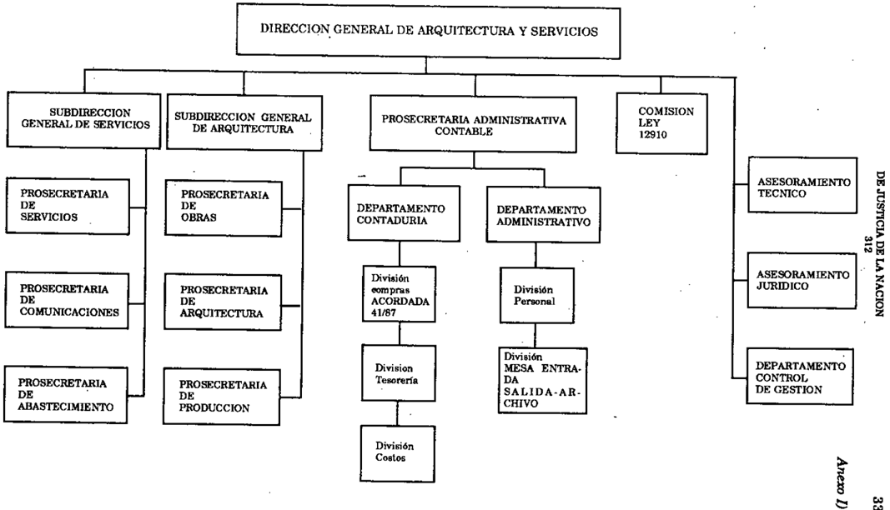
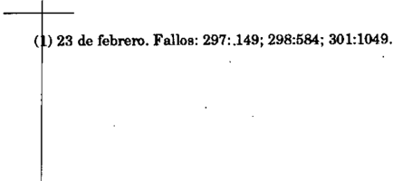

TOMO 312

Volumen 1

1989

## FALLOS DE LA CORTE SUPREMA DE 'JUSTICIA DE LA NACION

CORTE

FALLOS

DE LA

SUPREMA

DE

## t. .USTICIA DE LA NACION

PUBLlCACION A CARGO DE LA SECRETARIA . DE JURISPRUDENCIA DEL TRIBUNAL.

TOM0312VOLUMEN I

FEBRERO -AGOSTO

LA LEY S.A.E. e 1.

Tucumín 1471 (1050) BuC\os Aires

1989

Copyright @ 1991 by Corte Suprema de Justicia de la Nación Queda hecho el depósito que previene la ley 11.723 Impreso en la Argentina

Printed in Argentina

1. S. B. N. 950-527-092-5

## AÑO 1989

## ENERO.AGOSTO

## CORTE SUPREMA DE JUSTICIA DESIGNACION DE SECRETARIO LETRADO

-N'I-

En Buenos Aires, a los 2 días del mes de febrero de mil novecientos ochenta y nueve, reunidos en la Sala de Acuerdos\_del Tribunal el señor Presidente de la Corte Suprema de Justicia de la Nación, doctor don José Severo Caballero y los señores Ministros doctores don Enrique Santiago Petracchi, don Carlos Santiago Fayt y don Jorge Antonio Bacqué,

## Acordaron:

Designar, en los términos de lo dispuesto en el punto 3" de la acordada n° 30/87 y en ejercicio de las facultades establecidas para la Justicia Nacional, Secretario Letrado en la Corte Suprema de Justicia de la Nación, en reemplazo del doctor Claudia MarceJo Kiper, que fue promovido, al doctor Guido Santiago Tawil (D. N. 1. N° 14.689.574Clase 1961-).

Todo lo cual dispusieron y mandaron, ordenando se comunicase y registrase en el libro correspondienle, por anle DÚ, que doy fe. -JosÉ SEVERO ABAU.ERO-ARLOS . FAYT C C S -ENRIQUE S. PETRACCHI -JORGE A. BACQIm. Claudia Marcela Kiper (Secretario).

## CORTE SUPREMA DE JUSTICIA DESIGNACIONES DE SECRETARIO LETRADO Y DE PROSECRETARIO LETRADO

-N'2-

Buenos Aires, a los 9 dias del mes de febrero del año mil novecientos ochenta y nueve, reunidos en la Sala de Acuerdos del Tribunal, el señor Presidente de la Corte

Suprema de "Justicia de la Nación doctor don José Severo Caballero, el señor vicepresidente doctor don Augusto César Belluscio y los señores jueces doctores don Carlos Santiago Fayt, don Enrique Santiago ~etracchi y don Jorge Antonio Bacqué.

## Acordaron:

En ejercicio de las facultades establecidas en el arto 13 del decreto-ley 1285 (Ley 14.467).y Reglamento para la Justicia Nacional, efectuar las siguientes 'designaciones en la Corte Suprema de Justicia de la Nación, en cargos creados por resolución n Q 1175/ 87:

Secretario Letrado: al doctor Carlos Alberto Pizzatelli (D. N. I. Nº 10.762.400 -clase 1953-).

Prosccretario Letrado: al doctor Juan Pedro Tisera (L. E. Nº 8.336.858 --clase 1946-).

Todo lo cual dispusieron y mandaron, ordenando se comunicase y registrase en el libro correspondiente, por ante nú, que doy fe. JOSF. SEVEROABALLF..ROUGUSTO ÉSAR C -A C BELLUSCIOCARLOS. FAYT \_ \_ S ENRIQUE. ~ccm S -JORGE A. BACQtit. Claudia Marcelo Kiper (Secretario).

## .CORTE SUPREMA DE JUSTICIA DESIGNACION DE SECRETARIO LETRADO

-N"3-

Buenos Aires, a los 14 días del mes de febrero del año mil novecientos ochenta y nueve, reunidos en la Sala de Acuerdos del Tribunal, el señor Presidente de la Corte Suprema de Justicia de la Náción doctor don José Severo Caballero, el señor Vicepresidente doctor don Augusto César Bellugcio y los señores jueces doctores don Carlos Santiago.Fayt, don Enrique Santiago Petracehi y don Jorge Antonio -Bacqué.

## Acordaron:

Designar, en ejercicio de las facultades establecidas en el arto 13 del dccreto.ley 1285/58 (Ley 14.467) Y Reglamento para la Justicia Nacional, Secretario. Letrado en la Corte Suprema de Justicia de la Nación, al doctor Sergio Osear Dugo (D. N. I. N" 14.164.323 -cla.se 196(}-).

Todo lo cual dispusieron y mandaron, ordenando se comunicase y registrase en el libro correspondiente, por ante mí, que doy fe. JosÉ SEVF..RO BALLERo. UGUSTOCÉSAR CA -A BELLUSCIO.- CARLOS . FAYT.- ENRIQUE. PETRAcem.- JORGE A. BACQUÉ. S S Claudia Marcelo Kiper (Secretario).

## DE JUSTICIA DE LA NACION 312

## CORTE SUPREMA DE JUSTICIA ACEPI'ACION DE RENUNCIA DE SECRETARIO LETRADO

-N'4-

Buenos Aires, a los 14 días del mes de febrero del año mil novecientos ochenta y nueve, reunidos en la Sala de Acuerdos del Tribunal, el señor Presidente de la Corte Suprema de Justicia de la Nación doctor don José Severo Caballero, el señor Vicepresidente doctor don Augusto César Belluscio y los señores jueces doctores don Carlos Santiago Fayt, don Enrique Santiago Petracchi y don Jorge Antonio Bacqué,

## Acordaron:

Aceptar -con efectos a partir del 14 de febrero de 1989-1a renunda presentada por el señor Secretario Letrado de la Corte Suprema de Justicia de la Nación, Doctor Néstor Alberto Fasciolo.

Todo lo cual dispusieron y mandaron, que se comunicase y registrase en el libro correspondiente, por ante mí, que doy fe. Jos~ SEVEROABAU,F.RO.-UGUSTO tsAR C A C BELLUScrO.- CARLOS . FAY'I'-El\"RIQUEPE-rnACCHIJORGE A. BACQUÉ. S S. -C/audio Moreelo Kiper (Secretario).

## CORTE SUPREMA DE JUSTICIA DESIGNACION DE PROSECRETARIO LETRADO INTERINO

-N'5-

En Buenos Aires, a los 16 días del mes de febrero del afta mil novecientos ochenta y nueve, reunidos en la Sala de Acuerdos del Tribunal, el Señor Presidente de la Corte. Suprema de Justicia de la Nación, Dr. José Severo Caballero, el señor Vicepresidente Doctor Don Augusto César Belluscio, y los SeBorcs Jueces Doctores Don Carlos Santiago Fayt, Don Enrique S. Petracchi y Don Jorge Antonio Bacqué,

## Acordaron:

Designar, en ejercicio de las facultades establecidas en el arto 13 del decreto-ley 1285/58 (Ley 14.467) y Reglamento para la Justicia Nacional, Prosccretario Letrado, interino, en la Corte Suprema de Justicia de la Nación, a la doctora Patricia Estela Castro (D. N. 1. Nº 12.889.698 -clase 1956-), sin que esta designación implique antecedentes para eventuales concursos.

Todo lo cual dispusieron y mandaron, que se comunicase y registrase en el libro correspondiente, por ante mí, que doy fe. Jos~ SEVEROABALLF.RO. AUGUS1'Q rnAR C -C BELLUSCIO.CARLOS . FAYT. -ENRIQUES. PETRACClll. ORGE A. BACQuF.. -S -J G/audio Marcelo Kiper (Secretario).

8

## ACUERDOS DE J,A CORTE SUPREMA 31.

## CAMARA NACIONAL DE APELACIONES DE LA SEGURIDAD SOCIAL HABILITACION y ASIGNACION DE CAUSAS

-N'6-

Buenos Aires, a los 22 días del mes de febrero del año mil novecientos ochenta y nueve, reunidos en la Sala de Acuerdos del Tribunal, el señor Presidente de la Corte Suprema de Justicia de la Nación doctor don José Severo Caballero, el señor VicePresidente doctor don Augusto César Belluscio y los scñoresjueces doctores don Carlos Santiago Fayt, y don Jorge Antonio Bacqué. .

## Consideraron:

- 10) Que a fs. 4/5 del expediente de SuperintendcnciaNl 8.102189 el señor Presidente de la Cámara Nacional de Apelaciones del Trabajo reitera la preocupación de ese tribunal originada en la acumulación de causas previsionales.
- 2º) Que la ley 23.605 que sustituyó el artículo 13 de la ley 23.473 faculla a esta Corte para disponer por acordadas lo relativo a la distribución de las causas que aún no hubiesen sido sorteadas a las Salas que integran la Cámara Nacional de Apelaciones del Trabajo, y de aquellos recursos interpuestos con "anterioridad a la puesta en funcionamiento de la Cámara Nacional de Apelaciones de la Seguridad Social en que las actuaciones no hubiesen sido elevadas aún al tribunal entonces competentes.
- 3º) Que en uso de la citada facultad y a fin de evitar una prolongada concurrencia de competencia por parte de las Cámaras mencionadas, se torna necesario atribuir las causas a la Cámara Nacional de Apelaciones de la Seguridad Social, en los términos previstos"por la ley 23.605.
- 4º) Que no obstante lo precedentemente expresado, corresponde reiterar que la vigencia de 108 artículos13y 15de la ley 23.473\_modificada por la ley 23.605-, se halla supeditada a la efectiva instalación y funcionamiento de la Cámara Nacional de Apelaciones de la Seguridad Social (Acordada 15/87).

Esta circunstancia, que hasta la fecha no se ha configurado, requiero el desaITOllo de un proceso"&lt;J.ue abarca diversos aspectos y etapas, --designación del personal y su capacitación, provisión de muebles y útiles, instalación y puesta en funcionamiento de los sistemas de informática, etc.-, todos los cuales presentan mínimas exigencias a satisfacer a fin de posibilitar al nuevo tribunal una adecuada administración dejusticia, objetivo que esta Corte se encuentra empeñada en preservar.

Por ello,

## Acordaron:

- 1º)Asignar a la Cámara Nacional de Apelaciones de la Seguridad Social, todas las causas atinentes a las cuestiones enumeradas en el artículo 8º de la ley 23.473, que aún no hubiesen sido sorteadas por la Cámara Nacional de Apelaciones del Trabajo, y aquellos recursos interpuestos en que las actuaciones no"hubiesen sido elevadas aun al tribunal citado en último término.

## DE JUSTICIADE LANACION 312

9

2º) Declarar habilitada la Cámara Nacional de la Seguridad Social para la recepción de las causas a partir del 30 de marzo de 1989. Todo lo cual dispusieron y mandaron, ordenando se comunicase y registrase en el libro correspondiente, por ante mí, que doy fe. JosJl: SEVERO ABALLERO AUGUSTO . BELI.USClOCARLOS . FAYTC -C -S JORGE A. BACQUÉ.

## CORTE SUPREMA DE JUSTICIA. DESIGNACION DE PROSECRETARIO LETRADO INTERINO

-N"7-

En Buenos Aires, a los 23 días del mes de febrero del año mil novecientos ochenta y nueve, reunidos en la Sala de Acuerdos del Tribunal, el señor Presidente de la Corte Suprema de Jusiicia de la Nación, doctor José Severo Caballero, el señor Vicepresidente doctor don Augusto César Belluscioy los señores Ministros doctores don Carlos Santiago Fayt y don Jorge Antonio Bacqué.

## Acordaron:

Designar, en ejercicio de las facultades establecidas en el arto 13 del decreto-ley 1285/58 (ley 14.467) y Reglamento para la Justicia Nacional, en cargo vacante -resolución NI 1176/87-, Prosecretario Letrado, interino, en la Corte Suprema de Justicia de la Nación, al Doctor Cristian Sergio Abritta (D. N. l. N213.653.623 --clase 1957-), sin que esta designación implique antecedentes para eventuales concursos.

Todo lo cual dispusieron y mandaron, que se comunicase y registrase en el libro correspondiente, por ante mí, que doy fe. -JosJl:SEVEROABALLERO AUGUSTO . C -C BELLUSCIOCARLOS . FAYT --S JORGE A. BAQuI!:.

## CEDULAS DEL EX FUERO ESPECIAL EN LO CIVIL Y COMERCIAL. SU INGRESO

-N"8-

En la Ciudad de BuenosAires, a los 28 días del mes de marzo del año mil novecientos ochenta y nueve, reunidos en la Sala de Acuerdos del Tribunal, el señor Presidente de .la Corte Suprema de Justicia de la Nación dociordon José Severo Caballero y los señores jueces doctores don Augusto César Juan Belluscio, don Carlos Santiago Fayt, don Enrique Santiago Petracchi y don Jorge Antonio Bacqué.

## Consideraron:

Que resulta necesario adoptar medidas con relación a los formularios de códulas del ex-fuero Especial en lo Civil y Comercial teniendo en cuenta que se ha producido su unificación con el fuero Civil (ley 23.637).

Por ello,

Acordaron:

- 1º) Permitir, durante un lapso de tres (3) meses a contar de la fecha de la presente acordada, el ingreso de cédulas con el código "E" naranja, corregido con marcador o similar en "COl celeste.
- 2º) Hacer saber que cada juzgado deberá controlar en la tira sistematizada correspondiente que donde dice "Fuero", "Juzgado" y "Secretaría" figuren, respectivamente, el código "e" y los nuevos números asignados.

Las medidas precedentes regirán tanto para las cédulas libradas de oficio por los juzgados como para las confeccionadas por los señores profesionales.

Todo lo cual dispusieron y mandaron, ordenando que se comunicase y registrase en el libro correspondiente, por ante mt, que doy fe. JOSÉ SEVERO CABALlERO -AUGUSTO C. BELLUSClO \_ CARJ.os S. FAYi' -ENRIQUE S. PETRACcrn -JORGE A. BACQut. Claudio M. Kiper (Secretario).

## FALLECIMIENTO DEL SECRETARIO DE LA CORTE DR. JUAN C. MANZANARES

-N"9-

En Buenos Aires, a los 2 dfas del mes de marzo del año mil novecientos ochenta y nueve, reunidos en la Sala de Acuerdos del Tribunal, el señor Presidente de la Corte Suprema de Justicia de la Nación, doctor José Severo Caballero, el señor Vicepresidente doctor don Augusto César Belluscioy los señores Ministros doctores don Carlos Santiago Fayt y don Jorge Antonio Bacqué,

Consideraron:

Que el dfa 28 de febrero ha ocurrido el fallecimiento del doctor Juan Carlos Manzanares, Secretario de la Corte Suprema de Justicia de la Nación.

Que al recibir la luctuosa noticia, el Tribunal estimó su deber asociarse al duelo que provoca la desaparición de este destacado funcionario.

Por ello,

Acordaron:

Dirigir nota de condolencia a la familia del extinto. Todo lo cual dispusieron y mandaron, ordenando se comunicase y registrase en el libro correspondiente, por ante mf, que doy fe. \_ Josí SEVERO CABALLERO -AuGU9'I'O C. BRLLUSCIO -Ci\R1,OS S. FAvrJORGE A. BACQut. Claudio M. Kiper (Secretario).

## DE JUSTICIA DE LA NACION 312

## ARClllVO GENERAL DEL PODER JUDICIAL AMPLIACION DEL REGLAMENTO PARA LA PROMOCION DEL PERSONAL

-N"1O-

Buenos Aires, a los 14 días del mes de marzo del año mil novecientos ochenta y nueve, reunidos en la Sala de Acuerdos del Tribunal, el señor Presidente de la Corte Suprema de Justicia de la Nación doctor don José Severo Caballero, el señor Vicepre. sidente doctor don Augusto César Belluscio y los señores Jueces doctores don Carlos Santiago Fayt y don Enrique Santiago Petracchi,

## Consideraron:

1 2 ) Que por acordada 43187 de fecha 24 de diciembre de 1987, este Tribunal aprobó el Reglamento para]a promoción del personal.del Archivo General del Poder Judicial de la Nación.

22) Que la experiencia acumulada desde su aplicación demuestra la conveniencia de limitar los puntajes asignados a los agentes de esa dependencia en concepto de "'anti. güedad en la Justicia y/o Archivo" (art. 12 inc. c).

Por ello,

Acordaron:

Ampliar el arto ¡"' inc. c del Reglamento para la promoción del personal del Archivo General del Podcr Judicial aprobado por acordada 43/87, el que quedará redactado de la siguiente forma: "inc. e Antigüedad en la Justicia y/o Archivo: 112 punto por año de antigüedad en la Justicia y/o Archivo o fracción no menor de 6 meses, hasta un máximo de 5 puntos". .

Todo lo cual dispusieron y mandaron ordenando que Se comunicase y registrase en el libro correspondiente, por ante mí, quc doy fe. -JosÉ SEVRRO AllAI.LERO UGUSTO C. C -A BELLUSCIOCARLOS . FAYI' --S ENRIQUE . PETRACCHJ JORGE . BAcQl1t. S -A Claudia M. Kiper (Secretario).

## CAMARA NACIONAL DE APELACIONES EN LO CIVIL. DISTRIBUCION DE CAUSAS SEGUN ART. 4' DE LA LEY 23.637

-N'11-

En Buenos Aires, a los 14 días del mes de marzo del año mil novecientos ochenta y nueve, reunidos en la Sala de Acuerdos del Tribunal el señor Presidente de la Corte Suprema de Justicia de la Nación, doctor José Severo Caballero, el señor Vicepresidente doctor Augusto César Belluscio y los señores Ministros doctor Enrique Santiago Petracchi, doctor Carlos Santiago Fayt y el doctor Jorge Antonio Bacqué.

## Consideraron:

Que correspOnde cumplir oon lo dispuesto por el arto 4 9 de la ley 23.637.

Acordaron:

Hacer saber a la Cámara Nacional de Apelaciones en lo Civil que en la forma que estime conveniente, deberá distribuir entre los restantes juzgados del fuero las causas que no versen sobre asuntos de familia y capacidad de las personas, que tramitan a la fecha ante losjuzgados incluidos en el arto 4º de la ley 23.637, y entre éstos las causas de su exclusiva competencia que tramiten ante Jos demás.

Todo lo cual dispusieron y mandaron, ordenando que se comunicase y registrase en el libro correspondiente, por ante mí, que doy fe. Jos~ SEVERO CABALI.ERO -AUGUSTO C. BELLUSCIOCARLOS S. FA.'i'I' -ENRIQUE S. PEmAccmJORGE A. BACQUÉ. Claudia M. Kiper (Secretario).

CAMARA NACIONAL ELECTORAL. MODIF1CACION DE SU ACORDADA N" 99

~N"12-

En Buenos Aires, a los 14 días el mes de marzo del año mil novecientos ochenta y nueve, reunidos en la Sala de Acuerdos del Tribunal, el Señor Presidente de la Corte Suprema de Justicia de la Nación, doctor José Severo Caballero, y los Señores Jueces doctores don Augusto César BeUuscio, don Carlos Santiago Fayt, don Enrique S. Petracchi y don Jorge Antonio Bacqué.

Consideraron:

Que la Cámara Nacional Electoral remite al tribunal fotocopia de la acordada extraordinaria n!l99/88, por la que modifica los arts. 49 , 10Y11 de la acordada 92185que establece el l"Ógimende concursos y designaciones que requieren título habilitante.

Que esta Corte aclaró por acordada nº 25188que en el interior del país, para cubrir los cargos de secretario de juzgado o sus equivalentes, los concursos deben realizarse en el lugar donde se ha producido la vacante.

Que los incisos c) y d) del arto 10 modificado vulneran la acordada referida, cuyo es píritu es evitar el traslado de los postulantes y las erogaciones que se originen al Poder Judicial en concepto de viáticos por tales motivos.

Por ello,

Acordaron:

Reemplazar los ines. e) y d) del arto 10 de la acordada nO99 de la Cámara Nacional Electoral, que queda redactado de la siguiente forma:

- e) "'En los concursos para la provisión de cargos en losjuzgados federales electorales del interior del país, la comisión asesora enviará en sobre cerrado los problemas y casos judiciales a resolver por los concursantes al magistrado encargado de recibir la oposición escrita, quien procederá a la apertura y correspondiente sorteo". Todo lo cual dispusieron y mandaron, ordenando que se comunicase y registrase en el libro correspondiente, por ante mí, que doy fe. -Jost: SEVERO ABALLERO-AUGUSTO EI.LUscro CARLOSS. FAYT C C. B --ENRIQUE . PETaACCHIJORGE A. BACQl1t. S -Claudia M. Kiper (Secretario).

## CAMARA FEDERAL DE APELACIONES DE POSADAS. RECHAZO DE SU ACORDADA 17/88 .

-N" 13-

En Buenos Aires, a los 21 días del mes de marzo del año mil novecientos ochenta y nueve, reunidos en la Sala de Acuerdos del Tribunal el señor Presidente de la Corte Suprema de Justicia de la Nación, doct.orJosé Severo Caballero, el señor Vicepresidente doctor Augusto César Belluscio y los señores Ministros doctor Enrique Santiago Petracchi, doctor Carlos Santiago Fayt y el doctor Jorge Antonio Bacqué.

## Consideraron:

- 1º) Que la Cámara Federal de Apelaciones de Posadas, por acordada 17/88 (fs. 45 exp. de Superintendencia Judicial S.118/88), y con fundamento en los puntos 1º y 2º de la acordada CSJN 30/88, transformó en definitivas "las designaciones hasta el momento interinas" de sus secretarios y prosecrciarios.
- 2º) Que la opción permitida por este Tribunal debe recaer en aquellos funcionarios que ocupan el cargo inmediatamente anterior en el escalafón como permanentes; y, en los supuestos de traslados, los interesados deben encontrarse en la misma situación.
- 3t;l) Que cuando se han concedido autorizaciones para designar interinos, lo ha sido hasta que se cubriera el cargo por concurso, y con la condición de que su desempeño no constituyera un antecedente valorable para ese fin (Confr. doctr., res. 61186,833/86, 8821 87 Y 75/89, entre otras).
- 4°) Que es posible prescindir del concurso cuando se trata de cubrir ~argos en funciones concernientes a la superintendencia (ac. 30/87, punto 2do.).

Por ello,

## Acordaron:

12)No aprobar la acordada 17/88 dictada el 29 de septiembre de 1988 por la Cámara Federal de Apelaciones de Posadas, en cuanto transfonna en definitivas las designacioncs en cargos que deben ser cubiertos por medio de llamado a concurso, con excepción del nombramiento de la Dra. Ana Lía Cáceres de Mcngoni, Prosecretaria a cargo de la superintendencia de la cámara.

2º) Hacer saber al mencionado tribunal que debe ordenar el inmediato llamado a concurso.

Todo 10cual dispusieron y mandaron, ordenando que se comunicase y registrase en el libro correspondiente, por ante mí, que doy fe. -Jost SEVEROABALLF.RO C -AUGUSTO C*:SAR BELLUSCIO \_ CARLOS S. FAYTENRIQUE S. PETaACCHI -JORGE A. BACQut. Claudia M. Kiper (Secretario).

CORTE SUPREMA DE JUSTICIA. DESIGNACION DE SECRETARIO LETRADO INTERINO

-N" 14-

En Buenos Aires, a los 28 días del mes de marzo del año mil novecientos ochenta y nueve, reunidos en la Sala de Acuerdos del Tribunal el señor Presidente de la Corte Suprema de Justicia de la Nación, doctor don José Severo Caballero, el señor Vicepresidente doctor Augusto César Belluscio y 108 señores Ministros doctores don Carlos Santiago Fayt, don Enrique Santiago Petracchi y don Jorge Antonio Bacqué.

## Acordaron:

Designar, en ejercicio de las facultades establecidas en el arto 13 del decreto-ley 1285/58 (Ley 14.467) Y Reglamento para la Justicia Nacional, Secretario Letrado -interino-, en la Corte- Suprema de Justicia de la Nación, en reemplazo del doctor Gerardo Felipe Larrambcbere al doctor Ricardo Manuel Rojas (D. N. I. 12.447.463 --clase 1958-), sin que esta designación implique antecedentes para eventuales concursos.

Todo lo cual dispusieron y mandaron, que se comunicase y registrase en el libro correspondiente, por ante mí,-que doy fe. JosF. SEVEROABALLEROAUGUSTOltSAR C -C BELLUSCIOCARLOS . FAYT \_ \_ S ENRIQUE. PEnv.CCHI S -JORGE A. BACQut. Claudia M. Kiper (Secretario).

## DE .ruSTICIA DE LA NACION 312

## CAMARA NACIONAL DE APELACIONES DE LA SEGURIDAD SOClAL. RATlFICACION DE HABILITACION

-N'15-

En Buenos Aires, a los 28 días dcl mcs dé marzo dcl año mil novecicntos ochcnta y nueve, reunidos cn la Sala de Acucrdos del Tribunal, el Señor Presidente de la Corte Suprema de Justicia de la Nación, doctor José Severo Caballero, el señor Vicepresidente doctor Augusto César Belluscio y el Señor Juez doctor Enrique Santiago Petracchi,

## Consideraron:

1º) Que la Presidente de la Cámara Nacional de Apelaciones de la Seguridad Social informa sobre las dificultades en la instalación y funcionamiento del sistema de informática, designación del personal y su capacitación, provisión de muebles y útiles, etc.

- 2º) Que esta Corte por Acordada Nº 6!89 declaró habilitada la Cámara de Seguridad Social para la recepción de las causas objeto dc ella a partir del 30 de marzo de 1989.
- 3º) Que las razones expuestas en la presentación referida, no son suficientes para modificar la fecha de recepción de las causas como se sugiere, toda vez que las dificultades que se invocan fueron tenidas en cuenta por este Tribunal al disponer su habilitación a partir del 30 de marzo del corriente año.

Por ello,

Acordaron:

Mantener la fecha dispuesta en el punto 2º de la Acordada 6/89.

Todo lo cual dispusieron y mandaron, ordenando que se comunicase y registrase en el libro correspondiente, por ante mí, que doy fe. -JOSF. SEVERO ABALLF.RO GUSTO Cfr.5AR C -AU BELLUSClO ENRIQUE . PETRACcm. -S elaudio M. Kiper (Secretario).

## CAMARA NACIONAL DE APELACIONES DEL TRABAJO. MODlFICACION DEL REGLAMENTO DE SORTEOS Y ADJUDICACION DE DEMANDAS

-N'16-

En la Ciudad de Buenos Aires, a los 30 días del mes de marzo del año mil novecientos ochenta y nueve, reunidos en la Sala de Acuerdos del Tribunal, el señor Presidente de la Corte Suprema de Justicia de la Nación, doctor José Severo Caballero, el señor Vicepresidente doctor Augusto César Belluscio y el señor Juez doctor Enrique S. Petracchi,

## Consideraron:

- 12) Que a raíz de la resolución nO 27/87 dictada por la Cámara Nacional de Apelaciones del Trabajo e120 de agosto de 1987 -modificarla por acta na 1955 del 9 de febrero de 1988---, en el expediente S. 476/87 caratulado "CAMELINO, Mana Cristina y otros si avocación (C. Trabajo)" se solicitó que la Corte Suprema tomara intervención con el fin de colocar a las ejecuciones de sentencias previsionales en un plano de igualdad con las materias similares.

29-) Que analizarlos los fundamentos de esa presentación este Tribunal considera justo el reclamo formulado. Por ello,

## Acordaron:

Hacer saber a la Cámara Nacional de Apelaciones del Trabajo que procede la modificación del artículo 13 del Reglamento de Sorteos y Adjudicación de Demandas aprobado por resolución n° 27/87 del 20 de agosto de 1987 (texto según acta nO 1955/88), colocando a las ejecuciones previsionales (rubro 7 ~ en un plano de igualdad con las ejecuciones de sentencias laborales, y fiscales (rubros 7.ay 7 h), a los fines de la remisión diaria de los expedientes sorteados a los juzgados.

Todo lo cual dispusieron y mandaron, ordenando que se comunicase y registrase en el libro correspondiente, por ante mí, que doy fe. -Jost SEVERO ABALLEROGUSTO CtSAB C -AU BELLUSCIOEr..'RIQUEPETRACCHI. -S. Claudia M. Kiper (Secretario).

CAMARAS NAClONALES DE APELAClONES. AMPLlAClON DE ACORDADA 60/84 SOBRE DESIGNAClON DE FUNClONARlOS y EMPLEADOS

-N" 17-

En Buenos Aires, a los 30 días del mes de marzo del año mil novecientos ochenta y nueve, reunidos en la Sala de Acuerdos del Tribunal el señor Presidente de la Corte Suprema de Justicia de la Nación, doctor don José Severo Caballero, el señor Vicepresidente doctor don Augusto César Belluscio y los señores Ministros doctores don Carlos Santiago Fayt, don Enrique Santiago Petracchi y don Jorge Antonio Bacqué, por mayoría,

## Consideraron:

Que las facultades 'de las Cámaras de Apelaciones relativas a la designación de funcionarios y empleados provienen de la superintendencia delegada por la Acordada de Fallos 240:107, complementada, en 10referente al nombramiento de funcionarios para cargos que requieren título habilitante, por las acordadas 34,,35 y 60, todas de 1984.

Que subsiste la facultad de los magistrados y funcionarios titulares de efectuar la propuesta respectiva, una vez que la comisión asesora calificó y confeccionó el orden de m~rito del correspondiente concurso.

Que a raíz de problemas derivados de una interpretación distinta efectuada por algunas Cámaras de Apelaciones, resulta conveniente formular expresamente la aclaración.

Por ello, decidieron conforme a lo establecido en la parte resolutiva de la prcscnte Acordada.

## El señor Ministro doctor Carlos Santiago Fayt dijo:

- 1 2 ) Que desnaturaliza la índole de un sistema de concursos como el que esta Corte tuvo en mira al dictar la Acordada 60/84, modificar su artículo 3° de modo que se otorgue carácter vinculante a la vista que emita el titular del Tribunal o el funcionario del cual dependa la vacante.
- 22) Que el reducir la función de las Cámaras Nacionales de Apelaciones al mero control de las formalidades del concurso, equivale en los hechos a tornar ilusoria la delegación efectuada por esta Corte en aquellos tribunales a partir de Fallos: 240: 107.

Que, en suma corresponde:

Mantener sin modificación el arto 3° de la Acordada 60/84, en tanto un régimen amplio de concursos es el más conveniente a una mejor administración de justicia republicana y al requisito de idoneidad para el acceso a los empleos que prevé la Constitución Nacional (art. 16).

En consecuencia de la votación resolvieron:

- 1º. -Ampliar el arto 3° de la Acordada 60/84'oon el siguiente párrafo: "El dictamen de ras comisiones asesoras se hará conocer a la Cámara y a la Sala, fiscalía, defensoría o tribunal de primera instancia en que se haya producido]a vacante; su titularremiiirá la propuesta respectiva y la Cámara procederá a efectuar la designación del propuesto, previa verificación del cumplimiento de los demás requisitos reglamentarios exigidos para acceder al cargo".
- 2 2 · -Hacer saber a las cámaras nacionales y federales que deberán adecuar sus reglamentos a la presente disposición.

Todo lo cual dispusieron y mandaron, ordenando que se comunicase y registrase en el libro correspondiente, por ante mí, quc doy fc.-Jost SEVERO CABALLERO-AuGUSTO AR Cés BELLUSCIOCARLOS . FAYT (en disidencia) -S -ENRIQUE . PE1-RACCHI.JORGE A. BACQUÉ. S -Claudia M. Kiper (Secretario).

18

## ACUEROOS DE LA CORTE SUPREMA 312

## PROCURACION GENERAL DE LA NACION DESIGNACION DE PROCURADOR GENERAL SUSTITUTO

-N'18-

En Buenos Aires, a los 3 días del mes de abril del año mil novecientos ochenta y nueve, reunidos en la Sala de Acuerdos del Tribunal, el señor Presidente de la Corte Suprema de Justicia de la Naci6n, doctor José Severo Caballero, el señor Vicepresidente doctor don Augusto César Belluscio y los señores Jueces doctores don Carlos S. Fayt y don Enrique S. Pelracehi,

Consideraron:

Que por las razones expuestas por el señor Procurador General de la Nación,

Acordaron:

Designar como Procurador General sustituto entre el 3 y e16 de abril de 1989 a la doctora Marta Graciela ReiTiz. (Ley 15.464 arto 2 inc. e).

Todo 10cual dispusieron y mandaron, ordenando que se comunicase y registrase en el libro correspondiente, por ante mí, que doy fe. -JosÉ SEVEROABAI.LERO UGUSTOC~SAR C -A BELLUSCIOCARLOS . FAYT --S ENRIQUE S. PErnAocm. Claudia Marcelo Kiper (Secretario).

## LICENCIAS. MODIFICACION DE ACORDADA 15/88

-N'19-

En Buenos Aires, a los 11 días del mes de abril del año mil nov~ientos ochenta y nueve, reunidos en la Sala de Acuerdos del Tribunal, el Señor Presidente de la Corte Suprema de Justicia de la Nación, doctor José Severo Caballero, el señor Vicepresidente doctor don Augusto César Belluscio y los señores jueces doctores don Carlos S. Fayt, don Enrique S. Petracchi y don Jorge Antonio Bacqué,

## Consideraron:

- l Q ) Que mediante la acordada del Tribunal 34 del 27 de diciembre de 1977 se estableció el régimen de licencias actualmente vigente para magistrados, funcionarios, empleados, personal obrero y de maestranza y de servicio, contratado o permanente, de la Justicia Nacional,

- 2!!)Que .confecha 18 dejunio de 1985 se dictó la Acordada 33185 aclarándose el inc. b) del artículo 2° de dicho rogimen en el sentido de que los Secretarios de Superintendencia decidieran las solicitudes de licencias de los funcionarios y personal de su dependencia de acuerdo a la competencia oportunamente otorgada por Acordada nO 25/84.
- 30)Que por el punto 2° de la Acordada 15/88 se asignó a los Secretarios Letrados de las Secretarías de Superintendencia del Tribunal la finna y el control de las licencias de los agentes de los organismos dependientes de la Corte Suprema, cuando los pedidos excedan de los treinta (30) días y no se trate de los artículos 14 y 20.
- 4!!) Que a la fecha, no subsisten los motivos por los cuales se delegaron dichas funciones en los Secretarios Letrados de las mencionadas secretarias, por lo que corresponde reasignarlas en los Secretarios de Superintendencia de la Corte Suprema.

Por ello:

Acordaron:

Dejar sin efecto el punto 2° de la Acordada 15/88.

Todo lo cual dispusieron y mandaron, ordenando que se comunicase y registrase en el libro correspondiente, por ante mí, que doy fe.-Jos~ SEVERO ABAllERO-AUGUSTO SAR C C~ BELLUSCIOCARLOS -S. FAYT-ENRIQUE S. PET.RAccm ORGE A. BACQml:. -J Claudio Marcelo Kiper (Secretario).

## CORTE SUPREMA DE JUSTICIA DE LA NACION. DESIGNACION DE SECRETARIO

-N'20-

En Buenos Aires, a los 11 días del mes de abril del año mil novecientos ochenta y nueve, reunidos en la Sala de Acuerdos del Tribunal, el seiíor Presidente de la Corte Suprema de Justicia de la Naci6n, doctor José Severo Caballero, el señor Vicepresidente doctor don Augusto César BeIluscioy los señores jueces doctores don Carlos S. Fayt, don Enrique S. Petracchi y don Jorge Antonio Bacqué,

## Acordaron:

- Designar Secretario de la Corte Suprema de Justicia de la Nación en reemplazo del doctor Juan Carlos Manzanares, al doctor Jorge Alberto Migliore (L. E. 5.532.516 -clase 1949-).

Todo 10cual dispusieron y mandaron, ordenando que se comunicase y registrase en el1ibro correspondiente, por ante mí, -que doy fe. -JOSÉ SEVEROABALLERO ARLOSS. FAYT C -C -JORGE ANToNIO ACQt1t. B Claudia M. Kiper (Secretario).

## CAMARA NACIONAL DE APELACIONES DE LA SEGURIDAD SOCIAL. MODIFICACION DE FORMULARIO DE CEDULAS

-N"2I-

En Buenos Aires, a los 13 días del mes de abril del año mil novecientos ochenta y nueve, reunidos en la Sala de Acuerdos del Tribunal, el señor Vicepresidente doctor don Augusto César Belluscio y los señores jueces doctores don Carlos S. Fayt, don Enrique S. Petracchi y don Jorge Antonio Bacqué,

I Consideraron:

Que mediante Acordada 13, de fecha 9 de junio de 1987 este TrIbunal aprobó el formulario .decédulas de ootificacióny losc6digos correspondientes para todos los fueros nacionales y federales.

Que con posterioridad a dicha Acordada se puso en funcionamiento la Cámara Nacional de Apelaciones de la Seguridad Social por 10que corresponde asignarle código de color y letra.

Que, además, las evaluaciones practicadas y razones de economía hacen aconsejable introducir las necesarias adecuaciones dentro del marco de los objetivos perseguidos con el sistema implementado.

Por ello,

Acordaron:

12) Agregar al punto 2 0 de la Acordada 13/8710 siguiente:

"Cámara Nacional de Apelaciones de la Seguridad Social, SSAzul".

2º) Disponer que no se imprima en el du plicado de la cédula de notificación el código correspondiente.

Todo lo cual dispusieron y mandaron, ordenando que se comunicase y registrase en el libro correspondiente, por ante mi, que doy fe. -AUGUSTOC. BEIJ.USCIOARLOSS. FAYT -C \_ ENRIQUE S. PETRACcrn"JORGE A. BACQut. -Claudio M. Kiper (Secretario).

## DE JUSTICIA DE LA NACION 312

## CORTE SUPREMA DE JUSTICIA DE LA NACION. DESIGNACION DE SECRETARIO LETRADO

-N"22-

En Buenos Aires, a los 25 dias del mes de abril del año mil novecientos ochenta y nueve, reunidos en la Sala de Acuerdos del Tribunal, el Señor Presidente de la Corte Suprema de Justicia de laNaci6n, doctor José Severo Caballero, el señor Vicepresidente doctor don Augusto César Belluscio y los señores jueces doctores don Carlos S. Fayt, don Enrique S. Petracchi y don Jorge Antonio Bacqué,

## Acordaron:

Designar, en ejercicio de las facultades establecidas en el arto 13 del decreto-ley 1285/58 (Ley 14.467) YReglamento para la Justicia Nacional, Secretario Letrado en la Corte Suprema de Justicia de la Naci6n, al Doctor Rubén Héctor Goma (C.I. Nº 7.675.885 --clase 1957-), en reemplazo del doctor Jorge Alberto Migliore.

Todo lo cual dispusieron y mandaron, ordenando que se comunicase y registrase en el libro cOJTCspóndiente,por ante mí, que doy fe. -JosÉ SEVERO ABALLEROGUSTO CÉSAR C -AU BELLUSCIOCARLOS . FA\'T--S ENRIQUE . PErnAccm S JORGE A. BAcQuF.. Claudia Marcelo Kiper (Secretario).

## CAMARA NACIONAL DE APELACIONES EN LO CRlMlNAL y CORRECCIONAL FEDERAL. MODIFICACION DE SU ACORDADA 56188

-N" 23-

En Buenos Aires, a los 2 días del mes de mayo del año mil novecientas ochenta y nueve, reunidos en la Sala de Acuerdos del Tribunal, el Señor Presidente de la Corte Suprema de Justicia de la Naci6n, doctor -José Severo Caballero, el señor Vicepresidente doctor Augusto César Belluscio y los señores jueces doctor Carlos S. Fayt, dador Enrique S. Petracchi y doctor Jorge Antonio Bacqué,

## Consideraron:

Que la acordada 56/88 de la Cámara Nacional de Apelaciones en lo Criminal y Correccional Federal, en su punto 39 dispuso que producida la vacante de secretario de primera instancia, se efectuará un llamado a concurso, exclusivamente de oposición.

Que la reglámentaci6n citada contradice lo establecido por el punto 2º de la acordada 34/84 de esta Corte que prevé la realización de un roncurso de antecedentes y oposici6n para la designaci6n en los cargqs que requieren título habilitante.

Por 10expuesto,

Acordaron:

Hacer saber a la Cámara Nacional de Apelaciones en lo Criminal y Correccional Federal que debe adecuar el arto 3'"de la acordada 56/88 a las normas de la acordada 34/ 84-de este Tribunal.

Todo lo cual dispusieron y mandaron, ordenando que se comunicase y registrase en el libro correspondiente, por ante mí, que doy fe. -Joslt SEVEROCABALI.ERO-AUGUSTO CÉSAR BF..LLUSCIO CARLOS S. FAYr -ENRIQUE S. PETR,...ccm -JORGE A. BACQUÉ. Claudia Marcelo Kiper (Secretario).

## OBRA SOCIAL DEL PODER JUDICIAL. INCLUSION DE MENORES A CARGO DEL TITULAR

-N'24-

Buenos Aires, a los 4 días del mes de mayo del año mil novecientos ochenta y nueve, reunidos en la sala de Acuerdos del Tribunal, el señor Vicepresidente doctor don Augusto César Belluscio y los señores jueces doctores don Carlos Santiago Fayt, don Enrique Santiago Petracchi y don Jorge Antonio Bacqué,

## Consideraron:

Que resulta conveniente adecuar las disposiciones del estatuto de la Obra Social del Poder Judicial a las necesidades de los afiliados que han contraído nuevas nupCias con personas que tienen hijos menores, quienes conviven con el titular.

Por ello,

Acordaron:

- l!;!) Agregar como párrafo n) al arlo 6º del Estatuto de la Obra Social del Poder Judicial aprobado por acordada 43181 (Fallos: 303:56) el siguiente:
- "n) Los menores, hijos del cónyuge del titular, siempre que convivan con éste y estén a su cargo; no gocen de prestaciones de otra institución social y satisfagan la cuota especial [ijada en el a~. 2 de la acordada 40/83".
- 2º) Incluir los incisos m) y n) en los incisos e) y f) de los artículos 11 y 13 respectivamente.

Todo lo cual dispusieron y mandaron, ordenando que se comunicase y registrase en el libro correspondiente, por ante mí, que doy fe. AUGUSTO :~SARET.LUSCIOC:.uu.os s. C B -FAYT El'"wQUE S. PEmACClU -JORGE A. BACQtJt. Claudio Marcelo Kiper (Secretario).

## FERIA JUDICIAL DEL MES DE JULIO

-N'25-

En Buenos Aires, a los 16 días el mes de mayo del año mil novecientos ochenia y nueve, reunidos en la Sala de Acuerdos del Tribunal, el Señor Presidente de la Carie Suprema deJusiicia de la Naci6n, doctor José Severo Caballero, el señor Vicepresidente doctor don Augusto César Belluscio y los señores jueces doctores don Carlos S. Fayt, don Enrique S. Petracchi y don Jorge Anionio Bacqué,

Resolvieron:

1º) Disponer en el comente año feriado judicial para los Tribunales Nacionales de la Capital desde e~ día 10 hasta el 21 de julio, ambos inclusive.

- 2º) Hacer saber a las Cámaras Federales de Apelaciones que con arreglo a lo provisto en la Acordada nº 53173 -respecto de la coincidencia de la feria en ella establecida con las vacaciones escolaresy a lo dispuesto en la presente, deberán determinar para sus respectivas jurisdicciones un feriado judicial de diez días hábiles (acá pite 2º de la Acordada nº 30/84).

Todo lo cual dispusieron y mandaron, ordenando que se comunicase y registrase en el libro correspondiente, por ante mí, que doy fe. -JosÉ SEVEROABALLERO UGUSTOCÉSAR C -A BELLUSCIOCARLOS. FAY'l'--S El'o"RlQUEPIITRACcm- JORGE A. BACQUÉ. S. Claudia Marcelo Kiper (Secretario).

VIVIENDAS PARA EL PERSONAL DEL PODER JUDICIAL. REGLAMENTACION DE ASIGNACION y USO

-N'26-

En Buenos Aires, a los 29 días del mes de mayo del año mil novecientos ochenta y nueve, reunidos en la Sala de Acuerdos del Tribunal el señor Presidente de la Corte Suprema de Justicia de la Naci6n, doctor don José Severo Caballero, el señor Vicepre-

## ACUERDOS DELACORTESUPREMA 31.

sidente doctor don Augusto César Belluscio y los señores Ministros doctores don Carlos Santiago Fayt, don Enrique. Santiago Petracchi y don Jorge Antonio Bacqué,

## Consideraron:

Que el Poder Judicial de la Nación si bien cuenta con inmuebles destinados a viviendas en distintas zonas del país, carece de un régimen unificado para la asignación y uso de las mismas.

Que es propósito de esta Corte Suprema tratar de solucionar el problema habita. cional, de aquellos magistrados, funcionarios y empleados, que han sido designados' para cumplir funciones en tribunales federales, cuyo asiento está localizado en zonas alejadas de su residencia habitual.

Que resulta prioritario reglamentar el uso y asignación de viviendas para quienes desempeñan funciones en la zona patagónica delimitando las provincias comprendidas en la misma. Que con respecto a las existentes fuera de la zona establecida, se respclarán las asignadas al momento del dictado de esta acordada, pero no se generarán derechos para la asignación de nuevas viviendas.

Que la aplicación del presente régimen para la zona patagónica y con relación a su asignación -enlos asientos en que el Poder Judicial no cuente con inmuebles propios, es propósito del Tribunal la solución gradual, en la medida en que las posibilidades presupuestarias lo permitan.

## Acordaron:

19) Aprobar el Reglamento de asignación yuso de viviendas para la zona patagónica que se agrega como ANEXO 1de la presente.

- 2~ Encomendar a la Subsecretaria de Administración la implementación de las medidas pertinentes para la aplicación y puesta en marcha del Reglamento de viviendas que por este acto se aprueba, debiendo presentar un infonne a este Tribunal dentro del plazo de sesenta (60) dfas.
- 3º) Encomendar a las Cámaras Federales con asiento en las provincias comprendidas en la zona patagónica -arto 1ºdel Reglamento--la producción de un informe sobre las viviendas existentes y sus ocupantes, en un plazo no mayor de treinta días de la aprobación de la presente ..

Todo lo cual dispusieron y mandaron, ordenando se comunicase y registrase en el libro correspondiente, por ante mf que doy fe. JosÉ SEVERO ABALLF.ROUGUSTO ÉSAR C ~ A C BELLUSCIOCARLOS. FATI--S ENRIQUE. PETRACCHIJORGE A. BACQut. S -Yugo L. M. Piacentino (Secretario).

## ACORDADAS DE LA CAMARA FEDERAL DE APELACIONES DE TUCUMAN SOBRE EVALUACION DE EXAMENES. APROBACION y MODIFICACIONES

-N'27-

En Buenos Aires, a los 30 días el mes de mayo del año mil novecientos ochenta y nueve, reunidos en la Sala de Acuerdos del Tribunal, los señores jueces doctores don Carlos S. Fayt, don Enrique S. Petracchi y don Jorge Antonio Bacqué,

## Consideraron:

- 11!) Que la Cámara Federal de Apelaciones de Tucumán comunic6las acordadas 14, 15Y16, todas del presente afio, y se tomó conocimiento del dietado de la número 24, a raíz del pedido efectuado en el expediente S. 703189.
- 2º) Que los puntos 3ºy8 9 de las acordadas 15y 16,yel arto 7 2 de la número 24, todas de 1989, vulneran las acordadas 25/88 y 12189 de este Tribunal.
- 3º) Que, según se expresó en la acordada 12189, el espíritu de la acordada 25/88 es evitar el traslado de los postulantes más las erogaciones que se originan al Poder Judicial en concepto de viáticos.
- 4º) Que la acordada 43/88 es clara en cuanto preceptúa que los exámenes deben ser recibidos por el juez del lugar, quien los elevará a la cámara respectiva.
- 5º) Que, en el caso de concursos para cubrir cargos de ~édicos forenses, dada la especialidad de la cuestión yel hecho de que secontemplan entrevistas personales como parte integrante de la prueba, es conveniente autorizar el traslado de quienes reúnen las condiciones necesarias para integrar las comisiones asesoras.

Por ello,

Acordaron:

1)Aprobar la acordada 14/89 dictada por la Cámara Federal de Tucumán.

- TI) Reemplazar los puntos 3º y 8º de las acordadas 15 y 16, y el artículo 7º de la número 24, los que quedan redactados de la siguiente forma:

Punto 32: ...··La recepción de dicha prueba estará a cargo del señor juez federal del lugar donde se produzca la vacante, asistido por el secretario o prosecrctario que él designare".

Punto 8º: ..."El temario de la prueba de oposición lo confeccionará la comisión asesora y lo enviará en sobre cerrado y sellado al magistrado encargado de recibir la oposición escrita, quien procederá a su apertura en el momento de iniciarla. Concluida la prueba de oposición, el citado magistrado remitirá los exámenes rendidos y la comisión asesora deberá expedirse de conformidad al arto Sº de la acordada 60/85 en el

plazo de quince días contados a pattirde la fecha en laque screciba por parle del tribunal el material de la prueba. Dicho dictamen será irrecurrible y puesto de inmediato. en conocimiento del señor juez, de acuerdo a lo establecido por el art.. 9 de la acordada 60/85".

Artículo 7º: ..."Para cubrir vacantes o cargos a crearse de los que se enumeran en el arto 2"', la prueba de oposición será escrita. Salvo los cargos que deban concursarse en el lugar de asiento del tribunal, la recepción de la prueba escrita estará a cargo del juez del1ugar, asistido por el secretario o prosecretario que asignare. Esta comisión remitirá en sobre cerrado y sellado el temario elaborado por ella al magistrado encargado de recibir el examen, el cual será abierto al iniciarse la sesión, en la que se entregará a cada participante un caso, con las fotocopias de los elementos necesarios para la decisión. El tiempo de la prueba escrita será no mayor de tres horas y, una vez vencido, se procederá a su clausura y los exámenes se colocarán en sobre cerrado y serán remitidos a la comisión asesora. Estará permitido consultar bibliografia y jurisprudencia. Para la elección del tema se procederá a un sorteo entre tres temas que serán elaborados por la comisión asesora. La comisión asesora y, en su caso, el juez del lugar, tomarán un examen oral sobre la base del temario que aquélla confeccionará sobre ma'tena procesal, civil, penal, laboral o administrativa. En el examen oral que deba realizarse fuera del asiento del tribunal, el juez procederá a realizar la grabación magnetofónica del interrogatorio y respuestas de cada uno de los participantes, cuyo resultado también será remitido a la comisión asesora. Los elementos magnetofónicos serán remitidos por el Tribunal".

Todo lo cual dispusieron y mandaron, ordenando que se comunicase y registrase en el libro correspondiente, por ante mí, que doy fe.CARLOS . FATI S -E~Qt.JE S. PETRACCHI -JORGE A. BACQUÉ. Claudia Manelo Kiper (Secretario).

## CORTE SUPREMA DE JUSTICIA. DESIGNACION DE PROSECRETARIA LETRADA

-N" 28-

En Buenos Aires, a los 8 días del mes de junio del año mil novecientos ochenta y nueve, reunidos en la Sala de Acuerdos del Tribunal, el Señor Presidente de la Corte Suprema de Justicia de la Nación, doctor José Severo Caballero, el señor Vicepresidente doctor don Augusto César Belluscio y los señores jueces doctores don Carlos S. Fayt, don Enrique S. Petracchi y don Jorge Antonio Bacqué,

## Acordaron:

Designar, en ejercicio de las facultades establecidas en el arto 13 del decreto-ley 1285/58 (Ley 14.467) YReglamento para la Justicia Nacional, Prosccrctario Letrado, interino, en la Corte Suprema de Justicia de la Nación, a la doctora Mana Najurieta

(D. N. 1. Nº 10.664.933 --clase 1952-), en reemplazo del doctor Rubón Héctor Goma, sin que dicha designación signifique antecedente alguno en futuros concursos.

Todo lo cual dispusieron y mandaron, ordenando que se comunicase y registrase en el libro cOITespondiente, por ante mí, que doy fe. -JosÉ SEVEROABALLERO UGUSTOCÉSAR C -A BELLUSCIO CARLOS. FAYT --S ENroQUE S. PETRAccm JORGE A. BACQut. Claudia Marcela Kiper (Secretario).

## CORTE SUPREMA DE JUSTICIA. DESIGNACION DE PROSECRETARIA LETRADA

-N'29-

En Buenos Aires, a los 13 días del mes de junio del año mil novecientos ochenta y nueve, reunidos en la Sala de Acuerdos del Tribunal, el Señor Presidente de la Corte Suprema de Justicia de la Nación, doctor José Severo Caballero, el señor Vicepresidente doctor don Augusto César Belluscio y los señores jueces doctores don Carlos S. Fayt, don Enrique S. Petracchi y don Jorge Antonio Bacqué,

## Consideraron:

Que mediante acordada 34 del 7 dejunio de 1984, aclarada por la 53 del 14 de agosto del mismo año, esta Corte estableció que la designación de funcionarios en los cargos que requieren título habilitante debe efectuarse por el régimen de concursos.

Que por resolución 1014 de fecha 25 de octubre de 1988, se llamó a concurso para cubrir un cargo de prosecretano letrado en la Corte Suprema.

Que la Comisión Asesora designada para dictaminar en el mencionado concurso procedió a la evaluación de los antecedentes de los postulantes y el mérito de la prueba escrita.

## Por ello,

## Acordaron:

Efectuar la siguiente designación en la Corte Suprema de Justicia de la Nación: Prosecretaria Letrada a la Doctora Irene Antonia Valiente (D. N. 1. NJl12.276.434 -clase 1958-), la cual ocupó el primer lugar en el orden de mérito.

Todo lo cual dispusieron y mandaron, ordenando que se comunicase y registrase en el libro correspondiente, por ante mí, que doy fe. Josll: SEVEROABALLEROAUGUSTO C :.-CÉSAR BELI.USCIO CARLOS. FAY'l' --ENRIQUE S. PETRAccm JOROE A. BACQUÉ. Claudio Marcelo Kiper (Secretario).

## FERIA JUDICIAL DE JUUO. DESIGNACION DE AUTORIDADES

-N' 3(}'-

En Buenos Aires, a los 27 días del mes de junio del año mil novecientos ochenta y nueve, reunidos en la Sala de Acuerdos del Tribunal, el Sefior Presidente de la Corte Suprema de Justicia de la Nación, doctor José Severo Caballero, el señor Vicepresidente doctor don Augusto César Bellusc10y los señoresjueccs doctores don Carlos S. Fayt, . don Enrique S. Petracchi y don Jorge Antonio Bacqué.

Resolvieron designar:

- l\!)A los dodoresJosé Severo Caballero -primera semana-y Enrique S. Petracchi ---segunda semanacomojueces de fcria de la Corte Supremn.
- 22)Al doctor Andrés José D'Alessio titular de la Procuración General de la Naci6n.
- 312 ) Al doctor Fernando José Talan a cargo de la Defensoría ante la Corte Suprema y demás tribunales federales de la Capital.
- 411 ) Alos doctores Jorge Migliore -primera y segunda semanay Hugo Galmarini -primera semanacomo Secretarios del Tribunal; y al Dr. Claudia Marcclo Kiper, Secretario de SuPerintendencia Judicial.
- 5º) Establecer el horario de atención al público de lunes a viernes, desde las 9 hasta las 13 horas.
- 62) El personal que preste funciones durante la feria judicial deberá acreditarlo mediante certificación otorgada por los señores Secretarios de feria.

Todo 10cual dispusieron y mandaron, ordenando que se comunicase y registrase en el libro correspondiente, por ante mí, que doy fe. Jost SEVEROABALLERO AUGUSTO C -CÉSAR BELLUSCIO -CARLOS S. FAYT -ENRIQUE S. PETRACCHI -JORGE A. BACQll:. Claudio Marcelo Kiper (Secretario).

OFICIALES NOTIFICADORES. REGLAMENTO DE CALIFICACIONES

-N'3I-

En Buenos Aires, a los 30 días del mes de junio del año mil novecientos ochenta y nueve, reunidos en la Sala de Acuerdos del Tribunal, el Señor Presidente de la Corte Suprema de Justicia de la Nación, doctor don José Severo Caballero, el señor Vicepresidente doctor don Augusto César Belluscio y los señores jueces doctores don Carlos S. Fayt, don Enrique S. Petracchi y don Jorge Antonio Bacqué,

Consideraron:

- 1º) Que por acordada 10/88 de fecha 22 de marzo de 1988, este Tribunal aprobó el Reglamento para la promoción de los oficiales notificadores de la Justicia Nacional y Federal.
- 2º) Que, razones de mejor semcio aconsejan la modificación de la acordada citada de acuerdo a la experiencia recogida desde su implantación y a la necesidad de un mejor aprovechamiento de los recursos humanos existentes en función de la capacidad de los agentes.

Por ello,

Acordaron:

Aprobar el nuevo Reglamento de Calificaciones para los oficiales Dotificadores de la Justicia Nacional y Federal, que forma parte integrante de esta 'acordada.

Todo lo cual dispusieron y mandaron, ordenando que se comunicase y registrase en el libro correspondiente, por ante mí, que doy fe. JOSÉSEVERO CABALLEROAUGUSTO -CÉSAR BELLUSCIO -CARLOS S. FAYT -ENRIQUE S. PETRACCHIJORGE A. BACQUÉ. Claudia Marcelo Kiper (~tario).

## REGLAMENTO DE CALIFICACIONES PARA LOS OFICIALES NOTIFICADORES DE LA JUSTICIA NACIONAL Y FEDERAL

Articulo J'-! -La jefatura de la oficina tendrá a su cargo la calificación anual del personal durante el penodo comprendido entre ellº de octubre al 30 de septiembre.

No serán calificados a los fines de la promoción:

- a) Les agentes que tuvieran menos de seis meses de antigüedad en la oficina al 30 de septiembre.

Este período será evaluado cuando deba calificarse el siguiente.

b) Los agentes que por licencia u otro motivo no hubiesen prestado senricio efectivo durante un mínimo de tres meses consecutivos o alternados durante el período correspondiente.

En este caso, el período no calificado no será considerado a los fines del cómputo de la antigüedad prevista en el aTt. 4, inc. e, del presente.

- e) Los agentes que posean una antigüedad inferior a los dos años en la Corte Suprema o a un año en la éategorfa. Este requisito podrá ser salvado cuando no exista otro agente que tenga mayor antigOedad.

ArUculo 2'1-':'" La calificación será notificada individualmente a cada agente, siendo ésta susceptible de recurso de apelación ante la Secretaría de Superintendencia Judicial de la Corte Suprema, que deberá interponerse dentro de las 72 horas de notificado.

ArUculo 3'1\_ La calificación se efectuará con el puntaje numérico de Oa 10 en cada uno de los siguientes conceptos: A) Idoneidad; B) Asistencia y puntualidad; C) Contrac~ ción al Trabajo.

Las calificaciones así obtenidas se sumarán y dividirán por tres.

## A) IDONEIDAD:

Comprende aspectos de cultura genera.l y su aplicación al desempeño de su tarea, integrado por dos ftems:

## 1) Nivel de conocimiento:

Lo demostrado por el agente en el período con relación a las tareas que se le hubieren asignado, su capacidad para entender eventuales problemas generales de las notificaciones y el espíritu de iniciativa que hubiese demostrado ante sus superiores.

## 2) Presencia:

Se tomará en cuenta el aspecto personal y vestimenta con que cada netificador se presenta ~ desenvolver ~s tareas.

## B) ASISTENCIA Y PUNTUALIDAD:

Las tres primeras inasistencias con aviso a la oficina por motivos particulares computables durante el período de calificación no se tendrán en cuenta. A partir de la cuarta, se descontará un punto por cada ausencia, de la calificación máxima en este concepto.

El mismo criterio y procedimiento se aplicará respecto de las faltas de puntualidad, con la salvedad que el descuento será de medio punto.

El descuento será duplicado si alguna de las faltas mencionadas se produce sin conocimiento previo de la oficina.

## C) CONTRACCION AL TRABAJO:

## 1) Cooperación y rendimiento:

Se considerará el afán de colaboración demostrado en el periodo por el agente con sus superiores y compañeros como también la cantidad, calidad y fonna de diligenciar las cédulas.

## 2) Discreci6n:

Se tendrá en cuenta la reserva del agente respecto a la documentaci6n custodiada por la repartici6n, como asl también las informaciones brindadas al público en general sin autorizaci6n de sus superiores.

Articulo 4'!-A la calificaci6n obtenida por el artículo 3\!,se le sumarán los puntos de los conceptos: D) Título y E) Antigüedad.

## D) TItulo:

Se computará 1 punto por estudios universitarios con doce materias del plan oficial aprobadas en las carreras de abogacía, notariado o.procuración, y cinco puntos por título universitario en dichas carreras. Si el empleado efectuara cursos de capacitación específicos sobre notificaciones, dictados con el auspicio de la Asociación de Magistrados y Funcionarios de la Justicia Nacional o por universidades nacionales o privadas, reconocidos por la Secretaría de Superintendencia Judicial de la Corte Suprema de Justicia de la Naci6n, anualmente, estos se computarán con tres puntos en total.

El puntaje obtenido en el curso de la Asociaci6n de Magistrados será acorde al promedio logrado.

El curso podrá repetirse cada tres años, en cuyo caso se sumarán los puntos logrados en ambos.

## E) Antigüedad:

Se computará medio punto al 1º de octubre, por cada año de servicio -titular, interino, contratado-o fracción mayor de seis mescs en la categoría de notificador, hasta un máximo de seis puntos y se sumará un cuarto de punto por años de antigüedad en la justicia nacional o provincial.

ArUculo 5'1 -A tales efectos se establece un formulario tipo denominado "Planilla de calificaciones".

Artteulo 6'! Con el fin de establecer el orden de mérito en la misma categoría y en el supuesto de igualdad de puntos, serán consideradas las medidas disciplinarias que consten enellegajo personal de los candidatos. En el caso de que no pudiera establecerse la prioridad por este criterio, se tendrá en cuenta la antigüedad en la justicia nacional o provincial.

Articulo 7 q -La calificación lograda se tendrá en cuenta sin perjuicio de lo dispuesto por el arto 169 del Reglamento para la Organización y Funcionamiento de la Oficina de Notificaciones para la Justicia Nacional y Federal, y por la Acordada N'l201 85 de la Corte Suprema de Justicia de la Nación.

## DIRECCION GENERAL DE ARQUITECTURA Y SERVICIOS. ESTRUCTURA Y FUNCIONES

-N'32-

En Buenos Aires, a los 5 días del mes de jn lia del año mil novecientos ochenta y nueve, reunidos en la Sala de Acuerdos del Tribunal el señor Presidente de la Corte Suprema de Justiciade la Nación, doctor don José Severo Caballero y los señores Ministros doctores don Carlos Santiago Fayt, don Enrique Santiago Petracchi y don Jorge Antonio Bacqué,

Consideraron:

Que por Resolución nº 1253/88 se dispuso adecuar la estructura de la Subdirección General de Servicios y Producción.

Que, en consecuencia, resulta pertinente aprobar el nuevo organigrama administrativo y sus funciones.

Resolvieron:

l0) Aprobar la estructura administrativa de la subdirección General de Servicios y Producción, la que a partir del día de la fecha pasará a denominarse Dirección General de Arquitectura y Servicios conforme al organigrama del Anexo 1 de la presente Acordada.

20)Aprobar las funciones de la Dirección General de Arquitectura y Servicios y sus dependencias conforme a lo determinado en el Anexo 11de la presente Acordada.

Todo lo cual dispusieron y mandaron; ordenando que se comunicase y registrase en el libro correspondiente. -JosS:S. CABALLERO --CARLOS S. FAYT -ENRIQUE S. PETRACCHI \_ JORGE A. BACQU£. Hugo L. M. Piacentino (Secretario).

'"

## ANExan

## DIRECCION GENERAL DE ARQUITECTURA Y SERVICIOS

- 1. \_ Entender e intervenir en la formación de los proyectos arquitectónicos de los edificios destinados a sedes de los Tribunales Federales a originarse en todo el territorio del país, incluso en sus documentaciones licitariss; y ejercer el control de gestión e inspección de las obras durante el proceso de construcción y su mantenimiento posterior ..
- 2. \_ Entender e intervenir en la Dirección e inspección de las obras por administración a realizarse en los edificios del Poder Judicial de la Nación .
- . 3. Entender e intervenir en la producción de bienes, muebles, elementos y útiles de consumo, para satisfacer las necesidades del Poder Judicial de la Nación en todo el territorio del país.
- 4. \_ Entender e intervenir en la realización de los servicios de mantenimiento en los edificios del Poder Judicial de la Nación en todo el territorio del país.
- 5. Entender e intervenir en la recepción y distribución de los bienes adquiridos, romo así también de los elaborados oreacondicionados para los tribunales y organismos del Poder Judicial de la Nación.
- 6. -Evaluar los sistemas de rontrol interno a través de los relevamientos que se practiquen, comprobando si cumplen con su finalidad u objetivo, romo así también verificar la implementación de nuevos .sistemas y/o modificaciones introducidas a los existentes.
- 7. \_ Informar periódicamente a la Corte Suprema de Justicia de la Nación sobre el estado de los cursos de acción de las políticas implementadas en las áreas de la Dirección General.
- 8. \_ Procurar y fomentar el trabajo interdisciplinado en .todas las áreas de la Dirección General.

## SUBDIRECCION GENERAL DE ARQUITECTURA

- 1. \_ Entender e intervenir en la formación de los proyectos arquitectónicos de los edificios destinados a sedes de los Tribunales Federales a originarse en todo el territorio del país, incluso en sus documentaciones licitarias; y ejercer el control de gestión e inspección de las obras duran~ el proceso de construcción y su mantenimiento posterior.
- 2. -Entender e intervenir en la producción de bienes muebles y útiles de consumo para satisfacer las necesidades del Poder Judicial de la Nación en todo el tenitorio del país.
- 3. \_ Entender e intervenir en la dirección e inspección de las obras por administración, a realizarse en los edificios del Poder Judicial de la Nación.

- 4. Informar periódicamente a la Dirección General de Arquitectura y Servicios sobre el estado de los cursos de acción de las políticas implementadas en las áreas de la Subdirección General de Arquitectura.
- 5. -Procurar y fomentar el trabajo interdisciplinado en todas las áreas de la Subdirección General de Arquitectura.
- 6. -Reemplazar al pirector General de Arquitectura y Servicios en caso de ausencia.

## PROSECRETARIA DE ARQUITECTURA

- 1. Enten~er e intervenir en la formación de los proyectos arquitectónicos y los trabajos comprendidos en robro ampliaciones, modificaciones y reparos de los edificios del Poder Judicial de la Nación, como así también en sus documentaciones licitarias; y ejercer el control de las obras durante el proceso de construcción.
- 2. Entender e intervenir sobre las fallas en el funcionamiento de las instalaciones especiales de los edificios habilitados, programando las soluciones .técnicas a adoptar.
- 3. Intervenir en las gestiones interpuestas para solicitar recursos tendientes a solventar el pago de los trabajos a ejecutar bajo el robro conservación permanente de edificios judiciales, inspeccionando a ese fin los edificios, determinando los trabajos dentro de ese concepto, calculando su costo, formulando la programación anual conforme a la orden de prioridades que surja de su cstado y aconsejando finalmente, el importe a transferir a cada Tribunal, en el ejercicio financiero correspondiente.
- 4. Ejercer la asistencia técnica y supervisar el desarrollo y seguimiento de las políticas de acción implementadas por la Superioridad, como así también de las tareas en trámite de realiz~ón.
- 5. Formular la programación y cálculo de recursos para cada ejercicio fmanciero y de sus reajustes, adecuado al plan de obras a su cargo y las provisiones para el año siguiente.
- 6. -Procurar y fomentar el trabajo interdisciplinado en las áreas de su dependencia, y además con todos los Prosecretarios de la Dirección General de Arquitectura y Servicios.

## PROSECRETARIA DE OBRAS

- 1. Entender e intervenir en la dirección e inspección de las obras por administración, a realizarse en los edificios del Poder Judicial de la Nación.
- 2. Ejercer la asistencia técnica y supervisar el desarrollo y seguimiento de las políticas de acción implementadas por la Superioridad, como así también de l~s tareas en trámite de realización.

- 3. Formular la programación y cálculo de recursos para cada ejercicio fInanciero y de sus reajustes, adecuado al plan de obras a su cargo y las provisiones para el año siguiente.
- 4. -Verificar los cómputos de materiales remitidos por la Prosecretana de . Arquitectura.
- 5. -Confeccionar los costos estimativos iniciales de obras y su posterior comparación con los costos finales de obras.
- 6. -Procurar y fomentar el trabajo interdisdplin ado en las áreas de su dependen~ cia, y además con todos los Prosecretarios de la Dirección General de Arquitectura y Servicios.

## PROSECRETARIA DE PRODUCCION

- 1. Intervenir y asistir en la producción de bienes muebles, elementos y útiles de consumo, para satisfacer las necesidades del Poder Judicial de la Nación en todo el territorio del país, como así también la de repararlos y reacondicionarlos.
- 2. \_ Intervenir y realizar el almacenamiento y abastecimiento de todos los materiales, elementos, equipos y herramientas, como así también asistir en sus niveles de stock. '
- 3. Ejercer la asistencia Técnica y supervisar el desarrollo y seguimiento de las políticas de acción implementadas por la Superioridad, como así también de las tareas en trámite de realización.
- 4. \_ Realizar investigaciones operativas para reducir costos o cambios de proceso de producción, uso y compra de la materia prima.
- 5. "":"'Procurar y fomentar el trabajo interdisciplinado en las áreas de su dependencia, y además con todos los Prosecretarios de la Dirección General de Arquitectura y' Servicios.

## SUBDIRECCION GENERAL DE SERVICIOS

- 1. \_ Entender e intervenir en la realización de los servicios de mantenimiento en los edificios del Poder Judicial de la Nación en el ámbito de la Capital Federal.
- 2. \_ Entender y asistir en la rcccpcióny distribución de los bienes adquiridos, como así también-de los elaborados o reacondicionados del Poder Judicial de la Nación en todo el territorio del país.
- 3. Informar periódicamente a la Dirección General de Arquitectura y Semcios sobre el ~stado de los cursos de acción de las políticas implementadas en las áreas de la Subdirección General de Servicios.

- 4. -Procurar y fomentar el trabajo interdisciplinado en todas las áreas de SubdirecciÓn General de Servicios.
- 5. Reemplazar al Subdirector General de Arquitectura en caso de ausencia.

## PROSECRETARIA DE SERVICIOS

- 1. Intervenir y asistir permanentemente en la realización del mantenimiento de los edificios y bienes, como así tiunbién en los servicios de urgencia de instalaciones y equipos del Poder Judicial de la Nación en el ámbito de la Capital Federal.
- 2. Ejercer la asistencia técnica y supervisión del desarrollo y seguimiento de las políticas de acción implementadas por la Superioridad, como así también de las tareas en trámite de realización.
- 3. -Procurar y fomentar el trabajo interdisciplinado en las áreas de su dependencia, y además con todas las Prosecretarías de la Dirección General de Arquitectura y Servicios.

## PROSECRETARIA DE ABASTECIMIENTO

- 1. -Entender e intervenir en la "recepCión de los bienes muebles, de uso y de consumo, destinado a los organismos del Poder Judicial de la N ación en todo el territorio del país, como así también los bienes elaborados o reacondicionados para su posterior distribución.
- 2. Entender e intelVenir en la distribución del material bibliográfico en todos los organismos del Poder Judicial de la Nación en el interior del país.
- 3. -Entender e intervenir en la recepción y distribución de Jos fallos y digestos de la Excma. Corte Suprema de Justicia de la Nación, y boletines de Jurisprudencia, en todo el territorio del país, como así también a otras Naciones, conforme a los convenios existentes.

## PROSECRETARIA DE COMUNICACIONES

- 1. Intervenir permanentemente en la realización, mantenimiento y funcionamiento de las instalaciones de comunicaciones telefónicas y teletipográficas, como así tambión de todas las inherentes a baja tensión.
- 2. Transmitir todos los teletipogramas requeridos por los distintos Organismos del Poder Judicial de la Nación, como así también recepcionlp" las contestaciones y distribuirlos a sus destinatarios.

38

- 3. Ejercer la asistencia técnica y supervisar el desarrollo y seguimiento de las políticas de acción implementadas por !ti Superioridad como así también de las tareas en trámite de realización.
- 4. Procurar fomentar el trabajo interdisciplinado en las áreas de su dependencia y además con todas las Prosecretarfas de Arquitectura y Servicios.
- 5. \_ Asesorar a la Dirección General en materia de su comp,ctencia.

## PROSECRETARIA ADMINISTRATIVA Y CONTABLE

## 1. DEPARTAMENTO CONTABLE

## 1.1. DIVISION TECNICA

- * Registrar los movimientos de fondos operados en cajas y bancos .
- · Efectuar el seguimiento ,de todas aquellas partidas, reintegros solicitados y pedidos de contratación, ante las dependencias de la Dirección Administrativa y Contable.
- * Preparar la documentación respaldatoria de egresos para su ulterior rendición .
- · Efectuar las compras de los elementos solicitados por las distintas áreas, de acuerdo a normas vigentes para el Régimen de Caja ~hica. coordinando las prioridades.
- * Proceder al pago de haberes al personal, de acuerdo a la reglamentación vigente .
- · Realización de todas las demás tareas relativas al funcionamiento de la División Tesorería.

## 1.2, DIVISION COSTOS

- · Determinar costos Standard para cada proceso productivo o centro de costos .
- · Determinar los costos reales incurridos en cada proceso productivo o centro de costos .
- · Determinar las variaciones entre los costos reales y standards y analizar el origen de las mismas. '
- · Elaborar, en forma mensual, informes de costos para la toma de decisiones.
- * Realización de todas las demás tareas relativas al funcionamiento de la División Costos.

## 2. DEPARTAMENTO ADMINISTRATIVO

## 2.1. DIVISION PERSONAL

- · Confeccionar el Parte Diario de novedades del personal .
- · Intervenir en la tramitación de las solicitudes de licencias y justificaciones de inasistencias .
- · Mantener actualizada la nómina de personal por lugar de prestación de seJVicios.
- · Tramitar ante las dependencias que correspondan las inquietudes de distinta índole que presente personal de la Dirección de Arquitectura y Servicios, procurando solucionar los posibles inconvenientes que éstos acarrean al mismo .
- · Atender el servicio de refrigerio que se brinda al peJ'ROnal .
- · Procurar mantener las dependencias administrativas en condiciones higiénicas.
- ~ IntelVenir en el labrado de actas de accidente de trabajo .
- · Realización de todas las demás tareas relativa al funcionamiento de la División Personal.

## 2.2. DMSION ADMINISTRATIVA

- · Registrar y distribuir el Despacho Diario de acuerdo a las características que asuma cada uno de los documentos recibidos .
- · Mantener el archivo de la documentación inherentes a las actividades desarrolladas por la Dirección de Arquitectura y Servicios .
- · Emitir un informe mensual80bre el estado en que se encuentran los expedientes en trámite en la Dirección de Arquitectura y Servicios .
- · Realización de todas las demás tareas inherentes al funcionamiento de la División Administrativa.

## DEPARTAMENTO DE AUDITORIA Y CONTROL DE GESTlON

- 1 Evaluar el sistema de control interno de la Dirección General, mediante su relevamiento y análisis para verificar si se cumple oon su fmalidad y objetivo.
- 2 -Revisión sistemática de todas las áreas que conforman la Dirección de Arquitectura y Servicim:.
- 3 Verificar si las operaciones de compras efectuadas, se ajustan a lo descripto en la normativa de compras.

- 4 Asesorar al Director General en lemas de su competencia.
- 5 Emitir informes sobre la gestión de la Dirección de Arquitectura y Servicios, poniéndolos en conocimiento de la Subdirección General de Auditarl.8 y Control de Gestión.
- 6 \_ Analizar]a documentación y demás elementos de juicio existentes con el objeto de comprobar el cumplimiento de procedimientos y nonnas. proponiendo las reformas estructurales y/o reglamentaciones necesarias para mejorar la efectividad del sistema.
- 7 \_ Entender en todos aquellos asuntos que le sean asignados cspcdfi.carncntc por la8 autoridades superiores.
- 8 \_ Proponer ala SubdirecCión General de Audilorlay Control de Gestión el plan de actividades para el ejercicio siguiente, anles del 15 de noviembre de cada año.
- 9...;.. Realizare] seguimiento y posterior evaluación de las mejoras, recomendaciones y cambios propuestos, llevando a conocimiento de la Subdirección General de Auditoria y Control de Gestión los resultados obtenidos.
- 10- Les aspectos técnicos a cargo del Departamento quedarán bajo la coordinación de la Subd;irección General antes citada, de oonformidad con la Resolución N2 552189.

## ASESORlA TECNICA

- 1. Seguimiento y verificación de los planes de trabajo de las obras públicas y por administración.
- 2. -Determinación de los costos de obras públicas y por adminislración.
- 3. -Análisis integral, conforme a la Legislación vigente, de los Certificados de Obras Públicas.
- 4. \_ Asesorar a la Superioridad en los temas técnicos 4e su competencia.
- 5. -Realización de todas las demás tareas relativas al funcionamiento de la Ascsorfa Técnica.

## ASESORlA JURIDICA

- 1. \_ Brindar asesoramiento legal y administrativo a los distintos sectores de la Dirección General de Arquitectura y Servicios.
- 2. \_ Ejecutar el cncuadrámiento legal y administrativo del despacho de la Dirección General de Arquitectura y Servicios.

- 3. -Prestar asesoramiento legal a la Comisión Liquidadora ley 12.910 del Poder Judicial de la Nación.
- 4. Intervenir en las actuaciones sumariales que ordene la Dirección General de Arquitectura y Servicios o la Secretaría de Superintendencia Administrativa.
- 5. Intervenir en la formulación de contratos y proyectos de actos administrativos.
- 6. -Intervenir en los recursos administrativos que tramitan ante la Dirección General de Arquitectura y Servicios.
- 7. Los aspectos técnico-legales a cargo del área quedarán bajo la coordinación dé la Secretaría Letrada de Asesoramiento de la Secretaría de Superintendencia Administrativa, de conformidad a la Resolución N1551/89.

## GASTOS DE FUNCIONAMlENTO. MODIFICACION DE MONTOS MAXIMOS

-N"33-

En Buenos Aires, a los seis días del mes dejulio del año mil novecientos ochenta y nueve, reunidos en la sala de acuerdos del Tribunal el señor Presidente de la Corte Suprema de Justicia de la Nación, doctor Don JoSé Severo' Caballero y los señores Ministros doctores Don Carlos Santiago Fayt, Don Enrique Santiago Petracchi y Don Jorge Antonio Bacqué ·.

## Consideraron:

Que frente ala coyuntura económica actual resulta conveniente unificarel régimcn normativo en lo que se refiere a montos máximos autorizados para efectuar erogaciones por cl sistema de "gastos de funcionamiento".

Que, por ello, correspOnde modificar el límite establecido por el artículo 4° de la acordada nº 44 del 27 de setiembre de 1983.

## Acordaron:

Modificar el artículo 4º de la acordada 44183 el que quedará redactado de la siguiente forma: "Facultar a magistrados, funcionarios y empleados del Poder Judicial de la Nación a cuyo cargo se encuentran las partidas de "gastos de funcionamiento", "gastos de funcionamiento para automotores" y las asignaciones para extracción de fotocopias, adquisición de gas licuado en garrafa para autorizar y aprobar en c~da caso,

.

42

## ACUERDOS DE LA CORTE SUPREMA' , 312

contrataciones directas hasta el equivalente a dos (2) sueldos del cargo de auxiliar de séptima del escalafón del personal administrativo y técnico de este Poder".

Todo lo cual dispusieron y mandaron ordenando que se comunicase y registrase en el libro correspondiente, por ante mí, que doy fe. Jos*, SEVERO CABALLERO. -CARLOS S. FAYT. -JORGE A. BACQut. Hugo L. M. Piacentirw (Secretario).

## FUNCIONARIOS. PERMANENCIA A DISPOSICION DEL TRIBUNAL

-N'34-

En Buenos Aires, a los 6 días del mes de julio del año mil novecientos ochenta y nueve, reunidos en la Sala de Acuerdos del Tribunal, el señor Presidente de la Corte Suprema de Justicia de la Nación, doctor José Severo Caballero, y Jos señores Jueces doctores don Carlos S. Fayt, don Enrique S. Pctracchi y don Jorge Antonio B~cqué.

## Consideraron:

- 1 º) Que mediante el decreto 927 del 29 dejunio de 1989 el Poder Ejecutivo Nacional derog6 el decreto 2474/85, a partir del 1 2 de junio de este año.
- 2º) Que el citado decreto instituy6 una asignación especial no remunerativa en concepto de "dedicación exclusiva" para los magistrados y funcionarios no comprendidos en el régimen de horario mínimo establecido por la Corte Suprema
- 32) Que teniendo presente que la "recepción del beneficio supone la existencia de dos requisitos: tratarse de magistrados y funcionarios, y desempeñar sus tareas sin limitación horaria", el Tribunal, mediante la acordada 4/86, estableci6 las condiciones en las que la asignaci6n seTÍareconocida, así comolas medidas necesarias para asegurar la efectiva prestaci6n fuera de ese 'horario.
- 42) Que en la .actualid~d, y por la circunstancia señalada en el considerando 1º, no subsisten los motivos que eperon origen a las acordadas 3,4 Y5, todas de 1986.
- 5°)Que no obstante lo expuesto, se halla vigente el artículo 6º del Reglamento para la Justicia Nacional que, además de establecer el horario mínimo de funcionamiento de los tribunales, prevé su extensi6n para el caso de que así lo requieran las necesidades del servicio.
- 69) Que-el deber básicó de todo funcionario es la dedicaci6n al cargo que no s610 consiste en el cumplimiento del horario, sino en la consagración activa y conveniente a la función. De ahí que, si resulta Í1~sario, aquél puede prorrogarse más allá del.límite impuesto para el resto de .losempleados.

.

## DE JUSTICIA DE LANACION 312

- 7º) Que, en consecuencia, los agentes que desempeñan cargos de prosecretario administrativo y superiores, deberán encontrarse a disposición del tribunal o funcionario superior de quien dependan sin límite temporal, por constituir su cabal cumplimien. to un deber inherente a la función.

Por ello,

Acordaron:

1°) Derogar las acordadas Nros. 3,4 Y5 de 1986.

- 2º) Disponer que, por hallarse vigente el artículo 6 9 del Reglamento para la Justicia Nacional y por constituir obligación inherente al cargo de funcionario, los agentes, del Poder Judicial con categorías de prosecretario administrativo, equivalentes y superiores, deberán desempeñar sus tareas sin limitación horaria, y de acuerdo con las exigencias del servicio de justicia; esto es, estar a disposición de los magistrados o funcionarios de los cuales dependan fuera de ese horario en tanto aquéllos lo estimen necesario.

Todo lo cual dispusieron y mandaron, ordenando que se comunicase y registrase en el libro correspondiente, por ante mí, que doy fe. -Jost SEVERO CABALL1t2O-CARLOS F.\YT S. -ENRIQUE S. PEmAccmJOBOE A. BACQuf. Claudia Marcelo Kiper (Secretario).

## CAMARA FEDERAL DE APELACIONES DE TUCUMAN DESTACAMENTO DE LA POlJCIA FEDERAL

-N"35-

En Buenos Aires, a los 3 días del mes de agosto del año mil novecientos ochenta y nueve, reunidos en la Sala de Acuerdos del. Tribunal, el señor Presidente de la Corte Suprema de Justicia de la Nación, doctor José Severo Caballero y los señores Jueces doctores don Carlos S. Fayt, don Enrique S. Petracchi y don Jorge Antonio Bacqué.

Consideraron:

- 1°) Que de acuerdo al convenio aprobado por la acordada 28181 de este Tribunal, es facultad de la Corte Suprema la de encomendar a la Policía Federal la custodia y seguridad de los edificios judiciales.
- 22) Que, por oficio suscripto el 16 de setiembre de 1988, el señor Presidente de la Cámara Federal de Apelaciones de Tucumán comunicó el contenido de la acordada 113/ 88, en virtud de la cual ese tribunal: a) "aprobó las diligencias realizadas por ese órgano judicial con la Policía Federal para obtener la creación de un destacamento policial en el edificio sede de la cámara, b) ratificó ad referéndum un convenio de comodato, y c) hizo

## ACUERDOS DE LA CORTE SUPREMA 312

reserva del derecho de inspeccionar las instalaciones para verificar su buen orden y conservación.

3")Que lo decidido no contradice, sin embargo, el espíritu que dio lugar al convenio. consignado en el punto 11!.

Por ello,

Acordaron:

Aprobar lo actuado por la Cámara Federal de Apelaciones de Tucumán, tribunal que deberá informar periódicamente a esta Corte sobre el funcionamiento del destacamento policial cuya creación propició.

Todo lo cual dispusieron y mandaron, ordenando que se comunicase y registrase en el libro correspondiente, por ante mí, que doy fe. Jost SEVEROABAU.EROCARLOS . C -S FATI -ENRIQUE S. PEmAccmJORGE A. BACQut. Claudia Marcelo Kiper (Secretario).

## COMISION LIQUIDADORA (LEY 12.910). MODIFICACION DE ACORDADA 33187, APROBATORIA DE SU REGLAMENTO

-N'36-

En Buenos Aires, a los 10 días del mes de agosto del año mil novecientos ochenta y nueve, reunidos en la Sala de Acuerdos del Tribunal el señor Presidente de la Corte Suprema de Justicia de la Nación, doctor don José Severo Caballero, el señor Vicepre. sidente del Tribunal doctor don Augusto César .Bellusclo y los señores Ministros doctores don Carlos Santiago Fayt, don Enrique Santiago Petracchiy don Jorge Antonio Bacqué,

## Consideraron:

Que resulta pertinente -para un mejor funcionamientointroducir modificaciones a la Acordada 33/87, por la que se resolvió la creación de la Comisión Liquidadora Ley 12.910, adaptándola, por otra parte, a la nueva estructura aprobada por la Subdirección General de SerVicios y Producción.

## Resolvieron:

1º) Incluir en el Reglamento de la Comisión Liquidadora (ley 12.910) del Poder Judicial de la Nación, aprobado por Acordada NI' 33/87 el siguie.nte artículo:

- "Artículo 16 bis: Los certificados de variaciones de costos de las empresas contratistas y proveedoras, conformados, con o sin observaciones por la Comisión Liquidadora

## DE JUSTICIA DE LA NACION 312

45

ley 12.910, tendrán validez una vez aprobados por el Director General de Arquitectura 'y Servicios o su reemplazante".

- 2º) Incluir en el artículo 6 del Reglamento de la Comisión Liquidadora (ley 12.910) aprobado por Acordada 33187 el siguiente inciso:
- "inc. m) Estudio y dictamen de las reclamaciones interpuestas por las empresas contratistas referentes al reconocimiento de gastos improductivos".
- 3º) Sustituir el artículo '¡2 del Reglamento de la Comisión Liquidadora (ley 12.910) aprobado por Acordada 33/87 por el siguiente:
- "Art. 7º: La Comisión Liquidadora queda facultada para requerir directamente -por intermedio de su presidente-a cualquier organismo público o privado, proveedor, contratista, etc., todo tipo de información relacionada con el cumplimiento específico de su cometido. Asimismo podrá solicitar asesoramiento contable a la Subsecretaría de Administración y asesoramiento legal a la Dirección General de Arquitectura y Servicios".
- 4º) Sustituir en todo el texto del Reglamento de la Comisión Liquidadora (ley 12.910) aprobada por Acordada 33/87, la denominación "Subdirección General de Servicios y Producción" por la de "Dirección General de Arquitectura y Servicios".
- 5º) D~jase sin efecto el arto 2do. de la Acordada 33187.

Todo lo cual dispusieron y mandaron, ordenando se comunicase y registrase en el libro correspondiente, por ante mí que doy fe. JoSJ?: SEVEROABALLERO AUGUSTO asAR C -C BELLUSCIO CARLOS. FAYT --ENRIQUE S. PETRACCHJ -JORGE A. BACQUÉ. Rugo L. M. Piacentirw (Secretario).

CUERPO DE CAUGRAFOS OFICIALES DE LA JUSTICIA NACIONAL. DESIGNACION DE PERITO.

-1"37-

En Buenos Aires, a los 15.días del mes de agosto del año mil novecientos ochenta y nueve, reunidos en la Sala de Acuerdos del Tribunal, el señor Presidente de la Corte Suprema de Justicia de la Nación, doctorJos~ Severo Caballero, el señor Vicepresidente doctor don Augusto C~sar Belluscio y los señores Jueccs doctores don Carlos S. Fayt, don Enrique S. Petracchi y don Jorge Antonio Bacqu~.

## Consideraron:

Que mediante acordada 34 del 7 dejunio de 1984, aclarada por la 53 del 14 de agosto del mismo año, esta Corte estableció que ra def~ignación de funcionarios en los cargos que requieren título habilitante debe efectuarse por el regiinen de concursos.

Que por resolución 889 de fecha 13 de setiembre de 1988, se llamó a concurso para cubrir dos cargos de calígrafos en el Cuerpo de Calígrafos Oficiales de la Justicia Nacional.

Que la comisión asesora designada para dictaminar en el mencionado concurso procedió a la evaluación de los antecedentes de los postulantes y el mérito de la prueba escrita.

Por ello,

Acordaron:

Efectuar las siguientes designaciones en el Cuerpo de Calígrafos Oficiales de la Justicia Nacional: PERITOS: a la Srta. Graciela Beatriz Giménez (L. C. nº 5.159.025 -clase 194.5)ya la Srta. Elda Beatriz Picasso (C. 1. nO4.403.611 - clase 1937), quienes, respectivamente, ocuparon el primero y segundo lugar en el orden de méritos.

Todo lo cual dispusieron y mandaron, ordenando que se comunicase y registrase en el libro correspondiente, por ante mí, que doy fe. Jost SEVEROAIlALLERO UGUSTOCf8AR C -A BELLUSClO -CARLOS S. F AYT ENRIQUE S. lTnv.ccm -JORGE A.,BACQut. Claudio Marcelo Kiper (Secretario).

HONRAS DISPUESTAS CON MOTIVO DEL FALLECIMIENTO DEL EX PROCU. RADOR GENERAL DE LA CORTE SUPREMA DR. MARIO JUSTO LOPEZ

-N'38-

En Buenos Aires, a los 22 días del mes de agosto del año mil novecientos ochenta y nueve, reunidos en la Sala de Acuerdos del Tribunal, el señor Presidente de la Corte Suprema de Justicia de laNación, doctor José Severo Caballero, el señor Vicepresidente doctor don Augusto César Belluscio y los Señores Jueces doctores don Carlos S. Fayt, don Enrique S. Petracchi y don Jorge Antonio Bacqué,

Consideraron:

Queenel día de ayer ha ocurrido el sensible fallecimiento del Dr. Mario Justo I.ópez. ex Procurador General de la Nación.

Que es deber del Tribunal asociarse al duelo que provoca la desaparición del distinguido ex magistrado.

Por ello,

## Acordaron:

- 10)Izar en el Palacio de Justicia y en los demás edificios de los tribunales federales la bandera a media asta en el día de la fecha.
- 2º) Dirigir nota de condolencia a la familia del extinto con transcripción de la presente acordada.

3º) Incluir su nombre en las tablas de honor del Tribunal.

Todo lo cual dispusieron y mandaron, ordenando que se comunicase y registrase en el libro correspondiente, por ante mi, que doy fe. -Jost SEVEROABALLERO UGUSTOCtsAR C -A BELLUSCIO CARLOS S. FAYT -ENRIQUE S. P1mtAccm -JORGE A. BACQUÉ. Claudio Marcelo Kiper (Secretario).

## DISTRffiUCION DE ZONAS PARA LA VISITA DE LOS SRES. MINISTROS

-N'39-

En Buenos Aires, a los 31 días del mes de agosto del año mil novecientos ochenta y nueve, reunidos en la Sala de Acuerdos del Tribunal el señor Presidente de la Corte Suprema de Justicia de la Nación, doctor don José Severo Caballero, el sedar Vicepre~ sidente doctor don Augusto César Belluscio y los señores Ministros docto~s don Carlos Santiago Fayt~ don Enrique Santiago Petracchi y don Jorge Antonio Bacqué,

## Consideraron:

Que en virtud de lo dispuesto por el punto 3° de la Acordada 35186 procede efectuar la distribución de las zonas en que se ha dividido el país, a los fines de las visitas que realizan los señores Ministros de este Tribunal.

## SE REVUELVE:

Distribuir el turno de visitas correspondiente al período que se inicia en septiembre del comente año, de la siguiente forma:

ZONA 1: - Dr. Jorge Aotonio Bacqué.

ZONA 2: - Dr. José Severo Caballero.

,-

ZONA 3: - Dr. Augusto César Belluscio.

ZONA 4: - Dr. Carlos Santiago Fayt.

ZONA 5: Dr. Enrique Santiago Petracchi.

Todo lo cual dispusieron y mandaron, ordenando que se comunicase y registrase en el libro correspondiente, por ante mí, doy fe. JosÉ SEVERO CABAU.ERO -AUGUS'IO C. Bl':I.LUSCIO -CARLOS S. FAYr -ENRIQUE S. PETRAccm -JORGE A. BAcqUÉ. Claudio M. Kiper (Secretario).

## PROCURACION GENERAL DE LA NACION. DESIGNACION DE PROCURADOR GENERAL SUSTITUTO

-N'40-

En Buenos Aires, a los 31 días el mes de agosto del año mil novecientos ochenta y nueve, reunidos en la Sala de Acuerdos del Tribunal, el señor Presidente de la Corte Suprema de Justicia de la Nación, doctor José Severo Caballero, el señor Vicepresidente doctor don Augusto César Belluscio y los señores Jueces doctores don Carlos S. Fayt, don Enrique S. Pctracchi y don Jorge Antonio ~acqué.

## Consideraron:

1 º) Que por decreto 606 del 25 de agosto de este año se'accpt6la renu ncia presentada por el Doctor Andrés José D'Alessio al cargo de Procurador General de la Nación a partir del día 31 de agosto del corriente año.

- 2'1) Que 'es necesario designar su reemplazante legal, en virtud de 10 dispuesto por el arto 2 2 , inc. e, de la ley 15.464 y de acuerdo con el nombramiento cfcctuado por el decreto 396/88,

Por ello,

Acordaron:

Designar como Procurador General sustituto, hasta tanto se cubra la vacante correspondiente, a la doctora Mar(a Graciela Reiriz.

Todo lo cual dispusieron y mandaron, orden'ando que se comunicase y registrase en el libro correspondiente, por ante mí, que doy fe. JosÉ SINERO CABALLRRO AUGUSTO C. BF.LLUSClO CARI.os S. F AYTENRIQUE S. PETRAccm -JORGE A. BACQut. Claudia M. Kiper (Secretario).

## RESOLUCIONES DE LA CORTE SUPREMA

## FEBRERO -AGOSTO

## AÑO 1989

## SUPERINTENDENCIA JUDICIAL

## MATRICULA DE ABOGADOS. LEY 22.192. HABIIJTAClON PARA ACTUAR ANTE EL FUERO FEDERAL

-N'226-

Buenos Aires, 13 de abril de 1989.

Visto el expediente de Superintendencia Judicial nº 4.540/80, caratulado: "Corte Suprema si reglamentación de la matricula de abogados y del Tribunal de Etica Forense por l. ley 22.192 y 23.187", y

Considerando:

Que el Colegio Público de Abogados, en su presentación de fs. 1.120/1, pone en conocimiento del Tribunal los inconvenientes derivados de la aplicación de las di.sposiciones de la acordada 37/87, con relación a los abogados matriculados de conformidad con la ley 22.192, que han actualizado sus credenciales según las prescripciones de la ley 23.187, al no ser reconocidos por algunos tribunales federales del interior del país.

Que con el fin de solucionar tales problemas solicita que la Corte Suprema autorice la inclusión de una proposición en las credenciales que expide.

Que de acuerdo con el arto 1º,inc. e) de la acordada 37/87, los abogados matriculados en la Capital Federal durante la vigencia de la ley 22.192 pueden actuar ante la justicia federal del interior del país. Por lo tanto, si de lo que se trata es de renovar la credencial -de acuerdo con la ley 23.187y no de una nueva matriculación, la inserción en el texto de la proposición sugerida por el ColegioPúblico de Abogados no resulta violatoria de la reglamentación dictada por este Tribunal.

50

Por lo expuesto,

Se resuelve:

Autorizar al Colegio Público de Abogados a insertar en las credenciales que expide una proposición que haga referencIa a que las matriculaciones realizadas durante la vigencia de la ley 22.192, habilitan la actuación ante el fuero federal del interior del país. \_ AUGUSTO CtsAR BELLUSCIO -CARLOS S. FAYI' -JORGE ANToNIO BACQUÉ.

## ACTUALIZACION DE MONTOS. LEY 22.383

-N"254-

Buenos Aires, 20 de abril de 1989.

## RESOLUCIONES DE LA CORTE SUPREMA 312

Visto el expediente S-505/81-bisy

Considerando:

- P) Que por resolución N2 1.023/88 este Tribunal efectuó la actualización ordenada por el artículo 71;1 de la ley 22.383, que se aplicó desde octubre de 1988 hasta abril del corriente año.
- ~ Que corresponde ahora, conforme con la norma citada, realizar la que regirá para el semestre comprendido entre los meses de mayo,:! octubre de 1989.
- 30) Que de acuerdo con los índices publicados por el Instituto Nacional de Estadística y Censos, los de aumento de precios mayoristas nivel general para los meses de setiembre de 1988 y marzo de 1989 son, respectivamente, de 2.332.473,01 y 3.689.952. El coeficiente que corresponde aplicar es, pues, 1,58.
- 4º) Que multiplicando dicho coeficiente por los montos que deben actualizarse, se obtienen los siguientes:

ARTICULO 27:

.A 413,92.-

ARTICULO 28 inc. 1':

A 26,54.-

ARTICULO 130:

A 55,93.-

a 340,72.-

ARTICULO 133:

A 55,93.-

a 340,72.-

ARTICULO 142:

A 84,90.-

a 413,92.-

## DE JUSTICIA DE LA NACION 812

51

ARTICULO 186

A 142,02.-

a 1414,43.-

ARTICULO 291:

A 55,93.-

a

340,72.-

ARTICULO 700:

A 55,82.-

a 1426,69.-

Por ello,

Se resuelve:

12)Reajustar los montos previstos en las normas mencionadas en el considerando 4!!en la forma allí establecida, los que regirán a partir de la feclta de su publicación en el Boletín Oficial Josf SEVERO CABALLERO -AUGus'IO C. BEU.USCIO -CARLOS S. FAYT -ENRIQUE S. PEmAccm -JORGE A. BACQut. '

## ESTAB.LECIMIENTOS CARCELARIOS. MENORES

-N"259-

BUE7nos Aires, 20 de abril de 1989.

## VISTO Y CONSIDERANDO:

Que el informe elevado por el señor Secretario Doctor Alfredo H. Bisordi, pone de manifiesto la situación de peligro material y moral en la que se encuentran los menores alojados en los establecimientos carcelarios U. ,16 y U. 1.

Que esta Corte, como cabeza de uno de los poderes nacionales encargados de velar por el estado de los reclusos. se ve fuertemente conmovida por las circunstancias apuntadas, cuya gravedad e inadmisibilidad no se excusan por las posibles limitaciones presupuestarias que pudieran existir, en la medida en que aquéllas resultan violatorias de elementales derechos inherentes al ser humano .por su sola condición de tal.

Por ello:

Se resuelve: Llevar a conocimientO del señor Ministro de Educación y Justicia el informe del que se ha hecho mérito y la profunda preocupación de este Tribunal, a fin de que sean arbitradas, ron toda urgencia. las medidas necesarias para conjurar el desgraciado estado de cosas imperante.Josf SEVERO CABALLERO -AUGus'IO. BEU.U8CIO C -CARLOS S. FAYr -ENRIQUE S. P.RTaAccm -JORGE A. BACQt1t.

## RESOLUCIONES DE LA CORTE SUPREMA 312

## DESIGNACION DE REEMPLAZANTE PARA ASISTffi A LAS COMISIONES ASESORAS DE LOS CONCURSOS PARA CARGOS LETRADOS

-N'309-

Buenos Aires, 4 de mayo de 1989.

Visto y considerando:

- 12)Que por resoluciones 961/88 y 1015188 este Tribunal llamó a concurso abierto de antecedentes y oposición a fin de cubrir, respectivamente, un cargo de Secretario Letrado en la Procuración General de la Nación y en esta Corte Suprema (ver fs. 314 y 1/2 en exptes. S. 476/88 y 516/88).
- 2º) Que en su virtud, designó al señor Secretario Doctor Juan Carlos Manzanares para asistir a la Comisión Asesora que en cada caso se integró (ver punto 2" in fine resoluciones citadas).
- 39) Que el fallecimiento de este destacado funcionario, acaecido el 28 de febrero último, torna necesaria la designación de un reemplazante.

Por ello, se resuelve:

- Disponer que en los concursos de antecedentes y oposición consignados en el punto 1º de la presente el Doctor Jorge Alberto Migliore asistirá a los miembros de las comisiones asesoras, en reemplazo del extinto Secretario doctor Juan Carlos Manzanares. -AUGUSTO C. BELLUSClOARLOS S. FAYT- ENRIQUF.PETRACCHIRGE A. BACQUÉ. -,C S. -JO

PENSIONES. INCLUSION EN LOS ALCANCES DEL RUBRO DEDlCACION EXCLUSIVA

-N'820-

Buenos Aires, 31 de agosto de 1989.

Visto el expediente de Superintendencia Judicial Nº 1.504/89, caratulado: "Reinares de González Goytia, María SI se integre su pensión cJ dec. 2.474/85 n , y

Considerando:

1º) Que por resolución 617189 de fecha 6 de julio último, este Tribunal hizo saber a la Subsecretaría de Administración que consideraba procedente computar para el

cálculo de los haberes jubilatorios y de retiro el adicional que, en concepto de dedicación exclusiva estableció el decreto 2.474/85, a partir de la fecha de su vigencia y hasta su derogación por el decreto 927/89, reajustando las sumas adeudadas en su virtud de acuerdo con las pautas fijadas por la resolución 356/85 (ver copia de fs. 3).

2 2 ) Que las pensiones constituyen prestacionesjubilatorias (Confr. arto 2º ley 18.464 t. O. dec. 2.700/83, arto 26 ley 18.037 y resolución 750/89 del 23 de agosto de 1989); por lo tanto quienes se encuentran en calidad de pensionados --como la presentantese hallan comprendidos en los alcances de la resolución adoptada.

Por ello,

Se-resuelve:

Hacer saber a la requirente el cont.enido de la presente. -JosÉ SEVEROABALLEROC AUGUSTO C. BELLUSCIO. -CARLOS S. FATI -ENRIQUE S. PlITRAccHI -JORGE A. BACQUÉ.

## SUPERINTENDENCIA ADMINISTRATIVA. SECRETARIA LETRADA DE ASESORAMIENTO

-N'551-

.Buenos Aires, 29 de junio de 1989

Vistas las presentes actuaciones; y

Considerando:

Que resulta conveniente otorgar determinadas funciones a la Secretaría Letrada de Asesoramiento de la Secretaría de Superintendencia Administrativa, con miras a una mejor organización, estableciendo su relación con las áreas de asesoramiento de los organismos administrativos de esta Corte, a fin de uniformar criterios en materia de asesoramiento jurídico.

Por ello, se resuelve:

1º) Sin peIjuicio de las funciones asignadas por resolución nº 883188, le correspon. derá a la Secretaría Letrada de Asesoramiento las siguientes funciones:

a) coordinar los aspectos técnico.legales del asesoramiento jurídico que presten las áreas respectivas de la Dirección General de Arquitectura y Servicios y de la Subsecre. taría de Administración, a fin de uniformar criterios en la materia;

- b) intervenir en el encuadramiento legal de las impugnaciones y recursos que en materia de contrataciones, tramitan ante la Secretaria de Superintendencia Administrativa;
- c) brindar el asesoramiento jurídico pertinente en materia de Obras Públicas;
- d) realizar el encuadramiento legal en toda actuación sumarial que se haya sustanciado en los órganos dependientes de la Secretaría de Superintendencia Administrativa; .
- e) coordinar con la Dirección de Asuntos Jurídicos de la Secretaria de Justicia la tramitación de los juicios en donde sea parte el Poder Judicial de la Nación y que se refieran a cuestiones atinentes a las funciones de los organismos bajo dependencia de la Secretaría de Superintendencia Administrativa.
- 20) En todo expediente administrativo que a juicio de este Tribunal o de la Secretaría de Superintendencia Administrativa, resulte conveniente el asesoramiento legal, la Secretaria Letrada de Asesoramiento podrá efectuarlo por sí o por intermedio de las áreas bajo su coordinació'n.En este último caso, el dictamen emitido por las áreas pertinentes, deberá contar con su intervención'.
- 3º) Regístrese, comuníquese a la Subsecretaría de Administración y a la Dirección General de Servicios y Producción y archívese. AUGUSTO isAR BELLuSClo CARLOS . C -S FAYT -JORGE ANToNIO BACQUÉ.

MENORES. INSTALACIONES DE UN EQUIPO DE LA SECRETARIA DE DESARROLLO HUMANO Y FAMILIA EN DEPENDENCIAS DEL CENTRO DE ALOJAMIENTO DE MENORES EN TRANSITO

-N"623-

Buenos Aires, 25 de julio de 1989

Visto el presente expediente nº 984/89 de la Secretaría de Superintendencia Administrativa, caratulado "Necesidad de Pre.diagnóstico en C. A. M. E. T."; y

Considerando

Que el señor Secretario de Desarrollo Humano y Familia solicita la autorización del Tribunal para que un equipo profesional --especializado en trabajo psico-socialse

constituya en el Centro de Alojamiento de Menores en Tránsito (C. A. M. E. T.) para tomar oontacto personal oon los menores allí alojados y con sus causas, aronsejando posteriormente laS derivaciones pertinentes.

Que este pedido lo sustenta en las dificultades que presenta el ingreso permanente e indiscriminado de menores en los institutos de su dependencia y manifiesta la oonfonnidad de los magistrados para el funcionamiento del equipo.

Que ha sido constante la preocupación de esta materia en la Corte Suprema y de los magistrados encargados de la tutela de menores, que se ha visto agravada sensiblemente en los últimos años por la limitación de recursos, l~ ausencia de alternativas viables y efectivas y el crecimiento de la delincuencia, sin que se adviertan resultados en la aplicación de una política prevencional adecuada.

Que en atención a que es facultad indelegable de los jueces' resolver el destino de los menores sometidos a proceso en procura de la adecuada formación de éstos mediante su protección integral, resulta acon8Cjable proveer a los magistrados de una apropiada información y un eficaz asesoramiento que les permita ejercer plenamente su función tutelar.

Que dicho asesoramiento debe brindarse ordenada y ágilmente, sin peIjuicio de la realización de los correspondientes diagnósticos psico-sociales que llevan a cabo los Institutos de Recepción, Clasificación y Destino, para evitar que la búsqueda de soluciones rápidas y eficaces no redunde en innecesarios trámites o en conflictos jurisdiccionales que entorpezcan las prioritarias funciones de los jueces en procura de la conveniente protección de los menores y de la comunidad.

Por lo expuesto, se resuelve:

- 1º)Autorizar provisoriamente y por el término de seis meses a partirdellº de agosto de 1989, el funcionamiento en dependencias del Centro de Alojamiento de Menores en Tránsito (C. A. M. E. T.) del equipo propuesto por la Secretaría de Desarrollo Humano y Familia, debiendo elevar a este Tribunal una evaluación mensual de sus actividades.
- 2º) Instar a la Secretaría de Desarrollo Humano y Familia y a los juzgados de menores para que en el término de tres meses eleven un anteproyecto de reglamento, en el cual se delimiten las funciones del equipo autorizado y se establezcan las modalidades operativas de su funcionamiento.
- 3º) Regístrese, hágase saber a la Secretaría de Desarrollo Humano y Familia y a los magistrados que corresponda, por intermedio de las Cámaras respectivas. Fecho, resérvense las actuaciones. -Joslt SEVEROABAIJERO CARLOS S. F.\YTC -ENRIQUE S. PETRAccm -JOBOE ANToNIO BACQtJ:t.

## PATRONATO DE LIBERADOS. CESION DE BIENES DADOS DE BAJA

-N'644-

Buenos Aires, 11! de agosto de 1989.

Vista la presentación del Patronato de Liberadas de la Capital Federal mediante la cual solicita la cesión -en carácter de donaciónde aquellos muebles y útiles de rezago que hayan sido dados de baja del patrimonio del Poder Judicial; y

## Considerando:

Que este Tribunal mediante resoluciones oros. 979/75 y 677/76 autorizó a la citada Institución a disponer de 108 expedientes del Archivo General destinados a destrucción y otros residuos de papelería, con cuya venta se pudieran generar recursos destinados a facilitar la obra de bien que des8lTOlla.

Que mediante la acordada nO 27/84 (artículo 7mo.) tales medidas se vieron , ampliadas, alcanzando también el material bibliográfico dado de baja de los tribunales, organismos y dependencias judiciales.

Que la experiencia puesta en práctica d,esdc entonces ha venido demostrando que aquellos elementos que han perdido utilidad para el Poder Judicial pueden ser de provecho para contribuir al logro de los fines de trascendencia social que inspiran la labor del Patronato peticionario, estimándose apropiado hacer extensivo tal criterio a los Patronatos con asiento en las provincias, sedes de la Justicia Federal.

Ppr ello y teniendo en cuenta 10dispuesto en el Artículo 53, tercer párrafo de la Ley de Contabilidad,

## Se resuelve:

¡ll) Ceder sin cargo ---&lt;:onintervenci6n previa de la Subsecretaria de Administra~ ci6n y cumplimiento de la norma legal citada precedentementea los Patronatos de Liberados de las jurisdicciones correspondientes a los distintos asientos judiciales nacionales y federales, los bienes muebles, materiales yelementos que hayan sido dados de baja del patrimonio del Poder Judicial de la Nación por hallarse en desuso o en condici6n de rezago, con excepci6n de aquellos que .por su elevado valor de reventa (automotores, máquinas, etc.) puedan ser sometidos al régimen de pública subasta.

2º) La Subsecretaría de Administraci6n remitirá bimestralmente a la Secretaría de Superintendencia Administrativa fotocopia autenticada de las resoluciones que se dicten al respecto.

3º) Regístrese, comuníquese a las Cámaras Nacionales y Federales y por su intermedio a los Juzgados, Ministerios Públicos y demás dependencias de las mismas, a la Subsecretaría de Administraci6n, a la Subdirecci6n General de Servicios y Producci6n, a la Intendencia del Palacio de Justicia, al Patronato de Liberados de la Capital Federal, Prosecretaría de la Corte Suprema y otros organismos que dependen de este Tribunal. Fecho, archívese.AUGUSTOBELl-USCIO C. -CARI.os S. FAYI' -ENRIQUE S. PErnAccHI -JORGE A. BACQUÉ.

## FEBRERO

## CONTRERAS HNOS S. A. v. C. A. S. F. P. 1.

DEPREClACION MONETARIA: Principios generales.

El reconocimiento del reajuste monetario se da Cooindependencia de la situaci6n demora.

DEPRECIACION MONETARIA: Principios generales.

El reajuste por depreciación monetaria no importa un beneficio para el acreedor ni un peljuicio para el deudor. sino que s6lo mantiene su valor económico real. frente al paulatino envilecimiento de la monechi.

CONSTITUCION NACIONAL: Constitucionalidad e inconstitucionalidad. Leyes nacionales. Varias.

La invalidez constitucional del plazo de 60 días para el reintegro de las asignaciones familiares, que establece el arto 1°, ine. b) de la ley 21.864, parte del supuesto que el lapso durante el cual el precepto legal impide el ajuste por depreciación monetaria se caracterice por la existencia de alta inflación, circunstancia de la cual deriva su irrazonabilidad.

DICTAMEN DEL PROCURADOR FISCAL DE LA CORTE SUPREMA

Suprema Corte:

-1-

La empresa Contreras Hnos. S. A., impugnó las liquidaciones practicadas por la Caja de Subsidios Familiares para el Personal de la Industria, requiriendo se actualizaran los montos que ésta le abonara en concepto de reintégros, por los períodos de septiembre y octubre de 1985, comprendiendo en tal actualización el plazo establecido en el artículo 1. inciso b) de la ley 21.864, cuya constitucionalidad cuestionó.

El Interventor Presidente de dicha Caja desestimó aquellas impugnaciones, y declaró "finne el monto de los reintegros abonados" (Resolución 308, fs. 31), decisión que fue apelada por la empleadora.

## FALLOS DE LA CORTE SUPREMA 312

La Sala III de la Cámara Nacional de Apelaciones del Trabajo acogió el recurso interpuesto, y declaró la inconstitucionalidad del citado artículo 12 de la ley 21.864, reconociendo el derecho a la actualización monetaria de las sumas que en concepto de reintegro había pagado la Caja mencionada a la empresa recurrente. Además, ordenó que dicha actualización se calcule "sobre cada reintegro emergente de las declaraciones juradas presentadas por el empleador, desde que ellas fueron presentadas hasta el momento de su efectivo pago, de acuerdo con la evolución de los índices de precios al por mayor nivel general". Posteriormente, aclaró la sentencia declarando la procedencia de los intereses sobre aquellas sumas.

Contra esa decisión, dedujo la agencia de seguridad social recurso extraordinario a fs. 54/58 que, previo traslado, fue concedido a fs. 77 "en cuanto se declara la inconstitucionalidad del arto 1 2 de la ley 21.864" y desestimado "en cuanto aduce arbitrariedad de la sentencia".

Sostiene el recurrente que, si bien la actualización monetaria no resulta una sanción para el obligado, la ley citada sólo prevé su aplicación para el supuesto que éste incurra en mora.

Aduce, además, que el plazo de sesenta días fijado en la norma cuestionada no es irrazonable, sino que resulta imprescindible para que la Caja efectúe un control de la presentación de las declaraciones juradas que realizan los empleadores, señalando que ella inicia un procedimiento de determinación que, ineludiblemente, tiene un lapso de duración como el establecido en el aludido precepto legal. Puntualiza, por ello, que la eliminación de aquel plazo supone obligar al deudor a abonar los pedidos de reintegro, sin posibilidad de ejercer el mínimo control a que se encuentra obligado como administrador de fondos de terceros.

-11-

Creo necesario poner de relieve, de comienzo, dos circunstancias que considero importante tener en cuenta al examinar la cuestión.

En primer lugar, que en tanto la sentencia atacada ha revocado la resolución de fs. 31, cabe entender que sus efectos sólo alcanzan a las sumas abonadas por los períodos de septiembre y octubre de 1985 en

concepto de asignaciones familiares, a los que únicamente se refiere dicha resolución, tal como lo puntualizó -por otra parteel vocal preopinante en el segundo párrafo de su voto.

Por otra parte que, a la luz de lo resuelto en torno al momento a partir del cual deben actualizarse los reintegros, la declarada invalidez del inciso b) del artículo 1"de la ley 21.864 se refiere, estrictamente, al plazo de sesenta días en el establecido. Ello es así, toda vez que el tribunal a quo fijó el punto de partida de la actualización desde la presentación de las declaraciones juradas por parte del empleado, solución que condice con lo dispuesto en el inciso a) de dicha norma -al cual remite el anterior-, sin que haya sido materia de discusión que el lapso invalidado se computaba a partir de ese momento.

Teniendo presente esas circunstancias, adelanto que, a mi juicio, lo decidido en el fallo recurrido sobre el reconocimiento del reajuste monetario se ajusta al criterio reiteradamente expuesto por V. E. sobre el punto. Esto es, que dicho.reconocimiento de la variación del valor de la moneda, se da con independencia de la situación de mora, y el reajuste no importa un beneficio para el acreedor ni un perjuicio para el deudor, sino que sólo mantiene su valor económico real, frente al paulatino envilecimiento de la moneda. (S. 44, L.xXII "Sanatorio Otamendi y Miroli S. A. el Petrone, Mauricio", sentencia del 7 de junio de 1988, y fallos allí citados).

Del mismo modo, también concuerda, en general, con la doctrina de la Corte, lo afirmado por el a quo acerca de la irrazonabilidad del plazo fijado en el citado inciso b) del artículo 1"de la ley 21.864, en períodos de alta inflación.

Así lo pienso, dado que esos principios informan el pronunciamiento de Fallos 304:1069 en el que se declaró la inconstitucionalidad del plazo fijado en el inciso a) de aquel precepto y, si bien se trataba allí de créditos de naturaleza alimentaria devengados a favor de un beneficiario del sistema previsional, carácter obviamente disimil al de la deuda reclamada en estas actuaciones, a mi modo de ver dicha circunstancia no enerva la aplicación de ese criterio a la devolución de los reintegros a cargo de las cajas de asignaciones familiares, toda vez que ello también encuentra fundamento en el menoscabo del derecho de propiedad del acreedor, tutelado en el artículo 17 de la Constitución Nacional.

En este sentido, creo que los argumentos ensayados por el apelante, vinculados a circunstancias de índole administrativa, no resultan idóneos para modificar dicho criterio, ni controvertir su aplicación al caso.

Así lo pienso, ya que si bien es dable contemplar un plazo para que los entes de seguridad social -dadas sus posibilidades humanas y técnicasdiligencien las peticiones de los interesados sin que por el tiempo que demanden esos trámites se vean obligados a actualizar las sumas que adeuden, el lapso que fija la norma en debate, en períodos caracterizados por aguda desvalorización de la moneda, aparece irrazonable al disminuir el crédito del acreedor, provocando la directa afectación antes aludida (dictamen del Sr. Procurador General de la Nación, Dr. Mario Justo López, en Fallos 304:1069).

Sin embargo, me parece importante destacar que la invalidación de esa norma parte del supuesto -concordante con lo expuesto precedentementeque el lapso durante el cual el precepto legal impide el ajuste por depreciación monetaria, se caracterice por la existencia de alta inflación, circunstancia de la cual deriva su irrazonabilidad.

De tal manera, a mi ver, la aplicación de aquella doctrina se encuentra condicionada a la configuración de dicha circunstancia, que constituye un presupuesto de hecho que deberá demostrarse y verificarse en cada caso concreto.

En el sub exámine, pese a los lapsos que se encontraban en juego, parece obvio que losjueces dieron por sentado que durante su transcurso la depreciación del signo monetario alcanzó la magnitud suficiente como para tornar irrazonable el plazo previsto en el inciso b) del mentado artículo 1"de la ley 21.864.

En tal inteligencia, cualquiera fuese mi opinión al respecto, advierto que el recurrente no ha traído agravio alguno tendiente a desvirtuarlo, lo que obsta a que sea revisado en esta instancia.

No dejo de considerar que no cabe exigir del apelante mayor precisión acerca de índices que son de público conocimiento. Pero pienso que, al menos, debió haber invocado la inexistencia de la "alta inflación" a que aluden los jueces refiriéndose al período en discusión, demostrando -si fuera del caso su desacierto en cuanto al pre-

supuesto en que sustentaron el criterio con que resolvieron la controversia.

Por todo ello, opino que corresponde confirmar la sentencia apelada. Buenos Aires, 12 de octubre de 1988. Guillermo Horado L6pez

## FALLO DE LA CORTE SUPREMA

Buenos Aires, 2 de febrero de 1989.

Vistos los autos: "Contreras Hnos. S. A el C. A. S. F. P. 1. si apelación".

## Considerando:

Que esta Corte Suprema comparte el dictamen que antecede, a cuyos fundamentos y conclusiones cabe remitirse en razón de brevedad.

Por ello, y de acuerdo con lo dictaminado por el señor Procurador Fiscal, se declara procedente el recurso extraordinario y se confirma la sentencia.

JOSÉ SEVERO CABALLERO CARLOS S. FAYT -JORGE ANToNIO BACQUÉ

## CARLOS SANCHEZ v. BANCO DE AVELLANEDA S. A.

RECURSO EXTRAORDINARIO: Requisitos propios. Cuestiones no federales. Sentencias arbitrarias. Procedencia del recurso. Defectos en la fundamentaci6n normativa.

COITesponde dejar sin efecto el pronunciamiento que declaro inadmisibles los recursos interpuestos por insuficiencia del depósito previo, a la luz de las normas legales en vigor a la fecha de presentación de los recursos, haciendo abstracción de las vigentes al momento de resolver, que autorizaban a subsanar el defecto (art. 1º de la ley 10,481 de Buenos Aires) lo que traduce una comprensión inadecuada de las normas que regulan la aplicación inmediata de las leyes nuevas (art. 3º del Código Civil) que las desvirtúa y vuelve inoperantes.

RECURSO EXTRAORDINARIO: Requisitos propios. Cuestiones nofederales. Sentencias arbitrarias. Procedencia del recurso. Defectos en la fundamentación normativa.

Corresponde dejar sin efecto el pronunciamiento que declaro inadmisibles los recursos interpuestos por insuficiencia del depósito previo, a la luz de las normas legales en vigor a la fecha de presentación de los recursos, haciendo abstracción de las vigentes al momento de resolver, que autorizaban a subsanar el defecto (art. r;¡ de la ley 10.481 de Buenos Aires) pues al juzgar precluida la posibilidad de los justiciables de corregir el vicio de los depósitos efectuados para hacer procedentes formalmente sus recursos, importó desconocer los precisos alcances de las facultades del tribunal comojurisdicción apelada en una oportunidad útil para examinar los requisitos de admisibilidad de los remedios interpuestos por los apelantes y ejercer consecuentemente su pOtestad saneadora del procedimiento.

RECURSO EXTRAORDINARIO: Requisitos propios. Cuestione~ no federales. Senten. cias arbitrarias. Procedencia del recurso. Exceso ritual manifU!sto.

Corresponde dejar sin efecto el pronunciamiento que declaro inadmisibles los recursos interpuestos por insuficiencia del depósito previo, a la luz de las normas legales en vigor a la fecha de presentación de los recursos, haciendo abstracción de las vigentes al momento de resolver, que autorizaban a subsanar el defecto (art. r;¡ de la ley 10.481 de Buenos Aires) pues con notorio apartamiento de una solución acorde con la naturaleza del vicio incurrido y su función de director del proceso, el tribunal, al clausurar sin más la instancia abierta por los apelantes, aplicó mecánicamente un principio procesal fuera del ámbito que le es propio y por esa vía hizo gala de un ciego ritualismo incompatible con el debido proceso adjetivo.

## FALLO DE LA CORTE SUPREMA

Buenos Aires, 2 de febrero de 1989.

Vistos los autos: "Sánchez, Carlos el Banco de Avellaneda S. A si nulidad de decisiones e intervención".

## Considerando:

- 1') Que contra el pronunciamiento de la Suprema Corte de Justicia de la Provincia de Buenos Aires, que declaró mal concedidos los recursos de inaplicabilidad de ley deducidos por los peritos escribano y contador por los honorarios regulados en el proceso, los afectados interpusieron sendos recursos extraordinarios que fueron concedidos a fs. 1906/1907.

2Q ) Que si bien -como reglalas decisiones que declaran la improcedencia de los recursos deducidos por ante los tribunales locales nojustifican el otorgamiento de la apelación extraordinaria &lt;mvirtud del carácter fáctico y procesal de las cuestiones que suscitan-, cabe hacer excepción a la regla mencionada cuando la decisión respectiva conduce a una restricción sustancial de la vía utilizada por eljusticiable sin fundamentación idónea y con apartamiento de los principios que gobiernan el debido proceso garantizado por el artículo 18 de la Constitución Nacional.

3Q ) Que el superior tribunal local declaró inadmisibles los recursos interpuestos por la insuficiencia del depósito previo a la luz de las normas legales en vigor a la fecha de presentación de los recursos y, al así decidir, hizo abstracción de las vigentes al momento de resolver, que autorizaban a subsanar el defecto en el plazo de cinco días de notificados personalmente o por cédula a los interesados de la determinación del importe respectivo (ley 10.481, artículo 1Q ).

4Q ) Que la conclusión adoptada no sólo traduce una comprensión inadecuada de las normas que regulan la aplicación inmediata de las leyes nuevas (art. 3 del Código Civil) que las desvirtúa y vuelve inoperantes sino que, al juzgar precluida la posibilidad de losjusticiabIes de corregir el vicio en los depósitos efectuados para hacer procedentes formalmente sus recursos, importó desconocer los precisos alcances de las facultades del tribunal comojurisdicción apelada en una oportunidad útil para examinar los requisitos de admisibilidad de los remedios interpuestos por los apelantes y ejercer consecuentemente su potestad saneadora del procedimiento comoya loha resuelto esta Corte en las causas E. 122.XXI."Elías de Quesada, Amalia Icelda e/Gobierno de la Provincia de Buenos Aires si reinvindicación" y M. 487.XXI. "Mevopal S. A y otra e/ Banco Hipotecario Nacional", del 14 de mayo de 1987 y 6 de setiembre de 1988, respectivamente.

5Q ) Que, en las circunstancias expuestas y con notorio apartamiento de una solución acorde conla naturaleza del vicio incurrido y su función de director del proceso, el a quo, al clausurar sin más la instancia abierta por los apelantes, aplicó mecánicamente un principio procesal fuera del ámbito que le es propio y por esa vía hizo gala de un ciego ritualismo incompatible con el debido proceso adjetivo, por lo que debe descalificarse la sentencia como acto judicial válido.

Por ello, se declaran procedentes los recursos extraordinarios y se deja sin efecto la sentencia. Con costas. Vuelvan los autos al tribunal de origen a fin de que, por medio de quien corresponda, proceda a dictar nuevo pronunciamiento.

CARLOS S. FAYT ENRIQUE SANTIAGO PETRACCHI JORGE ANTONIO BACQUÉ

GRAND SANTIAGO HOTEL S. C. v. BANCO NACIONAL DE DESARROLLO

RECURSO ORDINARIO DE APELACION: Tercera instancia. Juicios en que la Nadón es parte.

Para la procedencia del recurso ordinario de apelación en tercera instancia, en causas en que la Nación directa o indirectamente revista el carácter de parte, resulta necesario demostrar que el "valor disputado en último término", o sea aquél por el que se pretende la modific~ción del fallo o "monto del agravio", excede el mínimo legal a la fecha de su interposición (1).

RECURSO ORDINARIO DE APELACION: Tercera instancia. Juicios en que la Nación es parte.

En los supuestos en que el valor cuestionado se encuentre indefinido por haber sido diferida su determinación, el requisito de demostrar que "el monto del agravio" excede el mínimo legal es susceptible de ser satisfecho mediante un cálculo estimativo, realizado en términos concretos y circunstanciados y con fundamento en los elementos de juicio producidos en la causa, sobre el cual podrá formular alegaciones la parte apelada con motivo de la sustanciación del reeur. so (2).

(1) 2 de febrero. Fallos: 297:393; 302: 502; 310:1113.

(2) FallDs: 301:880.

## DE JUSTICIA DE LA NACION 312

## ANDRES CARLOS GIITO v. PROVINCIA DEL CHACO

JURISDICCION y COMPETENCIA: Compekncia fetkrol. Compekncia originaria de la Corte Suprema. Causas en que es parte una provincia. Causas civiles. Causas que versan sobre normas locales y actos de las autoridades provinciales regidas por aqu~llas.

No es causa civil aquella en que a pesar de demandarse restituciones, compensaciones o indemnizaciones de carácter civil, tiende al examen y revisión de actos administrativos, legislativos ojudiciales de las provincias en que éstas procedieron dentro de las facultades propias reconocidas por los arts. 104 y siguientes de la Constitución Nacional.

JURISDICCION y COMPETENCIA: Competencia fetkral. Competencia originaria tk la Corte Supre"ma. Causas en que es parte una provincia. Causas civiles. Causas que versan sobre normas locales y actos de las autoridades provinciales regidas por aqu~llas.

La circunstancia de que se reclame una indemnización como consecuencia de daños originados en actos del Poder Judicial Provincial, quita el carácter de "causa civil" a la materia del debate.

## JURISDICCION y COMPETENCIA: Principios generales.

El respeto de las autonomías provinciales requiere que se reserve a sus jueces el conocimiento y decisión de las causas que, en lo sustancial, versan sobre aspectos propios de las instituciones provinciales. Ello sin peIjuicio de que las cuestiones federales que también puedan comprender esos pleitos sean susceptibles de adecuada tutela por vía del recurso extraordinario.

DICTAMEN DEL PROCURADOR GENERAL

Suprema Corte:

-1-

Andrés Carlos Ghio inicia, por apoderado, demanda contra la Provincia de Chaco tendiente al cobro de los daños y perjuicios que se habrían producido con motivo de "una orden emanada del señor Juez de Instrucción de la 3ra. Nominación de Chaco (órgano judicial de la Provincia que compromete con su accionar la responsabilidad de ésta) de fecha 6.4.83, por la cual son secuestrados de un campo donde las tenía nuestro mandante, y trasladados a otro, bajo la responsabilidad del Juez oficiante, 224 vacas y 211 terneros, ambos con las marcas y señales identificatorios del doctor Ghio, y en excelentes condiciones de sanidad".

.

66

"Estos animales nunca volvieron a la propiedad de nuestro mandante merced a la .actividad indebida del Juez actuante y de los depositarios judiciales, desapareciendo de la custodia judicial y perdiéndose definitivamente para el doctor Andrés Ghio" (fs. 56/vta).

Dicha orden judicial habría tenido lugar a raíz de una denuncia radicada por la firma "Héctor H. Frey y Cía.", el 20 de marzo de 1983, contra el señor Julio Alfredo Campan ella, por el delito de estafa como consecuencia de una compra de hacienda efectivizada mediante la entrega de cheques sin fondos, tratándose -según esa denunciade la misma que el nombrado Ghio le adquiriera a Campan ella en el mes de marzo de 1983 y cuya desaparición motiva esta acción por daños y perjuicios.

En la misma denuncia, en la que intervino el Dr. Alejandro Parmetler, titular del tribunal mencionado y cuya actuación cuestiona el demandante, este último habría prestado declaración indagatoria (fs. 51) y fue sobreseído definitivamente el 20 de octubre de 1987.

El accionante funda la competencia originaria de la Corte en su distinta vecindad con la demandada y en el carácter de causa civil que asume la materia del debate.

Considera que la Provincia de Chaco se encuentra legitimada pasivamente por la responsabilidad que le compete el accionar de los órganos constitucionales de éstay sus agentes, la que surge de la propia Constitución Nacional (arts. 1, 14, 17, 18, 31 y 100) ---que consagra la responsabilidad del estado en virtud del ejercicio del poder de policía, tanto provincial comofederal-; de los artículos 21 y 62 de la Constitución de Chaco que regula la responsabilidad del estado local por errores judiciales; de los artículos 1109, 1112 Y 1113 del Código Civil; y de la jurisprudencia de este Tribunal que habría hecho extensiva tal fuente de obligaciones no sólo a supuestos de actividad ilícita o anormal, sino incluso para los actos en que ésta fuera lícita o normal y originara un perjuicio, en violación al derecho de propiedad.

Invoca el demandante que "En el caso, la situación creada por la propia demandada al utilizar facultades exorbitantes que le son propias en el cumplimiento del servicio público que significa el administrar justicia, en virtud de las facultades reservadas en la Constitución Nacional, ocasionaron a mi mandante un menoscabo en su derecho de

propiedad al haberla privado definitivamente de los referidos vacunos que se encontraban dentro de su patrimonio ... " (fs. 59 vta.).

-II-

Por no revestir la materia del debate un manifiesto contenido federal, corresponde analizar si, dada la distinta vecindad que media entre las partes, V. E. resulta competente para conocer del juicio en esta instancia, rationae personae, para lo cual es necesaria la existencia de "causa civil".

Si bien se ha atribuido tal carácter a los casos en que su decisión hacía sustancialmente aplicables disposiciones de derecho común, entendiendo como tal el que se relaciona con el régimen de legislación contenido en la facultad del artículo 67, inciso 11, de la Constitución Nacional, quedando exchridos de tal concepto -por ende-los supuestos que requieren para su solución la aplicación de normas de derecho público provincial o el examen y revisión, en sentido estricto, de actos administrativos o legislativos de carácter local (cfr. S.536. XX "Sedero de Carmona, Ruth el Buenos Aires, Provincia de si daños y perjuicios", del 9 dejunio de 1987), V. E. ha reafirmado que no es causa civil aquella en que a pesar de demandarse restituciones, compensaciones o indemnizaciones de carácter civil, tienden al examen y revisión de actos administrativos, legislativos ojudiciales de las provincias en que éstas procedieron dentro de las facultades propias reconocidas por los artículos 104 y siguientes de la Constitución Nacional (S. 619 XXI -Originario-"Sol Bingo S. A el Buenos Aires, Provincia de si daños y perjuicios", resuelta el 23 de agosto de 1988, cons. 3", y sus citas, el destacado me pertenece).

De ahí que la circunstancia de que en autos la pretensión se funde en uno de estos últimos supuestos -la indemnización como consecuencia de daños originados en actos del Poder Judicial Provincialquita el carácter de "causa civil", en los términos fijados por este Tribunal, a la materia del debate y resulta aplicable la regla según la cual el respeto de las autonomías provinciales requiere que se reserve a sus jueces el conocimiento y decisión de las causas que, en lo sustancial, versan sobre aspectos propios de las instituciones provinciales. Ello, desde luego, sin perjuicio de que las cuestiones federales que también pueden comprender esos pleitos sean susceptibles de adecuada tutela por vía del recurso extraordinario (cfr. C. 887 XXI. "Casanova, Miguel Rodolfo el Buenos

68

Aires, Provincia de si acción de amparo", sentencia del 24 de diciembre de 1987, y sus citas, cons. 4.).

Opino, pues que la presente causa es ajena al conocimiento originario de V. E. Buenos Aires, 10 de noviembre de 1988. Andrés José D'Alessio.

## FALLO DE LA CORTE SUPREMA

Buenos Aires, 2 de febrero de 1989.

Autos y Vistos; Considerando:

Que esta Corte comparte los argumentos y conclusiones expuestos en el dictamen del señor Procurador General, a los que corresponde remitir a fin de evitar repeticiones innecesarias.

Por ello, se declara que la presente causa es ajena a la competencia originaria de la Corte Suprema .

JosÉ SEVERO CABALLERO CARLOS S. FAYTENRIQUE SANTIAGO PETRACCHI JORGE ANToNIO BACQUÉ.

LIDIA ADRIANA COllEN v. JORGE OSCAR SIRCOVICH

RECURSO EXTRAORDINARIO: Requisitos propios. Cuestiones no federales. Sentencias arbitrarias. Procedencia del recurso. Varias.

Corresponde dejar sin efecto la sentencia que no hizo lugar a la demanda por inclusión de un inmueble no comprendido en el convenio de separación de bienes, efectuando una valoración inadecuada no sólo de lo estipulado por las partes, al asignarle un alcance reñido con la literalidad de sus ténninos,\_ sino que se ha apartado también del "thema decidendum" (1).

(1) 2 de febrero.

.

## DE .ruSTIClA DE LA NACION Sl2

## SINDICATO DEL SEGURO v. NACION ARGENTINA

RECURSO ORDINARIO DE APELACION: Tercera insÚlncia. Sentencia definitiva. Resoluciones posteriores a la sentencia.

No reviste calidad de sentencia defmitiva,la decisi6n de no remitir las actuacio-nes a la Justicia Nacional en lo Comercial (1).

RECURSO ORDINARIO DE APELACION: Tercera instancia. Sentencia definitiva. Resoluciones posteriores a la sentencia.

No reviste calidad de sentencia definitiva, la aprobaci6n,de una liquidaci6n.

## AADI - CAPIF ASOCIACION CML RECAUDADORA

JURISDICCION y COMPETENCIA: Competencia federal. Causas penales. Delitos en perjuicio de los bienes y rentas de la Nación y de sus entidades autárquicas.

Si la defraudaci6n que se imputa no afecta al patrimonio del Fondo Nacional de las Artes. sino a la asociaci6n civil que contractualmente se responsabilizó solidariamente por toda cobranza de derechos efectuada por sus agentes. cabe descartar la intervención del fuero federal (2).

CLEMENTE LOCOCO S. A. v. OFELIA SULMA MORIS DE LOCOCO

RECURSO EXTRAORDINARIO: Requisitos propios. Cuestiones no federales. Senten. cias arbitrarias. Procedencia del recurso. Falta de fundamentación sufreiente.

Corresponde dejar sin efecto el pronunciamiento que admiti6la acumulaci6n de procesos. si al restarle trascendencia al desistimiento formulado por la actora en una de las causas respecto de la nulidad de un convenio, porque no podía ser interpretado en esa etapa procesal, la Cámara incurri6 en una aflTIDaci6n dogmática, pues la oportunidad de examinar el alcance de" ese desistimiento era al resolver la acumulaci6n de procesos, pues tal actitud hacía desaparecer la po'sibilidad de fallos contradictorios (3).

(l) 7 de febrero.

(2) 7 de febrero.

(3) 7 de febrero.

70

## FALLOS DE LA CORTE SUPREMA 312

RECURSO EXTRAORDINARIO: Requisitos propios. Cuestiones .nofederales. Sentencias arbitrarias. Procedencia del recurso. Falta de fundamentación suficiente:

Corresponde dejar sin efecto el pronunciamiento que admitió la acumulación de procesos, si la suspensión del dictado de sentencia definitiva sin causa suficiente que lo justifique, dilata innecesariamente el trámite del pleito y ocasiona al recurrente un grave perjuicio.

## LA CAROYENSE COOPERATIVA VITIVINICOLA DE CORDOBA y LA RIOJA

RECURSO EXTRAORDINARIO: Requisitos propios. Cuestiones no federales. Sentencias arbitrarias. Procedencia del recurso. Exceso ritual manifiesto.

Corresponde dejar sin efecto la decisión que revocó una anterior que había concedido un recurso de casación, si padece de manifiesto ritualismo, al asignar efecto suspensivo al pedido de aclaratoria sin atender a la autonomía de la materia propuesta en aquel recurso.

## FALLODELACORTESUPREMA

Buenos Aires, 7 de febrero de 1989

Vistos los autos: "Recurso de hecho deducido por Arturo Uanini y . Horacio Juan Castellano en la causa La Caroyense Cooperativa Vitivi.nícola de Córdoba y La Rioja si casación", para decidir sobre su procedencia.

## Considerando:

- 1") Que la sentencia de la Cámara de la Segunda Circunscripción Judicial de la Provincia de La Rioja confirmó la resolución de fs. 328/ 329 Y reguló honorarios, decisión que dio lugar a un recurso de aclaratoria deducido por uno de los profesionales interesados y a un recurso de casación propuesto por "La Caroyense Cooperativa Vitivinícola de Córdoba y La Rioja Ltda.".-
- 2") Que después de haberse concedido el recurso de casación para ante el Superior Tribunal de Justicia de La Rioja, se presentó la contraparte requiriendo revocatoria del auto respectivo por entender que había sido deducido en forma extemporánea, de acuerdo con lo dispuesto por el arto 252 del Código Procesal Civil y Comercial de la

Nación. Dicha revocatoria fue admitida por el Superior Tribunal y dio lugar a la apelación federal cuya denegación motivó la presente queja.

- 3.) Que los agravios del apelante suscitan cuestión federal bastante para su consideración en la instancia elegida intentada, pues aunque remiten al examen de cuestiones procesales ajenas ---eomo regla y por su naturalezaal remedio federal, tal circunstancia no impide la apertura del recurso cuando la inteligencia asignada a las normas rituales traduce un excesivo formalismo que frustra una vía apta para el reconocimiento de los derechos y redunda en menoscabo de las gara:ltías constitucionales invocadas.
- 4.) Que, en efecto, sin perjuicio de señalar que el ámbito limitado del recurso de aclaratoria planteado por el apelante no tenía incidencia alguna sobre la cuestión de fondo impugnada por vía de casación por la demandada, ya que hacía a un tema vinculado con la fecha de vigencia de las regulaciones de honorarios, el a qua insistió en asignar un efecto suspensivo al pedido de aclaratoria sin atender a la autonomía de la materia propuesta en el otro recurso.
- 5.) Que no se advierte razón suficiente para prorrogar o diferir el cómputo de los plazos referentes a dicho recurso de casación destinado a cuestionar planteas ajenos a los decididos en la aclaratoria, desde que una adecuada interpretación de la norma procesal imponía deslindar su ámbito de aplicación, discri'minando entre las hipótesis que llevaran inequívocamente a la suspensión de los plazos y las que no podían razonablemente tener ese alcance.
- 6.) Que, precisamente, es la nítida autonomía de los temas planteados en ambas vías lo que permite al Tribunal afirmar el manifiesto ritualismo de que padece la resolución apelada, que no sólo traduce una apreciación impropia de la norma, sino que también frustra la posibilidad de acceder a las instancias regulares previstas en el ordenamiento local para el reconocimiento de su derecho, con la consiguiente lesión a la garantía de la defensa en juicio.

Por ello, se declara procedente el recurso extraordinario interpuesto y se deja sin efecto la sentencia. Con costas. Vuelvan los autos al tribunal de origen a fin de que por medio de quien corresponda proceda a dictar nuevo fallo con arreglo a lo expresado.

AUGUSTO CÉSAR BELLUSCIO -CARLOS S. FAYTJORGE ANTONIO BACQUÉ.

## FALLOS DE LA CORTE SUPREMA 312

## AURORA NOEMI HABAS v. ERNESTO D. ALBINI

RECURSO EXTRAORDINARIO: Requisitos propios. Cuestiones no federales. Interpretación de normas locales de procedimientos. Costas y honorarios.

Procede el recurso extraordinario contra el pronunciamiento que reguló honorarios al letrado, si la solución acordada no permite referir concretamente la regulación al respectivo arancel y ello motiva que los emolumentos no guarden relación cOolos valores económicos en juego (1).

RECURSO EXTRAORDINARIO: Requisitos propios. Cuestiones no federales. Sentencias arbitrarias. Procedencia del recurso. Defectos en la (úndamentación normativa.

Corresponde dejar sin efecto el pronunciamiento que reguló a una abogada en causa propia. por la contestación del traslado previsto en el arto 257 del Código Procesal referente a una multa impuesta a la contraparte y a su letrado, una suma que equivale a más del doble del monto de la sanción, sin que la cita de los ine. b) y f) del arto 6° de la ley 21.839 explique tal desproporci6n, pues dichos preceptos s610servirían para justificar la diversa ponderaci6n de la actividad profesional dentro de los porcentajes establecidos por el arto 14, norma de estricta aplicación en "laespecie.

## PARTIDO PERONISTA FEMENINO

## PARTIDOS POUTICOS

El arto 16 de la ley 23.298, que impide 'el.uso de designaciones personales o derivadas de ellas como nombre de los partidos políticos, no constituye una reglamentación irrazonable.

## PODER JUDICIAL.

No incumbe a los tribunales el examen de la conveniencia o acierto del criterio adoptado por el legislador en el ámbito propio de sus atribuciones.

## PODER JUDICIAL.

No corresponde sustituir al legislador, sino aplicar la norma tal.eomo éste la concibió, ya que está vedado a los tribunales el juicio sobre el mero acierto o conveniencia de disposiciones adoptadas por los otros poderes en ejercicio de sus propias facultades.

(1) 7 de febrero.

CONSTITUCION NACIONAL: Control de constitucionalidad. Facultades del Poder Judicial.

La e8CUetay genérica alegación de la inconstitucionalidad, no basta para que la Corte Suprema ejerza la atribución que reiteradamente ha calificado como la más delicada de las funciones que pueden encomendarse a un tribunal dejusticia y acto de suma gravedad que debe considerarse como "'última ratio" del orden jurídico.

DICTAMEN DE LA PROCURADORA FISCAL DE LA CORTE SUPREMA

Suprema Corte:

-1-

El Partido Peronista Femenino de la Provincia de Chubut, inició, ante la justicia electoral de Rawson, el trámite de reconocimiento de personería jurídico-política, como partido de distrito, en los términos del arto 7' de la ley 23.29B.

Afs. 135 se presentó el Fiscal Federal y dejó planteada su oposición al nombre que dicho partido pretende adoptar, dado que -señalóel arto 16 de la ley citada impide el uso de designaciones personales o derivadas de ellas.

Afs. 143, la apoderada de la Junta promotora del partido solicitante dejó planteada la reserva de ejercitar, en su momento, el recurso que prevé el arto 14 de la ley 4B, por considerar manifiestamente.inconstitucional el referido árt. 16 de la ley orgánica de los partidos políticos.

En la audiencia de que da cuenta el acta de fs. 170 se opuso asimismo, al uso del nombre pretendido por la nueva agrupación política, el apoderado del Partido Justicialista, a lo cual aquélla respondió a fs. lB5/193, volviendo a hacer reserva del recurso federal por estimar que se encuentran en juego los arts. 14, 16, 17, lB, 2B, 31 y 33 de la Constitución Nacional.

Afs. 196, el Fiscal Federal ratificó su oposición, señalando que los derechos deben ejercerse de acuerdo con las leyes que los regulan; en ese sentido -agregóno parece que la norma en examen melle el

ejercicio del derecho de asociación política, por la mera prohibición de utilizar determinadas identificaciones.

-11-

La Cámara Nacional Electoral, en su sentencia de fs. 234/240, confirmando el pronunciamiento deljuez de primera instancia, admitió la oposición y negó a la agrupación política solicitante el uso del nombre que pretende.

Ante todo destacó el a quo que la primera cuestión a resolver es si la denominación "Peronista" se encuentra abarcada por la prohibición de designaciones personales contenida en el arto 16 de la ley 23.298, a lo cual respondió que la respuesta es indudable, pues al tratarse de un derivado del nombre Perón, la norma es plenamente aplicable. Tal rigurosa conclusión no puede alterarse como lo intenta la agrupación peticionante, mediante la afirmación de que "es usada exclusivamente como categorización simbólica y referencia denominativa del sistema doctrinario e ideológico" de que se trata.

Seguidamente, expresó el tribunal que si bien se puede ono estar de acuerdo con la prohibición de la norma, como órgano jurisdiccional no le compete emitir juicio alguno acerca del acierto o conveniencia de lo dispuesto por el legislador en el ejercicio de funciones que le son propias (Fallos: 300:642 y 300:700, entre otros).

Destacó, entonces, que todas las manifestaciones realizadas por la peticionante acerca del eventual desacierto de la norma son estériles, pues lo exclusivo que debe probarse es la lesión a principios constitucionales. En consecuencia -añadió-lo único que debe analizarse es si resultan violadas en el sub-lite las garantías de libertad, igualdad y libre asociación como lo invoca la accionante .

. Respecto de lo primero, esto es, el derecho de asociación, dijo el aquo que, por lo pronto, es sabido que el Estatuto Fundamental no consagra derechos absoluto.s in susceptibles de razonable interpretación. Ello sentado, no puede decirse que el establecimiento de determinados requisitos con relación al nombre de un partido político -que no es una condición sustancial de su existencia sino un atributo del partido (arts. 3 y 16 de la ley 23.298)importe desmedro alguno del derecho de asociarse, sino tan solo reglamentar el derecho y la libertad de asocia-

ción política, en el marco referido de que un derecho ilimitado importaría una concepción antisocial (Fallos: 253:133). En el caso de autos, tal reglamentación no es irrazonable, desde que no desnaturaliza el derecho que revela (Fallos: 292:517), ni implica manifiesta iniquidad (Fallos: 296:15), ni se inspira en fines de ilegítima persecución u hostilidad (Fallos: 288: 325 y 290: 83), dado que no se origina en el decreto 3855/55, sino que ya consta en estatutos anteriores a la formación del partido fundado por el general Perón, como el que se aprobó por decreto 11.976/45.

En cuanto a lo segundo, es decir, a la supuesta vulneración del derecho de propiedad por cuanto el nombre del general Perón sería patrimonio de todos los argentinos, ello no pasa de ser una mera figura retórica de contenido político, pues no se encuentra configurado derecho de propiedad alguno en el sentido constitucional.

Por último, en loreferente a la violación del derecho de igualdad, con apoyo en que existe un partido en cuyo nombre se incluye el vocablo "cristiano" que deriva del nombre personal Cristo, aun cuando se aceptara -dijo el a quaesto último, lo cierto es que para que proceda una impugnación con base en la garantía de la igualdad, es menester que la desigualdad resulte del texto mismo de la norma y no de la eventual errónea aplicación que de dicha norma realizan los jueces.

-1Il-

Contra ese pronunciamiento,interpuso la agrupación accionante el recurso extraordinario que consta a fs. 242/249.

Expresa que, como lo señaló a lo largo del jtricio, el arto 16 de la ley de los partidos políticos repugna a los derechos consagrados por el arto 14 de la Constitución Nacional, considerado en su armónica relación con el arto 28 de la misma. Se trata -dicede un exceso de reglamentarismo que recorta peligrosamente las libertades públicas. Es -agregauna intromisión irrazonable en el delicado tema de los atributos de la persona, máxime cuando no se prueba que con el derecho que se pretende se esté dañando la libertad o el derecho de terceros o del propio Estado,

El origen de tal prohibición -explicaestá ligado a nuestras guerras políticas, a los vencedores y vencidos que de éstas se derivaron;

76

se trata de un artilugio legal para dejar al vencido en inferioridad de condiciones, consagrado por los prejuicios del pensamiento liberal que nunca ha admitido la exaltación de un líder político que cuente con la adhesión de las masas.

es , A su vez, la inconstitucionalidad de la norma se configura porque de su aplicación surge la prohibición de la existencia misma del Partido, lo cual no se compadece con lo dispuesto por el arto 13del régimen legal, que faculta el ulterior cambio o modificación del nombre, así como por el arto 14, 3er. párrafo, que establece que los demás partidos pueden oponerse al reconocimiento del derecho al nombre, mas no por dicha causa a su existencia legal. Al ser así -añade-el fallo deviene arbitrario. Acto seguido, pasa a considerar lo que considera explícitamente dicho en el voto minoritario y de modo implícito en el de los otros dos camaristas: que la invocación del orden público haría imperativo al juzgador ceñirse de manera mecánica a lo expresado por la ley. Ello -añade--es erróneo, ya que dicho orden lo que determina es un interés general que quiere privilegiarse sobre la autonomía de la voluntad individual, pero no puede seguirse de tal concepto que deba recortarse la libertad de las personas. Tras lo cual interroga: ¿cuál es el bien social comprometido en que una agrupación política lleve el nombre o su derivado de una persona? "Afirmamos -dice-rotundamente que ninguno". Párrafos más adelante vincula el tema con la teoría de la crítica del culto a la personalidad y recuerda que un matutino declaró innombrable al general Perón. A su criterio, las circunstancias históricas, en las cuales se generó el antiperonismo han sido ya felizmente superadas y no parece justo que los jueces se amparen en una norma reglamentaria nítidamente anacrónica y la apliquen en forma imperativa. .

-IV-

Creo conveniente corr.enzar por poner de resalto que el grueso de los párrafos que conforman el recurso extraordinario deducido, sólo manifiesta la disconformidad de la aetora con el sentido de la norma del arto 16 del Estatuto de los Partidos Políticos. Pero esto, de por sí, dista de constituir una cuestión federal, ya que no pasa por el sostenimiento de una inteligencia distinta a la sustentada por el a quo, en tomo a los alcances normativos, de la cual se pretende derivar un derecho, sino que, sin poner en duda la correcta interpretación del precepto que ataca efectuada por. el juzgador, sólo controvierte el acierto de su contenido.

.

Es obvio que, como lo señaló el a quo, ello escapa a la función jurisdiccional, que no está para suplir en su específico cometido al legislador. Por lo demás, como dije, no constituye tal controversia una cuestión federal que habilite, de su lado, el recurso federal.

No está de más recordar, al respecto, que V.E. tiene dicho que no incumbe a los tribunales el examen de la conveniencia o acierto del criterio adoptado por el legislador en el ámbito de sus atribuciones (Fallos: 300: 642); y que no corresponde sustituir al legislador, sino aplicar la norma tal como éste la concibió, ya que está vedado a los tribunales el juicio sobre el mero acierto o conveniencia de disposiciones adoptadas por los otros poderes en ejercicio de sus propias facultades (Fallos: 300: 700).

Fuera de ello, advierto que en la pieza recursiva subsiste un mínimo planteo de inconstitucionalidad del aludido precepto, que carece de la elemental entidad como para merecer su atención.

En efecto, cabe por lo pronto poner de relieve que la recurrente abandonó sus anteriores planteos sobre la base de los artículos 16 y 17 de la Constitución Nacional, en cuanto estaría en juego -decíala igualdad ante la ley y el derecho patrimonial, circunscribiendo actualmente su queja a que la ley repugna los derechos consagrados por el arto 14 de la Carta Fundamental, en su relación armónica con el arto 28.

Pero este último planteamiento subsistente está enunciado de modo por demás escueto, careciendo del desarrollo mínimo que la gravedad de una cuestión de tal naturaleza reclama para su atención.

- V.E., sobre el particular, tiene dicho en forma invariable, que la escueta y genérica alegación de la inconstitucionalidad, no basta para que la Corte Suprema ejerza la atribución que reiteradamet;lte ha calificado como la más delicada de las funciones que pueden encomendarse a un tribunal de justicia y acto de suma gravedad que debe considerarse como ultima ratio del orden jurídico (Fallos: 301: 904 entre muchos).

Asimismo, cabe señalar que el a quo denegó dicho planteo mediante argumentos que la recurrente ni siquiera ha intentado rebatir, como los que hacen al distingo entre la libertad en lo que se refiere a la elección

78

de un nombre personal en el ámbito del derecho de asociación civil y la específica reglamentación de las asociaciones políticas.

En cuanto a la razonabilidad de la reglamentación en sí misma, considero apropiadas las argumentaciones vertidas por el a quo, sobre todo cuando destaca la manifiesta ausencia de iniquidad, ode subalternos fines discriminatorios, para lo cual es contundente valorar la amplitud de la prohibición y el hecho de que los partidarios mayoritarios de la corriente peronista, organizados en el Partido Justicialista, no sólo han coadyuvado en la creación de la norma sino que, mediante su representante legal, se han opuesto en autos, junto al Fiscal, a la pretensión de la actora.

Opino, por tanto, que corresponde hacer lugar a la queja en cuanto media un planteo de inconstitucionalidad y rechazar el recurso interpuesto, confirmando la sentencia apelada. Buenos Aires, 5 de diciembre de 1988. María Graciela Reiriz

## FALLO DE LA CORTE SUPREMA

Buenos Aires, 7 de febrero de 1989

Vistos los autos: "Recurso de hecho deducido por el Partido Peronista Femenino en la causa Partido Peronista Femenino si reconocimiento de Personalidad Jurídico-Política", para decidir sobre su procedencia.

## Considerando:

Que esta Corte hace suyos los fundamentos y conclusiones del dictamen que antecede, a los que cabe remitirse por razones de brevedad.

Por ello, de acuerdo con lo expuesto por la señora Procuradora Fiscal, se hace lugar a la queja, se declara procedente el recurso extraordinario y se confirma la sentencia apelada.

AUGUSTO CÉSAR BELLUSCIO CARLOS S. FATIJORGE ANTONIO BACQUÉ.

## DE JUSTICIA DE LA NACION 312

## SONIA BEATRIZ GONZALEZ

## OBEDIENCIA DEBIDA

Del silencio que la Cámara mantuvo dentro de los treinta días de promulgación de la ley 23.521 acerca de si el recurrente tuvo capacidad decisoria o participación en la elaboración de las órdenes ilícitas no puede derivarse su desprocesamiento tácito, desde que la propia ley invocada lo excluye expresamente en el caso de aquellos oficiales superiores de las Fuerzas Armadas que hubiesen revistado como jefe de zona en la lucha librada contra la subversión y el terrorismo.

## OBEDIENCIA DEBIDA

Corresponde que la Corte asuma el conocimiento de la causa en la que el a qua rechazó el pedido de que se considere tácitamente des procesado al recurrente por haber mediado silencio de la Cámara durante los 30 días de promulgación de la ley 23.521 acerea de si tuvo capacidad decisoria o participación en la elaboración de las órdenes ilícitas (Vqto del Dr. Enrique Santiago Petracchi).

## DICTAMEN DEL PROCURADOR GENERAL

Suprema Corte:

El general de división (R) Ramón Genaro Díaz Bessone se encuentra procesado en autos a fin de establecer la responsabilidad que le cupo en los delitos previstos en el artículo 10 de la ley 23.049, cometidos en la zona de Defensa n, mientras aquél fue su comandante.

La defensa solicitó a fs. 165/169 se dejara sin efecto ese procesamiento alegando que, por haber omitido declarar el a quo, en forma expresa, la in aplicabilidad en favor del encartado, de la presunción establecida en el artículo 1º, segundo párrafo de la ley 23.521, dentro del plazo allí establecido, se habrían operado de pleno derecho los efectos desincriminantes establecidos en el tercer párrafo de esa norma.

La Cámara Federal de Apelaciones de Rosario, haciendo suyo el criterio del representante del Ministerio Público, rechazó ese pedido a

fs. 1921193, indicando que "... ninguna interpretación, ni aun forzosa, permite arribar a una conclusión distinta de la que surge de los claros y expresos postulados de la ley 23.521, en cuanto por ella se excluye de los beneficios de no punibilidad a quien, como el encartado -investido de su alta jerarquía en el Ejército Argentino-se desempeñara como titular de zona ...".

Contra esa resolución, la defensa interpuso recurso ordinario previsto en el artículo 52de la ley de marras, y presentó memorial a fs. 2081213. En esa oportunidad, reiteró en términos generales los argumentos vertidos con anterioridad y se agregó que si la Cámara hubiera analizado de manera expresa la situación de Díaz Bessone tal como -según supone la defensaordena la ley precitada, hubiera sido posible a esa parte recurrir lo resuelto, en base a eventuales consideraciones de tipo material o procesal.

-II-

Según mi parecer, la pretensión de la defensa se basa en una interpretación errónea y fuera del contexto de algunos párrafos aislados de fallos de V. E. o dictámenes de esta Procuración General en los expedientes J.56, L.XXI; S.551, L.XXI; M.747, L.XXI; y E.231, L.XXI, en tre otros.

Ello le permite afirmar que en esos precedentes se propone una asimilación completa de la situación de los sujetos formalmente excluidos de las previsiones de ley con la de los taxativamente designados como beneficiarios. Sólo asíle es posible afirmar que el silencio del a quo puede beneficiar a un jefe de zona a pesar de la clara letra de la ley.

Sin embargo, la simple lectura de mi dictamen del 15 de diciembre de 1987 en la causa J.56, L.XXI, sólo permite concluir que allí, partiendo de la expresa discriminación efectuada en la ley respecto de los oficiales superiores que se hubiesen desempeñando como jefes de zona, de subzona, de policía, de fuerzas de seguridad o penitenciarias, sólo se indicó la conveniencia de analizar por razones de oportunidad si en algún caso concreto los elementos de juicio reunidos en cada expediente permitían descartar fehacientemente, en ese entonces, que alguno de tales sujetos hubiera ejercido capacidad decisoria o participado en la elaboración de órdenes.

Por otra parte, el basamento fáctico de esa postura, reiterada entre otros en los expedientes M.747, L.XXI; M.724, L.XXI; S.551, L.XXI; y M.643, L.XXI, la hace inaplicable a quienes con el grado de general de división -segundo en jerarquía en el ejércitose hayan desempeñado como jefes de zona, ya que justamente las modalidades con que se ejercía el mando a ese nivel fueron expresamente evaluadas respecto de los restantes oficiales superiores excluidos en la ley precitada, trayéndose inclusive a colación a partir del dictamen del 24 de marzo ppdo. en los autos M.724, L.XXI, el rol, excluyente en la dirección de las acciones investigadas, que se le otorgó a los jefes de zona en el Plan de Ejército contribuyente a la Directiva de Seguridad nacional fechada en febrero de 1976.

Más restrictiva aún es la doctrina de V. E. sobre el punto, ya que de acuerdo con lo resuelto en la causa S.551, L.XXI, Considerando 139, señaló que "...Ia condición de no punibilidad prevista en la ley resulta inaplicable a los que hubiesen revistado como comandantes de zona, o de subzona, o jefes de fuerzas de seguridad, policial o penitenciaria, lo que siguifica que el legislador ha entendido y mandado qué la situación de estos últimos -a menos que se establezca objetivamente y con certeza que no medió el desempeño efectivo de aquellas funciones en cuyo marco fueron cometidos los delitos imputados-no debe ser examinado en oportunidad de resolver"obre la aplicación de la ley ...".

Como única excepción, V. E. admitió en autos M.643, L.XXI revisar este principio de acuerdo con las circunstancias objetivas que surgieran de lo actuado "... y que demostraron la presencia de algún elemento relevante que permita excluir a los que hayan revistado como jefes de subzona del efectivo ejercicio de ese comando ...".

En tales condiciones, entiendo que la inteligencia que la defensa pretende asignar a la ley 23.521 prescinde de su expreso texto y no consulta en modo alguno la doctrina que cita, motivo por el cual, a mi juicio, su pretensión resulta inadmisible.

A mérito de lo expuesto opino que V. E. debe confirmar el auto de fs. 1921193. Buenos Aires, 24 de noviembre de 1988. Andrés José D'Alessio.

## FALLOS DE LA CORTE SUPREMA 312

## FALLO DE LA CORTE SUPREMA

Buenos Aires, 9 de febrero de 1989.

Vistos los autos: "González, Sonia Beatriz si desaparición".

Considerando:

- 1")Que contra la resolución de la Cámara Federal de Apelaciones de Rosario, que denegó la pretensión de la defensa de Ramón Genaro Díaz Bessone de que se dejase sin efecto su procesamiento por aplicación de la ley 23.521, interpuso aquélla recurso ordinario de apelación (art. 5" de dicha ley), el que fue concedido (fs. 1921193, 196 y 197).
- 2") Que al fundamentar dicha apelación, los letrados defensores circunscribieron sus agravios a que se habría producido el desprocesamiento tácito de su defendido----de conformidad con los arts. 1",segundo párrafo, y 3", segundo párrafo, de la mencionada leyen la medida en que la Cámara mantuvo silencio, dentro de los treinta días de su promulgación, acerca de si aquél tuvo capacidad decisoria o participación en la elaboración de las órdenes ilícitas en cuyo cumplimiento se habría cometido el hecho investigado (fs. 208/213).
- 3") Que la consecuencia del silencio del tribunal a quo en el plazo citado no puede ser la pretendida, desde que la propia ley invocada en sustento de ella la excluye expresamente en el caso de aquellos oficiales superiores de las Fuerzas Armadas que, como el general Díaz Bessone, hubiesen revistado como jefe de zona en la lucha librada contra la subversión y el terrorismo.
- 4") Que la conclusión establecida en el considerando anterior resulta necesaria a la luz de lo resuelto por el Tribunal con fecha 21 de junio de 1988 en la causa S.551.XXI. "Suárez Mason, Carlos Guillermo y otros si homicidio, privación ilegal de la libertad, etc." (voto. de los Dres. Caballero y Fayt, considerando s 13y 14; voto del doctor Belluscio, considerandos 10y 11), por lo que a los fundamentos y conclusiones allí. expuestos cabe remitir en razón de brevedad.

## DE JUSTICIA DE LA NACION 312

Por ello, y lo concordamente dictaminado por el señor Procurador General, se resuelve: confinnar la resolución de fs. 1921193.

JOSÉ SEVERO CABALLERO -AUGUSTO CÉSAR BELLUSCIO \_ CARLOS S. FAYT -ENRIQUE SANTIAGO PETRACCHI (según mi voto).

VOTO DEL SEÑOR MINISTRO DOCTOR DON ENRIQUE SANTIAGO PETRACCHI

Considerando:

- F) Que contra la resolución de la Cámara Federal de Apelaciones de Rosario, que denegó la pretensión de la defensa de Ramón Genaro Díaz Bessone de que se dejase sin efecto su procesamiento por aplicación de la ley 23.521, interpuso aquélla recurso ordinario de apelación (art. 5' de dicha ley), el que fue concedido (fs. 192193, 196 y 197).
- 2') Que al fundamentar dicha apelación, los letrados defensores circunscribieron sus agravios a que se habría producido el desprocesamiento tácito de su defendido -de conformidad con los arts. 1', segundo párrafo, y 3', segundo párrafo, de la mencionada leyen la medida en que la Cámara mantuvo silencio, dentro de los treinta días de su promulgación, acerca de si aquél tuvo capacidad decisoria o participación en la elaboración de las órdenes ilícitas en cuyo cumplimiento se habría cometido el hecho investigado (fs. 208/213).
- 3') Que, de conformidad con los fundamentos expuestos al resolver la Competencia N' 199.XXI, "Investigación de hechos ocurridos el día 13/12176 en la localidad de Margarita Belén durante enfrentamiento entre fuerzas legales y elementos subversivos. (voto del Juez Petracchi), fallada el l' de setiembre de 1988, corresponde que el Tribunal asuma el conocimiento de estos autos.

Por ello se asume el conocimiento de la causa.

ENRIQUE SANTIAGO PETRACCHI.

.

MAROCCO y CIA.S. A. C. l. F. l. C. A. Y. DIRECClONNACIONAL DE VIAIJDAD

RECURSO ORDINARIO DE APELACION: Tercera instancia. Juicios en que la Nación es parte.

Es formalmente procedente el recurso ordinario de apelación si se trata de una sentencia definitiva, recaída en una causa en que la Nación es parte, y el valor cuestionado, actualizado a la fecha de la apelación, supera el mínimo establecido en el arto 24, ine. 6°, apartado a), del decreto-ley 1285/58 modificado por la ley 21.708 y resolución de la Corte N' 50185.

## CONTRATO DE OBRAS PUBliCAS.

La modificación unilateral de lo convenido por las partes llevada a cabo por la AdministraciQD con independencia de la voluntad de la contratista no puede justificarse a la luz de lo expresamente dispuesto por el arto 1197 del Código Civil, sin que la posibilidad reconocida a la Administración Pública de poder alterar los términos del contrato en función de "ius variandi" pueda extenderse a supuestos en que no se ha: alegado y menos aún ha sido materia de demostración, cuál es el interés público que resultaría comprometido en caso de no accederse a la pretensión de la comitente de hacer prevalecer su voluntad por sobre la clara manifestación en contrario puesta de manifiesto por la adjudicataria.

## CONTRATO DE OBRAS PUBliCAS.

La circunstancia de que mediante la aplicación del método de ajuste con arreglo a fórmulas matemáticas contemplado en el pliego de la licitación, resulte un cálculo estimativo que puede no ser verdaderamente demostrativo del aumento que se produce en los hechos no invalida el sistema, cuyo rm es evitar les dificultades existentes para realizar una verificación eficaz y ágil de las erogaciones comprobadas.

## CONTRATO DE OBRAS PUBliCAS.

La oferta más la cláusula de reajuste constituyen el precio del trabajo, que pactado de tal forma representa para el adjudicatario un derecho de carácter patrimonial amparado por el arto 17 de la Constitución Nacional.

## FALLO DE LA CORTE SUPREMA

Buenos Aires, 9 de febrero de 1989.

Vistos los autos: "Marocco y Cía. S. A. C. I. F. I. C. A. el Dirección Nacional de Vialidad si ordinario".

.

## Considerando:

1º) Que la Sala IV de la Cámara Nacional de Apelaciones en lo Contencioso Administrativo Federal, confirmó la sentencia de primera instancia que había hecho lugar a la demanda, condenando a la Dirección Nacional de Vialidad a abonar a la actora las diferencias reclamadas en concepto de reajuste del certificado final de variaciones de costos correspondientes a la cuarta modificación de la obra que realizó como adjudicataria de la licitación pública nº 181170,llamada para la construcción de la ruta nacional complementaria Ud", tramo San Martín de los Andes - Arroyo Partido, de la Provincia del Neuquén, así como los daños y peljuicios derivados del descuento que la comitente habría practicado sin derecho sobre un certificado perteneciente a otra obra de la misma contratista.

2º) Que contra ese pronunciamiento, la demandada dedujo recurso ordinario a fs. 477, concedido a fs. 477 vta. y fundado a fs. 484/489, el que es formalmente procedente toda vez que se trata de una sentencia definitiva, recaída en una causa en que la Nación es parte, y el valor cuestionado, actualizado a la fecha de la apelación, supera el mínimo establecido en el arto 24, inc. 6º apartado a), del decreto-ley 1285/58 -modificado por la ley 21.708y resolución de la Corte nº 50/85. La contraparte presentó su memorial a fs. 4911495.

3º) Que, tal como surge de las actuaciones administrativas agregadas y de la reseña que efectúa el juez en el faIJo de fs. 437/448, el 28 de febrero de 1971 se adjudicó a la aetara la obra vial mencionada, y el 18 de marzo de ese año se firmó el contrato pertinente (fs. 41147). La ejecución de los trabajos demandó un tiempo considerablemente mayor que el plazo de 24 meses previsto en dicho instrumento, ya que durante su transcurso la construcción fue objeto de cuatro modificaciones, las que fueron aprobadas en sendas resoluciones de la dirección Nacional de Vialidad, sintetizadas en el informe interno nº 9327 de fs. 172 correspondiente al expediente 15.564 agregado. Conviene aclarar que la extensión del plazo pactado no acarreó penalidad alguna para la contratista dadas las sucesivas autorizaciones concedidas por la administración, y que tampoco suscitaron mayores discrepancias las variantes en los precios operadas durante el transcurso de las tres primeras prórrogas ya que la contratista aceptó mantener los valores de licitación, absorbiendo los aumentos que se registraron entre tanto respecto de las cifras estipuladas (ver fs. 53 del expediente 12.352/74).

Distinto fue el comportamiento adoptado en relación a las alteraciones a que se vieron sometidos los costos durante la ejecución de la cuarta y última modificación sufrida por la obra. La envergadura de los aumentos registrados durante esa etapa, coincidente con la serie de medidas adoptadas por la conducción económica a partir del 6 de julio de 1975, indujo a la empresa a gestionar la actualización de los montos convenidos, en particular los referentes a los equipos y mano de obra empleados en el período en cuestión -ver fs. 112 del expediente 7467176 y copia de fs. 58/60-.

La repartición no objetó, en un principio, el planteo de la empresa, y comenzó a certificar los trabajos que a esa fecha se encontraban ejecutados en su totalidad, practicando las liquidaciones correspondientes con el carácter de certificados provisionales y de acuerdo al método de ajuste previsto en el pliego.

Al confeccionarse el certificado n2 16, que contenía las variaciones de costos de la recepción provisoria de la obra, surgió, sin embargo, una seria discrepancia en cuanto a la estimación del saldo acreedor que resultaba de dicho instrumento, ya que el Departamento de Obras Nacionales consideró que los cálculos debían rehacerse aplicando a los precios de la cuarta modificación de obra aludida el método de índices dispuesto por Vialidad para las contrataciones o aquéllas a cuya aplicación se aviniera el contratista, y no la fórmula polinómica prevista en el pliego.

Por la aplicación de tales bases, el saldo a favor de la empresa sufrió una considerable merma y quedó reducido finalmente a la cantidad de $ 6.794.570.-, importe correspondiente al certificado definitivo de variación de costos que la contratista se avino a cobrar bajo reserva de demandar por la diferencia. En su escrito de demanda (fs. 1521173), la empresa reclama por tal concepto el pago de $ 364.203.783.-, cantidad que incluye la liquidación practicada por Marocco al mes de abril de 1978 del certificado final de variaciones de costos objetado por la demandada, así comola actualización monetaria eintereses correspondiente al período en que Vialidad retuvo en concepto de crédito la suma a la que se consideró con derecho hasta su posterior devolución después de advertir el error en que había incurrido.

4 2 ) Que conviene advertir que no obstante la diversidad de las cuestiones suscitadas durante la tramitación de la causa, la discrepan-

cia fundamental entre las partes gira alrededor del desacuerdo respecto de la fórmula de reajuste adoptada por la demandada, la cual -a juicio de la actorahabría importado una modificación unilateral de lo convenido en el contrato, pero que la repartición estatal defiende alegando que al encontrarse vigente la aplicación de aquella fórmula en la etapa final de la obra al momento de concretarse la modificación a que se hizo referencia, resultaba insoslayable su aplicación a los fines de la liquidación pertinente.

- 52) Que la discrepancia no puede ser zanjada sino en favor de la posición soste.nida por la contratista, y en tal sentido cabe compartir las consideraciones formuladas por eljuezy las que concordemente expuso el a quo a fs. 468/473.

En efecto, no está discutido que con arreglo al arto 17 del pliego complementario de condiciones a que se encontraba sometida la licitación del caso, el reconocimiento de la variación de costos quedó sujeto a la aplicación del método conocido como de fórmulas polinómicas, el cual, sin que mediara consentimiento de la contratista, fue sustituido por la Comisión Liquidadora Ley 12.910 de la repartición por el método transaccional de índices, lo cual significó que todos los mayores costos certificados provisionalmente fueran recalculados a la luz del nuevo sistema por ella dispuesto. El resultado se tradujo en lo que la empresa consideró una inversión ilegítima de su calidad de acreedora, ya que en una primera estimación pasó a revestir como deudora de Vialidad Nacional.

Esta repartición pretendió justificar dicbo proceder sobre la base de dos argumentos. Sostuvo, en primer lugar, que al momento de firmarse la cuarta modificación de obra (mayo de 1976) la resolución 6708175 que aplica el sistema A-3-XIV-1 a modificaciones de obra con origen en el segundo cuatrimestre de 1974 y posteriores, se encontraba plenamente vigente. Asimismo, y a fin de corroborar el argumento, agrega que en oportunidad de publicarse por la Comisión Liquidadora de la ley 12.910 de fecha 14 de noviembre de 1975 las tablas de variaciones de costos correspondientes al primer cuatrimestre de 1975, se puso en conocimiento de los contratistas, por ese medio, el contenido de la resolución n 2 6708175 en cuanto a la nueva especificación a aplicarse.

En segundo lugar, Vialidad Nacional argumentó que con independencia del sistema que correspondería aplicar a las liquidaciones

88

impugnadas, la pretensión de la contratista, en los hechos, implicaría la exigencia de que se le reconociesen coeficientes correctores del equipo, transporte, agregados pétreos y reparaciones y repuestos sobre los nuevos precios convenidos a valores del mes de agosto de 1975. O sea, que por tratarse de precios nuevos que contemplaban todos los factores distorsionantes existentes a ese momento, la pretensión de la contratista significaría reconocerle el derecho a aplicar los coeficientes correctores de las distorsiones producidas antes de esa fecha, con el efecto de triplicar, en definitiva, los precios pactados en el mes de agosto de 1975 (ver fs. 203 y sigts.).

Tanto la prueba documental como el informe del perito interviniente desvirtúan, sin embargo, la argumentación de la demandada en términos que no permiten abrigar dudas acerca de la falta de sustento de la defensa intentada por Vialidad.

En efecto, la vigencia de la resolución 2044/75 por la cual la Dirección Nacional de Vialidad dispuso sustituir los regímenes vigentes para el reconocimiento de variaciones de costos de la ley 12.910 en obras en ejecución, de una ovarias fórmulas polinómicas, por el método establecido en la especificación A-3-XlV -1, la cual, según afirma, estaba enderezada a mantener la ecuación económico-financiera de los contratos concertados o por celebrar para la ejecución de obras viales (ver los considerandos de la resolución copiados a fs. 428), no resulta oponible a la actora toda vez que con fecha 4 de febrero de 1976 la empresa cursó una nota dirigida al interventor de la Dirección Nacional de Vialidad a fin de comunicarle su intención de "no acogerse a las resoluciones mencionadas, optando entonces por la aplicación del método de la fórmula polinómica en la jiquidación de las variaciones de costos, de acuerdo a lo hecho a la fecha, según contrato". En la nota además se aclaraba: "Asimismo, dejamos expresa constancia de nuestra renuncia a todo reconocimiento que nos pudiera corresponder por la aplicación del cambio de método aprobado por las resoluciones 2044 y 4349 (especificación A-3-XIV-l)" -ver la actuación respectiva agregada a la causa-o

Conviene tener presente que el sistema instaurado por la demandada mediante la resolución n3 2044175 imponía a las empresas contratistas la obligación de "manifestar en acogimiento al sistema referido mediante nota formal dentro de un plazo de veinte (20) días hábiles a partir de la fecha de la notificación de la presente, entendiéndose que

de no producirse el mismo, optan por el vigente en la licitación respectiva ... " (fs. 430).

Por su parte, la resolución 4349/75 resuelve aprobar el régimen denominado "Especificación A-3-XIV-1"para ser utilizado en la liquidación de diferencias de costos de la ley 12.910, siempre que las empresas contratistas hubieran adherido a los términos de la resolución n 2 2044175, y además el arto JO inc. a) de la resolución 4349/75 dispone "que las empresas deberán acogerse a las normas de la especificación A-3-XIV-1 dentro de los quince (15) días de la fecha de notificación correspondiente ... " (fs. 432).

6 2 ) Que, sentado lo expuesto, la conclusión que se impone es que la modificación unilateral de lo convenido por las partes llevada a cabo por la Administración con independencia de la voluntad de la contratista, no puede justificarse a la luz de lo expresamente dispuesto por el arto 1197 del Código Civil, sin que la posibilidad reconocida a la Administración Pública de poder alterar los términos del contrato en función del ius variandi pueda extenderse a supuestos comoel de autos, en el que no se ha alegado y menos aún ha sidomateria de demostración, cuál es el interés público que resultaría comprometido en caso de no accederse a la pretensión de la comitente de hacer prevalecer su voluntad por sobre la clara manifestación en contrario puesta de manifiesto por la adjudicataria.

Si así no fuera, la noción misma de contrato quedaría desvirtuada. Cabe recordar al respecto que la propia demandada ha insistido en que la institución, aun en el campo del derecho administrativo, sigue siendo la "ley para las partes" (fs. 457/457 vta.), si bien pretende justificar su negativa a reconocer el crédito que reclama la contratista alegando los resultados más equitativos que se obtendrían si se aplicara la especificación A-3-XIV-1y no una sola fórmula polinómica general para toda la obra. El argumento supone admitir que el método de reajuste pactado en la contratación conduce a un resultado contrario a la naturaleza del reconocimiento de mayores costos, régimen que por principio tiende a mantener la misma ecuación económico-financiera tenida en cuenta al celebrar el contrato. En este sentido, el método contemplado en el pliego de la licitación preveía el ajuste con arreglo a fórmulas matemáticas en las que se consignan los datos representativos elegidos por los departamentos técnicos de Vialidad Nacional para

liquidar los mayores costos, destinando a cada elemento un detenninado porcentaje de incidencia en el reajuste.

La circunstancia de que mediante la aplicación de ese procedimiento resulte un cálculo estimativo que puede no ser verdaderamente demostrativo del aumento que se produce en los hechos no invalida el sistema, cuyo fin es evitar las dificultades existentes para realizar una. verificación eficaz y ágil de las erogaciones comprobadas. Corresponde, en este orden de ideas, reiterar que esta Corte, en varios precedentes, ha declarado que la oferta más la cláusula de reajuste constituyen el precio del trabajo, que pactado de tal fonna representa para el adjudicatario un derecho de carácter patrimonial amparado por el arto 17 de la Constitución Nacional (doctrina de Fallos: 137:47; 145;325; 184;137).

- 7') Que lo expuesto, ciertamente no excluye la posibilidad de demostrar que la fórmula contractual no responde a su objeto esencial según la común intención de las partes, caso en el cual la repartición podría haber perseguido su adecuación si hubiese demostrado que las cargas imprevisibles que ha soportado tuvieron comoresultado alterar sustancialmente la economía del contrato. No ha sido ésta, sin embargo, la defensa esgrimida por Vialidad sino la exorbitancia de las sumas reclamadas conforme a contrato, por no responder a los costos que se estiman nonnales para la obra adjudicada, con el consiguiente enriquecimiento indebido de la actora.

Tal como se adelantó en el considerando 5'), la demandada hace fincar este argumento en lo que a su juicio consiste en una aplicación indebida de los adicionales y correctores introducidos por resolución 2804175 a los nuevos precios pactados para la cuarta modificación, en cuanto al habérselos fijado tomando en cuenta valores correspondientes al mes de agosto de 1975, resultaba inadecuado corregirlos en virtud de elementos que tendían a paliar distorsiones producidas a partir del tercer cuatrimestre de 1973 con incidencia distorsionante sobre precios anteriores (fs. 205/206).

- 8') Que ni las actuaciones administrativas ni el resultado de la prueba pericial respaldan tal conclusión, ya que, como se pone claramente de manifiesto en las respuestas del experto que la Cámara hace

suyas, fueron los precios básicos de origen, debidamente actualizados al mes de agosto de 1975, los que sirvieron de base para calcular los nuevos montos, por lo que resultaba válido adicionarles los correctores de la mentada resolución 2804 según el método pactado para determinar tales variaciones. El perito, al contestar las preguntas 23 y 24 formuladas por la actora, puntualiza claramente que sólo se actualizaron los precios con relación a los valores de equipos y mano de obra, y agrega que incluso la actuación de algunos funcionarios de la demandada no sería contraria a esta interpretación.

9.) Que, por último, la afirmación del informe del perito que hace referencia a que los valores pretendidos por la contratista resultaban muy inferiores a los precios nuevos que a esa época y en obras similares convino Vialidad Nacional con otros contratistas, pone de relieve la sinrazón de la defensa intentada en ese aspecto en particular por la demandada. Corresponde, en ese mismo orden de ideas, destacar la falta de sustancia de la impugnación a las conclusiones elaboradas por el experto sobre el punto, las que se reducen a meras apreciaciones generales acerca de presuntas inexactitudes en que éste habría incurrido, así como a una supuesta inconducta procesal que la Cámara desestima con fundamentos que disipan toda duda acerca del valor de dicho informe. Al respecto, resulta ilustrativo mencionar la importancia que esta Corte ha asignado a la opinión de los expertos en materias análogas a las que constituyen el núcleo de la presente controversia (Fallos: 303:1747).

10) Que, a manera de conclusión, sólo corresponde agregar que el memorial del recurso ordinario no incorpora ningún otro elemento que no haya sido detenidamente examinado en las instancias anteriores y en la presente sentencia, circunstancia que impone la confirmación de . lo resuelto a fs. 468/473 y el rechazo del recurso de fs. 484/489.

Por lo expuesto, se confirma la sentencia de fs. 468/473 en cuanto es materia de recurso.

AUGUSTO CÉSAR BELLUSCIO -CARLOS S. FAYTENRIQUE SANTIAGO PETRACCHI -JORGE ANToNIO BACQUÉ.

## FALLOS DE LA CORTE SUPREMA 312

## PEDRO RICARDO ROSSO v. COMPAÑIA FINANCIERA MUNRO S. A. y ÜTBo

## ENTIDADES FINANCIERAS.

Si bien la obligación que como garante asume el Banco Central no deriva del contrato de depósito sino de la ley, ya que ella ha sido impuesta ron fines de regulación económica y no para asegurar el cobro por parte de un acreedor particular, la interpretación de las normas que establecen el régimen de garantía que más se compadece con tal fmalidad, es la que asegura a los depositantes la devolución de SUB imposiciones con más los intereses, inclusive los devengados durante el plazo de treinta días que establece el arto 56 de la ley 21.526.

## ENTIDADES FINANCIERAS.

Les fines de índole macroecon6mica que pudieran inspirar la sanción del régimen de garantia de los depósitos no podrían alcanzarse si dicho régimen no asegurara a los depositantes la real devolución de sus imposiciones. sin exigir más condiciones que ¡as que son habitualmente necesarias para obtener el retiro de los depósitos en condiciones normales, salvo las autorizadas expresamente por l. ley..

## ENTIDADES FINANCIERAS.

Si bien es comprensible que la ley haya autorizado al Banco Central de la República Argentina a exigir la presentación deuna declaraciónjurada referente a las imposiciones que los depositantes mantengan en las entidades en liquidación, para establecer la responsab:ilidad de éstos especialmente en caso de detectarse irregularidades en las entidades fmancieras no lo es menos que el obrar irregular de los depositarios no puede imputarse a los depositantes.

## ENTIDADES FINANCIERAS.

Resultan inoponibles a los depositantes los defectos y omisiones en que pueda incurrir el depositario.

## FALLO DE LA CORTE SUPREMA

Buenos Aires, 9 de febrero de 1989.

Vistos los autos: "Rosso, Pedro Ricardo el Compañía Financiera Munro S. A y otro si cobro de pesos".

Considerando:

1") Que la Cámara Nacional de Apelaciones en lo Contencioso Administrativo Federal, Sala n, confirmó la sentencia de primera instancia que había hecho lugar a la demanda entablada por don Pedro Ricardo Rosso, condenando al Banco Central de la República Argentina a devolver al actor la suma que arrojan los certificados de depósito N' 62.706, N' 62.708, N' 62.731 YN' 63.164 emitidos por la Cía. Financiera Munro, con más el interés vigente a la fecha de la mora, debiendo la suma resultante ser actualizada desde el vencimiento de la obligación y hasta su efectivo pago sobre la base del índice de precios al consumidor conmás un interés del 6 % anual, y la modificó disponiendo que la mora y la actualización se computen a partir de los treinta días del vencimiento de los certificados. Impuso las costas en un 30 % a cargo de la aetora y en un 70 % a cargo de la demandada.

- 2') Que contra la sentencia de la Cámara, la demandada interpuso recurso ordinario de apelación, que fue concedido y es procedente pues la Nación es parte en el proceso y de acuerdo a las constancias de autos el importe discutido supera el mínimo a que se refiere el arto 24, inc. 6', ap. a), del decreto-ley 1285/58, actualizado por resolución del Tribunal 50/88.
- 3') Que en su expresión de agravios la demandada se queja de que la sentencia en recurso hizo lugar al reclamo sin considerar si el depósito se ajustó a los requerimientos reglamentarios para pretender la garantía del Estado, no habiendo la actora, a sujuicio, acreditado la genuina imposición de los fondos.

También sostiene que el tribunal a quo prescindió de considerar y vincular el procedimiento seguido por la entidad liquidada para la captación de depósitos -consistente en pagar a los ahorristas rendimientos sobre las inversiones, superiores a los vigentes en plaza, establecidos por el ente rectorcon los títulos de autos.

Finalmente impugna la distribución de las costas, pues sostiene que en mérito a las circunstancias invocadas, el Banco Central no podría allanarse a satisfacer el pago de los certificados y resignar su derecho a constatar la legitimidad del crédito.

4 2 ) Que el artículo 56 de la ley 21.526 establece que los depósitos constituidos en las entidades adheridas al régimen (de garantía de depósitos) a nombre de personas fisicas, en las condiciones y hasta el monto que por vía reglamentaria establezca el Banco Central de la República Argentina, serán reintegrados en su totalidad. A ese fin podrá disponerse que los depositantes formulen una declaración jurada referente a los depósitos que mantengan en la entidad en liquidación. Los responsables, en caso de incurrir en inexactitud ofalseamiento, quedarán sujetos a las sanciones previstas en el artículo 293 del Código Penal. De esta disposición se desprende que la garantía de los depósitos se extiende a todos los amparados por el régimen, y que el único requisito exigible por el Banco Central, además de la acreditación de su imposición, es la declaración jurada que la ley menciona (sentencia recaída en autos: G. 470.XXI. "Galarraga, Ignacio el Banco Central de la República Argentina si cobro de pesos", el 22 de diciembre de 1988).

52)Que si bien esta Corte ha sostenido que la obligación que como garante asume el Banco Central n~ deriva del contrato de depósito sino de la ley, ya que ella ha sido impuesta confines de regulación económica y no para asegurar el cobro por parte de un acreedor particular (Fallos: 307:534), también ha dicho que la interpretación de las normas que establecen el régimen de garantía que más se compadece con tal finalidad, es la que asegura a los depositantes la devolución de sus imposiciones con más los intereses, inclusive los devengados durante el plazo .de treinta días que establece el arto 56 de la ley 21.526 (sentencias recaídas en las causas: C.15.XXI. "Corbo, Miguel Angel y otro el Banco Central de la República Argentina si cobro de pesos", del 1 2 de octubre de 1987; F.378.XXI. "Fernández, Raúl Ambrosio y otros el Banco Central de la República Argentina sI cobro de pesos", del 11 de octubre de 1988). Y esto es así porque los fines de índole macroeconómica que pudieran inspirar la sanción del régimen de garantía de depósitos no podrían alcanzarse si dicho régimen no asegurara a los depositantes la real devolución de sus imposiciones, sin exigir más condiciones que las que son habitualmente necesarias para obtener el retiro de los depósitos en condiciones normales, salvo las autorizadas expresamente por la ley (causa "Galarraga", cit.).

6 2 )Que si bien es comprensible que la ley haya autorizado al Banco Central de la República Argentina a exigir la presentación de una declaración jurada referente a las imposiciones que los depositantes

mantengan en las entidades en liquidación, para establecer la respo.nsabilidad de ésto.s especialmente en caso.de detectarse irregularidades en las entidades financieras, no.lo.es menús que el o.brar irregular de Io.sdepo.sitario.s no.puede imputarse a Io.sdepo.sitantes. Salvo. que una co.nnivencia fuere terminantemente pro.bada, la ley no.autoriza a exigir de éstos co.nductas más gravo.sas que las que habitualmente exigen las entidades financieras a quienes les co.nfian sus aho.rro.s. Co.nsecuencia de lo.dicho. es que no.co.rrespo.nda hacer recaer so.bre lo.s depo.sitantes las co.nsecuencias de la falta de co.ntabilización de sus créditos po.r las entidades, ni el hecho. de que éstas no.co.nserven Io.sduplicado.s de las bo.letas de depósito. En tal sentido. ha dicho. la Co.rte que resultan ino.po.nibles a lo.s depo.sitantes lo.s defectos y o.misio.nes en que pueda incurrir el depo.sitario. (sentencia en la causa; F.537.XX. "Ferreira, Antonio. Adelino. y o.tros el Banco. Central de la República Argentina slco.bro", dictada el 17 de mayo. de 1988, y sentencia "Galarraga", cit.).

- 7°)Que el actor aco.mpañó a su escrito de demanda cuatro. certificado.sde depósito. a plazo. fijo.cuyas co.pias o.bran a fs. 7 y 8, emitido.s po.r la Co.mpañía Financiera Munro. S. A a no.mbre de cuatro. depo.sitantes que cediero.n sus crédito.s al actor, mediante escrituras públicas, co.pia de cuyo.s testimo.nio.s se encuentran agregadas a fs. 9 a 20. Esta cesión fue no.tificada a la depo.sitaria po.rcartas do.cumento cuyas co.piaslucen a fs. 23 a 26.
- 8°) Que según la pericia caligráfica o.brante a fs. 139 y siguientes, las firmas de Io.scertificado.s so.nauténticas, pertenecientes a perso.nas que según el peritaje co.ntable de fs. 108 y sigo (punto 2) tenían firma autorizada po.r la Co.mpañía Financiera Munro. S. A

9°) Que el mencio.nado. peritaje co.ntable -no. o.bjetado. en autosarro.ja co.mo. resultado.: a) que la co.ntabilidad de,la Co.mpañía Financiera Mumo. S. A, sucursal Centro., se encuentra llevada en legal fo.rma según verificacio.nes efectuadas en el libro. co.piado.r N° 5; b) que Io.s certificado.s N"62.706, N" 72.708 y N" 63.164 están co.ntabilizado.s en las respectivas minutas de mo.vimientos de caja, y que si bien la minuta co.rrespo.ndiente al 6 de enero. de 1984, fecha de emisión del certificado. N°62. 731, no.se hallaba en la entidad liquidada y no.había sido.co.piada en el libro. co.piado.rde minutas de esa fecha, Io.simpo.rtes co.ntabilizado.s en el libro. co.piado.r (sucursal Centro.), cuenta Depósitos a Plazo. Fijo. Transferibles no.Ajustables, co.rrespo.nden a la totalidad de las impo.sicio.nes efectuadas esn cada fecha "habiéndo.se verificado. que Io.smismo.s

incluyen los importes correspondientes a los certificados de autos": c) que los depósitos correspondientes a tres de los certificados fueron efectuados mediante cheques y el cuarto en efectivo, constando que los importes fueron depositados en una cuenta corriente que la sucursal Centro de la Cía. Financiera Munro S. A. mantenía en el Banco de Ultramar; d) que en la entidad liquidada existían copias de los certificados de autos, que se encontraban impagos al 24 de junio de 1985; e) que las registraciones analizadas en función de los puntos de pericia requeridos, están avaladas por la respectiva documentación; f) que, con respecto a las operaciones analizadas por el perito, no se evidencia que la contabilidad fuera de "fantasía" sino llevada en forma regular por un moderno sistema de computación. .

10) Que del informe del consultor designado por la actora (fs. 115 a 116), cuyas conclusiones no fueron impugnadas, surge que en la entidad liquidada informaron que la documentación correspondiente al pago de los depósitos realizados con posterioridad a su liquidación, se halla en el Banco Central, pero que surge de la verificación de las copias del expediente administrativo N" 720.595/84, agregado por el ente rector, que los titulares de los certificados de autos cumplieron con la carga que les impone el arto 56 de la ley 21.526.

- 11) Que de las declaraciones de fs. 283 a 286 y 290 surge que los fondos de los depósitos cuya devolución se persigue en estos autos pertenecían al señor Ricardo Mario Roveda y provenían de la devolución de diversas imposiciones efectuadas en varias entidades financieras y de la venta de activos fisicos de una de sus estancias.

12) Que efectivamente a fs. 5 a 13 del expediente administrativo N" 720.595/84, lucen las declaraciones juradas (formulario 3401) presentadas por los depositarios en las que manifiestan que los fondos con que efectuaron las imposiciones pertenecen al señor Ricardo Mario Roveda. Además se encuentra agregada la declaración patrimonial de Roveda, así como comprobantes de retiros de depósitos a plazo fijo cobrados en junio y julio de 1983, detalles de venta de hacienda .efectuados en agosto y setiembre de 1983, de bonos externos, de derechos de explotación de monte en la estancia "Los Patagones", y de venta de diversos equipos para la explotación agraria. También las declaraciones de impuestos a las actividades lucrativas, a los capitales y a las ganancias, al patrimonio neto e inmobiliario.

13) Que a fs. 89 está agregada copia del informe elevado por los delegados liquidadores de la Compañía Financiera Munro S. A al Cuerpo de Liquidadores e Interventores de Entidades "B", reconocido por el representante legal de la entidad en liquidación a fs. 120, en el que se informa: a) que se acompaña el formulario 3401, declaración jurada de las. personas que figuran en. los certificados, donde se consigna al dorso el verdadero dueño de las imposiciones, que resulta ser el señor Ricardo Roveda "acompañándose, por ende" su declaración jurada patrimonial; b) que dicha persona posee amplio y sólido patrio monio personal; c) que "entendemos no existe inconveniente en atender el pago de los certificados requeridos, los cuales se hallan contabiliza. dos".

14) Que si bien de diversos elementos de juicio agregados por el Banco Central de la República Argentina (fs. 173 a 203 y 218 a 282) se desprende que existieron diversas irregularidades en varias entidades financieras, entre las que se halla la Compañía Financiera Munro S. A y que fue procesado y sometido a prisión preventiva su presidente, no aparecen comprometidos en dichas maniobras los titulares de los depósitos a que se refieren estos autos, con la salvedad de que a fs. 434 consta que el apoderado del Banco Central de la República Argentina amplió la querella e imputó los hechos denunciados a Ricardo Roveda ya las personas a cuyos nombres fueron extendidos los certificados de depósito "que no estarían contabilizados", sin que hasta la fecha del informe, 27 de agosto de 1987, el juzgado haya tomado temperamento procesal alguno respecto de los nombrados y sin que conste en autos que estén procesados.

15) Que, por consiguiente, además de haber quedado acreditado en autos la autenticidad de los instrumentos de crédito y que los deposi. tantes presentaron las declaraciones juradas a que se refiere el arto 56 de la ley 21.526, cuestión de importancia fundamental en virtud de lo dicho en los considerando s 4., 5" y 6", existen otras probanzas precisas y concordantes del real ingreso a la Compañía Financiera Munro de las sumas reclamadas en autos, y, por otra parte, la demandada no se agravia concretamente de la resolución del Tribunal a quo con respecto a la cuestión de prejudicialidad planteada, sino que se limita a sostener que el sentenciante no relacionó la emisión de los certificados de autos con el procedimiento presuntamente ilegal seguido por la depositaria, relación, por otra parte, no probada en autos.

98

## FALLOS DE LA CORTE SUPREMA 812

En cuanto a la imposición de costas, al.haber progresado la apelación sólo en cuanto al criterio de computar el tiempo de la mora, deber ser mantenida.

Por ello, se confirma la sentencia apelada en cuanto fue materia de recurso, con costas.

AUGUSTO CÉSAR BELLUSCIO -ENRIQUE SANTIAGO PETRACCHI -JORGE ANToNIO BACQUÉ.

## TARSA TAMBORES ARGENTINOS S. A. v. NACION ARGENTINA (MINISTERIO DE ECONOMIA)

RECURSO ORDINARIO DE APELACION: Tercera instancia. Juicics en que la Nación es parte.

Para la procedencia del recurso ordinario de apelación en tercera instancia, en causa en que la N aci6n directa o indirectamente revista eÍ carácter de parte, resulta necesario demostrar que el valor disputado en último término, o sea aquel porel que se pretende la modificación de la sentencia o monto del agravio, excede el mínimo legal a la fecha de su interposición, de acuerdo con lo dispuesto por el arto 24, ine. 6º, apartado a), del decreto-ley nI! 1285/5.8. según la ley 21.708.

RECURSO ORDINARIO DE APELACION: Tercera instancia. Juicics en que la Nación es parte.

Es improcedente el recurso ordinario si el apelante no invocó ni demostró claramente sobre la base de las constancias de la causs -cual era su carga hacerloque el valor disputado en último término, o sea aquel por el que se pretende la modificación de la sentencia excede el mínimo legal a la fecha de interposición del recurso.

RECURSO ORDINARIO DE APELACION: Tercera instancia. Juicios en que la Nación es parte.

Es procedente el recurso ordinario si el valor cuestionado en último término supera el monto establecido en el arto24, inc. 6º. ap. a) del decreto-ley 1285/58 sin que corresponda extremar la exigencia de que se efectúe esa demostración en el momento de interponerse el recurso, pues la suma en cuestión emana con claridad de elementos objetivos que obran en la causa (Disidencia de los doctores Augusto César Belluscio y Enrique Santiago Petracchi).

## DE JUSTICIA DE LA NACION .'2

## RECURSO ORDINARIO DE APELACION: Tercera instancia. Generalidades.

La mera reedición por las partes de los argumentos vertidos en las instancias anteriores o remisión a ellos no constituye una crítica concreta y razonada del pronunciamiento recurrido, lo que vasta para su desestimación en cuestiones tales como las suscitadas en el memorial en punto a la interpretación de las cláusulas de los contratOs celebrados entre la recurrente y el Estado Nacional y de los regímenes promocionales aplicables (Disidencia de los doctores Augus~ César Belluscio y Enrique Santiago Petracchi).

## RECURSO ORDINARIO DE APELACION: Tercera instancia. Generalidcuks.

Resulta tardía la reflexión vinculada con el carácter de eficiente que el a qua atribuyó a la actividad desaITOllada por la recurrente, en el que fundó la aplicación del arto Z1 de la ley 21.608 ya que esa circunstancia fue traída a los autos por su contraria, y por no haber sido desconocida por ella en oportunidad de contestar el traslado de la demanda, corresponde tenerla por reconocida (art. 356, inc. 1, del Código Procesal Civil y Comercial de la Nación) (Disidencia de los doctores Augusto César Belluscio y Enrique Santiago Petracchi).

DICTAMEN DE LA PROCURADORA FISCAL DE LA CORTE SUPREMA

## Suprema Corte:

A mi modo de ver, el recurso ordinario concedido a fs. 1084 (punto II) es procedente, toda ve. que, tal como se afirma en dicha providencia, el valor cuestionado en último término supera el monto establecido en el arto 24, inciso 6", ap. a) del decreto ley 1285/58. Resulta, en efecto, evidente, que el importe de la condena que surge de la sentencia de fs. 1023/1029, confirmada por el a quo, con la actualización que allí se prevé, supera con amplitud el mínimo legal. En tales condiciones pienso que, a contrario de 10 que sostiene la actora, no cabe extremar la exigencia de que se efectúe esa demostración en el momento de interponerse el recurso, pues la suma en cuestión emana con claridad de elementos objetivos que obran en la causa.

En cuanto al fondo del asunto, me excuso de dictaminar, habida cuenta de que en el sub lite se discute un tema de estricto contenido. patrimonial y que el Estado Nacional (Ministerio de Economía) demandado actúa por medio de representante especial. Buenos Aires, 29 de abril de 1988. Maria Graciela &amp;iriz.

## FALLO DE LA CORTE SUPREMA

Buenos Aires, 9 de febrero de 1989.

Vistos los autos: "'fARSA Tambores Argentinos S. A el Nación Argentina (Ministerio de Economía) si daños y perjuicios".

Considerando:

- 1 2 )Que contra la sentencia de la Sala 2 de la Cámara Nacional de Apelaciones en 10 Civil y Comercial Federal de la Capital Federal que confirmó la de primera instancia e hizo lugar a la demanda, la vencida interpuso recurso ordinario a fs. 1082, que fue concedido a fS.1084.
- 2 2 )Que, según jurisprudencia del Tribunal, para la procedencia del recurso ordinario de apelación en tercera instancia, en causa en que la Nación directa o indirectamente revista el carácter de parte, resulta necesario demostrar que el valor disputado en último término, o sea aquel por el que se pretende la modificación de la sentencia omonto del agravio, excede el mínimo legal a la fecha de su interposición, de acuerdo con 10 dispuesto por el arto 24, inc. 6 2 ,apartado a), del decretoley N2 1285/58, según la ley 21.708 (confr. causa S,449.XX"Serafini, Ricardo D. el Nación Argentina-Ministerio de Bienestar Social-Subsecretaría de Vivienda si cobro de pesos" y sus numerosas citas, fallada el 8 de mayo de 1986).
- 32)Que el apelante noha invocado ni demostrado claramente sobre la base de las constancias de la causa ---eual era su carga hacerlo-el cumplimiento del citado requisito.
- 4 2 )Que, en tales condiciones, corresponde declarar improcederite la apelación deducida, dadas las amplias facultades de que goza el Tribunal comojuez del recurso, comoacertadamente 10 señala la parte actora al contestar agravios a fs. 1096/1099.

Por ello, oída la Sra. Procuradora Fiscal, se declara improcedente el recurso ordinario interpuesto a fs. 1082, con costas (art. 68 del Código .Procesal Civil y Comercial de la Nación).

JosÉ SEVERO CABALLERO -AUGUSTO CÉSAR BELLUSCIO (en disidencin) -'-CARLOS S. FAYT -ENRIQUE SANTIAGO PETRACCHI (en disidencia) -JORGE ANToNIO BACQUÉ.

## DISIDENCIA DEL SEÑOR VICEPRESIDENTE DOCTOR DON AUGUSTO CÉSAR BELLUSCIO y DEL SEÑOR MINISTRO DOCTOR DON ENRIQUE SANTIAGO PETRACCHI

## Considerando:

- 1")Que contra la sentencia de la Sala 2 de la Cámara Nacional de Apelaciones en lo Civil y Comercial Federal que confirmó la de anterior instancia y, en consecuencia, hizo lugar a la demanda, la vencida interpuso a fs. 1082 el recurso ordinario de apelación que fue concedido a fs. 1084 y dio origen al memorial de fs. 109211095, cuyo traslado fue contestado por la contraria a fs. 1096/1099.
- 2') Que en lo que respecta a la procedencia formal del remedio en cuestión, esta Corte comparte lo expresado por la Sra. Procuradora Fiscal en su dictamen, al que cabe remitirse por razones de brevedad.
- 3') Que el9 de agosto de 1974, las partes suscribieron un contrato en el que el Estado Nacional se obligó a otorgar los beneficios promocionales establecidos por las leyes vigentes a la actora, como así también a adoptar las medidas tendientes a mantener la ecuación económica financiera de aquél cuando eHafuera afectada o modificada (cláusula 12a).

Por decreto 2221/77 se homologó un nuevo contrato que, siempre regido por la ley 19.135 y su decreto reglamentario 5032172,incluía en el régimen promocional]a constitución, instalación, puesta en marcha y explotación de la producción de tambores de polietileno en 90.000

.

.

unidades al año, adicionales a las 100.000 unidades contempladas en el convenio anterior.

Vigente la nueva ley de promoción industrial N"21.608, el Estado Nacional concedió a otras dos sociedades beneficios mayores que los otorgados a la demandante para la instalación de fábricas de tambores de características idénticas a los fabricados por ella, lo que le generó perjuicios por no poder competir en igualdad con esas empresas.

Por ello, en julio de 1978 requirió que se le extendiesen dichos beneficios, lo que, después de varias vicisitudes, le fue reconocido por los decretos 317 y 318/81.

En estas condiciones, se vio obligada a reclamar judicialmente la reparación de los daños causados por la conducta asumida por el demandado durante el tiempo transcurrido entre su solicitud del 10 de julio de 1978 y el dictado de los citados decretos del año 1981.

4.) Que el memorial dela demandada presen~a deficiencias que, con arreglo a conocidajurisprudencia de este Tribunal, cabe señalar. Así, la mera reedición por las partes' de los argumentos vertidos en las instancias anteriores o la remisión a ellos no constituye una crítica concreta y razonada del pronunciamiento recurrido (Fallos: 285:19; 288:108; 289:329; y 307:2216, entre otros), lo que basta para su desestimación en cuestiones tales comolas suscitadas en aquel escrito en punto a la interpretación de las cláusulas convencionales y de los regímenes promocionales aplicables, a la distinción existente entre los contratos celebrados en 1974y 1977-por no prever este último, para el supuesto de afectación o modificación de los beneficios otorgados, el compromiso del Poder Ejecutivo de adoptar medidas compensatorias u otorgar beneficios equivalentes para mantener su ecuación económica financiera, comosí ocurría con el primero en su cláusula duodécimay a la circunstancia de que ni el informe contable ni la sentencia se hagan cargo de los datos contenidos en el expediente administrativo iniciado conla nota que refiere, en torno a la regularidad de losregistros contables de la demandan te.

En lo que concierne a estas cuestiones, por lo demás, el recurrente no refuta el argumento del a quo consistente en que aquellas alegaciones devenían extemporáneas por no haber sidoplanteadas al momento de contestar la demanda ni al de corrérsele vista del aludido dictamen,

según el caso, razón que justificaba la omisión de su tratamiento por el juez de primera instancia.

5.) Que, por otra parte, también resulta tardía la reflexión vinculada con el carácter de eficiente que el a quo atribuyó a la actividad desarrollada por la demandante, en el que fundó la aplicación del arto 2. de la ley 21.608. Ello es así, habida cuenta de que ---eomo reconoce la apelante a fs. 1092 vta.esa circunstancia fue traída a los autos por su contraria, y por no haber sido desconocida por ella en oportunidad de contestar el traslado de demanda, corresponde tenerla por reconocida (art. 356, inc. 1, del Código Procesal Civil y Comercial de la Nación). Esta conclusión. se impone, con más razón, si al margen de ello se atiende a que lejos de ser controvertida por prueba en contrario producida por la recurrente, se ve avalada por los indicios que surgen del dictamen del experto antes aludido, de la suscripción del contrato de ampliación de 1977 y del otorgamiento de los mayores beneficios pretendidos dispuesto para períodos posteriores a los aquí reclamados por los decretos 317 y 318/81.

Por ello, y lo concordemente dictaminado por la Sra. Procuradora Fiscal, se declara procedente el recurso ordinario interpuesto y se confirma la sentencia en todo cuanto fue materia de agravios. Con costas (art. 68 del Código Procesál Civil y Comercial de la Nación).

AUGUSTO CÉSAR BEILUSCIO -ENRIQUE SANTIAGO PETRACCHI.

## DECAVIAL S. A. l. C. A. C. v. DIRECCIONAL NACIONAL DE VIALIDAD

ACTOS AlJMlNISTRATIVOS.

A fin de impugnar judicialmente la resolución del Ministerio de Economía por la que se rechazó el recurso qe alzada destacando que el acto atacado no adolecía de ilegitimidad, la recurrente debió someter a juzgamiento los mismos temas y motivos propuestos a decisión administrativa y alegar y acreditar la"invalidez de las razones que motivaron su emisión.

## CONTRATO DE OBRAS PUBliCAS.

El reclamo vinculado con UDa reliquidaci6n integral de las sumas abonadas como consecuencia del contrato que reunió a las partes, es sustancialmente diferente al de reintegro de sumas descontadas por aplicación de los coeficientes correctores negativos.

## CONTRATO DE OBRAS PUBliCAS

No es admisible que en la instancia ante la Corte la contratista, mediante el temario propuesto a los peritos, pretenda ampliar su reclamo original ni la invocación de la verdad jurídica objetiva o la integridad de la reparación debida a la demandante, pues por tratarse de derechos renunciables, ésta pudo válidamente circunscribir su petición a los términos en que efectivamente lo hizo.

## CONTRATO DE OBRAS PUBliCAS.

La conformidad prestada por ellocadar de obra al régimen de las Resoluciones 20 17n6 y 359f76 de la Dirección Nacional de Vialidad sólo pudo estar limitada al método adoptada y a los coeficientes contenidos en la planilla adjunta a la resolución 2017na. sin que quepa entender que dicha conformidad pudiera extenderse a los coeficientes por fijarse en el futuro y, menos aún, a que éstos tuvieran incidencia negativa sobre los certificados a emitirse.

## CONTRATO DE OBRAS PUBliCAS.

Los coeficientes correctores negativos se crearon en virtud de la aparición de factores imprevistos al momento de las ofertas y que originaron mayores gastos a las contratistas, tornando inequitativas las fórmulas de cálculo de los mayores costos pactadas, por lo que, en la medida en que tales causas desaparecieron, los índices utilizados Wa paliar las distorsiones producidas debieron seguir igual suerte o ser dejados de lado, pero nunca aplicarse con signo negativo, pues ello determina una reducción de la fórmula originalmente convenida.

## CONTRATO DE OBRAS PUBliCAS.

Si quedó suficientemente acreditado que debido a la aplicación de los coeficientes correctores negativos, la empresa oontratista percibió menos de lo que le hubiese correspondido por los certificados de obras más las variaciones de costos, la Dirección Nacional de Vialidad modificó unilateralmente en este aspecto los términos del contrato, por lo que oorresponde mantener lo resuelto por el a qua al condenarla a restituir la suma resultante de la aplicación de dichos coeficienles.

## COSTAS: Resultadn de/litigi&lt;&gt;o

Si ambas partes han triunfado y fracasado parcialmente la aplicación del principio general sentado por el arto68 del Código Procesal Civil y Comercial de la Nación conduce necesariamente a que la distribución de las romas deba ser proporcional al éxito obtenido por cada una de ellas, de acuerdo con lo dispuesto por el arto 71 de dicho código.

## COSTAS: Resultadn de/litigi&lt;&gt;o

La supuesta complejidad de los temas debatidos no puede constituir fundamento suficiente para consagrar una excepción al principio de proporcionalidad del arto 71 del Código Procesal Civil y Comercial de la Nación, cuando ambas partes litigaron en igualdad de condiciones respecto del tema central de la controversia.

## FALLO DE LA CORTE SUPREMA

Buenos A;res, 9 de febrero de 1989.

Vistos los autos: "Decavial S. A. I. C. A. C. el Dirección Nacional de Vialidad si revocatoria".

## Considerando:

- 1.) Que la sentencia de la Sala IV de la Cámara Nacional de Apelaciones en lo Contencioso Administrativo Federal, revocó la dictada en primera instancia y, en consecuencia, condenó a la Dirección Nacional de Vialidad a abonar a la actora la suma resultante de la diferencia que haya arrojado la aplicación de los coeficientes correctores negativos a los certificados de obra y de variación de costos librados respecto de los cinco contratos de obras públicas individualizados a fs. 39/40. Por último impuso las costas de ambas instancias en un So % a la actora y en un 20 % a la demandada.
- 2.) Que contra dicho pronunciamiento, ambas partes interpusieron sendos recursos ordinarios de apelación, la actora a fs. 1505/1507 y la demandada a fs. 1504 --que fueron concedidos a fs. 1508y que resultan formalmente procedentes en razón de dirigirse contra una sentencia que pone fin al pleito, recaída en una causa en que la Nación

.

es parte, y el monto cuestionado, actualizado a la fecha de interposición de los recursos, supera el mínimo establecido por el arto 24, inc. 6" ap. a), del decreto-ley 1285/58 modificado por la ley 21. 798, y resolución de esta Corte 63/87. Los memoriales respectivos se agregaron a fs. 1530/1562 y a fs. 1522/1529.

- 3.) Que la sentencia dictada por el a quo a fs. 1495/1501, al revocar el pronunciamiento de primera instancia destacó en lo esencial la falta de correspondencia entre la pretensión esgrimida en las presentaciones efectuadas por el actor ante Vialidad Nacional y el Ministerio de Economía, con los reclamos planteados en sede judicial. Al respecto, sostuvo la Cámara que "en la demanda por la que se inicia este juicio la actora se reduce a recordar ciertas circunstancias ya señaladas en sede administrativa, agregando de manera escueta lo que ella denomina tres presupuestos base de su agravio, presupuestos que se encuentran huérfanos de todo fundamento fáctico y jurídico. De allí debe ser también la pobre contestación de Vialidad Nacional, pues, indudablemente, poco era lo que podía decirse ante aquella demanda".

En el mismo sentido, la Cámara observó que fue recién con el ofrecimiento de prueba que se advirtió con claridad el objeto de la pretensión de Decexial S. A, lo que, a juicio del a quo, se materializa a través de "un extensísimo temario a cada perito", y que llevó al juez de primera instancia a dictar un pronunciamiento que se aparta de los términos fijados por el demandante en sede administrativa.

- 4.) Que en el memorial obrante a fs. 1530/1562, la actorase agravia --en el principalde que el pronunciamiento impugnado limita los alcances de su pedido omitiendo considerar los términos de la contestación de la demanda -que a su criterio "no objetó el modo, la forma ni la oportunidad en que fue interpuesta la demanda" consintiendo de ese modo la habilitación de la instanciajudicial-. Dicha circunstancia, la lleva a concluir que la Cámara no evaluó ni resolvió la totalidad de los reclamos y peticiones formulados, así como la prueba rendida en el expediente, vulnerando de esa manera su derecho de defensa enjuicio.
- 5.) Que, por su parte, la DirecCión Nacional de Vialidad sólo se agravió en forma parcial de la sentencia de fs. 1495/1501, ya que consiente expresamente la decisión de circunscribir el tema en disputa a la procedencia de la aplicación de los coeficientes correctores negativos. Sostiene -luego de efectuar una reseña de las circunstancias que

llevaron a la aplicación de dichos correctores-que en las obras licitadas en 1975 y sometidas a la corrección de valores por el sistema de coeficientes, comenzó a advertirse "una ausencia o muy pequeña verificación de costos" derivado en algunos casos de la desaparición de la causa que reflejaban y en otros, por el elevado precio especulativo fijado originariamente, de suerte que la incidencia de aquel factor disminuía a un punto tal que quedaba por debajo de la línea de variación de precios del contrato, sin que de ello resultare la existencia de costo alguno no pagado. Afirma también la empresa estatal que el a quo sostuvo en forma dogmática que la aplicación de los coeficientes correctores negativos por su parte, no respetaba la ecuación económica del contrato. En este sentido, expresa la demandada que la Cámara, en vez de demostrar el error de las liquidaciones practicadas, rechazó la aplicación de los coeficientes con fundamento en un precedente en el que se concluye que por la incidencia de otros índices se logran resultado distintos, razonamiento que a su juicio es erróneo en razón de que el arto 4" del decreto 3772/64 exige que la impugnación sea fundada en la variación de costos que estén efectivamente liquidados, circunstancia que la actora debió demostrar a partir del examen de sus propios libros de comercio ode los certificados de obra respectivos. .

6") Que, como se advierte de lo hasta aquí expuesto, el meollo de la cuestión a resolver radica en delimitar los alcances de la pretensión de la demandante y su relación con las actuaciones cumplidas en sede administrativa, para lo que resulta conveniente efectuar una relación sucinta de los antecedentes fácticos de la causa.

A ese fin cabe puntualizar que1a actora resultó adjudicataria de la licitación de obras cuyos contratos datan de los meses de mayo, junio, agosto, septiembre y octubre de 1975. La Dirección Nacional de Vialidad ante los acontecimientos económicos de ese año y principios del siguiente, formó una "Comisión Asesora Permanente" a fin de lograr soluciones en los reajustes por variaciones de costos conforme al arto 6" de la ley 12.910, que obliga a la Administración ---6 fin de garantizar la continuidad del valor del precio ofertadoa producir reintegros equitativos de tOdos los costos concurrentes a la realización de las obras.

Dicha comisión elaboró conclusiones en el sentido de corregir los desajustes en las liquidaciones afectadas mediante la aplicación de

índices o coeficientes correctores de conformidad con lo dispuesto en el decreto 2875175, temperamento que fue aprobado por Vialidad Nacional mediante las resoluciones 359/76 y 2017/76. Para su aplicación se requirió la conformidad de las empresas adjudicatarias de las obras en curso de realización, conformidad ésta que la actora prestó según lo expresado a fs. 1424 por el a quo.

Apartir del31 de marzo de 1976, la Comisión Liquidadora establecida por la ley 12.910, tomó a su cargo la tarea de confeccionar los certificados mediante la aplicación de nuevos índices correctores para la obtención de los cuales se adoptó el método utilizado por la Comisión Asesora Permanente en el tramo inicial de enero de 1975 hasta la fecha indicada.

La empresa actora, no conforme con el resultado, efectuó el reclamo administrativo pertinente ante la Dirección Nacional de Vialidad en agosto de 1977, cuyo texto está glosado a fs. 1/8 del expediente administrativo N" 6121 que obra por cuerda. Rechazada su petición mediante resolución N" 13.844, Decavial S. A. interpuso recurso de alzada en octubre de 1978 (fs. 19/26 de ese expediente), que en definitiva fue rechazado por la Res. 925/80 del Ministerio de Economía (fs. 116/118) siendo ésta la disposición cuya revocatoria por ilegitimidad se solicitó al promover la demanda contenciosoadministrativa en diciembre de 1980.

- 7") Que del expediente administrativo agregado surge que la presentación inicial en dicha sede (fs. 1/8 del expte. cit.) estuvo claramente dirigida a cuestionar la aplicación del régimen de corrección más allá del período temporal que media entre enero de 1975 y el 31 de marzo de 1976, así como a controvertir la aplicación de los coeficientes correctores negativos, sin cuestionar los positivos, menos aún el sistema de adecuación empleado.
- 8") Que la resolución del Ministerio de Economía por la que se rechazó el recurso de alzada deducido por Decavial, destacó esencialmente que el acto atacado por esa vía no adolecía de ilegitimidad en razón de que la aplicación de los llamados coeficientes correctores negativos encuadra en la facultad otorgada por el arto 1" del decreto N" 2875175 ratificado por la ley 21.250, a las comisiones liquidadoras de la ley 12.910, para adoptar una nueva mecánica en la liquidación de los reajustes de costos en los contratos de obras públicas sujetos al régimen

de esta última con el fin de preservar la equidad en orden a lo dispuesto por el arto 6º de la misma norma legal (fs. 1161118.del expte. administrativo agregado por cuerda).

9.) Que tal como lo ha resuelto este Tribunal en la causa "Salamone, Antonio Pascual c/D. N. V. si nulidad de resolución" S.532.XXI., fallada el 20 de septiembre de 1988, a fin de impugnar judicialmente el acto administrativo a que se ha hecho referencia en el considerando anterior, la recurrente debió someter a juzgamiento los mismos temas y motivos propuestos a decisión administrativa y alegar y acreditar la invalidez de las razones que motivaron su emisión. En el caso, sin embargo, ninguno de los fundamentos que dieron base a la resolución denegatoria del recurso de alzada fue objeto de análisis expreso en el escrito inicial de modo que el limitadísimo objeto de la demanda ----que no fue ampliado con posterioridadrestringió el alcance de la contestación a los términos escuetos de que da cuenta el escrito de fs. 116/117, circunscribiendo de tal manera el thema decidendum a lo tratado y resuelto en sede administrativa.

Al margen de lo señalado, no puede afirmarse que la reformulación del sistema de reajuste hubiese importado en el caso una petición accesoria, complementaria o siquiera vinculada a la deducida. Ello es así pues esta Corte se ha expresado sobre el punto "que el reclamo vinculado con una reliquidación integral de las sumas abonadas como consecuencia del contrato que unió a las partes, es sustancialmente diferente al de reintegro de sumas descontadas por aplicación de los coeficientes correctores negativos" (conf. sentencia in re "Vicente Robles, S. A M. C. I. F. cI Dirección Nacional de Vialidad si nulidad de resolución" V. 246. XXI. del 30 de junio de 1988).

10) Que respecto de la señalada cuestión, sólo cabe agregar que no es admisible que en esta instancia la actora, mediante el temario propuesto a los peritos, pretenda ampliar su reclamo original, ni tampoco es atendible -como fue puesto de relieve en la citada causa "Vicente Robles' -"la invocación de la verdad jurídica objetiva o la integralidad de la reparación debida a la demandante, pues por tratarse de derechos renunciables, ésta pudo válidamente ... circunscribir su petición a los términos en que efectivamente lo hizo". Por 10 expuesto, los agravios de la parte actora deben ser desestimados en esta instancia.

.

11) Que establecido ello, corresponde considerar si resulta ajustada a derecho la sentencia recurrida, en cuanto condena a la demandada a restituir la suma resultante de la aplicación de los coeficientes correctores negativos a los contratos de autos .en el período controvertido, lo que constituye el agravio de dicha parte.

En este aspecto, se debe señalar que la conformidad prestada por el locador de obra al régimen de las Resoluciones 2017176 y 359176, sólo pudo estar limitada al método adoptado y a los coeficientes contenidos en la planilla adjunta a la resolución 2017176, sin que quepa entender que dicha conformidad pudiera extenderse a los coeficientes por fijarse en el futuro y, menos aún, a que éstos tuvieran incidencia negativa sobre los certificados a emitirse.

Para determinar la procedencia de la restitución dispuesta por el a quo en razón de la aplicación de coeficientes correctores negativos, debe ponderarse la finalidad que se persiguió al instaurar el sistema de corrección por coeficientes. Para ello, corresponde reiterar lo manifestado por el Tribunal en la causa V.246, el 30 de junio de 1988, en el sentido de que dichos correctores "se crearon en virtud de la aparición de factores imprevistos al momento de las ofertas y que originaron mayores gastos a las contratistas, tornando inequitativas las fórmulas de cálculo de los mayores costos pactadas, por lo que, en la medida en que tales causas desaparecieron, los índices utilizados para paliar las distorsiones producidas debieron seguir igual suerte o ser dejados de lado, pero nunca aplicarse con signo negativo, pues ello determina una reducción de la fórmula originalmente convenida". En el caso quedó suficientemente acreditado que debido a la aplicación de los referidos índices, la empresa contratista percibió menos de lo que le hubiese correspondido por los certificados de obras más las variaciones de costos, de lo que se concluye que Vialidad Nacional modificó unilateralmente en este aspecto los términos del contrato, razón por la cual corresponde mantener lo resuelto por el a quo sobre este tema y rechazar por ende, los agravios de dicho organismo.

12) Que la aetara impugnó la imposición de las costas en cuanto le fueron impuestas en la proporción del 80 % del total, no obstante haber resultado vencedora en un pleito cuya necesidad tuvo como única causa la actitud adoptada por la demandada.

Ha dicho. esta Corte en una causa que guarda sustancial analogía con la presente que si ambas partes han triunfado y fracasado parcialmente, la aplicación del principio general sentado por el arto 68 del Código Procesal conduce necesariamente a que la distribución de las costas deba ser proporcional al éxito obtenido por cada una de ellas, de acuerdo con lo dispuesto por el arto 71 de dicho código. Se dijo también que la supuesta complejidad de los temas debatidos no podría constituir fundamento suficiente para consagrar una excepción al mentado principio, cuando ambas partes litigaron en igualdad de condiciones respecto del tema central de la controversia (causa S.532.xXI. "Salamone", cit.).

Desdé esta perspectiva, y teniendo en cuenta la solución a la que se arriba respecto del fondo del asunto, carecen de todo sustento las a-.. firmaciones de la actora por las que se atribuye el calificativo de vencedora en el pleito, pues -como surge de los considerando precedentessólo se acoge una parte de lo reclamado en su escrito de demanda. Si bien el monto definitivo de la condena no ha sido aún liquidado de tal forma que permita advertir con exactitud en qué medida prospera la pretensión que se admite frente a la que no corresponde considerar, lo cierto es que.la apelante, para que resulten atendibles sus agravios en esta instancia, debió cargar con esa prueba realizando los cálculos pertinentes en lugar de limitarse a afirmar su condición de vencedora, razón por la que debe confirmarse lo decidido en este aspecto.

Por ello se resuelve: 1) rechazar el recurso ordinario de apelación deducido por la parte actora, con costas; 2) desestimar el recurso ordinario de apelación deducido por la Dirección Nacional de Vialidad, con costas. En consecuencia, se confirma la sentencia de fs. 1495/1501.

AUGUSTO CÉSAR BELLUSCIO -ENRIQUE SANTIAGO PErRACCHI -JORGE ANTONIO BACQUÉ.

ARGENTINO RIOS y Oraos

LEY: Interpretación y aplicación.

La interpretación de la ley -como operación lógica jurídicaconsiste en verificar el sentido de la norma interpretada, de modo que se le de pleno efecto

## FALLOS DE LA CORTE SUPREMA 812

a la intención del legislador, computando la totalidad de sus preceptos de manera que armonicen con el ordenamiento jurídico restante y con los principios y garantías de la Constitución Nacional.

## LEY: Interpretación y aplicaci6n.

Es principio de hermenéutica jurfdica que, en los casos no expresamente contemplados, debe preferirse la interpretación que favorece y no la que dificulta los fines perseguidos JXlT la norma, evitando darles aquel sentido que ponga en pugna sus disposiciones, destruyendo las unas por las otras y adoptando, como verdadero, el que las concilie, y deje a todas con valor y efecto.

## LEY: lnterpretacwn y aplicación.

No se trata de desconocer las palabras de la ley sino de dar preeminencia a su espíritu, a sus fines, al conjunto armónico del ordenamiento jurídico. y a los principios fundamentales del derecho en el grado y jerarquía en que éstos son valorados por el todo normativo, cuando la inteligencia de un precepto, basada exclusivamente en la literalidad de uno de sus textos conduzca a resultados concretos que no armonicen con los principios de hermenéutica, arribe aconclusiones reñidas con las circunstancias singulares del caso o a consecuencias notoriamente contradictorias.

## OBEDIENCIA DEBIDA

Alreferirse el art.lº, párrafo primero, de la ley 23.521 al personal militar, policial o de fuerza de seguridad, debe entenderse que la intenci6n del legislador ha sido la de beneficiar con la eximente de pena a todas aquellas personas que hayan e8tado sometidas al control y obediencia de mandos militares o de fuerzas de seguridad., policiales o penitenciarias, por lo que no resulta óbice para su aplicación el hecho de que los involucrados no pertenecieran regulannente a alguna de esas fuerzas pues en la práctica se trató de un grupo annado incorporado al servicio de ellas, dependiente de las 6rdenes emanadas de los mandos militares y que actu6 enJoslugares sometidos al control operacional de las Fuerzas Armadas.

## CONSTITUCION NACIONAL, Derecha y garantlas. Igualdad.

La ley 23.521 no ofrece reparos desde el punto de vista del principio de igualdad ante la ley (art. 16 de la Constituci6n Nacional) ya que dicho precepto no resulta conculcado por el hecho de que el legislador contemple en forma distinta situaciones que considera diferentes, en tanto la discriminaci6n no sea arbitraria ni importe ilegítima persecuci6n o indebido privilegio de personas o grupos de personas.

CONSTITUCION NACIONAL: Constitucionalidad e inconstitucionalidad. Leyes nacionales. Varias.

La ley 23.521 8610es constitucional en la medida en que se la considere como una ley de amnistía (Voto del Dr. Enrique Santiago Petracchi).

## DICTAMEN DEL PROCURADOR GENERAL

## Suprema Corte:

A través del auto de fs. 2483/2490, el a quo decidió sobre dos temas que, a mi juicio, merecen considerarse por separado. El primero consiste en la declaración de inconstituciona1idad del artículo 1 9 de la ley 23.521. El segundo, si esa norma es aplicable a los encartados.

En cuanto a 10 primero, estimo que ni el auto apelado, ni las memorias en que intentaron mejorar sus fundamentos el Fiscal Nacional de Investigaciones Administrativas y los particulares damnificados, contienen argumento alguno que difiera sustancialmente a los que ya fueron objeto de análisis en mi dictamen del 21 de diciembre ppdo. en la causa A 554, L. XXI.

Por tal motivo, sobre la base de las razones allí expuestas, a las que me remito en razón de brevedad, opino que la decisión cuestionada debe revocarse.

Respecto de la segunda de aquellas cuestiones, aún cuando coincido con el punto II del fallo, mi absoluta discrepancia con las razones en que se basó 10allí resuelto, me obliga a fundamentar mi postura.

En los distintos considerandos de la resolución el magistrado afirmó que los procesados se encuentran comprendidos entre los sujetos mencionados en el arto 19 de la ley 23.521, basándose para ello en que colaboraron en las acciones entabladas con el alegado fin de

combatir a la subversión, en que fueron contratados por la autoridad militar que se encontraba al frente del nosocomio y en que algunos de ellos eran policías retirados.

Ninguno de estos extremos fácticos se encuentra controvertido, debiendo destacarse que ellos concuerdan con lo establecido por la Cámara de Apelaciones en lo Criminal y Correccional Federal en la causa instruida contra los ex-comandantes en jefe de las F.F. A.A. (Casos 694, 698, 699 Y 700 del fallo respectivo, confirmado en esos aspectos por la sentencia del Tribunal de fecha 30 de diciembre de 1986).

Sin perjuicio de ello, según mi criterio, tales elementos resultan a todas luces insuficientes para legitimar la inclusión de los encartados en las previsiones de la ley, ya que la demostrada circunstancia de que éstos fueron incorporados en la órbita civil de la administración pública por vía de contrato -tal como surge de los legajos laborales agregadoscomo empleados de vigilancia interna del hospital y la ausencia de prueba que acredite vínculo formal alguno con las distintas fuerzas armadas, de seguridad, policiales, o con organismos de inteligencia, impiden afirmar que pueda hacerse extensiva a aquéllos una construcciónjurídica basada precisamente en una forma extrema de subordinación que sólo pudo adjudicarse a miembros efectivos de las instituciones armadas, taxativamente incluidos en la norma.

Por lo expuesto, opino que V. E. debe revocar el punto resolutivo 1 del auto de fs. 2483/90 dejando sin efecto la declaración de inconstitucionalidad del arto 1. de la ley 23.521 decretada y confirmar el punto resolutivo II en todo cuanto decide.

Buenos Aires, 1 de marzo de 1988. Andrés José D'Alessio.

## FALLO DE LA CORTE SUPREMA

Buenos Aires, 9 de febrero de 1989

Vistos los autos: "Ríos, Argentino y otros si privación ilegal de la libertad calificada y tormentos".

Considerando:

1 2 ) Que el juez federal de primera instancia en lo Criminal y Correccional de Morón, Provincia de Buenos Aires, declaró inaplicable el arto 1 2 de la ley 23.521 por considerarla inconstitucional y mantuvo el auto de prisión preventiva con relación a Argentino Ríos, Osear Raúl Teves y Victorino Acosta. Asimismo, dejó constancia de que persistía la citación a prestar declaración indagatoria y la orden de detención de Juan Máximo Copteleza, Ricardo Antonio Nicastro, Luis Muiña, Ceci, Iio Abdenur y Hugo Oscar Delpech. Contra dicho pronunciamiento los procesados, el defensor oficial y el procurador fiscal federal in terpusieron el recurso ordinario de apelación a que se refiere el arto 5" de la ley 23.521, que fue concedido a fs. 2504 y 2515.

2 2 ) Que en su memorial de fs. 2618/2624, el Defensor Oficial ante esta Corte invocó la constitucionalidad de la ley 23.521y, en consecuencia, solicitó la aplicación de los beneficios en ella establecidos a los procesados Teves, Ríos y Acosta, toda vez que éstos -como miembros de un denominado grupo "Swat" revestían la característica de "civiles militarizados", cumplían funciones que haCÍan a la seguridad y defensa nacional y, a la vez, conformaban una estructura militar capaz de integrar el concepto de fuerza de seguridad.

Por su parte, el señor Procurador General solicitó la revocación del punto resolutivo I del auto de fs. 2483/2490 vta., dejándose sin efecto la declaración de in constitucionalidad del arto 12 de la ley 23.521; y la confirmación del punto JI en todo cuanto decide, aunque por otros fundamentos, pues entendió que los procesados no se encontraban incluidos en la citada ley, habida cuenta de que se ha demostrado en autos que aquéllos fueron incorporados en la órbita civil de la administración pública, por vía de contrato, como empleados de vigilancia del Hospital Nacional "Profesor Alejandro Posadas".

A su vez, el Fiscal Nacional de Investigaciones Administrativas (fs.2638/2639 vta.) y los querellantes (fs. 2625/2628 vta. y 2639/2646) solicitaron, en sus respectivos memoriales, la confirmación del fallo.

3 2 ) Que se atribuye prima {acie a los procesados -agentes civiles contratados por el Ministerio de Bienestar Social para cumplir tareas de vigilancia y que conformaron el mencionado grupo-haber participado en la comisión de diversos delitos contra la vida y la libertad de

personas detenidas, ocurridos en el Hospital Nacional "Profesor Alejandro Posadas", durante el período comprendido entre el mes de abril de 1976 y 7 de marzo de 1977. Durante ese lapso dicha institución estuvo a cargo del coronel médico (R) Julio Ricardo Esteves, y resultaron víctimas de los hechos delictivos también integrantes del personal que cumplía funciones en el citado nosocomio.

- 42 ) Que, conforme a su literalidad, el arto 1 2 de la ley 23.521 sólo es aplicable en la medida en que los delitos sean de aquellos a que se refiere el arto 10, punto 1, de la ley 23.049 y fueron cometidos por el personal militar de las Fuerzas Armadas de seguridad, policiales y penitenciarias que actuaron bajo control operacional de las Fuerzas Armadas "con el motivo alegado de reprimir el terrorismo".
- 52) Que existen en autos suficientes elementos de juicio para afirmar que los hechos delictivos que se imputan a los procesados corresponden a los indicados por la citada ley 23.049 y que fueron cometidos durante el tiempo que ella establece; no obstante, resta determinar si los enjuiciados se hallan amparadós por la eximente de pena introducida por dicha ley.
- 62 ) Que, a ese respecto, en el sub lite se encuentra acreditado que si bien los nombrados, formalmente, fueron contratados por el Ministerio de Bienestar Social para integrar los servicios de seguridad interna del Hospital Nacional "Profesor Alejandro Posadas", en realidad respondían a las órdenes impartidas por el coronel médico (R) Julio Ricardo Esteves -por intermedio del subcomisario retirado de la policía de la Provincia de Buenos aires, llamado señor Nicastro-que fue designado por la intervención militar en el mes de abril de 1976 como director interino del citado nosocomio, jefe militar que estaba sometido operacionalmente al Comando del Primer Cuerpo de Ejército (Zona 1 de seguridad).

En efecto, según los procesados (fs. 709/713, 1570/1576, 1586/1590 Y 1653/1656) la misión del grupo consistía -entre otras tareasen recorrer a pie o en vehículo el parque e instalaciones internas del poli clínico, con el objeto de prevenir la irrupción de presuntos elementos subversivos del "ERP" o "Montoneros", como también cumplir las órdenes referentes a la custodia de las personas detenidas por algunos de los integrantes del grupo en investigación de sus actividades

vinculadas con el terrorismo, las cuales eran alojadas en un chalet existente en los fondos del hospital.

Corroboran esos dichos las declaraciones de Carlos Domingo Ricci (fs. 9711975y 220112203 vta.) YAdolfo José Marcolini (fs. 1061/1065 vta.), quienes sustancialmente indicaron que los integrantes del grupo "Swat" pasaron a depender de la dirección del hospital y no del Departamento de Mantenimiento y Servicios Generales, conforme a la estructura orgánica del nosocomio, razón por la cual dicho grupo no poseía carácter administrativo sino que "era un grupo de tipo policial que iba armado".

Asimismo, quedó establecido que a ese grupo se le ásignó la vivienda existente en el hospital, a la cual no podía concurrir persona alguna, y que el n.ombramiento de los integrantes no se realizaba conforme a las reglamentaciones de la institución, manteniéndose de tal manera una estrecha comunicación entre el director Esteves y el grupo policial, al cual éste se refería como "mis muchachos" (ver declaración de Graciela Liliana Kraly, fs. 872/873).

7")Que el artículo 1"de la ley 23.521 establece, para eximir de pena, una condición objetiva de no punibilidad respecto dé quienes revistaron .en los grados que indica el primer párrafo, basada en una presunción juris el dejure de que obraron en virtud de obediencia debida y, como tal, ajena a toda investigación y decisión judicial. Además, la ley delimita el ámbito de aplicación de la eximente al personal de las Fuerzas Armadas de seguridad, policiales y penitenciarias, razón por la cual debe indagarse si personas que, como las procesadas, habían sido incorporadas a las actividades militares represivas, deben ser alcanzadas por sus beneficios, cualquiera que haya sido el nexo legal que instrumentó esa incorporación a tal servicio. Es por ello que corresponde al Tribunal examinar el verdadero sentido y alcance que el legislador quiso dar a la eximente de pena introducida con posterioridad a los hechos investigados.

- 8") Que es pertinente recordar que la interpretación de la ley --(:omo operación lógica jurídicaconsiste en verificar el sentido de la norma interpretada, de modo que se le de pleno efecto a la intención del legislador, computando la totalidad de sus preceptos de manera que armonicen con el ordenamiento jurídico restante y con los principios y garantías de la Constitución Nacional (Fallos: 255:192; 263:63;

267:478; 285:60; 296:22; 297:142; 299:93; 301:460; 302:1600); pues es principio de hermenéutica jurídica que, en los casos no expresamente contemplados, debe preferirse la interpretación .que favorece y no la que dificulta los fines perseguidos por la norma (Fallos: 283:206; 298:180), evitando darles aquel sentido que ponga en pugna sus disposiciones, destruyendo las unas por las otras y adoptando, como verdadero, el que las concilie, y deje a todas con valor y efecto (Fallos: 1:300).

- 9") Que no se trata en el caso de desconocer las palabras de la ley, sino de dar preeminencia a su espíritu, a sus fines, al conjunto armónico del ordenamiento jurídico, y a los principios fundamentales del derecho en el grado yjerarquía en que éstos son valorados por el todo normativo, cuando la inteligencia de un precepto, basada exclusivamente en la literalidad de uno de sus textos conduzca a resultados concretos que no armonicen con los principios de hermenéutica enunciados precedentemente, arribe a conclusiones reñidas con las circunstancias singulares del caso o a consecuencias notoriamente contradictorias. De lo contrario aplicar la ley se convertiría en una tarea mecánica incompatible con la naturaleza misma del derecho y con la función específica de los magistrados que les exige siempre conjugar los principios contenidos en la ley con los elementos fácticos del caso,pues el consciente desconocimiento de uno u otros no se compadece con la misión de administrar justicia (doctrina de Fallos: 234:482; 255:360; 258:75; 281:146 y Fallos: 241:277; 249:37 y 302:1611).

10) Que, en el caso y como se lo puso de manifiesto ut supra, existen fundadas circunstancias objetivas que demuestran que los procesados estuvieron sometidos -por medio del interventor militar en el Hospital Posadasal control operacional del comando del Primer Cuerpo de Ejército, y, consecuentemente, actuaron -según la estructura que poseía el grupobajo las órdenes de dicho comando en las operaciones emprendidas con el motivo alegado de reprimir el terrorismo. En tal sentido, asiste razón a la defensa técnica en cuanto sostiene que los procesados integraron una fuerza de seguridad, pues tal era la única misión de esa fuerza autotitulada "Swat", conforme a lo que se desprende de las constancias de autos, que certifican la estructura policial por la cual se regía y el sistema de órdenes mediante las que era dirigida.

11) Que, a la luz de estas consideraciones, existe, a juicio del Tribunal, fundamento bastante para considerar la situación de los

procesados en autos comprendida 1m los términos de la ley 23.521, con sustento en que formaban parte de un cuerpo de seguridad afectado a la represión de los delitos a que se refiere el arto 10 de la ley 23.049. A mayor abundamiento cabe recordar lo declarado por Adolfo José Marcolini (fs. 1061/1065 vta.), en cuanto señaló que cuando realizaba operativos la Fuerza Aérea -el hospital estaba bajo la jurisdicción de la Base Aérea de El Palomaren la "Villa Carlos Gardel", lindante con el nosocomio, le solicitaba al aludido grupo que le diera apoyo, vigilando que las personas buscadas no se fugaran a través del hospital.

Tales circunstancias permiten, pues, incluir en la previsión del arto 1., párrafo primero, de la ley 23.521, Argentino Ríos, Oscar Raúl Teves y Victorino Acosta, toda vez que al referirse la norma implicada al personal militar, policial o de fuerza de seguridad, debe entenderse, respetando las reglas mencionadas precedentemente, que la intención del legislador ha sido la de beneficiar con la eximente de pena a todas aquellas personas que hayan estado sometidas al control y obedienci':' de mandos militares o de fuerzas de seguridad, policiales o penitenciarias, tal como se verificó en el sub examen. En consecuencia, no resulta óbice para su aplicación el hecho de que los involucrados no pertenecieran regularmente a alguna de esas fuerzas, pues en la práctica se trató de un grupo armado incorporado al servicio de ellas, dependiente de las órdenes emanadas de los mandos militares y que actuó en los lugares sometidos al control operacional de las Fuerzas Armadas.

Por otra parte, no es posible desconocer que el coronel médico (R) Julio Ricardo Esteves, sometido a proceso .por los mismos sucesos imputados a los aquí procesados en la causa S. 551, XXI "Suárez Mason, Carlos Guillermo y otros slhomicidio, privación ilegal de la libertad, etc.", resuelta el21 dejunio de 1988 por este Tribunal y que tramita por ante la Cámara Nacional de Apelaciones en lo Criminal y Correccional Federal, fue beneficiado con la ley cuya aplicación ahora solicitan quienes, bajo sus directas órdenes y durante su gestión como director interino del Hospital Alejandro Posadas, habrían intervenido en esos mismos hechos ilícitos.

12) Que, por fin, esta Corte ya se expidió sobre la validez constitucional de la ley 23.521 en la causa C. 547 XXI, fallada el 22 de junio de 1987, por lo que corresponde remitirse a sus términos en razón de brevedad. Sin perjuicio de ello, es menester añadir que la citada ley no ofrece reparos desde el punto de vista del principio de igualdad ante la

ley (artículo 16 de la Constitución Nacional), pues es doctrina del Tribunal que dicho precepto no resulta conculcado por el hecho de que el legislador contemple en forma distinta situaciones que considera diferentes, en tanto la discrimináción no sea arbitraria ni importe ilegítima persecución o indebido privilegio de personas o grupos de personas (Fallos: 298:286; 300:1084; 306:1844, y muchos otros). Y a preservar ese principio tiende, precisamente, la solución a la que se ha llegado en este pronunciamiento, en la medida en que es la que más se adecua con arreglo a las circunstancias concretas del caso.

Por ello, habiendo dictaminado el señor Procurador General, se resuelve:

1)Revocar el punto resolutivo 1del auto recurrido en cuanto deClara la inconstitucionalidad del artículo 1" de la ley 23.521.

11)Revocar el punto resolutivo 11 en cuanto mantiene el auto de prisión preventiva con relación a Argentino Ríos, Osear Raúl Teves y Victorino Acosta, como partícipes necesarios de los delitos de privación ilegítima de libertad seguida de muerte, en concurso ideal con homicidio alevoso -arto 142 bis y 80 inc. 2º del Código Penal-, en concurso real con privación ilegítima de libertad calificada -arto 144 bis del Código Penalcon tormentos -arto 144 ter Código Penaly robo calificado por el uso de armas -arto 166 inc. 2º del Código Penal-, y declarar a los nombrados incluidos en el artículo 1", primer párrafo, de la ley 23.521, por 10 que se dejan sin efecto sus procesamientos (art. 3" de la ley 23.521).

I1I) Ordenar la inmediata libertad de Argentino Ríos, Oscar Raúl Teves y Victorino Acosta, en la presente causa y en tanto no exista restricción alguna por otro tribunal competente, desde los lugares donde se encuentren alojados.

JOSÉ SEVERO CABALLERO -AUGUSTO CÉSAR BELLUSCIO -CARLOS S. FAYT -ENRIQUE SANTIAGO PETRACCHI (según mi voto).

Varo DEL SEÑOR MINISTRO DOCTOR DON ENRIQUE SANTIAGO PETRACCHI

Considerando:

Comparto los fundamentos y conclusiones del voto elaborado por la mayoría del Tribunal, con la salvedad de que, según el criterio sustentado en mi voto al fallar la causaC. 547, XXI: "Causa incoada en virtud del decreto 280/84 del Poder Ejecutivo Nacional", del 22 de junio de 1987, la ley 23.521 sólo es constitucional en la medida en que .se la considere como una ley de amnistía.

Por ello, habiendo dictaminado el señor Procurador General, se resuelve:

I) Revocar el punto resolutivo 1del auto recurrido en cuanto declara la inconstitucicmalidad del arto 1" de la ley 23.521.

II) Revocar el punto resolutivo II en cuanto mantiene el auto de prisión preventiva con relación a Argentino Ríos, Oscar Raúl Teves y Victorino Acosta, como partícipes necesarios de los delitos de privación ilegítima de libertad seguida de muerte, en concurso ideal con homicidio alevoso -arto 142 bis y 80 inc. 2º del Código Penal-, en concurso real con privación ilegítima de libertad calificada -arto 144 bis del Código Penal\_ con tormentos -arto 144 ter Código Penaly robo calificado por el uso de armas -arto 166 inc. 2", del Código Penal-, y declarar a los nombrados incluidos en el artículo 1",primer párrafo, de la ley 23.521, por lo que se dejan sin efecto sus procesamientos (art. 3" de la ley 23.521). .

III) Ordenar la inmediata libertad de Argentino Ríos, Osar Raúl Teves y Victorino Acosta, en la presente causa y en tanto no exista restricción alguna por otro tribunal competente, desde los lugares donde se encuentran alojados.

ENRIQUE SANTIAGO PETRACCHI.

## FALLOS DE LA CORTE SUPREMA 312

## ADMINISTRACION NACIONAL DE ADUANAS v. IGNACIO N. CARUSO

## ADUANA: Procedimiento.

Corresponde desestimar el agravio que tiende a demostrar que la expresión "acción penal" contenida en el inciso b) del arto 68 de la ley 11.683 sólo puede referirse a aquellos supuestos en los que ha mediado como castigo pena privativa de la libertad y que no alcanzaría al caso en que la condena consistió en el pago de una multa, ya que esta distinción no surge del precepto en cuestión ni de los restantes que regulan el instituto de la prescripción en la normativa aplicada por el a qua -Ley de Procedimiento Tributario, Capítulo XI--,-, ni de ningún otro (l).

## ADUANA: Procedimiento.

COITesponde rechazar el agravio vinculado con la aplicación del principio de la ley penal más benigna ya que al expresar que la solución al tema en debate puede ser hallada mediante las normas que en esa materia contiene el Código Aduanero (art. 940 y sgtes.) la recurrente omite hacerse cárgo de lo dispuesto con respecto a la operatividad de ese principio por el arto 901 de ese cuerpo legal.

## IGNACIO VILLACAMPA v. MARIA ANGELICA ALMOS nE VILLACAMPA

RECURSO EX:I'RAORDINARIO: Requisitos propios. Sentencia definitiva. Resoluciones posteriores a la sentencia. '

No obsta a la procedencia del recurso extraordinario la circunstancia que el pronunciamiento impugnado haya sido dictado en la etapa de ejecución, si lo decidido pone fin a la cuesti6n, causando agravios de imposible o insuficiente remedio ulterior.

CONSTITUCION NACIONAL: Control de constitucionalidad. Facultades del Poder Judicial.

La declaración de inconstitucÍonalidad de una ley, o de cualquiera de sus partes, es un acto de suma gravedad institucional que s610debe ser considerado como "ultima ratio" del orden jurídico.

(1) 9 de febrero.

CONSTITUCION NACIONAL: Control rk constilucionolidad. Facultades rkl Poder Judicial.

No corresponde a los jueces sustituir al Parlamento, dado que el control de constitucionalidad no incluye el examen de la conveniencia o acierto del criterio adoptado por el legislador en el ámbito propio de sus atribuciones, sino que debe limitarse al.examen de la compatibilidad que las normas impugnadas observen con las disposiciones de la Ley Fundamental. consideradas éstas como un conjunto armónico, un todo coherente dentro del cual cada parte ha de interpretarse a la luz de todas las demás, evitando que la inteligencia de alguna de ellas altere el equilibrio del conjunto.

## IGLESIA CATOLICA.

Los arts. 2, 67 inc. 15, 76 Y 80 de la Constitución Nacional se relacionan íntimamente con costumbres y tradiciones legislativas del pueblo argentino y, también fueron consecuencia de los derechos que el Estado ejerciera con motivo ,del Patronato pero no significan, sin embargo que el culto católico apostólico romano revista el carácter de religión oficial del Estado y que, ineludiblemente, sus pautas confesionales deban ser consagradas en nuestra legislación positiva.

## IGLESIA CATOLICA.

El arto 2º de la Constitución Nacional se limita a privilegiat a la Iglesia Católica en sus relaciones con el Estado coadyuvando, a la vez, al so~n y protección económica de los gastos de ese culto, los cuales serían pagados por el tesoro nacional, incluidos en su presupuesto y sometidos. por consiguiente, al poder del Congreso.

## IGLESIA CATOLICA.

La conversión de los indios a la religión católica apostólica romana -arto 67 ine. 15 de la Constitución Nacionalse propició a fin de asegurar una adecuada integración de esos gropos raciales a una sociedad mayoritariamente católica.

## IGLESIA CATOLICA.

La confesionalidad impuesta al Presidente y Vicepresidente de la Nación (art. 76 de la Constitución Nacional) se relaciona con derechos --ejercicio del patronato, celebración de concordatos, pases de bulasy deberes ---sostenimiento del culto católico romanoimpuestos al Poder Ejecutivo Nacional por.la Constitución Argentina, mediando también razones de conveniencia puestas de manifiesto por los constituyentes en el sentido de que un país en que predominan sentimientos mayoritariamente católicos sea gobernado por un presidente de esa convicción religiosa.

## IGLESIA CATOLICA

El contenido deljuramento impuesto aljefe del Estado (art. 80 de la Constitución Nacional) surge con base en tradiciones históricas, pero no constituye fundamen~ to válido para sostener al culto católico apostólico romano comoreligión oficial del Estado Argentino.

## MATRIMONIO.

Pretender que la leYJCivil coincida con la legislación canónica en lo referente al divorcio vineularcoOBagrado por la ley 23.515, supone la alteración de los límites de la legislación común sobre el matrimonio, ya que el ámbito civil resulta distinto e independiente del religioso especialmente si no se ha cuestionado la facultad del legislador de imponer la celebración de nupcias civiles, independientemente de las creencias de los contrayentes, como parte de las normas que se encuentra habilitado a dictar para reglar las relaciones de familia.

## MATRIMONIO.

La distinción entre la ley civil y la legislación canónica en lo referente al matrimonio se compadece con el resguardo de la autonomía de la conciencia, de la libertad individual y de cultos que constituyen los principios fundantes de nuestra democracia constitucional.

CONSTITUCION NACIONAL: Constitucionalidad e inconstitucionalidad. Leyes nacionales .. Comunes.

Corresponde desestimar el planteo de inconstitucionalidad. del divorcio vincular -ley 23.515fundado en que la Constitución Nacional manda proteger integralmente la familia (art. 14 bis) y prescribe que el gobierno federal sostiene el culto católico apostólico romano (arts. 2, 67 me. 15, 76 y 80).

## COSA JUZGADA.

El arto 82 de la ley 23.515, alautonzar la conversión en vinculares de divorcios obtenidos durante la vigencia del anterior régimen legal (ley 2393), no altera los efectos de cosa juzgada del pronunciamiento precedente ni, en consecuencia, prerrogativas adquiridas por el cónyuge inocente.

## COSA JUZGADA.

La estabilidad de las decisiones jurisdiccionales, en la medida que constituye un presupuesto ineludible de la seguridad jurídica, es exigencia de orden público, siendo el respeto de la cosa juzgada uno de los pilares fundamentales sobre los que se asienta nuestro sistema constitucional.

## COSA JUZGADA.

El régimen general de la cosa juzgada comprende dos aspectos conexos claramen~ te diferenciables: a) la estabilidad de las decisiones judiciales; b) el derecho adquirido que corresponde al beneficiario de una sentencia ejecutoriada, facul~ tad que representa para su titular una propiedad "lato Bensu"'.

## CONSTlTUCION NACIONAL: Derechos y garantlas. Derecho de propiedad.

El regimen de la ley 23.616, que establece el divorcio vincular, no resulta retroactivo ni afecta el derecho de propiedad consagrado por el arto 17 de la ~nstitución Nacional pues no disuelve "ipso iure" los matrimonios con divorcio decretado por sentencia flrme, sino que requiere una nueva petición y pronuncia~ miento judicial sobre el particular, cuyos efectos funcionan "ex nunc", es decir, para el futuro.

## CONSTITUCION NACIONAL: Derechos y garantlas. Derecho de propiedad.

Una nueva ley no desconoce un derecho deflnitivamente incorporado al patrimo~ nio -afectando la garantía constitucional de la propiedadcuando el eventual afectado no ejerció, ni se le habían reconocido, los derechos que le acordaba el anterior régimen legal.

## COSA JUZGADA.

El arto SO de la ley 23.616, al autorizar la conversión en vinculares de divorcios obtenidos durante la vigencia del anterior régimen legal (ley 2393) no altera la estabilidad de las decisiones judiciales ya que no autoriza una modificación de la esencia de las cuestiones implicadas en la litis: procedencia o improcedencia del divorcio de partes y atribución de culpas y no dispone, de ninguna manera, suspender o aun dejar sin efecto dicho divorcio.

## DERECHOS ADQUIRIDOS.

El pronunciamiento que dispuso la conversión en vincular de un divorcio obtenido durante la vigencia de la ley 2393 no afecta derechos adquiridos de la recurrente -declarada inocentepor cuanto la pérdida de la vocación heredi. taria sólo la priva de una mera expectativa o esperanza de suceder ya que sus derechos hereditarios no se convirtieron en subjetivos ni cabe considerarlos in. corporados a su patrimonio desde que aún no los ha ejercido y, al momento de la muerte del causante y de la apertura del proceso universal--en el actual contexto legaleetarán derogado. (art ·. 3282 y 3285 del Código Civil).

126

## FALLOS DE LA CORTE SUPREMA 312

CONSTITUCION NACIONAL: Derechos y garantfas. Derecho de propiedad.

El régimen de la ley 23.516 no resulta retroactivo ni afecta el derecho de propiedad consagrado por el arto 17 de la Constitución Nacional, en especial pues la ley actual no disuelve "ipso ¡ure" los matrimonios con divorcio decretado por sentencia firme, sino que requiere una nueva petición y pronunciamiento judicial sobre el particular.

## 'PACTA SUNT SERVANDA".

La circunstancia de que ambos contrayentes se hayan sometido voluntariamente al régimen legal vigente en oportunidad de su matrimonio, no constituye un obstáculo a que ulteriormente uno de ellos inV&lt;XJ:ue prerrogativas que les confiere el nuevo sistema normativo, principalmente porque el principio "'pacta sunt servanda" invocado por la apelante, no resulta absoluto ni siquiera en el marco estrictamente contractual y patrimonial del cual exceden las relaciones matri~ moniales.

DICfAMEN DEL PROCURADOR FISCAL DE LA CORTE SUPREMA

Suprema Corte:

-1-

Afs. 15 de los autos principales -a cuya foliatura me referiré en lo sucesiv()-don Ignacio Homero Villacampa dedujo contra María Angélica Almos demanda de divorcio y separación de bienes, con fundamento en las causales de injurias graves y malos tratamientos previstos en los incisos 5to. y 6to. del artículo 67 de la Ley de Matrimonio Civil 2393, entonces vigente.

La' accionada solicitó el rechazo de la acción y reconvino al actor también por divorcio, con fundamento en las causales de injurias graves y abandono voluntario y malicioso del hogar conyugal (v. fs. 25/28).

El magistrado de primera instancia, luego de analizar los elementos probatorios aportados al juicio, rechazó la demanda e hizo lugar parcialmente a la reconvención decretando el divorcio de las partes por culpa del esposo, sobre la base de la causal de injurias graves (inc. 5to. del arto 67 de la ley 2393; fs. 1281130).

La Sala A de la Cámara Nacional de Apelaciones en lo Civil de esta Capital Federal confirmó en lo principal dicha sentencia, modificándola en cuanto a las causales por las que se admitió la reconvención, estableciéndose también la de abandono voluntario y malicioso del hogar conyugal (fs. 221/223).

Asimismo, encontrándose concluida la etapa liquidatoria de los bienes correspondientes a la sociedad de los esposos, se dispuso el archivo de las actuaciones (fs. 297).

A fs. 301, con motivo de la sanción de la ley 23.515 de Matrimonio Civil, el actor solicitó la conversión en vincular del divorcio decretado en autos-artículo. 8vo. del referido cuerpo legal-, pretensión que fue admitida a fojas 302.

Contra dicho pronunciamiento, la demandada dedujo recursos de nulidad y apelación, que fueron desestimados por la Sala A de la Cámara Nacional de Apelaciones en lo Civil, que confirmó la resolución de la anterior instancia.

Para así decidir, descartó el tribunal a quo que la ley 23.515, en cuanto consagra el divorcio vincular, viole -conforme lo pretende la demandadapreceptos y principios de origen constitucional.

Señaló, en particular, que si bien los artículos 2do., 67 inc. 15,76 y 80 de nuestra Carta Fundamental "conforman un plexo de disposiciones que responden a una valiosa ponderación de la religión católica por parte de los constituyentes de 1853, de ello no se sigue necesariamente la prohibición constitucional del divorcio vincular".

Ello es así -destacópor cuanto la Constitución de 1853 no incorporó directiva alguna, expresa o implícita, que permitiera inferir una solución legal determinada en punto al divorcio vincular. Se trataría, en definitiva, de una cuestión cuya solución habría sido diferida a la sanción del legislador, resultando entonces insufi. cientes las convicciones individuales del recurrente para su descalificación.

Finalmente, puntualizó que si bien el divorcio vincular hace cesar la vocación hereditaria entre los ex-eónyuges, dicha argumentación resulta una pura especulación de orden patrimonial.

## -I1-

Contra dicho pronunciamiento la demandada dedujo el recurso extraordinario de fs. 334/342, cuya denegatoria de fs. 350 origina la presente queja.

Aduce que el divorcio vincular viola nuestra Carta Fundamental en tanto ella:

A) manda proteger integralmente la familia (art. 14 bis).

B) prescribe que el gobierno federal sostiene el culto católico apostólico romano (arts. 2do., 67 inc. 15, 76 Y80).

En cuanto al primer aspecto, puntualiza que dicha salvaguarda implica la promoción y defensa de la institución familiar en cuanto tal, en forma integral. Arguye que la legislación constitucional defiende y protege la familia legítima, es decir la primera habida del matrimonio, señalando que resultaría contradictorio, en ese marco, fomentar las uniones de hecho o segundas familias, que suponen la destrucción de la anterior.

Sostiene que el incremento de lo que denomina "uniones irregulares" no convalida el nuevo sistema legal así como -en situación análoga-, una creciente ola de delincuencia no autorizaría a legitimar el robo. Asimismo, expresa, se vería afectada la regla "pacta sunt servanda", base y pilar ético de toda convención desde que, en su momento, el matrimonio -ahora disueltofue asumido por los contrayentes para siempre.

Destaca que esos argumentos encuadran en fundamentos éticos y no exclusivamente religiosos, base de todo ordenamiento social.

En cuanto a la segunda cuestión -individualizada como punto b)-, pone de relieve que la invocación a Dios como fuente de toda razón y justicia, incluida en el Preámbulo de nuestra Carta Magna, supone reconocerlo como fundamento de aquel ordenamiento.

Argumenta que el artículo 2do. de la Ley Fundamental, al prescribir que el Gobierno Federal sostiene el culto Católico Apostólico Romano, no se circunscribe a un aspecto exclusivamente monetario,

-

sino que importa la adopción de un credo como propio del Estado Argentino.

Ese criterio se ve corroborado -a su juicio-por las previsiones de los artículos 67 inciso 15, 76 Y80 de nuestra Constitución, en los cuales la religión católica es considerada como ejemplo de civilización y evangelización de los indios, exigencia de idoneidad para acceder a la Presidencia de la República, y como prenda de fidelidad en el desempeño de la más alta magistratura, respectivamente.

Afirma que el ordenamiento constitucional argentino, y las instituciones básicas que hacen al orden público se encuentran inspiradas en los principios de la doctrina católica, afirmación de especial relieve en materia de asuntos de familia. La confesionalidad absoluta o relativa, añade, subyace en el espíritu de la Constitución y nutre a toda la legislafión.

Ello no importa, expresa, una oposición a la libertad religiosa o de culto, toda vez que los principios de la moral cristiana no pueden resultar ajenos a los de quienes profesan otras creencias religiosas.

Concluye que la ley de matrimonio que consagra el divorcio vincular deviene inconstitucional, al alterar principios de espíritu católico y derecho natural receptados en la Ley Fundamental.

Finalmente sostiene como agravio actual su pérdida al derecho a la , vocación hereditaria, salvaguardado por una sentencia del año 1975 y que pasó en autoridad de cosa juzgada.

-III-

A mi modo de ver, y con la salvedad que formularé más adelante, el recurso extraordinario es formalmente procedente, toda vez que se halla en tela dejuicio la validez de una norma nacional por considerarla en pugna con los ya referidos preceptos constitucionales, y ser la sentencia definitiva contraria al derecho que en estos últimos fundó el apelante (art. 14, inc. 3', ley 48).

A ello no obsta la circunstancia que el pronunciamiento impugnado haya sido dictado en la etapa de ejecución, desde que lo decidido pone fin a la cuest,ón, causando agravios de imposible oinsuficiente remedio ulterior (v. Fallos: 275: 18; 295: 152; 306: 1312, 1360, entre muchos otros).

Sin perjuicio de lo expuesto, creo del caso destacar que, la protesta del apelante vinculada con la conculcación del artículo 14 nuevo de la' Constitución Nacional, sólo fue articulada en oportunidad de interponer el remedio federal, por lo que no ha sido deciilida por el a quo, ni cabe entender que medie resolución contraria implícita al respecto, constituyendo el fruto de una reflexión tardía sobre el punto.

En tales condiciones el recurso extraordinario, en lo atinente a la mentada objeción, no resulta procedente (Fallos: 307: 1159; M. 260, L. XXI, "Martín, Santos Laureano c1Banco Central de la República Argentina", sentencia del 27 de septiembre de 1988, entre otros).

En cuanto al fondo del asunto no resulta ocioso recordar, de manera liminar, que es reiterada doctrina de V. E., la que señala que la declaración de in constitucionalidad de una ley, o de cualquiera de sus partes, es un acto de suma gravedad institucional que sólo debe ser considerado como "ultima ratio" del orden jurídico (Fallos: 288:325; 250:83;292:190;294: 383; 300: 241; 302:457,1149; 307: 531, 1656, entre muchos otros).

En este orden de ideas, cabe destacar que no corresponde a los jueces sustituir al Parlamento, dado que el control de constitucionalidad no incluye el examen de la conveniencia o acierto del criterio adoptado por el legislador en el ámbito propio de sus atribuciones (Fallos: 300: 642, 700), sino que debe limitarse al examen de la compatibilidad que las normas impugnadas observen con las disposiciones de la Ley Fundamental, consideradas éstas como un conjunto armónico, un todo coherente dentro del cual cada parte ha de interpretarse a la luz de todas las demás, evitando que la inteligencia de alguna de ellas altere el equilibrio del conjunto (Fallos: 307:326).

Desde esta perspectiva cabe, a mi ver, efectuar el examen de los agravios de la apelante, consistentes en que la ley 23.515 vulneraría, en cuanto incorpora a nuestro ordenamiento positivo el divorciovincular, el culto católico apostólico romano admitido -a su juiciocomo religión del Estado Argentino por los artículos de la Constitución Nacional,que establecen: a) que el Gobierno Federal sostiene el culto católico apostólico romano (an. 2'); b) que corresponde al Congreso promover la conversión de los indios al catolicismo (art. 67 inc. 15); c) que para ser elegido Presidente y Vicepresidente de la Nación es requisito pertenecer a la religión católica apostólica romana (art. 76)y d) que al tomar posesión de su cargo el Presidente y Vicepresidente prestarán juramento "por Dios nuestro Señor y estos Santos Evangelios" (art. 80); por lo que se desconocen los alcances efectivos que la Convención Cónstituyente, en 1853,atribuyó a la inserción de aquellas cláusulas en nuestra Carta Magna.

Es conveniente dejar en claro que, en mi opinión, esos preceptos se relacionan íntimamente con costumbres y tradiciones legislativas del pueblo argentino y, también, fueron consecuencia de los derechos que el Estado ejerciera con motivo del Patronato.

Aquellas disposiciones no significan, sin embargo, que el culto católico apostólico romano revista el carácter de religión oficial del Estado y que, ineludiblemente, sus pautas confesionales deban ser consagradas en nuestra legislación positiva.

Esta afirmación encuentra sustento -a mi veren los argumentos expuestos por el miembro informante de la comisión en el Congreso General Constituyente (1852-1854) Gorostiaga, quien sostuvo, en oportunidad de debatir el referido artículo 2do., "que este artículo imponía al Gobierno Federal la obligación de sostener el culto católico apostólico romano, y esta disposición presuponía y tenía por base un hecho incontestable y evidente, cual es que esa religión era la dominante en la Confederación Argentina, la de la mayoría de sus habitantes ... que la declaración ... de que la religión católica era la religión del Estado sería falsa; porque no todos los habitantes de la Confederación ni todos los ciudadanos de ella, eran católicos...". La decisión de los puntos de dogma "no es de la competencia de un Congreso político que tiene que respetar la libertad dejuicio en materias religiosas y la libertad de culto según las inspiraciones de la conciencia". (v. Asambleas Constituyen-

tes Argentinas, seleccionadas y coordinadas por Emilio Ravignani, Tomo 4to. página 489 - Bs. As. 1937).

Esas expresiones resultan, según creo, demostrativas de que la aludida norma constitucional se limita a privilegiar a la Iglesia Católica en sus relaciones con el Estado coadyuvando, a la vez, al sostén y protección económica de los gastos de ese culto, los cuales serían pagados por el tesoro nacional, incluidos en su presupuesto y sometidos, por consiguiente, al poder del Congreso (v. sobre el particular Joaquín V. a{¡nzález "Manual de la Constitución Argentina 1853-1860" Editorial Angel Estrada y Cía. S. A. 1983 página 154 - Nro. 140, Fallos: 151:410 y 304:1139 que remite al dictamen de esta Procuración General).

Esta interpretación del alcance y contenido que los con~tituyentes habrían querido otorgar a la norma en examen, se corrobora; a mi modo de ver, por la circunstancia que se hayan apartado, en oportunidad de su aprobación, de los inveterados textos de los Estatutos Provisionales de 1815 y 1816, del Reglamento Provisorio de 1817 y de las Constituciones de 1819 y 1826, que expresamente consagraban a la religión católica apostólica romana como religión oficial del Estado, suprimiendo la expresión "adopta" utilizada por Alberdl en su proyecto.

En cuanto a la disposición del inciso 15 del artículo 67 de la Constitución Nacional, pienso que, la conversión de los indios a esa religión, se propició a fin de asegurar una adecuada integración de esos grupos raciales a una sociedad mayoritariamente católica.

Por otra parte, la confesionalidad impuesta al Presidente yVicepresidente de la Nación se relaciona con derechos y deberes impuestos al Poder Ejecutivo Nacional por la Constitución Argentina. Los primeros, relativos al ejercicio del patronato, celebración de Concordatos, pases de bulas, entre otros aspectos. Y los segundos, vinculados al sostenimiento del culto católico apostólico romano (arts. 2. y 86 inciso 9no. de la Constitución Nacional) (v. sobre el particular Asambleas Constituyentes Argentinas, fuentes seleccionadas, coordinadas y anotadas por Emilio Ravignani, año 1937 pág. 532; Y solicitud del convencional Lavaysse requiriendo la incorporación de la condición de pertenecer a la religión católica para ser designado Presidente de la República, aprobada por unanimidad).

También mediaron razones de conveniencia puestas de manifiesto por nuestros constituyentes en el sentido de que, un país en que predominan sentimientos mayoritariamente católicos, sea gobernado por un presidente de esa convicciónreligiosa (v. las exposiciones de los convencionales Campillos y Lavaysse en oportunidad de discutirse el proyecto en cuestión).

Finalmente, en ese contexto es que surge el contenido deljuramento impuesto al Jefe del Estado con base en tradiciones históricas, pero que, por cierto, tampoco constituyen fundamento válido para sostener al culto católico apostólico romano como religión oficial del Estado Argentino.

Desde esta inteligencia, pretender que la ley civil coincida con la legislación canónica en esta materia, supone la alteración de los límites de la legislación común sobre el matrimonio, ya que el ámbito civil resulta distinto e independiente del religioso. Especialmente si, como ocurre en el caso, no se ha cuestionado la facultad del legislador de imponer la celebración de nupcias civiles, independientemente de las creencias de los contrayentes, como parte de las normas que se encuentra habilitado a dictar para reglar las relaciones de familia.

Aquella distinción se compadece, según creo, conel resguardo de la autonomía de la conciencia, de la libertad individual y de cultos que, tal como10destacara el voto del doctor Enrique Santiago Petracchi en la 'causa S. 32, XXI, "Sejean, Juan Bautista c1Zaksde Sejean, Ana María slinconstitucionalidad arto 64 ley 2393" (sent. del 27 de noviembre de 1986)S. 32, constituyen los principios fundantes de nuestra democracia constitucional (v. considerando noveno).

Por todo ello, creo que la inconstitucionalidad invocada, desde esta faceta, debe ser desestimada.

"

-v-

En cuanto a otro aspecto del planteo, me parece necesario afirmar, de comienzo, que -en mi opiniónel artículo 8vo. de la ley 23.515, al

autorizar la conversión en vinculares de divorcios obtenidos durante la vigencia del anterior régimen legal Oey2393), no altera los efectos de cosa juzgada del pronunciamiento precedente ni, en consecuencia, prerrogativas adquiridas por el cónyuge inocente.

Sin perjuicio de la deficiencia de la apelación sobre el particular, toda vez que la recurrente no señala concretamente los eventuales agravios constitucionales que dicha situación le ocasiona, no puedo dejar de señalar que es principio jurisprudencialmente admitido por esta Corte que la estabilidad de las decisiones jurisdiccionales, en la medida que constituye un presupuesto ineludible de la seguridad jurídica, es exigencia de orden público. En este orden de ideas, el respeto de la cosajuzgada es uno de lospilares fundamentales sobre los que se asienta nuestro sistema constitucional (Fallos: 273:312; 301:762;307:1389, cons. 5. ,primera parte).

Ahora bien, el régimen general de la cosa juzgada según lo ha admitido el Tribunal, comprende dos aspectos conexos claramente diferenciables: a) la estabilidad de las decisiones judiciales; b) el derecho adquirido que corresponde al beneficiario de una sentencia ejecutoriada, facultad que representa para su titular una propiedad lato sensu (doct. de Fallos: 294:434).

Dichos principios, en mi parecer, no se ven alterados por la norma que aquí estudio.

En efecto, por una parte el nuevo régimen legal no autoriza una modificación de la esencia de las cuestiones implicadas en la litis: procedencia o improcedencia del divorcio de las partes y atribución de culpas. No dispone, ~e ninguna manera, a diferencia de otras disposiciones examinadas por el Tribunal (Fallos: 307:1289), suspender oaun dejar sin efecto dicho divorcio.

Por otra, no considero que en el sub lite el nuevo pronunciamiento dictado por el magistrado de primera instancia de conformidad con lo dispqesto por el mencionado precepto legal, afecte derechos adquiridos de la recurrente.

Así lo pienso, ya que reiteradamente ha establecido V. E. que una nueva ley no desconoce un derecho definitivamente incorporado al

patrimonio -afectando la garantía constitucional de la propiedadcuando el eventual afectado no ejerció, ni se le habían reconocido, los derechos que le acordaba el anterior régimen legal (v. FaIlos: 299:49, 146).

Esto es, precisamente, lo que ocurre en el sub lite, por cuanto la pérdida de la vocación hereditaria de la demandada -declarada in 0cente-(art. 3574 último párrafo del Código Civil), sólo la priva de una mera expectativa o esperanza de suceder.

EIlo es así, porque sus derechos hereditarios no se convirtieron en subjetivos ni cabe considerarlos incorporados a su patrimonio desde que aún no los ha ejercido y, como es obvio, al momento de la muerte del causante y de la apertura del proceso universal-en el actual contexto legal-, estarán derogados (arts. 3282 y 3286 del Código Civil).

El régimen legal atacado no resulta entonces retroactivo, ni afecta el derecho de propiedad consagrado por el artículo 17 de la Constitución Nacional, en especial pues la ley actual no disuelve ipso iure los matrimonios (con divorcio decretado) por sentencia firme, sino que requiere una nueva petición y pronunciamiento judicial sobre el par7" ticular, cuyos efectos funcionan ex nunc, es decir, para el futuro.

En tales condiciones, además, la circunstancia que ambos contrayentes se hayan sometido voluntariamente al régimen legal vigente en oportunidad de su matrimonio, no constituye un obstáculo a que ulteriormente uno de eIlos invoque prerrogativas que les confiere el nuevo sisteina normativo, principalmente porque el principio "pacta sunt servanda", invocado por la apelante, no resulta absoluto ni siquiera en el marco estrictamente contractual y patrimonial, del cual, como entiendo manifiesto, exceden las relaciones matrimoniales.

-

VI-'-

Por último, teniendo en cuenta que los agravios vinculados a cuestiones procesales, no son mantenidos por la apelante como actuales (v. fs. 336 párrafos primero a tercero), no han de ser objeto de consideración por este Tribunal.

\_\_\_

~

Por todo ello, soy de opinión .que corresponde admitir la queja, declarar formalmente procedente el recurso extraordinario deducido, en los términos que resultan de lo dicho en el capítulo 111, y confirmar la sentencia apelada. Buenos Aires, noviembre 16 de 1988. Guillermo Horado López.

## FALLO DE LA CORTE SUPREMA

Buenos Aires, 9 de febrero de 1989.

Vistos los autos: "Recurso de hecho deducido por María Angélica Almos de Villacampa en la causa Villacampa, Ignacio e/Almos de Villacampa, María Angélica", para decidir sobre su procedencia.

Considerando:

Que los agravios del apelante han sido objeto de apreciación adecuada en el dictamen del señor Procurador Fiscal, que esta Corte comparte en lo esencial y a cuyosfundamentos se remite por razón de brevedad.

Por ello, se declara procedente el recurso extraordinario y se confirma la sentencia apelada.

AUGUSTO CÉSAR BELLUSCIO -ENRIQUE SANTIAGO PETRACCHI -JORGE ANToNIO BACQUÉ.

## SUSANA AGUAD v. NACION ARGENTINA

RECURSO EXTRAORDINARIO: Requisitos propWs. Cuestiones no fed£rales. Sentencias arbitrarias. Procedencia del recurso. Excesos u'omisiones en el pronunciamiento.

Corresponde dejar sin efecto la sentencia que declaró prescripta la acción indemnizatoria derivada de la privación arbitraria de la libertad y exilio forzado expresando que el plazo del arto 4037 corre desde el ~mento en que los daños

fueron originados o, en el mejor de los casos, desde el restablecimiento del gobierno constitucional y concluyendo que en ambas situaciones ya habJÍan transcurrido con exceso ambos lapsos, toda vez que omite la expresión de una circunstancia decisiva para la suerte del litigio como lo es la fecha en que se habrían "originado" 108 daños materia del reclamo.

## PRESCRIPCION: Principios generales.

Se cae necesariamente en el absurdo cuando se considera prescripto el reclamo de los daños y peljuicios antes de que éstos se hayan producido. .

## FALLO DE LA CORTE SUPREMA

## Buenos Aires, febrero 9 de 1989.

Vistos los autos: "Recurso de hec\lo deducido por Susana Aguad en la causa Aguad, Susana c1Estado Nacional", para decidir sobre su procedencia.

## Considerando:

19 ) Que la actora promovió demanda contra el Estado Nacional por cobro de "indemnización, dai'ios y peJjuicios, lucro cesante y dai'io moral irrogados por privación arbitraria de la libertad y exilio forzado" (fs. 5110). Basó su reclamo en la detención sufrida desde fines de noviembre de 1974 hasta el 28 de febrero de 1976 -fecha esta última en que "tras haberse tramitado por vía de acción de hábeas corpus la opción para salir del país", ella le fue concedidayen los siete años y die~ meses de "exilio forzoso" transcurridos en Francia. Sólo después de que la Sala 11de la Cámara Nacional de Apelaciones en lo Criminal y Correccional Federal resolvió (4 de agosto de 1983) hacer lugar a un nuevo hábeas corpus-fallo en el cual declaró "que resulta actualmente inválido el decreto NO 1660174 por el cual se dispusiera el arresto de Susana Lilia Aguad debiendo cesar de inmediato las restricciones que importaban para su reingreso al territorio argentino" -y del decreto 2420 (13 de septiembre de 1983) que, sobre la base de dicha sentencia, dejó sin efecto el arresto a disposición del Poder Ejecutivo Nacional, se habrían dado, según la demandante, las condiciones para su regreso a

la República. Por elloreclamó la indemnización delos daños materiales y morales sufridos hasta ese momento, al par que solicitó que se declarase "la nulidad absoluta, total y manifiesta del decreto 1660/74", citado precedentemente.

- 2') Que el juez de primera instancia declaró prescripta la acción indemnizatoria (fs. 1201122 vta.), decisión confirmada por la Sala 1 de la Cámara Nacional de Apelaciones en lo Contencioso Administrativo Federal (fs. 148/154 vta.), contra la cual la demandante interpuso recurso extraordinario, cuya denegación motivó la presente queja.
- 3') Que, en lo que aquí interesa, el a quo expresó que "el plazo del arto 4037 del Código Civil corre desde el momento en que los daños habrían sidooriginados oen el mejor de los casos, desde el restablecimiento del gobierno constitucional, para el cómputo del término previsto por el arto 3980 del mismo cuerpo legal". A renglón seguido concluyó que "en ambas situaciones, hasta la iniciación de la demanda (3/10/84; fs. 10 vta.), han transcurrido con exceso ambos lapsos" (fs. 153).
- 4') Que, en tales condiciones, el pronunciamiento apelado resulta descalificable comoactojudicial toda vez que omite la expresión de una circunstancia decisiva para la suerte del litigio, comolo es la de la fecha en que se habrían "originado" los daños materia de.reclamo, momento a partir del cual el a quo computó el plazo de prescripción aplicable. Tal falta, por lodemás, se vuelve aun más relevante dado que este Tribunal ha censurado ---i!ncasos que, a estos fines, guardan analogía conel sub examinesoluciones que podrían entenderse fueron seguidas por el juzgador. En tal sentido, fue señalado que se cae necesariamente en el absurdo cuando se considera prescripto el reclamo de los daños y perjuicios antes de que éstos se hayan producido (conf. doctrina de la sentencia del 16 de agosto de 1988, in re D. 394.XXI."Di Cola, Silvia c1Estado Nacional Argentino", considerando 6' del voto de la mayoría y de la minoría).
- 5') Que lo expuesto resulta suficiente para descalificar el pronunciamiento apelado, sin que sea necesario abordar los restantes agravios esgri~idos por la recurren te.

Por ello, se hace lugar a la queja, se declara procedente el recurso extraordinario y se deja sin efectola sentencia apelada, conlos alcances indicados.

AUGUSTO CÉSAR BELLUSCIO -ENRIQUE SANTIAGO I'ETRACCHI -JORGE ANToNIO BACQUÉ.

CADE MARTORI S. A. v. VIVIENDAS SUFFERN MOINE v o,.,.,.

SENTENCIA: Prindpios genero/es.

Si la sentencia recurrida fue suscripta sólo por dos de los integrantes de la Sala sin que en dicho acto se hubiese dejado constancia formal de la ausencia del tercer miembro tal proceder confIgura una clara violación del arto 109 del Reglamento para la Justicia Nacional y no alcanza a corregir dicho vicio la e8Cl1eta mención hecha al pie de la sentencia impugnada por los dos magistrados que suscribieron aquélla en el sentido de que ··...fnman los suscriptos 'por aplicación del RJN. 109...·.

SENTENCIA. Principios generales.

La circunstancia de que la resolución denegatoria del recurso extraordinario estuviese suscripta por los tres integrantes de la Bala no es idónea para otorgar validez a la sentencia apelada, que había sido suacripta sólo por dos de ellos, pues la deliberación en acuerdo ante el secretario con expresión personal del voto no constituye una mera forma, porque las sentencias de los tribunales colegiados no pueden concebirse como una colección de opiniones individuales y aisladas de sus integraJ;1tes sino como un .producto de un intercambio racional de ideas entre ellos.

CORTE SUPREMA.

Si la Corte no adecuara sus pronunciamientos al criterio según el cual es menester evitar una interpretación de las normas en juego que, por adolecer de

## FALLOS DE LA CORTE SUPREMA 31.

excesivo rigor formal en los razonamientos. desvirtúe el espíritu que las ha inspirado, incurriría en una inaceptable contradicción, pues aparecería predicando pautas hermenéuticas para los tribunales inferiores y soslayando BU aplicación cuando se trata de SU8 propios fallos (Disidencia del Dr. Enrique Santiago Petracchi).

## SENTENCIA: Principios generales.

Tanto la mención efectuada por 108 dos camaristas que suscriben la sentencia -en tanto manifiestan firmarla por aplicación del arto 109 del Reglamento para la Justicia Nacionalcuanto los términos del auto denegatorio del recurso extraordinario interpuesto contra ella, rubricado por los tres integrantes de la Sala --el que alude a lo innecesario de consignar las causas materiales de una ausencia temporariaponen en evidencia que en el caso no existió marginación, ni unilateralidad ni inducida, de ningu~o de los magistrados que la componen (Disidencia del Dr. Enrique Santiago Petracchi).

RECURSO EXTRAORDINARIO: Requisitos propios. Cuestiones no federales. Interpretación de normas locales de procedimientos. Casos varios.

La pretendida nulidad fundada en que uno de los vocales 'del tribunal -momentáneamente ausenteno suscribió el fallo en recurso, remite a cuestiones vinculadas con las formalidades de la sentencia y el modo de emitir su voto los miembros de los tribunales colegiados, extremos que por su naturaleza procesal no cabe rever en la instancia extraordinaria (Disidencia del Dr. Enrique Santiago Petracchi).

## FALLO DE LA CORTE SUPREMA

Buenos Aires, 9 de febrero de 1989.

Vistos los autos: "Recurso de hecho deducido por Julio A Kraus en la causa Cademarlori S. A. si quiebra el Viviendas Suffem Moine y Cademartori S. A y otro", para decidir sobre su procedencia.

Considerando:

1") Que la Cámara Nacional de Apelaciones en lo Comercial de la Capital (Sala D) inodificó los ténninos de la sentencia dictada a

fs. 179/181 del principal por la Sala C del mismo tribunal, en virtud de lo resu~lto por esta Corte, a fs. 251/253 vta. en el sentido de dejar sin efecto la sentencia dictada por la mencionada Sala C.

Ante la denegación del recurso extraordinario interpuesto contra la sentencia de la Sala D, por el letrado apoderado del señor Julio Kraus, aquél ha venido en queja ante esta Corte.

- 2.) Que el impugnante considera, en primer lugar, que la sentencia recurrida es violatoria del arto 109 del Reglamento de la Justicia Nacional pues aquélla sólo fue suscripta por dos de los integrantes de la Sala, sin que se hubiese dejado constancia formal de la causa que justificara la falta de intervención en el acuerdo del tercer miembro.

Por otra parte, el apelante alega que la decisión recurrida desconocería lo decidido por el Tribunal en su ya recordada sentencia de fs. 251/253 vta., lo cual también constituiría una cuestión federal suficiente para sustentar el recurso extraordinario.

- 3.) Que el primer agravio del recurrente es idóneo para habilitar, a su respecto, la instancia extraordinaria, en virtud de la obligación que le cabe al Tribunal de corregir la actuación de las cámaras nacionales de apelaciones cuando aparezca realizada con transgresión de los principios fundamentales inherentes a la mejor y más correcta administración de justicia, inclusive por la razón de que dichos tribunales se hallan bajo la superintendencia de la Corte Suprema, entre otros fines, a los del cumplimiento de las disposiciones legales y reglamentarias que regulan su constitución y funcionamiento (Fallos: 308:2188, voto del juez Petracchi).
- 4.) Que, entrando al fondo de la cuestión, parece evidente que las irregularidades que se observan en la sentencia impugnada, de fs. 257/260, importan un grave quebrantamiento de las normas reglamentarias que determinan el modo en que deben emitirse las sentencias definitivas de las cámaras'nacionales de apelaciones y causan, por consiguiente, agravio en la defensa en juicio. .

5') Que ello es así porque la sentencia recurrida fue suscripta sólo por dos de los integrantes de la Sala D, Dres. Felipe M. Cuartero y Martín Arecha, sin que en dicho acto se hubiese dejado constancia formal de la ausencia del tercer miembro, Dr. Edgardo Marcelo Alberti.

Tal proceder configura una clara violación del arto 109 del Reglamento para la Justicia Nacional y no alcanza a corregir dicho vicio la escueta mención hecha al pie de la sentencia impugnada por los dos magistrados que suscribieron aquélla en el sentido de que "...Firínan los suscriptos por aplicación del R J. N. 109..." (fs. 260).

Por otra parte, la circunstancia de que la resolución denegatoria del recurso extraordinario (fs.297/298 vta.) estuviese suscripta por los tres integrantes de la sala tampoco es idónea para otorgar validez a la sentencia apelada, pues la deliberación en acuerdo ante el secretario con expresión personal del voto no constituye una mera forma, porque las sentencias de los tribunales colegiados no pueden concebirse corno una colecciónde opiniones individuales y aisladas de sus integrantes, sino cornoun producto de un intercambio racional de ideas entre ellos. Esta manera de proceder es la propia delestado de derecho y dela forma republicana de gobierno (del citado voto deljuez Petracchi en la causa "Iglesias", 11 considerando).

Lodichoes suficiente para invalidar el acto impugnado pues se han . omitido en él las formalidades sustanciales,. lo que determina su inexistencia cornofallo de la Cámara, violándose así el arto 18 de la Constitución Nacional (Fallos: 156:283;223:486;233:111y los votos de la mayoría en la mencionada causa "Iglesias").

Atento la solución a la que se acaba de arribar, resulta innecesario tratar el restante agravio del apelante.

Por ello, se hace lugar a la queja, se declara procedente el recurso extraordinario, y se deja sin efectola sentencia apelada, de manera que el expediente deberá ser devuelto para que se dicte, por quien corresponda, una nueva decisión en la causa con arreglo a las formas del derecho.

AUGUSTO CÉSAR BELLUSCIO CARLOS S. FAYT ENRIQUE SANTIAGO PETRAccm (en disidencia) -JORGE ANToNIO BACQUÉ.

## DISIDENCIA DEL SEÑOR MINISTRO DOCTOR DON ENRIQUE SANTIAGO PETRACCHI

## Considerando:

- 1') Que la Cámara Nacional de Apelaciones en lo Comercial de la Capital Federál (Sala D)modificólos ténninos de la sentencia dictada a fs. 179/181 del principal por la Sala C del mismo tribunal, en virtud de lo resuelto por esta Corte a fs. 251/253vta. en el sentido de dejar sin efecto el pronunciamiento dictado por la mencionada Sala C.

Contra la nueva decisión elletrado apoderado del señor Julio Kraus interpuso recurso extraordinario, cuya denegación originó la presente queja.

- 2') Que el impugnan te considera, en primer lugar, queJa resolución recurrida es violatoria del arto 109 del Reglamento de la Justicia Nacional pues aquélla sólo fue suscripta por dos de los integrantes de la Sala D, sin que se hubiese dejado constancia fonnal de la causa que justificara la falta de intervención del tercer miembro.

Por otra parte, el apelante alega que la sentencia recurrida desconocería lo decidido por el Tribunal en su ya recordado pronunciamiento de fs. 251/253 vta., lo cual también constituiría una cuestión federal suficiente para sustentar el recurso extraordinario.

- 3') Que, ante todo, resulta oportuno recordar la doctrina del Tribunal -expresada en reiterados precedentessegún la cual es menester evitar una interpretación de las nonnas en juego que, por adolecer de excesivo rigor formal en los razonamientos, desvirtúe el espíritu que las ha inspirado (Fallos: 304:1340, consid. 2' y sus citas).
- 4') Que si esta Corte no adecuara sus pronunciamientos al criterio señalado incurriría en una inaceptable contradicción, pues aparecería predicando pautas hennenéuticas para los tribunales inferiores y soslayando su aplicación cuando se trata de sus propios fallos.

- 5.) Que los principios expuestos en el cons. 3" resultan particularmente aplicables al sub examine. En efecto, tanto la mención efectuada por los dos camaristas que suscriben la sentencia de fs. 257/260---iln tanto manifiestan firmarla por aplicación del arto 109 del Reglamento para la Justicia Nacionalcuanto los términos del auto denegatorio del recurso extraordinario (fs. 297/298), rubricado por los tres integrantes de la Sala ---ill que alude a lo innecesario de consignar las causas materiales de una ausencia temporariaponen en evidencia que en el caso no existió marginación, ni unilateral ni inducida, de ninguno de los magistrados que la componen.
- 6.) Que lo expresado resulta decisivo para acreditar que la ratio legis que inspira el citado arto 109 del Reglamento para la Justicia Nacional no ha sido conculcada y que la tacha de invalidez que formula el apelante se apoya en una inteligencia que sólo atiende a una superficial literalidad de la norma, con total desatención de su finalidad.
- 7.) Que, en consecuencia, la situación en examen nada tiene en común con precedentes en los cuales se prescindió deliberadamente de dar intervención a algún integrante del tribunal (Fallos: 223:486; 233:17) o no se respetaron elementales reglas que rigen la deliberación de los jueces en acuerdo (sentencia del 18 de noviembre de 1986 in re I.26.XX1. "Iglesias, Herminio y Corti, Osvaldo si nulidad de resolución del Consejo Nacional del Partido Justicialista", considero 4. del voto de la mayoría y considero 11 del voto deljuez Petracchi). Es por ello que no se advierte en el presente la "transgresión de los principios fundamentales inherentes a la mejor y más correcta administración de justicia", o el "agravio a la defensa enjuicio", de los que se hizo mérito en la causa citada en último término (conf. considero 4. y 50 del voto del juez Petracchi in re "Iglesias"). Más bien, resulta aplicable el criterio del Tribunal cuando resolvió -al entender en un recurso deducido contra la resolución dictada por una Cámara Na~ional de Apelacionesque "la pretendida nulidad fundada en que uno de los vocales del tribunal -momentáneamente ausenteno suscribió el fallo en recurso, remite a cuestiones vinculadas con las formalidades de la sentencia y el modo de emitir su voto los miembros de los tribunales colegiados, extremos que por su naturaleza procesal no cabe rever en la instancia extraordinaria" (sentencia del 2 de julio de 1985 dictada en la causa A.295.xx. "Arisnabarreta, Lino César y otros si administración fraudulenta", considero 4. y su cita).

Amérito de las precedentes consideraciones, corresponde desechar el agravio. A igual conclusión debe arribarse con relación al otro cuestionamiento que el apelante hace a la sentencia del a quo, pues no se advierte que ésta se aparte inequívocamente de lo decidido por esta Corte en la causa.

Por ello, se desestima la queja.

ENRiqUE SANTIAGO PETRACCHI

ROQUE HlPOLITO NIEVA v. YACIMIENTOS PETROLIFEROS FISCALES

RECURSO EXTRAORDINARIO: Requisitos propios. Cuestiones no federales. Senten. cias arbitrarias. Procedencia del recurso. Apartamiento de constancias de la causa.

Al señalar el a qua que no surgían pruebas útiles para tener por cierta la existencia de una cosa riesgasa o viciosa que provocara la incapacidad del actor. omitió toda referencia a elementos de juicio que debieron ser ponderados como la descripción del ambiente laboral y las tareas que desempeñaba el demandan. te, los testimonios rendidos y el informe médico (1).

RECURSO EXTRAORDINARIO: Requisitos propios. Cuestiónes no federales. Senten. cias arbitrarias. Procedencia del recurso. Defectos en la consideración de extremos conducentes.

Corresponde dejar sin efecto la sentencia que rechazó la indemnización de daños y perjuicios por incapacidad laboral si el a qua, si al excluir la aplicación al caso de la teoría de la indiferencia de la concausa, no se limitó a-prescindir del factor causal ajeno a las labores prestadas para la demandada, sino que también omitió el relativo a esas tareas.

## ENFERMEDAD ACCIDENTE.

La teoría de la indiferencia de la concaUS8tiene por objeto determinar el modo en que deben apreciarse, para fijar la8 consecuencias indemnizables del daño proveniente de una prestación laboral, las causas distintas de ésta pero que gravitaron en la producción de la secuela. Por ello, su no aplicabilidad autoriza exclusivamente a desechar estos últimos factores, mas no los derivados de los servicios dependientes (l).

RECURSO EXTRAORDINARIO: Requisitos propios. Cuestiones no federales. Sentencias arbitrarias. Procedencw. c!e1recurso. Defectos en la fundamentación normativa.

Elaquo fruBtroel fm perseguido por el arl.1113 del Código Civil al admitir como factor eximente de responsabilidad un supuesto no contemplado en esa norma ---comoes la existencia de una condición concausal no imputable al actor-ya que restringió dogmáticamente la eficacia de aquélla, cuyo propósito específico es posibilitar la indemnización del daño causado por el vicio o riesgo de la cosa, en las situaciones en que el perjuicio se produce con independencia de toda idea de culpa del sujeto (2).

LUIS ARMANDO VALDEZ v. ANDES INVESTIGACIONES S. R. L. y 0rR0

RECURSO EXTRAORDINARIO: Requisitos propios. Cuestiones no federales. 8enten. cias arbitrarias. Procedencia del recurso. Defectos en la consideración de extremos conducentes.

Corresponde dejar sin efecto la sentencia que no valoro adecuadamente la gravitación del carácter administrativo del contrato que ligó al Estado Nacional y la demandada -prestación de un servicio destinado a cumplir un fin público, cual es la seguridad de un organismo estatal-, a fm de establecer si el arto 30 del Régimen de Contrato de Trabajo permitía vincular de mane-

(1) Fallos:

306:1609.

(2) Fallos:

308:975.

ra solidarla a una persona jurídica excluida expresamente del citado cuerpo legal (1).

## CONTRATO DE TRABAJO.

La Administraci6n Pública Nacional no es empleadora segl1n el Régimen de Contrato de Trabajo --salvo que por acto expreso se incluya a sus dependientes dentro de su ámbito-, por lo que mal puede ser alcanzada, entonces, por una responsabilidad solidaria que sólo es inherente a esta clase de sujetos del contrato de trabajo (art. 2 inc. a) (2). "

## ADMINISTRACION PUBliCA.

La actuaci6n de los organismos administrativos está regida por un sistema jurídico diferente que se sustenta en principios propios, no compatibles con los aplicables en materia de derecho común.

## CONTRATO DE TRABAJO.

La presunción de legitimidad de 108 actos administrativos aparece en pugna con la contenida en el arto 30 del Régimen de Contrato de Trabajo, que presupone una actividad en fraude a la ley por parte de los empleadores.

RECURSO EXTRAORDINARIO: Requisitos propios. Cuestiones no federales. 8enten. cias arbitrarias. Improcedencia del recurso.

No se advierte un caso de arbitrariedad que justifique la intervención de la Corte si el a qua declaró responsable en forma solidaria al Estado Nacional por diversas indemnizaciones emergentes del Régimen de Contrato de Trabajo entendiendo que la responsabilidad no lo era en virtud de una relación directa -que de haber existido, en principio, había sido de carácter público-" sino romo consecuencia de haber subcontratado con un particular (Disidencia de los Dres. Enrique Santiago Petracchi y Jorge Antonio Bacqué).

(2)

Fallos:

308:1591.

148

## FALLOS DE LA CORTE SUPREMA 312

## ENRIQUE S. SPINEDI

RECURSO EXTRAORDINARIO: Requisitos propioB. Cuestione. no federale ·. Sentencias arbitrarias. Improcedencia del recurso.

No se advierte arbitrariedad que justifique la intervención de la Corte en el caso en que el a qua dejó sin efecto la sanción impuesta a un letrado por el Tribunal de Disciplina del Colegio Públioo de Abogado. de la Capital Federal (1).

## ABOGADO.

Del texto del arto l' de la ley 23.187, que establece que "La protección de la libertad y la dignidad de la profesión de abogado forma parte de las finalidades de esta ley y ninguna de sus disposiciones podrán entenderse en un sentido que la menoscabe o restrinja" se infiere claramente q1,1e tiene en miras a la profesión de abogado y no sólo a los individuos que la ejercen (Disidencia del Dr. Carlos S. Fayt).

## ABOGADO.

La profesión de abogado tiene una notoria trascendencia en la vida organizada de la sociedad, en tanto son los ahogados la primera gufa de los justiciables en relación a la procedencia de sus derechos y sus patrocinantes cuando aquéllos llegan a los estrados judiciales (Disidencia del Dr. Carlos S. Fayt).

## ABOGADO.

Es en atención a la elevada función del abogado que el arto 5º de la ley 23.187 establece que en el ejercicio profesional estará equiparado a los magistrados en cuanto a la consideración y respeto que se le debe y el arto 7º, mc. c), le impone comportarse con lealtad, probidad y buena fe (Disidencia del Dr. Carlos S. Fayt).

## ABOGADO.

Es inadmisible disculpar graves expresiones vertidas por un abogado en un escrito aduciendo que ellas fueron vertidas en un litigio judicial ya que es precisamente en ese ámbito donde Sé desarrolla aquella parte de la profesión en la que cabe extremar las exigencias con miras a preservar la dignidad en su ejercicio (Disidencia del Dr. Carlos S. Fayt).

.

## ABOGADO.

La defensa del derecho del cliente debe hacerse en términos tales que no menoscabe la investidura de los magistrados ante quienes el profesional actúa ni la de sus colegas, ni la de las partes ya que contradiría las finalidades esenciales de la ley 23.187 si precisamente en este campo en que la profesión de abogado realiza un trascendental cometido, se tolerasen ofensas y actos que enturbien el marco de la dignidad buscada (Disidencia del Dr. Carlos S. Fayt).

## COSECHA COOPERATN A DE SEGUROS LIMITADA v. PROVINCIA DE BUENOS AIRES (TRIBUNAL FISCAL DE APELACION)

IMPUESTO: Facultades impositivas de la Nación, provincias y municipalidades.

Las provincias pueden establecer libremente impuestos sobre las actividades ejercidas dentro de ellas, sin otras limitaciones que las que resulten de la Constitución Nacional; entre sus facultades, que dentro de esos límites soo amplias y discrecionales, se encuentra la de aplicar sanciones pecuniarias para asegurar la percepción de aquéllos.

IMPUESTO: Facultodes impositivas de la Nación, provincias y municipalidades.

Noexiste obligación alguna por parte de las provincias de defmir las infracciones tributarias locales de acuerdo a los tipos legales previstos en el Código Penal de la Nación, en tanto su represión no lesione los derechos y garantías enumerados en la Constitución Nacional.

## IMPUES7YJS PROVINCIALES.

La presunción de culpabilidad prevista en el arto 37, inc. b), del Código Fiscal de la Provincia de Buenos Aires, no debe ser entendida como la instauración del principio de la responsabilidad objetiva, vedada por nuestra Constitución en materia penal, sino como un régimen probatorio característico de la fIgura tributaria.

## FALLO DE LA CORTE SUPREMA

Buenos Aires, 14 de febrero de 1989.

Vistos los autos: "Cosecha Cooperativa de Seguros Limitada clProvincia de Buenos Aires (Tribunal Fiscal de Apelación) si demanda contenciosoadministrativa" .

.

## Considerando:

- 1") Que la Suprema Corte de Justicia de la Provincia de Buenos Aires rechazó la demanda contenciosoadministrativa promovida por la firma "Cosecha Cooperativa de Seguros Limitada", en la que se pretendía la anulación de la sentencia del Tribunal Fiscal de Apelación local, que confirmó la resolución de la Dirección General de Rentas por la cual se aplicaron sanciones pecuniarias a la actora en razón de haber depositado tardíamente impuestos retenidos como agente de recaudación (art. 37, inc. b, Código Fiscal de la Provincia de Buenos Aires, t. o. 1981). Contra dicho pronunciamiento la letrada de la actora interpuso recurso extraordinario, el que fue concedido a fs. 97.
- 2") Que la recurrente sostiene, en primer lugar, que el citado artículo 37, inc. b, al no exigir la existencia del elemento subjetivo, se aparta de los principios bolsicos del arto 172 del Código Penal-delito de estafaal cual, según la apelante, la norma local debe ajustarse, conforme el orden de primacía previsto en el arto 31 de la Constitución Nacional. Considera, por otra parte, que la disposición local es contraria al arto 16 de la Ley Fundamental, pues equipara un estado de mora, como el de su representada, con el delito de defraudación fis'cal. Dice, además, que se ha infringido el arto 17 de la Constitución al privarse a la actora de su propiedad mediante una sentencia que se basa en una ley manifiestamente inconstitucional. Alega, por último, la violación del arto 18 en razón de la supuesta imposibilidad de probar la falta de responsabilidad penal por parte de su defendida.
- 3") Que el recurso interpuesto es procedente pues, más allá de algunas deficiencias formales en su formulación, la apelante ha impugnado la validez constitucional de una ley local y la decisión ha sido en favor de ésta (art. 14, inc. 2", ley 48).
- 4") Que, en lo que respecta al primer agravio, corresponde su rechazo toda vez que -tal como lo indicó la demandadaresulta innegable que las provincias pueden establecer libremente impuestos sobre las actividades ejercidas dentro de ellas, sin otras limitaciones que las que. resulten de la Constitución Nacional, y que entre sus facultades, que dentro de esos límites son amplias y discrecionales (Fallos: 307: 360 y sus citas), se encuentra, naturalmente, la de aplicar sanciones pecuniarias para asegurar la percepción de aquéllos (Fallos: 187:

- 306). Por tal razón, no existe obligación alguna por parte de las provincias de definir las infracciones tributarias locales de acuerdo a los tipos legales previstos en el CódigoPenal de la Nación, en tanto su .represión no lesione los derechos y garantías enumerados en la Constitución Nacional. Esta conclusión resta, además, toda virtualidad al agravio fundado en la supuesta violación del arto 16 de la Constitución Nacional.
- 5")Que en el caso de Fallos: 303:1548, citado por la recurrente en apoyo de sus pretensiones, el Tribunal estableció que no basta.la mera comprobación de la situación objetiva en que se encuentra el agente de retención sino que es menester la concurrencia del elemento subjetivo en relación con el principio fundamental de que sólopuede ser reprimido quien sea culpable.
- 6") Que la disposición local cuestionada no se aparta de dichos principios. Ello es así porque el arto37, inc. b, del Código Fiscal permite expresamente al agente de recaudación liberarse de responsabilidad en los casos en que se pruebe la imposibilidad de pagar los impuestos al fiscopor fuerza mayor odisposición legal,judicial o administrativa. Ello demuestra que la citada norma ha respetado el principio de culpabilidad, el cual exige que sean castigados únicamente aquellos que tengan la posibilidad real de ajustar sus conductas a los mandatos de la ley.
- 7&lt;1) Que la presunción de culpabilidad prevista en dicha norma no debe ser entendida, por ende, comola instauración del principio de la responsabilidad objetiva, vedado por nuestra Constitución en materia penal, sino como un régimen probatorio característico de la figura tributaria que se examina y cuya constitucionalidad, por tal razón, no merece reparos.

Por ello, se confirma la sentencia apelada. Con costas.

AUGUSTO CÉSAR BELLUSCIO -CARLOS S. FAYT -ENRIQUE SANTIAGO PETRACCHI -JORGE ANToNIO BACQUÉ.

## FALLOS DE LA CORTE SUPREMA 3.2

## AUTOTECNICA S. A. y ÜTJio v. BUQUE RIO MARAPA

. RECURSO EXTRAORDINARIO: Requisitos propios. Cuestión federal. Cuestiones federales simples. Interpretación de los tratados.

El recurso extraordinario es formalmente procedente, si" se halla en juego la interpretación de un tratado internacional-Convención de Bruselas de 1924Yla decisión recaída ha sido contraria al derecho que en ella funda el recurrente.

## CONVENCION DE BRUSELAS DE 1924.

La Convención de Bruselas de 1924 describe dos modos de identificación del cargamento; en el primero, cuando el conjunto estuviera cubierto o encajonado, sin individualizarse; y en el segundo, cuando las piezas que lo componen se hallan identificadas, mediante cantidad o unidad de medida, u otro modo de de8Cripc~6n.

## CONVENCION DE BRUSELAS DE 1924.

Si en el conocimiento de embarque, se indica un número específico de cantidades de piezas y se las identifica, es decir, enumera, no cabe asignar otra intención a las partes que haber indicado cuál era el contenido del artefacto de transporte, y por ello el artefacto que contiene las mercaderías no puede ser considerado un solo bulto.

## TRANSPORTE MARlTIMO.

El propósito del arto 4'1,inc. &amp;', de la Convención de Bruselas de 1924 es que se enumeren las cantidades contenidas, es decir se haga el cómputo numeral de las cosas, se indique su número o cantidad, pues si se conoce el número de unidades transportadas en el artefacto, resulta conforme a la previsión de aquella que, a cada una de las piezas, se la tenga por unidad de carga.

## TRANSPORTE MARITIMO.

Estando indicadas las unidades transportadas (entendiendo "unidad" como singularidad en número de calidad) se encuentra satisfecho el requisito relativo al contenido del artefacto, en forma tal que impide considerar a éste como "'bulto" o "unidad".

## DE JUSTICIA DE LA NACION 31.

## DICTAMEN DEL PRocURADOR FISCAL DE LA CORTE SUPREMA

## Suprema Corte:

La Sala lIla. de la Cámara Nacional de Apelaciones en lo Federal Civil y Comercial a fs. 225/228, modificó la sentencia de primera instancia en cuanto al monto indemnizatorio reclamado por la actora al capitán, propietario y/o armador del buque "Río' Marapa", a fin de resarcirse de los daños y perjuicios provocados por la falta de mercaderías en un cargamento que se encontraba amparado por un conocimiento de embarque suscripto en Dalias, Estados Unidos de Norteamérica.

Consecuentemente, limitó la responsabilidad del transportista por cada uno de los "pallets" transportados, con fundamento en el artículo 4', inciso 5" de la Convención de Bruselas de 1924 interpretado a la luz del artículo 278 de la ley 20.094 que, expresó, concuerda con las modificaciones introducidas en la primera por el Protocolo de Bruselas de 1968.

Señaló el tribunal a quo que .el mencionado Protocolo pretendió solucionar los conflictos de interpretación a que daba lugar el uso de artefactos como son los "pallets" para el transporte de mercaderías, y su consideración o no como "bultos" o "unidad de carga", con el objeto de determinar el límite de responsabilidad del transportador.

Tras éxaminar los elementos de prueba obrantes en la causa, y a la luz de las normas citadas, concluyó que el límite de responsabilidad previsto en ellas estaría dado por el númerode los "pallets" mencionados en el conocimiento de embarque, y no por la cantidad de los compresores contenidos en ellos.

Contra esa decisión, interpuso la parte actora recurso extraordinario a fs. 233/237 que, previo traslado, fue concedido a fs. 244, sólo en cuanto se cuestionó la interpretación de una cláusula de la mentada Convención de Bruselas.

Afirma el apelante que no discrepa con el fallo en lo atinente a la aplicación de las normas citadas, pero sí con el alcance dado a ellas para resolver las cuestiones debatidas, y valorar las constancias de autos.

Señala que el a quo ha desechado elementos probatorios, comola lista de empaque agregada a autos, por no haber sidoreconocida por la demandada, ni integrar el despacho aduanero, citando jurisprudencia del mismo tribunal que ha admitido su validez. Agrega que, de la lectura del conocimiento de embarque, surge que se están transportando trescientas unidades, al referirse al número de compresores transportados, y destaca que la limitación de responsabilidad es una institución eJcigente,de interpretación restrictiva, que debejugar a favor del acreedor de la obligación y no del deudor.

-11-

Ante todo, estimo que el recurso es formalmente procedente, toda vez que sehalla enjuego la interpretación deuna cláusula deun tratado internacional, y la decisión recaída ha sido contraria al derecho que en ella funda el recurrente arto 14,inc. 3",ley 48; Fallos: 306:1805, 1861).

En cuanto al fondo del asunto, creo menester puntualizar que la cuestión a dilucidar respecto de la citada cláusula, conduce a determinar el alcance que tiene, en el artículo 278 de la ley 20.094 -también de naturaleza federal-, el término "enumerar", y lo que se considera "bulto" o "unidad de carga", a fin de aplicar el límite de responsabilidad establecido en la Convención de Bruselas, teniendo en cuenta las "modernas modalidades del transporte por agua. Así lo pienso pues, según el alcance y sentido de dichas expresiones, el resultado respecto a la responsabilidad del transportador es sustancialmente distin too

Noestá controvertido en autos que la mercadería era transportada en tres "pallets" y, la solución dada por la Cámara en el examen del "conocimiento de embarque", a la luz de los requerimientos de las normas citadas, es que los mencionados artefactos han sido considerados por las partes como"bultos" o "unidades de carga" a los efectos de la responsabilidad del transportador.

Para ello, el a quo destacó que no fue explicitada en dicho pronunciamiento la numeración ni la cantidad de cajas transportadas en los "pallets", comolo requiere la cláusula del tratado y la ley 20.094. Es decir, entendió que la norma requiere que el conocimiento indique, necesariamente, la cantidad de cajas o boxes en que se embalaron los compresores, y sólo que a ellas cabía tener por "bultos" o "unidades de carga" las que debían además, estar enumeradas.

A mi juicio, la citada Convención describe dos modos de identifkación del cargamento; en el primero, cuando el conjunto estuviera cubierto o encajonado, sin individualizarse; y en el segundo, cuando las piezas que lo componen se hallan identificadas, mediante cantidad o unidad de medida, u otro modo de descripción.

Ello es así, porque la misma norma señala que todo "bulto" (conjunto) o "unidad" (cada pieza) enumerada en el conocimiento como incluido en el "container" o artefacto similar -"pallets" en el casoes así considerado a los fines del límite de responsabilidad. En caso contrario, es decir si no se hubiera enumerado, entonces recién puede considerarse al "container" o "pallets" como un "bulto" o "unidad".

A mi modo de ver, si en el conocimiento de embarque (fs. 37) -elemento de prueba no descalificado por las partes y tenido en cuenta por el tribunal a quo-, se indica un número específico de cantidades de piezas y se las identifica, es decir, enumera, no cabe asignar otra intención a las partes, que haber indicado cuál era el contenido del artefacto de transporte y, en tal caso, la situación aparece comprendida en el segundo de los supuestos a que se refiere el precepto, ya que el transportador puede saber lo que lleva y, por ello, el artefacto que contiene las 'l1ercaderías no puede ser considerado un solo bulto. Estimo que el propósito de la norma es que se enumeren las unidades contenidas, es decir se haga el cómputo numeral de las cosas, se indique su número o cantidad, pues si se conoce el número de unidades transportadas en el artefacto, resulta conforme a la previsión de aquélla que, a cada una de las piezas, se la tenga por unidad de carga.

En este orden de ideas, la exigencia impuesta por el a quo, acerca de la determinación de la cantidad de cajas incluidas en cada "pallet", y el número de compresores correspondiente a cada una de ellas, no toma en cuenta que, estando indicadas las unidades transportadas (entendiendo "unidad" como singularidad en número o calidad), se encuentra satisfecho el requisito relativo al contenido del artefacto, en forma tal que impide considerar a éste como un "bulto" o "unidad".

Ami parecer, la interpretación indicada en cuanto al alcance de los términos, recoge el principio que se halla en la letra y espíritu de las normas, cual es que la responsabilidad es la regla y el límite la excepción, lo que lleva a interpretar al contrato, y las normas que lo rigen, con criterio restrictivo en materia de exensión de responsabilidad.

Por todo ello, soy de opinión, que corresponde revocar la sentencia apelada en 10que fue materia de recurso, y disponer que se dicte una nueva de acuerdo con 10expuesto. Buenos Aires, 16 de noviembre de 1988. Guillermo G. López.

## FALLO DE LA CORTE SUPREMA

Buenos Aires, 14 de febrero de 1989.

Vistos los autos: "AUTOTECNICA S. A. y otro cl Cap. ylo Prop. ylo Arm. bq. , Río Marapa, sI interrumpe prescripción".

Considerando:

Que esta Corte comparte y hace suyas las consideraciones vertidas por el señor Procurador Fiscal en el dictamen precedente, a cuyas conclusiones se remite por razones de brevedad.

Por ello, se deja sin efecto la sentencia apelada; con costas. Vuelvan los autos al tribunal de origen para que por quien corresponda, se dicte una nueva con arreglo al presente.

AUGUSTO CÉSAR BELLUSCIO -CARLOS S. FAYT JORGE ANTONIO BACQUÉ.

## ANGEL ALBERTO GABETTA v. NACION ARGENTINA (MINISTERIO DE DEFENSA)

RECURSO EXTRAORDINARIO: Requisitos propios. Cuestión federal. Cuestiones federales simples. Interpretación de las leyes federales. Leyes federales en general.

El recurso extraordinario es procedente, si se halla en juego la inteligencia de normas federales, como son las que atribuyen las facultades presidenciales respecto de las designaciones y promociones del personal militar, las que regulan la competencia del Ministerio de Defensa y las que reglamentan el trámite de calificación y propuesta de ascensos de los oficiales superiores del Ejército (art. 86, inc. 16 de la Ley Fundamental; arts. 47 y 49 de la ley 19.101; arts. 265 y 266 de la Reglamentaci6n para el Ejército de la Ley para el Personal Militar) y la decisión ha sido contraria al derecho que la recurrente fundó en tales normas.

## MINISTROS.

En la Ley de Ministerios vigente -texto ordenan.ro según decreto 132/83resulta de atribución de todos los ministros la propuesta, al Poder Ejecutivo, de nombramiento del personal del área cuya designación no le competa de acuerdo al régimen de delegaciones (art. 42 , inc. b, ap. 11). Así establecida, no se observa en la norma retaceo alguno de tal competencia, que obligue al ministro a revisar, con los órganos inferiores (incluso juntas de asesoramiento) el contenido de los fundamentos de las propuestas de designaciones que deba ,efectuar ante el Presidente de la República.

## MINISTROS.

- Eljefe de la ad.m..Urlstraciónnacional es quien debe decidir en caso de duda, acerca del ministerio a que corresponde un asunto (art. 7'"de la Ley de Ministerios vigente), facultad que sin -hesitación alcanza también para resolver qué órgano inferior de la administración debe intervenir cuando su competencia resulta dubitativa (arg. arto 4 2 de la ley 19.549).

## FUERZAS ARMADAS.

Es evidente que el sistema implantado en torno a la reglamentación del arto 47 de la ley 19.101 tiende a dotar a la máxima autoridad ejecutiva -Presidente de la República y comandante en Jefe de las Fuerzas Armadasde un asesoramiento técnico, proporcionado por quienes a través de su formación militar pueden apreciar los valores de igual naturaleza que ostente el oficial calificado.

## FUERZAS ARMADAS.

Para cumplir 108cometidos que se asignaban al Secretario de GueJT8.por el arto 265, inc. Z'J, de la Reglamentación para el Ejército de la Ley para el Personal Militar, nadie mejor calificado que el oficial que tiene actualmente a su cargo la Jefatura del Estado Mayor General de la Fuerza.

## LEY: Interpretación y aplicación.

Una de la8 pautas más seguras para verificar la razonabilidad de una interpretación legal es considerar las consecuencias que se derivan de ella.

## FUERZAS ARMADAS.

Las cuestiones atinentes al derecho de los militares a ser incluidos en 108cuadros de ascensos soo irrevisables por los jueces y ellas están reservadas a otras autoridades, eo ejercicio de atribuciones privativas.

158

## FUERZAS ARMADAS.

El arto47 de la ley 19.101 deja en claro que las juntas de calificaciones actuarán como organismos asesores en sus respectivas fuerzas armadas; al no conferirles un poder decisorio el legislador se mantiene dentro de la esfera de poderes que la Constitución le reserva, respetando los que la misma ha conferido al Presidente de la República (Volo del Dr. Carlos S. Fayt).

## FUERZAS ARMADAS.

No cabe UDa interpretación de la reglamentación de la ley 19.101 de la que sutia un derecho que contradiga las atribuciones del Presidente de la Nación que palmariamente emanan de la Constitución y de la ley, sin violar lajerarquía que entre las distintas normas surgen de los arts. 3.1y 86, ine. ~. de la Constitución Nacional (Voto del Dr. Carlos S. Fayt).

## PODER JUDICIAL.

No incumbe al Poder Judicial juzgar sobre la oportunidad, el mérito o la conveniencia de las decisiones propias de los otros poderes del Estado (Voto del Dr. Carlos S. Fayt).

## PODER JUDICIAL.

La misión más delicada de lajusticia es la de saberse mantener dentro del ámbito de su jurisdicción, sin menoscabar las facultades que incumben a otros poderes (Volo del Dr. Carlos S. Fayt).

## FUERZAS ARMADAS.

Las decisiones administrativas sobre promoción o cesación en sus cargos del personal militar constituyen actividades discrecionales e ÍDsusceptibles, por principio, del control judicial, pues ellas están reserVadas a otras autoridades en ejercicio de sus atribuciones respectivas (Voto del Dr. Carlos S. Fayt).

DICTAMEN DE LA PROCURADORA FISCAL DE LA CORTE SUPREMA

## Suprema Corte:

-1-

El actor, D. Angel Alberto Gabetta, en 8U carácter de Coronel del Ejército Argentino, demandó al Estado Nacional (Ministerio de Defen-

sal a fin de que se repare el daño moral y material que -a su juiciose le irrogó al habérselo privado del ascenso a la jerarquía de general de brigada, en abierta violación de las normas respectivas en vigencia. Reclamó, asimismo, que se ordenase al Poder Ejecutivo Nacional remitir, al Senado, el pliego respectivo.

Expresó que, el 31 dé octubre de 1984, el entonces Jefe del Estado Mayor General del Ejército, Gral. Ricardo Pianta, le comunicó que la Junta Superior de Calificaciones de Oficiales lo había propuesto como "apto para el grado inmediato superior", en el orden de mérito 11, haciéndole saber, en la misma nota, que "en consecuencia, el resultado de la expresada evaluación, será puesta por el suscripto a consideración del PEN quien resolverá en definitiva".

Agregó que en tal oportunidad no podía, de todos modos, aspirar a ser ascendido, pues las vacantes que se habían fijado eran sólo 8, mas luego del alejamiento de aquel Jefe de Estado Mayor, lo reemplazó el Gral. de Brigada Héctor Ríos Ereñú, lo cual provocó el pase a retiro de varios generales de ese grado, en cuyos reemplazos fueron nombrados varios coroneles que estaban calificados por debajo de su orden.

Tras algunas argumentaciones y pedidos de aclaración, en definitiva se le comunicó, el 27 de agosto de 1985, que el Poder Ejecutivo 'se había apartado de la calificación efectuada por la Fuerza, colocándolo en el orden de mérito Nro. 14, razón por la cual no se produciría su promoción al grado superior. Ello-dejó destacado-aconteció luego de haberse ampliado en 5 puestos las vacantes de ascenso al cuadro de generales de brigada.

Empero -señaló-esta nueva clasificación se hizo violando las normas reglamentarias, para el Ejército, de la Ley para el Personal Militar, ya que el arto 265, inc. 2 establece que las calificaciones no aprobadas por el Secretario de Guerra (a su juicio, en el actual orden institucional, el Ministro de Defensa), deben ser remitidas nuevamente a las respectivas juntas de calificaciones para su reconsideración, acompañando los fundamentos de los casos observados.

Al no haberse respetado este paso -dijose evitó el trámite que prevé el inc. 3) del citado arto 265.

En consecuencia -enfatizóel Ministerio de Defensa reprobó lo actuado por la Junta sin devolverle el caso fundadamente, como debía en virtud del ya citado arto 265, inc. 2) de la referida reglamentación; la Junta no pudo reconsiderar su calificación para un nuevo reenvío al Ministro, ni éste aprobar o desaprobar la eventual reconsideración de la Junta, ni el Poder Ejecutivo resolver tal conflicto en definitiva, como lo establece el inc. 3) del mismo artículo en cita.

Como resultado de tales anomalías, estimó que el acto administra' tivo que vino a perjudicarlo y cuya nulidad persigue mediante esta acción, aparece viciado por falta de causa, al carecer de debida fundamentación, así como por los defectos de forma, al no haberse remitido en devolución a la Junta Calificadora, además de haber incurrido en arbitrariedad manifiesta al prescindir, sin razones, de una calificación fundada.

Fundó su derecho en diversas citas jurisprudenciales y en los arta. 265 de la norma reglamentaria antes aludida y 30 Y31 de la ley 19.549.

-11-

Al contestar la demanda a fs. 27/29, el Estado Nacional partió de la base de que el arto 47 de la ley 19.101 establece, de modo expreso, el carácter de organismos asesores que revisten las juntas de calificación, "por lo que la autoridad que resuelve en definitiva -Presidente de la Naciónpuede promover o no al personal considerado, cualquiera sea la clasificación u orden de mérito discernido por las mismas".

Es decir que, por carecer de efecto vinculante, el Presidente de la Nación -dijopudo apartarse legítimamente del asesoramiento propuesto, en el marco de las facultades discrecionales que le corresponden como Comandante en Jefe de las Fuerzas Armadas.

En cuanto a lo preceptuado por el arto 265 inc. 2), estimó que no era aplicable en el sub lite, desde que dicha norma regula el supuesto en que el Secretario de Guerra (hoy Jefe del Estado Mayor General del Ejército) controvierta lo decidido por la Junta, extremo precisamente contrario al que se dio en el caso.

Destacó que el problema no era, en rigor, justiciable y fundó su derecho en el arto 86, inc. 15 y 16 de la Constitución Nacional, arto 47

de la ley 19.101 y arto 294 del Reglamento para el Ejército de la citada ley.

-I1I-

El juez de primera instancia rechazó, a fs. 46/50, la demanda incoada.

Para fundar su sentencia le pareció oportuno recordar los principios expuestos por V. E. in re: "Ares el Estado Nacional", del 9 de marzo de 1977, en especial lo atinente a las características de las facultades discrecionales esto es, las que otorgan a la autoridad administrativa el poder de apreciar libremente, por razones de oportunidad oconveniencia, las circunstancias ante las cuales dictará el acto oel tipo de acto que dictará ante una circunstancia dada. En esos supuestos, la revisión judicial debe juzgar acerca de eventuales vicios de arbitrariedad, irrazonabilidad, o desviación de poder, que pudieren afectar el acto. Tras ello y, luego de analizar las circunstancias fácticas del sub examine, consideró -aceptando la tesis de la demandadaque el Presidente de la Nación se movió en el caso dentro de su legítima potestad reglamentaria (art. 47 de la ley 19.101) y que lo preceptuado por los arts. 265 y 266 del Reglamento no resulta aplicable pues el Jefe del Estado Mayor General del Ejército no desaprobó lo actuado por la. Junta de Calificaciones.

-IV-

El recurso de apelación deducido contra la sentencia de primera instancia originó la radicación de la causa en la Sala IV de la Cámara Nacional de Apelaciones en lo Contenciosoadministrativo Federal, la que a fs. 62/66 emitió su pronunciamiento por el cual revocó el fallo del inferior e hizo lugar parcialmente a la demanda.

Para el vocal preopinante, lo substancial no radica en desconocer lo indiscutible, esto es, la atribución que el titular del Poder Ejecutivo tiene a fin de proveer los empleos militares, con arreglo a lo dispuesto por los inc. 1, 15 Y16 del arto 86 de la Constitución Nacional (c£'arto 45 de la ley 19.101), sino en destacar que tal atribución debe ejercitarla en "un campo de razonable discrecionalidad".

Asu criterio, dados los elementos de carácter técnico militar que la promoción de los cuadros militares requiere, se torna indispensable el

asesoramiento de las juntas de calificaciones, "quedando sometida tal valoración a la definitiva decisión del Poder Ejecutivo Nacional (art. 47 de la citada ley 19.101). Entonces -dijo el a quosi bien tales organismos tienen esa función de asesoramiento, que por tanto no obliga al Presidente de la República, no obstante "la realidad es que el Poder Ejecutivo ha estructurado un sistema por el cual se ha establecido una suerte de vinculación entre dictamen y acto", lo cual "impone un procedimiento muy particular para su apartamiento de la opinión del organismo especializado".

Tras poner de resalto que la reglamentación del arto 47 de la ley establece, en sus arts. 265 y 266, que las propuestas de la Junta quedaban reservadas a la aprobación del entonces Secretario de Guerra, expresó el a quo que, en consecuencia, lo decisivo en el sub judice radica en precisar qué funcionario en la actualidad ha venido a reemplazar a dicho secretario.

En este sentido su razonamiento consiste en resaltar que, al no existir ahora, en el ámbito del Ministerio de Defensa, un funcionario con competencia similar a aquél, debe concluirse que dichas funciones le corresponden al titular de la cartera, sin que pueda admitirse el criterio del inferior y de la demandada, consistente en sostener que el reemplazante natural del anterior Secretario de Guerra es el actual Jefe del Estado Mayor, ya que sólo quien asiste al Presidente por imperio de norma constitucional "puede intervenir en la adopción de la decisión".

En la inteligencia del a quo, el actual Jefe del Estado Mayor deriva del Inspector General del Ejército -luego Comandante en Jefe del Ejército y Comandante General del Ejércitoy, por ende, sólo puede ser responsable de la preparación y entrenamiento de la Fuerza y debe estar ajeno "a las decisiones políticas referidas a la integración de los cuadros superiores del arma".

Por consiguiente, -concluyó la Cámara-, el rechazo que el Poder Ejecutivo hizo de la calificrción dada por la Junta, sin cumplir con el procedimiento reglamentario, es nulo y debe ser dejado sin efecto ordenándose al Ministro de Defensa que imprima al caso el trámite de los arts. 265 y 266 del Reglamento, sin que puedan prosperar las demás pretensiones del actor en orden al ascenso y a la reparación pecuniaria.

-v-

Contra la sentencia precedentemente reseñada interpuso recurso extraordinario el Estado Nacional (fs. 69/74). Sus agravios sustanciales son los siguientes:

- a) Con la decisión atacada, el tribunal a quo vino a intervenir en un ámbito reservado constitucionalmente al Poder Ejecutivo.
- b) Al imponer, según su inteligencia, el trámite que establecen los arts. 265 y 266 del Reglamento, ha desconocido lo normado en el arto 86 inc. 16 de la Constitución Nacional, que regula las atribuciones que le competen al Poder Ejecutivo Nacional. Ello así, porque el mandato de que se vuelva-en el ámbito del Ministerio de Defensaa un procedimiento inaplicable al caso, no significa sino una intromisión del Poder Judicial en el desenvolvimiento del Poder Administrador, en una materia como es el ascenso de los oficiales superiores de las Fuerzas Armadas, que no consiente tal invasión.
- c) Contrariamente a lo dicho por el a qua, en el sentido de que en el sub judice no tomó intervención el Ministerio de Defensa, lo cierto es que éste refrendó los decretos cuestionados, lo cual desmiente esa falta de intervención.
- d) La normativa del artículo 265, en la cual fundamentalmente se apoya la decisión controvertida, no es aplicable en el sub lite, ya que el trámite que en éste se siguió fue el del inc. 1 del arto 266, que se refiere a las clasificaciones de los generales de brigada. .
- e) En cualquiera de ambos supuestos, esto es, en el del arto 265 o en el del 266, la discrecionalidad del Poder Ejecutivo es amplia, más allá de las eventuales observaciones del Secretario de Guerra.
- DComo en el caso el apartamiento de las calificaciones de la Junta provino directamente de una decisión del Poder Ejecutivo Nacional, resulta insustancial entender si la competencia antes atribuida al Secretario de Guerra subsiste ahora en la órbita del Jefe del Estado Mayor o en la del Ministro de Defensa.
- g) La admisión de la tesis del a qua llevaría al absurdo de que el Ministro de Defensa deberá volver sobre su refrendo anterior y, lo que

sería más grave, importaría que revisase lo resuelto por el Poder Ejecutivo Nacional, con el grave atentado que ello importa al orden jerárquico de la administración pública de la Nación.

En cuanto a la procedencia formal del recurso estimo que el remedio federal debe ser atendido en esta instancia, toda vez que se halla en juego la inteligencia de normas federales, como son las que atribuyen las facultades presidenciales respecto de las designaciones y promociones del personal militar, las que regulan la competencia del Ministerio de Defensa y las que reglamentan el trámite de calificación y propuesta de ascensos de los oficiales superiores del Ejército (art. 86, inc. 16 de la Ley Fundamental; arts. 47 y 49 de la ley 19.101; arts. 265 y 266 de la Reglamentación para el Ejército de la Ley para el Personal Militar), y la decisión ha sido contraria al derecho que la recurrente fundó en tales normas (art. 14, inc. 3, ley 48).

Noobsta, a esta conclusión, la circunstancia de que el tribunal a quo denegó la apelación en lo que concierne a la alegada arbitrariedad de la sentencia, sin que la interesada haya deducido la pertinente queja, habida cuenta que los agravios desplegados bajo el rubro "Aplicación de normas que no corresponden al caso" (fs. 72 vta. y ss.), que la apelante relaciona con la irrazonabilidad del pronunciamiento, en realidad deben ser considerados como ampliatorios de los desarrollados en el capítulo I1I, apartado A) (fs. 71 y vta.).

-VII-

Como quedo dicho, el tribunal a quo entendió que el acto por el cual el Poder Ejecutivo Nacional rechazó el orden de mérito propuesto por la junta de calificación del Ejército y pospuso la promoción del actor como general de brigada es nulo, en.razón de haber omitido el procedimiento previo establecido en la Reglamentación para el Ejército de la ley 14.777. Ello así, porque estimó que la competencia atribuida al "Secretario de Guerra" por los arts. 265 y 266 del citado reglamento, corresponde --en la actual organización del Poder Ejecutivo-al Ministro de Defensa, por cuanto no existe un órgano en esa Cartera que equivalga a la anterior Secretaría. En consecuencia, al no haber el Ministro devuelto las actuaciones a la junta, con sus observaciones,

para que se pronuncie nuevamente acerca de la calificación de las aptitudes del actor, se incurrió, a juicio de la Cámara, en un vicio de procedimiento que invalida la decisión presidencial.

Así enfocado el tema a decidir, a mi modo de ver corresponde, en primer término, revisar cuál es el órgano administrativo que ejerce las facultades del .Secretario de Guerra" actualmente, toda vez que el cargo ha desaparecido de la organización del Ministerio de Defensa. Ello así, por cuanto si se establece que dichas funciones son ejercidas por el Jefe del Estado Mayor General del Ejército --(:onclusión a la que arribó el magistrado de primera instanciael procedimiento que se adoptó en el caso de autos no exhibiría mácula alguna.

En efecto, formulado el orden de mérito por la junta, bajo la inteligencia enunciada en último término, el Jefe del Estado Mayor coincidió con la apreciación del órgano consultivo y elevó las propuestas en el mismo sentido, ajustándoSe al trámite previsto en el arto 266, inc. 1. de la reglamentación. La decisión final del Poder Ejecutivo, como lo ha señalado reiteradamente el a quo, no se vio en modo alguno constreñida a resolver en el sentido aconsejado y pudo discrecionalmente apartarse del dictamen y fijar un nuevo orden para el ascenso de los oficiales del rango inmediato anterior.

En la Ley de Ministerios vigente -texto ordenado según decreto 132/83resulta ser atribución de todos los ministros la propuesta, al Poder Ejecutivo, de nombramiento del personal del área cuya designación no le competa de acuerdo al régimen de delegaciones (art. 4, inc. b, ap. 11). Así establecida, no se observa en la norma retaceo alguno de tal competencia, que obligue al Ministro a revisar, con los órganos inferiores (incluso juntas de asesoramiento) el contenido o los fundamentos de las propuestas de designaciones que deba efectuar ante el presidente de la República. Esto muestra una diferencia sustancial con la competencia que se le atribuía -al Secretario de Guerraen el marco de la Ley de Ministerios NO 14.439 y Ley Orgánica para el Personal Militar NO 14.777, esta última reglamentada por el Decreto 10'.885/61, cuyos arts. 265 y 266 reglaban la intervención del referido Secretario de Estado en las propuestas a elevar al P. E., por intermedio del Ministro de Defensa (art. 25, inc. c., ley 14.439).

Por otro lado, destaco que el jefe de la administración nacional es quien debe decidir, en caso de duda, acerca del ministerio a que

corresponde un asunto (Ley de Ministerios vigente, arto 7); facultad que sin hesitación alcanza también para resolver qué órgano inferior de la administración debe intervenir cuando su competencia resulta dubitada (arg. arto 4, ley 19.549). A esto cabe agregar que el Poder Ejecutivo es quien determina las funciones atribuidas a las secretarias y subsecretarías de los ministerios (art. 9 in fine, Ley de Ministerios).

Del juego armónico de los preceptos citados, deduzco que el Ministro de Defensa no tiene asignada por ley las facultades que corresponden al cargo de Secretario de Guerra en la economía de los arts. 265 y 266 de la Reglamentación de la Ley Militar para la Fuerza Ejército y que, por otro lado, el Presidente de la Nación tiene la aptitud necesaria -justificada, por los demás, en la atribución concedida en el arto 86, inc. l', de la Ley Fundamental-, para establecer, ante la ausencia de un cargo específico en la estructura burocrática actual, cuál es el órgano que debe llenar su cometido.

Con base en los principios expuestos, entiendo que surge decisiva para la resolución del sub lite la afirmación contenida en los considerandos del decreto 567, del 7 de abril de 1987 (agregado en copia certificada a fs. 34/39, donde el presidente de la Nación sostiene que: el "Secretario de Guerra" --&lt;:omo dice el texto reglamentario-corresponde al cargo hoy desempeñado por el Jefe del Estado Mayor General del Ejército. (ver fs. 37).

Esta afirmación del jefe de la administración nacional que, expresando la causa del acto (art. 7, inc. e, con referencia al inc. b, de la ley 19.549), pone de manifiesto el derecho aplicable en lo que concierne a la organización burocrática y a las' funciones allí asignadas a cada órgano, resulta, por otra parte, conformada por la inteligencia que, en tomo a sus atribuciones, exhiben las comunicaciones que el Jefe del Estado Mayor dirigió al actor. En efecto, al hacerle saber -mediante el documento copiado a fs. 10el resul..ado de la calificación asignada por la Junta Superior de Calificación para Oficiales, que le otorgó el orden de mérito 11, expresó: "En consecuencia, el resultado de la expresada evaluación, será puesta por el suscripto a consideración del PEN, quien resolverá en definitiva". De los términos transcriptos se desprende que la autoridad militar interpretó que era privativo de su competencia, elevar la propuesta a decisión del Poder Ejecutivo, ejerciendo las facultades que la reglamentación atribuía al tantas veces

citado "Secretario de Guerra". Del mismo modo, en la comunicación glosada a fs. 11, en la que se hace saber al interesado que no se producirá su promoción al grado inmediato superior, el firmante pone en conocimiento del subordinado que el Poder Ejecutivo Nacional se ha apartado de la propuesta formulada por esta Fuerza"; con lo que viene a afirmar la potestad privativa y discrecional del Poder Ejecutivo en tomo a los ascensos del personal superior, e implícitamente que la propuesta contemplada en la reglamentación se integra con la calificación de lajunta y la decisión del Jefe del Estado Mayor, sin requerir otra voluntad administrativa para satisfacer los requisitos establecidos en la norma citada.

Por los demás, las afirmaciones del a quo que, a su criterio, justifican la equiparación actual -resalto una vez más, dentro del contexto de la reglamentación a que me he referido (arts. 265/266)del Ministro de Defensa y el entonces SeCretario de Guerra, no me parecen justificadas. Es eyjdente que el sistema implementado en torno a la reglamentación del arto 47 de la ley 19.101, tiende a dotar a la máxima autoridad ejecutiva -Presidente de la República y Comandante en Jefe de las Fuerzas Armadas-, de un asesoramiento técnico, proporcionado por quienes a través de su formación militar pueden apreciar losvalores de igual naturaleza que ostente el oficial calificado. Por ello, la reglamentación establecía que, cuando el Secretario de Guerra no aprobaba las calificaciones, debía remitir nuevamente las propuestas a las respectivas juntas para ser reconsideradas, "acompañando los fundamentos de cada uno de los casos observados" (art. 265, inc. 2). Las nuevas propuestas, que resultaban de la reconsideración de las juntas, podían ser aprobadas o no por el Secretario de Guerra. En este último caso, este funcionario debía elevar el diferendo a la solución final y discrecional del Poder Ejecutivo (ídem cit., inc. 3).

Dados los requisitos que se infieren de la reglamentación, para cumplir los cometidos que se asignaban al Secretario de Guerra, nadie mejor calificado que el oficial que tiene actualmente a su cargo la Jefatura del Estado Mayor General de la Fuerza, quien por su grado, formación y conocimiento del personal podrá valorar adecuadamente, desde un punto de yjsta técnico, los méritos de los calificados. De allí en más, compete la intervención del funcionario político, que asiste al Poder Ejecutiv'o en la materia y que refrendará la decisión defjefe de la administración y de las fuerzas armadas, en el marco de sus funciones privativas atribuidas por la Constitución Nacional.

Estimo que, a través de lo expuesto precedentemente, quedó evidenciada cuál es la correcta inteligencia que procede asigÍlar a las normas en juego en lo atinente al funcionario que actualmente constituye el genuino reemplüante, a los referidos presupuestos reglamentarios, del anterior Secretario de Estado.

No creo ocioso,no obstante, señalar a V. E. acerca del absurdo en que se incurriría, de modo indefectible, en el caso de partir de la interpretación propuesta por el a quo, teniendo en cuenta lo reiteradamente decidido por V. E. en el sentido de que una de las pautas más seguras para verificar la razonabilidad de una interpretación legal es considerar las consecuencias que se derivan de ella.

En efecto, elMinistro de Defensa, que debe refrendar la decisión del Poder Ejecutivo, sería juez y parte de la resolución del eventual conflictoa suscitarse conla Junta de Calificaciones en los términos del inc. 3" del arto 265. En tal caso, si la decisión final del Presidente implicare desoír a la Junta, el Ministro de Defensa habría vuelto por una nueva vez a contradecir el criterio de aquélla, sin una nueva necesidad de fundar su disidencia, con lo cual no se alcanza a medir el valor que pudiese tener la obligación reglamentaria de haberlo tenido que hacer en la primera oportunidad. De otro lado, en el supuesto de que el Poder Ejecutivo hubiérase expedido en favor del dictamen de la Junta, desoyendo los cuestionamientos del Ministro ¿en qué papel quedaría en rigor éste, al refrendar contra su manifiesta voluntad un criterio que antes había controvertido?

Además, es obvioque, en su carácter de principal asesor político del Presidente de la República en el área de su cartera, su participación fundamental en los ascensos del personal de las Fuerzas Armadas participa de modo esencial y necesario de ese rol político compartido con el Jefe del Estado en el marco de su constitucional discrecionalidad. Si en este último rol.. al Presidente no le cuadra dar razones de su excluyente proceder, no se ve cómo el ministerio que refrenda sus actos sobre el particular debiera desdoblarse en una suerte de rol técnico donde sí, entonces, está necesitado reglamentariamente de fundar razones de ese carácter, no obstante las que luego podrá reservar en cuanto a su otro papel característico de su competencia propia.

A su vez -y los interrogantes podrían continuarse-, ¿cuál sería el sentido de oponerse a las calificaciones de la Junta en el ejercicio de su supuesto papel estrictamente técnico, lo que demandaría el reenvío a aquélla de lo actuado, cuando es lógico presuponer que él mismo coadyuvará y, por ende, conocerá de antemano, el resultado del efectivo ejercicio del poder discrecional del Presidente?

. La reducción al absurdo de la inteligencia que viene propuesta en la sentencia de la Cámara, creo que torna por sí sola admisible, como razonable, la que expuse en el capítulo anterior, en el sentido de que el antiguo cargo de Secretario de Guerra, al efecto que nos ocupa, sólo cuadra que lo sustituya en la actualidad el Jefe del Estado Mayor cuya actuación respecto de la junta se justifica por sí sola al ser el jefe operativo de la fuerza y quien entonces sí puede disentir en lo estrictamente técnico con las conclusiones de aquélla, antes de elevar el dictamen al P.E. por intermedio del Ministerio de Defensa como ocurrió en el caso.

Como síntesis substancial de lo ya argumentado, valga decir que los presupuestos previstos en el Reglamento han sido perfectamente cumplidos en el subjudice, toda vez que, con carácter previo al ejercicio discrecional del Poder Ejecutivo, se expidió la Junta de Calificaciones, cuyo dictamen compartió, antes de elevarlo a la máxima autoridad administrativa por la vía del Ministerio de Defensa, el Jefe del Estado Mayor.

En consecuencia, nos encontramos en la especie, en el marco de ese ejercicio discrecional que no resulta, por principio, justiciable, salvo que mediaren razones de grave ogrosera irrazonabilidad, que ni se han dado, ni tampoco se han invocado siquiera en el sub lite, pues 'el actor se limitó a señalar meros supuestos desvíos en el procedimiento que, como se ha visto, no se han verificado en la realidad.

Esto es que, cumplidos los diversos aspectos reglados en la ley yen la normativa reglamentaria, que hacen a las condiciones del personal militar para ser pasible de ascensos, entre los que cuenta el dictamen de la junta de calificaciones, el Poder Ejecutivo se debe desenvolver luego, como la propia actora y el tribunal a quo no han puesto en momento alguno en duda, en el marco de su amplia discrecionalidad

irrevisable, e insustituible en víajudicial, salvo manifiesta irrazonabilidad, no invocada en autos.

Así en Fallos: 302: 1584 dijo V.E. que adentrarse en el análisis del acierto y corrección del proceder administrativo en su actividad discrecional es in susceptible por principio de justificar el contralor judicial. Máxime ---ilXPUSO el Tribunal en ese precedentetratándose de un reclamo castrense, pues el estado militarpresupone el sometimiento a las normas de fondo y forma que estructuran la institución ,'llcs'"rense, ubicándola en una situación especial dentro de la Administración Pública, tanto por su composición como por las normas que la gobiernan, e implica la sujeción al régimen de ascensos y retiros por el cual se confiere a los órganos específicos la capacidad para apreciar la concreta aptitud para ascender, conservar el grado o pasar a situación de retiro. Tal apreciación -añadiócomporta el ejercicio de una actividad discrecional, ajena a la revisión judicial, pues no son los jueces los que puedan evaluar la aptitudes adecuadas para una determinada situación de revista dentro de la institución, ni los encargados de sustituir el criterio de sus órganos propios integrados por sus más altas jerarquías y establecidos con ese fin único y específico.

Estos compendiados principios a que se alude en ese precedente son la ratificación de los vertidos en numerosos fallos del Tribunal entre los que a título de ejemplo creo que basta citar el de Fallos: 276:19, en el cual expresó que "las cuestiones atinentes al derecho de los militares a ser incluidos en los cuadros de ascensos son irrevisables por los jueces y ellas están reservadas a otras autoridades, en ejercicio de atribuciones privativas".

En razón de todo lo expuesto, opino que corresponde hacer lugar al recurso extraordinario interpuesto, dejar sin efecto la sentencia apelada y devolver los 'autos al tribunal de origen para que, por medio de quien corresponda, se dicte una nueva con arreglo a lo dictaminado. Buenos Aires, 6 de setiembre de 1988. Mar(a Graciela Reiriz.

## FALLO DE LA CORTE SUPREMA

Buenos Aires, 14 de febrero de 1989.

Vistos los autos: "Gabetta, Angel Alberto clEstado Nacional (Ministerio de Defensa) si ordinario".

## DE JUSTICIA DE LA NACION Sl2

171

Considerando:

Que esta Corte Suprema comparte el dictamen que antecede, a cuyos fundamentos y conclusiones cabe remitirse por razones de brevedad.

Que, además, el tribunal a quo omitió hacer la menor evaluación acerca de la efectiva existencia de los daños y perjuicios que constituyeron el objeto principal de la demanda.

Por ello, y de acuerdo con lo dictaminado por la señora Procuradora Fiscal, se hace lugar al recurso extraordinario interpuesto y se deja sin efecto la sentencia apelada; con costas. Vuelvan los autos al tribunal de procedencia a efectos de que dicte un nuevo pronunciamiento.

CARLOS S. FAYT (por su voto) JosÉ SEVERO CABALLEROAUGUSTO CÉSAR BELLUSCIO ENRIQUE SANTIAGG PETRACCHI JORGE ANToNIO BACQUÉ.

VOTO DEL SEÑORMINISTRO DOCTORDON CARLOS S. FAYT

Considerando:

- 1") Que esta Corte comparte los fundamentos y conclusiones del dictamen de la señora Procuradora Fiscal, cuyos términos se dan por reproducidos en razón de brevedad.
- 2.) Que además cabe agregar que los poderes del Presidente de la República nacen de la Constitución Nacional. Esta dispone que "Es comandante en jefe de todas las fuerzas de mar y de tierra de la Nación", "Provee los empleos militares de la Nación; con acuerdo del Senado, en la concesión de los empleos ogrados de oficiales superiores del Ejército y Armada; y por sí solo en el campo de batalla", y que "Dispone de las fuerzas militares marítimas y terrestres, y corre con su organización y distribución según las necesidades de la Nación" (art. 86, incs. 15, 16 y 17).

Los del Congreso Nacional nacen también de la Ley Fundamental en cuanto dispone que es atribución de aquél "Fijar la fuerza de línea

de tierra y de mar en tiempo de paz y de guerra; y formar reglamentos y ordenanzas para el gobierno de dichos ejércitos" (art. 67, inc. 23). En virtud de estas potestades ejercerán su actividad en la materia los Poderes Legislativo y Ejecutivo.

3") Que la ley 19.101 emana de los poderes referidos del Congreso Nacional. Su arto 47 deja en claro que las juntas de calificaciones actuarán como organismos asesores en sus respectivas fuerzas armadas. Al no conferirle un poder decisorio el legislador se mantiene dentro de la esfera de poderes que la Constitución le reserva, respetando los que de la misma ha conferido al Presidente de la República.

El decreto 10.885/61, por su parte, fue dictado por el Poder Ejecutivo en ejercicio de las facultades que le acuerda el arto 86, inc. 2", de reglamentar las leyes, norma que dispone también que. esta reglamentación no podrá alterar el espíritu de las normas de jerarquía superior a que se refiere.

- 4") Que esto sentado, atenta la clara reserva de las facultades ejecutivas del Presidente de la Nación que nace de la Constitución Nacional, con las que concuerda el arto 47 de la ley 19.101 citada, no cabe una interpretación de la reglamentación de la ley de la que surja un derecho que contradiga las atribuciones que palmariamente emanan de la Constitución y de la ley, sin violar la jerarquía que entre las distintas normas surgen del arto 31 y el citado 86, inc. 2" de la Constitución Nacional. Ha sido visto que este último preserva especialmente el espíritu de la ley, el que de modo evidente deja las decisiones en esta materia en manos del Presidente de la República.

5") Que concordeinente con la distribución de funciónes que la Constitución Nacional efectúa, esta Corte ha señalado que no incumbe al Poder Judicial juzgar sobre la oportunidad, el mérito o la conveniencia de las decisiones propias de los otros Poderes del Estado (Fallos: 98:20; 147:402;.150:89; 160:247; 238:60; 247:121; 251:21, 53; 275:218; 293:163; 303:1029; 304:1335; causa M. 49.XXI. "Miguel, Carlos", del 11 de setiembre de 1986). Esto porque la misión más delicada de lajusticia es la de saberse mantener dentro el ámbito de su jurisdicción, sin menoscabar las facultades que incumben a otros poderes (Fallos: 308:1848). En consonancia con lo afirmado, esta Corte ha sostenido que las decisiones administrativas sobre promoción o cesación en sus

cargos del personal militar constituyen actividades discrecionales e irisusceptibles, por principio del control judicial, pues ellas están reservadas a otras autoridades en ejercicio de sus atribuciones respectivas (Fallos: 175:166; 186:344; 243:292; 244:471; 250:393; 257:209; 261:12; 267:325; 273:411).

Por ello, se hace lugar al recurso extraordinario y se deja sin efecto \_ la sentencia apelada. Con costas. Vuelvan los autos al tribunal de procedencia a efectos de que dicte una nueva.

CARLOS S. FAYT.

JUAN ANTONIO DESALVO v. DIRECCION GENERAL IMPOSITlVA

RECURSO EXTRAORDINARIO: Requisitas propios. Cuestión federal. Cuestiones federales simples. Interpretacwn de las leyes federales. Leyes federales en general.

Procede el remedio federal, "todavez que se controvierte la inteligencia de la leyes 21.282 y 22.604, como así también la validez constitucional de esta última, y lo resuelto ha sido contrario a las pretensiones de la recurrente (1).

IMPUESTO DE EMERGENCIA SOBRE WS ACTIVOS FINANCIEROS.

Si el contribuyente había pagado el impuesto al patrimonio neto (ley 21.282) por el perlodo fiscal 1981,10 que incluyó el cómputo de las exenciones correspondientes, no es aplicable el impuesto de emergencia sobre los activos fmancieros (ley 22.6(4) en tanto alcanza a bienes exentos del impuesto al patrimonio neto.

VIVIENDAS BANCARIAS S. A. C. 1. C. 1. F. v M. v. CARLOS LUIS v 0rR0.

RECURSO EXTRAORDINARIO: Requisitos propios. Cuestiones no federales. Interpretacwn de normas lOCal~8 de procedimientos. Cosa juzgada.

Corresponde que la Corte conozca en un planteo atinente a la existencia o inexistencia de cosa juzgada cuando su examen por los tribunales extiende su

\

## FALLOS DE LA CORTE SUPREMA 312

valor formal más allá de límites razonables, utiliza pautas de excesiva latitud, y no contiene una fundamentación suficiente, exigible a todo fallo judicial, que explicite, partiendo de los agravios de 108 apelantes y de las constancias relevantes del expediente, los argumentos que dan sustento a su desestimación 10cual redunda en un evidente menoscabo de la garantía consagrada en el arto 18 de la Constitución- Nacional (1).

## COSA JUZGADA.

Tratándose en ambas causas de diversos temas litigiosos, distintas hechos a demostrar y cargas probatorias también diferentes --en una causa, responsabilidad del dueño y empresario frenle a terceros vecinos y en la olra responsabilidad del empresario y subempresario frente al dueño-extender los efectos de la ausencia de prueba de una a otra, importa ampliar irrazonablemente el alcance de la cosa juzgada.

RECURSO EXTRAORDINARIO: Requisitos propios. Cuestiones no fedt!rales. Sentencias arbitrarias. Procedencia del recurso. Contradicci6n.

Cabe dejar de lado el principio según el cual lo atinente a la forma en que las partes cumplieron un contrato de locación de obra, y consecuentemente el alcance de las responsabilidades emergentes de esa relación jurídica, es ajeno alrecurso extraordinario, cuando la sentencia resulta arbitraria por incurrir en autocontradicción, apartándose del derecho vigente que ella misma reseña y cuyos principios declara aplicables a la litis (2).

RECURSO EXTRAORDINARIO: Requisitos propios. Cuestiones no federales. Sentencias arbitrarias. Procedencia del recurso. Contradicci6n.

Resulta aulocontradictoria la sentencia que sostiene que el wmplimiento por la subcontratista de las obligaciones a su cargo autoriza a inferir que la ruina no se produjo por hechos que le resultan imputables, invirtiendo el régimen presuncional y de cargas probatorias que ella misma había admitido con anterioridad, sobre la base del arl. 1646 del Código Civil.

(2) Fallos:

245:444; 290:95; 300:200; 305:623; 297:280; 298:371; 301:338; 302:396.

RECURSO EXTRAORDINARIO: Requisitos propios. Cuestiones no federales. Sentencias arbitrarias. Procedencia del recurso. Contradicci6n.

Resulta autocontradictoria la sentencia que luego de admitir que la empresa constructora se encontraba comprendida en la presunción del arto 1646 del Código Civil, la eximió de responsabilidad sObrela base de su imposibilidad de comprobar la aptitud del suelo y de la circunstancia de haber sido contratada para trabajos de reconstrucción del edificio danado, aspectos inconducentes y contradictorios respecto del régimen general del arto 1646 citado.

RECURSO EXTRAORDINARIO: Requisitos formales. Interposición del recurso. Fundamento.

Lá insuficiencia de los fundamentos del recurso no puede ser sustituida en la respectiva queja.

RECURSO EXTRAORDINARIO: Requisitos propios. Sent.encia definitiva. Concepto y generalidades.

El recurso de inaplicabilidad de ley deducido contemporáneamente con el extraordinario no desvirtúa el carácter de definitiva de la sentencia, si la Cámara, al examinar el primero, no decidiócuestiones análogas a las planteadas en la apelación extraordinaria.

RECURSO EXTRAORDINARIO: Requisitos propios. Cuestiones no federales. Interpretaci6n de normas y actos comunes.

Los agravios referentes a la responsabilidad extracontractual que le compete a la municipalidad en la producción del evento dañoso, y su eventual graduación, remiten al examen de temas de hecho, prueba y derecho común ajenos por su naturaleza a la instancia del arto 14 de la ley 48 (1).

RECURSO EXTRAf{RDINARIO: Requisitos propios. Cuestiones no federales. Sentencias arbitrarias. Principios generales.

La impugnación por arbitrariedad reviste carácter estrictamente excepcional y no tiene po~objeto corregir pronunciamientos equivocados o que el recurrente estime tales en relación a temas no federales, pues su procedencia requiere un apartamienio indudable de la solución normativa prevista para el caso, o una absoluta carencia de fundamentación.

176

RECURSO EXTRAORDINARIO: Requisitos propios. Cuestiones no federales. Interpretación de normas locales de procedimientos. Costas y honorarios.

I.c relativo a la facultad que acuerda el último párrafo del arto 68 del C6digo Procesal es cuestión propia de los jueces de la causa que, por su naturaleza, no resulta idónea para sustentar la apelación extraordinaria.

## DEMANDA.

Es inadmisible la subsanación de los errores incurridos en o~rtunidad de la contestación de la demanda, por la vía del recurso extraordinario.

## EVECE S.A. v. DELIA ARACEIJ MARTINEZ y ÜT1ws

JURISDICCION y COMPETENCIA: Competencia ordinaria. Por el territorio. Lugar expresamente convenido.

El arto 3285 del Código Civil no obsta a la admisión de la competencia territorial convenida en el contrato en que se funda la demanda, tratándose de un asunto exclusivamente patrimonial y habiendo sido codemandados terceros no vinculados al sucesorio (1).

JURISDlCCION y COMPETENCIA: Competencia ordinana. Por la materia. Cuestio. nes civiles y comerciales. Sucesión. Fuero de atracción.

El fuero de atracci6n previsto por el arto 3284, inc. 4º, del Código Civil no rige el caso en que exista un único heredero que haya aceptado la herencia, supuesto en el cual "las aociones personales de los acreedores del difunto" deben dirigirse ante el juez del domicilio de este heredero (art. 3285 del C6digo Civil) (2).

JURISDICCION y COMPETENCIA: Competencia ordinaria. Por la materia. Cuestiones civiles y comerciales. Sucesi6n. Fuero de atracció~.

Si bien las reglas que rigen el fuero de atracci6n de la sucesi6n son imperativas o de orden público, la norma del arto 3285 del C6digo Civil no reviste el mismo

(1) 14 de febrero.

(2) Fallos:

307:1674.

carácter, desde que lejos de establecer una oompetencia fundada en el interés común de sucesores y terceros, la excluye en los éasos en que existe un sólo heredero, volviendo a la regla general basada en el antiguo adagio Uactorsequitur forom rei" (1).

## COMPAÑIA AZUCARERA BELLA VISTA S. A. v. JOSE MINETTI y CtA. UrnA. S. A.

RECURSO EXrRAORDINARIO: Requisitos propios. Cuestiones no federales. Interpretación de normas locales de procedimientos. Costas y Jwnorarios.

Procede el recurso extraordinario oontra la resolución que reguló honorarios al perito oontador, si ha prescindido de efectuar un tratamiento adecuado de la cuestión, y se ha apartado del derecho vigente (2).

RECURSO EXTRAORDINARIO: Requisitos propios. Cuestiones no federales. Sentencias arbitrarias. Procedencia del recurso. Apartamiento de constancias de la causa.

Co:rresponde dejar sin efecto la resolución 'que reguló honorarios al perito contador, fundándose en que la labor realizada por el experto no hapía consistido en un peritaje y que no debía ajustarse a los porcentajes arancelarios del arto 32 del decreto-ley 16.638/57, si de las constancias de la causa se desprende que el dictamen solicitado al perito versó sobre temas vinculados con el fondo de las cuestiones debatidas entre las partes y exigió una opinión científica relativa a las pretensiones planteadas por una de ellas, por lo que la labor realizada se ajustaba a lo establecido en el inc. a) del arto 3º.

RECURSO EXTRAORDINARIO: Requisitos propios. Cuestiones no federales. &amp;ntencías arbitrarias. Procedencia del recurso. Falta de fundamentación su{u:iente.

Co:rresponde' dejar sin efecto la resolución que reguló honorarios al perito contador, si frente a la índole del pleito.y a los términos en que se expidió el perito, no proporcionó explicación suficiente para fundar la aplicabilidad al caso de lo reglado por el arto 6" del decreto.ley 16.638/57 que se refiere a losjuicios en 108que no exista monto para aplicar la escala del arto 3°.

(l)

Fallos:

307:1674.

(2) 14 de febrero.

## FALLOS DE LA CORTE SUPREMA 312

## DORY LUISA D1 GIROLAMO v. BONAFIDE S. A. I. C.

RECURSO EXTRAORDINARIO: Requisitos prop'ios. Cuestiones no federales. Interpre. laci6n de normas y actos comunes.

Procede el recurso extraordinario contra la sentencia que no hizo lugar a la demanda ~r diferencias salariales, fundándose en la existencia de aumentos selectivos razonables, si satisface sólo de manera aparente la exigencia de constituir una derivaci6n razonable del derecho vigente con aplicación a los hechos comprobados de la causa (1).

RECURSO EXTRAORDINARIO: Requisitos propios. Cuestiones no federales. Senten. cias arbitrarias. Procedencia del recurso. Defectos en la consideración de extremos conducentes.

Corresponde dejar sin efecto la sentencia que no hizo lugar a la demanda Por diferencias salariales, fundándose en la existencia de aumentos selectivos razonables, omitiendo examinar, sin razón plausible para ello, los argumentos de la demandante referentes a que empleados de menor categoría percibían una remuneración básica superior, y a que los aumentos selectivos no fueron invocados por la demandada antes deljuicio ni en la contestación de la demanda ni en el ofrecimiento de la prueba pericial (2).

RECURSO EXTRAORDINARIO: Requisitos propios. Cuestiones no federales. Sentencias arbitrarias. Procedencia del recurso. Falta de fundamentación sufu:iente.

Corresponde dejar sin efecto la sentencia que no hizo lugar a la demanda por diferencias salariales, fundándose en la existencia de aumentos selectivos razonables, si la empresa demandada no acreditó que la desigualdad en la remuneración de la aetara en relación a otras empleadas de menor categoría y antigüedad obedeciera a la ponderación de los méritos de los dependientes o a circunstancias de bien común (Voto de los Drcs. Enrique Santiago Petracchi y Jorge Antonio Bacqué) (3).

PROVINCIA DE BUENOS AIRES v. MADERAS MIGUET I. C. A. v F.

RECURSO EXTRAORDINARIO: Requisitos propios. Sentencia definitiva. ResoluciQnes anteriores a la sentencia definitiva. Juicios de apremio y ejecutivo.

Tratándose de juicios de apremio, la vía extraordinaria procede, en forma excepcional,cuando resulta manifiesta la inexistencia de deuda exigible, pues lo

(1) 14 de febrero.

(2) Fallos: 307:92, 157,530.

(3) Causa "Fernández, Estrella v. Sanatorio Güemes" del 23 de agosto de 1988.

contrario importa privilegiar un excesivo rigor formal con grave menoscabo de garantías constitucionalcs.

## JUICIO DE APREMIO.

Los tribunales inferiores se encuentran obligados a tratar y resolver adecuadamente, en los juicios de apremio, las defensas fundadas en la inexistencia de deuda, siempre y cuando ello no presuponga el examen de ot.ras cuestiones cuya acreditación exceda el limit.ado ámbito de estos proccsos.

## JUICIO DE APREMIO.

En los juicios de apremio no pueden ser consideradas como sentencias válidas aquellos pronunciamientos de los tribunales inferiores que aontan absolut.a. mcnte tratar la defensa fundada en la inexistcncia de la deuda toda vez que aquélla ha de gravitar en el resultado de la causa.

## RECURSO EXTRAORDINARIO: Requisitos propios. Sentencia definitiva. Concepto y generalidades.

Si la parte interpuso la apelación federal contra la scntencia de Cámara y coetáneamente el recurso extraordinario local deinaplicabilidad de ley, en el que plantcólas mismas cuestiones traídas ante la Corte, remedio que fue desestimado por la Suprema Corte Provincial sin que existan constancias de haberse deducido el pertinente recurso de hecho, este último pronunciamiento constituye la sentencia definitiva del Superior Tribunal de la causa, de modo que el recurso extraordinario interpuesto contra el fallo de la Cámara result.a improcedente por prematuro (Disidencia del Dr. José Severo Caballero).

## FALLO DE LA CORTE SUPREMA

Buenos Aires, 14 de febrero de 1989.

Vistos los autos: "Recurso de hecho deducido por la demandada en la causa Fisco de la Provincia de Buenos Aires el Maderas Miguet 1. C. A y F.", para decidir sobre su procedencia.

## Considerando:

1') Que la Cámara de Apelación en lo Civil y Comercial del Departamento Judicial de San Isidro, Provincia de Buenos Aires, confirmó la sentencia de la instancia inferior que ordenó llevar adelan-

- te la ejecución hasta que el deudor, S. A Maderas Miguet l. C. A F., pague al acreedor, Fisco de la Provincia de Buenos Aires, el capital reclamado de $a. 655.910, actualizado con más sus intereses. Contra dicho pronunciamiento el deudor interpuso recurso extraordinario, cuya denegación dio origen a la presente queja.
- 2.) Que el recurrente tacha de arbitraria la sentencia impugnada en razón de que aquélla habría prescindido totalmente de examinar la defensa fundada en la inexistencia de la deuda reclamada.
- 3.) Que, atento la fecha de notificación de dicha sentencia, corresponde resolver que el a quo constituye, en el presente caso, el tribunal superior de provincia a los fines de determinar la procedencia del recurso interpuesto (Fallos: 308:552).
- 4.) Que el Tribunal ha admitido, en forma excepcional, la procedencia de la vía extraordinaria, tratándose de juicios de apremio, cuando resultaba manifiesta la inexistencia de deuda exigible, pues lo contrario importaba privilegiar un excesivo rigor formal con grave menoscabo de garantías constitucionales (confr. Fallos: 278:346; 298:626; 302:861; entre otros).
- 5') Que, conforme a las pautas señaladas, los tribunales inferiores también se encuentran obligados a tratar y resolver adecuadamente, en los juicios de apremio, las defensas fundadas en la inexistencia de deuda, siempre y cuando ello no presuponga el examen de otras cuestiones cuya acreditación exceda el limitado ámbito de estos procesos.
- 6') Que, lo señalado en el considerando anterior, lleva a concluir sin dificultad que no pueden ser consideradas como sentencias válidas aquellos pronunciamientos de los tribunales inferiores que omitan absolutamente tratar la defensa mencionada, toda vez que aquélla ha de gravitar fundamentalmente en el resultado de la causa (confr. Fallos: 266:29 y sus citas; 295:190; 299:32; 303:874; entre otros).
- 7') Que tal situación se presenta en el sub lite. En efecto, surge de las constancias de autos que la demandada opuso, desde su primera. presentación enjuicio, la defensa basada en la inexistencia de la deuda, pues sostuvo que no había formalizado acogimiento al régimen de la ley

provincial 9730 que instituía un sistema de moratoria impositiva, en cuyoincumplimiento se funda la emisión del título ejecutivo de fs. 3.

- 8') Que, sin embargo, la sentencia apelada no se hizo cargo de tal planteo sino que, por el contrario, eludió su tratamiento con el argumento de que excedía el estrecho marco del proceso, al tiempo que incoherentemente extrajo la conclusión de que la citada defensa significaba un reconocimiento expreso de que la deuda se encontraba impaga.

9') Que, en tales condiciones, se impone descalificar el fallo apelado conforme a los principios desarrollados en el considerando 6'.

Por ello, se hace lugar a la queja, se declara procedente el recurso interpuesto y se deja sin efecto el pronunciamiento de fs. 116 de los aut~s principales. Notifiquese. Reintégrese el depósito de fs. 1. Agréguese la queja, devuélvase la causa a fin de que, por quien corresponda, se dicte un nuevo pronunciamiento conforme a lo resuelto en el presente.

JOSÉ SEVERO CABALLERO (en disidencia) -CARLOS S. FAYT -ENRIQUE SANTIAGO PETRACCHIJORGE ANToNIO BACQUÉ.

DISIDENCIA DEL SEÑOR PRESIDENTE DOCTOR DON JOSÉ SEVERO CABALLERO

Considerando:

1') Que la Cámara deApelación en loCivily Comercial de San Isidro confirmó el pronunciamiento de la instancia anterior que había ordenado llevar adelante la presente ejecución iniciada por el Fisco de la Provincia de Buenos Aires contra la firma S. A. Maderas Miguet 1. C. A y F. Contra dicha sentencia la parte vencida interpuso la apelación federal cuya denegación dio lugar a la presente queja.

- 2') Que, asimismo, contra esa decisión la parte demandada dedujo coetáneamente el recurso extraordinario local de inaplicabilidad de ley, en el que planteó las mismas cuestiones traídas ante esta instancia, respecto a la supuesta arbitrariedad del fallo de la alzada. Dicho

,

remedio fue desestimado por la Suprema Corte de Justicia de la Provincia de Buenos Aires y no existen constancias de haberse deducido el pertinente recurso de hecho.

3")Que por ser ello así, este último pronunciamiento constituye la sentencia definitiva del superior tribunal de la causa; de modo que el recurso extraordinario interpuesto a fs. 128/139 contra el fallo de la Cámara de Apelación obrante a fs. 116, resulta improcedente por prematuro (causas E.100.xx., "Establecimientos Ganaderos Perazzo S. A -si concurso preventivosi incidente de verificación de crédito de Adolfo Bullrich y Cía. Ltda. y Néstor A Arzuaga y Cía."; V.186.xx. "Vergés, Bartolomé Juan el Dirección Provincial de Vialidad (San Luis)" y P.504.XXI. "Piazza de Venecia, Nelly Edith e/Empresa Provincial de Energía de Córdoba", falladas el 12 de marzo y el31 de octubre de 1985 y el 28 de junio de 1988, respectivamente, sus citas y muchos otros). De otro modo, como lo recordó esta Corte Suprema al fallar la causa S.141.xx. "Spagnoli, U1derico y otros si violación", el 20 de noviembre de 1984, remitiéndose a Fallos: 269:156, de admitirse la ar&gt;elación interpuesta anteriormente, vendría a revisarse, sin que mediara recurso alguno, lo resuelto por el máximo tribunal provincial.

Por ello, se desestima la queja. Declárase perdido el depósito.

JOSÉ SEVERO CABALLERO.

## ANTONIO MURIAS

RECURSO EXTRAORDINARIO: Requisitos propios. Cuestwnes no federales. Sentencias arbitrarias. Principios generales.

Es principio con base en la garantía de la defensa en juicio de los derechos, que los fallos de 10B jueces han de ser fundados, esto es: contener una exposición suficiente y clara de las razones que, con arreglo al régimen normativo vigente y a las circunstancias de la causa, den sustento a la decisión por aquéllos dictada.

RECURSO EXTRAORDINARIO: Requisitos propios. Cuestiones no federales. Senten. cias arbitrarias. Procedencia del recurso. Falta de fundamentación su{reiente.

Debe de'scalificarse la decisión que declaró mal concedidos los recursos de nulidad e inconstitucionalidad interpuestos por el peticionario de amparo, con base en que la sentencia de Cámara que desestima la acción no es susceptible de

tales recursos y que no se observan motivos que justifiquen apartarse de dicha regla, pues siendo la cuestión como regla y por su naturaleza, propia de la justicia provincial, el solo señalamiento de la inexistencia de un caso de excepción carece de contenido suficiente para poner en evidencia 108 motivos que autorizan la no habilitación de la instancia local.

## FALLODE LACORTESUPREMA

Buenos Aires, 14 de febrero de 1989.

Vistos los autos: "Recurso de hecho deducido por Transportes Villa Adelina S. A en la causa Murias, Antonio si acción de amparo", para decidir sobre su procedencia.

## Considerando:

- l.) Que la Suprema Corte de Justicia de la Provincia de Buenos Aires declaró mal concedidos los recursos de nulidad e inconstitucionaIidad interpuestos por el peticionario de amparo, con base en que la sentencia de la Cámara que desestima la acción "no es susceptible de recursos extraordinarios para ante esta Suprema Corte ... no observándose en el caso de autos motivos que justifiquen, por vía de excepción, el apartamiento de dicha regla". Ello dio lugar al recurso extraordinario de la mencionada parte, cuya denegación origina esta queja.
- 2.) Que como fue enunciado en el precedente que se registra en Fallos: 112:384 (2 de diciembre de 1909) y desarrollado en una copiosa jurisprudencia por la que ha sido elaborada la doctrina de la arbitrariedad de sentencias, es principio con base en la garantía de la defensa en juicio de los derechos, que los fallos de los jueces han de ser fundados, esto es: contener una exposición suficiente y clara de las razones que, con arreglo al régimen normativo vigente y a las circunstancias de la causa, den sustento a la decisión por aquéllos dictada.
- 3.) Que esta exigencia, sobre la cual no resulta actualmente necesario insistir, no ha sido satisfecha por el a quo. En efecto, la cuestión llevada a su conocimiento, como regla y por su naturaleza, es propia de la justicia provincial. Luego, el solo señalamiento por parte del órgano judicial superior de esa jurisdicción, de la inexistencia de un caso de excepción carece de contenido suficiente para poner en evidencia los motivos que autorizarían la no habilitación de la instancia local, sobre todo cuando, respecto de esta última, no rigen limitaciones derivadas de la Constitución Nacional que determinen el carácter restringido y

extraordinario de la competencia en juego, justificando así la circunstancia indicada.

- 4") Que, en tales condiciones, corresponde descalificar la sentencia impugnada como acto judicial (art. 16, primera parte, de la ley 48), lo que torna inoficioso el estudio de los restantes agravios.

Por ello, se hace lugar a la queja, se declara procedente el recurso extraordinario y se deja sin efecto el pronunciamiento apelado, de manera que el expediente deberá ser devuelto a fin de que, por quien corresponda, se dicte uno nuevo.

AUGUSTO CÉSAR BELLUSClO -CARLOS S. FAYT -ENRIQUE SANTIAGO !'ETRACCHI -JORGE ANToNIO BACQUÉ.

MANUEL PEDRO SARVERRY v. SEVEN UP CONCESIONES S. A. l. C. v ÜTRA

RECURSO EXTRAORDINARIO: Requisitos propios. Cuestiones no federales. Interpretación de normas y actos comunes.

Cuando las conclusiones a las que aMiba el falla no se apoyan en una valoración suficiente de los distintos elementos incorporados al proceso, ni en un estudio minucioso de 108 problemas planteados, corresponde apartarse del principio según el coalla relativo a la existencia o inexistencia de vínculo laboral entre las partes y a la apreciación de los elementos d.enwstrativos de ella remite al análisis de temas de hecho y proeba y de derecho común que, como regla, son propios de los jueces de la causa y ajenos al recurso previsto por el art.14 de la ley 48. salvo arbitrariedad (1).

RECURSO EXTRAORDINARIO: Requisitos propios. Cuestiones no federales. Senten. cias arbitrarias. Procedencia del recurso. Apartamümto de constancias de la causa.

Debe ser descalificada como actojurisdiccional, la sentencia que hizo lugar a las indemnizaciones de índole laboral reclamadas por el actor, si no constituye derivación razonada del derecho vigente con relación a las circunstancias del caso, pues no ha apreciado con la estrictez que ella misma pregona, los dichos de los testigos propuestos por la actora que tenían juicios pen!lientes con la demandada, no ha valorado la situación especial de aquel cuya propia demanda fue desestimada. ha omitido todorazonamiento con relación a lo expresado por los testigos propuestos por la demandada y no se ha hecho cargo de las conclusiones del juez de primera instancia relativas a la modalidad de trabajo de la demandada.

(l) 14 de febrero.

## DE JUSTICIA DE LA.NACION 312

## FRANCISCO LAVORATO y Omo ·· INAFOR S. A. C. l.

RECURSO EXTRAORDINARIO: Requisitos propios. Cuestiones no federales. Sentencias arbitrarias. Procedencia del recurso. Excesos u omisiones en el pronunciamiento.

Correspónde dejar sin efecto la sentencia que declaro mal concedido el recurso extraordinario de ina'plicabilidad de ley en razón de que el valor cuestionado en esa instancia no excedía la suma fJjada ~r el arto 278 del Código Procesal Civil y Comercial de Buenos Aires, toda vez que no han sido tratados los agravios de índole federal introducidos, en razón de la limitación por el monto que contiene la norma procesal menciona~a (1).

## RAMON SALVADOR BONSOm y OTRos

RECURSO EXI'RAORDINARIO: Requisitos propios. Sentencia definitiva. Resoluciones anteriores a la sentencia definitiva. Vanas.

La resolución denegatoria de la excarcelación en tanto restringe la libertad del imputado con anterioridad al fallo final de la causa, ocasionando, un perjuicio que podría resultar de imposible reparación ulterior, debe equipararse a una sentencia definitiva en los términos del arto 14 de la ley 48, por afectar un derecho que requiere tutela inmediata. Sin embargo, ello no basta para habilitar la instancia extraordinaria, en la medida ,en que no se halle involucrado en el caso alguna cUestión federal.

RECURSO EXTRAORDINARIO: Requisitos propios. Cuestiones no federales. Interpretación de normas locales de procedimientos. Casos varios.

Pueden cuestionarse por la vía extraordinaria las resoluciones denegatorias de la excarcelación, en tanto medie1a inconstitucionalidad de las normas impeditivas de aquella, o graves defectos del pronunciamiento denegatorio; ello es así por la raigambre constitucional reconocida desde antiguo a la excarcelación.

## EXCARCELACION.

Las normas procesales dictadas por el Congreso de la Nación en materia de excarcelación son inmediatamente reglamentarias de un derecho consagrado por el arto 18 de la Constitución Nacional.

186

RECURSO EXI'RAORDINARIO: Requisitos propios. Cuestiones no federales. Sentencias arbitrarias. Procedencia del recurso. Defectos en la fundamentación normativa.

El arto 380 del C6digo de Procedimientos en Materia Penal, que constituye una excepción a los principios sQbre la procedencia del beneficio establecido en el artículo anterior, no obstante su naturaleza procesal, establece una serie de requisitos para su aplicación que obran como garantía legal para el procesado, cuyo apartamiento por eljuzgador autoriza a recurnr a la vía extraordinaria, por ser incompatible con las reglas del debido proceso y el adecuado seIYicio de la justicia.

## EXCARCELACION.

En el arto 380 del Código de Procedimientos en Materia Penal el legislador ha exigido dos requisitas diferenciados suficientemente, a los efectos de que el tribunal esM facultado para denegar la excarcelación que otorga el arto 379: a) la objetiva valoración de las características del hecho y de las condiciones personales del imputado y b) la presundón, debidamente fundada, de que de acuerdo con tales características el procesado intentará eludir la acción de la justi. cia.

RECURSO EXTRAORDINARIO: Requisitos propios. Cuestiones no federales. Sentencias arbitrarias. Procedencia del recurso. Defectos en la fundamentación normativa.

Corresponde dejar sin efecto la decisión denegatoria de la excarcelación, si los fundamentos sobre los cuales se basó, además de no cumplir con la objetiva valoración que exige la primera parte del arto 380 del Código de Procedimientos en Materia Penal, tampoco se refiere al motivo por el cual presume que las características del procesado pudieran desencadenar en un intento de eludir la acción de la justicia en el futuro.

## SENTENCIA: Principios generales.

Por su naturaleza, todas las resoluciones judiciales deben estar fundadas en debida forma.

## EXCARCELACION.

Cuando el arto 380 del Código Procesal exige, en su segunda parte, que la presunción de que el procesado intentará eludir la ~ión de lajusticia, debe serlo fundadamente, es razonable concluir que se refiere a una fundamentación suplementaria, que une casualmente a la valoración de las circunstancias de los hechos y la personalidad del procesado, con la presunción de que intentará eludir la acción de la justicia. .

## LEY: Interpretación y aplicaci6n.

Debe emplearse un criterio éstricto para analizar normas que establecen restricciones a garantías otorgadas a los procesados en juicios criminales.

## LEY: Interpretación y aplicaeión.

En la interpretación de los preceptos legales debe preferirse la que mejor concuerde con los derechos y garantías constitucionales.

RECURSO EXTRAORDINARIO: Requisitos propios. Sentencia definitiva. Resoluciones anteriores a la sentencia definitiva. Varias.

El aulo de prisi6n preventiva no constituye sentencia definitiva en los términos del arto 14 de la ley 48 ni es equiparable a ella. (Voto del Dr. José Severo Caballero).

RECURSO EXTRAORDINARIO: Requisitos propios. Sentencia definitiva. Concepto y generalidades.

La ausencia de sentencia definitiva no puede ser suplida por la invocaci6n de garantías supuestamente vulneradas, ni por la pretendida arbitrariedad del pronunciamiento o ]a alegada interpretación errónea del derecho aplicable, aun cuando se trate de delitos federales (Voto del Dr. José Severo Caballero).

RECURSO EXTRAORDINARIO: Requisitos propios. Cuestiones no federales. Interpretacwn de normas y actos comunes.

Constituye materia ajena al recurso extraordinario el agravio vinculado con la calificaci6n legal dada a la materialidad de los hechos incriminados al imputado. (Voto del Dr. José Severo Caballero).

CONSTITUCION NACIONAL: Derechos y garantlas. Igualdad.

Corresponde rechazar el agravio referido a la presunta violaci6n del principio de igualdad, en virtud de que se haga depender la excarcelaci6n de la fortuna del encausado pues la desigualdad que se alega no surge del texto mismo de la ley. (Voto del Dr. José Severo Caballero),

RECURSO EXTRAORDINARIO: Requisitos propios. Cuestiones no federales. Senten~ das arbitrarias. Procedencia del recurso. Valoración de circunstancias de hecho y prueba.

La sola referencia de la objetiva valoración de los hechos, condiciones personales y capacidad econ6mica del imputado, sin precisar cuáles son las que hagan

## FALLOS DE LA CORTE SUPREMA 31.

presumir, fundadamente, que intentará eludir la acción de la justicia, descalifica al pronunciamiento con arreglo a la doctrina en materia de arbitrariedad, al haberse vulnerado la garantía del debido proce80 por inobservancia de la ley. (Volo del Dr. José Severo Caballero).

## FALLO DE LA CORTE SUPREMA

Buenos Aires, 16 de febrero de 1989.

Vistos los autos: "Bonsoir, Ramón Salvador y otros si contrabando de estupefacientes".

Considerando:

- 1")Que contra la resolución de fs. 19 y 19 vta. por la que la Sala Uf de la Cámara Nacional de Apelaciones en lo Penal Económico denegó la excarcelación de Ramón Salvador Bonsoir, se interpuso el recurso extraordinario de fs. 26/30, concedido a fs. 46 y 46 vta. A los efectos de disponer tal auto interlocutorio, se consideró al procesado prima (acie responsable de la comisión de los delitos previstos por los artículos 863, 865, inc. "a" y 866, segundo párrafo, del Código Aduanero y 44, último párrafo, del Código Penal.
- 2") Que el auto impugnado se funda ~n que, no obstante que de acuerdo con la calificación efectuada en el auto de prisión preventiva podría resultar procedente una eventual condena de ejecución condicional, de la objetiva valoración de los hechos de autos y de las condiciones personales del procesado se desprende que se encontraría vinculado a ~rsonas con las que integraría una verdadera organización con alcances internacionales y que cuenta con la capacidad económica suficiente para proveerse de los medios idóneos para sustraerse del accionar de la justicia, lo que permitiría presumir, fundadamente, en los términos del arto 380 del Código de Procedimientos en Materia Penal, que así habrá de proceder ante la posibilidad cierta de una condena.
- 3 2 ) Que el recurso extraordinario cuestiona la calificación legal dada a los hechos que se imputan, sosteniendo que en todo caso, no se puede hablar en la especie de un delito imposible de contrabando de estupefacientes, pues la sustancia que se pretendió exportar ilegalmente es ácido bórico, sino que se trató de un delito imposible de contrabando simple.

Asu vez, consideró arbitraria la aplicación del arto 380 del Código Procesal citado para denegar el beneficio, pues los argumentos usados carecen de fundamento.

- 4') Que ia decisión apelada, en tanto restringe la libertad del imputado con anterioridad al fallo final de la causa ocasionando un perjuicio que podria resultar de imposible reparación ulterior, debe equipararse a una sentencia definitiva en los términos del artículo 14 de la ley 48, por afectar un derecho que requiere tutela inmediata (causas C. 385.xx. "Cacciatore, Osvaldo Andrés', resuelta el23 de abril de 1985, y sus citas, entre muchas otras). Ello no basta, sin embargo para habilitar la instancia extraordinaria en la medida en que no se halle involucrada en el caso alguna cuestión federal (causa S. 394.XXI. "Stancato, Carmelo Alfredo', resuelta el 15 de setiembre de 1987).
- 5') Que, en las condiciones señaladas, el recurso extraordinario resulta formalmente procedente, atenta lajurisprudencia del Tribunal con arreglo a la cual pueden cuestionarse por esa vía las decisiones denegatorias de la excarcelación, en tanto medie la inconstitucionalidad de las normas impeditivas de aquélla ograves defectos del pronunciamiento denegatorio (Fallos: 290:390; 300:642; 301:664; 302:865; 305:1022; 306:262, 1462, entre otros). Ello es así por la raigambre constitucional reconocida desde antiguo por esta Corte a la excarcelación (Fallos: 7:368; 16:88; 54:264; 64:352, y especialmente 102:219) y puesto que del precedente mencionado en último término surge que las normas procesales dictadas por el Congreso Nacional en esa materia son inmediatamente reglamentarias de un derecho consagrado por el artículo 18 de la Constitución Naciona\.
- 6') Que el artículo 380 antes mencionado faculta al tribunal a denegar la excarcelación "cuando la objetiva valoración de las caracteristicas del hecho y de las condiciones personales del imputado permitieran presumir, fundadamente, que el mismo intentará eludir la acción de la justicia ...'.

Esta norma, que constituye una excepción a los principios sobre la procedencia del beneficio establecidos en el artículo anterior, no obstante su naturaleza procesal -cuya interpretación en principio es ajena al recurso extraordinario-establece una serie de requisitos para su aplicación que obran como garantía legal para el procesado, cuyo apartamiento por el juzgador autoriza a recurrir a la vía intenta-

da, por ser incompatible con las reglas del debido proceso y el adecuado servicio de la justicia (conf. causas C.619.xx. "Cometta, Alberto Fernando y otros el Cañogal S. R. L. Yotro"; G. 42l.XX1. "Guzmán, Rodolfo Eduardo", falladas el 22 de octubre de 1985 y el 7 de julio de 1987, respectivamente).

- 7') Que de la simple lectura de la norma en cuestión puede deducirse que el legislador ha exigido dos requisitos diferenciados suficientemente, a los efectos de que el tribunal esté facultado para denegar la excarcelación que otorga el artículo 379; a) la objetiva valoración de las características del hecho y de las condiciones personales del imputado y b) la presunción, debidamente fundada, de que de acuerdo con tales características el procesado intentará eludir la acción de la justicia.
- 8') Que los argumentos referentes a que Bonsoir se encontraría vinculado a personas con las que integraría una verdadera organización con alcances internacionales, aparece como una afirmación dogmática, con una decisiva carencia de fundamentación en las constancias de'la causa (Fallos: 301:867; causa A.588.xx. "Abelenda, Eloy Felipe", resuelta el5 de febrero de 1987, entre muchos otros);y, por otra parte, la capacidad económica no es, por sí misma, demostrativa de una intención de sustraerse a la acción de la justicia.
- 9') Que, en estas condiciones, los fundamentos sobre los cuales el a quo se basó para denegar la excarcelación, además de no cumplir con la objetiva valoración que exige la primera parte del artículo 380, tampoco se refirieron al motivo por el cual presumía que tales características pudieran desencadenar en un intento de eludir la acción de la justicia en el futuro.

En este último sentido hay que tener especialmente en cuenta que, por su naturaleza, todas las resoluciones judiciales deben estar fundadas en debida forma (Fallos: 290:418; 291:475; 292:202, 254; 293:176; 296:456, entre muchos otros), de modo tal que, cuando el artículo analizado exige en su segunda parte que la presunción debe serlo fundadamente, es razonable concluir que se refiere a una fundamentación suplementaria, que en el caso es la que une causalmente a la valoración de las circunstancias de los hechos y la personalidad del procesado, con la presunción de que intentará eludir la acción de la justicia (confr. causa L. 257.XX1."Lizarraga, Reinaldo Oscar", del 11 de agosto de 1988, voto de los jueces Petracchi y Bacqué, considerando 90).

10) Que esta conclusión es la que más se compadece con el criterio estricto que debe emplearse para analizar normas que establecen restricciones a garantías otorgadas a los procesados enjuicios criminales, con base en el criterio invariablemente sostenido por la jurisprudencia del Tribunal en el sentido de que en la interpretación de los preceptos legales debe preferirse la que mejor concuerde. con los derechos y garantías constitucionales (Fallos: 256:24; 261:36; 262:236; 263:246; 265:21, entre muchos otros), y en los principios sostenidos por. esta Corte al afirmar la validez constitucional del artículo analizado (causa M. 49.XXI. "Miguel, Carlos si excarcelación", resuelta el 11 de setiembre de 1986).

Por ello se revoca la sentencia apelada. Hágase saber y devuélvase, junto con los autos principales, a fin de que por quien corresponda se dicte un nuevo pronunciamiento conforme a derecho (art. 16 de la ley 48).

JOSÉ SEVERO CABALLERO (según su voto) AUGUSTO CÉSAR BELLUSCIO -ENRIQUE SANTIAGO PETRACCHI -JORGE ANTONIO BACQUÉ.

VOTO DEL SEÑOR PRESIDENTE DOCTOR DON JOSÉ SEVERO CABALLERO

## Considerando:

- 1")Que contra la resolución de la Sala III de la Cámara Nacional de Apelaciones en lo Penal Económico que, al confirmar la de primera instancia, denegó la excarcelación de Ramón Salvador Bonsoir bajo cualquier tipo de caución, interpuso la defensa el recurso extraordinario de fs. 26/33, concedido a fs. 46/46 vta.

2') Que para así decidir el a quo entendió que, no obstante haberse modificado la calificación legal de los hechos que prima faeie se atribuyen al procesado, por la de delito imposible de contrabando calificado por tratarse de estupefacientes y por intervención de tres personas (artículos 863,865, inc. "a" y 866, segundo párrafo, del Código Aduanero y 44, último párrafo, del Código Penal), el pronunciamiento impugnado debía confirmarse por aplicación de lo dispuesto por el arto 380 del Código de Procedimientos en Materia Penal. Ello es así

-afirma el pronunciamientopues si bien la penalidad corresponmente al delito imputado, que puede ser de hasta ocho años de prisión, no basta para sostener que Bonsoir intentará sustraerse a la acción de la justicia, tal presunción se impone, en la hipótesis de recaer una sentencia condenatoria, por la objetiva valoración de los hechos, las condiciones personales del nombrado de las que surge que se hallaría vinculado a personas con las que integraría una organización de alcance internacional y la capacidad económica suficiente .para proveerse de medios idóneos para aquella finalidad.

3') Que los recurrentes, en primer término, cuestionan la calificación legal dada al hecho sosteniendo que la decisión viola el principio de legalidad al aplicar una norma federal sin que se den los elementos de la figura agravada y que al sólo efecto de resolver la excarcelación, el encuadramiento legal debe ser de delito imposible de contrabando simple ya que la sustancia que se pretendió exportar ilegalmente resultó ser ácido bórico y no cocaína.

Además, considera arbitrario el pronunciamiento pues la denegatoria de la excarcelación se sustenta en el artículo 380 del Código de Procedimientos en Materia Penal, sin valorar que su asistido carece de antecedentes penales, que tiene arraigo y familia constituida, haciendo depender la soltura en la capacidad económica de aquél, con 10 que se viola el arto 16 de la Constitución Nacional.

4') Que la decisión apelada, en tanto restringe la libertad dél imputado con anterioridad al fallo final de la causa, ocasionando un perjuicio que podría resultar de imposible reparación ulterior, debe equipararse a una sentencia definitiva en los términos del artículo 14 de la ley 48, por afectar un derecho que requiere tutela inmediata (Fallos: 307:549 y sus citas). Ello no basta, empero, para habilitar la instancia extraordinaria toda vez que frente a un auto que deniega la excarcelación es menester que se discuta la inconstitucionalidad de las normas impeditivas de aquélla o que medien graves defectos del pronunciamiento denegatorio que configuren una lesión a principios constitucionales (Fallos: 290:393; 300:642; 301:664; 302:865; 305:1022 y 1159; 306:262 y 1462, entre otros).

5') Que, en primer término, corresponde establecer que lo atinente a la determinación de si existió mérito suficiente para dar fundamento al auto de prisión preventiva de Ramón Salvador Bonsoir, resulta ajeno

- a la instancia extraordinaria toda vez que, confonne a reiterada y constante doctrina del Tribunal, dichas medidas de cautela personal no constituyen sentencia definitiva en los términos del arto 14 de la ley 48, ni son equiparables a ella; la ausencia de tal requisito no puede ser suplida por la invocación de garantías supuestamente vulneradas, ni por la pretendida arbitrariedad del -pronunciamiento o la alegada interpretación errónea del derecho aplicable, aun cuando se trate de delitos federales (causa D. 243.XXI. "Del Cerro, Juan Antonio si causa Nº 450", del 3 de febrero de 1987, y sus citas).

Por igual razón, también constituye materia ajena al recurso extraordinario el agravio de los recurrentes vinculado con la calificación legal dada a la materialidad de los hechos incriminados al imputado (causa S. 394.XXI. "Stancato, Carmelo Alfredo si causa Nº 4.806", del 15 de setiembre de 1987).

- 6º) Que, igualmente, corresponde rechazar el agravio referido a la presunta violación del principio de igualdad, en virtud de que se haga depender la soltura por la fortuna del encausado, pues cabe recordar que la desigualdad que se alega no surge del texto mismo de la ley (Fallos: 302:315; 303:470 y 1991 y 304:710).

7º) Que, por el contrario, distinta consideración merecen los agravios referentes al rechazo del beneficio excarcelatorio, efectuado sobre la base del artículo 380 del Código de Procedimientos en Materia Penal. En efecto, en el memorial de fs. 13/15 los recurrentes hicieron hincapié en la falta de antecedentes del imputado, el arraigo de éste y que posee familia constituida, con hijos en edad escolar. Empero, pese al expreso mandato del mencionado arto 380 del Código de Procedimientos en Materia Penal en punto a la valoración conjunta de las características del hecho y. de las condiciones personales, n9 fueron mínimamente considerados por el a quo. Tal extremo hace aplicable el precedente de Fallos: 307:549 en el que esta Corte puso de manifiesto la inidoneidad de las fónnulas genéricas y abstractas para denegar un pedido de soltura. En tal sentido, la sola referencia de la objetiva valoración de los hechos, condiciones personales y capacidad económica de Bonsoir, sin precisar cuáles son las que hagan 'presumir, fundadamente, que el nombrado, intentará eludir la acción de la justicia, descalifica, dicho , pronunciamiento con arreglo a la doctrina del Tribunal en materia de arbitrariedad al haberse vulnerado la garantía del debido proceso por inobservancia de la ley.

194

Sin perjuicio de lo expuesto, corresponde aclarar, que ello no importa abrir juicio acerca de la procedencia o improcedencia del beneficio requerido.

Por ello, se declara procedente el recurso extraordinario de fs. 26/33 y se deja sin efecto el pronunciamiento impugnado con el alcance precedentemente establecido.

JosÉ SEVERO CABALLERO

## GUSTAVO MARTIN MAINE

RECURSO EXTRAORDINARIO; Requisitos propios. Cuestiones no federales. Interpretacwn de normas y actos comunes.

El agravio vinculado con el momento en el cual el organismo previsional articuló la excepción de prescripción, conduce al examen de cuestiones de hecho y de derecho común y procesal ajenss-como regla y por su naturalezaa la iostancia del arto 14 de la ley 48 (1).

RECURSO EXTRAORDINARIO: Requisitos formales. Introducci6n de la cuestión fedeml. Oportunidad. Planteamiento en el escrito de interposición del recurso extraordinario.

- CorrespOnde rechazar por extemporáneo el planteo relativo a exención de costas propuesto sólo al deducir el remedio federal.

RECURSO EXTRAORDINARIO: Requisitos propios. Cuestumes no federales. Sentencias arbitrarias. Procedencia del recurso. Exceso ritual manifiesto.

Si las quejas del apelante ante la Cámara se dirigieron inequívocamente a rebatir las disposiciones que po conlemplaron la realidad económica y a lograr un pronunciamiento que se hiciera cargo de los obstáculos que lesionaron los principios básicos de la materia y las garantías constitucionales que las amparan (arts. 14bis y 17 de la Constitución Nacional) la negativa del tribunal a tratar la validez constitucional del arto 55 de la ley 18.037, atento a la incidencia que esa disposición tiene en cuanto al reclamo deljubilado, se presenta revestida de un injustificado rigor formal incompatible con-el derecho de defensa y con los fmes que informan la seguridad social (2).

(1) 16 de febrero. Fallos: 305:2081; 307:517.

(2) Fallos: 305:311 y Causas "Phud'Homme, Octavio Luis" y "Capmany, Félix Joaquín B." del 1 de mano de 1983 Y 17 de setiembre de 1985 respectivamente.

## JUBlLACION y PENSION.

Corresponde ordenar que no se apliquen los topes máximos (art. 55 de la ley 18.03'('), cuando la disminución ocasionada en el monto del haber jubilatorio es confIscatoria O).

## LEANDRO JOSE TRAVAGLIO y Otra v. INSTITUTO CULTURAL MARIANISTA

RECURSO EXTRAORDINARIO: Requisitos propios. Cuestiones no federales. Sentencias arbitrarias. Principios generales.

Un principio substancial que caracteriza a la doctrina de la arbitrariedad es su naturaleza excepcional (2).

RECURSO EXTRAORDINARIO: Requisitos propios. Cuestiones no federales. Sentencias arbitrarias. Principios generales.

La doctrina de la arbitrariedad no tiene por objeto corregir --en una suerte de tercera instanciasentencias supuestamente equivocadas en el mareo de la mera discrepancia con el alcance atribuido por el juzgador a pryncipios y normas de derecho común, o con la valoración de las pruebas.

CONSTITUCION NACIONAL: Derec,hos y garant(as. Defensa enjuicio. Procedimiento y sentencia. .

La doble instancia no es un requisito constitucional (3).

## CORTE SUPREMA.

La solución de las controversias mediante el análisis y aplicación del derecho común y la valoración de las circunstancias fácticas y las constancias probatorias, no puede sino fenecer con el ejercicio de la potestad jurisdiccional de los tribunales superiores de la causa, no siendo la Corte, en tal sentido, salvo los supuestos muy precisos del recurso ordinario, una nueva y tercera instancia para revalorizar y juzgar respecto de dichas cuestiones.

O) Causa "Capmany, Félix Joaquín" del 17 de setiembre de 1985.

(2)

16 de febrero.

~3)Fallos:

298:252.

196

## CORTE SUPREMA.

La Corte no puede suplir o sustituir a los jueces de la causa en los procesos que, por su índole, le 800 privativos (1).

RECURSO EXTRAORDINARIO: Requisitos propios. Cuestiones no federale8.1nterpre~ tación de normas y actos comunes.

La Corte no puede abrir su jurisdiIXi6n --estrictamente excepcionalpara atender las discrepancias de los apelantes respecto de la inteligencia que 108 jueces projmsieron acerca del derecho no federal (2).

RECURSO EXTRAORDINARIO: Requisitos propios. Cuestiones no federales. Sentencias arbitrarias. Principios generales.

No confIgura un supuesto de arbitrariedad, el apartamiento de 10dicho por el mismo tribunal en un precedente (3).

RECURSO EXTRAORDINARIO: Requisitos propios. Cuestiones no federales.Interpretaci6n de normas locales de procedimientos. Casos varios.

La determinación de las cuestiones comprendidas en la litis, como el alcance de las peticiones de las partes, son materias propias de losJueces de la causa y ajenas al recurso extraordinario (4).

## JUECES.

Es privat.ivo de los jueces calificar las pretensiones de las partes. facultad que deriva de la regla "iura novit curia", cuyo ejercicio no comporta agravio constitucional (5).

RECURSO EXTRAORDINARIO: Requisitos propios. Cuestiones no federales. 8enten. cías arbitrarias. Princ.ipWs generales.

La arbitrariedad no constituye un fundamento autónomo de la apelación del arto 14 de la ley 48, sino el medio idóneo para asegurar el reconocimiento de alguna de las garantías consagradas por la Constitución Nacional (6).

(l) Fallos: 298:360.

(2) Fallos:

302:1566.

(3) Fallos:

300:831; 301:970; 302:1415.

(4) Fallos: 297:140; 300:468, 689, 844; 301:449; 302: 175,827.

(5) Fallos:

300: 1074.

(6) Fallos:

300:1006, 1213; 301:602.

RECURSO EXTRAORDINARIO: Requisitos propioB. Cuestione. no fed£rale8. Sentencias arbitrarias. Improced£ncia del recurso.

No es arbitraria la sentencia de la Cámara que decidió que no existía arbitrariedad o ilegalidad manifiesta en el proooder del colegio que se negÓ,...,Aj!1acri. bir a un alumno a raíz de la situación conflictiva existente con los padres del mismo.

PEDRO FRANCISCO DOMINGUEZ v. GEORGIAS DEL SUR S. A. v ESTADO DEL REINO UNIDO DB GRAN BRETAÑA B ffiLANDA DEL NORTE

JURISDICCION y COMPETENCIA: Competencia federal. Almirantazgo y jurisdicción marítima.

La competencia federal en las causas de almirantazgo y jurisdicción marítima tiene por objeto plner bajo control nacional el tráfico de cualquier clase y objeto que concierna a la navegación que puede dar lugar a presas y capturas, suscitar cuestiones que afecten a nuestras relaciones con países extranjeros y comprometan principios de derecho internacional.

JURlSDICCION y COMPETENCIA: Competencia federal. Almirantazgo y jurisdicción maríüma.

ColTesponde la oompetencia federal, si concurren al debate ciertos aspectos vinculados de un lado al comercio, navegación, apresamientos y en general a operaciones y costumbres marítimas; y de otro, a relaciones internacionales con estados extranjeros.

JURISDlCCION y COMPETENCIA: Competencia federal. Almirantazgo y jurisdicción mar(üma.

En los supuestos de causas de almirantazgo y jurisdicción malÍtima -no criminalescorresponde la competencia, en la Capital Federal, de la Justicia en lo Civil y Comercial Federal.

JURISDlCCION y COMPETENCIA: Competencia federal. Competencia originaria de la Corte Suprema. Estados extranjeros.

Cabe destacar la competencia ot:iginaria de la Corte desde que los estados extranjeros no revisten la calidad de aforados.

JURISDlCCION y COMPETENCIA; Competencia feckrol. Por las personas. E.lodos extranjeros.

Al haberse dirigido la demanda contra un estado extranjero, y encontrándose eventualmente involucradas en la litis cuestiones relativas a su responsabilidad internacional -propias, en principio, del derecho de gentescorresponde dar cumplimiento a los recaudos establecidos en el arto 24, ine. 1°, segundo párrafo, del decreto-ley 1285158.

DICTAMENES DEL PROCURADOR FISCAL DE LA CORTE SUPREMA

## Suprema Corte:

Previo a mi dictamen, solicito se agregue copia del contrato que se habría celebrado entre el actor y la empresa codemandada Georgias del Sur S. A, así como todo otro instrumento en su poder vinculado a la acción deducida por el demandante. Buenos Aires, 21 de septiembre de 1988. Guillermo Horacio L6pez.

Suprema Corte:

-1-

Afojas 2116 Pedro Francisco Domínguez dedujo demanda de daños y peIjuicios contra Georgias del Sur Sociedad Anónima y Estado del Reino Unido de Gran Bretaña e Irlanda del Norte. Solicitó, asimismo, se citara al Estado Nacional Argentino como tercero en los términos del artículo 94 del Código Procesal Civil y Comercial de la Nación.

Manifestó haber celebrado como socio de Montajes Montelmec Sociedad de Hecho, un contrato con aquella empresa-representada en las tratativas por Constantino Davidoff-, mediante el cual se comprometió a realizar el desmantelamiento de ex-factorías balleneras ubicadas en las Islas Georgias del Sud.

Relató pormenorizadamente las alternativas vinculadas a la iniciación y encauzamiento de las tareas convenidas, que-indicó-desde su origen sufrieron inconvenientes, primero por la falta de cumplimiento de compromisos internacionales con Gran Bretaña, cuyo trámite co-

rrespondía a la sociedad codemandada, y luego a raíz del conflicto suscitado con ese país en el año 1982.

Reclamó indemnización en concepto de lucro cesante por privación de beneficios netos que debía devengar la locación de obra convenida, y daños materiales vinculados a gastos y pérdida de bienes en el lugar de ejecución de los trabajos.

Atribuyó responsabilidad a ambas codemandadas en el referido evento, con fundamento en las disposiciones de los artículos 512, 513, 1191, 1113, 1169, 1066 Y concordantes del Código Civil.

A fojas 46/49 la Sala III de la Cámara Nacional de Apelaciones en lo Contencioso Administrativo Federal de esta Capital, al confirmar la sentencia de la anterior instancia, sostuvo la incompetencia de dicho fuero para entender en la litis.

Asimismo el señor magistrado a cargo del Juzgado de Primera Instancia en lo Civil y Comercial Federal N' 6 de esta ciudad, no admitió que le correspondiera conocer en la causa.

En tales condiciones, quedó trabado un conflicto de competencia que corresponde a esta Corte dirimir en los términos del artículo 24 inciso 7 del decreto-ley 1285/58.

-I1-

Alos fines de ladilucidación de la presente contienda he de atender, de modo central, al relato de los hechos formulados en la demanda, a fin de evitar nuevas dilaciones en el trámite del juicio por cuanto, sin perjuicio de lo requerido a fojas 23 y fojas 91, hasta el presente no se ha agregado el contrato constitutivo de la relación jurídica en que se funda la demanda.

Desde esta perspectiva, a mi ver resultan relevantes para resolver el conflicto las pautas establecidas por el Tribunal en su sentencia del día 13 de noviembre de 1986, in re Competencia N' 825-XX "Astarsa el Conicet si ordinario". En efecto tal como allí se indica, aunque los tribunales entre los que se ha trabado un conflicto hayan atendido preferentemente al derecho que resultaría aplicable al fondo del asunto

-público o privado, según el caso-corresponde ponderar, fundamentalmente en casos como el presente, los alcances de la competencia que el artículo 100 de la Constitución Nacional confiere al Poder Judicial de la Nación para conocer en las causas de almirantazgo y jurisdicción marítima.

Como se señaló en dicho precedente siguiendo a Story, aquélla abraza dos grandes clases de casos: una dependiente de la localidad, y la otra, de la naturaleza del contrato. La primera se refiere a actos o agravios ejecutados en alta mar, donde todas las naciones reclaman un derecho común y una común jurisdicción, o a actos y daños ejecutados en las costas del mar; o m.ás aun, actos y daños ejecutados dentro de la creciente y menguante de la marea. La segunda se refiere a contratos, reclamaciones y servicios puramente marítimos, y a los derechos y deberes relativos al comercio y la navegación. La primera es aún divisible en dos grandes ramas: una que abraza las capturas y las cuestiones de presas que emana jure bellí, la otra, que comprende actos, agravios y perjuicios, estrictamente de competencia civil, independientes de operaciones de beligerantes (considerando tercero).

Se sigue de ello -a mi verque esta jurisdicción va más' allá de los propósitos de proteger el comercio internacional e interprovincial que se realiza por mares y ríos. Su finalidad principal es más vasta, desde que tiene por objeto poner bajo control nacional al tráfico de cualquier clase y objeto que concierna a la navegación, que puede dar lugar a presas y capturas, suscitar cuestiones que afecten a nuestras relaciones con países extranjeros y comprometan principios de derecho internacional (v. Jorge M. Gondra-Jurisdicción Federal-Año 1944-pág. 150--; Agustín de Vedia -Constitución ArgentinaBs. As. 1907 N" 314 -pág. 276--").

En esta inteligencia, en autos concurren, en mi parecer, los reseñados aspectos que habilitan a:la justicia federal para entender la litis: a) por razón de la materia, con motivo del sistema vertebrado en materia de almirantazgo y jurisdicción marítima a partir de la Constitución Nacional (art. 100) por las leyes 48, arto 2", inc. 10, y 1893, arto 111, incisos 6" y 9"; b) por razón de las personas desde que el Estado Nacional ha sido citado como tercero al juicio (sentencia del 23 de octubre de 1986 Comp. n" 32, L. XXI "Aramburu, Antonio Cayetano el Normotor S. A y otros si indemnización").

En este sentido, y con relación al primero de esos aspectos, creo oportuno destacar que el actor ha puesto de manifiesto en el sub lite que:

a) la actividad convenida debía desarrollarse fuera de la plataforma continental y consistía en el desmantelamiento, desarmado y preparación para su transporte marítimo y traslado al continente de las factorías "Leight", "Husvik" y "Stromness", adquiridas a la firma inglesa "Christian Salvensen Limited".

b) en el área de tareas se suscitaron conflictos con las autoridades británicas -que las habían autorizadospor el izamiento de una bandera argentina en la isla San Pedro, dispuesto por personal de defensa argentino, no solicitado por la actora. Dicha situación condujo a la intervención en el lugar de tropas inglesas, y al apresamiento y traslado del personal contratado a la isla Ascención.

c) se habría configurado una confabulación entre el Estado Argentino y la empresa codemandada (cuyas responsabilidades solicita se investiguen) en los hechos de referencia, desde que ellos derivaron en el conflicto armado acontecido en el año 1982.

Tales antecedentes me Permiten sostener, según creo, que en el sub lite concurren al debate ciertos aspectos vinculados de un lado al comercio, navegación, apresamientos y en general a operaciones y costumbres marítimas; y de otro, a relaciones internacionales con estados extranjeros.

Ellos, a mi modo de ver, resultan. a su vez comprensivos --de acuerdo con lo expuesto--de otras cuestiones traídas a la litis, relativas a responsabilidad contractual de las partes y extracontractual de estados -argentino y extranjero-por daños devengados a raíz de la extinción de un contrato que concierne a esas actividades. Especialmente pues la finalización del vínculo jurídico encontraríl\ fundamento en el mencionado conflicto, suscitado entre nuestro país y el Reino Unido de Gran Bretaña en la zona en que debían cumplirse los trabajos encomendados-islas Georgias del Sur y aguas adyacentes-, y respecto de la cual la República Argentina reclama el reconocimiento de su soberanía.

En tales condiciones, desde que V. E. ha sostenido, sobre la base de pormenorizados antecedentes que se estudian en la referida causa

ASTARSA-cuyo considerando cuarto doy por reproducido por razones de brevedadque en supuestos corno el de autos de causas de almirantazgo yjuri sdicción marítima -no cri minalescorresponde la competencia en la Capital Federal de la Justicia en lo Civil y Comercial Federal, soy de opinión que ella debe seguir conociendo en el juicio. Con mayor razón, pues, hasta el presente, no se ha discutido cuestión alguna de competencia por razón de territorio.

Dicha jurisdicción marítima no se desnaturaliza, a mi ver, porque lacausapueda exigir la eventual aplicación de disposiciones de derecho público. Por el contrario, aquélla está concebida de modo tan amplio que comprende no sólo ese tipo de casos sino aquéllos que dan margen a cuestiones de derecho internacional (considerando sexto del referido precedente ASTARSAy, más recientemente en coincidencia con él, la sentencia del 30 de agosto de 1988 in re Competencia n 3 38 Libro XXII "Estado Nacional (Sec. de Marina Mercante el Astramar S. A. y/o Cap. y/o Prop. y/o Arm. Bq. Hunter Bowy otros si ejecución fiscal" que remite al dictamen de esta Procuración G€neral).

Es conveniente dejar en claro, sin embargo, tanto que cabe descartar la competencia originaria de la Corte desde que los Estados extranjeros no revisten la calidad de aforados (Fallos: 284:161; 297:167; 305:1504 entre otros) corno que lo expuesto no importa emitir opinión en relación a la aptitud jurisdiccional de los tribunales argentinos para entender en el juicio.

Ello es así, pues, al haberse dirigido la demanda contra un Estado extranjero, y encontrarse eventualmente involucradas en la litis cuestione~ relativas a su responsabilidad internacional-propias, en principio, del derecho de gentes (Fallos: 305:104}corresponde dar, a su respecto cumplimiento a los recaudos establecidos en el arto 24 inciso 1) segundo párrafo del decreto-ley 1285/58 (doct. de Fallos: 123:58).

Por ello, soy de opinión que corresponde dirimir la contienda disponiendo la remisión de los autos al señor juez a cargo del Juzgado Nacional de Primera Instancia en 10Civil y Comercial Federal N36 de esta Capital para que siga entendiendo en el juicio a cuyo fin, en relación al Estado extranjero codemandado, deberá darse cumplimiento a los recaudos establecidos en el arto 24 inciso 1) segundo párrafo del decreto-ley 1285/58. Buenos Aires, 30 de noviembre de 1988. Guillermo Horado López.

## DE JUSTICIA DE LA NACION 312

## FALLO DE LA CORTE SUPREMA

Buenos Aires, 21 de febrero de 1989.

## Autos y Vistos:

De conformidad con lo dictaminado por el señor Procurador Fiscal y la jurisprudencia del Tribunal que cita, se declara la competencia del señor juez a cargo del Juzgado Nacional de Primera Instancia en lo Civil y Comercial Federal N' 6 para seguir entendiendo en las presentes actuaciones a los fines indicados en el dictamen.

AUGUSTO CÉSAR BELLUSCIO -CARLOS S. FAYTJORGE ANToNIO BACQUÉ.

## ALEJANDRO B. KNAPP y Ornos v. ARINCO S.CA.

## JURISDICCION y COMPETENCIA: PrincipiOB generoles.

Si la suspensión cautelar dé la decisión de la asamblea en la sociedad comercial decidida por un juez en lo civil fue dictada por juez incompetente, resulta razonable que sea la justicia comercial, por intermedio de su Cámara de Apelaciones, la que se expida sobre la cuestión (1)

## JURISDlCCION y COMPETENCIA: Prineipios generales.

Losjueces incompetentes por razón de la materia, valor y grado, deben abstenerse de revisar o modificar medidas precautorias cuando las causas no fueren de su conocimiento.

## JURlSDlCCION y COMPETENCIA: Prineipios generales.

El desplazamiento de la competencia, implícitamente admitido por el segundo párrafo del arto 196 del Código Procesal se limita, en principio, a la primera instancia.

## PRlVACION DE JUSTICIA.

Subordinar lo resuelto con respecto a la suspensión cautelar de lo decidido por la asamblea de una sociedad comercial, a lo que se .resuelva en la acumulación solicitada, no sólo va en desmedro del principio de economía procesal, y del buen servicio de justicia, sino que podría configurar un caso de privación jurisdiccional (2)

(l) 21 de febrero.

(2) Causa "Blanco de Armayor, Mª. Esther el Banco Español del Río de la Plata" del 10 de noviembre de 1988.

## DARDO RUBEN LOPEZ v. MUNICIPALIDAD DE LA CIUDAD DE BUENOS AIRES

RECURSO EXTRAORDINARIO: Requisitos propios. Cuestiones no federales. Interpretación de normas y actos comunes.

Procede el recurso extraordinario contra la sentencia que hizo lugar a la demanda por 108 daños y petjuicios derivados de la afectación de un inmueble al trazado de una autopista y su posterior dessfectación, si median razones suficientes para invalidar lo resuelto (1).

## nAÑos y PERJUICIOS: ResponsabiliOOd del Estado. Casos varios .

- . Resulta indiscutible el derecho del propietario a ejercer acciones indemnizatoriss si como consecuencia del desistimiento del expropian"te se le ocasionaron perjuicios (2).

## DAÑos y PERJUICIOS: Responsabilidad del Esttu:W. Casos [Jarios.

Losjueces deben actuar con su~a prudencia ~ando se trata de resarcir los daños consecuencia del desistimiento del expropiante, verificando si efectivamente se han producido y. en su caso, comprobar si éstos fueron una consecuencia directa e inmediata de la afectación y posterior desafeclación del inmueble, cuidando de no otorgar reparaciones que puedan derivar en soluciones manifiestamente irrazonables (3).

RECURSO EXTRAORDINARIO: Requisitos propios. Cuestiones no federales. Senten. cias arlJitrarias. Procedencia del recurso. Valoración de circunstancias de hecho y prueba.

Corresponde dejar sin efecto la sentencia que hizo lugar a la demanda por los daños y perjuicios derivados de la afectación de un inmueble al trazado de una autopista y su posterior desafeclación, si no se advierte que exista relación causal entre tales actos y los' deterioros sufridos en el inmueble.

RECURSO EXTRAORDINARIO: Requisitos propws. Cuestiones no federales. Sen ten. das arbitrarias. Procedencia del recurso. Valoración de circunstancias de hecho Y prueba.

Corresponde dejar sin efecto la sentencia que hizo lugar a la demanda por los daños y peJjuicios derivados de la afectación de un inmueble al trazado de una

(1) 21 de febrero.

(2) Fallos: 291:507.

(3) Fallos: 308:1049.

autopista y su posterior desafectación, si el perjuicio alegado por el actor no deriva de la actividad de la comuna sino de su propia conducta, pues conocida la declaración de utilidad pública optó por abandonar la propiedad y omitió realizar los trabajos tendientes a su mantenimiento y conservación, los cuales, de haberse probado que eran necesarios, habrían sido compensados al perfeccionarse la expropiación.

RECURSO EXTRAORDINARIO: Requisitos propios. Cuestiones no federales. Sentencias arbitrarias. Procedencia del recurso. Valoración de circunstanCias de hecho y prueba. .

Corresponde dejar sin efecto la sentencia que hizo lugar ~ la demanda por los daños y peIjuicios derivados de la afectación de un inmueble al trazado de una autopista y su posterior desafectación, si resulta infundada la indemnización en concepto de alquileres dejados de percibir, pues ella debió sustentarse en el examen de elementos probatorios que demostraron adecuadamente la existencia de la locación convenida o, al menos la intención de concretarla, sin que resulten suficientes a tal fin los dichos del testigo que se limitó a manifestar que, en su opinión, dado la situación jurídica del inmueble, "no habría interesados" en alquilar (1).

## EXPROPIACION: Principios generales.

La circunstancia de que la comuna haya desistido de la expropiación no autoriza a presumir que lo hizo con el único objeto de frustrar la acción expropiatoria intentada por el actor, pues del arto 29 de la ley 21.499 resulta la facultad del expropiante de desistir de la acción, en tanto no haya mediado perfeccionamien. to, cuando, a juicio de los poderes políticos del Estado, la utilidad pública declarada no existe o ha desaparecido.

## VICENTE ROBLES SAM.C.I.C.I.F. v. DffiECCION NACIONAL DE VIAIJDAD

RECURSO EXTRAORDINARIO: Requisitos propios. Sentencia definitiva. Resolucio. nes posteriores a la sentencia.

Cuando se ha producido un palmario apartamiento de lo dispuesto en la sentencia final pronunciada por la Corte, cabe hacer excepción a la regla según la cual no constituyen, en principio, sentencias definitivas ni son revisables por la vía del arto 14 de la ley 48 las resoluciones que interpretan o determinan el alcance de decisiones recaídas con anterioridad en la causa, ni las que tienden a hacer efectivos los fallos dictados. .

206

## CONTRATOS ADMINISTRATIVOS.

Si en su anterior sentencia la Corte sostuvo que no se había logrado restablecer el equilibrio económico.flllanciero del contrato original por la aplicación de coeficientes correctores negativos, el reclamo admitido fue el atinente a la devolución de las sumas retenidas por aplicación de tales coeficientes correctores negativos por 10 que la sentencia que aprobó la liquidación practicada sobre la base de la totalidad de las diferencias entre Iss1iquidaciones que se le abonaron a la aetara y lo que le hubiera correspondido de haberse seguido el método aplicado por el perito para el cálculo de los coeficientes de cualquier signo, se aparta de aquella anterior decisión de la Corte.

## FALLO DE LA CORTE SUPREMA

Buenos A;res, 21 de febrero de 1989.

Vistos los autos: "Recurso de hecho deducido por la demandada en la causa Vicente Robles S.A.M.C.I.C.I.F. el Dirección Nacional de Vialidad", para decidir sobre su procedencia.

Considerando:

- 1') Que contra el pronunciamiento de la Cámara Nacional de Apelaciones en lo Contencioso Administrativo Federal (fs. 125 del expte. NI' 118, pieza separada), confirmatorio del dictado en primera instancia, que aprobó la liquidación presentada por la actora, la demandada dedujo el recurso extraordinario (fs. 133) cuya denegación dio origen a la presente queja.
- 2') Que si bien, en principio, no constituyen sentencias definitivas ni son revisables por la vía del arto 14 de la ley 48 las resoluciones que interpretan odeterminan el alcance de decisiones recaídas con anterioridad en la causa, ni aquéllas que tienden a hacer efectivos los fallos dictados, cabe hacer excepción a dicha regla general cuando, como en el caso, se ha producido un palmario apartamiento de lo dispuesto en la sentencia final pronunciada por esta Corte.
- 3') Que la demandante practicó liquidación sobre la base de la totalidad de las diferencias entre las liquidaciones que se le abonaron y lo que le hubiera correspondido de haberse seguido el método aplicado por el perito para el cálculo de los coeficientes de cualquier signo, en

tanto la demandada sostiene que el derecho reconocido a su contraparte se limitó a la devolución de los importes retenidos por aplicación de correctores de signo negativo.

4 2 ) Que en el anterior pronunciamiento dictado en esta causa el Tribunal sostuvo: "... cabe señalar que una interpretación armónica e integrativa de las normas en juego conduce inevitablemente a la conclusión de que su objetivo fue determinar un método de reajuste tendiente a restablecer el equilibrio económico-financiero del contrato original. La validez del procedimiento instrumentado a ese efecto dependió, entonces, de que su aplicación en la práctica alcanzara el reajuste previsto, lo cual en definitiva, no ocurrió por aplicación de coeficientes correctores negativos, circunstancia que determina la procedencia de la acción entablada" (confr. in re: V.21O.XX"Vicente Robles S.AM.C.I.C.I.F. el Dirección Nacional de Vialidad si nulidad de resolución", considerando 90,del 7 de mayo de 1987).

52) Que de lo expuesto se deduce que el reclamo admitido, al confirmarse la sentencia de la instancia anterior, fue el atinente a la devolución de las sumas retenidas por aplicación de coeficientes correctores negativos, criterio que resulta congruente con la condena impuesta a la demandada en primera instancia y confirmada en la alzada.

En efecto, de los términos del pronunciamiento del juez de primer grado, así como de los precedentes en él invocados, se desprende inequívocamente esa conclusión. La referencia que allí se hace al derecho de la actora de percibir las diferencias no liquidadas sólo puede entenderse limitada a las sumas no abonadas por aplicación de los coeficientes correctores de signo negativo. Admitir lo contrario, sobre la base de los cálculos efectuados en el informe pericial, conduciría a otorgar a la demandante un derecho notoriamente más amplio que el que efectivamente se le reconoció.

6 2 ) Que, por lo demás, similar criterio al que aquí se propicia fue adoptado por esta Corte en causas en que se debatieron planteos. análogos, aun entre las mismas partes (confr. in re: V.246.XXI. "Vicente Robles S.AM.C.I.F. cl Dirección Nacional de Vialidad si nulidad de resolución", del 30 de junio de 1988; C.856.XX1."Chacofi S.A.C.I.F.I. el Dirección Nacional de Vialidad si ordinario", del 23 de agosto de 1988; y S.532.XX1. "Salamone, Antonio Pascual cl D.N.V. si nulidad de resolución", del 20 de setiembre de 1988).

Por ello, se declara procedente el recurso extraordinario, se revoca la sentencia apelada y se manda practicar nueva liquidación de acuerdo con las pautas fijadas en el presente pronunciamiento. Costas por su orden en atención a que por la poca precisa redacción del fallo de primera instancia la actora pudo creerse fundadamente con derecho a promover la cuestión (art. 71 del Código Procesal Civil y Comercial de la Nación).

AUGUSTO CÉSAR BELLUSCIO -CARLOS S. FAYT -JORGE ANToNIO BACQUÉ.

## CUSTODIA COMPAÑIA FINANCIERA v. BANCO CENTRAL DE LA REPUBLICA ARGENTINA

## ENTIDADES FINANCIERAS.

El derecho otorgado por el arto 46 de la ley 21.526 (redacción según el arto 30 de la ley 22.529) de que los actos del Banco Central sean revisados en la vfajudicial mediante el recurso directo en él establecido, es independiente de los efectos que la revisión de tales actos y la declaración de quiebra de la entidad financiera puedan recíprocamente tener, tanto más porque, cualesquiera que sean dichos efectos, que el acto impugnado resulte legítimo o ilegítimo tendrá consecuencias ineludibles con respecto a la responsabilidad del Es~adp.

## FALLO DE LA CORTE SUPREMA

Buenos Aires, 23 de febrero de 1989.

Vistos los autos: "Custodia Cía. Financiera el Resolución Nº 594/85 B. C. R. A si apelación".

## Considerando:

1º) Que Custodia Cía. Financiera S. A. interpuso el recurso de apelación previsto por el arto 46 de la ley 21.526, con el objeto de que la Cámara Nacional de Apelaciones en lo Contencioso Administrativo Federal declarase la ilegitimidad y consiguiente nulidad de la resolu.ción del Banco Central de la República Argentina Nº 594/85, que había

dispuesto la liquidación y la revocación de la autorización para funcionar de la referida entidad financiera.

- 2") Que abierto el juicio a prueba, el Banco Central denunció que había sido declarada la quiebra de Custodia Cía. Financiera S. A y pidió que se declarase que, en consecuencia, la cuestión debatida en estos actuados se había tornado abstracta, lo que así resolvió la Sala 11, por remisión al caso "Creal S. A. Cía. Financiera (en liquidación) el B. C. R. A. si Res. 383/81", sentencia del mismo tribunal del 18 de febrero de 1986.
- 3") Que contra dicha resolución, la actora interpuso recurso extraordinario que fue concedido a fs. 374.
- 4") Que la recurrente se agravia de que al declarar abstracta la cuestión debatida, el tribunal a quo le privó del derecho al control judicial de un acto administrativo cuya nulidad había solicitado. Sostiene que la inteligencia que debe otorgársele al arto 46 de la ley 21.526 no puede ser otra que el reconocimiento del debido proceso adjetivo, que comprende el de obtener una resolución fundada y que tiene profunda raigambre constitucional.
- 5") Que la actora endilga al a quo incurrir en contradicción, al denegar por un lado una medida de no innovar tendiente a evitar el dictado de la declaración de quiebra, bajo el supuesto de que éste no tornaría ilusoria una posible resolución que decretara la nulidad de la liquidación de la entidad financiera y la revocación de la autorización para funcionar como tal, y por otro declarar abstracta la cuestión debatida, lo que implica no resolver el pedido de nulidad impetrado.
- 6") Que la apelación es admisible en cuanto el recurrente invoca un derecho sustentado en una ley federal que no le ha sido reconocido (art. 14, inc. 3, de la ley 48).
- 7")Que el recurso instituido por el arto 46 de la ley 21.526 (redacción según el arto 30 de la ley 22.529) otorga el derecho de que los actos del Banco Central de la República Argentina sean revisados en la vía judicial mediante el recurso directo en él establecido.
- 8") Que ello es independiente de los efectos que la revisión de tales actos y la declaración de quiebra de una entidad financiera puedan

recíprocamente tener. tanto más porque. cualesquiera que sean dichos efectos. que el acto impugnado resulte legítimo o ilegítimo tendrá consecuencias ineludibles con respecto a la responsabilidad del Estado.

- 9') Que cabe además poner en resalto que el fallo en recurso, así como el antecedente al que se ~emite, no esgrimen razón alguna para mostrar que la "cuestión traída ante el Tribunal... se ha transformado en abstracta", sino que se limitan simplemente a declararlo.

Por ello, se hace lugar al recurso extraordinario y se revoca la resolución apelada. Vuelvan los autos al tribunal de origen para que, por la sala que intervino, se pronuncie sobre la legitimidad o ilegitimidad del acto administrativo objeto del recurso de fs. 2/15; con costas.

AUGUSTO CÉSAR BELLUSCIO CARLOS S. FAYTJORGE ANToNIO BACQUÉ.

COMPAÑIA INTRODUCTORA DE BUENOS AIRES S. A. v. YAClMlENTOS PETROLlFEROS FISCALES v Orno

## MINAS~

El alt. 261 del Código de MineTÍa admite la constitución de lo que denomina grupo minero, definido como la reunión de dos o más pertenencias contiguas de uno o varios propietarios, para afectarlas a una explotación común. Se trata de la unión de vanas concesiones que permite supeTar las limitaciones cuantitativas del régimen legal de pertenencias con el propósito de favorecer emprendiroientos de mayor envergadura sólo posibles en áreas mineras más extensas.

## MINAS.

Las exigencias legales previstas en los art.íc~los 262 y siguientes del Código de Minería contemplan los intereses de los propietarios mineros que concurren a constituir el grupo y de los terceros interesados, y esas normas establecen que, si la autoridad minera las considera satisfechas, se conformará una sociedad de minas en la que cada Ulio de sus integrantes participará en la medida de sus derechos. La formación del grupo hace perder su independencia a los bienes singulares, dando nacimiento a un nuevo título, desde luego, cuando las concesiones que pasan a'integrar el gIUpo pertenecen a un mismo propietario, la titularidad no experimenta cambios.

## DE JUSTICIA DE LA NACION 312

## DARos y PERJUICIOS: Resp&lt;insabUidad del Estado. Casos vari"".

Si la actora solicitó la constitución del grupo minero, y se registró a su nombre, es claro que, como titular del gro po, está legitimada para promover demanda por daños y perjuicios contra Y. P. F. a raíz del ingreso de gas oil a la salina -de la cual era concesionariay su posterior contaminación, provocada por la avena de un poliducto.

## DARos y PERJUICIOS: Responsabilidad del Estado. Casos vari"".

Si las medidas dispuestas por Y. P. F. a raíz de la rotura de un poliducto no alcanzaron a evitar el ingreso del gas oHa la salina y la ulterior contaminación, aquélla es responsable del evento dañoso.

DAÑOS Y PERJUICIOS: Determinación de la indemnización. Daño material.

Para establecer la cuantía del daño debe evaluarse que al no haberse efectuado ventas, la actora ahorró gastos, (costos ftios y variables) que habrán de detraerse del monto total estimado porel tribunal en uso de la facultad conferida por el arto 165 del Código Procesal.

## FALLO DE LA CORTE SUPREMA

Buenos Aires, 23 de febrero de 1989.

Vistos los autos: "Compañía Introductora de Buenos Aires S. A el Yacimientos Petrolíferos Fiscales y otro (San Luis) si daños y perjuicios", de los que

## Resulta:

I) A fs. 6/29 se presenta la Compañía Introductora de Buenos Aires (C. I. B. A.) e inicia demanda ¡:oor dañosy perjuicios contra Yacimientos Petrolíferos Fiscales.

Dice que es concesionaria de 303 pertenencias mineras para la explotación de cloruro de sodio (sal) en la laguna del Bebedero, Provincia de San Luis, en la que, con fecha 24 de setiembre de 1978, personal de su dependencia halló rastros de hidrocarburos. Esta evidencia fue ratificada al día siguiente, circunstancia que se puso en conocimiento de los encargados de la planta de bombeo que la demandada posee en

Villa Mercedes, ocasión en la cual se pudo comprobar que el derrame había tenido su origen en la rotura del poliducto Luján de Cuyo-San Lorenzo producida a una distancia de alrededor de 20 Km del delta del arroyo Bebedero que desemboca en la salina. Se iniciaron entonces gestiones ante la empresa demandada para solucionar. el problema, cuya gravedad era notoria, y que llevó a la actora a realizar varias actas de constatación notarial. Estas diligencias demostraron la insuficiencia de las primeras defensas construidas para.evitar el ingreso de gas oil a la laguna. Comenzó entonces un intercambio de notas -&lt;jue acompaña-en las que la Compañía Introductora destacaba los efectos de la invasión de la salina con el consiguiente daño por contaminación, que tras abarcar sólo un sector limitado, se extendió luego a todo el yacimiento. Al mismo tiempo, recurrió al asesoramiento de empresas y técnicos locales y extranjeros a fin de verificar la magnitud del perjuicio provocado por la contaminación y los medios para evitar su persistencia en el tiempo.

El ingreso de gas oil --&lt;:ontinúaprodujo la contaminación en el medio ambiente del Arroyo Bebedero, sus riberas, lechos, zona delWca, así como en la salina o laguna propiamente dicha y sus playas, modificaciones de la materia prima y la granulometría salina lo que conduciría a la destrucción de su sistema biológico, y en cuanto al caso específico de la salina, a la degradación morfológica de los cristales. La contaminación, agrega, afecta a las aguas, que son muy necesarias en el proceso de formación del producto. Estos perjuicios se unen a otros que también reconocen su origen en ]a contaminación y se traducen en la paralización del proyecto de instalación de una nueva planta en la salina del Bebedero.

II) Afs. 33/34 la actora efectúa consideraciones sobre el monto de su reclamo, que considera imposible determinar al momento de la iniciación de la demanda, y sostiene que durante el trámite de la causa se podrá precisar el grado de contaminación de la salina, la posibilidad de su recuperación y la naturaleza de los daños sufridos.

III) Afs. 42 se presenta la empresa demandada y solicita suspensión de los términos procesales, y a fs. 45/49 la citación comotercero de la Provincia de San Luis.

IV) Afs. 70/77 opone la defensa de falta de acción. Sostiene que con fecha 5 de setiembre de 1967, y tal como surge de la documentación

acompañada con la demanda, se constituyó el grupo minero "Dos Anclas" que abarcó la totalidad de las minas concedidas oportunamente a C. 1. B. A Ese grupo minero -afirmada lugar a una nueva propiedad, y también a una nueva concesión distinta e independiente de las pertenencias que lo componen, tal como surge de las normas del Código de Minería y como lo reconocen los autores que menciona. De tal manera, el presunto crédito que se reclama pertenecería al grupo minero "Dos Anclas", que es el titular de la nueva propiedad, y no a C.1. B.A

Por otra parte, sostiene que su constitución está viciada de nulidad absoluta, tal como surge de las actuaciones administrativas tramitadas ante la Dirección General de Minería de la Provincia de San Luis.

V)Afs. 100/110 contesta la demanda. En primer término, niega que haya mediado culpa de su parte en la producción de los hechos que dan origen al litigio y los daños que invoca la actora.

Efectúa consideraciones sobre los ciclos evolutivos de las salinas y dice que las variantes, que son su consecuencia, impiden apreciaciones de carácter general como las que realiza C. 1.B. A Expresa, asimismo, que al momento en que llegó el gas oi! a la salina, ésta se encontraba en estado de cosecha, es decir, que toda la sal cosechable se encontraba lista para tal operación y su proceso de cristalización terminado, por lo que el ingreso del hidrocarburo no pudo producir los efectos que se le atribuyen .

- . Destaca la actividad que llevó a cabo para solucionar el problema y el costo económico que debió afrontar para realizar los trabajos necesarios y que, a consecuencia de esas gestiones, la salina se encontraba limpia y en condiciones de ser cosechada en poco tiempo más si las condiciones metereológicas vigentes al momento de la contestación de la demanda continuaban vigentes. Niega la contaminación y, por lo tanto, que deba indemnizar un daño que es inexistente. En particular, afirma que a la fecha de los hechos la salina se encontraba en buenas condiciones, especialmente en las zonas donde habitualmente se practica la cosecha que es la centro norte. Por lo tanto, debe rechazarse el reclamo por la pérdida de la cosecha del año 1978 y tampoco corresponde reconocer lucro cesante alguno, puesto que si la actora no cosecha es por razones ajenas al hecho que se le imputa y que responden; en todo caso, '" su política empresaria. Por últi-

mo, rechaza la pretensión de que se indemnice. la totalidad del yacimiento.

VI) A fs. 4021412 se presenta la Provincia de San Luis, citada como tercero, y niega toda participación en los hechos.

Considerando:

- 1') Que este juicio es de la competencia de la Corte Suprema (arts. 100 y 101 de la Constitución).
- 2') Que corresponde, en primer término, decidir la defensa opuesta a fs. 70/77.
- El arto 261 del Código de Minería admite la constitución de lo que denomina grupo minero, definido como la reunión de dos o más pertenencias contiguas de uno ovarios propietarios, para afectarlas a una explotación común. Se trata, en suma, de la unión de varias concesiones que permite superar las limitaciones cuantitativas del régimen legal de pertenencias con el propósito de favorecer emprendimientos de mayor envergadura sólo posibles en áreas mineras más extensas.
- 3') Que las exigencias legales previstas en los arts. 262 y sigts. contempla los intereses de los propietarios mineros que concurren a constituir el grupo y de los terceros interesados, y esas normas establecen que, si la autoridad minera las considera satisfechas, se conformará una sociedad de minas en la que cada uno de sus integrantes ---en la hipótesis de que concurran concesionarios diversos-participará en la medida de sus derechos. Por tal razón, se considera que la formación del grupo hace perder su independencia a los bienes singu]¡\res, dando nacimiento a un nuevo título. Desde luego, cuando las concesiones que pasan a integrar el grupo pertenecen a un mismo propietario, la titularidad no experimenta cambios.
- 4') Que según surge del expediente 605 -C40 de la Dirección Provincial de Minería de San Luis, la Compañía Introductora de Buenos Aires (C. 1. B. A) solicitó la formación de un grupo minero con las minas de sal de su pertenencia individualizadas correlativamente del N' 1 al 101. Tal petición fue acogida favorablemente, afirmándose, en la resolución respectiva, que se encontraban cumplidos los requisitos exigidos por los arts. 261 y siguientes del Código de Minería, entre

ellos, ]a demostración de] "derecho de ]a Compañía Introductora a las 101 minas de sal". Por tal razón, se dispuso "admitir]a formación de] grupo minero 'Dos Anclas', toda vez que había quedado constatada ]a conveniencia de ]a formación de] referido grupo minero de acuerdo a] conocimiento que esta Dirección tiene de ]a importancia de los yacimiento y de ]a empresa C. 1. B. A S. A" (reso]ución 134, a fs. 132, de fecha 5 de setiembre de 1967). A fs. 224/225 de] expediente citado, obra ]a aprobación de ]a respectiva mensura, mediante ]a resolución 163 de] 30 de abril de 1975, en ]a cual se manifiesta que "e] 12 de setiembre de 1967 se produce e] registro de] grupo minero 'Dos Anc]as' a nombre de la Compañía Introductora de BuenosAires" (consid. 2'). Se recordaba, también, que ]a mencionada firma "está en plena posesión de las propiedades mineras"(consid. 6').

Lo expuesto revela que ]a aCtora -única concesionaria de] total de minas que ]0 integrasolicitó ]a constitución de] grupo minero que denominó Dos Anclas y se registró a su nombre. Queda claro entonces que, como titular de] grupo, está legitimada para promover esta acción.

5') Que en cuanto a ]a nulidad de ]a concesión otorgada por ]a Provincia de San Luis que articula ]a demanda, corresponde desestimarla toda vez que su discusión, que comprometería el examen y revisión de actos dictados por la autoridad local, excede e] ámbito de conocimiento de] Tribunal.

6') Que está fuera de discusión que e] día 5 de setiembre de 1978 se produjo una rotura en e] poliducto Luján de Cuyo-San Lorenzo (ver fs. 105, alegato de ]a demandada, a fs. 655 vta.), desperfecto que provocó e] derrame de hidrocarburos en]a zona circundante a] arroyo Bebedero, curso que desagua en ]a salina en ]a que la actora tiene su concesión minera. En cambio, se controvierten los alcances de ese derrame y los efectos consiguientes, toda vez que mientras aquélla afirma que se produjo una contaminación que impidió ]a cosecha de ]a sal de los años 1978Y1979, cuyas consecuencias se prolongaron en e] tiempo con otras importantes secuelas peJjudicia]es, ]a empresa estatal afirma que su actividad, tendiente a evitar ]a expansión de] derrame, unida a factores naturales, impidió dicha contaminación y, por ]0 tanto, ]a producción de daños como los que se invocan en ]a demanda.

7') Que ]a documentación emanada de ]a firma actora consistente en ]a correspondencia intercambiada con Y. P. F. cuya recepción ésta

no ha negado (art. 356, primer párrafo, Código Procesal), como la proveniente de la parte contraria, agregadas comoanexo a la demanda, constituye un eficaz material probatorio para establecer la secuencia de hechos que sigtrió el derrame.

El 25 de setiembre de 1978, el gerente general de C. I. B. A, Sr. César Piana, advertía a Y. P. F. "nuestra preocupación por las eventuales consecuencias que pudieran derivarse de la contaminación de la laguna que afectarían futuras extracciones de sal y el proceso de beneficio e industrialización que llevamos a cabo con tal materia prima" y reclamaba la adopción de medidas para atemperar los efectos perjudiciales. Esa nota mereció pronta respuesta (ver nota del 29 de setiembre, anexo G), en la cual se hacía saber que se habían previsto trabajos para "evitar la contaminación de los mantos salinos". C. I. B. A. reiteró su reclamo mediante el telegrama agregado como anexo H) que denunciaba que el derrame había invadido y contaminado la salina al punto que ya cubría más de 1000ha. Insistía en la necesidad de disponer medidas urgentes y hacía referencia a constataciones notariales (también agregadas en autos) demostrativas de lo expuesto.

Aunque la empresa estatal negó la envergadura del avance del gas oHy ratificó la eficiencia de los trabajos que había encarado (telegramas, anexos 1y K), el día 11 de octubre de 1978 la actora solicitó un informe sobre las medidas adoptadas y una apreciación de los perjuicios, cuyos alcances y magnitud puntualizaba (anexo L), al punto que para el 15 de noviembre, tras acusar recibo de información de la demandada acerca de la llegada de un experto en salinas provenientes de Estados Unidos, destacaba la urgencia de las obras "ante la posibilidad de nuevas precipitaciones pluviales" (Anexo O).

Interin y ante nuevas demandas de C. I. B. A., Yacimientos Petrolíferos Fiscales solicitó su cooperación en diversas medidas, entre ellas la determinación de un espacio "dentro de su pertenencia minera para depositar la sal retirada sobre la laguna, corriendo por nuestra cuenta" -decía"efectuar los movimientos de tierra necesarios para evitar canalizaciones de aguas que podrían ocasionar nuevamente perjuicios" (anexo V, nota del 6 de noviembre), requerimientos que merecieron respuesta mediante la pieza, anexo W, que mencionaba, además, que "la extracción que estábamos en condiciones de efectuar en la laguna del Bebedero se ha visto diferida por causa de esta contaminación".

El 29 de noviembre C. I. B. A destaca un hecho importante: "con motivo de las lluvias ocurridas entre el 25 y 26 del corriente", --{:omunica a Y. P. F."se ha extendido la zona contaminada por hidrocarburos en el yacimiento de Salinas del Bebedero pudiéndose ya apreciar la misma en el km. 3,5 (1200 E) aumentando de esta manera la superficie afectada por el desplazamiento laminar del fluido". Por ello, urgía medidas para el saneamiento de la contaminación (anexo X). Cabe acotar que el plano agregado a fs. 62 del peritaje fisico químico del Dr. Lantos describe gráficamente el avance del gas oil.

S2) Que el 1 2 de diciembre Yacimientos Petrolíferos Fiscales envió a la actora una comunicación significativa por cuanto es reveladora de las consecuencias del desplazamiento del fluido y cuyos alcances parece oportuno transcribir in extenso: "Alos efectos de impedir el avance de hidrocarburo -dice el gerente de Transportes Terrestres, Ing. Tapellase realizaron en su momento sobre el cauce del arroyo El Bebedero, diversos taponamientos o diques a lo largo del mismo y dentro de la salina un albardón de sal para evitar que se propague la zona determinada". "Paralelamente" --(:ontinuaba-"y como medida precautoria, se removió la capa superficial de sal en aquellas áreas donde la observación visual aparentaba tener un mayor porcentaje de sustancia extraña y proceder a retirar el material deteriorado. Esta acción tenía dos finalidades principales: 1) romper la capa o película impermeabilizantepara facilitar el contacto de la superficie salina conla atmósfera; 2) no interrumpir el proceso de evaporación tan importante en la evolución del grano de sal y consecuentemente en el espesor de la capa frente al aporte de agua (precipitaciones pluviales) y 3) facilitar la prosecución del proceso biológico existente naturalmente o evitar el .deterioro de la materia viva". Describía luego el estado de las diversas áreas afectadas, por ejemplo el cauce del arroyo y su delta, señalando que se apreciaba un proceso de recuperación, pero destacaba que "dentro de la salina donde las aguas tienen una concentración de saturación las variedades son menores" (se refiere a la flora y fauna microbacteriológica) "y el tiempo de restablecimiento para llegar al grado original será mayor".

Esta nota es ilustrativa de la repercusión del derrame. Allí se acuerda prioridad a los trabajos de remoción porque "llevarían a una descontaminación paulatina de la salina y una restitución gradual de la materia viva organizada, tan importante en la evolución y formación del grano de sal", evitando la presencia del gas oil que impide la

.

evaporación con efectos negativos sobre la capa de sal y el tamaño de los cristales. En definitiva, afirmaba Tapella, a "efectos de poder restaurar las condiciones naturales del yacimiento salino, Y. P. F. encarará en forma intensiva, para evitar la propagación de áreas deterioradas, la remoción de material inutilizado dentro de la salina, playas y delta, como así también la limpieza del cauce del arroyo para restaurar las condiciones naturales de provisión de agua". Sugiere por último que C. 1. B. A realice sus labores en las zonas donde cosecha habitualmente y recuerda que el informe del profesor Joseph Davies fija un plazo no mayor de uno a dos años para que se restituyan las condiciones originales del yacimiento.

9 2 ) Que la respuesta de C. 1. B. A. destacaba la ineficacia de esos trabajos (nota anexo Z, del5 de diciembre) toda vez que denunciaba que "Ia insuficiente remoción del material contaminado de la laguna y lo endeble del albardón construido por Y. P. F. han determinado la ampliación de la contaminación a toda la laguna". Recordaba algunos conceptos de la nota de la empresa estatal y advertía que "la realidad de hoy, con una capa de agua de aproximadamente cinco cm. que cubre la laguna" hacía difícil la remoción.

10) Que, a su vez, el 6 de diciembre de 1978, Yacimientos Petrolíferos Fiscales contestó la nota por la que C. 1. B. A. denunciaba ese fenómeno y alertaba sobre el riesgo de las lluvias, para señalar que se "adoptan meilldas urgentes para reforzar el albardón primitivo, continuar con las labores en el cauce del arroyo e incrementar las tareas dentro de la salina" (anexo A2). Pocos días más tarde, C. 1. B. A comunicaba que el hidrocarburo no sólo había alcanzado el km 3,5 (1200 E) sino su posterior expansión "hasta cubrir la totalidad de la laguna" y que el albardón que Y. P. F. pensaba reforzar se encontraba dañado y deteriorado en prácticamente toda su extensión" (Anexo B2, del 12 de diciembre). El 27 de ese mes, la actora volvía sobre el tema reclamando indemnización por los daños y perjuicios y advirtiendo sobre la posibilidad de una propagación subterránea de la contaminación (anexo E2). Todo este intercambio de correspondencia se completaba con los telegramas que las partes se enviaron identificados como anexos 12, J2, K2, L2, LL2, M2, N2 y Ñ2.

11)Que cabe destacar, por último, entre los antecedentes documentales, el informe del profesor Davies del 23 de abril de 1979. El científico de la Universidad de Florida señala que éste era su segundo informe,

pues el anterior correspondía a la última semana de noviembre de 1978, oportunidad en que "el delta y la laguna estaban secos", es decir, pocos días antes de que C. I. B. A. denunciara la producción de las lluvias (ver consid. 7 2 ). En su relato, Davies describe el estado general del sistema del arroyo Bebedero, y, en lo que concierne a la salina, afirma que "le fue posible estudiar la laguna con sal cubierta de salmuera y con sal casi seca. La salmuera depositada sobre la sal en la laguna tenía un color rojo anaranjado que es el color típico cuando hay un sano funcionamiento del sistema biológico en la concentración de la salmuera". También observó la presencia de sal contaminada y áreas donde la salmuera no olía a gas oil. En las pilas de sal contaminada los cristales "soy muy pequeños", opinión sobre la que vuelve cuando describe el estado de algunos depósitos de sal, "de escaso espesor y con cristales sueltos". A su juicio -dice Daviescuando la laguna fue cubierta por las aguas "el gas oil fluyó desde el área contaminada hacia el total de la superficie de la misma", y, finalmente, señala el riesgo potencial que significa la ubicación del poliducto y que el sistema biológico de la salina está seriamente afectado y su "funcionalidad sumamente dañada", aunque estima que volverá a operar "en un lapso no menor que de dos a 5 años años"

12)Que estos antecedentes son, de por sí, suficientes indicativos de que el derrame de hidrocarburo producido a raíz de la rotura del poliducto llegó a la salina tras atravesar el cauce del Bebedero y penetrar en su delta superando de tal manera las defensas dispuestas por Y. P. F. para prevenir sus efectos dañosos. Cabe, pues, verificar si ese ingreso de gas oil produjo una contaminación tal que impidiese la explotación de la salina, al menos en los años 1978 y 1979, para lo cual son importantes los dictámenes periciales llevados a cabo varios años después de los hechos narrados. Pero es oportuno, previamente, hacer referencia al poliducto y sus condiciones operativas.

13) Que en su trabajo, no impugnado por la demandada, el ingeniero industrial Cáceres señala las características del poliducto y de la planta de bombeo ubicada en Beazley, Provincia de San Luis. En tal sentido, dice que en su construcción original -se refiere al tendido existente al momento del accidentela tubería atravesaba el arroyo Bebedero (ver fotografías de fs. 83 vta. y 86, cuerpo VII) y que disponía en toda su extensión de aislación reforzada, además de un espesor de pared mayor que el habitual pero que "roturas como la de setiembre de 1978 son bastante comunes en la zona" y que "el ambiente sumamente

corrosivo a la vez que la fatiga a que están sometidas las costuras de los caños debidas a diferencias de presión infinitesimales que se generan durante el bombeo, producen esas rajaduras con alguna frecuencia" como aconteció, por ejemplo, el 5 de agosto de 1982, lo que pudo comprobar en una de sus visitas (fs. 84).

Al mismo tiempo y sobre la base de elementos aportados a la causa -así lo expresa a fs. 84 in finedescribe la evolución de los acontecimientos comolos trabajos emprendidos (en este aspecto, declaraciones de los testigos Cuevas y Cabrera, fs. 110/111 y 117, prueba actora). Señala que al momento de la rotura -que se reparó en 24 horas y que pudo producir un derrame mayorel arroyo no llevaba casi agua, pero que el gas oil escurrió al abrigo de la pendiente natural existente hasta ingresar a causa de las lluvias a la salina sobrepasando las defensas, consistentes, básicamente, en la construcción de una presa o malecón (fs. 85). El agua destruyó incluso una barrera de sal levantada en el interior de la salina y de esa manera el gas oil penetró en el total de aquélla. Para entonces, el poliducto se dañó nuevamente y, para preservarlo de la acción agresiva del terreno sobre el que estaba apoyado, se lo levantó sobre el lecho del arroyo (acerca de las reparaciones y medidas de prevención, ver dictamen de la Fiscalía Nacional de Investigaciones -fs. 57/57 vta., p. demandada-l. "Al terminar de romperse el albardón", afirma, "el gas oil se desparramó por toda la laguna y la acción de los vientos dispersó el que flotaba en forma de manchas" (fs. 85 vta.) Las lluvias fueron importantes, según Cáceres, en diciembre, enero y febrero.

El citado profesional se ocupa en particular de descubrir las condiciones de la presa o malecón, en la que encontró deficiencias en las visitas efectuadas (ver sobre el particular fs. 71/72 y 92/93, peritaje en geología fs. 1233/1234, p. demandada) y finaliza sus referencias al punto destacando que inmediatamente después de la rotura del polidueto debió haberse bombeado todo el gas oil fuera del cauce del arroyo habida cuenta de la poca cantidad de agua que llevaba y aprovechando tal circunstancia para impedir que el hidrocarburo penetrara en la salina como lo hizo veinte días más tarde. Esas medidas y otras que enumera habrían disminuido sensiblemente la contaminación (fs. 91 a 101), y para evitar que se produjeran nuevos perjuicios propuso algunos trabajos preventivos (fs. 103 vta. 104).

14) Que lo expuesto ratifica que las medidas dispuestas por la demandada a raíz de la rotura del poliducto no alcanzaron a evitar el

ingreso de gas oil a la salina y la ulterior contaminación. Cabe, pues, comprobar ahora sus efectos sobre el cuerpo salino. Para una mejor comprensión del caso, es útil considerar la superficie calificada como zona cosechable con los actuales métodos, para 10 cual debe recurrirse al dictamen del ingeniero Cáceres. Este estima en alrededor de 40 km2 la extensión de ese sector, del que define como explotables entre 24 y 28 Km2 (fs. 10 vta. de su informe). El potencial de producción de sal es definido teóricamente entre 723.110 y 855.270 toneladas por cosecha, que para ser recolectadas y transportadas requerían un rendimiento diario de 7000 toneladas, 10 que demandaría 119 días de labores, cifra que excede en mucho la trabajada tradicionalmente, que oscila entre 60 a 90 días por cosecha debido a la influencia de los factores meteorológicos (fs. 23 vta.).

En el anexo II que acompaña su dictamen en química, el Dr. Lantos define a la zona cosechable comode "forma aproximadamente elíptica, con un eje mayor en dirección N-S, de aproximadamente 9 Km y menor de aproximadamente 7,5, que se encuentra en una depresión sin efluentes superficiales, siendo el principal afluente el arroyo Bebedero. "La salina -dice Lantosrecibe, asimismo, agua de corrientes subterráneas" (fs. 338, cuerpo IV).

"La costra de sal se halla en un plano virtualmente horizontal -más precisamentepresenta una superficie geoide" por 10 que "el agua acumulada con laguna inundada o en transpiración (dos de sus ciclos naturales) suele desplazarse según la dirección o intensidad del viento". Este fenómeno "explica la presencia de gas oil en toda la superficie de la salina así como el hecho de que la concentración de éste -ya sea solubilizado, emulsionado, flotando sobre la superficie u ocluido en el grano de salesté independiente de la distancia de la fuente de contaminación" (fs. 338 citada).

15) Que el gas oil como unfactor contaminante es admitido por el doctor Lantos a fs. 339/340 (anexo 11), como en su informe pericial químico. A fs. 349, tras señalar que cada vez que se procedió a un muestreo en las oportunidades en que visitó la salina, 10 que aconteció .entre marzo de 1982 y agosto de 1983, siempre se detectó la presencia de gas oil, explica los efectos de la contaminación que operan sobre "los cristales o grupos de cristales preexistentes en la salina con anterioridad a su contaminación", sobre la salmuera "retardando su evaporación", sobre la formación de gérmenes de cloruro de sodio, "la velocidad

de crecimiento, tamaño, estructura y composición química (pureza de los cristales nacidos a partir de los gérmenes" en formación, y, finalmente, sobre el ciclo ecológicode los microorganismos de la salina, cuyo correcto desarrollo es una condición indispensable para lograr un grano de sal adecuado (fs. 349, peritaje químico, fs. 5 del anexo 1, peritaje fisico-químico). Después de la invasión de la laguna ~ontinúa Lantosel gas oil "quedó desparramado por toda la salina" formando una película sobre el espejo de la salmuera, emulsionado y parcialmente disuelto en ésta y ocluido en el grano de sal (fs. 349). Ese fenómeno tiende a disminuir con el tiempo.

16)Que en el informe físico-químico, el experto estudió la influencia de la contaminación sobre los cristales formados con anterioridad al derrame y a los que se constituyeron después, lo que permitió afirmar una vez más que "el gas oil modificó el tamaño y estructura de los cristales de sal preexistentes", síntoma que se acentúa según el tiempo de contacto, que retarda la evaporación de la salmuera y la formación de cristales, que son generalmente de bajo tamaño y con anomalías en su estructura y que en las muestras extraídas entre marzo de 1982 (4 años y medio después del hecho) y agosto de 1983, subsistían signos propios de los cristales bajo contaminación. En comparación con muestras de la salina de Hidalgo, en La Pampa, explotada por la actora, los cristales de Bebedero, contaminados o no, eran más pequeños e irregulares (fs. 5, anexo 1, fs. 65).

Las muestras de material extraídas en 128 oportunidades a diferentes distancias del delta del arroyo (tal como lo ilustra el plano de fs. 62), en las visitas de marzo de 1982, abril y agosto de 1983, revelaron contaminación en 103 casos, lo que también se observa en las correspondientes a la fecha del avance del gas oil en 1978 (ver fs. 10/12) y permiten al doctor Lantos medir el grado de afectación de los cristales. De tal manera puede concluir que junto a cristales en crecimiento aparentemente normal se detectan otros que evidencian defectos considerados típicos para salina contaminada, los que ya han sido descriptos (fs. 5 de este peritaje y fs. 8 del presentado por el doctor Coussio).

- 17) Que a su vez, el geólogo Echegaray Aubone afirma en su respuesta al punto h) del cuestionario que el hidrocarburo depositado en la zona del "llamado delta del arroyo Bebedero" pudo ser conducido por el agua ya sea flotando, emulsionado o disuelto y así, "en las

grandes avenidas de ese curso", el nivel del agua habría superado el de los sedimentos que constituyen aquel delta, transportando el gas oH que se habría "dispersado por toda la superficie de la salina, inclusive en los volcanes y permaneciendo en esa zona durante todo el período de salina inundada" (fs. 167, cuerpo VIII), contaminando "tanto la superficie como los volcanes y los horizontes con limo negro" (fs. 168) y afectado "Las reservas mineras del subsuelo" (fs. 169 vta.). Asimismo, destaca que la contaminación no abarca un pequeño sector sino que está generalizada, aunque con mayor o menor intensidad según las zonas.

18) Que tanto Lantos como Echegaray Aubone han descartado que la contaminación tenga su origen en ocasionales derrames provenientes de algún vehículo o maquinaria industrial, ya que provenía del ingreso del gas oil proveniente del poliducto averiado (Lantos, peritaje químico, fs. 352/352 vta.; Echegaray Aubone, fs. 99 vta.). Por otra parte, los expertos han acompañado gráficos descriptivos delos lugares donde se encontró contaminación (ver planos de fs. 62, peritaje físico-químico; fs. 136 peritaje geológico).

19) Que los peritos, ingenieros Cáceres y Demergasso, aportan otros datos sobre el parlicular ..EI primero se refiere al tema a lo largo de su informe (por ejemplo, fs. 46 vta. y 47,67,68 vta., 72) y concluye que las muestras arrojaron la presencia de "restos de gas oHcontaminante en la mayor parte de ellas, tanto en superficie comoen horizontes inferiores, aventurando la tesis de que se haya propagado desde la superficie hacia los niveles inferiores" (verrs. 72; y el segundo en el cuerpo X, fs. 31 y siguíentes).

20) Que, por lo hasta aquí expuesto, resulta probado el ingreso del gas oil en la salina, tras su previo desplazamiento por el curso del arroyo Bebedero, y que esa circunstancia, favorecida por las lluvias, llevó a su contaminación generalizada como consecuencia del movimiento de las aguas por toda la superficie cosechable en un proceso que describe acabadamente el informe del doctor Lantos (ver considerando 14). Ello compromete la responsabilidad de Yacimientos Petrolíferos Fiscales en el hecho dañoso en los términos de una jurisprudencia constante del Tribunal que mereció precisión conceptual en Fallos: 306:2030.

21) Que, acreditada la contaminación, caben algunas consideraciones sobre la subsistencia e intensidad, para lo cual es necesario recurrir

nuevamente a los informes de los expertos Lantos y Echegaray Aubone y, en menor medida, a los de los ingenieros Capdevila y Demergasso.

Lantos, por ejemplo, dice a fs. 349 de su peritaje químico que la contaminación por gas oil tiende a disminuír porque "la salina experimentó y sigue experimentando en función del tiempo una autopurificación" que se halla acompañada por un incremento del grano de sal formado y cosechado, así como la disminución de cristales deformados, factores que "contribuirán a un mejor rendimiento durante la operación de elaboración", aunque destaca que "aun entre las muestras extraídas de la salina en agosto de 1983 se sigue detectando -si bien con menor frecuencia-los efectos estructurales señalados" (fs. 350), a la vez que destaca que en sus visitas constató el "desarrollo normal de los organismos vivientes que intervienen en la formación del grano de sal" (fs. 351). Estas afirmaciones las reitera al contestar las explicaciones que le requirió la actora cuando sostiene que en las cosechas realizadas entre marzo de 1982 y agosto de 1983, los valores de contaminación son apreciablemente inferiores a 1000 pm, por lo que se espera que los cristales alcancen su tamaño histórico tras haber msminuido en la época de mayor contaminación (fs. 366 vta.)

22) Que, a su vez, si al analizar las muestras extraídas en marzo de 1982, encuentra anomalías en la zona aledaña al km. 9,5800 E y evidencias de contaminación en los que crecieron lejos de la desembocadura del arroyo y en zona supuestamente no afectada, lo que atribuye a la diseminación del gas oil (fs. 16 bis, peritaje físico-químico), para agosto de 1983 aunque subsisten aquellos efectos a la altura del km 10, las extraídas a la altura del km 3,6 "parecen haber crecido en un medio no contaminado" (fs. 25 de ese informe).

Por su parte, el ingeniero Cáceres reitera ese proceso evolutivo y destaca el bajo nivel de contaminación actual (fs. 81 vta., 97 vta.) Los tres expertos coinciden en estimar que la salina se encontrará recuperada hacia 1989(ver Lantos, fs. 366 vta., Echegaray Aubone, fs. 215 vta. y Cáceres, fs. 97 vta.). Cabe recordar que la firma Standard Messo Duisburg y el Profesor Davies estimaron plazos aún menores (anexos C2 y P2 respectivamente), lo que se confirmó en los hechos por la reanudación del proceso productivo que para el año 1980 permitió a C. 1. B. A alcanzar una cosecha sin precedentes en los anteriores 14 años (ver fs. 49, informe Cáceres). En efecto, tal cosecha revela que no existía un grado de contaminación importante, lo cual no significaba

riesgos para la comercialización del producto toda vez que, de lo contrario, habría que atribuir a la actora una conducta contraria a la más elemental buena fe comercial. Por otro lado, el escrito de fs. 304/305 de la prueba demandada y el posterior de fs. 467 destacan la desaparición en gran escala del gas oil por los trabajos de Y. P. F.

23) Que corresponde establecer ahora .el monto de la indemnización, sobre cuyos alcances y determinación la parte actora efectuó las reservas de fs. 33/34. En ese sentido, cabe advertir que el reclamo originario del saneamiento de la salina, justificado en las primeras fases del conflicto, perdió significación por su evolución posterior, por lo que-en definitiva-el resarcimiento queda integrado por los daños que se precisan a fs. 651 (alegato de la demandante).

24) Que el renglón más importante del reclamo de la actora lo constituye el perjuicio derivado de la pérdida de stock que el perito Cáceres trata a fs. 213/225 de su informe y cuantifica -midiéndola en toneladas y sobre la base de dos hipótesis de máxima y mínimaa fs. 221/223 (respuesta al punto 5º del pedido de explicaciones). La actora, en su alegato, vuelca esos datos en valores monetarios y, escogiendo lo que llama "posición máxima" (fs. 650) llega a la cantidad de 16.621.414 australes (fs. 650/651 del principal). Pero este rubro encuentra, para su consideración, óbices procesales y de fondo. Entre los primeros, la oportunidad de su introducción, al solicitarse explicaciones al perito Cáceres (fs. 205/206), lo que motivó que cuando éstas se agregaron a la causa, Y. P. F. impugnara sus conclusiones, y entre los segundos, los que se exponen a continuación.

Según el ingeniero Cáceres, la producción potencial de la salina, que fija en un máximo de 855.270 tons. y en un mínimo de 733.110tons., nunca se alcanza en las cosechas. Los factores que lo impiden son de orden climático o propios del yacimiento y reconocen también aspectos económicos. En particular, las disponibilidades financieras y la rentabilidad son factores determinantes (fs. 11). Por lo general, en Bebedero se realiza una cosecha anual y la decisión del tonelaje a recoger "se hace fundamentalmente en base a los niveles de stock" y a las mentadas posibilidades financieras (fs. 12/12 vta.). Loaleatorio de las cosechas se señala a fs. 13, como también la necesidad de contar con existencias importantes de sal que aseguren el ahastecimiento de la planta y la atención del consumo de los clientes (fs. 12 vta.).

25) Que para considerar este reclamo es también necesario acudir a los datos que suministran los peritajes de Casellini y el propio Cáceres. Respecto del primero, la planilla defs. 946 indica para los años 1971/1982 las existencias al cierre del ejercicio, es decir al 30 de junio de cada año más la cosecha posterior. Ambos rubros constituyen el stock. Precisamente sobre esa base es que Cáceres determina como stock antes del accidente la cantidad de 562.569 toneladas (fs. 12 vta.), con la que coincide Casellini. De tal manera, se pueden reconstruir las existencias en los años previos a 1978 computando a tal fin las reservas preexistentes y el monto de la cosecha. En 1971, era de 255.327 ton., para 1972, de 278.733, para 1973, de 391.598 y para 1974, de 417.468. En 1975 se contaba con 567.052 tons., en 1976 con 426.851 -pues no se cosechóy finalmente en 1977 la ya mencionada cantidad de 562.568 (ver Cáceres, fs. 217 vta./218).

Desde luego, la existencia menguó en 1978 y 1979 al punto que en ese último año el stock era de 262.091 toda vez que, como es sabido, no se cosechó en esos años. Pero en 1980, una cosecha muy importante de 350.130 toneladas, unida a la cantidad preexistente de 136.214, llevó el stock para ese año a 486.344, cantidad no muy diversa de aquella con que se contaba antes del accidente y que superaba a las que eran habituales en años previos, tal como se ha visto en los párrafos anteriores. Ese stock cubría una demanda de 42 meses (ver Cáceres, fs. 218), y debe tenerse presente que para ese mismo año se contaba en la salina de Hidalgo, (La Pampa) también propiedad de la actora, con existencias para 53 meses (planilla de fs. 32, informe Cáceres). Esas cantidades superaban con holgura el stock mínimo que a juicio de la actora debe cubrir despachos por 24 meses (ver fs. 643 del principal).

26) Que estos datos evidencian que la significativa cosecha del año 1980 en Bebedero, sin duda alentada por la necesidad de contar con reservas -eomo se expresa a fs. 461/462 del principal y lo recomienda la firma Standard Messo consultada por la actora (anexo H 2)-, unida a las existencias que aún se mantenían, permitió reconstruir el stock anterior al hecho dañoso. Producida esa recuperación, las circunstancias sobrevinientes que llevaron al deterioro de las reservas hacia 1985, no parecen derivar de los efectos de la contaminación sino más bien de los riesgos propios de la actividad comercial. Así, por ejemplo, resulta evidente que a partir de. 1983 C.LB.A. incrementó de manera decisiva

su participación tradicional en el mercado con importantes despachos desde Bebedero, tal como lo destaca el informe de Cáceres (fs. 217 y sigts. punto 2 del pedido de explicaciones, en especial cuadro fs. 217 vtaJ218).

Es obvio que lina política de expansión requería contar con sólidas reservas (ver Cáceres, fs. 12vta.), pero efectos negativos comoelfracaso de las cosechas de la salina de Hidalgo en los años 1982y 1983 (Cáceres, fs. 219 vta.) y la circunstancia de no haber realizado la de 1981 en la de San Luis por razones que no se intentó justificar, afectaron sensiblemente esa nueva tendencia, y guardan más vinculación con el debilitamiento de las existencias, cada vez más mermadas por la mayor concurrencia a la plaza, que la alegada influencia de la contaminación que de esa manera no tiene el necesario nexo causal con los peljuicios reclamados (art. 906 del Código Civil).

27) Que, por otra parte y con las limitaciones expuestas precedentemente, cabe referirse a la incidencia peljudicial que tuvo para la empresa actora la pérdida de las cosechas de los años 1978 y 1979.

El peritaje contable producido durante la sustanciación. del proceso ha puesto de manifiesto que la actora no cosecha todos los años sino que, como lo puntualizó la demandada en su responde (fs. 107 vta.) y se ha señalado en otros considerandos de este pronunciamiento, tal decisión depende de la sal disponible en stock así como del objetivo de mantener cubierta la demanda y los costos operativos en el menor nivel posible. Tal conclusión, adelantada por el ingeniero Cáceres (fs. 12/12 vta.), resulta incontrovertible ante la estadística confeccionada por el perito .contador Walter Casellini (fs. 946 cuaderno de prueba nºV), de la cual surge que, por encima del problema coyuntural de la contaminación de la salina, igualmente C.LB.A. no cosechó -vgr. durante los años 1976 y 1981sin que en tales años hubiese tenido repercusión el hecho que motiva estas actuaciones judiciales, y que, en todo caso, el cuadro numérico de los niveles de producción se mantuvo -en términos generalesen función de la sal disponible en "stock".

La propia actora admitió en su alegato de bien probado que C.LB.A. se maneja comercialmente por sus stocks dado que el proceso de industrialización de la sal lleva por lo menos un año, afirmación

robustecida por las conclusiones de Casellini en la ampliación del peritaje contable que requirió esta Corte en calidad de "medida para mejor proveer" (fs. 726 y fs. 791), por lo que -como lo ha decidido este Tribunal al disponer esta últimacorrespondía determinar si la baja de los niveles de stocks durante el periodo en que no se cosechó por la contaminación de la salina, pudo haber causado perjwcios opérdida de beneficios ("daño emergente" o "lucro cesante") por ser tal, en función de lo expuesto, el concreto desmedro resarcible.

28) Que, sobre el particular, este Tribunal no puede dejar de ponderar, a la luz de las reglas de la sana crítica, lo dictaminado en el peritaje dispuesto de oficio por la providencia de fs. 673 y coincidir en parte con las objeciones planteadas por la demandada con motivo de las impugnaciones formuladas al conocer el resultado del peritaje, todo ello en uso de facultades que le son propias por el arto 477 del Código Procesal Civil y Comercial de la Nación.

En efecto, en primer lugar corresponde circunscribir los cálculos al periodo anterior a la cosecha del año 1980, puesto que los hechos y las alternativas empresariales posteriores no tienen relevancia al no guardar nexo adecuado de causalidad para dar lugar a responsabilidad de la empresa estatal demandada. Baste para ello reiterar aquí que, con motivo de aquella cosecha, C.LB.A. recuperó el stock existente con anterioridad al hecho dañoso (considerandos 24 a 26).

La consecuencia señalada como derivación natural y necesaria de la disminución del stock en el periodo considerado estuvo constituida por el descenso de las ventas de "sal a granel", y si la disponibilidad del stock de sal se adqwere alrededor de los doce meses de cosechada, cabe coincidir con el perito contador cuando indica que la pérdida de cosecha del ejercicio 1978/1979 influyó en la baja del stock y de las ventas del ejercicio 1979/1980 mientras que la pérdida de lacosecha del ejercicio 1979/1980, tuvo el mismo efecto en el ejercicio 1980/1981 (véase fs. 791).

29) Que, por ser ello así, correspondía evaluar el comportamiento de las ventas en los aludidos ejercicios y no en los posteriores -como inapropiadamente lo hace el perito a fs. 792 vtaJ793yen ese lapso efectivamente se advierte en el cuadro comparativo de fs. 697 un

descenso en el nivel de ventas en relación a los ejercicios anteriores, por lo que correspondía calcular el promedio de las ventas de sal a granel de los ejercicios antecedentes a la contaminación para así extraer la diferencia en toneladaS y el consecuente perjuicio resarcible a la empresa.

Así las cosas, tomando en cuenta los cuatro ejercicios anteriores a los examinados se obtiene un promedio anual de ventas de sal a granel de 60.118 toneladas, por lo que aplicando esta cifra a los correspondien. tes a los años 79/80 y 80/81 se obtiene una diferencia de 22.956 toneladas para el primero y de 18.587 toneladas para el último -que totalizan 41.543 toneladas de sal-.

Desde luego que para establecer la cuantía del daño debe evaluarse que al no haberse efectuado dichas ventas, obviamente también la empresa ahorró gastos (costos fijos y variables) que habrán de detraerse del monto total y que este Tribunal habrá de estimar en uso de la facultad conferida por el arto 165 del Código Procesal Civil y Comercial de la Nación.

En tales condiciones ya la luz de esta última circunstancia y.del precio de venta informado por el perito a la fecha de emisión de su dictamen (fs. 848) este Tribunal fija a valores actuales el daño proveniente de la disminución del stock por la falta de cosechas de los años 1978 y 1979 en A 2.846.107.

30) Que otra de las demandas de C.I.B.A. se refiere a las consecuencias pecuniarias de la insuficiente evolución y granulometría de los cristales de sal.

El Dr. Lantos trató el tema en su dictamen (anexo JI, peritaje químico), y a fs. 366/367, al contestar las explicaciones que le requirió la actora, precisó los efectos de la contaminación aunque concluyó que era dable suponer que los cristales que se formaban al tiempo de su informe (agosto de 1986) "alcancen para todos los fines prácticos su tamaño histórico" y que para el año 1989 cabía esperar la "total desaparición" del fenómeno (fs. 366 vta.). El daño derivado de aquellas diferencias, y que debe ser indemnizado, ascendía para julio de 1986 a A 20.572 Ya valores actuales a A 507.433.

3 ) Que, asimismo, la parte actora solicita el resarcimiento de lo que su alegato denomina "nuevo proyecto" de la planta industrial que, revista para ser instalada en Bebedero, debió ser trasladada a Hi algo, Provincia de La Pampa. Justifica ese reclamo diciendo que ncaró el plan de modernización de la nueva planta en el año 1977 1978, pero como consecuencia de la contaminación del gas oil, se vio o ligada a suspender el proyecto original". Luego -prosigue"deci ió continuar con el mismo, pero cambiando el lugar, en vez de ser en la salina de Balde -por razones obviasla ubica en definitiva en la sal na Hidalgo. El costo del nuevo proyecto por mayores costos fue de 1.20 .000 marcos alemanes, acreditándose tal extremo con la pericia del c ntador Casellini" (fs. 650/650 vta.).

3 ) Que la oscura redacción del párrafo transcripto no permite preci ar el contenido del reclamo, pero es de advertir que las referencias la planta industrial a instalar en Bebedero presentes en varias piez s de esa causa permiten desechar la idea de que se persigue la inde nización de su valor comola derivada de un nuevo proyecto. Así, a fs. O vta. se alude a la "paralización del proyecto de instalación" en Bebe ero y a fs. 473 vta. a que se había decidido "instalar una nueva plan en Bebedero realizando para tal fin obras civiles e infraestructura , luego trasladada a la Provincia de La Pampa (fs. 474). Parece evid nte que, si sólo se trató del desplazamiento del equipo industrial . que o sufrió daños (o al menos no se denunciaron), los gastos a inde nizar serían -en principio-"el monto total de las erogaciones efect adas o comprometidas para la instalación de la nueva fábrica en la m ncionada salina (Bebedero) incluso las seis casas para el personal técni oy adquisición de máquinas" (fs. 26), los que cabe relacionar con las" bras civiles de infraestructura" ya mencionadas.

3 ) Que el informe del contador Casellini es concluyente en este senti o. No existe allí ninguna referencia al costo de lo que se llama "nue oproyecto" ni a la suma que se denuncia y tampoco resulta de las res tes constancias de la causa, por lo que corresponde desestimar este eclamoespecífico.

ampoco corre mejor suerte el atinente al contenido en el informe cont ble referente a la cuenta Obras en curso Bebedero 02.183.01 (fs.9 7/918) en la cual se registran los gastos de lo que serían las "obras civil s de infraestructura" constituidos fundamentalmente por las

casas de que da cuenta el.escrito introductivo de la instancia, toda vez que no se ha justificado la inutilidad o la imposibilidad de su aprovechamiento por la empresa en las condiciones actuales, por lo que admitir el resarcimiento de su valor, incorporado al patrimonio de la actora, importaría un indebido enriquecimiento sin causa de la reclamante.

Igual conclusión negativa se impone en cuanto al reclámo del ítem identificado en el alegato como 16.6, toda vez que ninguna prueba se ha intentado producir para demostrar su existencia y sólo aparece mencionado en el alegato.

34) Que la suma total por la que prospera la pretensión de la actora -A 3.353.540devengará intereses a la tasa pura del 6 % anual calculada desde la fecha de cada perjuicio objeto de reparación y por el período que concurre con la actualización de la deuda.

35) Que las conclusiones que obran en los considerandos 6) a 21) unidas a la insuficiencia de las pruebas necesarias para admitir la participación de la Provincia de San Luis en los hechos denunciados, excluyen su responsabilidad en el caso.

Por ello y lo dispuesto en los arts. 1112 y eones. del Código Civil, se decide: Hacer lugar parcialmente a la demanday condenar a Yacimientos Petrolíferos Fiscales a pagar dentro del plazo de 30.días de quedar firme la liquidación a practicarse el capital que allí se .establezca y los intereses al 6 % anual como se determina en el considerando 34). Los cálculos se deberán ajustar a las pautas fijadas en la resolución del 17 de octubre de 19S5 recaída en la causa: "Tello, Roberto y otros el Bueños Aires, Provincia de si expropiación irregular" (consids. 6" a S", en lo pertinente). En atención a los términos en que prospera la demanda,las costas serán soportadas en un SO"%por la actora y en un 20 % por la demandada (art. 71 del Código Procesal) cuyo contenido se integra con los gastos provenientes de la actividad de los peritos designados por el Tribunal registrados en la cuenta "Cuenta a cobrar contaminación laguna 03.00.125.0711" (fs. 1419/1420).

Teniendo en cuenta la labor desarrollada, y de conformidad con lo dispuesto porlos arts. 6", incs. a, b, e y d; 7", 90, lO, 11,22,37 y 3S de la ley 21.S39, regúlanse los honorarios de los Ores. Ricardo Estévez Boero

232

en tr s millones ochocientos treinta mil australes (A 3.830.000); Alberto E. J. Di Peco en un millón quinientos treinta y dos mil australes (A 1. 32.000); Juan E. Aberg Cobo, Jorge Dormal, Martín Axel Aberg Cobo Daniel Fernando Martino y Pablo E. Girard, en conjunto, en cuar nta y dos millones novecientos mil australes (A 42.900.000), por el ej cicio de la representación letrada y patrocinio de la parte actora; de lo Dres. Carlos María Novoa, Enrique H. Catinari y Carlos J. Moro, en c njunto, en sesenta y siete millones de australes (A. 67.000.000), por patrocinio y representación letrada de la demandada Y.P.F.

imismo regúlanse los honorarios de los Sres. peritos Contador Wal er Casellini en veinticuatro millones de australes (A 24.000.000), Dr. n química Federico E. Lantos en diecisiete millones de australes (A 1 .000.000), geólogo Rogelio Fernando Echegaray Aubone en diecisie millones de australes (A 17.000.000), Ingeniero Industrial Jorge Edu rdo Cáceres en diecisiete millones de australes (A 17.000.000), Inge iero Agrónomo Jorge A Capdevila en diez millones de australes (A 1 .000.000), Dr. Jorge D. Coussio en ocho millones quinientos mil aust ales (A 8.500.000), Ingeniero químico Miguel Angel Demergasso en o ho millones quinientos mil australes (A 8.500.000) Y Agrimensor rnesto Jorge Fenelli en ocho millones quinientos mil australes ( 8.500.000) (art. 3" decreto-ley 16.638/57; arts. 3", 6", 80 y 88 decr to-Iey 7887/55, modif. por ley 21.165 y arts. 4", 5" Y 53, del decretoley 771/57, modif. por ley 21.165, en lo aplicable).

stos honorarios serán satisfechos según la distribución de. costas esta lecida precedentemente.

n cuanto a los doctores Juan Carlos Visca, Juan Miguel Hissa, Teó lo Carlos Saá, Antonio A Pérez Miranda y Raúl Sergio Calderón, por I patrocinio y representación letrada de la Provincia de San Luis, se r gulan sus honorarios, en conjunto, en la suma de cuarenta y siete mill nes de australes (A 47.000.000), los que estarán a cargo de Yac miento s Petrolíferos Fiscales.

JosÉ SEVERO CABALLERO AUGUSTO CÉSAR -BELLUSCIO -CARLOSS. FAYTJORGEANToNIO BACQUÉ.

## DE JUsrICIA DE LA NACION 312

## RICARDO ADOLFO KOHLER y OTRo

## JURlSDICCION y COMPETENCIA: Competencia ordinaria. Por el te17'itorio. Lugar rkl rklito.

Si los actos intimidatorios constitutivos de la extorsi6n habrían ocurrido en la provincia, y la entrega del dinero exigido tuvo lugar en la Capital Federal, cabe reputar cometido el delito en ambos lugares, y por razones de economía procesal y para favorecerjunto con el buen seIViciodejusticia,la defensa de los imputados, corresponde declarar oompetente a la justicia provincial que lIev6 adelante la investigaci6n cumplida y en cuya jurisdicci6n se domicilian los presuntos imputados, la víctima y los testigos (1).

## JURlSDICCION y COMPETENCIA: Competencia ordinaria. Por el territorio. Lugar rkl rklito.

Debe conocer la justicia provincial, si todos los actos de relevancia típica constitutivos de la extorsi6n en grado de tentativa -&lt;:artas amenazantes, contactos telef6nicos y el pacto re~pecto a la suma de dinero a entregarse llevaron a cabo en la provincia, y la actividad desplegada en la Capital Federal no constituy6 tramo de la tentativa pues la víctima actu6 de acuerdo y siguiendo las instrucciones de la policía y no bajo el efecto de la maniobra intimidatoria, por lo que debe tenerse en cuenta prioritariamente el lugar en el cual comenz6 la ejecuci6n del delito, lo que no debe confundirse con el lugar en que se produzcan efectos extratípicos del hecho ilícito (Voto del Dr. José Severo Caballero) (2).

## HECTOR HORACro RAVERA y OTRo Y. JAIME VICTOR GOlllEL y OTRo

RECURSO EXTRAORDINARIO: Requisitos propios. Cuestión federal. Cuestiones federales simples. Interpretación de otras normas y actos federales.

Procede el recurso extraordinario contra la sentencia que impuso las costas en el orden' causado, si el derecho invocado por el recurrente ha sido fundado en la inteligencia asignada a una sentencia dictada por la Corte en la misma causa, circunstancia que justifica examinar la cuesti6n propuesta para determinar su

234

## FALLOS DE LA. CORTE SUPREMA 312

rocedencia substancial, aspecto que se encuentra condicionado a que la J'esolui6n objetada consagre un apartamiento inequívoco de lo resuelto por la Corte (1).

RECU O EXTRAORDINARIO: Requisitos propios. Cuestiones no federales. Senten~ cias ar itranas. Procedencia del recurso, Defectos en la fundamentación normativa.

orresponde descalificar la sentencia como acto jurisdiccional, si al imponer las stas de ambas instancias en el orden causado sobre la base de afirmaciones suficientes para eximir de su pago al litigante cuya pretensión sólo prosperó en n reducido porcentaje, la Cámara ha realizada una exégesis inadecuada de os términos del arto 71 del Código Procesal, cuya aplicación al caso fue resuela por la Corte en mérito al éxito obtenido por cada una de las partes interviniens.

ARMACIA ROCA S. C. S. v. INSTITUTO NACIONAL DE SEGURIDAD SOCIAL PARA JUBILADOS y PENSIONADOS

UTO NACIONAL DE SERVICIOS SOCIALES PARA JUBILADOS Y PENS.

Los actos o decisiones de los órganos del Instituto Nacional de Servicios Sociales para Pensionados y Jubilados, en tanto entidad de derecho público no estatal, no son administrativos, máxime cuando tienen por objeto el establecimiento de vínculos contractuales con particulares.

## PR DlMIENTO ADMINISTRATIVO.

La ley de procedimientos administrativos 19.549 no es de aplicaci6n al trámite de investigaci6n relacionado con el cumplimiento de las obligaciones con~encionales del Instituto Nacional de Servicios Sociales para Pensionados y Jubilados, o las causales de suspensi6n o rescisi6n del contrato, sin p(njuicio del derecho de las partes para hacer valer sus derechos por la vía que ,corresponda.

## FALLO DE LA CORTE SUPREMA

Buenos Aires, 28 de febrero de 1989.

istos los autos: "Farmacia Roca S. C. S. el Instituto Nacional de Se ridad Social para Jubilados y Pensionados si contenciosoadministrati o".

.

## Considerando:

1 2 ) Que contra la sentencia de la Cámara Federal de Apelaciones de Bahía Blanca que, al confirmar la de primera instancia, hizo lugar a la demanda y declaró la caducidad del procedimiento tramitado por el Instituto Nacional de Servicios Sociales para Jubilados y Pensionados a fin de investigar la actuación de la farmacia actora en el expendio de medicamentos, la vencida interpuso el recurso extraordinario de fs. 2041227, que fue concedido.

- 2 2 ) Que, para así decidir, el a quo argumentó que el instituto demandado es un ente de obra social creado. y organizado por la ley, cuyas prestaciones se consideran un servicio público de asistencia social, razón por la cual los contratos que tienen por objeto el cumplimiento de ese servicio "pasan a ser de naturaleza administrativa", supuesto en el cual resulta de aplicación la ley 19.549. Luego, la inactividad de la demandada ---{jueimpulsó el procedimiento cuandoya había sido solicitada judicialmente la declaración de caducidadjustificó la decisión del juez de primera instancia en el sentido indicado.

3 2 ) Que sostiene la recurrente, comolohizo desde la .contestación de la demanda, que su naturaleza jurídica -determinada por la ley. de creación y sus sucesivas modificacioneses la de ente público no estatal, esto es, no forma parte del Estado, ya sea en la administración centralizada o descentralizada, ni es empresa estatal; y aun cuando tiene a su cargo la ejecución de cometidos públicos o de interés público, las decisiones de sus órganos directivos no son actos administrativos. En consecuencia, los contratos que celebra con las farmacias y demás proveedores del sistema, se rigen por el derecho privado, particularidad que se refuerza todavía más atendiendo a las cláusulas del convenio que celebraron las partes, entre las cuales se encuentra la que le confiere la facultad de exigir su efectivo cumplimiento y rescindirlo en .caso contrario, consecuencia del derecho de decidir su celebración o no con determinadas personas y del de regular su contenido.

Agrega que, del mismo modo, los vínculos que establece con su personal se rigen por el derecho privado, así comolos relativos a otras actividades que hacen al cumplimiento de su finalidad como persona jurídica.

236

## FALLOS DE LA CORTE SUPREMA 812

S pletoriamente, para el caso de que se considere aplicable la ley de pr cedimientos administrativos, cuestiona la declaración de caducidad pues en todo caso, sólo habría existido silencio de su parte que habil taría a la actora a articular los recursos a que se creyera con derec o. Por su lado, al haberse rescindido el contrato, la decisión del a quo e impone indirectamente la continuación de una relación jurídica inexi tente e indeseada, lo que transforma a aquélla en ineficaz y arbit aria.

4 ) Que, como se desprende de los fundamentos de la sentencia recur .da y de los agravios que con ella se relacionan, se cuestiona en el su examine la aplicación de la ley 19.549, lo que determina la ,admi ibilidad de la vía intentada (confr. Fallos: 301:953; 302:545 y 307: 828, entre otros).

5 ) Que, así planteadas las cuestiones traídas a conocimiento de esta orte, corresponde examinar, en primer lugar, si la demandada form parte de la Administración Pública Nacional, ya sea centralizada o de entralizada (art. 12 ley 19.549). En este sentido, cabe tener en cuen a que el arto 12 de la ley de creación del instituto, reformada por la 1 .465, establece que éste "funcionará como entidad de derecho públ'co, con personalidad jurídica e individualidad financiera y administr tiva", y que en la nota de elevación del proyecto, el Poder Ejec tivo puntualizó que en razón de que la naturaleza jurídica del citad instituto había sido objeto de controversias, la modificación tenía por o deto "afirmar el carácter público y no estatal del organismo". A su vez, n la nota que acompañó el proyecto de la ley 22.954, se insistió en des car la "naturaleza jurídica pública no estatal" del ente.

as citadas leyes establecen, además, que su gobierno y administraci 'n estará a cargo de un directorio de integración mixta, el que tend á, entre otras atribuciones, la de dictar las reglamentaciones y resolu iones que fueren necesarias para el mejor ejercicio de sus funciones. n uso de tales facultades, el Instituto dispuso sus propias normas inte as de Procedimiento tendientes a resguardar sus intereses en lo que ace a los efectos derivados de la iniciación, suspensión o extinción de I s respectivos vínculos contractuales (Resol. 3165/82 y 1497/83).

2) Que si bien el cumplimiento de un servicio público, cual es el esta lecimiento y control adniinistrativo y técnico de ciertas prestaciones e la seguridad social, ha orientado la creación del Instituto, resulta

claro que el legislador ha separado nítidamente su personalidad jurídica de la del Estado -que no ha provisto su patrimoniootorgándole el carácter de mero fiscalizador de recursos que provienen del sector privado y son destinados al sector privado. A ello corresponde agregar que el acuerdo de voluntades que regló la relación entre las partes y dio ongen a las actuaciones sobre las que se discute en estos autos, no tuvo por objeto directo el cumplimiento de ese servicio público, sino el modo de vinculación comercial o económico entre la farmacia y el PAMI, mediante la regulación de la facturación y forma de pago de los porcentajes del precio de los medicamentos allí establecidos. Resulta particularmente relevante en la especie, el contenido de la cláusula decimotercera, pues por ella la farmacia aceptó el régimen de fiscalización, inspección y auditoría del Instituto establecido en sus circulares (confr. fs. 33/44, en especial fs. 42).

- 7.) Que, habida cuenta de lo expuesto, corresponde acoger los agravios de la demandada, ya que los actos o decisiones de los órganos del Instituto Nacional de Servicios Sociales para Pensionados y Jubilados, en tanto entidad de derecho público no estatal, no son administrativos (confr. en el mismo sentido, Fallos: 307:2199, aunque con referencia al caso análogo del Instituto creado por ley 19.518) máxime cuando tienen por objeto el establecimiento de vínculos contractuales con particulares, como los referidos precedentemente. En consecuencia, la ley de procedimientos administrativos 19.549 no es de aplicación al trámite de investigación relacionado con el cumplimiento de las obligaciones convencionales olas causales de suspensión orescisión del contrato, sin perjuicio del derecho de las partes para hacer valer sus derechos por la vía que corresponda.

En atención a la conclusión a que se arriba, deviene inoficioso el tratamiento de las restantes cuestiones planteadas por la demandada.

Por ello, se resuelve: declarar procedente el recurso extraordinario interpuesto, revocar la sentencia y rechazar la demanda, con costas a la vencida (art. 68 del Código Procesal Civil y Comercial de la Nación).

AUGUSTO CÉSAR BELLUSGIO -CARLOS S. FAYTJORGE ANToNIO BACQUÉ.

238

## FALLOS DE LA CORTE SlWREMA 312~

## ROBERTO RUBEN AREVALO v. BANCO CENTRAL DK LA REPUBLICA ARGENTINA

## RECU SO ORDINARIO DEAPELACION: Tercerainstancia. Juu:ws en quela Nacmn espa

1apelante debe demostrar el valor disputado en último término, aunque tal demostración la haya producido su contraria, al interponer también recurso rdinario.

## ENTI 'ADES FINANCIERAS.

Del arto 56 de la ley 21.526 se desprende que la garantía de los depósitos se extiende a todos los amparados por el régimen y que el único requisito exigible por el Banco Central, además de la acreditación de su imposición, es la declara~ i6n jurada que la ley menciona.

## ENTI 'ADES FINANCIERAS.

La obligación que como garante asume el Banco Central no deriva del contrato de depósito sino de la ley, ya que ella ha sido impuesta con fines de regulación económica y no para asegurar el cobro por parte de un acreedor particular.

## ENTI 'ADES FINANCIERAS.

La interpretación de las normas que establecen el l"Ógimen de garantía que más se compadece con la finalidad de regulación económica, es la que asegure a los depositantes la devolución de sus imposiciones con más los intereses, inclusive los devengados durante el plazo de 30 días que establece el arto 56 de la ley 21.526.

## EN17 'ADES FINANCIERAS.

Los fines de índole macroeconómicaque pudieran inspirar la sanción del régimen de garantía de los depósitos, no podría alcanzarse si dicho régimen no asegurara a los depositantes la real devolución de sus imposiciones, sin exigir más condiciones que las que son habitualmente necesarias para obtener el retiro de los depósitos en condiciones normales, salvo las autorizadas expresamente por la ley.

## ENTI 'ADES FINANCIERAS.

Si bien es comprensible que la ley haya autorizado al Banco Central a exigir la presentación de una declaración jurada referente a las imposiciones que los depositantes mantengan en las entidades en liquidación, para establecer la

rcsp:msabilidad de ~stos, especialmente en casos de detectarse irregularidades en las entidades financieras, el obrar irregular de los depositarios no puede imputarse a los depositantes.

## F..NTIDADESFINANCIERAS.

Salvo que una connivencia fuera terminantemente probada, la ley no autoriza a .exigir a los depositantes conductas más gravosas que las que habitualmente exigen las entidades financieras a quienes les confían sus ahorros.

## ENTIDADES FINANCIERAS.

No corresponde hacer recaer sobre los depositantes las consecuencias de la falta de contabilización de sus créditos por las entidades, ni el hecho de que ~stas no c~nserven los duplicados de las boletas de depósito.

## ENTIDADES FINANCIERAS.

Resultan inoponibles a los depositantes los defectos y omisiones en que pueda incurrir el depositario. .

## ENTIDADES FINANCIERAS.

Cumplidos por el depositante los requisitos exigidos por la ley, es al Banco Central a quien incumbe demostrar la falsedad de los instrumentos que acreditan los depósitos o la inexistencia de causa.

## FALLO DE LA CORTE SUPREMA

. Buenos Aires, 28 de febrero de 1989.

Vistos los autos: "Arévalo, Roberto Rubén el Banco Central de la República Argentina si cobro de pesos-ordinario":

## Considerando:

1 2 ) Que la Cámara Nacional de Apelaciones en lo Civil y Comercial .Federal, Sala n, confirmó la sentencia de primera instancia que había hecho lugar a la demanda entablada por Roberto Rubén Arévalo contra el Banco Central de la República Argentina, en cuanto había condenado a la demandada a pagar la suma de A 6.250, en concepto de

devol ción de depósitos a plazo fijo, más los intereses pactados hasta la fe ha del vencimiento de los respectivos certificados, debiendo actu Iizarse, desde la mora legal, el monto que resultara, de acuerdo a los í dices de precios al por mayor, nivel general, publicados por el IND C, e intereses calculados a la tasa del 6 % anual, hasta el efectivo pago, y la modificó imponiendo al actor el deber de prestar t¡anza real que segure la restitución de lo que pudiera haber recibido indebidamen por un monto equivalente al de la condena. Impuso las costas a la de andada.

2 ) Que contra la sentencia de la Cámara, el actorinterpuso recurso ordi ario de apelación a fs. 333, que fue concedido a fs. 334.

3 ) Que según conocida jurisprudencia, para la procedencia del recu so ordinario de apelación en tercera instancia, en causa en que la Naci ndirecta o indirectamente reviste el carácter de parte, resulta nece ario que quien lo interponga demuestre que el valor disputado en últi o término, o sea aquel por el que se pretende la modificación del fallo, excede el mínimo legal a la fecha de su interposición (Fallos: 246: 9,303; 297:393; 302:502; 306:749; sentencia recaída en autos "Gil Mon negro, Juan el Estado Nacional (Ministerio de Defensa) si daños y pe .uicios", el 16 de junio de 1987). El apelante no ha demostrado dich recaudo ni en el escrito de interposición del recurso (fs. 333) ni en su ex resión de agravios (fs. 344). Tal demostración resulta imprescindible aunque la haya producido su contraria, al interponer también recu so ordinario (Fallos: 305:1874), tanto más porque, en la especie, el re lamo de ésta se refiere a los importes que fue condenada a pagar, mie ras que lo que pretende el actor es que se deje sin efecto la oblig ción de prestar fianza, impuesta por el a quo.

) Que también interpuso recurso ordinario de apelación el Banco Cen al de la República Argentina, que fue concedido a fs. 334 y que es proc dente porque es parte la Nación y el monto en litigio excede al requ rido por el decreto-ley 1285/58, arto 24, inc. 6, apartado a) y la reso ción de este Tribunal NO551/87, tal como lo acredita el recurrente a fs. 31.

) Que en su memorial de fs. 340, la demandada se agravia de que la ob igación de afianzar impuesta a la actora, trasunta una ausencia de co vicción en orden a la pretensión deducida. Añade que la admisión por l a quo de que la negociación de compra-venta de las acciones de

Comercial La Victoria S. A., de la que provendrían los fondos impuestos, se hizo en dos tiempos, reposa en una mera conjetura ya que, dice, "del contrato adjuntado por la parte aetora, se observa ... que 'lo puesto a disposición de los compradores' es coetáneo como todo lo que allí se estipuló", a lo que añade qu~ en el documento mencionado se habla expresamente de la transferencia de los referidos títulos pese a que "los certificados son nominativos intransferibles".

Endilga a la sentencia en recurso haber hecho mérito del pago, por el Banco Central, de depósitos instrumentados en certificados que ostentaban el sello anómalo de tesorería puesto que, en la expresión de agravios contra la sentencia de primera instancia, el recurrente puntualizaba que dicho pago estuvo precedido por el exhaustivo análisis de cada caso y que en el de que presentaran "curiosas rarezas" no se pagaban.

Sostiene que pasó inadvertida al sentenciante la diferencia de sellos habida entre la nota de crédito de la caja de ahorro y la que muestran los certificados, y que resulta inaceptable que en un mismo día se intervengan tres notas de crédito del actor con el sello "Caja 2" y el sello "Tesorería" que nadie sabe explicar de dónde proviene. Agrega que la prueba de la licitud y existencia de la causa de la obligación debe ser absolutamente diáfana y convincente, y que cuando es el propio sentenciante el que no deja de ocultar sus dudas "marra en su decisorio si aplica un favor debitoris inverso".

Achaca autocontradicción a la sentencia del a quo, cuando éste aduce que transcurrieron tres años largos sin que en la esfera del Banco Central se llegara a conclusión asertiva alguna respecto de las anomalías por él detectadas, cuando, según sostiene, al haber admitido la Cámara que existieron indicios dentro del expediente administrativo del Banco Central que pudieron conducir a dudar sobre la sinceridad de esta operación, es el demandante el que debe presentar la prueba concluyente que se requiere, cosa que no ha hecho.

Sostiene que el a quo no ha hecho mérito de la contradicción entre la afirmación del aetor de que el dinero que sirvió de base a todos los certificados proviene de una venta de acciones y de su posterior afirmación de que primero constituyó los certificados y luego recibió dinero.

6" Que el artículo 56 de la ley 21.526 establece que los depósitos consti uidos en las entidades adheridas al régimen (de garantía de depós tos) a nombre de personas físicas, en las condiciones y hasta el mont que por vía reglamentaria establezca el Banco Central de la Repú lica Argentina, serán reintegrados en su totalidad. A ese fin podrá disponerse que los depositantes formulen una declaración jurada re rente a los depósitos que mantengan en la entidad en liquidación. os responsables, en caso de incurrir en inexactitud ofalseamiento, qu darán sujetos a las sanciones previstas en el artículo 293 del Códig Penal. De esta disposición se desprende que la garantía de los depós tos se extiende a todos los amparados por el régimen, y que el único equisito exigible por el Banco Central, además de la acreditación de su .mposición, es la declaración jurada que la ley menciona.

7' Que si bien esta Corte ha sostenido que la obligación que como garan e asume el Banco Central no deriva del contrato de depósito sino de la 1 y, ya que ella ha sido impuesta confines de regulación económica y no p ra asegurar el cobro por parte de un acreedor particular (Fallos: 307:5 4), también ha dicho que la interpretación de las normas que estab ecen el régimen de garantía que más se compadece con tal finali ad, es la que asegure a los depositantes la devolución de sus impo 'ciones con más los intereses, inclusive los devengados durante el pI o de treinta días que establece el arto 56 de la ley 21.526 (sen ncias recaídas en las causas: C.15JOU. "Corbo, Miguel Angel y otros Banco Central de la República Argentina si cobro de pesos", del l' de ctubre de 1987; F.378.XXI. "Fernández, Raúl Ambrosio y otros el Ba coCentral de la República Argentina si cobro de pesos", del 11 de octub e de 1988). Y esto es así, porque los fines de índole macroeconómica ue pudieran inspirar la sanción del régimen de garantía de depós tos no podrían alcanzarse si dicho régimen no asegurara a los depos tantes la real devolución de sus imposiciones, sin exigir más condi iones que las que son habitualmente necesarias para obtener el retiro de los depósitos en condiciones normales, salvo las autorizadas expre amente por la ley.

- 8' Que si bien es comprensible que la ley haya autorizado al Banco Centr 1 de la República Argentina a exigir la presentación de una decla ación jurada referente a las imposiciones que los depositantes man ngan en las entidades en liquidación, para establecer la responsabili ad de éstos especialmente en casos de detectarse irregularidades e las entidades financieras, el obrar irregular de los depositarios

no puede imputarse a los depositantes. Salvo que una connivencia fuere terminantemente probada, la ley no autoriza a exigir de éstos conductas más gravosas que las que habitualmente exigen las entidades financieras a quienes les confían sus ahorros. Consecuencia de lo dicho es que no corresponda hacer recaer sobre los depositantes las consecuencias de la falta de contabilización de sus créditos por las entidades, ni el hecho de que éstas no conserven los duplicados de las boletas de depósito. En tal sentido ha dicho la Corte que resultan inoponibles a los depositantes los defectos y omisiones en que pueda ocurrir el depositario (sentencia en la causa F.537.xx. "Ferreira, Antonio Adelino y otros el Banco Central de la República Argentina si cobro", dictada el 17 de mayo de 19S5).

9")Que en el marco de interpretación expuesto en los considerandos 6", 7" y S" los agravios de la demandada no pueden prosperar, pues, cumplidos por el depositante los requisitos exigido~ por la ley, es a aquélla a quien incumbía demostrar la falsedad de los instrumentos que acreditan los depósitos o la inexistencia de su causa.

10) Que el actor acompañó los certificados correspondientes a los depósitos de los que reclama la devolución, cuyas copias obran a fs. 34, 35 y SO,sin que hayan sido desconocidas por la demandada las firmas de los señores Sardáy Romera que en ellos aparecen y la certificación al dorso por el señor 'Barroso, todos autorizados para la emisión de certificados según el testimonio de fs. 239, en el que se reconoce la autenticidad de las firmas aludidas.

Dichos certificados están extendidos en formularios habitualmente utilizados por la depositaria, en los que se registran las anomalías de no haberse asentado el número de cuenta del depositario y haberse empleado un sello que no corresponde al de "caja" (testimonios de fs. 239 y 242). Dichas anomalías no pueden ser atribuidas al depositante, ya que habida cuenta de la forma en que se realizan las operaciones bancarias, sería en exceso riguroso exigir el control de tales extremos que deben ser cumplidos por el depositario. Lomismo cabe afirmar del hecho de que no apareciera impreso el domicilio de la entidad, y que el domicilio de pago constase mediante un sello sobreimpreso, tanto más por cuanto de la pericia contable de fs. 211 surge que el Banco Central devolvió depósitos documentados por certificados emitidos en las mismas condiciones.

1 ) Que a fs. 45 y siguientes se encuentra agregada la copia de la decla ación jurada que permite exigir el arto 56 de la ley 21.526 y de la decla ación de bienes suscriptas por el actor, remitidas juntamente con otra ocumentación al delegado liquidador de la Caja de Crédito Vers illes Coop.Ltda. el4 de abril de 1984, según carta cuya copia corre afs. 3.

1 ) Que con respecto a la forma en que se realizó la venta del . paqu te accionario de Comercial La Victoria S. A., la demandada no logró esvirtuar la interpretación de los hechos que efectúa el a quo en la se tencia recaída en autos "Zorrilla, Mabel Elvira y Arévalo, Pablo A. el anco Central de la República Argentina si cobro de pesos", cuya copia luce a fs. 320 y sig., pues no rebate los argumentos desarrollados en es fallo (considerando 111, fs. 322) basados en las declaraciones conco dantes de tres testigos calificados yen el distinto tipo de máquina co que se escribieron en el contrato los datos correspondientes a los certi cados. Tampoco rebate el argumento del a quo tendiente a most ar que el carácter intransferible de los documentos no obstaba a su fu ción de garantía ya que "la mera retención de ello obligaría a los titul es a buscar otra forma de solución" a lo que se debía agregar que "en p der del escribano Paganelli quedaba también la totalidad de las accio es vendidas".

1 ) Que lo hasta aqui dicho resta virtualidad al agravio de la dem dada, consistente en que la obligación de afianzar impuesta a la actor "trasunta igualmente una ausencia de convicción en orden a la legiti ación de la pretensión accionable" pues ante la prueba acumulada odría el argumento servir igualmente para sostener que el a quo actuó con cautela excesiva para asegurar que no fueran vulnerados posib es derechos de la demandada, tanto más si se tiene en cuenta que a fs. 86 existe la constancia de que, al 5 de febrero de 1987, el actor y su ex cónyuge "no han tenido intervención alguna en la causa 'Añel, Hora io Luis y otros por administración fraudulenta m , pese a haber denu ciado la demandada, haberlos querellado confecha 5de marzo de 1985. Lo mismo ocurre con respecto a la atribuida contradicción consi tente en que el a quo aduce que transcurrieron tres años largos sin q e en la esfera del Banco Central se llegara a conclusión asertiva respe to de las anomalías por él detectadas, a la vez que admite que existi ron indicios dentro del expediente administrativo del Banco Cent l que pudieron conducir a dudar sobre la sinceridad de la opera ión. La contradicción no es tal, pues una cosa es que hayan

existido "indicios" de ciertas circunstancias, y otra muy distinta es que éstas hayan sido confirmadas de tal modo que se conviertan en "conclusión asertiva", cosa que no ha ocurrido en el caso bajo examen, pese al largo lapso transcurrido.

- 14) Que, de tal manera, además de no haberse demostrado la falsedad de los instrumentos de crédito ni de la declaración jurada presentada por el actor, cuestión de importancia fundamental de acuerdo a lo dicho en el considerando 6', existen probanzas suficientes del real ingreso a la Caja de Crédito Versailles Cooperativa Limitada de las sumas reclamadas en autos.

Por ello, se declara inadmisible el recurso interpuesto por el actor a fs. 333, se declara admisible el recurso interpuesto por la demandada a fs. 331 y se confirma la sentencia apelada. Costas por su orden en atención a la forma en que se resuelve.

AUGUSTO CÉSAR BELLUSCIO -CARLOS S. FAYT -JORGE ANToNIO BACQUÉ.

CARLOS RAFAEL GIL v. UNIVERSIDAD TECNOLOGICA NACIONAL

EMPLEADOS PUBUCOS: Nombramiento y cesaci6n. Estabilidad.

El mero transcurso del tiempo y el hecho de prestar servicios por un plazo superior a los doce meses. no pueden trastocar de por si la situación de revista de quien ha ingresado como agente transitorio y no ha sido transferido a otra categona por acto expreso de la administración, pues lo contrario desvir. tuma el régimen ju:r1dicobásico de la función pública establecido por la ley 22.140 (1).

EMPLEADOS PUBUCOS: Nombramiento y cesaci6n. Estabilidad.

La mayor o menor conveniencia de recurrir a la contratación del actor, asi como la de poner fin ál contrato, constituye una decisión de política administrativa no

(l) 28 de febrero. Fallos: 310:195 y 1390.

246

visable en sede judicial, por estar limitado el control jurisdiccional de los actos dministrativos a los aspectos vinculados con su legitimidad (l).

CONS TUCION NACIONAL: Control de constitucionalidad. Interés para impugnar la con itucionalidad.

1 voluntario sometimiento, sin reservas expresas, a un régimen jurídico, mporta un inequívoco acatamiento que determina la improcedencia de su mpugnaci6n ulterior ron base oonstitucional, por medio del recurso extraordina.0 (2),

## ACTO PROPIOS.

a aceptación de los contratos y sus pertinentes pTÓrr'ogas,presididos por un gimen de inestabilidad, veda al actor reclamar los derechos emergentes de la stabilidad en el empleo, dado que, de otro modo, se violentaría el principio que mpidc venir contra los propios actos.

## S PUBliCOS: Principios generales.

rente a la existencia de un régimen jurídico específico que reglamenta los erechos de los dependientes de la Universidad Tecnológica Nacional, sean de aráctcr permanente o no, y a la disposición del arto 2", inc. a), de la Ley de ontrato de Trabajo, según la cual dicha ley no es aplicable a los dependientes e la Administración Pública, salvo que por acto expreso se los incluya en su gimen o en el de las convenciones colectivas de trabajo, es in atendible la retcnsión del actor de que su situación se excluya del régimen del derecho úblico. para regirse por el derecho laboral, al no existir el acto de inclusión que xige el citado arto 20.

UFINO COLLINAO y ÜTRos v. MUNICIPAUDAD DE GENERAL ROCA

RECU SO EXTRAORDINARIO: Requisitos propios. Cuestiones no federales. Sentencias ar itrarias. Principios generales.

a doctrina de la arbitrariedad no tiene por objeto convenir a la Corte en un ribunal de tercera instancia ordinaria, ni COITCgir fallos equivocados o que se

- 1) Fallos: 310:2246.
- 2) Fallos 310:2117. Causa: "Diaz, O. J. y otros el Ferrocarriles Argentinos" del 4 de noviembre de 1986.

## DE JUSTICIA DE LA NACION 312

reputen tales, sino que atiende a cubrir casos de carácter excepcional en los que, deficiencias 16gicas del razonamiento o una total ausencia de fundamento normativo, impidan considerar el pronunciamiento de losjueces ordinarios como la ~sentencia fundada en ley" a que hacen referencia los arts. 17 y 18 de la Constituci6n Nacional (1).

## RECURSO EXTRAORDINARIO: Gravedad institucional.

La existencia de aspectos de gravedad institucional ha sido tomada en consideraci6n para superar obstáculos de forma a la procedencia del recurso extraordinario federal y no cuestiones sustanciales.

## RECURSO EXTRAORDINARIO: Gravedad institucionat.

En una demanda que persigue el cobro de diferencias remuneratorias derivadas de un horario de labor f\iado en exceso de normas legales, no está en juego más que el inicrés personal de los reclamantes y no las instituciones del Estado.

RECURSO EXTRAORDINARIO: Requisitos propios. Cuestiones no federales. Sentencias arbitrarias. Procedencia del recurso. Falta de fundamentación sur/.Ciente.

Corresponde dejar sin efecto la sentencia que decidi6 aplicar el plazo de prescripci6n liberatoria de 5 años previsto en el arto 4027 del C6digo Civil, en la acci6n por cobro de diferencias salariales de empleados municipales, sin que .las diversas razones que adujeron los actores para demostrar que el plazo aplicable era el de 10 años; merecieran consideración alguna.

## ISAAC RODOLFO GOLPE v. NACION ARGENTINA (MINISTERIO DE o DEFENSA -GENDARMERIA NACIONAL--)

RECURSO EXTRAORDINARIO: Requisitos propios. Cuestión federal. Cuestwnes federales simples. Interpretación de las leyes federales. uyes federáles en general.

Procede el recurso extraordinario, si para arribar a la solución que se impugna, la Cámara interpret6 normas federales -ley 20.508 y decreto reglamentario 1332173- y tal exégesis contradice la sostenida por el recurrente (2).

(1) 28 de febrero. Fallos: 307:257. (2) 28 de febrero. Fallos: 302:285; 305'272; 310:2096.

248

AMNI TIA.

1decreto reglamentario 1332173debe considerarse parte integrante de la ley 20.508 (1).

AMNI TIA.

1haber sido objeto de amnistía, por sufrir sanciones disciplinarias o de carácter tico aplicadas en razón de actos realizados por motivos polfticos, sociales o miales, no conlleva, por sí solo, ni la reincorporación a las fuerzas, ni el torgamiento de grado en forma automática, pues a tales beneficios tienen ez-ceho··... solamente,. quienes cumplan con expresos requisitas (arta. 3ºde la ley 0.508 y 2º, 3", Y4" del decreto reglamentario 1332173).

## AMNI TIA.

1espíritu de la ley 20.508 DO puede verse vulnerado por el hecho de que el Poder Jeculivo haya contemplado al dictar el inc. i) del arto 11 del decreto reglamenario 1332173 una solución para los miembros de las Fuerzas Armadas y de eguridad cuya situación no estuviera totalmente comprendida en el arto 4° del ecreto reglamentario (2).

FISC IJA DELAPROVINCIA DKBUENOS AIRES v. UNION DEL PERSONAL CIVIL DKLANACION

JURI la Cor ICCION y COMPETENCIA: Competencia federal. Competencia originaria de Suprema. Causas en que es parte una provincia. Generalidades.

Si el Instituto de la Vivienda de la Provincia de Buenos Aires es la única entidad con legitimidad pasiva para actuar en el juicio, y no siendo identificable con la provincia, la causa no es de la competencia originaria de la Corte (3).-

- 1) FallDS: 237:636; 269:225; 295;574.
- 2) FallDs: 303:1401.
- 3) 28 de febrero. Causa "Vera, Apolinar C. y otro el Ministerio de Acci6n Social y otro ··del 18 de octubre de 1988.

## DE JUSTICIA DE LA NACION 312

## BONIFACIO ZALAZAR v. PROVINCIA D' BUENOS AIRES

## HONORARIOS: Regulación.

AfIn de detenninar los honorarios correspondientes a la labor profesional llevada a cabo en el proceso de ejecución de sentencia (arts. 499 y siguientes del Código Procesal) resultan aplicables las pautas contempladas en el arto 40 de la ley 21.839.

## HONORARIOS: Regulación.

La primera etapa aludida en el arto 40 de la ley 21.839 comprende todos los trámit.es establecidos por el Código Procesal hasta la resolución a que hace referencia el arto 508 del mismo cuerpo normat.ivo, y la segunda, atento a la remisión efectuada por el arto 510 de ese texto local, lo dispuesto en los arts. 559 y siguientes de dicho código, concernientes al cumplimiento de la sentencia de remate.

## HONORARIOS: Regulación.

La actuación en el incidente de ejecución de sentencia justifica una retribución adicional a los trabajos efectuados hasta la sentencia definitiva, desde que no está incluida en las etapas previstas en los arts. 38 y 39 de la ley 21.839.

## COSTAS: Principios generales.

Los honorarios por la actuación en el incidente de ejecución de sentencia deben ser soportados por la parte vencida en el pleito, por cuanto se generaron en actuaciones .de la contraria destinadas a obtener el íntegro cumplimiento de la sent.encia aludida (doctrina de los arts. 68 y 77 del Código Procesal).

## FALLO DE LA CORTE SUPREMA

Buenos Aires, 28 de febrero de 1989.

## Autos y Vistos; Considerando:

1.) Que a fin de determinar los honorarios corresl)ondientes a la labor profesional llevada a cabo en el proceso de ejecución de sentencias (conf. arts. 499 y siguientes del Código Procesal), resultan aplicables las pautas contempladas en el arto 40 de la ley 21.839 (confr. L. 169.XX "Laboratorios Certificados S.A.C. e 1. el La Rioja, Provincia de si cobro de pesos", sentencia del 2 de julio de 1987, entre muchos otros).

22 Que, recientemente, el Tribunal ha tenido oportunidad de preci ar el alcance de esa doctrina. Así -ha dicho-la primera etapa aludi a en el arto 40 ya citado comprende todos los trámites establecidos p r el Código Procesal hasta la resolución a que hace referencia el art.5 8 del mismo cuerpo normativo, y la segunda, atento a la remisión efect ada por el arto 510 de ese texto legal, lo dispuesto en los artículos 559 siguientes de dicho código, concernientes al cumplimiento de la sen cia de remate (confr. G. 676.XXI "Guasch, Víctor el Estado Naci nal si cumplimiento de transacción", sentencia del 15 de setiembre d 1988).

3Que las tareas invocadas por los peticionarios de fs. 1103 fueron desa rolladas con posterioridad al pronunciamiento de fs. 105111056. Por l tanto, encuadran en la primera de las etapas mencionadas en el consi erando anterior (conf. fs. 1074, actuaciones del incidente de ejecu ión de sentencia que corre agregado por cuerda, y arts. 503 y 504 del C digo Procesal). Por otro lado, justifican una retribución adicional a los trabajos efectuados hasta la sentencia definitiva, desde que no está incluidos en las etapas previstas en los artículos 38 y 39 de la ley 21.8 9.

4 ) Que, por lo demás, dichos honorarios deben ser soportados por la pa te vencida en el pleito, por cuanto se generaron en actuaciones de la co traria destinadas a obtener el íntegro cumplimiento de la sentencia a udida (confr. doctrina de los arts. 68 y 77 del Código Procesal); en efect , una solución diversa aparejaría una inaceptable disminución del recho reconocido en dicho fallo.

P r ello, se hace lugar a la petición de fs. 1103 y se fijan ~n aten ión a la labor cumplida y a lo reglado en los arts. 6 2 , incs. a, b, c y d; 72 , 92,22 Y40 de la ley 21.839-los honorarios correspondientes a los Dres Eduardo Moliné O'Connor y Alejandro Arauz Castex, conjuntamen e, en la suma de cuatrocientos setenta y cinco mil australes (A 75.000), los que deberán ser abonados por la demandada. Las cost s de la presente controversia se imponen en el orden causado, toda vez ue la demandada pudo creerse con derecho a formular su oposición (art . 68, 2da. parte, y 69 del Código Procesal).

AUGUSTO CÉSAR BELLUSCIO -CARLOS S. FAYT JORGE ANToNIO BACQUÉ.

## DE JUSTICIA DE LA NACION 312

## CARWS RAFAEL NOSIGlJA CONSTRUCCIONES S.R.L. v. UNIVERSIDAD NACIONAL DE MISIONES

## JURISDICCION y COMPETENCIA: Prindpios generales.

El principio según el cual las leyes modificatorias de la jurisdicción y competen. cia, en caso de silencio de ellas, se aplican de inmediato a las causas pendientes, no puede afectar la estabilidad o validez de los actos procesales ya cumplidosj hallándose los autos para resolver, y por lo tanto en curso el plazo que la ley fija al respecto, un desplazamiento de la competencia traerla neccsa,riamentc aparejada la ineficacia del primitivo llamamiento y la esterilidad del término ya transcurrido.

## DICTAMEN DEL PROCURADOR FISCAL DE LA CORTE SUPREMA

## Suprema Corte:

La Cámara Federal de Apelaciones de Resistencia declinó su competencia para conocer del recurso pendiente, a favor de la Cámara Federal de Apelaciones de Posadas, en razón de que se había ya instalado ésta, creada por la ley 23.138 como alzada del juzgado de primera instancia que había dictado la decisión recurrida.

Por su parte, el tribunal mencionado en segundo término rechazó esa declinatoria, con fundamento en que el proceso se encontraba radicado ya ante su igual de Resistencia (arts. 268, 275, 484 Yconcordantes del Código Procesal Civil y Comercial).

Este último, mantuvo su anterior tesitura y elevó los autos a la Corte a los fines previstos en el artículo 24, inciso 7', del decreto-ley 1285/58.

Si bien desde antiguo V.E. ha establecido que corresponde, por ser ellas de orden público, aplicar en forma inmediata las leyes procesales o modificatorias de la competencia, aun en caso de que no contengan una cláusula expresa en tal sentido (Fallos: 17:22; 163:231; 181:288; 213:290 y 421; 233:62; 242:308; 274:64; 275:459, y 499; 281:92 y sentencia del 8 de octubre de 1987, in re "Firmenich, Mario Eduardo s/incidente de declinatoria de jurisdicción" -F. 411, L. XXIentre muchos otros), entiendo que dicha doctrina no es aplicable a casos como el presente, en que el tribunal que ejercíajurisdicción hasta el momento de la efectiva entrada en vigor de la ley modificatoria se encontraba ya

cono .endo de las cuestiones a decidir, pues ello resultaría manifiestament contrario a elementales razones de economía procesal y derivaría e una injustificada alteración de los términos previstos en el artíc lo 34, inciso 3, del Código Procesal ya citado.

S gún tal parecer, asistiría razón al tribunal declinante cuando aún o hubiese llamado autos, y al que rechazó la declinatoria cuando dich providencia se hubiera dictado.

on fundamento en ello, y habida cuenta de que este proceso había alea ado ya esa etapa (v. fs. 356) opino que corresponde declarar la comp tencia de la Cámara Federal de Resistencia para conocer de la apel ción pendiente. Buenos Aires, 13 de diciembre de 1988. Guillermo Hora icL6pez.

## FALLO DE LA CORTE SUPREMA

Buenos Aires, 28 de febrero de 1989.

tos y Vistos; Considerando:

ue si bien es cierto que el Tribunal ha establecido desde antiguo -tal como lo señala el dictamen del señor Procurador Fiscalque las leyes modificatorias de lajurisdicción y competencia, en caso de silencio de el as, se aplican de inmediato a las causas pendientes (F. 411.XXI "Fir enich, Mario Eduardo si incidente de declinatoria dejurisdicción inte uesto por Osvaldo J. Beatti, Gustavo A. Semorile y Fernando E. Torr s en causa N' 50", considerando 3' y sus citas, del 8 de octubre de 1987 ,no lo es menos que siempre ha señalado que la aplicación de ese prin ipio no puede afectar la estabilidad ovalidez de los actos procesales y cumplidos.

ue en el sub examine al hallarse los autos para resolver y, por lo tant ,en curso el plazo que la ley fija al respecto, resulta evidente que un d splazamiento de la competencia traería necesariamente aparejada la ineficacia del primitivo llamamiento y la esterilidad del término ya t scurrido, lo que no se compadece con la doctrina recordada prec dentemente.

Por ello, y lo concordemente dictaminado por el señor Procurador Fiscal, se declara la competencia de.la Cámara Federal de Apelaciones de Resistencia para continuar entendiendo en las presentes actuaciones.

AUGUSTO CÉSAR BELLUSCIO -CARLOS

S.

FAYT -JORGE A.'ITONlO BACQUÉ.

## JaSE MARIA CANTOS

## ENJUICIAMIENTO DE MAGISTRADOS JUDICIALES.

Los enjuiciamientos de magistrados no constituyen, en principio, ámbitos vedados al conocimiento de la Corte, en la medida en que se acredite lesión a la garantía del debido proceso, hipótesis en la cual el agravio encontrará su reparación en el ejercicio de la jurisdicción apelada del arl. 14 de la ley 48.

RECURSO EXTRAORDINARIO: Requisitos propios. Tribunal superior.

El Superior Tribunal de Provincia del que ha de provenir la sentencia definitiva susceptible del recurso extraordinario cs, en principio, clórgano judicial erigido como Supremo por la Constitución de la Provincia.

## JUSTICIA PROVINCIAL.

Las provincias son libres para crear las instancias judicialcs que estimen apropiadas, pcro no pueden vcdar a ninguna de ellas y menos a las más altas, la aplicación preferente de la Constitución Nacional.

RECURSO EXTRAORDINARIO: Requisitos propios. Tribunal superior.

Resulta imprescindible transitar exhaustivamente las instancias ~xistentes en el orden local como recaudo de admisibilidad del remedio federal.

## RECURSO EXTRAORDINARIO: Requisitos propios. Tribunal superior.

Corresponde rechazar la queja, si el apelante interpuso el recurso federal contra la decisión del Jurado de Enjuiciamiento sin intentar la utilización de las vías locales que permitieran la consideración del asunto por el Superior Tribunal de la Provincia. .

254

## FAlJ..,()S DE LA CORTE SUPREMA 312

## FALLODELACORTESUPREMA

Buenos Aires, 28 de febrero de 1989.

istos los autos: "Recurso de hecho deducido por Pedro Alberto José elloso Colombres en la causa Cantos, José María sljuicio político contr el Dr. Velloso Colombres, Pedro Alberto José" para decidir sobre su pr cedencia.

onsiderando:

º) Que el Jurado de Enjuiciamiento de la Provincia de Santiago del E tero resolvió con fecha 21 de octubre de 1988 declarar culpable al "Dr. edro Alberto Velloso Colombres, ex-juez de Instrucción en lo Crim nal y Correccional de Cuarta Nominación, de los hechos imputados, ncuadrando su conducta en la causal de Mal Desempeño en el ejerci io de sus funciones", y "remitir las actuaciones radicadas ante este ibunal a la Justicia competente, en razón de que los hechos denu ciados pudieren constituir delitos (arts. 191 de la Constitución rovincial y 23 de la ley 5559)" (fs. 12 vta.l13). El afectado inte uso ante el Jurado de Enjuiciamiento recurso extraordinario feder I (fs. 17/21), cuya denegación (fs. 22) motiva la presente queja.

-) Que tal como resulta de la jurisprudencia del Tribunal -con iderando 6º de la sentencia de fecha 19 de junio de 1986 in re: "Gra ¡gua Latino, Carlos y otros si acción de amparo" G. 558.XX y resol ción del 19de diciembre de 1986 in re: "Fiscal de Estado Dr. Luis Magí Suárez si formula denuncia -solicita jurado de enjuiciamiento y sus cumulados" F. 10l.XXIlos enjuiciamientos de magistrados no const tuyen, en principio, ámbitos vedados al conocimiento de la Corte, en la edida en que se acredite lesión a la garantía del debido proceso, hipót sis en la cual el agravio encontrará su reparación en el ejercicio de la urisdicción apelada del arto 14 de la ley 48.

º) Que, sin perjuicio de lo expuesto, y al no darse en el sub examine las ci cunstancias de excepción que presentaba la segunda de las caus s citadas precedentemente, debe observarse la doctrina sentada a par ir del caso "Strada, Juan L. el ocupantes del perímetro ubicado entre las calles Dean Funes, Saavedra, Barra y Cullen" (S. 168.XXy S.436 XX, sentencia del 8 de abril de 1986), según la cual el superior tribu al de provincia del que ha de provenir la sentencia definitiva susce tibIe de recurso extraordinario es, en principio, el "órgano

judicial erigido como supremo por la constitución de la provincia" (considerando 10). Ello en debida consonancia con la regla por la cual "las provincias son libres para crear las instancias judiciales que estimen apropiadas, pero no pueden vedar a ninguna de ellas y menos a las más altas, la aplicación preferente de la Constitución Nacional" (conf. sentencia in re: "Strada, Juan Luis" cit., considerando 9').

4') Que, como consecuencia de lo señalado, resulta imprescindible transitar exhaustivamente las instancias existentes en el orden local comorecaudo de admisibilidad del remedio federal intentado (sentencia del 19 de febrero de 1987, in re: "Christou, Hugo y otros el Municipalidad de Tres de Febrero si amparo", C. 1091.XX, considerando 4'), lo que no ha hecho el apelante, quien, tal como se lo ha reseñado en el considerando 1', interpuso contra la decisión del Jurado de Enjuiciamiento el recurso federal previsto en el arto 14 cit., sin intentar la utilización de las vías locales que permitieran la consideración del asunto por el Superior Tribunal de la Provincia, lo que resulta suficiente para rechazar la presente queja (conf. R. 437.XXI. "Retondo, María D. de Spaini si denuncia el Juez del Crimen de IV Nom. Dr. Remigio José Carol y acumulados", del 26 de mayo de 1988).

Por ello, se desestima el recurso de hecho. Dase por perdido el depósito (fs. 28).

AUGUSTO CÉSAR BELLUSCIO CARLos S. FA~JooGEANromoB~Q~.

## CERAMICA PILAR S.A. y 0rR0s

RECURSO EXTRAORDINARIO: Requisitos propios. Cuestiones no federales. Sentencias arbitrarias. Principios generales.

La arbit.rariedad del pronunciamiento no constituye un fundamento autónomo de la apelación extraordinaria, sino un medio para asegurar el reconocimiento de alguna de las garantías consagradas por la Constitución Nacional (l).

RECURSO EXTRAORDINARIO: Introducción de la cuestión federal. Forma.

Al interponer el recurso extraordinario por arbitrariedad, el apelante debe invocar en forma concreta la violación de alguna garantía constitucional, y su omisión no es subsanable mediante la presentación directa (2).

(l)

28 de febrero

(2) Fallos:

175: 251.

## HOJA COMPLEMENTARIA

Hoja incorporada a los efectos de permitir la búsqueda por página dentro del Volumen.

## BENITO ROGGIO &amp; HUOS S. A. v. NACION ARGENTINA (A. N. A.)

## ADUANA: Penalidades.

La confirmación por la Cámara del fallo apelado, no puede ser sino entendida como la ratificación de la declaración de inconstitucionalidad del arto 10 de la ley 21.898, solución que se ajusta a la doctrina de la Corte.

## FALLO DE LA CORTE SUPREMA

Buenos Aires, 2 de marzo de 1989.

Vistos los autos: "Benito Roggio e Hijos S. A e/Estado Nacional (A N. A) si nulidad de resolución".

## Considerando:

- 1.) Que la Cámara Nacional de Apelaciones en lo Contencioso Administrativo Federal, Sala IV, revocó parcialmente la sentencia de la instancia inferior y mantuvo la sanción impuesta en el acto administrativo impugnado, resolviendo que su monto no podía ser reajustado hasta el momento de quedar firme ese pronunciamiento. Contra el fallo la letrada apoderada de la Administración Nacional de Aduanas interpuso recurso extraordinario, que fue concedido a fs. 419.
- 2.) Que la recurrente sostiene que la única forma de aplicar la Ley de Aduana como régimen más benigno al infractor sin la actualización de la ley 21.898, es que haya sido declarada la inconstitucionalidad de esa última disposición. Ello, según la apelante, no ocurrió en el caso pues el a quo se habría limitado a declarar, en forma improcedente, la in aplicabilidad del arto 10 de la ley 21.898. Atodo evento, 111 recurrente sostiene que la norma citada no merece reparos de naturaleza constitucional. -

258

I 2) Que los agravios de la apelante no pueden prosperar toda vez que a confirmación por parte del a quo del fallo apelado, en lo que al pres nte recurso interesa, no puede ser sino entendida como la ratificaci n de la declaración de inconstitucionalidad efectuada por la -ins ncia anterior. Dicho planteo fue efectuado por la demandante en su p imera presentación y la solución que se impugna se ajusta a la doct 'na elaborada por el Tribunal sobre el punto (Fallos: 304:849 y 892; 30.6:1965; 307:1332; entre otros).

or ello, se confirma la sentencia apelada, con costas.

JOSÉ SEVERO CABALLERO CARLOS S. FAYT JORGE ANToNIO BACQUÉ.

LISTA NARANJA - PARTIDO JUSTICIALISTA

JUS CrAELECTORAL.

Corresponde a la Junta Electoral Provincial entender en las cuestiones relativas a la eventual nulidad de la resolución de la Junta Electoral de un partido político en cuanto procedió a proclamar candidatos a cargos electivos y .partidarios locales.

DICTAMEN DEL PROCURADOR FISCAL DE LA CORTE SUPREMA

Sup ma Corte:

fojas 52/56 el señor magistrado a cargo del Juzgado Federal con com etencia electoral de Mendoza, hizo lugar a la incidencia planteada por 1 apoderado de la "Lista Naranja", agrupamiento interno del Part do Justicialista de Mendoza, y solicitó al Tribunal Electoral de dich provincia se inhiba de continuar entendiendo en los autos "Mo taña Clemente y otros slacción de nulidad - Med. Innovativa". Por su p rte, la Honorable Junta Electoral de ese estado local aceptó pare' lmente dicha inhibitoria.

Por un lado, mantuvo su competencia en los aspectos vinculados a la elección a cargos públicos de senadores, diputados y congresales constituyentes provinciales, miembros electivos de las empresas públicas de la provincia y concejales municipales, por tratarse de cuestiones de naturaleza local.

Por otro, declinó su jurisdicción respecto de la elección de candidatos a diputados nacionales, congresales partidarios nacionales y provinciales, y miembros del Consejo Provincial y consejos departamentales del Partido Justicialista.

En tales condiciones ha quedado planteado un conflicto en cuanto al primer aspecto de la decisión que corresponde a esta Corte dirimir dada la inexistencia de un superior jerárquico común.

En cuanto al fondo del asunto, a mi modo de ver la cuestión guarda sustancial analogía con la considerada por el Tribunal en Fallos 305:926; 307:1790 y, más recientemente, el 22 de diciembre de 1987, Competencia N" 594 - Libro XXI "Albonetti Pedro Lorenzo slreclama por su ubicación en la 'Alianza Frente Justicialista Renovador' en el orden municipal de General San Martín ..." que remite al dictamen del señor Procurador General de la Nación, doctor Andrés José D'Alessio (v. asimismo precedentes allí citados).

Partiendo de dicha premisa, la cuestión planteada en los autos principales, relativa a la eventual nulidad de la resolución de la Junta Electoral del Partido Justicialista local en cuanto -según invocan los actoresproclamó candidatos a cargos electivos y partidarios locales prescindiendo de la convocatoria a elecciones por tratarse de listas únicas, se refiere a actos que tendrían eficacia exclusivamente dentro del ámbito partidario provincial y conduce, en definitiva, a la interpretación y aplicación de normas también locales.

Por ello, soy de opinión que corresponde dirimir la contienda planteada disponiendo que corresponde a la Honorable Junta Electoral de la provincia de Mendoza continuar entendiendo, exclusivamente en las cuestiones relativas a la eventual nulidad de la resolución de la Junta Electoral del Partido Justicialista de Mendoza, en cuanto procedió a proclamar candidatos a cargos electivos y partidarios locales. Buenos Aires, 27 de diciembre de 1988. Guillermo Horacio López.

## FALLOS DE LA CORTE SUPREMA 312

## FALLO DE LA CORTE SUPREMA

Buenos Aires, 2 de marzo de 1989.

## Autos y Vistos:

De conformidad con lo dictaminado por el señor Procurador Fiscal y la jurisprudencia del Tribunal que cita, se resuelve la contienda planteada por la inhibitoria librada por el señor juez federal con competencia electoral con asiento en Mendoza, declarando que corresponde a la Honorable Junta Electoral de la Provincia de Mendoza continuar entendiendo exclusivamente en las cuestiones relativas a la eventual nulidad de la resolución de la Junta Electoral del Partido Justicialista de la citada provincia, en cuanto procedió a proclamar candidatos a cargos electivos locales.

JOSÉ SEVERO CABALLERO CARLOS S. FAYT JORGE ANToNIO BACQUÉ.

## JORGE ALVAREZ VALDEZ v. SOCIEDAD ARGENTINA DE AUTORES y COMPOSITORES DE MUSICA (SADAlC)

RECURSO EXTRAORDINARIO: Trámite.

Los cuestionamientos relativos a los fundamentos de las decisiones denegatorias de la apelaci6n extraordinaria encuentran en el recurso de queja la via idónea para su formulación, resultando inadmisible el incidente de nulidad a tal fin (art. 285 del Código Procesal).

## FALLO DE LA CORTE SUPREMA

Buenos Aires, 2 de marzo de 1989.

Vistos los autos: "Recurso de hecho deducido por la demandada en la causa A1varez Valdez, Jorge el Sociedad Argentina de Autores y Compositores de Música (SADAIC)", para decidir sobre su procedencia.

Considerando:

- 1') Que. contra el pronunciamiento de la Sala V de la Cámara Nacional de Apelaciones del Trabajo, que rechazó in limine el incidente de nulidad promovido contra la resolución denegatoria del recurso extraordinario, la demandada dedujo el recurso extraordinario cuyo rechazo origina la presente queja.
- 2') Que dicha parte estimó que la denegación de la primera de las mencionadas apelaciones carecía de la fundamentación exigida por la doctrina de esta Corte, sentada en el caso "Spada" (S. 487.XXI., del 20 de octubre de 1987), y promovió incidente de nulidad. El a quo, a su tumo, sostuvo que "el conocimiento y decisión de ese planteo no es de la competencia del órgano que dictó la resolución atacada, sino, eventualmente, del juez del recurso extraordinario ...". Luego, desestimó "la nulidad articulada", lo que dio lugar al segundo recurso federal arriba señalado, que al no ser concedido motiva la queja sub examine.
- 3') Que, con prescindencia de la perspectiva seguida por eljuzgador atinente a la competencia para fallar el incidente, el resultado al que aquél arribó no es susceptible de la impugnación que se le dirige. Esto es así, pues los cuestionamientos relativos a los fundamentos de las decisiones denegatorias de la apelación extraordinaria, encuentran en el recurso de queja la VÍaidónea para su formulación, de tal manera que la in admisibilidad del medio procesal escogido por la demandada resulta indudable (art. 285 del Código Procesal Civil y Comercial de la Nación).

Por ello, se desestima la queja. Dáse por perdido el depósito (fs. 1).

JOSÉ SEVERO CABALLERO -CARWS S. FAYT JORGE ANToNIO BACQUÉ.

262

## FALLOS DE LA COR1E SUPREMA 312

## VIDEO VISION S. R. L. v. MUNICIPALIDAD D' CaRDaBA

ACCION DE AMPARO: Actos u omisiones de autoridades públicas. Principios generales.

El amparo es un proceso reservado para aquellas situaciones extremas en que la carencia de otras vfas legales aptas para zanjarlas pueda afectar derechos constitucionales; su viabilidad requiere, por consiguiente, circunstancias muy particulares, caracterizadas, entre otros aspectos, por la existencia de un daño concreto y grave que sólo pueda eventualmente ser reparado acudiendo a la acción urgente y expeditiva del amparo.

RECURSO EXTRAORDINARIO: Requisitos propios. Sentencia definitiva. Concepto y generalidades.

En losjuicios de amparo resulta particularmente necesario que al interponer el recurso extraordinario, el apelante demuestre que el pronunciamiento impugnado posea carácter definitivo. en el sentido de que el agravio alegado sea de insuficiente, imposible, o tardía reparación ulterior, precisamente porque no habría oportunidad en adelante para volver sobre lo resuelto.

RECURSO EXTRAORDINARIO: Requisitos propios. Sentencia definitiva. Concepto y generalidades.

Si de los propios dichos del actor surge la existencia de otras vías procesales por las que podría volver a plantear sus agravios, corresponde desestimar el recurso extraordinario int~rpuesto contra la sentencia que rechazó la demanda de amparo, por no tratarse de una sentencia definitiva.

## FALLO DE LA CORTE SUPREMA

Buenos Aires, 7 de marzo de 1989.

Vistos los autos: "Video Visión S. R. L. el Municipalidad de Córdoba s1amparo - recurso de revisión".

Considerando:

1 2 ) Que el Tribunal Superior de Justicia de la Provincia de Córdoba hizo lugar al recurso de revisión, revocó el fallo de la instancia inferior y rechazó la demanda de amparo promovida por la empresa "Video Visión S. R. L." ante la justicia de dicha provincia. Contra ese pronunciamiento el apoderado de la mencionada empresa interpuso recurso extraordinario, que fue concedido parcialmente a fs. 425/427.

2")Que esta Corte ha señalado muchas veces la índole excepcional del amparo, en tanto es un proceso reservado para aquellas situaciones extremas en las que la carencia de otras vías legales áptas para zanjarlas pueda afectar derechos constitucionales. Su viabilidad re. quiere, por consiguiente, circunstancias muy particulares caracteriza. das, entre otros aspectos, por la existencia de un daño concreto y grave que sólo pueda eventualmente ser reparado acudiendo a la acción urgente y expeditiva del amparo (Fallos: 308:2632, considerando 42y sus citas).

3 2 ) Que, por tal razón, resulta particularmente necesario en esta clase de juicios que, al interponer el recurso extraordinario, el apelante demuestre que el pronunciamiento impugnado posea carácter definitivo, en el sentido de que el agravio aleOgado sea de insuficiente, imposible o tardía reparación ulterior, precisamente porque no habría oportunidad en adelante para volver sobre lo resuelto (Fallos: 308:1832, consi. derando 52y sus citas).

4 2 ) Que de los propios dichos del actor (fs. 377 vta.) surge la admisión de la existencia de otras vías procesales mediante las cuales podría volver a plantear sus agravios, sin que ello se vea enervado por la alegada falta de idoneidad de esos remedios procesales, toda vez que, más allá de la sola afirmación de que el empleo de aquéllos ocasionaría la quiebra de la empresa, dicho extremo no ha sido acreditado.

52)Que, en tales condiciones, cqrresponde desestimar el remedio federal intentado al no haber demostrado el recurrente la existencia de un requisito indispensable para su admisibilidad, como lo es que la resolución impugnada revista el carácter de definitiva (confr. el pronunciamiento dictado in re: "Sumario adm. ordenado en causa F. 7526/79 fotocopia de causa 'Sales, Celia Zulema s1infrac. al artículo 127 bis C. Penar", S.253.XX, del 23 de abril de 1985 y sus citas).

264

## FALLOS DE LA CORTE SUPREMA 312

Por ello, se declara inadmisible el recurso interpuesto, con costas.

AUGUSTO CÉSAR BELLUSCIO -CARLOS S. FAYT ENRIQUE SANTIAGO PETRACCHIJORGE ANToNIO BACQUÉ.

## AGUA Y ENERGIA ELECTRICA S. E. v. PROVINCIA DE MENDOZA

## ACCION DECLARATNA

Si la acción declarativa se inició para prevenir la eventual ocupación por el gobierno provincial de un complejo hidroeléctrico, dispuesta por el decreto 2686/86 de Mendoza, acto agotado con su cumplimiento y que no es susceptible de producir efectos en el futuro, la sentencia a dictarse importaría un pronunciamiento abstracto, por lo que resulta improcedente.

DICTAMEN DEL PROCURADOR GENERAL

Suprema Corte:

Atentas las peculiaridades de la demanda entablada por Agua y Energía Eléctrica S. E. contra la Provincia de Mendoza, entiendo que su conocimiento compete a V.E. en instancia originaria (arts. 100 y 101 de la Constitución Naciona)). Buenos Aires, 29 de oct{;.brede 1986. Juan Octavio Gauna.

DICTAMEN DEL PROCURADOR FISCAL DE LA CORTE SUPREMA

Suprema Corte:

-1-

La sociedad del estado Aguay Energía Eléctrica se presenta a fs. 71184 y promueve, contra la Provincia de Mendoza, demanda

declarativa de certeza, a efectos de que este Tribunal declare que los bienes que componen el Complejo El Nihuil son en la actualidad de propiedad del Estado Nacional y se encuentran dentro del patrimonio de afectación de la parte actora, quien tiene en forma legítima su posesión. En consecuencia, solicita que se declare que no puede alterarse, modificarse, restringirse odisminuirse su dominio, ni ningún otro derecho derivado de él, por actos de cualquier índole emanados de autoridad provincial alguna (fs. 77 vta.l78). Aclara que el denominado ComplejoEl Nihuil está compuesto por el dique de embalse del mismo nombre, las centrales hidroeléctricas Nihuill, 2Y3, el dique compensador Valle Grande, las líneas de transmisión que integran el Sistema Nacional Interconectado, las presas de derivación Aisol y Tierras Blancas, y las instalaciones conexas.

- . A la par, solicita que se dicte como medida cautelar previa la prohibición del artículo 230 del Códigode rito. Manifiesta que el señor gobernador de la Provincia de Mendoza se hizo presente el 13 de setiembre de 1986en las instalaciones de la Usina Nº 1del sistema, en compañía de miembros de su gabinete, legisladores provinciales, intendentes municipales, empleados de la empresa "Energía Mendoza S. E." y periodistas, con el objeto de ocupar, para su explotación .en forma directa, el Complejo El Nihuil, en virtud de un decreto que habría sido dictado el día anterior por el Poder Ejecutivo Provincia!.

Agrega que el objeto perseguido fue evitado por la presencia en la planta del señor Juez Federal de San Rafael, quien actuó con el auxilio de las fuerzas de Gendarmería Naciona!. Sigue diciendo que, según declaraciones del señor gobernador, formuladas al periodismo, la Provincia de Mendoza no cejaría en su propósito, habiendo adoptado esa actitud debido al largo tiempo que demandaría una acciónjudicial, encarada con el fin de hacer reconocer los derechos del estado local sobre las obras.

Funda la accionante el progreso de su pretensión cautelar en el peligro que originaría la demora, la verosimilitud del derecho invocado y la actitud evidenciada por el gobierno provincial, quien sólo habría desistido de la toma del complejo ante la presencia de las fuerzas de seguridad federales.

- Luegovuelve sobre la pretensión de fondo y justifica la vía elegida -acción meramente declarativa de certeza-, en la inteligencia que no existe otro medio legal idóneo; en el derecho indiscutible que la Nación

266

tiene, a través de la empresa actora, sobre los bienes objeto de la litis; y el estado de incertidumbre que ha provocado la actividad gubernamental de la provincia en la relación jurídica existente entre ésta y la demandante, en torno al complejo hidroeléctrico.

En cuanto a los derechos del Estado Nacional, los funda en: a) las disposiciones de la ley 12.650, que autorizó al Poder Ejecutivo Nacional a contratar la ejecución de un dique de embalse y otros accesorios para almacenar las aguas del río Atuel, con fondos provenientes de títulos que la Nación emitiría; declaró de utilidad públicay sujetos a expropiación los terrenos y construcciones que fuera necesario ocupar. para la edificación y explotación de las obras, y estableció, que el costo de la expropiación y los costos de ejecucióÍl que abone la NaciÓn, debían ser atendidos por el Poder Ejecutivo Nacional con rentas generales; y b) el convenio celebrado entre el Gobierno de la Nación y el de la Provincia de Mendoza, el 17 de junio de 1941, que reproduce el contenido de la ley ya citada, a lo que añade la obligación de la provincia de entregar a la Nación, sin cargo alguno, la libre posesión de los terrenos y construcciones de su pertenencia, que se encuentren ubicados en las zonas de las obras. Sostiene, la accionante, que los derechos que surten de estos antecedentes nunca cambiaron de titular, toda vez que la provincia no ha cumplido hasta el presente con las obligaciones que legal y convencionalmente le fueron impuestas en las normas citadas. Tales derechos se consolidaron en cabeza de la actora, con la sanción de la ley 15.336 que declaró, de jurisdicción nacional, la generación de energía eléctrica, siempre que se reúnan las circunstancias expresadas en su artículo 6'; las que se dan en el complejo en disputa. Por otra parte, el artículo 46 de la misma ley enuncia cómo se compondrá el patrimonio de Agua y Energía Eléctrica, Empresa del Estado, incluyendo diversos tipos de bienes que comprenden a las obras cuestionadas.

En lo que hace a la relación jurídica que media entre la Nación y la provincia, advierte que proviene de los artículos 8, 9, 10 Y 11 de la ley 12.650yde los artículos 1y 7 a 16 del convenio de 1941, según los cuales, el estado local se obliga a reembolsar los costos de construcción y explotación de la obras, mediante un sistema de amortización convenido, a cuyo término se transferirá el dique de embalse a la provincia. Aclara que el objeto convenido se circunscribe al dique "El Nihuil" y sus obras complementarias aguas arriba, sin alcanzar, por lo tanto, al resto del complejo, que no se consideró en los cuerpos normativos. Además, hasta la fecha de promoción de la' demanda la provincia no había efectuado el reembolso de lo invertido, ni abonado suma alguna del importe erogado por las construcciones razón por la cual no ha nacido

## DE JUSTICIA DE LA NACION 312

aun su derecho a la transferencia de las obras alcanzadas por la ley y el convenio precitados. Sin perjuicio de ello, sostiene que, ante pedidos y gestiones llevadas a cabo por el gobernador provincial se había creado, a mediados del año 1986, una comisión bilateral, con el objeto de estudiar la factibilidad de la transferencia del complejo.

Finalmente, en 10 que hace a los actos de gobierno locales, indica la actora que tendrían sustento en un decreto, cuyo texto dice desconocer, según el cual se decide la toma de posesión de los bienes que pertenecen a Agua y Energía, con base en la ley 12.650 y el convenio de 1941, ofreciendo en ese mismo acto el pago de los importes que podrían corresponder; todo 10 cual comporta el ejercicio de un derecho inexistente a la fecha, extendiéndolo a obras no comprendidas en las disposiciones anteriormente aludidas, expresamente derogadas por el artículo 49 de la ley 15.336.

-11-

Esta Corte, con fecha 22 de setiembre de 1986, encontrando reunidos en autos los requisitos exigidos por los incisos 1y 2 del artículo 230 del Código Procesal, hizo lugar a la medida cautelar solicitada (fs. 85) y ordenó, al Poder Ejecutivo provincial, abstenerse de cualquier acto destinado a llevar adelante la ocupación de los bienes que componen el Complejo El NihuiJ. Con motivo del !Jedido de aclaración formulado por la demandada, estableció a fs. 99 que, el alcance de la medida dispuesta, se circunscribe a la abstención de actos materiales que impliquen tomar posesión o apoderarse de los bienes, pero no importa prohibir las acciones judiciales que en resguardo de sus derechos quisiera intentar la provincia, oenervar la actividad política que pueda encarar el gobernador con el fin de lograr la restitución del complejo, incluyendo la actuación de comisiones en tal sentido.

Planteada a fs. 115/119 la revocatoria de la medida cautelar dispuesta, V. E. sostuvo que las razones esgrimidas resultaban insuficientes para dejarla sin efecto, en atención a las circunstancias que presenta el litigio.

No obstante que se trata de un capítulo precluido, me parece oportuno resaltar algunas consideraciones que en tal ocasión hizo la provincia demandada, dejando entrever una posición, que desarrollará

268

más adelante al contestar la demanda, y que juzgo relevante para la solución del litigio.

Conjuntamente conlos argumentos vinculados al carácter político, por ende, nojusticiable, del themadecidendum, así comoa.laafectación del principio federalista que informa nuestra Ley Fundamental, el entonces señor Gobernador de la Provincia y su Asesor de Gobierno sostuvieron que lo puesto en tela de juicio no era un acto jurídico determinado, sinouna política provincial; que la medida precautoria se dirigía hacia una actividad política, presumiendo, indebidamente, que ese gobierno estaba dispuesto a tomar posesión de los bienes; negaron enfáticamente que elPoder Ejecutivo, en un acto precipitado irreflexivo e ilegal, pretendiese ocupar El Nihuil por la fuerza; aclararon que el objetivo perseguido con el dictado del decreto provincial 2686/86 fue "tomar una medida destinada a provocar un toque de atención sobre la forma displicente en que los gobiernos provinciales son tratados"; y que, las declaraciones del Gobernador citadas por la actora, eran reales, pero "no tenían otro fin que la de conmover la burocracia unitaria y desconcertante de un centralismo fagocitante" (fs. 117).

Junto a la presentación en análisis, se acompañó copia autenticada del decreto 2686, fechado el 12 de setiembre de 1986,y el ejemplar del Boletín Oficial de la Provincia, del día 18 del mismo mes y año, donde se registra la publicación del acto. En sus considerandos se hace un extenso relato de todas las vicisitudes por las que atravesaron las distintas reclamaciones formuladas por el Poder Ejecutivo local ante autoridades de la Nación, persiguiendo la entrega de las obras a la provincia. Se relatan una serie de incumplimientos que se endilgan a losfuncionarios nacionales; y, a continuación, se indica que "elgobierno de Mendoza considera inútil seguir prestándose a una actitud dilatoria y toma la decisión política de ocupar los Nihuiles ..." Según el artículo 1"del decreto, se dispone la ocupación de todas las instalaciones que componen el complejohidroeléctrico; recabándose por el artículo 2"la colaboración técnica necesaria de parte de "EMSE S. E." para posibilitar la continuidad de la prestación del servicio. En el artículo 3" se ratifica el ofrecimiento de pago de los valores que correspondan, a cargo de la Provincia, como precio de las instalaciones, de acuerdo a lo dispuesto en las normas contractuales y en las leyes que cita; sin perjuicio de la continuidad del funcionamiento de las comisiones mixtas constituidas por representantes de la Nación y de la Provincia. Finalmente, el arto 4" dispone: "El Gobernador de la provincia se constituirá el Sábado 13 del comente a las 11 horas en los lugares

asiento del complejo en compañía de los funcionarios que considere útil y conveniente para el cumplimiento del objetivo expresado" (fs. 1111113).

En fs. 222/245 obra la ampliación de demanda formulada por Agua y Energía Eléctrica Sociedad del Estado, donde se explaya en tomo a la situación jurídica de los bienes que han dado motivo al sub lite citando, en apoyo de sus derechos sobre el dique embalse El Nihuil, las prescripciones de la ley 6546, que estableció como órgano nacional de aplicación a la Dirección General de Irrigación, quien construyó las obras primigenias con los recursos del Estado Nacional. Luego sostiene que los derechos que acordaba, a la provincia demandada, dicha ley y la 12.650, para una futura adquisición de los bienes, se extinguieron por obra de las modificaciones surgidas en la legislación nacional, en razón de la "oposición de su objeto". En primer lugar, mediante el dictado del decreto 6767/45, ratificado por la ley 13.030, que estableció la jurisdicción nacional sobre los ríos y corrientes que interesen o afecten del modo que sea, a más de una provincia o territorio, atribuyendo la regulación del uso y aprovechamiento de tales cursos a la Administración Nacional del Agua, con lo que quedaba vedada la posibilidad de que Mendoza pudiere adquirir algún día el dominio y jurisdicción sobre el primitivo dique de embalse.

Respecto de la titularidad de las obras citadas, formula el relato de las vías por las que sucesivamente pasó de manos de la Dirección General de Irrigación a la Administración General del Agua y, de ésta, a la Dirección General de Agua y Energía Eléctrica, como consecuencia de la desintegración de la A N. D. A y la fusión de la ex Dirección General de Irrigación con la ex Dirección General de Centrales Eléctricas del Estado. Esta Dirección General de Agua y Energía Eléctrica, en virtud de varias transformaciones como persona jurídica, culmina en la actual Sociedad del Estado Agua y Energía Eléctrica (decretos 22.389/45,3121147,3967/47,9932/47,16.544/49, 17.371150,21.072/50, 14.004/57,7314/60, 116/66,307/68 y 3907/77 y ley 20.705).

Con relación a las restantes obras del complejo, afirma la accionante que fueron construidas al amparo de una legislación distinta a la aplicable al primitivo dique embalse; con otros fines en orden al aprovechamiento de las aguas, sin que en las normas se previera

cambio alguno de titularidad, debiendo quedar siempre en jurisdicción nacional.

Destaca que la única obra constnrida con anterioridad a la ley 15.336, del año 1960, es la Central Nihuil1, del año 1952, que jamás estuvo sujeta al beneficio de adquisición por Mendoza, previo pago de lo convenido, pues no se incluye en la ley 12.650. Las demás obras que integran el objeto de la demanda, se encuentran dentro de las prescripciones de la ley orgánica de la energía eléctrica (15.336) a juicio de la actora. Para sustentar tal afirmación, pasa revista a su articulado, deteniéndose especialmente en los artículos 9, !O, 12,35,38 y 46, cuya interpretación al caso desarrolla.

Advierte que no hay contradicción entre el objeto de la pretensión y sus reiteradas afirmaciones de que los bienes en litigio pertenecen al gobierno nacional, toda vez que los mismos se hallan afectados al patrimonio de la actora y a la función que estatutariamente le ha sido encomendada, citando en apoyo de esta posición, los artículos mencionados de la ley 15.336, la ley 20. 705 y el decreto 914/79, éste último en cuanto dispone que las escrituras públicas de transferencia de dominio de los inmuebles adquiridos por entes descentralizados de la Administración Pública Nacional, y sociedades de propiedad estatal, se extiendan a nombre del "Estado Nacional Argentino" con aditamento del nombre del organismo al que estén afectados los bienes.

Pasa luego a desarrollar sus argumentos en torno de la inconstitucionalidad del decreto provincial 2686/86 y hace mención de la actitud de las autoridades locales, que a sujuicio quedan evidenciadas con las declaraciones periodísticas que acompaña. Sostiene la demandante que lo dispuesto en el arto 4. del acto no enerva la intención permanente de la provincia de ocupar las instalaciones del complejo y que nada garantiza, ante un eventual levantamiento de la medida cautelar, que el Poder Ejecutivo de Mendoza no decida llevar a cabo lo preceptuado en los artículos 1 y 3 del acto analizado.

Para finalizar la ampliación de la demanda, se refiere a la procedencia y utilidad de la vía intentada, estimando que en el caso de autos se ha dado por parte de la provincia de Mendoza, una verdadera jactancia de un derecho que no posee, y esa circunstancia viabiliza el progreso de una sentencia declarativa de certeza.

Corrido el traslado de la demanda, se presentan y la contestan a fs. 285/312, en representación de la provincia de Mendoza, el Fiscal de Estado y el Asesor de Gobierno de la misma.

En primer lugar, sostienen que no se han reunido los requisitos de proponibilidad de la demanda, que habilitan una acción declarativa. Afirman que no existe una relación jurídica que vincule a la actora con la demandada, puesto que la declaración de certeza se solicita a favor de un tercero, el Estado Nacional, al que la Sociedad del Estado demandante no puede representar. Basados en la ausencia de relación jurídica, afirman que tampoco media, entonces, estado de incertidumbre que pueda producir daño a la accionan te. Como corolario de ello, extraen que, al no existir incertidumbre, tampoco es menester hacer cesarla, ya que ésta no se manifiesta ni siquiera potencialmente.

Como argumento coadyuvante, aducen que se encuentra funcionando una comisión encargada del estudio de factibilidad de la entrega del complejo a la provincia de Mendoza, por lo cual no se advierte incertidumbre alguna en torno al dominio de las obras, máxime cuando por ley 18.586 la Nación se encuentra autorizada a realizar el traspaso, por otra parte, niegan la existencia de una lesión o perjuicio actual que abone la procedencia de un pronunciamiento judicial; arribando a la conclusión de que no existe interés jurídico tutelable en la actora, pues no media relación jurídica, ni incertidumbre, ni necesidad de hacerla cesar, sobre todo cuando la provincia no ha desconocido las leyes 13.030 y 15.336, invocadas por el Gobierno Nacional para fundar su jurisdicción sobre el complejo hidroeléctrico.

En el responde, asimismo, se ensaya la defensa de falta de acción. Se fundamenta en que la empresa actora no es la titular del dominio o a quien se refiere el daño jurídico que se pretende reparar con el pleito. Ello así, por cuanto las empresas estatales no tienen patrimonio, sino bienes afectados al cumplimiento de sus fines, y no puede admitirse que en la especie la actora represente al Estado nacional, o gestione a su favor, en atención a su limitada capacidad jurídica, desechándose la posibilidad de una sustitución jurídico procesal. Se niega, asimismo, interés a la proponente para ejercitar la acción, pues las amenazas en el dominio le son indiferentes, ya que aquélla sólo invocó su derecho a la posesión de la cosa, según emerge de sus propios dichos. Afirma el

responde, a renglón seguido, que la Nación sólo tuvo la tenencia de la tierra, al efecto de construir las obras, conforme a la ley 12.650 y el convenio de 1941 (artículos 7,15, y 16). Y que una vez sancionada la ley 15.336, la Nación sólo puede invocar "jurisdicción" en el lugar, que es muy distinta de la posesión y del dominio, del que nunca la provincia de Mendoza se desprendió, por resultar inalienable e imprescriptible, según las reglas del Código Civil y el arto 3 de la Constitución mendocina.

Formuladas las defensas expuestas, la representación provincial pasa a tratar la cuestión referida a la titularidad del dominio. Con relación a las obras del embalse, afirma que es el resultado de un contrato, que tiene por antecedente una ley, en virtud del cual el Estado Nacional obraría como constructor y el precio sería abonado por la provincia, previa facturación semestral que realizaría la Nación. Esta incumplió su obligación, puesto que nunca liquidó las sumas que debía abonar Mendoza, a pesar de disponer de los elementos para efectuar los cálculos del precio y de tener permanentemente a su disposición los fondos de la coparticipación para poder cobrarse. En cuanto al dique compensador de Valle Grande, afirma la demandada que se encuentra comprendido dentro de los términos de la ley 12.650, toda vez que fue construido como reparación al daño eausado por la instalación de usinas, aguas abajo de El Nihuil, lo que transforma a este último dique en un remitente de agua a las usinas, en vez de embalse para irrigación como estaba previsto originariamente. En consecuencia, el dique de Valle Grande, hace que se reactualice el fin originario del Nihuil, dado que reembalsa las aguas y las eleva al espejo originario, destinado desde un comienzo al riego de una zona de 132.000 Ha.

Continúa afirmando, la representación provincial, que la supuesta derogación -sostenida en la demandade la ley 12.650 y el contrato posterior, no tiene andamiento jurídico, toda vez que afectaría el principio de irretroactividad de las leyes y los derechos, constitucionalmente garantidos, que emanan de los artículos 3, 13, 14, 17 y 31 de la Ley Fundamental. En cuanto a las demás obras construidas aguas abajo de El Nihuil, el responde afirma que no' se puede invocar su dominio por parte de la empresa nacional, con base en las prescripciones de la ley 15.336. Fundamenta su afirmación en que la única derogación de las normas de derecho común que trae la norma indicada se refiere a la forma de comercialización de la "cosa", en que jurídicamente es definida la "energía"; pero en modo alguno puede colegirse de la ley, que se hayan variado las normas atinentes al agua y a las

"caídas" de la misma, contenidas en el Código Civil. Agrega que el régimen de la energía eléctrica, establecido por las leyes 13.030 y 15.336 Yel decreto 6767/45, no se refiere a la propiedad o el dominio de las caídas de agua, de las tierras anexas y de las aguas utilizadas para la generación de energía, sino que sólo pretende la regulación y el establecimiento de una jurisdicción sobre el proceso de generación, transformación y transmisión; a lo que añade que el concepto de jurisdicción no conlleva la idea de propiedad o dominio, refiriéndose sólo al poder o autoridad, o al ámbito para ejercer ese poder o autoridad sobre personas o cosas. La jurisdicción, dice, puede ser ejercida por la Nación en el territorio de las provincias, pero no trae aparejado desmembramiento alguno que afecte la integridad fíSica y la indestructibilidad territorial de los estados locales, requiriéndose la conformidad provincial para proceder a la desmembración. Añade que las tierras adquiridas por la Nación, según lo previsto en el arto 67, inc. 27, de la Constitución Nacional, sólo quedan sometidas a una legislación exclusiva del Congreso en orden a la utilidad nacional para la que fueron adquiridas, pero ese solo hecho no importa la federalización del territorio, citando en su apoyo jurisprudencia de esta Corte.

De las disposiciones de la Ley Nacional de Irrigación N" 6546, extrae la demandada que las obras hidráulicas realizadas en territorio provincial por una repartición federal, requieren siempre el previo acuerdo de la provincia, razón por la cual las construcciones realizadas "aguas abajo" del Nihuil, lo han sido en violación de la norma citada y no pueden generar derechos de propiedad o dominio sobre las tierras y aguas utilizadas, en favor del Estado Nacional o Agua y Energía, como tampoco obligan al reintegro de su costo. En definitiva, para la posición asumida por la accionada, la Nación no podrá jamás apropiarse de una fracción de su territorio sin su conformidad, prestada de acuerdo a las, leyes locales.

En lo que hace a la legitimidad del decreto provincial 2686/86, afirma la demandada que no es pasible de tacha alguna y el pedido que se declare su inconstitucionalidad carece de todo andamiento, toda vez que el acto importó un mandato ya concluido, cuya virtualidad se ha agotado, por lo que la actora carece de todo interés jurídico en su pretensión. De otro lado, considera que se está en presencia de un hecho político, que resulta ajeno a la jurisdicción judicial.

Concluye su responde, reiterando el desacierto de la demanda, formulada cuando se encuentran vigentes la ley 14.743, que faculta al

.

## FALLOS DE LA CORTE SUPREMA 312

Poder Ejecutivo Nacional para transferir a las provincias centrales y sistemas eléctricos y la 18.586, que otorga similar facultad para transferir organismos y funciones desempeñadas por entes nacionales en las provincias. Agrega, finalmente, que se halla en plena discusión bilateral la factibilidad de la transmisión de los Nihuiles, como lo tiene reconocido la propia. actora, al citar el trabajo de las comisiones constituidas al efecto.

-v-

Esta Corte, en su actual composición, ha admitido la posibilidad de plantear, en instancia originaria, una pretensión orientada a obtener una declaración de certeza, en tanto no tenga carácter simplemente consultivo, no importe una indagación meramente especulativa y responda a un "caso", que busque precaver los efectos de un acto en ciernes al que se atribuye ilegitimidad y lesión al régimen constitucional federal. Si se dan estos requisitos, el Tribunal ha admitido que se está frente a una causa, en los términos de la Ley Fundamental (conf. sentencias del 20 de agosto de 1985, 19 de diciembre de 1986 y resoluciones del 19 de marzo de 1987 y 21 de mayo del mismo año; en las causas "Santiago del Estero, Provincia de e/Estado Nacional y/o Y. P. F.sI acción de amparo", '"Fábrica Argentina de Calderas S. R. L. e/Santa Fe, Provincia de si declaración de inconstitucionalidad", "Newland, Leonardo e/ Santiago del Estero, Provincia de si declaración de inconstitucionalidad", y "Asociación Civil Escuela Escocesa San An. drés y otros e/ Buenos Aires, Provincia de y otra si declarativa", respectivamente).

En la primera de las causas citadas, luego de advertir la presencia de los requisitos que vengo de exponer, V. E. estableció que la acción declarativa regulada en el arto 322 del Código Procesal, constituye una via idónea para evitar el eventual perjuicio denunciado en ese caso por la demandante, constatando la existencia de un interés real y concreto, susceptible de protección actual; elemento que es necesario acreditar para el progreso de la acción. En síntesis, siguiendo la doctrina de la Corte Suprema de los Estados Unidos, estimó que las exigencias, en este tipo especial de "caso", son las siguientes: a) actividad administrativa que afecta un interés legítimo; b) que el grado de afectación sea suficientemente directo; y c) que aquella actividad tenga concreción bastante (Conf. cons. 5" in re "Santiago del Estero", ya citada).

En otras de las causas que cité, el Tribunal tuvo oportunidad de insistir acerca de los recaudos que deben reunirse para proponer este tipo de acción. Destacó la necesidad de que concurra un estado de incertidumbre sobre la existencia y modalidad de una relación jurídica y que medie un interés jurídico suficiente por parte del demandante, que debe verse perjudicado, en forma actual o suficientemente potencial, por la actividad estatal, cuya declaración de inconstitucionalidad pretende (conf. cons. 3 2 y 52, de la resolución recaída en la causa "Newland").

Sobre la base de la doctrina de V. E. que he reseñado, me parece necesario indagar acerca del estado de incertidumbre que la demandante dehe acreditar para el progreso de su acción. En tal sentido, estimo que, al tiempo de plantear su demanda, tal requisito estaba justificado, como esta Corte lo entendió al disponer la medida cautelar de fs. 85. Ello así, por cuanto la empresa actora desconocía el texto exacto del acto que había dictado el Poder Ejecutivo de Mendoza, publicado en el diario oficial de la provincia el día anterior a la presentación del escrito inicial; y, lo que resulta más gravitante aún se habían producido el 13 de setiembre los acontecimientos que relata en la demanda y que surgen por lo demás, pormenorizadamente enunciados en la resolución del señor Juez Federal de San Rafael, copiada a fs. 1021110.

Sin embargo, comoel Tribunal ha sostenido en forma reiterada, sus sentencias deben atender a las circunstancias existentes al momento dela decisión; subrayando que la subsistencia de los requisitosjurisdiccionales es comprobable de oficioy su desaparición importa la del poder de juzgar (conf. Fallos: 306:1125 y sentencia del 29 de agosto de 1986, in re: "Klein, Guillermo Walter si recurso de amparo"). En el último de los precedentes citados, se recordó la antigua regla de esta Corte, según la cual -en nuestro sistema constitucional federallos pronunciamientosjudiciales que declaren inconstitucionalidades con carácter general se encuentran vedados. Con cita de lo resuelto en el caso "Lorenzo, Constantino e/Estado Nacional si nulidad e inconstitucionalidad -ordinario"; fallado el 12 de diciembre de 1985, se sostuvo que el Poder Judicial de la Nación, conferido a la Corte Suprema de Justicia ya los tribunales nacionales por los arts. 94, 100 Y 101 de la Constitución, se define, de acuerdo coninvariable interpretación (que el Congre-

.

so argentino y la jurisprudencia de este Tribunal han recibido de la doctrina constitucional de los Estados Unidos) como el que se ejercita en las causas de carácter contencioso a las que se refiere el arto 2" de la ley 27. Tales causas son aquéllas en las que se persigue, en concreto, la determinación de un derecho debatido entre partes adversas. En consecuencia, no seda la causa o caso contencioso que permita el ejercicio del Poder Judicial conferido a los tribunales nacionales, cuando se procura la declaración general y directa de inconstitucionalidades de las normas o actos de los otros poderes.

Precisó también V. E., con cita de numerosos precedentes, que desde sus inicios se negó que estuviese en la órbita del Poder Judicial de la Nación la facultad de expedirse en forma general sobre la constitucionalidad de las normas emitidas podos Poderes Legislativo y Ejecutivo; recordando que "el fin y las consecuencias del 'control' encomendado a la justicia sobre las actividades ejecutiva y legislativa, requieren que este requisito de la existencia de un 'caso' o'controversia judicial' sea observado rigurosamente para la preservación del principio de la división de los poderes, según lo expone el juez Frankfurter, con fundamento en la jurisprudencia norteamericana (341 U.S., 149)".

Asimismo, subrayó esta Corte que, el principio aludido, fue sustentado como presupuesto básico del control constitucional por el Congreso de la Confederación cuando sancionó la primera ley de organización judicial nacional (ley N" 182 del Congreso de la Confederación), cuyas disposiciones vinculadas a este punto fueron recogidas por la ley 27 y siguen vigentes (conf. cons. 12, causa "Klein" ya citada).

Por lo tanto, a mi modo de ver, es menester indagar acerca de la presencia actual del estado de incertidumbre, en la relación jurídica existente entre la empresa actora. y el gobierno de la provincia de Mendoza, que continuaría justificando el interés jurídico de la actora en la declaración de certeza pretendida, lo que implica expedirse en torno a la presunta inconstitucionalidad del decreto provincial 2686/86. De concluirse en una respuesta negativa, quedaría clausurada la potestad de esta Corte para expedirse en el caso, en virtud de la doctrina puesta de manifiesto más arriba.

Según mi opinión, en el estado actual de la causa, ha cesado la incertidumbre que traía aparejada, para la actora, la decisión del Poder Ejecutivo Mendocino de tomar posesión del complejo hidroeléctrico. Así lo pienso, porque las propias manifestaciones de la demandada, en su

responde, ponen de manifiesto palmariamente que el acto en virtud del actual se intentó llevar a cabo la ocupación de los bienes en discusión carece de virtualidad jurídica en el presente por haberse consumido su objeto limitado a ejecutarse en la fecha designada y sin proyección futura, fuera de ese momento.

En efecto, las manifestaciones del mismo señor gobernador, firmante del acto, traídas a fs. 115/119, de las que ya me hice cargo en el capítulo I1 del presente, niegan que haya sido intención del Estado local la toma por la fuerza de las instalaciones y que la finalidad de la decisión consistió en servir de toque de atención, destinado a reavivar en el Poder Ejecutivo Nacional su intención de propender a la transferencia del complejo.

Pero, si bien estos dichos no fueron suficientes para aventar el estado de incertidumbre que se había creado con el dictado del decreto 2686/86 (ver fs. 120), la posición jurídica sustentada por la provincia, a través de sus legítimos representantes procesales, en ocasión de contestar la demanda, me permiten afirmar que no resta hoy interés tutelable en la demandante para obtener la declaración de certeza y de inconstitucionalidad del acto administrativo provincial. Ello así, por cuanto la interpretación que formula la provincia del acto de su gobernador, señala que es "de aquéllos que se agotan con su cumplimiento", el cual estaba previsto que se ejecutara el sábado 13 de setiembre a las 11 horas. Insiste la representación provincial en que, una vez concretado el objeto del decreto, más allá de su resultado fallido, el acto "dejó de tener ejecutividad por haberse consumido su imperium mediante el cumplimiento, lo que necesariamente pasó a ser una norma en desuso" (ver fs. 308 vta.), agregando que, en virtud de haberse indicado en la decisión la fecha y la persona que debía cumplirla, (art. 4"), "se le llame como se quiera a ese 'cumplimiento' lo cierto es que es un hecho sobreviniente al dictado del decreto y por ende alteró las condiciones de hecho de la disposición" (fs. 309), circunstancia que priva de objeto a la declaración de inconstitucionalidad pretendida por la actora.

En resumen, conforme al escrito de demanda y su ampliación, el objeto pretendido es la declaración de V. E. acerca de la propiedad de los bienes que componen el Complejo El Nihuil por el Estado Nacional y su afectación al patrimonio de la empresa actora; fundada la acción en la incertidumbre que, sobre esta titularidad, se ha cernido a partir de la ocupación dispuesta por el gobierno de la provincia de Mendoza,

a través del decreto 2686/86, cuya inconstitucionalidad ha sido planteada en el sub discussio. Habida cuenta de que dicho acto, generador del interés cuya protección se pretende hacer valer en autos, se ha consumido con su cumplimiento y no es susceptible de producir "per se" efectos jurídicos en el futuro; según la interpretación formulada por la propia autoridad que lo dictó, demandada en la causa -hermenéutica que, por lo demás, la obliga en adelante según la doctrina de los propios actosencuentro que la sentencia declarativa que se persigue importaría un pronunciamiento en abstracto, vedado por la doctrina del Tribunal.

-VII-

Por todo lo expuesto,' opino que corresponde el rechazo de la pretensión deducida por la Sociedad del Estado Agua y Energía Eléctrica, toda vez que el pronunciamiento requerido se ha tornado inoficioso para la Corte. Buenos Aires, 2 d'e junio de 1988. Maria Graciela Reiriz.

## FALLO DE LA CORTE SUPREMA

Buenos Aires, 7 de marzo de 1989.

Vistos los autos: "Agua y Energía Eléctrica S. E.' el Mendoza, Provincia de si acción declarativa", de los que ,

Resulta:

l) A fs. 71/84, Agua y Energía, Sociedad del Estado, inicia una demanda declarativa de certeza a efectos de que se declare que los bienes que componen el Complejo El Nihwl, son de propiedad del Estado Nacional y se encuentran dentro del patrimonio de afectación de la actora, qwen tiene en forma legítima su posesión.

Funda ese derecho en las disposiciones que cita y de las que se desprende la jurisdicción nacional, entre ellas, las leyes 12.650 y 15.336. Cuestiona la constitucionalidad del decreto provincial 2686/86,

Al mismo tiempo y como consecuencia de actitudes del gobierno provincial que suponen la decisión de ocupar, para su explotación en forma directa, las instalaciones de aquel centro hidroeléctrico, solicitan

que se dicte una medida cautelar que, fundada en el arto 230 de Código Procesal, prevenga los efectos de aquélla decisión. A fs. 85 esa pretensión es acogida por el Tribunal.

- JI) A fs. 222/45 obra una ampliación de demanda cuyos términos significan la reafirmación de los derechos de la actora.
- UI) A fs. 285/312 contestan el Fiscal de Estado y el Asesor del ~bierno de la Provincia de Mendoza.

Alegan que no se dan los supuestos que justifiquen una acción declarativa, se niega legitimación a la actora para iniciar esta demanda y, en cuanto al fondo del asunto, reiyjndican los derechos de la provincia y defienden la constitucionalidad del decreto 2686/86.

Considerando:

- 1') Que este juicio es de la competencia originaria de la Corte Suprema (arts. 100 y 101 de la Constitución).
- 2') Que el Tribunal comparte los fundamentos y conclusiones del dictamen de la Sra. Procuradora Fiscal, a los que se remite para eyjtar repeticiones innecesarias.

En efecto, habida cuenta de que esta acción declarativa se inició para prevenir la eventual ocupación por parte del gobierno mendocino del Complejo El Nihilll dispuesta por el decreto 2686/86 y que ese acto, . tal como se manifiesta en la pieza mencionada, se ha agotado con su cumplimiento y no es susceptible de producir efectos en el futuro, tal comolo admite la propia provincia, la sentencia a dictarse importaría un pronunciamiento en abstracto, lo que, a la luz de la conocida doctrina de esta Corte, resultaría improcedente.

Por ello, se decide: rechazar la demanda. En atención a las peculiares circunstancias del caso y toda vez que frente a los actos de la demandada la actora pudo creerse fundadamente con derecho suficiente para litigar, las costas se aplican por su orden (art. 68, Código Procesal).

AUGUSTO CÉSAR BELLUSCIO -CARLOS S. FAYTENRIQUE SANTIAGO PETRACCHI -JORGE ANTONIO BACQUÉ.

280

## FALLOS DE LA COR1E SUPREMA 312

## PROVINCIA DE MISIONES v. ADAO SCHULTZ ARAUJO

JURlSDICCION y COMPETENCIA: Competencia {ed£ral. Por las personas. Distinia nacionalidad.

El fuero federal derivado de la distinta nacionalidad de las partes constituye un privilegio instituido exclusivamente en beneficio del extranjero.

JURlSDlCCION y COMPETENCIA: Competencia {ed£ral. Por las personas. Distinia nacionalidad.

Cuando el fuero federal está establecido ratione personae puede ser declinado y su renuncia debe admitirse en todos los casos en que ella sea explícita o resulte necesariamente de la proITOga de la jurisdicción operada en los autos.

JURlSDICCION y COMPETENCIA: Competencia {ed£ral. Por las personas. Distinia nacionalidad. .

Si los demandados, a quienes se atribuye nacionalidad extranjera, no han tomado todavía intervención en el proceso. no se dan las condiciones que pueden hacer surgir la jurisdicción federal.

DICTAMEN DEL PROCURADOR GENERAL

## Suprema Corte:

En autos se presenta la Provincia de Misiones y demanda a Adao Schultz Araujo ~onductor del vehículo marca Volkswagen Santana, dominio S. W. -0990 de Foz de Iguazú, República del Brasily a Francisco Ferreira Mota -propietario del automotorpor los daños que habría s.ufridola camioneta F. lOO, dominio Nº 066130 -propiedad del Estado localal ser embestida por Schultz Araujo, violando elementales normas de tránsito.

La actora funda la competencia ongmaria del Tribunal en la distinta nacionalidad de los demandados y la circunstancia de ser parte una provincia.

Es criterio de V. E. que el fuero federal derivado de la distinta nacionalidad de las partes constituye .un privilegio instituido exclusivamente en beneficio del extranjero (doctrina de Fallos: 134:370) y que cuando dicho fuero esté establecido ralione personae -único supuesto viable en autospuede ser declinado y su renuncia debe admitirse en todos los casos en que ella sea explícita o resulte necesariamente de la prórroga de la jurisdicción operada en los autos (Fallos: 261:303 y sus citas).

En consecuencia, puesto que los demandados-a quienes se atribuye nacionalidad brasileñatodavía no han tomado intervención en el proceso, no se dan las condiciones que pueden hacer surgir lajurisdicción federal (con£' Comp. N' 14 L. XXII. "Stempels, Hugo J. el Fraguas Suárez, Isaac si fijación y cobro de honorarios extrajudiciales", del 24 de mayo de 1988).

Opino, pues, que V. E. resulta incompetente para conocer, en forma originaria, de la presente demanda. Buenos Aires, 23 de diciembre de 1988. Andrés José D'Alessio.

## FALLO DELA CORTE SUPREMA

Buenos Aires, 7 de marzo de 1989.

Autos y Vistos; Considerando:

Que esta Corte comparte los argumentos y conclusiones expuestos en el dictamen del Sr. Procurador General, a los que corresponde remitir a.fin de evitar repeticiones innecesarias.

Por ello, se declara que la presente causa es ajena a la competencia originaria de esta Corte.

AUGUSTO CÉSAR BELLUSCIO ....c CARLOS S. FAYT ENRIQUE SANTIAGO PETRACCHI -JORGE ANToNIO BACQUÉ.

,

282

## NAVONE SPALDlNG SOCIEDAD DE HECHO v. PROVINCIA DE CATAMARCA

JURlSDICCION y COMPETENCIA: Competencia federal. Competencia originaria de la Corte Suprema. Causas en que es parte una provincia. Causas civiles. Causas que versan sobre normas locales y actos de las autoridades provinciales regidas por aquéllas.

No es causa civil aquella en que, a pesar de demandarse restituciones, compe04 sacioues oinde~izaciones de carácter civil, tiende al examen y revisión de actos administrativos ---como el contrato de suministro que vincula a las partes-legislativos ojudiciales de las provincias, en los cuales éstas procedieron dentro de las facultades propias reconocidas por los arts. 104 y siguientes de la Constitución Naciooal, ya que para resolver la demanda tendrían que examinarse los anteredentes del caso a la luz de la ley local y sus reglamentaciones, interpretándolas en su espíritu y en los efectos que la soberanía local lÍa querido darles, todo lo cual no es del resorte de la Corte Suprema (1).

JURISDICCION y COMPETENCIA: Competencia federal. Competencia orig!naria de la Corte Suprema. Causas en que es parte una provincia. Causas civiles. Causas que versan sobre normas .locales y actos de las autoridades provinciales regidas por aqu¿llas.

El respeto de lasautonomias provinciales exige que se reserve asusjueces locales el conocimiento y decisión de las causas qU,e, en lo esencial, versan sobre aspectos propios del derecho público local; la eventual aplicación de normas de derecho privado con carácter meramente supletorio en las situaciones no previstas en las disposiciones locales, no basta por convertirla en causa civil; ello sin perjuicio de que las cuestiones federales que puedan comprender sean susceptibles de adecuada tutela por VÍadel recurso extraordinario (2)~

## MARIA ROSARIO RUIZ dE FRIAS DE MOZAROUSKI v. ASOCIACION CIVIL MATER DEI y OTROS

RECURSO EXTRAORDINARIO: Requisitos propios. Cuestiones no federales. Sentencias arbitrarias. Procedencia del recurso. Exceso ritual manirU!sto.

Corresponde dejar sin efecto la sentencia 'que admitió la excepción de arraigo opuesta por la demandada, si al juzgar que lo resucIto acerca de dicha excepción había sido consentido por el recurrente y que la cuestión planteada en punto a la

(1) 7 de marzo.Causa "Diarios y Noticias S. A. d Formosa; Provincia de" del 6 de setiembre de 1988.

(2) rallos

310: 2841.

aplicación de la ley 23.502 que adhiere a la Convención sobre Procedimiento Civil adoptada por la ,Conferencia de Derecho Internacional Privado de La Haya el 1" de marzo de 1954 era extemporánea, la Cámara ha incurrido en un excesivo ritualismo.

## ARRAIGO.

El arto 17 de la Convención sobre Procedimiento Civil adoptada por la Conferencia de Derecho Internacional Privado de La Haya el l q de marzo de 1954 (ley 23.502) que exime del arraigo a los habitantes de los'países adherentes, resulta de aplicación inmediata a los juicios pendientes, portratarse de una preITOgativa que emerge de una convención internacional y que hace al mejor y más adecuado. ejercicio del derecho de defensa.

## FALLO DE LA CORTE SUPREMA

Buenos Aires, 7 de marzo de 1989.

Vistos los autos: "Recurso de hecho deducido por la actora en la causa Ruiz de Frías de Mozarouski, María Rosario y otros elAsociación Civil Mater Dei y otros", para decidir sobre su procedencia.

## Considerando:

- 12 ) Que contra el pronunciamiento de la Sala 1 de la Cámara Nacional de Apelaciones en lo Civil y Comercial, que al confirmar el de primera instancia admitió la excepción de arraigo opuesta por la demandada, la aetora interpuso el recurso extraordinario cuya denegación originó la presente queja.
- 22 ) Que los agravios del apelante suscitan cuestión federal bastante para su consideración en la vía intentada, pues aljuzgar que lo resuelto acerca de la excepción de arraigo había sido consentido por el recurrente y que la cuestión planteada en punto a la aplicación de las disposiciones emergentes de la ley 23.502 (fs. 352) era extemporánea por resultar fáctica y jurídicamente anterior a la incidencia decidida y firme, el a quo ha incurrido en un excesivo ritualismo que descalifica el fallo como acto jurisdiccional válido.

3") Que, en efecto, la circunstancia de que el apelante hubiese consentido la procedencia del arraigo no la privaba de invocar con posterioridad el beneficio emergente de la citada ley 23.502, que adhiere a la Convención sobre Procedimiento Civil adoptada por la Conferencia de Derecho Internacional Privado de La Haya con fecha 1" de marzo de 1954, cuyo arto 17 exime del arraigo a los habitantes de los países adherentes. Ello es así, pues por tratarse de una prerrogativa que emerge de una convención internacional y que hace al mejor y mas adecuado ejercicio del derecho de defensa, resulta de aplicación inmediata a los juicios pendientes.

4")Que, en tales condiciones, la referencia a consideraciones procesales que destacan el carácter firme de la decisión que había admitido el arraigo, desconoce la exención aceptada y prescinde también de lo dispuesto en el arto 163, inc. 6", del Código Procesal, al decidir la cuestión sin atenerse al cambio de circunstancias sobrevinientes en el aspecto jurídico de que se trata.

5")Que, en tales condiciones, y dado que el derecho emergente de la norma internacional sólo puede ser invocado en esta oportunidad, ya que la exigencia del arraigo importaría frustrar el beneficio legal reconocido, corresponde hacer lugar al recurso extraordinario, pues los agravios del apelante guardan relación directa e inmediata entre lo decidido y las garantías constitucionales que se dicen vulneradas (art. 15, ley 48).

Por ello, se declara procedente el recurso extraordinario y se deja sin efecto la sentencia. Con costas. Vuelvan los autos al tribunal de origen a fin de que, por medio de quien corresponda, proceda a dictar un nuevo fallo con arreglo a lo expresado. Reintégrese el depósito.

AUGUSTO CÉSAR BELLUSClO CARLOS S. FAYTENRIQUE SANTIAGO PETRACCH! JORGE ANTONIO BACQUÉ.

## DE JUSTICIA DE LA NACION 312

## GRECO HNOS. S. A. 1. CA.

RECURSO EXTRAORDINARIO: Requisitos propios. Cuestiones no federales. Senuncias ~rbitrarias. ProcedencÚJ.del recurso. Defectos en la fundamentación normativa.

Corresponde dejar sin efecto la sentencia que al regular las honorarias de las letradas que patrocinaron al acreedor triunfante en el incidente de verificación redujo su monto en función de la dispuesta por el arto 33 de -Ialey 21.839, pues el objeto de la pretensión ventilada y su estructura, tienen asignada una solución específica par el arto 31, inc. c), de la ley citada, que excluye la prevista en fonna genérica para los incidentes.

RECURSO EXTRAORDINARIO: Requisitos propios. Cuestiones no federales. Sentencias arbitrarias. Improcedencia del recurso.

Es improcedente el recurso extraordinario contra la sentencia que reguló los honorarios de los letrados que patrocinaron al acreedor triunfante en el incidente de verificación reduciendo BU monta en función de lo dispuesto por el arto 33 de la ley 21.839, pues no se advierte un caso de arbitrariedad que justifique la intervención de la Corte en materias que, según el arto 14 de la ley 48, son ajenas a su competencia extraordinaria (Disidencia del Dr. Carlos S. Fayt).

## FALLO DE LA CORTE SUPREMA

Buenos Aires, 7 de marzo de 1989.

Vistos los autos: "Recurso de hecho deducido por Miguel C. Mayo y Osvaldo R. Giardelli en la causa Greco Hnos. S. A 1. C. A si quiebra -ley 22.334incidente de ejecución por Villarodrigo S. A", para decidir sobre su procedencia.

## Considerando:

12) Que contra la resolución de la Sala B de la Cámara Nacional de Apelaciones en lo Comercial, que reguló los honorarios de los letrados que patrocinaron al acreedor triunfante en el incidente, aquéllos . dedujeron el recurso extraordinario en el que sostienen la arbitrariedad del pronunciamiento por haber reducido el monto de los emolumen-

tos resultante de la aplicación de los arts. 6 y 7 de la ley 21.839, en función de lo dispuesto por el arto 33 para los incidentes, con prescindencia del arto 31 de la citada ley.

- 2') Que si bien es cierto que, en principio, las cuestiones atinentes a la interpretación de la ley arancelaria, son ajenas a esta instancia extraordinaria, cabe apartarse de dicha regla cuando la sentencia que las resuelve no constituye derivación razonada del derecho yjgente con arreglo a las circunstancias del caso.
- 3') Que la limitación de la escala del arto 7 de la ley citada, establecida por el arto 33 para los incidentes, no encuentra justificación en el sub examine, en el que el incidente aquí tramitado, en virtud del objeto de la pretensión ventilada y de su estructura, tiene asignada una solución específica por el art. 31, inc. c, del aran'cel que excluye la prevista en forma genérica para los incidentes.
- 4') Que, por otro lado, el criterio expuesto está reforzado por la circunstancia de que, al establecer el arto 33 una reducción de importante magnitud, su aplicación no debió ser proyectada extensivamente a situaciones diversas de las contempladas en forma específica por otra disposición, ya que su yjgencia debe ser entendida en forma restrictiva (doctrina causa P.183.XX. "Proyjncia de Santa Fe clWerthein, Gregorio y otros", fallada con fecha 18 de noyjembre de 1986).
- 5') Que, además, resulta claro que el arto 33 contempla aquellos supuestos en que coinciden la base regulatoria en el proceso principal con el inc: &lt;lente, lo que -como señala el recurrenteno acontece en el caso de auto, pues el arto 31, inc. c, se refiere al "monto del crédito" con prescindencia del que pudiera tener el proceso principal (confr. causa C.541.XXI. "Construcciones Beaver S. R. L. su qwebra si incidente de verificación por la Comisión Nacional de Energía Atómica"; S.323.XXI. "Sanfilippo r:J Flores", falladas con fecha 15 de marzo de 1988 y 15 de septiembre de 1987, respectivamente).
- 6') Que, en razón de lo expuesto, el a quo ha sustentado su decisión con argumentos sólo aparentes, en desmedro de una adecuada hermenéutica de las normas en juego, con serio menoscabo de las garantías contempladas por los arts. 14 bis y 17 de la Constitución Nacional.

Por ello, se hace lugar a la queja y se deja sin efecto el pronunciamiento recurrido, con costas. Vuelvan los autos al tribunal de origen

para que, por quien corresponda, se dicte nueva sentencia con arreglo al presente. Reintégrese el depósito y acumúlese la queja al principal.

AUGUSTO CÉSAR BELLUSCIO -CARLOS S. FAYT (en disidencia) -ENRIQUE SANTIAGO PETRACCHI -JORGE AmoNIO BACQUÉ.

DISIDENCIA DEL SEÑOR MINISTRO DOCTOR DON CARLOS S. FAYT

Considerando:

Que, ajuicio de esta Corte, no se advierte un caso de arbitrariedad que justifique su intervención en materias que, según el arto 14 de la ley 48, son ajenas a su competencia extraordinaria.

Por ello, se desestima la queja y se da por perdido el depósito.

CARLOS S. FAYT.

SANTIAGO ELADIO RODRIGUEZ v. INSMETAN S. R. L. y Omo

RECURSO EXTRAORDINARIO: Requisitos propios. Cuestiones no federales. Interpre. tad6n de normas y actos comunes.

Si bien lo atinente al monto indemnizatorio establecido por losjueces de la causa remite al examen de una cuestión de hecho, prueba y derecho común, ello no resulta óbice para que la Corte habilite la instancia cuando la decisión no se encuentra debidamente fundada.

RECURSO EXTRAORDINARIO: Requisitos propios. Cuestiones no federales. Sentencias arbitrarias. Procedencia del recurso. Falla de fundamentación suflCiente.

Corresponde dejar sin efecto la sentencia que disminuyó la indemnización fijada en primera instancia en concepto de daños y pCljuicios derivados de un accidente de tránsito, si la Cámara se limitó a enunciar pautas genéricas, que no resultan suficientes para justificar la significativa reducción de la cifra concedida en la instancia anterior.

## FALLOS DE LA CORTE SlWREMA 312

## FALLO DE LA CORTE SUPREMA

Buenos rures, 7 de marzo de 1989.

Vistos los autos: "Recurso de hecho deducido por la actora en la causa Rodríguez, Santiago Eladio el Jnsmetan S. R. L. Y otro", para decidir sobre su procedencia.

## Considerando:

- 1') Que la Sala II de la Cámara Nacional de Apelaciones del Trabajo, en lo que aquí interesa, disminuyó la indemnización fijada por la sentencia de primera instancia en concepto de daños y perjuicios derivados del accidente de tránsito que sufrió el actor mientras desempeñaba sus tareas. Contra tal pronunciamiento se interpuso el recurso extraordinario, cuya denegación motiva la presente queja.
- 2")Que si bien lo atinente al monto indemnizatorio establecido por los jueces de la causa, remite al examen de una cuestión de hecho, prueba y derecho común, ajena -como principio-a la vía del arto 14 de la ley 48, ello no 'constituye óbice para que el Tribunal habilite la instancia cuando, como ocurre en el caso, la decisión no se encuentra debidamente fundada.
- 3') Que ello es así, pues al efectuar su propia valoración, el a quo se limita a enunciar pautas genéricas que no resultan suficientes para justificar una reducción tan siguificativa de la cifra concedida en la instancia anterior; máxime si sé tiene en cuenta que el tribunal ordenó el descuento de los gastos realizados por la demandada, que actualizados a la fecha de la sentencia representarían aproximadamente un 70 % de la indemnización otorgada en concepto de daño material (confr. informes fs. 96/97).
- 4') Que, en tales condiciones, la determinacion del monto del resarcimiento realizada por el a quo satisface sólo en forma aparente la exigencia de constituir una derivación razonada del derecho vigente, aplicable a los hechos concretos de la causa, y por ende, debe ser descalificado como acto jurisdiccional válido (causas: R.5.XXI. "Reyes, Rodolfo Román el Mercedes Benz Argentina S. A y otros"; F.425.xx. "Fernández de Richardi, Mónica Beatriz el Mediterránea S. A", falladas el 23 de octubre y el 25 de noviembre de 1986; y sus citas).

Por ello, se hace lugar a la queja y se deja sin efecto la sentencia, con el alcance indicado, Vuelvan los autos al tribunal de origen para que, por quien corresponda, se dicte un nuevo pronunciamiento. Con costas.

JosÉ SEVERO CABALLERO CARLOS S. FAYT JORGE ANroNIO BACQUÉ.

## illLDEFINO CASTEARENA

RECURSO DE QUEJA: Trámite.

El recurso de queja ante la Corte presupone la denegación del recurso extraordinario.

## FALLO DE LA CORTE SUPREMA

Buenos Aires, 7 de marzo de 1989.

Vistos los autos: "Recurso de hecho deducido por Hildefino Castearena en la causa Castearena, Hildefino sijubilación", para decidir sobre su procedencia.

Considerando:

Que el recurso de queja ante este Tribunal presupone la denegación del recurso extraordinario (Fallos: 267:439; 290:168, entre otros).

Que al no haberse cumplido con dicho requisito, toda vez que de la resolución de fs. 111 no surge que la alzada se hubiese expedido al respecto, corresponde rechazar la presente queja por prematura.

Por ello, se desestima esta presentación directa,

AUGUSTO CÉSAR BELLUSCIO CARLOS S. FAYTENRIQUE SANTIAGO PETRACCHI JORGE ANTONIO BACQUÉ.

290

## FALLOS DE LA CORTE SUPREMA 312

## NACION ARGENTINA (MINISTERIO DE TRABAJO) v. DICON DIFUSION CONTEMPORANEA S. A.

RECURSO EXTRAORDINARIO: Requisitos propias. Sentencia definitiva. Concepto y generalidades.

Es extemporáneo por prematuro el recurso extraordinario intentado contra la sentencia del juez laboral que intim6 al ingreso de'una multa por infracción a leyes laborales, pues siendo aplicable el procedimiento previsto en los arts. 604 y 605 del Código Procesal Civil y Comercial, y estableciendo su arto 554, inc. ~ que la sentencia de remate será apelable cuando las excepciones hubiesen tramitado como de puro derecho, quien dedujo el recurso extraordinario debió acudir previamente a la Cámara de Apelaciones, por la vía que correspondiere (1).

RECURSO EXTRAORDINARIO: Requisitos propios. Sentencia definitiva. Concepto y generalidades.

La apelación del arto 14 de la ley 48 debe interponerse contra la sentencia defmitiva del Superior Tribunal de la causa, una vez agotadas las instancias existentes en las respectivas jurisdicciones para el examen y decisión de las cuestiones federales (2).

RECURSO EXTRAORDINARIO: Requisitos propios. Cuestiones no [ederales.lnterpre. tacián de normas locales de procedimientos. Casos varws.

Las resoluciones atinentes a la competencia no dan lugar al recurso extraordinario cuando no media denegatoria del fuero federal (3).

RECURSO EXTRAORDINARIO: Requisitos comunes. Gravamen.

El agravio meramente conjetural ~s iTlcapazde sustentar la apelación federal (4).

(1) 7 de marzo.

(2) Fallos: 301:96l.

(3) Fallos: 298:441; 3OO:83l.

(4) Fallos: 293:163, 204, 663.

## DE JUSTICIA DE LA NACION 312

## COMPAÑIA INTRODUCTORA DE BUENOS AIRES S. A. v. YACIMIENTOS PETROLIFEROS FISCALES

## ACLARATOIDA.

La modificación de la sentencia en aspectos fundamentales resulta ajena al ámbito propio del recurso de aclaratoria (1). .

HONORAmOS: Regulación.

El monto del juicio está constituido por el total de la pretensión indemnizatoria. involucrando tanto el monto por el que prospera como aquél que se rechaza (2).

## GUILLERMO PATRICIO KELLY

## MINISTERIO PUBLICO.

La representación del inierés del ministerio público sólo puede ser ejercida ante la Cámara Nacional de Apelaciones en 10 Criminal y Correccional por el fiscal ante ese tribunal.

## FALLO DE LA CORTE SUPREMA

Buenos Aires, 9 de marzo de 1989.

## Autos y Vistos; Considerando:

Que la representación del interés del Ministerio Público sólo podía ser ejercida ante la Cámara Nacional de Apelaciones en lo Criminal y Correccional por el Fiscal ante ese tribunal.

(1) 9 de mano.

(2) Causa "El Inca de Hughes SAo y Provincia de Buenos Aires" del 11 de agosto de 1987.

Por ello y, porque el peticionanterevestía, únicamente, al momento de interposición de la queja la función de acusador particular, se resuelve: No hacer lugar a lo solicitado a fs. 22.

JOSÉ SEVERO CABALLERO AUGUSTO CÉSAR BELLUSCIO -ENRIQUE SANTIAGO I'ETRACCHI -JORGE AmoNIO BACQUÉ.

## STELLA MARIS GARZOTTO DE DIAZ v. INSTITUTO DE ENSEÑANZA PRIVADA NUESTRA SEÑORA DE LA MERCED

RECURSO EXTRAORDINARIO: Requisitos propios. Tribunal superior.

Si coetánearncnte con el recurso extraordinario federal contra )a sentencia de Cámara, se interpuso el recurso local de casación que, denegado, motiv6la queja que fue desestimada por la Corte Suprema de Justicia provincial, el tribunal que dictó la sentencia contra la que se dirige el recurso extraordinario no es el tribunal"superior de la causa, carácter que adquiri61a Corte Suprema de Justicia provincial.

## FALLO DE LA CORTE SUPREMA

Buenos Aires, 14 de marzo de 1989.

Vistos los autos: "Garzotto de Díaz, Stella Maris el Instituto de Enseñanza Privada Nuestra Señora de la Merced si antigüedad, etc. recurso extraordinario".

## Considerando:

Que contra la sentencia de la Cámara la. del Trabajo de Tucumán, que declaró desierto el recurso de apelación deducido por la demandada, ésta interpuso coetáneamente el recurso local de casación que, denegado, motivó la queja que fue desestimada por la Corte Suprema de Justicia provincial a fs. 43 del expediente agregado; y el recurso extraordinario federal, que fue concedido. .

Que, en dichas condiciones, el tribunal que dict6la sentencia contra la que se dirige el recurso extraordinario no es el tribunal superior de la causa según el arto 14de la ley 48, ya que la Corte Suprema provincial adquirió ese carácter cuando se pronunció -sobre la base de no ser definitivo el fallo impugnadopor la desestimación de la queja deducida; y en tal virtud, corresponde que se declare mal concedida la apelación federal (causas A383.XXI "Alvarez, Ramón Eduardo si recurso de hábeas corpus interpuesto por el Dr. (iQtardo Iván Migliaro" y U.39.XXI"D. O. M. el Resortes Argentinos S. A", falladas el 24 de marzo y el 6 de setiembre de 1988 y sus citas).

Por ello, se declara mal concedido el recurso extraordinario de fs. 142/148, con costas.

JOSÉ SEVERO CABALLERO AUGUSTO CÉSAR BELLUSClO -CARLOS S. FAYT ENRIQUE SANTIAGO PETRACCHI -JORGE ANToNIO BACQUÉ.

## JUAN CARLOS FONZALIDA

JURISDlCCION y COMPETENCIA: Competencia federal. Por el lugar.

Es competente la justicia ordinaria y no la federal, para conocer en la ,causa por lesiones graves que un interno de un penal le causó a otro (1).

## ESTABLECIMIENTO DE UTlUDAD NACIONAL.

No existiendo intereses nacionales en juego, ni ninguna incidencia en la presta. ci6n del servicio propio del establ.ecimiento nacional, no es razonable que por la mera circunstancia de que el hecho se haya consumado en un establecimiento de esa clase, se excluya la competencia de la justicia local; a ello no obsta el hecho de que se tra.te de un delito,pues si bien la ley 48 prevé la intervención de la justicia federal, ello está subordinado a la expresi6n que se acuerda al inc. 27 del arto 67 de la Constituci6n Nacional, y a la necesaria perturbaci6n de los fines a que se encuentra destinado el establecimiento nacional (2).

## FALLOS DE LA CORTE SUPREMA 312

## ISIDORO MONZON

JURISDICCION y COMPETENCIA: Competencia ordinaria. Por el territorio. Lugar d£l d£lito.

Si la investigación practicada hasta el momento no permite determinar si la muerte de la v1ctima fue causada por impericia en el tratamiento que recibió en los sanatorios donde fue internada, o por una negligente atenci6n cuando se produjo el accidente en su lugar de trabajo, hasta tanto no se precise la causa de la muerte no puede detenninarse el lugar en que se cometió el hecho ilícito, por lo que corresponde que prosiga la instrucción el juez que previno en la causa (1).

## BAUN Y KADISHEVICH S. A. 1. C. l. F.

RECURSO EXTRAORDINARIO: Requisitos propios. Cuestiones no federales. Interpretación de normas locales de procedimientos. Doble instancia y recursos.

Las resoluciones por las cuales se declaró la improcedencia de los recursos interpuestos en las instancias ordinarias, resuelven cuestiones de naturaleza no federal y son, por tanto insusceptibles del recurso del arto 14 de la ley 48 (2).

RECURSO EXTRAORDINARIO: Requisitos propios. Cuestiones no federales. Interpretación de normas locales de procedimienros. Doble instancia y recursos.

No procede el recurso extraordinario contra la decisión que declaró de&amp;ierto el recurso intentado, por haber la recurrente dado cumplimiento sólo parcial al depósito prescripto por el arto 15 de la ley 18.820 y omitido efectuar el dispuesto por el arto 12 de la ley 21.864, en tanto la afinnacióÍ1 de los jueces relativa a que no existían en autos probanzas que autorizaran a comprender a la sociedad recurrente en los supuestos excepcionales de de'sproporcionada magnitud del monto o falta comprobada e inculpable de medios necesarios para hacer frente a la erogación, no excede el límite de las facultades que le son propias y encuentra origen en fundamentos de orden procesal que, más allá de su acierto o error, bastan para sustentarla.

## RECURSO DE APELACION.

La imposibilidad resultante de la disolución y liquidación de la sociedad recurrente, dispuesta en asamblea general extraordinaria, no puede ser invocada

(1) 14de marzo: Causa "Fernández, Bernabé Dionisia" del 1de diciembre de 1988. (2) 14 de marzo. FalloB:275:223; 299:268; 300:436.

.

## DE JUSTICIA DE LA NACION 312

para eximirse del depósito dispuesto en el arto 12 de la ley 21.864, toda vez que sería froto de la propia conducta discrecional de la recurrente.

## TECNIYES S. A. V. BALCON S. A.

RECURSO EXTRAORDINARiO: Requisitos propios. Cuestiones no federales. Interpretación de normas y actos comunes.

Procede el recurso extraordinario contra el pronunciamiento ql;le.desestimó el resarcimiento del lucro cesante, evidenciando un menoscabo a la integridad del crédito de la aetara y al derecho de propiedad tutelado por el arto 17 de la Constitución Nacional (1).

RECURSO EXTRAORDINARIO: Requisitos propios. Cuestiones no federales. Senten. cias arbitrarias. Procedencia del recurso. Varias.

Corresponde dejan sin efecto el pronunciamiento que desestimó el resarcimiento del lucro cesante, considerando que no se había acreditado que el incumplimiento del deudor lo hubiese generado, como consecuencia inmediata, pues no podría presumirse que la falta de entrega de un bien, antes de la tradición, Constituyera un valor de actualidad del que se hubiera visto privado el demandado, ya que el sistema legal aplicable al caso no condiciona el reconocimiento del referido ítem a la tradición de la cosa. .

## LUCRO CESANTE.

Cuando el objeto de la obligación es de dar una cosa inmueble para transferir el dominio, su incumplimiento se proyecta en la imposibilidad de explotar económi. camente el bien, y priva al acreedor de una probabilidad objetiva y seria de obtener ganancias (2).

RECURSO EXTRAORDINARIO: Requisitos propios. Cuestiones no federales. Sentencias arbitrarias. Procedencia del recurso. Exceso ritual manir/.€sro.

Corresponde dejar sin efecto el pronunciamiento que desestimó el resarcimiento del lucro cesante, si su exigencia de una prueba más concreta para su reconoci. miento, traduce un excesivo rigor formal en razón de que el perjuicio sufrido por el acreedor resulta en forma evidente de las constancias de la causa: indisponi.

(1) 14 de marzo.

(2) Fallos:

297:280;

307:933.

296

## FAlLOS DE LA.CORTE SUPREMA 31'

bilidad Ypérdida de la posibilidad de explotación de los inmuebles durante 42 meses.

RECURSO EXTRAORDINARIO: Requisitos propios. Cuestiones no federales. 8enten. das arbitrarias. Procedencia del recurso. E:r:ceS08 u omisiones en el pronunciamiento.

Corresponde dejar sin efecto la sentencia que omitió examinar si el comportamiento procesal de la deudora podría incidir en el alcance del lucro cesante reclamado.

## MARCO OCTAVIO GROSSI

## SUPERINTENDENCIA

Las actas confeccionadas por los oficiales notificadores en el ejercicio de 8U8 funciones, cumpliendo el diligenciamiento de mandatos judiciales otorgados con las fonnalidades oorrespondientes son instrumentos públicos, por lo que hacen plena fe hasta que se redarguyan de falsedad, sin que pueda nacer hasta entonces la jurisdicción disciplinaria de la Corte (1).

## RICARDO H. PICCIRILLI y 0rR0 v. NACION ARGENTINA (P. E. N.).

## JUBILACION DE MAGISTRADOS Y DIPWMATICOS;

El adicional creado por el arto 1º del decreto 2474/85 debe integrar la base que servirá para determinar el haber jubilatorio, pues integra la remuneración. intangible que el arto 96 de la Constitución Nacional protege.

## PODER JUDICIAL.

La mención de "asignaci6n no remunerativa" (art. 1 del decreto 2474/85) resulta º poco afortunada, carente de contenido y un evidente contrasentido, en cuanto

(1) 14 de marzo. Fallo.: 302:705 y 303:746.

## DE JUSTICIA DE LA NACION 312

pretende negar la naturaleza del adicional que está creando, esto es, su carácter remunerativo, lo que aparece claro al enfrentarlo con el concepto que sobre el particular d. el arto 10 de l. ley 18.037 y 1 ·· arts. 2' Y14' de l. ley 18.464 de aplicación preferente (art. 31 de la Constitución Nacional).

## LEY: Interpretación yaplicaci6n.

Un precepto legal debe ser interpretado analizando todo su .contexto legal, su espíritu y en esPecial con relación a las demás normas de igual y superior jerarquía que sobre la materia contenga un ordenamiento jurídico, debiendo estarse preferentemente por su validez y sólo como última alternativa por la incoDstitucionalidad.

## FALLO DE LA CORTE SUPREMA

Buenos Aires, 15 de marzo de 1989.

Vistos los autos: "Piccirilli, Ricardo H. y otro c/Estado Nacional (P. E. N.) s/cobro".

## Considerando:

1")Que mediante recurso extraordinario defs. 159/163 el representante del Estado Nacional, cuestiona "la sentencia definitiva del 22 de febrero de 1988", lo que entiende se hace en término, pues el decisorio se notificó "el 18/4188", por lo que solicita se haga lugar al pedimento y "revoque por contrario imperio lo dispuesto por V. E. en la forma que lo hemos peticionado al contestar la demanda".

La accionada bajo el título "Los Hechos de la Causa", inicia su relato refiriéndose a la situación del "magistrado doctor Ricardo H. Piccirilli" omitiendo nombrar al otro actor, doctor Francisco Silvano.

Antes de tratar el fondo de la cuestión, se hace necesario una breve mención a algunos errores materiales de la presentación en estudio.

Así se advierte que al individualizar el decisorio impugnado se lo hace con una fecha anterior (2212/88), cuando en realidad debía decir, 7 de abril de 1988; no obstante del contexto de ese escrito surge que no podía haber en el demandado otro interés que el de cuestionar ese fallo.

Por otra parte, se omite aludir al actor doctor Francisco Silvano, y al doctor Ricardo Piccirilli se lo da cornoMagistrado, cuando en realidad el cargo que desempeñó fue el de Secretario. Apesar de ello, y teniendo en cuenta la referencia genérica efectuada a fs. 159 vta. al solicitar la revocación de la decisión y en su lugar se resuelva corno quedó peticionado al contestar la demanda, debe entenderse que el recurrimiento lo es contra la totalidad de la sentencia, en tanto condena al Estado Nacional a pagar a ambos accionantes. Se interpreta en ese sentido, por cuanto del contexto de la impugnación, surge claro el interés de modificar el alcance que en las dos instancias anteriores se ha dado al decreto 2474/85.

2') Que el decreto 2474/85 en su arto 1 crea a partir del l' de enero de 1986 una asignación especial no remunerativa en concepto de dedicación exclusiva, equivalente al 25 % de la remuneración total mensual e incluida la compensación funcional que será percibida por los magistrados y funcionarios de la Justicia Nacional en actividad, no comprendida en el régimen de horario mínimo que establece la Corte Suprema de Justicia de la Nación.

Para determinar el alcance que debe asignarse a este decreto del P. E. N. Yen especial, si esa asignación debe formar la base determinativa del haber jubila torio ordinario, se considera que debe partirse en su estudio del arto 96 de la Constitución Nacional que dispone. en lo pertinente "... y recibirán por sus servicios una compensación que determinará la ley, y que no podrá ser disminuida en manera alguna, mientras permaneciesen en sus funciones".

Con fecha 15 de noviembre de 1985 esta Corte en autos "Bonorino Peró, Abel y otros r:J Estado Nacional", reiteró el concepto de la intangibilidad de los sueldos de los jueces, cornogarantía de independencia de).Poder Judicial, declarando asimismo que las retribuciones actualizadas deberáo preservarse en el futuro.

Consecuencia de ello debió indemnizarse a los actores en dicha causa por las diferencias salariales existentes durante un período que se determinó. Asu vez el Poder Ejecutivo de la Nación, con fecha 30 de diciembre de 1985 dicta el decreto cuya interpretación motiva la presente litis, que en definitiva constituyó una recomposición del salario de los magistrados yfuncionarios, lo que bien se puede entender

como el cumplimiento de lo ordenado en la sentencia mentada y con el propósito de preservar las remuneraciones futuras.

Por su parte la ley 18.037, que establece el régimen jubilatorio básico, al dar el concepto de remuneración, en su arto 10 establece que "se considera remuneración, a los fines de la presente ley, todo ingreso que percibiera el afiliado en dinero o en especie susceptibles de apreciación pecuniaria ...". El mismo sentido tiene el concepto en la Ley de Contrato de Trabajo, en su arto 103 y subsiguientes.

Resulta prioritario determinar el alcance de la asignación especial llamada "dedicación exclusiva"; si ésta tiene el carácter de remuneración deberá considerársela comobase para la determinación del haber jubilatorio, caso contrario no deberá ser tenida en cuenta a esos fines y por tanto resultaría improcedente la pretensión de los accionan tes.

Se interpreta que el significado conceptual del término remuneración es el que hemos referido en las disposiciones legales citadas; por otra parte los actores son jubilados de la ley 20.550 y 20.919, lo que hacen en las condiciones establecidas por los decretos-leyes 18.464/69 y 20.433/73. El primero de los cuales, modificado por el segundo, dispone en su arto 4" que "el haber de jubilación ordinaria será equivalente al 85 % de la remuneración total sujeta al pago de aportes correspondiente al interesado por el desempeño del cargo que ocupaba al momento de la cesación definitiva en el servicio" (t. O. por decreto 2700/83).

Siguiendo la línea de razonamiento iniciada en ese último artículo, el 14 de la misma ley, textualmente transcripto, dice: "las remuneraciones totales que perciban los magistrados yfuncionarios enumerados en . el arto 1", cualquiera fuere su denominación, estarán sujetas al pago de aportes, con la sola excepción de los viáticos y gastos de representación, ... de las asignaciones familiares y de los adicionales previstos en el arto 13". Y, finalmente, el arto 15 del mismo cuerpo legal dispone que "en la percepción de los haberesjubilatorios y de pensión, los beneficiarios gozarán de los mismos derechos y exenciones que los magistrados y funcionarios en actividad".

Interpretado el decreto 2474/85 a la luz de esta preceptiva legal, no cabe duda que el adicional creado debe integrar la base que servirá para determinar el haber jubilatorio, pues esa asignación integra la re-

muneración intangible que el arto 96 de la Constitución Nacional protege.

El hecho de que el mentado decreto haga mención a magistrados y funcionarios en actividad, no debe llevar a la interpretación de que este rubro debe ser excluido de la referida base detenninativa, ya que todas las disposiciones legales citadas así lo autorizan. En cambio, sí es correcto entender que esa asignación, en la forma otorgada, es exclusiva para los activos, de donde surge la obligación de que ese rubro integre la base de la cual se extraerá el 85 % a que se refiere el 4' arto del decretoley 18.464.

La mención de "asignación no remunerativa", resulta poco afortunada, carente de contenido, y un evidente contrasentido, en cuanto pretende negar la naturaleza del adicional que está creando, esto es su carácter remunerativo, lo que aparece claro al enfrentarlo con el concepto que sobre el particular da el arto 10 de la ley 18.037 y los arts. 2 y 14 de la ley 18.464 de aplicación preferente (art. 31 de la Constitución Nacional). Es un principio aceptado en fonna pacífica por la doctrina yjurisprudencia el que un precepto legal debe ser interpretado analizando todo su contexto legal, su espíritu y en especial con relación a las demás normas de igual y superior jerarquía que sobre la materia contenga un ordenamiento jurídico, debiendo estarse preferentemente por su validez y sólo como última alternativa por la inconstitucionalidad.

Ha dicho el representante de la demandada en diversas oportunidades, que este rubro está destinado a compensar "la dedicación exclusiva" de los magistrados en actividad y que por el contrario los jubilados no tienen ningún impedimento para realizar cualquier actividad laboral, lo que a su criterio motiva su exclusión en la participación de este adicional. El error que trae aparejado esta afirmación se disipa con la sola lectura de las disposiciones legales comentadas y la mención de que eljubilado percibe su haber por la actividad que realizó, la que en su momento tuvo la exclusividad de los activos actuales.

Esta interpretación fue corroborada por otro decreto posterior, el 1417/87 que se dicta en uso de las atribuciones conferidas -por el arto 31 de la ley de presupuesto NO23.526al Poder Ejecutivo para la determinación de las remuneraciones de los integrantes del Poder Judicial de la Nación, que en su arto 2'le da ese carácter a la dedicación exclusiva.

- 3") Que en punto a la fecha desde cuando se declara procedente el reclamo formulado, la actualización monetaria e intereses, no habiendo sido materia del recurso deberá estarse a lo ya resuelto.
- 4") Que en virtud de lo dispuesto por el arto 68 del C. P. C. C. N. corresponde imponer las costas a la demandada vencida:

Por todo ello, se confirma la sentencia recurrida, imponiendo las costas de esta instancia a la demandada vencida.

JAIME W. BELFER (según su voto) \_. JosÉ M. LAURENCENA (según su voto) JUAN ANToNIO GoNZÁLEZ MAclASVlCTOR SAMUEL DE LA VEGA MAnuEÑO.

VOTO DE LOS DOCTORES JAIME W. BELFER y JOSÉ M. LAURENCENA

## Considerando:

- 1")Que corresponde en el caso determinar el alcance de la asignación especial llamada "dedicación exclusiva"; si ésta tiene el carácter de remuneración deberá considerársela comobase para la determinación del haber jubilatorio, caso contrario no deberá ser tenida en cuenta a esos fines y por tanto resultaría improcedente. la pretensión de los accionan tes.
- 2") Que el decreto 2474/85 en su arto 1 crea a partir del 1 de enero de 1986 una asignación especial no remunerativa en concepto de dedicación exclusiva, equivalente al 25 % de la remuneración total mensual e incluida la compensación funcional que será percibida por los magistrados y funcionarios de la Justicia Nacional en actividad, no comprendida en el régimen de horario mínimo que establece la Corte Suprema de Justicia de la Nación.

La ley 18.037, que establece el régimenjubilatorio básico, al dar el concepto de remuneración, en su arto 10 establece que "se considera remuneración, a los fines de la presente ley, todo ingreso que percibiera el afiliado en dinero o en especie susceptibles de apreciación pecunia-

.

302

ria ...". El mismo sentido tiene el concepto en la ley de contrato de trabajo en su arto 103 y sigts.

Se interpreta que el significado conceptual del término remuneración es el que hemos referido en las disposiciones legales citadas. Por otra parte los actores son jubilados de la ley 20.550 y 20.919, en las condiciones establecidas por los decretos-leyes 18.464/69 y 20.433/73. El primero de los cuales, modificado por el segundo, dispone en su arto 4" que "el haber de jubilación ordinaria será equivalente al 85 % de la remuneración total sujeta al pago de aportes correspondientes al interesado por el desempeño del cargo que ocupaba al momento de la cesación definitiva en el servicio" (t. o. por decreto 2700/83).

Siguiendo la línea de razonamiento iniciada en ese último art., el 14 de la misma ley, textualmente transcripto dice: "las remuneraciones totales que perciban los magistrados y funcionarios enumerados en el arto 1, cualquiera fuere su denominación, estarán sujetas al pago de aportes, con la sola excepción de los viáticos y gastos de representación, ... de las asignaciones familiares y de los adicionales previstos en el arto 13". Y finalmente el arto 15 del mismo cuerpo legal dispone que "en la percepción de los haberesjubilatorios y de pensión, los beneficiarios gozarán de los mismos derechos y exenciones que los magistrados y funcionarios en actividad".

Interpretado el decreto 2474/85 a la luz de esta preceptiva legal, no cabe duda que el adicional creado debe integrar la base que servirá para determinar el haber jubilatorio.

El hecho de que el mentado decreto haga mención a magistrados y funcionarios en actividad, no debe llevar a la interpretación de que este rubro debe ser excluido de la referida base determinativa, ya que todas las disposiciones legales citadas así lo autorizan. En cambio sí es correcto entender que esa asignación, en la forma otorgada, es exclusiva para los activos, de donde surge la obligación de que ese rubro integre la base de la cual se extraerá el 85 % a que se refiere el 4" arto del decretoley 18.464.

La mención de "asignación no remunerativa", resulta poco afortunada, carente de contenido, y un evidente contrasentido, en cuanto pretende negar la naturaleza del adicional que está creando, esto es, su carácter remunerativo, lo que aparece claro al enfrentarlo con el

concepto que sobre el particular da el arto 10 de la Ley'18.037 y los arts. 2 y 14 de la Ley 18.464 de aplicación preferente (art. 31 de la Constitución Nacional). Es un principio aceptado en fonna pacífica por la doctrina yjurisprudencia el que un precepto legal debe ser interpretado analizando todo su contexto legal, su espíritu yen especial con relación a las demás normas de igual y superior jerarquía que sobre la materia contenga un ordenamiento jurídico, debiendo estarse preferentemente por su validez y sólo como última alternativa por la inconstitucionalidad.

Esta interpretación fue corroborada por otro decreto posterior, el 1417/87 que se dicta en uso de las atribuciones conferidas -por el arto 31 de la ley de presupuesto N' 23.526--al Poder Ejecutivo para la determinación de las remuneraciones de los integrantes del Poder Judicial de la Nación, que en su arto 2'le da ese carácter a la dedicación exclusiva.

- 3') Que en punto a la fecha desde cuándo se declara procedente el reclamo fonnulado, la actualización monetaria e intereses, no habiendo sido. materia del recurso deberá estarse a lo ya resuelto.
- 4') Que en virtud de lo dispuesto por el arto 68 del C. P. C. C. N. corresponde imponer las costas a la demandada vencida.

Por todo ello, se confinna la sentencia recurrida, imponiendo las costas de esta instancia a la demandada vencida.

JAIME W. BELFER (según su voto) -JOSÉ M. LAURENCENA (según su voto).

DOWELL SCHLUMBERGER S. A. DE MINERIA

RECURSO EXTRAORDINARIO: Requisitos propios. Cuestión federal. Cuestiones federales simples. Interpretación de las leyes federales. Leyes federales en general.

Aun cuando el apelante afirme que ataca la sentencia de que recurre por estimarla arbitraria, si lo realmente impugnado es la inteligencia dada a normas

304

## FALLOS DE LA CORTE SUPREMA 312

de carácter federal. resulta procedente el recurso extraordinario deducido en eee aspecto.

RECURSO EXTRAORDINARIO: Requisitos propios. Cuestión federal. Cuestiones federales simples. Interpretación de las leyes federales. Leyes feP-erales en general.

Hallándose en tela de juicio la interpretación de la ley 18.250 y sus nonnas reglamentarias, cabe admitir el recurso en cuanto se refiere a dichas cuestiones interpretativas de naturaleza federal.

## TRANSPORTE MARITlMO.

Deben estimarse penales las multas aplicables a los infractores cuando ellas, en vez de poseer carácter retributivo del daiio causado, tienden a prevenir y reprimir la violación de las pertinentes obligaciones legales, no resultando valioso en consecuencia controvertir la naturaleza penal de la multa impuesta por infracción a la ley 18.250, modificada por la ley 19.877.

## TRANSPORTE MARITIMO.

El régimen establecido por la ley 18.250 es un instrumento de promoción naviera, que tiene por finalidad proteger y estimular la actuación de los buques de bandera nacional e impedir la transferencia de divisas al exterior mediante el pago de fletes a buques de otra nacionalidad.

## DERECHO PENAL.

Si bien es cierto que cabe admitir que en ciertos casos se atribuya al sujeto una influencia en la configuración jUlÍdica de los presupuestos y consecuencias del derecho penal, por ejemplo qUela propiedad 'abandonada a efectos jUlÍdicos no puede ser objeto de hurto ni de apropiación indebida, esta facultad encuentra sus límites en el interés público, en cuyo caso el poder punitivo del Estado está sustraído a toda disposición de los particulares.

## TRANSPORTE MARITIMO.

A los fines de la responsabilidad establecida en el arto 6º de la ley 18.250 carece de trascendencia que no se hubiera incluido en el contrato la cláusula que condicionaba el transporte desde el exterior, de los productos en buques de matrícula nacional.

## DICTAMEN DE LA PROCURADORA FISCAL DE LA CORTE SUPREMA

## Suprema Corte:

La Cámara Nacional de Apelaciones en lo ContenciosoAdministrativo Federal, Sala 111, confirmó las resoluciones de la Subsecretaría de Marina Mercante, por las que se aplicó a la firma Dowell Schlumberger Argentina S. A. de Minería una multa igual al flete devengado por el transporte efectuado en infracción al arto 6" de la ley 18.250, modificado por la ley 19.877. '

Contra este pronunciamiento dedujo la actora recurso extraordinario a fs. 34/38, el que fuera parcialmente concedido por el a quo a fs. 46.

-11-

De acuerdo con los antecedentes administrativos agregados, el hecho que se imputa es que la referida firma proveyó cierto producto químico a la empresa estatal Yacimientos Petrolíferos Fiscales, no habiendo realizado su transporte hacia el país en un buque de bandera argentina, contrariando así las previsiones de la citada ley 18.250 y su modificatoria.

En su descargo original (fs. 2/3 del agregado), la actora parece sostener que, atento al tipo de contrato que la ligaba con YPF, que agregaa fs. 35/52 (también del administrativo), la empresa estatal no se encuentra obligada a encomendarle trabajos, sino que existe un ofrecimiento amplio de prestaciones de la Compañía a su requerimiento. Por ello, realizó un acopio de productos para su stock y , en cuanto le fueron solicitados, incluyó los mismos en el régimen del decreto 5340/63.

Posteriormente (fs. 25/30), reitera este argumento y a continuación afirma que el arto 1"del decreto 6942/72, reglamentario de la ley 18.250, que obliga en toda contratación estatal a establecer la cláusula que condicione el transporte'desde el exterior, de los productos incluidos en aquélla, en buques de matrícula nacional, fue incumplido por YPF, habida cuenta de que en el instrumento ya citado ella no consta, por 10 que en consecuencia no se encontraba sujeta a dicha obligación en la medida en que la omisión apuntada no le era imputable.

En su recurso ante la Cámara se agravia del encuadre realizado en sede administrativa y reitera, sustancialmente, sólo el segundo de los argumentos recién reseñados, esto es, su irresponsabilidad por el incumplimiento incurrido por su contratante.

El a quo, en la sentencia confirmatoria que se recurre por ante V.E., hace mérito de que existía un buque de bandera nacional en posición en el puerto de carga, y que del informe aduanero agregado a los antecedentes surge que la mercadería en cuestión se encuentra incluida en la ley de reserva de cargas, por tratarse de una importación realizada en los términos del decreto 5340/63 ("Compre Nacional"), con autorización otorgada por la Dirección Nacional de Industria, por lo que la omisión de insertar la cláusula no excluye el deber que, en el caso, correspondía al apelante, en virtud de haber estado en condiciones de pactar lo necesario a fin de cumplir con esa obligación.

Asilas cosas, plantea la actora "recurso extraordinario de apelación por sentencia arbitraria" (fs. 38 vta.), donde como cuestión controvertida reitera su criterio sobre las consecuencias de la omisión contractual de la cláusula dispuesta por el art. 1. del decreto 6942/72, e introduce cuatro cuestiones por las cuales califica de arbitraria la sentencia recurrida.

La Cámara, a fs. 46, concede el recurso extraordinario interpuesto, en razón de debatirse en autos la inteligencia de normas federales y haberse resuelto la causa en contra de la pretensión del actor, pero lo rechaza en cuanto a la arbitrariedad, debiendo destacarse que, contra tal denegatoria, no se ha interpuesto recurso de queja. '

-I1I-

V. E. tiene dicho que aún cuando el apelante afirma que ataca la sentencia de que recurre por estimarla arbitraria, si lo realmente impugnado es la inteligencia dada por el a quo a normas de carácter federal, resulta procedente el recurso extraordinario deducido en ese aspecto (Fallos 295: 1005, considerando 20).

En estos términos, cabe concluir que hallándose en tela dejuicio la interpretación de la ley 18.250 y sus normas reglamentarias, y que la decisión definitiva del superior tribunal de la causa es contraria al

derecho que en ella funda el apelante (art. 14,inc. 3"de la ley 48) (Fallos: 304:1237 y 1797), cabe admitir el recurso en este caso, solo en cuánto se refiere a dichas cuestiones interpretativas de naturaleza federal, conforme expondré seguidamente.

-IV-

La primera cuestión es el agravio referido a las consecuencias de la falta de inclusión en el contrato de la cláusula dispuesta por el arto 1" del decreto 6942/72.

Al respecto cabe recordar la doctrina de V. E. en el sentido de que deben estimarse penales las multas aplicables a los infractores cuando ellas, en vez de poseer carácter retributivo del daño causado, tienden a prevenir y reprimir la violación de las pertinentes obligaciones legales, no resultando válido en consecuencia controvertir la naturaleza penal de la multa impuesta por infracción a la ley 18.250, modificada por la ley 19.877 (Fallos: 305:2181).

Asimismo, V. E. ha reconocido a dicho régimen el carácter de instrumento de promoción naviera, que tiene por finalidad proteger y estimular la actuación de los buques de bandera nacional e impedir la transferencia de divisas al exterior mediante el pago de fletes a buques de otra nacionalidad (conf. L. 430, L. XX "Laryea S. A. clres. N" 387 M. O. S. P. slapelación arto 6" ley 18.250", del 2 de julio de 1987).

En estos términos, comoexpone ReinhartMaurach, si bien es cierto que cabe admitir que en ciertos casos se atribuya al sujeto una influencia en la configuración jurídica de los presupuestos y consecuencias del derecho penal, por ejemplo que la propiedad abandonada a efectos jurídicos no puede ser objeto de hurto ni de apropiación indebida, esta facultad encuentra sus límites en el interés público, en cuyo caso el poder punitivo del Estado está sustraído a toda disposición de los particulares (Tratado de Derecho Penal, T" I-pág. 27, Ed.Ariel, 1962).

En consecuencia, si tenemos en cuenta la naturaleza de los fines tutelados a que hicimos referencia, cabe concluir que ninguna trascendencia puede poseer, a los fines de la responsabilidad por la infracción imputada en autos, la no inclusión de la cláusula en trato, habida

cuenta que ni YPF, ni por supuesto la actora, tenían poder de disposición válido como para eximir a la segunda de sus obligaciones de origen legal, incluso, aunque se hubiera pretendido expresamente en el contrato tal exención.

En otros términos, la omisión incurrida puede generar eventualmente algun tipo de consecuencia para las partes, que no viene al caso analizar ahora, pero ella no puede ser en modo alguno la de eximir a la actora de su responsabilidad por la infracción cometida, máxime cuando, a mayor abundamiento, la situación no encuadra en las excepciones al régimen, ni YPF es el organismo de aplicación del mismo (conf. arto 9" de la ley 18.250, arto 5' y 7' del decreto 6942/72, decreto 270lJ79, Res. SEIM N' 507/76 y res. ANA N' 3144180).

Sin perjuicio de ello, de cualquier modo cabe advertir que, contrariamente a lo afirmado por la actora, lo cierto es que la cláusula en cuestión se encontraba presente en la contratación.

Ello por cuanto, del instrumento que ella misma agrega se desprende -arto 17'que, en todo aquéllo que no esté previsto en el contrato, serán de aplicación: "... además de las precedentes Condiciones Contractuales ... "1') Las "Cláusulas Generales para toda Contratación de YPF ..." (fs. 42 del agregado) y, si acudimos a las mismas, podemos verificar que dichas Cláusulas Generales preven, expresamente: "4.11 Mercaderías a importar ... 4.11.1 Los transportes oceánicos deben realizarse en Buques Argentinos o con dicho privilegio ...".

A mi juicio, lo expuesto me exime de mayores comentarios, a los fines del rechazo de la argumentación de la actora en este aspecto.

-v-

Como expusiera más arriba, el recurrente asimismo plantea cuatro cuestiones, que incluye en el capítulo de su escrito donde impugna por arbitrariedad la sentencia apelada.

La primera, versa sobre el hecho que, como contestación del traslado, la contraparte agregó un escrito impreso, con claros que aparecen completados con referencias a otro expediente, de lo que deriva que, ante la falta de rechazo del mismo por la Cámara, se han violado las reglas del debido proceso.

En la cuarta, se aduce que al inicio de las actuaciones administrativas se encuadró su conducta en el arto 4. de la ley 18.250 y en el arto 5"del decreto 6942/72 y luego fue sancionado, en dicha jurisdicción, en los términos del arto 1. de la misma ley, por lo que juzga arbitraria la sentencia de Cámara confirmatoria.

Respecto de esos dos agravios cabe advertir que se trata claramente de cuestiones de derecho común y procesal, excluidas del presente remedio federal, pero que, además, como quedó dicho, el a quo rechazó la apelación por arbitrariedad, sin que se haya deducido el respectivo recurso de queja por ante V. E., lo que impide en mi opinión todo tratamiento de tales planteos en esta instancia.

De otro lado, la que la aetora denomina tercera cuestión, es reiteración de sus argumentos relativos a la omisión de la cláusula ya referida, por lo que corresponde remitirse a las consideraciones vertidas precedentemente en este aspecto.

-VI-

- Por último, cabe que me refiera a lo que denomina segunda cuestión de arbitrariedad, porque ella sí traduce, al margen del erróneo enfoque formal de la actora, una cuestión de inteligencia de normas de naturaleza federal.

En este punto, controvierte la recurrente el fundamento de la sentencia y del informe aduanero de fs. 92 del agregado, relativo a que resulta aplicable la ley de reserva de cargas por tratarse de una importación realizada en los términos del decreto 5340/63, aduciendo que este régimen no prevé ningun tipo de beneficio a la importación y que, por ende, no existe la infracción que se imputa.

Entiendo que no le asiste razón en su argumentación.

Ello, por cuanto el régimen de "Compre Argentino" del decreto 5340/63, establece la obligación del sector estatal de adquirir exclusivamente materiales, mercaderías y productos de origen nacional previendo, como excepción, la:posibilidad de adquirir bienes importados.

Resulta así que, más allá de que no exista un beneficio a los fines del arto 4. de la ley 18.250, lo cierto es que de la inclusión de la

mercadería en el régimen del decreto 5340/63, se infiere claramente que estaba destinada a un organismo público, en el caso Yacimientos Petrolíferos Fiscales, y tal circunstancia, como se vio, conlleva necesariamente la obligación prevista en el arto l' de la ley de reserva de carga y, lógicamente, frente al incumplimiento de ésta, se impone la corrección de la sanción impuesta en los términos del arto 6' de dicho cuerpo legal.

-VII-

Por lo dicho, soy de opinión que corresponde confirmar la sentencia apelada en cuanto fue materia de recurso. Buenos Aires, 13 de diciembre de 1988. Marfa Graciela Reiriz.

## FALLO DE LA CORTE SUPREMA

Buenos Aires, 16 de marzo de 1989.

Vistos los autos: "Dowell Sch]umberger S. A. de Minería s/resol. -&lt;!x Subsecretaría de Transporte Fluvial y Marítimo (Secretaría de Marina Mercante).,Ley 18.250".

Considerando:

Que esta Corte comparte y hace suyos los fundamentos y conclusiones del dictamen de la Sra. Procuradora Fiscal, a los que corresponde remitir en razón de brevedad.

Por ello, se declara procedente el recurso extraordinario con el alcance indicado, y se confirma la sentencia en cuanto fue materia de apelación; con costas.

AUGUSTO CÉSAR BELLUSCIO -CARLOS S. FAYT ENRIQUE SANTIAGO PETRACCHI -JORGE ANTONIO BACQUÉ.

.

## DE JUSTICIA DE LA NACION 312

## FERNANDO PRUNA BERTOT

## RECURSO EXTRAORDINARIO: Trámite.

Es nula la resolución de la Cámara que concedió el recurso extraordinario, omitiendo pronunciarse acerca de si se encontraba cumplido el requisito relativo al carácter definitivo de la senteIicia, DO obstante que el mismo fue negado por el fiscal de Cámara.

RECURSO EXI'RAORDINARIO: Requisitos propias. Sentencia definitiva. Concepto y generalidades.

La invocación de la arbitrariedad o el desconocimiento de garantías constitucio~ nales DO autoriza a prescindir de la existencia del pronunciamiento definitivo.

## FALLO DE LA CORTE SUPREMA

Buenos Aires, 16 de marzo de 1989.

Vistos los autos: "Testimonio del pedido de cese de detención de Fernando Pruna Bertot".

Considerando:

Que la Sala II de la Cámara Nacional de Apelaciones en lo Criminal y Correccional Federal concedió el recurso extraordinario de fs. 37/48 con la sola fundamentación de que se discutía en la causa la inteligencia de un' tratado internacional y que la resolución era adversa a las pretensiones del apelante, pero no se pronunció acerca de si se encontraba cumplido el requisito previsto en el arto 14 de la ley 48 relativo al carácter definitivo de la sentencia impugnada por esta vía, no obstante que ese carácter le fue negado por el Fiscal de Cámara al contestar el traslado prescripto por el arto 257 del Código Procesal Civil y Comercial de la Nación (fs. 53).

Que tal omisión importa el desconocimiento de la conocida doctrina de esta Corte según la cual la invocación de la arbitrariedad o el desconocimiento de garantías constitucionales no autoriza a prescindir de la existencia de pronunciamiento definitivo (Fallos: 304:1717; 305:1159 y 306:244 y 1679 entre muchos otros) y priva de sustento a la

resolución de fs. 56 con arreglo a la jurisprudencia de esta Corte sentada en las causas S.345.XXI. "Santillán, Juan E. y otros el C. G. Z., etc.", S. 487.XXI. "Spada, Oscar y otros el Día. Perera, E. A Yotros si ejecución de honorarios" y C. 837.XXI. "Cima S. A elMunicipalidad de Bahía Blanca sldemanda contenciosoadministrativa" resueltas el28 de marzo, 20 de octubre y 17 de noviembre de 1987, respectivamente.

Por ello, se declara la nulidad de la resolución por la que se concedió el recurso extraordinario. Vuelvan los autos al tribunal de origen para que se dicte una nueva decisión sobre el punto.

JOSÉ SEVERO CABALLERO -AUGUSTO CÉSAR BELLUSCIO -CARLOS S. FAYT -ENRIQUE SANTIAGO PETRACCHI -JORGE ANTONIO BACQUÉ.

## ROBERTO ETCHENIQUE y JOSE LUIS NUÑEz

## CORTE SUPREMA.

La presentación ante la Corte solicitándole que requiera a un juzgado federal la remisión de una causa sobre hábeas corpus, a rm de que proceda a resolverla sin más trámite, no constituye acción ni recurso con capacidad para habilitar la competenci~l del tribunal.

DICTAMEN DE LA PRocURADORA FISCAL DE LA CORrE SUPREMA

## Suprema Corte:

Los presentantes de fs. 1, en este expediente "Etchenique, Roberto y Núñez, José Luis si su pedido en causa N"4135 -Rico, Aldo slhábeas corpus", pretenden que V. E. requiera, del Juzgado Federal Nº 1 de la Ciudad de La Plata, la remisión de la causa N" 4135 caratulada "Rico, A1do si hábeas corpus", a fin de que proceda a resolverla sin más trámite, ante "la manifiesta privación de justicia en que han incurrido el titular del Juzgado de Primera Instancia y la Cámara Federal de La Plata".

A fs. 7, el señor Secretario, por disposición del señor Ministro a cargo de la feria judicial, me corre vista acerca de la habilitación de dicha feria, implícitamente requerida en la presentación de referencia.

La alusión inicial a una "manifiesta privación dejusticia" podría de entrada llevar a suponer que, el escrito de fs. 1/6, implicara una suerte de recurso de queja, ante un retardo de justicia por parte de los jueces de la causa.

Empero, de los términos siguientes, surge que el hábeas corpus correctivo deducido en favor de Aldo Rico, en la jurisdiccióri federal de La Plata, ya tiene sentencias decisorias, tanto de primera como de segunda instancia, siendo obvio que las discrepancias respecto de lo decidido cuentan, para ser expresadas, con los carriles recursivos pertinentes.

En tales condiciones, cuadra resaltar que la. presentación de fs. 1/6 no constituye pieza procesal alguna que resulte hábil para generar la apertura de la instancia excepcional de esta Corte, razón por la que procede su rechazo in limine.

No está demás advertir, a todo evento, que el instituto del hábeas corpus no habilita tampoco, de por sí, la instancia originaria de V. E.

Opino, por tanto, que no corresponde habilitar a ningún efecto, dada la manifiesta improcedencia de lo requerido, la feria judicial. Buenos Aires, 13 de enero de 1989. Maria GraCÍela ReirÍZ.

## FALLO DE LA CORTE SUPREMA

Buenos Aires, 16 de marzo de 1989.

Vistos los autos: "Etchenique, Roberto y Núñez, José Luis si su pedido en causa N"4135 'Rico, Aldo slhábeas corpus m ·

## Considerando:

Que la presentación de fs. 1/6 no constituye acción ni recurso con capacidad para habilitar la competencia del Tribunal, razón por la cual,

## FALLOS DE LA CORTE SUPREMA 312

de conformidad con lo dictaminado por la señora Procuradora Fiscal, se la rechaza.

JOSÉ SEVERO CABALLERO -AUGUSTO CÉSAR BELLUSCIO -CARLOS S. FAYT ENRIQUE SANTIAGO PETRACCH] JORGE ANToNIO BACQUÉ.

PROVINClA DE SANTIAGO DEL ESTERO v. Y. P. F. vio NAClON ARGENTINA

COSTAS: Desarrollo del juicio. Desisüm~nto.

Es improcedente la exención de costas en caso de desistimiento, si la petición se sustenta en lo resuelto en una sentencia posterior a la iniciación de la demanda, pero no se ha invocado la existencia de un precedente anterior que, ante una situación análoga, hubiera establecido un criterio diverso al de este pronunciamiento.

## HONORARiOS DE ABOGADOS Y PROCURADORES.

- Si la provincia actoraexpresó que los daños y peIjuicio8 que constituyen el objeto del reclamo judicial debían expresarse en función del importe que el erario dejó de percibir y hubiera debido recaudar, se persigue el resarcimiento de un monto que puede ser objeto de una apreciación pecuniaria sobre bases objetivas suficientes.

## FALLO DE LA CORTE SUPREMA

Buenos Aires, 16 de marzo de 1989.

## Autos y Vistos; Considerando:

F) Que el arto 73, 2ºpárrafo, del Código Procesal es suficientemente claro al disponer que si el juicio termina por desistimiento las costas deberán ser soportadas por quien desiste, salvo cuando se debiera a cambios de legislación o de jurisprudencia y se llevare a cabo sin demora injustificada. En la hipótesis de autos, la Provincia de Santiago del Estero sustenta la exención peticionada, esencialmente, en lo

resuelto por esta Corte -con posterioridad al inicio de esta demandaen la causa S.291.XX "Santiago del Estero, Provincia de el Estado Nacional y/o Yacimientos Petrolíferos Fiscales si acción declarativa", mediante la sentencia dictada con fecha 1de marzo de 1988. Mas es del caso señalar que esa circunstancia no por cierta justifica la pretensión de la demandante, a poco que se repare en que no se ha invocado la existencia de un precedente anterior que -ante una situación análogahubiera establecido un criterio diverso al del pronuncimiento referido.

- 20) Que, sentado ello, corresponde regular los honorarios de los letrados intervinientes, para cuya determinación es necesario decidir si el pleito,es susceptible de apreciación pecuniaria. En tal sentido, debe destacarse que en su presentación de fs. 20/21 la provincia actora afirmó que los daños y perjuicios -derivados, a su juicio, de la responsabilidad extracontractual emergente de los hechos que denuncia"que constituyen el objeto de reclamo judicial deberán expresarse en función del importe que el erario provincial dejó de percibir yhubiera debido recaudar en virtud de los decretos series 'B' n' 044 y n' 166, desde que debieron haber sido aplicados hasta que sean puestos nuevamente en vigencia".
- 3') Que, en esas condiciones, resulta de la pretensión expuesta en la demanda que se persigue el resarcimiento de un monto que puede ser objeto de una apreciación pecuniaria sobre bases objetivas suficientes, como lo confirman los datos que surgen del informe emanado de la autoridad competente en la materia, el cual, por lo demás, no mereció observación alguna de las partes (cfr. fs. 113/114, y doctrina "a contrario" de la causa J. 29.XX "Jujuy, Provincia de el Estado Nacional si impugnación", fallo del 2 de diciembre de 1986).
- 4') Que, sobre la base de lo expuesto, de los términos de la ley local 5464 y del decreto provincial serie "B" n' 044, del momento en que se tuvo por desistido este juicio, y de la labor desarrollada en el principal, se regulan los honorarios del Dr. Pascual Politi, por la dirección letrada y representación del Estado Nacional en la suma de dos millones trescientos cincuenta mil australes (A 2.350.000) y los del Dr. Daniel Roberto Dolhare, por la dirección letrada y representación de Yacimientos Petrolíferos Fiscales en la dedos millones trescientos cincuenta mil australes (A 2.350.000) (arts. 6', in cs. a, b, c y d; 7', 9', 11,22,37 y 38 de la ley 21.839).

316

## FALLOS DE LA CORTE SUPREMA 312

Por ello, se decide: Imponer las costas del juicio a la parte aetora y fijar los honorarios en las sumas establecidas en el considerando 4'.

JOSÉ SEVERO CABALLERO AUGUSTO CÉSAR BELLUSCIO -JORGE ANToNIO BACQUÉ.

MARCELO VIDELA CUELLO - Sucov. PROVINClA DE LA RIOJA

DAÑos y PERJUICIOS: Res¡xJnsabilidad del Estado. Cases varias.

Pone en juego la responsabilidad extracontractual del Estado, la orden judicial irregular que dispuso el levantamiento de un embargo y anotar en el registro inmobiliario su cancelación, lo que tornó imposible el cumplimiento de la sentencia que reconoció al embargante su participación en una sociedad de hecho en relación al inmueble (1),

DAÑOS Y PERJUICIOS: Responsabilidad del Estado. GeneralieúJdes.

La responsabilidad extracontractual del Estado, derivada de la orden judicial irregular que dispuso el levantamiento de un embargo, no se desvirtúa por el hecho de que no se haya acreditado la insolvencia del deudor originario (2).

DAÑOS Y PERJUICIOS: Determinación de la indemnización. Daño material.

La frustración de la garantía que significaba el embargo, por la irregular orden judicial disponiendo su levantamiento. constituye un daño cierto, que debe ser indemnizado, y el valor del inmueble sometido a la medida cautelar es, en los términos de la sentencia dictada en el juicio de disolución de la sociedad que no pudo cumplirse, el límite de la reparación patrimonial a otorgar; valor que debe consideraI'8e al tiempo que, como consecuencia de la errónea resolución judicial, se produjo la frustración de la garantía.

(1) 16 de marzo. Fallos: 308:2494.

(2) Causa "Industria Textil del Plata S. C. A. el Buenos Aires, Provincia de" del 15 de diciembre de 1988.

DAÑOS Y PERJlHCIOS: Determinación de la indemnización. Daño moml.

Tratándose de la frustraci6n de la garantía que significaba un embargo, por la irregular orden judicial que dispuso su levantamiento, es improcedente la reparaci6n del daño moral.

## DAÑOS Y PERJUICIOS: Determinación de la indemnización. Daño material.

- La frustraci6n de ganancia asume carácter de daño resarcible s610 cuando implica una probabilidad suficiente de beneficio econ6mico.

DAÑOS Y PERJUICIOS: Determinación de la indemnización. Daño material.

La privaci6n de eventuales utilidades o chances constituye una consecuencia mediata de la que sólo resultaría obligaci6n de indemnizar si se cumpliera el supuesto contemplado en el arto 904 del C6digo Civil.

DAÑOS Y PERJUICIOS: Determinación de la indemnización. Daño material.

Percibir intereses sobre el importe de la condena y a la vez una indemnización por la privaci6n de ganancias derivada de la hipotética explotaci6n del inmueble, implicaría. beneficiarse doblemente con réditos de un mismo capital.

## ESTHER LILIAN GONZALEZ

JURISDICCION y COMPETENCIA: Competencia ordinaria. Por el territorio. Lugar del delito.

La defraudaci6n se consuma con la entrega de los bienes obtenidos mediante el uso ilegitimo de la taJjeta de crédito, por 10que el delito debe reputarse cometido en el lugar de la disposici6n patrimonial constitutiva del perjuicio (1).

(1) 16 de marzo. Fallos: 307: 452; Ycausa "Sánchez Rodríguez, José Luis" del 1 de diciembre de 1988. .

## FALLOS DE LA CORTE SUPREMA 312

## JUZGADO FEDERAL DE RESISTENCIA

## CONSTITUCION NACIONAL: Derechos y garaa/Ias. Generalidades.

La Constitución Nacional no consagra derechos absolutos, insusceptibles de razonable" reglamentación.

## CONSTITUCION NACIONAL: Derechos y garaa/Ias. Derecho de huelga.

Los derechos constitucionales no se afectan por la imposición de condiciones impuestas a su ejercicio que guardan adecuada proporción con la necesidad de salvaguardar el interés público comprometido: la concreta administración de justicia en el caso del derecho de huelga de empleados judiciales.

## SUPERINTENDENCIA

No corresponde hacer lugar al pedido de reintegro de las sumas que fueron descontadas de los haberes de los agentes peticionantes con motivo de su adhesión a medidas de fuerza ya que la reglamentación adoptada a ese respecto porel Tribunal en virtud del arto 99 de la Constitución Nacional propende al logro del mejor funcionamiento,del servicio dejusticia y no hubo prestación de servicio que justifique la remuneración.

## FALLO DE LA CORTE SUPREMA

Buenos Aires, 16 de marzo de 1989.

Visto el expediente n2 124/89, caratulado "Juzgado Federal de Resistencia si agentes peticionan por descuento de haberes (paro judicial)", y

## Considerando:

12) Que José Luis Avalos, Carlos Ramón Acosta, Hipólito Ramón Cáceres, Ernesto Félix Gremonte, Gladys Elizabeth Villalba Pelucci de Arias, Marta Jara de Giraudo y Clara María Torres, agentes del Juzgado Federal de Resistencia peticionan en forma individual el reintegro de las sumas que fueron descontadas de sus haberes con

motivo de su adhesión a medidas de fuerza dispuestas por la Unión de Empleados de la Justicia de la Nación (ver fs. 1,2,3,4,5,6,7 Y8).

- 2º) Que los interesados -que reconocen no haber asistido a sus tareas habitualesinvocan el derecho de huelga consagrado en el arto 14bis de la Constitución Nacional, que aprecian cercenado a raíz de los descuentos (ver fs. cit.).
- 3º) Que la Constitución Nacional no consagra derechos absolutos, insusceptibles de razonable reglamentación (Fallos: 297:201; 300:700 y 305:831). Así, los derechos constitucionales no se afectan por la imposición de condiciones impuestas asu ejercicio que guardan adecuada proporción con'la necesidad de salvaguardar el interés público comprometido: en el caso, la correcta administración de justicia (Confr. dock res. 275/86 en expte. S.174/86 "Krayacich").
- 4º) Que este Tribunal, al dictar la acordada 21/85 (fs. 14) adoptó un régimen similar al vigente para la administración pública nacional, con relación al pago de las remuneraciones del personal que participa en medidas de fuerza y allí expresó que el ejercicio de tal facultad le competía en virtud de lo dispuesto por el arto 99 de la Constitución Nacional (confr. R. 223/86; 225/86 Y286/86).
- 5º) Que en razón de que la reglamentación establecida propende al logro del mejor funcionamiento del servicio de justicia, no pueden ser objeto de cuestionamiento los descuentos producidos, pues no hubo prestación de servicio que justifique la remuneración (dock res. 956/77,210/84, 162/85 Y287/86).

Por ello,

Se resuelve:

No hacer lugar a 10 solicitado.

JOSÉ SEVERO CABALLERO AUGUSTO CÉSAR BELLUSCIO CARLOS S. FAYT ENRIQUE SANTIAGO PETRACCHIJORGE ANToNIO BACQUÉ.

## FAlLOS DE LA CORTE SUPREMA 312

## JUAN ANTONIO TANCREDI y Omoov. BANCO CENTRAL D' LA REPUBLICA ARGENTINA

## tNTIDADES FINANCIERAS.

Del arto 56 de la ley 21.526 se desprende que la garantía de los depósitos se extiende a todos los amparados por el régimen, y que el único requisito exigible por el Banco Central, además de la acreditación de su imposición, es la declaración jurada que la ley menciona.

## ENTIDADES FINANCIERAS.

La' interpretación de las normas que establecen el régimen de' garantía de los . depósitos que más se compadece con tal finalidad, es la que asegure a 108 depositantes la devolución de sus imposiciones con más los intereses, inclusive 108devengados durante el plazo de 30 días que establece el arto 56 de la ley 21.526.

## ENTIDADES FINANCIERAS.

Los fines de índole macroecon6mica que pudiera inspirar la sanción del régimen de garantía de los depósitos no podJÍan alcanzarse si dicha régimen no asegurara a los depositantes la real devolución de sus imposiciones, sin exigir más condiciones que las que son habitualmente necesarias para obtener el retiro de los depósitos en condiciones nonnales, salvo las autorizadas expresamente por la ley.

## ENTIDADES FINANCIERAS.

El obrar irregular de los depositarios no puede imputarse a los depositantes; no cabe, en particular, inducir del hecho de que una" determinada entidad haya captado depósitos mediante el pago de tasas superiores a las autorizadas, la conclusión de que inversores determinados las hayan cobrado.

## ENTIDADES FINANCIERAS.

Salvo que una connivencia fuere terminantemente probada, la ley no autoriza a exigir a los depositantes conductas más gravosas que las que habitualmente exigen las entidades financieras a quienes les confían sus ahorros.

\

## ENTIDADES FINANCIERAS.

No corresponde hacer recaer sobre los depositantes las consecuencias de la falta de contabilización de sus créditos por las entidades, ni el hecho de que éstas no conserven los duplicados de las boletas de depósito.

## ENTIDADES FINANCIERAS.

Resultan inoponibles a los depositantes los defectos y omisiones en que pueda incurrir el depositario.

## FALLO DE LA CORTE SUPREMA

Buenos Aires, 21 de marzo de 1989.

Vistos los autos: "Tancredi, Juan Antonio y otros el Banco Central de la República Argentina si cobro de pesos".

## Considerando:

1') Que la Cámara Nacional de Apelaciones en lo Contencioso Administrativo Federal, Sala 1, confirmó la sentencia de primera instancia que había condenado a la demandada a devolver a los actores las sumas que arrojan los certificados extendidos a su nombre por la Cía. Financiera Munro, con más el interés vigente a la fecha de la mora, debiendo la suma resultante actualizarse hasta su efectivo pago, sobre la base del índice de precios al consumidor con un interés del 6 % anual e impuso las costas a la vencida, modificándola respecto a la fecha a partir de la cual debe tenerse por iriiciada la mora, a cuyo efecto resolvió tomar en cuenta el día 3 de abril de 1984 en lugar del 5 de marzo del mismo año, en mérito a la doctrina sentada por la sala en otras causas, de que la mora en situaciones similares a las de autos, se inicia después de transcurrido el plazo de 30 días establecido por el arto 56 de la ley 21.526. Impuso las costas de la instancia a la demandada en cuanto la sentencia se vio confirmada, y en cuanto procede el recurso de ésta las distribuyó en el orden causado.

2') Que contra la sentencia de la Cámara, la demandada interpuso recurso ordinario de apelación que fue concedido y es procedente, pues la Nación es parte en el proceso y de acuerdo a las constancias de autos

el importe discutido supera el mínimo fijado por la resolución 63/87 de este Tribunal.

3º) Que al fundar su recurso la demandada sostiene que el a quo, para resolver la controversia, prescindió de considerar, relacionar y vincular la operativa seguida por la entidad liquidada para la captación de depósitos, con los títulos de autos y la naturaleza misma de las inversiones y las consecuencias que se derivan de tal tipo de negocios, especialmente la inexcusable necesidad de acreditar la genuinidad y efectiva existencia de la inversión. Agrega que es injustificada la elevada captación de fondos que consiguió la entidad operando en un marco de igualdad con el sistema financiero, lo que permite deducir que la Compañía Financiera Munro recurrió al pago de rendimientos, sobre las inversiones de los ahorristas, superiores a los vigentes en plaza, establecidos por el ente rector, lo que trajo aparejado un ingreso a la entidad de grandes sumas pero, también, la obligó a cometer una serie de maniobras con el fin de encubrir las sobretasas pagadas.

- 4º) Que en segundo lugar la apelante se queja de que el a quo restó relevancia jurídica a la necesidad de que los reclamantes acrediten con éxito el hecho de la efectiva imposición de la inversión, así como su legitimidad, es decir que el depósito se ajusta a los requerimientos reglamentados para poder pretender luego la garantía del Estado.
- 5º) Que, finalmente, el recurrente le endilga al tribunal a quo haber desestimado por completo las numerosas irregularidades y situaciones que se encuentran denunciadas en las causas penales, sólo porque los autores no están imputados, máxime porque al tratarse de un proceso penal, sabido es que su constitución se va conformando progresivamente, de manera tal que los distintos implicados sólo serán incorporados durante el desarrollo de las investigaciones que se lleven a cabo para delimitar la participación y responsabilidad de los que intervinieron en las operaciones de emisión de certificados de depósitos en las condiciones antes referidas.
- 6º) Que la demandada solicitó a fs. 399 el dictado de una medida para mejor proveer tendiente a establecer que los actores habían vendido el Hospital Privado Modelo SACI al señor Alberto Carlos Salazar, ex Presidente de Cía. Financiera Munro, entregando en pago los certificados cuyo cobro se demanda en autos. Esta medida fue ordenada a fs. 406 y arrojó resultado negativo, según respuesta del

señor juez a cargo del Juzgado en lo Criminal N. 8 del Departamento Judicial de San Isidro, obrante a fs. 410.

7.) Que el artículo 56 de la ley 21.526 establece que los depósitos constituidos en las entidádes adheridas al régimen (de garantía de depósitos) a nombre de personas físicas, en las condiciones y hasta el monto que por vía reglamentaria establezca el Banco Central de la República Argentina, serán reintegradas en su totalidad. A ese fin podrá disponerse que los depositantes formulen una declaraciónjurada referente a los depósitos que mantengan en la entidad en liquidación. Los responsables, en caso de incurrir en inexactitud o falseamiento, quedarán sujetos a las sanciones previstas en el artículo 293 del Código Penal. De esta disposición se desprende que la garantía de los depósitos se extiende a todos los amparados por el régimen, y que el único requisito exigible por el Banco Central, además de la acreditación de su imposición, es la declaración jurada que la ley menciona.

8.) Que, si bien esta Corte ha sostenido que la obligación que corno garante asume el Banco Central no deriva del contrato de depósito sino de la ley, ya que ella ha sido impuesta confines de regulación económica y no para asegurar el cobro por parte de un acreedor particular (Fallos: 307:534), no es menos cierto que también ha dicho que la interpretación de las normas que establecen el régimen de garantía que más se compadece con tal finalidad, es la que asegure a los depositantes la devolución de sus imposiciones con más los intereses, inclusive los devengados durante el plazo de treinta días que establece el arto 56 de la ley 21.526 (sentencias recaídas en las causas "Corbo, Miguel Angel . y otro el Banco Central de la República Argentina si cobro de pesos" ---{;.15.XXI-, del lO de octubre de 1987; "Fernández, Raúl Ambrosio y otros el Banco Central de la República Argentina sI cobro de pesos" -F. 378.XXI-, del 11 de octubre de 1988).Yesto es así porque los fines de índole macroeconómica que pudieran inspirar la sanción del régimen de garantía de depósitos no podrían alcanzarse si dicho régimen no asegurara a los depositantes la real devolución de sus imposiciones, sin exigir más condiciones que las que son habitualmente necesarias para obtener el retiro de los depósitos en condiciones normales, salvo las autorizadas expresamente por la ley.

9.) Que si bien es comprensible que la ley haya autorizado al Banco Central de la República Argentina a exigir la presentación de una

declaración jurada referente a las imposiciones que los depositantes mantengan en las entidades en liquidación, para establecer la responsabilidad de éstos especialmente en casos de detectarse irregularidades en las entidades financieras, no lo es menos que el obrar irregular' de los depositarios no puede imputarse a los depositantes. No cabe, en particular, inducir del hecho de que una determinada entidad haya captado depósitos mediante el pago de tasas superiores a las autorizadas -suponiendo que tal hecho pudiera probarsela conclusión de que inversores determinados las hayan cobrado. Salvo que una connivencia fuere terminantemente probada, la ley no autoriza a exigir a los depositantes conductas más gravosas que las que habitualmente exigen las entidades financieras a quienes les confían sus ahorros. Consecuencia de lo dicho es que no corresponda hacer recaer sobre los depositantes las consecuencias de la falta de contabilización de sus créditos por las entidades, ni el hecho de que éstas no conserven los duplicados de las boletas de depósito. En tal sentido ha dicho la Corte que resultan inoponibles a los depositantes los defectos y omisiones en que pueda incurrir el depositario (sentencia en la causa "Ferreira, Antonio Adelino y otros e/ Banco Central de la República Argentina slcobro" (F. 537.XX.), dictada el 17 de mayo de 1988).

10) Que los actores acompañaron a su escrito de demanda los certificados de depósito a plazo fijo Nº 24.803 por $a 6.236.378 y NO24.804 por igual suma, con vencimientos 5 de marzo de 1984. La autenticidad de las firmas que aparecen en dichos certificados, se encuentra acreditada por la prueba pericial caligráfica obrante a fs. 108 y siguientes.

11) Que en el escrito de demanda, los actores manifiestan haber cumplimentado la declaración jurada exigida por la ley, en formularios similares a los que acompañan a fs. 9 a 12, cuya autenticidad fue reconocida por el testigo Juan Héctor Rossi, delegado liquidador de la Compañía Financiera Munro (fs. 118). Esta afirmación de los actores, no fue negada por la demandada en su responde, en el que sólo subrayó que aquéllos no habían cumplido con exigencias suplementarias pedidas por el Banco Central, cosa que aquéllos habían reconocido en su demanda, aduciendo que se trataba de exigencias excesivas, en lo que tienen razón según lo dicho en el considerando 7º. Por otra parte, las declaraciones juradas referidas se hallan agregadas en el anexo 1 del expediente administrativo agregado a la causa "Tancredi, Juan Antonio y otros e/Banco Central de la República Argentina si cobro de pesos"

T. 215.XXI., que se tiene a la vista (fs. 147 a 150, 168 a 171,213 a 216 y 233 a 236).

12) Que de la prueba pericial contable de fs. 166 y siguientes surge: a) que el sistema para la registración de la emisión de certificados de depósito a plazo fijo consistía en registrar en forma directa los certificados de depósito en una "sábana" diaria, la que después de totalizada se volcaba al libro diario y se asentaba en la planilla de caja; b) que no existía, al 4 de junio de 1984, la "sábana" correspondiente al día 4 de enero de 1984, fecha de la emisión de los certificados de autos, ignorándose los motivos de tal falta; c) que existían en la entidad liquidada las copias de los certificados de depósito emitidos el mencionado día, entre los que se encuentran los certificados correspondientes a los depósitos cuya devolución se reclama en autos; d) que la suma total de los certificados emitidos el 4 de enero de 1984 resulta algo menor que la asentada en el rubro "entradas, plazo fijo transferible" de la planilla de movimiento de caja correspondiente al mismo día, importe que también aparece contabilizado en el libro rubricado como "copiador" con crédito a la cuenta "plazo fijo transferible".

13) Que el peritaje a que se refiere el considerando anterior permite .presumir que los certificados objeto de este proceso fueron contabilizados el día de su emisión, pues la diferencia entre el importe de la suma de los certificados emitidos ese día y el que figura globalmente contabilizado en la planilla de movimiento de caja y en el libro copiador muestra que la suma contabilizada comprende los montos correspondientes a la totalidad de los certificados cuyas copias se le exhibieron.

14) Que habida cuenta de la conclusión a que se llega en el considerando anterior, resulta inconducente la observación del consultor técnico designado por la demandada que llama la atención sobre el hecho de que la contabilización de los certificados de depósito discutidos fue efectuada con posterioridad a la liquidación, no obstante lo cual cabe llamar la atención sobre la afirmación del señor consultor acerca de que dichas registraciones se hicieron en virtud del imperativo legal de mantener actualizada la contabilidad "en base a las constancias que se ubicaron en la entidad" (fs. 179 y sig.). Por similares razones debe ser desechada la observación de que "las registraciones contables no están avaladas por la respectiva documentación ... o que resulta impertinente con respecto al caso bajo examen.

- 15) Que con respecto a la cuestión de prejudicialidad planteada, la demandada no ha logrado aportar elementos de juicio que demuestre que en los procesos penales en trámite se epcuentre comprometido comoprocesado ocomoimputado alguno de los actores, ya que se limita a sostener de manera genérica que sería posible que durante el desarrollo posterior de dichos juicios apareciesen involucrados en los delitos que se investigan, sin lograr, por tal medio, rebatir los argumentos que para desecharla esgrimió el a quo.
- 16) Que de tal manera, además de haber acreditado en autos la autenticidad de los instrumentos de crédito, y haber cumplido los autores con la declaración jurada que manda la ley, cuestiones de importancia fundamental de acuerdo a lo dicho en los considerandos 7., S.y 9. existen otras probanzas precisas y concordantes del ingreso a la Compañía Financiera Munro S. A de las sumas correspondientes a los certificados de depósito acompañados por los actores.

Por ello, se confirma la sentencia apelada en cuanto fue materia de recurso, con costas.

AUGUSTO CÉSAR BELLUSCIO -CARLOS S. FATI -ENRIQUE SANTIAGO PETRACCHI -JORGE ANToNIO BACQUÉ · ·

ANGELA DIGNA BALBINA MARTINEZ GALVAN D' RIVADEMAR v. MUNICIPALIDAD D' ROSARIO

CONSTITUCION NACIONAL: Control de con.titucionalidad. Facultades del Poder Judicial.

Si bien la Corte tiene como misión esencial la de asegurar la primacía de la Constitución Naciana} y de las leyes dictadas en su consecuencia por sobre cualqu ier norma de orden local que las oontradiga (art. 31 de la Constitución) esa atribución no puede ser ejercida de manera genérica. sino en la medida en que se presente un caso contencioso concreto (arts. 2º y 3 9 de la ley 27) por lo que no corresponde entrar a examinar la validez genérica de la ley 9286 de Santa Fe, sino únicamente el arto 133 del estatuto que organiza, norma específicamente aplicada para resolver el caso panicular.

## MUNICIPALIDADES.

Mal se,avienen con el concepto de autarquía, diversos caracteres de los municipios.

## MUNICIPALIDADES.

La necesaria existencia de un régimen municipal impuesta por el arto 5º de la Constitución Nacional determina que las leyes provinciales no sólo puedan legítimamente OInitir establecerlos, sino que tampoco puedan privarlos de las atribuciones mínimas necesarias para el desempeño de su cometido, entre las cuales resulta esencial la de fijar la planta de su personal, designarlo y removerlo.

## MUNICIPALIDADES.

Si los municipios son órganos de gobierno, resulta inconcebible que ese gobierno, bien que se ejerza en un ámbito limitado territorial y funcionalmente, esté desprovisto del poder de designar y remover a sus empleados.

## CONSTITUCION NACIONAL: Constitucionalidad e inconstilucionalidad. Leyes provinciales.

El arto 133 de la ley 9286 de Santa Fe, en tanto impone a la municipalidad rosarina admitir con carácter permanente personal que sólo había sido contratado, y al que, por esa vía, se haría entrar irregularnlente en categorías superiores en desmedro de la carrera administrativa, está en pugna con el arto 5º de la Constitución por implicar una desnaturalización del régimen municipal que pone en riesgo su subsistencia.

## GOBIERNO DE FACTO.

La validez de las normas y actos emanados del Poder Ejecutivo de facto está condicionada a que, explícita o implícitamente, el gobierno constitucionalmente elegido que lo suceda, la reconozca. '

## GOBIERNO DE FACTO.

La restitución del orden ronstitucioDlil en el país requiere que los poderes del Estado Nacional o los de las provincias, en su caso, ratifiquen o desechen explícita o implícitamente los actos del gobierno de facto.

328

## GOBIERNO DE FACTO.

Resultó legítimo que las autoridades municipales constitucionales revisasen los nombramientos efectuados por las de facto.

## GOBIERNO DE FACTO.

Resulta inadmisible que el propio gobierno de facto, mediante una ley de alcances generales, convalide las transgresiones cometidas por él mismo mediante el arbitrio de imponer a las autoridades constitucionales futuras, la validez de las designaciones efectuadas, comopretendió el arto 133 de la ley 9286 de Santa Fe.

## GOBIERNO DE FACTO.

La ratificación de la ley 9286 de Santa Fe por la Legislatura no obsta a que se declare la invalidez de lo preceptuado por su arto 133, si fue realizada cuando ya el gobierno municipal había ejercitado BU facultad de desconocer la imposición pretendida por los gobernantes de facto.

## DICTAMEN DE LA PROCURADORA FISCAL DE LA CORTE SUPREMA

-1-

## Suprema Corte:

La aetora promovió recurso contenciosoadministrativo de plena jurisdicción contra el decreto 1737/84 del Intendente de la Municipalidad de Rosario, que dejó sin efecto su designación como agen'te de la comuna.

Sostuvo que, en su carácter de pianista profesional, fue contratada por la Municipalidad de Rosario como solista de piano y clave en 1978, junto con otros músicos, previa selección de una terna de postulantes, asignándoseles la categoría 20. Por decreto 1709 del 15 de setiembre de 1983 fue incorporada a la planta permanente, en iguales condiciones que sus colegas integrantes del quinteto. En ese tiempo se encontraba vigente la ley 9286, cuyo artículo 133, del Anexo 1, fue el soporte legal de la medida adoptada, l)uesto que la demandante contaba ampliamente -a la fecha del actocon los tres meses de antigüedad requeridos, por la norma, para acceder a la planta permanente de agentes comunales.

Continuó formulando otra serie de consideraciones que se vinculan con la nulidad del acto segregativo y que no hacen al terna debatido en esta instancia excepcional.

En su responde, la Municipalidad demandada adujo que la ley 9286 es inconstitucional porque, al sancionar el Estatuto y Escalafón del Personal Municipal, ha avasallado sus legítimas facultades. Añadió que, por Ordenanza 3583/84, se dictó, un nuevo estatuto para el personal municipal siguiendo las pautas del sancionado por ley 9286, pero excluyendo disposiciones contenidas en este último, entre las que se encuentra el arto 133 que fundamentó la incorporación de la actora al plantel permanente. Señaló que el Concejo Municipal había autorizado, al Intendente, a revisar las designaciones efectuadas en el plantel correspondiente a las categorías 19 a 23, durante el período de facto, que resultaran violatorias de las normas estatutarias municipales. En la inteligencia de que la ley provincial 9286 carece de validez, la Intendencia dictó el acto de separación de la actor a, que declaró la nulidad absoluta e insanable de su designación, corno personal permanente, por resultar violatoria de la Ley de Municipalidades 2756, del Decreto Nº 46.657/72 Yde la Ordenanza 2576/80.

La Corte Suprema de Justicia de Santa Fe anuló la decisión administrativa, dispuso la reincorporación de la agente en el cargo que ocupaba al momento del cese y condenó, a la demandada, a abonarle los salarios caídos, en moneda actualizada y con intereses; rechazando, en cambio, la indemnización pretendida por daño moral (fs. 176/188).

En lo sustancial, el a quo sostuvo que, en la constitución santafesina, se dispuso la organización de los municipios por ley. Por tanto, si bien la Ley Orgánica de las Municipalidades atribuía, al Concejo Municipal, la facultad de dictar ordenanzas sobre escalafón y estabilidad de los empleados de la administración comunal (art. 40, inciso 67 de la ley 2756) ningún reparo jurídico existió para que el legislador provincial reasumiera tal atribución y, por ley, estableciera un régimen uniforme para el personal de municipalidades y comunas de la Provincia. Agregó, por otra parte, que si bien se trata de una disposición legislativa "de facto", fue convalidada (si se creyera que esto es necesario en atención a su origen), por medio de la ley 9996 (B. O. 13 de enero de 1987), de la Legislatura "de jure".

Basado en esta conclusión, estimó que la demandante, contratada por varios años corno agente del municipio rosarino, fue legítimamente

incorporada a la planta permanente, en virtud de las disposiciones de la ley 9286, que otorgó este carácter a los empleados que se hubieran desempeñado como contratados por un lapso superior a tres meses.

Contra este pronunciamiento interpuso la demandada el recurso extraordinario federal (fs. 193/212), que le fue concedido a fs. 246/247.

-II"':"'"

Estimo que corresponde, en primer lugar, que me expida acerca de la viabilidad formal de la apelación, recordando que el municipio demandado planteó en autos la inconstitucionalidad de la ley provincial 9286, porque resultaría violatoria del artículo 52de la Constitución Nacional, fundando de esta manera la legitimidad del acto administrativo cuyo examen resulta ser el objeto del sub discussio.

Al respecto, esta Corte ha sostenido que "el arto 14 de la ley de jurisdicción y competencia del año '63 ha sido tomada de la ley americana de 24 de septiembre de 1789, Judiciary Act., Sección 25, capítulo 50 (sección 709), y tanto lajurisprudencia nacional, como la de aquel país, han reconocido que la procedencia de ese recurso extraordinario exige: primero, que se haya debatido en el pleito una cuestión federal; segundo, que la decisión haya sido contraria al recurso fundado en la Constitución, tratado o ley nacional invocados" (Fallos: 148:62). Continuó diciendo el Tribunal que "eso se explica desde que la remoción excepcional de una causa desde el superior tribunal de una provincia, al más elevado del orden nacional, se funda en la necesidad de asegurar la supremacía de la Constitución, tratados y leyes nacionales, consagrada por el arto 31 y cuya validez, discordancia con alguna ley, decreto oautoridad provincial, obien la inteligencia de alguna de sus cláusulas, para indicar los tres casos que prevé el citado arto 14, haya sido cuestionada ante los tribunales locales y la decisión de éstos desconozca el derecho, privilegio o exención, fundado precisamente en lo que la carta fundamental llama ley suprema de la Nación m (ver. pág. 64).

Precisamente, a mi juicio, ésta es la situación de autos, pues la Corte Suprema local se pronunció en favor de la validez de la ley provincial, razon por la cual estimo que el remedio federal resulta formalmente procedente (art. 14, inc. 2 2 , ley 48).

No obsta, a esta conclusión, por otra parte, la circunstancia de que, parejamente con la apelación federal, la perdidosa hubiera ensayado

un recurso de inconstitucionalidad local (fs. 2141226), para ante el mismo tribunal. Así lo pienso, por cuanto V. E., a partir de la causa "Strada, Juan Luis el Ocupantes del perímetro ubicado entre las calles Dean Funes, Saavedra, Barra y Cullen", fallada el8 de abril de 1986, ha sentado la doctrina conforme la cual, tribunal superior de provincia, según el arto 14 de la ley 48, es el órgano judicial erigido como supremo por la constitución de la provincia. En la especie, la recurrente ha satisfecho este requisito, toda vez que el caso quedó residenciado originariamente ante el supremo tribunal santafesino. En cuanto al recurso de inconstitucionalidad,la propia Corte local lo declaró improcedente "in limine", por no existir en el ordenamiento procesal un remedio de tal índole, limitándose la recurribilidad de sus pronunciamientos en el Código de lo Contencioso Administrativo (ley 4106) a los medios de impugnación excepcionales previstos en los arts. 76y 80 (ver fs. 249). Por lo demás estos recursos, de revisión el uno y de nulidad el otro no son, por su naturaleza, aptos para atender los agravios que, con fundamento en disposiciones constitucionales, motivan la impugnación de la demandada.

En consecuencia, estimo que la sentencia en recurso proviene del superior tribunal de la causa y no le es imputable, a la apelante, la frustración de una vía que pudo estimar apta para reparar su gravamen, dado que no se trata del incumplimiento de recaudos formales que hubieren impedido la consideración del recurso por el a quo; ni existe otro remedio local idóneo, según lo afirmado por la Corte provincial.

-III-

En cuanto al fondo de la cuestión, entiendo que el planteo recursivo gira fundamentalmente en torno a la afirmación de que el "régimen municipal", exigido por el arto 5. de la Ley Fundamental, para garantizar el Gobierno Federal a la provincia el goce y ejercicio de sus instituciones, queda desnaturalizado si -como en el caso-Ia legislatura local establece el estatuto y escalafón del personal municipal, ya que esta facultad resulta de importancia fundamental para la administración de la comuna.

De esta manera, antes de adentrarme en los agravios concretos de la apelante, me parece oportuno efectuar una relación de la jurisprudencia de esta Corte, en tomo a los alcances del régimen municipal y, más ajustadamente, al grado de independencia del municipio que el

mismo supone, en el marco de la organización político-administrativa de la pro~ncia. Aclaro que, de este análisis, excluyo el status jurídico de la Municipalidad de la Ciudad de Buenos Aires, toda vez que median al respecto disposiciones constitucionales expresas (arts. 67, inc. 27, Y 86, inc. 3), que no son aplicables a los municipios de pro~ncias. En tal sentido, este Tribunal ha sostenido que el artículo 5' de la Constitución Nacional se refiere al régimen municipal en las pro~ncias; agregado que, sea cual fuere su alcance, no rige respecto a la Capital, sometida a la legislación exclusiva del Congreso y a la autoridad inmediata del Poder Ejecutivo (Fallos: 114:161).

Apoco de instalada esta Corte, en 1870, en ocasión de decidir acerca de su competencia para conocer de una demanda de un particular contra la Pro~ncia de Santa Fe, afirmó enfáticamente la independencia de las Provincias, frente a los Poderes de la Nación, para decidir todo lo que hace al régimen de sus propias instituciones, materia dentro de la que se incluye el derecho municipal, el que entendió de competencia exclusiva del ordenamiento local (Fallos: 9:277).

Con posterioridad, en 1911, tuvo oportunidad de resolver la incompetencia planteada por la empresa Ferrocarril del Sud en la demanda por cobro de impuestos que le inició la Municipalidad de La Plata. En tal ocasión, acuñó una doctrina que prosperó con el tiempo, definiendo las municipalidades como meras "delegaciones de los mismos poderes pro~nciales, circunscriptas a fines y límites administrativos, que la Constitución ha pre~sto como entidades del régimen provincial y sujetas a su propia legislación (art. 5')" (Fallos: 114:282). Esta forma de concebir la institución del municipio pro~ncial se adscribe, es e~dente, a la doctrina que ve en la comuna un ente autárquico del Estado local; porque no otro sentido puede tener la limitación de sus fines a la esfera administrativa y la referencia, que formula, a la legislación pro~ncial a que se encuentra sometida.

Al poco tiempo, en 1916 (Fallos: 123:313), el Tribunal vuelve a reiterar la doctrina acuñada en Fallos: 114, reafirmando implícitamente el carácter autárquico del municipio, dado que, en el mismo considerando, dest¡lca la autonomía de la provincia (ver cons. 5').

En Fallos: 154:25, se reafirma el carácter de delegación de poderes pro~nciales que re~sten las municipalidades pero, al mismo tiempo, se las considera "organismos de gobierno" y se las define como "entidades esenciales", en virtud del régimen establecido en el arto 5' de la Ley

Fundamental. De este pronunciamiento, deduzco que la Corte ha estimado la existencia del municipio comonecesaria en la organización provincial y, además, dotada de cierta individualidad frente al resto de la administración local, de modo que no se puede concebir como una oficina más de la provincia. Requiere, asimismo, una dotación de atribuciones tales que, en su esfera, le permitan ejercer alguna clase de "gobierno".

Si bien la sentencia de Fallos: 156:323se refiere a las facultades de la Municipalidad de la Ciudad de Buenos Aires, porque se discutía la aptitud del Concejo Deliberante para establecer sanciones al ejercicio de la prostitución clandestina, el Tribunal se explayó acerca del contenido del Régimen Municipal prescripto por los Constituyente en el arto 5", al consagrarlo como requisito de la autonomía provincial. Siguió en esa oportunidad, esta Corte la doctrina de Joaquín V. González, a quien citó, determinando que el Gobierno municipal consiste en la administración de aquellas materias que conciernen únicamente a los habitantes de un distrito o lugar particular, sin que afecten directamente a la Nación en su conjunto. A renglón seguido, advirtió que tal Gobierno debe estar investido de la capacidad necesaria para fijar las normas de buena vecindad, ornato, higiene, vialidad, moralidad, etc., de la Comuna, y del poder de preceptuar sanciones correccionales para las infracciones de las mismas. De estas consideraciones, se desprende que el municipio tiene un ámbito propio a administrar y que debe estar munido de atribuciones suficientes para regular la vida vecinal, que le permitan establecer los detalles reglamentarios que hacen al "gobierno de propios", como le ha llamado la tradición hispano-colonial. No obstante, se destaca en el pronunciamiento que los reglamentos de los ediles deben sujetarse a las normas generales, amplias y orgánicas, que vienen dadas por la ley provincial. Esta referencia, me permite inducir que sigue firme hasta este momento -1930--, en el Tribunal, la concepción autárquica del municipio.

Noparece variar la idea básica, en Fallos: 192:17porque, si bien se refiere nuevamente a la naturaleza jurídica del municipio capitalino, desechando totalmente su autonomía, agrega "y lo contrario no puede inferirse del arto 5"de la Ley Fundamental", con lo que implícitamente viene a sostener que tampoco los municipios de provincia pueden alcanzar el rango de autónomos. No obstante, hay otro aspecto del pronunciamiento que me parece necesario resaltar. La Corte afirma

que la Municipalidad de Buenos Aires no es ni ha sido una simple repartición administrativa nacional, destacando de esta forma su autarquía, conapoyo en antecedentes legales muy cercanos a la sanción de la Constitución del '53; vale decir, el decreto del 2 de setiembre de 1852 del Directorio de la Confederación Argentina y la ley del 4 de mayo de 1853, sancionada por el mismo Congreso Constituyente. Esta forma de concebir la organización comunal y la interpretación que se asignó en el fallo a la expresión "poder" municipal, contenida en las normas mencionadas, tiene valor más allá del régimen de la Capital Federal, debido al efecto paradigmático que los constituyentes del '53 asignaban al ordenamiento jurídico que habían sancionando para la comuna metropolitana, estimando que serviría de norte a los legisladores locales al mOmento de disponer la organización de los municipios provinciales.

El cambio, a mi juicio trascendente en esta línea jurisprudencial que, por otra parte, retomó varias veces la Corte, sobreviene en 1944. En Fallos: 199:423, destacó que el alcance y los límites de las facultades municipales surgen de la Constitución y las leyes provinciales, materia que resulta ajena a la Nación, en cuanto no violen los principios, derechos y garantías establecidas en la Carta Fundamental de la República. Asimismo, desentrañando el alcance de la expresión "régimen municipal", contenida en el arto 5º, sostuvo que se traduce en el establecimiento del municipio comorequisito esencial para la efectividad de la autonomía de las provincias, pero en manera alguna importa la prefijación del sistema económico-financiero al cual deba ajustarse la organización comunal, atribución esta última que entra en la órbita de las facultades propias locales, conforme a los arts. 104, 105 Y106 de la Constitución.

Estajurisprudenciafue reafirmada en Fallos: 249:99 (año 1961) y en Fallos: 259:166, donde se ratifica que el régimen legal de los municipios no es cuestión regida por la Constitución y las leyes de la Nación, sino propia del ordenamiento jurídico provincial.

Resta agregar, en este recorrido por la evoluciónjurisprudencial de la Corte que V. E., en su actual composición, ha mantenido el criterio de Fallos: 114, al afirmar en autos" Ambros Palmegiani S. A.y Gennaro y Fernández S. A. Empresas Asociadas" que las municipalidades no son más que delegaciones de los poderes provinciales, circunscriptas a fines y límites administrativos (sentencia del 1 de abril de 1986).

## DE JUSTICIA DE LA NACION 312

A mi modo de ver, esta concepción autárquica del muniCIpIo provincial no puede sostenerse hoy con carácter único y uniforme en todo el ámbito de la República. Ello así, porque si bien pudiera haber sido cierta para el tiempo en que fue establecida, no puede dejar de computarse que, a partir de 1957, se ha desarrollado una evolución en el constitucionalismo provincial que tiende indudablemente a configurar a los municipios, o al menos a los de categorías superiores, con un inequívoco' carácter autónomo. Tallo que surge de las constituciones de las provincias de Chubut (arts. 207, 208 y 210); Río Negro (arts. 168, 176); Formosa (arts. 140, 143); y Neuquén (arts. 182, 184, 186); todas de 1957. Igual carácter resulta de la constitución de Misiones (arts. 161, 170), de 1958; y de la de Santiago del Estero (art. 156 bis, inc. 1 2 ) de 1932, según la reforma de 1960, vigente hasta hace muy poco tiempo.

Una corriente como la expuesta, se viene robusteciendo en los últimos años, a medida que los Estados locales han convocado convenciones para reformar sus leyes fundamentales.

La constitución de Santiago del Estero, sancionada en 1986, reconoce al municipio como una entidad jurídico-política y como una comunidad natural con vida propia e intereses específicos. Sostiene la independencia del gobierno comunal ante todo otro poder provincial (arts. 216 y 220, inc. 2) y asegura la autonomía de los municipios de primera categoría, a los que otorga poder constituyente para fijar sus propias cartas (art. 220, inc. 1).En igual sentido, se legisla en la nueva constitución de San Juan (1986), reconociendo a todas las comunas autonomía política, administrativa y financiera y, además, para los municipios de primera categoría, la autonomía institucional (arts. 247 Y241). Igual camino siguió la constitución de Salta, sancionada también el 1986 (arts. 164 y 168). La Carta Fundamental de La Rioja (1986), inspirada en similares principios, otorga a las comunas autonomía institucional, política y administrativa, concediendo la facultad de dictar sus propias cartas orgánicas, a todas ellas, sin distinción de categorías (arts. 154y 157). Por su parte, la nueva constitución de Jujuy (1986), asegura a los municipios de la provincia, la autonomía necesaria para resolver los asuntos de interés local (art. 178), estableciendo para los más populosos la facultad de dictar su carta orgánica a través de una Convención Municipal (art. 188). A su vez, la constitución de Córdoba, recientemente sancionada (1987), reconoce la existencia del Municipio como una comunidad natural fundada en la convivencia, y

asegura el régimen municipal, basado en su autonomía política, administrativa, económica, financiera e institucional, otorgando a los asentamientos que la ley reconozca como ciudades, la atribución de celebrar convenciones, para darse sus cartas orgánicas (arts. 180 y 181).

Igual concepción se recepta en la Constitución de la Provincia de San Luis (1987), que reconoce al municipio como una comunidad natural con vida propia e intereses específicos, con necesarias relaciones de vecindad; desprendiendo de ello el carácter de institución política administrativa-territorial, que se organiza independientemente dentro del Estado, sobre una base de capacidad económica, para satisfacer los fines de un gobierno propio (art. 237). A todos los municipios se les reconoce, en consecuencia, autonomía política, administrativa y financiera y a aquellos que pueden dictar su propia carta Organica, además, se les concede autonomía institucional (arts. 248 y 254).

Con base en los antecedentes expuestos, a mi modo de ver, la exigencia contenida en el arto 5" de la Constitución Nacional, dirigida a las provincias, consistente en asegurar su "régimen municipal", se traduce en la necesidad de implementar, en cada jurisdicción, la institución del municipio, con personalidad que lo diferencia del resto de la administración provincial, y dotado de atribuciones suficientes para llevar a cabo el gobierno y administración de los asuntos comunales. Pero la cláusula constitucional no importa una definición en cuanto al grado de independencia que debe acordársele, quedando reservado, a la discreción del constituyente o del legislador provinciales, la determinación del modo e intensidad que revestirá la descentralización. En resumen, el municipio provincial e~ una institución necesaria, pero su configuración resulta atribución privativa del orden local, pudiendo escoger la provincia entre un régimen autárquico oautonómico, con las múltiples facetas que cada uno de éstos puede adoptar.

Esta es, por otra parte, la opinión de Joaquín V. González, quien refiriéndose a la recreación de las corporaciones en la Constitución de 1853, señala la obligatoriedad para las Provincias del establecimiento del régimen municipal, y agrega: "No les prescribe bases para definir la naturaleza del gobierno municipal, pero esjusto entender que dejaba librada su elección a la voluntad y a la experiencia de los constituyentes de Provincia. Sólo habla de 'su régimen municipal', es decir, que lo considera, según es su naturaleza histórica y jurídica, una institución

.

propia y exclusivamente local, esto es, que deriva su existencia, forma y poderes de la soberanía constituyente olegislativa de cada Provincia" ("Manual de la Constitución Argentina", Buenos Aires, 1897, págs. 717 y 718). Luego, al analizar las facultades que les son concedidas a los municipios, delínea ambos status, autárquico y autonómico, como posibles para la configuración del municipio provincial, cuando sostiene: "Respecto de su posición en el Estado o Provincia, los hay de dos formas: los que son sólo una rama administrativaypolítica del gobierno y los que tienen existencia. más separada y distinta de éste" (íd. pág. 721).

-IV-

Determinado así el alcance del precepto constitucional, me parece oportuno recordar que la sentencia en recurso ha establecido el carácter autárquico del municipio santafesino, mediante una interpretación de la legislación local que no resulta revisable en esta instancia, por la naturaleza del derecho comprendido y en atención a que no ha sido alegada por la recurrente la arbitrariedad del fallo. Vale decir, que de los grados de descentralización que admite el arto 5 de la Constitución Nacional, la Carta Fundamental de Santa Fe ha escogidQ el de menor independencia, sujetando el municipio a las normas de la legislatura local.

Con este alcance, me haré cargo exclusivamente de los agravios que se dirigen contra la sentencia y que resultan vinculados a la Constitución Nacional, dado que, en el remedio federal, se deslizan otros que remiten a temas de derecho público provincial (v. g.: cap. VII, puntos 2, 3,5,8y9).

En tal sentido, contrariamente a lo sostenido por la Municipalidad de Rosario, estimo que la ley en base a la cual la actora obtuvo su estabilidad en el empleo no resulta violatoria de la norma constitucional tantas veces citada. Ello así, por cuanto estableció un régimen general para todos los empleados de los municipios, determinando sus derechos y deberes, y derogando así la facultad que, por la Ley Orgánica, había concedido a las corporaciones locales para dictar las normas atinentes a su personal.

Habida cuenta que esta última competencia le había sido atribuida por la legislatura local y no le corresponde originariamente por manda-

to constitucional, no me parece que exista obstáculo jurídico alguno para reasumir la facultad delegada y trazar las bases de un régimen uniforme para los agentes comunales. No observo, que de esta manera, se prive al municipio de su personalidad, ni de atributos fundamentales que hagan al gobierno vecinal; pues no se ha dado -como sostiene la impugnant&amp;una intromisión inadmisible en el ámbito propio de la .corporación, que desnaturalice su existencia, toda vez que la ley no procedió a designar oremover a personal individualmente considerado, sino que estableció un estatuto general, a cuyo amparo quedó incorporado como permanente todo aquel servidor que tuviera una determinada antigüedad como contratado.

Nose trata, desde otro ángulo, de una asunción directa de la gestión de los intereses municipales por parte de la Provincia, puesto que la Municipalidad conserva la potestad disciplinaria sobre sus agentes y mantiene la superintendencia de su personal, a quien puede designar o separar, según las bases dispuestas por la legislatura provincial. Con el recorte de facultades que significa la sanción legal de un estatuto de personal, que anteriormente el municipio podía dictar, no se altera por esta sola circunstancia su autarquía, ni se desnaturalizan los fines para los que fue creado; representando la medida una determinación, por parte del legislador provincial, del grado de independencia que discrecionalmente ha resuelto asignar al municipio, dentro del marco tan amplio de distintos modelos de organización descentralizada, que supone el "régimen municipal" previsto en el artículo 5. de la Ley Fundamental.

-V-

Por las razones expuestas, soy de opinión que corresponde admitir el recurso extraordinario y confirmar la sentencia apelada. Buenos Aires, 28 de abril de 1988. MarCa Grackla Reiriz.

## FALLO DE LA CORTE SUPREMA

Buenos Aires, 21 de marzo de 1989.

Vistos los autos: "Rivademar, Angela Digna Balbina Martínez Galván de el Municipalidad de Rosario si recurso contencioso administrativo de plena jurisdicción".

## Considerando:

1 2 ) Que la actora, contratada por la Municipalidad de Rosario como ejecutante musical en 1978, e incorporada a la planta permanente mediante el decreto de facto 1709 del 15 de septiembre de 1983, por aplicación del arto 133 del anexo I de la ley también de facto 9286, del 1 de agosto del mismo año, impugnó por vía del recurso contencioso administrativo de plena jurisdicción el decreto del intendente municipal 1737 del 19 de octubre de 1984, que dispuso -en ejercicio de la autorización conferida por el Concejo Municipal por decreto 6053/84 para revisar los nombramientos efectuados entre el 24 de marzo de 1976 y ellO de diciembre de 1983 en las categorías 19 a 23 o sus equivalentes a la fecha de ingresoanular el mencionado decreto 1709 y dejar sin efecto, entre otros, el nombramiento de la demandante.

- 22) Que la comuna rosarina se opuso al progreso de la demanda sosteniendo la in constitucionalidad -tanto provincial cuanto nacionalde la ley de facto 9286 y en especial del arto 133 de su anexo 1,por ser contraria a lo dispuesto en los arts. 106y 107de la Constitución de la provincia y al arto 5 de la Constitución Nacional. Invocó la ordenanza municipal 3583/84, la cual sancionó un nuevo estatuto y escalafón del personal municipal sobre los lineamientos de la ley provincial 9286, pero que excluye disposiciones como la del impugnado arto 133.
- 3 2 ) Que la sentencia de la Corte Suprema deJusticia de la provincia de Santa Fe anuló la decisión del intendente municipal, disponiendo la reincorporación de la actora al cargo que desempeñaba y condenando a la comuna a pagarle los salarios caídos con sus intereses. Sostuvo para arribar a esa conclusión que, si bien la ley orgánica de las municipalidades 2756, arto 40, inc. 67, había atribuido a los concejos la facultad de dictar ordenanzas sobre escalafón y estabilidad de los empleados municipales, no existía óbice constitucional para que esa facultad hubiese sido reasumida por la Legislatura estableciendo un régimen uniforme para todas las municipalidades provinciales, lo que efectivamente tuvo lugar mediante la ley 9286, originada en un gobierno de facto pero ratificada por la Legislatura de iure por ley 9996.
- 4 2 ) Que, contra esa decisión, interpuso la demandada el recurso extraordinario federal, el cual es formalmente procedente ya que se ha puesto en cuestión la validez de una ley de provincia bajo la pretensión

de ser repugnante a la Constitución Nacional, y la deeisión ha sido en favor de la primera (art. 14, inc. 2, ley 48). A ese respecto, corresponde remitirse, brevitatiscausae, a lo expuesto en el capítulo II del precedente dictamen de la señora Procuradora Fiscal.

- 5") Que, en cuanto al fondo del asunto, la recurrente sostiene .la invalidez constitucional de la ley provincial 9286, al afirmar que, en tanto priva a la comuna de la atribución de organizar el estatuto y escalafón de su personal, viola el art. 5 de la Ley Fundamental en tanto desnaturaliza el "régimen municipal" al implicar una asunción directa por parte de la provincia de funciones que hacen a la administración directa de los intereses municipales y locales; y, en especial, del arto 133 de su anexo 1,en cuanto dispone la incorporación automática a la planta permanente del personal que revistiera como contratado con no menos de tres meses de antigüedad.
- 6")Que, si bien esta Corte tiene comomisión esencial la de asegurar la primacía de la Constitución Nacional y de las leyes dictadas en su consecuencia por sobre cualquier norma de orden local que las contradiga (art. 31 de la Constitución), esa atribución no puede ser ejercitada de manera genérica sino en la medida en que se presente un caso contencioso concreto (arts. 2 y 3 de la ley 27). Por tanto, no corresponde en el sub lite entrar a examinar la validez constitucional genérica de la ley provincial 9286 sino únicamente del arto 133 del estatuto que organiza, ya que se trata de la norma específicamente aplicada para resolver este caso en particular.
- 7") Que frente a la discrepancia doctrinal entre la autarquía y la autonomía de las municipalidades, a partir del caso de Fallos: 114:282, esta Corte se pronunció claramente en favor del primer término de esa alternativa, considerándolas como entes autárquicos territoriales de las provincias al definirlas como "delegaciones de los mismos poderes provinciales, circunscriptas a fines y límites administrativos, que la constitución ha previsto como entidades del régimen provincial y sujetas a su propia legislación" (en el mismo sentido, Fallos: 123:313, 308:403, entre otros).
- 8") Que un nuevo y más detenido examen de la cuestión aconseja, en el momento actual, revisar esa doctrina que se ha mantenido casi invariablemente en la jurisprudencia de esta Corte.

En primer lugar, comobien señala la señora Procuradora Fiscal en su dictamen, ella de ningún modo podría ser afirmada con carácter uniforme para todo el territorio de la Nación, ya que a partir de 1957 diversas constituciones provinciales han consagrado el criterio de la autonomía de los municipios, que puede ser plena, cuando se los faculta a dictar sus propias cartas orgánicas, o semiplena, cuando no alcanza a esa atribución.

Por otra parte, aun prescindiendo de las prescripciones concretas de las constituciones provinciales vigentes, debe reconocerse que mal se avienen con el concepto de autarquía diversos caracteres de los municipios, tales como su origen constitucional frente al meramente legal de las entidades autárquicas; la existencia de una base sociológica constituida por la población de la comuna, ausente en tales entidades; la imposibilidad de su supresión o desaparición, dado que la Constitución asegura su existencia, lo que tampoco ocurre con los entes autárquicos; el carácter de legislación local de las ordenanzas municipales frente al de resoluciones administrativas de las emanadas de las autoridades de las entidades autárquicas; el carácter de personas jurídicas de derecho público y de carácter necesario de los municipios (art. 33 del Código Civil, y especialmente la distinción hecha en el texto originario de Vélez Sársfield), frente al carácter posible o contingente de los entes autárquicos; el alcance de sus resoluciones, que comprende a todos los habitantes de su circunscripción territorial, y no sólo a las personas vinculadas, como en las entidades autárquicas; la posibilidad de creación de entidades autárquicas en los municipios, ya que no parece posible que una entidad autárquica cree a otra entidad autárquica dependiente de ella; y la elección popular de sus autoridades, inconcebible en las entidades autárquicas.

9")Que, sin embargo, aun cuando no se reconozca que la autonomía de los municipios cuenta con base constitucional, tampoco puede prescindirse de que lá necesaria existencia de un régimen municipal impuesta por el arto 5 de la Constitución determina que las leyes provinciales no sólo no puedan legítimamente omitir establecerlos sino que tampoco puedan privarlos de las atribuciones mínimas necesarias para el desempeño de su cometido, entre las cuales resulta esencial la de fijar la planta de su personal, designarlo y removerlo. Fácil es advertir que si se encontraran sujetos en esos aspectos a las decisiones de una autoridad extraña -aunque se trate de la provin-

cialésta podría impedirles el cumplimiento de sus funciones negándoles el personal necesario para llevarlas a cabo, o causar el desorden administrativo ola ruina económica imponiéndoles un número excesivo de empleados o remuneraciones que sus recursos no permitiesen afrontar.

- 10) Que tal conclusión tiene también sus raíces en la propia jurisprudencia de esta Corte, que -como también recuerda la señora Procuradora Fiscal-en Fallos 154:25 expresó que las municipalidades son organismos de gobierno de carácter esencial, en Fallos: 156:323 juzgó que tienen un ámbito propio a administrar, y en Fallos: 192:17 reconoció que la Municipalidad de la Capital Federal, a la cual los propios constituyentes entendieron atribuir carácter de modelo para las provincias, no es una mera repartición administrativa nacional. Es que si son órganos de gobierno -aun cuando no se trate del gobierno político, que es del resorte de las autoridades provinciales, sino del gobierno municipalresulta inconcebible que ese gobierno, bien que se ejerza en un ámbito limitado territorial y funcionalmente, esté desprovisto del poder de designar y remover a sus empleados.
- 11) Que, en tal virtud; ha de concluirse que la norma impugnada, en tanto impone a la municipalidad rosarina admitir con carácter permanente a personal que sólohabía sido contratado, y al que, por esa vía, se haría entrar irregularmente en categorías superiores en desmedro de la carrera administrativa, está en pugna con el arto 5 de la Constitución por implicar una desnaturalización del régimen municipal que pone en riesgo su subsistencia.
- 12) Que, por otra parte, tanto la decisión del Consejo que autorizó al intendente municipal a revisar las designaciones efectuadas en los cargos superiores del escalafón por las autoridades de facto, cuando la del intendente municipal que revocó nombramientos comprendidos en esas categorías por violar las normas vigentes para el ingreso de empleados municipales, resultan claramente adecuadas al criterio reiteradamente establecido por esta Corte en su actual composición en el sentido de que la validez de las normas y actos emanados del Poder Ejecutivo de facto está condicionada a que, explícita o implícitamente, .el gobierno constitucionalmente elegido que lo suceda, la reconozca, y que la restitución del orden constitucional en el país requiere que los poderes del Estado Nacional o los de las provincias, en su caso, ratifiquen o desechen explícita o implícitamente los actos del gobierno

## DE JUSTICIA DE LA NACION 312

de facto (Fallos: 306:2303; disidencia de los jueces Fayt y Belluscio en Fallos: 307:338; C. 335-XX "Canovas, Andrés Pedro el Aerolíneas Argentinas - Empresa del Estado", B. 744-XX"Budano, Raúl Alberto e/Fac. Arquitectura" y G. 556-XXI"González Ruzo, Eduardo Ae/Poder Ejecutivo Provincial si acción contenciosoadministrativa" falladas el 14 de mayo, 9 de junio de 1987 y 9 de junio de 1988, respectivamente). A la luz de esa doctrina, resulta evidente la legitimidad de que las autoridades municipales constitucionales revisasen los nombramientos efectuados por las de facto, máxime cuando limitaron esa revisión a las realizadas en los cargos más altos del escalafón y prescindiendo de las normas que organizaban la carrera administrativa, a la vez que inadmisible que el propio gobierno de facto, mediante una ley de alcances generales, convalidase las transgresiones cometidas por él mismo mediante el arbitrio de imponer a las autoridades constitucionales futuras la validez de tales designaciones, como pretendió la norma impugnada. La ratificación de ese acto por la Legislatura -posterior en el tiempo al decreto municipal que motiva este proceso-no desvirtúa ese razonamiento, pues fue dictada cuando ya el gobierno municipal había ejercitado su facultad de desconocer la imposición pretendida por los gobernantes de facto.

Por ello, y lo dictaminado en sentido concordante por la señora Procuradora Fiscal, se declara procedente el recurso extraordinario interpuesto y se revoca la sentencia recurrida. Devuélvase al tribunal de origen, a fin de que se dicte una nueva con arreglo a lo dispuesto, por quien corresponda.

JOSÉ SEVERO CABALLERO -AUGUSTO CÉSAR BELLUSCIO -CARLOS S.FAYT -ENRIQUE SANTIAGO PETRACCHI -JORGE ANToNIO BACQUÉ.

CADESA S. A. v. NACION ARGENTINA (A. N. A.)

DAÑOS Y PERJUICIOS: Responsabilidad &lt;1£/ Estado. GeneraliOOd£s.

El Estado eS responsable por sus actos lícitos que originan peIjuicios a particulares. .

344

## DAÑos y PERJUICIOS: Responsabilidad del Estado. Generalidades.

La legitimidad del proceder del Estado no lo releva de la obligación de resarcir los daños que se hubiesen derivado por sus actos.

## DAÑos y PERJUICIOS: Responsabilidad del Estado. Casos varios.

La obligación del Estado de resarcir los daños que se hubiesen derivado de sus actos lícitos, involucra el hacerse cargo de las ventajas eoon6micas esperadas por el oontratante en los casos de rescisión unilateral del oontrato, siempre que se trate de probabilidades objetivas debida y estrictamente comprobadas.

## DAÑos y PERJUICIOS: Responsabilidad del Estado. Generalidades.

Cuando un derecho patrimonial cede por razón de un interés público frente al Estado, o sufre daño por su actividad o la de los particulares, ese daño debe ser indemnizado tanto si la actividad que lo produce es ilicita o ilegítima cuanto si no lo es.

## DAÑos y PERJUICIOS: Responsabilidad del Estado. Casos varios.

La investigaci6n efectuada por la Administración Nacional de Aduanas y la interdicci6n de la mercadena no constituyeron "per se" acontecimientos susceptibles de producir la pérdida de una licitación por la apelante, pues no resultaba normalmente previsible, "in genere", ese efecto, ni se ha demostrado que el Estado haya actuado con miras a producir tal consecuencia, en lugar de la propia de actuar en defensa de los intereses fiscales y aduaneros.

## CONSTITUCION NACIONAL: Derechos y garan/Ias. Derecho de propiedad.

El término propiedad empleado en los arts. 14 Y 17 de la Constituci6J;l Nacional ampara todo el patrimonio, incluyendo derechos reales y personales, bienes inmateriales o materiales y, en general, todos los intereses apreciables que un hombre pueda poseer, fuera de sí mismo y de su viciaYlibertad (Voto de los Dres. Enrique Santiago Petracchi y Jorge Antonio Bacqué).

## CONSTITUCION NACIONAL: Derechos y garantlas. Derecho de propiedad.

Para tener derecho de propiedad a un determinado beneficio, quien alega poseerlo, claramente debe tener más que una necesidad abstracta o un mero deseo y más que una expectativa unilateral: debe estar legítimamente habilitado para efectuar el reclamo (Voto de los Dres. Enrique Santiago Petracchi y Jorge Antonio Bacqué).

CONSTITUCION NACIONAL: Derechos y garanUas. Derecho de propi&lt;dad.

La actora no tenía un derecho subjetivo al contrato administrativo ni un interés legítimamente protegido, pues como regla en el proceso licitatorio 108oferentes tienen expectativas fácticas que consisten en la posibilidad abstracta de adquirir algún derecho si concurren, simultánea o sucesivamente. varios acontecimientos, siendo totalmente inseguro que el proceso de formación del derecho se realice, máxime si ello depende de la voluntad del licitante.

## FALLO DE LA CORTE SUPREMA

Buenos Aires, 21 de marzo de 1989.

Vistos los autos: "Cadesa S. A e/Estado Nacional (A N. A.) si daños y perjuicios".

## Considerando:

- 1")Que contra la sentencia de la Sala IV de la Cámara NacioIÍal de Apelaciones en lo Contencioso Administrativo Federal que revocó la de primera instancia y rechazó la demanda, la actora interpuso a fs. 354/355 el recurso ordinario de apelación concedido fs. 356. El memorial de expresión de agravios y su contestación se agregaron a fs. 3631398 y fs. 4021410, respectivamente.
- 2") Que el mencionado recurso resulta admisible toda vez que fue deducido en un proceso en que la Nación es parte y los valores disputados en último término superan el límite establecido por el arto 24, inc. 6", apartado a, del decreto-ley 1285/58, reajustado por resolución NO551/87 de esta Corte.
- 3") Que mediante la demanda de fs. 57/68,,1a actora reclamó los daños y perjuicios que dijo haber sufrido como consecuencia de la intervención de la Administración Nacional de Aduanas durante el trámite de nacionalización de dos equipos completos de perforación de pozos petrolíferos importados para consumo en el área aduanera especial de Tierra del Fuego. Con motivo de dos licitaciones limitadas a las que fue invitada a participar por Yacimientos Petrolíferos Fiscales, urgió el trámite de radicación en el territorio continental, a pesar de lo cual no obtuvo respuesta del organismo estatal, y, además,

injustificadamente, se le instruyó sumario de prevención por el delito de contrabando, con intervención de la justicia competente. La causa fue sobreseída en forma definitiva sin que se procesara a persona alguna, y levantada la interdicción de los equipos por sentencia firme de la Cámara Nacional en lo Penal Económico. Durante el lapso que demandó la tramitación de las actuaciones administrativas y judiciales, la actora no pudo disponer de la maquinaria en cuestión, motivo por el cual Yacimientos Petrolíferos Fiscales adjudicó la licitación a la oferente más cercana, cuya propuesta era mucho más alta que la de la demandante. Sus pretensiones se fundaron en lo dispuesto por el arto 1112 del Código Civil, alegándose que la responsabilidad extracontractual del Estado se debe al ejercicio "por demás irregular" de sus atribuciones legales al "interdictar" los equipos e imputar el delito de contrabando sin razón legal alguna. Subsidiariamente, para el supuesto de que se considerara que la conducta de la administración fue lícita, la demanda se basó en las prescripciones del arto 17 de la Constitución Nacional y en la jurisprudencia de esta Corte que, en opinión de la actora, avalaría su postura.

Por su parte, la Administración Nacional de Aduanas sostuvo que los equipos arribaron al país en el año 1980 para su utilización, al amparo del régimen de importación temporal hasta 1983, y entonces trasladados a Ushuaia sin que tal antecedente se consignara en los documentos de origen, en los que, porel contrario, se hizo constar a E.E. U.U. como lugar de procedencia, irregularidad administrativa que motivó la instrucción del sumario. Puntualizó, además, que su actividad fue diligente, que la firma actora nunca tuvo la libre disponibilidad de la mercadería y que, por ello, no existió lesión a derecho alguno pues la empresa tuvo sólo meras expectativas, por lo que no ha existido daño "actual y cierto". En síntesis, negó el derecho de la actora a reclamar indemnización o resarcimiento.

4 2 ) Que para revocar la sentencia de primera instancia, el a quo tuvo en cuenta que, aunque en ella se había hecho alusión al arto 1112 del Código Civil, se había condenado a la demandada por los peljuicios producidos por su actividad regular. Sin embargo, puntualizó, la responsabilidad del Estado por sus actos legítimos sólo se justifica cuando, en aras de mejorar los intereses de la comunidad, debe sacrificar un derecho de un particular, supuesto ajeno a la situación planteada en el caso. Al examinar si la actuación de la Administración Nacional de Aduanas podía ser considerada irregular -&lt;mtendiendo

por tal aquella en la que existe un apartamiento palmario de la normativa que rige su actividad reglada, o arbitrariedad en la aplicación de sus facultades discrecionales-arribó a la conclusión de que el sumario iniciado por la demandada fue consecuencia de una denuncia anterior a la presentación de la actora a la licitación, que las actuaciones administrativas fueron sustanciadas sin demoras, y que, en consecuencia, no existían fundamentos para responsabilizar al Estado por el resarcimiento de los eventuales daños que pudiera haber causado con su actividad policial. En uno de los votos que conforman la sentencia motivo de apelación en esta tercera instancia, se hizo hincapié en que la responsabilidad por actos válidos del Estado debe encontrar sustento en la ley o en un sacrificio especial de derechos en beneficio del interés general y en que -ademásdebe existir un derecho subjetivo afectado, pues el concepto de propiedad protegido constitucionalmente sólo se aplica al "interés" que sobrepasa al de una mera expectativa unilateral.

5') Que la actora, después de reseñar \Jls antecedentes de la causa y los principios sobre los que se asienta la doctrina de la responsabilidad del Estado por sus actos lícitos que causen perjuicio a los particulares, sostiene que es invocada la conclusión del a qua en tanto le impone soportar la afectación de su derecho de propiedad sin indemnización alguna, pues está probado que la interdicción de los equipos petroleros --que asimila a una medida cautelarfue mal decretada por la A N. A. y dejada sin efecto por sentencia definitiva, por lo que no es necesario determinar si existió o no falta, negligencia o culpa de la demandada. Alega que el organismo estatal optó por la vía más gravosa cuando pudo adoptar otras medidas que no hubiesen imposibilitado el derecho al uso de los equipos de su propiedad, y que las actuaciones administrativas fueron sustanciadas con irrazonable demora al no tomar la Aduana decisión alguna respecto del pedido de nacionalización hasta la interposición del amparo ante el Tribunal Fiscal. Esta actividad del Estado es la que le impidió usar la maquinaria y, consecuentemente, resultar adjudicataria de la licitación de Y. P. F., conducta que al producir ese daño generó la obligación de resarcir como corolario lógico de la garantía de la inviolabilidad de la propiedad consagrada por los arts. 14 y 17 de la Constitución Nacional. En síntesis, la actora sostiene que se afectaron verdaderos derechos subjetivos y no meras expectativas en razón de que la demandada estaba obligada a acordar la autorización, máxime cuando la empresa en su calidad de propietaria de los equipos cumplió los requisitos y

exigencias previstos en la reglamentación vigente, trámite frustrado por la actuación de la A. N. A. Afirma también que la demandada no opuso defensas en relación a la circunstancia de no ser la apelante contratista de Y. P. F. al momento de la interdicción y que, a todo evento, su oferta fue desestimada exclusivamente con motivo de las demoras, imputables a la aduana, sufridas en el trámite de la nacionalización ya relatadas precedentemente.

Subsidiariamente, para el caso de que la sentencia del a quo sea confirmada por este Tribunal, se agravia la actora de la imposición de costas, las que en su opinión y a tenor de lo dispuesto por el arto 68 del Código Procesal, deben ser soportadas en el orden causado.

- 6') Que, como se desprende de los antecedentes expuestos y de los agravios que con ellos se vinculan, las cuestiones traídas a conocimiento de esta Corte giran en tomo al alcance que cabe atribuir a la responsabilidad del Estado por sus actos cuando causan perjuicios a los particulares.
- Es verdad que, como afirma la apelante en su memorial reiterando argumentos planteados en la demanda, este Tribunal ha señalado que quien contrae la obligación de prestar un servicio lo debe realizar en condiciones adecuadas para llenar el fin para el que ha sido establecido, y es responsable de los perjuicios que causare su incumplimiento o su ejecución irregular. Esta idea objetiva de la falta de servicio encuentra fundamento en la aplicación por vía subsidiaria del arto 1112 del Código Civil, pues no se trata de una responsabilidad indirecta, toda vez que la actividad de los órganos o funcionarios del Estado realizada para el desenvolvimiento de los fines de la8 entidades de las que dependen ha de ser considerada propia de éstas, que deben responder de modo principal y directo por sus consecuencias dañosas (Confr., entre otros, "Vadell, Jorge F. e/ Provin,cia de Buenos Aires" en especial considerandos 5' y 6', Fallos: 306:2030). Esta doctrina ha sido aplicada a los supuestos de daños producidos como consecuencia de errores judiciales, pues las órdenes irregularmente impartidas por los magistrados implican el cumplimiento defectuoso de funciones que les son propias (Confr. Fallos: 307:821, "Hotelera Río de la PlataS. A. C. I. e/Provincia de Buenos Aires", en especial considerando 8' y sus citas).

Cabe también tener en cuenta, en relación con el planteo formulado por la actora a fs. 66 vtaJ67, reiterado a fs. 3881390, que más allá de los

supuestos relacionados a la aplicación del art. 1112 del Código Civil, esta Corte ha señalado que, superadas las épocas del quod principi placuit, del volenti non fit injuria y de la limitación de la responsabilidad estatal a los casos de culpa in eligendo o in vigilando o a los de iure imperii, es principio recibido por la generalidad de la doctrina y de la jurisprudencia, nacionales y extranjeras, el de la responsábilidad del Estado por sus actos lícitos que originan perjuicios particulares. De tal modo, admitió que la legitimidad del proceder del Estado no lo releva de la obligación de resarcir los daños que se hubiesen derivado por aquellos actos, la cual involucra el hacerse cargo de las ventajas económicas esperadas por el contratante en los casos de rescisión unilateral del contrato, siempre que se trate de "probabilidades objetivas debida y estrictamente comprobadas" (Confr. Fallos: 306:1409 "Eduardo Sánchez Granel Obras de Ingeniería S. A I. C. F. I. el D. N. V.", considerandos 4" y 5").

7") Que si bien estos precedentes señalan la orientación de la jurisprudencia del Tribunal en lo atinente a los principios generales que rigen el tema bajo examen, de ello no se sigue sin más que los agravios de la actora deban ser acogidos en esta instancia. En efecto, según las normas constitucionales que garantizan la inviolabilidad de la propiedad (arts. 14 y 17 de la Norma Fundamental), en que se basó subsidiariamente la demanda, cuando un derecho patrimonial cede por razón de un interés público frente al Estado o sufre daño por su actividad ola de los particulares, ese daño debe ser indemnizado tanto si la actividad que lo produce es ilícita oilegítima cuanto si no lo es. Aun desde esta perspectiva, que es la más favorable a la posición de la actora pues implica dejar de lado la evaluación de la legitimidad de la actividad desplegada por la Administración Nacional de Aduanas, corresponde examinar si en la especie concurren los requisitos ineludibles para la procedencia de sus pretensiones, esto es, la existencia de un daño cierto, la relación de causalidad entre el accionar del Estado y el perjuicio, y la posibilidad de imputar jurídicamente esos daños a la demandada.

8") Que en el caso de autos no concurre uno de esos requisitos indispensables para que tenga lugar la responsabilidad de la entidad estatal demandada: la existencia de una relación de causalidad jurídicamente relevante entre el hecho generador y el daño cuya reparación se persigue, a la luz de las reglas existentes en la materia (arts. 901y siguientes del Código Civil).

La investigación efectuada por la Administración Nacional de Aduanas y la interdicción de la mercancía no constituyen "per se" acontecimientos susceptibles de producir eIresultado consistente en la pérdida de la licitación por la apelante, pues no resultaba normalmente "previsible" -in genere--:- ese efecto ni la interesada ha demostrado en el caso que el Estado Nacional haya actuado con miras a producir tal consecuencia (arts. 377 del Código Procesal y 905 del Código Civil) en lugar de la propia de actuar en defensa de los. intereses fiscales y aduaneros.

Por.el contrario, la situación de los equipos es anterior a los hechos que motivan la litis (ver documentación reservada),y además la actora condicionó la presentación de la documentación probatoria del pago de los "aranceles y recargos" que exige la ley al hecho de ser "adjudicataria de los trabajos" pese a que era condición para considerar la oferta o adjudicarla contar con los equipos en el lugar donde habrían de realizarse los trabajos (fs. 44 y fs. 46 de los autos principales) -un mínimo de diligencia habría hecho necesario contar con dicho material al momento de producir su ofertay la actuación de ia autoridad fiscal tuvo por causa una denuncia formulada por un tercero -la Cámara de Empresas Petrolerasque arrojaba serias dudas acerca de la licitud de la conducta de Cadesa S. A. con relación a dichos equipos, como tuvo ocasión de señalarlo la justicia en lo penal económico interviniente al sobreseer definitivamente a la actora (véase documentación reservada). En suma, no se advierte -en función de lo expresadoque puedan ser atribuibles a la demandada las consecuencias derivadas de la pérdida del eventual contrato con Yacimientos Petrolíferos Fiscales (arts. 905 y 1111 del Código Civil), por lo que corresponde confirmar lo resuelto por la alzada sin que medien circunstancias que justifique un apartamiento del criterio objetivo de la derrota, consagrado en el artículo 68 del Código Procesal Civil y Comercial de la Nación.

Por ello se confirma la sentencia apelada. Con costas de esta instancia a la apelante vencida (art. 68 del Código Procesal Civil y Comercial de la Nación).

AUGUSTO CÉSAR BELLUSCIO CARLOS S. FAYT -ENRIQUE SANTIAGO PETRACCHI (según mi voto) JORGE AmoNIO BACQUÉ (según mi voto).

••

VOTO DE LOS SEÑORES MINISTROS DOCTORES DON ENRIQUE SANTIAGO PETRACCHI y DON JORGE ANToNIO BACQUÉ

Considerando:

F) Que contra la sentencia de la Sala IV de la Cámara Nacional de Apelaciones en lo Contencioso Administrativo Federal que revocó la de primera instancia y rechazó la demanda, la actora interpuso a fs. 354/355 el recurso ordinario de apelación concedido a fs. 356. El memorial de expresión de agravios y su contestación se agregaron a fs. 363/398 y fs. 4021410, respectivamente.

- 2") Que el mencionado recurso resulta admisible toda vez que fue deducido en un proceso en que la Nación es parte y los valores disputados en último término superan el límite establecido por el arto 24, inc. 60,apartado a), del decreto-ley 1285/58, reajustado por resolución N" 551/87 de esta Corte.
- 3") Que mediante la demanda de fs. 57/68, la actora reclamó los daños y peljuicios que dijo haber sufrido como consecuencia de la intervención de la Administración Nacional de Aduanas durante el trámite de nacionalización de dos equipos completos de perforación de pozos petrolíferos importados para consumo en el área aduanera especial de Tierra del Fuego. Con motivo de dos licitaciones limitadas a las que fue invitada a participar por Yacimientos Petrolíferos Fiscales, urgió el trámite de radicación en el territorio continental, a pesar de lo cual no obtuvo respuesta del organismo estatal, y, además, injustificadamente, se le instruyó sumario de prevención por el delito de contrabando, con intervención de la justicia competente. La causa fue sobreseída en forma definitiva sin que se procesara a persona alguna, y levantada la interdicción de los equipos por sentencia firme de la Cámara Nacional en lo Penal Económico. Durante el lapso que demandó la tramitación de las actuaciones administrativas y judiciales, la actora no pudo disponer de la maquinaria en cuestión, motivo por el cual Yacimientos Petrolíferos Fiscales adjudicó la licitación a la oferente más cercana, cuya propuesta era mucho más alta que la de la demandante. Sus pretensiones se fundaron en lo dispuesto por el arto 1112 del Código Civil, alegándose que la responsabilidad extracontractual del Estado se debe al ejercicio "por demás irregular" de sus atribuciones legales al disponer la interdicción de los equipos e imputar el delito de contrabando sin razón legal alguna. Subsidiariamente,

para el supuesto de que se considerara que la conducta de la administración fue lícita, la demanda se basó en las prescripciones del arto 17 de la Constitución Nacional y en la jurisprudencia de esta Corte que, en opinión de la actora, avalaría su postura.

Por su parte, la Administración Nacional de Aduanas sostuvo que los equipos arribaron al país en el año 1980 para su utilización, al amparo del régimen de importación temporal hasta 1983, y entonces trasladados a Ushuaia sin que tal antecedente se consignara en los documentos de origen en los que, por el contrario, se hizo.constar a E. E. U. U. como lugar de procedencia, irregularidad administrativa que motivó la instrucción del sumario. Puntualizó, además, que su actividad fue diligente, que la firma actora nunca tuvo la libre disponibilidad de la mercadería y que, por ello, no existió lesión a derecho alguno pues la empresa tuvo sólo meras expectativas, por lo que no ha existido daño "actual y cierto". En síntesis, negó el derecho de la actora a reclamar indemnización o resarcimiento.

4.) Que para revocar la sentencia de primera instancia, el a quo tuvo en cuenta que, aunque en ella se había hecho alusión al arto 1112 del Código Civil, se había condenado a la demándada por los peIjuicios producidos por su actividad regular. Sin embargo, puntualizó, la responsabilidad del Estado por sus actos legítimos sólo se justifica cuando, en aras de mejorar los intereses de la comunidad, debe sacrificar un derecho de un particular, supuesto ajeno a la situación planteada en el caso. Al examinar si la actuación de la Administración Nacional de Aduanas podía ser considerada irregular -entendiendo por tal aquélla en la que existe un apartamiento palmario de la normativa que rige su actividad reglada, o arbitrariedad en la aplicación de sus facultades discrecionalesarribó a la conclusión de que el sumario iniciado por la demandada fue consecuencia de una denuncia anterior a la presentación de la actora a la licitación, que las actuaciones administrativas fueron sustanciadas sin demoras, y que, en consecuencia, no existían fundamentos para responsabilizar al Estado por el resarcimiento de los eventuales daños que pudiera haber causado con su actividad policial. En uno de los votos que conforman la sentencia motivo de apelación en esta tercera instancia, se hizo hincapié en que la responsabilidad por actos válidos del Estado debe encontrar sustento en la ley o en un sacrificio especial de derechos en beneficio del interés general y en que -ademásdebe existir un derecho subjetivo afectado, pues el concepto de propiedad protegido

constitucionalmente sólo se aplica al "interés" que sobrepasa al de una mera expectativa unilateral.

5.) Que la actora, después de reseñar los antecedentes de la causa y los principios sobre los que se asienta la doctrina de la responsabilidad del Estado por sus actos lícitos que causen perjuicio a los particulares, sostiene que es equivocada la conclusión del a quo en tanto le impone soportar la afectación de su derecho de propiedad sin indemnización algima, pues está probado que la interdicción de los equipos petroleros -que asimila a una medida cautelarfue mal decretada por la A N. A. y dejada sin efecto por sentencia definitiva, por lo que no es necesario determinar si existió o no falta, negligencia o culpa de la demandada. Alega que el organismo estatal optó por la vía más gravosa cuando pudo adoptar otras meilidas que no hubiesen imposibilitado el derecho al uso de los equipos de su propiedad, y que las actuaciones administrativas fueron sustanciadas con irrazonable demora al no tomar la Aduana decisión alguna respecto del pedido de nacionalización hasta la interposición del amparo ante el Tribunal Fiscal. Esta actividad del Estado es la que le impidió usar la maquinaria y, consecuentemente, resultar adjudicataria de la licitación de Y. P. F., conducta que al producir ese daño generó la obligación de resarcir como corolario lógico de la garantía de la inviolabilidad de la propiedad consagrada por los arts. 14 y 17 de la Constitución Nacional. En síntesis, la actora sostiene que se afectaron verdaderos derechos subjetivos y no meras expectativas en razón de que la demandada estaba obligada a acordar la autorización, máxime cuando la empresa en su calidad de propietaria de los equipos cumplió los requisitos y exigencias previstos en la reglamentación vigente, trámite frustrado por la actuación de la A N. A Afirma también que la demandada no opuso defensas en relación a la circunstancia de no ser la apelante contratista de Y. P. F. al momento de la interdicción y que, a todo evento, su oferta fue desestimada exclusivamente con motivo de las demoras, imputables a la aduana, sufridas en el trámite de la nacionalización ya relatadas precedentemente.

Subsidiariamente, para el caso de que la sentencia del a quo sea confirmada por este Tribunal, se agravia laactora de la imposición de costas, las que en su opinión y a tenor de lo dispuesto por el arto 68 del Código Procesal, deben ser soportadas en el orden causado.

6.) Que como se desprende de los antecedentes expuestos y de los agravios que con ellos se vinculan, las cuestiones traídas a conocimien-

to de esta Corte giran en tomo al alcance que cabe atribuir a la responsabilidad del Estado por sus actos cuando causan perjuicios a los particulares.

Es verdad que, como afirma la apelante en su memorial reiterando argumentos planteados en la demanda, este Tribunal ha señalado que quien contrae la obligación de prestar un servicio lo debe realizar en condiciones adecuadas para llenar el fin para el que ha sido establecido, y es responsable de los perjuicios que causare su incumplimiento o su ejecución irregular. Esta idea objetiva de la falta de servicio, encuentra fundamento en la aplicación porvía subsidiaria del arto 1112 del Código Civil, pues no se trata de una responsabilidad indirecta, toda vez que la actividad de los órganos o funcionarios del Estado realizada para el desenvolvimiento de los fines de las entidades de las que dependen ha de ser considerada propia de éstas, que deben responder de modo principal y directo por sus consecuencias dañosas (confr., entre otros, "Vadell, Jorge F. el Provincia de Buenos Aires", en especial considerando 5" y 6", Fallos: 306:2030). Esta doctrina ha sido aplicada a los supuestos de daños producidos como consecuencia de errores judiciales, pues las órdenes irregularmente impartidas por los magistrados implican el cumplimiento defectuoso de funciones que les son propias (confr. Fallos: 307:821, "Hotelera Río de La Plata S. A. C.1. el Provincia de Buenos Aires", en especial considerando 8" y sus citas).

Cabe también tener en cuenta, en relación con el planteo formulado por la actora a fs. 66 vtaJ67, reiterado a fs. 388/390, que más allá de los supuestos relacionados a la aplicación del arto 1112 del Código Civil, esta Corte ha señalado que, superadas las épocas del qlUXi principi placuit, del volenti non tit injuria y de la limitación de la responsabilidad estatal a los casos de culpa in eligenlÚJ in vigilando o a los de iure imperii, es principio recibido por la generalidad de la doctrina y de la jurisprudencia, nacionales y extranjeras, el de la responsabilidad del Estado por sus actos lícitos que originan perjuicios a particulares. De tal modo, admitió que la legitimidad del proceder del Estado no lo releva de la obligación de resarcir los daños que se hubiesen derivado por aquellos actos, la cual involucra el hacerse cargo de las ventajas económicas esperadas por el contratante en los casos de rescisión unilateral del contrato, siempre que se trate de "probabilidades objetivas debida y estrictamente comprobadas" (confr. Fallos: 306:1409, "Eduardo Sánchez Granel Obras de Ingeniería S. A. 1. C. F. 1. el D. N. V.", considerandos 4" y 5").

7') Que si bien estos precedentes señalan la orientación de la jurisprudencia del Tribunal en lo atinente a los principios generales que rigen el tema bajo examen, de ello no se sigue sin más que los agravios de la actora deban ser acogidos en esta instancia. En efecto, según las normas constitucionales que garantizan la inviolabilidad de la propiedad (arts. 14 y 17 de la Norma Fundamental), en que se basó subsidiariamente la demanda, cuando un derecho patrimonial cede por razón de un interés público frente al Estado o sufre daño por su actividad ola de los particulares, ese daño debe ser indemnizado tanto si la actividad que lo produce es ilícita oilegítima cuando si no lo es. Aun desde esta perspectiva, que es la más favorable a la posición de la actora pues implica dejar de lado la evaluación de la legitimidad de la actividad desplegada por la Administración Nacional de Aduanas, corresponde examinar si en la especie concurren los requisitos ineludibles para la procedencia de sus pretensiones, esto es, la existencia de un daño actual y cierto, la relación de causalidad directa e inmediata entre el accionar del Estado y el perjuicio, y la posibilidad de imputar jurídicamente esos daños a la demandada.

- 8') Que, sabido es que según la jurisprudencia de esta Corte, el término propiedad empleado en los arts. 14 y 17 de la Constitución Nacional ampara todo el patrimonio, incluyendo derechos reales y personales, bienes inmateriales o materiales y, en general, todos los intereses apreciables que un hombre pueda poseer, fuera de sí mismo y de su vida y libertad (confr., entre otros, Fallos: 294:152, sus citas, y 304:856).

De tal modo, a fin de determinar si la pretensión encuadra en esas previsiones constitucionales, corresponde deslindar la naturaleza de los intereses que se dicen afectados, pues la exigibilidad de la indemnización se condiciona a que se trate del sacrificio opérdida de derechos e intereses incorporados al patrimonio, de manera de excluir los indirecta, incompleta odifusamente protegidos. Para tener derecho de propiedad a un determinado beneficio, quien alega poseerlo, claramente debe tener más que una necesidad abstracta o un mero deseo y más que una expectativa unilateral: debe estar legítimamente habilitado para efectuar el reclamo. En este sentido se ha pronunciado también la Suprema Corte Norteamericana al decidir los casos "Board of Regents vs. Roth" y "Perry vs. Sindermann", en los cuales exigió, interpretando las normas constitucionales, la demostración de que los intereses que se pretendían salvaguardar ya hubiesen

sido adquiridos en términos específicos. Desestimó así uno de los reclamos, al entender que las expectativas del demandante no eran suficientes para invocar el "derecho de propiedad" garantizado por la constitución (confr. voto del Juez Stewart, U. S. 408-564/576-578 y U. S. 408-593/603).

9.) Que, en el sub examine, la actora no tenía un derecho subjetivo al contrato con Yacimientos Petrolíferos Fiscales ni, contrariamente a lo que afirma, un interés legítimamente protegido. Ello es así, pues, como regla, en el proceso licitatorio los oferentes tienen expectativas fácticas que consisten en la posibilidad abstracta de adquirir algún derecho si concurren, simultánea o sucesivamente, varios acontecimientos; y es totalmente inseguro que el proceso de formación del derecho se realice, máxime si ello depende de la voluntad del licitante. En la especie, la oferente aceptó expresamente al suscribir la planilla de cotización que "Y. P. F. no estaba obligada a adjudicar la licitación a ninguna de las ofertas que recibiera" ni a reintegrar gasto alguno con ese motivo. De tal modo, resulta claro que en tanto la empresa se reservó la facultad de declarar desierto el concurso, (el concurso pudo ser declarado desierto), las expectativas de la aetora no estuvieron legalmente protegidas pues sólo tuvo posibilidades extrajurídicas de adquirir un derecho. .

En este sentido, cabe destacar que al formular su propuesta, la actora condicionó la presentación de la documentación probatoria del pago de los "aranceles y recargos que exige la ley para el ingreso de los equipos al territorio continental nacional" al hecho de "ser adjudicataria de los trabajos", y que Y. P. F. puso en su conocimiento que la regularización de la. situación de los equipos era requisito indispensable para la consideración de la oferta (fs. 44 y 46).

10) Que, asimismo debe señalarse que, con anterioridad a todo este proceso, hubo una denuncia de la Cámara de Empresas Petroleras Argentinas que -&lt;mando menosarrojaba serias dudas acerca de la licitud de la conducta de la empresa actora en los trámites de ingreso de los equipos. Frente a estos acontecimientos -de los que no aparece excluida la conducta de Cadesa S. Ano se advierte que la investigación que realizó la Administración Nacional de Aduanas, la consecuente interdicción de la mercadería y las actuaciones judiciales, fueran la causa determinante de la pérdida de la licitación por la actora. En efecto, si se tiene en cuenta que para poder realizar los trabajos era

condición indispensable contar con los equipos en el territorio continental, resulta obvio que antes de presentarse a competir con los restantes oferentes debió haber contado con tal disponibilidad. Luego, las consecuencias derivadas de la desestimación de la oferta no aparecen atribuibles a la demandada, sin que obste a esta conclusión la repetidamente invocada manifestación de Y. P. F, en el sentido de que no consideraba la propuesta debido a las demoras de la empresa, puesto que, en todo caso, sus probabilidades de acceder a esa contratación no eran objetivas, habida cuenta de que a la condición de tratarse de la oferta más baja, no se agregó el otro requisito concurrente, cual era el de contar con anterioridad con los equipos en el lugar de los trabajos.

- 11) Que, en suma, habida cuenta de que no es necesario que se ponderen todas las cuestiones propuestas por el recurrente sino sólo aquellas que se estimen decisivas para la solución del litigio y que sus restantes agravios no se muestran conducentes para modificar lo decidido en el presente, la sentencia apelada debe ser confirmada, sin que tampoco medien razones para alterar lo resuelto en materia de costas.

Por ello, se confirma la sentencia apelada, con costas (art. 68 del Código Procesal Civil y Comercial de la Nación).

ENRIQUE SANTIAGO PETRACCHI -JORGE ANToNIO BACQUÉ.

COMPAÑIA TODDY S. A. COMERCIAL INDUSTRIAL y FINANCIERA y Otras v. NACION ARGENTINA (SECRETARIA D' INDUSTRIA)

ACCION DE AMPARO: Actos u omisiones de autoridades públicas. Requisitos. Inexistencia de otras utas.

El amparo es un proceso reservado para aquellas situaciones extremas en las que la carencia de otras vías legales aptas para zanjarlas pueda, afectar derechos constitucionales.

ACCION DE AMPARO: Actos u omisiones de autoridades públicas. Princip~ generales.

La viabilidad del amparo requiere circunstancias muy particulares, caracterizadas, entre otros aspectos, por la existencia de un daño concreto y grave que

.

358

## FAlLOSDELACORTE SUPREMA 312

sólo pueda eventualmente ser reparado acudiendo a esta acción urgente y expeditiva.

RECURSO EXTRAORDINARIO: Requisiws propios. Sentencia definitiva. Concepw y generalidades.

En los juicios de amparo resulta particularmente necesario que al interponer el recurso extraordinario se demuestre que el pronunciamiento impugnado posee carácter definitivo, en el sentido de que el agravio alegado es de insuficiente. imposible o tardía reparación ulterior.

## DICTAMEN DE LA PROCURADORA FISCAL DE LA CORTE SUPREMA

Suprema Corte:

La actora promovió la presente acción de amparo contra las resoluciones dictadas por la Secretaría de Industria, Nros. 176/84, 199/84, 367/84, 382184 Y 519/84) mediante las cuales se acordó a ciertas empresas los beneficios emergentes del arto 8. del decreto 2332183. Expresó que estos beneficios -entre otros, un reembolso a las exportaciones-"se traducen en la suma de graves perjuicios para la industria ya instalada dejugos de manzanas y peras y también para los productores", lo cual contraría los principios motivadores de la ley 21.608, de promoción industrial que el mencionado decreto reglamenta. Añadió que este régimen ofende garantías constitucionales, en particular la de igualdad ante la ley "toda vez que el resto de la industria no sólo no gozará de igual amparo sino que deberá sufrir las consecuencias de una desigual competencia". Señaló que, oportunamente, contra aquellas resoluciones fueron interpuestos diversos recursos administrativos ante la Secretaría de Industria y el Ministerio de Economía, cuya tramitación dejó reseñada.

El juez de primera instancia, a fs. 597/599, rechazó la acción excepcional incoada por considerar que: a) es sumamente dudosa la urgencia alegada para justificar su ejercicio; b) no se advierte la ineptitud de los caminos procesales ordinarios; c) el caso ofrece dificul-

'

tades probatorias y complejidades jurídicas que toman necesario dirimirlo en un proceso ordinario.

-I1I-

Afs. 6121614 sentenció la causa la Sala NI' 1 en lo Contenciosoadministrativo,la cual estimó que, en lo esencial, se advierte que falta en el sub lite un presupuesto indJspensable para la vialidad de la acción, "cual es que se esté en presencia de un acto manifiestamente ilegítimo y arbitrario". Agregó que, a pesar de los años transcurridos, la causa no puede ser dilucidada por esta vía sumarísima, en razón de que "el pronunciamiento requerido por los actores afectaría en todo caso los intereses de quienes no han podido tomar la debida intervención procesal en defensa de sus eventuales derechos". Además --(:oncluyó-"ni el control del acierto con que la administración desempeña las funciones que la ley encomienda válidamente, ni el razonable ejercicio de las atribuciones propias de la autoridad administrativa son bastantes para motivar la intervención judicial por VÍadel amparo, en tanto no medie arbitrariedad de los organismos correspondientes (Fallos: 245:351; 257:57; 263:147; 295:636; 302:535)".

-IV-

Contra esta decisión dedujo la parte actora el recurso extraordinario de fs. 619/626. Tras replantear toda la problemática de fondo "respectode la cuestión suscitada, en el punto 9) del escrito (fs. 624) la recurrente se agravia de la sentencia que apela. Sus quejas sustanciales son: a) que existe arbitrariedad manifiesta en las resoluciones resistidas, configurada ésta por el error de mérito en cuanto están en abierta oposición a las finalidades que persigue la léy 21.608; 2) esto último es así porque "se ha prescindido de las evaluaciones de requisitos impuestos por la propia ley en beneficio de la industria preexistente eficientemente instalada"; 3) ni la demora, ni el volumen de las actuaciones, impiden la calificación de los actos comomanifiestamente ilegítimos y arbitrarios; 4) no resulta necesario al efecto aquí pretendido,-esto es, reconocer ono la arbitrariedad manifiesta que se invocaescuchar el parecer de los terceros, así como el Estado no recogió el parecer de los actores al dictar las resoluciones impugnadas; 5) no se trata, en el sub examine, de cuestionar el desew.peño de funcionarios sino de "preservar derechos y garantías constitucionales que resultan

360

vulneradas como consecuencia de resoluciones que están en colisión con la ley".

-v-

De lo expuesto se desprende que el a quo, ante todo, ha considerado que la parte actora cuenta con otros caminos procesales aptos para dirimir la cuestión en disputa.

En consecuencia, lo decisivo que debe demostrar aquélla, a fin de tomar viable el recurso que intenta, es que los referidos caminos no existen; o, de existir, que no son idóneos para salvaguardar a tiempo sus derechos. De lo contrario, es nítido que no estaríamos ante una sentencia definitiva en los términos del arto 14 de la ley 48 y que, por ende, la apelación federal no procedería.

Ami modo de ver, la recurrente dista de acreditar esa circunstancia indefectible, desde que sobre el particular se limita a decir que su parte debe "soportar perjuicios ciertos y crecientes y además riesgos inminentes". La mera enunciación de la eventual gravedad de los perjuicios, va de suyo, no implica la imposibilidad de resarcirlos en las instancias ordinarias, inclusive haciendo valer, en todo caso, las medidas precautorias que pudieren proceder. En cuanto a la inminencia de los riesgos invocados, ello hace referencia a ciertos proyectos que algunos senadores norteamericanos habrían presentado en su país en los años 1982 y 1983, esto es, con anterioridad al inicio de este amparo, sin que 'a la fecha en que el recurso se dedujo se haya incorporado dato alguno nuevo que evidencie la posibilidad cierta de que pueda concretarse la alegada y prolongada inminencia del riesgo de mentas. Es obvio que ---eomo V. E. lo tiene dichono cabe atender en esta instancia de excepción agravios meramente conjeturales (Fallos: 297:108; 299:368; 300:1010; 302:1013 etc).

'No habiendo, por tanto, probado la recurrente, con el rigor exigible, que la apelada es la sentencia definitiva a que alude el citado arto 14 de la ley 48, el recurso extraordinario que interpuso no puede prosperar, toda vez que es doctrina de la Corte que la invocación de arbitrariedad y'de agravios constitucionales no suple la ausencia del requisito de la sentencia definitiva a los fines de la procedencia de la apelación federal (Fallos: 298:47, 85; 302:417, etc).

Por lo demás, V. E. ha sostenido -Fallos 301:1061-que la acción de amparo es un proceso excepcional, sólo utilizable en las delicadas y extremas situaciones en las que por la carencia de otras vías legales aptas peligra la salvaguarda de derechos fundamentales, requiriendo para su apertura circunstancias de muy definida excepción, tipificadas por la presencia de arbitrariedad, irrazonabilidad, e ilegalidad manifiestas que configuren, ante la ineficacia de los procesos ordinarios, la existencia de un daño concreto y grave, sólo eventualmente reparable por esa acción urgente y expeditiva.

Es decir, que la necesidad de demostrar de manera fehaciente la existencia de daños o riesgos concretos y graves y no meramente conjeturales -requisito esencial para la viabilidad del recurso en virtud de la exigencia de la sentencia definitivaes a su vez un requisito fundamental para la procedencia formal del amparo.

Opino, en razón de lo expuesto, que el recurso extraordinario deducido en autos es improcedente. Buenos Aires, 12 de abril de 1988. María Graciela Reiriz

## FALLO DE LA CORTE SUPREMA

Buenos Aires, '21 de marzo de 1989.

Vistos los autos: "Cía. Toddy S. A Comercial, Industrial y Financiera y otras el Estado Nacional (Secretaría de Industria) sI amparo".

Considerando:

]O) Que por la presente acción de amparo las actoras, empresas dedicadas a la producción y exportación de jugos concentrados de frutas, peticionan la revocación ---{)en subsidio la suspensión de los efectos-de las resoluciones números 176, 199,367,382 y 519 de la' Secretaria de Industria, mediante las cuales se aceptó el acogimiento efectuado por otras firmas vinculadas a la misma actividad, con respecto al régimen de promoción regional regulado por el decreto N" 2332/83. De este modo, las beneficiarias gozan de un reembolso a las exportaciones del cual quedarían excluidas todas aquellas empresas no comprendidas en el artículo 15 del decreto antes citado.

- 2') Que la sentencia de la Sala 1 de la Cámara Nacional de Apelaciones en lo Contencioso Administrativo Federal-al igual que la de la instancia anterior-, rechazó la demanda interpuesta con sustento en que al no tratarse de actos manifiestamente ilegítimos o arbitrarios, no se hallaba reunido un recaudo indispensable para la procedencia de esta clase de acciones. Asimismo, puntualizó que la cuestión no era susceptible de ser dilucidada por la vía sumarísima y recordó 10 expuesto por esta Corte acerca de que ni el control del acierto conel cual la administración desempeña las funciones que la ley encomienda válidamente, ni el razonable ejercicio de las atribuciones propias de la autoridad administrativa son bastantes para motivar la intervención judicial por vía del amparo, en tanto no medie arbitrariedad de los organismos correspondientes (Fallos: 245:351; 257:57; 263:147; 295:636; 302:535).
- 3') Que este Tribunal en reiteradas oportunidades ha señalado la índole excepcional del amparo, en tanto es un proceso reservado para aquellas situaciones extremas en las que la carencia de otras vías legales aptas para zanjarlas pueda afectar derechos constitucionales. Su viabilidad requiere, por consiguiente, circunstancias muy particulares caracterizadas, entre otros aspectos, por la existencia de un daño concreto y grave que sólopueda eventualmente ser reparado acudiendo a la acción urgente y expeditiva del amparo (Fallos: 308:2632, considerando 4 y sus citas).
- 4') Que, al ser ello así, resulta particularmente necesario en esta clase dejuicios que, al interponer el recurso extraordinario, el apelante demuestre la existencia de un requisito indispensable para su procedencia, es decir, que el pronunciamiento impugnado posee carácter definitivo, en el sentido de que el agravio alegado es de insuficiente, imposible o tardía reparación ulterior, precisamente porque no habría posibilidad en adelante -() ésta sería inoportunapara volver sobre lo resuelto (Fallos: 308:1832, considerando 5 y sus citas).
- 5') Que dicho recaudo no aparece cumplido en el caso toda vez que a tenor de las propias manifestaciones de la actora, la sentencia recurrida no constituye una decisión definitiva, sin que lo afirmado en cuanto a la dilación que implicaría recurrir a los procedimientos ordinarios y el consecuente daño -por 10demás expuesto en forma conjeturalbasten para suplir la carencia de ese requisito.

## DE JUSTICIA DE LA NACION 3.2

Por ello, y lo concordemente dictaminado por la señora Procuradora Fiscal, se declara improcedente el recurso extraordinario interpuesto, con costas.

AUGUSTO CÉSAR BELLUSCIO -CARLOS S. FAYT ENRIQUE SANTIAGO PETRACCHI -JORGE ANToNIO BACQUÉ.

## NACION ARGENTINA

JURISDICCION y COMPETENCIA: Cuestiones de competencia. Interoención de la Corte Suprema.

No obsta a que el conflicto sea dirimido por la Corte, por aplicación del arto 24-, inc. 79-, del decreto.ley 1285/58, la circunstancia de que haya intervenido un Tribunal Municipal de Faltas, si éste ejerce funciones jurisdiccionales.

JURISDICCION y COMPETENCIA: Competencia federal. Por las personas. Nación.

Corresponde a la justicia federal conocer en la causa iniciada por denuncia ante la justicia municipal de faltas con el fin de hacer cesar transgresiones del Poder Judicial de la Nación al efectuar construcciones en los terrenos en que funciona un juzgado federal.

DICTAMEN DEL PROCURADOR FISCAL DE LA CORTE SUPREMA

Suprema Corte:

-1-

Afs. 6 el señor magistrado a cargo del Juzgado Federal de Primera Instancia N" 2, de la ciudad de Mar del Plata, hizo lugar a la inhibitoria planteada por el procurador fiscal subrogante, en cumplimiento del mandato recibido de la Secretaría de Justicia de la Nación (v. fs. 112), y solicitó a la señora jueza a cargo del Juzgado de Faltas N" 2 de la Municipalidad de General Pueyrredón la remisión de las actuaciones 91.434, y de la denuncia N" 44 que las motivó.

Por su parte, dicha magistrada sostuvo su competencia en la controversia en razón del lugar, materia y grado y dispuso, de mantener el juez requirente su ya referida tesitura, la elevación de los autos a este Tribunal (v. fs. 9/10).

A fs. 11, el ya mencionado juez federal reiteró su anterior posición y remitió la causa a esta Corte.

En tales condiciones quedó planteado un conflicto que corresponde a esta Corte dirimir por aplicación de lo establecido por el artículo 24, inciso 7", del Decreto-Ley 1285/58, sin perjuicio de que en él haya intervenido un Tribunal Municipal de Faltas, desde que -como surge de las actuaciones cumplidas en los procesos anexos enviadoséste ejerce funciones jurisdiccionales (v. Fallos: 297:508 que remite al dictamen del Procurador General Elías P, Guastavino, entre otros).

-11-

Es criterio reiteradamente establecido por V. E., por aplicación de lo dispuesto por los artículos 100 de la Constitución Nacional, 2" inc. 62 de la ley 48, y 111 inciso 52de la ley 1893, que corresponde entender a lajusticia federal en las causas en que la Nación o una entidad nacional sea parte (v. Fallos: 297:159; 306:343; 307:1523,1540,1842; v. asimismo sentencia del 29 de abril de 1986. Comp. NO701, Libro xx. "Bazán, Tomás Aníbal rI D. E. B. A s1indemnización por enfermedad accidente" que remite al dictamen de esta Procuración General).

En el caso, la firma "Viam Sociedad en Comandita por Acciones" dedujo denuncia ante la Justicia Municipal de Faltas con el fin de hacer cesar transgresiones evidenciadas por construcciones llevadas a cabo por el Poder Judicial de la Nación en terrenos en que funciona el Juzgado Federal de Mar del Plata. Puso de manifiesto que aquéllas invadirían la zona denominada "Centro Libre de Manzana" en contraposición con previsiones que hacen al ordenamiento territorial de la provincia de Buenos Aires (Ley 8912 -artículo 4, 7 inciso a) y 48--), Y del Código Municipal sobre la materia correspondiente al Partido de General Pueyrredón.

Atacó por nulidad un decreto municipal de excepción dictado en el expte. N" 172 del 10 dejulio de 1988-Registrado bajo el N2 001128--

por el cual el intendente del Partido de General PUeyrredón exceptuó al Poder Judicial de la Nación del cumplimiento de la norma de uso del suelo y de ejido urbano, y lo autorizó a modificar y ampliar construcciones ocupando el centro libre de manzana para el desarrollo de la actividad del JuzgadoFederal de Mar del Plata (v. fs. 92 del expte. NO172 letra M).

Aquella denuncia dio lugar a las diligencias de que da cuenta la mencionada causa 91.434 que condujeron a la clausura y consecuente paralizacióIi de las obras, dispuesta por el Tribunal de Faltas N' 2 del Partido de General Pueyrredón (v.fs. 4, 10bis/14 de la citada causa).

Tales antecedentes permiten inferir la configuración de un interés directo de la Nación en las cuestiones controvertidas en los mencionados juicios en sustanciación ante la Justicia Municipal de Faltas.

Habida cuenta de ello, y del carácter aforado del Estado Nacional, pienso que corresponde a la Justicia Federal continuar entendiendo ratwne-personae en los referidos procesos.

A mi juicio, no resultan obstáculos a la solución propuesta las eventuales disposiciones locales en materia de competencia, ya que ellas no pueden entorpecer el ejercicio de la jurisdicción federal que deriva directamente de la Constitución Nacional (artículos 100y 101 de ella). Tampoco modifica el criterio expuesto la circunstancia que nomas provinciales --criterio extensivo, en mi parecer, a las rnunicipales-deban, en el caso, ser aplicadas por los Tribunales Federales, toda vez que tal situación está admitida en el artículo 21 de la ley 48 (v. Fallos: 302:130, que remite al dictamen sobre el particular del doctor Mario Justo López).

-I1I-

Por lo demás, creo oportuno señalar, a mayor abundamiento, que en 10 atinente a la jurisdicción territorial también se impone en el sub lite la competencia federal.

En esta materia, es criterio consagrado por el Tribunal que su función primordial "es interpretar la Constitución de modo que el ejercicio de la autoridad nacional y provincial se desenvuelva armonio-

samente, evitando interferencias O roces susceptibles de acrecentar los poderes del gobierno central en detrimento de las facultades locales y viceversa.

Sobre este fundamento V. E. fijó el alcance de lo dispuesto en el inciso 27 del artículo 67 de la Constitución Nacional, conforme a lo que surge de su texto y a lo establecido en su artículo 104.

Así es que se dejó establecido que la facultad del Congreso que prevé el citado inciso 27 aparece referida al ejercicio de una legislación exclusiva en los lugares que esa cláusula menciona, sin que ello autorice a concluir que se ha pretendido federalizar esos territorios en medida tal que la Nación atraiga -por el hecho de la adquisición de lugares para establecimientos de utilidad nacionaltoda potestad, incluida la administrativay judicial, de manera exclusiva y excluyente.

Esa inteligencia, al par que respeta el texto constitucional mencionado, es la única que se compadece con nuestra forma de ser federali sta expresada en el artículo 104 de la Constitución Nacional, en cuanto establece que "las provincias conservan todo el poder no delegado por esta Constitución al Gobierno Federal" (v. Fallos: 296:432, cons. 6'y 70).

Partiendo de tales premisas, se circunscribió el criterio para excluir la jurisdicción local a los casos en que su ejercicio interfiera en la satisfacción del propósito de interés público que requiere el establecimiento nacional poniendo en definitiva en peligro intereses federales (v. asimismo Fallos: 302:436 considerando quinto; 304:560; 305:561, cons. 70;306:513; 307:1208 -aplicación a contrario sensu-).

En mi parecer, esa situación de excepción se configura en el sub lite, dado que las obras cuya paralización ordenó la magistrada de faltas local, tienen por finalidad incorporar a la sede del Juzgado Federal las actividades del Ministerio Público (Fiscalía y Defensoría de Primera Instancia), "medida de imprescindible e impostergable necesidad por distintas razones de apremio" (v. informe al Intendente del partido de General Pueyrredón de fs. 68/70 del expte. agregado M-172 emanado del Departamento de Arquitectura de este Tribunal).

En tales condiciones, las cuestiones discutidas y disposiciones adoptadas pueden conducir a impedir la ejecución de la obra y consecuentemente, interrumpir la satisfaccióJ;l de un interés nacional

-&lt;:omo es a ml JWC10 el nonnal desempeño de la justicia federalpresente además en la construcción de un edificio 'que, por su destino, evidentemente configura un establecimiento deutilidad nacional.

Por ello, soy de opmlOn que corresponde dirimir la contienda planteada disponiendo que continúe entendiendo en las actuaciones 91.434, y en la denunciaN" 44, el señor juez a cargo del Juzgado Federal de Primera Instancia N"2, de la ciudad de Mar del Plata. Buenos Aires, 1 de marzo de 1989. Guillermo H. L6pez.

## FALLO DE LA CORTE SUPREMA

Buenos Aires, 21 de marzo de 1989.

Autos y Vistos; Considerando:

Que los argumentos desarrollados en los capítulos I y 11 del dictamen resultan suficientes a efectos de resolver la contienda y, por consiguiente, a ellos cabe remitirse en razón de brevedad.

Por ello y lo concordemente dictaminado por el señor Procurador Fiscal, se declara la competencia del señor Juez a cargo del Juzgado Federal de Primera Instancia N" 2 de Mar del Plata para seguir entendiendo en las actuaciones N"91.434 y en la denuncia N"44, las que le serán remitidas juntamente con sus agregados.

AUGUSTO CÉSAR BELLUSCIO -CARLOS S. FAYT -ENRIQUE SANTIAGO PETRACCHI -JORGE ANToNIO BACQUÉ.

## AEROLINEAS ARGENTINAS SOCIEDAD DEL ESTADO

RECURSO EXTRAORDINARIO: Requisitos propios. Cuestiones 110 federales. Exclusión de las cuestiones de hecho. Vanas.

Procede el recurso extraordinario contra la sentencia que rechazó la demanda fundada en que al constituir Aerolíneas Argentinas una sociedad privada regida

368

predominantemente por el derecho de esa naturaleza, el certificado de deuda emitido por su contador general carece del valor probatorio reconocido a los documentos de empresas del Estado, omitiendo valorar circunstancias condu.. rentes para la solución del litigio.

RECURSO Ex:I'RAORDINARIO: Requisitos propics. Cuestiones no feckroles. Sentencias arbitrarias. Procedencia del recurso. Defectos en la consideración de extremos conducentes.

Corresponde dejar sin efecto la sentencia que negó al certificado de deuda expedido por el contador general de Aerolíneas Argentinas el valor probatorio reconocido a similares constancias de las empresas del Estado, basándose en su carácter de persona privada, sin advertir que no es la condición de pública o privada de la persona jurídica estatal el elemento relevante para reconocer valor probatorio a las constancias emitidas por sus agentes, sino que ello es corolario del carácter estatal de aquéllas.

## CERTIFICADO DE DEUDA.

De la admisión del valor probatorio del certificado de deuda expedido por un funcionario de una sociedad del Estado no resulta violación de la garantía de igualdad, del debido proceso o de la defensa en juicio, en tanto los particulares no sean restringidos en la prueba útil de las circunstancias que hagan a su derecho.

## PRUEBA: Principios generales.

La facultad de impugnar los registros de los' libros estatales así como la de demostrar en juicio el error en que ellos estuvieran incursos, no puede adoptar la forma de un desconocimiento genérico, que importaría tanto comola privación del valor probatorio reconocido a aquéllos.

RECURSO EXTRAORDINARIO: Requisitos propios. Cuestiones no federales. Sentencias arbitrarias. Procedencia del recurso. Defectos en la consideración de extremos conducentes.

La decisión de rechazar la demanda sin analizar si la presunción que emanaba del certificado de deuda del contador general de Aerolíneas Argentinas había sido desvirtuada por prueba alguna producida en el expediente, constituye motivo bastante para invalidar 10resuelto.

## DE JUSTICIA DE LA NACION 312

## FALLO DE LA CORTE SUPREMA

Buenos Aires, 21 de marzo de 1989.

Vistos los autos: "Recurso de hecho deducido por la actora en la causa Aerolíneas Argentinas Sociedad del Estado rlTrawitoury otros., para decidir sobre su procedencia.

Considerando:

- 1') Que contra la sentencia de la Cámara Nacional de Apelaciones en lo Civil y Comercial Federal (fs. 213/214 de los autos principales) que recha2ó la demanda, la actora interpuso el recurso extraordinario (fs. 221) cuya denegación dio origen a la presente queja.
- 2') Que el tribunal de la instancia anterior fundó su decisión en que al constituir la demandante una sociedad privada regida predominantemente por el derecho de esa misma naturaleza, en especial en lo referente a sus relaciones con particulares, el certificado de deuda emitida por su contador general está excluido del privilegio reconocido por esta Corte respecto de los documentOs de empresas del Estado en el precedente registrado en Fallos: 246:194.

A lo expuesto agregó que de la contestación de demanda no surge que haya existido un reconocimiento de la deuda reclamada sino su .recha2o, y que Aerolíneas Argentinas debió ofrecer y llevar adelante un peritaje contable sobre sus libros de comercio para demostrarfehacientemente la realidad y el importe de su acreencia.

- 3') Que si bien lo resuelto remite al examen de cuestiones de hecho, prueba y derecho procesal, propias de los jueces de la causa y ajenas, en principio, a la via del arto 14 de la ley 48, ello no constituye óbice para que este Tribunal conozca en el caso, toda vez que lo decidido omite valorar circunstancias conducentes para la solución del litigio y deviene, en consecuencia, descalificable con arreglo a la doctrina de esta Corte sobre arbitrariedad.
- 4') Que, en efecto, el a quo negó al documento expedido por el funcionario de la sociedad del Estado el privilegio reconocido jurisprudencialmente a similares constancias de las empresas del Estado,

basánd.ose a tal fin en su carácter de pers.ona privada pero sin advertir que n.oes la c.ondición de pública.o privada de la pers.onajurídica estatal el elemento relevante para rec.on.ocerval.or pr.obatori.o a las c.onstancias emitidas p.or sus agentes, sin.o que ell.oes c.or.olari.o del carácter estatal de aquéllas.

- 52) Que 1.0expuesto es así p.or la naturaleza misma del .obrar del Estad.o, que sól.o puede c.onceblrse dirigid.o a la satisfacción de las necesidades de la c.olectividad y n.o en c.ontra .o en perjuici.o de l.os particulares; a 1.0 que cabe agregar, que tal exigencia también se deriva de una tutela raz.onable y adecuada para su c.orrecta gestión, la cual p.odría, en cas.o c.ontrari.o, verse frecuentemente c.ompr.ometida sin justificación válida (c.onfr. doctrina Fall.os: 185:213; 184:393; 275:436; 291:128, entre .otr.os).
- 62 ) Que de la admisión del val.or pr.obatori.o de dich.os d.ocumentos n.oresulta vi.olación de la garantía de igualdad, del debid.o proces.o .ode la defensa enjuici.o, en tanto l.osparticulares n.osean restringid.os en la prueba útil de las circunstancias que hagan a su derech.o (Fall.os: 246: 194; 253: 406; 262: 130); aunque la facultad de impugnar l.osregistr.os de l.oslibr.os estatales, así c.om.o la de dem.ostrar enjuici.o el err.or en que ell.os estuvieran incurs.os, n.opuede ad.optar la f.orma de un desc.on.ocimiento genéric.o, que imp.ortaría tant.o c.om.ola privación del val.or pr.obatori.o rec.on.ocid.oa aquéll.os (Fall.os: 256: 203; 259: 37; 262: 130; 268: 318; 271: 96).
- 1') Que, en virtud de 1.0 expresad.o, la decisión del a qu.ode rechazar la demanda sin analizar si la presunción que emanaba del certificad.o del c.ontad.or general de la actora había sid.o desvirtuada p.or prueba alguna pr.oducida en el expediente, c.onstituye m.otiv.obastante para invalidar 1.0 resuelto sin que seanecesari.o entrar en la c.onsideración de l.os restantes agravi.os.

P.or ell.o, se hace lugar a la queja, se declara pr.ocedente el recurso extra.ordinari.o y se deja sin efecto la sentencia impugnada. Vuelyan l.os autos al tribunal de .origen para que p.orquien c.orresp.onda, se dicte una nueva. (Art. 16, primera parte, de la ley 48). C.ostas a la vencida. Reintégrese el depósito de fs. 1.

AUGUSTO CÉSAR BELLUSCIO -CARLOS S. FAYT ENRIQUE SANTIAGO I'ETRACCHI -JORGE ANToNIO BACQUÉ.

## DE JUSTICIA DE LA NACION 312

## MARTINLARA

## RECURSO EXTRAORDINARIO: Requisitos comunes. Gravamen.

Es improcedente el recursO extraordinario interpuesto por la madre de un menor contra la sentencia que otorgó su guarda a un matrimonio, a fin de que su hijo permanezca con los actuales guardadores, pues no se advierte la existencia de un interés propio en la declaración judicial perseguida por quien se desprendió de todos ]os derechos, facultades y deberes emergentes de su condición de madre del menor.

RECURSO EXTRAORDINARIO: Requisitos comunes. Gravamen.

Es improcedente el remedio federal cuando tiene sustento en el interés de terceros no representados por el recurrente, toda vez que la defensa de sus derechos sólo a ellos les corresponde.

RECURSO-EXTRAORDINARIO: Requisitos propios. Sentencia definitiva. Concepto y generalidades.

Las decisiones que resuelven sobre la guarda de menores no revisten carácter defmitivo (Voto del Dr. José Severo Caballero).

## CONSTITUCION NACIONAL: Derech06 y garaa/Ias. Generalidades.

El derecho que le asiste a la madre biológica, en los procesos sobre guarda de menores, de ser escuchada respecto de la suerte de su hijo, no enumerado expresamente en la Constitución. se halla contenido entre los que implfcitamente reconoce al arto 33 (Disidencia de los Dres. Carlos S. Fayt y Jorge Antonio Hacqué).

RECURSO EXTRAORDINARIO: Requi.sit06 comunes. Gravamen.

El derecho que le asiste a la madre biológica, en los procesos sobre guarda de menores. de ser escuchada respecto de la suerte de su hijo. legitima la tutela judicial en su favor según los términos del arto 1º de la ley 27 (Disidencia de los Dres. Carlos S. Fayt y Jorge Antonio Bacqué).

RECURSO EXTRAORDINARIO: Requisitos propios. Cuestiones no federales. Sentencias arbitrar~. Procedencia del recurso. Defectos en la consideracwn de extremos oonducentes.

Corresponde dejar sin efecto la decisión que otorgó la guarda de un menor omitiendo considerar el informe sicológico acerca de cómo se desarrolla -la

relación entre él y sus actuales guardadores y de las posibles consecuencias traumáticas que tendría un nuevo cambio de guardadores. (Disidencia de los Dres. Carlos S. Fayt y Jorge Antonio Bacqué).

## FALLO DE LA CORTE SUPREMA

Buenos Aires, 21 de marzo de 1989.

Vistos los autos: "Recurso de hecho deducido por Mirta Marcela Lara en la causa Lara, Martín si prevención", para decidir sobre su procedencia.

## Considerando:

- l.) Que contra el pronunciamiento del Superior Tribunal de Justicia de Córdoba que, al hacer lugar al recurso local de revisión, dispuso otorgar nuevamente la guarda de un menor a sus ex-guardadores, la madre de sangre interpuso el recurso extraordinario -al que se adhirieron los actuales guardadores del menorque, denegado, motivó la queja de la primera, declarada procedente, sin que implique pronunciamiento sobre el fondo del recurso, por resolución de esta Corte de fecha 8 de julio de 1988 (fs. 67 de la presentación directa).
- 2.) Que la superior instancia provincial revocó lo deciffido por la alzada en cuanto había otorgado la tenencia definitiva del menor a su madre sobre la base de la producción de un hecho nuevo consistente en un segundo abandono del hijo que fue entregado voluntariamente por la aquí recurrente a otro matrimonio, circunstancia reveladora de la ineptitud para ejercer debidamente su rol y, después de ponderar el grave peligro moral para el menor derivado de los sucesivos cambios en su situación afectiva, otorgó la guarda para su adopción futura a los primitivos guardadores por hallarse en las condiciones más adecuadas para proveer lo necesario a la educación y desarrollo del niño.
- 3.) Que, circunscriptos los agravios propuestos por la recurrente a ~ntentar revertir la situación a fin de que su hijo permanezca con sus actualesguardores, -el matrimonio a quien ella confió su hijo en forma absolutamente voluntariano cabe sino concluir en la desestimación del planteo puesto que no advierte esta Corte la existencia de un interés propio en la declaración judicial perseguida por quien se desprendió de

todos los derechos, facultades y deberes emergentes de su condición de madre del menor-legitimación que sí asistiría a sus actuales guardadores, quienes, en cambio, no suscriben la queja sometida a consideración del Tribunalpor lo que no deja de ser aplicable al sub líte el criterio que sustenta la improcedencia del remedio federal cuando tiene sustento en el interés de terceros no representados por el recurrente, toda vez que la defensa de sus derechos sólo a ellos les corresponde (Fallos: 238:434; 246:71; 247:253; 248:91; 271:20; 275:111; 302:1397; 307:813; entre otros).

Por ello se declara improcedente el recurso extraordinario. Con costas.

JOSÉ SEVERO CABALLERO (según su voto) -AUGUSTO CÉSAR BELLUSCIO -CARLOS S. FAYT (en disídencia) ENRIQUE SANTIAGO PETRACCHI JORGE ANToNIO BACQUÉ (en disidencia).

Varo DEL SEÑOR PRESIDENTE DOCTORDON JOSÉ SEVERO CABALLERO

## Considerando:

- 1') Que contra la sentencia del Superior Tribunal de Justicia de Córdoba que otorgó la guarda provisoria del menor Martín Lara a los esposos Vidal-Guerra, dedujo la madre de aquél el recurso extraordinario, que denegado, dio origen a la presente queja, declaradaprimafaeíe procedente a fs. 67.
- 2') Que el matrimonio Vidal-Guerra obtuvo la guarda provisoria del menor Martín Lara que fue otorgada por la señora Jueza de primera instancia. La madre pidió su devolución y la consiguió en primera y segunda instancia, por lo que el matrimonio Vidal-Guerra interpuso entonces recurso local de revisión ante el Superior Tribunal de Córdoba, el que consideró viciosa la decisión de la instancia inferior por haber omitido ponderar el hecho nuevo de la posterior entrega voluntaria del menor, realizada por la madre a un segundo matrimonio, BonoCentini, de la que informó a la Cámara eljuez de Menores. Esto, porque estimó que era obligación de los jueces determinar la idoneidad que actualmente tiene la madre para ejercer la patria potestad.

3.) Que este segundo desprendimiento, ratificado en dos escrituras públicas donde manifiesta renunciar a todo derecho sobre el niño, ha consumado, en opinión del Superior Tribunal local, el abandono de aquél por la madre, y revela, a su juicio, ineptitud para reasumir la patria potestad. Esta conclusión, dice el a quo, "ya no puede ser discutida frente a esta repetida actitud de la progenitora de separarse del menor para entregarlo sucesivamente a distintas personas, como si se tratase de un bien que se puede donar, prestar o dar en depósito". El Alto Tribunal local resolvió por ello y por considerarlo el más apto a tal fin, hacer lugar a la revisión y entregar el menor al matrimonio VidalGuerra.

4.) Que la guarda provisoria de menores, tal como su denominación lo indica, es una medida de carácter provisional, susceptible de ser variada, por lo que las decisiones que resuelven dichas cuestiones no revisten, en consecuencia, carácter definitivo, a los fines del arto 14 de la ley 48 (Fallos: 217:95; 228:88; 231:355; 286:137; 307:1872, sus citas y otros).

5.) Que, por lo demás los agravios que el recurrente sustenta en la omisión en que habría incurrido el a quo de valorar hechos esenciales y pruebas conducentes y decisivas, son insuficientes para configurar el supuesto de gravamen in susceptible de reparación ulterior que autorizaría a prescindir del principio general recordado; toda vez que las particulares circunstancias del caso tornan procedente respetar en extremo, a esta altura de las actuaciones, las facultades discrecionales que, en la materia, tienen los jueces de la causa.

Por ello, se declara improcedente el recurso extraordinario. Con costas.

JOSÉ SEVERO CABALLERO.

DISIDENCIA DE LOS SEÑORES MINISTROS DOCTORES DON CARLOS S. FAYT y DON JORGE ANToNIO BACQUÉ

Considerando:

1.) Que contra la sentencia del Superior Tribunal de Justicia de Córdoba que otorgó la guarda del menor Martín Lara a los esposos Vidal-Guerra, dedujo la madre de aquél el recurso extraordinario, que denegado, dio origen a la presente queja.

2")Que el matrimonio Vidal-Guerra obtuvo la guarda provisoria del menor Martín Lara que fue otorgada por la señora Jueza de primera instancia, la cual no dio intervención en las actuaciones correspondientes a la madre del menor, conforme surge del auto de fs. 51 del expediente principal agregado por cuerda. La madre pidió su devolución y la obtiene en primera y segunda instancia. El matrimonio VidalGuerra interpuso entonces recurso local de revisión ante el Superior Tribunal de Córdoba .. El Alto Tribunal local consideró viciosa la decisión. de la instancia inferior porque omitió considerar el hecho nuevo de la posterior entrega voluntaria del menor, realizada por la madre a un segundo matrimonio, Bono-Centini, de la que informó a la Cámara el Juez de Menores. Esto porque estimó obligación de losjueces determinar la idoneidad que actualmente tiene la madre para ejercer la patria potestad.

3")Que este segundo desprendimiento, ratificado en dos escrituras públicas donde manifiesta renunciar a todo derecho sobre el niño, consuma, en opinión del Superior Tribunal local, el abandono de aquél por la madre y revelan su ineptitud para reasumir la patria potestad. Esta conclusión, dice el a quo, "ya no puede ser discutida frente a esta repetida actitud de la progenitora de separarse del menor para entregarlo sucesivamente a distintas personas, como si se tratase de un bien que se puede donar, prestar O dar en depósito". El Alto Tribunal local resolvió por ello y por considerarlo el más apto a tal fin, hacer lugar a la revisión y entregar el menor al matrimonio Vidal-Guerra.

4")Que resulta indudable, en primer lugar, el derecho que le asiste a la madre biológica en procesos como el presente, de ser escuchada respecto de la suerte de su hijo. Tal derecho, no enumerado expresamente por la Constitución pero ciertamente contenido entre los que implícitamente reconoce el artículo 33, sirve para fundar la existencia en este caso de un interés suficientemente concreto que legitima la tutela judicial en su favor según los términos del artículo 1"de la ley 27.

5")Que la madre sostiene, en el recurso extraordinario, que el fallo impugnado es arbitrario al no haber tenido en cuenta elementos de prueba que considera esenciales para la solución del caso. En consecuencia, solicita que se deje sin efecto la sentencia apelada en cuanto ordena entregar al menor en guarda provisoria al matrimonio VidalGuerra y requiere que se mantenga a aquél bajo la guarda del matrimonio Bono-Centini.

6º) Que, al respecto, conviene señalar que, a fs. 31/32 del presente, figura la copia de un infonne sicológico acerca del modo en que se desarrolla la relación entre el menor Martín Lara y sus actuales guardadores, el matrimonio Bono-Centini. En el citado informe, también se hace mención de las posibles consecuencias traumáticas que tendría para el menor un nuevo cambio de guardadores.

7º) Que, tal como lo señala la apelante, dicho elemento de juicio no fue tenido en cuenta por el a quo en su decisión, a pesar de la innegable importancia que tenía para la solución del caso toda vez que el aspecto central de aquél no residía en la dilucidación de intereses contrapuestos sino en arribar a un resultado cuyo objetivo primordial debía ser la protección integral de la salud sicofísica del menor.

Dicha circunstancia determina la aplicación al sub judice de la conocida jurisprudencia según la cual carecen de validez las sentencias que omiten evaluar elementos de prueba conducentes a la solución del juicio (Fallos: 307:2342 y sus citas, entre muchos otros).

Por ello, se deja sin efecto la sentencia apelada. Reintégrese el depósito de fs. 1.Agréguese la queja a los autos principales. Notifíquese y devuélvase a fin de que, por quien corresponda, se dicte un nuevo pronunciamiento confonne lo señalado por el Tribunal en el considerando 7º de la presente, sin perjuicio del examen de las constancias que pudieran resultar de las restantes medidas de prueba que se considere pertinente adoptar.

CARLOS S. FAYT -JORGE ANToNIO BACQUÉ.

VIRGILIO HORACIO MENDEZ · 0rR0s ·· CAJA NACIONAL DI! AHORRO. SEGURO.Onw

RECURSO EXTRAORDINARIO: Requisitos propios. CUestión federal. Cuestiones feckroles complejas. Inconstitucionalidad de normas y actos nacionales.

Los agravios del apelante suscitan cuestión federal bastante, si se ha alegado la violación de la cosa juzgada y la decisión en la etapa de ejecución de sentencia ha sido contraria al derecho reconocido al demandante, circunstancia que traduce una lesión constitucional con entidad suficiente (1).

## COSA JUZGADA.

El error incurrido al no haber respetado los montos máximos legales (ley 9688) no es motivación que permita el replanteo de la magnitud de aquélla, reconocida con anterioridad y consentida por las partes, ya que no se trata de un mero error material que podría ser subsanado en cualquier etapa del proceso, sino del valor de la reparación admitido en la sentencia de fondo.

## COSA JUZGADA.

La cosajuzgada confIgura uno de los pilares sob"relos que se asienta la seguridad jurídica y un valor de primer orden que no puede ser desconocido con invocación de argumentos insustanciales y con la pretensión de suplir omisiones o conegir yerros en cualquier momento, pues ataca las bases mismas del sistema procesal y afecta la garantía del debido proceso, cuyo respeto es uno de los pilares del estado de derecho (1).

## MANUEL R. SUAREZ v. PROVINCIA DE CORDOBA

RECURSO EXTRAORDINARIO: Requisitos propios. Cuestiones no federales. Sentencias arbitrarias. Procedencia del recurso. Varias.

Correspánde dejar sin efecto la sentencia que rechazó la demanda de un agente de la administración pública tendiente a obtener el pago de la compensación por depreciación monetaria de la diferencia percibida en concepto de reencasillamiento. fundada en que el pago recibido. de conformidad extinguió la obligación.

## DEPRECIACION MONETARIA: Principios generales.

La actualización de los créditos salariales responde a un claro imperativo de justicia. cual es el de eliminar los efectos perjudiciales que la demora en percibirlos ocasiona a los trabajadores, atento a que las prestaciones laborales tienen contenido alimentario y las indemnizaciones se devengan generalmente, en situaciones de emergencia para aquéllos.

## DEPRECIACION MONETARIA: Principios generales.

El reajuste por depreciación monetaria no hace a la deuda más onerosa, sino que mantiene el valor económico real de la moneda frente a su progresivo E7nvilecimiento.

(1) Fallos: 306:150,1738,2173.

378

## FALLOS DE LA. CORTE SUPREMA 312

## DEPRECIACION MONETARIA: Principios generales.

De no efectuarse la actualización monetaria, el derecho de propiedad afectado sería el del acreedor, quien percibiría una. moneda desvalorizada cuyo poder adquisitivo sería muy inferior al que tenía en la época en que debía cobrarse la deuda.

## DEPRECIACION MONETARIA: Principios generales.

El principio de -afianzar la justicia" y la garantía de la retribución justa (Preámbulo y arto 14 de la Constitución Nacional) exigen que la equivalencia de las prestaciones recíprocas responda a la realidad de sus valores ya la fmalidad de cada una de ellas; situación equitativa que resulta alterada cuando por culpa del deudor moTOSO a prestación l nominal a su cargo ha disminuido su valor real, su poder adquisitivo, en relación a sus fines propios de naturaleza alimentaria., por influencia de factores que no dependen del acreedor.

## EMPLEADOS PUBliCOS: Remuneración.

El hecho de tratarse de un vínculo de empleo público no altera la naturaleza de la prestación, que siempre será la de retribuir servicios prestados, tanto en ese ámbito como en el del derecho privado; si la indemnización en favor del obrero tiene contenido alimentario, no hay motivo que justifique asignarle un distinto contenido cuando es el Estado quien debe pagarla a un empleado suyo.

## CONTRATO DE TRABAJO.

Carece de relevancia que el pago haya sido recibido sin reservas, pues el pago insuficiente de obligaciones originadas en relaciones laborales debe considerarse como entrega a cuenta del total adeudado, aunque se reciba sin reservas, quedando expedita al trabajador la acción. para reclamar la diferencia.

## FALLO DE LA CORTE SUPREMA

Buenos Aires, 21 de marzo de 1989.

Vistos los autos: "Recurso de hecho deducido por la actora en la cauSa Suárez, Manuel R. rJ Superior Gobierno de la Provincia de Córdoba", para decidir sobre su procedencia.

Considerando:

- 1.) Que el Superior Tribunal de Justicia de Córdoba rechazó la demanda contencioso administrativa de plena jurisdicción incoada por un agente de la administración pública local contra el Superior Gobierno de la Provincia, tendiente a'obtener el pago de la compensación por depreciación monetaria de la diferencia percibida en concepto de reencasillamiénto. Contra tal fallo se interpuso el recurso extraordinario cuya denegación motiva la pre~nte queja.
- 2.) Que el a quo argumentó que el pago recibido de conformidad, extingue la obligación que 10 causa, por 10 que, en el caso, al no haberse efectuado reserva, protesta o impugnación en el momento de percibir las diferencias a valores históricos, todo reclamo posterior resultaba extemporáneo. Agregó que razones de seguridad jurídica aconsejaban esta solución (arts. 724 y 725 del Código Civil).
- 3.) Que asiste razón al recurrente cuando sostiene que el tribunal, al limitarse a aplicar disposiciones del Código Civil. ha prescindido de la naturaleza alimentaria de la prestació~, afectando su derecho de propiedad, y el de la retribución justa consagrados en los arts. 14 y 17 de la Constitución Nacional.
- 4.) Que, en efecto, es doctrina sentada por esta Corte que: a) la actualización de los créditos salariales responde a un claro imperativo dejusticia, cual es el de eliminar los efectos perjudiciales que la demora en percibirlos ocasiona a los trabajadores, atento a que las prestaciones laborales tienen contenido alimentario y las indemnizaciones se devengan generalmente, en situaciones de emergencia para aquéllos; b) el reajuste no hace la deuda más onerosa, sino que mantiene el valor económico real de la moneda frente a su progresivo envilecimiento; c) el derecho de propiedad afectado sería --de no efectuarse la actualizaciónel del acreedor, quien percibiría una moneda desvalorizada cuyopoder adquisitivo sería muy inferior al que tenía en la época en que debía cobrarse la deuda; d) el principio de "afianzar la justicia" y la garantía de la retribución justa (Preámbulo y arto 14 de la Constitución Nacional) exigen que la equivalencia de las prestaciones recíprocas responda a la realidad de sus valores y a la finalidad de cada una de ellas; situación equitativa que resulta alterada cuando por culpa del deudor moroso la prestación nominal a su cargo ha disminuido su valor real, su poder adquisitivo, en relación a sus fines propios de naturaleza

380

alimentaria, por influencia de factores que no dependen del acreedor (Fallos: 301:319, 911 y sus citas).

- 5") Que también se ha señalado que el hecho de tratarse de un vínculo de empleo público no altera la naturaleza de la prestación, que siempre será la de retribuir servicios prestados, tanto en ese ámbito como en el del derecho privado; si, como se dijo, la indemnización en favor del obrero tiene contenido alimentario, no hay motivo que justifique asignarle un distinto contenido cuando es el Estado quien deba pagarla a un empleado suyo (doctrina de Fallos: 295:937).
- 6") Que de acuerdo con estos principios, cabe agregar que carece de relevancia el hecho de que dicho pago haya sido percibido sin reservas pues el pago insuficiente de obligaciones originadas en relaciones laborales debe considerarse como entrega a cuenta del total adeudado, aunque se reciba sin reserva, quedando expedita al trabajador la acción para reclamar la diferencia (doctrina de Fallos: 295:548;305:945).

Por ello, se hace lugar a la queja y se deja sin efecto la sentencia apelada. Vuelvan los autos al tribunal de origen para que, por quien corresponda, se dicte nuevo pronunciamiento.

AUGUSTO CÉSAR BELLUSCIO -CARLOS S. FAYT -ENRIQUE SANTIAGO PETRACCHI -JORGE ANTONIO BACQUÉ.

ZENON ALEJANDRO CEBALLOS y PEDRO BOHMER

## SUPERINTENDENCIA

Cuando los magistrados o funcionarios son imputados de delitos en el ejercicio de sus funciones o crímenes comunes es acLividad puramente judicial de los jueces competentes para la instrucción de 108 sumarios la apreciación de si se dan o no se dan los motivos para sospechar que aquéllos son autores, cómplices o encubridores de un delito (art. 236, la. parte, del Código de Procedimientos en Materia Penal) ya que formular esa apreciación implicaría de parte de la Corte inmiscuirse en las caUSBS en trámite en primera instancia controlando el ejercicio de SU8 atribuciones por parte de los jueces de ese grado sin la existencia de recurso.

## DE JUSTICIA DE LA NACION 312

## FALLO DE LA CORTE SUPREMA

Buenos Aires, 21 de marzo de 1989.

## Visto el expediente de superintendencia 8-86/1989, y

## Considerando:

Que el señor juez nacional en lo criminal y correccional federal Dr. Miguel GuHlermo Pons, al juzgar necesario para la prosecución de la investigación en los autos "Ceballos, Zenón Alejandro y Bohmer, Pedro si denUIÍcia" recibir declaración en los términos del arto 236 del Código de Procedimientos en Materia Penal (no aclara si se refiere a la primera o a la segunda parte de dicho artículo) a magistradosjudiciales, se dirige a esta Corte invocando la acordada 19/87 para solicitar la remisión de las actuaciones a la Honorable Cámara de Diputados de la Nación o al Ministerio de Educación.y Justicia.

Que en dicha acordada, el Tribunal dejó establecido que le corresponde de modo exclusivo resolver en definitiva la remisión de antecedentes vinculados con el comportamiento de magistrados o funcionarios del Ministerio Público, a la Honorable Cámara de Diputados de la Nación o al Ministerio de Educación y Justicia, según el caso (considerando 3 2 de la citada acordada).

Que, como resulta de sus términos, ello es así cuando de lo que se trata es de la apreciación de la conducta de magistrados y funcionarios, vale decir, respecto de los primeros, en los casos en que resulta menester valorar, al menos prima (acie, si existe mal desempeño de sus funciones (art. 45 de la Constitución), ya que ello es materia de superintendencia no delegada por la Corte en los tribunales inferiores.

Que no ocurre lo mismo cuando los magistrados ofuncionarios son imputados de delitos en el ejercicio de sus funciones o crímenes comunes, pues entonces es actividad puramente judicial de los jueces competentes para la instrucción de los sumarios la apreciación de si se dan o no se dan los motivos para sospechar que aquéllos son autores, cómplices oencubridores de un delito (art. 236, primera parte, del antes citado código). Obviamente, fonnular esa apreciación implicaría de parte de la Corte, inmiscuirse en las causas en trámite en primera

382

instancia controlando el ejercicio de sus atribuciones por parte de los jueces de ese grado sin la existencia de recurso alguno de los que la ley le atribuye (conf. resolución 89 Ji88, considerando 9").

Que, por tanto, no corresponde en el caso adoptar decisión alguna, sin perjuicio de lo cual se debe hacer notar que la resolución del señor juez no es explícita acerca de a cuál de los dos párrafos del mentado arto 236 se refiere, ya que si bien no es posible recibir declaración indagatoria a magistrados del Poder Judicial de la Nación sin previa condena dictada por el Senado enjuicio político (arts. 51 y 52 de la Constitución), no existe óbice constitucional para la interrogación legislada en el segundo párrafo, pues ella no implica procesamiento.

Por ello,

Se resuelve:

- I. Hacer saber al señor juez nacional en lo criminal y correccional federal Dr. Miguel Guillermo Pons que no corresponde la intervención de la Corte Suprema en este estado de las actuaciones, y que deberá ejercer sus atribuciones legales con arreglo a lo expuesto en los precedentes considerandos.

## II. Devolver al señor Juez estos antecedentes a sus efectos.

JOSÉ SEVERO CABALLERO -AUGUSTO CÉSAR BELLUSCIOCARLOS SANTIAGO FAYT -ENRIQUE S. PETRACCHI (según su voto) JORGE ANToNIO BACQUÉ.

VOTO DEL SEÑOR MINISTRO DOCTOR DON ENRIQUE SANTIAGO PETRACCHI

Considerando:

Que el señor juez nacional en lo criminal y correccional federal Dr. Miguel Guillermo Pons, al juzgar necesario para la prosecución de la investigación en los autos "Ceballos, Zenón Alejandro y Bohmer, Pedro si denuncia" recibir declaración en los términos del arto 236 del Código de Procedimientos en Materia Penal (no aclara si se refiere a la

primera o a la segunda parte de dicho artículo) a magistradosjudiciales, se dirige a esta Corte invocando la acordada 19/87 para solicitar la remisión de las actuaciones a la Honorable Cámara de Diputados de la Nación o al Ministerio de Educación y Justicia.

Que en dicha acordada, el Tribunal dejó establecido que le corresponde de modo exclusivo resolver en definitiva la remisión de antecedentes vinculados con el comportamiento de magistrados o funcionarios del Ministerio Público, a la Honorable Cámara de Diputados de la Nación o al Ministerio de Educación y Justicia, según el caso (considerando 32 de la citada acordada).

Que, como resulta de sus términos, ello es así cuando de lo que se trata es de la apreciación de la conducta de magistrados y funcionarios, vale decir, respecto de los primeros, en los casos en que resulta menester valorar, al menos prima {acie, si existe mal desempeño de sus funciones (art. 45 de la Constitución), ya que ello es materia de superintendencia no delegada por la Corte enlos tribunales inferiores.

Que no ocurre lo mismo cuando los magistrados ofuncionarios son imputados de delitos en el ejercicio de sus funciones o crímenes comunes, pues entonces es actividad puramente judicial de los jueces competentes para la instrucción de los sumarios la apreciación de si se dan o no se dan los motivos para sospechar que aquéllos son autores, cómplices oencubridores de un delito (art. 236, primera parte, del antes citado código). Obviamente, formular esa apreciación implicaría de parte de la Corte, inmiscuirse en las causas en trámite en primera instancia controlando el ejercicio de sus atribuciones por parte de los jueces de ese grado sin la existencia de recurso alguno de los que la ley le atribuye (conf. resolución 891/88, considerando 9 2 ).

Por ello,

Se resuelve:

1. Hacer saber al señor juez nacional en lo criminal y correccional federal, Dr. Miguel Guillermo Pons que no corresponde la intervención de la Corte Suprema en este estado de las actuaciones, y que deberá ejercer sus atribuciones legales con arreglo a lo expuesto en los precedentes considerandos.

ENRIQUE SANTIAGO PETRACCHI.

384

## FAILOS DE LA CORTE SUPREMA 312

## WALTER CANTADORE VAN STRAAT

## SUPERINTENDENCIA.

La determinación de los requisitos de idoneidad que deben reunir los aspirantes a los efectos de su nombramiento o prom~i6n en cada fuero o jurisdicción es materia de superintendencia directa de las cámaras de apelaciones y no puede, en principio, reverse por la Corte, a menos que medie manifiesta extralimitación o arbitrariedad (1).

## SUPERINTENDENCIA

No es procedente la avocación -que s610es admisible en casos excepcionalessolicitada por un agente a raíz de la calificación anual que evaluó 8U desempeño si el juez calificó fundadamenle, con precisas explicaciones en cada ro bro.

## CARLOS A. POMPONIO y OrRos v. ARGENPEZ S. A.

RECURSO EXTRAORDINARIO: Requisitos propios. Cuestiones no federales. &amp;nten. cías arbitrarias. Procedencia del recurso. Defectos en la consideración de extremos conducentes.

Procede el recurso extraordinario cuando la sentencia se limita a efectuar un análisis parcializado de los diversos elementos de juicio obrantes en la causa sin dar explicaciones suficientes para ello: no lo~ integra ni los armoniza debidamente lo que resulta indispensable a los efectos de agotar la tarea de valoración de la prueba y satisfacer de manera caballas exigencias constitucionales vinculadas a la garantía del debido proceso de ley. Así ocurre en el caso en que se rechaz61a pretensión en base al alcance atribuido a UDa prueba instrumental, con prescin. denda de las declaraciones testimoniales relacionadas al tema (2).

RECURSO EXTRAORDINARIO: Requisitos propios. Cuestiones no federales. Sentencias arbitrarias. Procedencia del recurso. Falta de fundamentación sufl.Ciente.

La simple menci6n de un fallo anterior y de una nota de doctrina publicados conjuntamente no satisface de ninguna manera el requisito de debida fundamen. taci6n exigible en las decisiones judiciales.

(1) 21 de marzo. Fallos: 244:243; 268:20 y 48; 303:1661 y 305:368. (2) 28 de marzo.

## DE JUSTICIA DE LA.NACION 312

## SAMUEL GUTNISKY S. A. l. C.

## NAVEGACION.

El arto 205.0304 del Régimen de la Navegación Maritima, Fluvial y Lacuatre (REGINAVE) no pennite realizar, sin previa autorización de la Prefectura, escalas entre el puerto de salida y el puerto de destino.

## NA VEGACION.

Las exigencias del tráfico y de la circulación fluvial determinan la necesidad de que la autoridad cuente, sobre la base de datos precisos, y a fin de ejercer adecuadamente las funciones de policía de seguridad de la navegación que le son propias, con un conocimiento previo y cierto de la rota, ubicación y destino del buque.

## NA VEGACION.

Si se realizaran escalas que no han si~ previamente autorizadas por la Prefectura --que además, es quien en su tarea de control verifica el libro de rol, otorga el despacho de salida y asienta la diligencia respectiva en aquélse alterarían las circunstancias en que la autoridad comprobó el cumplimiento de las leyes, reglamentos y ordenanzas para conceder el permiso de salida y, sin lugar a dudas, también ello podría importar un peligro para la seguridad de las personas, para la del buque, para la de otros buques o para la navegabilidad de las aguas.

## NA VEGACION.

Debe rechazarse la interpretación del arto 205.0304 del REGINAVE que tenga por "puertos de la zona elegida" entre los que el buque está exclusivamente autorizado a navegar, solamente a aquéllos señalados en el despacho de salida.

## COMERCIO MARITIMO y FLUVIAL.

El derecho de comerciar, en 10 que a la navegación en convoycon destino a varios puertos se refiere, está previsto en el arto 205.0313 de la REGINAVE que admite la posibilidad de dejar o tomar en la rada embarcaciones despachadas para los mismos, sin formalizar entrada y sujeta a las mfnimas condiciones allí establecidas.

## FAlLOS DE LA CORTE SUPREMA 312

## FALLO DE LA CORTE SUPREMA

Buenos Aires, 28 de marzo de 1989.

Vistos los autos: "Samuel Gutnisky S. A I. C. slapelación disposición-D. P. S. J. J. S. 1 N° 453/87 de la Prefectura Naval Argentina".

## Considerando:

1°) Que la Sala nO4 de la Cámara Nacional de Apelaciones en lo Contencioso Administrativo Federal confirmó la disposición nO453/87 del Prefecto Nacional Naval, que impuso a la empresa armadora "Samuel Gutnisky S. A. I. C." una multa por aplicación de los arts. 205.9901 y 205.0302 del Régimen de la Navegación Marítima, Fluvial y Lacustre (REGINAVE), en virtud de que cincobarcazas de empuje de su propiedad ingresaron y amarraron en el puerto de Escobar sin haber formalizado el despacho de entrada.

- 2°) Que, para así decidir, el a quo ponderó que de acuerdo a la declaración de salida, las barcazas habían zarpado del puerto de Buenos Aires con destino al de Barranqueras, sin escalas intermedias ni mención de que se tratara de un "viaje redondo" por lo que descartó la aplicación de la ordenanza marítima nO6/81, que establece' un régimen riguroso de despacho para los convoyes de empuje que realicen aquel tipo de navegación. Seguidamente, encuadró la cuestión en el Título 2, Capítulo 5 del REGINAVE -Del despacho de buques y embarco y desembarco de tripulantesy, de acuerdo a sus disposiciones, afirmó que la multa había sido bien impuesta, porque los buques recalaron en Escobar sin permiso, ya que estaban despachados sólo para Barranqueras y, por lo tanto, autorizados a navegar entre Buenos Aires y aquella ciudad exclusivamente.

3°) Que contra tal decisión la firma sancionada interpuso recurso extraordinario, en el que aduce que el fallo es arbitrario y que ha vulnerado los derechos y garantías fundamentales referentes a la libertad de comercio, a la libre navegación de los ríos y al debido proceso, todo lo que ha lesionado su derecho de propiedad. Sostiene, en síntesis, que el a quo omitió considerar que el remolcador de empuje dejó las barcazas fuera de la zona portuaria de Escobar; que' el sentenciante valoró aisladamente la prueba, pues no advirtió que el

despacho del remolcador era según la ordenanza marítima n2 6/81, y que al ser la navegación en convoy, amparaba a las barcazas; que, en las condiciones de urgencia en las que sus buques realizan la navegación, formando convoyes de hasta veinte embarcaciones, es irrazonable obligarlo a formalizar despacho de entrada cada vez que amarre una, tanto cuanto que ello implica un exceso de rigor formal que contnidice los fines de la ordenanza citada -lograr mayor agilidad operativa y simplificar la formulación del despacho-; y, por último, que la Cámara ha interpretado erróneamente el arto 205.0304 del REGINAVE, pues esta norma no impide hacer escalas siempre que el buque siga navegando entre los puertos de la zona elegida.

4 2 ) Que el a qua concedió el recurso únicamente en cuanto había cuestionado la interpretación de normas de carácter federal, y lo denegó en lo concerniente a la tacha de arbitrariedad aducida. Por ser ello así, al no haberse deducido queja, la intervención de esta Corte Suprema sólo procede para delimit¡lr el alcance del arto 205.0304 del REGINAVE, que dio sustento al fall': cuestionado (art. 14, inc. 32 , de la ley 48); sin que corresponda emitir pronunciamiento sobre los agravios vinculados con el lugar de amarre, ni sobre aquellos que a fin de justificar la aplicación al caso de la ordenanza marítima n2 6/81 hacen referencia a lo asentado en los despachos o a las características de la navegación en convoy, ya que remiten al análisis de temas de hecho y prueba cuyo conocimiento compete a los jueces de la causa y resulta ajeno, como regla y por su naturaleza, a la instancia extraordinaria.

52)Que el arto 205.0304 del REGlNAVE determina que "el despacho... autoriza al buque a navegar entre los puertos de la zona elegida exclusivamente, sin ninguna otra obligación en cuanto a esa diligencia, que la de entregar, inmediatamente de producido el arribo y antes de zarpar, la declaración general y rol de tripulación correspondiente a la entrada y salida a la unidad jurisdiccional de la Prefectura". Como se aclaró, el recurrente sostiene que dicha disposición permite realizar escalas entre los puertos consignados en el despacho, ya que cuando el buque no desvía su recorrido para. realizar una escala, no altera el despacho.

- 6 2 ) Que no puede admitirse, como lo plantea el apelante, que tal norma permita realizar, sin previa autorización de la Prefectura, escalas entre el puerto de salida y el puerto de destino. Ello es así, pues

388

las exigencias del tráfico y de la circulación fluvial determinan la necesidad de que la autoridad cuente, sobre la base de datos precisos, ya fin de ejercer adecuadamente las funciones de policía de seguridad de la navegación que le son propias, conun conocimiento previo y cierto de la ruta, ubicación y destino del buque. Por otro lado, si se realizaran escalas que no han sido previamente autorizadas por la Prefectura -que, además, es quien en su tarea de control verifica el libro de rol, otorga el despacho de salida y asienta la diligencia respectiva en aquélse alterarían las circunstancias en las que la autoridad comprobó el cumplimiento de las leyes, reglamentos y ordenanzas para conceder el permiso de salida y, sin lugar a dudas, también ello podría importar un peligro para la seguridad de las personas, para la del buque, para la de otros buques, o para la navegabilidad de las aguas.

7.) Que, entonces, debe rechazarse la interpretación del impugnante, en pos de una inteligencia estricta de la letra de la ley, que tenga por "puertos de la zona elegida" entre los que el buque está exclusivamente autorizado a navegar, solamente a aquéllos señalados en el despacho de salida.

S.) Que, por otra parte, el régimen vigente armoniza los requerimientos del tráfico y la seguridad fluviales con aquéllos vinculados con el derecho de comerciar que esgrime el.apelante, habida cuenta de que, para la navegación en convoy con destino a varios puestos que dice que practica, está prevista en el arto 205.0313 la posibilidad de dejar o tomar en la rada embarcaciones despachadas para los mismos, sin formalizar entrada, y sujeta a las mínimas condiciones allí establecidas. Por último, el Tribunal no deja de advertir que aun cuando se admitiera la interpretación del apelante, su conducta igualmente habría sido pasible de sanción, ya que pese a que el arto 205.0304 así lo manda, no entregó a la unidad jurisdiccional de la Prefectura la documentación correspondiente a la entrada que efectuó en Escobar.

Por ello, se confirma la sentencia apelada, con costas.

JOSÉ SEVERO CABALLERO -AUGUSTO CÉSAR BELLUSCIO -CARLOS S. FAYT JORGE ANToNIO BACQUÉ.

## DE JUSTICIA DE LA NACION 312

## ENRIQUE RAMA v. MUNICIPALIDAD D' LA CIUDAD D' BUENOS AIRES

RECURSO EXTRAORDINARIO: Requisitos formales. Interposición del recurso. Fundamento. .

No son aptos para abrir la instancia del art.. 14 de la ley 48 los agravios que reiteran dogmáticamente asertos ya vertidos sin plantear una crítica concreta y razonada de los argumentos dados por el a quo para desecharlos (1).

RECURSO EXTRAORDINARIO: Requisitos propios. Cuestiones no federales. Interpretación de normas y octos comunes.

Los fundamentos no federales, vinculados a cuestiones de hecho, prueba, derecho común y procesal son suficientes para acordar validez a la sentencia que hizo lugar a la demanda por posesión veinteañal y, al margen de su acierto o error, bastan para descartar la arbitrariedad invocada (2).

RECURSO EXTRAORDINARIO: Requisitos propios. Cuestiones no federales. Senten. cías arbitrarias. Principios generales.

La doctrina de la arbitrariedad es de carácter excepcional y no tiende a sustituir a los jueces de la causa en cuestiones que les son privativas, ni a corregir en tercera instancia fallos equivocados o que se reputan dé tales (3).

## ECOSUD S. A. v. ADMINISTRACION DE PARQUES NACIONALES

JURISDICCION y COMPETENCIA: Competencia federal. Competencia originaria de la Corte Suprema. Causas en que es parte una provincia. Generalidades.

Sobre la base del derecho de la Nación --o una entidad nacionalal fuerofederal y el de la provincia a la jurisdicción originaria de la Corte Suprema (arts. lOOy 101 de la Constitución Nacional), una solución que satisfaga esas prerrogativas jurisdiccionales conduce a declarar la compe.tencia del Tribunal.

(l) 28 de marzo.

(2) Fallos:

297:117; 300:649, 890,1112;

(3) Fallos:

302:836, 1030.

302:246.

390

## FAlLOS DE LA CORTE SUPREMA 312

JURISDICCION y COMPETENCIA: Competencia fetkral. Competencia originaria tk la Corte Suprema. Causas en que es ~rte una provincia. Generalidades.

Es competencia de la Corte Suprema un proceso donde una entidad nacional ha sido demandada, en este caso la Administración de Parques Nacionales, y un Estado provincial, la Provincia de Rio Negro, fue citado y compareció al juicio en los términos del arto 94 del CPCC.

JURISDICCION y COMPETENCIA: Competencia fetkral. Competencia originaria tk la Corte Suprema. Causas en que es parte una provincia. Generalidades.

La excepción de falta de legitimación pasiva introducida por el Estado local en favor del ente nacional debe ser tratada en la instancia procesal oportuna.

## DICTAMEN DEL PROCURADOR GENERAL

## Suprema Corte:

La presente demanda fue iniciada por Ecosud S. A contra la Administración de Parques Nacionales, siendo citada a instancias de esta última la Provincia de Río Negro (fs. 121 vta.). .

Toca ahora dictaminar sobre la procedencia de la jurisdicción originaria de este Tribunal, para conocer en estas actuaciones, a la luz de la excepción de falta de legitimación pasiva introducida por el estado local en favor del ente nacional (fs. 150/152).

Advierto que la Provincia de Río Negro fue citada al pleito, en los términos del artículo 94 del Código Procesal Civil y Comercial de la Nación, sobre la base de que la pretensión del actor de escriturar solamente puede ser satisfecha por aquélla dado, que le fue transferida la titularidad .de los inmuebles sobre los que Ecosud S. A. reclama el otorgamiento de la respectiva escritura traslativa de dominio.

A mi juicio, la excepcionante no se encuentra legitimada para deducir la defensa de que se trata, por carecer de interés procesal para ello, recaudo éste no sólo privativo de la pretensión y de la oposición a ésta, sino común a todos los actos. procesales (conf. Palacio, Lino

Enrique, "Derecho Procesal Civil", Ed. Abeledo Perrot, Buenos Aires, 2" ed., 1983, T. 1, pág. 4141415).

En efecto, por un lado la excepción no fue introducida en su favor sino respecto de quien, encontrándose sometido al proceso, está en condiciones de articular todas las defensas que el ordenamiento procesal le acuerda. Entre ellas la aquí deducida, a tal extremo que lo hizo en iguales términos a los aquí invocados (fs. 1021106), disponiendo el juez interviniente diferir su tratamiento para el momento de dictar sentencia definitiva, por considerar, no sin razón, que no resultaba manifiesta la falta de legitimación pasiva del ente nacional, conforme lo exige el arto 347, inc. 32 , del C. P. C. C. (fs. 121).

Por otro lado, no corresponde tampoco considerar esa defensa en este pleito ya que la citación obligada como tercero trae aparejada que éste no corra mayores riesgos frente a la pretensión del demandante, en el sentido de que como este último no entabló reclamo .al~o"a su respecto -y más aún, en autos se opuso a su citación (fs. 11¡¡t119)el principio de congruencia obsta a que se lo condene (conf. F.366.XXI. Originario "Fortín A1vear S. A rJ Buenos Aires, Provincia de si daños y perjuicios", del 14 de junio de 1988).

Habida cuenta de lo expuesto, corresponde rechazar la excepción de falta de legitimación pasiva para obrar interpuesta por la Provincia de Río Negro, a favor de la Administración de Parques Nacionales.

Tal circunstancia trae aparejada que en la litis sigan interviniendo una entidad nacional -eomo demandaday una provincia -eomo tercera obligadacon derecho al fuero federal y a la competencia originaria de este Tribunal, respectivamente, (cf. arts. 100 y 101 de la Constitución Nacional).

Es necesario, por ende, y a efectos de satisfacer ambas prerrogativas jurisdiccionales que la causa se ventile en esta instancia (conf. Comp. Nº 38, XXI "Torcivía de Navarro Nieto, Magna Rita y otras rJ Dirección Nacional de Vialidad si daños y perjuicios", sentencia del 28 de octubre de 1986, y sus citas). Buenos Aires, 10 de noviembre de 1988. Andrés José D'Alessio.

## FAlLOS DE LA. CORTE SUPREMA 312

## FALLO DE LA CORTE SUPREMA

Buenos Aires, 28 de marzo de 1989.

Autos y Vistos; Considerando:

12 ) Que resulta suficiente para concluir en la competencia del Tribunal constatar que, en este estado del proceso, una entidad nacional ha sido demandada -Administración de Parques Nacionale&amp;y un Estado provincial -la Provincia de Río Negrofue citado y compareció al juicio "en los términos del arto 94 del C. P. C. C." (fs. 121 vta.).

22 ) Que, en tales circunstancias, resulta aplicable lajurisprudencia de esta Corte según la cual sobre la base del derecho de la Nación -&lt;l una entidad nacionalal fuero federal y el de la provincia a la jurisdicción originaria del Tribunal (arts. 100 y 101 de la Constitución Nacional), una solución que satisfaga esas prerrogativasjurisdiccionales conduce a declarar la competencia de la Corte Suprema (Competencia W 38.XXI "Torcivía de Navarro Nieto, Magna Rita y otras el Dirección Nacional de Vialidad si daños y peIjuicios", considero 5" y su cita, del 28 de octubre de 1986).

32 ) Que lo expuesto no obsta a la consideración, en su momento, de la excepción deducida por el tercero (fs. 150 vta., penúltimo párrafo).

Por ello, habiendo dictaminado el señor Procurador General, se declara la competencia originaria de la Corte Suprema en las presentes actuaciones.

. AUGUSTO CÉSAR BELLUSCIO -CARLOS S. FAYT ENRIQUE SANTIAGO PETRACCHI -JORGE ANToNIO BACQUÉ.

## DE JUSTICIA DE LA NACION 312

## JORGE AUGUSTO SALOMON v. GRAFA S. A. GRANDES FABRICAS ABGENTlNAS v Omo

JURISDICCION y COMPETENCIA: Compet&lt;mcia fe&lt;Ú1ral.Por la mareria. Causas regidas por normas federales .

.

Corresponde entender a la Justicia Nacional en lo Contencio80administrativo Federal de la Capital Federal en la cuestión relativa a si el régimen de ahorro obligatorio establecido por la Ley 23.549 es o no violatorio de los arts. 14 Y 17 de la Constitución Nacional por resultar inequívoco el carácter federal del tema en discusión.

JURISDlCCION y COMPETENCIA: Comperencia federal. Por la mareria. Causas regidas por normas federales.

Considerando la naturaleza jurídica que cabria atribuir al ahorro obligatorio -"requisición estatal de dinero", "empréstito" o "'empréstito forzoso"-la causa puede considerarse razonablemente comprendida entre aquellas que versan sobre contribuciones nacionales, cuyo conocimiento compete a los jueces de primera instancia en lo contencioso administrativo.

DICTAMEN DEL PROCURADOR FISCAL DE LA CORTE SUPREMA

## Suprema Corte:

A fojas 26, la Sala VI de la Cámara Nacional de Apelaciones del Trabajo de esta Capital Federal, -al confirmar la sentencia de la anterior instancia declaró la incompetencia del fuero laboral para entender en la litis-o Por su parte, el señor juez a cargo del Juzgado en lo Contencioso Administrativo Federal NO1, tampoco admitió su aptitud para conocer en el proceso.

En tales condiciones quedó planteado un conflicto de competencia que corresponde a esta Corte dirimir en los términos del artículo 24, inciso 7. del decreto-ley 1285/58.

En autos, la parte actora dedujo demanda sumanSlma en los ténninos del artículo 322 del Código Procesal Civil y Comercial de la Nación contra el Estado Nacional, Dirección General Impositiva, y G. R A F. A S. A, a fin que se declare la intangibilidad de su salario,

respecto de la ley 23.549 y Resol;"ción de la D. G. I. N2 2789/88; solicitando se ordene, en su caso, el reintegro de las cantidades indebidamente retenidas por aplicación de lo normado en aquella ley sobre aborro obligatorio.

Cuestionó, además, la constitucionalidad de la ley 23.549 en cuanto instituye dicho sistema de ahorro, desde que esta figura jurídica afectaría el derecho de usar y disponer de la propiedad (artículos 14 y 17de nuestra CartaMagna),y la libertad de tomar préstamos oprestar, ínsita la libertad de comerciar (art. 14 antes citado).

Sostuvo, asimismo, que la mencionada resolución de la D. G. I. incurre en excesos reglamentarios, violatorios del artículo 86 inciso 2º de la Constitución, en cuanto obliga a retener un supuesto ahorro no producido, eqwvalente al cuarenta por ciento de la suma total anual de impuesto a las ganancias.

Destaco, por último que dichas deducciones alteran'los porcentajes autorizados por los artículos 131, 132 y 133 de la ley de Contrato de Trabajo.

Creo conveniente recordar, de comienzo, que reiteradamente V. E. ha sostenido que para determinar la competencia ha de estarse a la exposición de los hechos que el actor hace en su demanda, y después, y sólo en la medida en que se adecue a ellos, al derecho que invoca como fundamento de su pretensión (v. Fallos: 306:1056; 307:505,1242,1523, 1594 entre muchos otros).

Desde este punto de vista, y dado que la cuestión central a dilucidar en la litis es la relativa a si el régimen de aborro obligatorio establecido por la Ley 23.549 es o no violatorio de los artículos 14 y 17 de la Constitución Nacional resulta, a mi modo de ver, inequívoco el carácter federal del tema en discusión. Ello, unido a la naturaleza jurídica que según el actor cabría atribwr al aborro obligatorio -"reqwsición estatal de dinero", "empréstito", o "empréstito forzoso"-, me lleva a sostener que la presente causa puede, prima-facie, considerarse razonablemente comprendida entre aquellas que versan sobre contribuciones nacionales, cuyo conocimiento compete a los jueces de primera instancia en lo contencioso-administrativo (artículo 45, inciso b) de la ley 13.998), sin que ello importe anticipar opinión respecto del carácter que efectivamente reviste dicho aborro.

Advierto, además que la otra cuestión debatida, vinculada a eventuales contradicciones entre las deducciones previstas por la mentada resolución 2789/88 de la Dirección General Impositiva y los porcentajes admitidos por el artículo 133 de la Ley de Contrato de Trabajo, devino abstracta por haber sido modificado tanto el régimen de retención establecido en aquélla como los porcentuales máximos fijados en éste (v. Resolución General D. G. 1.N'2815-deI5l4/88 y Resolúción 339 del Ministerio de Trabajo y Seguridad Social del 27/4188). Este tema no resulta, en consecuencia, conducente a los fines de dirimir la contienda.

Por todo ello, soy de opinión que corresponde a la Justicia Nacional en 10 Contencioso Administrativo Federal de esta Capital continuar entendiendo en el juicio, por intermedio de su Juzgado N" 1. Buenos Aires, 19 de diciembre de 1988. Guillermo Horacio L6pez.

## FALLO DE LA CORTE SUPREMA

Buenos Aires, 28 de marzo de 1989.

Autos y Vistos:

De conformidad con 10dictaminado por el señor Procurador Fiscal, se declara la competencia del señor juez a cargo del Juzgado Nacional de Primera Instancia en 10Contencioso Administrativo Federal N' 1 para seguir entendiendo en las presentes actuaciones, las que le serán remitidas. Hágase saber a la Sala VI de la Cámara Nacional de Apelaciones del Trabajo.

AUGUSTO CÉSAR BELLUSCIO CARLOS S.

FAYT -ENRIQUE SANTIAGO PETRACCHI -JORGE

ANToNIO BACQUÉ.

## UNION CIVICA RADICAL

JURISDICCION y COMPETENCIA; Compeumcia federal. Por la materia. Causas regidas por normas federales. I

Corresponde al juez federal conocer en el juicio en que los actores -diputados provincialesdedujeron acción de nulidad contra la resolución de la Convención

396

## FAlLOS DE LA CORTE SUPREMA 31.

Provincial de la Unión Cívica Radical en virtud de la cual se los expulsó de dicha organización partidaria (conforme arto SO de"la ley orgánica de partidos políticos N" 23.298) (1).

## oseAR RODOLFO LAFONTAINE v. ELSA LAFONTAINE DE MlNTEGUIAGA

RECURSO EXI'RAORDINARIO: Requisitos propios. Cuestión federal. Cuestiones federales simples. Interpretación de otras normas y actos federales.

Con arreglo a 10previsto en el arto 14 de la ley 48, siempre que esté en tela dejuicio la inteligencia de un pronunciamiento de la Corte, en que el recurrente funda el derecho que estima asistirle. se configura una hipótesis que hace formalmente viable el recurso extraordinario.

RECURSO EJITRAORDINARIO: Requisitos propios. Cuesti6n federal. Cuestiones federales simPles. Interpretación de otras normas y actos federales.

La procedencia sustancial del recurso extraordinario está condicionada a que la resolución impugnada consagre un inequívoco apartamiento de lo dispuesto por la anterior sentencia de la Corte.

RECURSO EXTRAORDINARIO: Requisitos propios. Cuestiones 110 fed£rales. Interpretación de normas y actos comunes.

1.0 atinente al quántum en que deben corregirse los valores por la depreciación monetaria remite al examen de cuestiones de hecho, prueba y de derecho común extrañas a la instancia del arto 14 de la ley 48.

RECURSO EXTRAORDINARIO: Requisitos propios. Cuestiones no federales. Sentencias arbitrarias. Procedencia del recurso. Valoración de circunstancias de hecho y prueba.

Procede el recurso extraordinario cuando se demuestra fehacientemente que la ponderación de 108 valores para la depreciación monetaria prescinde de 1a realidad económica, y se traduce en un evidente menoscabo de la integridad del crédito del acreedor, garantizada por el arto 17 de la Constitución Nacional.

RECURSO EXTRAORDINARIO: Requisilc8 formales. Interposición del recurso. Fundamento.

El escrito de interposición de un remedio. federal carece de fundamentación autónoma cuando el apelante no formula una critica concreta y razonada de los argumentos esenciales de la sentencia en recurso, ya que no basta a ese efecto la ex¡xlsición genérica de causales de arbitrariedad, cuando no se vinculan directamente con el contenido del fallo que resuelve las respectivas cuestiones.

RECURSO EXTRAORDINARIO: Requisitos propios. Cuestio7U!sno feckrales. Senten. das arbitrarias. Proceckncia ckl recurso. E:reesos u omisiones en el pronunciamiento.

Corresponde hacer lugar al recurso extraordinario contra la sentencia que se tradujo en un evidente cercenamiento del derecho de defensa del recurrente, ya que éste, en su condición de vencedor, se encontraba imposibilitado de apelar cuestiones oontenidas en el pronunciamiento que, si bien no le eran totalmente favorables, tampoco le causaban el mismo agravio desde el punto de vista procesal que el que le ocasionaba la nueva sentencia, donde el punto central del litigio se resuelve en forma opuesta.

DICTAMEN DEL PROCURADOR FISCAL DE LA CORTE SUPREMA

Suprema Corte:

-1-

Contra el pronunciamiento de la Sala IV de la Cámara Nacional de Apelaciones Especial en lo Civil y Comercial de fs. 1434/1448 de los autos principales, a cuya foliatura me referiré en lo sucesivo, la parte actora dedujo el recurso extraordinario de fojas 150811520, cuya denegatoria motiva la presente queja.

-II-

Sostiene el recurrente que es arbitrario e inconstitucional el pronunciamiento atacado, por no resultar derivación razonada del derecho vigente y generar una desigualdad y desequilibrio en las prestaciones, violatorias de su derecho de propiedad, conculcando los artículos 14, 16, 17,18,28 y 31 de la Constitución Nacional.

En tal sentido, los agravios que trae a conocimiento de V. E. se dirigen a cuestionar:

- a) la interpretación que formula el "a quo" de la cláusula segunda de los contratos en que se funda la demanda, en tanto consideró que las partes convinieron el valor locativo del campo denominado "Miryam" en pesos moneda nacional, y no en las cantidades previstas en pesos ley 18.188.
- b) las pautas de cómputo de valores locativos atrasados efectuado por el pronunciamiento atacado. En especial la consignación a11í admitida y la condena a devolver al actor las sumas depositadas, con actualización desde la fecha de su imposición.
- c) la no consideración de la reconvención deducida sobre la base de haber quedado firme su rechazo dispuesto en el anterior pronunciamiento de la Sala III de la Cámara Nacional de Apelaciones Especial en lo Civil y Comercial de esta Capital Federal.

d) el acogimiento de la indemnización por daño moral reclamada en la demanda.

- e) la aplicación de la totalidad de las costas del proceso ordinario de repetición y daños y perjuicios.

En cuanto al primero y segundo de los puntos reseñados aduce, en orden a los cálculos matemáticos que anexa, que aque11a solución conduce a un evidente desequilibrio de las prestaciones convenidas por los contratantes, con pérdidas monetarias para los locadores .

- .La solución propiciada por el tribunal de segunda instancia 11evaría -observaa la modificación de todo el régimen del artículo 1493 del Código Civil, desde que convierte a una locación no sólo en gratuita para el locatario, sino en ruinosa para el locador.

Agrega que, al fijarse los arriendos en pesos moneda nacional, necesariamente debió considerarse el desmedro operado en perjuicio de los locadores por una locación que se extendió por diez años. La sentencia, en tales condiciones, omite considerar -8 su juicio-el resultado económico de la aplicación de tal estado de cosas.

Arguye que, si el contrato era revisable en cuanto a su precio, e110 debía conducir a la fijación de un nuevo valor locativo con fundamento en "cantidad de carne por hectárea y por año".

Respecto del tercero de los temas mencionados, pone de manifiesto que la Sala 111 de la referida Cámara, rechazó la reconvención deducida sobre la base de la recomposición integral de las bases económicas de la relación contractual. EIIo importaba, destaca, la admisión, que incluyó la sentencia de aquel tribunal, en el sentido que el valor locativo había sido fijado por las partes en pesos ley 18.188. Alterada dicha pauta por la Sala IV con el alcance precedentemente indicado, se imponía -dicedictar un nuevo pronunciamiento acerca de la procedencia de la resolución contractual demandada.

En relación al cuarto de los aspectos apelados, puntualiza que la conducta procesal del actor, en la controversia entre las partes, descalifica cualquier condena por agravio moral.

-III-

Debo señalar, en primer término, que con arreglo a lo previsto en el artículo 14de la ley 48, siempre que esté en tela de juicio la inteligencia de un pronunciamiento del Tribunal, en que el recurrente funda el derecho que estima asistirle, se configura una hipótesis que hace formalmente viable el recurso extraordinario (FaIlos: 189:205; 233:32; 245:533; 253:118; 266:273; 297:149; 298:584; 306:1195). Cabe agregar, sin embargo, que la procedencia sustancial de dicha apelación está condicionada, como también se ha puntualizado, a que la resolución impugnada conságre un inequívoco apartamiento de lo dispuesto por la Corte (sentencias del 17 de junio de 1986 -L. 194 XX"La Firma. Bayol y Cía. el Eduardo Orlando García s1consignación" y M. 181. L.XX Recurso de hecho "Musitani de Macera,Norma Delia el Sabino, Asunción María Italia", cons. quinto).

A mi juicio, no se advierte que en la sentencia impugnada se configure dicho requisito en cuanto se refiere al primer agravio de los apelantes.

En efecto; V. E. invalidó el anterior faIlo de la alzada por no constituir derivación razonada del derecho vigente con aplicación a las circunstancias de la causa (v. fs. 1336).

La sentencia aIlí descalificada había confirmado la de la anterior instancia, que desechó las pruebas aportadas por el actor tendientes a

demostrar, en esencia, que no era factible interpretar los contratos de arrendamiento de fs. 516 y 9/10, como concebidos en la unidad monetaria impuesta por la ley 18.188, sobre la base: a) de lo normado por el artículo 2" de la ley; b) de las aserciones del juez sobre los valores concomitantes de la contratación y c) del resguardo de Un ulterior agravamiento de la infl.ación, hecho que reputó previsible para los contratantes.

Por su parte, el entonces Procurador General de la Nación, doctor Juan Octavio Gauna, a cuyo dictamen se remitió V. E. al fallar en la causa, puso de manifiesto, por una parte, que del texto de los artículos 2" y 3" de la ley 18.188 no era posible extraer pautas directas que tornaran decidible la cuestión relativa a cual había sido la unidad monetaria que las partes entendieron fijar.

Por otra, destacó la relevancia, para dirimir la controversia, de elementos de juicio tales como el texto del contrato celebrado en 1970; el peritaje agroeconómico cumplido en el juicio, la prueba informativa de fs. 1182 y la testimonial rendida no sujeta a impedimentos en el sub lite en los términos de los artículos 1016 y 1017 del Código Civil. También descalificó que pudiera considerarse que el precio fuera elevado al comienzo porque las partes se hubiesen propuesto compensar una inflación futura, ya que la magnitud que asumió luego, ha sido reiteradamente juzgada como imprevisible. Finalmente, sostuvo que la sentencia había omitido considerar algunos errores matemáticos deslizados en el fallo de la anterior instancia.

Es precisamente sobre la base de éstos y otros elementos de juicio, que la Sala IV, al dictar nueva sentencia, concluyó que la fijación del precio de los arrendamientos fue en pesos moneda nacional.

Pienso entonces, que a este respecto la resolución impugnada, no se aparta de la decisión de la Corte que dejó sin efecto la sentencia de alzada en ese punto. Por el contrario, creo que lo interpretó en un sentido razonable y posible, cuyo grado de acierto o error queda excluido de la jurisdicción del Tribunal (sentencia del 30 de julio de 1985, C. 500-XX "Cipriano, Derminio el Empresa Nacional de Telecomunicaciones" y su cita).

En este aspecto, creo que la queja deducida debe, entonces, ser desestimada.

La solución propuesta desde esta perspectiva no descarta, sin embargo, el estudio de los restantes agravios ya individualizados, desde que ellos no fueron tratados por V. E. en su anterior sentencia. .

En esta inteligencia, la segunda cuestión a analizar es la relativa a la impugnación de las pautas de cálculo adoptadas por el a quo, las cuales, según los apelantes, conducirían a que la relación contractual en que se funda la demanda desemboque en un quebranto económico para los locadores del bien.

Sobre el particular, tiene reiteradamente establecido el Tribunal que lo atinente al quantum en que deben corregirse los valores por la depreciación monetaria remite al examen de cuestiones de hecho, prueba y derecho común extrañas a la instancia del artículo 14 de la ley 48. Sólo cabría apartarse de dicho principio general en aquellos supuestos en que los interesados demuestren fehacientemente que la ponderación efectuada prescinde de la realidad económica, y se traduce en un evidente menoscabo de la integridad del crédito del acreedor, garantizada por el artículo 17 de la Constitución Nacional (sentencia del 16 de setiembre de 1986 K 25 Recurso de Hecho "Kogan, Samuel y otros el Pérez Sendyk F. y otra" cons. segundo).

Ello, en mi opinión, no ocurre en el sub lite. En efecto, los apelantes efectúan un estudio general de la desvalorización monetaria acontecida según informes suministrados por el INDEC, y del incremento de los gravámenes que pesaban sobre el bien durante el plazo de la locación en relación al valor mensual de los alquileres actualizado según cláusulas contractuales -10 % anual-, pero omiten vincular dichas cuentas con las pautas de cálculo específicas y definitivas determinadas en la sentencia.

Efectivamente, el a qua puso de manifiesto que el actor efectuó varios depósitos que individualiza en calidad de pago. Consideró que los dos primeros no eran repetibles, pues se retiraron en concepto de honorarios regulados. El tercero -destacó-, correspondiente a capital e intereses adeudados por los arriendos desde el año 1972 a 1976, fue extraído por los demandados con imputación a capital exclusivamente.

Señaló que no existía fundamento para su devolución, toda vez que esas sumas respondían a alquileres adeudados cuya cancelación no se demostró en el juicio.

Esto así concluye, "existe causa para retener del tercer depósito las sumas adeudadas por dichos períodos de arrendamientos, debiendo indexarse éstas a la misma fecha en que se indexaron las pagadas en pesos ley 18.188 por el arrendatario, y prosperar la repetición por la diferencia. Idéntico procedimiento cabe respecto de los arrendamientos correspondientes a los años 1974, 1975 y 1976 ya que si bien también debe prosperar la acción de repetición sólo lo será por la cantidad que resulte una vez descontado lo pagado en ese concepto en pesos moneda nacional según lo estipulado contractualmente".

En cuanto al último depósito, también retirado por los demandados el concepto de capital, responde -según el tribunal de alzadaa un pago indebido por falta de título o causa. Ello lleva -concluyóa que dichas cantidades "sean indexadas desde el momento del pago hasta el de su efectiva restitución, teniendo en cuenta la variación experimentada por los precios mayoristas nacionales no agropecuarios suministrados por el INDEC, con más sus intereses por idéntico período, a la tasa del 6 % anual".

En estas condiciones, pienso que para estimar probado elgravamen en cuestión no basta con los cálculos genéricos efectuados por los apelantes, ya que no se demuestra, sobre la base de una efectiva correlación con el sistema de operaciones dispuesto en la sentencia ---dentro del cual resulta un aspecto relevante a considerar, de un lado, las actualizaciones monetarias allí dispuestas y, de otro, la efectiva disposición por los demandados de sumas de dinero derivadas de pagos indebidosel perjuicio efectivo que su aplicación le provoca a los recurrentes. Y no obsta a esta conclusión que se haya diferido la liquidación para la etapa de ejecución, porque, a mi juicio, son suficientemente específicas y concretas las pautas establecidas en el pronunciamiento, para llevarla a cabo.

Por otra parte, tampoco son objeto de impugnaciones específicas las pormenorizadas argumentaciones del a quo relativas a la procedencia de la consignación intentada por el actor.

Reiteradamente ha establecido V. E. que el escrito de interposición de un remedio federal carece de los recaudos de fundamenta-

.

ción autónoma exigidos por su conocida jurisprudencia, cuando el apelante no formula una crítica concreta y razonada de los argumentos esenciales de la sentencia en recurso, ya que no basta a ese efecto la exposición genérica de causales de arbitrariedad, cuando no se vinculan directamente con el contenido del fallo que resuelve las respectivas cuestiones (sentencias del 1 de abril de 1986 D-191-XX "Duprat Mariano el Juana Lotero de Sánchez y otros s1juicio ordinario. cons. segundo y tercero y precedentes allí citados, y del 20 de mayo de 1986, R-151-XX, "Riz Ladislao el Supermercado Alcazar de Toledo Hnos. S. A C. I. A C. s1cobro de pesos. y precedentes allí mencionados).

No puedo dejar de señalar, además, que el requerimiento de la reconversión del precio locativo convenido en el contrato, no fue objeto de planteamiento alguno en la anterior instancia, por lo que su invocación por la vía extraordinaria deviene extemporánea (306:137; 307:592; 307:2060 entre muchos otros).

En consecuencia, entiendo que también en este aspecto corresponde rechazar la presentación directa.

-V-

Por otra parte, el tercer agravio del apelante remite al examen de si el pronunciamiento de la Sala III de la referida Cámara, en cuanto rechazó la reconvención incoada por esa parte, posee o no autoridad de cosa juzgada y, consecuentemente, a los límites de la competencia de la Sala IV para expedirse al respecto.

Cabe recordar, sobre el particular, que según reiterada jurisprudencia de la Corte, tales cuestiones se vinculan con la interpretación de circunstancias de hecho, derecho común y procesal ajenas a la instancia extraordinaria (Fallos: 297:374, 551; 298:59, 586; 299:224; 300:93, 596; 301:1032; 302:1574 entre muchos otros), sin que en el sub lite se adviertan, a mi ver, circunstancias excepcionales que puedan hacer ceder ese principio.

Similares pautas deben aplicarse en relación al agravio referido al otorgamiento de una indemnización por daño moral (punto II d), toda vez que él remite también al examen de cuestiones de hecho, prueba y derecho común, propias de los jueces de la causa e irrevisables por esta Corte, salvo arbitrariedad, supuesto que no se ha demostrado que se

404

configure en el caso (Fallos: 307:108,1199, 1204, 1911, 633 entre muchos otros).

Finalmente, igual suerte debe correr, a mi ver, lo atinente a la imposición de costas en las instancias ordinarias, ya que se trata de una cuestión fáctica y procesal ajena a la instancia extraordinaria, máxime cuando la sentencia cuenta, como en el caso, con suficientes fundamentos del carácter enunciado que bastan para sustentarla como acto judicial (Fallos: 303:1801; 303:1951; 304:672 y 1661 Y sentencia del 2 de julio de 1985 autos "Luis de Rider Ltda. S. A slquiebra c/Banco de la Nación Argentina" entre otros).

-VI-

En tales condiciones las garantías constitucionales invocadas no guardan relación directa e inmediata con lo que fue materia de decisión.

Por ello soy de opinión que corresponde desestimar la presente .queja. Buenos Aires, 2 de noviembre de 1988. Horad.o Guillermo López.

## FALLO DE LA CORTE SUPREMA

Buenos Aires, 28 de marzo de 1989.

Vistos los autos: "Recurso de hecho deducido por EIsa Esther Lafontaine de Minteguiaga en la causa Lafontaine, Oscar Rodolfo el Lafontaine de Minteguiaga, EIsa Esther y otro", para decidir sobre su procedencia.

## Considerando:

1.) Que contra la sentencia de la Sala IV de la Cámara Nacional de Apelaciones Especial en lo Civil y Comercial, dictada en virtud de haber revocado esta Corte el anterior pronunciamiento de dicha Cámara, los demandados dedujeron el recurso extraordinario que, al ser denegado, dio lugar a esta presentación directa.

2.) Que, con excepción de lo relativo al rechazo de la reconvención deducida por los recurrentes, esta Corte comparte y hace suyas las consideraciones vertidas por el señor Procurador Fiscal en el dictamen que antecede, a las cuales se remite por razones de brevedad.

3") Que la reconvención deducida por los demandados con el objeto de que se resolviera el contrato por aplicación de 10dispuesto por el arto 1198 del Código Civil fue desestimada por el anterior pronunciamiento de la Sala 111 de la citada Cámara -después revocado por esta Corte-, con el argumento principal de "que las partes se obligaron fijando un precio en pesos ley 18.18810 que resulta claramente favorable a la posición de las reconvinientes" y que "el precio inicial que resultaría de importancia para la época en que fuera pactado compensaba a la arrendadora del menor incremento convenido .. .". Se agregó allí que la resolución del contrato "en el caso importaría un demérito para el arrendatario, puesto que, según la interpretación del precio sentada en esta sentencia .. ." (v. fs. 1184 vtaJ1185).

Ahora bien, esta Corte revocó la parte principal de la sentencia mencionada por aplicación de la doctrina de la arbitrariedad, por considerar que se había arribado a la conclusión de que el precio había sido fijado en la unidad monetaria impuesta por la ley 18.188 omitiéndose una correcta apreciación de diversos elementos del litigio (v. fs. 1336).

4") Que, en las condiciones expuestas, la decisión del fallo apelado de no tratar los agravios inherentes a la reconvención aludida, por considerar que se trataba de una cuestión abstracta, "en la medida en que ha quedado firme por no haberse recurrido el punto en la sentencia de la Sala 111 que 10resolvía confirmando la del inferior" (v. fs. 1446 vta.), no responde a la inteligencia que cabe asignar a la sentencia de esta Corte.

Ello porque al disponer este Tribunal que se resolviera nuevamente el punto atinente a la unidad monetaria utilizada por las partes en el contrato, y al resolver la Sala IV en forma opuesta a la Sala 111 dicha cuestión principal, debió necesariamente pronunciarse acerca de la reconvención habida cuenta de que cambiaron radicalmente los argumentos que habían servido de apoyo para antes rechazarla, y que la decisión tomada en 10 principal repercutía en la solución que cabía asignar a esta cuestión accesoria.

5") Que no constituye un argumento válido el utilizado por el a quo en el sentido de que la reconviniente no interpuso en su oportunidad el recurso extraordinario frente a la decisión de la Sala 111. Dicho razonamiento, en sí mismo, también justifica la descalificación de dicha parte

406

de la sentencia como acto jurisdiccional, pues se tradujo en un evidente cercenamiento del derecho de defensa del aquí recurrente, ya que éste, en su condición de vencedor, se encontraba imposibilitado de apelar de cuestiones contenidas en el pronunciamiento que, si bien no le eran totalmente favorables, tampoco le causaban el mismo agravio desde el punto de vista procesal que el que le ocasiona la nueva sentencia, donde el punto central del litigio se resuelve en forma opuesta (Fallos: 247:111; 253:463; causas F.212.xx. "Flores, A slconcurso civil si Incid. de verificación de crédito por Sol-San S. R. 1..", y A505.XXI. "Automóviles Saavedra S. A C. I. F. el Fiat Argentina S. A C. I. F. ", sentencias del 13 de junio de 1985 y del 4 de agosto de 1988, respectivamente).

Ello, sin que implique abrir juicio sobre la solución que en definitiva merezcan tales cuestiones.

Por ello, habiendo dictaminado el señor Procurador Fiscal, se hace lugar a la queja, y se deja sin efecto la sentencia apelada con el alcance indicado. C'ostas por su orden en atención a la forma en que se resuelve. Vuelvan los autos al tribunal de origen para que, por quien corresponda, se dicte una nueva con arreglo a la presente.

AUGUSTO CÉSAR BELLUSCIO -CARLOS S. FATIENRIQUE SANTIAGO I'ETRACCHI -JORGE ANTONIO BACQUÉ.

RODOLFO RAGONESE v. BANCO D' LA PROVINCIA D' BUENOS AIRES

RECURSO EXTRAORDINARIO: Requisitos propios. Cuestiones no federales. Sentencias arbitrarÚJ,S. Procedencia del recurso. Exceso ritual manirU!sto.

Aunque lo resuelto remita al examen de temaB de hecho y derecho procesal. ajenos, en principio, a la vía del arto 14 de la ley 48, en el caso cabe hacer excepción a dicha regla general toda vez que el a qua, al rechazar por insuficiencia crítica el recurso de inaplicabilidad de ley, ha incurrido en un exceso de rigor formal en la apreciación de 108 términos de dicho escrito.

RECURSO EXTRAORDINARIO: Requisitos propios. Cuestiones no federales. Sentencias arbitrarias. Procedencia del recurso. Exceso ritual manlfU!Sto.

Es descalificable el pronunciamiento que rechazó, por insuficiencia de crítica el recurso de inaplicabilidad de ley, si el recurrente puso de manifiesto las circuns-

'

## DE JUSTICIA DE LA NACION 812

tancias que, a su criterio, constitu1an el absurdo necesario para que la Suprema Corte de Justicia de la Provincia de Buenos Aires, entrara a conocer los temas planteados, tales las relativas a que el embargo fue correctamente pedido por BU parte, a la forma en que fue redactado el oficio para hacer efectiva la medida, a su ignorancia acerca del incorrecto registro de la cautelar dispuesta y al conocimiento del actor al respecto quien pudo, de haber actuado diligentemente, pedir su levantamiento antes de que venciera el plazo para escriturar.

## FALLO DE LA CORTE SUPREMA

Buenos Aires, 28 de marzo de 1989.

Vistos los autos: "Recurso de hecho deducido por la demandada en la causa Ragonese, Rodolfo el Banco de la Provincia de Buenos Aires", para decidir sobre su procedencia.

## Considerando:

Que contra la sentencia de la Suprema Corte de Justicia de la Provincia de Buenos Aires (fs. 179/181 de los autos principales) que rechazó por insuficiencia de crítica el recurso de inaplicabilidad de ley interpuesto por la demandada, ésta dedujo la apelación federal (fs. 185) que, denegada, dio origen a la presente queja.

Que si bien lo resuelto remite al examen de temas de hecho y derecho procesal ajenos, en principio, a la vía de arto 14 de la ley 48, en el caso cabe hacer excepción a dicha regla general toda vez que el a quo, al resolver como lo hizo, ha incurrido en un exceso de rigor formal en la apreciación de los términos del escrito con el que se interpuso el recurso local desestimado. En efecto, en dicha pieza procesal el recurrente puso de manifiesto las circunstancias que, a su criterio, constituían el absurdo necesario para que la Corte Provincial entrara a conocer los temas planteados; tales, verbigracia, las relativas a que el embargo fue correctamente pedido por su parte, a la forma en que fue redactado el oficio para hacer efectiva la medida, a su ignorancia acerca del incorrecto registro de la cautelar dispuesta y al conocimiento del actor al respecto quien pudo, de haber actuado diligentemente, pedir su levantamiento antes de que venciera el plazo para escriturar.

Por ello, se hace lugar a la queja, se declara procedente el recurso extraordinario y se deja sin efecto la sentencia impugnada. Vuelvan los

408

## FAlLOS DE LA CORTE SUPREMA 312

autos al tribunal de origen para que, por quien corresponda, se dicte nuevo pronunciamiento (art. 16, primera parte, de la ley 48). Costas a la parte vencida.

CARLOS S. FAYT ENRIQUE SANTIAGO PETRACCHI JORGE ANToNIO BACQUÉ.

## SUSANA E. A. BOLLAERT D. PERKINS

RECURSO EXTRAORDINARIO: Requisitos propios. Cuestiones no federales. Sentencias arbitrarias. Procedencia del recurso. Contradicción.

Procede el recurso extraordinario cuando el a qua ha incurrido en autocontradicci6n al afll'IDar que confIrmaba la sentencia de primera instancia y fijar la retribución del profesional en un monto que, medido a valores constantes, resultaba ostensiblemente inferior al establecido en el fallo anterior (1)

HONORARIOS:

Regulación.

Cuando el a qua no explicó qué etapas del juicio había considerado cumplidas por el profesional, no es posible determinar cuál fue, en ese aspecto, el criterio adoptado ni la correlación que guarda lo resuelto con las normas del arancel vigente.

HONORARIOS: Regulación.

No procede el agravio vinculado con la disminución a los efectos arancelarios del valor de uno de los inmuebles integrantes del acervo sucesorio, ya que la mera aSeveración expuesta en el memorial de agravios en el sentido de que el valor fiscal resultaba inferior al real, pudo razonablemente ser considerada por el a quo como insuficiente a la luz de lo dispuesto por el arto265 del Código Procesal Civil y Comercial.

(1) 28 de marzo.

## DE JUSTICIA DE LA NACION 31.

## CARIES DE AHORRO YPRESTAMO PARA LA VIVIENDA SAo y BANCO COMERCIAL HIPOTECARIO Y EDIFICADORA DE CORDOBA SAo y. BANCO CENTRAL DE LA REPUBIJCA ARGENTINA

RECURSO EXTRAORDINARIO: Requisitos propios. Sentencia definitiva. Resoluciones anteriores a la sentencia definitiva. Medidas precautorias.

Si bien las resoluciones que decretan medidas cautelares no son susceptibles de revisión por vía del recurso extraordinario en tanto no constituyen sentencia defmitiva, tal principio cede cuando la medida adoptada produce un agravio de imposible o insuficiente reparación ulterior.

RECURSO EXTRAORDINARIO: Requisitos propios. Sentencia definitiva. Resoluciones anteriores a la sentencia definitiva. Medidas precautorias.

Es equiparable a sentencia defmitiva el pronunciamiento que dispone una prohibición ,de innovar si puede llegar a frustrar las consecuencias de las disposiciones legales dictadas en ejercicio del poder de polida y control del sistema financiero.

RECURSO EXTRAORDINARIO: Requisitos propios. Cuestión federal. Cuestiones fedemles simples. Interpretación de las leyes federales. Leyes federales en general.

La inteligencia de una norma federal, como es la ley de entidades [maneieras, determina, la necesidad de habilitar la instancia extraordinaria y -de entrar a examinar los agravios de la apelante.

## ENTIDADES FINANCIERAS.

El efecto solamente devolutivo con el que se' otorga el recurso de apelación previsto en el arto 46 de la ley 21.526 y el arto 32, inc. e), de la ley 22.529, contra resoluciones del Banco Central ha sido instituido con el fm de evitar que por la vía de interposición de ese recurso se frustre la adopción de las providencias que, a juicio de la entidad facult.ada para ejercer el control de la actividad [manciera, fuesen necesari88 para preservar el objetivo expresamente contemplado por la ley de la materia, consistente en la creación y mantenimiento de un mercado financiero competitivo y solvente.

## ENTIDADES FINANCIERAS.

Es improcedente la medida cautelar que dispuso que el Banco Central se abstuviera de todo trámite tendiente a instar o proseguir los procedimientos de prueba contra varias entidades financier88, que tramitan ante la justicia, y abdicar toda gestión tendiente a la liquidación del patrimonio de esas sociedades,

hasta el dictado de la sentencia definitiva, en razón de implicar ella un aparta~ miento inmotivado de las disposiciones legales contenidas en 108 arta. 46 de la ley 21.526 y 32, ine. el, de l. ley 22.529.

## DICTAMEN DE LA PROCURADORA FISCAL DE LA CORTE SUPREMA

Suprema Corte:

-1-

A fs. 1/30 de los autos principales (a los que corresponderán las siguientes citas) los Presidentes de "Carlés Compañía Financiera S.A", del Directorio de "Carlés de Ahorro y Préstamo para la Vivienda S.A."y del "Banco Comercial, Hipotecario y Edificador de Córdoba S.A." interpusieron el recurso del arto 46 de la Ley de Entidades Financieras contra las resoluciones Nros. 61, 62 y 60 del 8 de febrero de 1988, por las cuales el Banco Central de la República Argentina dispuso revocar las autorizaciones para funcionar y liquidar las mencionadas entidades, como así también solicitar al tribunal competente que las declare en quiebra.

-II-

La Cámara Nacional de Apelaciones en lo Contenciosoadministrativo Federal de la Capital-Sala 1hizo lugar (fs. 164/165) a la medida de no innovar solicitada, con la finalidad de obtener que el Banco Central se abstenga de continuar los trámites de quiebra, iniciados ante los Juzgados competentes de la Provincia de Córdoba y de la Capital Federal, según se denunció como hecho nuevo a fs. 154/160.

Para así decidir, expresaron los jueces que los procedimientos de quiebra no resultan ajenos a esta causa, toda. vez que vendrían a enervar los efectos de un recurso concedido por la ley 21.526 en su arto 46; de tal suerte que, declarada aquélla, se podría producir una situación no prevista por la ley, si se revocaran los actos administrativos por los que se ordenó liquidar las entidades financieras de autos.

Asimismo entendieron que, de no admitirse la medida cautelar, quedaría librado a la exclusiva voluntad de la autoridad administrati-

. va posibilitar o impedir la revisión judicial, mediante actitudes que importarían convertir en abstracta la cuestión.

Por ello decidieron, además, oficiar a los jueces competentes para que "se inhiban" de seguir entendiendo en las quiebras, hasta tanto recaiga resolución definitiva en el sub lite.

Contra tal decisión, el Banco Central dedujo recurso extraordinario a fs. 192/205.

Sostuvo, ante todo, que si bien la sentencia no sería definitiva en los términos del arto 14 de la ley 48, el recurso es procedente por haberse configurado un agravio de in susceptible reparación ulterior.

Ello así, toda vez que las cautelares dispuestas provocan un cercenamiento de las facultades conferidas al Banco Central, por la ley 20.539, en resguardo de los supremos intereses de la sociedad y de los aborristas en general, que configuran el "poder de policía bancario". Coincidentemente, se dictó una normativa dinámica y necesaria para el funcionamiento y control de la actividad bancaria, en cuya virtud el ente oficial debe disponer la liquidación de entidades sujetas a su control -cuando las circunstancias lo indican conforme a las disposiciones de la ley de la materia-y asimismo, solicitar la quiebra ante el juez competente cuando se encuentren en estado de insolvencia, a los efectos no sólo de asegurar su patrimonio, sino también de ejercer las acciones pertinentes contra sus administradores.

En el caso, afirmó, se producen graves daños patrimoniales a la comunidad, pues existe el riesgo inminente de que pueda resultar alterado uno de los principios fundamentales el régimen concursal: la "pars conditio creditorum", cuando expiren los 150 días que determina el arto 47 de la ley de Entidades Financieras y cualquier acreedor pueda promover y hacer efectiva su acción individual sobre los bienes de las entidades, posibilidad que sólo puede enervar la solicitud de quiebra por el Banco Central, asegurando que se respete el privilegio absoluto consagrado a su favor por el arto 54 de esa ley.

Agregó que la Cámara no tuvo en cuenta que, según establece el arto 42 de la ley 21.526 -modificado por la ley 22.529--, la resolución que

disponga liquidar una entidad financiera será apelable al solo efecto devolutivo, por lo que sus consecuencias deben cumplirse plenamente mientras se sustancia el recurso.

Por otra parte, afirmó que jamás se tornaría abstracta la sentencia a dictarse en esta causa pues, aun cuando fueran revocadas las resoluciones administrativas y las ex-entidades no pudieran ser reabiertas por encontrarse en quiebra, el responsable de los hipotéticos daños y perjuicios sería el Estado Nacional, que es suficientemente solvente para repararlos.

Señaló también que estos actuados nada tienen que ver con aquéllos donde se persiguió la declaración de falencia de las entidades, atento al estado de cesación de pagos en que se encontraban. Ello se clarifica, a su entender, mediante el siguiente ejemplo: si algún acreedor pidiera la quiebra, por imperio de lo dispuesto en las leyes 19.551 y 21.526, el Banco Central debería tomar intervención en las actuacio-. nes y ello llevaría al inmediato retiro de la autorización para funcionar y consiguiente liquidación, sin que el tribunal que entendiera en el recurso contra estas medidas pudiera suspender el trámite de la quiebra.

Por lo demás, la propia ley 19.551 prevé, para los casos en que el estado de falencia fuese revocado, una acción de daños y perjuicios del deudor contra el acreedor peticionario, pero de ningún modo que el recurso de reposición contra el auto de quiebra (art. 98, ley cit.) suspenda el trámite del concurso a las resultas de éste.

Destacó luego que el arto 50 de la ley 22.529 -modificatoria de la . ley 21.526es en extremo claro al disponer que la quiebra de las entidades financieras quedará sometida a las prescripciones de la ley 19.551, excepto en lo que aquélla establece, razón por la cual este aspecto escapa a la competencia deltribunal ante el que se sustancia el recurso contra el acto que dispuso la liquidación.

Finalmente, dijo que en autos no ha sido efectuada cognición alguna para evaluar la verosimilitud del derecho de los peticionarios de la medida cautelar, ni tampoco se alude a la existencia de una contracautela en resguardo de eventuales perjuicios ocasionados por la ausencia de dicho derecho.

A fs. 311, el a quo denegó el remedio federal, mediante la cita de jurisprudencia de la Corte, según la cual las decisiones que admiten medidas cautelares no son sentencias definitivas a ese efecto.

Trae el asunto, a conocimiento de V.E., la queja deducida en consecuencia por el Banco Central de la República Argentina.

-V-

Ante todo, cabe señalar que, en prinCipIO, la resolución de fs. 1641165 no revestiría el carácter de sentencia definitiva con arreglo a lo prescripto por el arto 14 de la ley 48. Sin embargo, a los fines del recurso extraordinario, tal como señala quien lo dedujo en el sub examine, es un concepto jurisprudencial desde antiguo consagrado por la Corte que las sentencias definitivas no son tan sololas que concluyen el pleito, sino también las que causan un agravio de imposible o insuficiente reparación ulterior (Fallos: 292:202, entre otros).

En un caso que guarda marcada analogía con el presente, expresó el Procurador General, Dr. Juan Octavio Gauna que, a la luz de esa doctrina, no podía quedar fuera de análisis que las normas especiales que fundamentaban el acto controvertido tienden a facultar a la autoridad de control, en materia de entidades financieras a poner en práctica una serie de medidas para lograr el resguardo del sistema y, en tal sentido, se ha implementado un procedimiento cuyo evidente fin es lograr la concreción de aquéllas con gran celeridad.

Por lo tanto, entendió razonable admitir que la sentencia era definitiva, a los efectos del cumplimiento de los requisitos de la apelación federal, pues impedía la inmediata efectividad del acto dispuesto en función de esos fines -lo supeditaba al cumplimiento de ciertos requisitos no previstos por la ley-y ello implicaba postergar ese objetivo de resguardo del sistema, que el legislador ha querido regular, por lo que el daño emergente -que consistía en la desnaturalización del procedimiento establecido por la ley de entidades financierassería de muy tardía oprácticamente de inexistente reparación ulterior (conf. dictamen del 9 de marzo de 1987, in re B.622., L.xx, Recurso de Hecho "Banco Regional del Norte Argentino el Banco Central de la

República Argentina", resuelto de conformidad por V.E. el4 de febrero del corriente año).

-Vl-

A mi modo de ver, las conclusiones de ese dictamen tienen plena vigencia en el sub examine, toda vez que la medida precautoria dispuesta equivale -tal como sostiene el organismo apelantea desconocer lisa y llanamente el espíritu del arto 46 de la ley 22.529, de acuerdo a cuyos términos, "la resolución que disponga la liquidación será apelable al solo efecto devolutivo".

En este sentido cabe recordar que, de acuerdo con reiterada doctrina de la Corte, no es admisible una interpretación que equivalga a prescindir del texto legal, pues la exégesis de la norma, aun con el fin de adecuación a principios y garantías constitucionales, debe practicarse sin violación de su letra o de su espíritu (conf. Fallos: 300:687 y 301:958, entre otros).

-VII-

Tampoco puede aceptarse, a mi juicio, lo expresado por la Cámara a quo en torno a que la declaración de quiebra por los jueces competentes vendría a enervar la eventual decisión que dejara sin efecto los actos que revocaron la autorización para funcionar de las entidades involucradas.

Así lo pienso, ya que el arto 50 de la ley 22.529 -que integra el Capítulo IlI, referido a la "Liquidación judicial" de entidades financierasestablece que, si al tiempo de disponerse o asumirse la liquidación, o posteriormente, concurrieren los supuestos previstos en la ley 19.551 para que la quiebra fuere procedente, el juez competente la declarará a pedido del Banco Central.

Vale decir, que la Cámara Nacional de Apelaciones en lo Contenciosoadministrativo Federal de la Capital mal puede pronunciarse acerca de la contrapartida de ese mandato legal -el rechazo del pedido de quiebra si no concurrieren los requisitos que la tornan viableporque no tiene ninguna competencia en ese aspecto, toda vez que la que le fue otorgada por la vía del arto 46 de la citada ley 22.529 sólo tiene por finalidad asegurar la posibilidad de las entidades sujetas a su régimen,

de ocurrir ante un órgano jurisdiccional que efectúe un control suficiente de los actos por los cuales se disponga la "liquidación extrajudicial" de aquéllas, en los términos del Capítulo II de dicha ley (conf. sentencia de la Corte, en el citado precedente B.622, L. XX).

Resulta claro, pues, a mi modo de ver, que las resoluciones judiciales que recaigan en esos actuados, por una párte, y en aquéllos donde se sustancie el pedido de quiebra por la otra, jamás pódrán ser contradictorias, desde que estarán referidas a distintos aspectos de un mismo problema, conclusión a la que no empece la proyección que una eventual declaración de falencia pueda llegar a tener sobre la posibilidad de funcionar de la entidad respectiva, habida cuenta que, al contemplar la ley de la materia distintas causales que pueden dar lugar al retiro de la autorización para funcionar, obvio es que, en la práctica, pueden configurarse más de una a la vez.

Opino, en virtud de lo expuesto, que corresponde hacer lugar a esta presentación directa, revocar la resolución obrante a fs. 1641165 y, por ende, dejar sin efecto la medida cautelar allí dispuesta. Buenos Aires, 24 de noviembre de 1988. María Graciela Retriz.

## FALLO DE LA CORTE SUPREMA

Buenos Aires, 28 de marzo de 1989.

Vistos los autos: "Recurso de hecho deducido por el Banco Central de la República Argentina en la causa Carlés de Ahorro y Préstamo para la Vivienda, S.A y Banco Comercial Hipotecario y Edificador de Córdoba, S.A e/Banco Central de la República Argentina" , para decidir sobre su procedencia.

## Considerando:

1") Que la Cámara Nacional de Apelaciones en lo Contenciosoadministrativo Federal, Sala 1,hizo lugar a la medida cautelar solicitada y, en consecuencia, dispuso que el Banco Central de la República Argentina debía abstenerse de todo trámite que implicara instar o proseguir los procedimientos de quiebra de las entidades "Carlés

Compañía Financiera S.A", "CarIé s de Ahorro y Préstamo para la Vivienda S.A" y "Banco Comercial, Hipotecario y Edificador de Córdoba, S.A", que tramitan ante lajusticia de esta Capital y de la Provincia de Córdoba. Asimismo, y con idéntico carácter de medida cautelar, ordenó al B.C.R.A abdicar de toda gestión tendiente a la liquidación del patrimonio de las mencionadas sociedades, hasta tanto recayera sentencia definitiva en estas actuaciones. Contra dicho pronunciamiento, la apoderada del RC.R.A. interpuso recurso extraordinario, cuya denegación originó la presente queja.

2') Que, según conocida doctrina de esta Corte, las resoluciones que decretan medidas cautelares no son susceptibles de revisión por vía del recurso extraordinario en tanto no constituyen sentencia definitiva. Sin embargo, tal principio cede cuando la medida adoptada produce un agravio de imposible o insuficiente reparación ulterior. Ello ocurre precisamente en autos toda vez que la resolución impugnada puede llegar a frustrar las consecuencias de las disposiciones legales dictadas en ejercicio del poder de policía y control del sistema financiero (confr. doctrina de fallo dictado in re "Serafín Zurita e Hijos Bodegas Toledo S.A. rJ Estado Nacional", S.622.XX., considerando 2 y su cita, del 31 de julio de 1986). Dicha circunstancia, a la que se SU1Jla el hecho de que en el sub lite se halla involucrad ·· la inteligencia de una norma federal como lo es la ley de entidades financieras, determina la necesidad de habilitar la instancia extraordinaria y de entrar a examinar los agravios de la apelante.

3') Que la medida cautelar objeto del presente debate fue requerida por las entidades financieras mencionada.s en el considerando primero al interponer éstas el recurso de apelación previsto en el arto 46, de la ley 21.526, y arto 32, inc. c), de la ley 22.529, contra las resoluciones del B.C.R.A que revocaron la autorización para funcionar, dispusieron la liquidación y solicitaron al tribunal competente la declaración de quiebra de las citadas entidades.

4') Que las normas legales mencionadas en el considerando anterior establecen que el recurso de apelación previsto por aquéllas contra las decisiones del RC.R.A procederá al solo efecto devolutivo. Ello ha sido instituido con el fin de evitar que por la vía de la interposición de ese recurso se frustre la adopción de las providencias que, ajuicio de la entidad facultada para ejercer el control de la actividad financiera, fueren necesarias para preservar el objetivo expresamente contempla-

.

do por la ley de la materia, consistente en la creación y mantenimiento de un mercado financiero competitivo y solvente (Fallos: 308:90, considerando 6., caso "Viplan").

- 5º) Que, en consecuencia, al no existir en autos circunstancias de excepción que autoricen una solución diferente (confr. el citado caso "Viplan", considerando 7), la medida cautelar dictada por el a quo no resulta procedente en razón de implicar aquélla un apartamiento inmotivado de las disposiciones legales reseñadas en el considerando 3·.

Por ello, y lo concordemente dictaminado por la señora Procuradora Fiscal: se hace lugar a la queja, se declara procedente el recurso interpuesto y se revoca el pronunciamiento apelado. Costas en esta instancia a la vencida. Reintégrese el depósito de fs. 2.

AUGUSTO CI;SAR BELLUSCIO -CARLOS S. FAYTENRIQUE SANTIAGO PETRACCHI -JORGE ANTONIO BACQUÉ.

## JORGE JULIO ELVERDIN v U. N. L. P.

RECURSO EXTRAORDINARIO: Requisitos propios. Resolución contraria.

Es formalmente procedente el recurso extraordinario si lo declarado respecto de la falta de agotamiento de la vía administrativa conlleva una resolución iro. plícitarnente contrária al derecho del actor, basado en normas de carácter federal (1).

## RECLAMO ADMINISTRATIVO PREVIO.

Si la falta de liquidación del adicional asistencial comportó una omisión administrativa y no una acto de igual naturaleza, el actor "estaba habilitado para promover directamente la acción judicial, con base en el inc. n del arto32 de la ley 19.549, de acuerdo con cuyo&amp;términos no es necesario el reclamo administrativo previo para demandar a un ente autárquico, con facultades para estar enjuicio.

(1) 3Óde marzo.

418

## RECLAMO ADMINISTRATIVO PREVIO.

La circunstancia de haber intentado el actor la satisfacción de su reclamo en sede administrativa, aunque no cstaba obligado a hacerlo para habilitar la instancia judicial, no puede, de ninguna manera, desmejorar su situación procesal ni coartarle su acceso a la jurisdicción.

## RECLAMO ADMINISTRATIVO PREVIO.

La denegación administrativa de la petición o reclamo no cs idónea para afectar la relación subyacente; si el agente tiene derecho al adicional que reclama, ese derecho no se debilita ni deviene temporalmente limitado por el sólo hecho de que la Administración agregue, a la falta de pago oportuno, una negativa expresa de abonarlo.

RECURSO EXTRAORDINARIO: Requisitos propios. Cuestión federal. Cuestiones fedemles simples. Interpretación de las leyes federales. Leyes federales en general.

En la tarea de establecer la inL"eligenciade las normas federales que le asigna el arto 3º de la ley 48, la Corte no se encuentra limitada por las posiciones del tribunal apelado y del recurrente, sino que le incumbe realizar "una declaratoria sobre el punto disputado" (arl. 16 de la ley citada) según la interpretación que rectamente le otorga (1).

## ASOCIACION CIVIL ESCUELA ESCOCESA SAN ANDRES y OTROS Y PROVlNCIA DE BUENOS AIRES y OTRA

## PROVINCIAS

Si bien la ley 18.037 (t. 0.1976) dispone, para los trabajadores que se desempeñan en relación de dependencia, que ninguna de las actividades comprendidas en el régimen podrá generar obligaciones respecto de otros regímenes jubilatorios provinciales o municipales, en determinadas circunstancias se ha reconocido que como consecuencia del poder conservado por las provincias en virtud de lo dispuesto por el arto 105 de la Constitución Nacional éstas pueden crear y reglamentar regímenes de seguridad social bien que limitada esa facultad al ámbito de los agentes de su administración pública, los magistrados y funcionarios de sus tribunales, los integrantes de sus legislaturas y también, en razón del ejercicio del poder de policía retenido sobre el ejercicio de las profesiones liberales, respecto de cstas últimas actividades.

## PROVINCIAS

La exigencia del arto 5 Q de la Constitución Nacional se encuentra suficientemente satisfecha con la labor que desarrollan los establecimientos educacionales dependientes de la administración pública local, la que cumple así aquel mandato, reiterado en la propia ley fundamental de la Provincia de Buenos Aires (art. 189, 190 Y 191).

## ENSENANZA

La actividad que llevan a cabo los institutos privados de ensefianza se induye, conforme a un criterio arraigado en el derecho administr!1tivo, dentro de los casos en los cuales se manifiesta lo que ha dado en llamarse colaboración de los particulares en la prestación de un servicio público, caracterización conceptual en la que se presume la de "colaboración por actividades paralelas" en la que la intervención de aquéllos concurre con la del estado en la satisfacción del beneficio general de la comunidad.

## ENSEÑANZA

En el caso de los institutos privados de ensefianza, la participación de los particulares se enmarca en el ejercicio privado de la función pública toda vez que, aunque medie un interés del estado, se realiza en nombre propio y los prestatarios no integran, por tal razón, la organización administrativa estatal aunque en el desempeño de esas tareas estén sujetos al control de los órganos del gobierno.

## ENSEÑANZA

El personal que presta" servicios en los institutos privados de ensefianza se vincula a ellos por una relación de empleo privado, ajena por completo a la que caracteriza al empleo público.

## JUBILACION y PENSION

Hallándose el personal de los institutos privados vinculado a ellos por una relación de empleo privado, su régimen previsional no puede sino ser encuadrado en la previsión totalizadora del arto 'Z!, inc. O,de la ley nacional 18.037,yaque este ordenamiento regula el de quienes prestan servicios "en relación de dependencia en la actividad privada" y no prevé, con carácter específico, la situación de los docentes de establecimientos privados sometidos a jurisdicción provincial.

CONSTITUCION NACIONAL: Constitucionalidad e inconstitucional.idad. Leyes nacionales. Comunes.

Es inconstitucional la ley 10.427 de la Provincia de Buenos Aires que incluyó al personal de los institutos privados de enseñanza en el régimen previsional de la

ley local 9650 por importar un indebido avance sobre las facultades legislativas otorgadas al Congreso Nacional, que contraría lo dispuesto en el arto 67, ine. 11 de la Constitución Naciana!.

## LEY: Interpretaci6n y aplicaci6n.

cuando la aplicación de un poder diferido choque con la de otro conservado, deberá prevalecer el ejercicio del diferido por ser la ley de la Naci6n dietada por el Congreso sobre la base de un mandato constitucional y gozar, por 10tanto, de la supremacía que le acuerda el arto 31 de la Ley Suprema.

CONS1'lTUCION NACIONAL: Derechos y garanttas . Seguridad social.

La situación legal creada por el dictado de la ley 10.427 de la Provincia de Buenos Aires provocarla--de marltenerse-una superposición de aportes, prohibida por el arlo 14 bis de la Constitución Nacional.

## FALLO DE LA CORTE SUPREMA

Buenos Aires, 30 de marzo de 1989.

y vistos para sentencia estos autos: "Asociación Civil Escuela Escocesa San Andrés y otros e/Buenos Aires, Provincia de y otra si declarativa" de los que,

Resulta:

1) a fs. 74/81, la Asociación Civil Escuela Escocesa San Andrés, la Congregación de la Santa Cruz y Pasión de Nuestro Señor Jesucristo propietaria del Colegio Miguel Ham, la Asociación Civil Colegio Santa Hilda y el Colegio Santa Inés SAE, inician una acción declarativa contra la Provincia de Buenos Aires y su Dirección General de E8cuelas y Cultura.

Dicen que a partir del l' de diciembre de 1986 comenzó a regir en esa provincia la ley 10.427 que dispuso la inclusión de los docentes de los "establecimientos privados de cualquier nivel, modalidad o rama de la enseñanza autorizados ... por la Dirección General de Escuelas y Cultura de la provincia que se rigen por el decreto-ley 8727/77", en el régimen de previsión social de la ley local 9650.

Tal inclusión significa -sostienen-que tanto los establecimientos privados comolos docentes que en ellos se desempeñan, se encuentran obligados a realizar aportes previsionales al Instituto de Previsión Social de la provincia. Como consecuencia de esta situación que supone una superposición con los aportes que se venían efectuando a los organismos previsionales nacionales, realizaron ,una serie de gestiones que incluyó el envio de comunicaciones a las aU,toridades nacionales y provinciales pertinentes. El Secretario de Seguridad Social de la Nación informó entonces que debían continuar haciendo aportes en el ámbito nacional toda vez que la actividad docente privada se regía por la ley 18.037, mientras que en el orden provincial, si bien no se contestó expresamente la consulta efectuada, se les hizo saber que tenían que cumplir con la legislación local para evitar ser sancionados al no actuar como agentes de retención.

Ante tales posiciones, optaron por continuar realizando los aportes al organismo nacional. Para ello, tuvieron en cuenta las disposiciones de la citada ley 18.037 en las que aquellas autoridades basaron su postura y, fundamentalmente, lo dispuesto por el arto 67 inc. 11 de la Constitución que reserva al Congreso de la Nación la legislación previsional.

En semejantes circunstancias, reveladoras de un conflicto entre lo dispuesto por la Carta Magna y las normas dictadas en su consecuencia y las de carácter local, solicitan al Tribunal una declaración en el sentido de que deben continuar aportando a la Caja Nacional por resultar inconstitucionales la ley provincial 10.427 y sus decretos reglamentarios.

II) A fs. 111/16 se presenta la Dirección de Escuelas. Rechaza los argumentos expuestos por los actores y justifica su posición legal.

En ese sentido, destaca que el personal de los colegios privados sitos en jurisdicción provincial, a pesar de cumplir funciones similares a las desempeñadas por los docentes oficiales, carecía, en el plano previsional, de derechos similares. Esa similitud -dicesurge de los términos del decreto-ley 8727/77 y fue para eliminar una diferenciación injustificada que se dictó la ley 10.427.

Entiende que si bien la competencia para legislar sobre la materia corresponde al Congreso Nacional, esa delegación de facultades no

422

impide que, en determinadas situaciones, los estados locales lo hagan si con eIJo se procura regular la tarea desarrollada por ciertos grupos directamente vinculados con el interés provincial. Por otro lado, en oportunidad de dictarse la ley local 10.427, el personal de los establecimientos privados de enseñanza, regidos por la 18.037 en el orden nacional, no era considerado a los efectos previsionales como docente, por lo que ante la falta de actividad legisferante en el ámbito federal pudo llenar el vacío normativo haciendo uso de sus poderes no delegados como son los relacionados con el gobierno y coordinación de todo lo referente a la educación. La equiparación que se persigue -afirmatiende a lograr un mejor cumplimiento del imperativo constitucional de asegurar la obtención de esos fines.

III) Afs. ,122/26 contesta la Provincia de Buenos Aires y reproduce, en lo sustancial, los argumentos expuestos por la Dirección de Escuelas.

- IV) Afs. 137/39 vta., la Secretaría de Estado de Seguridad Social de la Nación, citada como tercero a petición de la parte actora, rebate las afirmaciones de la provincia, reivindica la potestad nacional para legislar en la materia, destaca el alcance totalizador de la ley 18.037 y sostiene que el caso supone un verdadero conflicto en torno a la ley aplicable que debe ser resuelto por el Tribunal declarando la inconsti-.. tucionalidad de las normas locales.
- A fs. 141 vta. se declara la causa de puro derecho. Y Considerando:
- 1') Que esta causa es de la competencia originaria de la Corte Suprema (arts. 100 y 101 de la Constitución).
- 2') Que como fundamento liminar, corr~sponde tener presente que el inciso 11 del arto 67 de la Ley Suprema, confiere al Congreso Nacional el mandato de dictar el Código de Seguridad Social, atribuyéndole potestad para legislar en tal materia.

En ese sentido es importante tener en cuenta que esa supremacía de la legislación nacional está consagrada .para los trabajadores que se desempeñan en relación de dependenciaen la ley 18.037 (t. O. 1976) que dispone que "ninguna de las actividades comprendidas en el régimen podrá generar obligaciones respecto de otros regímenes ju-

bilatorios provinciales o municipales. (ver sobre el particular los arts. 2" inc. f y 7" respectivamente).

- 3") Que, no obstante, en determinadas circunstancias se ha reconocido que como consecuencia del poder conservado por las provincias en virtud de lo dispuesto por el arto 105 de la C.N. éstas pueden crear y reglamentar regímenes de seguridad social bien que limitada esa facultad al ámbito de los agentes de su administración pública, los magistrados y funcionarios de sus tribunales, los integrantes de sus legislaturas y también, en razón del ejercicio del poder de policía retenido sobre el ejercicio de las profesiones liberales, respecto de estas últimas actividades (ver sobre el particular el dictamen del Señor Procurador General en Fallos: 302:721).
- 4") Que pese a que la demandada reconoce la delegación conferida al Congreso Nacional en la materia y las restricciones que a su respecto supone, sostiene que pudo sancionar la ley 10.427 toda vez que la situación provincial de los docentes de establecimientos privados, tal como lo regulaba la ley nacional 18.037 , sólo atendía el caso de los que se desempeñaban en el ámbito nacional regido por la ley 14.773. Toda vez que el Congreso no ejerció su función legislativa, asumió un poder no delegado cual es el ejercicio y la coordinación de todo lo referente a educación.
- 5") Que admitida aquella primera aseveración de las demandadas, tal como lo hace el Sr. Procurador General, resta considerar si el dictado de la ley local encuentra sustento en la aplicación extensiva de la doctrina de Fallos: 302:721 ya invocada, fundada ahora en la necesidad de amparar a quienes se desempeñan en la docencia en establecimientos privados que satisfacen el objetivo, de raíz constitucional, de asegurar la educación y que se encuentran sometidos a un riguroso sistema de control estatal como el previsto en el decreto ley 8727/77. Tal actividad, sostienen, está lejos de asimilarse a otras de naturaleza industrial o comercial que implican la realización habitual de tareas en el marco de una relación de dependencia como la que alude el arto 20 de la ley 18.037.
- 6") Que en orden a considerar el argumento expuesto por la representación provincial en el sentido de que la ley 10.427 tiene fundamento en la exigencia contenida en el arto 5" de la Constitución, esta Corte entiende, coincidiendo con la opinión del Señor

Procurador General, que aquélla se encuentra suficientemente satisfecha con la labor que desarrollan los establecimientos educacionales dependientes de la administración pública local, la que cumple así aquel mandato, reiterado en la propia Ley Fundamental provincial (arts. 189, 190 Y191).

- 7') Que el tratamiento del punto lleva a considerar la naturaleza de la actividad que llevan a cabo los institutos privados de enseñanza. En tal sentido, el Tribunal también comparte la opinión expuesta en el dictamen del Sr. Procurador que la incluye, conforme a un criterio arraigado en el derecho administrativo, dentro de los casos en los cuales se manifiesta lo que ha dado en llamarse colaboración de los particulares en la prestación de un servicio público, caracterización conceptual en la que se subsume la de "colaboración por actividades paralelas" en la que la intervención de aquéllos concurre con la del Estado en la satisfacción del beneficio general de la comunidad.
- 8') Que, en tales condiciones, la participación de los particulares se enmarca en el ejercicio privado de la función pública toda vez que, aunque medie un interés del Estado, se realiza en nombre propio y los prestatarios no integran, por tal razón, la organizaicón administrativa estatal aunque en el desempeño de esas tareas estén sujetos al control de ]osórganos de gobierno (como en el caso, el previsto en el decreto-ley 8727/77).
- 9') Que, definida así la labor de los institutos privados de enseñanza, no cabe sino concluir que el personal que allí presta servicios, se vincula a ellos por una relación de empleo privado, ajena por completo a la que caracteriza al empleo público. y en esas condiciones, su régimen previsional no puede sino ser encuadrado en la previsión totalizadora del arto 2', inc. 1),de la ley nacional 18.037, toda vez que este ordenamiento regula el de quienes prestan servicios "en relación de dependencia en la actividad privada" y no prevé, con carácter específico, la situación de los docentes de establecimientos privados sometidos a la jurisdicción provincial.
- 10) Que, contemplado en la ley nacional el régimen previsional de este personal, es evidente que el dictado de normas comola ley 10.427, importa un indebido avance sobre las facultades legislativas otorgadas al Congreso Nacional, que contraría lo dispuesto en el arto 67, inc. 11,' de la Constitución. Ello indica que, situaciones como la rnscutida y

debatida en este litigio, deben ser resueltas únicamente en el ámbito de potestad de los poderes nacionales.

- 11)Que, a mayor abundamiento, parece oportuno recordar que esta Corte ha fijado como doctrina que cuando la aplicación de un poder deferido choque con la de otro conservado, debería prevalecer el ejercicio del deferido por ser la ley de la Nación dictada por el Congreso sobre la base de un mandato constitucional y gozar, por lo tanto, de la supremacía que le acuerda el arto 31 de la Ley Suprema (Fallos: 183:190,204; 307:293).
- 12) Que, por último, cabe señalar que la situación legal creada por el dictado de la ley 10.427 provocaría ~e mantenerseuna superposición de aportes, prohibida por el arto 14 de la Constitución (Fallos: 300:836).

Por ello se decide: Hacer lugar a la demanda y declarar la inconstitucionalidad de la ley 10.427 de la Provincia de Buenos Aires. Con costas.

Teniendo en cuenta la labor desarrollada en el principal y de conformidad con lo dispuesto por los arts. 6",incs. b, c, y d; 9" 37 y 38 de la ley 21.839, se regulan los honorarios del Dr. Mariano F. Grondona, Luis Miguel lncera y Eduardo F. Ansaldo, en conjunto, en la suma de sesenta y un mil quinientos australes (A 61.500).

En cuanto al incidente resuelto a fs. 159, regúlanse los honorarios del Dr. Mariano F. Grondona en la suma de ocho mil australes (A 8.000) (art. 33 del Arancel).

JOSÉ SEVERO CABALLERO AUGUSTO CÉSAR BELLUSClOCARLOS S. FAYT ENRIQUE SA."ITIAGO PETRACCHI -JORGE ANToNIO BACQUÉ.

## JORGE LUIS VALIENTE v PROVINCIA DE BUENOS AIRES

JURISDICCION y COMPETENCIA: Competencia feehroi. Competencia originaria eh la Corte Suprema. Generalidades.

No es necesario efectuar el reclamo administrativo previo cuando se demanda en la instancia originaria ante la Corte, pues al ser esta jurisdicción de raigambre

426

## FALLOS DE LA CORTE SUPREMA 312

constitucional, no es susceptible de ser ampliada, restringida ni modificada por reglamentación legal. (1).

## ESCRIBANO.

Es inconstitucional la ley 10.542 de Buenos Aires, en cuanto exige la intervención de un notario provincial para el trámite de insCripción de una escritura otorgada fuera de esa jurisdicción respecto de inmuebles allí ubicados.

## SALVADOR EDUARDO DE BOLE y 00I'Il0 Y. SIMPLA S.A.

JURISDICCION y COMPETENCIA: Cuestiones de competencia. lnteroención de la Corte Suprema.

- No corresponde a la Corte determinar en concreto qué tribunal provincial debe entender en conflictosjunsdiccionaleslocales --entre los cuales cabe coIl8iderar comprendida la materia relativa a procedencia o improcedencia de excusaciones o recusaciones de magistrados-desde que su dilucidación resultará de la aplicación que hagan de las leyes locales los órganos jurisdiccionales que ellas contemplan (2)

## PRlVACION DE JUSTICIA

Si un tribunal considero que no se confIguran las causales de excusación invocadas por sus pares y devolvieron los autos a los magistrados de origen, la decisión de éstos de elevar la causa a la Suprema Corte local cumple con la fmaUdad -propia del tribunalde evitar que se produzca una efectiva privación de justicia.

BANCO DE LA PROVINCIA DE BUENOS AIRES Y. HUESTE S.A.

RECURSO EXTRAORDINARIO: Requisitos propios. Cuestiones no federales. Inierpre. tacidn de normas locales de procedimientos. Doble instancia y recursos.

Si bien las decisiones que declaran la improcedencia de los recursos locales deducidos por ante 108 tribunales de la causa no justifican el otorgamiento de la

- (1) 30 de marzo. Causa MI.ockwoodS. A. el La Pampa. Provincia de y otros. de fecha 26 de marzo de 1988.
- (2) 30 de marzo. fallo.: 308:329, 932 y 1072.

## DE JUSTICIA DE LA NACION 312

apelaci6n extraordinaria, cabe hacerexcepci6n a ese principio cuando lo resuelto conduce a una restricci6n sustancial de la via utilizada ¡:KIr el apelante sin fundamentaci6n id6nea suficiente, lo que se traduce en una violaci6n de la garantía del debido proceso consagrada en el arto 18 de la Constituci6nNacional.

RECURSO EXTRAORDINARIO: Requisitos propios. Cuestiones no federales: Sentencias arbitrarias. Procedencia del recurso. Excesos u omisiones en el pronunciamiento.

Es arbitraria la decisi6n de la Corte local que descstÍm610s recursos extraordinarios locales sobre la base de que 10decidido -suspensi6n del procedimiento no constituía una sentencia definitiva y al no ser recurriblcslas decisiones dictadas en materia de honorarios -arto 57 del decreto-ley 8904-, no se ha hecho cargo del reparo fonnulado por el interesado acerca del agravio de imposible reparaci6n ulterior que le produce lo decidido con respecto a las costas, en la medida en que no se valoro adecuadamente las calidades devencido y vencedor de las partes en el proceso.

RECURSO EXTRAORDINARIO: Requisitos propios. Cuestiones no federales. Sentencias arbitrarias. Procedencia del recurso. Exceso ritual manifiesto.

Si, por la vía de hipótesis pudiera considerarse que el superior tribunal local subsumi6 el agravio relativo a las costas en lo resucIto con respecto a la cuesti6n principal y que, por lo tanto, desestim6 el planteo por no causar un agravio de imposible reparación ulterior, su decisi6n sena descalificable al poner de manifiesto una comprensión fonnalista e irrazonable de los ténninos del arto 278 del C6digo Procesal de la Provincia de Buenos Aires.

## FALLO DE LA CORTE SUPREMA

Buenos Aires, 30 de marzo de 1989.

Vistos los autos: "Recurso de hecho deducido por la actora en la causa Banco de la Provincia de Buenos Aires el Hueste S. A", para decidir sobre su procedencia.

## Considerando:

- 1') Que contra el pronunciamiento de la Suprema Corte de Justicia de la Provincia de Buenos Aires, que al declarar inadmisibles los recursos locales de nulidad e inaplicabilidad de ley, dejó firme la sentencia de la Cámara de Apelaciones en lo Civil y Comercial de Dolores en cuanto había impuesto las costas de ambas instancias a

cargo de la actora, ésta interpuso el recurso extraordinario que, al ser desestimado, motivó la presente queja.

- 2') Que si bien es cierto que -como reglalas decisiones que declaran la improcedencia de los recursos locales deducidos por ante los tribunales de la causa no justifican el otorgamiento de la apelación extraordinaria -en virtud del carácter fáctico y procesal de las cuestiones que suscitan-, cabe hacer excepción a ese principio cuando lo resuelto conduce a una restricción sustancial de la via utilizada por el apelante sin fundamentación idónea o suficiente, lo que se traduce en una violación de la garantía del dehido proceso consagrada en el artículo 18 de la Constitución Naciona!.
- 3') Que tal situación se ha configurado en el sub lite, dado que al desestimar la corte local los recursos extraordinarios locales sobre la base de que lo decidido -suspensión del procedimientono constituía una sentencia definitiva y al no ser recurribles las decisiones dictadas en materia de honorarios -arto 57 del decreto-ley 8904-, no se ha hecho cargo del reparo formulado por el interesado acerca del agravio de imposible reparación ulterior que le produce lo decidido con respecto a las costas, en la medida en que no se valoró adecuadamente las calidades de vencido y vencedor de las partes en el proceso, lo cual descalifica el fallo con sustento en la doctrina de la arbitrariedad.
- 4') Que, por lo demás, y aun cuando por vía de hipótesis pudiera considerarse que el superior tribunal local subsumió el agravio relativo a las costas en lo resuelto con respecto a la cuestión principal y que, por lo tanto, desestimó el planteo por no causar un agravio de imposible reparación ulterior, su decisión sería igualmente descalificable por esta Corte, toda vez que ello pone de manifiesto una comprensión formalista eirrazonable de los términos del arto 278 del Código Procesal de la Provincia de Buenos Aires.
- 5') Que, en las circunstancias expuestas, al vedar el acceso a la instancia superior local sin hacerse cargo razonadamente de los planteos del apelante, el fallo impugnado traduce una apreciación crítica de los elementos conducentes para el examen de la procedencia formal de los recursos, con grave lesión al derecho de defensa del impugnante, por lo que debe descalificarse como acto judicial válido.

6') Que, en tales condiciones, y sin perjuicio de lo que ,m definitiva se resuelva sobre el particular, corresponde que el tema sea examinado por el aquo, desde el momento en que su falta de consideración pone de manifiesto que media relación directa e inmediata entre lo decidido y las garantías constitucionales que se invocan como vulneradas (art. 15 de la ley 48), circunstancia que hace procedente el acogimiento del remedio federal.

Por ello, se declara procedente el recurso extraordinario y se dispone la remisión de los presentes autos al tribunal de origen a fin de que, por medio de quien corresponda, proceda a expedirse sobre el tema omitido con arreglo a lo expresado. Con costas, Devuélvase el depósito.

AUGUSTO CÉSAR BELLUSCIO -CARLOS S. FAYT -ENRIQUE SANTIAGO PETRACCHI -JORGE ANTONIO BACQUÉ.

## HOJA COMPLEMENTARIA

Hoja incorporada a los efectos de permitir la búsqueda por página dentro del Volumen.

## ABRIL

## CENTRO DE EDUCACION MEDICA E INVESTIGACIONES CLINICAS (C. E. M. 1. C.) v. ERNESTO TOMAS COVIELLA

JURISDICCION y COMPETENCIA: Cuestiones de competencia. Interoenci6n de la Corte Suprema.

Planteado un conflicto entre la justicia especial en lo civil Ycomercial y lajusticia en lo civil, la enirada en vigencia de la ley 23.637 por la que ambos fueros pasan "a constituir una única Justicia Nacional en lo Civil de la Capital Federal", hace improcedente la intervención de la Corte, al no darse los presupuestos contemplados en el arto 24, inc. 7º del decreto ley 1285/58 (1).

## MANUEL ECHAGüE CULLEN

RECURSO EXTRAORDINARIO: Requisitos propios. Cuestiones no federales. Sentencias arbitrarias. Procedencia del recurso. Apartamiento de constancias de la causa.

Corresponde dejar sin efecto la sentencia, si sus conclusiones importan desconocer las consiancias agregadas al expediente, ya que omiten valorar la totali. dad de los servicios acreditados en virtud de los diferentes regfmenes jubilato. nos.

RECURSO EXTRAORDINARIO: Requisitos propios. Cuestiones no federales. Senten. cias arbitrarias. Procedencia del recurso. Defectos en la consideraci6n de extremos conducentes.

Corresponde dejar sin efecto la sentencia que decidió la cuestión de fondo sin considerar que el cuadro solicitado como medida para mejor proveer no fue completado por la administración, que sólo requirió parcialmente los infonnes de los agentes de la actividad que desempeñaban funciones similares a las realizadas por el causante y no confeccionó las equivalencias que le fueron solicitadas.

RECURSO EXTRAORDINARIO: Requisitos propios. Cuestiones no federales. Senten. cias arbitrarias. Procedencia del recurso. Defectos en la consideración de extremos conducentes.

Corresponde dejar sin efecto la sentencia que a los fines de determinar el deterioro sufrido por el monto de la prestación, omitió considerar que las leyes queen definitiva, determinaron el haber de lajubilaci6n al cese total de las tareas fueron la 14.473 y la 14.499, pese a que había sido planteado oportunamente y que resultaba conducente a los fines de la cuestión.

## FALLO DE LA CORTE SUPREMA

Buenos Aires, 4 de abril de 1989.

Vistos los autos: "Recurso de hecho deducido por Laura de Mattos de Echagüe Cullen, en la causa Echagüe Cullen, Manuel si jubilación", para decidir sobre su procedencia.

Considerando:

1.) Que la Sala Vde la Cámara Nacional de Apelaciones del Trabajo declaró la inconstitucionalidad de los arts. 53 y 55 de la ley 18.037 y 1. y 4. de la ley 21.864, revocó la resolución administrativa y ordenó abonar a la interesada las diferencias resultantes en más del 10 % de comparar la actualización mensual por el índice del salario del peón industrial del haber jubilatorio abonado en el mes dejunio de 1962, con lo efectivamente percibido por el causanté en concepto de jubilación durante los dos años anteriores al reclamo; en razón de estar prescriptas las diferencias anteriores.

2.) Que contra esa decisión la pensionaria dedujo el recurso extraordinario cuya denegación dio origen a la presente queja, en la que se agravia por entender que el fallo vulnera derechos que cuentan con amparo constitucional, toda vez que la solución que propone no garantiza la integridad y la movilidad de las prestaciones previsionales, con clara violación a lo dispuesto por los arts. 14bis y 17de la Constitución Nacional.

- 3' Que, sin perjuicio de destacar que en la causa V.95.XX. "Valles, Eleuterio Santiago si jubilación", fallada el29 de octubre de 1987, este Tribunal aceptó que la Cámara hubiera instrumentado una pauta extraña al criterio establecido por los artículos de la ley de fondo, cuando se hubiera acreditado un deterioro en el haber de pasividad que resultara confiscatorio, pues tal decisión no importaba la creación de un sistema general obligatorio sino sólo una solución razonable dada con relación a un caso concreto, cabe señalar que las particularidades del tema en examen tienen entidad para declarar procedentes los agravios planteados.
- 4') Que, en efecto, las conclusiones del a quo importan desconocer las constancias agregadas al expediente, ya que omiten valorar la totalidad de los servicios acreditados en virtud de los diferentes regímenes jubilatorios, aspecto que descalifica el fallo, pues no resulta ser derivación razonada del derecho vigente con aplicación a las circunstancias probadas de la causa. Asimismo, decide la cuestión de fondo sin considerar que el cuadro solicitado por la sala como ;medida para mejor proveer no fue completado por la administración, pues ésta sólo requirió parcialmente los informes de los agentes de la actividad que desempeñaban funciones similares a las realizadas por el causante y no confeccionó las equivalencias que le fueron solicitadas.
- 5') Que, por otra parte, aun cuando las leyes vigentes al tiempo de obtener el beneficio jubilatorio no contuvieran expresamente la referencia a la movilidad de los haberes, no pueden aceptarse las conclusiones del a quo sobre el tema en épocas caracterizadas por una aguda depreciación monetaria, toda vez que ello importaría una desprotección para el agente pasivo y una violación al derecho de propiedad.
- 6') Que, por último, cabe destacar que las leyes que, en definitiva, determinaron el haber de la jubilación al cese total de tareas fueron la 14.473y la 14.499, aspecto que no fue considerado por el a quo a los fines de determinar el deterioro sufrido por el monto de la prestación, pese a que había sido planteado oportunamente y que resultaba conducente a los fines de la cuestión. ..
- 7') Que, en tales condiciones, corresponde descalificar la sentencia apelada, pues los agravios ponen de manifiesto la relación directa entre

## FALLOS DE LA CORTE SUPREMA 312

lo resuelto y las garantías constitucionales que se invocan como vulneradas. La nueva decisión que se dicte deberá tener en cuenta la totalidad de los servicios prestados y los aportes realizados, como asimismo lo que disponen las diferentes leyes bajo cuyo amparo se prestaron dichos servicios y se efectuaron los correspondientes aportes'.

Por ello, se declara procedente el recurso extraordinario y se deja sin efecto la sentencia apelada. Vuelvan los autos al tribunal de origen para que, por quien corresponda, se dicte un nuevo pronunciamiento de acuerdo a lo expresado.

AUGUSTO CÉSAR BELLUSClO CARLOS S. FAYT -ENRIQUE SANTIAGO PETRACCHI JORGE ANToNIO BACQUÉ.

## RAMON DELMlRO LANTIN v, PELDAÑO S. R. L. v Omo

ACCIDENTES DEL TRABAJO,

En las demandas de daños emergentes de relaciones de trabajo fundadas en el arlo 1113 del CódigoCivil los perjuicios no pueden dejar de asociarSe con las tareas que cumplía el trabajador, sin que pueda desecharse una pretensión sin el debido examen de las labores desarrolladas y de las circunstancias en que se cumplieron (1).

RECURSO EXTRAORDINARIO: Requisitos propios. Cuestiones no federales. Sentencias arbitrarias. Procedencia del recurso. Valoración de circunstancias de hecho y prueba.

Es arbitraria la sentencia que frente a una demanda fundada en el arto 1113 del Código Civil, omitió realizar una ponderación razonada del grado de incidencia

(l) 4 de abril. Fallos: 306:352; 307:622, 1316,

## DE JUSTICIA DE LA NACION 312

que pudo tener la tarea desempeñada por el actor respecto de la afección sufrida, pues es propio de la naturaleza del trabajo fisico una relación necesaria con las cosas.

## PRINCIPIO DE CONGRUENCIA.

Si la base de la defensa de la demandada radicó en que el accidente no había ocurrido de la manera relatada por el trabajador, y que, para el caso de que ella fuera probada, igualmente él era responsable porque caminaba distraído, el tribunal no respetó el principio de congruencia al determinar como factor eximente de responsabilidad el defectuoso estado de' las zapatillas del trabajador.

## JOAQUIN MORALES

RECURSO EXTRAORDINARIO: Requisitos propios. Cuestiones no {efhrales. Sentencias arbitrarias. Procefhncia del recurso. Defectos en la consideración fh extremos conducentes.

COlTespondedejar sin efecto la sentencia que dencg61ajubilación por invalidez omitiendo considerar que los padecimientos del actor le acarreaban una incapacidad del 100 % para trabajar en su ocupación habitual y ]a existencia de un síndrome de neurosis depresiva que ejerció una incidencia negativa en su capacidad laboral (1).

MARIA EUGENIA GAMBERALE DE MANSUR V. U. N. R.

RECURSO EXTRAORDINARIO: Requisitos comunes. Gravamen.

Existe gravamen actual, que hace admisible el planteo de inconstitucionalidad de la ley 23.115, si la pérdida del derecho a la estabilidad que, según la aetara

(1) 4 de abril.

tendría irreversiblemente adquirido en su patrimonio, es un hecho consumado por virtud de dicha ley, ya que sólo le JXlrmitepermanecer en la docencia ya no en su carácter de profesora regular, con sus respectivos derechos, sino en el de interina, con la consecuente cortapisa a estos últimos que de la nueva situación se deriva.

## GOBIERNO DE FACTO.

Corresponde declarar la ilegalidad del derecho creado anormalmente por los gobiernos de facto.

## GOBIERNO DE FACTO.

La Corte sustenta la validez por habilitación del ordenamiento ilegítimo creado . por los gobiernos de facto, no para convalidar el poder legisferanle del facto sino a fin de atender, en aras de la seguridadjundica, a una realidad de hecho que no puede soslayarse y que se prolongó durante un lapso social y político en el cual la comunidad toda hubo de desenvolverse con arreglo a las pautas que dicho poder ilegítimo genero, ya que su desconocimiento "in toturo" resultaría caótico, desde que anularía el universo íntegro de las relaciones jurídicas nacidas durante ese tiempo, al amparo necesario de tales normas.

## GOBIERNO DE FACTO.

Así como el desconocimiento "in totum" del derech-ocreado anormalmente por los gobiernos de facto propondría la implantación de un caos, no reconocerle al gobierno de la Constitución la potestad legal de anular la vigencia de los efcctos pendientes de dichos ados implicaría, por lo pronto, limitarlo nocivamentc en el logro de la consolidación del sistema democrático y, además, significaría otorgar. le -a los actos del poder de hecho-la plenitud de los atributos s610razonablemente atribuibles, de .por sí, a los ados legítimos del poder "de jure".

## GOBIERNO DE FACTO.

La manera a través de la cual, en cada caso, se conduzca la autoridad constitucional al disponer la ratificación o revocación de los efectos de los actos de los gobiernos de facto pertenece "prima facie" al resorte exclusivo del ámbito político y a los jueces sólo les incumbe controlar el uso de tales potestades a fin de evitar que pudiera derivarse en soluciones manifiestamente inicuas o irrazonables, ya que no es resorte del Poder Judicial decidir del acierto de los otros poderes públicos para conjugar esa situación crítica.

## UNIVERSIDAD.

La reorganización de los cuadros de profesores de las universidades nacionales, en un marco de amplia igualdad y libertad comola que asegura la ley 23.115, es un cometido de esencial importancia del gobierno constitucional, que no puede verse constreñido por la normativa generada por el último gobierno de facto, máxime cuando ésta prescnta el indudable vicio de haber suprimido lo que era una constante en la vida universitaria, es decir, la periódica revalidación de los títulos para ocupar las cátedras con carácter estable, a través del mecanismo de concursos académicos.

## UNIVERSIDAD.

Aparece plenamente injustificada la pretensión dcl mantenimiento a Perpetuidad de la estabilidad como docente universitario generada por un acto de naturaleza ilegítima, doblemente vicioso por provenir de un órgano usurpador y por tratarse de una normativa que derogó el sistema clásico de la periodicidad de las cátedras, afirmándose en los efcctos propios de los actos legítimos en el curso de la continuidad constitucional, único supuesto, este último, donde tales efectos se sostienen y plenamente se justifican.

## UNIVERSIDAD.

El régimen de la ley 23.115 no infiere ofensa alguna a la Constitución, ya que no configura una irrazonable reglamentación de los derechos individuales en juego desde que sólo persigue un propósito amplio de reorganización universitaria para lo cual es indispensable suprimir, para el futuro, la vigencia de los efectos de los actos de facto, esto es, la perpetua vigencia que el poder legisferante anterior pretendió otorgarle a sus designaciones.

## CONSTITUCION NACIONAL: Control eh constitucionalidad. Facullocks ehl Poder Judicial

- Las leyes son susceptibles de cuestionamiento constitucional cuando resultan irrazonables, o sea, cuando los medios que arbitran no se adecuan a los fines cuya realización procuran o cuando consagran una manifiesta iniquidad, ya que el control de constitucionalidad que incumbe a los tribunales no incluye el examen de conveniencia o acierto del criterio adoptada por el legislador en el ámbito propio de sus atribuciones.

CONSTITUCION NACIONAL: Control de constitucionalidad. Facultades del Pcxler Judicial

La declaración de inconstitucionalidad de una norma es un acto de suma gravedad que debe ser considerado como "última ratio" del orden jurídico.

## FALLOS DE LA CORTE SUPREMA 312

## DICTÁMEN DEL PROCURADOR FISCAL DE LA CORTE SUPREMA

## Suprema Corte:

La actora inició esta demanda contra la Universidad Nacional de Rosario a fin de que se declare la nulidad de las Resoluciones N" 52/85, del Decano Normalizador de la Facultad de Ciencias Bioquímicas y Farmacéuticas y 126/85, del Consejo Superior Provisorio de la mencionada Universidad, y para que se le reconozca y respete el derecho a la estabilidad, como profesora titular ordinaria, con dedicación semiexelusiva, de la cátedra de Estadística, cargo que obtuvo -dijo-de conformidad con la ley vigente al tiempo de su nombramiento.

A su criterio, ambas resoluciones impugnadas, así como la ley 23.115 que les sirve de sustento, afectan derechos adquiridos y son contrarias a normas y principios constitucionales, por cuanto violan: a) el principio de separación de poderes; b) la garantía de la igualdad; c) el derecho de propiedad; d) el derecho a la estabilidad de los agentes públicos; e) el principio de legalidad; f) el principio de jerarquía normativa y g) el principio de defensa en juicio.

Antes de entrar al desarrollo de estos planteos, narró que comenzó su carrera docente en junio de 1957 como Auxiliar Docente interina en la Universidad Nacional del Litoral y, tras las promociones de rigor, ocupó el cargo dejefa de trabajos prácticos, por concurso, el 2 de marzo de 1960. En marzo de 1965 se la designa profesora titular interina de "Teoría de las Muestras", en la carrera de Estadística de la Facultad de Ciencias Económicas, Comerciales y Políticas en la citada universidad. El 9 de abril de ese mismo año, por resolución del Consejo Superior de la Universidad Nacional del Litoral, se la nombró profesora titular, con dedicación semiexclusiva, de la cátedra de "Estadística", en la entonces Escuela de Bioquímica y Farmacia de la Facultad de Ciencias Médicas, Bioquímica, Farmacia y ramos menores. Este cargo fue obtenido por concurso público, bajo el régimen del Estatuto de la Universidad Nacional del Litoral y fue confirmada, en el mismo, por el Interventor,

el 19 de mayo de 1965. Dictada la ley 17.549, mantuvo esa categoría "hasta la sustanciación del nuevo concurso o la confirmación por el Consejo Académico (artículo 124)", concurso que no llegó a sustanciarse. Con la creación de la Universidad Nacional de Rosario, su cargo pasó a esta nueva casa de estudios y, en 1974, al dictarse la ley 20.654, que derogó a la 17.549, fue otra vez puesta "en comisión" sin que, nuevamente, se concretase el llamado a concurso. Así las cosas, en 1979, dos años después de promulgada la ley 21.536, fue confirmada, por resolución N" 699 del 29 de mayo de dicho año, en el cargo que en su momento obtuviera por concurso.

El 13 de mayo de 1980, mediante resolución CS Nº 114/80, se dispuso que "los profesores confirmados por aplicación de la ley 21.536 han adquirido estabilidad definitiva conforme lo dispuesto por los artículos 24 y 70 de la ley 22.207".

El 7 de noviembre de 1984 se publicó la ley 23.115, que derogó la citada ley 21.536 y dispuso la anulación, de pleno derecho, de todas las confirmaciones y estabilidades nacidas al amparo de la norma "de facto" estableciendo, además, que todos los profesores comprendidos en tales disposiciones proseguirán en sus cargos con carácter interino hasta que se sustancien los concursos según la ley 23.068. En este nuevo marco legal, el 14 de mayo de 1985 se le notificó que el Decano Normalizador la había puesto "en comisión", lo cual fue luego homologado por el Consejo Superior Provisorio de la Universidad Nacional de Rosario, el 4 de julio de ese mismo año.

Tras el relato de estos hechos, la accionante fundamenta su planteo respecto de la inconstitucionalidad de la ley 23.115.

-II-

A fs. 58/72 contestó la demanda la Universidad Nacional de Rosano.

Tras oponer, ante todo, la falta de agotamiento de la vía administrativa y, consecuentemente, la inhabilitación de esta instancia judicial, pasó a analizar los argumentos que desarrolló la demandante.

Señaló, en primer término, que es y fue siempre una regla de los regímenes universitarios la competencia de los Consejos Directivos o Académicos para decidir la confirmación de los profesores. Tal sistema ---dijo-se encuentra reglado en las leyes 14.297 (art. 49), 17.245 (art. 30), 20.654 (arts. 10, 13, 17 Y 18) Y la excepción se introdujo mediante la ley 21.536, que atribuyó a los Decanos la potestad de proponer, al Rector, los docentes confirmables; sin perjuicio de señalar que no implicó, dicha ley, la consagración de un régimen igualitario, pues al profesor no confirmado no le asistía derecho alguno.

En este contexto -agregóno parece justo calificar de inconstitucional al nuevo régimen que implantó la ley 23.115, dictada por el gobierno "de jure" con el objeto de restablecer los valores universitarios, como el de la periodicidad de la cátedra y la normalización de las universidades. El efectojurídico de esta ley -por lo demás-es idéntico al que se deriva del arto 58 de la ley 20.654, es decir, la pérdida de la estabilidad con fundamento en razones deinterés público.

Al tiempo de promulgarse la ley 23.115 -continuóya había sido derogada la ley 22.207, de modo expreso, por el arto 3. de la ley 23.068 y, de manera orgánica, al resultar de por sí incompatible con las disposiciones de aquéllas.

Luego de diversas consideraciones respecto de la legitimidad de los actos administrativos contenidos en las resoluciones cuestionadas y acerca del derecho aplicable y de los supuestos alcances retroactivos de la ley 23.115, se ocupó de responder a los planteos de inconstitucionalidad.

-III-

La sentencia del tribunal a quo, de fs. 290/296 confirmó, por mayoría, lo resuelto por el juez de Primera Instancia a fs. 220/235 y rechazó, por ende, la demanda. Expresó el voto mayoritario que, más allá de la insistencia dela actora en que elnombramiento de un profesor universitario genera derechos subjetivos al amparo de la legislación vigente al tiempo de su dictado y sólo puede anularse en sede judicial, lo cierto es que -como lo dijo el juez de primera instanciala confirmación de profesores durante el gobierno de facto, requiere que el gobierno constitucional posterior lo reconozca de manera implícita o explícita; y, hasta que ello ocurra, no existen derechos adquiridos. La

Corte, añadió el a quo, ya en la causa "Pagani" aceptó la pérdida de la estabilidad de los docentes universitarios en virtud del arto 58 de la ley 20.654. Y, más recientemente, en la causa "Budano", haciendo suyos los términos del dictamen del Procurador General de la Nación, reiteró tales conceptos y principios con arreglo a lo expuesto antes en Fallos: 306: 1035 y doctrina de Fallos: 241:50. Del mismo, caso "Budano" transcribió, seguidamente, los principios atinentes al carácter no absoluto de los derechos constitucionales y al encuadre esencialmente distinto que surge del hecho de la discontinuidad constitucional.

-IV-

Contra dicha sentencia dedujo la actora recurso extraordinario (fs. 322/342).

Luego de describir los hechos de la causa y de reiterar sus planteos acerca de la inconstitucionalidad de la ley 23.115, en el capítulo Vde su escrito de recurso, al criticar el fallo que apela, expresa los siguientes agravios:

a) El nombramiento de un profesor universitario, tanto si se realiza durante un gobierno de facto, cuanto si se produce en épocas de normalidad institucional, es un acto administrativo que si generó derechos subjetivos al amparo de la legislación vigente al tiempo de su dictado, sólo puede ser anulado por el Poder Judicial, en virtud del arto 17 de la Constitución Nacional.

- b) Una cosa es lo atinente a la validez de las normas de facto -aspecto del que se ocupó la jurisprudencia en los últimos añosy otra muy distinta es lo vinculado a la eventual facultad del gobierno "de jure" de revisar la legitimidad de los actos jurídicos administrativos, celebrados por el gobierno de facto, sin intervención de la justicia. De allí que no resultan aplicables, al sub lite, ni la doctrina del caso "Dufourq" ni la del caso "Pagani".

c) Además de no compartir la doctrina de V. E. en el caso "Budano", estima que el sub lite ofrece distintas particularidades que hacen inaplicable tal precedente. Porque aquí -señala"no se trata solamente de discutir si se le reconoce o no al gobierno constitucional la facultad de revisar los actos dictados por los gobiernos de facto, luego de un procedimiento administrativo y judicial, sino de sostener la

posibilidad de que el Poder Legislativo invalide actos administrativos firmes, que generaron derechos subjetivos, por el dictado de una ley formal". Tras lo cual agrega que la ley 23.115 no creó ningún procedimiento revisor, sino que es automáticamente anulatoria, sin que exista ninguna posibilidad por parte de los agraviados de ejercer su derecho de defensa".

d) En ninguna parte de nuestra Constitución -dice"se atribuye al Poder Legislativo la facultad de controlar la constitucionalidad de las leyes -como no sea derogándolasy, menos aún, la de revisar actos administrativos notificados, consentidos y firmes, que generaron derechos subjetivos". En este sentido, considera desacertadas las declaraciones de nulidad hechas por el Congreso respecto de las leyes 23.040 y 23. 062, traídas como ejemplos por el a quo, aunque pone-de relieve que tales leyes eran de claro contenido político, que no es el caso de la ley 23.115.

e) Mantiene, por último, su agravio vertido ante el a quo, acerca del carácter retroactivo de la citada ley 23.115. Acota, sobre el particular, que no se trata de analizar si, para el caso, es o no aplicable el arto 3 del Código Civil -que sí considera aplicable"sino la garantía de la propiedad y su cercenamiento por una ley posterior", dado que en el sub examine media violación de derechos adqtriridos, en los términos de Fallos: 270: 201; 284: 218, etc.

-v-

De lo reseñado precedentemente se deriva que la actora sustenta un planteo muy simple: ella había adquirido la estabilidad en su cargo docente con arreglo a la ley 22.207, que vino a ratificar la confirmación, con alcances de segunda designación, obtenida de acuerdo a la ley 21.536 (art. 24 y 79, de la ley citada en primer término); por ende, su derecho reviste jerarquía constitucional y sólo puede ser privado de él por sentencia judicial, mas no por acto legislativo.

El a quo, por el contrario, desconoció tal pretensión por estimar -fundamentalmenteque en el sub júdice opera la doctrina de V. E. en torno a la invalidez de los actos de los gobiernos del facto y a la necesidad de su ratificación expresa o tácita por parte del gobierno de la Constitución Nacional. Por ello, la denominada "conformación" de los profesores universitarios, realizada en el marco de las normas de facto

-

citadas, requiere que el gobierno constitucional posterior, implícita o explícitamente, la reconozca. Mientras tanto, no existen derechos definitivamente adquiridos por los docentes que habían obtenido, la estabilidad, al margen del sistema establecido en los regímenes universitarios constitucionales.

Como primer paso, debe atenderse lo relativo a la procedencia del recurso intentado.

Si bien, en tal sentido, no caben dudas de que es admisible en razón de mediar un planteo de inconstitucionalidad, aquéllas pueden darse, en principio, en torno a la existencia ono de gravamen actual, desde que la actora se mantiene presuntamente en el ejercicio del cargo de profesora, sin que haya constancia del llamado a concurso. Noobstante, a mi modo de ver, la pérdida del derecho a la estabilidad que, según su criterio, tendría irreversiblemente adquirido en su patrimonio, ya es un hecho consumado por virtud de la ley 23.115, cuya constitucionalidad es discutida en autos. Ello, por cuanto, sólo permite, a la actora, permanecer en la docencia ya no en su carácter de profesora regular, con sus respectivos derechos, sino en el de interina, con la consecuente cortapisa a estos últimos que de la nueva situación se deriva, tal "como, valga de ejemplo, la imposibilidad de ejercer el derecho de voto en la elección de las autoridades de los claustros.

Habida cuenta de lo expuesto, pienso que están reunidos los requisitos necesarios para la procedencia formal del recurso federal deducido.

Aclarado ello, como paso previo al análisis del problema de fondo que se discute en el sub lite, debo recordar que ya tuve ocasión, en fecha no lejana, de hacer un somero análisis de las pautas que V. E. fue desarrollando desde 1930 alrededor del tema de la validez y continuidad de los actos, en especial los legislativos, de los gobiernos de facto (ver mi dictamen en la causa S. C. FA04, L.xX, "Formosa, Provincia de clEstado Nacional", del 23 de junio del corriente año).

Estimo que, de la reseña de los principios precedentes efectuada en dicho dictamen, lo sustantivo que debe volver a destacarse, en esta nueva oportunidad que se nos presenta de enfocar el tema, es que la Corte, de manera más enfática en su actual integración, no ha vacilado en declarar la ilegalidad del derecho creado anormalmente por los gobiernos de facto.

Es ésta la idea fundamental, a partir de la cual procede luego enfocar todo problema jurídico que se vincule con esta materia. Frente a dicho derecho anormal, surgido de la ilegalidad, lo que ha venido a sustentar la Corte es, en principio, la validez por habilitación de aquel ordenamiento ilegítimo, no para convalidar así el poder legisferante del facto, sino a fin de atender, en aras de la seguridad jurídica a una realidad de hecho que no puede soslayarse y que se prolongó durante un lapso social y político en el cual la comunidad toda hubo de desenvolverse con arreglo a las pautas que dicho poder ilegítimo generó. En tales circunstancias, es diáfano que su desconocimiento in totum resultaría caótico, desde que anularía el universo íntegro de las relaciones jurídicas nacidas durante ese tiempo, al amparo necesario de tales normas.

Pero así como el referido desconocimiento in totum supondría la implantación de un caos, no reconocerle al gobierno de la Constitución la potestad legal de anular, la vigencia de los efectos pendientes de los actos del gobierno de facto implicaría, por lo pronto, limitarlo nocivamente en el logro de la consolidación del sistema democrático y, además, significaría otorgarle -a los actos del poder de hecho-la plenitud de los atributos sólo razonablemente atribuibles, de por sí, a los actos legítimos del poder "de jure".

Es decir que, por principio, como10dejé por mi parte señalado en la citada causa "Formosa", los actos nacidos bajo el régimen normativo impuesto por el facto son generalmente habilitados en aras de la seguridad jurídica, en cuyo caso requieren de su eventual anulación en sede judicial. Pero ello en nada obsta a que, mediando razones superio"' res de política legislativa, el restaurado gobierno constitucional pueda anular la vigencia de sus efectos pendientes, máxime cuando, como en el caso, derogó la ley de facto que les dio origen.

Ami modo de ver, esta doctrina de la Corte que se apoya en el hecho decisivo de la discontinuidad constitucional, como se lo enfatizó en la causa "Budano", es la más razonable y justa de las inteligencias que reclama el análisis de la validez de los actos fundados en preceptos inconstitucionales. El acto ilegítimo -y nadie puede discutir que lo es el dictado a la sombra de un poder legislativo de facto, que no es el instituido por nuestra Carta Fundamentalno puede, ni debe, imponer su vigencia más allá del tiempo y del modo que el restaurado gobierno de la Constitución soberanamente le permita, con el peso

también indiscutible de su plena autoridad legal. En este sentido, éste se encuentra condicionado, por un lado, por el deber de mantener la seguridad jurídica y, por el otro, por la necesidad imperativa de restaurar las instituciones conculcadas por el facto y proveer a la consolidación de los principios republicanos.

En definitiva, la manera a través de la cual, en cada caso, se conduzca la autoridad constitucional al disponer la ratificación o revocación de los efectos de dichos actos, pertenece prima facie al resorte exclusivo del ámbito político, y los jueces deben actuar frente al ejercicio de dicha potestad con extrema cautela. Al respecto -como también V. E. lo recordó en "Budano"a los jueces sólo les incumbe controlar el uso de tales potestades, a fin de evitar que pudiera derivarse en soluciones manifiestamente inicuas oirrazonables, ya que "no es resorte del Poder Judicial decidir del acierto de los otros poderes públicos para conjugar esa situación crítica" (Fallos: 136: 161).

-VI-

Pues bien, en el sub examine, el Congreso de la Nación, de manera expresa, por virtud de la ley 23.115, ha venido a poner fin a la vigencia de los actos del facto de confirmación de cargos docentes universitarios, originados en la ley 21.536.

El tribunal a quo convalidó este proceder, invocando los principios sentados por la Corte, entre otros, en los precedentes "Aramayo", "Dufourq","Gary"y "Budano", A mi criterio, a través de sus agravios, la recurrente no se hace debido cargo de tales principios, e intenta ceñir su aplicación a los actos de naturaleza legislativa generados por el gobierno de facto; esto es, niega que puedan ser extendidos a los actos administrativos de carácter individual, nacidos a la luz de aquella legislación, salvo en lo relativo a la integración del Poder Judicial.

Como se desprende de lo expuesto en el anterior capítulo, es ésta una inteligencia estrecha y parcial, que no se compadece con los profundos alcances de la postulada doctrina de la Corte.

La reorganización de los cuadros de profesores de las universidades nacionales, en un marco de amplia igualdad y libertad como la que asegura la ley vigente, es un cometido de esencial importancia del

gobierno constitucional, que no puede verse constreñido por la normativa generada por el último gobierno de facto, máxime cuando ésta presenta el indudable vicio de haber suprimido lo que era una constante en la vida universitaria, es decir, la periódica revalidación de los títulos para ocupar las cátedras con carácter estable, a través del mecanismo de concursos académicos.

En este orden de ideas, la postura de la accionante aparece plenamente injustificada, ya que en definitiva persigue el mantenimiento a perpetuidad de una estabilidad generada por un acto de naturaleza ilegítima, doblemente vicioso por provenir de un órgano usurpador y por tratarse de una normativa que derogó el sistema clásico de la periodicidad de las cátedras; y lo persigue, afirmándose en los efectos propios de los actos legítimos en el curso de la continuidad constitucional, único supuesto, este último, donde tales efectos se sostienen y plenamente se justifican.

Sobre tan insostenible base pretende, a su vez, absolutizando lo que, en rigor, no deja de ser una suerte de derecho precario, impedirle al gobierno de la Constitución la reorganización de los cuadros docentes bajo el principio de la revalidación de los títulos, en un amplio marco de igualdad y libertad académicas que, desde ya, obviamente, no la excluye.

Con arreglo a lo expuesto debe concluirse que el régímen legal en cuestión no infiere, como se pretende, ofensa alguna a la Constitución, ya que no configura una irrazonable reglamentación de los derechos individuales en juego desde que sólo persigue un propósito amplio de reorganización universitaria para lo cual es indispensable suprimir, para el futuro, la vigencia de los efectos de los actos del facto, esto es, la perpetua vigencia que el poder legisferante anterior pretendió otorgarle a sus designaciones. En este sentido, debe recordarse que V. E. tiene dicho, de manera reiterada, que las leyes son susceptibles de cuestionamiento constitucional cuando resultan irrazonables, o sea, cuando los medios que arbitran no se adecuan a los fines cuya realización procuran, o cuando consagran una manifiesta iniquidad (T. 299: 428), ya que el control de constitucionalidad que incumbe a los tribunales no incluye el examen de conveniencia o acierto del criterio adoptado por el legislador en el ámbito propio de sus atribuciones (Fallos: 300: 642), siendo, por lo démás, la declaración de inconstitucionalidad de una norma, un acto de suma gravedad que debe ser

considerado como "ultima ratio" del orden jurídico (Fallos: 300:241, 1087; 302:457, 1149, etc.).

Opino, por lo tanto, que corresponde rechazar el recurso extraordinario deducido en autos y confirmar la sentencia apelada. Buenos Aires, 7 de diciembre de 1988. María Graciela Reiriz.

## FALLO DE LA CORTE SUPREMA

Buenos Aires, abril 6 de 1989.

Vistos los autos: "Gamberale de Mansur, María Eugenia e/Universidad Nacional de Rosario slnulidad de resolución".

Considerando:

Que el Tribunal comparte los fundamentos y conclusiones del dictamen que antecede, que da por reproducidos en razón de brevedad.

Por ello, y de acuerdo con lo dictaminado por la señora Procuradora Fiscal, se confirma la sentencia apelada, con costas (art. 68 del Código Procesal Civil y Comercial de la Nación).

JOSÉ SEVERO CABALLERO AUGUSTO CÉSAR BELLUSCIO CARLOS S. FAYTJORGE ANTONIO BACQUÉ.

## GENEROSO MAZZA y ÜTRo

IMPUESTO: Principios generales.

El principio de culpabilidad resulta aplicable a las infracciones tributarias (1).

(1) 6 de abril; causas "SAFRARSociedad An6nima Franco Argentina de Automotores Comercial Industrial y Financiera el A. N. A. Y"Cosecha Cooperativa de Seguros Limitada d Provincia de Buenos Aires (Tribunal Fiscal de Apelación) de fechas 27 de diciembre de 1988 Y 14 de febrero de 1989 respectivamente.

## FALLOS DE LA CORTE SUPREMA 312

IMPUESTO: Interpretaci6n de normas impositivas.

La negativa de hacer extensivo al campo de la responsabilidad penal tributaria el sistema de presunciones que la ley establece con el objeto de determinar la existenciay medida de la obligación tributaria se ajusta al principio de legalidad (arts. 18 y 19 de la Constituci6n Nacional) toda vez que la ley 11.683 (l. o. 1978), vigente en el momento de los hechos, circunscribía la aplicación del mencionado sistema probatorio al ámbito del derecho tributario sustantivo (1).

## ENRIQUE ANTONIO ROMERA

## JUBlLACION DE MAGISTRAIXJS y DIPLOMATICOS.

Si Inley 22.969, anexo 1, asigna a los peritos médicos igual retribución que la que corresponde al fiscal de primera instancia, y sobre tales conceptos remuncralo. rios se efectúan aportes al sistema de previsión social corresponde también reconocerles los derechos correlativos a aquellas obligaciones, pues de lo contrario se caería en una indebida desprotecci6n del funcionario desde el punto de vista de su condición especffica.

## FALLO DE LA CORTE SUPREMA

Buenos Aires, 6 de abril de 1989.

Vistos los autos: "Romera, Enrique Antonio sljubilación ordinaria".

## Considerando:

12) Que contra el pronunciamiento de la Sala V de la Cámara. Nacional de Apelaciones del Trabajo, que revocó la resolución administrativa y ordenó a la Caja de origen que otorgara al interesado la jubilación ordinaria en los términos de la ley 18.464, modificada por la ley 19.940, la Comisión Nacional de Previsión Social dedujo recurso extraordinario a fs. 109/111, que fue concedido a fs. 120.

(1) Fallos: 275:9.

- 2.) Que el ente previsional impugna la sentencia por considerar que no corresponde otorgar el beneficio jubilatorio solicitado a los perítos médicos del Poder Judicial, por no estar incluidos en el arto 1.de la ley citada, cuya enumeración es taxativa, circunstancia que no se modifica por el hecho de que dicho cargo haya sido equiparado al de fiscal de primera instancia en cuanto a la remuneración y jerarquía, pues se trata de un régimen especial que debe ser objeto de interpretación estricta.
- 3.) Que los agravios del recurrente suscitan cuestión federal bastante para su examen en esta instancia, pues cuestionan el alcance otorgado por el a quo a las normas de derecho federal en juego y la decisión final de la alzada es contraria al derecho que el apelante fundó en dichas normas (ley 48, arto 14, inc. 3.; Fallos: 305:760; 307:574; 308:1775).
- 4.) Que el solicitante del beneficio que se discute computa 40 años, 5 meses y 27 días de servicios, de los cuales 17 años y 21 días los desempeñó como Perito Médico del Poder Judicial. El arto 63, inc. d, párrafo segundo del decreto ley 1285/58, ratificado por la ley 14.467, dispone con relación a los peritos: "cuando el título requerido fuera universitario, los peritos tendrán ]a misma jerarquía y gozarán como mínimo de igual sueldo que los procuradores fiscales de primera instancia. Para todos los peritos regirá lo dispuesto en el arto 15 de este decreto ley".
- 5.) Que la ley 22.969, anexo 1,asigna a los que ocupan dicho cargo igual retribución que la que corresponde al de fiscal de primera instancia, y sobre tales conceptos remuneratorios se efectúan aportes al sistema de previsión social; por lo que resulta claro que si en cabe za de dichos funcionarios recaen las obligaciones que impone dicho sistema, corresponde también reconocerles los derechos sobre la materia.
- 6.) Que, por lo tanto, si el efecto propio de la equivalencia es extender las obligaciones del campo de la seguridad social, debe aceptarse que están comprendidos los derechos correlativos a aquellas obligaciones, pues de lo contrario se caería en una indebida desprotección del funcionario desde el punto de vista de su condición específica, tal como lo ha señalado este Tribunal en Fallos: 248:745, por lo que

450

## FALLOS DE LA CORTE SUPREMA 312

corresponde dar aquí por reproducidos los fundamentos expuestos en dicho precedente.

Por ello, se declara bien concedido el recurso extraordinario y se confirma la sentencia.

AUGUSTO CÉSAR BELLUSCJO -CARLOS S. FAYT -ENRIQUE SANTIAGO PETRACCHI -JORGE ANToNIO BACQUÉ.

## EDUARDO PEDRO SAAVEDRA v. CASA DE SANTA CRUZ

JURISDICCION y COMPETENCIA: Competencia federal. Competencia originaria de la Corte Suprema. Causas en que es parte una provincia. Causas civiles. Causas que versan sobre normas locales y actos de las autoridades provinciales regidas por aquéllas.

Es ajena a lajurisdicci6n originaria de la Corte la causa entablada por un vecino de una provincia contra otra si la cuestión se encuentra directa e inmediatamente relacionada con la aplicación e interpretación de normas de derecho público local, I como 80n aquellas que reglamentan las relaciones jurídicas derivadas del empleo público a la cuales no le son aplicables, como regla, disposiciones propias del derecho del trabajo (1).

## PROVINCIAS.

El respeto de la autonomía de las provincias requiere que se reserve a sus jueces el conocimiento y decisión de las causas que, en lo sustancial, versan sobre aspectos propios del derecho provincial que no han sido impugnados de inconstitucionales, sin perjuicio de que las cuestiones federales que también puedan comprender esos pleitos sean susceptibles de adecuada tutela por vía del recurso extraordinario (2).

(1) 6 de abril. Causa "Delgado, Policarpo Osear e/Córdoba, Provincia de" del 11 de agosto de 1988.

(2)

Fallos: 310:2841.

## DE JUSTICIA DE LA NACION 312

## IRMA ARMINDA ARlAS

RECURSO EXTRAORDINARIO: Requisitos propios. Cuestiones no feckrales. Sentencias arbitrarias. Procedencia ckl recurso. Exceso ritual manifiesto.

Corresponde dejar sin efecto la sentencia que denegó el beneficio dejubilación por edad avanzada incurriendo en un exceso de rigor en la apreciación crítica de elementos de juicio que se vinculan con la prueba de servicios domésticos, máxime si se tienen en cuenta las características alimentarias de la prestación solicitada (1).

## CARLOS LACIANA

RECURSO EXTRAORDINARIO: Requisitos propios. Cuestiones no feckrales. Sentencias arbitrarias. Improceckncia del recurso.

Corresponde rechazar el agravio relativo a que la sentencia habría omitido especificar los años que el ente previsional debía considerar para determinar el haber inicial ya que, aun cuando el fallo no 10especifique expresamente, de sus términos surge de modo inequívoco que, una vez efectuados los cálculos. que ordena y obtenidos los resultados, se deberán tomar los tres mejores años, de acuerdo a lo establecido en el arto 49 de la ley 18.037 (2).

RECURSO EXTRAORDINARIO: Requisito.&lt;Jpropios. Cuestiones no feckrales. Sentencias arbitrarias. Procedencia del recurso. Excesos u omisiones en el pronunciamiento.

Corresponde dejar sin efecto el pronunciamiento que no trat6 la tacha de inconstitucionalidad del arto 55 de la ley 18.037 si el planteo fue oportuno y conducente.

CONSTITUCION NACIONAL: Constitucionalidad e inconstitucionalidad. Leyes nacionales. Comunes.

Corresponde declarar la inconstitucionalidad delalt. 55 de la ley 18.037, sólo en la medida en que su aplicación importe una disminución en el haber previsional que, por su magnitud, sea confiscatoria (3).

RECURSO EXTRAORDINARIO: Requisitos comunes. Gravamen.

Corresponde declarar inoficiosa la cuestión constitucional planteada si por la ley 23.568 fueron derogados los decretos 2196/86 y 648187 del Poder Ejecutivo.

- (l) 6 de abril.
- (2) 6 de abril
- (3) Fallos: 303:645; 304:1069; 308:615 y causa "Mendez, Enrique", del 30 dejunio de 1985.

## FAILOS DE LA CORTE SUPREMA

312

## ENRIQUE EDUARDO WILKINSON v. ADMINISTRACION NACIONAL DE ADUANAS

RECURSO EXTRAORDINARIO: Requisitos propios. Cuestiones no federales. Sentencias arbitrarias. Procedencia del recurso. Falta de fundamentación suficiente.

Corresponde dejar sin efecto la sentencia que sustentó la legitimidad de la resolución 296&amp;'82 de la Administración Nacional de Aduanas --en cuanto suspende los efectos de la resolución 4340/81en la existencia de una supuesta observación del Tribunal de Cuentas de la Nación (art. 87 del decreto 23.354/56) por entender que la Administración Nacional de Aduanas carecía de facultades para suspender los efectos del acto en virtud del arto 12 de la ley 19.549, ya que no se trata en realidad de una observación legal (art. 85, ine. a) del decreto 23.354/ 56) sino de un simple dictamen emitido por el organismo de control ante la consulta efectuada por la Administración Nacional de Aduanas (art. 84, inc. p. del citado decreto).

## FALLO DE LA CORTE SUPREMA

Buenos Aires, 6 de abril de 1989.

Vistos los autos: "Recurso de hecho deducido por la actora en la causa Wilkinson, Enrique Eduardo el Administración Nacional de Aduanas", para decidir sobre su procedencia.

Considerando:

- 1') Que la sentencia de la Sala IV de la Cámara Nacional de Apelaciones en lo Contencioso Administrativo Federal (fs. 262/267 vta.) revocó la de primera instancia de fs. 237/240, rechazando la demanda instaurada por el actor a efectos de que se declarara la nulidad de la resolución 2968/82 de la Administración Nacional de Aduanas, se pusiera en ejecución la resolución 4340/81 de la misma repartición, suspendida en sus efectos por la antes mencionada, y se condenara al Estado Nacional al pago de los haberes debidos y que le fueron indebidamente retenidos como consecuencia de la resolución 2968/82, con más su actualización, intereses y costas, planteando además la inconstitucionalidad de las leyes 21.350 y 22.480.
- 2') Que contra aquel pronunciamiento interpuso el actor recurso extraordinario, el que fue concedido por controvertirse la inteligencia de normas federales, y denegado en cuanto involucraba la arbitrariedad del referido pronunciamiento, resolución contra la cual se dedujo el recurso de hecho sub examine.

32 ) Que, según reiterados precedentes de esta Corte, son: susceptibles de recurso extraordinario las sentencias que no resultan una derivación razonada del derecho vigente con aplicación a las circuns, tancias comprobadas de la causa, requisito éste que es condición de validez de los pronunciamientos judiciales (Fallos: 271:270; 274:249; 284:375; entre muchos otros).

- 42 ) Que, a la luz de esa doctrina, esta Corte encuentra fundada la impugnación que se formula contra el fallo apelado, toda vez que sustenta el a quo la legitimidad de la resolución 2968/82 -en cuanto suspende los efectos de la resolución 4340/81en la existencia de una supuesta observación del Tribunal de Cuentas de la Nación (art. 87 del decreto 23.354/56), por entender que la Administración Nacional de Aduanas carecía de facultades para suspender los efectos del acto en virtud del arto 12 de la ley 19.549 al no darse en el caso los supuestos de revocabilidad del acto administrativo a que se refiere el arto 17 de dicha normativa.
- 52) Que el examen de las actuaciones administrativas demuestra que la providencia 311/82 que luce a fs. 118/119 del agregado no se trata en realidad de una observación legal en los términos del arto 85 inc. a, del decreto 23.354/56, sino de un simple dictamen emitido por el organismo de control ante la consulta efectuada por la Administración Nacional de Aduanas (art. 84 inc. p, del citado decreto).
- 62 ) Que, en consecuencia, al haber prescindido el a quo de un tratamiento adecuado de la cuestión de acuerdo a las pruebas producidas en autos (S. 576-XXI"Sanatorio Otamendi y Miroli S. A. c/Fourquet S. A." del 25 de agosto de 1988), existe cuestión federal que habilita la procedencia de este recurso.

Por ello, se declara procedente la queja interpuesta, dejándose sin efecto el pronunciamiento apelado; con costas. Notifíquese, agréquese la queja a los autos principales, reintégrese el depósito de fs. 1 y devuélvase al Tribunal de origen para que, por quien corresponda, se dicte un nuevo pronunciamiento conarreglo a lo aquí declarado (art. 16, primera parte, de la ley 48).

AUGUSTO CÉSAR BELLUSCIO CARLOS S. FAYTENRIQUE SANTIAGO PETRACCHI JORGE ANToNIO BACQUÉ.

454

## FALLOS DE LA CORTE SUPREMA 312

## VIVIENDAS PATRICIA SOCIEDAD DE RESPONSABILIDAD LIMITADA v. DIRECCION GENERAL IMPOSITNA

## IMPUESTO AL VALOR AGREGADO.

Es razonable admitir la exigencia del arto 5° del decreto 94/81, que condiciona el derecho a repetir el impuesto al valor agregado abonado con motivo de la venta de viviendas "económicas" a que se acredite previamente la restitución a los adquirentes del gravamen que oportunamente se percibió de ellos (1).

## IMPUESTO AL VALOR AGREGADO.

El arto 5º del decreto 94/81, que condiciona el derecho a repetir el impuesto al valor agregado con motivo de la venta de viviendas "económicas" a que se acredite previamente la restitución a los adquirentes del gravamen que oportunamente se percibió de ellos, no altera las disposiciones de los arts. 81 y 82 de la ley 11.683 (t. o. 1978).

BOLSA DE COMERCIO DE SAN JUAN S. A. v. DIRECCION GENERAL IMPOSITN A

DEPREClACION MONETARIA: Principws generales.

El arto 624 del Código Civil no se aplica a la depreciación monetaria.

IMPUESTO: Interpretación de normas impositivas

En materia tributaria la exégesis debe efectuarse a través de una razonable y discreta interpretación de los preceptos propios del régimen impositivo y de los principios que los informan, con miras a determinar la voluntad legislativa, y sólo cuando tales fuentes no sean decisivas cabrá recurrir a los principios de derecho común con carácter supletorio postcrioJ:.

RECURSO EXTRAORDINARIO: Requisitos propios. Cuestiones no federales. Senlencias arbitrarias. Procedencia del recurso. Defeclos en la fundamenlacwn nonnaliva.

Corresponde dejar sin efecto la sentencia que considero extinguida la acción para exigir el reajuste monetario del impuesto a las ganancias, entendiendo que la

(1) 11 de abril.

situación se hallaba comprendida en el arto 624 del Código Civil en cuanto establece que el recibo de capital por el acreedor sin reserva alguna extingue la obligación del deudor, pues lo decidido prescinde totalmente de las nonnas que rigen el caso.

## FALLO DE LA CORTE SUPREMA

Buenos Aires, 11 de abril de 1989.

Vistos los autos: "Recurso de hecho deducido por la demandada en la causa Bolsa de Comercio de San Juan S.A el Dirección General Impositiva", para decidir sobre su procedencia.

## Considerando:

- 1') Que la Sala A de la Cámara Federal de Apelaciones de Mendoza, al confirmar parcialmente el pronunciamiento de la instancia anterior, admitió la impugnación formulada por la actoray revocó, en consecuencia, la resolución dictada por la Dirección General Impositiva, con fecha 3 de agosto de 1983, por la que se mantuvo la liquidación administrativa de actualización del impuesto a las ganancias correspondiente a los años 1976 y 1977. Contra la sentencia, la representación fiscal interpuso recurso extraordinario, cuya denegación motiva la queja en exame.n.
- 2') Que para resolver en el sentido expuesto el tribunal a quo consideró extinguida la acción del organismo recaudador para exigir el reajuste monetario, en razón de que al promover el juicio de ejecución fiscal tendiente a hacer efectivo el gravamen cuya procedencia fue declarada en un pronunciamiento del Tribunal Fiscal de la Nación, no incluyó aquélla totalidad de lo adeudado en concepto de actualización ni formuló reserva expresa de reclamarlo por una acción posterior o de establecerlo en el trámite de ejecución de sentencia, como tampoco hizo salvedad alguna al recibir el pago de la obligación principal efectuado por la contribuyente.

Entendió por ello que la situación en debate se hallaba comprendida en la previsión del arto 624 del Código Civil en cuanto establece que el recibo del capital por el acreedor sin reserva alguna sobre los intereses -accesorio cuya mención, según afirmó la Cámara, debía ser reemplazada en el caso por la de "actualización" -extingue de pleno derecho la obligación del deudor respecto de ellos.

- 3') Que los agravios de la recurrente, sustentados en la arbitrariedad de lo decidido, en cuanto prescinde totalmente de las normas que rigen el caso sin dar razón alguna para ello, deben ser admitidos, toda vez que, además de haber dicho esta Corte que el arto 624 citado no se aplica a la depreciación monetaria (Fallos: 306:1993 y 307:1302), con arreglo a principios de hermenéutica reiteradamente precisados por el Tribunal en materia tributaria la exégesis debe efectuarse a través de una razonable y discreta interpretación de los preceptos propios del régimen impositivo y de los principios que los informan, con miras a determinar la voluntad legislativa, y sólo cuando tales fuentes no sean decisivas cabrá recurrir a los principios de derecho común con carácter supletorio posterior (Fallos: 304: 203, considerando 6', y sus citas).
- 4') Que en este último precedente recordó el Tribunal que esa regla metodológica se encuentra legislada en el arto 11 de la ley 11.683, precepto que consagra la primacía en el terreno tributario de los textos que le son propios, de su espíritu y de los principios de la legislación especial (considerando 7').
- 5') Que la sentencia apelada omite en forma absoluta la consideración de las normas que rigen específicamente el caso, conforme a las cuales la obligación de abonar el importe correspondiente por actualización surgirá automáticamente y sin necesidad de interpelación alguna por parte del ente acreedor, y subsistirá no obstante la falta de reserva por parte de aquél al recibir el pago de la deuda p!,r los tributos osanciones y mientras no se haya operado la prescripción para el cobro de ellos (art. 120 de la ley 11.863, texto según la ley 21.911).
- 6') Que, concordemente, el primer párrafo del arto 117 de la ley citada dispone que el ingreso tardío de los diversos conceptos que enumera dará lugar a la actualización de la deuda por el lapso transcurrido entre la fecha de vencimiento y aquélla en la que se efectuare el pago, a lo que no empece lo establecido por el párrafo 2' (texto según la ley 23.549) en cuanto por él no sólo se faculta a la Dirección General Impositiva a perseguir en la ejecución fiscal la actualización ya liquidada a la fecha de emisión del título ejecutivo, sino también la que hubiera continuado devengándose entre ese momento y el del efectivo pago, sin necesidad de practicar una nueva liquidación e intimación al deudor con respecto a este último monto.

Aeste solo efecto, la ley prevé la reserva que deberá formular el ente fiscal, sin que ello implique vedar la iniciación de un nuevo procedimiento administrativo de liquidación de la actualización no satisfecha íntegramente, ya que lo que la ley enerva es la posibilidad de integrar la ejecución con aquel concepto sin haber mediado una liquidación previa ni haberse formulado la reserva al promoverse la ejecución.

7') Que a la conclusión antedicha, derivada de las normas reseñadas, cabe agregar que en el presente caso la actitud adoptada por el organismo recaudador era de inexcusable cumplimiento, toda vez que ~onforme a las constancias de la causa ya los términos del pronunciamiento apelad~ la boleta de deuda fue emitida el 25 de noviembre de 19S1 y el juicio de ejecución fiscal se promovió el día 27 de ese mes y año, fechas en las que, por no hallarse aún en vigencia las reformas introducidas al artículo 117por las leyes 23.314y 23.549, no pudo aquél obviar la liquidación efectuada, formulando una mera reserva en el título ejecutivo, ni tampoco realizar esa liquidación en forma definitiva hasta conocer la fecha de cancelación de la obligación principal, lo que en el caso aconteció una vez iniciada esa ejecución.

S') Que, en tales condiciones, lo decidido carece de adecuada fundamentación por prescindir Ge las normas aplicables al caso, lo que lo torna inválido comopronunciamiento judicial, con arreglo a la conocida doctrina del Tribunal en materia de arbitrariedad (Fallos: 297:106; y sus citas, entre muchos otros).

Por ello, se declara procedente el recurso extraordinario y se deja sin efecto la sentencia apelada, con costas. Agréguese la queja a los autos principales, hágase saber y devuélvanse al tribunal de origen para que, por quien corresponda, dicte un nuevo pronunciamiento conforme a las pautas señaladas precedentemente, teniendo en consideración lo manifestado por las partes acerca del acogimiento de la actora al régimen de la ley 23.029, y las constancias respectivas que obran en las actuaciones administrativas.

AUGUSTO CÉSAR BELLUSCIO -CARLOS S. FAYT -ENRIQUE SANTIAGO PETRACCHI -JORGE ANToNIO BACQUÉ.

458

&gt;

## FALLOS DE LA CORTE SUPREMA 312

## VICTOR MANUEL OLMOS ZAVALA

RECURSO EXI'RAORDINARIO: Requisitos propios. Cuestiones no federales. Senten. cias arbitrarias. Procedencia del recurso. Defectos en la consideración de extremos conducentes.

Corresponde dejar sin efecto la sentencia que al reajustar el haber jubilatorio, omitió considerar que para determinar el haber inicial el organismo previsional no examin61a totalidad de los servicios prestados, a pesar de que ello había sido expresamente planteado al tiempo de deducir el recurso de inaplicabilidad de ley y doctrina legal, pues puede afectar las garantías de los arta. 14 bis y 17 de la Constitución Nacional (1).

RECURSO EXTRAORDINARIO: Requisitos propios. Cuestiones no federales. Sentencias arbitrarias. Procedencia del recurso. Defectos en la consideraci6n de extremos conducentes.

No es derivación razonada del derecho vigente con aplicaci6n a las circunstancias probadas de la causa, el fallo que, sin dar razones valederas que lo justifiquen, al reajustar el haber jubilatorio, prescindi6 de un informe sobre el haber que percibe un -agente en actividad, cuya valoraci6n la parte solicitó en la etapa adecuada.

JOSE MARIA SAGASTA v&gt; MONICA JUANA IGUERABIDE DE SAGASTA

RECURSO EXTRAORDINARIO: Requisitos propios. Cuestiones no feckrales. Senten. cias arbitrarias. Procedencia ckl recurso. Defectos en la fundamentaci6n normativa.

Corresponde dejar sin efecto la sentencia que al declarar liquidada la sociedad conyugal no hizo lugar a la sOlicitud de un cónyuge que .sostuvo que habia destinado el producto de la realizaci6n de las cosechas a cubrir una carga de la sociedad conyugal, de conformidad con los arts. 1375 del C6digoCivil y 6 2 de la ley 11.357, por lo que correspondía declarar la neutralización de tales obligaciones, pues la menci6n en el fallo del arto 374 del C6digo Civil s610 le confiere fundamentaci6n aparente, al no tratarse el caso de la hipótesis contemplada en esa norma (2).

(1) 11 de abril.

(2) 11 de abril

## DE JUSTICIA DE LA NACION 312

RECURSO EXTRAORDINARIO: Requisitos propios. Cuestiones no federales. Sentencias arbitrarias. Procedencia del recurso. Defectos en la consideración de extremos conducentes.

CorresJlQndedejar sin efecto la sentencia que al declarar liquidada la sociedad conyugal dispuso la venta pública de un inmueble cuando aún no se habían establecido al~nos valores y la evéntual participación de los bienes habría de hacerse en especie y operar compensaciones diversas, lo que baJÍa injustificada la utilización del procedimiento más perjudicial para los propios cónyuges ..

## YACIMIENTOS PETROLIFEROS FISCALES

ADUANA: RecurSQs.

El arto 1 2 de la ley 19.983 no es óbice para que Y. P. F. condenada al pago de una multa por infracción al arto954, inc. c), del Código Aduanero, interponga el recurso de apelación ante la justicia federal (art. 1171 del código citado).

## ESTADO NACIONAL.

El arto 1 2 de la ley 19.983 no es óbice para que el Poder Judicial revise la legitiJIPdad de una multa administrativa impuesta a una persona estatal.

## FALLO DE LA CORTE SUPREMA

Buenos Aires, 11 de abril de 1989.

Vistos los autos: "Yacimientos Petrolíferos Fiscales (Sociedad del Estado, si recurso de apelación".

## Considerando:

1') Que el Tribunal Fiscal de la Nación confirmó la resolución de la Administración Nacional de Aduanas por la que se condenó a Yacimientos Petrolíferos Fiscales al pago de una multa por la comi. sión de la infracción reprimida en el artículo 954, inc. c, del Código Aduanero. Contra esa decisión interpuso recurso de apelación ante la justicia federal (art. 1171 del Código Aduanero) el representante de Y.P.F.

- 2.) Que, a fs. 70, la Cámara Nacional de Apelaciones en lo Conten. ciosoadministrativo Federal (Sala IV) resolvió que no era justiciable la cuestión sometida a su consideración. Contra este último pronunciamiento los representantes de ambas partes interpusieron sendos recursos extraordinarios, que fueron concedidos a fs. 86.
- 3.) Que, en el pronunciamiento impugnado, el a quo decidió que la cuestión no erajusticiable en atención a lo resuelto porel fallo plenario dictado por ese tribunal, según el cual el artículo l. de la ley 19.983 es óbice para que el Poder Judicial revise la legitimidad de una multa administrativa impuesta a una persona estatal.
- 4.) Que los recurrentes sostienen que el fallo apelado resulta violatorio de los principios constitucionales del debido proceso y de la división de poderes. Afirman, también, que la sentencia del a quo se aparta de lajurisprudencia del Tribunal respecto del alcance del arto 10 de la ley 19.983.
- 5.) Que esta última disposición establece lo siguiente: "No habrá lugar a reclamación pecuniaria de cualquier naturaleza o causa entre organismos administrativos del Estado Nacional, centralizados o descentralizados, incluidas las entidades autárquicas, empresa del Estado y la Municipalidad de la Ciudad de Buenos Aires, cuando el monto de la reclamación no sea mayor de $ 2.000. Cuando exceda de esta cantidad hasta la suma de $ 100.000 y no haya acuerdo entre los organismos interesados, la cuestión se someterá a la decisión definitiva e irrecurrible del procurador del Tesoro de la Nación; la decisión será tomada por el Poder Ejecutivo cuando supere el monto antes indicado. El Poder Ejecutivo podrá elevar los importes fijados en este artículo cuando las circunstancias lo hicieren aconsejable por razones de economía y expedición administrativa".
- 6.) Que, por su parte, el artículo 778 del Código Aduanero, sancionado con posterioridad a la ley 19.983, dispone: "El Estado Nacional, las provincias, las municipalidades y sus respectivas reparticiones yen. tes centralizados o descentralizados, salvo disposición expresa en con. trario, están sujetos a las mismas responsabilidades y obligaciones tributarias aduaneras que las demás personas". A su vez, el artículo 910 del mismo ordenamiento, que concuerda con el anterior, prescribe: "Salvo el Estado Nacional, las provincias, las municipalidades y sus respectivas reparticiones centralizadas, las entidades estata-

les cualquiera fuere la forma jurídica que adoptaren no gozan de inmunidad alguna en materia de responsabilidad por infracciones aduaneras".

- 7') Que las disposiciones aduaneras transcriptas coinciden a su vez, en lo sustancial, con el artículo 175 de la antigua Ley de Aduana (t. o. 1962), respecto del cual la Corte resolvió que no se podía privar a las empresas estatales de los recursos previstos de modo general por las normas aduaneras ante los jueces de la Nación, toda vez que el citado artículo 175 admitía la imposición de sanciones penales contra las empresas del Estado (Fallos: 275:279).
- S.) Que, al ser dicho precedente aplicable al sub lite, corresponde resolver que el artículo 10de la ley 19.9S3, no es óbice para que el Poder Judicial revise la legitimidad de una multa administrativa impuesta a una persona estatal. Por ello, se deja sin efecto el pronunciamiento apelado. Notiñquese y devuélvase a fin de que, por quien corresponda, se declare lajusticiabilidad del caso y se dicte sentencia sobre el f9ndo de la cuestión.

AUGUSTO CÉSAR BELLUSCIO -CARLOS S. FAYTENRIQUE SANTIAGO PETRACCHI -JORGE ANTONIO BACQUÉ.

## ROBERTO L. KOHEN

RECURSO EXTRAORDINARIO: Requisitos. propios. Sentencia definitiva. Resolucio. nes anteriores a la sentencia definitiva. Vanas.

- La decisión que deniega la excarcelación, en tanto restringe la libertad del imputado con anterioridad al fallo final de la causa, ocasionando un perjuicio que podría resultar de imposible reparación ulterior, debe equipararse a una sentencia definitiva en los términos del arto 14 de la ley 48, por afectar un derecho que requiere tutela inmediata; pero ello no basta para habilitar la instancia extraordinaria en la inedida en que no se halla involucrada en el caso alguna cuestión federal.

RECURSO EXTRAORDINARIO: Requisitos propios. Cuestiones no federales. Senten. cías arbitrarias. Improcedencia del recurso.

La tacha de arbitrariedad contra la decisión que deniega la excarcelación no puede prosperaren tanto los agravios del recurrente sólo traducen su discrepan-

462

## FALLOS DE LA CORTE SUPREMA 312

cis sobre la interpretaci6n de ]08 hechos que la Cámara considero relevantes para presumir que el procesado había querido sustraerse a la acción de lajusticia y que por tanto era razonablemente fundado pronosticar la misma actitud en el futuro, lo que remite.8 la consideración de cuestiones ajenas a la VÍa del arto 14 de la ley 48.

## CONSTITUCION NACIONAL: Dereclws y garantfa ·. Igualdad.

Resulta conjetural el agravio contra la decisión que deniega la excarcelación. fundado en que viola el arto 16 de la Constitución Nacional, pues si el procesado ya estuviese condenado cstaría en condiciones de gozar de la libertad en atenci6n al tiempo de privación de la libertad sufrida y a la pretensión del fiscal, si ni siquiera se ha producido en la causa la acusación del ministerio público.

## CONSTITUCION NACIONAL: Derechos y garantfas. Igualdad.

Es improcedente el agravio contra la decisión que deniega la excarcelación, fundado en el arto 16 de la Constituci6n Nacional, en tanto la garantía de la igualdad sólo puede invocarse frente a un trato discriminatorio proveniente de la norma legal, mas no de la interpretaci6n que de ella hubieran hecho los tribunales. .

## FALLO DE LA CORTE SUPREMA

Buenos Aires, 11 de abril de 1989.

Vistos los autos:

"Kohen, Roberto L. si excarcelación".

Considerando:

- 1') Que contra la resolución de la Sala II de la Cámara Nacional de Apelaciones en lo Criminal y Correccional Federal, que revocó la del juez de grado y no hizo lugar a la excarcelación del procesado bajo ningún tipo de caución (fs. 49/50), se interpuso recurso extraordinario (fs. 77/90), que fue concedido (fs. 107/108).
- 2') Que el a quo entendió que no correspondía el beneficio, debido a que las características de los hechos y las condiciones personales del imputado permitían presumir-en los términos del arto 380 del Código de Procedimientos en Materia Penalque el nombrado intentaría sustraerse a la acción de la justicia. A ese respecto consideró relevante desde el punto de vista de la faz objetiva, el número de hechos por el

que se le dictó la prisión preventiva, el daño patrimonial "cuantioso" que habrían causado al erario público y la "desconfianza en el sistema financiero nacional" que habrían generado (fs. 49). En la faz subjetiva valoró "el grado de instrucción ... su edad y el cargo que ocupaba dentro de la institución bancaria" y que se trasladó a España después de habérsele rechazado un pedido de eximición de prisión "con el evidente propósito de sustraerse a la acción de la justicia" (fs. 49 vta. y 50). Reforzó tal conclusión en el pronóstico de que, de recaer una eventual sentencia condenatoria, ella podría llegar a no ser de ejecución condicional, aun cuando se disminuyera en el futuro el número de hechos que pudiesen llegar a imputársele.

32) Que contra esa decisión se ha agraviado la defensa, con invocación de la doctrina de la arbitrariedad de sentencias, porque considera que el a quo omitió considerar pruebas del proceso que pondrían de manifiesto la intención del imputado de someterse al juez de la causa y le adjudicó en consecuencia la calidad de prófugo sin base alguna. A tal efecto señaló corno datos relevantes un escrito presentado ante el juzgado mediante el cual se ponía a su disposición, que no existía ninguna razón legal que le impidiese viajar a España en el momento en que lo hizo, que nunca ocultó su identidad, que una vez detenido en España se allanó al procedimiento de extradición, y que, acordada ésta, su letrado en Buenos Aires solicitó que se arbitraran los medios para obtener la más pronta remisión del procesado. Asimismo impugnó la valoración que hizo del grado de instrucción y edad del procesado, porque no fundó de qué modo incidían esos elementos para sustentar la presunción de que eludiría la acción de la justicia.

También se agravió por considerar afectado el derecho de igualdad ante la ley (art. 16 de la Constitución Nacional). Sobre el punto alegó que aun cuando el procesado sea condenado a pena de cumplimiento efectivo, ello no obstaría a la excarcelación por aplicación del arto 379 del Código de Procedimientos en Materia Penal y 13 del Código Penal, en atención al tiempo de privación de libertad sufrida y a "la pretensión del Fiscal", de modo que si ya estuviese condenado estaría en condiciones de gozar de la libertad, constituyendo una arbitrariedad que un condenado pueda gozar del beneficio de la libertad caucionada y no lo pueda recibir el procesado, cuando se trata del mismo hecho.

- 42) Que la decisión apelada, en tanto restringe la libertad del imputado con anterioridad al fallo final de la causa ocasionando un

perjuicio que podría resultar de imposible reparación ulterior, debe equipararse a una sentencia definitiva en los términos del arto 14 de la ley 48, por afectar un derecho que requiere tutela inmediata (Fallos: 307: 549 y causa C.385.XX., "Cacciatore, Osvaldo Andrés., resuelta el 23 de abril de 1985, y sus citas, entre muchas otras). Ello no basta, sin embargo, para habilitar la instancia extraordinaria en la medida en que no se halla involucrada en el caso alguna cuestión federal (causa: S.393.XXI. "Stancato, Carmelo Alfredo"; resuelta el 15 de septiembre de 1987).

5') Que la tacha de arbitrariedad no puede prosperar, porque los agravios del recurrente sólo traducen su discrepancia sobre la interpretación de los hechos que la Cámara consideró relevantes para presumir que el procesado había querido sustraerse a la acción de lajusticia y que por tanto era razonablemente fundado pronosticar la misma actitud en el futuro, lo que remite a la consideración de cuestiones ajenas a la vía del arto 14 de la ley 48. En efecto, el a quo ha tenido en cuenta expresamente el escrito firmado por el procesado en el que se ponía a disposición del juez de la causa, pero lo consideró irrelevante, porque después de su presentación, y cuando ya se había denegado en primera instancia el pedido de eximición de prisión formulado en su favor, el imputado viajó al extranjero, lo que consideró que era demostrativo de su propósito de eludir la justicia. Del mismo modo, negó también relevancia al hecho de que no haya cambiado su identidad para viajar al exterior.

Por lo demás, el a quo reforzó su presunción en que, por el número y naturaleza de los hechos, una eventual condena sería de cumplimiento efectivo. Respecto de este aspecto, el apelante no se ha hecho cargo de refutarlo, por lo que, en ese sentido, el recurso resulta infundado, lo que torna irrelevante la consideración de los demás temas que bajo la invocación de arbitrariedad pretende someter a esta Corte.

6') Que, por otra parte, también resulta improcedente el recurso en lo relativo al agravio según el cual, si el procesado ya estuviese condenado, estaría en condiciones de gozar de la libertad, lo que a su juicio viola el art. 16 de la Constitución Nacional. Ello es así porque el agravio es conjetural, toda vez que ni siquiera se ha producido aún en la causa la acusación del ministerio público, y además, porque la violación a la garantía del arto 16 de la Ley Fundamental sólo puede invocarse frente a un trato discriminatorio proveniente de la norma

## DE JUSTICIA DE LANACION 312

465

legal, mas no de la interpretación que de ella hubieran hecho los tribunales (Fallos: 305:2221 y 308:2650, entre muchos).

Por ello, se declara improcedente el recurso, con costas.

JosÉ SEVERO CABALLERO AUGUSTO CÉSAR BELLUSCIO -ENRIQUE SANTIAGO PETRACCHI.

CARLOS SANGUINETII v, ADMINISTRACION GENERAL DE PUERTOS

RECURSO EXTRAORDINARIO: Requisitos propios. Cuestiones no federales. Exclusión de las cuestiones de hecho. Varias.

Los agravios referentes a la supuesta existencia de un caso fortuito y al valor de las mercaderías dañadas por el incendio, remiten al examen de cuestiones de hecho y prueba ajenas a la competencia extraordinaria de la Corte, sin perjuicio de que el recurrente haya basado formalmente sus agravios en la inteligencia de normas federales: arts. 194, 195, 287 Y 289 de las Ordenanzas de Aduana (ley 810) (1).

## ADMINISTRACION GENERAL DE PUERTOS.

El carácter de despacho directo asignado a las mercaderías no libera a la Administración General de Puertos de la obligación de compensar por la pérdida de aquéllas (2),

## MIGUEL MUÑoz

JURISDICCION y COMPETENCIA: Competencia ordinaria. Por la materia. Cuestiones civiles y comerciales. Quiebra. Domicilio del deudor.

La inscripción del concursado en la matrícula de comerciantes y la afectación de un inmueble al régimen del bien de familia, permiten inferir que en esa

(1) 11 de abril. Falloa: 297:464.

(2) Causa "A. Marshall Moffat S.A.I.C. v. Administración General de Puertos y otra" del 3 de diciembre de 1987.

466

## FALLOS DE LA CORTE SUPREMA 312

jurisdicción se encuentran tanto la "sede de la administración de sus negocios" como el "lugar. del domicilio": arto 3º, ine. lº, de la ley 19.551 (1).

## ESTELA B. BALLE DE MARCO v. HERNANDO ARTEAGA y ÜTRo

JURISDICCION y COMPETENCIA: Principios generales.

La ley 23.637. como toda norma modificatoria de la jurisdicción y competencia es, salvo precepto expreso en contrario, aplicable de inmediato a las causas pendientes, en tanto no se afecte la estabilidad y validez de los actos procesales ya cumplidos (2).

JlJRISDICCION y COMPETENCIA: Competencia ordinaria. Por la materia. Cuestiones varias.

Es competente la Justicia Nacional en lo Civil de la Capital Federal (arta. 43 y 43 bis del decreto-ley 1285/58, según ley 23.637) para conaceren la demanda por reparación de daños y perjuicios y daño moral derivados de una operación quirúrgica contra el médico que operó a la actora y la clínica en la cual tuvo lugar la intervención, resultando meramente eventual la citación como tercero de una obra social. .

## NESTOR PEÑALVA v. PROPUIBORA SIDERURGICA

JURISDlCCION y COMPETENCIA: Compeumcia {ed£ral. Principios generales.

La facultad de los jueces federales de provincia de rechazar su jurisdicción en cualquier estado del proceso (art. 352, 2º párrafo del Código Procesal Civil y Comercial de la Nación) sólo sena supletoriamcnte aplicable a procesos de' carácter laboral, en la medida en que resultara compatible con las características del trámite reglado en la ley 18.345.

(1) 11de abril.

(2) 11 de abril. Causa "Carlos Rafael Nosiglia Construcciones S.R.L. r:J Universi. dad Nacio'nal de Misiones" del 28 de febrero de 1989.

JUSTICIA DEL TRABAJO.

Cabe destacar aquellas interpretaciones que sólo conducen a atribuir más importancia a los medios que se instrumentan para proteger los derechos de los trabajadores asegurándoles la mayor eficiencia y celeridad de las decisioM nes judiciales, que a esta finalidad en sí misma.

JURISDICCION y COMPETENCIA: Competencia federal. Principios generales.

Considerando el estado procesal de la causa, corresponde una interpretación restrictiva sobre la compatibilidad entre el arto 352, 2º párrafo del Código Procesal Civil y Comercial de la Nación y el procedimiento abreviado de la ley 18.345, pues la declaración de j.ncompetencia por la Cámara cuando ya se había dictado sentencia definitiva en primera instancia sobre el fondo de la litis, no resulta acorde con la certeza, rapidez y eficacia que debe adquirir el proccdimienM lo laboral.

## DOMICILIO.

A los fines de determinar la competencia en función del establecimiento o sucursal instalado por una sociedad anónima en otra jurisdicción, resulta esencial determinar si se ha tenido vinculación con esa sucursal y, de ser así, si ella es local.

RECURSO EXTRAORDINARIO: Requisitos propios. Cuestiones no federales. Sentencias arbitrarias. Procedencia del recurso. Exceso ritual manifiesto.

Importa un excesivo rigor formal la conclusión de la Cámara respecto a que no se habría acreditado, mediante prueba acabada, los extremos necesarios para la procedencia del fuero federal, si el domicilio de la demandada surge de un antecedente cuya consideraci6n omiti6 la sentencia.

DICTAMEN DEL PROCURADOR FISCAL DE LA CORTE SUPREMA

## Suprema Corte:

-1-

Afojas 225, la Sala 1Civn de la Cámara Federal de Apelaciones de La Plata se declaró, por remisión a lo dictaminado por el señor Fiscal de Cámara, incompetente para entender en esta causa.

Contra dicho pronunciamiento, el actor dedujo recurso extraordinario a fojas 226/231, el que fue concedido a fojas 234.

Sostiene el recurrente que la sentencia atacada vulnera directa e inmediatamente las garantías consagradas por los artículos 17y 18 de la ConstituciónN acional al resolver el caso con fundamento en normas manifiestamente inaplicables a la litis, con prescindencia de otras que tutelan el evento, interpreta arbitrariamente elementos de juicio agregados al proceso, e incurre en un excesivo rigor formal.

Destacó, de un lado, que el tribunal a quo se apartó de la norma del artículo 352 primer párrafo del Código Procesal Civil y Comercial de la Nación -al que remite el artículo 155 de la ley 18.345, aplicable al caso dado la naturaleza laboral del proceso-, que veda la declaración de incompetencia fuera de las oportunidades procesales previstas en ella, haciendo hincapié en el segundo párrafo de dicho precepto legal, que faculta a los jueces federales con asiento en las provincias a resolverla en cualquier estado del proceso.

De otro, resaltó que la alzada, al cuestionar la competencia de la justicia federal por razón de las personas para entender en la litis, se apartó de los términos de controversia.

Finalmente, puso de manifiesto, por una parte, el exceso formalista en que, a su juicio, incurrió el a quo, en cuanto a la exigencia de demostración de la distinta vecindad de las partes y la omisión de consideración en ese aspecto, de constancias relevantes del proceso.

En mi criterio, el recurso extraordinario deducido es procedente, al haberse denegado el fuero federal oportunamente invocado (doctrina de Fallos 276: 255 y sus citas; 303: 1702 y sentencia del 3 de febrero de 1987, in re L. 410, "Lazarte, Mario Rafael y otros r:J Canteras Cerro Negro S.A. si ordinario", entre muchos otros).

En cuanto al fondo, en vista a las cuestiones debatidas en autos, y en 10 que se refiere al primer agravio traído a esta instancia extraordinaria, soy de opinión que asiste razón al apelante.

En efecto, advierto, por lo pronto, que las causas entre trabajadores y empleadores que tramiten ante la Justicia Federal, se rigen por las disposiciones de la ley 18.345 de organización y procedimiento laboral (art. 12 de la ley 22.241).

El artículo 155 de dicha ley (texto según ley 22.473) declara aplicables, salvo colisión con norma expresa de ella, entre otras, la disposición del artículo 352, primer párrafo, del mencionado código de forma.

Ese precepto legal descarta la posibilidad de declaración de oficio de incompetencia fuera de las oportunidades procesales en él dispuestas: una al momento de interposición de la demanda, la otra al resolver la respectiva excepción de incompetencia.

Es cierto que, como lo indica el a quo, el segundo párrafo de dicho artículo faculta a los jueces federales de provincia a rechazar su jurisdicción en cualquier estado del proceso. Sin embargo, esa solución legal sólo sería supletoriamente aplicable a procesos como el de autos, de carácter laboral, en la medida en que resultara compatible con las características del trámite reglado en la citada ley 18.345 (v. arto 155 in fine de ella), cuyo objetivo fundamental consiste en otorgar a los trabajadores vías especiales aptas destinadas a proteger sus derechos asegurándoles la mayor eficiencia y celeridad de las decisiones judiciales. Se busca evitar, en ese marco, dentro de los límites de lo razonable y conforme a las circunstancias de cada caso, una dispendiosa y eventualmente inútil actividad jurisdiccional, aspectos estos esencialmente vinculados con la garantía de defensa en juicio.

En ese orden de ideas, pienso que cabe descartar aquellas interpretaciones que sólo conducen a atribuir más importancia a los medios que se instrumentan para alcanzar esa finalidad, que a ésta en sí misma (v. doctrina de la sentencia del 25 de agosto de 1988 in re R. 586, XXII, "Rolón Zappa, Víctor Francisco si queja" considerandos cuarto in fine, y sexto).

-IV-

A partir, entonces de esas fundamentales premisas, me parece necesario examinar los antecedentes del proceso.

Cabe observar, en principio, que ambas partes consintieron la jurisdicción federal en razón de las personas -distinta vecindadpara entender en el juicio. Lo propio ocurrió con el magistrado de la primera instancia, que dictó sentencia definitiva en cuanto al fondo de las cuestiones debatidas en la litis (v. fs. 1981199).

Es recién en oportunidad de llegar los autos a conocimiento del tribunal de alzada que, con fundamento en agravios no vinculados a cuestiones de competencia, la referida Sala I se inhibió de entender en la litis, y declaró nulo todo lo actuado (v. fs. 223).

Los particulares antecedentes reseñados, en especial el relativo al estado procesal de la causa, imponen, a mi juicio, una interpretación restrictiva sobre la compatibilidad entre el mencionado artículo 352 segundo párrafo del Código de forma, y el procedimiento abreviado de la ley 18.345 -y consecuentemente su aplicabilidad a la controversiaen supuestos como el de autos en que la declaración de incompetencia por el a quo no resulta acorde con la certeza, rapidez y eficacia que, de acuerdo con su ya referida naturaleza debe adquirir el procedimiento laboral, y no se encuentran implicadas cuestiones sobre la tutela y resguardo del ordenamiento de competencias que la ley fundamental establece respecto de los órganos de gobierno nacionales y provinciales, cuya naturaleza improrrogable ha sido reiteradamente declarada por la Corte.

No puedo dejar de señalar, en relación al presente debate, que V.E. ha establecido, en materia de sociedades anónimas, que la instalación de un establecimiento o sucursal en otra jurisdicción para desarrollar ahí su actividad implica, ipso iure, avecindarse a ese lugar para el cumplimiento de las obligaciones allí contraídas (v. sentencia del 20 de octubre de 1987, in re M. 42, XXI, "Maine, Miguel Angel el Empresa Constructora Giácomo Fazio S.A "J. Cabe destacar, empero, que ese centro de negocios fija la vecindad sólo para las causas a él vinculadas (v. sentencia del 26 de junio de 1986, in re C. 479, XX, "Coop. Agrícola Ganadera de Igarzábal Ltda. dF.AR.A. y otros si ordinario-incidente de excep. de incomp. por dis. vecindad y nulidad-o, y precedentes allí citados), razón por la que resulta esencial, a ese fin, determinar si se ha tenido vinculación con esa sucursal y, de ser así, si ella es local, pues sólo en ese supuesto sería aplicable la doctrina que surge de los precedentes mencionados.

En el caso, el actor reviste el carácter de vecino de la provincia de Buenos Aires; razón por la cual no le es dado, en principio, declinar los jueces de su propio fuero (v. sentencia del 23 de abril de 1987, in re S. 269 XXI, "Spezzano de Martín, Rosa María y otra el Bonardo de Martín, Catalina si división de condominio-sumario"). Sin embargo, al deducir la demanda puso de manifiesto la distinta vecindad de la accionada, lo que motivó que la causa quedara radicada ante lajusticia federal, jurisdicción que fue admitida -corno dijepor el magistrado de primera instancia, y luego por la presunta aforada.

En este caso, y en ese estado procesal, importa a mi ver un excesivo rigor formal la conclusión del a quo respecto que no se han acreditado, mediante prueba acabada, los extremos necesarios para la procedencia del fuero federal, desde que, tal cornosurge del instrumento de fojas 16 y de la presentación de fojas 21, punto 1, la demandada tenía su sede central en la Capital Federal, antecedente cuya consideración omite la sentencia atacada.

Además, en atención a la falta de controversia de los litigantes sobre el punto, probablemente no agotaron las vías probatorias con las que podían contar para demostrar, en orden a los reseñados precedentes del Tribunal (v. punto IV primer párrafo), la admisibilidad, en ese contexto, del fuero federal expresamente invocado por la actora, e implícitamente por la demandada.

Todo lo expuesto me lleva a concluir que el pronunciamiento atacado se aparta del régimen legal compatible con la naturaleza del juicio, incurriendo en excesivo rigor formal y omitiendo la consideración de constancias relevantes de la causa, máxime cuando no se observa que la cuestión de fondo objeto de controversia conduzca al examen de normas de carácter local. Corresponde, entonces descalificarlo corno acto jurisdiccional válido.

Por todo ello, soy de opinión que debe declararse procedente el recurso extraordinario, revocar la decisión apelada y devolver los autos al tribunal de origen para que dicte sentencia definitiva en la causa. Buenos Aires, 28 de febrero de 1989. Guillermo Horacio López.

472

## FALLOS DE LA CORTE SUPREMA 312

## FALLO DE LA CORTE SUPREMA

Buenos Aires, 13 de abril de 1989.

Vistos los autos: "Peñalva, Néstor e/Propulsora Siderúrgica si indemnización enfermedad accidente (Ley 9688)".

## Considerando:

Que esta Corte comparte los fundamentos y conclusiones del precedente dictamen del señor Procurador Fiscal, a los cuales se remite por razones de brevedad.

Por ello, se declara procedente el recurso extraordinario y se revoca la resolución apelada. Vuelvan las actuaciones al tribunal de origen para que dicte sentencia definitiva en la causa.

AUGUSTO CÉSAR BELLUSCIO -CARLOS S. FAYT -ENRIQUE SANTIAGO PETRACCHI -JORGE ANToNIO BACQUÉ.

## FISCAL v. BERNARDO ALVARO RODRIGUEZ

RECURSO EXTRAORDINARIO: Requisitos formales. Interposición del recurso. Término.

El recurso extraordinario fue interpuesto en término si el escrito fue presentado dentro del plazo de gracia que otorga el arto 124 del Código Procesal Civil y Come'rcial de la Nación computado a partir del horario de atención al público y profesionales fijado por la Cámara Federal.

## FALLO DE LA CORTE SUPREMA

Buenos Aires, 13 de abril de 1989.

Vistos los autos: "Fiscal e/Rodríguez, Bernardo Alvaro y otro si infr. ley 20.771".

## Considerando:

Que resulta aplicable al presente caso la doctrina de Fallos: 305:1162 y sus citas, toda vez que el escrito de fs. 745/748 ha sido presentado dentro del plazo de gracia que otorga el artículo 124 del Código de Procedimientos Civil y Comercial de la Nación computado a partir del horario de atención al público y profesionales fijado por la Cámara Federal de Apelaciones con asiento en Mendoza, de conformidad con lo informado a fs. 761, razón por la cual el recurso extraordinario debe considerarse interpuesto en término.

Que la presentación de fs. 745/748 carece de fundamentación autónoma respecto de la adecuación del caso a la doctrina de Fallos: 308: 1392 que se pretende.

Por lo expuesto, se deja sin efecto la sentencia de fs. 757 y se declara mal concedido el recurso extraordinario interpuesto.

AUGUSTO CÉSAR BELLUSCIO -CARLOS S. FAYT -ENRIQUE SANTIAGO PETRACCHI -JORGE ANToNIO BACQUÉ.

## YACIMIENTOS PETROLIFEROS FISCALES. v. ADMINISTRACION NACIONAL D,ADUANAS

RECURSO EXTRAORDINARIO: Requisitos propios. Sentencia definitiva. Concepto y generalidades.

Si interpuesto recurso de inaplicabilidad de ley, la Cámara en pleno sentó doctrina y mantuvo la decisión anterior, este fallo plenario es el definitivo.

RECURSO EXTRAORDINARIO: Requisitos propios. Tribunal superior.

Si interpuesto recurso de inaplicabilidad de ley la Cámara en pleno sentó doctrina y mantuvo la decisión anterior, ella es el superior tribunal de la causa.

## CUESTlON JUSTICIABLE.

No existe obstáculo para que los tribunales, en cualquier etapa del proceso, resuelvan acerca de la justiciabilidad de las cuestiones sometidas ante ellos.

## FALLOS DE LA CORTE SUPREMA 312

## FALLO DE LA CORTE SUPREMA

Buenos Aires, 13 de abril de 1989.

Vistos los autos: "Y. P. F. (Sociedad del Estado) el Administración Nacional de Aduanas si demanda contenciosa".

Considerando:

- 1') Que la Sala IV de la Cámara Nacional de Apelaciones en lo Contencioso Administrativo Federal resolvió, por el voto de la mayoría de sus integrantes, rechazar la demanda contenciosa promovida por Yacimientos Petrolíferos Fiscales contra la Administración Nacional de Aduanas, en razón de considerar que dicho planteo no constituía una cuestión de competencia del Poder Judicial. Contra dicho pronunciamiento, el representante de la actora interpuso el recurso de inaplicabilidad de ley previsto en el artículo 288 del Código Procesal Civil y Comercial de la Nación y el recurso extraordinario del arto 14 de la ley 48 (fs. 73/77 y 79/82, respectivamente).
- 2') Que, reunida en pleno, la citada Cámara mantuvo la decisión anterior y sentó la doctrina según la cual lo dispuesto en el arto l' de la ley 19.983 es óbice para que el Poder Judicial revise la legitimidad de una multa administrativa impuesta a una persona estatal (fs. 99/103).
- 3') Que en la apelación extraordinaria el impugnante sostuvo, primeramente, que el fallo recurrido era descalificable como acto judicial al haber modificado una anterior decisión judicial ya firme adoptada en la misma causa, por la cual el juez de primera instancia había declarado que el caso era de competencia judicial. Por otra parte, consideró que la sentencia recurrida resultaba violatoria de los artículos 16, 18 Y 95 de la Constitución Nacional al impedir que su parte pudiera obtener revisión judicial de la multa que le fue impuesta.
- 4') Que, el segundo de los agravios mencionados no es idóneo para habilitar la instancia extraordinaria toda vez que, en lo que a este punto se refiere, el fallo plenario de fs. 99/103 es el definitivo del superior tribunal de la causa, contra el cual debió interponerse, en su caso, el recurso extraordinario (Fallos: 284:344).

5') Que, respecto del primer agravio reseñado, el fallo apelado reviste carácter de definitivo a los fines del arto 14 de la ley 48. En cuanto al fondo de la cuestión, corresponde su rechazo pues no existe obst.áculo para que los tribunales, en cualquier etapa del proceso, resuelvan acerca de lajusticiabilidad de las cuestiones sometidas ante ellos (doctrina de Fallos: 238:288 y 308:2147).

Por ello, se declara inadmisible el recurso interpuesto respecto del. agravio examinado en el considerando 4', se lo declara admisible respecto del restante y se confirma la sentencia apelada en lo que ha sido materia de recurso.

AUGUSTO CÉSAR BELLUSCIO -CARLOS S. FAYT ENRIQUE SANTIAGO PETRACCHI -JORGE ANToNIO BACQUÉ.

BANCO NACIONAL DE DESARROLLO V. PROVINCIA DE TUCUMAN

JURISDICCION y COMPETENCIA: Competencia federal. Competencia originaria de la Corte Suprema. Generalidades.

La competencia originaria de la Corte que proviene de la Constitución, no puede quedar subordinada al cumplimie'nto de requisitos exigidos por leyes locales, lo cual basta para desestimar la defensa de falta de acción opuesta por la provincia demandada con fundamento en no haberse agotado los trámites administrativos que indica.n las leyes locales (1).

## HIPOTECA.

En virtud de la primacía de los privilegios especiales sobre los generales, procede la demanda del Banco Nacional de Desarrollo por restitución de las sumas abonadas a la provincia en pago de un crédito fiscal con el pTQductode la venta del inmueble gravado con hipoteca a favor del banco, importe éste sobre el que se había trasladado el privilegio por subrogación real; no obsta a ello que el banco no se hubiese opuesto a ese pago, pues ello habría obstaculizado la gestión que le correspondía en su carácter de liquidador de la deudora (2).

(l)

13 de abril.

Fallos:

304:1129 y 307:1302.

(2) Fallos:

310:1414.

## .COMPAÑIA AZUCARERA ARGENTINA COMERCIAL E INDUSTRIAL INGENIO LA CORONA SoA.

JURISDICCION y COMPETENCIA: Cuestiones de competencia. Generalidades.

El arto &amp;' del Código Procesal Civil y Comercial de la Nación es aplicable a los supuestos de conflictos entre jueces de distinta jurisdicción (1).

JURISDICCION y COMPETENCIA: Cuestiones de competencia. Inhibitoria; planteamiento y trámite.

La inhibitoria fue interpuesta en la oportunidad procesal prevista por los arts. 104 y 98 de la ley 19.551 y 8 del Código Procesal Civil y Comercial de la Nación, si se dedujo con anterioridad al vencimiento del plazo de publicación de edictos en el diario oficial y medios de difusión que corresponden a la jurisdicción de la sede del establecimiento local en que fue incoada.

JURISDICCION y COMPETENCIA: Competencia ordinaria. Por la materia. Cuestio. nes civiles y comerciales. Quiebra. Domicilio del deudor.

En los concursos de personas de existencia ideal regularmente constituidas entiende el juez del lugar del domicilio (arlo 3l! inc. 3º, de la ley 19.551) (2).

JlJRISDICCION y COMPETENCIA: Competencia ordinaria. Por la materia. Cuestiones civiles y comerciales. Quiebra. Domicilio del deudor.

- Es competente para entender en el trámite falencial, el juez de la jurisdicción donde la sociedad anónima ha sido inscripta, al igual que sus modificaciones y su domicilio constituido y donde ha realizado e inscripto actos propios de su dirección y administración.

JlJRISDICCION y COMPETENCIA: Competencia ordinaria. Por la materia. Cuestiones c;iuiles y comerciales. Quiebra. Domicilio del deudor.

Al haberse cumplido en la jurisdicción provincial donde se domicilia el acreedor peticionante y funciona la sede del establecimiento fabril, con la pertinente publicación de edictos (arlo ,29 de la ley 19.551) cabe descartar la posibilidad de que.la radicación del concurso preventivo en otra jurisdicción pueda impedir la acción de los acreedores.

(2) Causa "f'?anNicolás Refrescos S. A." del 27 de octubre de 1988.

JURISDICCION y COMPETENCIA: Competencia ordinaria. Por la materia. Cuestiones civües y comerciales. Quiebro: Domicilio del deudor.

Elementales razones de economía procesal, relacionadas ron una unidad direccional y grado de avance en el manejo de las cuestiones, concurren a reconocer la competencia para conocer en el concurso preventivo, del tribunal ante el cual ya se ha celt:brado la pertinente junta de acreedores al amparo de lo dispuesto por el arto 12 del Código Procesal Civil y Comercial de la Nación.

JURISDICCION y COMPETENCIA: Competencia ordinaria. Por la materia. Cuestiones civües y comerciales. Quiebro. Domicilio del deudor.

Son circunstancias que hacen excepción a la regla consagrada en el arto 3º, inc. g'1 de la ley 19.551, el carácter ficticio del domicilio social o el haber sido éste constituido al solo efecto de dificultar la acción de los acreedores o para eludir la competencia de determinados tribunales (1).

## SALVADOR RANIERI y ÜTRo,

JURISDICCION y COMPETENCIA: Cuestiones de competencia. Generolidades.

Las cuestiones de compcténcia entre tribunales de distinta jurisdicción deben ser resucItas por aplicación de las normas nacionales de procedimientos (2).

JURISDICCION y COMPETENCIA: Competencia ordinaria. Por el lerriÚJrio. Lugar del domicilio de las partes.

En las acciones personales derivadas de delitos o cuasidelitos en que los eventuales damnificados requieren la citación en garantía del asegurador, (art. 118 de la ley 17.418) deben optar, para interponer la demanda, entre eljuez cdellugar del hecho o del domicilio del asegurador (3).

JURISDICCION y COMPETENCIA: Incidentes y cuestiones conexas. Varios.

Razones de economía y conveniencia práctica tornan aconsejable que el Tribunal que interviene en el proceso ordinario 10haga también en el incidental de petición

(1) Causa "Frigoríficos Mediterráneos SA.I.C.I.F.A" del 26 de setiembre de 1985.

(2) 13 de abril Fallos: 310:1122.

(3) Fallo", 290:387 y 304:1672.

478

## FALLOS DE LA CORTE SUPREMA 312

del beneficio de litigar sin gastos, en razón de su vinculación directa con el principal (1).

ADRIANO CAREDIO BRUNICARDI v. NACION ARGENTINA (BANCO CENTRAL DE LA REPUBLICA ARGENTINA)

JURISDICCION y COMPETENCIA: Competencia federal. Por la materia, Varias.

Es competente la justicia en lo contenciosoadministrativo federal para entender en la demanda contra el Banoo Central en su carácter de agente financiero del Estado Nacional, por cobro de una suma en dólares estadounidenses correspondiente al valor nominal de dos títulos de la deuda pública exte'ma: Bonos Nominativos en Dólares Estadounidenses (2).

BANCO CENTRAL DE LA REPUBUCA ARGENTINA v BANCO DE LOS ANDES S.A.

RECURSO EXTRAORDINARIO: Requisitos propios. Cuestión kderal. Cuestiones federales simples. Interpretaci6n de las leyes federales. Leyes federales en general.

Procede el recurso extraordinario, si se halla en tela de juicio la interpretación de una nonna de naturaleza federal, como lo es el arto 54 de la ley 21.526.

## ENTIDADES FINANCIERAS.

Nada autoriza a suponer que el nuevo texto del arto 54 de la ley21.526 introducido por la ley 22.529 ha tenido por objeto explicitar la extensión del privilegio consagrado en el anterior ordenamiento, de manera tal que deba interpretarse este último con el alcance concebido por la nueva regulación.

(1) Causa "Bomapi S.R.L. el Barrios, Narciso R." del 29 de abril de 1986.-

(2) 13 de abril. Causa "Contipel Catamarca S.A. el Salta, Provincia de" del 13 de octubre de 1988.

## FALLO DE LA CORTE SUPREMA

## Buenos Aires, 13 de abril de 1989.

Vistos los autos: "Recurso de hecho deducido por el Banco Central de la República Argentina en.la causa Banco Central de la República Argentina y ex autoridades estatutarias del Banco de Los Andes S. A. en J:14.148 Bco. de LosAndesS. A.p/quiebra s/inc. derev. s!casación", para decidir sobre su procedencia.

## Considerando:

12 ) Que la Suprema Corte de Justicia de la Provincia de Mendoza, al desestimar el recurso de casación interpuesto por el Banco Central delaRepúblicaArgentina, confirmó el pronunciamiento de la instancia inferior, mediante el cual se dispuso que los intereses devengados por distintos conceptos cuya verificación peticionó aquella entidad en la quiebra del Banco de Los Andes, no gozaban del privilegio que prevé el arto 54 de la ley 21.526 y, a diferencia del capital, debían ser admitidos en calidad de créditos quirografarios. Contra ese pronunciamiento el Banco Central d;edujorecurso extraordinario, cuya denegación originó la presente queja.

22 ) Que el recurrente se agravia pues sostiene que no existen razones -a menos que se arguyan algunas de orden técnico contablepara discriminar su crédito en dos categorías independientes (capital e intereses). Acota que, aún admitiendo esta última hipótesis, al ser los intereses frutos del capital, tampoco se justifica un diferente tratamiento jurídico pues aquéllos deben seguir la suerte de éste. En su criterio, el legislador -sin producir modificación alguna con respecto al anterior régimen (art. 54, ley 21.526)mediante la ley 22.529, a la que califica de aclaratoria, precisó cual es elalcance con el que debe ser concebido el privilegio en cuestión. De este modo, colige que así como ahora resulta explícito en el texto legal que deberán ser satisfechos al Banco Central con privilegio absoluto también los intereses que se devenguen por las acreencias que indica el arto 54 de la"ley 22.529, idéntica solución se hallaba implícita en la ley 21.526, debido a que por razones de orden público se creó un peculiar privilegio tendiente a tutelar cuidadosamente la disposición de fondos que pertenecen a toda la comunidad. -

3') Que el recurso extraordinario es procedente, toda vez que, contrariamente a lo afirmado en el auto de denegación de fs. 164, se haJla en tela de juicio la interpretación de una norma de naturaleza federal, como lo es el arto 54 de la ley 21.526. Con ese alcance corresponde, asimismo, considerar los agravios del apelante, no obstante la tacha. de arbitrariedad esgrimida en su recurso, pues los argumentos expuestos conducen, en rigor, a establecer la hermenéutica del citado artículo.

4') Que el arto 54 de la ley 21.526 establece: "Los gastos de cualquier naturaleza en que incurriere el Banco Central de la República Argentina comoconsecuencia del desempeño de las funciones que le atribuye el presente título y los fondos que hubiera asignado a través de redescuentos opor cualquier otro concepto, incluido el que preceptúa el artículo 56, le serán reintegrados con preferencia a cualquier otro acreedor".

Asu vez, al sancionarse la ley 22.529, publicada en el Boletín Oficial el 26 de enero de 1982, se sustituyó, entre otros, el artículo antes trascripto por el siguiente: "Los gastos de cualquier naturaleza en que incurriere el Banco Central de la República Argentina comoconsecuencia del desempeño de las funciones de interventor, síndico, inventariador, liquidador oliquidador-administrador, así comolos fondos asignados y créditos otorgados por causa de redescuentos, descubiertos en cuenta corriente, adelantos, pagos efectuados en virtud de convenios de créditos recíprocos o cualquier otro concepto, incluido el que preceptúa el art. 56 de la presente ley, le serán satisfechos con privilegio absoluto por sobre todos los demás créditos, con la sola excepción de los créditos con privilegio especial por causa de hipoteca o prenda y los créditos privilegiados emergentes de las relaciones de trabajo, comprendidos en el arto 268 de la ley 21.297 (t.o. 1976). Además, tendrán el mismo privilegio absoluto los intereses que se devenguen por las acreencias precedentemente expuestas, con más sus actualizaciones, hasta su cancelación total". .

5') Que de la comparación de ambos textos resulta de toda claridad que el segundo amplía el espectro del primero, al incluir en el privilegio que consagra a "los intereses que se devenguen ... , con más sus actualizaciones hasta su cancelación total".

Empero, nada autoriza suponer que la norma posterior ha tenido por objeto explicitar la extensión del privilegio consagrado en el

anterior ordenamiento, de manera tal que deba interpretarse este último con el alcance concebido por la nueva regulación. Contrariamente á tal tesitura, y amén de no existir referencia alguna en ese sentido en el texto de la ley 22.529, el propósito de este cuerpo legal ha sido incorporar "nuevas modalidades y modificaciones a la ley 21.526, en función de la experiencia técnica-jurídica recogida", entre las que se mencionan, las relativas a la materia de los privilegios (confr. exposición de motivos de la ley 22.529, apartado 6, título IV, párrafos l' y 4').

En tales condiciones, la pretensión del apelante resulta inconciliable con una interpretación restrictiva comola que cabe efectuar cuando se trata de privilegios pues -so color de hallar la correcta inteligencia de la ley-aquélla conduciría a suplir la tarea del legislador, propagando una solución a otros supuestos no previstos por él.

- 6') Que, al ser ello así, corresponde concluir que el reintegro con preferencia a cualquier otro acreedor a que alude el arto 54 de la ley 21.526, no se extiende a los intereses devengados y que fueron declarados admisibles como créditos quirografarios en la sentencia, solución que armoniza con la que consagra el arto 263 de la ley 19.551, al que cabe acudir cuando la ley específica no consagra otra solución (confr. arts. 50 de la ley 21.526 y 256 de la ley 19.551).
- 7') Que, en tales condiciones, resulta inoficioso proveer a lo solicitado a fs. 46 y 50.

Por ello, se hace lugar a la queja, se declara admisible el recurso extraordinario y se confirma la sentencia de fs. 139/143 en cuanto ha sido materia de recurso, con costas. Declárase inoficioso tratar el pedido de fs. 46 y 50. Reintégrese el depósito de fs. 41.

AUGUSTO CÉSAR BELLUSCIO -CARLOS S. FAYTENRIQUE SANTIAGO PETRACCHI -JORGE ANTONIO B~CQUÉ ..

482

## FALLOS DE LA CORTE SUPREMA .,.

## JaSE NUÑEz y ÜTRos Y. SERVICIOS ELECTRICOS DKL GRAN BUENOS AIRES SA

RECURSO EXTRAORDINARIO: Requisitos propios. Cuestiones no federales.Interpretación de normas y actos comunes.

Procede el recurso extraordinario oontra la sentencia que se aparta de un fallo plenario, sin contar con fundamentos acordes con la índole y complejidad de las cuestiones debatidas.

RECURSO EXTRAORDINARIO: Requisitos propios. Cuestiones no federales. 8enten. das arbitrarias. Procedencia del 'recurso. Varias.

Corresponde dejar sin efecto la sentencia que se aparta de un fallo plenario, careciendo de fundamentos que permitan determinar el criterio seguido para dejar de lado la doctrina legal aplicable, máxime cuando ella determina las nonna~ que rigen la solución del litigio.

## FALLO DE LA CORTE SUPREMA

Buenos Aires, 13 de abril de 1989.

Vistos los autos: "Recurso de hecho deducido por la demandada en la causa Núñez, José y otros el Servicios Eléctricos del Gran Buenos Aires S. A (S.E.G.B.A. S. A), para decidir sobre su procedencia.

Considerando:

F) Que contra la sentencia de la Salan de la Cámara Nacional de Apelaciones del Trabajo, en cuanto hizo lugar parcialmente a las diferencias salariales solicitadas por los actores, la demandada inter. puso el recurso extraordinario cuya denegación motivó la presente queja.

2")Que la apelante sostiene que la resolución del a quo es arbitraria y lesiona los derechos cónstitucionales de propiedad y de la defensa en juicio en tanto no aplica la doctrina del fano plenario 257 -vulnerando lo dispuesto por el arto 303 del Código Procesalsin dar razón alguna.

3") Que asiste razón al recurrente pues aun cuando se acepte el criterio según el cual el apartamiento de un fallo plenario dictado por la Cámara Nacional de Apelaciones del Trabajo constituye cuestión ajena al recurso extraordinario (Fallos: 264:13, 21, 158), ello es así cuando la sentencia exhibe fundamentos acordes con la índole y complejidad de las cuestiones debatidas (Fallos: 302:422, considerando 5"y sus citas).

4")Que en el sub examine cabe bacer excepción a la regla enunciada en virtud de que la decisión carece de fundamentos que permitan determinar el criterio seguido por el a quo para dejar de lado la doctrina legal aplicable, máxime cuándo ella determina las normas que rigen la solución del litigio.

Por ello, se hace lugar a la queja y al recurso extraordinario y se deja sin efecto la sentencia apelada a fin de que, por quien corresponda, se dicte un nuevo pronunciamiento con arreglo al presente. Reintégrese el depósito de fs. 1. Con costas. Acumúlense las actuaciones al principal.

AUGUSTO CÉSAR BELLUSCIO -CARLOS s. FAYT -JORGE ANTONIO BACQUÉ.

## JOSE LORENZO OROZ y BAREITA

RECURSO EXTRAORDINARIO: Requisitos propios. Tribunal superior.

Las decisiones que, por la naturaleza federal de las cuestiones debatidas, son aptas para ser resueltas por la Corte, no pueden resultar excluidas del previo juzgamiento por el6rgano judicial superior de la provincia, de conformidad con lo dispuesto por el arto 31 de la Constituci6n Nacional y su reglamentación por la ley 48.

CONSTITUCION NACIONAL: Derechos y garanttas. Defensa enjuicio. Procedimiento y sentencia.

La validez ~nstitucional del arto 87 del C6digo de Procedimiento Penal de la Provincia de Buenos Aires, se halla supeditada a que la limitación de las facultades del particular damnificado para interponer recursos extraordinarios locales que contiene, sea obviada cuando estén involucradas cuestiones de natu. raleza federal.

## FALLOS DE LA CORTE SUPREMA 312

## DICTAMEN DEL PROCURADOR GENERAL

## Suprema Corte:

La Suprema Corte de la Provincia de Buenos Aires, en su resolución del 15 de marzo de este año, declaró mal concedido el recurso de inaplicabilidad de ley interpuesto por el particular damnificado contra la sentencia dictada el 17 de setiembre de 1987 por la Cámara de Apelaciones en lo Penal del Departamento Judicial de Dolores, en los autos "Oroz y Baretta, José Lorenzo: denuncia defraudación yusura en: Ayacucho y promueve acción de redargución de falsedad en: Dolores, Causa 3297".

Contra aquel pronunciamiento se interpuso recurso extraordinario cuya denegatoria dio lugar a la presente queja.

El fallo impugnado se sustenta en la inteligencia que el a quo asignó al artículo 87 del Código de Procedimiento Penal de la Provincia de Buenos Aires, en virtud de la cual concluyó que el particular damnificado carece de facultades para interponer recursos extraordinarios contra los pronunciamientos de la Cámara de Apelación, toda vez que, según su criterio ese derecho no se encuentra comprendido entre los que taxativamente enumera dicha norma. .

Sostiene el recurrente que esa interpretación resulta arbitraria ya que aquella disposición procesal no contiene una prohibición expresa que le impida interponer el recurso de inaplicabilidad de ley. A ello agrega que si en determinadas circunstancias se acuerda a esa parte la posibilidad, de expresar agravios contra la sentencia de primera instancia, tiene el derecho de obtener una de alzada que pueda ser considerada como un acto jurisdiccional válido.

Sobre esa base entiende que si el pronunciamiento de la Cámara no cumple con esos requisitos surge un agravio de carácter federal, cuyo conocimiento no puede rehusar el máximo tribunal de la provincia, ya que aún cuando mediasen restricciones legales aquéllas serían, de acuerdo con el criterio establecido por V. E. en Fallos: 308:490; indefendibles frente a la Constitución Nacional.

Según mi parecer, la doctrina que resulta del precedente antes mencionado, en cuanto hace al aspecto que invoca el recurrente, no es

de aplicación en el sub examen. En efecto el supremo tribunal provincial no se ha negado a conocer en el caso por juzgar que no le correspondía pronunciarse sobre la materia que como de carácter federal se pretendía someter a su consideración, sino por entender que el apelante no se encontraba legitimado para plantearla.

Por otra parte, el a quo llegó a esa conclusión a partir de la interpretación de una norma de procemmiento, materia que, por regla, es ajena a la vía extraordinaria (Fallos: 298:730; 301:179 y 306:1626), salvo supuesto de arbitrariedad que no se aprecia en el presente, toda vez que más allá de su acierto o error, la inteligencia asignada por la Suprema Corte provincial al artículo 87 del Código de Procedimiento Penal, no importa un apartamiento inequívoco de su texto.

También sobre esa base el Tribunal ha dicho que las resoluciones por las cuales los superiores tribunales de provincia deciden acerca de la procedencia o improcedencia de los recursos extraormnarios de carácter local que se interponen ante ellos no son, en principio, revisables en la instancia prevista por el artículo 14 de la ley 48, y que la apreciación de la tacha de arbitrariedad es sumamente restrictiva a su respecto (Fallos: 302: 1138; 306:501; 307:819; A 107, XX"Arbello, Luis J. clVandenfil S. A I. A" del 20 de febrero de 1986 y J. 83, XX, "Jairo, Luis María dOlaizola, Arnaldo Andrés" del 26 de febrero de 1987.

Por ello opino que V. E. debe desestimar la presente queja. Buenos Aires, 3 de noviembre de 1988. Andrés José D'Alessio.

## FALLO DE LA CORTE SUPREMA

Buenos Aires, 13 de abril de 1989.

Vistos los autos: "Recurso de hecho deducido por José Lorenzo Oroz en la causa Oroz y Baretta, José Lorenzo si denuncia defraudación y usura y promueve acción de redargución de falsedad - causa N2 39.504", para decidir sobre su procedencia.

## Considerando:

1 2 ) Que contra la resolución de la Suprema Corte de Justicia de la Provincia de Buenos Aires, por la que se declaró mal concedido el

recurso de inaplicabilidad de ley deducido por José Lorenzo Oroz -particular damnificado en los autos principales-, se interpuso el recurso extraordinario cuya denegación originó esta queja.

- 2.) Que mediante el recurso local, el particular damnificado había planteado ante la corte provincial la arbitrariedad de la sentencia de la Cámara de Apelación en lo Penal del Departamento Judicial de Dolores, Provincia de Buenos Aires, por la que se sobreseyó definitivamente a Raúl Julián Etchepare respecto el delito de falsedad ideológica en instrumento público, y sobreseyó con el mismo alcance al nombrado y al coimputado Valentín Bellido Gómez, con relación a los delitos de defraudación, estafay usura. Fundó el recurso en la existencia de vicios de procedimiento, violatorio de los derechos de defensa en juicio y al debido proceso que emanan de los artículos 18 y 33 de la Constitución Nacional.

Asimismo planteó la inconstitucionalidad del artículo 87 del Código de Procedimiento Penal de la Provincia de.Buenos Aires, en tanto veda a los querellantes la interposición de reéursos extraordinarios locales ante la Corte Suprema provincial, aun en los casos en que se plantean cuestiones de índole federal.

- 3.) Que la Suprema Corte de Justicia de la provincia de Buenos Aires declaró mal concedido el recurso y desechó la inconstitucionalidad del artículo 87, al entender que no podría considerarse afectado el derecho de defensa en razón de que dicha norma limite la facultad de apelar acordada al particular damnificado, puesto que tratándose de delitos que dan lugar a la acción pública, cuyo ejercicio corresponde al Ministerio Público y debe iniciarse de oficio (arts. 71 del Código Penal y 85 del Código de Procedimiento Penal), el legislador provincial ha estatuido sobre una materia propia de sus atribuciones al limitar dichas facultades a las expresamente acordadas en ese código.
- 4.) Que el recurso extraordinario sostuvo que la interpretación que el a quo hizo del artículo 87 mencionado, en tanto impide al particular damnificado llegar hasta el tribunal superior de la provincia en el tratamiento de cuestiones de naturaleza federal, viola las bases de la organización judicial que establecen los artículos 5y 31 de la Constitución Nacional.

- 5º) Que este Tribunal ha resuelto que las decisiones que -,--porla naturaleza de las cuestiones debatidasson aptas para ser resueltas por esta Corte, no pueden resultar excluidas del previo juzgamiento por el órgano judicial superior de la provinciá, de conformidad con lo dispuesto por el artículo 31 de la Constitución Nacional y su reglamentación por la ley 48 (causa D. 309.XXI., "Di Mascio, Juan'R. interpone recurso de revisión en expte. Nº 40.779", del1º de diciembre de 1988).
- 6º) Que, en virtud de esta doctrina, corresponde declarar que la validez constitucional del artículo 87 del Código de Procedimiento Penal de la Provincia de Buenos Aires, se halla supeditada a que la limitación de las facultades del particular damnificado para interponer recursos extraordinarios locales que contiene, sea obviada cuando estén involucradas aquel tipo de cuestiones. Toda vez que en el presente caso nohan sido tratados, de acuerdo conla interpretación que la Suprema Corte de la Provincia de Buenos Aires dio a esa norma, los agravios de índole federal oportunamente introducidos, el recurso de inapli~abilidad de ley ha sido mal denegado.

Por ello, y habiendo dictaminado el señor Procurador General, se hace lugar a la queja y se deja sin efecto la sentencia apelada. Hágase saber, acumúlese la queja al principal y devuélvase a fin de que, por quien corresponda, se dicte una nueva sentencia con arreglo a lo aquí expuesto (art. 16, primera parte, de la ley 48)..

AUGUSTO CÉSAR BELLUsclO -CARLOSS. FAYTENRIQUE SANTIAGO PETRACCHI JORGE M'TONIO BACQUÉ.

VICENTE OSCAR DIAZ v. UNIVERSIDAD NACIONAL DE BUENOS AmES

RECURSO EXTRAORDINARIO: Requisitos propios. Cuestión federal. Cuestiones federales simples. Interpretación de las leyes federales. Leyes federales en general.

Es fonnalmcnte procedente el recurso extraordinario si está en juego la inteligencia de la ley univer:sitaria y sus preceptos reglamentarios.

488

## UNIVERSIDAD.

Lo esencial de un concurso no es sólo acreditar las propias condiciones del concursante, sino el pennitir cotejarlas con las de los otros aspirantes, para configurar el orden de méritos que es precisamente su razón de ser,

## UNIVERSIDAD.

Dista de ser irrazonable la opinión de la autoridad universitaria de considerar inválido un concurso que omitió cumplimentar un expreso recaudo de la propia ley de facto que lo regulaba.

## UNIVERSIDAD.

No parece irrazonable la determinación de la autoridad universitaria de juzgar nula la resolución que reglamentaba la ley universitaria, porque estatuyó la posibilidad de dejar de cumplir lo que la ley reglamentada con nitidez exigía.

## CONSTITUCION NACIONAL: Control de constitucionalidad. Principios generales.

Si la autoridad universitaria se limitó a ejercer la facultad de no ratificar las normas reglamentarias de facto dentro de su propia jurisdicción, dejando de convalidar los efectos pendientes de un acto por naturaleza ilegítima, tal actitud no implicó la declaración de inconstitucionalidad de una norma.

## UNIVERSIDAD.

Mediando la impugnación de un concurso, a autoridad universitaria goza de amplias facultades revisoras, no sujetas a las tachas concretas que losimpugnantes realicen.

## UNIVERSIDAD.

En el contexto de la ley 23.068, y con apoyo en los principios en torno a la ratificación o rectificación de las normas y actos del gobierno de facto, una vez impugnado un concurso, la autoridad universitaria puede declararlo nulo, aún cuandó la concreta causa de su invalidez no fuera alguna de las señaladas por los interesados; la justicia, en última instancia, juzgará acerca de la razonabilidad de dicho proceder.

## UNIVERSIDAD.

El concepto de "parte interesada" a la que el arto 9º de la ley 23.068 faculta a pedir la revisión de los concursos, no resulta razonable circunscribirlo al ámbito exclusivo de .Josintervinientes.

## DE .ruSTICIA DE LA NACION 312

## FALLO DE LA CORTE SUPREMA

Buenos Aires, 13 de abril de 1989.

Vistos los autos: "Recurso de hecho deducido por la demandada en la causa Díaz, Vicente Osear e/Universidad Nacional de Buenos Aires", para decidir sobre su procedencia.

## Considerando:

Que la Sala 1de la Cámara Nacional de Apelaciones en lo ContenciosoAdministrativo Federal confirmó la sentencia de primera instancia que declaró la nulidad de la resolución N' 1228/85, por la que el C:onsejoSuperior Provisorio de la Universidad de Buenos Aires había dejado sin efecto el concurso a raíz del cual fue designado el actor como profesor ordinario titular en la Facultad de Ciencias .Económicas. Contra este pronunciamiento la demandada interpuso el recurso extra\_O ordinario cuya denegación origina la presente queja.

Que los agravios propuestos han sido objeto de adecuada apreciación en el dictamen de la señora Procuradora Fiscal, cuyos fundamentos comparte esta Corte y a los que se remite por razones de brevedad. A ello cabe añadir que es irrelevante el argumento del a quo en el sentido de que, al margen de la validez de la reglamentación de los concursos,' en el caso no se configuró un trato discriminatorio en beneficio del actor porque todos los participantes fueron eximidos de efectuar la prueba de oposición, ya que se ha omitido considerar que el artículo 9' de la ley 23.068 admite la revisión de los concursos a pedido de "parte interesada", concepto éste que por su amplitud no resulta razonable circunscribirlo al ámbito exclusivo de los intervinientes.

- Por ello, se hace lugar a la queja, se declara procedente el recurso extraordinario y se deja sin efecto la sentencia. Con costas. Vuelvan los autos al tribunal de origen a fin de que, por quien corresponda se dicte un nuevo fallo. Notifíquese, agréguese la queja al principal y, remítase.

AUGUSTO CÉSAH BCLLUSCIO -CARLOS S. FAYT -JORGE fu,"TONIO BACQUÉ.

## RICARDO A. GIACCHINO

## SUPERINTENDENCIA

Corresponde de modo exclusivo a la Corte resolver la remisión de antecedentes vinculados con el comportamiento de magistrados a la Cámara de Diputados de la Nación colos casos en que resulta menester valorar, al menos prima {acie, si existe mal desempeño de sus funciones (art. 45 de la Constitución) ya que ello es materia de superintendencia no delegada en los tribunales inferiores.

## JUECES.

Cuando los magistrados son imputados de delitos en el ejercicio de sus funciones o no, es actividad puramente judicial de losjueccs competentes para la instruc. ci6n de los sumarios, la apreciación de si se dan los motivos para sospechar que aquellos son autores, cómplices o encubridores de un delito (art. 236, 1parte, del Código de Procedimientos en lo Criminal y Correccional de la Capital Federal) y en su caso efectuar la comunicación pertinente a la Cámara de Diputados. Formular esa apreciación implicaría, de parte de la Corte, inmiscuirse en las causas en trámite en primera instancia controlando el ejercicio de sus atribuciones por p~rt.c de los jueces de ese grado sin la existencia de recurso de los que la ley le atribuye.

## FALLO DE LA CORTE SUPREMA

Buenos Aires, 13 de abril de 1989.

Visto el expediente de Superintendencia S. 128/89 y

## Considerando:

1") Que el titular del Juzgado Federal de Primera Instancia de Lomas de Zamora, provincia de Buenos Aires solicita que por intermedio de esta Corte se promueva el respectivo juicio político del Dr. Ricardo Molinas, titular de la Fiscalía Nacional de Investigaciones Administrativas pues en el sumario caratulado "Giacchino, Ricardo A. si querella" se ha ordenado recibirle declaración indagatoria por existir sospecha en su contra de ser autor del delito previsto y reprimido en el arto 153 del Código Penal.

- 2") Que en la acordada 19/87, el Tribunal dejó establecido, y cabe reiterar en este caso, que le corresponde de modo exclusivo resolver en definitiva la remisión de antecedentes vinculados con el comportamiento de magistrados o funcionarios del Ministerio de Educación y Justicia, según el caso (considerando 3"de la citada Acordada).
- 3")Que, como resulta de sus términos, ello es así cuando de lo que se trata es de la apreciación de la conducta de magistrados y funcionarios, vale decir, respecto de los primeros, en los casos en que resulta menester valorar, al menos prima facie, si existe mal desempeño de sus funciones (art. 45 de la Constitución), ya que ello es materia de superintendencia no delegada por la Corte en los tribunales inferiores.
- 4")Que, no ocurre lo mismo cuando los magistrados son imputados de delitos en el ejercicio de sus funciones o no, pues entonces és actividad puramente judicial de losjueces competentes para la instrucción de los sumarios, la apreciación de si se dan los motivos para sospechar que aquéllos son autores, cómplices o encubridores de un delito (art. 236, primera parte, del Código de Procedimientos en lo Criminal y Correccional de la Capital Federa\); y en su caso efectuar la comunicación pertinente a la Honorable Cámara de Diputados. Obviamente, formular esa apreciación implicaría, de parte de la Corte, inmiscuirse en las causas en trámite en primera instancia controlando el ejercicio de sus atribuciones por parte de los jueces de ese grado sin la existencia de recurso de los que la ley le atribuye (conf. resolución 166/89, considerando 4"y resolución 891/88 considerando 90).

5")Que, por lo expuesto, no corresponde en el caso que este Tribunal adopte decisión alguna.

Por ello,

Se resuelve:

Hacer saber al señor Juez Federal de Lomas de Zamora que no corresponde la intervención de la Corte Suprema en este estado de las actuaciones.

Regístrese, hágase saber y archívese.

AUGUSTO CÉSAR BELLUSCIO -CARLOS S. FAYT -ENRIQUE .SANTIAGO PETRACCHI -JORGE ANTONIO BAcQuÉ.

.

492

## FALLOS DE LA CORTE SUPREMA 312

## MANUEL CECIIJO ROLDAN

## SEGURIDAD SOCIAL.

Corresponde abonar la asignación prenatal prevista porel arto3º de la ley 18.017 si se encuentra acreditada la convivencia en aparente matrimonio del agente peticionario.

## SEGURIDAD SOCIAL.

Los conceptos utilizados por el legislador en las leyes de seguridad social deben interpretarse conforme a la escncia y al sentido de la institución en juego ]a que, en el caso de la asignación prenatal, tiene por objeto impedir que se resienta el presupuesto del agente con motivo del embarazo, ya que esta interpretación es la que mejor se adecua a los fines de la seguridad social que garantiZa el aIt. 14 de la Constitución Nacional.

## SEGURIDAD SOCIAL.

En el sistema que cubre las contingencias sociales puede adriritirse la equipara~ ci6n de la conviviente a la esposa, aun cuando ello no sea posible frente al derecho civil, pues debe procurarse la protección de determinadas situaciones sin rela. ción estricta con la perfección o legitimidad del estado civil en el que se sustenta el reclamo.

## SEGURIDAD SOCIAL.

La legislación en materia de asignaciones familiares debe ser interpretada de manera que se adecue a aquellas otras que amparan las contingencias de vejez, invalidez y muerte.

## FALLO DE LA CORTE SUPREMA

## Buenos Aires, 13 de abril de 1989.

Visto el pedido del agente Manuel Cecilio Roldán para que se le liquide la asignación prenatal prevista por el arto 3' de la ley 18.017, en virtud de encontrarse embarazada la persona conla que convive desde hace cinco años, y

## Considerando:

Que dicha asignación, según la nonna citada, puede cobrarla "el trabajador dependiente cuya esposa esté embarazada y declare bajo

juramento que no lo percibe ...". El decreto 3082169, que rige para la Administración Pública, establece que a los fines de las asignaciones familiares se considera cónyuge al legítimamente unido en matrimonio por las leyes argentinas o extranjeras reconocidas por éstas.

Que, sin embargo, debe tenerse en cuenta que los conceptos utilizados por el legislador en las leyes de seguridad social deben interpretarse conforme a la esencia y al sentido de la institución en juego, la que -€n la especietiene por objeto impedir que se resienta el presupuesto del agente con motivo del embarazo. Esta interpretación es la que mejor se adecua a los fines de la seguridad social que garantiza el arto 14 de la Constitución Nacional, extendiendo los beneficios y dando satisfacción a las primeras necesidades de quienes, conforme a los reales y concretos intereses que exhibe el caso, son los afectados por la contingencia de la futura maternidad.

Que en el sistema que cubre las contingencias sociales puede admitirse la equiparación de la conviviente a la esposa, aun cuando ello no sea posible frente al derecho civil, pues debe procurarse la protección de determinadas situaciones, sin relación estricta con la perfección o legitimidad del estado civil en el que se sustenta el reclamo. Prueba de ello es que el arto 248 de la Ley de Contrato de Trabajo otorga la indemnización por extinción del contrato, en caso de muerte del trabajador, "a la mujer que hubiere vivido públicamente con el mismo, en aparente matrimonio, durante un mínimo de 2 años anteriores al fallecimiento".

Que cabe recordar también que esta Corte, en su actual composición, extendió los beneficios que presta la Obra Social del PoderJudicial de la Nación a la persona que conviva con el afiliado titular en relación aparentemente matrimonial (Acordada 37/85; Fallos: 307:36).

Que, asimismo, el Congreso de la Nación modificó los incs. l'y 3' del arto 38 de la ley 18.037 y los incs. l' y 3' del arto 26 de la ley 18.038, y estableció el derecho a pensión de la conviviente o el conviviente, en el mismo grado y orden y con las mismas modalidades que la viuda o el viudo, en el caso de que el causante se hallare separado de hecho y hubiese convivido públicamente en aparente matrimonio (ley 23.570).

Que las circunstancias referidas determinan que la legislación en materia de asignaciones familiares debe ser interpretada de manera

494

que se adecue a aquellas otras que amparan las contingencias de vejez, invalidez y muerte.

Que, en el caso, se encuentra acreditada la convivencia en aparente matrimonio durante un lapso de cinco años, por lo que deviene innece, sario pronunciarse acerca de si debe exigirse un tiempo menor al indicado. También se ha declarado bajo juramento que la persona con la que convive no percibe el beneficio pretendido (v. fs. 3).

Por ello, se resuelve.

Hacer saber a la Subsecretaría de Administración que corresponde abonar la asignación prenatal al peticionario.

CARLOS S. FAYT ENRIQUE SANTIAGO PETRACCHIJORGE ANToNIO BACQUÉ.

## ROBERTO RICARDO CAPIEL

JURISDICCION y COMPETENCIA: Cuestiones de competencia. Intervención de la Corte Suprema.

La circunstancia de que la Cámara Naciana! Electoral tenga a consideración un recurso en el cual se cuestiona la competencia del juez federal con competencia electoral en la provincia, impide que, a la fecha, se pueda tener por trabada la contienda, ante la eventualidad de que el .. tribunal de alzada se pronuncie negativamente respecto de la competencia que el magistrado se atribuyó.

## FALLO DE LA CORTE SUPREMA

.Buenos Mres, 14 de abril de 1989.

Autos y Vistos; Considerando:

Que según surge de las constancias de autos (fs. 14/15, 17 Y24), actualmente la Cámara Nacional Electoral tiene a consideración un recurso en el cual-entre otros temas,se cuestiona la competencia del

señor juez federal con competencia electoral en la Provincia de Buenos Aires. Dicha circunstancia impide que, a la fecha, se pueda tener por trabada la contienda ante la eventualidad de que el tribunal de alzada del magistrado nacional se pronuncie negativamente respecto de la competencia que éste se atribuyó.

Por ello, tiénese por no trabada la contienda en los términos del arto 24, inc. 7, del decreto-ley 1285/58 y ordénase la inmediata devolución de las actuaciones a la Junta Electoral de la Provincia de Buenos Aires.

AUGUSTO CÉSAR BELLUSCIO CARLOS S. FAYTENRIQUE SANTIAGO PETRACCHI.

GAS DEL ESTADO v. MAGDALENA EYIlERAMENDY DE AROUXET

RECURSO EXTRAORDINARIO: Requisitos propios. Cuestiones no federales. Sentencias arbitrarias. Procedencia del recurso. Apartamiento de constancias de la causa.

Corresponde dejar sin efecto la sentencia que estableció el monto de la indemnización en un 30 % del importe de la tasación del inmueble sobre el que se constituyó una servidumbre de ocupación a raíz de la cual el bien sufre una restricción total al dominio, con un fundamento tan solo aparente, que no es más que una afmnación dogmática producto de la voluntad del juzgador y que se aparta abiertamente de constancias de la causa que son conducentes para la correcta dilucidación del caso y del derecho obviamente aplicable: el arto54 del Código de Minería (1).

## MANUEL RUBEN BARRIONUEVO.v. ESTAlJO.NACIONAL &lt;MINISTERIO DE BIENESrAR SOCIAL)

ACTOS ADMINISTRATTVOS.

Losex empleados de una agencia hípica care~~n -de legitimaci6n para cuestionar el mérito, oportunidad y conveniencia del acto administrativo por el cual se

(1) 18 de abril. Fallos: 297:182, 250, 305, 546; 298:317, 331, 360, 470,620,801; 300:110,558,927, 1080; 301:942; 302:468, 678.

## FALLOS DELACORTE SUPREMA 312

dispuso el traspaso de ésta al Jockey Club local, así como la eventual incompetencia del funcionario' que lo dictó (1).

EMPLEADOS PUBliCOS: Nombramiento y cesaci6n. Prescindibilidad y supresión de cargos. Requisitos.

La sola referencia a "razones de servicio" en el acto cuestionado no importa contrariar la necesidad de fundamento que imponen los arts. 1°,inc. O, ap. 311; y '¡9 de la ley 19.549, ya que ese recaudo esencial del acto administrativo no puede desvincularse de la amplitud de las facultades ejercidas (2).

## EMPLEADOS PUBLICOS: Nombramiento y cesación. Estabilidad.

La estabilidad del empleado público. no comporta un derecho absoluto a la permanencia en el cargo, sino a un equitativo resarcimiento cuando, por razones de su exclusiva incumbencia, el Poder Ejecutivo decide remover a un empleado sin culpa de éste (3).

EMPLEADOS PUBliCOS: Nombramiento y cesaci6n. Prescindibilidad y supresi6n de cargos. Indemnización.

Los institutos de la prescindibilidad, con su régimen resarcitorio propio y el de la indemnización por despido arbitrario, son de naturalezajurldica distinta, por loque resulta irrazonable sustituir un régimen por el otro, pues equivale a tornar inoperante la ley de prcscindibilidad, ya que obligaría al Estado a indemnizar al personal dado debaja de igual manera que comohubiera debido hacerlo en el caso de despido arbitrario, desnaturalizando el espíritu que anima a las normas de 'racionalización administrativa (4).

## ALFREDO PORTILLO

RECURSO EXTRAORDINARIO: Requisitos propios. Cuesti6n federal. Cuestiones fedérales complejas. Inconstitueionalidad de normas y actos nacionales.

El recurso exiraordinario es formalmente procedente, si se ha impugnado )a constitucionalidad de la ley 17.531 y la decisión apelada es contraria a las pretensiones del recurrente.

(1) 18 de abril.

- (2) Fallos: 307:1194.

(3) Fallos:

307:878, 1189,1194.

(4) Fallos:

307:878.

## SERVICIO MIliTAR.

Por el deber, inherente al título de ciudadano, de armarse en defensa de la Patria y de la Constitución (art. 21) las leyes pueden exigirle los seryicios que derivan de tan expresa obligación; en este orden de requerimientos se inscribe la ley 17.531, en cuanto instituye el servicio de conscripción.

## SERVICIO MIliTAR.

El servicio de conscripción ha sido estructurado con vistas al logro de una alta finalidad, talla de hacer material y efectivamente posible la preparación de la defensa de la Nación, en tiempo de paz, mediante el a"diestramiento militar de sus hijos.

## SERVICIO MIliTAR.

El deber de armarse en defensa de la Patria y de la Constitución (art. 21) es de naturaleza relativa.

## INTERPRETACION DE LA CONSTITUCION.

La Constitución es una estructura coherente y, por lo tanto, ha de cuidarse en la inteligencia de sus cláusulas, de no alterar el delicado equilibrio entre la libertad y la seguridad.

## INTERPRETACION DE LA CONSTITUCION.

La interpretación de la Constitución Nacional no debe efectuarse de tal modo que queden frente a frente los derechos y deberes por ella enumerados, para que se destruyan recíprocamente; antes bien ha ,de procurarse su armonía dentro del espíritu que les dio vida; cada una de las partes ha de entenderse a la luz de las disposiciones de todas las demás, de tal modo de respetar la unidad sistemática de la Carta Fundamental.

## INTERPRETACION DE LA CONSTITUCION.

Si es posible que el significado de un texto constitucional sea en sí mismo de interpretación controvertida, la solución se aclara cuando se lo considere en relación con otras disposiciones constitucionales.

498

## FALLOS DE LA CORTE SUPREMA 312

## CONSTITUCION NACIONAL: Principios generales.

La reglamentación legislativa de las disposiciones constitucionales debe ser razonable, esto es, justificada por los hechos y las circunstancias que le han dando origen y por la necesidad de salvaguardar el interés público comprometido y proporcionado a los fmes que se procura alcanzar, de tal modo de coordinar el interés privado con el- público y los derechos individuales con el de la sociedad.

CONSTITUCION NACIONAL: Derechos y garanUas. Derecho de profesar el culto.

El ámbito de posible violencia estatal al fuero interno abarca el sistema de valores DO necesariamente religiosos en los que el sujeto basa su propio proyecto de vida.

## CONSTITUCION NACIONAL: Derechos y garantl=. Generalidades.

Las libertades consagradas en el Capítulo Primero de la Constitución requieren un ejercicio efectivo para no quedar reducidas a simples declaraciones de derechos, pero este ejercido puede verse sujeto a las exigencias que razonablemente establezca la ley, de tal modo de garantizar la igualdad de los individuos.

## CONSTITUCION NACIONAL: Derechos y garantl=. Igualdad.

La igualdad de los individuos. en lo atinente a sus creencias, significa que se es igual por merecer el mismo respeto y consideración cualesquiera fuesen las ideas religiosas que se sostengan, y aun cuando ninguna se sostenga.

CONSTITUCION NACIONAL: Derechos y garanttas. Derecho de realizar lo no prohibida.

En un sistema democrático como el nuestro. se'impone al Estado una actitud imparcial frente a los gobernados, aun cuando éstos profesen cultos que la mayoría rechace; ello está instituido por el arto 19 de nuestra Ley Fundamental, en el sentido que le dieron los constituyentes.

CONSTITUCION NACIONAL: Derechos y garanttas. Derecho de realizar lo no prohibida.

Todas las acciones privadas de los hombres afectan de algún modo a los terceros, y si no se cónsidera la existencia de éstos, tampoco podría concebirse la ofensa al orden y a la moral públicos.

## SERVICIO MIUTAR.

El deber -relativoproveniente de la necesidad de armarse en defensa de la Patria y de la Constitución, y la libertad religiosa -también relativano necesariamente resultan inconciliables.

## SERVICIO MIUTAR.

El reconocimiento del derecho de ser excluido del semcio de armas por objeciones de conciencia habrá de ser el resultado de una acabada acreditación y escrutinio de dichos motivos; quien lo invoque habrá de hacerlo con sinceridad y demostrar que la obligación de armarse le produce un serio conflicto con sus creencias religiosas o éticas contrarias a todo enfrentamiento armado.

## SERVICIO MIUTAR.

En el caso de un objetor de conciencia deberá evaluarse el interés que posea el Estado a los fines de la defensa prevista en el arto 21 de la Constitución, con el propósito de sopesar la eventual interferencia que en el logro de aquél pueda producir la falta del servicio armado.

## SERVICIO MIUTAR.

La obligación de contribuir a la defensa de la Nación y de su ley Fundamental, rectamente interpretada, es una convocatoria a la defensa de las libertades e instituciones en aquélla reconocida: Por ello no parece válido invocar uno de los aspectos de esa libertad y, al unísono, sustraerse a uno de los medios por el que se garantiza el mantenimiento de ese derecho; media en esto, una cuestión de justicia y solidaridad, y en.ella reposa el mantenimiento del sistema de derechos y garantías.

## CONSTITUCION NACIONAL: Control de constitucionalidad. Facultades del Pader Judicial.

El ejercicio de la potestad de reglar la obligación del arto 21 de la Constitución es algo muy distinto del control de constitucionalidad de las consecuencias de dicho ejercicio en un caso judicial; tan exclusivo de la Legislatura es el primero, como del Poder Judicial el segundo.

## CONSTITUCION NACIONAL: DerecMs y garantl=. Generalidades.

Es irrelevante que la ley 17.531 no prevea expresamente las motivaciones religiosas como causal de excepción al semcio militar, dado que los derechos individuales -especialmente aquéllos que sólo exigen una abstención de los poderes públicos y no la realización de conductas positivas por parte de

500

aquéllosdeben ser hechos valer obligatoriamente por los jueces en los casos concretos, sin importar que se encuentren incorporados o no a la legislación.

CONSTITUCION NACIONAL: Derechos y garanUas. Derecho eh realizar lo no prohibido.

El arto 19 de la Constitución establece la esfera en la que el Estado no puede intervenir; la combinación de este artículo con los vinculados a la libertad de cultos y a la libertad de conciencia no permiten dudar respecto del cuidado que los constituyentes pusieron en respetar la diversidad de pensamientos y no obligar a los ciudadanos a una uniformidad que no se condicc con la filosofía liberal que orienta nuestra norma fundamental.

## SERVICIO MILITAR.

Cabe reconocer, como principio, el derecho de los ciudadanos a que el servicio de conscripción -arto 21 de la Constitución Nacionalpueda ser cumplido sin el empIco de annas, con fundamento en la libertad de cultos y conciencia-arto 14derecho cuya extensión deberá ser determinada según las circunstancias de cada caso: si bien, a la sola luz de la Ley Fundamental, no existe derecho, sobre la base indicada, para eximirse de dicho servicio de conscripción.

CONSTITUCION NACIONAL: Control de constitucionalidad. Facultades del Poder Judicial.

La declaración de inconstitucionalidad de una disposición legal, es un acto de suma gravedad institucional, ya que las leyes dictadas por el Congreso gozan de una presunción de legitimidad que opera plenamente, yque obliga a ejercer dicha atribución con sobriedad y prudencia, únicamente cuando la repugnancia de la norma con la cláusula constitucional sea manifiesta, clara e indudable (Disiden. cía del Dr. José Severo Caballero).

CONSTITUCION NACIONAL: C.0ntrol de constitucionalidad. Principio,,, generales.

El sistema constitucional de los tres poderes no está fundado en la posibilidad de que cada uno de ellos aelúe destruyendo la función de los otros, sino en que 10 haga con la armonfa que exige el cumplimiento de los fines del Estado, para lo cual se requiere el respeto de las normas constitucionales y dcl poder encargado de dictar la ley (Disidencia del Dr. José Severo Caballero).

CONSTITUCION NACIONAL: Control de constitucionalidad. Facultades del Poder Judicial.

La Cortc" Suprema, al ejercer el elevado control de constitucionalidad, debe imponerse la mayor mesura, mostrándose tan celosa en el uso de sus facultades

## DE JUSTICIA DE LANACION 312

como en el respeto que la Carta Fundamental asigna, con carácter privativo, a los otros poderes (Disi4encia del Dr. José Severo Caballero).

## CONSTITUCION NACIONAL: Derechos y garantlas. Generalidades.

Los principios, garantías y derechos reconocidos por la Constitución Nacional no son absolutos y están sujetos a las leyes que reglamentan razonablemente su ejercicio (Disidencia del Dr. José Severo Caballero).

## CONSTITUCION NACIONAL: Derechos y garantlas. Generalidades.

Los derechos que emanan de las cláusulas constitucionales han de conciliarse con los deberes que éstas imponen o que en otras se establecen, de manera que no se pongan en pugna sus disposiciones y se logre darles aquel sentido que las concilie y deje a todas con valor y efecto (Disidencia del Dr. José Severo Caballero).

## CONSTlTUCION NACIONAL: Derechos y garantlas. Generalidades.

Los derechos individuales han de integrarse en su ejercicio en el todo armónico de las cláusulas constitucionales a fin de lograr, sin desmedro sustancial de ninguna, el adecuado equilibrio que reclaman en un estado de derecho las ordenadas exigencias de lajusticia, tanto en las relaciones de la comunidad hacia sus miembros como en las de éstos con aquélla (Disidencia del Dr. José Severo Caballera).

## SERVICIO MILITAR.

El hecho de que todos los ciudadanos deban cumplir con la obligación de adiestramiento que --como carga públicales permite cumplir con el que ha sido llamado "servicio de sangre" está justificado, pues el Estado obraría con absoluta desaprensión y desprecio por la vida de sus componentes, si no se preocupara de prepararlos preventivamente para la emergencia de dolor que importa armarse en defensa de la Patria y de la Constitución, y que reglamenta la ley 17.531 de servicio militar (Disidencia del Dr. José Severo Caballero).

## SERVICIO MILITAR.

La mera objeción basada en la libertad de conciencia, que no se encuentra prevista legalmente y que carece de sustento bastante, no conmueve el sólido basamento constitucional y legal de la condena por infracción al arto 44 de la ley 17.531 (Disidencia del Dr. José Severo Caballero).

502

## FALLOS DE LA CORTE SUPREMA 312

CONSTlTUCION NACIONAL: Derechos y garantlas. Derecho de realizar lo no prohibido.

Negarse a la convocatoria del servicio militar, no es una acción privada de los hombres que sustrae la Constitución Nacional a la autoridad de los magistrados (art. 19), sino un obrar externo que afecta el justo orden público argentino y al bien común de la sociedad (Disidencia del Dr. José Severo Caballero).

CONSTITUCION NACIONAL: Derechos y garanttas. DerecM de realizar lo no prohibido.

Las acciones privadas de los hombres a que se refiere el arto 19 de la Constitución Nacional, son aquellas que arraigan y permanecen en el interior de la conciencia de las personas y sólo a ellas conciernen, sin c~ncretarse en actos exteriores que puedan incidir en los derechos de otros, o que afecten directamente a la convivencia humana social, al orden y a la moral pública y a las instituciones básicas que en ellas se asientan y por las cuales, son protegidas aquéllas para la adecuada consecusi6n del bien común temporal, fin último de la ley dada y aplicada por los hombres en el seno de la comunidad política (Disidencia del Dr. José Severo Caballe~).

CONSTITUCION NACIONAL: Derechos y garanttas. Derecho de realizar lo no prohibido.

La negativa a presentarse a cumplir con el servicio militar sin causa justificada no es de aquellas cuestiones que no toleran la intromisión deuna regulación legal y constitucional (Disidencia del Dr. José Severo Caballero).

## SERVICIO MIliTAR.

La obligación de ·· armarse ...··es para asegurar la composición y el funcionamiento correcto de los cuerpos militares que hacen al orden público argentino dada la extensión y contenido del deber de cada ciudadano con el Estado Argentino conforme al texto del arto 21 de la Constitución Nacional, a sus antecedentes históricos y a su significaci6n sistemática: arto 67, incs. 23 y 24 (Disidcncia del Dr. José Severo Caballero).

## SERVICIO MIliTAR.

Las excepciones al servicio militar deben ser expresadas en la ley e interpretadas estrictamcnte en respeto a la dignidad humana del conjunto de los ciudadanos obligados al servicio de sangre (Disidencia del Dr. José Sevcro.Caballero).

## SERVICIO MIUTAR.

Se ha delegado expresamente en la Nación el poder de declarar la guerra, potestad que lleva romo accesoria la de mantener un ejército pennanente pues de lo contrario aquella facultad carecería de sentido dada la evolución de las técnicas de preparación para la defensa y la calidad misma de los armamentos (Disidencia del Dr. José Severo Caballero).

## SERVICIO MIUTAR.

Con la delegación de los poderes de guerra a la N ación la carga que se impone a cada ciudadano para ser soldado se identifica ron la estructura militar de la Nación (Disidencia del Dr. José Severo Caballero).

CONSTITUCION NACIONAL, Derecho. y garantlas. Derecho de realizar lo no prohibido.

No rorresponde poner en pugna el mandato imperativo del arto 21 de la Constitución Nacional con el derecho a profesar libremente su culto y la libertad de conciencia con el fin de eludir el cumplimiento de los primeros, habida cuenta de que en éste no se trata de las acciones privadas que sustrae el arto 19 de la Constitución Nacional a la autoridad de los magistrados, sino de actitudes del foro externo que tocan el orden público (Disidencia del Dr. Augusto César Belluscio).

DICTAMEN DEL PROCURADOR GENERAL

## Suprema Corte:

La Cámara Nacional de Apelaciones en lo Criminal y Correccional Federal, por su Sala n, confirmó la sentencia de primera instancia en cuanto condenó al acusado a prestar un año de servicios continuados en las Fuerzas Armadas, además del tiempo que le corresponda, con cost¡J.s, en razón de no haberse presentado a realizar el Servicio Militar en oportunidad de la convocatoria efectuada por el Distrito Militar Buenos Aires, incurriendo de este modo en la infracción prevista y reprimida por el arto 44 de la ley 17.531.

Contra este pronunciamiento interpuso el condenado el recurso extraordinario de fs. 123/127, el que fue concedido a fs. 135.

Sostiene el apelante que la ley 17.531 resulta contraria a los principios tui ti vos de la libertad personal, consagrados por la Consti: tución Nacional, particularmente la libertad ideológica y de conciencia expresamente reconocidas por el arto 14.

También expresa que, si bien es cierto que el art 21 de la Constitución Nacional coloca en cabeza de cada ciudadano argentino la obligación de armarse en defensa de la Nación, suponer que tal texto comporta la causa eficiente del servicio militar obligatorio importa una grave confusión ya que en manera alguna ha sido ése el sistema adoptado por el Constituyente.

Afirma, en tal sentido, que el sistema constitucional prevé, por un lado,laeJÓstencia de un ejército de línea opermanente (art. 67, inc. 23), creado para mantener el orden interno integrado por voluntarios y, por otro, la posibilidad de creación de milicias provinciales para atender a necesidades excepcionales (art. 67, inc 24), el cual podría llegar a ser formado coactivamente. Expresa, asimismo, que a partir de la reforma Ricchieri, base de sustentación del actual régimen de servicio militar, se subvierte la Constitución al introducirse un régimen compulsivo, confundiéndose la guardia nacional del arto 21 con el ejército de línea o permanente del arto 67, inc. 23, por lo que postula que la ley 17.531 deviene inconstitucional.

-II-

Considero que el recurso extraordinario es formalmente procedente en virtud de haberse puesto en tela de juicio la validez constitucional de una ley del Congreso, siendo la decisión apelada sentencia definitiva del tribunal superior y contraria a las pretensiones del recurrente.

-III-

En cuanto al fondo del asunto, estimo que los argumentos esgrimidos en dicho recurso no son aptos para conmover la decisión a que arribó el tribunal a quo.

En efecto, contrariamente a lo que pretende el apelante, comparto el criterio sustentado por la Cámara respecto a que el arto 21 de la Constitución Nacional impone un deber a los ciudadanos, establecién-

.

dose en la misma la norma que tal deber se cumplimentará conforme a las leyes que al efecto dicte el Congreso de la Nación y a los decretos del Poder Ejecutivo Naciona\.

En este sentido Agustín de Vedia (Derecho Constitucional, págs. 1081109) decía, refiriéndose a la ley 4707 de 1905 que establecía el servicio militar obligatorio; que ella reglamentaba el deber impuesto en esa cláusula constitucional.

Del mismo modo, pienso que la ley cuestionada no hace más que regular el deber público que surge del texto citado, creyendo oportuno señalar que, a mi juicio, las únicas fuerzas militares que existen actualmente en el país son las que el inc. 23 del arto 67 de nuestra Carta Magna llama "fuerza de línea".

Por otra parte, no participo de la idea, de que al ser incorporados al ejército de línea los ciudadanos pierden su condición de tales, negándoseles sus derechos políticos y demás prerrogativas constitucionales.

Cabe recordar al respecto la reiterada doctrina de esta Corte según la cual los principios, garantías y derechos reconocidos por la ConstituciónNacional no son absolutos y están sujetos a las leyes que reglamenten razonablemente su ejercicio (Fallos: 199:149 y 483; 200:450; 249:252; 262:205, entre otros).

También debe tenerse presente que los derechos que emanan de unas cláusulas constitucionales han de conciliarse con los deberes que imponen otras, de manera que no pongan en pugna sus disposiciones, sino, por el contrario, darles aquel sentido que las concilie y deje a todas con valor y efecto (Fallos: 277:213; 279:128; 281:179, entre otros).

Estimo necesario recordar, a esta altura, que en oportunidad de resolver el caso de una condena dictada por lajusticia castrense contra quien se negó a vestir uniforme por sostener que su creencia religiosa le impedía cumplir ese deber sin violentar su fe V. E. sostuvo que lo que en realidad objetaba el apelante era que se le obligase a prestar el servicio militar, pues al vedarle su credo armarse y adiestrarse para la guerra resultaría vulnerado su derecho a profesor libremente su culto y su libertad de conciencia y que los derechos que el recurrente estimaba vulnerados, no lo serían en virtud de las disposiciones legislativas sino de preceptos de la mismajerarquía constitucional que

aquéllos; tales como el del arto 21 de la Carta Magna y el objetivo enunciado en el Preámbulo de proveer a la defensa común. Ello así, señaló la Corte, no corresponde poner en pugna estos mandatos imperativos con la enunciación de aquellos derechos con el fin de eludir el cumplimiento de los primeros, habida cuenta de que en éstos no se trata de las acciones privadas que sustrae la Constitución Nacional a la autoridad de los magistrados, sino de actitudes del foro externo que tocan el orden público (art. 19), advjrtiendo que, jurídicamente, la libertad de conciencia, en su ejercicio, halla su límite en las exigencias razonables del justo orden público, del bien común de la sociedad toda y en la protección de la existencia y de los legítimos derechos de la Nación misma, finalidades éstas que obviamente inspiraron las disposiciones constitucionales supra citados (Fallos: 304:1524).

Considero, por tanto, que la condena impuesta en la causa lo fue por un hecho cuya justificación no halla sustento en disposiciones constitucionales, pues las alegaciones del recurrente, exaltando sus derechos individuales frente a los intereses del Estado, carecen -en el casode fundamento bastante para conmover el sólido basamento legal del fallo dictado.

Por lo expuesto, opino que corresponde confirmar la sentencia apelada en cuanto pudo ser materia de recurso. Buenos Aires, 26 de noviembre de 1986. Juan Oc/avio Gauna.

## FALLO DE LA CORTE SUPREMA

Buenos Aires, 18 de abril de 1989.

Vistos los autos: "Portillo, Alfredo si infr. arto 44 ley 17.531".

## Considerando:

1") Que la Cámara Nacional de Apelaciones en lo Criminal y Correccional Federal de esta Capital, Sala 11, confirmó la sentencia de primera instancia en cuanto condenó a Alfredo Portillo a prestar un año de servicio continuado en las FF. AA., además del tiempo que corresponda por haber incurrido en infracción alart. 44 de la ley 17.53l. Contra dicho fallo el condenado interpuso recurso extraordinario, que fue concedido.

22 ) Que la apelación es formalmente procedente pues se ha impugnado la constitucionalidad de una ley del Congreso y la decisión apelada es contraria a las pretensiones del recurrente.

32) Que el planteo principal del apelante consiste en sostener que la ley 17.531 -al establecer el servicio militar obligatoriovulnera la libertad de religión y conciencia reconocida en el arto 14 de la Constitución Nacional. Sobre ese punto son claras las manifestaciones del procesado en la indagatoria al señalar que "profesa junto con la totalidad de la familia la religión Católica Apostólica Romana ... que el uso de armas en contra de otro ser humano causándole la muerte viola el quinto mandamiento del Evangelio que ordena textualmente 'no matarás' ... que (considera) se puede servir a la patria de muchas otras maneras no sólo haciendo el servicio militar sino cumpliendo su servicio civil. .. que no tiene vocación milita~ y que entiende que puede cumplir su obligación patriótica de otras mejores formas, como ser servicio sanitario, sociales, espirituales y cualquier otro que no requiera el uso de armas ... " (sic. fs. 18 vta.).

42 ) Que la Constitución Nacional afirma claramente como derecho de todos los habitantes de la Nación el de "profesar libremente su culto" (art. 14 y arto 20 respecto de los extranjeros), correlato de uno de los objetivos establecidos en el Preámbulo: "asegurar los beneficios de la libertad".

Paralelamente y con no menor claridad ha dispuesto que "todo ciudadano argentino está obligado a armarse en defensa de la Patria y de esta Constitución" (art. 21), en concordancia con otro de sus propósitos: "proveer a la defensa común".

52) Que por ese deber inherente al título de ciudadano (Fallos: 23:306) las leyes pueden exigir a éste los servicios que derivan de tan expresa obligación (González, Joaquín V., "Manual de la Constitución Argentina", Ed. Estrada, Bs. As., 1959, NO99, p. 119 y 120). En este orden de requerimientos se inscribe la ley 17.531 en cuanto instituye el servicio de conscripción que, comofue señalado por la Corte aunque conreferencia a otro texto legal, ha sido estructurado convistas al logro de una alta finalidad, talla de hacer material y efectivamente posible la preparación de la defensa de la Nación, en tiempo de paz, mediante el adiestramiento militar de sus hijos (Fallos: 202:106 y 249:617).

En tales condiciones, se advierte que la cuestión en examen traduce una suerte de tensión entre derechos y obligaciones consagrados en las dos normas constitucionales citadas, en la medida en que el actor pretende no realizar el servicio de conscripción impuesto por el arto 21, amparándose en el derecho a la libertad de creencias consagrado por el arto 14.

6') Que la cuestión no se resuelve con la mera remisión a la jurisprudencia que establece que todos los derechos son relativos, de manera que el de libertad de religión también lo sería. No es que esa conclusión judicial carezca de acierto; basta tener en cuenta el categórico encabezamiento del arto 14 citado, en punto a que los derechos en él previstos se gozan "conforme a las leyes que reglamentan su ejercicio",yque el deber del arto 21 también participa de la misma naturaleza relativa. Esto último se acredita por el hecho de que la ley 17.531 contiene diversas excepciones que, sólo a la luz de tal carácter, serían conciliables con el llamado a todo ciudadano efectuado en la Constitución.

Es evidente que tales excepciones, de acuerdo con el arto 33, no sólo han hecho mérito de las circunstancias vinculadas con la ineptitud física para el servicio (art. 32, inc.1 ') sino que también han atendido a otros supuestos como los referentes a clérigos, seminaristas, religiosos, etc., y a diversas situaciones de familia. Por otro lado, existen numerosas decisiones del Tribunal que han interpretado esas últimas excepciones en función del fundamento protector que las anima (Fallos: 215:568; 241:324; 248:797; 250:10; 257:181; 265:336;266:113; 274:124; 295:469, entre muchos otros).

Cuestiones comola presente, que traducen relaciones entre valores jurídicos contrapuestos, de raigambre constitucional, son las que han originado una cauta tradiciónjurisprudencial de la Corte Suprema, por ser ésta la salvaguardia y custodio final de la supremacía de la Constitución y de los principios en ella consagrados.

Fue con motivo de dichas relaciones que el Tribunal asentó la doctrina que ha persistido comoguía confiable, atento a que la Constitución es una estructura coherente y, por lo tanto, ha de cuidarse en la inteligencia de sus cláusulas, de no alterar en este caso el delicado equilibrio entre la libertad y la seguridad. La interpretación del

instrumento político que nos rige no debe, pues, efectuarse de tal modo que queden frente a frente los derechos y deberes por él enumerados, para que se destruyan recíprocamente. Antes bien, ha de procurarse su armonía dentro del espíritu que les dio vida; cada una de sus partes ha de entenderse a la luz de las disposiciones de todas las demás, de tal modo de respetar la unidad sistemática de la Carta Fundamental (Fallos: 167:211; 171:348; 181:343; 199:483; 240:311; 242:353; 246:345; 251:86; 253:133; 255:293; 258:267; 272:99 y 231; 276:265; 280:311; 289:200; 300:596; 301:771, entre muchos otros). Al respecto, no hace falta una inteligencia muy elaborada para darse cuenta de que ninguna cadena es más fuerte que su eslabón más débil, aunque aquélla no sea reductible a éste.

De ahí que, si es posible que el significado de un texto constitucional sea en sí mismo de interpretación controvertida, la solución se aclare cuando se lo considere en relación con otras disposiciones constitucionales (Joaquín V. González, "Obras Completas", V, N" 31, sigts.; WilIoughby, The Constitutional Law ofthe United States, 2a. Ed. r, p. 40; Weaver, Constitutional Law and its Administration, párr. 55; Fallos: 240:311; pág. 319).

7') Que, paralelamente a esa elaboración, tuvo lugar la vinculada con la validez, en cuanto a sus alcances, de la reglamentación legislativa. En tal sentido, fue puntualizado que ésta debe ser razonable, esto es,justificada por los hechos y las circunstancias que le han dado origen y por la necesidad de salvaguardar el interés público comprometido y proporcionado a los fines que se procura alcanzar, de tal modo de coordinar el interés privado con el público y los derechos individuales con el de la sociedad (Fallos: 136:161; 172:21 y 291; 199:483; 200:450; 201:71; 204: 195; 243:449 y 467; 263:83; 269:416; 297:201, entre muchos otros).

La aplicación de tales principios ha de llevarse a cabo con arreglo a la especificidad de las materias en juego, pues las pautas enunciadas requieren el apego a la realidad que debe juzgarse. Así como el legislador ha de adecuar su instrumento al fin que persigue, el juez ha de ajustar el propio al caso que ha de juzgar.

8') Que en este orden de ideas corresponde advertir que la libertad de religión es particularmente valiosa, que la humanidad ha alcanzado

merced a esfuerzos y tribulaciones. La historia es prueba elocuente de la vehemencia con que en el curso de los siglos se propendió a su cristalización normativa. Para el hombre religioso la religión es el elemento fundamental de la concepción del mundo y, en mayor omenor grado, impregna todos los actos de su vida individual y social. A su vez, la religión constituye el imprescindible hueco para que el ser humano vuelque su instinto religioso.

En ese contexto, el servicio de las armas configura un aspecto de permanente reflexión por parte de los hombres.

Parece claro que aquél ha sido considerado como una cuestión de honda gravitación y de marcado vínculo con los principios de diversos credos, no obstante la disparidad de sus posiciones. Hay en todo esto, por lo que las armas traducen, un profundo compromiso del hombre con su conciencia y sus creencias.

9 2 ) Que, es necesario añadir a lo expuesto, que la posible lesión a las legítimas creencias de un ciudadano, motivada por la obligación legal del servicio de las armas, puede alcanzar no sólo a aquellos que profesan un culto en particular sino a quienes establezcan una determinadajerarquía entre sus valores éticos, adjudicando especial primacía al de no poner en riesgo la vida de un semejante. En tal sentido, el ámbito de posible violencia estatal al fuero interno se amplía en forma considerable, abarcando el sistema de valores no necesariamente religiosos en los que el sujeto basa su propio proyecto de vida. Una interpretación diferente, nos llevaría al contrasentido de proteger el derecho a la libertad de cultos, como una forma de exteriorización del derecho a la libertad de conciencia, y no atender a este último como objeto de protección en sí mismo.

10) Que el estatuto constitucional que rige nuestros destinos desde hace 135 años tiene entre sus propósitos fundamentales el de asegurar la libertad para nosotros, para nuestra posteridad y para todos los hombres del mundo que quieran habitar el suelo argentino. Las libertades consagradas en su capítulo primero requieren un ejercicio efectivo para no quedar reducidas a simples declaraciones de deseos. Pero es necesario puntualizar también, que este ejercicio puede verse sujeto a las exigencias que razonablemente establezca la ley, de tal modo de garantizar la igualdad de los individuos que, en lo atinente a sus creencias significa que se es igual por merecer el mismo respeto y

consideración cualesquiera fuesen las ideas religiosas que se sostengan, y aun cuando ninguna se sostenga. Según esta concepción, en un sistema democrático como el nuestro, se impone al Estado una actitud imparcial frente a los gobernados, aun cuando éstos profesen culto"que la mayoría rechace. Ello está instituido por el arto 19 de nuestra Ley Fundamental, en el sentido que le dieron los constituyentes. En cuanto al alcance de esta última norma, cabe recordar que todas las acciones privadas de los hombres afectan de algún modo a los terceros, y si no se considerara la existencia de éstos, tampoco podría concebirse la ofensa al orden y a la moral públicos. y al afectar a terceros, está latente la posibilidad cierta de causarles perjuicios en algún interés que sea legítimo, o.sea, cuya última tutela sUIja de la Constitución Nacional. Ahora bien, es evidente que la legitimidad mencionada no depende de que el interés en juego pueda corresponder a una mayoría o minoría de sujetos. La libertad civil asentada por la Constitución se extiende a todos los seres humanos por su simple condición de tales, y no por la pertenencia a determinados grupos opor su profesión de fe respecto de ideales que puedan considerarse mayoritarios. La democracia, desde esta perspectiva, no es sólo una forma de organización del poder, sino un orden social destinado a la realización de la plena personalidad del ser humano. De otro modo, no se habrían establecido derechos individuales para limitar anticipadamente la acción legislativa; por el contrario, se hubiera prescripto al legislador la promoción del bienestar de la mayoría de la población, sin tener en consideración a las minorías. La garantía, de la igualdad ante la ley carecería de sentido e imperarían, sin control, los intereses mayoritarios, sin importar el contenido que tuviesen.

11) Que, por 10demás, cabe poner especialmente de relieve que en el caso no existe contradicción entre derechos propiamente dichos, sino entre un derecho y una obligación legal, y que el incumplimiento estricto de esta obligación no conlleva un peligro grave o inminente a los intereses protegidos por el Estado toda vez que el servicio que se exige debe ser cumplido en tiempos de paz y no requiere, necesariamente, limitar la libertad de conciencia, si es posible hallar alternativas que no eximan al sujeto obligado de sus deberes para con el Estado, pero que tampoco violenten sus convicciones con grave riesgo de su autonomía.

Distinta sería la solución si el país y sus instituciones se encontraran en una circunstancia bélica, pues, en ésta, nadie dudaría del

derecho de las autoridades constitucionales a reclamarle a los ciudadanos la responsabilidad de defender, con el noble servicio de las armas, la independencia, el honor y la integridad de Argentina, y la seguridad de la República.

Se advierte así que es erróneo plantear el problema de la persona y el del bien común en términos de oposición, cuando en realidad se trata más bien de recíproca subordinación y la relación mutua. Desde luego, esta afirmación no significa que los problemas como el de autos no puedan suscitarse en términos de oposición o de conflicto. Precisamente por eso los hombres descubren y elaboran sus leyes. Por ello también la Constitución menciona derechos y se proyecta sobre los que nacen del principio de la soberanía del pueblo y de la forma republicana de gobierno (art. 33). Por lo mismo, encomienda al legislador que sus reglamentos no alteren los principios, garantías y derechos reconocidos (art. 28) y señala a los habitantes que sus garantías y derechos no son absolutos (art. 14).

12) Que lo que está en juego, pues, no es el alcance jurídico de la prohibición religiosa: "No matarás", que invoca el recurrente ya que, obviamente, esta Corte carece de competencia para interpretar dogmas religiosos. Es la determinación del ámbito de su autonomía como persona religiosa y, sobre el particular, juzga esta Corte que no puede desconocerse sin más y cualesquiera fuesen las circunstancias, el derecho de un ciudadano de verse libre de prestar -en armasel servicio de conscripción con fundamento en que ello le causaría un serio conflicto de conciencia, que podría ono ser estrictamente religioso. Por otro lado, no parece razonable que esta Corte contribuya, precisamente por desconocer tal ámbito de autonomía, a que existan ciudadanos que debiliten la eficacia de una ley, como la del servicio militar obligatorio, cuando en realidad no pueden hacer, a raíz del aludido conflicto, lo que la ley les manda. Obligaciones legales que existen -la de armarsey no pueden hacerse cumplir, por los motivosya aluilidos, son, como diría el Juez Holmes, fantasmas que se ven en el derecho, pero que resultan inasibles.

Reflexiones de esta índole son, probablemente, las que han llevado agobiemos de otros países a legislar excepciones para los "objetores de conciencia", e inclusive a organismos internacionales a pronunciarse sobre el particular.

Así, el Consejo Europeo declaró como principio básico derivado del de libertad de conciencia y religión, que entre las personas sujetas a la conscripción por servicio militar, quienes se nieguen a cumplir servicio armado por razones de conciencia o profunda convicción derivadas de motivos religiosos, éticos, morales, humanitarios, filosóficos o similares, deben gozar del derecho personal de ser relevados de la obligación de cumplir dicho servicio. Este derecho deberá ser considerado como una consecuencia lógica del derecho fundamental de los individuos en un Estado democrático, garantizado en el arto 9' de la Convención Europea sobre Derechos Humanos (Resolution 337 (1967) ofConsultative Assembly ofthe Council ofEurope Eighteenth Ordinary Session, ap. A, arts. 1y 2). .

El deber -relativoproveniente de la necesidad de armarse en defensa de la patria y de la Constitución, y la libertad religiosa -también relativa-, no necesariamente resultan inconciliables. De manera que, lejos de propiciar se soluciones que lleven al aniquilamiento de una u otra, han de procurarse, según la orientación aludida, las que las concierte. En el esfuerzo de reconciliar lo irreconciliable se encuentra, al decir del juez Cardozo, la esencia de la función judicial.

- 13) Que la libertad en cada una de sus fases tiene su historia y connotación (Fallos: 199:483 "West Coast Hotel Co. v. Ernest Parrish y Elsie Parrish", 300 U. S. 379).

Luego, el reconocimiento del derecho de ser excluido del servicio de armas por objeciones de conciencia habrá de ser el resultado de una acabada acreditación y escrutinio de dichos motivos. En tal sentido, parece necesario que quien lo invoque, haya de hacerlo con sinceridad y demostrar que la obligación de armarse le produce un serio conflicto con sus creencias religiosas o éticas contrarias a todo enfrentamiento armado.

Por otro lado, deberá evaluarse el interés que posea el Estado a los fines de la defensa prevista en el arto 21, con el propósito de sopesar la eventual interferencia que en el logro de aquél pueda producir la falta de dicho servicio armado. En tal sentido, también deberá hacerse mérito de la posibilidad de que los propósitos de defensa puedan ser satisfechos de una manera que evite el señalado conflicto de la conciencia religiosa del peticionario, atento a la disposición de éste para cumplir servicios sustitutivos de los armados.

Sobre este punto, la sinceridad del peticionario noha sido puesta en tela dejuicio en los autos ni resulta controvertida en esta instancia, por lo cual corresponde tenerla por acreditada.

Resulta particularmente adecuado a las circunstancias de la causa recordar las palabras de la Constitución Gaudium el Spes, cuando, no obstante manifestar que "los que están enrolados en el ejército, dedicados a servir a la patria, considérense como instrumentos de la seguridad y libertad de los pueblos", expresa que "parece equitativo que las leyes provean humanitariamente al caso de quienes por objeciones de conciencia se niegan a emplear las armas, con tal que acepten otra forma de servir a la comunidad" (N' 79.V. Gregorio Rodríguez de Yurre, "Actitud cristiana ante la guerra" J en Comentarios a la Pqcem in Terris, B. A. C., Madrid, 1963, p. 483).

Igualmente, en laya citada Convención Europea se ha previsto que los objetores de conciencia puedan cumplir servicios alternativos -que por lo menos deben prolongarse por igual lapso que el servicio normalen tareas de asistencia social u otros trabajos de importancia nacional, contemplando inclusive las necesidades de los países en vías de desarrollo (Resolution 337, ap. C, arts. l' y 3').

14) Que cabe también destacar que la doctrina expuesta se corresponde con la seguida por la Suprema Corte de los Estados Unidos en punto a la Enmienda I de su Constitución: "El Congreso no podrá aprobar ninguna ley estableciendo una religión o prohibiendo su libre ejercicio". En relación a la libertad de conciencia así enunciada ya Henry Campbell Black había comentado que "es un principio general, basado en la regla de la libertad de religión, que las objeciones de conciencia de las personas no pueden ser violadas por las leyes, salvo los casos en los que las exigencias del gobierno o del Estado la vuelvan inevitable (unavoidable)". ilustraciones de este principio se ven en ... "aquellas disposiciones contenidas en las constituciones de varios estados, que eximen a todas las personas que tengan objeciones o escrúpulos de conciencia respecto del tema de la moralidad de la guerra, de portar las armas en la defensa pública o de servir en la milicia" (Aut. cito Handbook of American Constitutwnal Law, West Publishing Co., 3' edición, 1910, pág. 534).

Se registran, en tal sentido, decisiones relativas a cuestionamientos de diversas normas por considerar los reclamantes que agraviaban

la cláusula indicada: "United States v. Lee -455 U. S. 252, de 1982por verse obligado un empleador Amish a participar en el sistema de seguridad social; "Braunfeld v. Brown" -366 U. S. 599, de 1961al impugnar comerciantes judíos ortodoxos la obligación del cierre de sus locales en día domingo, cuando por su religión también debían hacerlo los sábados; "Sherbert v. Verner" -374 U. S. 398, de 1963por negarse los beneficios del sistema de desempleo a adventistas del séptimo día que se negaban a trabajar los sábados; "Wisconsin v. Yoder" -406, U. S. 205, de 1972-, dada la obligación de enviar los niños a colegios públicos después del octavo grado, cuestionada por fieles Amish; "Johnson v. Robinson" -415 U. S. 361,de 1974-, por denegarse a objetores de conciencia beneficios que se acordaban a veteranos; "Thomse v. Reviewboard" -450 U. S. 707, de 1981-, al ponerse en cuestión la denegación del beneficio de desempleo a quien había dejado su trabajo voluntariamente pero por razones religiosas; entre otros.

No obstante que este Alto Tribunal no habría resuelto que las cláusulas constitucionales sobre religión requieren que el gobierno establezca excepciones al servicio militar respecto de los objetores de conciencia (confr. Spak, M. 1. Y Valentini, S. R.: Objetors without recourse: the rights of conscience and military draft registration, Setton Hall Law Rev., vol. 13:667),cabe advertir que los Estados Unidos de América cuentan con una secular legislación que prevé tal supuesto, y que, en su aplicación y exégesis, la Suprema Corte de ese país ha hecho aplicación de criterios análogos a los antes expuestos (v. "United States v. Seeger", 380U. S. 163,de 1965;"Welsh v. United States", 398U. S. 333, de 1970; "GiIlette v. United States", 401 U. S. 437, de 1971; "Johnson v. Robinson", 415U. S. 361,de 1974,entre otros).

15) Que la disyuntiva de seguir los dictados de las creencias y de la conciencia o renunciar a éstos y obrar en su contra, es cosa grave. Mas, cuando tal situación es planteada ante el Poder Judicial, la primera misión de los jueces es superar la alternativa mediante la concertación de sus términos, máxime cuando ambos tienen una clara raíz constitucional.

La obligación de contribuir a la defensa de la Nación yde su Ley Fundamental, rectamente interpretada, es una convocatoria a la defensa de las libertades e instituciones en aquélla reconocidas. Por ello, no parece válido invocar uno de los aspectos de esa libertad y, al unísono, sustraerse a uno de los medios por el que se garantiza el

mantenimiento de ese derecho. Media, en esto, una cuestión de justicia y solidaridad, y en ella reposa el mantenimiento del sistema de derechos y garantías.

Armarse, en sentido propio, es vestir las armas. Pero, en un sentido análogo, es ponerse en disposición de auxiliar a quienes las visten, mediante una gran diversidad de servicios, cuya enunciación parece innecesaria.

Es cierto que no compete al Poder Judicial asignar a los ciudadanos los mencionados roles. El art. 21 cit. no ofrece dudas al respecto.

Pero sí es propio de ese Poder, en una causa judicial, conjurar los agravios que pueda inferir el ejercicio de esa facultad a otros principios constitucionales.

Cabe preguntarse, entonces, qué grado de justicia, qué grado de proporción existe cuando un ciudadano, que invoca sinceramente hallarse en la disyuntiva mencionada, es compelido, con fundamento en la obligación prevista en el arto 21, a contrariar los dictados de su credo o de su conciencia-art. 14en circunstancias en que no se advierta la necesidad de que, sólo empleando las armas, pueda servir a la defensa de las libertades constitucionales. Qué conciliación se logra de tal suerte. Cuál sería la razón por la cual el objetor pudiese ver, y los magistrados juzgar, que la contrariedad señalada es falsa, que la dependencia recíproca y relación mutua entre el individuo y el bien de la sociedad que integra, es demostrativa de que necesariamente sirviendo a las armas aquél serviría mejor a la libertad que sostiene.

En otras palabras, la justicia en supuestos comoel presente sólo se alcanzaría merced a la evaluación en concreto de las circunstancias que configuran el caso. Pero, si la justicia reclama tal esclarecimiento es porque no reniega, sin más, de conductas como la examinada.

Alo expuesto cabe agregar, que no es desacertado sostener que la solución global de estos problemas pasa por la decisión de11egislador, por cuanto es de su resorté la reglamentación general del arto 21. Pero no es menos atinado expresar que la solución individual de esos problemas, cuando son formulados ante los tribunales en causas de su competencia, es propia del Poder Judicial, no para legislar al respecto,

sino para resolverlos en el caso y para el caso. con el propósito de "afianzar la justicia' enunciado por el Preámbulo.

En alguna medida. los criterios desarrollados han presidido la sentencia publicada en Fallos: 206:204. Si bien es cierto que en esa oportunidad se trató de la inteligencia de una excepción legalmente prevista. como era !&gt;: atinente al ciudadano "único sostén de madre viuda ode padre septuagenario oimpedido'. no lo es menos que la Corte sostuvo: "El legislador ha establecido esta excepción para el tiempo de paz porque preparar la defensa de la Nación mediante el adiestramiento militar de sus hijos a costa del orden natural de cosas que es el sostenimiento de los padres impedidos por sus hijos aptos. sería imponer un extremo sacrificio real y actual de ese orden en razón de una posible necesidad futura. El sacrificio no tendría en tales circunstancias-el estado de paz-o razón de ser proporcionada' (Fallos: 202:106).

En lo expresado no hay contradicción alguna. antes bien, el sencillo obrar del principio de separación de los poderes. E. ejercicio de la potestad de reglar la ohligación del arto 21 es algo muy distinto del control de constitucionalidad de las consecuencias de dicho ejercicio en un casojudicial. Tan exclusivo de la Legislatura es el primero. comodel Poder Judicial el segundo. No hay en esto interferencias ni supremacías entre los poderes. sino cumplido acatamiento del principio básico del sistema que rige en la República. según el cual. la organización politica. social y económica del país reposa en la ley (Fallos: 234:82 y otros). Y es precisamente de ésta de la que surgen los dos ámbitos diferenciados de funciones que han sido señalados.

De tal manera, es irrelevante que la ley 17.531 no prevea expresamente las motivaciones religiosas como causal de excepción al servicio militar. dado que los derechos individuales -especialmente aquellos que sólo exigen una abstención de los poderes públicos y no la realización de conductas positivas por parte de aquéllos-deben ser hechos valer obligatoriamente por los jueces en los casos concretos. sin importar que se encuentren incorporados o no a la legislación (Fallos: 241:291; entre otros. González. Joaquín V.·"ManuaL .·· op. cit .·Nº 82. p. 1021103).

16) Que los argentinos de esta hora nos hallamos. con fervor. comprometidos en la restaurl¡ción definitiva del ideal democrático y republicano que tan sabiamente plasmaran los hombres de 1853 en la

Constitución que nos cobija. Es ésta prenda de sacrificios y de conciliaciones, de luchas y reencuentros.

El presente es, también, un momento de reencuentro. Pero el reencuentro pide por la unidad en libertad, no por la uniformidad. Unidad que entre los hombres libres es la unidad en la diversidad, la unidad en la tolerancia, en el mutuo respeto de credos y conciencias, acordes o no con los criterios predominantes. Nada hay que temer de la diversidad así entendida, y sí mucho que esperar.

Es nuestra propia Constitución la que reconoce los límites del Estado frente a la autonomía individual. J&lt;;l arto 19 establece la esfera en la que el Estado no puede intervenir. La combinación de este artículo con los vinculados a la libertad de cultos y a la libertad de conciencia no permiten dudar respecto del cuidado que los contribuyentes pusieron en respetar la diversidad de pensamientos y no obligar a los ciudadanos a una uniformidad que no se condice con la filosoña liberal que orienta a nuestra norma fundamental.

- 17) Que, por ende, esta Corte concluye en que cabe reconocer, como principio, el derecho de los ciudadanos a que el servicjo de conscripción -arto 21pueda ser cumplido sin el empleo de armas, con fundamento en la libertad de cultos y conciencias -arto 14derecho cuya extensión deberá ser determinada según las circunstancias de c.ada caso. Asimismo, también es conclusión de este Tribunal que, a la sola luz de la Ley Fundamental, no asiste derecho, sobre la base indicada, para eximirse de dicho servicio de conscripción.

Luego, la negativa del recurrente al llamado del servicio de conscripción no resulta justificada, sin perjuicio del derecho que pueda tener a cumplir ese deber con los alcances señalados en esta sentencia.

Por ello, habiendo dictaminado el señor Procurador General, se resuelve: 1') confirmar la sentencia apelada en cuando condena a Alfredo Portillo a prestar un año de servicios continuados en las FF. AA., además del tiempo legal que corresponda por infracción al arto 44 de la ley 17.531; y 2") establecer que dichos servicios deberán ser

cumplidos con las modalidades señaladas. en el presente fallo. Notifíquese y devuélvase.

JOSÉ SEVERO CABALLERO (en disidencia) -AUGUSTO CÉSAR BELLUSCIO (en disidencia) -CARLOS S. FAYT -ENRIQUE SANTIAGO PETRACCHI -JORGE ANToNIO BACQUÉ.

DISIDENCIA DEL SEÑOR PRESIDENTE DOCTOR DON JOSÉ SEVERO CABALLERO

Considerando:

- lº) Que se inician estas actuaciones con la denuncia efectuada por el Distrito Militar Buenos Aires contra Alfredo Portillo quien, al ser convocado, no se presentó a cumplir el servicio militar obligatorio. Al declarar en la causa, afirmó que su padre había enviado una carta documento al Presidente de la Nación, expresándole que en virtud del ejercicio de la patria potestad no permitía que él se incorporara. Asimismo, el encausado refirió que profesaba la religión Católica Apostólica Romana, y que no consentía aprender el uso o manejo de armas que pudieran producir a sus semejantes la muerte, "violando el Quinto Mandamiento del Evangelio"; como así también que a la Patria se la puede servir de otras maneras, sin necesidad de hacer el servicio militar.
- 2") Que la Sala II de la Cámara Nacional de Apelaciones en lo Criminal y Correccional Federal confirmó la sentencia de primera instancia en cuanto lo condenó a prestar un año de recargo de servicio en las Fuerzas Armadas -además del tiempo que legalmente correspondiese-por aplicación del art.44 de la ley 17.531. Contra dicho fallo, el condenado interpuso el recurso extraordinario, que fue concedido.
- 3") Que el recurrente plantea la inconstitucionalidad de la ley 17.531 en cuanto le impone el servicio militar obligatorio. En tal sentido, afirma ante esta .Corte que dicha norma es repugnante a las libertades ideológica y de conciencia consagradas en el arto 14 de la Constitución Nacional, habida cuenta de que no desea cumplir el

servicio militar, y se le impone un comportamiento que contraría sus convicciones. Se niega, entonces, a desarrollar una actividad que estima como denigrante de la condición humana, y que conculca su libertad individual y autonomía, pues, a su criterio, en un Estado de Derecho estas facultades no están limitadas en función del poder estatal. Por todo ello, pide que se reconozca y se consagre el derecho a que su comportamiento personal "se ajusten a las propias convicciones en cuanto no comporten lesión o trato indigno y desigual a sus semejantes".

- 4') Que, por otra parte, el impugnante sostiene que la interpretación del arto 21 de la Carta Fundamental efectuada por el a quo ha subvertido el orden constitucional, toda vez que la obligación de armarse establecida en aquel precepto, sólo está prevista con relación a las milicias provinciales (art. 67, inc. 24), y no para el ejército permanente o de línea (art. 67, inc. 23), que debe estar integrado exclusivamente por voluntarios.
- 5') Que el recurso es procedente con arreglo al arto 14, inc. 3', de la ley 48, ya que la sentencia aplicó una norma nacional impugnada por el apelante como inconstitucional.
- 6') Que, ante todo, resulta oportuno recordar que la declaración de inconstitucionalidad de una disposición legal, es un acto de suma gravedad institucional, ya que las leyes dictadas por el Congreso gozan de una presunción de legitimidad que opera plenamente, y que obliga a ejercer dicha atribución con sobriedad y prudencia, únicamente cuando la repugnancia de la norma con la cláusula constitucional sea manifiesta, clara e indudable. De lo contrario, se desequilibraría el sistema constitucional de les tres poderes, que no está fundado en la posibilidad de que cada uno de ellos actúe destruye.ndo la función de los otros, sino en que lo haga con la armonía que exige el cumplimiento de los fines del Estado, para lo cual se requiere el respeto de las normas constitucionaleS y del poder encargado de dictar la ley. Tales razones hacen que esta Corte Suprema, al ejercer el elevado control de constitucionalidad, deba imponerse la mayor mesura, mostrándose tan celosa en el uso de sus facultades como en el respeto que la Carta Fundamental asigna, con carácter privativo, a los otros poderes (Fallos: 226:688; 242:73; 285:369; 300:241, 1087).

7.) Que el recurrente no dice que los arts. 14y 21 de la Constitución Nacional hayan sido reglamentados por ley alterando sustancialmente su contenido. Lo que en realidad aduce es que se le obliga a prestar el servicio militar, invocando -como lo hizo ante los jueces de la causaprincipios de la religión Católica Apostólica Romana, o -como lo intenta ante esta instancia modificando los argumentos que fundan su defensa-' su libertad personal. En resumen, se niega a tener estado militar conforme lo establece el arto 13 de la ley 17.531.

- 8.) Que los principios, garantías y derechos reconocidos por la Constitución Nacional no son absolutos y están sujetos a las leyes que reglamentan razonablemente su ejercicio (arts. 14y28; Fallos: 199:149 y 483; 200:450; 249:252; 262:205; 268:364; 283:98; 296:372 y muchos otros). Algunas limitaciones a los derechos fundamentales están consagradas en la propia Constitución. Ha de tenerse presente, además, que los derechos que emanan de las cláusulas constitucionales han de conciliarse con los deberes que éstas imponen o que en otras se establecen, de manera que no se pongan en pugna sus disposiciones y se logre darles aquel sentido que las concilie y deje a todas con valor y efecto (doctrina de Fallos: 1:297; 277:213; 279:128; 281:170; 296:372).
- 9.) Que si los derechos individuales no son absolutos y sí susceptibles de razonable reglamentación legislativa -basada en el respeto y amparo de los derechos de los demás-a fin de salvaguardar el orden y la seguridad de la comunidad y de las instituciones que constituyen la estructura fundamental del Estado al servicio del bien común, fuera del cual el goce y garantía de aquellos derechos se tornan ilusorios o no hallan plena satisfacción (doctrina de Fallos: 296:372); con mayor razón tales derechos han de integrarse en su ejercicio en el todo armónico de las cláusulas constitucionales a fin de lograr, sin desmedro sustancial de ninguna, el adecuado equilibrio que reclaman en un estado de derecho las ordenadas exigencias de la justicia, tanto en las relaciones de la comunidad hacia sus miembros comoen las de éstos con aquélla.
- 10) Que el caso resulta similar al de Fallos: 304:1524, y a la causa "Juan A. Wilms" (S.475.XX, fallada el 22 de abril de 1986; Fallos: 308:610), en la que esta Corte, en su actual integración, confirmó la condena por insubordinación que la Cámara Federal de Apelaciones de Comodoro Rivadavia impuso a un soldado conscripto, quien se negó a prestar el servicio militar. Es que en todos los supuestos la pena recayó

por un hecho cuya justificación no puede fundarse en disposiciones constitucionales, tanto más, cuanto que el régimen legal de que aquí se trata, ha sido estructurado con miras al logro de un alto objetivo: hacer material y efectivamente posible la preparación de la defensa de la Nación, en tiempo de paz, mediante el adiestramiento de sus hijos (Fallos: 202:106), de modo tal de lograr la disciplina militar, condición esencial del funcionamiento de un ejército.

11) Que además, el hecho de que todos los ciudadanos deban cumplir con la obligación de adiestramiento que ~omo carga públicales permita cumplir con el que ha sido llamado un "servicio de sangre" está justificado, pues el Estado obraría con absoluta desaprensión y desprecio por la vida de sus componentes, si no se preocupara de prepararlos preventivamente para la emergencia de dolor que importa armarse en defensa de la Patria y de la Constitución, y que reglamenta la ley 17.531 de servicio militar.

12) Que frente a tales fines, que han sido objeto de expresas previsiones constitucionales (art. 21 y arto 67, incs. 23 y 24), la mera objeción basada en la libertad de conciencia del recurrente, que además no se encuentra prevista legalmente y que carece de sustento bastante -en los términos de la doctrina de Fallos: 300:353 y sus citasno conmueve el sólido basamento constitucional y legal de la condena impuesta. Por otra parte, y aun teniendo en cuenta sus argumentos originarios, se advierte que la imposibilidad del servicio militar no le impedirá ejercer libremente su culto, en cuanto creencia, como así tampoco difundir, enseñar o aprender dentro de-su credo.

13) Que, como se dijo, los derechos que el recurrente estima vulnerados no lo serían solamente en virtud de disposiciones legislativas, sino de preceptos de la misma jerarquía constitucional que los invocados. En efecto el del arto 21 de la Carta Magna, que establece que "todo ciudadano argentino está obligado a armarse en defensa de la Patria y de esta Constitución, conforme a las leyes que al efecto dicte el Congreso y a los decretos del Ejecutivo Nacional"; y el objetivo enunciado en el Preámbulo de "proveer a la defensa común". Luego, no corresponde poner en pugna estos mandatos imperativos con la enunciación de aquellos derechos con el fin de eludir el cumplimiento de los primeros, habida cuenta de que negarse a la convocatoria del servicio militar, no es una acción privada de los hombres que sustrae la Constitución Nacional a la autoridad de los magistrados (art.19), sino

un obrar externo que afecta al justo orden público argentino y al bien común de la sociedad; finalidades éstas que obviamente inspiraron las disposiciones constitucionales supra citadas.

14) Que en este sentido, debe recordarse la doctrina de esta Corte en cuanto a que las acciones privadas de los hombres a que se refiere el arto 19 de la Constitución Nacional, son aquellas que arraigan y permanecen en el interior de la conciencia de las personas y sólo a ellas conciernen, sin concretarse en actos exteriores que puedan incidir en los derechos de otros, o que afecten directamente a la convivencia humana social, al orden y a la moral pública y a las instituciones básicas que en ellas se asientan y por las cuales, a su vez, son protegidas aquéllas para la adecuada consecución del bien común temporal, fin último de la ley dada y aplicada por los hombres en el seno de la comunidad política. Las primeras -aunque pueden ser exteriores-pertenecen al ámbito de la moral personal y están reservadas sólo al juicio de la propia conciencia y al de Dios y escapan, por ende, a la regulación de la ley positiva y a la autoridad de los magistrados. Las segundas, que configuran conductas exteriores con incidencia sobre derechos ajenos y proyección comunitaria, entran en el campo de las relaciones sociales objetivas que constituye la esfera propia de vigencia de la justicia y el derecho; estas conductas, por ende, están sometidas a la reglamentación de la ley en torno al bien común y a la autoridad de los magistrados (dictamen del señor Procurador General en Fallos: 300:254; 302:604).

15) Que así, no pueden caber dudas de que la negativa a presentarse a cumplir con el servicio militar sin causa justificada no es de aquellas acciones que no toleran la intromisión de una regulación legal y constitucional, y que, además, constituye una acción susceptible de caer bajo la órbita coercitiva del derecho. Es que el arto 19 de la Ley Fundamental brinda el sustento del contenido antijurídico de la omisión de Portillo, que se proyecta sobre otras cláusulas fundamentales que establecen obligaciones de orden público, y que asimismo importan verdaderas definiciones constitucionales en relación a la composición y funcionamiento de instituciones que hacen a la estructura básica del estado. Estas exigen, en ciertas circunstancias, que se aseguren valores más importantes, lo que no puede lograrse sino a costa de sacrificios y limitaciones a derechos o intereses individuales (doctrina coincidente de Fallos: 240:223; 278:232).

,

16) Que, en suma, el apelante pretende que se le cree un privilegio de excepción al servicio militar obligatorio, que ni el Congreso ni el Poder Ejecutivo Nacional han entendido conveniente admitir por ahora en la ley 17.531, y que los jueces no pueden establecer sin invadir esferas propias del poder de aquéllos.

17) Que esta invasión al Poder del Congreso o del Poder Ejecutivo aparece más clara si se tiene en cuenta el carácter especial de la ley de servicio militar que resulta integrativa del arto 21 de la Constitución Nacional pues éste así lo ha establecido ("conforme a las leyes que dicte el Congreso y a los decretos del Poder Ejecutivo") sobre todo cuando no se aprecia forma alguna de irracionalidad en la reglamentación pertinente. Que el recurrente pretende restringir el contenido y sentido del arto 19 de la Constitución Nacional al solicitar que se consagre la legitimidad de su negativa que entiende "se ajusta a sus propias convicciones (y) en cuanto no importe lesión o trato indigno y desigual asus semejantes". Es evidente que este pedido constituye una interpretación utilitaria e individualista de la libertad, a la manera de Stuart Mili que prescinde de los valores del "orden público y de la moral pública" como Iimitantes de las acciones humanas que carecerán del carácter de "privadas" precisamente cuando tales valores sociales puedan lesionarse. Esto es, precisamente, lo que ocurre en el caso si se tiene en cuenta que la obligación de "armarse ... " es para asegurar la composición y el funcionamiento correcto de los cuerpos militares que hacen al orden público argentino dada la extensión y contenido del de1;&gt;er de cada ciudadano con el Estado Argentino conforme al texto del arto 21 de la Constitución Nacional, a sus antecedentes históricos, y a su significación sistemática (art. 67, incs. 23 y 24).

Que en esas condiciones, las excepciones deben ser expresas en la ley e interpretadas estrictamente en respeto de la dignidad humana del conjunto de los ciudadanos obligados al servicio de sangre. Que miradas las excepciones creadas por la ley con relación a la Iglesia Católica Apostólica Romana a la que dice pertenecer el recurrente, sin haber acompañado prueba alguna, debe tenerse en cuenta que ésta constituye una institución de orden público entre nosotros por el juego del arto 2 y concordantes de la Constitución Nacional y 33 inc. 3. del Código Civil. Esta institución religiosa por la pluma de sus doctores más significativos, no repudia moralmente en el supuesto de los particulares que no son clérigos ni obispos -como es el caso de autosel adiestramiento militar con armas cuando no causa sangre y sólo

recrimina el uso de las armas en los supuestos de guerra injusta (ver Santo Tomás de Aquino, Suma Teológica, T. X, Cuestión XL, arts. 1y 11).Todo esto revela que para la Constitución actual las objeciones del recurrente carecen de relieve alguno y que sólo con una reforma constitucional que truncase las limitaciones del arto 19 e instituyese una disposición similar al arto 2 de la Constitución alemana vigente podría, previo cumplimiento de las exigencias que, de lege ferenda, se estableciesen por la ley, merece otra solución que la dada por el a quo.

18)Que, a mayor abundamiento, si bien es cierto que en los Estados Unidos de América se ha aceptado que por objeciones de conciencia fundadas en la religión, alguien pueda ser excluído del servicio militar, ello ha sido frente a un texto constitucional que no ha previsto el "servicio militar obligatorio", respetando así su tradición inglesa del servicio voluntario de las armas que no corresponde a la tradición francesa consagrada en 1789, que ha adoptado nuestra Nación a través del arto 21 de la Constitución. Por otra parte, la Constitución Norteamericana no ha reconocido religión oficial, ni aceptado sostener alguna -según surge de la Enmienda Primeraen virtud de lo cual todas las religiones reconocidas pueden merecer la misma consideración, sin atender a las características de su estructura opersonalidad. Yaun así, la Suprema Corte de los Estados Unidos, al interpretar la ley del Congreso que reguló las excepciones al servicio militar, ha establecido condiciones estrictas para admitir la objeción de conciencia, debiendo el peticionario demostrar que tiene clara conciencia de su oposición a cualquíer forma de guerra, que su oposición está basada en una práctica religiosa, moral o ética mantenida con la fuerza de convicciones religiosas tradicionales, y que su objeción es sincera (348 US 375; 348 US 385; 2380 US 163; 398 US 333; 403 US 698). Todo esto no se ha probado en el caso.

19)Que además, el artículo 21 se vincula al arto 67 en sus incisos 21, 22,23 Y 24 en cuanto facultades del Congreso para autorizar al Poder Ejecutivo para declarar la guerra y hacer la paz, fijar las fuerzas de línea de tierra y de mar, en tiempo de paz y guerra "autorizar la reunión de las milicias de todas las provincias" con las cuales se advierte claramente que se ha delegado expresamente en la Nación el poder de declarar la guerra, potestad que lleva como accesoria la de mantener un ejército permanente pues de lo contrario aquella facultad carecería de sentido dada la evolución de las técnicas de preparaciÓn para la defensa y la calidad misma de los armamentos. Debe tenerse en

526

cuenta que la facultad de la Nación de "reunir las milicias provinciales., no tiene el sentido del pacto federal de 1831 que garantizaba militarmente, en verdad, una confederación, pues facultaba a las provincias ,para organizar una milicia permanente, sino que con la delegación de los poderes de guerra a la Nación la carga que se impone a cada ciudadano para ser soldado se identifica con la estructura militar de la Nación (ver Calvo, Nicolás "Decisiones constitucionales., Bs. As., 1888, pág. 186, coincidentemente con relación a las cláusulas 15y 16, sección 8va., arto l., Constitución Norteamericana).

Por ello, y de acuerdo con lo dictaminado por el señor Procurador General, se confirma la sentencia apelada. Notifíquese y devuélvanse.

JOSÉ SEVERO CABALLERO.

DISIDENCIA DEL SEÑOR VICEPRESIDENTE DOCTOR DON AUGUSTO CÉSAR BELLUSCIO

Considerando:

Que esta Corte comparte y hace suyas las consideraciones verti,das por el señor Procurador General en el dictamen precedente, a las que cabe remitirse por razón de brevedad.

Por ello, se confirma la sentencia apelada en cuanto fue materia de recurso. Notifíquese y devuélvase.

AUGUSTO CÉSAR BELLUSCIO.

CABALLERO ISMAEL

UNIFlCACION DE PENAS.

Si se unifica una pena. de prisión 'perpetua con una de prisión temporal, la condena única a reclusión perpetua excede los límites legales impuestos por .el arto 56 del Código Penal.

o

RECURSO EXTRAORDINARIO: Requisitos propios. Cuestiones no fec.krales. Senten. cias arbitrarias. Procec.kncia c.kl recurso. Excesos u omisiones en el pronunciamiento.

Corresponde dejar Bin efecto la sentencia que al unificar una pena de prisión perpetua con una de prisión temporal, impuso la pena única de reclusión perpetua, excediendo los límites impuestos por el arto 56 del Código Penal.

## FALLO DE LA CORTE SUPREMA

Buenos Aires, 18 de abril de 1989.

Vistos los autos: "Caballero, Ismael -Pérez, Roberto Santiago y otros si doble homicidioresisto autoridad tent. robo".

## Considerando:

1') Que contra la sentencia de la Cámara Federal de Apelaciones de San Martín, Provincia de Buenos Aires, por la que se condenó a Roberto Santiago Pérez a la pena única de reclusión perpetua, comprensiva de la impuesta en esta causa como partícipe necesario del delito de doble homicidio calificado, previsto y reprimido por el arto 80, inc. 7', del Código Penal, y la de cuatro años de prisión dictada por la Cámara en lo Penal del Departamento Judicial de La Plata, Provincia de Buenos Aires, se interpuso el recurso extraordinario de fs. 4721476, concedido parcialmente a fs. 489.

Se imputó al procesado Pérez haber participado en el asalto intentado en la sucursal de Encotel sita en la calle Islas Malvinas 472 de San Andrés, Partido de San Martín, junto con .otros dos individuos, en ocasión del cual fueron asesinados el, sargento Fernando Eduardo Anguita y el' cabo Alberto Santiago Chapetti de la Policía de la Provincia de Buenos Aires, que custodiaban ellugar.

- 2') Que el recurso extraordinario, en la medida en que fue concedido, se agravia del hecho de que Pérez haya sido condenado a la pena única de reclusión perpetua en violación, según alega, de las disposiciones del artículo 56 del Código Penal.
- 3') Que la norma citada establece en su' segundo párrafo que "si alguna de las penas no fuere divisible, se aplicará ésta únicamente,

528

salvo el caso en que concurrieren la de prisión perpetua y la de reclusión temporal, en que se aplicará reclusión perpetua".

En tales condiciones, toda vez que en el caso se unificó una pena de prisión perpetua con una de prisión temporal, la condena única a reclusión perpetua impuesta por el a quo excedió los límites legales impuestos por el arto 56 del Código Penal, lo que constituyó un apartamiento de la ley aplicable, que torna procedente el recurso extraordinario por arbitrariedad de sentencia (causa A.534.XXI. "Aguirre, Lázaro Mariano si lesiones culposas" del 5 de abril de 1988).

Por ello, se revoca la sentencia de fs. 458/471 vta. Hágase saber y devuélvase, a fin de que por donde corresponda se dicte una nueva sentencia con arreglo a la aquí presente.

JOSÉ SEVERO CABALLERO AUGUSTO CÉSAR BELLUSCIO -CARLOSS. FAYT ENRIQUE SANTIAGO I'ETRACCHI -JORGE ANTONIO BACQUÉ.

## FRlGORIFICO y MATADERO IA FORESTA S. C. A.

RECURSO EXTRAORDINARIO: Requisitos propios. Cuestiones no federales. Sentencias arbitrarias. Procedencia del recurso. Defectos en la consideración de extremos conducentes.

Corresponde dejar sin efecto la sentencia que confirmó la multa impuesta por vender mercadería a precios superiores a los autorizados, omitiendo todo tratamiento de la cuestión relativa a la existencia de un error de facturación que habría sido i.Qmediatamente subsanado (1).

RECURSO EXTRAORDINARIO: Requisitos propios. Cuestiones no federales. Sentencias arbitrarias. Proceqencia del recurso. Defectos en la consideración de extremos conducentes.

Corresponde dejar sin efectO la sentencia que confIrmó la multa impuesta por vender mercadería a precios superiores a los autoriza~os, si su expresión relativa a que "las ventas objeto de la t:,eS0lución,por su magnitud, superan las earacte.

(1) 18 de abril.

rísticas de la venta minorista", aparece comouna afIrmaci6n dogmática, que no refuta las pretensiones del recurrente referidas a que se tra16 siempre de escasas cantidades de mercaderíás, 10 que resultaba ineludible, porque si la Cámara considero que la "'magnitud" de las ventas era un elemento decisivo para determinar la lista aplicable, no podía excusarse de examinar concretamente esas circunstancias y debi6 al menos expresar qué criterio permitía considerar que esas cantidades excedían las de las ventas a minoristas.

## JOCKEY CLUB DE ROSARIO v. DIRECCION GENERAL IMPOSITNA

RECURSO EXTRAORDINARIO: Requisitos propios. Cuestión federal. Cuestiones federales simples. Interpretación de las leyes federales. Leyes federales en general.

Es admisible el recurso extraordinario, si se cuestiona la decisi6n definitiva del superior tribunal de la causa, contraria al derecho invocado por la apelante con fundamento en el arto 20, inc. ~), de la ley 20.628.

## RECURSO EXTRAORDINARIO: Resolución. Ltmites del pronunciamiento.

En la tarea de establecer la inteligencia de las normas federales, a las que se refiere el arto 14 de la ley 48, la Corte no se encuentra limitada por las posiciones del tribunal apelado ni por las de las partes.

## IMPUESTO: Interpretación de normas impositivas.

Las exenciones impositivas deben resultar de la letra de la ley, de la indudable intenci6n del legislador o de la necesaria implicancia de las nonnas que las establezcan, y fuera de esos casos corresponde la interpretaci6n estricta de las cláusulas respectivas, que debe praclicarse teniendo en cuenta el contexto general de las leyes y los fines que las informan, ya que la primera regla de interpretaci6n es dar pleno efecto a la intenci6n del legislador.

## IMPUESTO A LAS GANANCIAS.

Si la asociación obtiene recursos derivados de la realización de carreras hípicas, no corresponde considerarla incluida en la exención del inc. ro) del arto 20 de la ley 20.628, pues le alcanza la previsión del2º párrafo del inc. O.

.

.

## FAlLOS DE LA CORTE SUPREMA 312

## FALLO DE LA CORTE SUPREMA

Buenos Aires, 18 de abril de 1989.

Vistos los autos: "Jockey Club de Rosario el D. G. 1. si impugnación judicial de acto administrativo".

## Considerando:

- 1 2 ) Que la Sala "B"de la Cámara Federal de Apelaciones de Rosario revocó la sentencia de primera instancia y en consecuencia admitió la demanda entablada contra la Dirección General Impositiva y declaró a la actora exenta de tributar el impuesto a las ganancias en virtud de lo dispuesto por el arto 20, inc. m), de la ley 20.628.
- 2 2 ) Que contra dicho pronunciamiento la demandada interpuso recurso extraordinario, que fue concedido y que es admisible en cuanto se cuestiona la decisión definitiva del superior tribunal de la causa, contraria al derecho invocado por la apelante, con fundamento en la norma citada en el considerando anterior.
- 3 2 ) Que, excluido el examen de los temas vinculados con materias de hecho y prueba por resultar ajenos a la vía extraordinaria y no configurarse a su respecto una situación que autorice a apartarse de la constante doctrina de esta Corte en tal sentido, corresponde establecer si la actora se encuentra o no amparada en la exención que invoca con base en aquella disposición de la ley 20.628, la cual alcanza, en lo que al caso interesa, a "las ganancias de las asociaciones deportivas y de cultura física, siempre que las mismas no persigan fines de lucro, exploten o autoricen juegos de azar y/o cuyas actividades de mero carácter social priven sobre las deportivas".
- 4 2 ) Que según reiterada jurisprudencia, en la tarea de establecer la inteligencia de las normas federales a las que se refiere el arto 14 de la ley 48, el Tribunal no se encuentra limitado por las posiciones del tribunal apelado ni por las de las partes (Fallos: 307:1457; 307:2420; 308:647; y decisión recaída en la causa B.81.XXI. "Brieba, Rodolfo Jorge el Estado Nacional (Ministerio de Justicia) si ordinario - inconstitucionalidady cobro de haberes", de fecha 28 de octubre de 1987, entre otras).

52) Que también cabe recordar que, en materia de exenciones impositivas es constante el criterio conforme al cual ellas deben resultar de la letra de la ley, de la indudable intención del legislador o de la necesaria implicancia de las normas que las establezcan, y que fuera de esos casos corresponde la interpretación estricta de las cláusulas respectivas (Fallos: 277:373; 279:226; 283:61; 284:341; 286:340; 289:508; 292:129, 357; 302:1599), que debe practicarse teniendo en cuenta el contexto general de las leyes y los fines que las informan (Fallos: 285:322, entre otros), ya que la primera regla de interpretación es dar pleno efecto a la intención del legislador (Fallos: 302:973).

62 ) Que en ese orden de ideas cabe atender a los antecedentes y a la evolución de la norma eximente, la que originariamente comprendió en forma genérica a las entidades de beneficio público o de culto religioso que no persiguieran fines lucrativos, con la condición de que los ingresos obtenidos fueran destinados exclusivamente al beneficio o culto referidos (art. 5", inc. f), de la ley 11.682).

La reforma introducida por el decreto-ley 14.338/46 (ratificado por ley 12.922) dividió la exención contenida en el inciso f), acordando un tratamiento independiente a las entidades de beneficio público y a las dedicadas al culto religioso. En cuanto a las primeras, el inciso f) del arto 19 del nuevo texto legal privó del beneficio tributario a las asociaciones que, aun cuando cumplieran los demás requisitos, obtuvieran sus recursos, en todo o en parte, de la explotación de espectáculos públicos, juegos de azar, carreras de caballos y actividades similares.

La ley 12.965 escindió, a su vez, a las entidades deportivas del género de instituciones civiles con fines de interés público enunciadas en el inc. f), acordándoles en un nuevo inciso -el m).-Ia exención del gravamen bajo la condición de no perseguir fines de lucro, así como de no explotar o autorizar juegos de azar.

72 ) Que el examen de tales antecedentes lleva a concluir que el propósito legislativo plasmado en la inserción del inc. m) en el texto del artículo 19 de la ley 11.682 -&lt;lrigen, en lo sustancial, del inc. m) del arto 20 de la ley 20.628se dirigió a la concesión del beneficio a aquellas entidades deportivas cuya principal fuente de ingresos radicara en la realización de espectáculos públicos, razón por la cual eliminó, con respecto a ellas, sólo la prohibición relativa a tales espectáculos como condición de la exención, manteniendo en cambio como causa que

inhibía tal beneficio la relativa a la obtención de utilidades provenientes de la realización de carreras de caballos.

- S.) Que, en otros términos, de la excepción al principio de generalidad en la imposición que se traduce en la admisión legislativa de que las asociaciones deportivas se hallan exentas del gravamen no obstante que sus ingresos se logren por la realización de espectáculos públicos, no se sigue razonablemente que el mismo beneficio alcance a aquellas que desarrollen o exploten las mencionadas carreras, toda vez que ello importaría prescindir sin razón suficiente del propósito con el que la exención fue establecida, con claro apartamiento del criterio hermenéutico al que se aludió en el considerando 5·.
- g.) Que, por las razones expuestas, no corresponde considerar a la actora incluida en la exención del inc. m) del artículo 20 de la ley20.62S, como lo pretende, toda vez que, por no controvertirse que constituye una asociación que obtiene recursos derivados de la realización de carreras hípicas, le alcanza la previsión del 2" párrafo del inc. f) del arto 20 precedentemente citado.

Por ello, se declara admisible el recurso y se revoca el pronunciamiento apelado en cuanto fue materia de agravio. Costas de esta instancia a la parte vencida.

AUGUSTO CÉSAR BELLUSCIO -CARLOS S. FAYTENRIQUE SANTIAGO PETRACCHI -JORGE ANTONIO BACQUÉ.

RAUL ANTONIO ALANIZ v. CAJA DE RETIROS, JUBILACIONES y PENSIONES · DE LA POIJCIA DE 1-' PROVINCIA DE BUENOS AIRES

RECIPROCIDAD JUBlLATORIA

La incorporación de los Estados locales al Régimen de Reciprocidad Jubilatoria (decreto 9316/46) y BUS efectos, subsisten en tanto no medie formal denuncia del mismo por parte del gobierno provincial, en el sentido de considerarse desvinculado del régimen.

## RECIPROCIDAD JUBILATORIA

El arto 80 de la ley 18.037 (t. o. 1976) no aparece como violatorio de derechos conservados por la provincia (art. 104 de la Constitución Nacional) por tratarse de un precepto correspondiente a materia cuya regulación ha sido delegada al Gobierno Federal (art. 67, inc. 11, de la Ley Fundamental) que debe prevalecer sobre el derecho provincial.

## RECIPROCIDAD JUBILATORIA

Una vez incorporada al Régimen de Reciprocidad Jubilatoria (decreto 9316/46) la provincia no pierde por ello el derecho de modificar su régimenjubilatorio sin intervención de la autoridad nacional, pero las varia~iones que introduzca en sus leyes,de previsión no pueden alterar en lo esencial y por decisión suya unilateral, los términos de su adhesión al sistema nacional; esta limitación juega en el caso en que las modificaciones afecten al régimen de las prestaciones por servicios mixios.

## RECURSO EXTRAORDINARIO: Trámite.

Aunque el interlocutorio mediante el cual se concedió el remedio federal no aparece debidamente fundado, no corresponde disponer su nulidad si en la causa está en juego el derecho a la jubilación, pues ello sólo conllevaría prolongar aún más su ya de por sí dilatado trámite.

## RECIPROCIDAD JUBILATORIA

Las disposiciones del Régimen de Reciprocidad Jubilatoria (decreto 9316/46) tuvieron por objeio establecer un régimen de reconocimienio y reciprocidad en la computación de servicios nacionales, provinciales y municipales (considerando 4 9 decreto-ley 9316/46); o sea que persiguieron la finalidad esencial de resolver los problemas a que dicha reciprocidad y computación de servicios mixtos podTfa dar lugar, y sus nonnas alcanzaban a aquellos supue~tos en que se trata en situaciones jurídicas integradas por elementos supra o extraprovinciales, como acontece, por ejemplo, con los servicios mixios o bien con el goce simultáneo de una jubilación nacional y de un sueldo provincial.

DICTAMEN DEL PROCURADOR FISCAL DE LA CORTE SUPREMA

## Suprema Corte:

Surge de las actuaciones que su titular, señor Raúl Antonio A1aniz, se presentó ante la Caja de Retiros, Jubilaciones y Pensiones de la

Policía de la Provincia de Buenos Aires, solicitando el beneficio de jubilación extraordinaria por cesantía, en los términos de los artículos 36, inciso d), 40, 41, 37 del decreto-ley local 9538/80 y 7º y concordantes del decreto-ley 9316146 -eon las modificaciones introducidas por la ley 18.037-.

Afin de cumplir con el requisito de años de servicios, acreditó los prestados en esa repartición policial por el lapso que va, del 5 de octubre de 1961 al 11 de enero de 1982, y presentó un reconocimiento de tareas anteriores -8 años, 5 meses y 4 díasemitido por la Caja Nacional de Previsión para el Personal del Estado y Servicios Públicos, cuyo cómputo solicitó sobre la base de lo prescripto en el Régimen de Reciprocidad jubilatorio.

El directorio del instituto previsional, desestimó su pedido en mérito a que los artículos 40 y 41 del decreto-ley local 9538/80 -aplicable por estar vigente al momento en que acaeció su cesación en el servicioexigían para acceder al beneficio que pretendía 25 años de servicios efectivos en la Policía de la Provincia, y en el consecuente carácter irrelevante que atribuyó al reconocimiento de servicios anteriores en el orden nacional.

Se alzó el peticionario contra lo así resuelto, agraviándose de que aquel organismo no hubiera ponderado la aplicación del decreto-ley 9316146, cuyas prescripciones le permitían elegir, entre las Cajas a las que hubiera aportado por espacio de más de 10 años, la que prefería comootorgante del beneficio, sustentando tal pretensión en lo dispuesto por el artículo 36, inciso. d), del decreto-ley local 9538/80.

Como su reclamo no obtuvo respuesta favorable, pues los organismos administrativos se pronunciaron por la interpretación estricta de la norma que estableció el beneficio de que se trata, e igual criterio se sostuvo al resolverse definitivamente el pedido, el nombrado Alaniz promovió demanda contencioso-administrativa solicitando la anulación de las resoluciones denegatorias.

Los jueces de la Suprema Corte de Justicia de la Provincia de Buenos Aires, en conocimiento de los actuados y por mayoría, hicieron lugar a la demanda, dejando sin efecto las decisiones administrativas

impugnadas y declarando que debía reconocerse al titular el derecho al beneficio, desde la fecha de su cesación, con actualización de las sumas retroactivas.

Para arribar a tal resolución revocatoria expresaron, en lo que es materia de recurso y en síntesis, que esa Corte en su integración actual ya se había expedido respecto del llamado Régimen de Reciprocidad Jubilatoria, sosteniendo que la adhesión de la provincia a él, mediante el convenio celebrado entre el Instituto de Previsión Social y el Gobierno de aquélla con fecha 6 de agosto de 1948 -ratificado por ley local NI' 5157"... implicó la incorporación de una norma federal a la categoría de ley", en mérito a lo cual, "... las leyes provinciales sancionadas con posterioridad, no han podido modificar el régimen nacional de reciprocidad mientras la incorporación al mismo subsista".

Ello era así, continuaron diciendo, pues el decreto-ley 9316/46-a cuyorégimen están adheridas todas las provinciasconstituye" ... una 'ley contrato' que conjuga dos voluntades, una federal y otra provincial, lo que impide asignarle el mismo origen que reconoce el derecho puramente provincial" y, sobre la base de tal normativa y en consecuencia de dichos principios, se había negado anteriormente validez a los argumentos que esgrimió la Caja para rechazar el pedido, cuales eran que para computar servicios anteriores al ingreso a la fuerza de seguridad local, reconocidos por otras Cajas adheridas al régimen del decreto-ley 9316/46, "... rige prioritariamente la norma local que condiciona la aplicación de dicho sistema al requisito de contar conun tiempo mínimo de servicios efectivos en dicha institución".

Por tales razones, afirmaron, correspondía hacer lugar al pedido del interesado, ya que en el caso no se trataba del alcance que cabía atribuir al artículo 41 del decreto-ley local Nº 9538/80, sino de la aplicación de las disposiciones según su prelación normativa, máxime cuando los argumentos ensayados por los organismos locales carecían de sustento específico y no desvirtuaban el principio consagrado en los precedentes de esa Corl;jl según el cual, sólo estaba excluido de la obligatoriedad del. sistema del decreto 9316/46, el "... supuesto de servicios computables correspondientes a Cajas locales cuya aplicación deriva exclusivamente de la ley provincial" (v. fs. 68/74).

Contra lo así resuelto, interpuso la apoderada de la Fiscalía de Estado provincial recurso extraordinario a fs. 79/84 el que, previo traslado de ley, le fue concedido a fs. 102, en el que tacha de arbitrario al fallo en cuanto entiende que resulta violatorio de las garantías consagradas por los artículos 14, 14 bis, 17, 18 Ydel contenido dé los artículos 104 y 105 de la Constitución Nacional.

Para fundamentar tal tacha alega, en principio, que la Suprema Corte local prescindió del precepto legal aplicable y que por ello el fallo dictado no resulta ser derivación razonada y lógica del derecho vigente. Como consecuencia de tal omisión, agrega, los jueces procedieron a la derogación implícita de dicha norma, sin declararse a esos efectos, como sería menester, su inconstitucionalidad en forma expresa.

Arguye, además, en sustancia y por un lado, que tratándose en el caso de dos normas locales, pues tal carácter cabía atribuir -según lo establecido en Fallos: 300:450a las disposiéiones del decreto-ley 9316/46, resultaba dogmático lo afirmado por el sentenciante respecto de la supremacía de una de ellas, máxime cuando el decreto-ley 9358/80, cuya sanción es posterior a la vigencia del Régimen de Reciprocidad, establece un apartamiento parcial de ese sistema. Por el otro lado, asevera que de aceptarse la postura que impugna, se estarían vulnerando las facultades que poseen las provincias para crear organismos previsionales y dotarlos de la legislación pertinente, cuando ellos amparan tareas que, por su índole, merecen un tratamiento diferencial.

Aduce, para finalizar, que la Corte local no tuvo en cuenta, a pesar de que fue invocada y su examen era conducente para resolver el caso, una resolución -dictada por la Comisión Nacional de Previsión Socialde cuyo contenido surgía un criterio distinto al sostenido en el fallo recurrido, como así también que de aceptarse este último se estaría ante un caso que implicaba gravedad institucional, toda vez que se encontraban en juego normas y principios directamente relacionados con los fondos del sistema jubila torio.

Observo que el interlocutorio de fs. 102, mediante el cual se concedió el remedio federal, no aparece debidamente fundado y que por tal circunstancia podría V. E. disponer su nulidad (S. 187, L. XXI "Spada, Oscar y otros c:J Díaz Perera, E. A. Y otros si Ejecución honorarios", sentencia del 20 de octubre de 1987). Sin perjuicio, obviamente, de respetar las consideraciones que ilustran, entre otros, el mencionado precedente, pienso, en razón de la naturaleza de los intereses en juego, que tomar en estas actuaciones una solución de tal tipo sólo conllevaría prolongar aún más su ya de por sí dilatado trámite (v. cargo de fs. 8).

De compartir el Tribunal el criterio que dejo expuesto, es de señalar que no se discute en autos que en ejercicio de facultades privativas, el Instituto de Previsión Social (art. 20, decreto-ley 9316/46 -ley 12.921-)y el Gobierno de la Provincia de Buenos Aires (art. 3º, ley local 5157) suscribieron, con fecha 6 de agosto de 1948, un convenio mediante el cual la mencionada provincia quedaba incorporada al régimen de reciprocidadjubilatorio creado por el decreto Nº 9316/46.

Según doctrina de la Corte, las disposiciones del mencionado sistema de reciprocidad, "... tuvieron por objeto establecer 'un régimen de reconocimiento y reciprocidad en la computación de servicios nacionales, provinciales y municipales' (considerando 4º decreto-ley 9316/46); o sea, que persiguieron la finalidad esencial de resolver los problemas a que dicha reciprocidad y computación de servicios mixtos podría dar lugar", y sus normas alcanzaban aquellos supuestos en que "... se trata de situaciones jurídicas integradas por elementos supra o extra provinciales, como acontece, por ejemplo, con los servicios mixtos obien con el goce simultáneo de una jubilación nacional y de un sueldo provincial" (Fallos: 241:410).

También expresó el Tribunal, refiriéndose a las consecuencias que produce la incorporación de los Estados locales al régimen de reciprocidad, que ese acto y sus efectos subsisten en tanto no medie formal denuncia del mismo por parte del gobierno provincial, en el sentido de considerarse desvinculado del régimen (Fallos: 242:141; 256:218,225; 267:422; 295:413, y causa A. 288, L. XXI "Alvarez, Eduvijes el Caja de Jubilaciones y Pensiones de la Provincia de Mendoza si A. P. A.", sentencia del 10 de marzo de 1988, entre muchos otros).

A la luz de tales principios, y dado que -a mi juicio-lo resuelto por la Suprema Corte de la Provincia de Buenos Aires se muestra conforme con dichas pautas, considero que la sentencia impugnada no es merecedora de la tacha que le endilga la recurrente y, por ende, debe mantenerse, máxime cuando el régimen de reciprocidad, al que adhieren todos los Estados locales, no establece disposición que legitime el obrar de la autoridad de la mencionada provincia.

Por lo demás, no existió la alegada prescindencia de la norma aplicable -artículo 41, del decreto-ley 9538/80ya que al caer el caso, como vimos, bajo la órbita del decreto-ley 9316/46, resultaba entonces de insoslayable aplicación el artículo 80 de la ley 18.037, texto ordenado en 1976, norma que, por lo demás, "oo. no aparece como violatorio de derechos conservados por la provincia (art. 104 de la Constitución Nacional) por tratarse de un precepto correspondiente a materia cuya regulación ha sido delegada al Gobierno Federal (art. 67, inc. 11, de la Ley Fundamental) que debe prevalecer sobre el derecho provincial" (ver, causa C. 776, L. XIX "Contencioso-administrativo: Umberto Luis Pécora el Poder Ejecutivo de la Provincia de Salta si jubilación", cuyo sumario está publicado en Fallos: 307:293).

Pienso que, además de lo anteriormente dicho, no resulta ocioso traer a colación lo expresado por el ex-Procurador General de la Nación, doctor Sebastián Soler, en su dictamen del 3 de junio de 1957, en el expediente A 397, L. XII, "Aguirre, Raúl Emilio el Provincia de Santa Fe si contenciosoadministrativo", cuyo contenido comparto y estimo de pertinente aplicación al caso a fin de demostrar la carencia de aptitud del agravio de la apelante, referido a una supuesta vulneración de las facultades que corresponden a los Estados locales en la materia.

Afirmó el citado magistrado que una vez incorporada al régimen del decreto-ley 9316/46 "... Ia provincia no pierde por ello el derecho de modificar su régimen jubilatorio sin intervención de la autoridad nacional, pero las variaciones que introduzcan en sus leyes de previsión no pueden alterar en lo esencial y por decisión suya unilateral, los términos de su adhesión al sistema nacional". Esta limitación juega, se agregó en la mencionada pieza, "oo. en el caso que las modificaciones afecten al régimen de las prestaciones por servicios mixtos, en el cual, si bien es la caja provincial el organismo otorgante, se computan, para la concesión del beneficio, servicios y remuneraciones prestadas y devengadas respectivamente, bajo el régimen de otras cajas adheridas

.

al sistema nacional, circunstancia que faculta a la caja otorgante para requerir de las demás la transferencia de los aportes correspondientes".

No puede tampoco, según pienso, conmover lo resuelto el hecho que los magistrados actuantes no hicieran mérito de una resolución administrativa de carácter general, en la cual la Comisión Nacional de Previsión Social había arribado una solución diversa. Ello es así, dado que no es posible admitir que el contenido de una norma subalterna pueda prevalecer sobre la ley vigente cuya aplicación, como vimos, resulta inexcusable para las autoridades en casos como el de autos.

Resta, en fin, y con respecto a la invocación de gravedad institucional, decir que, aun de concurrir, tal hecho no tendría incidencia alguna sobre el resultado final de la causa comoparece entenderlo la recurrente. Ello es así, pues los efectos de tal circunstancia sobre el caso, se limitarían a facultar a V. E. para prescindir de ciertos requisitos que hacen a la procedencia del recurso, pero no a sustituir la inexistencia de cuestión federal que exige el artículo 100de la Constitución Nacional (ver, entre otras, causas A 417, L.xXI, "Alvarez, María Luisa si jubilación" y A. 578, LXXI, "Artola, Jorge si Instituto de Previsión Social", sentencias del 18 de febrero y 1. de marzo de este año, respectivamente).

Opino, por lo expuesto, que corresponde declarar improcedente el recurso extraordinario interpuesto. Buenos Aires, 15 de diciembre de 1988. Guillermo Horacio L6pez.

## FALLO DE LA CORTE SUPREMA

Buenos Aires, 18 de abril de 1989.

Vistos los autos:" Alaniz, Raúl Antonio el Caja de Retiros, Jubilaciones y Pensiones de la Policía de la Provincia de Buenos Aires si demanda contenciosoadministrativa".

Considerando:

Que esta Corte comparte, en general, las razones que ilustran al dictamen del señor Procurador Fiscal. Por lo demás, 'no se observa en el caso que medie un supuesto de gravedad institucional en los términos de la jurisprudencia de esta Corte sobre el punto.

Por elIo y lo concordemente dici.aminado, se declara improcedente el recurso extraordinario. Con costas (art. 68, del Código Procesal Civil y Comercial de la Nación).

AUGUSTO CÉSAR BELLUSCIO -CARLOS S. FAYT -ENRIQUE SANTIAGO PETRACCHI -JORGE ANToNIO BACQUÉ.

## ALBERTO CRUDO

CONSTITUCION NACIONAL: Derechos y garanttas. Defensa enjuicio. Procedimiento y sentencia.

Las garantías constitucionales del debido proceso y de la defensa enjuicio exigen que la acusación describa con precisión la conducta imputada, a los efectos de que el procesado pueda ejercer en plenitud su derecho de ser oído y producir prueba en su descargo, así como también el de hacer valer todos los medios conducentes a su defensa, que prevén las leyes de procedimientos (1).

## LESIONES.

Si se describieron suficientemente los hechos, se encuadró la conducta en el arto 94 del Código Penal y se solicitó la aplicación de una condena acorde con la prevista en esa norma, la circunstancia de que el fiscal no hubiese solicitado la aplicación de la pena de inhabilitación especial que contert:lpladicho art.. 94 no constituye óbice para que el tribunal ]a haya aplicado.

(l) 18 de abril. Fallo.: 290:293; 297:134; 298:308; 306:467.

## DE JUSTICIA DE LA NACION 312

## MIGUEL ANGEL JULIAN

JURISDICCION y COMPETENCIA: Competencia federal. Competencia originaria de la Corte Suprema. Generalidades.

Los recursos de hábeas corpus son extraños a la competencia originaria de la Corte Suprema reglada por el arto 101 de la Constitución Nacional.

## FALLO DE LA CORTE SUPREMA

Buenos Aires, 18 de abril de 1989.

Vistos los autos: "JuJián, Miguel Angel si hábeas corpus".

Considerando:

Que los recursos de hábeas corpus son extraños a la competencia originaria de la Corte Suprema, reglada por el art. 101 de la Constitución Nacional.

Por ello, se declara improcedente la presentación de fs. 1/3 vta.

JOSÉ SEVERO CABALLERO -AUGUSTO CÉSAR BELLUSCIO -CARLOS S. FAYT -ENRIQUE SANTIAGO PETRAGCHI -Jorw,; ANTOl\10 BACQUÉ.

## NORMA ALICIA JUAREZ

JURISDICCION y COMPETENCIA: Competencia ordinaria. Por el territorio. Lugar del delito.

Cuando la entrega de un cheque que resultó rechazado por cuenta cerrada, fue realizada en pago de una operación, al momento de hacerse efectiva y en la sede del damnificado, cabe concluir que ese hecho constituyó "prima fade" el ardid determin~nle del acto de disposición de la víctima y, en consecuencia, corresponde investigar el presunto delito de eslafa aljuez en lo penal conjurisdicción en el lugar donde se entregó el valor (1).

(1) 18 de abril. Fallos: 297:161; 304:408;. causa "Chalabe Fares, Alberlo" del 24 de noviembre de 1987.

## FALLOS DE LA CORTE SUPREMA 31.

.

## LUCIO JOSE DE CHEGNE y RAMONA FRANCISCA LOPEZ DE CHEGNE

JURISDICCION y COMPETENCIA: Compel&lt;ncia ordinaria. Por ell&lt;rritorio. Lugar del delito.

Si la escritura hipotecaria en la que se consignaron los términos del crédito que se reputan usurarios se celebró en la provincia, corresponde declarar la compe. teneia del magistrado provincial, sin perjuicio de que éste la remita a quien considere competente en virtud de las normas locales de aplicación en la materia (1).

JURISDICCION y COMPETENCIA: Cuestiones de competencia. Generalidades.

Las contiendas de comPetencia deben tramitar por la vía incidental que corresponda, para evitar la paralización de la pesquisa.

## GUSTAVO HECTOR DE LA PUENTE

RECURSO ElCI'RAORDINARlO: Requisitos propios. Sentencia definitiva. Resoluciones anteriores a la sentencia definitiva. Cuestiones de competencia.

Corresponde atriburrcarácter definitivo a 1ss decisiones que, si bien no ponen fIn al pleito en cuanto a la controversia de fondo que se debate, causan un gravamen de imposible o insuficiente reparación ulterior, precisamente porque no habría oportunidad en ':ldelante para volver sobre lo resuelto.

RECURSO EXTRAORDINARIO: Requisitos propios. Cuestwnes no federales. Sentencias arbitrarias. Procedencia del recurso. Varias.

Corresponde dejar sin efecto la decisión de la Suprema Corte de Buenos Aires que, oonsiderando que la materia objeto del proceso que tramitó por ante la justicia en lo civil, por su naturaleza administrativa se encontraba atribuida a su competencia originaria y exclusiva, ordenó la devolución de las actuaciones al juzgado de origen para su archivo. .

## DE JUSTICIA DE LA NACION 312

## FALLO DE LA CORTE SUPREMA

Buenos Aires, 18 de abril de 1989.

Vistos los autos: "Recurso de hecho deducido por la aetora en la causa De la Puente, Gustavo Héctor slcuestión de competencia arto 6 C. P. C. A", para decidir sobre su procedencia.

## Considerando:

- 1.) Que la Suprema Corte de Justicia de la Provincia de Buenos Aires-a.Ja que llegó el proceso después de tramitar ante el Juzgado de Primera Instancia en lo Civil y Comercial N. 26 del Departamento Judicial La Plataconsideró que la materia objeto de aquél "por su naturaleza administrativa se encuentra atribuida a la competencia originaria y exclusiva de esta Corte (arts. 149 inc. 3. Consto Prov.; l., 3. Yconc., C. P. C. A ...)" (fs. 124 del expediente B. 51.725), lo que así declaró, para, a renglón seguido, ordenar la devolución de "las actuaciones al Juzgado de origen para su archivo" (loe. cit,J.
- 2.) Que contra esa resolución el actor dedujo recurso extraordinario (fs. 1281133), cuya denegación (fs. 141 y vta.) motiva la presente queja.
- 3.) Que es doctrina del Tribunal atribuir carácter definitivo a las decisiones que si bien no ponen fin al pleito en cuanto a la controversia de fondo que se debate, causan un gravamen de imposible oinsuficíente reparación ulterior, precisamente porque no habría oportunidad en adelante para volver sobre lo resuelto (Fallos: 304:1202 y dictamen del Procurador General al que se remite). Ello resulta aplicable al caso por cuanto la decisión del a quo -aunada al carácter breve y perentorio de los términos para accionar en lo contencioso administrativo-impedirían al actor procurar la tutela jurisdiccional de sus derechos (Fallos: 308:1832,cons. 5~.
- 4.) Que en lo relativo a las razones por las cuales la Corte provincial considero causa contencioso administrativa al sub examine, no se advierte, a juicio del Tribunal, un caso de arbitrariedad que justifique su intervención en materias que, según el arto 14de la ley 48, son ajenas a su competencia extraordinaria.

5') Que, porel contrario, resulta procedente el agravio del apelante, según el cual "se provoca la denegatoria de justicia o de acceso a la justicia, atento que el archivo de las actuaciones remite el asunto a su terminación o culminación, sin posibilidad de replanteo o reinicio" (fs. 130 vta.). En efecto, el a qua que se declaró competente para luego ordenar el archivo de la causa, lo que debía efectivizarse a través del juzgado ante el cual había originalmente tramitado. Una decisión de esa índole suscita idénticos reparos a los que esta Corte tuvo oportunidad de desarrollar en el fallo que dictó in re: "Danna, Salvador A y otro cJMunicipio Urbano de Pinamar s!cuestión de competencia del arto 6' C. C. A", del 23 de abril de 1987, cuyos términos se dan por reproducidos en razón de brevedad. Ello conduce, por consiguiente, a la descalificación del pronunciamiento recurrido.

6') Que, como se lo aclaró en el precedente citado en el considerando anterior, lo decidido no empece a que el superior tribunal provincial examine si la demanda instaurada reúne los requisitos de admisibilidad exigidos por el código específico de la materia (cons. 7', segundo párrafo).

Por ello, se hace lugar a la queja, se declara procedente el recurso extraordinario y se deja sin efecto la sentencia apelada, con los alcances indicados. Con costas. Vuelvan las actuaciones al tribunal de origen para que dicte nuevo pronunciamiento con arreglo al presente (art. 16, primera parte, de la ley 48). Reintégrese el depósito defs. 24. Agréguese la queja al principal.

AUGUSTO CÉSAR BELLUSGIO -CARLOS S. FAYT -ENRIQUE SANTIAGO PETRACCHI -JORGE ANTmHo BACQUÉ.

INGENIERIA INDUSTRIAL DEL NORTE S. R. L. v. BANCO COlllERCIAL DEL NORTE S. A.

RECURSO EXTRAORDINARIO: Requisitos propios. Cuestiones no federales. Sentencias arbitrarias. Procedencia del recurso. Falta de fundamentación su{tcienle.

Correspondedejar sin efecto la sentencia que considero que los intereses cobrados por giro en descubierlo en una cuenta corriente bancaria adolecían del vicio de lesión (art. 594 del Código Civil) si lo aseverado por el tribunal sobre la equivalencia de las prestaciones, estado de necesidad objetivo por carencia de

recursos financieros y ventaja patrimonial desproporcionada para una de las partes no constituyen más que meras afirmaciones dogmáticas, por cuanto se ha omitido sustentarlas adecuadamente en alguna de las pruebas producidas en la causa.

## DICTAMEN DEL PROCURADOR FISCAL DE LA CORTE SUPREMA

Suprema Corte:

-1-

La Cámara Federal de Apelaciones de Tucumán, dictó sentencia a fs. 373/377 de los autos principales (foliatura a la que en adelante me referiré), e hizo lugar a la demanda que había promovido la actora por repetición de lo pagado en exceso a la entidad bancaria demandada, con motivo de la aplicación de intereses en el uso de una cuenta corriente con giro en descubierto, y de un crédito prendario.

Para así decidir, el magistrado cuyo voto constituyó la mayoría del Tribunal, puso de relieve la existencia de una relación fluida entre actora y demandada, con base en el contrato de cuenta corriente celebrado entre ambas, y en virtud del cual aquélla giraba en descubierto, y esta última cobraba -por doble servicio de caja y créditointereses y gastos, conforme a lo dispuesto por los artículos 795 y 796 del Código de Comercio, y disposiciones reglamentarias bancarias.

Añadió que, en principio, el negocio jurídico concertado por las partes es un mal negocio para el actor, al que fuera impulsado contra su voluntad por los desajustes financieros y obligaciones perentorias de su giro empresario y, para el banco, un buen negocio, "lícito al fin por estar autorizado por la ley".

Destacó que, igualmente, los montos de intereses que se van capitalizando "tienen que tener obligatoriamente un límite, puesto que la ley no puede amparar el ejercicio abusivo del derecho" y que, por ello, no cabe analizar la pretensión desde la óptica del artículo 953 del Código Civil, sino del artículo 954 de ese cuerpo legal ya que "la situación fáctica encaja en el vicio de la lesión", toda vez que, si la cuenta

corriente operaba de acuerdo al derecho positivo, su objeto "no está incurso en una ilicitud". Se trata, precisó, de una inequivalencia de las prestaciones "como defecto de la causa del acto jurídico", que puede sancionarse con una nulidad relativa, "lo cual permite, en definitiva, adecuar el negocio a límites prudencialmente estimados como justos".

Arguyó que la posibilidad de insertar la pretensión en ese marco es adecuada, por cuanto las partes han participado en actos bilaterales, onerosos y conmutativos, y existía un estado de necesidad objetivo, ya que la actora carecía de recursos, y ambas partes procuraron "satisfacer sus necesidades a través del negocio jurídico". De ese modo, dijo, la equivalencia de las prestaciones "resulta a su vez un beneficio y un sacrificio, no constituyendo la ventaja patrimonial proporcionada y mucho menos justificada, de acuerdo al informe contable acompañado en la demanda" y corroborado por el peritaje llevado a cabo en la causa.

Finalmente, puso también de relieve que el concepto moralizante surge de una apreciación rigurosa, si se tiene en cuenta la situación del país, "por lo que se vuelve innecesario entrar en un mayor análisis del negocio jurírnco para determinar si éste se formaliza por la iniciativa del lesionado y el consiguiente aprovechamiento del otro", bastando el conocimiento de la situación por aquél que la explota.

Concluyó que el valor justicia, al que reputó anterior al de seguridad, permite al juzgador reducir el interés pactado cuando sea usurario y afecte a la moral y a las buenas costumbre, pero sin que la obligación se anule, quedando subsistente el interés en la medida de lo éticamente lícito.

-II-

Contra esa decisión, interpuso la demandada recurso extraordinario a fs. 380/393 que, desestimado a fs. 402, da lugar a esta presentación . rnrecta.

Aduce el recurrente que la sentencia del a quo adolece de graves vicios que la descalifican como acto jurisdiccional válido en los términos de la doctrina de la arbitrariedad.

En tal sentido, sostiene que se ha omitido considerar y resolver cuestiones oportunamente propuestas, como que las tasas de interés se

ajustaron a las disposiciones legales y reglamentarias vigentes; que los bancos oficiales tenían privilegios impositivos; que no se pueden comparar tasas de interés con niveles de inflación; que no existió trato discriminatorio hacia el actor; el consentimiento generalizado hacia el nivel de las tasas; la disposición de fondos por el cliente; y la relación entre las tasas cobradas y el costo y margen de ganancias.

Arguye que el a quo prescindió del texto legal sin dar razón plausible para ello, al no hacer el examen de la ley 21.495 de libre concertación de tasas, y de las circulares del Banco Central de la República Argentina, y no aplicar la norma del artículo 793 del Código de Comercio.

Alega que el pronunciamiento se fundamenta en pautas de excesiva latitud, sustituyendo normas positivas directamente aplicables, sin indicar los motivos que llevaron al juzgador a calificar las relaciones bancarias establecidas entre las partes comoabusivas y contrarias a la moral y a las buenas costumbres, ni la base sobre la cual se concluyó acerca de la situación de inferioridad que se atribuyó al demandante.

Puntualiza que el a qua incurrió en una afirmación dogmática al considerar a las tasas como abusivas, contrarias a la moral y buenas costumbres, sin señalar cuál es el punto numérico que sirve de hito para diferenciar las legítimas de las ilegítimas.

Señala que el tribunal. ha preterido pruebas decisivas y, al mismo tiempo, dejó de considerar, tratar y valorar adecuadamente las incorporadas a autos. En este orden de ideas, sostiene que acreditó la existencia de un sistema de libertad de tasas, que las cobradas no fueron superiores a las vigentes en otros bancos, que las oficiales eran menores porque contaban conbeneficios y exenciones, que jamás hubo trato discriminatorio hacia el actor, que las tasas fueron libremente pactadas -sin imposición-, que la percepción de intereses se justificó en el efectivo financiamiento que efectuara el banco al actor, y que las tasas por adelantos en cuenta son las más caras del mercado.

Finalmente, estima que el fallo es contradictorio respecto al monto de condena, si se compara el considerando respectivo con la parte resolutiva y su ampliación.

## III

Noestá demás recordar, de comienzo, que V. E. tiene reiteradamente dicho que las cuestiones referentes a hechos y prueba e interpretación de normas de derecho común, resultan, por principio, ajenas a la instancia extraordinaria, destacando, asimismo, el carácter excepcional de la doctrina de la arbitrariedad. Sin embargo, creo que en el caso se configura un supuesto de esta última naturaleza que, por aplicación de dicha doctrina, autoriza a apartarse de aquel criterio.

Así lo pienso, porque en tanto la cuestión litigiosa aparece circunscripta a si ha mediado abuso de derecho en la aplicación de la tasa de interés, y si éstas resultaban contrarias a la moral y las buenas costumbres, o a la existencia de desproporción en las prestaciones o estado de necesidad, entiendo que la Cámara no pudo resolver como lo hizo sin antes determinar, a la luz de los elementos probatorios arrimados a la causa, la existencia de los hechos y circunstancias que autorizarían a tener por configurados algunos de esos supuestos .

- .En mi opinión, debieron haberse meritado aquellas pruebas conducentes a establecer si hubo disposición de capitales que justificaran la aplicación de intereses, si la tasa era la vigente en plaza comparándola con las de las otras entidades, incluso las oficiales, cuál fue el alcance de los mecanismos contables de capitalización, y si de éste derivó una rentabilidad superior a la habitual.

En este orden de ideas, me parece necesario dejar en claro que el a quo concluyó que era aplicable al caso la disposición del artículo 954 del Código Civil, aseverando la existencia de lesión por inequivalencia de las prestaciones, un estado de necesidad objetiva por carencia de recursos financieros de la actora, y una ventaja patrimonial desproporcionada para una de las parles.

Tales aseveraciones, a mi entender, no constituyen más que meras afirmaciones dogmáticas que tornan al fallo susceptible de la tacha arliculada(v. Fallos: 303:1634,2198 entre muchos otros), por cuanto se ha omitido sustentarlas adecuadamente en alguna de las pruebas producidas en la causa que, a mi juicio, tiene directa incidencia para la solución del litigio (Fallos: 297:322, 470; 298:158; 301:174 y otros).

En efecto, la mera referencia al estudio contable presentado por la actora, al que se asigna valor -no obstante estar objetado por la demandadaen función del dictamen supuestamente coincidente del perito de oficio, sin analizar este último, ni las objeciones respecto a los puntos que le fueron sometidos, no tiene en cuenta que dicha coincidencia se refiere sólo a la correcta utilización de una mel odología, pero no a las conclusiones del peritaje de parte.

Cabe destacar, además, que el mentado dictamen de oficio remite a la prueba informativa producida en autos respecto de los temas que le fueron propuestos (gastos administrativos, cargas financieras, rentabilidad bancaria), lo que obligaba a relacionar el peritaje con esa prueba.

En este aspecto, tampoco se han valorado los informes requeridos a diferentes entidades bancarias (fs. 2441251), tendientes a demostrar cuáles eran las tasas vigentes y las aplicadas por los bancos oficiales, circunstancia que resulta conducente para decidir si se han acreditado los extremos que llevaron a los jueces a reducirlas a los límites que estimaron justos.

Asimismo, pienso que la afirmación contenida en la sentencia acerca de la existencia de inequivalencia de prestaciones y ventajas patrimoniales desproporcionadas o injustificadas, como fundamento de la aplicación de la citada norma del artículo 954 del Código Civil, debió encontrar respaldo suficiente en las pruebas referidas a los costos administrativos y cargas impositivas, y las sustanciales diferencias de tasas según la operación en juego, tendientes a determinar su mayor o menor onerosidad, aspectos todos ellos, que también aparecen conducentes para resolver el litigio.

No está demás señalar que, a mi juicio, no enerva lo expuesto precedentemente la anunciada abstención del vocal que votó en segundo término respecto del examen de los elementos de prueba, aunque pueda entenderse como una adhesión a lo expresado al respecto por el juez preopinante.

Ello es así, toda vez que este último sólo se refirió al instrumento de fs. 32, y a la declaración de un testigo, que reputó corroborante de lo que estimó contenido en aquél.

550

Dichas pruebas no aparecen vinculadas con lo que constituyó fundamento de la decisión propuesta por el voto que, finalmente, constituyó mayoría. Y, además, en cualquier caso no fue materia de . adecuado examen la tacha del testigo --&lt;&gt;portunamente diferida para su tratamiento en la sentencia definitivani las objeciones formuladas al instrumento de mentas que, por sus particulares condiciones, debió ser objeto de una apreciación estricta.

En suma, si bien no olvido que losjueces no se encuentran obligados a ponderar una por una y exhaustivamente todas las pruebas producidas en eljuicio, creo que las omisiones precedentemente puntualizadas -relativas a probanzas en mi criterio decisivas para la solución del casoconducen a apartarse de dicho principio, toda vez que, en tales condiciones el pronunciamiento no constituye una derivación razonada del derecho vigente con aplicación a las constancias comprobadas de la causa, lo que lo descalifica como acto jurisdiccional válido, habilitando el remedio excepcional intentado (conf. Fallos: 305:361; 307:511 y otros).

En atención al alcance de la solución propuesta, estimo que resulta ocioso el tratamiento de los restantes agravios.

Por todo ello, opino que debe hacerse lugar a la queja y dejarse sin efecto el fallo recurrido, disponiendo que, por quien competa, se dicte nuevo pronunciamiento. Buenos Aires, 10de marzo de 1989. Guillermo Horacio L6pez.

## FALLO DE LA CORTE SUPREMA

Buenos Aires, 18 de abril de 1989.

Vistos los autos: "Recurso de hecho deducido por la demandada en la causa Ingeniería Industrial del Norte S. R. L. e/Banco Comercial del Norte S. A.", para decidir sobre su procedencia.

## Considerando:

Que la cuestión debatida encuentra adecuada apreciación en los términos del dictamen del Señor Procurador Fiscal, que esta Corte comparte y a los que cabe remitir, por razón de brevedad.

Por ello, se hace lugar a la queja y al recurso extraordinario y se deja sin efecto el fallo apelado, con costas. Hágase saber, reintégrese el depósito (fs. 0, agréguese la queja a los autos principales y devuélvanse al tribunal de origen a fin de que, por quien corresponda, proceda a .dictar un nuevo pronunciamiento.

AUGUSTO CÉSAR BELLUSCIO -CARLOS S. FAYT ENRIQUE SANTIAGO PETRACCHI JORGE AmONlO BACQUÉ.

## JUAN JOSE BASUALDO

RECURSO EXTRAORDINARIO: Requisitos propios. Relación directa. Sentencias con fundamentos no federales o federales consentidos. Fundamentos de orden común.

Determinar si ene} caso rige el arto 302, inc. 1º, del C6digo Penal es unacuesti6n de derecho común que fue resuelta con argumentos bastantes de ese carácter, razón por la cual el arto 18 de la Con'stituci6n Nacional no guarda relaci6n directa e inmediata con lo :resuelto (1).

## ALEJANDRO NICOLAS CHRYSSOFOS

RECURSO EXTRAORDINARIO: Requisitos formales. Introducción de la cuestión federal. Oportunidad. Planteamiento en segunda instancia.

Es tardío el agravio fundado en la intervenci6n del querellante en el trámite de apelaci6n, expresada por primera vez después de haber dictado la Cámara la condena que impugna la defensa (2).

(1) 18 de abril. Causa "Zannol, Félix A." del 1 de diciembre de 1988.

(2) 18de abril.

552

RECURSO EXTRAORDINARIO: Requisitos propios. Cuestiones no federales. Interpre~ 'lación de normas locales de procedimientos. Casos varios.

Lorelativo a haberse puesto a cargo de la defensa la acreditaci6n de los extremos en los que fundaba la tacha d~un testigo, remite a la consideración de cuestiones de hecho y de derecho procesal, ajenas al recurso extraordinario (1)..

RECURSO EX:rRAORDINARIO: Requisitos propios. Cuestiones no federales. Exclusión de las cuesüones de hecJw. Vanas.

Lo referente a la comprobación del cuerpo del delito, la valoración de la prueba de testigos y a la arbitraria individualización de la prueba, remite a la consideración de extremos de hecho, de prueba y del derecho común que le es aplicable (2).

## EDUARDO R. ROMANELLO

RECURSO EXTRAORDINARIO: Requisitos propios. Sentencia definitiva. Resoluciones anteriores a la sentencia definitiva. Varias.

Las decisiones que no hacen lugar a la prescripción de la acción penal no constituyen sentencia defInitiva (art. 14 de la ley 48) y la sola invocación de la jurisprudencia segd.n la cual la garantía constitucional de la defeoS8 en juicio, incluye el derecho del imputado a un pronunciamiento que ponga término del modo más breve el enjuiciamiento, es inhábil para hacer excepción a tal criterio si se demuestra que, con arreglo a las circunstancias concretas de la causa, se ha confIgurado una situación similar a la del precedente invocado.

## FALLO DE LA CORTE SUPREMA

Buenos Aires, 18 de abril de 1989.

Vistos los autos: "Recurso de hecho deducido por la defensa de Eduardo R. Romanello en la causa Romanello, Eduardo R. si inciden-te de prescripción causa NO 22.797", para decidir sobre su procedencia.

(1)

Fallos: 306:980.

(2) Fallos:, 305:293; 306: 1669; 307:223 y causa "Calarco, Carmelo" del 15 de marzo de 1984.

## Considerando:

Que el recurso extraordinario, cuya denegación dio origen a esta queja, se dedujo contra el auto de la Sala 5" de la Cámara Nacional de Apelaciones en lo Criminal y Correccional de la Capital Federal, que revocó el del juez de grado y rechazó la excepción de prescripción de la acción penal opuesta por la defensa del procesado (fs. 8118).

Que, según doctrina de esta Corte, las decisiones que no hacen lugar a la prescripción de la acción penal no constituyen la sentencia definitiva a la que se refiere el arto 14 de la ley 48 (Fallos: 304:153, entre muchos) y la sola invocación del recurrente del precedente publicado en Fallos: 272: 188, es inhábil para que la Corte haga excepción a tal criterio, si no se demuestra que, con arreglo a las circunstancias concretas de la causa, se ha configurado una situación similar a la que se resolvió en aquél. Ello es así porque la mera prolongación del proceso no torna automáticamente aplicable la solución del citado precedente, sino que es necesario además que se demuestre la irrazonabilidad de esa prolongación (doct. de Fallos: 302:795 y 1333; 304:1792, causas A 79.XX "Aerolíneas Argentinas slaccidente causa 13.732"; T. 138.XX "Tiscomia, Agustín E. y otros si estafa", P.140.XX. "Productos Sudamericanos S. A. si contrabando"; F. 423.XX "Fedanial, Waltery otros slinf. arto 302 del Código Penal" y L.33.XXl. "Lupiañez, Antonio y otros p.s.a. administración fraudulenta" resueltas el 20 de noviembre de 1984, 22 de agosto y 15 de octubre de 1985, 11 de febrero de 1986 y 17 de febrero de 1987, respectivamente).

Por ello, se declara improcedente el recurso. Declárase perdido el depósito de fs. 1.

JOSÉ SEVERO CABALLERO -AUGUSTO CÉSAR BELLUSCIO -CARLOS S. FAYT -ENRIQUE SANTIAGO PETRACCHI -JORGE ANToNIO BACQUÉ.

MARCELO RICARDO VALOTIA V. NACION ARGENTINA (D. G. 1.)

RECUSACION.

Debe ser reChazada de plano la recusación que carece de todo sustento.

.

554

RECURSO EXTRAORDINARIO: Requisitos propios. Sentencia definitiva. Resoluciones anteriores a la sentencia definitiva. Medidas precautorias.

- El recurso extraordinario oontra la decisión que desestimó el dictado de una medida de no innovar no se dirige contra una sentencia definitiva o equiparable a tal.

## FALLO DE LA CORTE SUPREMA

## Buenos Aires, 18 de abril de 1989.

Vistos los autos: "Recurso de hecho deducido por Marcelo Ricardo Valotta en la causa Valotta, Marcelo Ricardo el Estado Nacional (Dirección General Impositiva)" para decidir sobre su procedencia.

Considerando:

- 1 2 ) Que contra el pronunciamiento de la Sala IV de la Cámara Nacional de Apelaciones en lo Contencioso Administrativo Federal que, al revocar lo decidido en la instancia anterior, desestimó el requerimiento del dictado de una medida de no innovar formulado por el Dr. Marcelo Ricardo Valotta en la causa promovida con el objeto de obtener la declaración de inconstitucionalidad de la ley 23.549, dedujo el actor recurso extraordinario cuya denegación motiva la queja en examen.
- 2') Que en el referido recurso el apelante recusa con causa a los integrantes de este Tribunal, mencionado, por todo fundamento, una "denuncia NO10.038 que tramitó por ante el Juzgado Nacional de Ira. Instancia en lo Criminal y Correccional Federal NO3, Secretaría NO7, de esta Capital Federal". Al deducir la queja invoca una nueva causal: haber "emitido opinión que afecta al suscripto en las Acordadas 38, 43 Y50 de 1985".
- 3 2 ) Que conforme a los términos transcriptos la recusación formulada carece de todo sustento y resulta por ello manifiestamente inadmisible, por lo que debe ser rechazada de plano.
- 4') Que toda vez que el recurso extraordinario que en copia obra a fs. 22/27 no se dirige contra una sentencia definitiva oequiparable a tal, corresponde, con arreglo a constante jurisprudencia, desestimar la

queja interpuesta con motivo de su denegación (confr. sentencias dictadas con fechas 11, 13Y18 de octubre de 1988, respectivamente, en las causas C.358 XXII "Cosufi S. A el Estado Nacional y/o Dirección General Impositiva"; 1.55 XXII "Inafor S. A. el Estado Nacional -Dirección General Impositiva-" y B.248 XXII "Bense, Jorge el Estado Nacional", entre otras).

Por ello, se rechaza la recusación formulada y se desestima la queja. Intímase a la parte recurrente a que dentro del quinto día efectúe el depósito prescripto por el artículo 286 del Código Procesal en el Banco de la Ciudad de Buenos Aires, a la orden de esta Corte y como perteneciente a estas actuaciones, bajo apercibimiento de ejecución.

JosÉ SEVERO CABALLERO -AUGUSTO CÉSAR BELLUSCIO -CARLOS S. FAYT -ENRIQUE SANTIAGO PETRACCHI -JORGE ANTONIO BACQUÉ.

## ANDRES LUCIANO JUAN LAVIGNE

## EMPLEADOS JUDICIALES.

Corresponde suspender por el término de quince días al oficial notificador que omitió dejar el aviso de ley al notificar el traslado de una demanda si su inconducta se reitera en el tiempo a pesar de haber sido sancionado reiterada-. mente, lo que lo obligaba a extremar los recaudos para evitar incurrir en nuevos hechos de indisciplina (1).

LUIS A. PORCELLI v. BANCO DE LA NACION ARGENTINA

RECURSO EXTRAORDINARIO: Requisitos comunes. Subsistencia de los requisitos.

Considerando que la Corte debe atender a las circunstancias existentes al momento de su decisión, aun en aquellos casos en que ellas fueran sobrevinien-

.

556

## FALLOS DE LA CORTE SUPREMA

tes a la interposición del recurso extraordinario, no procede tratar la incoDsti. tucionalidad del decreto Nº 1096/85 fundada en la falta de ratificación legislativa ya que la misma tuvo lugar en virtud de lo dispuesto por el arto 55 de la ley 23.410.

## DEPRECIACION MONETARIA: Intereses.

Latasa de interés de123,22 % mensual, al superar ampliamente la tasa de interés considerado puro en el momento de su fijación, incluyó expectativas inflacionarias.

## DEPRECIACION MONETARIA: Principias generales.

No vulnera el derecho de propiedad fundado en el hecho de haber recibido menos unidades monetarias que las pactadas si no se ha demostrado en autos que. el valor adquisitivo de la suma convertida, por aplicación del arto 4º del decreto 1096/85, era inferior al que correspondía a los intereses originariamente estipu. lados, de haberse mantenido el proceso inflacionario en niveles similares a 108 imperantes al momento de la celebración del contrato.

## DICTAMEN DEL PROCURADOR GENERAL

## Suprema Corte:

-1-

- A fs. 1031109, el señor Juez a cargo del Juzgado de Primera Instancia en lo Civil y Comercial Federal N' 1 de la Capital rechazó parcialmente la demanda del sub lite en cuanto atañe a la pretensión de obtener que se condene al Banco de la Nación Argentina a reintegrar al actor la suma retenida sobre los intereses corresponmentes a un certificado de depósito a plazo fijo, mediante la aplicación de la escala de conversión anexa al arto 4' del decreto 1096/85.
- Disconfonne, la accionante dedujo recurso extraordil\ario a fs. 1131136. Ello trae el asunto a conocimiento de la Corte.

-Il-

Ante todo, debo señalar que, desde mi punto de vista, dicha decisión tiene el carácter de sentencia definitiva, habida cuenta que, dada su

inapelabilidad en virtud de lo dispuesto por el arto 242 del Código Procesal Civil y Comercial de la Nación, pone fin al pleito, impide su prosecusión y causa un agravio de imposible reparación ulterior, de tal forma que corresponde su revisión por la vía del arto 14 de la ley 48.

Desde otro ángulo, el remedio federal intentado es también formalmente procedente, en la medida que el apelante lo ha basado en la garantía de la propiedad, derecho que considera afectado por la aplicación en el caso del "desagio" previsto en el decreto 1096/85, cuya constitucionalidad controvierte (conf. mi dictamen en la causa F.463 xx, "Fisco Nacional el Bodegas y Viñedos Gargantini").

## -III-

En cuanto al fondo del asunto, cabe poner de relieve, en primer lugar, que ha devenido abstracta la inconstitucionalidad del decreto 1096/85que el apelante funda en sostener que, mientras no se dicte una ley ratificatoria, se encuentra configurada una colisión con normas de rango superior, cuales son las leyes que regulaban todo lo concerniente al contrato que celebró con el Banco accionado y, por ende, con lo dispuesto por los arts. 31 y 17 de la Constitución Nacional.

Así lo pienso, toda vez que tal ratificación tuvo lugar en virtud de lo dispuesto por el art, 55 de la ley 23.410 y que, según tiene declarado V. E., las sentencias de la Corte Suprema deben atender a las circunstancias existentes al momento de su decisión, aun en aquellos casos en que ellas fueran sobrevinientes a la interposición del recurso extraordinario (conf. Fallos: 298:93 y,301:947).

-IV-

En lo que atañe al agravio según el cual, en la hipótesis de dictarse tal ley ratificatoria, de todos modos existiría cuestión federal por cuanto "al momento de la aplicación" el conflicto estuvo dado entre un decreto y una ley y, por tanto, la ley ratificatoria afectaría con carácter retroactivo derechos incorporados al patrimonio del apelante, cabe advertir que no es atendible en la medida en que se acepte la validez de los llamados decretos de "necesidad y urgencia" pues, en tal caso, la configuración de esta circunstancia es precisamente el dato que los toma legítimos desde el momento de su dictado.

Al respecto, han dicho García de Enterría y Tomás Ramón Femández que los reglamentos contra legem o de necesidad pueden justificarse "únicamente en función de un estado de necesidad, de una situación de emergencia, cuya excepcionalidad coloca en primer plano el viejo principio salus populi suprema lex ecto, por encima, incluso, del propio principio de la primacía de la ley, que, en tales casos, queda transitoriamente excepcionado. Hay una reserva de poder último en la Administración que no sólo la permite, sino que la obliga a actuar en la situación de 'circunstancias excepcionales' para salvar los valores sociales supremos" (Curso de Derecho Administrativo -1 - Madrid, 1980, pág. 192).

-v-

A10 largo de toda la historia de nuestra organización constitucional se han dado numerosos ejemplos en los que el Poder Ejecutivo de la Nación dispuso sobre materias propias del Congreso, sometiendo luego a éste la ratificación de 10 así dispuesto.

Si bien no es del caso efectuar una reseña acabada de todos esos precedentes, creo de importancia hacerlo, en particular, con algunos de los reiterados decretos de esta naturaleza que se dictaron durante el período que va desde 1854 a 1861, vale decir, recientemente sancionada la Constitución Nacional, desde que ello viene a demostrar que la viabilidad constitucional de tal actitud era aceptada por los juristas contemporáneos al dictado de nuestra Carta Magna.

El contrato de concesión del Banco de la Confederación pasó por múltiples dificultades y en definitiva no pasó del papel en que quedó redactado. Así, cancelado el contrato que se celebró al respecto con Buschenthal, volvió a negociarse con los banqueros Trouvé Chauvel y Dubois. Los nuevos concesionarios nada hicieron para alentar la confianza pública y venció el plazo acordado el 18de octubre de 1856 sin que instalaran el Banco. El Poder Ejecutivo, en la ley habilitante no estaba autorizado para acordar una nueva concesión ante la perspectiva de un posible fracaso de la anterior. El apoderado de los banqueros. Sr. Beláustegui, el 19 de abril de 1857, manifestó que se hallaban prontos los elementos para la fundación de dicho Banco. El Poder Ejecutivo prorrogó el convenio hasta el 30 de setiembre del mismo l\ÍÍo, basado en que convenía a los intereses de la Confederación remover toda traba que pudiera embarazar el establecimiento de una institu-

ción de crédito e hizo constar en el decreto del 12 de abril, dictado en acuerdo de ministros, que la concesión sería sometida oportunamente a la aprobación de las Honorables Cámaras Legislativas; acción que hubo de cumplir adjuntando el proyecto de ley y manifestando en el mensaje que exponía las razones que habían obrado en el ánimo del Poder Ejecutivo para conceder la prórroga solicitada.

Al debatirse en la Cámara de Diputados, Aráoz opinó, por la Comisión de Hacienda, que correspondía aprobar el decreto del Ejecutivo por la principal razón, entre otras, de "que dicha aprobación no importa más que un voto de indemnidad que la Cámara va a dar al Poder Ejecutivo, por acto suyo"; resaltando que si hubiera estado reunido el Congreso la hubiera acordado.

Al discutirse en el Senado el proyecto de ley que finalmente se aprobó bajo el N" 109Yque fue promulgada el29 dejunio de 1857, quedó en claro que la materia sobre la que trataba era propia del Parlamento, pues el senador Severo González aconsejó declarar la fecha del contrato desde el día de su homologación "para no dejar precedentes, ni dar el más leve motivo de que se crea que el Congreso puede considerar como perfeccionado sin su participación, un acto del Ejecutivo, para cuya validez se requiere, por nuestra Ley Fundamental, la aprobación del Poder Legislativo" (ver "El Poder Legislativo de la Nación Argentina", por Carlos Alberto Silva, Tomo IV, Buenos Aires, 1943 págs. 179 en adelante).

Debido al hecho de hallarse muy avanzado el año económico en el momento de ser promulgada la ley de presupuesto, el Poder Ejecutivo buscó remediar una anomalía que se repetiría anualmente y, al efecto, dictó el decreto del 15 de enero de 1856 por el cual estableció que el año económico se contaría desde elIde enero al 31 de diciembre y se aplicaría al año 1856 el presupuesto promulgado en noviembre de 1855, modificando lo dispuesto en la ley respectiva, que había sido sancionada para regular el gasto desde el l' de mayo al 30 de abril de 1856. Fue ratificado por ley 63, promulgada por el Poder Ejecutivo el 16 de junio del mismo año (ver págs. 390 a 398).

En ocasiones posteriores se volvió a repetir la experiencia. Así, por Decreto de enero 25 de 1858, el vice presidente de la Confederación Argentina, en ejercicio del Poder Ejecutivo, dispuso rebajar el derecho de importación que abonaba el aguardiente de caña que no excediera

de 21 0 de 40 a 25 pesos por pipa. Por ley 188, promulgada el 15-9-58, se adoptó el mismo criterio pero contemplando además una escala proporcional del derecho de introducción según aumentaba la graduación del licor (ver págs. 194 a 201 del Tomo V, ed. en 1944).

Las patentes, consideradas como tributo local, fueron mantenidas en el territorio federalizado de la Provincia de Entre Ríos, sobre la base de las disposiciones de las leyes provinciales que las establecían hasta la federalización. El Poder Ejecutivo creó, por decreto sin ratificación del Congreso, nuevas reglas para los comercios e industrias que no estaban gravados o modificó las existentes. Así, los decretos del 2 de enero de 1855 (establecía las patentes que abonarían las peluquerías, barberías, hojalaterías, herrerías, sastrerías, carpinterías y mueblerías, exentas hasta ese entonces), del 29 de diciembre de 1855, 9 de enero de 1856, 30 de enero de 1856. Recién en 1857 se dio intervención al Congreso, en su carácter de legislatura local y éste, por ley 149, promulgada el 24 de setiembre de 1857 aprobó las patentes que deberían tributar diversas actividades y fijó su valor anual (págs. 639 a 648).

Por decreto del 8 de junio de 1854 se crearon las Mensajerías Nacionales para correr las postas en el servicio de correos y pasajeros (ver pág. 671). Solicitó el Poder Ejecutivo la legalización del acto al Congreso, el cual lo aprobó y quedó convertido en ley bajo el N' 52, promulgada el 2 de octubre de 1855, luego de ser sancionada el 24-9-55 (ver pág. 677).

La pésima situación por la que atravesaba el erario público, agravada por el conflicto promovido entre Córdoba y San Luis, llevó al Poder Ejecutivo, con el fin de afrontar los gastos que demandaba el restablecimiento del orden interno, a disponer una moratoria unilateral, pues decidió que en las aduanas de la República no se recibirían en pago de derechos, los libramientos, bonos, billetes de Tesorería ni ningún documento del Gobierno de los que antes se utilizaban a tales efectos. El acto fue instrumentado por el vicepresidente en ejercicio, General Pedernera, en consejo de ministros, el31 de mayo de 1861 (pág. 875). El senador Calvo planteó la gravedad de la situación y el2 dejunio presentó en el Senado un proyecto de ley que declaraba nulo y sin valor el decreto por considerarlo altamente inconstitucional. Al fundamentar el proyecto sostuvo que el Ejecutivo ejecuta y el Legislativo dispone por la Constitución, pero en este caso se invertían los roles; el Ejecutivo se permitía legislar sobre la propiedad, pasando por encima del Congre-

so para atacarla (pág. 877). El Poder Ejecutivo, ante el clamor público que desató la medida y la reacción que experimentó el Senado, dejó sin efecto el Decreto del31 de mayo por otro igual suscripto el2 de junio de 1861, cuyo arto 1"disponía: "Represéntese al soberano Congreso Legislativo Federal, el estado de escasez de fondos del tesoro nacional, y el estado y circunstancias que rodean al Poder Ejecutivo, para que se digne arbitrar los recursos necesarios (pág. 878).

Efectuada esta breve reseña de algunos ejemplos del gobierno de la Confederación, valga mencionar del resto de los antecedentes históricos los decretos suscriptos en su carácter de Presidente de la República por Carlos Pellegrlni durante 1891, toda vez que ellos fueron dados en una situación análoga a la presente, de emergencia económica, comolos del 5, 7y 9 de marzo, que suspendieron por tres días los términos legales y comerciales, los cuales fueron aprobados por la autoridad legislativa mediante la ley 2782, así como ya en fecha reciente, el 1"de abril de 1975, el decreto 807, a cuyo través, vigente el estado de sitio, decidió el Poder Ejecutivo reglamentar el ejercicio de la opción prevista por el arto 23 de la Constitución Nacional, reglamentación que consistió, de .acuerdo con los fundamentos expuestos en los considerandos, en establecer un plazo razonable para que los organismos competentes del Estado pudieran suministrar la información requerida por los jueces y evitar así que, ante los plazos exiguos fijados por éstos, personas arrestadas en virtud del estado de sitio pudieran sustraerse a los procesos judiciales, con el propósito de remediar, frente al receso parlamentario, el conflicto planteado entre la libertad individual y la seguridad colecti-va que el Estado debe garantizar por medio de su potestad punitiva. En el arto 5", se dispuso dar cuenta oportunamente al Congreso de la Nación.

Las normas establecidas en el decreto 1096/85, por su naturaleza, se encuadran dentro de aquellas que en los términos de la Constitución Nacional se refieren a las obligaciones contractuales (art. 67, inc. 11). De ahí, entonces, que, en primer lugar he de examinar lo concerniente a la competencia del Poder Ejecutivo Nacional para proceder a su dictado.

El acto sub examine, admite implícitamente que la sustancia de lo estatuido no encuadra dentro de las reglas constitucionales que habilitan al Poder Ejecutivo, en circunstancias normales, pues en su "visto" toma en consideración que "las medidas resueltas sólo pueden ser efectivas si se disponen sin preanuncio, porque de lo contrario los comportamientos individuales distorsionarían sus efectos .. ." Y aclara que "el gobierno nacional toma la decisión de poner en vigencia las disposiciones precedentes como autodefensa de la comunidad". En consecuencia, nos encontramos frente a]o que en doctrina se denomina reglamento de necesidad y urgencia, cuya constitucionalidad paso a examinar. Ello así, pues la materia reglamentada es propia del Congresode la Nación, de acuerdo con el artículo 67 de la Ley Fundamental que he citado.

Desde antiguo, gran parte de la doctrina ha admitido que, ante circunstancias excepcionales, caracterizadas por la presencia de hechos que afecten la existencia, la seguridad, el orden público, incluso aquéllas de orden económico, donde se manifiesta la urgencia del Estado para conjurar sus efectos, el Poder Ejecutivo Nacional puede dictar reglas que de ordinario integran el conjunto de atribuciones del Congreso, siempre que el Parlamento se encuentre en receso ola índole emergencial del asunto provoque la imposibilidad material de ser resuelto en término a pesar de haber sido convocado. A estas pautas, agregan los autores en general, como requisito de su validez constitucional, que el reglamento de necesidad y urgencia vaya acompañado de la intención manifestada por el Poder Ejecutivo de someterlo a ratificación del órgano legislativo (conf. Villegas Basavilbaso, Bielsa, Marienhoff, Diez, Gordillo, Cassague, entre otros).

Los requisitos enunciados aparecen satisfechos prima {acie, en la norma sub discussio, toda vez que la situación de emergencia y la necesidad de establecer disposiciones al respecto, con carácter de suma urgencia, aparecen ampliameritefundamentadas en los considerandos del decreto y, si bien en el mismo no se ordenó su remisión al Poder Legislativo, se envió luego a dicho poder un mensaje mediante el cual se le comunicó el dictado de aquél, como asimismo las razones en que se fundó.

Esta interpretación favorable en torno a las facultades excepcionales del Poder Ejecutivo que, en circunstancias que reúnan las caracte-

rísticas expuestas, le permiten exorbitar el marco de su competencia ordinaria, fundado en necesidades imperiosas e impostergables que hacen a la salud del Estado mismo, contó con el favor de uno de nuestros más esclarecidos constitucionalistas, Joaquín V. González, quien sostuvo: "Puede el Pode.rEjecutivo al dictar reglamentos oresoluciones generales, invadir la esfera legislativa o, en casos excepcionales o urgentes, creer necesario anticiparse a la sanción de una ley; entonces, la ulterior aprobación de los decretos por el Congreso, da a éstos el carácter y la fuerza de las leyes" (conf. Manual... Nº 545, pág. 538).

En cuanto a la necesidad y urgencia que presiden y justifican la adopción .de tales medidas por parte del Ejecutivo, es conveniente añadir que tales circunstancias se reservan al control de prudencia y oportunidad del Congreso, qwenjuzgará de ellas al discutir la aprobación o abrogación del reglamento; sosteniendo Villegas Basavilbaso que el carácter sustancialmente legislativo del reglamento, en estos casos, hace que "la autoridadjudicial nopuedejuzgar, por consiguiente, de su legalidad, dejando en salvo los recursos de inconstitucionalidad que puedan afectarlo como a toda ley" ("Derecho Administrativo", T. 1, pág. 290, Buenos Aires, 1950).

El decreto de necesidad y urgencia ha sido objeto de práctica durante la vigencia de gobiernos constitucionales, según quedó expuestOsupra Cap. VI (Bielsa trae como otro caso computable el decreto del 22 de marzo de 1915, por el que el Poder Ejecutivo, ante una acefalía no subsanable del Concejo Deliberante de la Municipalidad de la Capital Federal, creó una "comisión de vecinos" en sustitución del órgano deliberativo, que fue aprobada por el Congreso el 7 de setiembre de ese año, por ley 9665 -ver: El "estado de necesidad" con particular referencia al derecho constitucional y administrativo; en "Anuario del Instituto de Derecho Público", Rosario, 1940, Tomo 1IIAño I1I, pág. 75). También ha sido considerado constitucional según fallos de vieja data de este Tribunal. Así, en la causa criminal seguida contra D. Crisólogo Andrada, por rebelión, dado que se lo acusó de integrar las montoneras del General Peñaloza y haber participado de la rebelión acaudillada por Sebastián Elizondo en 1868; el Procurador General entendió que debía sobreseerse al acusado en virtud de la amnistía que lo ponía a salvo de las consecuencias de su participación en la rebelión, dado que el General D. Octaviano Navarro, Comisionado Nacional para la pacificación de La Rioja, les había otorgado a los jefes y oficiales

rebeldes una amnistía completa por su movimiento político y esta medida fue aprobada por el Gobierno Nacional (Fallos 11:405). Sostuvo el titular del Ministerio Público en ese caso, temperamento seguido por la Corte en su fallo del 16-4-1872, que "Es verdad que ni el Comisionado Nacional ni el Poder Ejecutivo tenían facultad constitucional para conceder esta amnistía, que según el inciso 17, arto 67 es atribución exclusiva del Congreso, pero estando obligado el Presidente y su Comisionado a pacificar La Rioja, y siendo la amnistía el medio más eficaz y racional de conseguir este objeto en las circunstancias en que se hallaba aquella Provincia en 1868, hicieron bien en ofrecer la amnistía con calidad de obtener la aprobación superior, como se hizo. Era entonces el Congreso, y no un juez el que podía haber anulado la amnistía, si la creía perjudicial o indebida. Pero el Congreso, a quien se dio cuenta con todos los documentos de estos sucesos, la aprobó dejándola subsistente. Estaban pues llenadas las formas constitucionales; y ningún juez ni tribunal puede hoy quebrantar esa amnistía que trajo la paz y concordia a la República (ver págs. 415/416).

De este valioso precedente se desprende, el criterio que hoy comparto, que ajuicio del Tribunal la fuerza normativa había sido concretada por el acto del Ejecutivo y luego convalidada por la intervención ratificatoria del Congreso, pero no provenía exclusivamente del acto del órgano legislativo, sino que encontraba sustento constitucional en las graves circunstancias para el país que habían inspirado su adopción por el poder administrador. Asimismo, en Fallos: 23:257, esta Corte admitió que los decretos del Poder Ejecutivo aprobados por leyes posteriores del Congreso, adquieren el carácter de actos legislativos. En efecto, habiendo sido impugnada la declaración en estado de sitio del territorio de la Provincia de Buenos Aires por el Poder Ejecutivo Nacional, con fundamento en que durante el período de sesiones del Congreso es a éste y no al órgano administrador a quien corresponde la declaración respecto de uno o más puntos del territorio nacional, el Tribunal consideró que tanto el decreto de estado de sitio, como el que ordenó la traslación del asiento del Gobierno a Belgrano, fueron aprobados por leyes del Congreso del 17 de julio y 2 de agosto de 1880 y "que en virtud de estas sanciones, aquellas medidas gubernamentales adquirieron el carácter de actos legislativos del Congreso, única autoridad que hubiera podido someterlas a juicio y condenarlas" (ver pág. 267).

## -VIII~

Para finalizar debo poner de resalto que, habida cuenta que, como surge de lalectura del escrito de recurso extraordinario, el apelante ni siquiera alega y, por ende, no demuestra, que las disposiciones del decreto 1096/85 sean inconstitucionales en su contenido con relación a los intereses de autos, sino que se limita a sostener que dicho vido estaría dado por el hecho de disponer aquél sobre materias reguladas por ley, como asimismo que el perjuicio que experimentó radica en la diferencia entre lo condenado y lo que debió pagarle la institución demandada en virtud de los términos originales del contrato de mutuo celebrado con ella, sin demostrar, tampoco, la irrazonabilidad de las normas del citado decreto, pienso que de lo expuesto en los capítulos precedentes surge fundamentación bastante para desestimar los agravios en cuestión.

-IX-

En cuanto a los reparos levantados contra la distribución de costas efectuada por el a quo, entiendo que remiten al examen de cuestiones de hecho, prueba y derecho procesal, ajenos ala instancia del arto 14 de la ley 48. Máxime, cuando la sentencia exhibe, en este aspecto, fundamentos que, al margen de su acierto o error, bastan para descartar la tacha de arbitrariedad.

Opino, a mérito de las razones expuestas, que corresponde confirmar la sentencia de fs. 1031109 en lo que fue materia de apelación federal. Buenos Aires, 19 de junio de 1987. Juan Octavío Gauna.

## FALLO DE LA CORTE SUPREMA

Buenos Aires, 20 de abril de 1989.

Vistos los autos: "Porcelli, Luis A. el Banco de la Nación Argentina si cobro de pesos".

Considerando:

1.) Que el a quo hizo lugar parcialmente a la demanda iniciada y, en consecuencia, condenó al Banco de la Nación Argentina a devolver

a la actora --con quien había celebrado un contrato de depósito a plazo fijo--una suma de dinero equivalente al valor que debió serIe restituido a aquélla, en razón de no ser aplicable al capital la escala de conversión prevista en el decreto N° 1096/85. Rechazó, en cambio, la pretensión relativa a que se aplicara idéntica solución con respecto a los intereses pactados. Contra este último aspecto del pronunciamiento la parte actora interpuso recurso extraordinario, que fue concedido a fs. 150 vta.

- 2°) Que el primero de los agravios expuestos por la apelante, relativo a la inconstitucionalidad del decreto N° 1096/85, por vulnerar los arts. 31y 17de la Constitución Nacional, fundado en que hasta tanto el Poder Legislativo no ratifique el precepto mencionado existiría una colisión entre dicho decreto y nOrmas de rango superior en las que se sustentó el contrato de depósito, ha devenido abstracto. Ello es así, pues como lo destaca el señor Procurador General en su dictamen, "tal ratificación tuvo lugar en virtud de lo dispuesto por el arto 55 de la ley 23.410" y, según conocida jurisprudencia, "las sentencias de la Corte Suprema deben atender a las circunstancias existentes al momento de su decisión, aun en aquellos casos en que ellas fueran sobrevinientes a la interposición del recurso extraordinario (confr. Fallos: 298:93 y 301:947)".
- 3°) Que tampoco puede prosperar el cuestionamiento de la recurrente tendiente a señalar que en la sentencia existe una confusión entre el concepto de "rédito" y el de "ajuste por variación de precios", pues con independencia de las motivaciones que inclinaron a la actora a convenir la tasa de interés en cuestión y no otras más redituables que -según aducele ofrecían distintas entidades de plaza, su tesis no refuta lo expresado por el a qua en el sentido de que dicha tasa (23,22 % mensual) al superar ampliamente "la tasa de interés considerado puro" incluyó expectativas inflacionarias (confr. Fallos: 307:2006, considerando 4°).
- 4°)Que en lo atinente a la vulneración del derecho de propiedad, que la recurrente funda en haber recibi~o "menos unidades monetarias que las pactadas", cabe señalar que según aquélla este agravio se configuraría como consecuencia de apartarse de lo convenido dando primacía a las normas de un decreto antes que a las contenidas en la legislación civil, y que subsistiría aun en el supuesto de dictarse una ley ratificatoria, por ser sus efectos retroactivos.

Sin embargo, tal reparo no es atendible pues no se ha demostrado en autos que el valor adquisitivo de la suma convertida era inferior al que correspondería a los intereses originariamente estipulados, de haberse mantenido el proceso inflacionario en niveles similares a los imperantes al momento de la celebración del contrato (confr. L.376.xx. "La Pampa, Provincia de el Esteban Albano S. A. si consignaciÓn", considerando 5', del 28 de junio de 1988).

Por ello, y lo concordantemente dictaminado por el señor Procurador General, se declara inadmisible el recurso de fs. 113/136. Las costas de la instancia extraordinaria correrán por su orden, en atención a los fundamentos de este pronunciamiento (art. 68, segunda parte, del Código Procesal Civil y Comercial de la Nación).

AUGUSTO CÉSAR BELLUSCIO -CARLOS S. FAYT ENRIQUE SANTIAGO PETRACCHI JORGE ANToNIO BACQUÉ.

ROBERTO DALIA v. GOBIERNO DE LA PROVINCIA DE BUENOS AIRES v ÜTllo

JURISDICCION y COMPETENCIA: Competencia federal. Competencia originaria de .la Corte Suprema. Causas en que es parte una provincia. Generalidades.

La:circunstancia de que se demande una provincia --con derecho a la competencia originaria de la Corte-y se haya solicitado la citación, en garantía, de una entidad autárquica nacional--con derecho al fuero federalhace que la única solución que permite satisfacer ambas prerrogativas jurisdiccionales sea que la causa se ventile ante el Tribunal.

DICTAMEN DEL PROCURADOR GENERAL

## Suprema Corte:

El actor, que denuncia su domicilio en la Capital Federal, inició la presente demanda por los daños y perjillcios que habría sufrido como consecuencia de un accidente de tránsito; dirige su pretensión, entre otros, contra la Provincia de Buenos Aires y solicita la citación, en garantía, de la Caja Nacional de Ahorro y Seguro.

568

Si bien no se encuentra acreditada dicha vecindad en la forma requerida, la circunstancia de que se demande a una provincia --con. derecho a la competencia originaria de V.E.y se haya solicitado la citación, en garantía, de una entidad autárquica nacional--con derecho al fuero federalhace que la única solución que permite satisfacer ambas prerrogativasjurisdiccionales sea que la causa se ventile en esta instancia (conf. Comp. N" 38 XXI, "Torcivia de Navarro Nieto, Magna Rita y otra el Dirección Nacional de Vialidad si daños y perjuicios", sentencia del 28 de octubre de 1986, y sus citas).

Pienso, por ende, que corresponde declarar la competencia del Tribunal para conocer de este proceso en jurisdicción originaria. Buenos Aires, 30 de diciembre de 1988. Andrés José D'Alessio.

## FALLO DE LA CORTE SUPREMA

Buenos Aires, 20 de abril de 1989.

Autos y Vistos:

De conformidad con lo dictaminado por el señor Procurador General, se declara la competencia originaria de la Corte Suprema en las presentes actuaciones. Hágase saber al actor y al señor juez a cargo del Juzgado Nacional de Primera Instancia en lo Civil N' 78.

AUGUSTO CÉSAR BELLUSCIO -CARLOS S. FAYTENRIQUE SANTIAGO PETRACCHI -JORGE ANTONIO BACQUÉ.

COLEMSA SAo v. CARLOS ALBERTO PROCYK

ACUMULACION DE AUTOS.

No procede la acumulación de procesos cuanto éstos se encuentran en diferentes etapas procesales, situaci60.que no permite su sustanciación conjunta.

DICTAMEN DEL PROCURADOR FISCAL DE LA CORTE SUPREMA

## Suprema Corte:

Afojas 80 el señor juez a cargo del Juzgado de Primera Instancia en lo Civil y Comercial N2 3 de Morón, Provincia de Buenos Aires, hizo lugar a la acumulación de este juicio a otro en tramite en esta Capital Federal ante el entonces Juzgado Nacional de Primera Instancia Especial en lo Civil y Comercial Nº 21, en el que se ha1la controvertida la responsabilidad civil emergente del mismo accidente de tránsito, y en el que en oportunidad de dictarse el pronunciamiento de referencia se encontraba agotada la etapa probatoria.

Por otra parte, en el proceso en trámite en esta jurisdicción, con posterioridad se dictó sentencia definitiva, la cual se encuentra firme (v. fs. 105/107).

A mi modo de ver, tanto en oportunidad de dictarse la referida providencia de fojas 80, como en este estado, la acumulación decretada es improcedente desde que los juicios en cuestión se encuentran en diferentes etapas procesales, situación que no permite su sustanciación conjunta (v. sentencia del 31 de diciembre de 1987, Competencia Nº 548, L.xXI "Navarro, Roque Leonide cl Línea 32 'El Puente-S. A. de Transporte' y otro si daños y perjuicios" y del 29 de setiembre de 1988, Competencia Nº 231, L.xXII "Iodice, Antonio Oscar cl Eraldo Ruiz Agustín y otra si daños y perjuicios" que comparten el dictamen de esta Procuración General).

- Por e1l0, considero que V. E. debe dirimir la contienda desestimando la acumulación dispuesta por el señor juez a cargo del Juzgado de Primera Instancia en lo Civil y Comercial Nº 3 de Morón, Provincia de Buenos Aires, y resolver que este juicio continúe su trámite ante dicho magistrado. Buenos Aires, 22 de marzo de 1989. Guillermo Horacio López.

## FALLO DE LA CORTE SUPREMA

Buenos Aires, 20 de abril de 1989.

## Autos y Vistos:

De conformidad con el dictamen del señor Procurador Fiscal y la jurisprudencia del Tribunal que cita, se declara que no procede la

acumulación de procesos ordenada por el señor juez a cargo del Juzgado de Primera Instancia en lo Civil y Comercial Nº 3 de Morón, Provincia de Buenos Aires y que, en consecuencia, las presentes actuaciones deben continuar tramitando ante dicho magistrado. Hágase saber al señor juez a cargo del Juzgado Nacional de Primera Instancia en lo Civil Nº 51 de la Capital Federal, al que se remitirá el expediente 138.446.

AUGUSTO CÉSAR BELLUSCIO -CARLOS S. FAYT -ENRIQUE SANTIAGO PETRACCHI -JORGE ANToNIO BACQUÉ.

## NACION ARGENTINA (MINISTERIO D' ECONOMIA) v. COOPERATIVA POLIGRAFICA EDITORA MARIANO MORENO LrnA.

## ACLARATORIA

El arto 166, ine. 1 11 , último párrafo, del Código Procesal Civil y Comercial de la Nación ha receptado el principio jurídico según el cual los errores aritméticos o de cálculo en que incurra una decisión deben ser necesariamente rect.ificados por los jueces, sea a pedido de parte o de oficio. Tal principio Be-Sustenta en, el hecho de que el cumplimiento de una sentencia informada por vicios semejantes lejos de preservar, conspira y destruye la institución de la cosa juzgada, de inequívoca raigambre constitucional, pues aquélla busca amparar, más que el texto formal del fallo, la solución real p'revisla en él.

## ACLARATORIA.

Si los jueces, al descubrir un error aritmético o de cálculo no lo modificasen, incurriJ1ancon la omisión.en grave falta, pues estaJ1an tolerando que se generara o lesionara un derecho que sólo reconocería como causa un error.

## LlQUlDAClON.

La liquidación presentada por la aetara y consentida por la demandada, no obliga al magistrado a obrar en un sentido determinado.

## FALLO DE LA CORTE SUPREMA

Buenos Aires, 20 de abril de 1989.

Vistos los autos: "Recurso de hecho deducido por la demandada en la causa Estado Nacional (Ministerio de Economía) el Cooperativa Poligráfica Editora Mariano Moreno Ltda.", para decidir sobre su procedencia.

## Considerando:

1")Que el pronunciamiento de la Sala II de la Cámara Nacional de Apelaciones en lo Contencioso Administrativo Federal, al confirmar lo resuelto en la instancia anterior, modificó lo dispuesto en la sentencia definitiva por entender que se había incurrido en error al actualizar el monto de la indemnización por daños desde la fecha de la disposición -29/11/79-, ya que los valores fijados, de acuerdo con el dictamen del perito del 23 de julio de 1983,comprendían el reajuste correspondiente al período que corría entre las dos fechas citadas. En consecuencia, ordenó practicar nueva liquidación reajustando dicha suma desdejulio de 1983.

2")Contra tal pronunciamiento se interpuso el recurso extraordinario, cuya denegación motiva la presente queja. El recurrente impugna por arbitraria la sentencia alegando que: a) so pretexto de error el a quo se apartó palmariamente de lo dispuesto en la sentencia firme y violó el principio de cosa juzgada; b) omitió tener en cuenta que del informe pericial no surgía que el costo de rearmado hubiera sido establecido según valores del 27/7/83; c) ignoró que la parte actora consintió inequívocamente el reajuste practicado a partir de noviembre de 1979.

3") Que para llegar a la conclusión que motiva los agravios el a quo sostuvo que frente al deber de los jueces de otorgar primacía a la verdad jurídica objetiva, no cabía argumentar sobre la caducidad del derecho a impugnar la liquidación ni pretender afectación del de propiedad, tanto respecto de errores materiales, subsanables en cualquier momento del proceso, aún de oficio, como de la aprobación de liquidaciones, que sólo procede en cuanto hubiere lugar por derecho.

4") Que el arto 166, inc. 1",último párrafo, del Código Procesal Civil y Comercial de la Nación ha receptado el principio jurídico según el cual

los errores aritméticos o de cálculo en que incurra una decisión deben ser necesariamente rectificados por los jueces, sea a pedido de parte o de oficio. Tal principio se sustenta en el hecho de que el cumplimiento de una sentencia informada por vicios semejantes, lejos de preservar, conspira y destruye la institución de la cosa juzgada, de inequívoca raigambre constitucional, pues aquélla buscó amparar, más que el texto formal del fallo, la solución real prevista en él (doctrina de Fallos: 308:755).

- 52) Que, al respecto, esta Corte ha precisado que si los jueces, al descubrir un error de esa naturaleza no lo modificasen, incurrirían con la omisión en grave falta, pues estarían tolerando que se generara o lesionara un derecho que sólo reconocería comocausa el error (doctrina de Fallos: 286:291, considerando 18). .
- 6 2 ) Que; en el caso, de no aplicarse este criterio se obligaría a la actora a abonar una deuda repotenciada mediante una doble actualización pues considerando los términos del informe pericial (fs. 762) no parece razonable sostener --{:omo pretende el recurrenteque el experto hubiera estimado el valor del rearmado de las maquinarias a noviembre de 1979.
- 7 2 ) Que a ello no obsta que la actora haya consentido la liquidación presentada por su contraria, toda vez que esa circunstancia no obliga al magistrado a obrar en un sentido determinado (confr. arto 150, ap. 22 del Código Procesal Civil y Comercial de la Nación y doctrina de la causa R. 204.XXII. "Rito Fernández, Luis Antonio el Estado Nacional-Comando en Jefe de la Fuerza Aérea Argentina-", resuelta el 15/12/88).
- 82 ) Que en tales condiciones, no se advierte ajuicio de esta Corte, un caso de arbitrariedad que justifique su intervención en materias que, según el arto 14de la ley 48, son ajenas a su competencia extraordinaria.
- Por ello, se desestima la queja. Declárase perdido el depósito de fs.1.

AUGUSTO CÉSAR BELLUSCIO -CARLOS S. FAYT -ENRIQUE SANTIAGO PETRACCHI -JORGE ANTONIO BACQUÉ.

## DE JUSTICIA DE LA NACION 312

## OSVALDO WALTER LAVAO VIDAL

RECURSO EXTRAORDINARIO: Requisitos propios. Sentencia definitiva. Resolucio. nes anteriores a la sentencia definitiva. Varias.

No procede el recurso extraordinario deducido contra la decisión cuya consecuencia sea la obligación de continuar sometido a proceso criminal ya que no reúne, por regla, la calidad de sentencia definitiva a los efectos de arto 14" de la ley 48.

RECURSO EXTRAORDINARIO: Requisitos propios. Sentencia definitiva. Resolucio. nes anteriores a la sentencia definitiva. Varias.

Es improcedente el recurso extraordinario deducido contra la resolución que rechaza la prescripción de. la acción penal, por no reunir aquélla la calidad de sentencia dermitiva, excepto en el caso en que se verifique una prolongación injustificada del proceso, circunstancia que no se advierte en el caso.

CONSTITUCION NACIONAL: DerecMs y garantías. Defensa enjuicio. Procedimiento y sentencia.

La mera prolongación del proceso no afecta por si sola las garantías constitucionales sino en cuanto una mayor celeridad sea posible y razonable.

## FALLO DE LA CORTE SUPREMA

Buenos Aires, 20 de abril de 1989.

Vistos los autos: "Recurso de hecho deducido por Osvaldo Walter Lavao Vidal en la causa Lavao Vidal, Osvaldo Walter si estafa-cohecho si incidente de prescripción de la acción penal causa N. 33.557", para decidir sobre su procedencia.

## Considerando:

l.) Que contra la resolución de la Sala 1de la Cámara Nacional de Apelaciones en lo Criminal y Correccional por la que se rechazó la excepción de prescripción de la acción interpuesta por el procesado Osvaldo Walter Lavao Vidal se interpuso el recurso extraordinario cuya denegación originó esta queja.

2°)Que esta Corte tiene reiteradamente resuelto que las decisiones cuya consecuencia sea la obligación de continuar sometido a proceso criminal no reúnen, por regla, la calidad de sentencia definitiva a los efectos del artículo 14 de la ley 48 (Fallos: 249:530; 274:440; 288:159; 296:405; 298:408; 307:1030; causa: G.163.XXI. "Goijman, Mario Do", resuelta el 5 de febrero de 1987, entre muchas otras). Tal es lo que ocurre con las resoluciones que rechazan la prescripción de la acción penal (Fallos: 295: 704; 303:740; 304:152; causa:A.409.XXI. "Acquarone, Eugenio Luis", resuelta el24 de setiembre de 1987, Ysus citas, entre otras).

3°)Que si bien a este principio cabe hacer una excepción en los casos en los que se verifique una prolongación injustificada del proceso (Fallos: 306: 1688 y 1705), dicha circunstancia no se advierte en autos. Ello es así porquela mera prolongación del proceso no afecta por sí sola esas garantías sino en cuanto una mayor celeridad sea posible y razonable (doctrina de Fallos: 302:795 y 1333). A ese respecto cabe señalar que el recurrente no demuestra que el tiempo que ha insumido el proceso -que ya se encuentra en la etapa de plenarioresponde a alguna irregularidad de la naturaleza de las que motivaron las decisiones de esta Corte que se citan en primer término y por otra parte, tampoco puede equipararse la situación a esos casos cuando el procesado ha estado rebelde durante casi cinco años y desde su detención y sometimiento ajuicio sólohan transcurrido cuatro años sin que se haya demostrado que las restricciones que de ese sometimiento se derivan excedan de las ordinarias (confr. causa P.140.XX. "Productos Sudamericanos S. A. si contrabando si incidente de excepción sobre prescripción de la acción penal", resuelta el 15 de octubre de 1985).

Por ello, se desestima la queja. Intímese a la parte recurrente a que dentro del quinto día, y conforme las pautas establecidas por la acordada N°54/86, efectúe el depósito que dispone el arto 286 del Código Procesal Civil y Comercial de la Nación, en el Banco de la Ciudad de Buenos Aires, a la orden de esta Corte y bajo apercibimiento de ejecución.

JOSÉ SEVERO CABALLERO -AUGUSTO CÉSAR BELLUSCIO -CARLOS S. FAYT -ENRIQUE SANTIAGO PETRACCHI.

## DE JUSTICIA DE LA. NACION 312

## ALDO RICO; RICARDO SABORIDO y Omoa

RECURSO EXTRAORDINARIO: Requisitos propios. Sentencia definitiva. Resoluciones anteriores a la sentencia definitiva. Varias.

No procede el recurso extraordinario deducidocontra la decisión cuya consecuen. cia sea la obligación de seguir sometido a procesa criminal ya que na reúne, par regla, la calidad de sentencia defInitiva a los efectos del arto 14 de la ley 48. Tal es el caso de las resoluciones que no hacen lugar al pedido de sobreseimiento definitivo.

CONSTITUCION NACIONAL: Derechos y garanUas. Defensa en juicio. Procedimiento y sentencia..

Si bien el derecho de todo imputada a obtener un pronunciamiento que -definiendo su posición frente a la ley y la sociedadponga término del modo más rápido posible a la innegable situación de incertidumbre que comporta el enjuiciamiento penal, está incluido en la garantía constitucional dela defensa en juicio, no se advierte en el presente caso -en el que se rechazó el sobreseimiento definitivo por considerar al peticionante, pese a su condición de civil, partícipe del delito de motínque la continuación del proceso importe un gravamen que exceda del que se deriva del regular trámite legal.

## RECURSO EXTRAORDINARIO: Gravedad institucional.

La falta de sentencia defInitiva na puede obviarse con la invocación de gravedad institucional si el recurrente no demuestra que la intervención de la Corte no tiene otro alcance que el de remediar -eventualmentelos intereses de su parte.

## FALLO DE LA CORTE SUPREMA

Buenos Ajres, 20 de abril de 1989.

Vistos los autos: "Recurso de hecho deducido por la defensa de Ricardo Saborido en la causa Rico, Aldo; Saborido, Ricardo y otros si investigación ordenada por el Sr. Juez Federal de Paso de los Libres por la supuesta inf. arts. 226 y 234 del Código Penal-causa Nº 11.701", para decidir sobre su procedencia.

## Considerando:

1º) Que contra la resolución de la Cámara Federal de Apelaciones de Paraná, por la que no se hizo lugar al pedido de la defensa de Ricardo

576

Saborido de que se dicte a su respecto sobreseimiento definitivo, se interpuso el recurso extraordinario cuya denegación originó esta queja.

La solicitud de sobreseimiento se fundó en la circunstancia de que el hecho que se investiga en esta causa constituiría, prima facie, el delito de motín, que es esencialmente militar, y por su condición de civil, Saborido no podría ser condenado por ese delito.

- 2') Que la Cámara rechazó la petición al entender que Saborido debe ser considerado, en principio, partícipe del delito de motín, por aplicación de las reglas sobre participación que contiene el Código Penal de conformidad con la remisión que a tales reglas efectúa el artículo 513 del Código de Justicia Militar, y, en consecuencia, su situación está prevista por el artículo 693 de este último código, que reprime lilos particulares opersonas sin carácter ni asimilación militar que inciten o promuevan un motín.
- 3') Que el recurso extraordinario se fundó en que la Cámara ha hecho una errónea interpretación de las normas del Código de Justicia Militar, y extendió los alcances de un delito más allá de loprescripto-por la ley, al considerar que se puede reprimir la participación secundaria de un civil en un motín, y sostuvo también que el presente juzga miento viola la garantía deljuez natural, pues Saborido no puede ser procesado por ese tribunal; todo lo cual constituiría cuestión federal suficiente para que intervenga esta Corte.

Finalmente, afirmó que el caso reviste gravedad institucional que justifica la apertura del recurso.

- 4') Que, de acuerdo con la constante doctrina del Tribunal, las resoluciones cuya consecuencia sea la obligación de seguir sometido a proceso criminal 1'10 satisfacen, por regla, el requisito de sentencia definitiva, en los términos del artículo 14 de la ley 48 (Fallos 249:530; 274:440; 276:130; 288:159; 295:405; 298:408; causas: G.163.XX1. "Goijman, Mario D." y C.574.XXI. "Castro Viera, Gregorio Daniel", resueltas el5 de febrero y el 30 de julio de 1987, respectivamente, entre muchas otras). Tal es el caso de las resoluciones que, comola recurrida, no hacen lugar al pedido de sobreseimiento definitivo (Fallos: 306: 2066).

- 52) Que ello es así porque, si bien el derecho de todo imputado a obtener un pronunciamiento que -definiendo su posición frente a la ley y la sociedadponga término del modo más rápido posible a la innegable situación de incertidumbre que comporta el enjuiciamiento penal, está incluido en la garantía constitucional de la defensa enjuicio, no se advierte en el presente caso que la continuación del proceso importe un gravamen que exceda del que se deriva del regular trámite legal (Fallos: 307:1030).
- 62 ) Que, por otra parte, la falta de sentencia definitiva no puede obviarse con la invocación de gravedad institucional, como pretende el recurrente, en la medida en que éste no ha demostrado que, en el caso, la intervención de la Corte no tuviera otro alcance que el de remediar -eventualmente-los intereses de su parte (Fallos: 302:221).

Por ello, se desestima la queja. Intímese a la parte recurrente a que dentro del quinto día, y conforme a las pautas establecidas por la acordada n2 54/86, efectúe el depósito que dispone el arto 286 del Código Procesal Civil y Comercial de la Nación, en el Banco de la Ciudad de Buenos Aires, a la orden de esta Corte y bajo apercibimiento de ejecución.

JosÉ SEVERO CABALLERO -AUGUSTO CÉSAR BELLUSCIO -CARLOS S. FAYT -ENRIQUE SANTIAGO I'ETRACCHI -'-JORGE ANToNIO BACQUÉ.

## AGUSTIN ERNESTO TISCORNIA

RECURSO EXTRAORDINARIO: Requisitos propios. Sentencia definitiva. Resoluciones anteriores a la sentencia definitiva. Vanas.

No procede el recurso extraordinario deducid,ocontra la decisión cuya consecuencia sea la obligación de continuar sometido a proceso criminal ya que no reúne, por regla, la calidad de sentencia definitiva a los efectos del arto 14 de la ley 48.

RECURSO EXTRAORDINARIO: Requisitos propios. Sentencia definitiva. Resoluciones anteriores a la sentencia definitiva. Vanas.

Es improcedente el recurso extraordinario deducido contra la resolución que rechaza la prescripción de la acción penal, por no reunir aquélla la calidad de

sentencia definitiva; excepto en el caso en que se verifique una prolongación injustificada del proceso, circunstancia que no se advierte en el caso.

## FALLO DE LA CORTE SUPREMA

## Buenos Aires, 20 de abril de 1989.

Vistos los autos: "Recurso de hecho deducido por la defensa en la causa Tiscornia, Agustín Ernesto si prescripción de la acción penalcausa N' 34.744", para decidir sobre su procedencia.

## Considerando:

1') Que contra la resolución de la Sala IV de la Cámara Nacional de Apelaciones en lo Criminal y Correccional por la que se rechazó la excepción de prescripción de la acción interpuesta por la defensa del procesado Agustín Ernesto Tiscornia, se interpuso el recurso extraor&lt;linaria cuya denegación originó esta queja.

- 2') Que esta Corte tiene reiteradamente resuelto que las decisiones cuya consecuencia sea la obligación de continuar sometido a proceso criminal no reúnen, por regla, la calidad de sentencia definitiva a los efectos del artículo 14 de la ley 48 (Fallos: 249:530; 274:440; 288:159; 296:405; 298:408; 307:1030; causa: G.163.XXI. "Goijman, Mario D.", resuelta el 5 de febrero de 1987, entre muchas otras). Tal es lo que ocurre con las resoluciones que rechazan la prescripción de la acción penal (Fallos: 295:704; 303:740; 304:152; causa: A.409.XXI. "Acquarone, Eugenio Luis", resuelta el 24 de septiembre de 1987, y sus citas, entre otras).

3') Que si bien a este principio cabe hacer una excepción en los casos en los que se verifique una prolongación injustificada del proceso (Fallos: 306:1688 y 1705), dicha circunstancia no se advierte en autos.

Por ello, se desestima la queja. Intímese a la parte recurrente a que dentro del quinto día, y conforme las pautas establecidas por la acordada N' 54/86, efectúe el depósito que dispone el arto.286del Código

Procesal Civil y Comercial de la Nación, en el Banco de la Ciudad de Buenos Aires, a la orden de esta Corte y bajo apercibimiento de ejecución.

JOSÉ SEVERO CABALLERO -'-AUGUSTO CÉSAR BELLUSCIO -CARLOS S. FAYT -ENRIQUE SANTIAGO PETRACCHI -JORGE ANTONIO BACQUÉ.

## EDUARDO MANUEL RODRIGUEZ SOCA

## HABEAS CORPUS.

Las resoluciones en materia de hábeas corpus deben atenerse a las circunstan. cias existentes en el momento de su dictado, de tal modo que la restricción a la libertad que se invoca sea actual, es decir, contemporánea con la decisi6njudicial del caso.

## RECURSO EXTRAORDINARIO: Requisitos comunes. Gravamen.

No obstante que las circunstancias de no existirun gravamen actual no fue objeto de agravio por "elrecurrente, como la existencia dc un gravamen actual es un requisito indispensable para la viabilidad del recurso, y ,elcontrol de su subsis. tencia por la Corte es materia de orden público, procede que haga uso de sus facultadcs de excepción y di-da:re la nulidad de la sentencia y de lo actuado con posterioridad.

## HABEAS CORPUS.

Si el objeto del hábeas corpus fue circunscripto por el detenido a la falta de elementos para afeitarse y a la persecución de la que dijo ser objeto por ese motivo, y resulta de la causa que las autoridades penitenciarias le proveyeron. tales elementos con anterioridad a la audiencia, debe anularse la sentencia que ordenó el cese inmediato del acto lesivo consistente en hostigarlo para que se afeite la barba, pues no existía agravio actual que justificase el ejercicio de la jurisdicción.

## COSTAS: Resultadn del litigio.

Anulada la sentencia que hizo lugar al hábeas corpus, corresponde eximir de costas al presentante.

580

## COSTAS: Resultadn del litigio.

Anulada la sentencia que hizo lugar al hábe~s corpus, corresponde imponer las costas al presentante (Disidencia de los Dres. José Severo Caballero y Augusto César Bclluscio),

## DICTAMEN DEL PROCURADOR GENERAL

## Suprema Corte:

Coincido con el juez de primera instancia y los que integran el tribunal a qua en que es un "derecho personalísimo" el de rasurar o no "los pelos que naturalmente nacen y crecen en la cara y los carillas de las personas de sexo masculino", como creyera necesario precisar el primero, en fundamento que expresamente compartieran los segundos.

Empero, esa misma coincidencia me lleva a discrepar con la resolución tomada por ellos en el presente caso de hábeas corpus.

En efecto, las actuaciones se inician con la carta manuscrita de fs. 1, en la que el interno Eduardo Manuel Rodríguez oRodríguez Soca, alojado en la Unidad 2 del Servicio Penitenciario Federal, promueve la acción prevista actualmente en la ley 23.098, por motivos que sólo expresaría ante el magistrado competente. Atal fin se lo hizo comparecer ante el actuario -aunque el acta consigna que responde "a preguntas de S. S."ocasión en que manifestó:

"Que el dicente viene sufriendo desde hace un tiempo atrás la presión psicológica por parte del Sr. Jefe de área de planta Señor Mariano Cid, la que consiste en 10 siguiente, que el dicente al ser extranjero y no poseer visitas no se los provee de los elementos necesarios para rasurarse, y que este celador Cid permanentemente lo viene hostigando para que se corte la barba y le manifiesta que lo va a sancionar, o cambiar de pabellón, que el dicente hoy no poseía los elementos necesarios para afeitarse, aunque sí quería hacerlo y solicitó una hoja de afeitar al pañolero ... " (fs. 4, la bastardilla me pertenece).

No hay nada más en las expresiones del beneficiario que revele su intención acerca de cómo prefería él ejercer el derecho en cuestión.

Al realizarse la audiencia que prescribe el arto 14 de la ley 23.098 y concederse la palabra a Rodríguez, la tomó el señor Defensor Oficial para limitarse a reservar la facultad de su asistido a determinar su apariencia física, sin sufrir presiones al respecto. No obstante, el funcionario del Servicio Penitenciario Federal que representó a ese organismo en la ocasión introdujo el tema de la prohibición de usar barba en la cárcel incluida en el reglamento respectivo, cuestión que, a partir de entonces, se constituyó en el objeto del proceso, más al1á de lo expresado por el beneficiario al reclamar que no se lo mantuviera privado de los instrumentos necesarios para rasurarse y, al propio tiempo, se le reclamara formalment,e que lo hiciese.

De tal modo, quedó transfigurada la materia a decidir, cayó en el olvido el reclamo de Rodríguez Soca y el debate judicial pasó a convertirse en una polémica acerca de si debía prevalecer el derecho de los internos a adoptar la apariencia que prefieran sobre los inconvenientes de orden práctico que el10puede generar para la administración de un establecimiento carcelario opodía subordinarse aquél a la evitación de éstos. Al advertir que el10ha insumido nueve semanas y duros esfuerzos dialécticos, cabe preguntarse si no se habrá creado sobre el beneficiario, que comenzó agraviándose de presión psicológica para que se afeitase cuando no podía hacerlo a pesar de sus deseos, otra que lo impulse a abstenerse de e110para no defraudar tanto empeño.

Estimo evidente de lo que l1evoexpuesto que tanto el pronunciamiento de primera instancia, como el confirmatorio dictado por la Cámara, apelado mediante el recurso del que V. E. me corre vista, se reducen, según mi parecer, a una exposición de buenas intenciones y de igualmente buenos principios que adolece, empero, del grave defecto de no versar sobre la materia del litigio.

Considero, como consecuencia, que aquél10s resultan carentes del primer reqtrisito para su validez comoacto jurisdiccional, cual es el de decidir una controversia dentro de los límites en que el1a fue suscitada.

No se me oculta que esa tacha no ha sido formulada por el apelante al interponer recurso extraordinario mediante la presentación defs. 35/ 39, lo que normalmente debería conducir a considerarla excluida de los temas a considerar. Sostengo, no obstante, que el vicio en que se ha incurrido es de aquél10s que, por vincularse con un presupuesto para el

ejercicio de la jurisdicción, deben ser analizados por la Corte, aun sin mediar su planteo expreso.

Así lo entiendo, pues la tesis contraria importaría condenar al Tribunal a suceder a los integrantes de las instancias inferiores en el dictado de pronunciamientos abstractos comoresultado del mero error o capricho de las partes, en violación de principios de igual naturaleza pero superior jerarquía a la que poseen aquéllos de los que deriva la mencionada doctrina sobre los límites a los pronunciamientos en la instancia extraordinaria.

Opino, en resumen, que debe V. E. dejar sin efecto el pronunciamiento recurrido y disponer el dictado de uno nuevo acorde a derecho. Buenos Ajres, 20 de octubre de 1988. Andrés José D'Alessio.

## FALLO DE LA CORTE SUPREMA

Buenos Ajres, 25 de abril de 1989.

Vistos los autos: "Rodríguez Soca, Eduardo Manuel (U-2) si acción de hábeas corpus".

## Considerando:

- 1") Que contra la sentencia de la Sala de hábeas corpus de la Cámara Nacional de Apelaciones en lo Criminal y Correccional, que al hacer lugar a la denuncia interpúesta por Eduardo Manuel Rodríguez Soca-alojado en el instituto de detención U. 2 del Servicio Penitenciario Federal(fs. 24 y 24 vta.), ordenó el cese inmediato del acto lesivo consistente en hostigarlo para que se corte la barba, en tanto tal actitud agrava la forma y condiciones en que se cumple su privación legal de la libertad (art. 3", inc. 2" y 17, inc. 4", de la ley 23.098), se interpuso el recurso extraordinario de fs. 35/39, concedido a fs. 45.
- 2") Que en su declaración de fs. 4, 1\1 explicar los motivos de su presentación, Rodríguez Soca manifestó que: "... el dicente al ser extranjero y no poseer visitas no se le provee de los elementos necesarios para rasurarse, y que este celador Cid permanentemente lo viene hostigando para que se corte la barba y le manifiesta que lo va a sancionar o cambiar de pabellón, que el dicente hoy no poseía los

elementos necesarios para afeitarse, aunque sí quería hacerlo y solicitó una hoja de afeitar al pañolero, y que éste se la entregó a las trece del día de la fecha, que luego se fue a hahlar por teléfono, y Cid lo señaló y lo sancionó por no estar afeitado, dejando claramente establecido el deponente que hacía escasos minutos que le había dado la hoja de afeitar, pese a que la pidió insistentemente, que se considera perseguido por el tal Cid y en esto estriba la presión psicológica que dice padecer .. .".

- 3.) Que, por otra parte, al celebrarse la audiencia prevista por el arto 14de la ley 23.098, el defensor oficial, en representación del denunciante, manifestó: "Que sin negar las facultades de tipo tendientes a preservar la higiene de los detenidos, no se puede afectar los derechos constitucionales de los arts. 18 y 19 de la Constitución, por lo 'que la apariencia física de los detenidos sigue siendo privativa de éstos y que la continua observación injustificada sobre el tema que es la sufrida por el detenido Rodríguez Soca constituye un verdadero agravamiento de la detención ... ", para agregar finalmente que" ... en la presente audiencia el preso se presenta en condiciones buenas de higiene y que además el problema se produce a raíz del retraso en cuanto a la provisión de los elementos para rasurarse específicamente .. ." (fs. 11 y 11 vta.).
- 4.) Que, por lo expuesto, el objeto de la denuncia -a cuyo tratamiento debió limitarse el pronunciamiento (Fallos: 244:261, 263 y sus citas)-, fue circunscripto por el propio detenido a la falta de elementos para afeitarse y a la persecución de la que dijo ser objeto por ese motivo.
- 5.) Que es doctrina de esta Corte que si lo demandado carece de objeto actual, la decisión es inoficiosa (Fallos: 253:346), por lo que no corresponde pronunciamiento alguno cuando las circunstancias sobrevinientes han tomado inútil la resolución pendiente (Fallos: 267:449; 272:130,167; 274:79; 285:353; 286:220; 293:42; 296:404, entre muchos otros); lo que ocurre cuando el gravamen ha desaparecido de hecho (Fallos: 197:321; 231:288; 235:430; 243:303; 247:685; 277:276; 284:84).
- 6.) Que, por otra parte, las resoluciones en materia de hábeas corpus deben atenerse a las circunstancias existentes en el momento de su dictado, de tal modo que la restricción a la libertad que se invoca sea actual, es decir, contemporánea con la decisión judicial del caso (Fallos: 235:255; 247:466, 587; 270:119; 300:816; 301:693).

7.) Que, de acuerdo con las declaraciones del beneficiario transcriptas en los considerandos 2" y 3., las autoridades penitenciarias le habían provisto ---eon anterioridad a la audiencia de fs. 11 y 11 vta.los elementos necesarios para rasurarse cuya falta de entrega aquél denunció como un pretexto para perseguirlo por no afeitarse. Esa provisión, unida a la voluntad de rasurarse manifestada por el denunciante, quitó todo sustento a la presunta persecución y, de hecho, debió determinar, obviamente, su cese, por lo que resulta evidente que a partir de ese momento no existía agravio actual que justificase el ejercicio de la jurisdicción por parte del tribunal interviniente.

- 8.) Que, por lo tanto, lo resuelto por el juez de primera instancia y por la cámara de apelaciones respecto del alcance de las garantías contenidas en los arts. 18 y 19 de la Constitución Nacional, referente a la existencia o inexistencia de un derecho del procesado a no rasurarse la barba, carecen en absoluto de vinculación con el objeto de la denuncia.
- 9.) Que, al ser ello así, no obstante que las sentencias de la Corte deben limitarse a lo peticionado por las partes en el recurso extraordinario (Fallos: 297:133; 298:354; 302:346, 656; 306:2088), y que la circunstancia apuntada en los considerandos anteriores no fue objeto de agravio por el recurrente, la existencia de un gravamel). actual es requisito indispensable para la viabilidad del recurso (Faltos: 290:329; 292:589), y el control de su subsistencia por el Tribunal es materia de orden público, lo que torna procedente que esta Corte haga uso de las facultades de excepción que empleó en casos similares para anular las actuaciones{Fallos: 229:803; 240:149; Competencia NO688.XX. "Kauffman, Carlos", resuelta el 16 de octubre de 1986; causa C.257.XXI. "Cardozo, Miguel Oscar", del 9 de enero de 1987).

Por ello, y lo concordemente dictaminado por el señor Procurador General, se declara la nulidad de la sentencia de fs. 12/14 y de lo actuado con posterioridad, y en uso de las facultades conferidas por el arto 16, segundo párrafo, de la ley 48, se rechaza el hábeas corpus deducido por Eduardo Manuel Rodríguez Soca. Sin costas.

JOSÉ SEVERO CABALLERO (disidencia parcial) AUGUSTO CÉSAR BELLUSCIO (en disidencia parcial) -CARLOS S. FAYT -ENRIQUE SANTIAGO PETRACCHI -JORGE ANTONIO BACQUÉ.

## DISIDENCIA PARCIAL DEL SEÑOR PRESIDENTE DOCTOR DON JOSÉ SEVERO CABALLERO y DEL SEÑOR VICEPRESIDENTE DOCTOR DON AUGUSTO CÉSAR BELLUSCIO

## Considerando:

12 ) Que contra la sentencia de la Sala de hábeas corpus de la Cámara Nacional de Apelaciones en lo Criminal y Correccional, que al hacer lugar a la denuncia interpuesta por Eduardo Manuel Rodríguez Soca-alojado en el instituto de detención U.2 del Servicio Penitenciario Federal(fs. 24 y 24 vta.), ordenó el cese inmediato del acto lesivo consistente en hostigarlo para que se corte la barba, en tanto tal actitud agrava la forma y condiciones en que se cumple su privación legal de la libertad (art. 32 , inc. 2º y 17, inc. 42,'de la ley 23.098), se interpuso el recurso extraordinario de fs. 35/39, concedido a fs. 45.

- 22 ) Que en su declaración de fs. 4, al explicar los motivos de su presentación, Rodríguez Soca manifestó que: "... el dicente al ser extranjero y no poseer visitas no se le provee de los elementos necesarios para rasurarse, y que este celador Cid permanentemente lo viene hostigando para que se corte la barba y le manifiesta que lo va a sancionar o cambiar de pabellón, que el dicente hoy no poseía los elementos necesarios para afeitarse, aunque sí quería hacerlo y solicitó una hoja de afeitar al pañolero, y que éste se la entregó a las trece del día de la fecha, que luego se fue a hablar por teléfono, y Cid lo señaló y lo sancionó por no estar afeitado, dejando claramente establecido el deponente que hacía escasos minutos que le había dado la hoja de afeitar, pese a que la pidió insistentemente, que se considera perseguido por el tal Cid y en esto estriba la presión psicológica que dice padecer .. .".

32 ) Que, por otra parte, al celebrarse la audiencia prevista por el arto 14 de la ley 23.098, el defensor oficial, en representación del denunciante, manifestó: "Que sin negar las facultades de tipo. tendientes a preservar la higiene de los detenidos, no se puede afectar los derechos constitucionales de los arts. 18 y 19 de la Constitución, por lo que la apariencia física de los detenidos sigue siendo privativa de éstos y que la continua observación injustificada sobre el tema que es la sufrida por el detenido Rodríguez Soca constituye un verdadero agravamiento de la detención ... ", para agregar finalmente que "... en la presente audiencia el preso se presenta en condiciones buenas de higiene y que además

- el problema se produce a raíz del retraso en cuanto a la provisión de los elementos para rasurarse específicamente ... " (fs. 11 y 11 vta.).
- 4') Que, por lo expuesto, el objeto de la denuncia -a cuyo tratamiento debió limitarse el pronunciamiento (Fallos: 244:261, 263 y sus citasl-, fue circunscripto por el propio detenido a la falta de elementos para afeitarse y a la persecución de la que dijo ser objeto por ese motivo.
- 5') Que es doctrina de esta Corte que si lo demandado carece de objeto actual, la decisión es inoficiosa (Fallos: 253:346), por lo que no corresponde pronunciamiento alguno cuando las circunstancias sobrevinientes han tornado inútil la resolución pendiente (Fallos: 267:449; 272:130,167; 274:79; 285:353; 286:220;293:42; 296:404, entre muchos otros); lo que ocurre cuando el gravamen ha desaparecido de hecho (Fallos: 197:321; 231:288; 235:430; 243:303; 247:685; 277:276; 284:84).
- 6') Que, por otra parte, las resoluciones en materia de hábeas corpus deben atenerse a las circunstancias existentes en el momento de su dictado, de tal modo que la restricción a la libertad que se invoca sea actual, es decir, contemporánea con la decisiónjudicial del caso (Fallos: 235:255; 247:466, 587; 270:119; 300:816; 301:693).
- 7') Que, de acuerdo con las declaraciones del beneficiario transcriptas en los considerandos 2º y 3', las autoridades penitenciarias le habían provisto -con anterioridad a la audiencia de fs. 11 y 11 vta.los elementos necesarios para rasurarse cuya falta de entrega aquél denunció como un pretexto para perseguirlo por no afeitarse. Esa provisión, unida a la voluntad de rasurarse manifestada por el denunciante, quitó todo sustento a la presunta persecución y, de hecho, debió determinar, obviamente, su cese, por lo que resulta evidente que a partir de ese momento no existía agravio actual que justificase el ejercicio de la jurisdicci6n por parte del tribunal interviniente.
- 8') Que, por lo tanto, lo resuelto por el juez de primera instancia y por la cámara de apelaciones respecto del alcance de las garantías contenidas en los arts. 18y 19 de la Constitución Nacional, referente a la existencia o inexistencia de un derecho del procesado a no rasurarse la barba, carecen en absoluto de vinculación con el objeto de la denuncia.

92 ) Que, al ser ello así, no obstante que las sentencias' de la Corte deben limitarse a lo peticionado por las partes en el recurso extraordinario (Fallos: 297:133; 298:354; 302:346, 656; 306:2088), y que la circunstanci.a apuntada en los considerandos anteriores no fue objeto de agravio por el recurrente, la existencia de un gravamen actual es requisito indispensable para la viabilidad del recurso (Fallos: 290:329; 292:589), y el control de su subsistencia por el Tribunal es materia de orden público, lo que torna procedente que esta Corte haga uso de las facultades de excepción que empleó en casos similares para anular las actuaciones (Fallos: 229:803; 240: 149; Competencia N" 688.XX "Kauffman, Carlos", resuelta el 16 de octubre de 1986; causa C.257.XXI. "Cardozo, Miguel Oscar", del 9 de enero de 1987).

Por ello, y lo concordemente dictaminado por el señor Procurador General, se declara la nulidad de la sentencia de fs. 12/14 y de lo actuado con posterioridad, y en uso de las facultades conferidas por el arto 16, segundo párrafo, de la ley 48, se rechaza el habeas corpus deducido por Eduardo Manuel Rodríguez Soca. Con costas (art. 23, párrafo segundo, de la ley 23.098).

JOSÉ SEVERO CABALLERO -AUGUSTO CÉSAR BELLUSClO.

## FISCAL v. DANIEL IDEME v ALBERTO O. GALESI

RECURSO EXI'RAORDINARlO: Prineipios generales.

Al no haber presentado el recurrente la correspondiente queja respecto del agravio por el que no se concedió el recurso extraordinario, la Corte se encuentra impedida de examinar sus fundamentos.

RECURSO EXTRAORDINARIO: Requisitos formales. Interposición del recurso. Fundamento. '

La invocación genérica y esquemática de agravios resulta insuficiente para fundar el recurso, ya que nq basta la aserción de determinada solución jurídica o la invocación de una doctrina de la Corte, en tanto ella no esté razonada ron referencia a las circunstancias del expediente y a los términos del fallo que 10 resuelve.

588

RECURSO EXTRAORDINARIO: Requisitos propÚJs. Cuestiones no federales. Senúm. cias arbitrarias. Procedencia del recurso. Falta de fundamentación suru:rente.

Corresponde dejar sin efecto la sentencia que condenó por el delito de tenencia de estupefacientes, si la conclusión de la Cámara acerca del consumo, su modo y circunstancia resulta descalificable. en tanto se funda en las presuntas manifestaciones policiales del imputado y BU acompañante, que no tuvieron luego ratificación judicial (Disidencia de los Dres. Enrique Santiago Petracchi y Jorge Antonio Bacqué).

## DICTAMEN DEL PROCURADOR GENERAL

Suprema Corte:

La Cámara Federal de Apelaciones de Mendoza condenó a Daniel Marcelo Fabián Ideme (fs. 108/114) a la pena de un año de prisión y multa, por considerarlo autor del delito de tenencia de estupefacientes (art, 6" de la ley 20.771), revocando de esa manera la sentencia absolutoria dictada en primera instancia respecto del nombrado.

- El a quo llegó a tal conclusión luego de tener por probado que ".. .Ideme tenía la marihuana en la vía publica y aunque no ostensiblemente, tampoco en un recinto privado. Paseaba sin rumbo fijo con un amigo a quien pasó a buscar y se le encontró un cigarrillo de marihuana entero y otro evidentemente ya fumado en gran parte. Tales circunstancias y el no haber dicho nada sobre el uso que dio y daría al estupefaciente, revelan clara e indubitablemente que, como mínimo, Ideme había fumado marihuana mientras caminaba con su amigo .. .".
- "... Así estimo definitivamente que la tenencia del caso no fue privada. Fumar marihuana junto a otra persona no es una acción que quepa en los conceptos de privacidad ni de intimidad, -conceptos que jurídicamente quedan reservados y circunscriptos a una persona ... ".

La defensa interpuso recurso extraordinario (fs. 131/135), aduciendo que el a quo había realizado una incorrecta hermenéutica de la norma aplicada, pues se apartó de la doctrina establecida por V. E. a partir del caso de Fallos 308:1392 que, de acuerdo con el alcance que le asigna el apelante, veda reprimir la tenencia de estupefacientes cuando tenga carácter privado y se trate de escasas cantidades destinadas al consumo personal. -

También tachó de arbitraria la sentencia por sustentarse en prueba inexistente en cuanto se afirma que Ideme consumió parte de la droga en la vía pública y con un tercero.

El examen del fallo demuestra, a mi juicio, que la inteligencia dada en el caso a la ley 20.771 funda lo decidido sobre la base de las conclusiones fácticas que el apelante impugna a través de la tacha reseñada en segundo término. Ello determina, según mi parecer, que esta cuestión deba ser tratada prioritariamente, pues de entenderse que los hechos han sido fijados en forma arbitraria yen consecuencia debe dictarse nuevo pronunciamiento al respecto, la revisión de la inteligencia acordada a la ley federal que se aplicó al caso resultaría una resolución abstracta.

De la simple lectura del expediente se desprende que los únicos elementos que permiten realizar la afirmación del a quo son las presuntas manifiestaciones policiales de Ideme y de su acompañante Galesi González (fs. 7 y 4 respectivamente), que no tuvieron luego ratificación judicial. En tales condiciones, ante la clara letra del arto 316 del C. P. M. P. que priva de todo efecto probatorio ese tipo de declaraciones extrajudiciales, es dable concluir que la conclusión del a quo acerca del consumo, su modo y circunstancia resulta descalificable por apoyarse en prueba inexistente y los asertos vertidos al respecto constituyen una mera afirmación dogmática.

La conclusión expuesta exime, como lo dijera más arriba, de considerarla restante cuestión planteada.

A mérito de lo expuesto, opino que debe dejarse sin efecto la sentencia de fs. 1081114 y mandar dictar un nuevo fallo. Buenos Aires, 9 de diciembre de 1988. Andrés José D'Alessio.

## FALLO DE LA CORTE SUPREMA

Buenos Aires, 25 de abril de 1989.

Vistos los autos: "Fiscal el Ideme, Daniel y Galesi, Alberto O. si averiguación infracción ley 20.771".

Considerando:

- 1")Que contra la sentencia de la Cámara Federal de Apelaciones con asiento en Mendoza -Sala Bque, al revocar la de primera instancia, condenó a Daniel Marcelo Fabián Ideme a la pena de un año de prisión y multa de veinte australes por considerarlo autor del delito previsto en el artículo 6" de la ley 20.771, interpuso el defensor el recurso previsto por el artículo 14 de la ley 48.
- 2")Que la defensa formula dos agravios respecto de la sentencia del tribunal a quo, el primero de ellos referente a la inconstitucionalidad del artículo 6"de la ley 20.771 y el segundo con sustento en la doctrina de la arbitrariedad.
- 3") Que la Cámara Federal concedió el recurso extraordinario en cuanto invocaba la inconstitucionalidad de la norma aplicada, al tiempo que rechazó la tacha de arbitrariedad señalando, entre otros argumentos, que la afirmación sobre los hechos que se cuestionaba coincidía con la relación de ellos que la propia defensa realizó.
- 4") Que al no haber presentado el recurrente la correspondiente queja respecto del agravio por el que no se concedió el recurso extraordinario, esta Corte se encuentra impedida de examinar sus fundamentos conforme la doctrina de Fallos: 250:68;261:409; 300:130 y 307:1821, entre otros.
- 5")Que en punto a la alegada inconstitucionalidad del artículo 6"de la ley 20.771, la Corte tiene dicho que la invocación genérica y esquemática de agravios resulta insuficiente para fundar el recurso, ya que no basta la aserción de determinada solución jurídica o, como en el caso, la invocación de una doctrina del Tribunal, en tanto ella no esté razonada con referencia a las circunstancias del expediente y a los términos del fallo que lo resuelve (Fallos: 288:453; 302:1564 y causa: S.102.XXII "Seime, David si infr.ley 20.771", resuelta el 22 de septiembre de 1988).

Por ello, habiendo dictaminado el señor Procurador General, se declara improcedente el recurso extraordinario intentado .

. JosÉ SEVERO CABALLERO -AUGUSTO CÉSAR BELLUSCIO \_ CARLOS S. FAYT -ENRIQUE SANTIAGO PETRACCHI (en disidencÚl) -JORGE ANTONIO BACQUÉ (en disidencia).

.

## DE JUSTICIA DE LA NACION 312

DISIDENCIA DE WS SEÑORES MINISTROS DOCTORES DON ENRIQUE SANTIAGO PETRACCHI y DON JORGE ANTONIO BACQUÉ

Considerando:

Que esta Corte comparte y hace suyos los términos y conclusiones del dictamen del señor Procurador General a los que se remite en razón de brevedad.

Por ello, se deja sin efecto la sentencia de fs. 1081114.Vuelvan los autos al tribunal de origen para que, por quien corresponda, se dicte otro pronunciamiento con arreglo al presente.

ENRIQUE SANTIAGO PETRACCHI -JORGE ANTONIO BACQUÉ.

## CRISTALERlAS DE CUYO S.A.

JURISDIcc10N y COMPETENCIA: Competencia ordinaria. Por la materia. Cuestw 4 nes civiles y comerciales. Quiebra. Domicilio del deudor.

Para determinar el magistrado conjurisdicción en la quiebra o en la convocatoria de acreedores de una sociedad, se ha de atender a su sede social, la que se halla donde la autoridad le ha otorgado personerfajurídica, o en cuyo registro público de comercio está debidamente inscripta (1).

JURISDICCION y COMPETENCIA: Competencia ordinaria. Por la materia. Cuestiones civiles y comerciales. Quiebra. Domicilio del deudor.

Para determinar el magistrado conjurisdicción en la quiebra o en la convocatoria de acreedores de una sociedad anónima, debe prevalecer el lugar donde sus estatutos fijan el domicilio legal de la firma y donde se rubrican y están sujetos a inspección oficial los libros de comercio que la ley exige (2).

(1) 25 de abril.

(2) Fallos:

286:151.

592

## FALLOS DE LA CORTE SUPREMA 312

## CARLOS D. GALLARDO y E.F.A.

JURISDICCION y COMPETENCIA: Competencia feckraI. Por las personas. Nacwn.

Con arreglo a lo dispuesto en los arts. 100 de la Constitución Nacional, 2º, ine. ~ y 12 de la ley 48, corresponde a la justicia federal y no a la provincial conocer de las causas en que la Nación o una entidad nacional sea parte, aun en aquellas emergentes de relaciones laborales, inclusive dentro del régimen que para la Empresa Ferrocarriles Argentinos establece la ley 18.360 (1).

## ANTONIO ANIBAL JALIL v. PROVINCIA DE CATAMARCA

## OBRAS PUBLICAS.

Si de la conducta del ejecutivo provincial se concluyó inequívocamente que reconoció que los trabajos adicionales sin órdenes de servicio realizados en la obra pública fueron necesarios para que pudiera satisfacer adecuadamente su flnalidad de interés público, ya que aprobó el presupuesto, emitió el correspondiente certificado y ordenó su pago, que se cumplió parcialmente, no es válido que sostenga la improcedencia de ese rubro en sede judicial, poniéndose en contradicción con la conducta asumida en las actuaciones administrativas.

RECURSO EXTRAORDINARIO: Requisitos propios. Cuestiones no federales. Sentencias arbitrarias. Procedencw. del recurso. Varias.

Corresponde dejar sin efecto la sentencia que redujo en un 40 % el precio consignado en el informe del experto del rubro instalaciones especiales sin precio en la obra pública, fundada en los supuestos menores costos que se habrían obtenido de haberse solicitado cotizaciones a otras firmas oen las circunstancias de que la compra de materiales al por mayor o su acopio son suficientes para obtener un descuento de esa magnitud.

## PRUEBA. Peritos.

Habiéndose admitido la realización de una pericia procesal, no cabe a ]08 jueces apartarse de su resultado sobre la base de razonamientos subjetivos que no

(1) 25 de abril. Causas "E.F A." del 17 de setiembre de 1985, "Bazáo, Tomás Aníbal el DE.BA." Y"Agua y Energía Eléctrica Sociedad del Estado" del 29 de abril y 25 de setiembre de 1986, respectivamente.

## DE JUSTICIA DE LA NACION 312

consultan la realidad de las constancias de la causa y llevan ínsito un claro voluntarismo.

RECURSO EXTRAORDINARIO: Requisitos propios. Cuestiones no federales. Sentencias arbitrarias. Improcedencia del recurso.

Es improcedente el recurso extraordinario contra la sentencia que redujo en un 40 % el precio consignado en el infonne del experto del robro instalaciones especiales sin precio en la obra pública si no se advierte un caso de arbitrariedad que justifique la intervención de la Corte (Disidencia del Dr. Carlos S. Fayt).

## FALLO DE LA CORTE SUPREMA

Buenos Aires, 25 de abril de 1989.

Vistos los autos: "Recurso de hecho deducido por la actora en la causa Jalil, Antonio Aníbal r:I Provincia de Catamarca", para decidir sobre su procedencia.

Considerando:

- F) Que contra la sentencia de la Corte de Justicia de Catamarca (fs. 1460/1473 de los autos principales) en cuanto en su totalidad rechazó el pedido de cobro de adicionales sin órdenes de servicio y en un cuarenta por ciento el del rubro de instalaciones especiales sin precio, el actor dedujo el recurso extraordinario (fs. 17/27 de las respectivas actuaciones) cuya denegación motiva la presente queja.
- 2 2 ) Que, con respecto a los adicionales sin órdenes de servicio, el a quo estimó que no correspondía su pago por no haberse satisfecho los recaudos formales previstos en el arto 59 de la ley de obras públicas local, exigencia que -según precedentes de ese tribunalfue estable. cida con el fin de que la administración no se viera obligada a hacer frente a erogaciones para las cuales no cuenta con fondos suficientes y evitar que aquélla se comprometiera sin justificación válida como consecuencia de la conducta negligente de la contratista.
- 3 2 ) Que tales argumentos no son eficaces para fundar la decisión impugnada si se atiende a las especiales características del sub lite. En efecto, el ejecutivo provincial -árgano competente para ordenar, a través de sus dependencias, la realización de adicionales en una obra

públicareconoció que los trabajos de esa naturaleza efectuados por la contratista fueron necesa~ios para que aquélla pudiera satisfacer adecuadamente la finalidad de interés público que se tuvo en cuenta al licitar su ejecución. Ello se concluye inequívocamente de su conducta, ya que aprobó el presupuesto de los adicionales -incluso los realizados sin órdenes de servicio (fs. 115/122, 161 Y 171 del expediente 3423 agregado por cuerda)-, emitió el correspondiente certificado (fs. 177 del citado expediente) y ordenó su pago que, según lo afirmado por el señor perito interviniente en autos (fs. 974 de los autos principales) se cumplió parcialmente.

- 4') Que en esas condiciones no es válido que la demandada sostenga la improcedencia de este rubro en sede judicial poniéndose en contradicción con la conducta asumida en las actuaciones administrativas. A ello cabe agregar que también resultan insuficientes las invocadas razones de índole presupuestaria en atención a constancias de fs. 167 del expediente 3423 agregado por cuerda (existencia de partida). Asimismo, la presunta negligencia de la contratista deviene insustancial frente al proceder de la administración.
- 5') Que en lo atinente al ítem materiales especiales sin precio, corresponde precisar que no es su procedencia lo que se discute sino el monto que debe abonarse por ellos.

Cierto es que la actora no agregó los comprobantes del precio efectivamente pagado ni tampoco fueron incorporados en la prueba pericial, conducta esta que determina la imprecisión de los gastos efectivamente sufridos y cuyo monto, de haberse así acreditado, habría sido establecido fácilmente a valores actuales mediante las fórmulas contractuales pactadas.

Sin embargo, al haberse admitido la realización sobre el punto de una prueba procesalmente idónea -cual es el informe pericialno cabe a losjueces apartarse de su resultado sobre la base de razonamientos subjetivos que no consultan la realidad de las constancias de la causa y llevan ínsito un claro voluntarismo sobre el tema, lo que toma descalificables las conclusiones a las que arriban, a tenor de la doctrina de la arbitrariedad.

Tal ha sido el proceder del a quo, que fundó la disminución del 40 % del precio consignado en el informe del experto en los supuestos

menores costos que se habrían obtenido de haberse solicitado cotizaciones a otras firmas o en las circunstancias de que la compra de materiales al por mayor o su acopio son suficientes para obtener un descuento de esa magnitud.

Alo expuesto debe agregarse que tampoco es razonable apoyar esa decisión en la negligencia de la contratista de no solicitar el concurso de precios cuando de las propias actuaciones administrativas y del informe del perito se desprenden las dificultades existentes a esos fines.

Por ello, se hace lugar a la queja, se declara procedente el recurso extraordinario interpuesto y se deja sin efecto lo resuelto en lo que fue materia de recurso. Vuelvan los autos al tribunal de origen para que, por quien corresponda, se dicte un nuevo pronunciamiento (art. 16, primera parte, de la ley 48), Costas a la vencida (art. 68 del Código Procesal). Reintégrese el depósito de fs. 49.

JOSÉ SEVERO CABALLERO -AUGUSTO CÉSAR BELLUSCIOCARLOS S. FAYT (en disidencia parcial) -JORGE M'TONIO BACQUÉ ..

DISIDENCIA PARCIAL DEL SEÑOR MINISTRO DOCTOR DON CARLOS S. FAYT

Considerando:

1") Que contra la sentencia de la Corte de Justicia de Catamarca (fs. 1460/1473 de los autos principales) en cuanto en su totalidad rechazó el pedido de cobro de adicionales sin órdenes de servicio y en un cuarenta por ciento el del rubro de instalaciones especiales sin precio, el actor dedujo el recurso extraordinario (fs. 17/27 de las respectivas actuaciones) cuya denegación motiva la presente queja.

2")Que conrespecto a los adicionales sin órdenes de servicio el a quo estimó que no correspondía su pago por no haberse satisfecho los recaudos formales previstos en el arto 59 de la ley de obras públicas local, exigencia que -según precedentes de ese tribunalfue establecida con el fin de que la administración no se viera obligada a hacer

frente a erogaciones para las cuales no cuenta con fondos suficientes y evitar que aquélla se comprometiera sin justificación válida como consecuencia de la conducta negligente de la contratista .

- . 3') Que tales argumentos no son eficaces para fundar la decisión impugnada si se atiende a las especiales características del sub lite. En efecto, el ejecutivo provincial -órgano competente para ordenar, a través de sus dependencias, la realización de adicionales en una obra públicareconoció que los trabajos de esa naturaleza efectuados por la contratista fueron necesarios para que aquélla pudiera satisfacer adecuadamente la finalidad de interés público que se tuvo en cuenta al licitar su ejecución. Ello se concluye inequívocamente de su conducta, ya que aprobó el presupuesto de los adicionales -incluso los realizados sin órdenes de servicio (fs. 115/122, 161 Y 171 del expediente 3423 agregado por cuerda)-, emitió el correspondiente certificado (fs. 177 del citado expediente) y ordenó su pago que, según lo afirmado por el señor perito interviniente en autos (fs. 974 de los autos principales) se cumplió parcialmente.
- 4') Que en esas condiciones no es válido que la demandada sostenga la improcedencia de este rubro en sede judicial poniéndose en contradicción con la conducta asumida en las actuaciones administrativas. A ello cabe agregar, que también resultan insuficientes las invocadas razones de índole presupuestaria en atención a constancias de fs. 167 del expediente 3423 agregado por cuerda (existencia de partida). Asimismo, la presunta negligencia de la contratista deviene insustancial frente al proceder de la administración.
- 5') Que en lo atinente al ítem materiales especiales sin precio, a juicio de esta Corte, no se advierte un caso de arbitrariedad, que justifique su intervención en máterias que, según el arto 14 de la ley 48, son ajenas a su competencia extraordinaria.

Por ello, se hace lugar a la queja, se declara procedente en forma parcial el recurso extraordinario interpuesto y se deja sin efecto la sentencia con el alcance indicado. Vuelvan los autos al tribunal de origen para que, por quien corresponda, se dicte un nuevo pronunciamiento (art. 16, primera parte, de la ley 48). Con costas por su orden (arts. 68 y 71 del Código Procesal). Reintégrese el depósito de fs. 49.

CARLOS S. FAYT.

## DE JUSTICIA DE LA NACION 312

## PEDRO WEISSBROD

## NON BIS IN IDEM.

No puede entenderse que la causa fue juzgada dos veces. ni que se produjo la .retrogradación del juicio. violándose así el principio del "non bis in idem", por la circunstancia de que se haya anulado la primera sentencia dictada, que había absuelto al imputado. por la existencia de vicios esenciales en el procedimiento.

RECURSO EXTRAORDINARIO: Requisitos formales. Introducción de la cuesti6n federal. Oportunidad. Generalidades.

Si la sentencia que dispuso la nulidad de parte de lo actuado no fueoportunamente recurrida, la apelación extraordinaria deducida con sustento en la garantía constitucional de la defensa en juicio es tardía.

CONSTITUCION NACIONAL: DerecM' y garanttas. Defensa enjuicio. Procedimiento y sentencia.

hnporta una clara afectación de la garantía constitucional de la defensa enjuicio, la sentencia que condena por presuntas lesiones a pesar de que por dicho hecho no se aCusóen la requisitoria.

## JUICIO CRIMINAL.

El proceso penal se integra por una sene de etapas a través de las cuales y en forma progresiva se tiende a poner al juez en condiciones de pronunciar un veredicto de absolución o condena (Disidencia de los Dres. Enrique Santiago Petracchi y Jorge Antonio Bacqué).

## JUICIO CRIMINAL.

Cada una de las etapas del proceso penal constituye el presupuesto necesario de la que le sigue en forma tal que no es posible eliminar una de ellas sin afectar la validez de las que le suceden (Disidencia de los Dres. Enrique Santiago Petracchi y Jorge Antonio Bacqué).

CONSTITUCION NACION~: Derechos y garanttas. Defensa enjuicio. Procedimiento y sentencia.

El respeto de la garantía de defensa en juicio consiste en la observancia de las formas sustanciales relativas a la acusación. defensa. prueba y sentencia (Disidencia;de los Dres. Enrique'Santiago Petracchi y Jorge Antonio Bac,qué).

598

## JUICIO CRIMINAL.

El principio de progresividad impide que el juicio se retrotraiga a etapas ya superadas, porque debe considerarse axiomático que los actos procesales se precluyen cuando han sido cumplidos observando la forma que la ley establece, es decir, salvo supuestos de nulidad (Disidencia de los Dres. Enrique Santiago Petracchi y Jorge Antonio Bacqué).

RECURSO EXTRAORDINARIO: Requisitos propios. Cuestiones no federales. Senten. cias arbitrarias. Procedencia del recurso. Exceso ritual maniftesto.

La sentencia que retrotrajo el proceso hasta la etapa del sumario, sosteniendo que no se había indagado al imputado por la totalidad de los hechos materia de la investigación, incurre en un excesivo rigor formal frustrando la garantía constitucional de la defensa en juicio (Disidencia de los Dres. Enrique Santiago Petracchi y Jorge Antonio Bacqué),

## DICTAMEN DEL PROCURADOR GENERAL

## Suprema Corte:

La Cámara Nacional de Apelaciones en lo Criminal y Correccional, por su Sala 7a., confirmó la sentencia por la que se condenó al acusado como autor responsable del delito de lesiones leves, cometido en forma reiterada, pero disminuyó la pena impuesta que fijó en seis meses de prisión, de ejecución condicional. Asimismo, lo absolvió por uno de los hechos (fs. 515/516 de los autos principales, foliatura a la que se ajustarán las futuras citas).

Contra dicha sentencia interpuso el abogado defensor el recurso extraordinario de fs. 526/549, cuya denegatoria motivó la presentación . de esta queja.

Con relación a la procedencia formal del recurso, advierto que los agravios contra el fallo de primera instancia fueron expresados oralmente (conf. fs. 514 vta.), circunstancia que impide establecer si fueron introducidas las cuestiones que comofederales, son ahora sometidas al Tribunal, lo que reviste su importancia frente a la doctrina según la cual el planteo del caso federal es tardío cuando la tacha de arbitrariedad no fue articulada en oportunidad de fundarse la apelación contra el pronunciamiento del juez de primer grado, si la sentencia de la Cámara es confirmatoria de la de anterior instancia y por argumentos

coincidentes en cuanto a los aspectos que se pretenden resueltos con aquel vicio (Fallos: 286:91; 289:262; 294:380; 295:103; 296:535; 302:588 y muchos otros). Ello empero, pienso que, en todo caso, aquella circunstancia no puede operar en perjuicio del apelante y que debe tenerse por oportunamente introducida la cuestión federal.

En lo atinente al fondo del asunto, soy de opinión que corresponde admitir el recurso, por un doble orden de razones.

En primer lugar, porque es cierto, que no lo apunta el recurrente, que el imputado fue condenado por las presuntas lesiones que habría inferido a Emilio Ornar Ponce, hecho por el que no fue acusado en la requisitoria de fs. 430/432, circunstancia que comporta una clara afectación a la garantía de defensa (art. 18de la Constitución Naciona\) que, como es sabido, exige, por sobre todo, que no se prive a nadie arbitrariámente de la adecuada y oportuna tutela de los derechos que pudieren asistirle. En efecto, la citada norma constitucional asegura a todos los litigantes por igual el derecho a obtener una sentencia fundada, previo juicio llevado en legal forma, requiriéndose indispensablemente la observancia de las reglas sustanciales relativas a acusación, defensa, prueba y sentencia (Fallos: 295:906, sus citas y muchos otros).

En segundo término, porque también es cierto que el tribunal a quo no brindó tratamiento a una cuestión que resulta conducente para la correcta solución del caso, lo que importa una definida causal de arbitrariedad en la doctrina de V.E. (Fallos: 285:55; 289:400; 290:213 y 249; 292:554; 293:37; 294:336, entre otros). En el caso, es tal aquella según la cual habiéndose condenado al acusado por el delito de lesiones leves, consistentes en las que normalmente dejan las pnnciones tendientes a la extracción de tejidos o líquidos del cuerpo humano, el consentimiento del paciente aun viciado -porque creía que la extracción era de sangre y no de médula óseaexcluye la adecuación de la conducta al tipo penal respectivo.

En virtud de ello y sin perjuicio de la solución que en el campo del derecho común deba acordarse a dicho tema, considero que corresponde hacer lugar a la queja y al recurso extraordinario deducidos, dejar sin efecto la sentencia recurrida y disponer que, por quien compete, se dicte nuevo fallo con arreglo a derecho. Buenos Aires, 30 de diciembre de 1986.Juan Oc/avío Gauna.

## FALLOS DE LA CORTE SUPREMA 312

## FALLO DE LA CORTE SUPREMA

Buenos Aires, 25 de abril de 1989.

Vistos los autos: "Recurso de hecho deducido por el abogado defensor de Pedro Weissbrod en la causa Weissbrod, Pedro si causa N" 6062", para decidir sobre su procedencia.

## Considerando:

1")Que contra la sentencia de la Sala VII de la Cámara Nacional de Apelaciones en lo Criminal y Correccional, por la que se condenó a Pedro Weissbrod como autor responsable del delito de lesiones leves reiteradas, a la pena de seis meses de prisión, cuyo cumplimiento se dejó en suspenso (fs. 515/516 de los autos principales), se interpuso el recurso extraordinario cuya denegación originó esta queja.

Se le imputó al procesado, en su calidad de director de la "Fundación Samuel Kratz", haber extraído médula ósea a varias personas, con la excusa de la extracción de sangre, contra el pago de una suma de dinero, produciéndoles lesiones de carácter leve.

- 2") Que el recurrente sostuvo que lo decidido por el a quo en su resolución de fs. 416, en cuando declaró la nulidad de todo lo actuado a partir de fs. 319, e invalidó en consecuencia la sentencia absolutoria, la acusación y la defensa, retrotrayendo el proceso hasta el sumario, violó el derecho de defensa en juicio.

Afirmó además que el pronunciamiento dictado a fs. 515, como consecuencia de aquella anulación, en tanto condenó a Weissbrod por un hecho que no había sido objeto de acusación fiscal, configuró una reformatio in pejus. Por último, sostuvo que dicha sentencia es arbitraria en la medida en que ha omitido el análisis de pruebas que el recurrente considera esenciales para resolver el caso.

- 3") Que, en primer lugar, por la circunstancia de que se haya anulado la primer sentencia dictada en primera instancia, que había absuelto al imputado, por la existencia de vicios esenciales en el procedimiento -en especial por no habérselo indagado por la totalidad

de los hechos investigados (v. fs. 221, 317, 319 Y 416)-, no puede entenderse que la causa fue juzgada dos veces ni que se produjo la retrogradación del juicio, violándose así el principio del non bis in idem. La nulidad declarada no implica violar dicho principio, ya que de ser así, la nulidad -recurso contemplado en los códigos procesalescarecería de todo sentido en tanto jamás se podría condenar al imputado sin que se lesionase el non bis in idem, razonamiento que resulta inaceptable. Por el contrario, dado que la sentencia anulada carece de efectos, no puede decirse que al dictarse una nueva haya dos fallos que juzguen el mismo hecho, pues hay sólo uno que puede considerarse válido.

- 4') Que, además, a diferencia del caso registrado en Fallos: 272: 188 invocado por el recurrente, en el que se había interpuesto el recurso extraordinario contra la sentencia anulatoria, en el presente la sentencia que dispuso la nulidad de parte de lo actuado no fue oportunamente recurrida, por lo que la apelación extraordinaria ahora deducida con sustento en la garantía constitucional de la defensa en juicio es tardía (doctrina de Fallos: 248:232).
- 5') Que, por el contrario, le asiste razón al recurrente en cuanto alega que fue condenado por las presuntas lesiones que habría inr.irido a Emilio Ponce, a pesar de que por dicho hecho no fue acusado en la requisitoria de fs. 430/432, circunstancia que importa una clara afectación a la garantía de defensa en juicio (Fallos: 295:906, sus citas y otros).
- 6') Que los restantes agravios del recurrente, vinculados con el consentimiento prestado por los pacientes para la extracción de sangre, lo que según sostiene lo autorizaba también a extraer médula ósea, o que, al menos, impide la configuración del delito, remiten al examen de cuestiones de hecho, prueba y de derecho común, resueltas por los jueces de la causa con fundamentos suficientes de ese carácter que, al margen del grado de acierto o error, impiden su descalificación en los términos de la doctrina sobre arbitrariedad. '

Por ello, y lo dictaminado en sentido concordante por el señor Procurador General, se hace lugar a la quej a y al recurso extraordinario deducidos, y se deja sin efecto la sentencia apelada con el alcance

indicado. Vuelvan los autos al tribunal de origen para que, por quien corresponda, se dicte una nueva con arreglo al presente.

JosÉ SEVERO CABALLERO -AUGUSTO CÉSAR BELLUSCIOCARLOS S. FA YT ENRIQUE SANTIAGO PETRACCHI (en disidencia) -JORGE ANTONIO BACQUÉ (en disidencia).

DISIDENCIA DE LOS SEÑORES MINISTROS DOCTORES nON ENRIQUE. SANTIAGO PETRACCHI y DON JORGE ANTONIO BACQUÉ

## Considerando:

- 1') Que contra la sentencia de la Sala VII de la Cámara Nacional de Apelaciones en 10 Criminal y Correccional, por la que se condenó a Pedro Weissbrod como autor responsable del delito de lesiones leves reiteradas, a la pena de seis meses de prisión, cuyo cumplimiento se dejó en suspenso (fs. 515/516 de los autos principales), se interpuso el recurso extraordinario cuya denegación originó esta queja.

Se le imputó al procesado, en su calidad de director de la "Fundación Samuel Kratz", haber extraído médula ósea a varias personas, con ]a excusa de la extracción de sangre contra el pago de una suma de dinero, produciéndoles lesiones de carácter leve.

- 2') Que el recurrente sostuvo que lo decidido por el a quo en su resolución de fs. 416, en cuanto declaró la nulidad de todo lo actuado a partir de fs. 319, e invalidó en consecuencia la sentencia absolutoria, la acusación y la defensa, retrotrayendo el proceso hasta el sumario, violó el derecho de defensa en juicio.

Afirmó además que el pronunciamiento dictado a fs. 515, como consecuencia de aquella anulación, en tanto condenó a Weissbrod por un hecho que no habia sido objeto de acusación fiscal, configuró una reformatio in pejus. Por último, sostuvo que dicha sentencia es arbitraria en la medida en que ha omitido el análisis de pruebas que el recurrente considera esenciales para resolver el caso.

- 3') Que, en primer lugar, corresponde que el Tribunal trate en esta oportunidad el agravio referente a la.violación del principio non bis in

idem que se habría producido con la resolución de fs. 416, de conformidad con la doctrina elaborada en la causa I.100.XXI., "Investigación de supuestos ilícitos cometidos en el Regimiento 8 de Infantería General Q'Higgins", fallada el6 de noviembre de 1987 (considerando 6",voto del Juez Petracchi, y su cita).

- 4") Que, en este sentido, cabe recordar que el proceso penal se integra con una serie de etapas a través de las cuales y en forma progresiva se tiende a poner al juez en condiciones de pronunciar un veredicto de absolución o condena; y por ello cada una de esas etapas constituye el presupuesto necesario de la que le sigue, en forma tal que no es posible eliminar una de ellas sin afectar la validez de las que le suceden. En tal sentido, señaló reiteradamente esta Corte que el respeto de la garantía de defensa enjuicio consiste en la observancia de las formas sustanciales relativas a la acusación, defensa, prueba y sentencia (Fallos: 272:188, considerandos 7" y 8", y sus citas). Ello sentado, el principio de progre sividad impide que eljuicio se retrotraiga a etapas ya superadas, porque también debe considerarse axiomático que los .actos procesales se precluyan cuando han sido cumplidos observando las formas que la ley establece, es decir, salvo supuestos de nulidad (fallo citado, considerando 9").
- 5") Que, por lo demás, este Tribunal tiene dicho que la garantía constitucional de la defensa en juicio del imputado incluye el derecho de obtener un pronunciamiento que, definiendo su posición frente a la ley y la sociedad, ponga término, del modo más breve posible, a la situación de incertidumbre y restricción de la libertad que comporta el enjuiciamiento penal (Fallos: 272:188; 298:50; 300:1102; 306:1705, entre muchos otros).
- 6") Que la Cámara de Apelaciones, en su resolución de fs. 416, retrotrajo el proceso hasta la etapa del sumario, sosteniendo que no se había indagado al imputado por la totalidad de los hechos materia de investigación. Al ser ello así, se advierte que la nulidad decretada no respondió a la inobservancia de las formas sustanciales del proceso (confr. doctrina de Fallos: 305:1701), sino, más bien, al incompleto interrogatorio que, ajuicio del a quo, no abarcó todas las circunstancias vinculadas al hecho incriminado.
- 7")Que, de tal modo, la decisión de fs. 416, en tanto incurre en un excesivo rigor formal y retrograda el proceso a la etapa sumarial,

604

## FALLOS DE LA CORTE SUPREMA 312

cuando se encontraba ya en condiciones de ser definitivamente fallado, resulta frustratoria de la garantía constitucional de la defensa enjuicio (Fallos: 306:1705); circunstancia que torna procedente el recurso extraordinario deducido en esta etapa.

Por ello, habiendo dictaminado el señor Procurador General, se hace lugar a la quejay se revoca la resolución de fs. 515/516. Acumúlese a los autos principales, hágase saber y devuélvase, a fin de que, por quien corresponda, se dicte un nuevo pronunciamiento de conformidad con lo aquí resuelto (art. 16 de la ley 48).

ENRIQUE SANTIAGO PETRACCHI -JORGE M'TONIO BACQUÉ.

## ANA ESQUIVEL

## SUPERINTENDENCIA.

La adscripción es una medida excepcional y temporal, y aunque a veces se funda en razones de índole personal o familiar, requiere siempre, como principio, la conformidad de los jueces, a modo de reconocimiento de que el traslado temporario no alteraría la normal prestaci6n de los servicios de la respectiva dotación de personal (1).

CAJA COMPLEMENTARIA DE PREVISION PARA LA ACTIVIDAD DOCENTE v. PROVINCIA DE TUCUMAN (PODER EJECUTIVO)

## CADUCIDAD DE LA INSTANCIA.

El primer requisito de procedencia de un pedido de caducidad lo constituye la existencia de una instancia, por la que debe entenderse el conjunto de los actos procesales que se suceden desde la interposici6n de la demanda hasta la notificación del pronunciamiento definitivo hacia el que dichos actos se encami. nano

## CADUCIDAD DE LA INSTANCIA.

- Habiendo vencido el plazo previsto por el arto 310, inc. 4º, del Código Procesal corresponde declarar operada la caducidad si la instancia abierta con la promoción del incidente de perención no ha concluido y el allanamiento no puso fin a ella, toda v:ezque era necesario el dictado de la resolución que admitiera el pedido (art. 307 del código citado).

(1) 25 de abril. Res. CSJN. 1279/79.

## DE JUSTICIA DE LA NACION 312

## FALLO DE LA CORTE SUPREMA

Buenos Aires, 27 de abril de 1989.

Autos y Vistos: Para resolver la caducidad de la instancia articulada a fs. 186.

Considerando:

- 1") Que el primer requisito de procedencia de un pedido de la naturaleza del presente lo constituye -precisamentela existencia de una instancia, por la que debe entenderse el conjunto de los actos procesales que se suceden desde la interposición de la demanda -en el caso, incidentalhasta la notificación del pronunciamiento definitivo hacia el que dichos actos se encaminan.
- 2") Que, en la especie, la instancia abierta con la promoción del incidente de perención de fs. 181 no ha concluido, por 10 que, y en atención al vencimiento del plazo previsto por el arto 310, inc. 4", del ,Código Procesal, la caducidad resulta procedente. Es que el allanamiento de fs. 184 no puso fin a esa instancia toda vez que era necesario el dictado de la resolución que -en su casoadmitiera el pedido (art. 307 del Código Procesal).
- 3") Que no obsta a este criterio lo dispuesto por el arto 313, inc. 3" , del Código Procesal pues no existe demora alguna imputable a este Tribunal en resolver dicho punto, habida cuenta de que se encontraba pendiente de notificación el traslado dispuesto a fs. 184 vta. que era un paso previo a la sentencia que, necesariamente, debía pronunciarse sobre las costas, cuya exención se solicita en el escrito de fs. 184 (art. 161, inc. 3", Código Procesal).

Por ello, se resuelve: admitir el pedido defs. 186 y, en consecuencia, declarar operada la caducidad de la instancia del incidente de perención de fs. 181, con costas (arts. 68, 69 y 73 del Código Procesal). Los honorarios serán regulados en su oportunidad.

AUGUSTO CÉSAR BELLUSCIO -CARLOS S. FAYT -ENRIQUE SANTIAGO PETRACCHI -JORGE ANTONIO BACQUÉ.

## FORTUNATO ARRUFAT SALC. y F. v. PROVINCIA DE BUENOS AIRES

JURISDICClON y COMPETENCIA: Competencia federal. Compe/£ncia originaria de La Corte Suprema. Causas en que es parte una provincia. Causas civiles. Causas que versan sobre normas locales y actos de las autoridades provinciales regidos por aquéllas.

El concepto de "causa civil" no puede ser aplicado sobre la exclusiva base de los términos formales de la demanda, sino con relación a la efectiva naturaleza del litigio. (1).

JURISDICCION y COMPETENCIA: Competencia federal. Competencia originaria de la COTteSuprema. Causas en que es parte una prouincia. Causas civiles. Causas que versan sobre normas locales y actos de las autoridades provinciales regidos por aquéllas.

No es causa civil aquella en la cual, a pesar de demandarse restituciones, compensaciones o indemnizaciones de carácter civil, tiende al examen y revisión de actos administrativos, legislativos o judiciales de las provincias en los que éstas procedieron dentro de las facultades propias reconocidas por los arts. 104 y siguientes de la Constitución (2).

JURISDICCION y COMPETENCIA: Competencia federal. Competencia ongmaria de la Corte Suprema. Causas en que es parte una provincia. Causas civiles. Causas que versan sobre normas locales y actos de las autoridades provinciales regidos por aquéllas.

Es ajena a la competencia originaria de la Corte la causa que tiende al examen y revisión de un acto administrativo como es el contrato de suministros que vincula a las partes, ya que habría que examinar los antecedentes del caso a la luz de la ley local y sus reglamentaciones, interpretándolas en su espíritu y en los efectos que la soberanía local ha querido darles, sin que la eventual aplicación de normas de derecho privado con carácter meramente supletorio baste para convertir en causa civil a la materia del debate (3).

## PROVINCIAS.

El respeto delas autonomías provinciales exige que se reserve a sus jueces locales el conocimiento y decisión de las causas que, en lo esencial, versan sobre aspectos propios del derecho público local, sin perjuicio de que las cuestiones federales que

(1) 27 de abril. Causa "Contipel Catamarea S. A. el Salta, Provincia de" del 13 de octubre de 1988.

(2) Causa "Diarios y Noticias S. A. e/Formosa, Provincia de", del 6 de setiembre de 1988.

(3) Causa "Diarios y Noticias S. A. el Formosa, Provincia de", del 6 de setiembre de 1988.

## DE JUSTICIA DE LA NACION 312

puedan comprender este tipo de pleitos sean susceptibles de adecuada tutela por vía del recurso extraordinario (1).

## PASCUAL STIGLIANI v. TORRE FWRIDA y TUCUMAN S. A.

RECURSO EXTRAORDINARIO: Requisitos propios. Cuestiones no federales. Interpretacidn de normas locales de procedimientos. Casos varios.

Si bien lo relativo a la aplicación de medidas disciplinarias, así como lo atinente a la valoración de la conducta de las partes y sus letrados, constituyen materias reservadas a los jueces de la causa y ajenas a la instancia extraordinaria, corresponde hacer excepci6n a dicho principio si median particulares circunstancias que tarnan excesiva la sanción establecida (2).

RECURSO EXTRAORDINARIO: Requisitos propios. Cuestiones no federales. Senten'cias arbitrarias. Procedencia del recurso. E:xceso ritual manifiesto.

Incurre en un excesivo rigor formal que pone en serio peligro la garantía de l~ defensa en juicio el pronunciamiento que impuso a la demandada y sus letrados una multa a favor de la aetara si no demostró la necesaria correlación entre la imputada falta de seriedad de los planteos efectuados y el ánimo subjetivo que tipifica a la causal de malicia procesal.

## TEMERIDAD Y MALICIA.

La tesis jurídica defendida por los profesionales, no demuestra por sí sola la existencia de una conducta temeraria o maliciosa, pues el hecho de que-no fuera receptada por el tribunal no constituye suficiente sustento de la sanci6n establecida, dado que el contrato vinculante permitía, aunque de una manera opinable, darle diversos alcances a 10que originalmente se había pactado.

RECURSO EXTRAORDINARIO: Requisitos propios. Cuestiones no federales. Interpretación de normas locales de procedimientos. Casos varios.

No se advierte un caso de arbitrariedad que justifique la intervenci6n de la Corte en la causa en que se impuso a la demandada y sus letrados una multa a favor de la actora (Disidencia del Dr. Enrique Santiago Petracchi). '

(1) Fallos: 310:2841. Causas "Diarios y Noticias S. A. el Formosa, Provincia de", del 6 de setiembre de 1988.

(2) 27 de abril. Fallos: 279: 325; 302:464 y causas "Naya Publiddad S. R. L. dNicemboin, Alberto Daniel" y "Silva Guillermo Leonardo el Santini, Carlos Alberto y otra", del 12 de mayo y 13 de setiembre de 1988, respectivamente.

608

## FALLOS DE LA CORTE SUPREMA 312

## OMAR ALBERTO ALEGRE y Oroo v. JOCKEY CLUB DE LA PROVINCIA DE BUENOS AIRES

RECURSO EXTRAORDINARIO: Requisitos propios. Relaci6n directa. Normas ex. trañas al juicio. Disposiciones constitucionales. Art. 104.

Si las conclusiones del fallo afmnan el derecho local y las potestades provinciales, efectuando una inteligencia de la norma provincial que, más allá de su acierto o crror, interprete la voluntad del legislador de someterse voluntariamente a las reglas laJ:&gt;oralcscomunes, los arts. 104 y 105 de la Constitución Nacional invocados por la apelante no guardan relación directa e inmediata con la materia del pronunciamiento (l).

RECURSO EXTRAORDINARIO: Requisitos propios. Cuestiones no federales. Sentencias arbitrarias. Principios generales.

La doctrina de la arbitrariedad es de aplicación estrictamente excepcional y no puede pretenderse, por su intermedio, el reexamen de cuestiones no federales cuya solución es del resorte exclusivo de losjueccs de la causa si no se demuestra un DOtoriO desvío de las leyes aplicables o UDatotal ausencia de fundamentación (2).

RECURSO EXTRAORDINARIO: Requisitos propios. Cuestiones no federales. Sentencias arbitrarias. Principios gemrales.

La doctrina de la arbitrariedad no pretende convertir a la Corte Suprema en un tribunal de tercera instancia, ni tiene por objeto corregir fallos equivocados oque se reputen tales, ya que sólo tiende a cubrir defectos realmente graves de fundamentación o razonamiento, que impiden considerar a la sentencia apelada como acto jurisdiccional (3).

RECURSO EXTRAORDINARIO: Requisitos propios. Cuestioms no federales. Sentencias arbitrarias. Improcedencia del recurso.

Si bien la conclusión del Superior Tribunal local es distinta que la de la Corte en cuanto a la presunción de fraude que subyace en el arto 30 de la ley de contrato de trabajo, el tratarse de una norma de derecho oomún y hallarse sin inteligencia suficientemente fundada pone al fallo al abrigo de la tacha de arbitrariedad.

(1) 27 de abril.

(2) Fallo", 301:1218; 302:588.

(3) Fallos: 301:1218; 302:588.

## DE JUSTICIA DE LA NACION 312

## BANCO PROFESIONAL COOPERATIVO LIMITADO

COSTAS: Personas en litigio .

- . Los precedentes que eximen de costas a la Administración en aquellos recursos en los que se juzga la legalidad de sus actos y no asume el carácter de parte, no se relacionan con la causa en la que el representante del Banco Central solicitó que se le confIriera participación procesal así como una prorroga para la contestación del recurso (1).

## NACION ARGENTINA (MINISTERIO DE ACCION SOCIAL) v. JOCKEY CLUB DE BUENOS AIRES

RECURSO ORDINARiO DE APELACION: Tercera instancia. Juicios en que la Naci6n es parte.

Para la procedencia del recurso ordinario de apelación en tercera instancia, en causa en que la Nación directa o indirectamente reviste el carácter de parte, resulta necesario demostrar que "el valor disputado en último término", o sea aquél por el cUal se pretende la modificación del fallo o "monto del agravio" exceda el mínimo legal a la fecha de su interposición.

RECURSO ORDINARIO DE APELACION: Tercera instancia. Juicios en que la Nacwn es parte.

Cuando el valor cuestionado se encuentra indefinido por haber sido diferida su determinación, el valor disputado en último término a la fecha de la interposición del recurso ordinario de apelación es susceptible de ser satisfecho mediante su cálculo estimativo, realizado en términos concretos y circunstanciados y con fundamento en los elementos de juicio producidos en la causa, sobre el cual, por lo demás, podrá formular alegaciones la parte apelada con motivo de la sustan. ciación del recurso.

RECURSO ORDINARIO DEAPELACION: Tercera instancia. Juicios en que la Nación es parte.

Si no se admitiese un cálculo estimativo del valor disputado en último término, se consagraría un resultado insostenible en situaciones comolas del sub lite, por cuanto la carga procesal mencionada sólo podría ser satisfecha cuando el plazo para apelar estuviera agotado. '

(1) 27 de abril. Causa "Evolución S. A. d Banco Central de la República Argentina," de fecha "del28 de febrero de 1989.

610

## FALLOS DE LA CORTE SUPREMA 312

RECURSO ORDINARIO DE APELACION: Tercera instancia. Generalidades.

Si el memorial ante la Corte no ha aportado ningún elemento nuevo de convicción u otras razones que justifiquen una solución distinta de la adoptada en la anterior instancia, corresponde desestimar el agravio si la:s consideraciones de la demandada sólo constituyen meras discrepancias con el criterio del a qua en la materia examinada, pero distan de contener una critica concreta y razonada de los sólidos fundamentos que informan la sentencia recurrida.y resultan ineficaces al fin perseguido.

## FALLO DE LA CORTE SUPREMA

Buenos Aires, 28 de abril de 1989.

Vistos los autos: "Ministerio de Acción Social de la Nación rJJockey Club de Buenos Aires sI cumplimiento de contrato".

## Considerando:

- 12 ) Que contra el pronunciamiento de la Sala 2 de la Cámara Nacional de Apelaciones en lo Civil y Comercial Federal que confirmó el fallo de la instancia anterior en cuanto había hecho lugar a la pretensión de la parte actora tendiente a obtener el pago del valor de las "mejoras" incorporadas al Hipódromos de San Isidro -efectuadas con fondos provenientes del erario nacionaly lo modificó, en cambio, al desestimar las restantes pretensiones contenidas en la demanda, dejar sin efecto la condena al pago de intereses, admitir íntegramente la reconvención incoada por la entidad civil demandada y variar la distribución de las costas de primera instancia (fs. 1023 vtaJ1024), el Jockey Club de Buenos Aires interpuso el recurso ordinario de apelación que fue concedido a fs. 1031.
- 22 ) Que, según conocida jurisprudencia, para la procedencia del recurso ordinario de apelación en tercera instancia, en causa en que la Nación directa o indirectamente revista el carácter de parte, resulta necesario demostrar que el "valor disputado en último término", o sea aquél por el que se pretende la modificación del fallo o "monto del agravio" exceda el mínimo legal a la fecha de su interposición (Fallos: 246:49; 302:502; G.ll1.XXI. "Gil Montenegro, Juan rJ Estado Nacional (Ministerio de Defensa) si daños y perjuicios" del 16 de junio de 1987; entre otros).

3.) Que la sentencia apelada ha resuelto que las sumas a abonar por la recurrente al Estado por las mejoras realizadas en el Hipódromo de San Isidro se hallan sujetas al resultado de la liquidación que, por acuerdo de partes y con asistencia técnica pericial, se practique en el plazo de 90 días hábiles de quedar firme el pronunciamiento, bajo apercibimiento de procederse conforme a lo establecido en los arts. 499 y siguientes del Código Procesal Civil y Comercial de la Nación.

- 4.) Que, en tales condiciones, es aplicable al caso la doctrina según la cual, en los supuestos en que el valor cuestionado se encuentra indefinido por haber sido diferida su determinación, el recaudo señalado en el considerando 2" es susceptible de ser satisfecho mediante un cálculo estimativo, realizado en términos concretos y circunstanciados y con fundamento en los elementos de juicio producidos en la causa (Fallos: 301:880), sobre el cual, por lo demás, podrá formular alegaciones la parte apelada con motivo de la sustanciación del recurso (art. 280 del Código Procesal Civil y Comercial de la Nación).

Adviértese, en tal sentido, que de no admitirse el cumplimiento del requisito aludido en la forma expuesta, se consagraría un resultado insostenible en situaciones como la del sub lite, por cuanto la carga procesal mencionada sólo podría ser satisfecha cuando el plazo para apelar estuviese agotado. Tal orden de consideraciones, cabe puntualizar, ha guiado la decisión del Tribunal en cuestiones procesales que ponían en juego la frustración de distintos recursos (v. gr. Fallos: 281:95; 308:552, considerando 2., párrafo séptimo).

- 5.) Que, sentado lo expuesto acerca de la procedencia formal del recurso, los agravios propuestos a consideración de esta Corte se hallan. circunscriptos a dos aspectos contenidos en el pronunciamiento impugnado: el uno, referente a la condena al Jockey Club a abonar las mejoras y bienes incorporados a su patrimonio en el Hipódromo de San Isidro durante el lapso de vigencia del contrato de locación entre las partes y, el otro, accesorio, atinente a la distribución de las costas en las dos instancias anteriores.
- 6.) Que, en lo que respecta a la primera de las objeciones planteadas, el apelante afirma la existencia de un exceso en la competencia apelada al concluir la alzada en el carácter no obligatorio para la administración de las actuaciones llevadas a cabo por la Secretaría de Estado de Hacienda en un expediente extraviado -N. 61.019/65-con

motivo de la consulta efectuada por la ex Comisión Nacional de Hipódromos para la financiación de las mejoras a efectuarse en el Hipódromo de San Isidro. Sobre el particular, la Cámara se expidió en términos sustancialmente análogos a los expuestos por el juez de la anterior instancia, por lo que desde un punto de vista formal no surge de las constancias de la causa ni tampoco lo demuestra el recurrente que el a quo haya excedido su ámbito cognoscitivo (arts. 271 in fine y 277 del Código Procesal, Civil y Comercial de La Nación) o alterado los aspectos firmes de lo decidido en primer grado (véase fs. 966 del fallo de primera instancia).

7") Que, por lo demás, y desde el punto de vista de la procedencia sustancial del reclamo del Estado Nacional, las conclusiones de la sentencia recurrida hallan adecuado sustento en las pruebas producidas, mencionadas en el considerando VI de fs. 1018/1018 vta. y valoradas conforme a las reglas de la sana crítica (art. 386 del Código Procesal, etc.), sin que los extremos de convicción invocados en el memorial----€I reconocimiento del traspapelamiento del expediente, la resolución obrante a fs. 492/494 del expediente n" 1166 de la Fiscalía Nacional de Investigaciones Administrativas, resolución de la Comisión Nacional de Hipódromos a fs. 707/711, y la contestación a la pregunta f del peritaje contable obrante a fs. 481den apoyo a la postura tendiente a afirmar la incorporación de las mejoras al patrimonio de la apelante sin compensación alguna. En todos los antecedentes mencionados surge de modo incontrastable el carácter consultivo que revistió la resolución dictada por la Secretaría de Hacienda el 14 de diciembre de 1965 y transcripta en aquellas pruebas (el original no pudo ser hallado), y que, como tal, no constituye técnicamente una "expresión de voluntad" de la administración sino un "acto interno" de ésta, cuyos efectos se agotan con su sola emisión, sin consecuencias jurídicas vinculantes para el ente o repartición respectivos.

8")Que, en tales circunstancias, la procedencia de la pretensión de la actora debía evaluarse a la 1U2 de las normas pertinentes del Código Civil y de las reglas contractuales emergentes del arrendamiento y su posterior convenio de rescisión. En este punto el memorial respectivo no ha aportado ningún elemento nuevo de convicción u otras razones que justifiquen una solución distinta a la adoptada, que ha efectuado una correcta hermenéutica de las cláusulas y de la norma de aplicación (art. 1539, inciso 4", del Código Civil) para sustentar el acogimiento del reclamo. El Tribunal ha ponderado esta circunstancia a los efectos de

la determinación de la suficiencia del recurso y del alcance de su competencia en la tercera instancia ordinaria para concluir en la desestimación de tales agravios, ya que distan de contener una crítica concreta y razonada de los sólidos fundamentos que informan la sentencia recurrida y resultan ineficaces al fin perseguido (Fallos: 288:108; 289:324; 308:541; M.56.XX "Mevopal S. A. y otra el Banco Hipotecario Nacional slordinario"; del 26 de noviembre de 1985; S.620/S.616.XXI. "S. A. Industrial Welbers Limitada el Cifen Comercial, Industrial y Financiera si escrituración", del21 de abril de 1988).

- 9") Que tal conclusión conduce sin más a confirmar lo resuelto, criterio que cabe hacer extensivo a la distribución de las costas, puesto que no se advierte la existencia de razones que justifiquen un apartamiento de la regla objetiva sentada por el artículo 68 del Código Procesal cit., ni una desproporción en la repartición de los vencimientos parciales y mutuos de los contendientes justificantes de la aplicación de porcentajes diversos a los contenidos en la sentencia recurrida.

Por ello, se declara admisible el recurso y se confirma la sentencia apelada; con costas de esta instancia a la apelante vencida (art. 68 del Código Procesal Civil y Comercial de la Nación).

AUGUSTO CÉSAR BELLUSCIO HUGO CÉSAR GoRDILLO -LEANDRO S. COSTAS Lms ALBERTO COTTER.

## HOJA COMPLEMENTARIA

Hoja incorporada a los efectos de permitir la búsqueda por página dentro del Volumen.

## MAXIMA GENOVESA SANCHEZ DE SOTELO v. CAJA DE RETIROS, JUBILACIONES v PENSIONES DE lA POLICIA FEDERAL

## CONSTlTUCION NACIONAL: Constitucionalidad e inconstitucÍQnaliciad. Leyes nacionales. Comunes.

Los principios de irrenuncÍabilidad de los derechos que amparan las contingencias sociales y la igualdad de los habitantes ante la ley, consagrados en los arts. 14 nuevo y 16 de la Constitución. llevan a reconocer que las normas de los arts. 123 del Estatuto de la Policía Federal Argentina y 94, inc. 1, dccreto.ley NJ 3331 58, a consecuencia del dictado de la ley 22.611, han devenido inconstitucionales porque su mantenimiento luego de este último acto conduce a negar a unos lo que se concede a otros.

## CONSTITUCION NACIONAL: Derechos y gamnttas. Igualdad.

El principio establecido en el arto 16 de la Constitución Nacional, según el cual todas las personas sujetas a una legislación determinada en el país deben ser tratadas de igual modo, siempre que se encuentren en idénticas circunstancias y condiciones, prevalece aun cuando existiesen diferencias entre los sistemas de previsión a los que alude la ley NO22.611 Yel régimen específico y particular del personal policial, toda vez que, para la viuda, su derecho a pensión nace de la misma circunstancia y es de idéntica naturaleza alimentaria que el derecho a que alude la ley 22.611.

## JUBILACION y PENSION.

Los arts. 123 del Estatuto de la Policía 'Federal y 94, inc. 1, del decreto-ley 333/58 deben ceder en su aplicación ante las pautas superiores derivadas del texto constitucional que la invalidan; mostrándose como correlato necesario de tal circunstancia el derecho que tiene la peticionaria, a qúe se la rehabilite en el goce de la pensión, máxime cuando ello se conforme con la finalidad para la que fue dictada la ley 22.611, cual era afianzar la institución matrimonial.

## JUBILACION y PENSION.

La finalidad para la que fue dictada la ley 22.611, que es mantener en eÍ goce del beneficio de pensión a las beneficiarias que contraigan nuevo matrimonio como un medio de tutela y estímulo de la familia, concuerda con la primordial regla de interpretación que tiende a la armonización de los preceptos legales con los principios y garantías de la Constitución'Nacional.

## FAlLOS DE LA CORTE SUPREMA 312

## DICTAMEN DEL PROCURADOR FISCAL DE LA CORTE SUPREMA

## Suprema Corte:

A la titular de estas actuaciones, señora Máxima Genoveva Sánchez de Sotelo,le fue otorgada, en el año 1958,Ia pensión derivada del fallecimiento de su cónyuge, don Juan Alberto Sotelo{fs. 25, 27 Y28, 29). Posteriormente, en 1969, solicitó la cesación del beneficio por haber contraído nuevas nupcias, razón por la cual el Directorio del organismo otorgante -Caja de Retiros, Jubilaciones y Pensiones de la Policía Federalal no existir otros copartícipes y según lo establecía el artículo 94, inciso 1), del decreto-ley 333/58, declaró extinguida la prestación (v. fs. 49 y 56). Con fecha 19 de octubre de 1984, y sobre la base de lo dispuesto por el artículo 3 2 de la ley 22.611, se presentó la nombrada ante aquel organismo previsional solicitando la rehabilitación del beneficio.

El Directorio del ente no hizo lugar a su pedido, al considerar que las disposiciones de la citada ley 22.611 no eran aplicables al régimen de seguridad social que administraba (fs. 97/98). En mérito, tanto del contenido del artículo 23 del Estatuto de la Policía Federal Argentina, cuanto de lo prescripto por el artículo 94, inciso 1), del decreto-ley 333/58 -vigentes, respectivamente, a la fecha del fallecimiento del causante y cuando contrajo segundo matrimonio la peticionariaque establecían la extinción o pérdida irrevocable del derecho a pensión, entre otros supuestos, cuando la viuda contrajera nuevas nupcias, el señor Ministro del Interior rechazó el recurso que había interpuesto contra la resolución de la Caja, Policial (v. fs. 1041105).

Tal rechazo, motivó que dedujese recurso ante la Cámara Nacional de Apelaciones en lo Contencioso Administrativo Federal, en el cual enfatizó que, si bien en su caso resultaban inaplicables, en principio,las disposiciones de la ley 22.611, contemplada la situación desde un punto de vista ·...jurídico-constitucional y con fundamento en la equidad", debía arribarse a una solución favorable a su pedido.

Ello era así, señaló, pues a la luz de lo prescripto por la ley 22.611, y haciendo jugar armónicamente su contenido con el de la garantía consagrada por el artículo 16 de la Constitución Nacional y los principios que V.E. sentara en diversos precedentes, respecto a cómo debían interpretarse las leyes previsionales a tenor de la finalidad que perse-

guían, no podía sino considerarse "...que las circunstancias que fundaron la pérdida de derechos de pensión por nuevo matrimonio han desaparecido" y que las normas del Estatuto policial que fijaban un criterio diverso aparecían, entonces, como carentes de virtualidad.

Expresó, además, que si la ley 22.611 puso fin a una situación jurídica atípica cual era, que el cumplimiento regular de una ley generara sanciones -ya que así cabía contemplar el perder la pensión por preferir casarse a permanecer viviendo en aparente matrimonio-sus prescripciones tenían que aplicarse por analogía aun a los regímenes ajenos al ámbito que abarcaba. A todo evento, y para finalizar, articuló la in constitucionalidad de las normas esgrimidas por el Poder Ejecutivo para rechazar su solicitud, al considerar que vulneraban los artículos 14 bis y 16 de la Constitución Nacional (v. fs. 113/114 vta.).

Losjueces de la Sala Ha. del tribunal mencionado, a cuyo conocimiento llegaron las actuaciones, señalaron, en principio, que la cuestión a resolver estaba centrada en dilucidar la oposición existente entre lo establecido por la ley 22.611 y lo prescripto por las normas cuya invalidez pretendía la recurrente, dado que el artículo 32 de la ley autorizaba a solicitar la rehabilitación del beneficio que se había extinguido al contraer matrimonio y, tanto el artículo 123del Estatuto de la Policía Federal Argentina cuanto el artículo 94, inciso 1), del decreto-ley 333158, establecían la extinción o pérdida irrevocable, según el caso, del derecho a pensión cuando la viuda contrajese nuevas nupcias.

Sentado lo anterior, puntualizaron que los principios de irrenunciabilidad de los derechos que amparan las contigencias sociales y la igualdad de los habitantes ante la ley, consagrados en los artículos 14 nuevo y 16 de la Constitución, llevaban, en el caso, a reconocer que la norma del Estatuto policial, a consecuencia del dictado de la ley 22.611, ha devenido inconstitucional, porque su mantenimiento luego de ese acto conduce a negar a unos lo que se concede a otros.

Es que la Corte Suprema de Justicia tiene resuelto, señalaron, que la garantía consagrada por el citado artículo 16 importa que todas las personas sujetas a una legislación determinada en el país sean tratadas de igual modo, siempre que se encuentren en idénticas circunstancias y condiciones. Tal principio, agregaron, prevalecía aun cuando existiesen diferencias entre los sistemas de previsión a los

que alude la ley 22.611 y el régimen específico y particular del personal policial, "...toda vez que, para la viuda, su derecho a pensión, en lo que aquí interesa, nace de la misma circunstancia y es de idéntica naturaleza alimentaria que el derecho a que alude la ley 22.611".

En tales condiciones, afirmaron, resultaba manifiesto que la norma policial debe ceder en su aplicación ante las pautas superiores derivadas del texto constitucional que la invalidan, mostrándose comocorrelato necesario de tal circunstancia el derecho que tiene la peticionaria a que se la rehabilite en el goce de la pensión, máxime cuando ello se conforma con la finalidad para la que fue dictada la ley 22.611, cual era afianzar la institución matrimonial, según surgia de la nota elevada al Poder Ejecutivo acompañando al proyecto.

La solución que auspiciaban, ilijeron para finalizar, se veía avalada por la identidad entre las situaciones previstas por el régimen especial en juego en las actuaciones y el régimen llamado ordinario, afirmación que sustentaron: en que la situación versaba sobre la existencia y pervivencia de un derecho nacido por la muerte del cónyuge; que ese derecho era personal, es decir, estaba desvinculado del causante, por lo que no jugaba el llamado "estado policial", que podría exigirse a este último pero no a su viuda; y porque el nombrado derecho, no sólo se originaba por similar hecho y la existencia de una situación matrimonial, sino que, comoresultaba de lo antedicho, era personal y de idéntica naturaleza, ya que en ambos casos se trataba de una prestación alimentaria (c. fs. 140/142 vta.).

Contra lo así resuelto interpuso la Caja de Retiros, Jubilaciones y Pensiones de la Policía Federal -por medio de apoderadorecurso extraordinario a fs. 149/151 vta. que, previo traslado de ley, fue concedido a fs. 160, habida cuenta que se había puesto en tela de juicio la interpretación y aplicación de normas que V. E. considera de carácter federal, y lo decidido resultaba adverso al derecho que en ellas fundó el organismo recurrente.

Alega que el a quo no advirtió que su mandante administraba un régimen previsional diferenciado, fruto de las especiales condiciones del servicio que prestan aquellos a quienes ampara, y que dicho sistema establece requisitos para acceder a los beneficios diferentes de los que requiere el régimen nacional de jubilaciones. Por ello, agrega, no

.resultaba razonable que la sentencia extendiese las disposiciones de la ley 22.611 --establecidas para los beneficios del régimen llamado comúna un caso regulado por una normativa ajena por completo a él.

También lo agravia, señaló, que losjueces declarasen lainconstitucionalidad de una disposición del Estatuto policial, como consecuencia del dictado de una norma -ley 22.611dirigida a regular un régimen diverso al establecido por dicho Estatuto, máxime cuando del contenido de la mencionada ley surgía que ella sólo amparaba a quienes se encontraban comprendidos en los sistemas de la ley 14.236, es decir, los llamados regímenes nacionales.

Por lo demás, agrega, si bien es cierto que la Corte sostuvo que la garantía de la igualdad comporta que todas las personas sujetas en el país a una legislación determinada reciban similar trato, siempre que se hallan en idénticas circunstancias y condiciones, no lo es menos que también expresó el Tribunal que el legislador puede establecer distinciones ante supuestos que estima distintos, y que tal trato diverso es válido, en tanto no estuviese motivado por propósitos de injusta persecución oindebido privilegio, aunque su fundamento sea opinable. Aduce, para finalizar, que también ofende a su mandante la apreciación del a quo respecto a la naturaleza alimentaria del beneficio de que tratan estas actuaciones, pues según ese criterio la apelante tendría derecho a acumular varias pensiones.

En cuanto al fondo del asunto, observo que del fallo apelado surge, en síntesis y por un lado, que las autoridades previsionales denegaron aplicar a la interesada la previsión de la ley 22.611, invocando para ello no sólo que ésta fue instituida para regir en los sistemas nacionales sino, también, que una norma del régimen policial establecía un criterio diferente. Por el otro, que ante tal circunstancia los jueces de la causa, sobre la base de que si el beneficio instituido por la mencionada ley favorecía a quienes se encontraban en igualdad de condiciones materiales que la peticionaria debía extenderse a ella, se inclinaron, en definitiva, por decretar la inconstitucionalidad de la disposición del régimen policial y, en consecuencia, sostuvieron que debía reconocérsele a aquélla el derecho a la rehabilitación que solicitó.

Igualmente, se desprende de autos que para arribar a-la mentada declaración de invalidez los jueces hicieron mérito, entre otros fundamentos, de los principios establecidos por los artículos 14 bis y 16 de la

Constitución Nacional y del alcance que, según la jurisprudencia de la Corte, cabía atribuir a dichos preceptos, y así concluyeron que el mantenimiento de la norma invalidada después de la entrada en vigencia de la ley 22.611, "...conduciría a negar a unos lo que se le concede a otros, en las mismas circunstancias".

Ello sentado, considero que aun cuando pudiera aceptarse que el recurrente se hace cargo cabalmente -como es menesterde los antedichos fundamentos, lo que parece dudoso, igualmente sus agravios resultan faltos de aptitud para conmover al fallo.

Ello es así, pues no se corresponde con las constancias de la causa su aseveración referida a que el a quo no advirtió que en el caso estaba en juego un régimen diferencial, ya que los magistrados actuantes claramente pusieron de manifiesto que no obstaba a la declaración de invalidez que pronunciaron el hecho que "...se advierta diferencias de regulación entre los regímenes de previsión a los que alude la ley 22.611 y el régimen específico y particular relativo a pensiones,jubilaciones y retiros policiales; toda vez que, para la viuda, su derecho a pensión, en lo que aquí interesa, nace de la misma circunstancia y es de idéntica naturaleza alimentaria que el derecho a que alude la ley 22.611".

En tal orden de ideas si, en definitiva, lo que quiso consignar el recurrente contal agravio es que el sentenciante desconoció la doctrina del Tribunal respecto a que las solicitudes de prestaciones previsionales de excepción deben dilucidarse con un criterio estricto y riguroso, tampoco su queja aparece comoviable, ya que es de recordar que con tal pauta la Corte sólo señaló que no cabía extender dichos beneficios a quienes no resulten titulares de los mismos por expresa disposición legal (Fallos: 305:611; 306:1115 y causa C. 927, L. XXI"Campomenosi, Susana C. de el Caja de Retiros, Jubilaciones y Pensiones de la Policía Federal si contencioso administrativo", sentencia del 23 de agosto de este año).

Ami ver en la especie ni está en juego la concesión originaria deun beneficio de tal tipo, ni en discusión que la peticionaria fue titular de la pensión hasta la fecha en que contrajo matrimonio y que, como consecuencia del contenido de la disposición cuya invalidez declaró el a quo, perdió su goce. En efecto, como se desprende de lo hasta aquí expuesto, la solicitud de aquélla tiende a que se la rehabilite en el goce

de aquel beneficio al que, por lo demás, había accedido en su momento, por disponerlo expresamente la ley, es decir, por cumplir, obviamente, las exigencias requeridas.

Además, tampoco resulta apta, a los fines que persigue, la queja del recurrente referida al carácter que los jueces otorgaron a la prestación de que se trata en autos. Es que, si mediante ella alega que la contingencia que tiende a proteger la pensión quedó cubierta, en el caso, con el nuevo matrimonio de la titular, a ello cabe responder con lo expresado en la nota de elevación al Poder Ejecutivo del proyecto de la que luego fuera sancionada como ley 22.611, respecto a que ante la disyuntiva entre privilegiar el "...afianzamiento de la institución matrimonial por una parte, y por la otra la observancia de principios atinentes a la seguridad social", se prefirió resolverla "...a favor del afianzamiento de la unión matrimonial".

Si, por el contrario, cabe atender tal agravio según los términos en que está expuesto, puede señalarse para demostrar la mentada falta de aptitud, no sólo su carácter conjetural sino, también, que no se percibe -y tampoco lo aclara el quejoso-cuál es el gravamen que puede causarle al organismo que representa el hecho de que la titular de estas actuaciones pueda acceder a otra pensión, dado que, de suceder, tal circunstancia sólo sería consecuencia del beneficio que goza su cónyu-. ge, o del derecho a la jubilación que éste posee como afiliado a un régimen previsional.

Cabe destacar, en fin, que la decisión atacada, en cuanto tiende a preservar ----eomo lo señalaron los juecesla finalidad para la que fue dictada la ley 22.611, que no es otra que mantener en el goce del beneficio de pensión a las beneficiarias que contraigan nuevo matrimonio como un medio de tutela y estímulo a la familia, se muestra conforme en definitiva, con la jurisprudencia de la Corte según la cual constituye una primordial regla de interpretación la armonización de los preceptos legales con los principios y garantías de la Constitución Nacional (Fallos: 281:146 y sus citas; 290:288, entre muchos otros).

Habida cuenta lo expuesto, y que tampoco lo resuelto representa un perjuicio económico para el organismo previsional recurrente, ya que sus obligaciones futuras no serán mayores que las que afrontó antes que la titular contrajese matrimonio, considero que corresponde confirmar la sentencia apelada. Buenos Aires, 21 de diciembre de 1988. Guillermo Horacio López.

## FAlLOS DE LA CORTE SUPREMA 312

## FALLO DE LA CORTE SUPREMA

Buenos Aires, 2 de mayo de 1989.

Vistos los autos: "Sotelo, Máxima Genovesa Sánche.z de el Caja de Retiros, Jubilaciones y Pensiones de la Policía Federal si pensión".

Considerando:

Que esta Corte comparte los términos y conclusiones a que arriba en su dictamen el señor Procurador Fiscal, al que se remite y da por reproducido en razón de brevedad. Por ello, se declara procedente el recurso extraordinario deducido y se confirma la sentencia apelada en cuantofue materia de agravios.

AUGUSTO CÉSAR BELWSCIO -CARLOS S. FATI -ENRIQUE SANTIAGO PETRACCHI JORGE ANTONIO BACQUÉ.

## CASCADA S. A. v. PROVINCIA DE RIO NEGRO

JURISDICCION y COMPETENCIA: Competencia federal. Competencia originaria de la Corte Suprema. Causas en que es parte una provincia. Causas civiles. Causas que versan sobre normas locales y actos de las autoridades provinciales regi.dos por aquéllas.

El concepto de causa civil no abarca aquellos supuestos en los que a pesar de demandarse restituciones, compensaciones o indemnizaciones de carácter civil, tienden al examen y revisión de actos administrativos, legislativos ojudiciales de las provincias en que 6stas procedieron dentro de las facultadcs propias TCc(lOOcidas por los arts. 104 y sigts. de la Constitución Nacional (1).

JlJRISDICCION y COMPETENCIA: Competencia federal. Competencia originaria de la Corte Suprema. Causas en que es parte una provincia. Causas civiles. Causas que versan sobre normas locales y actos df? las autoridades provinciales regidos por aquellas.

La circunstancia de que se reclame una indemnización derivada de daños originados en ac~os del Poder Judicial Provincial quita el carácter de causa civil a la materia cn debatc (2).

(1)2 de mayo; causa: "Solbingo S. A. e/Provincia. de Buenos Aires." de fecha del 23 de agosto de 1988. ' (2)Causa: "Ghio. Andrés C. e/ Provi'ncia' del Chaco", de fccha dC!2 de febrero de 1989.

## PROVINCIAS.

El respeto de las autoridades provinciales requiere que se reserve a sus jueces el conocimiento y decisión de las causas que, en lo sustancial, venan sobre aspectos propios de las instituciones locales, sin peIjuicio, desde luego, de que las cuestiones federales que también puedan comprender esos pleitos sean suscep. tibIes de adecuada tutela por v1adel recurso previsto por el arto 14 de hi ley 48.

## EDUARDO ALBERTO BENCHETRIT

RECURSO EXTRAORDINARIO: Requisitos propios. Cuestiones no federales. Sentencias arbitrarias. Procedencia del recurso. Exceso ritual manirU!sto.

Cuando la decisión ha incurrido en un rigor formal excesivo que la torna descalificable como acto judicial es aplicable la doctrina según la cual los requisitos atinentes a la admisibilidad de los recunos interpuestos ante los tribunales de la causa constituyen materia federal, no obstante vincularse con aspectos de índole procesal, cuando lo decidido violenta la garantía de la defensa en juicio de los derechos.

RECURSO EXTRAORDINARIO: Requisitos propios. Cuestiones no federales. Sentencias arbitrarias ..Procedencia del recurso. Exceso ritual manifiesto.

Se ha producido una desnaturalización de las formas procesales, si en lugar de haber sido consideradas en razón del fin al que tributan, lo han sido por la mera formalidad en sí misma. En efecto, si la apelación ha de ser interpuesta fundadamente no se advierten los motivos por los cuales el recuITente se vio impedido de introducir en esa oportunidad todas las alegaciones tendientes a impugnar el fallo contra el que se dirigía.

RECURSO EXTRAORDINARIO: Requisitos propios. Cuestiones no federales. 8enten. cias arbitrarias. Procedencia del recurso. Exceso ritual manifiesto.

Siel llamado a expresar agravios ante la alzada da por reiteiadaslas alegaciones, señalando que las considera integradas al escrito que presenta, y acompaña copia de ambas piezas para el traslado, el aserto relativo a que esa expresión de . agravios no satisface el requerimiento del arto 15 de la ley 2903 de Corrientes resulta carente de razón, pues no parece atender a otro propósito que no sea el desnudo mantenimiento de las formas con indiferencia de que hayan sido satisfechos o no los fines en función de los cuales aquéllas fueran establecidas. Se ha consagrado, en definitiva, un ritualismo, esto es, un predominio exagerado de las formalidades. .

624

CONSTITUCION NACIONAL: DerecM' y garantlas. Defensa en juicio. Procedimiento y sentencia.

Las formas a que deben ajustarse los procesos han de ser sopesadas en relación con el fm último al que éstos. se enderezan, o sea, contribuir a la más efectiva realización del derecho.

## FALLO DE LA CORTE SUPREMA

Buenos Aires, 2 de mayo de 1989.

Vistos los autos: "Recurso de hecho deducido por Eduardo Alberto Benchetrit en la causa Benchetrit, Eduardo Alberto si recurso de amparo", para decidir sobre su procedencia.

## Considerando:

F) Que el demandante en esta acción de amparo interpone queja ante el rechazo del recurso extraordinario dirigido 'contra el fallo del Superior Tribunal de Justicia de la Provincia de Corrientes, que tuvo por desistida la apelación formulada por esa parte.

2.) Que, a fin de esclarecer debidamente la cuestión planteada, es necesario señalar distintas circunstancias de la causa. ~n tal sentido, se advierte que contra el fallo de primera instancia, adverso a la demanda, el peticionario dedujo recurso de apelación para ante el Superior Tribunal mencionado, con arreglo a los fundamentos desarrollados en el escrito respectivo (fs. 89/94 del expediente principal, al que se referirán las citas posteriores). Recibido el expediente por el a quo, éste puso "los autos a disposición de la parte apelante a los fines de la expresión de agravios" (fs. 101). Ante ello, la recurrente sostuvo que consideraba haber fundado suficientemente la apelación en oportunidad de haberla interpuesto "en escrito que expresa los agravios que ocasiona la sentencia recurrida por ello al cumplir la providencia ... que manda ... expresar agravios cumplo con lo ordenado, expresando agravios en este acto, y al hacerlo, por obvias razones de economía procesal, doy aquí por reproducidos los agravios que ya se adelantan en el... escrito de fs. 89/94, a cuyo contenido me remito, y cuya copia adjunto, para el debido traslado, al igual que la del presente"; solicitó, asimismo, que se considerase'"como integrando este escrito, el contenido del escrito de fs. 89/94, en cuanto en él se vierten todos los agravios ..."

(fs. 102). A su turno, esta última presentación fue proveída en los siguientes términos: ·... de la expresión de agravios ... córrase traslado..." (fs. 102 vta.), el cual fue oportunamente evacuado (fs. 1041107). Finalmente, el a qua resolvió que "resulta evidente que el escrito de fs. 102 no constituye una expresión de agravios en los términos exigidos por el arto 15 de la ley 2903" y que "es de la expresión de agravios que se correrá vista al apelado y no del escrito de interposición de la acción (sic), al que se remite el apelante ..." (fs. 118).

- 32 ) Que, por otro lado, cabe recordar los arts. 13y 15 de la ley 2903 de Corrientes en cuanto disponen, el primero, que la apelación -que ha de deducirse ante la primera instancia.deberá ser fundada", y, el segundo, que ante la corte local se deberá expresar agravios so pena de tenerse por desistido el recurso.
- 42 ) Que los antecedentes expuestos demuestran con toda elocuencia que la decisión ha incurrido en un rigor formal excesivo que la torna descalificable como acto judicial. Consecuentemente, es aplicable la doctrina de la Corte según la cual los requisitos atinentes a la admisibilidad de los recursos interpuestos ante los tribunales de la causa constituye materia federal, no obstante vincularse con aspectos de índole procesal, cuando lo decidido violenta la garantía de defensa en juicio de los derechos (art. 18, Constitución Nacional; Fallos: 298:11; 299:268, entre otros).

52) Que, indudablemente, seha producido una desnaturalización de las formas procesales, pues en lugar de haber sido consideradas en razón del fin al que tributan, lo han sido por la mera formalidad en sí misma. En efecto, si la apelación ha de ser interpuesta fundadamente (art. 13 cit.), no se advierten los motivos, ni tampoco los señala el juzgador, por los cuales el recurrente se vio impedido de introducir en esa oportunidad todas las alegaciones tendientes a impugnar el fallo contra el que se dirigía. Luego, si llamado a expresar agravios ante la alzada da por reiteradas qichas alegaciones, señalando que las considera integradas al escrito que presenta, y acompaña copia de ambas piezas para el traslado, el aserto relativo a que esa expresión de agravios no satisface el requerimiento del arto 15 resulta carente de razón, pues no parece atender a otro propósito que no sea el desnudo mantenimiento de las formas con indiferencia de que hayan sido satisfechos o no los fines en función de los cuales aquéllas fueron establecidas. Se ha consagrado, en definitiva, un ritualismo, esto es, un

predominio exagerado de las formalidades. Agrégase a ello que el argumento del a qua referente a que es de la expresión de agravios y no de la interposición del recurso de lo que debe darse traslado al apelado, tampoco es sostenible en este caso, pues la actividad procesal del recurrente, antes reseñada, permitió acabadamente cumplir ese acto del proceso a punto tal que el propio órgano dispuso dar traslado de la "expresión de agravios", al paso que la apelada la contestó sin formular objeción alguna al trámite seguido.

6') Que, en tales condiciones, debe reiterarse la enseñanza de esta Corte relativa a que las formas a que deben ajustarse los procesos han de ser sopesadas'en relación con el fin último al que éstos se enderezan, o sea, contribuir a la más efectiva realización del derecho (Fallos: 308:490, consid. 2', entre otros).

Por ello, se hace lugar a la queja y se deja sin efecto la sentencia apelada con los alcances indicados, de manera que el expediente deberá ser devuelto aJin de que, por quien corresponda, se dicte una nueva con arreglo a la presente.

AUGUSTO CÉSAR BELLUSCIO CARLOS S. FAYTENRIQUE SANTIAGO PETRACCHI -. JORGE ANTONIO BACQUÉ.

RAGNAR ERLAND HAGELIN V. TTE. DE NAVIO ALFREDO IGNACIO ASTIZ

RECURSO EXTRAORDINARIO: Requisitos formales. Interposición del recurso, Fundamento.

Cuando el recurso extraordinario DO rebate adecuadamente los fundamentos de la sentencia apelada, en especial, la circunstancia de que el recurrente no agotó las vías judiciales de las que disponía para obtener el procesamiento que pretende, en la causa respectiva, no procede hacer lugar a la queja interpuesta.

## FALLO DE LA CORTE SUPREMA

Buenos Aires, 2 de mayo de 1989.

Vistos los autos: "Recurso de hecho deducido por Ragnar Erland Hagelin en la causa Hagelin, Ragnar Erland si denuncia el Tte. de

Navío Alfredo Ignacio Asti;: -&lt;:ausa Nº 4516-", para decidir sobre su procedencia.

Considerando:

Que el recurso extraordinario no rebate adecuadamente los fundamentos de la sentencia apelada, en especial, la circunstancia de que el recurrente no agotó las vías judiciales de las que disponía para obtener el procesamiento que pretende, en la causa Nº 761 del registro de la Cámara Nacional de Apelaciones en lo Criminal y Correccional Federal, caratulada: "ESMA (Hechos denunciados como ocurridos en el ámbito de la Escuela de Mecánica de la Armada)-"; circunstancia que lo inhibe de replantear tales agravios en este expediente.

Por ello, se desestima la queja. Intímese a la parte recurrente a que dentro del quinto día, y conforme las pautas establecidas por la acordada Nº 54/86, efectúe el depósito que dispone el arto 286 del Código Procesal Civil y Comercial de la Nación, en el Banco de la Ciudad de Buenos Aires, a la orden de esta Corte y bajo apercibimiento de ejecución.

JosÉ SEVEROCABALLEROAUGUSTO CÉSAR BELLUSCIOCARLOSS. FAYTJORGEANToNIO BACQUÉ.

## ALFREDO ANGEL ABUlN APODERADO DEL "PARTIDO DEMOCRATA PROGRESISTA"

RECURSO EXTRAORDINARIO: Requisitos propios. Tribunal Superior.

Las decisiones que son aptas para ~er resueltas por la via del arto 14 de la ley 48 no pueden ser excluidas del previo pronunciamiento por el órgano judicial superior de la provincia.

RECURSO EXTRAORDINARIO: Requisitos propios. Tribunal Superior.

El recurso' extraordinario no resulta formalmente apto para habilitar la instancia de excepción, si el recurrente, como ineludible requisito previo, no expresó sus agravios formales ante el Superior Tribunal de provincia y, en el caso de que hubieran existido obstáculos procesales'locales para dicho planteo, no impugnó su constitucionalidad ante el citado tribunal provincial.

628

RECURSO EXTRAORDINARIO: Requisitos comunes. Cuestión justiciable.

Las resoluciones que dicten los tribunales u organismos electorales de las provincias, en materia de su especifica competencia, no son revisables, en la instancia del arto 14 de la ley 48, porque con arreglo al arto 105 de la Constitución Nacional, las provincias se dan sus propias instituciones y se rigen por ellas (Voto del Dr. José Severo Caballero).

## FALLO DE LA CORTE SUPREMA

Buenos Aires, 3 de mayo de 1989.

Vistos los autos: "Abuin, Alfredo Angel apoderado del 'Partido Demócrata Progresista' si impugnación de listas de candidatos de la 4Alianza de Centro'".

Considerando:

Que, confecha 13de abril de 1989, la Junta Electoral de la Provincia de Buenos Aires dispuso, por no haberse satisfecho una de las cláusulas constitutivas de la "Alianza de Centro", que se tenían por no presentadas sus listas de diputados provinciales para el distrito La Plata. Contra dicho pronunciamiento el apoderado de la citada alianza interpuso recurso extraordinario, que fue concedido a fs. 136/141.

Que recientemente esta Corte estableció que las decisiones que son aptas para ser resueltas por la vía del arto 14 de la ley 48 no pueden ser excluidas del previo juzgamiento por el órgano judicial superior de la provincia (sentencia dictada en la causa "Di Mascio, Juan R. interpone recurso de revisión en expediente nº 40.779", D.309.XXI., del 1º de diciembre de 1988). Ello significa que todo aquel que desee utiliza~ la citada vía extraordiriaria deberá, como ineludible requisito previo, expresar sus agravios federales ante el superior tribunal de provincia y, en caso de existir obstáculos procesales locales para dicho planteo, deberá impugnar su constitucionalidad ante el citado tribunal provincial.

En consecuencia, al no haber cumplido el apelante con ese requisito, su recurso no resulta formalmente apto para habilitar la instancia extraordinaria.

o

Por ello, se declara inadmisible el recurso extraordinario interpuesto.

JOSÉ SEVERO CABALLERO (según su voto). --"-AUGUSTO CÉSAR BELLUSCIO -CARLOS S. FAYTENRIQUE SANTIAGO PETRACCHI -JORGE AmONIO BACQUÉ.

VOTO DEL SEÑOR PRESIDENTE DOCTOR DON JOSÉ SEVERO CABALLERO

Considerando:

Que contra la resolución de la Junta Electoral de la Provincia de Buenos Aires, en cuanto dispuso que por no haberse satisfecho una de las cláusulas constitutivas de la "Alianza de Centro", se tenían por no presentadas sus listas de diputados provinciales para el distrito La Plata, dedujo el apoderado de la citada alianza el recurso extraordinario concedido a fs. 136/141.

Que es reiterada doctrina de esta Corte, que las resoluciones que dicten los tribunales u organismos electorales de las provincias, en materia de su específica competencia, no son revisables, en la instancia del arto 14 de la ley 48, porque conarreglo al arto 105 de la Constitución Nacional, las provincias se dan sus propias instituciones y se rigen por ellas (Fallos: 245:571; 246:68; 252:102; 285:50; causas P.65.XXII "Partido Intransigente sI pedido reorganización", del 15 de setiembre de 1988y P.64.XXII "Partido Demócrata Cristiano si pedido de reorganización" del 18 de octubre de 1988).

Por ello, se declara improcedente el recurso extraordinario interpuesto.

JOSÉ SEVERO CABALLERO.

630

## FALLOS DE LA CORTE SUPREMA S12

## PROVINCIA DE MENDOZA v. NACION ARGENTINA

PRUEBA: Peritos.

El derecho a solicitar anticipos para gastos se encuentra supeditado a que el perito fundamente su solicitud y practique su estimación (1).

## FLAMETIC SALC. v. EL SOL DE BUENOS AIRES COMPAÑIA ASEGURADORA S. A.

RECURSO. EXTRAORDINARIO: Requisitos propios. Cuestiones no federales. Sentencias arbitrarias. Procedencia del recurso. Defectos en la fundamentaci6n normativa.

Corresponde dejar sin efecto la sentencia que sostuvo que el arto 56 de la ley 17.418 tiene como presupuesto que la gestión de verificación y liquidación se cumpla de modo regular, no resultando aplicable cuando la asegurada incurrió en las conductas previstas en los arts. 48 y 77 de la ley citada, pues tal interpretación equivale a prescindir de aplicar las normas legales vigentes, las cuales, sin hacer distinción alguna, disponen que el mero vencimiento de los términos hace incurrir en mora al asegurador (art. 51 de la ley 17.418) Yque la omisión del pronuncimiento sobre el reconocimiento del derecho pretendido por el asegurado importa a su aceptación (art. 56 de la ley citada) (2).

RECURSO EXTRAORDINARIO: Requisitos propios. Cuestiones no federales. Sentencias arbitrarias. Improcedencia del recurso.

No procede el recurso extraordinario contra la sentencia que sostuvo que el arto 56 de la ley 17.418 tiene como presupuesto que la gestión de verificación y liquidación se cumpla de modo regular, no resultando aplicable cuando la aseguradora ha incurrido en las conductas previstas en los arts. 48 y 77 de la ley citada, pues no se advierte un caso de arbitrariedad (Disidencia del Dr. Augusto César Bclluscio).

(1) 4 de Mayo.

(2) 4 de Mayo; causa: "Collado de Veiras, Julia el El Porvenir, Cooperativa de Seguros Ltda," de fecha 19 de abril de 1988.

## ENRIQUE CIPOLLA y OTROS v. MUNIClPALIDAD DE LA CIUDAD DE BUENOS AIRES '

## RECURSO EXTRAORDINARIO: Trámite.

El-pago de las sumas originariamente establecidas en la sentencia y su actualización, así como de los honorarios profesionales, y la ¡x&gt;steriororden y libramiento de los corres¡x&gt;ndientes cheques, y la percepción de t.ales importes por la actora, sin que haya mediado reserva por parte de la demandada, constituyen una actividad procesal en pugna con el planteo del recurso extraordinario ante la Corte, que torna inadmisible la pretensión.

## R~CURSO EXTRAORDINARIO: Requisitos comunes. Gravamen.

El depósito en calidad de pago del importe dela suma adeudada sin hacer reserva alguna de continuarel trámite de la queja, importa una renuncia o desistimiento tácito del recurso.

## PAGO: Principios generales.

El pago, cuando no está prevista la posibilidad de cancelaciones parciales, no constituye un acto divisible en el tiempo (art. 742 del Código Civil) y por lo tanto, la falta de integridad de lo entregado en aquel concepto, cuando no media expresa aceptación del acreedor, obsta a que dicha conducta pueda tener efecto jurídico alguno; el acto se agota sin conseguir el fin perseguido.

## RECURSO EXTRAORDINARIO: Requisitos comunes. Gravamen.

Si el segundo depósito en pago cumplido por la demandada, constituye un acto autónomo del primero, la reserva efectuada en el primero respecto del recurso extraordinario interpuesto, no puede extenderse al segundo, por no existir nexo jurídico alguno entre ambos.

## RECURSO EXTRAORDINARIO: Requisitos comunes. Gravamen.

Si la demandada preservó expresamente su derecho de continuar el.trámite del recurso en la primera ocasión en que pagó, es porque conocía que tal exigenCia era requisito indispensable a esos fines, por lo que la omisión de actuar de similar manera en la segunda oportunidad en que efectuó el pago, le acarrea la pérdida de la vía procesal intentada, la que sólo es imputable a su conducta discrecional.

## ABUSO DEL ,DERECHO.

La pérdida del dere~ho de la den'Urn:c1adlf-ainterponerel recurso extraordinario por haber pagado la suma adeudada sin hacer reserva alguna, no es consecuencia

directa de UDa conducta desleal de la contraparte, sino de su propia torpeza, por lo que no se advierte un supuesto de abuso del derecho.

## FALLO DE LA CORTE SUPREMA

## Buenos Aires, 4 de mayo de 1989.

Vistos los autos: "Recurso de hecho deducido por la demandada en la causa Cipolla, Enrique y otros el Municipalidad de la Ciudad de Buenos Aires", para decidir sobre su procedencia.

## Considerando:

- 1")Que contra la sentencia de la Cámara Nacional de Apelaciones en lo Civil (fs. 483 de los autos principales), confirmatoria de la dictada en la instancia anterior, que hizo lugar a la demanda por daños y perjuicios entablada contra la Municipalidad de la Ciudad de Buenos Aires, ésta dedujo el recurso extraordinario (fs. 490) cuya denegación dio origen a la presente queja.
- 2") Que con anterioridad al rechazo de la apelación federal, la vencida promovió incidente de ejecución de sentencia depositando en pago la suma que a su entender correspondía y formulando reserva de repetir dichos importes en el caso de que se admitiera su recurso. Exigió, a su vez, que la actora prestara fianza para el retiro de esos fondos (fs. 19/21 del incidente citado).

La demandante se opuso al pago por considerar que era insuficiente y que, además, no correspondía a su parte otorgar fianza, ya que ella no solicitó en momento alguno la ejecución de la sentencia, "aguardando prudentemente la resolución definitiva del recurso extraordinario interpuesto" (fs. 26/28). Ello motivó que la comuna se presentara nuevamente manifestando que pagaba "a la actora en concepto de indemnización según la condena de autos, con su actualización e intereses y honorarios a los profesionales intervinientes, las cantidades siguientes ... ". Pidió en el mismo escrito traslado de la liquidación y no formuló reserva alguna (fs. 37/38).

Frente a lo que consideró pago incondicionado, la actora solicitó libramiento de cheque y eljuez asílo dispuso, por lo que aquélla percibió los importes depositados (fs. 43).

3') Que, con posterioridad, la demandante se presentó en esta queja solicitando que se la tuviera por desistida sobre la base de lajurisprudencia de este Tribunal que cita y por haber efectuado la deudora el pago de lo debido espontáneamente "y sin que mediara en momento alguno petición de mi parte en el sentido de impulsar la ejecución de la sentencia ni la solicitud de medida cautelar alguna".

Corrido traslado a la Municipalidad, ésta se opone a aquella pretensión alegando: a) que en autos existió un solo pago realizado en dos tiempos y por tal motivo la reserva realizada en el primer momento debe entenderse subsistente en la segunda ocasión; que la Corte no aplicó la doctrina del desistimiento tácito aun cuando medió pago sin reserva en el caso "Fassi, José r/Municipalidad de Córdoba"; que hacer lugar al pedido de la contraparte importaría amparar una conducta desleal que constituye un ejercicio abusivo del derecho.

4') Que, en principio, cabe señalar que en casos similares esta Corte ha sostenido que, conductas comola adoptada por la Municipalidad en las presentes actuaciones, constituyen una actividad procesal en pugna con el planteo efectuado ante este Tribunal que torna inadmisible sus pretensiones (conf. doctrina de fallos en las causas R.163.XX. "Rodríguez, Ramón Clemente r/ Sanatorio Güemes S. A."resuelta el l' de julio de 1986 y M.593.XXI. "Murchison S.A. Estibajes y Cargas s! impugnación", del 17 de diciembre de 1987).

5') Que, en efecto, el pago de las sumas originariamente establecidas en la sentencia y su actualización, así como de los honorarios profesionales, la posterior orden y libramiento de los correspondientes cheques y la percepción de tales importes por la actora, sin que haya mediado reserva por parte de la demandada, hacen aplicable al caso la doctrina de este Tribunal según la cual el depósito en calidad de pago del importe de la suma adeudada sin hacerreserva alguna de continuar el trámite de la queja importa una renuncia o desistimiento tácito del recurso (conf..Fallos: 297:40; 302:559; 304:1962 y sentencias del 25 de marzo de 1986 in re: 1.152.XX."Italo Guillermo Andrés Chiesa r/ Estado Provincial (Jujuy); del 4 de setiembre de 1986 in re: R.461.xx. "Raimondo, Mario César rlMunicipalidad de la Ciudad de Buenos Aires"; del 7

de mayo de 1987 in re: H. 89.XX. "Herrera, Yolanda del Valle el Micor Alfa S. A."; del 17 de diciembre de 1987 in re:S. 71.XXL "Sierra, Enrique el Pindapoy SALC."; del 29 de setiembre de 1988 in re: A.376.XXII. "Asen, Ornar Luis y otros el Compañía Química S. A."; del 18 de octubre de 1988 in re: M.752.XXI. "Mercuri, Francisco el Compañía Química S. A."; del 7 de mayo de 1989 in re: S.71.XXII. "Sud Atlántica Cía. Argentina de Seguros S. A. el Administración General de Puertos"; entre muchos. otros).

6")Que, en el sub lite no cabe apartarse de los principios antes enunciados pues son inatendibles a esos efectos los argumentos aportados por la Municipalidad.

En primer término corresponde señalar que el pago, cuando no está prevista la posibilidad de cancelaciones parciales, no constituye un acto divisible en el tiempo (conf. arto 742 del Código Civil) y, por lo tanto, la falta de integridad de lo entregado en aquel concepto, cuando no media expresa aceptación del acreedor, obsta a que dicha conducta pueda tener efecto jurídico alguno. El acto se agota sin conseguir el fin perseguido, tal como ocurrió en el caso de autos con la primera dación efectuada por la comuna.

Como consecuencia de lo expuesto el segundo depósito en pago cumplido por la Municipalidad sólo puede concebirse como un acto autónomo del primero y no es válido sostener que la reserva efectuada en aquella oportunidad debe extenderse a este segundo acto por no existir nexo jurídico alguno entre ambos.

A ello cabe agregar que si la demandada preservó expresamente su derecho de continuar el trámite del recurso en la primera ocasión en que pagó, es porque conocía que tal exigencia era requisito indispensable a esos fines. La omisión de actuar de similar manera en la segunda oportunidad, que le acarrea la pérdida de la vía procesal intentada, sólo es imputable a su conducta discrecional.

En segundo lugar corresponde destacar que no se verifican en autos ninguna de las condiciones que determinaron la solución adoptada por esta Corte en el recurso de hecho FA10.XXI. "Fassi, José el Municipalidad de Córdoba", fallada el 11 de agosto de 1988. En efecto, en aquel caso la ejecución fue iniciada por el actor, quien logró el embargo de los fondos que ingresaran por cualquier concepto en las cuentas de la

comuna provincial, circunstancias que condujeron a un riesgo cierto y concreto de paralización de los servicios .públicos esenciales y a la consecuente premura en el obrar de la demandada para poner remedio a esa coyuntura, haciendo así excusable su omisión.

Por último, y de conformidad con lo dispuesto en el arto 1071 del Código Civil, el ejercicio regular de un derecho propio o el cumplimiento de una obligación legal no puede constituir como ilícito ningún acto, por lo que no se advierte que medie en el sub lite un supuesto de abuso del derecho por parte de la aetora. El perjuicio de la demandada no es consecuencia directa de una conducta desleal de la contraparte sino de su propia torpeza, la cual no puede invocarse para remediar la situación planteada.

Por ello, se desestima la queja.

AUGUSTO CÉSAR BELLUSCIO -CARLOS S. FATI -ENRIQUE SANTIAGO PETRACCHI -JORGE ANTONIO BACQUÉ.

## DANIELETTO CANOSA y ALLERAND Y. NACION ARGENTINA (FUERZA AEREA)

RECURSO ORDINARIO DE APELACION: Tercera instancia. Juicios en que la Nación es parte.

Para-la procedencia de la apelación ordinaria en tercera instancia, en causas en que la Nación directa o indirectamente reviste el carácter de parte, resulta necesario demostrar que el "valor disputado en último ténnino" o sea aquel por el que se pretende la modificación del fallo o "monto del agravio" excede el mínimo legal a la fecha de su interposición.

RECURSO ORDINARIO DE APELACION: Tercera instarn;ia. Juicios en que la Nación es parte.

Si al interponer el recurso la parte omitió demostrar el valor diputado en último término, el efecto preclusivo emergente de la extinción de la facultad respectiva, no puede obviarse con la presentación directa ante la Corte.

## FALLO DE LA CORTE SUPREMA

Buenos Aires, 4 de mayo de 1989.

Vistos los autos: "Recurso de hecho deducido por la demandada en la causa Danieletto, Canosa y A1lerand el Estado Nacional (Fuerza Aérea)", para decidir sobre su procedencia.

## Considerando:

- 1.) Que contra la sentencia de la Sala lB de la Cámara Nacional de Apelaciones en lo Contencioso Administrativo Federal, que confirmó parcialmente la de primera instancia, que había hecho lugar en parte a la demanda de cobro de pesos contra el Estado Nacional (Fuerza Aérea), éste interpuso el recurso ordinario de apelación cuya denegación motiva la presente queja.
- 2.) Que, según conocida doctrina, para la procedencia de la apelación ordinaria en tercera instancia, en causa en que la Nación, directa oindirectamente, reviste el carácter de parte, resulta necesario demostrar que el "valor disputado en último término", o sea aquel por el que se pretende la modificación del fallo o "monto del agravio" excede el mínimo legal a la fecha de su interposición (sentencia del 30/71 1987 en la causa R. 348.XXI, "R. U. A Remolcadores Unidos Argentinos S. A el Flota Fluvial del Estado Argentino y otros si reajuste" y sus citas).
- 3.) Que, en el caso, el demandado no ha dado satisfacción a esa carga toda vez que se ha limitado a la interposición del recurso y no ha justificado en esa oportunidad idónea la sustancia económica discutida, sin que pueda obviarse el efecto preclusivo emergente de la extinción de la facultad respectiva con su presentación directa ante esta Corte (doctrina In re: G. l11.XXI. "Gil Montenegro, Juan el Estado Nacional (Ministerio de Defensa) sI daños y perjuicios", del 16 de junio de 1987 y sus citas).

Por ello, se desestima la queja.

AUGUSTO CÉSAR BELLUSClO -CARLOS S. FAYT ENRIQUE SANTIAGO PETRACCHI -JORGE ANToNIO BACQUÉ.

## HERNAN MESTRE

## SUPERINTENDENCIA

Corresponde denegar la autorización para ejercer la profesión de abogado solicitada por un secretario de juzgado ya que dicho desempeño y consecuente matriculación es incompatible con la situación de funcionario del peticionante quien, a pesar de no cumplir tareas en la actualidad por hallarse suspendido preventivamente, no se ha desvinculado del servicio de la justicia

## INCOMPATIBIliDAD.

Además del fin de lograr la mayor eficiencia en la prestación de los servicios, en la imposición de regímenes de incompatibilidad existen razones de orden ético, pues algunas actividades o profesiones. pueden no resultar conciliables con el ejercicio de la función pública, tal es el fundamento de la prohibición contenida en el arto 3º, punto ~), de la ley 23.187.

## FALLO DE LA CORTE SUPREMA

Buenos Aires, 4 de mayo de 19S9.

Vistas las actuaciones 8-50S/S7 caratuladas "Dr. Mestre, Hernán si solicita avocación (suspensión)", y

## Considerando:

- 1"Que el secretario del Juzgado en lo Penal Económico N"4 Dr. Hernán Mestre solicitó que la cámara del fuero ampliara la autorización que le confirió para desempeñar tareas remuneradas -arto S" inc.j. del R. J. N.-, para poder ejercer la profesión de abogado, previa matriculación (ver. fs. 42). Dicho funcionario se halla suspendido preventivamente, por encontrarse en pleno trámite la causa penal 125 (ver fs. 114,31,32 y 47).

2"Que, además, peticiona la concesión de una licencia con goce de haberes, por el término de 30 días, por haber prestado funciones durante el año 19S7 sin gozar de las vacaciones correspondientes (ver fs. 54).

- 3' -Que la Cámara Nacional de Apelaciones en lo Penal Económico, resolvió, por mayoría, remitir las actuaciones a este Tribunal, con el fin de que resuelva las cuestiones planteadas (ver fs. 48 y 56).
- 4" Que el desempeño de la profesión de abogado y consecuente matriculación es incompatible con la situación de funcionario del peticionante, quien, a pesar de no cumplir tareas en la actualidad, no se ha desvinculado de servicio de la justicia. Por tal motivo, subsisten a su respecto las incompatibilidades establecidas por el arto 8' de R. J. N. Tal artículo prohíbe en forma absoluta evacuar consultas o dar asesoramiento en casos de contienda judicial actual o posible (jnc. c); gestionar asuntos de terceros, salvo supuestos de representación necesaria (inc. d); y ejercer profesiones liberales aun con motivo de nombramiento de oficio o a propuesta de partes (inc. i). Cuando ha querido atemperar el rigor de la incompatibilidad, ha delegado en forma expresa en la autoridad que ejerce la superintendencia directa, la facultad de acordar la excepción (ver incs. a, h, j, k Ym).
- y es que, además del fin de lograr la mayor eficiencia en la prestación de los servicios, en la imposición de regímenes de incompatibilidad existen razones de orden ético, pues algunas actividades o profesiones pueden no resultar conciliables con el ejercicio de la función pública. Tal fundamento ha originado la prohibición contenida en el arto 3', punto a), de la ley 23.187.
- Amayor abundamiento, cabe advertir que la matriculación implicaría el ejercicio del poder disciplinario sobre el inscripto por parte de una autoridad distinta a la Corte Suprema (por ej.: arto 19 de la ley cit.), situación reñida con las disposiciones vigentes para los funcionarios y empleados de la justicia nacional (decr.ley 1285/58).
- 5' -Que, asimismo, éste fue también el criterio del propio interesado, pues en su presentación de fs. 38, al solicitar autorización para ejercer actividades en el ámbito de la industria y el comercio, consideró conveniente detallar que no se encontraba inscripto en alguna matrícula profesional, atento su "calidad de funcionario judicial".
- 6' -Que respecto de la solicitud de licencia con goce de haberes, si bien es exacto que el secretario cumplió funciones durante gran parte del año 1987, según surge de la certificación obran te a fs. 55 "sufrió durante ese período una suspensión de 30 días", impuesta por la

resolución 8/87. En diciembre de ese mismo año fue suspendido preventivamente y, en razón de que tal medida subsiste, no ha gozado del período de vacaciones proporcional al tiempo trabajado, derecho sobre el cual, una vez levantada la suspensión, procederá adoptar resolución.

Por lo expuesto, se resuelve:

- a) Denegar la autorización solicitada por el Dr. Hernán Mestre a fS.42.
- b) No hacer lugar al pedido de licencia formulado a fs. 54, por hallarse suspendido preventivamente, sin perjuicio de que se resuelva sobre el pretendido derecho al goce de vacaciones proporcionales al tiempo trabajado en el año 1987 una vez que se levante la medida citada.

AUGUSTO CÉSAR BELLUSCIO -CARLOS S. FAYT JORGE ANTONIO BACQUÉ.

DEFENSA PROVINCIAL (BANDERA BLANCA) v. PROVINCIA DE TUCUMAN

## CORTE SUPREMA.

La fonnulaci6~ de peticiones mediante telegrama no es apta para suscitar la actividad jurisdiccional de la Corte, por 10que corresponde archivar sin más trámite el expediente.

## FALLO DE LA CORTE SUPREMA

Buenos Aires, 9 de mayo de 1989.

Autos y Vistos; Considerando:

Que la formulación de peticiones mediante telegrama no es apta para suscitar la actividadjurisdiccional del Tribunal (confr. doctrina de Fallos: 247:114), razón de por sí suficiente para archivar sin más trámite este expediente.

AUGUSTO CÉSAR BELLUSCIO -CARLOS S. FAYTENRIQUESANTIAGO PETRACCHI -JORGE ANTONIO BACQUÉ.

## FAILOS DE LA CORTE SUPREMA 312

## ORDEN y JUSTICIA v. NACION ARGENTINA

JURISDICCION y COMPETENCIA: Competencia {«kml. Compewncia originaria de la Corte Suprema. Generalidades. '

,

Las acciones de amparo pueden tramitar en la instancia originaria de la Corte Suprema, en la medida en que se verifiquen las hipótesis que la surtan, ya que de otro modo quedarían sin protección 108 derechos de las partes en los casos contemplados por la ley 16.986.

JURISDICCION y COMPETENCIA: Competencia {«kml. Compewncia originaria de la Corte Suprema. Generalidades.

La invocación de un supuesto de gravedad institucional no justifica el aparta. miento del criterio según el cual la competencia originarla de la Corte se encuentra taxativamente limitada a los supuestos del arto 101 de la Constitución Nacional.y no puede ser extendida ni limitada por las leyes que la reglamentan.

## RECURSO EXI'RAORDINARIO: Grauedad institucional.

El supuesto de gravedad institucional puede ser invocado en el supuesto de utilizarse la VÍa recursiva del arto 14 de la ley 48, solamente con el objeto de superar obstáculos de forma a la procedencia del remedio federal y no cue:stiones sustanciales.

## ACCION DE AMPARO: Actos u omisiones de autoridades públicas. Principios generales.

La a~ci6n de amparo fundada en que, de decretarse un feriado judicial como consecuencia del problema salarial y presupuestario por el que atraviesa el Poder Judicial de la Naci6n, el trámite de reconocimiento deun partido político quedaría intenumpido y se creana un estado de indefensi6n y de negativa de justicia contrario al arto 18 de la Constituci6n por lo que se solicita que se ordene al Poder Ejecutivo que provea al Poder Judicial de los medios econ6micos para pagar las compensaciones a los jueces, se remite a hechos que carecen de toda certeza, por lo que no concurren las circunstancias que fundan el ejercicio de la jurisdicción por el Poder Judicial en cualquiera de sus instancias.

## DICTAMEN DEL PROCURADOR GENERAL

## Suprema Corte:

La presente acción de amparo se inició por el apoderado del partido en formación "Orden y Justicia" contra el Poder Ejecutivo Nacional, sobre la base de que, de decr~tarse un feriado judicial como consecuencia del problema salarial y presupuestario por el que atraviesa el Poder

Judicial de la Nación, el trámite tendiente al reconocimiento legal del partido político que representa "...quedaría interrumpido y se crearía un estado de indefensión y de negativa de justicia contrario al artículo 18 de la Constitución ..." (fs. 1 vta.).

Solicita a la Corte Suprema de Justicia de la Nación que haga lugar a lo aquí reclamado "... ordenando al Poder Ejecutivo proveer al Poder Judicial de los medios económicos necesarios para pagar las compensaciones a los jueces ..." (fs. 2, p. VI).

V. E. ha reconocido la posibilidad de que acciones de esta naturaleza tramiten en esta instancia en la medida en que se verifiquen las hipótesis que surtan su competencia originaria ya que, de otro modo, en tales ocasiones, quedarían sin protección los derechos de las partes en los casos contemplados por la ley 16.986 (conf. causa S. 291, L. XX "Santiago del Estero, Provincia de el Estado Nacional y/o YPF si acción de amparo", sentencia del 20 de agosto de 1985, puhlicada en Fa))os: 307:1379).

En autos, la circunstancia de que no se configure ninguno de los supuestos que, conforme lo dispone el artículo 101 de la Constitución Nacional, corresponden al conocimiento originario del Tribunal trae aparejada su incompetencia.

La invocación de un supuesto de gravedad institucional para justificar el apartamiento de lo que dispone a este respecto la Ley Fundamental, como argumenta el accionan te, no autoriza a hacer excepción a la regla precedentemente enunciada ya que, es criterio del .Tribunal, que su competencia originaria se encuentra taxativamente limitada a los supuestos del artículo citado de la Carta Magna y no puede ser extendida ni limitada por las leyes que la reglamentan (conf. Comp. 543, L. XXI, "Secretaría de Industria y Comercio Exterior si falsificación de documentos", del 7 de julio de 1988; entre muchos otros).

Tal extremo podrá ser invocado, ))egado el caso, de utilizarse la vía recursiva del artículo 14 de la ley 48, pero solamente con el objeto de superar obstáculos de forma a la procedencia del remedio federal y no cuestiones sustanciales (conf. causa O. 304, L. XXI "Olivares, Jorge Abelardo el Estado Nacional Argentino, resuelta el 16 de agosto de 1988).

Por otra parte, señalo que los hechos invocados carecen de toda certeza, como consta a V. E. en primer lugar, por lo que ni siquiera concurren, a mi juicio, las circunstancias que funden el ejercicio de jurisdicción por parte del Poder Judicial en cualquiera de sus instancias.

Por las razones expuestas soyde opinión que corresponde desechar la presente acción de amparo que se pretende ejercer ante la jurisdicción originaria del Tribunal. Buenos Aires, 12de abril de 1989. Andrés José D' Alessio.

## FALLO DE LA CORTE SUPREMA

Buenos Aires, 9 de mayo de 1989.

Autos y Vistos; Considerando:

Que esta Corte comparte y hace suyos los argumentos y conclusiones expuestos por el señor Procurador General a los que se remite en razón de brevedad.

Por ello, se declara que la presente causa es ajena a la competencia originaria de esta Corte.

AUGUSTO C"SAR BELLUSCIO -ENRIQUE SANTIAGO PETRACCHI -JOIWE AmONIO BAcQu,:.

UNNERSIDAD NACIONAL D" CUYO

JURISDICCION y COMPETENCIA: Competencia federal. Por el lugar.

En el caso de los establecimientos de utilidad nacional, la legislación del Congreso Nacional no importa la supresión de la jurisdicción local, sino su limitación en aquellos casos en los que, si se ejerciera se interferiría con la satisfacción del propósito del interes público que requiere el establecimiento, circunstancia que no se da en el caso y del delito de injurias que se habría

cometido en la nota impugnando una postulación a un cargo docente en una universidad nacional.

JURISDICCION YCOMPETENCIA' Competencia [ederal. Causas penales. Delitos que obstruyen el normal funcionamiento de las instituciones nacionales.

No puede sostenerse la intervención del fuero federal, en razón de que el agraviado haya revistado comomilitar, si el delito deinjurias, de haber existido, se cometió con posicrioridad a que cesó en sus funciones federales, y, en consecuencia, mal pudo haberse afectado su servicio.

## DICTAMEN DEL PROCURADOR G"N"RAL

## Suprema Corte:

Se inició esta contienda con motivo del planteo de inhibitoria efectuado por la Cámara Segunda en lo Criminal de Mendoza, al magistrado federal de dicha provincia. El tribunal de alzada afirmó su competencia para conocer de la causa que por injurias se "sigue contra el Centro de Estudiantes de la Universidad Nacional de Cuyo; por entender que se habría ofendido en el caso un interés puramente particular, personalísimo y privado del querellante y no un interés nacional que justifique la intervención de la Justicia de excepción.

El Juez Federal no hizo lugar a lo solicitado sobre la base de que el presunto delito se produjo no sólo en un establecimiento de utilidad nacional sino que también su sujeto pasivo es una persona que, en su calidad de miembro de las fuerzas armadas, reviste el carácter de funcionario nacional.

Con la insistencia por parte de la Cámara se da por trabada esta contienda.

A mi juicio, es a la justicia ordinaria a la que le correspondé entender de la causa.

Ello así por un doble orden de razones. En primer lugar, el delito de autos no se dirigió contra un funcionario nacional, en los términos del arto 77, párrafo 3 2 , del Código Penal, toda vez que el injuriado se desempeñó comomiembro de las Fuerzas Armadas entre los años 74 y

78, revistiendo actualmente el carácter de militar retirado y en consecuencia no participa, ni accidental ni permanentemente, en funciones públicas.

En segundo lugar, V. E. tiene reiteradamente establecido que no existiendo intereses nacionales en juego, ni ninguna incidencia en la prestación del servicio propio del establecimiento nacional, no es raoonable que por la mera circunstancia de que el hecho injurioso se haya consumado en un establecimiento de esa clase, se excluya la competencia de la justicia local; a ello no obsta el hecho de que se trate de un .delito, pues si bien la ley 48 prevé la intervención de la justicia federál, ello está subordinado a la extensión que se acuerde al inc. 27 delart. 67 de la Constitución Nacional, y a la necesaria perturbación de los fines a que se encuentra destinado el establecimiento nacional (Fallos: 297:421; 304:1264,1522; 305:561, 586 y 306:513, entre otros).

Por lo expuesto, opino, pues, que la justicia ordinaria debe conocer de la causa. Buenos Aires, 12 de diciembre de 1988. Andrés José D'Alessio.

## FALLO DE LA CORTE SUPREMA

Buenos Aires,.9 de mayo de 1989.

Autos y Vistos; Considerando:

- 1') Que la presente contienda positiva de competencia se trabó entre el Juzgado Federal de Primera Instancia n' 3 de la Ciudad de Mendoza y la Cámara Segunda en lo Criminal de la Primera Circunscripción Judicial de esa capital provincial, en relación con la querella promovida por Enrique BIas Gómez Saa.
- 2') Que el nombrado imputó el delito de injurias a quienes firmaron la nota presentada por el Centro de Estudiantes de la Facultad de Ciencias Políticas y Sociales de la Universidad Nacional de Cuyo, por la que se pretendió impugnar su postulación como concursante a un cargo docente.

3') Que si bien es cierto que las afirmaciones por las que se agravia Enrique BIas Gómez Saa fueron vertidas en una presentación efectua-

da en el ámbito de un establecimiento nacional y en la oportunidad y forma que establecen las reglamentaciones pertinentes, tales circunstancias no importan, por sí, motivo suficiente para sustraer la investigación de la jurisdicción local, toda vez que el Tribunal tiene dicho, reiteradamente, que en el caso de los establecimientos de utilidad nacional la legislación del Congreso Nacional no importa la supresión de la jurisdicción local, sino su limitación en aquellos casos en los que, si se ejerciera, se interferiría con la satisfacción del propósito de interés público que requiere el establecimiento (Fallos: 240:311 y sus citas; 301:1122; 302:1223; entre otros), circunstancia ésta que no se.da en el caso.

4') Que, por otra parte, tampoco puede sostenerse la intervención del fuero federal en razón de que el agraviado haya revistado como militar, por cuanto el delito, de haber existido, se cometió con posterioridad a que el querellante cesó en sus funciones federales y, en consecuencia, mal pudo haberse afectado su servicio.

Por ello, de conformidad conlodictaminado por el señor Procurador General, se declara que corresponde entender en la causa en la que se planteó esta inhibitoria a la justicia local de la Provincia de Mendoza, a la que se remitirán las actuaciones. Hágase saber al Juzgado Federal de Primera Instancia n' 3 de esa provincia.

AUGUSTO CÉSAR BELLUSGIO -CARLOS S. FAYT -ENRIQUE SANTIAGO PETRAGCHI JORGE ANTONIO BACQUÉ.

## ALEJANDRO HUMBERTO LOPEZ

JURISDICCION y COMPETENCIA: Competencia ordinaria. Por la materia. Cuestiones penales. Pluralidad de delitos.

Si el hecho que perjudicó al policía federal resulta claramente distinguible del que se perpetró contra civiles, la justicia provincial debe conocer de este último hecho.

JURISDICCION y COMPETENCIA: Cuestiones de competencia. Generalidades.

No obstante que ni el auto de incompetencia del magistrado federal, ni el rechazo del juez provincial contengan un mínimo detalle de los hechos que fundan sus

646

resoluciones, la posibilidad de dirimir la contienda a partir de las constancias fotocopiadas en el incidente hace aconsejable, por razones de economía procesal, prescindir de los reparos procedimentales que merece el trámite impuesto por quienes inlcmnieron en la contienda.

## JURISDICCION y COMPETENCIA: Competencia ordinaria. Por el territorio. Lugar del delito.

Cualquiera que sea el vínculo de conexión final que pueda existir entre hechos que se presentan "prima fado" como independientes, ellos deben ser investigados por los jueces del lugar en el que aparecen cometidos.

## JURISDICCION y COMPETENCIA: Competencia federal. Principios generales.

La distribución de competencias entre las provincias y la Nación, maleria regida por la Constituci6n Nacional en los arts, 102 y 67, inc. 11, escapa a las regulaciones locales y no puede ser alterada por las razones de mero orden y economía procesal que inspiran las reglas de acumulaci6n por conexidad, que sólo pueden invocarse en connictos en los que participan únicamente jueces nacionales.

DICTAMEN DEL PROCURADOR GENERAL

## Suprema Corte:

Este incidente de competencia entre el Sr. Juez en lo Criminal de Morón, Provincia de Buenos Aires y el Sr. Juez Federal de igual jurisdicción se originó cuando el primero de los nombrados declinó su competencia en favor del segundo por entender que al haber sido víctima en el robo objeto de autos además de 4 ciVilesun funcionario policial a quien se lo desapoderó de su arma reglamentaria, es a aquella a laque le corresponde entender del hecho según loestablecido en el arto 3', inc. 3', de la ley 48.

Por su parte, el magistrado federal aceptó parcialmente la competencia que se le atribuyera, asumiéndola en lo concerniente al robo de que fue víctima el policía López, y. no así respecto de las restantes personas.

A mi juicio, es a la justicia de excepción a la que le corresponde conocer de la causa, toda vez que V. E. tiene reiteradamente resuelto

que "corresponde a la justicia federal, y no a la provincial, conocer del delito de robo del arma de un agente de la Policía Federal cometido conjuntamente con el apoderamiento de bienes de un particular, en cuyo comercio se hallaba dicho agente". La conveniencia de que ambos delitos sean juzgados en conjunto impide dividir el caso para someter su conocimiento a distintos jueces, por el solo hecho de que sean varias y de diverso origen las cosas sustraídas (Fallos: 280:13; 296:657, entre otros).

Opino, pues, que en tal sentido cabe dirimir el conflicto que se presentó en estos actuados. Buenos Aires, 15de marzo de 1989. Andrés José D'Alessio.

## FALLO DE LA CORTE SUPREMA

Buenos Aires, 9 de mayo de 1989.

Autos y Vistos; Considerando:

- 1') Que la presente contienda negativa de competencia se trabó entre el Juzgado en lo Criminal N' 9 del Departamento Judicial de Morón, Provincia de Buenos Aires, y el Juzgado Federal de Primera Instancia en lo Criminal y Correccional con asiento en esa ciudad.
- 2') Que si bien es cierto que ni el auto de incompetencia del magistrado federal ni el rechazo del juez provincial contienen un mínimo detalle de los hechos que fundan sus resoluciones, la posibilidad de dirimir la contienda a partir de las constancias fotocopiadas en el incidente hace aconsejable, por razones de economía procesal, prescindir de los reparos procedimentales que merece el trámite impuesto por quienes intervinieron en la contienda (Fallos: 276:89; 303:328 y 307:1313, entre muchos otros).
- 3') Que las declaraciones recibidas en el sumario permiten establecer que la sustracción de la que fue víctima el funcionario de la policía federal se produjo en oportunidad en que un grupo de personas ejecutaba un robo en la sede de Astrafil S. R. L. y en circunstancias en las que el afectado transitaba por razones particulares por las inmediaciones.

- 4") Que, en consecuencia, el hecho que perjudicó a Alejandro Humberto López resulta claramente distinguible de aquél que se perpetró contra la empresa Astrafil S. R. L., por lo que resulta de aplicación la doctrina del Tribunal que establece que, cualquiera que sea el vínculo de conexión final que pueda existir entre hechos que se presentan prima {acie comoindependientes, ellos deben ser investigados por los jueces del lugar en el que aparecen cometidos (Fallos: 279:363 y sus citas), por cuanto la distribución de competencias entre las provincias y la Nación -materia regida por la Constitución Nacional en los artículos 102 y 67, inciso 11escapa a las regulaciones locales y no puede ser alterada por las razones de mero orden y economía procesal que inspiran las reglas de acumulación por conexidad (Fallos: 302:1082), que sólo pueden invocarse en conflictos en los que participan únicamente jueces nacionales (Fallos: 286:224; 305:707 y 954, entre muchos otros).

Por ello, habiendo dictaminado el señor Procurador General, se declara que corresponde entender en la causa que motivó este incidente al Juzgado en lo Criminal N" 9 del Departamento Judicial de .Morón,Provincia de Buenos Aires, al que se remitirán las actuaciones. Hágase saber al señor Juez Federal de Primera Instancia en lo Criminal y Correccional de Morón.

AUGUSTO CÉSAR BELLUSCIO -CARWS S. FAYT -ENRIQUE SANTIAGO PETRACCHI -JORGE ANTONIO BACQUÉ.

MANUEL DE JESUS BECCAN v. MUNICIPALIDAD DE LA CIUDAD DE BUENOS AIRES

RECURSO EXTRAORDINARIO: Requisitos propios. Cuestiones no federales. Sentencias arbitrarias. Procedencia del recurso. Varias.

Corresponde dejar sin efecto la ,sentencia que hizo lugar a la demanda de daños y peIjuicios derivados de la construcción de una autopista que disminuyó el valor venal de la propiedad del actor, si el peyjuicio alegado constituirla una privación al propietario de ventajas de las que gozaba, tales como un emplazamiento favorable o la posibilidad de acceder libremente a una calle sin necesidad de tener

## DE JUSTICIA DE LA NACION 312

que realizar un desvío, lo que no resulta indemnizable: arto 2620 del Código Civil (1).

## DAÑos y PERJUICIOS: Responsabilidad ck/ Es/cuin. Obras públicas.

El criterio según el cual la realización de las obras requeridas para el cumplimiento de las funciones adminiBtrativas, no exime de responsabilidad al Estado cuando con aquellas obras Bepriva a un tercero de su propiedad o se lesiona ésta en sus atributos esenciales, se encuentra inspirado en la garantía del arto 17 de la Constitución Nacional y tiene como presupuesto necesario la existencia deuna privación o lesión esencial del derecho de propiedad, ya sea por el uso del inmueble para realizar la obra pública o por la necesidad de efectuar gastos inmediatos a fin de establecer el goce normal del derecho afectado (2).

## MOTOR ONCE S. A. C. E I. v. MUNICIPALIDAD DE LA CIUDAD DE BUENOS AIRES

RECURSO F.-XTRAORDINARIO: Requisitos propios. Cuestiones no federales. Sentencias arbitrarias. Procedencia del recurso. Exceso ritual manifiesto.

Trasunta un excesivo rigor formal, que no se concilia con el adecuado servicio de justicia, la sentencia que rechazó el reclamo de indemnización por disminución del valor de ciertos bienes, formulado por la actora al expresar agravios, considerando que importaba fallar sobre capítulos no propuestos a la decisión del juez de grado, pues si en la demanda se pidió el valor "in integrum" de los bienes, nadá obstaba a que, desechada la pretensión en primera instancia, al apelar se limitara el reclamo a la disminución del valor y no al valor total.

## PRINCIPIO DE CONGRUENCIA.

No importa violentar el principio de congruencia, la actividad del juzgador que, sobre la base del "iura novit curia", subsume en la regla jurídica adecuada la pretensión deducida en el caso, si el actor había especificado el acto administrativo generador del perjuicio, las consecuencias patrimoniales que ocasionó y había identificado-los rubros de la explotación sobre los que recayeron las consecuencias dañosas.

(1) 9 de mayo. Fallos: 310:2824.

(2) Fallos: 17:470; 211:46; 274:432.

650

## FALLOS DE LA CORTE SUPREMA 312

## DAÑOS Y PERJUICIOS: Determinación de la indemnizáción. Dano material.

- El peJjuicio que debe indemnizarse, comoconsecuencia de la prohibición muni. cipal para el desarrollo de una de las actividades propias de la explotación --expendio de combustibleses el resultante de la disminución del valor del establecimiento comercial, considerado como un todo, y no a través de sus elementos. constituyentes.

## DAÑOS Y PERJUICIOS: Determinación de la indemnización. Daño material.

No corresponde el resarcimiento del valor llave ni del valor empresa en marcha, si la accionante no se ha visto despojada de la propiedad de la empresa, ni totalmente cercenada su actividad, pues puede continuar con la explotación comercial en todo aquello que no sea expendio de combustible.

## DAÑOS Y PERJUICIOS: Responsabilidad del Estado. Casos varios,

Losjueces deben actuar Cansuma prudencia cuando se trata de resarcir los daños derivados de actos lícitos de la administración, verificando si efectivamente se han producido y, en su caso, si fueron consecuencia directa e inmediata de tales actos, cuidando de no otorgar reparaciones que puedan derivar en soluciones manifiestamente irrazonables.

## DAÑOS Y PERJUICIOS: Responsabilidad del Estado. Casos varios.

El principio de la responsabilidad del Estado por sus actos lícitos que originen perjuicios a particulares, se traduce en el"derechoa una indemnización plena que no se refiere a la mera posibilidad de ganancias no obtenidas ni constituye enriquecimiento sin causa para el acreedor, o una sanción para el responsable, aunque pudiera encontrar obstáculo en razones de fuerza mayor, en un contrato o en una ley especifica que dispusiera lo contrario para algtíJ.l caso singular (Voto del Dr. Enrique Santiago Petracchi).

## LUCRO CESANTE.

Es admisible la indemnización dcllucro cesante en los supuestos de actividad licita del Estado (Voto del Dr. Enrique Santiago Petracchi).

## LUCRO CESANTE.

Para admitir la procedencia de la indemnización del lucro cesante, debe exami* narse previamente si concurren sus requisitos ineludibles, esto es, que se tratara de la imposibilidad de explotar económicamente el bien y de tal modose privara al acreedor de ventajas económicas esperadas de acuerdo a probabilidades objetivas, debida y estrictamente comprobadas (Voto del Dr. Enrique Santiago Petracchi).

## DICTAMEN DE LA PROCURADORA FISCAL DE LA CORTE SUPREMA

Suprema Corte:

-1-

La actora, propietaria de una estación de servicio, demandó por nulidad del acto de la Municipalidad de la Ciudad de Buenos Aires, que dispuso el cese de la venta de combustibles en el inmueble por razones de seguridad, reclamando conjuntamente indemnización por los daños y perjuicios irrogados.

Transitadas las instancias ordinarias, por vía de la apelación federal llegaron los autos ante V. E.. El fallo oel Tribunal confirmó el rechazo del planteo de ilegitimidad e inconstitucionalidad "de las medidas comunales: concluyendo, no obstante, que se trataba de un supuesto de responsabilidad estatal por acto lícito y, como consecuencia, dispuso que se dicte nuevo pronunciamiento para examinar la procedencia de los distintos rubros, que en concepto de resarcimiento se reclamaron.

La Cámara a quo, en su nuevo fallo, desestimó los reclamos que a título de daño emergente se habían planteado, e hizo lugar, exclusivamente, al lucro cesante. He reseñado los antecedentes del caso, en el dictamen recaído en la fecha, en el recurso de queja que plan teó la demandada (M.SSS.L. XXI),por lo que me remito brevitatis causa a lo allí expuesto.

Contra este último pronunciamiento dedujo la parte actora el remedio federal, que fue denegado por el Tribunal de segunda instancia; debido a ello la apelante ocurrió en queja. Se agravió de lo resuelto, por reputar la sentencia arbitraria, en cuanto no acogió las indemnizaciones correspondientes a: 1) terreno, edificio, instalaciones ymaquinarias; 2) valor llave y valor empresa en marcha; 3) despidos, suspensiones de personal y no utilización de la playa de estacionamiento.

Trataré cada uno de los rubros que son motivo de apelación, por separado.

En lo que hace al reclamo del valor del terreno, edificio, instalaciones y maquinarias, estimo que el recurso es procedente, toda vez que las razones alegadas por la Cámara a quo para desestimar este rubro indemnizatorio trasuntan un excesivo rigor formal, que no se concilia con el adecuado servicio de justicia, y conducen a la descalificación del pronunciamiento como acto jurisdiccional.

En efecto, el Tribunal denegó la petición resarcitoria para que se admita la disminución del valor de esos objetos, formulada por la aetora al expresar agravios, considerando que importaha fallar sobre capítulos no propuestos a la decisión del juez de grado.

Pero esta afirmación no puede sostenerse, a poco que se repare que venía inmediatamente de reconocer que la demanda perseguía el valor in integrum de esos bienes. Si los términos de la litis habían quedado trabados en este sentido, considero que nada obstaba a que, desechada la pretensión en primera instancia, la aetora al apelar limitara su reclamo a la disminución -ya que no al valor totalque hubieran experimentado los aetivos del establecimiento comercial, como consecuencia de la decisión municipal, que prohibió en parte el ejercicio de la actividad mercantil que venía desarrollando.

Estimo que no importa violentar el principio de congruencia, la actividad del juzgador que, sobre la base del iura curia novit, subsume en la regla jurídica adecuada la pretensión deducida en el caso, dado que el actor había especificado el acto administrativo generador del perjuicio, las consecuencias patrimoniales que ocasionó y había identificado los rubros de la explotación sobre los que recayeron las consecuencias dañosas. En tal sentido, si bien coincido con el a quo en que no corresponde indemnizar totalmente el valor de los bienes que configuran el establecimiento comercial, habida cuenta que la aetora no se ha visto desposeída de los mismos, por el acto de policía que, legítimamente, adoptó el municipio, lo cierto es que de acuerdo con las consideraciones que he desarrollado al opinar en el recurso de queja planteado por la Comuna, corresponde acudir a los criterios establecidos por el legislador para determinar la indemnización expropiatoria.

El arto 10 de la ley 21.499 establece que la indemnización sólo comprenderá el valor objetivo del bien y los daños que sean una

consecuencia directa e inmediata de la expropiación. Adaptada esta regla, a las circunstancias del sub judiee, eabe concluir que no debe resarcirse el valor del bien, pues no ha mediado desapoderamiento, pero sí deben repararse los daños que tengan, con el acto que dispuso el sacrificio patrimonial, una relación directa e inmediata.

Ami modo de ver, el perjuicio que debe ser estimado en atención a que la prohibición para el desarrollo de una de las actividades prioritarias de la explotación -expendio de combustibleresulta permanente, es el resultante de la disminución del valor del establecimiento comercial, considerado como un todo, y no a través de sus elementos constituyentes, los cuales individualmente nunca han salido del patrimonio de la actora, como consecuencia de la resolución del municipio.

No considero atendibles los restantes agravios de la quejosa. Ello así, por cuanto los argumentos destinados a controvertir el no resarci. miento del valor nave y del valor empresa en marcha, no pueden, a mi modo de ver, demostrar la irrazonabilidad de lo resuelto.

En efecto, ambos rubros, cuya indemnización resulta discutible en el proceso expropiatorio, no pueden ser admitidos en el sub lite, toda vez que la accionante no se ha visto despojada de la propiedad de la empresa, ni totalmente cercenada su actividad, habida cuenta que. puede continuar con la explotación comercial, en todo aquello que no sea expendio de combustible. Por otra parte, en lo que pueda significar daño cierto (la disminución del "valor llave") y no resarcimiento de hipotéticas ganancias futuras, ello ya está contemplado en la indemnización que he propuesto en el apartado anterior.

Finalmente, respecto de los restantes rubros (despidos y suspensiones de personal; no utilización de la playa de estacionamiento), considero que tampoco corresponde hacer lugar a la apelación extraordinaria, pues las afirmaciones dogmáticas de la recurrente en el sentido de estimarlos probados en autos, no controvierten eficazmente las razones de la Cámara a quo, según las cuales no se ha acreditado la relación de causalidad adecuada con la conducta generadora de responsabilidad

administrativa, por lo que no se pueden estimar como consecuencias directas e inmediatas a imputarse al municipio demandado.

Estas conclusiones del fallo en recurso se adecuan estrictamente, a mi juicio, a los criterios valorativos de la extensión resarcitoria que he propuesto (conf. arto lO, ley 21.499) y. por otra parte, coinciden con lo decidido por V. E. en situaciones que guardan cierta analogía con la de autos. ASÍ, en causas en que se debatieron las indemnizaciones a que daban lugar actos lícitos de la administración municipal (afectaciones y posteriores desafectaciones de inmuebles a utilidad pública; restricciones edificatorias derivadas de normas. de planeamiento urbano), esta Corte señaló que los jueces deben actuar con suma prudencia cuando se trata de resarcir tales daños, verificar si efectivamente se han producido y, en su caso, si fueron consecuencia directa e inmediata de tales actos, cuidando de no otorgar reparaciones que puedan derivar en soluciones manifiestamente irrazonables (conf. sentencias delIro. de julio de 1986, 19 de diciembre de 1986,5 de febrero de 1987 y 25 de agosto de 1988; en las causas "Begher", "KIyck", "Costoya", "Carvallosa", respectivamente, todas seguidas contra la aquí demandada).

-IV-

Por las razones expuestas, estimo que corresponde hacer lugar a la queja, anular el fallo y disponer que, por quien corresponda, se dicte nuevo pronun,ciainiento, con relación al rubro indemnizatorio tratado en el apartado n, desestimando la apelación referida a los restantes ítems. Buenos Aires, 4 de octubre de 1988. María GraCÍela Reiriz.

## FALLO DE LA CORTE SUPREMA

Buenos Aires, 9 de mayo de 1989.

Vistos los autos: "Recurso de hecho deducido por la actora en la causa Motor Once S. A. C. e I. r:J Municipalidad de la Ciudad de Buenos Aires", para decidir sobre su procedencia.

## Considerando:

Que esta Corte comparte lo dictaminado precedentemente por la señora Procuradora Fiscal a cuyos términos, por razones de brevedad, se remite.

Por ello, se hace lugar a la queja y se declara procedente el recurso extraordinario interpuesto a fs. 933. Déjase sin efecto la sentencia de fs. 927 con el alcance indicado en el dictamen que antecede. Vuelvan los autos al tribunal de origen para que, por quien corresponda, dicte nuevo pronunciamiento.

AUGUSTO CÉSAR BELLUSCIO -CARLOS S. FATI -ENRIQUE SANTIAGO PETRACCHI (según mi voto) -JORGE AJ.,"TOl\10 BACQUÉ.

VOTO DEL SEÑOR MINISTRO DOCTOR DON ENRIQUE SANTIAGO P¡;TRACCHI

## Considerando:

1') Que la Sala C de la Cámara Nacional de Apelaciones en lo Civil confirmó parcialmente la ~entencia de primer grado en cuanto declaró improcedente el resarcimiento de diversos daños reclamados por la actora, generados por la prohibición de continuar con el expendio de combustible dispuesta por la Municipalidad de la Ciudad de Buenos Aires, e hizo lugar al lucro cesante, aunque al considerar que su monto no estaba acreditado, ordenó la sustanciación de un proceso sumarísimo con fundamento en el arto 165 del Código Procesal.

Para arribar a esa conclusión, tuvo en cuenta que a fs. 916/920 de los autos principales, esta Corte se expidió acerca de la legitimidad del obrar administrativo y de la procedencia de la reparación de la lesión inferida a la aetora por la actividad lícita del Estado, pero difirió la procedencia y alcance de los distintos rubros incluidos en la demanda, al pronunciamiento a dictarse por el a quo (considerandos 14 y 15 del fallo mencionado).

29 ) Que, en cuanto a los reclamos por el terreno, edificio, instalaciones y maquinarias, el a quo entendió que dada la forma en que habían sido pedidos en el escrito inicial, esto es, a valores actuales, "mal podrían reconocerse" "pues no se controvierte la propiedad sobre ellos de la actora" y aun cuando en su memorial ésta pretendió que, a todo evento, se admitiera la disminución del valor, la alternativa no podía ser considerada en atención a lo dispuesto por el arto 277 del Código Procesal.

En lo relacionado a los rubros "valor llave" y "valor empresa en marcha" tuvo en cuenta idénticas razones, a las que agregó que aquéllos resultaban incompatibles con el tipo de reparación perseguida aunque pudieran ser pertinentes en la indemnización expropiatoria. Acerca de los ítems "despidos y suspensiones" y "sueldo de personal"; "gastos de traslado y/o mudanza"; "no utilización de la playa de estacionamiento y diferencias en fletes y costos de productos", entendió que obstaba a su procedencia la circunstancia de no ser consecuencia directa e inmediata de la prohibición dispuesta por la municipalidad.

Al entender por lucro cesante la ganancia outilidad de la que se vio privado el damnificado, lo consideró comoel perjuicio característico de un acto como el realizado por el municipio, aunque su determinación se supeditara a una etapa posterior a la sentencia.

- 3') Que contra dicho pronunciamiento ambas partes interpusieron sendos recursos extraordinarios que, al ser denegados,dieron origen a las quejas en examen. Por razones de economía procesal y mejor comprensión de las cuestiones debatidas, los agravios serán tratados sucesivamente en una sentencia única, debiendo acumularse los expedientes respectivos.
- 4') Que la actora considera que la sentencia es arbitraria en cuanto no acogió las indemnizaciones correspondientes a: 1) terreno, edificio, , instálaciones y maquinarias; 2) valor llave y valor empresa en marcha y 3) despidos y suspensiones de personal y no utilización de la playa de estacionamiento.
- 5') Que este Tribunal juzga que asiste razón a la apelante en relación al reclamo de los valores comprendidos en el punto 1, toda vez que los motivos alegados por la Cámara para desestimar este rubro indemnizatorio trasuntan un excesivo rigor formal que no se concilia con un adecuado servicio de justicia. En efecto, si bien en la demanda se reclamó el valor íntegro de esos bienes, al ser desechada la pretensión en primera instancia, nada obstaba a que la aetora limitara su reclamo a la disminución de esos valores en el momento de expresar agravios, pues ello no importa violentar el principio de congruencia habida cuenta de que se había especificado el acto generador del perjuicio, las consecuencias patrimoniales que ocasionó e identificado los rubros de la explotación sobre los que recayeron las consecuencias dañosas. Consecuentemente, aunque no corresponde indemnizar total-

mente el valor de esos bienes pues la actora no se ha visto desposeida de ellos, resulta innegable que sí debe serlo la disminución del valor del establecimiento comercial (confr. fs. 484, 485, 525) considerado como un todo y no mediante sus elementos constituyentes, los que individualmente no han salido del patrimonio de la demandante.

- 62 ) Que, en cambio, no resultan atendibles los restantes agravios de Motor Once S. A C. e 1.Ello es así, pues las afirmaciones dogmáticas vertidas a fs. 937/938 no alcanzan a conmover los fundamentos de la sentencia en recurso, especialmente si se tiene en cuenta que -eomo quedara dicho en el considerando anteriorla actora no ha sido despojada de la propiedad de la empresa ni totalmente cercenada su actividad ya que puede continuar con la explotación comercial; ni, contrariamente a lo que sostiene, ha acreditado la relación de causalidad entre el daño que alega y el hecho generador.
- 72) Que la Municipalidad de la Ciudad de Buenos Aires dirige sus agravios contra el reconocimiento de la indemnización por lucro cesante y contra la condena en costas dispuestos por el a quo.

Los argumentos atinentes a la exclusión del mencionado resarcimiento en los supuestos de actividad lícita del Estado, encuentran adecuada respuesta en el caso de Fallos: 306:1409, doctrina ratificada recientemente in re "Cadesa S. A el Estado Nacional (A.N. A) si daños y'perjuicios", C.44.XXII., sentencia del21 de marzo de 1989, en especial considerando 6 2 ·

En efecto, este Tribunal ha admitido el principio de la responsabilidad del Estado por sus actos lícitos que origínen perjuicios a particulares (Fallos: 286:333 y 297:252), el que se traduce en el derecho a una indemnización plena que no se refiere a la mera posibilidad de ganancias no obtenidas ni constituye enriquecimiento sin causa para el acreedor ouna sanción para el responsable, aunque pudiera encontrar obstáculo en razones de fuerza mayor, en un contrato o en una ley específica que dispusiera lo contrario para algún caso singular; excepciones éstas que no están presentes en el sub examine. En efecto, ha quedado claro en el precedente de Fallos: 306:1409, que el arto 18 de la ley 19.549 (aplicable en la especie según lo decidido a fs. 919 vta., considerando 14 de la sentencia de esta Corte) aunque no aclara cuáles son los alcances de la "indemnización de perjuicios", funda la concesión del lucro cesante antes que su prohibición, porque el principio jurídico

que rige toda indemnización es el de la integridad. Tampoco cabe admitir las argumentaciones relativas a la extensión analógica de la ley de expropiaciones, fundamentalmente porque la expropiación supone una restricción constitucional del derecho de propiedad mediante una ley del Congreso valorativa de la utilidad pública del bien sujeto a desapropio, supuesto ajeno a la especie (confr. considerandos 7', in fine y 8', causa "Sánchez Granel").

8') Que si bien estos precedentes señalan la orientación de la jurisprudencia del Tribunal en lo atinente a los principios generales que rigen el tema bajo examen, de ello no se sigue sin más que la demandada deba hacerse cargo del reclamo por lucro cesante. En efecto, el a quo ha admitido que no se ha acreditado su monto, aunque lo tiene por existente al atribuirlo a la "propia naturaleza del daño", en expresión dogmática que no se compadece con las constancias de la causa ni con las pautas reseñadas precedentemente. Ello es así, pues a fin de admitir la procedencia del rubro en discusión, debió examinar previamente si concurrían en la especie sus requisitos ineludibles, esto es, que se tratara de la imposibilidad de explotar económicamente el bien y de tal modo se privara al acreedor de ventajas económicas esperadas de acuerdo a probabilidades objetivas, debida y estrictamente comprobadas, (confr. Fallos: 297:280; 307:933; 306:1409 y T.149JCXI. 'Tecniyes S. A. el Balcon S. A.", sentencia del 14 de marzo de 1989) máxime cuando en la materia, los jueces deben actuar con suma prudencia verificando si efectivamente se han producido los daños alegados, a fin de evitar que la solución a la que arriben no resulte manifiestamente irrazonable (confr. Fallos: 308:1049 y 2612, conceptos aplicables en la especie). A lo dicho cabe acotar que la escasa actividad probatoria de la actora ni aún autoriza la aplicación de lo dispuesto por el arto 165del CódigoProcesal (conf.fs. 564/569, 576).

9') Que, en atención al resultado a que se arriba, deviene insustancial el tratamiento de los agravios de la demandada relacionados a la imposición de costas.

Por ello, habiendo dictaminado la señora Procuradora Fiscal, se resuelve: 1) acumular los recursos de hecho deducidos por las partes; 2)hacer lugar a la queja y al recurso extraordinario interpuestos por la actora y por la demandada, con arreglo a lo establecido en los considerandos 5') y 8'), respectivamente; 3) dejar sin efecto la sentencia con el

## DE JUSTICIA DE LA NACION 312

alcance indicado precedentemente. Vuelvan los autos al tribunal de origen para que, por quien corresponda, se dicte un nuevo fallo.

ENRIQUE SANTIAGO Pr:TRACCHI.

## MOTOR ONCE S. A. C. E 1. v. MUNICIPALIDAD DE CA CIUDAD DE BUENOS AIRES

DAÑOS Y PERJUICIOS: Responsabilidad del Estado. Casos uarios.

Ante la ausencia de una solución normativa singularizada para ,la responsabilidad extracontraciual del Estado por actividad lícita, resulta menester recurrir a los principios de leyes análogas, toda vez que la regla deinterpretación prevista en el arto 16 del Código Civil excede los límites del ámbito del derecho privado, puesto que los trasciende y se proyecta comoun principio general, vigente en todo el orden jundico interno.

DAÑOS Y PERJUICIOS: Responsabilidad del Estado. Ca.'ws vanos.

La responsabilidad extracontractual del Estado por actividad lfcita no puede disciplinarse por normas de derecho privado, porque ante el Estado actuando conformea Derecho, rallan todos los preceptos sobre actos ilfcitos; la solución sólo puede deducirse de los principios del Derecho Público.

DAÑOS Y PERJUICIOS: Responsabilidad del Estádo. Casos varios.

Tanto la expropiación, como el régimen de la responsabilidad estatal por actividad legítima, se desenvuelven dentro del mismo ámbito de las "iniromisiones estatales auiorizadas"; tienden a proteger la misma garantía constitucional y, sobre todo, persiguen una finalidad típica de interés público, que se encu.entra ausente en las normas rcgulatorias de la responsabilidad de derecho común, que persiguen la composición equitativa de conOictos en los que se involucran intereses privados.

DAÑOS Y PERJUICIOS: Responsabilidad del Estado. Casos varios.

La indemnización en materia de responsabilidad por actividad licita de la Administración, debe ceñirse al modode responder establecido en las disposiciones que contiene la ley de expropiaciones W 21.499.

660

## LUCRO CESANTE.

Tratándose de la responsabilidad extracontractual del Estado por su actividad lícita, no procede el resarcimiento del lucro cesante.

RECURSO EXTRAORDINARIO: Requisitos propios. Cuestiones no federales.Interpretación de normas y actos comunes.

Procede el recurso extraordinario, no obstante que los temas resueltos conduz. can al examen de cuestiones que, en principio, son ajenas a la vía del arto 14 de la ley 48, si lo decidido adolece de insuficiente fundamentación.

DAÑOS Y PERJUICIOS: Responsabilidad del Estado. Casos varios.

El principio de la responsabilidad del Estado por sus actos lícitos que originen perjuicios a particulares, se traduce en el derecho a una indemnización plena que no se refiere a la mera posibilidad de ganancias no obtenidas ni constituye enriquecimiento si causa para el acreedor o una sanción para el responsable, aunque pudiera encontrar obstácúlo en razones de fuerza mayor, en un contrato o en una leyespecffica que dispusiera lo contrario para algún caso singular (Voto del Dr. Enrique Santiago Petracchi).

## LUCRO CESANTE.

Es admisible la indemnización del lucro cesante en los.supuestos de actividad lícita del Estado (Voto del Dr. Enrique Santiago Petracchi).

## LUCRO CESANTE.

Para admitir la procedencia de la indemnización del lucro cesante, debe cxami. narse previamente si concurren sus requisitos ineludibles, esto es, quesc tratara de la imposibilidad de explotar económicamente el bien y de tal modo se privara al acreedor de ventajas económicas esperadas de acuerdo a probabilidades objetivas, debida y estrictamente comprobadas (Voto del Dr. Enrique Santiago Petracéhi).

DICTAMEN DE LA PROCURADORA FISCAL DE LA CORTE SUPREMA

## Suprema Corte:

La sentencia de V. E., de fecha 14 de mayo de 1987, agregada a fs. 916/920 de los autos principales (foliatura a la que me referiré en lo

sucesivo), reseñó los antecedentes que dieron origen a la presente causa. Se destacó que el propietario del inmueble sito en esta Capital, calle Tucumán 3001/21, esquinaJean Jaurés, solicitó autorización del municipio para constnrir un edificio en torre, de propiedad horizontal, y una estación de servicio en el predio, siéndole concedida mediante decreto 1231/60 de la intendencia metropolitana. En virtud de ello, el interesado constituyó la sociedad, aquí actora, a la que transmitió el dominio del bien, comenzando a realizar ventas de combustibles a partir del año 1961, mediante los surtidores de nafta allí in.stalados.

El 5 de febrero de 1971 le fue otorgado el certificado de inspección final de servicios contra incendio y el 11 de mayo del mismo año, el certificado final de obra.

Por otra parte, se puso de manifiesto que la ordenanza 27.455, dictada el 15 de febrero de 1973, con vigencia a partir del 27 de agosto del mismo año, modificó el "Cuadro de las prevenciones contra incendio", correspondiente al arto 4. 12. 1. 2 del Código de Edificación, entonces vigente, incorporando a las prescripciones contra incendio, destinadas al rubro "Estaciones de servicio", la condición C-9, que resolvió "nose permite destinar a vivienda, locales situados en los pisos altos y solamente puede haber ambientes para oficinas o trabajo como dependencia del piso inferior constituyendo una misma unidad de uso".

Sostuvo el Tribunal, que dicha prevención se hizo efectiva a partir de la aparición del Digesto Municipal de la Ciudad de Buenos Aires, en el año 1979, lo que determinó que por resolución de la Subsecretaría de Inspección General dela Municipalidad, de fecha 22 de octubre de 1979, se intimara a la actora para que, en el plazo de tres días, procediera al vaciado de los tanques de combustible y a su posterior llenado con sustancias neutralizantes, que anulen la acción de los gases y el retiro de los surtidores para expendio de nafta de la estación de servicio de su propiedad, por contravenir la norma ya citada del Código de Edificación.

Una vez firme la intimación practicada, se dictó la resolución 5264/80, del mencionado órgano municipal, disponiendo la clausura de la actividad de expendio de combustible e intimando nuevamente el vaciado de tanques. Verificado el retiro de los surtidores, se levantó la clausura del local, mediante resolución 3375-SSIG-81.

Como consecuencia de esta situación, Motor Once S. A. inició demanda contra la Municipalidad de la Ciudad de Buenos Aires por nulidad del acto que había dispuesto el cese de expendio de combustible en el negocio que explotaba, impugnando la legitimidad de la normas que le dio sustento a la decisión, vale decir, la ya transcripta prevención C-9. La sentencia de primera instancia rechazó la demanda y, apelada, fue confirmado el pronunciamiento por la Sala D de la Cámara Nacional de Apelaciones en lo Civil. Contra esta última decisión, la actora planteó recurso extraordinario y, denegado por el a quo, acudió en queja ante esta instancia excepcional.

V. E., en la sentencia que ya he recordado, en 10 sustancial desestimó los agravios que, fundados en la arbitrariedad del fallo, pretendían la declaración de nulidad del acto, considerando que resultaba razonable la exigencia del cumplimiento de la prevención C-9, en actividades como la explotación de estaciones de servicio, debido al riesgo de deflagración permanente que genera la existencia de grandes cantidades de productos inflamables, además de la consiguiente molestia que causa, la emanación de los gases del carburante, a los habitantes de la vivienda que existe en la parte superior del local destinado a esa explotación comercial. Rechazó, asimismo, la tacha de inconstitucionalidad ensayada contra la norma de policía, entendiendo que, en la especie, no se encontraban vulnerados los derechos a ejercer toda industria lícita y a la igualdad, contenidos en la Constitución Nacional.

Como conclusión, en este aspecto, declaró la legitimidad del acto que aplicó la mentada norma del Código de Edificación, toda vez que había sido atacado por las mismas razones que sostenía la inconstitucionalidad de la prevención C-9, desestimada por el Tribunal. No obstante, agregó "frente a las pretensiones el recurrente, cabe examinar si media en el caso un supuesto de responsabilidad por acto lícito del Estado del cual derive la obligación de reparar" (cons. 11, fs. 919).

A renglón seguido, pasó a delinear la situación jurídica en que se encontró la demandante después de habérse1e concedido la autorización para construir la estación de servicio y la habilitación para explotarla. Entendió que se trata de una autorización strictu sensu, vale decir, una "decisión administrativa que acredita el cumplimiento de determinadas exigencias reglamentarias y posibilita, una vez expedida, el ejercicio del derecho cuyo goce preexiste. De allí dedujo que, a partir de ese momento, el autorizado se convierte en titular de un

derecho subjetivo público que se incorpora a su patrimonio y que no puede ser suprimido por una norma posterior, sin agravio al derecho de propiedad consagrado en el arto 17 de la Constitución Nacional, lo que descarta toda idea de precariedad o inestabilidad el título en que se funda la pretensión resarcitoria. Concluyó, por tanto, que habiéndose declarado la legitimidad del obrar administrativo, la lesión inferida a la actora en el ejercicio de su derecho de propiedad encuentra su tutela en la indemnización reclamada, en la cual se resuelve la garantía superior del art. 17 de nuestra ley fundamental, tal comoha quedado consagrado en el arto 18 de la ley 19.549, de aplicación en el ámbito municipal.

En definitiva, confirmó parcialmente la sentencia apelada, en cuanto no hizo lugar al pedido de nulidad, y devolvió las actuaciones para que se dictara nuevo pronunciamiento en tomo a la procedencia y alcance de los distintos rubros incluidos en el reclamo de daños y perjuicios, como consecuencia del accionar legítimo de la municipali.dad en el caso.

-1I-

Vueltos los autos a la segunda instancia, se pronunció a fs. 927/930 la Sala B, de la Cámara Nacional de Apelaciones en lo Civil. En la sentencia se comenzó por analizar los reclamos de la actora referidos al valor del terreno -respecto del cual se solicitó la aplicación de las pautas establecidas para el caso de expropiación-, a la indemnización por el valor del edificio en la parte correspondiente a la estación de servicio y la reparación por el valor de las instalaciones y maquinarias, de acuerdo a los inventarios. Con relación a estos rubros, se desestimó la petición, coincidiendo con la solución del juez de primera instancia, por no haber cesado la propiedad de la actora sobre ellos, a pesar del cese de la venta de combustibles dispuesto por la autoridad municipal. La Cámara tampoco consideró la pretensión orientada a que se admita la disminución del valor de esos objetos, por ser un rubro que no fue oportunamente propuesto a la decisión del tribunal inferior.

Además, el a qua desechó el reclamo de daños y perjuicios relativos al "valor llave" del negocio y al "valor de empresa en marcha", fundado en que la actora no quedaría privada de ambos, toda vez que la medida de policía no la desapoderó de la propiedad del fondo de comercio. Otros

rubros integrantes del reclamo indemnizatorio, como son los costos de despido y suspensión de personal, gastos de traslado, mudanza y nueva instalación, no utilización dela playa de estacionamiento, sueldos de personal no despedido y diferencias en fletes'y costos de productos, tampoco recibieron acogida por la Cámara. Para ello, se tuvo en cuenta que el juez de grado había establecido que no guardaban relación de causalidad adecuada con el hecho generador del peljuicio y, por tanto, no se trataba de consecuencias directas e inmediatas; sin que tal conclusión hubiera merecido, ajuicio de la alzada, una crítica concreta y razonada del apelante -requerida por las normas rituales para su consideración en segunda instanciatodo lo cual llevó a concluir que debía tenerse por firme la sentencia de primera instancia en esos aspectos.

Por último, se abordó el agravio relativo a la indemnización del lucro cesante, generado por la prohibición de continuar conla comercialización de combustibles. Al respecto, el camarista que votó en primer término estableció que "el lucro cesante cuya indemnización impone el Cód. Civ. en los distintos tipos de responsabilidad (arts. 519 y 1069), entendido como la ganancia o utilidad de la que se vio privado el damnificado, se presenta en estos actuados acaso como el perjuicio característico de un acto como el realizado por el Municipio" (fs. 928 vta.). Concluyó, en consecuencia, decidiendo su admisibilidad, aun cuando no se había acreditado su monto, ya que el daño se encontraba legalmente comprobado y nada obstaba a que su cuantía fuera determinada en un proceso sumarísimo de ejecución; señalando que "deberá calcularse durante el lapso transcurrido entre la efectivización de,1 impedimento para comercialización de combustibles yhasta el momento del pronunciamiento definitivo al efecto, sin que quepa analizar la posibilidad de extenderlo por un período más extenso en tanto ese aspecto no formó parte de la litis" (fs. 929).

-III-,-

Contra el pronunciamiento así res"ñado, entabló la Municipalidad de la Ciudad de Buenos Aires recurso extraordinario, que denegado por el a quo, provocó la queja en examen. En la apelación federal, la demandada dirigió la mayor parte de sus agravios contra el reconocimiento de la indemnización por lucro cesante. Sostuvo que este perjuicio, dado que el tribunal de alzada admitió que no estaba acreditado en

su monto, debe entenderse que no fue probado. Por otro lado, adujo que el acto administrativo legítimo no produce daño jurídico alguno, por lo que no hay que indemnizar; insistiendo también en la precariedad que llevaba ínsita la habilitación que la comuna otorgó a la parte actora para la venta de combustibles.

Entrelosargumentos de la recurrente, aparece reiterada la afirmación, según la cual la actividad lícita del Estado excluye del. resarcimiento el rubro lucro cesante. Dijo que es un perjuicio que puede establecerse cuándo nace, pero no cuándo finaliza, toda vez que la prohibición de comerciar que le da pie sigue aun vigente. Recordó, por otra parte, las razones de interés público en que se fundó la medida del municipio, advirtiendo que el patrimonio de la Administración no se vio incrementado con su aplicación, por lo que no procede indemnizar por un "enriquecimiento sin causa" que no se dio, en el caso.

Finalmente, la demandada cuestionó el encuadramiento legal por reputarlo totalmente erróneo, al haberse basado la sentencia en las normas civiles de responsabilidad (arts. 519 y 1069). La apelante sostuvo la arbitrariedad del pronunciamiento, toda vez que el tema debatido en autos se vincula con la extinción de un derecho de origen y naturaleza administrativos, operada por medio de una revocación. Por tanto, ante la ausencia de normas específicas, consideró que el pleito, debe ser resuelto mediante la aplicación de disposiciones análogas contenidas en la legislación expropiatoria.

Por último, se agravió de la forma en que fueron distribuidas las costas, sosteniendo que la Comuna no debía soportarlas íntegramente, pues el resultado final del juicio le fue mucho más beneficioso que a su contraria. Ello así, pues la pretensión de la actora de que se declarara la nulidad del acto que estableció la interdicción de venta del combustible fue rechazada, comoasí también fueron desestimados la mayoría de los daños alegados, haciéndose lugar sólo al lucro cesante.

-IV-'-

De los antecedentes reseñados se desprende que la cuestión debatida en autos se relaciona directamente con el alcance del resarcimiento que corresponde otorgar, en virtud de la responsabilidad de la administración municipal, derivada de la aplicación de una norma general de

policía -a través de actos individuales de ejecución-, que estableció la prohibición de seguir ejerciendo, determinada actividad, en el establecimiento comercial que explotaba la parte actora.

Apartir de esta comprensión del tema a decidir, creo conveniente destacar, en primer término, las diferencias que median entre la situación de autos y la resuelta por V. E. en Fallos: 306:1409, de modo que lo allí establecido no resulta aplicable a este pleito. En la causa "Eduardo Sánchez Granel" se fijó la indemnización que un ente estatal debía abonar, con motivo de la extinción por éste legítimamente dispuesta, en forma unilateral, de un contrato de obra pública, por lo que la cuestión jurídica a resolver tenía un marco legal definido -ley de obras públicas y previsiones conexas-, dentro del cual debía ser construida la solución.

En ese caso, se trató de un sacrificio patrimonial que la Administración decidió, en el curso de una relación especial de origen convencional, autorizada por el plexo normativo del contrato, según relaciones jurídicas singulares anteriormente constituidas y que se liquidan en el seno de las rnismas ..En cambio, el que aquí examino consiste en un acto imperativo, que se produce en el ámbito de una relación de supremacía general, justificado por el poder de policía de seguridad que la autoridad comunal tiene reservado respecto de las actividades que se desarrollan dentro del ejido urbano.

Esta distinción lajuzgo relevante, toda vez que, e~ el sub discussio, la ausencia de normas expresas que establezcan los rubros a indemnizar conduce a seguir el proceso hermenéutico que propondré a reglón seguido. En efecto, el arto 18 de la ley 19.549, vigente en el orden municipal por imperio de la ley 20.261 y que V. E. reputó aplicable al sub lite en el considerando 14 de la sentencia de fs. 916/920, se limita a establecer que la revocación de un acto administrativo regular ---eomo lo era la habilitación para el expendio de combustiblesresulta legítima "indemnizando los perjuicios que causare a los administrados", sin precisar los alcances del resarcimiento debido.

En consecuencia, ante la ausencia de una solución normativa singularizada para este tipo de responsabilidad estatal, resulta menester -8 mi juiciorecurrir a los principios de leyes análogas, toda vez que la regla de interpretación prevista en el arto 16 del Código Civil excede los límites del ámbito del derecho privado, puesto que los

trasciende y se proyecta como un principio general, vigente en todo el orden jurídico interno.

El examen de las normas que fijan pautas indemnizatorias y que guardan mayor analogía con la situación discutida en autos, conduce irremediablemente a encontrar la solución en la Ley Nacional de Expropiaciones NO21.499, es decir, en la norma legal típica que autoriza intromisiones del Estado en la propiedad de los administrados, cada vez que el interés público las exija; pues sin esas intromisiones, el Estado no es capaz de cumplir sus funciones. Ello así, por cuanto la responsabilidad extracontractual del Estado por actividad lícita no puede disciplinarse por normas de derecho privado, porque ante el Estado actuando conforme a Derecho, fallan todos los preceptos sobre actos ilícitos. La solución sólo puede deducirse de los principios del Derecho Público (cf. Fritz Fleiner, "Instituciones de Derecho Administrativo", traducc. 8 ed. alemana, Ed. Labor, 1933, pág. 233 Yss.). ,

El principio ius publicista es aquel que encuentra su fundamento en los arts. 14 y 17 de la Ley Fundamental. Precisamente la segunda de dichas cláusulas, luego de afirmar el principio de la inviolabilidad de la propiedad, establece las limitaciones que, en aras al interés público, pueden efectuarse mediante el instituto expropiatorio, razón por la cual parece prudente que, ante la analogía de las situaciones contempladas, se recurra a las reglas previstas por la reglamentación legal del mencionado instituto.

La solución propiciada se justifica, a mi entender, porque tanto la expropiación, comoel régimen de la responsabilidad estatal por actividad legitima, se desenvuelven dentro del mismo ámbito mencionado de las "intromisiones estatales autorizadas"; tiende a proteger la misma garantía constitucional y, sobre todo, persiguen una finalidad típica de interés público, que se encuentra ausente en las normas regulatorias de la responsabilidadde derecho común"que persiguen la composición equitativa de conflictos en los que se involucran intereses privados (conf. Fallos: 301:403).

Por otra parte, el arbitrio propuesto para salvar la ausencia de una normativa legal específica que regule la responsabilidad estatal por conducta lícita, encuentra antecedentes en el derecho comparado. Así, la ley de expropiación forzosa de España, de 1954, incluye en el arto 121 una cláusula general, según lacual corresponde indemnizar toda lesión

que los particulares sufran en los bienes y derechos a que se refiere la ley (la reglamentación aclaró que son los susceptibles de ser evaluados económicamente -arto 133-), siempre que sea consecuencia del funcionamiento normal oanormal de los servicios públicos, o de la adopción de medidas de carácter discrecional no fiscalizables en vía contenciosa (García de Enterria, Eduardo y Fernández, Tomás Ramón: "Curso de .Derecho Administrativo", tomo II; Madrid; 1977; pág. 318). De este modo, la cláusula general de responsabilidad patrimonial, introducida por la ley dentro de la regulación del instituto expropiatorio, abarca tanto los daños ilegítimos, como los producidos por una actividad perfectamente lícita (íd. cit.; pág. 320).

- Y, para robustecer la pertinencia del antecedente, corresponde agregar que la reglamentación del texto citado (art. 134-3) señala que, pará el cálculo de la indemnización, se deberán tener en cuenta, en lo posible, los criterios de valoración previstos en materia de expropiación forzosa (Leguina Villa, Jesús "La responsabilidad del Estado y de las entidades públicas regionales o locales por los daños causados por sus . agentes opor sus servicios administrativos" en Revista de administración Pública, Nº 92, pág. 34).

En resumen, por aplicación de los criterios ya expuestos, cabe concluir que la indemnización en materia de responsabilidad por actividad lícita de la Administración, debe ceñirse al modo de responder establecido en las disposiciones que contiene la ley de expropiacionesNº 21.499; las que, en lo que al caso interesa, vedan el reconocimiento del rubro bajo examen. En efecto, prescribe el artículo 10 que "no se pagará lucro cesante", reiterando igual disposición contenida en la norma anteriormente vigente (ley 13.264, arto 11).V. E. reiteradamente se manifestó, durante la vigencia de la ley 13.264, en el sentido de que la voluntad del legislador ha sido la de limitar la indemnización proveniente de la expropiación, circunscribiéndola al valor objetivo de la cosa y al daño emergente, agregando que "una cosa son los valores de que se apropia el Estado por la expropiación, y que debe indemnizar, y otra distinta la ganancia que, sin expropiación por el Estado, simplemente se frustra para el propietario o para terceros como consecuencia de la expropiación" (Fallos: 241:267).

Abona aun m~s, la solución que propicio, la circunstancia de que, en la expropiación, hay una transferencia de valores patrimoniales del sujeto expropiado al expropian te: el bien expropiado, por principio, se

incorpora al patrimonio del Estado, razón por la cual éste debe indemnizar esos valores.

En cambio, en el supuesto de autos -daños causados por la actividad lícita del Estadono se ha producido un acrecimiento patrimonial para el municipio accionado, no ha habido una transferencia de un bien de un patrimonio a otro, el "pasaje de valores" del enriquecimiento sin causa, sino una legítima afectación de los derechos de un particular, sacrificados por razones de interés público. Ese sacrificio especial debe ser compensado, a través de la indemnización propia del instituto análogo de la expropiación, para que se produzca la "generalización" del sacrificio especial que ha pasado en pugna con la equidad. Esa compensación, sin embargo, de interés privado que ha debido subordinarse a las razones de seguridad colectiva que impusieron su gravamen, no puede exceder-a mi modo de verde aquélla que corresponde al desapoderamiento de un bien expropiado por razones de utilidad pública.

-v-

De acuerdo con las conclusiones a que he llegado, estimo que el recurso en examen resulta procedente, habida cuenta que el pronuciamiento impugnado, no obstante resolver cuestiones de derecho público local, prescinde de normas aplicables al caso y adecuadas para la solución del litigio (conf. doctrina de causas "Sibedinsky, Jorge S. A. C. 1. F. YC. el Municipalidad de la Ciudad de Buenos Aires" y "Compañía Financiera Munro S. A.", resueltas el 12 de marzo de 1987 y el 15 de octubre de 1987, respectivamente).

En efecto, el tribunal a quo sostuvo que el lucro cesante, entendido como la ganancia o utilidad de la que se vio privado el damnificado, se presenta como el perjuicio característico provocado por el acto municipal, fundando la procedencia de su indemnización en las disposiciones del Código Civil, relacionadas con los distintos tipos de respon sabilidad (arts. 519 y 1069). De este modo, se apartó totalmente de la aplicación de las normas de derecho público, a que hice mención, con olvido de la naturaleza de la responsabilidad estatal que debía ser juzgada en el sub discussio; máxime cuando las prescripciones de la ley 21.499, a las que se debe acudir para determinar el daño resarcible, son de aplicación en el ámbito municipal, como surge del arto 2'.

- Por las razones expuestas, opino que corresponde hacer lugar al recurso extraordinario, anular la sentencia en lo que ha sido materia de agravio y disponer que se dicte nuevo pronunciamiento, por quien corresponda, con arreglo a lo establecido. Buenos Aires, 4 de octubre de 1988. MarCa Graciela &amp;iriz.

## FALLO DE LA CORTE SUPREMA

Buenos Aires, 9 de mayo de 1989.

Vistos los autos: "Recurso de hecho deducido por la demandada en la causa Motor Once S. A. C. e 1. el Municipalidad de la Ciudad de Buenos Aires", para decidir sobre su procedencia.

Considerando:

Que esta Corte comparte lo dictaminado precedentemente por la Señora Procuradora Fiscal a cuyos términos, por Tazones de brevedad, se remite. Aello cabe agregar que si bien los temas resueltos conducen al examen de cuestiones ajenas, en principio, a la vía del arto 14 de la ley 48, en el caso cabe hacer excepción a dicha regla general pues lo decidido adolece de insuficiente fundamentación. En efecto, el a quo no ha aportado los argumentos necesarios para apoyar la extensión del resarcimiento que admite, toda vez que el supuesto de responsabilidad del Estado por acto lícito emitido en ejercicio de facultades de policía de seguridad, no se encuentra previsto en el Código Civil. Ello torna descalificable lo decidido con arreglo a la doctrina de esta Corte sobre arbitrariedad.

Por ello, y lo dictaminado en sentido concordante por la Señora Procuradora Fiscal, se hace lugar a la queja, se declara procedente el recurso extraordinario interpuesto a fs. 939 y se deja sin efecto el reconocimiento del lucro cesante dispuesto en el pronunciamiento impugnado. Vuelvan los autos al tribunal de origen para que, por quien corresponda, se dicte uno nuevo (art. 16, primera parte, de la ley 48).

AUGUSTO CÉSAR BELLUSCIO -CARLOS S. FATI -ENRIQUE SANTIAGO P"TRACCHI (según mi voto) JORGE ANTONIO BACQUÉ.

## DE JUSTICIA DE LA NACION 312

## VOTO DEL SEÑOR MINISTRO DOCTOR DON ENRIQUE SANTIAGO PETRACCHI

## Considerando:

1")Que la Sala Cde la Cámara Nacional de Apelaciones en lo Civil, confirmó parcialmente la sentencia de primer grado en cuanto declaró improcedente el resarcimiento de diversos daños reclamados por la actora, generados por la prohibición de continuar con el expendio de combustible dispuesta por la Municipalidad de la Ciudad de Buenos Aires, e hizo lugar al lucro cesante, aunque al considerar que su monto no estaba acreditado, ordenó la sustanciación de un proceso sumarísimo con fundamento en el arto 165 del Código Procesa!.

Para arribar a esa conclusión, tuvo en cuenta que a fs. 916/920 de los autos principales, esta Corte se expidió acerca de la legitimidad del obrar administrativo y de la procedencia de la reparación de la lesión inferida a la actora por la actividad lícita del Estado, pero difirió la procedencia y alcance de los distintos rubros incluidos en la demanda, al pronunciamiento a dictarse por el a qua (considerandos 14 y 15 del fallo mencionado).

2 Q ) Que, en cuanto a los reclamos por el terreno, edificio, instalaciones y maquinarias, el a qua entendió que dada la forma en que habían sido pedidos en el escrito inicial, esto es, a valores actuales, "mal podrían reconocerse" "pues no se controvierte la propiedad sobre ellos de la actora" y aun cuando en su memorial ésta pretendió que, a todo evento, se admitiera la disminución del valor, la alternativa no podía ser considerada en atención a lo dispuesto por el arto 277 del Código Procesa!.

En 10 relacionado a los rubros "valor llave" y "valor empresa en marcha" tuvo en cuenta idénticas razones, a las que agregó que aquéllos resultaban incompatibles con el tipo de reparación perseguida aunque pudieran ser pertinentes en la indemnización expropiatoria. Acerca de los ítem "despidos y suspensiones" y "sueldo de personal"; "gastos de traslado y/o mudanza"; "no utilización de la playa de estacionamiento y diferencias en fletes y costos de productos", entendió que obstaba a su procedencia la circunstancia de no ser consecuencia directa e inmediata de la prohibición dispuesta por la Municipalidad.

- Al entender por lucro cesante la ganancia outilidad de la que se vio privado el damnificado, lo consideró como el perjuicio característico de un acto como el realizado por el municipio, aunque su determinación se supeditara a una etapa posterior a la sentencia.
- 3') Que contra dicho pronunciamiento ambas partes interpusieron sendos recursos extraordinarios que, al ser denegados, dieron origen a las quejas en examen. Por razones de ecónomía procesal y mejor comprensión de las cuestiones debatidas, los agravios serán tratados sucesivamente en una sentencia única, debiendo acumularse los expedientes respectivos.
- 4') Que la actora considera que la sentencia es arbitraria en cuanto no acogió las indemnizaciones correspondientes a: 1) terreno, edificio, instalaciones y maquinarias; 2) valor llave y valor empresa en marcha y 3) despidos y suspensiones de personal y no utilización de la playa de estacionamiento.
- 5') Que este Tribunal juzga que asiste razón a la apelante en relación al reclamo de los valores comprendidos en el punto 1, toda vez que los motivos alegados por la Cámara para desestimar este rubro indemnizatorio trasuntan un excesivo rigor formal que no se concilia con un adecuado servicio de justicia. En efecto, si bien en la demanda se reclamó el valor íntegro de esos bienes, al ser desechada la pretensión en primera instancia, nada obstaba a que la actora limitara su reclamo a la disminución de esos valores en el momento de expresar agravios, pues ello no importa violentar el principio de congruencia habida cuenta de que se había especificado el acto generador del perjuicio, las consecuencias patrimoniales que ocasionó e identificado los rubros de la explotación sobre los que recayeron las consecuencias dañosas. Consecuentemente, aunque no corresponde indemnizar totalmente el valor de esos bienes pues la actora no se ha visto desposeída de ellos, resulta innegable que sí debe serlo la disminución del valor del establecimiento comercial (confr. fs. 484, 485, 525) considerado como un todo y no mediante sus elementos constituyentes, los que individualmente no han salido del patrimonio de la demandante.
- 6') Que, en cambio, no resultan atendibles los restantes agravios de Motor Once S. A. C. e I. Ello es así, pues las afirmaciones dogmáticas vertidas a fs. 937/938 no alcanzan a conmover los fundamentos de la sentericia en recurso, especialmente si se tiene en cuenta que --como

quedara dicho en el considerando anterior~ la actora no ha sido despojada de la propiedad de la empresa ni totalmente cercenada su actividad ya que puede continuar con la explotación comercial; ni, contrariamente a lo que sostiene, ha acreditado la relación de causalidad entre el daño que alega y el hecho generador.

- 79 ) Que la Municipalidad de la Ciudad de Buenos Aires dirige sus agravios contra el reconocimiento de la indemnización por lucro cesante y contra la condena en costas dispuestos por el a quo.

Los argumentos atinentes a la exclusión del mencionado resarcimiento en los supuestos de actividad lícita del Estado, encuentran adecuada respuesta en el caso de Fallos: 306:1409, doctrina ratificada recientemente in re "Cadesa S. A. e/Estado Nacional (A.N. A.) si daños y perjuicios", C.44.XXII., sentencia del 21 de marzo de 1989, en especial considerando 6 9 ·

En efecto, este Tribunal ha admitido el principio de la responsabilidad del Estado por sus actos lícitos que originen perjuicios a particulares (Fallos: 286:333 y 297:252), el que se traduce en el derecho a una indemnización plena que no se refiere a la mera posibilidad de ganancias no obtenidas ni constituye enriquecimiento sin causa para el acreedor ouna sanción para el responsable, aunque pudiera encontrar obstáculo en razones de fuerza mayor, en un contrato o en una ley específica que dispusiera lo contrario para algún caso singular; excepciones éstas que no están presentes en el sub examine. En efecto, ha quedado claro en el precedente de Fallos: 306:1409, que el arto 18 dela ley 19.549 (aplicable en la especie según lo decidido a fs. 919 vta., considerando 14, de la sentencia de esta Corte) aunque no aclara cuáles son los alcances de la "indemnización de perjuicios", funda la concesión del lucro cesante antes que su prohibición, porque el principio jurídico que rige toda indemnización es el de la integridad. Tampoco cabe admitir las argumentaciones relativas a la extensión analógica de la ley de expropiaciones, fundamentalmente porque la expropiación supone una restricción constitucional del derecho de propiedad mediante una ley del Congreso valorativa de la utilidad pública del bien sujeto a desapropio, supuesto ajeno a la especie (conf. considerandos 79, in fine y 89 , causa "Sánchez Granel") .

- . 89 ) Que si bien estos precedentes señalan la orientación de la jurisprudencia del Tribunal en lo atinente a los principios generales

674

que rigen el tema bajo examen, de ello no se sigue sin más Que la demandada deba hacerse cargo del reclamo por lucro cesante. En efecto, el a quo ha admitido que no se ha acreditado su monto, aunque lo tiene por existente al atribuirlo a la "propia naturaleza del daño", en expresión dogmática que no se compadece con las constancias de la causa ni con las pautas reseñadas precedentemente. Ello es así, pues a fin de admitir la procedencia del rubro en discusión, debió examinar previamente si concurrían en la especie sus requisitos ineludibles, esto es, que se tratara de la imposibilidad de explotar económicamente el bien y de tal modo se privara al acreedor de ventajas económicas esperadas de acuerdo a probahilidades objetivas, debida y estrictamente comprobadas, (confr. Fallos: 297:280; 307:933; 306:1409 y T. 149.XXI. "Tecniyes S. A el Balcon S. A", sentencia del 14 de marzo de 1989) máxime cuando en la materia, los jueces deben actuar con suma prudencia verificando si efectivamente se han producido los daños alegados, a fin de evitar que la solución a la que arriben no resulte manifiestamente irrazonable (conf. Fallos: 308:1049 y 2612, conceptos aplicables en la especie). Alo dicho cabe acotar que la escasa actividad probatoria de la actora ni aún autoriza la aplicación de lo dispuesto por el arto 165 del Código Procesal (conf. fs. 564/569, 576).

9') Que, en atención al resultado a que se arriba, deviene insustancial el tratamiento de los agravios de la demandada relacionados a la imposición de costas.

Por ello, habiendo dictaminado la Señora Procuradora Fiscal, se resuelve: 1) acumular los recursos de hecho deducidos por las partes; 2) hacer lugar a la queja y al recurso extraordinario interpuestos por la actora y por la demandada, con arreglo a lo establecido en los considerandos 5') y 8'), respectivamente; 3) dejar sin efecto la sentencia con el alcance indicado precedentemente. Vuelvan los autos al tribunal de origen para que, por quien corresponda, se dicte un nuevo fallo.

ENRIQUE SANTIAGO PETRACCHI

## DE JUSTICIA DE LA NACION 312

## MARCOSMANUELDERQUI

RECURSO EXTRAORDINARIO: Requisitos propios. Sentencia definitiva. Resoluciones anteriores a la sentencia definitiva. Varias.

- Debe rechazarse el recurso extraordinario, si el recurrente no refuta los argumentos de la Cámara en el sentido de que el fallo no se había pronunciado admitiendo o rechazando las impugnaciones formuladas por las autoridades partidarias del distrito a la intervención dispuesta por el consejo nacional partidario y que, atento al carácter provisorio de 10decidido sobre la suspensión de la intervención, y sus efectos, la decisión apelada no const.it.uía sentencia definitiva.

CONSTITUCION NACIONAL: Derechos y garant!as. Defensa enjuicia. Procedimiento y sentencia.

Irroga un evidente menoscabo al derecho de defensa en juicio la decisión de la Cámara que suspendió la intervención a un distrito de un partido político dispuesta por el Consejo Nacional partidario, si la competencia apelada sólo fue motivada por un recurso que se circunscribió exclusivamente a cuestionar lo decidido en primera instancia acerca de la personería de quien se presentó como apoderado del partido (Disidencia del Dr. Enrique Santiago Pctracchi).

## FALLO DE LA CORTE SUPREMA

Buenos Aires, 9 de mayo de 1989.

Vistos los autos: "Recurso de hecho deducido por el Partido Justicialista en la causa Derqui, Marcos Manuel si formula petición (expemente 1359/88 C. N. E.)", para decidir sobre su procedencia.

## Considerando:

- 1 2 ) Que la Cámara Nacional Electoral revocó la resolución de la instancia inferior y resolvió: 1 2 ) tener por acreditada la personería del doctor Marcos Manuel Derqui como apoderado del Partido Justicialista de Corrientes y 2") dejar en suspenso, hasta tanto recayera sentencia definitiva sobre el fondo de la cuestión en debate, la intervención mspuesta por el Consejo Nacional del Partido Justicialista al distrito de Corrientes así como todos sus efectos y las medidas que pudieran haber sido adoptadas por el interventor designado. Contra dicho

676

pronunciamiento el apoderado nacional del Partido Justicialista interpuso recurso extraordinario, cuya denegación originó la presente queja.

- 22 ) Que al fundar el auto denegatorio de la apelación extraordinaria, copiado a fs. 27, el a quo sostuvo que el fallo impugnad~no se había pronunciado admitiendo o rechazando las impugnaciones formuladas por las autoridades partidarias del distrito Corrientes a la intervención dispuesta por el Consejo Nacional Partidario y, atento al carácter provisorio de lo decidido sobre suspensión de la intervención y sus efectos, concluyó que la decisión apel(l.da no constituía una sentencia definitiva a los efectos del art. 14 de la ley 48.
- 32 ) Que al interponer la presente queja el recurrente no refuta de manera alguna los argumentos reseñados en el considerando anterior, limitándose a señalar en forma harto escueta que "... Los requisitos propios y formales se encuentran satisfechos ... " (fs. 29 vta.), lo cual determina el rechazo de la vía extraordinaria intentada (Fallos: 306:93, entre otros).

Por ello, se desestima la queja.

AUGUSTO CÉSAR BELLUSCIO -CARLOS S. FAYT -ENRIQUE SANTIAGO PETRACCHI (en disidencia) JORGE ANToNIO BACQUÉ

DISIDENCIA DEL SEÑOR MINISTRO DOCTOR DON ENRIQUE SANTIAGO PETRACCHI

Considerando:

Que el apoderado nacional del Partido Justicialista interpone esta queja ante la denegación del recurso extraordinario deducido contra la sentencia de la Cámara Nacional Electoral, en cuanto procedió a suspender la intervención dispuesta por el Consejo Nacional de dicho Partido al distrito de la Provincia de Corrientes.

Que asiste razón a la recurrente toda vez que la decisión le irroga un evidente menoscabo del derecho de defensa en juicio consagrado por el arto 18 de la Constitución Nacional. Esto es así, pues se advierte con claridad que la competencia apelada del a quo sólo fue motivada por un recurso que se circunscribió, exclusivamente, a cuestionar lo decidido en primera instancia acerca de la personería del Dr. Marcos M. Derqui. En tales condiciones, el pronunciamiento en cuestión ha comprendido un tema -la suspensión arriba indicadaajeno al conocimiento de la Cámara lo cual, con arreglo a conocida doctrina de esta Corte, lo invalida como acto judicial.

Por ello, se hace lugar a lá queja y al recurso extraordinario, y se deja sin efecto la sentencia impugnada con los alcances indicados.

ENRIQUE SANTIAGO PETRACCHI

## EDMUNDO CARBONE

## SUPERINTENDENCIA

Las facultades delegadas en materia de distribución de la labor en los juzgados, por estar estrechamente vinculadas con la mejor prestación del servicio de justicia, resultan de competencia de las Cámaras y no son revisables salvo arbitrariedad (1).

## SUPERINTENDENCIA.

La decisión adoptada por la Cámara no pretendió sustituir la voluntad del magistrado ni desconocer sus facultades si no se trató de una designación de nuevo empleado o de una promoción sino de la reubicación de un agente en cumplimiento de una resolución dictada por la Corte Suprema, y dentro de un marco de circunstancias especiales.

678

## FALLOS DE LA CORTE SUPREMA 312

## JULIO E. CRUCIANI

## SUPERINTENDENCIA.

La propuesta de la Cámara de designar a la agente que fue reemplazada de BU cargo de secretaria privada por el ,magistrado que sustituyó al que la había propuesto, en un cargo cuatro catcgoJÍas inferior, implica una alteración sustan.' cial de la remuneración que actualmen~ percibe y no resulta compatible con el derecho al mantenimiento del cargo presupuestario y su consiguiente retribución.

## SUPERINTENDENCIA.

El reemplazo del secretario privado en caso de ser requerido por el magistrado que sustituya al que propuso al empleado se dispondrá cuando se resuelva su designación en cargo cuya jerarquía -8 los efectos de incorporarlo en el escalafónfijarán los tribunales respectivos, atendiendo a la idoneidad, antigüedad y demás antecedentes y si con ello se produce una retrogradación en la categoría, de ello no puede derivarse agravio a quien desde su designación ocupó una categoría muy superior a aquella con la que se ingresa al escalafón en la generalidad de los casos, y se desempeñ6 en ella por propia voluntad, conociendo la exclusión del mismo (Disidencia del Dr. Augusto César Belluscio).

## FALLO DE LA CORTE SUPREMA

Buenos Aires, 9 de mayo de 1989.

Vistas: las actuaciones S-445/88, caratuladas "Cámara Penal Económico si eleva en consulta pedido del Dr. Cruciani de designación de secretario privado", y

## Considerando:

- 1') Que el Sr. juez Dr. Julio E. Cruciani solicitó a la Cámara Nacional en lo Penal Económico la designación, en el cargo de secretario privado, del Sr. Hernán V. Pendiel1a, auxiliar principal de cuarta de su juzgado; concordemente, pidió la asignación de otro destino de la empleada que hasta entonces había ocupado esa función.
- 2') La Cámara consulta a este Tribunal el procedimiento que corresponde adoptar, y expresa que en tal momento no existían vacantes

que permitieran trasladar a la agente Herrera con la misma categoría escalafonaria que tenía (fs. 3); pero además entiende que tal escalafonamiento resulta inconveniente por "la poca antigüedad que registra la nombrada, quien ingresó a la justicia directamente en el cargo que ostenta". Considera aconsejable, por razones de mejor servicio, ubicar a la empleada en el cargo que dejaría vacante el Sr. Pendiella (aux. ppal. de 4"), más apropiado a "la idoneidad y demás antecedentes de la señorita Herrera".

- 3.) Que en las resoluciones 85 y 161/86 el Tribunal decidió que el derecho establecido por el arto 15 del decreto-ley 1285/58 comprende el de conservar el empleo, el nivel escalafonario alcanzado, y la retribución a él correspondiente; y expresó que se fundaba en los precedentes de Fallos 295:76, 665 y 806.
- 4.) Que, además, ha dicho que el primer párrafo del punto 4. de la acordada registrada en Fallos: 240:107 supone la existencia de vacante en la dotación del personal del tribunal en el cual se plantea el supuesto a que se refiere la norma; de ahí el empleo del adverbio "cuando" (conf. res. 54/86; prov. 10 ag. 88 expte. S-363/88).
- 5.) Que en el presente caso la designación de la agente en el cargo de auxiliar principal de 4" -tal como lo propone la Cámaraimplica una alteración sustancial de la remuneración que actualmente percibe comoauxiliar superior y una rebaja de cuatro categorías. Tal disminución no resulta compatible con el derecho al mantenimiento del cargo presupuestario y su consiguiente retribución (conf. doc. Fallos: 295:76 y 301:291).

Tampoco se dan en el caso motivos -por lo menos puestos en conocimiento de este Tribunalque justifiquen esa alteración de la relación de empleo público con el Poder Judicial.

Por lo expuesto y sin que ello signifique enervar el derecho del magistrado con relación a la proposición de quien ocupará el cargo de secretario privado,

## Se resuelve:

- . Hacer saber a la Cámara Nacional de Apelaciones en lo Penal Económico que procede ubicar a la secretaria privada Emilce Herrera

en un cargo presupuestario equivalente en remuneración, en la primera vacante que se produzca en el fuero.

AUGUSTO CÉSAR BELLUSCIO (en disidencia) -CARLOS S. FAYT -ENRIQUE SANTIAGO PETRACCHIJORGE ANTONIO BACQUÉ.

DISIDENCIA DEL DOCTOR AUGUSTO CÉSAR BELLUSCIO

Vistas las actuaciones S-445/88, caratuladas: "Cámara Penal Económico si eleva en consulta pedido del Dr. Cruciani de designación de secretario privado",

Considerando:

- 1') Que el Sr. juez Dr. Julio E. Cruciani solicitó a la Cámara Nacional en loPenal Económico la designación, en el cargo de secretario privado, del Sr. Hernán V. Pendiella, auxiliar principal de cuarta de su juzgado; concordemente, pidió la asignación de otro destino de la empleada que hasta entonces había ocupado esa función.
- 2') La Cámara consulta a este Tribunal el procedimiento que corresponde adoptar, y expresa que en tal momento no existían vacantes que permitieran trasladar a la agente Herrera con la misma categoría escalafonaria que tenía (fs. 3); pero además entiende que tal escalafonamiento resulta inconveniente por "la poca antigüedad que registra la nombrada quien ingresó a la justicia directamente en el cargo que ostenta". Considera aconsejable, por razones de mejor servicio, ubicar a la empleada en el cargo que dejaría vacante el Sr. Pendiella (aux. ppaI. de 4ta.), más apropiado a "la idoneidad y demás antecedentes de la señorita Herrera".
- 3') Que, según surge del punto 4' de la acordada de F: 240:107, el reemplazo del secretario privado, en caso de ser requerido 'por el magistrado que sustituya al que propuso al empleado, se dispondrá cuando se resuelva su designación en cargo cuya jerarquía -a los efectos de incorporarlo en el escalafónfijarán los tribunales respectivos, atendiendo a la idoneidad, antigüedad y demás antecedentes.

4 2 ) Que si con ocasión del citado reemplazo, se produce una retrogradación en la categoría, justificada en la antigüedad y demás antecedentes del agente, de ello no puede derivarse agravio a quien desde su designación ocupó una categoría muy superior a aquella con la que se ingresa al escalafón en la generalidad de los casos, y se desempeñó en ella por propia voluntad, conociendo la exclusión de ese escalafón.

Por lo l(xpuesto:

Se resuelve:

Hacer saber a la Cámara Nacional de Apelaciones en lo Penal Económico, con relación a la situación planteada por el reemplazo del secretario privado del juzgado del Dr. Cruciani que, con fundamento en lo dispuesto por la acordada de F: 240:107, tiene facultades para fijar la categoría presupuestaria en la .que ubicará a la agente cuyo desplazamiento solicita el magistrado, de acuerdo con pautas objetivas de antigüedad y antecedentes.

AUGUSTO CÉSAR BELLUSCIO

## ANTONIO DANIEL VIRGILIO

JUÍIlSDICCION y COMPETENCIA: Conflictos entre jueces.

Corresponde entender al Juzgado Federal de Primera Instancia de la Ciudad de Viedma, Provincia de Río Negro, en la acción de hábeas corpus"intcrpuestaya que las' características propias de la naturaleza de esta institución exigen que la averiguación sumaria indispensable para su resolución sea practicada por el magistrado con competencia en el lugar en el cual se estuviera ejecutando el acw por el cual se reclama, a fin de garantizar, con su inmediatez, la adecuada apreciación de los hechos y la.celeridad en el dictado y en el cumplimiento de la seniencia (l).

682

## FALLOS DE LA CORTE SUPREMA 312

## SIAM DI TELLA LIMITADA v. COORDINADORA DR SERVICIOS RSSAy Orno.

RECURSO EXTRAORDINARIO: Requisitos propias. Cuestiones no federales. Sentencias arbitrarias. Procedencia del recurso. Valoración de circunstancias de hecho y prueba.

Cabe hacer excepción al principio en virtud del cual lo atinente a la determinación del monto del litigio y la base computable para ello configura materia propia de los jueces de la causa y ajena a la instancia del arto 14 de la ley 48, cuando lo resuelto no constituye derivación razonada del derecho vigente con aplicación de la-s circunstancias de la causa, particularmente si la solución adoptada afecta el derecho de la justa retribución de los profesionales y los priva de derechos definitivamente incorporados a su patrimonio como consecuencia de las tareas realizadas (1).

RECURSO EXTRAORDINARIO: Requisitos propios. Cuestiones no federales. Sentencias arbitrarias. Procedimcia del recurso. Defectos en la fundamentación norma. tiva.

Resulta admisible la tacha de arbitrariedad cuando se excluye de la base econ6mica computable para la determinaci6n de los honorarios, la suma reclamada en concepto de daí'io moral.

## HONORARIOS: Regulación.

Con el rechazo de la demanda debe computarse como monto de} proceso, a los fines regulatorios, el valor integro de aquélla dado que le son aplicables ana16gicamente las reglas que rigen el supuesto de demanda totalmente admitida (2).

## HONORARIOS: Regulcu:ión.

El interés econ6mico discutido en el pleito no valÍa según que la pretensi6n deducida prospere totalmente o sea rechazada, ya que, a esos efectos, la misma trascendencia tiene el reconocimiento de un derecho como la admisi6n de que el supuesto derecho no existe.

(1) 11 de mayo.

(2) Fallos: 293:656; Causas: "'Lcbl6n S. A. el Córdoba, Provincia de y otros" y "'Gómez,Humberto L. r:J Benini, Américo" de"fechas 4/3/86 y 4/11/86, respectivamente.

RECURSO EXTRAORDINARIO: Requisitos propios. Cuestiones no federales. Sentencias arbitrarias. Improcedencia del recurso.

No se advierte un caso de arbitrariedad que justifique la intervención del Tribunal en materias que, como la de honorarios de abogados y procuradores -según el arto 14 de la ley 48son ajenas a su competencia extraordinaria (Disidencia de los Dres. Enrique Santiago Petracchi y Jorge Antonio Bacqué).

## JOSEFA CARRIL DE MARTINEZ y Orno, v. MUNICIPALIDAD DE LA CnmAD DE BUENOS AIRES

RECURSO EXTRAORDINARIO: Requisitos propios. Cuestiones no federales. Sentencias arbitrarias. Procedencia del recuso. Defectos en la consideraci6n de extremos conducentes.

Si bien los agravios del apelante remiten al examen de cuestiones de hecho, prueba y derecho público local, ajenas, como regla y por su naturaleza a la instancia del arto 14 de la ley 48, corresponde hacer excepción a tal principio cuando las razones dadas por el a qua para resolver en determinado sentido sólo confieren fundamento aparente a la solución arbitrada, a la vez que se traduce en una inadecuada ponderación de la prueba producida en la cauas (1).

RECURSO EXTRAORDINARIO: Requisitos propios. Cuestiones no federales. Sentencias arbitrarias. Procedencia del recurso. Defectos en la consideración de extre1?Ws conducentes.

Es descalificable la sentencia que -al hacer lugar a los daños y perjuicios derivados de la disminución del valor de la propiedadsi bien invocó un precedente de la Corte según el cual no corresponde incluir en el cálculo de la indemnización los daños derivados de la restricción administrativa, al establecer el monto de la ronden a lomó en cuenta la suma establecida en la pericia técnica que incluía la incidencia de la rectificación de la línea dispuesta de acuerdo con las ordenanzas municipales, justipreciando los valores negativos en conjunto con las limitaciones dominiales (2).

(1) 11 de mayo.

(2) Causa: "Gallo, Rosa el Municipalidad de la Ciudad de Bs. As.··· de fecha 17 de marzo de 1988.

RECURSO EXTRAORDINARIO: Requisitos propios. Cuestiones no federales. 8enten. cías arbitrarias. Procedencia del recurso. Falta de fundamenlacidn 8ufu:iente.

Debe dejarse sin efecto la sentencia si la indemnización otorgada fue establecida sobre la base de un informe pericial que se limitó a enunciar pautas genéricas de depreciación, sin apoyo en elemento técnico alguno que permita determinar su cuantificación, ya que el perito enumero una serie de factores negativos que, a su juicio, habrían determinado la desvalorización del inmueble, sin especificar concretamente la magnitud de cada uno de los pCljuicios y el grado de su incidencia.

RECURSO EXTRAORDINARIO: Requisitos propios, Cuestiones no federales. Sentencias arbitrarias. Procedencia del recurso. Excesos u omisiones en el pronunciamiento.

Corresponde dejar sin efecto la sentencia que flj61a indemnizaci6n considerando que, al haberse discutido el coeficiente de depreciaci6n utilizado en la f6rmula de Veyga, la actora admiti6 tácitamente la existencia de lodos los factores negativos enumerados por el perito, ya que no sólo fue constante la actividad procesal de dicha parte en el sentido de objetar las presuntas molestias originadas por la proximidad de la autopista, sino que, al impugnar el informe pericial, cuestion6 además de la magnitud y grado de incidencia de tales factores, la falta de un dictamen que evaluara la realidad de los hechos.

CARLOS ALBERTO VIGLIE'ITI v. CAJA DE RETIROS, JUBILACIONES y PENSIONES DE LA POUCIA FEDERAL

RECURSO EXTRAORDINARIO: Requisitos propios. Cuestión federal. Cuestiones federales simples. Interpretación de las leyes federales. Leyes federales en general.

Procede el recurso extraordinario contra la sentencia que interpretó-las normas del Decreto "S" 2481/75, y las Resoluciones "S" 620175 y 761/75 de la 8ccre-tarfa de Informaciones del Estado, que estableció un "Suplerncnto por trabajos extraordinarios y/o actividad critica" y de la ley "S" 21.705, que lo suprimió, pues se ha controvertido la inteligencia denonnasfederales yel resultado fue adverso a la recurrente.

## RETIRO POliCIAL.

El adicional por "trabajos extraordinarios y/o actividad-critica" -sobre el cual no se efectúan aportcsno debe ser tomado en cuenta para liquidar los haberes de los agentes en pasivo. Ello se debe a que su creación, y el hecho de haberse abonado a todos los agentes de los organismos de informaciones se sustentó en la situación descripta en el decreto "S" 2641/75, lo que determinó que una vez superada aquélla, el adicional sólo fuera deferido en forma selectiva.

## RETIRO POliCIAL.

Más allá de la relativa importancia del agravio referido a las razones que motivaron la creación del adicional por "trabajo extraordinario y/o actividad crítica", las sumas que integraban el sobresueldo fueron absorbidas por los aumentos de salarios siguientes y, en defInitiva. la autoridad de ~plicación puede ahora otorgarlo en razón del tipo de tareas que realice el agente (cfr. ley .8" 19.373, modificada por la "S" 21.705).

## RETIRO POliCIAL.

Si se percibió el adicional por "Trabajo extraordinario y/o actividad crítica" estando ya en pasiva y lo cobró sólo mientras se le pagó a los agentes en servicio. ello fue consecuencia del sistema establecido por la ley "S" 19.373, para liquidar su haber, cual es, determinarlo considerando un porcentual del sueldo y suple. mentos generales, asignado al personal activo del mismo grado y antigüedad.

## RETIRO POliCIAL.

Si el Poder Ejecutivo. al establecer el suplemento de "Trabajo extraordinario y/o actividad crítica", dispuso que sería otorgado por la autoridad facultada para disponer nombramientos (art. 3ll, decreto "S" 2841/75), es obvio que dicha autoridad pudo dictar las resoluciones, mediante las cuales persiguió corregir los haberes del personal, como forma adecuada para no peIjudicarlos cuando fue superada la situación de 'emergencia que originó la creación del adicional.

## RETIRO POliCIAL.

Cuando el peticionario percibió el suplemento por "Trabajo extraordinario y/o actividad crítica", no fue como consecuencia de un acto administrativo, sino que fue liquidado en forma automática y, por ello, ante el hecho de que el suplemento fuera suprimido para los agentes activos, pudo la Caja de Retiros, Jubilaciones y Pensiones de la Policía Federal, sin vulnerar el principio establecido por la ley de Procedimientos Administrativos (art. 17), dejar de abonárselos, máxime cuando tal liquidación no importó declaración de voluntad de la que surten derechos subjetivos.

## JUBILACION y PENSION.

Cuando se liquida el haber jubilatorio de acuerdo a las variaciones que experi. menta el sueldo que en actividad percibe el agente de su misma categorla y antigüedad, el interesado mantiene una situación patrimonial equilibrada a la que le hubiera correspondido de haber seguido en actividad, al conservar su prestación la naturaleza sustitutiva que es menester, razón por la cual debe rechazarse el reclamo de las sumas correspondientes al "suplemento por trabajos extraordinarios y/o actividad crítica", efectuado por un agente retirado pues. de atenderse a su particular posici6n, su haber de retiro seria superior al sueldo percibido por el personal de su misma categoría en actividad, hecho que vulnerarla el principio básico precedentemente expuesto.

## FALLOS DE LA CORTE SUPREMA 312

## DICTAMEN DEL PROCURADOR FISCAL DE LA CORTE SUPREMA

## Suprema Corte:

Losjueces de la Sala I de la Cámara Nacional de Apelaciones en 10 Contencioso Administrativo Federal, confirmaron el fallo de la anterior instancia que había rechazado la demanda incoada por don Carlos Alberto Viglietti -agente retirado de la Secretaría de Informaciones del Estadoreclamando el pago de sumas que supuestamente le adeudaba el organismo encargado del pago de su haber previsional, la Caja de Retiros, Jubilaciones y Pensiones de la Policía Federal.

Dichas sumas, correspondían al llamado "Suplemento por trabajos extraordinarios y/o actividad crítica" creado por Decreto "S" 2481/75 ----que por las Resoluciones "S" 620 Y 761 de igual año se les abonó a todos los agentes activos del citado organismo de Estadoque había sido tenido en cuenta para liquidar su retiro desde noviembre de 1975 hasta el mes de diciembre de 1977.

Para así decidir, los camaristas, luego de explicitar las vicisitudes que siguió el suplemento, desde que fue instrumentado su cobro para los agentes del Servicio de Informaciones mediante resolución "S" 620/75, hasta su supresión por vía de la ley "S" 21. 705, expresaron ---€n síntesisque la norma del artículo 17 de la ley 19.549 no constituyó óbice para que la Caja procediera como lo hizo, toda vez que la mencionada disposición está referida a actos de contenido individual, supuesto que no era el de especie, pues el organismo previsional no había dictado ninguno para no pagar el suplemento al peticionario, sino que dejó de hacerlo de acuerdo a lo prescripto por normas que, por constituir "verdaderos reglamentos de contenido' normativo", eran derogables para la administración.

Sobre el punto, dijeron que este último criterio se encontraba avalado por el artículo 18 de la ley 19,549, en cuanto determina la imposibilidad de modificar, revocar o sustituir en la órbita administrativa, y una vez notificado, un acto regular del que hubieran nacido derechos subjetivos a favor del interesado, y agregaron que resultaba "... evidente que sólo un acto individual puede ser objeto de esa notificación, puesto que para los normativos se prevé, para asegurar su eficacia, la publicación (art. 11 de la ley cit.)", como así también que no

merecía consideración, en los términos del artículo 277 del Código de rito, el agravio referido a la inexistencia de causa y motivación de las resoluciones que ocasionaron la disminución y posterior quita del adicional, por haberse introducido recién en esa instancia.

Tampoco podía aceptarse -siguieron diciendoque el cobro del llamado "Suplemento por trabajos extraordinarios y/o actividades críticas", haya generado derechos subjetivos que conduzcan a su intangibilidad. Ello era así, tanto por el carácter transitorio con el que fue establecido, cuanto por el principio que informa la doctrina de la Corte según el cual la modificación de una ley por otra no constituye de por sí cuestión constitucional alguna, dado que nadie tiene derecho adquirido al mantenimiento de leyes o reglamentos y a la inalterabilidad de ellos.

Igualmente no resultaba apto al fin pretendido por el apelante, continuaron, su queja referida a que la no consideración, a efectos de liquidar su haber, del mencionado adicional había afectado su nivel de vida en forma que podía considerarse confiscatoria o injustamente desproporcionada pues, no sólo no controvirtió 10 afirmado por el juez de grado respecto a que el suplemento fue absorbido por los incrementos salariales que se fueron sucediendo, sino que, de las constancias de autos surgía que, desde el punto de vista nominal, no hubo reducción del haber jubilatorio.

Además, dijeron que el argumento del interesado relativo a que si se efectuaba un cálculo a moneda constante resultaría que percibió menos unidades que las que le correspondían, carecía de aptitud, tanto para sustentar la tacha de ilegitimidad que endilgaba a las disposiciones en juego, cuanto para sostener -como lo hacíaque la solución dada al caso era injusta. Máxime cuando la Caja demandada no estaba obligada a mantener la entidad cualitativa de los haberes, y 10que se encontraba en juego en las actuaciones era el deber de la Administración de no disminuir su entidad cuantitativa.

Señalaron, para finalizar, que el apelante no había acreditado suficientemente, mediante el tipo de prueba que era menester producir, su aseveración respecto que otro ex-agente del Servicio de Informaciones del Estado en pasiva continuaba percibiendo el adicional por "trabajos extraordinarios y/o actividad crítica". Por tales razones, y las

concordantes emitidas por el juez de primera instancia, concluyeron confirmando el fallo apelado.

Contra lo así resuelto, se dedujo recurso extraordinario a fs. 195/207 vta. el que, previo traslado de ley, fue denegado por el a qua dado que el agravio relativo a la cuestión federal "... remitía a la aplicación de la ley en el tiempo, regida por normas de derecho común, y a que la invocación de las circunstancias que configurarían la arbitrariedad de la sentencia no encuentra suficiente sustento en las constancias de la causa". Dicho rechazo motivó la presente queja.

Discrepo con el contenido del auto denegatorio ya que, a mi juicio, el recurso debió concederse en cuanto en autos se controvirtió la inteligencia de normas federales, y el resultado fue adverso a las pretensiones de la parte recurrente (ver Fallos: 295:486 y 546 y causa C. 63, L. XXI"Campos Uriburu, Carlos María el Resolución N" 1646 del Ministerio del Interior si Jubilación extraordinaria" sentencia del 15 de diciembre de 1987, y Fallos: 302:545 y causa O. 274, L.XX "Olivera, Juan Alberto el Estado Nacional-Ministerio de Defensaslcobro de pesos", fallada por V. E. el 22 de septiembre de 1987).

En cuanto al fondo del asunto, el apelante sostiene -en síntesisque el tribunal a qua, no sólo prescindió de considerar el contenido de la norma aplicable en la especie sino, también, que evaluó equivocadamente las prescripciones de las disposiciones en que sustentó el fallo, a la vez que omitió tratar temas que resultaban conducentes para una acabada solución del c~so.

Estimo que resulta correcta la solución a la que se arribó en la especie. Ello es así, en tanto se muestra comofruto de una exégesis de las normas federales en juego -efectuada por los magistrados de ambas instanciasque considero adecuada.

En efecto, a mi juicio resultan razonables las afirmaciones de aquéllos, tanto en lo referido al carácter transitorio del adicional por "Trabajo extraordinario y/o actividad crítica", cuanto en lo relativo a que, una vez superada la situación que lo originó, es lógico que no sea tomado en cuenta para liquidar los haberes de los agentes en pasivo.

Es que tales argumentos hallan fundamento en el claro contenido de las propias disposiciones que tratan sobre el adicional en cuestión,

de las que se desprende, por un lado, que su creación encontró fundamento yjustificación en las" ...especiales circunstancias en que actualmente v;ve el país y la impostergable necesidad de asegurar la eficiencia en el desenvolv;miento de las tareas de inteligencia", como así también que si se abonó a todos los agentes de los organismos de informaciones fue en razón de que tales circunstancias le imponían realizar "... trabajos de carácter extraordinarios". Por el otro, que una vez superada la mentada situación, el adicional sólo es deferido en forma selectiva y por su cobro no se efectúan aportes jubilatorios (v., de las carpetas agregadas por cuerda, segundo y tercer párrafos, de los considerando s del Decreto "S" 2641/75, Yprimero de los de la Resolución "S" Nº 620/75).

Aello no obsta, según creo, el argumento del apelante--&lt;¡ue reputa omitido por el a quaen tomo a otras razones que motivaron, en su criterio, la creación del adicional. Así lo estimo, pues más allá de la relativa importancia que tal agrav;o puede tener para resolver el caso, lo cierto es que -como lo afirmaron los jueceslas sumas que integraban el sobresueldo fueron absorbidas por los aumentos de salarios siguientes (ver, sobre el punto, octavo párrafo de los considerandos de la Resolución "S" Nº 327/77 Y cuarto de los de la similar NO 675/77) y, en definitiva, la autoridad de aplicación puede ahora otorgarlo en razón del tipo de tareas que realice un agente (0£. ley "S" 19.373, modificada por la "S" 21.705).

Por lo demás, si bien es correcto lo expresado por el apelante respecto aque accedió al beneficio cuando estaba en v;gencia el texto originario de la ley "S" 19.373, no lo es, en cambio, su aseveración referida a que los jueces rechazaron su petición aplicando una ley posterior, dado que ello no se compadece con lo sostenido por éstos quienes, en definitiva, expresaron que, si percibió el adicional estando ya en pasiva y lo cobró sólomientras se le pagó a los agentes en semcio, ello fue consecuencia del sistema -establecido por aquella leypara liquidar su haber cual es, determinarlo considerando un porcentual del sueldo y suplementos generales, asignado al personal activo del mismo grado y antigüedad.

Es de resaltar, para finalizar con el tema, que si el Poder Ejecutivo al establecer el suplemento dispuso que sería otorgado por resolución de la autoridad facultada para disponer nombramientos" ... conforme a las normas sobre Política del Personal que se dicten en la Secretaría de

Informaciones de Estado" (art. 3", Decreto "S" 2841f75), es obvio que dicha autoridad pudo dictar las Resoluciones Nros. 327, 675 Y878 del año 1977, dado que mediante el1as persiguió corregir los haberes del personal, e110como una forma adecuada de no perjudicarlos cuando fue superada la situación de emergencia que originó la creación del adicional.

También resulta razonable, a mi juicio, lo resuelto respecto a que lo actuado por la Caja de Retiros, Jubilaciones y Pensiones de la Policía Federal, no vulnera lo prescripto por el artículo 17 de la ley 19.549,pues comparto lo expresado por los jueces.

En efecto tal como lo he destacado al dictaminar en la fecha en la causa P. 242 "Podestá, Eulogio Alberto y otros el Caja de Retiros, Jubilaciones y Pensiones de la Policía Federal", cuando el peticionario percibió el complemento en cuestión, no fue como consecuencia de un acto administrativo, sino que le fue liquidado en forma automática -dado el sistema de cálculo que establecen las normas que regulan su jubilación-y, por el1o,ante el hecho que el suplemento fuera suprimidopara los agentes activos, pudo el organismo previsional, sin vulnerar el principio establecido por la Ley de Procedimientos Administrativos, dejar de abonárselos, máxime cuando tal liquidación no importó declaración de voluntad de la que surten derechos subjetivos.

Además, y sobre el punto, es de resaltar que el apelante no se hace cargo, como es menester, de los serios argumentos que expusieron los jueces para arribar a la conclusión que lo agravia, dado que su crítica sólo se ciñe a transcribir la postura diversa que sostuvo el integrante de otra Sala del fuero, al dictar sentencia en una causa de características similares a la presente, hecho éste del cual debe seguirse que lo resuelto por el tribunal, en tal aspecto, también debe mantenerse.

Tampoco los fundamentos que esgrime el apelante para sostener la tacha de arbitrariedad que le endilga logra, según entiendo, quitarle virtualidad al fal10 en recurso.

El10 es así, pues al liquidarse su haber de acuerdo a las variaciones que experimente el sueldo que en actividad percibe el agente de su misma categoría y antigüedad, el interesado mantiene una situación patrimonial equilibrada a la que le hubiera correspondido de haber seguido en actividad, al conservar su prestación la naturaleza sustitu-

tiva que es menester (Fallos: 279:389; 300:84; 305:868, entre muchos otros), máxime cuando, de atenderse a su particular posición, su haber de retiro sería superior al sueldo percibido por el personal de su misma categoría en actividad, hecho que vulneraría el principio básico arriba expuesto (v. Fa\.los: 306:999 y causa C. 872, L.XXI "Carozzi, Héctor Jorge P. el Estado Nacional (Ministerio de Defensa) si Ordinario", sentencia del 26 de julio de 1988).

Por último, cabe desestimar la protesta relativa al supuesto error que se atribuye a los jueces en cuanto rechazaron, con base en lo prescripto por el artículo 277 del Código Procesal, el argumento del apelante referido a la inexistencia de "... causa objetiva, motivación, finalidad ofundamentación" que justificase el dictado de las resoluciones que impugna, dado que loafirmado por aquél en su escrito recursivo no se compadece con las constancias del expediente y, al mismo tiempo, dejar en claro que no cambia la suerte de su pretensión la aseveración del a qua en torno a"que no se acreditó suficientemente el hecho nuevo planteado, toda vez que ese tema remite el examen de un punto ajeno a la instancia, y lo resuelto -más allá de su acierto oerrorno aparece huérfano de fundamentos que lo sustenten.

Opino, por todo ello, que corresponde en la medida de lo antes expuesto, hacer lugar a la queja y al recurso extraordinario y confirmar la sentencia apelada. Buenos Aires, 21 de abril de 1988. Guillermo HoracioLópez. "

## FALLO DE LA CORTE SUPREMA

Buenos Aires, 11 de mayo de 1989.

Vistos los autos: "Recurso de hecho deducido por la actora en la causa Viglietti, Carlos Alberto cl Caja de Retiros, Jubilaciones y Pensiones de la Policía Federal", para decidir sobre su procedencia.

## Considerando:

Que esta Corte hace suyos los fundamentos y conclusiones del dictamen que antecede, a los que cabe remitirse por razones de brevedad.

Por ello, de acuerdo con lo expuesto por el Señor Procurador Fiscal, se hace lugar a la queja, se declara procedente el recurso extraordinari.o y se confirma la sentencia apelada.

AUGUSTO CÉSAR BELLUSCIO -CARLOS S. FAYT -ENRIQUE SANTIAGO PETRACCHI -JORGE ANToNIO BAcQUÉ.

## OSVALDO WALTER LAVAO VIDAL

## BENEFICIO DE liTIGAR SIN GASTOS.

La petición del beneficiario de litigar sin gastos no puede ser radicada y sustanciada ante la Corte Suprema, a raíz de la interposición de un recurso de queja por apelación extraordinaria denegada, pues importa un trámite de índole extraña a su competencia y propio de los jueces de la causs.

## BENEFICIO DE liTIGAR SIN GASTOS.

No corresponde considerar el pedido del beneficio de litigar sin gastos cuando el mismo se formuló después de dictada la resolución denegatoria de la queja.

## FALLO DE LA CORTE SUPREMA

Buenos Aires, 11 de mayo de 1989.

Vistos los autos: "Recurso de hecho deducido por Osvaldo Walter Lavao Vidal en la causa Lavao Vidal, Osvaldo Walter slestafa -cohecho s/incidente de prescripción de la acción penalCausa N" 33.557", para decidir sobre su procedencia.

## Considerando:

Que sin perjillcio de señalar que la petición del beneficio de litigar sin gastos no puede ser radicada y sustanciada ante la Corte Suprema, a raíz de la interposición de un recurso de queja por apelación extraor-

dinaria denegada, pues importa un trámite de índole extraña a su competencia y propio y de los jueces de la causa (Fallos: 275: 503; 299: 41 Y302: 329), tal pretensión es de todos modos tardía cuando, como en el caso, se formuló después de dictada la resolución denegatoria de la queja (Fallos: 279: 327). .

## Por ello, no se hace lugar a lo solicitado a fs. 48.

JOSÉ SEVERO CABALLERO AUGUSTO CÉSAR BELLUSCIOCARLOS S. FAYT E!'jRIQUE SANTIAGO PETRACCHlJORGE ANToNIO BACQUÉ.

## ROBERTO RICARDO CAPIEL. CANDIDATO CONCEJAL DE LA U. C. R.

## JUSTICIA ELECTORAL.

El juez federal con competencia electoral de la Provincia de Buenos Aires debe entender en las situaciones que deriven en la elección de candidatos a autorida. des nacionales, respecto de las cuales, tienen incidencia decisiva la aplicación de normas federales aún cuando concurrieran con disposiciones locales (1).

## JUSTICIA ELECTORAL.

Son dejurisdicciónexclusiva de la JuntaElccwral de la Provincia de Buenos Aires las cuestiones relativas a las elecciones de candidatos a cargos públicos electivos locales.

## JUAN ANTONIO TANCREDI y 0..,." v. BANCO CENTRAL DE LA REPUBLICA ARGENTINA

RECURSO ORDINARIO DE APELACION: Tercera instancia. Juicios en que la Naci6n es parte.

Corresponde declarar mal concedido el recurso ordinario de apelación interpuesto por los actores si no demostraron que su interós alcanzara el monto exigido

.

694

## FALLOS DE LA CORTE SUPREMA 312

para su procedencia, ya que el criterio que debe privar al respecto es el que atiende al interés de cada uno de los litigantes (1).

RECURSO ORDINARIO DE APELACION: Tercera instancia. Juicios en que la Nación es parte.

Resulta especialmente exigible demostral' que el interés de los actores alcanza el monto exigid,o para la procedencia del recurso ordinario de apelación si su apoderado manife,stó en autos en qué proporción se encontraba interesado cada uno de ellos.

RECURSO ORDINARIO DEAPELACION: Tercera in..·· ncia. ta Juicios en que la Naci6n es parte.

- Procede el recurso ordinario de apelación interpuesto por la demandada-Banco Central- si la Nación es parte en el proceso y de acuerdo a las constancias de autos el importe discutido supera el mínimo fijado por la resolución 63/87 de la Corte.

## ENTIDADES FINANCIERAS.

Del arto 56 de la ley 21.526 se desprende que la garantía de los depósitos se extiende a todos los amparados por el régimen y que el único requisito exigible por el Banco Central, además de la acreditación de su imposición, es la declaración jurada que la ley "menciona.

## ENTIDADES FINANCIERAS.

J;.a obligación que como garante asume el Banco Ceniral con respecto a los depósitos en entidades financieras no deriva del contrato de depósito sino de la ley, ya que ha sido impuesta con fines de regulación económica yno para asegurar el cobro por parte de un acreedor particular (2).

## ENTIDADES FINANCIERAS.

La interpretaci6n de las normas que establecen el régimen de garantía de los depósitos que más se compadece con la finalidad de regulaci6n económica, es la que asegure a los depositantes la devolución de sus imposiciones con más los

'intereses, inclusive los devengados durante el plazo de treinta días que establece el arto 56 de la ley 21.526 (1).

## ENTIDADES FINANCIERAS.

ws fines de índole macroeconómica que pudieran inspirar la sanción del régimen de garantía de los depósitos no podrían alcanzarse si no se asegurara a los depositantes la real devolución de sus imposiciones, sin exigir más condiciones que las que son habitualmente necesarias para obtener el retiro de los depósitos en condiciones normales, salvo las autorizadas expresamente por la ley.

## ENTIDADES FINANCIERAS.

Si bien es comprensible que la ley haya autorizado al Banco Central de la RepúblicaArgentinaa exigir la presentación deuna declaraci6njurada referente a las imposiciones que los depositantes mantengan en las entidades en liquidación para establecer la responsabilidad de éstos especialmente en casos de detectarse irregularidades en las entidades financieras, el obrar irregular de los depositarios no puede imputarse a los depositantes.

## ENTIDADES FINANCIERAS.

Nocorresponde hacer recaer sobre Josdepositantes las consecuencias de la falta de contabilización de sus créditos por las entidades l'inancieras, ni el hecho de que éstas no conserven los duplicados de-las boletas de depósito ya que no resultan ¡noponibles a los depositantes los defcctos y omisiones en que pueda incurrir el depositario (2).

## ENTIDADES FINANCIERAS.

Corresponde confirmar la sentencia que condenó al Banco Central a devolver los importes de los certificados de depósito si se acreditó la autenticidad de los instrumentos de crédito y el cumplimiento por parte de los actores de la dcclaraci6njurada que manda la ley y existen probanzas precisas yconcordanoos del ingreso a la entidad financiera de las sumas correspondientes a dichos certificados.

(1) Fallos: 310: 1950; causa: "Fernándcz, Raúl Ambrosio y otros clBanco Central de la República Argentina" 'del 11 de octubre de 1988.

(2) Causa: "Ferreira, Antonio Adclino y otros clBanco Central de la República Argentina" de fecha 17 de mayo de 1988.

696

## FAlLOS DE LA CORTE SUPREMA 312

## CLAN SACIFI v. FERROCARRILES ARGENTINOS

RECURSO ORDINARIO DE APELACION: Tercera instancia. Juicios en que la Nación es parte.

Resulta admisible el recurso ordinario de apelación deducido contra la sentencia definitiva, en causa en que la Nación es parte y el valor disputado, actualizado a la fecha de interposición, supera el mínimo establecido en el arto 24, ine. 6º, 8p. a), del decreto-ley 1285/58, modificado según ley 21.708 y con las actualizaciones pre'1stas por las resoluciones N!I 63/87 Y551187 de la Corte.

## CONTRATOS ADMINISTRATIVOS.

No co~sponde hacer aplicación lisa y llana de las normas del derecho privado al contrato de explotación para fines de publicidad comercial de los espacios ubicados enjurisdicci6n de Ferrocarriles Argentinos ya que no resulta asimilable a la locación de cosas del Código Civil si del conjunto de la documentación y a:.n~ tccedentes que integran el plexo convencional se advierte inmediatamente la existencia de cláusulas exorbitantes del derecho común a favor de la empresa estatal.

## DAÑOS Y PERJUICIOS: ReSponsabilidad del Estado. Casos uarios.

Deben rechazarse las indemnizaciones que reclama una empresa, a raíz de las privaciones que sufrió para la explotación de la publicidad con motivo del poder de policía de los municipios locales y el retiro de carteles publicitarios si de los términos de la contratación no resulta que Ferrocarriles Argentinos hubiera asumido la obligación de asegurar a la actara el uso y goce de espacios determinados sino que el objeto de la licitación fue la concesión en bloque de los "espacios destinados a explotación publicitaria que abarcan obligatoriamente toda la jurisdicción de la empresa" con limitaciones que surgen de otras cláusulas del contrato.

## PRUEBA: Apreciación.

El hecho de queeljuez haya dado preferencia a detCrminado elemento probatorio respecto del invocado por el recurrente no configura causal atendible de arbitrariedad.

## JUECES.

Si bien la facultad de suplir el derecho autoriza a los jueces ~calificar autónomamente los hechos del caso y a subsumirlos en las nannas jurídicas que lo rijan ("iura novit curia"), esa facultad reconoce excepción respecto de los tribunales de alzada, en el ámbito de los puntos resueltos con carácter firme en primera instancia.

## RECURSO ORDINARIO DE APELACION: Tercera instancia. Generalidades.

Los tribunales de apelación no pueden exceder, en materia civil, la jurisdicción devuelta por los recursos deducidos ante ellos, limitación ésta que tienejerarqufa constitucional, por lo que al no haberse expresado agravio alguno sobre el resarcimiento reconocido por el juez de primer grado, la alzada enreda de potestad para desestimarlo de oficio.

## RECURSO ORDINARIO DE APELACION: Tercera instancia. Generalidades.

Excede el conocimiento de la Corte cuando conoce por la vfa del recurso ordinario de apelación el agravio que introduce cuestiones que no han sido planteadas en la instancia precedente.

## CONTRATOS ADMINISTRATIVOS.

Corresponde reparar la omisión del a qua que, si bien reconoció el derecho a obtener una disminución del canon en compensación por el desajuste impositivo con motivo de la puesta en vigencia de la ley 22.016, al determinar el porcentaje de disminución del precio lo hizo en función de "la privación de espacios para publicidad", con abstracción del cálculo de la-incidencia del desfase tributario.

## DEPRECIACION MONETARIA: Indices orlCiales.

Noexiste gravamen concreto que justifique modificar lo resuelto si el apelante no ha acreditado que la aplicación del índice de reajuste por depreciación monetaria . afecte la integridad del crédito reclamado y reconocido parcialmente en la sentencia. .

## RECURSO ORDINARIO DE APELACION: Tercera instancia. Generalidades.

Es improcedente el recurso ordinario de apelación si los planteas resultan insuficientes, constituyendo reiteración de los argumentos formulados con ante. rioridad o, en el mejor de los casos, meras discrepancias con el criterio del a qua en la materia examinada, ya que distan de contener una crítica concreta y razonada de los válidos fundamentos que informan la sentencia (Disidencia del Dr. José Seve'I'Q Caballero).

RECURSO ORDINARIO DE APELACION: Tercera instancia. Juicios en que la Naeión es parte.

Resulta improcedente el agravio atinente a la modificación del índice de actualización utilizado por el a qua si el recurrente no demuestra que la diferencia que

698

## FAILOS DE LA CORTE SUPREMA 312

pudiera resultar del cambio de un sistema de revalorización de la deuda por el otro supere el lfmite requerido para la admisibilidad del recurso ordinario de apelación ante la Corte (Disidencia del Dr. José Severo Caballero).

RECURSO ORDINARIO DE APELACION: Tercera inslancia. Generalidades.

No incumbe a la Corte pronunciarse sobre la detenninación de las bases sobre las que corresponde efectuar el cálculo de las indemnizaCiones reconocidas por el a qua ya que, además de la ausencia de definitividad que exhibe el tema, dichos planteos debieron ser objeto de aclaratoria en el plazo previsto porel arto166, inc. 2º, del Código Procesal Civil y Comercial de la Naci6n (Disidencia del Dr. José Severo Caballero).

## FALLO DE LA CORTE SUPREMA

Buenos Aires, 16 de mayo de 1989.

Vistos los autos: "Clan S. A. C. 1. F. 1. clFerrocarriles Argentinos s1cumplimiento de contrato".

## Considerando:

- 1') Que contra el pronunciamiento de la Sala 1 de la Cámara Nacional de Apelaciones en lo Civil y Comercial Féderal que, al modificar el fallo de la instancia anterior, sólo admitió parcialmente la pretensión de la actora tendiente a obtener los daños y perjuicios sufridos con motivo de la ejecución del contrato que tuvo por objeto la explotación para fines de publicidad comercial de los espacios ubicados en jurisdicción de la empresa estatal demandada -Ferrocarriles Argentinos-, las partes interpusieron sendos recursos ordinarios de apelación que fueron concedidos a fs. 1285 y fs. 1288 y fundados a fs. 1293/1325 y fs. 1326/1328, respectivamente.

2') Que los remedios interpuestos resultan admisibles toda vez que han sido deducidos contra sentencia definitiva, en causa en que la Nación es parte y el valor disputado, actualizado a la fecha de interposición, supera el mínimo establecido en el artículo 24, inciso 6º, apartado a), del decreto-ley 1285/58, modificado según ley 21.708 y con las actualizaciones previstas por las resoluciones de esta Corte que llevan los números 63/87 y 551/87.

- 3 2 ) Que dada la amplitud de los agravios propuestos por la aetora, esta Corte habrá de considerarlos en primer término, toda vez que los de su contraria se hallan circunscriptos a cuestionar uno de los rubros del resarcimiento admitido en el pronunciamiento impugnado ~l referente a las pérdidas experimentadas por la frustración de la publicidad de los vagones de cargay la distribución de las costas. Sobre el particular, el núcleo central del planteo de la primera se relaciona con el alcance que otorgó el fallo al objeto del contrato y a las obligaciones de la demandada al concluir que Ferrocarriles Argentinos no garantizaba a "Clan S. A C. 1. F. l." el uso y goce de espacios determinados para el fin convenido pues -según sostiene la aetoraJas privaciones que sufrió para la explotación de su giro comercial específico -la publicidadcon motivo del ejercicio del poder de policíá de los diversos municipios locales y el retiro de los carteles publicitarios debieron traducirse en el acogimiento de las indemnizaciones reclamadas y no sólo en la reducción proporcional del canon pactado.
- 4 2 ) Que no asiste razón a la recurrente en cuanto pretende hacer aplicación lisa y llana de las normas del derecho privado en la materia aquí examinada pues el contrato que lleva el N2 1380 celebrado con Ferrocarriles Argentinos con fecha 14 de agosto de 1978 (véase documentación reservada, expediente administrativo cuerpo V) -un "per-, miso de uso y explotación comercial de espacios"no resulta asimilable a la locación de cosas del Código Civil en cuanto del conjunto de la documentación y antecedentes que integran el plexo convencional que este Tribunal tiene a la vista, se advierte inmediatamente la existencia de cláusulas exorbitantes del derecho común a favor de la empresa estatal, cuya inteligencia pone de manifiesto la improcedencia del agravio.
- 52) Que, en efecto, como bien lo señaló el a quo, no resulta de los términos de la contratación que Ferrocarriles Argentinos hubiera asumido la obligación de asegurar a la actora el uso y goce de espacios determinados sino que el objeto de la licitación fue la concesión en bloque de los "espacios destinados a explotación publicitaria que abarcaban obligatoriamente toda la jurisdicción de la empres~" (expediente administrativo cuerpo 1,fs. 52) con la previsión contenida en el artículo 7 en cuanto era obligación de la adjudicataria "consultar a la empresa para la colocación de carteles ... en todo otro lugar que pueda presumirse riesgo ... para terceros opueda afectar la visibilidad" y más específicamente la del artículo 23 de las cláusulas particulares que

.

contenía una limitación genérica al ámbito explotable al reconocer a la entidad estatal cocontratante la facultad de "hacer retirar en todo tiempo los elementos publicitarios que afectaran normas éticas, estéticas o de seguridad o que no se ajustaran a los objetivos fijados en el artículo 1 de las cláusulas particulares".

6') Que la recurrente desconoce la existencia de esta cláusula que, al ser puesta en ejecución -sea en forma directa por Ferrocarriles Argentinos o por otra autoridad encargada de la tutela de la seguridad pública-, pudo traducirse -como de hecho así ocurrióen un cercenamiento de la porción a la que la actora fue, en principio, acreedora sin indemnizaciones de ninguna especie, salvo -claro está-la reducción adecuada del canon a abonarse a fin de mantener el equilibrio de las prestaciones originariamente previstas (artículo 17 del contrato, ver expediente administrativo, cuerpo V, fs. 103 vta.).

7') Que la conclusión del contrato que nos ocupa se limitó a poner en acto la autorización legal conferida a la empresa Ferrocarriles Argentinos para "celebrar contratos de publicidad en sus bienes o servicios" (art. 4, inciso Q, ley 18.360), pero no importó otorgarle facultades ilimitadas oprerrogativas cuyo ejercicio pudiera derivar en la creación de riesgos para la seguridad pública (Fallos: 300: 988; 302: 326). Antes bien puso especial énfasis en las limitaciones atinentes al control de la seguridad -según resulta de la cláusula reseñaday, más aún, dejó bien en claro la sumisión del permisionario a las normas legales vigentes y la responsabilidad consiguiente por su violación según resulta de la cláusula 24, inciso d, de las condiciones particulares, una vez puestas a disposición las instalaciones para la realización del objetivo del contrato (fs. 69 expte. citado).

8') Que el conflicto interadministrativo entre Ferrocarriles Argentinos y la Municipalidad de la Ciudad de Buenos Aires, así como la postura adoptada por la empresa estatal tendiente a desconocer el poder de policía municipal en el ámbito de sujurisdicción, mencionados por la recurrente para hacer efectiva la responsabilidad de la demandada -por aplicación de la doctrina de los "propios actos"-, no se extiende ni puede extenderse al punto de derogar las cláusulas expresas del contrato celebrado y que ignora la recurrente en sus agravios. Menos aún, la invocada subordinación jerárquica de los dos entes al Poder Ejecutivo Nacional puede conducir a admitir la pretensión de responsabilizar patrimonialmente a Ferrocarriles Argentinos por los actos administrativos del municipio capitalino.

En el mejor de los supuestos para la actora, ella debía haber hecho valer la pretensi6n de la supuesta responsabilidad de la Municipalidad demostrando la antijuridicidad de su obrar en el caso concreto, lo que no hizo y menos aún puede presumirse cuando la autoridad comunal fue ejercida por aplicaci6n del artículo 95 de la ley 13.983 en concordancia con lo dispuesto por el artículo 13.6.1 del C6digo Municipal de la Publicidad -{)rdenanza 33.906y el convenio con Vialidad Nacional de fecha 2 de mayo de 1978, aprobado por el decreto n 2 3331/78, que form6 una comisi6n mixta para determinar los carteles o anuncios que, por constituir un peligro contra la seguridad del tránsito, debían ser removidos.

Al respecto no resulta ocioso destacar que los juicios de amparo promovidos por la actora contra la Municipalidad de la Ciudad de Buenos Aires tendientes a demostrar la ilicitud del proceder municipal fueron rechazados y en los pronunciamientos respectivos se hizo especial hincapié en que tal pretensi6n requería mayor amplitud de debate y prueba, extraña al marco de la vía sumarísima elegida, sin que en el proceso sub examine -corno se expres6 precedentemente-se intentara demostrar lo contrario (autos "Clan S. A C. 1. F. 1. slacci6n de amparo" que tramit6 ante el Juzgado Nacional en lo Civil n 2 16, Secretaría n2 32,particularmente el pronunciamiento de la Sala"F' de la Cámara Nacional de Apelaciones en lo Civil corriente a fs. 158/159 de los autos referidos y causas allí citadas).

92 ) Que lo hasta aquí expuesto resulta relevante para concluir en la desestimaci6n de las objeciones atinentes al rechazo del resarcimiento por la pérdida de laterales de los puentes y zonas de vías de la Capital Federal, sin perjuicio, claro está, de la reducci6n proporcional del canon convenido y sin que las consideraciones formuladas en punto a la frustraci6n de las expectativas de la recurrente, fundadas en la utilizaci6n de tales espacios y de los que fue privada, tengan entidad para modificar lo resuelto a la luz de las apreciaciones vertidas por el a quo en función de la superficie in explotada por la empresa -sustentada en el peritaje del ingeniero Dolinko (fs. 1027/1031)-y que no resultan eficazmente rebatidas (véase considerando III fs. 127511276 del fallo apelado).

La afirmaci6n adicional del recurrente acerca del exceso en la jurisdicci6n apelada, al desestimar in totum este rubro sin ponderar que no existía agravio específico de la demandada en cuanto a la

admisión del "daño emergente" en la anterior instancia, no se compadece con las constancias de la causa, toda vez que el memorial de su contraria postuló ante la alzada la improcedencia de ese resarcimiento (fs. 1216/1217 vta.).

- 10) Que, en lo atinente a la desestimación de la indemnización reclamada por el retiro de los carteles publicitarios en San Carlos de Bariloche (considerando VI del fallo), el cuestionamiento de las razones suministradas por el a quo omite toda referencia a las apoyadas en la cláusula 23 de las condiciones particulares -tantas veces citadayen las facultades de la empresa demandada durante la vigencia del contrato, así como no se formula consideración alguna acerca de la irrazonabilidad o ilegitimidad de la medida ni tampoco ello resulta de las constancias de la causa, por lo que dicha falencia basta para el rech~o de la presente objeción.
- 11) Que idéntica conclusión negativa debe extraerse acerca de lo resuelto en punto a la indemnización reclamada por la privación de espacios en las estaciones cabeceras de Retiro y Constitución, pues en lo que hace a la primera, basta la lectura del memorial pertinente (fs. 1218 vta.) para concluir en la sinrazón del invocado exceso de pronunciamiento del tribunal a quo cuando la demandada hace expresa referencia a las circunstancias impeditivas de la admisión del reclamo fundadas en la cita de las disposiciones del contrato que ni siquiera son rebatidas por el recurrente. En cuanto a la estación citada en segundo término, la solución adoptada sólo importa la aplicación del criterio emergente del artículo 23 de las condiciones particulares, a las que este Tribunal ya ha hecho referencia en el considerando 6·.

12) Que, si bien el tribunal de alzada admitió que el retiro de los carteles en la zona de Zárate-Brazo Largo debía ser computado a los fines de la disminución proporcional del canon, es motivo de agravio de la actora lo atinente al daño emergente reclamado sobre la base de la existencia de un exceso en la jurisdicción apelada que, al igual que en los supuestos anteriores, no puede merecer amparo en esta instancia frente a los términos del memorial respectivo de su contraria que postuló la improcedencia del resarcimiento (fs. 1218).

- 13) Que tampoco advierte esta Corte que las consideraciones . formuladas por el a quo en torno de la imputabilidad a la recurrente de

la causa del retiro de los carteles en el terreno del ferrocarril San Martín en la estación Sáenz Peña ----consustento en los datos suministrados por el informe pericial a fs. 475tiña de irrazonabilidad a lo decidido en función de que la prueba testimonial producida sobre el punto no arrojaba idéntico resultado, toda vez que el hecho de que el juez haya dado preferencia a determinado elemento probatorio respecto del invocado por el recurrente no configura causal atendible de arbitrariedad (Fallos: 298:218; 300:982; entre otros).

14) Que, en cuanto a los rubros comprendidos en el considerando XI del pronunciamiento que son materia de agravio por la actora en el punto 6' de su memorial, conviene distinguir dos aspectos: a) el referente a los daños por privación de espacios y destrucción de carteles en la zona de las Avdas. Juan B. Justo, Donato Alvarez y Díaz Vélez, y b) el reclamo instrumentado en las facturas 4147, 4151, 4184 Y4149 atinente a la exposición de carteles. En lo que respecta al indicado en el punto a, la apelante se limita a reproducir los agravios que de un modo genérico contiene el meollo de su planteo recursivo y que fueron ya considerados por esta Corte en los considerandos 4' al 8' de la presente.

- 15) Que en cuanto al señalado en el punto b del considerando precedente, aquí sí asiste razón a la recurrente por cuanto la decisión impugnada traduce un exceso en las facultades decisorias del tribunal de alzada.

En efecto, si bien es exacto que la facultad de suplir el derecho autoriza a los jueces a calificar autónomamente los hechos del caso y a subsumirlos en las normas jurídicas que lo rijan (iura curia noviO, esa facultad reconoce excepción respecto de los tribunales de alzada, en el ámbito de los puntos resueltos con carácter firme en primera instancia. Los tribunales de apelación no pueden exceder, en materia civil, la jurisdicción devuelta por los recursos deducidos ante ellos, limitación ésta que tiene jerarquía constitucional (Fallos: 248: 548; 252: 323; 300: 708; 302: 264; entre otros), por lo que al no haberse expresado agravio alguno sobre el resarcimiento reconocido en este aspecto por el juez de primer grado, la alzada carecía de potestad para desestimarlo de oficio y, en consecuencia, debe mantenerse este rubro como indemnización a favor de la actora tal cual fue admitido en la primera instancia.

16) Que el agravio atinente al rechazo por el a quo del reclamo consistente en el "daño al prestigio social" de la actora no puede formalmente ser considerado por este Tribunal pues padece de insuficiencia técnica, a pocoque se advierta que para rebatir los fundamentos de la sentencia impugnada se remite -en lo esencialal alegato de bien probado para asíjustificar la prueba de su existencia (fs. 1319), por lo que contraviene expresamente la exigencia contenida en el artículo 265 del Código Procesal Civil y Comercial de la Nación (art. 280 del Código citado).

17) Que antes de considerar los agravios atinentes a la "compensación por el desajuste impositivo" y la "reducción y reintegro del canon", corresponde examinar en forma conjunta los de las dos partes referentes a uno de los rubros indemnizatorios admitidos en el pronunciamiento, el relativo a la pérdida por publicidad en vagones de carga (considerando V, fs. 1276 vta.).

La alzada concluyó'-sobre la base de las pruebas producidasque la demandada, por su sola voluntad y sin que concurrieran a su respecto razones de seguridad, impidió que se concretara la publicidad en los espacios que ella misma había ofrecido, por lo que concedió una indemnización autónoma sujeta en su determinación a un nuevo peritaje contable, toda vez que el producido durante la sustanciación del proceso (planillas de fs. 663/664) incluía un cálculo global, por lo que en función de los datos tenidos en cuenta por el experto habría de fijarse el quantum en la etapa de ejecución de la sentencia.

- 18) Que el agravio de la demandada tendiente a obtener la desestimación del reclamo introduce cuestiones que no han sido planteadas en la instancia precedente, vgr.: que la ejecución de la publicidad estaría sujeta al acuerdo entre las partes para la entrega de las unidades, plazos para el pintado y lugares de concertación, por lo que excede el conocimiento de esta Corte cuando conoce por esta vía (Fallos: 289: 329; 298: 492; M.56.XX "Mevopal S. A. y otra e/Banco Hipotecario Nacional" del 26 de noviembre de 1985).
- 19) Que en cuanto a la objeción de la actora acerca de que debieron sentarse las bases para que el perito se expidiera, ella resulta inatendible a poco que se advierta que la transcripción efectuada en el considerando 18, pone de manifiesto que el tribunal dispuso que el peritaje habría de tener como pauta los datos en función de los cua-

les se elaboraron los guarismos vertidos en el informe en forma global y, por lo demás, tampoco aparece justificada la existencia de un gravamen actual de la recurrente si en el procedimiento de ejecución de sentencia habrá de tener oportunidad suficiente de audiencia para controlar y, en su caso, controvertir, las conclusiones del dictamen pertinente.

20) Que en cuanto a la compensación por el desajuste impositivo con motivo de la puesta en vigencia de la ley 22.016 que derogó la exención tributaria correspondiente a la empresa estatal demandada y en aplicación del artículo 18 del contrato que establecía que la derogación o modificación de la ley 18.360 daría derecho a la actora a requerir la adecuación de sus condiciones "si de ello se alterara el negocio celebrado",el a quo reconoció el derecho a obtener una disminución en el canon. No obstante, cuando en la parte final de su pronunciamiento determina prudencialmente el porcentaje de disminución del precio, lo hace en función de la "privación de espacios para publicidad" susceptible de generar la frustración de legítimas expectativas de la actora y conforme a los datos emergentes del peritaje y la planilla obrante a fs. 661, con abstracción del cálculo de la incidencia del desfase tributario. Tal omisión, de la que hace tema la recurrente, debe hallar adecuada reparación en esta instancia.

Sobre ~lparticular, esta Corte estima prudente diferir para la etapa de ejecución de la sentencia la determinación pecuniaria del monto a conceder a la actora por ese concepto toda vez que resultan sumamente ilustrativas las consideraciones formuladas en el peritaje contable -puntos 13, 14, 15, 16y particularmente el punto 17 (fs. 687)donde se establece la imposibilidad de determinar concretamente cifra alguna en función de la inexistencia de elementos de juicio computables a ese fin y que sólo pueden conocerse una vez finalizada la concesión y establecido con cifras ciertas "lo ocurrido en los negocios de Clan S. A. atinentes a esta concesión" (fs. 687 in fine).

En tales condiciones, corresponde que el perito interviniente, teniendo a la vista los elementos de contabilidad ya examinado y los que estime pertinentes en función de la finalización de la concesión otorgada a la recurrente, establezca en cifras concretas el monto, el que deberá ser actualizado siguiendo las pautas establecidas en el pronunciamiento impugnado y sobre las cuales habrá de referirse este Tribunal al final del presente.

21) Que la reducción proporcional del canon que ha efectuado el a quo ha tomado como base los datos del peritaje contable, más precisamente un promedio de los porcentajes establecidos en los distintos períodos computados hasta la fecha de la suspensión de su pago (febrero de 1983), y ha tenido en cuenta la existencia de la medida precautoria decretada a partir de agosto de 1982, que ya había dispuesto una disminución del 35 %, así como que el peritaje incluía rubros no aceptados en el fallo.

Al hacer uso de la facultad otorgada en el artículo 165 del Código Procesal Civil y Comercial de la Nación y establecer -&lt;m función de las pautas consideradasel porcentaje final de un 25 % entre el mes de enero de 1980yjulio de 1982y desde agosto de 1982hasta enero de 1983 en un 10 % dada la cautela mencionada, este Tribunal no considera que los guarismos carezcan de razonabilidad ni tampoco ello ha sido demostrado por la apelante, que se ha circunscripto a reproducir los cálculos efectuados en el alegato pero no formula una crítica razonada de la solución propiciada en el fallo recurrido, la cual habrá de ser mantenida. en esta instancia.

22) Que, por último, resta examinar dos cuestiones accesorias: el criterio del reajuste por depreciación monetaria adoptado por la alzada por aplicación de las pautas del plenario "Agrocom S. A clCapitán y/o armo y/o prop. del buque Gabrielle Koegel" fallado el 26 de febrero de 1985, y la distribución de las costas.

La primera no puede sino ser desestimada por cuanto el apelante no ha justificado que la aplicación del índice establecido en la mencionada doctrina plenaria.en sustitución del de precios al consumidor cuya pertinencia postula en el caso, afecte la integridad del crédito reclamado y reconocido parcialmente en la sentencia, por lo que no concurre la existencia de un gravamen concreto que justifique modificar lo resuelto.

23) Que, en lo referente a la distribución de las costas, que fueron establecidas en las instancias precedentes en el orden causado, la consideración de los agravios de las dos partes resulta inoficiosa en virtud de las modificaciones introducidas en el presente (art. 279 del Código Procesal Civil y Comercial de la Nación), por lo que en función de tal circunstancia, a la luz del progreso de las respectivas pretensiones así como por el resultado de las impugnaciones formuladas ante

esta instancia, esta Corte habrá de distribuirlas en un 40 % a cargo de la actoray en un 60 % a cargo de la demandada (conf.: arto 71 del Código Procesal Civil y Comercial de la Nación).

Por ello, se resuelve confirmar la sentencia de fs. 1274/1282 con las modificaciones que resultan de los considerandos 15 y 20 del presente pronunciamiento. Con costas de todas las instancias en un 60 % a cargo de Ferrocarriles Argentinos y en un 40 % a la actora.

JOSÉ SEVERO CABALLERO (en disidencia) -AUGUSTO CÉSAR BELLUSCIO -CARLOS S. FA YT ENRIQUE SANTIAGO PETRACCHI JORGE ANToNIO BACQUÉ.

DISIDENCIA DEL SEÑOR PRESIDENTE DOCTOR DON Jos,; SEVERO CABALLERO

Considerando:

1') Que la Sala 1de la Cámara Nacional de Apelaciones en 10 Civil y Comercial Federal modificó el pronunciamiento de la instancia anterior, e hizo lugar sólo parcialmente a la demanda tendiente a obtener el cumplimiento del contrato que le concedió a la actora el permiso de uso y explotación con publicidad comercial, de los espacios ubicados en jurisdicción de Ferrocarriles Argentinos; comoasí también el cobro de la indemnización de los daños y perjuicios oéasionados por distintos incumplimientos, con más sus intereses y el reajuste por. desvalorización monetaria.

2') Que contra dicha sentencia tanto la actora comola demandada interpusieron sendos recursos ordinarios de apelación que fueron concedidos por el tribunal y que son formalmente procedentes, toda vez que se trata de un fallo definitivo, recaído en esta causa en que la Nación es parte (Fallos: 301: 717; 302: 1587), y el valor cuestionado, actualizado a la fecha de deducción de los recursos, supera el mínimo establecido en el arto 24, inc. 6', apartado a), del decreto-ley N' 1285/58, modificado según la ley 21.708, y resoluciones de la Corte Suprema Nros. 63/87 y 551/87.

3') Que si bien los hechos de la causa fueron examinados en los pronunciamientos de primera y segunda instancia, por lo que cabría, en . principio, remitirse a 10 allí expresado para evitar repeticiones; una

comprensión adecuada de los agravios planteados por los recurrentes impone, empero, la conveniencia de reseñarlos nuevamente, aunque sólo sea de manera parcial.

42) Que en el año 1977, luego del llamado a licitación pública, Ferrocarriles Argentinos adjudicó a la empresa Clan S. A. C. 1. F. 1. el uso y explotación comercial de espacios destinados a publicidad. El 14 de agosto de 1978 se suscribió el contrato N2 1380, por el que se regirían los derechos y obligaciones de las partes, en cuyo texto se preveían las normas aplicables, su duración, el canon a satisfacer y su reajuste semestral, además de contemplarse los principios de interpretación de sus cláusulas y el derecho del contratista de requerir su adecuación si se modificaba el régimen legal que le sirvió de base.

52) Que la obligación fundamental asumida por Ferrocarriles Argentinos consistió en la entrega de distintos espacios en estaciones cabeceras, laterales de puentes, terrenos de su propiedad en la Capital Federal o con vista a rutas nacionales o provinciales, y exteriores de vagones, entre otros, y en el mantenimiento pleno de su uso y goce, obligación que fue cumplida sólo de manera parcial.

62 ) Que diversas causas motivaron los problemas y perturbaciones que sufrió la actora desde el comienzo del compromiso; tales como exigencias de las Municipalidades de las Ciudades de Buenos Aires y San Carlos de Bariloche, que por razones de seguridad y de obligaciones contraídas anteriormente, determinaron el retiro de carteles; la falta de entrega en plazo de los vagones para su pintado; la suministración tardía de los documentos para organizar la explotación; el desconocimiento que tenían algunos jefes de oficina respecto de las facultades de la empresa demandante, que impidieron u obstaculizaron la colocación de los avisos y el uso de espacios publicitarios enjurisdicción ferroviaria por parte de terceros, según compromisos adquiridos previamente por la demandada.

72) Que el a qua comenzó por establecer el tipo y objeto del acuerdo de que se trataba, al que calificó como atípico, definiéndolo como "permiso de uso comercial de espacios" destinados a explotación publicitaria, regido por las normas del derecho privado. Esta conclusión lo llevó a considerar, de acuerdo a las reglas del contrato que cita, que el actor podía reclamar los daños y peljuicios en el caso de incumplimiento, y que se mantuviese la ecuación económica financiera, sobre la base

del principio de equivalencia de las prestaciones convenida por las partes.

- 8') Que a continuación analizó, teniendo en cuenta el tenor del contrato y sus antecedentes, que la demandada no asumió la obligación de asegurar a la actora el uso y goce de espacios determinados; y la facultad de la que disponía Ferrocarriles Argentinos de hacer retirar los elementos que a su juicio, afectaran normas éticas, estéticas o de seguridad, oaquéllos que no se ajustaran a los objetivos del acuerdo; sin perjuicio de estimar que algunos espacios fueron tenidos en cuenta al celebrar el contrato.
- 9') Que, en definitiva, concluyó enque las pretensiones de la actora estaban dirigidas a que se le asegurara el uso y el goce pacífico de todos los espacios de que se vio despojada y que se le indemnizaran los perjuicios por la privación de esos espacios, más todos los gastos e inversiones improductivos derivados de esa situaciÓn, los resarcimientos debidos en el carácter de sub locadora a los clientes que rescindieron sus contratos, la pérdida del prestigio sufrido a título de daño moral frente a las agencias de publicidad y anunciantes; y asimismo que se adecuase el canon.
- 10) Que luego procedió a dividir los distintos reclamos analizando en primer lugar aquellos que no generarían una indemnización autónomay que tampoco podían considerarse comodefraudando sus expectativas, a efectos de calcular una reducción del canon previsto. Incluyó en este grupo, el retiro de carteles en la Ciudad de San Carlos de Bariloche, las eventuales pérdidas de ingreso por los carteles de la estación Retiro y los ubicados en el terreno de la estación Sáenz Peña; la merma alegada de prestigio social; la pérdida de carteles mencionada en el rubro "otros incumplimientos" y las facturas referidas en el apartado a) del rubro "otros daños".
- 11) Que para así conclwr, ponderó el tribunal en cada caso, la responsabilidad de terceros, la conducta culposa de la propia aetora, su carácter de persona jurídica, y la circunstancia de que las estructuras pasarían a ser propiedad del ferrocarril al finalizar el contrat'o.
- 12) Que en cuanto a los rubros que darían lugar a una indemnización autónoma sin incidencia en el cálculo del canon, el a quo admitió la pérdidas por publicidad en vagones de carga, los daños causados por

la privación de espacio en la estación Once y las facturas mencionadas en el apartado e) del rubro "otros daños".

- 13) Que en tal sentido, el sentenciante tuvo en cuenta, sobre la base de la abundante prueba producida, que la parte demandada impidió, con su accionar culposo, que se concretara la publicidad en espacios que ella misma había ofrecido, configurándose un supuesto de incumplimiento de las cláusulas contractuales, que debía repararse.
- 14) Que, finalmente, entre los reclamos que no iban a generar una indemnización autónoma pero que debían considerarse para la reducción cuantitativa del precio, por defraudar legítimas expectativas de la actora, el tribunal enumeró el retiro de publicidad en los puentes yen las zonas del Ferrocarril Belgrano; el cese de las exenciones impositivas, el retiro de carteles en las avenidas Juan B. Justo, Díaz Vélez y Donato A1varez, el caso del cartel en la estación Constitución y los de la zona de Zárate-Brazo Largo.
- 15) Que para estos supuestos, la Cámara estimó que no obstante que Ferrocarriles Argentinos no había asegurado un lugar específico de publicidad, no podía negarse que el canon locativo se había pactado sobre la base de ciertas expectativas entre las que figuraba la propaganda en los puentes. En torno a la modificación que supuso en la ecuación económico financiera la derogación de la exención de que gozaba la empresa del Estado cuando dictó la ley 22.016, estimó el sentenciante que sólo procedía la adecuación de las condiciones del contrato, pues no se configuraba ningún supuesto de incumplimiento. En los casos de la estación Constitución y de los carteles de ZárateBrazo Largo, consideró el a quo que la omisión se debió, respectivamente, 'a razones de organización y a un error de la demandada, que defraudó las legítimas expectativas de Clan S. A. C. I. F. I.
- 16) Que en su apelación la actora comienza por decir, en síntesis, que Ferrocarriles Argentinos se encontraba obligada a permitir la explotación de los espacios aptos para su uso publicitario, y por lo tanto, era responsable de los daños y perjuicios derivados de sus incumplimientos. En este sentido, calificó de contradictoria la afirmación del a quo acerca de que el contrato comprendía obligatoriamente toda la jurisdicción ferroviaria, para luego afirmar que la demandada no se encontraba obligada con relación a espacios determinados. Entiende el recurrente que la obligación total sobre un espacio luego no se puede negar discrecionalmente, sin incurrir en incumplimiento. La obliga-

ción pactada, agrega, implicaba necesariamente comprometer su responsabilidad frente a toda privación de uso de espacios publicitarios en su jurisdicción, sobre todo si se tenía en cuenta que se vio privada de la explotación de espacios de mayor valor económico, todos los cuales eran utilizados con publicidad por la demandada cuando llamó a licitación.

- 17) Que alude también a los innumerables reclamos que efectuó por las privaciones de espacios por variadas causas, entre las que incluyó a las intervenciones de la Municipalidad de la Ciudad de Buenos Aires, de la Dirección Nacional de Vialidad, a las trabas existentes en las estaciones cabeceras para ocupar los lugares prometidos, a los obstáculos puestos por funcionarios de Ferrocarriles Argentinos o su falta de colaboración para que se pudieran colocar avisos en distintos emplazamientos.
- 18) Que se refiere a continuación al reclamo indemnizatorio por la privación del uso publicitario de los laterales de los puentes y zona de vías en la Capital Federal y solicita el resarcimiento de los perjuicios sufridos que comprenden el lucro cesante y la pérdida material de los carteles. En ese sentido, afirma que esos lugares fueron tenidos especialmente en cuenta al celebrarse el contrato y que no sólo habían sido ofrecidos e incluidos en la estipulación, sino que constituían su verdadero núcleo, que no se acreditó que los carteles en cuestión, afectaran normas éticas, estéticas ode seguridad; que la Municipalidad de la Ciudad de Buenos Aires, que dispuso el retiro, pertenece a la misma esfera administrativa, es decir, que son organismos dep.endientes del Poder Ejecutivo Nacional, por lo que mal pocjría considerarse como el hecho de un tercero.
- 19) Que trata después lo que califica como otras privaciones de espacios y perjuicios. Comienza con el rubro vagones de carga, cuyo reclamo resarcitorio fue admitido por la sentencia recurrida y sobre el que solicita que se aclaren las bases sobre las que corresponde calcular la indemnización. En cuanto a la publicidad en San Carlos de Bariloche, rubro desechado por el a quo sobre la base de la existencia de un convenio y de una ordenanza municipal que la impedían, manifiesta que los citados actos nunca fueron invocados ni tampoco aparece comprobada su existencia. En lo referente a las privaciones de espacio en las estaciones Retiro y Constitución, alude a los incumplimientos de la demandada por invocadas razones de servicio, que no fueron acreditados, y a un supuesto exceso en la jurisdicción del tribunal.

20) Que sobre la base de estimar que existió un costo de desmontaje, retiro y transporte de los carteles asentados en el complejo ZárateBrazo Largo, solicita la actora que se le reparen íntegramente los daños sufridos. Con respecto a los letreros que la demandada obligó a retirar de un terreno cercano a la estación Sáenz Peña, en virtud de que se habían colocado más avisos de lo permitido, indica que no lo encuentra probado y que no pueden considerarse a ese efecto, indirectas manifestaciones de una de las peritaciones contables rendidas en autos.

21) Que en lo que hace a los rubros por los que el a qua alude a otros incumplimientos se remite a anteriores argumentos expuestos en su presentación y agrega, que no todas las estructuras debían pasar a la demandada, y que de cualquier modo su pretensión se refiere a los costos de reposición de carteles destruidos. En lo concerniente al reajuste por desvalorización monetaria, se agravia la actora de la variación del índice de actualización utilizado, pues sin agravio concreto de la demandada, el a qua lomodificó por aplicación de un fallo plenario.

- 22) Que luego solicita que se haga lugar al reclamo de daño por pérdida de prestigio social que se halla a su entender suficientemente comprobado, así comosu relación causal conla privación compulsiva de importantes espacios comprendidos en la licitación y en el contrato. En cuanto a la compensación por el desajuste impositivo, afirma que no se lo reconoce en sus verdaderas consecuencias, al par que entiende que el porcentaje de reducción del canon aceptado, no ofrece ninguna . explicación ni fundamento.

23) Que en lo relativo a la reducción y reintegro del canon, el apelante sostiene que el a qua omitió toda consideración de los argumentos y de los cálculos efectuados al expresar agravios. Finaliza su presentación pidiendo la modificación de la condena en costas.

24) Que, a su turno, la parte demandada se agravia por la admisión del rubro pérdidas por publicidad en vagones de carga y por la forma en que se distribuyeron las costas. Aduce que si bien es cierto que aquéllo se encontraba previsto en el arto 9"del contrato, su ejecución estaba sujeta al acuerdo de las partes para la entrega de vagones, plazos para el pintado y lugares de concentración de las unidades, conformidad que Ferrocarriles buscó lograr infructuosamente, por lo que no hubo incumplimiento de su parte. En cuanto a las costas, pretende una distribución proporcional en relación a los rubros admitidos y a los rechazados.

25) Que, en principio, esta Corte Suprema comparte y hace suyos los sólidos fundamentos que informan la decisión impugnada en punto a la reparación de los perjuicios y al reintegro proporcional del canon, conclusión a la que arribó el a quo mediante un examen cuidadoso del alcance de las cuestiones propuestas y de la prueba rendida en la causa.

26) Que, sin perjuicio de ello, cabe ponderar que el a quo resolvió como lo hizo, sobre la base de considerar, en lo esencial, que la actora superpuso los reclamos, pues si como quedó dicho el canon se redujo en función de que hubo expectativas defraudadas que no iban a ser indemnizadas, la pretensión de obtenersobre esos rubros una nueva reparación, aparecía como contradictoria, ya que si se le resarcieran todas las expectativas, la demandante quedaba en una situación idéntica a aquélla en la que se encontraba al suscribir el contrato.

27) Que el memorial de agravios de la parte actora no ha aportado en este sentido ningún elemento nuevo de convicción u otras razones que justifiquen una solución distinta a la adoptada en la anterior instancia y cuya reseña resulta de los considerandos precedentes. Tal circunstancia, que este Tribunal ha ponderado a los efectos de la determinación de la suficiencia del recurso y, consecuentemente, del alcance de lajurisdicción en la tercera instancia ordinaria, es suficiente para desestimar los agravios.

28) Que ello es así, ya que los planteos del recurrente, en este aspecto crucial del fallo, están limitados a la mera cita del régimen de las obligaciones en general previsto en el Código Civil, como así también del arto 1531 y de las consecuencias que de su interpretación hace derivar; por lo que son insuficientes frente a lo decidido y sóloconstituyen reiteración de los argumentos formulados con anterioridad, o, en el mejor de los casos, meras discrepancias con el criterio del a quo en la materia examinada, ya que distan de contener una crítica concreta y razonada de los válidos fundamentos que informan la sentencia y resultan, a la postre, ineficaces al fin perseguido (Fallos: 288:108; 289: 329, M 56. XX"Mevopal S. A.y otra el Banco Hipotecario Nacional si ordinario", fallada el 26 de noviembre de 1985, sus citas y muchas otras). Además, la Cámara ha suministrado explícitamente las razones no confutadas por la actora, que avalan el cálculo estimativo de lo que debe reintegrarse, por lo que también en este aspecto el recurso es infundado.

- 29) Que con relación a las quejas atinentes a la modificación del índice de actualización utilizado por el aquo, por aplicación del plenario "Agrocom", el recurrente no demuestra que la diferencia que pudiera resultar del cambio de un sistema de revalorización de la deuda por el otro, supere el límite requerido para la admisibilidad del recurso ordinario de apelación ante la Corte, por lo que corresponde declarar, también en este aspecto, la improcedencia del remedio intentado en cuanto al punto se refiere.
- 30) Que en lo referente a la determinación de las bases sobre las que corresponde efectuar el cálculo de las idemnizaciones reconocidas y que el recurrente solicita que se efectúe en esta instancia, cabe decir, -además de la ausencia de definitividad que exhibe el puntoque tales planteo s debieron ser objeto de aclaratoria en el plazo previsto por el arto 166, inc. 2', del Código Procesal Civil y Comercial de la Nación. En tales condiciones, no incumbe al Tribunal pronunciarse sobre estos aspectos, que el a quo remitió a la consideración pericial de la etapa de ejecución de la sentencia.
- 31) Que, por lo demás, habida cuenta de que no es necesario que se ponderen todas las cuestiones propuestas por los recurrentes sino sólo aquéllas que se estimen decisivas para la sujeción del litigio, y a la luz de la insuficiencia del recurso en punto a la crítica que formula, sus restantes agravios no se muestran conducentes para modificar lo decidido en el presente, por lo que corresponde su recha.o.
- 32) Que el agravio de la parte demandada referente a que la ejecución de la publicidad en los vagones de carga, estaba sujeta al acuerdo entre las partes para la entrega de las unidades, plazos para el pintado y lugares de concentración, no puede ser considerado, pues no fue introducido oportunamente por la apelante en la instancia procedente, por lo que excede el conocimiento de esta Corte Suprema cuando conoce por esta vía (Fallos: 289:329; 298:492).
- 33) Que, finalmente, algunas pretensiones de la actora fueron receptadas in toturn, otras sólo en forma parcial, y ciertos reclamos fueron recha.ados totalmente, por lo que tampoco median ra.ones para alterar la decisión de imponer las costas por su orden, de acuerdo con lo dispuesto en el arto 71 del Código Procesal Civil y Comercial de.la Nación.

34) Que en razón de la forma en que se decide el sub lite, las regulaciones de honorarios se difieren hasta que quede determinado el valor económico del litigio (arg. arto 279 del Código Procesal Civil y Comercial de la Nación).

Por ello, se declaran improcedentes las apelaciones interpuestas.

JOSÉ SEVERO CABALLERO.

## JUIJA BUENAVIDA v. INSTITUTO DE PREVISION SOCIAL DE LA PROVINCIA DE BUENOS AIRES

## JUBlLACION y PENSION.

Resulta ilógica la inteligencia asignada al arto 104 de la ley 5425 (t.o. 1954) de la Provincia de Buenos Aires en la redacción dada por la ley 6469 que, ron estricto apego a su literalidad, sanciona con la pérdida definitiva del beneficio al titular de lajubilación por incapacidad que vuelva al servicio después de serIe reconocido su derecho, mientras que mantiene en su goce, al beneficiario que alcanza el reconocimiento de aquél con posterioridad a su reingreso a la actividad por la sola circunstancia de que la jubilación pretendida en este caso no había sido otorgada al momento de producirse el hecho impeditivo.

## JUBlLACION y PENSION.

El objetivo del arto 104 de la ley 5425 (t.o. 1959) de la Provincia de Buenos Aires en la redacción dada por la ley 6469, en consonancia con el arto23 de la ley 14.370 no es otro que el de resguardar la vigencia del principio de prestación única.

## FALLO DE LA CORTE SUPREMA

Buenos Aires, 16 de mayo de 1989.

Vistos los autos: "Buenavida, Julia el Instituto de Previsión Social de la Provincia de Buenos Aires si demanda contenciosoadministrativa".

## Considerando:

1') Que después de ser dictada la sentencia de la Suprema Corte de Justicia de la Provincia de Buenos Aires por la que se reconoció a la

actora el derecho a la jubilación por invalidez y se condenó a la demandada a abonarle los haberes previsionales no prescriptos, la vencida tomó conocimiento de que aquélla había obtenido otro beneficio por invalidez de la Caja Nacional de Previsión de la Industria, Comercio y Actividades Civiles, sobre la base de servicios mstintos de aquellos que habían sido computados por el organismo provincial (que iban del 21 de mayo de 1962 al 19 de febrero de 1963), comprendidos entre el 1" de agosto de 1956 y el30 de noviembre de 1963.

Por ello, el Instituto dictó la resolución N" 301.584/87 por la que mspuso acordar el beneficio del modo al que había sido condenado a hacerlo, a la vez que suspendió el pago de las sumas que correspondiesen en su consecuencia por existir motivos suficientes para establecer la caducidad de aquél a partir del 5 de julio de 1963, fecha en que se produjo el reingreso a la actividad laboral de la demandante en el ámbito nacional. .

- 2") Que, comunicado lo ocurrido a la Corte provincial, ésta resolvió que aquél debía dar estricto cumplimIento a su pronunciamiento en el plazo y forma indicados, habida cuenta de que no había mediado cuestionamiento de la Fiscalía de Estado contra su fallo por la vía procesal idónea, ni se trataba del supuesto previsto por el arto 80 del Código Contencioso Administrativo.
- 3') Que, ante esta situación, la Fiscalía de Estado dedujo el recurso de revisión con arreglo a lo establecido por el inciso 3") del artículo 71 del Código citado, conjuntamente con otras peticiones aquí irrelevantes, en su presentación de fs. 117/120 que, previa contestación del traslado conferido, fue desmentido por el a qua en su pronunciamiento de fs. 140/141.
- 4") Que contra esa sentencia interpuso entonces la demandada el recurso extraormnario de fs. 147/152 que, previo traslado, fue concedido a fs. 164.

En él se agravia, concretamente, porque para decidir del modo en que lo hizo, el a qua excluyó la aplicación al caso del arto 104 de la ley 5425 (Lo. 1959) en la redacción dada por la ley 6469 y prescindió de lo dispuesto en el arto 23 de la ley 14.370.

- 5") Que en el sub examine, el a qua sostiene que el interesado no precisó las normas de derecho positivo que fundarían su aserto atinente

a que el goce del beneficio previsional nacional constituía un impedimento para percibir los haberes correspondientes al beneficio análogo en el orden provincial, de donde concluye que Je estaba vedado pronunciarse sobre el punto. De ese modo, el Tribunal renunció conscientemente a aplicar el régimen de reciprocidadjubilatoria vigente, regulado por el decreto-ley 9316/46 y la ley 14.370, cuyo arto 23 establece que los afiliados que hubieren desempeñado servicios en los distintos regímenes comprendidos en el régimen aludido, sólo podrán obtener una prestación única, considerando la totalidad de los servicios prestados y remuneraciones percibidas.

- 6') Que, por otra parte, la aplicación al caso del aludido principio en el que se sustenta nuestro régimen previsional-con las consecuencias que de él puedan derivarse para la subsistencia del derecho pretendido por la demandante-, lejos de oponerse a lo dispuesto por el artículo 104 de la ley 5425 (t.o. 1959) en la redacción dada por la ley 6469, se compadece con la adecuada interpretación que de aquella disposición cabe hacer, en tanto con ella se procure dar pleno efecto a la intención del legislador, computando la totalidad de sus preceptos de manera que armonicen con el ordenamiento jurídico restante y con los principios y garantías de la Constitución Nacional.
- 7') Que, así las cosas, resulta ilógica la inteligencia asignada por el a qua al arto 104 de la ley 5425 (t.o. 1959) en la redacción dada por la ley 6469 que, con estricto apego a su literalidad, sanciona con la pérdida definitiva del beneficio al titular de la jubilación por incapacidad que vuelva al servicio después de serIe reconocido su derecho, mientras que mantiene en su goce al beneficiario que alcanza el reconocimiento de aquél con posterioridad a su reingreso a la actividad, ello, por la sola circunstancia de que lajubilación pretendida en este caso no había sido otorgada al momento de producirse el hecho impeditivo.
- 8') Que el distingo establecido deviene irrazonable y frustratorio del objetivo perseguido por el legislador con el dictado de la norma en cuestión, que, en consonancia con lo dispuesto por el arto 23 de la ley 14.370, como ya fue dicho, no fue otro que el de resguardar la vigencia del principio de prestación única.
- 9') Que, en estas condiciones, lo decidido no se exhibe como una derivación razonada del derecho vigente lo que hace susceptible al fallo apelado de la tacha invalidante invocada por el recurrente en los términos de la conocida doctrina de esta Corte sobre arbitrariedad.

## FALLOS DE LA CORTE SUPREMA 312

Por ello, se declara procedente el recurso extraordinario interpuesto, se deja sin efecto la sentencia apelada y se devuelven los autos al Tribunal de origen para que, por quien corresponda, proceda al dictado de otra nueva con arreglo a derecho. Costas por su orden, teniendo en cuenta que la actora reclama un beneficio previsional y que pudo considerarse asistida de mejor derecho (art. 68 del Código Procesal Civil y Comercial de la Nación).

JosÉ SEVERO CABALLERO AUGUSTO CÉSAR BELLUSCIO -CARLOS S. FAYT ENRIQUE SANTIAGO PETRACCHI JORGE ANToNIO BACQUÉ.

## JULIO CESAR BELLENE y Omos

## OBEDIENCIA DEBIDA.

Corresponde declarar bien rechazada la excepción de obediencia debida si el hecho presuntamente conexo con los delitos atribuidos a los procesados no es de aquellos a que se refiere el arto !O, me. 1°., d~ la ley 23.049, únicos comprendidos en el ordenamiento legal cuya aplicación se pretende (art. 1!l, ler. párrafo, de la ley 23.521) y la defensa no demostró que el suceso al que ha tenido como hecho principal haya sido ejecutado por personal militar de las Fuerzas Armadas, de fuerza de seguridad, policial o penitenciaria bajo control operacional de las primeras, en cumplimiento de operaciones emprendidas con el motivo alegado de reprimir el terrorismo.

DICTAMEN DEL PROCURADOR FISCAL DE LA CORTE SUPREMA

## Suprema Corte:

Carlos Alberto Roque Tepedino y Julio César Bellene fueron condenados por el titular del Juzgado Nacional de Primera Instancia en lo Criminal y Correccional Federal N' 6 de esta ciudad, según consta a fs. 545/559, por los delitos de falso testimonio y falsedad ideológica de instrumento público, respectivamente.

El reproche formulado a ambos en este expediente, se relacionó con su actuación en la causa instruida en el mismo juzgado para investigar el homicidio de Elena A D. Holmberg. Al primero, se lo acusó de haber efectuado, bajo juramento, declaraciones falsas relacionadas con el

Batallón 601 de Inteligencia del Ejército, del que era jefe. Al segundo, de haber emitido con falsedad informes requeridos por el magistrado sobre actividades de ese organismo, del que era segundo jefe, como así también sobre la identidad del personal afectado a tareas de investigación en el caso Holmberg.

Mientras esta Causa se encontraba radicada en segunda instancia, por las apelaciones deducidas por los procesados, sus defensas solicitaron la aplicación en favor de ambos de los beneficios de la ley 23.521 (fs. 578).

Se fundó ese pedido en que, al haber sido la muerte de Elena Holmberg imputada a los ex comandantes en jefe de las Fuerzas Armadas en el juicio que se les siguiera por los delitos cometidos con el fin alegado de combatir a la subversión, las' conductas desplegada por los imputados, mientras revistaban como oficiales superiores del ejército, deben ser comprendidas en la disposición del artículo 1",segundo párrafo, de la ley citada.

El a quo, en decisión que juzgó acertada, rechazó estas argumentaciones (fs. 595), lo que motivó la interposición del recurso previsto en el artículo 5" de la citada ley 23.521.

Ami modo de ver, aun cuando los acusados revestían al momento de los hechos, la calidad subjetiva prevista en el artículo 1, de la ley 23.521, por ser oficiales superiores en actividad y no desempeñar ninguna de las funciones en él contempladas, su actuación no puede encuadrarse en esa norma. Ello es aSÍ, a mijuicio, porque ella se remite, en este aspecto, al artículo 10, inciso 1, de la ley 23.049 que se refiere ,sólo a las acciones del personal perteneciente obajo control operacional de las Fuerzas Armadas en las operaciones emprendidas con el motivo alegado de combatir a la subversión.

Sin embargo, los autores de la privación ilegal de la libertad y posterior homicidio de Elena A. D. Holmberg no han podido ser individualizados ni tampoco se logró, en la causa instruida en la Cámara Federal de esta ciudad en virtud del decreto 158/83 del PEN cuya sentencia fue confirmada por V.E., demostrar que esos delitos hayan respondido al plan ilegal elaborado por los ex-comandantes enjefe para combatir al terrorismo. '

Por tal motivo, pienso que la aparente conexidad del delito atribuido a los encartados con aquel hecho, no puede fundar su inclusión en la norma invocada por la defensa.

Tampoco resulta útil el razonamiento defensista basado en la similitud de este hecho con los muchísimos otros que sí responden a la descripción del artículo 10 de la ley 23.049 ya que, con independencia de que tal error no podría excusar a los encausados dadas las características y jerarquía de sus cargos, es indudable que las conductas de Bellene y Tepedino no aparecen enderezadas a combatir el terrorismo en tanto, como bien lo señala la Cámara, no configuran "acciones militares ni policiales, sino de caráeter meramente administrativo y por 10 tanto ajenas a la esfera castrense ...··(fs. 595 vta.).

Amérito de lo expuesto opino que V.E. debe confirmar la sentenda de fs. 595/596. Buenos Aires, 22 de noviembre de 1988. Guillermo Horacio L6pez.

## FALLO DE LA CORTE SUPREMA

Buenos Aires, 16 de mayo de 1989.

Vistos los autos: "Bellene, Julio César y Tepedino, Carlos Alberto Roque si falso testimonio e inf. arts. 255 y 293 del Código Penal".

## Considerando:

1') Que respecto de la resolución de fs. 595/596, por la que la Sala II de la Cámara Nadonal de Apelaciones en lo Criminal y Correccional Federal rechazó la excepción de obediencia debida interpuesta en favor de los coroneles Carlos Alberto Roque Tepedino y Julio César Bellene, la defensa de éstos dedujo a fs. 598 el recurso de apelación previsto en el artículo 5' de la ley 23.521, concedido a fs. 600. En la instancia expresó agravios a fs. 6041605 vta.

2') Que los letrados defensores sostuvieron a fs. 578 y 578 vta. que las conductas atribuidas a los procesados -quienes fueron jefe y subjefe del Batallón de Inteligencia 601 del Ejército Argentino respectivamente-, calificadas como falso testimonio (art. 275 del Código Penal) respecto de Tepedino, y falsedad ideológica de instrumento público (art. 293 del Código Penal) en reladón a Bellene, según consta en la sentenda condenatoria de primera instancia que obra a fs. 545/559, son conexas objetivamente con el secuestro y homicidio de Elena Angélica Dolores Holmberg, incluído en la causa N' 13/84 de la citada Cámara, en tanto aparecen como tendientes a ocultar a la

justicia federal, datos relativos al hecho principal. Añadieron que en mérito a tal vinculación y a que, pese a su condición de oficiales superiores, por sus funciones y la calidad de los delitos, no se hallan excluidos de la ley 23.521, se los debía declarar comprendidos en ella.

3') Que en tanto el hecho presuntamente conexo que tuvo por victima a Elena o.A. Holmberg no es de aquellos a que se refiere el artículo 10, inciso 1', de la ley 23.049, únicos comprendidos en el ordenamiento legal cuya aplicación se pretende (art. 1', primer párrafo, de la ley 23.521), la excepción planteada ha sido bien rechazada.

En efecto, toda vez que la Cámara Federal afinnó en la sentencia dictada en la causa N' 13/84, al tratar el episodio aludido (caso NO 689), que era "insoslayable la ausencia de prueba objetiva directa que relacione de manera inequívoca al hecho de mención con las fuerzas a cargo de alguno de los procesados que contemporáneamente ejercían el rol de comandantes en jefe" (Fallos: 309:1488), no corresponde tener por probado tal extremo.

Por otra parte, la defensa, excepto esa insuficiente referencia a la causa aludida, no ha demostrado que el suceso al que ha tenido como hecho principal haya sido ejecutado por personal militar de las Fuerzas Armadas, de fuerza de seguridad, policial o penitenciaria bajo control operacional de las primeras, en cumplimiento de operaciones emprendidas con el motivo alegado de reprimir el terrorismo.

Por ello y lo concordemente dictaminado por el señor Procurador Fiscal, se confirma la resolución de fs. 595/596.

JosÉ SEVERO CABALLERO AUGUSTO CÉSAR BELLUSCIO CARLOS S. FAYT ENRIQUE SANTIAGO PETRACCHI -JORGE ANTONIO BACQUÉ.

JUAN ANTONIO TANCREDl y OTROS v. BANCO CENTRAL DE LA REPUBLlCA ABGENTINA

RECURSO ORDINARIO DE APELACION: Tercera instancia. Juicios en que la Nación es parte.

Para la procedencia de la apelación ordinaria en tercera instancia, en causa en que la Nación, directa o indirectamente, reviste el carácter de parte, resulta

722

## FALLOS DE LA CORTE SUPREMA 312

necesario demostrar que el "valor disputarlo en último término", o soa aquél por el que se pretende la modificación del fallo o "monto del agravio" excede el mínimo legal a la fecha de su interposición.

RECURSO ORDINARIO DE APELACION. Tercera instancia. Juicios en que la Nación es parte.

El recurrente no demostró que el valor disputado en último término exceda el mínimo legal exigido para el recurso ordinario de apelación si se limitó a su interposición y no justificó en esa oportunidad idónea la sustancia económica discutida, sin que pueda obviarse el efecto preclusivo emergente de la extinción de la facultad respectiva con su presentación directa ante la Corte.

## RECURSO ORDINARIO DE APELACION: Tercera instancia. Juicios en que la Naci6n es parte.

Resulta especialmente exigible demostrar que el interós de los actores alcanza el monto exigido para la procedencia del recurso ordinario de apelación si su apoderado manifestó en autos en qué proporciónse encontraba interesado cada uno deellos, ya que el criterio que debe primares el que atiende al interés de cada uno de los litigantes.

DICTÁMEN DEL PROCURADOR FISCAL DE LA CORTE SUPREMA

## Suprema Corte:

Los actores interponen recurso de queja contra la resolución obrante a fs. 384 del expediente principal, por cuya virtud la Cámara Nacional de Apelaciones en lo Contenciosoadministrativo Federal de la Capital-Sala 111denegó el recurso ordinario de apelación dirigido contra la sentencia de fs. 372/377 del mismo expediente, sobre la base de considerar que en el escrito de interposición no se demuestra que el valor disputado alcance la suma prevista en el arto 24, inc. 6', ap. a), del decreto-ley 1285/58, con la actualización dispuesta por la resolución de la Corte Suprema n' 63/87.

A mi modo de ver, la presentación directa debe ser admitida, por aplicación de lo declarado por V.E., en un caso sustancialmente análogo, con respecto a que el recurso interpuesto, circunscripto al aspecto de las costas del juicio, resulta prima {acie procedente puesto que se trata de una sentencia definitiva, recaída en una causa en que la

Nación es parte y la sustancia discutida -representada por el monto probable de los honorarios a los profesionales a cargo de la dirección letrada de la recurrente y del perito actuante en la proporción correspondientesupera el mínimo legal (conf. voto de la mayoría in re A. 632 L. XX, "Aerolíneas Argentinas S. del Estado c/Manuel Tienda León S. A. si rescisión de contrato", sentencia del 5 de marzo ppdo). Máxime, cuando se hizo expresa referencia en dicha oportunidad a que tal recaudo fue objeto de demostración por la interesada cuando presentó el escrito de fundamentación del recurso ordinario; vale decir, con posterioridad al de interposición y, en tales condiciones, pienso que también debe tenérselo por cumplido en el sub lite mediante el recurso de queja.

En cuanto al fondo del asunto, es materia ajena a mi dictamen, toda vez que remite al análisis de temas de hecho y de derecho procesal. Buenos Aires, 27 de octubre de 1987. José Osualdo Casás.

## FALLO DE LA CORTE SUPREMA

Buenos Aires, 16 de mayo de 1989.

Vistos los autos: "Recurso de hecho deducido por la actora en la causa Tancredi, Juan Antonio y otros el Banco Central de la República Argentina", para decidir sobre su procedencia.

## Considerando:

1') Que los actores recurren en queja por la denegatoria del recurso ordinario de apelación interpuesto a fs. 382 de los autos principales, contra la sentencia de la Sala III de la Cámara Nacional de Apelaciones en lo Contencioso Administrativo Federal, en cuanto al modificar la de primera instancia, dejó sin efecto la condena a pagar determinados intereses punitorios y las costas de primera instancia, disponiendo que sean distribuidas en el orden causado.

2') Que, según conocida doctrina, para la procedencia de la apelación ordinaria en tercera instancia, en causa en que la Nación, directa oindirectamente, reviste el carácter de parte, resulta necesario demos-

trar que el "valor disputado en último término", o sea aquél por el que se pretende la modificación del fallo o "monto del agravio" excede el mínimo legal a la fecha de su interposición (sentencia del 30 de julio de 1987 en la causa R.348JOU. "R.U.A Remolcadores Unidos Argentinos S. A., el Flota Fluvial del Estado Argentino y otros si reajuste" y sus citas).

- 3') Que, en el caso, el demandante no ha dado satisfacción a esa carga toda vez que se ha limitado a la interposición del recurso y no ha justificado en esa oportunidad idónea la sustancia económica discutida, sin que pueda obviarse el efecto preclusivo emergente de la extinción de la facultad respectiva con su presentación directa ante esta Corte (doctrina in re: G.ll1.XXI. "Gil Montenegro, Juan cl Estado Nacional (Ministerio de Defensa) sI daños y perjuicios", del 16 de junio de 1987 y sus citas; D. 235 Y D.236.XXIl. "Danieletto, Canosa y Allegrand cl Estado Nacional (Fuerza AéreaJ", del 4 de mayo de 1989).
- 4') Que en el presente caso el recaudo mencionado es especialmente exigible si se atiende a que a fs. 322 del expediente administrativo agregado a los autos "Tancredi, Juan Antonio y otros el Banco Central de la República Argentina si cobro de pesos" T.215.XXI., que se tienen a la vista, su apoderado manifiesta en qué proporción se encuentra interesado cada uno de los actores, habida cuenta de que esta Corte ha dicho que el criterio que debe privar es el que atiende al interés de cada uno de los litigantes (Fallos: 296:672; 305:1874).

Por ello, y habiendo dictaminado el señor Procurador Fiscal, se desestima esta presentación directa.

AUGUSTO CÉSAR BEILUSCIO -CARLOS S. FAYT ENRIQUE SANTIAGO PETRACCHI -JORGE ANToNIO BACQUÉ.

SIMON WIIJIEM v. CAJA DE CREDITO ESCALADA (QUIEBRA) y Ü'l'Ilo.

JURISDICCION y COMPETENCIA: Competencia ordinaria. Por la materia. Cuestiones civiles y comerciales. Quiebra. Fuero de atracción.

El carácter -00 cuestionadode incidente promovido en la quiebra ~asta para determinar la competencia del juzgado que entiende en aquélla (1).

(1) 16 de mayo.

JURISDICCION r COMPETENCIA: Competencia ordinaria. Por la materia. Cuestio. nes civiles y comerciales. Quiebra. Fuero eh atraccwn.

Se impone el fuero de atracción del juez de la quiebra (art. 136 de la ley de concursos) al proceso en el que ha sido demandada la fallida si existe un liiisconsorcio pasivo facultativo y la aetora no hizo ejercicio de la opción consagrada por el arto 137, primer párrafo, de dicha ley, según )a cual podria haber continuado el juicio ante el tribunal de su radicación si hubiese desistido de la demanda contra la fallida, sin perjuicio de solicitar la verificación de su crédito.

## EDGARDO RENEE PALIZA v. NACION ARGENTINA MINISTERIO DE SALUD v ACCION SOCIAL DE LA NACION v 0"'0'

RECURSO EX'I'RAORDINARIO: -Requisitos propios. Cuestiones no fedErales. Sentencias arbitrarias. Procedencia ckl recurso. Defectos en la fundamentaci6n normativa.

Corresponde dejar sin efecto la sentencia que condenó a la Caja Popular de AhOITOS de la Provincia de Tucumán a indemnizar el daño moral reclamado por considerar que su negligencia al no ingresar la tarjeta de pronósticos deportivos impidió al actor acceder al premio, ya que omitió valorar un argumento que resulta decisivo para la correcta solución del pleito, cual es el arto 15 de la disposición 2412'83 de la Lotería Nacional, que prevé que la responsabilidad de los entes coordinadores se limitará en estos casos a la devolución del importe y arancel respectivos.

## FALLO D,E LA CORTE SUPREMA

Buenos Aires, 16 de mayo de 1989.

Vistos los autos: "Recurso de hecho deducido por la Caja Popular de Ahorros de la Provincia de Tucumán en la causa Paliza, Edgardo Renée el Ministerio de Salud y Acción Social de la N ación y otros", para decidir sobre su procedencia.

Considerando:

Que la Cámara Federal de Apelaciones de Tucumán modificó la sentencia de primera instancia y condenó a la Caja Popular de Ahorros

726

de la provincia a indemnizar el daño moral reclamado en autos, por considerar que a raíz de su negligencia no había ingresado la tarjeta de pronósticos deportivos del actor en el proceso de registro y control respectivo, lo que impidió a éste acceder al premio del concurso nº 643. Contra este pronunciamiento la vencida interpuso el recurso extraordinario cuya denegación origina la presente queja.

Que los agravios de la apelante suscitan cuestión federal suficiente para la apertura de la instancia prevista en el arto 14 de la ley 48, pues el a quo ha omitido valorar un argumento que, a la luz de lo establecido en el arto 15 de la disposición 2412/83 de la Lotería Nacional, resulta decisivo para la correcta solución del pleito, como es el de determinar el carácter de ente coordinador del sistema oficial de apuestas que la Caja invocó al contestar los agravios de su contraria. Ello es así en atención a que la norma citada prevé que si "por cualquier circunstancia, vicio, defecto o irregularidad la tarjeta matriz (. .. ) se hubiere extraviado ono ingresara en el proceso", la responsabilidad de los entes coordinadores se limitará a la devolución del importe y arancel respectivos.

Por ello, se hace lugar a la queja, se declara procedente el recurso extraordinario y se deja sin efecto la sentencia. Con costas. Vuelvan los autos al tribunal de origen a fin de que, por quien corresponda, se dicte un nuevo fallo. Reintégrese el depósito de fs. 82.

AUGUSTO CÉSAR BELLUSCIO -CARLOS S. FA YT -ENRIQUE SANTIAGO PETRACCHI -JORGE ANToNIO BACQUÉ.

MANUEL RAZQUIN V. DIRECCION DE VIALIDAD DE LA PROVINCIA DE DE BUENOS AIRES

HONORARIOS, Regulación.

La circunstancia de que la regulaci6n de honorarios no sea susceptible de recursos locales no obsta a que ella deba ser notificada a los interesados.

## DE JUSTICIA DE LA NACION 312

## FALLO DE LA CORTE SUPREMA

Buenos Aires, 16 de mayo de 1989.

## Autos y Vistos:

La circunstancia de que la regulación de honorarios no sea susceptible de recursos locales no obsta a que ella deba ser notificada a los interesados.

Por ello, estése a lo resuelto a fs. 961.

JOSÉ SEVERO CABALLERO AUGUSTO CÉSAR BELLUSCIOCARLOS S. FAYT ENRIQUE SANTIAGO PETRACCHIJORGE ANTONIO BACQUÉ.

## ROMUALDO INOCENCIO ANDRADE v. SIDERCA S.A.

RECURSO EXTRAORDINARIO: Requisitos formales. Interposición del recurso. Fundamento.

No procede el remedio fodoral cuando el escrito respectivo contiene la descripción de hechos inexistentes, al no dar cumplimiento al recaudo de fundamentación requerido por el arto 15 de la ley 48, ya que supone que no se han explicitado los presupuestos fácticos de la causa, sino otros ajenos a ella.

## CONTRATO DE TRABAJO.

La indemnización prevista en el arto 212 del Régimen de Contrata de Trabajo puede considerarse una prestación de seguridad social, naturaleza evidente~ mcnte disímil de la que cabe atribuir al resarcimiento por antigüedad en el supuesto de despido incausado, aunque resulten coincidentes en cuanto a las pautas sobre las que se calculan.

## RECURSO EXTRAORDINARIO: Principios generales.

Lajurisdicción que la Corte ejercita por la vía extraordinaria es uno de los casos posibles de la apelada que menciona el arto 101 de la Constitución Nacional.

## FAlLOS DE LA CORTE SUPREMA 312

## RECURSO EXTRAORDINARIO: Principios generales.

Si bien el recurso extraordinario constituye una vía excepcional que se limita a la revisión de 10decidido en materia federal excluyendo las cuestiones basadas en puntos de otra naturaleza, el examen de los requisitos de admisibilidad del recurso constituye una cuestión previa que autoriza y obliga a la Corte a considerar desde ese punto de vista la integridad y el fondo del litigio.

## SANCIONES DISCIPliNARlAS.

La inclusión en el escrito de interposición del recurso extraordinario de una falsa afirmación reviste suma gravedad porque constituye, al menos, una falta a la seriedad quees dable exigir en la actuación judicial, y al respeto que los abogados deben a la Corte.

## SANCIONES DISCIPLINARlAS.

Corresponde aplicar la sanción de apercibimiento al abogado que incluyó una falsa afirmación en el escrito de interposición del recurso extraordinario, pues ha atentado de modo manifiesto e inadmisible contra el buen orden y decoro que ~eben presidir la sustanciación de los juicios.

## RECURSO EXTRAORDINARIO: Principios generales.

Es la Corte quien comprueba la existencia de los requisitos exigidos para la procedencia del recurso extraordinario.

## RECURSO EXTRAORDINARIO: Principios gener:ales.

La Corte no puede ser llamada a intervenir, en ejercicio de sus atribuciones constitucionales, haciendo caso omiso de los errores o pretericiones en que hayan incurrido los jueces y las partes, de manera tal que éstos se tornen aptos para abrir su jurisdicción.

## RECURSO EXTRAORDINARIO: Resoluci6n. Limites del pronunciamiento.

Aun cuando los términos del escrito en que se deduce la apelación extraordinaria fijan la competencia de la Corte, ello es a los efcctos de excluir del pronunciamiento cuestiones expresa o implícitamente dejadas de lado en dicha presentación, tornando inadmisibles los agravios introducidos en la queja interpuesta por denegatoria de aquél, pero no impide el examen en cada caso de los requisitos de admisibilidad del remedio previsto en el arto 14 de la ley 48.

## Suprema Corte:

-1-

El actor demandó el cobro de la indemnización prevista en el artículo 245 del Régimen de Contrato de Trabajo (t. o. dto. 390/76), calculada sobre la base de su mejor remuneración, sin tomar en cuenta . el tope que en ella se establece por cada año de servicio.

Afirmó haber trabajado para la demandada desde el1ero. de marzo de 1963, "cesando" el31 de diciembre de 1984, recibiendo "a su cese" un resarcimiento calculado según las pautas de la norma citada.

Planteó su inconstitucionalidad, por considerar que dichos topes, "establecidos en la indemnización por despido arbitrario," resultan violatorios de los artículos 14, 14 nuevo, 17,28,31 Y86 inciso 2do. de la Constitución Nacional y, subsidiariamente, la invalidez "de todo el sistema legal e implementación jurídica" del salario mínimo vital.

La demandada, a su turno, negó que el trabajador se hubiera desvinculado de la empresa en la fecha que invocó, aseverando que renunció para acogerse al beneficio jubilatorio por invalidez, mediante telegrama del4 de diciembre de 1984. Y admitió, al mismo tiempo, que le abonó la indemnización del mencionado artículo 245, conforme las directivas que de él emanan.

Sostuvo, además, que todos los argumentos del demandante resultan ajenos al caso, toda vez que presuponen una situación de hecho inexistente, dado que la aplicación del mecanismo indemnizatorio previsto en aquella norma no es consecuencia de un despido antecedente, sino se origina en la imposibilidad sobreviniente del trabajadorpara ejecutar la prestación laboral debida.

Con la contestación de la demanda, agregó los documentos obran tes a fs. 40/42, que fueron reconocidos por la parte actora en la audiencia instrumentada a fs. 43.

## DE JUSTICIA DE LA NACION 312

## DICTAMEN DEL PROCURADOR FISCAL DE LA CORTE SUPREMA

El Juez de primera instancia, tras declarar la cuestión de puro derecho, dictó sentencia a fs. 51/52 rechazando la demanda.

Apelado ese pronunciamiento, y habiendo omitido la demandada contestar el traslado de la expresión de agravios conferido a fs. 63 vta., las actuaciones fueron remitidas a la Sala lB de la Cámara Nacional de Apelaciones del Trabajo.

## Dicho Tribunal, confirmó la sentencia anterior.

Para así decidir, la mayoría de sus integrantes sostuvieron que, si bien en el artículo 14 bis de la Constitución Nacional se establece la protección contra el despido arbitrario, "el constituyente ha dejado al legislador el modo de tutelar específicamente ese derecho".

Afirmaron, además, que también es resorte exclusivo de aquélla determinación del importe del salario mínimo vital, y no corresponde hacerla a los jueces.

Aello agregó uno de los magistrados que conformó esa mayoría, que era necesario determinar si la disminución del aludido salario importaba en la práctica la desaparición de la indemnización por antigüedad, y concluyó que, en el caso, en tanto el tope previsto en el artículo 245 del Régimen de Contrato de Trabajo equivale al treinta por ciento de la remuneración del demandante, la proporción no adolece de irrazonabilidad "que pueda conducir a la in aplicabilidad de la norma legal frente a la Constitución".

Contra esa decisión, interpuso la parte actora recurso extraordinario a fs. 75/78.

Aduce el apelante que la norma del mentado artículo 245, al establecer un máximo para los sueldos a tener en cuenta en el cálculo de la mencionada indemnización, lesiona la garantía de igualdad, pues se trata de semejante manera a quienes se hallan en distintas situaciones.

Expresa que no se consideró, en las instancias anteriores, su argumento acerca de que la situación del actor es sustancialmente igual a la planteada por diversos magistrados, que vieron retrasadas sus remuneraciones respecto de la inflación, argumentando que, el

desfasaje que en ese sentido sufre el demandante, llega al setenta por ciento, y por ello -señala-la indemnización que percibió no lo protege contra el despido arbitrario.

Puntualiza que, para la fijación del salario mínimo vital, el Poder Ejecutivo no puede contradecir lo establecido en el artículo 116 del Régimen de Contrato de Trabajo, ni establecer salarios irrazonables que incumplen con las pautas legales.

Pone de relieve que la Corte ha invalidado sistemas indemnizatorios que consideró carentes de razonabilidad, y con semejante criterio descalificó también el artículo 276 del citado régimen, según el texto de la ley 21.297.

Destaca que, las concretas y particulares circunstancias de la causa, justifican la solicitada declaración de inconstitucionalidad respecto "a la implementación concreta de los salarios mínimos", por afectar el derecho de propiedad, y la tantas veces aludida tutela contra el despido arbitrario.

Finalmente, enumera los agravios que reputa no tratados en la sentencia recurrida.

Afs. 87, el recurso extraordinario fue denegado "en cuanto considera arbitraria la sentencia", y concedido parcialmente "en mérito a lo dispuesto por el arto 14, inc. 2' de la ley 48".

-II-

A mi juicio, es necesario resaltar, de comienzo, algunas circunstancias del litigio que considero relevantes para decidir sobre la procedencia del remedio federal.

En este sentido, cuadra destacar que, el relato de los hechos de la causa contenido en el escrito de interposición del recurso extraordinario, no se ajusta a los que resultan de la detenida compulsa de las actuaciones.

En efecto, afirma el apelante que "el actor fue despedido por la demandada sin causa, pagándosele la indemnización prevista en el arto 245 Ley de Contrato de Trabajo" (fs. 75, cap. 1, punto 1.1.).

## FAlLOS DE LA CORTE SUPREMA 312

Sin embargo, esa aseveración no se compadece con el reconocimiento de la documentación agregada a fs. 40/42, llevado a cabo por el mismo letrado que suscribe aquel escrito.

Ello es así, porque esos instrumentos acreditan que el demandante renunció a su empleo "por razones de salud", y para acogerse "beneficio ley jubilación" (telegrama de fs. 42); como también que, anteriormente, otro abogado -apoderado junto al recurrente según el acta poder de fs. 49requirió a la empresa, en nombre de aquél, que se expidiera sobre su derecho "de acuerdo al arto 212 LCT 4' párrafo".

Al mismo tiempo, informó que el dependiente no concurría a prestar servicios desde el 29 de diciembre de 1983 por hallarse incapacitado, y denunció que había percibido de la Caja Nacional de Ahorro y Seguro "el pago del siniestro" que individualiza, como consecuencia de haberse "determinado su incapacidad total, absoluta y permanente", poniendo a disposición de la empleadora los exámenes praeticados y ofreciendo que realizara los que quisiera para establecer la "situación física del patrocinado" (carta documento de fs. 40).

No resulta ocioso dejar en claro, a esta altura, que ninguna duda cabe acerca de la formulación del aludido reconocimiento, pese al error material que se advierte en el acta de fs. 43. .

Asílo pienso, porque aunque allí se haya consignado que "el letrado apoderado de la aetora manifiesta que reconoce la documental acompañada por la aetora", es obvio que la referencia corresponde a los mencionados instrumentos de fs. 40/42, toda vez que la única parte que agregó documentos fue la demandada y, la posterior e inmediata manifestación relativa a la excepción que había opuesto ésta, confirma que era el representante del trabajador quien se encontraba en uso de la palabra.

Creo, entonces, que se encuentra corroborada la versión de los hechos proporcionada por la empleadora al contestar la demanda, esto es, la renuncia del actor para acogerse al beneficio de jubilación por invalidez. Y la aseveración del apelante -sobre cuya gravedad me expediré posteriormenteresulta, por ello, absolutamente desvinculada de la realidad fáctica de la causa.

Tal circunstancia determina, a mi ver, la improcedencia del recurso deducido.

V.E. reiteradamente ha resuelto que, no procede el remedio federal cuando en el escrito respectivo se omite el relato de los hechos relevantes de la causa, porque su sola lectura debe ser suficiente para la comprensión del caso, para 10 cual es preciso que contenga aquella relación en forma clara y concreta, de manera tal que pueda advertirse el vínculo que guardan con las cuestiones que se quieren someter a la Corte como de índole federal (Fallos: 275:175; 302:265, 334; 305:706; 306:885; 307:73, 669, 885, entre otros).

Dicho criterio resulta aplicable al caso, toda vez que la descripción de hechos inexistentes implica la ausencia del aludido relato y, a mi juicio, causa idéntico efecto desde el punto de vista del adecuado cumplimiento del recaudo de fundamentación exigible, requerido en el artículo 15 de la ley 48, ya que supone que no se han explicitado los presupuestos fácticos de la causa, sino otros ajenos a ella.

Esa conclusión la estimo particularmente aplicable al sub lite, porque el hecho en cuestión es el único relevante en el litigio, y la puntualizada falsedad importa una sustancial modificación de los términos en que aquél quedó constituido, a la vez que es susceptible de variar la perspectiva desde la cual debe examinarse la inconstitucionalidad planteada y, por ello, aparece apta para alterar su correcta dilucidación.

Ello es así, porque la indemnización que percibió el actor, obviamente, es la prevista en el4to. párrafo del artículo 212 del Régimen de Contrato de Trabajo, la que puede considerarse una prestación de seguridad social (1. 103 L.XX "Iglesias Julio cl Corporación Argentina de Productores de Carne", sentencia del 18 de setiembre de 1986), naturaleza evidentemente disímil de la que cabe atribuir al resarcimiento por antigüedad en el supuesto de despido incausado, aunque resulten coincidentes en cuanto a las pautas sobre las que se calculan.

Tal diferencia determina un distinto enfoque de la cuestión constitucional planteada en torno al mecanismo indemnizatorio previsto en el artículo 245 del citado Régimen de Contrato de Trabajo, necesario correlato de aquel dispar carácter.

Asimismo, la sola circunstancia de haberse producido la extinción del vínculo laboral por la renuncia del trabajador -&lt;:omo consecuencia

de su incapacidad para prestar servicioimplica que el punto vinculado a la conculcación de la garantía de protección contra el despido arbitrario carece de toda relación con la cuestión debatida.

-III-

Lo expuesto precedentemente basta, a mi juicio, para declarar la improcedencia del recurso.

Empero, para el supuesto caso que V.E. así no lo considere, creo oportuno hacer referencia a otras circunstancias de la causa que, a mi modo de ver, también -desde otra facetaconducen a la misma conclusión.

No me ha pasado inadvertido que los dos pronunciamientos dictados en las actuaciones han omitido el correcto encuadre de la cuestión a la luz de los hechos probados en ella, y han examinado ésta desde una perspectiva distinta, sobre cuya base elaboraron la argumentación que sirvió de sustento al rechazo de la demanda. Ni tampoco que la accionada no contestó los agravios que la actora expresó contra la sentencia de primera instancia, y ni siquiera ha formulado objeción alguna al relato contenido en el escrito de interposición del remedio federal, al evacuar su traslado.

Sin embargo, pienso que ello no puede sustentar la apertura de la instancia, toda vez que, de ser así, importarla el dictado de una sentenciá de V.E. sobre una cuestión constitucional, totalmente desvinculada de lós presupuestos fácticos del litigio.

En otras palabras, si la jurisdicción que la Corte ejercita por la vía extraordinaria es uno de los casos posibles de la apelada que menciona el artículo 101 de la Constitución Nacional (Fallos: 307:560), y en tanto es el Alto Tribunal el que comprueba la existencia de los requisitos exigidos para la procedencia del recurso (Fallos: 283:145), no puede ser llamado a intervenir, en ejercicio de sus atribuciones constitucionales, haciendo caso omiso de los errores o pretericiones en que hayan incurrido losjueces y las partes, demanera tal que éstos se tornen aptos para abrir aquella jurisdicción.

Esto es así, porque aun cuando los términos del escrito en que se deduce la apelación extraordinaria fijan la competencia de V.E. (Fallos: 297:133; 298:354, 612, entre otros), ello es a los efectos de excluir del pronunciamiento cuestiones, expresa oimplícitamente dejadas de lado en dicha presentación (Fallos: 299:142), tornando inadmisibles los . agravios introducidos en la queja interpuesta por denegatoria de aquél (Fallos: 302:346, 538; 306:2088, entre otros), pero no impide el examen, en cada caso, de los requisitos de admisibilidad del remedio previsto en el artículo 14 de la ley 48.

En este sentido, si bien él constituye una vía excepcional que limita a la revisión de lo decidido en materia federal, excluyendo las cuestiones basadas en puntos de otra naturaleza, aquel examen constituye una cuestión previa que autoriza y obliga a la Corte a considerar desde ese punto de vista la integridad y el fondo del litigio (Fallos: 306:1740).

Estos argumentos, en mi opinión, también dejan huérfana de todo significado a la concesión parcial del recurso por parte del tribunal a qua, con la errónea invocación del inciso 2 del citado artículo 14.

Desde otra perspectiva. y en cualquier caso. no advierto gravamen derivado de la aplicación de la norma cuya constitucionalidad se cuestiona, toda vez que la aplicación del mecanismo del mentado artículo 245 del Régimen de Contrato de Trabajo, en el caso, es consecuencia del reenvío que a él se formula en el artículo 212 del mismo Régimen, al solo efecto del cálculo del quantum del resarcimiento por incapacidad absoluta derivado de accidentes o enfermedad inculpable, pero ha sido esta última la norma en cuyo ámbito quedó comprendida, la cesación del actor, y respecto de ella no se ha invocado agravio de ninguna clase. En consecuencia, pienso que ello tornaría inoficioso la intervención de V.E. (Fallos: 300:587).

-IV-

Finalmente, creo menester destacar que la inclusión en el escrito de fs. 75/78 de la falsa afirmación antes examinada reviste suma gravedad porque constituye, al menos, una falta a la seriedad que es dable exigir en la actuaciónjudicial, yal respeto que los abogados deben al Tribunal,

circunstancias que pongo de relieve a los fines que V.E. estime que correspondan.

Por otra parte, esa aseveración del profesional interviniente, que al demandar eludió precisar las causas y circunstancias del "cese" al que reiteradamente se refirió, fue susceptible -por las razones antes expresadasde provocar una indebida confusión sobre el objeto del litigio que, comoauxiliar de lajusticia, se encuentra obligado a impedir, colaborando eficazmente con el normal desarrollo de la función jurisdiccional.

Por todo ello, opino, que el recurso extraordinario deducido a fs. 75/78, es improcedente. Buenos Aires, 21 de septiembre de 1988. Guillermo Horacio López.

## FALLO DE LA CORTE SUPREMA

Buenos Aires, 18 de mayo de 1989.

Vistos los autos: "Andrade, Romualdo Inocencio el Siderca S.A si cobro de pesos".

## Considerando:

Que el Tribunal comparte los fundamentos y conclusiones del dictamen que antecede, a los que se remite por razones de brevedad. Como la conducta procesal del letrado apoderado del actor, tal como señala el señor Procurador Fiscal, ha atentado de modo manifiesto e inadmisible contra el buen orden y decoro que deben presidir la sustanciación de los juicios, corresponde aplicarle la sanción de apercibimiento (art. 18 del decreto-ley 1285/58), notificándose al Colegio Público de Abogados.

Por ello, y de acuerdo con lo dictaminado por el señor Procurador Fiscal, se declara improcedente el recurso extraordinario de fs. 75/78, con costas; y se aplica la sanción de apercibimiento al doctor Hugo Néstor Linares. Notifíquese, comuníquese al Colegio Público de Abogados de la Capital Federal y devuélvase.

JosÉ SEVERO CABALLERO AUGUSTO CÉSAR BELLUSCIO -ENRIQUE SANTIAGO PETRACCHI JORGE ANToNIO BACQUÉ.

ADMINISTRACION GENERAL DE PUERTOS v. INDUSTRIAS EVEREST SALC.

RECURSO EXTRAORpINARIO: Requisitos formales. Interposición del recurso. Fundamento.

Es improcedente el recurso extraordinario interpuesto contra la sentencia que rechazó la pretensión de la aclara tendienle a obtener el cumplimiento de una licitación privada atinente a un contrato de suministro, si el apelante no se hace cargo del fundamento referente a que la oferta de la demandada importó una alteración de las cláusulas de la licitación, por lo que no debió ser considerada por la Administración (l).

## HILDA PROCOPENCO DE RODRIGUEZ v. MUNICIPALIDAD DE LA CIUDAD DE BUENOS AIRES

JURISDICCION y COMPETENCIA: Competencia ordinaria. Por la materia. Cuestiones laborales.

Es competente la Justicia nacional en lo Civil de la Capital Federal para conocer en la demanda contra la Municipalidad de la Ciudad de Buenos Aires por el cobro de indemnización por accidente de trabajo con fundamento en el arto 1113 del Código Civil, conforme a la opción prevista en el arto 17 de la ley 9688.

## FALLOS DE LA CORTE SUPREMA 312

## DICTAMEN DEL PROCURADOR FISCAL DE LA CORTE SUPREMA

## Suprema Corte:

La actora entabló demanda ante la Justicia Nacional del Trabajo contra la Municipalidad de la Ciudad de Buenos Aires por el cobro de indemnización por accidente de trabajo con fundamento en la norma del artículo 1113 del Código Civil, conforme la opción prevista en el artículo 17 de la ley 9688.

Afs. 17vta., el señor juez a cargo del Juzgado Nacional del Trabajo N' 11 de esta Capital, se declaró incompetente para entender en el juicio y, frente a la presentación de fs. 19, ordenó remitir las actuaciones a la entonces Cámara Nacional de Apelaciones Especial en lo Civil y Comercial.

El presidente de ese tribunal consideró que en la mentada resolución de fs. 17 se había atriblrido el conocimiento de la causa a la Justicia Nacional en lo Civil y Comercial Federal donde ordenó su envío.

Radicados los autos en el Juzgado N' 7 de dicho fuero, y pese a que la señora procuradora fiscal había concluido que el conocimiento del pleito correspondía a la justicia civil, el titular de aquél, por remisión al dictamen del Ministerio Público se declaró incompetente y dispuso el envío de los autos, nuevamente, a la Justicia Nacional del Trabajo.

La Sala 1 de la Cámara Nacional de Apelaciones del Trabajo, compartiendo los fundamentos expuestos por el señor Procurador General del Trabajo en su dictamen, resolvió, sin que ello supusiera abrirjuicio definitivo sobre la competencia, que correspondía al titular del Juzgado N' 11 reasumirla.

Este magistrado, a fs. 33, con fundamento en que la accionante es una docente municipal no amparada en la Ley de Contrato de Trabajo, decidió remitir otra vez la causa a la Justicia Nacional Especial en lo Civil y Comercial.

El juez a cargo del Juzgado N' 19 de este fuero no admitió su competencia y dispuso que seguiría entendiendo en las actuaciones la Justicia Nacional del Trabajo, decisión que fue confirmada por la Sala II de la Cámara respectiva.

En tales condiciones, y sin dejar de señalar que todo este trámite ha insumido más de dos años, y que la profusión de decisiones adoptadas en materia de competencia -en su mayoría erróneasen un proceso en que el crédito reclamado reviste carácter alimentario, no sólo va en desmedro del principio de economía procesal y del buen servicio de justicia, sino que ya en este estado podría llegar a configurar un caso de privaciónjurisdiccional (v. sentencia del 21 de febrero de 1989 Comp. N' 195, L.XXII "Knapp, Alejandro B. y otros cl Arinco S.C.A. si nulidad de acto jurídico" que remite al punto II -tercer párrafode mi dictamen;y precedentes allí citados); entiendo que entre eljuez a cargo del Juzgado Nacional de Primera Instancia del Trabajo N' 11, y la Sala II de la entonces Cámara Nacional de Apelaciones Especial Civil y Comercial ha quedado trabada una contienda, que corresponde a esta Corte dirimir de conformidad con lo dispuesto en el arto 24 inc. 7' del decreto-ley 1285/58.

Ami juicio, la cuestión que se suscita en autos resulta sustancialmente análoga a la tenida en cuenta por el Tribunal en su sentencia del 24 de diciembre de 1987 in re Comp. 431, L. XXI "Díaz, Luis Antonio el Municipalidad de la Ciudad de Buenos Aires si cobro de pesos", que remite al dictamen del señor Procurador General doctor Juan Octavio Gauna, cuyos fundamentos doy por reproducidos en razón de brevedad.

Los referidos precedentes resultan, a mi modo de ver, también válidos dentro del régimen de la ley 23.637 de unificación de la Justicia Nacional Especial en lo Civil y Comercial con la Civil de la Capital Federal, aplicable de inmediato a las causas pendientes en supuestos como el de autos, en que al no encontrarse aun trabada la litis ese principio no afecta la estabilidad ovalidez de actos procesales cumplidos (v. sentencia del 28 de febrero de 1989, Comp. N' 370, LXXII "Carlos Rafael Nosiglia Construcciones S.R.L. el Universidad Nacional de Misiones si ordinario").

En efecto, dicho ordenamiento establece que corresponde a los jueces nacionales de primera instancia en lo Civil de la Capital, intervenir en todas las cuestiones regidas por las leyes civiles cuyo conocimiento no haya sido expresamente atribuido a losjueces de otro fuero, y en especial en las que sea parte la Municipalidad de la Ciudad de Buenos Aires, con la sola excepción de las de naturaleza penal.

Advierto, además, que reiteradamente este Tribunal ha establecido que es facultad de la Corte Suprema otorgar el conocimiento de las causas a los jueces realmente competentes para entender en ellas aunque no hubiesen sido parte en la contienda (Fallos: 280:36; 281:374; 301:728, entre otros y sentencia del 3 de marzo de 1988; Comp. Nº 44, L.XXI "Romeo, José Julián Luján e/ Municipalidad de la Ciudad de Buenos Nres si daños y perjuicios").

En consecuencia, por aplicación del criterio expuesto, considero que corresponde a la Justicia Nacional en lo Civil de esta Capital Federal entender en el presente juicio. Buenos Nres, 10 de abril de 1989. Guillermo Horacio López.

## FALLO DE LA CORTE SUPREMA

Buenos Nres, 18 de mayo de 1989.

## Autos y Vistos; Considerando:

Que en el sub examine -adecuadamente reseñado en el dictamentoda vez que el vínculo entre la actora y la demandada resulta encuadrable como relación de empleo público y que la demandante ha invocado normas civiles como base fundante de su pretensión (fs. 10/14), no se dan los supuestos que habilitarían a la Justicia Nacional del Trabajo para entenderen la litis (sentencia del 8 de abril de 1986, recaída en la causa Competencia Nº 705 -XX"Salinas, Ramón Osvaldo e/Junta Nacional de Granos slcobro de pesos", considerando 3º y su cita).

Que, por otra parte, al ser demandada la Municipalidad de la Ciudad de Buenos Nres, resulta aplicable lo manifestado en los párrafos 10 y 11 del dictamen, a los que cabe remitirse en razón de brevedad.

Por ello, de conformidad conlodictaminado por el señor Procurador Fiscal, se declara la competencia de la Justicia Nacional en lo Civil de la Capital Federal para seguir entendiendo en las presentes actuaciones, las que, a ese efecto, serán remitidas a la Cámara de Apelaciones

de ese fuero. Hágase saber al señor juez a cargo del Juzgado Nacional de Primera Instancia del Trabajo Nº 11 Y a la actual Sala "1" de la Cámara Nacional de Apelaciones en lo Civil.

AUGUSTO CÉSAR BELLUSCIO -CARLOS S. FAYT -ENRIQUE SANTIAGO PETRACCHI -JORGE ANTONIO BACQUÉ.

## ALFREDO ANDREOLLI y Oraos v. SEGBA S. A.

RECURSO EXTRAORDINARIO: Requisitos propios. Cuestiones no federales. Sentencias arbitrarias. Procedencia del recurso. Excesos u omisiones en el pronunciamiento.

Corresponde dejar sin efecto la sentencia de Cámara que rechazó la demanda por cobro de intereses pronunciándose sobre un pu"ntoque, por no haber sido materia de agravios, resultaba ajeno a su competencia (1).

## JUAN CARLOS FINOLI v. MUNICIPALIDAD DE LA CIUDAD DE BUENOSAffiES

RECURSO EXTRAORDINARIO: Requisitos propios. Cuestiones no federales. Sentencias arbitrarias. Procedencia del recurso. Varias. "

Corresponde dejar sin efecto la sentencia que condenó a la municipalidad al pago de honorarios a un arquitecto no obstante que su proyecto fue rechazado, fundada en que al no haber devuelto la obra intelectual en tiempo oportuno se había enriquecido sin justa causa, ya que no se ha probado ni tal enriquecimiento de la demandada ni el empobrecimiento del actor.

(1) 18 de mayo. Fallos: 296:360.

## FALLO DE LA CORTE SUPREMA

Buenos Aires, 18 de mayo de 1989.

Vistos los autos: "Recurso de hecho deducido por la demandada en la causa Finoli, Juan Carlos el Municipalidad de la Ciudad de Buenos Aires", para decidir sobre ~u procedencia.

Considerando:

1 º) Que la Sala Vde la Cámara Nacional de Apelaciones Especial en lo Civil y Comercial modificó la sentencia de primera instancia e hizo lugar al reclamo de honorarios correspondientes al actor por el proyecto del Centro de Recreación Activa "Donado" que fue rechazado por la Municipalidad de la Ciudad de Buenos 1\ires. Contra tal pronunciamiento ésta interpuso el recurso extraordinario cuya denegación motiva la presente queja. .

2º) Que el a quo consideró que fue la actitud morosa del Arquitecto Finoli la causa determinante del rechazo de su proyecto mediante resolución nº 215 del 4 de abril de 1984, y desestimó el planteo de nulidad contra esa decisión administrativa. No obstante, concluyó que debía condenarse a la municipalidad al pago de los honorarios pretendidos porque al no haber devuelto la obra intelectual en tiempo oportuno se había enriquecido sin justa causa.

- 3º) Que no surge de las constancias del expediente que se haya acreditado el enriquecimiento económico de la demandada por la utilización del proyecto del actor, presupuesto de hecho necesario para la aplicación de la teoría que sustenta la procedencia de la pretensión. En efecto, de la falta de devolución de las copias que obran en poder de la comuna resulta irrazonable concluir que ha existido apropiación de la obra intelectual y utilización de ésta en su beneficio, sin tener algún otro elemento de prueba que lo corrobore. La argumentación del a quo de que el proyecto puede ser usado no sólo para los terrenos de la calle Donado sino como modelo de otros es simplemente una apreciación conjetural. Por lo demás, el reintegro tardío de la documentación, aunque evidencie el desorden en el ámbito administrativo, demuestra la intención de la municipalidad de no aprovecharse del bien ajeno.

Tampoco se ha probado el empobrecimiento del actor toda vez que el proyeéto continúa en su patrimonio y las copias que parecía haber perdido el demandante han sido puestas a su disposición.

4 2 ) Que, en tales condiciones, la sentencia debe ser dejada sin efecto en lo que fue materia de recurso, por no ser derivación razonada del derecho vigente en orden a las circunstancias comprobadas de la causa.

Por ello, se hace lugar a la queja, se declara procedente el recurso extraordinario y se deja sin efecto el fallo con el alcance indicado. Con costas. Vuelvan los autos al tribunal de origen a fin de que, por quien corresponda, se dice un nuevo pronunciamiento.

AUGUSTO CÉSAR BELLUSCIO -CARLOS S. FAYT ENRIQUE SANTIAGO PETRACCHI -JORGE ANroNlO BACQUÉ.

## ACELCO S. A. C. E l.

## SENTENCIA DE LA CORTE SUPREMA.

Las sentencias de la Corte Suprema pueden excepcionalmente ser corregidas en supuestos de error de hecho evidente.

## RECURSO DE REPOSICION.

Corresponde revocar parcialmente la sentencia de la Corte, si se omitió valorar, en función de las particulares circunstancias de la causa, que la decisión apelada generaba consecuencias de insuficiente o imposible reparación ulterior que la convertían en definitiva a los fines del arto 14 de la ley 48.

## RECURSO DE REPOSICION.

Siendo suficientemente clara la sentencia de la Corte y no siendo ella susceptible de revocatoria, corresponde desestimar los recursos interpuestos (Disidencia del Dr. Carlos S. Fayt).

## FALLOS DE LA CORTE SUPREMA 312

## FALLO DE LA CORTE SUPREMA

Buenos Aires, 18 de "mayo de 1989.

## Autos y Vistos; Considerando:

Que las sentencias de la Corte Suprema pueden excepcionalmente ser corregidas en supuestos de error de hecho evidente (Fallos: 295:753, 801, entre otros). Tal es lo que acontece en la especie, pues al dictarse la resolución de fs. 449/450 se omitió valorar, en función de las particulares circunstancias del sub lite, que la decisión apelada generaba consecuencias de insuficiente o imposible reparación ulterior que -la coi1Vertían en definitiva a los fines del arto 14 de la ley 48 (doctr. de Fallos: 295:190, 846; entre otros). Además, así lo resolvió este Tribunal al fallar una causa que guarda sustancial analogía con la presente (P.550.XX. "Paladini, R. el Banco Comercial de La Plata s/c. honorarios", sentencia del 12 de febrero de 1987).

Que, en cuanto al fondo del asunto, los agravios de la recurrente remiten al examen de cuestiones similares en su contenido a las resueltas por esta Corte en la causa P.550. citada precedentemente, a cuyas conclusiones cabe remitirse por razones de brevedad.

Por ello, se revoca parcialmente la sentencia de fs. 449/450, especialmente su considerando 6º), y se deja sin efecto el fallo apelado con el alcance aquí indicado.

JOSÉ SEVERO CABALLERO -AUGUSTO CÉSAR BELLUSCIO -CARLOS S. FAYT (en disidencia) -ENRIQUE SANTIAGO PETRACCHI.

DISIDENCIA DEL SEÑOR MINISTRO DOCTOR DON CARLOS S. FAYT

## Considerando:

Que por ser suficientemente clara la sentencia de esta Corte y no ser ella susceptible de revocatoria (Fallos: 286:198; 293:460; 302:1319), corresponde desestimar los recursos interpuestos.

## DE JUSTICIA DE LA NAC10N 312

Sin perjuicio de ello, obsérvase al peticionario que la acreedora reclamó una cantidad determinada y el eventual reajuste quedó supeditado a la aplicación de la ley 21.488, condicionando así la aplicación de aquél.

Por ello, no ha lugar a lo solicitado.

CARLOS S. FAYT.

## INSTITUTO DE SERVICIOS SOCIALES BANCARIOS v. BANCO DE CREDITO PROVINCIAL S. A.

RECURSO ORDINARIO DE APELACION: Tercera instancia. Sentencia definitiva. Concepto.

Carece de carácter de sentencia definitiva, a los efectos del recurso ordinario de apelación, el pronunciamiento que no hizo lugar a la excepción de inhabilidad de título y mandó llevar adelante la ejecución fiscal.

RECURSO ORDINARIO DE-APELACION: Tercera instancia. Sentencia definitiva. Concepto.

El criterio para arribar a la calificación de sentencia definitiva, a los efectos del recurso ordinario de apelación (art. 24, inc. 6º, ap. a), del decreto-ley 1285/58) es más estricto que el admitido en el ámbito del arto 14 de la ley 48.

## FALLO DE LA CORTE SUPREMA

Buenos Aires, 18 de mayo de 1989.

Vistos los autos: "Recurso de hecho deducido por la demandada en la causa Instituto de Servicios Sociales Bancarios el Banco de Crédito Provincial S. A.", para decidir sobre su procedencia.

.

## Considerando:

1!!)Que la Sala 1de la Cámara Federal de Apelaciones de La Plata confirmó el pronunciamiento de la instancia anterior que no hizo lugar a la excepción de inhabilidad de título y mandó llevar adelante la presente ejecución fiscal. Contra dicha sentencia la vencida interpuso el recurso ordinario de apelación cuyo rechazo origina esta queja.

2!!)Que para la procedencia de la vía que se intenta, se requiere que la resolución apelada revista el carácter de sentencia definitiva (art. 24, inc. 6!!,ap. a, del decreto-ley 1285/58), siendo más estricto el criterio utilizado para arribar a tal calificación que el admitido en el ámbito del arto 14 de la ley 48 para el otorgamiento del recurso extraordinario (causas M.444.XX. "Marle Construcciones S. A. C. 1. F. 1. el Caja Nacional de Ahorro y Seguro si nulidad de resolución" y R.66.XXIl. "Rosario Difusión S. A. el Estado Nacional Argentino -Poder Ejecutivosi demanda contenciosoadministrativa", falladas el 30 de diciembre de 1985 y el 13 de octubre de 1988, respectivamente, entre otras).

3!!)Que en el caso, no corresponde apartarse de dicha regla pues, como ha sido afirmado por el a quo en el auto denegatorio -copiado a fs. 16la resolución impugnada, dictada en el marco de un proceso ejecutivo, carece del carácter de definitiva (Fallos: 308:62, 1230 y otros).

Por ello, se desestima la queja .

. JosÉ SEVERO CABALLERO -AUGUSTO CÉSAR BELLUSCIO -CARLOS S. FAYT ENRIQUE SANTIAGO PETRACCHI -JORGE ANrONIO BACQUÉ.

## VICTOR MAGALDO

RECURSO EXTRAORDINARIO: RequisitOs propios. Cuestiones no federales. Exclusión de las cuestiones de hecho. Varias.

El criterio de razonabilidad en que se apoya el fallo para fijar la tasa de interés correspondiente, no constituye materia susceptible de ser considerada en la

## DE JUSTICIA DE LA NACION 312

instancia extraordinaria, dado que depende de circunstancias de hecho que, en cada caso, incumbe a los jueces apreciar, máxime cuando no sólo estuvo enjuego el derecho alimentario del recurrente, sino tanibién el patrimonio con que la Caja tiene que hacer frente al pago de otros beneficios (1).

RECURSO EXTRAORDINARIO: Requisitos propios. Cuestiones no federales. Sentencias arbitrarias. Improcedencia del recurso.

El apartamiento de precedentes no constituye causal de arbitrariedad.

RECURSO EXTRAORDINARIO: Requisitos propios. Cuestiones no federales. Sentencias arbitrarias. Procedencia del recurso. Varias.

Corresponde dejar sin efecto la sentencia, si el sistema implementado para reajustar el monto del haber jubilatorio no resulta apto para corregir el deterioro que sufrió al cambiarse el régimen de porcentajes por el de coeficientes, al que fue sometido por una norma dictada luego de finalizada la actividad laboral (2).

## SANTIAGO R. ORTEGA ALBARRACIN

DEPRECIACION MONETARIA: Principios generales

Aun tratándose de un crédito que el Poder Judicial reclama del empleado por un error de cómputo en la liquidación de la bonificación por antigüedad, la circunstancia de haber sido percibidas las sumas de buena fe por el beneficiario no enerva la procedencia de la actualización, para evitar el enriquecimiento sin causa del agente, y el consecuente daño patrimonial para el Estado (3).

COMPAÑIA ENTRERRIANA DE TELEFONOS S. A.

## . IMPUESTO A LAS GANANCIAS.

Los materiales y otros bienes incluidos en el rubro bienes de uso, aun cuando no hayan sido incorporados efectivamente a las obras en curso, procede excluir-

(1) 18 de mayo.

(2) Causas: "Achaval, Carmen Rosa" y "Moreno Hueyo, Guillermo José", de fechas 19 de abril de 1988 y 27 de setiembre de 1988.

(3) 18 de mayo.

los del acto computable a los efectos de practicar el ajuste por inflación para la liquidación del impuesto a las ganancias.

## RECURSO EXTRAORDINARIO: Principios generales.

El recurso extraordinario no tiene por objeto sustituir a los jueces de la causa en la decisión de las cuestiones que les son privativas, ni abrir una nueva instancia ordinaria para .debatir cuestiones ajenas a la competencia atribuida para entender en el recurso promovido.

## FALLO DE LA CORTE SUPREMA

Buenos Aires, 23 de mayo de 1989.

Vistos los autos: "Compañía Entrerriana de Teléfonos S. A. si recurso por retardo".

Considerando:

- 1 º) Que la Sala IV de la Cámara Nacional de Apelaciones en lo Contencioso Administrativo Federal confirmó la decisión de la instancia anterior, que había rechazado el recurso por demora en la repetición interpuesto por la actora, a los efectos de obtener la devolución de ciertas sumas ingresadas en concepto de impuesto a las ganancias de los períodos fiscales 1978 a 1981 inclusive.
- 2º) Que para así resolver, el tribunal a quo interpretó que los bienes muebles que forman parte del activo fijo de la empresa, cualquiera que sea su estadó, es decir, se encuentren terminados y en uso (bienes muebles amortizables) o en elaboración o construcción (en curso), aun cuando en este último estado no sean amortizables, deberán excluirse del activo computable a los efectos del ajuste por inflación, y que en el caso de las obras en curso, tendrán idéntico tratamiento cuando estén destinadas a integrar el activo fijo de la empresa.
- 3º) Que contra dicho pronunciamiento la actora interpuso recurso extraordinario, que fue concedido y es formalmente procedente, toda vez que se encuentra controvertida la inteligencia de normas de naturaleza federal, y la sentencia definitiv~ del superior tribunal de la causa, es contraria a las pretensiones que la recurrente sustenta en ellas.

4Q ) Que la ley 21.894, que modificó la del impuesto a las ganancias (t. o. en 1977), dispuso, en lo que interesa para la resolución del caso, que a los fines de determinar la ganancia neta imponible, los contribuyentes a que se refieren los incisos a) y b) del artículo 48 de la segunda de las normas mencionadas, debían deducir o incorporar al resultado impositivo del ejercicio que se liquida el llamado ajuste por inflación, consistente en la diferencia -actualizada mediante la aplicación del pertinente índiceentre ciertos ítems del activo y del pasivo computables, estimados al valor del cierre del.ejercicio anterior.

En el inciso b) del segundo artículo agregado a la ley de impuesto a las ganancias por la ley 21.894, se estableció que se detraerán los importes correspondientes a los siguientes conceptos: "a) inmuebles; bienes muebles amortizables, incluso reproductores amortizables a los efectos de esta ley y obras en curso para ser destinadas al activo fijo de la empresa (muebles e inmuebles)".

- 5Q ) Que la naturaleza del sistema instituido por la ley 21.894, conforme a la doctrina sostenida por esta Corte, surge del texto del mensaje que acompañó al proyecto de ley, en cuanto en aquél se expresa que dicho sistema en la práctica funcionará "como un ajuste más a los fines de la determinación del resultado neto del ejercicio, no alterando por lo tanto el tratamiento fiscal que los distintos contribuyentes deban otorgar a dicho resultado de acuerdo con las normas que sean de aplicación en cada caso" y que "salvo lo expresamente establecido en el conjunto de normas que lo instrumenta (se refieren al propio ajuste), continúan siendo de aplicación las restantes disposiciones del gravamen".

En el mismo orden de ideas, agrega el mensaje que el método adoptado "obliga a que se deba aceptar -técnica y prácticamenteque la contabilidad a través de sus cifras de patrimonio y resultados, sea la base para practicar los ajustes que indique la legislación tributaria aplicable". También debe ponerse de relieve el carácter estático del ajuste en cuanto no contempla "las modificaciones al patrimonio inicial que durante el transcurso del ejercicio puede alterarse por la integración o rebaja del capital, el pago de utilidades en efectivo y la incorporación de resultados" (Fallos: 307:305).

- 6Q ) Que en el concepto de obras en curso destinadas a formar parte del activo fijo, cabe entender que se encuentran involucrados todos los

bienes muebles adquiridos por la empresa para la ejecución de tales obras, y que la categorización y destino de dichos bienes surge de los estados contables utilizados como base para la determinación de la obligación tributaria.

En consecuencia, a los fines de una adecuada interpretación del sistema normativo del ajuste por inflación es necesario recurrir a los principios técnicos contables que resultan aplicables, teniendo en consideración las circunstancias que concurren en el caso.

- 7 2 ) Que, al ser así, los bienes del activo fijo que -en la técnica contable actualse denominan bienes de uso, son los bienes corpóreos que se utilizan en la actividad de la sociedad, cuya vida útil estimada es superior a un año y no están destinados a la venta.

En tales condiciones, los materiales y otros bienes incluidos en el rubro bienes de uso, aun cuando no hayan sido incorporados efectivamente a la obras en curso, procede excluirlos del activo computable a los efectos de practicar el ajuste por inflación para la liquidación del impuesto a las ganancias.

- 8 2 ) Que, por 10 demás, las divergencias de la recurrente con la apreciación de los aspectos fácticos comprobados, no resultan amparadas por la vía .del remedio federal intentado, el cual según reiterada doctrina de esta Corte, no tiene por objeto sustituir a los jueces de la causa en la decisión de las cuestiones que les son privativas, ni abrir una nueva instancia ordinaria para debatir cuestiones ajenas a la competencia atribuida para entender en el recurso promovido.

Por ello, se confirma el pronunciamiento recurrido. Las costas de esta instancia se distribuyen en el orden causado, en atención a que el escrito de contestación de traslado del recurso extraordinario agregado a fs. 245, no reúne los recaudos mínimos para considerarlo como tal (sentencias del 22 de marzo y 29 de diciembre de 1988, in re G.40G y G.407.XX. "Gardebled, Gustavo Adolfo el Fisco Nacional (D. G. l.)" y R.82.XXIl. "Radeljak, Juan Carlos elAdministración General de Puertos sI ordinario", respectivamente).

AUGUSTO CÉSAR BELLUSCIO -CARLOS S. FAYT ENRIQUE SANTIAGO PETRACCHI -JORGE ANTONIO BACQUÉ.

.

## DE JUSTICIA DE LA NACION 312

## IRMA GRACIELA ALANCAY y 0rR0s v. FABIAN ROBERTO ROMEO y 0rR0s

## DEPRECIACION MONETARIA: Principios generales.

Cuando se trata de la ejecución de una sentencia debe resguardarse la solución real dada por los jueces de la causa, para lo cual debe tenerse en cuenta que el aumento del monto nominal de la condena en función de la depreciación monetaria no importa un beneficio para el damnificado ni un peIjuicio para el deudor, sino que sólo mantiene el valor económico de aquélla frente al paulatino envilecimiento de la moneda (1).

## DEPRECIACION MONETARIA: Principios generales.

La actualización del importe de la condena fijado en el fallo no comprométe sino que preserva la autoridad de la cosa juzgada, pues lo que busca fijar defrnitivamente no es tanto el texto formal del pronunciamiento cuanto la solución real adoptada por el juez en el fallo, lo cual resultaría frustrado de no efectuarse el reajuste cuando, por culpa del deudor, aquél no es cumplido a su debido tiempo (2).

RECURSO EXTRAORDINARIO: Requisitos propios. Cuestiones no federales. Sentencias arbitrarias. Procedencia del recurso. Varias.

Corresponde dejar sin efecto el fallo que desestimó el pedido de reajuste del crédito por el lapso posterior a la sentencia firme.

## SILVIA LAURA BONINO v. HORACIO HECTOR MONTEIRA

RECURSO EXTRAORDINARIO: Requisitos propios. Cuestiones no federales. Sentencias arbitrarias. Procedencia del recurso. Exceso ritual manifiesto.

Incurre en excesivo rigor formal, la sentencia que al hacer lugar a la liquidación de la sociedad conyugal admitiendo el carácter ganancial del crédito por los aportes realizados para la adquisición de un inmueble, sostuvo que los agravios referentes a la naturaleza de las obligaciones cumplidas y a los derechos

(1) 23 de mayo. Fallds 301:1002.

(2) Fallos:

300:777, 853, 944, 1000; 301:104.

752

## FALLOS DE LA CORTE SUPREMA 312

emergentes de ese cumplimiento no podían ser examinados por no haberse planteado tal distinci6n en la demanda, otorgando al reclamo de la esposa un alcance que desvirtúa su fmalidad específica, en la medida en que su planteo comprendía virtualmente a la posibilidad de que se reconociera la ganancialidad del derecho a la escrituraci6n del inmueble y la discusi6n sobre su naturaleza(l).

## SOCIEDAD CONYUGAL.

En los juicios por liquidaci6n de la sociedad conyugal debe predominar un criterio amplio, y la apreciaci6n de las circunstancias fácticas y jurídicas debe tender a la efectiva liquidaci6n paritaria de los bienes sociales.

## DAVID LEVATON v. SINDICATO DE ENCARGADOS YAPUNTADORES MARITIMOS

RECURSO EXTRAORDINARIO: Requisitos propios. Cuestiones no federales. Sentencias arbitrarias. Procedencia del recurso. Varias.

Corresponde dejar sin efecto la sentencia que desestim6 el daño material o incapacidad pretendido por la víctima porque el 6rgano atrofiado por una negligencia médica no había comprometido ni su virilidad ni su capacidad reproductora y laboral, con un argumento que s610satisface en apariencia el principio de adecuada fundamentaci6n, pues en nuestro derecho se reconoce la existencia de daño cuando se ha producido un daño a la persona en su integridad física, concepto que no se limita a la existencia de incapacidad funcional y laboral (1).

## DAÑOS Y PERJUICIOS: Casos varios.

Cuando la víctima resulta disminuida en sus aptitudes físicas o psíquicas en forma permanente, esta incapacidad debe ser objeto de reparaci6n, al margen de lo que pueda corresponder por el menoscabo de su actividad productiva y por el daño moral, pues la integridad física en sí misma tiene un valor indemnizable.

(l) 23 de mayo. (l) 23 de mayo.

## DE JUSTICIA DE LA NACION 312

## HORACIO NIUO MANGO

RECURSO EXTRAORDINARIO: Requisitos propios. Cuestiones no federales. Sentencias arbitrarias. Procedenda del recurso. Falta de fundamentación suficiente.

Corresponde dejar sin efecto la sentencia que al declarar la inconstitucionalidad de los arts. 49 y 53 de la ley 18.037 y 2 de la ley 21.327, ordenó reajustar el haber jubilatorio aplicando las variaciones de los índices del salario del peón industrial, pues adoptó una pauta extraña a las disposiciones legales vigentes y prescindió, sin dar razones que lojustifiquen, de las normas que regían el tema al tiempo de concederse el beneficio jubilatorio.

## JUBILACION y PENSION.

Si la cuestión vinculada al alcance que corresponde atribuir a las disposiciones de la ley 21.118 a fin de restablecer el monto de las prestaciones ya fue resuelta por la Corte en términos que coinciden con lo solicitado por el interesado, no se justifica que la Cámara, después de destacar ese aspecto, se aparte de la doctrina de dicho precedente sin expresar fundamento alguno.

## FALLO DE LA CORTE SUPREMA

Buenos Aires, 23 de mayo de 1989.

Vistos los autos: "Mango, Horacio Nilio si jubilación" y recurso de hecho deducido por Horacio Nilio Mango en la misma causa, para decidir sobre su procedencia,

## Considerando:

1!.') Que la Sala II de la Cámara Nacional de Apelaciones del Trabajo declaró la inconstitucionalidad de los arts. 49 y 53 de la ley 18.037y 2 de la ley 21.327, revocó la resolución administrativa y ordenó reajustar el haber jubilatorio por el tiempo y el modo que señala. Contra ese pronunciamiento la Comisión Nacional de Previsión Social y el interesado dedujeron los recursos extraordinarios de fs. 79/81 y fs. 82/84. El primero fue concedido a fs. 92 y, al ser denegado el segundo, dio origen a la queja cuya acumulación se dispone en este acto.

2!.') Que el agente pasivo se agravia por entender que la aplicación de las variaciones de los índices del salario de peón industrial para

determinar la movilidad de la prestación es arbitraria, toda vez que el haber declarado la Cámara la in constitucionalidad de las normas que condujeron al deterioro del haber, nada obstaba para.que se aplicaran las disposiciones de la ley 21.118, vigente al cese de servicios, en particular si se considera que ese criterio había sido sostenido por la conocida y pacífica jurisprudencia sobre el tema.

- 3 Q ) Que le asiste razón al recurrente, habida cuenta de que acreditada la confiscatoriedad de la disminución que produjo en el monto del haber; el cambio del sistema de movilidad, el a quo adoptó, para paliar dicho deterioro, una pauta extraña a las disposiciones legales vigentes y prescindió, sin dar razones que 10 justifiquen, de las normas que regían el tema al tiempo de concederse el beneficio jubilatorio.
- 4 Q ) Que, por lo demás, si se tiene en cuenta que la cuestión discutida -en cuanto se vincula con el alcance que corresponde atribuir a las disposiciones de la ley 21.118, a fin de restablecer el monto de las prestaciones ya fue resuelto por este Tribunal en la causa: G.30.xx. "Gianola, Abel José s/ jubilación", con fecha 30 de agosto de 1980, publicada en Fallos: 307:134, en términos que coinciden con 10 solicitado por el interesadono se justifica que el a quo, después de destacar ese aspecto, se aparte de la doctrina de dicho precedente sin expresar fundamento alguno.

5 Q ) Que, en consecuencia, si se considera que la ley vigente a la fecha del cese de servicios del actor tenía entidad para subsanar el gravamen que sufrió el haber previsional, la aplicación de un sistema extraño en el caso, descalifica el fallo por aplicación de la doctrina de la arbitrariedad.

- 6 Q ) Que al haberse admjtido los agravios del titular en los términos señalados, resul ta inconducente tratar las cuestiones planteadas por la Comisión Nacional de Previsión Social en el recurso extraordinario de fs. 79/81, máxime cuando ellas se limitan a temas reiteradamente propuestos a esta Corte y que han sido desestimados a partir de la causa: V.95.XXI, ''Valles, Eleuterio Santiago s/jubilación", fallada con fecha 29 de octubre de 1987.
- 7 Q ) Que, en tales condiciones, corresponde declarar improcedente el recurso de fs. 79/81, concedido a fs. 92; procedente el del interesado; y dejar sin efecto la sentencia apelada, dado que los agravios ponen de

manifiesto la relación directa entre lo resuelto y las garantías constitucionales que se dicen vulneradas. El nuevo pronunciamiento que se dicte deberá tener en cuenta la doctrina sentada por esta Corte en la causa citada en el considerando 4 2 ·

Por ello, se declara improcedente el recurso de la Comisión Nacional de Previsión Social, procedente el del interesado y se deja sin efecto la sentencia. Vuelvan los autos al tribunal de origen para que, por quien corresponda, se dicte un nuevo fallo de acuerdo con lo expresado.

AUGUSTO CÉSAR BELLUSCIO -CARLOS S. FAYT ENRIQUE SANTIAGO PETRACCHI -JORGE ANToNIO BACQUÉ.

## LEANDRO HIPO LITO FLEITAS

## SUPERINTENDENCIA.

El hecho de haber gozado de una licencia sin goce de sueldo durante 6 meses no puede ser invocado como fundamento para reclamar el pago de la parte proporcional de vacaciones no gozadas en razón de que el agente no fue obligado a pedir tal licencia, sino que ejerció voluntariamente el derecho individual y excepcional establecido por el arto 34 del Reglamento de Licencias para la Justicia Nacional (1).

## VACACIONES.

Las vacaciones -período de descanso de carácter generalconstituyen el debido derecho al reposo del trabajador, necesario para su salud física y mental. De ahí que su concesión no es postergable indefinidamente y, en principio, no procede su pago en dinero.

## HERNANMEZA

## SUPERINTENDENCIA

El desempeño interino en un cargo, por sí solo, no da derecho al ascenso. Este derecho no es absoluto; no es suficiente que se produzca la vacante para que se

(1) 23 de mayo.

756

## FAtLOS DE LA CORTE SUPREMA 312

designe en ella a quien transitoriamente la ha ocupado; se requiere, además, el cumplimiento de los requisitos objetivos fijados en las normas reglamentarias en vigor, la valoración de las condiciones de idoneidad y la respectiva propuesta (1).

## PROVINCIA DEL CHACO v. NACION ARGENTINA

COSTAS: Desarrollo del juicio. Allanamiento.

Las costas deben ser soportadas por el vencido, habida cuenta de que el allanamiento no importa alterar el princi pio general que así ló impone, salvo en los supuestos de excepción contemplados por el arto 70 del Código Procesal Civil y Comercial de la Nación.

HONORARIOS:

Regulación.

El cómputo de los intereses moratorios previstos por el arto 61 de la ley 21.839, sólo resulta procedente desde la mora del deudor, cuestión que no puede confundirse con la procedencia del cálculo de la actualización monetaria.

COSTAS: Desarrollo del juicio. Allanamiento.

Cuando, no obstante el ulterior allanamiento, el acreedor dio lugar al reclamo de la contraria, las costas deben serie impuestas a aquél (art. 70, inc. 1º, in fine, del Código Procesal Civil y Comercial de la Nación).

## FALLO DE LA CORTE SUPREMA

Buenos Aires, 30 de mayo de 1989.

Autos y Vistos: Para resolver la impugnación de fs. 88 a la liquidación de fs. 76, cuyo traslado se contesta a fs. 97/99.

Considerando:

1 9 ) Que toda vez que la parte actora se allanó a fs. 97/99 a las impugnaciones planteadas con relación a la liquidación practicada, . corresponde admitirlas.

- 22 ) Que, en consecuencia, las costas deberán ser soportadas por el vencido, habida cuenta de que el allanamiento no importa alterar el principio general que así lo impone, salvo en los supuestos de excepción contemplados por.el arto 70 del Código Procesal (Fallos: 288:90), que no se configuran en la especie.
- 32 ) Que, en efecto, respecto de la primera objeción a la liquidación, que consiste en el erróneo número índice utilizado, es evidente que fue el acreedor quien, con su proceder, dio lugar al planteo, sin que haya demostrado razón alguna que justifique ese criterio.

La segunda se fundó en que el cálculo de los intereses se retrotrajo en la liquidación a la fecha de la regulación y no a la de la mora. La procedencia de la impugnación resulta clara si se tiene en cuenta que, como ha decidido reiteradamente esta Corte (J.29.xx. "Jujuy, Provincia de clEstado Nacional si impugnación", pronunciamiento del 14 de abril de 1987 y sus citas), el cómputo de los intereses moratorios previstos por el arto 61 de la ley 21.839 sólo resulta procedente desde la mora del deudor, cuestión que no puede confundirse con la procedencia del cálculo de la actualización monetaria.

En esas condiciones, no obstante el ulterior allanamiento, es cierto que el acreedor dio lugar al reclamo de la contraria, por lo cual las costas deben serIe impuestas (art. 70, inc. 1 2 , in fine, del Código Procesal).

- 42) Que, pese al reconocimiento acerca del término inicial del cómputo de los intereses, el cálculo de fs. 97/99 no resulta ajustado a derecho. En efecto, estos accesorios deben liquidarse a partir de la mora, esto es, el día 11 de setiembre de 1988. Hasta la fecha computada en dicho cálculo -31 de octubre del mismo añotranscurrieron 50 días. Por lo tanto, la tasa aplicable, es la del 1% (6:365= 0,02; 0,02x50= 1). Por lo que la suma correcta es la de catorce mil ciento sesenta y ocho australes con cincuenta y dos centavos (A 14.168,52) y nola consignada por el acreedor (A 18.891,11). Ello, sumado al capital actualizado (A 1.416.851,60), da un total de un millón cuatrocientos treinta y un mil veinte australes con doce centavos (A 1.431.020,12), suma por la que corresponde aprobar la liquidación.

Por ello, se resuelve: 12 ) admitir las impugnaciones de fs. 88, con costas, a cuyo fin se regulan los honorarios del Dr. Emilio E. Corsiglia en la suma de cuatro mil cuatrocientos australes (A 4.400) (arts. 6 2 , 7 2 ,

758

9º, 22, 33 Yconcordantes de la ley 21.839); 2º) aprobar la liquidación de fs. 76 hasta la suma de un millón cuatrocientos treinta y un mil veinte australes con doce centavos (A 1.431.020,12); 3º) previamente a resolver las impugnaciones que se contestan a fs. 94/96, de la nueva liquidación allí practicada, córrase traslado.

AUGUSTO CÉSAR BELLUSCIO -CARLOS S. FAYT ENRIQUE SANTIAGO PETRACCHI -JORGE ANToNIO .BACQUÉ.

## ANGEL NORBERTO ALVAREZ

## ESTABLECIMIENTO DE UTIliDAD NACIONAL.

De canfarmidad con la establecida por el arto 67, inc. 27, de la Canstitución Nacianal y el arto 19 de la ley 18.310, el Gobierna Nacianal tiene jurisdicción exclusiva sabre las lugares destinadas a fines de defensa nacianal (1).

## ESTABLECIMIENTO DE UTILIDAD NACIONAL.

Es campetente la justicia de Instrucción de la Capital Federal para conacer en la causa en la que se investiga la sustracción de un autastéreo de un vehículO' estacianada en la playa de estacianamiento del Haspital Militar "Cirujana Mayar Casme Argerich", dependencia ésta ubicada fuera de las límites de seguridad que impanen las fines de defensa nacianal cantempladas por la ley 18.310 (2).

JURISDICCION y COMPETENCIA: Cuestiones de competencia. Intervención de la Corte Suprema.

CuandO' la canducta que se investiga canstituye "prima facie" un delito de naturaleza camún, que por sus características na puede ser considerada de aquellas que cantempla el arto 3º de la ley 48, carresponde decidir la competencia a favar de la justicia de instrucción de la Capital Federal, aun cuandO'na haya intervenida farmalmente en lacantienda (3)0

(1) 30 de maya: Fallas: 308:1993.

(2) Causa: "Quintas, Julia César pi Infracción al Arto 120 del CódigO' Penal" del 13 de octubre de 1988.

(3) Fallas: 207:290; 233:121; 301:728,898.

## ALFREDO JOSE GIRELLI v. ENRIQUE RAUL MARIA FRERS y OTRo

RECURSO EXTRAORDINARIO: Requisitos propios. Cuestiones no federales. Sentencias arbitrarias. Procedencia del recurso. Falta de fundamentación sufu:iente.

Es arbitraria la regulación si no puede inferirse cuál es la alícuota establecida o de qué forma se ha valorado la labor profesional retribuida, ni si correspondía prescindir totalmente de las alegaciones referentes al monto indet'erminado del juicio, que se alegaba como una pauta más a los fines de fijar la justa retribución (1).

## INSTITUTO PROVINCIAL DE LA VIVIENDA y DESARROLLO URBANO (TUCUMAN) v. SUCESION DE MIGUEL DIAZ y OTROS

RECURSO EXTRAORDINARIO: Requisitos propios. Cuestiones no federales. Sentencias arbitrarias. Procedencia del recurso. Valoración de circunstancias de hecho y prueba. .

Es descalificable lo decidido si !ll a qua no ha tenido en cuenta los argumentos referidos a que el pago de los tributos se había efectuado antes de que se dictara la sentencia de primera instancia que lo había eximido de ellos; circunstancias relevantes para establecer si, al momento del pago, existía ono la deuda fiscal o desde otra perspectiva, si el actor se hallaba legitimado para oponerse a su cobro (2).

## ALBATROS CARAVAN S. A. v. JORGE DAGER

RECURSO EXTRAORDINARIO: Requisitos propios. Cuestión federal. Cuestiones federales simples. Interpretación de los tratados.

Procede el recurso extraordinario cuando el objeto del debate giró alrededor de cuál era la significación del c¡lrácter de locatario de un embajador, a la luz de la Convención de Viena sobre Relaciones Diplomáticas.

760

## FALLOS DE LA CORTE SUPREMA 312

RECURSO EXTRAORDINARIO: RequisiÚJs propios. Sentencia d£finitiva. ConcepÚJ y generalidades.

El invocado menoscabo a la inmunidad de jurisdicción; planteado por un embajador, determina la procedencia del recurso extraordinario, ya que resulta de imposible reparación a través de un ulteriorjuicio ordinario.

JURISDICCION y COMPETENCIA: Competencia federal. Por las personas. Generalidades.

El hecho de que una persona o institución no sea aforada a la jurisdicción originaria de la Corte Suprema, no prejuzga acerca de la posesión por ella de inmunidades diplomáticas o de otra naturaleza.

JURISDICCION y COMPETENCIA: Competencia federal. Por las personas. Causas regidas por normas federales.

A la luz de las disposiciones de la Convención sobre Relaciones Diplomáticas de Viena -1961debe considerarse que el contrato de locación -que da base a la acción intentadafue celebrado por un embajador a fm de adquirir la tenencia de un inmueble que integró los locales de la misión a cuyo frente se encontraba, lo cual -aparte de las consecuencias que surte sobre el aspecto sustancial de la excepción de falta de legitimación planteada por élimporta que se encuentre amparado, aun después de haber cesado en su función, por la inmunidad establecida en la última parte del segundo inciso del arto 39 de dicho tratado multilateral.

DICTAMEN DEL PROCURADOR GENERAL

Suprema Corte:

A lo largo del proceso, en la resolución apelada y en el recurso extraordinario cuya denegación origina esta queja, ha sido objeto de debate el carácter en que el locatario suscribiera el contrato ejecutado en autos. Tal discusión no giró alrededor de la inteligencia asignable a los términos del convenio, sino de cuál era la significación de ellos a la luz de la Convención de Viena sobre Relaciones Diplomáticas, como el propio auto denegatorio afirma.

Pienso, en consecuencia, que las razones dadas en esa resolución para excluir el caso de la instancia extraordinaria no resultan admisibles.

En cuanto a los alcances del pronunciamiento impugnado, estimo que no cabe dudar de su naturaleza definitiva, pues el recurrente aduce tener derecho a la inmunidad dejurisdicción, típico ejemplo de aquellos que demandan tutela inmediata, ya que su menoscabo, manifiestamente, resulta de imposible reparación a través de un ulterior juicio ordinario.

Acerca del requisito formal de debida fundamentación, estimo que la incluida en escrito copiado a fs. 9/14 lo satisface de modo suficiente.

Como consecuencia de ello, opino que el recurso extraordinario ha sido mal denegado.

En cuanto al fondo del asunto, creo útil puntualizar, antes de entrar al análisis concreto del caso, que el aludido tratado multilateral contempla, a mi juicio, cuatro hipótesis relativas a la inmunidad de los agentes diplomáticos acreditados por uno de los estados partes ante otro de ellos:

- a) inmunidad absoluta respecto de lajurisdicción penal (art. 31, inc. 1, primer párrafo).
- b) inmunidad genérica frente a lasjurisdicciones civil y administrativa (íd., íd., párrafo segundo).
- c) sometimiento a estas últimas jurisdicciones, cuando se trate de alguno de los casos de excepción previstos en los tres puntos con que finaliza el inciso.
- d) una suerte de inmunidad remanente, que se extenderá aun después de que haya dejado el país por haber finalizado sus funciones, respecto de los hechos que haya realizado en el ejercicio de ellas como miembros de la misión (art. 39, inc. 2, in fine).
- Como ya se dijera, sobre los hechos y los términos del contrato, no existen discrepancias, pues éstas surgen respecto de la significación que debe jurídicamente asignárseles según lo establecido en la Convención.

No se halla controvertido, pues, que el demandado convino el alquiler, mientras era embajador acreditado ante el Gobierno Argenti-

no y que el inmueble se debía destinar a vivienda (cláusula cuarta del contrato), lo que así ocurrió.

A su vez, el artículo 1, inciso i, de la Convención define que debe entenderse por "locales de la misión" a "los edificios o las partes de los edificios utilizados para las finalidades de la misión", incluyendo entre ellos, de modo expreso, "la residencia del jefe de la misión".

Ello establecido, parece insostenible la conclusión de la Cámara en el sentido de que el demandado actuo a título personal y, en consecuencia, no procede la falta de legitimación pasiva opuesta por él, ni se encuentra amparado, respecto de ese acto, por la inmunidad diplomática. .

Creo del caso, de todos modos, analizar de forma pormenorizada las razones en que el a quo sustenta esa posición que consideró incompatible con la norma federal en juego.

En el considerando sexto, donde comienza su desarrollo argumentativo, afirma que los contratos deben interpretarse de buena fe, que la mención del cargo que el demandado ostentaba al momento de suscribir el instrumen to es sólo una constancia de que revestía ese carácter y que el informe emitido por la Embajadá de Venezuela "es irrelevante", por contradecir la ya citada cláusula cuarta del contrato.

Obviamente, no puede sino coincidirse con la regla general recordada en primer término, pero resulta difícil comprender de qué modo incide en el caso. Tampoco corresponde, dentro de los límites de la jurisdicción extraordinaria, revisar el acierto del segundo aserto. Empero, estimo que el último de ellos es manifiestamente insostenible frente a lo dispuesto en el ya transcripto artículo 1, inciso i, de la Convención, a la luz del cual debió valorarse el informe que resulta perfectamente congruente con lo allí dispuesto.

En los tres siguientes puntos, el a quo desecha la relevancia de la inserción del sello de la embajada al pie del instrumento, se refiere a que en tal caso sería ella la inquilina, mejor dicho el estado extranjero, sin dar a esas conclusiones la relevancia que a mi juicio poseen, ni admitir significación a la circunstancia de que la representación haya pagado el canon, ya que el contrato menciona el destino "para vivienda

y no para embajada"; por último, descarta toda significación de la existencia de escudo y bandera en la residencia.

Basta cotejar tales asertos con el tantas veces citado artículo 1, inciso i y con el artículo 20 de la Convención, para verificar de qué modo lo resuelto importa el desconocimiento del régimen establecido en ella.

Lo referente a la existencia de custodia policial (parte final del considerando noveno) y el tema relativo a la opción de compra, no resultan, a mi juicio, de relevancia para dilucidar en esta instancia las cuestiones planteadas.

Empero, sí la asigno a la cuestión introducida en la parte final del décimo y el undécimo en la que vuelve a negarse carácter funcional al alquiler de una casa para residencia del jefe de la misión diplomática y, sobre la base de ello, a la procedencia de la inmunidad o de la excepción de falta de legitimación pasiva.

Se suma una nueva confusión por parte del a quo al estimar que lo decidido por esta Corte en el expte. A.199,L.XX,que corre por cuerda, posee alguna incidencia en las cuestiones a considerar aquí. En efecto, el hecho de que una persona o institución no sea aforada a lajurisdicción originaria del Tribunal, no prejuzga acerca de la posesión por ella de inmunidades, diplomáticas o de otra naturaleza.

En síntesis, opino que a la luz de las disposiciones de la Convención sobre Relaciones Diplomáticas de Viena -1961-, y en ejercicio de las facultades previstas en la primera parte del artículo 16, primera parte, de la ley 48, corresponde revocar .la resolución apelada, declarar que el contrato que da base a la acción. intentada en autos fue celebrado pQr el demandado a fin de adquirir }a tenencia de un inmueble que integró los locales de la misión a cuyo frente se encontraba lo cual, aparte de las consecuencias que surta sobre el aspecto sustancial de la excepción por él planteada, importa que se encuentre amparado, aun después de haber cesado en su función, por la inmunidad establecida, en la última parte del segundo inciso del artículo 39 de dicho tratado multilateral, y mandar dictar un nuevo pronunciamiento ajustado a derecho. Buenos Aires, 3 de mayo de 1989. Andrés José D'Alessio.

## FAlLOS DE LA CORTE SUPREMA 312

## FALLO DE LA CORTE SUPREMA

Buenos Aires, 30 de mayo de 1989.

Vistos los autos: "Recurso de hecho deducido por la demandada en la causa Albatros Caraván S. A. el Dager, Jorge", para decidir sobre su procedencia:

Con siderando:

Que los agravios del apelante han sido objeto de adecuada apreciación en el dictamen del Sr. Procurador General, a cuyos fundamentos esta Corte se remite por razones de brevedad.

Por ello, se declara procedente el recurso extraordinario y con el alcance indicado en el precedente dictamen se revoca la sentencia apelada. '

AUGUSTO CÉSAR BELLUSCIO -CARLOS S. FAYT ENRIQUE SANTIAGO PETRACCHI -JORGE ANToNIO BACQUÉ.

JUAN C. l. AYALA GANCHEGUI v. INSTITUTO DE SERVICIOS SOCIALES PARA EL PERSONAL DE SEGUROS, REASEGUROS, CAPITALIZACION y AHORRO y PRESTAMO PARA LA VIVIENDA

RECURSO EXTRAORDINARIO: RequisiÚJs propios. Cuestiones no federales. Interpretación de normas y acÚJscomunes.

Es improcedente el recurso extraordinalio contra la sentencia que hizo lugar a la demanda por repetición de los aportes contemplados en el arto 17, inc. c) y d) de la ley 19.518. Ello así, pues los agravios del recurrente -atinentes a la operatividad de las disposiciones citadas por el reenvío efectuado en el arto 12 de la ley 22.169remiten a la interpretación y aplicación intertemporal de normas de derecho común, cuyo conocimiento -como rcglaestá reservado a los jueces de !::l causa y no es susceptible de recurso extraordinario.

RECURSO EXTRAORDINARIO: Requisitos formales. Interposición del recurso. Fundamento.

- Para que la Corlc pudiera entrar al examen del agravio consistente en la arbitrariedad de la sentencia apelada, resulta indispensable acreditar que al

aplicar normas derogadas, la alzada ha vulnerado efectivamente un interés jurídico del recurrente, exigencia que no se verifica en el caso, en que 108 fundamentos que sustentaron la demanda encuentran suficiente base jurídica en la pauta de interpretación que suministra el Decreto 1225/85, dictado ante la petición de la propia demandada.

## FALLO DE LA CORTE SUPREMA

Buenos Aires, 30 de mayo de 1989.

Vistos los autos: "Recurso de hecho deducido porla demandada en la causa Ayala Ganchegui, Juan Carlos Ignacio d Instituto de Servicios Sociales para el Personal de Seguros, Reaseguros, Capitalización y Ahorro y Préstamo para la Vivienda", para decidir sobre su procedencia.

## Considerando:

1Q ) Que contra la sentencia de la Sala IV de la Cámara Nacional de Apelaciones del Trabajo, que revocó la de primera instancia e hizo lugar a la demanda por repetición de los aportes contemplados en el artículo i7, incisos c y d, de la ley 19.518, la vencida interpuso recurso extraordinario cuya denegación motiva la presente queja.

- 2Q ) Que los agravios del recurrente atinentes a la operatividad de las disposiciones citadas por el reenvío efectuado en el arto 12 de la ley 22.269, remiten a la interpretación y aplicación intertemporal de normas de derecho común, cuyo conocimiento -como reglaestá reservado a los jueces de la causa y no es susceptible de recurso extraordinario, según loha sostenido esta Corte en conocidos precedentes (Fallos: 304:568; 306:422 y 1699).
- 3Q ) Que si bien es cierto que la doctrina de la arbitrariedad puede , comprender supuestos como el que el apelante estima configurado en la especie, resulta indispensable acreditar que al aplicar normas derogadas, la alzada ha vulnerado efectivamente un interés jurídico del recurrente (Fallos: 247:577), exigencia. que no se verifica en el casó, en que los fundamentos que sustentaron la demanda encuentran suficien~ te base jurídica en la pauta de interpretación que suministra el decreto 1225/85, dictado ante la petición de la propia demandada.

- 4º) Que, en tales condiciones, no se advierte un caso de arbitrariedad que justifique la in tervención de esta Corte en materias que, según el arto 14 de la ley 48, son ajenas a su competencia extraordinaria.

Por ello, se desestima la queja.

AUGUSTO CÉSAR BELLUSCIO -CARLOS S. FA YT ENRIQUE SANTIAGO PETRACCHI -JORGE ANToNIO BACQUÉ.

## HECTOR RABINOVICH v. MUNICIPAUDAD DE VICENTE LOPEZ

RECURSO EXTRAORDINARIO: Requisitos propios. Cuestiones no federales. Interpretación de normas y actos locales en general.

.

No obstante que lo resuelto conduzca al examen de cuestiones de derecho público local, ajenas como regla general a la instancia extraordinaria, en virtud del respeto debido a las atribuciones de las provincias de darse sus propias instituciones y de regirse por ellas, corresponde apartarse de dicha regla cuando la resolución que es objeto del remedio federal incurre en un injustificado rigor formal por lo que resulta lesionada la garantía de la defensa enjuicio (art. 18 de la Constitución Nacional).

## DEMANDA CONTENCIOSOADMINISTRATIVA.

La resolución que declaró formalmente improcedente la demanda contenciosoadministrativa por no haber deducido la aetora el recurso de revocatoria contra el. decreto del intendente municipal, viola la garantía de la defensa en juicio, si no cabe aceptar que la misma autoridad que concretó el decreto cuestionado, fuese a modificar su decisión ante un eventual recurso de revocatoria contra dicho acto administrativo.

## CONSTITUCION NACIONAL: Derechos y garanUas. Defensa en juicio. Procedimiento y sentencia.

Si al incoar la aetara la demanda contencioso administrativa, la Suprema Corte provincial no exigía la interposición del recurso de revocatoria como paso previo e ineludible, sosteniendo que era facultativa, la solución del expediente debió estar revestida de especial prudencia, pues se encontraba en juego la pérdida del derecho material del litigante por la imposibilidad absoluta de volver a plantear el caso ante la justicia, lo que conducía a una situación concretamente frustratoria de su derecho de defensa a raíz del virajejurisprudencial operado, desvirtuándose así la necesidad de que el litigante conozca de antemano las "reglas claras del juego".

CONSTITUCION NACIONAL: Derechos y garanUas. Defensa en juicio. Procedimiento y sentencia.

La garantía consagrada en el arto 18 de la Constitución Nacional requiere, por sobre todas las cosas, que no se prive a nadie arbitrariamente de la adecuada y oportuna tutela de los derechos que pudieran eventualmente asistirle, sino por medio de un proceso conducido en legal forma y que concluya con el dictado de una sentencia fundada.

## FALLOS DE LA CORTE SUPREMA 312

## FALLO DE LA CORTE SUPREMA

Buenos Aires, 1 de junio de 1989'.

Vistos los autos: "Rabinovich, Héctor el Municipalidad de Vicente López si demanda contencioso administrativa".

Considerando:

- 1 Q ) Que contra la resolución del tribunal a quo, que declaró formal" mente improcedente la demanda contenciosoadministrativa por no haber deducido la actora el recurso de revocatoria contra el decreto N! 2112 del 18 de mayo de 1983 del intendente municipal de Vicente López -lo que a juicio de la Suprema Corte de la Provincia de Buenos Ares era requisito ineludible por aplicación de su doctrina emergente de la causa B.50.359 "Lesieux" del 11 de diciembre de 1986,.-, dicha parte interpuso recurso extraordinario, que le fue concedido. En él, se sostiene que la decisión recurrida es arbitraria y violatoria de las garantías constitucionales de igualdad, propiedad y defensa en juicio.
- 2 Q ) Que se encuentra acreditado que la interesada reclamó de la' máxima autoridad de la demandada-en ese momento el intendenteuna indemnización integral que comprendiera el daño emergente y el lucro cesante causados-a sujuicio-por la paralización de la obra sita en Darwin 210, La Lucila, Partido de Vicente López, Provincia de Buenos Aires, que había sido dispuesta por ordenanza 4167 del 12 de noviembre de 1976 y decreto 4509 del 12 de setiembre de 1977, ambas normas municipales. La posibilidad d~ dicha reclamación había sido señalada en la sentencia que la Suprema Corte de la Provincia de Buenos Aires dictó ellO de junio de 1980 en la causa B.47.882, originad~ en la demanda contenciosoadministrativa que el recurrente dedujo -en definitiva, sin éxitopara que se dejen sin efecto las normas que dispusieron la citada paralización.
- 3 Q ) Que si bien, en principio, lo resuelto conduce al examen de cuestiones de derecho público local, ajenas como regla general a esta instancia extraordinaria (Fallos: 275:133; entre otros), en virtud del respeto debido a las atribuciones de las provincias de darse sus propias instituciones y de regirse por ellas (Fallos: 305:112, entre otros), en el caso existe cuestión federal bastante para apartarse de dicha regla, en

.

tanto la resolución que es objeto del remedio federal incurre en un injustificado rigor formal (Fallos: 242:234; 267:293; 268:266; 299:344; entre muchos otros) por lo que resulta lesionada la garantía de la defensa en juicio (art. 18, Constitución Nacional).

4 Q ) Que ello es así, pues de la compulsa de las constancias obran te s en los expedientes judiciales y administrativos, se advierte que en las presentaciones ante la Municipalidad de Vicente López, la actora planteó esencialmente los mismos temas que con posterioridad sometió a decisión de la justicia, por lo que no existe violación del principio de congruencia (y por ello de la garantía constitucional de defensa, confr. Fallos: 298:642; 300:890, 1015; 301:219,689,925; entre muchos otros), en desmedro de la demandada, a raíz de la ausencia de deducción de la revocatoria. Por ende, en este aspecto no existiría incumplimiento de la doctrina sentada por la Suprema Corte de la Provincia de Buenos Aires en la ya referida causa "Lesieux". Debe puntualizarse que si las cuestiones planteadas en dicho expediente condujeron a concluir que existía lesión del citado principio, al no ocurrir lo mismo en éste, los asuntos aquí debatidos, en verdad, no son sustancialmente análogos a los allí planteados.

5 Q ) Que, en el sub examine, a raíz del reclamo administrativo, ha existido etapa conciliatoria con intervención suficiente del administrado, y antes de dictarse la resolución posteriormente impugnada en sede judicial, hubo posibilidad de la demandada de revisar algún error y efectuar el control de legitimidad y conveniencia. Es más: fue oída la Dirección de Asuntos Legales, y el acto impugnado se dictó concorde con el dictamen de dicha dirección. Por ende, no resulta dable aceptar que la misma autoridad que concretó el decreto cuestionado, fuese a modificar su decisión ante un eventual recurso de revocatoria contra dicho acto administrativo, sobre todo si él recogió el dictamen del organismo máximo de asesoría del municipio. Además, el acto cuestionado no incluyó fundamento que exigiera particular réplica de la actora, por lo que pretender de esta última un nuevo recurso ante esa misma autoridad superior significaría -en el caso analizadosometerla a un ritualismo estéril, incluso con inútil dispendio de actividad de la propia Administración.

- 6 Q ) Que no puede soslayarse que la resolución judicial que es materia del remedio extraordinario rechazó in limine la demanda por no haberse deducido previamente el recurso de revocatoria, con pteten-

.

dido apoyo en una interpretación meramente literal y aislada de los arts. 86 y 89 de la Ordenanza General Municipal 267, sin analizar el contexto normativo en que se encuentran insertos, ni el juego armónico de todas las normas que regulan o se refieren al sistema recursivo del citado ordenamiento, ni su interrelación. De tal análisis no surge con nitidez que, en el sub examine, la interposición de dicho recurso sea obligatoria-extremo negado por el recurrente-. Yello es así pues en la sentencia tampoco se observó como incidían las particularidades del caso (que los actos administrativos atacados emanaron de la máxima autoridad municipal de ese momento; la ya referida intervención del órgano municipal máximo de asesoramiento; el respeto del principio de congruencia; la existencia de audiencia suficiente del particular; las características del acto administrativo impugnado). Todos estos ele-' mentos habrían permitido determinar si la resolución atacadajudicialmente podía considerarse definitiva, y si el recorrido administrativo -en el casose hallaba concluido.

, 7Q ) Que tampoco puede olvidarse que el tema del agotamiento de la vía administrativa para que sea formalmente procedente la demanda contenciosoadministrativa, en especial, en lo que hace a la interposición del recurso de revocatoria, ha concitado posiciones encontradas, e inclusive sucesivoscambios de criterio del mismo tribunal a quo (confr. S. C. B. A. "Giménez" B.46.896 del 10 de septiembre de 1974 y "SADE S. A. y de Mandatos", B.47.261 del 26 de junio 1977, en los que se estableció el carácter obligatorio de su interposición. Luego "Gunagwuardana", B.48.073 del 3 de junio de 1980; "Bretal, B. 47.900 del 31 de julio de 1979; "Paico", B.47.987 del 27 dejulio de 1980;y en su actual integración, "Re", B.48.366 del 24 de abril de 1984; "Noren Plast", B.48.505, del 28 de septiembre de 1982 -cabe destacar que "Paico" y "Re" interpretan, precisamente, los arts. 86 y 89 de la Ordenanza General Municipal 267; y que "Noren Plast" se refiere a actos del intendente municipal en materia de su competencia, caso del sub lite-'-; en ellos se caracterizó a la interposición como facultativa. Yposteriormente "Lesieux", ya mencionado).

En cuanto se refiere al sub examine, al incoar la actora su demanda, la Suprema Corte de Justicia de la Provincia de Buenos Aires no exigía, en casos como el analizado, la interposición del recurso de revocatoria como paso previo e ineludible, sino que inclusive había sostenido que ella era facultativa (confr. causas "Gunagwardana", "Paico", "Re" y "Noren Plast" ya citadas) por lo que la solución de este expediente debió

estar revestida de. especial prudencia: se encontraba en juego la pérdida del derecho material del litigante por la imposibilidad absoluta de volver a plantear el caso ante la justicia. Ello conducía a una situación concretamente frustratoria de su derecho constitucional de defensa (art. 18, Constitución Nacional) a raíz del viraje jurisprudencial operado a partir de la aplicación de la doctrina de la causa "Lesieux", desvirtuándose así la necesidad -puntualizada en ese fallode que el litigante conozca de antemano las "reglas claras de juego" a las que atenerse, en aras de la seguridad jurídica. Es menester recordar que las formas a las que deben ajustarse los procesos han de ser sopesadas en relación con el fin último a que estos se enderezan, o sea, contribuir a la más efectiva realización del derecho (confr. Fallos: 308:552, consid. 2 Q ).

8 Q ) Que, conforme a todo lo reseñado, la solución del tribunal anterior en grado, que consiste en vedar in limine litis la instancia judicial revisora, no halla debido sustento en los antecedentes invocados por la superior instancia provincial y se ha traducido, además, en un notable cercenamiento de la garantía consagrada en el arto 18 de la Constitución Nacional, en cuanto ésta requiere, por sobre todas las cosas, que no se prive a nadie arbitrariamente de la adecuada y oportuna tutela de los derechos que pudieran eventualmente asistirle sino por medio de un proceso conducido en legal forma y que concluya con el dictado de una sentencia fundada (Fallos: 268:266; 295:906; 299:421; entre otros). Ello significa, ni más ni menos, la real posibilidad. de obtener la efectiva primacía de la verdad jurídica objetiva, que reconoce base constitucional, concorde con el adecuado servicio de justicia (Fallos: 247:176; 268:413; 279:239; 283:88; entre muchos otros).

Por ello, se declara procedente el recurso extraordinario y se deja sin efecto la sentencia. Vuelvan los autos al tribunal de origen a fin de que, por medio de quien corresponda, proceda a dictar un nuevo pronunciamiento con arreglo a la presente.

AUGUSTO CÉSAR BELLUSCIO -CARLOS S. FAYT ENRIQUE SANTIAGO PETRACCHI ~ JORGE ANTONIO BACQUÉ.

## FALLOS DE LA CORTE SUPREMA 312

## ESTABLECIMIENTOS QUIMICOS "LA FORTALEZA S. A. C. l. F. A. S."

JURISDICCION y COMPETENCIA: Competencia ordinaria. Por la materia. Cuestiones civiles y comerciales. Quiebra.

Es improcedente la acumulación de dos quiebras fundada en la existencia de un grupo económico entre ambas sociedades, si una de las quiebras había concluido por avenimiento (1).

## JOSE LOPEZ REGA

RECURSO EXTRAORDINARIO: Requisitos propios. Sentencia definitiva. Resoluciones anteriores a la sentencia definitiva. Varias.

La resolución que no hizo lugar a la excarcelación, en tanto restringe la libertad del imputado con anterioridad al fallo final de la causa ocasionando un peIjuicio que podría resultar de imposible reparación ulterior, debe equipararse a una sentencia definitiva en los términos del arto 14 de la ley 48, por afectar un derecho que requiere tutela inmediata.

RECURSO EXTRAORDINARIO: Requisitos propios. Cuestión federal. Generalidades.

La circunstancia de que la resolución que no hace lugar a la excarcelación deba equipararse a una sentencia definitiva, no basta para habilitar la instancia extraordinaria, en la medida en que no se halle involucrada en el caso alguna cuestión federal.

RECURSO EXTRAORDINARIO: Requisitos propios. Cuestión federal. Cuestiones federales complejas. Inconstitucionalidad de normas y actos nacionales.

Pueden cuestionarse por vía del recurso extraordinario las decisiones denegatorias de la excarcelación en tanto medie la inconstitucionalidad de las nonnas impeditivas de aquélla o graves defectos del pronunciamiento denegatorio, por la raigambre constitucional de la excarcelación.

## EXCARCELACION.

Las normas procesales dictadas por el Congreso Nacional en materia de excarcelación son inmediatamente reglamentarias de un derecho consagrado por el arto 18 de la Constitución Nacional.

## CONSTITUCION NACIONAL: Derechos y garanUas. Igualdad.

Carece de fundamentación el agravio sustentado en la violación de la igualdad ante la ley que se configurarla por las diférencias de régimen en cuanto a la excarcelación en los respectivos códigos nacional y de la provincia de Buenos Aires, porque las distintas regulaciones procesales dentro de las respectivas jurisdicciones de la Nación y las provincias son consecuencia directa del sistema federal adoptado por la Constitución Nacional (arts. 1,67, inc. 11y 104) de modo que cada una dé ellas es libre de dictarlas con la sola limitación, derivada del arto 18 de la Ley Fundamental, de que deben constituir una reglamentación razonable del derecho a permanecer en libertad durante el proceso.

## PROCEDIMIENTO.

La existencia de distintas regulaciones procesales dentro de las respectivas jurisdicciones de la Nación y las provincias es consecuencia directa del sistema federal adoptado por la Constitución Nacional (arts. 1,67, inc. 11 y 104) de modo que cada una de ellas es libre de dictarlas.

RECURSO EXTRAORDINARIO: Requisitos propios. Cuestiones no federales. Sentencias arbitrarias. Procedencia del recurso. Falta de fundamentaci6n sufICiente.

Corresponde dejar sin efecto la sentencia que no hizo lugar a la excarcelación omitiendo arbitrariamente referir cuáles eran las circunstancias concretas de la causa que le permitan considerar que no obstante haberse excedido el plazo fijado en el inc. 6º del arto 379 del Código de Procedimientos en Materia Penal, la duración del proceso era razo~able.

## FALLO DE LA CORTE SUPREMA

Buenos Aires, 1º de junio de 1989.

Vistos los autos: "Recurso de hecho deducido por la defensa en la causa López Rega, José si incidente de excarcelación ---eausa Nº20.580en autos 'Martínez de Perón, María Estela y otros slmalversación' ", para decidir sobre su procedencia.

Considerando:

1!!) Que el recurso extraordinario cuya denegación dio origen a esta queja se interpuso contra la resolución de la Sala 1 de la Cámara Nacional de Apelaciones en lo Criminal y Correccional Federal, que no hizo lugar a la excarcelación del procesado José López Rega (fs. 54/63 del incidente de excarcelación cuya foliatura se cita en adelante).

- 2!!)Que se agravia el recurrente por considerar que el arto 380 del Código de Procedimientos en Materia Penal sería inconstitucional en tanto da preferencia al derecho de la sociedad a asegurar a los presuntos delincuentes durante el proceso en detrimento del derecho constitucional de éstos a la libertad personal. Sostiene también la violación de la igualdad ante la ley, porque según su juicio, si el procesado estuviera sometido a los tribunales de la provincia de Buenos Aires por el mismo hecho, habría sido automáticamente excarceladop,or aplicación de la ley local 10.120/83. Finalmente imputa arbitrariedad al fallo porque se habría dictado la prisión preventiva por un hecho al que correspondería una calificación distinta a la que le dieron los jueces respecto de la cual no está prevista pena privativa de la libertad, que se ha computado el concurso real con otros hechos que se investigan en otro proceso seguido al imputado para fundar la exclusión de todos los supuestos del arto 379 del Código de Procedimientos en Materia Penal --cuando, según su interpretación, la norma legal sólo autoriza a conceder o denegar la excarcelación sobre la base del o de los hechos de la causa en la que se resuelve-; y que se ha desechado sin fundamentación la posibilidad de concederle el beneficio no obstante que ha transcurrido el plazo al que se refiere el arto 379, inc. 6!!,del citado código.
- 3!!)Que la decisión apelada, en tanto restringe la libertad del imputado con anterioridad al fallo final de la causa ocasionando un perjuicio que podría resultar de imposible reparación ulterior, debe equipararse a una sentencia definitiva en los términos del artículo 14 de la ley 48, por afectar un derecho que requiere tutela inmediata (Fallos: 307:548 y 308:1631). Ello no basta, sin embargo, para habilitar la instancia extraordinaria en la medida en que no se halle involucrada en el caso alguna cuestión federal (causa: S.394.XXI. "Stancato, Carmelo Alfredo", resuelta el 15 de septiembre de 1987).
- 4!!)Que, en las condiciones señaladas, el recurso extraordinario resulta formalmente procedente, con arreglo a la jurisprudencia del

Tribunal según la cual pueden cuestionarse por esa vía las decisiones denegatorias de la excarcelación, en tanto medie la inconstitucionalidad de las normas impeditivas de aquélla ograves defectos del pronunciamiento denegatorio (Fallos: 290:390; 300:642; 301:664; 305:1022; 306:262, 142, entre otros). Ello es así por la raigambre constitucional reconocida desde antiguo por esta Corte a la excarcelación (Fallos: 7:368; 16:88; 54:264; 64:352 y especialmente 102:219) y puesto que del precedente mencionado en último término surge que las normas procesales dictadas por el Congreso Nacional en esa materia son inmediatamente reglamentarias de un. derecho consagrado por el artículo 18 de la Constitución Nacional.

5º) Que si bien el a quo ha rechazado la inconstitucionalidad del arto 380 del Código de Procedimientos en Materia Penal que le había sido propuesta por la defensa, la denegación de la excarcelación del procesado no se fundó en la aplicabilidad al caso de esa norma, tal como lo reconoce la defensa a fs. 61/61 vta. Por el contrario, sostuvo que correspondía examinar integralmente la situación del procesado "en vista a la eventual aplicación del arto 58 del Código Penal" lo que impedía concederle el beneficio solicitado, y que el solo transcurso del tiempo previsto en el inc. 6º del arto 379 no bastaba para fundar la concesión, sino que "la prolorigación de la detención debe relacionarse con las circunstancias concretas del caso, que sustentarán el criterio de razonabilidad con que debe merituarse el pedido de libertad anticipada"(fs. 50 vta.). Ello basta para desechar el primero de los argumentos de la defensa por inexistencia de agravio sobre el punto.

6º) Que, por otra parte, carece de fundamentación el agravio que se pretende introducir con sustento en la supuesta violación de la igualdad ante la ley, que se configuraría por las diferencias de régimen que se observan en cuanto a la excarcelación en los respectivos códigos nacional y de la provincia de Buenos Aires, porque al margen de que no se demuestra que el introducido en el orden local por ley 10.120/ 83 se encuentre vigente, la existencia de distintas regulaciones procesales dentro de las respectivas jurisdicciones. de la Nación y las provincias es consecuencia directa del sistema federal adoptado por la Constitución Nacional (arts. 1,67 inc. 11 y 104), de modo que cada una de ellas es libre de dictarlas con la sola limitación, derivada del arto 18 de la Ley Fundamental, de que deben constituir una reglamentación razonable del derecho a permanecer en libertad durante el proceso.

72) Que el agravio relativo a la arbitrariedad que habría cometido el a quo al negarse a considerar que el hecho que se le imputa al procesado en la causa era adecuado al arto 260 del Código Penal-que no conmina pena privativa de la libertad-, y no al arto 261 del mismo cuerpo legal-que sí lo hacetampoco puede prosperar. Ello es así porque la Cámara señaló que el problema de la calificación del hecho era objeto propio de la etapa plenaria, y el recurrente no se ha hecho cargo de refutar esa observación por lo que también en este aspecto es infundado el recurso. Del mismo modo, es igualmente improcedente en cuanto se refiere a la consideración del a quo de las reglas del concurso de delitos y de una posible unificación de penas, sobre la cual fundó la denegación de la excarcelación, porque ello remite a temas de derecho común y procesal que han sido resueltos sin arbitrariedad.

82 ) Que, por el contrario, asiste razón al apelante en cuanto sostiene que el a quo ha desechado mediante una fundamentación sólo aparente la concesión del beneficio al procésado por haber transcurrido el plazo al que se refiere el inc. 6 2 del arto 379 del Código de Procedimientos en Materia Penal. Ello es así porque el a quo descartó la aplicación al caso de tal norma invocando su propia jurisprudencia y un precedente de esta Corte según los cuales "la prolongación de la detención debe relacionarse con las circunstancias concretas del caso, que sustentarán el criterio de razonabilidad con que debe merituarse el pedido de libertad anticipada" (confr. fs. 50 vta.), pero omitió arbitrariamente referir cuáles eran esas circunstancias concretas de la causa que le permitían considerar que no obstante haberse excedido el plazo fijado en la norma legal, la duración del proceso era razonable, omisión que priva a lo decidido de sustento.

Por ello, se hace lugar a la queja y se revoca la resolución apelada con el alcance sentado en el considerando precedente. Acumúlase la queja al incidente de excarcelación que corre por cuerda y devuélvase a su origen para que, por quien corresponda, se dicte nuevo pronunciamiento conforme a lo que aquí se resuelve (art. 16, primera parte, de la ley 48j.

AUGUSTO CÉSAR BELLUSCIO -CARLOS S. FATI -ENRIQUE SANTIAGO PETRACCHI -JORGE ANToNIO BACQUÉ.

## DE JUSTICIA DE LA NACION 312

## EDGARDO S. A. DEL RIVERO

RECURSO EXTRAORDINARIO: Requisitos comunes. Gravamen.

Es improcedente el recurso extraordinario fundado en que al haberse anulado la actuación de la querella se habría operado la prescripción liberatoria de conformidad al arto 3982 bis del Código Civil, pues en tanto esa norma establece que la deducción de la querella criminal suspende el término de prescripción de la acción civil y siendo que el tribunal no anuló el escrito en el que se ejercitó esa pretensión, no se ha fundamentado, con la seriedad necesaria la existencia de un gravamen actual.

## FALLO DE LA CORTE SUPREMA

## Buenos Aires, 1 2 de junio de 1989.

Vistos los autos: "Recurso de hecho deducido por la querella en la causa Del Rivero, Edgardo Sergio Alberto s/homicidio culposo-arto 84 del Código Penalcausa N222.692", para decidir sobre su procedencia.

## Considerando;

- 1 2 )Que contra la decisión de la Sala V de la Cámara Nacional de Apelaciones en lo Criminal y Correccional que confirmó lo resuelto en primera instancia en cuanto admitió la excepción de falta de personalidad de la parte querellante, con la salvedad de que la declaración de nulidad se limita a lo actuado por ella entre la providencia de fs. 58 del principal y hasta la presentación de fs. 190, a partir de la cual se mantuvo su legitimación activa, se interpuso el recurso extraordinario, cuya denegación motivó esta queja.
- 2 2 )Que el apelante no se agravia por haberse frustrado el ejercicio de la pretensión punitiva -como él mismo lo admite en su recursosino porque, a su criterio, el perjuicio irreparable que le causaría lo decidido consiste en la imposibilidad de perseguir en sede civil la reparación del daño causado por el absuelto imputado del delito de homicidio culposo. Tal imposibilidad se derivaría de la circunstancia de que, al haberse anulado la actuación de la querella entre el auto que admitió su legitimación en el proceso y la presentación de documentos

778

probatorios del vínculo entre la víctima del hecho ilícito y sus hijos, en el intervalo se habría operado la prescripción liberatoria, de conformidad con el arto 3982 bis del Código Civil.

- 3Q ) Que en tanto la norma citada en el considerando anterior establece que la deducción de querella criminal suspende el término de prescripción de la acción civil; y habida cuenta de que, por obvias razones, el tribunal a quo no anuló el escrito en el que se ejercitó esa pretensión, se advierte que el apelante no ha fundamentado, con la seriedad necesaria, que se encuentre enfrentado a un agravio de insusceptible reparación ulterior ni, por tanto, la existencia de un gravamen actual (Fallos: 307:1320).

Por ello, se desestima la queja. Intímase a la parte recurrente a que dentro del quinto día, y conforme a las pautas establecidas por la acordada n Q 54186, efectúe el depósito que dispone el arto 286 del Código Procesal Civil y Comercial de la Nación, en el Banco de la Ciudad de Buenos Aires, a la orden de esta Corte y bajo apercibimiento de ejecución.

AUGUSTO CÉSAR BELLUSCIO -CARLOS S. FAYT ENRIQUE SANTIAGO PETRACCHI -JORGE ANTONIO BACQUÉ.

NACION ARGENTINA (FUERZA AEREA ARGENTINA) v. COOPERATIVA DE VIVIENDA y SERVICIOS PUBLICOS DE PIADEMA ARGENTINA UrnA.

RECURSO DE QUEJA: Plazo.

Los feriados locales no inciden en el cómputo del plazo para la interposición del recurso de hecho ante la Corte (1).

RECURSO DE QUEJA: Plazo.

No constituye un motivo serio que justifique calificar de excusable el error en el cómputo del plazo para la presentación de la queja, la circunstancia de haberse

declarado un asueto administrativo yjudicial en la provincia, lugar de radicación de la Cámara Federal que dictó la sentencia que originó el recurso directo.

## HUMBERTO ALFREDO RICCOMI

## UNNERSlDAD.

El arto 14 de la ley 19.549 resulta de aplicación supletoria en el ámbito universitario, toda vez que no existe, en las leyes especiales destinadas a regir los procedimientos en las universidades, disposición alguna que lo contradiga o que se refiera a las causales de nulidad de los. actos administrativos de su jurisdicción.

## SANCIONES DISCIPliNARlAS.

Las correcciones disciplinarias no impqrtan el ejercicio de lajurisdicción criminal propiamente dicha, ni el poder ordinario de imponer penas, razón por la cual no se aplican, a su respecto, los principios generales del Código Penal.

## SANCIONES DISCIPliNARlAS.

Para decidir cuál es la norma de aplicación cuando ha mediado un cambio legislativo entre el momento de concreción de la falta y el de su sanción, se debe recurrir a la ley vigente al momento de comisión de los hechos que la autoridad administrativa reputa irregulares, por cuanto la elección de la norma que rige al tiempo de configurarse la conducta sancionada es la que mejor consulta el principio contenido en el arto 18 de la Constitución Nacional..

CONSTITUCION NACIONAL: Derechos y garantlas. Defensa en juicio. Principios generales.

Por su formulación amplia, el arto 18 de la Constitución Nacional trasciende el campo de lo estrictamente penal.

CONSTITUCION NACIONAL: Derechos y garantlas. Derecho de realizar lo no prohibido.

Tratándose de correcciones disciplinarias, desechar la aplicación de la ley posterior a los hechos importa satisfacer el ámbito de libertad garantizado en la segunda parte del arto 19 de la Constitución Nacional.

## UNNERSIDAD.

La conducta reprochada debe ser merituada sobre la base de las previsiones de la ley 22.207, vigente al momento de comisión de los hechos, aún cuando hubiera sido derogada al tiempo de adoptarse la sanción y aunque se trate del ejercicio del poder disciplinario sobre el agente público, sometido a un régimen estatutario en el cumplimiento de su función docente.

## UNNERSIDAD.

La determinación de las conductas sancionables y de las penas correspondientes debe realizarse en el marco de la ley 22.207, vigente al tiempo que se configuraron esas conductas; !Iplicar la normativa vigente al tiempo del acto separativo para juzgar hechos anteriores, importaría dar a estos preceptos un efecto retroactivo que no se desprende del contenido del decreto 154/83, ni se deduce de la ley 23.068, trastocando el principio preceptuado por el arto 3º del Código Civil.

## UNNERSIDAD.

La ley 22.140 no resultó de aplicación en el sistema disciplinario de los docentes durante la vigencia de la ley 22.207.

## DICTAMEN DE LA PROCURADORA FISCAL DE LA CORTE SUPREMA

## Suprema Corte:

-1-

Por resolución 290, de fecha 5 de setiembre de 1985, el decano normalizador de la Facultad de Ciencias Agrarias, sustituyendo en el caso a su par dela Facultad de Ciencias Bioquímicas y Farmacéuticas de la Universidad Nacional de Rosario, dispuso la cesantía del doctor Humberto A. Riccomi, en su cargo de profesor titular, con dedicación exclusiva. La medida se adoptó con efectos al 12 de abril fue 1984, fecha en que se ordenó la instrucción de un sumario administrativo para investigar irregularidades en la contratación de las obras de un laboratorio de inmunología de esa casa de estudios, dispuesta por el agente segregado, en oportunidad en que ocupaba, además, el cargo de Rector.

La sanClOn aplicada, con fundamento en la ley 22.140, previa investigación administrativa según los términos del decreto 1798/80, se basó en la conducta del docente al "ordenar y convalidar acttlaciones reprochables administrativamente sin observar las claras disposiciones en materia de contrataciones según lo prescripto en el Estatuto de la Universidad Nacional de Rosario y ordenanza de aplicación en la especie, actuando con pleno conocimiento de ello, al introducir hechos falsos como supuesto fundamento para contratar, violando las disposiciones legales mencionadas" (último párrafo de la motivación del acto administrativo, copiado en legajo adjunto).

Contra esta decisión, el actor planteó el recurso judicial previsto en el arto 40 del Régimen Jurídico Básico de la Función Pública, aprobado por la ley 22.140, alegando la falta de causa efectiva, la ilegalidad e irrazonabilidad del acto recurrido (fs. 8/15).

Resistida la pretensión por el ente demandado (fs. 43/52 y fs. 85/93), se pronunció a fs. 118/121 la Sala IV de la Cámara Nacional de Apelaciones en lo Contenciosoadministrativo Federal. Considero, en primer término, que la medida segregatoria fue adoptada luego de un procedimiento administrativo que garantizó el derecho de defensa del investigado.

El tribunal a quo encontró probado que el doctor Riccomi se apartó, al contratar, de las previsiones de la ley de contabilidad y del régimen legal de las obras públicas; al haber adjudicado por cohtratación directa. Desestimó la defensa del actor que reclamó el previo juzgamiento por el Tribunal de Cuentas, por cuanto la ley establece ese mecanismo prejudicial solamente para la declaración de res'ponsabilidad patrimonial de los agentes frente a la Administración a la que pertenecen, pero no así para la determinación de la responsabilidad disciplinaria del encartado, toda vez que se trata de dos responsabilidades independientes, que difieren en sus fundamentos.

No obstante las consideraciones reseñadas, la Cámara dispuso declarar la nulidad del acto impugnado. Para ello, tornó en consideración que la cesantía resulta nula por tratarse de la remoción de un profesor universitario, por hechos acaecidos durante la vigencia de la ley 22.207, que no se encuadra en ninguna de las causales que prevé su artículo 27; habida cuenta que por las razones expuestas, no procede fundar la decisión impugnada en la ley 22.140, corno lo hizo la demandada. Dejó a salvo, por último, la potestad disciplinaria para resolver

,

eventualmente conforme al art: 27, inc. "b", de la ley 22.207, una vez finalizada la causa criminal que comprende la imputación de haber malversado caudales públicos.

-11-

Contra este pronunciamiento interpuso recurso extraordinario el representante procesal de la Universidad Nacional de Rosario, concediéndosele la apelación a fs. 169.

En el remedio federal intentado (fs. 132/143), la recurrente ataca el fallo por las siguientes razones:

- a) Haberse basado para declarar la nulidad impetrada, en las disposiciones de la ley 19.549, cuando la jurisprudencia de V. E. ha señalado que esta norma cede ante la presencia de leyes de cuño universitario (decreto 154/83 y ley 23.068);
- b) Haber aplicado la ley 22.207, cuando ésta había sido derogada por la ley 23.068.
- c) Haber soslayado la aplicación ineludible del decreto 154/83 y de la ley 23.068, vigentes al momento de la decisión administrativa que produjo la cesantía del actor, con olvido de 10 dispuesto en el arto 3 del Código Civil, y no advertir que, aún como docente, le son aplicables al actor las normas de la ley 22.140, dado que ésta se aplica al personal amparado por regímenes especiales, en todo 10 no previsto por los últimos.

-111-

Desde un punto de vista formal estimo, en coincidencia con el a quo, que el recurso extraordinario resulta procedente, toda vez que se discute la inteligencia de normas federales-en concreto, el derecho de esa índole aplicable al casoy el resultado de la causa ha sido adverso al título que la recurrente fundó en dichas cláusulas (art. 14, inc. 3!!, ley 48).

En cuanto al fondo de la cuestión, considero que no asiste razón a la impugnan te en sus agravios, que trataré en el mismo orden en que los reseñé.

a) No encuentro óbice para que el a quo dispusiera la nulidad del acto administrativo atacado, con base en las pautas contenidas en el arto 14, de la ley 19.549, al estimar que se había violado la ley aplicable (inciso b). Ello así, por cuanto el arto 2!!de dicha ley facultó al Poder Ejecutivo para determinar los procedimientos especiales que seguirían vigentes. En el marco de esa autorización legislativa, por decreto 9101172 se mantuvo la vigencia de los procedimientos en las Universidades (art. 1!!, inc. 20), pero aclarándose que ello era así "sin perjuicio de la aplicación supletoria de las normas de la ley 19.549 y de las aprobadas por decreto 1759172". Vale decir que la regla citada: por la Cámara para declarar la nulidad del acto !&gt;egregativo, resulta de aplicación supletoria en el ámbito universitario y se ha hecho una correcta utilización de la misma, toda vez que no observo, en las leyes especiales destinadas a regir los procedimientos en las universidades, disposición alguna que la contradiga o, al menos, que se refiera a las causales de nulidad de los actos administrativos de su jurisdicción (conf. ley 22.207 y decreto 154/83, ratificado y modificado por ley 23.068).

La solución adoptada en el sub lite, en modo alguno contradice la doctrina de V. E., puesto que se ha aplicado, en forma supletoria y tal como está previsto en el ordenamiento positivo, una regla que viene a integrarse en el sistema dogmático de la ley universitaria. De tal modo, destaco, el caso difiere sustancialmente del que esta Corte resolvió in re "Budano, Raúl Alberto el Facultad de Arquitectura si amparo", el9 de junio de 1987, habida cuenta que, en este último, se desechó la aplicación del artículo 17 de la ley 19.549, en razón de tratarse de un concurso docente realizado al amparo de una norma del poder de facto, cuya revisión fue expresamente autorizada por ley del gobierno constitucional (art. 8!!,decreto 154/83, ratificado por ley 23.068 y arto 9 de esta última).

b) A mi modo de ver, la ilegitimidad del acto que decidió la cesantía del demandante, fue correctamente examinada a la luz de la ley 22.207. Si bien es cierto que esta norma fue derogada por el arto 3!!de la ley 23.068 (publicada el29 de junio de 1984), no lo es menos que los hechos,

que ajuicio de la autoridad universitaria configuraron irregularidades, fueron cometidos durante el desempeño del actor como rector de la Universidad de Rosario, estando vigente la ley 22.207.

Estaley que rigió a las universidades argentinas a partir de su entrada en vigencia en 1980, estableció -en lo que al caso interesaen el arto 21, cuáles eran los deberes comunes a los dócentes de las casas de estudio y, en el arto 27, dispuso que los profesores, ordinarios y extraordinarios, sólo podrían ser removidos previo juicio académico y por las causales que, ~n seis incisos, configuró.

La lectura del texto íntegro de la ley pone de relieve que se trata de un ordenami'ento completivo, destinado a sentar las bases del régimen jurídico universitario, de sus órganos de gobierno y del conjunto de deberes y derechos de los docentes. Por lo tanto, la cuestión debatida en autos debe ser enfocada desde la perspectiva de un régimen estatutario, de rango legal, q.ue regula una relación funcional de tipo especial, toda vez que disciplina la gestión docente universitaria; en el que se han descripto taxativamente las causales por las que podrán ser removidos los docentes, aunque con las características de tipo abierto propias de los regímenes disciplinarios administrativos.

Desde antiguo tiene establecido esta Corte que las correcciones disciplinarias no importan el ejercicio de la jurisdicción criminal propiamente dicha, ni del poder ordinario de imponer penas; razón por la cual no se aplican, a su respecto, los principios generales del Código Penal (Fallos: 203:399; 256:97, y sus citas). Si bien es exacta esta doctrina, no lo es menos que, para decidir cual es lanorma de aplicación cuando ha mediado un cambio legislativo entre el momento de concreción de la falta y el de su sanción, se debe recurrir a la ley vigente al. momento de comisión de los hechos, que la autoridad administrativa reputa irregulares. Ello así, por cuanto la elección de la norma que rige al tiempo de configurarse la conducta sancionada, es la que mejor consulta el principio contenido en el artículo 18 de la Constitución Nacional, que por su formulación amplia trasciende el campo de lo estrictamente penal. Por otro lado considero que, desechar la aplicación de la ley posterior a los hechos, importa también satisfacer el ámbito de libertad garantizado en la segunda parte del artículo 19 de la Ley Fundamental. Estas razones conducen a sostener, en mi parecer, que la conducta reprochada al actor debe ser merituada sobre la base dé las previsiones de la ley 22.207, aun cuando hubiera sido derogada al tiempo de adoptarse la sanción y aunque se trate del ejercicio del poder

disciplinario sobre un agente público, sometido a un régimen estatutario en el cumplimiento de su función docente.

c) Por 10 que vengo a exponer, considero que el a quo no soslayó indebidamente la aplicación del decreto 154/83 y de su ley ratificatoria 22.068. Estas normas son hábiles' para establecer los requisitos y la autoridad competente para sancionar pero -corno 10 sostuve-la determinación de las conductas sancionables y de las penas correspondientes debe realizarse en el marco de la ley 22.207, por ser la vigente al tiempo en que se configuraron las conductas reprochadas. Aplicar la normativa vigente al tiempo del acto separativo para juzgar hechos anteriores, cornopretende la apelante, importaría dar a estos preceptos un efecto retroactivo que no se desprende del contenido del decreto 154/ 83, que por 10 demás deja vigentes normas de la ley 22.207 (ver arts. 2, 3, 5 y 6) ni se deduce de la ley 23.068. Disponer la retroactividad de la legislación nueva implicaría, en consecuencia, trastocar el principio receptado por el arto 3º del Código Civil.

A mi modo de ver, la ley 22.140 no resultó de aplicación en el sistema disciplinario de los docentes, durante la vigencia de la 22.207. Ello así, porque el artículo 2º del régimen aprobado por la mencionada en primer término excluyó expresamente, de su aplicación, al personál docente comprendido en estatutos especiales (inc. D, situación en la que se encontraba el actor; y por otra parte, también excluyó a las autoridades superiores de las entidades jurídicamente descentralizadas, condición que -paralelamenterevistió el demandante durante el ejercicio del cargo de rector de la universidad rosarina. Y si bien el artículo 1º de la ley 22.140 dispuso su aplicación al personal amparado por regímenes especiales, corno el alcanzado por la ley 22.207, ello era así en lo que la legislación especial no previere. Corno se ilustra en el Mensaje que precedió la ley 22.140, se "dispone que sus normas sean aplicables al personal incluido en regímenes especiales para resolver situaciones no previstas en ellas. De tal manera, el resto funcionará corno norma subsidiaria".

De lo dicho se desprende que el Régimen Jurídico Básico de la Función Pública obró corno una legislación subsidiaria, en el ámbito docente universitario, para llenar los vacíos de la normativa específica, respecto de las situaciones no previstas en esta última. De allí, concluyó, que nunca pudo aplicarse la ley 22.140 para sancionar al actor, toda vez que éste se encontraba sometido a un régimen específico, en el que se habían establecido las conductas punibles ylas sanciones correspon-

dientes. Encontrándose, entonces, regulado el sistema disciplinario en la ley universitaria, ninguna norma de ese carácter de la ley 22.140 debía aplicarse extensivamente para cubrir el caso no previsto, razón por la cual estimo acertado el criterio de la Cámara que entendió viciado el acto expulsivo que se fundó exclusivamente en el Régimen Jurídico Básico de la Función Pública.

Finalmente, no considero ocioso destacar que no resulta materia del recurso bajo examen la conclusión del a quo, según la cual en el sub discussio no se han dado ninguno de los supuestos de expulsión previstos en el arto 27 de la ley 22.207, norma que reiteradamente he reputado de aplicación al caso. La afirmación del a quo, en tal sentido, no fue refutada por la apelante; constituye una cuestión de hecho, ajena -en principio-al recurso extraordinario y sobre la que no puede volver esta Corte, ante la ausencia de queja, contra la denegatoria de la Cámara respecto de la tacha de arbitrariedad (fs. 169).

-V-

Por las razones expuestas, opino que corresponde confirmar la sentencia, en lo que ha sido materia del recurso extraordinario. Buenos Aires, 11 de noviembre de 1988. María Graciela Reiriz.

## FALLO DE LA CORTE SUPREMA

Buenos Aires, 6 de junio de 1989.

Vistos los autos: "Riccomi, Humberto Alfredo si arto 40 ley 22.140".

Considerando:

Que esta Corte Suprema comparte los fundamentos y conclusiones del dictamen que antecede, que se dan por reproducidos en razón de brevedad.

Por ello, y de conformidad con lo dictaminado por la señora Procuradora Fiscal, se confirma la sentencia apelada. Con costas (art. 68 del Código Procesal Civil y Comercial).

JOSÉ SEVERO CABALLERO.....,. AUGUSTO CÉSAR BELLUSCIO -CARLOS S. FAYTJORGE ANToNIO BACQUÉ.

## MARCELINO HILARlO MARTINEZ v. NACION ARGENTINA (MINISTERIO DE DEFENSA)

LEY: Interpretaci6n y aplicaci6n.

No es siempre método recomendable para la interpretación de la ley, el atenerse estrictamente a las palabras, ya que el espíritu que las informa es lo que debe determinarse en procura de su aplicación racional, que a la vez que elimine el riesgo de un formalismo paralizante, permita a los jueces superar las posibles imperfecciones técnicas de la instrumentación legal y dar pleno efecto a la intención del legislador.

LEY: Interpretación y aplicación.

Tratándose de una cuestión previsional, se impone interpretar las disposiciones en juego conforme a la finalidad esencial que con ellas se persigue, cual es la de cubrir riesgos de subsistencia.

## MUTUO.

La falta de actualización monetaria durante los primeros años, revela que la suma a restituir no será igualo semejante a la percibida, lo cual desvirtúa la idea de un préstamo aún cuando exista la obligación de devolver.

## RETIRO MILITAR.

La cantidad otorgada al personal militar en actividad de conformidad al decreto 1897/85 y resolución 500/85 del Ministerio de Defensa Nacional, significó una gratificación que debe estar comprendida en el concepto de "haber" o "asignación" a que alude la ley 19.101.

## RETIRO MIliTAR.

El "préstamo" instituido por el decreto 1897/85 y reglamentado por la resolución 500/85 del Ministerio de Defensa Nacional, debe también alcanzar a 'quienes

tenían por la ley 19.101 el derecho a ser considerados como en servicio efectivo a los fines de la percepción de cualquier haber que no fuese un suplemento particular o una compensación.

## RETIRO MIliTAR.

No resulta dudosa la naturaleza salarial del préstamo especial instituido por el decreto 1897/85 y reglamentado por la resolución 500185 del Ministerio de Defensa Nacional, motivo por el cual corresponde computarlo para la determinación del haber de retiro, en las condiciones previstas por los arts. 54, 55 Y74, inc. 1º, de la ley 19.101, modificada por la ley 22.511 (Voto del Dr. Carlos S. Fayt).

## RETIRO MIliTAR.

Corresponde rechazar la demanda interpuesta por un militar retirado dirigida a que se le reconozca el derecho al otorgamiento de un préstamo en las condiciones establecidas en el decreto 1897/85 y resolución 500185 del Ministerio de Defensa Nacional para el personal militar en actividad, sosteniendo que por tratarse de un suplemento de alcance general era aplicable el art.76, apartado 1º, inc. a), de la ley 19.101 (Disidencia de los Dres. Enrique Santiago Petracchi y Jorge Antonio Bacqué).

## RETIRO MILITAR.

Es aplicable a los retiros militares el criterio según el cual los montos de l\&gt;s beneficios previsionales pueden ser disminuidos sin menoscabo de la garantía del arto 17 de la Constitución Nacional por razones de orden público o de bien general, siempre que la reducción no resulte confiscatoria ni arbitrariamente desproporcionada (Disidencia de los Dres. Enrique Santiago Petracchi y Jorge Antonio Bacqué).

## CONSTITUCION NACIONAL: Derechos y garantlas. Igualdad.

La garantía de la igualdad debe aplicarse a quienes se encuentren en iguales circunstancias, de manera que, cuando éstas son distintas, nada impide un trato también diferente, siempre que el distingo no sea arbitrario o persecutorio (Disidencia delos Dres. Enrique Santiago Petracchi y Jorge Antonio Bacqué).

## CONSTITUCION NACIONAL: Derech~s y garantías. Igualdad.

Es válida la distinción establecida por el decreto 1897/85 y resolución 500185 del Ministerio de Defensa Nacional que otorgó préstamos especiales reintegrables. al personal militar y de seguridad en actividad, en tanto se funda en claras y objetivas razones de organización militar, y excluye propósitos de injusta perse-

## DE JUSTICIA DE LA NACI0N 312

cución o indebido beneficio, aunque su fundamento sea opinable (Disidencia de los Dres. Enrique Santiago Petracchi y Jorge Antonio Bacqué).

RECURSO EXTRAORDINARIO: Requisitos propios. Cuestiones no federales. Interpretación de normas locales de procedimientos. Costas y honorarios.

Procede el recurso extraordinario respecto de la imposición de costas, si lo decidido se funda sólo en la inexistencia de motivos para eximir al vencido de soportarlas, lo que no se compadece con lo novedoso de la cuestión planteada que pudo hacer creer al demandante que se encontraba asistido de mejor derecho para demandar (Disidencia de los Dres. Enrique Santiago Petracchi y Jorge Antonio Bacqué).

COSTAS: Derecho para litigar.

Corresponde que las costas de todas las instancias del proceso sean impuestas en el orden causado (art. 68 del Código Procesal) si lo novedoso de la cuestión planteada pudo hacer creer al demandante que se encontraba asistido de mejor derecho para litigar (Disidencia de los Dres. Enrique Santiago Petracchi y Jorge Antonio Bacqué).

DICTAMEN DEL PROCURADOR GENERAL

## Suprema Corte:

El actor, en su calidad de Capitán de Corbeta retirado, interpone recurso extraordinario contra la sentencia de la Cámara Nacional de Apelaciones en lo Contenciosoadministrativo Federal de la Capital -Sala 1que, al confirmar la de primera instancia, rechazó la demanda tendiente a obtener el préstamo que la resolución Nº 500/85 del Ministerio de Defensa Nacional -dictada a raíz del decreto 1897/85dispuso otorgar al personal militar en actividad y al qu~ presta servicios en las condiciones del arto 62 de la ley 19.101.

Sostiene el apelante, en primer lugar, que no se trata en el caso de un mutuo sino de un haber encubierto con el propósito de evitar su pago al personal retirado y, por lo tanto, que es acreedor a él en función de la única inteligencia del mencionado decreto 1897/85 que sería compatible con las disposiciones de la ley 19.101.

Pienso que, este aspecto del remedio intentado es formalmente viable por concurrir los requisitos legales para su procedencia y existir cuestión federal, toda vez que se ha puesto en tela de juicio la interpretación de normas de dicha naturaleza y la sentencia definitiva del superior tribunal de la causa es contraria al derecho que el recurrente funda en ellas .

.En lo que hace al aspecto de fondo, me excuso de dictaminar, ya que en el sub examine se discute un tema de contenido estrictamente patrimonial y que la Nación demandada (Ministerio de Defensa) actúa por intermedio de apoderado especial.

Se trae también la supuesta inconstitucionalidad del decreto, para el caso en que fuera mantenida la inteligencia que le asignara el a quo.

Entiendo que, respecto a ese agravio, el apelante carece de interés legítimo para obtener tal declaración.

En efecto, tal interés sólo existe cuando de una declaración de esa naturaleza depende que se reconozca a favor del impugnan te un derecho concreto a cuya efectividad obstaban las normas cuestionadas (Fallos: 256:386; 264:206 y 288:224). En autos, en cambio, de ella sólo se seguiría el efecto de tornar inaplicables los beneficios de las disposiciones citadas a quienes aparecen comprendidos en éstas, y no el de extender esos beneficios al recurrente, pues el control de constitucionalidad que ejerce la Corte no autoriza a sustituir a otros poderes del gobierno en funciones que les son propias y, en consecuencia, la impugnación de in constitucionalidad no procede cuando el objeto que se persigue no es la in aplicabilidad del texto objetado en la causa, sino el establecimiento de un régimen normativo distintO, 10 que es de incumbencia legislativa (conf. dictamen de mi predecesor en el cargo, Dr. Enrique C. Petracchi en Fallos: 288:224 y sus citas).

En suma, la pretensión traída a conocimiento de V. E. es de aquéllas que no pueden ser consideradas causas en el sentido delart. 100 de la Constitución Nacional (conf. cita anterior). .

. En 10 que atañe a la tacha de arbitrariedad, que se efectúa por la imposición de costas -sin perjuicio de señalar que el tema, según reiterada doctrina del Tribunal, no da lugar a recurso extraordinario debido a su carácter accesorio y procesal (Fallos: 298:538; 300:295; 301:404 y 302:205, entre muchos otros)habida cuenta de los motivos

supra expuestos, también me excuso de opinar, pues ello implicaría hacerlo sobre el fondo del asunto.

En tales condiciones, estimo que debe ser declarado improcedente el recurso de fs. 53/68 en lo que fue materia de dictamen. Buenos Aires, 14 de diciembre de 1987. Andrés José D'Alessio.

## FALLO DE LA CORTE SUPREMA

Buenos Aires, 6 de junio de 1989.

Vistos los autos: "Martínez, Marcelino Hilario el Estado Nacional (Ministerio de Defensa) s/ cobro de pesos".

Considerando:

- 1!1) Que la Sala 1 de la Cámara Nacional de Apelaciones en 10 Contencioso Administrativo Federal confirmó la sentencia de primera instancia que rechazó la demanda interpuesta contra el Estado Nacional (Ministerio de Defensa), dirigida a que se le reconociese al demandante, en su condición de militar retirado, su derecho al otorgamiento de un préstamo en las condiciones establecidas por el decreto 1897/85 y resolución M. D. N!I500/85, para el personal militar en actividad, sobre la base de considerar que por tratarse de un suplemento de alcance general, correspondía acceder a 10 solicitado por aplicación de lo dispuesto en el arto 76, ap. 1!1, inc. a, de la ley 19.101.
- 2!1) Que, contra dicho pronunciamiento, el actor dedujo el recurso extraordinario (fs. 53/62) que, previo traslado, fue concedido a fs. 75. Sostiene el apelante que la cuestión sometida a decisión radica en establecer, más allá de su denominación, la verdadera naturaleza jurídica del "préstamo" en cuestión, el cual, en su opinión, encubre una auténtica asignación que debe estar comprendida en las disposiciones de la ley 19.101. En subsidio, plantea la in constitucionalidad del decreto aludido.
- 3!1) Que el remedio federal es admisible, toda vez que se cuestiona la inteligencia de normas federales y la decisión del superior tribunal de la causa ha sido adversa al derecho que se invoca.

- 4!!)Que, de acuerdo a lo dispuesto por la ley 19.101 modificada por la ley 22.511, corno principio, el haber de retiro habrá de calcularse sobre el ciento por ciento de la suma del haber mensual y suplementos generales a que tuviera derecho el personal a la fecha de su cambio en la situación de revista, como así también con igual porcentaje, sobre cualquier otra asignación que corresponda a la generalidad del personal de igual grado, en actividad (conf. arts. 54, 55 y 74, inc. 1!!).

En cambio, se excluyen a ese fin -además de las asignaciones familiares establecidas por la legislación nacionallos suplementos particulares por actividad arriesgada, por título universjtario, por alta especialización o por zona o ambiente insalubre o penoso, y aquellos otros que el Poder Ejecutivo pudiere crear con alcance particular, "en razón de las exigencias a que se vea sometido el personal corno consecuencia de la evolución técnica de los medios que equipan a las fuerzas armadas o por otros conceptos", por un lado; y las compensaciones que en la forma y condiciones que determine la reglamentación se otorgarán al personal que "en razón de actividades propias del servicio deba realizar gastos extraordinarios", por el otro (arts. 57, 58 y 74, inc.2).

- 5!!)Que, en estas condiciones, el Poder Ejecutivo dispuso por el arto 1!! del decreto 1897/85 otorgar a las obras sociales de las jurisdicciones 46, 47 y 48, correspondientes al Estado Mayor General del Ejército, de la Armada y de la Fuerza Aérea, respectivamente, aportes reintegrables con destino a la asignación de préstamos especiales, a, entre otros, el personal militar y de seguridad en actividad sin por ello exceder las facultades reglamentarias que le confieren la Constitución Nacional (art. 86, inc. 2), y la ley 19.101.
- 6!!) Que la interpretación de las disposiciones citadas, cuestión sobre la que se centra el litigio, exige reiterar que no es siempre método recomendable para ese cometido, el atenerse estrictamente a las palabras, ya que el espíritu que las informa es lo que debe determinarse en procura de su aplicación racional, que a la vez que elimine el riesgo de un formalismo paralizante, permita a los jueces superar las posibles imperfecciones técnicas de la instrumentación legal y dar pleno efecto a la intención del legislador (Fallos: 306:940, 1059, 1462).
- 7!!)Que por tratarse la presente de una cuestión previsional, se impone asimismo interpretar las disposiciones en juego conforme a la

finalidad esencial que con ellas se persigue, cual es la de cubrir riesgos de subsistencia (Fallos: 306:1312, 1650 y 1801, entre otros).

- 8Q ) Que, en primer lugar, cabe señalar que al otorgarse a las obras sociales respectivas los aportes reintegrables con destino a la asignación de préstamos especiales al personal de su ámbito en actividad, no se hizo mención de pedido alguno en tal sentido por parte de aquéllas ni de los gastos extraordinarios originados por actividades propias del servicio que se procuraba compensar ~lo que ni siquiera es invocado por la demandada en oportunidad de contestar la demanda.
- 9 Q ) Que, además, conviene destacar que los "préstamos especiales" otorgados por el decreto 1897/85 fueron entregados a la totalidad del personal en actividad, sin que mediara solicitud individual del interesado y para ser devueltos por el prestatario, a valores nominales, con sólo un 6 % anual de interés sobre saldos, dentro de cinco años a contar de la fecha de su liquidación, entendiéndosé por talla del pago de la última de las tres cuotas en que se hizo efectivo, de los cuales, los primeros años son de gracia tanto para el pago de la amortización del capital cuanto para el de los intereses, por lo que su cancelación se realizará vencido ese plazo en 24 mensualidades iguales y consecutivas (todo ello conf. Resolución del Ministerio de Defensa Nº 500/85).

Es una de las características del contrato de mutuo la obligación del mutuario de restituir igual cantidad de cosas, o de la misma especie y calidad, que las recibidas en préstamo. En el caso, la falta de actualización monetaria durante los primeros años, lo que no puede suponerse ni se ha alegado que haya ocurrido por imprevisión, revela que la suma a restituir no será, de ninguna manera, igualo semejante a la percibida, lo cual desvirtúa la idea de un préstamo aun cuando exista la obligación de devolver.

No se opone a lo expuesto la circunstancia de haberse establecido un interés del 6 % anual, aplicable después de transcurridos los primeros tres años, pues el interés consiste en la cantidad que el mutuario debe entregar al mutuante, por encima de la recibida en préstamo, en compensación del beneficio que para él representa el uso y goce del capital prestado, condición que no reviste el fijado por la resolución NQ 500/85. Efectivamente, el interés aludido no representa ningún beneficio para el prestamista, ya que ni siquiera alcanz;l a compensar la cantidad otorgada; esta Corte ha considerado que dicha

tasa es retributiva de la privación del dinero únicamente cuando se trata de cantidades corregidas en función de la depreciación monetaria (Fallos: 298:223, 401,788; 302:1052, entre otros), lo que no acontece en el presente. .

- 10) Que también resulta.significativa la circunstancia de haberse dispuesto que "en caso de fallecimiento del prestatario; antes de la fecha de amortización del préstamo especial otorgado, la obligación quedará cancelada" (v. arto 3 2 , in fine, resol. cit.). Si se tratase de un préstamo, la obligación de restituir debería continuar en cabeza de los herederos del mutuario, máxime cuando no existe constancia de que se haya contratado un seguro de vida para cubrir dicha contingencia.

Además, por regla, el mutuo no se extingue por la muerte del obligado sino por el cumplimiento de la prestación a su cargo, la .que debe hacerse en el término convenido. Si bien el que se extingue por la muerte del obligado es el cuasiusufructo, derecho que guarda semejanzas con el préstamo de consumo, tampoco puede decirse que el "préstamo" dispuesto por la resolución N2 500/85 revista esa naturaleza, pues cesado el cuasiusufructo subsiste la obligación de restituir (v. especialmente la nota al arto 2871 del Código Civil).

- 11) Que, asimismo, se advierte que los montos resultantes del "préstamo" en cuestión fueron adjudicados al personal en cantidades proporcionales a su situación escalafonaria, y no por grupos o de acuerdo a sus necesidades (v. el anexo obrante a fs. 10). Tampoco se le asignó al supuesto préstamo algún destino ofinalidad específica, como suele suceder con esta clase de beneficios.

Por último, constituye otro indicio a tener en cuenta el hecho de que la percepción de la suma asignada no requirió de ninguna solicitud o trámite, y que no existe constancia de que el personal en actividad haya soportado gastos para obtenerlo, cuando en principio los gastos del préstamo son a cargo del mutuario, en cuyo beneficio se realiza la operación.

- 12) Que, desechada entonces la existencia de un préstamo para el personal en actividad, debe entenderse que las cantidades otorgadas significaron una gratificación, que debe estar. comprendida en el concepto de "haber" o "asignación" a que alude la ley 19.101. La interpretación debe ser amplia ya que el arto 74, inc. 12 , de dicha ley se

refiere a "cualquier otra asignación que corresponda a la generalidad del personal de igual grado, en actividad"; máxime cuando de lo que se trata es de preservar la necesaria proporcionalidad que debe existir entre el haber de pasividad y el de actividad, en razón de la naturaleza "sustitutiva" que cabe reconocer al primero respecto del segundo (doct. de Fallos: 300:84, 722).

Debe entenderse que el "préstamo" instituido por el decreto 1897/85 y reglamentado por la resolución Nº 500/85, otorgado con carácter general y sin destino específico, no sólo al personal en actividad y servicio efectivo, sino también a los retirados que prestaban servicios en las condiciones previstas por el arto 62 de la ley 19.101, debe también alcanzar a quienes tenían por dicha ley el derecho a ser considerados como en servicio efectivo a los fines de la percepción de cualquier haber que no fuese un suplemento particular o una compensación. Ello porque las disposiciones que lo establecieron y regularon no pueden modificar ni desconocer lo establecido por normas de superior jerarquía.

13) Que en estas condiciones corresponde dejar sin efecto la sentencia que rechazó el reclamo, por cuanto ello condujo al desconocimiento de la norma de fondo que 10 sustenta, con menoscabo de la verdad jurídica objetiva (Fallos: 301:1192) y de las garantías aseguradas por los arts. 14 bis y 17 de la Constitución Nacional.

14) Que, teniendo en cuenta la forma en que se resuelve, deviene abstracto pronunciarse sobre el planteo de inconstitucionalidad formulado por el recurren te en tomo del decreto 1897/85 y su reglamen tación.

Por ello, habiendo dictaminado el señor Procurador General, se declara admisible el recurso extraordinario deducido, se deja sin efecto el pronunciamiento apelado y se devuelven los autos al tribunal de origen para que, por quien corresponda, proceda al dictado de otro nuevo. Costas por su orden por tratarse de una cuestión jurídica dudosa.

JOSÉ SEVERO CABALLERO AUGUSTO CÉSAR BELLUSCIO -CARLOS S. FAYT (por su voto) -ENRIQUE SANTIAGO PETRACCHI (en disidencia) -JORGE ANTONIO BACQUÉ (en disidencia).

VOTO DEL SEÑOR MINISTRO DOCTOR DON CARLOS S. FAYT

## Considerando:

- 1º) Que la Sala 1 de la Cámara Nacional de Apelaciones en 10 Contencioso Administrativo Federal confirmó la sentencia de primera instancia que rechazó la demanda interpuesta contra el Estado Nacional (Ministerio de Defensa), dirigida a que se le reconociese al demandante, en su condición de militar retirado, su derecho al otorgamiento de un préstamo en las condiciones establecidas por el decreto 1897/85 y Resolución M.D. Nº 500/85, para el personal militar en actividad, sobre la base de considerar que por tratarse de un suplemento de alcance general, correspondía acceder a 10 solicitado por aplicación de 10 dispuesto en el arto 76, ap. 1º, inc. a), de la ley 1.9.101.
- 2º) Que, contra el pronunciamiento del a quo se dirige el recurso extraordinario de fs. 53/62 que, previo traslado, fue concedido a fs. 75, en el que los apelantes reiteran que la cuestión sometida a decisión radica en establecer, más allá de su denominación, la verdadera naturaleza jurídica del "préstamo" en cuestión, el cual, en su opinión, habida cuenta de las constancias de otorgamientos que señala, encubre una auténtica asignación que, como tal, se encuadra en las disposiciones de la ley 19.101, las que resultan vulneradas por el decreto aludido en tanto dispone su no extensión al personal retirado. El rechazo de la pretensión convierte a la sentencia, según su decir, en arbitraria y vulnera las garantías de los arts. 14, 16 Y 17 de la Constitución Nacional.
- 3º) Que el remedio federal es admisible, toda vez que se cuestiona la inteligencia de normas federales y la decisión del superior tribunal de la causa ha sido adversa al derecho que se invoca.
- 4º) Que de acuerdo a 10 dispuesto por la ley 19.101 modificada por la ley 22.511, como principio, el haber de retiro habrá de calcularse sobre el ciento por ciento de la suma del haber mensual y suplementos generales a que tuviera derecho el personal a la fecha de su cambio en la situación de revista, como así también en igual porcentaje, sobre cualquier.otra asignación que corresponda a la generalidad del perso~ nal de igual grado, en actividad, aunque el otorgamiento de aquélla sea posterior al momento de su pase a retiro, pues habrá de entenderse la acordada en concepto de sueldo (confr. arts. 54, 55 Y74 inc. 1º).

En cambio, se excluyen a ese fin -además de las asignaciones familiares establecidas por la legislación nacionallos suplementos particulares por actividad arriesgada, por título universitario, por alta especialización o por zona o ambiente insalubre o penoso y aquellos otros que el Poder Ejecutivo pudiere crear con alcance particular, "en razón de las exigencias a que se vea sometido el personal como consecuencia de la evolución técnica de los medios que equipan a las fuerzas armadas opor otros conceptos", por un lado; y las compensaciones que en la forma y condiciones que determine la reglamentación se otorgarán al personal que "en razón de actividades propias del servicio deba realizar gastos extraordinarios", por el otro (arts. 57, 58 y 74, inc.2 Q ).

- 5Q ) Que, en estas condiciones, el Poder Ejecutivo dispuso por el arto 19 del decreto 1897/85 otorgar a las obras sociales de las jurisdicciones 46, 47 y 48, correspondientes al Estado Mayor General del Ejército, de la Armada y de la Fuerza Aérea, respectivamente, aportes reintegrables con destino a la asignación de préstamos especiales, a, entre otros, el personal militar y de seguridad en actividad sin por ello exceder las facultades reglamentarias que le confieren la Constitución Nacional (art. 86; inc. 29 ), y la ley 19.101, por cuyo arto 58 se autoriza a establecer por vía de reglamentación compensaciones para aquel personal que en razón de actividades propias del servicio deba realizar gastos extraordinarios, en la forma y condiciones que se determinen.
- 69) Que la interpretación de las disposiciones citadas, cuestión sobre la que se centra el litigio, exige reiterar que no es siempre método recomendable para ese cometido, el atenerse estrictamente a las palabras, ya que el espíritu que las informa es lo que debe determinarse en procura de su aplicación racional, que a la vez que elimine el riesgo de un formalismo paralizante, permita a losjueces superar las posibles imperfecciones técnicas de la instrumentación legal y dar pleno efecto a la intención del legislador (Fallos: 306:940, 1059, 1462).
- 79) Que por tratarse la presente de una cuestión previsional, se impone asimismo interpretar las disposiciones en juego conforme a la finalidad esencial que con ellas se persigue, cual es la de cubrir riesgos de subsistencia (Fallos: 306:1312, 1650 y 1801, entre otros).
- 8Q ) Que para atribuir o, en su caso, excluir el carácter salarial que se discute en torno de los "préstamos especiales" a que se refiere el arto

1º del decreto 1897/85, resulta necesario considerar las circunstancias y condiciones de su otorgamiento.

En cuanto a las primeras, cabe señalar que al otorgárseles a las obras sociales respectivas los aportes reintegrables con destino a la asignación de préstamos especiales al personal de su ámbito en actividad, no se hizo mención de pedido alguno en tal sentido por parte de aquéllas ni de los gastos extraordinarios originados por actividades propias del servicio que se procuraban compensar, lo que ni siquiera es invocado por la demandada en oportunidad de contestar la demanda.

No menos sugestivas resultan las segundas, entre las que se destacan las siguientes: los citados préstamos fueron entregados a la totalidad del personal en actividad, sin que mediara solicitud individual del interesado, y para ser devuelto por' el prestatario, a valores nominales con sólo un 6 % anual de interés sobre saldos, dentro de cinco años a contar de la fecha de su liquidación, entendiéndose por talla del pago de la última de las tres cuotas en que se hizo efectivo, de los cuales, los primeros años son de gracia tanto para el pago de la amortización del capital cuanto para el de los intereses, por lo que su cancelación se realizará vencido ese plazo en 24 mensualidades iguales y consecutivas (todo ello conf. Resolución del Ministerio de Defensa Nº 500/85).

En atención a unas y otras, no resulta dudosa la naturaleza salarial del préstamo especial de que se trata, motivo por el cual corresponde computarlo para la determinación del haber de retiro, en las condiciones previstas por los arts-. 54, 55 y 74, inc. 1º de la ley 19.10 1, modificada por la ley 22.511.

No empece esta conclusión la denominación dadaal beneficio, toda vez que, por su rango, las disposiciones que lo establecieron y regularon no pueden modificar ni desconocer lo establecido por normas superiores que en este punto establecen claramente, no sólo el concepto en el cual deben acordarse los aumentos a losrnilitares en servicio activo, sino también el derecho de los retirados al incremento de sus haberes (doctrina de Fallos: 262:41).

9º) Que en estas condiciones corresponde dejar sin efecto la sentencia que rechazó el reclamo por cuanto ello condujo al desconocimiento de la norma de fondo que lo sustenta, con menoscabo de la verdad jurídica objetiva (Fallos: 301:1192) y de las garantías invocadas.

Por ello, habiendo dictaminado el señor Procurador General, se declara admisible el recurso extraordinario deducido, se deja sin efecto el pronunciamiento apelado y se devuelven los autos al tribunal de origen para que, por quien corresponda, proceda al dictado de otro nuevo. Con costas por su orden por tratarse de una cuestión jurídica dudosa.

CARLOS S. FAYT.

DISIDENCIA DE LOS SEÑORES MINISTROS DOCTORES DON ENRIQUE SANTIAGO PETRACCHI y DON JORGE ANToNIO BACQUÉ

## Considerando:

- 1º) Que la Sala 1 de la Cámara Nacional de Apelaciones en lo Contencioso Administrativo Federal confirmó la sentencia de primera instancia que rechazó la demanda interpuesta contra el Estado Nacional (Ministerio de Defensa), dirigida a que se le reconociese al demandante, en su condición de militar retirado, su derecho al otorgamiento de un préstamo en las condiciones establecidas por el decreto 1897/85 y la Resolución M. D. Nº 500/85, para el personal militar en actividad, sobre la base de considerar que, por tratarse de un suplemento de alcance general, correspondía acceder a 10 solicitado por aplicación de 10 dispuesto en el arto 76, ap. 1º, inc. a), de la ley 19.101.
- 2º) Que, contra el pronunciamiento del a quo se dirige el recurso extraordinario de fs. 53/62 que, previo traslado, fue concedido a fs. 75, en el que los apelantes reiteran que la cuestión sometida a decisión radica en establecer, más allá de su denominación, la verdadera naturaleza jurídica del "préstamo" en cuestión, el cual en su opinión, habida cuenta de las constancias de otorgamientos que señala, encubre una auténtica asignación que, como tal, se encuadra en las disposiciones de la ley 19.101, las que resultan vulneradas por el decreto aludido en tanto dispone su no extensión al personal retirado. El rechazo de la pretensión convierte a la sentencia en arbitraria y vulnera las garantías de los arts. 14, 16 Y 17 de la Constitución Nacional.
- 3º) Que el remedio federal es admisible, toda vez que se cuestiona la inteligencia de normas federales y la decisión del superior tribunal de la causa ha sido adversa al derecho que se invoca.

4 Q ) Que de acuerdo a lo dispuesto por la ley 19.101 modificada por la ley 22.511, como principio, el haber de retiro habrá de calcularse sobre el ciento por ciento de la suma del haber mensual y suplementos generales a que tuviera derecho el personal a la fecha de su cambio en la situación de revista, como así también en igual porcentaje sobre cualquier otra asignación que corresponda a la generalidad del personal de igual grado, en actividad, aunque el otorgamiento de aquélla sea posterior al momento de su pase a retiro, pues habrá de entendérsela acordada en concepto de sueldo (confr. arts. 54,55 Y74, inc. 1 Q ).

En cambio, se excluyen a ese fin -además de las asignaciones familiares establecidas por la legislación nacional-, los suplementos particulares por actividad arriesgada, por título universitario, por alta especialización o por zona o ambiente insalubre o penoso y aquellos otros que el Poder Ejecutivo pudiere crear con alcance particular, "en razón de las exigencias a que se vea sometido el personal como consecuencia de la evolución técnica de los medios que equipan a las fuerzas armadas o por otros conceptos", por un lado; y las compensaciones que én la forma y condiciones que determine la reglamentación se otorgarán al personal que "en razón de actividades propias del servicio deba realizar gastos extraordinarios", por el otro (arts. 57, 58 Y 74, inc. ~).

5 Q ) Que, en estas condiciones, el Poder Ejecutivo dispuso por el arto 1 Q del decreto 1897/85 otorgar a las obras sociales de las jurisdicciones 46,47 Y48, correspondientes al Estado Mayor General del Ejército, de la Armada y de la Fuerza Aérea, respectivamente, aportes reintegrables con destino a la asignación de préstamos especiales, a, entre otros, personal militar y de seguridad en actividad sin por ello exceder las facultades reglamentarias que le confieren la Constitución Nacional (art. 86, inc. 2), y la ley 19.101, por cuyo arto 58 se autoriza a establecer por vía de reglamentación compensaciones para aquel personal que en razón de actividades propias del servicio deba realizar gastos extraordinarios, en la forma y condiciones que se determinen.

6 Q ) Que aun cuando ello importara de algún modo la disminución del haber previsional, esta Corte reitera su constante y uniformejurisprudencia según la cual los montos de los beneficios previsionales pueden ser disminuidos, sin menoscabo de la garantía del arto 17 de la Constitución Nacional, por razones de orden público o de bien general, siempre que la reducción no resulte confiscatoria ni arbitrariamente desproporcionada (Fallos: 170:12; 179:394; 266:279 y 270:294, consid.

8º), situación esta última que no fue siquiera invocada por el interesado. Esta doctrina no se aplica solamente a las jubilaciones civiles, sino a los derechos previsionales y también, en consecuencia, a los retiros militares, como lo ilustran precedentes como los de Fallos: 190:428; 258: 14 y 291:596, entre otros).

7º) Que, por otra parte, la garantía de la igualdad debe aplicarse a quienes se encuentren en iguales circunstancias, de manera que, cuando éstas son distintas, nada impide un trato también diferente, siempre que el distingo no sea arbitrario o persecutorio (Fallos: 306:1844). Por ello, es válida la apuntada distinción normativa para atender a supuestos manifiestamente diversos en tanto se funda en .claras y objetivas razones de organización militar, y excluye propósitos de injusta persecución o indebido beneficio, aunque su fundamento sea opinable (Fallos: 298:286).

- 8º) Que, en estas condiciones, corresponde confirmar la sentencia apelada en lo principal que decide.
- 9º) Que, en cambio, en lo que respecta a la imposición de costas en las instancias ordinarias, aun cuando ello no dé lugar, por principio, habida cuenta de su carácter procesal, al recurso extraordinario, corresponde hacer excepción a esa regla y dejar sin efecto lo decidido cuando, como acontece en el sub examine, ello se funda sólo en la inexistencia de motivos para eximir al vencido de soportarlas, 10 que no se compadece con lo novedoso de la cuestión planteada, que bien pudo hacer creer al demandante que se encontraba asistido de mejor derecho para demandar.

Este motivo impone, en consecuencia, que las costas de todas las instancias de este proceso sean impuestas en el orden causado (art. 68 del Código Procesal Civil y Comercial de la Nación).

Por ello, habiendo dictaminado el señor Procurador General, se declara admisible el recurso extraordinario interpuesto, se confirma el pronunciamiento apelado en cuanto a lo que decide respecto de la cuestión de fondo y se 10 revoca en 10 concerniente a la imposición de las costás, las que se imponen en el orden causado en todas las instancias (art. 68 del Código Procesal Civil y Comercial de la Nación).

ENRIQUE SANTIAGO PETRACCHI -JORGE ANToNIO BACQUÉ.

## FALLOS DE LA CORTE SUPREMA 312

## WALTER JORGE SUSPERREGUY v. NACION ARGENTINA (MINISTERIO DE DEFENSA)

## LEY: Interpretación y aplicaci6n..

No es siempre método recomendable para la interpretación de la ley, el atenerse estrictamente a las palabras, ya que el espíritu que las informa es lo que debe determinarse en procura de su aplicación racional, que a la vez que elimine el riesgo de un formalismo paralizante, permita a los jueces superar las posibles imperfecciones técnicas de la instrumentación legal y dar pleno efecto a la intención del legislador.

## LEY: Interpretaci6n y aplicaci6n.

Tratándose de una cuestión previsional, se impone interpretar las disposiciones en juego conforme a la finalidad esencial que con ellas se persigue, cual es la de cubrir riesgos de subsistencia.

## RETIRO MIliTAR.

Habida cuenta del carácter general con que fue otorgada la compensación por mayores exigencias del servicio a todo el personal en actividad (art. 1"del decreto 2266/84) no resulta dudosa su naturaleza salarial, motivo por el cual corresponde computarla para la determinaci6n del haber de retiro en las condiciones previstas por los arts. 54, 55 Y74, inc. 1", de la ley 19.101 modificada por la ley 22.511.

## RETIRO MILITAR.

Corresponde rechazar la demanda interpuesta por un militar retirado dirigida a percibir la compensación por mayores exigencias del servicio asignada por el arto 1º del decreto 2266/84, al personal militar en actividad sosteniendo que, por tratarse de un suplemento de alcance general, correspondía encuadrarla en lo dispuesto por los arts. 54 Y 74, inc. 1), de la ley 19.101 (Disidencia de los Dres. Enrique Santiago Petracchi y Jorge Antonio Bacqué).

## RETIRO MIliTAR.

Es aplicable a los retiros militares el criterio según el cual los montos de los beneficios previsionales pueden ser disminuidos sin menoscabo de la garantía del arto 17 de la Constitución Nacional por razones de orden público o de bien general, .siempre que la reducción no ,resulte confiscatoria ni arbitrariamente desproporcionada (Disidencia de los Dres. Enrique Santiago Petracchi y Jorge Antonio Bacqué).

## DE JUSTICIA DE LA NACION 312

CONSTITUCION NACIONAL: Derechos y garanttas. Igualdad.

La garantía de la igualdad debe aplicarse a quienes se encuentren en iguales circunstancias, de manera que, cuando éstas son distintas, nada impide un trato también diferente, siempre que el distingo no sea arbitrario o persecutorio. (Disidencia de los Dres. Enrique Santiago Petracchi y Jorge Antonio Bacqué).

DICTAMEN DEL PROCURADOR FISCAL DE LA CORTE SUPREMA

## Suprema Corte:

.

El actor interpone recurso extraordinario contra el fallo de la Cámara Nacional de Apelaciones en lo Contenciosoadministrativo Federal de la Capital que rechazó la demanda tendiente a obtener, como retirado, el cobro de la suma fija cuyo pago estableció el decreto 2266/84, en concepto de compensación por mayores exigencias del servicio para el personal militar en actividad.

Ami modo de ver, el recurso intentado es formalmente procedente toda vez que se ha puesto en tela de juicio la interpretación de normas de carácter federal y la sentencia definitiva del superior tribunal de la causa es contraria al derecho que el recurrente funda en ellas.

En lo que hace al fondo del asunto, me excuso de dictaminar, ya que en el sub examine se discute un tema de contenido preponderantemente patrimonial y la Nación demandada (Ministerio de Defensa) actúa por intermedio de apoderado especial. Buenos Aires, 16de diciembre de 1987. Jorge Tomás Médici.

## FALLO DE LA CORTE SUPREMA

Buenos Aires, 6 de junio de 1989.

Vistos los autos: "Susperreguy, Walter Jorge el Estado NacionalMinisterio de Defensa si cobro de pesos".

Considerando:

- 1 2 ) Que la sala III de la Cámara Nacional de Apelaciones en lo Contencioso Administrativo Federal revocó la sentencia de primera instancia en cuanto había reconocido el derecho del actor --en su condición de militar retiradoa percibir la compensación por mayores exigencias del servicio, asignada por el arto 1 2 del decreto N22266/84, entre otros, al personal militar de las Fuerzas Armadas en actividad, sobre la base de considerar que, por tratarse de un suplemento de alcance general, correspondía encuadrarlo en lo dispuesto por los arts. 54 y 74, inc. 1), de la ley 19.101.
- 2 2 ) Que contra el pronunciamiento del a quo, se dirige el recurso extraordinario de fs. 58/64 que, previo traslado, fue concedido a fs. 81, en el que los apelantes reiteran que no fue objeto de la demanda la declaración de inconstitucionalidad del decreto sino su correcta interpretación habida cuenta de lo establecido por las disposiciones legales citadas, bajo cuyo amparo se sustentó el reclamo. El rechazo de la pretensión convierte a la sentencia, según su decir, en arbitraria y vulnera las garantías de los arts. 14, 16 Y 17 de la Constitución Nacional.
- 3 2 ) Que el remedio federal es admisible, toda vez que se cuestiona la inteligencia de normas federales y la decisión del superior tribunal de la causa ha sido adversa al derecho que se invoca.
- 4 2 ) Que de acuerdo a lo dispuesto por la ley 19.101 modificada por la ley 22.511, como principio, el haber de retiro habrá de calcularse sobre el ciento por ciento de la suma del haber mensual y suplementos generales a que tuviera derecho él personal a la fecha de su cambio en la situación de revista, como así también en igual porcentaje sobre "cualquier otra asignación que corresponda a la generalidad del personal de igual grado, en actividad", aunque el otorgamiento de aquélla sea posterior al momento de su pase a retiro, pues habrá de entendérsela acordada en concepto de sueldo (conf. arts. 54, 55 y 74, inc. 1 2 ).

En cambio, se excluyen a ese fin -además de las asignaciones familiares establecidas por la legislación nacional-, los suplementos particulares por actividad arriesgada, por título universitario, por alta especialización o por zona o ambiente insalubre o penoso y aquellos otros que el Poder Ejecutivo pudiere crear con alcance particular, "en razón de las exigencias a que se vea sometido el personal como

consecuencia de la evolución técnica de los medios que equipan a las fuerzas armadas opor otros conceptos", por un lado; y las compensaciones que en la forma y condiciones que determine la reglamentación se otorgarán al personal que "en razón de actividades propias del servicio deba realizar gastos extraordinarios", por el otro, (arts. 57, 58 Y 74, inc.2).

- 52) Que, por su parte, el Poder Ejecutivo dispuso por el arto 1 2 del decreto 2266/84 asignar al personal militar -entre otros-, "una compensación por mayores exigencias del servicio en actividad", tendiente a compensar los "gastos extraordinarios emergentes de su situación de revista", según se fundamenta en los considerandos del decreto.
- 6 2 ) Que la interpretación de las disposiciones citadas, cuestión sobre la que se centra el litigio, exige reiterar que no es siempre método recomendable para ese cometido, el atenerse estrictamente a sus palabras, ya que el espíritu que las informa es lo que debe determinarse en procura de su aplicación racional, que a la vez que elimine el riesgo de un formalismo paralizante, permita a losjueces superar las posibles imperfecciones técnicas de la instrumentación legal y dar pleno efecto a la intención del legislador (Fallos: 306:940, 1059, 1462).
- 7 2 ) Que, por tratarse la presente de una cuestión previsional, se impone asimismo interpretar las disposiciones en juego conforme a la finalidad esencial que con ellas se persigue, cual es la de cubrir riesgos de subsistencia (Fallos: 306:1312, 1650 y 1801, entre otros).
- 8 2 ) Que, ello sentado y habida cuenta del carácter general con que fue otorgada la compensación por mayores exigencias del servicio a todo el personal en actividad, no resulta dudosa su naturaleza salarial, motivo por el cual corresponde computarla para la determinación del haber de retiro, en las condiciones previstas por los arts. 54,55 y 74, inc. 1 2 , de la ley 19.101, modificada por la ley 22.511.

No empece a esta conclusión la denominación dada al adicional ni las razones tenidas en cuenta para su otorgamiento, toda vez que los decretos respectivos -por su naturalezano pueden modificar ni desconocer lo establecido por normas superiores que en este punto establecen claramente, no sólo el concepto en el cual deben acordarse los aumentos a los militares en servicio activo, sino también el derecho

de los retirados al incremento de sus haberes (doctrina de Fallos: 262:41).

9º) Que en estas condiciones corresponde dejar sin efecto la sentencia que rechazó el reclamo por cuanto ello condujo al desconocimiento de la norma de fondo que lo sustenta, con menoscabo de la v:erdad jurídica objetiva y de las garantías invocadas (Fallos: 301:1192).

Por ello, se declara admisible el recurso extraordinario deducido, se deja sin efecto el pronunciamiento apelado y se devuelven los autos al tribunal de origen para que, por ql1ien corresponda, proceda al dictado de otro nuevo. Costas por su orden por tratarse de una cuestiónjurídica dudosa (art. 68 Código Procesal Civil y Comercial de la Nación).

JOSÉ SEVERO CABALLERO AUGUSTO CÉSAR BELLUSCIO -CARLOS S. FAYT -ENRIQUE SANTIAGO PETRACCHI (en disidencia) -JORGE ANToNIO BACQUÉ (en disidencia).

DISIDENCIA DE LOS SEÑORES MINISTROS DOCTOR DON ENRIQUE SANTIAGO PETRACCHI y DOCTOR DON JORGE ANToNIO BACQUÉ

Considerando:

lº)Que la Sala III de la Cámara Nacional de Apelaciones en lo Contencioso Administrativo Federal revocó la sentencia de primera instancia en cuanto había reconocido el derecho del actor -en su condición de militar retiradoa percibir la compensación por mayores exigencias del servicio, asignada por el arto 1º del decreto Nº 2266/84, entre otros, al personal militar de las Fuerzas Armadas en actividad, sobre la base de considerar que, por tratarse de un suplemento de alcance general, correspondía encuadrarlo en lo dispuesto por los arts. 54 y 74, inc. 1), de la ley 19.101.

2º) Que contra el pronunciamiento del a quo se dirige el recurso' extraordinario de fs. 58/64 que, previo traslado, fue concedido a fs. 81, en el que los apelantes reiter,an que no fue objeto de la demanda la declaración de inconstitucionalidad del decreto sino su correcta interpretación, habida cuenta de lo establecido por las disposiciones legales citadas bajo cuyo amparo se sustentó el reclamo. El rechazo de la pretensión convierte a la sentencia, según su decir, en arbitraria y

.

vulnera las garantías de los arts. 14, 16 Y 17 de la Constitución Nacional.

- . 3º) Que el remedio federal es admisible, toda vez que se cuestiona la inteligencia de normas federales y la decisión del superior tribunal de la causa ha sido adversa al derecho que se invoca.
- 4º) Que de acuerdo a lo dispuesto por la ley 19.101 modificada por la ley 22.511, como principio, el haber de retiro habrá de calcularse sobre el ciento por ciento de la suma del haber mensual y suplementos. generales a que tuviera derecho el personal a la fecha de su cambio en la situación de revista, como así también en igual porcentaje sobre "cualquier otra asignación que corresponda a la generalidad del personal de igual grado, en actividad", aunque el otorgamiento de aquélla sea posterior al momento de su pase a retiro, pues habrá de entendérsela acordada en concepto de sueldo (conf. arts. 54, 55 Y74, inc. 1º).

En cambio, se excluyen a ese fin -además de las asignaciones familiares establecidas por la legislación nacionallos suplementos particulares por actividad arriesgada, por título universitario, por alta especialización o por zona .oambiente insalubre o penoso y aquellos otros que el Poder Ejecutivo pudiere crear con alcance particular, "en razón de las exigencias a que se vea sometido el personal como consecuencia de la evolución técnica de los medios que equipan a las fuerzas armadas opor otros conceptos", por un lado; y las compensaciones que en la forma y condiciones que determine la reglamentación se otorgarán al personal que "en razón de aCtividades propias del servicio deba realizar gastos extraordinarios", por el otro (arts. 57, 58 Y 74, inc.2).

- 5º) Que, en estas condiciones, el Poder Ejecutivo dispuso por el arto 1º del decreto 2266/84 asignar al personal militar -entre otros"una compensación por mayores exigencias del servicio en actividad", sin por ello exceder las facultades reglamentarias que le confieren el arto 86, inc. 2º, de la Constitución Nacional y el arto 58 de la ley 19.101, habida cuenta de .que de ese modo procuró compensar económicamente los "gastos extraordinarios emergentes de su situación de revista", según se fundamenta en los considerando s del decreto.
- 6º) Que aun cuando ello importara de algún modo la disminución del haber previsional, esta Corte reitera su constante y uniformejurispru-

808

dencia según la cual los montos de los beneficios previsionales pueden ser disminuidos, sin menoscabo de la garantía del arto 17 de la Constitución Nacional, por razones de orden público o de bien general, siempre que la reducción no resulte confiscatoria ni arbitrariamente desproporcionada (Fallos: 170:12; 179:394; 266:279 y 270:294, cons. 8!!), situación esta última que no fue siquiera invocada por el interesado. Esta doctrina no se aplica solamente a las jubilaciones civiles sino a todos los derechos previsionales y también, en consecuencia, a los. retiros militares, como 10 ilustran precedentes como los de Fallos: 190:428; 258:14 y 291:596, entre otros.

7!!) Que, por otra parte, la garantía de la igualdad debe aplicarse a quienes se encuentren en iguales circunstancias, de manera que, cuando éstas son distintas, nada impide un trato también diferente, siempre que el distingo no sea arbitrario o persecutorio (Fallos: 306:1844). Por ello, es válida la apuntada distinción normativa para atender a supuestos manifiestamente diversos, en tanto se funda en claras y objetivas razones de organización militar y excluye propósitos de injusta persecución oindebido beneficio, aunque su fundamento sea opinable (Fallos: 298:286).

Por ello, se declara admisible el recurso extraordinario interpuesto y se confirma la sentencia apelada. Costas por su orden atento a que el actor pudo razonablemente considerarse con derecho a demandar (art. 68, Código Procesal Civil y Comercial de la Nación).

ENRIQUE SANTIAGO PETRACCHI -JORGE ANToNIO BACQUÉ.

ANTONIO L. CAPUTO v. CORPORACION MERCADO CENTRAL DE BUENOS AIRES

JURISDICCION y COMPETENCIA: Principios generales.

Para la determinación de la competencia corresponde atender de modo principal a la exposición de los hechos que el actor hace en su demanda y después, y sólo en la medida en que se adecuen a ellos, al derecho que invoca como fundamento de su petición (1).

## DE JUSTICIA DE LA NACION 312

809

## JURISDICCION y COMPETENCIA: Principios generales.

Más allá del cuestionamientomeramente subsidiario que formula el actor de los actos administrativos implicados en el caso, el criterio para determinar la atribución de competencia debe ser referido también al encuadramiento normativo que formula el demandante y que presumiblemente puede llegar a tener influencia decisiva en el litigio (1).

JURISDICCION y COMPETENCIA: Competencia ordinaria. Por la materia. Cuestiones laborales.

Dado que la cuestión debatida aparece vinculada con aspectos del derecho laboral y de las convenciones colectivas del trabajo, la Justicia Nacional del Trabajo es competente para seguir entendiendo en el juicio contra la Corporación del Mercado Central de Buenos Aires: arto 20 de la ley 18.345 (2).

JURISDICCION y COMPETENCIA: Competencia ordinaria. Por la materia. Cuestiones laborales.

La competencia de los tribunales laborales "ratione materiae", e incluso la territorial, no es susceptible de ser modificada por voluntad de las partes (3).

JURISDICCION y COMPETENCIA: Cuestiones de competencia. Generalidades.

Es facultad de la Corte otorgar el conocimiento de las causas a los jueces realmente competentes, aunque no hayan intervenido en la contienda (4).

CARLOS ALBERTO CUVILLANAy LillS MIGUEL RAGGIO

CONSTITUCION NACIONAL: Con.stitucionalidad e inconstitucionalidad. Leyes nacionales. Comunes.

El arto 38 del decreto-ley 6582/58 es inconstitucional.

(1) Fallos:

310:1546.

(2) Fallos:

307:871, 1682.

(3) Causa

"Mercedes Benz Argentina

S.A.C.I.F.IN.

d

Domini, Eduardo

Pastor"

de fecha 1 de octubre de 1985.

(4)'Fallos:

310:479.

## RECURSO DE QUEJA: Fundamentación.

No obsta a la procedencia del recurso de hecho el que no medie una crítica precisa de todos los fundamentos del fallo si aunque, en mínimo grado, el escrito respectivo contiene el desarrollo de las circunstancias esenciales del proceso, del tema que se pretende someter a la Corte y el agravio constitucional que la decisi6n le cause (Voto del Dr. Carlos S. Fayt).

## GOBIERNO DE FACTO.

Los gobiernos de facto no tienen facultades para dictar normas de carácter penal y tributario, porque reconocer a uñ hombre o a un grupo de hombres amplias facultades legislativas es incompatible con la vigencia de la Constituci6n, instrumento que con tanto trabajo edificaron los constituyentes, que ha sido dado para regular y garantir las relaciones y derechos de los hombres que viven en la República (Voto del Dr. Carlos S. Fayt).

RECURSO EXTRAORDINARIO: Requisitos propios. Cuestiones no federales. Interpretación de normas locales de procedimientos. Casos varios.

Los agravios referentes al alcance que se atribuye a los dichos vertidos en la causa, remiten al examen de cuestiones de hecho y de derecho procesal, que son extrañas a la vía del arto 14 de la ley 48 (Voto de Dr. Carlos S. Fayt).

## CONSTITUCION NACIO!!AL: Derechos y garantías. Igualdad.

La garantía de igualdad importa el derecho de todos a que no se establezcan privilegios o excepciones que excluyan a unos de lo que se concede a otros en iguales circunstancias (Voto del Dr. Carlos S. Fayt).

## CONSTITUCION NACIONAL: Derechos y garanUas. Igualdad.

Constituye una distinci6n arbitraria, violatoria del arto 16 de laConstituci6n Nacional, aquella establecida por una ley que contempla en forma distinta situaciones que son iguales (Voto del Dr. Carlos S, Fayt).

## CONSTITUCION NACIONAL: Derechos y garanUas. Igualdad.

Si bien no parece objetable "prima facie" que el legislador contemple el mayor valor econ6mico de los bienes a los fines de otorgarle una protecci6n especial, estableciendo la agravaci6n de la pena cuando el delito de robo agravado (art. 166 del C6digoPenal) recae sobre automotores (art. 38 del decreto-ley 6582/58), sí lo es el haber circunscripto ese trato preferencial al caso de los autom6viles, excluyéndose irrazonable y arbitrariamente de la figura agravada a otros obvios e innumerables objetos que poseen igual y aún mayor valor econ6mico que aquéllos (Voto del Dr. Carlos S. Fayt).

## DE JUSTICIA DE LA NACION 312

## CONSTITUCION NACIONAL: Derechos y garantfas. Igualdad.

Si bien es cierto que la garantía de la igualdad no exige del legislador una simetría abstracta, ni tampoco puede pretenderse de él una perfección matemática impracticable, cuando a una clasificación ostensible. e injustificadamente incompleta se agrega el estar seriamente afectado un derecho fundamental del individuo, la citada garantía debe ser interpretada con estrictez (Voto del Dr. Carlos S. Fayt).

## ROBO DE AUTOMOTORES.

I

El arto 38 del decreto-ley 6582/58, que reprime el delito de robo de automotor cometido con armas, incurre en un ostensible e irrazonable desconocimiento del derecho constitucional, fundado en los arts. 28 y 33 de la Ley Fundamental, a ser sancionado con una pena cuya severidad sea proporcional a la gravedad del delito cometido y al bien jurídico tutelado (Voto del Dr. Carlos S. Fayt).

## CONSTITUCION NACIONAL: Control de'constitucionalidad. Principios generales.

Cabe ponderar la arbitrariedad y la irrazonabilidad de las decisiones de quienes ejercen el Poder Legislativo, a efectos de impugnarlas como inconstitucionales (Voto del Dr. Carlos S. Fayt).

## CONSTI'JIUCION NACIONAL: Control de constitucionalidad. Principios generales.

Establecida la irrazonabiiidad o iniquidad manifiesta de las decisiones de quienes ejercen el Poder Legislativo, corresponde declarar su inconstitucionalidad (Voto del Dr. Carlos S: Fayt).

## CONSTITUCION NACIONAL: Control de constitucionalidad. Principios generales.

La declaración de inconstitucionalidad de una disposición legal es un acto de suma gravedad institucional, pues las leyes dictadas de acuerno con los mecanismos previstos en la Carta Fundamental gozan de una presunción de legitimidad que opera plenamente, y obliga a ejercer dicha atribución con sobriedad y prudencia, únicamente cuando la repugnancia de la norma con la cláusula constitucional sea manifiesta, clara e indudable (Disidencia de los Dres.José Severo Caballero y Augusto César Belluscio).

RECURSO EXTRAORDINARIO: Requisitos formales. Interposición del recurso. Fundamento.

Cuando la Corte conoce por la vía del arto 14 de la ley 48, la puesta en práctica de la delicada facultad de declarar inconstitucional una disposición legal requiere que el planteo efectuado ofrezca la adecuada fundamentación (Disidencia de los Dres. José Severo Caballero y Augusto César Belluscio).

CONSTITUCION NACIONAL: Control de constitucionalidad. Principios generales. '

Cuando se cuestiona la razonabilidad de la ley en sí misma, por imputársele crueldad o desproporcionalidad respecto de la ofensa atribuida, es menester que el apelante se haga cargo, al menos, de los argumentos que el legislador tuvo en cuenta para dictarla, sin que baste a tal efecto la mera impugnaci6n genérica de irrazonabilidad desvinculada por completo de aquellas consideraciones (Disidencia de los Dres. José Severo Caballero y Augusto César Belluscio).

## DICTÁMEN DEL PROCURADOR GENERAL

## Suprema Corte:

La Cámara Nacional de Apelaciones en lo Criminal y Correccional de la Capital Federal, Sala III, en su sentencia del 24 de febrero de 1987, confirmó el fallo de primera instancia por el cual se condenó a Luis Miguel Raggio a cumplir la pena de nueve años de prisión accesorias legales y costas, como coautor del delito de robo de automotor agravado por el uso de armas. Contra ese pronunciamiento la defensa interpuso recurso extraordinario, cuya denegatoria dio origen a la presente queja.

Sostiene el recurrente la inconstitucionalidad del arto 38 del Decreto-Ley 6582/58, ratificado por ley 14.467, en cuanto a la penalidad que prevé para el robo de automotor cuando es cometido con armas. Atribuye además arbitrariedad al fallo, por cuanto alega que el a quo omitió considerar ciertos elementos de juicio oportunamente invocados.

En primer lugar debo señalar que no obstante hallarse el recurso interpuesto dudosamente fundamentado, toda vez que no se ha efectuado un relato suficientemente claro del hecho materia del prc;&gt;ceso, así como tampoco acerca de cual fue la pena que en definitiva se impuso al condenado, considero que debe tenerse por cumplido el requisito que en este aspecto exige el artículo 15 de la ley 48. Ello es así toda vez que el apelante ha destacado, entre los antecedentes del caso, cuál fue el delito materia de condena, y el monto de la pretensión punitiva ejercida por el señor fiscal; por lo tanto, forzoso es concluir que ésa fue la sanción impuesta, pues es la mínima legalmente prevista. En esas condiciones, pese al defecto apuntado, del recurso surge cuál es el agravio y la relación que guarda con la cuestión constitucional que se invoca.

En lo relativo a este último aspecto, pienso que la apelación es formalmente procedente, pues la decisión impugnada fue contraria a la garantía constitucional alegada por el recurrente.

Según la defensa, la in constitucionalidad del artículo 38 del Decreto-Ley 6582/58, en su remisión al arto 166/inciso 2º del Código Penal, es consecuencia de la irrazonabilidad de la sanción prevista. Ese vicio, a su entender, resulta de la desproporción que existe entre aquella pena y el bien jurídicamente tutelado. En apoyo de esa postura alega que no puede admitirse que este delito sea reprimido con mayor severidad que el homicidio, pues de acuerdo con el precedente jurisprudencial que cita, correspondiente a otra sala del mismo tribunal, el artículo 1ºde la Constitución Nacional otorga jerarquía fundamental a la vida.

Aún cuando la constitucionalidad del referido Decreto-Ley, en cuanto a su origen y vigencia no haya sido materia de agravio, ante las sucesivas reformas penales que lo afectaron, creo oportuno dejar a salvo mi opinión en el sentido de que ninguna duda puede existir en este aspecto, pues si bien no fue originariamente sancionado por el Congreso, éste luego lo ratificó por ley 14.467. A ello debo agregar que luego de su última derogación por ley 21.338, fue nuevamente puesto en vigencia con anterioridad al delito juzgado en autos por ley 23.077, y más tarde modificado por la ley 23.261 que eliminó el artículo 40.

La comparación que el recurrente efectúa entre la penalidad prevista por la norma que impugna y la que establece el artículo 79 del Código Penal, no resulta en principio conducente para demostrar la irrazonabilidad que invoca, toda vez que tratándose de disposiciones legales de similar rango, ninguna de ellas puede condicionar la validez de la otra.

Además, aún teniendo por cierta su postura, que desde ya adelanto no comparto, en el sentido de que de acuerdo con nuestra carta fundamental, la vida, por ser el bien jurídico de máximajerarquía, deba ser la que goce de la mayor protección penal, tampoco encuentro acertado su razonamiento, pues ese criterio carece de aptitud para determinar si el defecto se encuentra en la norma impugnada por resultar excesivamente severa o, si por el contrario, es demasiado benigna la que se toma como paradigma de validez.

Aello debo agregar que no aprecio que de la disposición constitucional en que se apoya el apelante, ni de ninguna otra suIja que ése debe

.

.

ser el bien jurídico más celosamente protegido. Aún más, hasta aparece subordinado a otros valores expresamente consagrados por el constituyente cuando ordena a todo ciudadano armarse en defensa de la Patria y del orden constitucional (artículo 21), lo cual supone un grave riesgo para la vida de quienes deban combatir.

Por otra parte también observo que mientras el homicidio no ha sido objeto de especial consideración en el texto constitucional, otras figuras delictivas han sido expresamente previstas ep él. Así sucede con la sedición (artículo 22), la concesión de facultades extraordinarias o la suma de poder público (artículo 29) y la traición a la patria (artículo 103). La defensa del orden constitucional y la seguridad de la Nación aparecen de ese modo como valores que han merecido la protección del propio constituyente, en tanto que la tutela del bien que el recurrente invoca como supremo, ha sido delegada al Congreso entre las facultades que le acuerda en el artículo 67, inciso 11. Ello también demuestra que la vida no se encuentra prevista como el valor de jerarquía suprema dentro de nuestra axiología constitucional. Ya tal punto ello es así que, en el puro texto constitucional, hasta puede ser quitada mediante la pena de muerte, pues ésta sólo se encuentra prohibida para causas políticas (artículo 18).

Estimo oportuno señalar, a esta altura del análisis, que la pretensión del recurrente consiste en que se declare inconstitucional una ley del Congreso, acto de suma gravedad que, según reiterada y vigente doctrina del Tribunal, debe considerarse la última ratio del orden jurídico.

Expreso una convicción personal al manifestar, respecto de ese tipo de cuestiones, mi acuerdo con el juez Luis Powell de la Corte Suprema de los Estados Unidos cuando señaló: "Las confrontaciones entre la rama del gobierno designada vitaliciamente y aquellas que son representativas, no han de ser, a la larga, beneficiosas para ninguna. La confianza del público, esencial para la primera ... puede erosionarse si no ejercitamos autorestricción en el uso de nuestro poder para anular las acciones de las otras ramas ... La facultad reconocida en Marbury v. Madison es potente ... si la utilizáramos indiscriminadamente ... podemos ver esfuerzos de las ramas representativas para restringir drásticamente su uso" (citado por Chopper, Jesse H., "Judicial Review and the National Polítical Process", The University ofChicago Press, 1980, pág. 160).

Ello es más claro aún cuando, corno en el caso, la tacha de inconstitucionalidad se apoya en la supuesta discrepancia entre los criterios de razonabilidad ejercidos por el legislador y los que la parte requiere que los jueces compartan con ella, sobre la base de: "Una teoría constitucional, expresada en Twining vs. New Jersey, 211 US 78, según la cual esta Corte está investida por la Constitución de un poder sin límite, bajo el "derecho natural", de expandir y contraer periódicamente las pautas constituciona{~s para adecuarlas a la concepción del Tribunal acerca de lo que en un tiempo dado constituye. "decencia civilizada" y "libertad yjusticia fundamentales m (Hugo Blak en el caso registrado en 332 US 46, 69).

Si V.E. hubiera requerido mi opinión personal acerca del acierto de la pena señalada para el hecho, probablemente hubiera expresado mi discrepancia con la pena elegida por los poderes políticos.

Empero, no es esa la cuestión planteada, sino en los términos de los precedentes de Fallos: 299:428; 302:457 y sus citas -entre muchos otrossi aquellos han excedido los límites de su competencia, ya sea por no adecuarse la ley al fin que requirió su .establecimiento oincurrir en manifiesta iniquidad.

Es necesario, a mi juicio, que la magnitud del bien jurídicamente tutelado y de su lesión no constituyan el único parámetro a tener en cuenta por el Legislador para a mensurar las conminaciones penales. Al disvalor del resultado que se vincula con ello, se suma el correspondiente a la acción misma y también las legítimas razones de prevención general.

En este sentido debo destacar que el artículo 38 del Decreto-Ley 6582/58 ha sido aplicado en ese caso por su remisión al artículo 166, inciso 2º del Código Penal, norma ésta que agrava elrobo cuando es cometido con armas. Bien puede entonces el legislador aumentar aún más la sanción cuando a esta última circunstancia se agrega que el delito afecta un bien respecto del cual existe un interés especial para su protección.

Ese temperamento no resulta irrazonable frente a las pautas establecidas por V.E. en los precedentes antes mencionados, toda vez que los particulares riesgos a que se encuentran expuestos determinados objetos constituye razón suficiente que justifica una mayor tutela (p. ej. arto 163, inc. 1º, del Código Penal).

.

La sanción impuesta no escapa, además, de los límites que establece nuestra carta fundamental pues no se trata de confiscación (artículo 17), tormentos, azotes ni pena de muerte por causas políticas (artículo 18).

La determinación de la escala penal que se impugna, lo repito, es materia propia de política criminal, reservada a la discreción del legislador y que por lo tanto excede la competencia del Poder Judicial.

En este sentido creo oportuno reiterar en consonancia con lo arriba dicho que uno de los pilares en que se apoya la forma republicana de gobierno, que consagra la misma norma que el recurrente invoca en apoyo de su pretensión, es el principio de separación de poderes, en virtud del cual ninguno de ellos puede invadir el ámbito de atribuciones reservadas a los otros. En lo relativo al Judicial, debo destacar que su facultad para declarar la inconstitucionalidad de una norma, si bien referida a un caso particular, en tanto importa el riesgo de avanzar sobre la competencia de los otros dos poderes, debe ser ejercida con suma prudencia.

En relación a este aspecto encuentro acertadas las razones expuestas por el juez White como fundamento de su disidencia en el fallo de la Suprema Corte de los Estados Unidos en el caso Weems V. United States, del 2 de mayo de 1910 (217, US, 349 y ss.) cuando concluyó que correspondía exclusivamente al Congreso fijar la extensión de las penas privativas de libertad, sin que ello fuera susceptible de revisión judicial. Y no obstante de tratarse de una cuestión decidida por un tribunal extranjero, sus criterios interpretativos en materia constitucional pueden resultar de utilidad, habida cuenta de que nuestra norma fundamental se halla inspirada en los mismos principios que la de aquél país y, particularmente en el de división de poderes, que es el que aquí interesa y, además, en ésta última se incluye una cláusula limitativa general de la potestad punitativa del Estado, en la octava enmienda.

En aquel litigio se debatía si la garantía que prohibe la aplicación de penas crueles y desusadas, era comprensiva de aquellos supuestos en que una condena de prisión prolongada pudiera ser considerada como desproporcionada con relación al delito. .

Sostuvo entonces White que esa interpretación de la octava enmienda era repugnante al sentido de sus términos y que además

limitaba las facultades del Congreso para establecer y reprimir los delitos, al determinar la posibilidad de un control judicial sobre su ejercicio, sin atender a la distinción que existe entre ambos poderes del estado. Esto último por cuanto, si se entiende que el Legislador se encuentra limitado para el desempeño de aquella función, por disposiciones constitucionales relativas a la dosificación de las penas solamente con base en la atrocidad del delito, resultará que su poder estará restringido hasta taL punto que sea imposible llevarlo a cabo, o al menos, tan acotado que no pueda merituar, teniendo en cuenta las condiciones dela sociedad, la mayor tendencia a cometer un delito en particular, la dificultad para descubrir sus autores y los demás factores que según la época sean considerados esenciales para agravar o atenuar la sanción.

Respecto del caso en examen las circunstancias que se destacan en el precedente jurisprudencial al que remite el a quo, tales como el altísimo precio de los automóviles, la posibilidad de enajenar sus partes constitutivas en el mercado de repuestos, su valor instrumental para cometer otros delitos y la facilidad que brindan no sólo para la consumación de su apoderamiento sino también para la impunidad de su autor, son datos que brinda la realidad y que válidamente puede evaluar el legislador al fijar las penas para hechos de esta naturaleza.

Repito, pues, que el acierto oerror de la solución que en ese sentido adopte constituye, a mi juicio, cuestión ajena a la compet~ncia de los jueces.

No paso por alto que en esa oportunidad la Suprema Corte de los Estados Unidos, entendió que la desproporción entre delito y pena convertía en inconstitucional la norma. Sin embargo juzgo que esa conclusión así como los fundamentos en que se apoya, con los cuales no coincido, tampoco podrían ser de aplicación en el sub judice. En primer lugar, porque se trata de un hecho juzgado a la luz de una cláusula constitucional expresa que no existe en nuestro derecho, a lo que debe agregarse que en este caso no advierto que la pena en cuestión sea tan severa comoaquella, cuyo rigor no sólo resultaba comoconsecuencia de su extensión sino también de su modalidad de cumplimiento.

En lo vinculado a este último aspecto debo destacar que la sanción impuesta a Raggio corresponde a una de las especies previstas en nuestra legislación penal, y cuya ejecución se encuentra reglada por el

Decreto-Ley N!!412/58, ratificado por Ley 14.467, sin que ello haya sido objeto de agravio alguno para el recurrente.

Tampoco esa escala penal, especialmente en cuanto a su tope mínimo, se presenta como notoriamente desproporcionada en el contexto de nuestro ordenamiento penal, si se quiere efectuar una comparación similar a aquella de la cual el tribunal norteamericano extrajo su conclusión. Ello es así toda vez que otros delitos, que no se encuentran entre aquellos que atentan directamente contra la vida y que la defensa toma como punto de referencia, tienen previstas penas mínimas aún superiores a la que se cuestiona. A modo de ejemplo basta menCionar la corrupción, promoción ofacilitación de la prostitución en las condiciones previstas por el artículo 125, último párrafo, del Código Penal; traición (arts. 214 y 215 id.) y rebelión (artículo 226, último párrafo ibid.).

En cuanto a la tacha de arbitrariedad estimo que la queja no resulta admisible, pues el recurrente sólo se limita a criticar la forma en que el a quo apreció el testimonio de la víctima, sin efectuar referencia alguna a los demás elementos de juicio que constituyen el fundamento del fallo sobre la culpabilidad de Raggio y, frente a los cuales este agravio no resulta conducente para la resolución del pleito a su favor. en efecto, aún cuando se tuviera por cierto, tal como pretende el apelante, que su asistido no amenazó a Martínez ello no conduce necesariamente a sostener la realidad de la coacción que alega haber padecido, dadas las demás circunstancias de hecho en las que el a quo apoyó su decisión y que no han sido suficientemente rebatidas.

Como tiene dicho V.E., el recurso extraordinario es improcedente si el escrito mediante el cual se lo articula no incluye una crítica concreta y razonada de los argumentos que sustentan la sentencia recurrida (Fallos: 283:404; 302: 174 Ycausas V. 78, L., xx, "Vázquez, Alberto R. dCia. de Transp. Vecinal S.A.T.", del26 de diciembre de 1985;y F. 144. L. XX, "Figueroa, Juan Carlos", del 17 de septiembre de 1985).

Por otro lado, tampoco resulta atendible la queja en cuanto se invoca que el a quo no consideró el testimonio de fs. 173, pues el señor letrado defensor no expone razón alguna en virtud de la cual esa prueba determinaría la absolución. En este sentido debo destacar que los jueces sólo están obligados a tratar aquellas cuestiones conducentes para la solución de la causa y no deben rebatir todos los fundamentos expuestos por las partes (Fallos: 297:140 y 298:412) ni ponderar una

por una y exhaustivamente todas las pruebas agregadas (Fallos: 297:222).

Por todo ello, opino que V.E. debe desestimar la queja en 10 relativo a la tacha de arbitrariedad, declarar formalmente procedente el recurso en cuanto se 10 ha fundamentado en la inconstitucionalidad del artículo 38 del Decreto-Ley 6582/58 y confirmar la sentencia de fs. 306/308, en todo cuanto pudo ser materia de apelación. Buenos Aires, 15 de diciembre de 1987. Andrés José D'Alessio. .

## FALLO DE LA CORTE SUPREMA

Buenos Aires, 6 de junio de 1989.

Vistos los autos: "Recurso de hecho deducido por el abogado defensor de Luis Miguel Raggio en la causa Cuvillana, Carlos Alberto y Raggio, Luis Miguel si causa N2 21.493", para decidir sobre su procedencia.

## Considerando:

Que el recurso extraordinario interpuesto, cuya denegación dio lugar a la presente queja, es procedente toda vez que el apelante ha cuestionado la inteligencia de una cláusula de la Constitución y la decisión ha sido contraria al derecho fundado en dicha cláusula (art. 14, inc. 3 2 , de la ley 48).

Que, en cuanto al fondo de la cuestión corresponde remitirse a 10 resuelto por el Tribunal en la fecha in re "Martínez, José Agustín si robo agravado", M. 896.XXI, para hacer lugar a los agravios del apelante.

Por ello, habiendo dictaminado el señor Procurador General, se hace lugar a la queja, se declara procedente el recurso interpuesto y se deja sin efecto la sentencia apelada. Notifíquese, reintégrese el depósi-

to de fs. 1, agréguese la queja al principal y devuélvase a fin de que, por quien corresponda, se dicte un nuevo pronunciamiento conprescindencia del arto 38 del decreto-ley 6582/58, cuya inconstitucionalidad se declara.

JOSÉ SEVERO CABALLERO (en disidencia) -AUGUSTO CÉSAR BELLUSCIO (en disidencia) -CARLOS S. FAYT (según su voto) ENRIQUE SANTIAGO PETRACCHI -JORGE ANTONIO BACQUÉ.

VOTO DEL SEÑOR MINISTRO DOCTOR DON CARLOS S. FAYT

## Considerando:

- 1º) Que, en cuanto al caso interesa, la Sala nI de la Cámara Nacional de Apelaciones en lo Criminal y Correccional rechazó el planteo de inconstitucionalidad y confirmó el pronunciamiento de la anterior instancia, que había condenado a Luis Miguel Raggio a la pena de nueve años de prisión -el mínimo aplicablepor ser coautor del delito de robo de automotor agravado por el uso de armas, previsto y penado en el artículo 38 del decreto-ley 6582/58, en relación con el artículo 166inciso 2º del Código Penal. Contra dicha decisión la defensa interpuso el recurso extraordinario, cuya denegación dio lugar a la presente queja.

2º) Que, para así decidir, el a quo entendió que la escala penal de 9 a 20 años de prisión o reclusión fijada por la ley para las sustracciones de automotores agravadas por el uso de armas no era irracional, toda vez que la cantidad de pena que contienen las normas represivas es una cuestión que la Constituciónha dejado al arbitrio del legislador, y que se encuentra limitada únicamente por los artículos 17 y 18 de la Ley Fundamental, en tanto prescriben que éste no puede dictar leyes que establezcan penas de confiscación, tormentos, azotes, o la pena de muerte para delitos políticos. Asimismo, ponderó que era incorrecto ubicar a la vida en el primer lugar entre los valores defendidos por la Constitución y la ley penal argentina, y que por ello no existía la agresión a un presunto sistema constitucional que la defensa argüía como ejecutada por la ley penal especial sobre sustracción de automo-

tores, pues la norma en juego estaba dentro de los marcos de aquélla, y no carecía de razonabilidad en su modalidad y medida. Por último, recalcó que la confesión calificada y la indiscutible realidad del delito bastaban para condenar a Raggio, quien, además, sólo había aportado excusas inverosímiles, y estaba incriminado por las declaraciones de los otros encausados.

3º) Que el apelante plantea que el arto 38 del decreto-ley 6582/58 es inconstitucional, y que la sentencia es arbitraria por absurda, ya que a su entender el artículo 1º de la Constitución Nacional otorga una jerarquía fundamental al valor vida; de donde no es posible incriminar más severamente a quien roba con armas un automotor, que a quien mata a otro. Igualmente, aduce que la pena aplicada es irrazonable por falta de proporción con el hecho incriminado, y que no se tuvieron en cuenta sus alegaciones atinentes a que la Ley Fundamental ampara al individuo contra todo exceso, abuso o racionalidad del Poder Legislativo; como así también que el sentencian te dejó de lado los argumentos utilizados al expresar agravios, y omitió valorar los testimonios sobre el estado del procesado al tiempo del hecho, dándole un alcance ilógico a las declaraciones prestadas por el damnificado y los imputados.

4º) Que esta Corte ha sostenido que no obsta a la procedencia del recurso de hecho el que no medie una crítica precisa de todos los fundamentos del fallo si aunque, en mínimo grado, el escrito respectivo contiene el desarrollo de las circunstancias esenciales del proceso, del tema que se pretende someter a la Corte y el agravio constitucional que la decisión le causa (C.260JGX. "Chiappone, Lorenzo el Editorial Abril S.A." del 3 de noviembre de 1983 entre otros).

5º) Que esta Corte ya señaló que los gobiernos de facto no tendrían facultades para dictar normas de carácter penal y tributario. Ello porque reconocer a un hombre o a un grupo de hombres amplias facultades legislativas es incompatible con la vigencia de la Constitución, instrumento que con tanto trabajo edificaron los constituyentes (Fallos: 191:388) que ha sido dado para regular y garantir las relaciones y derechos de los hombres que viven en la República (Fallos: 150:170). Estos principios que fueron ratificados mucho después de su enunciación (Fallos: 248:291, considerando 18) avalan la conclusión del carácter espurio de tales normas (causa: F. 472.XX. "Fiscal el Coria Cabezas, Jorge Sixto" del 19 de febrero de 1987, voto del suscripto).

6º) Que, finalmente, los agravios referentes al alcance que atribuye a los dichos vertidos en la causa, remiten al examen de cuestiones de hecho y de derecho procesal, que son extrañas a la vía del artículo 14 de la ley 48, sin que se observe la pretendida arbitrariedad (causa P.314.XX "Palomar, Pedro Antonio si robo", fallada el5 de 'diciembre de 1985). Por lo demás, tampoco pueden tener cabida en esta instancia los restantes planteo s formulados, pues el impugnante no demuestra que los desatendidos argumentos desarrollados en la expresión de agravios impidan dividir la confesión, ni que los testimonios sobre el estado de Raggio supuestamente omitidos hubiesen hecho variar el resultado del juicio (causa O.10S.XX "ardas, Juan José si estafa", fallada el 20 de marzo de 1986).

7º) Que al margen de lo expuesto, que basta para resolver la causa, no puede dejarse de señalar en ella otra razón también invalidante de la norma examinada, desde el punto de vista constitucional.

Desde antiguo esta Corte tiene establecido que la garantía de igualdad importa el derecho de todos a que no se establezcan privilegios oexcepciones que excluyan a unos de lo que se concede a otros en iguales circunstancias (Fallos: 101:401; 124:122; 126:280; 127:167; 137:105; 157:28, entre muchos otros). Por tal razón, el Tribunal ha resuelto que constituía una distinción arbitraria, violatoria del arto 16 de la Constitución Nacional, aquella establecida por una ley que contemplaba en forma distinta situaciones que eran iguales (Fallos: 196:337).

8º) Que, a la luz de estos principios, si bien no parece objetable prima facie que el legislador contemple el mayor valor económico de los bienes a los fines de otorgarle una protección especial-estableciendo, en el caso, la agravación de la pena cuando el delito de robo agravado (art., 166 del Código Penal) recae sobre automotores-; sí lo es el de haber circunscripto ese trato preferencial al caso de los automóviles, excluyéndose irrazonable y arbitrariamente de la figura agravada a otros obvios e innumerables objetos que poseen igual y aún mayor valor económico que aquellos, sin que surja de la exposición de motivos de la norma impugnada cuál sería la razón que habría conducido a dicha exclusión.

9º) Que, si bien es cierto, como ha decidido la Corte Suprema de los Estados Unidos, que la garantía de la igualdad no exige del legislador una "simetría abstracta" (232 U.S. 138), ni tampoco puede preten. derse de él una perfección matemática impracticable, en casos como el

presente, donde a una clasificación ostensible e injustificadamente incompleta se agrega el estar seriamente afectado un derecho fundamental del individuo, la citada garantía debe ser interpretada con especial estrictez (Confr. 316 U.S. 535).

- 10) Que, en tal sentido, la norma cuestionada ha tenido como resultado que al acusado se le haya aplicado una sanción penal que parte de una mínima que no sólo excede notoriamente a la correspondiente a igual delito perpetrado sobre todos los demás objetos muebles (art. 166 citado), sino que llega a ser más grave que la pena mínima establecida para el homicidio simple (art. 79 del Código Pena!), debiéndose tomar en cuenta la jerarquía del bien jurídico protegido en este último caso, ya que la vida humana constituye una condición necesaria para el goce de todos los otros derechos garantizados por la Constitución y las leyes. Tales circunstancias ponen de relieve un ostensible e irrazonable desconocimiento del derecho constitucional, fundado en los arts. 28 y 33 de la Ley Fundamental, a ser sancionado con una pena cuya severidad sea proporcional a la gravedad del delito cometido y al bien jurídico tutelado (ver en sentido coincidente el fallo de la Corte Suprema estadounidense in re "Solem v. Helm", 463 U.S. 277, 77 L ed. 2d. 637 y sus citas).

11) Que por otra parte esta Corte ha sostenido reiteradamente que cabe ponderar la arbitrariedad y la irrazonabilidad de las decisiones de quienes ejercen el Poder Legislativo, a efectos de impugnarlas como inconstitucionales (Fallos: 112:63; 118:278; 150:89; 181:264; 257:127; 261:409; 264:416), y que por otra parte, establecida la irrazonabilidad oiniquidad manifiesta de aquellas, corresponde declarar su inconstitucionalidad (Fallos: 150:89; 171:348; 199:483; 200:450; 247:121; 249:252; 250:418; 256:241; 263:460; 302:456).

Por ello, habiendo dictaminado el Señor Procurador General, se hace lugar a la queja, se declara procedente el recurso interpuesto y se deja sin efecto la sentencia apelada en 10 que ha sido materia de recurso. Notifíquese, agréguese la queja al principal y devuélvase a fin de que, por quien corresponda se dicte un nuevo pronunciamiento con prescindencia del arto 38 del decreto-ley 6582, cuya inconstitucionalidad se declara.

DISIDENCIA DEL SEÑOR PRESIDENTE DOCTOR DON JOSÉ SEVERO CABALLERO y DEL SEÑOR VICEPRESIDENTE DOCTOR DON AGUSTO CÉSAR BELLUSCIO

## Considerando:

- 1!!)Que,. en cuanto al caso interesa, la Sala III de la Cámara Nacional de Apelaciones en lo Criminal y Correccional rechazó el planteo de inconstitucionalidad y confirmó el pronunciamiento de la anterior instancia, que había condenado a Luis Miguel Raggio a la pena de nueve años de prisión -el mínimo aplicablepor ser coautor del delito de robo de automotor agravado por el uso de armas, previsto y penado en el artículo 38 del decreto-ley 6582/58, en relación con el artículo 166, inciso 2!!,del Código Penal. Contra dicha decisión la defensa interpuso el recurso extraordinario, cuya denegación dio lugar a la presente queja.
- 2!!) Que, para así decidir, el a quo entendió que la escala penal de 9 a 20 años de prisión,o reclusión fijada por la ley para las sustracciones de automotores agravadas por el uso de armas no era irracional, toda vez que la cantidad de pena que contienen las normas represivas es una cuestión que la Constitución ha dejado al arbitrio del legislador, y que se encuentra limitada únicamente por los artículos 17 y 18 de la Ley Fundamental, en tanto prescriben que éste no puede dictar leyes que establezcan penas de confiscación, tormentos, azotes, o la pena de muerte para delitos políticos. Asimismo, ponderó que era incorrecto ubicar a la vida en el primer lugar entre los valores defendidos por la Constitución y la ley penal argentina, y que por ello no existía la agresión a un presunto sistema constitucional que la defensa argüía como ejecutada por la ley penal especial sobre sustracción de automotores, pues la norma en juego estaba dentro de los marcos de aquélla, y no carecía de razonabilidad en su modalidad y medida. Por último, recalcó que la confesión calificada y la indiscutible realidad del delito bastaban para condenar a Raggio, quien, además, sólo había aportado excusas inverosímiles, y estaba incriminado por las declaraciones de los otros encausados.
- 3!!) Que el apelante plantea que el arto 38 del decreto-ley 6582/58 es inconstitucional, y que la sentencia es arbitraria por absurda, ya que a su entender el artículo 1!!de la Constitución Nacional otorga una jerarquía fundamental al valor vida; de donde no es posible incriminar más severamente a quien roba con armas un automotor, que a quien

mata a otro. Igualmente, aduce que la pena aplicada es irrazonable por falta de proporción con el hecho incriminado, y que no se tuvieron en cuenta sus alegaciones atinentes a que la Ley Fundamental ampara al individuo contra todo exceso, abuso o irracionalidad del Poder Legislativo; como así también que el sentenciante dejó de lado los argumentos utilizados al expresar agravios, y omitió valorar los testimonios sobre el estado del procesado al tiempo del hecho, dándole un alcance ilógico a las declaraciones prestadas por el damnificado y los imputados.

4º) Que la Corte Suprema ha dicho que la declaración de inconstitucionalidad de una disposición legal es un acto de suma gravedad institucional, pues las leyes dictadas de acuerdo con los mecanismos previstos en la Carta Fundamental -en el caso, la ley 14.467 que ratificó el decreto-iey 6582/58gozan de una presunción de legitimidad que opera plenamente, y obliga a ejeréer dicha atribución con sobriedad y prudencia, únicamente cuando la repugnancia de la norma con la cláusula constitucional sea manifiesta, clara e indudable; y que cuando conoce en la causa por la vía del arto 14 de la ley 48, la puesta en práctica de tan delicada facultad también requiere que el planteo efectuado ofrezca la adecuada fundamentación que exi'gen el arto 15 de esa norma y la jurisprudencia del Tribunal (Fallos: 226:688; 242:73; 300:241, 1087; causa E.73.XXI. "Entel el Municipalidad de Córdoba si sumario", fallada el8 de septiembre de 1987, entre otras). Este último requisito no aparece cumplido en el sub examine, en virtud del dogmatismo y falta de claridad conceptual que imperan en las no desarrolladas alegaciones del recurso, referentes al orden de los valores previstos en la Constitución Nacional y a la relación que a juicio del impugnante existiría entre el arto 1º de la Ley Fundamental y aquéllos; y en . definitiva, obsta desde un principio a la procedencia del remedio federal intentado (causas: A.22 l.XIX "Amicuzi, Héctor César el Textilia S.A si daños y perjuicios"; y V.186.XX. "Vergara, Benancio J. el Casa La Libra y otros -indemnización-rec. de casación", falladas el 12 de mayo de 1983 y el 13 de marzo de 1986).

5º) Que asimismo, y aun cuando se admitieran los fundamentos del señor Procurador General en tomo a la suficiencia del recurso interpuesto, cabe igualmente concluir en su improcedencia formal, habida cuenta de que esta Corte, en su actual integración, tiene establecido que cuando se cuestiona la razonabilidad de la ley en sí misma -por imputársele crueldad o desproporcionalidad respecto de la ofensa atribuidaes menester que el apelante se haga cargo, al menos, de los

argumentos que el legislador tuvo en cuenta para dictarla (causa SAO.XXI. "Senseve Aguilera, Freddy-Peinado Hinojosa, Freddy si contrabando", fallada el 12 de marzo de 1987); sin que baste a tal efecto la mera impugnación genérica de irrazonabilidad que se formula en el sub lite, que aparece desvinculada por completo de aquellas consideraciones.

6!!) Que, finalmente, los agravios referentes al alcance que atribuye a los dichos vertidos en la causa, remiten al examen e cuestiones de hecho y de derecho procesal, que son extrañas a la vía del artículo 14 de la ley 48, sin que se observe la pretendida arbitrariedad (causa P.314JCX". Palomar, Pedro Antonio si robo", fallada e15 de diciembre de 1985). Por lo demás, tampoco pueden tener cabida en esta instancia los restantes planteos formulados, pues el impugnante no demuestra . que los desatendidos argumentos desarrollados en la expresión de agravios impidan dividir la confesión, ni que los testimonios sobre el estado de Raggio supuestamente omitidos hubiesen hecho variar el resultado del juicio (causa O.108.XX. "ardas, Juan José si estafa", fallada el 20 de marzo de 1986).

Por ello, habiendo dictaminado el señor Procurador General, se rechaza la queja. Dec1árase perdido el depósito de fs. 1.

JosÉ SEVERO CABALLERO AUGUSTO CÉSAR BELLUSCIO.

## JOSE AGUSTIN MARTINEZ

RECURSO EXTRAORDINARIO: Requisitos formales. Introducción de la cuestión federal. Oportunidad. Generalidades.

La circunstancia de que la sentencia definitiva haya examinado y resuelto la cuesti6n federal articulada, salva la posible extemporaneidad de su planteo en el juicio.

CONSTITUCION NACIONAL: Derechos y garantÚUJ. Igualdad.

.

~ ~.

La garantía de la igualdad importa el derecho de todos a que no se estable2can" privilegios o excepciones que excluyan a unos de lo que se le concede a otros en iguales circunstancias.

.

## CONSTITUCION NACIONAL: DerecMs y garontfas. Igualdad.

Constituye una distinción arbitraria, violatoria del arto 16 de la Constitución Nacional, aquélla establecida por una ley que contempla en forma distinta situaciones que son iguales.

## CONSTITUCION NACIONAL: Derechos y garontfas. Igualdad.

Si bien no parece objetable "prima facie" que el legislador contemple el mayor valor económico de los bienes a los fines de otorgarle una protección especial, estableciendo la agravación de la pena cuando el delito de robo agravado (art.166 del Código Penal) recae sobre automotores (art. 38 del decreto-ley 6582/58) sí lo es el haber circunscripto ese trato preferencial al caso' de los automóviles, excluyéndose irrazonable y arbitrariamente de la figura agravada a otros obvios e innumerables objetos que poseen igual y aún mayor valor económico que aquéllos.

## CONSTITUCION NACIONAL: Derechos y garantfas. Igualdad.

Si bien es cierto que la garantía de la igualdad no exige del legislador una simetría abstracta, ni tampoco puede pretenderse de él una perfección matemática impracticable, cuando a una clasificación ostensible e injustificadamente incompleta se agrega el estar seriamente afectado un dl¡lrechofundamental del individuo, la citada garantía debe ser interpretada .conestrictez.

## ROBO DE AUTOMOTORES.

El arto 38 del decreto-ley 6582/58, que reprime el delito de robo de automotor cometido con armas, incurre en un ostensible e irrazonable desconocimiento del derecho constitucional, fundado en los arts. 28 y 33 de la Ley Fundamental, a ser sancionado con una pena cuya severidad sea proporcional a la gravedad del delito cometido y al bien jurídico tutelado.

## CONSTITUCION NACIONAL: Control de constitucionalidad. Principios generales.

Cabe ponderar la.arbitrariedad y la irrazonabilidad de las decisiones de quienes ejercen el Poder Legislativo, a efectos de impugnarlas como inconstitucionales (Voto del Dr. Carlos S. Fayt).

## CONSTITUCION NACIONAL: Control de constitucionalidad. Principios generales.

Establecida la irrazonabilidad o iniquidad manifiesta de las decisiones de quienes ejercen eÍ Poder Legislativo, corresponde declarar su inconstitucionalidad (Voto del Dr. Carlos S. Fayt).

. RECURSO EXTRAORDINARIO: Requisitos formales. Interposición del recurso. Fundamento.

El recurso interpuesto es formalmente improcedente por falta de fundamentación adecuada, si la apelante no se ha hecho cargo de las decisivas consideraciones que con respecto a la constitucionalidad del arto 38 del decreto-ley 6582/58, fueron expuestas en una causa resuelta por otra sala de la Cámara, a la cual se remitió expresamente la sentencia recurrida (Disidencia de los Dres. José Severo Caballero y Augusto César Belluscio) ..

DICTAMEN DEL PROCURADOR GENERAL

Suprema Corte:

-1-

La Cámara Nacional de Apelaciones en lo Criminal y Correccional de esta Capital, Sala 11, en su sentencia del 31 de mayo de 1987, confirmó el fallo de primera instancia por el cual se condenó a José Agustín Martínez como autor del delito de robo calificado por el uso de armas cometido en gradó de tentativa, en concurso real con robo de automotor agravado por el uso de armas, reiterado en dos oportunidades, modificando el monto de la pena que elevó a quince años de prisión, accesorias legales y costas.

Contra ese pronunciamiento la defensa interpuso recurso extraordinario, cuya denegatoria dio lugar a la presente queja.

-11-

Advierto que la cuestión federal que se pretende someter a conocimiento de V. E. no ha sido oportunamente planteada, toda vez que tal como se desprende de las copias acompañadas, recién fue materia de la expresión de agravios, habiéndose omitido su articulación al contestar la acusación fiscal, pese a que ésta fue formulada sobre la base de la norma cuya inconstitucionalidad se alega.

Por lo tanto, opino que ese defecto formal obsta la procedencia de la apelación, ya que según tiene esta91ecido V. E., la cuestión federal,

fundamento del recurso extraordinario, debe introducirse en la primera ocasión que brinde el procedimiento (Fallos: 293:374; 294:324; 300:522 y 303:718), pues tanto el acogimiento cuanto el rechazo de las pretensiones de las partes constituyen sucesos previsibles que obligan a su pertinente propuesta (Fallos: 291:268; 294:373 y 303:841).

Si V. E. compartiera ese criterio, correspondería desestimar la queja.

-III-

En caso contrario, señaló, en cuanto al fondo del asunto, que los argumentos que desarrolla la recurrente para sostener la inconstitucionalidad del artículo 38 del decreto-ley 6582/58, en su remisión al artículo 166, inciso 2 Q ,del Código Penal, son similares a los expuestos por la defensa en los autos C.651~ XXI, "Cuvillana, Carlos Alberto y Raggio, Luis Miguel si causa 21.493 Recurso de hecho", sobre las cuales ya me he pronunciado en sentido negativo en mi dictamen del 15 de diciembre de 1987, a cuyos fundamentos me remito en beneficio de la brevedad y, sobre tal base, opino que correspondería confirmar la sentencia recurrida. Buenos Aires, 14 de marzo de 1988. Andrés José D'Alessio.

## FALLO DE LA CORTE SUPREMA

Buenos Aires, 6 de junio de 1989.

Vistos los autos: "Recurso de hecho deducido por Lidia Beatriz Soto, titular de la Defensoría en lo Criminal y Correccional NQ7 (Capital Federal) en la causa Martínez, José Agustín si robo calificado -causa NQ32. 154-c-", para decidir sobre su procedencia.

## Considerando:

1Q) Que en cuanto al caso interesa, la Sala II de la Cámara Nacional de Apelaciones en lo Criminal y Correccional rechazó el planteo de inconstitucionalidad del arto 38 del Decreto-Ley 6582/58 -en función

830

del arto 166, inc. 2º, del Código Penalformulado por la defensa, y confirmó el fallo de primera instancia que había condenado a José Agustín Martínez por ser autor del robo calificado por el uso de armas en grado de tentativa, en concurso real con robo de automotor calificado por el uso de armas -reiterado en dos oportunidades-, aunque modificó la pena, que elevó a quince años de prisión. Contra dicho pronunciamiento, la defensora oficial del acusado interpuso recurso extraordinario, cuya denegación origina la presente queja.

- 2º) Que dicho tribunal juzgó que era tardío el planteo de inconstitucionalidad fundado en la violación de los arts. 16, 18, 19y 28 de la Ley Fundamental yen la desmesura de la pena que establece la norma en cuestión, toda vez que había sido formulado en el escrito de expresión de agravios presentado en la ocasión del arto 519 del Código de Procedimientos en Materia Penal. Tal decisión tuvo en cuenta la jurisprudencia de esta Corte referente a la introducción oportuna de la cuestión federal, y ponderó que la apelante no la había propuesto en la primera ocasión que ofrecía el procedimiento -al contestar la acusación basada precisamente en el arto 38 del decreto-ley 6582/58impidiendo así que el juez de primera instancia la tratase y resolviese. A todo evento, y para rechazar la inconstitucionalidad propuesta, reiteró los argumentos expuestos en dos causas resueltas con anterioridad, que meramente citó, sin efectuar en dicha oportunidad transcripción alguna de aquellos precedentes.
- 3º) Que esta última circunstancia impide la aplicación al caso de la conocida doctrina según la cual no es procedente el recurso extraordinario que no rebate todos y cada uno de los fundamentos en que se apoye el a quo para arribar a las conclusiones que 10 agravian (Fallos: 302:1564 y sus citas, entre muchos otros).
- 4º) Que, por otra parte, la jurisprudencia de la Corte en lo referente a la oportuna introducción del caso federal, tampoco resulta idónea en el caso para frustrar el acceso de la apelante a la vía extraordinaria. En efecto, la circunstancia de que la sentencia definitiva haya examinado y resuelto la cuestión federal articulada salva la posible extemporaneidad de su planteo en eljuicio (Fallos: 298:175 y sus citas, entre muchos otros).

Por las razones señaladas, corresponde declarar la procedencia formal del recurso interpuesto y examinar las cuestiones que en él se plantean.

5º) Que, en lo que concierne a dicho recurso, José Agustín Martínez fue condenado en virtud del arto 38 del decreto-ley 6582/58, ratificado por la ley del Congreso Nº 14.467, que dice así: "Si se tratara de automotores, las penas que se indican en los artículos del Código Penal que se mencionan a continuación serán las siguientes: .:. arto 166: de nueve a veinte años".

- 6º) Que la recurrente sostiene que la norma transcripta, al establecer un monto mínimo para el robo con armas superior al del homicidio doloso, ha creado un privilegio irracional en favor de intereses pecuniarios, violando así la escala de valores de la Constitución Nacional en la cual la vida humana posee un valor supremo.
- 7º) Que, según se desprende de la exposición de motivos del decretoley referido, el objetivo perseguido por la citada norma -al agravar la pena que para el mismo delito contempla la ley comúnera otorgar una especial protección a los vehículos automotores, dado que poseían un valor económico generalmente superior al de los restantes bienes muebles.
- 8º) Que, desde antiguo esta Corte tiene establecido que la garantía de igualdad importa el derecho de todos a que no se establezcan privilegios o excepciones que excluyan a unos de lo que se concede a otros en iguales circunstancias (Fallos: 101:401; 124:122;.126:280; 127:167; 137:105; 151:359; 157:28, entre muchos otros). Portal razón, el Tribunal ha resuelto que constituía una distinción arbitraria, violatoria del arto 16 de la Constitución Nacional, aquélla establecida por una ley que contemplaba en forma distinta situaciones que eran iguales (Fallos: 196:337).
- 9º) Que, a la luz de estos principios, si bien no parece objetable prima {acie que el legislador contemple el mayor valor económico de los bienes a los fines de otorgarle una protección especial--estableciendo, en el caso, la agravación de la pena cuando el delito de robo agravado (art. 166 del Código Penal) recae sobre automotores-; sí lo es el de haber circunscripto ese trato preferencial al caso de los automóviles, excluyéndose irrazonable y arbitrariamente de la figura agravada a otros obvios e innumerables objetos que poseen igual y aún mayor valor económico que aquéllos,. sin que surja de la exposición de motivos de la norma impugnada cuál sería la razón que habría conducido a dicha exclusión.

10) Que, si bien es cierto, como ha decidido la Corte Suprema de los Estados Unidos, que la garantía de la igualdad no exige del legislador una "simetría abstracta" (232 U. S. 138), ni tampoco puede pretenderse de él una perfección matemática impracticable, en casos como el presente, donde a una clasificación ostensible e injustificadamente incompleta se agrega el estar seriamente afectado un derecho fundamental del individuo, la citada garantía debe ser interpretada con especial estrictez (confr. 316 U. S. 535).

11) Que, en tal sentido, la norma cuestionada ha tenido como resultado que al acusado se le haya aplicado una sanción penal que parte de una mínima que no sólo excede notoriamente a la correspondiente a igual delito perpetrado sobre todos los demás objetos muebles (art. 166 citado), sino que llega a ser más grave que la pena mínima establecida para el homicidio simple (art. 79 del Código Penal), debiéndose tomar en cuenta la jerarquía del bien jurídico protegido en este último caso, ya que la vida humana constituye una condición necesaria para el goce de todos los otros derechos garantizados por la Constitución y las leyes. Tales circunstancias ponen de relieve un ostensible e irrazonaple desconocimiento del derecho constitucional, fundado en los arts. 28 y 33 de la Ley Fundamental, a ser sancionado con una pena cuya severidad sea proporcional a la gravedad del delito cometido y al bien jurídico tutelado (ver en sentido coincidente el fallo de la Corte Supremaestadounidenseinre:"Solemv. Helm",463 U. S. 277, 77L. ed. 2d. 637 y sus citas).

Por ello, habiendo dictaminado el Señor Procurador General, se hace lugar a la queja, se declara procedente el recurso interpuesto y se deja sin efecto la sentencia apelada en 10 que ha sido materia de recurso. Notifíquese, agréguese la queja al principal y devuélvase a fin de que, por quien corresponda se dicte un nuevo pronunciamiento con prescindencia del arto 38 del decreto-ley 6582/58, cuya inconstitucionalidad se declara.

JOSÉ SEVERO CABALLERO (en disidencia) -AUGUSTO CÉSAR BELLUSCIO (en disidencia) -CARLOS S. FAYT (según su voto) -ENRIQUE SANTIAGO PETRACCHI -JORGE ANTONIO BACQUÉ.

VOTO DEL SEÑOR MINISTRO DOCTOR DON CARLOS S. FAYT

Considerando:

1º)Que en cuanto al caso interesa, la Sala JI de la Cámara Nacional de Apelaciones en lo Criminal y Correccional rechazó el planteo de inconstitucionalidad del arto 38 del decreto-ley 6582/58 -en función del arto 166, inc. 2º, del Código Penalformulado por la defensa, y confirmó el fallo de primera instancia que había condenado a José Agustín Martínez por ser autor de robo calificado por el uso de armas en grado de tentativa, en concurso real conrobo de automotor calificado por el uso de armas -reiterado en dos oportunidades-, aunque modificó la pena, que elevó a quince años de prisión.

- 2º) Que dicho tribunal juzgó que era tardío el planteo de inconstitucionalidad fundado en la violación de los arts. 16, 18, 19y 28 de la Ley Fundamental yen la desmesura de la pena que establece la norma en cuestión, toda vez que había sido formulado en el escrito de expresión de agravios presentado en la ocasión del arto 519 del Código de Procedimientos en Materia Penal. Para así decidir, tuvo en cuenta la jurisprudencia de esta Corte referent~ 'a la introducción oportuna de la cuestión federal, y ponderó que la apelante no la había propuesto en la primera ocasión que ofrecía el procedimiento -al contestar la acusación basada precisamente en el arto 38 del decreto-ley 6582/58impidiendo así que el juez de primera instancia la tratase y resolviese. A "todo evento", y para rechazar la inconstitucionalidad propuesta, reiteró los argumentos expuestos en dos causas resueltas con anterioridad, que citó.
- 3º) Que la defensora oficial que sólo en tonces se hizo cargo, interpuso el recurso extraordinario, fundado en la inconstitucionalidad del arto 38 del decreto-ley 6582/58-en funcióndel arto 166, inc. 2º, del Código Penalpor ser violatorio de los arts. 1º y 14 de la Constitución Nacional. El remedio fue denegado pues el a quo afirmó, en 10 que aquí interesa, que el caso había sido planteado con anterioridad, y había recibido "adecuada respuesta" en la sentencia definitiva.
- 4º) Que en virtud de que, en definitiva, para rechazar la inconstitucionalidad propuesta, el tribunal a quo se remitió a dos pronunciamientos anteriores -que habían tratado extensamente el temacabe considerar que no es aplicable al sub examine lajurisprudencia referen-

te a la oportuna introducción del caso federal que cita el Señor Procurador General en el punto II de su dictamen, pues cuando la cuestión federal es contemplada y resuelta en la sentencia objetada por medio del recurso extraordinario, es indiferente, a fin de habilitar la instancia del arto 14 de la ley 48, la forma y oportunidad de su planteamiento (Fallos: 235:166; 242:305; 247:269; 248:647; 254:65).

511 ) Que tampoco obsta a la procedencia del recurso el hecho de que no medie una crítica de todos los fundamentos del fallo si, aunque en mínimo grado, el escrito respectivo contiene el desarrollo de las circunstancias esenciales del proceso, del tema que se pretende someter a la Corte, así como en su nexo con las garantías constitucionales que se entiende violadas (C.260JUX. "Chiappone, Lorenzo d Editorial Abril S. A." del 3 de noviembre de 1983).

611 ) Que esta Corte ya señaló que los gobiernos de facto no tendrían facultades para dictar normas de carácter penal y tributario. Ello porque reconocer a un hombre o a un grupo de hombres amplias facultades legislativas es incompatible con la vigencia de la Constitución, instrumento que con tanto trabajo edificaron los constituyentes (Fallos: 191:388) que ha sido dado para regular y garantir las relaciones y derechos de los hombres que viven en la República (Fallos: 150:170). Estos principios que fueron ratificados mucho después de su enunciación (Fallos: 248:291, considerando 18) avalan la conclusión del carácter espurio de tales normas (causa: FA 72.XX. "Fiscal d Coria Cabezas, Jorge Sixto" del 19 de febrero de 1987, voto del suscripto).

7 11 ) Que al margen de lo expuesto, que basta para resolver la causa, no puede dejarse de señalar en ella otra razón también invalidante de la norma examinada, desde el punto de vista constitucional.

Desde antiguo esta Corte tiene establecido que la garantía de igualdad importa el derecho de todos a que no se establezcan privilegios oexcepciones que excluyan a unos de lo que se concede a otros en iguales circunstancias (Fallos: 101:401; 124:122; 126:280; 127:167; 137:105; 157:28, entre muchos otros). Por tal razón, el Tribunal ha resuelto que constituía una distinción arbitraria, violatoria del arto 16 de la Constitución Nacional, aquélla establecida por una ley que contemplaba en forma distinta situaciones que eran iguales (Fallos: 196:337).

- 8 11 ) Que, a la luz de estos principios, si bien no parece objetable prima {acie que el legislador contemple el mayor valor económico de los

bienes a los fines de otorgarle una protección especial-estableciendo, en el caso, la agravación de la pena cuando el delito de robo agravado (art. 166 del Código Penal) recae sobre automotores-; sí lo es el de haber circunscripto ese trato preferencial al caso de los automóviles, excluyéndose irrazonable y arbitrariamente de la figura agravada a otros obvios e innumerables objetos que poseen igual y aún mayor valor económico que aquéllos, sin que sUIja de la exposición de motivos de la norma impugnada cuál sería la razón que habría conducido a dicha exclusión.

9 2 ) Que, si bien es cierto, comoha decidido la Corte Suprema de los Estados Unidos, que la garantía de la igualdad no exige del legislador una "simetría abstracta" (232 U. S. 138), ni tampoco puede pretenderse de él una perfección matemática impracticable, en casos como el presente, donde a una clasificación ostensible e injustificadamente incompleta se agrega el estar seriamente afectado un derecho fundamental del individuo, la citada garantía debe ser interpretada con especial estrictez (confr. 316 U. S. 535).

- 10) Que, en tal sentido, la norma cuestionada ha tenido como resultado que al acusado se le haya aplicado una sanción penal que parte de una mínima que no sólo excede notoriamente a la correspondiente a igual delito perpetrado sobre todos los demás objetos muebles (art. 166 citado), sino que llega a ser más grave que la pena mínima establecida para el homicidio simple (art. 79 del Código PenaD, debiéndose tomar en cuenta la jerarquía del bien jurídico protegido en este último caso, ya que la vida humana constituye una condición necesaria para el goce de todos los otros derechos garantizados por la Constitución y las leyes. Tales circunstancias ponen de relieve un ostensible e irrazonable desconocimiento del derecho constitucional, fundado en los arts. 28 y 33 de la Ley Fundamental, a ser sancionado con una pena cuya severidad sea proporcional a la gravedad del delito cometido y al bien jurídico tutelado (ver en sentido coincidente el fallo de la Corte Suprema estadounidense in re: "Solem v. Helm", 463 U. S. 277,77 L ed. 2d. 637 y sus citas).
- 11) Que por otra parte esta Corte ha sostenido reiteradamente que cabe ponderar la arbitrariedad yla irrazonabilidad de las decisiones de quienes ejercen el Poder Legislativo, a efectos de impugnarlas como inconstitucionales (Fallos: 112:63; 118:278; 150:89; 181:264; 257:127; 261:409; 264:416), y que por otra parte, establecida lairrazonabilidad o iniquidad manifiesta de aquéllas, corresponde declarar su inconsti-

tucionalidad (Fallos: 150:89; 171:348; 199:483; 200:450; 247:121; 249:252; 250:418; 256:241; 263:460; 302:456).

- .Por ello, habiendo dictaminado el Señor Procurador General, se hace lugar a la queja, se declara procedente el recurso interpuesto y se deja sin efecto la sentencia apelada en lo que ha sido materia de recurso. Notifíquese, agréguese la queja al principal y devuélvase a fin de que, por quien corresponda se dicte un nuevo pronunciamiento con prescindencia del arto 38 del decreto-ley 6582, cuya inconstitucionalidad se declara.

CARLOS S. FAYT.

DISIDENCIA DEL SEÑOR PRESIDENTE DOCTOR DON JOSÉ SEVERO CABALLERO y DEL SEÑOR VICEPRESIDENTE DOCTOR DON AUGUSTO CÉSAR BELLUSCIO

## Considerando:

- 1 º) Que en cuanto al caso interesa, la Sala II de la Cámara Nacional de Apelaciones en lo Criminal y Correccional rechazó el planteo de inconstitucionalidad del arto 38 del decreto-ley 6582/58 ~n función del arto 166, inc. 2º, del Código Penalformulado por la defensa, y confirmó el fallo de primera instancia que había condenado a José Agustín Martínez por ser autor de robo calificado por el uso de armas en grado de tentativa, en concurso real con robo de automotor calificado por el uso de armas -reiterado en dos oportunidades-, aunque modificó la pena, que elevó a quince años deprisión.
- 2º) Que dicho tribunal juzgó que era tardío el planteo de inconstitucionalidad fundado en la violación de los arts. 16, 18, 19Y28 de la Ley Fundamental y en la desmesura de la pena que establece la norma en cuestión, toda vez que había sido formulado en el escrito de expresión de agravios presentado en la ocasión del arto 519 del Código de Procedimientos en Materia Penal. Para así decidir, tuvo en cuenta la jurisprudencia de esta Corte referente a la introducción oportuna de la cuestión federal, y ponderó que la apelante no la había propuesto en la primera ocasión que ofrecía el procedimiento -al contestar la acusación basada. precisamente en el arto 38 del decreto-ley 6582/58-

impidiendo así que el juez de primera instancia la tratase y resolviese. A "todo evento", y para rechazar la inconstitucionalidad propuesta, reiteró los argumentos expuestos en dos causas resueltas con anterioridad,que citó.

- 3 2 ) Que la defensora oficial que sólo entonces se hizo cargo, interpusoel recurso extraordinario, fundado en la inconstitucionalidad del arto 38 del decreto-ley 6582/58 -en función del arto 166, inc. 22 , del Código Penalpor ser violatorio de los arts. 1 2 y 14 de la Constitución Nacional. El remedio fUedenegado pues el a quo afirmó, en lo que aquí interesa, que el caso había sido planteado con anterioridad, y había recibido "adecuada respuesta" en la sentencia definitiva.
- 4 2 ) Que en virtud de que, en definitiva, para rechazar la inconstitucionalidad propuesta, el tribunal a quo se remitió a dos pronunciamientos anteriores -que habían tratado extensamente el temacabe considerar que no es aplicable al sub examine la jurisprudencia referente a la oportuna introducción del caso federal que cita el señor Procurador General en el punto 11de su dictamen, pues cuando la cuestión federal es contemplada y resuelta en la sentenCia objetada por - medio de recurso extraordinario, es indiferente, a fin de habilitar la instancia del arto 14 de la ley 48, la forma y oportunidad de su planteamiento (Fallos: 235:166; 242:305; 247:269; 248:647; 249:332; 254:65).
- 52) Que, no obstante ello, el recurso interpuesto es formalmente improcedente por falta de fundamentación adecuada, ya que en el escrito copiado a fs. 33/36, la apelante no se ha hecho cargo de las decisivas consideraciones que con respecto a la constitucionalidad del arto 38 del decreto-ley 6582/58, ratificado por las leyes 14.467 y 23.077, fueron expuestas en la causa "Guillermo Sosa", resuelta por la Sala VII de la Cámara a quo, a la cual se remitió expresamente la Sala 11al pronunciarse sobre la cuestión planteada. Con ello, va dicho que el remedio intentado no está suficientemente razonado con referencia a los términos del pronunciamiento, y que carece de la crítica concreta y razonada que exigen el arto 15 de la ley 48 y la jurisprudencia de esta Corte Suprema (Fallos: 281:38; 283:404; 299:258; 302:418,795,884 y 1564).
- 6 2 ) Que, por otra parte, resulta inoficioso, por inexistencia de gravamen, un pronunciamiento de esta Corte respecto de la inconstitucionalidad articulada. Ello es así porque ya en el fallo de primera

838

instancia se consideró "abstracto" el planteo, en la medida en que, de acuerdo con los índices fijados por los arts. 40 y 41 del Código Penal -entre los que se valoró la calidad de reincidente del acusadoy la reiteración de delitos en la que había incurrido, la pena debía adecuarse por encima del mínimo establecido por el arto 38 del decreto-ley 6582/58. y lo es mucho más aún si se repara en que la Cámara, al individualizar la sanción, incrementándola a 15 años de prisión, dijo: "frente a las pautas que fijan los arts. 40 y 41 del Código Penal y a los antecedentes judiciales del procesado -registra tres condenas anteriores, la última de diez años de prisión reducidos a siete años y seis meses de prisión enjulio de 1984 recobrando su libertad a principios de agosto para delinquir nuevamente en idéntica modalidad en noviembre de 1985-, luce insuficiente la pena fijada en el fallo en recurso, pues resulta evidente que a más de la peligrosidad evidenciada por Martínez -se enfrentó a balazos con el policía Albornozse patentiza con sus constantes y graves ataques al orden jurídico el absoluto desprecio del nombrado por observar las reglas elementales que nos vienen impuestas naturalmente por el solo hecho de vivir en sociedad.

Por ello, habiendo dictaminado el Señor Procurador General, se rechaza la queja. Intímese a la parte recurrente' a que dentro del quinto día, y conforme a las pautas establecidas por la acordada Nº 54/86, efectúe el depósito que dispone el arto 286 del Código Procesal Civil y Comercial de la Nación, en el Banco de la Ciudad de Buenos Aires, a la orden de esta Corte y bajo apercibimiento de ejecución.

JOSÉ SEVERO CABALLERO AUGUSTO CÉSAR BELLUSCIO.

NESTOR ROSSI y OTROSv. SERVICIOS ELECTRICOS DEL GRAN BUENOS AIRES S.A.

RECURSO EXTRAORDINARIO: Requisiws propios. Cuestiones no federales. Sentencias arbitrarias. Procedencia del recurso. Falta de fundamentación suficiente.

Corresponde dejar sin efecto la decisión que carece de fundamentos que permitan determinar el criterio seguido para dejar de lado la doctrina plenaria que determina que la resolución 421/82 no es aplicable al personal de las empresas del Estado sujetas a convenciones colectivas de trabajo.

## DE JUSTICIA DE LA NACION 312

## FALLO DE LA CORTE SUPREMA

Buenos Aires, 6 de junio de 1989.

Vistos los autos: "Recurso de hecho deducido por la demandada en la causa Rossi, Néstor y otros el Servicios Eléctricos del Gran Buenos Aires S. A ",para decidir sobre su procedencia.

## Considerando:

12) Que contra la sentencia de la Sala V de la Cámara Nacional de Apelaciones del Trabajo, en cuanto hizo lugar parcialmente a las diferencias salariales solicitadas por los actores con fundamento en los decretos 439/82,1639/82 Yresolución 421/82, la demandada interpuso el recurso extraordinario cuya denegación motivó la presente queja.

2º) Que la apelante sostiene que la resolución del a quo es arbitraria y lesiona los derechos constitucionales de propiedad y de la defensa en juicio en tanto no aplica la doctrina del fallo plenario nº .257 en 10 referente a la resolución nº 421/82 -vulnerando lo dispuesto por el arto 303 del Código Procesalsin dar razón alguna.

3º) Que asiste razón al recurrente pues aun cuando se acepte el criterio según el cual el apartamiento de un fallo plenario dictado por la Cámara Nacional de Apelaciones del Trabajo constituye cuestión ajena al recurso extraordinario, ello es así cuando la sentencia exhibe fundamentos acordes con la índole y complejidad de las cuestiones debatidas (causa: N.63.:xXII R. H. "Núñez, José y otros el Servicios Eléctricos del Gran Buenos Aires S. A", sentencia del 13 de abril de 1989 y sus citas).

4º) Que en el sub examine cabe hacer excepción a la regla enunciada en virtud de que la decisión carece de fundamentos que permitan determinar el criterio seguido por el a quo para dejar de lado la doctrina del plenario nº 257 en cuanto determina que la resolución 421/82 no es aplicable al personal de las empresas del Estado sujetas a convenciones colectivas de trabajo.

Por ello, se hace lugar a la queja y al recurso extraordinario y se deja sin efecto la sentencia apelada a fin de que, por quien corresponda, se

840

dicte un nuevo pronunciamiento con arreglo al presente. Reintégrese el depósito de fs. 19. Co~ costas.

AUGUSTO CÉSAR BELLUSCIO -CARLOS S. FAYT -JORGE ANToNIO BACQUÉ.

U.C.R.

## NOTIFICACION.

Si la apelante constituyó su domicilio legal en los estrados de la Cámara Nacional Electoral y también denunció el real, la sentencia definitiva debió serIe anoticiada por cédula en ese lugar (art. 41, primer párrafo, del CódigoProcesal), pues no es razonable admitir respecto de la parte cumplidora una solución que le resulte más perjudicial, comoes la notificación automática, de la que pudiera corresponderle al renuente.

## SUPERINTENDENCIA.

Ala Cámara Nacional Electoral le compete, por delegación de la Corte Suprema, intervenir en aquellas cuestiones en las que pueda encontrarse implicada la preservación de disposiciones legales y reglamentarias de orden público que rigen el normal funcionamiento del Poder Judicial de la Nación y el desempeño de sus integrantes, que por esa misma razón revisten carácter institucional y justifican decidir sobre ellas, especialmente cuando los aspectos analizados se vinculan con temas en los que puede estar implicada una adecuada consider~i6n y decoro en.la administración de justicia.

## FUNCIONARIOS JUDICIALES.

Carece de derecho a la percepción de honorarios, quien en su carácter de secretaria judicial fue designada por el magistrado con competencia electoral para cumplir tareas de veedora electoral.

## EMPLEADOS PUBUCOS: Remuneración.

En principio el trabajo del funcionario o empleado público no puede dar lugar a otro crédito que el correspondiente al autorizado por el respectivo régimen . presupuestario; criterio aplicable a los funcionarios judiciales que peticionan emolumentos por tareas cumplidas, independientemente de su remuneración presupuestaria.

## CONSTITUCION NACIONAL: Derechos y garantías. Igualdad.

La garantía de igualdad consagrada por el arto 16 de la Constitución Nacional no obsta a que el legislador contemple en forma distinta situaciones que considem diferentes, con tal que la discriminación no sea arbitraria ni importe. ilegítima persecusión o indebido privilegio de personas o grupos de personas, aunque su fundamento sea opinable.

## DICTAMEN DEL PROCURADOR FISCAL DE LA CORTE SUPREMA

Suprema Corte:

-1-

Contra el pronunciamiento de la Cámara Nacional Electoral, que dejó sin efecto la regulación de honorarios practicada a la veedora judicial doctora 1solina Osti de Esquivel (v. fs. 92/93 y 21, de los autos principales, a los que en lo sucesivo me referiré), ésta dedujo elrecurso extraordinario de fojas 100/102, cuya denegatoria de fojas 110/111 origina esta queja.

El tribunal a quo puso de manifiesto, para descalificar la decisión de la anterior instancia más allá de los términos de los agravios formulados por los recurrentes, que al tiempo de su actuación, la veedorajudicial 1solina Osti de Esquivel se desempeñaba como secretaria civil y comercial del Juzgado Federal Electoral de Neuquén.

Sostuvo, consecuentemente, que la apelante inviste jerarquía de funcionario judicial, por lo que no pudo pretender percibir contraprestación alguna por la función desempeñada cornoveedora de un partido político, toda vez que dicha remuneración resulta incompatible con el régimen de dedicación exclusiva instituido a favor de los magistrados mediante decreto Nº 2474/85, reglamentado por acordada NQ 4/86 de esta Corte.

Por su parte, la quejosa pone de relieve, en primer lugar, que el recurso fue deducido en tiempo propio, desde que no existen constancias de haberse librado la correspondiente cédula de notificación en los estrados del juzgado, ni tampoco anotación actuarial alguna que demuestre haberse cumplido con la pertinente notificación formal antes de volver el expediente a la Secretaría Electoral con sede en Neuquén (arts. 240, 1ºy2ºpárrafos,41, 1er. párrafo, 135,inciso 5º,y 18, párrafo 3º, del C. P. C. y C.).

En cuanto al fondo del asunto, sostiene que el pronunciamiento atacado resulta violatorio del debido proceso, pues ha resuelto una cuestión preclusa, comoes su derecho al cobro de honorarios, resolución firme, consentida por todos los interesados, y no sometida por lo tanto a revisión. Destaca también que la sentencia le aplica como secretaria judicial disposiciones que no le son atribuibles, ya que sóloreglamentan el régimen de dedicación exclusiva para los prosecretarios jefes de la Justicia Nacional.

Dichas pautas -agregavulneran el principio de igualdad, pues el arto 30 de la ley 23.298 no hace distinción alguna sobre el particular, y ni el decreto ni la acordada establecen expresamente incompatibilidades que la afecten.

Se remite, asimismo, a disposiciones legales que habilitarían a los procuradores fiscales a cobrar sus honorarios a la parte vencida en el juicio -ley 17.516 arto 1º inciso b) y 2º y cC.y al juez electoral de la Capital Federal a gozar de una remuneración otorgada por la Municipalidad de esta ciudad en forma periódica, por su intervención en comicios de concejales, sin que ello afecte el principio de dedicación exclusiva para ambos funcionarios. Concluye que el tratamiento que le dio la Cámara en la resolución atacada afecta el principio de igualdad ante la ley consagrado en los artículos 14 bis y 16 de la Constitución Nacional.

Añadió que el decreto nacional 5046/51 que dispone una gratificación a los funcionarios del Poder Judicial en los casos de reemplazo no ha sido expresamente derogado, por lo que la acordada 4/86 de este Tribunal no puede aplicarse a una labor de carácter transitorio y ajena a las funciones específicas, que requirió de un nombramiento especial, y la aceptación del cargo consecuente.

Puntualizó, finalmente, que la sentencia recurrida incurre en errores conceptuales, toda vez que la recurrente administrativamente depende de la Cámara Federal de Apelaciones de Bahía Blanca y no de la Cámara Nacional Electoral. En tales condiciones el pronunciamiento atacado vulnera, a sujuicio, los derechos de propiedad y de igualdad ante la ley consagrados en los artículos 16, 17 y 18 de la Constitución Nacional.

-11-

Debo destacar, en primer término, que er recurso extraordinario ha sido deducido en la oportunidad procesal prevista por el

arto 257, primer párrafo, del Código Procesal Civil y Comercial de la Nación.

Ello es así, a mi modo de ver, por cuanto la apelante constituyó su domicilio legal en los estrados de la Cámara Nacional Electoral de esta Capital, y también denunció el real (v. fs. 2). En tales condiciones, la sentencia definitiva debió serle anoticiada por cédula en ese lugar (art. 41, 1er. párrafo, in fine, del referido ordenamiento de forma).

Si bien es cierto que el citado precepto se refiere a los supuestos en que el litigante ha sido renuente en la constitución del domicilio legal, la notificación por cédula allí dispuesta resulta, en mi parecer, analógicamente exigible en casos como el de autos, en que la apelante cumplió, prima facie, con la citada carga, ya que en tal situación procesal no es razonable admitir respecto de la parte cumplidora una solución que le resulte más perjudicial -como obviamente lo es la notificación automática de la sentencia asimilable a definitiva (art. 133 del C. P. C. y C)de la que pudiera corresponder al renuente.

Establecido ello, se impone entonces analizar los agravios traídos a esta instancia extraordinaria por la recurrente.

En cuanto al primero de ellos, creo que, sin perjuicio de los términos de la apelación de las partes, no había impedimento para que la Cámara Nacional Electoral hiciera uso de las facultades de superintendencia que le son propias respecto de las actuaciones cumplidas ante los tribunales electorales de inferiores instancias bajo su jurisdicción, y conociera oficiosamente respecto del régimen de retribuciones de magistrados y funcionarios que en ellas intervinientes (v. arts. 1!! y 5!! de la ley 19.108 y su modificatoria 19.277).

Ello es así por cuanto, en mi parecer, a ella compete -por delegación de esta Corte Supremaintervenir en aquellas cuestiones en las que pueda encontrarse implicada la preservación de disposiciones legales y reglamentarias de orden público que rigen el normal funcionamiento del Poder Judicial de la Nación y el desempeño de sus integrantes, que por esa misma razón revisten carácter institucional y justifican decidir sobre ellas (Fallos: 296:614, cons. 4!!,2!!párrafo, a contrario sensu), especialmente cuando los aspectos analizados se

vinculan con temas en los que puede estar implicada una adecuada consideración y decoro en la administración de justicia (v. arts. 102 de la ley 1893, 118 del Reglamento para la Justicia Nacional).

Por ello, estimo que la apelación deducida debe, en este aspecto ser desestimada.

~IV-

Con relación a los restantes agravios, cabe destacar que el recurso es formalmente procedente, por encontrarse en tela de juicio la inteligencia de disposiciones de naturaleza federal, y haber sido la decisión del a quo contraria al derecho que en ellas funda la recurrente (v. Fallos: 284:105; 298:152; 302:904; 305:1262, e~tre muchos otros).

Respecto del fondo del asunto es necesario, liminarmente, dejar en claro que el tema litigioso conduce a dilucidar, exclusivamente, si le asiste a la recurrente,. en su carácter de secretaria judicial, derecho a la percepción de honorarios por las tareas cumplidas como veedora electoral, función para la que fuera designada por el magistrado federal -con competencia electoraldel cual dependía.

En este aspecto, cabe destacar que el artículo 30 de la ley 23.298, Orgánica de Partidos Políticos, invocada por la apelante, dispone que la Justicia Federal con competencia electoral puede nombrar veedores de los actos electorales partidarios a pedido de parte interesada, quien se hará cargo de los honorarios y gastos de todo tipo que aquella designación devengare.

A diferencia de la ley 22.627 -hoy derogadaque establecía que dicha designación debía recaer en funcionarios del Poder Judicial de la Nación y, sólo para el caso que ello no fuere posible, en uno o más abogados de la matrícula, -para quienes exclusivamente preveía un sistema de retribuciones(v. suart. 71), el régimen legal vigente no individualiza las personas en las cuales debe recaer dicha designación, ni las condiciones y emolumentos que corresponde a los nombrados.

Advierto sin embargo que al no contener el anterior régimen legal previsión alguna -al igual que el vigenteen orden a la procedencia oimprocedencia de establecer una retribución extraordinaria en beneficio de los funcionarios judiciales a los que se hubiera confiado la referida actividad -independientemente de la cuestión referida a la

compatibilidad con el desempeño del cargo judicialninguna innovación explícita oimplícita importó el sistema legal actual sobre aquella materia.

En este orden de ideas, resulta a mi juicio aplicable al caso la reiterada jurisprudencia de la Corte que ha establecido, por vía de principio, que el trabajo del funcionario o empleado público no puede dar lugar a otro crédito que el correspondiente al autorizado por el respectivo régimen presupuestario (v. Fallos: 249:140). Ese criterio genérico, fue también aplicado por V. E. en supuestos -como el presentede funcionarios judiciales que peticionaron emolumentos por tareas cumplidas, independientemente de su remuneración presupuestaria (v. Fallos: 286:363).

Dicha solución se compagina, con relación a los secretariosjudiciales, con las disposiciones de la ley 1893 de Organización de los Tribunales, que establece que esos funcionarios gozarán de los sueldos que les asigne la ley del presupuesto, "sin que les sea permitido cobrar emolumentos a las partes por actuaciones odiligencias en losjuicios ... " (v. arto 164, cuya constitucionalidad no ataca la apelante).

En ese contexto, pienso que la actividad cumplida por la Dra. Osti de Esquivel comoveedora electoral importó dar adecuado cumplimiento a diligencias dispuestas por el magistrado del cual dependía, que podrían considerarse comprendidas dentro de las tareas que éste se halla facultado a encomendarle de conformidad con lo dispuesto en el artículo 135 del Reglamento para la Justicia Nacional; y que se encuentran remuneradas; de acuerdo con lo expuesto, con su asignación presupuestaria, que no tiene por qué suplementarse con otra por igual concepto.

Advierto que no se trata en el caso de otorgar una gratificación especial por reemplazo en cargos de igual jerarquía, desde que no concurren en el sub-lite los requisitos de vacancia y plazo exigidos por el artículo T!, incisos a) y b), del decreto Nº 5046/51.

Por otra parte, las contraprestaciones que pudieran corresponder a determinados magistrados o funcionarios, como los procuradores fiscales federales por la representación judicial del Estado nacional o de sus entes descentralizados -ley 17.516-; o a los jueces y procuradores fiscales federales en virtud de su competencia electoral, son

consecuencia -según además lo destaca la misma apelantede actividades cumplidas por aquéllos más allá de sus funciones habituales, que obedecen al ejercicio de una representación legalmente impuesta, o que en algunos casos responden a adicionales que guardan relación con el número de ciudadanos inscriptos en el registro de enrolados -arts. 2!!, ley 18.904 y 2!!de la ley 20.080 modif. por la ley 21.777-y en otros a suplementos por zona desfavorable (art. 1!!de la ley 1460/83 de la provincia de Neuquén).

No advierto, en tales condiciones, la invocada conculcación de la garantía de igualdad consagrada por el artículo 16 de nuestra Constitución Nacional, toda vez que ella no obsta a que el legislador contemple en forma distinta situaciones que considera diferentes, con tal que, como ocurre en el caso de acuerdo con los antecedentes analizados, la discriminación no sea arbitraria ni importe ilegítima persecución o indebido privilegio de personas ogrupo de personas, aunque su fundamento sea opinable (Fallos: 299:146, 181; 300:1049, 1087; 301:1185; 302:192,457, entre muchos otros).

En mi parecer, los argumentos expuestos son suficientes para descalificar la pretensión de la quejosa independientemente de la inaplicabilidad a su respecto de la Acordada n!!4/86, que exclusivamente reglamenta el sistema de asignaciones de los pro secretarios jefes, categoría en la que no se encuentra comprendida la recurrente.

Por último, conviene dejar en claro que la solución propuesta no supone emitir opinión sobre la eventual incompatibilidad que pudiera inferirse del silencio actual de la ley de partidos políticos en relación a la posibilidad o no de designar funcionarios judiciales como veedores electorales, por cuanto el examen. de este último aspecto deviene actualmente innecesario frente a aquellos antecedentes y un acto eleccionario celebrado con intervención de la citada funcionaria, cuya validez no ha sido puesta en tela de juicio por los representantes de las listas interesadas ..

Por todo ello, soy de opinión que corresponde declarar formalmente procedente el recurso extraordinario deducido, acoger la queja y confirmar por estos fundamentos el pronunciamiento atacado. Buenos Aires, 6 de abril de 1989. Guillermo Horacio L6pez.

## DEJUSTICIA DE LA NACION 312

## FALLO DE LA CORTE SUPREMA

Buenos Aires, 6 de junio de 1989.

Vistos los autos: "Recurso de hecho deducido por Isolina Osti de Esquivel (veedora) en la causa U. C. R. sI pedido de personería si incidente de apelación de honorarios Juzgado Federal de Neuquén (Secretaría Electora})", para decidir sobre su procedencia.

Considerando:

Que esta Corte Suprema comparte el dictamen que antecede, a cuyos fundamentos y conclusiones cabe remitirse en razón de brevedad.

Por ello y de acuerdo con lo dictaminado por el Señor Procurador Fiscal, se hace lugar a la queja, se declara procedente el recurso extraordinario y se confirma la sentencia apelada.

S.

AUGUSTO CÉSAR BELLUSCIO -CARLOS' FAYT -JORGE ANTONIO BAcQUÉ.

ANA MARIA PIZARRa y OTROS v. MUNICIPALIDAD DE LAPLATA

RECURSO EXTRAORDINARIO: Requisitos propios. Cuestiones no federales. Sentencias arbitrarias. Improcedencia del recurso.

Es improcedente el recurso extraordinario contra la sentencia que no hizo lugar a la reincorporación de los jueces de Faltas actores y condenó a pagarles la indemnización prevista en la ley 10.269 de Buenos Aires, en tanto no se advierte un caso de arbitrariedad que justifique la intervención de la Corte.

RECURSO EXTRAORDINARIO: Requisitos propios. Cuestiones no federales. Interpretación de normas y actos locales en general.

No obstante que los agravios de los apelantes remiten al examen de cuestiones de hecho y derecho público local, corresponde hac~r lugar alrecurso extraordinario cuando la sentencia que las resuelve no puede reputarse derivación razonada del derecho vigente con relación a las circunstancias comprobadas de la causa (Disidencia del Dr. Jorge Antonio Bacqué).

RECURSO EXrRAORDINARIO: Requisitos propios. Cuestiones no federales. Sentencias arbitrarias. Procedencia del recUrso. Falta de fundamentación suficiente.

Corresponde dejar sin efecto la sentencia que al condenar a pagar a los jueces de Faltas dados de baja la indemnización prevista en el arto 5º de la ley 10.269 de Buenos Aires, los equiparó con los que cesaron automáticamente por no haber obtenido acuerdo del Concejo Deliberante, omitiendo considerar que habían permanecido separados de su cargo por un lapso considerable, lo que obligaba a establecer concretamente la existencia y magnitud de los peljuicios que de ella pudieron derivarse (Disidencia del Dr. Jorge Antonio Bacqué).

## FALLO DE LA CORTE SUPREMA

Buenos Aires, 6 de junio de 1989.

Vistos los autos: "Recurso de hecho deducido por la actora en la causa Pizarro, Ana María y otros el Municipalidad de La Plata", para decidir sobre su procedencia.

## Considerando:

Que, a juicio de esta Corte Suprema, no se advierte un caso de arbi trariedad que justifique su intervención en materias que, según el arto 14 de la ley 48, son ajenas a su competencia extraordinaria.

Por ello, se rechaza la queja. Declárase perdido el depósito de fs. 1.

JOSÉ SEVERO CABALLERO -AUGUSTO C~SAR BELLUSCIOCARLOS S. FAYT -ENRIQUE SANTIAGO PETRACCHI -JORGE ANTONIO BACQUÉ (en disidencia).

DISIDENCIA DEL SEÑOR MINISTRO DOCTOR DON JORGE ANTONIO BACQUÉ

## Considerando:

1º) Que, según surge de autos, los actores -jueces municipales de faltas-, demandaron a la Municipalidad de la CiudaddeLa Plata con el fin de que se declarara la nulidad del decreto 448/84, mediante el cual fueron dados de baja, se dispusiese la reincorporación a sus cargos y se condenase a la comuna a resarcirles los dañosy perjuicios derivados de la medida. '

2 2 ) Que la Suprema Corte de Justicia de la Provincia de Buenos Aires, en lo que interesa para la solución del caso, declaró la nulidad de dicho decreto porque no se había fundado en ninguno de los supuestos previstos en los arts. 22y23 del decreto-ley 8751, no obstan te lo cual señaló que no resultaba posible acceder a la reincorporación reclamada pues, con posterioridad a las bajas, se había sancionado la ley 10.269 que establecía el cese automático de aquellos jueces que, como en el caso de los actores, no hubiera obtenido el acuerdo del Concejo Deliberante dentro de los sesenta días de vigencia de dicha ley. Y"en lo que respecta a la pretensión patrimonial ---:-añadióel a quo-la misma ley establece una indemnización consistente en un mes de sueldo por cada año de desempeño en la función", lo que resulta suficiente para reparar los daños sufridos "y debe serIe reconocida a los actores como de legítimo abono" (conf. arto 52, última parte). Contra dicho pronunciamiento éstos interpusieron el recurso extraordinario cuya denegación origina la presente queja.

3 2 ) Que, aun cuando los agravios de los apelantes remiten, al examen de cuestiones de hecho y derecho público local, ajenas en principio a esta instancia extraordinaria, cabe hacer excepción a dicha regla cuando, como acontece en el sub lite, la sentencia que las resuelve no puede reputarse derivación razonada del derecho vigente con relación a las circunstancias comprobadas de la causa.

4 2 ) Que ello es así, pues el a quo, al condenar a pagar únicamente la indemnización prevista en el arto 52 de la ley 10.269, equiparó la situación de los actores con la de aquellos jueces municipales de faltas que cesaron automáticamente por no haber obtenido el acuerdo del Concejo Deliberante, lo que no resulta razonable toda vez que los aquí demandantes, antes de encuadrar en la hipótesis de cese automático, permanecieron ilegítimamente separados de sus cargos por un lapso considerable. Circunstancia ésta que marca la diferencia entre tales situaciones y que, al haber sustentado la pretensión indemnizatoria deducida en autos, obligaba al tribunal a establecer concretamente la existencia y magnitud de los perjuicios que de ella pudieron derivarse.

Por ello, se hace lugar a la queja, se declara procedente el recurso extraordinario y se revoca la sentencia con el alcance indicadp, Costas

a la demandada. Vuelvan los autos al triblmal de origen a fin de que, por quien corresponda, se dicte un nuevo fallo. Reintégrese el depósito de fs. 1.

JORGE ANToNIO BAcQUÉ.

## MARIA ESTELA BLANCO v. CLINICA BAZTERRICA S. A.

RECURSO DE QUEJA: Depósito previo.

La exigencia' del dep6sito establecido en el arto 286 del C6digo Procesal para la viabilidad del recurso de queja por denegaci6n del extraordinario, no contradice garantías constitucionales, máxime cuando en los arts. 78 y siguientes de aquél está precisado el procedimiento apto para eximir de dicha obligaci6n.

## FALLO DE LA CORTE SUPREMA

Buenos Aires, 6 de junio de 1989.

Vistos los autos: "Recurso de hechos deducido por Juan de la Cruz Ramallo en la causa Blanco, María Estela e/Clínica Bazterrica S. A", para decidir sobre su procedencia.

Considerando:

Que, según jurisprudencia del Tribunal, la exigencia del depósito establecido en el arto 286 del Código Procesal, para la viabilidad del recurso de queja por denegación del extraordinario, no contradice garantías constitucionales; máxime cuando en los artículos 78 y siguientes de aquél está precisado el procedimiento apto para eximir de dicha obligación (Fallos: 296:429 y 521; causa R. 261. XXII. "Rinaldi, Carlos cNaldés, Norma Elena", fallada el7 de marzo de 1989, sus citas y otros). En ,tales condiciones, al no haberse efectuado el depósito pertinente después de la notificación practicada a fs. 6, corresponde su rechazo, ya que falta un recaudo esencial para su viabilidad.

Que, en cuanto al pedido de revocatoria, no corresponde su tratamiento pues ha sido interpuesto extemporáneamente.

Por ello, se rechaza el planteo efectuado a fs. 35 y se desestima la queja.

AUGUSTO CÉsÁR BELLUSCIO CARLOS S. FAYTENRIQUE SANTIAGO PETRACCHI JORGE ANToNio BACQUÉ.

## RICARDO GOMEZ y EDUARDO ALBERTO FEDERICO

RECURSO EXTRAORDINARIO: Requisitos formales. Introducción de la cuestión federal. Oportunidad. Generalidades.

La circunstancia de que la sentencia definitiva haya examinado y resuelto la cuestión federal articulada, salva la posible extemporaneidad de su planteo en el juicio.

## CONSTITUCION NACIONAL: Derechos y garantias. Igualdad.

La garantía de la igualdad importa el derecho de todos a que no se establezcan privilegios o excepciones que excluyan a unos de lo que se concede a otros en iguales circunstancias.

## CONSTITUCION NACIONAL: Derechos y garantías. Igualdad.

Constituye una distinción arbitraria, violatoria del arto 16 de la Constitución Nacional, aquella establecida por una ley que contempla en forma distinta situaciones que son iguales.

## CONSTITUCION NACIONAL: Derechos y garantias. Igualdad.

Si bien no parece objetable "prima facie" que el legislador contemple el mayor valor económico de los bienes a los fines de otorgarle una protección especial, estableciendo la agravación de la pena cuando el delito de robo agravado (art. 166 del Código Penal) recae sobre automotores (art. 38 del decreto-ley 6582158) sí lo es el haber circunscrlpto ese trato preferencial al caso de los automóviles, excluyéndose irrazonable y arbitrariamente de la figura agravada a otros obvios e innumerables objetos que poseen igual y aun mayor valor económico que aquéllos.

852

## CONSTITUCION NACIONAL: Derechos y garantías. Igualdad.

Si bien es cierto que la garantía de la igualdad no exige del legislador una simetría abstracta, ni tampoco puede pretenderse de él una perfección matemática impracticable, cuando a una clasificación ostensible e injustificadamente incompleta se agrega el estar seriamente afectado un derecho fundamental del individuo, la citada garantía debe ser interpretada con estrictez.

## ROBO DE AUTOMOTORES.

El arto 38 del decreto-ley 6582158, que reprime el delito de robo de automotor cometido con armas, incurre en un ostensible e irrazonable desconocimiento del derecho constitucional, fundado en los arts. 28 y 33 de la ley fundamental, a ser sancionado conuna pena cuya severidad sea proporcional a la gravedad"del delito cometido y al bienjuridico tutelado.

## CONSTITUCION NACIONAL: Control de constitucionalidad. Principios generales.

Cabe pondemr la arbitrariedad y la irrazonabilidad de las decisiones de quienes ejercen el Poder Legislativo, a efectos de impugnarlas como inconstitucionales (voto del Dr. Carlos S. Fayt).

## CONSTITUCION NACIONAL: Control de constitucionalidad. Principios generales.

Establecida la irrazonabilidad o iniquidad manifiesta de las decisiones de quienes ejercen el Poder Legislativo, corresponde declarar su inconstitucionalidad (Voto del Dr. Carlos S. Fayt).

CONSTITUCION NACIONAL: Constitucionalidad e inconstitucionalidad. Decretosleyes.

La convalidación expresa por parte de tres legislaturas dejure priva de sustento a toda afirmación referente a la inconstitucionalidad por origen del"arto 38 del decreto-ley 6582158 (Disidencia de los Dres. José Severo Caballero y Augusto César Belluscio).

## CONSTITUCION NACIONAL: Control de constitucionalidad. Facultades del Poder Judicial.

La declaración de inconstitucionalidad de una disposición legal, es un acto de suma gravedad institucional, ya que las leyes debidamente sancionadas y promulgadas, dictadas de acuerdo con los mecanismos previstos en la ley fundamental, gozan de una presunción de legitimidad que opera plenamente, y que obliga a ejercer dicha atribución con sobriedad y prudencia, únicamente cuando la repugnancia de la norma con la cláusula constitucional sea manifiesta,

clara e indudable (Disidencia de los Dres. José Severo Caballero y Augusto César Belluscio).

## DNISION DE LOS PODERES.

El sistema constitucional de los tres poderes no está fundado en la posibilidad de que cada uno de ellos actúe destruyendo la función de los otros, sino en que lo haga con la armonía que exige el cumplimiento de los fines del Estado, para lo cual se requiere el respeto de las normas constitucionales y del poder encargado de dictar la ley (Disidencia de los Dres. José Severo Caballero y Augusto César Belluscio).

## CONSTITUCION NACIONAL: Control de constitucionalidad. Facultades del Poder Judicial.

La Corte Suprema, al ejercer el elevado control de constitucionalidad, debe imponerse la mayor mesura, mostrándose tan celosa en el uso de sus facultades como en el respeto quela Carta Fundamental asigna, con carácter privativo, a los otros poderes (Disidencia de los Dres. José Severo Caballero y Augusto César Belluscio).

## PODER LEGISLATNO.

En virtud de la facuItad que le otorga el arto 67, inc. 11 de la Constitución Nacional, resulta propio del Poder Legislativo declarar la criminalidad de los actos, desincriminar otros e imponer penas y, en consecuencia, aumentar o disminuir la escala penal en los casos en que lo estima pertinente (Disidencia de los Dres. José Severo Caballero y Augusto César Belluscio).

## CONSTITUCION NACIONAL: Control de constitucionalidad. Facultades del Poder Judicial.

El único juicio que corresponde emitir a los tribunales es el referente a la constitucionalidad de las leyes, a fin de discernir si media restricción de los principios consagrados en la Carta Fundamental, sin inmiscuirse en el examen de la conveniencia, oportunidad, acierto o eficacia del criterio adoptado por el legislador en el ámbito propio de sus funciones (Disidencia de los Dres. José Severo Caballero y Augusto César Belluscio).

CONSTITUCION NACIONAL: Derechos y garantías. Defensa en juicio. Ley anterior y jueces naturales.

El arto 38 del decreto-ley 6582/58 no lesiona el prinCIpIOconstitucional de legalidad, ya que da cumplimiento a la exigencia de la "ley anterior" del arto 18 de la Constitución Nacional, al estar precisados los hechos punibles y las penas

.

854

a aplicar (Disidencia de los Dres. José Severo Caballero y Augusto César Belluscio).

## CONSTITUCION NACIONAL: Constitucionalidad e inconstitucional;.dad. DecretosLeyes.

Corresponde desestimar el planteo relativo a la conculcación de los principios de humanidad y proporcionalidad de la pena que importaría el arto 38 del decretoley 6582/58 si no esclarece el contenido y alcance de éstos a la luz del sistema constitucional, ni se percibe que dicha norma prevea pena de tormento, azotes ni otros sufrimientos derivados de su aplicación (art. 18 de la Constitución Naciomil) como así tampoco que la sanción retributiva pase de la persona del delincuente o se transmita a sus parientes (art. 103 de la Constitución Nacional) (Disidencia de los Dres. José Severo Caballero y Augusto César Belluscio).

## CONSTITUCION NACIONAL: Constitucionalidad e inconstitucionalidad. DecretosLeyes.

Corresponde desestimar las alegaciones en el sentido de que el arto 38 del decretoley 6582/58 no respeta las pautas que el CódigoPenal fija para la agravación de las penas, ya que ni siquiera en la hipótesis de que la norma que fuese incoherente con otras disposiciones del cuerpo legal supletorio, ello implicaría su descalificación por ser lesiva a principios constitucionales, en tanto éstos no se encue~tren directamente afectados (Disidencia de los Dres. José Severo Caballero y Augusto César Belluscio).

## CONSTITUCION NACIONAL: Constitucionalidad e inconstitucionalidad. DecretosLeyes.

Corresponde rechazar los planteas de inconstitucionalidad del arto 38 del decreto-ley 6582/58 basados en el cambio sustancial en materia de política criminal que evidenciarían las normas sancionadas en los últimos años ya que, sin peIjuieio de que no cabe a la Corte abrir juicio al respecto, no puede dejar de advertirse que en 1984, con la sanción de la ley 23.077 se volvió a poner' en vigencia dicho decreto y que, en 1985 se sancionó y promulgó la ley 23.261 que derogó su arto 40 sin hacer referencia al arto 38 cuestionado, de donde parece posible inferir que a criterio del poder competente se mantinen vigentes las razones que motivaron su dictado (disidencia de los Dres. José Severo Caballero y Augusto César Belluscio).

## CONSTITUCION NACIONAL: Derechos y garantías. Igualdad.

La garantía de la igualdad consiste en aplicar la ley a todos los casos ocurrentes según sus diferencias constitutivás; no es la igualdad absoluta o rígida sino la igualdad para todos los casos idénticos, que importa la prohibición de establecer excepciones que excluyan a unos de lo que se concede a otros en idénticaS

circunstancias (Disidencia de los Dres. José Severo Caballero y Augusto César Belluscio).

## CONSTITUCION NACIONAL: Derechos ygaran.tias. Igualdad.

La garantía de la igualdad no impide que el legislador establezca distinciones yalederas entre supuestos que estime diferentes, en tanto aquéllas no sean arbitrarias, es decir, que no obedezcan a un propósito de injusta persecución o indebido privilegio, sino a una objetiva razón de discriminación (Disidencia de los Dres. José Severo Caballero y Augusto César Belluscio).

## CONSTITUCION NACIONAL: Derechos y garan.ttas. Igualdad.

El arto 38 del decreto-ley 6582/58, que fija la pena para el robo de automotor que se cometiera con armas, establece una distinción objetiva, referente a hechos y no a personas, que se deriva del ejercicio de las facultades que competen al Congreso y que, además, está suficientemente fundada, lo que descarta la pretendida irrazonabilidad y la supuesta conculcación de la garantía de la igualdad (Disidencia de los Dres. José Severo Caballero y Augusto César Belluscio).

## PENA

## PENA

El juicio sobre la razonabilidad de la ley no puede fundarse exclusivamente en la comparación de las penas conminadas para los distintos delitos definidos en el catálogo penal, pues el intérprete sólo puede obtener, como resultado de tal comparación, la convicción de que existe un tratamiento distinto de los biene-s, pero de ningún modo decidir cuál de las dos normas de igual jerarquía legal comparadas es la que no respeta la proporcionalidad, ya que tan imperfecto método de interpretación lo llevará al dilema insoluble de saber si lil una es desproporcionada por exceso o si la otra lo es por defecto, máxime cuando la fijación de la pena es graduable dentro del marco legal (arts. 40 y 41 del Código Penal) (Disidencia de los Dres. José Severo Caballero y Augusto César Belluscio).

De la confrontación de la norma legal con sus correspondientes de la Ley Fundamental surge, comocriterio que permite precisar los límites a considerar ante la invocación de la falta de proporcionalidad entre la pena conminada y la ofensa cometida, el que se deriva de-la propia naturaleza garantizadora del principio de la proporcionalidad de la pena, que opera únicamente para limitar los excesos del poder primitivo estatal respecto de-eventuales transgresores a las leyes, y que determina que la proporcionalidad no puede resolverse en fórmulas matemáticas, sino que sólo exige un mínimo de razonabilidad para que la conminación penal pueda ser aceptada en un Estado de Derecho (Disidencia de. los Dres. José Severo Caballero y Augusto César Belluscio).

\_

856

PENA.

Cumple con el requisito de razonabilidad el arto 38 del decreto-ley 6582/58 que rJja la pena para el caso de robo de automotor que se cometiera con armas ya que no se advierte que por su modo de ejecución la pena impuesta sea cruel o consista en mortificaciones mayores que aquellas que su naturaleza impone (art. 18 de la Constitución Nacional) (Disidencia de los Dres. José Severo Caballero y Augusto César Belluscio).

DICTAMEN DEL PROCURADOR FISCAL DE LA CORTE SUPREMA

Suprema Corte:

En estas actuaciones la Sala de la Cámara Nacional de Apelaciones en lo Criminal y Correccional de la Capital Federal confirmó la sentencia del inferior en cuanto condenaba a Ricardo Gómez y a Eduardo Alberto Federico como coautores del delito de robo de automotor mediante uso de armas de fuego, de conformidad con lo dispuesto por el arto 36 del decreto-ley 6582/58 en función del arto 165, inc. 2do., del Código Penal, y redujo en ambos casos el monto de la pena a nueve años de prisión (fs. 250/253).

Este pronunciamiento fue notificado e131 de agosto a los condenados Federico y Gómez (ver fs. 254 vta., 255 vta.) y ~18 de setiembre a la Sra. Defensora Oficial (ver fs. 253). El9 de setiembre Ricardo Gómez presentó el escrito que obra a fs. 256/258, el cual fue tenido por interpuesto in forma pauperis y remitido a su defensora a los efectos de su fundamentación (ver fs. 259).

La referida funcionaria interpuso por ambos detenidos el recurso extraordinario de fs. 260/263, que fue denegado en lo atinente a la tacha de arbitrariedad y concedido con relación al planteo de inconstitucionalidad dirigido contra la agravación de penalidades dispuesta por el decreto-ley 6582/58.

Ami modo de ver los agravios traídos a conocimiento de V. E., en el aspecto en que fue concedido el recurso, son sustancialmente idénticos a los tratados en el dictamen emitido por el Sr. Procurador General el 15 del corriente mes y año en la causa C. 651, L. XXI, "Cuvillana, Carlos

y Raggio, Luis s/causa 21.493" a cuyos términos me remito en homenaje a la brevedad.

Opino, en consecuencia, que el recurso es formalmente procedente en al aspecto por el cual fue concedido y, con relación al fondo, que corresponde confirmar la sentencia apelada en cuanto fue materia de recurso extraordinario. Buenos Aires, 18 de diciembre de 1987. Jorge Tomás Médici.

## FALLO DE LA CORTE SUPREMA

Buenos Aires, 8 de junio de 1989.

Vistos los autos: "Gómez, Ricardo y Federico, Eduardo Alberto si robo agravado por tratarse de automotor y mediante uso de arma de fuego".

## Considerando:

Que corresponde remitirse a lo resuelto por el Tribunal el 6 de junio de 1989 in re "Martínez, José Agustín slrobo agravado", M. 896. XXI., para hacer lugar a los agravios del apelante.

Por ello, habiendo dictaminado el señor Procurador Fiscal, se deja sin efecto la sen tencia recurrida. Notifíquese y devuélvase a fin de que, por quien corresponda, se dicte un nuevo pronunciamiento con prescindencia del arto 38 del decreto-ley 6582, cuya inconstitucionalidad se declara.

JOSÉ SEVERO CABALLERO (en disidencia) -AUGUSTO CÉSAR BELLUSCIO (en disidencia) -CARLOS S. FATI' (según su voto) ENRIQUE SANTIAGO PETRACCHI -JORGE ANToNIO BACQUÉ.

VOTO DEL SEÑOR MINISTRO DOCTOR DON CARLOS S. FAYT

## Considerando:

Que corresponde remitirse a lo expuesto en el voto del suscripto el 6 de junio de 1989 in re "Martínez, José Agustín s/robo agravado", M. 896. XXI., para hacer lugar a los agravios del apelante.

Por ello, habiendo dictaminado el señor Procurador Fiscal, se deja' sin efecto la sentencia recurrida. Notifíquese y devuélvase a fin de que, por quien corresponda, se dicte un nuevo pronunciamiento con prescindencia del arto 38 del decreto-ley 6582, cuya inconstitucionalidad se declara.

CARLOS S. FAYT.

DISIDENCIA DEL SEÑOR PRESIDENTE DOCTOR DON JOSÉ SEVERO CABALLERO y DEL SEÑOR VICEPRESIDENTE DOCTOR DON AUGUSTO CÉSAR BELLUSCIO

## Considerando:

- 12 ) Que, en cuanto al caso interesa, la Sala 1de la Cámara Nacional de Apelaciones en lo Criminal y Correccional confirmó la sentencia anterior, que en virtud de lo establecido en el arto 38 del decreto-ley 6582/58 en función del arto 166, inc. 2 2 , del Código Penal, había condenado a Ricardo Gómez y a Eduardo Alberto Federico, por ser coautores del delito de robo agravado por tratarse de un automotor y haber sido cometido mediante el uso de armas de fuego. Asimismo, aquel tribunal modificó la pena, reduciéndola a nueve años de prisión.

2 2 ) Que el a quo rechazó el planteo de inconstitucionalidad de la norma que había formulado la defensa. Para así decidir, tuvo en cuenta que lo atinente a la fijación de una escala penal agravada para los delitos que recaen sobre automotores, constituía una cuestión de política criminal, ajena a las facultades de los jueces por imperio del sistema de la división de poderes establecido en la Ley FundamentaL

32 ) Que contra tal decisión, la defensa de ambos encausados interpuso el recurso extraordinario -que fue concedido-en el que la apelante refiere que el arto 38 del decreto-ley 6582/58, aplicado en función del arto 166, inc. 22 , del Código P~nal,vulnera la garantía de la

igualdad ante la ley, y que la norma conculca los principios de legalidad, racionalidad, humanidad y personalidad de la pena, al tiempo que prevé una desmesurada agravación de la sanción retributiva que resulta carente de todo sustento normativo, fáctico y de política criminal. En tal sentido, reclama que se ejerza el control judicial, pues la norma impugnada no respeta las pautas qué el Código Penal fija para la agravación de las penas, y frente a un hecho que en sí mismo no es más peligroso que los demás delitos contra la propiedad, efectúa un tratamiento dispar y más grave.

4!!) Que, además, la impugnante afirma que no están en vigencia las razones que el legislador tuvo en cuenta al dictar el decreto-ley 6582/ 58, y que las normas penales sancionadas en los últimos años demuestran que existe un cambio sustancial en materia de política represiva, evidenciado por la mayor benignidad de las leyes y por la reducción de la mayoría de las escalas penales. Todo ello le permite concluir en que la tutela legal que se brinda a los automotore~ resulta excesiva e irrazonable, a tal punto que la pena mínima para quien robe con armas uno de aquéllos es mayor que la que se impone a quien mate a otro; lo que la lleva a sostener que se ha dejado de lado la escala de bienes jurídicos que protege el derecho nacional, en la que la vida humana ocupa el primer lugar.

5!!) Que el recurso es procedente, con arreglo al arto 14, inciso 3!!, de la ley 48, ya que la sentencia aplicó una norma nacional impugnada por la apelante como inconstitucional.

6!!)Que, en primer término, y pese a que no'ha sido objeto expreso de agravios, no es ociosorecordar que aunque el decreto-ley 6582/58 fue dictado el 30 de abril de 1958 por un gobierno de facto, por ley 14.467, sancionada el 5 de septiembre de 1958 y promulgada el 23 del mismo mes y año, se declaró que continuaba en vigencia aquél, por no haber sido derogado por el Congreso de la Nación. Posteriormente, la ley del gobierno de facto 17.567 (art. 7, inc. g) derogó el arto 38 cuestionado en autos, y la ley del Congreso 20.509 (art. 1!!, in fine), hizo que recupera su vigencia. La ley del gobierno de hecho 21.338 (art. 5!!,inc. g) volvió a derogar el arto 38 mencionado y la ley 23.077 (art. 1!!, in fine), publicada en el Boletín Oficial del 27 de agosto de 1984, hizo que recuperara su vigencia nuevamente.

7!!)Que de la reseña hecha, se advierte que ha existido convalidación expresa de esta norma por parte de tres legislaturas dejure, lo que

860

priva de sustento a toda afirmación referente a su inconstitucionalidad por el origen, tal como lo ha sostenido el señor Procurador General en la causa C. 651 XXI., "Cuvillana, Carlos y otros slcausa 21.493", con fecha 15 de diciembre de 1987; y lo decidió la Cámara Nacional de Apelaciones en lo Criminal y Correccional en el fallo plenario dictado el 18 de septiembre de 1986 in re "Pillado, Antonio".

- 8º) Que el artículo 38 del decreto-ley 6582/58, ratificado por la ley 14.467, establece -en función del arto 166, inc. 2º, del Código Penalque si el robo de un automotor se cometiere con armas, se aplicará reclusión oprisión de nueve a veinte años. Según se infiere del mensaje que acompañó su texto, para elevar la escala penal de las figuras previstas en el Código, se tuvieron en cuenta la movilidad propia de estos vehículos -que no tienen otros bienes mueblesy el elevado valor económico que representaban -generalmente también superior al de aquéllos-; buscándose revertir el incremento en las sustracciones de automotores observado, que encontraba su causa principal en la facilidad que se ofreCÍa a los delincuentes para su comercialización, tanto como en la desprotección en la que comúnmente se hallan por la necesidad de ser dejados en la vía pública o en lugares librados, en mayor o menor medida, a la confianza pública.
- 9º) Que, ante todo, resulta oportuno recordar que la declaración de inconstitucionalidad de una disposición legal, es un acto de suma gravedad institucional, ya que las leyes debidamente sancionadas y promulgadas, esto es, dictadas de acuerdo con los mecanismos previstos en la Ley Fundamental, gozan de una presunción de legitimidad que opera plenamente, y que obliga a ejercer dicha atribución con sobriedad y prudencia, únicamente cuando la repugnancia de la norma con la cláusula constitucional sea manifiesta, clara e indudable. De lo contrario, se desequilibraría el sistema constitucional de los tres poderes, que no está fundado en la posibilidad de que cada uno de ellos actúe destruyendo la función de los otros, sino en que lo haga con la armonía que exige el cumplimiento de los fines del Estado, para lo cual se requiere el respeto de las normas constitucionales y del poder encargado de dictar la ley. Tales razones hacen que esta Corte Suprema, al ejercer el elevado control de constitucionalidad, deba imponerse la mayor mesura, mostrándose tan celosa en el uso de sus facultades como en el respeto que la Carta Fundamental asigna, con carácter privativo, a los otros poderes (Fallos: 226:688; 242:73; 285:369; 300:241, 1087).

10) Que en virtud de la facultad que le otorga el arto 67, inc. 11, de la Constitución Nacional, resulta propio del Poder Legislativo declarar la criminalidad de los actos, desincriminar otros e imponer penas (Fallos: 11:405; 191:245; 275:89), y asimismo y en su consecuencia, aumentar o disminuir la escala penal en los casos en que lo estima pertinente; de tal suerte que el único juicio que corresponde emitir a los tribunales es el referente a la constitucionalidad de las leyes, a fin de discernir si media restricción de los principios consagrados en la Carta Fundamental; sin inmiscuirse en el examen de la conveniencia, oportunidad, acierto o eficacia del criterio adoptado por el legislador en el ámbito propio de sus funciones (Fallos: 257:127; 293:163; 300:642; 301: 341).

11) Que no se observa que la norma cuestionada lesione el principio constitucional de legalidad, ya que en ella se ha dado cumplimiento a la exigencia de la "ley anterior" del arto 18 de la Constitución Nacional, al estar precisados los hechos punibles y las penas a aplicar (Fallos: 237:636 y los que siguieron su doctrina). Asimismo, debe desestimarse el infundado planteo relativo a la conculcación de los principios de humanidad y proporcionalidad de la pena, pues no esclarece el contenido y alcance de éstos a la luz del sistema constitucional, ni se percibe que el arto 38 analizado prevea pena de tormento, azotes u otros sufrimientos derivados de su aplicación (art. 18 de la Constitución Nacional); como así tampoco que la sanción retributiva pase de la persona del delincuente o se transmita a sus parientes (art. 103 de la Constitución Nacional). Finalmente, la norma sólo reprime a quien sea culpable, es decir, a quien la acción punible le pueda ser atribuida tanto objetiva como subjetivamente (Fallos: 271:297; 303:267).

12) Que, asimismo, no pueden tener cabida las alegaciones en el sentido de que el arto 38 referido no respeta las pautas que el Código Penal, fija para la agravación de las penas, ya que ni siquiera en la hipótesis de que la norma fuese incoherente con otras disposiciones del cuerpo legal supletorio, ello implicaría su descalificación por ser lesiva a principios constitucionales, en tanto éstos no se encuentren directamente afectados (Fallos: 300:1087). Deben correr idéntica suerte sus planteos atinentes a que las normas sancionadas en los últimos años evidencian un cambio sustancial en materia de política criminal porque -por,razones expuestas en el considerando 10no cabe a esta Corte abrir juicio al respecto. Sin perjuicio de ello, el Tribunal no puede dejar de advertir que en 1984, con la sanción de la ley 23.077, se volvió a poner en vigencia el decreto-ley 6582/58; y que, en 1985, se sancionó y

promulgó la ley 23.261 que derogó el arto 40 de aquél, sin hacer referencia al arto 38 cuestionado, de donde parece posible inferir que a criterio del poder competente, se mantienen vigentes las razones que motivaron su dictado.

- 13) Que la norma en examen tampoco viola la garantía de la igualdad consagrada en el arto 16 de la Constitución Nacional. Desde sus primeras decisiones (Fallos: 16:118) este Tribunal ha interpretado que dicha garantía consiste en aplicar la leya todos los casos ocurrentes según sus diferencias constitutivas, de tal suerte que no es la igualdad absoluta o rígida, sino la igualdad para todos los casos idénticos, que importa la prohibición de establecer excepciones que excluyan a unos de lo que se concede a otros en idénticas circunstancias (Fallos: 123:106; 180:149); pero no impide que el legislador establezca distinciones valederas entre supuestos que estime diferentes, en tanto aquéllas no sean arbitrarias, es decir, que no obedezcan a propósitos de injusta persecución oindebido privilegio, sino a una objetiva razón de discriminación (Fallos: 301:381, 1094; 304:390).
- 14) Que esto último es lo que ocurre en el caso, pues la disposición cuestionada solamente establece una distinción objetiva, referente a hechos y no a personas, que se deriva del ejercicio de las facultades que competen al Congreso y que, además, está suficientemente fundada, lo que descarta la pretendida irrazonabilidad y la supuesta conculcación de la garantía constitucional invocada (Fallos: 288:325; 300:642; 303:1050; 305:823).
- 15) Que, más allá de lo que se ha señalado, y con relación al agravio por presunta violación a la escala de bienes jurídicos a la que adjudica raigambre constitucional, debe recordarse, como se ha señalado en el considerando 8° de la presente, que la mayor incriminación penal del robo de automotores reposa no sólo en el elevado valor económico de esos bienes y su movilidad, sino en la mayor necesidad de prevención -eomo consecuencia de las exigencias del uso socialy en la especial circunstancia de desprotección en que se encuentran los automóviles. y aun cuando a criterio del recurrente el legislador haya omitido dar una protección mayor a bienes que exigirían igualo mayor protección que los automotores, no es posible que el Tribunal intervenga, comoya se dijo en el considerando 12), pues no se trata en tales casos de una violación a la igualdad ante la ley u otro principio constitucional, sino, a lo sumo, de un conflicto entre normas de igual rango, respecto del cual a esta Corte le está vedado inmiscuirse, bajo riesgo de arrogarse

ilegítimamente la función legisferante (art. 67, inc. 11, de la Constitución Nacional), del mismo modo en que tampoco puede pronunciarse sobre la aptitud que podría tener el agravamiento ola disminución de las penas para lograr los fines de política criminal cuya definición y ejecución corresponden al Poder Legislativo.

16) Que esta Corte no ha rechazado la posibilidad de introducir una cuestión constitucional cuando se imputa a la ley crueldad odesproporcionalidad respecto de la ofensa atribuida, lo que equivale a cue~tionar su razonabilidad (doctrina de la causa SAO.XXI., "Senseve Aguilera, Freddy", resuelta e112 de marzo de 1987); sin embargo, el juicio sobre tal razonabilidad no puede fundarse exclusivamente en la comparación de las penas conminadas para los distintos delitos definidos en el catálogo penal, pues el intérprete sólo puede obtener, como resultado de tal comparación, la convicción de que existe un tratamiento distinto de los bienes; pero de ningún modo decidir cuál de las dos normas de igual jerarquía legal comparadas es la que no respeta la proporcionalidad, ya que tan imperfecto método de interpretación lo llevará al dilema insoluble de saber si la una es desproporcional por exceso o si la otra lo es por defecto, máxime cuando la fijación de la pena es graduable dentro del marco legal (arts. 40 y 41 del Código Penal).

17) Que resulta claro que la única interpretación posible es aquella que el Tribunal ha buscado hacer -manteniéndose dentro del ámbito de sus funcionesderivando la razonabilidad de la ley penal de su conformidad con las normas de mayor jerarquía constitucional que la fundan y limitan. De la confrontación de la norma legal con sus correspondientes de la Ley Fundamental, surge pues, como criterio que permite precisar los límites a considerar ante la invocación de falta de proporcionalidad entre la pena conminada y la ofensa cometida, el que se deriva de la propia naturaleza garantizadora del principio de la proporcionalidad de la pena, que opera únicamente para limitar los excesos del poder punitivo estatal respecto de eventuales transgresores a las leyes, y que determina que la proporcionalidad no puede resolverse en fórmulas matemáticas, sino que sólo exige un mínimo de razonabilidad para que la conminación penal pueda ser aceptada en un Estado de Derecho, loque, sin duda, se ha operado en el caso-,toda vez que el Tribunal de ningún modo advierte que porsú modo de ejecución, la pena impuesta sea cruel o consista en mortificaciones mayores que aquellas que su naturaleza impone (art. 18 de la Constitución Nacional).

18) Que, a mayor abundamiento, debe destacarse que el apelante intenta comparar una figura agravada con una simple, y no el robo de automotor con armas con el homicidio agravado, que prevé como única la superior sanción de reclusión o prisión perpetua (art. 80 del Código Penal). Por otra parte, además de la norma cuya inconstitucionalidad se pretende, son numerosos los casos en los que mediante la consideración de bienes jurídicos que son diferentes a la vida humana, el legislador ha establecido un mínimo de la escala penal igualo superior al mínimo de la del homicidio simple, respecto de las figuras delictivas que no comprenden la de aquél, ni el resultado muerte como calificante. Tal es el caso, por ejemplo, en el Código Penal, de la privación ilegal de la libertad calificada -arto 142 bis, incs. 1º y 2º-, ciertos casos de aplicación de tortura o tormentos -arto 144 ter, inc. 1º-, de la traición -arto 214-, de su forma agravada -arto 215-, de la rebelión -arto 226, segundo y tercer párrafo-, y de la concesión por las legislaturas de poderes extraordinarios o su consentimiento -arto 227-.

Por último, no se debe olvidar que el arto .38del decreto-ley 6582/58 en función del arto 166, inc. 2º del Código Penal estructura una escala penal tendiente a reprimir la violación de una pluralidad de bienes jurídicamente tutelados, como resultan ser la propiedad, la libertad, la seguridad pública, la libre circulación y la seguridad de los medios de transporte. Cobra entonces vigencia 10 expresado por Moreno ("El Código Penal y sus antecedentes", T. V. pág. 147) quien al referirse a la portación de armas como agravan te del robo expresaba que" ... revela en el sujeto una mayor peligrosidad, demuestra 'que el hecho ha podido tener consecuencias gravísimas con referencia a las personas y, por 10 tanto, la sociedad debe precaverse, tomando mayores precauciones"',

Por ello, y 10 éoncordemente dictaminado por el señor Procurador Fiscal, se confirma la sentencia de fs. 250/252 en cuanto fue materia de recurso extraordinario.

JOSÉ SEVERO CABALLERO AUGUSTO CÉSAR BELLUSCIO.

CONTRERAS HNOS. S. A. V. CASFPI

ACLARATORIA.

Si la Corte omitió en su pronunciamiento decidir en materia de costas, corresponde hacer lugar a la aclaración solicitada y expedirse sobre el punto.

## COSTAS: Resultado del litigio.

Si la Administración obró de conformidad con la legislación vigente tal actitud procesal justifica hacer excepción al principio objetivo de la derrota a que se refiere el arto 68 del Código Procesal Civil y Comercial de la Nación e imponer las costasen el orden causado por aplicación analógica de otras leyes nacionales de previsión social, de acuerdo con la facultad conferida por el arto 16 del Código Civil, en el supuesto de silencio de la ley.

## COSTAS: Resultado del litigio.

Los gastos realizados por el demandante para obtener el reconocimiento de su derecho deben ser soportados por la demandada ya que la mera existencia de una ley declarada inconstitucional no basta para eximir de costas al vencido, máxime cuando una solución de esa naturaleza importaría un claro cercenamiento del derecho reconocido por la sentencia (Disidencia de los Dres. Enrique Santiago Petracchi y Jorge Antonio Bacqué).

## FALLO DE LA CORTE SUPREMA

Buenos Aires, 8 de junio de 1989.

## Autos y Vistos:

Atento a que el pronunciamiento de fs. 85 ha omitido decidir en materia de costas, corresponde a esta Corte hacer lugar a la aclaración solicitada y expedirse sobre el punto.

Al respecto, estima el Tribunal que al haber obrado la Administración de conformidad con la legislación vigente, tal actitud procesal justifica hacer excepción al principio objetivo de la derrota a que se refiere el arto 68 del Código Procesal Civil y Comercial de la Nación e imponer las costas en el orden causado por aplicación analógica de otras leyes nacionales de previsión social, de acuerdo con la facultad conferida por el arto 16 del Código Civil, en el supuesto de silencio de la ley.

.").

Por ello, se aclara la sentencia en el sentido de que las costas se imponen por su orden.

JOSÉ SEVERO CABALLERO ~ AUGUSTO CÉSAR BELLUSCIO -CARLOS S. FAYT ENRIQUE SANTIAGO PETRACCHI (en disidencia)JORGE ANTONIO BACQUÉ (en disidencia).

866

DISIDENCIA DE LOS SEÑO~ES MINISTROS DOCTOR DON ENRIQUE SANTIAGO PETRACCHI y DOCTOR DON JORGE ANTONIO BACQUÉ

Autos y Vistos:

Atento a que el pronunciamiento de fs. 85 ha omitido decidir en materia de costas, corresponde a esta Corte hacer lugar a la aclaración solicitada y expedirse sobre el punto.

Al respecto, el Tribunal estima que los gastos realizados por el demandante para obtener el reconocimiento de su derecho, deben ser soportados por la demandada, ya que la mera existencia de una ley declarada inconstitucional no basta para eximir de costas alvencido, máXIme cuando una solución de esa .naturaleza importaría un claro cercenamiento del derecho reconocido por la sentencia.

Por ello, se aclara la sentencia en el sentido de que las costas correspon,den a la parte vencida.

ENRIQUE SANTIAGO PETRACCHI -JORGE ANToNIO BACQUÉ.

## CORTES FILMS ARGENTlNA S. A. v. AEROLINEAS ARGENTlNAS

RECURSO EXTRAORDINARIO: Resolución. Umitesdel pronunciamiento.

No corresponde a la Corte pronunciarse sobre la arbitrariedad del pronunciamiento si el a quo desestimó expresamente el recurso extraordinario en lo que hace a ese aspecto y el afectado no interpuso la pertinente queja por su denegación.

RECURSO EXTRAORDINARIO: Requisitos propios. Cuestiones no federales. Interpretación de normas y actos comunes.

No procede el recurso extraordinario si la solución atinente a la determinación de la tasa de interés que debe considerarse excluida del límite de responsabilidad del transportista aéreo no se halla supeditada a la inteligencia asignable a la cláusula 22, inc. 42, de la Convención de Varsovia de 1929, ley 14~111,modificada por el Protocolo de La Haya de 1955, ley 17.386 sino que depende especialmente de una cuestión fáctica y de derecho común.

## FALLO DE LA CORTE SUPREMA

Buenos Aires, 8 de junio de 1989.

Vistos los autos: "Cortes FilmsArgentina S. A el Aerolíneas Argentinas sI cobro de australes".

## Considerando:

- 1 2 ) Que contra el pronunciamiento de la Sala III de la Cámara Nacional de Apelaciones en lo Civil y Comercial Federal que modificó el fallo de la instancia anterior en cuanto aja tasa de interés a aplicarse a la liquidación del monto condenatorio en un proceso de daños y perjuicios por la responsabilidad de la empresa transportista demandada, y que, en cambio, lo confirmó en cuanto al modo de computar el límite de responsabilidad establecido en el artículo 22 de la Convención de Varsovia con referencia a los intereses del capital adeudado, la. actora interpuso el recurso extraordinario que fue concedido parcialmente a fs. 214.
- 2 2 ) Que dada la forma en que ha sido concedido el remedio federal, ya que el a quo lo desestimó expresamente en cuanto a la tacha de arbitrariedad invocada por el recurrente y el afectado no interpuso la pertinente queja por su denegación, el ámbito cognoscitivo de este Tribunal ha quedado circunscripto a determinar si concurre una hipótesis en que se halle de por medio la inteligencia de una cláusula de un tratado internacional-norma federaly, en su caso, efectuar la declaración sobre el punto cuestionado (Fallos: 306:1558 y 1626, entre otros).
- 3 2 ) Que, sobre el particular, no advierte esta Corte que concurra una hipótesis de esta naturaleza pues la solución atinente a la determinación de la tasa de interés que debe considerarse excluida del límite de responsabilidad del transportista aéreo -la tasa "pura" del 6 % anual o la que cobra el Banco de la Nación Argentina en sus operaciones a 30 días que contempla una porción tendiente a enjugar el envilecimiento monetario del capitalno se halla supeditada a la inteligencia asignable a la cláusula 22, inciso 4!l,de la Convención de Varsovia de 1929, ley 14.111, modificada por elProtocolo de La Haya de 1955, ley17 .386, sino que depende especialmente de una cuestión fáctica y de derecho

868

común que ha sido decidida en ambas instancias con argumentos irrevisables en esta sede, máxime ante la conducta procesal omisiva del interesado, ya mencionada en el considerando precedente.

Por ello se declara mal concedido el recurso extraordinario interpuesto a fs. 206/210.

AUGUSTO CÉSAR BELLUSCIO CARLOS S. FAYT -ENRIQUE SANTIAGO PETRACCHIJORGE ANToNIO BACQUÉ.

RODOLFO BARBERIS v. CAJA DE PREVISION y SEGURO MEDICO DE LA PROVINCIA DE BUENOS AIRES

ACLARATORIA.

Corresponde desestimar el recurso de aclaratoria contra una decisi6n de la Corte que resulta suficientemente clara al condenar en costas a la actora tanto en la excepci6n de incompetencia allí resuelta como en el juicio principal, ya que su carácter de vencida result6 de no haber concluido el trámite por habérselo iniciado ante un tribunal incompetente y esa actitud oblig6 a las partes a acudir al .proceso.

## FALLO DE LA CORTE SUPREMA

Buenos Aires, 8 de junio de 1989.

Autos y Vistos; Considerando:

Que la condena en costas contenida en la resolución de fs. 122 no alcanza exclusivamente a las de la excepción de incompetencia allí resuelta, sino también a las del juicio principal.

- y ello es así, en virtud de que el carácter de vencida en el juicio que reviste la actora, al que alude la norma del arto 68 del Código Procesal, resulta de no haber obtenido el reconocimiento de su derecho en virtud

de haber concluido el trámite por habérselo iniciado ante un tribunal incompetente. Esa actitud obligó a las partes a acudir al proceso, con los gastos que ello implica, y que deben ser, entonces, satisfechos por la actora.

Por ello, y toda vez que la resolución de fs. 126 resulta suficientemente clara, se resuelve: desestimar el recur.so de aclaratoria.

AUGUSTO CÉSAR BELLUSCIO -CARLOS S. FAYTENRIQUE SANTIAGO PETRACCHI -JORGE ANTONIO BACQUÉ.

## SILVIO FABIAN SOLER

RECURSO EXTRAORDINARIO: Requisitos propios. Sentencia definitiva. Resoluciones anteriores a la sentencia definitiva. Varias.

Si bien la resolución recurrida se refiere a una medida -desplazamiento de la guardaque por sus características cabe considerar mutable en el curso del proceso, la crucial incidencia que ella tiene para la vida actual y futura del menor determina la configuración de un agravio no susceptible de ulterior reparación que habilita el recurso extraordinario.

RECURSO EXTRAORDINARIO: Requisitos propios; Sentencia definitiva. Resoluciones anteriores a la sentencia definitiva. Vanas.

La existencia de un riesgo cierto para la salud psíquica de un menor, lleva a equiparar a sentencia definitiva el pronunciamiento sobre su guarda provisoria.

RECURSO EXTRAORDINARIO: Requisitos propios. Cuestiones no federales. Sentencias arbitrarias. Procedencia del recurso. Defectos en la consideración de extremos conducentes.

Corresponde dejar sin efecto la sentencia que relevó a la recurrente de la guarda de un menor y la otorgó a la pareja que tenía la de sus hermanos si el fundamento primario en que se sustentó ----eonvivenciade todos los hermanoscarecía "ab initio" de virtualidad y su recepción en las instancias sucesivas por las que atravesó. la causa padeció de igual defecto.

870

RECURSO EXTRAORDINARIO: Requisitos propios. Cuestiones no federales. Sentencias arbitrarias. Procedencia del recurso. Excesos u omisiones en el pronunciamiento.

Es arbitraria la sentencia que omitió ponderar debidamente una serie' de elementos dejuicio decisivos que surgen de diversos informes realizados durante la guarda del menor y que aconsejan mantener a la recurrente en la titularidad de ésta.

RECURSO EXTRAORDINARIO: Requisitos propios. Cuestiones no federales. Sentencias arbitrarias. Procedencia del recurso. Excesos u omisiones en el pronunciamiento.

Corresponde dejar sin efecto la sentencia que no considero un dato esencial como es el tiempo transcurrido desde el comienzo de la guarda del menor en una etapa de particular trascendencia para su formación invocando el priricipio "nemo auditur quod propriam torpitudinem allegans" ya que el alcance que corresponde acordar a dicho principio en asuntos de naturaleza extrapatrimonial y donde no se encuentra una relación jurídica bilateral, debe permanecer indudablemente sub. ordinado a las exigencias propias del interés del menor, cuya tutela es no sólo el motivo de la inserción judicial sino la finalidad permanente qe toda esta clase de procesos.

RECURSO EXTRAORDINARIO: Requisitos propios. Cuestiones no federales. Senten. cias arbitrarias. Procedencia del recurso. Defectos en la consideraci6n de extremos conducentes.

Es arbitraria la sentencia que, al relevar a la recurrente de la guarda de un menor, no tiene en cuenta datos significativos como la existencia de un juicio de adopción promovido por ésta que más allá del valor afectivo tiene implicaciones como el emplazamiento en un estado familiar y el anexo establecimiento de vínculos hereditarios, y lo expresado en ese juicio por el Asesor de Menores.

## FALLO DE LA CORTE SUPREMA

Buenos Aires, 8 de junio de 1989.

Vistos los autos: "Recurso de hecho deducido por Fresia H. Arenas erila causa Soler, Silvio Fabián y otros si arto 8º ley 4664", para decidir sobre su procedencia.

## Considerando:

1º) Que con fecha 24 de mayo de 1984, la titular del Juzgado de Menores Nº 1 de Lomas de Zamora otorgó la guarda del menor Axel

Emanuel Arce a laSrta. Fresia Haydée Arena (ver fs. 101 del expediente principal agregado a esta queja), dentro del marco de las directivas contenidas en el arto 8º de la ley 4664 de la Provincia de Buenos Aires (hoy sustituida por la ley 10.067) y en razón del virtual estado de abandono en que se hallaba -al igual que varios hermanoscomo consecuencia del fallecimiento de su madre y la manifiesta desatención e ineptitud por parte de su padre. Posteriormente, con fecha 20 de diciembre de 1984, el nuevo magistrado que se había hecho cargo del citado tribunal, relevó de la guarda a la Srta. Arenas y la otorgó a la pareja formada por la Sra. Elcira Inés Martínez y el Sr. José Esteban Mariscal, unidos de hecho, con el propósito de reunir al menor con sus restantes hermanos, a quienes la resolución suponía también sujetos a la guarda de los nombrados (fs. 184/185). Apelada esa decisión por la Srta. Arenas, la Sala II de la Cámara Civil y Comercial de Lomas de Zamora la confirmó con fecha 12 de marzo de 1985 (fs. 303, ídem), pero esta resolución fue luego anulada por la Suprema Corte de la Provincia de Buenos Aires, en razón de no haberse observado la forma de acuerdo Yvoto individual de losjueces que exige la Constitución provincial (ver resolución de fs. 418 del4 de junio de 1985). Devueltas las actuaciones a la Cámara de origen, se dio intervención a la Sala 1, la cual dispuso diversas medidas para mejor proveer (fs. 431), luego desestimó otros elementos propuestos por la apelante (fs. 517) y, finalmente, se expidió el 23 de diciembre de 1985 (fs. 520/528) confirmando la resolución del Juez de Menores con argumentos coiilcidentes a los expuestos por él para sustentar el cambio en la guarda del niño.

2º) Que contra esta decisión de la Cámara, la guardadora inicialmente designada dedujo los recursos locales de nulidad e inaplicabilidad de ley ante la Suprema Corte de Justicia provincial. Desestimado por unanimidad el primero, el segundo suscitó, en cambio, opiniones discordante s en el seno del citado tribunal: la mayoría se pronunció por el rechazo del recurso por no advertir un supuesto de absurdo o de infracción a normas legales, mientras que en el voto minoritario se adoptó un temperamento opuesto que importaba la revocación del fallo de Cámara (ver. fs. 585/604). Cabe señalar, empero, que los votos que dieron sustento a ambas posiciones consideraron la cuestión de fondo que había sido llevada a la Corte local, esto es, si correspondía o no introducir el cambio dispuesto en las instancias precedentes en cuanto a la guarda del menor y cuál de estas soluciones satisfacía en mayor medida los intereses de aquél, acorde con los propósitos y preceptos de la ley local 10.067 y los principios generales en la materia.

3º) Que, en tal sentido, tras enfatizar el carácter genuinamente tuitivo del instituto de la guarda de menores, que exige poner el interés del niño por sobre toda otra consideración, más allá de la transitoriedad de su vigencia, la mayoría del tribunal sostuvo que se trataba en el caso de optar entre "una madre y una familia", añadiendo: "la primera sustituta; la segunda, no tanto, desde que de alguna forma la integran -además dela parejasiete hermanos de sangre del pequeño". Señaló luego que la pareja Mariscal-Martínez "es la mejor familia que el Estado puede ofrecer al niño" y recordó al respecto un peritaje psicológico ordenado por la Cámara que había aconsejado destinar al menor junto con sus hermanos. Observó que el dolor que le provocaría al niño la separación de su actual guardadora, sería el "precio" de su "correcta formación". En cuanto a la necesidad de no innovar en una relación consolidada por el tiempo, expresó que mal podía invocarla la guardadora porque había sido "su actitud de resistencia ... la que generó una duración anomal de la situación", conclusión ésta que estimó derivable del principio allegans propriam torpitudinem non auditur. Finalmente, señaló que "aun cuando puedan haberse originado dudas acerca de si Mariscal y Martínez fueron investidos formalmente del carácter de guardadores de los hermanos de Axel, es evidente que del contexto de la resolución de fs. 184 resulta indudable la voluntad del juzgador de que asumieran dicha condición"; y que "si bien las niñas cumplen su escolaridad con internación, pasan los fines de semana con los guardadores de sus hermanos, debiendo convenirse, en tal sentido, que la regla que postula la convivencia de los hermanos no pretende exigir que ella sea constante, ya que al efecto perseguido es suficiente que se desenvuelva en un ámbito familiar de referencia, lo que en el caso -añadió el voto mayoritariose cumple acabadamente".

4º) Que a fs. 606/614 se encuentra glosado el recurso extraordinario que, contra el pronunciamiento de la Suprema Corte provincial, dedujo la actual guardadora del menor. En él tacha de arbitraria la sentencia en cuanto importa confirmar el desplazamiento de la guarda dispuesto en las instancias precedentes, y desarrolla una crítica prolija y minuciosa de cada uno de los argumentos expuestos por la mayoría del tribunal a quo.

Expresa que se trata en autos de establecer si el interés y bienestar del menor exigen que se mantenga su actual situación, en el hogar en que habita desde mayo de 1984 junto a quien se ha convertido en su madre, obien que se lo sustraiga de allí para vivir con algunos de sus

hermanos (o medio hermanos), en un lugar desconocido para él y bajo la guarda de adultos que le son extraños, a pesar de no existir riesgos que justifiquen ese cambio; a lo que agrega que el niño sólovivió con sus hermanos hasta los dos años de edad, en época naturalmente borrada de su memoria y sus costumbres, de modo que le es ajena la idea de un preexistente "grupo familiar". Señala que al optar por la segunda alternativa se ha consagrado un resultado inadvertidamente cruel y peligroso, humanamente impracticable a esta altura, ya que -como lo observó el voto disidente-la separación del niño de la figura materna y del ambiente en que se halla inserto desde hace tanto tiempo, destruiría su felicidad y pondría en serio peligro su salud psicofísica.

Se explaya, seguidamente, sobre los fundamentos psicológicos y jurídicos que abonan esa conclusión y que aconsejan mantener la situación vigente, sobre todo en casos como el de autos, donde se está frente a un menor con años iniciales de desamparo, circunstancia en la cual la necesidad de mantener la estabilidad afectiva y ambiental lograda es extrema. La conveniencia de que los hermanos convivan para fomentar su unión -agregadebe relegarse cuando comprometería la salud física y psíquica del menor, su paz y felicidad; en tal supuesto --dicees preciso arbitrar otras formas de comunicación fraternal, y recuerda en este sentido el régimen de visitas semanales en casa de la propia guardadora, que fue fijado en autos a fs. 465.

Detalla más adelante una serie de omisiones que advierte tanto en el fallo de la Cámara comoen el voto mayoritario de la corte provincial sobre aspectos tan fundamentales comolos antes reseñados, relacionados con los antecedentes del niño, la antigüedad de su guarda, la importancia de la figura materna a su edad, la ausencia para él de un preexistente "grupo familiar", su desconocimiento de los guardadores que se le ofrecen en sustitución dela actual y el previsible rechazo hacia ellos; no se expresó tampoco, añade, qué males oriesgos ciertos y serios para la seguridad o salud del niño podrían justificar el cambio de la guarda. Todo ello, concluye, hace a la decisión recurrida arbitraria e ilegal, pues comprometería sin razón suficiente el interés del menor.

Pone luego de relieve la apelante que, tal como surge de las constancias de autos y aparece reconocido en el voto mayoritario, no todos los restantes hermanos y medio hermanos del menor Axel Emanuel se encuentran bajo la guarda de la pareja constituida por Mariscal-Martínez, con lo que el argumento fundamental que se

'

formulara en la primera y segunda instancias para justificar el cambio de la guarda se encuentra desvirtuado en los hechos.

Destaca, asimismo, que la mayoría del tribunal no tuvo en cuenta la extensa impugnación que hizo la recurrente del informe psicológico que precedió al fallo de Cámara, y receptó sus conclusiones sin reparar en las graves falencias denunciadas ni en el condicionamiento de quien lo produjo, por tratarse de un profesional vinculado al Juzgado de Menores que ya se había expedido sobre el discernimiento de la guarda, circunstancia que afectaba la necesaria objetividad que cabe requerir de un dictamen de esa índole. Observa, además, que ese informe practicado al año y cinco meses del otorgamiento de la guarda y referente a aspectos que se hallan en constante evolución, carecería en cualquier caso de actualidad cuando han transcurrido tres años desde que fue hecho. Correlativamente, critica que no se hayan tomado en consideración los informes ambientales producidos en autos, prueba indispensable y exigida por la ley 10.067 (art. 24), de los que surge la conveniencia de mantener el estado actual de la guarda.

La apelante objeta también el argumento expuesto por la mayoría del tribunal a quo, que le impediría invocar a su favor la consolidación temporal de la guarda, por su presunta resistencia a entregar al niño. Recuerda que el requerimiento en tal sentido provenía de decisiones judiciales que no estaban firmes y destaca la manifiesta ilegalidad de las medidas persecutorias de que habría sido objeto y que fueron luego desautorizadas en sede penal. Manifiesta, asimismo, que su actitud estaba encaminada a la protección del menor y que el argumento en cuestión ha de entenderse en favor de éste. El arbitrario enfoque del tribunal sobre este punto, concluye la apelante, lo lleva a dejar de lado la importancia fundamental que el tiempo tiene en juicios como el presente.

Por último, llama también la atención sobre ciertas constancias del expediente por el que tramitó su solicitud de adopción del menor, el cual se encuentra agregado a estas actuaciones, que estimarelevantes para la decisión del caso, éomoun informe ambiental allí realizado (fs. 46/47) y, en particular, el dictamen del Asesor de Menores ante la Cámara Nacional en lo Civil (fs. 127) donde se refieren manifestaciones que la Sra. Martínez había formulado en abril de 1987 a dicho funcionario.

5º) Que, si bien la resolución recurrida se refiere a una medida -desplazamiento de la guardaque por sus características cabe con-

siderar mutable en el curso del proceso, la crucial incidencia que ella tiene, por las peculiares circunstancias del caso, para la vida actual y futura del menor, determina, comoconsecuencia necesaria, la configuración de un agravio no susceptible de ulterior reparación que habilita la vía extraordinaria intentada. La Suprema Corte provincial había hecho referencia expresa a este aspecto en su primera intervención en autos (fs. 418) e implícitamente lo admitió al emitir la resolución que se apela. Ese ha sido, también, el criterio adoptado por esta Corte cuando tuvo ocasión de resolver que la existencia de un riesgo cierto para la salud psíquica de un menor, lleva a equiparar a sentencia definitiva el pronunciamiento sobre su guarda provisoria (S.706.xx. "Scaccheri de López, María si su denuncia", sentencia del 29 de octubre de 1987, considerando 7º del voto de los jueces Fayt y Bacqué y considerando 6º del voto del juez Petracchi, y citas allí mencionadas), criterio que, en lo pertinente, resulta aplicable al sub lite.

6º) Que, en cuanto a los planteos de la apelante sobre el fondo de la cuestión debatida en autos, examinados sus agravios a la luz de los antecedentes del caso, cabe concluir que aquéllos suscitan cuestión federal que habilita la vía elegida, ya que si bien aparecen vinculados con cuestiones facticas regidas por el derecho común y local, ajenas como principio al arto 14 de la ley 48, no es ello óbice para la apertura del recurso cuando, como aquí ocurre, el pronunciamiento ha omitido considerar extremos conducentes para la solución del caso e incurrido en serias contradicciones, de modo tal que no satisface la exigencia constitucional señalada en numerosos precedentes de esta Corte en el sentido de que los fallos judiciales deben constituir una conclusión razonada del derecho vigente con aplicación a las circunstancias comprobadas de la causa.

7º) Que, en efecto, el voto que lidera la mayoría del tribunal a quo tiene como presupuesto liminar que lo decidido en las instancias precedentes importaría destinar al menor Axel Emanuel a "la austera, desordenada y quizá poco confortable convivencia con el heterogéneo grupo de sus hermanos y la pareja que generosamente cuida de ellos" (fs. 589). Sobre la base de ese presupuesto, vale decir, que el cambio de guarda propendía a la convivencia con todos sus hermanos, el a quo convalidó aquella decisión. Sin embargo, tal como surge de las constancias de autos que prolijamente detalla el voto disidente y destaca también la apelante, al momento en que el juez de primera instancia dispuso dicho cambio, sólo dos de ellos (un medio hermano de 17 años y un hermano de 10) convivían efectivamente con la aludida pareja, en

876

tanto que dos medio hermanas continuaban residiendo en el Instituto Estela Matilde Otamendi y otras tres hermanas en el Instituto Crescencia Boedo de Garrigós (ver informes de fs. 143/144 y fs. 172/173), situación que se habría mantenido aun después (ver fs. 224 y 443). Esta circunstancia aparece incluso mencionada en la parte final del voto de la mayoría, al admitir que las niñas cumplen su escolaridad con internación, aunque se introduce la salvedad de que los fines de semana los pasarían con los presuntos "guardadores". Empero, ni ese cargo aparece claramente deferido en autos a favor de la pareja MariscalMartínez -pues no basta a tal fin la simple "voluntad del juzgador", como sostiene el voto de mayoría del a quo-, ni existe certeza sobre el hecho afirmado, habida cuenta de la estrecha relación de tres de las niñas con la familia de una tía de la fallecida madre de los menores (Rosa Soler de Avila), cuyos miembros habían insinuado su intención de adoptarlas (verfs. 79,115/119, 134 vta., 135, 136,143/144), relación ésta que no podría suponerse extinguida sin que hubiere indicios en los autos que así lo indicasen.

8º) Que, de esta manera, el fundamento primario en que se había sustentado el cambio de la guarda, cual era la convivencia de todos los hermanos, careCÍa ab initio de virtualidad, y su recepción en las instanCias sucesivas por las que atravesó la causa padeció de igual defecto. A lo que cabe añadir el hecho inadvertido de que eran precisamente las niñas las más cercanas en edad al menor Axel Emanuel y que, por las circunstancias antedichas, compartirían con él tan sólo las visitas de fin de semana, siempre que no se consolidara una situación de guarda conla familia Avila, con la cual también compartían aquéllas muchas de esas salidas ymantenían una relación persistente y fluida en la época en que el Juez de Menores interviniente resolvía privar de la guarda de Axel Emanuel a la recurrente, con el enunciado propósito de reunir a todos los hermanos "bajo un mismo techo". Esas iniciales desinteligencias con la realidad no cesaron, pues la cuestionable argumentación persistió, como si se ignorase que no se trataba de extender una situación de guarda para amparar a un menor que careciera dé ella, sino que el niño ya había encontrado una verdadera madre sustituta, en cuyo contexto familiar se hallaba inserto plenamente.

9º) Que, sobre este último aspecto, de capital importancia para la solución del caso, la mayoría del tribunal omitió ponderar debidamente una serie de elementos de juicio decisivos que conducían a mantener a la recurrente en la titularidad de la guarda del menor.

10) Que, en efecto, cuando el pequeño fue entregado a la Srta. Arenas, al filo de cumplir sus tres años de edad, presentaba "antecedentes de contacto con T. B. C. activa en tratamiento desde hace 10 meses" (ver informe de fs. 103 y 103 vta.), situación que no mereció ya observación alguna en un informe posterior, realizado pocomás de ocho meses después de su entrega a la guardadora (ver fs. 230). Asimismo, aunque exteriorizaba un nivel intelectual normal y aptitudes acordes con su edad (ver evaluación de fs. 89/90), las autoridades del Instituto Joaquín Víctor González, donde se hallaba internado, al par que informaban sobre el abandono paterno y la falta total de visitas en los primeros meses de 1984, Insistían en la necesidad de su pronto egreso para establecer una relación afectiva adecuada que le permitiera fortalecer el equilibrio emocional apenas alcanzado en ese establecimiento, con gran esfuerzo y desgaste psíquico (ver informes de fs. 77 y 104). En ese contexto la recurrente se hizo cargo de la guarda "con fines de adopción" (fs. 101).

11) Que' el cuidado y atención evidenciados desde entonces por la apelante respecto del menor fueron siempre reconocidos, aun en un informe prematuramente adverso a la asignación de la guarda (ver fs. 161 vta.), el cual, preciso es señalarlo, había sido confeccionado sobre la base de una fugaz entrevista en el inadecuado recinto del tribunal y a sólo dos meses escasos de su entrega a la guardadora, como ésta lo puntualizó a fs. 179/181. Tiempo después, transcurridos siete meses y medio de comenzada la guarda, otro estudio psicológico realizado a instancias de la propia Srta. Arenas (fs. 196 y 197), reveló que Axel Emanuel había logrado entablar un "adecuado vínculo afectivo" con aquélla, recibiendo "la estimulación externa necesaria para un adecuada canalización de su potencial" (el informe data del 10 de enero de 1985).

12) Que al cabo de quince meses de guarda, en agosto de 1985, el informe ambiental ordenado por la Cámara en autos reflejó laóptima situación del niño junto a su guardadora, destacando que la dinámica entre ambos "es fluida y afectiva, el trato es respetuoso". Añadía luego: "Nopresenta (el niño) características de desapego a este grupo familiar, 'goza de bienestar material y desde el punto de vista moral y afectivo no se advierten carencias. Recibe el menor tratamiento de hijo, en un medio armónico. En la causante se observa una persona equilibrada, madura, sensible, unida al menor por importantes lazos afectivos". Este informe concluía expresando: "... que resultaría sumamente contraproducente apartar al menor de la causante" (fs. 450/452). Si

.

bien es cierto que otro informe realizado en la misma época no compartía esa conclusión (fs. 487/495), no lo es menos que la contundente impugnación a él dirigida por la apelante y su asistencia letrada (fs. 5041515) no merecieron atención alguna de los jueces de la causa, pese a su indudable relevancia, puesto que afectaban no sólo la idoneidad científica del dictamen sino su imparcialidad. Alo que cabe agregar la vaguedad de las conclusiones de este otro informe y su carencia de un exam~n integral y objetivo de la situación del menor, como certeramente lo puntualizó el voto en minoría de la sentencia recurrida.

13) Que otra evaluación practicada también en aquel tiempo (setiembre de 1985), en este caso por orden de lajuez civil de la Capital Federal que entendía en el proceso de adopción de Axel Emanuel Arce iniciado por la misma apelante y que se encuentra agregado a estas actuaciones, proporcionaba un panorama completo y minucioso de la situación del hiño junto a su guardadora y contribuía a despejar las dudas insinuadas en el cuestionado informe de fs. 504. Se destaca en este examen ambiental (fs. 46/47 del juicio de adopción) la especial preocupación de la Srta. Arenas por la salud física y psíquica del menor, las excelentes condiciones de vida que brindaba y su integración en un núcleo familiar con "sólidos vínculos afectivos". Pero resulta de especial interés,.con referencia al recordado informe adverso de fs. 504 -{}ue subrayaba la ausencia de figuras masculinas en el ámbito donde desarrollaba su vida el menor-, la siguiente conclusión del examen a que se alude: "El contacto frecuente del niño con el "tío Pedro", hermanó de la guardadora, constituye un valioso modelo de identificación masculina para el menor" (verfs. 47). Igualmente relevante se muestra la descripción del conocimiento que tenía el menor sobre su real situación y la vinculación con sus hermanos, así como la síntesis final de la informante, en cuya opinión: "el menor causante ha encontrado un hogar propio y estable, y una figUra materna cariñosa y continente en la adoptante, la cual reúne condiciones personales y ambientales altamente satisfactorias para asumir definitivamente la patria potestad de este niño, al cual brinda el trato de un verdadero hijo".

14) Que por encima de todos esos elementos de juicio que aconsejaban mantener a la apelante en la guarda del menor, surge de la causa otro dato esencial, que el pronunciamiento recurrido se abstuvo de considerar sobre la base de un argumento sólo aparente y desvinculado de las constancias del proceso. Ese dato esencial consiste en el tiempo transcurrido desde el comienzo de la guarda, pues la convivencia del niño con la Srta. Arenas lleva ya cinco años, en una etapa de particular

.

trascendencia para la formación de aquél: de los tres a los ocho años, de modo que ha dado origen a una constelación de hechos e imágenes, hábitos y afectos, que el menor ha hecho propios y que ya forman parte de su propia personalidad. No se oculta la directa incidencia que cabe reconocer a esta circunstancia en la vida actual y futura del niño, así como que una alteración de ese contexto -como sería el cambio de guarda que consagra el fallo en recursoproduciría consecuencias nefastas para su equilibrio afectivo y emocional, con un riesgo cierto para su salud, en el sentido más comprensivo del término.

15) Que la magnitud de ese dato resulta insoslayable para la decisión del caso, mas aparece relegado por la mayoría del tribunal mediante la invocación del principio nemo auditur quod propriam torpitudinem allegans y la doctrina de los propios actos. Al razonar de este modo, empero, no se ha advertido que el alcance que corresponde acordar a dicho principio en asuntos como el que aquí se juzga, de naturaleza extrapatrimonial y donde no se encuentra una relación jurídica bilateral, debe permanecer indudablemente subordinado a las exigencias propias del interés del menor, cuya tutela es no sólo el motivo de la intervención judicial sino la finalidad permanente de toda esta clase de procesos. Por otra parte, como bien lo señaló el voto en disidencia y lo recalca la apelante, el argumento invocado en el voto de la mayoría resultaba inocuo, pues -entre otras razonesno podría reprocharse a la guardadora el haber ejercido su propia defensa o agotado los recursos que la ley le acuerda, ni cabe atribuirle demoras o evasivas sin tomar en consideración que la propia Corte provincial tuvo que declarar la invalidez de un primer fallo de la Cámara (ver fs. 303 y 418), lo que sin dudas demoró el trámite de la causa. En tales condiciones, no podían los magistrados intervinientes considerarse inhibidos de conocer sobre el hecho decisivo que, para este caso, importaba el transcurso del tiempo en las circunstancias señaladas.

16) Que, finalmente, no pueden dejar de tenerse en cuenta otros datos, no menos significativos, que surgen del juicio de adopción agregado a esta causa. El primero es la existencia misma de ese juicio, ya que al promoverlo la recurrente materializó su intención puesta de manifiesto desde el momento mismo en que se le adjudicó la guarda del pequeño Axel Emanuel. Yno está demás señalar el contraste entre esta actitud y lo acontecido con sus restantes hermanos, a cuyo respecto no hay constancia en autos de haberse iniciado un trámite similar. Más allá del valor afectivo de este hecho, destácanse sus necesarias implicaciones, como el emplazamiento en un estado familiar y el anexo

establecimiento de vínculos hereditarios. El otro dato significativo, señalado también por la apelante, consiste en 10 expresado por el Asesor de Menores de la Cámara Nacional en 10 Civil a fs. 127 del mencionado juicio, donde relata su entrevista, en abril de 1987, con la Sra. E1cira Inés Martínez, quien le habría puesto de relieve sus dudas en cuanto a persistir en el pedido de la guarda del menor, con el que se cumplía un régimen de visitas que aseguraba la vinculación con sus hermanos sin recurrir-&lt;iijo el funcionarioal traumático expediente de su separación de la actual guardadora, 10 que, a esa altura, el representante del Ministerio Pupilar considera carente de sentido. Desde entonces han transcurrido dos años más. Tanto mayor es ahora, pues, la necesidad de que el Tribunal considere relevante el hecho mismo de esa larga permanencia en la guarda, como circunstancia que coincide con los otros factores ya enunciados para la adecuada solución del caso.

Por todo ello, se declara procedente el recurso extraordinario y, en ejercicio de la atribución que confiere a esta Corte el arto 16, segunda parte, de la ley 48, se revoca el pronunciamiento recurrido y se declara que debe mantenerse a la Srta. Fresia Haydée Arenas en la guarda del menor Axel Emanuel Arce, que actualmente ejerce a los fines de su adopción, sin peIjuicio del régimen de visitas con sus hermanos, cuyas modalidades deberán establecerse en la instancia de origen. Agréguese la queja al principal. Reintégrese el depósito.

CARLOS S. FAYT ENRIQUE SANTIAGO PETRACCHI---' JORGE ANToNIO BACQUÉ.

AMERICA CONSTRUCCIONES S. C. A. v. INSTITUTO DE LA VNIENDA DE LA PROVINCIA DE BUENOS AIRES

CONSTITUCION NACIONAL: Derechos y garanUas. Defensa en juicio. Principios generales.

Desestimar la demanda de modificación o recomposición del contrato de obra pública por considerar que no existe legitimación activa en los términos del arto 3 2 del Códigode Procedimientos en lo ContenciosoAdministrativo de la Provincia de Buenos Aires y negar la posibilidad de promover la pretensión ante otros tribunales por vincularse a una materia cuyo conocimiento fue atribuido en forma exclusiva y excluyente a la Corte Provincial equivale a sostener que en el ámbito de la provincia no existe procedimiento idóneo para obtener una decisión judicial que

eventualmente restablezca o resguarde un derecho de contenido patrimonial como el alegado.

## FALLO DE LA CORTE SUPREMA

Buenos Aires, 8 de junio de 1989.

Vistos los autos: "Recurso de hecho deducido por la actora en la causa América Construcciones S. C. A. cl Instituto de la Vivienda de la Provincia de Buenos Aires", para decidir sobre su procedencia.

Considerando:

- 1 Q) Que la Suprema Corte de Justicia de la Provincia de Buenos Aires desestimó la demanda tendiente a obtener la modificación o recomposición del contrato de obra pública, que la actora había iricoado con fundamento en el artículo 17 de Constitución Nacional, pues, a su juicio, tal planteo no le confería legitimación activa en los términos del arto 3 Q del Código de Procedimientos en lo Contencioso Administrativo. Dicha norma, expresó, sólo es aplicable a aquellos contratistas a quienes se les "extingue", "modifica" o "interpreta" un contrato administrativo de modo contrario a sus intereses, hipótesis que no se presentan en la especie ..

Contra este pronunciamiento la actora interpuso el recurso extraordinario cuya denegación origina esta queja.

- 2Q ) Que si bien lo resuelto conduce al examen de cuestiones de derecho público local, ajenas en principio a la instancia del arto 14 de la ley 48,.cabe hacer excepción a dicha regla cuando, como ocurre en el caso, el tribunal ha otorgado a la norma objetada un alcance incompatible con el derecho de defensa en juicio reconocido en el arto 18 de la Constitución Nacional.
- 3Q ) Que, en efecto, tal circunstancia se verifica en autos si se advierte que el a quo consideró que la demandante tampoco estaba legitimada para promover su pretensión árite otros tribunales por vincularse a una materia-"contractual administrativa"-, cuyo conocimiento fue atribuido en forma exclusiva y excluyente a esa corte por el ordenamiento local. Esta conclusión, fundada en una inteligencia en

882

## FALLOS DE LA CORTE SUPREMA 312 .

extremo restrictiva del arto 3º del código aplicable, equivale a sostener que en el ámbito de la provincia no existe procedimiento idóneo para obtener una decisión judicial que eventualmente restablezca oresguarde un derecho de contenido patrimonial como el alegado en el sub lite por la recurrente (Fallos: 2'88:55).

Por ello, se hace lugar a la queja, se declara procedente el recurso extraordinario y se deja sin efecto el pronunciamiento defs. 47148, que se integra con el de fs. 52/54. Vuelvan los autos al tribunal de origen a fin de que, por quien corresponda, se dicte una nueva resolución. Reintégrese el depósito de fs. 1.

AUGUSTO CÉSAR BELLUSCIO CARLOS S. FAYTENRIQUE SANTIAGO PETRACCHI JORGE ANToNIO BACQUÉ.

## JUAN CARLOS LEON GUERRERO v. SOCIEDAD MILITAR SEGURO DE VIDA

RECURSO EXTRAORDINARIO: Requisitos propios. Cuestión federal. Cuestiones federales simples, Interpretación de las leyes federales. Leyes federales en general.

Procede el recurso extraordinario si se halla en tela dejuicio la interpretación que debe darse a las normas del decreto 1096/85 y se ha resuelto en sentido contrario a las pretensiones que el apelante fundó en dicha norma, de naturaleza federal (art. 14, inc. 3º, de la ley 48).

## DESAGlO.

La aplicación de la escala de conversión prevista en el arto 4º del decreto 1096/85 debe afeCtar, tan solo, aquellos supuestos en que las obligaciones contuvieran expectativas inflacionarias que estuvieren ciertamente implícitas al convenirse la relación crediticia.

## DESAGlO.

La escala de conversión del arto 4 9 del decreto 1096/85, no puede aplicarse en forma indiscriminada y sin otro examen que el relativo a los momentos de nacimiento y vencimiento de la obligación sino que es necesario constatar la concreta existencia de expectativas inflacionarias en cada caso, ya que ello constituye un presupuesto fáctico que condiciona la aplicación del desagio.

Si bien el contrato de mutuo implicó la obligación de dar una suma de dinero expresada en pesos argentinos cuyo curso se inició antes del dictado del decreto 1096/85 y venció después, ello no supone que el capital cuyo reembolso debía llevar a cabo el depositario contenía expectativa inflacionaria alguna que haga aplicable la disposición del arto 4° del citado decreto, ya que se trata de devolver una suma de dinero que permaneció invariable en su expresión nominal hasta el término de la imposición y, en todo caso, la expectativa sólo podría estar contemplada en los intereses.

## DICTAMEN DEL PROCURADOR FiSCAL DE LA CORTE SUPREMA

## Suprema Corte:

La Sala A de la Cámara Nacional de Apelaciones en lo Comercial de la Capital Federal resolvió, a fs. 56/59 de los autos principales (folios a los que me referiré en adelante), confirmar la sentencia de primera instancia de fs. 3lJ33 que había hecho lugar a la demanda y ordenado la devolución de la suma indebidamente retenida a la actora por la entidad demandada, como resultado de la aplicación de la tabla de conversión por desagio, establecida en el decreto 1096/85, sobre el capital de un depósito a plazo fijo, al tiempo de su cobro.

Para así decidir, puntualizó -en primer lugarque el juez de primera instancia había hecho una exégesis y análisis pormenorizado de la legislación aplicable al caso, y los agravios de la demandada no conmovían la sólida construcción del fallo.

Señaló, asimismo, que en el depósito bancario el depositario adquiere el dominio sobre la suma depositada siendo su obligación cubrir siempre su valor nominal, pues si parcializara su restitución conculcaría derechos garantizados por la Constitución Nacional.

Destacó que la ratio del decreto 1096/85 estableció el desagio para aquellas operaciones que contuvieran expectativas inflacionarias, pero que ello no comprende a los depósitos financieros a plazo fijo, cuyo capital se encuentra exento de "componente financiero alguno". Agrego que ellos se encuentran regulados por la ley 20.663, cuya primacía normativa se establece en los artículos 579 del Código de Comercio y 2185

del Código Civil, en la que se habla de restitución de 10 traditado en la misma calidad, cantidad y género de 10 recibido.

Finalmente, hizo suya la interpretación deljuez de primera instancia respecto a la subordinación que las resoluciones del Banco Central de la República Argentina (Comunicación "A"674) -que explicitan la metodología a aplicar en la situación motivo del conflictotienen frente a las emanadas del Poder Legislativo en el ejercicio de las facultades conferidas en el inciso 11 del artículo 67 de la Constitución Nacional.

Contra esa resolución el demandado interpuso recurso extraordinario a fs. 63/69, cuya denegatoria motiva la presente queja.

Sostiene el recurrente que se ha afectado su derecho de propiedad al condenárselo a entregar una suma de dinero, con causa en una obligación cancelada en legal tiempo y forma, y porque la decisión no se halla fundada en normas aplicables que prueben la ilegitimidad del procedimiento seguido al aplicar el desagio sobre el capital e interés.

Aduce que el fallo es arbitrario por emitir una opinión abstracta cuando ratifica la del juez de primera instancia, volviendo a sostener que los australes entregados en pago no equivalieron a los pesos . argentinos que se había pactado restituir al vencimiento de la obligación, sin que esté probada la falta de equivalencia.

Señala que la norma del artículo 4ºdel decreto 1096/85 no distingue la exclusiva aplicación del desagio al rubro intereses, y el fallo le ha atribuido infundadamente un grave error de técnica legislativa, prescindiendo entonces del texto legal sin dar razón plausible para eno, apartándose de su función propia al dejar de lado la norma que rige el caGO aplicando reglas extrañas a la relación ventilada en autos al tomar en cuenta las disposiciones del decreto 1567/85, del Código del Comercio, y de la ley 20.663.

A mi ver, el remedio federal es formalmente procedente, toda vez que se halla en tela de juicio la interpretación que debe darse a las normas del decreto 1096/85, y se ha resuelto en sentido contrario a las pretensiones que ef apelante fundó en dicha norma, de naturaleza federal. (art. 14, inciso 3º, de la ley 48, y Fallos: 308:2018, entre otros).

En cuanto al fondo del asunto, cabe remitirse a 10 expresado, en situación similar, por esta Procuración General al emitir dictamen el

19dejunio de 1987 en los autos P. 462, L. XX,"Porcelli, Luis A el Banco de la Nación Argentina si cobro de pesos".

Sin perjuicio de ello, cabe puntualizar que la aplicación de la escala de conversión prevista en el artículo 4º del citado decreto debe afectar, tan solo, aquellos supuestos en que las obligaciones contuvieran expectativas inflacionarias que estuvieren ciertamente implícitas al convenirse la relación crediticia.

Tal criterio, impide la aplicación de dicha escala en forma indiscriminada y sin otro examen que el relativo a los momentos de nacimiento y vencimiento de la obligación, sino que hace necesario constatar la concreta existencia de la mentada expectativa inflacionaria en cada caso, ya que ello constituye un presupuesto fáctico que condiciona la aplicación del desagio ("Mancina, Juan y otro el Fiure, Daniel Oscar y otro si consignación", Expte. M. 20, L.XXII, sentencia del 25 de octubre de 1988). .

Entiendo, entonces, que ello impone atender a la naturaleza del contrato y sus modalidades, y a las disposiciones legales que le son aplicables tanto en lo referido al modo de constitución como a las obligaciones que de él se derivan.

En esta inteligencia, comose expresó en el mencionado dictamen in re ''Porcelli'', si bien el contrato de mutuo celebrado entre las partes implicó para el demandado la obligación de dar una suma de dinero expresada en pesos argentinos cuyo curso se inició antes del dictado del decreto 1096/85 y venció después, ello no supone que el capital cuyo reembolso debía llevar a cabo el depositario contenía expectativa inflacionaria alguna que haga aplicable la disposición del artículo 4º del citado decreto, ya que se trata de devolver una suma de dinero que permaneció invariable en su expresión nominal hasta el término de la imposición y, en todo caso, la expectativa sólopodría estar contemplada en los intereses, sin que tal conclusión se vea alterada aunque se acepte, como lo pretende el recurrente, que el contrato se rigió por el artículo 2210 del Código Civil.

Por todo ello, y las demás consideraciones efectuadas en el dictamen citado, opino que corresponde declarar procedente la queja, y confirmar la sentencia recurrida. Buenos Aires, 26 de abril de 1989. Guillermo Horacio López.

886

## FALLOS DE LA CORTE SUPREMA 312

## FALLO DE LA CORTE SUPREMA

Buenos Aires, 8 de junio de 1989.

Vistos los autos: "Recurso de hecho deducido por la demandada en la causa Guerrero, Juan Carlos León el Sociedad Militar Seguro de Vida", para decidir sobre su procedencia. ,

Considerando:

Que esta Corte comparte y hace suyos los fundamentos expuestos por el Señor Procurador Fiscal en el dictamen que antecede, a cuyas consideraciones corresponde remitirse en razón de brevedad.

Por ello, se admite la queja, se declara formalmente procedente el recurso extraordinario interpuesto y se confirma la sentencia recurrida. Con costas. Agréguese la presentación directa a los autos principales y remítase al tribunal de origen.

JosÉ SEVERO CABALLERO AUGUSTO CÉSAR BELLUSCIO -CARLOS S. FAYT ENRIQUE SANTIAGO PETRACCHIJORGE ANTONIO BACQUÉ.

## SALOMaN JULIO

RECURSO DE REPOSICION.

Las sentencias de la Corte Suprema no son susceptibles de reposición o revocatoria.

## FALLO DE LA CORTE SUPREMA

Buenos Aires, 8 de junio de 1989.

Vistos los autos: "Recurso de hecho deducido por Juana Bayut de Salomón (particular damnificada) en la causa Salomón, Julio s11esiones culposas -Causa NQ 41.283"-, para decidir su procedencia.

Considerando:

Que las sentencias del Tribunal no son susceptibles de reposición o revocatoria (Fallos: 302:1319).

Por ello, se declara improcedente la presentación de fs. 47/49 vta. Hágase saber, estése a la intimación ordenada a fs. 43 y archívese.

JosÉ SEVEROCABALLEROAUGUSTO CÉSAR BELLUSCIOCARLOS S. FAYT ENRIQUE SANTIAGO PETRACCHIJORGE ANToNIO BACQUÉ.

## EMILIANO AGUIRRE

RECURSO EXTRAORDINARIO: Requisitos propios. Tribunal superior.

Corresponde desestimar la queja interpuesta ante la denegación de recursos extraordinarios dirigidos contra un pronunciamiento del jurado de enjuiciamiento que, según la recurrente era susceptible de ser revisado por el Superior Tribunal de Justicia de la Provincia de Santiago del Estero, ya que no se ha satisfeChoel requisito de someter el pleito a conocimiento de la máxima instancia judicial en los términos del arto 14 de la ley 48 (1).

RECURSO EXTRAORDINARIO: Requisitos formales. Interposición del recurso. Ante quién debe interponerse.

La providencia del Superior Tribunal de Justicia de la Provincia de Santiago del Estero por la que dispuso remitir el recurso extraordinario al órgano que había dictado la resolución que lo motivaba --Jurado de Enjuiciamientono constituye una denegación, ya que el tribunal no hizo más que suplir un defecto atribuible a la apelante (art. 257, primer párrafo, del Código Procesal Civil y Come~ial de la Nación).

(1) 8 de junio. Causa "Jaef, Jorge y Eduardo" de fecha 10 de noviembre de 1988.

## FALLOS DE LA CORTE .SUPREMA 312

## GERARDO FEDERICO SICHEL v. MASSUH S.A.

RECURSO EXTRAORDINARIO: Requisitos propios. Cuestiones no federales. Sentencias arbitrarias. Procedencia del recurso. Defectos en la fundamentación normativa.

Si bien la admisión del recurso extraordinario con base en la arbitrariedad reviste carácter excepcional y no resulta admisible a los fmes de corregir, en una tercera instancia, sentencias equivocadas o que se estimen tales, tal principio cede cuando se configura un apartamiento inequívoco de la solución normativa prevista por el legislador, al no constituir ello una derivación razonada del derecho vigente aplicable con particular referencia a las circunstancias comprobadas de la causa (1).

RECURSO EXTRAORDINARIO: Requisitos propios. Cuestiones no federales. Sentencias arbitrarias. Procedencia del recurso. Defectos en la fundamentación normativa.

Corresponde dejar sin efecto la sentencia que, frente al arto 194 de la ley de sociedades que determina en forma imperativa el derecho de suscripción preferente para las acciones ordinarias, atribuye incongruencia a esa norma y asigna tal derecho a las acciones preferidas sin dar razón suficiente para ello sin apoyo en norma vigente, sustentando sólo la conclusión en opiniones doctrinarias que, en todo caso, proponen la reforma de aquella disposición.

RECURSO EXTRAÓRDINARIO: Requisitos propios. Cuestiones no federales. Sentencias arbitrarias. Procedencia del recurso. Falta de fundamentación su{u:iente.

Se incurre en una aseveración dogmática al calificar a las acciones preferidas -por su condición de transformables en un plazo determinado en ordinariascomo "ordinarias diferidas" ya que esta calidad no se halla contemplada en la legislación vigente y escapa a las propias previsiones contractuales, que deterininaron su categoría y condiciones de emisión, y en las cuales figuraban privilegios patrimoniales distintivos de las ordinarias.

CONSTITUCION NACIONAL: Control de constitucionalidad. Facultades del Poder Judicial ..

Se encuentra vedado a los jueces el examen de la. conveniencia del criterio adoptado por el legislador en el ámbito propio de sus atribuciones, al que no corresponde sustituir, sino aplicar la norma tal como él la concibió (2).

(l) 8 de junio. Fallos: 301:970 y 302:529. (2) Fallos: 300:642, 700.

.

## DE JUSTICIA DE LA NACION 312

RECURSO EXTRAORDINARIO: Requisitos propios. Cuestiones 110 federales. Sentencias arbitrarias. Procedencia del recurso. Apartamiento de constancias de la causa.

La aflTIDacióndel a quo en el sentido que resulta curioso el modo de aumentar el capital por la vía de distribución de utilidades, mediante emisión de acciones señalando que correspondió hacerlo en efectivo, luego de consideraciones acerca de las maniobras usuales de las sociedades se formuló sin recurrir a extremos o constancias suficientes de la causa que pudiesen acreditar la existencia de tales operatorias y que éstas resultaren frustratorias de derechos y susceptibles, entonces, de generar la protección de la ley al tenedor de las acciones preferidas.

RECURSO EXTRAORDINARIO: Requisitos propios. Cuestiones no federales. Sentencias arbitrarias. Procedencia del recurso. Defectos en la fundamentación normativa.

La afirmación del a quo en el sentido que res{¡lta curioso el modo de aumentar el capital por la vía de distribución de utilidades, mediante emisión de acciones sefialando que correspondió hacerlo en efectivo luego de consideraciones acerca de las maniobras usuales de las sociedades no encuentra respaldo en disposición legal alguna y aparece en oposición a normas expresas de la ley de sociedades que autorizan el pago del dividendo con emisión de acciones (art. 189) de las que se prescindió sin dar razón plausible para ello.

RECURSO EXTRAORDINARIO: Requisitos propios. Cuestiones no federales. Sentencias arbitrarias. Procedencia del recurso. Defectos en la fundamentación normativa.

- La decisión de otorgar a las acciones preferidas idéntico derecho de s~scripción que las ordinarias no se presenta adecuada a la disposición contenida en.el arto 207 de la ley 19.550, que tacha de nulidad situaciones que importen la violación de la igualdad de derechos que corresponde a acciones de igual clase.

## DIRECCION GENERAL DE FABRICACIONES MILITARES v. BANCO MERCANTIL ARGENTINO

COSTAS: Principios generales.

- El art'. 68 del Código Procesal consagra el principio rector en materia de costas, que encuentra su razón de ser en el hecho objetivo de la derrota. Quien resulta vencido debe cargar con los gastos que debió realizar su contraria para obtener el reconocimiento de su derecho (1).

(1) 13 de junio. Causa "8alamone, Antonio Pascual d D. N. V." de fecha 20 de setiembre de 1988.

890

## FALLOS DE LA CORTE SUPREMA 312

## COSTAS: Principios generales.

Quien pretende exceptuarse de la regla del arto 68 del 'Código Procesal debe demostrar acabadamente las circunstancias extraordinarias que justificarían efectuar el reclamado apartamiento de la regla.

COSTAS: Principios generales.

La eventual complejidad de los temas debatidos no puede constituir fundamento suficiente para exceptuar de la regla del arto 68 del Código Procesal, si ambas partes litigaron en igualdad de condiciones respecto del tema central alrededor del cual giró la controversia (1).

## COMPAÑIA FINANCIERA DE CONCESIONARIOS FORD FINANFOR S. A.

COSTAS: Resultado del litigio.

La sentencia que, luego de confirmar dieciséis de los seiscientos cincuenta y un cargos formulados a la recurrente en concepto de impuesto de sellos y las multas respectivas, y dejar sin efectQlos restantes cargos y las sanciones aplicadas en consecuencia, y distribuyó las costas por su orden, se halla en contradicción con el resultado alcanzado y sus motivos, y traduce un apartamiento del arto 71 del Código Procesal (2). .

## RECURSO ORDINARIO DE APELACION: Tercera instancia. Juicios en que la Nación es parte.

El remedio fundado en el arto 24, inc. 6., apartado a), del decreto-ley 1285/58 no procede contra decisiones que declaran las costas por su orden, cuando quien apela es la parte contraria al Estado Nacional, pues el beneficio de la tercera instancia tiene por objeto proteger los intereses del Fisco Nacional y conceder una mayor seguridad de acierto a las sentencias que deciden cuestiones de determinada cuantía y que comprometen el patrimonio de la N ación (Disidencia de los Dres. José Severo Caballero y Carlos S. Fayt) (3).

(1) Causa "Salamone, Antonio Pascual el D. N. V." del 20 de setiembre de 1988. (2) 13 de junio.

(3) Fallos: 241:218; 247:63; 256:232; 281:182; 296:672; 297:542; voto de los Dres. Caballero y Fayt en Fallos: 310:434.

## DE JUSTICIA DE LA NACION 312

## FISCO NACIONAL (D.G.I.) v. COMPAÑIA FINANCIERA DE CONCESIONARIOS FORD FINANFOR S. A.

## COSTAS: Resultado del litigio.

Corresponde la imposición de las costas en el orden causado, si la ejecución fue debidamente promovida por el ente fiscal, y su rechazo no se debió a la admisión de excepción alguna de las opuestas por la demandada, lo que constituye una situación que excede los supuestos contemplados por el arto 558 del Código Procesal, y que corresponde encuadrar en la facultad genérica prevista en la segunda parte del arto 68 del código citado (1).

## RECURSO ORDINARIO DE APELACION: Tercera instancia. Juicios en que la Nación es parte.

El remedio fundado en el arto 24, inc. 6º, apartado a), del decreto-ley 1285/58, no procede contra decisiones que declaran las costas por su orden, cuando quien apela es la parte contraria al Estado Nacional, pues el beneficio de la tercera instancia tiene por objeto proteger los intereses del Fisco Nacional y conceder una mayor seguridad de acierto a las sentencias que deciden cuestiones de determinada cuantía y que comprometen el patrimonio de la N ación (Disidencia de los Dres. José Severo Caballero y Carlos S. Fayt) (2).

## FERMIN ANGEL NUÑEz

## liBERTAD CONDICIONAL.

Corresponde dejar sin efecto la decisión de la Cámara que denegó el pedido de libertad condicional, a fin de que la nueva decisión considere especialmente la circunstancia sobreviniente constituida por la resolución 927 del Ministerio de Educación y Justicia de la Nación en la que se ordenó al Servicio Penitenciario Federal que se abstuviera de incluir las sanciones aplicadas a los reclusos que habían estado sometidos al régimen de los decretos 1209176,780/79 Y929/80 en los informes que remitiese a los jueces relativos al cumplimiento de los "reglamentos carcelarios" (art. 13 del Código Penal) atento al carácter "severo" y hasta "perverso" del régimen de detención y tratamiento carcelario instituido por aquellas disposiciones.

(l) 13 de junio.

(2) Fallos: 241:218; 247:63; 256:232; 281:182; 296:672; 297:542; voto de los Dres .. Caballero y Fayt en Fallos: 310:434.

892

## FALLOS DE LA CORTE SUPREMA 312

RECURSO EXTRAORDINARIO: Resolucwn. Ltmites del pronunciam~nto.

.

La Corte debe atender a las circunstancias existentes al momento de decisión, aunque ellas fueran sobrevinientes a la interposición del recurso extraordinario.

## RECURSO EXTRAORDINARIO: Gravedad institucional.

La doctrina de la gravedad institucional no basta para el otorgamiento de la apelación establecida por el arto 14 de la ley 48 si no media la existencia de cuestión federal (Disidencia del Dr. Augusto César Belluscio).

DICTAMEN DEL PROCURADOR GENERAL

Suprema Corte:

1

Contra el auto de fs. 114/118 del incidente que corre por cuerda, mediante el cual la Cámara Federal deApelaciones de Tucumán revocó la libertad condicional concedida en primera instancia a Fermín Angel Núñez, su defensa interpuso recurso extraordinario.

Los agravios desarrollados pueden sintetizarse, según mi criterio en: a) colisión entre el contenido del informe del Servicio Penitenciario Federal tenido por válido por la Cámara y los principios establecidos en materia carcelaria en la ley respectiva y en el artículo 18 de la Constitución Nacional, b) arbitrariedad de la decisión judicial en cuanto, por un lado, se basa en informes penitenciarios confeccionados sin ningún tipo de adecuación a las exigencias de la ley que regula la materia a los que, además, les concede carácter vinculante violando el principio republicano de gobierno contenido en el artículo 95 de la Carta Magna que establece la división de poderes y, por el otro, impone para la concesión de la libertad condicional el cumplimiento de un requisito ajeno a las normas que la establecen y contrario a la disposición constitucional según la cual las cárceles serán para seguridad de los reos y no para su castigo.

Además, según la defensa, el punto 11de la resolución impugnada introdujo una cuestión de gravedad institucional ya que la omisión por parte de los magistrados de informarse sobre el curso de las denuncias y recursos interpuestos en distintas sedes, relativos a la falsedad de los

informes penitenciarios en los que basaron luego su decisión, afecta el buen funcionamiento de la administración de justicia.

El tribunal a quo, luego de esbozar una reserva en cuanto a la admisibilidad de los argumentos de arbitrariedad, concedió el recurso sin limitación alguna.

II

,

;

El primero de dichos agravios, si bien se formula como una de las cuestiones mencionadas. en el inciso 1ro. del artículo 14 de la ley 48, a mi juicio, no puede ser analizado derechamente en la instancia como una de ellas, pues no mediaría relación directa entre lo resueltó y la garantía invocada.

Ello así, porque al encontrarse reglamentada dicha garantía por la Ley Penitenciaria Nacional-de inequívoco carácter común (v. su arto 131)cuya constitucionalidad no se ha impugnado sino, por el contrario, en la cual el recurrente funda su agravio, el tema que plantea solo resulta abordable por vía de arbitrariedad.

Distinto es mi parecer ~n lo que hace a la impugnación de ese carácter formulada contra la decisión objeto del recurso en la que, segun mi criterio, la Cámara se adecuó sóloen forma aparente a la letra de la ley que regula el instituto de la libertad condicional, ya que el simple análIsis de sus fundamentos, y de los del dictamen del Fiscal expresamente tenido en cuenta para revocar la decisión del juez de primera instancia, permite concluir que ese tribunal se limitó a verificar de manera superficial y parcial izada la calificación de la autoridad penitenciaria, sin evaluar siquiera las inexactitudes delestudio penitenciario que oportunamente le fueron denunciadas, ni la ostensible carencia de fundamentación y de información de que adolecían los estudios de fs. 38, 43 y 46 a los que adjudicó valor excluyente con relación a los restantes, que fueron, en cambio, dejados de lado.

Entre las omisiones y desaciertos que, según mi criterio, descalifican el auto apelado comoacto judicial merecen especial consideración los siguientes:

1) Se tuvo especialmente en cuenta lo informado a fs. 38/46, omitiendo considerar la existencia de recursos administrativos que

impugnaban ese estudio con argumentos, cuya gravedad luego dió lugar a que la propia autoridad administrativa emitiera un nuevo informe, sustancialmente diferente al atacado, que fue agregado a fs. 144/147.

- 2) Se evaluó como demostrativa de la falta de readaptación de Nuñez la información consignada a fs. 38 sobre la imposición de cinco . sanciones como procesado y una como condenado, sin conocer la fecha, motivos y magnitud de cada una de ellas, sin tener en cuenta tampoco que al realizarse el estudio, Núñez llevaba casi trece años privado de su libertad, motivo por el cual aún en el informe penitenciario, la incidencia de esas sanciones no individualizadas sobre la calificación de la conducta de Núñez aparece relativizada calificándose su comportamiento como bueno.
- 3) Se ignoró, deliberadamente, la incidencia que el régimen carcelario establecido por los decretos 1209/76, 780/76 y 929/80 pudo tener en la aplicación de esas sanciones que, tal como se desprende del informe de fs. 144, corresponden al período de su vigencia.

Sobre la utilidad que, como pal.ltas mensurativas, cabe asignar a esos reglamentos, cuya crueldad e iniquidad motivó su derogación por el actual gobierno constitucional, y la sanción de normas de carácter eminentemente reparatorio (ley 23.070 cuya constitucionalidad declarara el Tribunal en su resolución del 26 de agosto de 1986 en autos S. 331 LJCX), he tenido oportunidad de expresar mi opinión al suscribir, como miembro de la Cámara Federal de Apelaciones en lo Criminal y Correccional de esta ciudad, el fallo del 14 de mayo de 1986 en autos "Invernizzi, Hernán" (Boletín de Jurisprudencia C. C. C. Fed., año 1986, tomo 2, pág. 315) en términos que creo útil recordar aquí: "... la valoración de si una conducta ha sido o no buena sólo puede efectuarse a la luz de las pautas que para ello se utilicen. Si tales criterios fueron, a partir del 24 de marzo de 1976, los que dieron lugar a la implantación del sistema penitenciario ya descripto, integrado por un régimen disciplinario de rigidez absoluta, la comparación de la conducta del recurrente. con dichas normas.no resultará más aceptable que las normas mismas, con 10 que ninguna luz sobre la cuestión podrían arrojar los informes confeccionados sobre su base".

- "A él debe sumarse que la eficacia de la pena como sistema de corrección, al igual que cualquier otro de motivación de la conducta humana, siempre se encuen tra en proporción directa a su racionalidad,

con lo cual, aún de aceptarse por vía de hipótesis que la conducta (del condenado) durante el período ... no hubiera sido buena, ello no podría serIe imputado con certeza sin correr el riesgo de atribuirle, en su perjuicio, las consecuencias de decisiones ajenas ..."..

A lo dicho debe agregarse, de conformidad con la doctrina de V. E. según la cual las sentencias deben atender a las circunstancias existentes al momento de la decisión, aunque fueran sobrevinientes, que en la actualidad rige la resolución 927/88 del Ministerio de Justicia que, por razones sustancialmente idén ticas a las expresadas, prohíbe al Servicio Penitenciario Federal, eval uar y ni siquiera incluir en los informes carcelarios las sanciones impuestas durante la vigencia de los decretos mencionados.

- 4) Se computó como demostrativo .la falta de rehabilitación el informe de fs. 43 de la División Trabajo de la Unidad 2, que anoticia sobre la falta de antec.edentes de Núñez en esa área, asignándole el significado de que aquél no habría trabajado nunca.

Este punto, pone en evidencia la desidia demostrada por el a quo frente a las impugnaciones efectuadas al informe penitenciario, que en el aspecto laboral fue íntegramente reelaborado, constando a fs. 146 las acti vidades realizadas en la Unidad 6 en la que permaneció largos años, como también la posesión de un taller de carpintería en su pabellón de la Unidad 2, en donde además sufrió aislamiento forzado respecto de la población común, por razones de seguridad (v. fs. 146), lo que justifica plenamente la falta de antecedentes en la División Trabajo de esa Unidad.

5) Se tachó el informe de la asistente social del Servicio Penitenciario agregado a fs. 40/41, abiertamente favorable a la soltura de Núñez, por entender que se contraponía al informe de la División Trabajo, cuya falta de adecuación a la realidad fue tratada en el punto precedente.

- 6) Se confundió la negativa de Núñez a colaborar en la confección de su historia criminológica con una supuesta oposición a recibir el tratamiento penitenciario en su totalidad.

Segun entiendo, ello sucede como consecuencia de haber recogido la Cámara en forma literal lo expresado en fs. 38 in fine, cuando en realidad, según los artículos 6 de la Ley Penitenciara, 3 del Reglamento Interno de la Progresividad del Régimen Penitenciario (Res. 730/86 del

S. P. F.) Y 1, 17 Y23 del Reglamento para el Funcionamiento de los Consejos Correccionales, (Res. 731/86 del S. P. F.), es a tales organismos a quienes compete, con independencia de la ayuda que pueda prestar cada interno, la confección de una historia criminológica y la evaluación sobre presunta readaptabilidad, dentro de los 30 días ~e iniciado el período de observación, con el que el régimen comienza, a fin de recomendar el tratamiento penitenciario a seguir en cada caso.

Además, según se desprende de las normas citadas el tratamiento carcelario se integra con la interacción de distintas. áreas (laboral, educativa, disciplinaria, social, espiritual, etc.) además de la criminología, en las que Núñez tuvo un desempeño que demuestra una evolución favorable, tal corno se informa a fs. 38, 40, 42, 44 Y 146.

Por otra parte, teniendo en cuenta que el tratamiento penitenciario no es facultativo para los internos (art. 2 de la Ley Penitenciaria), el juicio de la división Seguridad Interna que supedita la aplicación de todo el tratamiento a la voluntad del interno de colaborar ono con una entre varias evaluaciones, sólo demuestra la falta de comprensión por parte de quienes lo formulan, del sentido y alcance de la ley penitenciara y la reglamentación que la complementa. Resulta pues, inaceptable que los jueces compartan y reproduzcan ese craso error.

7)Confunde el alcance de la exigencia contenida en el artículo 13del Código Penal relativa al cumplimiento regular de los reglamentos carcelarios, con una supuesta obligación por parte de las personas sujetas a penas privativas de libertad de demostrar cabalmente una readaptación plena a fin de obtener su libertad condicional. Llega todavía más lejos al mezclar este concepto que expresa la finalidad de la ley penitenciaria expresada en el artículo 1, de devolver a la sociedad individuos aptos para la convivencia, con el de arrepentimiento, por completo inexigible desde la ópticajurídica por pertenecer en definitiva al ámbito de la conciencia, protegida en el artículo 19de la Constitución Nacional.

De similar entidad es el error consistente en equiparar el concepto de readaptación contenido en las normas citadas, con la exigencia al condenado de reconocer culpabilidad por él delito objeto de su condena, lo cual estimo vedado a losjueces por imperio de las garantías contenidas en los artículos 18 y el ya citado de la ley fundamental.

De cualquier manera, no puede omitirse, sin riesgo de caer en un rigorismo formal incompatible con un adecuado servicio dejusticia, que el tratamiento penitenciario respecto de Núñez se inició luego de transcurridos casi diez años desde su detención y dos desde que su condena fue confirmada por la Cámara, por lo que al endilgarle responsabilidad ante el supuesto escaso éxito del régimen tan tardíamente aplicado, se incurre nuevamente en el abuso de adjudicarle las consecuencias disvaliosas de actos de terceros.

III

Por último, aun cuando considero que ello no tiene expresa relación con el tema en estudio, los argumentos relacionados con la gravedad del delito por el cual Nuñez fue condenado y su alegada falta de arrepentimiento que la Cámara también juzgó importantes a la hora de denegarle el beneficio de libertad condicional me indican la conveniencia de traer a colación mi parecer sobre las características del proceso del cual debería surgir la convicción de su culpabilidad, y que he tenido a la vista.

El expediente citado, fue iniciado para investigar el homicidio de Humberto Antonio Viola y María Cristina Viola y las lesiones sufridas por María Femanda Viola en ocasión del atentado terrorista ocurrido ell de diciembre de 1974 en la ciudad citada, adjudicado a la banda autodenominada Ejército Revolucionario del Pueblo.

Afs. 80, obra un acta que consigna la detención del menor Rolando Oscar Figueroa, fechada el 30 de diciembre de 1974.

A-'£s.81/96 consta una extensa declaración policial, atribuida al detenido, fechada el 31 de diciembre de 1974 y ampliada el 7 de enero de 1975 en la que consta el reconocimiento, por parte de éste, de haber integrado el grupo subversivo mencionado y haber participado no sólo en el hecho indicado más arriba, sino también en el intento de copamiento del Regimiento de Infantería Aerotransportada 17 de Catamarca, en la ocupación de los pueblos de Acheral y Santa Lucía, en los homicidios de Eudoro Ibarra y Héctor Oscar Saraspe y en el robo a un camión cuyo cargamento de azúcar habría sido repartido entre los pobladores del ex-ingenio San José. Además, identifica a diversos supuestos integrantes de esa organización mencionando, entre ellos, a uno apodado "Lucho".

898

A fs. 98, consta la declaración indagatoria prestada por Figueroa ante el juez, constituido en el Departamento de Policía provincial, fechada el 13 de enero de 1975, en la que ratifica lo manifestado a la prevención.

Afs. 117, está agregada una acta fechada ellO de mayo de 1975 en la que se consigna la detención de Angel Osear Villavicencio, Miguel Alberto Vivanco, José Martín Paz, Francisco Antonio Carrizo, Fermín Angel Núñez y Rubén Jesús Emperador.

A fs..118/124, 131/137, 146/151, 159/160, 167/173 y 176/179 obran actas, fechadas ellO de mayo de 1975, que consignan declaraciones policiales atribuidas, respectivamente, a Carrizo, Paz, Emperador, Núñez, Vivanco y Villavicencio. En estas actas, caracterizadas por la similitud de su contenido, e incluso de su redacción se atribuye a los nombrados haber recon ocido ser miembros del ERP y haber parti cipado en el atentado perpetrado contra la familia Viola.

Se atribuye también a Carrizo, Paz, Emperador, Vivanco y Villavicencio haber confesado participación en los copamientos de las localidades de Los Sosa y Santa LuCÍa yen los homicidios de Eudoro Ibarra y Osear Saraspe.

Según ellas Villavicencio habría confesado además su participa. ción en la ocupación de la localidad de Acheral, y Paz, Emperador y Vivanco, en ese hecho y en el intento de copamiento del Regimiento de Infantería Aerotransportada de Catamarca.

Intercaladas con esas actuaciones, a fs. 125/128, 138/143, 152/158, 161/166, 172/175 y 180/182, se encuentran agregadas otras declaraciones que aparecen suscriptas por los nombrados, supuestamente recibidas por autoridades militares en la localidad de Famaillá, fechadas el 10 de mayo de 1975 (las consignadas en primer, segundo y cuarto lugar), el11 de mayo de 1975 (las consignadas en tercer y quinto lugar), y el15 de mayo de 1975 (la última), en las que se asignan a los detenidos declaraciones que, en términos generales, coinciden con las consignadas en sede policial.

A fs. 144, se encuentra intercalada una "planilla de remisión de detenidos a la Policía de la provincia de Tucumán para su pase a disposición del Poder Ejecutivo y/o de la Justicia Federal" en la que se menciona aJosé Martín Paz, fechada en Famaillá el21 de mayo de 1975

y suscripta, según el sello aclaratorio, por Acdel Edgardo Vilas, ~neral de Brigada, Comandante de -la Vta. Brigada de Infantería.

A fs. 206, presta declaración indagatoria, el 28 de mayo de 1975 Francisco Carrizo, quien rectifica sus declaraciones anteriores, reconociendo únicamente haber concurrido a campamentos de la organización extremista en el monte tucumano y denuncia haberlas firmado sin enterarse de su contenido-y bajo amenazas por parte de las autoridades policiales. .

A fs. 207, presta declaración indagatoria José Martín Paz, en la misma fecha, limitándose a ratificar sus declaraciones anteriores.

Afs. 207 vta.l208, presta declaración indagatoria, a continuación de Paz, Rubén Jesús Emperador, quién reconoció haber concurrido a los campamentos establecidos en la zona rural por el ERP, pero niega terminantemente haber participado en los hechos mencionados en su declaración policial denunciando que la suscribió bajo amenazas efectuadas por quienes lo habían detenido.

El mismo día, Fermín Angel Núñez y Miguel Norberto Vivanco ratificaron en sede judicial sus dichos anteriores (fs. 208 vtaJ209), rectificando éste último sólo lo relativo a su participación en el intento de copamiento del Regimiento de Infantería Aerotransportada de Catamarca.

Por último, Angel Oscar Villavicencio niega terminantemente haber participado en los hechos consignados en su declaración policial, a la que desconoció en su totalidad, indicando que la suscribió, bajo la amenaza constante de ser sometido a tormentos (fs. 210).

Afs. 213, se agrega el acta de detención de Florencio Antonio Nieva, a quien se adjudicó el nombre de guerra "Martín", fechada el27 de mayo de 1975.

Según consta a fs. 218/20, el nombrado prestó declaración espontánea el mismo día en la que habría reconocido su participación en la banda terrorista y en los hechos contra las poblaciones de Los Sosa y Santa Lucía, como también en los homicidios de Eudoro Ibarra y Héetor Saraspe y en el atentado contra la familia Viola.

Intercalada con las actuaciones mencionadas, obra, a fs. 214/217, una ficha de antecedentes ideológicos suscripta, según el sello aclaratorio, por Acdel Edgardo Vilas y una supuesta declaración del nombrado ante autoridades militares, que, curiosamente, está fechada en Famaillá el 19 de mayo de 1975, que, en general, reitera los términos de la declaración policial.

A fs. 226, se le recibe declaración indagatoria, el 11 de junio siguiente, ocasión en la que Nieva, si bien reconoce su condición de integrante del ERP, niega terminantemente haber participado en los hechos mencionados en sus declaraciones extrajudiciales, denunciando que las suscribió bajo amenazas constantes de sufrir castigo y sin haberlas leído.

Afs. 229, sobre la base de los elementos recién consignados, se dictó la prisión preventiva de todos los nombrados, con excepción de Figueroa, por considerárselos, prima facie, coautores de los delitos de homicidio calificado en peJjuicio de Humberto Antonio y María Cristina Viola, lesiones en perjuicio de María Femanda Viola, tenencia de arma de guerra y asociación ilícita. Esta resolución fue confirmada, a fs. 357/358, por la Cámara Federal de Apelaciones de Tucumán que, sin embargo, recomendó al juez ahondar la investigación sugiriéndole diversas medidas.

Afs. 490/492, ampliaron sus declaraciones todos los encartados, con excepción de Figueroa y Núñez. En todos los casos negaron terminantemente los hechos que se les imputaban y denunciaron apremios y amenazas en ocasión de su detención, subsistiendo únicamente el reconocimiento por parte de Carrizo en cuanto a su concurrencia al campamento guerrillero.

A fs. 503/504, se practicaron careos entre Carrizo, Paz, Vivanco y Núñez, donde los tres primeros mantuvieron sus dichos y Núñez rectificó su declaración anterior negando los hechos que se le imputaban y denunció que esa versión era producto de las amenazas que había sufrido por parte del personal policial.

Afs. 529, se amplió la prisión preventiva de Carrizo, Paz, Emperador, Vivancó y Nieva por considerárselos,prima facie, responsables del doble homicidio agravado en perjuicio de Eudoro Ibarra y Héctor Saraspe, resolución que fue confirmada a fs. 532 por el tribunal de

alzada, que nuevamente reiteró al juez de primera instancia la exhortación a que ahonde la investigación.

A fs. 540/555, formuló acusación el representante del Ministerio Público y solicitó sobreseimiento parcial y definitivo respecto de Villavicencio, medida que fue dictada a fs. 556.

Afs. 600/616, se dictó sentencia en la cual-teniendo únicamente en cuenta los elementos de cargo mencionados precedentemente y descartando las rectificaciones de los procesados, los alegatos de la defensa relativa al valor de aquéllas y la incidencia de los apremios denunciados, que se venían reiterando desde los memoriales presentados a fs. 355/356 y 531 para fundamentar las apelaciones contra las prisiones preventivasel juez de primera instancia condenó a Carrizo, Paz, Emperador, Núñez, Vivanco y Nieva, endilgando a los cuatro primeros participación en los hechos contra la familia Viola, Eudoro Ibarra, Héctor Saraspe y las localidades de Los Sosa, Acheral y Santa Lucía, mientras que al último sólo se lo consideró partícipe del delito de asociación ilícita calificada.

Afs. 988/1015, el 22 de diciembre de 1982, la Cámara de Apelaciones confirmó las condenas excepto en lo que hace a Rolando Osear Figueroa, a quien sobreseyó, en razón de su edad, y a'Vivanco, a cuyo respecto declaró extinguida la acción penal por fallecimiento.

A fs. 2046, el 4 de mayo de 1983, el mismo tribunal denegó los recursos extraordinarios interpuestos por Núñez y Emperador.

Finalmente, V. E. rechazó el 21 de octubre de 1986, el r~curso de revisión interpuesto por la defensa (expediente F.427, LJCX) por considerar que no se daba en el caso ninguno de los supuestos del artículo 551 del C. P. M. P. dado que no se había comprobado entonces la ilegítima adquisición de la prueba en la que se fundó la condena. Sin embargo, expresamente ordenó se realizara la correspondiente investigación de los hechos alegados por la defensa.

Como consecuencia de esa decisión, se inició el expediente 1556/86 del Juzgado Federal Nro. 1 de Tucumán, que en definitiva resultó acumulado al que lleva el número 1648/85 del mismo tribunal, iniciado a raíz de las denuncias que ante la comisión bicameral formada por ley 5599 de la Legislatura Provincial, había realizado previamente Rolan-

902

## FALLOS DE LA CORTE SUPREMA 312

do Oscar Figueroa, idénticas a las de los que fueran sus consortes en el proceso.

Aun cuando este expediente se encuentra en pleno trámite, y la investigación de los hechos denunciados por los condenados, sobre todo en lo relativo a la verificación de vestigios materiales de los apremios y determinación de la autoría, encuentra enormes inconvenientes derivados del lapso de más de trece años transcurridos desde su ocurrencia, ha permitido ya la reunión de una serie de elementos que, agregados a las constancias de la causa originaria, demuestran de manera cierta, a mi juicio, la existencia de irregularidades en el procedimiento de gravedad suficiente para descalificar como base de imputación, las actas tenidas como única prueba de cargo en las condenas.

En este nuevo expediente, no sólo quienes se encuentran privados de libertad, sino también Figueroa, cuya denuncia es anterior a la decisión de la Corte, han afirmado en forma precisa y concordante que: a) fueron detenidos ilegalmente con anterioridad a las fechas que se consignan en las actas respectivas, b) fueron objeto de castigos corporales, tanto en el departamento de Policía, como en otra instalación a la que fueron trasladados, que estaba ubicada en la localidad de Famaillá y a cargo de militares; c) fueron obligados a firmar las declaraciones conteniendo sus supuestas confesiones, sin poder leer su contenido y d) en sede judicial no fueron consignados debidamente sus dichos en cuanto denunciaban estas irregularidades.

En cuanto al aspecto denunciado bajo la letra a) es posible observar, respecto de Figueroa que, sin perjuicio del acta de fs. 80 del Expte. 478/ 74 en la que se consigna que su detención había ocurrido el 30 de diciembre de 1974, tanto María Vicenta Figueroa como José Agustín Haro coinciden, a fs. 5 y 19 respectivamente, en que fueron detenidos junto con aquél entre e13 y el5 de diciembre de ese año.

Por su parte, el acta de fs. 117, de la causa 478/74, consigna la detención ellO de mayo de 1975 de Villavicencio, Vivanco, Paz, Carrizo, Núñez y Emperador. Sin embargo en sus denuncias Paz y Carrizo indiean que fueron privados en su libertad el 19 de abril,Emperador señala que ello ocurrió el 29 de abril y Núñez, el 18 de enero.

En la causa instruida a instancias de V. E., los dichos de Emperador aparecen corroborados por las declaraciones prestadas a fs. 164 y 166 P9r Ana Piral di y Alberto Emperador y 10mismo sucede, respecto de

Paz, con la declaración de fs. 165 de la testigo Yolanda Elena Castillo. En cuanto a Núñez, la diferencia de fechas se verifica de manera concluyente con el informe del Servicio Penitenciario Provincial agregado a fs. 131, del que surge que, por lo menos desde el5 de marzo hasta el 14 de junio de 1975, aquel permaneció privado de su libertad en la Unidad 1.

Ninguna duda acerca de la falsedad de las actas de detención puede quedar si a los elementos reseñados se adicionan las constancias de las actas que contienen las supuestas declaraciones de los nombrados en sede militar, agregadas en la causa 478174-afs. 152, 161y 138-y las planillas prontuariales de fs. 190, 191, 192 y 196,que consignan las fechas de detención mencionadas por Emperador, Paz y Núñez.

El análisis exhaustivo de las actuaciones impugnadas permite establecer que idéntico vicio concurre en los casos de Vivanco, según se verifica con la planilla prontuarial de fs. 192, y de Nieva. En cuanto a este último, la falsedad es más grosera aún ya que, mientras el acta de fs. 113 indica que fue detenido el 27 de mayo, la declaración agregada sólo dos fojas más adelante aparece fechada en la ciudad de Famaillá ocho días antes.

Todo lo dicho adquiere relevancia cuando se lo relaciona con el aspecto de las denuncias identificado bajo la letra b), ya que pone en evidencia que en todos los casos los procesados estuvieron privados de su libertad durante lapsos superiores a los 30 días, sin asistencia letrada eincomunicados, antes de prestar las declaraciones indagatorias obrantes a fs. 206/211. En el caso de Nieva ese período superó los 20 días (v. fs. 226).

La circunstancia apuntada con la letra b) adquiere verosimilitud ya que, sin que conste ninguna clase de control por parte de la autoridad judicial, los encartados fueron indudablemente sometidos a interrogatorios por parte de autoridades militares no identificadas, según se desprende de las actas de fs. 125/130, 138/143, 152/158, 16V166, 172/ 175 y 180/182 que tienen la particularidad de no consignar la identidad del instructor y estar suscriptas únicamente por los encausados, a pesar de lo cual fueron expresamente tenidas en cuenta en la sentencia de condena. También abonan lo dicho las planillas de antecedentes ideológicos y de traslado de detenidos suscriptas por el Coronel Roberto Ruveda y por el General Acdel Edgardo ViJas, cuyas fechas se superponen con el período de actuación de la autoridad policial. A mayor

abundamiento creo útil señalar la evidente similitud entre la descripción que ellos hacen de su lugar de detención en Famaillá, con el que más tarde se convertiría en un centro clandestino de detención conocido como "Escuelita de Famaillá", en jurisdicción del Ejército (según surge de las sentencias recaídas en la causa 13/84 de la Cámara Nacional de Apelaciones en 10 Criminal y Correccional Federal de la Capital, confirmada por V. E.).

El aspecto relativo a que fueron obligados a firmar tales declaraciones contra su voluntad, -identificado más arriba con la letra c}encuentra corroboración con el mero cotejo de fechas ya que, por un lado, no parece posible que el titular del D~partamento de Investigaciones haya podido recibir en un sólo día las extensas declaraciones atribuidas a Carrizo, Núñez, Paz, Emperador, Vivanco y Villavicencio y, por el otro, menos posible aún resulta que, en la misma fecha, también hayan sido trasladados a Famaillá, con tiempo suficiente como para recibir nuevas declaraciones a Carrizo, Paz y Núñez.

Tampoco parece inverosímil la falta de voluntad para recibir sus denuncias que los procesados endilgan a la autoridad judicial-como se señalara an teriormente y se identificara con la letra d)ya que, aún cuando surge que, por 10 menos Carrizo, Emperador, Villavicencio y Nieva denunciaron amenazas desde su primera presentación, no consta que el magistrado se haya tomado siquiera el trabajo de ampliar mínimamente los dichos de aquéllos y mucho menos, de investigarlos.

Si alguna duda cupiera acerca de la falta de credibilidad de las actas de detención y declaración extrajudicial, y de la indiferencia por parte de las autoridades policiales yjudiciales en el control de la legalidad de los procedimientos, que luego serían merituados como trascendentales a la hora de afirmar culpabilidad, los disipa, a mi juicio, el análisis de las declaraciones testimoniales de aquellos funcionarios en la causa instruida a instancia de V. E.

El comisario retirado Roberto Iriberto Albornoz, quien suscribe las actas de fs. 80, 117 y 213, y las declaraciones espontáneas de todos los procesados, manifiesta en su declaración de fs. 116/117 del Expte. 1648/ 86 "... que "desconoce en qué lugar se le tomó declaración indagatoria a Figueroa ...", "...que él no se encontraba presente ni intervino en el procedimiento de la detención directa del mencionado Figueroa ...". A continuación aclaró que tampoco participó en los procedimientos de detención de Carrizo, Núñez, Paz, Emperador, Villavicencio, Vivanco

y Nieva, y que desconoce por orden de quién fueron transladados a Famaillá, ni la identidad de la autoridad militar interviniente.

Por su parte, el ex-Juez Manlio Martínez afirmó a fs. 1141115 que tampoco tuvo conocimiento de la identidad de las autoridades militares que ordenaron los traslados a Famaillá y recibieron las declaraciones, que desconoce las verdaderas fechas de detención de Carrizo, Emperador, Núñez, Paz, Vivanco y Villavicencio, que de ello se enteró e126 de mayo de 1975 y que nunca requirió explicaciones sobre la discrepancia existente entre las fechas de las actas de detención y las consignadas en las planillas prontuariales. Además afirmó "oo. que los propios interesados no hicieron notar en su oportunidad irregularidad alguna en los trámites policiales ...", demostrando una falta de memoria, en relación a las constancias del expediente, que parece corroborar las del;laraciones de los detenidos en cuanto afirman que sólo se hallaba presente en el momento de las declaraciones la persona que identifican como"el secretario Rizzato" quien, de acuerdo con la versión del exjuez, era sólo un empleado del Juzgado.

Amodo de síntesis es posible afirmar, de acuerdo con las constancias de la causa instruida por orden de V. E. cotejadas con la causa principal, que: a) Todas las personas detenidas en la investigación del asesinato del capitán Viola y su pequeña hija -incluso aquellos que no formularon denunciafueron privadas de su libertad en forma ilegal en fechas anteriores a las que se consignan en las actas de detención, b) Fueron objeto de traslados no controlados por el juez de la causa, a un lugar no conocido, por parte de autoridades no identificadas, c) Permanecieron incomunicados y privados de asistencia durante períodos que en todos los casos fueron de más de treinta días, salvo Nievas que permaneció en esa situación veinticuatro días, d) No fueron oídos siquiera mínimamente por la autoridad judicial en sus reclamos por malos tratos, e) No fueron objeto de ninguna clase de control clínico ni tuvieron asistencia letrada durante las primeras actuaciones judiciales.

Frente a esas comprobaciones sena mgenuo suponer, por otra parte, que quienes aparecen sindicados como peligrosos homicidas hayan decidido alegremente, el mismo día de sus supuestas detenciones, en forma unánime, sin titubeos de ninguna clase y sin intentar ninguna defensa confesar su participación, no sólo en el hecho investigado sino también en cuanto atentado resonante había ocurrido en las provincias' durante el último año.

A mayor abundamiento, no puede dejar se advertirse que no se ha consignado la forma y circunstancia ni la razón de las detenciones, que no existe ninguna otra probanza que incrimine a los encartados, que no se secuestró en su poder ni armas ni ninguna otra clase de elemento incriminatorio que pudiera haber incidido sobre su voluntad de declarar, que las detenciones ocurrieron muchos meses después de los hechos, los que tampoco fueron investigados, constando recién a fs. 501 la primera certificación acerca de la existencia de expedientes iniciados en el momento de su ocurrencia, que por otra parte ni siquiera fueron reabiertos, siendo únicamente agregados por cuerda en el estado en que habían quedado antes de la detención de los procesados aún cuando ello hubiera revestido decisiva imporlancia para la comprobación de la responsabilidad de ellos ya que, por tratarse de hechos cometidos a la vista de poblaciones enteras, hubiera sido factible la producción de reconocimientos positivos.

Otorgo parlicular trascendencia al período de detención clandestina, pues al respecto pienso que, resultan aplicables al caso las observaciones que formulara mi predecesor en el cargo, Dr. Mario Justo López, en el dictamen que se registra en Fallos: 305:1333, ante un caso similar y que fueran substancialmente recogidas por V.E. en la sentencia respectiva (v. consid. 8): "se trata de establecer si la detención clandestina durante varios días -unida a inexactitudes comprobadas en el acta respectivaquita validez a la declaración prestada, esto es, si las circunstancias existentes constituyen impedimento para que pueda ser considerada espontánea o voluntaria".

''Vuelve, pues, en el presente caso a plantearse el conflicto entre dos intereses fundamentales de la sociedad al que, a la luz de precedentes de la Corte Suprema de los Estados Unidos de América, se ha referido V.E. en fallo dictado ellO de diciembre de 1981, en la causa M. 921, 'Montenegro, Luciano Bernardino si robro': 'su interés (de la sociedad) en una rápida y eficiente ejecución de la ley y su interés (también el de la sociedad) en prevenir que los derechos de sus miembros individuales resultan menoscabados por métodos inconstitucionales de ejecución de la ley"'.

''V.E. ha señalado expresamente en el recordado fallo (cons. 5 Q ) que el acatamiento por parle de los jueces del mandato constitucional ('nadie puede ser obligado a declarar contra sí mismo') no puede reducirse a disponer el procedimiento y castigo de los responsables de

los apremios, porque otorgar valor al resultado de su delito y apoyar sobre él una sentencia judicial, no sóloes contradictorio con el reproche formulado, sino que compromete la buena administración dejusticia al pretender constituirla en beneficiaria del hecho ilícito. Se ha dicho con razón que 'la abolición constitucional de toda coacciónfísica omoral no sólo conduce a incriminar a quien la usa, sino a impedir -que los elementos de prueba logrados mediante medio tan vil sean computados por los jueces en el proceso donde es parte la víctima de la coacción' ".

"El antes recordado cohflicto resulta más util, si cabe, en el sub júdice. En aquel caso estaba comprobado que el empleo de la tortura fisica había sido decisorio para la solución de la causa. En el presente, en cambio, la tortura física ha sido denunciada pero no probada y tampoco ha quedado acreditada la existencia de un nex() entre la privación de la libertad y el contenido de la declaración. En el presente caso, por otra parte, las confesiones no han sido prestadas bajo juramente, causa de descalificación de acuerdo con antigua jurisprudencia de la Corte (Fallos: 1:350 y 281:177) mencionada en el fallo dictado en el caso 'Monteriegro'''.

"La circunstancia apuntada lleva a preguntarse si, como sostiene la Cámara, el amparo de la garantía en cuestión se limita a los casos en que se demuestra de modo positivo la existencia de coacción física o moral o si, en cambio, como pretende la defensa, la tutela efectiva de una garantía tan esencial de la persona humana se torna ilusoria si median irregularidades en las condiciones de detención, supuesto éste que, por ello, quita valor probatorio ala confesión vertida ante la autoridad que practicó el arresto".

"Con limitaciones, me inclino por este último punto de vista. Pienso, en efecto que la protección constitucional carecería de toda eficacia si su aplicación al caso dependiera de la buena voluntad -o, en algún caso, de la torpezade la persona que cometió la irregularidad yen cuyas manos estuvo la posibilidad no solamente de tomar precauciones para no ser individualizada sino también para dejar transcurrir el tiempo necesario para que desaparezcan los vestigios de su ilícito proceder".

En suma, entiendo no sólo que la sentencia es en sí insostenible, sino que por medio de ella se prolonga perpetuamente un encierro acerca de cuya justificación, según pienso, ningún jurista puede, con lúcida conciencia, poseer certeza.

Destaco dicha perpetuidad, porque habida cuenta de la extención de la pena impuesta al peticionario, los beneficios derivados de la ley 23.070, quedarían absolutamente enervados para él si le fuera denegada la libertad condicional.

Me he extendido en los detalles de los defectos del expediente más alla de lo usual, para documentar aquella imposibilidad, aún cuando pueda afectar el equilibrio del dictamen desde un punto de vista retórico.

Es posible que se piense que confundo temas, al exponer con motivo de la resolución que deniega la liberación condicional, cuestiones que hacen a la validez de la sentencia condenatoria. Creo que si así se hiciera, se estaría procediendo del modo que criticó Goethe al referirse a quienes dividen el estudio de modo tal que con todas las partes en la mano, pierden el nexo espiritual que constituye su esencia .

.En efecto, ambas cuestiones no sólo se encuentran relacionadas por las alusiones del pronunciamiento apelado a las características del hecho -que carecen de sentido sin certeza de que el peticionario sea su autory a la falta de reconocimiento por parte de Núñez de su culpabilidad -que resultan no sólo impertinentes por lo que arriba señalé, sino farisaicas si uno mismo carece de convencimiento acerca de ellasino porque no puede eludir se la cuestión fundamental: la tremenda responsabilidad asignada a los jueces para disponer el destino de sus semejantes sólo puede ejercerse merced a que sus decisiones sean el pr()ducto de la aplicación de reglas amasadas -como señalara Solera través de decenas de siglos de experiencia destinada a prevenir injusto sufrimiento humano. Cuando a una condena se ha llegado con violación de tales reglas, no puede obviarse medio alguno para suprimir la subsistencia de sus efectos.

Aún en casos en que la decisión judicial justa debía enfrentarse a disposiciones legales concretas, el Tribunal afirmó: "la misión judicial no se agota con la consideración indeliberada de la letra de la ley ...

.

porque los jueces son, en cuanto ministros de la ley, servidores del derecho para la realización de la justicia, que puede alcanzarse con resoluciones positivamente valiosas, derivadas razonadamente del ordenamiento jurídico vigente ... incluso de los principios que lo integran para la decisión de los casos concretos ocurrentes. Es por eso que una línea reiterada de precedentes desecha la tacha de arbitrariedad respecto de sentencias ajustadas a la jurisprudencia, la doctrina ya los principios generales del derecho ... Porque tales sentencias, que pueden y obviamente deben respetar la voluntad legislativa, precisamente ocurren en complemento de ella, en la tarea común a legisladores y jueces de la búsqueda de soluciones adecuadas para la adjudicación de los derechos de sus conciudadanos". (Fallos: 249:37).

Señaló además que si "la mera posibilidad verosímil de que un ciudadano haya sido condenado por un tribunal incompetente a sufrir una pena privativa de libertad justifica que se dejen de lado objeciones de carácterformal..." comoafirmara uno de los más prestigiosos jueces que presidieran esta Corte (voto del doctor Orgaz en Fallos 250:306), estimo que esa prescindencia es mucho más exigible frente a la posibilidad verosímil no ya de carencia de jurisdicción, sino de error manifiesto en el ejercicio de ella.

v

Los argumentos dados en los capítulos precedentes tornan innecesario, según creo, tratar el agravio fundado en la gravedad institucional invocada por los recun'entes.

Por lo expuesto, opino que V.E. debe-hacer lugar al recurso extraordinario y, en consecuencia revocar el auto de fs. 114/118 del incidente de libertad condicional que corre por cuerda, disponiendo la soltura de Fermín Angel Núñez. Buenos Aires, 9 de agosto de 1988. Andrés José D'Alessio.

## FALLO DE LA CORTE SUPREMA

Buenos Aires, 13 de junio de 1989.

Vistos los autos: "Núñez, Fermín Angel sI libertad condicional en autos: 'Figueroa, Rolando y otros si doble homicidio y lesiones' - Expte. Nº 478174".

Considerando:

- 1º) Que la Cámara Federal de Apelaciones de Tucumán revocó en todas sus partes el auto de la instancia inferior y, en consecuencia, denegó a Fermín Angel Núñez el pedido de libertad condicional formulado. Contra dicho pronunciamiento el nombrado interpuso recurso extraordinario, el que fue concedido a fs. 50/52.
- 2º) Que el argumento central del a quo para rechazar el pedido de libertad condicional se basa en las constancias acerca del comportamiento carcelario de Núñez. Así, se remite al informe que obra a fs. 38 del expediente principal agregado por cuerda, en el cual la División Seguridad Interna hace saber que el condenado registra cinco sanciones disciplinarias comoprocesado y una como condenado. En el citado informe también se dijo que "... el interno causante oportunamente se ha negado a realizar el tratamiento penitenciario que como condenado le corresponde por haberse autotitulado 'preso político', por lo que esta jefatura emite juicio negativo a su solicitud ...". Por último, a fs. 46, consta el "juicio sintético" de la Dirección del instituto donde estaba alojado el apelante, en el.cual se vuelve ahacer mención de su negativa de acatar el tratamiento penitenciario y de su insistencia en autotitularse preso político, "... a pesar de que el país transita una etapa democrática que garantiza los derechos constitucionales ...".
- 3º) Que el agravio fundamental del apelante se apoya en la supuesta arbitrariedad en que habría incurrido el a quo al otorgar efectos vinculantes a los nombrados informes carcelarios que harían referencia, en gran parte, al comportamiento del condenado durante la vigencia de los decretos Ntos. 1209/76, 780/79 y 929/80.
- 4º) Que, a los fines de determinar la procedencia de los agravios reseñados, cabe destacar que, con fecha 15 de junio de 1988, el Ministerio de Educación y Justicia de la Nación dictó la resolución Nº 927 en la que se ordenó al Servicio Penitenciario Federal que se abstuviera de incluir las sanciones aplicadas a los reclusos que habían estado sometidos al régimen de los decretos mencionados en el considerando anterior, en los informes que remitiese a losjueces relativos al cumplimiento de los "reglamentos carcelarios" (art. 13 del Código Penal), atento el carácter "severo" y hasta "perverso" del régimen de detención y tratamiento carcelarios instituido por aquellas disposiciones (vér, en tal sentido, los considerandos de la citada resolución).

.

5º) Que, si bien es cierto que la mencionada resolución. fue dictada con posterioridad al fallo apelado, no 10 es menos que la Corte debe atender a las circunstancias existentes al momento de la decisión, aunque ellas fueran sobrevinientes a la interposición del recurso extraordinario (Fallos: 298:33; y sus citas; entre otros).

- 6º) Que, por aplicación de la citada doctrina, resulta fundamental entonces que el a quo considere especialmente dicha circunstancia sobreviniente al decidir acerca del pedido de libertad condicional de Núñez, máxime si se tiene en cuenta que los informes reseñados en el considerando 2º, que sirvieron de fundamento al fallo apelado, no realizaron distinción alguna entre las sanciones aplicadas bajo la vigencia de los citados decretos y las impuestas una vez asumidas las autoridades constitucionales.

Por ello, y oído el señor Procurador General, se deja sin efecto el pronunciamiento de fs. 114/118 del expediente principal agregado por cuerda. Notifíquese y devuélvase a fin de que, por quien corresponda, se dicte un nuevo pronunciamiento conforme 10 resuelto en el presente fallo. '

JOSÉ SEVERO CABALLERO (en disidencia) -AUGUSTO CÉSAR BELLUSCIO (en disidencia) -CARLOS S. FAYTENRIQUE SANTIAGO PETRACCHI -JORGE ANTONIO BACQUÉ.

DISIDENCIA DEL SEÑOR PRESIDENTE DOCTOR DON JOSÉ SEVERO CABALLERO

## Considerando:

Que atento 10 resuelto en la fecha in re "Núñez, Fermín Angel si libertad condicional", N.35.XXIl., se torna innecesario pronunciarse en estas actuaciones, lo que así se declara. Hágase saber y estése a la devolución dispuesta en tales actuaciones.

JOSÉ SEVERO CABALLERO.

## DISIDENCIA DEL SEÑOR VICEPRESIDENTE DOCTOR DON AUGUSTO CÉSAR BELLUSCIO

## Considerando:

Que la doctrina de la gravedad institucional -como se lo ha demostrado en el dictamen del Procurador General en Fallos: 306:1472, que esta Corte comparteno basta para el otorgamiento de la apelación establecida por el arto 14 de la ley 48 si no media la existencia de cuestión federal.

Por ello, se declara mal concedido el recurso extraordinario de fs. 1/34.

AUGUSTO CÉSAR BELLUSCIO.

## FLEISCHMANN ARGENTINA INC.

## IMPUESTOS INTERNOS.

No está alcanzado por el tributo previsto en el arto 69 de la ley de impuestos internos (t.o. 1979) el polvo que no es "stricto sensu" un refresco, unjarabe, ni un extracto concentrado, en el estado que presenta al momento de su expendio, siendo el uso posterior que le da el consumidor un proceso que se encuentra fuera del ámbito impositivo.

## IMPUESTOS INTERNOS.

Los tributos al consumo no tienen un régimen legal idéntico, toda vez que comprenden hechos imponibles que difieren entre sí, por las operaciones que resultan alcanzadas por las normas respectivas, por la base imponible y por la alícuota para su liquidación.

## IMPUESTOS INTERNOS.

La ley de impuestos internos sujeta a:imposición solamente á ciertos y determinados consumos específicos.

## IMPUESTOS INTERNOS.

La satisfacción del tributo establecido por la ley de impuestos internos debe conformarSe con el principio de la aplicación igualitaria de la ley.

## IMPUESTOS INTERNOS.

Resulta legítimo, para delimitar el alcance o extensión del tributo establecido por la ley de impuestos internos, atender a la inteligencia. atribuible a las disposiciones legales que rigen el punto, lo cual implica no arribar a una conclusión sobreentendida, cuando el lenguaje del legislador admita otra ra2Onable interpretación.

IMPUESTO: Interpretación de normas impositivas.

No cabe aceptar la analogía en la interpretación de las normas tributarias materiales, para extender el derecho más allá de lo previsto por el legislador ni para imponer una obligación.

## IMPUESTO: Principios generales.

Atendiendo a la naturaleza de las obligaciones fiscales, rige el principio de reserva o legalidad (arts. 4º y 67, inc. 2º, de la Constitución Nacional).

IMPUESTO: Principios generales.

Es necesario que el Estado prescriba clar~mente los gravámenes y excepciones para que los constituyentes se puedan fácilmente ajustar sus conductas respectivas en materia tributaria.

## IMPUESTOS INTERNOS.

La ley 23.350 no fue aclaratoria sino modificatoria de la norma legal anterior.

## FALLO DE LA CORTE SUPREMA

Buenos Aires, 13 de junio de 1989.

Vistos los autos: "Fleischmann Argentina Inc. si recurso por retardo-impuestos internos".

## Considerando:

1 Q) Que la Sala III de la Cámara Nacional de Apelaciones en lo Contencioso Administrativo Federal mantuvo la decisión de la instancia anterior, que había rechazado el recurso de repetición promovido por la actora para obtener la devolución de las sumas abonadas en concepto de impuestos internos por el expendio del producto "Royalina" durante el período del mes diciembre de 1978, y de enero a diciembre de 1979.

- 2!!)Que para así resolver, el tribunal a quo interpretó que si bien la opinión de la oficina química del Estado, mediante los análisis efectuados, determinó que la Royalina es un producto no contemplado en el CódIgo Alimentario Argentino, ello no impide que pueda ser considerada como un refresco, a la luz de las "definiciones y exigencias" de dicho Código, por lo cual entendió que es un "polvo deshidratado mezclado o no con sustancias de uso permitido, u obtenido artificialmente por mezcla de sus componentes, que por disolución en agua potable, origina una bebida refrescante"; en razón de la finalidad del artículo 69 de la ley de impuestos internos (t.o. 1979) y las demás disposiciones técnica~ que no descartan la posibilidad de que existan refrescos sólidos; y además, que la reforma al arto 69 de la ley de impuestos internos (-t.o. 1979) efectuada por la ley 23.350, según el debate parlamentario y el mensaje del Poder Ejecutivo, no tuvo por finalidad alterar la imposición en el sentido pretendido por la recurrente.
- 3!!)Que contra dicho pronunciamiento la actora interpuso recurso extraordinario que fue concedido, y es procedente, en razón de que está controvertida la inteligencia de normas de naturaleza. federal, y la sentencia definitiva del superior tribunal de la causa es contraria a las pretensiones que la recurrente sustenta en ellas.
- 4!!)Que en el sub examine cabe dilucidar si el polvo denominado "Royalina" que comercializa la actora, está alcanzado por el tributo previsto en el arto 69 de la ley de impuestos internos (t.o. 1979) que establece que "las bebidas gasificadas no alcanzadas específicamente por otros impuestos internos y los refrescos estarán gravados con un impuesto interno del veinticinco por ciento (25 %). Igual gravamen pagarán los jarabes, extractos y concentrados, no derivados de la fruta, destinados a la preparación de bebidas sin alcohol".
- 5!!)Que en cuanto a las características de los tributos al consumo, en general, esta Corte consideró que ellos no tienen un régimen legal idéntico, toda vez que comprenden hechos imponibles que difieren entre sí, por las operaciones que resultan alcanzadas por las normas respect~vas, por la base imponible y la alícuota para su liquidación, lo cual revela particularidades específicas en cada uno de ellos, que impide concluir que los gravámenes ostenten una similitud que no surge de la hermenéutica de la ley, de la economía general del tributo, ni de la finalidad del legislador al determinar la imposición al consumo específico o general (sentencia del 3 de setiembre de 1987 in re

N.125.XX."Noblex Chaco S.A el Fisco Nacional (D.G.I.) sI nulidad de resolución").

En el precedente citado, y en especial con respecto a la ley de impuestos internos, se reconoció que la norma legal sujeta a la imposición solamente a ciertos y determinados consumos específicos, y, además, en Fallos: 258:75, que la satisfacción del tributo debe conformarse con el principio de la aplicación igualitaria de la ley. En el caso, resulta legítimo para delimitar el alcance o extensión del impuesto, atender a la inteligencia atribuible a las disposiciones legales que rigen el punto, lo cual implica no arribar a una conclusión sobreentendida, cuando el lenguaje del legislador admita otra razonable interpretación.

- 6 Q ) Que, por otra parte, con respecto a la interpretación del sistema normativo examinado, se sostuvo que no,cabe aceptarla analogía en la interpretación de las normas tributarias materiales, para extender el derecho más allá de lo previsto por el legislador (sentencia del 17 de febrero de 1987 en lo autos "Frigorífico,Bancalari S.ALC. si apelación -impuesto al valor agregado"), a lo que cabe agregar, ni para imponer una obligación, habida cuenta de la reiterada doctrina en el sentido de que atendiendo a la naturaleza de las obligaciones fiscales, rige el principio de reserva o legalidad (arts. 4 y 67,inc. 2, de la Constitución Nacional; fallo del 25 de agosto de 1988, P.287.xXI. "Pan américa de Plásticos S.ALC. el D.G.L sI nulidad de resolución" -cons. 7 y sus citas-).
- 7Q ) Que la interpretación expuesta en los considerandos precedentes, se corresponde de manera adecuada "con la necesidad de que el Estado prescriba claramente los gravámenes y exenciones para que los contribuyentes puedan fácilmente ajustar sus conductas respectivas en materia tributaria" (Fallos: 253:332 y otros).
- 8Q ) Que la ley 23.350 tampoco especifica en su texto ni el alcance que resulta susceptible acordar a su finalidad, que se trata de una ley aclaratoria, sino, en cambio, la comparación con el texto ordenado vigente a la fecha de su sanción revela en su contexto que modificó la norma legal anterior.
- 9Q ) Que, en tales condiciones, y teniendo en cuenta que el polvo denominado "Royalina" que comercializa la actora como está comprobado con la pruebas producida, no es strictu sensu un refresco, un

jarabe, ni un extracto o concentrado, en el estado que presenta al momento de su expendio y además, que el uso posterior que le da el consumidor implica un último proceso que se encuentra fuera del ámbito impositivo, cabe concluir que no constituye un producto alcanc zado específicamente por el gravamen examinado -en el período comprendido en la litis-, en virtud de los fundamentos jurídicos necesarios y suficientes, sustentados en la doctrina de esta Corte señalada en los puntos que anteceden.

Por ello, se revoca el pronunciamiento apelado en cuanto fue materia de recurso. Con costas.

AUGUSTO CÉSAR BELLUSCIO CARLOS S. FAYTENRIQUE SANTIAGO PETRACCHIJORGE ANTONIO BACQUÉ.

## HORACIO VERBITSKY y OTROS

RECURSO EXTRAORDINARIO: Requisitos comunes. Gravamen.

No es recurrible el contenido de una sentencia, mientras que de él no se derive una resolución que cause un gravamen actual y concreto.

## RECURSO EXTRAORDINARIO: Requisitos comunes. Gravamen.

La afirmación dela Cámara en el sentido de que los autores de una solicitada se hallarían incursos en responsabilidad penal por el delito de apología del crimen, en tanto que no es más que un razonamiento que no es relevante para la solución del caso, no causa a los recurrentes un gravamen actual y concreto, el cual únicamente se produciría en caso de dictarse una sentencia condenatoria después de la tramitación de unjuicio penal en el cual se hubiesen observado las formas relativas a la acusación, defensa, prueba y-sentencia dictada por los jueces naturales.

RECURSO EXTRAORDINARIO: Requisitos comunes. Gravamen.

No son atendibles los agravios que buscan equiparar a la amenaza de sometimiento a proceso con la censura previa prescripta por la Constitución, ya que de aquélla no derivaría un gravamen actual y concreto pues no afecta la garantía del derecho de defensa de los recurrentes en el caso eventual de ser procesados.

## DE JUSTICIA DE LA NACION 312

RECURSO EXTRAORDINARIO: Requisitos comunes. Gravamen.

La afirmación de la Cámara en el sentido de que los autores de una solicitada se hallarían incursos en el delito deapología del crimen (art. 213 del CódigoPenal) no causa en los recurrentes un gravamen actual y concreto, pues tal referencia contenida en los considerandos no es más que un "obiter dictum", por cuanto no se refleja en la parte resolutiva (Voto del Dr. José Severo Caballero).

## RECURSO EXTRAORDINARIO: Requisitos comunes. Gravamen.

Las consecuencias peIjudiciales que los apelantes atribuyen a la resolución en recurso, que se hallan condicionadas a la eventualidad de que sean procesados en el futuro por el delito de apología del crimen, no bastan para autorizar la intervención de la Corte por vía del recurso extraordinario respecto de esa resolución que, por serIes favorable, no les causa gravamen actual y concreto (Voto del Dr. José Severo Caballero).

## CONSTITUCION NACIONAL: Derechos y garanUas. Libertad de prensa.

La libertad de prensa oimprenta comprende a toda publicación periódica o no, cuyo fin es informar, opinar y dar noticias de asuntos o materias de interés general relacionados con el Estado, la política y la administración, y las actividades religiosas, científicas, técnicas, culturales, educativas, literarias y cuantas más se relacionen con la vida social (Disidencia del Dr. Carlos S. Fayt).

## CONSTITUCION NÁCIONAL: Derechos y garanUas. Libertad de prensa.

El derecho de prensa ampara la expresión del pensamiento por medio de la palabra impresa y comprende a todos los productos de la imprenta (Disidencia del Dr. Carlos S. Fayt).

CONSTITUCION NACIONAL: Derechos y garanUas. Libertad de prensa.

La prohibición de la censura previa no agota la garantía constitucional que rodea a la prensa ya que se extiende a protegerla en las distintas etapas del circuito de su elaboración, impresión, distribución y venta (Disidencia del Dr. Carlos S. Fayt).

CONSTITUCION NACIONAL: Derechos y garanUas. Libertad de prensa.

Resulta inconveniente confundir derecho de prensa con libertad de expresión, identificando conceptos distintos y protegiendo por igual a medios diferentes (Disidencia del Dr. Carlos S. Fayt).

## CONSTITUCIONNACIONAL: Derechos y garanUas. Libertad de prensa.

La prensa sigue siendo condición necesaria para la existencia de u n gobierno libre y el medio de información más apto y eficiente para orientar y aun formar una opinión pública vigorosa atenta a la actividad del gobierno y de la administración (Disidencia del Dr. Carlos S. Fayt) .

## .CONSTITUCION NACIONAL: Derechos y garanttas. Libertad de prensa.

Fue propósito intergiversable crear una excepción para el derecho de prensa, de sucrte que no se pueda reglamentar su ejcrcicio como el de cualquier otro derecho: 1) porque está prohibida la censura previa (art. 14 de la Constitución), y 2) porque está prohibida toda restricción reglamentaria (art. 32) (Disidencia del Dr. Carlos S. Fayt).

## CONS11TUCION NACIONAL: Derechos y garanUas. Libertad de prensa.

Las garantías que rodean al derecho de prensa impiden a las autoridades públicas controlar las ideas antes de su impresión; como así toda acción y omisión quc' restrinja la publicación y la circulación de la prensa; estas garantías se cxtienden tanto a las restricciones previas como la fianza, el depósito o los permisos, como aquellas otras encaminadas a castigar o reprimir la publicación una vcz aparecida (Disidencia del Dr. Carlos S. Fayt).

## CONSTITUCION NACIONAL: Derechos y garanttas. Libertad de prensa.

La libertad de prensa estaría gravemente comprometida y anulada en sus efectos si después de reconocer y admitir en todo hombre el derecho de publicar libremente lo que crea convcniente, la autoridad pública pudiera reprimirlo y castigarlo por publicaciones dc carácter inofensivo (Disidencia del Dr. Carlos S. Fayt).

## CONSTITUCION NACIONAL: Derechos y garant(as. Libertad de prensa.

Elevado el derecho de prensa a la categoría de un derecho individual autónomo, la Constitución Nacional garantiza su ejercicio sin censura previa con el objeto de impedir la intromisión arbitraria del Estado en el proceso de publicación de la palabra impresa (Disidencia del Dr. Carlos S. Fayt).

CONSTITUCION NACIONAL: Derechos y garanttas. Libertad de prensa.

La censura previa dispuesta por orden judicial vulnera la garantía constitucional que protege el derecho de publicar I~s ideas: arto 14 dela Constitución Nacional y arto 13, inc. 2, de la Convención Interamericana de Derechos Humanos (Disidcncia del Dr. Carlos S. Fayt).

## CONSTITUCION NACIONAL: Derechos y garanttas. Libertad de prensa.

Como excepci6n, las garantías que protegen el derecho de expresar las ideas por la prensa pueden ser suspendidas por razones de emergencia nacional, en las que, por ataque exterior o conmoci6n interior, corresponde preservar la supervivencia del Estado y sus instituciones, mediante el estado de sitio y siempre en relaci6n directa con los motivos, causas constitucionales, límites temporales y la finalidad prevista por la Constituci6n Nacional (Disidencia del Dr. Carlos S. Fayt).

## CONSTITUCION NACIONAL: Derechos y garanUas. Generalidades.

La Constituci6n no consagra derechos absolutos y los consagrados en ella deben ser ejercidos conforme a las leyes que los reglamentan (Disidencia del Dr. Carlos S. Fayt).

CONSTITUCION NACIONAL: Derechos y garanUas. Libertad de prensa.

El derecho de prensa goza de una posici6n de excepci6n, toda vez que la Constituci6n Nacional asegura su ejercicio sin censura previa, y prohíbe al Congreso dictar leyes que lo restrinjan (Disidencia del Dr. Carlos S. Fayt).

## CONSTlTUCION NACIONAL: Derechos y garanUas. Libertad de prensa.

Debe reconocerse como regla que cualquier restricci6n o censura previa tiene una fuerte presu nci6n de inconstitucionalidad (Disidencia del Dr. Carlos S. Fayt).

## SENTENCIA: Principios generales.

La sentencia constituye una unidad 16gicojurídica, de modo tal que no s610de la parte dispositiva de ella puede surgir el alcance de la decisi6n del tribunal y por consiguiente los límites de la cosa juzgada (Disidencia del Dr. Carlos S. Fayt).

## RECURSO EXTRAORDINARIO: Resolución. Revocación de la sentencia apelada.

Si es claramente inescindible de la resoluci6n el texto de sus fundamentos, los que constituyen un claro prejuzgamiento absolutamente improcedente, se justifica el uso de las atribuciones legales de la Corte para revocar la resoluci6n y dictar un nuevo pronunciamiento que, aunque con la misma resoluci6n final que el apelado, 'rechace expresamente los argumentos sobre los cuales fue pronunciado: arto 16, 2ª parte, de la ley 48 (Disidencia del Dr. Carlos S. Fayt).

Suprema Corte:

1

El juez de primera instancia, ante la noticia de que se estaba por insertar en algunos diarios una solicitada, requirió de diversos diarios su texto y, por considerar que en caso de ser difundido, constituiría la figura de la apología del delito, ordenó que no fuera publicado, como modo de ejercer su deber de impedir la con sumación de la infracción que estimó comenzada a ejecutar (fs. 225/226).

Contra esa resolución dedujeron recursos de nulidad y ap~lación tres de los medios a los que se había cursado la orden (fs. 282/283) y sólo de apelación los restantes (fs. 310 y 296/297); un grupo de personas que debían aparecer como firmantes de la publicación interpusieron también apelación y nulidad (fs. 268, 289, 316/317), muchos otros adhirieron a los recursos planteados a fs. 268 y uno dedujo los de reposición y apelación subsidiaria (fs. 326). .

A fs. 333 se rechazó el pedido de reposición y en ese mismo auto y el de fs. 342 fue concedida la totalidad de los recursos que debía conocer la Cámara.

11

Elevada la causa ante el tribunal a quo, se fundaron los recursos expresando agravios que, con diferencias de matices, pueden sintetizarse así:

- a) "A los jueces les está vedado solicitar a los medios que le sea sometido material en proceso de publicación para su control anticipado" (fs. 384 vta.)
- b)"A los jueces les está vedado expedir órdenes de 'no publicación' contra los medios" (íd. íd.), impidiendo asíla libre expresión de las ideas (fs. 398 y sigts. y 404 vta.l407) e imponiendo la censura previa (fs. 403/404).

## DICTAMEN DEL PROCURADOR GENERAL

- c) "Cualesquiera sean los delitos que se cometan por medio de la prensa, sujuzgamiento y punición debe ser posterior a la publicación" (fs. 384 vta., 399 Y403 vta.)
- d) El delito de apología del crimen no admite tentativa, pues es de carácter formal y, en consecuencia, las acciones anteriores a su consumación constituyen meros actos preparatorios impunes (fs. 394 vta.).
- e) Aun de haberse publicado la solicitada, su texto no constituía delito (fs. 403) pues en él se expresaba solidaridad y reconocimiento con el ex presidente Videla con motivo del triunfo en la guerra desatada por los subversivos, sin alabar ni ponderar los medios ilícitos que según la sentencia que lo condenó, la motivaron (fs. 294 vta. y 395) y el bien jurídico tutelado no podría haber sid,9 lesionado por la publicación intentada, como se demostró porque el orden público no se alteró a pesar de la amplia difusión que tuvieron los términos de aquélla con motivo de este proceso (fs. 395 y 400).
- f) El conocimiento del hecho que originó la causa tiene que haber sido proporcionado al juez en violación del deber de fidelidad y de la obligación de reserva que el artículo 85 de la Ley de Contrato deTrabajo y el artículo 31 del convenio colectivo de trabajo 12/75, respectivamente, imponen a'los trabajadores de prensa respecto del material que sus empleadores poseen para ser publicado; ello vicia al proceso desde su inicio (fs. 403/404), de acuerdo a la "regla de exclusión".
- g) El magistrado incurrió en extralimitación, porque el artículo 32 de la Constitución veda a los jueces federales sustanciar causas en las que sea objeto de controversia la libertad de imprenta (fs. 403 vta.).

III

Después de escuchar al Fiscal de Cámara, quien requirió la confirmación del fallo sobre la base de los argumentos que expuso a fs. 416/ 427, y las "dúplicas" que a fs. 434/436 y 439/448 se consideró habilitado a presentar un grupo de apelantes, el a quo dictó la resolución que motiva este recurso extraordinario.

En ella, desestimó la nulidad requerida, sobre la base de:

- 1) Jurisprudencia de esta Corte y de la propia Cámara respecto a que el arto 32 de la Constitución no surte óbice para el conocimiento de

922

una causa por los tribunales federales, si ella es las que asignan a su jurisdicción las leyes atributivas de competencia (descartando el argumento "fi' del capítulo anterior).

- 2) El carácter prematuro de dicha articulación respecto de las eventuales actuaciones ulteriores a la providencia recurrida.
- 3) Estimó que los restantes fundamentos de la nulidad aducida, con excepción del que glosaré a continuación, eran analizables al tratar el recurso de apelación, por versar sobre supuestos errores in iudicando.
- 4) Nojuzgó aplicable al caso la regla de exclusión, sobre la base de los deberes de fidelidad y reserva de los periodistas con sus empleadores, afirmando que no se encontraba acreditado el modo en que el hecho había llegado al conocimiento del denunciante, quien no era empleado de ninguno de los diarios en que se intentó publicar la solicitada y, por encima de eso, que las obligaciones de carácter legal o convencional nacida de la relación laboral no podían anteponerse al deber ciudadano de denunciar los delitos de acción pública, ni significar un condicionamiento a la tarea judicial regida por normas d~ orden público (desestimando el argumento "f', íd.).

## Al entrar al análisis de los agravios que fundaban la apelación,

- 1) Comenzó con el tema referente a la posible configuración del delito de apología del crimen si se hubiese concretado la publicación de la solicitada (agravio "e" del capítulo II de esta vista), porque la estimación de que se encontraba ante una tentativa de tal infracción había dado base a la intervención deljuez en el caso, lo que determinaba el carácter prioritario de la cuestión. .
- Al respecto señaló que la publicación de un encomio a la actuación del señor Jorge Rafael Videla.en la lucha antisubversiva, sin discriminar entre el objétivo a todas luces loable de acabar con el flagelo terrorista y el modo criminal delograrlo que ordeno a sus subordinados, motivo de su condena por secuestros, torturas y asesinatos, de haberse concretado hubiese constituido el delito en cuestión.

Asimismo estimó, aunque el requisito del tipo objetivo de que el elogio cobre carácter público no se había concretado, que la acción habíaalcanzado el grado de tentativa (rebatiendo el argumento "d", de la

reseña efectuada en el capítulo anterior), con un criterio objetivo individual, a partir del momento en que el material fue entregado a los órganos periodísticos encargados de difundirlo en la fecha patria del 25 de Mayo.

2) Pasó luego al tratamiento de los agravios vinculados a la relación entre el auto apelado y la libertad de prensa, -resguardada por los artículos 14y 32 de la Constitución y por el artículo 13del Pacto de San José.

Anticipó su discrepancia con la tesis sostenida por el a quo y el fiscal de cámara, en el sentido de que la prohibición de la censura previa es susceptible de reglamentación o, lo que es lo mismo, de ceder ante otras consideraciones de orden público, para afirmar, con muy abundante cita de precedentes de V. E., de otros tribunales del país y de la Corte Suprema de los Estados Unidos, que los delitos cometidos por ese medio sólopueden ser objeto de castigo posterior, coincidiendo conlo afirmado por los apelantes en los argumentos sintetizados más arriba como "a", ''b'' y "e".

- Sintetizó los criterios de aquella jurisprudencia extranjera del siguiente modo:
- "1) La garantía de la libertad de prensa supone la prohibición de toda forma de restricción o de censura sobre el material a publicarse, por parte de los poderes del Estado.
- 2) Sólo es posible actuar 'ex post' sobre la responsabilidad emergente de la publicación, pudiendo imponerse, incluso, penas en caso de delito.
- 3) Sólo excepcionalmente podrá prohibirse una publicación y, aun así, deberá actuarse con criterio restringido".

Expresó, finalmente, su coincidencia con tales pautas, afirmando:

"Tal interpretación es la que mejor consulta nuestro régimen democrático y republicano de gobierno, uno de cuyos pilares es la pública difusión de las ideas, sin coerción, sin riesgos, sin cortapisas".

Sobre tales bases, concluyó que no obstante que los hechos de la causa eran, prima facie, constitutivos del delito de apología del crimen

924

en grado de tentativa, era errónea la decisión del juez de primera instancia de ordenar que no fuese publicada la solicitada en cuestión.

En consecuencia, rechazó los recursos de nulidad e hizo lugar a los de apelación, revocando 10 decidido a fs. 225/226.

IV

Contra esa resolución, dedujeron recursos extraordinarios el Fiscal de Cámara, a fs. 470/475; La Prensa, S. A. a fs. 518/526; y algunos de los supuestos firmante~ de la solicitada (fs. 551/555 y 566/569).

Al emitir opinión sobre tales presentaciones, habré de sintetizar los agravios que las fundan, para evitar repeticiones inútiles.

Corrido el traslado que dispone el artículo 257 del Código Procesal, omitió evacuarlo el Fiscal de Cámara y contestaron respecto del deducido por éste un grupo de firmantes (fs. 570/571); el apoderado general de La Prensa, S. A. (fs. 572/574); S. A. La Nación y las propietarias de "Clarín" y de "Crónica" (fs. 575/604) y la editora de "Ambito Financiero" (fs. 605/613).

El veintiuno de abril de 1988 (fs. 651), el a quo resolvió la procedencia de los recursos deducidos, concediendo todos los interpuestQs, pero denegando los que 10 fueran a fs. 518/526 y 566/569, en cuanto a las tachas de arbitrariedad que allí se formulara.

Dichas denegatorias parciales han dado lugar a los recursos de hecho V. 48. XXII YV. 49. XXII, en los que me expido también en el día de hoy.

V

La apelación del Fiscal de Cámara se apoya en un criterio restrictivo de la garantía en cuestión, según el cual lo dispuesto en el artículo 14 de la Constitución Nacional, si bien veda la censura previa, no inhibe el ejercicio de la facultad que invisten los jueces, correlativa a su deber de impedir la comisión de delitos, para prohibir la difusión de expresiones cuando ella sea en sí misma delictiva.

He tenido oportunidad de expresar ya mi opinión sobre el punto, como Juez de la Sala 11de la Cámara Nacional de Apelaciones en lo Criminal y Correccional Federal, al dictar sentencia en la causa "León, Alberto y otros si promueven querella", fallada el 30 de octubre de 1984.

Es esa ocasión, transcribí los conceptos de Joaquín V. González en su Manual de la Constitución (decimoquinta edición, pág. 158): "el gobierno argentino desde 1811, reconoció expresamente la libertad de imprentay la Constitución asegura la absoluta libertad de emitir ideas, pero no la impunidad de las ofensas a la moral, el orden público y los derechos de un tercero"; recordé que igual inteligencia habían asignado, ya antes, a la Carta Magna José Manuel Estrada ("Curso de Derecho Constitucional Federal y Administrativo", págs. 84/85), José María Moreno ("Obras", tomo 1,pág. 416) Y Montes de Oca ("Lecciones de Derecho Constitucional", págs. 474/475); que ella permanecía inalterada en la moderna literatura sobre la materia; ejemplificándolo con cita de Quiroga Lavié ("Derecho Constitucional", pág. 167) cuando afirma: "La censura previa está prohibida en la Constitución como policía preventiva, pero cabe la policía represiva (a posteriori) de los delitos e infracciones cometidos por la prensa" y señalé que tales ideas se remontaban, a lo menos, a Guillermo Blackstone cuando en sus "Comentarios ... " sostenía: "La libertad de la prensa es esencial en un Estado libre. Ella consiste en no establecer previa censura de las publicaciones, no en la excepción de persecución por materia criminal después de hecha una publicación. Todo hombre libre tiene incuestionablemente derecho para exponer ante el público cualquier sentimiento que le agrade; impedir esto sería destruir la libertad de la prensa. Pero si publica lo que es impropio, peIjudicial o ilegal, debe sufrir las consecuencias de su propia temeridad" (págs. 152/153, según versión de Florentino González en "Lecciones de Derecho Constitucional", pág. 59). Ello como base para sustentar mi parecer en los siguientes términos:

"Normalmente, frente a cualquier acto ilícito, el Estado no sólo debe reaccionar imponiendo 'a posteriori' sanciones, sino que tiene también la facultad y el deber de impedir que la infracción sea cometida.

El artículo 14, en cambio, a través de esta cláusula limita el poder del gobierno de ejercer esta última. El fundamento de ello consiste en el alto valor que se otorga a la expresión de las ideas y el recuerdo de los tremendos males sufridos al impedirla".

926

Porque mantengo esa opinión, porque la doctrina establecida por la Cámara deja abierta la puerta para casos de gravedad extraordinaria en los cuales quepa hacer una excepción y porque la tesis que funda el recurso extraordinario del fiscal es incompatible con aquélla, desisto expresamente de dicha apelación.

VI

En cuanto a los demás recursos, los apoyan sus firmantes, a pesar del fallo favorable, en la afirmación de que "este pronunciamiento tiene considerandos que implican una objetiva amenaza a la libertad de prensa" (fs. 518), planteo que con diferencia de matices se reproduce en las dos restantes presentaciones.

Basta tal circunstancia, a mi juicio, para descartar la procedencia del recurso sobre la base de la jurisprudencia establecida por el Tribunal desde antiguo y mantenida invariable hasta el presente (Fallos: 28:129; 91:368; 111:330; 247:111; 253:463, sentencia del 10 de mayo de 1988 in re Guiliani, Juan Carlos-G. 597, XXI-y resolución del 26 dejulio del mismo año en el caso "Perés, Adrián/solicita intervención arto 5 de la ley 23.187"), en el sentido de que no es recurrible el contenido de los considerandos mientras de él no se derive una resolución que cause un gravamen actual y concreto.

Obsérvese que el único precedente que citan los apelantes para tratar de sortear el obstáculo, el voto del doctor Abelardo Rossi en la causa "María Estela Mattínez de Perón" (Fallos: 298:736), no sólo carece de relación con este caso, pues am se trataba de establecer los alcances de cosa juzgada de una decisión anterior, para lo que es natural que se interprete lo resuelto a la luz de sus fundamentos, pues esa es precisamente la razón de existir de éstos, sino que, además, en el pasaje parcialmente transcripto por los apelantes, el magistrado comienza por señalar el carácter primordial de la parte dispositiva.

En realidad, se está pretendiendo que el Tribunal revise, a esta altura del proceso, la conclusión a la que arribó la Cámara cuando trató los agravios de los apelantes que fueran reseñados como "d" y "e" en el capítulo II de este dictamen, cuya prioridad lógica no sólo fue afirmada en ejercicio de facultades propias (Fallos: 297:132 y 140; 300:468,689 y 844; 301:449 y 712; 302:175 y 827 y otros), sino que resulta evidente de los artículos 1y 207 del Código de Procedimientos en Materia Penal.

Se trata de una postura en todo asimilable a la que esta Corte ha desechado uniformemente al establecer que no son recurribles las. decisiones que rechazan excepciones de falta de acción (Fallos: 278:116; 281:193; 294:56; 290:147; 301:409; 297:551; sentencias del 12 de noviembre de 1974, 8 de agosto de 1975y 4 de setiembre del mismo año, en las causas B.666.xVI, F. 566. XVI YF. 18. XVII, respectivamente, entre muchos más).

Por otra parte, la cuestión cuyo tratamiento se reclama carece de naturaleza federal ya que supone que V. E. revise la inteligencia que el a quo asignó a una norma de carácter común, el arto 213 del Código Penal, y a los términos incluidos en el texto que se intentó publicar.

No paso por alto que ella ha sido traída con expresiones que parecerían confundirla con la tesis que Story descalificaba en los siguientes términos:

"El Congreso no puede dictar ninguna ley que restrinja la libertad de la palabra o de la prensa. Sostener que esta disposición garante a todo ciudadano el derecho absoluto de decir, de escribir, ode imprimir lo que quiera, sin ninguna responsabilidad pública, ni privada, es una pretensión tan extraña que ni aun puede ser discutida seriamente". ("Comentario sobre la Constitución Federal de los Estados Unidos", traducción de Nicolás Calvo, Imprenta "La Universidad", Buenos Aires, 1888).

Así resultaría de la calificación de "amenaza" que se adjudica a los párrafos impugnados, y de otros pasajes de los escritos de interposición de los recursos.

Empero, tal interpretación de su tesis resulta .contradicha, expresamente, por la posición adoptada por cada uno de los apelantes a través de sus presentaciones en autos.

También desarrollan los recurrentes comocuestión federal, que la actuación de los tribunales inferiores se encuentra viciada por el origen de la noticia de los hechos que presuntamente tuviera el juez de primera instancia.

Señalo, en primer lugar, que esa articulación reposa en un supuesto de hecho no dilucidado: la forma en que el denunciante conoció el propósito de efectuar la publicación y el contenido de ésta.

Agrego que de todos modos, según mi parecer, los óbices a la procedencia del recurso que señalé al comienzo del presente capítulo no pueden ser obviados por esa articulación.

En efecto, ella carece de aptitud para generar la existencia de un caso en el cual quepa, a mi juicio, habilitar la instancia extraordinaria en esta oportunidad.

Así lo pienso, porque la naturaleza del artículo corresponde con los que suscitan cuestiones de nulidad, cuyo rechazo, por no poner fin al litigio ni impedir su continuación, ha hecho que la Corte, uniformemente a lo largo de su desempeño, haya rechazado la posibilidad de revisar los pronunciamientos de tal alcance (Fallos: 256:474; 289:454; 298:411, sus citas y muchos otros).

Obviamente, ello no importa que una vez debidamente introducida la cuestión federal, si su resolución en sentido contrario a la pretensión de quien la articulara resultare fundamento de una sentencia definitiva que le fuera adversa, no pueda él requerir entonces una decisión del Tribunal sobre el punto, recurriendo de ese fallo final (conf. Fallos: 300:1136, sus citas y dictamen de mi predecesor en el cargo en la causa B.662. XVI, resuelta el 16 de octubre de 1974).

Si fuese de otra manera, resultaría burlado el propósito de la reglamentación establecida en los artículos 14 a 16 de la ley 48, esto es prevenir que la adecuada protección de las garantías de la Co.nstitución Federal afecte innecesariamente el buen orden de los procesos, pues bastaría con impugnar el origen de cualquier evidentia que se incorpore a la causa para crear la necesidad, en cada caso y sin que importara la etapa en que ella se encuentre, de habilitar la instancia extraordinaria y el dictado de un pronunciamiento sobre el punto, emanado de esta 'Corte.

Tal conjunto de ideas ha constituido la razón para que el Tribunal, reiteradamente, haya decidido que la naturaleza de la cuestión federal debatida carece de aptitud para obviar la concurrencia de los demás recaudos de procedencia del recurso extraordinario.

## VII

En síntesis, desisto de la apelación deducida por el Ministerio Público Fiscal y opino que debe V. E. declarar improcedentes las demás

sobre las que se me ha corrido vista. Buenos Aires, 8 de marzo de 1989. Andrés José D'Alessio.

## FALLO DE LA CORTE SUPREMA

Buenos Aires, 13 de junio de 1989.

Vistos los autos: "Verbitsky, Horacio y otros si denuncia. apología del crimen".

## Considerando:

- 1 2 ) Que contra la resolución de fs. 451/465 vta., por la que la Sala 1 de la Cámara Nacional de Apelaciones en lo Criminal y Correccional Federal revocó la resolución de primera instancia que impedía a los periódicos "La Nación", "Clarín", "La Prensa", "Ambito Financiero" y "Crónica", publicar una solicitada, interpusieron recursos extraordinarios el Fiscal de Cámara (fs. 470/475 vta.), el doctor Gerardo Ancarola en representación del diario "La Prensa" (fs. 518/526), Juan E. Aberg Cobo, Marcelo Aran da, Gregorio Badeni, Alberto Benegas Lynch, Alejandro Correa Luna, Roberto Durrieu (h.), Mariano Gagliardo, Horacio García Belsunce, Lorenzo V. Galíndez, Guillermo A. Giaroli, Rodolfo G. Lanús, Marcelo E. Martín, Eduardo Martiré, Hugo Mario Miatello, Cristian H. Miguens, Raúl E. Nicholson, Alberto Rodrígu~z Varela y José María Ugarte (fs. 556/569), Alejandro Domínguez Benavides (fs. 551/555) y Julio Raúl Martín Irigoyen (fs. 556), concedidos parcialmente a fs. 651 y 651 vta.
- 2 2 ) Que a fs. 669/675 se expidió el señor Procurador General, y en esa oportunidad, en dictamen fundado, desistió del recurso interpuesto por el Fiscal de Cámara en lo que se refiere a los alcances de la libertad de expresión, y consideró improcedentes los demás recursos extraordinarios interpuestos, por falta de un gravamen actual y concreto.
- 3 2 ) Que, por su parte, los restantes recursos, en la medida del agravio por el que fueron concedidos, sostienen que los considerandos de la resolución apelada importan una violación al derecho de publicar las ideas por la prensa sin censura previa, garantizado por el artículo 14 de la Constitución Nacional.

Sostienen que, independientemente de que la resolución sería favorable a sus pretensiones, en cuanto ha revocado el auto que impedía publicar la solicitada en cuestión, sus fundamentos involucran no solamente una amenaza cierta de que, en caso de publicarse, los responsables cometerían el delito de apología del crimen, sino que tal delito ya se habría cometido en grado de tentativa.

- 49 ) Que, tal como sostiene el señor Procurador General en su intervención, es doctrina de esta Corte que no es recurrible el contenido de una sentencia, mientras que de él no se derive una resolución que cause un gravamen actual y concreto. En consecuencia, corresponde que el Tribunal examine previamente si ese gravamen existe, para habilitar su jurisdicción extraordinaria.
- 59) Que la respuesta negativa se impone toda vez que la afirmación del a qUQ,en el sentido de que los autores de la solicitada se hallarían incursos en responsabilidad penal, no causa a los recurrentes el indicado gravamen, el cual únicamente se produciría en caso de dictarse una sentencia condenatoria después de la tramitación de un juicio penal en el cual se hubiesen observado las formas relativas a la acusación, defensa, prueba y sentencia dictada por los jueces naturales (Fallos: 308:1557 y sus citas, entre muchos otros). Tal circunstancia, evidentemente, no existe en autos, pues en el juicio no se ha procesado aún a persona alguna. En consecuencia, la citada afirmación contenida en la sentencia apelada, no es más que un "óbiter", es decir, un razonamiento que no es relevante para la solución del caso y que, por ello, carece de todo efecto normativo.

Cabe agregar que, si bien es cierto que la posibilidad de que los apelantes sean procesados en el futuro por el delito de apología del crimen no es meramente "imaginaria ni especulativa" (415 U.S. 452), los agravios de los nombrados, en cuanto se dirigen a .impugnar la legitimidad constitucional de la censura previa, no guardan relación alguna con aquella eventualidad, por lo cual devienen claramente inactuales (doctrina de Fallos: 308:2653, entre muchos otros). Desde otro punto de vista, en cuanto buscan equiparar a la amenaza de sometimiento a proceso con la censura previa proscripta por la Constitución, tampoco son atendibles, ya que -como se expresó precedentementede aquélla no derivaría un gravamen actual y concreto pues no afecta la garantía del derech.:&gt;de defensa de los recurrentes en el caso eventual de ser procesados.

.

Por ello, habiendo dictaminado el señor Procurador General, se lo tiene por desistido del recurso interpuesto por el Fiscal de Cámara, y se declaran inadmisibles los recursos extraordinarios interpuestos.

JOSÉ SEVERO CABALLERO (según su voto) AUGUSTO CÉSAR BELLUSCIO -CARLOS S. FAYT (en disidencia) ~ ENRIQUE SANTIAGO PETRACCHI -JORGE ANToNIO BACQUÉ.

Varo DEL SEÑOR PRESIDENTE DOCTOR DON JOSÉ SEVERO CABALLERO

## Considerando:

1º) Que contra la resolución de fs. 451/465 vta., por la que la Sala 1de la Cámara Nacional de Apelaciones en lo Criminal y Correccional Federal revocó la resolución de primera instancia que impedía a los periódicos "La Nación", "Clarín", "La Prensa", "Ambito Financiero" y "Crónica", publicar una solicitad, interpusieron recursos extraordinarios el Fiscal de Cámara (fs. 470/475), el Dr. Gerardo Ancarola en representación del diario "La Prensa" (fs. 518/526), Juan E. Aberg Cobo, Marcelo Aran da, Gregorio Badeni, Alberto Benegas Lynch, Alejandro Correa Luna, Roberto Durrieu Ch.), Mariano Gagliardo, Horacio García Belsunce, Lorenzo V. Galíndez, Guillermo A Giaroli, Rodolfo G. Lanús, Marcelo E. Martín, Eduardo Martiré, Hugo Mario Miatello, Cristian H. Miguens, Raúl E. Nicholson, Alberto Rodríguez Varela y José María Ugarte (fs. 556/569), Alejandro Domínguez Benavides (fs. 551/555) y Julio Raúl Martín Irigoyen (fs. 569), concedidos parcialmente a fs. 651 y 651 vta.

- 2º) Que a fs. 669/675 se expidió eÍ señor Procurador General, y en esa oportunidad, en dictamen fundado, desistió del recurso interpuesto por el Fiscal de Cámara en lo que se refiere a los alcances de la libertad de expresión, y consideró improcedentes los demás recursos extraordinarios interpllestos, por falta de un gravamen actual y concreto.
- 3º) Que, por su parte, los restantes recursos, en la medida del agravio por el que fueron concedidos, sostienen que los considerandos de la resolución apelada importan una violación al derecho de publicar las ideas por la prensa sin censura previa, garantizado por el arto 14 de la Constitución Nacional.

Sostienen que, independientemente de que la resolución sería favorable a sus pretensiones, en cuanto ha revocado el auto que impedía publicar la solicitada en cuestión, sus fundamentos involucran no solamente una amenaza cierta de que, en caso de publicarse, los responsables cometerían el delito de apología del crimen, sino que tal delito ya se habría cometido en grado de tentativa.

- 4º) Que, tal como sostiene el señor Procurador General en su intervención, es doctrina de esta Corte que no es recurrible el contenido de una sentencia, mientras que de él no se derive una resolución que cause un gravamen actual y concreto. En consecuencia, corresponde que el Tribunal examine previamente si ese gravamen existe, para habilitar su jurisdicción extraordinaria.
- 5º) Que la respuesta negativa se impone toda vez que la afirmación del a quo, en el sentido de que los autores de la solicitada se hallarían incursos en el delito de apología del crimen (art. 213 del Código Pena}), no causa en los recurrentes el indicado gravamen, pues la citada referencia contenida en el punto IV de los considerandos, no es, en el caso, más que un óbiter dictum, por cuanto no se refleja en la parte resolutiva. Al ser ello así, la impugnación sólo procede respecto de esa parte, pues es allí donde se manifiesta la voluntad del Estado, en el caso, restablecer la garantía constitucional afectada por la interdicción que se decretó. En consecuencia, el agravio referente a aquella afirmación discrecional de los jueces ajena al objeto procesal materia de resolución y sin correlato alguno con lo que en definitiva se concluye en el interlocutorio, resulta meramente conjetural habida cuenta que los recurrentes no han sido ni siquiera nombrados en el auto que ordena la declaración indagatoria (fs. 228).
- 6º) Que si bien es cierto que existe una contradicción en los considerandos de la Cámara al sostenerse que "tuvo entonces razón el a quo en considerar que, en principio, había comenzado a ejecutarse el delito previsto en el citado arto 213 de la ley penal", extremo que previamente se evaluó para decidir si era injustificada o no la medida cautelar y, al propio tiempo, resolver revocar la decisión que ordenaba la no publicación de la solicitada; tal inconsecuencia lógica, no se ve reflejada en la parte dispositiva que es congruente con el objeto exigido por la d~cisión. Además, cabe indicar que las consecuencias peljudiciales que los apelantes atribuyen a la resolución en recurso, se hallan condicionadas a la eventualidad de que sean procesados en el futuro por

el delito de apología del crimen, extremo que no basta para autorizar la intervención de este Tribunal por vía del recurso extraordinario respecto de una resolución que, por ser favorable a los apelantes, no les causa gravamen actual y concreto (Fallos: 248:649; 256:474; 264:15, 257; 293:163; 299:368; 300:869, 1010; 301:866; 304:1544).

Finalmente, en cuanto a la pretendida equiparación de la amenaza de sometimiento a proceso con la censura previa proscripta por la Constitución, tampoco son atendibles ya que -como se adelantóninguno de los recurrentes ha sido citado a prestar declaración indagatoria, ni mencionado en el decreto que dispuso la realización del acto. Y, además, porque de la mencionada amenaza no derivaría el señalado gravamen en tanto no afecta la garantía del derecho de defensa de los recurrentes, en el caso de que se produzca tal hipótesis.

Por ello, habiendo dictaminado el señor Procurador General, se tiene por desistido el recurso interpuesto por el fiscal de Cámara y se declaran inadmisibles los recursos extraordinarios deducidos. .

JOSÉ SEVERO CABALLERO.

DISIDENCIA DEL SEÑOR MINISTRO DOCTOR DON CARLOS S. FAYT

## Considerando:

1º) Que contra la resolución de fs. 451/465 vta., por la que la Sala 1de la Cámara Nacional de Apelaciones en lo Criminal y Correccional Federal revocó la resolución de primera instancia que impedía a los periódicos "La Nación", "Clarín", "La Prensa", "AmbitoFinanciero" y "Crónica", publicar una solicitada, interpusieron recursos extraordinarios el Fiscal de Cámara (fs. 470/475 vta.), el Dr. Gerardo Ancarola en representación del diario "La Prensa" (fs. 518/526), Juan E. Aberg Cobo, Marcelo Aranda, Gregorio Badeni, Alberto Benegas Lynch, Alejandro Correa Luna, Roberto Durrieu (h.), Mariano Gagliardo, Horacio García Belsunce, Lorenzo V. Galíndez, Guillermo A Giaroli, Rodolfo G. Lanús, Marcelo E. Martín, Eduardo Martiré, Hugo Mario Miatello, Cristian H. Miguens, Raúl E. Nicholson, Alberto Rodríguez Varela y José María Ugarte (fs. 556/569), Alejandro Domínguez Benavides (fs. 551/555) y Julio Raúl Martín Irigoyen (fs. 571 vta.), concedidos parcialmente a fs. 651 y vta.

- 2º) Que a fs. 669/675 se expidió el señor Procurador General, y en esa oportunidad, en dictamen fundado, desistió del recurso interpuesto por el Fiscal de Cámara en 10que se refiere a los alcances del derecho de prensa, y consideró improcedentes los demás recursos extraordinarios interpuestos, por falta de un gravamen actual y concreto.
- 3º) Que, por su parte, los restantes, recursos, en la medida del agravio por el que fueron concedidos, sostiene que los considerandos de la resolución apelada importan una violación al derecho de publicar ideas por la prensa sin censura previa, garantizado por el artículo 14 de la Constitución Nacional y que, independientemente de que la resolución sería favorable a sus pretensiones, en cuanto ha revocado el auto que impedía publicar la solicitada en cuestión, sus furidamentos involucran no solamente una amenaza cierta de que, en caso de publicarse, los responsables cometerían el delito de apología del crimen, sino que tal delito ya se habría cometido en grado de tentativa.
- 4º) Que, tal como sostiene el señor Procurador General en su intervención, es doctrina de esta Corte que no es recurrible el contenido de una sentencia, mientras que de él no se derive una resolución que cause un gravamen actual y concreto. En consecuencia, corresponde que el Tribunal examine previamente si ese gravamen existe, para habilitar su jurisdicción extraordinaria.
- 5º) Que, como cuestión previa a la consideración del problema procesal que origina este recurso, es necesario considerar los antecedentes, naturaleza y extensión del derecho de prensa en el sistema constitucional argentino. Que éste es el derecho individual, al que se suele denominar libertad de prensa o imprenta, y que en e11enguaje legal comprende a toda publicación periódica o no, cuyo fin es informar, opinar y dar noticias de asuntos o materias de interés general relacionados con el Estado, la política y la administración, y las actividades religiosas, científicas, técnicas, culturales, educativas, literarias y cuantas más se relacionan con la vida social. De ahí que el derecho ~e prensa ampare la expresión del pensamiento por medio de la palabra impresa y comprenda a todos los productos de la imprenta.

Si bien la lucha por la libertad o derecho de prensa fue primitivamente dirigido contra el poder del censor, 10 que explica por qué la prevención de tal restricción fue el propósito principal de la adopción de las cláusulas constitucionales que garantizan la publicación de las

ideas por la prensa sin censura previa ("Lowel v. City ofGriffins", 303 U. S. 1938), la prohibición de esa restricción no agota la garantía constitucional que rodea a la prensa, ya que se extiende a protegerla en las distintas etapas del circuito de su elaboración, impresión, distribución y venta.

De ahí también la incoveniencia de confundir derecho de prensa con libertad de expresión, identificando conceptos distintos y protegiendo por igual a medios diferen tes, dej ando de tener en cuenta que la prensa exige un esfuerzo, un consentimiento y una participación que no impide que el lector siga siendo dueño de sus reacciones; y que nada en la prensa lo conduce a la indiferencia, toma por asalto el mundo de sus representaciones, desconcierta y violenta su resistencia ni contribuye a bloquear su pensamiento.

6º) Que la prensa sigue siendo condición necesaria para la existencia de un gobierno libre y el medio de información más apto y eficiente para orientar y aun formar una opinión pública vigorosa atenta a la actividad del gobierno y de la administración. Tiene por función política, mediante la información, transmitir la voluntad de los ciudadanos a los gobernantes; permitir a los ciudadanos vigilar el funcionamiento del gobierno; servir de escudo a los derechos individuales contra los excesos de los funcionarios y hacer posible a cualquier ciudadano colaborar con la acción del gobierno. Y como función social, contribuir mediante la crónica a dar noticias de la ciencia, la cultura, la educación, el deporte y el entretenimiento, los acontecimientos cotidianos y cuanto ocurre en el mundo que nos rodea y que tenga interés público (Jorge M. Meyer, El derecho público de prensa, Buenos Aires, 1944, ps. 37/47).

7º) Que la prensa tiene una situación estratégica en la sociedad contemporánea. Saber qué pasa, estar informado, acceder a la verdad objetiva, constituyen reclamos de nuestro tiempo. La información condiciona la existencia y las actividades de cada sociedad, y la participación resulta imposible sin ella. La sociedad contemporánea respira a través de la información y de la comunicación. Las tremendas transformaciones operadas en la estructura del poder, en los procesos políticos y gubernamentales, y el avance de la sociedad sobre el Estado, con una más intensa penetración recíproca, resultan inexplicables sin su correlación con el advenimiento del periodismo de masas, los progresos técnicos, la aparición de la industria editorial y la empresa periodística, así como el surgimiento y la consolidación, a niveles

explosivos de expansión, de la radio y la televisión. Está fuera de discusión lo positivo de ese proceso para el goce de la libertad humana, al mostrar al desnudo la relación de fuerzas cuyos conflictos, tensiones y presiones marcan las tendencias y, en definitiva, el rumbo de nuestras vidas.

8!!)Que los antecedentes institucionales del derecho de prensa en la República se inician con la independencia. Manuel Belgrano, elll de agosto de 1810, sostenía que: "la libertad de prensa no es otra cosa que esa facul tad de escribir y publicar lo que cada ciudadano piensa y puede decir con la lengua. Es tan justa dicha facultad, como 10 es la de pensar y de hablar, y es tan injusto oprimirla, -como10 sería el tener atados los . entendimientos, las lenguas, las manos o los pies a todos los ciudadanos" Cn!! 24 del "Correo de Comercio de Buenos Aires", 11/8/1810). La Gaceta de Buenos Aires, por su parte, el 8 y 12 de noviembre de 1811, difundía el derecho de crítica, sosteniendo que: "... atacar los defectos de la conducta oficial de los que gobiernan y los errores de sus presidencias, esto, lejos de ser un crimen, es un beneficio que se rinde a la causa sagrada de los pueblos y una barrera contra los embates de la ambición".

9!!) Que el primer antecedente sobre derecho de prensa es el decreto del Triunvirato del26 de octubre de 1811, cuyo artículo 1!!establecía que: "todo hombre puede publicar sus ideas libremente y sin previa censura. Las disposiciones contrarias a esta libertad quedan sin efecto". En su artículo 2!!prescribía: "que el abuso de esa libertad es un crimen. Su acusación corresponde a los interesados, si ofende derechos particulares; y a todos los ciudadanos si compromete la tranquilidad pública, la conservación de la religión católica o la Constitución del Estado. Las autoridades respectivas impondrán el castigo según las leyes. En los artículos siguientes, del3!! a19!!disponía la creación de una Junta Protectora de la libertad de imprenta, su forma de integración y sus atribuciones, dejando el castigo \del delito a lajusticia". Por último disponía que las obras que tratasen de religión no podrían imprimirse sin la previa censura eclesiástica. En el Proyecto de Constitución del 27 de enero de 1813 se reconocía a todo ciudadano el "derecho de publicar libremente sus ideas, siendo sólo responsable del abuso de su libertad conforme a la ley", y tanto el Estatuto Provi sional del 5 de mayo de 1815 como el Reglamento Provisional del 3 de diciembre de 1817 reprodujeron, a su turno, las disposiciones del decreto sobre la libertad de imprenta de 1811. En cuanto a la Constitución de 1819 (art. 111) y la Constitución de 1826 (art. 143) establecían que: "la libertad de publicar

sus ideas por la prensa es un derecho tan apreciable al hombre, como esencial para la conservación de la libertad civil de un Estado: Se observarán a este respecto las reglas que el Congreso tiene aprobadas provisionalmente, hasta que las legislaturas las varíe o modifique". El 1!! de febrero de 1828, Rosas dictó un decreto exigiendo el previo permiso gubernativo para establecer y administrar imprentas, con severas penas para los infractores. Por último Alberdi, en el artículo 19 de su proyecto de Constitución prescribía el derecho de: "publicar por la prensa sin censura previa" (Proyecto de Alberdi, Capítulo 11.Derecho Público Argentino, arto 16; y sus fuentes formales: ConstituciÓn de Chile de 1833, arto 12, ap. 7!!).

10) Que la Constitución Nacional, en 1853, aseguró a todos los habitantes el goce, conforme a las leyes que reglamenten su ejercicio, del derecho de publicar sus ideas por la prensa sin censura previa. Este derecho no puede ser alterado por las leyes que reglamenten su ejercicio.

La Convención de 1860 amplió la esfera de garantía del derecho de prensa, al establecer que el Congreso federal no dietará leyes que restrinjan la libertad de imprenta o establezcan sobre ella la jurisdicción federal. Estas disposiciones, que constituyen el contenido de los artículos 14, 28 Y 32 de la Constitución Nacional, demuestran "el propósito intergiversable" de crear una excepción para el derecho de prensa, "de suerte que no se pueda reglamentar su ejercicio como el de cualquier otro derecho:

## l!!) Porque está prohibida la censura previa (art. 14);

2!!)Porque está prohibida toda restricción reglamentaria (art. 32)" (Carlos Sánchez Viamonte. Manual de Derecho Constitucional, Buenos Aires, 1956, p. 148).

Ese propósito está expuesto en el informe suscripto por Mitre, Vélez Sársfield, Mármol, Cruz Obligado, Sarmiento, miembros de la Comisión Examinadora de la Constitución de 1853. (Diario de sesiones de la Convención del Estado de Buenos Aires encargada del examen de la Constitución federal, Buenos Aires, 1860, p. 97).

Vélez Sársfield, ratifica ese propósito en el seno de la Convención: "La reforma -expresóimporta decir que la imprenta debe estar sujeta a las leyes del pueblo en que se use de ella. Un abuso de la libertad

de imprenta nunca puede ser un delito, diré así, nacional. El Congreso dando leyes de imprenta sujetaría. el juicio a los tribunales federales, sacando el delito de su fuero natural. Si una Provincia como Buenos Aires no tuviera leyes de imprenta o los abusos de ella fueran s610 castigados por el juez correccional, como otra cualquier injuria ¿por qué daríamos facultad al Congreso para restringir la libertad de imprenta, darle otra pena a los delitos, o imponer a los diarios restricciones o gravámenes que hicieran dificultosa su existencia? La reforma dice aun más: que el Congreso no podrá restringir la libertad. La libertad de imprenta, señores, puede considerarse como una ampliaci6n del sistema representativo o como su explicaci6n de los derechos que quedan al pueblo después que ha elegido sus representantes al cuerpo legislativo. Cuando un pueblo elige sus representantes no se esclaviza a ellos, no pierde el derecho de pensar o de hablar sobre sus actos; esto sería hacerlos irresponsables. El puede conservar, y conviene que conserve, el derecho de examen y de crítica para hacer efectivas las medidas de sus representantes y de todos los que administran sus intereses. Dejemos, pues, pensar y hablar al pueblo y no se le esclavice en sus medios de hacerlo. El pueblo necesita conocer toda la administraci6n, observarla, y aun diré dirigirla en el momento que se separe de sus deberes, o para indicarle las reformas o los medios de adelanto como sucede todos los días (Diario de sesiones de la Convenci6n del Estado de Buenos Aires encargada del examen de la Constituci6n federal, cit., ps.19113).

11) Que en consecuencia, y como principio fundamental del sistema constitucional argentino, las garantías que rodean al derecho de prensa impiden a las autoridades públicas controlar las ideas antes de su impresi6n; como así toda acci6n u omisión que restrinja la publicación y la circulaci6n de la prensa. Estas garantías se extienden tanto a las restricciones previas como la fianza, el dep6sito o los permisos, como a aquellas otras encaminadas a castigar o reprimir la publicación una vez aparecida. La libertad de prensa estaría gravemente comprometida y anulada en sus efectos si después de reconocer y admitir en todo hombre el derecho de publicar libremente, lo que crea conveniente, la autoridad pública pudiera reprimirlo y castigarlo por publicaciones de carácter inofensivo (Fallos: 167:136). Que ésa es el área irrestricta e incoercible del derecho de prensa en la Constituci6n Nacional, como dimensión política de la libertad de pensamiento y de la libertad de expresi6n. Por tanto, elevado el derecho de prensa a la categoría de un derecho individual aut6nomo, la Constituci6n Nacional garantiza su

ejercicio sin censura previa con el objeto de impedir la intromisión arbitraria del Estado en el proceso de la publicación de la palabra impresa. De ahí que la censura previa dispuesta por orden judicial vulnera en esta causa la garantía constitucional que protege el derecho de publicar las ideas. (Art. 14 de la C. N. y arto 13, inc. 22, de la Convención Interamericana de Derechos Humanos).

Alexis de Tocqueville decía que quería la prensa por consideración a los males que impide, más que a los bienes que realiza. En ciertas naciones que se pretenden libres -agregaba-, cada uno de los agen tes del poder puede impunemente violar la ley, sin que la constitución del país dé a los oprimidos el derecho de quejarse ante la justicia. En esos pueblos no hay ya la independencia de la prensa como una de las -garantías, sino como la única garantía que queda de la libertad y la igualdad de los ciudadanos. En un país donde rige ostensiblemente el dogma de la soberanía del pueblo, la censura no es solamente un peligro, sino un absurdo inmenso. La soberanía del pueblo y la libertad de prensa son, pues, dos cosas enteramente correlativas: la censura y el voto universal son, por el contrario, dos cosas que se contradicen y no pueden encontrarse largo tiempo en las instituciones políticas de un mismo pueblo. (Alexis de Tocqueville, La democracia en América; traducción de Luis R. Cuéllar, F. C. E., México, 1957, págs. 202 y ss.).

12) Que, como excepción, las garantías que protegen el derecho de expresar las ideas por la prensa pueden ser suspendidas, por razones de emergencia nacional, en las que, por ataque exterior o conmoción . interior corresponda preservar la supervivencia del Estado y sus instituciones, mediante el estado de sitio y siempre en relación directa con los motivos, causas constitucionales, límites temporales y la finalidad prevista por la Constitución Nacional. Que ésa es, por otra parte, la interpretación que la Corte Suprema de los Estados Unidos hizo de la Primera Enmienda de su Constitución, que dispone que el Congreso no dictará leyes que menoscaben la libertad de prensa, disposición ésta 'que, bajo la influencia de Blackstone, consiste en que "no se impondrán restricciones previas a la publicación". "Todohombre -afirmótiene el derecho indudable de expresar lo que le parezca frente al público; prohibir esto equivale a destruir la libertad de prensa; pero si publica lo que es impropio, perverso e ilegal, debe afrontar las consecuencias de su propia temeridad ... " (William Blackstone, Commentaries on the Laws ofEngland, compilado por Warren Cary Jones, IV, San Francisco 1916, p. 151). En 1919, en ocasión de interpretar el sentido de la ley de

Espionaje de 1917, la Corte Suprema de los Estados Unidos, formuló por intermedio del juez Holmes la doctrina del "peligro claro y actual" que incorporó una nueva dimensión al derecho de prensa, admitiendo excepcionalmente limitaciones a las publicaciones cuando las mismas originasen "un peligro claro y actual de males sustantivos" (249 U. S. . 47,52; 250 U. S. 616, etc.). En 1940 la Corte reconoció a la libertad de palabra y de prensa "una posición preferida en la escala de los valores constitucionales" (310 U. S. 85; 319 U. S. 296). A partir de entonces la jurisprudencia norteamericana tiene por regla que "cualquier restricción o censura previa tiene una fuerte presunción de inconstitucionalidad y corresponderá al gobierno la carga de demostrar convincentemente 10 contrario"; es decir "que el ejercicio de la libertad en. este contexto" sea "un peligro claro e inminente", además de inmediato y no global (323 U. S. 516; 336 U. S. 144, 152). Esta consolidación de los derechos de palabra y de prensa fue una parte altamente significativa de la doctrina que desplazó "el eje de las determinaciones de la Corte al reconocer que las libertades civiles y no las económicas eran esenciales para el mantenimiento de la dignidad humana y la autoridad democrática" (Eduard S. Corwin, La Constitución de los Estados Unidos y su significado actual, revisada por Harold W. Chase y Craig R. Ducat, Ed. Fraterna S. A., 1987, p. 397).

13) Que la Corte Suprema de los Estados Unidos aplicó la doctrina "del peligro claro y actual" en una serie de casos en los que apoyó a la prensa en las acusaciones de desacato formulada por jueces que se consideraron ofendidos por ella (314 U. S. 252; 328 U. S. 331; 331 U. S. 367).

En relación con la censura el Tribunal sostuvo su inexistencia antes de la publicación y sólo en algunos casos excepcionales, la admitió (365 U: S. 367). En cuanto a la censura judicial, en lo que aquí interesa, los casos "Near v. Minnesota" (283 U. S. 687) y "New York Times v. United States" (403 U. S. 713) ilustran sobre el criterio de la Corte Suprema de los Estados Unidos. No admite la censura previa en tiempos de paz y sólo por excepción la considera permisible para impedir el daño actual, inminente e irreparable que produciría la publicación de la noticia con prueba evidente por parte de la autoridad pública de la imposibilidad de recurrir a otro medio para evitar el daño. Es así como la Corte Suprema de los Estados Unidos dejó sin efecto la decisión judicial de suspender la publicación de los Documentos del Pentágono, que podían afectar la seguridad militar de los Estados

-

Unidos y alargar la duración de la guerra de Vietnam, sobre la base de que no podía inmolarse la Primera Enmienda ante la duda de la conveniencia o inconveniencia de la publicación de los documentos por "The New York Times" y "The Washington Post".

14) Que determinadas las garantías del derecho de prensa en el sistema constitucional argentino, teniendo en cuenta que esta Corte en su actual integración ha reconocido como cierto "que la Constitución no consagra derechos absolutos, y que los consagrados en ella deben ser ejercidos conforme a las leyes que los reglamentan" (Fallos 305:831 y sus citas; M. 116. XXII, 18 octubre de 1988, "Marítima Key Kar S. R. L. el MUnicipalidad de la Ciudad de Buenos Aires si revocatoria"; R. 335. xx. "Repetto, Inés M. cl Buenos Aires, Provincia de si inconstitucionalidad de normas legales") corresponde concluir que el derecho de prensa goza de una posición de excepción, toda vez que la Constitución Nacional asegura su ejercicio sin censura previa, y prohíbe al Congreso Nacional dictar leyes que 10 restrinjan.

Esa área irrestricta e incoercible, sólo excepcionalmente limitada ante situaciones de emergencia nacional (art. 23 de la C. N.), impide la intromisión de las autoridades públicas, debiendo reconocerse como regla que cualquier restricción o censura previa tiene una fuerte presunción de inconstitucionalidad.

15) Que sentadas las afirmaciones precedentes, cabe considerar ~i son atendibles los agravios dirigidos contra el contenido de los considerandos de la sentencia apelada.

Al respecto debe recordarse que esta Corte ha señalado reiteradamente que la sentencia constituye una unidad lógico jurídica, de modo tal que no sólo de la parte dispositiva de ella puede surgir el alcance de la decisión del Tribunal, y por consiguiente los límites de la cosa juzgada (doc. de Fallos: 304:590; 305:209, 913; 306:2173; 307:112; causa M. 247. XXII, "Martín, Bartolomé el Fundación Universitaria Belgrano", del 18 de octubre de 1988). En este caso, del contenido de la decisión del a quo se desprende que resulta claramente inescindible de la resolución-el texto de sus fundamentos, pues aun cuando la pretensión última de los recurrentes -esto es, el levantamiento de la interdicción dispuesta por el juez de primera instanciafue formalmente satisfecho en la parte dispositiva, la Cámara, en sus considerandos, ha sostenido no sólo que la publicación de tal solicitada constituirá una

apología del crimen, sino que tal delito, aun antes de su publicación, ya ha tenido comienzo de ejecución. Esto surge en especial de los pasajes en que se afirma:

"Como se viera, el contenido de la publicación, en principio, es constitutiva del delito de apología del crimen, con cuya incriminación se tutela el orden público en el sentido que quedara expuesto en esta resolución".

"Plantéase de este modo una situación dilemática: impedir la consumación de un delito -por lo que optó, no sin razón el a quo-o consentir el sacrifico de un bien jurídico en aras de un interés superior jerárquicamente más valioso y cuya vigencia compromete la del sistema político, garantizador de libertades, por lo que esta sociedad está bregando en esta difícil transición democrática".

Al optar, en el dilema planteado, por el respeto a la libertad de expresión, el tribunal a quoexpresó:

"Poco importa si para defenderla han de soportarse algunos males, la diatriba insolente, la injuria abierta o solapada, la referencia procaz y obscena, la calumnia y hasta la apología de un crimen si es que ello puede servir para garantizar una forma de vida, en la que la mayoría del pueblo cree, y que aparece expuesta desde los albores mismos de nuestra nacionalidad".

16) Que tales apreciaciones constituyen un claro prejuzgamiento, absolutamente improcedente a esta altura de la causa, en la que solamente cabía resolver si era posible o no evitar la publicación de la solicitada.

Esta circunstancia justifica el uso de las atribuciones legales de esta Corte para revocar la resolución recurrida y dictar un nuevo pronunciamiento que, aunque con la misma solución final que el apelado, rechace expresamente los argumentos sobre los cuales fue pronunciado (art. 16, 2da. parte, de la ley 48).

Por ello, habiendo dictaminado el señor Procurador General, se resuelve: 1º) Tener por desistido el recurso interpuesto por el Fiscal de Cámara, con el alcance expuesto por el señor Procurador General en su dictamen de fs. 669/675. 2º) Revocar la resolución de fs. 451/465 vta. y,

## DE JUSTICIA DE LA NACION 312

en uso de las atribuciones conferidas por el arto 16, 2da. parte, de la ley 48, revocar la resoluciÓn de fs. 225/226 vta.

CARLOS S. FAYT.

## ALBAMARIA SCHMIT v. PROVINCIA DE MISIONES (SECRETARIA DE INFORMACION PUBLICA)

JURISDICCION y COMPETENCIA: Competencia federal. Competencia originaria de la Corte Suprema. Causas en que es parte una provincia. Causas civiles. Causas que versan sobre normas locales y actos de las autoridades provinciales regidos por aquéllas.

Es ajena a la competencia originaria de la Corte, la demanda laboral contra una provincia, si no puede descartarse la existencia de una relación de empleo público entre las partes, no obstante que la actora haya invocado la aplicación del Estatuto del Periodista Profesional como norma regulatoria de su relación de trabajo (1).

JURISDICCION y COMPETENCIA: Competencia federal. Competencia originaria de la Corte Suprema. Causas en que es parte una provincia. Causas civiles. Causas que versan sobre normas locales y actos de las autoridades provinciales regidos por aquéllas.

El respeto a la autonomía 'de las \_provincias requiere se reserve a los jueces el conocimiento y decisión de las causas que, en lo sustancial, versan sobre aspectos propios del derecho provincial; sin peljuicio que las cuestione.s federales que también puedan comprender esos pleitos sean susceptibles de adecuada tutela por vía del recurso extraordinario, ni que, llegado el caso, los jueces que en defmitiva resuelvan elasunto integren las disposiciones del derecho público local con normas de otro carácter que respondan a las particularidildes de la cuestión a decidir (2).

## CONVENCIONES COLECTIVAs DET~AJO.

No median óbices l~gáIes para que convenios colectivos celebrados por asociaciones que representen a emplllados públicos provinciales se incorporen al derecho

(1) 13 de junio.

(2) Causa "Delgado, Policarpo Oscar el Córdoba, Provincia de", de fecha 11 de ' agosto de 1988.

público local por decisión de las autoridades provinciales y dentro de las facultades a ellas reservadas (arts. 104, 105 Yconcordantes de la Constitución Nacional) (1).

## SINDICATO UNIDOS PORTUARIOS ARGENTINOS (S. U. P. A.) PUERTO LA PLATA v. DOW QUlMICA ARGENTINA S. A.

JURISDlCCION y COMPETENCIA: Cuestiones ck competencia. Intervención ck la Corte Suprema.

Al haberse "declarado incompeténte en el primer juicio el juez federál, y haber hecho otro tanto el magistrado provincial en el nuevo proceso deducido por la aetara, se ha configurado una situación de las previstas en el arto 24, inc. 70, "in fine", del decreto-ley 1285/58 que corresponde a la Corte resolver.

## ESTABLECIMIENTO DE UTIliDAD NACIONAL.

Si el ejercicio de la potestad local en los "Establecimientos de utilidad nacional" (art. 67, inc. 27, de la Constitución Nacional) condiciona, menoscaba o impide el interés nacional, sena inevitable excluirla.

## ESTABLECIMIENTO DE UTIliDAD NACIONAL.

Sólo si el magistrado local es competente, en principio, "ratione materiae y ratione personae", corresponderá plantearse si su actividad jurisdiccional puede interferir con la satisfacción del propósito de interés público que requiere el establecimiento nacional, para, en tal caso, vedar el ejercicio de aquélla en el caso particular.

## REGLAMENTO PROVISORIO DE TRABAJO PORTUARIO.

El arto 16 de la ley 21.429 ("Reglamento provisorio de trabajo portuario") se aplica "en todos los puertos en cuyas aguas se ejerza la jurisdicción nacional" (art. 1°) concepto que comprende no sólo a los que son propiedad de la Nación (art. 67, inc. 27, de la Constitución Nacional) sino a todos los bañados por aguas del mar territorial (art. 3° de la ley 18.502) y, en general, por las aguas navegables que sirvan al tráfico y tránsito inteljurisdiccional (art. 8° de la ley 20.094), lo que revela la consonancia de estas normas con el arto 67, inc. 12, de la Carta Magna.

## DE JUSTICIA DE LA NACION 312

## REGLAMENTO PROVISORIO DE TRABAJO PORTUARIO.

Los intereses que la ley 21.429 ("Reglamento provisorio de trabajo portuario") pretende tutelar y las vías previstas para garantizar el cumplimiento de sus 'preceptos, imprimen carácter federal a la norma.

JURISDICCION y COMPETENCIA: Competencia federal. Por la materia. Causas regidas por normas federales.

Es competente el juez federal para conocer en la acción de amparo entablada por un sindicato contra una empresa, a rm de que se le ordene el cese en su negativa a dar cumplimiento a lo dispuesto en los arts. 16.a del "Reglamento provisorio de trabajo portuario" (ley 21.429) y Z1 de la disposición 18177 de la Capitanía General de Puertos, en cuanto establecen que la tarea de carga y descarga en la zona portuaria sólo puede ser ejecutada por estibadores.

DICTAMEN DEL PROCURADOR FISCAL DE LA CORTE SUPREMA

Suprema Corte:

Conforme resulta de las fotocopias agregadas a la causa, a fojas 206/208 del expediente N216.150 caratulado "Sindicato Unidos P-ortuarios Argentinos -Puerto La Plata el Dow Química Argentina S. A si amparo", el señor magistrado a cargo del Juzgado Federal N2 3 de la ciudad de La Plata se declaró incompetente para seguir conociendo en dicho proceso, y ordenó el archivo de las actuaciones (v. fs. 59/60).

En tal situación, la parte actora dedujo similar acción ante el Juzgado de Primera Instancia en lo Civil y Comercial N2 24 de la ciudad de La Plata, cuyo titular también sostuvo su falta de jurisdicción en la litis.

En tales condiciones, y teniendo en cuenta lo manifestado en el3er. párrafo de fs. 64, que permite inferir que el pronunciamiento federal no fue recurrido, quedó trabada una contienda que corresponde a esta Corte dirimir en los términos del artículo 24, inciso 7 2 , del decreto-ley 1285/58.

En autos, el Sindicato Unidos Portuarios Argentinos dedujo acción de amparo (artículo 321, inciso 1'1,C. P. C.) contra la empresa "Dow Química S. A", a fin de que se le ordene el cese en su negativa a dar cumplimiento a lo dispuesto en los artículos 16.a del reglamento de trabajo portuario, y 2º de la disposición n!!18/77 de la Capitanía General de Puertos.

Puso de manifiesto que dicho reglamento -aprobado por la ley 21.429prevé en el citado artículo 16.a que la tarea, de carga y descarga en la zona portuaria sólo puede ser ejecutada por estibadores. Dicha previsión -agregóha sido interpretada por la referida disposición de la Capitanía General de Puertos que establece que todo movimiento de mercaderías, productos, lubricantes, combustibles, sustancias alimenticias, cereales, que se verifique dentro del ámbito portuario, desde o hacia espacios o depósitos arrendados por la Administración General de Puertos a las empresas, y en el que deba efectuarse su manipuleo, estará a cargo del personal de la estiba.

Añadió que la empresa demandada opera con productos químicos en jurisdicción del Puerto de La Plata, en un galpón arrendado a la Dirección General de Puertos. Hasta el año 1980 los trabajadores de la estiba de esa zona ejecutaban las mencionadas tareas, de las que -según indicafueron despojados, a partir de este año.

Destacó que la accionada fue reiteradamente multada por la Delegación La Plata del Ministerio de Trabajo de la Nación -que intervino en las actuaciones previas a la deducción de esta demanda sin perjuicio de lo cual continúa en su injusta postura de denegar la fuente de trabajo a los estibadores del mencionado Puerto La Plata, subcontratando por el contrario a operarios de una Cooperativa denominada "Accionario Obrero" y que, según invoca, tendría algún tipo de vinculación con el S. U. P. A. del Puerto Buenos Aires.

Es principio establecido por este Tribunal que su función fundamental es interpretar la Constitución del país de modo que el ejercicio de la autoridad nacional y provincial se desenvuelva armoniosamente, evitando interferencias, a veces susceptibles de acrecentar los poderes

del gobierno central en desmedro de las facultades provinciales y viceversa.

Es sobre la base de este presupuesto, que en los reiterados precedentes que reseñaré se determina el alcance de lo dispuesto en el artículo 67, inciso 27, de la Constitución Nacional, conforme a lo que surge de su texto y a lo establecido en el artículo 104 de ésta.

Sostuvo V.E., que la facultad del Congreso que prevé el citado inciso 27 aparece referida al ejercicio de una legislación exclusiva en los lugares que esa cláusula menciona, si bien ello no autoriza a concluir que se haya pretendido federalizar esos territorios en medida tal que la Nación atraiga -por el hecho de la adquisición de lugares para establecimientos de utilidad nacionaltoda potestad, incluida la administrativa y judicial, de manera exclusiva y excluyente.

Es precisamente en este orden de ideas que se ha sostenido que el criterio para excluir la jurisdicción provincial debe referirse, y queda limitado, a los fines de utilidad nacional y, en definitiva, a la eventual puesta en peligro de intereses federales (v. Fallos: 293:80; 296:432, considerandos sexto y séptimo; 300:328, cons. 3 Q ); 302:436, considerando quinto; 304:560,730; 305:561, c{)ns.7 Q ; 306:513; 307:1208; v. asimismo sentencia del 11 de febrero de 1988-1. 139 XXI "Irazú, Margarita c/Copetro o quien corresponda sI indemnización de daños y perjuicios" que remite al dictamen del Sr. Procurador General, doctor Andrés José D'Alessio).

Apartir de ese criterio, creo necesario poner de resalto determinados aspectos que estimo relevantes para la dilucidación de la contienda.

Por una parte, la acción ha sido deducida contra una empresa que funciona -por relación locativa con el estado federaldentro del Puerto de La Plata, establecimiento de propiedad del gobierno de la Nación, según convenio de adquisición a la provincia de Buenos Aires -ley nacional 4436 y aprobada por ley provincial 2869(v. Fallos: 296:432, considerando cuarto). .

Por otra, el actor persigue el cumplimiento y aplicación, en ese territorio, de las ya referidas normas dictadas por el Estado Nacional

948

y autoridades de aplicación en ejercicio de esa jurisdicción exclusiva, con fundamento, prima-facie, en aspectos de interés nacional como son la eficiencia y economía de la actividad portuaria, así como la real y completa eficacia y satisfacción operacional de las labores que se desarrollen en ese ámbito (v. nota de elevación al Poder Ejecutivo del Proyecto de ley 21.429 y artículos 1!! y 3!!de ella).

Además, las cuestiones debatidas en la litis -incoadas por una asociación sindicalexceden del marco individual de las relaciones laborales tenidas en cuenta por esta Corte en sus sentencias publicadas en Fallos: 285:142 y 296:432 -entre otrasproyectándose en el ámbito de los vínculos colectivos de trabajo, con la consecuente posibilidad de incidencia de lo que aquí se resuelva en definitiva en el normal desenvolvimiento de la actividad portuaria, cuya salvaguarda se encuentra implícita en el fin de interés público que requiere este tipo de establecimientos nacionales.

En tales condiciones, es mi parecer que encontrándose en tela de juicio temas que pueden eventualmente poner en peligro propósitos públicos en zonas de propiedad nacional, compete a la justicia federal seguir conociendo en el juicio por razón del territorio y de la materia, independientemente de la circunstancia de que la acción se haya dirigido contra una persona jurídica particular, y aunque el Ministerio de Trabajo no revista el carácter directo de parte en la litis, desde que ello responde exclusivamente a aspectos subsidiarios relativos a la jurisdicción ratw-personae, que no llegan a desvirtuar lo demás expuesto.

Por lo tanto, soy de opinión que corresponde dirimir la contienda disponiendo que corresponde a la Justicia Federal, por intermedio del Juzgado N!!3 de La Plata, seguir conociendo en la controversia. Buenos Aires, 16 de marzo de 1989. Guillermo Horado López.

## FALLO DE LA CORTE SUPREMA

Buenos Aires, 13 de junio de 1989.

Autos y Vistos; Considerando:

1!!)Que al haberse declarado incompetente en el primer juicio el señor juez a cargo del Juzgado Federal de Primera Instancia N!!3 de La

Plata y haber hecho otro tanto el magistrado provincial a cargo del Juzgado de Primera Instancia en lo Civil y Comercial Nº 24 en el nuevo proceso deducido por la aetora, se ha configurado una situación de las previstas en el arto 24, inc. 7, in fine, del decreto-ley 1285/58, que, en consecuencia, corresponde al Tribunal resolver.

2º) Que el dictamen resume adecuadamente la jurisprudencia del Tribunal sobre los alcances de la jurisdicción federal en los "establecimientos de utilidad nacional" (art. 67, inc. 27, de la Constitución Nacional) y, consiguientemente, el criterio a la luz del cual habrá de aceptarse oexcluirse -en esos lugaresel ejercicio de poderes provinciales (cap. III, párrafos 2º, 3º y 4º). A ese respecto, resulta decisivo valorar si la potestad local de que se trata, condiciona, menoscaba o impide el interés nacional, pues -si así fuesesería inevitable excluirla (Fallos: 308:647, consid. 11).

3º) Que esta doctrina impone determinar, en el sub examine, si el ejercicio de la jurisdicción por un juez provincial es compatible con "las actividades normales que la utilidad nacional implique" o con "lo afectado oinherente a esa utilidad nacional" ono lo es (fallo cit., consid. 11). Ello supone admitir -como punto de partidaque aquél es competente, en principio, ratione materiae y ratione personae. Sólo desde esta perspectiva corresponderá plantearse si la actividad jurisdiccional del magistrado local puede interferir "con la satisfacción del propósito de interés público que requiere el establecimiento nacional" (precedente cit. consid. 10 y sus citas), para -de ser afirmativa la respuestavedar el ejercicio de aquélla en el caso particular.

Por el contrario, si el juez local es incompetente (en razón de las normas prima faeie aplicables o de las partes comprometidas en el proceso), no será necesario recurrir a los criterios de "compatibilidad" o "interferencia" -antes aludidospues su exclusión del caso será la simple resultante de aplicar las reglas que permiten habitualmente deslindar la competencia nacional de la provincial.

4º) Que esto último es, precisamente, lo que sucede en la causa puesto que, tal como ha sido formulada la pretensión, es esencial determinar los alcances del arto 16 de la ley 21.429 ("Reglamento

provisorio de trabajo portuario"). Esta norma se aplica "en todos los puertos en cuyas aguas se ejerza la jurisdicción nacional" (art. 1 Q ), concepto que comprende no sólo a los que son propiedad de la Nación (art. 67, inc. 27, de la Constitución Naciona1), sino a todos los bañados por aguas del mar territorial (art. 3 de la ley 18.502) y, en general, por las aguas navegables que sirvan al tráfico y tránsito interjurisdiccional (art. 8 de la ley 20.094), 10 que revela la consonancia de estas normas con el arto 67, inc. 12, de la Carta Magna.

Por otro lado, la citada ley 21.429 establece en su arto 111 (Título VIII "De las penalidades"), que las decisiones del Capitán General de Puertos serán recurribles por ante el .Subsecretario de la Marina Mercante, cuya resolución "podrá apelarse ante la Cámara Nacional de Apelaciones del Trabajo en la Capital Federal o ante el Juez Nacional en 10 Federal que atendiendo el lugar donde se hubiera comprobado la infracción y por razones de turno corresponda ... ".

Lo reseñado evidencia que los intereses que la ley pretende tutelar y las vías previstas para garantizar el cumplimiento de sus preceptos, imprimen carácter federal a la norma.

5 Q ) Que, por 10tanto, al remitir la pretensión esgrimida por la actora a la determinación del sentido y alcances de una norma federal, cuya correcta hermenéutica resulta determinante para la justa solución del pleito, se dan las condiciones para que surta la competencia federal ratione materiae, sin que sea necesario entrar en otro tipo de consideraciones (conf. arto 100 de la Constitución Nacional y considerando 3 Q del presente fallo).

Por ello, habiendo dictaminado el señor Procurador Fiscal, se declara la competencia del señor juez federal de primera instancia de La Plata que por turno corresponda, para seguir entendiendo en las presentes actuaciones, las que, a tales efectos, serán remitidas a la Cámara Federal de Apelaciones de La Plata.

AUGUSTO CÉSAR BELLUSCIO -CARLOS S. FAYT -ENRIQUE SANTIAGO PETRACCHI -JORGE ANToNIO BACQUÉ.

## DE JUSTICIA DE LA NACION 312 .

## ENTIDAD BINACIONAL YACYRETA v. DECAVIAL S. A.INDUSTRIAL, COMERCIAL, AGROPECUARIA, CONSTRUCTORA

HONORARIOS: Regulación.

Si lo que se debatió fue el mayor valor del inmueble expropiado, el monto controvertido no se identifica con su valuación total sino con la diferencia entre ésta y el pago parcial aceptado.

RECURSO EXTRAORDINARIO: Requisitos propios. Cuestiones no feckrales. Sentencias arbitrarias. Procedencia ckl recurso. Defectos en la fundamentación normativa.

No es derivación razonada del derecho vigente el fallo que declaro que debía tomarse como monto deljuicio el importe total de la indemnización expropiatoria, limitándose a transcribir textualmente el arto 28 de la ley 21.839, sin efectuar la exégesis y aplicación de la norma, eJ'lrelación a las circunstancias del caso.

## FALLO DE LA CORTE SUPREMA

Buenos Aires, 13 de junio de 1989.

Vistos los autos: "Recurso de hecho deducido por la actora en la causa Entidad Binacional Yacyretá el Decavial Sociedad Anónima, Industrial, Comercial, Agropecuaria, Constructora y/o quienes en definitiva resultaren propietarios", para decidir sobre su procedencia.

Considerando:

.

- 1º) Que contra la sentencia de la Cámara Federal de Apelaciones, de Resistencia en cuanto revocó la decisión de primera instancia que fijó el monto del juicio y declaró que deberá tomarse como tal el importe total de la indemnización expropiatoria, la actora interpuso el recurso extraordinario cuya denegación motiva la presente queja.
- 2º) Que asiste razón al recurrente en cuanto tacha de arbitrario el fallo por no ser derivación razonada del derecho vigente al haberse limitado el a quo a transcribir textualmente el arto 28 de la ley 21.839 sin efectuar la exégesis y aplicación de la norma en relación con las circunstancias del caso. En efecto, si 10 que se debatió fue el mayor valor del inmueble expropiado, el monto controvertido no se identifica con su

952

valuación total sino con la diferencia entre ésta y el pago parcial aceptado, circunstancia relevante para la solución.

- 3l!) Que, por lo demás, el planteamiento oportuno del caso federal no puede exigirse al litigante cuando la cuestión nace con la sentencia de que se recurre por carecer del debido fundamento (Fallos: 237:292).

Por ello, se hace lugar a la queja, se declara procedente el recurso extraordinario y se deja sin efecto la sentencia de fs. 265/270, en lo que fue materia de recurso (punto 3). Con costas.

AUGUSTO CÉSAR BELLUSCIOCARLOS S. FAYTENRIQUE SANTIAGO PETRACCHI -JORGE ANTONIO BACQUÉ.

## EMILIA IRMA FRIEBOES DE BENCICH

RECURSO EXTRAORDINARIO: Requisitos propios. Cuestiones no ferkrales. Interpretación rk normas locales de procedimientos. Casos varios.

Los agravios referentes a la admisión de la legitimidad de la participación asignada al fiscal de Cámara y a la interpretación dada a los arts. 299 y 295 de la Ley Concursal y 117, inc. 4 2 , de la ley 1893, resultan ineficaces para habilitar la vía extraordinaria, habida cuenta de que remiten al examen de cuestiones de hecho y de derecho procesal, materia propia de losjueces de la causa y ajena, como regla y por su naturaleza, al remedio del arto 14 de la ley 48.

RECURSO EXTRAORDINARIO: Requisitos propios. Cuestiones no ferkrales.Interpretación rk normas locales de procedimientos. Costas y Jwnorarios.

Procede el recurso extraordinario respecto a la graduación o privilegio de un honorario, cuando lo decidido conduce a la frustración de garantías que cuentan con amparo constitucional.

RECURSO EXTRAORDINARIO: Requisitos propios. Cuestiones no ferkrales. Sentencias arbitrarias. Procerkncia rkl recurso. Apartamiento rk constancias rk la causa.

Corresponde dejar sin efecto la sentencia que considero que las costas del incidente de división de condominio no eran oponibles al concurso, porque la fallida carecía de legitimación para iniciarlo y era notoria su innecesariedad e

inutilidad frente a la inevitable liquidación de bienes que suponía la quiebra, e inclusive a la posibilidad de haberse llegado a lo mismo por acuerdos privados, si ha realizado una exégesis inadecuada de las normas concursales aplicadas, y sobre la base de meras afIrmaciones dogmáticas se apartó de las constancias de la causa o las valoró en forma parcial.

## FALLO DE LA CORTE SUPREMA

## Buenos Aires, 13 de junio de 1989.

Vistos los autos: "Recurso de hecho deducido por Juan Carlos Irigoyen, Jaime Subirá y Manuel de Tezanos Pin to en la causa Frieboes de Bencich, Emilia Irma -si quiebra si incidente de división de cosas comunessI incidente de apelación de honorarios", para decidir sobre su procedencia.

## Considerando:

- 1 º) Que contra el pronunciamiento de la Sala D de la Cámara Nacional de Apelaciones en lo Comercial, que denegó a los honorarios regulados a los letrados de la fallida -devengados en el incidente de división de condominiola calidad de créditos concurrentes en la quiebra de la actora y confirmó el monto fijado en la sentencia impugnada, aquéllos interpusieron el recurso extraordinario que, al ser desestimado, motivó la presente queja.
- 2º) Que los agravios de los apelantes referentes a la admisión de la legitimidad de la participación asignada al fiscal de cámara y a la interpretación dada a los artículos 299 y 295 de la ley concursal y 117, inc. 4º, de la ley 1893, resultan ineficaces para habilitar la vía intentada, habida cuenta de que remiten al examen de cuestiones de hecho y derecho procesal, materia propia de los jueces de la causa y ajena -como regla y por su naturalezaal remedio del arto 14 de la ley 48, máxime cuando -en ese aspectoel fallo impugnado se basa en fundamentos que, más allá de su acierto o error, excluyen la tacha de arbitrariedad invocada.
- 3º) Que, en cambio, las restantes objeciones traídas a conocimiento de esta Corte justifican su tratamiento por la vía intentada, puesto que si bien es cierto que -en principio-Io vinculado con la graduación o privilegio de un honorario remite al examen de cuestiones fácticas y de

derecho no federal, ello no constituye óbice para abrir el recurso cuando 10 decidido conduce a la frustración de garantías que cuentan con amparo constitucional.

- 4º) Que, en efecto, al considerar que las costas devengadas como consecuencia de la tramitación del incidente de división de condominio no podían ser oponibles al concurso, dado que la fallida no tenía legitimación para iniciar dicho proceso y era notoria la innecesariedad e inutilidad de aquel juicio frente a la inevitable liquidación de bienes que suponía la quiebra e inclusive a la posibilidad de haberse llegado a 10 mismo por acuerdos privados; el a quo no sólo ha realizado una exégesis inadecuada de las normas concursales aplicadas, sino que sobre la base de meras afirmaciones dogmáticas se ha apartado de las constancias de la causa o las ha valorado en forma parcial.
- 5º) Que ello es así, toda vez que al admitir un criterio interpretativo inflexible del arto 114 de la ley 19.551, que no atiende al espíritu ni a las motivaciones en que se apoyó su dictado, el a quo negó personería residual a la fallida, sin haber discriminado y ponderado las circunstancias especiales que surgían de las constancias agregadas a la causa, tales como la obligatoriedad de una partición judicial en los términos de los arts. 135, 136 y 3465, inc. 1º, del Código Civil y la imperiosa necesidad de solicitar dicha división para realizar una nueva propuesta a los acreedores a fin de lograr un concordato resolutorio, amén de que mediaba el peligro de venta de los bienes en estado de indivisión y hasta la fecha de la deducción de la respectiva demanda el síndico no había realizado actividad alguna al respecto.
- 6º) Que no obsta a lo expresado la circunstancia de que se hubiese realizado un convenio privado para la conclusión del condominio acerca de un bien determinado, pues si se atiende a las constancias de la causa y mas particularmente al tiempo en que se celebró el acuerdo -junio de 1985-, se advierte que ello ocurrió cuando mediaba sentencia en el proceso de división del condominio -dictada en el mes de setiembre de 1984y cuando la menor ya habia alcanzado su mayoría de edad, lo cual pone de manifiesto que el a quo ha realizado un análisis fragmentario de los elementos de juicio obran te s en autos y autoriza a descalificar el fallo con sustento en la doctrina de arbitrariedad.
- 7º) Que, por otra parte, la interpretación restrictiva de la norma citada ut supra no se aviene con el reconocimiento de las diversas circunstancias que motivaron la actuación directa de la fallida en el

incidente cuestionado por el síndico -que se limitó a expresar que hacía suyas las consideraciones de aquélla por haber perdido su legitimacióny lo actuado por el propio juez del concurso, que tiene amplias facultades para evitar situaciones que pongan en peligro el activo falencial, y el dictado de la sentencia definitiva de partición, que no sólo fue consentida por todos los sujetos procesales intervinientes, sino que fue expresamente reconocida en las actuaciones de ejecución del fallo por la Comisión de Control (Verfs. 311, 327, 334, 338, 341 etc.).

- 8 9 ) Que el examen concreto de las cuestiones expresadas en el considerando que antecede podría haber incidido en la comprensión del alcance otorgado a la norma cuestionada, máxime cuando no se han dado fundamentos suficientes para desvirtuar su vigencia en el caso, pues no basta para ello considerar inadmisible a un proceso, cuando éste ya ha sido concluido y nada se ha objetado en su oportunidad sobre su validez y eficacia.
- 99 ) Que, por otro lado, y con relación a la utilidad de la demanda de división de condominio para los acreedores de la quiebra, se advierte que frente a la calidad de los litigantes -menor y fallida-, la pretensión intentada aparece como necesaria para concluir el condominio existente. La individualización de los bienes de la fallida, como expresamente lo reconoce el Señor Procurador .de Cámara (fs. 254 del incidente de apelación de honorarios), importó asimismo un mayor beneficio para la masa de acreedores, sobre todo por las circunstancias conflictivas producidas por algunos acreedores de la fallida y de su hija, que hacían peligrar la integridad del patrimonio ante la posibilidad de la venta de bienes de la comunidad hereditaria en block. Tales aspectos parecen justificados asimismo para formalizar no sólo por los acuerdos de división a que llegaron las partes (fs. 327,334,338,341, etc.), sino la homologación de un acuerdo resolutorio; efectos éstos que, de haber sido adecuadamente ponderados por el a quo, hubiesen podido incidir en el reconocimiento de la calidad del crédito que se persigue.
- 10) Que la cuantía de los honorarios fijados a favor de los profesionales recurrentes no desmerece la validez de las argumentaciones precedentes, en la medida que se ajusten a las normas procesales y de fondo vigentes; aparte de que si la demanda hubiera sido deducida por el síndico, la pretensión hubiese generado también una retribución por la realización de iguales tareas, lo que evidencia que el derecho preferente que se persigue no sustrae injustificadamente bienes a la masa de acreedores.

- 11) Que, de igual modo, al concluir en la innecesariedad de la demanda de división frente a la inevitable liquidación de bienes -que supondría la quiebra y que habría provocado fatalmente la pretendida división de condominio-el a quo ha expuesto una mera afirmación dogmática que no concuerda con las constancias de la causa (se obtuvo concordato resolutorio aprobado y homologado con fecha 15/8/84) y lo resuelto por este Tribunal en la causa: S.495, L.xIX, "Sasetru SACIFIAIE su quiebra si recurso extraordinario" con fecha 11 de octubre de 1984, a cuyas consideraciones cabe remitirse por razón de brevedad.
- 12) Que, en tales condiciones, se advierte que las circunstancias señaladas ponen de manifiesto vicios de razonamiento, de valoración de los hechos de la causa y de aspectos jurídicos concomitantes que llevan a descalificar el fallo como acto jurisdiccional, por no constituir una derivación razonada del derecho vigente y mediar lesión a las garantías de los arts. 17 y 18 de la Constitución Nacional.

Por ello, se declara procedente el recurso extraordinario y se deja sin efecto la sentencia apelada con los alcances indicados. Con costas. Vuelvan los autos al tribunal de origen a fin de que por medio de quien corresponda proceda a dictar nuevo fallo con arreglo a 10 expresado. Agréguese la queja al principal. Reintégrese el depósito de fs. 1.

CARLOS S. FA YT ENRIQUE SANTIAGO PETRACCHI -JORGE ANToNIO BACQUÉ.

## FIDEL PRIMO PETRUCCELLI y ÜTRA v. MUNICIPALIDAD DE LA CIUDAD DE BUENOS AIRES

EXPROPIACION: Indemnización. Otros daños.

El supuesto de responsabilidad del Estado por el ejercicio legítimo de la facultad de desistir de una expropiación y de las competencias de policía urbanística no se encuentra previsto en el Código Civil, cuyos preceptos regulan la responsabilidad por actos ilícitos, y la solución sólo puede deducirse de los principios del derecho público.

EXPROPIACION: Indemnización. Otros daños.

El arto 29 de la ley 21.499, se limita establecer la potestad del expropiante para desistir de la acción promovida, en tanto la expropiación no haya quedado

perleccionada, cargando con las costas causídicas, pero nada dice acerca de otros posibles daños que se hubieran causado con motivo de la sujeción del bien a utilidad pl1blica y su posterior desafección, los que enmarcan dentro de la responsabilidad administrativa derivada de una conducta lícita.

## DAÑOS Y PERJUICIOS: Responsabilidad del Estado. Casos varÚJs.

Ante la ausencia de una solución normativa singularizada para la respOnsabilidad administrativa derivada de una conducta lícita resulta menester recurrir a los principios de leyes análogas:

## LEY: Interpretación y aplicaci6n.

La regla de interpretación prevista en el arL 16 del Código Civil excede los límites del ámbito del derecho privado, puesto que los trasciende y se proyecta como un principio general vigente en todo el orden jurídico interno.

## DAÑOS Y PERJUICIOS: Responsabilidad del Estado. Casos varios.

La solución para los casos de responsabilidad administrativa derivada de una conducta lícita debe encontrarse en la Ley Nacional de Expropiaciones Nº 21.499, norma legal típica que autoriza intromisiones del Estado en la propiedad de los administrados cada vez que el interés pl1blico lo exija.

## DAÑOS Y PERJUICIOS: Responsabilidad del Estado. Casos varios.

La responsabilidad extracontractual del Esta:do por actividad lícita no puede disciplinarse por normas de derecho privado, porque ante el Estado actuando conforme a derecho, fallan todos los preceptos sobre actos ilícitos; la solución sólo puede deducirse de los principios del Derecho Póblico.

## DAÑOS Y PERJUICIOS: Responsabilidad del Estado. Casos varios.

- La indemnización en materia de responsabilidad por actividad lícita de la Administración no puede incluir el lucro cesante.

RECURSO EXTRAORDINARIO: Requisitos propios. Cuestiones no federales. Sentencias arbitrarias ..Procedencia del. recurso. Varias.

Corresponde dejar sin efecto la sentencia que incluyó el lucro cesante en la indemnización en materia de responsabilidad por actividad lícita de la Administración.

## DICTAMEN DE LA PROCURADORA FISCAL DE LA CORTE SUPREMA

## Suprema Corte:

-1-

Afs. 70/73 de los autos principales (foliatura a la que me referiré en lo sucesivo), el matrimonio Petruccelli demandó a la Comuna metropolitana por los daños y peJjuicios que le irrogó la expropiación desistida de su finca sita en White 782.

Sostuvieron haber contratado con un arquitecto el proyecto de un edificio de propiedad horizontal, de 8 pisos, a construir en el inmueble, habiendo demolido la vivienda que existía en el terreno. Presentados los planos, el órgano de policía municipal informó que la finca se encontraba afectada a expropiación, para ser destinada a la Autopista 8.

Debido a esta circunstancia, los actores iniciaron demanda por expropiación irregular, reclamando además los gastos en que habían incurrido para concretar el proyecto. Luego de la sentencia de segunda instancia, la Municipalidad hizo valer, corno hecho extintivo de la relación expropiatoria, la desafectación de bien, por lo cual el decisorio no pudo ejecutarse.

En la presente demanda se sostuvo que, el hecho de ser afectado el inmueble a expropiación, tuvo corno consecuencia impedir la aprobación de los planos presentados y, al desafectarse, tampoco se pudo concretar la obra proyectada, pues las nuevas normas urbanísticas redujeron sen.siblemente la capacidad edificatoria.

Los daños que se reclamaron por el hecho del príncipe consistieron en: a) honorarios de arquitectura; b) gastos de demolición de la vivienda; c) lucro cesante, por el beneficio esperado y no percibido, al no haberse ejecutado el nuevo edificio; aclarándose que este rubro no fue reclamado en la acción expropiatoria, porque la ley 21.499 impide su reconocimiento, pero que nada obsta a ser indemnizado en estos autos, en que la pretensión se basa en las normas del Código Civil; d) daño moral, provocado .por el dolor que le produjo, al matrimonio, al desbaratamiento de sus planes constructivos.

La Municipalidad contestó la demanda a fs. 951100, oponiéndose totalmente a su progreso. Arguyó que la falta de aprobación de los planos no le era imputable, sino atribuible a la negligencia de los actores, quienes no controlaron debidamente la actividad del arquitecto a quien encargaron el proyecto y su aprobación por la autoridad municipal. Este fue indicado como único responsable, por no haber activado el trámite ni satisfecho los requisitos exigidos por la Dirección Fiscalización de Obras de Terceros. Insistió la demandada en que, si el profesional hubiera obrado con diligencia, los planos habrían sido aprobados con anterioridad al dictado de la ordenanza que afectó el bien a utilidad pública. Por ello, estimó que los gastos de arquitectura no debían ser reembolsados, en virtud de la negligencia con que se habían encarado las obligaciones contractuales, resultando el proyecto y los planos, inútiles, por dicha circunstancia.

Negó la procedencia de los gastos de demolición porque, según la documentación acompañada, la autorización para proceder a derribar las construcciones se concedió para un edificio con proyecto distinto al denunciado en autos. De allí, la accionada infirió que, para construir lo proyectado por el Arquitecto Virdó ---eausa de los daños reclamados -, ninguna demolición debieron efectuar los actores, puesto que la anterior vivienda ya había sido abatida un año antes.

Finalmente, la accionada sostuvo la improcedencia de los reclamos por daño moral y lucro cesante, toda vez que no medió por su parte acto ilícito alguno y, además, la responsabilidad por actividad legítima es ajena a la noción de culpa, elemento imprescindible para permitir el resarcimiento de ese tipo de daños. Por otra parte, negó que los actores hubieren incorporado a su patrimonio el derecho de edificar en su predio, conforme a los planos no aprobados; siendo la construcción proyectada una mera expectativa.

-II-

La sentencia de primera instancia (fs. 283/285) hizo lugar parcialmente a la demanda, ordenando indemnizar sólo el daño emergente, dado que el comportamiento de la comuna que generó el peJjuicio fue juzgado lícito. Sobre esa base, estimó que sólo debían resarcirse, en el marco de la responsabilidad estatal por acto legítimo, los honorarios abonados al profesional autor del proyecto; no así los gastos de demolición de las construcciones que existían en el predio, porque no fueron probados en autos.

Apelada la sentencia por ambas partes, a fs. 327/332 se pronunció la Sala C de la Cámara Nacional de Apelaciones en lo Civil. Se sostuvo en la sentencia que debía ser resarcido el lucro cesante, consecuencia de la afectación del inmueble de los actores a la traza de la autopista AU.8, con declaración de utilidad pública y ejecución diferida al año 1987. Esta circunstancia impidió la construcción del edificio de departamentos de ocho pisos, respecto del cual se había solicitado el permiso pertinente, presentándose los planos y sin que los peticionantes hubieran renunciado al mayor valor que generaría la construcción. La desafectación del predio, dispuesta por ordenanza 36.737, extinguió el proceso de expropiación ,quedando paralelamente limitadas las posibilidades edilicias por la vigencia del nuevo Código de Planeamiento Urbano, a partir del 1 de mayo de 1977.

Se computó en la sentencia que la ordenanza 34.132, del 31 de marzo de 1978, dispuso la caducidad de los permisos acordados, o en trámite, de obras a efectuarse en inmuebles afectados al plan de autopistas, a menos que se renunciara expresamente a reclamar en el juicio de expropiación el valor de las obras respectivas. Concluyó, el a quo, que el motivo real de la caducidad del permiso de construcción fue el desistimiento voluntario de los solicitantes frente a la afectación del inmueble, destinado a la obra pública. Explicó que, al ser sujetado el predio a expropiación, con la consecuencia prevista en el artículo 11 de la ley 21.499, los dueños del inmueble vieron extinguido su interés en realizar la obra, pues no conseguirían adquirentes para el edificio a construirse y, de ser expropiado, perderían su valor.

Se indicó en la sentencia que, de declaraciones testimoniales rendidas en el proceso expropiatorio, y de la documentación municipal acompañada a la causa, podía colegir se que, durante los meses de enero y febrero de 1977, no fue posible presentar los planos, con las correcciones indicadas por el organismo municipal de contralor.

Más adelante, en el fallo del que aquí se recurre, se entendió que los argumentos de la aCtora no eran suficientes para demostrar que la responsabilidad municipal se había originado en hechos ilícitos; no obstante, se dijo que, la Sala interviniente, había tenido oportunidad de expedirse en un caso similar -del que se reprodujo buena parte de los argumentos...,.... estableciendo la procedencia de la indemnización del lucro cesante, en virtud de la responsabilidad del Estado por las consecuencias de sus actos lícitos.

En síntesis, los argumentos del sentenciante indican que, tanto en materia de responsabilidad aquiliana, como en la proveniente de actividades lícitas, el Estado debe cumplir el principio de la reparación integral, a menos que se trate de situaciones en las que esté prevista expresamente la exclusión del lucro cesante. Agregó que, frente al silencio legal respecto de la indemnización o no de ese rubro, debe cobrar todo su imperio aquel principio indemnizatorio. No se olvidó -dijoen la estimación del peIjuicio, las pautas fijadas por V. E. en la causa "Klyck S. A el M. C. B. A", pues entendió debidamente acreditado el daño, dado que había un proyecto de edificación en curso, frustrado por la afectación, e impedido de concretarse, una vez desafectado el inmueble, por vedarlo el nuevo Código de Planea miento urbano.

Los restantes agravios de la actora, que pretendió una pauta distinta de repotenciación del crédito acordado en primera instancia, el reconocimiento de los gastos de demolición y el pago del daño moral, no fueron acogidos por la alzada. Tampoco hizo lugar el a quo a los agravios de la accionada que pretendió liberarse de la imposición de costas a su cargo.

-111-

Contra el pronunciamiento, interpuso la Municipalidad recurso extraordinario a fs. 341/346, que le fue denegado en fs. 357, dando origen a la presente queja.

La recurrente sostiene que la sentencia apelada incurre en arbitrariedad, al haber dispuesto indemnizar el lucro cesante que experimentaron los actores con motivo de las medidas municipales, que haQ sido consideradas legítimas por el tribunal. En lo sustancial, los argumentos de la quejosa se orientan a demostrar que las pautas legales que fijan la indemnización debida, en casos como el presente, en los que se trata de la responsabilidad estatal por acto legítimo, vienen dadas por el artículo 10 de la ley 21.499, el que expresamente prescribe que no se abonará el rubro cuestionado.

-IV-

En atención a la similitud de circunstancias que exhiben las causas, me permito reiterar, en esta oportunidad, reflexiones que formulé en autos "Motor Once S. A C. e I. e/Municipalidad de la Ciudad de Buenos

.

Aires" (Recurso de hecho de la demandada: M.888, L.XXI), con fecha 4 de octubre de 1988.

De los antecedentes reseñados se desprende que la cuestión debatida en autos se relaciona directamente con el alcance del resarcimiento que corresponde otorgar, en virtud de la responsabilidad de la administración municipal, derivada de su actividad lícita.

A partir de esta comprensión del tema a d~cidir, creo conveniente destacar, en primer término, las diferencias que median entre la situación de autos y la resuelta por V. E. en Fallos: 306:1409, de modo que lo allí establecido no resulta aplicable en este pleito. En la causa "Eduardo Sánchez Granel" se fijó la indemnización que un ente estatal debía abonar, con motivo de la extinción por éste legítimamente dispuesta, en forma unilateral, de un contrato de obra pública, por lo que la cuestión jurídica a resolver tenía un marco legal definido -ley de obras públicas y previsiones conexas-, dentro del cual debía ser construida la solución.

En ese caso, se trató de un sacrificio patrimonial que la Administración decidió, en el curso de un~ relación especial de origen convencional, autorizada por el plexo normativo del contrato, según relaciones jurídicas singulares anteriormente constituidas y que se liquidan en el seno de las mismas. En cambio, el que aquí examino consiste en un acto imperativo, que se produce en el ámbito de una relación de supremacía general, justificado por la. potestad que la autoridad comunal tiene asignada, para decidir la habilitación de nuevas vías públicas con la consiguiente afectación de los inmuebles privados, alcanzados por sus respectivas trazas.

Esta distinción lajuzgo relevante, toda vez que, en el sub discussio, la ausencia de normas expresas que establezcan los rubros a indemnizar conduce a seguir el proceso hermenéutico que propondré a renglón seguido. Ello así, porque el arto 29 de la ley 21.499 se limita a establecer la potestad del expropiante para desistir de la acción promovida, en tanto la expropiación no haya quedado perfeccionada, cargando con las costas causídicas, pero nada dice acerca de otros posibles daños que se hubieran causado con motivo de la sujeción del bien a utilidad pública y su posterior desafectación; los que enmarcan -como concluyó acertadamente el a quodentro de la responsabilidad administrativa, derivada de una conducta lícita.

En consecuencia, ante la ausencia de una soluci6n normativa singularizada para este tipo de responsabilidad estatal, resulta menester -a mi juiciorecurrir a los principios de leyes análogas, toda vez que la regla de interpretaci6n prevista en el arto 16 del C6digo Civil excede los límites del ámbito del derecho privado, puesto que los trasciende y se proyecta corno un principio general,vigente en todo el orden jurídico interno.

El examen de las normas que fijan pautas indemnizatorias y que guardan mayor analogía con la situaci6n discutida en autos, conduce irremediablemente a encontrar la soluci6n en la Ley Nacional de Expropiaciones Nro. 21.499, es decir, en la norma legal típica que autoriza intromisiones del Estado en la propiedad de los administrados, cada vez que el interés público las exija; pues sin esas intromisiones, el Estado no es capaz de cumplir sus funciones. Ello así, por cuanto la responsabilidad extracontractual del Estado por actividad lícita no puede disciplinarse por normas de derecho privado, porque ante el Estado actuando conforme a Derecho, fallan todos los preceptos sobre actos ilícitos. La soluci6n s610 puede deducirse de los principios del Derecho Público (cf. Fritz Fleiner, "Instituciones de Derecho Administrativo", traducc. 8 ed. alemana, Ed. Labor, 1933, pág. 233 y ss.).

El principio ius publicista es aquel que encuentra su fundamento en los arts. 14 y 17 de la Ley Fundamental. Precisamente la segunda de dichas cláusulas, luego de afirmar el principio de la inviolabilidad de la propiedad, establece las limitaciones que, en aras del interés público, pueden efectuarse mediante el instituto expropiatorio, raz6n por la cual parece prudente que, ante la analogía de las situaciones contempladas, se recurra a las reglas previstas por la reglamentaci6n legal del mencionado instituto.

La soluci6n propiciada se justifica, a mi entender, porque tanto la expropiaci6n, corno el régimen de la responsabilidad estatal por actividad legítima, se desenvuelven dentro del mismo ámbito mencionado de las "intromisiones estatales autorizadas"; tienden a proteger la misma garantía co~stitucionaly, sobre todo, persiguen una finalidad típica de interés público, que se encuentra ausente en las normas regulatorias de la responsabilidad de derecho común,. que persiguen la composici6n equitativa de conflictos en los que se involucran intereses privados (conf. Fallos: 301:403).

Por otra parte, el arbitrio propuesto para salvar la ausencia de una normativa legal específica que regule la responsabilidad estatal por conducta lícita, encuentra antecedentes en el derecho comparado. Así, la ley de expropiación forzosa de España, de 1954, incluye en el arto 121 una cláusula general, según la cual corresponde indemnizar toda lesión que los particulares sufran en los bienes y derechos a que se refiere la ley (la reglamentación aclaró que son los susceptibles de ser evaluados económicamente -arto 133-), siempre que sea consecuencia del funcionamiento normal oanormal de los servicios públicos, o de la adopción de medidas de carácter discrecional no fiscalizables en vía contenciosa (García de Enterria, Eduardo y Fernández, Tomás Ramón: "Curso de Derecho Administrativo", tomo 11;Madrid; 1977; pág. 318). De este modo, la cláusula general de responsabilidad patrimonial, introducida por la ley dentro de la regulación del instituto expropiatorio, abarca tanto los daños ilegítimos, como los producidos por una actividad perfectamente lícita (íd. cit.; pág. 320).

Y, para robustecer la pertinencia del antecedente, corresponde agregar que la reglamentación del texto citado (art. 134-3) señala que, para el cálculo de la indemnización, se deberán tener en cuenta, en lo posible, los criterios de valoración previstos en materia de expropiación forzosa (Leguina Villa, Jesús "La responsabilidad del Estado y de las entidades públicas regionales o locales por los daños causados por sus agentes opor sus servicios administrativos" en Revista de Administración Pública, Nro. 92, pág. 34).

En resumen, por aplicación de los criterios ya expuestos, cabe concluir que la indemnización en materia de responsabilidad por actividad lícita de la Administración, debe ceñirse al modo de responder establecido en las disposiciones que contiene la ley de expropiaciones Nro. 21.499'; las que, en lo que al caso interesa, vedan el reconocimiento del rubro bajo examen. En efecto, prescribe el artículo 10 que "no se pagará lucro cesante", reiterando igual disposición contenida en la norma anteriormente vigente (ley 13.264, arto 11). V. E. reiteradamente se manifestó, durante la vigencia de la ley 13.264, en el sentido de que la voluntad del legislador ha sido la de limitar la indemnización proveniente de la expropiación, circunscribiéndola al valor objetivo de la cosa y al daño emergente, agregando que "una cosa son los valores de que se apropia el Estado por la expropiación, y que debe indemnizar, y otra distinta la ganancia que, sin expropiación por el Estado, simplemente se frustra para el propietario o para terceros como consecuencia de la expropiación" (Fallos: 241:267).

-V-

Sobre la base de las conclusiones a las que he arribado en el apartado anterior, estimo que el pronunciamiento apelado, si bien remite a cuestiones vinculadas a temas de derecho local, en principio ajenos al recurso extraordinario, debe ser descalificado por V. E. como pronunciamiento judicial, por aplicación de conocida doctrina acerca de la arbitrariedad, en atención de que no luce como una derivación razonada del derecho vigente, toda vez que ha prescindido manifiestamente en la solución del caso de la regla jurídica aplicable.

En virtud de lo expuesto, opino que corresponde hacer lugar a esta queja, disponer la anulación del fallo, en cuando manda indemnizar el lucro cesante, y reenviar las actuaciones para que se dicte nuevo pronunciamiento, por quien corresponda. Buenos Aires, 5 de diciembre de 1988. María Graciela Reiriz.

## FALLO DE LA CORTE SUPREMA

## Buenos Aires, 13 de junio de 1989.

Vistos los autos: "Recurso de hecho deducido por la demandada en la causa Petruccelli, Fidel Primo y otra cl Municipalidad de la Ciudad de Buenos Aires", para decidir sobre su procedencia.

Considerando:

Que esta Corte comparte lo dictaminado precedentemente por la señora Procuradora Fiscal a cuyos términos, por razones de brevedad, se remite. Aello cabe agregar, que si bien los temas resueltos conducen al examen de cuestiones ajenas, en principio, a la vía del arto 14 de la ley 48, en el caso cabe hacer excepción a dicha regla general pues lo decidido adolece de insuficiente fundamentación. En efecto, el a quo no ha aportado los argumentos necesarios para apoyar la extensión del resarcimiento que admite, toda vez que el supuesto de responsabilidad del Estado por el ejercicio legítimo de la facultad de desistir de una expropiación y de las competencias de policía urbanística no se encuentra previsto en el Código Civil, cuyos preceptos regulan la responsabi-

966

lidad por actos ilícitos, y la solución sólo puede deducirse de los principios del derecho público. Ello torna descalificable 10 decidido con arreglo a la doctrina de esta Corte sobre arbitrariedad.

Por ello, y lo dictaminado en sentido concordante por la Señora Procuradora Fiscal, se hace lugar a la queja, se declara procedente el recurso extraordinario y se deja sin efecto el reconocimiento del lucro cesante dispuesto en el pronunciamiento impugnado. Vuelvan los autos al tribunal de origen para que, por quien corresponda se dicte uno nuevo. Con costas.

AUGUSTO CÉSAR BELLUSCIO -CARLOS S. FAYTENRIQUE SANTIAGO PETRACCHIJORGE ANTONIO BACQUÉ.

## FERMIN ANGEL NUÑEz

RECURSO EXTRAORDINARIO: Resolución. Límites del pronunciamiento.

Las sentencias de la Corte deben atender a las circunstancias existentes al momento de la decisión, aunque ellas sean sobrevinientes al recurso extraordinario (Disidencia del Dr. José Severo Caballero).

## UBERTAD CONDICIONAL.

Corresponde devolver la causa al tribunal anterior que denegó la libertad condicional, a fin de que ante la resolución del Ministerio de Educación y Justicia de la Nación, dictada con posterioridad a su decisión y que fuera tenida en cuenta al conceder la libertad condicional a otros condenados en la misma causa, evalúe la situación del condenado (Disidencia del Dr. José Severo Caballero).

RECURSO EXTRAORDINARIO: Requisitos propios. Cuestiones no federales.Interpretación de normas y actos comunes.

La resolución que deniega el pedido de libertad condicional formulado por un condenado no es, por vía de principio, susceptible de recurso extraordinario, en cuanto aquélla resuelve una cuestión de hecho y de derecho común ajena a la instancia extraordinaria (Disidencia del Dr. Augusto César Belluscio).

RECURSO EXTRAORDINARIO: Requisitos propws. Cuestiones no federales. Sentencias arbitrarias. Improcedencia del recurso.

No procede el recurso extraordinario contra la sentencia que denegó la libertad condicional, si existe una afIrmación de la autoridad penitenciaria que, tenida en cuenta por los jueces para resolver que el condenado no observó con regularidad' los reglamentos carcelarios, es sufIciente para descartar la tacha de arbitrariedad (Disidencia del Dr. Augusto César Belluscio).

## CARCELES.

La Ley Penitenciaria Nacional establece que la ejecución de las penas privativas de libertad tiene por objeto la readaptaciÓn social del condenado, fInalidad que sólo puede alcanzarse mediante el acatamiento en su integridad del tratamiento penitenciario que se determine, extremo al que está obligado a someterse según los términos de la propia ley citada (Disidencia del Dr. Augusto César Belluscio).

## DICTAMEN DEL PROCURADOR GENERAL

## Suprema Corte:

Sobre la base de lo dictaminado en la fecha en autos N. 34, L. XXII, estimo que la cuestión traída en este recurso de queja se ha tornado abstracta. Buenos Aires, 9 de agosto de 1988. Andrés José D'Alessio .

## FALLO DE LA CORTE SUPREMA

## Buenos Aires, 13 de junio de 1989.

Vistos los autos: "Recurso de hecho deducido por Fermín Angel Núñez en la causa Núñez, Fermín Angel si libertad condicional en autos: 'Figueroa, Rolando y otros sI doble homicidio y lesiones -causa Nº 29.408' ", para decidir sobre su procedencia.

Considerando:

Que, atento lo resuelto en la fecha in re "Núñez, Fermín Angel si libertad condicional", N. 34.XXII., deviene innecesario que el Tribunal se expida en el presente.

Por ello, se declara que en la presente queja no corresponde pronunciamiento alguno.

JOSÉ SEVERO CABALLERO (en disidencia) -AUGUSTO CÉSAR BELLUSCIO (en disidencia) -,-CARLOS S. FAYT -ENRIQUE SANTIAGO PETRACCHI -JORGE ANTONIO BACQUÉ.

DISIDENCIA DEL SEÑOR PRESIDENTE DOCTOR DON JOSÉ SEVERO CABALLERO

Considerando:

1º) Que la Cámara Federal de Apelaciones de Tucumán revocó la sentencia del juez de primera instancia que había concedido la libertad condicional a Fermín Angel Núñez, quien, por 10tanto, fue nuevamente encarcelado para el cumplimiento de la pena de reclusión perpetua que le había sido impuesta. Contra dicho fallo el nombrado interpuso recurso extraordinario, cuya denegación motivó la presente queja.

2º) Que esta Corte dispuso, comomedida para mejor proveer, que la Cámara a quo informase si con posterioridad a121 de octubre de 1986 se había deducido un ,recurso de revisión a favor de Fermín Angel Núñez en la causa "Figueroa, Rolando Osear y otros s/doble homicidio y lesiones" y, en su caso, enviara copia de tales actuaciones. Cumplido dicho requerimiento, además, el tribunal remitió a esta Corte fotocopias de las resoluciones dictadas el 29 de noviembre y 9 de diciembre de 1988, por las cuales otorgó la libertad condicional a los condenados en la misma causa, Francisco Antonio Carrizo, José Martín Paz y Rubén Jesús Emperador.

3º) Que, para así decidir, la Cámara se basó en la resolución Nº 927 dictada el 15 de junio de 1988 por el Ministerio de Educación y Justicia

de la Nación; esto es, con posterioridad a la solicitud. de libertad anticipada impetrada por Núñez el 8 de agosto de 1987 ya la decisión del a quo que revoca aquella pretensión fechada el2 de febrero de 1988.

- 4 Q ) Que, en tal situación, resulta aplicable lajurisprudencia concerniente a que las sentencias del Tribunal deben atender a las circunstancias existentes al momento de la decisión aunque ellas sean sobrevinientes al recurso extraordinario (Fallos: 304:984 y 306:1160 y causa B.608.XXI. "Incidente de excarcelación de Bufano, Rubén Osvaldo", del 5 de abril de 1988.

En efecto, el a quo -por mayoríaconcedió la libertad condicional a los nombrados precedentemente, restándole mérito al informe del Servicio Penitenciario Federal referente a que éstos no observaron con regularidad los reglamentos carcelarios, para lo que tuvo en cuenta la resolución ministerial antes citada.

- 5 Q ) Que, por lo tanto, resulta oportuno el enVÍo de estas actuaciones al tribunal anterior, a fin de que, ante el nuevo hecho señalado -que fue tenido en cuenta para resolver la situación de otros condenados en la causaevalúe la situación de Fermín Angel Núñez; toda vez que ello representará el ejercicio de una facultad que es propia del a quo, que puede ejercitarse nuevamente en virtud de la doctrina del efecto extensivo del recurso establecida por esta Corte en Fallos: 307:2236, considerandos 7 Q y 8 Q del voto del suscripto y que, eventualmente, determinará que este Tribunal se pronuncie definitivamente sobre la situación planteada, ya que, como surge de lo expuesto, resulta por ahora improcedente que lo haga.

Por ello, corresponde que se devuelvan las actuaciones principales y sus agregados a la Cámara Federal de Apelaciones de Tucumán a los fines indicados; lo que así se resuelve.

JOSÉ SEVERO CABALLERO.

DISIDENCIA DEL SEÑOR VICEPRESIDENTE DOCTOR DON AUGUSTO CÉSAR BELLUSCIO

## Considerando:

1 Q) Que la Cámara Federal de Apelaciones de Tucumán revocó el pronunciamiento que había concedido la libertad condicional de Fer-

mín Angel Núñez, quien, por lo tanto, fue puesto nuevamente en prisión para el cumplimiento de la pena de reclusión perpetua que le fue impuesta como autor penalmente responsable de los delitos de homicidio agravado con los calificativos de alevosía y con el concurso premeditado de dos o más personas en perjuicio del capitán del Ejército Argentino Humberto Antonio Viola; homicidio con las mismas agravantes en perjuicio de la menor María Cristina Viola; cómplice primario de homicidio con las mencionadas agravantes en perjuicio del agente de policía Eudoro Ibarra; cómplice de igual delito de homicidio agravado en peIjuicio de Oscar Zaraspe; autor voluntario y responsable de tentativa de homicidio con las mismas agravantes ya expresadas, en perjuicio de la menor María Fernanda Viola; autor voluntario y responsable de los delitos de asociación ilícita agravada, daños reiterados en perjuicio de las comisarías de "Acheral", "Santa Lucía" y "Los Sosa", e intimidación pública cometida en los pueblos mencionados, todos ellos en concurso real; y autor del delito de actividades subversivas en concurso ideal con el de asociación ilícita antes referido (arts. 80, incs. 2 Q y 4 Q , 183, 184, incs. 1 Q y 5 Q , Y211 del Código Penal, art. 1 Q de la ley 20.840).

- 2 Q ) Que contra dicha decisión el nombrado interpuso recurso extraordinario, cuya denegación en cuanto se sustenta en la doctrina sobre arbitrariedad motivó la presente queja.
- 3 Q ) Que esta Corte tiene dicho que la resolución que deniega el pedido de libertad condicional formulado por un condenado no es, por vía de principio, susceptible de recurso extraordinario, en cuanto aquélla resuelve una cuestión de hecho y de derecho común ajena a esta instancia (Fallos: 250:84; 257:245; 280:372; y causa S.374.XIX., "Sal dívar Avila, Milcíades si libertad condicional", del 10 de marzo de 1983).
- 4 Q ) Que, ajuicio del Tribunal, no corresponde que en el caso presente se aparte de dicha regla. Ello es así porque, cualquiera que sea el acierto con que el a qua definió la naturaleza jurídica de la libertad condicional y valoró los informes referentes a las sanciones disciplinarias que registra el interesado, el social, el laboral y el educativo; existe una, afirmación de la autoridad penitenciaria que, tenida en cuenta por los jueces para resolver que aquél no observó con regularidad los reglamentos carcelarios, es suficiente para descartar la tacha de arbitrariedad articulada. En efecto, esa afirmación, según la cual el interno -aduciendo la inexistente condición de preso políticose negó a realizar la historia criminológica y a acatar el tratamiento que corres-

ponde a su condición de condenado elaborado a partir de la confección de ella, no aparece rebatida en el recurso en examen, sin que tampoco se den razones que justifiquen tal actitud y menos desde la instalación en el país del actual régimen constitucional.

Por lo demás, cabe recordar, que la Ley Penitenciaria Nacional (decreto-ley 412 del 14 de enero de 1958, ratificado por la ley 14.467 del 23 de setiembre de 1958), establece que la ejecución de las penas privativas de libertad tiene por objeto la readaptación social del condenado, finalidad que sólo puede alcanzarse mediante el acatamiento en su integridad del tratamiento penitenciario que se determine, extremo al que está obligado a someterse según los términos de la propia ley citada (arts. 1º Y2º).

5º) Que las circunstancias vinculadas con el trámite de la causa principal fueron tenidas en cuenta por esta Corte -al fallar el 21 de octubre de 1986 en la causa F.427.-XX., "Recurso de revisión presentado por los Dres. Laura E. Figueroa, Raúl Alberto Schnabel y Raúl G. Ferreyra en la causa Nº 478/74 caratulada; 'Figueroa, Rolando C. y otros sI doble homicidio y lesiones'" para disponer la investigación a que se refiere el considerando noveno de la sentencia mencionada. Esa investigación en curso -a la que los interesados pueden incorporarse en calidad de parte para su impulso y control, de acuerdo con el arto 170 del Código de Procedimientos en Materia Penaly aun la acción autónoma de nulidad del proceso reconocida por esta Corte (Fallos: 254:320; 278:85; 279:54; 281:421; 283:66; 298:736), son las vías procesales idóneas -a las que no se ha demostrado haber recurridodentro del ordenamiento jurídico argentino para remover, eventualmente, la autoridad de cosa juzgada de la condena en la que se sustenta la privación de libertad de Fermín Angel Núñez.

Por ello, habiendo dictaminado el señor Procurador General se desestima la queja. Intímese a la parte recurrente a que dentro del quinto día efectúe el. depósito que dispone el arto 286 del Código Procesal Civil y Comercial de la Nación, en el Banco de la Ciudad de Buenos. Aires, a la orden de esta Corte y bajo apercibimiento de ejecución.

AUGUSTO CÉSAR BELLUSCIO.

## HORACIO OSCAR CASSE

## SUPERINTENDENCIA

No corresponde hacer lugar al pedido de investigación ~licitado si se ha pedido el juicio político ajueces integrantes del fuero criminal ya que la intervención de la Corte Suprema por la vía de Superintendencia en supuestos que han sido sometidos al conocimiento de un magistrado o de la Cámara de Diputados de la Nación importarla una intromisión en cuestiones ajenas a su jurisdicción.

## FALLO DE LA CORTE SUPREMA

Buenos Aires, 13 de junio de 1989.

Vista la denuncia formulada por el señor Horacio Casse en el expediente S-796/89 contra integrantes del fuero criminal, y

Considerando:

Que, tal como lo manifiesta el denunciante, ha pedido el juicio político a un juez de instrucción y a integrantes de la Cámara Nacional de Apelaciones en lo Criminal y Correccional y ha efectuado denuncias penales.

Que la intervención de la Corte Suprema por la vía de superintendencia en supuestos que han sido sometidos al conocimiento de un magistrado ode la Cámara de Diputados de la Nación, importaría una intromisión en cuestiones ajenas a su jurisdicción.

Por.ello, se resuelve:

No hacer lugar al pedido de investigación solicitado ..

JOSÉ SEVERO CABALLERO -AUGUSTO CÉSAR BELLUSCIO -CARLOS S. FA YT -ENRIQUE SANTIAGO PETRACCHI -JORGE ANToNIO BACQUÉ .

## CESAR JAROSLAVSKY

## SUPERINTENDENCIA

Siendo facultad privativa de cada una de las Cámara que componen el Congreso de la Nación el desafuero de sus miembros (art. 62 de la Constitución) no corresponde a la Corte instar el procedimiento iniciado con el pedido de desafuero de un diputado formulado por un juez.

## FALLO DE LA CORTE SUPREMA

Buenos Aires, 13 de junio de 1989.

Vistas las actuaciones de Superintendencia Judicial S. 929/89, y

Considerando:

- 1 2 ) Que el señor Juez en 10Criminal y Correccional Dr. Eduardo Sabatini pidió a la Cámara del fuero que diera intervención a la Corte Suprema para que determinara "10que corresponda"; en razón de que el pedido de desafuero que formuló en 1987 respecto del diputado César Naun Jaroslavsky, con el fin de proseguir el trámite de la causa 16.314 iniciada por el delito de injurias, no ha sido resuelto por la Cámara de Diputados de la Nación.
- 2 2 ) Que el tribunal de 2ª instancia libró un oficio e12 de enero de este año por el que solicitó "la especificación de los motivos por los cuales se ha demorado tanto la consideración del tema en cuestión", y pidió que se arbitraran los medios necesarios para la agilización del trámite del expediente incoado.

Al no obtener respuesta pese al tiempo transcurrido, elevó la causa "a sus efectos".

- 32 ) Que, por ser facultad privativa de cada una de las Cámaras que componen el Congreso de la Nación el desafuero de sus miembros (art. 62 de la Constitución), nada corresponde decidir a la Corte en este caso. Por ello, se resuelve:

- 1")Hacer saber a la Cámara Nacional de Apelaciones en lo Criminal y Correccional que no corresponde a esta Corte instar los procedimientos que son privativos de otros poderes de la Nación .
- .2") Devolver las actuaciones a ese tribunal para que ponga en conocimiento del señor juez lo resuelto.

JOSÉ SEVERO CABALLERO .:.AUGUSTO CÉSAR BELLUSCIO CARLOS S. FAYT ENRIQUE SANTIAGO PETRACCHI JORGE ANToNIOBACQUÉ ·

## JORGE CARLOS FERNANDEZ PREGO

RECUSACION.

Es manifiestamente improcedente la recusación de los jueces integrantes de la Corte por considerar que siendo miembros del Poder Judicial de la Nación tienen interés en el resultado de la litis ya que pese a estar incluidos en el campo de aplicación de la ley 18.464 no se hallan actualmente en condiciones de acogerse a la jubilación ordinaria, por lo cual carecen de interés actual alguno en relación con el tema debatido; y de otro modo dejarían de cumplir con el servicio de la justicia y los deberes inherentes al ejercicio del cargo.

## JUBILACION DE MAGISTRADOS Y DlPLOMATICOS.

El adicional creado por el arto 1º del decreto 2474/85 debe ~ntegrar la base que servirá para determinar el haber jubilatorio, pues integra. la remuneración intangible que el arto 96 de la Constitución Nacional protege.

PODER JUDlCIAL~

La mención de "asignación no remunerativa" (art. 1ºdel decreto 2474/85) resulta poco afortunada, carente de contenido y un evidente contrasentido, en cuanto pretende negar la naturale~a del adicional que está creando, esto es, su carácter remunerativo, lo que aparece claro al enfrentarlo con el concepto que sobre el particular da elart. 10 de la ley 18.037 y los arts. 2º y 14° de la ley 18.464 de aplicación preferente (art. 31 de la Constitución Nacional).

.

## LEY: Interpretación y aplicación.

Un concepto legal debe ser interpretado analizando todo su contexto legal, su espíritu y en especial con relación a las demás normas de igual y superior jerarquía que sobre la materia contenga un ordenamiento jurídico, debiendo estarse preferentemente por su validez y sólo como ú]tima alternativa por la inconstitucionalidad.

## RECUSACION.

La recusación fundada en el hecho de que el juez puede llegar a ser parcial por ser un futuro beneficiario de la ley 18.464 debe ser rechazada por cuanto resulta vejatoria de su integridad moral, pues el apelante considera que el juez puede interponer un interés personal en un pronunciamiento en el que se debe buscar por sobre todas las cosas la equidad y lajusticia (Voto del Dr. José Laureñcena).

## RECUSACION.

Resulta improcedente la recusación contra el magistrado que, estando jubilado por la ex-Caja Bancaria, no puede acceder a los beneficios de otra jubilación y, por ende, el temor de que se vea "tentado" a torcer un ju sto pronunciamiento por bajos apetitos jubilatorios, no le es de aplicación (Voto del Dr. JoSé Laurencena).

## RECUSACION.

Corresponde el rechazo liminar de la recusación basada en una supuesta situación de "subordinación concreta y real" a la Corte Suprema de Justicia de los integrantes del Tribunal "ad hoc", por no considerarlos con suficiente autonomía de criterio y autoridad necesaria para que, en caso de estimar que le asiste razón al recusante, aquellos no se pronuncien a su favor por el temor reverencial" hacia los actuales integrantes del Alto Tribunal" (Voto del Dr. José Laurencena).

## FALLO DE LA CORTE SUPREMA

Buenos Aires, 14 de junio de 1989.

Vistos los autos "Femández Prego, Jorge Carlos si jubilación".

## Considerando:

1 º) Que a fs. 185 son recusados con causa los señores Jueces integrantes de este Tribunal, por considerar que siendo miembros del

976

Poder Judicial de la Nación tienen interés en el resultado del presente, por entender que la decisión que recaiga en estos actuados servirá de doctrina jurisprudencial aplicable a casos análogos, entre los que se podrían encontrar los de los propios magistrados designados.

- 2º) Que la recusación precedente puede ser respondida con los mismos términos usados por el Tribunal cuyo fallo se recurre ante esta instancia, a los que se adhiere y que decía "Resulta necesario dejar expresado que los integrantes de esta Sala no han considerado pertinente excusarse en la presente causa, pese a estar incluidos en el campo de aplicación de la ley 18.464, por cuanto no se hallan actualmente en condiciones de acogerse a la jubilación ordinaria, por lo cual carecen de interés actual alguno en relación con el tema aquí debatido; y de otro modo dejarían de cumplir con el servicio de la justicia y los deberes públicos inherentes al ejercicio del cargo".
- 3º) Que, en cuanto al fondo del asunto, resulta aplicable, en lo pertinente lo resuelto por este mismo Tribunal en la causa "Piccirilli, Ricardo H. y otro el Estado Nacional (PEN) si cobro" (P. 136.XXII), el 15 de marzo de 1989, a cuyos votos concurrentes corresponde remitirse en razón de brevedad.

Por ello, se rechaza la recusación y se confirma la sentencia apelada.

JAIME W. BELFER -JOSÉ M. LAURENCENA (según mi voto respecto de la recusación) -VíCTOR S. DE LA VEGA MADUEÑO -JUAN A GoNZÁLEZ MAcíAS.

Varo DEL DOCTOR JOSÉ M. LAURENCENA RESPECTO DE LA RECUSACIÓN

Considerando:

Que respecto de la recusación planteada, corresponde dar por reproducidas las motivaciones expuestas, en el voto del que suscribe, en el pronunciamiento del 29 de abril de 1988, in re: M.709.XXI "Moras Mom, Jorge R. el Estado Nacional (Poder Judicial de la Nación) sI ordinario".

## DE JUSTICIA DE LA NACION 312

Por ello, se rechaza .la recusación y se confirma la sentencia apelada.

JOSÉ M. LAURENCENA.

## SANTIAGO aMAR RIVERaS

## ACLARATORIA.

Procede rechazar la aclaratoria interpuesta ya que la remisión efectuada por la sentencia del Tribunal al precedente sentado en la causa S. 551 XXI "Suárez Mason, Carlos Guillermo y otros si homicidio, privación ilegal de la libertad, etc." presupone necesariamente la jefatura de una zona de defensa por parte del imputado y la consecuente desestimación de su pretendida inexistencia (Voto de los Dres. José Severo Caballero y Augusto César Belluscio).

## ACLARATORIA.

Resultando suficientemente clara la sentencia del Tribunal corresponde rechazarel recurso de aclaratoria interpuesto (Voto de los Drcs. Carlos S. Fayt y Jorge Antonio Bacqué).

## ACLARATORIA.

El tiempo transcurrido entre el ingreso del pedido de aclaratoria del Procurador General y la desestimación del mismo, atento su manifiesta improcedencia, que fue de prácticamente dos meses y medio, configura la interropción del normal desarrollo del proceso, lo cual conspira contra la garantía constitucional de todo procesado a obtener -después de un proceso tramitado en.legal formaun pronunciamiento que ponga término, del modo más rápido posible a la situación de incertidumbre y restricción a la libertad que comporta el enjuiciamiento penal. Por esta circunstancia, corresponde que el tribunal asuma inmediatamente el conocimiento de la causa y la resuelva definitivamente (Voto del Dr. Enrique Santiago Petracchi).

## FALLO DE LA CORTE SUPREMA

Buenos Aires, 15 de junio de 1989.

Vistos los autos: "Riveros, Santiago Ornar y otros si privación ilegal de la libertad, tormentos, homicidios, etc".

978

Considerando:

Que la remisión efectuada en la sentencia de fs. 1294/1295 al precedente sentado en la causa S.551.XXI. "Suárez Mason, Carlos Guillermo y otros si homicidio, privación ilegal de la libertad, etc.", presupone necesariamente la jefatura de la zona de defensa IV por parte del procesado y la consecuente desestimación de su pretendida inexistencia.

Por ello, se rechaza la aclaratoria interpuesta.

JOSÉ SEVERO CABALLERO AUGUSTO CÉSAR BELLUSCIO -CARLOS S. FAYT (por mi voto) ENRIQUE SANTIAGO PETRACCHI (según mi voto) -JORGE AmoNIO BACQUÉ (por mi voto).

VOTO DE LOS SEÑORES MINISTROS DOCTORES DON CARLOS S. FAYT y DON JORGE ANTONIO BACQUÉ

Considerando:

Que, por ser suficientemente clara la sentencia de fs. 1284/1285, se rechaza el recurso interpuesto a fs. 1305.

CARLOS S. FAYT -JORGE ANTONIO BACQUÉ.

voro DEL SEÑOR MINISTRO DOCTOR DON ENRIQUE SANTIAGO PETRACCHI

Considerando:

Que, tal comolo expresé en el acuerdo de fecha 27 de abril de 1989: "los pedidos de aclaratoria del señor Procurador General ingresaron en la Corte los días 13 y 14 de febrero del corriente año. El tiempo transcurrido -prácticamente dos meses y medioy la circulación entre los señores jueces durante ese lapso, es más que bastante para

imponerse del contenido de lo peticionado, formar juicio a su respecto y desestimar las aclaratorias atento a su manifiesta improcedencia. Por lo mismo, se configura la interrupción del normal desarrollo de los procesos, lo cual conspira contra la garantía constitucional de todo procesado a obtener -después de un proceso tramitado en legal formaun pronunciamiento que ponga término, del modo más rápido posible, a la situación de incertidumbre y restricción a la libertad que comporta el enjuiciamiento penal, como lo han puntualizado diversas sentencias del Tribunal, entre ellas: Fallos: 272:188, considerando 14; 297:486; 298:50; 300:1102 y sentencia del 9 de enero de 1987, en la causa: C.257.XXI. "Cardozo, Miguel Osear". Por esta circunstancia, y reiterando 10 decidido en las resoluciones motivo de aclaratoria -voto del Dr. Petracchiy los fundamentos expuestos al resolver la Competencia N!!199.XXI. "Investigación de los hechos ocurridos el día 13/12/ 76 en la localidad de Margarita Belén durante enfrentamiento entre fuerzas legales y elementos subversivos" (voto del Dr. Petracchi) corresponde que el Tribunal asuma inmediatamente el conocimiento de las causas en tratamiento y las resuelva definitivamente" (confr. "Libro de Acuerdos" del Tribunal, pág. 9).

Por ello, se resuelve asumir inmediatamente el conocimiento de la causa.

ENRIQUE SANTIAGO PETRACCHI.

## SONIA BEATRIZ GONZALEZ

## ACLARATORIA

Por ser suficientemente clara la sentencia del Tribunal, corresponde rechazar el recurso interpuesto.

## ACLARATORIA

Resulta inadecuado el pedido de aclaratoria formulado por el Procurador General, ya que invoca el interés de una parte --el procesado y su defensora quien no representa, la que, además se ha conformado con lo decidido, sin aludir a errores materiales, conceptos oscuros u omisiones sobre las pretensiones deducidas y discutidas en la causa, máxime si el Tribunal tampoco advierte que exista

980

- algún interés superior que al Ministerio Público le corresponda tutelar (Voto del Dr. José Severo Caballero).

## ACLARATORIA.

- No corresponde hacer lugar a la aclaratoria, deducida por el Procurador General cuando ésta contradice los términos del dictamen que el mismo produjo antes de la decisi6n cuya aclaratOria pretende, y en el que propiciaba una soluci6n a la cuesti6n planteada que se basaba en fundamentos semejantes a los que expres6 la Corte (Voto del Dr. José Severo Caballero).

## ACLARATORIA.

Debe rechazarse la pretensi6n formulada por el Procurador General cuando ella solo puede concebirse partiendo de una equivocada apreciaci6n de los términos en los que qued6 redactado el memorial de la defensa (Voto del,Dr. José Severo Caballero).

## ACLARATORIA.

El tiempo transcurrido entre el ingreso del' pedido de aclaratoria del señor Procurador General y la desestimaci6n del mismo, atento su manifiesta improcedencia, que fue prácticamente de dos meses y medio, configura la interru ¡ici6n del normal desarrollo del proceso, lo cual conspira contra la garantía constitucional de todo procesado a obtener --después de un proceso tramitado en legal formaun pronunciamiento que ponga término, ,del modo más rápido posible, a la situación de incertidumbre y restricción de la libertad que comporta el enjuiciamiento penal. Por esta circunstancia, corresponde que el Tribunal asuma inmediatamente el conocimiento de la causa y la resuelva definitivamen. te (Voto del Dr. Enrique Santiago Petracchi).

## FALLO DE LA CORTE SUPREMA

Buenos Aires, 15 de junio de 1989.

Vistos los autos: "Sonia Beatriz González s/desaparición".

## Considerando:

Por ser suficientemente clara la sentencia de fs. 217, se rechaza el recurso interpuesto a fs. 220.

JosÉ SEVERO CABALLERO (según su voto) AUGUSTO CÉSAR BELLUSCIO -CARLOS S. FAYT ENRIQUE SANTIAGO PETRACCHI (según su voto) -JORGE ANTONIO BACQUÉ.

## VOTO DEL SEÑOR PRESIDENTE DOCTOR DON JOSÉ SEVERO CABALLERO

## Considerando:

1 2 ) Que a raíz de que la Cámara Federal de Apelaciones de Rosario denegó la pretensión de la defensa de Ramón Genaro Díaz Bessone, tendiente a que se declarase su desprocesamiento tácito por aplicación de los arts. 12 -segundo párrafoy 3 2 -segundo párrafode la ley 23.521, el Tribunal conoció por la apelación ordinaria deducida, y previa vista al señor Procurador General y de modo concordante con lo dictaminado por él, confirmó aquella decisión; no obstante lo cual éste planteó aclaratoria.

22 ) Que para fundar su fallo, y remitiendo a lo resuelto en la causa S.551, XXI "Suárez Masón", sentenciada el 21 de junio de 1988, esta Corte ponderó que la consecuencia del silencio del juzgador en el plazo legal citado no podía ser el desprocesamiento, habida cuenta de que la propia ley invocada la excluía expresamente en el caso de aquellos oficiales superiores que, como el general de división Díaz Bessone, hubiesen revistado como jefe de zona en la lucha librada contra la subversión y el terrorismo.

3 2 ) Que el señor Procurador General solicita que se agote el análisis de las cuestiones planteadas por las partes, y manifiesta que si bien en el precedente al que se remitió el Tribunal se negó que cupiera incluir en el beneficio otorgado por la ley 23.521 a quien se desempeñó como jefe de zona, también se dejó a salvo la posibilidad de una conclusión distinta para los casos en que se estableciera objetivamente y con certeza que no medió el desempeño de aquellas funciones en cuyo marco fueron cometidos los delitos imputados. Asimismo, dice que la defensa había invocado precedentes en los que la Corte utilizó criterios más elásticos, y que se refirió a un caso en el que el Tribunal había extendido el ámbito de la ley hasta abarcar supuestos, literalmente excluidos, mientras no hubiera prueba de la 'existencia de una subzona de Defensa. Por todo ello, y porque entiende que las últimas reglas citadas son opuestas a las aplicadas mediante la remisión, solicita que se ponga de manifiesto si el rechazo de la pretensión de la defensa derivó del apartamiento de la doctrina de los precedentes que ésta invocó, o de la ponderación de constancias de la causa que la tomaban inaplicable.

- 4 2 ) Que el requerimiento del señor Procurador General resulta inadecúado, ya que invoca el interés de una parte -el procesado y su defensora quien no representa, la que, además, se ha conformado con 10 decidido, sin aludir a errores materialés, conceptos obscuros u omisiones sobre las pretensiones deducidas y discutidas en la causa. Tampoco advierte el Tribunal que exista algún interés superior que al Ministerio Público le corresponda tutelar.
- 52) Que, por otro lado, la solicitud contradice los términos del dictamen que el señor Procurador General produjo antes de la decisión cuya aclaratoria pretende, en el que propiciaba una solución de la cuestión planteada que se basaba en fundamentos semejantes a los que expuso esta Corte, de modo tal que no se llega a comprender por qué no se hizo cargo en dicha ocasión de los interrogantes que ahora propone.
- 6 2 ) Que, en definitiva, este Tribunal estima que la pretensión aclaratoria formulada sólo puede concebirse partiendo de una equivocada apreciación de los términos en los que quedó redactado el memorial de la defensa. Esta confusión, que lleva al enfoque erróneo del alcance de los agravios propuestos -que limitan la jurisdicción de la Corteimpide percibir que la defensa del general de división Díaz Bessone circunscribió su queja a la petición del desprocesamiento por el transcurso del tiempo, tal como surge del contexto del memorial respectivo. En efecto, allí expresó que inicialmente había entendido que el procesado se beneficiaba por la causa de exclusión de pena consagrada en la ley 23.521, pero que su alegato no buscaba ingresar en tal análisis, pues no le interesaba polemizar sobre si la presunción "... de inculpabilidad ... " mencionada en el arto 12-párrafo terceroalcanzaba o no a su asistido; ya que le bastaba con probar que la discusión no se produjo dentro de los 30 días de promulgación de la ley, y que, por 10 tanto, había obtenido el desprocesamiento por ministerio legal. Incluso, en la "aclaración epilogar" (fs. 213), expresamente agregó: "... Instados por el deseo de dejar perfectamente sentada nuestra opinión sobre la cuestión debatida, ... aseveramos que de modo alguno procuramos incursionar en postulados materiales de la ley 23.521, sino apenas cobrar el provecho de una regulación procesal diáfana de figuración en esa ley ... que ha producido en plenitud su efecto benéfico en 10 concerniente a la persona de nuestro defendido".
- 7 2 ) Que 10expuesto es suficiente para rechazar la aclaratoria, pues, como se ve, no existe supuesto alguno que le dé cabida. Sin embargo, en

atención a la investidura de quien lá plantea, el Tribunal ha de formular algunas reflexiones tendientes a despejar ante la conciencia pública las dudas que pudiere albergar el señor Procurador General, bien entendido que de ningún modo ha de ampliar o modificar su anterior pronunciamiento, en los términos del arto 166, inc. 2, det Código Procesal Civil y Comercial de la Nación.

8º) Que en esta causa se estableció que el oficial superior del Ejército --general de divisiónRamón Genaro Díaz Bessone revistó comojefe de zona en la época de los presuntos delitos investigados. Por lo tanto, estuvo expresamente exceptuado de la causa de exclusión de pena que equivale a una condición objetiva de no punibilidad, consagrada en el arto 1º de la ley 23.521, ya que, además, no se estableció objetivamente y con certeza que no hubiera mediado el desempeño efectivo de aquel ejercicio de comando, sino antes bien lo contrario, a tal punto que su defensa admitió llanamente que actuó en dicha situación de revis U¡. Es cierto, asimismo, que se adujo que no dio ni recibió órdenes ilegales, pero no lo es menos que en la causa a la que esta Corte se remitió fue establecido que tales extremos habían quedado legalmente diferidos para una etapa ulterior del proceso. Por ello, no pueden existir dudas sobre el alcance con el que se aplicó el precedente "Suárez Mason".

9º) Que, asimismo, el Tribunal ignora cuáles son aquéllos precedentes en los que habría aplicado -según el señor Procurador General"... criterios sensiblemente más elásticos ... " estableciendo reglas opuestas a las consagradas en la causa "Suárez Mason". Si es que media referencia a los expedientes "ESMA" (fallado el 19 de marzo de 1988) y "Mántaras, Mirtha" (fallado el 24 dejunio de 1988), la propia defensa de Díaz Bessone aclaró muy bien que los casos diferían diametralmente, pues en éstas pudo analizarse la aplicación de la ley 23.521, yen el sub examine, de acuerdo a su criterio, sólo cabía el desprocesamiento automático por el transcurso del tiempo. Y por otra parte, es sabido que en la causa "ESMA" esta Corte examinó la posibilidad de "capacidad decisoria" o de "participación en la elaboración de las órdenes" de aquellos oficiales superiores que, a diferencia de Díaz Bessone, no revistaron comojefes de zona; de modo tal que la existencia de criterios distintos -no más elásticos, sino adecuados a casos diversoses una consecuencia de la distinción que ha establecido el legislador (art. 1º, párrafo segundo, de la ley 23.521).

10) Que, por fin, la referencia a la contradicción entre lo decidido en una causa que no individualiza y el caso bajo análisis, es a su vez

contradictoria con la posición que la defensa mantuvo en el sub examine. Nótese que el señor Procurador General puntualiza los dichos de esta parte relativos a que en otro proceso no se probó la existencia de la subzona de Defensa 21, y a la falta de razones para que el a quo tuviera por demostrada la existencia de la Zona de Defensa Dos; pero no advierte que tres fojas antes, los letrados habían reconocido que el general de división Díaz Bessone fue titular de tal zona de defensa ("... alentados en mayor medida por todo cuanto nos manifestara nuestro defendido en punto a que jamás en la titularidad de la zona de Defensa Dos ni en ningún otro destino de su distinguida y dilatada trayectoria castrense ... ") (fs. 209); 10 que equivale a consentir su existencia, acreditada, además, por el resto de la prueba incorporada a estos autos en su actual estado procesal. Así, desaparece cualquier posible comparación.

Por ello, se rechaza la aclaratoria solicitada.

JOSÉ SEVERO CABALLERO.

VOTO DEL SEÑOR MINISTRO DOCTOR DON ENRIQUE SANTIAGO PETRACCHI

Considerando:

Que, tal como 10 expresé en el acuerdo de fecha 27 de abril de 1989: "los pedidos de aclaratoria del señor Procurador General ingresaron en la Corte los días 13 y 14 de febrero del corriente año. El tiempo transcurrido -prácticamente dos meses y medioy la circulación entre los señores jueces durante ese lapso, es más que bastante para imponerse del contenido de 10 peticionado, formar juicio a su respecto y desestimar las aclaratorias atento a su manifiesta improcedencia. Por 10 mismo, se configura la interrupción del normal desarrollo de los procesos, 10 cual conspira contra la garantía constitucional de todo procesado a obtener -después de un proceso tramitado en legal formaun pronunciamiento que ponga término, del modo más rápido posible, a la situación de incertidumbre y restricción a la libertad que comporta el enjuiciamiento penal, como lo han puntualizado diversas sentencias del Tribunal, entre ellas: Fallos: 272: 188, considerando 14; 297: 486; 298: 50; 300: 1102 y sentencia del 9 de enero de 1987, en la causa: C.257.XXI. "Cardozo, Miguel OscaJ". Por esta circunstancia, y

reiterando lo decidido en las resoluciones motivo de aclaratoria -voto del Dr. Petracchi-y los fundamentos expuestos al resolver la Competencia 199.XXI. "Investigación de los hechos ocurridos el día 13/12/76 en la localidad de Margarita Belén durante enfrentamiento entre fuerzas legales y elementos subversivos" (voto der Dr. Petracchi) corresponde que el Tribunal asuma inmediatamente el conocimiento de las causas en tratamiento y las resuelva definitivamente (confr. "Libro de Acuerdos" del Tribunal, pág. 9).

Por ello, se resuelve: asumir inmediatamente el conocimiento de la causa.

" ENRIQUE SANTIAGO PETRACCHI.

UNIVERSIDAD NACIONAL DE TUCUMAN v. PROVINCIA DE CATAMARCA

EXCEPCIONES: Clases. Falta de legitimación para obrar.

La carencia de legitimación sustancial se configura cuando alguna de las partes no es titular "de la relación jurídica sustancial que sustenta la pretensión, con prescindencia de que ésta tenga o no fundamento (1).

## SOCIEDADES.

Con independencia del tipo de ente colectivo de que se trate, ninguna duda cabe de que el ejercicio de los derechos de éste no le corresponde a sus miembros sino a sus órganos de gobierno y administración.

CENTRO QUIRURGICO CARDIOVASCULAR v. OBRA SOCIAL DEL PERSONAL DE ESTACIONES DE SERVICIO, GARAGES y PLAYAS DE ESTACIONAMIENTO

JURISDlCCION y COMPETENCIA: Competencia federal. Principios generales.

- Debe entender la justicia federal en los juicios en que está en juego la prestación de los servicios médico-asistenciales reglados por la ley especial de la Nación Nº 22.269 (2).

(1) 15 de junio, causa "Neuquén T. V. S. A. y otroscIRíoNegro, provincia deyotra", del 20 de diciembre de 1988.

(2) 15 de junio. "Causa Centro Quirúrgico Cardiovascular c/lnstituto de Servicios Sociales para el Personal de la indo del Vidrio" del 20 de noviembre de 1988.

986

## JURISDICCION y COMPETENCIA: C07:Tlpetenciafederal. Principios generales.

Debe declararse la competencia del fuero civil y comercial federal para conocer en la demanda que trata sob~ las prestaciones de salud previstas en la ley N223.661-también federalque establece el Sistema Nacional de Seguro de Salud, llamado a sustituir al anterior régimen (arts. 1ºy 2º de la citada ley), conclusión 'a la que no obsta la necesaria existencia de un período de adecuación al nuevo sistema (conf. arts. 33 y 34 de la ley 23.660 y arto 2", párrafo segundo, de la ley 23.661).

## JURISDICCION y COMPETENCIA: Competencia federal. Principios generales.

Corresponde declarar la competencia del fuero civil y comercial federal cuando, dentro de la justicia federal, no prevalece -prima facie-aspectos relativos al derecho administrativo.

## FEDERACION ARGENTINA UNION PERSONAL PANADERIAS y AFINES v. MINISTERIO DE SALUD y ACCION SOCIAL INSTITUTO NACIONAL DE OBRAS SOCIALES

## JURISDICCION y COMPETENCIA: Principios generales.

Las normas que atribuyen competencia a determinados tribunales para entender en ciertas materias cuando de recursos se trata, son indicativas de una especialización que el ordenamiento les reconoce y que constituye relevante circunstancia a tener en cuenta cuando esos mismos temas son objeto de una demanda, a falta de disposiciones legales que impongan una atribución distinta (1).

## JURISDICCION y COMPETENCIA: Con/Zictos entre jueces.

Es competente el Juzgado Nacional de Primera Instancia en lo Contencioso Administrativo para seguir entendiendo en la causa donde la Federación Argentina Unión Personal Panaderías y Afines dedujo recurso de amparo 'contra el Ministerio de Salud y Acción Social, Instituto Nacional de Obras Sociales y personas que usurpan la Obra Social del Personal de Panaderías a fin de que cese la usurpación y se ponga a las personas del directorio designado por la actora en posesión de dicha Obra Social.

(1) 15 de junio. Causa "Interplat S. A. Cía. Financiera y otros clBanco Central de la República Argentina" de 21 de abril de 1988.

## CHACOFI SACIFI v. DIRECCION NACIONAL DE VIALIDAD

RECURSO EXTRAORDINARIO: Requisitos propios. Cuestiones no federales. Sentencias arbitrarias. Procedencia del recurso. Valoración de circunstancias de hecho y prueba.

Procede el recurso extraordinario respecto del pronunciamiento que adoptó comobase regulatoria de los honorarios delos peritos contador e ingeniero, el monto que surgía de la sentencia de primera instancia actualizado, en lugar del que él estableci6 al dictar su fallo, argumentando que sobre el primero habían versado los trabajos efectivamente realizados, los que no quedarían debidamente compensados si se tomaba únicamente el importe por el que prosperó la demanda de la alzada (1).

## HONORARIOS DE PERITOS.

El arto 3 2 , inc. b), del arancel para profesionales en ciencias econ6micas s610 autoriza, cuando el monto de la sentencia no alcance el 75 % del valor reclamado en la demanda, a fijar los estipendios en funci6n de un por ciento mayor al de la escala general, pero no permite alterar la base regulatoria que la propia norma establece o sea la cantidad fijada en el falló definitivo.

## SERGIO TAGINI

## SUPERINTENDENCIA.

Corresponde la compensaci6n en dinero de los días trabajados por el agente que fuera suspendido con obligaci6n de prestar servicios, ya que dicha modalidad resulta incompatible con la naturaleza de dichas medidas disciplinarias (2)

## RUBEN MARIO LUGONES

JURISDICCION y COMPETENCIA: Competencia ordinaria. Por el territorio. Lugar del delito.

Los delitos de calumnias e injurias deben considerarse cometidos en el lugar en el "quese exteriorizaron los términos presuntamente agraviantes y, cuando son reproducidos por la prensa, corresponde atribuir la competencia al magistrado de lugar donde se realiz6 la impresi6n de las expresiones cuestionadas, sin peljuicio de que la publicaci6n esté destinada a producir sus efectos en jurisdicci6n de otra provincia, donde se radica el querellante y en el cual fueron repartidos ejemplares por el querellante.

(1) 15 de junio.

(2) 15 de junio.

DICTAMEN DEL PROCURADOR GENERAL

Suprema Corte:

Según mí parecer, concurren en la presente contíenda círcunstancías substancíalmente ídéntícas a las de la Competencía NQ 533 en la que díctamíno en el día de la fecha.

Sobre la base de las consíderacíones vertídas allí, estímo que debe resolverse esta contíenda declarando que es al magistrado de la províncía de Santa Cruz a quíen cabe asignar el conocimiento de la causa. Buenos Aires, 3 de mayo dé 1989. Andrés José D'Alessio.

## FALLO DE LA CORTE SUPREMA

Buenos Aires, 20 de junío de 1989.

Autos y Vistos; Considerando:

- 1 Q ) Que la presente contíenda negativa de competencía se trabó entre el Juzgado de Primera Instancía en lo Críminal y Correccional NQ 1 de Río Gallegos, Província de Santa Cruz, y el Juzgado Criminal y Correccíonal NQ lde Comodoro Rivadavia, Provincia del Chubut, en relacíón con la querella que por los delitos de calumnías e injurias se entabló contra los delegados al XVII Congreso General del Sindícato Regional de Luz y Fuerza de la Patagonia.
- 2 Q ) Que los términos que se reputan agraviantes fueron vertidos en un documento emitido el 22 de julio de 1988 en la Ciudad de Comodoro Rivadavia y se difundieron por la prensa del lugar (períódicos "Crónica" de Comodoro Rivadavíay "Provincia" de Rawson, ambos de la Provincia del Chubut).
- 3 Q ) Que el Tribunal ha sostenido reiteradamente que los delitos como los que aquí se imputan deben considerarse cometidos en el lugar en el que se exteriorizaron los términos presuntamente agraviantes, y

que cuando ellos son reproducidos por la prensa, corresponde atribuir la competencia al magistrado del lugar donde se realizó la impresión de las expresiones cuestionadas (Fallos: 94:378; 126:375; 237:491 y, más recientemente, Comp. Nº 335.XXIl. "Herrera de Noble, Ernestina Laura si inhibición", fallada el1 de diciembre de 1988).

- 4º) Que también ha dicho el Tribunal que no obsta al criterio expuesto la circunstancia de que la publicación estuviera destinada a producir sus efectos en jurisdicción de otra provincia, donde se radicaba el querellante y en la cual fueron repartidos ejemplares por el querellado (Fallos: 178:291).

Por ello, habiendo dictaminado el señor Procurador General, se declara que corresponde entender en la presente causa el Juzgado en 10 Criminal y Correccional Nº 1 de la Ciudad de Comodoro Rivadavia, Provincia del Chubut, al que se remitirán las actuaciones.

JOSÉ SEVERO CABALLERO AUGUSTO CÉSAR BELLUSCIO -CARLOS S. FAYT ENRIQUE SANTIAGO PETRACCHIJORGE ANTONIO BACQUÉ.

## HUGO JORGE ROMAN v. PREFECTURA NAVALARGENTINA

DAÑOS Y PERJUICIOS: Responsabilidad del Estado. Casos varios.

Dado el carácter previsional que reviste el haber de retiro otorgado a un agente de la Prefectura Naval Argentina por su incapacidad resultante de un accidente producido "en y por acto del servicio", no obsta a la indemnización de los daños y perjuicios derivados del mismo.

DAÑOS Y PERJUICIOS: Responsabilidad del Estado. Casos varios.

Conviene distinguir los supuestos en que la lesión sufrida por un agente de las fuerzas armadas o de seguridad reconoce un origen típicamente accidental y en cuyo resarcimiento resultan de aplicación las normas de derecho común que rigen a los restantes agentes de la Administración, de aquéllos en que dicha lesión es el resultado de una acción bélica, una mera consecuencia del cumplimiento de misiones específicas, características de la prestación del servicio público de defensa (Voto del Dr. Enrique Santiago Petracchi).

## FAlLOS DE LA CORTE SUPREMA 312

## FALLO DE LA CORTE SUPREMA

Buenos Aires, 20 de junio de 1989.

Vistos los autos: "Recurso de hecho deducido por la actora en la causa Román, Hugo Jorge el Prefectura Naval Argentina", para decidir sobre su procedencia.

## Considerando:

Que las cuestiones planteadas en la presente causa son sustancialmente análogas a las resueltas por el Tribunal en el precedente de Fallos 308: 1109, a cuyos fundamentos corresponde remitirse por razones de brevedad.

Por ello, se hace lugar a la queja, se declara procedente el recurso extraordinario y se deja sin efecto la sentencia. Con costas. Vuelvan los autos al tribunal de origen a fin de que, por quien corresponda, se dicte un nuevo fallo.

JOSÉ SEVERO CABALLERO -AUGUSTO CÉSAR BELLUSCIO -ENRIQUE SANTIAGO PETRACCHI (según mi voto) -JORGE ANToNIO BACQUÉ.

VOTO DEL SEÑOR MINISTRO DOCTOR nON ENRIQUE SANTIAGO PETRACCHI

## Considerando:

- 1 º) Que contra la sentencia de la Cámara Federal de Apelaciones de Rosario de fs. 3441346 que, al revocar el fallo de la instancia anterior, rechazó la demanda por la cual Jorge Hugo Román perseguía el cobro de la indemnización de los daños y peljuicios derivados del accidente sufrido al resbalar de una escalera mientras se desempeñaba como retén de ayudante de.guardia, dedujo éste el recurso extraordinario de apelación cuya denegación (fs. 381/382) origina la presente queja.
- 2º) Que dada la naturaleza del hecho que originó la lesión cuya reparación se persigue, las cuestiones planteadas en la causa son

sustancialmente análogas a las resueltas por el Tribunal en Fallos: 308:1109, a cuyos fundamentos cabe remitirse por razones de brevedad.

- 3º) Que, sin embargo, resulta conveniente distinguir supuestos como el presente, en que la lesión reconoce un origen típicamente accidental y en cuyo resarcimiento resultan de aplicación las normas de derecho común que rigen a los restantes agente~ de la Administración, de aquéllos en que dicha lesión es el resultado de una acción bélica, esto es, una mera consecuencia del cumplimiento de misiones específicas de las fuerzas armadas o de seguridad, características de la prestación del servicio público de defensa.

Por ello, se hace lugar a la queja, se declara procedente el recurso extraordinario y se deja sin efecto la sentencia recurrida. Con costas. Vuelvan los aULOSal tribunal de origen a fin de que, por quien corresponda, se proceda a dictar un nuevo pronunciamiento con arreglo a lo aquí declarado.

ENRIQUE SANTIAGO PETRACCHI.

JORGE OMAR FRANCO v. THE COCA.COLA EXPORT CORPORATION

RECURSO EXTRAORDINARIO: Requisitos propios. Cuestiones no federales. Sentencias arbitrarias. Improcedencia del recurso.

No es arbitraria la sentencia que eximió de responsabilidad al propietario de una marca publicitada por la utilización que habrían hecho terceros de una determi. nada técnica de pintado de carteles logotipos con el dispositivo registrado por el recurrente, máxime si el a qua estimó no probado el uso de tales elementos (1).

## BERNABE HERNAN URDAY FERNANDEZ

RECURSO DE QUEJA: Trámite.

La queja contra la denegación del recurso extraordinario federal presentado ante la Cámara de apelación provincial no debió interponerse ante la Corte Suprema Provincial, sino ante la Corte Suprema de la Nación (arts. 285 y 287 del Código Procesal Civil y Comercial de la Nación) dentro del término de cinco días hábiles afque se refiere el arto 285, en función del arto 282 de dicho código.

(1) 20 de junio.

992

RECURSO DE QUEJA: Trámite.

Es improcedente la queja dirigida contra la decisi6n de la Corte Provincial que no hizo lugar al recurso de hecho si no se ha deducido oportunamente un recurso ext~aordinario contra ese auto, cuya denegación pudiera dar sustento a una presentación directa ante la Corte.

## FALLO DE LA CORTE SUPREMA

Buenos Aires, 20 de junio de 1989.

Vistos los autos: "Recurso de hecho deducido por Bernabé Hernán Urday Fernández en la causa Urday Fernández, Bernabé Hernán sI lesiones culposas-causa Nº 87.867", para decidir sobre su procedencia.

Considerando:

- 1º) Que contra la resolución de la Sala Tercera de la Cámara de Apelación en lo Criminal y Correccional del Departamento J údicial de La Plata, Provincia de Buenos Aires, por la que se condenó a Bernabé Hernán Urday Fernández a la pena de tres meses de prisión de cumplimiento condicional e inhabilitación especial para el ejercicio de su profesión de médico por el término de dos años, como autor responsable del delito de lesiones culposas, se interpusieron los recursos locales de nulidad e inconstitucionalidady el extraordinario federal, los que fueron denegados por la Cámara.
- 2º) Que contra este auto, el procesado dedujo recurso de hecho ante la Suprema Corte de Justicia'de la Provincia de Buenos Aires, impugnando tanto la denegación de los recursos locales, cuanto del federal. El tribunal superior provincial declaró bien denegados los recursos locales, y en consecuencia rechazó el de hecho.
- 3º) Que en su presentación directa de fs. 44149 ante esta Corte, el recurrente impugna la decisión de la Suprema Corte provincial, y solicita que se dicte resolución admitiendo el recurso extraordinario por

sentencia arbitraria y el de queja por denegación de recursos en la instancia de origen.

- 4º) Que, respecto de la denegación del recurso extraordinario federal presentado ante la Cámara de apelación provincial-sin perjuicio de no haber sido dirigido contra resolución del tribunal superior de la causa-la queja contra dicha decisión no debió interponerse ante la Corte Suprema provincial como hizo el apelante sino ante este Tribunal, de acuerdo con el procedimiento regulado por los artículos 285 y 287 del Código Procesal Civil y Comercial de la Nación, dentro del término de cinco días hábiles al que se refiere el artículo 285, en función del artículo 282 de dicho código.

Por lo tanto, son extemporáneos los agravios traídos en la queja contra.esa resolución.

- 5º) Que respecto de la impugnación dirigida contra la decisión copiada a fs. 42 y 42 vta., por la cual la Corte provincial no hizo lugar al recurso de hecho, la queja no resulta procedente, por cuanto no se ha deducido oportunamente un recurso extraordinario contra ese auto, cuya denegación pudiera dar sustento a una presentación directa ante este Tribunal.

Por ello, se desestima la queja. Declárase perdido el depósito de fs. 1.

AUGUSTO CÉSAR BELLUSCIOCARWS S. FAYT ENRIQUE SANTIAGO PETRACCHI -JORGE ANToNIO BACQUÉ.

UNION DE EMPLEADOS DE LA JUSTICIA DE LA NACION

DEPRECIACION MONETARIA: Principios generales.

La actualización de los descuentos por funciones no desempeñadas durante los días de huelga, en cualquier tiempo en que se efectúe, no hace a la deuda más onerosa, pues sólo se trata de mantener el valor económico de la moneda frente a su progresivo envilecimiento.

## FALLOS DE LA CORTE SUPREMA 312

## FALLO DE LA CORTE SUPREMA

Buenos Aires, 20 de junio de 1989.

Vistas las actuaciones S. 580 bis/83 y

## Considerando:

- 1º) Que a fs. Ila Unión de Empleados de la Justicia de la Nación solicita que para el caso de que se practiquen descuentos con relación a las huelgas ordenadas por la asociación sindical se efectúen a su "valor histórico", teniendo ~n cuenta el mes en que la huelga se realizó.
- 2º) Que por acordada 21/85 este Tribunal dispuso que los descuentos que corresponde efectuar en razón de la no prestación de servicios por plegarse a medidas de fuerza, deben hacerse sin excepción sobre los haberes del mes inmediato siguiente a aquél en que se produzca la causal, salvo disposición en contrario de la Corte.
- 3º) Que el 20 de diciembre de 1988 el Sr. Presidente del Tribunal recordó la vigencia de las acordadas 21, 22 Y56, todas de 1985, y que se debía cumplir a la brevedad con la comunicación a la Subsecretaría de Administración de la nómina del personal que no concurriera a prestar servicios. Esta comunicación efectuada a las cámaras nacionales y federales, fue motivada por el anuncio de medidas de fuerza formulado en esa oportunidad.
- 4º) Que según surge del informe obran te a fs. 13, la Subsecretaría de Administración "normalmente recibe con marcado retraso las nóminas de los agentes que se han plegado a medidas de fuerza ... la calidad de la información es ambigua o carece de los datos indispensables para su consideración, lo que origina pedidos de aclaración, hecho que prolonga considerablemente su tratamiento en la liquidación general de haberes. Ante esta situación, con el fin de preservar su poder adquisitivo, se efectúa la actualización de los descuentos de acuerdo con los términos de la resolución 356/85".
- 5º) Que este Tribunal consideró justo que el Estado fuese resarcido en la verdadera magnitud en que hubiera sido dañado, razón por la cual dispuso que en los casos en los que los funcionarios y agentes adeuden sumas al Poder Judicial, procede efectuar la correspondiente actuali-

zación, desde que las sumas se percibieron, y de acuerdo con las pautas fijadas por la resolución 356/85 (conf. doctrina res. 264187).

- 6º) Que la actualización de los descuentos por funciones no desempeñadas durante los días de huelga, en cualquier tiempo en que se efectúe, no hace a la deuda más onerosa, pues sólo se trata de mantener el valor económico de la moneda frente a su progresivo envilecimiento (conf. doctr. F: 301:319 entre muchos otros).
- 7º) Que sin perjuicio de ello, y con el fin de facilitar el cumplimiento de las prescripciones de la acordada 21/85, y evitar situaciones como las que motivan la presentación de fs. 1, procede hacer saber a las cámaras nacionales y federales que deben adoptar las medidas necesarias para que la Subsecretaría de Administración cuente con la nómina de los agentes que no concurren a sus tareas para acatar medidas de fuerza, dentro del plazo de 10 días corridos posteriores al hecho. Por ello, SE RESUELVE:
- 1º) Devolver las actuaciones a la Subsecretaría de Administración para que tome conocimiento de la presente y proceda en consecuencia.
- 2º) Comunicar a las cámaras nacionales y federales de apelaciones 10 decidido para el cumplimiento de 10 consignado en el considerando 7º.

JOSÉ SEVERO CABALLERO -AUGUSTO CÉSAR BELLUSCIO -CARLOS S. FAYT ENRIQUE SANTIAGO PETRACCHI -JORGE ANTONIO BACQUÉ.

PETROQUIMICA COMODORO RNADAVIA S. A. v. PROVINCIA DEL CHUBUT

RECURSO EXTRAORDINARIO: Requisitos formales. Interposición ckl recurso. Fundamento.

La decisión de que no es posible habilitar la instancia por estar consentida la medida que se intentó cuestionar no fue controvertida por la recurrente si sólo limita sus quejas a discutir algunos de los argumentos vertidos por el juzgador al rechazar el planteo de inconstitucionalidad del decreto 852/80 de la Provincia del Chubut.

996

## FALLOS DE LA CORTE SUPREMA 312

## CUESTION ABSTRACTA.

Resulta abstracto el discurso del a quo que declaró que no era posible habilitar la instancia por estar consentida la resolución cuestionada, que fijaba diversas deudas de la actora en concepto de regalías petroleras y por la producción de gas si previamente decidió no habilitar la instancia con relación al reclamo de nulidad de la medida por la que se liquidaron dichas regalías.

## RECURSO EXTRAORDINARIO: Requisitos comunes. Gravamen.

Para el ejercicio de la jurisdicción ante la Corte, tanto originaria como apelada, es necesario que la controversia que se intente traer a su conocimiento no se reduzca a una cuestión abstracta, como sería la que pudiera plantear quien ya carece de interés económico ojurídico susceptible de ser eficazmente tutelado por el pronunciamiento a dictarse.

## DICTAMEN DE LA PROCURADORA FISCAL DE LA CORTE SUPREMA

Suprema Corte:

La actora promovió esta demanda contra la Provincia del Chubut a fin de que se declare la nulidad de la Resolución Nº 239 del Ministerio de Economía, Obras y Servicios Públicos de dicha Provincia, en cuanto: a) confirma lá liquidación de las regalías petroleras, sobre la producción básica de 1982, con un precio distinto al de la región, entendiéndose por tal el que indicó la realidad económica en la zona de producción; b) no considera, para el cálculo de las regalías petroleras correspondientes a 1984, el1 %en concepto de "merma", computado por la actora en virtud del derecho acordado por el artículo 6º del decreto Nº 112785/ 42; c) Determina una presunta deuda en concepto de regalías por la producción de gas, desde enero de 1982, a cuyo efecto computa como precio del producto el "valor boca de pozo", distinto al que el hidrocarburo tiene en la región.

Reclamó, asimismo, que se declare la inconstitucionalidad del decreto provincial 852/80, en cuanto dispone que la liquidación de las regalías se efectúe con un valor distinto al regional, entendiendo por tal al que indica la realidad económica, lo cual afecta el derecho de propiedad que consagra el artículo 17 de la Constitución Nacional.

Expresó que, como empresa dedicada a la explotación de concesiones de hidrocarburos dentro de la Provincia del Chubut, el régimen legal que regula su actividad es el instaurado por el Código de Minería, cuyo artículo 401 dispone que las regalías deberán calcularse con un precio que no podrá exceder el que tiene el producto en la región. De allí que no resulte aplicable en el sub lite la ley de hidrocarburos N!!17.319, a la cual nunca adhirió su parte.

Puso de relieve que, en virtud de esta ley, fue que se dictó el decreto 2227/80, que dispuso que para calcular el valor de las regalías se deberá tomar como base el "valor boca de pozo", el cual a su vez se determinará aplicando un porcentaje al "Precio de Referencia", que es el internacional.

De lo reseñado -agregóse deben destacar dos aspectos importantes: a) no es un precio, sino un "valor" en el sentido de "equivalencia"; b) para su fijación no se tienen en cuenta los precios reales del producto en la región. Entonces, por ambas circunstancias, no puede ser invocado el régimen de tal decreto a los fines del artículo 401 del Código de Minería.

o sea que -añadió--el Ministerio de Obras y Servicios Públicos de la Nación estableció, respecto de la producción de gas, dos valores distintos: el "precio de transferencia" que es el real, de mercado, el único que puede percibir Y. P. F. como productor y el "valor boca de pozo", que es ficticio, arbitrario e inexistente, que es el que la provincia asigna para percibir la regalía.

Hasta 1981 la actora -dijoabonó las regalías a pesar de esa diferencia, porque ésta no excedió del 6 % y además era compen sada con un incremento, pero que a partir de 1982 la referida diferencia creció de manera considerable.

Iguales diferencias -puntualizósurgieron respecto de las regalías petroleras sobre producción básica, durante el año 1982, las cuales están pendientes de resolución en la causa N!!10.350/82, motivo por el cual es que cuestiona asimismo en autos su inclusión en la determinaciónde la deuda, pues mientras no exista resolución firme no puede pretenderse la existencia de un título de crédito.

Asimismo, la resolución cuestionada incluye -afirmódiferencias en la liquidación de las regalías a partir de 1984, derivadas de la

distinta interpretación que las partes efectúan del arto 6º del decreto 112785/42, pues mientras la actora estima que está habilitada por dicha norma a efectuar el descuento del 1 % del precio final en concepto de merma autorizada, la Provincia aduce que tal merma ya se encuentra descontada del "valor boca de pozo" que suministra el M. O. S. P., cuando lo único que en rigor está descontado en ese sentido es e14 % por transporte que permite el artículo 401 del Código de Minería.

Al fundar su derecho, invocó ~l artículo 16 de la ley provincial Nº 920, que impone el principio de la verdad real en los actos de la Administración Pública, así como los arts. 2 y 12 de la citada ley, que consagran los principios de igual tutela e interpretación favorable al accionante.

Solicitó la declaración de inconstitucionalidad del decreto 852/80, por afectar el derecho de propiedad que consagra el artículo 17 de la Constitución Nacional. Este decreto-agregó-implica una reglamentación encubierta del Código de Minería, lo cual viola el arto 86 inc. 2º de la Carta Magna.

Añadió que la aplicación, por parte de la provincia, del decreto 852/80 y de la ley de hidrocarburos, significa la imposición de un ordenamiento legal extraño.

Dijo, por último, que el manifiesto apartamiento del decreto 852/80, respecto del Código de Minería, viola el mandato del artículo 31 de la Constitución Nacional.

-II-

Afs. 37/44 la Provincia del Chubutcontestó la demanda, solicitando su rechazo con costas. Sostuvo ante todo que la medida que la actora cuestiona, constituye un acto administrativo fIrme, ya que fue consentido al no deducirse, en su contra, luego de ser debidamente notificado, los recursos administrativos pertinentes. Además, el acto atacado es confirmatorio de otro acto consentido, como es la Disposición Minera 162/84, referida a las diferencias de los meses de noviembre y diciembre de 1983.

Agregó, en cuanto al planteo de inconstitucionalidad del Decreto 852/80, que la actora también vino a consentirlo, pues como lo admite

cumplió oportunamente con su régimen, 10cual, de acuerdo a reiterada jurisprudencia de la Corte, implica renuncia implícita a impugnarlo con posterioridad en juicio.

En cuanto al tema de la merma que dispone el arto 6 del Decreto 112.785/42, destaca que la propia actora, en sus declaraciones juradas, procedió a descontar las cantidades reales de mermas naturales de la producción total y no de los hidrocarburos vendidos.

De otro lado, puso de resalto que la jurisprudencia tiene establecida la naturaleza impositiva de una obligación minera, como la aquí adeudada, cuando afecta a minas concedidas con anterioridad al dictado de la ley 12.161, y la actora no cumplió con 10dispuesto en el arto 54 del Código Fiscal.

En punto a 10 que considera defensas de fondo, indicó que la ley 17.319 es aplicable a las concesiones otorgadas bajo el régimen del Código de Minería, en 10 referente a la comercialización del producto (art.2º).

Por otra parte, no solo el P. E. está facultado a reglamentar el arto 401 del Código de Minería, sino que dicha norma faculta a los poderes ejecutivos de provincias a fijar la alícuota, derecho que en el sub lite se ejerció a través del Decreto 1260/57.

Asimismo, debe reiterarse -dijoque el precio FOB o de transferencia de los crudos nacionales, es fijado en virtud de la ley 17.597 de creación del fondo de los combustibles y no por la ley 17.319.

Asu vez, debe puntualizarse -añadióque el "Valor Boca de Pozo" es reconocido como el precio que el producto tiene en la región desde la sanción de la ley 17.319 en 1967, es decir, que el precio nunca na sido desde entonces fijado por la Provincia, y sobre tal base todas las concesionarias -la actora incluidahan estado pagando la contribución que establece el arto 401 del Código de Minería.

El tribunal a quo, en su sentencia de fs. 173/196, si bien rehusó aplicar de manera estricta la regla "solve et repete" como 10propició la demandada,' a pesar de reconocer la naturaleza impositiva de las

.

.

regalías a que alude el arto 401 del Código de Minería, en cambio sí aceptó el criterio de la Provincia en el sentido de que no podía habilitarse la instancia', al efecto de cuestionarse la Resolución 239/84, por cuanto había mediado consentimiento de dicho acto administrativo que ahora se intenta impugnar, desde que no se dedujeron en su contra los recursos pertinentes, cuya finalidad justamente consiste en permitirle a la Administración el autocontrol de legitimidad y mérito y, en su caso', la autocorrección del acto cuando adoleciere de irregularidad. En consecuencia, dispuso el a quo considerar sólo habilitada la instancia contenciosa para entender en los puntos 2ºy 3~del objeto de la demanda (fs. 15 vta.) y no respecto del1º (fs. 15).

En punto al planteo de inconstitucionalidad del Decreto provincial Nº 852/80 -que el a quo estimó el aspecto principal de la demanda al que quedan subordinados los otros, incluido el que declaró inadmisiblecomenzó por poner de relieve que la actora, mientras no le irrogó perjuicios, aceptó sin reclamo de ninguna índole su aplicación, impugnando recién su validez cuando dejó de resultarle beneficioso o le causó daño. Destacó, asimismo, que escapó a la demandada la facultad de establecer discrecionalmente el "Valor Boca de Pozo", que utiliza en función del Decreto 852/80 para determinar la regalía. Este remite -ponderó luegoa las valorizaciones que establezca la Autoridad de Aplicación nacional. Asu vez, dijo que deviene extraña a un planteo de inconstitucionalidad la mayor onerosidad de las liquidaciones a partir de 1982, ya que la sola invocación del arto 17 de la Constitución Nacional no es procedente en función de un encarecimiento de las regalías a partir de determinado año. Acto seguido, marcó la inequívoca evolución de la doctrina de la Corte hacia un mayor resguardo de las autonomías provinciales.

En relación al argumento de la actora, de que la ley 17.319 no les es aplicable por no haber mediado adhesión expresa, el a quo tuvo, empero, por acreditado lo contrario, ya que según sus propios términos consintió el régimen legal,. en cuanto abonó sin reservas las regalías hasta el año 1981.

Destacó, igualmente, que el decreto 852 es anterior al decreto nacional 2227/80 pero que, además, no es un hecho controvertido en autos la aplicación a la actora de éste.

Rechazó, por tanto, en todas sus partes, la demanda.

Contra este pronunciamiento interpuso recurso extraordinario la actora a fs. 201/212. En dicha pieza se queja de que el a quo haya: a) equiparado la regalía a un impuesto, conla consecuente exigencia del pago previo; b) eximido de responsabilidad a la Provincia demandada por la utilización del "Valor Boca de Pozo", al determinar el monto de la regalía; c) declarado que la mayor onerosidad de la regalía es impertinente a los fines de un planteo de inconstitucionalidad; d) decidido que la Ley de Hidrocarburos Nº 17.319 es aplicable a la actora; e) atendido a la diferencia entre el precio dela región y el de comercialización.

-V-

Tras lu reseñado precedentemente cabe advertir, entonces, una cuestión sustancial; el a quo ha declarado que no era posible habilitar la instancia por estar consentida la medida que se intentó cuestionar, esto es, la resolución Nº 239 que fijó diversas deudas de la actora en conceptos de regalías petroleras y por la producción de gas.

Esta conclusión decisiva del pronunciamiento no ha sido controvertida por la recurrente, quien sólo limita sus quejas, al fundar sus agravios en el marco del arto 14 de la ley 48, a discutir algunos de los argumentos vertidos por el juzgador, al rechazar el planteo de inconstitucionalidad del Decreto 852/80.

Empero, es dable poner de relieve que el desarrollo argumental hecho valer al respecto por el quo ha sido, en rigor, un discurso abstracto, desde el mismo momento en que previamente decidió no habilitar la instancia con relación al reclamo de nulidad de la medida por la que se liquidaron las regalías.

Debo recordar, en consecuencia, que V.E. tiene dicho que para el ejercicio de lajurisdicción ante la Corte, tanto originaria comoapelada, es necesario que la controversia que se intente traer a su conocimiento no se reduzca a una cuestión abstracta, como sería la que pudiere plantear quien ya carece de interés económico ojurídico susceptible de ser eficazmente tutelado por el pronunciamiento a dictarse (cf.doctrina de Fallos: 293:708, etc.).

1002

## FALLOS DE LA CORTE SUPREMA 312

De todos modos, a mayor abundamiento, no es ocioso precisar que, corno la propia recurrente lo apuntase a fs. 18, la cuestión en recurso es análoga a la que analicé en fecha 24 de junio de 1988 en la causa S.C. P.479, L. XXI, suscitada entre las mismas partes, a cuyosfundamentos cabe remitirse desde que en ella, corno en ésta, el a quo hizo pesar la doctrina del voluntario sometimiento sin reservas al régimen legal que se ataca y,corno en aquella causa, tampoco en el sub examine la quejosa se hizo debido cargo de tal argumento.

Opino, por tanto, que corresponde rechazar el recurso extraordinario deducido en estos autos. Buenos Aires, 1º de febrero de 1989. -María Graciela Reiriz.

## FALLO DE LA CORTE SUPREMA

Buenos Aires, 22 de junio de 1989.

Vistos los autos: "Petroquímica Comodoro Rivadavia S. A. el Provincia del Chubut si demanda ordinaria".

## Considerando:

Que esta Corte Suprema comparte el dictamen que antecede, a cuyos fundamentos y conclusiones cabe remitirse en razón de brevedad.

Por ello, y de acuerdo con lo dictaminado por la señora Procuradora Fiscal, se rechaza el recurso extraordinario interpuesto. Con costas.

JOSÉ SEVERO CABALLERO -CARLOS S. FAYT. -ENRIQUE SANTIAGO PETRACCHI.

## CONARPESA CONTINENTAL ARMADORES DE PESCA S.A. v. PROVINCIA DEL CHUBUT

JURISDICCION y COMPETENCIA: Competencia federal. Competencia originaria de la Corte Suprema. Causas en que es parte una provincia. Causas que versan sobre cUl!stiones federales.

La competencia originaria de la Corte se despliega plenamente cuando en procesos en que es parte una provincia, se impugnan normas generales de ese origen como contrarias a la Ley Fundamental en la que se sustenta ---directa y exclusivamente-la pretensión deducida y, en esas condiciones, los alcances de todas las cláusulas constitucionales deben ser esclarecidos en ese ámbito ya que al Tribunal compete dar adecuada inteligencia a la totalidad del texto constitucional, como una unidad armónica que no admite parcelación o mengua.

RECURSO EXTRAORDINARIO: Requisitos propios. Tribunal Superior.

No corresponde exigir el agotamiento de las vías de impugnación en sede local si la causa resulta de competencia originaria de la Corte.

## ACCION DECLARATNA.

Constituye causa en los términos de la Ley Fundamental la petición de una declaración de certeza en tanto no tenga carácter simplemente consultivo, no importe una indagación meramente especulativa, y responda a un "caso" que busque precaver los efectos de un acto en ciernes al que se atribuye ilegitimidad y lesión al régimen constitucional federal.

## ACCION DECLARATNA.

No existe incertidumbre alguna que remediar por la vía de la acción declarativa si la autoridad local habría hecho ya aplicación de las normas cuestionadas, las que le sirvieron de fundamento para el rechazo de los recursos administrativos interpuestos.

## ACCION DECLARATNA.

No es requisito de procedencia de la acción declarativa el previó pago de las multas impuestas como consecuencia. de las normas cuestionadas.

## Suprema Corte:

En autos la sociedad actora -CONARPESA Continental Armadores de Pesca S.A.inicia la presente acción, en los términos del arto 322 del Código de Procedimientos Civil y Comercial, para que tramite en instancia originaria, ante este Tribunal.

Plantea, por un lado, la inconstitucionalidad del artículo 14 de la ley 2458, de la Provincia del Chubut, que dispone la irrecurribilidad de multas impuestas por el Estado local, sin previo pago de su importe.

Sostiene que tal normativa atenta contra los derechos de propiedad y defensa en juicio (artículos 17 y 18 de la Constitución NacionaD, al privarse a "... mi mandante de su patrimonio, sin una sentencia que respete las garantías del debido proceso ... " (fs. 94 vta.). Asimismo, que se opone al artículo 8º del Pacto de San José de Costa Rica.

Relata que, durante los meses de diciembre de 1987 y enero de 1988, se habrían sustanciado diversos sumarios en virtud de las cuales se impusieron a la accionante varias multas. Expresa que, al pretender recurrirlas, no se hizo lugar a los recursos de reconsideración -y jerárquico, en subsidioque interpuso (fs. 139/42), por aplicación de lo dispuesto en la norma que tacha de inconstitucional.

Por otro lado, cuestiona la razonabilidad de la veda impuesta ~n la zona del Golfo San Jorgepor parte de la Dirección de Intereses Marítimos y Pesca Continental del Ministerio de Economía, Servicios y Obras Públicas de la Provincia del Chubut.

Relata que por decreto nacional 931/83 fue incluida en el régimen de promoción industrial destinada al procesamiento de pescado, y otras especies de mar, en la zona de Puerto Madryn. Dentro de las obligaciones a su cargo se le impuso, para mantenerse en el goce del beneficio, un mínimo de producción total por cada año, una vez puesto en marcha el complejo industrial. Alega que no existía en ese momento restricción alguna de carácter nacional o provincial.

## DICTAMEN DEL PROCURADOR

Considera que, en la cuestión, "... está de por medio no sólo la irrazonabilidad de la zona de veda ... por falta de fundamento científico, económico e ictícola, sino también el exceso en que incurre la provincia al extender, a la pesca autorizada y promovida por el Gobierno Nacional, restricciones ... que afectan el derecho a trabajar y de propiedad ... ", lo que" ... colocaría a CONARPESA en la imposibilidad de cumplir con las finalidades requeridas y promovidas por el Gobierno Nacional". (fs. 130 vta/131).

Funda su agravio, en este aspecto, en los artículos 14, 16, 17, 18 Y 28 de la Constitución Nacional.

JI

Con tales antecedentes y en atención a la vista conferida soy de la opinión que la presente causa es de conocimiento originario de V.E., por ser parte una provincia y por revestir las cuestiones introducidas entidad suficiente para teñir de federal a la materia del debate. Ello toda vez que se ponen en tela de juicio actos y normas de carácter local corno contrarios a la Carta Magna y en ésta se funda -directa y exclusivamentela acción deducida (conf. criterio reafirmado en Comp. 36, L.XXJI "Castro, Ramón A. cl Pcia. de Salta si acción de amparo", resuelta el 25 de octubre de 1988).

Corresponde pues considerar, por aplicación de la doctrina de Fallos 304:310, si se encuentran reunidos en la especie los requisitos exigidos por el artículo 322 del C.P.C.C. para este tipo de acciones. Ya que la circunstancia de que la radicación de procesos de esta naturaleza haya de materializarse a tenor de lo dispuesto por el artículo 101 de la Constitución Nacional, ante esta Corte, no importa por sí sola un pronunciamiento sobre la admisibilidad de la acción intentada.

Al respecto, V.E. ha precisado los recaudos para la procedencia formal de la acción meramente declarativa en: a) la concurrencia de un estado de incertidumbre sobre la existencia y modalidad de una relación jurídica; b) un interés jurídico suficiente, en la medida en que exista una actividad explícita del poder administrador dirigida a hacer efectivas consecuencias de dicha relación, gravosas para el accionante; c) la carencia de otra VÍa alternativa para articular la pretensión que se trae al proceso -es decir, un interés específico en el uso de esta VÍa(doctrina de la causa N.120, XX, Originario "Newland, Leonardo

e/Santiago del Estero, Pcia. de sleximición de inversiones y recargos", de 19 de marzo de 1987, cons. 32 ).

-111-

En cuanto a la primera cuestión -la inconstitucionalidad de la ley local-, entiendo que en autos toda duda que pudiera existir en el actor respecto de su relación jurídica con la Provincia del Chubut, quedó claramente disipada -aunque en forma adversa a sus interesesal dictar el poder administrador las resoluciones obrantes a fs. 133/42, fundadas en la aplicación de aquella norma. Así, al denegarle la vía recursiva por no haber hecho efectivo el pago de las multas correspondientes, resolvió aplicar la norma ahora cuestionada, que el actor pudo impugnar al deducir el recurso, introduciendo así la cuestión federal que mediante esta acción intenta traer a conocimiento de V.E.

Ello hubiese permitido que, agotadas las vías de impugnación en sede local (conf. criterio de V.E. en S.436, XX "Strada, Juan Luis e/ ocupantes del perímetro ubicado entre las calles Deán Funes, Saavedra, Barra y Cullen", e18 de abril de 1986), pudiera requerir un pronuncillmiento del Tribunal en ejercicio de sujurisdicción apelada, por la vía que reglamenta el arto 14 de la ley 48.

Pues, "... siendo la Constitución Federal ley suprema de la Nación a la que están obligadas a conformar sus actos las autoridades de cada Provincia, no obstante cualquier disposición en contrario que contengan las leyes oConstituciones Provinciales, artículo treinta y uno, ellas son ejecutoras de la Constitución Nacional, y en ese carácter la pueden y deben interpretar y explicar cómo la entienden, quedando a salvo el recurso que contra sus decisiones establece el párrafo segundo, artículo catorce de la ley del catorce de setiembre, a fin de corregir la interpretación errónea de los Tribunales Provinciales, y de salvar la integridad del derecho nacionaL." (Fallos: 10:134).

Ya que, de lo contrario, las partes podrían, por vía de acción suplir sus propias omisiones en lavÍa recursiva, lo que de modo alguno resulta admisible, en especial desde que la doctrina establecida in re "Strada" dejó claramente señalada la vía para obtener la reparación de su agravio.

Obsérvese que en este caso, no resulta omitida una instancia

judicial de la provincia, sino que se intenta prescindir de todas ellas, acudiendo de modo directo a V.E.

La posibilidad de ocurrir a la justicia planteando la ilegitimidad del obrar administrativo resulta presumida y sólo cabe descartarla cuando una ley expresamente asílo declare, sin perjuicio en el caso de la posible in constitucionalidad de ésta (causa D.457, XX, "Dema, Graciela M. s10bstrucción de procedimiento", sentencia del 6 de noviembre de 1986, con remisión a lo dictaminado por esta Procuración).

En materia fiscal, este Tribunal en su actual composición admitió (en tre otras, en la causa N.120, L.XX, citada) el criterio de mi an tecesor en el cargo, Dr. Eduardo H. Marquardt, al dictaminar en la causa "Hidronor S.A. cJPcia. del N euquén" el 17 de diciembre de 1971, según el cual el principio "solve et repete" no obsta al uso de acciones de certeza omeramente declarativas, excepto en las hipótesis en que la ley prescriba lo contrario y, de todos modos, no sería dable invocarlo cuando, como sucede en la especie, las cuestiones que hacen a su derecho puedan ser planteadas en &lt;,&gt;tra causa. Similar criterio sostuve al dictaminar en Competencia Nº 617 L.XXII, "American Express Argentina S.A. cJDirección Provincial de Rentas de la Provincia de Bs. As. s1ordinario", al que remitió V.E. al pronunciarse el 18 de octubre de 1988.

De ahí que, atendiendo a la situación de autos, descartada, por las razones expuestas, la posibilidad de que V.E. pueda conocer de esta cuestión en los términos del artículo 322 del Código Procesal Civil y Comercial, de no optar el actor por ejercitar la vía del arto 14 de la ley 48 impugnando la validez -si le fuesen aplicadasde las normas que le cierran el camino recursivo, solamente le resta el acceder a esta instancia originaria, una vez satisfechas la multas impuestas, por repetición de las sumas en tal concepto abonadas, sobre la base de una legislación que tacha de inconstitucional.

-IV-

Respecto del restante planteo -la irrazonabilidad de la restricción administrativaimpuesta .por la Dirección de Intereses Marítimos y Pesca Continental de la Provincia mediante el dictado de las disposiciones Nº 61/82,120/87,157/88 Yresoluciones Nº 045/84,03/85 considero que las circunstancias invocadas por el accionante autOrizan a que V.E. intervenga para dar certeza al alcance y modalidad de la relación

1008

jurídica cuestionada en autos. En efecto, la veda impuesta por el gobierno provincial coloca a la actora en la disyuntiva de respetarla, en cuyo caso pone en peligro la posibilidad de cumplir con el Gobierno Nacional para seguir gozando del régimen de promoción industrial en el cual se encuentra incluido, o de traspasar los límites establecidos, como consecuencia de 10 cual debe cargar con las correspondientes multas.

A ello debe unirse la concurrencia de los restantes requisitos que exige el artículo 322 citado. En efecto, media un interés suficiente, ya que se pretende evitar la producción de un daño en la actividad pesquera de la sociedad actora como consecuencia de la incertidumbre en su relación jurídica; hay una actividad concreta del poder administrador, dirigida a hacer efectivas consecuencias de dicha relación, gravosa para el accionan te, actividad que no sólo se supone por la vigencia misma de la norma, sino que se ha cobrado evidente verosimilitud con la aplicación de las multas que originan el reclamo ya tratado; y éste no cuenta con otra vía alternativa para articular esta pretensión, en las condiciones que le brinda la acción declarativa que, para ello, fue establecida.

-V-

Por las razones expuestas opino que V.E. resulta competente para conocer de la presente acción, en forma originaria, solamente en 10 que respecta a la invocada irrazonabilidad de la zona de veda impuesta por la autoridad administrativa de la Provincia del Chubut. Buenos Aires, 4 de mayo de 1989. Andrés José D'Alessio.

## FALLO DE LA CORTE SUPREMA

Buenos Aires, 22 de junio de 1989.

## Autos y Vistos; Considerando:

1!!)Que, como 10 sostiene el Sr. Procurador General en el dictamen que antecede, la presente demanda persigue, en primer lugar, la declaración de inconstitucionalidad del arto 14 de la ley 2458 de la Provincia del Chubut que dispone que son irrecurribles las multas impuestas por el estado local, sin su previo pago. En segundo término,

se cuestiona la razonabildad de la veda impuesta por la Dirección de Intereses Marítimos y Pesca continental del Ministerio de Economía, Servicios y Obras Públicas de esa provincia. .

- 2!!) Que a juicio de esta Corte, ambos aspectos de la demanda corresponden a su competencia originaria.

En efecto, como se resolvió en autos "Castro, Ramón Andrés el Provincia de Salta si acción de amparo" Competencia N!!36.XXIl, pronunciamiento del 25 de octubre de 1988, cuando en procesos en que es parte una provincia, se impugnan normas generales de ese origen como contrarias a la Ley Fundamental en la que se sustenta -directa y exclusivamente-la pretensión deducida, la competencia originaria de esta Corte se despliega plenamente. En esas condiciones, los alcances de todas las cláusulas constitucionales deben ser esclarecidos en este ámbito toda vez que al Tribunal compete dar adecuada inteligencia a la totalidad del texto constitucional, como una unidad armónica que no admite parcelación o mengua.

Estas consideraciones resultan de aplicación en lo atinente a la tacha de inconstitucionalidad del arto 14 de la ley 2458, sin que sea obstáculo para ello lo resuelto en la causa S.436.xx. "Strada, Juan Luis el ocupantes del perímetro ubicado entre las calles Deán Funes, Saavedra, Barra y Cullen", e18 de abril de 1986. En efecto, si la causa resulta de competencia originaria de esta Corte, no corresponde exigir el agotamiento de las vías de impugnación en sede local.

3!!)Que, ello no obstante, debe estudiarse si concurren en la especie los requisitos de procedencia de la acción declarativa.

De conformidad con la jurisprudencia del Tribunal, la petición de una declaración de certeza, en tanto no tenga carácter simplemente consultivo, no importe ~na indagación meramente especulativa, y responda a un "caso" que busque precaver los efectos de un acto en ciernes al que se atribuya ilegitimidad y lesión al régimen constitucional federal, constituye causa en los términos de la Ley Fundamental (cfr. entre otros, S.291.XX. "Santiago del Estero, Provincia de c/Estado Nacional y/o Y.P. F. si acción de amparo"; N.120.XX "Newland, Leonardo el Santiago del Estero, Provincia de si eximición de inversiones y recargos", sentencias del 20 de agosto de 1984, del 19 de marzo de 1987 y del 29 de marzo de 1988).

Si bien, y como se sostiene en el dictamen que antecede, dichos requisitos se cumplen respecto del segundo aspecto de la demanda antes indicado, no se dan con relación al primero.

En efecto, la autoridad local ha hecho ya aplicación de las normas cuestionadas, las que le sirvieron de fundamento para el rechazo de los recursos administrativos interpuestos (cfr. fs. 139/142). No existe, en consecuencia, incertidumbre alguna que remediar por la vía intentada.

Amayor abundamiento, debe tenerse presente que las resoluciones administrativas locales mencionadas no son objeto de impugnación en la demanda, de modo que la declaración pretendida, fuera de no ser necesaria para otorgar certeza a relación jurídica alguna, deviene improcedente por abstracta.

La solución se corrobora si se tiene en cuenta que no es requisito de procedencia de la acción aquí intentada el previo pago de las multas impuestas como consecuencia de las normas cuestionadas en cuanto establecen la veda (cfr. N.120.XX. "Newland, Leonardo Lorenzo Antonio cl Santiago del Estero, Provincia de sI eximición de inversiones y recargos", pronunciamiento del 19 de marzo de 1987).

Por ello, se resuelve: 1) Declarar que la presente causa es de competencia originaria de esta Corte; 2) desestimar in limine la demanda de inéonstitucionalidad del arto 14 de la ley 2458 de la Provincia del Chubut; 3) en lo demás, de la demanda interpuesta, traslado por el plazo de veinte días con siete más que se fijan en razón de la distancia y bajo el apercibimiento de ley (arts. 158,322,341 y 486 del Código Procesal). Exímese a la actora de acompañar copias en los términos solicitados en el punto "2" del petitorio de fs. 104.

AUGUSTO CÉSAR BELLUSCIO -CARLOS S. FAYT -ENRIQUE SANTIAGO PETRACCHI.

## TREBASS.A.

RECURSO EXTRAORDINARIO: Requisitos propios. Sentencia definitiva. Resoluciones anteriores a la sentencia definitiva. Medidas precautorias.

Si bien las resoluciones dictadas en materia de medidas cautelares, ya sea que las acuerden, mantengan o denieguen, no son susceptibles de revisión por la vía

del recurso extraordinario en tanto no constituyen sentencia definitiva, este óbice cede cuando lo resuelto excede el interés individual de las partes y atañe también a la comunidad en razón de su aptitud para perturbada percepción de la renta pública.

RECURSO EXTRAORDINARIO: Requisitos propios. Cuestión federal. Cuestiones federales simples. Interpretación de las leyes federales. Leyes federales en general.

Procede el recurso extraordinario si se encuentra involucrado el alcance de normas de carácter federal como son las contenidas en la ley 11.683.

IMPUESTO: Principios generales.

El fundamento del arto 176 de la ley 11.683 (t. O. en 1978 y sus modificaciones), que establece que la apelación de las sentencias del Tribunal Fiscal que condenaren al pago de sus tributos e intereses se otorgará al solo efecto devolutivo, resulta de la intervención de dicho tribunal en los supuestos de determinación de gravámenes, en que los contribuyentes pretendan llevar a cabo una discusión completa del caso en forma previa al pago; por lo que la obligación fiscal queda suspendida mientras pendan esos procesos, pero la decisión del tribunal deberá cumplirse, independientemente del recurso que se puede deducir. ante el Po.der Judicial.

## IMPUESTO: Principios generales.

La medida de no innovar que conlleva la suspensión de la exigibilidad de la deuda tributaria una vez finalizado el proceso ante el Tribunal Fiscal importa la prescindencia del arto 176 de la ley 11.683 -t. o. en 1978 y sus modificaciones-, lo que no es admisible aunque se invoque la concurrencia de extremos requeridos por el Código ritual ya que ello significa, a la vez de desconocer la preeminencia de la legislación federal aplicable, omitir la consideración de que la percepción de las rentas públicas en el tiempo y modo dispuestos por la leyes condición indispensable del funcionamiento regular del Estado.

LEY: Interpretación y aplicación.

La exégesis de las normas, aun con el fin de adecuación a principios y garantías constitucionales, debe practicarse sin violación de su letra o de su espíritu.

## FALLO DE LA CORTE SUPREMA

Buenos Aires, 22 de junio de 1989.

Vistos los autos: "Recurso de hecho deducido por el Fisco Nacional (Dirección General Impositiva) en la causa Trebas S¡ A slprohibición de innovar", para decidir sobre su procedencia.

Considerando:

- 1!!)Que la Sala 11 de la Cámara Nacional de Apelaciones en lo Contencioso Administrativo Federal hizo lugar a la medida de no innovar requerida por la actora y, en consecuencia, dispuso que la Dirección General Impositiva se abstuviera de ejecutar el monto adeudado por aquélla en concepto de impuesto a las ganancias, actualización e intereses, resultante de la sentencia del Tribunal Fiscal que confirmó la determinación practicada por el organismo recaudador, al que ordenó, asimismo, desistir de las medidas cautelares que hubiese pedido u obtenido. Contra lo resuelto, el representante fiscal interpuso recurso extraordinario, cuya denegación motiva la queja en examen.
- 2!!)Que es conocida doctrina de esta Corte la que establece que las resoluciones dictadas en materia de medidas cautelares, ya sea que las acuerden, mantengan o denieguen, no son susceptibles de revisión por la vía del recurso extraordinario en tanto no constituyen sentencia definitiva. Este óbice cede, sin embargo, cuando lo resuelto excede el interés individual de las partes y atañe también a la comunidad en razón de su aptitud para perturbar la percepción de la renta pública (Fallos: 268:126 y sus citas).

Esta circunstancia, a la que se suma el extremo de encontrarse involucrado el alcance de normas de carácter federal, como son las contenidas en la ley 11.683, determinan la procedencia del recurso interpuesto.

- 3!!) Que entrando por ello al examen de la cuestión planteada, corresponde señalar que las normas que rigen específicamente la situación de autos establecen que la apelación de las sentencias del Tribunal Fiscal que condenaren al pago de los tributos e intereses se otorgará al solo efecto devolutivo, encontrándose facultada la Dirección General Impositiva a expedir de oficio la boleta de deuda respectiva si no se acreditare el pago dentro de los treinta días de notificada la . sentencia 0, en su caso, la resolución que apruebe la liquidación practicada (art. 176 de la ley 11.683 -t. o. en 1978 y sus modificaciones).
- 4!!)Que el fundamento de la adopción del criterio plasmado en el citado artículo resulta de la exposición de motivos efectuada por la

comisión redactora del proyecto de la ley 15.265 --que creó el Tribunal Fiscal de la Naciónen la que se señaló que dicho tribunal ".. .intervendrá también en los supuestos de determinación de gravámenes, en que los contribuyentes pretendan llevar a cabo una discusión completa del caso en forma previa al pago. Por lo tanto, la obligación fiscal queda suspendida mientras pendan los procedimientos ante el tribunal, pero la decisión de este último deberá cumplirse, independientemente del recurso que contra ella se otorga para ante la Cámara Nacional de Apelaciones en lo Contencioso Administrativo" (Diario de Sesiones, Cámara de Diputados, 1959, Tº 8, pág. 6338).

Allí se agregó, asimismo, que "la comisión ha estimado que la suspensión del pago del impuesto en virtud de la apelación promovida por el contribuyente ante el Tribunal Fiscal, es una de las garantías más importantes a conceder en favor de este último, de modo de asegurarle que la determinación del gravamen se ajusta a la ley tributaria. Ha entendido, en cambio, que la decisión del tribunal importa una presunción de verdad que justifica el pago del gravamen con motivo de la transferencia del caso de la esfera administrativa a la judicial, de modo que la recaudación de los dineros públicos no se vea injustamente demorada, respetándose por lo demás, y en sus más amplias consecuencias, el principio constitucional de la separación de poderes".

- 5º) Que la medida precautoria apelada, en cuanto conlleva la suspensión de la exigibilidad de la deuda tributaria una vez finalizado el proceso ante el órgano administrativo de revisión, importa la prescindencia del texto legal referido, lo que no es admisible aunque se invoque la concurrencia de extremos requeridos por el Código ritual, ya que ello significa, a la vez de desconocer la preeminencia de la legislación federal aplicable, omitir la consideración de que la percepción de las rentas públicas en el tiempo y modo dispuestos por la leyes condición indispensable del funcionamiento regular del Estado (doctr. de Fallos: 235:787, entre otros).
- 6º) Que en tales condiciones, y toda vez que, de acuerdo con constante jurisprudencia de esta Corte, la exégesis de las normas, aun con el fin de adecuación a principios y garantías constitucionales, debe practicarse sin violación de su letra o de su espíritu (Fallos: 300:687;

1014

## FALLOS DE LA CORTE SUPREMA 312

301:958, entre otros), corresponde dejar sin efecto la medida que origina la apelación en examen.

Por ello, se declara procedente el recurso interpuesto y se revoca el pronunciamiento apelado. Con costas.

AUGUSTO CÉSAR BELLUSCIO -CARWS S. FAYT -ENRIQUE SANTIAGO PETRACCHI.

## JORGE R. VIDELA y OTROS

RECURSO DE QUEJA: Depósito previo.

La actuación del defensor oficial del imputado que renunció a ejercitar su defensa material y técnica se encuentra exenta del pago del depósito del arto 286 del Código Procesal Civil y Comercial de la Nación ya que, al no contar con su asentimiento, no le puede acarrear al representado consecuencias naturalmente derivadas del ejercicio de las pretensiones del Ministerio Público.

## FALLO DE LA CORTE SUPREMA

Buenos Aires, 22 de junio de 1989.

## Autos y Vistos; Considerando:

- P) Que esta Corte, al des~stimar el presente recurso de queja, ordenó la intimación a la parte recurrente para que efectuase el depósito que dispone el arto 286 del Código Procesal Civil y Comercial de la Nación. El incumplimiento de esa obligación en tiempo oportuno motivó la remisión de los autos al señor Procurador General a los fines de la ejecución por intermedio del procurador fiscal que correspondiere (fs. 54/56).
- 2º) Que, estrictamente; dicha parte está constituida por la persona imputada y no por quien la auxilia en el aspecto técnico de la defensa. Sin embargo, en el sub examen el imputado ha renunciado a ejercitar su defensa material y técnica, por lo.que sólo al efecto de asegurar la

vigencia de la garantía del arto 18 de la Constitución Nacional y la del debido proceso (art. 33 ídem) el Estado le ha provisto de asistencia letrada.

- 3º) Que, en tal caso, es evidente que la actuación del defensor oficial, si bien enderezada a beneficiar los intereses de aquella parte sustancial, no ha contado con su asentimiento y; por tanto, tampoco puede acarrear al representado consecuencias naturalmente derivadas del ejercicio de las pretensiones de ese Ministerio Público.
- 4º) Que, en las condiciones expuestas" debe estimarse que la actuación cumplida en autos se encuentra exenta del pago de tasa judicial y. por ende, del depósito oportunamente intimado (arts. 2º, inc. a, de la ley 21.859 y 286, segundo párrafo, del Código Procesal Civil y Comercial de la Nación).

Por ello, se resuelve: Declarar que en la presente causa no corresponde efectuar el depósito al que se refiere el citado arto 286 del Código Procesal Civil y Comercial de la Nación.

JOSÉ SEVERO CABALLERO -AUGUSTO CÉSAR BELLUSCIO -CARLOS S. FAYTENRIQUE SANTIAGO PETRACCHI.

## ENRIQUE JORGE GUANZmOLI

SUPERINTENDENCIA

Corresponde dejar sin efecto la sanción impuesta por la Cámara Federal de Apelaciones de Comodoro Rivadavia al Procurador Fiscal por una :conducta relacionada con su desempeño administrativo, en el ejercicio de funciones de superintendencia delegadas, ya que los tribunales inferiores ejercen facultades disciplinarias contra los fiscales en cuanto actúan como parte en el proceso penal y no pueden ejercerlas cuando se trata de juzgar la idoneidad de su desempeño en tanto representan al Ministerio Público, facultad ésta que corresponde al Procurador Genera1.

1016

## FAJ,LOS DE LA CORTE SUPREMA 312

## FAL~O DE LA CORTE SUPREMA

Buenos Aires, 22 de junio de 1989.

Visto el expediente 8-244/89 caratulado: "Cámara de Comodoro Rivadavia slavocación del Dr. Enrique Guanziroli", y

## Considerando:

1!!)Que el Dr. Enrique Guanziroli, Procurador Fiscal Federal de Comodoro Rivadavia, peticiona, por los fundamentos vertidos en el escrito de fs. 13/22, que el Tribunal deje sin efecto lo resuelto por la Cámara de la jurisdicción en la acordada 242/88, en virtud de la cual le impuso una sanción de multay lo emplazó a emitir opinión con relación a la denuncia presentada por el pro secretario administrativo (Ujier) Mariano Rodríguez Esquivel contra los miembros del consorcio de Propietarios del edificio sito en Belgrano 932 de esta cuidad -de los cuales él es el representante del Poder Judicial de la Nación(ver fs. 1 y 9/10).

2!!)Que, a juicio de la Cámara, el funcionario incurrió en una grave "desobediencia administrativa", pues no se expidió con celeridad tras la vista que se le corrió, sustrajo la cuestión del conocimiento del Tribunal al formular una denuncia penal contra el denunciante, y trabó con él una "cuestión contradictoria" en vez de responder al primitivo requerimiento (ver fs. 2 a 8).

En definitiva, ese tribunal atribuyó al señor fiscal una violación genérica del arto 8!!del R. J. N. inherente al deber de guardar una conducta irreprochable.

- 3!!)Que, remitídas las actuaciones al señor Procurador General de la Nación, consideró éste --con prescindencia de la cuestión de fondoque la Cámara no tenía competencia para aplicar la medida disciplinaria, y entre otros fundamentos consignó: "... el reproche que se formula a su comportamiento en la tramitación administrativa, a la luz del estándar de 'conducta irreprochable' establecido en el arto 89 del Reglamento, tiene que ver con su condición funcional, y ésta es la de representante del Ministerio Público, aunque en el caso ejerciera funciones administrativas encomendadas por esta Corte para representarla en un consorcio de propietarios" (ver. fs. 25/29).

- 4º) Que en la resolución 927/87 esta Corte expresó que, en principio, los tribunales inferiores ejercen facultades disciplinarias contra los fiscales en cuanto actúan como parte en el proceso penal, y no pueden ejercerlas cuando se trata de juzgar la idoneidad de su desempeño en tanto representan al Ministerio Público, facultad que en este último caso corresponde al Procurador General (ver. fs. 30). .
- 5º) Que en el presente caso, la Cámara sancionó al fiscal por una conducta relacionada con su desempeño administrativo, en el ejercicio de sus funciones de superintendencia delegadas por resoluciones 1154/ 82 y 1279/82 (ver. fs. 31/32).

Por tanto, de conformidad con el dictamen del señor Procurador General de fs. 25/29, procede su intervención en el sub-examine.

Se resuelve:

- 1 º) Avocar las actuaciones, y dejar sin efecto la sanción impuesta al señor Procurador Fiscal Dr. Enrique Jorge Guanziroli en la acordada 242/88 de la Cámara Federal de Apelaciones de Comodoro Rivadavia.
- 2º) Remitir los autos al señor Procurador General de la Nación, a fin de que evalúe la conducta observada en el caso por dicho funcionario.

JOSÉ SEVERO CABALLERO AUGUSTO CÉSAR BELLUSCIO CARLOS S. FAYTENRIQUE S. PETRACCHI.

MACKENTOR S. A. v. OBRAS SANITARIAS DE LA NACION

RECURSO ORDINARIO DE APELACION: Tercera instancia. Sentencia definitiva. Concepto.

La apelación en tercera instancia procede contra la sentencia que pone fin al pleito o impide su continuación.

## PROCEDIMIENTO ADMINISTRATIVO.

Cabe distinguir entre la vía impugnatoria, que presupone el agotamiento de las instancias administrativas reglamentadas en los arts. 23 y sigtes. de la ley 19.549 cuyo resultado sería necesariamente la declaración de ilegitimidad del

1018

## FALLOS DE LACORTE SUPREMA 312

acto administrativo, de la reclamación del reconocimiento de un derecho, aún originado en una relación jurídica preexistente, basalj.a en lo dispuesto por los arts. 30 y concordantes de la ley 19.549, inclusive en los casos en que hubiese mediado reclamación administrativa previa, los que no estarían sujetos al plazo del arto 25.

## LEY: Interpretaci6n y aplicaci6n.

Hallándose en juego la interpretación de normas procesales, es aplicable el principio con arreglo al cual las leyes deben interpretarse teniendo en cuenta el contexto general y los fines que las informan, en tanto con ello no se fuerce indebidamente la letra o el espíritu del precepto que rige el caso.

## ACTOS ADMINISTRATIVOS.

Habiéndose reclamado la indemnización por la rescisión del contrato de obra pública, con fundamento en la presunta responsabilidad del Estado por su accionar legítimo, corresponde revocar la decisión que denegó la habilitación de la instancia considerando que la legitimidad del acto que ~ispuso la rescisión del contrato ya no podía aducirse judicialmente por haber vencido el plazo fijado por el arto 25 de la ley 19.549, pues no ha tenido en cuenta el principio rector en materia, de "in dubio pro actione", y ha omitido considerar que tal solución impide de manera efectiva la posibilidad de la demandante de acceder a la justicia, con menoscabo de su derecho de defensa.

## DAÑOS YPERJUICIOS: Responsabilidad del Estado. Generalidades.

Más allá de los supuestos relacionados con la aplicación del arto 1112 del Código Civil, corresponde admitir la responsabilidad del Estado por sus actos lícitos que originan peIjuicios a los particulares (Voto del Dr. Enrique Santiago Petracchi).

## DAÑOS Y PERJUICIOS: Responsabilidad del Estado. Generalidades.

El resarcimiento de los daños causados por los actos licitos del Estado involucra hacerse cargo de las ventajas económicas esperadas por el contratante en los casos de rescisión unilateral del coIitrato, siempre que se trate de probabilidades objetiva y estrictamente comprobadas (Votodel Dr. Enrique Santiago Petracchi).

## DAÑOS Y PERJUICIOS: Responsabilidad del Estado. Generalidades.

La responsabilidad del Estado por la rescisión unilateral del contrato se traduce en el derecho a una indemnización plena que no se refiere a la mera posibilidad de ganancias no obtenidas ni constituye enriquecimiento sin causa para el acreedor o una sanción para el responsable, aunque quizá pueda encontrar obstáculo en razones de fuerza mayor, en el mismo contrato o en una ley

## DE JUSTICIA DE LA NACION 312

específica que dispusiera lo contrario para algún caso singular (Voto del Dr. Enrique Santiago Petracchi).

## DAÑOS Y PERJUICIOS: Responsabüidad del Estado. Generalidades.

En el caso de responsabilidad del Estado por la rescisión unilateral del contrato, la viabilidad de la pretensión resarcitoria no está precedida ineludiblemente por la declaración de ilicitud o ilegalidad del acto administrativo (Voto del Dr. Enrique Santiago Petracchi).

## PROCEDIMIENTO ADMINISTRATIVO.

Lajurisdiceión en lo contenciosoadministrativo ofrece con respecto a la administración, la oportunidad de poner el remedio en la causa, a diferencia de la jurisdicción judicial común cuyas decisiones en tales casos ponen el remedio, si ha lugar, en el efecto (Voto del Dr. Enrique Santiago Petracchi).

## FALLO DE LA CORTE SUPREMA

Buenos Aires, 27 de junio de 1989.

Vistos los autos: "Mackentor S. A. el O. S. N. s/daños y perjuicios".

Considerando:

1!!) Que contra la sentencia de la Sala III de la Cámara Nacional de Apelaciones en lo Contencioso Administrativo Federal que revocó parcialmente la del juez inferior en grado y declaró habilitada la instancia únicamente respecto de uno de los rubros demandados, la actora interpuso a fs. 262 el recurso ordinario de apelación concedido a fs. 263. El memorial de expresión de agravios y su contestación se agregaron a fs. 306/334 y fs. 341/349 respectivamente.

- 2!!)Que el mencionado recurso resulta admisible toda vez que fue deducido en un proceso en que la Nación es parte y los valores disputados en último término superan el límite establecido por el arto 24, inc. 6!!,apartado a), del decreto-ley 1285/58, reajustado por resolución N!!50/88 de esta Corte. Además, con arreglo a las normas citadas ya lajurisprudencia de este Tribunal, la apelación en tercera instancia procede contra la sentencia que pone fin al pleito o impide su continua-

ción (Fallos: 300:372; 305:141, entre otros), requisito, este último, que se cumple en el sub examine.

3 9 ) Que al resolver el incidente de habilitación de la instancia y con fundamento en la doctrina plenaria sentada en la causa "Petracca e Hijos S. A. y otros el Gobierno Nacional-Ente autárquico Mundial 78 si cobro de pesos", del 24 de abril de 1986, el a quo entendió que la ilegitimidad del acto que dispuso la rescisión del contrato que vinculó a las partes ya no podía aducirse judicialmente por haber vencido con holgura el plazo fijado por el arto 25 de la ley 19.549. Asimismo juzgó que no era posible demandar ellucro cesante derivado de la rescisión lícita, pues ésta se fundó en el régimen del decreto 2347176 modificatorio del decreto 3772/64, conclusión que también fundó en el plenario citado, segunda cuestión. En cuanto a los otros rubros, examinó si cada uno de ellos había sido incluido en las actuaciones administrativas agregadas por cuerda y si en éstas había recaído resolución denegatoria. Arribó así a la conclusión de que, con excepción de los gastos improductivos, los restantes ítems contenidos en la demanda no posibilitaron la habilitación de la instancia debido a la falta de impugnación judicial oportuna de aquellos actos administrativos.

4 9 ) Que la actora, después de reseñar los antecedentes de la causa, sostiene que es equivocada la conclusión del a quo pues la demanda persigue la reparacipn de los daños y perjuicios sufridos como consecuencia de hecho's y actos imputables a Obras Sanitarias de la Nación, y se basa en la doctrina de la responsabilidad del Estado por sus actos lícitos, los que -por 10 tantono están sujetos a controversia judicial.

Entiende que su pretensión constituye un todo armónico que puede fraccionarse a los efectos de su examen pero no para su tramitación y que por ello no es aplicable la doctrina del plenario ya citado, la que -por lo demásse opone a lajurisprudencia de esta Corte que cita. En cuanto a los rubros rechazados, considera que respecto del reclamo por lucro cesante, el a quo se ha basado en los considerandos de un decreto y no en su parte dispositiva, impidiéndole así probar que no hubo falta de acuerdo entre las partes, oen todo caso, que el lucro cesante no es una penalidad sino una indemnización derivada de la compatibilidad entre el ejercicio de la potestad revocatoria con la intangibilidad del derecho de propiedad consagrado por la Constitución Nacional. Respecto de los entibados perdidos, caños incautados, automóvil para la inspección y excavaciones, manifiesta que constituyen perjuicios que su parte tuvo que soportar, bien por ejecutar la obra en condiciones diversas de las

que resultaban del contrato, bien por realizar trabajos no previstos y que, a todo evento, no se trató de actos consentidos, circunstancias que tiene derecho a probar mediante la tramitación de la causa. En suma, sostiene la actora que la Cámara se ha pronunciado con los escasos elementos de juicio existentes en esta etapa del proceso respecto a la procedencia o improcedencia de los distintos rubros que componen la indemnización integral demandada, llegándose al final del pleito en relación a lo que en él debía discutirse, afectándose así garantías constitucionales.

5!!)Que mediante la demanda de fs. 72/90 la actora reclama la indemnización integral y actualizada de los daños y perjuicios producidos corno consecuencia de la rescisión del contra to de obra pública, con fundamento en el arto 17 de la Constitución Nacional, y cita expresa de la doctrina de Fallos 306:1409. A fs. 171/173 aclara su alcance, al expresar que la actividad de la Administración -aún la legítima basada en razones de oportunidad, mérito o convenienciagenera responsabilidad del Estado, y que la indemnización que se demanda reconoce su causa en la ejecución parcial del contrato, su paralización y la rescisión "tal y corno fue dispuesta", Por ello entiende que no estaba obligada a impugnar, en el plazo del arto 25 de la Ley de Procedimientos Administrativos, el acto administrativo de rescisión ni que era posible, al momento de agotar la vía administrativa, enervar la eficacia fáctica de la rescisión ni recuperar la condición de contratista de la obra que por entonces ya había sido contratada y ejecutada por otros. En estas condiciones, entiende que no corresponde reclamación previa, por tratarse de una de las excepciones consagradas por el arto 32 de la ley mencionada.

6!!)Que en el sub examine, según puede deducirse de lo expuesto y del estado procesal de la causa, la actora se ampara en la presunta responsabilidad del Estado por su accionar legítimo, pues no pretende impugnar los actos -o al menos así lo manifiestade Obras Sanitarias de la Nación, sino que persigue la reparación de daños y perjuicios causados por la actividad del ente estatal, ni, en principio, parece que el resultado del pleito se identifique con el que se lograría mediante la anulación de esos mismos actos. En este sentido, cabe distinguir entre la vía impugnatoria -que presupone el agotamiento de las instancias administrativas reglamentadas en los arts. 23 y sigts. de la ley 19.549cuyo resultado sería necesariamente la declaración de ilegitimidad del acto administrativo, de la reclamación del reconocimiento de un dere-

1022

cho -aun originado en una relación jurídica preexistentebasada en lo dispuesto por los arts. 30 y concordantes de ese mismo cuerpo legal, inclusive en los casos en que hubiese mediado reclamación administrativa previa, los que no estarían sujetos al plazo del arto 25.

- 7'1) Que, en estas condiciones, asiste razón al recurrente en el sentido de que el examen de la procedencia de determinados rubros incluidos en la demanda, efectuado por el a quo en el incidente de habilitación de la instancia es, cuanto menos, prematuro. En efecto, esta Corte ha establecido que al hallarse en juego la interpretación de normas procesales, es aplicable el principio con arreglo al cual las leyes deben interpretarse teniendo en cuenta el contexto general y los fines que las informan (Fallos: 301:1149 y "SorsaS. A. rJ Provincia de Buenos Aires (Dirección de Vialidad) si demanda contenciosoadministrativa" (S.696.XXI, sentencia de la fecha) en tanto con ello no se fuerce indebidamente la letra o el espíritu del precepto que rige el caso. Aeste respecto, la inteligencia admitida por el fállo en recurso no tuvo en cuenta. el principio rector en la materia de in dubio pro actione (adviértase las sucesivas sentencias de primera instancia y dictámenes del Ministerio Público) dado que la actora insistió razonablemente en que peticionaba conforme a la doctrina citada, y omitió considerar que con la solución dada, se impidió de manera efectiva la posibilidad de la demandante de acceder a la justicia, con menoscabo de su derecho de defensa; ello, claro está, sin peJjuicio de lo que en definitiva se resuelva en cuanto al fondo del asunto.

Por ello, se declara procedente la apelación deducida, se revoca la sentencia en cuanto fue materia de recurso y se declara habilitada la instancia. Con costas (art. 68 del Código Procesal Civil y Comercial de la Nación).

AUGUSTO CÉSAR BELLUSCIO -CARLOS S. FAYTENRIQUE SANTIAGO PETRACCHI (según mi voto) JORGE ANTONIO BAcQUÉ.

VOTO DEL SEÑOR MINISTRO DOCTOR DON ENRIQUE SANTIAGO PETRACCHl

Considerando:

1'1) Que contra la sentencia de la Sala III de la Cámara Nacional de Apelaciones en lo Contencioso Administrativo Federal que revocó

parcialmente la del juez inferior en grado y declaró habilitada la instancia únicamente respecto de uno de los rubros demandados, la actor a interpuso a fs. 262 el recurso ordinario de apelación concedido a fs. 263. El memorial de expresión de agravios y su contestación se agregaron a fs. 306/334 y fs. 3411349 respectivamente.

2º) Que el mencionado recurso resulta admisible toda vez que fue deducido en un proceso en que la Nación es parte y los valores disputados en último término superan el límite establecido por el arto 24, inc. 6º, apartado a), del decreto-ley 1285/58, reajustado por resolución Nº 50/88 de esta Corte. Además, con arreglo a las normas citadas ya la jurisprudencia de este Tribunal, la apelación en tercera instancia procede contra la sentencia que pone fin al pleito o impide su continuación (Fallos: 300:372; 305:141, entre otros), requisito, este último, que se cumple en el sub examine.

3º) Que al resolver el incidente de habilitación de la instancia y con fundamento en la doctrina plenaria sentada en la causa "Petracca e Hijos S. A. y otros el Gobierno Nacional-Ente Autárquico Mundial 78 si cobro de pesos", del 24 de abril de 1986, el a quo entendió que la ilegitimidad del acto que dispuso la rescisión del contrato que vinculó a las partes ya no podía aducir se judicialmente por haber vencido con holgura el plazo fijado por el arto 25 de la ley 19.549. Asimismojuzgó que no era posible demandar el lucro cesante derivado de la rescisión lícita, pues ésta se fundó en el régimen del decreto 2347176 modificatorio del decreto 3772/64, conclusión que también fundó en el plenario citado, segunda cuestión. En cuanto a los otros rubros, examinó si cada uno de ellos había sido incluido en las actuaciones administrativas agregadas por cuerda y si en éstas había recaído resolución denegatoria. Arribó así a la conclusión de que, con excepción de los gastos improductivos, los restantes ítems contenidos en la demanda no posibilitaban la habilitación de la instancia debido a la falta de impugnación judicial oportuna de aquellos actos administrativos.

4º) Que la actora, después de reseñar los antecedentes de la causa, sostiene que es equivocada la conclusión del a quo pues la demanda persigue la reparación de los daños y perjuicios sufridos como consecuencia de hechos y actos imputables a Obras Sanitarias de la Nación, y se basa en la doctrina de la responsabilidad del Estado por sus actos lícitos, los que -por lo tantono están sujetos a controversia judicial.

Entiende que su pretensión constituye un todo armónico que puede fraccionarse a los efectos de su examen pero no para su tramitación y que por ello no es aplicable la doctrina del plenario ya citado, la que -por lo demásse opone a lajurisprudencia de esta Corte que cita. En cuanto a los rubros rechazados, considera que respecto del reclamo por lucro cesante, el a quo se ha basado en los considerandos de un decreto y no en su parte dispositiva, impidiéndole así probar que no hubo falta de acuerdo en tre las partes, oen todo caso, que el lucro cesan'te no es una penalidad sino una indemnización derivada de la compatibilidad entre el ejercicio de la potestad revocatoria con la intangibilidad del derecho de propiedad consagrado por la Constitución Nacional. Respecto de los entibados perdidos, caños incautados, automóvil para la inspección y excavaciones, manifiesta que constituyen perjuicios que su parte tuvo que soportar, bien por ejecutar la obra en condiciones diversas de las que resultaban del contrario, bien por realizar trabajos no previstos y que, a todo evento, no se trató de actos consentidos, circunstancias que tiene derecho a probar mediante la tramitación de la causa. En suma, sostiene la actora que la Cámara se ha pronunciado con los escasos elementos de juicio existentes en esta etapa del proceso respecto a la procedencia o improcedencia de los distintos rubros que componen la indemnización integral demandada, llegándose al final del pleito en relación a lo que en él debía discutirse, afectándose así garantías constitucionales.

5!!)Que mediante la demanda de fs. 72/90 la actora reclama la indemnización integral y actualizada de los daños y perjuicios producidos como consecuencia de la rescisión del contrato de obra pública, con fundamento en el arto 17 de la Constitución Nacional, y cita expresa de la doctrina de Fallos 306:1409. A fs. 171/173 aclara su alcance, al expresar que la actividad de la Administración -aun la legítima basada en razones de oportunidad, mérito o convenienciagenera responsabilidad del Estado, y que la indemnización que se demanda reconoce su causa en la ejecución parcial del contrato, su paralización y la rescisión "tal y como fue dispuesta". Por ello entiende que no estaba obligada a impugnar, en el plazo del arto 25 de la Ley de Procedimientos Administrativos, el acto administrativo de rescisión ni que era posible, al momento de agotar la vía a-dministrativa, enervar la eficacia fáctica de la rescisión ni recuperar la condición de contratista de la obra que por entonces ya había sido contratada y ejecutada por otros. En estas condiciones, entiende que no corresponde reclamación previa, por

tratarse de una de las excepciones consagradas por el arto 32 de la ley mencionada.

6 2 ) Que, como afirma el apelante en su memorial, es doctrina de este Tribunal que más allá de los supuestos relacionados con la aplicación del arto 1112 del Código Civil, corresponde admitir la responsabilidad del Estado por sus actos lícitos que originan perjuicios a los p~rticulares. La legitimidad de su proceder no lo releva de la obligación de resarcir los daños que se hubiesen derivado por aquellos actos, la cual involucra el hacerse cargo de las ventajas económicas esperadas por el contratante en los casos de rescisión unilateral del contrato, siempre que se trate de probabilidades objetiva y estrictamente comprobadas (Fallos: 306:1409, considerando 4 2 y 52). A su vez, este principio se traduce en el derecho a una indemnización plena que no se refiere a la mera posibilidad de ganancias no obtenidas ni constituye enriquecimiento sin causa para el acreedor o una sanción para el responsable, aunque quizá pueda encontrar obstáculo en razones de fuerza mayor, en el mismo contrato o en una ley específica que dispusiera lo contrario para algún caso singular (ídem, considerando 62 ), de tal modo que la viabilidad de la pretensión resarcitoria no está precedida ineludiblemente por la declaración de ilicitud o ilegitimidad del acto administrativo.

En el sub examine, según puede deducirse de lo expuesto y del estado procesal de la causa, la actora se ampara en los mencionados principios pues no pretende impugnar los actos -o al menos así lo manifiestade Obras Sanitarias de la Nación, sino que persigue la reparación de daños y perjuicios causados por la actividad del ente estatal, ni, en principio, parece que el resultado del pleito se identifique con el que se lograría mediante la anulación de esos mismos actos. En este sentido, cabe distinguir entre la vía impugnatoria -que presupone el agotamiento de las instancias administrativas reglamentadas en los arts. 23 y sigts. de la ley 19.549cuyo resultado sería necesariamente la declaración de ilegitimidad del acto administrativo, de la reclamación del reconocimiento de un derecho -aun originado en una relación jurídica preexistentebasada en lo dispuesto por los arts. 30 y concordantes de ese mismo cuerpo legal, inclusive en los casos en que hubiese mediado reclamación administrativa previa, los que no estarían sujetos al plazo del arto 25. Al respecto, cabe poner de relieve lo expuesto por esta Corte en Fallos: 211:1602 -aunque con referencia a otra legislaciónen relación a que lajurisdicción de lo contenciosoadministrativo ofrece, con respecto a la administración, la oportunidad de

poner el remedio en la causa, a diferencia de la jurisdicción judicial común cuyas decisiones en tales casos ponen el remedio, si ha lugar, en el efecto (Considerando 4º).

- 7º) Que, en estas condiciones, asiste razón al recurrente en el sentido de que el examen de la procedencia de determinados rubros incluidos en la demanda, efectuado por el a quo en el incidente de habilitación de la instancia es, cuanto menos, prematuro. En efecto, esta Corte ha establecido que al hallarse en juego la interpretación de normas procesales, es aplicable el principio con arreglo al cual las leyes deben interpretarse teniendo en cuenta el contexto general y los fines que las informan (Fallos: 301:1149 y "Sorsa S. A d Provincia de Buenos ~res (Dirección de Vialidad) si demanda contenciosoadministrativa" S.696.XXI, sentencia de la fecha) en tanto con ello no se fuerce indebidamente la letra o el espíritu del precepto que rige el caso. A este respecto, la inteligencia admitida por el fallo en recurso no tuvo en cuenta el principio rector en la materia de in dubio pro actione (adviértase las sucesivas sentencias de primera instancia y dictámenes del Ministerio Público) dado que la aCtora insistió razonablemente en que peticionaba conforme a la doctrina citada, y omitió considerar que con la solución dada, se impidió de manera efectiva la posibilidad de la demandante de acceder a la justicia, con menoscabo de su derecho de defensa; ello, claro está, sin peljuicio de lo que en definitiva se resuelva en cuanto al fondo del asunto.

Por ello, se declara procedente la apelación deducida, se revoca la sentencia en cuanto fue materia de recurso y se declara habilitada la instancia. Con costas (art. 68 del Código Procesal Civil y Comercial de la Nación).

ENRIQUE SANTIAGO PETRACCHI.

PETROSUR S. A. l. C. v. GAS DEL ESTADO

RECURSO ORDINARIO DE APELACION: Tercera instancia. Generalidades.

Corresponde declarar la deserción del recurso ordinario de apelación (art. 280, apartado segundo, del CódigoProcesal) si el memorial ni siquiera examina las consideraciones efectuadas en la sentencia acerca del derecho

adquirido basado en la inclusión por acuerdo de partes en un determinado régimen promocional no derogado.

## FALLO DE LA CORTE SUPREMA

Buenos Aires, 27 de junio de 1989.

Vistos los autos: "Petrosur S. A I. C. e/Gas del Estado s1ordinario".

Considerando:

1º) Que la Sala 1 de la Cámara Nacional de Apelaciones en lo Contencioso Administrativo Federal confirmó la sentencia de primera instancia que hizo lugar a la demanda entablada por Petrosur S. A contra Gas del Estado, por cumplimiento de contrato, recepción del importe de la liquidación definitiva referente al consumo de gas y mantenimiento de los precios promocionales establecidos en el decreto 9029/63 y resolución 71/64; rechazó la reconvención deducida por la demandada e impuso las costas a la vencida. Contra tal pronunciamiento, la demandada dedujo el recurso ordinario de apelación que fue concedido a fs. 1034.

2º) Que para así decidir, el tribunal a quo sostuvo, en primer término, que la demanda fue bien dirigida contra Gas del Estado, habida cuenta de que, sin perjuicio de la autoridad que tiene como cometido normativo fijar las tarifas, en el caso se trató de un reclamo entablado contra quien dispuso modificar la relación contractual sustituyendo la tarifa aprobada por la resolución 71/64 por las pautas reguladas en la resol. 737177, y generó así el desconocimiento del derecho con que contaba la actora a mantener las condiciones del régimen promocional. Por ello, entendió que era inaceptable el argumento de que la actora debió sostener sus pretensiones ante la Secretaría de Energía.

En cuanto al fondo del asunto, sobre la base de lo dispuesto por los decretos 5039/61, 2251/62, 9029/63, 1215/64, Resolución S. E. E. C. 71/64, decreto 4271/69, y resolución M. E. 737177,el argumento central de la sentencia apelada es el relativo a que la actora contaba con un derecho adquirido al mantenimiento de las condiciones en que se le concedió la promoción, de forma tal que mientras subsistiera ese

regImen, cuya vigencia. dependía de la decisión de una autoridad administrativa diferente de quien dictó las resoluciones tarifarias, ninguna modificación podía hacerse; máxime cuando la decisión que fijó nuevas tarifas aludió a los estudios que se venían realizando en materia de precios con el objeto de eliminar las distorsiones que se observaban en ese terreno "sin afectar derechos adquiridos".

3Q ) Que la recurrente sostiene, en su memorial de fs.1038/1057, que el motivo por la cual se la demanda no es un acto de derecho privado originado en su libre determinación, sino que se trata de un acto de la autoridad pública ejercido como reguladora del régimen de precios de la materia prima a suministrar, aspectos no tenidos en cuenta por el a quo. De haberlo sido, se habría considerado que un régimen de promoción no puede paralizar la realidad económica y que el Estado no pudo variar los precios por "puro espíritu especulativo", sobre todo cuando ni la actora ni los sentencian tes han señalado la inconsistencia de las tarifas fijadas por la autoridad de aplicación, que en "la mayoría de los casos son emitidas con consulta previa, conforme una tradición administrativa conocida" (fs. 1049). Al insistir en el argumento de que los precios se fijan por la administración pública y no por Gas del Estado --que únicamente está obligada al suministro de gasentiende que si la empresa estatal debe hacerse cargo del mayor valor, se afecta su derecho de propiedad. Imputa arbitrariedad a la sentencia en cuanto contiene afirmaciones dogmáticas, talla que admite que la resolución del Ministerio de Economía (que aludió a la eliminación de distorsiones sin afectar derechos adquiridos) se refirió al caso Petrosur S. A - Gas del Estado, cuando en realidad esta fue una preocupación general y no particular. Por último, señala que la provisión de gas en un régimen promocional no tiene fuente legal; que las tarifas siempre se reajustan y que la condena en costas es arbitraria.

4Q ) Que si bien y conforme lo demuestra el apelante a fs. 1029y 1033, se trata en el caso de sentencia definitiva recaída en una causa en que la Nación es parte y el valor disputado en último término excede el mínimo establecido en el arto 24, inc. 6Q , apartado a), del decreto-ley 1285/58, modificado por la ley 21.708 y resolución de esta Corte Nº 574/ 88, la recurrente no rebate las consideraciones principales del fallo, puesto que -aun dejando de lado sus inoportunas referencias a la procedencia del recurso extraordinario previsto por el arto 14 de la ley 48 (fs. 1042), a la gravedad institucional y la doctrina de la arbitrariedad de sentencias (fs. 1043/1044}es evidente que ningún argumento ha formulado en punto a que la inclusión de la actora en el régimen

promocional fue la consecuencia de haber concurrido las voluntades de la administración y -del particular, explicitadas con arreglo a las normas contenidas en ese régimen, y que quedaron así integradas a este ordenamiento. Estas estipulaciones no eran susceptibles de ser modificadas durante la vigencia del sistema promocional que les dio origen, menos aún cuando; como expresó el a quo, Gas del Estado pretendió variar las tarifas sobre la base de una mera opinión, de carácter no vinculante, de la Secretaría de Energía. Ninguna expresión contenida en el memorial logra tan siquiera examinar-no ya rebatirlas consideraciones efectuadas acerca del derecho adquirido basado en la inclusión -por acuerdo de partesen un determinado régimen promocional no derogado. Tal circunstancia trae aparejada la deserción del recurso ordinario de apelación, de acuerdo con lo dispuesto por el arto 280, ap. 2 Q , del Código Procesal Civil y Comercial de la Nación.

Por ello, se declara desierto el recurso ordinario intentado.

AUGUSTO CÉSAR BELLUSCIO -CARLOS S. FAYT ENRIQUE SANTIAGO PETRACCHI -JORGE ANTONIO BACQUÉ.

S. A. COMPAÑIA AZUCARERA TUCUMANA v. COMPAÑIA NACIONAL AZUCARERA S. A.

RECURSO ORDINARIO DE APELACION: Tercera instancia. Generalidacres.

Si el auto que proveyó el escrito de interposición del recurso ordinario de apelación fue suscripto por sólo uno de los integrantes de la Sala el expediente debe devolverse para que la misma se pronuncie sobre la concesión del recurso.

## FALLO DE LA CORTE SUPREMA

Buenos Aires, 27 de junio de 1989.

## Autos y Vistos;

Estos autos deben volver a la Sala "A" de la Cámara Nacional de Apelaciones en lo Comercial a fin de que se pronuncie sobre la concesión del recurso ordinario de apelación interpuesto a fs. 3.547, ya que el auto

que proveyó dicho escrito, ha sido suscripto por sólo uno de sus integrantes. Así se resuelve.

AUGUSTO CÉSAR BELLUSCIO - CARLOS S. FAYT- ENRIQUE SANTIAGO PETRACCHI.

## JUAN JAVIER CORDOBA v. PROVINCIA DE CATAMARCA E INSTITUTO PROVINCIAL DE PREVISION SOCIAL

RECURSO EXTRAORDINARIO: Requisitos propios. Cuestión federal. Cuestiones federales simples. Interpretación de otras normas y actos federales.

El recurso extraordinario resulta procedente sustancialmente, si la decisión impugnada configura un apartamiento inequívoco de lo resuelto anteriormente por la Corte en la causa.

RECURSO EXTRAORDINARIO: Requisitos propios. Cuestiones no federales. Sentencias arbitrarias. 'procedencia del recurso. Defectos en la consideración de extremos conducentes.

Corresponde 'dejar sin efecto la decisión que, al declarar prescripta la obligación de la provincia de Catamarea y del Instituto Provincial de Previsión Social de abonar el reajuste del haberjubilatorio del actor, resolvió con prescindencia absoluta de los términos expresos de la anterior sentencia de la Corte en la causa.

RECURSO EXTRAORDINARIO: Requisitos propios. Cuestiones no federales. Sentencias arbitrarias. Procedencia del recurso. Defectos en la consideración de extremos conducentes.

Es descalificable la sentencia que, al expedirse acerea del momento desde el cual cabía partir para efectuar el cómputo del plazo de prescripción de la obligación de abonar el reajuste del haber jubilatorio, restó toda eficacia a la primera solicitud del apelante formulada en sede administrativa, apartándose del criterio amplio con que los jueces deben apreciar las peticiones atinentes a la materia previsional.

RECURSO EXTRAORDINARIO: Requisitos propios. Cuestiones no federales. Sentencias arbitrarias. Procedencia del recurso. Defectos en la consideración de extremos conducentes.

Corresponde dejar sin efecto la sentencia que, decidió que a los fines del cómputo del plazo de prescripción de la obligación de abonar el reajuste del

haber jubilatorio del actor debía tenerse en cuenta el pedido de reconsideración interpuesto por el actor, siendo que su pretensión quedó concretada en el reclamo administrativo efectuado con anterioridad (Voto del Dr. Carlos S. Fayt).

## FALLO DE LA CORTE SUPREMA

Buenos Aires, 27 de junio de 1989.

Vistos los autos: "Córdoba, Juan Javier e/Estado Provincial e I. P. P. S. slacción contenciosoadministrativa".

## Considerando:

- 1º) Que contra el pronunciamiento dictado por la Corte de Justicia de Catamarca a raíz de la anulación por esta Corte del anterior por el que se había declarado prescripta la obligación de la Provincia y del Instituto Provincial de Previsión Social demandados de abonar el reajuste del haber jubilatorio del actor, el afectado interpuso el recurso extraordinario que fue concedido a fs. 24.
- 2º) Que la superior instancia provincial sostuvo que sólo la presentación del interesado en cuanto solicitó la reconsideración de la decisión denegatoria del primer pedido en sede administrativa (fs. 9 vta. de los autos principales) era computable a los fines de la prescripción, pero en el considerando 4º de su fallo (fs. 154) concluyó que, en virtud de la inacción de la actora, resultaban aplicables el artículo 82 de la ley 18.037 y el artículo 101 de la ley 3240 y, en consecuencia, la obligación de los demandados estaba prescripta.
- 3º) Que el recurso extraordinario resulta procedente sustancialmente (Fallos: 300: 938, entre otros) toda vez que la decisión impugnada configura un apartamiento inequívoco de lo resuelto por esta Corte.
- 4º) Que, en efecto, al declarar prescripta la obligación de las demandadas por la inactividad del interesado, el a quo, pese a la mención de lo decidido por este Tribunal en la causa, resuelve con prescindencia absoluta de sus términos expresos en cuanto la sentencia de fs. 145/146 fue explícita al concluir que el plazo de prescripción aplicable al sub-lite respecto de los haberes devengados a favor del actor

1032

y por cuyo transcurso quedaría extinguido el crédito era de dos años (considerando 3!! in fine).

- 5!!) Que si bien lo expuesto resulta suficiente para la descalificación del fallo, toda vez que la conclusión de la superior instancia provincial introduce un total desvío de las pautas señaladas por este Tribunal, es destacable que el a quo, pese a que ello no se tradujo en la decisión final, se expidió acerca del momento desde el cual cabía partir para efectuar el cómputo de los dos años y restó toda eficacia a la primera solicitud del apelante formulada en sede administrativa, en la cual resultaba manifiesto su carácter impugnativo y el objetivo de obtener que el monto de los haberes fuera acorde con el carácter sustitutivo que debían mantener las prestaciones respectivas (fs. 41141 vta. del exp. administrativo n!!18.896/65).
- 6!!) Que tal solución tampoco se aviene a lo resuelto por la Corte en la materia acerca del criterio amplio con que los jueces deben apreciar las peticiones atinentes a la materia previsional (Fallos: 308: 236), por lo que la nueva sentencia a dictarse deberá ajustarse a lo expuesto en el considerando precedente.

Por ello, se declara procedente el recurso extraordinario y se deja sin efecto la sentencia. Vuelvan los autos al tribunal de origen a fin de que, por medio de quien corresponda, proceda a dictar nuevo pronunciamiento.

AUGUSTO CÉSAR BELLUSCIO -CARLOS S. FAYT (pormi voto)ENRIQUE SANTIAGO PETRACCHI -JORGE AmONIO BACQUÉ.

VOTO DEL SEÑOR MINISTRO DOCTOR DON CARLOS S. FAYT

## Considerando:

1!!) Que la Suprema Corte de Justicia de Catamarca, integrada por magistrados subrogantes, revocó a fs. 153/154 vta. la sentencia anterior del mismo tribunal de fs. 97/105, que había condenado a los demandados al pago de la diferencia de haberes reclamados por el actor, e hizo lugar a la excepción de prescripción interpuesta por la

provincia. Contra esta decisión la actora interpuso recurso extraordinario que fue concedido a fs. 24/24 vta. .

- 2º) Que el aludido pronunciamiento fue dictado conforme lo dispuesto por la anterior sentencia de esta Corte de fs. 145/146 que dejó sin efecto la decisión anterior de la Corte local y mandó dictar una nueva, tras considerar que la prescripción anual prevista por el arto 82 de la ley 18.037 rige el pago de haberes con anterioridad a la solicitud del beneficio, en tanto que para los devengados con posterioridad a ese acto, el plazo por cuyo transcurso quedaría extinguido el crédito es de dos años, conforme con lo previsto por el párrafo tercero de dicha norma.
- 3º) Que la sentencia apelada en segundo término estimó que sólo el pedido de reconsideración interpuesto por la actora a fs. 7/9 contiene una pretensión clara de aquél por lo que la fecha de su presentación es la que debe tenerse presente a los fines del cómputo de la prescripción.
- 4º) Que la recurrente aduce; por el contrario, que el reclamo administrativo efectuado con anterioridad a la formulación del recurso de reconsideración, de fs. 4/5, es el que marca el comienzo del plazo de prescripción.
- 5º) Que la pretensión del actor quedó concretada en el citado escrito de fs. 4/5, por lo que a partir de la fecha de su presentación, 4 de junio de 1980 (ver cargo del escrito citado) es que deberá computarse el plazo de dos años pertinente. Por otra parte, el recurso de reconsideración por denegatoria del reajuste allí pedido, no hace sino ratificar el reclamo que el actor efectuó en su presentación inicial.
- 6º) Que en tales condiciones, lo decidido resulta descalificable corno acto judicial, en los términos de la doctrina de esta Corte, en tanto se aparta de las constancias de la causa (confr. doctr. de Fallos: 306: 995).

Por ello, se declara procedente el recurso extraordinario interpuesto a fs. 113vta. Yse deja sin efecto la sentencia apelada. Vuelvan los autos al tribunal de origen a fin de que, por quien corresponda, se dicte una nueva con arreglo al presente.

CARLOS S. FAYT.

1034

## FALLOS DE LA CORTE SUPREMA 312

## HORACIO R. CANGELOSI v. CENTRO DE INQUILINOS BAHIENSES

RECURSO EXTRAORDINARIO: Requisitos propios. Cuestiones no federales. Sentenéias arbitrarias. Procedencia del recurso. E:xx:esosu omisiones en el pronunciamiento.

Corresponde dejar sin efecto la sentencia que omitió considerar en debida forma los principales argumentos vertidos por el actor; que la compra había sido hecha en comisi6n y que en ronsecuencia los asociados al centro demandado eran los exclusivos dueños de las tierras adquiridas (1).

## MANTELECTRIC S.A. v. DIRECCION NACIONAL DE VIALIDAD

RECURSO EXTRAORDINARIO: Requisitos propios. Cuestiones no federales. Sentencias arbitrarias. Procedencia del recurso. Defectos en la consideración de extremos ronducentes.

Corresponde dejar sin efecto la sentencia que desestimó la demanda tendiente a obtener el reajuste del precio de un contrato de obra pública, circunscribiendo el alcance de la decisión a la alegada imprevisión del rontratista en el cálculo del precio a raíz de los hechos económicos ocurridos en el mes de mayo de 1981, omitiendo considerar el planteo del recurrente acerca de la aplicación de la ley 12.910 y decretos 3772/84 y 2348176, cuyo invocado carácter de orden público desplazaría el efecto de la cláusula en la que se había convenido la invariabilidad del precio.

RECURSO EXTRAORDINARIO: Resolución. Límites de pronunciamiento.

Si el recurso extraordinario tiene dos fundamentos, uno de los cuales es ser la sentencia arbitraria, corresponde considerar a éste en primer término, pues de existir arbitrariedad ~o habría sentencia propiamf.!nte dicha~

RECURSO EXTRAORDINARIO: Requisitos propios. Cuestiones no 'rederales.Sentencias arbitrarias. Principios generales. .

Debe descalificarse como acto judicial la sentencia que carece de un análisis razonado de problemas conducentes para la decisión del pleito con menoscabo de garantías constitucionales.

(1) 27 de junio. Fallos: 270:149; 308:980; causa "Pomponio, Carlos A. y otros c1 Argenpez S. A." de fecha 28 de marzo de 1989.

## DE JUSTICIA DE LA NACION 312

## FALLO DE LA CORTE SUPREMA

Buenos Aires, 27 de junio de 1989.

Vistos los autos: "Mantelectric S. A el Dirección Nacional de Vialidad si cobro de pesos".

## Considerando:

- 1 Q ) Que contra el pronunciamiento de la Sala 1 de la Cámara Nacional de Apelaciones en lo Contencioso Administrativo Federal que, al revocar el fallo de la instancia anterior, desestimó la pretensión .de la actora tendiente a obtener el reajuste del precio en un contrato de obra pública concluido con la Dirección Nacional de Vialidad, la vencida interpuso el recurso extraordinario que fue concedido a fs. 526.
- 2º) Que de los dos fundamentos del recurso extraordinario -violación de la correcta inteligencia del régimen instituido por la ley 12.910 y sus decretos complementarios oros. 3772/84 y,2348176 y ser la sentencia arbitrariacorresponde considerar en primer término este último, pues de existir arbitrariedad no habría sentencia propiamente dicha (Fallos: 228:473; F.249.XXI. Fernández, Estela el Sanatorio Güemes S. A." del 23 de agosto de 1988 voto de los Dres. Caballero, Belluscio y Fayt).
- 3º) Que el a quo circunscribió los alcances de su decisión a la alegada imprevisión del contratista en el cálculo del precio del contrato de obra pública a raíz de los hechos económicos ocurridos en el mes de mayo de 1981 y, al concluir en su improcedencia en el sub lite, omitió considerar el planteo del recurrente acerca de la aplicación de las normas mencionadas en el considerando precedente cuyo invocado carácter de orden público desplazaría -a su juicioel efecto de la cláusula 2a. de la contratación en cuanto se habría convenido con la entidad estatal demandada la invariabilidad del precio.
- 4º) Que, en tales condiciones, la sentencia impugnada -en cuanto no valora el alcance que cabe asignar a la cuestión reseñadacarece de un análisis razonado de problemas conducentes para la decisión del pleito con menoscabo de las garantías constitucionales invocadas, por lo que debe descalificarse su carácter de acto judicial, sin perjuicio de

1036

lo que resuelvan los tribunales de la causa sobre el punto cuestionado (Fallos: 307:92, 127, entre otros).

Por ello, se declara procedente el recurso extraordinario y se deja sin efecto la sentencia, con costas. Vuelvan los autos al tribunal de origen a fin de que, por medio de quien corresponda, se proceda a dictar nuevo pronunciamiento.

AUGUSTO CÉSAR BELLUSCIO -CARLOS S. FAYT. -JORGE ANTONIO BACQUÉ.

SORSA S.A. v. PROVINCIA DE BUENOS AIRES (DIRECCION DE VIALIDAD)

RECURSO EXTRAORDINARIO: Requisitos propios. Cuestiones no federales. Interpretación de normas y actos locales en general.

No obstante que lo resuelto conduzca al examen de cuestiones de derecho público local, ajenas como regla general a la instancia extraordinaria en virtud del respeto debido a las atribuciones de las provincias de darse sus propias instituciones y de regirse por ellas, existe cuestión federal bastante para apartarse de dicha regla cuando la resolución incurre en un notable cercenamiento de la garantía constitucional del debido proceso (art. 18 de la Constitución Nacional).

RECURSO EXTRAORDINARIO: Requisitos propios. Cuestiones no federales. Sentencias arbitrarias. Procedencia del recurso. Apartamiento de constancias de la causa.

Corresponde dejar sin efecto la decisión de la Su prema Corte de Buenos Aires que declaró formalmente improcedente la demanda contenciosoadministrativa, considerando que la cuestión planteada no encuadraba en ninguno de los supuestos del arto 3º del Código de Procedimientos en lo Contencioadministrativa, pues siendo que lo que pretende la demanda es el mantenimiento de las estipulaciones del contrato de obra pública, supuestamente alteradas por las mayores erogaciones habidas por el cambio de las condiciones de plaza y por los actos del poder público, la aseveración de la sentencia de que la pretensión de la actora constituía un intento de modificación, es una afirmación dogmática que se aparta arbitrariamente de las constancias de la causa.

LEY: Interpretación y aplicación.

Hallándose en juego la interpretación de una norma procesal, es aplicable el principio con arreglo al cual las leyes deben interpretarse teniendo en cuenta el

contexto general y los fines que -las informan y de la manera que mejor se compadezca con los principios y garantías constitucionales, en tanto Conello no se fuerce indebidamente la letra o el espíritu del precepto qúe rige el caso.

## DEMANDA CONTENCIOSOADMINISTRATIVA.

Cuando la Suprema Corte de Buenos Aires sostiene que la demanda que pretende el mantenimiento de las estipulaciones del contrato de obra pública supuestamente alterada por las mayores erogaciones habidas por el cambio de las condiciones de plaza y por actos del poder público no encuadra en los supuestos del arto 3º del Código de Procedimientos en lo Contencioso administrativo, interpreta la norma de un modo no valioso, ya que no tiene en consideración el sentido que debe darse a la ley según la época en que es interpretada, ni las circunstancias del caso.

## LEY: Interpretación y aplicación.

Es regla que en la interpretación de las leyes debe darse pleno efecto a la intención del legislador, computando la totalidad de sus preceptos de manera que se compadezcan con el ordenamiento jurídico restante y con los principios y garantías de la Constitución Nacional.

## LEY: Interpretacwn y aplicación.

La labor del intérprete debe ajustarse a un examen atento y profundo de los términos de la ley, que consulte la racionalidad del precepto y la voluntad del legislador, extremos que no deben ser obviados por las posibles imperfecciones técnicas de la instrumentación legal, precisamente para evitar la frustración de los objetivos de la norma.

RECURSO EXTRAORDINARIO: Requisitos propios. Cuestiones no federales. Sentencias arbitrarias. Procedencia del recurso. Defectos en la fundamentación normativa.

Es un acto judicial descalificable, a la luz de la doctrina sobre sentencias arbitrarias, aquél que efectúa una interpretación de las normas en juego que las desvirtúa y torna inoperantes.

## DEMANDA CONTENCIOSOADMINISTRATIVA.

La interpretación valiosa de los hechos de la causa y del arto 3º del Código de Procedircientos en lo Contenciosaadministrativo de Buenos Aires consisten en sostener que la administración, al denegar tácitamente la petición de la actora de restablecer la ecuación económico-financiera de un contrato de obra pública, resolvió interpretando el contrato existente entre las partes, y considero que había ausencia de derecho de aquélla; de ese modo puede aplicarse dicho artículo sin que la inteligencia que se le asigna lleve a la pérdida de un derecho.

1038

## DEMAJ:{DA CONTENCIOSOADMINISTRATlVA.

Pretender interpretar los hechos de la causa y la aplicaci6n a ellos del arto 39 del C6digo de Procedimientos en lo Contencioso Administrativo de Buenos Aires, en el sentido de que no encuadra en dicha norma la demanda que pretende el mantenimiento de las estipulaciones del contrato de obra pública supuestamente alteradas por las mayores erogaciones habidas por el cambio de las condiciones de plaza y por actos del poder público, implica prescindir de legislaci6n obviamente aplicable al caso, que es la totalidad del plexo normativo que rige la cuesti6n, .en especial el arto 149, inc. 30, de la Constituci6n de Buenos Aires y los arts. 19, 4 9 ,26, 28 y29 del C6digo de Procedimientos en lo Contencioso Administrativo de Buenos Aires.

## FALLO DE LA CORTE SUPREMA

Buenos Aires, 27 de junio de 1989.

Vistos los autos: "Sorsa S. A cl Provincia de Buenos Aires (Dirección de Vialidad) sI demanda contenciosoadministrativa".

## Considerando:

1 2 ) Que contra la decisión de la Suprema Corte de Justicia de la Provincia de Buenos Aires, que declaró formalmente improcedente la demanda contenciosoadministrativa por aplicaciÓn de lo decidido por la S.C.B.A el 11 de diciembre de 1986 en la causa BA9.783 "Hormigonera Testa Hnos.", y por considerar que la cuestión planteada no encuadra en alguno de los supuestos del arto 3 del Código de Procedimientos en lo Contencioso Administrativo -pues la administración se opuso a la pretensión de la 'actora de modificar el contrato que entre ambas se celebró-, la demandante interpuso el recurso extraordinario -que le fue concedido-, alegando violación de las garantías constitucionales de igualdad ante la ley, propiedad y debido proceso.

- 2 2 ) Que se encuentra acreditado que la interesada reclamó de la autoridad administrativa el restablecimiento de la ecuación económico-financiera de la contratación de la obra "Reconstrucción y refuerzo de Estructura en la R.P.50, Camino Ayacucho-RauchII tramo Arroyo Langueyú akm. 25,000, en jurisdicción del partido de Ayacucho", con fudamento en el presunto desequilibrio de dicha ecuación y la supuesta descapitalización empresaria producidos, a su entender, por las mayo-

res erogaciones habidas por el cambio de las condiciones de plaza, y por actos del poder público. Agotada la vía administrativa por denegación tácita (art. 7 2 del C.P.C.A), la interesada promovió la demanda que motivó la resolución ahora recurrida. .

- 3 2 ) Que si bien, en principio, lo resuelto conduce al examen de cuestiones de derecho público local, ajenas corno regla general a esta instancia extraordinaria (Fallos: 275:133; entre otros), en virtud del respeto debido a las atribuciones de las provincias de darse sus propias instituciones y de regirse por ellas (Fallos: 305:112, entre otros), en el caso existe cuestión federal suficiente para apartarse de dicha regla, pues la resolución que es objeto del remedio federal incurre en un notable cercenamiento de la garantía constitucional del debido proceso (art. 18 de la Constitución Naciona}). Ello es así por lo que se expresará a continuación.
- 4 2 )Que la demanda del recurrente no pretende la modificación del contrato (corno erróneamente sostiene la decisión aquí impugnada) sino, por el contrario, el mantenimiento de sus estipulaciones, algunas de ellas supuestamente alteradas por las razones que explica. Tal corno se infiere de la doctrina de este Tribunal, el restablecimiento de la ecuación económico-financiera del contrato de obra pública, lejos de pretender cambiarlo, lo que desea es -se reiteramantenerlo (confr. las sentencias dictadas en las causas V. 246.XXI. "Vicente Robles S.AM.C.I.F. el Dirección Nacional de Vialidad sI nulidad de resolución", del 30 de junio de 1988, en especial su considerando 6 2 ; C.856.XXI. "Chacofi S.AC.I.F.I. el Dirección Nacional de Vialidad si ordinario", del 23 de agosto de 1988, en especial su considerando 11) En el caso, la posibilidad del reclamo de la recurrente encuentra sustento en la ley provincial 8781, modificatoria de la 6021, y en la reglamentación de aquélla -normativa sancionada específicamente para atender situaciones cornolade estos autos-. Por ello, al aseverar la sentencia recurrida -sin dar fundamento que respalde la afirmaciónque la pretensión de la actoraconstituye un intento de modificación, formula una afirmación dogmática que se aparta arbitrariamente de las constancias de la causa (confr. Fallos: 297:389; 298:484; 299:344; 300:1276; entre muchos otros). Por tal motivo cabe descalificar la sentencia, por su arbitrariedad.
- 52) Que esta Corte ha establecido que, al hallarse en juego la interpretación de una norma procesal, es aplicable el principio con arreglo al cual las leyes deben interpretarse teniendo en cuenta el

contexto general y los fines que las informan (Fallos: 284:293; 301:1149; entre otros) y de la manera que mejor se compadezca con los principios y garantías constitucionales, en tanto con ello no se fuerce indebidamente la letra o el espíritu del precepto que rige el caso --excepciones, estas últimas, que no se presentan en el subexamine(Fallos: 256:24, considerando 4!!y sus citas; 262:168; sentencias dictadas en las causas D.281.xx. "Delvas, Francisco y otro el Guerrero, Alfredo" del 26 de diciembre de 1985; E.122.XXI. "Elías Quesada, Amalia Icelda el Gobierno de la Provincia de Buenos Aires si reivindicación", considerando 5!!, del 14 de mayo de 1987; S.284.XXI. "Saavedra Zavaleta Sáenz Valiente, Cornelio R. M. si intervención y convocatoria a asamblea", considerando 5!!,del 28 de mayo de 1987; entre otros). Al aplicar esta doctrina surge que, cuando la S.C.B.A sostiene que el reclamo de la demandante no encuadra en alguno de los supuestos del arto 3!!del Código de Procedimientos en lo Contencioso Administrativo, interpreta la norma de un modo no valioso, ya que no tiene en consideración el sentido que debe darse a la ley según la época en que es interpretada, ni las circunstancias del caso. Tampoco analizó que; aun con la redacción expresada en el año 1905 por el legislador, éste entendió que las incidencias del contrato -de obra públicacelebrado por la actora con la administración, producen una acción contenciosoadministrativa (ver "Código de Procedimientos en lo Contencioso Administrativo para la Provincia de Buenos Aires", con notas de Luis V. Varela, L. Lajouane &amp; Ca. Editores, Buenos Aires, 1906; nota al arto 3!!, pág. 60). Por aplicación de lo expresado por este Tribunal, en cuanto a que es regla que en la interpretación de las leyes debe darse pleno efecto a la intención del legislador, computando la totalidad de sus preceptos de manera que se compadezcan con el ordenamiento jurídico restante --en el caso, el arto 149, inc. 3!!,de la Constitución provincial, las leyes sustanciales 6021 y 8781, Ysu reglamentación, en las que el recurrente basa su pretensión, y los restantes artículos de la ley ritual, según se expresará en el considerando 7!!y con los principios y garantías de la Constitución Nacional--en el caso, el propósito general de afianzar la justicia, y los que consagra el arto 18 de la Constitución Nacional (Fallos: 182:486; 184:5; 186:258; 200:165; 281:146; 296:22; 297:142; 299:93; 301:460; 304:794)surge que, a pesar del tiempo transcurrido, el pensamiento del autor de la leyera claro, aun cuando en la época en la que concretó su obra no podía preverse un supuesto como el que motiva este expediente -pretensión de restablecer la ecuación económico-financiera de un contrato de obra públicay sin que obste la redacción que dio al arto 3!! en cuestión. Desde ese punto de

vista, el a quo tampoco observó lo sostenido por esta Corte, en cuanto a que la labor del intérprete debe ajustarse a un examen atento y profundo de sus términos que consulte la racionalidad del precepto y la voluntad del legislador, extremos que no deben ser obviados por las posibles imperfecciones técnicas de la instrumentación legal precisamente para evitar la frustración de los objetivos de la norma (Fallos: 290:56; 302:973; sentencia dictada en la causa J.51.XXI "Jasso, Ramón Enrique y Fragueiro, José María sI amparo", considerando 5"',del 30 de junio de 1987; entre otras). También omitió considerar que es un acto judicial descalificable, a la luz de la doctrina sobre sentencias arbitrarias, aquél que efectúa una interpretación de las normas en juego que las desvirtúa y torna inoperantes (Fallos: 278:35; 294:363; 301:108, 865; entre otros).

6"')Que, en el sub lite, la interpretación valiosa de los hechos de la causa y del arto 3'"de la ley de rito para su aplicación al caso de autosconsiste en sostener que la administración, al negar tácitamente la petición de la actora, resolvió interpretando el contrato existente entre las partes, y consideró que había ausencia de derecho de aquélla. De este modo puede aplicarse el ya citado arto 3'" (pues éste alude a "interpretación" de los contratos por la administración) sin que la inteligencia que se le asigna lleve a la pérdida de un derecho (conf. F.260.x:XI. "Fernández Propato, Enrique Carlos el La Fraternidad Soco del Personal Ferroviario de Locomotoras si sumario", considerando 11, del 14 de mayo de 1987). En el caso, el que resulta claramente afectado es la garantía constitucional del debido proceso (art. 18, Constitución Nacional).

7"')Que pretender interpretar los hechos de la causa, y la aplicación a ellos del arto 3'"de la ley de rito, en el sentido en que lo hace el a quo, implica prescindir de legislación obviamente aplicable al caso que, en el sub lite, es la totalidad del plexo normativo que rige la cuestión, en especial el arto 149, inc. 3"',de la Constitución de la Provincia de Buenos Aires, y los arts. 1"',4"',26,28 y 29 del Código de Procedimientos en lo Contencioso Administrativo. Merece ser transcripto el arto 26 citado, para poner de relieve el flagrante apartamiento de las normas, en que incurre la sentencia recurrida: "En toda la Provincia de Buenos Aires no existe más tribunal en lo contencioso administrativo que la Suprema Corte de Justicia, la que deberá resolver todas las causas de esta jurisdicción con la mayoría de sus miembros". Por ello, ya la luz de la doctrina establecida por este Tribunal que se menciona en el conside-

rando 52, también por este motivo la resolución apelada es arbitraria (confr. Fallos: 297:250 y 546; 298:331 y 801; 300:558,927 y 1080; entre muchos otros).

Por ello, se declara procedente el recurso extraordinario y se deja sin efecto la sentencia. Vuelvan los autos al tribunal de origen para que, por medio de quien corresponda, se dicte un nuevo fallo con arreglo a la presente.

AUGUSTO CÉSAR BELLUSCIO -CARLOS S. FAYT ENRIQUE SANTIAGO PETRACCHI -JORGE ANToNIO BACQUÉ.

## MARIO RAUL FERNANDEZ

RECURSO EXTRAORDINARIO: Requisitos propios. Sentencia definitiva. Resoluciones posteriores a la sentencia.

La resolución que dispuso el cese de la actuación del letrado defensor designado, en el legajo de inimputable, es equiparable a la sentencia definitiva en la medida en que, al privar al individuo sobre el que recae la medida de seguridád prevista en el arto 34, inc. 1º, del Código Penal del derecho a ser representado por un letrado de su elección, es susceptible de causar un agravio irreparable a la garantía de la defensa.

## DEFENSOR.

Ala persona sometida a la medida asegurativa prevista por el arto 34, inc. 1º, del. Código Penal "in fme" le asiste la facultad de proponer defensor de confianza para .que la represente en el procedimiento tendiente a hacerla efectiva, mantenerla o hacerla cesar.

RECURSO EXTRAORDINARIO: Requisitos propios. Cuestiones no federales. Interpretación de normas locales de procedimientos. Casos varios.

La cuestión de índole procesal puede ser conocida por la Corte cuando lo resuelto es susceptible de generar una restricción indebida a la garantía de defensa capaz de frustrar el derecho federal que asiste al interesado.

CONSTITUCION NACIONAL: Derechos y garantlas. Defensa en juicio. Principios generales.

Es evidente el derecho de quien ocurre ante la justicia como actor o demandado, querellante o acusado, para elegir la persona que, llenando las condiciones legales, produzca en su nombre los alegatos y pruebas pertinentes a los fines de poner de manifiesto el derecho que le asiste, conforme a la garantía de la libre defensa enjuicio que menciona el arto 18 de la Constitución Nacional.

## DEFENSOR.

No es suficiente que se llene la fórmula de la defensa con un patrocinio de oficio, aún cuando éste sea inteligente, diligente y recto, porque solamente la parte interesada es la dueña de las condiciones en que, dentro de las normas reglamentarias, deben ser alegados y probados sus derechos, tanto más cuando estos sean, como en el juicio criminal, los esenciales de vid~ libertad y honor.

## CONSTITUCION NACIONAL: Derechos y garonUas. Defensa en juicio. Procedimiento y sentencia.

Las formas sustanciales de la garantía de la defensa deben ser observadas en toda clase de juicios, sin que corresponda diferenciar causas criminales, juicios especiales o procedimientos seguidos ante tribunales administrativos.

## INSANIA.

Debe acordarse a los insanos el derecho a un procedimiento judicial en el cual ellos o sus defensores sean oídos y puooan discutir la incapacidad que se les atribuye.

## DEFENSOR DE POBRES, INCAPACES Y AUSENTES.

Antes que prohibir la representación letrada particular, el arto 142 del Reglamento para la Jurisdicción en lo Criminal y Correccional de la Capital, según el cual los defensores de pobres, incapaces y ausentes tendrán a su cargo la representación de .los inimputables, parece encaminado a asegurar la más amplia defensa enjuicio, quedando librado a la interpretación de losjueces de la causa si además del abogado de confianza, en el caso en que hubiese sido designado, debe intervenir el defensor oficial de incapaces.

## DICTAMEN DEL PROCURADOR GENERAL

## Suprema Corte:

La Cámara Nacional de Apelaciones en lo Criminal y Correccional de esta Capital, Sala IV, en su resolución del 13 de septiembre de 1988,

1044

confirmó el auto dictado por el señor Juez de Primera, Instancia en cuanto dispuso el cese de la actuación del letrado defensor de Mario Raúl Fernández, quien lo había designado para desempeñar ese cargo en el legajo de inimputable formado a su respecto.

Contra ese pronunciamiento el citado profesional interpuso recurso extraordinario el que fue concedido por el a quo.

Entendió la Cámara que el derecho de nombrar defensor particular que establece el arto 9 del Código de Procedimientos en Materia Penal se refiere a quien se encuentra sometido a proceso penal y que, por lo tanto, una vez que éste concluye, no corresponde que ese letrado continúe actuando. Además consideró que, de acuerdo a lo previsto por el artículo 142 del reglamento de ese fuero, debe intervenir en representación del inimputable, el señor Defensor Oficial, cuyas funciones son, a sujuicio, distintas de aquellas que tanto este mismo funckmario como un abogado particular, deben llevar a cabo durante el trámite de la causa.

También rechazó el planteo de inconstitucionalidad de esa norma reglamentaria opuesto por el recurrente sobre la base de que aquélla, por hallarse destinada a regir una situación ajena al proceso penal propiamente dicho, no resulta violatoria de lo dispuesto por el arto 9 del Código de Procedimientos en Materia Penal y, por ende, tampoco del derecho de defensa en juicio.

Sostiene el apelante que la interpretación que hace la Cámara del arto 142 de su propio reglamento afecta las garantías que consagran los arts. 18 y 14 de la Constitución Nacional.

Este agravio, vinculado a la inteligencia que asigna el a quo a la disposición antes mencionada, y que el recurrente fundamenta en la supuesta contradicción entre ella y las normas constitucionales que invoca, merece, por su naturaleza, y la de la norma interpretada, un tratamiento similar al de las tachas de arbitrariedad (Strohm, Erik. "Sentencias inconstitucionales"; J.A. 1954, III, pág. 12/15, secc. doctrina).

Nodejo de advertir que el apelante también afirma la arbitrariedad del fallo en cuanto alega que en él se ha omitido la consideración de argumentos oportunamente introducidos y conducentes para la solu-

ción del litigio a su favor, pero en tanto ellos se relacionan con la interpretación de la norma antes mencionada, no corresponde darle a este agravio un tratamiento por separado.

Si bien las cuestiones procesales -aún regidas por las leyes de carácter federalno dan lugar a la apelación extraordinaria, cabe hacer excepción a esa regla cuando lo resuelto importe agravio constitucional, o cuando media manifiesta arbitrariedad (Fallos: 296:691; 301:178 y 306:1453).

Tampoco entiendo que constituya obstáculo para la procedencia del recurso la circunstancia de que la resolución impugnada no sea la sentencia definitiva ya que, al causar un agravio de imposible reparación ulterior, resulta equiparable a ella (Fallos: 296:691; 306:1312; 308:1832).

Debo señalar que es principio establecido por el Tribunal que "no es suficiente que se llene la fórmula de la defensa con un patrocinio de oficio, aún cuando éste sea inteligente, diligente y recto, porque solamente la parte interesada es la dueña de las condiciones en que dentro de las normas reglamentarias, deben ser alegados y probados sus derechos, tanto más cuando éstos sean como en el juicio criminal los esenciales de vida, libertad y honor" (Fallos: 155:374 y P. 155, L.xVI "Paz, Felipe si malversación de caudales públicos" Sentencia del 26 de febrero de 1971, y en sentido concordante, Fallos: 296:65 y 691, entre otros).

Opino que la solución adoptada por el a quo importa Ía frustración definitiva de ese derecho, toda vez que priva a aquel, cuya soltura o internación se debate en el respectivo legajo de inimputable, de la asistencia de su letrado de confianza.

La circunstancia de que a través de ese expediente no se lleve a cabo un proceso relativo a la comprobación de un delito y de la responsabilidad de sus autores, que la Cámara toma como fundamento de su decisión, no constituye, a mi modo de ver, base suficiente que permita apartarse de aquella doctrina.

Ello es así pues se trata de actuaciones que son consecuencia de la causa a la que fuera sometido Fernández y de las cuales depende que éste recupere su libertad o continúe sujeto a la medida de seguridad allí dispuesta.

Frente a la trascendencia de esta materia no puede, a mi juicio, privarse al interesado del patrocinio profesional que mejor estime, sin lesionar seriamente su derecho de defensa.

La circunstancia de que la designación del abogado haya sido realizada por el propio inimputable (fs. 156 del legajo respectivo) no afecta la validez del acto, ya que no existen constancias de que aquél haya sido declarado incapaz por juez competente (Fallos: 303:298), a 10 que debe agregarse que según surge del informe de los médicos forenses (fs. 9/27, del mismo legajo) no se trata de un "alienado mental".

Del texto del arto 142 del reglamento para la Jurisdicción Criminal y Correccional de la Capital Federal, no surge prohibición expresa alguna para que, sin perjuicio de la intervención de la Defensoría de Pobres y Ausentes, en caso de ser necesario (artículos 74 y siguientes del mismo reglamento), la parte interesada puede ser asistida por un abogado particular, mientras tal hipótesis no concurra.

Por 10 tanto, estimo que esa disposición ha sido interpretada de forma que conduce a ponerla en pugna con lagarantía de defensa en juicio.

Considero, pues, que resulta de aplicación al caso la doctrina establecida por el Tribunal en el precedente que se registra en Fallos: 296:691, cuando -precisamente al revocar una decisión de similar contenidoconcluyó que "la función judicial no se agota en la letra de la ley con olvido de la efectiva y eficaz realización del derecho (Fallos 248:291; 249:37) y que para ello debe atenderse, antes que a un criterio formalista, a la vigencia de los principios que ampara la Constitución Nacional".

Por ello, opino que corresponde dejar sin efecto la resolución impugnada para que, por intermedio de quien corresponda, se dicte otra conforme a derecho. Buenos Aires, 16 de marzo de 1989. Andrés José D'Alessio.

## FALLO DE LA CORTE SUPREMA

Buenos Aires, 27 de junio de 1989.

Vistos los autos: "Fernández, Mario Raúl sI incidente de falta de acción promovido por Miguel A. Radrizzani Goñi".

Considerando:

1!1) Que Mario Raúl Fernández fue sobreseído definitivamente del uxoricidio que se le atribuía por haberse establecido su inimputabilidad y, en virtud de que su estado de salud revestía peligrosidad f)ara sí o para terceros, fue mantenida su internación en la unidad penintenciaria donde estuvo alojado desde su detención.

2!1) Que de acuerdo con las normas reglamentarias dictadas para la Justicia Nacional en lo Criminal y Correccional, el juez de instrucción interviniente abrió el respectivo legajo de inimputabilidad, en el que fue nombrado como abogado defensor particular del internado el doctor Miguel A Radrizzani Goñi. Al hacer lugar a una excepción de falta de acción opuesta por dicho letrado y separar del trámite de ese legajo al acusador particular, al mismo tiempo eljuez hizo cesar la intervención acordada a aquél y su reemplazo por el defensor oficial.

3!1) Que al conocer de la apelación deducida contra la última de las decisiones señaladas en el considerando anterior, la Sala IV de la Cámara Nacional de Apelaciones en lo Criminal y Correccional la confirmó. Contra esta resolución se interpuso el recurso extraordinario de fs. 30/36, el que fue concedido.

- 4!1) Que el tribunal a quo sustentó su decisión en que el derecho a proponer defensor, según el arto 9 del Código de Procedimientos-en lo Criminal, corresponde al procesado, es decir "a quien se encuentra legitimado pasivamente de conformidad con el arto 236, primera parte, de tal ordenamiento ritual". Por ello, la actuación del defensor termina cuando no existe proceso, como, a su juicio, ocurre en el caso. Contrariamente, es pertinente la actuación del defensor de pobres e incapaces, como lo prevé el arto 142 del reglamento para la jurisdicción, cuyas funciones "se encuentran alejadas de aquellas procesalmente establecidas para los defensores, tanto particulares como de oficio, durante la tramitación del proceso judicial".
- 5!1) Que el apelante sostuvo que la resolución del a quo incurre en arbitrariedad -violatoria del arto 18 de la Constitución Nacionalpor haber omitido dos cuestiones esenciales que le fueron sometidas: el derecho de toda persona a proponer su abogado defensor, reconocido por la jurisprudencia de la Corte Suprema; y el derecho de ese letrado a ejercér su profesión. .

.

Señaló el recurrente, además, que la interpretación que la Cámara dio al arto 142 del Reglamento para la jurisdicción en lo Criminal y Correccional de la Capital Federal lo enfrenta conla disposición del arto 18 de la Carta Magna; y que probada la necesidad de la actuación de un defensor en las cuestiones que se debaten en el legajo que corre por cuerda-ello es así en la medida en que se ha designado al defensor oficial-, aparece como dogmático el aserto de que la intervención. de la defensa estatal resulta excluyente de la particular o de confianza.

6l!) Que la resolución apelada es equiparable a definitiva en la medida en que, al privar al individuo sobre el que recae la medida de seguridad del derecho a ser representado por un letrado de su elección, es susceptible de causar un agravio irreparable a la garantía de defensa. Queda pues, en tales términos, indicado el tema que debe resolver el Tribunal: si a la persona sometida a la medida asegura ti va prevista por el arto 34, inc. 1l!, in fine, del Código Penal le asiste la facultad de proponer defensor de confianza para que la represente en el procedimiento tendiente a hacerla efectiva, mantenerla o hacerla cesar. Además, no es óbice al tratamiento de esa cuestión la circunstancia de que ésta sea de índole procesal, desde que en tal caso y por excepción puede ser conocida por la Corte cuando lo resuelto sea susceptible de generar una restricción indebida a la garantía de defensa capaz de frustrar el derecho federal que asiste al interesado (Fallos: 296:165, entre otros).

7l!) Que, tal como lo ha señalado el recurrente y el señor Procurador Ge-neral en el dictamen que antecede, esta Corte tiene dicho, de antiguo, "que es evidente el derecho de quien ocurre ante lajusticia como actor o demandado, querellante o acusado, para elegir la persona que, llenando las condiciones legales, produzca en su nombre los alegatos y pruebas pertinentes a los fines de poner de manifiesto el derecho que le asiste, conforme a la garantía de la libre defensa en juicio que menciona el arto 18 de la Constitución NacionaI. .. No es suficiente que se llene la fórmula de la defensa con un patrocinio de oficio, aun cuando éste sea inteligente, diligente y recto, porque solamente la parte interesada es la dueña de las condiciones en que, dentro de las normas reglamentarias, deben ser alegados y probados sus derechos, tanto más cuando estos sean, como en el juicio criminal, los esenciales de vida, libertad y honor" (Fallos: 155:374, y, en el mismo sentido, Fallos: 279:91).

8l!) Que, además, es doctrina reiterada del Tribunal que "las formas sustanciales de 111 garantía de la defensa deben ser observadas en toda

clase de juicios (Fallos: 237:193), sin que corresponda diferenciar causas criminales (Fallos: 134:242; 129:193; 127:374; 125:10), juicios especiales (Fallos: 198:467; 193:408) o procedimientos seguidos ante tribunales administrativos (Fallos: 198:78)"(Fallos: 240:160; 252:356; 296:65; 298:578; 308:1557; causa S. 609, XIX,"Salinas, Oscar O. s/infr. arto 68 de la ley 8031", del 28 de agosto de 1984).

9!!) Que, sobre la base de los principios recordados, en atención a que no consta que la persona que propuso el defensor particular -después desplazado de oficio- hubiese sido declarada incapaz por juez competente, lo que impide cualquier pronunciamiento del juez penal sobre el punto (Fallos: 303:298), ya que, por otra parte, lainimputabilidad de aquélla no fue decidida en razón de su demencia, debe concluirse en que ha existido, en el caso, afectación a la garantía de la defensa en juicio. Ello es así, toda vez que se sustancia a su respecto un procedimiento en el que se debate la pertinencia de mantener la medida de seguridad adoptada y, por ende, su reclusión, o la de disponer su libertad. Ylo es con mayor razón si se tiene en cuenta que esta Corte, al resolver que el habeas corpus es un medio idóneo para tutelar la libertad ambulatoria de una persona internada en un instituto psiquiátrico por supuesta insania sin proceso judicial ni decisión de juez competente, señaló expresamente la necesidad de que se acuerde a los insanos el derecho a un procedimiento judicial en el cual ellos o sus defensores sean oídos y puedan discutir la incapacidad que se les atribuye (Fallos: 139:154).

10) Que aun cuando pueda ser una cuestión procesal razonablemente resuelta la de que el mandato del defensor termina con el auto firme de sobreseimiento definitivo o provisional, y con la sentencia definitiva; no parece disputable que, a propuesta del condenado, sea posible el nombramiento del mismo letrado de confianza o de otro en la etapa de ejecución para atender las cuestiones que en ella puedan suscitarse (verbigracia, el pedido de libertad condicional). Si esto es así por imperio del arto 18 de la Constitución Nacional y aunque no 10 diga el arto 9 del Código de Procedimientos en lo Criminal, no se advierte el motivo por el cual quien se encuentra sometido a una medida de seguridad de las previstas en el arto 34 del Código Penal no se halla investido del mismo derecho, ni tampoco por qué habría de regir el presente caso una norma que, como la últimamente citada, se revela, así, como una reglamentación sólo parcial de la garantía de que se trata.

11) Que, por lo demás, el arto 142 del Reglamento para la Jurisdicción en lo Criminal y Correccional de la Capital, segín el cual los defensores de pobres, incapaces y ausentes "tendrán a su cargo la representación de los inimputables, debiendo efectuar las peticiones que resulten oportunas para evitar su indefinida internación sin el debido contralor judicial del estado actual de su peligrosidad", no presta sustento a la decisión recurrida. Ello es así, en la medida en que, de su propio texto se evidencia el sentido tuitivo de la norma, tendiente a evitar el mantenimiento indefinido de medidas asegurativas respecto de quienes ya no revisten peligrosidad para sí o para terceros. En tales condiciones, antes que a prohibir la representación letrada particular, la disposición parece encaminada a asegurar la más amplia defensa en juicio en casos como el de autos, quedando librado a la interpretación de los jueces de la causa si además del abogado de confianza en el caso en el que hubiese sido designado, debe intervenir el defensor oficial de incapaces.

Por ello, de conformidad con lo dictaminado por el señor Procurador General, se revoca la resolución de fs. 25/26 en cuanto separó de la defensa de Mario Raúl Fernández al doctor Miguel A. Radrizzani Goñi. Hágase saber y devuélvase.

JOSÉ SEVERO CABALLERO AUGUSTO CÉSAR BELLUSCIO -CARLOS S. FAYTENRIQUE SANTIAGO PETRACCHI.

PROVINCIA DEL CHACO v. COMPAÑIA AZUCARERA LAS PALMAS S. A.

JURISDICCION y COMPETENCIA: Competencia federal. Competencia originaria de la Corte Suprema. Causas en que es parte una provincia. Generalidades.

Es de la competencia originaria de la Corte la ejecución fiscal seguida por una provincia contra una sociedad anónima cuyo capital es en la mayor parte propiedad del Estado Nacional y que puede ser considerada una "entidad nacional" a los efectos de la determinación del tribunal competente.

## DICTAMEN DEL PROCURADOR GENERAL

Suprema Corte:

La presente ejecución fiscal se inició, originariameñte; ante el Juzgado Civil y Comercial de la Octava Nominación de Resistencia, tribunal que -haciendo lugar a la excepción deducida por la demandada (fs. 29/32)declinó su competencia, ratione personae, en favor del Juzgado Federal de Primera Instancia de Resistencia. Con el pronunciamiento de fs. 59/64 éste declaró su incompetencia para conocer en estas actuaciones y dispuso su remisión a este Tribunal, con fundamento en los artículos 100 y 101 de la Constitución Nacional. Debe pues. interpretarse que existió un error material en la redacción del oficio de fs. 189, en cuanto pareciera elevar la causa a los fines del arto 24, inc. 7º, del decreto-ley 1285/58.

Con tales antecedentes se me corre vista, a fin de que dictamine sobre la competencia originaria de V. E. para conocer en estas actuaciones.

Al respecto, soy de la opinión que resulta aplicable en autos el criterio según el cual, interviniendo en el pleito el Estado Nacional o una entidad nacional -con derecho al fuero federaly una provincia -con derecho a la competencia originaria del Tribunal-, la única manera de satisfacer ambas prerrogativas jurisdiccionales es ventilando la causa en esta instancia (conf. Comp. Nº 38, L.XXI "Torcivia de Navarro Nieto, Magna Rita y otra c/Dirección Nacional de Vialidad si daños y peIjuicios", sentencia del 28 de octubre de 1986, y sus citas, entre muchos otros).

En autos, la cuestión quedó centrada, al no caber dudas de que quien demanda es la Provincia del Chaco, en la naturaleza jurídica de la sociedad demandada y si ésta resulta o no identificable con el Estado Nacional a los efectos señalados en el párrafo que antecede.

Por ley 19.049 (AdlaXXXI-B, pág. 1260), sancionada e127 de mayo. de 1971, el Congreso autorizó al Poder Ejecutivo Nacional para la

integración de una sociedad anónima a regirse por la ley 17.318 -que establecía el régimen para las sociedades de este tipo con capital estatal mayoritarioy por los estatutos anexos (art. 1º). La entidad a crearse se denominaría "Compañía Azucarera Las Palmas Sociedad Anónima, Industrial, Comercial y Agropecuaria".

Con lasanción de la ley 19.550 quedó derogada la ley 17.318 y las sociedades que ella regulaba quedaron incorporadas a los artículos 308 a 314, Sección VI, Capítulo n de la Ley de Sociedades Comerciales, sometiéndolas" ... a las normas comunes y con las disposiciones especiales peculiares que ha establecido la Ley 17.318 ... " (Exposición de Motivos).

De tales antecedentes surge, pues, que la sociedad demandada, si bien de regirse por la ley 17.318 pasó a hacerlo por la 19.550, en ningún momento vio alterada su naturaleza jurídica de derecho público. Ello surge de las disposiciones citadas de la Ley de Sociedades y de los artículos 1, 7, 9, 14,21,24 del estatuto de creación.

Por lo que esta circunstancia la autoriza a gozar del derecho al fuero federal ya que, eventualmente, podría verse comprometido el interés del Estado Nacional (ver en tal sentido punto nI del dictamen de esta Procuración General en Competencia 249, L.XXn "Manliba S. A. e/ C.E.A.M.S.E. si consto tribunal arbitral", a cuyos fundamentos adhirió V. E. al resolver e16 de diciembre dé 1988).

De ahí que, por aplicación de la doctrina reafirmada in re Comp. Nº 38, L.XXI citada, soy de la opinión que V. E. es competente para conocer, en forma originaria, de la presente demanda.

Amijuicio no modifica lo expuesto que la provincia actora pretenda hacer valer disposiciones de derecho público local en esta ejecución fiscal ya que si bien tal circunstancia descalifica a la materia como "causa civil" (conf. criterio reafirmado in re E.134, L.XXII Originario "Entre Ríos, Pcia. de e/Arenera Puerto Nuevo S. A. s/ejecución fiscal", del 13 de diciembre de 1988, y sus citas), no es en virtud de este extremo que aconsejo que la presente causa tramite ante V. E. sino -como dijepor encontrarse en juego prerrogativas jurisdiccionales solamente conciliables en esta instancia, hipótesis en la que pierde relevancia el carácter dél debate. Buenos Aires, 10 de mayo de 1989. Andrés José D'Alessio.

## DE JUSTICIA DE LA NACION 312

## FALLO DE LA CORTE SUPREMA

Buenos Aires, 27 de junio de 1989.

Autos y Vistos; Considerando:

Que la demandada fue creada por ley 19.049, dentro del régimen de la ley 17.318, después sustituido por el regulado en los arts. 308/314 de la ley 19.550. En consecuencia, la. mayor parte de su capital es propiedad del Estado Nacional y éste no sólola controla y gobierna, sino que -en reiteradas ocasionesha demostrado la entidad de los intereses que en ella tiene comprometidos, mediante sucesivos otorgamientos de aportes no reintegrables del Tesoro Nacional (conf. decretos 647/85, 1232/85, 1369/85). Todas estas circunstancias autorizan a considerarla una "entidadnacional", en el sentido con que esta expresión es utilizada en casos -como el sub examineen los que está en juego la determinación del tribunal competente.

Que, sentado lo expuesto, el hecho de que la actora sea una provincia conduce a aplicar la conocida doctrina del Tribunal, según la cual, sobre la base del derecho de la Nación -o una entidad nacionalal fuero federal y el de la provincia a la jurisdicción originaria del Tribunal (arts. 100 y 101 de la Ley Fundamentan, una solución que satisfaga esas prerrogativas jurisdiccionales conduce a declarar la competencia de la Corte Suprema (sentencia del 28 de octubre de 1986, in re: Comp. 38.XXI "TorcivÍa de Navarro Nieto, Magna Rita y otras el Dirección Nacional de Vialidad s/ daños y perjuicios", considero 5º y sus citas).

Por ello, y lo.concordemente dictaminado por el señor Procurador General, se declara que la presente causa es dela competencia originaria de esta Corte.

Al,TGUSTO CÉSAR BELLUSCIOCARLOS S. FAYT ENRIQUE SANTIAGO PETRACCHI -JORGE ANTONIO BACQUÉ.

## FALLOS DE LA CORTE SUPREMA 312 .

## YOLANDA DEL CARMEN ARAYA DE ESCALANTE y ÜTRos v. PROVINCIA DE MENDOZA

RECURSO EXTRAORDINARIO: Requisitos propios. Cuestiones no federales. Sentencias arbitrarias. Procedencia del recurso. Falta de fundamentación su(wiente.

Corresponde dejar sin efecto la sentencia que declaró la inconstitucionalidad y nulidad absoluta del arto 1° "in fine" del decreto 2117/86 de Mendoza y dispuso que los actores debían percibir sus haberes conforme al régimen porcentual anteriormente vigente a la nulidad declarada dado el carácter remuneratorio del "adicional por magistratura constitucional", que a los fines legales debía considerarse como "adicional del cargo", pues se ha sustentado con argumentos Sólo aparentes, con serio menoscabo de las garantías aseguradas por la Constitución Nacional.

RECURSO EXTRAORDINARIO: Requisitos propios. Cuestiones no federales. Interpretación de normas y actos locales en general.

Procede el recurso extraordinario contra la sentencia que declaro la inconstitucionalidad y nulidad absoluta del arto 1 º "in fine" del decreto 2117/86 de Mendoza, y dispuso que los actores debían percibir sus haberes conforme al ~gimen porcentual anteriormente vig'lmte, pues no obstante que las cuestiones debatidas sean de hecho, prueba y derecho público local, ajenas, como regla al recurso del arto 14 de la ley 48, se ha prescindido de la consideración de argumentos conducentes para la correcta solución del caso.

## PODER JUDICIAL.

Con independencia de la naturalezajundica que revista él adicional por función de magistratura constitucional, éste pudo sin. embargo no ser asimilable al concepto de asignación por cargo o por remuneración básica fijada para los magistrados.

## REMUNERACIONES.

No puede existir un derecho adquirido a una determinada modalidad salarial, en tanto las modificaciones que se introduzcan para el futuro importen alteraciones razonables en su composición, no lo disminuyan ni impliquen la desjerarquización respecto del nivel alcanzado en el escalafón respectivo.

RECURSO EXTRAORDINARIO: Requisitos propios. Cuestiones no federales. Sentencias arbitrarias. Procedencia del recurso. Defectos en la consideración de extremos conducentes.

Es descalificable la sentencia cuya argumentación conduce a sostener la equiparación entre las funciones de los magistrados y las netamente administrativas,

lo que es inadmisible lógica y jurídicamente, máxime cuando no se diferenció entre funcionarios de carrera judicial equiparados en su~ cargos a los primeros, y los empleados sujetos a diferentes niveles escalafonarios.

RECURSO EXTRAORDINARIO: Requisitos propios. Cuestiones. no federales. Sentencias arbitrarias. Procedencia del recurso. Defectos en la consideración de extremos conducentes.

Es descalificable la sentencia que considero que lo que resulta remuneración para magistrados no puede dejar de tener tal carácter para los agentesjudiciales accionantes, pues implica desconocer que ciertos adicionales, aun de naturaleza remuneratoria, pueden exigir para su otorgamiento determinados requisitos, ya sean condiciones personales del sujeto o exigencias de la función desempeñada.

## FALLO DE LA CORTE SUPREMA

Buenos Aires, 27 de junio de 1989.

Vistos los autos: "Recurso de hecho deducido por el Fiscal de Estado de la Provincia de Mendoza en la causa Araya de Escalante, Yolanda del Carmen y otros el Poder Ejecutivo", para decidir sobre su procedencia.

## Considerando:

1!!) Que contra la sentencia del Tribunal Subrogante de la Suprema Corte de Justicia de la Provincia de Mendoza que declaró la inconstitucionalidad y nulidad absoluta del arto 1!! in fine del decreto provincial 2117/86 y dispuso "que los actores perciban sus haberes conforme al régimen porcentual anteriormente vigente a la nulidad declarada, dado el carácter remuneratorio del 'adicional por magistratura constitucional', que a los fines legales debe considerarse como 'adicional del cargo'", el Fiscal de Estado de la provincia interpuso el recurso extraordinario federal cuya denegación motivó la presente queja.

2!!)Que para así decidir el a quo tuvo en cuenta, en lo sustancial, los siguientes argumentos: a) El Poder Ejecutivo Provincial creó en el año 1986 un adicional por función de magistratura constitucional, con el fin de preservar la intangibilidad de los sueldos de los magistrados, al que negó carácter salarial; luego, como lo que los actores pretenden es que sus remuneraciones se determinen sobre un porcentaje de las remune-

raciones de los jueces -de acuerdo con lo dispuesto por una ley provincial anterior-la cuestión central a resolver consiste en determinar si el mencionado adicional tiene ono carácter remunerativo; b) En opinión del Tribunal Subrogante, no puede negarse que si el adicional tuvo por finalidad mantener la intangibilidad de las remuneraciones, participa, en sí mismo, de esa naturaleza y, si es salarial para losjueces, lo es también para los empleados. Aello no obsta el reconocimiento de las atribuciones del Poder Ejecutivo para crear asignaciones no remunerativas, pero éstas deberán serlo por su naturaleza y no por la calificación que le imponga la reglamentación; c) Entiende que el derecho a la estabilidad del empleado público implica el de una remuneración no depreciada y que el tratamiento distinto que se pretende dar al aumento de los sueldos de losjueces de modo de impedir que sobre ese monto se calculen los sueldos de los empleados, importa afectar el derecho de igualdad; por último, los actores tenían un derecho adquirido a que sus remuneraciones fueran calculadas sobre la base de las de los Ministros del Superior Tribunal de Provincia (fs. 80/87 de los autos principales).

- 3º) Que los agravios traídos a conocimiento de esta Corte suscitan cuestión federal bastante para su examen por la vía elegida, sin que obste a ello que las cuestiones debatidas sean de hecho, prueba y derecho público local y, como regla, ajenas al recurso del arto 14 de la ley 48, toda vez que lo resuelto sobre temas de esa índole admite revisión en supuestos excepcionales cuando -como en el presentese ha prescindido de la consideración de argumentos conducentes para la correcta solución del caso, la que resultaba necesaria en atención a la forma en que se trabó la litis.
- 4º) Que, en efecto, en la argumentación efectuada por el a quo no ha sido considerado que, con independencia de la naturaleza jurídica que revista el adicional por función de magistratura constitucional, éste pudo sin embargo no ser asimilable al concepto de asignación por cargo o remuneración básica fijada para los magistrados, como parece desprenderse de los propios términos de la reglamentación, en cuanto prevé que el cálculo del adicional deberá hacerse sobre un porcentaje de ese básico, diferenciándolos así expresamente. Esta consideración reviste particular importancia, habida cuenta de que la ley cuya aplicación reclaman los actores ha establecido unsistema de proporcionalidad, no respecto de la remuneración en general, sino de la "asignación del cargo", conceptos que, se reitera, pueden ser claramente diferenciados.

5!!)Que al referirse a la invocada violación de derechos constitucionales, el a qua ha omitido considerar si la circunstancia de que el mencionado adicional no fuera tenido en cuenta para el sistema de proporcionalidad, pudo significar o no una variación sustancial de la proporción de los niveles salariales (comprendiendo la totalidad de los adicionales de cada nivel escalafonario) del personal administrativo. Ello era imprescindible en la especie, ya que no puede existir un derecho adquirido a una determinada modalidad salarial, en tanto las modificaciones que se introduzcan para el futuro importen alteraciones razonables en su composición, no lo disminuyan ni impliquen la desjerarquización respecto del nivel alcanzado en el escalafón respectivo, pues es éste el alcance que debe otorgar al derecho invocado por los actores.

Por lo demás, la argumentación contenida en la sentencia apelada conduce a sostener la equiparación entre las funciones de los magistrados y las netamente administrativas, lo que es inadmisible lógica y jurídicamente; máxime cuando no se diferenció entre funcionarios de carrerajudicial equiparados en sus cargos alas primeros, y los empleados sujetos a diferentes niveles escalafonarios. Ello se deduce claramente de la consideración de que "lo que. resulta remuneración para magistrado no puede dejar de tener tal carácter para los agentes judiciales accionantes", pues implica desconocer que ciertos adicionales -aun de naturaleza remuneratoriapueden exigir para su otorgamiento determinados requisitos, ya sean condiciones personales del sujeto o exigencias de la función desempeñada.

6!!)Que en tales condiciones, corresponde dejar sin efecto la sentencia pues, en desmedro de una adecuada hermenéutica de las normas en juego, el a qua ha sustentado su decisión con argumentos sóio aparentes, con serio menoscabo de las garantías aseguradas por la Constitución Naciona1.

Por ello, se declara procedente la queja y el recurso extraordinario interpuestos y se deja sin efecto la sentencia apelada. Vuelvan los autos al tribunal de origen para que, por intermedio de quien corresponda, se dicte una nueva con arreglo a lo expresado. Con costas.

AUGUSTO CÉSAR BELLUSCIO -CARLOS S. FAYT ENRIQUE SANTIAGO PETRACCHIJORGE ANTONIO BACQUÉ.

1058

FERNANDO PUGLIESE S. C; A. y SOCIO SOUDARIO FERNANDO PUGLIESE

CONCURSOS.

Para regular los honorarios del síndico, la base constituida por el activo realizado (art. 290 de la Ley de Concursos) debe actualizarse al tiempo de la sentencia, a fm de mantener la intangibilidad de las remuneraciones (1).

RECURSO EXTRAORDINARIO: Requisitos propios. Cuestiones no federales. Sentencias arbitrarias. Procedencia del recurso. Defectos en la fundamentacwn normativa.

Corresponde dejar sin efecto la sentencia que reguló los honorarios del síndico computando únicamente el activo existente más los gastos solventados por sumas liquidadas, apartándose de la norma aplicable al caso (art. 290 de la Ley de Concursos) y desconociendo la realidad económica al no considerar la depreciación monetaria.

RECURSO EXTRAORDINARIO: Requisitos propios. Cuestiones no federales.Interpretación de normas y actos comunes.

Procede el recurso extraordinario contra la sentencia que reguló los honorarios del síndico, aunque los agravios remitan a cuestiones de hecho y derecho común y procesal, si la Cámara ha prescindido de efectuar un tratamiento adecuado de la Cuestión y se apartó del derecho vigente con aplicación a las circunstancias comprobadas de la causa.

## OSCAR RUGO LACONI

RECURSO EXTRAORDINARIO: Requisitos propios. Cuestiones no federales. Sentencias arbitrarias. Procedencia del recurso. Varias.

Debe descalificarse la sentencia si la Corte se ve impedida de ejercer el control / de constitucionalidad que le es propio porque el pronunciamiento carece de la "mayoría de motivaciones necesarias" que pueda constituir adecuado fundamento a la conclusión a que se arribó, pues los argumentos de los jueces que la formaron no sólo difieren entre sí sino que se contraponen.

## SENTENCIA: Principios generales.

Constituye la esencia de la sentencia, ser una unidad lógicojurídica, cuya validez depende no sólo de que la mayoría convenga en lo atinente a la parte dispositiva, sino que, también, ostente una sustancial coincidencia en los fundamentos que permitan llegar a la conclusión adoptada.

## FALLO DE LA CORTE SUPREMA

Buenos Aires, 27 de junio de 1989.

Vistos los autos: "Recurso de hecho deducido por la actora en la causa Laconi, Oscar Hugo el Estado Nacional", para decidir sobre su procedencia.

## Considerando:

1!!) Que el actor demandó al Estado Nacianal por daños y perjuicios "como consecuencia de haber sido detenido por orden del Poder Ejecutivo Nacional, en forma arbitraria, ilegítima, injustificada e inconstitucional" (fs. 1). Reclamó, además del daño moral sufrido, los haberes dejados de percibir durante todo el tiempo de lo que calificó como "ilegal detención" (fs. 2vta.). La sentencia de primera instancia -que hizo lugar parcialmente a la demanda (fs. 97/101)fue revocada por la Cámara Federal de Apelaciones de Córdoba (fs. 136/148), tribunal que acogió la prescripción liberatoria opuesta por el demandado. Contra esa decisión se interpuso er recurso extraordinario, cuya denegación motivó la presente queja. .

2!!)Que el pronunciamiento del a qua fue el resultado de un acuerdo en el cual el voto minoritario sostuvo que la acción no estaba prescripta -por considerar que el cómputo debía hacerse a partir del momento en que el actor cesó de estar arrestado (31-5-82)en tanto que los camaristas que hicieron lugar a la prescripción adoptaron fundamentos totalmente diversos: uno de ellos entendió que el curso de aquélla había comenzado el día del arresto del actor (8-7-77), eotan to qu.eel otro se apartó expresamente de ese criterio y tomó como inicio del plazo el día de salida del lugar de detención (30-10-81), fecha a partir de la cual el arresto asumió la forma de "libertad vigilada" (conf. arto 2, inc. c, de la denominada acta inconstitucional del1!! de setiembre de 1977, y arts. 5 y 6 de la ley de facto 21.650).

- 3º) Que a pesar de que el apelante formuló agravios -con relación a ese temaque engloban a las dos últimas posturas, pues cuestionan como arbitraria toda solución que haga correr la prescripción desde un momento anterior al de la recuperación plena de la libertad (cese del arresto), el Tribunal se ve impedido -en este puntode ejercer el control de constitucionalidad que le es propio, atento las particularidades que presenta el pronunciamiento recurrido. En éste, en efecto, no se advierte la "mayoría de motivaciones necesaria" que pueda constituir adecuado fundamento de la conclusión a que se arribó (conf. sentencia del 22 de abril de 1980, in re: "Ottoboni, Lauro Argentino e/ Aquila, Pablo José si rescisión de contrato", O.36.XVIII, considero 3ro. y fallo del 22 de octubre de 1985, in re: "Estudio Aduanero y de Comercio Exterior Ancal S. A. e/Banco do Brasil", E. l11.XX., considero 4to.). Los argumentos de los jueces que formaron la mayoría, no sólo difieren entre sí sino que se contraponen, por lo que el decisorio carece -en definitivade. toda fundamentación, puesto que no habría razón valedera para optar por un voto u otro al momento de apreciar cuál ha sido el presupuesto en que se basó la decisión apelada.
- 4º) Que la señalada circunstancia priva a la sentencia de aquello que debe constituir su esencia: ser una unidad lógico-jurídica, cuya validez depende no sólo de que la mayoría convenga en lo atinente a 12 parte dispositiva, sino que, también, ostente una sustancial coincidencia en los fundamentos que permiten llegar a la conclusión adoptada (conf. Fallos: 304:590 y 308:139).
- 5º) Que sería contrario a la lógica ya la equidad que un vicio tan radical como el apuntado fuera -justamenteel que impidiese considerar los agravios del apelante, lo que obliga a descalificar la sentencia y ordenar el dictado de una nueva.

Por ello, se hace lugar a la queja, se declara procedente el recurso extraordinario y se deja sin efecto la sentencia apelada, con los alcances indicados. Con costas. Vuelvan los autos al tribunal de origen para que, en la forma que corresponda, se dicte un nuevo pronunciamiento con arreglo a lo resuelto.

AUGUSTO CÉSAR BELLUSCIO -CARLOS S. FAYT ENRIQUE SANTIAGO PETRACCHI -JORGE ANTONIO BACQUÉ.

## DE JUSTICIA DE LA NACION 312

## RICARDO PICCffiILLI

## JUBlLACION DE MAGISTRAIXJS y DIPWMATICOS.

El carácter "no retributivo" que el texto legal establece para los adicionales instituidos por el Poder Ejecutivo para reajustar los salarios de los magistrados y funcionarios del Poder Judicial no puede erigirse en obstáculo para su consideraci6n a los fmes de la determinaci6n del haber jubilatorio, si se tiene en cuenta que son el medio elegido para conceder aumentos de remuneraciones al Poder Judicial, una vez examinado y acordado su progresivo deterioro.

## JUBlLACION y PENSION.

La interpretaci6n de las normas contenidas en los regímenes previsionales no puede derivar en el desconocimiento del carácter tuitivo que funda su existencia, ni en el quebrantamiento de la naturaleza sustitutiva de dicho haber, que es uno de los pilares fundamentales en que se apoya-la materia.

## JUBlLACION y PENSION.

No pueden aceptarse situaciones que conduzcan al deterioro ostensible y progresivo de las jubilaciones, máxime en épocas de emergencia econ6mica. La circunstancia de que la ley emplee términos ambiguos no puede llevar a interpretaciones incompatibles con la cautela con la que corresponde examinar las cuestiones vinculadas con los beneficios previsionales.

## JUBlLACION y PENSION.

La adopci6n de políticas salariales no debe derivar en modificaciones sustanciales del status jubilatorio, e importar, en la práctica, una retrogradaci6n en la condici6n de pasividad.

## JUBlLACION y PENSION.

El conveniente nivel del haber jubilatorios610 se halla cumplido cuando el jubilado conserva una situaci6n patrimonial equivalente a la que le habría correspondido gozar en caso de continuar en actividad.

## FALLO DE LA CORTE SUPREMA

Buenos Aires, 27 de junio de 1989.

Vistas: las peticiones formuladas en los expedientes de superintendencia 1045, 1046, 1182, 1197 Y 1198, todos del corriente año, y

Considerando:

Que con el fin de implantar los reajustes necesarios proyectados con relación a las remuneraciones de los magistrados y funcionarios del Poder Judicial, en el más breve lapso posible, el Poder Ejecutivo, en ejercicio de las facultades fijadas por el arto 31 de la ley 23.526, creó . mediante el decreto 522/89, un adicional especial transitorio que se integraría en cuatro etapas mensuales consecutivas, a partir del mes de marzo de este año. Consecuentemente se dictaron los decretos 573 y 667.

Que el carácter de."no retributivo" que el texto legal establece para los citados adicionales, no puede erigirse en obstáculo para su consideración a los fines de la determinación del haber jubilatorio, si se tiene en cuenta que son el medio elegido para conceder aumentos de remuneraciones al Poder Judicial, una vez examinado y acordado su progresivo deterioro.

Por otra parte, no existen razones que autoricen a pensar que el Poder Ejecutivo ha tenido el propósito de sustraer a tales sumas del concepto de "suplemento adicional" que se percibe en forma habitual y regular -aunque se integre por etapasque según expresa el arto 10 de la ley 18.037 (aplicable en virtud de 10 dispuesto por el arto 2 de la ley 18.464, t. o. decreto 2700/83) forman parte de la remuneración, y sobre cuya base se efe~túa el cálculo del haber jubilatorio.

Que cuando la ley previsional establece el porcentaj~ que se liquidará, incluye el cómputo de los componentes de la retribución comunes a la totalidad de los titulares de los cargos, con exclusión de los conceptos que corresponden a circunstancias particulares de sus integrantes, tales como la antigüedad o las cargas de familia (cónf. doctr. Fallos: 307/574).

Que la interpretación de las normas contenidas en los regímenes previsionales no puede derivar en el desconocimiento del carácter tuitivo que funda su existencia, ni en el quebrantamiento de la natura.leza sustitutiva del mencionado haber, que es uno de los pilares fundamentales en que se apoya la materia (conf. doctr. Fallos: 307:274).

Que tampoco pueden aceptarse situaciones que conduzcan al deterioro ostensible y progresivo de las jubilaciones, máxime en épocas de emergencia económica como la presente. La circunstancia de que la ley

emplee términos ambiguos, no puede llevar a interpretaciones incompatibles con la cautela con la que corresponde examinar las cuestiones vinculadas con los beneficios previsionales (conf. doctr. Fallos: 307:1210).

Que es criterio del Tribunal que la adopción de políticas salariales no debe derivar en modificaciones sustanciales del statusjubilatorio, e importar, en la práctica, una retrogradación en la condición de pasividad (conf. doctr. Fallos: 307:1962).

Por 10 hasta aquí expuesto, y por considerar que el conveniente nivel del haber jubilatorio sólo se halla cumplido cuando el jubilado conserva una situación patrimonial equivalente a la que le habría correspondido gozar en caso de contifluar en actividad (conf. doctr. Fallos: 307:2376).

Se resuelve:

Encomendar a la Subsecretaría de Administración la realización de las gestiones pertinentes ante los organismos correspondientes, para que los adicionales establecidos a partir del decreto 522/89 que han sido instituidos para reajustar los salarios de los magistrados y funcionarios del Poder Judicial, se computen a los fines del pago de las prestaciones jubilatorias.

JOSÉ SEVERO CABALLERO -AUGUSTO CÉSAR BELLUSCIO -CARLOS S. FAYT ENRIQUE SANI'IAGO PETRACCHI -JORGE ANToNIO BACQUÉ.

## CARLOS L. MOLTENI v. NACION ARGENTINA

PRESCRIPCION: Tiempo de la prescripción. Materia civü.

El plazo de prescripción de la acción por responsabilidad extracontractual de la administración eS de dos años a partir del momento de producido el daño, conforme al arto 4037 del Código Civil, modificado por la ley 17.711.

1064

PRESCRIPCION: Comienzo.

Se encontraba vencido el plazo de prescripción de la acción por reparación de los daños y perjuicios provenientes de la privación ilegítima de la libertad sufrida con motivo del arresto a disposición del Poder Ejecutivo Nacional, si al momento de promoverse la demanda aquel plazo había transcurrido desde el momento en que la detención cesó efectivamente, comoconsecuencia del decreto que concedió al actor la autorización para salir del país. .

## ESTADO DE SITIO.

La prohibición de reingresar al país a quien fue autorizado a salir encontrándose arrestado en virtud del estado de sitio, implica una limitación a la libertad personal garantizada por el arto 14 de la Constitución Nacional, pues el extrañamiento forzoso es en sí mismo un impedimento concreto a la utilización del derecho, inherente a toda persona, de vivir donde quiera, máxime cuando su deseo es hacerlo en su propio país (Disidencia parcial de los Dres. Enrique Santiago Petracchi y Jorge Antonio Bacqué).

## CONSTITUCION NACIONAL: Derechos y garanUas. Libertad corporal.

Ninguna autoridad puede, bajo el imperio del arto 14 de la Constitución Nacional, detener a una persona en su entrada, o durante su paso o mientras resida o cuanto I!e ausente del territorio argentino (Disidencia parcial de los Dres. Enrique Santiago Petracchi y Jorge Antonio Bacqué).

## CONSTITUCION NACIONAL: Derechos y garanUas. Generalidades.

Las libertades civiles, garantizadas por la Constitución, implican la existencia de una sociedad organizada y el mantenimiento del orden público, sin el cual la libertad en sí misma podría perderse en el exceso de incontrolables abusos (Disidencia parcial de los Dres. Enrique Santiago Petracchi y Jorge Antonio Bacqué).

## CONSTITUCION NACIONAL: Derechos y garanUas. Libertad corporal.

Las libertades civiles pueden estar sujetas a restricciones y a regulaciones, pero éstas deben ser razonables en relación a su objeto y adoptadas en interés de la comunidad, pues sería irónico, realmente, si en el nombre de ¡a,defensa nacional se pudiera subvertir a la noción de esas libertades (Disidencia parcial de los Dres. Enrique Santiago Petracchi y Jorge Antonio Bacqué).

## ESTADO DE SITIO.

Que la detención o el traslado dispuesto por el Poder Ejecutivo durante el estado de sitio son medidas precaucionales pero no penas, debe entenderse en el marco conceptual de que las libertades pueden estar sujetas a restricciones y a regulaciones, pero éstas deben ser razonables en relación a su objeto y adoptadas en el interés de la comunidad (Disidencia parcial de los Dres. Enrique Santiago Petracchi y Jorge Antonio Bacqué).

## ESTADO DE SITIO.

Si las restricciones a la libertad personal dispuestas por el Poder Ejecutivo durante el estado de sitio se prolongaron un lapso de easi ocho años, hasta que la Corte considero irrazonable la situación, ello implicó transformar la medida excepcional en la aplicación por parte del Poder Ejecutivo de una verdadera pena "sine die", accionar que prohíbe expresamente la Constitución Nacional (Disidencia parcial de los Dres. Enrique Santiago Petracchi y Jorge Antonio Bacqué).

## PRESCRIPCIÓN: Comienzo.

No se encontraba vencido el plazo de prescripción de la acción por reparación de los daños y perjuicios provenientes de la privación ilegítima de la libertad sufrida por el actor con motivo de encontrarse a disposición del Poder Ejecutivo Nacional no obstante estar exiliado, si al momento de interponerse la demanda aquel plazo nohabía transcurrido desde el momento en que cesó tal efecto (Disidencia parcial de los Dres. Enrique Santiago Petracchi y Jorge Antonio Bacqué).

## DICTAMEN DE LA PROCURADORA FISCAL DE LA CORTE SUPREMA

Suprema Corte:

-1-

El Dr. Carlos Luis Molteni demandó a la Nación Argentina con el objeto de que: 1 se declare la ilegalidad de los decretos del Poder Ejecutivo Nacional Nros. 78/76, 203/76, 1314178 Y 2267/78; 2 se ordene su reincorporación al cargo dejuez federal del Juzgado Nº 3 de La Plata, a partir de la fecha de su cese; 3 se le abonen los haberes no percibidos hasta la fecha de su efectiva reincorporación, actualizados y con intereses; 4 se le reconozca, como antigüedad, a los efectos jubilatorios, el período comprendido entre el 25-3-76 y el de su reincor-

1066

poración; 5 se le indemnice el daño irrogado, inclusive el de carácter moral.

Manifestó que el 25 de marzo de 1976, por la noche, fue ilegítimamente detenido, secuestrado y torturado, permaneciendo alojado luego en una dependencia policial y, posteriormente, en la unidad penitenciaria Nº 9. En la causa penal caratulada "Molteni, Carlos Luis sI infracción a la ley 20.840" fue sobreseído definitivamente, en primera instancia; fallo confirmado -el 25 de julio de 1977por la Cámara Federal de Apelaciones de La Plata, la que dispuso además su libertad, sin perjuicio de proseguir arrestado a disposición del Poder Ejecutivo Nacional. Agregó, que esta última autoridad había dispuesto su arresto recién el 23 de abril de 1976, por Decreto Nº 203, a pesar de encontrarse detenido desde el 25 de marzo de ese año.

Mediante decreto 78 del 9 de abril de 1976, sin causal alguna que se expresara en el acto, se dispuso su "cese" como Juez Federal; decreto que le fue notificado formalmente en el lugar de su detención. Indicó que, sin causa pendiente y continuando arrestado a disposición del Poder Ejecutivo, solicitó se le concediera autorización para salir del país, lo que le fue denegado por decreto 1314/78. Ese mismo año, sin mediar nuevo petitorio, por decreto 2267178 se le autorizó la salida con destino a Bolivia. Desde su nueva residencia en Santa Cruz de la Sierra, dice, envió notas a generales que ejercían las funciones del Gobierno Nacional, solicitando se le autorizara el retomo al país, no recibiendo respuesta o, en dos ocasiones, sólo negativas. Continúa agregando que, en 1982, una de sus hijas interpuso hábeas corpus cuestionando la irrazonabilidad de la prohibición de regreso. El Juzgado Federal Nº 1 de La Plata declaró la invalidez del decreto 203176 que disponía su arresto, la alzada conformó esta resolución y lo propio, indica, hizo V. E. con fecha 23 de agosto de 1983. El Poder Ejecutivo Nacional, por decreto 2306, del 8 de setiembre de 1983, dejó sin efecto el arresto que pesaba sobre el actor, quien regresó al país el 16 de diciembre de ese año.

Las extensas consideraciones posteriores que contiene la demanda están destinadas a plantear y fundar en derecho la ilegitimidad, que el actor adjudica, a estos actos y procedimientos de que fue VÍctima.

El Estado Nacional contestó la demanda, representado por el Procurador del Tesoro de la Nación, a fs. 138/154. Además de una negativa general de los hechos alegados en la demanda, el representan-o

te estatal negó, especialmente, que el actor se hubiera encontrado imposibilitado de ejercer su derecho de defensa entre el 25-3-76 y el 1612-83. En primer lugar, planteó la defensa de caducidad de la acción procesal administrativa, por haber dejado transcurrir el actor, sin accionar, sobradamente el plazo previsto en el arto 25 de la ley 19.549. En segundo término, opuso la defensa de prescripción contra la pretensión de reconocimiento de los daños y peJjuicios sosteniendo que, al tiempo de demandar, habían transcurrido con exceso los dos años que, contados desde la producción del daño, prevé el arto 4037 del Código Civil. En lo que respecta al actor por el cual fue removido de su cargo de juez federal, como a la petición para que sea reinstalado, en el responde se sostuvo que dichas facultades son ajenas al Poder Judicial, por implicar la revisión de conductas no justiciables. Se negó derecho también, en el actor, a percibir cualquier suma indemnizatoria por la imposibilidad de ejercicio del cargo judicial, trayendo la demandada en su apoyo jurisprudencia que dice asistirla en su posición. En igual sentido, el representante fiscal indicó que el acto de cese, como magistrado, no provocó daño moral alguno; en cuanto a los otros daños reclamados, sostuvo que son atribuible s a funcionarios de facto, cuyas conductas no engendran responsabilidad para el Estado,y, en fin, respecto del reconocimiento de la antigüedad previsional, se opuso, fundado en la ausencia de la prestación efectiva de los servicios.

-I1-

El magistrado de primera instancia, a fs. 383/389, hizo lugar a la demanda y declaró la nulidad de los siguientes actos administrativos: decretos 78/76, 203/76,1314178 Y2267/78. Además, ordenó al Estado Nacional que abone al actor, dentro del plazo que fijó, la suma de A 100.000 (cien mil australes), con más intereses desde el 26 de marzo de 1976. Rechazó, en cambio, los reclamos referidos a la reincorporación al cargo, al pago de salarios caídos y al reconocimiento de la antigüedad a los fines jubilatorios.

Apelada la sentencia, se pronunció a fs. 429/434 la Sala Civil Primera de la Cámara Federal de Apelaciones de La Plata, disponiendo revocar el fallo y, en consecuencia, rechazar la demanda, con costas en el orden causado.

Contra esa decisión, interpuso la parte actora recurso ordinario de apelación ante esta Corte (fs. 437), denunciando como valor disputado el monto correspondiente al salario básico de un juez de primera

instancia, multiplicado por 147 meses, que resulta ser el período comprendido desde el cese en el cargo del actor hasta la fecha de interposición.

A fs. 438/448, la actora también dedujo contra el fallo de Cámara recurso extraordinario. El tribunal a quo estimó procedente el recurso ordinario, razón por la cual lo concedió, teniendo presente el recurso. extraordinario, a las resultas de la apelación concedida (fs. 449).

-IlI-

Desde un punto de vista formal, estimo que el recurso ordinario planteado es procedente, toda vez que'el Estado Nacional es demandado en autos y el monto disputado en último término, vale decir, aquél por el que se pretende la modificación de la sentencia, excede el mínimo legal a la fecha de su interposición, de acuerdo con 10 dispuesto por el arto 24, inc. 6º, apartado a) del decreto ley Nº 1285/58, según las leyes 21.708 y 22.434 (conf. sentencia del 27 de setiembre de 1988, in re: "Piastrellini, Rubén Aldo y otros el Estado Nacional si ordinario", cons. 2º).

-IV-

A los efectos de asegurar el derecho de defensa de la demandada y, en atención a que el Sr. Procurador del Tesoro de la Nación h a asumido su representación, de acuerdo con los términos del artículo 1º, inc. c), de la ley 17.516, y decreto 1831/85 del Poder Ejecutivo Nacional (fs. 137), opino que corresponde correr el traslado del memorial de fs. 454/475 (art. 280, párrafo 2º, del Código Procesal Civil y Comercial de la Nación). Buenos Aires, 14 de octubre de 1988. María Graciela Reiriz.

## FALLO DE LA CORTE SUPREMA

Buenos Aires, 29 de junio de 1989.

Vistos los autos: "Molteni, Carlos L. el Estado Nacional si ordinario".

Considerando:

- 1º) Que la sentencia de la Sala Civil Primera de la Cámara Federal de Apelaciones de La Plata, revocatoria de la dictada en primera instancia, rechazó la demanda por la cual el actor perseguía la reincorporación al cargo de juez federal del que fue privado en el año 1976 por aplicación de la ley 21.258, el pago de los sueldos dejados de percibir y la indemnización de los daños y perjuicios derivados de dicha situación. Asimismo, declaró prescripta la acción incoada con el objeto de obtener la reparación de los daños sufridos en virtud de haber estado detenido a disposición del Poder Ejecutivo y más tarde autorizado a salir del país con destino a la República de Bolivia (fs. 429/434). Contra esta decisión el vencido dedujo el recurso ordinario de apelación (fs. 437), que fue concedido (fs. 449) y fundado a fs. 454/475. La demandada evacuó el respectivo traslado a fs. 483/499.
- 2º) Que el recurso es formalmente procedente toda vez que se trata de una sentencia definitiva, recaída en una causa en que es parte la Nación, y el valor disputado supera el mínimo establecido en el arto 24, inc. 6, apartado a, del decreto ley 1285/58, modificado por la ley 21. 708, y resolución de la Corte Nº 50/88.
- 3º) Que el agravio relativo a la falta de validez de la sentencia dictada por no haber intervenido en la decisión los tres miembros de la Sala resulta inconducente. Al respecto, ha señalado este Tribunal en reiteradas oportunidades que la sentencia dictada por el voto concordante de dos jueces de la Sala de una Cámara Nacional de Apelaciones es válida, en los términos del arto 109 del Reglamento para la Justicia Nacional (Fallos: 237:385; 242:375; 245:83; 269:430; 297:551; entre otros).
- 4º) Que, en cuanto a la pretendida nulidad de los actos por los que el actor fue destituido de su cargo de magistrado, así como laconsecuente restitución y pago de las retribuciones dejadas de percibir, debe confirmarse lo decidido por el a qua habida cuenta de que, en casos sustancialmente análogos al presente, esta Corte ya se ha pronunciado en seJ)tido adverso al que se pretende (Fallos: 172:344; 306:72, 769; 307:1535; causa E.94.XXI "Estévez Brasa, Teresa M. el Estado Nacional (Ministerio de Justicia de la Nación)", sentencia del 1 de octubre de 1987).

5º) Que, sentado lo anterior, es menester pronunciarse respecto de la defensa de prescripción opuesta por la parte demandada con relación a la acción de daños y perjuicios derivados de la privación de la libertad del actor, y su posterior autorización para salir del país -con la prohibición de reingresar-, aspecto sobre el cual el recurrente formula distintas consideraciones.

Surge de las constancias de la causa que el actor, con motivo del decreto Nº 203/76, el día 23 de abril de 1976 fue puesto a disposición del Poder Ejecutivo de facto (v. fs. 330/332). Asimismo, fue sometido a proceso judicial ante el Juzgado Federal Nº 1 de La Plata, causa en la que fue sobreseído en forma definitiva. A su vez, el decreto Nº 1314/78 le denegó la opción ejercida en los términos del arto 23 de la Constitución Nacional con el objeto de salinlel país (fs. 333). Posteriormente, por el decreto Nº 2267/78 se le autorizó a salir del país con destino a la República de Bolivia (fs. 334/335). Finalmente,'el decreto 2306/83, de fecha 8 de setiembre de 1983, dictado como consecuencia de 10resuelto por esta Corte -en anterior composiciónen el hábeas corpus promovido por el interesado, dispuso dejar "sin efecto el arresto a disposición del Poder Ejecutivo Nacional" establecido por el decreto Nº 203/76 antes aludido (v. fs. 336/337). Tal decisión, así como el cese inmediato de las restricciones para su reingreso al país, le fue comunicada al actor el 18 de octubre de 1983 en su domicilio extranjero (v. fs. 20).

6º) Que resulta aplicable al caso la doctrina invocada en el considerando 6º de la causa D.394JCXI "Di Cola, Silvia el Estado Nacional Argentino" del1~ de agosto de 1988 y la sentada por esta Corte en el sentido de que el plazo de prescripción de la acción por responsabilidad extra contractual de la administración es de dos años a partir del momento de producido el daño, conforme al arto 4037 del Código Civil, modificado porla ley 17.711 (Fallos: 300:143;302:159; 307:771; entre otros).

7º) Que, reclamada la reparación de los daños y perjuicios provenientes de la privación ilegítima de la libertad sufrida por el actor con motivo de su arresto a disposición del Poder Ejecutivo Nacional dispuesto por el decreto Nº 203/76, la acción entablada se encontraba prescripta al tiempo de ser promovida la demanda. Ello es así, dado que su iniciación tuvo lugar el23 de marzo de 1984, y en ella se reclamaron daños y perjuicios provenientes de la detención que cesó efectivamente el 23 de octubre de 1978 (fs. 40) como consecuencia del dictado del decreto 2267/78 del 28 de setiembre de 1978 que concedió al actor la

autorización para salir del país por éste solicitada (fs. 10). Por lo tanto, debe concluirse que al momento de entablar el actor esta demanda, el plazo bienal se encontraba vencido (D.394.XXI "Di Cola, Silvia el Estado Nacional Argentino", del 16 de agosto de 1988 ya citada).

- 8º) Que en lo atinente a las razones que llevaron al a quo a considerar inaplicable el arto 3980 del Código Civil al sub examine, este Tribunal se rémite, en lo pertinente, a lo expresado en ocasión de resolver la causa O.304.XXI. "Olivares, Jorge Abelardo el Estado Nacional Argentino", de fecha 16 de agosto de 1988.

Por ello, habiendo dictaminado el señor Procurador Fiscal en cuanto a la procedencia formal del recurso, se confirma la sentencia de fs. 429/434. Costas por su orden, también en esta instancia en razón de decidirse una cuestión jurídica sobre la cual pudieron suscitarse dudas (art. 68, in fine, del Código Procesal Civil y Comercial de la Nación).

JOSÉ SEVERO CABALLERO -AUGUSTO CÉSAR BELLUSCIO -CARLOS S. FAYT -ENRIQUE SANTIAGO PETRACCHI (en disidencia)JORGE ANTONIO BACQUÉ (en disidencia).

DISIDENCIA PARCIAL DE LOS SEÑORES MINISTROS DOCTORES DON ENRIQUE SANTIAGO PETRACCHI y DON JORGE ANTONIO BACQUÉ.

## Considerando:

- 1º) Que la sentencia de la Sala Civil Primera de la Cámara Federal de Apelaciones de La Plata, revocatoria de la dictada en primera instancia, rechazó la demanda por la cual el actor perseguía la reincorporación al cargo de Juez Federal del que fue privado en el año 1976 por aplicación de la ley 21.258, el pago de los sueldos dejados de percibir y la indemnización de los daños y perjuicios derivados de dicha situación. Asimismo, declaró prescripta la acción incoada con el objeto de obtener la reparación de los daños sufridos en virtud de haber estado detenido a disposición del Poder Ejecutivo y más tarde autorizado a salir del país con destino a la República de Bolivia (fs. 429/434). Contra esta decisión el vencido dedujo el recurso ordinario de apelación (fs. 437), que fue concedido (fs. 449) y fundado a fs. 454/475. La demandada evacuó el respectivo traslado a fs. 483/499.

- 2!!)Que el recurso es formalmente procedente toda vez que se trata de una sentencia definitiva, recaída en una causa en que es parte la Nación, y el valor disputado supera el mínimo establecido en el arto 24, inc. 6!!, apartado a, del decreto ley 1285/58, modificado por la ley 21. 708, y resolución de la Corte N!!50/88.
- 3!!)Que el agravio relativo a la falta de validez de la sentencia dictada por no haber intervenido en la decisión los tres miembros de la Sala resulta inconducente. Al respecto, ha señalado este Tribunal en reiteradas oportunidades que la sentencia dictada por el voto concordante de dosjueces de la Sala de una Cámara Nacional de Apelaciones es válida, en los términos del arto 109 del Reglamento para la Justicia Nacional (Fallos: 237:385; 242:375; 245:83; 269:430; 297:551; entre otros).
- 4!!)Que, en cuanto a la pretendida nulidad de los actos por los que el actor fue destituido de su cargo de magistrado, así como la consecuente restitución y pago de las retribuciones dejadas de percibir, debe confirmarse lo decidido por el a qua habida cuenta de que, en casos sustancialmente análogos al presente, esta Corte ya se ha pronunciado en sentido adverso al que se pretende (Fallos: 172:344; 306:72, 769; 307:1535; causa E.94.XXI "Estévez Brasa, Teresa M. el Estado Nacional -Ministerio de Justicia de la Nación-", sentencia del 1 de octubre de 1987).
- 5!!)Que, sentado lo anterior, es menester pronunciarse respecto de la defensa de prescripción opuesta por la parte demandada con relación a la acción de daños y peIjuicios derivados de la privación de la libertad del actor, y su posterior autorización para salir del país -con la prohibición de reingresar-, aspecto sobre el cual el recurrente formula distintas consideraciones.

Surge de las constancias de la causa que el actor, con motivo del decreto N!!203/76, el día 23 de abril de 1976 fue puesto a disposición del Poder Ejecutivo de facto (v. fs. 330/332). Asimismo, fue sometido a proceso judicial ante el Juzgado Federal N!!1 de La Plata, causa en la que fue sobreseído en forma definitiva. A su vez, el decreto N!!1314/78 le denegó la opción ejercida en los términos del arto 23 de la Constitución Nacional con el objeto de salir del país (fs. 333). Posteriormente, por el decreto N!! 2267/78 se lo autorizó a salir del país con destino a la República de Bolivia (fs. 334/335). Finalmente, el decreto 2306/83, de fecha 8 de setiembre de 1983, dictado c9mo consecuencia de lo resuelto

por esta Corte -en anterior composiciónen el hábeas corpus promovido por el interesado, dispuso dejar "sin efecto el arresto a disposición del Poder Ejecutivo Nacional" establecido por el decreto N2203/76 antes aludido (v. fs. 336/337). Tal decisión, así como el cese inmediato de las restricciones para su reingreso al país, le fue comunicada al actor el 18 de octubre de 1983 en su domicilio extranjero (v. fs. 20).

6 2 ) Que, al calcular el término de la prescripción el a quo cae necesariamen te en el absurdo de considerar prescripto el reclamo de los daños y peIjuicios antes de que éstos se hayan producido y cuando todavía eran sólo meramente eventuales. Esto resulta evidente si se atiende a lostérminos de la demanda de fs. 37/47, en especial fs. 45 vta., se repara en que la restricción de la libertad se prolongó mucho más allá del año 1978, y que únicamente al recuperar ésta el recurrente se halló en condiciones de apreciar la magnitud del perjuicio sufrido (Fallos: 307:771, doctrina del considerando 3 2 ). En consecuencia, la acción no estaba prescripta al ser promovida la demanda el23 de marzo de 1984 (art. 4037 del Código Civil aplicable en la especie).

7 2 ) Que ello es así, toda vez que se reclama la reparación de los daños y perjuicios provenientes de la privación ilegítima de la libertad sufrida por el actor con motivo de su arresto a disposición del Poder Ejecutivo Nacional por el decreto 203/76, cuyos efectos cesaron el8 dé setiembre de 1983 al dictarse el decreto 2306/83, lapso durante el cual, no obstante encontrarse exiliado en Bolivia, continuó a disposición del Poder Ejecutivo de facto; circunstancia, esta última debidamente acreditada por las constancias de la causa. En efecto, se ha demostrado que el P. E. N. denegó la autorización para el reingreso al país en marzo de 1981 y enero de 1982 (notas de fs. 15 y 26) y que mediante el arto 1 2 del decreto citado (N22306/83) agregado a fs. 336/337, se dispuso dejar "sin efecto el arresto a disposición del Poder Ejecutivo Nacional de Carlos Luis Molteni".

Por lo demás, el mantenimiento de la condición de detenido o arrestado a disposición del P. E. N. durante el exilio, no sólo se desprende de los elementos recién citados, sino también de la sentencia dictada por esta Corte -en su anterior integraciónel 23 de agosto de 1983 (M.551.XIX "Molteni, Carlos Luis s/ hábeas corpus", sumario publicado en Fallos: 305:1116) cuyo sentido desvirtuó ela quo. Mediante el considerando tercero, se entendió que era aplicable al caso la doctrina de Fallos: 305:269 y se explicó que "la falta de fundamentos

1074

específicos tanto en el. decreto que dispuso el arresto como en la negativa a autorizar el reingreso solicitado por el beneficiario, impiden establecer en el caso la debida adecuación de causa y grado entre la restricción impuesta y los motivos que determinaron el estado de sitio ... En tales condiciones ... cabe determinar que el arresto de Carlos Luis Molteni no se adecua en el presente a los motivos que determinaron la implantación del estado de sitio, por lo que deben cesar las restricciones Que aQuella medida importa a su libertad",

No puede negarse ahora, sin menoscabo del respeto debido a las garantías constitucionales de las que esta Corte es guardiana, el carácter de "detención" que ella misma atribuyó a la situación del actor algunos años atrás, aún cuando las acciones de que se trata sean de diferente naturaleza.

8º) Que se impone, al respecto, hacer algunas consideraciones. No puede soslayarse que restricciones de la naturaleza señalada implican una limitación de la libertad personal garantizada por el art. 14 de la Constitución Nacional, pues el extrañamiento forzoso es en sí mismo un impedimento concreto a la utilización del derecho, inherente a toda persona, de vivir donde quiera, máxime cuando su deseo es hacerlo en su propio país.

Señalaba Joaquín V. González que ninguna autoridad puede, bajo el imperio de esta cláusula, detener a un persona en su entrada o durante su paso o mientras resida o cuando se ausente del territorio argentino (Manual de la Constitución Argentina pág. 135).

Así ha sido concebido también internacionalmente, al reconocer que toda persona tiene el derecho a circular libremente, a salir de cualquier país, incluso el propio y a regresar a su país (Declaración Universal de los derechos del Hombre, aprobada en 1948 por las Naciones Unidas, art. 13). Y aunque este derecho pueda restringirse y . aun prohibirse durante el estado de sitio, esa restricción sólo puede ser temporaria (doctrina del Considerando 6º y sus citas del caso de Fallos: 307:2284, voto de la mayoría) y esto merece, en la especie, la más cuidadosa consideración. Las libertades civiles, garantizadas por la Constitución, implican la existencia de una sociedad organizada y el mantenimien.to del orden público, sin el cual la libertad en sí misma podría perderse en el exceso de incontrolables abusos. En consecuencia, aquellas libertades pueden estar sujetas a restricciones y a regulaciones, pero éstas deben ser razonables en relación a su objeto y adoptadas en el interés de la comunidad, pues sería irónico, realmente, si en el

## DE JUSTICIA DE LA NACION 312

nombre de la defensa nacional se pudiera subvertir la noción de esas libertades. En este marco conceptual debe entenderse que la detención o el traslado dispuesto por el Poder Ejecutivo durante el estado de sitio son medidas precaucionales, pero no son penas, cuya aplicación le está prohibida a dicho poder (arts. 23 y 95 de la Constitución Nacional).

En este contexto, no puede soslayarse que el actor padeció las restricciones antedichas durante un lapso de casi ocho años hasta que este Tribunal consideró irrazonable la situación, 10 que implicó transformar la medida excepcional en la aplicación por parte del Poder Ejecutivo de una verdadera pena sine die, accionar que prohíbe expresamente la Constitución Nacional.

9º) Que 10 resuelto precedentemente torna inoficioso pronunciarse respecto de la aplicabilidad del arto 3980 del Código Civil.

Por ello, habiendo dictaminado el señor Procurador Fiscal en ,cuanto a la procedencia formal del recurso, se confirma 10 decidido acerca de la separación del actor de su cargo de magistrado, con las consecuencias que derivan del criterio adoptado, y se deja sin efecto la sentencia apelada en tanto hizo lugar a la defensa de prescripción opuesta al progreso de la acción que perseguía la reparación de los daños y peljuicios derivados de la privación de la libertad del actor. Costas por su orden (arts. 68 y 71, Código Procesal Civil y Comercial de la Nación). Vuelvan los autos al tribunal de origen para que se expida sobre los agravios expresados por las partes contra el fallo de primera instancia, que no hayan sido objeto de decisión en el presente.

ENRIQUE SANTIAGO PETRACCHI -JORGE AmONIO BACQUÉ.

DALTON MARIO HAMILTON v. UNIVERSIDAD DE BUENOS AIRES

RECURSO EXTRAORDINARIO: Requisitos propios. Cuestiones no federales. Sentencias arbitrarias. Principios generales.

Por vía de la doctrina de la arbitrariedad se tiende a resguardar las garantías de la defensa en juicio y el debido proceso, exigiendo que las sentencias sean

fundadas y constituyan derivación razonad~ del derecho vigente con aplicación a las circunstancias de la causa (1).

RECURSO EXTRAORDINARIO: Requisitos propios. Cuestiones no federales. Sentencias arbitrarias. Procedencia del recurso. Defectos en la fundamentación normativa.

Carece de la debida fundamentación la sentencia que consideró improcedente la defensa de la prescripción opuesta por la demandada en base al arto 4037 del Código Civil, respecto a la obligación asumida por la Universidad de Buenos Aires de indemnizar los peIjuicios causados al actor con motivo de su baja. Ello es así, pues si bien entendió que no se trataba de un supuesto de responsabilidad extracontractual del Estado, resu Ita del pronunciamiento recurrido que el a quo consideró inaplicable ---€n el éasl&gt;-'-el término genérico previsto en el arto 4023 del Código Civil, aplicado en la instancia anterior.

## AIDA AZUCENA MARTINEZ y Ornosv. CUATRO ENTIDADES DE BIEN PUBLICO

RECURSO EXTRAORDINARIO: Requisitos propios. Tribunal Superior .

- . Procede el recurso extraordinario contra las sentencias notificadas con anterioridad a las nuevas pautas jurisprodenciales contenidas en el caso "STRADA" -donde se estableció la inteligencia que debía atribuirse a la expresión "tribunales superiores de provincia" contenida en el arto 14 de la ley 48ya que la aplicación inmediata de esa doctrina impediría la apertura de la instancia extraordinaria en un momento en que el acceso ante los tribunales provinciales se encontraría clausurado por preclusión de la etapa pertinente (Voto de la mayoría al que no adhirió el Dr. José Severo Caballero).

RECURSO EXTRAORDINARIO: Requisitos propios. Cuestión federal. Generalidades.

Suscitan cuestión federal suficiente en los términos del arto 14 de la ley 48, los agravios propuestos acerca de la fecha de extinción de los contratos laborales y respecto de los períodos efectivamente trabajados -computados en la decisión impugnadapues si bien el examen de dichas cuestiones remite a extremos de índole fáctica y probatoria, extraños ---€n principioa la instancia de aquella norma legal, ello no impide conocer en planteos de esa naturaleza cuando se ha prescindido de aspectos sustanciales para la correcta dilucidación del pleito, con

.

menoscabo de las garantías del debido proceso y de la propiedad de los justiciabIes.

RECURSO EXTRAORDINARIO: Requisitos propios. Cuestiones no federales. Sentencias arbitrarias. Procedencia del recurso. Valoración de circunstancias de hecho y prueba.

Procede el recurso extraordinario cuando la sentencia impugnada prescinde de considerar y ponderar prueba documental ya reconocida por la demandada, lo que ha conducido a un resultado que se aparta de la realidad de lo acontecido con evidente menoscabo de las indemnizaciones legales correspondientes a .los apelantes; conclusión agravada en el sub lite cuando su determinación numérica por el a qua no da razón del mecanismo de cálculo por el que se alcanzan los montos establecidos, los que aparecen así como el fruto de una afirmación dogmática de quienes suscriben el pronunciamiento, descalificable en los términos de la doctrina de la arbitrariedad de las sentencias.

RECURSO EXTRAORDINARIO: Requisitos propios. Cuestiones no federales. Interpretación de normas locales de procedimientos. Casos varios.

lo atinente a sanciones disciplinarias aplicadas por los jueces a los letrados en el marco de un proceso constituye, por su naturaleza fáctica y procesal, tema propio de las instancias ordinarias y -por reglaajeno a la extraordinaria, salvo supuesto de arbitrariedad o extralimitación.

## ABOGADO.

La defensa de los intereses del cliente debe ser ejercida con energía y denuedo, si es necesario, pero con la indispensable mesura que salvaguarda la majestad de la justicia, tornándose imprescindible conservar el debido equilibrio, evitando los desbordes de palabra.

## SANCIONES DISCIPLINARIAS.

Debe hacerse mesurado .uso de las sanciones disciplinarias a fin de no causar entorpecimiento a la labor profesional, capaces de poner en peligro el libre ejercicio del derecho de defensa en juicio.

## FALLO DE.LA CORTE SUPREMA

Buenos Aires, 29 de junio de 1989.

Vistos los autos: "Martínez, Aída Azucena y otrosc/ Cuatro Entidades de Bien Público sil cobro de haberes".

## Considerando:

- 1!!) Que contra el pronunciamiento del Tribunal del Trabajo n!!1 de Mar del Plata que había hecho lugar -en forma parciala la pretensión tendiente a obtener las indemnizaciones correspondientes a raíz de la extinción de los contratos de trabajo de temporada que habían celebrado con la demandada, los actores interpusieron el recurso extraordinario que fue concedido a fs. 215. El letrado apoderado de los recurrentes también interpuso el remedio federal contra la resolución que le impuso una multa y ordenó comunicar dicha sanción al Colegio de Abogados departamental y al representante del Ministerio P1.íblicoFiscal (fs. 1841185).
- 2!!)Que de acuerdo con la doctrina registrada en Fallos: 308: 552, el recurso extraordinario es admisible. .
- 3!!)Que, en cuanto al fondo de la cuestión planteada las objeciones de los actores referentes a la ausencia de aplicación de la indemnización del derecho común por la ruptura ante tempus del contrato de trabajo de temporada sólo traducen las discrepancias de los recurrentes con la inteligencia asignada por el a quo a los artículos 95 y 97 del R.e.T. y resultan inidóneas para justificar la procedencia de la tacha alegada.
- 42 ) Que, en cambio, sí suscitan cuestión federal suficiente en los términos del artículo 14 de la ley 48, los agravios propuestos acerca de la fecha de extinción de los contratos laborales y respecto de los períodos efectivamente trabajados -computados en la decisión impugnadapues si bien el examen de dichas cuestiones remite a extremos de índole fáctica y probatoria, extraños -en principioa la instancia del artículo 14 de la ley 48, ello no impide conocer en planteos de esa naturaleza cuando se ha prescindido de aspectos sustanciales para la correcta dilucidación del pleito, con menoscabo de las garantías del debido proceso y de la propiedad de los justiciables.
- 5º) Que tal situación se ha verificado cuando el tribunal no incluyó como período efectivamente trabajado por los recurrentes a la temporada correspondiente a los años 1983/1984, con lo que ha omitido la ponderación de la prueba instrumental reconocida por la demandada consistente en los recibos de haberes de los cuales resulta que efectivamente cumplieron su trabajo en aquella época. Asimismo, cuando al señalar como fecha de extinción del vínculo laboral la que figura en los

recibos de fs. 146/150 como la de pago de las indemnizaciones por despido y preaviso (noviembre de 1984) sin hacer la menor referencia al intercambio telegráfico habido entre las partes en litigio y del que surge que con posterioridad \_1 2 de diciembre de 1984el principal solicitó una espera de quince días a sus empleados a fin de contestar sus pedidos de plaza en la nueva temporada (1984/1985) y sólo los días 11 y 18 de diciembre de 1984 comunicó su negativa ante el vencimiento' de la concesión de las playas y la no adjudicación de nuevos balnearios por la autoridad municipal (fs. 7/9; fs. 25 y fs. 36//6).

62 ) Que, en las condiciones expuestas, la sentencia impugnada, al prescindir de la consideración de tales circunstancias relevantes, ha conducido a un resultado que se aparta de la realidad de lo acontecido con evidente menoscabo de las indemnizaciones legales correspondientes a los apelantes; conclusión agravada en el sub lite cuando su determinación numérica por el a qua no da razón del mecanismo de cálculo por el que se alcanzan los montos establecidos, los que aparecen así como el fruto de una afirmación dogmática de quienes suscriben el pronunciamiento, descalificable en los términos de la doctrina de la arbitrariedad de las sentencias (L. 374. XXI. "Laurens, Héctor E. si cuestión de competencia arto 6 2 C.C.A." del 28 de abril de 1988).

7 2 ) Que en lo concerniente al recurso extraordinario interpuesto por el abogado contra la resolución que le impuso una multa, esta Corte ha expresado que lo atinente a sanciones disciplinarias aplicadas por los jueces a los letrados en el marco de un proceso, constituye, por su naturaleza fáctica y procesal, tema propio de las instancias ordinarias y -por reglaajeno a la intentada, salvo supuesto de arbitrariedad o extralimitación (Fallos: 293:295; 297/49; 304: 1172; entre otros).

82 ) Que ello es así por cuanto la defensa de los intereses del cliente debe ser ejercida con energía y denuedo, si es necesario, pero con la indispensable mesura que salvaguarda la majestad de la justicia, tomándose imprescindible conservar el debido equilibrio, evitando los desbordes de palabra (Fallos: 305:2261).

92 ) Que las expresiones utilizadas en el escrito de interposición del remedio federal referentes a los agravios que causaba la sentencia que esta Corte ha dejado sin efecto no vulneran la autoridad ola investidura de los magistrados firmantes pues -en los límites del adecuado estilo forensecarecen, a estar a su contexto, de la finalidad de inferir un menoscabo cierto a la dignidad de los integrantes del tribunal. En tales

1080

circunstancias, resulta excesiva la aplicación de una sanción pues debe hacerse mesurado uso de éstas a fin de no causar entorpecimientos a la labor profesional, capaces de poner en peligro el libre ejercicio del derecho de defensa en juicio (C.601.xx. "Cerromar Cía. Financiera S. A el Lavandeira, Ramón Rubens" del 9 de setiembre de 1986).

Por ello se declaran procedentes los recursos extraordinarios y se deja sin efecto la sentencia de fs. 168/172 y la resolución de fs. 184/185, en el primer caso, con costas. Vuelvan los autos al tribunal de origen a fin de que, por medio de quien corresponda proceda a dictar nuevo pronunciamiento en el principal.

JOSÉ SEVERO CABALLERO (según su voto) -AUGUSTO CÉSAR BELLUSCIO -CARWS S. FAYT.

VOTO DEL SEÑOR PRESIDENTE DOCTORDON JOSÉ SEVERO CABALLERO

## Considerando:

1º) Que contra el pronunciamiento del Tribunal del Trabajo nº 1 de Mar del Plata que había hecho lugar -en forma parciala la pretensión tendiente a obtener las indemnizaciones correspondientes a raíz de la extinción de los contratos de trabajo de temporada que habían celebrado con la demandada, los actores interpusieron el recurso extraordinario que fue concedido a fs. 215. El letrado apoderado de los recurrentes también interpuso el remedio federal contra la resolución que le impuso una multa y ordenó comunicar dicha sanción al Colegio de Abogados departamental y al representante del Ministerio Público Fiscal. (fs. 184/185).

- 2º) Que las objeciones de los actores referentes a la ausencia de aplicación de la indemnización del derecho común por la ruptura ante tempus del contrato de trabajo de temporada sólo traducen las discrepancias de los recurrentes con la inteligencia asignada por el a quo a los artículos 95 y 97 del R.C.T. y resultan inidóneas para justificar la procedencia de la tacha alegada.

3 Q ) Que, en cambio, sí suscitan cuestión federal suficiente en los términos del artículo 14 de la ley 48, los agravios propuestos acerca de la fecha de extinción de los contratos laborales y respecto de los períodos efectivamente trabajados -computados en la decisión impugnadapues si bien el examen de dichas cuestiones remite a extremos de índole fáctica y probatoria, extraños -en principioa la instancia del artículo 14 de la ley 48, ello no impide conocer en planteos de esa naturaleza cuando se ha prescindido de aspectos sustanciales para la correcta dilucidación del pleito, con menoscabo de las garantías del debido proceso y de la propiedad de los justiciables.

4 Q )Que tal situación se ha verificado cuando el tribunal no incluyó como período efectivamente trabajado por los recurrentes a la temporada correspondiente a los años 1983/1984, con lo que ha omitido la ponderación de la prueba instrumental reconocida por la demandada consistente en los recibos de haberes de los cuales resulta que efectivamente cumplieron su trabajo en aquella época. Asimismo, cuando al señalar como fecha de extinción del vínculo laboral la que figura en los recibos de fs. 146/150 como la de pago de las indemnizaciones por despido y preaviso (noviembre de 1984) sin hacer la menor referencia al intercambio telegráfico habido entre las partes en litigio y del que surge que con posterioridad -l Q de diciembre de 1984el principal solicitó una espera de quince días a sus empleados a fin de contestar sus pedidos de plaza en la nueva temporada (1984/1985) y sólo los días 11 y 18 de diciembre de 1984 comunicó su negativa ante el vencimiento de la concesión de las playas y la no adjudicación de nuevos balnearios por la autoridad municipal (fs. 7/9; fs. 25 y fs. 35/36).

5 Q ) Que, en las condiciones expuestas, la sentencia impugnada, al prescindir de la consideración de tales circunstancias relevantes, ha conducido a un resultado que se aparta de la realidad de lo acontecido con evidente menoscabo de las indemnizaciones legales correspondientes a los apelantes; conclusión agravada en el sub lite cuando su determinación numérica por el a quo no da razón del mecanismo de cálculo por el que se alcanzan los montos establecidos, los que aparecen así como el fruto de una afirmación dogmática de quienes suscriben el pronunciamiento, descalificable en los términos de la doctrina de la arbitrariedad de las sentencias (L. 374.XXI. "Laurens, Héctor E. si cuestión de competencia arto 6 Q C.C.A." del 28 de abril de 1988).

6 Q ) Que en lo concerniente al recurso extraordinario interpuesto por el abogado contra la resolución que le impuso una multa, esta Corte ha

1082

expresado que lo atinente a sanciones disciplinarias aplicadas por los jueces a los letrados en el marco de un proceso, constituye, por su naturaleza fáctica y procesal, tema propio de las instancias ordinarias y -por reglaajeno a la intentada, salvo supuesto de arbitrariedad o extralimitación (Fallos: 293:295; 297:49; 304:1172; entre otros).

7º) Que ello es así por cuanto la defensa de los intereses del cliente debe ser ejercida con energía y denuedo, si es necesario, pero con la indispensable mesura que salvaguarda la majestad de la justicia, tornándose imprescindible conservar el debido equilibrio, evitando los desbordes de palabra (Fallos: 305:2261).

8º) Que las expresiones utilizadas en el escrito de interposición del remedio federal referentes a los agravios que causaba la sentencia que esta Corte ha dejadosin efecto no vulneran la autoridad ola investidura de los magistrados firmantes pues -en los límites del adecuado estilo forensecarecen, a estar a su contexto, de la finalidad de inferir un menoscabo cierto a la dignidad de los integrantes del tribunal. En tales circunstancias, resulta excesiva la aplicación de una sanción pues debe hacerse mesurado uso de éstas a fin de no causar entorpecimientos a la labor profesional, capaces de poner en peligro el libre ejercicio del derecho de defensa en juicio (C.601.xx. "Cerromar Cía. Financiera S. A. el Lavandeira, Ramón Rubens" del 9 de setiembre de 1986).

Por ello se declaran procedentes los recursos extraordinarios y se deja sin efecto la sentencia de fs. 1681172 y la resolución de fs. 184/185, en el primer caso, con costas. Vuelvan los autos al tribunal de origen a fin de que, por medio de quien corresponda proceda a dictar nuevo pronunciamiento en el principal.

JOSÉ SEVERO CABALLERO.

CORONEL JOSE LUIS GARCIA

## FUERZAS ARMADAS.

La posibilidad de ser arrestado por faltas disciplinarias es consecuencia de la relación contractual que fue aceptada libre y voluntariamente al momento del ingreso a las Fuerzas Armadas, circunstancia que implica necesariamente la

,

## DE JUSTICIA DE LA NACION 312

aceptación y sujeción a las leyes que la gobiernan a partir de ese actojundico con lo que se descarta que con la aplicación de dicho castigo se viola el principio de igualdad ante la ley (art. 16 de la Constitución Nacional).

## CONSTITUCION NACIONAL: Derechos y garanttas. Igualdad.

La igualdad consiste en que todos los habitantes deH~stado'lle8Ir tratados del mismo modo siempre que se encuentren en idénticas condiciones, de forma tal que no se establezcan excepciones o privilegios que excluyan a unos de lo que se concede a otros en iguales circunstancias.

## CONSTITUCION NACIONAL: Derechos y garanUas. Generalidades.

Los derechos consagrados en la Constitución Nacional no son absolutos ni insusceptibles de razonable reglamentación, de manera que es incuestionable la facultad concedida al legislador de establecer los requisitos a los que debe ajustarse una determinada actividad.

## MIliTARES.

Parece razonable que no se hagan distinciones entre el personal militar en actividad y el retirado, respecto a la posibilidad de ser arrestado por faltas disciplinarias.

## CONSTITUCION NACIONAL: Derechos y garantías. Libertad de expresión.

Si el militar retirado pretende ejercer el derecho a la libre expresión sin que tenga que rendir cuenta a la superioridad de sus declaraciones sobre temas vinculados a la conducción actual de las Fuerzas Armadas, debe solicitar su baja.

## FUERZAS ARMADAS.

Ni la ley para el personal militar (ley 19.101, especialmente el arto 9º, inc. 1º) ni la Reglamentación de Justicia Militar (Nº 332, inc. 19) restringen de manera indebida derechos constitucionales, toda vez que tales disposiciones referentes al comportamiento y actividad de los militares -en servicio activo o retiradosobedecen al razonable ejercicio de facultades propias del Poder Ejecutivo y al mantenimiento de la disciplina, base del buen funcionamiento de los ejércitos.

## HABEAS CORPUS.

Pretender hacer cesar, mediante la acción de hábeas corpus regulada por la ley 23.098, una sanción disciplinaria castrense impuesta por la autoridad competente con sustento en las leyes y reglamentos que la rigen, a la vez que desnaturaliza

los fines para los cuales se ha dictado, importa una indebida intromisión del Poder Judicial en ámbitos ajenos a los delimitados por la Constitución Nacional.

## TRIBUNALES ADMINISTRATNOS.

La validez de los procedimientos administrativos se halla supeditada al requisito de que las leyes pertinentes dejen expedita la instancia judicial posterior (Disidencia de los Dres. Enrique Santiago Petracchi y Jorge Antonio Bacqué).

## HABEAS CORPUS.

Es procedente el hábeas corpus, en tanto el apelante carece de otra vía de control judicial para cuestionar la decisión administrativa que impuso arresto a un militar retirado (Disidencia de los Dres. Enrique Santiago Petracchi y Jorge Antonio Bacqué).

## CODlGO DE JUSTICIA MILITAR.

El recurso previsto en el arto 445 bis del Código de Justicia Militar no procede contra decisiones disciplinarias aplicadas por organismos castrenses (Disidencia de los Dres. Enrique San,tiago Petracchi y Jorge Antonio Bacqué).o

CONSTITUCION NACIONAL: Control de constitucionalidad. Interés para impugnar la constitucionalidad.

No es posible aceptar que la sola circunstancia de ingresar al Ejército Argentino impida posteriormente al recurrente, una vez abandonado el servicio activo, impugnar la validez constitucional de normas legales que regulan el funcionamiento de aquella institución (Disidencia de los Dres. Enrique Santiago Petraccm y Jorge Antonio Bacqué).

CONSTITUCION NACIONAL: Control de constitucionalidad. Interés para impugnar la constitucionalidad.

La doctrina según la cual el sometimiento voluntario a un régimen jurídico sin reservaexpresa, obsta a su ulterior impugnación conbase constitucional, no debe entenderse aplicable a aquellas garantías instituidas enoresguardo de derechos vinculados directamente con el estatuto personal de la libertad (Disidencia de los Dres. Enrique Santiago Petracchi y Jorge Antonio Bacqué).

CONSTITUCION NACIONAL: Control de constitucionalidad. Interés para impugnar la constitucionalidad.

Es inaplicable la doctrina según la cuál el sometimiento voluntario a un régimen jurídico sin reserva expresa, obsta a su ulterior impugnación con base constitu-

cional, cuandó se encuentran en juego los alcances de la libertad de expresión, la cual, al constituir la base misma del sistema republicano de gobierno, no puede ser renunciada por sus titulares (Disidencia de los Dres. Enrique Santiago Petracchi y Jorge Antonio Bacqué).

## CONSTITUCION NACIONAL: Derechos y garanttas. Libertad de expresión.

La libertad de expresión, la cual comprende natural amente el ejercicio de la libre crítica a los funcionarios por actos de gobierno, hace a los fundamentos mismos del gobierno republicano (Disidencia de los Dres. Enrique Santiago Petracchi y Jorge Antonio Bacqué).

## CONSTITUCION NACIONAL: Derechos y garanUas. Libertad de expresión.

Tratándose la libertad de expresión de una libertad fundamental, sólo la existencia de un interés estatal insoslayable puede justific;:ar su restricción por los poderes del Estado, y por ello no resulta suficiente a tal fin que exista alguna conexión racional entre la ley reglamentaria y el objetivo estatal buscado (Disidencia de los Dres. Enrique Santiago Petracchi y Jorge Antonio Bacqué).

## CONSTITUCION NACIONAL: Derechos y garanUas. Libertad de expresi6n.

El mantenimiento de la disciplina militar puede llegar a constituir el interés estatal insoslayable que autorice a restringir el ejercicio de la libertad de expresión (Disidencia de los Dres. Enrique Santiago Petracchi y Jorge Antonio Bacqué).

## CONSTITUCION NACIONAL: Derechos y garanUas. Libertad de expresión.

Si bien el militar retirado posee estado militar y está sujeto a la.jurisdicción castrense y disciplinaria (arts. 6'1 y 9º de la ley 19.101) no existe a su respecto el insoslayable interés estatal en restringir sustancialmente su libertad de expresión (Disidencia de los Dres. Enrique Santiago Petracchi y Jorge Antonio Bacqué).

## CONSTITUCION NACIONAL: Derechos y garanUas. Libertad de expresi6n.

El Nº 332, apartado 19 de la Reglamentación de Justicia Militar restringe indebidamente la libertad de expresión, asegurada por el arto 14 de la Constitución Nacional, pues su excesiva amplitud permite castigar cualquier tipo de opinión pública, sin tener en cuenta el grado de peligrosidad que ella pueda significar al orden público (Disidencia de los Dres. Enrique Santiago Petracchi y Jorge Antonio Bacqué).

1086

## FALLOS DE LA CORTE SUPREMA 312

## CONSTITUCION NACIONAL: Derechos y gamnttas. Igualdad.

Someter a un militar en situación de retiro a un régimen punitivo en materia de prensa distinto al que rige respecto de los demás habitantes de la Repl1blica, constituye una clara violación del principio constitucional de igualdad ante la ley, pues discrimina entre uno y otro grupo sin que exista en el caso un fundamento relevante que justifique tal procedimiento (Disidencia de los Dres. Enrique Santiago Petracchi y Jorge Antonio Bacqué).

CONSTITUCION NACIONAL: Derechos y gamnttas.Libertad de expresión.

El N2 332, apartado 19 de la Reglamentación de la Justicia Militar, en tanto se considere aplicable a los militares retirados, es contrario a los derechos constitucionales de expresión e igualdad ante la ley; arts. 14y 16 de la Ley Fundamental (Disidencia de los Dres. Enrique Santiago Petracchi y Jorge Antonio Bacqué).

DICTAMEN DEL PROCURADOR GENERAL

Suprema Corte:

A fs. 1/8 se dedujo denuncia de hábeas corpus en favor del Cnel. (R. E.) José Luis García, a quien el Jefe del Estado Mayor General del Ejército impuso arresto de cuarenta días, a cumplir en dependencias del casino de oficiales del Comando de la lXa. Brigada de Infantería con asiento en Comodoro Rivadavia, provincia de Chubut, por infracción a los Nros. 331, 332, ap. 19 y 88 de la Reglamentación de Justicia Militar.

El señor Juez Nacional de Prim~ra Instancia en lo Criminal de Instrucción interviniente rechazó in limine 'la acción por entender que el caso no encuadraba en ninguno de los dos supuestos contemplados por el arto 3!!de la ley 23.098 (fs. 12)..

La Sala la. de la Cámara Nacional de Apelaciones en lo Criminal y Correccional, al serIe remitidos los autos en consulta (art. 10 de la mencionada ley), revocó aquella decisión porno descartar la concurrencia de la causal prevista por el arto 32, inc. 2!!, de la misma norma, es decir, para que se debatiera la posible existencia de "agravación ilegítima de la forma y condiciones en que se cumple la privación de la libertad" (fs. 14).

.

I

Vuelto el expediente a primera instancia y luego del procedimiento legalmente impuesto, él juez hizo lugar al recurso, atendiendo a que no se habrían respetado los trámites previstos por la reglamentación castrense de acuerdo al tipo de falta presuntamente cometida. Ello y la extrema lejanía de su domicilio respecto del lugar donde el militar cumplía el arresto, habrían afectado -según el criterio del magistradosu derecho de defensa y harían viable la libertad reclamada (fs. 66/67).

El tribunal de la Alzada antes citado revocó ese pronunciamiento (fs. 1011103), indicando que las actuaciones administrativas labradas, pese a su nombre, cumplían las exigencias reglamentarias para la imposición de la sanción y que durante su trámite el sancionado tuvo suficiente oportunidad de ejercicio de su derecho de defensa en juicio. Además, luego de efectuar un minucioso análisis de la forma y condiciones en que aquella sanción fue parcialmente cumplida, los camaristas concluyeron que ellas no eran ilegítimas.

Contra esa sentencia interpuso recurso extraordinario el interesado (fs. 109/117), el que fue concedido en cuanto "se invoca la interpretación de cláusulas constitucionales y una decisión adversa a la amplitud de éstas que se pretende (art. 14 de la ley 48)" y negado en la parte en que fue fundado en la doctrina de la arbitrariedad (punto 1 de la resolución respectiva), sin que posteriormente la parte haya acudido en queja ante V. E.

De la lectura del escrito que contiene la apelación federal se desprende que el mayor énfasis se ha puesto en cuestionar la validez constitucional de las normas en que jurídicamente reposa la sanción impuesta al beneficiario, para quien esos preceptos se encuentran en pugna con los que garantizan, en la Constitución Nacional, la libertad de opinión y la igualdad ante la ley (arts. 14, 16 y 33).

Si ello es así, forzoso resulta concluir que se intenta conseguir una declaración de ilegitimidad del arresto con que fue sancionado el oficial superior recurrente, con sustento en el arto 3º, inc. 1º, del régimen legal en materia de hábeas corpus. Y entonces, más allá de la discusión acerca de si el interdicto es apto para el debate sobre la constitucionalidad de las leyes, en el caso esos agravios no pueden ser traídos a conocimiento de V. E. en esta oportunidad. Ello, porque la sentencia definitiva respecto del punto fue la dictada por la Cámara a fs. 14, desde que, como se lo expuso más arriba, en ese fallo se confirmó la desesti-

1088

mación de fs. 12 en orden a la hipótesis del citado arto 32 , inc. 12 , de la ley 23.098, limitándose la ulterior discusión en la causa al supuesto del inc. 2 2 de la misma norma. En tales condiciones, conceptúo extemporánea la apelación ahora dirigida contra la resolución de fs. 1011103 por no ser ella final como lo exige el arto 14 de la ley 48.

Tampoco deben ser abordadas por el Tribunal las protestas referidas a la presunta vulneración a la garantía de defensa (art. 18 de la Constitución Nacional) que comportaría el procedimiento adoptado en la esfera castrense. En efecto, sin peIjuicio de que no han sido rebatidos todos y cada uno de los fundamentos de la sentencia apelada sobre ese extremo, es sabido que el agravio que se sustenta en el desconocimiento del derecho de defensa enjuicio exige para su procedencia la demostración concreta del gravamen que lo decidido acerca del punto ocasiona al interesado, aspecto que no se ha satisfecho en el caso, pues el recurrente no especifica en particular cuáles serían las argumentaciones que se viera privado de esgrimir en aquel procedimiento o qué pruebas se le retacearon, así como la influencia que uno y otras hubieran tenido para modificar el sentido de la decisión alcanzada (Fallos: 289:235; 297:291; 301:969; 302:179, sentencias del 17 de octubre de 1985 y 8 de mayo de 1986, en las causas P.388, L,XX, "Prieto, Mónica Ignacia slhomicidio" y P.313, L.XX, "Peralta, Raúl Ornar y otro si robo de automotores, asociación ilícita y privación ilegal de la libertad", entre otros).

Opino, por tanto, que el remedio federal intentado fue mal concedido y que, en consecuencia, debe declarárselo improcedente. Buenos Aires, 22 de diciembre de 1989. Juan Octavio Gauna

## FALLO DE LA CORTE SUPREMA

Buenos Aires, 29 de junio de 1989.

Vistos los autos: "Coronel Horacio Pan tal eón Ballester y Coronel Augusto Benjamín Rattenbach interponen recurso de hábeas corpus en favor del Coronel José Luis García".

Considerando:

1 2 ) Que contra la resolución de fs. 101/103 por la que la Cámara Nacional de Apelaciones en lo Criminal y Correccional-Sala 1-, no

hizo lugar al hábeas corpus interpuesto en favor de José Luis Garcíay, en consecuencia, ordenó dejar sin efecto la libertad del nombrado y presentarse a cumplir el arresto impuesto por la autoridad militar, se dedujo el recurso extraordinario de fs. 109/117 que fue concedido sólo en cuanto "se invoca la interpretación de cláusulas constitucionales y una decisión adversa a la amplitud de éstas que se pretende (art. 14 de la ley 48)".

- 2º) Que el nombrado -&lt;:oronel retirado del Ejército Argentino-fue sancionado por el entonces jefe del Estado Mayor General del Ejército a 40 días de arresto, por haber formulado declaraciones públicas difundidas por una radioemisora y luego reproducidas por otros medios de comunicación social, referentes a asuntos vinculados a las Fuerzas Armadas, en las que cuestionó decisiones del Poder Ejecutivo Nacional relativas al empleo de esas fuerzas, en términos que -según se fundamentóno guardan la moderación y la mesura exigibles a un oficial superior (Nros. 331, 332 ap. 19 y 88 de la Reglamentación de Justicia Militar - LM 1-1); arresto que deberá ser cumplido en el Cdo. Br. 1, IX, en una dependencia del casino de oficiales.
- 3º) Que el a quo entendió que las actuaciones administrativas labradas cumplían las exigencias reglamentarias para la imposición de la sanción y que durante su trámite el recurrente tuvo suficiente oportunidad de ejercer su derecho de defensa en juicio y que, por ende, no era ilegítima.

Por su parte, el sancionado invocó la inconstitucionalidad de la aplicación de penas privativas de libertad por una autoridad administrativa, por la vía del arresto disciplinario al personal militar en situación de retiro por la emisión de opiniones que -en su criteriodeben quedar sujetas a los límites que establece el Código Penal por igual para todos los habitantes. Por ello, refirió que se han conculcado las garantías de los arts. 14, 16,18,19 Y33 de la Constitución Nacional.

- 4º) Que toda vez que en el caso están en juego los alcances que la Constitución y la ley asignan al hábeas corpus como medio para garantizar el amparo otorgado por el art.18 de la Carta Fundamental contra toda detención ilegítima, resulta procedente el recurso extraordinario y corresponde examinar la cuestión federal debatida (Fallos: 302:772,684 y 1112, entre muchos otros).

1090

- 5 Q ) Que cabe, ante todo, puntualizar que la sanción de arresto impuesta al beneficiario de la acción de hábeas corpus fue sustentada en las disposiciones específicas que castigan las faltas a la ética profesional de los militares en actividad oretirados, en la especie, "hacer publicacionescon cualquier finalidad que afecten la jerarquía olos cargos militares, siendo tanto más grave el hecho cuanto más elevada sea la jerarquía oel cargo del afectado por las publicaciones", en función de los valores esenciales de las instituciones armadas que deben ser protegidos para el mantenimiento de la disciplina (Nros. 331, 332 ap. 19, y 88 de la Reglamentación de Justicia Militar L.M -1~I).
- En efecto, dado que el personal en situación de retiro conserva -mientras no solicita la bajasu estado militar, esto es, la situación jurídica que resulta del conjunto de deberes y derechos establecidos por las leyes y reglamentos para el personal que ocupa un lugar en las jerarquías de las Fuerzas Armadas (arts. 5, 6 y 10 de la ley 19.101), aquél impone como contrapartida la obligación de sujetarse "a la jurisdicción militar y disciplinaria en lo pertinente a su situación de revista, y además, para el personal superior, a la jurisdicción de los tribunales de honor" (art. 109, inc. 5 Q , del Código de Justicia Militar y arts. 9, inc. 1 Q , 95 y 96 de la ley 19.101).
- 6Q ) Que, asimismo, la sanción de cuarenta días de arresto encuentra sustento normativo en las disposiciones de los arts. 549, inc. 3Q,551, 559,560 y 563 del Código de Justicia Militar, que faculta el ejercicio del poder disciplinario sobre el personal militar; sin que se advierta en el caso que la autoridad competente para aplicarla se haya excedido del máximo al que está habilitada, esto es, de 6 meses conforme al arto 563 antés citado. .
- 7Q ) Que, por otra parte, esta posibilidad de ser arrestado por faltas disciplinarias es consecuencia de la relación contractual que fue aceptada libre y voluntariamente por García al momento de su ingreso en . las Fuerzas Armadas, circunstancia que implica necesariamente la aceptación y sujeción a las leyes que la gobiernan a partir de ese acto jurídico, con lo que se descarta la afirmación de que con la aplicación de dicho castigo se viola el principio de igualdad ante la ley (art. 16 d~ la Constitución Nacional). En efecto, esta Corte ha sostenido en innúmeros fallos que la igualdad consiste en que todos los habitantes del Estado sean tratados del mismo modo siempre que se encuentren en idénticas condiciones, de forma tal que no se establezcan excepciones

oprivilegios que excluyan a unos de lo que se concede a otros en iguales circunstancias (Fallos: 286:97; 288:224, entre muchos otros).

Tampoco se restringe de manera irrazonable la libertad de expresión garantizada por los artículos 14y 32 de la Constitución Nacional. En efecto, cabe recordar que esta Corte también ha sostenido que los derechos consagrados en la Constitución Nacional no son absolutos ni insusceptibles de razonable reglamentación (Fallos: 289:67; 296:372, 470; 297:201; 300:67, entre otros) de manera que es incuestionable la facultad concedida al legislador de establecer los requisitos a los que debe ajustarse una determinada actividad (Fallos: 133:99; 248:58; 259:135; 292:517; 299:428; 302:564, y otros). Yen este sentido parece razonable que no se hagan distinciones entre el personal militar en actividad y el retirado, en la medida en que el prestigio de que pueda gozar este último entre sus camaradas de armas osus ex subordinados, podría con sus expresiones o su ejemplo estimular actitudes que comprometen la estricta disciplina necesaria en los ejércitos, con grave daño de la eminente función que a éstos les cabe en todo tiempo por mandato constitucional.

Por ello, si el militar retirado pretende ejercer el derecho a la libre expresión sin que tenga que rendir ¡;uenta a la superioridad de sus declaraciones sobre temas vinculados a la conducción actual de las Fuerzas Armadas, debe solicitar su baja. Tal es el caso de quien fue capitán de navío Francisco Guillermo MaÍlrique, que en 1958, ante su necesidad de comunicarse libremente, pidió la baja absoluta de la fuerza a la que pertenecía renunciando al grado y a la percepción de haberes.

- 8º) Que en la especie, pues, no se advierte que tanto la ley para el personal militar (ley 19.101, especialmente arto 9, inc. 1º), ni la Reglamentación de Justicia Militar (Nº 332, inc. 19), restrinjan de manera indebida los derechos invocados, toda vez que tales disposiciones referentes al comportamiento y actividad de los militares -en servicio activo o retiradosobedecen al razonable ejercicio de facultades propias del Poder Ejecutivo y al mantenimiento de la disciplina, base del buen funcionamiento de los ejércitos.
- 9º) QUé, por lo demás, las discrepancias con el procedimiento aplicado para sancionar a García son revisables por los recursos a los que se refiere el Nº 130 Y ss. de la Reglamentación para el Ejército dado

.

el carácter disciplinario de la sanción que, según constancias del expediente que corre por cuerda, el recurrente ejercitó.

10) Que, a la luz de estas Consideraciones, no resulta aplicable al sub lite lo resuelto por esta Corte en la causa D.126.XXI "Di Salvo, Octavio si hábeas corpus", del 24 de marzo de 1988, en la que tuvo ocasión de declarar la procedencia de la acción de hábeas corpus interpuesta contra una decisión de la Cámara de Apelaciones de la Justicia Municipal de Faltas de la Ciudad de Buenos Aires que había aplicado 80 días de arresto por haberse violado las fajas de clausura colocadas en un local haciendo aplicación del Código Municipal de Faltas. Allí se recordó que dicho tribunal es un órgano de la administración municipal con funciones jurisdiccionales, que no forma parte del Poder Judicial y que, por en~e, sus fallos no revisten el carácter de .sentencias (Fallos: 301: 1160; causas D.457.XX"Dema, Graciela Mabel si obstrucción de procedimiento", del 6 de noviembre de 1986; y C.484.XXI "Clemente Lococo, Sociedad Anónima Industrial y Comercial" del 24 de marzo de 1987). En tal sentido se señaló que dado el carácter administrativo de ese organismo, sus pronunciamientos debían quedar sujetos al control judicial suficiente (Fallos: 244:548) y que el previsto por el arto 97, inc. b), de la ley 19.987 resultaba insuficiente dado el efecto devolutivo del recurso.

De 10 expuesto se infiere que el caso en examen es diametralmente distinto a 10 resuelto en aquél. En efecto, aquí el recurrente -militar retiradopretende revisar una sanción impuesta por la autoridad competente en ejercicio de la jurisdicción disciplinaria militar y no un acto administrativo del poder público que en virtud de leyes administrativas aplica una sanción a un particular. En el caso citado, se había impuesto una pena al infractor de una norma contravencional, es decir, a alguien ajeno al ámbito interno de la administración municipal, extremo muy diverso al presente en el que se trata de una sanción disciplinaria impuesta en virtud de una falta cometida en el ámbito restringido de la institución a la que pertenece, cuyas leyes y reglamentaciones disciplinarias aceptó libremente al tiempo de su incorporación. Tal sanción disciplinaria, pues, encuentra expreso sustento en la Constitución Nacional respecto de las atribuciones del Poder Ejecutivo en el ámbito castrense vinculadas con la existencia, organización y funcionamiento de las Fuerzas Armadas (art. 86, incs. 15, 16, 17 Y 18 en relación con el arto 67, incs. 23 y 24).-

11) Que, por lo demás, el alcance que se le pretende dar a la acción de hábeas corpus, regulada por la ley 23.098, vale decir, hacer cesar una sanción disciplinaria castrense impuesta por la autoridad competente con sustento en las leyes y los reglamentos que la rigen, a la vez que desnaturaliza los fines para los cuales se ha dictado, importa una indebida intromisión del Poder Judicial en ámbitos ajenos alos delimitados por la Constitución Nacional (confr. en lo pertinente causa C.73.XX.II "Carballo, Daniel Edgardo s/hábeas corpus", resuelta ellO de noviembre de 1988), toda vez que trátase de sanciones vinculadas a la jurisdicción disciplinaria militar, impuestas por funcionarios habilitados para ello y que alcanzan a los militares retirados en cuanto Üenen las obligaciones y deberes de los oficiales en actividad de conformidad con el arto 9 Q , inc. 1, de la ley 19.101 (confr. doctrina de la causa S.688.XX "Sumario instruido al soldado conscripto Andrés G. VilIalba perteneciente al Reg. de Caballería de Tanques 11 acusado de robo", resuelta el 1 Q de noviembre de 1988).

Por ello, habiendo dictaminado el señor ,Procurador General, se confirma la sentencia en cuanto fue materia de recurso extraordinario.

JOSÉSEVERO CABALLERO AUGUSTO CÉSAR BELLUSCIO--CARWS S. FAYT ENRIQUE SANTIAGO ETRACCHI P (en disidencia) -JORGEANTONIO BACQUÉ (en disidencia).

DISIDENCIAELOSSEÑORES INISTROSOCTORON ENRIQUE SANTIAGO D M D D PETRACCHIDOCTORON JORGEANTONIO BACQUÉ y D

. Considerando:

1 Q ) Que la Cámara Nacional de Apelaciones en lo Criminal y Correccional (Sala 1) revocó la resolución de la instancia inferior y rechazó la acción de hábeas corpus de José Luis García y, en consecuencia, dejó sin efecto la libertad del nombrado. Contra dicho pronunciamiento interpuso recurso extraordinario el citado García, ei que fue concedido.

2 Q ) Que el recurrente, Coronel (R) José Luis García, fue objeto de una sanción disciplinaria de 40 días de arresto por "oo. 'Formular

declaraciones públicas difundidas por una radioemisora y 1uego reproducidas por otros medios de comunicación social, referentes a asuntos vinculados a las Fuerzas Armadas, en las que cuestiona indebidamente decisiones del Poder Ejecutivo Nacional relativas al empleo de esas Fuerzas, expresándose asimismo en términos que no guardan la moderación y la mesura exigibles a un Oficial de su jerarquía al comentar la actuación del suscripto comoJEMGE y requerir la adopción de medidas gubernamentales a su respecto' (Nros. 331,332, aps. 19 y 88 de la Reglamentación de la Justicia Militar) ... " (fotocopia del expediente militar que corre por cuerda, fs. 12). La resolución que se acaba de transcribir fue suscripta por el entonces Jefe del Estado Mayor del Ejército, General de División Héctor Luis Ríos Ereñú. El recurrente alega que la citada sanción disciplinaria es violatoria de sus derechos' constitucionales de libertad de expresión, igualdad ante la ley y del debido proceso.

3º) Que esta Corte ha establecido, al reiterar una conocidajurisprudencia, que la validez de los procedimientos administrativos se halla supeditada al requisito de que las leyes pertinentes dejen expedita la instancia judicial posterior (confr. sentencia dictada in re "Di Salvo, Octavio si hábeas corpus" D.126.XXI. del 24 de marzo de 1988). Por tal razón, el Tribunal ha declarado la procedencia del recurso de hábeas corpus interpuesto contra la decisión de un organismo administrativo que había privado de su libertad a un individuo, cuando en el caso la legislación vigente no preveía una adecuada revisión judicial de la citada decisión administrativa (confr. el citado fallo in re Di Salvo, considerandos 8º y 9º).

- 4º) Que la citada doctrina resulta aplicable al caso, pues el apelante carece de otra vía de control judicial que no sea el hábeas corpus para cuestionar la decisión administrativa que le impuso cuarenta días de arresto. En tal sentido, conviene recordar que el recurso previsto en el arto 445 bis del Código de Justicia Militar no procede contra decisiones disciplinarias -como la del casoaplicadas por organismos castrenses (confr. los distintos votos emitidos in re "Sumario instruido al soldado conscripto Andrés Villalba, etc.", S.688.XX. del 1 de noviembre de 1988).
- 5º) Que las mencionadas consideraciones, a las que se suma la circunstancia de que el apelante ha impugnado expresamente la constitucionalidad de las disposiciones en que se fundó su arresto,

determinan la procedencia del recurso interpuesto y la necesidad de tratar el fondo del asunto. .

6º) Que, en primer término, cabe señalar que no constituye obstáculo para el tratamiento de los agravios del apelante la conocida doctrina del Tribunal según la cual el sometimiento voluntario a un régimen jurídico sin reserva expresa, obsta a su ulterior impugnación con base constitucional (Fallos: 308:1837 y sus citas, entre muchos otros). En tal sentido, no es posible aceptar que la sola circunstancia de ingresar al Ejército Argentino impida posteriormente al recurrente, una vez abandonado el servicio activo, impugnar la validez constitucional de normas legales que regulan el funcionamiento de aquella institución.

Ello es así, pues la citada doctrina no debe entenderse aplicable a aquellas garantías instituidas en resguardo de derechos vinculados directamente con el estatuto personal de la libertad (Fallos: 279:283, considerando 7º, y ver, asimismo, a Cooley, "Constitutional Limitations", séptima edición, páginas 250/252 y "A Treatise on the law of taxation", tercera edición, páginas 1495/1499 y 1505, nota 3, autos citado por el Tribunal en Fallos: 149:137 al elaborar la doctrina mencionadá). Ello ocurre, precisamente, en el caso pues se encuentran en juego los alcances de la libertad de expresión, la cual-al constituir la base misma del sistema republicano de gobiernono puede ser renunciada por sus titulares.

7º) Que, tal como esta Corte lo señaló en el considerando anterior, la libertad de expresión, la cual comprende naturalmente el ejercicio de la libre crítica a los funcionarios por actos de gobierno, hace a los fundamentos mismos del gobierno republicano (Fallos: 306:1892, especialmente voto del Dr. Petracchi y sus citas, y el pronunciamiento dictado in re "Recursos de hecho, Costa, Héctor Rubén e/Municipalidad de la Ciudad de Buenos Aires y otros", C. 752.XIX.y C.753.xIX. del 12 de marzo de 1987, considerando 13).Es por tal razón que tratándose en el caso de una "libertad fundamental" sólo la existencia de un "interés estatal insoslayable" puede justificar su restricción por los poderes del Estado y, por ello, no resulta suficiente a tal fin que exista alguna conexión racional entre la ley reglamentaria y el objetivo estatal buscado (confr. doctrina del voto de los Ministros Petracchiy Bacqué in re "Repetto, Inés María el Buenos Aires, Provincia de si inconstitucionalidad de normas legales" R.335.xx. del 8 de noviembre de 1988, consid. 7º).

8º) Que, sin duda, el mantenimiento de la disciplina militar puede llegar a constituir el citado interés estatal insoslayable, que autorice a restringir el ejercicio de la libertad de expresión. En tal sentido, resulta útil remitirse al fallo de la Corte Suprema estadounidense in re "Parker v. Levy"(417 U.S. 733)en el cual, al analizarse la facultad delos poderes públicos para limitar la libertad de palabra de los militares que se encontraban prestando servicio, se dijo lo siguiente: "... Si bien los . integrantes de las fuerzas armadas no están excluidos de la protección otorgada por la Primera Enmienda, la diferente naturaleza de la comunidad y de la misión militar requiere una aplicación diferente de esa protección. La fundamental necesidad de obediencia y la consecuente necesidad de imponer la disciplina, puede hacer permisible dentro de las fuerzas armadas aquello que sería constitucionalmente inaceptable fuera de aquéllas ..." (pág. 758). Más adelante, con cita de la decisión de un tribunal castrense, la Corte siguió diciendo: "... Las fuerzas armadas dependen de una estructura de comando que a veces debe destinar a los hombres al combate, no sólo arriesgando sus vidas, sino también implicando, en última instancia la seguridad de la nación misma. El discurso que está protegido en la comunidad civil puede, sin embargo, llegar a socavar la efectividad de la respuesta a las órdenes. Si ello ocurre no queda protegido constitucionalmente ... " (pág. 759). A ello cabe agregar que la subordinación de las fuerzas armadas al poder civil, que constituye el requisito indispensable del sistema republicano de gobierno, exige la prescindencia de aquéllas en actividades de carácter político (confr. "Greer v. Spock", 424 U.S. 428).

9º) Que, sin embargo, cabe advertir que los principios desarrollados en el considerando anterior no deben ser aplicados sin más a la situación de los militares que se encuentren, como en el caso, en situación de retiro, pues existen importantes diferencias entre estos últimos y el militar que presta servicio activo. En efecto, si bien el militar retirado posee estado militar y está sujeto a la jurisdicción castrense y disciplinaria (artículos 6º y 9 2 , inc. 1º,Ley 19.101), no existe a su respecto el "insoslayable interés estatal" en restringir sustancialmente sUlibertad de expresión, toda vez que aquél no "está destinado al combate" de forma tal que la expresión de sus opiniones pueda poner en peligro "la seguridad de la nación misma". Es así que, al desaparecer las vitales razones por las cuales el Estado puede restringir sustancialmente la libertad de expresión de los militares en actividad, recobra este derecho su amplia presunción de legitimidad.

En tal sentido conviene tener en cuenta que el número 332, inc. 19, de la reglamentación dejusticia militar, por el cual fuera sancionado el apelante, considera como una falta a la ética profesional: "Hacer publicaciones, con cualquier finalidad, que afecten la jerarquía o los cargos militares, siendo tanto más grave el hecho cuanto más elevada sea la jerarquía o el cargo del afectado por las publicaciones".

La norma transcripta restringe, así, indebidamente la libertad de expresión, asegurada por el arto 14 de la Constitución Nacional, pues su excesiva amplitud permite castigar cualquier tipo de opinión pública, sin tener en cuenta el grado de peligrosidad que ella pueda ~ignificar al orden público. De tal forma, la disposición cuestionada constituye un medio idóneo para suprimir en gran medida las críticas dirigidas a los funcionarios públicos toda vez que: ".. :El concepto de censura previa puede circunscribirse a la acción de fiscalizar previamente lo que se ha de publicar, concepto admitido en numerosos ordenamientos jurídicos, como se dijo, de extendida evolución. Puede, más allá, comprender otras medidas sucedáneas comola fianza, el depósito, y algunas afines. Pero incluso puede ir todavía más allá y afectar la forma de censura indirecta, como cuando, después de admitir la publicación, se la reprime aun cuando no mediase en ella exceso alguno ... " (Fallos: 257:308, voto del señor juez Dr. J30ffi Boggero, considerando 7º).

I

En realidad, someter a un militar en situación de retiro a un régime~ punitivo en materia de prensa distinto al que rige respecto de los demás habitantes de la república, constituye además una clara violación al principio constitucional de igualdad ante la ley, pues discrimina entre uno y otro grupo sin que exista en el caso un fundamento relevante que justifique tal procedimiento (doctrina de fallos 306:400, espe,cialmente voto de los señores jueces Belluscio y Petracchi).

Por consiguiente, corresponde declarar que el número 332, apartado 19 de la Reglamentación de Justicia Militar, en tanto se considere aplicable a los militares retirados, es contrario a los derechos constitucionales de liberad de expresión e igualdad ante la ley (artículos 14y 16 de la Ley Fundamental).

Por ello, habiendo dictaminado el señor Procurador General, se revoca la sentencia apelada y se hace lugar al recurso de habeas corpus interpuesto en favor de José Luis García (artículo 16 de la ley 48).

ENRIQUE SANTIAGO PETRACCHI -JORGE ANTONIO BACQUÉ.

## FALLOS DE LA CORTE SUPREMA 312

NACION ARGENTINA (MINISTERIO DE ECONOMIA-SECRETARIA DE INTERESES MARITIMOS) v. ARENERA "EL LIBERTADOR S. R. L." y OTROS

## PEAJE.

La finalidad del cobro del peaje establecido por Ley Nº 22.424, no es exclusivamente la de sufragar los costos de profundización en el canal.

LEY: Interpretación y aplicación.

La primera regla de interpretación de las leyes es dar pleno efecto a la intención del legislador y la primera fuente para determinar esa voluntad e~ la letra de la ley.

## PEAJE.

Del textO de la Resolución Nº 639/83 de la Secretaría de Intereses Marítimos, y de su exposición de motivos, nada permite inferir que la exención allí prevista alcanzaba a la navegación ocurrida durante abril de 1982, lapso en el cual la demandada desarrolló la actividad generadora del importe reclamado.

## PEAJE.

No existe un derecho adquirido al uso no oneroso del Canal Mitre pues, si bien dicha vía fue librada gratuitamente al público desde su apertura en diciembre de 1976 hasta la sanción de la ley Nº 22.424, la expectativa de la demandada en el mantenimiento de tal situación, al no fundarse en concretas disposiciones legales o contractuales, tenía un carácter meramente unilateral, lo cual impide tenerla incluida en la garantía del arto 17 de la Constitución Nacional.

CONSTITUCION NACIONAL: Constitucionalidad e inconstitucwnalidad. Leyes Nacionales.

La leyNº 22.424 noresulta contraria a la libertad de circulación reconocida en la Ley Fundamental, que impide -tanto a la Nación como a las Provinciasinterferir en la libre circulación debienes dentro del territorio nacional y les veda, por ello, restablecer las aduanas interiores que formaban parte de antiguas instituciones argentinas.

## PEAJE.

El peaje establecido 'mediante la Ley Nº 22.424 tiene como finalidad sufragar el dragado, balizamiento, ensanche, profl,lndi~ación y todo otro trabajo destinado a la mejor utilización del canal, cómo así también la construcción y mantenimiento

## PEAJE.

No existe un derecho adquirido al uso no oneroso del Canal Mitre pues, si bien dicha vía fue librada gratuitamente al público desde su apertura en diciembre de 1976 hasta la sanción de la Ley Nº 22.424, la expectativa de la demandada en el mantenimiento de tal situación, al no fundarse en concretas disposiciones legales o contractuales, tenia un carácter meramente unilateral, lo cual impide tenerla incluida en la garantía del arto 17 de la Constitución Nacional.

## CONSTITUCION NACIONAL: Principios generales.

La ley Nº 22.424 -al facultar al Poder Ejecutivo a establecer, modificar y adecuar el monto del peajeno ha violad~ el principio con~titucional de legalidad.

## DELEGACION DE ATRIBUCIONES LEGISLATNAS.

No existe óbice constitucional para que el órgano legislativo confiera al Poder Ejecutivo o a un cuerpo administrativo cierta .. autoridad a fin de reglamentar los pormenores y detalles necesarios para la ejecución de la ley.

## DELEGACION DE ATRIBUCIONES LEGISLATNAS.

La delegación efectuada por la Ley Nº 22.424 en el Poder Ejecutivo Nacional, facultándolo a establecer, modificar y adecuar el monto del peaje resulta pertinente pues las cambiantes circunstancias que determinan aquél impiden que su fijación quede sometida a las dilaciones propias del trámite parlamentario y autorizan, por ello, a dejar dicha facultad en manos del Poder Ejecutivo.

CONSTITUCION NACIONAL: Derechos y garanUas. Derecho ck propiedad.

Si se parte de la existencia de vías alternativas, cabe inferir que el uso del Canal Mitre por la demandada generaba a ésta beneficios superiores al gravamen

## DE JUSTICIA DE LA NACION 312

.de cualquier otra obra accesoria o complementaria tendiente a mejorar las condiciones de navegabilidad, seguridad y apoyo a la navegación y al manteni. miento de los elementos utilizados para dichos fines. Dichos objetivos están comprendidos, en las amplias facultades que el arto 67, inc. 12, de la Constitución Nacional ha otorgado al Congreso de la Nación para reglar el comercio interpro. vincial. .

## PEAJE.

No es necesario que la ruta alternativa gratuita ofrezca las mismas ventajas que la onerosa, sino tan solo que esta última no sea la única posible.

originado por dicho empleo. Ello excluye la posibilidad de aceptar el agravio basado en l.a confiscatoriedad de las alícuotas del peaje.

DICTAMEN DEL PROCURADOR FISCAL DE LA CORTE SUPREMA

Suprema Corte:

-1-

A fs. 20/21 demandó el Estado Nacional-Secretaría de Intereses Marítimosa los responsables del buque "Fortuna", .por cobro del derecho de peaje establecido en la Ley 22.424, en razón de haber utilizado la nave el Canal Argentino de Vinculación "Ingeniero Emilio Mitre" y haber resultado infructuosa las gestiones de cobro extrajudicial realizadas por la Dirección Nacional de Construcciones Portuarias y Vías Navegables.

La demandada, armadora propietaria del buque motor arenero, contestó la pretensión a fs. 174/178, oponiéndose a su progreso. Explicó que el "Fortuna" es un buque fluvial, de bandera argentina, cuyo calado máximo no supera los 3, 30 m y que desarrolla su tráfico habitual entre el puerto de Buenos Aires (donde descarga su bodega y se aprovisiona) y el km. 275 del Río Paran á Guazú, lugar en que succiona arena del lecho del río, extrayendo el producto que luego es comercializado. Es decir, que la extracción se efectua en jurisdicción de la Provincia de Entre Ríos; se navega por ríos interprovinciales y se accede luego a Puerto Nacional, desde donde se expende el producto.

Indicó que la vía normal y gratuita para ese tráfico es el "canal costanero" de acceso al puerto de Buenos Aires, pero su escaso calado provoca el uso del Canal Mitre, por los riesgos de varadura o las dificultades de su navegacion, circunstancias que habrían sido reconocidas por la Secretaría de Intereses Marítimos en su resolución 55/83. En esta norma, se eximió a las barcazas de empuje del pago de tarifa, así como a los areneros en sus viajes aguas arriba, "en lastre" y, con posterioridad, el órgano eximió totalmente el tráfico de arena y canto rodado.

Con,estas prescripciones, estim61a accionada que no se hizo otra cosa que dar cabal cumplimiento a la ley 22.424, pues la contribuci6n por peaje cesa cuando la profundidad en el Canal Mitre no alcanza a los 8,50 m., por lo que todo buque que no requiera ese calado no es beneficiario del canal y no debe contribuir a su man tenimien tooPor otra parte, la ley se adscribe a un criterio restrictivo en ,cuanto a la procedencia de la imposici6n, sujetando su legitimidad a la existencia de una vía alternativa. De allí que no se pueda gravar el trafico cuando no existe otro pasaje franco.

Asimismo, la accionada planteó la inconstitucionalidad de la ley 22.424 porque, a su juicio, efectu6 una delegación írrita del Poder Legislativo en el Ejecutivo, a quien facultó para imponer el tributo. Además, por no existir la vía alternativa de paso gratuito y, entonces, vulnerar los arts. 10, 11 Y 12 de la Ley Fundamental. También consider6 afectada la garantía de la propiedad, ya que el Canal Mitre, después de construido, fue librado al uso público en forma gratuita y la imposici6n se verific6 en fecha posterior. Finalmente, adujo que se violaba la igualdad, proporcionalidad y razonabilidad de las cargas públicas, al fijarse la tarifa en moneda extranjera y poner en paridad de situación al buque fluvial que realiza viaje de ida y vuelta por el canal en 24 horas, con el navío de ultramar que ingresa al puerto 2 6 3 veces por año.

En subsidio, requiri6 la demandada que se disminuyera el monto reclamado, por entender que el sistema de determinaci6n del peaje, aunado a los recargos e indexación, colisionaba con los principios de los arts. 1071 y 953 del C6digo Civil.

-II-

El fallo de primera instancia (fs. 471J482) acogi6 parcialmente la pretensión. Desech6 la alegada inconstitucionalidad de la ley 22.424, porque existe una vía navegable de opción que es el canal Martín García. Entendió que si la demandada utiliza, para su buque, el canal Mitre, lo hace én vista del ahorro en combustible y otros gastos, que esta última vía le proporciona.

El cobro de la tasa no depende según el sentenciante, del calado de los buques que utilizan el Canal Mitre, sino de la profundidad que registre la vía y, por otra parte, la tarifa tom6 en cuenta los distintos tipos de naves que la surcan.

En lo que hace al monto del peaje, sostuvo que al fijarse se hizo mérito del beneficio económico que para las naves implica el uso del Canal Mitre, comparándolo conlos gastos que se derivarían de navegar por el Martín García. Desechó también -el juzgadorel agravio a la garantía de la propiedad y destaco que el Estado Nacional no destina los fondos a rentas generales, sino que los emplea en el mantenimiento del canal, que sin tareas de dragado no podría permanecer navegable para barcos de menos de 8,50 m. de calado.

Finalmente se expide acerca del monto adeudado, desestimando el planteo de la demandada respecto de la acumulación de repotenciaciones; a la par que estableció el modo correcto de liquidar la deuda y redujo sensiblemente el porcentual de la multa reclamada, por resultar contraria a lo normado en el arto 656 del Código Civil.

Apelado el fallo, se pronunció a fs. 518/522 la Sala 1de la Cámara Nacional de Apelaciones en lo Civil y Comercial Federal, que resolvió confirmar la sentencia del juez de grado. El Tribunal consideró que las normas administrativas que eximieron de pago a los buques areneros tuvieron efecto inmediato, pero carecieron de virtualidad para proyectarse a episodios anteriores, como los ventilados en el sub lite; no configurándose así, por otra parte, un agravio a la garantía de la igualdad. Con remisión a un fallo de la Sala II de la Cámara, se explicitaron las razones por las cuales se dispuso no cobrar peaje a nadie si el Canal Mitre bajaba de 8,50 m., concluyendo que a todos los buques se los considero beneficiarios del canal, no contemplando la ley 22.424 exclusión alguna por razón del calado de la nave, ya que se vincula el pago a servicios útiles para cualquier embarcación usuaria del canal.

Desestimó la Cámara los agravios en torno a la inexistencia de vía alternativa, aceptando que el Canal Martín García sí lo es. Igual solución merecieron las críticas relacionadas con la confiscatoriedad del peaje, porque el a quo consideró que no se había demostrado que la tarifa supere el30 % del ahorro de costos que supone la utilización del Canal Mitre.

La sentencia que reseño no hizo lugar a la in constitucionalidad de la ley 22.424. Para ello, tuvo en cuenta que no se transfirieron al Poder Ejecutivo potestades impositivas, sino que se le autorizó a determinar una cierta alícuota dentro de límites virtuales y con las restricciones que se encuentran en la base misma de ese poder impositivo; que existe

una vía de navegación alternativa; que no controvirtió la apelante, en forma suficiente, los argumentos de la anterior instancia en contra de la adquisición de un derecho de uso gratuito; y se remitió, en fin , a las razones del juez de grado acerca de la equidad de la forma en que se fijó la tarifa.

-IlI-

Contra la decisión de la Cámara, la demandada planteó recurso extraordinario a fs. 525/536, que fue otorgado por el a quo a fs. 542.

Los agravios de la recurrente se dirijen, en primer lugar, a replantear las razones que llevaron a imponer el peaje y demostrar la importancia que, como elemento interpretativo del alcance de la ley 22.424, tiene el texto de la resolución 639/83. A partir de esta inteligencia, se pretende demostrar el espíritu y la ratio de la ley, que eximiría del pago del peaje al buque de la apelante.

Vuelve ésta a replantear la inexistencia de canal de alternativa, por las dificultades que ofrece el Canal Costanero y por reputar no probada la viabilidad del Martín Garcia.

Aduce la inconstitucionalidad de la ley que impuso el peaje, porque a su juicio no puede establecerse una contribución especial si no existe un beneficio económico concreto que obre como contraprestación, en los casos en que el particular gozaba de la vía, ahora gravada, desde hacía .cinco años, en forma gratuita. También funda la ilegitimidad de la norma en la confiscatoriedad de la renta que significa el monto del peaje, el que absorbe el 40,95 % del rubro flete.

Se queja la apelante que las lesiones de náturaleza constitucional aducidas por su parte no fueron evaluadas por elTribunal, examinando no sólo el texto de la ley 22.424, sino también la resolución 53/82 que, al integrar la ley, determina el vicio de esta última. Por último, refuta los argumentos del tribunal que se refieren al consentimiento del fallo de primera instancia, en lo que hace al sometimiento voluntario de su parte al régimen tarifario; así como a la falta de suficiente crítica respecto de la argumentación relacionada con la adquisición de un derecho de tránsito gratuito por el canal Mitre.

Desde un punto de vista formal, considero que el recurso extraordinario en examen resulta procedente, toda vez que está en tela de juicio la validez. constitucional de la ley 22.424.

Además, se discute la inteligencia de esta norma federal y de disposiciones administrativas que han establecido las bases de liquidación del credito reclamado en autos, así como los responsables o los exentos de su pago, actos todos de naturaleza federal; resultando la resolución recaída contraria a las pretensiones de la recurrente (art. 14, incs. 1 y 3, ley 48).

En cuanto al fondo del asunto, toda vez que el Estado Nacional es parte, actúa por intermedio de apoderado especial y se discute un tema de neto contenido patrimonial me excuso de emitir opinión. Buenos Aires, 25 de octubre de 1988. María Graciela Reiriz.

## FALLO DE LA CORTE SUPREMA

Buenos Aires 29 de junio de 1989.

Vistos los autos: "Estado Nacional -Ministerio de EconomíaSecretaría de Intereses Marítimos el Arenera 'El Libertador S. R. L.' y/u otro bq. 'Fortuna' si cobro de pesos".

## Considerando:

1 º) Que la Cámara Nacional de Apelaciones en lo Civil y Comercial Federal (Sala I) confirmó la sentencia de la instancia anterior que hizo lugar parcialmente a la demanda incoada por el Estado Nacional contra Arenera El Libertador S. R. L. y otro, y condenó a la demandada a pagar en él plazo de diez días hábiles, la cantidad de australes necesarios para adquirir 870,10 dólares estadounidenses al tipo de cambio establecido en el fallo, con más el 20 % anual en concepto de multa. Contra dicho fallo el representante de la demandada interpuso recurso extraordinario, que fue concedido a fs. 542.

2º) Que, a fs. 20, el Ministerio de Economía (Secretaría de Intereses Marítimos) inició demanda contra la firma "Arenera El Libertador" por el cobro del derecho de peaje, previsto en la ley 22.424 y la resolución S. I. M. 55/83, al haber utilizado el buque "Fortuna" -propiedad de la demandadael Canal Argentino de Vinculación "Ingeniero Emilio Mitre".

3º) Que, en el recurso extraordinario, la demandada formuló los siguientes planteos: a) el peaje impuesto por la ley 22.424, resulta inconstitucional pues la navegación por el canal Mitre no suministraría ventaja económica comparativa a los buques areneros, como es el del caso. Además, la ausencia de otra vía alternativa constituiría, según el apelante, otra causal de invalidez constitucional; b) sostiene, asimismo, que la finalidad de la ley 22.424 (B. O. del 16/3/81), que impuso el pago de un peaje por la utilización, hasta ese momento gratuita, del canal Mitre, fue la de sufragar los costos originados por la profundización de aquél hasta los 8, 50 metros, para así permitir su empleo por los buques tanqueros y graneleros de gran porte. Tal circunstancia indicaría, ajuicio del recurrente, que su representada no debía abonar peaje alguno toda vez que, al ser de 3,30 metros el calado máximo del buque "Fortuna", la profundización del canal y su posterior dragado en nada beneficiaban a esa clase de embarcaciones. Para la demandada, el correcto alcance de la ley 22.424 quedaría claramente evidenciado con el dictado de la resolución S. I. M. 639 (B. O. 2/9/83) que eximió del pago del peaje en el canal Mitre a los buques areneros y a los afectados al tráfico decanto rodado; c) alega, también, que la delegación otorgada por la ley 22.424 al Poder Ejecutivo Nacional para la fijación del monto del peaje, constituye una violación al artículo 67, inc. 2º, de la Constitución Nacional; d) por otra parte considera que, dado que el canal Mitre estuvo librado al uso público gratuito desde diciembre de 1976 hasta la sanción de la ley 22.424, la demandada era titular de un derecho adquirido al uso gratuito de la mencionada vía navegable que la citada ley no podía alterar sin violar el arto 17 de la Constitución Nacional; e) sostiene, por último, que el monto del peaje resulta confiscatorio.

4º) Que el recurso interpuesto es formalmente procedente pues el apelante ha cuestionado el alcance de cláusulas constitucionales y de otras normas federales y la decisión ha sido adversa a la validez del derecho fundado en ellas.

5º) Que, en primer lugar, cabe señalar que, contrariamente a lo alegado por el apelante, la ley 22.424 no resulta contraria a la libertad de circulación reconocida en la Ley Fundamental, que impide -tanto a la Nación como a las Provinciasin terferir en la libre circulación de bienes dentro del territorio nacional y les veda, por ello, restablecer las aduanas interiores que formaban parte de las antiguas instituciones argentinas (conf. Fallos: 51:349; 125:333 y 149:137).

El peaje impugnado no se encuentra alcanzado por la mencionada prohibición constitucional pues su finalidad no consiste en gravar la circulación interjurisdiccional de bienes sino que está dirigido a sufragar el dragado, balizamiento, ensanche, profundización y todo otro trabajo destinado a la mejor utilización del canal, como así también la construcción y mantenimiento de cualquier otra obra accesoria o complementaria tendiente a Inejorar las condiciones de navegabilidad, seguridad y apoyo a la navegación, y al man tenimien to de los elementos utilizados para dichos fines (art. 3 ley 22.424). Dichos objetivos están comprendidos, sin duda, en las amplias facultades que el artículo 67, inc. 12, de la Constitución ha otorgado al Congreso de la Nación para reglar el comercio interprovincial.

Tampoco resulta aceptablela afirmación del apelante en el sentido de que el canal costanero, debido a su falta de dragado, y el Martín Garda, en razón de ser peligroso y antieconómico, no constituirían vías alternativas al canal Mitre y harían obligatorio el uso de este último. Ello es así pues, como bien lo señaló el a quo, no es necesario que la ruta alternativa gratuita ofrezca las mismas ventajas que la onerosa, sino tan solo que esta última no sea la única vía posible, situación que el a quo dio por acreditada e"flautos.

6º) Que, en cuanto al agravio referente a la inteligencia de la ley 22.424, corresponde asimismo su rechazo pues, tal como surge del reseñado artículo 3 de la ley, la finalidad del cobro del peaje no era exclusivamente la de sufragar los costos de profundización en el canal. Por tal razón, no es correcto sostener, como lo hace el apelante, que las obras no tenían vinculación alguna con las actividades efectuadas por el buque de su representada. Además, la circunstancia de que, a partir de setiembre de 1983, los buques areneros quedaron eximidos del peaje, no constituye un elemento relevante para concluir que el objetivo de la ley 22.424 era, desde un principio, eximir del pago correspondiente a la demandada. Si se parte del principio según el cual la primera fuente interpretativa de la leyes su letra (Fallos: 308:1745, considerando 5º y

sus citas), parece claro que nada pennite inferir, del texto de la resolución 639/83 y de su exposición de motivos, que la exención allí prevista alcanzaba a la navegación ocurrida durante abril de 1982, lapso en el cual la demandada desarrolló la actividad generadora del importe reclamado. Por otra parte, también debe rechazarse el argumento del recurrente en el sentido de que su representada sería titular de un derecho adquirido al uso no oneroso del canal Mitre, pues, si bien dicha VÍafue librada gratuitamente al público desde su apertura en diciembre de 1976 hasta la sanción de la ley 22.424, la expectativa de la demandada en el mantenimiento de tal situación, al no fundarse en concretas disposiciones legales o contractuales, tenía un carácter meramente unilateral, lo cual impide tenerla incluida en la garantía del arto 17 de la Constitución Nacional.

7~)Que tampoco se advierte que la ley 22.424 -al facultar al Poder Ejecutivo a establecer, modificar y adecuar el monto del peaje-..:...aya h violado el principio constitucional de legalidad.

En tal sentido, cabe recordar que no existe óbice constitucional para que el órgano legislativo confiera al Poder Ejecutivo o a un cuerpo administrativo cierta autoridad a fin de reglar los pormenores y detalles necesarios para la ejecución de la ley (Fallos 270:42, cons. 8 2 y sus citas; entre otros).

Tal doctrina resulta pertinente en el caso del peaje pues las cambiantes circunstancias que determinan el monto de aquél impiden que su fijl\ción quede sometida a lal\ldilaciones propias del trámite parlamentario y aútoriza, por ello; a dejar dicha facultad en manos del Poder Ejecutivo (ver, en sentido coincidente, fallo de la Corte Suprema estadounidense in re: "Sands v. Manistee River Improvement Company", 123 U. S. 288, especialmente páginas 294/295 y doctrina de Fallos: 270:42, considerando 9 2 ).

- 82 ) Que corresponde rechazar, por último, el agravio referente a la confiscatoriedad de las alícuotas del peaje.

En efecto, si se parte de la existencia de VÍas alternativas (conf. considerando 52 de la presente), cabe inferir que el uso del canal Mitre por la demandada generaba a ésta beneficios superiores al gravamen originado por dicho empleo. Ello excluye la posibilidad de aceptar el agravio basado en el irrazonable detrimento patrimonial sufrido.

## FALLOS DE LA CORTE SUPREMA 312.

Por ello, y lo dictaminado por la Sra. Procuradora Fiscal, se declara procedente el recurso interpuesto y se confirma la sentencia apelada. Costas por su orden en razón de la índole de las cuestiones planteadas.

AUGUSTO CÉSAR BELLUSCIO -CARLOS S. FAYT ENRIQUE SANTIAGO PETRACCHIJORGE ANToNIO BACQUÉ.

## PROVINCIA DE MISIONES v NACION ARGENTINA (MINISTERIO DE ECONOMIA.SECRETARIA DE ESTADO DE HACIENDA)

## ALLANAMIENTO A LA DEMANDA.

Habida cuenta del allanamiento formulado por la demandada corresponde dictar sentencia y hacer lugar a la demanda, si no se advierten en la causa ni tampoco se han.invocado razones de orden público que justifiquen una solución distinta.

## COSTAS: Desarrollo del juicio. Allanamiento.

No correspOnde hacer lugar al pedido de exención de costas efectuado por la demandada, cuando no existe mérito para apartarse del principio general que las impone a la vencida, habida cuenta de que se cumplen, en el caso, las excepciones establecidas en el inciso 1º del arto 70 del Código Procesal Civil y Comercial de la Nación.

## COSTAS: Principios generales.

Con relación al pedido de exención de costas formulado por el Estado Nacional, la Corte Suprema no puede ignorar las enormes y notorias dificultades económi. cas que afectan a aquél, las cuales no pueden considerarse temporarias ni pasajeras (Disidencia del Dr. Carlos S. Fayt).

## COSTAS: Principios generales.

El principio general del arto 68 del Código Procesal Civil y Comercial de la Nación incluye una salvedad: en el segundo párrafo se reconoce aljuez la facultad de eximir total opaFCialmente de costas cuando encuentre mérito para ello (Disidencia del Dr. Carlos S. Fayt).

COSTAS: Prineipios generales.

Corresponde eximir al estado Nacional de la carga de las costas, pues las exigencias del arto 70 del Código Procesal Civil y Comercial de la Nación cuando se dan en su totalidad, tiene como resultado inexcusable la exención de aquéllas, pero la falta de alguna de ellas no impide la aplicabilidad al caso de la salvedad contenida en la segunda parte del arto 68 del Código de nto (Disidencia del Dr. Carlos S. Fayt).

JURISDICCION y COMPETENCIA: Competencia {ed£ral. Competeneia originaria de la Corte Suprema. Generalidad£s.

Los pleitos que se desarrollan ante la instancia originaria de esta corte entre los Estados Nacional y provinciales sólo pueden resolverse de modo de armonizar la situación de las partes, que en dermitiva forman parte de una misma unidad nacional, de modo que es función de la Corte Suprema partir d~ ese aserto a efectos de concluir que sólo en un sentido relativo hay lugar para una efectiva contraposición de interés (Disidencia del Dr. Carlos S. Fayt).

JURISDICION y COMPETENCIA: Competencia {ed£ral. Competencia originaria de la Corte Suprema. Generalidades.

En las causas entre los Estados Nacional y provinciales no hay, en rigor, vencedores ni vencidos como ocurre tras una contienda entre particulares, sino un reconocimiento y composición de intereses entre quienes conforman en lo profundo una unidad (Disidencia del Dr. Carlos S. Fayt).

COSTAS: Principios generales.

LosEstados nacional y provinciales cuentan con servicios jurídicos permanentes, indispensables para el desarrollo de sus funciones y que les aseguran, si lo desean, asistencia legal enjuicio si costos adicionales. El que la aetara no lo haya hecho no puede alterar el principio sentado, en tanto el hecho no obedece sino a su propia discrecionalidád (Disidencia del Dr. Carlos S. Fayt).

COSTAS: Principios generales.

Procede aplicar el arto 68, párrafo segundo del CódigoProcesal Civil y Comercial de la Nación, en los juicios seguidos entre Estados provinciales y la Nación, en el sentido de que en tales casos' corresponde imponer las costas en el orden causado (Disidencia del Dr. Carlos S. Fayt) ..

1110

## FALWS DE LA CORTE SUPREMA 312

## FALLO DE LA CORTE SUPREMA

Buenos Aires, 29 de junio de 1989.

Vistos los autos: "Misiones, Provincia de elEstado Nacional (Ministerio de Economía-Secretaría de Estado de hacienda) sI coparticipación federal de impuestos (ley 20.793, arto 3º)", de 10 que

Resulta:

- nA fs. 5/10 vta. la Provincia de Misiones inicia demanda contra el Estado Nacional por col;&gt;ro de la suma de A 129.356,79, cantidad a la que ascendería la deuda según cálculo efectuado para el mes de octubre de 1984, con más su actualización monetaria, intereses y costas. Manifiesta que su crédito deriva del incumplimiento de lo establecido por el arto 3º de la ley 20.793 y ha sido determinado en el expediente administrativo Nº 153/81. Expone loshechos y el derecho que sustentan su petición y ofrece la prueba de que intenta valerse.
- II) A fs. 22123 vta. se presenta la demandada y dice que de conformidad con la resolución nº 2/89 de la Secretaría de Hacienda de la Nación se allana a la pretensión de la parte actora, ya que el crédito ha sido reconocido oportunamente en el ámbito administrativo. Pide exención de costas en virtud de esta última circunstancia, su allanamiento y "las notorias dificultades por las que ha estado atravesando el tesoro de la Nación".
- III) Al contestar la actora el traslado de fs. 24, en el que se opone a la distribución de costas por su orden, quedan estos autos en estado de dictar sentencia definitiva (conf. presentación de fs. 25/26 vta.).

## Considerando:

- lº) Que este juicio es de la competencia originaria de la Corte Suprema (arts. 100 y 101 de la Constitución Nacional).
- 2º) Que habida cuenta del allanamiento formulado corresponde dictar sentencia si más trámite y hacer lugar a la demanda, ya que no se advierten en el asunto -ni tampoco se han invocadorazones de orden público que justifiquen una solución distinta (art. 307 del Código

Procesal). El capital reclamado y los intereses se deberán calcular sobre la base de las pautas invocadas en la demanda (confr. fs. 5/10 vta., especialmente fs. 9/9 vta., punto V).

3º) Que, en cuanto a la exención peticionada, resultan aplicables las consideraciones efectuadas por esta Corte al resolver la causa "Jujuy, Provincia de el Estado Nacional si cobro de australes", J.29.XXI., pronunciamiento del 6 de agosto de 1987, en cuyo mérito el Estado Nacional deberá soportar las costas.

Por ello, se decide: Hacer lugar a la demanda y condenar al Estado Nacional a pagar a la Provincia de Misiones, en el plazo de 30 días, el importe que surja de la liquidación que se practique con arreglo a lo expuesto en el considerando 2º). Los intereses se computarán a la tasa del 6 % anual. Con costas (arts. 68 y 70 del Código ya mencionado). Regúlanse los honorarios del Dr. Julio Marcelo Conte Grand, en la suma de cinco millones ochocientos mil australes (A 5.800.000) (arts. 6º, incs. a, b, c y d; 7º, 9º, 22, 37 y 38 de la ley 21.839).

AUGUSTO CESAR BELLUSCIO -CARLOS S. FAYT (en disidencia) -ENRIQUE SANTIAGO PETRACCHI -JORGE ANTONIO BACQUE.

DISIDENCIA DEL.SEÑOR MINISTRO DOCTOR DON CARLOS S. FAYT

Considerando:

1º) Que este juicio .es de la competencia originaria de la Corte Suprema (arts. 100 y 101 de la Constitución Naciomil).

- 2º) Que habida cuenta del allanamiento formulado corresponde dictar sentencia si más trámite y hacer lugar a la demanda, ya que no se advierten en el asunto -ni tampoco se han invocado-razones de orden público que justifiquen una solución distinta (art. 307 del Código Procesal). El capital reclamado y los intereses se deberán calcular sobre la base de las pautas invocadas en la demanda (confr. fs. 5/10 vta., especialmente fs. 9/9 vta., punto V).

3º) Que en cuanto a la exención pedida, este tribunal no puede ignorar las enormes y notorias dificultades económicas que afectan al Estado Nacional. Tales dificultades no pueden considerarse temporarias ni pasajeras; su perdurabilidad a través de los más diversos regímenes políticos es prueba de que ellas se originan en lo profundo de nuestra organización económica y social que exhibe carencias para evitar el descenso del nivel de ingresos y la pauperización continuada y creciente de la sociedad en su conjunto.

No cabe que esta Corte, excediendo la función propia de los jueces indague por las causas de tal situación, pero sí que constate el carácter general y continuado del proceso referido, por ser tal comprobación necesaria para resolver la cuestión.

4º) Que tales hechos, unidos a la hermenéutica de las normas que rigen la materia conducen a dar razón a lo pedido. En efecto el arto 68 del Código Procesal Civil y Comercial de la Nación establece un principio general y una salvedad a él. El principio general es que la parte vencida enjuicio deberá pagar los gastos de la controversia. Esta afirmación se corresponde con la índole que por lo común resulta de la contraposición en el proceso de intereses diversos, de los que debe suponerse que uno de ellos es el que tiene razón y es asistido por el derecho, situación que los jueces reconocerán. En tales condiciones lógico resulta que ante tal contraposición de intereses, aquél a quien el derecho asiste no deba cargar con el gasto que demandó a su satisfacción.

Al mismo orden de razonamiento responde el artículo 71 del citado Código, que contempla los casos en que el resultado de la contienda judicial fuere parcialmente favorable para ambos litigantes, en cuyo caso las costas se compensarán o distribuirán prudencialmente.

Ante situaciones en que no hay un claro vencedor, el Código aclara la situación de las partes. Así el arto 73 se ocupa de la transacción o avenimiento, para indicar que no hay entre las partes que llegaron a tal resultado un vencedor; del desistimiento, donde se equipara a quien desiste al vencido, salvo que el desistimiento se deba a un cambio de legislación ojurisprudencia oportunamente aceptados, y de la caducidad de instancia, donde equipara el actor al vencido.

El arto 70, atinente al allanamiento exime de costas al vencido cuando se unen una serie de supuestos que incluyen el pago oportuno

de lo demandado, frente a los cuales es dable interpretar que no ha habido, en rigor, pleito. .

Estas disposiciones han conducido a elaborar el concepto del principio objetivo de la derrota, comonormal generador de la responsabilidad de abonar las costas.

Empero, el "Principio General" mentado en el acápite del arto 68 incluye una salvedad, contenida en el segundo párrafo del artículo. Allí se reconoce al juez la facultad de eximir total o parcialmente de costas. cuando encuentre mérito para ello. Esto significa que las normas antes citadas constituyen un "Principio Objetivo" sólo en tanto no se dé este supuesto, de donde la calificación de "Objetivo" quizá no sea de feliz generalización, salvo que se la interprete dentro del marco insalvablemente limitado que se señala.

En estas condiciones, es claro que se dan las razones de mérito para. eximir al Estado de la carga de las costas, pues las exigencias del arto 70 cuando se dan en su totalidad, tienen comoresultado inexcusable la exención de costas, pero la falta de alguna de ellas no impide la aplicabilidad al caso de la salvedad contenida en la segunda parte del art.68.

Tales razones, son plenamente aplicables al cas.ohabida cuenta de la situación antes aludida que afecta al Estado Nacional, hecho.indudablemente de público y notorio, y que impide que pueda disponer con la celeridad en épocas normales, de sus hoy extenuados recursos.

52) Que a igual conclusión conduce, además otra Índole de consideraciones, propias de los pleitos que se desarrollan ante la instancia originaria de esta Corte entre los Estados Nacional y provinciales.

Estos conflictos sólo pueden resolverse de modo de armonizar la situación de las partes, que en definitiva forman parte de una misma unidad nacional, de modo que es función de este Tribunal partir de este aserto a efectos de concluir que sólo en un sentido relativo hay lugar para una efectiva contraposición de intereses.

Nosostener esta inteligenCia llevaría a conclusiones disgregadoras de toda racionalidad, produciéndose un real desgarramiento de la unidad nacional. En especial tales criterios no pueden llevarse al extremo de generar gastos que se agreguen a las dificultades que ya

soporta el erario -local y nacional-, mediante la carga de las costas a uno de los litigantes. No hay en rigor, en estas causas, vencedores ni vencidos, como ocurre tras una contienda entre particulares, sino un reconocimiento y composición de intereses entre quienes conforman en lo profundo una unidad.

6º) Que por otra parte, los Estados Nacional y provinciales cuentan con servicios jurídicos permanentes, indispensables para el desarrollo de sus funciones y que le aseguran, si lo desean, asistencia legal en juicio sin costos adicionales. El que la actora en estas actuaciones no lo haya hecho no puede alterar el principio sentado, en tanto el hecho no obedece sino a su propia discrecionalidad.

Todo esto condice a que se siente como doctrina que corresponde aplicar el arto 68, párrafo segundo del Código Procesal Civil y Comercial de la Nación, en los juicios seguidos entre Estados provinciales y la I'~ación, en el sentido de que en tales casos corresponde aplicar las costas en el orden causado.

Por ello, se decide: Hacer lugar a la demanda y condenar al Estado Nacional a pagar a la Provincia de Misiones, en el plazo de 30 días, el importe que surja de la liquidación que se practique con arreglo a lo dispuesto en el considerando 2º). Los intereses se computarán a la tasa del 6 % anual. Con costas por su orden (art. 68 del Código Procesal Civil y Comercial de la Nación, conforme a la doctrina sentada en los , considerandos). .

CARLOS S. FAYT.

## CARLOS MANUEL ACUÑA y MAXIMO GAINZA

RECURSO EXTRAORDINARIO: Requisitos propios. Sentencia definitiva. Resoluciones anteriores a la sentencia definitiva. Cuestiones de competencia.

Constituye sentencia definitiva a los fines del recurso extraordinario, la decisión que, si bien ha declarado la competencia del fuero federal, la intervención de la justicia local que pretende el recurrente emanaría directamente de una disposición constitucional (art. 32 de la Constitución Nacional) que es invocada como garantía para impedir la competencia de la justicia federal en cuestiones vinculadas con la libertad de prensa.

RECURSO EXTRAORDINARIO: Requisitos propios. Cuestión federal. Cuestiones federales simples. Interpretación de la Constitución Nacional.

Si se ha cuestionado el alcance del arto 32 de la Constitución Nacional y la pretensión del recurrente fue resuelta en contra de la validez del derecho que" pretende fundar en esa cláusula, existe una cuestión federal que autoriza a la Corte a ejercer su jurisdicción extraordinaria (art. 14, inc. 3º,de la ley 48).

## CONSTITUCION NACIONAL: Derechos y garanUas. Libertad de prensa.

La posibilidad de que el Congreso Nacional legisle sobre"delitos cometidos por medio de la prensa, no importa reconocer al Congreso la facultad de dictar leyes que restrinjan la libertad de imprenta, ni la de someter tales asuntos a la jurisdicción exclusiva de los tribunales federales.

## CONSTITUCION NACIONAL: Derechos y garanUas. Libertad de prensa.

La posibilidad de que el Congreso Nacional legisle sobre delitos cometidos por medio de la prensa importa sencillamente afirmar, sin contravenir las limitaciones del arto 32 de la Constitución Nacional, el principio constitucional de que los delitos comunes previstos en el Código Penal, cualquiera que sea el medio empleado para su comisión, deben ser juzgados por los tribunales federales opor los provinciales, según que las cosas y las personas caigan bajo sus respectivas jurisdicciones como lo manda la última parte del arto 67, inc. 11, de la Constitución Nacional.

## CONSTITUCION NACIONAL: Derechos y garanttas. Libertad de prensa.

La verdadera esencia del derecho a la libertad de imprenta radica fundamentalmente en el reconocimiento de que todos los hombres gozan de la facultad de publicar sus ideas por medio de la prensa sin censura previa, esto' es, sin previo control de la autoridad sobre lo que se va a decir; pero no en la subsiguiente. impunidad de quien utiliza la prensa como un medio para cometer delitos comunes previstos en el CódigoPenal, para cuyojuzgamiento son aplicables las reglas sobre la competencia establecida en los arts. 100y 101 de la Constitución Nacional y en la ley 48.

## DICTAMEN DEL PROCURADOR GENERAL

## Suprema Corte:

El presente recurso de hecho ha sido deducido con motivo de la denegación del recurso extraordinario que interpusiera el apelante

•

contra la resolución por la que la Cámara en lo Criminal y Correccional Federal de la Capital Federal rechazó la excepción de incompetencia que él planteara en favor de la justicia ordinaria con idénticajurisdicción territorial. .

Según mi parecer, los alcances de la resolución impugnada, base sobre la cual el a quo rehusó la habilitación de la instancia extraordinaria afirmando que sólo hubiera correspondido .hacerlo si hubiese mediado denegación del fuero federal, no constituye óbice a la proce': dencia de la apelación interpuesta.

En efecto, la reiterada jurisprudencia que excluye de revisión por la via intentada a las decisiones sobre competencia reconoce excepción en aquellos casos en que la radicación del proceso ante una determinada clase de tribunales deriva de una disposición federal de contenido sustantivo.

Si bien el carácter excepcional de la jurisdicción mencionada hace que deba normalmente ser asignada de modo expreso y por ello la enorme mayoría de las sentencias en que V. E. fijara la doctrina recordada en el párrafo anterior fue dictada para revisar decisiones de las características señaladas por la cámara, no corresponde generalizar esos casos comoestereotipo, desechando aquéllos en que el precepto en cuestión dispusiera, comoen éste aduce el apelante, la exclusión de los magistrados nacionales .

. Al afirmar el a quo que la resolución impugnada no es equiparable a sentencia definitiva, a mi juicio omitió advertir que ello debe hacerse siempre que el gravamen sea insuceptible de reparación ulterior y que, desde ese punto de vista, no existe diferencia entre uno y otro supuesto, porque una vez radicada la causa en un tribunal carece de sen tido imaginar que pudiera cancelarse el agravio durante la tramitación posterior, precisamente ante ese órgano jurisdiccional. Si el recurrente tuviera el derecho que alega, por su propia naturaleza, éste sólo podría ser tutelado de modo inmediato y al inicio del proceso.

El recaudo de procedencia sobre el que versa la doctrina de los precedentes aludidos, tal comoresulta de la mera observación de bajo' qué acápite se los agrupa en el Digesto de Fallos, se refiere, en mi opinión, al establecido en la parte final del inciso 32 del arto 14 de la ley 48, que 'condiciona la admisibilidad de los casos en los que la cuestión

verse sobre la inteligencia de alguna norma federal a que "la decisión sea contra la validez del título, derecho, privilegio o exención que se funda en dicha cláusula y sea materia del litigio". Nada autoriza, estimo, a resolver de modo diverso según la garantía conferida expresamente en la disposición sea la de gozar de la jurisdicción federal ola de no verse sometido a ella.

Empero, es sabido que no basta 10 expuesto hasta aquí para afirmar que el recurso extraordinario denegado sea procedente.

Debe mediar también vinculación directa entre 10 decidido y la norma a cuyo amparo se 10 cuestiona. En las citadas palabras de la ley 48, que el derecho "que se funda en dicha cláusula" "sea materia del litigio" y ello no ocurre, a mi juicio, en el caso presente.

En efecto, aun en la más amplia de las inteligencias que se le han asignado, el arto 32 de la Constitución, al mencionar a la "jurisdicción federal" lo hace contraponiéndola a la "jurisdicción provincial", no a la distinta forma de denominar a losjueces con competencia territorial en la Capital de la República.

En nuestra organización constitucional no existe otra distinción de tribunales de justicia que ésa, como se aclarara definitivamente en Fallos: 236:8, con dictamen particularmente ilustrativo de mi predecesor en este cargo, Dr. Sebastián Soler.

Ello recordado, resulta que la materia debatida no guarda relación alguna con la norma constitucional invocada, que se refiere a un supuesto distinto al resuelto por el a quo.

Las condiciones que el Congreso ha establecido para la procedencia de la apelación extraordinaria, de acuerdo a la facultad que le confiere el artículo 101 de la Carta Fundamental, tienen por objetivo preservar su carácter excepcional (Fallos: 97:285; 151:248; 179:5; 190:466) de modo que la mera invocación de cualquier precepto federal no pueda servir de pretexto para sustraer el caso a los jueces- de la causa.

De allí que el primer ejemplo de carencia de relación directa (ver Imaz, Esteban y Rey, Ricardo "El recurso extraordinario", segunda edición, página 174) sea aquél en que la norma invocada sea extraña al punto resuelto en la decisión apelada, "aun cuando sea menester un

somero análisis de la norma federal para determinar su falta de vinculación con las cuestiones debatidas en el juicio" (op. cit., pág. 175, con cita de numerosos precedentes del Tribunal).

Es natural, pues, que el recurrente no haya encontrado un solo caso en que esta Corte haya resuelto como lo hiciera el a quo, de igual modo que no halló ninguno que sustentara su posición, ya que la cuestión que pretende traer a esta instancia, por ser ajena a las previstas en el articulo 32 de la Constitución y encontrarse regida por normas de naturaleza meramente procesal y local, resulta extraña a las debatibIes en ella.

Sobre tales bases, opino que debe desestimarse este recurso de hecho. Buenos Aires, 12 de diciembre de 1988. Andrés José D'Alessio.

## FALLO DE LA CORTE SUPREMA

Buenos Aires, 29 de junio de 1989.

Vistos los autos: "Recurso de hecho deducido por Carlos Manuel Acuña en la causa Acuña, Carlos Manuel si inf. arts. 109,110, 112, 113 y 114 del Código Penal-querellante: Crespo, Ernesto-causa 5.369", para decidir sobre su procedencia.

Considerando:

1 Q ) Que contra la resolución de la Sala 11de la Cámara Nacional de Apelaciones en lo Criminal y Correccional Federal, por la que no se hizo lugar a la declinatoria de competencia propiciada por el querellado Carlos Manuel Acuña, en la causa que le inició el Brigadier Mayor Ernesto Horacio Crespo por los delitos de calumnias e injurias cometidos por medio de la prensa, se interpuso el recurso extraordinario cuya denegación originó esta queja.

- 2 Q ) Que el recurrente funda sus agravios en que el sometimiento a la jurisdicción federal viola la garantía constitucional de la libertad de expresión por medio de la prensa, la igualdad ante la ley y la garantía deljuez natural (arts. 14, 16 y 18 de la Constitución Nacional), sobre la

base de 10 dispuesto por el arto 32 de dicha Carta, que, según pretende, excluiría la legislación de temas vinculados a la libertad de imprenta 'por parte del Congreso Nacional, y su sometimiento a tribunales federales. '

- 3 Q ) Que, como principio, esta Corte ha decidido reiteradamente que las resoluciones en materia de competencia no constituyen sentencia definitiva, a los fines del recurso extraordinario, salvo en los casos en que, una vez agotada la posibilidad de promover la acción ante el juez competente (Fallos: 257:187; 268:301; 288:95), se deniegue el fuero federal (Fallos: 266:248; 268:198; 280:95; A.252. XX., "Avellaneda, Arsinoe" del 24 de diciembre de 1985;R.256. XX., "Ruarte Pérez, Osear" del 2 dejulio de 1987; S.556. XXI., "Silezi, Livio", del 28 de abril de 1988, entre muchos otros).
- 4 Q ) Que, sin embargo, de esta doctrina se ha hecho excepción, por ejemplo, en los casos en que, si bien se declaró la competencia de los tribunales federales, la resolución importó desechar la jurisdicción originaria de esta Corte, emanada del arto 101 de la Constitución Nacional (Fallos: 308:'2130) o cuando se ha privado al apelante de la jurisdicción de los tribunales argentinos para hacer valer sus derechos y, por consiguiente, de obtener el eventual acceso a la instancia extraordinaria por agravios de naturaleza constitucional (confr. causas: N.27.XX., "Narbaitz, Guillermo y Narbaitz Hnos. y Cía. S.C.A. el Citibank N.A." del 17 de septiembre de 1987; V.14.XXIL, "Vinokur de Pirato de Mazza, Ana Matilde sI inc. falta de jurisdicción", del 1 de diciembre de 1988).
- 5 Q ) Que el caso de autos debe ser considerado como un supuesto de excepción de igual naturaleza que los señalados en el considerando anterior, toda vez que, si bien se ha declarado la competencia del fuero federal, la intervención de la justicia local que pretende el recurrente emanaría directamente de una disposición constitucional-arto 32 de la Constitución Nacional-, que es invocada como garantía para impedir la competencia de lajusticia federal en cuestiones vinculadas con la libertad de prensa.
- 6 Q ) Que, en tales condiciones, toda vez que se ha cuestionado el alcance del artículo 32 de la Constitución Nacional, y la pretensión del recurrente fue resuelta en contra de la validez del derecho que pretende fundar en esa cláusula, existe una cuestión federal que autoriza a esta

Corte a ejercer su jurisdicción extraordinaria (art. 14, inc. 3º, de la ley 48). .

- 7º) Que el tema sometido a decisión del Tribunal, fue objeto de consideración en numerosos precedentes, que dieron lugar a dos corrientes jurisprudenciales que se han sucedido en el tiempo.

La primera de esas doctrinas consideró que la cláusula constitucional en examen impide que el Congreso Nacional dicte leyes penales que repriman los delitos vinculados con la prensa y que los tribunales federales tengan competencia para juzgar tales delitos (Fallos: 33:228; 100:337; 114: 60; 115:92; 124:161; 127:273 y 429; 128:175; 131:395; 242 :269; 257:275, entre muchos otros).

Sin embargo, a la doctrina que surge de esos fallos se opone la que fue esbozada en el precedente registrado en Fallos: 1:297 y 340, reiterada en Fallos: 167:121, y adoptada definitivamente como cambio jurisprudencial a partir de la decisión de Fallos: 278:62.

- 8º) Que precisamente a partir del caso citado en último término, esta Corte ha resuelto que la posibilidad de que el Congreso Nacional legisle sobre delitos cometidos por medio de la prensa, no importa reconocer al Congreso la facultad de dictar leyes que restrinjan la libertad de imprenta, ni la de' someter tales asuntos a la jurisdicción exclusiva de los tribunales federales, sino sencillamente afirmar, sin contravenir las limitaciones del artículo 32, el principio constitucional de que los delitos comunes previstos en el Código Penal -cualquiera que sea el medio empleado para su comisióndeben ser juzgados por los tribunales federales opor los provinciales, según que las cosas y las personas caigan bajo su,srespectivas jurisdicciones, como 10 manda la última parte del arto 67, inc. 11 de la Constitución Nacional (cons. 21).
- 9º) Que, en efecto, también se ha establecido que la verdadera esencia del derecho a la libertad de imprenta radica fundamentalmente en el reconocimiento de que todos los hombres gozan de la facultad de publicar sus ideas por medio de la prensa sin censura previa, esto es, sin previo control de la autoridad sobre lo que se va a decir; pero no en la subsiguiente impUnidad de quien utiliza la prensa como un medio para cometer delitos comunes previstos en el Código Penal (Fallos: 269:189), para cuyo juzgamiento son aplicables las reglas sobre la competencia establecidas en los artículos 100 y 101 de la Constitución Nacional y en la ley 48 (Fallos: 167:121); razón por la cual, la pretendida

I

violación a los artículos 14, 16 Y 18 de la Constituci(jn Nacional q1,1e invoca el recurrente, carece de sustancia.

- 10) Que, finalmente, cabe recordar que esta Corte ha reconocido la aplicación de las reglas generales sobre la competencia penal, aun para los delitos cometidos por medio de la prensa, en gran cantidad de casos en los que dispuso que corresponde la intervención de lajusticia federal cuando así proceda en virtud de lo dispuesto por el arlo 3!!de la ley 48 (Fallos: 237:632; 250:391; 253:23; 274:267; 307:1525; 308:2467, entre muchos otros):
- Por ello, habiendo dictaminado el señor Procurador General, se hace lugar a la queja y se confirma la resolución apelada.

JOS¡'~ SEVERO CABALLERO AUGUSTO CÉSAR BELLUSCIOCARLOS S. FAYT ENRIQUE SANTIAGO PETRACCHI -JORGE Ai\'TONIO BACQUÉ.

## OSCAR ANTONIO STEGEMANN

CONSTITUCION NACIONAL: Constitucionalidad e inconstitucionalidad. Leyes nacionales.

El arto 3º, inc. 2º, de la ley 18.248 no es inconstitucional.

RECURSO DE QUEJA: Fundamentación.

- Corresponde desestimar la queja, si no se han expuesto agravios valederos que autoricen a ingresar en el estudio de la inconstitucionalidad del arto 3º, inc. 2º, de la ley 18.248 planteada, y no se advierte un caso de arbitrariedad (Voto de los Dros. Enrique Santiago Petracchi y Jorge Antonio Bacqué).

## NOMBRE.

La potestad de los padres para elegir el nombre de sus hijos es de aquellos derechos esenciales que integran la 9sfCl:ade libertad humana; es conforme con los principios rectores en la materia contenidos por la Constitución Nacional en sus arts. 19 y 33, Yse compadece con las cláusulas de aquélla que aseguran la existencia de tal esfera de libertad en diversas materias, como las contenidas en los arts. 14, 19 y 17 (Disidencia del Dr. Carlos S. Fayt).

## REGLAMENTACION DE LOS DERECHOS.

El reconocimiento de la existencia de un derecho no implica que él sea absoluto; la limitación de los derechos es una necesidad derivada de la convivencia social (Disidencia del Dr. Carlos S. Fayt).

## RAZONABILIDAD DE LA LEY.

No cabe a los jueces juzgar los motivos de oportunidad o conveniencia que mueven al legislador, salvo que ellos sean arbitrarios o irrazonables, de tal suerte que sena legítimo ponderarlos para impugnar la regulación legal de inconstitucionalidad (Disidencia del Dr. Carlos S. Fayt).

## NOMBRE.

Lo que corresponde, a los efectos de evaluar la razonabilidad del arto 3º, inc. 2º, de la ley 18.248, es ponderar, por un lado, el interés del Estado y de la sociedad, y por el otro el de los individuos, a fin de decidir si la elección del nombre hecha por los padres de la criatura compromete o no los superiores intereses mencionados (Disidencia del Dr. Carlos S. Fayt).

## RAZONABILIDAD DE LA LEY.

La razonabilidad de la norma depende de su adecuación a los fines que requiere su establecimiento y de la ausencia de inequidad manifiesta (Disidencia del Dr. Carlos S. Fayt).

## NOMBRE.

Desde el punto de vista estatal o social, el nombre de las personas es una institución de policía civil establecida por la ley en interés general, desde que tiene por objeto hacer posible la individualización de ellas a los fines del ejercicio desus derechos y del cumplimiento de sus obligaciones (Disidencia del Dr. Carlos S. Fayt).

## NOMBRE.

Desde el punto de vista de las personas, la decisión del nombre que ha de llevar el hijo constituye objeto de fundamental interés individual de aquéllas y compromete el interés general, al ser un medio necesario para una fácil individualización de aquéllas, lo que a su vez es exigencia de todo orden social y porque, además, el idioma constituye un factor de indudable importancia en orden a la identidad espiritual de una Nación (Disidencia del Dr. Carlos S. Fayt).

.

NOMBRE.

Del texto de .los considerandos del decreto-ley 11.609/43, antecedente de la legislación actual en la materia, queda en claro que la finalidad de tales nonnas es, en lo inmediato e instrumental, asegurar la 'defensa de nuestro idioma, y en su sentido primero y esencial, la protección de los "principios de nuestra nacionalidad", de la "identidad espiritual de la Nación" (Disidencia del -Dr. Carlos S. Fayt).

## CONSTITUCION NACIONAL: Principios generales.

En el programa de la Constitución Nacional se hallan incluidos el principio de libertad y la integración de los extranjeros a la Nación; estos principios se encuentran explícitamente manifestados en el instrumento donde se plasmó de un modo explícito las direcciones adoptadas en la formación y organización de la nacionalidad (Disidencia del Dr. Carlos S. Fayt).

## CONSTITUCION NACIONAL: Constitucionfllidad e inconstitucionalidad. Leyes nacionales.

Es inconstitucional el arto 3º, inc. 2º, de la ley 18.248, en tanto pretende preservar el espíritu de la nacionalidad y la identidad nacional de un modo contrario a como el constituyente lo ha querido, alterando la previsibilidad de las relaciones entre gobernantes y gobernados y contrariamente al programa que la Nación se ha dado y con el que se dirige a los nacionales y convoca a los extranjeros (Disidencia del Dr. Carlos S. Fayt).

## FALLO DE LA CORTE SUPREMA

Buenos Aires, 29 de junio de 1989.

Vistos los autos: "Recurso de hecho deducido por Oscar Antonio Stegemann en la causa Stegemann, Oscar Antonio sI apelación de resolución del Registro del Estado Civil y Capacidad de las Personas", para decidir sobre su procedencia.

## Considerando:

Que la validez constitucional delart. 3 Q , inc. 2 Q , de la ley 18.248, ha sido admitida por esta Corte -en anterior composiciónen el precedente de Fallos: 302:457, y sus citas, cuya doctrina se comparte y a ella cabe remitirse por razones de brevedad, sin que los recurrentes hayan

suministrado argumentos valederos en contrario. Asimismo, no se advierte un caso de arbitrariedad que justifique la intervención de esta Corte en las cuestiones de hecho, prueba y derecho común planteadas, máxime cuando no son refutados todos y cada uno de los motivos de la sentencia del a quo.

Por ello, se desestima la queja.

JosÉ SEVERO CABALLERO -AUGUSTO CÉSAR BELLUSCIOCARLOS S. FAYT (en disidencia) -ENRIQUE SANTIAGO PETRACCHI (según mi voto) -JORGE ANTONIO BACQUÉ (según mi voto).

VOTO DE LOS SEÑOR~~S MIl\'1STROS DOCTORES DONENRIQUE SANTIAGO PETRACCHI y DON JORGE ANTONIO BACQUÉ

## Considerando:

Que esta Corte no encuentra en el recurso extraordinario interpuesto, agravios valederos que la autoricen a ingresar en el estudio de la cuestión constitucional planteada. Asimismo, no se advierte un caso de arbitrariedad que justifique su intervención en las cuestiones de hecho, prueba y derecho común.

Por ello, se .desestima la queja. Notifíquese y archívese, previa devolución de los autos principales.

ENRIQUE SANTIAGá PETRACCHI -JORGE ANTONIO BACQUÉ.

DISIDENCIA DEL SEÑOR MINISTRO DOCTOR DON CARLOS S. FAYT

## Considerando:

lº) Que la Sala Ade la Cámara Nacional de Apelaciones en lo.Civil confirmó lo resuelto en sede administrativa, en el sentido de no admitir la imposición de los nombres MarlittKatrin Helma en la inscripción del

nacimiento de, la hija de los cónyuges Oscar Antonio Stegemann y Graciela Susana del Valle Cedro de Stegemann. Contraesa decisión se interpuso el recurso extraordinario que; denegado, dio origen a la presente queja.

2 2 ) Que el a quo sostuvo que la ley ha previsto límites en el ejercicio de la facultad derivada de la patria potestad de imponer nombres a los hijos, ~ efectos de evitar usos abusivos e indiscriminados de ella que puedan perjudicar a la persona a quien el nombre es impuesto. Dentro de esos límites, se halla el contenido en el artículo 32 de la ley 18.248, que no es -a su decirarbitrario ni exagerado, encuentra fundamento en nuestro idioma, y no afecta por ello derecho alguno consagrado en la Constitución Nacional.

- 3 2 ) Que a 10 expuesto agregó, con relación a los apelativos que se pretende imponer, que "Marlitt" es un nombre de mujer de reciente incorporación al idioma alemán, con morfología y significado inciertos. "Katrin" es una abreviatura alemanade "Katharina", equivalente a Catalina; "Helma" es un compuesto conformado por el elemento "Helm", que significa Yelmo. Es decir que se trata de nombres que aún en el idioma alemán son de reciente incorporación y conformación abreviada e incierta, por lo que a su entender es plenamente aplicable al caso la norma del inciso 2 2 del arto 3!!de la ley 18.248, ya que pese a que sus limitaciones debEm'ser interpretadas con criterio restringido, por afectar las facultades de los padres en el ejercicio de lá patria potestad, tal flexibilidad no puede extenderse a nombres cuya plená incorpÓración al idioma de origen están aún pendiente. Ello comprome: té el interésgerieral que tiene laimposición del nombre,'cuya finalidad es la fácil individualización de la persona, como exigencia del orden social. A esto se agrega que la preservación 'del idioma constituye un factor de indudable importancia para el'patrimonio cultural de una comunidad, al que no puede renunciarse por el hecho 'de que el uso wlgarhaya ihcorporado giros, modismos o palabras de otros idiomas. ~ ' . "..' .

\

- ,1 4 2 ) Que la recurrente ataca a la sentencia apelada comoarbitraria~ lo'que según ella implica en definitiva tildarla de contraria a disposiciones'constitticiohales, en especial de las que aseguran la def-ensa en juicio (art. 18 de la Constitución Naciona1), y sostiene que la ley18.248 en que aquélla se basa es inconstitucional. "

. Sostiene que la patria potestad es una derivación necesaria del piexo de c'lá~sulas constitucionales que'protege~ al in~ividuo frente al

Estado; la ley 18.248, surgida durante uno de los períodos de usurpación del poder político, ha instituido un poder totalitário que introduce a aquél en el seno de la familia, de modo que comparte ilegítimamente una función que corresponde con exclusividad a .los titulares de la patria potestad.

- 5!!)Que señala 10 difícil que es determinar cuando el derecho de elegir el nombre de los hijos es ejercido de modo abusivo. Observa que la administración ha aceptado nombres como Rarin, Günther, Brian, Habib, Geraldine, Marlene, Giselle, Geniffer, Hansel, etc., sin que del fallo apelado se desprendan .las razones qq.e hacen válidas tales admisiones, frente al rechazo de los nombres cuya inscripción él pretendió en el caso, pese a que tal incóngruencia fue oportunamente objeto de agravio por su parte.
- 6!!) Que aduce que se ha afectado en el caso la libertad de ideas que entiende que se desprende del arto 14 de la Constitución Nacional, la protección de la familia que asegura el arto 14 nuevo de aquélla, el principio de reserva contenido en su arto 19, el de igualdad del arto 16 y la disposición genérica del arto 33, en la que entiende que confluyen los otros.
- 7!!) Que al margen de los argumentos de la recurrente fundados en la doctrina de esta Corte sobre la arbitrariedad de sentencias, es claro en sus presentaciones que aquélla, tanto en sede administrativa como judicial, ha atacado a la ley 18.248, en cuyas disposiciones se basa la sentencia apelada, de las que afirma en cambio ella su incoftstitucionalidad. De esta manera resulta que se ha puesto en la causa en tela de juicio la constitucionalidad de una ley y que la decisión del tribunal superior de la causa ha sido contraria a tal pretensión, supuesto que habilita la instancia extraordinaria de esta Corte, conforme el arto 14, inc. 3!!,de la ley 48, en tanto se da, por otra parte, entre lo que fue máteria de la causa y las normas constitucionales aducidas, la relación directa e inmediata que exige el arto 15 de aquélla, en tanto la solución de la causa dependerá de la interpretación de los preceptos constitucionales aducidos (Fallos: 187:624; 248:129,828; 268:247; causa C. 837. XXI., "Cima S. A. clMunicipalidad de Bahía Blanca", del 11 de noviembre de 1987).
- En tales condiciones el recurso extraordinario debió concederse, en relación a la inconstitucionalidad articulada.

Tal planteo de inconstitucionalidad se limita en el caso al inciso 2º del arto 3º de la ley 18.248, pues de él derivan los concretos agravios de la recurrente en el sub lite.

8º) Que la potestad de los padres para elegir el nombre de sus hijos es de aquellos derechos esenciales que integran la esfera de libertad humana. Es conforme' con los principios rectores en la materia contenidos por la Constitución Nacional en sus arts. 19y 33, y se compadece con las cláusulas de aquélla que aseguran la existencia de tal esfera de libertad en diversas materias, como las contenidas en los arts. 14, 19 y 17.

Cabe afirmar que si la Constitución Nacional no se ocupa en concreto de ella es porque es uno de los derechos que tuvo por indiscutiblemente existentes y concordantes o su espíritu, como es, por ejemplo, el derecho de casarse, del que se ocupa a fin de que no sea negado a los extranjeros, pues respecto de los nacionales no caben dudas de que existe sin necesidad de enumerarlo (conf. Fallos: 239:299, dictamen del Procurador General). No admitir su existencia, ni el amparo que le prestan los arts. 19 y 33 citados, significaría que derechos de esa índole se encuentran menos asegurados que los de índole patrimonial, lo que no es admisible.

9º) Que el reconocimiento de la existencia de un derecho no implica que él sea absoluto; la limitación de los derechos es una necesidad derivada de la convivencia social (Fallos: 172:21). Respecto a estas limitaciones, no cabe a los jueces juzgar los motivos de oportunidad o conveniencia que mueven al legislador, salvo que ellos sean arbitrarios o irrazonables, de tal suerte que sería legítimo ponderarlos para impugnar la regulación legal de inconstitucional (Fallos: 112:63; 118:278; 150:89; 181:264; 257:127; 261:409; 264:416). Se trata pues, únicamente de controlar la razonabilidad de tales límites, ya que su ausencia conllevaría la invalidez constitucional del precepto que los establece (Fallos: 150:89; 171:348; 199:483; 200:450; 247:121; 249:252; 250:418; 256:241; 263:460; 302:457).

10) Que lo que en actuaciones comola de autos corresponde -a los efectos de evaluar la razonabilidad de la norma enjuegoes ponderar, por un lado el interés del Estado y de la sociedad, y por el otro el de los individuos, a fin de decidir si la elección del nombre hecha por los padres de la criatura compromete o no los superiores intereses mencionados (Fallos: 239:304, cons. 4º).

, 11) Que' respecto' del 'nombre, uno de los primeros problemas que motivaron la previsión de los legisladores fue el evitar alteraciones' dolosas de aquél. El Digesto dice al respecto, "Así como en un principio es libre para los particulares la imposición de nomen, cognomen y praenomen 'para reconocer a cada cual, así tampoco es péligroso para lo que no hace daño el cambio de aquéllos y así, de ninguna manera se te prohíbe que, si eres libre, cambiar de nomen, cognomen o praenomen~ con lícito derecho, sin fraude alguno, no debiéndosete orig;nar de esto ningún perjuicio" (Libro IX, título XXV, ley 1). En las Leyes de Partida se expresa que "Otrosí faze falsedad, aquél que cambia maliciosamente el nombre que ha tomado, o tomando el nombre de otro, o diciendo que es fijo del Rey, o de otra persona honrada; sabiendo que no lo era" (Partida VII, título VII, ley 2).

Más adelante preocupó la preservación de la inmutabilidad del nombre. La ley francesa del 6 de fructidor del año II (25 de agosto de 1794) generaliza 10 que había sido tratado respecto de los nobles bajo la monarquía y dispone: "ArtA!!: ningún ciudadano podrá llevar otro apellido o prenombre que los expresados en el acta de nacimiento. Los que 10hubiesen abandonado están obligados a retornarlos. Art. 2!!: Está igualmente prohibido agregar ningún surnom . a su propio apellido, a menos que hubiese servido hasta ahora para distinguir a los miembros de una misma familia, sin recordar calificaciones feudales onobiliaria".

No es sino de'spués del tratamiento de. estos problemas, que" se plantea la limitación por vía legislativa en la elección de nombres.' La ley de 11de 'germinal del año XI (1!!de abril de 1803) dispone en su arto l!!:"A partir de la publicación de la presente ley, los nombres en uso en los diferentes calendarios y los de los personajes conocidos de la historia antigua, sólo podrán ser admitidos corno nombres en' los libros del registro del estado civil destinados.a hacer constar el nacimiento de los niños, prohibiéndose a los funcionarios admitir nirigún otro". La vigen~ cia de esta norma no fue alterada por la sanción 'del códig9 Civilfrancés, que no reguló la materia. .' ,"

En países de diferente tradición jurídica, en materia de elección y cambio del nombre, rige una muy amplia libertad: Así, respecto al derecho de los Estados Unidos ha podido afirmarse que "generalmente una persona puede ser designada por el nombre por el "cual es comúnmente designada y llamada (CorpusJuris Secundum, 65 C. S. J. name, parágrafo 10; conf. íbidem, parágrafo 12 sobre el cambio de nombre):

,'1', 1.2)Que en :nuestro derecho la. elección del nombre no~fue objeto de tratamiento.especínco.por.elCódigo~CiviL Normas locales limitaron la libertad en.la;materia,en,tI:elas:pri}lleras, laLey deJtegistr~¡Ciyil de Mendoza queestabl~cía en suart, 29, inc,¡5!1"respectode los nombres '~,q~e;,n{)uedeRiSerotros p :que 10$'que;se hallan en,los calendarios'p los dejpersoflas históricas conocidos~', expresión cambiada-por el art, 7!1de la)ey,.~21j)or.otra::que disponía;: "que deberá serlo en idio.ma,nacional':, ~.b'i'1.JJt~"if""I.'(,;~r"'.\ &lt; '",: \_ , 1" j'1' 'u ,~,~', ·.· '~'.t.. . .r.,::':,;:, r',lo '~\_;',":,.~ i :'.'

);.;;i .. aprjmer~.leii'sl~~i'Ó~ pro'd~cida en~í cam'podeLderech() comúRde la:;Nación,.se.ltaUa en ..eldecreto-ley .11.609/43" r.a.'tificado pOr ;la:'ley ,13,03,O,.;EstEldispuso, imiló que al ,actual caso intercesa,tArt, l!1:.Las oficinas del iRegis,tro.Civil.o los: encargados' de .,suf;lfunciones en tQdo::el territorio de la República, no inscribiránpersonas:con:notrlbresql1eno sean expresados en idioma nacional o que no figuren en el calendario o que no sean de próceres de nuestra independenci;l, Art. 2!1:En cdhs~cúertciá;:sólo&gt;-seaamitirá lJainséfil&gt;ción dendinbres;en idioma cá'stél1ah¡f&lt;i1aq{¡éltos qtie'elfuso hayli cast'éllániiado,'c6rriÓtasítámbién vo'césió'pálabrás in1:lígéfiásincorpo'fádasal :idioma'nacioná\". -~ .. 1. ' ·· l"' 'f · · !1;:~4'r Ij)l J'J~,tj1Jq ~~'.J 1:' 1!,'."'.d,.;. ,¡, (~\_,.&lt;':\_,"j (~I~ ··· ., o,?'1-., r,;.j (JfP,~:-.: t

'.S ,Eh t6's¡20r1sid'erahdos'~íue precedi~ron al de~rétb s'é so~ttjVo"Que los prin ci~i6g:d¡{ núéstia: 'h'aciónalidi:ld 'debim' ser afi'ñitildos étl 'todas las manifestaciones sociales; que el nombre de la p~rsonas nacidas en el suéló'argéri tihó-; débe 'eXpfésá.is~len' ldioirianáHonál resperaiíaonuestraculturaytradiciórí: ..":":'~"" ,~.' -.'¡ ;,' ,h.,";'P',&gt;.'., .d.

aJ'13)' Q~é'la' leY''18:148,~á¿ttialineil£e vigente, nó'rJe !prec~(li'da por ningúriá reréFén~Hdmil~~NoHi¡aela Cofuísi6iI' ~édáctÓ¥a;'a'íai{8i.spúsi~ éiOñés';Qúe'có'illiené 'qtüHim itan 1á lioertiÍd 'en: Ta(élecClóR ilelriX)'tHofe; qlfé en ePcástidisi:ibrrén:"'Aff.3º:;Erdérechb"d~ elé'gii-'éltú:\m'})tEfdépiHl se ejefc~rá'"libférheh£éJcóúIa;s'aiveaad'déqlÍe ñc; podráiilriscnBirSe:~ ..2) Los nombfé's e~£ra'njeios:;¡saWo ioS'castellaÍíizanbs'pá'r el:üso cuan do se trátafe' aé'lós' nombies ~de 'los! páütés' del l 'ihS'éHptO, si 'fuesen i 'OÉtfacil proáunciiciióiiy:nó ti:.lvíerárÍtradfieci6n !:eH-el ididma.tíaéiohal.:~cn. ~)L1q : r'~l.H:J;'J"Tn.;.~ ' fl'41(2 "},U;.~fl~J:rr:;~tlJ~.! 1, ~.-·· t~'"-T /j,!'(o"j,t)' ¡)H~j.f.~~-:;l\_"l .r. Lf~h71p" I .· h ~Jt hfV~ l.i·. :..: \f"-:f~'f ;.)~.~.~~ ·.· t r'\'""~):) 'i.9i-l qt' L e'. t' · -,:\~,;l ':~rn .r; i 1 J4) ¡Q.ue,:..e,sta90rte"h~. L ~,~nsid~~~q.~. que. l~ !az0l}!l,l;&gt;iljda~¡ de)as normas depelldede.sU' adecuación a los fines que. requiere. su estable-~. -.' ·· ' · -v' , "-~ "l.. ;.I,"t · -''';''' · · "..,.' ·· "'.\_, ·· :" .· . \_ .. ,.,J cimiento y de la ausencia de in equidad mat;li~esta¡(~allo$i25~:~-¡U; 263:460; 302:457; y sus citas). Cabe pues en la causa indagar por ~!gun3:?;..e~ra~.teristicas p~~pia.s~d~l!,19111brepo:r: lafinalldad:qu~'jm y el ~soh.a.~p.v;iAp;al)egi~lad()x, ~~n ,d.ep~terp1,pat:' ,-S! la.r:t~r!p~.~n ~x?J!lel1 es o no razonable. .¡:'}',QlWlr. "lb

15) Que esta Corte ha sostenido que parece razonable admitir que, desde el punto de vista estatal o social, el nombre de las personas es una institución de policía civil establecida por la ley en interés general, desde que tiene por objeto hacer posible la individualización de ellas a los fines del ejercicio de sus derechos y del cumplimiento de sus obligaciones. Pero, salvada esa finalidad, no es tampoco dudoso que, desde el punto de vista de las personas, la decisión del nombre que ha de llevar el hijo constituye objeto de fundamental interés individual de las personas y compromete el interés general, al ser un medio necesario para una fácil individualización de aquéllas, lo que a su vez es exigencia de todo orden social; y porque, además, el idioma constituye un factor de indudable importancia en orden a la identidad espiritual de una Nación (Fallos: 302:457, considerando 8 2 ).

- 16) Que de estas afirmaciones y de las que surgen del texto de los considerandosdel decreto-ley 11.609/43, antecedente de la legislación actual en la materia, queda en claro que la finalidad de tales normas es, en lo inmediato e instrumental, asegurar la defensa de nuestro idioma, y en su sentido primero y esencial la protección de los "principios de nuestra nacionalidad", de la "identidad espiritual de la Nación".

En orden a estos fines, es que cabe preguntarse si la disposición aquí cuestionada es adecuada a su consecución.

- 17) Que la fijeza del idioma no es valor absoluto suyo. Ella debe darse en adecuada proporción con una disposición a admitir las nuevas necesidades de los hablantes, nuevas necesidades que tienen las más variadas fuentes, como los descubrimientos de las ciencias, el cambio en las estimaciones y los gustos, variaciones en la disposición para admitir o proferir determinados sonidos. Es un hecho que no hay idiomas inmutables; por más que respetables necesidades lleven a procurar, a través de la educación y aún de la legislación, que se respeten el léxico y las reglas del idioma, los jueces, en el ejercicio de su ministerio, no pueden desconocer la existencia evidente de realidades. Hacer justicia, que es su misión específica importa la recta determinación de lo justo en concreto, lo que implica el reconocimiento de la verdad (Fallos: 302:1611).

En este orden de cosas, la propia ley 18.248, reconoce y admite los efectos innovadores del uso (artículo 32 , inciso 2 2 ) en la castellanización de nombres.

Empero, es contradictorio admitir los efectos deÍ uso por un lado y coartar su posibilidad de realización por otro, de modo de inhibir sus virtualidades en el futuro. Fruto de esta norma y de otras similares que rigieron en nuestro derecho y en el extranjero ha sido la confección por vía administrativa -yen ocasiones jurisprudencialde listas de nombres admitidos, de cuya heterogeneidad son muestra suficiente los que cita la recurrente, que antes se mencionaron, y que demuestran la ineficacia de la solución impuesta por la ley para alcanzar sus fines.

18) Que de los argumentos señalados surge la irrazonabilidad de la búsqueda de fijeza como medio de preservar el idioma, finalidad de la legislación vigente que calificamos de inmediata o instrumentaL

Empero, son decisivas para resolver el caso las objeciones que merecen las normas en cuestión en relación a su finalidad primera y esencial, vinculada al afianzamiento de la nacionalidad. Es difícil hablar, respecto de ésta de su espíritu o de su identidad.

¿Dónde buscarlos? ¿Son ellos el resultado de una tarea concluida o continúan elaborándose en la marcha cotidiana de la vida nacionaL ¿Se encuentran expresados en contenidos concretos o constituyen un programa sujeto a la plural hermenéutica de los hombres que integran la Nación?

Ardua tarea es hallar la respuesta. Esta Corte entiende empero, que puede hallarse una, suficiente para 10 que a la solución del caso judicial interesa, a partir de su doctrina.

Ha afirmado esta Corte desde antiguo que toda nuestra organización política y civil reposa en la ley (Fallos: 178:355; 234:82). La ley suprema de la Nación es la Constitución NacionaL Ella por su parte no surge antojadizamente; es un legado de sacrificios y de glorias (Fallos: 205:614).

Puede pues buscarse en la Constitución Nacional una pauta orientadora sobre los principios de nuestra nacionalidad en la materia.

- 19) Que la Constitución Nacional es clara en la afirmación de la libertad comovalor primordial y del llamado al extranjero a integrarse útilmente al país. Ambos hallan una expresión conjunta en el pasaje del Preámbulo dónde manifiesta el objeto de "asegurar los beneficios de la

libertad, para nosotros, para nue"stra' posteridad y para todos los hombres del mundo que quieran habitar en'el suelo argentino".

La libertad es c1aramenteafirmada a lo largo de todo su texto, y hallamos expresamente mencionados derechos quea ella se vinculan, entre otros en los artículos 14, 15, 17, 18,'19,28,29,32,33.' El llamado a los extranjeros, el reconocimiento de sus derechos civiles y el fomento a la inmigración se hallan en el Preámbulo, y en artículos como el 20, 25,67, inciso 16, 107.

- En'el programa de la Constitución Nacional se hallan pues'incluidos el principio de libertad y la integración de los extranjeros a la Nación. Estos principios se encuentran pues explícitamente manifestados en el instrumento donde se plasmó de un modo explícito las direcciones adoptadas enla formación y organización de la nacionalidad. . .' ), .

jO'

l'

- 20) Que si esta Corte ha considerado que hace a la realidad del estado de derecho la garantía de una estabilidad 'calculable:deJas relaciones entre gobernantes y gobernados (Fallos: 248:291), pareciera que lo afectan normas como el artículo 3º, inciso 2º; de.la ley'18:248 que pretenden "preservar el espíritu de la nacionalidad y la identidad nacional de un modo contrario a como el constituyente -autórizado intérprete y guía de lo que se quiere preservar-lo ha querido, alteran aquella previsibilidad, éontrariando el programa que la Nación se ha dado y con el que se dirige a los nacionales y convoca a los extranjeros .

• ".

j'

•

I ~

t

.

Es respetando los lineamientos que a la Nación le trazaron sus próceres,'y que la 'Constitución Nacional recoge, que se permite al florecimiento del espíritu y se asegura :la auténtica 'identidad de la Nación. Lo extraño a ellos es precisamente la'imposición:de reglas que desconozcan tales principios. ,"l. '

) Por ello, se hace lugar al recurso y se deja sin efecto la sentencia apelada: Declárase la inconstitucionalidad en el caso del artículo 3º, inciso 2º", de.la ley 18!248. Acumúlese la queja al principal, y'vuelvan al tribunal de procedencia a efectos de que dicte una nueva decisión en la causa.

1",-

.

f..

CARW,S'

.

.

t

S.

•

FAYT.

,"

•

T

•

ujas DAVID PEDRO RUBENS

## JUBILACION DE MAGISTRADOS Y DIPLOMATICOS,

;'j0 r;s~L~IJ,yi.';l,1Jd, ~l;l. ~e ~~i~~ i~~~i~';li?~ P%!~1::y}~:2J~, ~~~ .4e.l,tn~.ry;~~4o .en el el. . cargo aeJuez de Cámara que se produjo por razones polítIcas en abnlde 1976 se, oL):p¡r~püili ~é~J~id'Q' ;ó ~ct.Ób're('dP'i983:~'ó's'e tPat~ ¡ d~~;iñ'¿é'dci! £n' bchefi~io '~¡'d¿"a~ 1 .;-bo' "coñ\raÜdilr'~no'ya'oiorgado'qtie ~füérdéj~dó":siñ~éfectoPóreíit~Jdé¡'lá1éoiié '¿iie e T:,d rrelinterersádó carecfa~del requ:sito de los cinco años' én el cargo, pués' no'se estánincorporan4? al,~~!TIpu~o s~ryjcj~lS,po~teriore!,af,dicta5!.0c!eJa.I.:eso!ució~'que e~¡ su momento concedió la prestación sino que el saneamiento se produce al computarse servicios anteriores a la ,misma. ..' 'r. C)Lj P C'd''.; ;'9 flS B:JU q:nr (j \ ~ ,,::,; '(tli ,GO,;,\f". El .:in '1c,()¡.')dw ni '~LP (;. n):),q¡{ 'ie (\¡jp fn[.~IP r.i)~~r;i. ".h ¡"g'i.£)fe ['lo, ahr:2'}18IrTi i'3!r f).~'i::' b d"";:JJ(")l,,dh~ ,u'iUJ liL o'" ·.tr1 ';D Lt ~c ¿~'. ¡Jl!,&gt;q ¿)DOSHí "'¡'x¡,otiotJbü'¡q FALLO DE LA CORTE SUPREMA'),b ee. £ h obi~'3!i';lI3

&gt;-10', ·.· 1--. f;0P'j t:lh "'T,Ju LA' dJ ~ r 11, ~,¡)p ['.jIu;.: ,.! .¡;'~'H3;)InflO:; ?r;.;;,:~' na (j;l.'i¡jI)'1\ b OalY)j',~ (la:;, n¡(jw''r''B¡[,Buénos;Aifes~,27''de~únio de,1989h .ibiln"¡,.;.o.)] .o;;rJIJ') epi ~ll)Jnl..'~l.!fl w: Oi':Jqf,'H¿ ..· :l ,'b ;.-r;iü, lO} {}~nb Gol 95 Visto la presentaciónl efectüáda',por;.elIUr;'JPedró' Rubens,David~ denunciando como hecho nuevo la resolución Nº R. S. 00948, acta Nº:5 :del;9~3~89;rdictadá¡'p~or~:la~Caji:llNacionahde PreVisiónpa.ra el Pérsórialdél.Estado ,y;Seriricios Públicos (vérfs;'2/3); y'.J noi :.q,,:'sq nI ~#t.úrt!.,.c~ li.'} ~!..,p n-) G:-)r:~ 1~~H~ ;~t f i~\_tL11.¡q h:1" 1rj"u(f e £rt~')GH ~.{t~~ L~j¿9 ;j-' (Considerarido:;wr:.irrr 1'1.s c:t11'OIInrgc-'Jf, af ) bHJ;-):ív.'~.tI &lt;3Jr.ff!TS&lt;;3'Tqx9 n ~;8t &lt;)~. Jp.i')()2. hAhh,JW')8 ah n'r~n.:C1'r')2nl. 'Ji&gt; fit,i'.r):o.:o, sr sb ~¿ ,hs (\1i;1~) :Que~al 'DT.1.P.edró:.R;rDavideleJfue! concedido:'el Ihilbér;retiro¡ previsto ,por.elarti&lt;16de lá-leyÍ18A64 (t.lo; Decreto 2700/83): 'con.fechá\ 9'de agosto de 1984 ,por",laISubse'cretaría:de 'Administración:1en\raZón i de'haber.sido dejado cesante por razones políticas en elmes de mayo del 1976:)(11 19 '!,) .,."!:.) f&lt;. f,f:i., lino !itIT9[lrl~f:&gt;iJ)il D~'lI::.Jllq"'i !,1 OI)r,'!':h!~(! J:eCt sI': )'l(im~i?¡b

2º) Que dicha resolución, por la cual se otorgó la prestación, fue revocada por esta Corte por aplicación de la resolución Nº 1023/86 (con'fifmád~' po~?res~Iú"ciÓñYí87lf3'7);';~'caída,eR el'ca~so'delni. ü ifuti. goyti :Ramf:rei: IcúyafresolúciÓR' se(hiz'6~exIej:¡'si ~a~£oti~seflCiilri3ST ben en 'Virtud lde-lo' dispUés¿crernare's~Úlcl¿n~327 ¡8S eÍi?es£e 1 Tl'ib'ünlH:~nq r lll.~ 1oi!¡;,2:1::: t;S; V.'),.,; S'} H(\f\_63JiClS roq 2Gnf."K(fI.Y){1í at', }i\'I,)2 e01981n.1 t;;f -En ¡loqúe conciérneal'péticionario;ren;las'resoluciones referida!se' consideró que pará el cómputo delos cinco áños nó ca.bía tener en;cuentli'l eLcargoidesempéñádó por'e1Jinteresado Em.la' justicia¡provincial;' der modo que aquél no reunía a~la':fecnalde!concesióhídeltbenefiCiotlosl

recaudos exigidos por el arto 1 Q de~la ley 22.940, esto es, haberse desempeñado durante cinco años en un cargo de la justicia nacional (ver considerando 6 Q de la resolución 1187/87).

- 3 Q ) Que con motivo de la sanción de la ley 23.278, previo pedido del interesado, la Caja Nacional de Previsión para el Personal del Estado y Servicios Públicos reconoció en favor del Dr. Pedro R. David el período de inactividad que corrió entre el1 Q de enero de 1978 y el9 de diciembre de 1983 (ver fs. 2/3 del exp. NQ359.071, corresponde 2).
- 4 Q )Que la aplicación de la citada ley 23.278 implica en el caso que el cese del interesado en el cargo de juez de cámara que se había producido por razones políticas el 11 de mayo de 1976, cabe reputarlo acaecido el 9 de diciembre de 1983.

En estas condiciones, resulta que al 11 de octubre de 1983 -fecha de vigencia de la ley 22.940el titular reunía con exceso el requisito de los cinco (5) años de desempeño en alguno de los cargos comprendidos en el arto 1 Q de la ley citada en último término.

- 5 Q ) Que, si bien el arto 6 Q de la ley 23.278 dispone que "el derecho a la percepción de haberes jubilatorios resultantes de la aplicación de esta ley, nacerá a partir del primer día del mes en que se formule expresamente la solicitud de acogimiento a la misma ..." (de acuerdo al arto 5 Q de la resolución de la Secretaría de Seguridad Social NQ482 a partir del 14/11/85), en el caso no se trata de conceder un beneficio, sino de convalidar uno ya otorgado que fue dejado sin efecto por entender esta Corte que el interesado carecía del requisito de los cinco años en el cargo, lo que -según se dijo precedentementese encuentra superado al reputarse ficticiamente ocurrido el cese en el mes de diciembre de 1983.

Ello es así porque no se están incorporando al cómputo servicios posteriores al dictado de la resolución que en sumomento concedió la prestación, sino que justamente el saneamiento se produce al computarse los servicios incorporados por aplicación de la ley 23.278, que son anteriores. Ello permite afirmar que el interesado, en virtud de la ficción instituida por dicha ley, al momento de peticionar reunía los requisitos exigidos por esta Corte, de acuerdo a la doctrina sentada en el expte. S. 296/86 "Urrutigoyti Ramírez".

Por ello,

Se resuelve:

Dejar sin efecto lo decidido en la resolución 327/88 con relación al Dr. Pedro Rubens David, en atención del hecho nuevo invocado.

CARLOS S. FAYT ENRIQUE SANTIAGO PETRACCHIJORGE ANToNIO BACQUÉ.

## DANIEL CAEIRO

## SUPERINTENDENCIA.

Es privativo de las Cámaras de Apelaciones la adopción de medidas en ejercicio de la superintendencia directa, y sólo procede la avocación de la Corte cuando media extralimitación en el ejercicio de las potestades que le son propias o cuando razones de sup~rintendencia general lo tornan conveniente.

## SUPERINTENDENCIA.

Aún cuando la permuta efectuada al cambiar de fuero el agente implicó su voluntario descenso de categoría, por esa sola circunstancia no renuncia a su .antigüedad en la Justicia ni en el cargo ya que es un hecho irreversible, puesto que la experiencia obtenida en esa categoría la da el tiempo transcurrido.

## FALLO DE LA CORTE SUPREMA

Buenos Aires, 29 de junio de 1989.

Visto el expediente S. 589/89caratulado: "Caeiro, Daniel si avocación (calificación)", y

## Considerando:

- 1) Que Daniel Caeiro, auxiliar superior de 7ª de la Cámara Nacional Electoral peticiona por vía de avocación que ésta Corte

disponga la modificación del puntaje asignado en sus calificaciones en el rubro "antigüedad en el cargo", computando los servicios prestados en un cargo equivalente del fuero comercial, antes de su permuta, acaecida el 20 de septiembre de 1983 (ver fs. 5 y 216/217).

- 2) Que su solicitud fue rechazada con antelación por la Cámara, por los fundamentos vertidos, respectivamente, en las resoluciones de fechas 16 y 28 de febrero último (ver fs. 11, 12, 13/14 Y 15).
- 3) Que del examen del caso sometido a decisión resulta:
- a) Que el señor Caeiro ingresó en el Poder Judicial de la Nación el 10 de octubre de 1962 y se desempeñóeon el ex-cargo de oficial superior de 7'1en la ex Cámara Nacional Electoral hasta el 30 de abril de 1967, fecha en que fue transferido a la Cámara Comercial (ver fs. 22).
- b) Desde 1967 y hasta 1983 prestó servicios en elJuzgado Comercial nº 3, primero como auxiliar principal de 3ª y desde 1978 como auxiliar superior de 7ª (ver copias de fs: 17 y ss.).
- c) El 1 de junio de 1983 el empleador peticionó su permuta con un agente de la Cámara Nacional Electoral y dio su conformidad para resignar su categoría -consignó la de auxiliar superior de 1ª cuando en realidad tenía la de auxiliar superior de 7ª y, en consecuencia, pasó a dicha Cámara con el cargo de auxiliar principal (ver. fs. 37/38'y ss. e informe de fs. 12 vta.).
- d) Fue ascendido por la Cámara Nacional Electoral al cargo de auxiliar superior de 7ª por acordada 102/87 del 17 de diciembre de 1987 (ver fs. 188/189).
- 4) Que es privativo de las Cámaras de apelaciones la adopción de medidas en ejercicio de la superintendencia directa, y sólo procede la avocación de la Corte cuando media extralimitación en el ejercicio de las potestades que le son propias ocuando razones de superintendencia general lo tornan conveniente (Fallos: 303:413 y 306:245).
- 5) Que examinados los fundamentos vertidos en la resolución dictada el 16 de febrero último (fs. 2), este Tribunal encuentra justificada su intervención en el presente caso.

Ello es así, pues aun cuando la permuta efectuada, en la cual el agente pasó de fuero, implicó su voluntario descenso de categoría, por esa sola circunstancia no renuncia a su antigüedad en la Justicia ni en el cargo ya que es un hecho irreversible, puesto que la -experiencia obtenida en esa categoría la da el tiempo transcurrido.

En consecuencia, resulta irrazonable no computar la permanencia en el cargo de auxiliar superior de 7'l durante su desempeño en el fuero - comercial.

Por el1o,se resuelve:

Hacer lugar a la avocación solicitada, disponiendo que la Cámara Nacional Electoral deberá adecuar el puntaje del señor Daniel Caeiro, de acuerdo a las pautas fijadas en la presente.

JosÉ SEVERO CABALLERO -AUGUSTO CÉSAR BELLUSCIO CARLOS S. FAYT ENRIQUE SANTIAGO PETRACCHI JORGE ANTo!'.'10 BAQUÉ.

## HOJA COMPLEMENTARIA

Hoja incorporada a los efectos de permitir la búsqueda por página dentro del Volumen.

## JULIO ARGENTINO CASTRO HUERGO

## JUBlLACION y PENSION.

Corresponde dejar sin efecto la sentencia que denegó el reajuste del haber jubilatorio al considerar que no había acreditado los requisitos exigidos por el arto 1º, ap. 1º, del decreto 3319/83, reglamentario de la ley 22.955 el solicitante que, habiendo obtenido el beneficio previsional en la administración pública nacional, reingresó posteriormente a la vida activa prestando por 3 afios servicios reconocidos por la Caja Nacional de Industria, Comercio y Actividades Civiles, ya que el mayor esfuerzo realizado al continuar en la labor y contribuir con su aporte al sistema previsional, no puede ir en desmedro de sus derechos.

## JUBlLACION y PENSION.

Si el interesado obtuvo el beneficio previsional luego de 26 afios en la administración pública nacional, ése es, el momento del cese, el día en que entró a la pasividad y adquirió el status dejubilado, que no se pierde por la vuelta al 'desempeño de tareas activas, ya que esa situación sólo importa suspender el goce del beneficio hasta que se cese en aquélla pero no modifica la condición adquirida.

## FALLO DE LA CORTE SUPREMA

## Buenos Aires, 4 de julio de 1989.

Vistos los autos: "Recurso de hecho deducido por Julio Argentino Castro Huergo en la causa Castro Huergo, Julio Argentino sljubilación", para decidir sobre su procedencia.

## Considerando:

1 2 ) Que la Sala VIII de la Cámara Nacional de Apelaciones del Trabajo confirmó la resolución administrativa que había denegado el reajuste del haber jubilatorio, en razón de que el solicitante no había acreditado los requisitos exigidos por el arto 1, apartado 1 2 , del decreto 3319/83, reglamentario de la ley 22.955.

- 2 2 ) Que, contra ese pronunciamiento, el titular dedujo el recurso extraordinario cuya denegación origina la presente queja, el cual es procedente, pues aunque los agravios se vinculan con cuestiones de hecho y prueba y con el alcance que corresponde otorgar a disposiciones de derecho común, ello no resulta óbice para habilitar la instancia de excepción cuando, como en el caso, lo resuelto conduce a la frustración de garantías que cuentan con amparo constitucional.
- . 3 2 ) Que; en efecto, el titularde las actuaciones obtuvo el beneficio previsional -retiro' voluntario, ley '14.499cuando contaba con 26 años, 7 meses y 23 días d~ labo~ en la administración pública nacional. Posteriormente, ~eingresó a la vida activa y prestó servicios durante tres años, reconocidos'por la Caja Nacional de Industria, Comercio y Actividades Civiles, que le permitieron transformar el beneficio en jubilación ordinaria, al tiempo en que ya estaba vigente la ley 18.037, que había modificado el sistema de movilidad de porcentajes fijos por el de coeficientes.
- '4 2 ) Que" los agravios del interesado se dirigen a cuestionar la decisión de la Cámara en cuanto desestimó la aplicación del sistema establecido para los agentes de la administración pública, en virtud de entender que en el caso no'se cumplía con la disposición que establece que los cinco años anteriores al cese debían ser prestados en aquel ámbito, aspecto exigido por el decreto reglamentario de la ley de fondo.
- 52) Que el tema a dilucidar se vincula con la determinación de la fecha del cese, el que, en el caso, se confiiu'ró el día en que el actor entró a la pasividad y adquirió el status de jubilado, que no se pierde por la vuelta al desempeño de tareas activas, ya que esa' situación sólo i~'porta suspender el goce del beneficio hasta que se cese en aquélla pero no modifica la condición adquirida. ". '" " \_.. J
- 62)Qué,tlOr-otra parte, el mayor esfuerzo realizado por el interesado que continuó en la labor y contribuyó con su aporte al sistema previsional, no puede ir en desmedro de sus derechos, máxime si se considera que la ley cuyos beneficios pretende que se le otorguen fue dictada para beneficiar a aquellos que hubieran realizado una verdadera carrera en la administraciónpiíblica, requisito que en autos se encuentra suficientemeÍite probádo~' " .. -. . , ' -
- Encon'secuencia, corresponde declarar procedente el recurso extraordinario y dejar sin efecto la sentencia, ya que los agravios ponen de

manifiesto que existe nexo directo e'inmediató entre'lo 'resuelfó y las' garantías constitucionales que se invocan como vulneradas. .

- 7Q ) Que, por último, ~abe también destacar que nÚa ley 22.955 ni su decreto reglamentario contemplan expresamente la situación que se plantea en esta causa, lo que autoriza a afirmar que aun cuando se trate de un sistema especial que debe ser interpretado con criterio estricto, no corresponde a los jueces extender las restricciones más allá de la letra de la ley. , \ q' ,

"

Por ello, se declara procedente el recurso extraordinario y se deja' sin efecto la sentencia apelada. Vuelvan los autos al tribunal de origen p~ra q~e, por quien corresponda, se dicte un nuevo pronun~iamiento de acuerdo a 10 expresado ..

,1

## CARLOS.s. FAYT ENRIQUE SAl'lTIAGO PETRACCHIJORGE A..'1TONIO BACQUÉ.

,

.

,.

## ALFREDO HECTOR AHUAD

I..,

,

~

I

RECURSO EXTRAORDINARIO: Requisitos propios. Cuestiones no {ederales.Interpreloción de normas locales de procedimientos. Doble instancia y recursos.

- ( L!ls cuestione~ que se.re1ier&lt;;~ a! alcan~ de la compctencja de los tribunales de alza1a cuan10 co~ocen po~ v!a, de rec!lTSOS con~~didos ~~te ~l1os,son. propias de los jueces de la causa y ajenas ala instancia extraordinaria en razón de su carácter fáctico procesal.

)

.

:..

~

J.

I

:

•

&lt;'-"

.

r"

't'-"

f

1

1

f

•

RECURSO EXTRAORDINARIO: Requisitos'propios. 'Cuestiones no federales. Sentencias,arbitrarias.' Procedencia del recurso. Valoración' de ,circunstancias de hecho y prueba.. ¡, . ' " " '.- l'

i

'.

- .",' --I ! .·· -Es arbitraria la sentencia 'que, basada en los resultados de la autopsia e 'informes toxicolóÍPcosy anatomopatológicos prescinde de pruebas acumli.: ladas cuya valoración puede s~r decisiva, como' son el suministro de un, medicamento que contenfa en su fórmuJa una sustancia a la que el paciente 'era' hipersensible y la inmediata reacción que se profundizó éon un' paro ,cardfaco y respiratorio qu~ produjo su fallecimiento. '

1142

RECURSO EXTRAORDINARIO: Requisitos propios. Cuestiones no federales. Sentencias arbitrarias. Procedencia del recurso. Falta de fundamentación suficiente.

La preeminencia que el a quo asigna a la autopsia y a ciertos informes respecto de otros indicios que no enuncia ni examina carece de fundamentación ya que no indica los motivos por los cuales se inclina por tales dictámenes y aparece 'sustentada solamente en la voluntad de quienes suscriben el fallo.

RECURSO EXTRAORDINARIO: Requisitos propios. Cuestiones no federales. Sentencias arbitrarias. Procedencia del recurso. Valoración de circunstancias de hecho y prueba.

Corresponde dejar sin efecto la sentencia que no explicó, según las reglas de la sana crítica, qué otra interpretación distinta era posible otorgar a los indicios oportunamente propuestos por el querellante para poder, a pesar de ser susceptibles de influir en el resultado, restarle valor ante las repuestas volcadas en los dictámenes periciales.

DICTAMEN DEL PROCURADOR GENERAL

## Suprema Corte:

La Cámara Nacional de Apelaciones en lo Criminal y Correccional de esta Capital, Sala V, en su sentencia del 20 de mayo de 1988, confirmó el fallo de primera instancia en cuanto absolvió al procesado del delito de homicidio culposo.

Contra ese pronunciamiento la parte querellante interpuso recurso extraórdinario, cuya denegatoria dio origen a la presente queja.

Entendió la señora Juez a cuyovoto adhirieron los demás integrantes del tribunal, que si bien el medicamento, recetado por el acusado contenía la droga a la cual la víctimaera alérgica, esa circunstancia no aparecía mencionada ni en el pro!?pectode venta ni en el diccionario de productos farmacéuticos utilizado en nuestro medio. Sobre esa base y, teniendo además en cuenta que la composición química descripta en esos textos no sugería la presencia de ese elemento, consideró que no puede atribuirse responsabilidad al facultativo por haberlo prescripto.

Aello agregó que no hubo impericia por falta de conocimiento pues, según su criterio, no puede exigirse a los profesionales médicos que

conozcan la composición química y los efectos de todas las especialidades medicinales que producen los distintos laboratorios.

Por otra parte, tampoco encontró probado que la muerte del paciente haya sido consecuencia del remedio que le fuera aplicado por orden del procesado, ya que debido al estado de putrefacción del cadáver no pudo determinarse la causa del óbito.

Sostiene el recurrente que el fallo es arbitrario pues el tribunal que lo pronunció incurrió en omisiones y desaciertos de tal gravedad que lo descalifican como acto judicial.

Juzgo que asiste razón al recurrente en cuanto sostiene la arbitrariedad del fallo, pues la Cámara sólo tomó en cuenta al analizar la responsabilidad del acusado las excusas que éste opuso, sin considerar otras circunstancias relevantes invocadas por la querella.

En efecto, sobre la base de que ese medicamento no figura entre los derivados de la dipirona en, el diccionario de productos farmacéuticos que el encausado afirma haber consultado, y de que en el prospecto sólo se menciona su composición química, concluyó que aquéllo recetó como consecuencia de un error invencible. Sin embargo, y pese a la opinión de los señores médicos forenses con la que el tribunal abona aquella conclusión, omitió considerar que la dipirona es una droga derivada de la pirazolona (fs. 124), la que comprende una vasta gama de sustancias, las que en los vademecum utilizados en medicina se designan con sus nombres específicos y no a partir de designaciones genéricas.

Por otra parte, también estimo que no se le otorgó adecuada significación a la advertencia del prospecto comercial cuando entre las contraindicaciones se aconseja que el remedio debe emplearse con precaución en pacientes con antecedentes de hipersensibilidad a los analgésicos de ese grupo, ya que aun cuando se admita que no se trataba de un aviso del todo claro al omitirse la mención expresa de la dipirona, no puede pasarse por alto que el médico ordenó la administración de un calmante susceptible de provocar alergia a un paciente hipersensible a una clase de medicamentos sin tomar todas las precauciones a su alcance para asegurarse que el lisalgil no se encontraba entre ellos.

En este sentido debo señalar que si se admite que el procesado no pudo identificar la presencia de dipirona a partir de la descripción

.

..

qH~:rPjfJl}9~¿.l~hS~li9,g~;¡,jl5!9~S9P,~1uj5~~~ t;mp9SPj!),IilP~ q!J.é ~!)~'sJ~9.J gp~,1~:¡ ~¡d~ cia se trataba;¥o9REJnI?9,B19 ¡;¡'!ÜR'3~!Ppjp~¡s!r8f.fl.)I,lt¡l!p~s:i,~!l~eIilJ~rgico,y.i9 t medicamento cuya naturaleza desconocía.

feD ej'.i5Uffi Bf 9.::JP obl$doTQ bJno:;.ns O:l(}qrf&lt;fl,j ,!'r;';nq nü(¡ 'w'{ 'loe¡ E.h"Ió~in c.uJ!ailo~ases~eJúl moláspecto'itampocQ)compa ti Ij¡ofeli,c.ritie:r:iQ ilJ!Ja.:q;u:Q¡Qu8¿l)dC? e.n:tie:ildé£qu~,noíPurede :atribuir~elimper,j.cjaryá quemo puede exigirse que .~JJin[l~&lt;li~J3(,lo.n()z\_cá31:a!comIPQSiéió.rÍ).q~únicav}r;!Jos efectos de cada medicamento pues, tal como sostuve al dictaminar en J)l,l.J&lt;;8:\:li!):~.'cA;:~ 7~;~ ~iJ ~Jd~J\P~kn,,-cia) ¡E,10y):mltl~:p~!~flrkJ8~:¡ 10~,:¡P80,~1 4 tl:e 2 g.~~:)¡1;t1ÜMhM~t~ :f.íº,b~~}tr:i:lte,3g..~SÚf.l~)C;Q(lcJ13;!,ióg flil ~rrp!1~l:i: ~¡~l:lr..(mt~{d,é sentido. En efeéto, ése es el profesional. ~~Jl)~i~J~ ;teJ?~te~igirr!):l;l)e1;:~,&gt;c.h\~e ¡ de conocimiento, toda vez que si está autorizado a recetar medicamentos; [.rtecibj~ndQ .¡~or.ma,~i6,l,1,ºic~1a t~c ,~&amp;e,fiJl"nQ,.e&amp;'11!5gico, e'p'bpil'que ,ac h t ·.·~.~ J..~ , l J,)~ '-,..,lJ ··...· e;¡uc; :...J,j .··· ")....,. ," , IV ~.· '...· )~..... ...:.J J.J'., jJ.::[, "k(F,,)...;..&gt; J. ··.1.,. lV-J ~~'.b .I."JP 1 ·.· c~.:¡..;.J · i¡~'I~:Hr~{r~l;l,fP9P.l?,g~:i,~&amp;1}1~ st~,~(¡A~.trnrts.!!¡.Si¡S~~MftH~j~) oEf¡;t lp &lt;t~19H~ ex).stan 2T,an~.canbdad.. de produptosfa:r;maceubcoslno ,lo ~XIme de res" p~~~s~~fliJd~a~sj~~.:~tle'~l.p:ó~::~l~~g~f~~rJo~f:'é~ti~'o-, 't :qt~~~to';:ti¡~a~1ir ~ ·.till:::Ji'.:J.v}j J.;): .~U &lt;:,.", ..· :.)r:i~ .. n,,'I'.;.H ~.,' .· ~1" ,1",.;..-):;.1} e;,.,.j.';.Hln,JGU\_Jl J C"Ni...jV obligación aún mayor de conocer qué es lo que se prescribe y, tanto más ~V¡o-~:~9;S) &lt;}~mgf~ J) p'r:..~~~!1~~;~9.,~,der)!.~,s,,~~p@gj~1~!?1 9~~!:is~j~é..,s el ;')pg c~~ª d pª,~j"eJ-l;t~,leJJ.~1P5~QfJ!,pgJ}.~Jj~QJP~.Ji,gr.9.)~~niq¡b Mig;a.nrü gf 80 2GDSVf19D ofoa'obeqzo"l:q f9 !19e'up eo (( ,obS,trUG{i03 "C'&lt;jdmI süTiilD ohr;;,:;u;;:¡¡¡9 h) o~Q ¡\de,n¡.¡is,aun a,c,eptanqQql,le.pu.&lt;;ue.l'aO.J:eco,l'qar. en elmoweqto n uél h om.c.Y;; "'1' . ' '''''''-:'; ' . 1 ~ .·. ,J).)~jJ.""."1.; iJ' ~l\...,;.¡.L.. Il.~.F.~ .·.·. "':1 ~ l p ~ 1'S.-='. H(;. \1",'.~U'1.l.,1tJ .· ,. "'..l..· . j(Jjjv.:. ···· u t J ,1 -.J~ ~c1)Qa ~.01pP.9~~cIon.m.PJ11)ca,\_u~~pIr.p.n~,m~D~~,p1!-.eu~.pa~a~se Qr a!U p al1~ 1Jve ~~~ 'q s1ftotri'Ül~i6n?í róWiión'M;£é~{á la p~si'6i1iaa(fd~ ~iiper'~~:e~~ tIifijctlttaa:lO~;; s~¿I~~J,~ti.iF~~~JQ i~r.g~15Ii~iIT.~t~~:~t;Jpi~~ %;;eir c~6pMa :),1) i&gt;iJ1,vá ¡...,P' L~f ,.1 '&gt;lj~ c) .1.5".0 \'grJJ 13, e".Jf}r'I5'~1~t&lt;ti0" C,.hiP,v ,JlU'a\!L~"t03 ~¿m:)mLG~f8a91t9 .l~?1~3~~:;.jt~~~~O~1 9¡W.pla'1cmf{.,~~,,~q} i.,~~~I.c~~%~Po~gsá1n~ J ~~ prueoas ue a ergla -an es 1ge su ap IcaClOn\_.' j r r d.lJ&lt;; HDJ fll.lHglc;$;:J ~a i3rU31.li9f1l ¡iS &lt;WO¡;:':¡¡ LB! f11:J:,)~m9 )8"1' ao .. f'W SU;) es, eon re .cSl:&gt;i:i.?tfl9~ &lt;l9tnoj~1f:\~J¡atlb9b 'úJ'J£q ¡.: 011 '{t2q:&gt;in~9qa9 wa:rdmofl aCIOna es e u tImo recurso con que con aua el acusa o para slt~~~lj!J!rslvs;J~f~t.to",s.' l~ prflgtt o d~~ ~nl~bp.?c~¡~,f;lj¡fl.fi~IjW.JH~jta .f9~ cluil.dy q .~Üllh'A~}:3%r9.¥RJJSy.~r.4g r~9S tj~J1Jh91W.j 6f!~~} i¡Zv~qi.9,n.vE&lt;t,rl~~JPr.H~l¡&gt;~¡;~@ 'l ~.leJgj'¥¡f!yRi~rB~l~~.9%t\~F¡~,9.p lr.°!&gt;4.9L~VJW fu cg. ~n. of.:~?~lJflJ 9.~~:tlS~ . H pu:e&amp;Inobr.econoce fu;ndfl:m~n~toraJíTI'':'o.por otr,J,r-,p'arte.tambIén ,la ~~,.h ,4;J u"... ft¡; ···. HC HJe fS~l ..¿ -l \_\_ 'i,..) ..;;,:;)vu9.t1."..,I?.:ITtilo:) Lu,.r.aJ.;;.·. l ·.·· r.~Á.lyHa ... ".\I.·.··· .·..· ,J ;.j ·· ~ a.~ .g¿im~r:P&gt;Jwnj~j~1~q,n9~r&amp;~.J~s!rqH.P;:;s l9 i \d~(,q}beluoJJl:,e e tá1ñ ~ $~ ¡J~lP~~~jo,Rill SillQetªcus,ª.qo).G,qi~n, 1.~~gQ.~e practic~q.á la intervencjón.quir,úmica~, )ji. ~D ,..JCi::J,'Y .·.···....·. lJ¡:a.,)&amp;.I......,. ·,~ .·. i ,U ·.·..·..··.·. !v ·· .zJ.v .·. Jj U ÍlNs-.J l :'&gt;.uOJ l .· Jd~' f) ·..· 'Y..:&gt; t "Li,; ,,'.o) ..b .·...'"\_,\_~").l~ l eS,co.&lt;Tió: .calmant.e el que.,seJ 1 e n ía emp ear a y . jspuso "ue le fuera · J.:) ~Jt~r}~il£\~! .. d'h 0,1 L~iJ ~o '4:;; .·. J!)i-l1--Hj %p'OJ ll,i :'v4.~ :'H~¡'f'4, J'£J~\_.n,Jq:-.&gt;~¡ tJ:.s:.H.I1¡Y.li; ~~Nnm~~t~~BoiJ~Ygf~IIP&amp;iO"l1Tq eh . 9!dUq93;HJ2 $jfI.flí!rfB~l flfJ eh 110b "JJ£l~flafaH"s~n"di'g;td~~l!ó.11~fá~¡á1¿io'ffPd~P~~8~eq¿trEfili~sf'p¥6e~4~£6gX1pró1 n~mént;Wpof1élffáP~nin~ér 1~'Cói1ij'ue'(if¡t1{s¿p'1j1fa£]llsáTdecmraa:stfl &amp;~dTaél pleito, invalida, a mijuicio, el fallo de aéuerdo con la doctJ'iiWifcI'eSV~~. sobr.e arbitrar.iedad de sentencias (Fallos: 297: 346.300: 1114 y, 307: "'[AA. iEsa9t"O'loJ J9.9.\fp"i:1Jfflf.t:JJ.l 92.[8 9UP 'lBlSOSa OcJSD ú'ufJm.¡a 9S2S La: iu:ttf,.en r¡e Otros},.,+-. . 'h b - . -. r [1' l" fIOf:&gt;qn:)G:3,) '131' :ót1J'J:r".¡sq B rwp1fqr $ fH:)rrsasiqs. "H3~Ido9 }!. o.twq

- También considero que asiste razón al recurrente en cuanto sostiene que la afirmación del' tribunal a quo acerca de la imposibilidad de determinar la causa de la muerte ante la ausencia de un dictamen pericial al respecto,convierte en arbitrario el fallo. Elloes 'así toda vez que la Cámara llega'a esa conclusión sin ~mar en consideración, tal' como señala el querellante, la prueba incorporada al proceso que da' cuenta: a) de la composición química,del medicamento qtie ordenara el acusado; b) la condición de alérgico á esa sustancia 'del paciente;' c) la reacción que experimentara inmediatam'ente después de su aplicación;' y d) la carencia de solución de continuidad entre esa reacción y el deceso.
- Se trata entonces de una "afirmación dogmática que descalifica"el fallo como acto jurisdiccional en la medida que adolece de una deCisiva, carencia de fundamentación" (A.. 588.XX, "Abelenda, Eloy Felipe' si homicidio culposo" del 5 de febrero de 1987,consid. 4!!). ' . , . .

Por ello opino que V. E. debe hacer lugar a la presente queja, declarar procedente .el recurso extraordinario y dejar sin efecto el pronunciamiento impugnado para que, por intermedio de quien corres': ponda, se dicte otro conforme a derecho. Buenos Aires, 16 de diciembre de 1988. Andrés José D'Alessio." . '. . "

## FALLO DE LA CORTE SUPREMA

Buenos Aires, 4 de julio de 1989.

Vistos los autos: "Recurso de hecho deducido por José Luis Crudo (querellante) en la causa Ahuad, Alfredo Héctor slin(. arto 84 del Código Penal-causa N!!22.243", para decidir sobre su procedencia.

## Considerando:

1!!)Que respecto de la sentencia de fs. 423/428 de la Sala V de la Cámara Nacional de Apelaciones en lo Criminal y Correccional, por la que, al confirmar la de primera instancia, se absolvió de culpa y cargo a Alfredo Héctor Ahuad e!lrelación al delito de homicidio culposo, la

querella interpuso recurso extraordinario por arbitrariedad (fs. 437/ 447 vta.), cuyo.rechazo a fs. 480 dio lugar a esta queja.

- 2º) Que se imputa al procesado, médico del Sanatorio Mitre, haber causado la muerte de José Mariano Crudo, internado en ese nosocomio y convaleciente de una nefroctomía, al prescribirle como calmante la aplicación por vía endovenosa del medicamento "Lisalgil", lo cual le habría provocado en forma inmediata, por ser alérgico a la sustancia que compone tal específico,un shock anafiláctico y un paro cardiorespiratorio, a consecuencia del cual falleció.
- 3º) Que la Cámara, para arribar a una conclusión liberatoria, sostuvo que no corresponde adjudicar al encausado omisión de las diligencias que exigió la naturaleza de la obligación ni tampoco atribuírsele impericia por falta de información o de conocimiento, comoasí también que en autos no pudo determinarse científicamente si el deceso se produjo a raíz de una reacción alérgica producida por el "Lisalgil".
- 4º) Que el apelante sostiene, entre otros agravios, que se le ha causado un menoscabo a las garantías constitucionales de la defensa en juicio y de lá propiedad, por cuanto el a quo incurrió en un exceso de competencia al rever cuestiones no sometidas a su jurisdicción. Al respecto señala que la Cámara dejó de lado las conclusiones de lajuez de primera instancia -quien calificó de negligente e imprudente la conducta emprendida por el acusadoque no habían sido cuestionadas, para sostener que Ahuad actuó con la diligencia debida.
- 5º) Que tal impugnación no puede prosperar en tanto remite a cuestiones que se refieren al alcance de la competencia de los tribunales de alzada cuando conocen por vía de recursos concedidos ante ellos, sobre lo que esta Corte ha dicho que en razón de su carácter fáctico procesal son propias de los jueces de la causa y ajenas a la instancia extraordinaria (Fallos: 302: 654, 1039, 1430 Y307: 474).
- 6º) Que también se agravia la querella de la supuesta arbitrariedad de la sentencia, consistente en que el a quo omitió por completo considerar los argumentos vertidos en su memorial y se limitó a aplicar el principio del arto 13 del Código de Procedimiento en Materia Penal ante la falta de una determinación científica de la causa de la muerte.
- 7º) Que, en tal sentido, asiste razón al recurrente por cuanto la conclusión del a quo, basada en los resultados de la autopsia -que se

limita a decir que el estado de transformación cadavérica no permite efectuar otras consideraciones acerca de la causa de la muerte:'e informes toxicológicos y anatomopatológicos, prescinde de las pruebas acumuladas cuya valoración puede ser decisiva para alterar su resultado. Al respecto el querellante se agravia de que el tribunal no ha tomado en cuenta los indicios que a continuación se resumen: que Crudo era alérgico a la 'Dipirona'; que le fue aplicada una ampolla de 'Lisalgil' (confr. historia clínica que en fotocopia se reservó); que tal medicamento contiene en su fórmula la sustancia a la que el paciente era hipersensible y que en el caso no tendría que haber sido utilizada (confr. informe médico de fs. 121/127); que "inmediatamente" después de suministrar el analgésico se produjo una reacción que se profundizó conun paro cardíaco y respiratorio, por lo que fue asistido por la unidad coronaria, la que constató edema de glotis, y falleció después de 60 minutos de realización de tareas de reanimación, según los términos de la historia clínica, lo que se complementa con las declaraciones testificales de fs. 6/9 y 9 vta., 14/16, 72 y 72 vta. y 107 vta.l108.

Además, la preeminencia que el tribunal asigna a tales informes respecto de los indicios señalados -los que por otra parte no enuncia ni examinacarece de fundamentación, toda vez que no indica los motivos por los cuales se inclina por tales dictámenes, y aparece así sustentada solamente en la voluntad de quienes suscriben el fallo, lo que torna aplicable la doctrina de este Tribunal sobre arbitrariedad de sentencias (Fallos: 301: 867, entre muchos otros).

Por lo demás, tampoco el a quo explicó, según las reglas de la sana crítica, qué otra interpretación distinta a la del querellante, oportunamente propuesta, era posible otorgar al conjunto de los indicios enumerados para poder, a pesar de ser susceptibles de influir en el resultado, restarle valor ante las respuestas volcadas en los dictámenes periciales citados, lo que autoriza también a descalificar el fallo como acto jurisdiccional válido (Fallos: 308: 640).

- 8º) Que, si bien lo señalado precedentemente autoriza por sí la revocación del fallo, toda vez que la acreditación del vínculo existente entre el resultado y la acción en concreto resulta el sustento lógico del examen acerca de la adecuación de una conducta a las particulares exigencias del deber de prudencia que la ley impone a los profesionales del arte de curar, procede destacar otros vicios que conducen a igual solución.

9J¡ r.:M:*.~ ~}J~.~~Lq~~~l~~~~3'!..~~n',~1?.raJ.}n~la; causa" t~~ e que dice :quel~'la lectura, de .laJórmula ,puedeh acer,reconoceljaL médico que. el.medica~ ~en f~'~~~~~~tiÓ~~~~. é-stéc-a-;;oÜ~aígiÚMR)," 1 .~~~ tiene en(su, fórm ul a ~-·. ,~t'1"""'''''''''''-'''''~''''''--'''''~'1.t-''-.'~-r.&gt;.' -\_.-·. -·· --. ~----~-C~-------', , -1~.J,~~.s~~n.cj~3~q~í~!~~bai:9~.e\_)aal,~rgi.f0; el fpac~ent~,,~en!:este,lcaso e~ P'.ip~t;~))~2:~.(~~t;lf:r:.J~,.J~!~1~7), 'Yg.ª hi,stor.ia,,clí~j~a,' concor?emente,con ~test~~ ~ &lt;?E.!9' .deJs: ;&lt;7.~'Y.1 J"i~.,Jlop}'~r&gt;~t~J.1\_supon e.r.la; exi sten.cia. de ??: j ~D~~.i~~.~~iA2 &lt;le lY.!g~.t;lsLa,~ . l~ q!fQ. 9-E.1pq~Q,h\_a 4a,Qo]a~ó~.~l~a, par\_a ~~~~~!:\~i;\9-~~ )B\_~ (p\_!.?~&lt;:.~j~Le.s 9!1 J ~ é\_(U~o~\_n ;e~1:.a,1:?ª!1..:Qb .~o ~'a-~J.1fe!j o l iga r 9~~).~l~\n.l':l!~. ;'!:,~~~}gie,~r~q~~Y!J:.l.eE!~.~ \_~:~4!pir.o!1\_a'!;~.~t:':.eJ ~.E!l; ~ 1 .q~ [oJ~~.? ~~PJ.i.~~ ¡ tjYR~~~ ,.t,~l; }:~9 ~sto. ~~ :h.~~í~. 4!~i~'t.lf!:d\_~,O!I£~~P' ~.t9. P P 1 .J? ~~~.~~~~j a A.~ ~ .t:l,I;l~~.'})! .~,z~ 9.t:,gr~Pg ~~ r 1 ,--al ,q1!~}\_~:~~.n~\_c~:- : p 1.3 ~'~?pj !()!1.ª 'j ~9~!:' h~';lJ.r~ s.~r~ J:lpj ~n) ?~~I...J!,l ~~j~~~!} ~C1l~~P2P.,~.i ..~!} ~.a ~51~~ .q~ 11;1Xg~!'tC~~; Y,.q~~. D9jP~AO l~9q~Ei!~~ })J~r,t~.1 d~~!P!2~~~,~9.o ~~t :m.gtY.~1 ~Pig~.~&lt;:i.~ g'3~ ~~ 9Ee J \9!!J£-~~} p.r..°I?3?i,9 ~~ll~jeJI .. e'~ ~eJ.~'91.. ~~e~;~511 Prof~sj9!1,).&lt;?vq'3~ p J ~?r.::,~~o~IJ\~~i ¡~ ~!E~ ~ ~~~y.~ -~j~?,~~~¡~&lt;;]~~o,~~~. : S~ ~ 9~, ['!!l-,ªl\tp~en~ ~o.i ', unCH!

i'liJ;c.~:t ~,!H10bí:';:~h9b :'.9\ !tw G,tns,.('¡:&gt;rorno:) 9P. :1&gt;JP o; ,B:&gt;i.rüh cú't:l).I;~ir: £: , Por ello, ~d?\c9.P,cor,qe~.~!.1~e~qic~~!p~I.}~ªo,rJ~ll~~ñ,~tJ:.o~'3rJ1\_~~J." I?~ ~ General, se hace lugar a la queja y se revoca la'decisión apelada con el alcance sentado enJa,presente (art. 16, primera parte"de:1a.1eyAB). ,..~ '1 ·· l l;~! r.,~-f~i" ·.···..····· JI','c .' l . ...,'i.,.J ·· j f..·..·.~ ,JJtJp J.\_'J' ·. 'I.I.~'.I.\_\J''''JO", J t~~~:a. .·.r:.., ·· " ~ág~~~, ~};tP3I~I~c~:p~!geJ~ ~~\~o&lt;~.)t?~tI?E~npjp.~tE;~ !lu i~ (~~~~lY~e~J ~¿~~ ~~j.g~~J~~r~"qu~2,})OLq~,,~~:rrv~~e9r.9.~!.~J. ~t~j1~~y~wonR-}:.~j~mie!}; uL ?J to con arreglo a derecho.;,. '''1&lt;'' "'o'" "nl'r"f'r' " .· ~"r&lt;.· " .· ~or '10" g.)"f.jO ..··. .lr;:J,} :;;)-i~~ I~ y.... '( \_ ,~:.'llV ·. U~ ·..·. '1 U e.,1"J ,h.' l ~-tJ":l J ~ &gt;:7t:;. ('L;:J!.)..")Jo.,I'" ~ ··.·· l ~., 1U of oí\¡:l ¡:"j .· :lacíi"¡~?'Ii::) ¡:q,"l9ÍuP.2b b..;jrwfov ld 119 gjnsíi'Tf&gt;foa nD,Vf!9J2IJa h', ., .· JOSÉ SEVERO CABALLERO -.CAULOS S: FAYT\_ -;:-ENUIQUE 9·.r~ (JD~"':1.!J"tj~01b:;J !.u,)u ';J' ·· !.tut · .L V-l'!":;:.} ~lJ finl J ···..··· ';,) .·· ..i .· l ;,.nV'-""&gt;Jlu.{li Hn UI..J ...,..· .);...1 SANTIAGO PETUACCH['-.JORGE ANTONIO.-BACQUÉ· ·t20, 1'1 cva ...·· h! ,u ·..· hHI;;:;)' ,1 t,CJ ·.·. VU ~c.i..J""'''-''J ot~~~""'A:.oJ'.tU""(.a ji 'we ni sh ~£~-gt1 ~£~ nLrg92 ,O:;¡i&lt;qxH 'JU\) o 19 J;)(,qmB,J ,esirwh ~r "l'oq -srfnhoqo ,9JrwIJ9191JP bh nÍGNAciá:ROJ8:&gt;.'3:i91q19:tni fnJo 0UP ,s:&gt;rJl:1':&gt; -~nWf1q ?ni:libfl; Gol sil ()J(TrJt!Tf)~,IE 'I!;~~10.tOC'f.Wq lnS ,)f ,,f;ja01lqo'Ht 9Jn911T C;Q!'!/i!J'!l!P!9!fY 1-9R~v'Y=: ,J!.e.r:.~:~~~y,ga!(p;t!~~jg~c:!,~f~' ,hboc¡81tlq iwb.e. -, ';'" .,··.· ".",y', ~;()"'F.rn ..· ",(&gt;·· (·· ' ····· ;;&gt;(&gt;j" , ···· , " ··· ,"'I"'tI1"' .·. .,rCO\{sl.·" .·. . "'9'T as.r.I~N.'1".IIT.I'd¡.,:Llh' d'"." .ld.'d:l~t'" L.·.·. J,Jl.r:.J'}i'" l' &lt;, "'1'" 'Ji.. le-. o VIO ae cree o e 19ua a a sen enCla quena IZOugar a a trans arma01')6 (ciÓÍl'delhkbbrjilbiJátorió poraplicaci68défs2 % bn:í;stirmin~s~stabl~fddrp;;r el inc. d), párrafo 2Q del art, 49 de 1;léyüio37,réstTrhá";'dó'qúc' érreingj-iiso~ii\l~ actividad cuando ya se goza de una' jubilación sólo auLoriza a reajustar ese beneficio pero no a transformarlo en virtud del incremento del haber. inicial por nf ca .,,...,, n"a'c'Pd' "d' "'''''r:-¡;;''''l' n '''Hl"'"l' (I;'''''':ó' q ''d'l' "''''1'1''' l'" q'lW '"" h exceso e e a por no Igua arSe'a a sltuacI n e aque os agentes que an 9.f!i:Jj cpcinfJriCti dó' i~inLérhIm'pfdamén'té'cri' lií'aHiVidEl'a ;Jiast~ ,libgaF al 'Maxi mo'aé bh O');~ós:por,ellque la ley;reconocc,un mejor,beneficio ,(IX y. óbn,ifIJ¿£.n f&lt;) ~nJ£19 ds',dI):.JJJ1'B4 &lt;lJ:l! fl £,j:,wbnO'J flfUJ 9h noÍ::J£IJ:J9bn al ~~b ¡¡:&gt;i9:&gt;!: f19ffiJ3X::l ,,~~.-.::~:~': ~J'H: 20i ti &lt;)noqrni '(~r '1( 9UP sr:JH9bmq ::;.fn!ldsb 19b 8£r:;fl9'grX~J r!H~i (~1) !4t1a'lL'hl-:o:'c"Hlt) r ?"F~; 'ú':E:&lt;,)''(.J:~,7fd'~I')176''')dr, ~b~l:&gt;0.d'"(Tl"8"3(~'llJO ~b s.hr. !:&gt;ÍJ e JUlO, ausa: OX, mes"", e e Jumo e " , \_. T .oor:HJo¿

## DE JUSTICIA DE LA.NACION 312

## CONS7'ITUCION NACIONAL: Derechos y garanUas. Igualdad.

Las distinciones normativas para supuestos que se estimen distintos son valederas en tanto no obedezcan a propósitos de injusta persecución o indebido privilegio, sino a una causa objetiva para discriminar.

## FRANCISCO MARTIN BIDEGAIN y OTROS Y. FINANCIERA DE CONCESIONARIOS FORD FINANFOR S. A. .

## RECURSO EXTRAORDINARIO: Requisitos comunes. Gravamen.

Es improcedente el recurso extraordinario cuando tiene sustento en el interés de terceros no representados porel recurrente ya que la defensa de sus derechos s610 a ellos les corresponde (1). .

## RECURSO EXTRAORDINARIO: Requisitos comunes. Gravamen.

Si el apelante reconoce haber vendido el inmueble hipotecado a un tercero que se hizo cargo en la escritura de venta de la obligación hipotecaria, el recurso extraordinario se encuentra infundado en cuanto a la subsistencia de algún gravamen a su respecto ya que no se demuestra que la imposibilidad de obtener la cancelación judicial de la hipoteca le cause algún perjuicio.

RECURSO EXTRAORDINARIO: Requisitos formales. Interposición del recurso. Fundamento.

Resulta infundado el recurso extraordinario contra la sentencia que hizo lugar a la excepci6n de cosa juzgada en un juicio de cancelación de hipoteca si el apelante no se hizo cargo de refutarla en cuanto sostuvo que la cuestión sobre la interpretaci6n del arto 38 de la ley 19.551 y lo resuelto en el concurso preventivo ya habfa sido resuelto en el juicio de ejecución hipotecaria, decisi6n contra la que no se interpuso recurso alguno.

## RUBEN ORLANDO RURA

## PROCURADOR.

,.

La circunstancia de que la ley exija que aquellos que quieren desempeñarse como procuradores reúnan determinadas condiciones morales, se muestra como un arbitrio enteramente adecuado a las exigencias del buen funcionamiento de la justicia, de la cual son auxiliares, y acorde con la naturaleza de las responsabilidades que les competerá asumir frente a quienes deberán representar (2)

(1) 4 de julio. Fallos: 238:434; 246:71; 247:253; .248:91;, 271:111; 302:1397 y 307:813. . .

(2) 4 de julio. Fallos: 299:428.

1150

CONSTITUCION NACIONAL: Derechos y garanttas. Derecho de trabajar.

Si bien la prolongación sine die del impedimento para la inscripción en el registro de procuradores de condenados por determinados delitos -arto 5º de la ley 10.996confIgura una restricción al derecho de trabajar que resulta excesiva e iriazonable, en tanto niega la posibilidad de una recuperación ética que no resulta justa, tal interpretación no es aplicable a quien fuera condenado a la pena de seis meses de prisión, en suspenso, por sentencia dictada tres años antes de solicitud de inscripción, en tanto no ha transcurrido un plazo suficiente (1).

## CONSTRUCCIONES MELJIDE SACI v. AGUA y ENERGIA ELECTRICA SOCIEDAD DEL ESTADO.

RECURSO EXTRAORDINARIO: Requisitos propios. Cuestiones no federales. Sentencias arbitrarias. Procedencia del recurso. Defectos en la consideración de extremos conducentes.

Son descalificables por arbitrariedad las sentencias que omiten el examen y resolución sobre algUna cuestión oportunamente propuesta, siempre que así se afecte de manera sustancial el derecho del impugnante y lo silenciado sea conducente para la adecuada solución de la causa,

RECURSO EXTRAORDINARIO: Requisitos propios. Cuestiones no federales. Sentencias arbitrarias. Procedencia del recurso. Defectos en la consideración' de extremos conducentes.

Corresponde dejar sin efecto la sentencia que se sustenta en consideraciones ajenas a las cuestiones propuestas por las partes, y omite la consideración de la totalidad de los planteo s susceptibles de incidir en la solución final a adoptarse.

RECURSO EXTRAORDINARIO: Requisitos propios. Cuestiones no federales. Sentencias arbitrarias. Procedencia del recurso. Defectos en la consideración de extremos conducentes.

Corresponde dejar sin efecto la sentencia que omite el examen de las cuestiones oportunamente propuestas, que afectan de manera sustancial el derecho de la impugnante y que eventualmente resultarían conducentes para la resolución de la causa.

(1) Fallos: 300:426 y 894; 303:1674; res. del 3On/81 en expte. de Subsecretaría de Matrícula Nº 14.945&amp;75 Yres. 36/82 en expte. 7471; res. 216/87 expte. 4922/63

.

## FALLO DE LA CORTE SUPREMA

Buenos Aires, 6 de julio de 1989.

Vistos los autos: "Construcciones Meijide SACI elAgua y Energía Eléctrica Sociedad del Estado si cobro de pesos".

## Considerando:

- 1 Q ) Que la sentencia de la Sala III de la Cámara Nacional de Apelaciones en lo Contencioso Administrativo Federal (fs. 511/512) confirmó la de primera instancia de fs. 467/473, mediante la cual se ordenó a Agua y Energía el pago a Construcciones Meijide (la acción fue deducida por el síndico de su concurso) de una suma de dinero a determinarse, más sus actualizaciones e intereses, en concepto de diferencia de alícuotas del impuesto al valor agregado correspondiente al contrato de obra pública celebrado entre las partes en el año 1971, en virtud del cual Agua y Energía Eléctrica tomó a su cargo todo impuesto que se creara con posterioridad a la licitación, tal comoocurrió con el LV.A., que entró en vigencia en el año 1975 de conformidad a lo establecido por la ley 20.631.
- 2Q ) Que contra aquel pronunciamiento interpuso la demandada recurso extraordinario, el que fue concedido por el a qua a fs. 550.
- 3Q ) Que, según reiterados precedentes de esta Corte, son descalificables por arbitrariedad las sentencias que omiten el examen y resolución sobre alguna cuestión oportunamente propuesta, siempre que así se afecte de manera sustancial el derecho del impugnante y lo silenciado sea conducente para la adecuada solución de la causa (Fallos: 297:63; 298:195; 299:101; 302:348; 308:1662, entre muchos otros).
- 4Q ) Que, a la luz de esa doctrina, esta Corte encuentra fundada la impugnación que se formula contra el fallo apelado, toda vez que a pesar de no encontrarse los jueces obligados a tratar todas las cuestipnes propuestas por las partes (Fallos: 307:951; 308:2172), el a qua sustenta su resolución en consideraciones ajenas a aquélla, y omite a su vez la consideración de la totalidad de los planteos de la recurrente de fs. 482/502, susceptibles de incidir en la solución final a adoptarse Basta mencionar, entre ellos, la denunciada colisión de la determina-

/-

:

.

~

....

ción fiscal con lo dislluesto,por,Jos arts, 50 y 51 del decreto 499/74, reglamentario de lal\l~y2'ó~63(J~i'h'~cÍio de!qu~ 'l~'confirmación de la s~ntencia implicaría un enriquecimiento sin causa a favor de la masa "'~.i'e::'t l)nt"l~t" .':}rt F4b"'l'r'~.POf.-Hf("., ·· del concurso;'la presunta creaClOn por parte del Juez de pnmera i?~~~~c!la}~1 ~n; h,~qhp}Jl1!W!~}1?)J.! ~IPX~~S.V&gt; t:,J ,~r: la n,op;r?~tiy~~g~pte, con lo que se erigiría'en"legisla"dor;la 'cir'cti'nstancia "deque ConstÍuccio-..· ,.~r't.. ::l{J ¡:Vl 'l.''"l.")~} \~;r, · ...,: ..· t'~ '1 I fr~ rH~,."i.¡r.~ lOÓ::' "l¡ ,/,,::-' . .:i nes MeIJlde se beneficIarIa con la repetIclOn de una suma todavla no abonada al ente recaudador; entre otros .

.¡b ~~~ .Q~~;.E!nJ~s.,&lt;:9.~.d~jo~~s\_~~J1~l~~~!', reY9~ac~~n" d~ l~ ~l¡mte!1cia la; J;~&lt;:,u"f1.:i~~)imp~}}~,: ~~.~£y:~?:¡q~~i~1!1tt!g! l, a .~~ e .quo .eJ ~~am~n. d~ l~~, cuestiones ,oportunamente ;propuestas,rque ,afectan ,de manera, sust~~.~,I~fl~r 4~r~st~~~~)~J~~ ::Y,:~q~~ .~~~n'~~alir}'~n,t~!'es~lta7: p.~gn~ñ(e ' r~ll;l)..c?pd.tI~~n.~~s.~!.Jl3!51 r.~~2!,~Si\_ó!.l~J l.~¡~au?~ l(Fflllos: c P , ¿d ,,2.?q:J4~;; 308:1662)'0:) J'Co Jfi""q'¡&lt;"\r'; ,., ··.·· l();.l"~'lr"J¡~j,' ''1', ",. "\, ',,";.',n" 'AC, .J.; ~,·...··· t.,Y', ·.. :l.""; .c:U;.l-~~ ...,J ~ '] t.'J'i. -,-') ·· ~ ··· " .~ ···.·· \_).~ ·· , " ' ~~.,¡. r: ~}jIF.,;;;n('{li. )' TC',)o 'b"4nT,21t 1C í rl 1 n v!a-:,lJGrf1! l' \{\ ~~,; ~fi\_ '. ~r j L ~r u~.',-;",,- ~r: b 09 J?!-~U?, s~,d~5l~!~'pr~£,ygE!!1~~Lr.t;c~r~9 .~~.tr51o!~inari~interp,qes~. ,~ to y,se deja sin efecto la sentencia apelada, con costas, Vuelvan los autos ..··.. ,,"~;""". ~.I&gt; ··..· jV--1.~"""'':-'"\_I''V'''''~''' o - ····. I ··.··.. w ,,~t-\.J~ ···..·. r"~.,~, '~I"'J ~\_ .·..·..·· ~. al ,tribunal de origen a [¡nde que por,quien corresponda proceda a dictar, ~ 'ñ'ii~X2'¡p.róp.~BSi~W{~~~&lt;iaiegí2)0:~9~ c,9~~ '~ ~ecla.~ádo".;.. Jo.. \~Ú 'r.:~-. n~: ~t f ! ·. ~\ t~ lb~. l~;n, .... ~

.Ghilbnc In:.lb Bf 0U.· .9.A..~~RS)?: J~~XIi mj"~.~~~~UE. ~,~'T}~q~ !,ETJl;\CCJ:!.I ,Oe,3 al B (j1J',} e [e IOq oh:¡-a')lw'J Sl,t', ; \_.' ..· c!C!R&lt;2~ :'~'-''!9~,!OI!AC:QUÉ"

- Ailü)í!:;ÍJ flOB ,O;hO;) ni;:') 9h ;:lClÍr¡'jb 1')91C¡ ¡,),,;'tn.J.'b, ';:o¡,'J': ",:'U~, \'l' 'JJíoa::n v. f![101nX9 f9 n",Jimo 9lJlJ G13b;l~I .. :r,0t:, &lt;::'::IJ :"'~'" i ,l l;idíf. w:¡ ~'. tU&gt;1") . · · t 'f 'G!3 .r')J,!p .)lqrtJ'9~2 tnj¿fHJq~1q ~",fl'jlTt.Gnu:t,.( .·. ~J rUL""" ·..·· ." l ~.,.;~lr.~,..l~ r 1;l' ..~.:;. ih.~~ -nhw)ff? oC '~::3j(liJnguurf-.i ::'b ')[bn"h h l".hn!,,: 'J' 1,1 ,'1{'.l ",;, '¡j',';,H r,~; ;¿o!1r:d) B&lt;;UL.') n; sb wkwfoa tlf'f J:.I ,i:~ BI ~.1;&gt; i " r ~l'l1J;.;1G:J .~oe (,~. JaO".j'l eOl'hvm :j"t.tn ,~a3L8():: ,8:.f "5'i'~: .:. \ ¡'ti° ~ ;,-.C¡ ""~ .. ' ",: , ~~;~
- nf llDI,bnu1 fl1jQ'JlJ?nS 9J'10:) ,:lJ3~,(Hlf1IJO;', · '.u .,¡' : r., 'I~ " } t3 9UP Sf'"/ ~b01 ,obd',y G l'(f¡il í~.W:1'10:l e! r¡nn('lt :,,,!-'";¡) r:(', 'f' 1&lt;;1-Utllf'l. oiJ2'HJ:J ?Hi &lt;lsbot l~jf"iJ.B aob '3}"úkh 84'}9~~ 'tI " ,'{ " '¡j. ¡f) · ", ,,', L. ',h¿Y.;' O'í\! n Iq t(S:\'I~:80f. ;IrjO.\'OL :~ofle9'\ rJ"lj¡"li' 'c! Wl, P""r!'hJ¡;O")u ';YI! n !;.t;irr:,c \~ ,ldfqjJpB E 2.Grtf.Jf.U ?f)n,,~i~!rlebh-~n(\~, :-.t r~~);':'[j'''''"...,...\_/¡ íJ&lt;:l t\_~ -, I. t" r"S ~Jtl'}TW'}')"t sI f)b 2{):)lra¡fq "".f el) b;~h¡ln.'" .. f:' .o'. '¡f,' .l"'.'\~I ,r.,;', L.; ';"'"1 Jk 3~"H3Jqo./)r. s Ir [l;} nóÍ':..ufo¿ si (1'¡ .."b;"fT; q\) ¡,;·· l i,l,¡'j ·. :",:&gt; ,~' ¡- .. ,,:~J!. ;, ,\i-¡ -:;C'Ím'roJ'ib J31 ah l!~hdQ') £hEbo,J.;¡I~':) í~¡ ,,'"0. ¡. "'J 1, ~".I1([:/:~"-:;: e!;' c-f

## DE JUSTICIA DE LA NACION 312

## OLGA ESTHER JAUREGUI

## JUBlLACION y PENSION.

Es improcedente la pretensión de que se calcule el haber jubilatorio en comparación con lo que percibía el agente en actividad a fin de determinar el grado de confisctoriedad de las'sumas que efectivamente se perciben, si la titular se jubiló por el sistema de coeficientes de la ley 18.037, que no contempla la evolución de los sueldos de los activos para determinar la movilidad de las prestaciones.

## FALLO DE LA CORTE SUPREMA

Buenos Aires, 6 de julio de 1989.

Vistos los autos: "Jáuregui,. OIga Esther si jubilación ordinaria".

Considerando:

- 1 Q ) Que la Sala VIII de la Cámara Nacional dé Apelaciones del Trabajo declaró la inconstitucionalidad de los arts. 49, 53 Y55 de la ley 18.037, del arto 3 de la ley23.568yde los arts. P, 2 Q y4 Q de la ley 21.864, revocó la resolución administrativa y ordenó al ente previsional que abonara las diferencias en más del 10 % que resultaran de comparar el haber inicial de jubilación determinado del modo que señala, actualizado mes ~mes hasta la fecha de pago por el índice del salario del peón industrial emanado del INDEC y el efectivamente percibido durante ese lapso por el peticionante.
- 2 Q ) Que contra ese pronunciamiento el actor dédujo el recurso extraordinario de fs. 174/176, que fue concedido a fs. 181, en el que plantea agravios que se dirigen a cuestionar la circunstancia de que la cámara no hubiera ordenado que se calculara su haber en comparación con 10 que percibía el agente en actividad a fin de determinar el grado de confiscatoriedad de las sumas que efectivamente percibe, conforme con 10 establecido por la doctrina de los precedentes que invoca.
- 3 Q ) Que dicha pretensión es improcedente y la referencia a los precedentes aludida es equivocada, habida cuenta de que a diferencia de lo sucedido en ellos, la titular sejubiló por el sistema de coeficientes de la ley 18.037 que no contempla la evolución de los sueldos de los activos para determinar la movilidad de las prestaciones; en cohsecuencia, no corresponde admitir las objeciones propuestas sobre el tema.

- 4!!)Que no puede prosperar tampoco la objeción que se dirige a cuestionar la decisión de la alzada de no tratar en esa instancia la in constitucionalidad del arto 2 de la ley 23.568, pues amén de no haber sido mantenida la tacha en esta vía, el apelante no rebate adecuadamente los fundamentos de aquella decisión, por 10 que en este aspecto el recurso carece de la debida fundamentación.
- 5!!)Que, en cambio, corresponde aceptar las impugnaciones que se vinculan con la declaración de inconstitucionalidad del arto 2!!de la ley 21.864,que no había sido solicitada como lo manifiesta la apelante, pues no se advierte el perjuicio que habría ocasionado en el caso lo que establece esa disposición ni se han dado razones serias al respecto, por lo que corresponde revocar la sentencia sólo con ese alcance.

Por ello, se declara procedente el recurso extraordinario y se revoca la sentencia con el alcance indicado.

CARLOS S. FAYT -ENRIQUE SANTIAGO PETRACCHI -JORGE ANTONIO BAcQUÉ.

HECTOR OSCAR LAMACCHIA v. UNIVERSIDAD NACIONAL DE LA PLATA

## DOCENTE.

El arto 28 de la ley 22.207, al referirse a las designaciones interinas de docentes, establece que "podrán" efectuarse por un período no mayor de tres años, pero de ello no se deduce que no puedan disponerse por plazos menores ni que la transitoriedad inherente a esta Clase de designaciones quedara borrada porque no se le hubiera fijado un plazo "ab initio".

## FALLO DE LA CORTE SUPREMA

Buenos Aires, 6 de julio de 1989.

Vistos los autos: "Lamacchia, Héctor Oscar cl Universidad Nacional de La Plata sI nulidad de acto administrativo".

Considerando:

- 1º) Que contra la sentencia de la Sala Civil Primera de la Cámara Federal de Apelaciones de La Plata que al considerar que la designación del actor como profesor adjunto interino tuvo carácter provisorio y por ende no le confirió derecho a la estabilidad en el cargo, confirmó

la decisión de primera instancia que había rechazado la demanda, la vencida dedujo el recurso extraordinario federal que fue concedido.

- 2 Q ) Que en cuanto a las impugnaciones que formula l~ recurrente con sustento en la doctrina de la arbitrariedad de sentencias, esta Corte no advierte la existencia de un caso de aquellos que justifican su intervención en materias ajenas a su competencia extraordinaria. Por lo que, al respecto, corresponde desestimar el recurso intentado.
- 3 Q ) Que, en cambio, deben ser tratados en esta instancia de excepción los agravios referentes a la interpretación del arto 28 de la ley 22.207, habida cuenta de que se ha controvertido la inteligencia dada por el a quo a la norma federal en la que la apelante fundó su derecho.
- 4 Q ) Que el actor se desempeñó como profesor adjunto interino con semidedieación en la cátedra de Arquitectura V de la Facultad de Arquitectura y Urbanismo de la Universidad Nacional de La Plata durante diversos períodos, el último a partir del mes de mayo de 1983, hasta que, por resolución NQ145/84 dictada por el decano normalizador de dicha casa de estudios, se dispuso el cese del interinato. Sostiene el recurrente que la última decisión administrativa es ilegítima pues, en su opinión, se violó el derecho a la estabilidad que por tres años consagró a su favor el arto 28 de la ley 22.207, vigente al tiempo de la designaciÓn.
- 5 Q ) Que el a quo, en lo sustancial, consideró que no puede acordarse al artículo mencionado una interpretación tal que importe la estabilidad de los profesores interinos por tres años a partir de su designación, pues ese plazo, que la ley fija como máximo, no impide que se efectúen designaciones por plazos menores. Tal como resulta de los términos en que está redactada la norma, la Universidad podía cubrir interinamente un cargo por un período no mayor del mencionado, mientras no era "provisto por concurso". Luego, la demandada pudo válidamente determinar el tiempo de duración de la designación del actor, que tenía carácter precario y provisorio.
- 6 Q ) Que el criterio seguido por la Cámara al sentenciar es correcto, toda vez que el arto 28 de la ley 22.207, al referirse a las designaciones interinas de docentes, establece que "podrán" efectuarse por un período no mayor de tres años, pero de ello no se deduce -como pretende el actorque no podrían disponerse por plazos menores ni que la transitoriedad inherente a esta clase de designación quedó borrada

porque no se le había fijado un plazo ab initio. Ello es así, pues el carácter transitorio y precario de aquélla se mantuvo, ya que no medió la transferencia a otra categoría por acto expreso del poder administrador que habilitara al demandante a exigir una determinada conducta de la administración. En estas condiciones, el actor no pudo exigir que su interinato se dispusiera por un plazo determinado -el máximo autorizado por la leyni mucho menos que su estabilidad estuviera garantizada por la ley 22.207 (confr. doctrina de esta Corte en la causa ''Vidal Castro, Carlos L. el Universidad de Buenos Aires", V.305.XXI., sentencia del 22 de diciembre de 1987, en especial, considerando s 7 2 y 9 2 ).

Por ello, se declara procedente el recurso extraordinario deducido, con el alcance indicado en el considerando tercero, y se confirma la decisión apelada. Con costas (art. 68 del Código Procesal Civil y Comercial de la Nación).

CARLOS S. FAYT ENRIQUE SANTIAGO PETRACCHIlJORGE ANTONIO BACQUÉ.

## JORGE ROBERTO CAMEJO

CONS11TUCION NACIONAL: Derechos y garanUas. Defensa en juicio. Procedimiento y sentencia.

La prohibición de la "reformatio in pejus" cua'ndo no media recurso acusatorio tiene jerarquía constitucional, por lo cual toda sentencia que ignore este princi pio adolece de invalidez en tanto habría sido dictada sin jurisdicción, y además afecta de manera ilegítima la situación obtenida por el encal.lsado merced al pronunciamiento consentido por el Ministerio Público de la instancia inferior y lesiona, de ese modo, la garantía contemplada por el arto 18 de la Constitución Nacional (l).

## "REFORMATlO IN PEJUS".

Si la condena mediante la cual se impuso al procesado la pena de inhabilitación para conducir vehículos dedicados al transporte de escolares fue consentida por

(1) 6 de julio. Fallos: 247:447; 248:125; 254:353; 255:79; 298:432; 300:671; 303:1431; 306:435. Causa: "Díaz, Antonio", del 1°de diciembre de 1988.

el fiscal, por lo que quedó firme a su respecto, la apelación efectuada por el procesado no puede legitimar a la Cámara para agravar su situación extendiendo la inhabilitación especial al manejo de cualquier tipo de automotor, porque más allá de cuál es la interpretación que más se adecua a las normas en juego, no podía privar al condenado en violación del arto 18 de la Constitución Nacional, de su mejor posición adquirida:

## AGUSTIN FECED y OTROS

## OBEDIENCIA DEBIDA.

La consecuencia del silencio del tribunal dentro dplos 30 días de la promu 19ación de la ley 23.521, acerca de si los imputados tuvieron capacidad decisoria o participación en la elaboración de las ordenes ilícitas en cuyo cumplimiento se habrían producido los hechos investigados, no puede ser el desprocesamiento tácito, desde que la propia ley lo excluye en el caso de aquellos oficiales su periores de las Fuerzas Armadas que hubiesen revistado como jefes de zona.

CONSTITUCION NACIONAL: Control de constitucionalidad. Facultades del Poder Judicial.

No procede que se declare de oficio la inconstitucionalidad de la ley 23.521 (Voto del Dr. Jorge Antonio Bacqué).

DICTAMEN DEL PROCURADOR GENERAL

## Suprema Corte:

-1-

Los generales de división (R)Leopoldo Fortunato Galtieri y Ramón Genaro Díaz Bessone se encuentran procesados en autos a fin de establecer la responsabilidad que les cupo en los delitos previstos en el artículo 10 de la ley 23.049, cometidos en la Zona de Defensa n, mientras fueron sus comandantes.

La defensa solicitó se dejaran sin efecto los procesamientos de ambos alegando que, por haber omitido declarar el a quo, en forma expresa, la inaplicabilidad en favor de los encartados, de la presunción

establecida en el artículo 1º, segundo párrafo, de la ley 23.521, dentro del plazo allí establecido, se habrían operado de pleno derecho los efectos desincriminantes establecidos en el tercer párrafo de esa norma.

La Cámara Federal de Apelaciones de Rosario, haciendo suyo el criterio del representante del Ministerio Público, rechazó ese pedido.

Contra esa resolución, la defensa interpuso el recurso ordinario previsto en el artículo 5º de la ley de marras. En esa oportunidad, reiteró en términos generales los argumeptos vertidos con anterioridad y se agregó que si la Cámara hubiera analizado de manera expresa la situación de Galtieri y Díaz Bessone tal como-según supone la defensaordena la ley precitada, hubiera sido posible a esa parte recurrir lo resuelto, en base a eventuales consideraciones de tipo material o procesal.

-I1-

Estos planteamientos reeditan de manera textual los efectuados en el expediente G.289, L.xXII.

Tal como allí sostuve, al dictaminar el 24 de noviembre de 1988, según mi parecer, la pretensión de la defensa se basa en una interpretación errónea y fuera del contexto de algunos párrafos aislados de fallos de V.E. o dictámenes de esta Procuración General en l~s expedientes J.56, L.XXI; S.551,L.XXI; M.747, L.XXI; y E.231,L.XXI, entre otros.

Ello le permité afirmar. que en esos precedentes se propone una . asimilación completa de la situación de los sujetos formalmente excluidos de las previsiones de la ley con la de los taxativamente designados comobeneficiarios. Sólo asíle es posible afirmar que el silencio del a quo puede beneficiar a un jefe de zona a pesar de la clara letra de la ley.

Sin embargo, la simple lectura de mi dictamen del 15 de diciembre de 1987 en la causaJ.56.L.XXI, sólopermite concluir que allí, partiendo de la expresa discriminación efectuada en la ley respecto de los oficiales superiores que se hubiesen desempeñado como jefes de zona, de

subzona, de policía, de fuerzas de seguridad o penitenciarias, sólo se indicó la conveniencia de analizar por razones de oportunidad si en algún caso concreto los elementos dejuicio reunidos en cada expediente permitían descartar fehacientemente, en ese entonces, que alguno de tales sujetos hubiera ejercido capacidad decisoria o participado en la elaboración de órdenes.

Por otra parte, el basamento fáctico de esa postura, reiterada entre otros en los expedientes M.747.L.XXI:M.724.L.XXI; S.551.L.XXI; y M.643.L.XXI, la hace inaplicable a quienes con el grado de general de división -segundo en jerarquía en el ejércitose hayan desempeñado como jefes de zona, ya que justamente las modalidades con que se ejercía el mando a ese nivel fueron expresamente evaluadas respecto de los restantes oficiales superiores excluidos en la ley precitada, trayéndose inclusive a colación a partir del dictamen del 24 de marzo ppdo. en los autos M.724.L.XXI, el rol, excluyente en la dirección de las acciones investigadas, que se le otorgó a los jefes de zona en el Plan de Ejército contribuyente a la Directiva de Seguridad Nacional fechada en febrero de 1976.

Más restrictiva aún es la doctrina de V.E. sobre el punto, ya que de acuerdo con lo resuelto en la causa S.551.L.XXI, Considerando 13, señaló que "... la condición de no punibilidad prevista en la ley resulta inaplicable a los que hubiesen revistado comocomandantes de zona, o de subzona, o jefes de fuerzas de seguridad, policial o penitenciaria, lo que significa que el legislador ha entendido y mandado que la situación de estos últimos -a menos que se establezca objetivamente y con certeza que no medió el desempeño efectivo de aquellas funciones en cuyo marco fueron cometidos los delitos imputadosno debe ser examinado en oportunidad de resolver sobre la aplicación de la ley ...".

Como única excepción, V.E. admitió en autos M.643.L.XXI revisar este principio de acuerdo con las circunstancias objetivas que surgieran de lo actuado "... y que demostraren la presencia de algún elemento relevante que permita excluír a los que hayan revistado comojefes de subzona del efectivo ejercicio de ese comando ...".

En tales condiciones, entiendo que la inteligencia que la defensa pretende asignar a la ley 23.521 prescinde de su expreso texto y no consulta en modo alguno la doctrina que cita, motivo por el cual, a mi juicio, su pretensión resulta inadmisible.

A mérito de lo expuesto opino que V.E. debe confirmar el auto apelado. Buenos Aires, 23 dejunio de 1989. Andrés José D'Alessio.

## FALLO DE LA CORTE SUPREMA

Buenos Aires, 6 de julio de 1989.

Vistos los autos: "Feced, Agustín y otros s/ homicidio, violación y torturas".

## Considerando:

- 1 2 ) Que contra las resoluciones de la Cámara Federal de Apelaciones de Rosario, que denegaron las pretensiones de la defensa de Leopoldo Fortunato Galtieri y Ramón Genaro Díaz Bessone de que se dejasen sin efecto sus procesamientos por aplicación de la ley 23.521, interpuso aquélla recursos ordinarios de apelación (art. 52 de dicha ley), los que fuero~concedidos (fs. 10.017/10.018, 10.019/10.020, 10.023/ 10.024 y 1O.02p).
- 22 ) Que al fundamentar dichas apelaciones, los letrados defensores circunscribieron sus agravios a que se habría producido el desprocesamiento tácito de sus defendidos -de conformidad con los arts. 12, segundo párrafo, y 32 segundo párrafo, de la mencionada leyen la medida en que la Cámara mantuvo silencio, dentro de los treinta días de su promulgación, acerca de si aquéllos tuvieron capacidad decisoria oparticipación en la elaboración de las órdenes ilícitas en cuyo cumplimiento se habrían cometido los hechos investigados (fs. 10.107/10.112 y 10.113/10.118 y vta.).
- 32) Que la consecuencia del silencio del tribunal a quo en el plazo citado no puede ser la pretendida, desde que la propia ley invocada en sustento de ella la excluye expresamente en el caso de que aquellos oficiales superiores de las Fuerzas Armadas que, como los generales Díaz Bessone y Galtieri, hubiesen revistado comojefes de zona en la lucha librada contra la subversión y el terrorismo.

- 4º) Que la conclusión establecida en el considerando anterior resulta necesaria a la luz de lo resuelto por el Tribunal con fecha 21 de junio de 1988 en la causa S.551, L.xXI, "Suárez Mason, Carlos Guillermo y otros si homicidio, privación ilegal de la libertad, etc." (voto de los doctores Caballero y Fayt, considerandos 13.Y 14; voto del doctor Beluscio, considerandos 10 y 11), por lo que a los fuhdamentos y conclusiones allí expuestos cabe remitir en tazón de brevedad.

Por ello, y lo concordemente dictaminado por el señor Procurador General, se resuelve: confirmar las resoluciones de fs. 1O.017/10.018..y-. 10.019/10.020.

JOSÉ SEVERO CABALLERO -CARLOS S. FAYT ENRIQUE SANTIAGO PETRACCHI (según mi voto) JORGE A~TONIO BACQUÉ (según mi voto).

VOTO DEL SEÑOR MINISTRO DOCTOR DON ENRIQUE SANTIAGO PETRACCHI

## Considerando:

1º) Que contra las resoluciones de la Cámara Federal de Apelaciones de Rosario, que denegaron las pretensiones de la defensa de Leopoldo Fortunato Galtieri y Ramón Genaro Díaz Bessonede que se dejasen sin efecto sus procesamientos por aplicación de la ley 23.521, interpuso aquélla recursos ordinarios de apelación (art. 5º de dicha ley), los que fueron concedidos (fs. 10.017/10.018, 10.019/10.020, 10.023, 10.024 Y 10.025.

- 2º) Que al fundamentar dichas apelaciones, los letrados defensores circunscribieron sus agravios a que se habría producido el desprocesamiento tácito de sus defendidos -de conformidad con los arts. 1º, segundo párrafo, y 3º, segundo párrafo, de la mencionada leyen la medida en que la Cámara mantuvo silencio, dentro de los treinta días de su promulgación, acerca de si aquéllos tuvieron capacidad decisoria oparticipación en la elaboración de las órdenes ilícitas en cuyo cumplimiento se habrían cometido los hechos investigados (fs. 10.107/10.112 y 10.113/10.118 Yvta.).

- 3Q ) Que, de conformidad con los fundamentos expuestos al resolver la Competencia NQ 199.XXI, "Investigación de hechos ocurridos el día 13/12/86 en la localidad de Margarita Belén durante enfrentamiento entre fuerzas legales y elementos subversivos" (voto del Juez Petracchi), fallada el1 Q de septiembre de 1988, corresponde que el Tribunal asuma el conocimiento de estos autos.

Por ello se asume el conocimiento de la causa.

ENRIQUE SANTIAGO PETRACCHI.

VOTO DEL SEÑOR MINISTRO DOCTOR DON JORGE ANTONIO BACQUÉ

## Considerando:

- 1Q ) Que contra las resoluciones de la Cámara Federal de Apelaciones de Rosario, que denegaron las pretensiones de la defensa de Leopoldo Fortunato Galtieri y Ramón Genaro Díaz Bessone de que se dejasen sin efecto sus procesamientos por aplicación de la ley 23.521, interpuso aquélla recursos ordinarios de apelación (art. 5 Q de dicha ley), los que fueron concedidos (fs. 10.017/10.018, 10.019/10.020, 10.023, 10.024 y 10.025).
- 2Q ) Que al fundamentar dichas apelaciones, los letrados defensores circunscribieron sus agravios a que se habría producido el desprocesamiento tácito de sus defendidos -de conformidad con los arts. 1 Q , segundo párrafo, y 3 Q , segundo párrafo, de la mencionada leyen la medida en que la Cámara mantuvo silencio, dentro de los treinta días de su promulgación, acerca de si aquéllos tuvieron capacidad decisoria o participación en la elaboración de las órdenes ilícitas en cuyo cumplimiento se habrían cometido los hechos investigados (fs. 10.107/10.112 y 10.113/10.118 Yvta.).
- 3Q ) Que al no haberse planteado la in constitucionalidad de la ley 23.521, y por no ser procedente que se la declare de oficio (causa C.245, XXII, "C6ppola, Rubén O. y otros s/ arto 30 de la ley 23.184", del 13 de setiembre de 1988 y sus citas), corresponde atender los agravios aplicando las disposiciones de dicha ley.

- 4º) Que la consecuencia del silencio del tribunal a quo en el plazo citado en el considerando segundo no puede ser la pretendida, desde que la propia ley invocada en sustento de ella la excluye expresamente en el caso de aquellos oficiales superiores de las Fuerzas Armadas que, como los generales Díaz Bessone y Galtieri, hubiesen revistado como jefes de zona en la lucha librada contra la subversión y el terrorismo.
- 5º) Que la conclusión establecida en el considerando anterior resulta necesaria a la luz de lo resuelto por el Tribunal con fecha 21 de junio de 1988 en la causa S.551, XXI, "Suárez Mason, Carlos Guillermo y otros s/homicidio, privación ilegal de la libertad, etc." (voto de los doctores Caballero y Fayt, considerandos 13 y 14; voto del doctor Belluscio, considerandos 10 y 11), por lo que a los fundamentos y conclusiones allí expuestos cabe remitir en razón de brevedad.

Por ello, y lo cohcordemente dictaminado por el señor Procurador General, se resuelve: confirmar las resoluciones de fs. 10.017/10.018 y 10.019/10.020.

JORGE ANrONI.O BACQUÉ.

PROVINCIA DEL CHUBUT v. YACIMIENTOS PETROLIFEROS FISCALES

EXCEPCIONES: Clases. Inhabilidad de tttulo.

La excepción de inhabilidad de título sólo puede fundarse en las irregularidades de que éste pueda adolecer, en sus formas extrínsecas, sin que sea posible, mediante esta defensa, cuestionar la causa de la obligación.

## EXCEPCIONES: Clases. Falsedad.

La defensa de falsedad puede oponerse exclusivamente con fundamento en la adulteración material de la boleta o certificado de deuda.

EXCEPCIONES: Clases. Nulidad.

La excepción de nulidad sólo puede fundarse, de acuerdo a lo dispuesto por el arto 545, del Código Procesal, en no haberse hecho legalmente la intimación de pago o en el incumplimiento de las normas establecidas para la preparación de la vía ejecutiva.

.

1164

## FALLOS DE LA CORTE SUPREMA 312

EXCEPCIONES: Clases. Nulidad.

Cuando el título trae aparejada ejecución y no debe integrarse con el trámite preparatorio de la vía ejecutiva, la excepción de nulidad sólo puede basarse en los defectos de la intimación de pago, sin que sea posibles, por esta vía, atacar el título.

## EXCEPCIONES: Clases. Nulidad.

Corresponde rechazar la excepción de nulidad fundada en las deficiencias que se imputan al trámite de determinación de la multa.

## FALLO DE LA CORTE SUPREMA

Buenos Aires, 6 de julio de 1989.

Autos y Vistos: Estos autos para dictar sentencia.

Considerando:

- 1 2 ) Que la ejecutada opone al progreso de la demanda las excepciones de falsedad e inhabilidad extrínseca del título, falta de legitimación pasiva y nulidad de la ejecutoria. A juicio de esta Corte, la prueba ofrecida carece de utilidad, por lo cual y en orden a lo dispuesto por el arto 549 del Código Procesal, corresponde rechazarla y resolver, sin más, las excepciones planteadas.
- 2 2 ) Que la excepción de inhabilidad de título sólopuede fundarse en las irregularidades de que éste pueda adolecer en sus formas extrínsecas, sin que sea posible, mediante esta defensa, cuestionar la causa de la obligación.
- Por su parte, la deferisade falsedad puede oponerse exclusivamente con fundamento en la adulteración material de la boleta o certificado de deuda.
- A la luz de tales principios, forzoso resulta concluir en la improcedencia de las mencionadas excepciones que, por ello, serán rechazadas.

3 Q ) Que, en efecto, la inhabilidad de título se funda, en primer lugar, la legada incompetencia del funcionario que expidió el certificado que sirve de base a la ejecución. Mas la disposición legal que así le permite concluir a la ejecutada (art. F del decreto provincial 2099/77) ha sido modificada por el decreto 1402/83, arto 1 Q , que designa comoautoridad de aplicación de la ley 1503 a la Dirección de Protección Ambiental, dependiente del Ministerio de Economía, Servicios y Obras Públicas, cuyo titular suscribe el certificado de deuda.

Las demás razones en que se sustenta esta excepción, así como la de falta de legitimación pasiva, resultan ajenas al ámbito propio de estas defensas ya que versan sobre cuestiones que remiten necesariamente al estudio de la causa' de la obligación, lo que impide su consideración en este proceso. En efecto, se cuestionan los elementos ponderados por la autoridad local para aplicar la multa de cuya ejecución se trata. Sólo corresponde agregar en punto a este aspecto que la inexistencia de la deuda no resulta manifiesta en autos, por lo cual no existe mérito alguno para apartarse de la doctrina antes señalada.

- 4 Q ) Que la excepción de nulidad sólo puede fundarse, de acuerdo a lo dispuesto por el arto 545 del Código Procesal, en no haberse hecho legalmente la intimación de pago oen el incumplimiento de las normas establecidas para la preparación de la vía ejecutiva.

Cuando, como en la especie, el título trae aparejada ejecución y no debe integrarse con el trámite preparatorio de la vía ejecutiva, la defensa sólo puede basarse en los defectos de la intimación de pago, sin que sea posible, por esta vía, atacar el título.

En esas condiciones, y toda vez que la excepción se funda en las deficiencias que se imputan al trámite de determinación de la multa, corresponde rechazarla.

Finalmente, no puede dejar de ponderarse que la ejecutada ,notificada de la resolución que le impuso la multa como resulta de la documentación de fs. 42/44 -cuya autenticidad y recepción, respectivamente, no negóno interpuso los recursos previstos por la ley de procedimientos administrativos, a la que se remite, en este aspecto, la ley 1503 (art. 15). Si es así, mal puede constituir fundamento de su defensa el hecho de no habérsele dado intervención en el proceso de

.

1166

formación del certificado de deuda -participación que, por lo demás, no se encuentra previstasi omitió hacer valer las defensas que ahora alega por la vía expresamente prevista por la legislación aplicable.

Por ello, se resuelve: Desestimar las excepciones opuestas a fs. 35/ 42 y, en consecuencia, mandar llevar adelante la ejecución hasta hacerse al acreedor íntegro pago de las sumas reclamadas, con más sus accesorios que se determinarán en la correspondiente liquidación. Con costas (art. 558 del Código Procesal).

CARLOS S. FAYT ENRIQUE SANTIAGO PETRACCHIJORGE ANTONIO BACQUÉ.

## BOZENNA FLIS DE GANDERA

JURISDICCION y COMPETENCIA: Competencia federal. Competencia originaria de la Corte Suprema.

La causa es ajena a la competencia originaria de la Corte, si se trata de investigar la muerte; en circunstancias a determinar, de familiares de un diplomático extranjero cuando éste no se ha presentado formalmente como parte en el expediente.

DICTÁMEN DEL PROCURADOR GENERAL

Suprema Corte:

- V. E. es competente para conocer, en forma originaria del presente sumario instruido conmotivo de la muerte de Bozenna Flis de Gandera, quien fuera cónyuge de Zdzislaw Gandera, Consejero de Asuntos Marítimos de la Embajada de Polonia en la República Argentina (fs. 45). Buenos Aires, 4 de mayo de 1989. Andrés José D'Alessio.

## DE JUSTICIA DE LA NACION 312 .

## FALLO DE LA CORTE SUPREMA

Buenos Aires, 6 de julio de 1989.

Autos y Vistos:

1 2 )Que la presente causa se inició con motivo de la muerte por causa aún no determinada de Bozenna Flis de Gandera, esposa del Consejero de Asuntos Marítimos de la Embajada de la República de Polonia en nuestro país.

- 2 2 ) Que si bien esta Corte ha reconocido su competencia originaria para entender en aquellas causas iniciadas por la muerte dudosamente causada de representantes diplomáticos extranjeros, ello ha sido así por trátarse de un hecho eventualmente delictivo que afecta el desempeño de la misión diplomática del agente respectivo (Fallos: 244: 255 y 266: 244).

3 2 )Que, por el contrario, el Tribunal ha descartado su competencia cuando se trata de investigar la muerte, en circunstancias a determinar, de familiares de un diplomático extranjero cuando éste no se ha presentadó formalmente como parte en el expediente (Fallos: 280:36).

Por ello, habiendo dictaminado el señor Procurador General, se declara que la presente causa es ajena a la competencia originaria del Tribunal debiendo, en consecuencia, proseguir su tramitación el Juzgado Nacional de Primera Instancia en lo Criminal de Instrucción N2 21, al que se remitirá. '

JosÉ SEVERO CABALLERO -CARLOS S. FAYT ENRIQUE SANTIAGO PETRACCHI -JORGE ANTONIO BACQUÉ.

## TURISUR S. R. L. v. NACION ARGENTINA (ADMINISTRACION DE PARQUES NACIONALES)

JURISDICCION y COMPETENCIA: Competencia federal. Por la materia. Varias.

La demanda contra el Estado Nacional para que se dejen sin efecto resoluciones de la Administración de Parques Nacionales por las cuales la actora se vería obligada al pago de un tributo en concepto. de amarre en muelles lacustres es de la competencia civil y comercial federal (art. 515, primer párrafo, de la ley 20.094 y argo arto 42, inc. b], de la ley 13.998 y arto 40 del decreto-ley 1285/58) pues su índole autoriza a considerarla conexa a la navegación interjurisdiccional, ya que se relaciona con el semcio de navegación lacustre en el ámbito del Lago Nahuel Huapi que baña las provincias de Neuquén y Río Negro (1).

ODELO EDGARD SACOMANI y OTROS V. CAJA DE PREVISION SOCIAL PARA ABOGADOS m;LA PROVINCLI\ DE BUENOS AIRES

RECURSO EXTRAORDINARIO: Requisitos propios. Cuestiones no federales. Sentencias arbitrarias. Procedencia del recurso. Falta de fundamentación suficiente.

- Es descalificable la sentencia que rechazó la demanda tendiente a que se dejara sin efecto la resolución administrativa que denegó la jubilación extraordinaria en virtud de que el actor omitió plantear el recurso de reconsideración del arto 10 de la ley 6716 de Buenos Aires, pues habiendo mediado una reiterada tramitación con intervención de la Corte local, no se aprecian motivos razonables para exigir el planteo de otro recurso que el dirigido a obtener la revisión judicial del acto que se cuestiona (2).

CONSTITUCION NACIONAL: Derechos y garanUas. Defensa enjuicio. Procedimiento y se!!tencia.

Es descalificable la sentencia que rechazó la demanda tendiente a que se dejara sin efecto la resolución administrativa que había denegado la jubilación extraordinaria, en virtud de que el actor omitió plantear el recurso de reconsideración del arto 10 de la ley 6716 de Buenos Aires, pues lo decidido cercena el derecho de defensa que tiende a que no se prive a los administrados de la adecuada y oportuna tutela jurisdiccional (3).

(1) 6 de julio.

(2) 6 de julio.

(3) Causa: "SACOAR,S.A. l. y C.dProvinciade Buenos Aires", del 13 de octubre de 1988.

## DE .ruSTICIA DE LA NACION 312 ·

## EDUARDO SANCHEZ y ASOCIADOS Y. AUGUSTO FERREIRA

RECURSO EXTRAORDINARIO: Requisitos propios. Cuestiones no federales. Sentencias arbitrarias. Procedencia del recurso. Falta de fundamentación suficiente.

Corresponde dejar sin efecto la sentencia que aplicó una multa a lademandada por temeridad y malicia, si carece de fundamentos suficientes, en tanto implica prácticamente el reproche de haber estructurado toda su defensa sobre la base de la equivocada postura jurídica que había adoptado el actor al tiempo de promover la demanda.

## TEMERIDAD.

No es demostrativa de la existencia de una conducta temeraria y maliciosa, la circunstancia de que la tesis jurídica del demandado se sustentara en un grosero error de la contraria, más aún cuando el instituto procesal de las excepciones previas contempla tales posibilidades.

## FALLO DE LA CORTE SUPREMA

Buenos Aires, 6 de julio de 1989.

Vistos los autos: "Recurso de hecho deducido por la demandada en la causa Eduardo Sánchez y Asociados el Ferreira, Augusto", para decidir sobre su procedencia.

## Considerando:

- 1Q ) Que contra el pronunciamiento de la Sala D de la Cámara Nacional de Apelaciones en lo Comercial que, al confirmar el de primera instancia, admitió el reclamo de una suma por una gestión de intermediación y aplicó una multa a la demandada por temeridad y malicia, el vencido interpuso el recurso extraordinario cuya denegación originó esta queja.
- 2Q ) Que los agravios del apelante referentes al carácter de empresario o socioúnico del actor, a la calificación de la figura contractual, al alcance 'delos elemen tos probatorios y a las costas de juicio, no suscitan cuestión federal bastante para su consideración en la vía intentada,

pues remiten al examen de cuestiones de hecho, prueba y derecho común y procesal, materia ajena -como regla y por su naturalezaal remedio federal del arto 14 de la ley 48, máxime cuando el tribunal expuso razones suficientes y adecuadas en apoyo de su decisión.

- 3º)Que no ocurre lomismo respecto de la sanción aplicada, pues aun cuando lo atinente a la calificación de la conducta de las partes constituye materia reservada a losjueces de la causa, en el caso median particulares circunstancias que tornan excesiva la medida adoptada por el a quo y ql,leautorizan a apartarse de dicha regla en atención a la doctrina de Fallos: 79: 325; 302: 464; y causas: N. 11.XXIl., "Naya Publicidad S. R. L. el Nicemboin, Alberto Daniel"; S. 63.X4II., "Silva, Guillermo Leonardo el Santini, Carlos Alberto y otra" y S.249.XXIl., "Stigliani, Pascual el Torre Florida y Tucumán S. A.", falladas el 12 de mayo y 13 de septiembre de 1988 y el 27 de abril de 1989, respectivamente.
- 4º) Que, en efecto, al afirmar la alzada que la defensa había radicado , principalmente en "abusar alegremente" de un error cometido por el actor en la calificación de su propia actuación y que había sido desleal aprovechar la torpeza jurídica del acreedor para dilatar el cumplimiento de la obligación, incurrió en un excesivo rigor formal que pone en serio riesgo la garantía de la defensa enjuicio yjustifica descalificar el fallo -en este aspectocomo acto jurisdiccional.
- 5º) Que, ello es así, desde el momento que la Cámara no ha demostrado en la especie la necesaria correlación entre el imputado abuso del yerro cometido por el demandante y el ánimo subjetivo que tipifica a la causal de malicia procesal, por lo que la decisión impugnada carece de fundamentos suficientes, en tanto implica prácticamente el reproche al demandado por haber estructurado toda su defensa sobre la base de la equivocada postura jurídica que había adoptado el actor al tiempo de promover la demanda.
- 6º) Que, por otra parte, la tesis jurídica defendida por el demandado no es demostrativa -por sí mismade la existencia de una conducta temeraria y maliciosa, aunque se haya sustentado en un grosero error de la contraria, más aún cuando el instituto procesal de las excepciones previas contempla tales posibilidades.
- 7º) Que, en tales condiciones, corresponde hacer lugar al recurso extraordinario sólo con relación a la multa procesal, pues media

relación directa e inmediata entre lo decidido y las garantías constitucionales que se dicen vulneradas (art. 15, ley 48). .

Por ello, se hace lugar al recurso extraordinario y se deja sin efecto la sentencia en lo pertinente. Con costas en proporción al resultado patrimonial del recurso (art. 71, Código Procesal).

CARLOS S. FAYT ENRIQUE SANTIAGO PETRACCHI-/ JORGE ANToNIO BACQUÉ.

## JEAN RENE LACOSTE v. MODART S. A. C. 1. F. E l.

## MARCAS DE FABRICA: Oposición.

Al referirse las normas al "nombre" de una persona, lo hacen con un alcance amplio, comprensivo del seudónimo o del apellido (y no solamente del conjunto integrado con el nombre de pila y el apellido) cundo han adquirido notoriedad, p0J:que ésta es la interpretación que mejor se aviene con la fInalidad de la legislación marcaria.

## MARCAS DE FABRICA: Oposición.

No empece al derecho que posee una persona de proteger su nombre, la circunstancia que hubiese cedido el uso comercial de su apellido a una empresa que ella misma constituyó y dirigió, dado que tal hecho no lo priva de accionar para protegerlo, en cuanto constituye un atributo de la personalidad, contra el uso indebIdo por parte de un tercero.

RECURSO EXTRAORDINARIO: RequisiÚJs propios. Cuestiones no federales. Exclusión de las cuestiones de hecho. Marcas y patentes.

Si la conclusión que en el caso ha mediado la copia servil de un nombre famoso halló fundamento en los extremos fácticos del caso, y el actor no introdujo los elementos pertinentes a fm de'demostrar que aquélla podía tacharse de irrazonable, lo decidido en tal aspecto no resulta revisable en la instancia extraordinaria.

## FALWS DE LA CORTE SUPREMA 312

## MARCAS DE FABRICA: Principios generales.

La publicación a la que hace referencia el arto 34 de la ley 22.362 se encuentra prevista para el caso cuque, mediante acción civil o penal, se haya denunciado y reconocido la comisión de alguno de los ilícitos prescriptos en el arto 31.

## RECURSO DE APELACION.

Es privativo de los magistrados del proceso apreciar los puntos comprendidos en la apelación, a los efectos de su competencia.

## DICTÁMENES DEL PROCURADOR FISCAL DE LA CORTE SUPREMA

Suprema Corte:

-1-

Los jueces de la Sala 11de la Cámara Nacional de Apelaciones en lo Civil y Comercial Federal, revocaron la sentencia del juez de primera instancia que, en su momento, había rechazado la acción incoada por Jean René Lacoste, tendiente a que se declare la nulidad de la marca "Lacoste", registrada por Modart S. A. (Título Nº 861.427), con fundamento en que tal registro -hecho a sabiendas de que el nombre del actor era famosocontravenía lo establecido por el artículo 3º, inciso h), de la ley 22.362 y el artículo 6º bis del Convenio de París (ratificado por la ley 17.011).

Cabe aquí recordar que el juez de grado, luego de poner de relieve que lo referido a la difusión y prestigio de la marca "Lacoste" (de La Chemise Lacoste) era ajeno a la especie, afirmó, en síntesis ~y sobre la base de que la mala fe no se presumeque el accionante no había demostrado que el mentado registro tuviera comofinalidad medrar con su fama y prestigio y, por ello, declaró prescripta la acción de acuerdo a lo establecido por el artículo 25 de la ley 22.362.

Por su parte, los integrantes de la Cámara a quo sostuvieron que la cuestión a resolver se circunscribía a dilucidar si "... el señor Jean René Lacoste oRené Lacoste, apodado Le Cocodrile, tenía derecho a resguar-

darel uso de su patronímico LACOSTE por parte de un tercero no autorizado; si le asiste interés legítimo en impedir su uso por dicho tercero; si el registro de Modart S. A. viola lo dispuesto en el arto 3º, inc. h), de la ley 22.362 y el arto 6 bis del Convenio de París; si dicha eventual violación puede reputarse de mala fe yen consecuencia imprescriptible o si, por el contrario, no media aquélla y la acción se encuentra prescripta".

Afin de dar respuesta a tales interrogantes subrayaron, en principio, que ninguna duda cabía que el actor fue un extraordinario tenista cuya fama, en los tiempos que desarrolló su actividad, fue reconocida .universalmente, como tampoco podía ponerse en tela de juicio que, "... aunque desvanecido en parte por el transcurso del tiempo -ya que para 1966, época del registro de la marca de Modart, habían pasado. algo más de 30 añossu prestigio como deportista ha perdurado".

Puntualizaron que a esa fama de tenista añadió, a partir de 1933, su renombre como empresario -en el rubro indumentariaal constituir la sociedad colectiva cuyos derechos pasaron, luego, a La Chemise Lacoste, empresa de la que hoy es presidente honorario. Ambas circunstancias, observaron, llevan a considerar que el nombre Lacoste se mantuvo en constante notoriedad, asociado a la figura del actor.

No valoraban -siguieron diciendola incidencia de la marca "Lacoste" de la Chemise Lacoste ode su subsidiaria, dado que tal hecho fue materia de un juicio anterior, sino que se limitaban a destacar que la personalidad del actor perduró como deportista y empresario, y que era su nombre, Lacoste -aun cuando coincida con una marca notoria-, el que servía para identificarlo en ambas actividades, circunstancia ésta que, a tenor de la doctrina sentada por la Corte en Fallos: 303:1266, legitimaba su interés para anular una marca que lo use indebidamente.

Sostuvieron que, al referirse las normas al "nombre" de una persona, lo hacen en un sentido lato, comprensivo del seudónimo o del apellido -no únicamente del conjunto nombre de pila y apellidocuando ellos han adquirido notoriedad, "... porque esa es la interpretación que mejor se aviene con la finalidad de la legislación marcaria". La adopción de un nombre sin consentimiento es, entonces, desleal, sin que quepa, según la jurisprudencia, distinguir entre nombres nacionales o extranjeros.

Establecida la fama del apellido Lacoste como consecuencia de la popularidad de Jean René Lacoste -dijeron"... su adopción por un tercero sin su consentimiento oel de los herederos hasta el cuarto grado inclusive (art. 3º , inc. h), Ley de Marcas), cae dentro de la previsión legal". Y, dado que la sociedad demandada no pudo ignorar el valimiento de aquel apellido, "... sea conociéndolo en el terreno de los deportes o ya fuera en el campo empresariaL.", resultaba claro que ".. .la adopción del nombre famoso, precisamente para distingvir prendas de vestir, supera la línea de las meras casualidades". Ello era así pues, en términos de razonabilidad, no aparecía como previsible que Modart -empresa que cuenta con un numeroso grupo de asesores"casualmente" ideara una nueva marca que coincide con un nombre popularmente reconocido, no sólo en el ámbito deportivo, sino como diseñador de indumentaria.

Las razones sucintamente referidas, a juicio de los magistrados. demostraban que había mediado copia servil del nombre famoso, "... conclusión que adquiere el grado de certeza moral, que es propia de las ciencias jurídicas, a poco que se considere que la demandada no ha proporcionado la más mínima explicación o motivo justificatorio de la elección de la marca 'LACOSTE', extremo que la jurisprudencia del fuero exigía como condición para aceptar que hubo buena fe de la interesada". Al no haber probado Modart S. A. tener relación alguna, en 1966 o en el presente, con el patronímico Lacoste, no podía sino seguirse -afirmaron-,que "... el móvil que inspiró la elección de esta marca no ha sido otro que el de aprovechar el prestigio alcanzado por Jean René Lacoste, sea como deportista, sea como diseñador de prendas de vestir".

Añadieron que, si bien cabía aceptar que acaso la demandada intentara plagiar la marca "Lacoste" y no el nombre de su creador, no por ello debía dejar de admitirse que, "... de todos modos, en los hechos, ha venido a utilizar-sin consentimiento-el nombre, que coincide con la marca", y era claro que el hecho de que el nombre famoso coincida con una marca notoria, "... que ha sido indebidamente copiada", no era motivo valedero para privar al titular de aquél del derecho a la protección del nombre, que establecen tanto la Ley de Marcas, cuanto el Convenio de París.

En un pronunciamiento anterior, aseveraron, ese tribunal había manifestado que el usurpador de un nombre o de una marca de-notoria

difusión no podía adquirir su propiedad por prescripción, "... porque los actos lesivos a las buenas costumbres y que ofenden la regla moral no tienen amparo en el ordenamiento jurídico (arts. 21 y 953 C. C.; A G. SPOTA, Prescripción, vol. 32 , ps. 266y 321)", dado que "... del acto ilícito no puede nacer ningún derecho a favor de quien lo comete", y el transcurso del tiempo es incapaz "... para transformar lo inmoral en moral, lo ilícito en lícito".

Como consecuencia de ello, y luego de transcribir consideraciones doctrinarias sobre el tema, concluyeron que "... el registro del patronímico famoso LACOSTE efectuado por Modart S. A en 1966 viola lo dispuesto en el artículo 32 , inc. h), de la Ley de Marcas y el artículo 6 2 bis del Convenio de París ... ". Y como esa vulneración, a su juicio, obedecía "... a un propósito de aprovechamiento de la fama ajena, el registro y la marca no son susceptibles de confirmación por el transcurso del tiempo (art. 953 C. C.)", a raíz de lo cual concluyeron "que la acción promovida por el titular del nombre LACOSTE no se halla prescripta".

A tal conclusión no obstaba, observaron, el hecho de que el accionante hubiera cedido el uso de su nombre-y marca a una sociedad, pues dicho acto sólo tiene efectos -en el terreno del derecho comercialentre cedente y cesionario, pero no se proyectaba en el plano jurídico para impedir al primero de ellos la protección de su nombre -en cuanto atributo de la personalidadrespecto de terceros que pretendan usufructuarIo sin su conformidad. Tampoco podía levantarse como obstáculo, continuaron, que en la Capital Federal y Gran Buenos Aires residan personas que se apelliden como el actor, pues ese hecho carecía de importancia ante las constancias que conformaban la especie, las cuales informaban que en el ámbito deportivo y en la órbita de la indumentaria deportiva, "... el patronímico LACOSTE dice relación inmediata con Jean René Lacoste, ex campeón mundial de tenis y creador de la remera LACOSTE, sobre cuya notoriedad no parece necesario insistir".

Manifestaron, para finalizar, que aun cuando pudiera parecer teñido de dureza prohibir el uso de una marca registrada en 1966, la solución propiciada se adecuaba a la finalidad de la Ley de Marcas cual era, "... evitar el engaño del público consumidor (Fallos: 272:290: 279:150, entre muchos otros), y proteger al titular de un nombre civil contra el uso hecho por un tercero sin su autorización (causas "Pelé", "Chunchuna" y "Dino de Laurentis")":

.

.

Por tales razones, declararon la referida nulidad, dispusieron desestimar el reclamo resarcitorio, y ordenaron que la parte resolutiva de la sentencia debía ser publicada por espacio de tres días en el Boletín Oficial y en el diario La Nación -arto 34, último párrafo, de la Ley de Marcas(verfs. 1020/1028, del principal, foliatura a citar en adelante).

-II-

Contra lo así resuelto interpuso la demandada Modart S.A.C.I.F. e I. recurso extraordinario a fs. 1035/1076 que, previo traslado de ley, fue concedido por considerar que e'lapelante "... plantea una cuestión que reviste carácter federal", ya que media "... un problema de interpretación del arto 3º, inc. h), de la ley 22.362, en conexión con la ley civil del nombre, que tiene carácter federal y que torna procedente el recurso (art. 14, inc. 3º, ley 48)". El recurso fue denegado, en cambio, en lo atinente a la pretendida arbitrariedad del fallo, circunstancia esta última que motiva la queja agregada por cuerda bajo la letra L.135, del Libro XXII.

Considero que el mencionado recurso es formalmente procedente por hallarse cuestionada la interpretación y aplicación de normas federales y la decisión ha sido adversa al derecho qué en ellas fundó el apelante (Fallos: 267:27; 286:93; 292:254; 303:1266, entre muchos otros).

Aduce la demandada que los elementos constitutivos del nombre son el prenombre y el apellido opatronímico, de los cuales se compone e integra, y que tal complemento permite múltiples combinaciones para otorgar una denominación a cada persona que permita individualizarla en la sociedad.

Destaca, luego, la unidad que existe entre el nombre y la personalidad, manifestando que el primero resulta un derecho de ésta y cumple, además, una función de identificación.

Agrega que tal concepción se halla plasmadaen el artículo 1º de la ley 18.248 del que surge no sólo el concepto integrado de nombre y apellido con el derecho y el deber de usarlo como una manera de satisface'r su función particularizadora sino, igualmente, que "el nombre de pila cumple la mayor función individualizadora dentro del apellido".

Efectúa, a continuación, un examen del sentido de la palabra "nombre contenida en el artículo 3º, inciso h), de la ley 22.362, para concluir que, a sujuicio,tiene también carácter particularizador, pues se trata del "... nombre, seudónimo oretrato de una persona", es decir, de aquel que sirve para identificarla.

Arguye que el nombre de un individuo exige que "las palabras enunciativas de tal nombre", excluyan de un modo jurídicamente razonable todo posible equívoco pues, agrega, su finalidad es producir una distinción jurídicamente exigible, dado que el cometido social del nombre genera la obligación de la persona de individualizarse en determinada comunidad jurídica, y es ese carácter particularizador el que permite equipararlo -según lo hace el texto legal en cuestiónal seudónimo o al retrato de un individuo.

Sin embargo, manifiesta, ni el nombre de pila ni el patronímico por sí mismos tienen esa función individualizadora, salvo en casos excepcionales en que el apellido pueda servir para lograr aquella especificación, criterio éste que intenta sustentar en los fallos de la Corte cuyos términos reproduce parcialmente.

Argumenta que en la especie, en cambio, la Cámara, apartándose del contenido de dichos precedentes, prescindió de las características individualizadoras del "... nombre del actor en su conflicto con la marca". En efecto -indicatomó por la gracia del actor sólo su apellido, dejando de lado características particularizadoras de su nombre, cual es su denominación de pila, Jean René, porque Lacoste no tiene aquella virtualidad individualizadora como nombre de una persona física, dado que existen varias que tienen igual apellido.

Añade que como surge de la testimonial producida en las actuaciones, el nombre Jean René Lacoste no despierta en el gran público reminif:)cencia alguna de un nombre famoso.

Es que, señala, resulta inaceptable argüir que el apellido de un tenista conocido en sus horas de triunfo pueda crear reminiscencias en ese gran público "oo. que consume artículos de la marca utilizada no para el círculo de deportistas del tenis", oafirmar que la compra de artículos que tienen la marca coincidente conaquél esté motivada por un apellido cuya fama no es conocida por ese gran público, comopodría ocurrir, por ejemplo, en otros casos en que el patronímico adquiere tal reputación

"... que se impone con tanta fuerza individualizadora que el nombre es famoso por su apellido".

Por lo demás, alega que si el actor jamás trató de probar que era famoso para la gran mayoría del público argentino -corno se desprende de las constancias de la causa-y, además, cedió el uso de su nombre, no puede afirmarse, corno lo hace el fallo, que haya existido, por parte de la demandada, el aprovechamiento que se le endilga, máxime cuando la propia sentencia rechazó las pretensiones resarcitorias. Ello demuestra, puntualiza, que el señor jean René Lacoste abusó de su derecho al nombre, y que la sentencia vino a convalidar ese uso abusivo, en contradicción con una conducta anterior que dio motivo para pensar en su desinterés.

Sostiene, igualmente que corno el nombre se rige por la ley personal, en la especie la ley aplicable resultaría la francesa porque el actor se domicilia en Francia y es de aquella nacionalidad. Ysi la protección que nuestra legislación otorga al nombre de una persona se rige por el propio derecho de ella -salvo que esté comprometido el orden público argentinono corresponde otorgar en el país una protección mayor al derecho personalísimo al nombre que la conferida por la ley personal, en el caso, la ley francesa. Por eso, el artículo 3º, inciso h), de la ley 22.362, debió interpretase en tal sentido, es decir que "el derecho a la protección del nombre está definido por la ley personal de quien invoca usurpación de su nombre".

Expone, asimismo, que el hecho que el a quo haya invocado para fundar la sentencia las prescripciones del artículo 6º bis del Convenio de París, suscita una cuestión federal autónoma, dado que el contenido de dicha norma nada tiene que ver con la protección del nombre de las personas sino que se refiere a la marcas, y el actor no puede usarla ya que actualmente no es su titular. Indica, también, que el artículo 3º, inciso, h), de la ley de Marcas debe interpretarse que confiere derecho al nombre en los límites que le reconoce la legislación "...dado que el nombre tiene carácter de derecho personalísimo, es decir, el nombre es tutelable según el derecho que resulte aplicable, en el caso del actor el derecho francés. Según esa legislación, agrega, aquél no podría anular la marca "Lacoste"en su país de origen, resultando absurdo, por ello, que lo que no puede hacer en Francia pueda hacerlo en Argentina y dado que el nombre civil del actor se rige por el derecho francés, solicita que se aplique de oficio dicha legislación.

Aun en la hipótesis que se usaran para resolver la litis las normas nacionales sobre el tema, continúa, el mencionado artículo 3º, inciso h), de la ley de Marcas, debe interpretarse en armonía con el artículo 21, segunda parte, de su similar Nº 18.248, y de ello resulta que para que el nombre pueda fundar la acción de nulidad de la marca, el demandado debe actuar maliciosamente, conla intención de mortificar a la personacuyo nombre se ha usado, pues "el uso inócente no da lugar a la acción", porque debe existir peIjuicio moral o material y, en la causa, como lo dice el sentenciante, tal peIjuicio no existió. Agrega, por último que el aspecto de derecho civil relativo al nombre inserto en la citada norma de la Ley de Marcas no priva a ese artículo de carácter federal, ya que tal aspecto civil, al estar incluido en una disposición federal, -también debe interpretarse para que la norma produzca los efectos dentro de la órbita que regula, es decir, la marcaria.

-UI-

Cabe, en principio, y antes de abordar el examen del criterio del recurrente, recordar que el artículo 4º de la ley 3975 disponía que "Los nombres o los retratos de las personas no podrán usarse como marcas, sin el consentimiento de aquéllas o de sus herederos hasta el cuarto grado inclusive"; y que dicho texto legal, con la sola variante del agregado del "seudónimo", fue reproducido en el inciso h), del artículo 3º, de la ley 22.362, actualmente vigente y que resulta aplicable en el presente caso.

Sentado lo anterior, estimo que los agravios que conforman la postura de la demandada, no deben tener acogida en esta instancia. Ello es así, pues considero que no logran conmover el núcleo de la doctrina que V. E. expusiera en precedentes en los que analizó cuestiones relativamente análogas a la controvertida en autos, cuyos fundamentos comparto y considero aplicables, en lo pertinente, al sub lite.

En Fallos: 295:265, la Corte, luego de establecer que la finalidad perseguida por el mencionado artículo 4º de la ley 3975 era la de prevenir que un tercero, sin autorización, pueda aprovecharse del nombre o retrato de una persona conocida, tuvo oportunidad de manifestar que "...Chunchuna, que es el seudónimo con que es ampliamente conocida la Sra. Villafañe de Molina, según lo demuestra con la abundante prueba allegada al expediente, entra comotal dentro de los

alcances de protección de la aludida norma", y por ello era así, no sólo por las razones expresadas por los magistrados de primera y segunda instancia," ...sino, también por prescribirlo una específica disposición legal, toda vez que el artículo 23 del decreto-ley 18.248/69 establece que cuando el seudónimo hubiera adquirido notoriedad -caso que se da en el 'sub examine'goza de la tutela del nombre". Por ello, se decidió allí. que era fundada la anulación de la marca "Chunchuna", con base en la referida protección (ver considerando 4 2 ).

En la sentencia publicada en la página 1266 del tomo de Fallos 303, el Tribunal confirmó el pronunciamiento de la Cámara Federal de Apelaciones de La Plata que había declarado la nulidad de la marca registrada "Pelé". Para así resolver, se sostuvo, en síntesis, que la protección que la ley 3975 establece en su artículo 4 2 a favor del titular del nombre si es registrado como marca por un tercero, "...se hace efectiva a través de la acción judicial que puede ejercer aquél cuando el registro se lleva a cabo sin su consentimiento", y que esa acción "...reconoce su origen en el derecho que toda persona tiene a preservar su nombre del uso indebido, constituyendo el supuesto del arto 42 un caso particular de tal uso, lo que justifica su inclusión en la ley de marcas".

Se destacó, además, que la Corte ya había admitido "...la asimilación del seudónimo al nombre de las personas a los efectos del arto 42 de la ley 3975", cuando su titular tiene notoriedad suficiente para merecer la proteccién que defiere el texto legal, "de manera que aun tratándose de una designación ficticia asumida voluntariamente, la trascendencia que ella adquiere merece la protección de la ley con el mismo alcance que la que se brinda al nombre en el referido arto 4 2 ", sin que fuera menester acudir a las disposiciones de la ley 18.248 para sustentar esa conclusión.

Por lo demás, se señaló que el interés del accionante en obtener la nulidad de la marca "...surge de la protección que el arto42 de la ley 3975 otorga al titular del nombre, de modo que éste se halla facultado para oponerse al aprovechamiento que de su reputación pueda efectuar un tercero para comercializar sus productos (doctrina de Fallos: 292:296)".

Por último, en el pronunciamiento registrado en Fallos: 307:2231 -relativo a una causa en la que se debatía la oposición, por parte del señor Dino de Laurentis, al registro de la marca "Dino Laurentis per Simonetto"-, se puntua:lizó que era razonable la interpretación del

artículo 3º, inciso h), de la ley 22.362, según la cual la protección conferida en dicha norma abarca también aquellos casos en que, "no media una identidad absoluta entre el signo marcario y el nombre del oponente", pues no resulta razonable exigir "...una aplicación literal de la prohibición contenida en el precepto, la cual conduciría, en la práctica, a un resultado frustratorio de la finalidad primordial de la legislación marcaria consistente en la protección de las buenas prácticas comerciales y la defensa de la buena fe del público consumidor".

Es que, según expresó la Corte, cabe entender que se trata de impedir que, mediante el simple artificio de una mínima deformación, se pueda despertar en la gran mayoría del público "reminiscencias de un nombre famoso que solventaría la calidad de la mercadería, prescindiendo del consentimiento del titular que la ley requiere para. que esa apropiación sea legítima".

A la luz de tales pautas que, a mI JUICIO, marcan un criterio orientador general para la exégesis y aplicación del régimen que se trata en autos, pienso que no puede tacharse de irrazonable la postura sostenida por la Cámara a quo, cual,es que "...al referirse las normas al 'nombre' de una persona, 10 hacen con un alcance amplio comprénsivo del seudónimo o del apellido (y no solamente del conjunto integrado por el nombre de pila y el apellido) cuando han adquirido notoriedad; porque ésta es la interpretación que mejor se aviene con la finalidad de la legislación marcaria".

Dado que en el caso, y por un lado, la aseveración de los jueces respecto a que la personalidad del actor ha perdurado y que su nombre Lacoste, aun cuando coincida con una marca famosa, "...se mantuvo en constante notoriedad asociada a la figura de Jean René Lacoste" resulta a mi parecer, irrevisable, por fundarse en razones suficientes de hecho y prueba y, por el otro lo resuelto por la Cámara concuerda, en definitiva, con la jurisprudencia de V. E. sobre el punto, considero que corresponde, en este aspecto, confirmar la sentencia apelada.

Ello es así, pues estimo que los restantes agravios del recurrente no logran conmover el aspecto central del criterio en que se sustenta dicha solu~ión. Porque, no lo consigue, a mi modo de ver, la queja del apelante respecto a que el nombre debe regirse por la ley personal, en el caso la francesa, por haber sido recién introducida en esta instancia (ver Fallos: 286:83; 290:293; 296:224 y 306:1121, entre muchos otros).

Tampoco puede hacerlo, en mi opinión, la protesta &lt;quese sustenta en que si el actor cedió el uso de su nombre y no ha probado haber sufrido daño alguno a su personalidad por el uso de la marca que coincide con su apellido, no se vislumbra cuál puede ser su interés legítimo para hacer cesar el uso de una marca registrada en el año 1966.

Así 10 considero, dado que el a qua arribó a la conclusión contraria no sólo sobre la base de razones de hecho y prueba sino, también, haciendo hincapié en la doctrina sentada por la Corte en el caso que cita -elementos de los cuales, por 10 demás, el apelante no se hace cargo cabalmente comosería menester-y, comobien expresa en el escrito de traslado, no puede negarse la existencia de un claro interés comercial, derivado del otorgamiento de licencias para fabricar y vender en el país prendas bajo la marca "Lacoste".

Dentro de este contexto, cabe poner de resalto, además, que no empece al derecho que posee el nombrado Lacoste de proteger su nombre la circunstancia que hubiese cedido el uso comercial de su apellido a una empresa que él mismo constituyó y dirigió, dado que, como 10 afirma el a qua en el interlocutorio de fs. 1097/1098 vta., tal hecho no 10 priva de accionar para protegerld -en cuanto constituye un atributo de la personalidadcontra el uso indebido por parte de un tercero.

Si, en definitiva, los jueces revocaron la sentencia de la anterior instancia y dispusieron la nulidad de la marca "Lácoste" -título 861.427de Modart S. A. "...por infringir los arts. 3, inc. h) de la ley 22.362,6 bis del Convenio de París, ley 17.011, y 953 del Código Civil", sobre la base de los fundamentos que expusieron en su fallo, no se llega a advertir, como10 señala el actor, qué incidencia pueden tener, a fin de impugnar tal conclusión, las disposiciones que invoca el recurrente de la ley 18.248. Máxime cuando, como antes dije, en el caso quedó demostrado el interés que aquél posee para solicitar la nulidad de la citada marca.

Todo 10 que he referido respecto de los vástos argumentos en que se sustenta el fallo impugnado, a mi juicio despoja de aptitud al agravio que el recurrente sustenta en la supuesta inaplicabilidad del artículo 6º bis del Convenio de París -ley 17.011-, ya que, como bien se expresa en el citado interlocutorio, aun prescindiendo de ese tratado "...el pronunciamiento cuenta confundamentos autónomos que bastan para mantener 10 decidido".

El apelante, además, sostiene que no es razonable la afirmación de los jueces referida a la fama notoria del señor J ean ReÍlé Lacoste pues, acota, dicha aseveración sólo es fruto de que confundieron la fama del nombre civil del demandante con su fama comercial, y de que se apartaron de los términos en que había quedado enmarcada la litis.

Creo que lo afirmado por el sentenciante, respecto a que el prestigio del actor como deportista ha perdurado a pesar del transcurso del tiempo, y que a ese ascendiente unió luego su notoriedad como empresario -eircunstancias ambas que le permiten afirmar que la fama del apellido Lacoste es consecuencia de la popularidad de aquélcuenta confundamentos suficientes que permiten aventar la impugnación. Así lo pienso, porque dicha conclusión halla respaldo en la ponderación de circunstancias de hecho y prueba, efectuada, según creo, de una manera a la que no puede tacharse de irrazonable, toda vez que no excedió los límites propios de las facultades que le son ajenas. Por ello, la citada impugnación sólo aparece como una nueva discrepancia del apelante con lo resuelto, sin idoneidad para modificarlo (Fallos: 300:1006; 301:1094; 305:1104, entre otros).

Admitido entonces que debe quedar incólume la aseveración del sentenciante respecto de la notoriedad del apellido Lacoste, cabe desestimar también las quejas que se traen enunciadas como"arbitraria imputación de usurpación de nombre famoso" y "...arbitraria imputación de mala fe". Así lo creo, porque mediante ellas se trata de impugnar aspectos,de la decisión que son consecuencia de la antedicha afirmación .

. En efecto, si el apellido del actor es famoso "...comoconsecuencia de la popularidad de Jean René Lacoste", y del tal premisa parten los jueces para decir que "...Modart S. A. no pudo ignorar el prestigio de aquel apellido -sea conociéndolo en el terreno de los deportes o ya fuere en el campo empresarial-", y acotan luego que "...resultaba claro que la adopción del nombre famoso, precisamente para distinguir prendas de vestir, supera la línea de las meras casualidades", no puede tacharse de irrazonable la conclusión a la que, en definitiva, arribaron.

Ella es, comoantes dije, que en el caso ha mediado la copia servil del nombre famoso, afirmación que, según los magistrados, "...adquiere el grado de certeza moral, que es la propia de las ciencias jurídicas, a poco que se considere que la demandada noha proporcionado la más mínima explicación o motivo justificatorio de la elección de la marca Lacoste;

extremo éste que la jurisprudencia ha requerido como condición para admitir la buena fe de la interesada".

En tales condiciones, si la mentada conclusión halló fundamento en los extremos fácticos del caso, y el actor no introdujo los elementos pertinentes a fin de demostrar que aquélla podía tacharse de irrazonable, lo decidido en tal aspecto no resulta, entonces, revisable en la instancia (considerandos 5 y 7 de la causa S. 314, L. XXI, "Skis Rossignol S. A. y otro el Colucci, Nicolás", sentencia del 31 de marzo de 1987).

Por otra parte, habiendo quedado firme que la demandada actuó de mala fe, y que ello obedeció al propósito de aprovechamiento de la fama ajena; como así también que "...el usurpador de un nombre o de una marca de notoria difusión no puede adquirir propiedad de ese nombre o marca por prescripción", tampoco cabe admitir el agravio referido a la supuesta prescindencia de la norma aplicable en materia de extinción de obligaciones por el transcurso del tiempo, en especial cuando el tema resulta, en principio, también extraño a la vía del artículo 14 de la ley 48 (Fallos: 297:307, 392; 306:1671, entre muchos otros).

-IV-

Por todo ello, opino que debe confirmarse la sentencia apelada en cuanto fue materia de -recurso, con la salvedad que se formula al dictaminar en el recurso de hecho L. 135, L.XXIl. Buenos Aires, 28 de febrero de 1989. Guillermo Horacio López.

## Suprema Corte:

Con relación a los agravios traídos en la presente queja, en tanto la mayoría de ellos han sido objeto del objeto del dictamen emitido en la fecha en las actuaciones principales (expte. L. 137, L. XXII), me remito a las consideraciones en él expuestas.

Quedan por examinar, en cambio, las protestas del recurrente en torno a la publicación de la parte dispositiva del fallo ordenada por los jueces. Ami modo de ver, ellas se fundamentan en diferentes argumentaciones.

¡

Por un lado, aduce que aquéllos habían excedido los límites dé la materia sometida a su revisión.

En relación al punto, cabe señalar que tiene muy dicho V. E. que es privativo de los magistrados del proceso apreciar los puntos comprendidos en la apelación, a los efectos de su competencia (Fallos: 257:147; 264:77,302:654 y otros).

En el caso, al haber sido desestimada la demanda por entender el juez de primera instancia que se hallaba prescripta la acción, en vista a los térmirios que sustentara la queja de la actora, no aparece irrazonable que el a quo se haya considerado habilitado para entender sobre todos los reclamos contenidos en aquélla. En tal sentido, V. E. ha señalado que el tribunal de revisión goza de la misma competencia del de primera instancia respecto a las pretensiones y oposiciones oportunamente planteadas, salvo aquéllas expresa o implícitamente excluidas y ello responde a la debida garantía de la defensa enjuicio (V. 310, L.XXI, ''Verrastro Luis Angel el OIga Tagle y/o propietario o responsable del automóvil Ford Falcon Dominio H-030923", sentencia del 23 de febrero de 1988, considerando 5Q ).

Por ello, en mi opinión la tacha de arbitrariedad de la sentencia, en este aspecto, no puede tener acogida.

Por otra parte, sostuvo que las normas en que el actor basó ese aspecto del reclamo, no autorizan a disponer la mentada publicación en supuestos como el del sub lite.

Al respecto, creo que el recurso es formalmente procedente, en la medida que se halla en juego la interpretación de normas federales, y la decisión ha sido contraria, al derecho que en ella fundó el apelante (art. 14, inc. 3 Q , ley 48).

En cuanto al fondo del asunto, pienso que la publicación a la que hace referencia el artículo 34 de la ley 22.362, se encuentra prevista para el caso en que, mediante acción civil o penal, se haya denunciado y reconocido la comisión de alguno de los ilícitos descriptos en el artículo 31 del mismo cuerpo legal y, en el presente juicio, no ha mediado tal denuncia, ni discusión o tratamiento de ninguno de los hechos que darían lugar a la verificación de las conductas tipificadas en esta última norma. Consecuentemente, estimo que este aspecto de la condena deberá dejarse sin efecto.

Por todo ello, opino que, con el alcance indicado, corresponde hacer lugar a la queja, declarar procedente el recurso extraordinario y revocar la sentencia, disponiéndose que, por quien competa, se dicte nuevo fallo sobre el punto, con arreglo a lo expuesto. Buenos Aires, 28 de febrero de 1989. Guillermo H. López.

## FALLO DE LA CORTE SUPREMA

Buenos Aires, 6 de julio de 1989.

Vistos los autos: "Lacoste,Jean René clModart S. A. C. 1. F. e 1. s/nulidad de marca";

Considerando:

Que esta Corte comparte y hace suyos los fundamentos de los dictámenes del señor Procurados Fiscal a cuyas consideraciones se remite por razón de brevedad y a fin de evitar repeticiones innecesarias.

Por ello, se confirma la sentencia apelada en cuanto fue materia de recurso extraordinario concedido, se hace lugar parcialmente a la queja y se revoca la citada sentencia con los alcances indicados. Con costas en un 90 % a cargo de la demandada yen un 10 % a la actora. Vuelvan los autos al tribunal de origen afin de que, por medio de quien corresponda, proceda a dictar nuevo pronunciamiento con arreglo a lo aquí resuelto.

CARLOS S. FAYTENRIQUE SANTIAGO PETRACCHIJORGE ANTONIO BACQUÉ.

## RAFAEL MARCOS CABRERA y OTROS

RECURSO EXTRAORDINARIO: Requisitos propios. Cuestiones no federales. Interpretaciqn de normas locales de procedimientos. Doble instancia y recursos.

No cabe hacer excepcióna la regla según la cual las decisiones que declaran la improcedencia de recursos deducidos por ante los tribunales de la causa no justifican, en principio, y dada su naturaleza procesal, el otorgamiento de la

apelación extraordinaria, si no media apartamiento de las constancias del proceso ni existe un examen de los requisitos que debe reunir la apelación ante el tribunal de la causa efectuado con inusitado rigor formal que afecte la garantía de la defensa en juicio, ni tampoco causa el pronunciamiento recurrido una restricción sustancial a la mencionada garantía.

## FALLO DE LA CORTE SUPREMA

Buenos Aires, 6 de julio de 1989.

Vistos los autos: "Recurso de hecho deducido por María del Carmen Valdunciel de Moroni (Defensora Oficial de Rafael Marcos Cabrera) en la causa Cabrera, Rafael Marcos; Noya, Martín Agustín y Bhon, José, si robo-causa Nº 44.938", para decidir sobre su procedencia.

## Considerando:

- 1º) Que contra la resolución de la Cámara Federal de Apelaciones de Bahía Blanca que declaró mal concedido el recurso de apelación dirigido por el condenado contra el auto que, haciendo lugar a su petición, aplicó a su respecto la ley 23.070 pero no la conmutación de pena establecida por un decreto provincial con relaci6n a la impuesta en ese ámbito, interpuso la defensora oficial el recurso extraordinario, fundado en la doctrina de la arbitrariedad, cuya denegación originó esta queja~
- 2º) Que el tribunal de la instancia anterior sustentó su decisión en que "la cuestión generada sobre la operatividad del mencionado decreto de la Provincia de Río Negro, ha sido debatida y resuelta en dicho ámbito, sin que exista al respecto y en esta jurisdicción propuesta ti omisión alguna que haga procedente la apelación interpuesta ... ".
- 3º) Que esta Corte ha sentado la regla de que las decisiones que declaran la improcedencia de recursos deducidos para ante los tribunales de la causa nojustifican, en principio ydada su naturaleza procesal, el otorgamiento de la apelación extraordinaria (Fallos: 299:370; 301:837 y 1040; 302:284, entre muchos otros). En el caso no cabe hacer excepción a esa regla, pues no media apartamiento de las constancias del proceso ni existe un examen de los requisitos que debe reunir la apelación ante el tribunal de la causa efectuado con injustificado rigor formal que afecte la garantía de la defensa enjuicio (Fallos: 299:268);

ni tampoco causa el pronunciamiento recurrido una restricción sustancial a la mencionada garantía (Fallos: 301:1149). Ello es así porque a partir de la presentación de fs. 476 de los autos principales -en la que el condenado se limitó a pedir la aplicación del cómputo beneficioso establecido por la ley 23.070no se ha ejercido en ese cuerpo de actuación ninguna pretensión ante eljuez federal de primera instancia en el sentido de que se aplique a su respecto la conmutación de pena dispuesta por el ya citado gobierno provincial a la unificada por la justicia de excepción.

Por ello, se desestima la queja. Intímese a la parte recurrente a que dentro del quinto día, y conforme a las pautas establecidas por la acordada Nº 54/86, efectúe el depósito que dispone el arto 286 del Código Procesal Civil y Comercial de la Nación, en el Banco de la Ciudad de Buenos Aires, a la orden de esta Corte y bajo apercibimiento de ejecución.

JOSÉ.SEVERO CABALLERO -CARLOS S. FAYT -ENRIQUE SANTIAGO PETRACCHI -JORGE ANTONIO BACQUÉ.

## EULOGIO ALBERTO PODESTA y OTROS . CAJA v DE RETIROS, JUBILACIONES y PENSIONES DE LAPOLICIA FEDERAL

## PENSIONES MILITARES.

El adicional por "trabajos extraordinarios y/o actividad crítica", creado con carácter transiiorio por el Decreio "S" 2.841175--en consideración a las especiales circunstancias que vivía el país en ese momento-se componía de un porcentaje sobre la remuneración base, y formaba parte del haber mensual, debiéndose efectuar el correspondiente aporte previsional.

## PENSIONES MILITARES.

El "suplemento por trabajos extraordinarios y/o actividad crítica", establecido mediante las Resoluciones "S"Nros. 620/75 y 671175,le fue abonado al personal en actividad -y, obviamente formó parte de los haQeres jubilatorios de los retiradoshasta que, por Orden Nº 10/77emanada del Jefe TI de Inteligencia del Comando en Jefe del Ejército (EMGE) se dispuso que tal bonificación cesara a medida que su monto fuera paulatinamente Ilbsorbido por aumentos de sueldo o excedida por incrementos futuros en las remuneraciones básicas, y luego fue suprimido por la ley "S" 21.705, momento desde el cual el organismo de retiros policiales dejó de tomarlo en cuenta a efectos de liquidar la prestación de los exagentes de inteligencia en pasiva.

## ACTOS ADMINISTRATNOS.

No corresponde al ente previsional perseguir" ...judicialmente la nulidad de las resoluciones que admitieron" el derecho de los actores al cobro del llamado"suplemento por trabajos extraordinarios y/o actividad crítica", ya que la conducta que asumió aquélla, en su momento -disponer la baja en planillas de dicho adicional-, no se nuestra violatoria del arto 17 de la ley 19.549.

RECURSO EXTRAORDINARIO: Requisitos propios. Cuesti6n federal. Cuestiones federales simples. Interpretaci6n de las leyes federales. Leyes federales en general.

Procede el recurso extraordinario cuando se ep.cuentran discutidos los alcances del arto 17 de la ley 19.549.

## ACTOS ADMINISTRATNOS.

Cuando los peticionarios comenzaron a percibir el suplemento por trabajos extraordinarios y/o actividad crítica no fue como consecuencia de un acto administrativo, sino que fue liquidado en forma automática por parte de la Caja en tanto sus haberes debían calcularse sobre un porcentaje" ... de la suma de los conceptos de sueldo y suplementos generales, o por otros conceptos que se establezcan en el futuro para el personal en servicio efectivo del mismo grado o antigüedad".

## ACTOS ADMINISTRATNOS.

La actitud por parte de la Caja de Retiros, Jubilaciones y Pensiones de la Policía Federal, frente al hecho que el suplemento fue suprimido para los agentes activos, que dispuso unilateralmente dejar de abonarlo, no puede considerarse como contraria al arto 17 de la Ley de Procedimientos Administrativos, por cuanto el derecho de los actores a percibir un determinado monto deviene de la ley que ha establecido el sistema de cálculo, sobre la base de la remuneración del personal en actividad, y no surge, en cambio, de acto administrativo alguno del ente previsional.

## ACTOS ADMINISTRATNOS.

La determinación del monto del haber ju bilatorio, por parte de la Caja de Retiros, Jubilaciones y pensiones de la Policía Federal, se limita a una operación aritmética, corrigiendo el haber que dispensa cada vez que se altera el sueldo del activo, mediante una liquidación que no importa acto o declaración de voluntad de la que surgen derechos subjetivos.

RECURSO EXTRAORDINARIO: Requisitos propios. Cuestiones no federales. Sentencias arbitrarias. Procedencia del recurso. Exceso ritual manifiesto.

Corresponde dejar sin efeeto la sentencia que -sin examinar la cuestión de fondodeclaró nula la quita del suplemento por trabajos extraordinarios y/o actividaderítiea realizada por la Caja de Retiros, Jubilaciones y Pensiones de la Policía Federal, al no haber dictado un acto administrativo individual en tal sentido.

## DICTAMEN DEL PROCURADOR FISCAL DE LA CORTE SUPREMA

Suprema Corte:

Los titulares de estas actuaciones, agentes retirados de los servicios de informaciones de las Fuerzas Armadas y de la Secretaría de Informaciones de, Estado, iniciaron -por medio del apoderadodemanda por cobro ordinario de australes contra el organismo ante el cual perciben sus haberes jubilatorios -Caja de Retiros, Jubilaciones y Pensiones de la Policía Federalreclamando el pago de parte de tales prestaciones que, según alegaban, se le adeudaban.

Cabe aquí, poner de resalto, que la ley "S" 19.373 -Estatuto del Personal de los Servicios de Informacionesen su artículo 13, apartado b), inciso 5º, prescribe que dichos agentes tienen derécho a los "Beneficios jubilatorios en vigencia para el personal superior de seguridad de la Policía Federal ... " es decir -que según el artículo 96 de la ley 21.965, régimen para el personal de esta última instituciónsus prestaciones se calcularán sobre el cien por ciento (lOO %) del sueldo y suplementos generales, ode otros suplementos que se establezcan en el futuro para el personal en servicio efectivo del mismo grado y antigüedad, y se liquidarán de acuerdo a la escala prescripta por el artículo 100 de la última de las leyes citadas.

Las sumas supuestamente adeudadas, correspondían al llamado "suplemento por trabajos extraordimirios y/o actividad crítica", creado con carácter transitorio por el decreto "S" 2.841/75, en consideración a las especiales circunstancias que vivía el país en ese momento, que se componía de un porcentaje sobre la remuneración base, y formaba parte del haber mensual, debiéndose efectuar por él, entonces, el correspondiente aporte previsional.

,

Dicho sobresueldo, mediante las Resoluciones "S" N~ 620 Y671 del año 1975, le fue abonado al personal en actividad -y, obviamente, formó parte de los haberesjubilatorios de los retiradoshasta que, por Orden NQ10/77 emanada del Jefe 11Inteligencia del Comando en Jefe del Ejército (EMGE), $e dispuso que tal bonificación cesara a medida que su monto fuera paulatinamente absorbido por aumentos de sueldo o excedida por incrementos futuros en las remuneraciones básicas, y luego fue suprimido por la ley "S" 21.705, momento desde el cual el organismo de retiros policiales dejó de tomarlo en cuenta a efectos de liquidar la prestación de los ex-agentes de inteligencia en pasiva. Esta última circunstancia, como antes dije, originó el reclamo incoado en estas actuaciones.

El titular del Juzgado Nacional de Primera Instancia en lo Contencioso Administrativo Federal NQ6, por las consideraciones que hiciera valer a fs. 281/284, rechazó la demanda, hecho que motivó -en lo que ahora es materia de recursola apelación de los actores, y que las actuaciones fueran elevadas al tribunal de alzada, donde el apoderado de aquéllos expresó agravios (v.fs. 296/304), y denunció un hecho nuevo cual era, que la demandada, ante situaciones similares a la de autos, había peticionado judicialmente se declarase la ilegalidad de la percepción del suplemento (fs. 305).

Los jueces de la Sala IV de la Cámara Nacional de Apelaciones en lo Contencioso Administrativo Federal, al conocer de las actuaciones se pronunciaron, en definitiva, por la revocación de la sentencia apelada. Para arribar a tal criterio sostuvieron, en principio, que uno de los argumentos expuestos por los actores en defensa de su derecho -no tratado por eljuez de gradoestaba referido a que la Caja actuante no podía, como lo hizo, revocar de oficio la percepción del suplemento por actividad crítica.

El artículo 17 de la ley 19.549 -recordaronprescribe que la administración no puede revocar sus actos, una vez que se encuentran firmes y consentidos, si han hecho nacer derechos subjetivos encabeza de los particulares que se estén cumpliendo, y, si considera que la conducta a que se obligó es ilegítima, debe peticionar judicialmente la nulidad.

Retomando el examen de la cuestión en debate, afirmaron que en la especie no estaba discutido, ni que los actores, comojubilados de los

.

Servicios de Infonnaciones de las Fuerzas Annadas, cobraron el "suplemento por actividad crítica" hasta el 31 de diciembre de 1~77, como tampoco que en dicha fecha el adicional "les fue quitado por una decisión unilateral de la demandada", es decir "... que ni siquiera fue la misma autoridad que había otorgado el suplemento" quien decidió excluirlos.

Igualmente se desprendía de autos -prosiguieronque la Caja Policial no dictó un acto administrativo en tal sentido, sino que procedió a realizar materialmente el descuento. Tal circunstancia no era óbice, agregaron, para la aplicación del mencionado artículo 17 de la ley .19.549, ya que" ... si bien se prohíbe una conducta tal cuando se basa en un acto, con mayor razón cuando ni siquiera existe un acto para dejar sin efecto la conducta anterior".

Tampoco se planteaban dudas acerca de la aplicación de dicha disposición, dijeron, ya que las normas del título III de la Ley de Procedimientos Administrativos, no regulan cuestiones de procedimiento sino de fondo, que encuadran toda conducta administrativa. No sería lógico pensar, entonces, que un organismo ubicado en esa órbita -salvo que una norma lo regulara expresamentepudiera dictar un acto "... sin cumplir con los procedimientos esenciales, al que le falte algún requisito de los enumerados en el artículo 7, y que esta falta no vicie el acto".

Con sustento en tales razones, los magistrados actuantes, repito, se pronunciaron por la revocación de la sentencia en recurso, declararon nula la quita del suplemento por haber excedido la demandada su competencia, y ordenaron que dicho adicional debía abonársele a los actores "... hasta tanto se declare judicialmente la nulidad de las resoluciones que admitieron tal derecho", a la vez que afinnaron que esta solución tomada sin examinar la cuestión de fondo, no constituía un acto teñido de excésivo rigor fonnal

Ello era así, pues sostener el criterio contrario equivaldría a desconocer lo prescripto por el citado artículo 17, ya que revocado un acto por la administración desconociendo su claro contenido, tal hecho obligaría al particular peIjudicado a impugnar dicha conducta y el fondo de la cuestión y si, en todos los casos se examinara esta última, aquel actuar disvalioso quedaría sin solución máxime cuando -sostuvieron-la propia Caja demandada inició un juicio a efectos de

que se declare judicialmente la nulidad de la percepción, por parte de otros ex-agentes de los organismos de informaciones, del mencionado suplemento.

Contra lo así resuelto interpuso el apoderado de la demandada recurso extraordinario a fs. 32V329 vta. el que, previo traslado de ley, le fue concedido "... por cuestionarse la interpretación de normas de naturaleza federal" y denegado en cuanto se alegaba la arbitrariedad del pronunciamiento, sin que medie, ante tal circunstancia, deducción de la pertinente queja, razón por la cual el interlocutorio de fs. 344 no fue objeto de crítica respecto de la denegatoria parcial que decide.

Estimo que, en la medida en que fue concedido, el mencionado recurso es procedente (Fallos: 302:545 y causa 0.274, L.XX "Olivera, Juan Alberto cl Estado Nacional-Ministerio de DefensasI cobro de pesos", fallada por V. E. el 22 de setiembre de 1987).

Es conveniente, a esta altura, dejar en claro que, contrariamente a lo que sucede en la causa V. 175, L. XXII "Viglietti, Carlos Alberto, e/Caja de Retiros, Jubilacionesy Pensiones de la Policía Federal s/cobro de australes", que es objeto de dictamen en la fecha, en el sub lite la cuestión a resolver se encuentra estrictamente ceñida a la interpretación y aplicación de la ley 19.549 llevada a cabo por los jueces.

Examinado el fondo del asunto, pienso que le asiste razón a la . entidad apelante cuando alega, en definitiva, que los jueces, en cuanto la obligan a perseguir "oo .judicialmente la nulidad de las resoluciones que admitieron" el derecho de los actores al cobro del llamado "suplemento por trabajos extraordinarios ylo actividad crítica", incurren en un desenfoque de la cuestión llevada a su conocimiento y que, por ende, la conducta que asumió en su momento -disponer la baja en planillas de dicho adicionalno se muestra comoviolatoria del artículo 17 de la ley 19.549.

Ello es así, pues cuando los peticionarios comenzaron a percibir tal complemento; no fue como consecuencia de un acto administrativo, sino que fue liquidada en forma automática por parte de la Caja en tanto sus haberes -según lo impone la ley que regula dichas prestacionesdebían calcularse sobre un porcentaje "oo. de la suma de los conceptos de sueldo y suplementos generales, o por otros conceptos que se establezcan en el futuro para el personal en servicio efectivó del mismo

grado o antigüedad" (v. además y sobre el tema, punto a), del informe obran te a fs. 230, no impugnado por la parte actora).

Entonces, al no haberse dictado acto o resolución administrativa alguna para incorporar el adicional a los haberes de los retirados, la actitud del ente demandado, que -ante el hecho que el suplemento fue suprimido para los agentes activos-, dispuso unilateralmente dejar de abonarlo, no puede considerarse, según entiendo, como contraria al mencionado artículo 17 de la Ley de Procedimientos Administrativos, por cuanto, como antes dije, el derecho de los actores a percibir un determinado monto deviene de la ley que ha establecido el sistema de cálculo, sobre la base de la remuneración del personal en actividad, y no surge, en cambio, de acto administrativo alguno del ente previsional. Este sólo se limita a una operación aritmética, corrigiendo el haber que dispensa, cada vez que se altera el sueldo del activo, mediante una liquidación que no importa acto o declaración de voluntad de la que surten derechos subjetivos.

Por lo demás, avalar la postura del a quo llevaría a aceptar, en definitiva, que cuando reciba la comunicación de que los agentes en actividad han tenido un aumento de sueldo o perciban un nuevo adicional, la Caja demandada en vez de liquidar automáticamente la suma proporcional a los pasivos deba, a tales efectos, dictar un acto o resolución por cada uno de ellos, es decir a convalidar un criterio de movilidad de los haberes de estos últimos extraño al fijado por las normas previsionales aplicables que tienden a privilegiar la actualización automática de dichas prestaciones (ver, arto 94, del decreto "8" 4639/69 y arto 101, de la ley 21.965).

Dado que lo expuesto, por un lado, demuestra claramente, repito, que-la actitud asumida por la Caja de Retiros, Jubilaciones y Pensiones de la Policía Federal no fue irrazonable y, por el otro, qué como surge de las constancias de la causa el caso que en defensa de su derecho invocan los actores, por sus circunstancias, en nada beneficia sus pretensiones (cf.apartado d), del punto 1y segundo y tercer párrafos del punto III del dictamen que luce a fs. 221/223), no puede sino concluirse, según entiendo, que las razones dadas por los jueces para no examinar el fondo de la cuestión aparecen carentes de virtualidad y que, por ello, la solución a la que arribaron -:en contra de lo que sostienense muestra teñida de un excesivo rigor formal, por lo que debe descalificarse.

Opino, por ello, que corresponde revocar la sentencia apelada para que, por quien corresponda, se dicte una nueva en la que se examine la cuestión objeto de reclamo. Buenos Aires, 21 de abril de 1989. Guillermo Horacio López.

## FALLO DE LA CORTE SUPREMA

Buenos Aires, 25 de julio de 1989.

Vistos los autos: "Podestá, Eulogio Alberto y otros cl Caja de Retiros, Jubilaciones y Pensiones de la Policía Federal sI cobro de australes".

## Considerando:

Que esta Corte comparte los fundamentos y conclusiones del dictamen del Señor Procurador Fiscal, cuyos términos se dan por reproducidos en razón de brevedad.

Por ello, se declara procedente el recurso extraordinario y se deja sin efecto la sentencia apelada. Costas por su orden, atento a que la aquí vencida pudo razonablemente considerarse con derechó (art. 68, Código Procesal Civil y Comercial de la Nación). Vuelvan los autos al tribunal de origen a efectos que por quien corresponda se dicte una nueva.

CARLOS S. FAYT ENRIQUE SANTIAGO PETRAcCHI -JORGE ANTONIO BAcQuÉ.

## CARLOS A. GALLUZZI v. FISCAL GENERAL DE LAS FUERZAS ARMADAS

JURISDICCION y COMPETENCIA: Competen~ia federal. Por la materia. Causas regidas por normas federales.

Cuando se trata de una acción de amparo, aun cuando su planteamiento no fue realizado en términos claros y precisos" dirigida a cuestionar actos jurisdicciona-

les de la administración militar, respecto del personal sometido a una especial' situación de revista (prisión preventiva) en virtud del empleo público ejercido, deben ser juzgados a la luz de un ordenamiento propio represivo de la actividad .castrense, es competente para su conocimiento el Juzgado Nacional de Primera Instancia en lo Contencioso Administrativo Federal.

## ACCION DE AMPARO: Actos u omisiones de autoridades públicas. Principios generales.

El hecho de atribuir la competencia al fuero contencioso administrativo federal, en la acción de amparo, en. modo alguno significa admitir que la demanda interpuesta reúne las condiciones de admisibilidad exigibles; ni importa privar al magistrado que deba intervenir la posibilidad de rechazar la acción sin sustanciación, en caso de así corresponder, según lo previsto en el arto 3º de la ley 16.986.

## DICTAMEN DEL PROCURADOR GENERAL

Suprema Corte:

-1-

El actor interpuso acción de amparo ante el Juzgado Nacional de Primera Instancia en lo Contenciosoadministrativo Federal Nº 6, Secretaría Nº 11, impugnando la acusación formulada por el fiscal general castrense, en el proceso a que se encuentra sometido ante el Consejo Supremo de las Fuerzas Armadas. Adujo que mediaba una arbitraria violación de su derecho de defensa, garantizado constitucionalmente, por cuanto la requisitoria fiscal se encontraba viciada de nulidad y no disponía dentro del Código de Justicia Militar de ningún remedio apto para solucionar esa anomalía. Añadió que el fiscal, en la acusación, solicitó el cambio de la situación procesal de los imputados, lo que venía a hacer peligrar su libertad, incrementando el estado de indefensión (fs. 97/100).

- A fs. 103 aclaró que ]a causa de la aCCIOn interpuesta estaba constituida por la solicitud del Ministerio Público Militar de que se disponga su prisión preventiva, en los términos del arto 314 del código citado.

Al contestar el requerimiento del juzgado, destinado a que precise los requisitos exigidos para la procedencia del amparo (fs. 104), el demandante individualizó el acto impugnado, sosteniendo que era la denegatoria de medidas de prueba ofrecidas en el proceso producida por el Consejo Supremo; de la que resultaba agravio al derecho de defensa en juicio y no qué podía remediar por otra vía administrativa, por ser la máxima autoridad jurisdiccional (fs. 116).

Posteriormente, denunció como hecho nuevo el silencio del organismo ante su pretensión de que se disponga la suspensión del término para contestar la acusación fiscal, hasta tanto se reconstruyan una serie de anexos de la causa penal (fs. 119).

El señor juez federal se declaró incompetente para entender en la acción de amparo, remitiendo las actuaciones a la Cámara Nacional de Apelaciones en lo Criminal y Correccional Federal (fs. 128 y 129). Así lo dispuso porque entendió que la cuestión constitucional planteada por el actor debía ser promovida y sustanciada an te el tribunal al que la ley le reconoce intervención, por vía del recurso previsto en el arto 445 bis, del Código de Justicia Militar.

La Cámara requerida resolvió, a fs. 137, no aceptar la competencia porque el peticionario -a juicio de ese tribunalno había intentado el recurso del arto 445 bis, ya citado, ni hecho mención de su interés por acudir a ese remedio; antes bien, el actor sostuvo en el amparo que no existían otras vías legales para satisfacer su pretensión. En tales circunstancias, concluyó el tribunal de alzada que no podía sustituir el criterio seguido por la defensa letrada del demandante, alterando el carácter dado a su planteo.

Mantenido su anterior criterio por el juez contenciosoadministrativo, a fs. 141, quedó trabado un conflicto de competencia que corresponde a V. E. dirimir, según el arto 24, inc. 7º, del decreto-ley 1285/58.

V. E. tiene dicho que no habiéndose cuestionado el carácter jurisdiccional de la actividad del Consejo Supremo de las Fuerzas Armadas, ni su aptitud para someter a proceso al recurrente, los cuestionamientos que tienden a demostrar lo injustificado de la detención o las falencias

en el procedimiento, no pueden resolverse por vía del recurso de hábeas corpus, e incumben a los jueces propios de la causa, respecto de cuyas resoluciones, en caso de existir agravios, deberán hacerse valer los medios legales correspondientes. En tal sentido -indicó en la causa "Cardozo, Miguel Oscar", fallada el9 de enero de 1987-, la ley 23.049, al introducir el arto 445 bis en el Código de Justicia Militar, ha constituido a las Cámaras Federales de Apelaciones en tribunales de alzada respecto de las resoluciones de carácter definitivo del Consejo Supremo, en tiempo de paz: añadiendo que si los planteosque se le someten se sustentan en un grava~en irreparable, que podría equiparar la situación del recurrente a la que deriva de un pronunciamiento definitivo, cabe concluir que corresponderá a la justicia federal entender en la materia, para que no se incurra en una efectiva privación de justicia. De este modo, dijo esta Corte, se satisface el orden de las competenCias y el adecuado resguardo del derecho de defensa que tiene el justiciable.

Por otra parte, esta solución no se ve desvirtuada por la ausencia de una previsión legislativa concreta, en la medida en que el apartamiento de las normas procesales que rigen el procedimiento involucra cuestiones directamente relacionadas con la garantía de la defensa en juiCio, cuya tutela exige una decisión inmediata.

Concluyó el punto V. E., señalando que bíl interpretación emana del principio de que la Constitución está dirigida irrevocablemente a asegurar a todos los habitantes "los beneficios de la libertad", y este propósito se debilitaría si se negase irrazonablemente la posibilidad de ejercer, de manera acabada, todos los derechos dentro del proceso alos efectos de obtenerla (causa cit., cons. 92 ). . '

Si bien es cierto que al establecer esta doctrina, reafirmada en la causa "Zariquiegui de Seara, Norma Ilda si recurso de hábeas corpus interpuesto en favor de Néstor Daniel Seara", e11 de octubre de 1987, V. E. ha señalado el ámbito de aplicación de la vía establecida por el artículo 445 bis del Código de Justicia Militar, no lo es menos que la pretensión deducida en esta causa no lo invoca, ni de sus términos se desprende que el actor haya querido intentar ese recurso. Por el contrario, aun con.cierta indefinición en torno a la conducta administrativa impugnada, sus afirmaciones son claras en el sentido de haber intentado un "recurso de amparo" (fs. 97), haciendo mención también a presupuestos de este tipo de acción reglada por la ley 16.986 (ver fs. 99 vta. -con ligero error en el número de la norma-).

Habida cuenta que el demandante no ha usado el remedio específico del arto 445 bis; que no le resultaba extraño, toda vez que lo intentó -eon otra asistencia letradacontra la denegatoria del Consejo Supremo de su planteo de competencia e inhibitoria en favor de la justicia penal ordinaria de la Capital Federal (según he podido comprobar en el recurso de hecho planteado ante V. E., en autos: "Galluzzi, Carlos A. si defraudación militar en la Fuerza, Aérea -eausa NQ20.289-", desestimado el 6-10-88, que he tenido a la vista); considero que resulta inaplicable al caso lo prescripto en dicha norma legal.

Así lo pienso, porque la transformación de la pretensión ejercida en este juicio sólo es facultad que, en todo caso, pertenecería al tribunal con jurisdicción en la causa y no a la Corte en el carácter en que aquí le toca intervenir (sentencia del 2 de setiembre de 1986, in re: "Finexcor S. A. el Estado Nacional (Servicio Nacional de Sanidad Animal) si nulidad de resolución" -competencia N!! 764 XX-).

En resumen, tratándose de una acción de amparo dirigida a cuestionar actos jurisdiccionales de la administración militar, respecto de personal sometido a una especial situación de revista, en virtud del empleo público ejercido, que deben ser juzgados a la luz de un ordenamiento represivo propio de la actividad castrense, considero que resulta competente para su conocimiento el fuero contenciosoadministrativo federal de esta Capital.

Esta conclusión, en modo alguno significa admitir quela d~manda interpuesta por el actor reúna las condiciones de admisibilidad exigibles; ni importa privar al magistrado que deba intervenir -si mi criterio es compartido por V. E.-, la posibilidad de rechazar la acción sin sustanciación, en caso de así corresponder, según lo previst.o en el arto 3 Q de la ley 16.986.

-111-

Por lo expuesto, soy de opinión que la contienda debe ser dirimida en el sentido de atribuir competencia, para entender en esta causa, al señor juez nacional en lo contenciosoadministrativo federal a cargo del juzgado NQ6. Buenos Aires, 30 de noviembre de 1988. Andrés José D'Alessio.

## FALLOS DE LA CORTE SUPREMA 312

## FALLO DE LA CORTE SUPREMA

Buenos Aires, 25 de julio de 1989.

## Autos y Vistos:

Por los fundamentos y conclusiones del dictamen del señor Procurador General, a cuyos términos conviene remitirse en razón de brevedad, se declara que corresponde entender en estas actuaciones al Juzgado Nacional de Primera Instancia en lo Contencioso Administrativo Federal N'-'6, al que se remitirán las actuaciones. Hágase saber a la Cámara Nacional de Apelaciones en lo Criminal y Correccional Federal.

JOSÉ SEVERO CABALLERO CARLOS S:FAYT -ENRIQUE SANTIAGO PETRACCHI -JORG&amp;ANToNIoBACQuf~.

## JULIO HORVrrZ v. MUNICIPALIDAD DE BAHIA BLANCA

RECURSO EXTRAORDINARIO: Requisitos formales. Interposición del recurso. Fundamento.

A los fines de la adecuada fundamentación del recurso extraordinario, cuando se invoca la falta de consideración de determinados elementos dejuicio, no basta con señalarlos, sino que es preciso también demostrar su conducencia para variar el resultado de la cuestión.

## FALLO DE LA CORTE SUPREMA

Buenos Aires, 25 de julio de 1989.

Vistos los autos: "Recurso de hecho deducido por la actora en la causa Horviti, Julio cl Municipalidad de Bahía Blanca", para decidir sobre su procedencia.

Considerando:

Que el recurso. extraordinario cuya denegación originó esta queja, carece de fundamentación suficiente, de acuerdo con la doctrina de esta Corte según la cual, cuando se invoca la falta de consideración de determinados elementos de juicio, no basta con señalarlos, sino que es preciso también demostrar su conducencia para variar el resultado de la cuestión (Fallos: 308:923, y sus citas, entre muchos otros); lo que no ha ocurrido en autos.

Por -ello, se desestima la queja.

CARLOS S. FAYT -ENRIQUE SANTIAGO PETRACCHI -JORGE ANToNIO BACQUÉ.

JULIO C. SHUSTER v. ADMINISTRACION GENERAL DE PUERTOS

RECURSO ORDINARIO DE APELACION: Tercera instancia. Juicios en que la Nación es parte.

El "valor disputado en último término" es aquel por el que se pretende la modificación de la condena o "monto del agravio".

RECURSO ORDINARIO DE APELACION: Tercera instancia. Juicios en que.la Nación es parte.

La oportunidad idónea para demostrar que el valor disputado en últimótérmino excede el mínimo legal es al interponer el remedio intenta'do.

RECURSO ORDINARIO DE APELACION: Tercera instancia. Juicios en que la Nación es parte.

Dadas las amplias facultades de que goza la Corte como juez del recurso, le corresponde declarar que se ha omitido demostrar oportunamente que el valor disputado en último término excede el mínimo legal.

## FALLO DE LA CORTE SUPREMA

Buenos Aires, 27 de julio de 1989.

Vistos los autos: "Schuster, Julio cl Administración General de Puertos si daños y perjuicios".

Considerando:

- 1º) Que contra el pronunciamiento de la Sala n de la Cámara Nacional de Apelaciones en lo Civil y Comercial Federal que, al confirmar el fallo de la instancia anterior, rechazó la pretensión resarcitoria contra la Administración General de Puertos por la desaparición y mal estado de las mercaderías importadas por la actora, la vencida interpuso el recurso ordinario de apelación que fue concedido a fs. 359.
- 2º) Que, según conocida jurisprudencia de esta Corte, para la procedencia del recurso ordinario de apelación en tercera instancia en causa en que la Nación, directa oindirectamente, revista el carácter de parte, resulta necesario demostrar que el "valor disputado en último término" o sea aquel por el que se pretende la modificación de la condena o"monto del agravio" excede el mínimo legal a la fecha de su interposición (Fallos: 245:46; 297:393; 302:502; entre otros muchos precedentes).
- 3º) Que la actora no ha cumplido con la carga de demostrar tal recaudo en la oportunidad idónea, es decir, al interponer el remedio intentado, por lo que tal falencia obsta a su admisibilidad, circunstancia que corresponde declarar a este Tribunal dadalas amplias facultades de que goza comojuez del recurso.

Por ello, se declara mal concedido el recurso ordinario de apelación interpuesto a fs. 357.

CARLOS S. FAYT -ENRIQUE SANTIAGO PETRACCHI JORGE ANTONIO BACQUÉ.

## DE JUSTICIA DE LA NACION 312

## JULIO ORLANDO BECERRA

JURISDICCION y COMPETENCIA: Competencia federal. Competencia originaria de la Corte Suprema. Causas en que es parte una provincia. Generalidades.

Es ajena a lajurisdicci6n originaria de la Corte la causa en que se denuncian como delictivos diversos hechos que se imputan a funcionarios y empleados del banco de una provincia y a otras personas que incluyen al gobernador y miembros "de la administraci6n de ese Estado local.

## DICTAMEN DEL PROCURADOR GENERAL

## Suprema Corte:

En las presentes actuaciones, se denuncian como delictivos diversos hechos que se imputan, sin dar sus nombres, a funcionarios y empleados del Banco de la Provincia de San Luis y a otras personas que incluyen al Gobernador y miembros de la administración de ese estado local.

Según mi parecer, basta esa sumaria descripción de su contenido para determinar que la presente no es una causa civil en la que una provincia es parte, ni concurran en ella cualquiera de las otras circunstancias aptas para surtir la jurisdicción originaria del Tribunal.

Pienso, en consecuencia, que corresponde proceder del modo indicado en el artículo 200 de Código de Procedimientos en Materia Penal, remitiendo el expediente al señor Juez a cargo del Juzgado 3 del Crimen de la Primera Circunscripción Judicial de San Luis, quien según las manifestaciones del peticionario estaría conociendo de los mismos hechos, sin perjuicio de que, por alguno de los medios procesalmente aptos para ello y sobre la base de los elementos fehacientes que se encuentren incorporados, se dilucide, oportunamente, si la causa incumbe al fuero federal comoafirma el presentan te. Buenos Aires, 26 de mayo de 1989. Andrés José D'Alessio.

## FALLOS DE LA CORTE SUPREMA

## FALLO DE LA CORTE SUPREMA

Buenos Aires, 27 dejulio de 1989.

Visto~ los autos: "Becerra, Julio Orlando si formula denuncia".

Considerando:

Que los hechos cuya investigación pretende el denunciante no encuadran en las previsiones del artículo 101 de la Constitución Nacional por lo que resultan ajenos a la jurisdicción originaria de esta Corte.

Por ello, de conformidad con lo dictaminado por el señor Procurador General, se desestima la denuncia y en consecuencia, remítanse las actuaciones al Superior Tribunal de Justicia de la Provincia de San Luis para que, de conformidad con el ordenamiento local, determine el tribunal de ese Estado que deberá realizar la investigación.

JOSÉ SEVERO CABALLERO -CARLOS S. FAYT -ENRIQUE SANTIAGO PETRACCHI -JORGE ANTONIO BACQUÉ.

RUTH N. SEDERO DE CARMONA v. PROVINCIA DE BUENOS AIRES

PRESCRIPCION: Comienzo.

No puede sostenerse que una medida de prueba cumplida en el expediente, es el término inicial del plazo de prescripción de la acción ejercida (1).

FUERZA AEREA ARGENTINA. CIRCULO FUERZA AEREA

JURISDICCION y COMPETENCIA: Competencia federal. Causas penales. Delitos que obstruyen el normal funcionamiento de las instituciones nacionales.

Corresponde a la justicia federal entender en la causa en la que se investigan presuntas maniobras irregulares en el manejo de fondos por el jefe de seguridad

(1) 27 de julio.

-j

,

## DE JUSTICIA DE LA NACION 312

de.un hotel de la Fuerza Aérea Argentina, pues cualquiera sea el patrimonio afectado por la conducta investigada es de aquéllas que afectan el buen servicio de los empleados nacionales: arto 3 2 , inc. 32 , de la ley 48 (1).

## HELNA ELIZABETH HATTI DE THOMAS

JURISDICCION y COMPETENCIA: Competencia ordinaria. Por la materia. Cuestiones penales. Delitos en particular. Malversación de caudales públicos.

La causa es de la competencia de lajusticia provincial, si los aportes efectuados por Encotel se incorporaron al patrimonio municipal para la realización de una obra determinada, cuya frustración perjudica de manera directa a esta entidad, que se verá obligada a resarcir a la empresa nacional, por lo que de constituir delitos las irregularidades administrativas denunciadas habrían damnificado de manera directa el patrimonio municipal.

## DICTAMEN DEL PROCURADOR GENERAL

Suprema Corte:

La presente contienda de competencia suscitada entre el señor Juez de Instrucción de Metán, Provincia de Salta y el señor Juez Federal de aquella provincia, se inició a raíz de la denuncia efectuada por la Intendente Interina de la Municipalidad de El Galpón.

En ella da cuenta de ciertas irregularidades administrativas que se habrían cometido en la realización de la obra pactada entre la mencionada Municipalidad y la Empresa Nacional de Correos y Telégrafos.

El señor Juez local declinó competencia en favor del Juez Federal por entender que tales irregularidades habrían sido cometidos en perjuicio de una repartición nacional.

.

Por su parte la Justicia Federal devolvió las actuaciones sobre la base de que una vez entregados los aportes a la Intendencia, es a la justicia local a la que le toca investigar los hechos.

Con la insistencia defs. 11por parte deljuez local se da por trabada esta contienda ..

Amijuicio y de acuerdo a lo decidido por V.E. en Fallos 295:775: "la sola entrega de una suma de dinero por parte del Ministerio de Bienestar Social a la Provincia de Salta, implica transferencia de dominio sobre ella y que en consecuencia al patrimonio lesionado por las maniobras que se investigan no es otro que el del Estado provincial", entiendo que es el señor Juez de Metán, al que le corresponde la investigación y juzgamiento del hecho de autos. Buenos Aires, 4 de mayo de 1989. Andrés José D'Alessio.

## FALLO DE LA CORTE SUPREMA

Buenos Aires, 27 de julio de 1989.

Autos y Vistos; Considerando:

- F) Que la presente contienda negativa de competencia se trabó entre el Juzgado Federal de Primera Instancia de la Ciudad de Salta y el Juzgado de Instrucción de la Segunda Nominación de Metán y se refiere a la denuncia efectuada por Helna Elizabeth Hatti de Thomas.
- 2 Q ) Que la nombrada imputa a quien se desempeñó comointendent~ de la Municipalidad de El Galpón, Provincia de Salta, haber realizado una serie de maniobras irregulares con los fondos destinados a construir una oficina de correos. Señala la denunciante que el dinero presuntamente malversado fue recibido por la Municipalidad de la Empresa de Correos y Telecomunicaciones en función del convenio firmado en octubre de 1986 y que se agrega a fs. 3/4.
- 3 Q ) Que según se desprende del citado convenio, los fondos entregados por la empresa nacional, constituyen una parte del costo total de la

obra cuyo monto sería integrado con aportes de la Municipalidad de El Galpón. Asimismo, se establece en la cláusula 13, el modo en el que. deberá ser resarcida la empresa nacional en el caso en el que no se verifique un adecuado cumplimiento del convenio.

- 42 ) Que de lo dicho se concluye que los aportes efectuados por Encotel se incorporaron al patrimonio municipal para la realización de una obra determinada cuya frustración perjudica de manera directa a dicha entidad, la que se verá obligada a resarcir a la empresa nacional.
- 52) Que, en consecuencia, de constituir delito el hecho denunciado, damnificó de manera directa el patrimonio de la Municipalidad, por loque debe excluirse en el caso la competencia de la justicia federal.

Por ello, de conformidad con lo dictaminado por el señor Procurador General, se declara que corresponde continuar entendiendo en la presente causa al Juzgado de Instrucción de la Segunda Nominación de Metán, Provincia de Salta, al que se remitirán las actuaciones. Hágase saber al Juzgado Federal de Primera Instancia de dicha provincia.

JOSÉ SEVERO CABALLERO -CARLOS S. FAYT -ENRIQUE SANTIAGO PETRACCHI -JORGE ANTONIO BACQUÉ.

## JOSE PIRILLO y Omos

## DELITOS CONTRA LA SEGURIDAD DE LA NACION.

La adecuación de una conducta a la figura del artoi&gt;º de la ley 20.840 requiere que por su realización se alcancen los intereses generales de la Nación; en tal sentido, corresponde examinar en cada caso si el establecimiento efectuado y las maniobras presuntamente cometidas en peIjuicio de su actividad revisten trascendencia tal que puedan resultar implicados intereses no meramente plurales de los ciudadanos, sino aquellos que alcanzan a la Nación misma.

JURISDICCION y COMPETENCIA: Competencia federal. Principios generales.

No puede atribuirse competencia a la justicia federal en la totalidad de la investigación, a partir de la supuesta conexidad existente entre los dos delitos investigados, si la conducta reprimida por el arto 17 de la ley 17.250 resulta

claramente escindible de las maniobras de administración fraudulenta que, en principio, afectaron a la empresa.

## DICTAMEN DEL PROCURADOR GENERAL

Suprema Corte:

La presente contienda de competencia suscitada entre el Sr. Juez Nacional de Primera Instancia en loCriminal de Instrucción a cargo del Juzgado NQ3 Yla Cámara Nacional de Apelaciones en lo Criminal y Correccional Federal de la Capital Federal, se refiere al conocimiento de la causa que se sigue contra José Pirilloy otros, de cuyas constancias se desprende que de entre las maniobras antijurídicas supuestamente perpetradas por el procesado se encontrarían: a) la retención de sumas correspondientes a los aportes previsionales de los trabajadores en relación de dependencia de La Razón, sin que se verificara el cumplimiento de las obligaciones correlativas por parte del agente de retención (art. 17de la ley 17.250);b) un conjunto de maniobras empresarias que dan lugar a esta contienda.

El señor Juez de la Capital declinó su competencia en favor de la justicia de excepción, por entender que esos ilícitos exceden el encuadre de una administración fraudulenta, y se encontrarían tipificados en el arto 6 Q de la ley 20.840.

Recibidas las actuaciones por el señor Juez Federal a cargo del Juzgado NQ3, éste se declaró competente para actuar.

Como consecuencia de las apelaciones deducidas por la defensa, la querella y el fiscal, la Sala II de la Cámara revocó parcialmente la resolución antedicha confirmando la competencia de lajusticia federal para conocer en lo que respecta al posible delito previsto en el arto 17 de la ley 17.250 y declarando que en lo que se refiere al posible delito previsto en el arto 6 de la ley 20.840 -frase que estimo no puede sino referirse a los hechos que fueron así calificados por los jueces de primera instanciadeberá seguir conociendo la justicia de Instrucción.

Con la insistencia a fs. 73 por parte del Juez de ese fuero, se da por trabada esta contienda.

Así entendida la posición del tribunal de alzada, considero que le asiste razón, toda vez que V. E. tiene reiteradamente resuelto que para que sea posible encuadrar el hecho en la ley 20.840, "el establecimiento afectado deberá poseer un importancia relativa que permita presumir una repercusión económica perjudicial que trascienda a los intereses particulares afectados" ... pues "esa alteración debe necesariamente provenir de la perturbación al funcionamiento de una empresa de importancia suficiente -sea por su magnitud misma, sea por su influencia en razón de las características del medio en que se desarrolla la actividad productívacomo para que la buena marcha de ella, pueda considerarse un interés general de la Nación" (Fallos: 302:1209).

Según mi parecer, la empresa afectada no reúne dichos caracteres, por lo que estimo que lajusticia ordinaria debe seguir conociendo de la posible administración fraudulenta de la que fuera objeto "La Razón S. A". Buenos Aires, 4 de mayo de 1989. Andrés José D'Alessio.

## FALLO DE LA CORTE SUPREMA

Buenos Aires, 27 de julio de 1989.

Autos y Vistos; Considerando:

- 1º) Que la presente contienda negativa de competencia se trabó entre el Juzgado Nacional de Primera Instancia en lo Criminal de Instrucción Nº 3 y la Cámara Nacional de Apelaciones en lo Criminal y Correccional Federal respecto de la causa que se sigue contra José Pirillo y otros.
- , 2Q ) Que el magistrado de instrucción se declaró incompetente para entender en la causa por cuanto interpretó que las maniobras que se imputan a los procesados deben calificarse cómo constitutivas de los delitos previstos en el arto 17 de la ley 17.250 y 6 Q de la ley 20.840. Por su parte, la Cámara Federal, en tanto aceptó la competencia respecto

del primero de los delitos, la rechazó por el segundo, entendiendo que los hechos que se investigan carecían de entidad como para recibir la calificación impuesta por el juez de instrucción.

- 3º) Que al respecto esta Corte ha expresado reiteradamente que la adecuación de una conducta a la figura del arto 6º de la ley 20.840 requiere que por su realización se alcance los intereses generales de la Nación (Fallos: 302:1209; 305:1964 y 306:1729). En tal sentido corresponde examinar en cada caso si el establecimiento afectado y las maniobras presuntamente cometidas en perjuicio de su actividad revisten trascendencia tal que puedan resultar implicados intereses no meramente plurales de los ciudadanos, sino aquellos que alcanzan a la Nación misma (Fallos: 303:495; 306:367, 964 y 1422).
- 4º) Que la valoración de los hechos efectuada por el magistrado de instrucción resulta insuficiente para concluir con la adecuación típica que pretende, toda vez que infiere la afectación de intereses generales de la Nación a partir de la hipótesis o conjeturas de un eventual desarrollo de los hechos, sin sostener sus afirmaciones en concretas actuaciones de la causa.
- 5º) Que tampoco puede atribuirse competencia a la justicia federal en la totalidad de la investigación a partir de la supuesta conexidad existente entre los dos delitos investigados por cuanto la conducta reprimida por el arto 17 de la 17.250 resulta claramente escindible de las maniobras de administraciól). fraudulenta que, en principio, afectaron a la empresa.

Por ello, de conformidad con lo dictaminado por el señor Procurador General, se declara que corresponde continuar entendiendo en la investigación de los hechos referidos en los considerandos tercero y cuarto al Juzgado Nacional de Primera Instancia en lo Criminal de Instrucción Nº 3. Hágase saber a la Cámara Nacional de Apelaciones en lo Criminal y Correccional Federal, y por su intermedio al Juzgado Nacional de Primera Instancia en lo Criminal y Correccional Nº 3.

JosÉ SEVERO CABALLERO -CARLOS S. FAYT -ENRIQUE SANTIAGO PETRACCHI JORGE ANToNIO BACQUÉ.

.

## DE JUSTICIA DE LA NACION 312

## DANIEL EDGARDO URRIBARRI LOPEZ

JURISDICCION y COMPETENCIA: Competencia federal. Causas penales. /)etitos en perjuicio de los bienes y rentas de la Nación y de sus entidades autárquicas;

Corresponde a la justicia federal conocer en la causa por el presunto hurto en peljuicio del Instituto Nacional de Estadística y Censos, que está destinado a cumplir funciones en la totalidad del territorio nacional, sin que entre ellas se encuentre la prestación de servicios locales (art. 5º de la ley 17.622) por lo que resulta inaplicable el arto 1º de la ley 14.180.

DICTAMEN DEL PROCURADOR GENERAL

Suprema Corte:

La presente contienda de competencia, suscitada entre la Sala IV de la Cámara Nacional de Apelaciones en 10 Criminal y Correccional de la Capital Federal y el Sr. Juez Federal a cargo del Juzgado Nº 6, se refiere al conocimiento de la causa que, por el delito de robo, se sigue contra Daniel Edgardo Urribarri López.

La Justicia Nacional declinó su jurisdicción en favor de la Justicia Federal por entender que al ser los elementos robados maderas de propiedad del instituto Nacional de Estadística y Censos, organismo del Poder Ejecutivo Nacional, sería la justicia de excepción la competente en autos.

Por su parte, el magistrado federal no aceptó la competencia que se le atribuyera sobre la base de que la labor que desempeña el INDEC es ' de carácter local por lo que no cabría asignarle un carácter nacional, máxime teniendo en cuenta que su patrimonio se halla afectado a la prestación de servicios locales.

Con la insistencia por parte de la Cámara de fs. 14 se da por tratada esta contienda.

Sobre el particular V.E. tiene decidido que la aplicación del arto 1º de la ley 14.180 puede desplazar la competencia federal que surge de la

comisión de hechos ilícitos por parte de funcionarios de ese carácter cuando el cumplimiento de los servicios prestados por ellos no excede del ámbito geográfico de la Capital Federal y el Gran Buenos Aires (Fallos: 301:48; 303:101).

En cambio el Tribunal ha declarado que procede el fuero de excepción en los casos en que la empresa u organismo del Estado víctima de un delito preste servicios más allá del área comprendida por la Capital Federal y el Gran Buenos Aires (Fallos: 298:494, entre otros).

El carácter extendido a todo el territorio de la Nación de la tarea para la cual el INDEC ha sido establecido, determina, a mi juicio, que el presente caso se ajuste al contemplado en el último de dichos precedentes, pues es la naturaleza del organismo y el alcance de sus funciones, no el lugar del empleo del objeto sustraído lo que surte el criterio aplicable.

Pienso, por ello, que la justicia en lo Federal debe conocer de este proceso. Buenos Aires, 3 de mayo de 1989. Andrés José D'Alessio.

## FALLO DE LA CORTE SUPREMA

Buenos Aires, 27 de julio de 1989.

Autos y Vistos; Considerando:

- 1º) Que la presente contienda negativa de competencia se trabó entre la Cámara Nacional de Apelaciones en lo Criminal y Correccional de la Capital Federal y el Juzgado Nacional de Primera Instancia en lo Criminal y Correccional Federal Nº 6 en la causa que se sigue contra Daniel Edgardo Urribarri por la presuntá comisión del delito de hurto cometido en perjuicio del Instituto Nacional de Estadística y Censos.
- 2º) Que la Cámara Criminal declaró la incompetencia del fuero ordinario de la Capital entendiendo que se encontraba afectado el patrimonio del Estado, toda vez que los elementos sustraídos eran

propiedad de un instituto nacional. Por su parte, el magistrado federal rechazó tal atribución invocando la aplicación al caso de lo dispuesto por el articulo 1Qde la ley 14.180.

- 3 Q ) Que según se desprende de la ley de creación del LN.D.E.C., éste está destinado a cumplir funciones en la totalidad del territorio nacional sin que entre ellas se cuente la prestación de servicios locales (articulo 5 Q de la ley 17.622). En consecuencia, resulta inaplicable al caso la norma citada de la ley 14.180, toda vez que ésta excluye de la competencia extraordinaria aquellos delitos que afectan el patrimonio nacional cuando se encuentra destinado a la prestación de servicios locales en el territorio de la Capital Federal y Gran Buenos Aires (Fallos: 298:494).

Por ello, de conformidad con lo dictaminado por el señor Procurador General, se declara que corresponde continuar en el trámite de la causa en la que se originó este incidente al Juzgado Nacional de Primera Instancia en lo Criminal y Correccional NQ6, al que se remitirán las actuaciones. Hágase saber a la Cámara Nacional de Apelaciones en lo Criminal y Correccional de la Capital Federal y, por su intermedio, al Juzgado Nacional de Primera Instancia en lo Criminal de Sentencia Letra F.

JOSÉ SEVERO CABALLERO CARLOS S. FAYT -ENRIQUE SANTIAGO PETRACCHI -JORGE ANrOr-;'lO BACQUÉ.

## LUIS LEONIDAS ARGAÑARAZ

JURISDICCION y COMPETENCIA: Competencia ordinaria. Por el territorio. Lugar del delito.

Si no surge claramente dónde fue cometido el d~lito de sustitución de chapas patentes, debe entender eljuez del lugar en el que se descubrió el hecho ilícito (1).

JURISDICCION y COMPETENCIA: Competencia ordinaria. Por el territorio. Lugar del delito.

Corresponde atribuir competencia para conocer en la adulteración de la cédula de identificación de un automotor, aljuez federal del lugar donde se descubrió la falsificación, aunque no haya sido parte en la contienda (1).

## GLORIA BEATRIZ RODRIGUEZ y OTROS

JURISDICCION y COMPETENCIA: Competencia federal. Causas penales. Casos varios.

Es competente la justicia federal si a raíz del accidente la formación ferroviaria estuvo detenida por un lapso de cinco a diez minutos, )0 que constituyó la efectiva paralización de la marcha del tren con el consecuente entorpecimiento del tráfico ferroviario. .

## DICTAMEN DEL PROCURADOR GENERAL

Suprema Corte:

En la presente contienda el señor Juez Federal de la localidad de Morón, Provincia de Buenos Aires, y el señor Juez en lo Criminal de la misma localidad, declinan competencia para entender en la causa que se inició como consecuencia del choque entre un tren y un automóvil particular, del que resultaron lesionados en forma leve los ocupantes del rodado e interrumpido el tráfico ferroviario por un lapso de 10 minutos.

A mi juicio, y habida cuenta de que existió interrupción del tráfico ferroviario considero aplicable al caso lo resuelto por V.E. al manifestar que en casos como el de autos (Fallos: 290:282; 301:451; 302:1189 entre

muchos otros) la Justicia Federal resulta competente para entender en las actuaciones. Buenos Aires, 31 de mayo de 1989. Andrés José D'Alessio.

## FALLO DE LA CORTE SUPREMA

Buenos Aires, 27 de julio de 1989.

Autos y Vistos; Considerando:

Que la presente contienda de competencia se trabó entre el Juzgado Federal de Primera Instancia en lo Criminal y Correccional NQ 1 de la ciudad de Morón, Provincia de Buenos Aires, y el Juzgado en lo Criminal NQ 7 del Departamento Judicial de la misma localidad, en la causa por la que se investiga el choque producido en un paso a nivel de Rafael Castillo de aquella provincia, entre un tren del Ferrocarril General Belgrano y un automóvil particular que cruzó cuando las barreras se hallaban bajas.

Que a raíz del accidente la formación ferroviaria estuvo detenida por un lapso de cinco a diez minutos (confr. fs. 10/11) lo que constituyó la efectiva paralización de la marcha del tren con el consecuente entorpecimiento del tráfico ferroviario, por lo que se deberá atribuir la competencia a la justicia de excepción (Fallos: 107:276; 129:86; 133:264; 194:82; 220:1443; 239:353 y 243:490, entre muchos otros).

Por ello y de conformidad con lo dictaminado por el señor Procurador General, se declara que en estas actuaciones deberá continuar entendiendo el Juzgado Federal de Primera Instancia en lo Criminal y Correccional NQ 1 de la localidad de Morón, provincia de Buenos Aires, a quien se le remitirá. Hágase saber al Juzgado en lo Criminal NQ 7 del Departamento Judicial de la misma ciudad.

JOSÉ SEVERO CABALLERO CARLOS S. FAYT -ENRIQUE SANTIAGO PETRACCHI -JORGE ANToNIO BACQUÉ.

1216

FALLOS DE LA CORTE SUPREMA 312

## EMILIO VENTRICE

JURISDICCION y COMPETENCIA: Competencia ordinaria. Por el territorio. Lugar del delito.

El delito de malversación de caudales públicos cometidos por el depositario judicial se consuma en el lugar donde se hallaban depositados los efectos objeto del embargo (1).

JURISDICCION y COMPETENCIA: Competencia federal. Causas penales. Delitos que obstruyen el normal funcionamiento de las instituciones nacionales.

La justicia federal del lugar donde se hallaban depositados los efecto objeto del embargo ordenado porunjuez nacional, es la competente para conocer en el delito de malversación de caudales públicos (2).

JURISDICCION y COMPETENCIA: Cuestiones de competencia. Generalidades.

Aunque no haya intervenido en el conflicto, cabe atribuir el conocimiento de la causa al juez competente (3).

## BANCO CENTRAL DE LA REPUBLICA ARGENTINA

JURISDICCION y COMPETENCIA: Competencia federal. Causas penales. Delitos que obstruyen el normal funcionamiento de las instituciones nacionales.

Resulta competente la justicia federal y no la justicia en lo penal económico, si se investiga la presentación ante el Banco Central de diversos documentos presuntamente falsificados, con la finalidad de girar al exterior en pago de ficticias operaciones sumas en divisas adquiridas según la cotización del mercado oficial, toda vez que ello puede obstruir el buen servicio de sus empleados y el normal desenvolvimiento de ese organismo: arto 3º, inc. 3º, de la ley 48.

(l) 27 de julio.

(2) Fallos: 297:246, 247; 299:421.

(3) Fallos: 300:898.

## DE JUSTICIA DE LA NACION 312

DICTAMEN DEL PRocuRADOR GENERAL

Suprema Corte:

La presente contienda de competencia suscitada entre el señórJuez Federal de esta Capital a cargo del Juzgado NQ6 Yla Cámara en lo Penal Económico Sala 11, se inició a raíz de la denuncia efectuada por representantes del Banco Central de la República Argentina.

De ella surge que la maniobra a investigar habría consistido en la remesa de divisas en dólares hacia la República Oriental del Uruguay por parte de la firma Tawil's S.C.A., adquiridas previamente al Estado, mediante la acreditación del pago de derechos de importación, consignado en documentación adulterada.

La justicia federal declinó jurisdicción en favor de la justicia en lo penal económico sobre la baseue que en la especie se ha verificado una transgresión a las normas cambiarias, ley 19.359, y que ese fuero puede aplicar leyes comunes -en el caso de la falsificación documentalcuando el hecho está vinculado a lo que es de su esfera de competencia (Fallos: 254:243 y 256:31).

por su parte la Cámara en lo Penal Económico no aceptó la competencia qué se le atribuyera por entender que la falsificación realizada fue utilizada como delito medio para cometer la infracción cambiaria, devolviendo las actuaciones al magistrado federal, quien con SU insistencia a fs. 31 deja trabada esta contienda.

A mi juicio, y tal como lo expresara en oportunidad de fallar como juez de cámara en la causa "Banco Central de la República sI denuncia" del 28 de marzo de 1985, es competencia de la Justicia Federal entender en aquellas cuestiones en que se simula una importación -condocumentos yboletas adulteradaspara adquirir a precio preferencial una cantidad de divisas que el Estado otorga a esas operaciones.

Ello así pues los hechos descriptos no resultan encuadrables dentro de las prescripciones infraccionales de la- ley 19.359, sino que es evidente su vinculación con la figura de la estafa y las posibles falsedades documentales que constituyeron el medio para la realización de la primera.

Por último, aunque se pusiera en duda esa afirmación cabe destacar que las figuras de la ley 19.359 son esencialmente contravencionales, a pesar de lo afirmado en el mensaje correspondiente, carácter que no pierden'por el simple hecho de amenazar pena de prisión cuando medie reincidencia, resulta evidente que contrariaría reglas básicas de hermenéutica hacer prevalecer tales figuras sobre las delictuales incluidas en el Código Penal.

Como consecuencia de lo expuesto entiendo que es a la justicia federal a la que le corresponde conocer de la causa. Buenos Aires, 31 de mayo de 1989. Andrés José D'Alessio.

## FALLO DE LA CORTE SUPREMA

Buenos Aires, 27 de julio de 1989.

Autos y Vistos; Considerando:

Que la presente contienda negativa de competencia se trabó entre el Juzgado Nacional de Primera Instancia en lo Criminal y Correccional Federal NQ6 y la Cámara Nacional de Apelaciones en lo Penal Económico en relación con la denuncia formulada por Ricardo Bruno De Vicenzi.

Que esta Corte tiene dicho que resulta competente la justicia federal y no la justicia en lo penal económico, si se investiga la presentación ante el Banco Central de la República Argentina de diversos documentos presuntamente falsos -con la finalidad de girar alexterior en pago de ficticias operaciones sumas en divisas adquiridas según la cotización del mercado oficial-, toda vez que ello puede obstruir el buen servicio de sus empleados y el normal desenvolvimiento de ese organismo -artículo 3 Q ,inciso 3 Q de la ley 48(Fallos: 308:487).

Por ello, y lo.concordemente dictaminado por el Señor Procurador General, se declara que corresponde continuar la investigación en la

que se originó este incidente al Juzgado Nacional de Primera Instancia en lo Criminal y Correccional Federal NQ6, al que se remitirán las actuaciones. Hágase saber a la Cámara Nacional de Apelaciones en lo Penal Económico.

JOSÉ.SEVERO CABALLERO -CARLOS S. FAYT -ENRIQUE SANTIAGO PETRACCHI -JORGE ANTONIO BACQUÉ.

## JORGE DOMINGO BASTOS v. NACION ARGENTINA (MINISTERIO DE ECONOMIA)

JURISDICCION y COMPETENCIA: Competencia federal. Por la materia. Causas regidas por normas federales.

Corresponde a la Cámara Nacional de Apelaciones en lo Contencioso Administrativo Federal conocer por vía del recurso previsto en el segundo párrafo del arto 103 c;lela ley 20.337 (t. O. ley 22.816) en la impugnación a la resolución de la Secretaría de Acción Cooperativa que declaró irregular e ineficaz a los efectos administrativos la convocatoria a asamblea extraordinaria efectuada por el síndico suplente de un banco cooperativo en los términos del arto 100, inc. 9º, de la ley citada (1).

## JURISDICCION y COMPETENCIA: Principios generales.

Para la determinación de la competencia corresponde atender de modo principal a la exposición de los hechos que el actor hace en su demanda y después, y sólo en la medida en que se adecue a ellos, al derecho que invoca como fundamento de su pretensión (2).

JURISDICCION y COMPETENCIA: Competencia federal. Por la materia. Causas regidas por normas federales.

La justicia en lo contencioso administrativo federal es la competente para conocer respecto del retiro de la au torización para funcionar a un banco cooperativo.

(l) 27 de julio.

(2) Fallos:

306:1056.

1220

JURISDICCION y COMPETENCIA: Competencia federal. Por la materia. Causas regidas por normas federales.

La justicia en lo contencioso administrativo federal es la competente para conocer respecto de las facultades del Banco Central de desplazar tolal o parcialmente a quienes ejercen el control de un banco cooperativo.

## ENTIDADES FINANCIERAS.

Tratándose de un banco cooperativo, las normas de derecho privado vinculadas a la naluraleza jurídica, constilución, representación, actividad directriz y fiscalización estatal de las cooperativas, exclusivamente en cuanto tales (art. 118 de la ley 20.337; 299, 306 Yconcordantes de la ley 19.550) resultan "prima facie" meramente supletorias de aquellas regulaciones específicas en materia de funcionamiento del sistema financiero: 20.337, 22.529 y 22.816.

JURISDICCION y COMPETENCIA: Principios generales.

Desde la perspectiva de la cuestión de competencia que debe resolverse, no cabe que la Corte abrajuicio sobre la vía aparentemente elegida porel actor para hacer valer sus derechos (1).

## NESTOR JAIME HAYE y OTRA

JURISDICCION y COMPETENCIA: Competencia federal. Causas penales. Por el lugar.

La mera circunstancia de que un delito tenga lugar en el perímetro reservado exclusivamente al Estado Nacional no atribuye, por sí, al fuero de excepción el juzgamiento de tales hechos delictivos si éstos no afectan intereses federales o la preslación del servicio del eslablecimienlo nacional (2).

(1) Causa: "Finexcor S. A. d Estado Nacional (Servicio Nacional de Sanidad Animal sI nulidad de resolución", del 2 de septiembre de 1986.

- (2) 27 dejulio. Fallos: 308:1993. Causa: "Sosa, Pedro Ramón", del 8 de marzo de 1988. .

JURISDICCION y COMPETENCIA: Competencia federal. Principios generales.

La competencia de los tribunales nacionales es restrictiva, de excepci6n y con atribuciones limitadas a los casos que menciona el arto 100 de la Constituci6n Nacional (1).

JURISDICCION y COMPETENCIA: Competencia federal. Causas penales. Delitos que obstruyen el normal funcionamiento de las instituciones nacionales.

La circunstancia de que la querellante por el delito de injurias cumpla funciones de carácter federal no puede invocarse para sostener la competencia del fuero de exepci6n en virtud de lo dispuesto por el arto 3 Q , inc. 3 Q , de la ley 48, si no se advierte en el caso que los agravios dirigidos a la víctima pudieran haber tenido entidad suficiente para obstruir o corromper el ejercicio propio de sus funciones (2).

## OSCAR YA VICOLI y OTROS

RECURSO EXTRAORDINARIO: Requisitos propios. Cuestiones no federales. Interpretación de normas y actos comunes. .

Procede el recurso extraordinario contra la resoluci6n que declar6 extinguida por prescripci6n la acci6n penal si se ha fundado en una afirmaci6n dogmática (3).

RECURSO EXTRAORDINARIO: Requisitos propios. Cuestiones no federales. Interpretación de normas y actos comunes.

Si bien lo relativo a la determinaci6n de los actos procesales que constituyen secuela dejuicio a los efectos de considerar interrumpida la extinci6n de la acci6n penal por prescripci6n, es materia de hecho y de derecho común propia de los jueces de la causa y extraña, en principio, a la instancia extraordinaria, ello no obsta a la intervenci6n de la Corte cuando la Cámara ha fundado su decisi6n en una afirmaci6n dogmática.

(1) Fallos: 302:1209. Causa: "Rodríguez, Ram6n Jacinto si lesiones", del 9 de agosto de 1988.

(2) Causa: "Polosecki, Claudia Pablo", del 11 de agosto de 1988.

(3) 27 de julio.

1222

RECURSO EXTRAORDINARIO: Requisitos propios. Cuestiones no federales. Sentencias arbitrarias. Procedencia del recurso. Falta de fundamentación suficiente.

Corresponde dejar sin efecto la decisión que consideró que la interposición de los recursos de nulidad y apelación deducidos por el ministerio público y el acusador particular y concedidos por el tribunal, no revestían el carácter de secuela de juicio interruptora de la prescripción de la acción penal, sin dar las razones por las cuales esos medios impugnativos, al abrir la vía para una nueva resolución, no impulsan el procedimiento y tiende a la prosecución del proceso.

## JULIO ALFREDO RAMOS y OTR~

RECURSO EXTRAORDINARIO: Requisitos formales. Introducción de la cuestión federal. Oportunidad. Generalidades.

- El agravio referente al supuesto avasallamiento, por arbitrariedad, de la garantía constitucional de la libertad de prensa no puede ser admitido toda vez que su introducción, en los términos expresados en el recurso, no fue oportuna, por cuanto la interpretación sometida a conocimiento de alzada, cuyo apartamiento suscita la objeción, resulta distinta de la planteada ante la Corte.

RECURSO EXTRAORDINARIO: Requisitos formales. Introducción de la cuestión federal. Oportunidad. Introducción de la cuestión federal por la sentencia.

- No puede sostenerse que el gravamen surja de la propia sentencia, si el aspecto subjetivo del tipo penal en el que se funda la condena por el delito de injurias fue objeto de discusión en el proceso, sin que la parte lo hubiera vinculado de manera alguna con la garantía constitucional de la libertad de prensa ~yo desconocimiento invoca.

RECURSO EXTRAORDINARIO: Requisitos formales. Introducción de la cuestión federal. Oportunidad. Plan-teamiento en el escrito de interposición del recurso extraordinario.

- Resulta tardía la alegación de la cuestión federal que se funda en la falta de consideración de la posible aplicación al caso de la regla contenida en el arto 116 del Código Penal, si tal argumento no fue propuesto ante la Cámara.

RECURSO F.,xTRAORDINARIO: Requisitos formales. Introducción de la cuestión federal. Oportunidad. Planteamiento en segunda instancia.

Era una circunstancia previsible que la Cámara, ante la apelación de la querella contra el fallo que absolvía a los encausados con sustento en el art 116 de Código

Penal, aceptase sus agravios, lo que obligaba aja defensa a mantener el planteo de la cuestión federal fundada en la falta de aplicación de esa norma.

## FALLO DE LA CORTE SUPREMA

Buenos Aires, 27 de julio de 1989.

Vistos los autos: "Recurso de hecho deducido por la defensa de Julio Alfredo Ramos y Roberto Angel García en la causa Ramos, Julio Alfredo y García, Roberto Angel si injurias", para decidir sobre su procedencia.

Considerando:

- . 1 º) Que contra la decisión de la Sala VI de la Cámara Nacionalde Apelaciones en lo Criminal y Correccional que revocó el fallo de primera instanciay condenó a Julio Alfredo Ramos y a Roberto Angel García, como autores del delito de injurias, a la pena de 25 australes de multa para cada uno de ellos, su letrado defensor dedujo recurso extraordinario con invocación de la doctrina del tribunal sobre arbitrariedad de sentencias, cuya denegación dio origen a la presente queja.
- 2º) Que la recurrente sustenta sus agravios en la violación a la garantía constitucional de la libertad de prensa en la que habría incurrido el a quo al afirmar la existencia de culpa sin fundamentación alguna y en el desconocimiento de la prueba sobre la veracidad de las imputaciones por las que el querellante se sintió injuriado. Asimismo se agravia por la aplicación a uno de los procesados, en un proceso por delito de acción privada, de un precepto penal distinto al requerido por el querellante, situación que a su juicio constituye un exceso de jurisdicción del tribunal.

También sostuvo que la Cámara no se pronunció en la sentencia acerca de las defensas opuestas, que omitió toda consideración sobre la posible subsunción del caso al artículo 116del Código Penaly que no dio fundamento alguno para concluir del modo en que lo hizo respecto de aquellas expresiones que entendió lesivas del honor del querellante.

- 3º) Que el agravio referente al supuesto avasallamiento, por arbitrariedad, de la garantía constitucional de la libertad de prensa no

puede ser admitido toda vez que su introducción, en los términos expresados en el recurso, no fue oportuna (Fallos: 301:734; 302: 346, 955 Y 1081 Y causas E.137.XXI, "Estrada, Francisco Benito" y C.248.XXII "Corres, Héctor Santiago SI falta de personería", resueltas el 16 de agosto de 1988 y el 9 de marzo de 1989, respectivamente).

Ello es así, por cuanto la interpretación sometida a conocimiento de la'alzada, cuyo apartamiento suscita la objeción, resulta distinta de la planteada ante este tribunal. En efecto, en oportunidad de mejorar los fundamentos del fallo de primera instancia se señaló que su conculcación estaba determinada por no haberse dado preeminencia, de modo irrestricto, a tal libertad respecto de los derechos subjetivos individuales; en tanto que aquí se expresa que ello ocurre porque la sentencia deja de lado principios vinculados con tal garantía constitucional "en aras de encontrar, en forma manifiestamente arbitraria una culpa que sólo es viable en el propio ánimo del juzgador". Además, el a quo dio tratamiento a la cuestión en elpronunciamiento apelado con exposición de argumentos bastantes, que el recurrente no critica de modo concreto y razonado.

Por otra parte, tampoco puede sostenerse que el gravamen surja de la propia sentencia desde que el aspecto subjetivo del tipo penal en el que se funda la condena fue objeto de discusión en el proceso, "sin que la parte lo hubiese vinculado de manera alguna con la garantía constitucional cuyo desconoc~miento invoca.

- 4º) Que, igualmente resulta tardía la alegación de la cuestión federal que sefunda en la falta de consideración dela posible aplicación al caso de autos de la regla contenida en el artículo 116 del Código Penal, por cuanto tal argumento no fue propuesto ante la Cámara. Por lo demás, era una circunstancia previsible que ese tribunal, ante la apelación de la querella contra el fallo que absolvía a los encausados con sustento legal en dicha disposición, aceptase sus agravios, lo que obligaba a la defensa a mantener el planteo (Fallos: 305: 1835; causas C.92.XXI "Cabrera, Mario Alfredo si desbaratamiento de derechos acordados" y F. 259.XXIl "Ferreyra, Benjamín Nelson si causa Nº 16.619" resueltas el 4 de noviembre de 1988 y 13 de abril de 1989, respectivamente).
- 5º) Que el recurso extraordinario no satisface el requisito de fundamentación autónoma que exigen el artículo 15 de la ley 48 y la

conocida jurisprudencia sobre el particular respecto del gravamen sustentado en que la condena se dictó por imputaciones que a criterio de la recurrente han sido probadas, toda vez que no señala cuáles son las constancias del proceso que avalarían esa afirmación, comotampoco su incidencia para modificar lo decidido. Igualmente resulta infundado el agravio vinculado con la omisión de pronunciamiento respecto de los argumentos planteados por la defensa, porque el recurrente no expresa detalladamente cuáles han sido aquellos cuya ponderación se ha obviado ni demuestra que, por ser conducentes, hubiesen hecho variar la solución del pleito.

- 6º) Que tampoco el apelante cumple con la exigencia expuesta en el considerando anterior cuando alega la incorrecta aplicación del artículo 110 del Código Penal a Roberto Angel García, ya que no acredita que la alzada se haya apartado de los términos de la querella. Por lo demás, no existe crítica alguna al pasaje del fallo en el que el vocal que votó en primer término, al sintetizar el alegato del apoderado del acusador privado, indicó que se le atribuía la misma responsabilidad a ambos acusados.
- 7º) Que el desarrollo del agravio restante permite advertir que éste no deriva de la ausencia de razones del tribunal para considerar injurian tes las manifestaciones que se producen en el escrito que contiene la apelación federal denegada, sino del hecho de que para llegar a esa conclusión el a quo había omitido valorar la totalidad de las expresiones del querellado como así también su veracidad.

Por lo tanto, lo que el recurrente en verdad expresa, bajo la apariencia de un gravamen por carencia de fundamentación del fallo, es su discrepancia con la solución seguida por el tribunal inferior en grado a partir de un distinto criterio de apreciación de las constancias del proceso, lo cual remite a cuestiones de hecho y prueba y de derecho procesal y común que, conforme con conocidajurisprudencia de esta Corte, son por principio ajenas a esta instancia extraordinac ria.

- Por ello, se desestima la queja. Declárase perdido el depósito de fs. 1atribuido a Julio Alfredo Ramos (fs. 55) e intímese al otro recurrente

1226

## FALLOS DE LA CORTE SUPREMA 312

a que dentro del quinto día, y conforme a las pautas establecidas por la acordada NQ54/86, efectúe el depósito que dispone el arto 286 del Código Procesal Civil y Comercial de la Nación, en el Banco de la Ciudad de Buenos Aires, a la orden de esta Corte y bajo apercibimiento de ejecución.

JOSÉ SEVERO CABALLERO CARLOS S. FAYT -ENRIQUE SANTIAGO PETRACCHI -JORGE ANTONIO BACQUÉ.

## EDUARDO CALIM VITTAR v. PROVINCIA DE CORRIENTES

JURISDICCION y COMPETENCIA: Co';,petimcia federal. Competencia originaria de la Corte Suprema. Causas en que es parte una provincia. Generalidades.

Afin de surtir la competencia originaria de la Corte, en los supuestos de los arts. 100 y 101 de la Constitución Nacional, es necesario que la provincia revista el carácter de parte en el sentido nominal y sustancial, como titular de la relación jurídica en que se sustenta la pretensión, con prescindencia de que ésta tenga o no fundamento (1).

JURISDICCION y COMPETENCIA: Competencia federal. Competencia originaria de la Corte Suprema. Causas en que es parte una provincia. Generalidades.

La causa no es de la competencia originaria de la Corte, si la umca con legitimación pasiva para actuar en el juicio es la Dirección Provincial de Vialidad de la Provincia de Corrientes, entidad autárquica provincial creada por la ley 2062, con personalidad para actuar privada y públicamen~ (2).

## MARIA CRISTINA CASTELLO v. GERARDO ISIDORO GUZZETTI

JURISDICCION y COMPETENCIA: Competencia federal. Competencia originaria de la Co.rte Suprema. Agentes diplomáticos y consulares.

La jurisdicción originaria de la Corte comprende a los embajadores y ministros públicos (art. 101de la Constitución Nacional) y toda vez que esta limitación no es susceptible de extensión legislativa, los privilegios diplom,áticos de;que pudieran hallarse munidos los funcionarios de un organismo internacional (conf. arto V, secc. 18, inc. "a" de la Convención sobre Prerrogativas e Inmunidades de las Naciones Unidas) no pueden alterar dicha competencia.

- (1) 1de agosto. Causa "Marresse, Alberto Andrés d Cámara de Diputados, Pcia. de Santa Fe" del 28 de noviembre de 1986.
- (2) Causa "Vera, Apolinario C. y otro d Ministerio de Acción Social y otro" del 18 de octubre de 1988.

JURISDICCION y COMPETENCIA: Competencia federal. Competencia originaria de la Corte Suprema. Estados extranjeros.

No habilita la jurisdicción originaria de la Corte el privilegio reconocido por la Convención sobre Prerrogativas e Inmunidades de las Naciones Unidas a los bienes y propiedades de las Naciones Unidas (art. n, secc.2)porque si los Estados Extranjeros no revisten calidad de aforados a los efectos del arto 101 de la Constitución Nacional, no puede encontrarse en mejor situación ni gozar de distintos privilegios un organismo internacional creado por voluntad -de esos Estados.

DICTAMEN DEL PROCURADOR GENERAL

Suprema Corte:

La actora inició la presente demanda, entre otros, contra la representación del Programa de las Naciones Unidas para el Desarrollo del Proyecto Argentino 85/019, en su carácter de titular del automóvil que en las circunstancias de tiempo, modo y lugar, consignadas en el escrito de fs. 113/127, habría producido los daños cuya reparación reclama en autos.

Asimismo, solicitó la citación, en garantía, de la Caja Nacional de Ahorro y Seguro (artículo 118 de la ley 17.418), quien se presentó a fs. 219 y fue tenida por tal (fs. 220).

Con el fin de integrar al organismo internacional a la litis, la Juez de Primera Instancia requirió su conformidad para ser sometida a juicio, de acuerdo a la indicación que oportunamente le había formulado el Ministerio de Relaciones Exteriores y Culto, teniendo en cuenta la inmunidad de que gozaba aquél. La Magistrada fijó" ... el plazo de 15 días parala contestación, bajo apercibimiento de tenerlo por conforme con ser sometido ajuicio y seguir el trámite de las actuaciones pOI" ante quien corresponda ... " (fs. 331).

El silencio de la entidad dio lugar a la providencia de fs. 338 que dispuso "... Haciendo efectivo el apercibimiento de fs. 331 y no habiéndose contestado el oficio de fs.333, a los fines del trámite del presente, remítanse las actuaciones a la Corte Suprema de Justicia con oficio de estilo ... ".

Con tales antecedentes, se me corre vista a fin de que dictamine sobre lo que entiendo importa una declinación de competencia en favor deV.E.

Dos son las consideraciones que creo oportuno señalar para concluir que la presente causa es ajena al conocimiento originario del Tribunal.

En primer lugar, V. E. tiene reiteradamente resuelto que esta jurisdicción comprende a los embajadores y ministros públicos (art. 101 de la Constitución Nacional), y toda vez que esta limitación no es susceptible de extensión legislativa, los privilegios diplomáticos de que pudieran hallarse munidos los funcionarios de un organismo internacional (conf. arto V, secc. 18, inc. "a", de la Convensión sobre Prerrogativas e Inmunidades de las Naciones Unidas), no pueden alterar dicha competencia (Fallos: 250:774; 306:586, entre otros).

Tampoco habilita la jurisdicción originaria del Tribunal el privilegio reconocido por la mencionada Convención a los bienes y propiedades de las Naciones Unidas (art. II, secc. 2). Ello porque -además de lo dicho en el párrafo que antecedesi los Estados Extranjeros no revisten calidad de aforados, a los efectos del arto 101 de la Constitución Nacional, no puede encontrarse en mejor situación ni gozar de distintos privilegios un organismo internacional creado por voluntad de esos Estados (conf. causa M. 428, L. XXI Originario "Ministerio Público Fiscal s/denuncia", resuelto el 27 de agosto de 1987).

En segundo lugar, aun cuándo dada la solución que se propone excede el ámbito de la cuestión en esta instancia pero sí adquiere relevancia para las inferiores, creo oportuno agregar que el eventual silencio por parte de las Naciones Unidas acerca de la conformidad requerida no puede ser interpretado como un tácito sometimiento -según parece asignarle laJ uez de Primera Instancia-. Por el contrario, toda vez que dicha conformidad debe ser expresa, corresponde considerar aquel posible silencio como una tácita denegatoria (conf. causa C. 515, L. XXI "Castrellón, Rodolfo s/lesiones arto 89 del C. P.", resuelta el 15 de noviembre de 1988, y sus citas, entre muchos otros).

Sin peIjuicio de ello, entiendo conveniente dejar a salvo que el tenor de la nota de fs. 335 no evidencia que el Ministerio de Relaciones Exteriores y Culto haya interpretado que la contestación que se requería a las Naciones Unidas (fs. 332) se refiriera a la conformidad

1230

que exige el arto 24, inc. 1º, párrafo 2º, del decreto ley 1285/58. De ahí que creo conveniente que en su momento se reitere ese pedido, explicitando que él se vincula con esta disposición legal y no con el traslado de la demanda.

Por lo expuesto, opino que V. E. resulta incompetente para conocer deljuicio, en forma originaria, razón por la cual las actuaciones deberán ser devueltas al tribunal que previno para que, cumplido el trámite a que se refiere el párrafo precedente y de 'dar el resultado positivo, prosiga su curso según corresponde. Aese fin, me parece útil, además, señalar al magistrado lo dispuesto en el artículo 20 de la ley 27. Buenos Aires, 4 de mayo de 1989. Andrés José D'A,lessw.

## FALLO DE LA CORTE SUPREMA

Buenos Aires, 1º de agosto de 1989.

Autos y Vistos; Considerando:

Que tanto en el caso de interpretar que la actora demanda al funcionario representante del "Programa de las Naciones Unidas para el Desarrollo Proyecto Arg. 85/019", como en el de considerar que la acción se dirige contra el propio organismo internacional, es evidente que la causa no debe sustanciarse por ante el Tribunal. Ello es así por las razones señaladas en los párrafos 7ºy 8º del dictamen (conf. Fallos: 306:586, considero 4º y 5º), a los que cabe remitirse en razón de brevedad.

Que puesto que eljuez de grado ha requerido la conformidad para ser sometido a juicio que regula el arto 24, inc. 1º, del decreto-ley 1285/ 58, deberá tener presente la doctrina que surge, entre otros precedentes, del registrado en Fallos: 307:1280.

Por ello, de conformidad con lo dictaminado por el señor Procurador General, se declara que la causa es ajena a la competencia originaria de esta Corte.

CARLOS S. FAYT -':"ENRIQUE SANTIAGO PETRACCHIJORGE ANTONIO BACQUÉ.

## DE JUSTICIA DE LA NACION 312

## HORACIO DAVID DELGADO

## MENOR DE EDAD.

La delegaci6n autorizada por el arto 11 de la ley 22.278 debe entenderse referente a aquellas medidas tutelares enderezadas al efectivo cumplimiento de las disposiciones adoptadas en el incidente respectivo, y no a su tramitaci6n.

## MENOR DE EDAD.

Resulta irrazonable fundar la delegaci6n autorizadapor el arto 11 de la ley 22.278, en el supuesto lugar de residencia del menor, cuando ésta se refiere a la designaci6n de un instituto de alojamiento que permita retirarlo del ambiente en el que habitualmente se desenvuelve.

## MENOR DE EDAD.

La legislaci6n sobre menores otorga al magistrado amplias facultades para resolver las medidas que considere adecuadas en miras a la formaci6n y protecci6n del incapaz.

## MENOR DE EDAD.

La inexistencia de institutos provinciales en condiciones de coadyuvar a la formaci6n y protecci6n del incapaz, no puede ser fundamento de una delegaci6n de funciones sino una evidencia de la impracticabilidad de la medida, que corresponde rever al magistrado que la orden6, quien se encuentra en condiciones de resolver lo necesario para el logro de los fines previstos por la ley.

## DICTAMEN DEL PROCURADOR GENERAL

## Suprema Corte:

La Sra. Juez de menores de la Primera Circunscripción Judicial de Corrientes, sobre la base del informe acompañado por la asesora de menores, del cual surgía la conveniencia de que el menor fuese internado en algún colegio y/o instituto donde pudiera ser rehabilitado

socialmente, resolvió delegar, en virtud del arto 11 de la ley 22.278, las funciones específicas para el cumplimiento de las eventuales medidas tutelares a manifestarse respecto del menor Horacio David Delgado, al Sr. Juez de Instrucción de la Primera Nominación de Resistencia, apoyando ,su decisión, en la circunstancia de que la residencia del menor se halla en aquella jurisdicción.

Por su parte, la Justicia del Chaco rechazó la delegación antes aludida por carecer dicha provincia de instituciones adecuadas para el cumplimiento de tales fines.

"

.Con la insistencia por parte de la justicia de Corrientes se dá por trabada esta contienda.

La reforma que el arto 11 de la ley 22.278 importó respecto del criterio rígido fijado en el arto 17 de la ley 10.903 estuvo destinada, según mi parecer a resolver los problemas que el sistema anterior ocasionaba frente a casos de menores que, con domicilio en una jurisdicción territorial resultaban sometidos al régimen tutelar del juez con asiento en otra, a que aludiera mi antecesor en el cargo Mario Justo López en el dictamen que en sumario se publica en Fallos: 303:1457.

La delegación prevista en la ley permite superar dichos inconvenientes prácticos, especialmente significativos cuando entre uno y otro lugar media una distancia considerable.

Empero, el juez de Resistencia plantea, al rechazar la delegación que se le efectúa una dificultad distinta cual es la carencia en Chaco de institutos como el necesario para efectuar la internación.

Así planteada la cuestión y teniendo en cuenta tanto la escasa distancia que media entre ambas ciudades y las constancias del informe ya citado según el cual el menor no convive regularmente con ninguno de sus padres estimo, que la Sra. Juez de Corrientes debe disponer las medidas que estime pertinentes sin perjuicio de que se le señale -si V.E. lo estima convenientea las autoridades de la provinciadel Chaco, la gravedad de la carencia denunciada por el juez de instrucción de esa provincia. Buenos Aires, 4 de mayo de 1989. Andrés Jose D'Alessio.

## FALLO DE LA CORTE SUPREMA

Buenos Aires, F de agosto de 1989.

Autos y vistos; Considerando:

- F) Que el presente conflicto entre jueces se planteó entre lajuez de Menores de la Primera Circunscripción Judicial de Corrientes y el titular del juzgado de Instrucción de la Primera Nominación de Resistencia, Provincia del Chaco, con relación al cumplimiento de una medida ordenada en el incidente tutelar que ante el primero de los -juzgados tramita respecto del menor Horacio David Delgado.
- 2º) Que el magistrado de Corrientes, tras apreciar la inconveniencia de que el menor permaneciera bajo el cuidado de sus padres, dispuso que se lo internara en un instituto adecuado, medida ésta que delegó en el tribunal de Resistencia, alegando para ello que en dicha ciudad reside Delgado.
- 3º) Que, en primer término, corresponde señalar que la delegación autorizada por el arto 11 de la ley 22.278 debe entenderse referente a aquellas medidas tutelares enderezadas al efectivo cumplimiento de las disposiciones adoptadas en el incidente respectivo y no a su tramitación.
- 4º) Que, por otra parte, resulta irrazonable fundar la delegación en el supuesto lugar de residencia del menor, cuando ésta se refiere a la designación de un instituto de alojamiento que permita retirarlo del ambiente en el que habitualmente se desenvuelve.
- 5º) Que, por último, debe destacarse que la legislación sobre menores otorga al magistrado amplias facultades para resolver las medidas que considere adecuadas en miras a la formación y protección del incapaz. Por tal motivo, la aludida inexistencia de institutos provinciales en condiciones de coadyuvar a estos fines no puede ser fundamento de una delegación de funciones sino una evidencia de la impracticabilidad de la medida que corresponde rever al magistrado que la ordenó, quien se encuentra en condiciones de resolver lo necesario para el logro de los fines previstos por la ley.

Por ello, habiendo dictaminado el señor Procurador General, se declara que corresponde dejar sin efecto la delegación efectuada por la titular del Juzgado de Menores de la Primera Circunscripción Judicial de Corrientes y devolverle las actuaciones para que resuelva de conformidádal considerando quinto.

JOSÉ SEVERO CABALLERO CARLOS S. FAYTJORGE ANTONIO BACQUÉ.

## JUAN CARLOS LUNA y OTROS v. COMPAÑIA NAVIERA PEREZ COMPANC SAC.I.M.F.A.

CONTRATO DE TRABAJO.

No existe oposición entre las disposiciones de la Ley de Contrato de Trabajo y las del convenio colectivo 65/75, en cuanto éste establece que el tiempo de traslado no integra la jornada laboral.

RECURSO EXTRAORDINARIO: Requisitos propios. Cuestiones no federales. Sentencias arbitrarias. Procedencia del recurso. Apartamiento de constancias de la causa.

No obstante tratarse de cuestiones de hecho, prueba y derecho común, procede el recurso extraordinario si la sentencia impugnada se aparta de las constancias de la causa y de las normas conducentes a su debida solución, todo lo cual redunda en evidente menoscabo de la garantía de defensa en juicio y de la correcta fundamentación exigible a los fallos judiciales.

## FALLO DE LA CORTE SUPREMA

Buenos Aires, 12 de agosto de 1989.

Vistos los autos: "Recurso de hecho deducido por la demandada en la causa Luna, Juan Carlos y otros cl Cía. Naviera Pérez Companc S.A.C.I.M.F.A.", para decidir sobre su procedencia.

.

Considerando:

- 1º) Que contra la sentencia del Superior Tribunal de Justicia de la Provincia de Río Negro que, al desestimar los agravios de la dema~dada, confirmó parcialmente el fallo que había hecho lugar a la demanda, la vencida interpuso -con sustento en la doctrina de la arbitrariedadel recurso extraordinario federal cuya denegación motivó la presente queja.
- 2º) Que a los efectos de una mejor comprensión de los temas traídos a conocimiento de esta Corte, resulta conveniente efectuar una breve reseña del objeto de la demanda y su contestación.

Los actores, trabajadores de la industria petrolera, se desempeñaban para la demandada en tareas en "boca de pozo" y eran trasladados desde sus domicilios a dicho lugar en transportes que provee la empresa. El convenio colectivo 65/75, en su arto 29, establece que aun cuando el tiempo que insume dicho traslado no integra la jornada de trabajo, las empresas reconocen que por tratarse de un caso especial y específico de la industria, se compensa con una retribución adicional, reajustable según los incrementos que se otorguen al salario básico. Así fue liquidado por la demandada.

Con sustento en las disposiciones de la Ley 21.476 y los arts. 9º, 103, 197 Yconcordantes de la Ley de Contrato de Trabajo, los demandantes entienden que esa cláusula ha sido derogada y que en consecuencia, el mencionado adicional debió liquidarse como hora extraordinaria (con un plus del 50 ó 100 % según corresponda) por integrar dicho tiempo la jornada laboral.

A su vez, la demandada defiende la validez de la convención colectiva, la in aplicabilidad de la regulación de la Ley de Contrato. de Trabajo, sobretodo teniendo en cuenta las modalidades de la actividad, y sostiene que la sentencia es arbitraria en cuanto ha omitido considerar estos extremos y ha interpretado en forma absurda tanto las constancias de la causa como el derecho aplicable.

- 3º) Que, como se advierte, las cuestiones traídas a conocimiento de este Tribunal son de hecho, prueba y derecho común y, por principio,

ajenas a su competencia' extraordinaria. Sin embargo, en el caso corresponde hacer excepción a esa doctrina y habilitar la vía excepcional del arto 14 de la ley 48, toda vez que la sentencia impugnada se aparta de las constancias de la:causa y de las normas conducentes a su debida solución, todo 10 cual redunda en evidente menoscabo da la garantía de defensa en juicio y de la correcta fundamentación exigible a los fallos judiciales.

4º) Que en el caso, los actores han planteado un aparente supuesto de colisión entre disposiciones de origen convencional y legal, tesis receptada por el a qua sin considerar en forma adecuada si, efectivamente, las instituciones y principios básicos del derecho de trabajo así comola finalidad de las disposiciones en juego toleraban la complicada construcción argumental destinada a invalidar la cláusula de la convención colectiva oportunamente homologada.

En efecto, la cuestión central sometida a decisión judicial es la atinente a si el tiempo insumido por el trabajador para llegar al lugar de trabajo -tempus in itinereintegra lajornada. Frente al argumen" to de que existen dos normas que legislan sobre el particular, resultaba necesario hacer previamente un examen de compatibilidad entre ambas, para establecer si, efectivamente, existían dudas acerca de cuál era la aplicable y, en su caso, recurrir al criterio de conglobación de instituciones y decidir acerca de la norma mas favorable (regla del arto 9º de la Ley de Contrato de Trabajo).

5º) Que, al respecto, la legislación nacional ha receptado la doctrina del "nominal, time" o tiempo a disposición del patrono, que reconoce comoantecedente remoto el Acuerdo de Londres de 1926 (confr. Fallos 308:2569, considerando 8º ap. a) y comprende aun los períodos de inactividad e interrupciones de la jornada continua a que "obligue la prestación" contratada, con exclusión de los que se produzcan por decisión unilateral del dependiente o en tanto pueda disponer de su actividad en beneficio propio (arg. arts. 197 y 103 de la Ley de Contrato de Trabajo) excluyéndose así los lapsos que demanda el traslado desde su domicilio hasta el lugar donde presta servicios, pues el objeto del contrato consiste en la realización de actos, ejecución de obras o prestación de servicios en favor de la otra parte (art. 21 de la Ley de Contrato deTrabajo) y sólopor excepción se computa comotal el tiempo de inactividad.

.

La proposición doctrinaria opuesta -que se funda en que, debido a que el obrero realiza un trabajo en relación de dependencia, en realidad se ve obligado a enajenar la libre disposición de su tiempo en beneficio del patrono desde que traspone el umbral de su casasi bien puede responder a criterios justos en teoría, se aparta dela tesis legal yjurídica. En efecto, según fuere la ubicación de la vivienda, no habría modo razonable y equitativo de computar el máximo de lajomada legal para el conjunto de los dependientes de una empresa, con el agravante del desquicio que se produciría en la relación costos-productividad. A su vez, el contrato de trabajo presupone obligaciones recíprocas, entre las que se incluye la de ponerse a disposición del patrono en el lugar de la prestación de tareas. .

Aello no empece las concepciones actuales acerca de la aconsejable integración entre la empresa y la comunidad, según las cuales sería deseable que los empleadores prestaran servicios para mejorarlas condiciones de vida de los trabajadores y sus familias -como, por ejemplo, sugiere la Recomendación sobre Servicios Sociales, NQ102, año 1956, de la O.I.T. en orden a la solución de los problemas del transporte, y de hecho, se ha comenzado a llevar a cabo en algunas industrias del paíspues ello exigiría medidas concretas de política social ajenas al marco del régimen legal del contrato de trabajo. Adviértase que aun la recomendación citada, en su arto 33, alude a la conveniencia de proporcionar transporte o "pagar un subsidio" y la Memoria del Director General de la 60a. Reunión de la Conferencia Internacional del Trabajo (Ginebra, 1975) plantea el tema del tiempo in itinere como"un nuevo problema que habrá que tener presente" en el futuro.

Frente a las particularidades de este caso ya la argumentación de la sentencia recurrida, basada principalmente en el último párrafo del arto 103 y primero del 197 de la Ley de Contrato de Trabajo, cabe poner de relieve -como quedó dichoque en cualquier clase de actividad el tiempo insumido por el trabajador en el traslado desde su domicilio no podrá ser utilizado en beneficio propio mas allá de lo que obviamente permite el viaje en un transporte colectivo o individual.

De tal modo, puede cóncluirse que -contrariamente a lo afirmado por el a quono existe oposición entre las disposiciones de la Ley de Contrato de Trabajo y las del convenio colectivo, en cuanto

.

éste establece que el tiempo de traslado no integra la jornada laborl;ll.

6 Q ) Que establecido ello, corresponde tratar el agravio referente a que, dadas las particularidades de la actividad de que se trata, el a quo debió completar el examen de compatibilidad teniéndolas en cuenta, así como el modo en que fueron regulados los derechos y obligaciones de las partes en el convenio colectivo.

No caben dudas de que los representantes de los trabajadores y de las empresas de la industria petrolera privada son quienes conocen con profundidad las características de esa actividad, comotampoco de que el convenio colectivo que celebraron como forma de autorregulación normativa de sus propios intereses, después de homologado, está dirigido a predeterminar las condiciones y el contenido de los contratos individial~s de trabajo de ese sector industrial.

En consecuenCia, si se tiene en cuenta que el tempus in itinere en el régimen general del contrato laboral no da derecho al cobro de salarios, y que en el convenio colectivo 65/75 se incluyó un plus mensual uniforme para todas las categorías por hora de viaje, siempre que demandara más de una hora, actualizablesegún lo fuera el salario básico, cabe concluir que las partes acordaron una mejora por sobre las condiciones generales sobre la base de las particularísimas características de la actividad.

En estas condiciones, no se advierten los motivos que sustentan la inaplicabilidad del convenio colectivo 65/75, arto 29, al caso de autos. Más aún, cabe destacar la importancia creciente que el ordenamiento actual confiere a la aludida fuente de derecho de origen extraestatal, ya sea comoforma de evitar o autocomponer conflictos, ya como manifestación de una función típica y cualifican te de las organizaciones sindicales y de empleadores frente a la realidad dinámica; razones más que suficientes para extremar la cautela en la tarea interpretativa y adoptar el criterio reiteradamente señalado por esta Corte, computando la totalidad de los preceptos en juego de manera armónica, en procura de una aplicación racional de suerte que no se arribe a la admisión de soluciones injustas que prescindan de las consecuencias que se derivan de cada criterio particular.

Sobre la base de las consideraciones que preceden, corresponde pues, descalificar la sentencia apelada de conformidad a 10 expresado en el considerando 3 Q ·

Por ello, se resuelve: hacer lugar a la queja y al recurso extraordinario interpuestos y dejar sin efecto la sentencia apelada. Con costas.

CARLOS S. FAYT ENRIQUE SANTIAGO PETRACCHI -JORGE ANTONIO BACQUÉ.

## TACCONI y COMPAÑIA S. A. v. DffiECCION GENERAL IMPOSITIVA

IMPUESTO: Interpretación de normas impositivas.

La compensación, como modo de extinción de las obligaciones tributarias, puede practicarse de oficio por el organismo fiscal o bien a requerimiento del contribuyente, conforme a lo que se deduce de lo dispuesto por los arts. 27,34 y 35 de la ley 11.683, siendo necesario para su procedencia que el crédito sea líquido y exigible en los términos del arto 819 del Código Civil, lo cual requiere en materia impositiva --salvo el supuesto del arto 34, primer párrafo 'in fine' de la citada leyque la autoridad de aplicación determine los saldos netos a compensar. Ello es así dado que la exigibilidad del crédito se configura cuando la Dirección General In:ipositiva ha comprobado la existencia de pagos o ingresos excesivos y dispone acreditar el remanente respectivo, tal como surge del arto 36 de la ley 11.683.

## IMPUESTO: Interpretación de normas impositivas.

El requisito de una resolución del organismo fiscal resulta compatible con la facultad que le otorga el arto 35 de la ley 11.683, para compensar los saldos acreedores del contribuyente "cualquiera que sea la forma o procedimiento en que se establezcan, con las deudas o saldos deudores de impuestos declarados por aquél o determinados por la Dirección General Impositiva y concernientes a períodos no prescriptos, comenzando por los más antiguos" o "para compensar multas firmes con impuestos y accesorios y viceversa"; ello resulta razonable ya que el contribuyente o responsable está facultado además, para otorgar otros destinos a los importes a su favor.

IMPUESTO: Interpretación de normas impositivas.

La Resolución General N12223 dictada por el director del ente recaudador, en ejercicio de las facultades conferidas por los arts. 8º, 9º Y 31 de la ley 11.683,

## FALLOS DE LA CORTE SUPREMA 312

constituye una nllrma interpretativa de los conceptos de vencimiento general, imputación, compensación y acreditación y devolución, que especifica los presupuestos fácticos requeridos y los alcances atribuidos a las resoluciones mediante las cuales se autorizan compensaciones.

## IMPUESTO: Interpretación de normas impositivas.

Conforme lo dispuesto en el arto 1º de la Resolución General Nº 2223, resulta necesario que el importe a favor del contribuyente, susceptible de compensación, revista las condiciones de liquidez y exigibilidad conferida por un precepto legal, reglamentario (vgr. arto 1º de la Resolución 'General Nº 1800), o de un reco'nocimiento de la Dirección General Impositiva ante una solicitud efectuada enforma expresa.

## IMPUESTO: Interpretación de normas impositivas.

De conformidad con lo dispuesto por los arts. 7º a 13 de la ley Nº 20.631 -modificada por la ley Nº 22.294-, el Título 1, arto 1º de la Resolución General Nº 2.294 establecía que la determinación mensual de un anticipo del Impuesto al Valor Agregado resultaba del excedente de los débitos sobre los créditos fiscales computados de acuerdo con las normas de dicha resolución.

## IMPUESTO: Interpretacion de normas impositivas.

Atento lo normado por el arto 8º de la Resolución General Nº 2.294 si el remanente o saldo mensual determinado según las pautas previstas en los Títulos I y 11de aquella resolución, es a favor del responsable "oo. el mismo será de libre disponibilidad" y, por ende, dicho remanente deviene susceptible de compensación con distintos gravámenes.

## IMPUESTO: Interpretación de normas impositivas.

Deljuego armónico de las normas contenidas en los arts. 1º y 5º de la Resolución General Nº 2223 y el 8º de la Resolución General Nº 2294, cabe atribuir al remanente a favor del responsable emergente de los anticipos mensuales del Impuesto al Valor Agregado, el carácter de sumas Ifquidas y exigibles, susceptibles de ser compensadas con otras obligaciones fiscales, conforme al régimen general previsto por la primera de las resoluciones mencionadas.

## IMPUESTO: Interpretación de normas impositivas.

El carácter supletorio instituido por el arto 11 de la ley Nº 11.683, de las normas contenidas en el Código Civil, no rige cuando la literalidad de las normas fiscales excluye a los principios civiles o éstos no devienen adecuados para dilucidar problemas impositivos.

## FALLO DE LA CORTE SUPREMA

Buenos Aires, 3 de agosto de 1989.

Vistos los Autos: "Tacconi y Cía. S. A. el D. G. 1. si demanda conten ciosoadminis trati va".

Considerando:

- 1 Q) Que la Cámara Federal de Apelaciones de Rosario confirmó la sentencia de la instancia anterior, que dejó sin efecto las resqluciones que denegaron la compensación solicitada por la responsable, y en consecuencia, le hizo lugar y declaró extinguidas las respectivas obligaciones fiscales de impuestos internos a las bebidas alcohólicas, con el saldo a su favor proveniente de ciertos anticipos del impuesto al valor agregado. ,
- 2Q ) Que para así resolver, el tribunal a quo concluyó que los saldos a favor del contribuyente emergentes de los anticipos mensuales del impuesto al valor agregado involucrados en la solicitud de compensación, están comprendidos en lo previsto por el arto 1 Q de la resolución general NQ 2223, luego de ponderar lo dispuesto por los artículos 6 y 8 de la resolución general NQ 2294, teniendo en cuenta los artículos 34 y 35 de la ley 11.683 (t. O. en 1978 y sus modificaciones).
- 3Q ) Que contra dicho. pronunciamiento la Dirección General Impositiva interpuso recurso extraordinario que fue concedido y es admisible, por hallarse controvertida la interpretación de normas de naturaleza federal, y tratarse de una sentencia definitiva del superior tribunal de la causa, contrario a las pretensiones que la recurrente sustenta en aquéllas.
- 4Q ) Que de acuerdo a la doctrina de esta Corte la compensación como modo de extinción de las obligaciones tributarias, puede practicarse de oficio por el organismo fiscal o bien a requerimiento del contribuyente, conforme a lo que se deduce de lo dispuesto por los arts. 27,34 y 35 de la ley 11.683; para su procedencia es necesario que el crédito sea líquido yexigible en los términos del arto 819 del Código Civil, lo cual requiere en materia impositiva-salvo el supuesto del arto

34, primer párrafo, in fine, de la citada leyque la autoridad de aplicación d{)termine los saldos netos a compensar (Fallos: 304:1833 y 1848; 305:287; 308:1950, cons. 6 Q ). Ello es así dado que la exigibilidad del crédito, se configura cuando la Dirección General haya comprobado la existencia de pagos o ingresos excesivos y dispuesto acreditar el remanente respectivo, tal como surge del arto 36 de la mencionada norma legal.

- 5 Q ) Que el requisito de una resolución del organismo fiscal resulta compatible con la facultad que le otorga el arto 35 para compensar los saldos acreedores del contribuyente "cualquiera que sea la forma oprocedimiento en que se establezcan, conlas deudas o saldos, deudores de impuestos declarados por aquél o determinados por la Dirección General y concernientes a períodos no prescriptos, comenzando por los más antiguos" o "para compensar multas firmes con impuestos y accesorios y viceversa" (Fallos: 306:1819,cons. 5Q ) a lo cual cabe agregar que ello resulta razonable en virtud de que el contribuyente oresponsable está facultado además, para otorgar otros destinos a los importes a su favor, vgr. solicitar devolución administrativa o judicial, imputarlo como depósito en garantía -arto 183, ley 11.683-, transferirlo a terceros, etc.
- 6 Q ) Que la resolución general 2223 dictada por el director del ente recaudador, en ejercicio de las facultades conferidas por los arts. 8 Q , 9 Q y 31 de la ley 11.683, constituye una norma interpretativa de los preceptos analizados supra, que especifica los presupuestos fácticos requeridos y los alcances atribuidos a las resoluciones mediante las cuales se autorizan compensaciones.
- 7 Q ) Queel art. l Q de la resolución general 2223 dispone que "las compensaciones o transferencias podrán solicitarse cuando los saldos acreedores emerjan de determinaciones de oficio, de declaraciones juradas primitivas orectificativas siempre que estas últimas disminuyan el.saldo acreedor establecido en las primeras, o que dichos saldos hayan sido considerados de libre disponibilidad o que se asimilen a tales", lo cual implica que resulta necesario que el importe a favor del contribuyente susceptible de compensación, revista las condiciones de liquidez y exigibilidad conferida por un precepto legal, reglamentário -vgr. arto lº de la resolución general 1800-, o de un reconocimiento de la Dirección General Impositiva ante una solicitud efectuada en forma expresa.

- 8 2 )Que de conformidad con 10 dispuesto por los aits. 7 2 a 13 de la ley 20.631, modificada por la ley 22.294, en cuanto interesa, el título l, artículo 1de la resolución general N22294 establece la determinación mensual de un anticipo del impuesto al valor agregado que resulta del "excedente de los débitos sobre los créditos fiscales computados de acuerdo con las normas de la presente resolución" yen el arto 8 dispone que si el remanente mensual determinado s.egún las palitas previstas en los títulos l y II es a favor del responsable "...el mismo será de libre disponibilidad", y por ende, dicho remanente deviene susceptible de compensación con distintos gravámenes.
- 92)Que al ser ello así, se verifica el requisito exigido por el arto 52 de la resolución general 2223, de que los saldos acreedores con los deudores., además de corresponder a un mismo responsable, aunque procedan de distintos impuestos, "se encuentren encuadrados en el ordenamiento legal vigente" y que esta controversia se sustenta en el arto 8 2 de la resolución general 2294 y en el arto 12de la resolucion general 2223 mencionadas en los considerados anteriores.
- 10)Que, en tales condiciones, cabe atribuir al remanente a favor del responsable emergente de los anticipos mensuales del lVA, en el período cuestionado, el carácter de sumas líquidas y exigibles, susceptibles de ser compensadas con otras obligaciones fiscales, conforme al régimen general previsto por la resolución general N22223.
- 11) Que la conclusión a la cual se arriba en el thema decidendum, encuentra suficiente sustento en las normas del ordenamiento tributario que constituyen fundamento bastante para dirimir la cuestión planteada, y que obstan a la aplicación al caso de lo establecido por el arto 818 del Código Civil, cuyo carácter supletorio instituido por el arto 11 de la ley 11.683, no rige cuando la literalidad de las normas fiscales excluyen a los principios civiles o éstos no devienen adecuados para dilucidar problemas impositivos (doctrina de Fallos: 249:256).

Por ello, se confirma el pronunciamiento recurrido en cuanto fue materia de agravios. Las costas de esta instancia se imponen a la vencida (art. 68 del Código Procesal Civil y Comercial de la Nación).

CARLOS S. FAYT -ENRIQUE SANTIAGO PETRACCHI -JORGE ANTONIO BACQUÉ.

## DANIEL TO.RRES

JURISDICCION y COMPETENCIA: Competencia ordinaria. Por la materia. Cuestio. nes penales. Prevención en la causa.

Ante el conflicto de competencia planteado entre la Cámara"Nacional de Apela. ciones en lo Criminal y Correccional y la Cámara Nacional de Apelaciones en lo Criminal y Correccional Federal, procede declarar la competencia de la primera para continuar la investigación respecto de los supuestos ilícitos -apropiación de sumas correspondientes a reembolsos de gravámenes de exportación y devolución de impuesto a las gananciasen detrimento de la Dirección General Impositiva, sin peIjuicio de que, una vez orientada adecuadamente la investiga. ción, nuevos elementos permitan determinar los hechos que deban ser investiga. dos por el fuero de excepción (1).

## SATURNINO LIDERATO BORDON v. DALMINE SIDERCA S. A. 1. C.

RECURSO EXTRAORDINARIO: Requisitos propios. Cuestiones no federales. Sentencias arbitrarias. Procedencia del recurso. Defectos en la fundamentación normativa.

Corresponde dejar sin efecto la sentencia que hizo lugar al resarcimiento solicitado por el actor con sustento en el arto 1113 del Código Civil, desconociendo el acuerdo celebrado entre las partes ante la Delegación Regional del Ministerio de Trabajo de la Nación, y por el cual sele abonó a aquél una suma de dinero en concepto de indemnización por el cese de la relación laboral; máxime cuando en dicho acuerdo se estableció que la mentada suma de dinero se imputaría "oo.a cualquier reclamo indemnizatorio fundado en base a la relación laboral... y especialmente a las indemnizaciones previstas en el arto 212 de la Ley de Contrato de Trabajo o a los reclamos indemnizatorios por daños y peIjuicios y daño moral invocando las normas del derecho común, artículos 1078 y 1109 y 1113 y concordantes del Código Civil, o como imputable también a cualquier indemnización e intereses de crédíto laboral alguno que se pretenda" (2).

RECURSO EXTRAORDINARIO: Requisitos propios. Cuestiones no federales. Sentencias arbitrarias. Procedencia del recurso. Defectos en la fundamentación normativa.

La falta de homologación del acuerdo por parte de la autoridad competente no es motivo para desconocer sin más sus consecuencias ya que el principio de

(l) 3 de agosto.

(2) 3 de agosto.

irrenunciabilidad establecido con carácter general en el arto 12 del Régimen de Contrato de Trabajo, a cuya protecci6n se dirige el requisito de homologaci6n previsto en su arto 15, no resulta afectado en modo alguno.

RECURSO EXTRAORDINARIO: Requisitos propios. Cuestiones no federales. Sentencias arbitrarias. Procedencia del recurso. Defectos en la consideración de extremos conducentes.

Es descalificable lo decidido cuando el razonamiento esgrimido por el a qua para negar validez al pago efectuado en concepto de reclamo indeinnizatorio, omiti6 considerar que tal suma fue otorgada en "valores constantes al momento del supuesto pago" y no como recomposici6n de intereses.

## CIRCULO DE INVERSORES S. A.

RECURSO EXTRAORDINARIO: Requisitos propios. Cuestiones no federales. Sentencias arbitrarias. Procedencia del recurso. Defectos en la consideración de 'extremos conducentes.

Es descalificable la sentencia que revoc6 la multa impuesta a una entidad administradora de un plan de ahorro, en raz6n de la demora habida en la entrega del vehículo adjudicado al adherente al sistema, por entender que carecía de base suficientemente firme en atenci6n a los aÍltecedentes fácticos e imprevisiones contractuales, sin advertir que la causa del acto administrativo se configuraba no s610con las constancias de ese expediente sino también con las correspondientes a los agregados por cuerda (1).

JOSE GONZALEZ v. NACION ARGENTINA (FUERZA AEREA ARGENTINA AREA MATERIAL CORDOBA)

-

RECURSO EXTRAORDINARIO: Requisitos propios. Cuestión federal. Cuestiones federales simples. Interpretación de las leyes federales. Leyes federales en general.

Existe cuesti6n federal bastante si la cuesti6n central en la que estriba el agravio planteado por la apelante consiste en precisar los alcances del Estatuto para el

(1) 3 de agosto.

Personal Civil de las Fuerzas Armadas y su reglamentaci6n, (ley 20.239 y decreto 2355173), cuya aplicaci6n a la relaci6n de empleo publico que vincul6 a las partes excluye, en su decir, la extensi6n de los beneficios establecidos en favor del trabajador, en el cuarto párrafo del arto 212 del Régimen de Contrato de Trabajo.

## CONTRATO DE TRABAJO.

El cuarto párrafo del arto 212 del Régimen de Contrato de Trabajo no es aplicable al personal regido por el Estatuto para el Personal Civil de las Fuerzas Armadas (ley 20.239) y su decreto reglamentario 2355173.

## CONTRATO DE TRABAJO.

La arm6nica interpretaci6n de lo establecido en los arts. 19, 20 y 38 del Estatuto para el Personal Civil de las Fuerzas Armadas (ley 20.239) y 19 de su decreto reglamentario 2355173conduce a reconocer el derecho del agente incapacitado en forma absoluta y permanente para la prestaci6n del servicio que no pueda ser reubicado, a percibir la indemnizaci6n que determina el cuarto párrafo del arto 212 del Régimen de Contrato de Trabajo (Disidencia de los Dres. Carlos S. Fayt y Jorge Antonio Bacqué).

## DICTAMEN DEL PROCURADOR GENERAL

Suprema Corte:

Se trae recurso extraordinario contra la sentencia de la Sala A de la Cámara Federal de Apelaciones de Córdoba que hizo lugar a la demanda y condenó a la apelante al pago de las indemnizaciones derivadas de la incapacidad laboral que sufre el actor.

A mi modo de ver, si bien los agravios de la demandada (Fuerza Aérea Argentina) se apoyan en la doctrina de V. E. sobre arbitrariedad de sentencias, lo que, en definitiva, se trata de determinar es el alcance del Estatuto para el Personal Civil de las Fuerzas Armadas (Ley 20.239) y su decreto reglamentario NQ2.355/73, normas éstas de

carácter federal. Sostiene la accionada, en efecto, que, a contrario de lo que determinó el a quo, aquel cuerpo legal no integra sus disposiciones con lo que dispone el artículo 212 del Régimen de Contrato de Trabajo, por lo que no corresponde hacer extensivos los beneficios establecidos en este último cuando se trata de una relación de empleo público.

En tales condiciones, opino que la apelación es procedente, que la instancia de excepción ha sido correctamente habilitada por el tribunal.

En cuanto al fondo del asunto, me abstengo de dictaminar, por cuanto el Estado Nacional es parte y se encuentra debidamente representado en una cuestión de estricto contenido patrimonial. Buenos Aires, 17 de marzo de 1988. Andrés José D'Alessio.

## FALLO DE LA CORTE SUPREMA

Buenos Aires, 8 de agosto de 1989.

Vistos los autos: "González, José cl Estadó Nacional (Fuerza Aérea Argentina - Area Material Córdoba) sI arto 8 ley 9688 y arto 212 Ley de Contrato de Trabajo".

## Considerando:

1 2 ) Que contra la sentencia de la Sala A de la Cámara Federal de Apelaciones de Córdoba que confirmó la de anterior instancia y condenó, en consecuencia, al Estado Nacional -Fuerza Aérea Argentina-, en lo que aquí interesa, a abonarle al demandante la indemnización prevista por el cuarto párrafo del arto 212 del Régimen de Contrato de Trabajo, interpuso la parte vencida el recurso extraordinario que, previo traslado, fue concedido a fs. 179.

- 22) Que en el sub examine s~ suscita cuestión federal suficiente que habilita el conocimiento de esta Corte, toda vez que más allá de la

invocada arbitrariedad del pronunciamiento que deriva en su descalificación como acto jurisdiccional válido, la cuestión central en la que estriba el agravio planteado .por la apelante consiste en precisar los alcances del Estatuto para el Personal Civil de las Fuerzas Armadas y su reglamentación (ley 20.239 y decreto 2355/73), cuya aplicación a la relación de empleo público que vinculó a las partes excluye, en su decir, la extensión de los beneficios establecidos en favor del trabajador, en la norma laboral aludida en el considerando anterior.

3º)Que, de acuerdo al arto 2º,inc. a, de la Ley de Contrato de Trabajo, ésta no se aplica a los agentes de la Administración Pública, "excepto que por acto expreso se los incluya en la misma o en el régimen de las convenciones colectivas de trabajo". Tal acto expreso de inclusión no se observa que surja de las disposiciones de la ley 20.239, ni de su decreto reglamentario 2355/73, en lo que concierne a la hipótesis de incapacidad absoluta del empleado y la aplicación del arto 212 citado.

En efecto, la ley 20.239, en el arto 42, segunda parte, establece que en caso de accidentes de trabajo o enfermedad profesional se seguirá el procedimiento previsto por la reglamentación. A su vez, el decreto reglamentario dispone que en los supuestos de incapacidad psicofísica, si el agente no puede ser reubicado para desempeñar otras tareas, "será indemnizado de acuerdo con 10 que establecen las leyes que rigen al respecto" (art. 19,inc. 3º).Ahora bien, el arto 42 de dicho decreto remite, para los accidentes de trabajo y enfermedades profesionales, a la ley 9688 y su reglamentación, sin que se advierta el reconocimiento de otra indemnización- que no sea la prevista allí expresamente.

4º) Que, por otro lado, cabe advertir que la ley 20.239 es anterior a la 20.744 y sus modificaciones, por 10 que aquélla no pudo remitirse a las disposiciones de esta última. Además, surge del decreto 2355/73 que cuando el cese del agente se produce por razones que no le sean imputables (art. 38, inc. 7º), se le reconoce el derecho a ser indemnizado "en la forma y condiciones establecidas para el personal de la Administración Pública Nacional" (art.20, inc. lº), quienes no están comprendidos en la Ley de Contrato de Trabajo.

Por ello, y 10 dictaminado por el señor Procurador General respecto a la procedencia formal del recurso, se deja sin efecto la sentencia

apelada en cuanto pudo ser materia de apelación; con costas. Vuelvan los autos al tribunal de origen para que, por quien corresponda, se dicte una nueva con arreglo al presente.

JOSÉ SEVERO CABALLERO -AUGUSTO CÉSAR BELLUSCIOCARLOS S. FAYT (en disidencia) -ENRIQUE SANTIAGO PETRACCHI -JORGE ANTONIO BACQUÉ (en disidencia).

DISIDENCIA DE LOS SEÑORES MINISTROS DOCTORES DON CARLOS S. F AYT Y DON JORGE ANTONIO BACQUÉ

Considerando:

1 º) Que contra la sentencia de la Sala A de la Cámara Federal de Apelaciones de Córdoba que confirmó la de anterior instancia y condenó, en consecuencia, al Estado Nacional -Fuerza Aérea Argentina-, en lo que aquí interesa, a abonarle al demandante la indemnización prevista por el cuarto párrafo del arto 212 del Régimen de Contrato de Trabajo (R.C.T.), interpuso la parte vencida el recurso extraordinario que, previo traslado, fue concedido a fs. 179.

2º) Que en el sub examine se suscita cuestión federal suficiente que habilita el conocimiento de esta Corte, toda vez que más allá de la invocada arbitrariedad del pronunciamiento que deriva en su descalificación como acto jurisdiccional válido, la cuestión central en la que estriba el agravio planteado por el apelante consiste en precisar los alcances del Estatuto para el Personal Civil de las Fuerzas Armadas y su reglamentación (ley 20.239 y decreto Nro. 2355/73), cuya aplicación a la relación de empleo público que vinculó a las partes excluye, en su decir, la extensión de los beneficios establecidos en favor del trabajador, en la norma laboral aludida en el considerando anterior.

3º) Que, ello sentado, cabe señalar que no resulta inadecuada la inteligencia acordada por el a quo a las disposiciones legales que hubo de aplicar para la solución de este aspecto de la litis, según la cual sin perjuicio de lo dispuesto por el arto 2 del Régimen de Contrato de Trabajo, la armónica interpretación de lo establecido en los arts. 19,20 Y38 de la ley 20.239 y 19 del decreto 2355/73, conduce a reconocer el

## FALLOSDELACOR~SUPREMA 312

derecho del agente incapacitado en forma absoluta y permanente para la prestación del servicio que no pueda ser reubicado, a percibir la indemnización que determina el citado cuarto párrafo del arto 212, habida cuenta de la remisión a "lo que establecen las leyes que rigen al respecto" contenida en la última parte del arto 19 inc. 3) de la Reglamentación del estatuto para el personal civil de las Fuerzas Armadas aprobado por decreto 2355/73, en concordancia con su arto 20 y el principio según el cual "la indemnización es el procedimiento correlativo de derecho que contempla la situación creada al agente" para el supuesto de su cese, a que se refieren los considerandos de la ley citada.

Ello es así, en efecto, no sólo porque aquella remisión sería innecesaria si la indemnización en cuestión fuese la prevista para ese supuesto por la ley 9688, como pretende la parte demandada, atento lo dispuesto por el arto 1)de la Ley de Accidentes, sino porque además, de ese modo se reconoce un derecho al trabajadQr incapacitado tendiente a compensarlo por el cese de la relación de empleo delque carece aquel. que continúa prestando otros servicios, con prescindencia del resarcimiento que, en ambos casos, corresponda por la incapacidad que padece.

- 4º) Que, en estas condiciones, corresponde rechazar el recurso interpuesto.

Por ello y lo concordemente dictaminado por el Señor Procurador General, se declara procedente el recurso extraordinario deducido y se confirma la sentencia apelada en cuanto fue materia de agravios. Con costas (art. 68 del Código Procesal Civil y Comercial de la Nación);

CARLOS S. FAYT - JORGE ANTONIO BACQUÉ.

GUILLERMO EDUARDO SIRE v. NACION ARGENTINA (FUERZAS ARMADAS DE LA REPUBLICA ARGENTINA - COMANDO EN JEFE DE LA ARMADA ARGENTINA)

PROCEDIMIENTO ADMINISTRATIVO.

El arto 25 de la ley 19.549 no es aplicable a la acción de nulidad del acto que dispuso la baja del actor de las filas navales.

## DICTAMEN DE LA PROCURADORA FISCAL DE LA CORTE SUPREMA

Suprema Corte:

El autor inició la presente demanda contra el Estado Nacional (Fuerzas Arniadas de la República Argentina, Comando en Jefe de la Armada Argentina), por el cobro de todos los daños y perjuicios ocasionados por el decreto que decidió su baja de las filas navales, que considera ilegal. De manera subsidiaria, reclamó a su vez la declaración de nulidad del acto referido y su reincorporación a las filas en el grado que corresponda, con más los haberes caídos. Narró que a raíz de un sumario en el cual se lo incriminó por "Defraudación militar", con motivo de un faltante de caja, se lo condenó a dos años y un mes de prisión mayor e inhabilitación absoluta y perpetua (arts. 590, 843y845 del Códigode Justicia Militar). Oportunamente, fue absuelto libremente de culpa y cargo por la Excma. Cámara Federal. No obstante ello -dijoal volver lo actuado al ámbito de la justicia militar, el Departamento de Justicia Militar, tomando en cuenta que la referida absolución había sido dispuesta con arreglo al beneficio de la duda, estimó que no podía permanecer en actividad porque el proceso había afectado, al margen dela decisión fin al, su buen nombre yhonor, razón por la cual se lo calificó como "no propuesto para permanecer en actividad" y se ordenó su baja obligatoria. Consideró que ello constituye una medida absurda, en razón de una arbitrari~ interpretación de las normas procesales y de fondo que rigen el caso.

-Il-

A fs. 65/66 dictó sentencia el magistrado de primera instancia, el. cual invocó, ante todo, el fallo plenario dictado en la causa "Petracca e Hijos S. A.", donde se declaró que "no es admisible la acción de cobro de pesos e indemnización de daños sin impugnar, dentro del plazo del arto 25 de la ley 19.549, la legitimidad del acto administrativo que ha desestimado la misma pretensión o cuyo contenido excluye el pago de loreclamado". Sobre la base de tal doctrina, rechazó el planteo del actor de hallarse exento del reclamo administrativo previo en virtud de lo estatuido en el arto 32, inc. d), de la ley 19.549. Añadió que, en el caso,

la resolución Nº 8/174 cuestionada "configura un acto consentido y firme por el accionante circunstancia ésta, que obsta al conocimiento de la acción entablada -reparación de daños y pmjuicios-". Negó, por último, que mediara en el sub lite, como lo pretende el actor, un supuesto de "ritualismo inútil", ya que lo que está en juego es si el demandante ha satisfecho o no los requisitos normativos indispensables para que pueda declararse habilitada la instancia.

-111-

Araíz de la apelación deducida por el actor, el tribunal a quo, dictó, a fs. 75/75, sentencia mediante la cual confirmó lo decidido a su tumo por eljuez. En primer lugar, puso de resalto que la resolución Nº 8/174, que dispuso la baja del accionan te, importó una sanción y que, por ende, de acuerdo al Plenario recaído en la causa "Astárida, Alberto Carlos contra Estado Nacional (Ministerio del Interior - Policía Federal) sobre restitución en el cargo", del 6 de noviembre de 1986, su impugnación está sujeta al plazo del arto 25 de la ley 19.549. En el sub júdice -agregóno se encuentra acreditado que el actor haya impugnado, dentro del plazo contemplado en el mentado precepto, el acto adniinistrativo que dispuso su baja, 10 cual constituye un obstáculo insalvable para la habilitación de la instancia judicial, en las presentes actuaciones, respecto de la pretensión de que se reviste, en esta sede, la validez de dicho acto. E idéntico temperamento -concluyóprocede adoptar, en consecuencia, en 10referente a la demanda por los daños y perjuicios, porque en tales condiciones carece de todo sustento. Finalmente, destacó que V. E. se expidió en la causa "Bagnat,J uan C.", en un sentido contrario al invocado Plenario" Astárida", pero señaló que igual debía observarlo atento a que la doctrina de éste sólo podrá ser modificada por un nuevo fallo plenario, de conformidad con 10 dispuesto en el arto 303, última parte, del Código Procesal en 10 Civil y Comercial.

-:-IV -

Contra este último pronunciamiento interpuso el actor el recurso extraordinario que obra a fs. 84/88. Destaca que, en esta apelación excepcional, deben advertirse dos cuestiones federales: a) el planteo de inconstitucionalidad (por interpretación inconstitucional) del arto 25

,

de la Ley Nacional de Procedimientos Administrativos; b) el alcance dado por el a quo, en la sentencia que impugna, al referido arto 25.

Al analizar la primera de las cuestiones mencionadas, dice que no se trata, en rigor, de un planteo de inconstitucionalidad "en si" de la citada norma, sino con relación a la inteligencia dada por el juzgador al precepto con arreglo a la doctrina del Plenario" Astárida", que determina la aplicabiljdad del exigüo plazo del arto 25 aún para el caso de la impugnación judicial de actos administrativos nulos, de nulidad absoluta. Con esta interpretación, aduce, se estaría aceptando el saneamiento de tales actos nulos absolutos, los cuales, tanto en el derecho privado como en el público, se consideran insanables (art. 14 L.N.P.A.). En tales condiciones, el arto 25 así interpretado es inconstitucional, pues se le priva, por un acto inválido, insanablemente inválido, de su derecho constitucional a ejercer una profesión lícita (art. 14), a la propiedad de los frutos de dicha profesión (art. 17) y a ejercer su defensa (art. 18). Finalmente, en lo que hace a este problema, señala que la cuestión constitucional le fue propuesta a la Cámara, la cual no la trató, rechazándola, de tal suerte, de manera implícita.

En cuanto a la segunda de las cuestiones federales indicadas, dice que surge sorpresivamente de la actitud del a quo, que aplicó el Plenario "Astárida", a pesar de que establece una doctrina contraria a la del caso "Bagnat J. C." sentada por la Corte de acuerdo a los fundamentos del dictamen del Procurador General de la Nación, que literalmente transcribe el recurrente, por los cuales se expresó que no cabe la aplicación del varias veces citado arto 25 de la Ley Nacional de Procedimientos Administrativos cuando se demanda la nulidad absoluta de sanciones impuestas por organismos militares, de defensa y seguridad.

-v-

Como lo puso de resalto el propio tribunal a quo, V. E. declaró, en la causa "Bagnat, Juan Carlos cl Estado Nacional (Estado Mayor Gral. Naval) si retiro militar", sentencia del 10 de marzo de 1988, con arreglo a los fundamentos del dictamen del Procurador General, que el arto 1 2 de la ley 19.549 exceptúa de manera expresa la aplicación de sus disposiciones al procedimiento administrativo ante los organismos militares, de defensa y seguridad. Por su parte, de conformidad con lo previsto en el arto 2 2 inciso "a" de la misma ley yen el decreto 9101172,

la aplicación supletoria de la normativa legal sólo se refiere a los procedimientos que rigen al personal civil que presta servicios en la Administración Pública y en los organismos militares de defensa y seguridad eintéligencia; pero no así, al personal militar y de seguridad. No se dejó de señalar, en el citado dictamen, que aún cuando pudiera admitirse una inteligencia diversa, la aplicación supletoria de la ley 19.549 no podría extenderse a las normas que sujetan, a un plazo en extremo breve, la extinción del derecho que pretende ejercerse.

En tales condiciones, de acuerdo con la mentada doctrina del caso "Bagnat", que el a quo estimó no podía aplicar én virtud de lo establecido en el arto 303 última parte del Código Procesal Civil y Comercial, considero que asiste razón al apelante en cuanto a que su acción no se encuentra sujeta al plazo del arto 25 L.N.P.A., resultando abstracto, por ende, entrar al análisis del planteo de inconstitucionalidad que el recurrente articula contra la interpretación dela citada norma efectuada por la Cámara.

Por consiguiente, opino que procede hacer lugar al recurso federal interpuesto, dejar sin efecto la sentencia apelada y devolver la causa al tribunal de origen, a fin de que disponga su remisión aljuez correspondiente para que analice la viabilidad de la acción, a la luz de las normas rituales pertinentes. Buenos Aires, 26 de mayo de 1989. María Graciela Reiriz.

## FALLO DE LA CORTE SUPREMA

Buenos Aires, 8 de agosto de 1989.

Vistos los autos: "Sire, Guillermo Eduardo el Estado Nacional (Fuerzas Armadas de la República Argentina-Comando en Jefe de la Armada Argentina) si daños y perjuicios".

## Considerando:

Que los agravios del apelante reciben adecuado tratamiento en los términos del dictamen de la Sra. Procuradora Fiscal, que esta Corté comparte y da por reproducidos en su sentencia en razón de brevedad.

Por ello, se declara procedente el recurso extraordinario, se deja sin efecto la sentencia con el alcance indicado y se devuelven los autos al tribunal de origen para que, por quien corresponda, proceda al dictado de otro nuevo con arreglo a derecho.

AUGUSTO CÉSAR BELLUSCIO -CARLOS S. FAYT -JORGE ANToNIO BACQUÉ.

## DOS ARROYOS S.C.A. v. DIRECCION NACIONAL DE VIALIDAD

## CONTRATOS ADMINISTRATIVOS.

El sistema de corrección por coeficientes se creó en virtud de la apari,ción de factores imprevistos al momento de las ofertas y que originaron mayores gastos a los contratistas, tornando inCquitativas las fórmulas de cálculo de los mayores costos pactadas, por lo que, en la medida en que tales causas desaparecieron, los índices utilizados para paliar las distorsiones producidas, debieron seguir igual suerte o ser dejados de lado, pero nunca aplicarse con signo negativo, pues ello determina una reducción de la fórmula originariamente convenida.

SENTENCIA: Principios generales.

No es necesario que se ponderen todas las cuestiones propuestas por el recurrente, sino sólo aquellas que se estimen decisivas para la solución del litigio.

## FALLO DE LA CORTE SUPREMA

Buenos Aires, 8 de agosto de 1989.

Vistos los autos: "Dos Arroyos S. C. A. el Dirección Nacional de Vialidad si revocación y nulidad de resoluciones".

## Considerando:

- 1º) Que en cuanto al caso interesa, la Sala Nº 2 de la Cámara Nacional de Apelaciones en lo Contencioso Administrativo Federal confirmó el pronunciamiento de la instancia anterior que había hecho

.

lugar a la demanda y, en su consecuencia, condenó a la Dirección Nacional de Vialidad a abonar a su contratista las diferencias no liquidadas por aplicación de coeficientes correctores para el cálculo del ajuste correspondiente y los mayores costos financieros sufridos durante la ejecución del contrato que fue objeto del sub lite.

- 2º) Que contra dicho pronunciamiento tanto la actora como la demandada interpusieron sendos recursos ordinarios de apelación que, concedidos por el tribunal a quo, aparecen fundados en los memoriales que obran a fs. 1403/1404 y a fs. 1405/1436, los que fueron contestados a fs. 1438/1476 y a fs. 1478/1485.
- 3º) Que el remedio interpuesto por la demandada, conforme lo autoriza el arto 24, inc.. 6º, apartado a), del decreto-ley Nº 1285/58, resulta prima facie procedente, puesto que se trata de una sentencia defini~iva, recaída en uha causa en que la Nación es parte, y el valor cuestionado, actualizado a la fecha de la interposición de la apelación respectiva, supera el monto mínimo establecido por la norma citada, con las modificaciones introducidas por la ley 21.708 y la resolución de esta Corte Suprema que lleva el número 551/87.
- 4º) Que la actora resultó adjudicataria el 30 de abril de 1975, por resolución Nº 2268, de la obra denominada "Ruta 12 ~mpalme ruta 27- empalme ruta 126sección segunda, estancia La Carmen, empalme ruta nacional 126ypuentes" enjurisdicción de la Provincia de Entre Ríos. El contrato previó el reconocimiento de mayores costos, conforme a las leyes 12.910, 15.285 Ydecreto 3772/64, mediante especificaciones contenidas en los pliegos generales y complementario de condiciones, para la construcción de obras básicas y pavimento flexible. Disconforme con el procedimiento empleado en la liquidación de certificados de obra, aquélla los impugnó administrativamente y, al ser denegada en esa sede su pretensión de reajuste, entabló la demanda que dio origen al presente juicio; en la que en síntesis reclamó: a) la nulidad de los actos de la Dirección Nacional de Vialidad que no hicieron lugar a su pretensión; b) la nulidad de las resoluciones D.N.V. Nº 2017/76, del 22 de marzo de 1976 y D.N.V. Nº 359, del 27 de abril de 1976, como así también de los actos administrativos que dieron origen a los coeficientes correctores y que denegaron el reclamo de mayores costos; c) el pago actualizado y con intereses de la diferencia adeudada en concepto de mayores costos y el reconocimiento adicional de mayores gastos o

.

perjuicios financieros; y d) subsidiariamente, y para el supuesto de estimársela adherida tácitamente al régimen de las mencionadas resoluciones Nros. 2017 y 359, pidió la nulidad de los coeficientes correctores mensuales, la de sus factores correctores individuales y la del coeficiente mensual neto desde abril de 1976 en adelante.

- 5º) Que la Cámara a quo, que al confirmar la sentencia de primera instancia hizo lugar a la demanda en todas sus partes, concluyó en que la actora había ejercitado, aunque en forma limitada, el derecho a modificar la fórmula de reajuste ante eventos imprevisibles y sobrevinientes, extremo que sólo requería la prueba genérica de la distorsión resultante conforme a las pautas generales. Tal enunciado le permitió afirmar, remitiéndose a lo expuesto por el sentenciante de la anterior instancia, que resultaba acreditada una hipótesis de significativa distorsión en el procedimiento contractual de reajuste de costos -reconocido por la Comisión Asesora Permanente de Vialidad Nacional-; por lo que perdía virtualidad la concreta adhesión o no de la actora al régimen de las resoluciones Nros. 2017 y 359, que establecieron el sistema de correctores aplicado por la recurrente.
- 6º) Que en lo referente al intento de la demandada para que se considerase, como base inicial de las diferencias de costos, el primer cuatrimestre de 1975 en vez del tercero de 1974, el a quo estimó que no se asumían ni superaban las precisiones del peritaje judicial seguido por el juez de primera instancia que resolvió el punto de acuerdo con lo reclamado en la demanda. Lo atinente al restablecimiento del precio contractual dejando de lado el cómputo de los factores integrantes de los correctores de costos en la medida en que devinieron individualmente negativos, quedó resuelto también de manera favorable para la actora, por aplicación de la doctrina del Tribunal in re: V. 210.XX., "Vicente Robles S.A.M.C.I.C.I.F. cl Dirección Nacional de Vialidad sI nulidad de resolución", del 7 de mayo de 1987.
- 7º) Que, finalmente, en atención al planteo extemporáneo y a la falta de fundamentación jurídica, desestimó el a quo las quejas tendientes a limitar la admisión de los reajustes acordados en la medida en que excediesen el porcentaje de modificación de los precios mayoristas no agropecuarios nivel general.
- 8º) Que en el memorial que presentó ante este Tribunal sostiene la demandada que la sentencia es nula, porque la Cámara omitiÓpronun-

eiaroo sobre distintos agravios planteados a fs. 129211313; tales corno la falta de consideración de las previsiones hechas por el contratista al formular su oferta respecto a las distorsiones de precios; la aceptación por aparte de la actora del régimen de coeficientes correctores, la' pérdida del derecho a impugnar los certifi~ados,por imperio del arto 4º del decreto 3772/64, y de la fórmula de reajuste, en razón de 10 preceptuado por el art, 1ºy 3º del decreto 2875/75 y 3º del decreto 2348/ 76; la devolución de los coeficientes correctores denominados negativos; la ponderación refel'ente a los índices porcentuales aplicados en el sistema de ajuste de variaciones de costos de los correctores que su parte reprobó expresamente en las resoluciones 1190/85 y 2000/85; Yel procedimiento de cálculo.

- 9º) Que, asimismo, sostiene que no existió base legal para aprobar un corrector que modificase el ajuste de costos una vez.que el contrato estaba finalizado; máxime cuando la pretensión de la actora en tal sentido, sólo fue articulada al plantearse la demanda, toda vez que en sede administrativa su solicitud se limitó a pedir la suspensión del sistema de correctores. Además, afirma que la actora no ha demostrado ningún quebranto financiero durante la ejecución de la obra, permitiendo que, con su conducta, los certificados respectivos quedaran consentidos, Por otro lado, considera que para cambiar una fórmula de cálculo no basta la prueba genérica de la distorsión sobre pautas generales, sino que es necesario impugnar la vigente en los términos del art.' 3º del decreto 2875/75.
- 10) Que señala luego que el a quo omitió fundar el derecho aplicable al procedimiento en materia de modificación de la fórmula de ajuste de las variaciones de costos en el contrato de obra pública, lo que ha tomado arbitrarias sus conclusiones, Por tales fundamentos, agregó que aún reconocido el desajuste entre los años 1974 y 1975, ello no justificaba ni menos podía modificar un contrato ya extinguido cuando, corno en el caso, la actora se había adherido al sistema de correctores aplicado por Vialidad, sobre el que prestó conformidad sin efectuar reservas.
- 11) Que recalca seguidamente que se ha desnaturalizado el objeto de la intervención judicial, en razón de que bajo la demanda de recurrir a su tarea revisora de los actos de la Administración, lo que en realidad se ha obtenido es que la Justicia asuma funciones administrativas, supliendo equivocadamente el procedimiento previsto en los arts, 3º del

decreto Nº 3772, 1ºdel decreto Nº 2875 Y1ºY3º del decreto Nº 2348, para determinar la hipótesis de significativa distorsión. En razón de ello, sostiene que fue suplantado el objeto de las variaciones de costos por otro de índices y coeficientes desconocidos, obteniendo así importes desproporcionados.

- 12) Que afirma a continuación que la adhesión al sistema de las resoluciones Nros. 2017 y 359 de la Dirección Nacional de Vialidad es un aspecto fundamental del juicio, por lo que no puede admitirse el argumento del fallo que le restó trascendencia. En cuanto a la cuestión atinente a la base inicial de las diferencias de costo, recuerda el recurrente -ilustrando su posición con un gráficoque en todos los casos aplicó el coeficiente de origen en el que tuvo lugar la licitación. También cuestiona la procedencia del cómputo de los factores integrantes de los correctores en la medida en que devienen individualmente negativos.
- 13) Que el impugnante confuta después la afirmación de la Cámara a quo en el sentido que la sentencia de primera instancia apareciÓ sustentada en pruebas no cuestionadas en su validez, recalcando que su parte impugnó expresamente las conclusiones del peritaje rendido en autos cuyos cálculos fueron efectuados por medio de los porcentajes del denominado "libro rojo", cuyovalor es únicamente teórico. También se queja de la aplicación de los porcentajes mensuales e intenta demostrar con los cálculos que efectúa, que Vialidad pagó un precio equitativo y que el pronunciamiento apelado aprobó un mayor costo que el que legalmente correspondía. Alude, para terminar, al apartamiento del a quo de la doctrina plenaria que cita, y sostiene que la nulidad de la Resolución 10.682/77 es improcedente, pues la Cámara no tuvo a la vista el instrumento que contiene el acto administrativo cuestionado. Pide una nueva distribución de las costas.
- 14)Que no cabe hacer lugar ala nulidad pretendida, pues el recurso de apelación comprende el de nulidad-por defectos de la sentencia (art. 253 del Código Procesal Civil y Comercial) y aquél, como quedó dicho en el considerando 3º, es formalmente procedente.
- 15) Que las cuestiones a decidir respecto del fondo del asunto, referentes, esencialmente, a establecer los alcances de la pretensión de la actora y su relación con la prueba rendida, son sustancialmente similares a las resueltas por esta Corte Suprema el 23 de agosto y e120

de septiembre de 1988, al fallar las causas C.856.XXI. y S.532.XXI., in re: "Chacofi S.A.C.I.F.I. cl Dirección Nacional de Vialidad si ordinario" y "Salomone, Antonio Pascual d D. N. V. si nulidad de resolución", lo que permite revocar el fallo apelado, que tuvo por acreditada la hipótesis de significativa distorsión en el procedimiento contractual de reajuste de costos, por aplicación de su doctrina, remitiéndose por razones de brevedad -en lo pertinentea sus fundamentos y conclusiones, a fin de evitar repeticiones innecesarias.

16) Que ello es aSÍ, ya que más allá de la concreta adhesión o no de la actora al régimen de las resoluciones Nros. 2017176 y 359176, ésta debió demostrar, en el caso concreto, que existió apartamiento y alteración de la economía del contrato. Sin embargo ello no ocurrió aSÍ, ya que las pruebas que produjo sólo permiten afirmar que la metodología empleada por el denominado"grupo de trabajo" condujo a resultados diversos de los obtenidos por la Comisión Liquidadora de Vialidad, pero de ningún modo a sostener, ante la falta de argumentos concretos, que aquéllos fueran ilegítimos o erróneos, o que hubiera mediado in equidad en la aplicación de las fórmulas mensuales. En resumen, la sola comparación de cifras que resulta de la aplicación de dos o más Índices de diferente origen, no es apta, por sí sola, para justificar el peIjuicio que dice haber sufrido como consecuencia de la actuación de la demandada.

17) Que, ello establecido, corresponde considerar si resulta ajustada a derecho la sentencia recurrida, en cuanto condena a la demandada a restituir la suma resultante de la aplicación de coeficientes correctores negativos, cuestión sobre la que también ésta se agravia. A tal respecto, cabe ponderar la finalidad que se persiguió al instaurar el sistema de corrección por coeficientes. En la consideración de un tema análogo al presente, en la causa V.246.XXI. "Vicente Robles S.A.M.C.I.F. d Dirección Nacional de Vialidad sI nulidad de resolución", fallada el 30 de junio de 1988, se destacó que ellos se crearon en virtud de la aparición de factores imprevistos al momento de las ofertas y que originaron mayores gastos a las contratistas, tornando inequitativas las fórmulas de cálculo de los mayores costos pactadas, por lo que, en la medida en que tales causas desaparecieron, los Índices utilizados para paliar las distorsiones producidas, debieron seguir igual suerte o ser dejados de lado, pero nunca aplicarse con signo negativo, pues ello determina una reducción de la fórmula originariamente convenida. Por apliación de ese principio a la presente causa, corresponde sólo en este

aspecto mantener lo resuelto por el a quo en torno al pago de lo no liquidado por aplicación de coeficientes correctores negativos.

18) Que, en suma, habida cuenta de que no es necesario que se ponderen todas las cuestiones propuestas por el recurrente, sino sólo aquéllas que se estimen decisivas para la solución del litigio (causa L.237.XX. "Lucero Cía. Arg. de Seg. S. A. el I. N. del R. sI daños y perjuicios", fallada el7 de agosto de 1986, sus citas y otras), corresponde revocar la sentencia apelada en lo principal que decide, y confirmarla sólo en cuanto condena a restituir lo que la demandada omitió liquidar por aplicación de coeficientes correctores negativos.

19) Que la decisión de la Cámara en punto al modo como se distribuyeron las costas fue cuestionada por ambas partes. Atento la forma como el Tribunal resuelve, y lo establecido por el arto 71 del Código Procesal Civil y Comercial de la Nación -ya que algunas pretensiones de la actor a fueron admitidas in totum y otras rechazadas totalmente--, debe modificarse el pronunciamiento, imponiéndolas en las tres instancias en un noventa por ciento a cargo de la actora y el diez por ciento restante a la demandada.

20) Que, en virtud de la manera como se decide en el sub lite, las regulaciones de honorarios se difieren hasta que quede determinado el valor económico dcl1itigio (art. 279 del Código Procesal Civil y Comercial de la Nación).

Por ello, se declara admisible el recurso ordinario de la parte demandada, se revoca la sentencia apelada y se rechaza la demanda, salvo en cuanto al reclamo de la actora al pago de lo liquidado por aplicación de coeficientes correctores negativos, aspecto en el que se hace lugar a ella. Las costas de las tres instancias se imponen en un noventa por ciento a cargo de la actora y el diez por ciento restante a la demandada.

JOSB SEVERO CABALLERO -AUGUSTO CBSAR BELLUSCIO -JORGE ANTONIO BACQUÉ.

1262

## f'ALLOS DE LA CORTE SUPREMA 312

## MARIO E. FIRMENICH

## GOBIERNO DE FACTO.

Si bien en oportunidad de elegirse el gobierno del 11 de marzo de 1973 rigieron las modificaciones constitucionales introducidas por el gobierno de facto anterior, tales modificaciones -referentes a la composición de las Cámaras del Congreso y a la duración de los mandatostuvieron una validez temporal limitada tan sólo a la asunción del nuevo gobierno, el que, a partir de ese momento, recuperó la soberanía funcional que la propia Constitución le otorga y estuvo en condiciones de aceptar o desechar esas modificaciones.

## GOBIERNO DE FACTO.

La ley 20.642 no fue una norma de facto, ni directa ni indirectamente, en la medida en que fue dictada por un gobierno constitucional que no se hallaba limitado en el ejercicio de sus funciones.

## EXTRADICION.

Si al aplicar el arto 24 del CódigoPenal y computar dos días de prisión preventiva porcada día de reclusión, se excede el plazo de 30 años fijado comolímite máximo de la pena en la sentencia del tribunal extranjero que concedió la extradición, se viola el principio de legalidad derivado del Tratado de Extradición.

## DICTAMEN DEL PROCURADOR GENERAL

Suprema Corte:

-1-

La defensa técnica del procesado Mario Eduardo Firmenich prescindió de la vía establecida en el artículo 6º, inc. "b", del decreto-ley 1285/58 e interpuso el presente recurso extraordinario contra la sentencia condenatoria dictada por la Cámara Federal de Apelaciones de San Martín (fs. 6653/6750), al confirmar, en lo sustancial, el pronunciamieto de su inferior.

Tal opción no afecta, por sÍ, la procedencia de la vía elegida, de acuerdo a la doctrina de Fallos: 285:263; 306:141 y 307:983.

De los múltiples agravios en que el letrado fundó dicha apelación (fs. 675416956), el a quo concedió el recurso en orden a la alegada violación al Tratado de Extradición con la República Federativa del Brasil -aprobado por ley 17.272-, la inconstitucionalidad de la ley 20.642 y la interpretación -contraria a los intereses del recurrentesobre los alcances del derecho consagrado en el artículo 21 de la Constitución Nacional (fs. 6977).

Al no haberse deducido queja por los agravios restantes, los temas a decidir han quedado limitados a esos.

Para una mejor sistematización consideraré por separado cada cuestión para pronunciarme, en cada caso, acerca de si concurren los requisitos que hacen procedente habilitar la instancia, y sobre la decisión que estimo deba adoptarse en caso afirmativo~

Para ello, he de circunscribirme a los planteos introducidos por el apelante en el escrito de interposición obran te a fs; 6754/6956, a cuyos términos coresponde atenerse ya que; como ya he dicho, junto con el auto de concesión del recurso, delimitan la competencia del Tribunal (conf. Fallos: 297:133; 298:354 y 612; 300:522; 302:346, 538 y 656; 304:1588; 306:384, 1472,2088 Y2166; entre otros).

-II-

Tratado de extradición firmado con la República Federativa del Brasil, aprobado por ley 17.272.

El recurrente entiende que tanto eljuez de primera instancia como su tribunal de alzada, se han apartado del tratado, al violar las condiciones de entrega y, por ende, el fallo por el cual dicho estado extranjero concedió la ex'tradición de Mario Eduardo Firmenich.

Dos son los agravios respecto de esta cuestión.

a) En primer lugar, sostiene el apelante que, al modificar la Cámara el cómputo efectuado por el juez de primera instancia para fijar el vencimiento de la pena sobre la base del tiempo en que su asistido permaneció en prisión preventiva (artículo 24 del Código Penal) -es decir dos de esta especie por cada uno de reclusión-, violó el artículo

3º de ese Código y el tratado extraditorio. Ello ya que ".. .la pena máxima de reclusión autorizada, según el arto 55 del Código Penal Brasilero, no puede superar en ningún caso los 30 años que aquí se aumentan por el cómputo más perjudicial de la prisión preventiva ... " (fs. 6878).

Entiendo que, sin pelJUlClO de la escueta fundamentación que brinda el apelante al respecto, corresponde que V.E. conozca de la cuestión ya que la lectura del contexto del escrito de interposición y de las disposiciones legales que invoca resultan suficientes para advertir cuál es el punto federal que plantea y de qué modo se vincula él con las circunstancias del caso (conf. causa Z. 36L. XXII. Recurso de Hecho "Zapata Timberlake, Marta María Guadalupe el Stehlin, Carlos Federico", del 3 de noviembre de 1988, entre muchas otras).

Condenado Mario Eduardo Firmenich a la pena de reclusión perpetua, ambas instancias fueron contestes en limitar su cumplimiento a treinta años. Ello en atención a las condiciones impuestas para su entrega y sobre la base de lo dispuesto por el actual artículo 75 del Código Penal Brasilero, según las modificaciones introducidas por la ley Nº 7209/84 al texto del Código Penal de 1940 (art. 55).

Esta legislación fija ese plazo máximo para el cumplimiento de las penas privativas de la libertad, teniendo en cuenta lo dispuesto por el apartado II del arto 153 de la Constitución de ese país, vigente al momento de la decisión y de la entrega, que prohibía la pena de prisión perpetua (conf. Exposición de motivos, en "Código Penal e Legislacao Complementar", Actualicao, notas e índices por Renné Ariel Dotti, forense, Río de Janeiro, 1986).

El citado artículo del Código Penal Brasilero, que regula sobre el límite de las penas, está contenido en el Capítulo III sobre "Aplicación de la Pena", y dispone que en caso de que una persona fuera condenada a penas privativas de la libertad cuya suma -en atención al criterio acumulativo que fija en sus artículo 69 y 70 para los casos de concurso real e idealfuera superior a treinta años, éstas deberán unificarse para respetar ese límite máximo (apartado 1º). Si la persona fuese condenada por un hecho posterior al inicio del cumplimiento, se efectuará una nueva unificación, sin computar, a ese fin el lapso ya cumplido (apartado 2º).

En. oportunidad de conceder la extradición, el Supremo Tribunal Federal de Brasil, ante la advertencia del Ministro Relator, se refirió a este punto y dijo "... la extradición se concede con la reserva de que no podrán imponerse al extraditando penas mayores de treinta años de prisión como máximo, con respecto a cada delito ... " (fs. 2341), "... tendría que figurar que la pena privativa de la libertad nunca podrá sobrepasar del plazo de treinta años ... " (fs. 2342) y" ... el artículo 91; 11, de la Ley 6815/80 impide expresamente que se la aplique en esos casos ..." (fs. 2343).

La cuestión se traslada, pues, a decidir si ese límite, literalmente respetado en las instancias inferiores en cuanto al tiempo de ejecución de la pena, se ve traspasado cuando la Cámara, de acuerdo al artículo 24 del Código Penal Argentino, dispuso que, por tratarse de pena de reclusión, el tiempo de detención sufrido por el enjuiciado en prisión preventiva sea computado de modo que dos. días de ésta última equivalgan a sólo uno de aquélla, con lo cual el lapso computable en prisión preventiva se reduciría a la mitad del efectivamente cumplido en privación de libertad y ésta se extendería más allá de los treinta años, contraviniendo -a juicio del apelantelas condiciones de entrega.

Ello conduce a percisarcuál es el tiempo que contempla la sentencia extranjera de fs. 2266/2350, al imponer el límite de referencia: el mero monto de condena, el de su ejecución, o el de privación. de libertad sufrido por el enjuiciado sin importar en qué carácter.

Si bien de una interpretación literal del acta de entrega cabría pensar que se refiere a la primera, si se toma en cuenta el fundamento de ese límite temporal todo parece indicar que éste se vincula -como lo señalan losjueces de la causaal tiempo de ejecución de la pena, aún cuando ello incida en su monto en atención a la obligación que imponen los apartados 1 y 2 del artículo 75 ya citado.

Empero, la invocación en el trámite extraditorio (fs. 2343 citada), del artículo 91, inc. 11, de la ley 6815/80 -incluido en el Título X que regula sobre extradiciónintroduce una cuestión. vinculada con el cómputo de la detención. Este dispone que no será efectivizada la entrega sin que el Estado requirente asuma el compromiso de computar el tiempo de prisión que, en Brasil, hubiera sufrido el extradictado como.consecuencia del trámite correspondiente, sin fijar qué pautas deberán utilizarse para ese reconocimiento.

De ahí que, una prudente interpretación de la cuestión obligue, a mi juicio, a analizar el contexto legislativo en cuyo marco la justicia brasil era dispuso hacer lugar a la extradición, más aún si se repara en el escueto tratamiento que mereció el tema al ser tratado por el tribunal que así resolvió (fs. cit.). Por otro lado, a ello conduce el agravio del apelante, aún cuando planteado en términos más simplistas.

Creo aconsejable,. pues, respetar los principios recordados por V.E. en la causa R. 397, L. XXI, "Ríos, Argentino y otros si privación ilegal de la libertad calificada y tormentos", resuelta e19 de febrero de 1989, teniendo en cuenta, además, que entre los criterios de interpretación posibles "... no debe prescindirse de las consecuencias que derivan de la adopción de cada uno, pues ellas constituyen uno de los índices más seguros para verificar su razonabilidad y su coheren'cia con el sistema en que está engarzada la norma ... " (confr. causa V. 284, L. XX''Ventura, Giovanni Battista su extradición", resuelta e120 de septiembre de 1988, considerando 12º y sus citas).

Entiendo, en definitiva, y aún cuando no sea lo suficientemente explícita en este punto, que la solución adoptada por eljuez de primera instancia, es la correcta.

En efecto, el artículo 42 del Código Penal Brasilero obliga a que se compute; a los efectos de la pena privativa de libertad, entre otros supuestos, el tiempo sufrido en prisión preventiva, sin establecer un criterio diferenciador, como lo hace nuestro Código en el artículo 24, según aquélla sea de prisión o de reclusión. Ello indica ante la inexistencia de una disposición en sentido contrario, que no existen diferencias en aquel ordenamiento para el cómputo de los distintos tipos de encarcelamiento, a los efectos de las diversas penas privativas de la libertad. Lo que concuerda con lo dispuesto por el apartado II del artículo 91 de la ley 6815/80, ya citada.

De ahí que la vigencia en el país requerido deun sistema de cómputo distinto al vigente aquí, aconseja asignarle al límite de treinta años fijados por el Estado extranjero el sentido de que el mismo es limitativo de la ejecución de la pena, pero incide sobre su monto en atención a los apartados 1º y 2º del artículo 75.

y al no mediar allí diferencias en el cómputo de los lapsos sufridos en privación de libertad a los efectos de las distintas penas de esa

especie -&lt;:Qnforme se desprende del artículo 42no resulta prudente fijar distinciones, como10hace nuestra legislación, sin correr el riesgo de desnaturalizar la limitación impuesta en el acta de entrega ya que, en el contexto de la legislación extranjera, es posible concluir que el tiempo de ejecución de la pena es cuantitativamente indentificable con el de detención sufrida por el enjuiciado en el proceso (conf. artículo 42 citado y apartado II del artículo 91 de la ley mencionada).

Por 10 que colijo que el tribunal extranjero no pudo, válidamente, sospechar que el sistema de cómputo aquí vigente respondiera a parámetros distintos, razón por la cual se limitó a efectuar la aclaración del arto 75 del G.P. y del ap. 11del arto 91 de la ley 6815/80. Más aún si se advierte que en el pedido correspondiente no se le puso en conocimiento del arto 24 del Código Penal (fs. 582).

Aún cuando la cuestión finalmente se centra en esta norma penal, su incidencia directa sobre las condiciones de entrega, convierte en federal la cuestión (conf. causa V.14, L.XXII"Vinokur de Pirato Mazza si inciden te jurisd .... ", Recurso de hecho, sentencia del 1º de diciembre de 1988).

b) En segundo lugar, entiende el letrado defensor que los jueces de la causa, al tener en cuenta el liderazgo de Firrnenich en la asociación ilícita "Montoneros" y fundar en tal circunstancia su responsabilidad penal por los delitos a que se refiere esta causa, violaron la resolución del Supremo Tribunal Federal de la República del Brasil que, cuando concedió la extradición, excluyó expresamente, entre otras, esa imputación (conf. sentencia de fs. 2179/2350).

Ello importa también, a juicio del apelante, violar el párrafo tercero del artículo 111 del Tratado de Extradición y el punto quinto del artículo 91 de la ley brasileña 6815 -eomplementaria de aquél e integrante de las condiciones de entregaque impiden tener en cuenta cualquier fin o motivo político para agravar la pena (fs. 6811 y 6881)...

.Un análisis de las consideraciones efectuadas en la pieza de fs. 6754/6956 por el letrado defensor para fundar esta cuestión (conf. fs. 6862/3,6889,6893,6898,6907,6946, entre otras) autoriza, a mi juicio, a desechar el planteo y declarar improcedente el recurso en este aspecto.

En efecto, entiendo que la prohibición que alega la parte, como expresamente 10declara el acta de entrega, radica precisamente en que el extraditado no sea juzgado por ese delito ni por otros allí enunciados.

El proceso que llega a conocimiento del tribunal concluye con la condena de Firmenich por los delitos de doble homicidio agravado por 'el propósito de consumar otro delito, en concurso ideal con doble secuestro extorsivo, calificado por el resultado. De modo alguno dicha condena incluye su liderazgo de la asociación ilícita "Montoneros", ni tampoco se utiliza tal circusntancia, atendiendo a las pautas mensurativas enunciadas por los jueces de la causa para fundar la pena, como agravante de la condena.

El agravio del accionante tiende a cuestionar la actividad de esos magistrados al valorar la prueba arrimada, sobre la base de que consideraron el liderazgo de Mario Eduardo Fitmenich como único elemento dejuicio para fundar su responsabilidad penal por el injusto que motiva la condena en crisis. Tal circunstancia remite al examen de cuestiones de hecho y prueba que resultan ajenas, en principio, a la jurisdicción que ejerce estaCorte en el caso, salvo supuestos de arbitra~ riedad -no planteados en autos(coi1f.B. 168, L. XXII Recurso de Hecho. "Borthagaray, Car-los Rubén si robo... ", sentencia del 24 de noviembre de 1988, y sus citas -considerando 5º-).

Más aún cuando, como ya he dicho, tales cuestiones han quedado definitivamente selladas en el auto de fs. 6977.

-III-

## Inconstitucionalidad de la ley 20.642

El agravio del recurrente con relación a la ley 20.642, modificatoria del Código Penal de la Nación, sancionada el25 de enero de 1974, tiene sustento en la circunstancia de que "... el Parlamento que sancionó la ley carecía de legitimidad jurídico-constitucional..." (fs. 6832) ya que "... el vicio de origen de los legisladores que dictaron esa leyfundamental en atención a lo que se ha llamado la doctrina Núñez ... impide que se reforme el Código Penal por gobiernos de facto. Es cierto que los legisladores del '73 tuvieron origen popular pero su título jurídico-

político devenía de una modificación de la Constitución hecha por la dictadura de Lanusse ... " (fs. 6909).

Concluye diciendo, "... la defensa sostiene que la ley 20.642 no pudo ser válidamente dictada porun Congreso que tenía un título proveniente de una modificación de la Constitución hecha por una dictadura que pasó por alto los requisitos básicos para modificar la Constitución que están establecidos en el artículo 30 de la misma ..." (fs. 6910).

Breves son las consideraciones que entiendo corresponde efectuar sobre el punto para fundar mi parecer de que la tacha introducida debe rechazarse.

Como el propio recurrente lo admite, a lo largo de todas y cada una de sus presentaciones referidas al punto, el Poder Legislativo que tuvo a su cargo la sanción de la ley 20.642, como el resto de las autoridades gubernamentales de esa época, reconoce su origen en la elección nacional llevada a cabo el 11 de marzo de 1973.

Esta se realizó de acuerdo al procedimiento que establecía la Constitución Nacional vigente en esa época que, como consecuencia del "Estatuto Fundamental" dictado el 24 de agosto de 1972 por la entonces Junta de Comandantes en Jefe de las Fuerzas Armadas, "en ejercicio del Poder Constituyente", introdujo reformas temporarias a la Ley Fundamental.

Las modificaciones se referían, entre otras, a la composición de las dos cámaras del Congreso Nacional, así como en los períodos de sesiones y duración de los mandatos con el objeto de "jerarquizar y brindar celeridad a la labor parlamentaria", como indican los fundamentos con que fue precedido, y hasta tanto" ... el pueplo ... , en ejercicio de su soberanía, decida acerca de su incorporación definitiva a la Constitución Nacional".

En nuestro país y desde su origen, la Corte Suprema ha reconocido, por razones de seguridad jurídica, la continuidad en los gobiernos de jure de la legislación de los gobiernos de facto, y el poder de éstos de realizar los actos necesarios para el cumplimiento de sus fines (Fallos: 238:198; 279:368; 309:1798, entre otros). Ello sin perjuicio de rechazarla o privarla de efectos, en supuestos que fue delimitando, una vez que

asumen las autoridades cúnstitucionales (conf. causa 8.32 L.XXI "8ejean cl Zaks de 8ejean", del 27 de noviembre de 1986 y sus citas).

Delosfundamentos del Estatuto citado surge que la reforma tendía a "... dictar normas fundamentales con miras a corregir las crisis de funcionalidad de los órganos de gobierno del Estado ... contribuir al perfeccionamiento y estabilidad de nuestras instituciones republicanas ... "; "... el propósito que alberga la tarea empeñada es contribuir a superar un largo período de graves desinteligencias internas e inestabilidad política. La República iniciará así una nueva etapa de su vida institucional. ..".

Asumido el poder por parte de las autoridades electas el 11 de marzo de 1973, éstas no adoptaron temperamento alguno respecto de la reforma introducida en la Carta Magna por el gobierno anterior. Y una vez transcurridos los plazos previstos por su artículo 4Q , el Estatuto perdió vigencia. De ahí que, quien alegue a este respecto una posible cuestión fundada en alguna disposición constitucional, carece de agravio actual para ello.

Pretender asignarle un carácter ilegítimo a la actividad llevada a cabo por el Poder Legislativo electo en tales circunstancias carece de sustento, más aún cuando, cOmoacertadamente lo señala el tribunal de alzada a fs. 6725, se trata del mismo Congreso Nacional que sancionó la ley 20.508 que el agraviado invocó a su favor.

-IV-

Interpretación del artículo 21 de la Constitución Nacional.

El recurrente funda su agravio sobre la base de las siguientes consideraciones: dice haber planteado en oportunidad de alegar sobre el mérito de la prueba ".. .la objeción penal sobre la base de la inteligencia del artículo 21 de la Constitución y del derecho de resistencia a la opresión ... " (fs. 6828) y que "...También se impugnó la interpretación del Juzgado meramente subjetiva sobre el derecho de resistencia a la opresión a que obliga el arto 21 de la Constitución Nacional, y viola el arto 19 de la Carta Magna que rige para las leyes que reglamentan los Derechos y Garantías ... " (fs. 6832). .

Luegú efectúa (fs. 6864170y 6915) una reseña y una crítica de 10 expuesto sobre el punto por cada uno de los integrantes del tribunal de alzada. Una lectura de tales apreciaciones permite concluir que la parte se limita a reiterar, con transcripciones de lo declarado por su defendido y del pronunciamiento de la cámara, la situación histórica que, a su juicio, justificaría el accionar de Firmenich. al ejercer el derecho de resistencia a la opresión por, según dice, mandato constitucional.

Reitera, como 10 había hecho en instancias anteriores que, en esa época, aún cuando estuviera vigente el orden constitucional "... persistía la seudo-constitución de la dictadura y se desarrollaba el terrorismo paraestatal al servicio de grupos oligopólicos como Bunge y Born. El arto 29 de la Constitución condena como infames traidores a la patria a los que consientan tales atropellos al poder público. Rige entonces la obligación del Art. 21. La ausencia de las leyes y decretos reglamentarios no exige ni impide su cumplimiento porque rige el Art. 19 de la Constitución ... existiendo un estado de necesidad de vida o muerte y ,existiendo una obligación constitucional de la Carta Magna suprimida por usurpadores del poder constituyente, es absurdo pretender privar a los eiudadanos de lo que la ley reglamentaria no prohibe ..."(fs. 68/67).

Tales antecedentes evidencian, a mijuicio, que el apelante pretende, so pretexto de que estaría enjuego la interpretación de una cláusula constitucional, el reexamen de la cuestión y un pronunciamiento favorable en cuanto a que se verifican en la especie los presupuestos fácticos y de hecho que justifica, en su opinión, el accioñar de su defendido.

Sus agravios denotan, a mi entender, una mera discrepancia con circunstancias de hecho y prueba que, suficientemente invocadas y valoradas en las instancias anteriores (fs. 6127 vta.l6137 y 6698 vta.l 6707), autorizaron a concluir que no se verificaban, en el caso, los requisitos exigidos por pacifica doctrina en la materia, para que válidamente pueda ejercerse el derecho invocado.

Es el recurrente quien hace derivar del artículo 21 de la Constitución Nacional el derecho que invoca. Los tribunales intervinientes, si bien reconocieron la existencia de tal derecho, no entraron en la consideración de su recepción jurídica en la normativa de nuestro país ya que, al desestimar la defensa por estar ausentes sus presupuestos fácticos, entendieron innecesario su encuadre jurídico.

## FALLOS DE LA CORTE SUPREMA . 312

Así, el Juez de Primera Instancia dijo "estimo que la polémica sugerida por la defensa acerca del reconocimiento constitucional del derecho de resistencia a la opresión y a la operatividad de las cláusulas que lo consagran, resulta en el caso insustanciaL." (considerando tercero, punto 1 d).

Por su parte, la Cámara Federal de San Martín ni siquiera menciona, en sus considerandos, la cláusula constitucional (fs. 6653/6750).

Con tales antecedentes, parece aclaro que los jueces de la causa no efectuaron una interpretación del artículo en cuestión que exigiera precisar su alcance y que pusiera en juego su inteligencia; de modo tal que diera lugar a la hipótesis del inciso 3º del artículo 14 de la ley 48 sobre la que sustenta su agravio el recurrente.

Ello se hace evidente aún si se repara en que el escrito de interposición del recurso tampoco precisa cuál ha sido supuestamente la inteligencia dada a la norma constitucional por los tribunales inferiores, de qué manera agravia esta circunstancia a su defendido y cuál es la solución que propone.

La exposición vertida en esa pieza -por demás confusa ya que una vez más la cuestión se presenta entremezclada con la genérica invocación de cláusulas constitucionales y tratados internacionales, en forma sistemática y reiterativano evidencia,más que una nueva discrepancia en la valoración de cuestiones de hecho y prueba. Como ya tuve oportunidad de decir, éstas constituyen por vía de principio, según pacífica y reiterada doctrina de este Tribunal, facultad propia de los jueces de la causa y no susceptibles de revisión en la instancia extraordinaria (conf. causa B.168, L.XXII ya citada).

Pero si de lo que se agravia al recurrente es de la omisión, por parte de los jueces de la causa, de aplicar el artículo 21 de la Constitución Nacional, al que por momentos parece asignar una suerte de mandato, autónomo del derecho de resistencia a la opresión, la ausencia de una fundamentación suficiente respecto del tema en el escrito de interposición del recurso, obsta a su conocimiento por parte de V. E. (conf. causa D.398, L. XXII "De Pablo, Rubén Arnaldo y otro si robo de automotor", sentencia del 30 de agosto de 1988, y sus citas).

-V-

En síntesis, opino que debe revocarse parcialmente la sentencia apelada, en cuanto al cómputo de la prisión y detención preventivas sufridas por el recurrente, declarando -tal como lo hiciera el fallo de primera instanciaque la condena de éste se extinguirá el 13 de febrero del año 2014 a las 12 horas (art. 16, segunda parte, de la ley 48) y declarándolo improcedente respecto de los demás agravios a los que me refiriera en la vista que así dejo evacuada. Buenos Aires, 8 de junio de 1989. Andrés José D'Alessio.

## FALLO DE LA CORTE SUPREMA

## Buenos Aires, 8 de agosto de 1989.

Vistos los autos: "Firmenich, Mario E. si doble homicidio calificado y secuestro extorsivo (causa Nº 26.094 del Juzgado Federal Nº 1 de San Martín)". '

## Considerando:

- 1 º) Que la Cámara Federal de Apelaciones de San Martín, Provincia de Buenos Aires, condenó a Mario Eduardo Firmenich a la pena de reclusión perpetua, con más la accesoria de inhabilitación absoluta por el tiempo de la condena, limitando su cumplimiento a treinta años de la misma especie de pena, con costas, al considerarlo coautor de los delitos de doble homicidio agravado por el propósito de consumar otro delito, en concurso ideal con doble secuestro extorsivo, calificado por el resultado (fs. 6653/6750).
- 2º) Que contra esta resolución se interpuso el recurso extraordinario de fs. 6754/6854, que fue concedido a fs. 6977 y vta. respecto de cuatro de sus agravios.

Esos agravios se refieren al planteo de in constitucionalidad de la ley 20.642; al argumento según el cual la conducta de Firmenich habría sido motivada por la obligación de armarse en defensa de la Patria y de la Constitución, según lo dispuesto por el artículo 21 de la Carta

Fundamental; así comotambién a la violación del tratado de extradición con la República Federativa del Brasil y de la sentencia que concedióla extradición, en cuanto a que Firmenich fue condenado en su carácter de jefe de la organización "Montoneros" -10 que está expresamente vedado en la sentencia de extradición-, ya que el cómputo de la prisión preventiva hecho por la Cámara haría exceder el tiempo de prisión efectiva que autorizan las normas del país que concedió la extradición.

- 3 2 )Que elrecurrente fundó la aludida inconstitucionalidad de la ley 20.642 en la circunstancia de que, no obstante haber sido dictada por las autoridades de un gobierno elegido democráticamente, las elecciones que permitieron la instalación de ese gobierno se llevaron a cabo en virtud de modificaciones introducidas a la Constitución Nacional por el gobierno de facto anterior, 10que le quitaría legitimidad.
- 4 2 )Que, en este sentido, cabe señalar que en el caso fueron aplicadas las disposiciones del Código Penal, según la redacción que tuvo con las modificaciones introducidas por la ley 20.642, vigente al momento en que se cometieron los hechos, por ser la ley que resultaba más benigna para el procesado, en los términos del artículo 2 2 de dicho Código.

Esa ley fue sancionada e125 de enero de 1974, promulgada el día 28 y publicada en el Boletín Oficial e129, por los órganos correspondientes del gobierno elegido por el voto del pueblo de acuerdo con el procedimiento fijado por la Constitución Nacional.

- 52) Que si bien en oportunidad de elegirse el gobierno del 11 de marzo de 1973 rigieron las modificaciones constitucionales introducidas por el gobierno de facto anterior, tales modificaciones -referentes a la composición de las Cámaras del Congr~so y a la duración de los mandatostuvieron una validez tempóral limitada tan sólo a la asunción del nuevo gobierno, el que, a partir de ese momento recuperó la soberanía funcional que la propia Constitución le otorga, y estuvo en condición de aceptar o desechar esas modificaciones.

En consecuencia, la ley 20.642 no fue una norma de facto, ni directa ni indirectamente, en la medida en que fue dictada por un gobierno constitucional que no se hallaba limitado en el ejercicio de sus atribuciones.

6º) Que en cuanto a la invocación del artículo 21 de la Constitución Nacional parajustificar la conducta del procesado Firmenich, el Tribunal advierte que la cláusula constitucional invocada carece de relación directa con las cuestiones juzgadas y resueltas en la causa (Fallos: 188:5; 248:129; 268:247; 270:233; 308:2632; entre muchos otros).

En efecto, la reiterada alegación del derecho de resistencia a la opresión y de la obligación de armarse en defensa de la Patria y de la Constitución, que ha efectuado el recurrente en las sucesivas instancias, choca con la incuestionable realidad de que era un gobierno constitucional y legítimo aquél contra el que Firmenich afirmaba alzarse.

Por lo demás, cabe recordar que Firmenich está siendo procesado por los delitos de homicidio y secuestro extorsivo que, más allá de los móviles subjetivos políticos orevolucionarios que intente invócar en su defensa, son delitos comunes contra la vida y el patrimonio, que aparecen totalmente desvinculados de los delitos objetivamente políticos y de cualquier justificación basada en la resistencia a la opresión; y, por otra parte, se advierte. con evidencia que precisamente el respeto de los derechos garantizados por la Constitución Nacional antes que su violación, hubiesen servido a la alegada defensa de la patria. Esta pretensión del procesado de invocar una cláusula constitucional como justificativo para atacar a las instituciones elegidas constitucionalmente aparece, recordando las palabras de Soler, como"una pretensión ridícula de hacer revoluciones con seguro de vida" (Soler, Sebastián, "Ley, Historia y Libertad", Editorial Losada, Buenos Aires, año 1943, pág. 236).

7º) Que el recurrente se agravia asimismo de una presunta violación al Tratado de extradición con la República Federativa del Brasil, aprobado por ley 17.272, en cuanto se habría tenido en cuenta el liderazgo de Firmenich en la asociación ilícita "Montoneros" para fundar su responsabilidad por los delitos investigados, en contravención con la sentencia dictada por el Supremo Tribunal Federal de la República del Brasil que expresamente excluyó esa imputación al conceder la extradición (fs. 2179/2350), y con lo dispuesto en el artículo III, apartado 3º, del Tratado y al artículo 91, punto quinto, de la ley complementaria, que impiden tener en cuenta cualquier fin o motivo político para agravar la pena.

Esas son, en efecto, las dos garantías con las que cuenta el procesado de acuerdo con las condiciones en que fue concedida su extradición; y al respecto debe señalarse que, como indica correctamente el Señor Procurador General en su dictamen, Firmenich fue procesado y condenado por los delitos de homicidio y secuestro extorsivo, no por su liderazgo de la organización "Montoneros", circunstancia esta última que tampoco fue tenida en cuenta por los jueces en el momento de graduar la pena que le impusieron.

- 8º) Que, descartada la violación a alguno de esos dos límites al pronunciamiento, la aptitud de las pruebas reunidas para probar la participación de Firmenich en los delitos por los que es juzgado, y la circunstancia de que su carácter de cabecilla de "Montüneros" haya sido uno de los indicios a tener en cuenta a los efectos de probar su participación en ellos, constituyen cuestiones de hecho y prueba no incluidas entre los agravios por los que se concedió el recurso a fs. 6977 y vta., sin que oportunamente se hubiese recurrido en queja a ese respecto. .

Por lo tanto, no se advierte en este punto un gravamen constitucional que toque resolver a esta Corte.

- 9º) Que, en c.ambio, asiste razón al recurrente en cuanto se agravia del cómputo de la prisión preventiva modificado en el fallo recurrido, que viola la sentencia de extradición al provocar una prolongación del período de la detención del procesado, más allá de los treinta años que son el límite máximo de la pena aplicable.

Al efectuar el cómputo de la prisión preventiva en los términos del artículo 24 del Código Penal, la Cámara violó ese límite mínimo que, de acuerdo con el juego armónico de las disposiciones del Tratado y de las leyes penales brasileñas -de conformidad con los fundamentos y conclusiones desarrollados al respecto por el Señor Procurador General, a cuyos términos el Tribunal se remite por razón de brevedad-, es el tope de la condena imponible, y que el a quo reconoció al limitar a ese monto la pena de reclusión perpetua impuesta en su sentencia.

- 10) Que dicho cómputo, que en definitiva haría sufrir al procesado una detención efectiva superior a los treinta años, importa una violación al principio de legalidad derivada del tratado mencionado, que emana del artículo 18 de la Constitución Nacional (conf. doctrina de

Fallos: 305:170; causa E.159.XXI. "Espósito, Alfredo", resuelta el29 de diciembre de 1987, entre otros).

Por ello, y de conformidad con lo dictaminado por el señor Procurador General, se resuelve: .

- 1)Confirmar la sentencia de fs. 6653/6750 respecto a lo resuelto en los puntos 1!!),2!!),3!!)Y lO!!)en lo que ha sido materia de recurso.
- JI) Revocar el punto dispositivo 4!!)de la sentencia recurrida, y en uso de las atribuciones conferidas por el artículo 16, segunda parte, de la ley 48, confirmar el punto dispositivo 3!!de la sentencia de fs. 6096/ 6175 en cuanto al vencimiento de la pena.

JOSÉ SEVERO CABALLERO -AUGUSTO CÉSAR BELLUSCIO -CARLOS S. FAYT ENRIQUE SANTIAGO PETRACCHI -JORGE ANTONIO BACQUÉ.

COMPAÑIA ARGENTINA DE ESTIBAJES MARITIMOS y ALMACENAJES (CADEMA) S. A. C. 1.F. 1. y Av. ADMINISTRACION GENERAL DE PUERTOS

## PROCEDIMIENTO ADMINISTRATIVO.

El arto 10 de la ley 19.549 se refiere a pretensiones que requieren de la Administración un pronunciamiento concreto, lo que no rige para el supuesto previsto en el arto 4º de la resolución 314/69, del Administrador General de Puertos, que concierne a plazos renovables "por la sola decisión de la permisionaria" opción que se consuma con la declaración recepticia de tal "decisión" y que hace innecesario pronunciamiento alguno de la Administración (1).

## ADMINISTRACION GENERAL DE PUERTOS.

Siendo que la "renovación" o "prorroga" del término contractual inicialmente previsto en el arto 4º de la resolución 314/69 del Administrador General de Puertos únicamente podría ejercerse por términos no superiores a tres años ni inferiores a uno, resulta totalmente irrelevante que sucesivas "opciones" de tres años no coincidieron finalmente con el plazo global de diez años, pues justamente .para ello estaba prevista la posibilidad de términos intermedios entre uno y tres años.

(1) 8 de agosto.

1278

DAÑOS Y PERJUICIOS: Determinación de la indemnización. Daño material.

Del mo~to del daño deben deducirse las ventajas que del hecho ilícito o del incumplimiento contractual provinieron para el damnificado.

DAÑOS Y PERJUICIOS: Determinación de la indemnización. Daño material.

Si la ruptura del vínculo impidió utilidades pero al mismo tiempo dejó liberada una capacidad de gestión empresarial que debió verosímilmente aplicarse a otros objetivos fructíferos, tal elemento debe ser tenido en cuenta al determinar la indemnización. .

## RAFAEL FORASTIERI

## JUBILACION y PENSION.

El ejercicio, por parte del interesado, de la facultad prevista en el arto 8º de la Convención Italo-Argentina sobre Seguros Sociales aprobada por decreto 767'21 63, que implicó la conformidad para que el beneficio le fuese liquidado según la normativa vigente en el país, encuadró y consolidó definitivamente su situación jurídica, por lo que no le resulta aplicable el Convenio sobre Seguridad Social aprobado por ley 22.861.

## LEY: Interpretación y aplicación.

Si bien es plausible la intención de mitigar el rigorismo de la ley en materia de previsión social cuando lo consienta una razonable interpretación del derecho aplicable, no cabe decir lo mismo cuando tal propósito sólo puede cumplirse al precio del apartamiento de la norma en debate.

DICTAiVIEN DEL PROCURADOR FISCAL DE LA CORTE SUPREMA

Suprema Corte:

En una primera etapa, el titular de estas actuaciones, don Rafael Forastieri, solicitó, ante la Caja Nacional de Previsión de la Industria, Comercio y Actividades Civiles, el beneficio dejubilación por invalidez.

A efectos de cumplir con los requisitos exigidos en materia de servicios, pidió acogerse a la Convención Italo-Argentina sobre Seguros Sociales -suscripta el12 de abril de 1961 y aprobada por decreto 7672/ 63-ya que acreditaba los prestados en el país desde octubre de 1958 a julio de 1973 y los que ejerciera anteriormente en la República Italiana.

Cumplidas las diligencias pertinentes, y al comunicársele que la prestación le fue otorgada con alta de haber el21 de diciembre de 1978, el peticionan te, ejercitando la opción prevista en su artículo 8 Q , renunció -con fecha 5 del mismo mes y añoa la aplicación del Tratado de reciprocidad mencionado, razón por la cual, su beneficio se determinó teniendo en cuenta únicamente la legislación argentina (v. fs. 58 vta. y 60).

Posteriormente, al suscribir los citados Estados en 1981 el Convenio sobre Seguridad Social-aprobado por ley 22.861el nombrado Forastieri se presentó a la Caja otorgante y peticionó acogerse a sus prescripciones, pedido que le fue desestimado. Surge del dictamen de la Dirección de Asuntos Legales del organismo previsional, que la negativa halló fundamento, tanto en el contenido del artículo 32, inciso 2 Q , del Tratado aprobado por la citada ley 22.861, cuanto. en el criterio que la Corte estableciera en el precedente publicado en Fallos 268:52 (v. fs. 97).

La antedicha circunstancia motivó que el beneficiario, por la vía del artículo 13 de la ley 14.236, presentara recurso de revocatoria y apelación en subsidio y que, ratificada la negativa por la Caja, las actuaciones fueran elevadas a la Comisión Nacional de Previsión Social. Tampoco en dicha alzada su pedido fue aceptado, dado que sus autoridades sostuvieron -en síntesis y en principioque como el desistimiento a la aplicación del Convenio anterior .se determinó sobre la base de una facultad ejercida, en su momento, por el propio interesado, tal opción no podía reverse.

El criterio contrario -agregaronpermitiría a éste ejercer la opción de renuncia y pedir luego acogerse, eventualmente y según su voluntad, a los sucesivos tratados, circunstancia que motivaría la inexistencia de resolución firme respecto de su situación "... ni por parte de los Organismos Administrativos competentes en nuestro país, ni por parte del otro Estado contratante". Como consecuencia de ello, dijeron

1280

para finalizar, el caso de autos configuraba una cuestión resuelta y, por tanto, no era de aplicación el Convenio de Seguridad de 1981, dado que su artículo 32, inciso 2º, excluía los derechos reconocidos o denegados a la fecha de su entrada en vigor;

Disconforme con la nueva negativa el peticionario la recurrió ante la Cámara Nacional de Apelaciones del Trabajo, cuya Sala V, en definitiva, confirmó la resolución administrativa. Para resolverlo así, sus miembros, con remisión a los fundamentos expuestos en una causa en que se habían debatido cuestiones similares a la de autos, sostuvieron, en lo que al caso interesa, que también en la especie las normas aplicables resultaban los incisos 2º y 3º del artículo 32 del Convenio aprobado por ley 22.861.

Dichas disposiciones, recordaron, disponen, la primera, que los derechos reconocidos o denegados con anterioridad a la vigencia del Tratado bilateral se regirán por las normas en base a las cuales fueron reconocidos o denegados y, la restante, "... que las situaciones no resueltas definitivamente a la fecha de entrada en vigor del presente convenio se regirán hasta la fecha por las disposiciones anteriores y a partir de dicha fecha por la de este convenio".

En autos, siguieron diciendo, el titular renunció a la aplicación del convenio suscripto en 1961, encuadrándose y quedando consolidada en ese momento su situación jurídica conforme a lo preceptuado por el artículo 8º de dicho Acuerdo bilateral. Teniendo en cuenta entonces lo prescripto por el inciso 2º del artículo 32 del nuevo Tratado, resultaba claro que este último no le era aplicable, dado que su caso quedó definitivamente resuelto con antelación a su vigencia.

Contra esta sentencia dedujo el interesado recurso extraordinario a fs. 1241131 el que, previo traslado de ley que no fue contestado, le fue concedido a fs. 134, y que considero procedente por haberse controvertido en autos la interpretación de normas federales y ser lo resuelto contrario al derecho que en ellas fundó el apelante (Fallos: 192:489; 276:327; 277:79 y 306:1312, entre muchos otros).

En cuanto al fondo del asunto, estimo correcta la solución a la que arriba el sentenciante.

Ello es así, pues comparto su posición respecto a que el ejercicio, por parte del interesado, de la facultad prevista en el artículo 8º de la

Convención aprobada por decreto 7672163 -que implicó la conformidad para que el beneficio le fuese liquidado según la normativa vigente en el paísencuadró y consolidó definitivamente su situación jurídica, más allá, agrego por mi parte, de las razones que hubiesen motivado tal determinación.

Es igualmente válida, a mI JUICIO,la afirmación de los jueces referida a que, teniendo en cuenta tal circunstancia, y en atención a lo prescripto por su artículo 32, inciso 2º , resultaba claro que al interesado no lo es aplicable el Convenio aprobado por la ley 22.861 "... habida cuenta que su caso quedó definitivamente resuelto con antelación" a su vigencia.

Mi aceptación de ambos criterios surge de considerar que ellos son fruto, por un lado, de una exégesis correcta del artículo 8º del anterior Convenio, dado que al ejercitar el mencionado Forastieri la opción que prescribía, quedó establecida una relación cuyos términos no deben ser alterados unilateralmente por una de las partes vinculadas por ella, y a ese resultado conduciría la aplicación de una norma cuya vigencia es posterior al nacimiento del "status" alcanzado por aquél.

Por el otro, pues siendo claro el texto del inciso 2º, del artículo 32, del nuevo Convenio, en cuanto establece que los derechos reconocidos antes de su entrada en vigor se regirían por las disposiciones en base a las cuales fueron reconocidos, arribar a otra solución, sobre la base de mitigar su supuesto rigorismo -como lo sostiene el interesadollevaría, en definitiva, a apartarse de la norma aplicable cuyo contenido, según pienso, no deja dudas.

Además, considero que resulta inaceptable el argumento que el beneficiario hace descansaren la irrenunciabilidad de los derechos de la seguridad social que prescribe el artículo 14 nuevo de la Constitución Nacional, pues, en definitiva, nunca se le negó uno de tales derechos. En su momento, le fue otorgada la prestación de que goza a fin de paliar el desequilibrio económico producto de la contingencia social que sufrió y, si actualmente le es imposible acceder al beneficio que alega le corresponde, ello es así ya que la propia norma que lo establece le veda tal posibilidad.

Esto último, por lo demás, priva de eficacia a su particular criterio respecto a que el artículo 15'de la Convención aprobada por ley 22.861

crea un nuevo derecho ya que, más allá del acierto de tal afirmación, resulta inadmisible su pedido que le sean aplicadas sólo aquellas disposiciones que lo favorecen. Tampoco aparece como apto para mejorar la suerte de su pretensión, el agravio referido a que al determinarse el haber del beneficio del que es titular no se computaron los períodos del seguro cumplidos en su país de origen, en razón que reconduce a lo expresado anteriormente, es decir, si tales servicios no fueron tenidos en cuenta ello se debió a su propia determinación.

Resta, en fin, para finalizar -y más allá de las citas de precedentes jurisprudenciales de la Corte efectuadas por la parte recurrenterepetir que, si bien es plausible la intención de mitigar el rigorismo de la ley en materia de previsión social cuando lo consienta una razonable interpretación del derecho aplicable (Fallos: 242:483; 269:45; 305:611; 308:1104, entre muchos otros) no cabe decir lo mismo cuando tal propósito sólo puede cumplirse al precio del apartamiento de la norma en debate.

Opino, por ello, que corresponde confirmar la sentencia apelada en lo que fue materia de recurso. Buenos Aires, 10 de mayo de 1989. Guillermo Horado López.

## FALLO DE LA CORTE SUPREMA

Buenos Aires, 8 de agosto de 1989.

Vistos los autos:

"Forastieri, Rafael sI jubilación".

Considerando:

Que esta Corte comparte los fundamentos y conclusiones del dictamen del señor Procurador Fiscal, cuyos términos se dan por reproducidos en razón de brevedad.

Por ello, y de conformidad con lo dictaminado por el señor Procurador Fiscal, se declara admisible el recurso y se confirma la sentencia apelada. Costas por su orden atento a que la recurrente pudo conside-

rarse con derecho (art. 68, Código Procesal Civil y Comercial de la Nación).

AUGUSTO CÉSAR BELLUSCIO -CARLOS S.

FAYT -JORGE ANTONIO BACQUÉ.

## NOEMI FRANCISCA GARCIA DE STORNIOLO v. NACION ARGENTINA (ESTADO MAYOR GENERAL DEL EJERCITO ARGENTINO)

RECURSO EXTRAORDINARIO: Requisitos propios. Relación directa. Sentencias con fundamentos no federales o federales consentidos.

Basta para la improcedencia de la apelación extraordinaria la circunstancia de que el fallo apelado tenga fundamentos irrevisables por la Corte y suficientes para sustentarlo, ya sean ellos de orden no federal o aun de naturaleza federal si no hubiesen sido objeto de agravio.

RECURSO EXTRAORDINARIO: Requisitos formales. Interposición del recurso. Fundamento.

Es improcedente el recurso extraordinario contra la sentencia que confirmó la cesación del beneficio previsional de la aetora fundada en el homicidio en estado de emoción violenta cometido por ella en 'la persona de su cónyuge, causante del beneficio, fundándose en el arto 3291 del Código Civil, si la recurrente insiste en desechar el argumento de la aplicación subsidiaria de las normas del derecho sucesorio, pero no formula crítica alguna atinente a ese aspecto de la sentencia como a la impertinencia de su aplicación, en función de la índole de la norma citada, al caso planteado.

LEY: Interpretación y aplicación.

No cabe, en principio, suponer el olvido o la imprevisión por parte del legislador (Disidencia de los Dres. Carlos S. Fayt y Jorge Antonio Bacqué).

## PREVISION SOCIAL.

Ante el texto del arto 85 de la ley 19.101-aplicable concretamente a la materia-, que contempla como causal de pérdida del beneficio previsionalla inhabi. litación absoluta, pero no el supuesto del homicidio en estado de emoción violenta cometido por la beneficiaria en la persona de su cónyuge, causante del beneficio, no cabe aplicar el arto 3291 del Código Civil previsto para otros supuestos y cuya

1284

aplicación supletoria no corresponde al no ser necesaria la integración de la norma específica (Disidencia de los Dres. Carlos S. Fayt y Jorge Antonio Bacqué).

LEY: Interp~etación y aplicación.

- " Las normas de previsión social han de interpretarse de modo que el sentido que se les asigne no conduzca al desconocimiento de derechos sino con extrema cautela, a "finde que no se desnaturalice su finalidad tuitiva (Disidencia de los Dres. Carlos S. Fayt y Jorge Antonio Bacqué).

DICTAMEN DE LA PROCURADORA FISCAL DE LA CORTE SUPREMA

Suprema Corte:

-1-

La titular de las presentes actuaciones gozaba conjuntamente con sus hijos menores, de una pensión militar otorgada por resolución de fecha 14 de noviembre de 1979, en su carácter de viuda e hijos respectivamente del Sargento Ayudante (R) Antonio Storniolo.

Con fecha 4 de febrero de 1982, el Señor Comandante en Jefe del Ejército dispuso la cesación del beneficio de la actor a, con retroactividad al11 de febrero de 1980, fecha en que quedó firme la sentencia que la había condenado "a la pena de tres años de prisión, con costas, como autora penalmente responsable del delito de homicidio calificado por el vínculo, en estado de emoción violenta que las circunstancias hicieron excusables (art. 29, inc. 3º, 40, 41, 80 inc. 1º y 81 inc. 1º "in fine" del Código Penal; y 67,235,248 a 250,252 Y260 del Código de Procedimiento Pena})"; en peIjuicio de su cónyuge, hecho cometido el6 de diciembre de 1978. La revocación administrativa del beneficio se fundó en lo dispuesto por el arto 3291 del Código Civil, cuya aplicación subsidiaria decidiera esa autoridad militar, que declara la incapacidad para suceder, por indignidad, de los condenados por delito de homicidio contra la persona de su cónyuge.

No conforme con tal proceder, la ex-beneficiaria solicitó, en sede administrativa, la restitución del beneficio y, transcurridos los plazos

fijados por el arto 2º de la ley 3952 sin que existiera pronunciamiento sobre su reclamación, articuló demanda ante la justicia en lo Contencioso Administrativo Federal.

-II-

El titular del Juzgado Nº 2, a cuyo conocimiento llegaron las actuaciones, luego de señalar que la jurisprudencia del fuero acepta que el derecho civil-ante la ausencia de norma expresa que contemple la situación a resolverse aplique subsidiariamente a relaciones jurídicas regidas por el derecho administrativo, puso de relieve que a tal mecanismo debía echarse mano en la especie, ya que la ley 19.101 -Ley Orgánica para el Personal Militarno consideraba la particular posición de la interesada. Ello, pues dicha norma sólo prevé la pérdida de la pensión para los beneficiarios que fueran condenados a la pena de inhabilitación absoluta, con carácter de principal o de accesoria, y a aquélla se le impuso una condena menor a tres años y un día que no lleva como inherente la consecuente inhabilitación (art. 12 del Código Penal).

Si bien es cierto, siguió diciendo el juez, que los términos del arto 12 del Código Penal, parecen favorecer a la interesada, no es menos cierto que -ante el hecho de que en la ley específica no existe norma que encuadre su particular situación-, debía estarse a lo establecido por la legislación que resulta aplicable subsidiariamente, en el caso, el arto 3291 del Código Civil. En consecuencia, el magistrado actuante decidió rechazar la demanda deducida.

-III-

La titular, por medio de apoderado, apeló lo resuelto y, en su expresión de agravios, señaló diversos argumentos tendientes a demostrar la irrazonabilidad del fallo del juez de grado. Entre ellos, indicó que era equivocada la premisa de que partió para arribar a la solución que impugna, cual era, que la normativa aplicable no contemplaba la situación de autos y que, por ello, debía recurrir a la legislación subsidiaria. Por el contrario, expresó, la ley 19.101 se ocupa del caso de quien goza de pensión y es condenado, disponiendo que ante tal evento, sólo perderá su goce cuando la pena impuesta comprenda también la de inhabilitación absoluta, sea con carácter principal o accesorio.

Como consecuencia directa de omitirse aplicar lo prescripto por la normativa específica, siguió diciendo, vio rechazada su solicitud con base en una causal de pérdida del goce del beneficio creada por el juez actuante, circunstancia ésta claramente reñida con la doctrina de la Corte según la cual, como la pensión constituye un verdadero derecho patrimonial, sólo puede extinguirse por causas sobrevinientes previstas en 'la ley bajo la cual se obtuvo.

Se agravió, también, en cuanto el sentenciante dispuso aplicar, para resolver el caso, lo prescripto por el arto 3291 del Código Civil, pues señala que, al así hacerlo, invadió la esfera del juez de la sucesión de su cónyuge, el que al no ejercer la acción pertinente los restantes herederos, no se pronunció sobre el punto. Añade, además, que aún de aceptarse aquel criterio, en su caso tal indignidad estaría purgada, ya que percibió el beneficio durante más de tres años.

Adujo, para finalizar, que al privársela del beneficio, a pesar de que eljuez penal no le impuso la pena de inhabilitación absoluta, lo resuelto importaba, en definitiva, agregar a la condena que sufriera esa pena, violándose de tal manera el principio de que nadie puede ser castigado dos veces por el mismo delito. Arguyó, en fin, que en autos no se tuvo en consideración la finalidad del instituto en juego, su carácter alimentario, como tampoco que dicho beneficio no se hereda, sino que lo defiere el Estado a fin de proteger la familia del afiliado oretirado fallecido. Por tales razones, solicitó que la Cámara revoque el fallo que recurre y, en consecuencia, ordene le sea restituida la pensión que gozaba.

-IV-

Los jueces de la Sala Nº 2 del Fuero, a quienes tocó conocer de las actuaciones, desecharon tales agravios y, por ende, confirmaron lo resuelto por el juez de grado.

No admitieron, por lo pronto, la queja de que el juez había dejado de lado lo dispuesto por la normativa específica y creado una causal de pérdida del derecho a pensión. Expresaron, al respecto, que cabía aceptar como válida la postura de dicho magistrado, tanto en lo referente a la posibilidad de aplicar de manera analógica el derecho civil en el ámbito administrativo, cuanto con relación a que la ley 19.101 no contempla en su arto 85, una causal de pérdida del beneficio que encuadre la particular situación de la actora.

Como una primera aproximación para resolver el caso, siguieron diciendo, debía advertirse que el mencionado arto 85 incluye, como causales de pérdida de la prestación, circunstancias mucho más leves que el homicidio en la persona del cónyuge; de allí que no resultara irrazonable pensar, o que el legislador había olvidado tener en cuenta una causal tan grave, o que había creído, con toda lógica, que ante dicha alternativa la solución surgía de los principios del derecho común, ya que las causales de extinción que enumeró, al dictar la ley 19.101, son particularísimas y propias del régimen especial que tal norma establece.

Haber matado a quien posibilitó el beneficio que se goza merece, si no existen verdaderos motivos de exculpación, la pérdida de tal goce y si dicha sanción no es contemplada por la normativa específica, expresaron, debe buscársela en la legislación general, como resulta ser el arto 3291 del Código Civil y, por analogía, en lo específico sobr~ la materia, como lo es la ley 17.562 ya que, de otro modo, se cometería "... una inadmisible violación de principios fundamentales como el respeto a la vida".

Con tales argumentos que, a su juicio, demostraban que el juez no había creado una causal de extinción del beneficio, pu'es ella se encontraba debidamente normada en el Código de fondo, los magistrados desestimaron este agravio de la interesada.

Al analizar la queja referida a que, en autos, no se había considerado la naturaleza y finalidad del instituto enjuego, sostuvieron que la peticionaria no advirtió que, si lajubilación de la cual deriva el beneficio que pretende es un derecho que se incorpora al patrimonio de quien accede a su goce, ello es posible gracias al trabajo ya los aportes que en vida se realizaron, pues de no darse tal circunstancia, el Estado no hubiera otorgado la prestación. Por otra parte, expresaron, si bien no podía discutirse, como lo señalaba la interesada, que la prestación de que se trata tiende a proteger a la familia del fallecido, tampoco podía ser materia de controversia qU€, en el caso, tal finalidad se cumplió plenamente, al seguir percibiendo la pensión, y por el término de ley, sus hijos.

Respecto a la queja vinculada con la aplicación del arto 3291 del Código Civil, losjueces sostuvieron, en síntesis, que el hecho de que sus herederos no hubieran ejercido en su oportunidad, la acción tendiente a que se la declare indigna para suceder, no hacía desaparecer tal

calificación, que no podía ser cubierta ni por gracia acordada al criminal, ni por su prescripción y que, por lo demás, en contra de lo que alegaba la quejosa, como la indignidad surgía con la sentencia condenatoria firme, el plazo para purgarla no se había cumplido.

Finalmente, como ambas penas -prisión e inhabilitacióntenían naturaleza y finalidad distintas, hecho por el cual no se superponían, desestimaron el agravio que la ex beneficiaria sustentara en la violación del principio según el cual, nadie-puede ser castigado dos veces por el mismo delito, a la vez que, al considerarla inaplicable a la particular situación de autos rechazaron, además, la queja que fundamentara en la doctrina de la Corte.

-v-

Por las razones que, en lo sustancial reseñé, los integrantes de la Cámara, repito, confirmaron la sentencia de primera instancia y, contra lo así resuelto, interpuso la interesada recurso extraordinario a fs. 129/130 vta. el que, previo traslado de ley, le fue concedido a fs. 145.

En dicho escrito de recurso se agravia, en principio, por considerar carentes de aptitud los fundamentos dados por los camaristas para rechazar su agravio relativo a que, en autos, se le denegó el pedido de rehabilitación del beneficio con base en una causal de pérdida creada por el juez de grado.

Afin de demostrar su aserto, expresa que de uno de tales argumentos, cual es el que señala que la causal que se aplicó se encuentra debidamente normada en el Código de fondo, es ilícito concluir, en definitiva, que, para quitarle la pensión, se debió recurrir a una prescripción traída de otro ámbito normativo, es decir, que se ha creado una causal no prevista en el régimen jurídico específico.

Similar falencia atribuye al argumento de los jueces según el cual no era aventurado presumir que el legislador haya olvidado una causal tan grave, o que "... ha creído con toda lógica que su solución debe encontrarse en el derecho común ... ", ya que tal afirmación, según dice, implica endilgar a aquél un actuar irrazonable cuando, por el contrario, su labor revela un criterio impregnado de lógica legislativa.

Ello así, arguye, pues si el legislador no enumeró casuísticamente los delitos que aparejan la pérdida de la prestación, sino que prefirió

disponer que dicho evento acaece cuando la beneficiaria es condenada a la pena de inhabilitación absoluta, tal razonamiento revela que buscó armonizar las prescripciones de la ley que instituía con lo establecido por el Código Penal, que defiere al juez aplicar aquella pena como inherente a 9tras, cuando lo estime ajustado a derecho.

No está de acuerdo, tampoco, con el restante argumento referido a que el delito que cometió merecía la repulsa social y la pérdida del benefido ya que, de lo contrario, "... se cometería una inadmisible violación de principios fundamentales como el respeto a la vida ... ", pues estima que él sólo revela el criterio sancionatorio seguido por los jueces quienes, en vez de pronunciarse sobre el tema principal llevado a su conocimiento -si tenía o no derecho a que se le restituya la pensión-, rechazaron su solicitud en procura de la protección de bienes que están bajo la tutela penal del Estado, papel éste que había desempeñado ya el juez competente que sólo la condenó a tres años de prisión, merituando el estado de emoción violenta, sin pena de inhabilitación en ninguna de sus formas.

Tampoco conforman, a la interesada, los fundamentos expresados por los camaristas para convalidar el criterio del juez de grado, de que en el caso resulta aplicable el instituto de la indignidad para suceder. En efecto, a las quejas que sobre el tema expresó en su escrito de agravios y que en esta instancia repite, añade, ahora, que si aquéllos tuvieron por correcta la asimilación entre el derecho a pensión y el sucesorio debieron, como lógica consecuencia, aceptar que el beneficio nació el día en que falleció el causante y que, entonces, tiene ella razón cuando aduce que el plazo para purgar la indignidad se había cumplido, con anterioridad a la fecha de la resolución que dispuso la cesación del beneficio.

Impugna, igualmente, lo expresado por el a quo respecto a que ambas penas -prisión e inhabilitacióntenían "... contenido, naturaleza y finalidad distinta y por lo tanto no se superponen ni violan ningún principio penaL.", pues se estima que dicha afirmación no da debida respuesta a su agravio, según el cual se la condenó dos veces por el mismo delito.

Agrega, para finalizar, que también aparecen comovulnerantes de sus derechos, tanto el hecho que los jueces omitieran considerar la implicancia que, para la solución del caso, tiene la naturaleza tuitiva del beneficio de pensión, cuanto la circunstancia de que afirmaran, sin

1290

dar tampoco razón valedera alguna, que la doctrina de V. E. según la cual la pensión es un verdadero derecho patrimonial del que no puede ser privado el beneficiario sino por causas sobrevinientes, previstas en la ley que lo acuerda, resulta inaplicable en autos por su falta de nexo con lo discutido cuando, por el contrario, se muestra como de rigurosa aplicación.

-VI-

Estimo que el. recurso extraordinario deducido es procedente por haberse controvertido en autos la interpretacióri de normas de carácter federal (Fallos: 295:439; 297:218).

En cuanto al fondo del asunto, pienso que, de los antecedentes de la causa que reseñé, surge con claridad la discrepancia que en ella se ha suscitado, y que corresponde a V. E. dilucidar, entre la interesada, quien expresa que su situación está contemplada por la ley 19.101, y el tribunal a quo que, al sostener el criterio opuesto, resolvió el sub examine mediante la aplicación subsidiaria del arto 3291 del Código Civil.

A tal fin, considero adecuado examinar el contenido del arto 85 de la ley que, según la titular, resulta aplicable en la especie, el cual, en lo que al caso interesa, establece: "el derecho a pensión se pierde en forma irrevocable por fallecimiento y, además ... 7) por condena a la pena de inhabilitación absoluta, con carácter de principal o accesoria, pudiendo renacer el derecho en los casos de rehabilitación, conforme a lo dispuesto sobre el particular por el Código Penal de la Nación ... ".

.Pues bien, del juego armónico entre el texto normativo antedicho y los preceptos del código citado -que tratan ambos de la pena de inhabilitación, así como de la rehabilitación de los derechos suspendidosemerge nítido, a mi juicio, que el sentido y alcance de la norma dentro del ámbito antes precisado, es que cualquiera sea el delito cometido por quien está en el goce de una pensión, solo se considerará extinguido su derecho cuando, como consecuencia de dicho accionar antijurídico, se lo condene a la pena de inhabilitación absoluta, con carácter de principal ode accesoria, sin que tal decaimiento del derecho, incluso, sea definitivo. .

Esta, según entiendo, es la única interpretación valedera que corresponde atribuir a la norma en examen, razón por la cual resulta claro, entonces, que la situación de la interesada debió ser decidida de modo pleno según sus términos, dado que la precisión conceptual de éstos no dan margen a suponer que media olvido alguno del legislador , ni que obra ninguna remisión tácita de éste. Al no ocurrir de esa manera, aparece como plenamente viable el agravio de la recurrente, según el cual se la privó del beneficio con base en una causal de extinción creada por los jueces, razón por la que considero que el fallo debe descalificarse al quedar demostrado que el actuar de aquéllos no aparece conforme a derecho.

Pienso que la inteligencia que propugno no logra ser conmovida por los restantes argumentos con que los jueces sustentaron su particular postura respecto de la norma aplicable en la especie.

En tal sentido, cabe advertir que el ya aludido argumento que atribuye un olvido o una supuesta intención al legislador, pierde peso en cuanto se observa que se sustenta en la afirmación de que la ley, cuando establece la pérdida de la pensión, lo hace con base en la gravedad de la conducta sumida por el beneficiario, postura que aparece reñida con el espíritu y la palabra misma de la norma.

En efecto, al examinarse su texto, surge claramente que a las conductas más graves -para seguir la terminología del a quono siempre corresponde el castigo más drástico, es decir, la pérdida del derecho en forma irrevocable y, viceversa, las más leves, a veces, son alcanzadas por dicha sanción. Esta circunstancia que, en principio, puede parecer paradójica, tiene su razón de ser en que el legislador -eontra lo que afirma la Cámara y en un todo coherente con la finalidad de la norma que sancionadeclara extinguido el derecho cuando presume que ha cesado el estado de indefensión económica y lo mantiene sin término o lo reintegra, en cambio, en el supuesto contrario.

Por lo demás, y con relación al punto, cabe señalar que tampoco aparece como lógico el razonamiento seguido por el sentenciador ya que, tras poner especialmente de relieve la particularidad y especialidad de las normas que integran el régimen que regula las pensiones militares, llegado el momento de resolver una situación que se inscribfa bajo el amparo de la ley especial, en vez de hacer prevalecer his calidades de tales normas o, por lo menos, agotar todos los medios a su disposición para que ello ocurra, las deja de lado y sobre la base de

argumentos que resultan, según vimos, sólo efectistas, aplica un precepto que integra un ordenamiento completamente ajeno a dicho ámbito previsional especial.

Es precisamente en redor de esta circunstancia decisiva donde radica el defecto principal en el que, a mi juicio, incurrió el tribunal a quo, ya que se ha salido de los sabios y prudentes límites dentro de los cuales debe moverse el juzgador en la tarea de interpretar la ley.

En efecto, en Fallos: 279:129 V. E. estableció, con arreglo a reiterada doctrina de algunos otros precedentes, que la inteligencia de las leyes debe determinarse teniendo en cuenta la totalidad de las disposiciones que las integran y los fines que las informan (Fallos: 262:41; 265:256; entre otros), como también que es improcedente una interpretación que equivalga a la prescindencia de la norma aplicable, en tanto no medie, a su respecto, explícito debate y declaración de inconstitucionalidad (Fallos: 269:225; consid. 4 2 y sus citas); pues la exégesis de la norma -añadió en Fallos: 300:687 y 301:958aun con el fin de adecuación a los principios y garantías constitucionales, debe practicarse sin violencia de su letra y de su espíritu (cf. asimismo, Fallos 257:95; 262:41; 277:213; 279:128; etc.).

En otro caso, en el que se debatieron justamente derechos previsionales, la Corte ha puntualizado que es regla de interpretación de las leyes dar pleno efecto a la intención del legislador, computando la totalidad de sus preceptos de manera que armonicen con el ordenamiento jurídico restante y con los principios y garantías de la Constitución Nacional. Asimismo, que la inconsecuencia o la falta de previsión no se suponen en aquél y por esto se reconoce como principio que las leyes deben interpretarse siempre evitando darles un sentido que ponga en pugna sus disposiciones, destruyendo las unas por las otras, y adoptando como verdadero el que las concilie y deje a todas con valor y efecto. Atodo lo cual añadió que, si bien en materia de previsión social no debe llegarse al desconocimiento de derechos sino con extrema cautela, ello es así en tanto la norma aplicable permita un criterio amplio de interpretación, pues lo contrario puede desvirtuar la finalidad perseguida por el legislador y no corresponde a los jueces sustituirlo, sino aplicar la norma tal como éste la concibió (Fallos 302:460 y sus citas).

En idéntico sentido, también dentro del marco de la seguridad social, expresó V. E. que las normas de tal carácter han de interpretarse de modo que la inteligencia que a ellas se les asigne no conduzca a la pérdida de un derecho o a desnaturalizar los fines que la inspiran, y en ausencia de precepto legal explícito son aplicables los principios generales del arto 16 del Código Civil, pero ello no puede extenderse autorizando una discrecional creación de la norma legal, que avale una indebida ampliación del preciso significado de las expresiones, que comporte invadir la esfera específica de competencia del legislativo (Fallos 302:793, y sus citas).

Por ello reiteró, a su vez, en Fallos 302:404, que la interpretación de las leyes de previsión social, requiere una máxima prudencia, ya que la inteligencia que se les asigna puede llegar a la pérdida de un derecho o a su retaceo. Consecuentemente, en Fallos 302:342, ratificó el reiterado principio que sostiene que las cuestiones suscitadas en dicho ámbito previsional deben tratarsé otorgando prevalencia a los fines tuitivos de la norma de la materia.

Es, entonces, a la luz de todas estas máximas y pautasjurisprudenciales que no resulta procedente el criterio hermenéutico del a quo, ante todo porque desoyó el principio basal, cual es el atinente a la amplitud interpretativa que procede guardar en un supuesto de esta índole, que se encuadra en el derecho alimentario y de subsistencia y no en el sucesorio o de transmisión de herencia.

Opuestamente, bajo la guía de una concepción rigurosa, tendió de entrada a decidir la inexistencia del derecho de la actora que, empero, la norma legal aplicable, según vimos, no desconocía. Ylohizo desoyendo, a su turno, otro de los principios referidos, esto es, presuponiendo la inconsecuencia o la falta de previsión del legislador, o bien la existencia de una metafórica laguna legal, en rigor de verdad inexistente, tras l~ cual recurrió a la aplicación, no subsidiaria, sino en realidad analógica, de institutos del derecho sucesorio no necesariamente válidos por sí mismos en el previsional, que no están autorizados para su aplicación de oficio, como lo hizo la autoridad militar, ni siquiera en su propio ámbi to jurídico, por no comprometer el orden público, al tratarse de acciones sólo disponibles por los coherederos que decidan utilizarlas.

Cuadra, a su vez, a esta altura, hacer mención de la doctrina del Tribunal, que señala que las normas del régimen previsional general

no son aplicables a los regímenes de las Fuerzas Armadas que se rigen por leyes especiales (Fallos: 295:439; 297:218, etc.).

Tampoco, por fin, apuntalan la solución a que arribaron los jueces en la causa, las afirmaciones que vierten en el punto 4 de la sentencia en recurso.

Así debe estimárselo, pues cualquiera haya sido el sentimiento que la cuestión les provocara desde sus puntOs de vista particulares, éstos carecen de aptitud como se dijo ante la existencia de una norma vigente -cuya constitucionalidad no estuvo en tela de juiciode la que se desprende sin hesitación un criterio distinto.

Por tanto, opino que corresponde hacer lugar al recurso interpuesto, revocar la sentencia apelada, y devolver los autos al tribunal de origen para que dicte una nueva con arreglo a lo expuesto. Buenos Aires, 25 de julio de 1988. María Graciela Reiriz.

## FALLO DE LA CORTE SUPREMA

Buenos Aires, 8 de agosto de 1989.

Vistos los autos: "García de Storniolo, Noemí Francisca c:J Estado Nacional (Estado Mayor General del Ejército Argentino) si ordinario (pensión militar)".

Considerando:

- 1!!)Que contra el pronunciamiento de la Sala II de la Cámara Nacional de Apelaciones en lo Contencioso Administrativo Federal, confirmatorio del fallo de la instancia anterior en cuanto rechazó la pretensión de la actora tendiente a obtener la restitución del beneficio con posterioridad a su otorgamiento, la vencida interpuso el recurso extraordinario que fue concedido a fs. 145.
- 2!!) Que la alzada puntualizó que la causa de la cesación del beneficio pr~visional de que gozaba la actora -el homicidio en estado de emoción violenta cometido por ella en la persona de su cónyuge, causante del beneficiosi bien no se hallaba previsto en forma expresa en la ley

- 19.101, debió buscarse en normas generales como resulta ser, el artículo 3291 del Código Civil y por analogía con las específicas referentes a la materia previsional-Ia ley 17.562toda vez que, caso contrario, la solución importaría una inadmisible violación de principios fundamentales como el respeto a la vida. Añadió, además, entre otras consideraciones, que tal decisión no importaba un desamparo a la familia del causante puesto que el beneficio era percibido por los hijos de aquél, y, en función de las normas que cita, que la extinción de la pensión en cabeza de la recurrente no importaba invadir las esferas del juez del sucesorio ni de la justicia represiva que impuso la condena, al responder a causa y finalidades distintas.
- 3º) Que, con arreglo a conocida jurisprudencia de esta Corte, basta para la improcedencia de la apelación extraordinaria la circunstancia de que el fallo apelado tenga fundamentos irrevisables por este Tribunal y suficientes para sustentarlo, ya sean ellos de orden no federal o aún de naturaleza federal si no hubiesen sido objeto de agravio (Fallos: 253:181 y sus citas; 254:402; 305:783, entre otros).
- 4º) Que los reparos propuestos por la recurrente en esta instancia -reiteración de los expresados ante la alzadahacen abstracción de un fundamento esencial del fallo impugnado en lo atinente a la aplicación por vía de analogía de situaciones de la norma previsional contenida en la ley 17.562, cuyo artículo 1!! excluye de modo expreso del derecho a pensión a los causahabientes en caso de indignidad para suceder o de desheredación de acuerdo con las disposiciones del Código Civil. Tal circunstancia relevante constituye un elemento que obsta a la procedencia del remedio federal deducido, pues la recurrente insiste en desechar el argumento de la aplicación subsidiaria de las normas del derecho sucesorio pero no formula crítica alguna atinente a ese aspecto de la sentencia, como a la impertinencia de su aplicación, en función de la índole de la norma citada, al caso planteado.

Por ello y oída la señora Procuradora Fiscal, se declara improcedente el recurso extraordinario. /

JosÉ SEVERO CABALLERO AUGUSTO CÉSAR BELLUSCIO -CARLOS S. FAYT (en disidencia). -ENRIQUE SANTIAGO PETRACCHI -JORGE ANTONIO BACQUÉ (en disidencia).

DISIDENCIA DE LOS SEÑORES MINISTROS DOCTORES DON CARLOS S. FAYT y DON JORGE ANToNIO BACQUÉ

## Considerando:

1º) Que la Sala Nº 2 de la Cámara Nacional de Apelaciones en lo Contencioso Administrativo Federal confirmó la sentencia de primera instancia que había rechazado la restitución del beneficio de una pensión militar reclamada por la actora. Contra esa decisión, ella interpuso el recurso extraordinario concedido a fs. 145.

2º) Que el a quo estimó que aquélla -que había sido condenada a la pena de tres años de prisión por homicidio, en estado de emoción violenta, de su esposo, causante del beneficiono tenía tal derecho, pues quien mata a quien posibilitó el beneficio merece la pérdida de su goce. Si dichasanción no es contenida por normas específicas, como es el arto 85 de la ley 19.101, que contempla como causales de pérdida de la prestación circunstancias mucho más leves, ella debe ser buscada en la legislación general, que contiene previsiones pertinentes en el arto 3291 del Código Civil y, por analogía, en leyes específicas como la 17.562.

Agregó la sentencia apelada que si bien el beneficio en cuestión tiende a proteger la familia del fallecido, tal finalidad se cumplió al seguir percibiendo la pensión los hijos. Rechazó también el argumento que en atención a la circunstancia de que los herederos no hubieran ejercido acción para que se declarase su indignidad para suceder concluía que se había tornado inaplicable al arto 3291 citado en el caso, y que las dos penas -prisión e inhabilitaciónimplicarán un doble castigo por un mismo hecho, pues tenían finalidades y naturaleza distintas.

3º) Que la recurrente se agravia de que se haya supuesto que el legislador al reglar específicamente la materia, haya omitido un supuesto tan grave, de modo que autorice la aplicación de disposiciones del derecho civil. En cambio observa que la legislación especial sólo prevé como causal de pérdida del derecho -en lo que interesa al casoa la inhabilitación absoluta, que no se da en la especie. Rechaza que su conducta merezca la repulsa social con las consecuencias que sostiene el a quo, así como la aplicabilidad de lo dispuesto en materia de indignidad para suceder. Insiste en que prisión e inhabilitación cons-

tituyen doble pena por un mismo hecho y señala que la sentencia apelada olvida los fines tuitivos de la legislación previsional.

- 4!!)Que el recurso extraordinario es procedente, pues se ha puesto en tela de juicio la interpretación de normas federales y la decisión ha sido contraria a los derechos en ellas basados por la recurrente (Fallos: 295:439; 297:218).
- 5!!) Que no cabe, en principio, suponer el olvido ni la imprevisión por parte del legislador (Fallos: 258:75; 306:721 y 307:518). En consecuencia ante el texto del arto 85 de la ley 19.101, que rige concretamente la materia, el que contempla como' causal de pérdida del beneficio, la inhabilitación absoluta, pero no supuestos como el de autos, parece claro que no cabe aplicar en el caso el artículo referido del Código Civil, previsto para otros supuestos y cuya aplicación supletoria no corresponde al no ser necesaria la integración de la norma específica (conf. doctrina de Fallos: 307:2040).
- 6!!)Que esto es así, máxime si se tiene en cuenta que las normas de previsión social han de interpretarse de modo que el sentido que se les asigne no conduzca al desconocimiento de derechos sino con extrema cautela, a fin de que no se desnaturalice su finalidad tuitiva (Fallos: 306:1312, 1650, 1801).

Por ello, y de conformidad con lo dictaminado por la Señora Procuradora Fiscal, se deja sin efecto la sentencia apelada. Vuelvan los autos al tribunal de procedencia a efectos de que, por quien corresponda, se dicte una nueva. .

Costas por su orden en razón de tratarse de una cuestión jurídica dudosa.

CARLOS S. FAYT -JORGE ANToNIO BACQUÉ.

## AERO FALCON S. A. v. PROVINCIA DE FORMOSA

JURISDICCION y COMPETENCIA: Competencia federal. Competencia originaria de la Corte Suprema. Causas en que es parte una provincia. Causas civiles. Causas que versan sobre normas locales y actos de las autoridades provinciales regidos por aquéllas.

No es causa civil aquella en la cual, a pesar de demandarse restituciones, compensaciones o indemnizaciones de carácter civil, tiende al examen y revisión

1298

de actos administrativos; legislativos o judiciales de las provincias realizados dentro de las facultades prdpias con;;;':idas por los arts. 104 y siguientes de la Constitución Nacional, ya que para resolver la demanda la Corte tendría que examinar los antecedentes del caso a la luz de la ley local y sus reglamentaciones, interpretándolas en su espíritu y en los efectos que la soberanía local ha querido darles, todo lo Cual no es de su resorte (1).

JURISDICCION y COMPETENCIA: Competencia federal. Competencia originaria de la Corte Suprema. Causas en que es parte una provincia. Causas civiles. Causas que versan sobre normas locales y actos de las autoridades provinciales regidos por aquéllas.

El respeto de las autonomías provinciales exige que se reserve a sus jueces locales el conocimiento y decisión de las causas que, en esencial, versan sobre aspectos propios del derecho público local.

JURISDICCION y COMPETENCIA: Competencia federal. Competencia originaria de la Corte Suprema. Causas en que es parte una provincia. Causas civiles. Causas que versan sobre normas locales y actos de las autoridades provinciales regidos por aquéllas.

Si la eventual aplicación de normas de derecho privado sólo adquirirla carácter meramente supletorio respecto de las situaciones no previstas en las disposiciones locales, tal circunstancia no basta para convertir en causa civil a la materia en debate (2).

## CONSEJO PROFESIONAL DE INGENIERIA, ARQUITECTURA Y AGRIMENSURA DE LA PROVINCIA DE RIO NEGRO

RECURSO EXTRAORDINARIO: Requisitos propios. Cuestiones no federales. Sentencias arbitrarias. Procedencia del recurso. Falta de fundamentación suficiente.

Corresponde dejar sin efecto la sentencia que rechazó la acción de inconstitucionalidad planteada respecto de varias disposiciones de la ley 2176/87 de Río Negro así como del decreto 1421/87, si los fundamentos vertidos por el juzgador son por demás escuetos y no alcanzan para otorgarle validez como acto jurisdiccional.

(1) 8 de agosto. Causa: "Diarios y Noticias S.A. el Formosa, Provincia de" de fecha 6 de setiembre de 1988.

(2) Causa: "Diarios y Noticias S.A. c:J Formosa, Provincia de" de fecha 6 de setiembre de 1988.

.CONSTITUCION NACIONAL: Derechos y garanttas. Defensa en juicio; Procedimiento y sentencia.

A despecho del grado de acierto o de error de las demandas, el justiciable tiene un firme derecho constitucional a que el sentenciante le atienda, con razones puntuales, ya sea para aceptarlas o bien para desecharlas, todas aquellas argumentaciones vertidas que aparezcan como conducentes para la válida solución del litigio.

RECURSO EXTRAORDINARIO: Requisitos propios. Cuestiones no fechrales. Sentencias arbitrarias. Procechncia ,chl recurso. Excesos u omisiones en el pronunciamiento.

Corresponde dejar sin efecto por arbitraria y violatoria del arto 18 de la Constitución Nacional, la sentencia que omitió decidir las cuestiones que le fueron planteadas por el apelante.

RECURSO EXTRAORDINARIO: Requisitos propios. Cuestiones no fechrales. Sentencias arbitrarias. Procechncia chl recurso. Excesos u omisiones en el pronunciamiento.

Se debe dejar sin efecto la sentencia que omite pronunciarse sobre un tema esencial para la dilucidación de los derechos controvertidos.

DICTAMEN DE LA PROCURADORA FISCAL DE LA CORTE SUPREMA

Suprema Corte:

-1-

El Consejo Profesional de Ingeniería y Agrimensura de la Provincia de Río Negro inició la presente acción de inconstitucionalidad respecto de varias disposiciones de la ley provincial 2176/87 , así como del decreto 1421J87 derivado de dicha ley.

Tras acreditar el cumplimiento de los presupuestos procesales para la viabilidad de tal acción y dedicar un capítulo a los antecedentes históricos que justifican y tornan relevante la naturaleza y trascendencia de la acción referida pasó, en el capítulo V, a analizar en detalle las objeciones a la ley cuestionada.

Comenzó diciendo que la ley 2176 mereció, en su oportunidad, el veto del Poder Ejecutivo en los artículos 6, inc. a); 7; 15, inc. c); 17,

apartado 111;24, inc. n); 44; 55; 56; 57 Y 58, de conformidad con lo establecido en el arto 88 y siguientes de la Constitución Provincial. Luego de diversas discusiones en el seno de la legislatura, el 2 de julio de 1987 se sancionó el texto definitivo, que resultó promulgado por el mecanismo automático del citado arto 88.

A su criterio, la ley viola el arto 14, 2ª parte, de la Constitución Provincial, al pnvarla por el arto 58 de los dos Consejeros Electos de la lIa. ,circunscripción y de uno de la lIla., así como de dos Consejeros Suplentes Electos de las mismas circunscripciones. Al actuar así, la Legislatura ha hecho un "acto de autoridad" repudiado por el referido arto 14, 2da. parte, el que dice que "ninguna asociación o sociedad podrá ser disuelta compulsivamente ... y tienen el pleno goce de sus organizaciones ... de las que no podrán ser despojadas ni aun preventivamente, sino en virtud de juicio contradictorio y por sentencia judicial". Asimismo, estimo que por el arto 59 de la ley 2176 la Legislatura Provincial ha dispuesto una clara confiscación, al establecer que se convocará "a la elección de dos (2) arquitectos por cada circunscripción judicial para integrar la Junta Liquidadora para el traspaso de bienes y efectos que resultaren proporcionales a los aportes efectuados por los arquitectos desde la puesta en funcionamiento del Consejo Profesional creado por la ley 442". Además del neto agravio al derecho de propiedad que importa la norma, estimó que, de los términos del decreto 1421/87 que vino a reglamentarIa, no surge plazo para €l cumplimiento de ese cometido, de por sí inconstitucional, ni sel1illa pautas que delimiten el concepto de proporcionalidad a que se alude.

De igual modo, atacó por inconstitucionalidad al arto 4º del referido decreto, en cuanto dispone la privación de documentos y papeles de su propiedad, de los cuales tampoco puede ser despojada sino en virtud de juicio contradictorio y por sentencia judicial; yademás, por no estar ello contemplado en la ley 2176, motivo por el que se viola el arto 106, inc. 1º de la Constitución Provincial.

De otro lado, consideró la demandante que se violó el debido proceso adjetivo constitucional de formación y sanción de las leyes, pues de acuerdo a los arts. 88 y 89 de la Constitución Provincial, la Legislatura, frente a los artículos vetados por el Poder Ejecutivo, debió haber insistido o haber aceptado su supresión, mas no crear un nuevo articulado. Destacó, tras un análisis de algunos precedentes de esta Corte, que el superior tribunal local estaba habilitado para decidir sobre este punto.

-II-

A fs. 34136 contestó la demanda el apoderado de la Fiscalía de Estado de Río Negro. En cuanto al tema de la "intervención oblicua", expresó que no hay en la ley 2176 ningún precepto que despoje al Consejo de Ingenieros del pleno goce su organización institucional, sino que en todo caso la cuestión deviene "como lógico sucedáneo del nuevo régimen legal aplicable a la profesión de los arquitectos". Asu criterio, incluso la circunstancia de que existan arquitectos en el Consejo establecido por ley 442 no es impuesta por esta norma. Respecto del argumento en torno al efecto confiscatorio del nuevo régimen, dijo que el traspaso de bienes de propiedad de la actora es una lógica consecuencia del nuevo sistema, que viene a reglamentar en forma separada el ejercicio profesional de la Arquitectura, y que resulta de un principio de equidad que se contemple, en el nuevo ordenamiento, el recupero proporcional de los aportes de los arquitectos, pues lo contrario implicaría -entonces síun despojo. Por su parte, estimó que el traspaso de los bienes deberá contemplar la actuación no sólo de la Junta Liquidadora que la actora cuestiona, sino de la Comisión Interprofesional a que se refiere el arto 55 de la ley 2176. Del mismo modo, consideró como natural el traspaso de los papeles y documentación, de los arquitectos, a la nueva institución que regirá su matrícula.

En cuanto al debido proceso adjetivo constitucional, adujo que no es un tema del resorte del contralor jurisdiccional, pues está en juego el principio básico de la separación de poderes.

-111-

El tribunal a quo, en su sentencia de fs. 48/49, rechazó la acción de inconstitucionalidad planteada. Estimó que la actora carece de legitimidad para cuestionar lo referente al procedimiento empleado para la sanción de la ley, ya que fuera de los mismos legisladores, el único interesado para deducir un planteo de esa índole era el Poder Ejecutivo, el cual promulgó la ley de modo tácito y la reglamentó de manera expresa.

En cuanto a las quejas de índole constitucional respecto del arto 58 de la ley, expresó que no eran admisibles, pues dicha norma no privó al Consejo Profesional de Ingeniería, Arquitectura y Agrimensura de su organización institucional, ni de sus facultades para reemplazar a los

1302

arquitectos, que, como consecuencia del nuevo régimen legal, dejaren de pertenecer a la Institución. Dijo -asimismoen lo que atañe a la impugnación del arto 4 2 del D. R. 1421/87 que la actora no expuso ninguna razón valedera para acreditar la eventual invalidez de la decisión de que la documentación y legajos de los arquitectos pasen al nuevo colegio que los nuclea.

- Por último, rechazó también el planteo contra el traspaso de los bienes, ya que por ser de interés común la cuestión deberá ser dilucidada por la Comisión In terprofesional y no ha de quedar, por ende, sólo en manos de los arquitectos como denuncia la demandante.

-IV-

Contra tal pronunciamiento, interpuso la actora el recurso extraordinario que consta a fs. 53/66.

Estima que, con relación a dicha decisión, se dan:

- a) cuestiones de gravedad institucional, tales como: 1) la indebida sanción de la ley 2176; 2) la reiterada violación del arto 14, 2da. parte, de la Constitución Provincial; y 3) la carencia total de fundamentos de la sentencia atacada.

b) cuestiones de arbitrariedad, tales como: 1) arrogarse el a quo el papel de legislador; 2) prescindir del texto legal sin dar razón; 3) sostener pautas de excesiva latitud; 4) efectuar afirmaciones dogmáticas.

- c) cuestión federal compleja directa, esto es, el supuesto típico del arto 14, inc. 2 2 , de la ley 48, al haberse puesto en cuestión la validez de una ley emanada de una autoridad de provincia por ser repugnante a la Constitución Nacional en su arto 17, desde que el arto 59, in fine, determina la privación potencial del derecho de propiedad de sus bienes.

Tras reiterar el desarrollo argumental de la demanda, luego de reseñar los antecedentes de la causa, aspectos que ya han sido relatados en los capítulos precedentes de este dictamen, enfatiza que, como único argumento a su planteo que se vincula con el arto 58 de la ley que cuestiona, el juzgador haya sólo sostenido III insustancialidad de este

reclamo porque la norma "no priva al Consejo Profesional de Ingeniería, Arquitectura y Agrimensura de su organización institucional ni de sus facultades para reemplazar a los arquitectos que como consectfencia del nuevo régimen legal dejaren de pertenecer a dicha institución". A su criterio, dicha escueta afirmación no contiene un fundamento jurídico hábil para contrariar el expreso contenido de la norma constitucional que dice que las asociaciones, " ... tienen el pleno goce de sus organizaciones, bienes, documentos y papeles, de las que no podrán ser despojadas ni aun preventivamente, sino en virtud dejuicio contradictorio y por sentencia judicial" (art. 14, 2a. parte, C. R. N.). Es decir que, en este aspecto, la sentencia en recurso tiene -a su juicioun mero fundamento aparente, que deviene en una afirmación dogmática, lo que la toma arbitraria.

En lo relativo a la confiscación de bienes, expresa que el a quo denegó su planteo mediante un somero análisis de los arts. 55, 56, 57 Y59 de la ley 2176 que, por lo pronto, parte del descalificante defecto de no decir absolutamente nada en punto a la intangibilidad y no confiscatoriedad de los bienes en sí misma, lo cual es más que suficiente para declarar arbitrario el fallo, sin contar que no es menos arbitraria otra de las afirmaciones dogmáticas del a quo tal como la de pretender alguna identidad -agregaentre la Junta Liquidadora y la Junta Interprofesional en lo atinente al traspaso de los bienes.

Idéntico defecto de fundamentación le asigna, a su vez, a lo resuelto respecto de la privación de documentos y papeles, recordando el concepto de Carrió en el sentido de que "no basta que un fallo tenga fundamentos; es menester que estos fundamentos estén a su vez fundados. Porque si no lo están, entonces sólo hay una apariencia de fundamentación" (Carrió, Genaro; El Recurso Extraordinario por Sentencia Arbitraria, pág. 259).

Por último, considera que no es menos infundada que el resto la parte de la sentencia que decidió, sin ninguna argumentación valedera --&lt;lice-, rechazar el planteo referente a la violación del debido proceso constitucional, por considerar que su parte carece de acción o"legitimatio ad causam", pues no sólo el Poder Ejecutivo tiene interés en el cumplimiento de la Constitución en su integridad, ya que las desviaciones del poder las sufre toda la comunidad.

El tribunal a quo destacó que su pronunciamiento se apoya en la interpretación y aplicación de leyes provinciales, razón por la cual no contiene materia federal susceptible de ser revisable por el recurso extraordinario. Tampoco -a su criterioimplica una cuestión de . .dicha índole la genérica alusión a la transgresión del derecho de propiedad, en razón de no darse el requisito de relación directa, y descartó que medie, en el caso, un supuesto de arbitrariedad, motivo por lo que, en definitiva; rechazó el recurso extraordinario deducido, lo cual dio lugar, a su vez, a esta presentación directa.

-VI-

A mi modo de ver, corresponde admitir esta queja con arreglo a la doctrina de V. E. sobre sentencias arbitrarias. En efecto, si bien como afirma el tribunal a quo, la materia fundamental de la acción deducida remite principalmente al análisis de normas de derecho provincial, desde que el desarrollo casi integral de los planteos del accionante traducen la oposición que -a su criteriose configura entre los preceptos legales y reglamentarios de derecho local que cuestiona y las normas de la Constitución Provincial, resultan, a mi juicio, aceptables las críticas de la recurrente, en el sentido de que los fundamentos vertidos por el juzgador son por demás escuetos y no alcanzan para otorgarle, al fallo recurrido, validez como acto jurisdiccional.

Así lo pienso, porque más allá de que, en principio, distaría de aparecer como arbitrario el rechazo de la demanda que el a quo habría dispuesto con apoyo en la naturaleza jurídico-pública de los Consejos Profesionales a los que se refieren las normas atacadas, le asiste indudable razón a la quejosa cuando expresa que los mínimos fundamentos de la sentencia no responden, con el rigor indispensable, al tenor de sus reclamos.

Al respecto corresponde destacar que, a despecho del grado de acierto o de error de las demandas, eljusticiable tiene un firme derecho constitucional a que el sentenciador le atienda, con razones puntuales, ya sea para aceptarlas o bien para desecharlas, todas aquellas argumentaciones vertidas que aparezcan como conducentes para la válida solución del litigio.

En el sub lite no sólo no ha acontecido ello sino que, incluso, ha habido omisión de tratamiento de un planteo esencial, cual es el atinente a la presunta confiscación de bienes que la actora fundamentó en lo declarado por el arto 14, 2l! parte, de la Constitución Provincial.

Considero que este último defecto es aún más decisivo para concluir que el pronunciamiento apelado es arbitrario. Valga recordar que, al respecto, V. E. ha dicho que corresponde dejar sin efecto por arbitraria y violatoria del arto 18 de la Constitución Nacional, la sentencia que omitió decidir las cuestiones que le fueron planteadas por el apelante (T. 300, p. 1169), así como que se debe dejar sin efecto la sentencia que omite pronunciarse sobre un tema esencial para la dilucidación de los derechos controvertidos (T. 301, pág. 591).

Estimo, por tanto, que la sentencia debe ser anulada, sin que obste a ello la circunstancia de que la demandante haya enunciado asimismo, como cuestión federal, que las normas locales que controvierte afectan, a su vez, garantías consagradas por la Constitución Nacional. Esto último 10pienso así porque, en primer lugar, la cuestión federal no pasó de mero enunciado y no le fue presentada a los jueces de la causa con el rigor argumental exigible, sino mediante esa mera alusión complementaria del planteo de inconstitucionalidad local. En tales condiciones, no creo que pueda interpretarse en el sub judice que ha habido una denegatoria tácita de dicha cuestión que justifique -sin mása esta altura, la intervención de esta Corte, máxime cuando el tratamiento de la mentada cuestión local pudiere eventualmente resultar abstracta la federal, sólo meramente enunciada.

Opino, por ende, que corresponde hacer lugar a esta queja y dejar sin efecto la decisión recurrida, devolviéndose los autos a su lugar de origen a fin de que se dicte una nueva sentencia. Buenos Aires., 13 de abril de 1989. María Graciela Reiriz.

## FALLO DE LA CORTE SUPREMA

Buenos Aires, 8 de agosto de 1989.

Vistos los autos: "Recurso de hecho deducido por el Consejo Profesional de Ingeniería, Arquitectura y Agrimensura de la Pcia. de Río

## FALWS DE LA CORTE SUPREMA 312

Negro en la causa Consejo Profesional de Ingeniería, Arquitectura y Agrimensura de la Pcia. de Río Negro si demanda de inconstitucionalidad",.para decidir sobre su procedencia.

Considerando:

Que el Tribunal comparte el dictamen que antecede, a cuyos fundamentos y conclusiones corresponde remitirse por razones de brevedad.

Por ello, se hace lugar a la queja, se declara procedente el recurso extraordinario y se deja sin efecto la sentencia. Con costas. Vuelvan los autos al tribunal de origen a fin de que, por quien corresponda, se dicte un nuevo fallo. Reintégrese el depósito.

AUGUSTO CÉSAR BELLUSCIO -CARLOS S. FAYTJORGE ANTONIO BACQUÉ.

## LUIS RAMON GUERRERO v. MUNICIPALIDAD DE CORDOBA

RECURSO EXTRAORDINARIO: Requisitos propios. Cuestiones no feCÚ!rales.Sentencias arbitrarias. Procedencia CÚ!l recurso. Exceso .ritual manifiesto.

Procede el recurso extraordinario contra la sentencia que declaro formalmente improcedente la demanda contenciosoadministraiiva por no haber deducido el actor previamente recurso de reconsideración contra el acto que le imponía la sanción de cesantía, en tanto incurre en un injustificado rigor formal por lo que resulta lesionada la garantía de la defensa en juicio: arto 18 de la Constitución Nacional.

## RECLAMO ADMINISTRATNO PREVIO.

La exigencia de la reclamación adminisirativa previa tiene por objeto sustraer a los entes estatales de la instancia judicial, en una medida compatible con la integridad de los derechos, eviiando juicios innecesarios.

## RECLAMO ADMINISTRATNO PREVIO.

La reclamación administrativa previa constituye una facultad que por no afectar el orden público, puede ser renunciable y de la que se puede prescindir en supuestos justificados, como, por ejemplo, cuando se advierte la ineficacia cierta del procedimiento.

## RECLAMO AlJMINISTRATIVO PREVIO.

Al no haber opuesto el municipio demandado la falta de reclamo administrativo previo como defensa o excepción en su contestación de la demanda y haberse rechazado la pretensión del actor en cuanto al fondo de la cuestión planteada, resulta evidente que tal recaudo se convierte en un inoperante ritualismo.

RECURSO EXTRAORDINARIO; Requisitos propios. Cuestiones no federales. Sentencias arbitrarias. Procedencia del recurso. Exceso ritual mani{/.esto.

Resulta un excesivo rigorismo formal la denegación del acceso a la instancia judicial por la omisión de cumplimiento de un recaudo que en el caso concreto resulta inoperante. .

## RECLAMO AlJMINISTRATIVO PREVIO.

El hecho de que al tiempo de interponerse la demanda no exigiera el juez el cumplimiento previo del reclamo administrativo, torna improcedente el rechazo de aquélla y de necesaria aplicación el principio rector en materia contenciosoad. ministrativa in dubio pro actione dado que el actor podría razonablemente considerar que actuaba conforme a derecho.

## CONTENCIOSOAlJMINISTRATIVO.

No corresponde a los jueces declarar de oficio, en principio, la inadmisibilidad formal de la acción contenciosoildministrativa, la cual debe ser invocada expresamente como defensa por el Estado demandado.

## FALLO DE LA CORTE SUPREMA

Buenos Aires, 8 de agosto de 1989.

Vistos los autos: "Recurso de hecho deducido por la actora en la causa Guerrero, Luis Ramón el Municipalidad de Córdoba", para decidir sobre su procedencia.

## Considerando:

1 2 ) Que contra la resolución del tribunal a quo, que declaró formal~ mente improcedente la demanda contenciosoadministrativa por no

.

haber deducido el actor previamente recurso de reconsideración contra el acto que le imponía la sanción de cesantía, dedujo éste recurso extraordinario que, al ser denegado, dio lugar a la presente queja.

- 2!l)Que, tal como expresó esta Corte en fallo reciente (S. 492.XXI. "Sacoar S. A I. C. c/ Provincia de Buenos Aires" de fecha 13 de octubre de 1988) "si bien, en principio, 10 resuelto conduce al examen de cuestiones de derecho público local, ajenas como regla general a esta instancia extraordinaria (Fallos: 275:133; entre otros), en el caso existe cuestión federal bastante para apartarse de dicha regla, en tanto la resolución que es objeto del remedio federal incurre en un injustificado rigor formal (Fallos: 242:234; 267 :293; 268:266; 299:344; entre muchos otros) por 10 que resulta lesionada la garantía de la defensa en juicio (art. 18, Constitución Nacional)".

3!l)Que, como ha señalado en ocasiones anteriores este Tribunal, la exigencia de la reclamación administrativa previa tiene por objeto sustraer a los entes estatales de la instancia judicial, en una medida compatible con la integridad de los derechos (Fallos: 200:196; 233:106), evitando juicios innecesarios (Fallos: 230:509), y constituye una facultad que por no afectar el orden público puede ser renunciable y de la que se puede prescindir en supuestos justificados como, por ejemplo, cuando se advierte la ineficacia cierta del procedimiento (Fallos: 215:37; 233:106; 252:326).

- 4!l)Que tal situación es la que se presenta en autos toda vez que al no haber opuesto el municipio la falta del reclamo como defensa o excepción en su contestación de la demanda y haberse rechazado la pretensión del actor en cuanto al fondo de la cuestión planteada, resulta evidente que tal recaudo se convierte en un inoperante ritualismo (Fallos: 204:618).
- 5!l) Que, consecuentemente, resulta un excesivo rigorismo formal la denegación del acceso a la instancia judicial por la omisión de cumplimiento de un recaudo que en el caso concreto resulta inoperante.
- 6!l)Que, por otra parte, el hecho de que al tiempo de interponerse la demanda no exigiera el a quo el cumplimiento previo de tal recaudo, como lo admite el tribunal provincial a fs. 20, torna improcedente el rechazo de aquélla y. de necesaria aplicación el principio rector en materia contenciosoadministrativa in dubio pro actione, dado que el

actor podía razonablemente considerar que actuaba conforme a derecho.

7º) Que, asimismo, se ha pronunciado esta Corte en el sentido de que no corresponde a los jueces declarar de oficio, en principio, la inadmisibilidad formal de la acción contenciosoadministrativa, la cual debe ser invocada expresamente como defensa por el Estado demandado (C. 302-XXI, "Caja Nacional de Ahorro y Seguro e/ N. C. R. Argentina S. A." del 15 de diciembre de 1987; Fallos: 273:24; 295:784).

Por ello, se hace lugar a la queja y se deja sin efecto la sentencia apelada, con costas. Vuelvan los autos al tribunal de origen para que, por quien corresponda, se dicte una nueva con arreglo al presente.

JOSÉ SEVERO CABALLERO (en disidencia) -AUGUSTO CÉSAR BELLUSCIO -CARLOS S.FAYT (en disidencia) -ENRIQUE SANTIAGO PETRACCHI -JORGE ANTONIO BACQUÉ.

DISIDENCIA DEL SEÑOR PRESIDENTE DOCTOR DON JOSÉ SEVERO CABALLERO y DEL SEÑOR MINISTRO DOCTOR DON CARLOS S. FAYT

## Considerando:

Que por lo expuesto en el voto en disidencia emitido en la causa S.492.XXI. "Sacoar S. A. I. C. e/Provincia de Buenos Aires" del 13 de octubre de 1988, corresponde rechazar esta presentación directa.

Por ello, se desestima la queja.

JOSÉ SEVERO CABALLERO -CARLOS S. FAYT.

JOSE RAMON GARRO v. DEUTZ ARGENTINA S. A. C. I. F. y OTRos

RECURSO EXTRAORDINARIO: Requisitos propios. Cuestiones no federales. Sentencias arbitrarias. Procedencia del recurso. Exceso ritual manifiesto.

Incurrió en una renuncia a la verdad jurídica objetiva con desmedro de los derechos de propiedad y de defensa en juicio, la Cámara que resolvió que no

## FALLOS DE LA CORTE SUPREMA 312

resultaba responsable la aseguradora cuya póliza estaba vigente al mompnto de la determinación de la incapacidad sino la aseguradora que cubría el riesgo a la fecha de la exteriorización de la enfermedad, pero sobre la base de un argumento formal sobre ellfmite de su competencia, incumplió su obligación de tratar las alegaciones de la empleadora sobre la cobertura total de sus riesgos durante todo el período en cuestión, lo que resultaba pertinente puesto que al tribunal se le revirtió la plenitud de la jurisdicción sobre ese problema (1).

MARIA ADELA RAMALLO y Orao v. JUAN JOSE SAINT PIERRE y 0mA

RECURSO EXTRAORDINARIO: Requisitos propios. Cuestiones no federales. Interpretación de normas y actos comunes.

Procede el recurso extraordinario contra la sentencia que hizo lugar a una demanda de desalojo, si omitió tratar una cuestión oportunamente planteada y decisiva para la adecuada solución de la causa (2).

RECURSO EXTRAORDINARIO: Requisitos propios. Cuestiones no federales. Sentencias arbitrarias. Procedencia del recurso. Defectos en la consideración de extremos conducentes.

Corresponde dejar sin efecto la sentencia que hizo lugar al desalojo, prescindiendo de toda consideración respecto de las pruebas aportadas con relación a la prescripción adquisitiva alegada.

RECURSO EXTRAORDINARIO: Requisitos propios. Cuestiones no federales. Interpretación de normas y actos comunes.

No procede el recurso extraordinario contra la sentencia que hizo iugar auna demanda de desalojo, si no se advierte un caso de arbitrariedad que justifique la intervención de la Corte en materias que, según el arto 14 de la ley 48, son ajenas a su competencia extraordinaria (Disidencia de los Dres. Augusto César Belluscio y Enrique Santiago Petracchi).

## LUIS ALBERTO SCHETTINI v. MASSALIN PARTICULARES S. A.

RECURSO EXTRAORDINARIO: Requisitos propios; Cuestiones no federales. Sentencias arbitrarias. Procedencia del recurso. Defectos en la fundamentación normativa.

Corresponde dejar sin efecto la sentencia que hizo lugar a la indemnización fundada en el arto 54 de la ley 22.105 considerando que si bien la demandada había ajustado su proceder a los términos del arto 53 vulneró el principio de buena fe consagrado por el arto 63 de la Ley de Contrato de Trabajo, pues extendió la garantía de estabilidad prevista en el arto 53 citado, a supuestos nocontemplados en dicha norma sin dar razones suficientes (1).

## AsOCIACIONES PROFESIONALES.

El derecho a la estabilidad de los candidatos a desempeñar cargos en las asociaciones gremiales se otorga sólo respecto a aquellos que integran la lista oficializada por el sindicato y desde el momento a partir del cual el empleador es notificado fehacientemente.

RECURSO EXTRAORDINARIO: Requisitos propios. Cuestiones no federales. Sentencias arbitrarias. Procedencia del recurso. Defectos en la fundamentación normativa.

Debe ser dejada sin efecto la sentencia que se aparta injustificadamente de disposiciones legales expresas (2).

## ELOY FELIPE ABELENDA

RECURSO EXTRAORDINARIO: Requisitos propios. Cuestión federal. Cuestiones federales simples. Interpretación de otras normas y actos federales.

La interpretación de las sentencias de la Corte Suprema en las mismas causas en que ellas han sido dictadas constituye, en principio, cuestión federal bastante para ser examinada en la instancia extraordinaria en los supuestos en que se desconozca, en lo esencial, lo decidido en el anterior pronunciamiento del Tribunal.

(1) 8 de agosto.

(2) Fallos: 270:330; 278:113; 308:1892.

1312

RECURSO EXTRAORDINARIO: Requisitos propios. Cuestiones no federales. Sentencias arbitrarias. Principios generales.

La tacha de arbitrariedad no es aplicable a la discrepancia del apelante con la apreciación crítica de los hechos y la interpretación de las pruebas y normas de derechos común efectuadas por el tribunal, cualquiera que sea su acierto o error.

## HOMICIDIO.

Acreditada la relación de ,causalidad entre la aplicación del inyectable "Lisalgil" que contiene pirazolónicos, y la muerte del paciente alérgico a este tipo de medicamentos, no cabe aceptar la conclusión liberatoria por error del hecho no imputable, sólo basada en los dichos del procesado, con prescindencia de las circunstancias relevantes de signo contrario que obran en el juicio.

## ERROR.

Debe rechazarse la afirmación de que el médico no pudo prever la muerte de su paciente alérgico, con sustento en que actuó por error del hecho no impu table (art. 34, inc. 1º del Código Penal) por el presunto desconocimiento de la composición química del medicamento que prescribió, pues el solo hecho de conocer que estaba asistiendo a una persona alérgica a las drogas le imponía, habida cuenta de su formación técnica-profesional,. extremar como era lógico y prudente los riesgos que podría correr el paciente por la selección del material terapéutico.

RECURSO EXTRAORDINARIO: Requisitos propios. Cuestiones no federales. Sentencias arbitrarias. Procedencia del recurso. Falta de fundame1J.taei6n suficiente.

Corresponde dejar sin efecto la sentencia que consideró que el médico no pudo prever la muerte de su paciente alérgico, con sustento en que actuó por error de hecho no imputable al desconocer la composición química del medicamento que prescribió, pues tal fundamento se exhibe como una reflexión dogmática, con mengua de recaudos de raigambre constitucional.

## DICTAMEN DEL PROCURADOR GENERAL

## Suprema Corte:

El voto de la mayoría en el fallo de la Sala Vde la Cámara Nacional de Apelaciones en lo Criminal y Correccional de esta Capital contiene, a mi modo de ver, omisiones y desaciertos en sus fundamentos que, por su gravedad, lo descalifican como acto judicial.

.'

,

.

Ello surge con claridad si se analizan por separado los elementos que tuvo en cuenta el tribunal a quo para valorar la materialidad del hecho investigado, y realizar el juicio excluyente de responsabilidad del acusado.

La descripción del mecanismo de producción de la muerte de Ramón Pérez se basa en circunstancias demostradas, casi sin contradicción con los elementos reunidos. Esta se produjo como consecuencia del shock anafiláctico causado por la aplicación del calmante inyectable "Lisalgil", compuesto por sustancias que reciben la denominación genérica de pirazolona, a la que la víctima era alérgica.

El a quo también tuvo por cierto que el acusado Abelenda recetó ese analgésico a Pérez conociendo expresamente su condición de alérgico a la pirazolona que, a la sazón, es utilizada en gran cantidad de calmantes (fs. 118).

Sin embargo, el razonamiento pierde toda lógica cuando, para analizar la responsabilidad penal de aquél, con absoluta independencia de ese grave cuadro probatorio, sólo tiene en cuenta los dichos del imputado, omitiendo valorar además circunstancias relevantes expresamente consignadas en el voto de la minoría, acreditados en autos.

Por un lado, la circunstancia invocada por Abelenda de que no surge del prospecto del medicamento su composición química, a la que el Tribunal adiciona una supuesta confirmación por parte de los Médicos Forenses, carece de todo sustento, toda vez que el término "pirazolona" comprende una gama de sustancias químicas, tal como surge del informe de fs. 117/120 y, tanto en esos resúmenes como en el vademécum utilizado en medicina, aquéllas se consignan con sus nombres específicos y no en base a designaciones genéricas.

Por otra parte, se omite considerar la circunstancia fundamental de que, según el propio prospecto indica, en el rubro contraindicaciones "debe emplearse con precaución en pacientes con antecedentes de hipersensibilidad a los analgésicos de este grupo ... " (v. fs. 129), de donde se desprende que, aun aceptando que la descripción química pudiera ser defectuosa, es indudable que el acusado indicó ese analgésico a un alérgico sin tomar precaución alguna y sin conocer a qué grupo pertenecía, a pesar de la advertencia transcripta precedentemente.

En este aspecto no es posible, según creo, otorgar seriedad a la excusa de Abelenda que asigna a las pruebas de alergia idéntico peligro que a la aplicación lisa y llana del medicamento, toda vez que aquéllas se realizan mediante la utilización de dosis infinitamente menores a las aconsejadas con fines terapéuticos, segtln lo indican los médicos forenses a fs. 118 in fine.

Por último, la apreciación formulada a fs. 375 in fine relativa a que "... no puede exigírseles a los médicos, frente a la enorme cantidad de sustancias medicinales que hay en el mercado, producidas por numerosos laboratorios, que el médico conozca la composición química de cada una de ellas ... ", carece de sentido y es errónea ya que el médico es precisamente el único autorizado a prescribir medicamentos recibiendo para ello formación técnica específica. Por otra parte, el hecho de que exista gran cantidad de productos no lo exime de ninguna responsabilidad; por el contrario, según mi criterio, ello crea en cada profesional una obligación aun mayor de conocer qué es lo que se receta, máxime en casos como el presente donde, por las especiales características del paciente, su vida dependía de ello.'

En razón de lo expuesto, entiendo que la sentencia de fs. 369/376 de los autos principales es arbitraria, de acuerdo conla reiterada ypacífica jurisprudencia de V. E. que surge entre muchísimos otros, de los precedentes de Fallos: 272:172, 294:131, 297:322, 300:1250, 302:1534 y 306:765; por lo que opino que debe ser revocada. Buenos Aires, 24 de junio de 1988. Andrés José D'Alessio.

## FALLO DE LA CORTE SUPREMA

Buenos Aires, 8 de agosto de 1989.

Vistos los autos: "Recurso de hecho deducido por Carmen Amodeo de Pérez en la causa Abelenda, Eloy Felipe si arto 84 del C. P. (homicidio culposo) -causa N!!20.919-", para decidir sobre su procedencia.

Considerando:

1!!) Que esta Corte Suprema revocó la sentencia de la Sala II de la Cámara Nacional de Apelaciones en lo Criminal y Correccional que

\

absolvió de culpa y cargo a Eloy Felipe Abelenda en relación al delito de homicidio culposo. Para decidir, el Tribunal descalificó el fallo como acto jurisdiccional, pues la conclusión del a quo referente a que no se podía determinar con certeza la relación de causalidad entre la aplicación del "Lisalgil" y la muerte de Ramón Pérez, importaba una afirmación dogmática.

- 2!!)Que, en tal virtud, intervino la Sala V de la cámara que, por mayoría, después de tener por acreditado que la causa de la muerte fue la aplicación del "Lisalgil", revocó la sentencia de primera instancia y absolvió al procesado por entender que actuó por error de hecho no imputable, teniendo en cuenta los dichos de aquél referente a que desconocía el contenido de pirazolona en ese específico, habida cuenta de que no surge tal circunstancia del prospecto ni del "vademecum" consultado habitualmente por los médicos.

Contra dicho pronunciamiento la parte querellante interpuso recurso extraordinario, cuya denegación originó la presente queja.

- 3!!)Que se imputa a Abelenda, médico del Sanatorio Municipal "Dr. Julio Méndez", haber prescripto la aplicación de una inyección de "Lisalgil" como calmante, a un paciente que era alérgico a ese tipo de medicamentos, y que como consecuencia de ello habría sufrido un shock anafiláctico que le provocó un paro cardiorrespiratorio, a consecuencia del cual falleció pocos minutos después.
- 4!!)Que el apelante se agravia con sustento en la doctrina sobre la arbitrariedad de sentencias, pues considera que el fallo se aparta de las constancias de la causa y se opone a la interpretación que sobre el caso concreto efectuó este Tribunal a fs. 357/357 vta. de los autos principales. Asimismo, señala que el pronunciamiento recurrido se encuentra determinado por la sola voluntad de los jueces que lo suscribieron, sustentado en afirmaciones dogmáticas que sólo constituyen un fundamento aparente e incurriendo, además, en autocontradicción y oposición a los elementos de criterio colectados en la causa, conculcándose con ello las garantías de la igualdad ante la leyy de la defensa enjuicio de las personas y de los derechos.
- 5!!)Que, en primer lugar, cabe recordar que si bien la interpretación de las sentencias de la Corte Suprema en las mismas causas en que ellas han sido dictadas constituye, en principio, cuestión federal bas-

tante para ser examinada en la instancia extraordinaria (Fallos: 297:149; 298:584; 302:83, entre muchos otros), ello sólo es exacto en los supuestos en que se desconozca, en lo esencial, lo decidido en el anterior pronunciamiento del Tribunal (Fallos: 299:287; 300:879). En tal sentido, no puede afirmarse que se haya configurado tal extremo en el caso, habida cuenta de que la anterior decisión de la Corte se refirió a la arbitrariedad del fallo por la decisiva carencia de fundamentación en tomo a que no estaba probada la relación de causalidad entre el obrar imprudente del médico y la muerte del paciente, circunstancia que tuvo acogimiento favorable en ese aspecto por el a quo, razón por la cual no puede prosperar tal impugnación en tanto no se advierte apartamiento inequívoco de lo decidido por esta Corte en su fallo de fs. 357/357 vta.

62 ) Que, en lo atinente a la arbitrariedad de la sentencia, consistente en que se basa en afirmaciones dogmáticas constitutivas de un fundamento aparente y apartada de las constancias de la causa, cabe indicar que si bIen es cierto que la tacha de arbitrariedad no es aplicable a la discrepancia del apelante con la apreciación crítica de los hechos y la interpretación de las pruebas y normas de derecho común efectuadas por el tribunal a quo, cualquiera que sea su acierto o error (Fallos: 256:28, 369; 265:196; 267:283, entre otros), no lo es menos que si el razonamiento argumentativo que sustenta la sentencia se aparta de las reglas de la sana crítica judicial de tal modo que prime una solución manifiestamente contraria a las reglas de la lógica y la experiencia, esto es, del correcto entendimiento judicial, el recurso extraordinario resulta procedente.

72 ) Que, sobre esa base, asiste razón al recurrente por cuanto los magistrados que suscribieron la absolución se apartaron de las constancias comprobadas de la causa, conducentes a su justa decisión, incurriendo en omisiones y falencias respecto del análisis de la responsabilidad penal del justiciable, todo lo cual otorga al fallo un sustento sólo aparente. En efecto, acreditada la relación de causalidad entre la aplicación del inyectable "Lisalgil", que contiene pirazolónicos, y la muerte, no cabe aceptar la conclusión liberatoria adoptada por el a quo sólo basada en los dichos del procesado, con prescindencia de las circunstancias relevantes de signo contrario que obran en el juicio.

Ello es así, ya que el tribunal a quo omitió valorar el informe de los médicos forenses de fs. 117/120 en 10 referente a que la denominación "Dimetil oiquinazina metilamino-sulfonato de magnesio" -fórmula

,

química que surge del prospecto del medicamento "Lisalgil"incluye el núcleo "Pirazolón" y que ante un paciente alérgico -extremo conocido por el justiciable, tanto por la advertencia del occiso que exhibió una medalla y tarjeta de identificación expedida por "Fund-Asma" (fs. 3 y 141) como por los estudios prequirúrgicos efectuadosobliga al profesional a extremar la vigilancia pues cualquier droga puede producir reacciones; la aclaración formulada por el perito médico de parte (fs. 1241vta.), en el sentido que es de conocimiento en el ámbito de la medicina que el "Lisalgil" tiene en su composición derivados pirazolónicos y que antes de toda intervención quirúrgica el médico está obligado a realizar pruebas de sensibilización alérgica a dichos derivados a efectos de evitar graves consecuencias; el prospecto de ese específico (fs. 129/130) en cuanto advierte que "debe emplearse con precaución en pacientes con antecedentes de hipersensibilidad a los analgésicos de este grupo ... "; los testimonios de Alcides Abamo (fs. 128 y 134), apoderado del Laboratorio "Promeco S. A",quien refirió que el "Lisalgil" contiene "Piramidón", droga ampliamente conocida como perteneciente al grupo de las pirazolonas, y de Raúl Vicente Neme (fs. 1121113), compañero de internación del occiso y testigo presencial del hecho, quien confirmó que el imputado conocía que el paciente era alérgico y agregó que después de la aplicación del inyectable el enfermo comenzó "con convulsiones, ahogándose" y fue atendido por la enfermera, quien exclamó "cómo es posible que le recetaran esto si era alérgico... ". Finalmente, tampoco el a quo tuvo en cuenta la circunstancia de que el imputado es un profesional-médico cirujanode muchos años de experiencia y de ejercicio de la medicina, tal como lo acreditó la defensa (fs. 52 y 168), razón por la cual no es posible admitir el criterio de los jueces que resolvieron la absolución.

8º) Que al no haberse analizado en el fallo en recurso los extremos de referencia, el fundamento de lo resuelto se exhibe como una reflexión dogmática, con mengua de recaudos cuya raigambre constitucional impone la descalificación de lo así decidido al no constituir una derivación razonada del derecho aplicable con referencia a las circunstancias probadas de la causa. Ello es así, pues la afirmación del a quo referente a que el procesado no pudo prever el resultado dañoso con sustento en que actuó por error de hecho no imputable previsto por el arto 34 inc. 1º del Código Penal, por el presunto desconocimiento de la composición química del medicamento que prescribió, debe ser rechazada en la medida en que el solo hecho de conocer que estaba asistiendo a una persona alérgica a las drogas, tal como quedó verificado en. el

juicio de manera evidente, le imponía, habida cuenta su formación técnica-profesional, extremar como era lógico y prudente los riesgos que podría correr el paciente por la selección del material terapéutico. Ello, aunado a la particular situación en que se encontraba el imputado, esto es, ser el médico cirujano que había intervenido quirúrgicamente a la víctima y conocido desde los estudios previos que ésta era hipersensible a la "Pirazolona" y derivados, obvio resulta que aquél tuvo la posibilidad cierta y concreta de advertir el peligro para la vida que representaba la prescripción de tal medicamento, verificándose de tal manera la violación de un elemental deber de cuidado -actitud jurídicamente intolerable ante las circunstancias reseñadasque basta para fundar claramente la responsabilidad penal por el resultado producido.

9º) Que, además de lo expuesto, esta Corte comparte los fundamentos y conclusiones del dictamen del señor Procurador General, a los que remite en razón de brevedad, por lo que corresponde hacer lugar al recurso extraordinario ya que media relación directa e inmediata entre lo decidído y las garantías constitucionales que se dicen vulneradas (art. 15, ley 48).

Por ello, y lo concordemente dictaminado por el señor Procurador General, se hace lugar a la queja y al recurso extraordinario interpuesto, se revoca la sentencia apelada y en ejercicio de las facultades conferidas en la segunda parte del arto 16 de la ley 48, se condena a Eloy Felipe Abelenda, de las demás condiciones personales obran tes en autos, por ser autor penalmente responsable del delito de homicidio culposo, a las penas de seis meses de prisión cuyo cumplimiento se deja en suspenso y cinco años de inhabilitación especial para ejercer la medicina, con costas (arts. 29 inc. 3º; 26, 45 Y84 del Código Penal).

JOSÉ SEVERO CABALLERO AUGUSTO CÉSAR BELLUSCIO -CARLOS S. FAYT ENRIQUE SANTIAGO PETRACCHI -JORGE ANTONIO BACQUÉ.

## JOSE LUIS BLANQUET

CODIGO DE JUSTICIA MIUTAR.

La ley 23.049, al introducir el arto 445 bis al Código de Justicia Militar ha constituido a las Cámaras Federales 'de Apelaciones en tribunales de alzada

respecto de las resoluciones de carácter definitivo del Consejo Supremo de las Fuerzas Armadas, en tiempo de paz.

## CODIGO DE JUSTICIA MILITAR.

.

Alos efectos de determinar si un pronunciamiento es definitivo en los términos del arto 445 bis del Código de Justicia Militar, h'abrá que tener en cuenta las características del caso, para verificar si se produce un agravio insusceptible de reparación ulterior.

## CODIGO DE JUSTICIA MIliTAR.

Existe un agravio insusceptible de reparación ulterior, que torna definitivo el pronunciamiento en los términos del arto 445 bis del Código de Justicia Militar, si el procesado se halla privado de su libertad en virtud de prisión preventiva rigurosa, y no tiene otra vía para que sus agravios vinculados a la garantía de la defensa en juicio sean tratados por un tribunal de justicia.

## FALLO DE LA CORTE SUPREMA

Buenos Aires, 8 de agosto de 1989.

Vistos los autos: "Recurso de hecho deducido por José Luis Blanquet en la causa Blanquet, José Luis sI infracción arts. 683 al 696 del Código de Justicia Militar --causa NQ210-E-", para decidir sobre su procedencia.

## Considerando:

- 1Q ) Que el Capitán José Luis Blanquet, procesado ante el Consejo Supremo de las Fuerzas Armadas a raíz de su presunta participación en los hechos ocurridos enla localidad de Monte Caseros, Provincia de Corrientes, en el mes de enero de 1988, se le dictó prisión preventiva rigurosa por el delito de motín el 30 de enero de ese año, quedando detenido a partir de entonces a disposición del Consejo.
- 2Q ) Que, con posterioridad a esa resolución, la defensa de Blanquet solicitó una modificación en el carácter de la prisión preventiva y señaló algunos vicios en el procedimiento que consideró lesivos a la garantía de la defensa en juicio, en virtud de lo cual pidió que se transformase la prisión preventiva rigurosa en atenuada, ose dispusie-

.

se la libertad por falta de mérito, y que se declarase la nulidad de todo lo actuado a partir de su traslado al Instituto Penal de las Fuerzas Armadas en Magdalena (fs. 11/18 vta. del incidente).

Después dedujo la excepción de falta de jurisdicción como artículo de previo y especial pronunciamiento, y solicitó que se declarase la nulidad de la resolución que ordenó la elevación de los autos a plenario y de todos los actos dictados .en su consecuencia (fs. 21/25 vta.);

- 3º) Que el Consejo no hizo lugar a las excepciones planteadas (fs. 26), por no ser procedente su oposición como "artículo de previo y especial pronunciamiento", en virtud de no darse ninguno de los supuestos del artículo 347 del Código de Justicia Militar.

Contra esta resolución se interpuso un recurso de reposición con apelación en subsidio (fs. 27/30), al que no se hizo lugar; a la reposición, por estimarse correctos los fundamentos del auto recurrido, y a la apelación, porque dicho auto no constituía pronunciamiento de carácter definitivo (fs. 31). Esta últim~ decisión originó el recurso de nulidad con apelación en subsidio (fs. 32/36), cuyo rechazo (fs. 37) y el del restante planteo indicado en el considerando 2º, dio lugar al recurso de queja presentado ante la Cámara Federal de Apelaciones de San Martín a fs. 40/52.

- 4º) Que a fs. 54, la Cámara rechazó el recurso de queja, pues consideró que la resolución que se pretende recurrir no tiene carácter definitivo en los términos del artículo 445 bis del Código de Justicia Militar, ni se advierten circunstancias de excepción que justificasen su equiparación a tal.

Contra esta resolución se interpuso el recurso extraordinario de fs. 56/85 vta.,cuya denegación a fs. 91 originó esta queja.

- 5º) Que la ley 23.049, al introducir el artículo 445 bis al Código de Justicia Militar, ha constituido a las cámaras federales de apelación en tribunales de alzada respecto de las resoluciones de carácter definitivo del Consejo Supremo de las Fuerzas Armadas, en tiempo de paz (Fallos: 307:1530; 308:1960).

En tales condiciones, tal como lo tiene resuelto el Tribunal, a los efectos de determinar si un pronunciamiento es definitivo en los

términos de esa ley, habrá que tener en cuenta las características del caso para verificar si se produce un agravio de in susceptible reparación ulterior; lo que ocurre en los supuestos en los que el procesado se halla privado de su libertad en virtud de prisión preventiva rigurosa, y no tiene otra vía para que sus agravios vinculados a la garantía de la defensa en juicio sean tratados por un tribunal de justicia (conf. causa C.257.XXI. "Cardozo, Miguel Oscar si interpone recurso de hábeas corpus en su favor", resuelta el9 de enero de 1987).

- 6 2 ) Que en el sub examine, el procesado Blanquet se halla privado de su libertad desde hace más de un año, sometido a un sistema procesal que no contempla la excarcelación en estos casos, y plantea agravios de naturaleza constitucional relacionados con su derecho de defensa en juicio, cuyo tratamiento intenta someter a consideración de un tribunal de justicia. Su situación se asemeja a la planteada en el caso "Cardozo" citado más arriba, y torna aplicable su doctrina, así como también la que exige un control judicial adecuado de las decisiones de organismos no judiciales, especialmente en los casos de personas privadas de su libertad por disposición de tales organismos (conf. causa D. 126.XXI. "Di Salvo, Octavio si hábeas corpus" del 24 de marzo de 1988).
- 7 2 ) Que, en estas condiciones, corresponde hacer lugar al planteo del recurrente, y disponer que la Cámara Federal de Apelaciones de San Martín trate sus agravios en virtud del recurso de apelación interpuesto.
- Por ello, se resuelve hacer lugar a la queja y revocar la resolución de fs. 54. Hágase saber, acumúlese al incidente y devuélvase, a fin de que por donde corresponda se dicte un nuevo fallo de conformidad con lo aquí expuesto (art. 16 de la ley 48).

JosÉ SEVERO CABALLERO AUGUSTO CÉSAR BELLUSCIO CARLOS S. FAYT ENRIQUE SANTIAGO PETRACCHIJORGE ANToNIO BACQUÉ.

RUBEN ANTONIO SOSA y ElTCA v. NACION ARGENTINA (MINISTERIO DE ACCION SOCIAL - CORRIENTES)

## CONTRATOS ADMINISTRATIVOS.

, Al invocar ninguna de las partes las graves irregularidades de que adolece la contratación y la inseguridad jurídica que la utilización irresponsable del regi-

men previsto en materia de obra pública por la ley 3079 de Corrientes y del sistema .de la ley nacional 13.064 han generado, no corresponde a la Corte pronunciarse sobre la villidez de los actos emanados como consecuencia de su actitud.

## CONTRATO DE OBRAS PUBLICAS.

Dado el carácter provisional de los certificados de obra (art. 54 de la ley 3079 de Corrientes) debe reconocerse la depreciación monetaria e intereses generados entre la fecha en que debieron abonarse y el día en que efectivamente fueron pagados.

## CONTRATO DE OBRAS PUBUCAS.

El reconocimiento de la responsabilidad del contratista negligente en el supuesto del arto 77, inc. b), de la ley 3079 de Corrientes se encuentra supeditado a la existencia de perjuicios derivados de la existencia de un nuevo contrato, por ejemplo, gastos de publicidad de un nuevo llamado a licitación, etc., celebrado dentro del año de recibida la obra rescindida.

## FALLO DE LA CORTE SUPREMA

Buenos Aires, 10 de agosto de 1989

Vistos los autos: "Sosa, Rubén Antonio y E. 1. T. C. A. el Estado Nacional (Ministerio de Acción Social-Corrientes) si ordinario (obra pública)", de los que:

Resulta:

1)Afs. 3/9 Rubén Antonio Sosa promueve demanda ante el Juzgado Nacional de Primera Instancia en 10 Contencioso Administrativo Federal NI 2, contra el Estado Nacional (Ministerio de Acción SocialSecretaría de Vivienda) reclamando por los daños y perjuicios generados comoconsecuencia de la rescisión ilegal del contrato de obra pública celebrado para la obra "Construcción 20 Viviendas Plan Alborada de San Roque-Corrientes", los cuales incluirían, entre otros rubros, el pago de certificados de obra y la reparación del daño moral que tal rescisión le habría causado.

Dice que la demanda resulta procedente contra el Estado Nacional, por haber celebrado la Provincia de Corrientes un contrato conla actora

para la construcción de la citada obra pública actuando como delegada mandataria de la Secretaría de Estado y Desarrollo Urbano y Vivienda de la Nación, como resulta de la cláusula primera del contrato de locación de obra que ligó a las partes.

Relata que por decreto provincial 2214177 se adjudicó a su firma la obra ya citada, y que el contrato respectivo se suscribió el día 14dejulio de 1977. Afirma que los trabajos fueron contratados con un presupuesto que incluía la provisión por parte de la Administración de diversos materiales de construcción, razón por la cual procedió a descontar en un 9 % el valor de la oferta presentada a efectos de obtener la adjudicación del contrato. Señala que, sin embargo, el día 20 de septiembre de 1977 los materiales existentes desaparecieron, y que luego tomó conocimiento de que habían sido retirados por la Municipalidad de San Roque, previa autorización del Sr. Armengol Alegre, inspector de la obra. Expresa que esos materiales no fueron devueltos y que tal circunstancia -imputable exclusivamente a la Administraciónatrasó ostensiblemente la ejecución de la obra.

Más adelante señala que, debido a las discrepancias existentes entre los planos pertenecientes a la licitación y las obras hasta el momento realizadas, solicitó a la Administración que se expidiera sobre el lugar donde correspondía ubicar las viviendas a construirse, lo que motivó una nueva paralización de la obra. Expresa que también contribuyó a ello la falta de respuesta a su' pedido del modelo de formularios para las certificaciones de obra, la demora en el pago por parte de la Administración de los certificados presentados al cobro por el contratista, y especialmente la lentitud en consideración de los reclamos por éste efectuados.

Explica que el día 29 de septiembre de 1978 recibió el telegrama N!! 554 por el cual se lo intimó a poner en marcha la obra en el plazo de 48 horas, y que por resolución n!! 28 del Instituto de Vivienda de Corrientes (In.Vi.Co.) resolvió rescil1dir el contrato de obra por culpa del contratista, lo que fue confirmado por el Poder Ejecutivo Provincial mediante decreto 56/79. Contra esta resolución interpuso el reclamo administrativo previo que ante su denegación por decreto 791/79 habilita la vía judicial.

Efectúa los cálculos respectivos y estima el daño causado en la suma de $ ley 18.188 254.060.160 (hoyA 25,40), con más sus intereses y

correspondiente actualización monetaria. El reclamo involucra la reparación de numerosos peljuicios, entre los que incluye el pago por trabajos ejecutados y no certificados, los daños financieros y económicos que llevaron a la contratista a la necesidad de contraer numerosos préstamos bancarios, el lucro cesante y el agravio moral que para el buen nombre de la firma le causó la rescisión denunciada. Invoca le ley 13.064 y los arts. 522, 1109, 1201 Yconcs. del Código Civil.

II) A fs. 13 E. I. T. C. A S. A se presenta por parte, en su carácter de contratante del arquitecto Sosa, adhiriéndose en todos sus términos a la demanda instaurada.

III) A fs. 25/42 contesta el Estado Nacional. Realiza una negativa general de los hechos invocados en la demanda, acerca de los cuales da su propia versión. Sostiene que la provincia actuaba libremente por su propio derecho sin ser delegada mandataria de la Nación dado que los fondos facilitados lo eran en carácter de subsidio. Afirma que la invocación por parte del ente provincial de una supuesta condición de delegado mandatario de la Subsecretaría resultó improcedente, cuestión sobre la que se explaya detenidamente.

IV) A fs. 43 se dispone la citación como tercero, en los términos del arto 94 del Código Procesal en lo Civil y Comercial, del Instituto de Vivienda de Corrientes, el que comparece en forma conjunta con la Provincia de Corrientes a fs. 55. Contesta demanda y a fs. 58/59 reconviene a la actora.

Formula una negativa genérica de los hechos invocados en la demanda, acerca de los cuales da su propia versión. Sostiene que la Provincia de Corrientes actuó como mandataria de la Secretaría de Estado mencionada. Afirma que la rescisión de la obra se debió a una retracción manifiesta en el cumplimiento del plan de trabajos por parte del contratista que llevó a que para abril de 1978 -y transcurridos ocho meses de los doce en que se pactó el plazo de ejecución de la obrael cumplimiento certificado alcanzara tan solo a un 41,64 % del total. Relata que procuró en reiteradas oportunidades obtener una reactivación de los trabajos sin resultado, razón por la cual rescindió el contrato por las causales previstas en el arto 72, incs. c) y h) de la ley provincial de obras públicas 3079 ..

Expresa que como resultado de la medición final de la obra surge una diferencia en tre el porcentaje de obra efectivamente ejecutado y las

certificaciones aprobadas y abonadas a la actora. Estima que en este concepto existe un saldo a favor de la provincia de pesos ley 18.188 54.352.376,57 (A 5,43), monto por el que reconviene a los demandantes. Invoca la ley 3079 de obras públicas de la Provincia de Corrientes y los arts. 505, 506, 511 y concs. del Código Civil.

V) A fs. 90 la actora presta conformidad con la presentación espontánea de la Provincia de Corrientes.

VI)Afs. 94/96, y previo dictamen fiscal, eljuez de primera instancia se declara incompetente por entender que el sub lite corresponde al conocimiento originario y exclusivo de este tribunal.

VII) Afs. 111/112 se pronuncia esta Corte en sentido concordante, por considerar que la intervención voluntaria de la referida provincia -fundada en lo previsto en el arto 90 del Código Civil y Comercial de la Naciónla constituye en parte nominal en estas actuaciones y determina su competencia originaria y exclusiva.

VIII) Conferido traslado de la documentación acompañada a las partes, y de la reconvención a la actora (fs. 119),ésta contesta rechazando su procedencia.

## Considerando:

1!!)Que este juicio es de la competencia originaria de la Corte Suprema (arts. 100 y 101 de la Constitución Nacional).

- 2!!)Que, en primer lugar, corresponde determinar el alcance de la participación y la responsabilidad del Estado Nacional en el referido contrato. De la documentación acompañada surge que tanto la adjudicación como la contratación y ejecución de la obra corrió por cuenta de la Dirección de Arquitectura y Viviendas de la provincia de Corrientes y posteriormente por parte del In.Vi.Co., sin que conste intervención alguna del Estado Nacional más allá de la facilitación de los recursos para llevar adelante la obra (absolución a la posición 5a. del Arquitecto Sosa a fs. 179). De este modo, al circunscribir la actora sus agravios a supuestos incumplimientos en la etapa de ejecución del contrato y dirigir los reclamos previos exclusivamente a los entes provinciales (posición 8a. del Arquitecto Sosa a fs. 179), la demanda instaurada contra el Estado Nacional debe ser objeto de rechazo.

- 3 2 ) Que, sentado ello, cabe destacar las graves irregularidades de que adolece esta contratación, las que dificultan innecesariamente la correcta interpretación de los hechos. Baste mencionar entre ellas, el hecho de que mientras en los pliegos aprobados por decreto 3019/73 se invocó la sujeción de la obra al régimen previsto 'en materia de obra pública por la ley 3079 de la Provincia de Corrientes -normativa utilizada por la provincia para rescindir el contrato-, los contratantes se apartaron en forma expresa de éste al suscribir el contrato que obra a fs. 475 del agregado 140-566 V77, y someterse en Su cláusula octava al sistema de la ley nacional 13.064. Al no invocar ninguna de las partes esta circunstancia y la inseguridadjurídica que la utilización irresponsable de uno y otro régimen ha generado, no corresponde a este Tribunal pronunciarse sobre la validez de los actos emanados como consecuencia de su actitud.
- 42 ) Que de los antecedentes confrontados y las probanzas producidas surge la legitimidad de la rescisión dispuesta por In. Vi.Co., toda vez que las razones invocadas por la actora no resultan suficientes para justificar la disminución en el ritmo de obra comprobada en autos.

En primer lugar, pues el examen de las actuaciones no acredita que los materiales existentes en la obra a la época de la adjudicación se encontraban a disposición del contratista para su utilización (respuestas testigos Buscaglia y Cipolini a las preguntas 2a. fs. 243/243 vta., y 4a. de fs. 247). Menos aún, por consiguiente, que su retiro por parte de la Administración autorizaba al actor a disminuir el ritmo o paralizar la obra.

Para ello, es fundamental examinar las condiciones de contratación. El sistema utilizado fue el de ajuste alzado en virtud del cual -de conformidad al arto 12 del pliego de cláusulas específicas del contrato-los presupuestos oficiales debían dividirse en ítems cuya suma sería el presupuesto oficial de la obra contratada, y los proponentes estaban obligados a ofertar su ejecución por un precio total con expresa exclusión de toda otra forma (art. 3.2.10 de los pliegos generales del contrato). Por tal razón; al no surgir del presupuesto oficial la existencia de materiales, mal podía suponer la contratista que por encontrarse éstos en la obra, podían ser utilizados libremente como si hubieran sido provistos por la Administración.

Tampoco resulta justificada la disminución en el ritmo de los trabajos fundada en esta causal, cuando el retir,o de los materiales comenzó cuatro meses antes de la entrega de la obra, tal comolo señala la propia firma actor a a fs. 469 del agregado 140-5661/77 y surge de la nota obran te a fs. 476 del mismo expediente administrativo. Es de señalar, asimismo, comoloafirma la demandante a fs. 470 del agregado antes citado, que el retiro de aquellos elementos se produjo los días 27 de abril de 1977, 26 de junio de 1977 y 24 de agosto de 1977, Yla paralización de los trabajos fue dispuesta en forma unilateral por la contratista el día 20 de septiembre de 1977, hasta tanto se produjera la clarificación de los hechos y el cambio del inspector de obra, actitud que denota, más una intención de presionar a la Administración, que una imposibilidad material real de proseguir con el ritmo normal de la obra.

Noobsta a lo expuesto la aclaración de oficioNº 1que obra a fs. 389/ 390 del agregado bajo la letra "~', mediante el cual señaló la comitente que la empresa debía especificar, al ofertar el porcentaje, que del monto de la oferta descontaba en concepto de economía correspondiente a las partes de obra ejecutadas, pues por tratarse en el sub lite de una obra iniciada por administración y concluida mediante contratación de obra pública, no cabía otorgar a tal previsión un alcance mayor que el de referirse exclusivamente a la parte de la obra ejecutada.

Ello es así, si se considera que el oferente tuvo oportunidad, durante el procedimiento de la licitación, de plantear todas las observaciones que el llamado a ofertar le merecía hasta el momento mismo de la apertura de los sobres (art. 3.2.13, ap. 10, del pliego general). y el mismo pliego establecía (art. 5.3.38) que de proceder la Administración al suministro de materiales, ellos debían ser detallados en las respectivas especificaciones particulares, lo que no aconteció.

Debe destacarse, por otra parte, que según el pliego de condiciones, al estar obligado el contratista a requerir todas las informaciones relacionadas con la ejecución de ésta, no debían admitirse reclamos de ninguna naturaleza relacionados con ésta, basados en falta absoluta o parcial de informaciones, o en la carencia de datos del proyecto y documentación de la obra (art. 3.13~ ap. 21 del pliego general). De existir alguna duda respecto a los materiales citados, la contratista debió efectuar el planteo durante la etapa licitación, como lo hicieron en su momento otros oferentes, tal comola empresaA.R.C.A. S.R.L. (fs. 201 del agregado 140-5661/77).

En ese orden de ideas se inscriben las previsiones específicas del contrato al disponer que la presentación de la propuesta implica el conocimiento por parte del oferente de los documentos que integran el legajo para la licitación y de todo otro dato que sea exigido por el pliego de condiciones ocircunstancia que puede influir en el costo de las obras, al igual que su aceptación de todas las condiciones de la licitación (art. 3.2.13 ap. 9, del pliego general de la obra ya citado).

En razón de ello, aun cuando pudiera existir alguna duda posible en cuanto al destino de los materiales, el argumento de la actora no debe tener acogida. Con mayor razón si, se advierte que el valor de los materiales no alcanzaba al 2 % respecto al monto del contrato (anexo 4 2 del informe del perito ingeniero de fs. 198 y respuesta al punto 4 2 de fs. 206) y que los propios empleados de la actora han admitido que. nunca faltaron materiales para la continuación de la obra (respuesta testigo Rovira a la repregunta 6a. de fs. 250 vta.).

En segundo lugar, dado que la impugnación de la designación de los representantes técnicos de la Administración -como el supuesto del Inspector de Obras Armengolno permitía la suspensión o ampliación de los plazos contractuales (art. 5.1.28 del pliego genera}), porque poca relevancia puede adjudicarse a la lenta tramitación de este reclamo en la disminución del ritmo de obra.

Tampoco exime de responsabilidad al contratista la falta de contestación de los pedidos de autorización de disminución de los trabajos y ampliación del plazo de contrato presentados al comitente, debido a que de conformidad a lo dispuesto por el pliego general en su arto 7.2.61.2, transcurridos 30 días corridos desde su presentación sin pronunciamiento por parte de la Administración, las peticiones debían considerarse denegadas, contando el contratista con las consiguientes vías legales que omitiera utilizar.

De tal manera, al no haberse acreditado la ilegitimidad de la rescisión del contrato dispuesta por el In.Vi.Co. -en virtud de lo dispuesto por el arto 9.1.72 a), c) y h) del pliego general y 72 de la ley 3079-, los agravios de la actora ligados a esta pretensión deben ser materia de rechazo.

52)Que, por el contrario, debe acogerse la pretensión de la actora en lo referente al pago de, la actualización e intereses debidos en los

certificados Ng 1, 4, 5 Y 6 abonados en mora por la Administración (informe del perito contador de fs. 301 vta.l302). Basta recordar para ello que, como lo determina el pliego general de condiciones en su arto 7.1.51, el pago de los certificados debía efectuarse dentro de los 60 días corridos a partir del primero siguiente a aquel en que fueran realizados los trabajos o acopios -a diferencia de lo dispuesto por el arto 57 de la ley 3079-, razón por la cual, vencido dicho plazo, la Administración incurría automáticamente en mora, y se devengaban intereses a favor .del contratista, calculados a la tasa fijada por el sistema bancario oficial para el descuento de certificados de obras públicas.

Noobsta a ello la falta de reserva en el cobro por parte de la actora, pues de conformidad a las propias cláusulas integrantes del contrato -arto 7.1.51 del pliego de condiciones generales--el pago sin reservas del contratista respecto de los intereses devengados por mora extingue la obligación de abonarlos únicamente en el supuesto de tratarse del certificado final de obra. En consecuencia, y dado el carácter provisional de los certificados referidos (art. 54, ley 3079), debe reconocerse al actor el pago de la depreciación monetaria e intereses generados entre la fecha en que debieron abonarse los certificados mencionados y el día en que efectivamente fueron pagados.

- 6 g ) Que la pretensión de cobro por parte de la actora de los certificados Nros. 7 y 8 por esta vía debe ser, en cambio, objeto de rechazo, al no haberse alegado ni probado debidamente en el sub lite que asistía razón a la contratista -y no a la administraciónen el método utilizado para la certificación.

Cabe recordar que la negativa al pago de los citados certificados por parte de la Administración respondió a divergencias en cuanto al cálculo efectuado por el actor (orden de servicio Ng 10 Bis a fs. 62 del agregado 140.1637/84) ante la falta de adecuación de éstos al plan de trabajos vigente desde setiembre de 1977. Asimismo, que a pesar de haber sido intimada la actora por la Administración por orden de servicio Ng 14 de fecha 14 de julio de 1978 -fs. 67 del agregado 1401637/84para que presente nuevamente los certificados, se negó E.I.T.C.A. a ello por nota de pedido Ng9 (fs. 68 del agregado 140-1637/ 84) y dispuso por propia voluntad retener los certificados mencionados "hasta que se considere conveniente a pesar del peIjuicio económico que ocasiona".

De tal manera, dado que la Administración se encontraba obligada a abonar los trabajos efectuados de conformidad a las condiciones estipuladas en el contrato, y adecuados por ello al plan de trabajos aprobado, al no haberse acreditado que la comitente se apartó de tales condiciones, el reclamo de la actora en este punto debe ser denegado.

7 2 ) Que en lo que respecta alos restantes reclamos de la contratista -lucro cesante, devolución garantía de contrato y fondo de reparo, perjuicios financieros y daño moralal no haber podido probar el actor la ilegitimidad de la rescisión que supuestamente dio lugar a ellos (art. 77 inc. b) de la ley 3079) ni acreditar su existencia y procedencia con independencia de la citada rescisión, su consideración por parte de esta Corte resulta innecesaria.

8 2 ) Que igual suerte debe correr la reconvención deducida por la Provincia de Corrientes y el In.Vi.Co. a fs. 82/89, toda vez que no se ha acreditado en debida forma la entidad del peIjuicio cuya reparáción se reclama. Nobastan en este aspecto para el reconocimiento del perjuicio aducido, las constancias emanadas de la propia reconviniente respecto a la diferencia entre la porción de la obra efectivamente ejecutada y la certificada de que da cuenta el agregado 900-0210-1625/79.

Por otra parte, y con abstracción de lo señalado en el considerando 2 de este fallo, no resulta 2 aplicable al supuesto de autos la previsión del arto 77 inc. b de la ley provincial 3079 invocada por los reconvinientes -y reiterada en el arto 9.1. 77 del pliego general de condiciones-debido a que el reconocimiento de la responsabilidad del contratista negligente en tal supuesto se encuentra supeditado a la existencia de perjuicios derivados de la existencia de un nuevo contrato -ej.: gastos para publicidad de un nuevo llamado a licitación, etc. -celebrado dentro del año de recibida la obra rescindida, extremos éstos no probados en autos, salvo por la insuficiente mención del testigo Sanz a fs. 327 vta.

Por ello, se decide: 1)Rechazar, con costas, la demanda promovida contra el Estado Nacional; 2) Hacer lugar parcialmente a la demanda seguida contra la Provincia de Corrientes e In.Vi.Co. en cuanto persigue el pago del reajuste por desvalorización monetaria y los intereses dispuesto en el considerando 52, cuyo importe surgirá de la liquidación a practicarse oportunamente. Dicho pago deberá hacerse efectivo dentro del plazo de 30 días. En cuanto a los demás rubros reclamados,

se la rechaza; 3) Rechazar la reconvención. Las costas se imponen en un 90 % a la parte actora y en un 10 % a las demandadas.

JOSÉ SEVERO CABALLERO AUGUSTO CÉSAR BELLUSCIO,CARLOS S. FAYT ENRIQUE SANTIAGO PETRACCHI,JORGE ANTONIO BACQUE.

LUIS ALBERTO MARCON! v. EMILIA IRMA FRIEBOES DE BENCICH

RECURSO EXTRAORDINARIO: Requisitos propios. Cuestiones no federales. Exclusi6n de las cuestiones de hecho. Reglas generales.

Existe cuestión federal bastante, aunque los agravios del apelante remitan al examen de cuestiones fácticas y de derecho común, si el tribunal ha incurrido en serios defectos de fundamentación y en apartamiento de las disposiciones legales aplicables (1).

CONCURSOS.

Si el vínculo contractual en el que se fundó la demanda laboral culminó con anterioridad a que se decretara la falencia del demandado, la condena a la quiebra aparece en contradicción con las normas que rigen el régimen de los privilegios en el sistema concursal (arts. 264 y siguientes de la ley 19.551) desde el momento que asigna al crédito una condición -de la masa o de la quiebraque va más allá todavía del mejor derecho reconocido al demandante con fundamento en el origen de su acreencia.

RECURSO EXTRAORDINARIO: Requisitos propios. Cuestiones no federales. Sentencias arbitrarias. Procedencia del recurso. Varias.

Corresponde dejar sin efecto la sentencia que, habiendo culminado. el vínculo contractual en que se fundó la demanda laboral con anterioridad a que se decretara la falencia del demandado, condenó a la quiebra.

1332

## FALLOS DE LA CORTE SUPREMA 312

RECURSO EXTRAORDINARIO: Requisitos propios. Cuestiones no feckrales. Sentencias arbitrarias. Proceden.cia ckl recurso. Falta ck fundamentación su{u:iente.

Corresponde dejar sin efecto la sentencia que, a pesar de que sólo hizo lugar en forma parcial a la pretensión y de que no aceptó la existencia del despido que se había invocado para reclamar una abultada condena, prescindió de lo dispuesto en el arto 71 del Código Procesal sin dar motivaciÓn alguna.

## GUILLERMO PERALTA y Oraos

RECURSO EXTRAORDINARIO: Requisitos propios. Cuestión feckral. Cuestiones federales simples. Interpretaciónck las leyes feckrales: Leyes federales ck carácter procesal.

No resulta procedente el recurso extraordinario, si éste atañe al análisis de cuestiones procesales, aun cuando se debate en ellas la interpretación de leyes federales, como la de amparo, ya que"su solución se encuentra reservada a los jueces de grado, con exclusión de la vía extraordinaria, salvo que lo decidido cause agravio constitucional o comprometa instituciones básicas de la Nación que el recurso antedicho tienda a salvaguardar (1).

RECURSO EXTRAORDINARIO: Requisitos propios. Cue,stión [eckral. Cuestiones federales simples. Interpretación ck las leyes feckrales. Leyes feckrales ck carácter procesal.

Cabe hacer excepción al principio según el cual las cuestiones de orden procesal, aun regidas por leyes federales, no autorizan la intervención de la Corte por la vía del recurso extraordinario, cuando se ha prescindido de la evaluación de pruebas esenciales para la solución del caso, lo que torna aplicable la doctrina sobre arbitrariedad de sentencias (Disidencia de los Dres. José Severo Caballero y Augusto César Belluscio).

RECURSO EXTRAORDINARIO: Requisitos propios. Cuestiones no feckrales. Sentencias arbitrarias. Proceckncia ckl recurso. Apartamiento ck constancias ck la causa.

Corresponde dejar sin efecto la sentencia que omitió considerar constancias probatorias directamente vinculadas con lo atinente al momento del inicio del

(1) 10 de agosto. Fallos: 271:31; 273:146; 274:106, 498; 276:125; 278:85; 281:67; 300:866; 301:1188; 308:2607.

plazo de caducidad del arto 22, inc. e), de la ley 16.986 (Disidencia de los Dres. José Severo Caballero y Augusto César Belluscio).

## MONICA BEATRIZ CORREA y Omo V. GAS DEL ESTADO -SOCIEDAD DEL ESTADO

## RECURSO EXTRAORDINARIO: Trámite.

Si se ha omitido el cumplimiento de lo dispuesto en el segundo párrafo del arto 257 del Código Procesal, pero no se notificó al condenado en costas de la interposición del recurso extraordinario por el letrado respecto de sus honorarios, corresponde dejar sin efecto la sentencia interlocutoria que concedió el recurso y devolver las actuaciones al tribunal de origen, a fin de que se corran los traslados pertinentes.

## FALLO DE LA CORTE SUPREMA

Buenos Aires, 15 de agosto de 1989.

## Autos y Vistos; Considerando:

- 1!!)Que a fs. 499/508 la Cámara Federal de Apelaciones de Comodoro Rivadavia dictó sentencia en estos autos, hizo lugar a la demanda en los términos consignados en el párrafo segundo de su parte dispositiva, reguló los honorarios de los profesionales intervinientes e impuso "las costas procesales de ambas instancias a la demandada" (fs. 508).
- 2!!)Que el letrado apoderado de Gas del Estado, por su propio derecho, interpuso recurso extraordinario federal contra dicho fallo en lo relacionado a la regulación de sus honorarios profesionales por consiperarla arbitraria, ya que -en su opiniónno sólo actuó en la causa como procurador sino también en carácter de patrocinante.
- A fs. 562 se corrió traslado de la mencionada apelación, el que solamente fue notificado a la actora (fs. 562 vta.) y, sin que mediara su oposición, se.concedió el recurso parcialmente.
- 3!!)Que, como se advierte, se ha omitido en el sub examine el cumplimiento de lo dispuesto por el arto 257, segundo párrafo, del

Código Procesal, habida cuenta de que por haberse impuestolas costas a la demandada y cuestionarse la actividad procesal del letrado patrocinante, las "partes interesadas" a que alude la norma citada eran éstas y no la actora.

En consecuencia, corresponde dejar sin efecto la sentencia interlocutoria de fs. 569 en cuanto concede el recurso extraordinario y devolver las actuaciones al tribunal de origen a fin de que se corran los traslados . pertinentes.

Por ello, se resuelve: dejar sin efecto el auto de concesión del recurso extraordinario y devolver las actuaciones a fin de que se sustancie el trámite dispuesto por el arto 257 del Código Procesal.

CARLOS S. FAYT ENRIQUE SANTIAGO PETRACCHIJORGE ANTONIO BACQUÉ.

## CARLOS A. RAMIREZ

## OBEDIENCIA DEBIDA.

La función de jefe de policía fue tomada en consideración expresamente por la ley 23.521, para presumir que se tuvo capacidad decisoria.

## OBEDIENCIA DEBIDA.

Unicamente una circunstancia objetiva e inmediatamente apreciable, como la prueba concluyente de que el cargo no fue efectivamente ejercido, tendría influjo para operar el desprocesamiento de quien se desempeñó como jefe de la policía provincial, por aplicación de la ley 23.521.

## CORTE SUPREMA.

Corresponde que la Corte asuma el conocimiento de los autos en los que se juzga al militar que se desempeñó comojefe de la policía provincial en el período en que se habrían cometido los hechos que se investigan (Voto del Dr. Enrique Santiago Petracchi).

## DE JUSTICIA DE LA NACION 312

## DICTAMEN DEL PROCURADOR GENERAL

## Suprema Corte:

Sobre la base de las razones que dejé expuestas al expedirme, en el día de la fecha, en el expediente R. 302 L. XXII (*), que encuentro enteramente aplicables al caso de autos, entiendo que corresponde revocar la sentencia apelada y declarar al coronel (R) Carlos Alberto Ramírez comprendido en los beneficios de la ley 23.521. Buenos Aires, 23 de junio de 1989. Andrés José D'Alessio.

## (*) Dicho dictamen dice así:

## Suprema Corte:

Las consideraciones expuestas al expedirme el 15 de diciembre de 1987 en la causa J. 56 L.XXI, acerca de las bases generales con que debe revisarse la subsistencia de los procesamientos dispuestos en estos juicios regidos por el artículo 10 de la ley 23.049, son plenamente aplicables, según mi criterio, al caso del coronel (R) Carlos Alberto Ramírez.

A su vez, los elementos de conVICClOn tenidos en cuenta para proponer la revocación de los autos en los que se legitimara pasivamente a los coroneles (R) Juan Orlando Rolón, Pedro Canevaro y Julián Gazari Barroso por su actuación como jefes sucesivos del Area de Defensa 211 (v. dictámenes del 26 de abril de 1988 en los expedientes J. 115 L. XXI y F. 487 L. XXI, respectivamente), adquieren particular relevancia para resolver el presente caso ya que, conforme surge de lo informado a fs. 1 la jefatura de la Policía de Santa Fe dependía operacibnalmente del área de defensa citada, yno se desprende del auto impugnado la existencia de elemento alguno que permita endilgar una actuación a Ramírez distinta de aquella por la que sus superiores jerárquicos fueron amparados por los beneficios de la ley 23.521.

Por lo expuesto opino que V. E. debe revocar el auto apelado y declarar a Carlos Alberto Ramírez comprendido en la presunción des-

incriminatoria del arto 1 de la ley 23.521. Buenos Aires, 23 de junio de 1989. Andrés José D'Alessio.

## FALLO DE LA CORTE SUPREMA

## Buenos Aires, 15 de agosto de 1989.

Vistos los autos: "Ramírez, Carlos A. si su solicitud en causa 47.913".

## Considerando:

1 2 ) Que la Cámara Federal de Apelaciones de Rosario rechaz6 la pretensi6n de la defensa del coronel (R) Carlos Alberto Ramírez, tendiente a que se lo desvinculase definitivamente del proceso por aplicaci6n de la ley 23.521 (fs. 16/17). Fund6 su decisi6n en los mismos términos de la ley mencionada, al tener por acreditado el desempeño del nombrado como jefe de la Policía de la Provincia de Santa Fe en el período en que se habrían cometido los hechos investigados -arto 12 , párrafo 2 2 , de ese texto legal-o

Contra esa resoluci6n dicha parte interpuso el recurso ordinario de apelaci6n que prevé el arto 52 de aquella ley (fs. 18), el que fue concedido a fs. 20.

En la instancia expresaron agravios el defensor (fs. 100/102 y 102 vta.) y mejoraron fundamentos dos de los particulares damnificados, por medio de apoderado en un caso y por sí en el otro (fs. 103/104 y 104 vta. y fs. 105).

2 2 ) Que al fundamentar la apelaci6n el letrado defensor circunscribi6 sus agravios a que, no obstante que la norma en cuesti6n no extiende la presunci6n de haber obrado en virtud de obediencia debida a quienes, como en el presente caso, se desempeñaron como jefes de fuerzas policiales, la finalidad de la ley ha sido beneficiar aun .antes de la terminaci6n de los procesos al personal militar que se limit6 a cumplir 6rdenes, sin haber tenido participaci6n en la autoría de éstas ni capacidad para revisarlas, supuesto éste en que, a sujuicio, se hallaría

su defendido. Argumentó, también, que resultaría un contrasentido que aquel que ha ostentado una jerarquía superior -jefatura de área haya sido amparado por tal disposición y no lo sea así, por una mera cuestión literal, el inferior.

Por último, con base en el documento aportado a fs. 112,sostuvo que se hallaba probado que su defendido no desempeñó funciones vinculadas con la represión de la subversión, lo cual, con fundamento en la doctrina establecida en el precedente de este Tribunal que cita -autos S.551.XXI. "Suárez Mason, Carlos Guillermo y otros si homicidio, privación ilegal de la libertad, etc."-, conduciría a una resolución favorable.

3 Q ) Que esta Corte, al resolver con fecha 24 de mayo de 1988 en los autos g.733.XXI. "Gazari Barroso, Julián sI reé. ord. de apel. en autos: 'Sonia B. González si desaparición" y 27 de mayo de 1988 en los autos F,487.XXXI. "Feced, Agustín y otros si homicidio, violación y torturas" y J. 115. XXI. "Juárez, Mirta y otros si dcia.", aplicó la ley de referencia a aquellos oficiales superiores de las fuerzas armadas a quienes supuestamente estuvo subordinado el aquí procesado, ante la ausencia de elementos idóneos para la comprobación de que hayan tenido capacidad decisoria. Pero la valoración que permitió dicha conclusión sólo fue posible frente a un texto legal que la autorizaba, hipótesis en la que no se halla comprendido Ramírez, cuya función de jefe de policía fue tomada en consideración por la ley, expresamente, para presumir que tuvo aquella capacidad.

Por lo tanto, es aplicable a la situación lo resuelto por el Tribunal con fecha 21 de junio de 1988 en la causa S.551.XXI. "Suárez Mason, Carlos Guillermo y otros si homicidio, privación ilegal de la libertad, etc." (voto de los doctores Caballero y Fayt, considerandos 13 y 14; voto del doctor Belluscio, considerandos 10 y 11).

- 4 Q ) Que, en consecuencia, la solución favorable al planteo defensivo, sólo podría provenir del examen del caso a la luz de la excepción admitida por este Tribunal en los mismos autos, en el sentido de que únicamente una circunstancia objetiva e inmediatamente apreciable -eomo la prueba concluyente de que el cargo no fue efectivamente ejercidotendría influjo para operar el desprocesamiento.
- 5Q ) Que la constancia de fs. 112es insuficiente a juicio del Tribunal para el fin que procura la defensa en la medida en que, más allá de la

posible contradicción de los términos del apartado segundo con los restantes y del tenor de la nota aclaratoria de fs. 10 correspondiente al mismo funcionario que la expidió, de manera alguna se establece allí, objetivamente y con certeza, que no medió el desempeño efectivo de la función de jefe de policía.

- 6º) Que tampoco concurren las particulares circunstancias tenidas en cuenta por esta Corte al fallar el 10 de mayo de 1988 en los autos M.747.XXI. "Menéndez, Luciano Benjamín y otros si p. ss. aa. de delitos cometidos en la represión de la subversión -Expte. 31-M-87" (voto de los doctores Caballero, Belluscio y Fayt, considerando 5º) y el 24 de junio de 1988 en los autos M.643.XXI. "Mántaras, Mirtha si plantea inconstitucionalidad ley 23.521" (voto ~e los doctores Caballero, Belluscio y Fayt, considerando s 11, 12 y 13).

Por ello, habiendo dictaminado el señor Procurador General, se resuelve: confirmar la resolución de fs. 16/17.

JOSÉ SEVERO CABALLERO ~ AUGUSTO CÉSAR BELLUSCIO ~ CARLOS S. FAYT ~ ENRIQUE SANTIAGO PETRACCHI (según su voto).

VOTO DEL SEÑOR MINISTRO DOCTOR DON ENRIQUE SANTIAGO PETRACCHI .

Considerando:

1º) Que la Cámara Federal de Apelaciones de Rosario rechazó la pretensión de la defensa del coronel (R) Carlos Alberto Ramírez, tendiente a que se lo desvinculase definitivamente del proceso por aplicación de la ley 23.521 (fs. 16/17). Fundó su decisión en los mismos términos de la ley mencionada al tener por acreditado el desempeño del nombrado como jefe de la Policía de la Provincia de Santa Fe en el período en que se habrían cometido los hechos investigados ~art. 1º, párrafo 2º, de ese texto'legal~.

Contra esa resolución dicha parte interpuso el recurso ordinario de apelación que prevé el arto 5º de aquella ley (fs. 18), el que fue concedido a fs. 20.

En la instancia expresaron agravios el defensor (fs. 100/102 y 102 vta.) y mejoraron fundamentos dos de los particulares damnificados, por medio de apoderado en un caso y por sí en el otro (fs. 103/104 y 104 vta.y fs. 105).

2 2) Que al fundamentar la apelación el letrado defensor circunscribió sus agravios a que no obstante que la nonna en cuestión no extiende la presunción de haber obrado en virtud de obediencia debida a quienes como en el presente caso se desempeñaron como jefes de fuerzas policiales, la finalidad de la ley ha sido beneficiar aun antes de la tenninación de los procesos al personal militar que se limitó a cumplir órdenes sin haber tenido participación en la autoría de éstas ni capacidad para revisarlas, supuesto éste en que, a su juicio, se hallaría su defendido. Argumentó, también, que resultaría un contrasentido que aquel que ha ostentado una jerarquía superior -jefatura de áreahaya sido amparado por tal disposición y no lo sea así, por una mera cuestión literal, el inferior.

Por último, con base en el documento aportado a fs. 1/2, sostuvo que se hallaba probado que su defendido no desempeñó funciones vinculadas con la represión de la subversión lo cual, con fundamento en la doctrina establecida en el preceden te de este Tribunal que cita -autos S.551.XXI. "Suárez Mason, Carlos Guillermo y otros si homicidio, privación ilegal de la libertad, etc."-, conduciría a una resolución favorable.

- 32) Que, de conformidad con los fundamentos expuestos al resolver la Competencia N2 199.XXI., "Investigación de hechos ocurridos el día 13/12/86 en la localidad de Margarita Belén durante enfrentamiento entre fuerzas legales y eleméntos subversivos" (voto del Juez Petracchi), fallada el 12 de setiembre de 1988, corresponde que el Tribunal asuma el conocimiento de estos autos.

Por ello se asume el conocimiento de la causa.

ENRIQUE SANTIAGO PETRACCHI.

## FALLOS DE LA CORTE SUPREMA 312

RAMIRO SANTOS v. INSTITUTO DE SEGURIDAD SOCIAL DE LA PROVINCIA DE TUCUMAN

RECURSO EXTRAORDINARIO: Requisitos propws. Cuestión federal. Cuestiones federales complejas. Inconstitucwnalidad de nOrmas y actos provinciales ..

Procede el recurso extraordinario contra la sentencia que rechazó el planteo de inconstitucionalidad del arto 52 de la ley 4882 (t.o. por ley 5234) de Tucumán e hizo lugar a la defensa de prescripción opuesta a la pretensión de obtener el pago de las diferencias de haberes jubilatorios indebidamente retenidas.

CONSTITUCION NACIONAL: Constitucionalidad e inconstitucwnalidad. Leyes provinciales.

El arto 52 de la ley 4882 (t. O. por ley 5234) de Tucumán, que establece plazos de prescripción en materia previsional, no es contrario alart; 67, inc. 11, de la Constitución Nacional, pues resulta indiscutible el poder de los estados provinciales, fundado en los arts. 104 y 105 de la Constitución Nacional, de establecer regímenes de seguridad social para los agentes de su administración pública.

## PREVISION SOCIAL.

Resulta ocioso el debate sobre la vigencia del arto 52 de la ley 4882 (t. O. por ley 5234) de Tucumán, que establece plazos de prescripción en materia previsional, o del derecho común de la Nación, pues dicha norma local coincide con el arto 82 de la ley 18.037 (t. O. 1976) que debe aplicarse por las cajas provinciales y municipales (Voto de los Dres. José Severo Caballero y Carlos S. Fayt).

## CONSTITUCION NACIONAL: Derechos y garanUas. Seguridad social.

El arto 14 nuevo de la Constitución Nacional atribuye carácter irrenunciable a los beneficios de la seguridad social, lo que debe entenderse que comprende a los derechos que aseguran aquellos, pero no en el sentido de que conceda un derecho "sine die" al cobro de las sumas derivadas de ellos cuando el pago de éstas 'no sea reclamado dentro de los plazos de prescripción que la legislación contemple (Voto de los Dres. José Severo Caballero y Carlos S. Fayt).

## FALLO DE LA CORTE SUPREMA

Buenos Aires, 15 de agosto de 1989.

Vistos los autos: "Santos, Ramiro el Instituto de Seguridad Social de la Provincia de Tucumán si acción contenciosoadministrativa"

Considerando:

- 1º) Que la Corte Suprema de Justicia de Tucumán rechazó el planteo de inconstitucionalidad del artículo 52 de la ley local 4882 (t. o. por la ley 5234) y, en consecuencia, hizo lugar a la defensa de prescripcian opuesta por la demandada a la pretensión del actor de obtener el págo de las diferencias de haberes jubilatorios indebidamente retenidas. Contra esa decisión dicha parte interpuso recurso extraordinario, que fue concedido.
- 2º) Que el apelante sostiene, en primer lugar, que el artículo 52 de la ley 4882 -al establecer pláZOSde prescripción en materia previsionales contrario al artículo 67, inc. 11, de la Constitución Nacional pues dicha norma legislaría sobre materias que pertenecen a las facultades exclusivas del Congreso Nacional, corno lo es la de dictar el Código de Trabajo y de Seguridad Social. Sostiene asimismo que el plazo de prescripción aplicable al caso sería el del artículo 4027, inc. 3º, del Código Civil. Por último, considera que el a quo ha efectuado una interpretación errónea de la norma legal aplicada.
- 3º) Que en relación con el primero de esos agravios, el recurso es admisible pues el apelante ha cuestionado la validez constitucional de una norma local y la decisión ha sido en favor de la validez de esta última (art. 14, inc. 2º, ley 48).
- 4º) Que, sin embargo, el planteamiento formulado no debe ser acogido. En efecto, el citado artículo 52 de la ley provincial 4882 no es contrario al artículo 67 inc. 11 de la Constitución Nacional pues, de acuerdo a una conocida doctrina, resulta indiscutible el poder de los estados provinciales, fundado en los artículos 104 y 105 de la Ley Fundamental, de establecer regímenes de seguridad social para los agentes de su administración pública (Fallos: 242:141; doctrina de Fallos: 286:187 y 289:238 y dictamen del señor Procurador General en Fallos: 302:721).
- 5º) Que los restantes agravios remiten al examen de cuestiones ajenas a esta instancia extraordinaria, resueltas por los jueces de la causa con fundamentos que excluyen la tacha de arbitrariedad.

Por ello, se confirma la sentencia apelada respecto, del agravio examinado en el considerando 4ºy se declara inadmisible en los demás el recurso extraordinario. Con costas.

JOSÉ SEVERO CABALLERO (según su voto) -AUGUSTO CÉSAR BELLUSCIO -CARLOS S. FAYT (según su voto) -ENRIQUE SANTIAGO PETRACCHI -JORGE ANTONIO BACQUÉ.

Varo DEL SEÑOR PRESIDENTE POCTOR DON JOSÉ SEVERO CABALLERO y DEL SEÑOR MINISTRO DOCTOR DON CARLOS S. FAYT

## Considerando:

- 1º) Que la Corte Suprema de Justicia de Tucumán, en lo que a la solución de esta causa interesa, rechazó la inconstitucionalidad aducida por la actora del arto 52 de la ley local 4882 (t. O. por la ley 5234) y admitió la prescripción liberatoria de él derivada en el caso. Contra esta decisión interpuso la actora el recurso extraordinario concedido a fs. 177/178.
- 2º) Que dicho recurso es procedente en tanto se ha puesto en tela de juicio la validez constitucional de normas locales, y la decisión final de la causa ha resultado favorable a la vigencia de aquéllas (art. 14, inc. 2, de la ley 48).
- 3º) Que el recurrente relata que al advertir en abril de 1980 que el beneficio de jubilación provincial de que gozaba se le abonó entre agosto de 1976 y diciembre de 1979 sin incluir una sobreasignación por mayor extensión horaria, que le había sido reconocida, efectuó el reclamo pertinente. Justifica la inadvertencia de tal omisión por cuanto las boletas de liquidación de haberes no discriminaban este ítem dentro del "haber".

Su pedido fue admitido en sede administrativa sólo a partir de períodos posteriores a su reclamo, por lo que inicÍó acción judicial por los anteriores a enero de 1980.

- 4º) Que la Corte Suprema de Justicia de Tucumán reconoció su derecho al ítem de sobre asignación mencionado, pero limitó su derecho de percepción en el tiempo.

Consideró de aplicación la legislación provincial que rige la materia -y no la nacionaly aplicó el arto 52 de la ley 4882 que establece que prescribe al año la obligación de pagar los haberes jubilatorios y de pensión, inclusive los provenientes de transformaciones o reajustes devengados antes de la presentación de la solicitud en demanda del beneficio.

Por ello limitó el acogimiento de la petición de la actora por las sumas correspondientes al lapso que va desde abril a diciembre de 1979.

- 59) Que la actora, en el recurso extraordinario que presenta contra lo decidido, ataca de inconstitucional a la ley local citada por entender que legisla en materia reservada al Congreso Nacional por el arto 67, inc. 11, de la Constitución Nacional. Considera que lo resuelto viola también el arto 14 nuevo de la Constitución Nacional al admitir la prescripción de haberes derivados de un beneficio ya acordado. Sostiene, por otra parte, que en el texto legal, entre los términos "reajuste" y "devengados" media una coma que alteraría el sentido del texto.

Agrega que no reclama el pago de haberes jubilatorios sino un concepto de ellos -la sobreasignación-, ni tampoco una transformación o reajuste; sólo el pago de lo que se omitió y que ya estaba reconocido con anterioridad.

- 6 9) Que el debate sobre la vigencia, en la materia, de la norma local o del derecho común de la Nación es en el caso ocioso porque si bien el arto 83 de la ley 18.037 (t. O. 1976) establece que lo dispuesto por el arto 82, que trata de prescripción, se aplicará también por las cajas provinciales y municipales, el texto del arto 82 referido coincide con el del arto 52 de la ley local aplicada por el a quo, según el propio recurrente manifiesta a fs. 163 del escrito de recurso extraordinario.
- 79) Que, por otra parte, el recurrente no demuestra en qué cambia en definitiva el sentido del texto la supuesta omisión de una coma, y las cuestiones terminológicas que plantea, de las que pretende extraer que la sobreasignación no era haber, transformación oreajuste, no evidencian la arbitrariedad de la interpretación efectuada por el a quo, en un tema que ya sea de derecho local o de derecho común es igualmente ajeno al recurso extraordinario.

8 2 ) Que en cuanto ala violación alegada del arto 14 nuevo de la Constitución Nacional, éste atribuye carácter irrenunciable a los beneficios de la seguridad social, lo que debe entenderse que comprende a los derechos que aseguran aquéllos pero no en el sentido de que conceda un derecho sine die al cobro de las sumas derivadas de ellos cuando el pago de éstas no sea reclamado dentro de los plazos de prescripción que la legislación contemple, cuya validez esta Corte admitió (Fallos: 307:582 y causa C.520.XX. "Costa, Juan Francisco" del 14 de octubre de 1986, y su cita).

Por ello, se declara parcialmente admisible el recurso y se confirma la sentencia apelada, en los alcances indicados, con costas.

JOSÉ SEVERO CABALLERO CARU&gt;S S. FAYT.

## MERCEDES EPULEF DE AROS v. MARIO EFREN CURRUHUINCA

JURISDICCION y COMPETENCIA: Competencia federal. Por la materia. Causas excluidas de la competencia federal.

No es competente la justicia federal para conocer en el juicio entre particulares de desalojo de un predio ubicado en un parque nacional si no es manifiesto que una eventual intervención de la justicia local menoscabe o impida algún interés nacional.

JURISDICCION y COMPETENCIA: Competencia federal. Por la materia: Causas excluidas de la competencia federal.

El fuero federal no procede "ratione materiae" cuando los actos administrativos no sirven de fundamento' inmediato y directo a las acciones y excepciones entabladas o alegadas en los respectivos pleitos.

JURISDICCION y COMPETENCIA: Competencia federal. Por las personas. Nación.

No procede el fuero federal con fundamento en que resulta indispensable la citación a juicio de Parques Nacionales, pues dado que el derecho de la Nación o de una entidad nacional a dicho fuero es renunciable a favor de la justicia provincial, aquel organismo podría razonablemente consentir la jurisdicción local en la litis.

## DICTAMEN DEL PROCURADOR FISCAL DE LA CORTE SUPREMA

## Suprema Corte:

A fojas 8, doña Mercedes Epulef de Aros dedujo demanda contra Mario Efren Curruhuinca y demás ocupantes de un predio ubicado en el Parque Nacional Lanín, comprendido dentro del permiso precario de ocupación y pastaje nº 358, otorgado a la actora por la Administración General de Parques Nacionales.

Fundó su reclamo en el acta acuerdo celebrada entre la demandante y el demandado, por la cual-según invocaéste se habría comprometido a desocupar el predio de referencia, sin haber cumplido con ello a la fecha de deducción de la demanda.

Afojas 10 vta., el señor magistrado a cargo del Juzgado de Primera Instancia en lo Civil, Comercial y de Minería de Junín de los Andes, Provincia del Neuquén, teniendo en cuenta que la acción recaía -según destacasobre jurisdicción de Parques Nacionales, y lo dispuesto por el artículo 2º, inciso 4), de la Ley 48, declaró su incompetencia en la litis.

Por su parte, el señor magistrado a cargo del Juzgado Federal de la ciudad del Neuquén tampoco admitió sujurisdicción en la causa, con fundamento, centralmente, en que en el sub lite se encontraría en tela de juicio un acto privado celebrado entre particulares, con origen en un acto también privado, ajeno al interés del Estado Nacional. Observó, asimismo, que la sola circunstancia de tratarse de un predio que se encuentra dentro de la jurisdicción territorial de Parques Nacionales no habilitaba la intervención de ese fuero de excepción, ya que la controversia no afectaría en forma directa o indirecta al patrimonio nacional (v. fojas 20/21).

En tales condiciones, quedó planteado un conflicto que corresponde a esta Corte dirimir en los términos del artículo 24, inciso 7), del decreto 1285/58.

Debo señalar, en primer término, que la jurisdicción federal por razón de la materia no aparece suficientemente fundada con la cita del artículo 2º, inciso 4º, de la ley 48, norma con arreglo a la cual deben sustanciarse en aquella jurisdicción los pleitos que se inicien entre particulares teniendo por origen actos administrativos del Gobierno Nacional.

Ello es así, porque el único acto que en el escrito inicial se ha invocado como de carácter administrativo emanado del Gobierno Nacional, es el permiso precario otorgado a la actora por la Administración General de Parques Nacionales, por el cual se le concedía la ocupación de un predio en el área del Parque Nacional Lanín.

En tales condiciones, pienso que la única referencia a dicho permiso no supone poner en tela de juicio su alcance ointerpretación. Además, de los términos del escrito de demanda no se advierte de qué manera aquel acto podría resultar directamente vinculado con la materia de la litis, en la que se reclama el cumplimiento de un acuerdo de desocupación celebrado entre particulares, sin intervención del Estado Nacional.

Cabe destacar que V.E. tiene dicho que el fuero federal no procede ratione materiae cuando los actos administrativos no sirven ---como ocurre en el casode fundamento inmediato y directo a las acciones y excepciones entabladas o alegadas en los respectivos pleitos (v. Fallos 278: 173 y precedentes allí citados).

-111-

De otro, aún en el extremo de admitirse que en el sub lite resulte indispensable la citación ajuicio de Parques Nacionales, dicho organismo podría razonablemente consentir la jurisdicción local en la litis, desde que, tal como la ha reiteradamente sostenido este Tribunal, el derecho de la Nación -o de una entidad nacionalal fuero federal, es renunciable a favor de la justicia provincial (v. sentencia del 18 de marzo de 1986, Comp. 685, L.XX"Caruso, José y otra e/Franco, Ramón N. sI usucapión" considerando quinto; y del 13 de abril de 1989, I. 50, L. XXII -Recurso de Hecho"Instituto de Obra Social para el

Personal de los Ministerios de Salud y Acción Social y de Trabajo y Seguridad Social el Alvarado Narvaez, Raúl y otro" que remite al dictamen de esta Procuración General).

En tales condiciones, es mi parecer que la declinatoria del señor Juez a cargo del Juzgado de Primera Instancia en lo Civil, Comercial y de Minería de la provincia del Neuquén deviene prematura en este estado del juicio.

-IV-

Finalmente debo señalar que, si se interpretara que el magistrado provincial declinó su competencia con fundamento en que la controversia en autos se vincula a un predio que se encuentra en el ámbito de Parques Nacionales, lugar de utilidad nacional, resulta a mi juicio decisivo destacar que, en este estado procesal y dentro del limitado marco cognoscitivo de las cuestiones de competencia, no es manifiesto que una eventual intervención de lajusticia local en eljuicio menoscabe oimpida algún interés nacional (v. doctrina de la sentencia de V.E. del 13 de junio de 1989 -competencia Nº 48L. XXII, "Sind. Unidos Portuarios Arg. (S.U.P .A.)Pto. La Plata c:J DowQuímica Argentina S.A. si acción de amparo", considerando segundo). Frente a ello, no sería inevitable excluirla del conocimiento del juicio.

Por lo expuesto, soy de opinión que corresponde dirimir la contienda disponiendo que siga entendiendo en el juicio, con el alcance indicado en el párrafo que antecede, lajusticia local, por intermedio del Juzgado de Primera Instancia en lo Civil, Comercial y de Minería de Junín de los Andes, Provincia del Neuquén. Buenos Aires, 4 dejulio de 1989. Guillermo Horacio López.

## FALLO DE LA CORTE SUPREMA

Buenos Aires, 15 de agosto de 1989.

## Autos y Vistos:

De conformidad con lo dictaminado por el señor Procurador Fiscal, cuyos términos se dan por reproducidos en razón de brevedad, se

1348

declara la competencia del señor juez a cargo del Juzgado de Primera Instancia en lo Civil, Comercial y de Minería de JunÍn de los Andes, Provincia del Neuquén, para seguir entendiendo en las presentes actuaciones, las que le serán remitidas.

AUGUSTO CÉSAR BELLUSCIO -CARLOS S. FAYTENRIQUE SANTIAGO PETRACCHI -JORGE ANTONIO BACQUÉ.

## FRENTE JUSTICIALISTA DE LA UNIDAD POPULAR (FREJUPO)

## ELECCIONES.

La Junta Electoral Provincial es la competente para resolver en cuanto al modo de,computar los votos para senadores provinciales en las elecciones a las que concurrieron partidos nacionales.

DICTAMEN DE LA PROCURADORA FISCAL DE LA CORTE SUPREMA

## Suprema Corte:

La presente contienda negativa de competencia se ha suscitado entre la Junta Electoral Nacional y la Junta Electoral Provincial, ambas de la Provincia de Córdoba, en cuanto al modo de computar los votos para senadores provinciales, de las elecciones generales realizadas el 14 de mayo ppdo.

-1-

Afs. 17, la Junta Electoral Nacional se declaró incompetente para resolver la cuestión debatida, por entender que sus facultades, con relación al caso, deberían limitarse a proclamar los resultados conforme al criterio que adopte la Junta Electoral Provincial.

'

Fundamentó tal decisión en que, de lo contrario, se alteraría el sistema federal, al inmiscuirse en una materia propia de la regulación de los estados provinciales.

Por ello, remitió copia de las actuaciones a la. Junta Electoral Provincial de Córdoba, para que ésta entendiera del proceso.

-11-

Por su parte, a fs. 39, la Junta Electoral Provincial de Córdoba no acept61a competencia que se le atribuyera, señalando que el arto 10 del Decreto Provincial Nº 7111/88 -que convocóa las mencionadas eleccionesdispuso que los actos eleccionarios se realizaran en forma conjunta y simultánea, bajo la autoridad de la Junta Electoral Nacional, durante todo el proceso electoral.

La ley provincial Nº 5423 -añadióde creación y reglamentación de laJ unta Electoral Provincial, preceptúa que, toda vez que concurran a una elección partidos provinciales y/o municipales juntamente con partidos nacionales, la jurisdicción y competencia a plantearse, serán de resorte exclusivo de la Junta Electoral Nacional; norma que resulta perfectamente armónica con lo dispuesto por la ley nacional Nº 15.262, en cuanto preceptúa que las elecciones simultáneas nacionales, provinciales o municipales, se realizan bajo las mismas autoridades de comicio y escrutinio.

Por tanto, resolvió que, en caso de insistir la Junta Electoral' Nacional sobre su incompetencia, se elevaran las actuaciones a la Corte Suprema de Justicia de la Nación, para que ésta decida en definitiva.

-111-

Así las cosas, la Junta Electoral Nacional, a fs. 52, insistió sobre su incompetencia, con fundamento en el arto 105 de la Constitución Nacional, en cuanto establece expresamente que las provincias "... eligen sus gobermadores, sus legisladores, y demás funcionarios de provincia, sin intervención del gobierno federal". Lo contrario supondría -como se daría en el caso de aceptarse la postura de la Junta Electoral Provincialuna delegación de poder conservado por la provincia (art. 104 C.N.).

Asimismo -adujola forma de computar los votos para cargos provinciales, previa interpretación de normas de ese orden, es propio de la etapa de proclamación de las autoridades locales, que conforme al arto 5 de la ley 15.262, compete a la autoridad provincial, o sea, a su Junta Electoral.

Agregó, también, que la forma de distribuir los cargos entre los que resultaron electos, implica interpretar los términos del arto 83 de la Constitución Provincial de Córdoba, materia privativa de los tribunales locales.

-IV-

Ante la insistencia de ambas Juntas Electorales sobre su incompetencia para conocer del proceso, quedó trabada esta contienda y se elevaron los autos a V.E. para su consideración y decisión.

Ami modo de ver, la cuestión que aquí se suscita encuentra solución en los principios que V.E. aplicó, entre otros, en Fallos: 305:926 y 307:1790, reiterados, recientemente, en la causa "Capiel, Roberto Ricardo, Candidato concejal de la U.C.R.", del 12 de mayo del corriente año, en los cuales declaró la jurisdicción exclusiva de organismo provincial para los asuntos relativos "a las elecciones de eandidatos a cargos públicos electivos locales", como es el que ha motivado esta contienda.

En consecuencia, dando en el sub lite . por reproducidos -en homenaje a la brevedadlos fundamentos vertidos en dichos precedentes, opino que corresponde dirimir este conflicto decidiendo la competencia de la Junta Electoral de la Provincia de Córdoba, a la cual deberá remitirse el expediente. Buenos Aires, 31 de julio de 1989. María Graciela Reiriz.

## FALLO DE LA CORTE SUPREMA

Buenos Aires, 15 de agoto de 1989.

~utos y Vistos; Considerando:

Que en el caso, adecuadamente reseñado en el dictamen, corresponde declarar la competencia del órgano provincial. En efecto, a las

razones dadas en el capítulo IV de aquél, cabe agregar las expuestas en el capítulo III (fs. 56 vta. /57), que el Tribunal también comparte.

Por ello, de conformidad con lo dictaminado por la señora Procuradora Fiscal, se declara la competencia de la Junta Electoral de la Provincia de Córdoba para entender en las presentes actuaciones, las que le serán remitidas.

AUGUSTO CÉSAR BELLUSCIO -CARLOS S. FAYTENRIQUE SANTIAGO PETRACCHI -JORGE ANToNIO BACQUÉ.

## SECUNDINO LUIS CABRERA v. COMETARSA S.A.I.C.

RECURSO EXTRAORDINARIO: Requisitos propios. Cuestiones no fedl!rales. Sentencias arbitrarias. Procedl!ncia dl!l recurso. Apartamiento di! constancias di! la causa.

Corresponde dejar sin efecto .la sentencia que sostuvo que las sumas oportunamente abonadas por la empresa al trabajador no constituían un pago a cuenta y atribuyó una actitud de mala fe a la empleadora, si los términos del acuerdo celebrado permiten descartar la existencia de mála fe como la intención de eludir sus obligaciones legales (1).

## JOSE LUIS SEXTON

RECURSO EXTRAORDINARIO: Requisitos propios. Sentencia dl!finitiva. Resoluciones anteriores a la sentencia definitiva. Varias.

Las decisiones que mantienen la privación de la libertad del imputado con anterioridad al fallo fmal de la causa y le ocasionan .un peIjuicio de imposible reparación ulterior, son equiparables a una sentencia definitiva en los términos del arto 14 de la ley 48, siempre que, además, se encuentre involucrada alguna cuestión federal.

1352

RECURSO EXTRAORDINARIO: Requisitos propios. Sentencia definitiva. Resoluciones anteriores a la sentencia definitiva. Varias.

Es procedente el recurso extraordinario, si al haberse dictado la prisión preventiva rigurosa del procesado, no es factible que se suspendan sus efectos propios por otra vía que la intentada, de tal modo que es ésta la ocasión pertinente para la tutela del derecho constitucional que se estima vulnerado.

RECURSO EXTRAORDINARIO: Requisitos propios. Cuestiones no federales. Sentencias arbitrarias. Procedencia del recurso. Falta de fundamentación sufICiente.

El pronunciamiento carece de fundamentación adecuada, si para desechar el tratamiento de la cuestión que el procesado y su defensa sometieron a su decisión, argumentó, dogmáticamente, que lo propuesto excede la categoría de cita de evacuación inmediata (art. 243 del Código de Justicia Militar).

RECURSO EXTRAORDINARIO: Requisitos propios. Cuestiones no federales. Sentencias arbitrarias. Procedencia del recurso. Falta de fundamentación sufICiente.

Constituye sólo un fundamento aparente la referencia a la garantía constitucional del debido proceso -y su derivación, el principio de preclusión procesalpara diferir el examen de la cuestión a la etapa del plenario, por cuanto disposiciones tales como la de los arts. 252 bis y 316 bis del Código de Justicia Militar, así como las disposiciones pertinentes del Código de Procedimientos en. Materia Penal, han sido expresamente previstas para el estadio del sumario, y resultan aplicables de conformidad con las reglas del Tratado 2º, Libro nI, Sección n, del primero de los códigos mencionados.

RECURSO EXTRAORDINARIO: Requisitos propios. Cuestiones no federales. Sentencias arbitrarias. Procedencia del recurso. Valoración de circunstancias de. heCM y prueba.

El fallo que no ha tenido en cuenta las modificaciones operadas por hechos posteriores, no cumple con los recaudos de validez exigidos por la jurisprudencia de la Corte, al no hallarse debidamente fundado ni ser una derivación razonada del derecho vigente, con aplicación a las circunstancias probadas de la causa.

RECURSO EXTRAORDINARIO: Resolución. Limites del pronunciamiento.

En atención a las particulares circunstancias del caso, a lo que se une la prolongación excesiva del proceso desde su iniciación en sede militar, corresponde que la Corte resuelva sobre el fondo en uso de la facultad que le otorga el arto 16, último párrafo, de la ley 48.

PRESCRIPCION: Principios generales.

La prescripción de la acción penal es una institución de orden público, que se produce de pleno derecho por el solo transcurso del plazo pertinente, legislada por el Código Penal común.

## PRESCRIPCION: Tiempo de la prescripción. Materia penal.

La prescripción de la acción corre y se opera con relación a cada delito, aun cuando exista concurso de ellos; de ahí se deriva que no se acumulen las penas a los efectos del cómputo del plazo pertinente y que éste sea independiente para cada hecho criminal, en tanto también así lo sean ellos.

## PRESCRIPCION: Interrupción.

Los diversos hechos criminales no tienen carácter interruptivo de la prescripción de la acción penal entre sí, de no mediar una sentencia judicial firme que declare su realización y atribuya responsabilidad al mismo encausado.

## FALLO DE LA CORTE SUPREMA

## Buenos Aires, 15 de agosto de 1989.

- Vistos los autos: "Recurso de hecho deducido por José Luis Sextoo en la causa Sexton, José Luis, Gral. de Brigada (R) si causa N!!11/86 si pide sobreseimiento en caso 'Albanessi' y cambio de calificación y presc. acción penal en caso 'De Filippis', inc. 373/88", para decidir sobre su procedencia.

## Considerando:

- 1!!)Que la Cámara Federal de Apelaciones de Bahía Blanca desestimó el pedido formulado por el general de brigada (R) José Luis Sexton, en el sentido de que debía concluirse el proceso por la vía del arto 338 del Código de Justicia Militar respecto de los delitos de privación ilegal de la libertad agravada, tormentos y homicidio, todos en concurso real, de los que habría resultado víctima José Luis Albanessi; y adoptarse idéntica decisión en lo que respecta a la privación ilegal de la libertad de Carlos EH De Filippis, como así también declararse extinguida la acción penal por prescripción por el restante hecho ilícito que se le atribuyó en perjuicio del último de los nombrados.

La procedencia de tal pretensión la fundó en los artículos 243, 252 bis y 316 bis del Código de Justicia Militar, en virtud de haberse incorporado al proceso sendos expedientes judiciales que demostrarían la veracidad de las expresiones que había vertido en su indagatoria, lo cual conduciría al reexamen de las cuestiones en el sentido que procura.

Contra dicho pronunciamiento interpuso el recurso extraordinario que, al ser rechazado, dio origen a la presente queja.

- 2º) Que esta Corte ha dicho que las decisiones que mantienen la privación de la ribertad del imputado con anterioridad al fallo final de la causa y le ocasionan un perjuicio de imposible reparación ulterior, son equiparables a una sentencia definitiva en los términos del arto 14 de la ley 48; siempre que, además, se encuentre involucrada alguna cuestión federal (doctrina de Fallos: 306:262 y de la causa C.375, xx, "Cacciatore, Osvaldo Andrés si incidente de excarcelación-causa Nº 11.080-", fallada el 23 de abril de 1985).
- 3º) Que eso es lo que ocurre en el caso, porque al haberse dictado la prisión preventiva rigurosa del procesado Sexton, no es factible que se suspendan sus efectos propios por otra vía que la intentada, de tal modo que es ésta la ocasión pertinente para la tutela del dere.cho constitucional que se estima vulnerado, pues lo decidido puede llegar a frustrarlo de modo irreparable, ya que el encausado se halla privado de la libertad 00 que ocurrió el28 de abril de 1987, confr. fs. 1286), no se vislumbra su próxima soltura atento al estado del proceso y está en juego su derecho a obtener, mediante el examen del planteo, un pronunciamiento que ponga término a la restricción de libertad que es consecuencia del enjuiciamiento penal (doctrina dé Fallos: 272:188; 298:50; 300:226; 306:262 y voto de los Jueces Caballero y Fayt en la causa LI00.XXI "Investigación de supuestos ilícitos cometidos en el Regimiento 8 Infantería Gral. O'Higgins" y voto de la mayoría en la causa J.56.XXI "Jofré, Julia J. formula denuncia -incidente de sobreseimiento y extinción de acción penal-", falladas el6 de noviembre de 1987 y el 11 de febrero de 1988, respectivamente).
- 4º) Que, ello establecido, corresponde señalar que el pronunciamiento del a quo carece de fundamentación adecuada, pues para desechar el tratamiento de la cuestión que el procesado y su defensa sometieron a su decisión argumentó, dogmáticamente, que lo propuesto excede la categoría de cita de evacuación inmediata (art. 243 del Código de Justicia Militar).

Por lo demás, constituye sólo un fundamento aparente la referencia a la garantía constitucional del debido proceso -y su derivación-, el principio de preclusión procesal para diferir el examen de la cuestión a la etapa del plenario por cuanto disposiciones tales como las de los

artículos 252 bis y 316 bis del Código de Justicia Militar, así como las disposiciones pertinentes del Código de Procedimientos en Materia Penal, han sido expresamente previstas para el estadio del sumario, y resultan aplicables de conformidad con las reglas del Tratado 22 , Libro lII, Sección II del primero de los códigos mencionados. Según éstas los jueces están obligados a considerar en ese estado los nuevos hechos, ello sin perjuicio de su virtualidad para modificar la situación procesal de los imputados.

Lo expuesto implica afirmar que el fallo apelado -al no haber tenido en cuenta las modificaciones operadas por hechos posterioresno cumple con los recaudos de validez exigidos por lajurisprudencia de esta Corte, al no hallarse debidamente fundlldo ni ser una derivación razonada del derecho vigente, con aplicación a las circunstancias probadas de la causa, por lo cual debe ser descalificado y, en atención a las particularés circunstancias del caso, a lo que se une la prolongación excesiva del proceso desde su iniciación en sede militar, corresponde que esta Corte resuelva sobre el fondo en uso de la facultad que le otorga el arto 16, último párrafo, de la ley 48.

52) Que la Cámara Federal de Apelaciones de Bahía Blanca tuvo por acreditado "prima facie", en el auto de fs. 1313 bis/1322, considerando 13 2 , que José Luis Albanessi, fue detenido por personal de la Comisaría 4ª de Cipolletti el 23 de abril de 1977, por orden y a disposición de la VI Brigada de Infantería de Montaña. Así también, que fue conducido a un centro de detención ubicado en el linde sudeste del Batallón de Ingenieros de Construcciones 181, donde supuestamente fue sometido a tormentos y que, con posterioridad, mientras se encontraba ilegalmente privado de su libertad, falleció el 29 de abril de 1977. Estimó el a quo -mediante una especial consideración sobre la autoríaque, con los elementos probatorios que citó en tal resolución, se conformaba un cuadro presuncional serio y convincente en cuanto a la autoría y responsabilidad del procesado, subsumiendo los hechos de los arts. 144 bis, inc.1 2 yúltimopárrafo; 144 ter, 1er.párrafoy80,inc. 2 2 , en concurso real, todos ellos del Código Penal, según ley 21.338, vigente a la fecha de su comisión (art. 2 2 del Código Penal).

6 2 ) Que el general de brigada (R) José Luis Sexton, en su indagatoria de fs. 1266/1271 y vta. (22/4/87) y su ampliación de fs. 182211827 (17/6/87), se expresó sobre los motivos por los cuales dispuso la detención del nombrado, vinculada con la investigación de reiterados incen-

dios en los galpones de una cooperativa agrícola, frutícola y de consumo, alegando haber actuado de conformidad con las previsiones de la ley 21,264, con la pertinente orden de instrucción de sumario. También se explayó acerca de los restantes delitos en perjuicio de Albanessi cuya comisión negó.

7 2 )Que si bien las actuaciones mencionadas no fueron halladas por circunstancias ajenas al imputado ---eonfr. fs. 121 del expte. N 2 25-, tiempo después, al dar origen al expediente 341 del tribunal de grado, fueron acompañadas las causas oportunamente tramitadas ante la justicia provincial por hechos vinculados con los episodios narrados en su indagatoria. Estas se identifican con los n 2 . 2765/155; 2782/157 Y 3089/190, correspondientes al Juzgado en lo Criminal y Correccional N2 6, de la Segunda Circunscripción Judicial de la Provincia de Río Negro -Gral. Roca-.

8 2 ) Que la valoración de tales antecedentes resultaba imperativa para el tribunal de la causa, en tanto constituyen elementos ciertos para corroborar las circunstancias previas que determinaron, según el imputado, la iniciación de una investigación en el ámbito militar.

Evaluados dichos antecedentes, puede afirmarse que de ellos consta: 1 2 )la sucesión de incendios que afectaron a la cooperativa agrícola, frutícolay de consumo "La Colmena Ltda.", respecto de los que el perito interviniente opinó que "no se descarta la hipótesis de que el fenómeno se haya iniciado a consecuencia de una acción dolosa e intencional" ---eonfr. fs. 15/16 del expte. 3089/190-, o que "surge con real fuerza convictiva que nos encontramos ante la presencia de un hecho doloso" ---eonfr. fs. 13/22 del expte. 2782/157-, o "que 'con su presencia -refiriéndose a la existencia de vestigios de 'gas oil', sustancia que afirmó que no se relaciona ni utiliza en el lugar donde se produjo el evento demuestran la acción de un hecho doloso e intencional" ---eonfr. fs. 35/39 del expte. 2765/155-; 2 2 )la existencia de indicio sobre la participación de Albanessi (confr. fs. 22/vta. y 28 expte. 3089/90) y 3 2 ) la iniciación de causa por separado para investigar la conducta del nombrado (fs. 25,59 y 63 expte. 3089/190 Yfs. 57/59 de la causa N225 -que también corre por cuerda y se acumuló a la causa N2 11186-).

De ello y de la consideración de las leyes entonces vigentes -21.460 y 21.463-, en cuya virtud se dispuso la detención del nombrado, puede concluirse que la conducta de Sexton a tal fecha, sin perjuicio de lo que hubiera finalmente resultado de la tramitación de la causa, se sustentó

en disposiciones normativas que le atribuían competencia como autoridad militar para la pesquisa de los aludidos sucesos. Sobre el particular puede señalarse que así también lo entendió en su momento el juez actuante en los procesos indicados al declinar su intervención por auto que consta a fs. 69 del expediente 2765/155, al cual se hallan acumulados los restantes (confr. fs. 68). En tales condiciones, mal puede calificarse dicho comportamiento como constitutivo de delito.

- 99 ) Que las actuaciones aludidas, además de acreditar la legalidad de la restricción de la libertad de Albanessi, autorizan a sostener que ella era de conocimiento de la autoridad judicial que investigaba los mismos hechos y de terceros vinculados con la empresa damnificada por éstos. Ello, junto a la constancia de fs. 62 del expediente 2765/155 y al oficio de fecha 2/5/77 agregado a la causa N9 3089/190, constituyen indicios relevantes para descartar la presunción de haber sido sometido a tormentos, en la medida en que ella aparece construida -sin otro elemento de juicioa partir de la privación ilegítima de la libertad antecedente.

Sentado ello, ninguna prueba permite vincular el deceso de Albanessi con alguna actividad humana y, en consecuencia, el acta de defunción de fs. 100 de la causa N9 25 mantiene plena validez. Por lo tanto, la imputación de homicidio no aparece en modo alguno probada.

- 10) Que, como resultado de las conclusiones a las que se arribó en los considerandos 89 y 99 , corresponde revocar el auto de prisión preventiva rigurosa en lo que respecta a los hechos supuestamente cometidos en perjuicio de José Luis Albanessi, disponer el desprocesamiento del imputado y ordenar su inmediata libertad (arts. 252 bis y 316 bis del Código de Justicia Militar).
- 11) Que también el a quo tuvo por establecido en el interlocutorio de fs. 1313 bis/1322, considerando 12, que Carlos Eli De Filippis fue detenido el 23 de abril de 1977 en Cipolletti por personal de la Comisaría4ª de dicha ciudad a raíz de un incendio intencional ocurrido en el galpón de empaque "La Colmena". Que en la dependencia policial permaneció por espacio de tres días a disposición del Comando de la VI Brigada de Infantería de Montaña, cuya comandancia se encontraba a cargo del imputado Sexton, y posteriormente fue trasladado, según presume, a un lugar de detención dependiente de la Subzona de Defensa 52, donde habría sido sometido a tormentos. Añadió en tal

decisión que posteriormente ingresó en la Unidad 9 de Neuquén en calidad de detenido a disposición del Poder Ejecutivo Nacional según decreto del5 de mayo de 1977. Adecuó los hechos a los artículos 144 bis, inc. 1!! y último párrafo y 144 ter, 1!!párrafo, en concurso real, textos correspondientes al Código Penal conforme a la ley 21.338 que rigió a la fecha de los acontecimientos, por ser más benignos que los sanciona~ dos por ley 23.077.

- 12) Que el general de brigada (R) José Luis Sexton, al declarar en indagatoria a fs. 1266/1271, reseñó las circunstancias de la detención y alojamiento de De Filippis hasta su ingreso a la Unidad N!!9 del Servicio Penitenciario Federal, en iguales términos que respecto de los hechos imputados a Albanessi.
- 13) Que, por la identidad de situaciones entre uno y otro hecho, al caso resultan aplicables los argumentos desarrollados por el Tribunal en el considerando 8!!,por lo que cabe concluir que no se ha cometido el delito de privación ilegal de la libertad que se le atribuyó al imputado.

Procede por lo tanto la revocación del auto cautelar en lo que a este hecho se refiere, ordenando su desprocesamiento y libertad (arts. 252 Ois y 316 bis del Código de Justicia Militar).

- 14) Que, sin perjuicio de ello, corresponde examinar si se ha extinguido la acción penal en esta causa por haberse operado la prescripción, habida cuenta de que es una institución de orden público, que se produce de pleno derecho por el solo transcurso del plazo pertinente legislada por el Código Penal común (Fallos 275:241; 300:716; 301:339; 303:164 y 305:990, entre otros), a cuyas reglas remite el arto 601 del Código de Justicia Militar cuando se trata, como en el caso de autos, de delitos comunes.
- 15) Que, conforme con el auto de prisión preventiva rigurosa (fs. 1313 bis/1322 de los autos principales), los presuntos hechos ilícitos se cometieron durante los años 1976 y 1977, con excepción de la privación ilegal de la libertad infringida a Oscar Ragni, por cuanto al continuar desconocido su paradero, su consumación debe considerarse prolongada -en tanto delito permanentehasta el3 de febrero de 1979, fecha en la que el procesado dejó la comandancia.

16) Que esta Corte ha sostenido de antiguo que la prescripción de la acción corre y se opera con relación a cada delito, aun cuando exista concurso de ellos (Fallos: 186:281; 201:63; 202:168; 212:324 y 305:990).

De ahí se deriva que no se acumulen las penas a los efectos del cómputo del plazo pertinente y que éste sea independiente para cada hecho criminal, en tanto también así lo sean ellos. Asimismo, entre sí no tienen carácter interruptivo, de no mediar una sentencia judicial firme. que declare su realización y atribuya responsabilidad al mismo encausado.

17) Que es necesario para ello establecer el momento en el que hubo de comenzar a transcurrir la prescripción, para lo cual, ante la relativa imprecisión en que incurre la medida cautelar señalada, corresponderá a este Tribunal determinar las fechas de presunta comisión de los hechos ilícitos, lo que se hará de modo diferenciado según se trate de los delitos de privación ilegal de la libertad, en algunos casos, o tormentos, en otros.

18) Que las privaciones ilegales de la libertad aquí examinadas, de acuerdo al orden en que fueron tratados los hechos en el interlocutorio de fs. 1313 bis/1322, han cesado respecto de: Raúl Eugenio Metz y Graciela Romero de Metz a principios de enero de 1977 -confr. fs. 33 de la causa 86-10 en la que consta que fueron vistos el 12 de enero de 1977 en jurisdicción ajena a la comandancia de la subzona de defensa 52 a cargo del imputado; Virginia Rita Recchia de Schedan el 7 de julio de 1976 -fecha del decreto en virtud del cual fue puesta a disposición del Poder Ejecutivo Nacional-; Rubén Ríos el8 de setiembre de 1976; Osear Ragni el3 de febrero de 1979-considerando 15-; José Antonio Giménez el 5 de marzo de 1977 -fecha del decreto 575 del Poder Ejecutivo Nacional que dispone su arresto según consta a fs. 16617de la causa Nº 62-; Raúl Radonich el 19 de enero de 1977, en la primera ocasión, el 29 de junio del mismo año en la segunda oportunidad; Benedicto del Rosario Bravo el29 de setiembre de 1976 -confr. fs. 2911 292 de la causa Nº 58-; Pedro Daniel Maidana el 28 de junio de 1976 -con tal fecha se dictó el decreto 1116/76 por el que fue puesto a disposición del Poder .Ejecutivo Nacional(con relación a este hecho cabe hacer notar que, según las declaraciones del nombrado y certificaciones de la UnidadNº9, egresó de esta última el 16 dejunio de 1976, para ser trasladado a la "Escuelita" de Bahía Blanca, es decir, antes de que asumiera la comandancia Sexton, para reingresar a dicha unidad el 1º de julio de 1976 cuando ya había sido legitimada su privación de

libertad); Roberto Liberatore el 22 de setiembre de 1976 -confr. fs. 12 y 33 de la causaNº 121-; Jorge Mario Berstrim el 11 de marzo de 1977 -confr. fs. 1/6 y 14/21 de la causa ~ 202-; OscarAlberto Paillalef el 23 de noviembre de 1976 -fecha que el auto de prisión preventiva indica como correspondiente al decreto del Poder Ejecutivo Nacional que ordena su detención-; Antonio Enrique Teixido durante diciembre de 1977 -confr. fs. 6/7 de la causa Nº 301-; Emiliano Cantillana ellO de julio de 1976 -confr. fs. 21 de la causa Nº 76YMilton Alberto Gómez el 28 de febrero de 1977 -confr. fs. 39 de la causa Nº283-.

19) Que, con relación a los delitos de tormentos, la ubicación del dies a quo del plazo de prescripción presenta una mayor dificultad por las circunstancÍas en que habrían sido cometidos. No obstante ello, para los casos en que el auto cautelar no haya hecho referencia concreta a ese dato, se hará su reconstrucción con suficiente grado de certeza sobre la base de las declaraciones y prueba documental recogidas en los distintos sumarios agregados.

Así, aquellos tratamientos habrían sido infringidos a: Raúl Eugenio Metz y Graciela Romero de Metz durante su permanencia en lugares bajo la dependencia del comando de la subzona 52, hasta el 12 de enero de 1977, como se indicó en el considerando anterior; Virginia Rita Recchia de Schedan en el período que, iniciado el 23 de junio de 1976 -asunción de la comandancia por parte delprocesado-, finalizó el 11 de octubre de 1976 (confr. fs. 1313 bis vta. de la causa Nº 11/86); Rubén Ríos, durante su detención que concluyó el 8 de setiembre de 1976 (confr. fs. 1314 de la causaNº 11/86); José Antonio Giménez desde el 12 de enero de 1977 hasta el 20 del mismo mes y año (confr. sus declaraciones de fs. 12/15, 24/27, Y 88/89 de la causa ~ 62); Raúl Radonich entre el 13 y el 19 de enero de 1977 (confr. fs. 1315 de la causa Nº 11/86); Benedicto del Rosario Bravo entre el 15 y el 29 de setiembre de 1976 (confr. sus declaraciones, citadas a fs. 1315 vta. de la causa Nº 11/86); Pedro Daniel Maidana durante los últimos días del mes de julio de 1976 (confr. fs. 1316 de la causa Nº 11/86); Orlando Cancio entre el 10 y el 30 de agosto de 1976 (confr.fs. 146, 147 y 242 de la causa Nº 23); Roberto Liberatore ente el 7 y el 22 de setiembre de 1976 (confr. fs. 26 vta. y 33 de la causa Nº 121); Javier Octavio Seminario Ramos entre el 10 y el 30 de agosto de 1976 (confr. fs. 104 y 106/7 de la causa Nº 48); Oscar Alberto Paillalef durante el lapso comprendido ente el 19 y el 29 de setiembre de 1976 (confr. fs. 1319 de la causa Nº 11/86) YMilton

Alberto Gómez entre el1º y e18 de febrero de 1977 (confr. fs. 45 y 39 de la causa Nº 283).

20) Que respecto a los casos de Carlos Eli de Filippis y Jorge Mario Berstrim -su apellido es Berstein, conforme consta a fs. 88/ vta. de la causa 202-, en aquella materia que no fue incluida en los considerandos 11 a 13 y 18, respectivamente, el a quo no expuso argumentos suficientes para sostener, como lo ha hecho, que la conducta del procesado encuadre en el artículo 144 ter, primer párrafo, del Código Penal. Ninguno de los testigos víctimas hizo un relato detallado acerca de la forma en que habría sido sometido a malos tratamien tos y, en todo caso, sus dichos no difieren de los de otros que refirieron apremios que la Cámara calificó con arreglo a figuras más benignas previstas en el citado arto 144 bis del Código Penal, como, verbigracia, el caso de Antonio Enrique Teixido, en el que concluyó en el desprocesamiento de Sexton por el delito de tormentos (confr. fs. 111vta., 9/9 vta. y fs. 69170 de la causa Nº 25; fs. 88/88 vta. de la causa Nº 202; fs. 41143 y 221/222 de la causa Nº 58 y fs. 1319 vta. y 1320 de la causa Nº 11186; Y la valoración efectuada en el caso de Oscar Ragni, para imputar sólo el delito de vejaciones).

21) Que, de conformidad con lo expresado en el considerando 17º, el momento de la presunta comisión de estos delitos puede situarse, en lo que hace a De Filippis, entre e125 de abril y e131 de mayo de 1977 (confr. fs. 11 y 79/80 de la causa Nº 25), y respecto de Berstein, durante el tiempo de su detención iniciado el1 de marzo de 1977 y finalizado el11 del mismo mes y año (ver considerando 18).

22) Que, entonces, es a partir de la medianoche de cada una de las fechas indicadas en los considerandos 18º, 19º Y21 cuando comienza a correr la prescripción de la acción (art. 59, inc. 3º,y 63 del Código Penal). Desde ese momento, el primer acto con virtualidad para interrumpirla debe considerarse el del 19 de febrero de 1987, en que se dispuso la citación a indagatoria del procesado (fs. 437/458), por constituir secuela de juicio (art. 67, cuarto párrafo, del Código Penal).

23) Que, en consecuencia, se advierte que entre aquellas fechas (las de comisión de cada delito y la de la citación a indagatoria) han transcurrido los máximos de duración de las penas señaladas para los delitos imputados -cinco años, arto 144 bis, inc. 3º, en el caso De Filippis; seis años, arto 144 bis, inc. 1º, 3º Yúltimo párrafo; y diez años, arto 144 ter, 1º párrafo, del Código Penal-, conforme a la calificación

1362

que para esta Corte Suprema les corresponde (art. 62, inc. 3º del Código Pena}), razón por la cual debe declararse extinguida la acción penal nacida de los presuntos delitos enumerados en los considerandos 18º, 19º, 20º Y21º Ydisponerse la inmediata libertad de José Luis Sexton en la causa.

## Por ello:

- I. Se hace lugar a la queja, se declara la procedencia del recurso extraordinario interpuesto, se revoca la decisión apelada y se dispone el desprocesamiento e inmediata libertad de José Luis Sexton en esta causa, con el alcance que se explicita en los considerandos 10 y 12.
- II. Se declara extinguida la acción penal por prescripción en esta causa, con relación a los restantes hechos y se dispone la inmediata libertad del procesado.

JOSÉ SEVERO CABALLERO AUGUSTO CÉSAR BELLUSCIOCARLOS S. FAYT ENRIQUE SANTIAGO PETRACCHIJORGE ANTONIO BACQUÉ.

## ALBERTO ARZAC

RECURSO EXTRAORDINARIO: Requisitos propios. Cuestiones no federales. Sentencias arbitrarias. Procedencia del recurso. Falta de fundamentación suficiente.

Corresponde dejar sin efecto la sentencia que al declarar la inconstitucionalidad de los arts. 49 y 53 de la ley 18.037 y de los arts. 1ºy 4º de la ley 21.864, ordenó que se abonara al jubilado las diferencias en más del 10 % que resultaren del cuadro comparativo que ordenó confeccionar, hasta la fecha de entrada en vigencia del decreto 648/87, pues estableció un límite temporal a las pretensiones del apelante sin causa justificada.

## FALLO DE LA CORTE SUPREMA

Buenos Aires, 17 de agosto de 1989.

Vistos los autos: "Arzac, Alberto si jubilación".

Considerando:

- 1º) Que la Sala VIII de la Cámara Nacional de Apelaciones del Trabajo declaró la inconstitucionalidad de los arts. 49 y 53 de la ley 18.037 y de los arts. 1º y 4º de la ley 21.864, revocó la resolución

administrativa y ordenó que se abonara al jubilado las diferencias en más del 10 % que resultaren del cuadro comparativo que ordenó confeccionar hasta la fecha de entrada en vigencia del decreto 648/87.

- 2 Q ) Que, contra esa decisión, el interesado dedujo el recurso extraordinario de fs. 128/131, que fue concedido a fs. 144, en el que se agravia por considerar que el fallo es violatorio de los arls. 14 bis y 17 de la Constitución Nacional en cuanto garantizan la integridad y movilidad de las prestaciones previsionales y el derecho de propiedad.
- 3 Q ) Que tales impugnaciones guardan sustancial analogía con lo decidido en la causa G.225.XXII., "Gómez, Humberlo si jubilación", fallada con fecha 3 de noviembre de 1988, en la cual esta Corte dejó sin efecto la sentencia que. había establecido un límite temporal a las pretensiones del apelante sin causa justificada, por lo que a los fundamentos allí expresados cabe remitirse por razón de brevedad.
- 4 Q ) Que atento a que por ley 23.568 fue dejado sin efecto el decreto del Poder Ejecutivo 2196/86, el tratamiento de los temas planteados en el recurso extraordinario del ente previsional de fs. 86/88, concedido a fs. 133, resulta inoficioso.

Por ello, se declara inoficioso el tratamiento de la cuestión constitucional planteada por la Comisión Nacional de Previsión Social y bien concedido el recurso extraordinario del interesado. Se deja sin efecto la sentencia apelada con el alcance indicado. Vuelvan los autos al tribunal de origen para que, por quien corresponda se dicte un nuevo pronunciamiento.

AUGUSTO CÉSAR BELLUSCIO -CARLOS S. FAYT -ENRIQUE SANTIAGO PETRACCHI -JORGE ANTONIO BACQUÉ.

ENRIQUETA MARIA C. RUANI y ÜTRo v. MUNICIPALIDAD DELA CIUDAD DE BUENOS AIRES

## EXPROPIACION INVERSA

La propia ley 21.499 faculta al particular a reclamar la expropiaci6n inversa, aun sin mediar calificaci6n de utilidad pública, cuando de modo directo o reflejo -siempre con motivo de otra ley que la declareresultare indisponible un bien por su evidente dificultad para poder utilizarlo en condiciones normales (1).

1364

## FALWS DE LA CORTE SUPREMA 312

## EXPROPIACION INVERSA

Es improcedente la expropiación inversa, si el peIjuicio para los propietarios resulta actualmente hipotético, pues mientras no decidan demoler y encarar nuevas construcciones podrán seguir habitando el inmueble a pesar de la prohibición de construir en la antigua línea de edificación (1).

## EDUARDO JOSE CARDENAS

## SUPERINTENDENCIA

Aun cuando generalmente no se considere que el llamado de atención es una medida disciplinaria, si del texto y las circunstancias en que se lo impone surge claro el propósito sancionador, procede la intervención del Tribunal en ejercicio de funciones de superintendencia general.

## LLAMADO DE ATENCION.

Los "llamados de atención" son sanción cuando implican una llamada al orden de carácter enérgico y conminatorio aplicada a funcionarios y magistrados.

## SUPERINTENDENCIA.

La potestad que ejerce la Corte por vía de superintendencia no se extiende a la decisión de cuestiones jurisdiccionales, por lo que no corresponde pronunciamiento alguno acerca del acierto o error de las medidas adoptadas de oficio por un juez ni evaluar el mérito o desacierto de las razones expresadas por la alzada para la declaración de su invalidez (Disidencia del Dr. Augusto César Belluscio).

## FALLO DE LA CORTE SUPREMA

Buenos Aires, 17 de agosto de 1989.

Vistas las actuaciones S. 607/88, caratuladas: "Dr. Cárdenas, Eduardo José (Juez Nacional en lo Civil) si avocación", y

(1) Causas: "Gallo, Rosa d Municipalidad de la Ciudad c,ie Buenos Aires" y "Nanni, Omar Luis y otro d Munici palidad de Buenos Aires" del 17de marzo y 7 dejulio de 1988, respectivamente.

Considerando:

1 º) Que por los fundamentos que expone a fs. 2111 el doctor Eduardo José Cárdenas, juez nacional en lo civil, solicita la avocación de este Tribunal. Pide que se deje sin efecto la resolución de la Sala B de la Cámara del fuero que le impuso un llamado de atención con anotación en su legajo, en el proceso "Kane, Susana Edith y Smith, Eduardo Tomás s/ divorcio 67 bis".

- A fs. 32 amplía el pedido, con relación a la resolución dictada en autos "Potroel, Diego Andrés y Luciani, Susana si divorcio vincular por presentación conjunta".
- 2º) Que aun cuando generalmente no se considere que el llamado de atención es una medida disciplinaria, si del texto y las circunstancias en que se lo impone surge claro el propósito sancionador, procede la intervención del tribunal en ejercicio de funciones de superintendencia general.

Que los "llamados de atención" son sanción cuando implican una llamada al orden de carácter enérgico y conmin~torio aplicadas a funcionarios y magistrados.

Que la circunstancia de que tal medida no se halle prevista con ese carácter en el arto 16 del decreto-ley 1285/58, no significa que no lo tenga cuando, como en el caso, pretende corregir una conducta.

Que la Corte Suprema ha expresado -res. 631/85que no procede apartarse de la doctrina general que establece que el llamado de at-ención no es una sanción "pues la propia Cámara expresó que la medida no significaba el ejercicio del poder disciplinario ... ".

- 3º) Que en el supuesto analizado, el Tribunal comparte los fundamentos expuestos por el Sr. Procurador General en el dictamen de fs. 36/8, a cuyas consideraciones corresponde también remitirse.
- 4º) Que, no obstante no estima procedente la adopción de la medida aconsejada en el punto V, pues por vía de superintendencia no corresponde la decisión de cuestionesjur~sdiccionales (confr. Fallos: 238:149; 268:351; 300:1011; 301:759;302:893, entre otros).

Por ello, se resuelve:

Hacer lugar a la avocación pedida por el Dr. Eduardo Cárdenas y dejar sin efecto los llamados de atención que le impuso la Sala B de la Cámara Nacional de Apelaciones en lo Civil en las causas citadas en los considerandos de la presente, por importar la imposición de medidas disciplinarias.

AUGUSTO CÉSAR BELLUSCIO (en disidencia) - CARLOS S. FAYT - ENRIQUE SANTIAGO PETRACCHI - JORGE ANTONIO BACQUÉ.

DISIDENCIA DEL SEÑOR MINISTRO DOCTOR DON AUGUSTO CÉSAR BELLUSCIO

## Considerando:

1º) Que por los fudamentos que expone a fs. 2/11 de estas actuaciones, el doctor Eduardo José Cárdenas, juez nacional en lo civil, solicita la avocación de este Tribunal. Pide que se deje sin efecto la resolución de la Sala B de la Cámara del fuero que le impuso un llamado de atención con anotación en su legajo, en el proceso "Kane, Susana Edith y Smit, Eduardo Tomás si divorcio 67 bis" y a fs. 32, amplía el pedido con relación a la resolución dictada en autos "Potroel, Diego Andrés y Luciani, Susana si divorcio vincular por presentación conjunta".

2º) Que la potestad que ejerce esta Corte por vía de superintendencia no se extiende a la decisión de cuestiones jurisdiccionales (Fallos: 201:759; 302:892; entre otros) por lo que no corresponde a este Tribunal pronunciamiento alguno acerca del acierto o error de las medidas adoptadas de oficio por el señor juez Dr. Eduardo Cárdenas en los expedientes mencionados precedentemente, como así tampoco evaluar el mérito o desacierto de las razones expresadas por la alzada para la declaración de su invalidez.

3º) Que, circunscripto debidamente el ámbito cognoscitivo de esta decisión, conocida jurisprudencia de esta Corte ha señalado que el "llamado de atención" no constituye sanción en los términos del arto 16 del decreto-ley 1285/58 y que implica sólo una observación o recomendación que no se anota en el legajo personal (confr.: resolución nº 9271

87 y sus citas). Ello hace inadmisible el pedido de avocación en cuanto al llamado .de atención en sí (art. 22 del Reglamento para la Justicia Naciona}); no así en lo que se refiere a la improcedencia de su anotación, por lo que corresponde admitir parcialmente la avocación solicitada. Por ello, y oído el señor Procurador General,

## Se resuelve:

Hacer lugar parcialmente a la avocación requerida al solo efecto de disponer que los "llamados de atención" impuestos por la Sala "B" de la Cámara Nacional de Apelaciones en lo Civil en los autos "Kane, Susana Edith y Smith, Eduardo Tomás sI divorcio artículo 67 bis" y "Potroel, Diego Andrés y Luciani, Susana sI divorcio vincular por presentación conjunta" no se anoten en el legajo personal del juez Nacional en lo Civil, Dr. Eduardo José Cárdenas, por no constituir sanción.

AUGUSTO CÉSAR BELLUSCIO.

## ERNESTO RIMONDI

RECURSO EXTRAORDINARIO: Requisitos propios. Sentencia definitiva. Concepto y generalidades.

La sentencia que rechaza el amparo es asimilable a definitiva cuando se demuestra que lo decidido causa un agravio de. imposible o muy dificultosa reparación ulterior.

RECURSO EXTRAORDINARIO: Requisitos propios. Sentencia definitiva. Concepto y generalidades.

La sentencia que rechazó el amparo es asimilable a definitiva si resulta enteramente verosfmilla afIrmación del apelante en el sentido que el empleo de las vías judiciales ordinarias no sena eficaz, ante la concreta posibilidad de una interrupción por parte de ENTel. del servicio telefónico.

ACCION DE AMPARO: Actos u omisiones de autoridades públicas. Principios generales.

En la elaboración porvíá pretoriana de la acción de amparo, se tuvo especialmente en cuenta la necesidad de una protección judicial rápida y eficaz de los individuos, respecto del accionar de corporaciones de gran poder económico que suelen disponer, comoocurre en el caso de ENTe!., de un control monopólico sobre el mercado.

## ACCION DE AMPARO: Actos u omisiones de autoridades públicas. Principios generales.

No corresponde el rechazo in limine del amparo interpuesto contra ENTel. fundado en que las transgresiones cometidas por la empresa habrían originado facturaciones que por su carácter exorbitante afectarían su derecho de propiedad (art. 17 de la Constitución Nacional) pues atento la entidad de las infracciones constitucionales alegadas, resulta necesario dar traslado a la contraparte y abrir la causa a prueba a efectos de que ENTe!. tenga oportunidad de acreditar la exactitud de sus facturaciones.

## RECURSO EXTRAORDINARIO: Trámite.

Es nula la resolución que concedió el recurso extraordinario sin examinar circunstanciadamente si los agravios que el apelante fundó en la doctrina de la arbitrariedad de sentencias y en la violación de garantías constitucionales eran atendibles (Disidencia de los Dres. José Severo Caballero y Carlos S. Fayt).

## FALLO DE LA CORTE SUPREMA

Buenos Aires, 22 de agosto de 1989.

Vistos los autos: "Rimondi, Ernesto sI acción de amparo".

Considerando:

1º) Que la Cámara Federal de Apelaciones de La Plata confirmó la decisión de la instancia anterior que rechazó in limine la acción de amparo presentada por Ernesto Rimondi contra la Empresa Nacional de Telecomunicaciones. Contra ese pronunciamiento, el actor interpusorecurso extraordinario, que fue concedido a fs. 58 en razón de haberse cuestionado el alcance e interpretación de normas federales (ley de amparo Nº 16.986).

2º) Que el apelante se agravia de que el a quo haya rechazado in limine la acción intentada (art. 3 de la ley 16.986). Considera que es

erróneo lo afinnado por la Cámara en el sentido de que el actor no habría mencionado expresamente el derecho que intentaba preservar por la vía del amparo. Sostiene, además, que el inferior ha violado la garantía del debido proceso al no pennitirle acreditar en autos la conducta ilegítima de ENTel. y al no dar traslado de sus planteo s a la contraparte.

3º) Que los agravios de fondo efectuados por el recurrente a lo largo del proceso, y reiterados en esta instancia extraordinaria, han sido los siguientes: a) el cobro de facturas por prestación del servicio telefónico, intentado por ENTel. y cuyo monto el actor considera exorbitante, sería ilegítimo pues el usuario no tendría posibilidad alguna de verificar la exactitud de las facturaciones presentadas por dicha empresa; b) el decreto 616/88 sería contrario a los artículos 67, inciso 28, y 86, inciso 2º, de la Constitución Nacional pues habría modificado la base imponible del impuesto creado por el artículo 43, punto 5, de la ley 23.549, que estableció un gravamen del 24 % sobre el importe total de pulsos facturados al usuario por la prestación del servicio telefónico; c) ENTel. habría actuado ilegítimamente al disponer la aplicación del citado impuesto respecto de períodos en los cuales la ley 23.549 no se encontraba aún en vigencia; y d) ENTel. habría invadido facultades del legislador al modificar por sí la alícuota establecida por la ley citada.

Estas alegadas transgresiones de la demandada habrían originado, según el actor, facturaciones que, por su carácter exorbitante, afectarían su derecho de propiedad, reconocido en el arto 17 de la Constitución Nacional. -

4º) Que esta Corte tiene establecido que la sentencia que rechaza el amparo es asimilable a definitiva cuando se demuestra que lo decidido causa un agravio de imposible o muy dificultosa reparación ulterior (sentencia dictada en la causa "Christou, Rugo y otros el Municipalidad de Tres de Febrero sI amparo", C.1091.XX, del 19 de febrero de 1987, considerando 8º y sus citas).

En el sub lite, el apelante ha satisfecho este requisito pues resulta enteramente verosímil su afirmación de que el empleo de las vías judiciales ordinarias no sería eficaz ante la concreta posibilidad de una interrupción por parte de ENTel. del servicio telefónico.

En tal sentido, debe recordarse que la Corte Suprema, al elaborar por vía pretoriana la acción de amparo (Fallos: 241:291), tuvo especial-

mente en cuenta la necesidad de una protección judicial rápida y eficaz de los individuos respecto del accionar de corporaciones de gran poder económico que suelen disponer, como ocurre en el caso, de un control monopólico sobre el mercado (ver, en sentido coincidente, los fallos de la Corte Suprema estadounidense en los casos "Jackson v. Metropolitan EdisonCo.", 419 U.S, 345, voto en disidencia del juez Marshall, páginas 365/374) y "Memphis Ligth, Gas an Water Div. vs. Craft" (56 L. Ed.2d. 30).

5º) Que dicha circunstancia, a la que se suma la relación directa que existe entre la ley 16.986 -invocada por el recurrentey la alegada violación de sus garantías constitucionales determina la procedencia formal de la apelación extraordinaria (art. 14, inciso 3º, de la ley 48).

- 6º) Que, entrando al fondo de la cuestión, resulta claro que el apelante, contrariamente a lo sostenido por el a quo, señaló expresamente cuáles eran los derechos que intentaba preservar por medio del amparo, como surge de la reseña de sus agravios efectuada en el considerando 3 Q de la presente.

Tampoco es correcta, en esta etapa del proceso, la afirmación del fallo apelado en el sentido de que no existe en autos una clara y directa violación a los derechos esenciales garantizados por la Constitución Nacional.

Para llegar a tal conclusión, atento la entidad de las infracciones constitucionales alegadas por el actor, resultaba necesario dar traslado a la contraparte y abrir la causa a prueba a efectos de que ENTel. tuviera la oportunidad de acreditar la exactitud de sus facturaciones.

7 Q ) Que, en tales condiciones, al no existir en autos las circunstancias que permitan el rechazo in limine de la acción intentada, cabe concluir que no correspondía la aplicación al caso del artículo 3 Q de la ley 16.986, lo cual lleva a descalificar el fallo apelado.

Por ello, se deja sin efecto la sentencia apelada. Notifíquese, devuélvase y sigan los autos conforme lo dispuesto en el considerando 6º de la presente.

JosÉ SEVERO CABALLERO (en disidencia) -AUGUSTO CÉSAR BELLUScIO -CARLOS S. FAYT (en disidencia)ENRIQUE SANTIAGO PETRACCHI JORGE ANTONIO BACQUÉ.

DISIDENCIA DEL SEÑOR PRESIDENTE DOCTOR DON JOSÉ SEVERO CABALLERO y DEL SEÑOR MINISTRO DOCTOR DON CARLOS S. FAYT

## Considerando:

Que la Cámara Federal de Apelaciones de La Plata concedió el recurso extraordinario interpuesto por el actor sin examinar, circunstanciadamente, si los agravios que el apelante fundó en la doctrina de la arbitrariedad de sentencias y en la violación de garantías constitucionales, eran atendibles.

Que, en tales condiciones, resultan nuevamente aplicables al sub examine las consideraciones efectuadas por esta Corte al fallar las causas S.487.XXI. "Spada, Oscar y otros e/ Díaz Perera, E. A. y otros si ejecución de honorarios", y C.837 .XXI. "Cima S. A. e/Municipalidad de Bahía Blanca si demanda contenciosoadministrativa" e120 de octubre y el 17 de noviembre de 1987, respectivamente, a cuyos fundamentos y conclusiones corresponde remitirse en razón de brevedad; sobre todo si se tiene en cuenta que no se halla involucrada en la apelación federal, tal como lo sostiene el a quo, la interpretación de ninguna de las normas que integran la ley 16.986, que reglamenta la acción de amparo (causa H.71.XXII., "Hubicki, José cl Empresa Nacional de Telecomunicaciones si acción de amparo", fallada el 9 de marzo de 1989).

Por ello, se declara la nulidad de la resolución por la que se concedió el recurso extraordinario. Vuelvan los autos al tribunal de origen para que se dicte una nueva decisión sobre el punto.

JOSÉ SEVERO CABALLERO -CARLOS S. FAYT.

CARLOS JORGE GALIANO v. BANCO NACIONAL DE DESARROLLO

RECURSO EXTRAORDINARIO: Requisiws propios. Cuestión federal. Cuestiones federales simples. Interpretación de las leyes federales. Leyes federales en general.

Procede el recurso extraordinario, si se halla en juego la inteligencia de la ley 22.140, Régimen Jurídico Básico de la Función Pública (1).

(1) 22 de agosto. Fallos: 310:197.

1372

## FALLOS DE LA CORTE SUPREMA 312

.

## EMPLEADOS PUBUCOS: Nombramiento y cesación. Estabilidad.

El hecho de prestar servicios por un plazo superior a los doce meses, no puede trastocar de por sí la situación de revista de quien ha ingresado como agente transitorio y no ha sido transferido a otra categoría por acto expreso de la Administración pues lo contrario desvirtuaría el Régimen Jurídico Básico de la Función Pública establecido por la ley 22.140 (1).

## EMPLEADOS PUBUCOS: Nombramiento y cesación. Estabilidad.

El eventual carácter permanente de las tareas asignadas a quien fue designado como agente transitorio no importa borrar el título que dio origen a su nombramiento, el que por estar sujeto a plazo fenece cuando aquél expira.

## EMPLEADOS PUBUCOS: Principios generales.

La mayor o menor co¡;¡veniencia de recurrir a un sistema de incorporaciones transitorias o permanentes de personal constituye una decisión de política no revisable en sede judicial por estar limitado el control jurisdiccional de los actos administrativos a los aspectos vinculados con su legitimidad (2).

## CONSTITUCION NACIONAL: Control de constitucionalidad. Interés para impugnar la constitucionalidad. .

El voluntario sometimiento, sin reservas expresas, a un régimen jurídico, comporta un inequívoco acatamiento que determina la improcedencia de su impugnación ulterior, con base constitucional, por medio del recurso extraordinario (3).

## RECURSO EXTRAORDINARIO: Principios generoles.

Si el actor en su demanda fundó exclusivamente su pretensión en disposiciones concemientes al régimen del empleo público y, más aún, reclamó la indemnización prevista en normas de ese régimen la petición formulada en el recurso extraordinario referente a que se examine su situación desde el punto de vista del derecho laboral, sólo constituye una reflexión tardía -toda vez que no fue formulada a los jueces de la causaque, en cuanto tal, no puede ser aceptada.

(1) Causa: "Gil, Carlos Rafael el U. T. N." de fecha 28 de febrero de 1989.

(2) Fallos: 310:2927.

(3) Causa: "Gil, Carlos Rafael el U. T. N." de fecha 28 de febrero de 1989.

## DE JUSTICIA DE LA NACION 312

## FEDERICO MANUEL IGOUNET y Orno v. BANCO ESPAÑOL DEL RIO DE LA PLATA LTDO.

CONSTITUCION NACIONAL: Control de constitucionalidad. Principios generales.

No ha existido un concreto planteo de inconstitucionalidad que habilitara la actividad jurisdiccional en tal sentido, si la referencia que en la demanda se hace a la inconstitucionalidad de "cualquier normativa" que obste a la aplicación sin cortapisas del convenio colectivo 18175 resulta genérica e imprecisa (1).

## DIRECCION GENERAL IMPOSITIVA v. POLYROL S. A.

JURISDICCION y COMPETENCIA: Conflictos entre jueces.

Un juez provincial carece de jurisdicción para interferir en los procesos que se sustancian ante un magistrado nacional (2).

## JOSE ANTONIO CAIMI

JURISDICCION y COMPETENCIA: Competencia ordinaria. Por el territorio. Lugar del domicilio de las partes.

La determinación del domicilio del presunto insano con el objeto de fijar el lugar donde ha de sustanciarse eljuicio respectivo, requiere cierta amplitud de prueba necesaria para la adecuada tutela' de los intereses que pudieren hallarse en juego; no basta a ese fi'n la mera denuncia que contenga el escrito de demanda o las constancias del certificado médico respectivo, carente de toda otra corroboración, para establecer la competencia ratione territoriae (3).

JURISDICCION y COMPETENCIA: Conflictos entre jueces.

La contienda de competencia entre jueces de distinta jurisdicción debe dirimirse por aplicaci6n de las leyes nacionales de procedimientos (4).

(1) 22 de agosto

(2) 22 de agosto. Causa: "Cantos, José María el Lucena, Luis Arnoldo" del 13 de septiembre de 1988.

(3) 22 de agosto. Causa: "Mancilla, Roberto Luis" de fecha 28 de abril de 1987.

(4) Fallos: 310:1123.

## FALLOS DE LA CORTE SUPREMA 312

## LUCIANO B. MENENDEZ y OTROS

RECURSO EXTRAORDINARIO: Requisitos propios. Sentencia £Ú!finitiva. Resoluciones anteriores a la sentencia definitiva. Cuestiones de competencia.

El criterio según el cual los autos que deciden cuestiones de competencia no constituyen, prima facie, sentencia definitiva en los términos del arto 14 de la ley 48 reconoce excepción en los casos en los que las cuestiones debatidas remitan a la consideraCión de puntos regidos por disposiciones constitucionales.

## CONSTITUCION NACIONAL: Derechos y garanUas. Igualdad.

La circunstancia de que para discernir la competencia el legislador recurra a un criterio distinto al de considerar una determinada clase de hechos no lo priva de su carácter general.

## CONSTITUCION NACIONAL: Derechos y garantías. Igualdad.

La circunstancia de que para discernir la competencia el arto 10 de la ley 23.049, se refiere a la demora injustificada o la negligencia en la tramitación del juicio no lo priva de su carácter general.

## CONSTITUCION NACIONAL: Derechos y garantías. Igualdad.

El arto 10 de la ley 23.049, en cuanto expresa que, producidas determinadas condiciones, la Cámara "asumirá" el conocimiento del proceso, no altera la garantía de igualdad de las partes (art. 16 de la Constitución Nacional).

## FALLO DE LA CORTE SUPREMA

Buenos Aires, 22 de agosto de 1989.

Vistos los autos: "Recurso de hecho deducido por el Defensor Oficial ante la Cámara Federal de Apelaciones y Juzgados Federales de 1!! Instancia de la Ciudad de Córdoba en la causa Menénde~. Luciano Benjamín y otros si p.ss.aa. de delitos cometidos en la represión de la subversión -causa 31-M-1987-", para decidir sobre su procedencia.

## Considerando:

1º) Que contra la reEo]ución de la Cámara Federal de Apelaciones de Córdoba, por ]a que se rechazó la excepción de incompetencia de

jurisdicción y el planteo de inconstitucionalidad del arto 10 de la ley 23.049 promovidos por la defensa oficial del General de División (R) Luciano Benjamín Menéndez, se interpuso el recurso extraordinario cuya denegación originó esta queja.

2º) Que el recurrente funda sus agravios en que el artículo 10 de la ley citada, que da sustento al sometimiento de su defendido a la jurisdicción federal, viola las garantías constitucionales de igualdad ante la ley, del juez natural y de la prohibición de juzgamiento por comisiones especiales (arts. 16y 18 de la Constitución Naciona1), sobre la base de que tal norma contiene una discriminación arbitraria al regular los presupuestos del avocamiento y no consagra de una manera general la jurisdicción de las cámaras federales.

3º) Que, si bien esta Corte ha resuelto reiteradamente que los autos que deciden cuestiones de competencia no constituyen, prima facie, sentencia definitiva en los términos del arto 14 de la ley 48 (Fallos: 274:424; 288:95; 298:212; 301:615; 303:802; 305:502; 308:2130, entre muchos otros), esta jurisprudencia reconoce excepción en los casos en los que las cuestiones debatidas remitan a la consideración de puntos regidos por disposiciones constitucionales (Fallos: 179:423; voto del juez Petracchi en Fallos: 306:655, considerando 13; voto de la mayoría en Fallos: 306:2101, considerando 5º); circunstancia que se verifica en autos.

4º) Que el planteo relativo a la conculcación de la cláusula constitucional de acuerdo con la cual ningún habitante de la Nación puede ser juzgado por comisiones especiales, osacado de losjueces designados por la ley antes del hecho de la causa, es sustancialmente análogo al resuelto por el Tribunal al fallar el 29 de octubre de 1987 en los autos I.113.XXI. "Incidente de excepción de competencia planteado por Abel Teodoro Catuzzi en causa: 'Acumulación causas arto 10 ley 23.049 si área Paran á (Nº 11.439)'" -considerandos 3º a 7º, este último en 10 pertinente-, al que cabe remitirse en razón de brevedad.

A ello corresponde agregar que el impugnan te no ha expuesto nuevos argumentos que, por demostrar que los supuestos de avocación contemplados en la ley no alcanzan a cierto género de causas sino que importan conferir jurisdicción a un tribunal en un caso concreto y determinado, justifiquen un apartamiento de tal doctrina. Es que la circunstancia de que, para discernir la competencia, el legislador

recurra a un criteri«;&gt; -en el caso, la demora injustificada o la negligencia en la tramitación del juiciodistinto al de considerar una determinada clase de hechos no lo priva de su carácter general.

5º) Que el artículo 10 de la ley 23.049, en lo pertinente, no es en sí mismo discriminatorio para generar la arbitrariedad o favorecer una ilegítima persecución o establecer un indebido privilegio de persona o de grupos, pues el texto expresa que, producidas determinadas condiciones, la Cámara "asumirá" el conocimiento del proceso, 10 que no altera la garantía de igualdad de las partes (artículo 16 de la Constitución Nacional). Ello es así desde el momento en que su consecuencia es que todas las personas sujetas a esa legislación serán tratadas del mismo modo (Fallos: 300:1084).

6º) Que las objeciones que el recurso dirige al precepto citado, porque la determinación del caso en el cual procede la avocación queda a cargo del tribunal que así lo dispusiera y a la imposibilidad de control y adecuado ejercicio del derecho de defensa contra la arbitrariedad de tal criterio, no guardan relación directa e inmediata con los principios constitucionales invocados. Así se considera, en tanto se advierte que la disparidad o discriminación que pudiera surgir sólo sería consecuencia de la apreciación que en cada caso hiciera la autoridad encargada de hacerla cumplir y no de la ley misma (Fallos: 297:480; 302:315; 308:221 y 2650).

Por ello, se desestima la queja. Intímese a la parte recurrente a que dentro del quinto día, y conforme a las pautas establecidas por la acordada Nº 54/86, efectúe el depósito que dispone el artículo 286 del Código Procesal Civil y Comercial de la Nación, en el Banco de la Ciudad de Buenos Aires, a la orden de esta Corte y bajo apercibimiento de ejecución.

JosÉ SEVERO CABALLERO (según su voto) AUGUSTO CÉSAR BELLUSCIO (según su voto) CARLOS S. FAYT -ENRIQUE SANTIAGO PETRACCHI -JORGE ANTONIO BACQUÉ (según mi voto).

## VOTO DEL SEÑOR PRESIDENTE DOCTOR DON JOSÉ SEVERO CABALLERO y DEL SEÑOR MINISTRO DOCTOR DON ~ORGE ANTONIO BACQUÉ

## Considerando:

Que la cuestión alegada en el recurso extraordinario cuya denegación origina esta queja ya ha sido resuelta por esta Corte en contra de las pretensiones del recurrente (Fallos: 306:2101 y autos: I.U3.XXI. "Incidente de excepción de competencia planteado por Abel Teodoro Catuzzi en causa 'Acumulación causas arto 10 de la ley 23.049 si área Paraná (N!!11.439r, fallada el 29 de octubre de 1987).

Por ello, se desestima la queja. Intímese a la parte recurrente a que dentro del quinto día, y conforme a las pautas establecidas por la acordada N!!54/86, efectúe el depósIto que dispone el arto 286 del Código Procesal Civil y Comercial de la Nación, en el Banco de la Ciudad de Buenos Aires, a la orden de esta Corte y bajo apercibimiento de ejecución.

JOSÉ SEVERO CABALLERO -JORGE ANTONIO BACQUÉ.

VOTO DEL SEÑOR VICEPRESIDENTE DOCTOR DON AUGUSTO CÉSAR BELLUSCIO

## Considerando:

Que la cuestión alegada en el recurso extraordinario cuya denegación origina esta queja ya ha sido resuelta por esta Corte en contra de las pretensiones del recurrente (Fallos: 306:2101 -voto del juez Belluscio-).

Por ello, se desestima la queja. Intímese a la parte recurrente a que dentro del quinto día, y conforme a las pautas establecidas por la acordada N!!54/86, efectúe el depósito que dispone el arto 286 del Código Procesal Civil y Comercial de la Nación, en el Banco de la Ciudad de

1378

Buenos Aires, a la orden de esta Corte y bajo apercibimiento de ejecución.

AUGUSTO CÉSAR BELLUSCIO.

GLADYS MillIAM PRIETO v. EMPRESA SUBTERRANEOS DE BUENOS AmES

RECURSO EXTRAORDINARIO: Requisitos propios. Cuestiones no federales. Sentencias arbitrarias. Improcedencia del recurso.

Es improcedente el recurso extraordinario, si no se advierte un caso de arbitrariedad que justifique la intervención de la Corte en materias que, según el arto 14 de la ley 48, son ajenas a su competencia extraordinaria.,

RECURSO EXTRAORDINARIO: Requisitos propios. Cuestiones no federales. Interpretación de normas y actos comunes.

La circunstancia de que el tema involucrado en el recurso remita al examen de cuestiones de hecho y de derecho común extrañas comoregla y por su naturaleza, a la instancia extraordinaria, no impide a la Corte conocer de un planteo de esa naturaleza cuando la decisión impugnada rebasa los límites de razonabilidad a que está subordinada la valoración de la prueba y omite aspectos decisivos para la dilucidación del pleito, con evidente desmedro de la garantía del debido proceso y de defensa en juicio (Disidencia del Dr. Carlos S. Fayt).

DAÑOS Y PERJUICIOS: Culpa. Generalidades.

Por las especiales características que tiene una estación de subterráneos, la madre debió extremar sus cuidados respecto de su hijo de tres años edad, resultando inexcusable que en ese lugar se desprendiera de lá mano del niño (Disidencia del Dr. Carlos S. Fayt).

DAÑOS Y PERJUICIOS: Culpa. Generalidades.

La omisión de la empresa de subterráneos de adoptar mecanismos que impidan accidentes como el ocurrido a un niño de tres años, compromete parcialmente su responsabilidad (Disidencia del Dr. Carlos S. Fayt).

## DE JUSTICIA DE LA NACION 312

## FALLO DE LA CORTE SUPREMA

Buenos Aires, 22 de agosto de 1989.

Vistos los autos: "Recurso de hecho deducido por la actora en la causa Prieto, Gladys Miriam el Empresa Subterráneos de Buenos Aires", para decidir sobre su procedencia.

## Considerando:

Que, ajuicio de esta Corte, no se advierte un caso de arbitrariedad que justifique su intervención en materias que, según el artículo 14 de la ley 48, son ajenas a su competencia extraordinaria.

Por ello, se desestima la queja.

AUGUSTO CÉSAR BELLUSCIO -CARWS S. FAYT (endisidencia)ENRIQUE SANTIAGO PJ&lt;..'TRACCHI JORGE ANTONIO BACQUÉ.

DISIDENCIA DEL SEÑOR MINISTRO DOCTOR DON CARWS S. FAYT

Considerando:

1 2 ) Que la Sala F de la Cámara Nacional de Apelaciones en 10 Civil, al revocar el pronunciamiento de primera instancia, desestimó la demanda interpuesta por Gladys Miriam Prieto -por sí yen representación de su hijo menor de edad Vinicius Thomas Prietopor daños y perjuicios contra Subterráneos de Buenos Aires Sociedad del Estado. Contra ese pronunciamiento la actora interpuso el recurso extraordinario, que al ser rechazado, motivó la presente queja.

- 2 2 ) Que en el auto denegatorio el a quo consideró que el remedio intentado carecía de uno de los requisitos de admisibilidad, puesto que la cuestión federal fue introducida sólo al plantear el recurso extraordinario; también sostuvo que la impugnación del fallo se relaciona con cuestiones de hecho, de derecho procesal y común, no susceptibles de

1380

reVIslon por esa vía. Por último entendió que no le correspondía expedirse sobre su propia arbitrariedad.

- 3º) Que 10 decidido por la Cámara en cuanto a la oportunidad del planteamiento del recurso extraordinario, no se ajusta a derecho, toda vez que los agravios que se traen a consideración de esta Corte tuvieron su origen en la sentencia de segunda instancia en forma imprevisible para el actor, quien pudo entonces introducir la cuestión federal en el escrito de interposición del recurso extraordinario (Fallos: 306:447; 308:1699).
- 4º) Que, ello sentado, las objeciones del apelante suscitan cuestión federal bastante para su tratamiento en esta instancia, pues si bien el tema involucrado en el recurso remite al examen de cuestiones de hecho y de derecho común, extrañas como regla y por su naturaleza, a la instancia extraordinaria, ello no impide a esta Corte conocer de un planteo de esa naturaleza cuando la decisión impugnada rebasa los límites de razonabilidad a que está subordinada la valoración de la prueba y omite aspectos decisivos para la dilucidación del pleito, con evidente desmedro de la garantía del debido proceso y de defensa en juicio.
- 5º) Que no se encuentra controvertido en autos que se reclamó la indemnización de los daños y peIjuicios derivados del accidente que sufrió el hijo menor de la actora -de tres años de edaden la escalera mecánica del subterráneo. En oportunidad de tener que viajar por dicho medio en compañía de su hermana y de sus dos hijos menores, para obtener los cospeles correspondientes la madre soltó la mano del menor y éste inesperadamente se dirigió hacia la escalera mecánica ascendente, la que se encuentra a cinco metros de distancia del lugar en que se efectuaba la venta de los cospeles, en donde sufrió la pérdida del dedo anular derecho al quedarle atrapada su mano en el borde superior de la escalera.
- 6º) Que el pronunciamiento de primera instancia consideró que en el suceso investigado no hubo obrar culposo por parte de la madre, toda vez que la distancia entre la boletería de la estación y la escalera mecánica, donde ocurrió el hecho, es de unos cinco metros, con 10 cual el menor estaba bajo la órbita de vigilancia de su madre. Que no puede pedírsele a ésta conductas heroicas o extraordinarias, tales como que no viaje en subte con sus hijos o que centre su atención exclusivamente en ellos la totalidad del tiempo, puesto que esa concentración no es

posible ni en la mente más privilegiada. También se sostuvo que en vano se procurará que un menor de tres años de edad permanezca quieto más de un instante, bastando pocos segundos, aun frente al guardador más atento, para que éste se halle frente a una cosa potencialmente dañosa. Con ello dejó sentada la responsabilidad de la demandada.

- 7º) Que el fallo de la Cámara Civil al revocar totalmente el de primera instancia no tradujo una valoración razonada de las pruebas reunidas en el proceso, pues se basó en que el hecho dañoso se debió a la actitud negligente de la madre y por la travesura del niño, sin formular reproche alguno a la demandada, dado que entendió que la causa de lo acontecido al menor fue exclusivamente por culpa de su 'progenitora, sin que exista ninguna relación causal entre el accidente y el riesgo de la cosa.
- 8º) Que no es reprochable el razonamiento por el cual se imputan culpas a la madre, toda vez que por las especiales características que tiene una estación de subterráneos --escaleras mecánicas y fijas, que pueden conducir a la calle o a los andenes por donde se trasladan los trenes, como así también por el paso de innumerable cantidad de personas-ella debió haber extremado sus cuidados respecto de su hijo, resultando inexcusable que en ese lugar se desprendiera de la mano del niño para atender los reclamos de su hermana en busca de cambio para abonar los cospeles. Esa actitud negligente permitió, indudablemente, que Vinicius se dirigiera hacia la cosa peligrosa donde resultó dañado.
- 9º) Que, no obstante ello, la aludida conducta no aparece como la única causal del suceso investigado. En efecto, ha quedado demostrado que la empresa prestataria del servicio, no ejerció un pleno control sobre la cosa calificada por el propio a quo como riesgosa, toda vez que ante cualquier accidente en ella se vería imposibilitada de detener su funcionamiento en forma instantánea, puesto que después de accionado el interruptor de corte de corriente la parte mecánica sigue actuando y continúa el desplazamiento de los escalones en un número de cuatro a seis hasta la detención total (ver pericia de fs. 146/147 Y 175).
- 10) Que esa situación, unida a los dichos del supervisor de estaciones de la empresa demandada en el sentido de que si bien los accidentes no son frecuentes, suelen acontecer, hace exigible por parte de Subterráneos de Buenos Aires, la adopción de mecanismos que impidan

1382

sucesos como el presente. Precisamente, la omisión sobre el particular compromete parcialmente su responsabilidad en medida que no corresponde aquí determinar.

Por ello se hace lugar a la queja y al recurso exhaordinario y se deja sin efecto la sentencia. Vuelva al tribunal de origen a fin de que, por quien corresponda, se dicte una nueva con arreglo al presente. Costas por su orden (art. 71 del Código Procesal).

CARLOS S. FAYT.

## WILLIAN E. MASCHIO v. FERROCARRILES ARGENTINOS

EMPLEADOS PUBUCOS: Nombramiento y cesación. Prescindibilidad y supresión de cargos. Indemnización.

Debe desestimarse la pretensión de que se eleven los montos de la indemnización calificada como "pérdida de ingresos" si su admisión implicaría en la práctica el reconocimiento de los salarios caídos, lo que resulta contrario al criterio según el cual no corresponde, como regla, el pago de remuneraciones por funciones no desempeñadas durante el período que media entre la separación del agente público dado ilegítimamente de baja y su reincorporación.

## DAÑOS Y PERJUICIOS: Responsabilidad del Estado. Casos varios.

, No corresponde indemnizar los pCljuicios causados por la venta ruinosa de bienes por el empleado público dado ilegítimamente de baja, si no se ha acreditado la existencia de un nexo causal adecuado entre los peJjuicios invocados y el acto administrativo impugnado, exigencia ésta de comprobación esencial para la procedencia de la reparación (arts. 1109, 1111, 1113, 1114, 1124, del Código Civil).

DAÑOS Y PERJUICIOS: Responsabilidad del Estado. Casos varios.

El carácter objetivo de la responsabilidad estatal por haber dado ilegítimamente de baja a un empleado, en modo alguno implica que no resulte necesario probar la relación de causalidadjurídica entre la conducta impugnada y el peIjuicio cuya reparación se reclama.

RECURSO ORDINARIO DE APELACION: Tercera instancia. Sentencia definitiva. Concepto.

La sentencia defmitiva es requisito de admisibilidad particularmente exigible en el recurso ordinario de apelación (Voto del Dr. Carlos S. Fayt).-

## CONSTITUCION NACIONAL: Derechos y garant(as. Derecho de propiedad.

Ante la falta de recurso por parte de la demandada, la Corte se encuentra impedida de modificar el resarcimiento otorgado en forma adversa a los derechos adquiridos del apelante, puesto que su jurisdicción se encuentra limitada por la extensión del recurso concedido; prescindir de esos límites importaría un inaceptable menoscabo de la garantía de la propiedad y del derecho de defensa enjuicio que protegen al demandante: arts. 17y 18 de la Constitución Nacional (Voto del Dr. Carlos S. Fayt).

EMPLEADOS PUBliCOS: Nombramiento y cesación. Prescindibilidad y supresión de cargos. Indemnización.

No obstante que cuando se demanda por vía deljuicio ordinario debe examinarse la responsabilidad del Estado por los daños que pudo efectivamente causar al agente la ilegítima-medida de prescindibilidad, tampoco en esta hipótesis cabe el pago indiscriminado de los sueldos dejados de percibir desde la fecha del cese (Voto del Dr. Carlos S. Fayt).

DAÑOS Y PERJUICIOS: Determinación de la indemnización. Daño material.

Del monto del daño deben deducirse las ventajas que del hecho ilícito (o del incumplimiento contractual) provinieron para el damnificado (Voto del Dr. Carlos S. Fayt).

DAÑOS y PERJUICIOS: Determinación de la indemnización. Daño material.

La ruptura del vínculo entre el demandante y la empresa Ferrocarriles Argentinos impidió utilidades, pero contemporáneamente dejó liberada una capacidad laboral que debió verosímilmente aplicarse a otros objetivos fructíferos (Voto del Dr. Carlos S. Fayt).

DICTAMEN DEL PROCURADOR FISCAL DE LA CORTE SUPREMA

## Suprema Corte:

El recurso ordinario de apelación interpuesto a fs. 349/351 contra la sentencia de fs. 339/341 resulta formalmente procedente, ya que el

valor disputado en último término excede el monto mínimo exigido en el artículo 24, inciso 6!!, apartado a), del decreto-ley 1285/58, modificado . por la ley 21.708, artículo 2!!,y Resolución de la Corte N!!50/88.

En cuanto al fondo del asunto, la naturaleza de las cuestiones que se traen a conocimiento de V. E. resultan ajenas a mi dictamen. Buenos Aires, 28 de diciembre de 1988. Guillermo H. L6pez.

## FALLO DE LA CORTE SUPREMA

Buenos Aires, 24 de agosto de 1989.

Vistos los autos: "Maschio, Willian E. el Ferrocarriles Argentinos si laboral".

## Considerando:

- 1!!) Que contra la sentencia de la Cámara Federal de Apelaciones de Paran á que, al confirmar la de primera instancia, hizo lugar parcialmente a la demanda, la parte actora interpuso a fs. 349/351 recurso ordinario de apelación, que fue concedido a fs. 354. El memorial de expresión de agravios y su contestación fueron agregados a fs. 364/373 y 376/378, respectivamente.
- 2!!)Que el recurso interpuesto resulta admisible toda vez que fue articulado en un proceso en que la Nación es parte, y en razón de que el valor disputado en último término, en el caso aquél por el que se pretende la modificación de la condena, excede -tal como se pone de manifiesto en el dictamen del señor Procurador Fiscalel mínimo legal a la fecha de su interposición (conf. arto 24, inc. 6!!,apartado a), del decreto-ley 1285/58, y resolución de esta Corte N!!50/88).
- 3!!) Que en su demanda de fs. 75/84, Willian Edgardo Maschio solicita que se declare la nulidad de la resolución de la empresa Ferrocarriles Argentinos que dispuso en enero de 1977 su prescindibilidad, al par que reclama la reincorporación en el cargo que ocupaba en aquella época y el resarcimiento de los daños y perjuicios padecidos.

Dice que ingresó a la empresa demandada en el año 1942, y que, después de sucesivos ascensos y de haber sido distinguido por su labor, fue decretada su baja por razones de mejor servicio en abril de 1976. Que -eontinúano obstante recurrir esa decisión y lograr que Ferrocarriles Argentinos 10 reincorporase, en enero de 1977 fue en forma injusta nuevamente dado de baja, percibiendo a cambio una ínfima indemnización. Sostiene, asimismo, que desde entonces no pudo conseguir otros empleos y que, inclusive para subsistir se vio obligado a vender algunos bienes a precio menor que su valor real.

- 4º) Que la Cámara Federal de Apelaciones de Paraná, al confirmar en 10 sustancial la sentencia de primera instancia, hizo lugar parcialmente a la demanda. Es así que ordenó a la empresa Ferrocarriles Argentinos que reincorporase al actor en la categoría que tenía en el momento de haber sido declarado prescindible. A su vez, fijó una indemnización a favor del demandante, en concepto de daños y peIjuicios, comprensiva de las sumas que dejó de percibir con motivo de la baja, del daño moral y de la venta en un monto inferior al real de una biblioteca, un automóvil y un inmueble (conf. fs. 339/341).
- 5º) Que en el memorial de fs. 3641373 el actor se agravia del pronunciamiento apelado por cuanto en él se estableció un resarcimiento que juzga insuficiente. También pretende que, a los efectos laborales y previsionales que correspondan, se compute el tiempo transcurrido desde su separación ilegítima hasta su reincorporación.
- 6º) Que, como se desprende de los antecedentes' reseñados y de los agravios que con ellos se vinculan, las cuestiones traídas a conocimiento de esta Corte se relacionan con dos aspectos fácilmente diferenciabIes: el primero se refiere al pedido de que se aumente la indemnización otorgada, y el restante, a la solicitud de que se tenga en cuenta para el cómputo de la antigüedad el lapso que va desde la baja hasta la reincorporación.
- 7º) Que la pretensión del recurrente de que se eleven los montos indemnizatorios reconocidos por el a quo debe ser desestimada. En efecto, cabe observar, en primer lugar, que más allá de la denominación dada por el a quo (fs. 339 vta.) y el recurrente (fs. 366 vta.) al rubro que compone en sustancia la mayor parte de la indemnización reconocida en el sub examine -ealificado por el actor como "pérdida de ingresos" -, su admisión implicaría en la práctica el reconocimiento de los

salarios caídos. Desde esa óptica,. el citado reconocimiento resulta contrario -con independencia de la calificación que se le déa conocida jurisprudencia de la Corte según la cual no corresponde, como regla, el pago de remuneraciones por funciones no desempeñadas durante el período que media entre la separación del agente público dado ilegítimamente de baja y su reincorporación (Fallos: 144:158; 172:396; 192:436; 255:9; 291:406; 295:318; 297:427; 299:72, 73 y 74; 302:786 y 1544; 304:199 y 1459; 307:1220 y 308:1795, entre muchos otros). Los agravios de la recurrente en lo que respecta a este rubro deben, en consecuencia, ser objeto de rechazo.

Igual solución se impone respecto del reclamo de la recurrente para que se le indemnicen los perjuicios causados por la venta ruinosa de algunos bienes de su propiedad (automotor, inmueble y biblioteca). Ello es así, pues los elementos obran tes en la causa no resultan aptos para deducir que hubiera existido efectivamente un nexo causal adecuado entre los perjuicios invocados en este aspecto por el recurrentey el acto administrativo impugnado, exigencia ésta de comprobación esencial para la procedencia de la reparación (conf. arts. 1109, 1111, 1113, 1114 Y1124 del Código Civil). En esas condiciones, y má~ allá del carácter objetivo de la responsabilidad estatal -que en modo alguno implica que no resulte necesario probar la relación de causalidadjurídica entre la conducta impugnada y el perjuicio cuya reparación se reclamael recurso del actor en lo que al incremento de tales rubros se refiere, tampoco puede prosperar.

Lo mismo acontece con el reclamo del recurrente respecto del monto reconocido por el a quo en concepto de daño moral, el cual, en atención a las consideraciones precedentes, debe reputarse como suficiente; al igual que con la pretensión del actor respecto del cómputo de intereses, integrado por el a quo en el monto reconocido por éste como adeudado (fs. 341).

8 Q ) Que corresponde, por último, seguir igual temperamento respecto del cómputo de antigüedad cuyo reconocimiento pretende el actor, dado que -como bien señaló el aquo a fs. 340tal pretensión ha sido introducida tardíamente en la litis, al no haber sido objeto de reclamo en la demanda (conf. arts. 34, inc. 4 Q , 163, inc. 6 Q y 277 del Código Procesal).

Por ello, y de acuerdo con lo dictaminado por el Sr. Procurador Fiscal respecto de la admisibilidad formal del recurso ordinario dedu-

cido, se confirma la sen tencia apelada en lo que fue materia de agravios. Con costas en esta instancia a la actora (art. 68 del Código Procesal).

AUGUSTO CÉSAR BELLUSCIO -CARLOS S. FAYT (pormi voto).ENRIQUE SANTIAGO PETRACCHI -JORG~ ANToNIO BACQUÉ.

VOTO DEL SEÑOR MINISTRO DOCTOR DON CARLOS S. FAYT

Considerando:

- 12 ) Que contra la sentencia de la Cámara Federal de Apelaciones de Paraná que, al confirmar la de primera instancia, hizo lugar parcialmente a la demanda, la parte actora interpuso a fs. 349/351 recurso ordinario de apelación, que fue concedido a fs. 354. El memorial de expresión de agravios y su contestación fueron agregados a fs. 3641373 y 376/378, respectivamente.
- 22 ) Que el recurso interpuesto resulta admisible toda vez que fue articulado en un proceso en que la Nación es parte, y en razón de que el valor disputado en último término, en el caso aquél por el que se pretende la modificación de la condena, excede -tal como se pone de manifiesto en el dictamen del Sr. Procurador Fiscalel mínimo legal a la fecha de su interposición (conf. arto 24, inc. 6 2 , apartado a), del decreto-ley 1285/58, y resolución de esta Corte N 2 50/88).
- 32 ) Que en su demanda de fs. 75/84, Willian Edgardo Maschio solicita que se declare la nulidad de la resolución de la empresa Ferrocarriles Argentinos que dispuso en enero de 1977 su prescindibilidad, al par que reclama la reincorporación en el cargo que ocupaba en aquella época y el resarcimiento de los daños y perjuicios padecidos.

Dice que ingresó a la empresa demandada en el año 1942 y que, después de sucesivos ascensos y de haber sido distinguido por su labor, fue decretada su baja por razones de mejor servicio en abril de 1976. Que -eontinúano obstante recurrir esa decisión y lograr que Ferrocarriles Argentinos lo reincorporase, en enero de 1977 fue en . forma injusta nuevamente dado de baja, percibiendo a cambio una ínfima indemnización. Sostiene, asimismo, que desde entonces no pudo

1388

conseguir otros empleos y que, inclusive, para subsistir se vio obligado a vender algunos bienes a precio menor que su valor real.

- 4º) Que la Cámara Federal de Apelaciones de Paraná, al confirmar en lo sustancial la sentencia de primera instancia, hizo lugar parcialmente a la demanda. Es así que ordenó a la empresa Ferr9carriles Argentinos que reincorporase al actor en la categoría que tenía en el momento de haber sido declarado prescindible. A su vez, fijó una indemnización a favor del demandante, en concepto de daños y perjuicios, comprensiva de las sumas que dejó de percibir con motivo de la baja, del daño moral y de la venta en un monto inferior al real de una biblioteca, un automóvil y un inmueble (conf. fs. 339/341).
- 5º) Que en el memorial de fs. 3641373 el actor se agravia del pronunciamiento apelado por cuanto en él se estableció un resarcimiento que juzga insuficiente. También pretende que, a los efectos laborales y previsionales que correspondan, se compute el tiempo transcurrido desde su separación ilegítima hasta su reincorporación.
- 6º) Que, como se desprende de los antecedentes reseñados y de los agravios que con ellos se vinculan, las cuestiones traídas a conocimiento de esta Corte se relacionan con dos aspectos fácilmente diferenciabIes; el primero se refiere al pedido de que se aumen te la indemnización otorgada, y el restante, a la solicitud de que se tenga en cuenta para el cómputo de la antigüedad el lapso que va desde la baja hasta la reincorporación.
- 7º) Que sobre el último tema, basta para desestimar el cómputo solicitado con señalar que ello no fue objeto de reclamo en la demanda (conf. arts. 34, inc. 4º, 163, inc. 6º y 277 del Código Procesa}); por lo demás, a los efectos previsionales la decisión apelada no constituye sentencia definitiva, requisito de admisibilidad particularmente exigible en el recurso ordinario de apelación.
- 8º) Que con respecto al tratamiento de las otras cuestiones que se suscitan en autos, corresponde realizar algunas consideraciones previas a su tratamiento.

Efectivamente, ante la falta de recurso por parte de la demandada, este Tribunal se encuentra impedido de modificar el resarcimiento otorgado por el a quo en forma adversa a los derechos adquiridos del apelante, puesto que su jurisdicción se encuentra limitada por la

extensión del recurso concedido. Prescindir de esos límites importaría un inaceptable menoscabo de la garantía de la propiedad y del derecho de defensa en juicio que protegen al demandante (arts. 17 y 18 de la Constitución Nacional).

- 9 2 ) Que, sentado lo expuesto, el reclamo del actor por los daños concernientes a los salarios caídos debe ser desestimado. Ello es así, pues resulta aplicable la conocida jurisprudencia de esta Corte según la cual no corresponde, como regla, el pago de remuneraciones por funciones no desempeñadas durante el período que media entre la separación del agente público dado ilegítimamente de bajay su reincorporación (Fallos: 144:158; 172:396; 192:436; 255:9; 291:406; 295:318; 297:427; 299:72, 73 y 74; 302: 786 y 1544; 304:199 y 1459; 307:1220; y 308:1795, entre muchos otros).
- 10) Que, no obstante que, como en el caso, cuando se demanda por VÍadel juicio ordinario debe examinarse la responsabilidad del Estado por los daños que pudo efectivamente causar al agente la ilegítima medida de prescindibilidad, tampoco en esta hipótesis cabe el pago indiscriminado de los sueldos dejados de percibir desde la fecha del cese (confr. Fallos: 297: 407; 307:1911, sentencia del 29 de marzo de 1988 recaída en los autos D.84.XXI "De Isasi Egües, Carlos Alberto el Estado Nacional -Ministerio de Acción Socialsi daños y perjuicios" y doctrina de los arts. 14 , inc. b) y 17 de la ley 19.549, según texto de la ley 21.686, y arts. 1056, 1068, 1069, 1078,506,511,512 y concordantes del Código Civil).
- 11) Que la pretensión el apelante sobre el particular se limita, en definitiva, a la percepción de dicho pago indiscriminado. En efecto, más allá de los argumentos desarrollados a fs. 365/370 de su memorial, la conclusión expuesta se desprende sin mayores dudas de sus manifestaciones de fs. 364 y 364 vta. -destinadas a justificar la procedencia formal del recurs(}y del pedido de fs. 372, p. 2, de aquella presentación. En tales condiciones, los fundamentos aducidos ---como ya se adelantóson insuficientes a fin de modificar el resarcimiento establecido en el tema por el a quo. En este punto debe tenerse presente, además, el principio que en materia indemnizatoria suele resumirse como compensatio lucri cumdamno y que señala que del monto del daño

deben deducirse las ventajas que del hecho ilícito (o del incumplimiento contractual) provinieron para el damnificado (conf. A48 l.XX "Almacenes del Plata S. A C. el Administración General de Puertos si daños y perjuicios", fallo del 24 del noviembre de 1988, cons. 99 ). En el sub examine, la ruptura del vínculo entre el demandante y Ferrocarriles Argentinos impidió utilidades pero -&lt;lontemporáneamentedejó liberada una capacidad laboral que debió verosímilmente aplicarse a otros objetivos fructíferos que, habida cuenta de la especialidad del actor, no se reducen a la posibilidad de conseguir otro empleo en relación de dependencia.

- 12) Que en virtud de que el a quo declaró desierto al recurso de apelación interpuesto contra la sentencia de primera instancia por Ferrocarriles Argentinos, y toda vez que esa decisión de la Cámara no fue impugnada por dicha parte, en lo atinente a los perjuicios vinculados con la venta de determinados bienes constituye una cuestión firme, y por ende, irrevisible en esta instancia, la relación de causalidad que media entre la cesantía ilegítima y aquellos perjuicios.
- 13) Que el demandante pretende que se aumenten los montos asignados en este renglón, pero con el solo e insuficiente argumento de que los valores reclamados habrían sido considerados correctos por el juez de primera instancia. Ello es así, pues la expresión "valores reclamados y 'justificados' en autos", no por cierto justifica esa conclusión, ya que se la debe relacionar con la suma otorgada, la que no se corresponde con la peticionada en la demanda. Por lo demás, el apelante no ha indicado ningún elemento probatorio demostrativo de que la indemnización reconocida sobre el particular sea reducida. Por último, la suma fijada en concepto de daño moral retribuye adecuadamente este ítem frente a las circunstancias de la causa debidamente examinadas en los pronunciamientos anteriores.

Por ello, y de conformidad con lo dictaminado por el Sr. Procurador Fiscal acerca de la admisibiiidad del recurso ordinario deducido, se confirma la sentencia apelada en lo que fue materia de agravios. Con costas en esta instancia a la actora (art. 68, del Código Procesal).

CARLOS S. FAYT.

## MARCELO SAMUEL FRYDLEWSKI v. ROBERTO JORGE CALANDRA

RECURSO EXTRAORDINARIO: Requisitos propios. Cuestiones no federales. Sentencias arbitrarias. Procedencia del recurso. Valoración de circunstancias de hecho y prueba.

Corresponde dejar sin efecto la sentencia que condenó al demandado a abonar los daños y peIjuicios reclamados con motivo del trámite de una querella por calumnias, si no traduce una apreciación crítica de los elementos probatorios incorporados al proceso, pues el elemento subjetivo de la "ilicitud del obrar del demandado" se apoya en un único testimonio sin eficacia convictiva.

## FALLO DE LA CORTE SUPREMA

## Buenos Aires, 24 de agosto de 1989.

Vistos los autos: "Frydlewski, Marcelo Samuel el Calandra, Roberto Jorge si daños y perjuicios",

## Considerando:

- 12 ) Que contra el pronunciamiento de la Sala B de la Cámara Nacional de Apelaciones en lo Civil que, al revocar el fallo de la instancia anterior, admitió la pretensión resarcitoria del actor y condenó al demandado a abonar los daños y perjuicios reclamados con motivo del trámite de una querella por calumnias, el.vencido interpuso el recurso extraordinario que fue concedido a fs. 228.
- 2 2 ) Que, tras efectuar consideraciones genéricas acerca de los supuestos configurativos de "abuso del derecho" y "violaciones al derecho a 'la intimidad", el tribunal concluyó -sobre la base de la intención dañosa que atribuyó al demandado de mortificar los sentimientos del actor y su concubinaque la actividad procesal desplegada por aquél en la querella promovida contra estos últimos, consistente en denunciar el verdadero estado civil de los querellados, solicitar la investigación de la veracidad de un certificado médico justificativo de la incomparecencia, y el posterior proceso penal a que ello dio lugar por presunta violación de los artículos 295 y 296 del Código Penal, extinguido por sobreseimiento definitivo, constituyeron hechos generadores de la responsabilidad del apelante, la que hizo efectiva declarando la procedencia de los rubros que, en concepto de daños material y moral, integraron el reclamo resarcitorio.

3º) Que los agravios del apelante suscitan cuestión federal bastante para su tratamiento por la vía intentada pues si bien el tema involucrado en el recurso remite al examen de una cuestión de hecho y de derecho común, extraña -como regla y por su naturalezaa la instancia del artículo 14 de la ley 48, ello no impide a esta Corte conocer en un planteo de esa naturaleza cuando la decisión impugnada rebasa los límites de razonabilidad a que está subordinada la valoración de la prueba y omite aspectos .decisivos para la dilucidación del pleito, lo que importa evidente menoscabo de la garantía del debido proceso (art. 18 de la Constitución Nacional).

4º) Que, en efecto, el fallo impugnado no traduce una apreciación crítica de los elementos probatorios incorporados al proceso pues el elemento subjetivo de la "ilicitud del obrar del demandado" -su intención mortificantese apoya en un único testimonio sin eficacia convictiva, proporcionado por la hermana del actor acerca de las "referencias" por un tercero que, por ser la ex cónyuge de aquél, no habría podido declarar en el proceso en función del impedimento contenido en el artículo 427 del Código Procesal Civil y Comercial de la Nación (preg. 4a. fs. 71 vta.). Asimismo y con la sola aseveración, del demandado al absolver posiciones (pos. 5º, fs. 47), donde alude a su actividad deportiva en el Club Universitario de Bs. As. con los miembros de la justicia del crimen, el a quo elabora toda una construcción tendiente a sustentar un plan cuasi maquiavélico con influencia sobre la justicia y la Policía Federal "para mortificar a la pareja", que habría sido la causa del proceso penal iniciado por extensión y uso de certificado médico falso (causa nº 36.771), lo que no pasa de revestir la calidad de una conjetura desprovista de apoyo en la constancias del expediente.

5º) Que, en este sentido, la línea discursiva del razonamiento dela alzada se traduce en endilgar al demandado por "violación al derecho a la intimidad" del reclamante las consecuencias de una actividad cumplida por la autoridad competente -el Estado en el ejercicio de su función jurisdiccionalpues pasa por alto que fue el mismo juez de la querella -ante las peticiones formuladas por el demandado como querellantequien dispuso concretamente las medidas de averiguación acerca del estado de la querellada que no había comparecido a la audiencia -un informe a la Policía Federal para verificar si se hallaba internada en el Sanatorio indicado en el certificadocuyo resultado negativo y contrario a la constancia extendida por el médico intervini ente -Dr. Bértolacreó razonablemente la apariencia de la existencia de las figuras penales de los artículos 295 y 296 del Código

respectivo y dio sustento a la investigación ordenada por una resolución dictada en la misma causa (véanse fs. 33,37 Y46 vta. de la causa penal n!!36.589 que este Tribunal tiene a la vista).

6!!)Que tal aspecto de la cuestión y el marco -un proceso judicialdonde tuvo lugar el conocimiento de la causa determinante de la incomparecencia de la querellada (aborto por feto muerto y retenido) no pudieron ser soslayados por el tribunal ante la norma que otorga tutela a la intimidad a condición de la existencia de un "entrometimiento arbitrario" en la vida del afectado (art. 1071 bis del Cód. Civ.), máxime cuando no fue objeto de controversia en este proceso la licitud y razonabilidad de los actos cumplidos por lajusticia penal en la querella yen la posterior causa por violación de los artículos 295 y 296 del Código Penal concluida por sobreseimiento definitivo.

7!!)Que, por otra parte y si la peculiar situación en que un litigio coloca a las personas que contienden en él fue contemplada expresamente por ellegisladot al desincriminar las injurias proferidas por los litigantes, apoderados y defensores en los escritos, discursos oinformes producidos ante los tribunales y "no dados a publicidad" (art. 115 del Código Penal) como modo de reglamentación del derecho de defensa (causa SA01.XXI. "Schoklender, Sergio Mauricio si causan!! 19.889" del 11 de agosto de 1988) no dejan de resultar exorbitantes las apreciaciones del a quo al juzgar violado el secreto profesional del demandado por el hecho de poner en conocimiento del juez penal de la querella la falsedad del matrimonio invocado por el actor con la querellada dada su participación en el juicio de divorcio del primero, o reputar violada la intimidad de un litigante por la sola circunstancia de que su contraria hubiera solicitado un examen por los médicos forenses -que no fue admitidopor considerar insuficiente el certificado médico justificativo de su incomparecencia a una audiencia.

8!!) Que, en tales condiciones y en función de 10 expuesto, la sentencia apelada no halla adecuado sustento en los hechos ni en el derecho aplicable, circunstancia que impone su descalificación como acto judicial y torna inoficiosa la consideración del agravio atinente a la duplicidad del monto indemnizatorio otorgado a raíz de la extensión del límite subjetivo de la litis a la restante interviniente en la causa penal motivo de la presente.

Por ello, se declara procedente el recurso extraordinario y se deja sin efecto la sentencia. Con costas. Vuelvan los autos al tribunal de

1394

origen a fin de que, por medio de quien corresponda, proceda a dictar nuevo pronunciamiento.

AUGUSTO CÉSAR BELLUSCIO -ENRIQUE SANTIAGO PETRACCHI -JORGE ANTONIO BACQUÉ.

## PROMENADE S. R. L. v. MUNICIPALIDAD DE SAN ISIDRO

RECURSO EXTRAORDINARIO: Requisitos propios. Cuestiones no federales. Sentencias arbitrarias. Procedencia del recurso. Falta de fundamentación sufu:iente ..

Corresponde dejar sin efecto la sentencia que, basándose exciusivamente en el principio de la "inderogabilidad singular de los reglamentos", sostuvo que el Concejo Deliberante del Municipio demandado no pudo válidamente apartarse de sus propias reglamentaciones urbanísticas generales, al dictar las ordenanzas que autorizaron al departamento ejecutivo a aprobar un proyecto, siendo que tal principio no se aplica a los actos normativos de sustancia legislativa, como son las ordenanzas municipales.

## ORDENANZAS MUNICIPALES.

El principio de la "inderogabilidad singular de los reglamentos" no se aplica a los actos legislativos de sustancia normativa, como son las ordenanzas municipales, respecto de las cuales cobran plena vigencia las reglas generales de "lex posterior derogat prior y lex specialis derogat generalis".

## ORDENANZAS MUNICIPALES.

Las ordenanzas emanan de un órgano de gobierno elegido. por el sufragio popular; es, como la ley, una expresión "soberana" de la voluntad popular, de la voluntad comunitaria organizada.

## REGLAMENTO MUNICIPAL.

El reglamento, que en la estructura municipal es producto de la voluntad de los órganos ejecutivos (intendente, secretarios y funcionarios dependientes) pertenece a la esfera de la "administración", que es una organización instrumental de gestión, tiene carácter vicarial y subordina permanentemente su voluntad a las normas dictadas por los representantes directos del pueblo.

## DAÑOS Y PERJUICIOS: Responsabilidad del Estado. Generalidades.

Si el dictamen del Asesor General de Gobiemo, previo a la sanción de la ordenanza derogaioria, sosiuvo que la autorización para construir no estuvo viciada, en su origen, de ilegitimidad manifiesta, no puede argüirse sobre la irregularidad patente de las autorizaciones concedidas a la actora, con el objeto denegarle todo derecho a la reparación de los peIjuicios que le irrogó la actuación del municipio demandado.

## DAÑOS Y PERJUICIOS: Responsabilidad del Estado. Generalidades.

El dolo o culpa del particular --o su ausenciason datos a computar para establecer la responsabilidad de la comuna que, a través de sus órganos constitucionales de gobierno, autorizó en su momento una obra y con tal proceder, llevó a que se realizaran inversiones luego frusiradas por el retiro del permiso de consirucción.

## MUNICIPALIDADES.

La generalización de las excepciones a las normas generales del Código de la Edificación, aunque no resulten hábiles para fundar un derecho sobre precedentes adminisiraiivos donde la ley hubiese sido quebrantada, sirve sin embargo plenamenie para evaluar la apariencia de legitimidad (regularidad) de las ordenanzas autorizatorias y la conduela asumida por la actora.

## DICTAMEN DE LA PROCURADORA FISCAL DE LA CORTE SUPREMA

## Suprema Corte:

-I~

La empresa "Promenade S. R. L." promovió demanda contra la Municipalidad de San Isidro, Provincia de Buenos Aires, por cobro de los daños y peljuicios que le causó la revocación, mediante la Ordenanza nº 5203, del permiso de construcción de un centro habitacional, comercial y cultural, "Paseo de Fátima", obra parcialmente ejecutada.

Señaló la actora que, en el año 1974, inició un expediente de consulta ante la Municipalidad demandada (Expte. 08767-S-1974), sobre la posibilidad de realizar la construcción cuyo proyecto se acompañaba, atento que el Código de Edificación vigente por entonces

calificaba como "zona parque" el área de emplazamiento elegido. En razón de la magnitud de la inversión que suponía el proyecto -agregóno podía adquirir el terreno en que se levantaría, sin tener la seguridad jurídica de contar con la aprobación reglamentaria de los órganos competentes comunales.

Previos los informes de las oficinas técnicas del Municipio, el Concejo Deliberan te sancionó la Ordenanza Nº 4744, el16 de setiembre de 1974, mediante la cual se autorizó al Departamento Ejecutivo a aprobar el mencionado proyecto. Aclaró la accionan te que, si bien había encarado la solicitud de autorización por vía de "excepción" a la normativa edificatoria vigente, y así también lo había considerado el Departamento Ejecutivo en su mensaje Nº 231, en cambio el Concejo Deliberante suprimió, al sancionar la ordenanza, el concepto de excepción, por lo que pudo razonablemente entenderse que el Cuerpo había modificado el Código de Edificación, en la calificación como "zona parque" del predio en que se levantaría la obra. Máxime cuando tal modificación -agregósuprimía una verdadera anomalía normativa, abiertamente alejada de la realidad morfológica urbana, tratándose de un área densamente comercial de la localidad de Martínez, sobre la Avenida del Libertador General San Martín en su intersección con la calle Alvear.

Promulgada la Ordenanza por decreto Nº 496, el27 de diciembre de 1974 la Municipalidad aprobó los planos respectivos.

En el curso del año 1975, por una nueva ordenanza (Nº 5003175), se autorizó que en el mismo edificio, una vez construido, funcionaran instalaciones destinadas a sala de conferencias, convenciones, exposiciones, cine y teatro.

Diez meses después -agregó-, cuando las obras habían avanzado aproximadamente en el 65 % del total, el Intendente Municipal "de facto" dictó el decreto nº 317, de fecha 12 de abril de 1976, ordenando paralizarlas hasta tanto se revieran los antecedentes y circunstancias que dieron origen a la Ordenanza Nº 4744/74.Por decreto nº 559176 se creó una "Comisión Investigadora ad-hoc y ad-honorem", para que realizara las más amplias investigaciones a que hubiere lugar; tendientes a determinar la eventual responsabilidad administrativa y/o penal que pudiera emerger de la sanción de las ordenanzas cuestionadas.

Señaló la actora que el informe de la Comisión Investigadora concluyó en la existencia de irregularidades en el procedimiento de sanción de la Ordenanza N!!4744/74, pero sin imputar a persona alguna la comisión de actos dolosos, negligentes o culpables"como era de su ineludible obligación hacerlo, 'para que el imputado tuviera oportunidad de ejercer su derecho de defensa". Tampoco lo hizo el Intendente Municipal; recibido el informe, no formuló denuncia alguna ni ordenó sumario para sancionar disciplinariamente a los presuntos responsables.

En cambio, previo dictamen de la Dirección General de Asuntos Legales del Municipio, el Intendente "de facto" elevó -a la gobernacióncon el mensaje N!!15, de fecha 1!! de octubre de 1976, un proyecto de ordenanza derogando por razones de ilegitimidad las Ordenanzas N!!4744 y 5003. Atento la disolución del Concejo Deliberante, debió seguirse el trámite establecido por el artículo 10 de la ley 8613.

Advirtió la actora que el gobernador "de facto" no suscribió el proyecto elaborado por la Municipalidad y pasó las actuaciones a dictamen de la Asesoría General de Gobierno, la que se expidió con fecha 28 de octubre de 1976; dictamen que constituyó el antecedente inmediato y necesario de la llamada Ordenanza N!!5203/76, origen de los daños y perjuicios cuyo resarcimiento se persigue. Consideró sustancialmente el Asesor de Gobierno:

- a) que no existían "vicios de entidad suficiente para afectar la validez de las ordenanzas dictadas, por haberlo sido, en efecto, por autoridad competente en materia que le es propia (art. 24 y siguientes, ley 6769) y que está facultada para dictar su reglamento interno". "El apartamiento de las normas que debían preceder a su sanción -dijo el órgano consultivoquedó convalidado a través de la aprobación que dio el cuerpo deliberativo, sin que en la sesión respectiva edil alguno haya formulado objeción".
- b) que la disposición, en cuanto a sus formas, no padece de ilegitimidad, entendiendo por tallo que no está conforme ono encuadra en la ley, por ausencia de algún requisito o elemento para condicionar la legitimidad de alguna decisión:
- c) que, por lo tanto, mientras no se pruebe -por decisión de autoridad competente-Ia comisión de algún ilícito, civil o penal, cabe

concluir que la Ordenanza ha abrogado, para la edificación de que se trata, las normas pertinentes del Código de Edificación.

- d) Que no obstante la conclusión a que arribó respecto de la validez de las ordenanzas cuestionadas, el Asesor de Gobierno sostuvo que no existía impedimento jurídico para que el gobernador las derogase, en. uso de facultades expresas, así como que no correspondía indemnizar los daños que tal derogación provocara, si se atiende al privilegio y enriquecimiento desigual que importó la construccióh de un mayor número de viviendas que las permitidas por el Código de Edificación (ver fs. 153/155, 1º cuerpo).

Sobre la base de ese dictamen -señaló la demandanteel gobernador "de facto" dictó la Ordenanza nº 5203/76, en cuyo considerando quinto se hizo constar expresamente que la derogación se sancionaba por razones de necesidad y conveniencia.

Concluyó, la actora, en mérito a los antecedentes relacionados:

- 1. que las Ordenanzas Nº 4744/74 Y5003/75 fueron legítimas, legalmente válidas y generadoras de derechos a su favor, los que se encuentran protegidos por la ley y garantizados por la Constitución Nacional (arts. 14 y 17) Yla Constitución Provincial (arts. 9 y 27).
- 2. -que el arto 1º de la Ordenanza Nº 5203/76, derogó a las anteriores por razones de necesidad y conveniencia (interés público), o sea, de mérito y oportunidad.
- 3. que el arto 2º de esta Ordenanza, al disponer el ajuste de las obras legítimamente realizadas sobre el predio, al nuevo Código de Edificación vigente a la fecha de la ordenanza derogatoria (7/12/76), impuso una condición ilegal e irrazonable, por ser de cumplimiento imposible, por lo que significó en realidad el aniquilamiento total y definitivo de las obras, con grave daño y flagrante violación de garantías constitucionales.
- 4. que la Municipalidad está inexorablemente obligada a indemnizar los daños y perjuicios ocasionados, en mérito a los fundamentos de la responsabilidad del Estado; indemnización que, para ser justa e integral, debe resarcir tanto la pérdida o disminución de los valores económicos ya existentes (daño emergente), cornola frustración de

ventajas económicas esperadas (lucro cesante). En sendos capítulos de la demanda, se justificaron los diversos rubros de daños y de lucro cesante cuyo resarcimiento se pretende en autos.

En el Capítulo VI de la demanda, la actora introdujo la cuestión federal, sosteniendo que las Ordenanzas Nros. 4744174 y 5003/75 le habían acordado un derecho que pasó a integrar su propiedad, en los términos de reiterada jurisprudencia de la Corte; derecho del que ha sido privada por la Ordenanza N!!5203/76, sin indemnización, en violación de los arts. 14, 16 Y 17 de la Constitución Nacional.

Contestó la demanda la Municipalidad de San Isidro (fs. 159/169, 1!! cuerpo). Luego de negar circunstanciadamente las afirmaciones de la actora, definió sus defensas -en los párrafos 27 y 28en el hecho de que,la Ordenanza N!! 4744174 (y su ampliatoria N!! 5003175)era nula, de nulidad absoluta, y que por ende fue revocada por razones de ilegitimidad, sin que tal modo de extinción genere -a la actorael derecho a ser indemnizada.

Sostuvo que la Ordenanza revocada tenía vicios en el procedimiento, en la motivación y en la causa, así como afectaba el bloque de legalidad creando un privilegio. En apretada síntesis, los vicios que señaló el representante del Municipio demandado fueron los siguientes:

- a) las sesiones ordinarias del Concejo Deliberante eran los días lunes, y el proyecto se elevó un día martes;

b) el mensaje n!!231 del Intendente Municipal aludía a un informe del Departamento de Planeamiento en el sentido de que el anteproyecto infringía normas del Código vigente, por lo que debía tratárselo como permiso de excepción;

- c) la Comisión de Obras Públicas del Concejo dictaminó favorablemente el proyecto, diciendo que compartía los conceptos contenidos en el Mensaje N!!231. Sin embargo, aconsejó sancionar la ordenanza suprimiendo el arto 2!!del proyecto, que aludía a la excepción. '

- d) que la Ordenanza sancionada careció así de "motivación", por cuanto no expresaba en qué se fundaba para otorgar la autorización fuera de la vía de excepción;
- e) quien inició el expediente administrativo solicitando el permiso excepcional de edificación fue el profesional interviniente en la elaboración del ante-proyecto y no el propietario, que adquirió el inmueble recién después del dictado de la Ordenanza Nº 4744;
- f) dicha ordenanza constituye una resolución administrativa de carácter particular o individual (permiso excepcional de edificación) que no puede violar o vulnerar una norma de carácter general (Código de Edificación), sin afectar el bloque de legalidad, creando un privilegio inconstitucional.

-I1I":"-

Con referencia a la excepcionalidad del permiso acordado, con fundamento en la Ordenanza Nº 4744/74, cabe señalar que la actora denunció como hechos nuevos, en los términos del arto 363 del Código Procesal, noventa y dos (92) casos de excepciones al Código de Edificación decretados por la Municipalidad demandada, entre los meses de enero y setiembre de 1978, "que ponen de manifiesto -dijo entonces-que, en esa materia, es algo comÚllestablecerlas sin que ello importe la ilegalidad de los actos que las autorizan" (ver fs. 229/233, 1º cuerpo).

Con la oposición de la demandada, el juez de grado admitió los hechos nuevos expuestos y la prueba que sobre ellos podrían producir las partes (fs. 238/239). A fs. 487/535 (3º cuerpo) obra el dictamen producido por los peritos de parte y por el perito tercero designado de oficio, Arquitecto Exequiel E. D. Pérez Millán Elizalde quienes, entre otros puntos, tuvieron que expedirse sobre el siguiente: "Para que determine, mediante la compulsa de los respectivos expedientes administrativos, si en los casos detallados en el capítulo II del escrito de fs. 229/33 y su otrosí digo, la Municipalidad ha acordado excepciones al Código de la Edificación y en qué han consistido las mismas". Respondieron ese punto los peritos de la actora y tercero, a fs. 500/518 vta., concluyendo que, de los 93 expedientes municipales denunciados por la actora, solamente pudieron expedirse sobre 45, dadas las demoras de la Municipalidad en hacer entrega de los mismos. De ellos, 13 expedientes fueron considerados excepciones, por apartarse abierta-

mente de las especificaciones del Código de Edificación. Los 32 restantes, si bien no cumplimentaban todos los requisitos del Código, se refieren a situaciones de menores significación.

En cuanto a la perito de la demandada se expidió en el sentido de que no se trataba de excepciones, sino que se relacionaban con interpretaciones y adecuaciones que el mismo Código de Edificación contempla, apriorísticamente, en su artículo 2.2.1.

En lo que respecta a otra obra del mismo Partido de San Isidro, sita en la calle Vicente López Nº 355, los peritos de la actora y tercero determinaron que "aun después de la serie de conclusiones para limitarla y adecuarla a las exigencias legales pertinentes, quedó al margen del Código de Edificación", tanto en lo que respecta a la altura máxima permitida, cuanto a su superficie edificada. La perito de la demandada, en cambio, informó que el edificio aludido encuadraba perfectamente en el Código vigente (ver fs. 519 a 521 vta.).

A su vez, a fs. 682/688 dieron explicaciones, los peritos, requeridas por la actora; y a fs. 698/719 ampliaron el peritaje, respecto de los expedientes administrativos que anteriormente no habían podido examinar. Luego de analizar circunstanciadamente cada uno de los casos, la perito de la parte actoray el perito tercero concluyeron que, de un total de 43 expedientes, 25 fueron considerados excepciones que se apartaban abiertamente de las especificaciones del Código de Edificación, 11fueron considerados excepciones de menor significación y los 18 restantes, conformes con el citado Código. La perito de la demandada reiteró su postura de fs. 519.

Del análisis pericial de los expedientes de excepción examinados, surgió otra circunstancia que fue alegada por la actora a fs. 1059 vtaJ 1060; muchas peticiones fueron formuladas por los profesionales que confeccionaron los planos y proyectos, por sí solos o conjuntamente con los propietarios, sin que la Municipalidad considerase irregulares las presentaciones suscriptas solamente por los profesionales.

-IV-

El señor Juez de primera instancia en lo civil y comercial del Departamento Judicial de San Isidro, ante quien tramitó la presente causa, se declaró incompetente a fs. 1141, 6º cuerpo, decretando la

1402

nulidad de todo lo actuado. Para así decidir sostuvo que "un examen detenido de la pretensión contenida en la demanda base de las presentes actuaciones hace llegar a la conclusión que constituye una cuestión contencioso administrativa de competencia originaria y exclusiva de la Suprema Corte de Justicia /.../ La pretensión indemnizatoria reclamada debe entenderse que sustituye a los derechos administrativos dejados sin efecto por la demandada en ejercicio de sus poderes como persona de Derecho Público. Por ello, el rubro indemnizatorio debe participar de la misma' naturaleza del Derecho Administrativo cercenado. De allí deviene el reclamo de autos en el ámbito propio de lo contencioso administrativo con competencia improrrogable y de orden público de nuestro más alto Tribunal Provincial. Cuando el legislador considera conveniente otorgar competencia a los jueces de la instancia ordinaria en materia indemnizatoria ocasionada por el accionar lícito de la Administración Pública lo señala expresamente (art. 24, ley 5708)".

Recurrida la sentencia, fue confirmada por la Sala 2!!de la Cámara Primera de Apelación del fuero, del Departamento Judicial de San Isidro, a fs. 1204/1208 (6 2 cuerpo).

Dedujo la actora recurso extraordinario de in aplicabilidad de ley y de nulidad a fs. 1218/1224, el que fue resuelto por la Suprema Corte de Justicia de la provincia a fs. 1245/1252. En su pronunciamiento, el Superior Tribunal local declaró que la causa es de su competencia originaria (art. 6 2 del C. C. A), por cuanto señaló: "en autos se discute si procede o no la indemnización. Así quedó trabada la litis, y el fallo, en definitiva, deberá decidir si la Ordenanza 5203 por la cual se revocan las anteriores .:.....4744/74y 5003/75de las cuales emergió o se reconoció -según la posturael derecho cuya conculcación da origen a la demanda de autos, se dictó basada en razones de oportunidad, mérito o conveniencia o en razones de ilegitimidad, materia de neto y total contenido administrativo. Y esa decisión es fundamental para reconocer o no la pretensión indemnizatoria de la demandante, objeto del juicio" (considerando IV).

-V-

La tesis central de la mayoría de los integrantes de la Suprema Corte de la Provincia de Buenos Aires, que decidió a fs. 1392/1423 rechazar la demanda, se basó en el principio de la "inderogabilidad

singular de los reglamentos", según el cual ningún órgano administrativo puede válidamente violar sus propias reglamentaciones, concluyendo así que las ordenanzas municipales que autorizaron a la actora a construir eran nulas, de"nulidad absoluta, por establecer previsiones particulares que desconocieron las normas edificatorias generales sancionadas, con anterioridad por el municipio. En consecuencia, la abrogación dispuesta por la ordenanza N!!5203/76.~ijeronse basó en la ilegitimidad de los actos que dejó sin efecto, los que importaron una autorización inválida que no pudo generar derecho alguno a favor de la accionante.

Para así decidir, la mayoría del tribunal "a quo" tomó en consideración:

a) que, conforme a sus propios precedentes, debía examinar previamente la nulidad de la ordenanza que concedió el permiso de edificación cuya revocación dio lugar a la presente causa, siendo que tal nulidad -articulada por el municipio demandadopuede ser opuesta tanto por vía de acción como de excepción;

b) que la doctrina administrativa sostiene, de manera uniforme, que para poder dictar un acto de alcance particular que se aparte de una norma reglamentaria preexistente, es menester derogarla, modificarla o interpretarla en forma tal de permitir que, junto a la regla general, coexista una excepción razonable, creada sobre datos objetivos, susceptible de ser utilizada por cuantos se encuentren en la misma situación.

c) que las conclusiones del Asesor General de Gobierno (ver. fs. 153/ 155, l!! cuerpo), en el sentido de que la Ordenanza N!!5203/76 abrogó, para la edificación de que se trata, las normas anteriores del Código de Edificación, basándose en principios civilistas sobre derogabilidad e inderogabilidad tácita de las leyes ("ley especial nueva deroga a la anterior general en cuanto a la materia comprendida en el nuevo régimen legal"), son ajenas a la cuestión de la jerarquía normativa de las reglamentaciones administrativas respecto de los actos de alcance particular;

d) que, admitida entonces la irregularidad de las Ordenanzas Nros. 4744/74 y 5003/75, éstas han sido revocadas por causa de ilegitimidad por medio de la Ordenanza N!!5203/76; ello así, pese a que en el Considerando 5!!de esta última se alude a "razones de necesidad y

conveniencia". Esta expresión -concluyeronse referiría a la subsistencia de un interés público suficiente para fundar el ejercicio -por parte de la Administración Públicade la facultad anulatoria concedida por el ordenamiento y condicionada a la ilegitimidad del acto como justificación esencial;

- e) que resultaba intrascendente la prueba ofrecida por la actora en consecuencia de los hechos nuevos denunciados a fs. 229/233 (permisos de excepción al Código de Edificación decretados por el municipio demandado), pues indudablemente nadie podría fundar un derecho sobre precedentes administrativos donde la ley hubiese sido quebrantada, ya que la fuerza de ellos dependería de su conformidad con las normas y de la subsistencia de las razones de interés público que les pudieran haber dado origen.

Discreparon, con la opinión de la mayoría, los señores jueces del tribunal "a quo" doctores Cavagna Martínez y Negri.

El primero, hizo mérito de los antecedentes administrativos y técnicos de la Ordenanza N!! 4744174 que destacaban el carácter "aceptable y lógico" del proyecto en razón de que el lugar elegido para la construcción constituía, en la realidad, una continuidad de la zonificación comercial, que luego se concretó con la modificación anticipada en el mensaje de elevación N!! 231/74. Agregó, el doctor Cavagna Martínez, que si bien es relativo el valor como precedentes de los numerosos permisos otorgados bajo la misma normativa y excediendo los límites por ella impuestos, la reiteración de tales situaciones fáctiú.s deviene trascendente en el caso como elemento corroborante de la apreciación inicial documentada en los antecedentes de la Ordenanza N!!4744174, en punto a una configuración real de la zona reveladora de la necesidad de modificar el Código de Edificación. Si los restantes permisos de excepción para edificar, que se aprobaron en autos -agreg~, no fueron revocados por el municipio demandado, ello constituye un indicio suficiente para presumir que la invocación de "necesidad y conveniencia" en la Ordenanza N!!5203176, para derogar el permiso otorgado a la actora, constituye la motivación cierta del acto respectivo. "Frente a la vigencia y concreción total de obras cuya edificación se autorizó bajo la misma normativa -dijono puede considerarse preponderantemente decisiva la razón de ilegitimidad que esgrime la comuna como causal de revocatoria".

El voto disidente del mencionado juez se fundó, asimismo, en los precedentes del tribunal "a quo" que aplicaron el principio de la inderogabilidad singular dé los reglamentos y sus especiales condicionamientos excepcionantes: razonabilidad, objetividad e igualdad. En el caso, excepcionado o derogado el Código de Edificación, lo cierto -dijoes que la Ordenanza N!!4744 que facultó al Departamento Ejecutivo a aprobar el anteproyecto de edificación, fue creada sobre antecedentes objetivos, ponderados como razonables por el órgano deliberativo, único con competencia exclusiva y excluyente para poder hacerlo. Concluyó, sobre esas bases, que la norma particular así expresada no pudo ser abrogada por razones de ilegitimidad, puesto que el desvío de la norma general fue meditada, concienzuda y técnicamente decidido, por razones que -valederas o nO---:interesaban a la comunidad.

Luego de encuadrar la presente causa en el precedente de este Tribunal in re "Pustelnik, Carlos A y otros" (Fallos: 293:133) y en la doctrina de V. E. sobre responsabilidad del Estado por daños causados sin culpa a los particulares (Fallos: 302:159; 304:674; 305:578, 1046 y 1718), concluyó valorando los rubros indemnizatorios pretendidos por la actora, en concepto de daño emergente y de lucro cesante.

En cuanto a la disidencia del Dr. Negri, partió de reconocer la ilegitimidad de origen de las Ordenanzas Nros. 4744/74 y 5003/75, por su contradicción con el Código de Edificación y la inexcusable sanción de la Ordenanza revocatoria N!!5203/76, que vino a recomponer el ordenamiento jurídico lesionado.

Pero esa necesaria rectificación -afirmóno empece a que puedan proceder indemnizaciones si, como consecuencia del acto ilegítimo luego rectificado, hubiesen nacido derechos y se hubiesen producido gastos a cargo de terceros. Luego, fundó el resarcimiento en la responsabilidad del Estado por su actividad lícita (porque es lícito dejar sin efecto lo ilícito) yen la conducta del tercero que realizó gastos y adquirió derechos. En este caso -señalóno ha quedado probada la participación ilícita del actor en el dictado de resoluciones que lo favorecieron y que gozaron de una inicial pr~sunción de legitimidad.

Por ello, concluyó que debía acogerse tanto la pretensión de daño emergente como de lucro cesante, con limitaciones, sin perjuicio de la responsabilidad personal de los funcionarios que obraron en el actuar

1406

ilegítimo, generando una situación cuyas consecuencias recaen sobre el erario público, por la vía de los juicios de cuenta y responsabilidad.

-VI-

Contra el pronunciamiento del superior tribunal local, que rechazó la demanda por mayoría, dedujo la actora el recurso extraordinario previsto en el arto 14 de la ley 48, que fue concedido a fs. 1484.

Sostiene, la apelante, que la sentencia del superior tribunal local es violatoria de garantías constitucionales y arbitraria, haciendo definitiva la privación del derecho de propiedad de "Promenade S.R.L.", sin ley que autorice el desapropio, sin indemnización previa y sin una sentencia que sea aplicación ael derecho vigente, con arreglo a las circunstancias particulares del caso.

Funda, el remedio federal, en los siguientes agravios que enuncio sucintamente:

- a) El tribunal a quo, al pronunciarse sobre la nulidad de las ordenanzas en cuya virtud se concedió a la actora el permiso de edificación, incurrió-diceen una arbitraria prescindencia del orden normativo vigente.

El principio de que una Ordenanza Municipal posterior deroga, modifica o se integra al orden jurídico preexistente, tiene inequívoco sustento normativo -afirrnaen el derecho público provincial, de inexcusable aplicación en el caso y que ha sido omitido por el tribunal.

Por una parte, la Constitución de la Provincia de Buenos Aires, al establecer -en el arto 183las competencias de los municipios, distingue entre las "ordenanzas" y los "reglamentos" que están facultados a dictar (inciso 6);y se refiere a ordenanzas generales y especiales, en el inciso 5, sin precedencia jerárquica alguna o diferencias de rango entre ambas.

Por la otra, en La ley Orgánica delas Municipalidades (Decreto-Ley 6769/58 y sus reformas), agrega la recurrente, se establece un régimen derogatorio de las ordenanzas que el fallo impugnado no ha tornado en consideración (art. 77, inc. "a" y arto 281 L.O.M.).

- b) En el régimen de la L.O.M., la peculiaridad de las ordenanzas, como categoría normativa, y sus diferencias con los reglamentos, reside en una serie de factores concurrentes, entre los que cabe destacar sus características formales y la conformación del órgano del que emanan.

Afirma la apelante, con apoyo en pacífica doctrina municipalista, que por su naturaleza jurídica las ordenanzas son asimilables a las leyes locales. De ahí que el aparente fundamento del fallo, basado en la inderogabilidad singular de las ordenanzas generales, pierde toda virtualidad, toda vez que tal principio no se aplica a los actos generales de sustancia legislativa.

Tratándose de relaciones entre ordenanzas comunales -agrega la actoracobran plena vigencia los principios generales de "lex posterior derogat priori", "lex specialis derogat generalis" o, según el caso, "lex posterior generalis non derogat speciali", dado que, en el régimen constitucional y legal local en vigencia, no hay norma alguna que determine lajerarquización de aquel tipo de disposiciones en razón de su mayor o menor generalidad.

En consecuencia, afirma, nada obstaba para que el Concejo Deliberante de San Isidro, al sancionar las ordenanzas 4744174 y 5003/75, introdujera variaciones, modificaciones o derogaciones a lo establecido en la ordenanza 3805/71, tal como lo expresara el Asesor General de gobierno de la demandada, en las actuaciones administrativas previas a la emisión de la ordenanza. derogatoria Nº 5203/76.

- c) Sostiene la apelante que, aun admitiendo como válido el presupuesto de la sentencia (el de un órgano administrativo que deroga su propia reglamentación), ella es aun des calificable como acto judicial, pues prescinde de circunstancias comprobadas de la causa, conducentes para su decisión e incurre, en razón de tal omisión, en autocontradicción.

El voto mayoritario -dicereconoce la posibilidad de que un acto de alcance particular se aparte de sus propias reglamentaciones, a cuyo efecto debe derogar la norma reglamentaria preexistente, modificarla o interpretarla en forma tal de permitir que, junto a la regla general, coexista una excepción razónable, creada sobre datos objetivos, susceptible de ser utilizada por cuantos se encuentren en la misma situación.

Según la actora, en el caso median todos los supuestos que el fallo impugnado propone como condición de validez del acto singular, pero ellos han sido desdeñados arbitrariamente -afirmapor el tribunal. En el capítulo V del recurso extraordinario, la impugnante se refiere extensamente a las constancias de la causa que justifican: 1) la razonabilidad de la excepción, creada sobre datos objetivos y 2) la generalización de las excepéiones.

Se agravia, por ende, de la arbitraria omisión de prueba decisiva -los dictámenes periciales rendidos en la causatendiente a demostrar las numerosas excepciones al Código de Edificación, acordadas por la Municipalidad demandada, que en ningún caso dieron lugar a sanción. Ninguno de los permisos acordados en abierto apartamiento al Código citado, determinó -diceni paralización de las obras, ni demolición.

Concluye, la parte agraviada, en que hay una grave indefensión y una consecuencia invalidante del fallo: al sentirse dispensado el tribunal de la obligación de analizar la prueba, no ha podido válidamente concluir que en el caso no convergían todos los requisitos que, en el criterio mismo de la Corte local, justifican la derogabilidad singular de las normas generales.

- d) Hace mérito, la apelante, de la regularidad de las Ordenanzas 4744174 y 5003/75, así como de los actos administrativos que las complementaron formalizando la autorización para edificar conferida a "Promenade S.R.L.".

Sostiene que las ordenanzas no exhiben vicios en sus elementos esenciales: en el modo de prepararse y emitirse la voluntad por el Concejo Deliberante, es decir, en el procedimiento y formas legales observadas; en su causa y fin público; en cuanto a la competencia del órgano emisor, dado que el Departamento Ejecutivo tuvo decisiva y evidente intervención en el otorgamiento de la autorización para construir, antes y después del dictado de las ordenanzas en cuestión, circunstancia que impide predicar la transgresión de las reglas de la competencia, como arbitrariamente-diceha apreciado el Dr. Laborde en su voto.

De la plena legitimidad, o al menos, de la regularidad de los mencionados actos, la apelante deriva la improcedencia de su revocación por razones de ilegitimidad (o anulación), en vía administrativa, cuando declara derechos, como ocurre en el sub lite (conf. arto 5º Código

Contencioso Administrativo Provincial, arto 114 decreto-ley 7647/70 y arto 114 Ordenanza General 267/80).

Agrega que resulta aplicable, asimismo, la doctrina del Tribunal conforme a la cual la estabilidad de los actos administrativos impide su revocación por obra del propio órgano que los emitió, a menos que se hubiera incurrido en una grave y manifiesta irregularidad, determinante de la nulidad absoluta de tales actos (Fallos: 270:162; 277:430, entre otros) como, por ejemplo, cuando media un grave error de derecho, lindante con la incompetencia, que excede los límites de lo meramente opinable en materia de interpretación legal (Fallos: 250:491; 255:231; 265:349, entre muchos).

Tal doctrina, que se sustenta en el respeto de los derechos nacidos de actos que, aunque tuvieran ciertos vicios, no padecen de absoluta invalidez, ha sido aplicada por V.E. en un caso -dice la apelantesustancialmente análogo al presente, tal como lo recuerda el voto del Dr. Cavagna Martínez. Se trata del caso "Pustelnik" (Fallos: 293:133).

- e) Afirma, la actora, la arbitrariedad del fallo recurrido en cuanto concluye que la ordenanza 5203176derogó, las anteriores, por ilegitimidad. Funda su apreciación en que el tribunal ha prescindido de la voluntad declarada del acto y de los antecedentes de su gestación: 1)en sus considerandos, se dan razones "de necesidad y conveniencia", como fundamento conclusivo de la derogación; 2) la opinión vertida en el dictamen de fs. 196/197, por el Asesor General de Gobierno, provocó una rectificación fundamental: dé un proyecto de ordenanza anulatoria, se pasó a una ordenanza revocatoria, por razones de "necesidad y conveniencia".
- f) La arbitrariedad del fallo impugnado se basa también -siempre a criterio de la apelante-, en haber omitido considerar una norma vigente al tiempo de sancionarse la Ordenanza 5203176, esto es, el Decreto-Ordenanza 1917176,emanado del Delegado Nacional a cargo del Poder Ejecutivo Provincial y el Decreto Municipal 1654/76, reglamentario del anterior. Por medio del primero de los decretos mencionados, se declaró la nulidad de las. autorizaciones para construir inmuebles acordadas entre el 25/5/73 y el 23/3176,con el carácter de excepciones a la Ordenanza 3805/71 que, a la fecha de su emisión, no hubieran tenido "principio de ejecución" (art. 1 º). Por su parte, el Decreto 1654/ 76 precisaba el alcance de este último concepto, determinando que el

1410

hecho obstativo de la declaración de nulidad -principio de ejecuciónse configuraba cúando en las obras se verificaba el replanteo, excavación para cimientos y ejecución de éstos, a más de la acreditación de la aprobación de los planos y el pago de los derechos de construcción.

De las disposiciones aludidas, extrae la apelante dos conclusiones: 1)la demandada carecía de competencia para disponer la anulación del permiso otorgado a la actor a, por cuanto el mismo se hallaba con principio de ejecución; 2) el hecho de haberse prescindido en el caso de la aplicación de los decretos citados, descalifica totalmente la conclusión del voto mayoritario del fallo impugnado, en cuanto afirma que la Ordenanza 5203/76 constituye un acto de anulación o revocación por ilegitimidad.

g) Aún suponiendo que, en la especie, hubiera mediado una legítima anulación de la licencia para construir, afirma la recurrente su derecho a percibir la indemnización que reclama, fundándola en las siguientes circunstancias: 1) la conducta desplegada por la actora, quien obró con total buena fe y sin negligencia, limitándose a peticionar lealmente una autorización, sin ocultar ni tergiversar dato alguno del proyecto constructivo; 2) la prueba de los ingentes gastos en que incurrió la accionan te, así cornola plena certeza acerca de las ganancias que las obras habrían de generar en su favor; 3) la doctrina de V.E., que ampara el derecho de propiedad de los administrados afectados por el obrar legítimo del Estado, en tanto la lesión no se deba asu propia culpa; 4) la doctrina del derecho urbanístico, según la cual la Administración debe reparar las consecuencias dañosas del acto inválido, luego revocado por ella misma, dado que se ha configurado una "falta de servicio". -

-VII-

Ami modo de ver, analizados los agravios a la luz de las constancias de la causa, encuentro que existe materia federal que justifica su examen en esta instancia. Si bien se debaten aquí cuestiones de hecho, prueba y derecho local, ajenas cornoregla a la vía del arto 14 de la ley 48, estimo configurado un supuesto de excepción a dicho principio, en tanto el fallo recurrido entraña una afectación de las cláusulas constitucionales invocadas por la apelante pues no se muestra, conforme conocida doctrina de V.E., corno conclusión razonada del derecho vigente con aplicación a las circunstancias comprobadas de la causa.

Asimismo, este Tribunal ha decidido, reiteradamente, que las resoluciones judiciales que omiten cuestiones oportunamente propuestas, conducentes para la decisión del juicio, carecen de base adecuada para sustentarlas y deben descalificarse (Fallos: 306:950, entre otros).

El pronunciamiento recurrido no cumple con esas exigencias, al desestimar -por mayoríala demanda, sobre la base de considerar que la abrogación dispuesta por la Ordenanza Nº 5203176 se fundó en la ilegitimidad de las Ordenanzas 4744/74 Y5003175 que dejó sin efecto, las que habían otorgado una autorización para construir que -a su juiciono pudo generar derecho alguno a favor de la accionante ..El a quo, basándose exclusivamente en el principio de la "inderogabilidad singular de los reglamentos", sostuvo que el Concejo Deliberante del municipio demandado no pudo válidamente apartarse de sus propias reglamentaciones urbanísticas ge'nerales, al dictar las ordenanz~s que autorizaron -al Departamento Ejecutivoa aprobar el proyecto de lo que sería el "Paseo de Fátima".

A mi enten~er, asiste razón a la apelante en cuanto a que el aparente fundamento del fallo, basado en la inderogabilidad particular de las reglamentaciones generales, pierde toda virtualid~d, atento a que el aludido principio no se aplica a los actos normativos de sustancia legislativa, como lo son las ordenanzas municipales, resp.ecto de las cuales cobran plena vigencia las reglas generales de "lex posterior derogat priori" y "lex specialis derogat generalis".

En el marco del régimen municipal estatuido por la Constitución de la Provincia de Buenos Aires (Sección Sexta, Capítulo único), que prevé que las municipalidades estarán compuestas de un departamento ejecutivo unipersonal y un departamento deliberativo y que constituye una de sus atribuciones inherentes la de dictar ordenanzas y reglamentos (art. 181 y arto 183, inciso 6); la Legislatura local ha sancionado la Ley Orgánica de las Municipalidades (Decreto-Ley 6769/58 y sus modificaciones), en la que se deslindan las atribuciones y responsabilidades de cada uno de sus departamentos de gobierno. .

Conforme al arto 24 de la L.O.M. "la sanción de las ordenanzas y disposiciones del Municipio corresponde con exclusividad al Concejo Deliberante"; las ordenanzas así sancionadas por el órgano competente "regirán mientras no sean derogadas por otras que expresamente las mencionen" (art. 281). Compete, por otra parte, al Departamento

.

Ejecutivo, "promulgar y publicar las disposiciones del Concejo o vetarlas dentro de los 10 días hábiles de su notificación. Caso contrario, quedarán convertidas en ordenanzas" Cinc.2º del arto 108)y "reglamentarIas" Cinc.3º del mismo artículo).

En la L.O.M., las ordenanzas han sido nítidamente diferenciadas de las reglamentaciones de los órganos burocráticos odescentralizados de la administración comunal, tanto por sus características formales, como por el origen y conformación del órgano del que emanan y el procedimiento de su formación y sanción. Las ordenanzas emanan de un órgano de gobierno elegido por el sufragio popular; es, como la ley, una expresión "soberana" de la voluntad popular, de la voluntad comunitaria organizada. En cambio, el reglamento, si bien materialmente legislativo, emana de un órgano que ejerce actividad esencialmente administrativa, mediante un cauce formal distinto, según un procedimiento que tiene como característica la organización jerárquica. El reglamento, que en la estructura municipal es producto de la voluntad de los órganos ejecutivos (Intendente, Secretarios y funcionarios dependientes), pertenece a la esfera de la "administración", que es una organización instrumental de gestión, tiene carácter vicarial y subordina permanentemente su voluntad a las normas dictadas por los representantes directos del pueblo (conf. García de Enterría, Eduardo, "Legislación Delegada, Potestad Reglamentaria y Control Judicial" Ed. Tecnos, Madrid, 1970, pág. 8 y ss.).

V.E. se ha pronunciado recientemente sobre "el carácter de legislación local de las ordenanzas municipales, frente al de resoluciones administrativas de las emanadas de las autoridades de las entidades autárquicas" (in re "Rivademar, Angela Digna Balbina Martínez Galván de cl Municipalidad de Rosario si recurso contencioso administrativo de plena jurisdicción", R.593, XXI, sentencia de121 de marzo de 1989, en especial considerando 8º; el subrayado no pertenece al original).

Esta función legislativa del municipio, por otra parte, no es ajena a la experiencia comparada. En Uruguay, los gobiernos municipales ejercen el poder jurídico de dictar normas de carácter general, obligatorias para sus habitantes, convalor y fuerza de "ley"en su jurisdicción. Similar denominación reciben las normas comunales en Brasil.

En igual sentido, se ha pronunciado el Superior Tribunal de Córdoba, reconociendo que las ordenanzas dictadas por las Municipa-

lidades, dentro de la órbita de sus funciones, no configuran actos administrativos, sino actos legislativos de carácter comunal, ajenos por ende a la materia contencioso administrativa (sentencia del 30 de octubre de 1972, en autos "Frigorífico Carnevali S.A. el Municipalidad de Córdoba", publicada en Jurisprudencia Argentina, T. 18, pág. 620).

En tales condiciones resulta evidente, desde mi punto de vista, que contrariamente a lo declarado por el a quo en el voto mayoritario, la autorización para construir que otorgara a la actora,el Departamento Ejecutivo de San Isidro, especialmente autorizado por el Concejo Deliberante de esa localidad, no aparece "prima facie" fulminada de nulidad absoluta y manifiesta, comolo ha declarado el tribunal por la exclusiva y mecánica aplicación del principio de la "inderogabilidad singular de los reglamentos", principio que rige en el ámbito de los órganos burocráticos de la administración, pero que no resulta aplicable a las ordenanzas municipales, sin norma constitucional o legal que así lo establezcan; normas que, por otra parte, el tribunal no se ha preocupado por señalar.

Ello, a su vez, lleva a concluir que la sentencia recurrida adolece, en ese aspecto, de una decisiva carencia de fundamentación que la descalifica como acto jurisdiccional válido (Fallos: 298:565, entre otros).

-VIII-

Por otra parte, cabe destacar que la demanda no se dirigió a cuestionar la ordenanza derogatoria Nº 5203/76, sino a reclamar los daños y perjuicios que tal decisión habría irrogado a la empresa actora.

En tal sentido, aun desde la tesis del tribunal a quo, que entendió legítima la revocación debido a la nulidad que ---,-a su juiciopadecían las ordenanzas autorizatorias, surge inexcusable el análisis de las circunstancias que precedieron al dictado de estos últimos actos, dotados en su momento de presunción de legitimidad y plena operatividad, tanto para determinar la buena omala fe de la accionan te, como el grado de previsibilidad del riesgo que asumía al construir en tales condiciones. .

De las particulares circunstancias de la causa judicial se extraen elementos de juicio relevantes que conducen a la conclusión de que la autorización para construir no estuvo viciada, en su origen, de ilegiti-

midad manifiesta, tal comola expresara el Asesor General de Gobierno, en su dictamen previo a la sanción de la ordenanza derogatoria. Si tal fue la opinión técnica del asesor jurídico natural del órgano que emitió la norma derogatoria, vade suyo que no podría argüirse sobre l~ irregularidad patente de las autorizaciones concedidas a la actora, con el objeto de negarle todo derecho a la reparación de los perjuicios que le irrogó la actuación del municipio demandado.

El examen de la conducta asumida por la empresa, a mi modo de ver, resulta imperioso para determinar los ef~ctos posteriores de la declaración de invalidez, toda vez que el dolo o culpa del particular -() su ausenciason datos a computar para establecer la responsabilidad de la comuna que, a través de sus órganos constitucionales de gobierno, autorizó en su momento la obra y,con tal proceder, llevó aque se realizaran inversiones luego frustradas por el retiro del permiso de construcción ..

De ahí que, en mi opinión, debe acogerse el agravio de la apelante, fundado en la arbitraria omisión de prueba decisivá -los dictámenes periciales rendidos en la causa':'tendientes a demostrar la razonabilidad de la excepción acordada, en relación conlas normas generales del Código de Edificación, así como la generalización de las excepciones. Estas últimas, asimismo, aunque no resulten hábiles para fundar un derecho sobre precedentes administrativos donde la ley hubiese sido quebrantada -según señaló el a quo-, sirven sin embargo plenamente para evaluar la apariencia de legitimidad (regularidad) de las ordenanzas autorizatorias y la conducta asumida por la apelante.

En ese marco, el voto del Dr. Negri reconoce la inocencia del administrado, que realizó gastos y adquirió derechos, en mérito a una decisión de la Municipalidad demandada que lo indujo razonablemente a adquirir un inmueble, efectuar inversiones y construir sobre la base de un proyecto aprobado por los órganos competentes locales.

En este último enfoque de la cuestión, que es precisamente el que encuadró.la demanda, es decir, el de la responsabilidad del Estado por los daños que genera el obrar lícito o ilícito de la Administración, debe admitirse que el tribunal a quo no ha receptado la orientación. de la jurisprudencia del Tribunal en lo atinente a los principios generales que rigen el tema bajo examen. En efecto, este Tribunal ha admitido el principio de la responsabilidad estatal por sus actos lícitos que originen

perjuicios ~particulares, aunque tal regla pudiera encontrar obstáculo en razones de fuerza mayor, en un contrato o en una ley específica que dispusiera 10contrario para algún caso singular; excepciones éstas que no están presentes en el sub examine y que tampoco el voto mayoritario ha tomado como fundamento de su decisorio.

-IX-

Por todo lo expuesto, opino que corresponde hacer lugar al recurso extraordinario interpuesto, dejar sin éfecto el fallo apelado y disponer que se dicte un nuevo pronunciamiento. Buenos Aires, 31 de mayo de 1989. María Graciela Reiriz ..

## FALLO DE LA CORTE SUPREMA

Buenos Aires, 24 de agosto de 1989.

Vistos los autos: "Promenade S.R.L. e/Municipalidad de San Isidro si demanda contenciosoadministrativa".

Considerando:

Que esta Corte comparte y hace suyas las consid~raciones yconclusiones del dictamen de la señora Procuradora Fiscal, a cuyos términos corresponde remitir en razón de brevedad.

Por ello se resuelve: declarar procedente el recurso extraordinario y dejar sin efecto la sentencia. apelada. Con costas. Hágase saber y, oportunamente, remítase al tribunal de origen para que, por quien corresponda se dicte nuevo pronunciamiento con arreglo al presente.

AUGUSTO CÉSAR BELLUSCIO -CARLOS S. FATIENRIQUE SANTIAGO PETRACCHI -JORGE ANToNIO BACQUÉ.

1416

## .'ALLOS DE LA CORTE SUPREMA 312

## GUILLERMO ARIEL BOTTONE.

## TENENCIA DE ESTUPEFACIENTES.

La tenencia de 1,6 gramos de cannabis sativa no configura delito por carecer de entidad suficiente para entrañar un peligro concreto para terceros (1).

## TENENCIA DE ESTUPEFACIENTES.

La tenencia de 1,6 gramos de cannabis sativa queda fuera del ámbito de inmunidad del.arto 19 de la Constitución Nacional, pues es proclive a ofender al orden y la moral pública o causar un perjuicio (Disidencia de los Dres. José Severo Caballero y Carlos S. Fayi) (2).

## TENENCIA DE ESTUPEFACIENTES.

El arto 6º de la ley 20.771 no hace diferenciaciones respecto de la cantidad de estupefaciente que configura el tipo, ni contiene estipulación alguna que permita inferir que se ha desincriminado la tenencia de cantidades pequeñas (Disidencia de los Dres. José Severo Caballero y Carlos S. Fayt).

## TENENCIA DE ESTUPEFACIENTES.

Teniendo en cuenta que la conducta prevista en el arto 6º dé la ley 20.771 es de peligro abstracto, debe entenderse que dicho peligro'existe en tanto la sustancia sea apta para ser consumida por cualquier persona, con o sin el consentimiento de su tenedor, independientemente de su calidad (Disidencia de los Dres. José Severo Caballero y Carlos S. Fayi) (3).

## MARIO BENITO MffiANDA

RECURSO EXTRAORDINARIO: Requisitos propios. 1ribunal superior.

Las decisiones que por la naturaleza de las cuestiones debatidas son aptas para ser resueltas por la Corte, no pueden resultar excluidas del previo juzgamiento

(1) 24 de agosto.

(2) Fallos:

308:1392.

- (3) Fallos: 310:296; y causa "González, Alberto Fabián" de fecha 19 de noviembre de 1987.

por el órgano judicial superior de la provincia, de acuerdo con lo dispuesto por el arto 31 de la Constitución Nacional y su reglamentación por la ley 48.

CONSTITUCION NACIONAL: Constitucionalidad e inconstitucionalidad. Leyes provinciales.

La validez constitucional de las normas procesales penales dé la Provincia de Corrientes regulatorias del recurso de casación (arts. 494, 496, 4"98 Yconcordantes del Código Procesal Penal de Corrientes) que vedarían su otorgamiento a los letrados y defensores de las partes cuando rL'Currenpor sus propios derechos, se halla supeditada a que ese límite sea obviado cuando se encuentran involucradas cuestiones de naturaleza federal.

## FALLO DE LA CORTE SUPREMA

Buenos Aires, 24 de agosto de 1989.

Vistos los autos: "Miranda, Mario Benito si homicidio culposo y lesiones culposas".

## Considerando:

1º)Que contra la resolución del Superior Tribunal de Justicia de la Provincia de Corrientes, por la que se declaró formalmen te inadmisible el recurso de casación interpuestos por los defensores del imputado y apoderado de la demandada civil, se interpuso el recurso extraordinario de fs. 349/353, que fue concedido.

2º) Que mediante el recurso local, dichas partes habían planteado la arbitrariedad de la sentencia del Juzgado en lo Correccional de Gúya en cuanto a la regulación de los honorarios de los profesionales intervinientes por existir, a su juicio, prescindencia de textos legales vigentes con afectación de las garantías constitucionales de la propiedad y de la defensa en juicio (arts. 17y 18de la Constitución Nacional).

Asimismo, articularon la inconstitucionalidad de los arts. 494, 496, 498 Y concordantes del Código Procesal Penal respectivo, en cuanto pudieran vedar, en el caso, el acceso al máximo órgano jurisdiccional de la provincia por medio del recurso extraordinario local, aun en el supuesto en que se planteen cuestiones de índole federal.

,

': •....

"

.,

;~,

..

'

- 3º) Que el superior tribunal local declaró formalmente inadmisible el recurso porque el arto 469 del Código Procesal Penal-no atacado en su constitucionalidadno 10 acuerda expresamente a los letrados y defensores de las partes para recurrir por la vía casatoria por sus propios derechos. Y, dadQque la incompetencia de ese órgano supremo, deriva de la liniitación recursiva establecida expresamente en la ley (art. 469 citado) y no del carácter federal de la materia que suscita el recurso, entendió que carecía de jurisdicción para resolver el caso federal, de conformidad con la doctrina sentada por esta Corte en la causa "Strada".
- 4º) Que en el recurso extraordinario se sostuvo que el fallo de la Corte provincial constituye un apartamiento de la mencionada doctrina de este Tribunal; y que si el ordenamiento procesal local no prevé la posibilidad de otorgar el recurso de casación en este caso, el tribunal a quo debió interpretarlo de modo de facilitar su conocimiento de las cuestiones federales introducidas, corno10hizo en otro respecto del arto 290 del Código Procesal Civil.

Se señaló, por otra parte, que oponer a la concesión del remedio local la falta de cuestionamiento a la constitucionalidad del arto 469 del Código Procesal Penal de Corrientes es irrazonable. Ello es así, en la medida en que se trata de una regla general en materia recursiva que no puede erigirse en óbice cuando lorealmente cuestionado por la parte fueron las disposiciones específicas que gobiernan la casación.

- 5º) Que esta Corte ha resuelto que las decisiones que -por la naturaleza de las cuestiones debatidasson aptas para ser resueltas por el Tribunal, no pueden resultar excluidas del previo juzgamiento por el órgano judicial superior de la provincia, de acuerdo con 10 dispuesto por el arto31 de la Constitución Nacional y su reglamentación por la ley 48 (causa D.309.XXI. "Di Mascio, Juan R. interpone recurso de revisión enexpte. Nº 40.779", del1º de diciembre de 1988).
- 6º) Que, en virtud de esta doctrina, corresponde declarar que la validez constitucional de las normas procesales penales de la Provincia de Corrientes regulatorias del recurso de casación (las indicadas por los recurrentes y no el arto 469 que es genérico y remite a aquéllas en la materia de que se trata) que vedarían su otorgamiento a los letrados y defensores de las partes cuando recurren por sus propios derechos,;&gt;e halla supeditada a que ese límite sea obviado cuando se encuentrien

involucradas cuestiones de naturaleza federal. Y, toda vez que en el caso presente no han sido tratados -de acuerdo con la interpretación que el Superior Tribunal de Justicia de Corrientes dio a esas normaslos agravios de esa índole oportunamente introducidos, el recurso de casación ha sido mal denegado (causa 0.17 4.XXII., "Oroz y Baretta, José Lorenzo si denuncia defraudación y usura y promueve acción de redargución de falsedad -causa N!! 39.504-", del 13de abril de 1989).

Por ello, se revoca la sentencia apelada. Hágase saber y devuélvase a fin de que, por quien corresponda, se dicte otra con arreglo a lo aquí expuesto (art. 16, primera parte, de la ley 48).

AUGUSTO CÉSAR BELLUSCIO -ENRIQUE SANTIAGO PETRACCHI -JORGE ANTONIO BACQUÉ.

ASTILLEROS ALIANZA S.A. DE CONSTRUCCIONES NAVALES. INDUSTRIAL y COMERCIAL y FINANCIERA v. YACIMIENTOS PETROLIFEROS FISCALES

RECURSO ORDINARIO DE APELACION: Tercera instancia. Generalidades.

Mediante el recurso ordinario de apelación sólo pueden ser sometidos a juzgamiento de la Corte los temas que, oportunamente, fueron debatidos en las instancias anteriores, mas no es posible traer a su conocimiento los planteas resueltos por eljuez de primera instancia que no hayan sido sometidos a revisión de la Cámara.

RECURSO ORDINARIO DE APELACION: Tercera instancia. Generalidades.

Si la demandada apoyó su argumento impugnatorio en que la conformidad de la actora con el depósito otorgó al pago efecto cancelatorio, pero al fundamentar el recurso sostuvo que el punto relevante a resolver era si, mediara o no conformi-' dad de la actora con el pago, ella pudo hacer otra cosa que pagar los Bonex adquiridos por la actora, tal conducta procesal deja sin sustento válido la apelación, pues imposibilita a la Corte conocer del único agravio llevado ante la Cámara, a la vez que se encuentra impedida de analizar si el régimen cambiario obstaba al pago completo de la obligación, por no haber sido ello motivo de recurso ante el tribunal de la instancia anterior:

RECURSO ORDINARIO DE APELACION: Tercera instancia. Generalidades.

La Corte es juez de la contienda del recurso y consecuentemente, del alcance de su jurisdicción en la tercera instancia ordinaria.

## FALLO DE LA CORTE SUPREMA

Buenos Aires, 24 de agosto de 1989.

Vistos los autos: "Astilleros Alianza S.A. de Construcciones Navales Industrial Comercial y Financiera el Y.P.F. si cobro de pesos".

- lº) Que la Sala Nº 2 de la Cámara Nacional de Apelaciones en lo Contencioso Administrativo Federal (fs. 964/968) confirmó la sentencia dictada en la instancia anterior que, en lo que aquí interesa, hizo lugar a la demanda entablada por Astilleros Alianza S.A. contra Yacimientos Petrolíferos Fiscales, condenando a esta última al pago de la suma establecia en aquel pronunciamiento.
- 2º) Que contra esa resolución la demandada dedujo recurso ordinario de apelación (fs. 978, ampliado, a fs. 978 bis) que fue concedido (fs. 985) y es, en principio, formalmente admi sible, toda vez que se trata de una sentencia definitiva, recaída en una causa en que la Nación es parte y el valor debatido, actualizado a la fecha de la interposición del recurso, supera el mínimo fijado por el arto 24, inc. 6º), apartado a), del decreto-ley 1285/58, sus modificaciones y resolución Nº 574/88 de esta Corte.
- 3º) Que el a quo estimó que el memorial de la demandada no reunía ni mínimamente los requisitos exigidos por el arto 265 del Código Procesal, por no contener una crítica concreta y razonada de las partes del fallo que la recurrente estimaba equivocadas, por lo cual declaró desierto el recurso.

No obstante ello analizó el único agravio que, a sujuicio, había sido vertido en aquella pieza procesal, dirigido a cuestionar la falta de reconocimiento de efecto liberatorio del pago efectuado por Y.P.F., y lo descartó confirmando el fallo.

Al respecto señaló que la recurrente no había indicado cuáles eran las circunstancias de hecho que no se tuvieron en cuenta o fueron indebidamente analizadas, imposibilitando dicha generalización que el tribunal entrara a considerar tales aspectos.

- Asu vez, rechazó que hubiera mediado conformidad de la actora con dicho pago, pues la suma abonada por ese concepto no se entregó

directamente en la persona de aquélla y la demandante, en su nota del 11 de noviembre de 1982, hizo saber a la empresa estatal las dos opciones existentes para que efectivizaralo debido en la forma pactada en los "promissory notes".

- 4Q ) Que, con arreglo a la jurisprudencia de esta Corte, mediante el recurso ordinario de apelación sólo pueden ser sometidos a su juzgamiento los temas que, oportunamente, fueron debatidos en las instancias anteriores, mas no es posible traer a su conocimiento los planteos resueltos por eljuez de primera instancia que no hayan sido sometidos a revisión de la Cámara (sentencia del 29 de septiembre de 1987 in re B.685.XX"Banco Ganadero Argentino S.A. sI recurso de apelación por denegatoria de repetición" y sus citas).
- 5Q ) Que siendo ello así, este Tribunal encuentra limitada su competencia en el sub lite al análisis del único agravio que fue motivo de apelación ante el a quo, toda vez que los argumentos vertidos en ocasión del memorial previsto en. el arto 280 del Código Procesal, no son suficientes para desvirtuar la deserción del recurso dispuesta en la instancia anterior respecto de las demás cuestiones discutidas.
- 6Q ) Que la demandada apoyó su argumento impugnatorio en que la conformidad de la aetora y del Banco de la Nación Argentina con el depósito efectuado, otorgó al pago realizado por Y.P.F. efecto cancelatorio.

Noobstante ello, al fundamentar su aetual recurso sostuvo (fs. 1008 vta.) que "... el Tribunal sólo se muestra interesado por-determinar si la aetora prestó su conformidad al depósito y si renunció así, implícitamente, a reclamar lo que hoy reclama, o no. Y ése no es el punto relevante a resolver en la causa, sino si habiendo mediado o no conformidad de la actora con dicho pago, mi mandante debió o pudo hacer válidamente otra cosa para desobligarse frente a la actora más que lo que efectivamente hizo: pagar los Bonex adquiridos por ésta".

Tal conducta procesal de la recurrente deja sin sustento válido la apelación deducida pues imposibilita a esta Corte conocer del único agravio llevado ante la Cámara a la vez que se encuentra impedida de analizar si el régimen cambiario establecido obstaba al pago completo de la obligación asumida por la demandada, por no haber sido ello motivo de recurso ante el tribunal de la instancia anterior.

7º) Que, por 10 expuesto, corresponde que esta Corte -que es juez de la continencia del remedio y, consecuentemente, del alcance de su jurisdicción en la tercera instancia ordinariadeclare desierto el recurso, conforme a 10 establecido en el arto 280, apartado 2º del Código Procesal Civil y Comercial de la Nación (causa GAOO.XXI "Olimpia, Cía. Argentina de Seguros S.A. cl Administración General de Puertos si cobro de pesos" fallada ellO de mayo de 1988; y sus citas).

Por ello, se declara desierto el recurso ordinario concedido. Costas. a la recurrente vencida (art. 68 del Código Procesal Civil y Comercial de la Nación).

JOSÉ SEVERO CABALLERO -AUGUSTO CÉSAR BELLUSCIO -CARLOS S. FAYT JORGE ANTONIO BACQUÉ.

## PROVINCIA DE FORMOSA v. NACION ARGENTINA

GOBIERNO DE FACTO.

Los convenios celebrados por los funcionarios de facto de la Provincia de Formosa con la Secretaría de Información Pública de la Presidencia de la Nación, por los cuales se transfirió, al Estado Nacional, una estación televisora cuya instalación y puesta en funcionamiento había sido oportunamente autorizada a la provincia, deben declararse nulos, en tanto la ley 518 de Formosa implica de manera clara la voluntad del órgano legislativo provincial de negar la convalidación de tales convenios celebrados por los funcionarios de facto.

GOBIERNO DE FACTO.

No puede declararse la nulidad de los convenios celebrados por los funcionarios de facto de la Provincia de Formosa con la Secretaría de Información Pública de la Presidencia de la Nación, por los cuales se transfirió, al Estado Nacional, una estación televisora cuya instalación y puesta en funcionamiento había sido oportunamente autorizada a la provincia, si no se han demostrado los vicios de fondo que pudieran afectarlos (Disidencia del Dr. José Severo Caballero).

## DICTAMEN DE LA PROCURADORA FISCAL DE LA CORTE SUPREMA

Suprema Corte:

-1-

La Provincia de Formosa, a través de su Fiscal de Estado, inició esta demanda originaria contra la Nación a fin de que se declare la nulidad de los convenios que entre ambas partes se celebraron con fecha 25 de enero de 1978 y 9 de febrero de 1979, por los cuales se transfirió -al Estado Nacional-la estacióntelevisora cuya instalación y puesta en funcionamiento, en virtud del decreto 2333170 del Gobierno de la Nación, habían sido oportunamente autorizados a la referida provincia. "Restituido -dijo la accionan tedesde ellO de diciembre de 1983, el orden institucional, la Honorable Legislatura Provincial-en ejercicio de sus atribuciones constitucionalessancionó la ley Provincial N!!518/85, promulgada por Decreto Provincial N!!857/85, en virtud de la cual se rechaza de manera explícita la validez de los convenios referidos, por ser violatorios de los artículos 31, 81 inc. 1!!,100 inc. 1!! y 12 de la Constitución Provincial, declarando la nulidad absoluta de la transferencia efectuada".

Al efecto de fundar jurídicamente su petición, la actora partió del principiojurisprudencial desarrollado por V.E., en reiterados fallos, en el sentido de que "la restitución del orden constitucional en el país requiere que los poderes del Estado Nacional olos de las Provincias, en su caso, ratifiquen odesechen explícita oimplícitamente los actos de los gobiernos de facto, inclusive la remoción de magistrados integrantes. del Poder Judicial", tras lo cual reseñó numerosas opiniones doctrinarias en apoyo de su tesis.

Expresó que los convenios cuya nulidad se solicita fueron celebrados, en representación de la Provincia, por el General de Brigada (R), Juan Carlos Colombo, quien había sido designado en tal cargo por la Junta Militar que detentaba el Poder Federal en franca violación del ordenamiento constitucional, avasallando las autonomías provinciales (arts. 5, 6, 36, 37, 42, 46, 48, 104, 105, 106, 107, 108 Y 110 de la Constitución Nacional), esto es, fueron suscriptos por quien no era el representante legal de la PT9vinciade Formosa. De otro lado, no fueron ratificados porel Poder Legislativo "dejure", en los términos del arto 81 de la Constitución Provincial.

Seguidamente, se opuso a que pueda seguir siendo aplicada sin más la clásica doctrina de la continuidad jurídica de las normas y actos de los regímenes de facto, y reclamó el replanteo del concepto de la validez normativa de la ilegítima legislación fundada en la sola fuerza de las armas.

Añadió que se encuentra de por medio "una consideración de estricta seguridad jurídica", dado que se trata de "retractar derechos mal adquiridos", cuyo reconocimiento implicaría desconocer derechos anteriores adquiridos a través de procedimientos constitucionales legítimos.

-II-

A fs. 73/85 contestó la demanda el Estado Nacional.,

Comenzó por decir que, en la celebración de los convenios cuya nulidad ahora se pretende, concurrió la voluntad de la Nación, la cual es de hecho ignorada al intentarse una rescisión unilateral del acuerdo, no prevista en ninguno de los documentos suscriptos.

La ley provincial por la que se declara tal nulidad viene, de tal suerte, a ser inconstitucional, desde que afecta derechos adquiridos, razón por la cual el principio de irretroactividad de las leyes asciende a dicho nivel constitucional, ya que se confunde con la garantía de inviolabilidad de la propiedad.

Asimismo, la ley provincial 518/85, pretendidamentenulificante de los referidos convenios alteraría -señalóel principio de la división de los poderes ya que "solamente losjueces de derecho pueden juzgar acerca de la nulidad de los actos jurídicos, estando vedado a los otros poderes del Estado dicha capacidad so pena de quebrar el princpio de división de poderes" (arts. 67, 86, 100y 101 C.N.).

Pasó luego a destacar la jurisdicción nacional en materia de radiodifusión y su fundamento constitucional, con apoyo en las interpretaciones que, tanto la doctrina como la jurisprudencia, han efectuado modernamente respecto de los incisos 12, 13y 16 del arto 67 de la Carta Magna, con referencia al concepto del vocablo "comercio"; a las leyes protectoras que proveen lo conducente a la prosperidad del país, al adelanto y biénestar de todas las provincias (cláusula del progreso); así

como al establecimiento de los medios de comunicación entre los que quedan comprendidos, no sólo las postas y correos, sino también la radiofonía y la televisión. Asimismo, en tanto la televisora que nos ocupa fue "cedida, vendida y transferida" por una Provincia a la Nación, resulta a su vez aplicable -dijoel inc. 27 del citado arto 67 de la Constitución Nacional, por tratarse de un establecimiento de utilidad nacional. Por último -indicóresta considerar el inc. 28, del artículo citado, por el que se atribuyen al Congreso Nacionallos denominados "poderes implícitos", es decir, todos los necesarios para poner en ejercicio los poderes antecedentes.

Esta jurisdicción nacional en materia de radiodifusión -adujoestá plenamente confirmada por los antecedentes legislativos, tales comola ley 14.241, el decreto-ley 15.460/57, la ley 17.282, la ley 19.798, la ley 20.180 y , por último, la actualmente en vigor, 22.285 que, en consonancia con las anteriores, establece en el arto 2 Q que "los servicios de radiodifusión estarán sujetos a la jurisdicción nacional".

Por 10tanto-concluyó al respecto-"ya sea bajo gobiernos 'dejure' o bien se trate de gobiernos 'de facto', de la más diversa extracción ideológica, unos como otros, han mantenido una interpretación constante de la Constitución Nacional, en cuanto a la jurisdicción nacional en materia de radiodifusión, realizada en tinos casos, por el Poder Legislativo y en otros por el Poder Ejecutivo, autoinvestido de la facultad legisferante".

De esto último se deriva ~sostuvoque aunque los convenios aludidos hipotéticamente pudieren ser declarados nulos "igualmente el Estado no dejará de ser el titular original de la onda asignada a la televisora originariamente provincial". Yen tal línea de razonamiento -agregóno debe dejarse de destacar que el decreto 2333170, que autorizó la instalación y puesta en funcionamiento del canal de televisiónll de Formosa, también fue dictado en ejercicio de atribuciones de facto, motivo por el cual debiera a su vez caer y "-por imperio constitucionalla intangible jurisdicción nacional permanecería vigente".

Finalmente, abordó el problema relativo a la continuidad jurídica del Estado. Expresó, ante todo, que no es válida la posición de la actora de pretender que, "la nulidad de los convenios, constituye uno de los desarrollos de la doctrina de los pronunciamientos de V.E." recaídos en

,

los casos "Aramayo" y "Dufourq" ya que no puede equipararse, este cuestionamiento de un acuerdo entre una provincia y la Nación, a los aspectos jurídicos que hacen a la inamovilidad de los jueces. Por lo pronto -dijo"no corresponde aspirar a la nulidad de los convenios aludidos sin tener en cuenta que ninguno de los poderes del Estado Nacionallos ha desechado explícitamente"; por el contrario -añadiódebe entenderse que el Estado Nacional "está ratificando implícitamente los actos que dieron origen.a dicha propiedad".

Lo que está en juego en problemas tan delicados como el de esta índole -manifestóes "el interés superior que hace a la continuidad jurídica del Estado". La estabilidad de que gozan las actuaciones administrativas en una sociedad organizada es "con prescindencia del sistema político vigente a la época de celebración de dichos actos, habiéndose cumplido yr~alizado bajo los términos del plexo normativo vigente, al momento de su efectivización".

Señaló, por fin, que la pretendida nulidad carece de razón suficiente ya que "la transferencia obedeció a la imposibilidad que la provincia de Formosa, tenía para solventar económicamente el canal 11" y que la referida estación televisora se encuentra dentro de la denominada "zona de frontera" donde "el interés nacional prevalece sobre el local".

-111-

La provincia actora pretende sostener, el peso de su reclamo, en el cuestionamiento de la validez jurídica de las normas y los actos emanados de los gobiernos "de facto". Al efecto se basa, en principio, en cercanos precedentes de V. E. y sostiene que la declaración de nulidad de los convenios que persigue, constituye uno de los desarrollos de la doctrina de los pronunciamientos de esta Corte recaídos en los casos "Aramayo" y "Dufourq", que revela -diceuna "premisa lógica inmediata, evidente, intuitiva: es impensable que la Constitución autorice a suplantar por la fuerza el orden que ella misma establece. Por tal razón debe descartarse la validez original de las normas y actos emanados de los gobiernos de facto, siendo necesario ~n este sentido-. el pronunciamiento de los órganos de jure".

Pero el planteo de la accionante, que conduciría sin más a negar validez a tales actos por haber sido dictados por quienes ejercieron sin derecho las funciones de gobierno del Estado, debe ser rechazado por

elementales consideraciones de seguridad jurídica. Porque no se trata, comoequivocadamente lo sostiene la actora, de convalidar ono el poder legisferante del facto, sino de enfrentar una realidad de hecho que no puede soslayarse y que se prolongó durante un lapso social y político en el cual la comunidad toda hubo de desenvolverse con arreglo a las pautas que dicho poder generó; de allí que su desconocimiento in totum resultaría caótico, desde que anularía el universo íntegro de las relaciones jurídicas nacidas durante ese tiempo al amparo necesario de tales normas. En cambio, es dable admitir que no hay otra solución más equitativa que aquella que, no obstante la ilegalidad del Derecho creado anormalmente, sustenta la validez por habilitación de ese ordenamiento; dejando a salvo, obviamente, la potestad anulatoria de los órganos estatales competentes del gobierno de jure, cuando se acredite su lesividad, palmaria arbitrariedad o iniquidad en los casos concretos. Esta reserva, por otra parte, no es sino el principio básico del sistema sancionatorio jurídico: el de que no es admisible la mera nulidad formal por la nulidad misma, desde que en el transfondo del defecto formal tiene siempre que subyacer un daño concreto y cierto que deba reparse.

La cuestión de la validez de los actos de contenido legislativo dictados por los Gobiernos "de facto" y su estabilidad y vigencia a partir de la instalación del gobierno "de jure" constituye un delicado aspecto de nuestra realidad instituCional, respecto del cual V.E. ha elaborado la doctrina aplicable desde que se vio compelida a pronunciarse ellO de septiembre de 1930 (Fallos: 158:290), ante los acontecimientos políticos ocurridos días antes. En Fallos: 169:309, dijo que las facultades del gobierno que había reconocido en su acordada provenía de la "fuerza de la necesidad" (p. 320). Este criterio se reiteró en Fallos' 201:249, en cuanto a que el fundamento por el que se reconocía a un gobierno "de facto" facultades legislativas era la necesidad, aclarando de inmediato que "estas facultades tienen que ser limitadas, llevando a un mínimun indispensable la derogación del principio representativo. Lo exige la 'necesidad' de tutelar la seguridadjurídica y conservar el régimen de los derechos fundamentales de la vida civil". En Fallos: 209:390, afirmó asimismo que "los gobiernos de hecho tienen facultades legislativas en la medida en que sea necesario legislar para gobernar".

En 1957, esta Corte, en una nueva composición, abandonó el criterio de la "necesidad" y lo reemplazó por el de la "razonabilidad y no desconocimiento de las garantías individuales" (Fallos: 238:76), aun-

que haciendo también referencia a que "dentro de la anorJ.l1alidad de la situación creada por la caída del gobierno en septiembre de 1955, las primarias exigencias de la seguridadjurtdica, en la que debe verse uno de los más altos valores de nuestro ordenamiento, justifican ... " que se estime "incuestionable la aptitud creadora de normas legales por parte de un gobierno de facto que, teniendo realmente el mando político y habiéndose constituido en la única fuente efectiva de poder, se impone la finalidad de asegurar el ejercicio ininterrumpido de la función legislativa, en cuanto ella resulta esencial para la vida del Estado y el logro de sus fines, y la asume expresamente, desempeñándola como verdadera función, es decir, en el interés público o de terceras personas y no para su propio uso, durante prolongado lapso y con la común aceptación de su fuerza imperativa" (Fallos: 243:268, in re "Amoroso Copello").

Similares argumentos, basados en motivos de "seguridad jurídica", condujeron a esta Corte a abandonar el criterio de la "caducidad de los decretos-leyes", es decir, la tesis de que no mantengan vigor más allá del tiempo que dure el gobierno "de facto" que los dictó (Fallos: 169:309). A partir de 1947, se inaugura una jurisprudencia que perduró hasta 1983, la de la "continuidad" de las disposiciones de contenido legislativo de los gobiernos de hecho, que mantienen vigencia hasta tanto sean derogadas por la autoridad legislativa constitucional (Fallos: 207:207; 209:26,274 y 390; 295:264, 706 y 809, entre muchos otros). Precisamente en Fallos: 209:390 dijo V.E. "No hay razón para atribuir al establecimiento legal de las autoridades que suceden a las de hecho el efecto de producir la caducidad de los actos legislativos de estas últimas. La autoridad del Congreso constituido a raíz de dicho establecimiento hállase plenamente salvaguardada por la facultad que le asiste de derogar las normas legales provenientes del gobierno de hecho, como cualesquiera otras. Si las sanciones legislativas del gobierno de hecho caducasen al constituirse el gobierno legal, a partir de esa fecha ninguna autoridad debería aplicarlas, ni nadie estaría obligado a lo que en ellas se manda, con la anárquica consecuencia imaginable; salvo que se les atribuya vigencia hasta que el Congreso se pronuncie sobre su ratificación, lo cual equivaldría, pura y simplemente a considerar que el Congreso tiene respecto de ellas, como respecto a cualesquiera leyes, la facultad de derogarlas" (pág. 401).

En algunos pronunciamientos se sostuvo, con enfoque sociológico, que pese a la ausencia de legalidad originaria, las normas legislativas

del poder "de facto" se pueden legitimar por su efectividad, consistente en la aplicación que de ellas efectúan los gobernantes, los jueces y los particulares; estos últimos, en cuanto se atengan voluntaria oforzadamente a ellas como normas obligatorias (Fallos: 286:62; 289:177; 291:55; 293:417; entre otros).

V.E., en el presente período constitucional, en particular en los citados precedentes "Aramayo" y "Dufourq" (Fallos: 306:.73 y 175), respectivamente, ha sentado el principio de que la validez de las normas y actos del poder "de facto" requiere, para su vigencia que la reconozca (explícita oimplícitamente) el posterior gobierno "dejure". Y en un voto en minoría de los doctores Fayt y Belluscio se ha expresado: "que después de la reinstalación de las autoridades constitucionales, aun cuando el Congreso no se ha pronunciado explícitamente sobre la' ratificación de los actos de contenido legislativo dictados por el anterior gobierno militar, en cambio ha producido leyes que implican admitir la continuación de su vigencia, lo que constituye sin lugar a dudas un supuesto de ratificación tácita 1.. .1. Esas derogaciones, modificaciones, suspensiones y prórrogas carecerían de sentido si no se hubiese partido de la base de que las leyes de facto continúan en vigencia en tanto el Congreso no disponga lo contrario. Que, por consiguiente, ha de concluirse que las leyes dictadas por el gobierno militar 1.. .1 continúan en vigencia mientras no sean derogadas o modificadas, mas no por reconocimiento judicial de esa continuidad, sino porque el Congreso de la Nación ha manifestado su voluntad de que así ocurra, al ratificarla tácitamente" (Fallos: 307:338 in re "Silverio Florencia Soria v. Dirección Nacional de Vialidad", en especial considerandos quinto y sexto del voto en disidencia).

Por otra parte, en el considerando 5º del fallo recaído en la causa "Aramayo", V.E. rechazó una línea de pensamiento que, partiendo de la invalidez in totum de los actos de los jueces de facto, pondría-dijode ser aceptada, en peligro inadmisible "elementales consideraciones de seguridad jurídica".

- o sea, como 10 que debe atenderse, quedó dicho, es siempre el valor de la seguridad en salvaguarda del complejo universo de las vinculaciones humanas expresadas a través de las relaciones jurídicas -de allí que V.E. haya efectuado el distingo en Fallos: 306:177, cons. 4\ entre "las normas generales válidas" y los actos para integrar los poderes "de jure", de nítido tinte políticotengo para mí que, en aras del mejor

respeto a esa seguridad indispensable en una sociedad organizada, aquella invalidación oderogación debe realizarse en el ámbito del poder que corresponda a la naturaleza de la norma oacto de que se trate y que, además, comoes obvio, una cosa es la derogación de las normas para el futuro y otra muy distinta pretender desconocer retroactivamente derechos ya adquiridos, cuando no median nulidades manifiestas en los términos del artículo 17 de la ley 19.549. Tratándose, entonces, de normas o actos que no confluyan a la conformación del próximo gobierno de jure (doctrina de Fallos: 306:177 y 241:50), el desconocimiento de derechos adquiridos al amparo de tales normas del facto sólo podrá lograrse demandando en sede judicial su nulidad, por vicios inherentes a su propio contenido y no por los que se vinculan, en todos los casos, con la falta de legitimidad de la autoridad que los dictó (doctrina del caso "Budano", sentencia del 9 de junio de 1987).

-IV-

En el sub lite el litigio presenta dos características que deben destacarse: a) la demanda no parece apoyarse en otros vicios de fondo más allá de aquel de la ilegitimidad de las autoridades suscriptoras de los convenios; b) el conflicto se suscita entre un Estado provincial que denunció la validez de los actos y el Estado Nacional que, por el contrario, los defiende y, por tanto, los ratifica.

Dentro de este esquema, creo que la postura de la parte actora es débil, pues, en lo substancial, afianza su planteo sólo en el hecho de que los convenios cuya nulidad pretende fueron suscriptos por autoridades del último gobierno militar, postulando que este vicio en la investidura de los funcionarios basta para determinar su invalidez absoluta.

Considero que esa pretensión no se compadece con la ya citada y en lo esencial invariable doctrina de V.E., desde 1947, relativa a la conservación de la validez y vigencia de las normas y actos del facto, en aras del respeto al valor de la seguridad jurídica, sin cuya firmeza y sostén se derrumbaría el Estado de Derecho.

La actor a para obtener lo que persigue, debería acreditar algo más que la mera e indiscutida ilegitimidad de los gobiernos no constitucionalés, no porque se defienda -valga reiterarlola validez de éstos,

sino porque no puede dejar de defenderse esa seguridad insoslayable: debería demostrar los vicios de fondo que pudieran afectar a los convenios impugnados.

A mi modo de ver, no los demuestra;

-v-

En efecto, fuera de las largas enunciaciones y transcripciones de citas doctrinarias acerca del mentado problema de la validez de las normas de facto, el único argumento de cierto peso que es dable advertir en torno a los vicios que invalidarían los convenios, es el atinente a lo que prescriben los arts. 81, inc. 1 Q y 100 de la Constitución Provincial, por los que se exige la ulterior aprobación de la legislatura de los convenios o tratados celebrados por el gobernador. En el caso, fueron . ratificados por decreto-ley NQ810 del 6 de noviembre de 1979.

Pero es nítido que, mediante ese planteo, nuevamente abordamos el tema de la ilegitimidad de las autoridades ode la organización de los poderes de hecho y de la validez y vigencia de las normas de contenido legislativo del facto, cuando lo que es menester es demostrar, de manera palmaria, fehaciente, la sinrazón, arbitrariedad olesividad de los actos en sí, con relación a los hechos y circunstancias concretas; extremos que, no sólo no ahonda la accionan te, sino que, en su convencimiento de que toda la cuestión litigiosa se reduce a enfatizar respecto de tal ilegitimidad, ni siquiera esboza.

En este sentido, debe ponerse de relieve que, de las actuaciones agregadas ala causa y de los propios dichos de la demandada, los convenios que nos ocupan, por los cuales se transfirió a la Nación la emisora de televisión LS 88 Canal 11, obedecieron al hecho expresamente invocado de nohaber podido la provincia poner en funcionamiento aquélla, a fin de prestar el servicio de televisión que en su oportunidad le autorizaran (v. los términos del proyecto del decreto aprobatorio -informe circular NQ25/75que consta a fs. 30).

Ni en el escrito de demanda, ni en el que contesta el traslado de fs. 87 vta., la actora se hace cargo de estos aspectos que son, como lo tengo expuesto, fundamental.es a fin de demostrar, a todo evento, la nulidad de lo actuado, más allá de la exclusiva tacha de la ilegitimidad de las autoridades actuantes. Tampoco -y ello no es menos fundamental-

la actora indica la presencia de vicio alguno concreto con relación a los convenios en sí mismos, ni siquiera controvierte, por ejemplo, la razonabilidad de los precios de venta convenidos, ni las condiciones de pago estipuladas, etc.

Tales defectos de fundamentación son decisivos, según lo pienso, para la suerte de la acción incoada que, por tal motivo, debe rechazarse. De allí que no considere necesario atender lo argumentado respecto de la titularidad del dominio nacional sobre las ondas de televisión, desarrollado por la accionada; ni lo atinente a que el origen de la concesión en favor de la Provincia de Formosa del Canal 11 devino, a su vez, de una decisión de un gobierno de facto acerca de los cuales, empero, no dejo de advertir que la actora dista de haberse hecho suficiente cargo.

En razón de todo lo expuesto, opino que esta demanda debe ser rechazada. Bu!)nosAires. 23 de junio de 1988. María Graciela Reiriz.

## FALLO DE LA CORTE SUPREMA

Buenos Aires, 24 de agosto de 1989.

Vistos los autos: "Formosa, Provincia de cl Estado Nacional si nulidad de convenios", de los que

## Resulta:

1) A fs. 13/20 se presenta el Fiscal de Estado de la Provincia de Formosa e inicia demanda contra el Gobierno Nacional.

Dice que en virtud del decreto nacional 2333170 publicado en el Boletín Oficial 21.942 del4 dejunio de 1970, se autorizó al gobierno de esa provincia a instalar y poner en funcionamiento una estación de televisión en su ciudad capital. Una vez iniciadas las obras para la construcción de los edificios y adquiridos los equipos necesarios --eontinúase abrieron tratativas para transferir los bienes y el uso de la onda asignada al Estado Nacional que culminaron con la celebración de dos convenios entre la provincia y la Secretaría de Información Pública dependiente de la Presidencia de la Nación. Tales convenios

fueron aprobados por las respectivas autoridades de facto y restituido el orden institucional, declarados inválidos por la legislatura provincial.

Sostiene que esa declaración de nulidad es un desarrollo de la doctrina sentada por la Corte Suprema Nacional en los casos Aramayo y Dufourq según la cual la restitución del orden constitucional en el país requiere que los poderes del Estado Nacional olos de las provincias, en su caso, ratifiquen odesechen explícita oimplícitamente los actos de los gobiernos de facto inclusive los de remoción de magistrados integrantes del Poder Judicial.

Arenglón seguido, expone su criterio sobre el ordenamiento jurídico argentino como sistema y sus caracteres para destacar que los convenios citados contrarían el régimen constitucional, avasallando las autonomías provinciales y el espíritu del.art. 31 de la Constitución a la vez que señala que no fueron ratificados por el Poder Legislativo de jure provincial. Cuestiona la doctrina de la continuidad jurídica de las normas y actos emanados de un gobierno de facto que no pueden sustentarse en una legislación ilegítima fundada en la sola fuerza de las armas y afirma que razones de estricta seguridad jurídica apoyan su pretensión porque se trata de retractar derechos mal adquiridos cuyoreconocimiento importaría desconocer otros adquiridos por medio de los procedimientos que la Constitución establece.

II) A fs. 73/85 contesta el Estado Nacional. Sostiene.que en el caso está en juego el derecho de propiedad y que, en la celebración de los convenios cuya nulidad persigue la provincia actor a, concurrió la voluntad de la Nación que aparece ahora ignorada al intentarse una rescisión unilateral del acuerdo. De tal manera, la ley provincial que declaró la nulidad afectó derechos adquiridos y lesiona el principio de irretroactividad de las leyes. Por lo demás, la norma provincial alteraría el principio de la división de poderes ya que sólo los jueces pueden decidir acerca de la nulidad de los actos jurídicos.

Por otra parte -prosigueal margen de la naturaleza que se pueda atribuir a las normas de facto lo cierto es que la legislación atinente a la radiodifusión es de la competencia del gobierno federal por lo que corresponderá ratificar la titularidad de tal órgano. Asimismo, reivindica el principio de la seguridad que hace a la continuidad jurídica del Estado y puntualiza que, por.lo demás, ninguno de los

poderes del Estado nacional ha desechado explícitamente la validez de las normas en cuestión sino que, por el contrario, las ha ratificado' implícitamente. Por último, destaca que la transferencia obedeció a la imposibilidad de la Provincia de Formosa de sostener económicamente el canal de televisión y que, por otra parte, su ubicación geográfica en una zona de frontera hace que deba prevalecer el interés nacional.

- .nI) Dedarada la causa de puro derecho (fs. 87 vta.) la parte actora presenta el escrito de fs. 89/93.

## Considerando:

- 1 Q) Que esta causa es de la competencia originaria de la Corte Suprema (arts. 100 y 101 de la Constitución).
- 2Q ) Que la Provincia GeFormosa demanda la nulidad de los convenios celebrados con la Secretaría de Información Pública dependiente de la Presidencia de la Nación el 25 de enero de 1978 y el.9 de febrero de 1979, aprobados posteriormente por el gobierno provincial y por el nacional mediante el decreto-ley 810/79 y el decreto 3081f79, respectivamente,que tuvieron comoobjeto transferir a lajurisdicciónnacional la emisora de-televisiónLT 88 TV Canal 11, cuyo funcionamiento en el ámbito provincial había sido autorizado por el decreto 2233/70, emanado de un anterior régimen de facto. Sostiene para ello que fueron dictados por las autoridades que detentaron el gobierno hasta el10de diciembre de 1983y que, por lo tanto, carecen de validez habida cuenta de la naturaleza del poder ejercido por quienes los celebraron.
- 3Q ) Que este Tribunal ha reconocido a los gobiernos de facto la facultad de dictar los actos que sean necesarios para el cumplimiento de sus fines, pero también ha establecido que la validez de esos actos está condicionada a que, explícita o implícitamente, el gobierno constitucionalmente elegido que 10 suceda la reconozca (Fallos: 306:174, considerándo 2Q y sus citas; 309:5, votos de los jueces Caballero, Belluscio, Petracchi y Bacqué).
- 4Q ) Que, sobre la base de tal doctrina, ha de establecerse que la validez de los convenios impugnados por la actora depende de su ratificación --expresa o implícitapor las autoridades provinciales constitucionalmente elegidas y que se hicieron cargo de los poderes del Estado después de la cesación del gobierno de facto que los otorgó, a más de la proveniente de los poderes constitucionales del Gobierno Federal,

pues por tratarse de actos bilaterales se requiere que tal ratificación provenga de ambas partes.

- 5º) Que, si bien la ratificación por la Nación debe considerarse cumplida (doctrina del voto de los jueces Fayt y Belluscio, en F'allos: 307:338), no ocurre lo mismo con la de la provincia. En efecto, la ley provincial 518, independientemente deJos términos utilizados en su redacción, implica de manera clara la voluntad del órgano legislativo provincial de negar la convalidación de los convenios celebrados por los funcionarios de faeto. Y la demanda no ha alegado ni demostrado que con anterioridad a su dictado hubiesen mediado otros actos legislativos que pudieran entenderse ratificatorios de los mentados acuerdos, lo que constituye un óbice insuperable para la admisión de su validez.
- 6º) Que no constituye obstáculo para la invalidez consecuente el hecho de que la autorización de funcionamiento de la emisora de televisión, cuya transferencia al Estado Nacional se convino en los acuerdos atacados, proviniese también de un gobierno de facto, ya que no se ha puesto en tela de juició la validez del decreto 2233/70.

Por ello, oída la señora Procuradora Fiscal, se decide admitir la demanda, declarando inválidos por falta de ratificación de las autoridades constitucionales de la Provincia de Formosa, los convenios celebrados por los funcionarios de facto de ésta con la Secretaría de Información Pública dependiente de la Presidencia de la Nación el 25 de enero de 1978 y el 9 de febrero de 1979. Con costas.

JOSÉ SEVERO CABALLERO (en disidencia) -AUGUSTO CÉSAR BELLUSCIO -CARLOS S. FAYT '-ENRIQUE SANTIAGO PETRACCHI.

DISIDENCIA DEL SEÑOR PRESIDENTE DOCTOR DON JOSÉ SEVERO CABALLERO

Considerando:

Que esta Corte comparte y hace suyos los fundamentos expuestos por la Señora Procuradora Fiscal en el dictamen que ante&lt;,:ede,a cuyas consideraciones corresponde remitirse en razón de brevedad.

## FALLOS DE LA CORTE SUPREMA 312

Por ello, y de conformidad con lo dictaminado por la señora Procuradora Fiscal, se rechaza la demanda. Con costas.

JOSÉ SEVERO CABALLERO.

## OSCAR ANIBAL BENAVENTE v. CLUB ATLETICO SAN LORENZO DE ALMAGRO

## HONORARIOS DE ABOGADOS Y PROCURADORES.

Si bien la existencia de la mora dei deudor es un elemento relevante a efectos de la aplicación delart. 61 de la ley 21.839, ello no significa que la actualización deba computarse unicamente a partir de la época de la mora; una vez que el condenado en costas ha incurrido en mora, nace para el acreedor el derecho de percibir los honorarios regulados, actualizados en función de la desvalorización de la moneda desde el momento de la regulación (1).

RECURSO EXTRAORDINARIO: Requisitos propios. Cuestiones no federales. Interpretación de normas y actos comunes.

Si bien lo atinente al cómputo de la desvalorización monetaria en las regulaciones de honorarios remite al examen de un tema de hecho, derecho comun y procesal, ajeno en principio al remedio del arto 14 de la ley 48, ello no constituye óbice para admitir la existencia de una lesión constitucional cuando su ponderación se ha traducido en un menoscabo a la integridad del crédito del acreedor.

## ALBINO ECHAVARRIA COLL

RECURSO EXTRAORDINARIO: Requisitos propios. Cuestiones no federales. Interpretación de normas y actos comunes.

Procede el recurso extraordinario contra la sentencia que confirmó la resolución administrativa que había denegado el reajuste del haber jubilatorio, si la Cámara omitió el tratamiento de cuestiones que fueron oportunamente propuestas a su consideración y que había sido materia de resolución en sede administrativa, sin dar al respecto razones valederas que lojustifiquen (2).

(1) 24 de agosto. Fallos: 307:2057; 308:89; 310:800.

(2) 24 de agosto.

## DE JUSTICIA DE LA NACION 312

RECURSO EXTRAORDINARIO: Requisitos propios. Cuestiones no federales. Sentencias arbitrarias. Procedencia del recurso. Excesos u omisiones en el pronunciamiento.

Corresponde dejar sin efecto la sentencia que confirmó la resolución administrativa que había denegado el reajuste del haber jubilatorio, si la Cámara resolvió el fondo del asunto sin emitir pronunciamiento respecto ala confiscatoriedad a que condujo la aplicación del sistema de la ley para trabajadores independientes, tema que le había sido propuesto.

## DISCO S. A. v. PROVINCIA DE MENDOZA

RECURSO EXTRAORDINARIO: Requisitos propios. Cuestión federal. Cuestiones federales complejas. Inconstitucionalidad de normas y actos prqvinciales.

Procede el recurso extraordinario, cuando habiéndose impugnado el Decreto Nº 4861/84 de la Provincia de Mendoza comoviolatorio de la Ley Nacional Nº 18.425, la decisión del Superior Tribunal de la causa ha sido favorable a la validez del primero.

## PODER DE POLICIA.

El poder de policía, dejando a salvo e] ámbito de ]a legislación común y e] debido respeto a las garantías constitucionales, corresponde a las provincias. Ello no obsta a que, de acuerdo con lo preceptuado por los arts. 67, inc. 16 y 107 de la Constitución Nacional, tanto el Congreso como las provincias tengan el poder de dictar leyes sobre promoción de la industria; esto es, funciones concurrentes que, manteniéndose en sus propias esferas jurisdiccionales, permitan su coexistencia legislativa.

## CONSTITUCION NACIONAL: Principios generales.

De acuerdo a las especiales características con que la Constitución Nacional ha revestido la configuración político-institucional de naturaleza federa], ]a regla y no la excepción consiste en la existencia de jurisdicciones compartidas entre la Nación y las provincias.

## CONSTITUCION NACIONAL: Principios generales.

La Constitución Nacional debe interpretarse de modo que el ejercicio de la autoridad nacional y provincial se desenvuelva armoniosamente, evitando interferencias o roces susceptibles de acrecentar los poderes del gobierno central en detrimento de las facultades provinciales y viceversa.

1438

## INTERPRETACION DE LA CONSTITUCION.

Las normas constitucionales no deben ser interpretadas en forma aislada o inconexa, sino como partes de una estructura sistemática considerada en su totalidad.

## FACULTADES DELEGADAS.

Si bien es cierto que todo aquello que involucre el peligro de limitar las autonomías provinciales ha de instrumentarse con la prudencia necesaria para evitar el cercenamiento de los poderes no delegados de las provincias, no lo es menos que el ejercicio por parte de la Nación de las facultades --enunciadas en los incisos 12, 13, 16 Y28 del arto 67 de la Constitución Nacionalno puede ser enervado por aquéllas, so pena de convertir en ilusorios los propósitos y objetivos de las citadas facultades que fincan en la necesidad de procurar eficazmente el bien'común de la Nación toda, en el que necesariamente se encuentran engarzadas y del cual participan las provincias.

## FACULTADES DELEGADAS.

Conforme el principio de que quien tiene el deber de procurar un determinado fin tiene el derecho a disponer de los medios necesarios para su logro efectivo y habida cuenta de los objetivos enunciados en el Preámbulo y los deberes facultades establecidas en los incisos 12, 13,16Y28 del arto 67 de la Constitución Nacional tiene razón de causa final y móvil principal del Gobierno Federal, no cabe sino concluir que éste no puede ser enervado en el ejercicio de los ,poderes delegados, en tanto se mantenga en los límites razonables de los mismos conforme a las circunstancias. Este es, por lo demás, el principio de supremacía que consagra el arto 31 de la Constitución Nacional.

## PODER DE POLICIA.

La ley local--en este caso, el Decreto N' 4861184de la Provincia de Mendoza-. encuentra sustento en el poder de policía de la provincia en materia laboral y de comercio; poder que debe ceder frente a leyes promocionales de nivel nacional.

CONSTITUCION NACIONAL: Control de constitucionalidad. Facultades del Poder Judicial.

La finalidad perseguida por las disposiciones contenidas en los arts. 15 y 17 de la Ley N' 18.425 tiende, dentro del sistema de la ley, a sustituir la estructura de comercialización que existía al tiempo de su sanción -formada por gran cantidad de comercios minoristas especializados que operaban con altos márgenes-por otra con sentido social, enderezada a incrementar los ingresos reales de la comunidad y mejorar su distribución y, en tales condiciones, constituye un tema de política de promoción comercial, ajeno a la revisión de los jueces.

•

••

## FACULTADES PRIVATNAS.

Cuando el horario de atención al público de los comercios a que se refiere la ley Nº 18.425 es, precisamente, uno de los "beneficios" contemplados en su Capítulo II como medios para lograr que se efectivice la promOción encarada por el legislador sobre la base de la cláusula del arto 67, inc. 16, de la Constitución Nacional, la fijación de aquél excede la competencia de la provincia en materia de policía del trabajo y comercial. Máxime si el arto 17 de dicha ley establece que las provincias podrán otorgar mayores beneficios que los que ella fije a las actividades promovidas pero no podrán restringirlas.

## CONSTITUCION NACIONAL: Control de constitucionalidad. Facultades del Poder Judicial.

Los inconvenientes o la falta de política de las leyes del Estado no constituyen necesariamente un.a objeción a su validez constitucional y, en principio, no corresponde a los tribunales dejusticia sino al Congreso la apreciación acerca del mérito y conveniencia de las leyes.

CONSTITUCION NACIONAL: Control de constitucionalidad. Facultades del Poder Judicial.

La declaración de inconstitucionalidad de una ley o de alguna de sus partes es un acto de suma gravedad institucional que debe ser considerada como "ultima ratio" del orden jurídico. '

CONSTITUCION NACIONAL: Control de constitucionalidad. Facultades del Poder Judicial.

La atribución de los tribunales de declarar inaplicables, en los casos sometidos a su decisión"leyes o actos emanados de otros poderes del Estado Nacional o Provincial en razón de ser violatorios de principios constitucio'nales, debe ejercerse con suma prudencia.

## GOBIERNO DE FACTO.

La declarada debilidad de la Ley Nº 18.425, en razón de haber sido dictada por un gobierno de facto no la convierte en carente de validez sino que debe interpretarse con arreglo al principio según el cual la restitución del orden constitucional en el país requiere que los poderes del Estado Nacional o de las Provincias, en su caso, ratifiquen o desechen explícita oimplícitamente los actos del gobierno de facto.

1440

GOBIERNO DE FACTO.

La manera a través de la cual, en cada caso, se conduzca la autoridad constitucional al disponer la ratificación o revocación de los efectos de los actos de los gobiernos de facto pertenece "prima facie" al resorte exclusivo del ámbito político ya los jueces sólo les incumbe controlar el uso de tales potestades a fin de evitar que pudiera derivarse en soluciones manifiestamente inicuas o irrazonables, ya .que no es resorte del Poder Judicial decidir el acierto de los otros poderes públicos para conjugar esa situación critica.

DICTAMEN DEL PROCURADOR FISCAL DE LA CORTE SUPREMA

Suprema Corte:

-1-

En el sub lite, "Disco, S. A." y otros InICIarOn aCClOnprocesal administrativa contra el decreto 412/85 del Poder Ejecutivo de la Provincia de Mendoza, en cuanto rechazó el recurso de revocatoria deducido contra el decreto 4861/84, que dispone que los supermercados -entre otros establecimientospodrán atender al público de lunes a sábados a mediodía, con horario variable según los meses del año; y los días sábados por la tarde, dentro de los horarios vespertinos que detalla y exclusivamente para la venta y/o expendio de comestibles y bebidas, quedando prohibida la comercialización de todo otro producto. No se permite la apertura de los comercios los domingos por la mañana.

Estimaron los actores que dicha disposición contradice al artículo 15de la ley nacional 18.425, que permite a tales comercios permanecer abiertos los sábados y vísperas de feriados hasta las 24 hs. y los domingos hasta las 13hs., sin perjuicio de cumplir conlas disposiciones sobre jornada normal de trabajo y descanso hebdomadario.

Fundaron sus derechos en distintos artículos de la Constitución de la Provincia, y en losartículos .. 14; 28, 31,-67, inc.16, 104 y 110 de la Constitución Nacional.

A fs. 95/98, el Fiscal del Estado y el Poder Ejecutivo locales contestaron, la demanda, solicitando su total rechazo.

Dijeron -en 10sustancia1que los horarios de que se trata no son idénticos a los de la ley nacional porque la Provincia ejerce su propia e inde1egab1e competencia en esta temática y, en consecuencia, aquella ley no se aplica, a este respecto, en territorio mendocino.

Sobre la base de juri~prudencia que citaron, firmaron que los quejosos podrán intentar, por vía de reforma legislativa, que se modifiquen las pautas horarias en cuestión, pero no pueden discutir las atribuciones de la Provincia relativas a la implementación de medidas ordenadoras y de contra1or del comercio.

-III-

La Suprema Corte de la Provincia de Mendoza rechazó la acción de fs. 198/208.

Comenzó por señalar que se trata de un conflicto entre dos normas que regulan la misma materia.

No obstante, agregó qué cada una contempla un significado distinto de la cuestión. De un lado, la ley 18.425, promulgada por la Nación en ejercicio de las atribuciones conferidas por el artículo 67, inc. 16 de la Constitución Nacional, o sea de la denominada "cláusula de prosperidad", propende a la promoción o expansión de un tipo de comercialización de artículos de consumo que se supone tiene múltiples ventajas -algunas inmediatas, como el abaratamiento de precios al consumidor y otras mediatas, derivadas de una mayor circulación y producción de riquezasy concede una. serie de beneficios a las empresas que realicen la explotación que tipifica su Capítulo 1.

Por otra parte -prosiguió el tribuna1el decreto 4861/84, que fija horarios más restringidos, fue dictado por la Provincia en ejercicio del poder de policía local-laboral y de comercio-, comprendido entre las facultades no delegadas al Gobierno Federal, según la cláusula del artículo 104 de la Constitución Nacional.

Señaló que corresponde, a la N ación, dictar las normas sustantivas que regulan el contrato de trabajo -relativas a su formación, contenido, forma, modificaciones y extinciónpero que, én cambio, las normas concernientes a la salud, la protección de la seguridad, la moralidad,

etc. de los trabajadores, que configuran la llamada "policía del trabajo", son parte del derecho público que las provincias se han reservado expresamente (arts. 104, 105 Y 106 de la Constitución Nacional).

Expresó el a qu&lt;ique, el citado decreto, cubre las necesidades de los consumidores previsores y diligentes, como asimismo que no va en desmedro de aquellos ni de los comerciantes, al excluir de la autorización a productos que no son de imperiosa adquisición durante horas inhábiles, para concluir que una interpretación distinta favorecería a los centros mayoritarios que se enumeran en el arto 1º de la ley 18.425, frente a los negocios minorista y en perjuicio de los trabajadores que se desempeñan en los primeros.

Sin embargo, admitió que ello no es suficiente para afirmar la legitimidad, constitucionalidad o preeminencia del citado decreto 4861/84 sobre los arts. 15y 17 de la ley 18.425. A ese efecto, consideró el a quo que, en virtud del arto 67, inc. 28 de la Ley Fundamental, la Nación puede, en principio, ocupar el campo residual del poder de policía local, a condición de que ello sea conveniente para poner en ejercicio la promoción encarada y, en definitiva, que, para justificar este desplazamiento de las atribuciones provinciales en base al principio de la supremacía de las leyes nacionales (art. 31, C. N.), debe determinarse la razonabilidad de los arts. 15 y 17 de la ley 18.425, sin limitarse a un mero análisis genérico, ya que debe indagarse la razonabilidad concreta de las disposiciones legales.

En este sen tido, entendió que la ley 18.425 es irrazonable al fijar un horario único en todo el territorio, ignorando las diversidades y peculiaridades de latitudes, de clima, de geografía yde costumbres, de tal forma que sus arts. 15 y 17 son inconstitucionales y, por ende, carecen de la presunción de supremacía que otorga el art, 31 de la Constitución Nacional.

Llamó la atención, además, sin ánimo -aclaróde cuestionar la doctrina elaborada por la Corte Suprema sobre la validez de las leyes de facto, respecto de la extrema debilidad de una ley autocrática que avanza sobre poderes no delegados de las provincias.

Finalmente, desestimó las alegaciones de irrazonabilidad del decreto 4861/84 y dijo que la prueba pericial rendida no modifica esa conclusión pues, si bien de allí surge que, efectivamente, en dos

semanas observadas, la media jornada vespertina del sábado fue la de mayores ventas, ello no conduce a deducir que el giro total del estable~ cimiento deba necesariamente aumentar si se habilitaran las vísperas de feriados por la noche y los domingos por la mañana, pues se trata de una mera conjetura o pronóstico estadístico fundado en un solo dato. Además, la observación debería extenderse a lo largo de todo un mes, por lo menos, puesto que ese es el cicloeconómico mínimo y se desconoce la conducta que los consumidores -cuyo poder de compra es el mismoasumirían a lo largo de todo ese período.

-IV-

Contra tal pronunciamiento, los actores dedujeron el recurso del arto 14 de la ley 48 a fs. 214/231.

Aducen -en resumenque resulta arbitario pretender que el decreto provincial impugnado tenga supremacía sobre la ley nacional 18.425.

En primer lugar, porque el decreto en cuestión no puede ser considerado fruto del ejercicio de poderes de policía local del trabajo. A juicio de los recurrentes, no cabe duda que el tema central debatido -establecimiento de restricciones al trabajo a cumplirse los sábados y domingoses derecho sustantivo del trabajo y, por tanto, su regulación compete ála autoridad nacional, ya que es una facultad expresamente delegada por las provincias. En tal sentido, es de aplicación una norma específica nacional, que establece un régimen uniforme de. descanso hebdomadario (Capítulo 11del Título IXde la Ley de Contrato de Trabajo) y leyes nacionales que le son complementarias.

Tampoco puede considerarse que el dictado del decreto constituya . el ejercicio de un poder de policía comercial, pues no se explica la afirmación relativa a que consulta "las necesidades de los consumidores previsores y diligentes", ni comopuede considerarse a la ley 18.425 "sin ventaja para los consumidores", cuando una de sus finalidades es, precisamente, el abaratamiento de los productos y la facilidad de compra por la amplitud horaria dispuesta.

Menos atendible es todavía -aseguraronque se cuestione la promoción legal de supermercados y centros de compra frente a comercios y organizaciones minoristas, por considerarlos -sin fundamento"en situación de desigualdad".

1444

Por lo demás, la ley deja a salvo expresamente el descanso semanal (art. 15) y no se advierte -por tantoel perjUicio que evita a los trabajadores el decreto 4681/84, cuando los autoriza a desempeñar tareas en supermercados los sábados por la tarde, aunque sea sólo para vender comestibles y bebidas, desde que tal actividad no difiere de la venta de otros productos en los mismos establecimientos.

En cuanto al análisis de razonabilidad de las disposiciones de la ley que efectuó el juzgador, dice que envuelve una falacia, por cuanto su sanción importó, por parte del legislador, el ejercicio de una facultad discrecional, e irrevisablejudicialmente mientras no se demuestre un apartamiento de su finalidad.

Expresan que, si como es público y notorio, las autoridades locales se encuentran empeñadas en promover el turismo y el comercio, en especial con la República de Chile, no se comprenden las limitaciones impuestas, cuando el mayor caudal de turistas se produce .el fin de semana.

Finalmente, cuestionan lo dicho por los jueces en torno al peritaje rendido en autos.

-v-

Ami modo de ver, el recurso extraordinario es procedente toda vez que, habiéndose impugnado el decreto 4861/84 de la Provincia de Mendoza como violatorio de la ley nacional 18.425, la decisión del superior tribunal de la causa ha sido faN:or.ableala validez del primero. Asimismo, se halla en juego la interpretación de las cláusulas de la Constitución Nacional que atribuyen competencia -a la Nación oa las Provinciaspara legislar en la materia a que se refieren estos actuados.

-VI-

En cuanto al fondo del asunto, creo conveniente poner de resalto, ante todo, que no se halla controvertido en autos que la ley nacional 18.425 fue dictada en ejercicio de la llamada "cláusula del progreso" contenido en el arto 67, inc. 16 de la Constitución Nacional.

Al respecto, tiene declarado la Corte que, de acuerdo con lo preceptuado por los arts. 67, inc. 16y 107 de la Ley Suprema, tanto el Congreso

comolas provincias tienen el poder de dictar leyes sobre promoción de la industria: se trata de funciones concurrentes: el Congreso, en virtud de la delegación conferida por las provincias a la Nación, las segundas' porque lo han reservado. Cabe, entonces, preguntarse -dijo el Tribunal¿cuál es el deslinde del ejercicio de estos poderes de legislación sobre la misma materia? ¿En qué casos hay incompatibilidad en estas legislaciones dictadas por órganos distintos?

y concluyó V. K, mediante remisión a sus propios precedentes que, para que resulte incompatible el ejercicio de los dos poderes, no es bastante que el uno sea el de crear y el otro de imponer odestruir ... sino que es menester que haya repugnancia efectiva entre esas facultades al ejercitarse... en cuyo caso y siempre que la atribución se haya ejercido por la autoridad nacional dentro de la Constitución, prevalecerá el precepto federal, por su carácter de ley suprema (conf. Fallos: 239:343 y sus citas).

Por lo demás, V. E. tiene reiteradamente dicho que, de acuerdo a las especiales características con que la Constitución Nacional ha revestido la configuración poÜticoinstitucional de naturaleza federal, la regla yno la excepción consiste en la existencia dejurisdicciones compartidas entre la Nación y las provincias, debiendo, en consecuencia, ser interpretadas las normas de aquella de modo que las autoridades de la una y de las otras se desenvuelvan armoniosamente, evitando interferencias oroces susceptibles de acrecentar los poderes del gobierno central en desmedro de las facultades provinciales y viceversa (Fallos: 186:170; 271:186; 293:287; 296:432) y procurando que actúen para ayudarse yno para destruirse (Fallos: 286:301; 293:287).

De acuerdo con esos principios básicos y, frente a las eventuales colisiones normativas, se impone aplicar la pauta hermenéutica indicada por el Tribunal, en el sentido de que la Constitución debe ser analizada comoun conjunto armónico dentro del cual cada una de sus disposiciones ha de interpretarse de acuerdo con el contenido de las demás (Fallos: 167:121; 190:571; 194:371; 240:311;296:432) o, dicho de otro modo, que las normas constitucionales no deben ser interpretadas en forma aislada o inconexa, sino como partes de una estructura sistemática considerada en su totalidad.

En el mismo criterio que ~~especto de los poderes nacionales de promoción económicase reitera en Fallos: 304:1187, donde se sostuvo

.

que "si bien es muy cierto que todo aquello que involucre el peligro de limitar las autonomías provinciales ha de instrumentar se con la prudencia necesaria para evitar el cercenamiento de los poderes no delegados de las provincias, no lo es menos que el ejercicio por parte de la Nación de las facultades referidas en el párrafo precedente no puede ser enervadq por aquellas, so pena de convertir en ilusorios los propósitos y objetivos de las citadas facultades que fincan en la necesidad de procurar eficazmente el bien común de la Nación toda, en el que necesariamente se encuentran engarzadas y del cual participan las provincias". A lo cual, añadió en el mismo precedente, que "en este orden de ideas debe subrayarse que, conforme al principio de que quien tiene el deber de procurar un determinado fin, tiene el derecho de disponer de los medios necesarios para su logro efectivo y, habida cuenta que los objetivos enunciados en el preámbulo y los deberes -facultades establecidas en los supra citados incisos del arto 67 de la Constitución Nacionaltienen razón de causa final y móvil principal del Gobierno federal, no cabe sino concluir que éste no puede ser enervado en el ejercicio de estos poderes delegados, en tanto se mantenga en los límites razonables de los mismos conforme a las circunstancias; este es, por lo demás, el principio de supremacía que consagra el arto 31 de la Constitución Nacional.

-VIII-

A la luz de tales principios, pienso que no tiene razón el juzgador. En primer término; porque ni siquiera se invocó en autos -y tampoco se'declaróque la autoridad provincial hubiera ejercitado facultades concurrentes de promoción económica. Antes bien, sostuvo en todo momento la accionada que la ley local impugnada en el sub lite hallaría sustento en el poder de policía de la provincia en materia laboral y de comercio; poder que, según la doctrina citada de V.E., debe ceder frente a leyes promocionales de nivel nacional.

Y, en segundo lugar, porque, aún en el supuesto de que eljuzgador hubiere meritado que la alegada inaplicabilidadde la ley 18.425 en territorio mendocino (ver contestación de la demanda, fs. 95 vta., penúltimo párrafo) no puede considerarse desprovista del necesario planteo de inconstitucionalidad, circunstancia que descartaría una deélaración de oficio en tal sentido, a mi modo de ver tampoco es procedente analizar en la especie -como sostuvo el a quo-Ia "concreta

.

razonabilidad" de las disposiciones contenidas en los arls. 15y 16de esa ley.

Ello así, toda vez que la finalidad por ellas perseguida tiende, dentro del sistema de la ley, a sustituir la estructura de comercialización que existía al tiempo de su sanción -formada por gran cantidad de comercios minoristas especializados que operaban con altos márgenes-por otra con sentido social, enderezada a incrementar los ingresos reales de la comunidad y mejorar su distribución (conf. nota de elevación del proyecto de ley) y, en tales condiciones, constituye un tema de política de promoción comercial, ajeno a la revisión de los Jueces.

Máxime, cuando el horario de atención al público de los comercios a que se refiere la ley 18.425 -tema discutido en el sub litees, precisamente, uno de los "beneficios" contemplados en su Capítulo II comomedios para lograr que se efectivice la promoción encarada por el legislador sobre la base de la cláusula del arlo 67, inc. 16 de la Constitución Nacional. Por lo tanto, la fijación de tal horario -como ya expreséexcede la competencia de la provincia en materia de policía del trabajo y comercial.

Contribuye a reforzar esta conclusión, en mi concepto, el texto del arlo 17 de la ley, en cuanto establece que las provincias podrán otorgar mayores beneficios que los que ella fija a las actividades promovidas pero no podrán restringirlos. (la bastardilla me pertenece).

Por otra parte, ello también implica, según mi parecer, que contrariamente a lo declarado por el a quo, resulte innecesario que la actora pruebe el perjuicio concreto que le irrogaría la normativa local cuestionada, pues lo que aquí realmente importa es el cercenamiento de la oportunidad de mayores ventas que le otorgó la ley 18.425 a través de la amp'liación de los horarios habituales de comercialización.

- En este sentido, además, es doctrina de la Corte que los inconvenientes o la falta de política de las leyes del Estado no constituyen necesariamente una objeción a su validez constitucional y, por principio, no corresponde a los tribunales de justicia sino el Congreso la apreciación acerca del mérito y conveniencia de las leyes (con£ Fallos: 293:163, entre otros).

-IX-

Las genéricas apreciaciones de los jueces intervinientes con relación a que la citada ley ignora "las diversidades y peculiaridades de latitudes, de clima y de costumbres", sin mencionar siquiera cuáles serían las imperantes en la Provincia de Mendoza, tampoco justifican, a mi juicio, un apartamiento de la política implementada por la ley en la materia.

Similares objeciones merece, en mi opinión, la parte dela sentencia según la cual la ley "favorecería a los centros mayoristas que se enumeran en el arto 1!! ... frente a los negocios minoristas y en perjuicio de los trabajadores que se desempeñan en los primeros" pues, trasluce, a lo sumo, una posición contraria a la del legislador, pero desprovista de todo sustento y, por ende, insuficiente para justificar una inconstitucionalidad como la declarada en el sub examÚle.

En efecto, creo conveniente recordar que, según tiene dicho V. E. desde antiguo, la declaración de inconstitucionalidad es un acto de suma gravedad institucional que debe ser considerada como ultima ratio del orden jurídico (conf. Fallos: 288:325; 290:83; 292:190 y 292:383, entre muchos otros). Además, la atribución de los tribunales de declarar inaplicables, en los casos sometidos a su decisión, leyes o actos emanados de otros poderes del Estado Nacional o Provincial en razón de ser violatorios de principios constitucionales, debe ejercerse con suma prudencia (conf. Fallos: 286:76).

-X-

Si bien lo hasta aquí expuesto bastaría, a mi juicio, para dejar sin efecto la sentencia recurrida, creo oportuno agregar, respecto de la declarada "debilidad" de la ley 18.425, en razón de haber sido dictada por un gobierno de facto que, si bien ha sido constante por parte de la actitud jurisdiccional de la Corte Suprema reconocer que tal tipo de normas jurídicas, aunque tienen un grave vicio en su origen, pues no emanan del Poder Legislativo constitucional, no carecen no obstante devalidez, V. E. en su actual integración ha dicho que "la restitución del orden constitucional en el país requiere que los poderes del Estado Nacional ode las Provincias, en su caso, ratifiquen odesechen explícita o implícitamente los actos del gobierno de facto, inclusive los de remoción de registrados integrantes del Poder Judicial (conf. pronun-

ciamiento de V. E., in re B. 744, L. XX."Budaro, Raúl Alberto", del 9 de junio de 1987 y sus citas).

Y,en el caso, la actual vigencia de la ley en cuestión comporta, desde mi punto de vista, la ratificación implícita por los Poderes de la Nación a que alude dicha doctrina, de tal forma que, atento al orden de prelación establecido por el arto 31 de la Constitución Nacional,aquélla conserva validez plena frente al decreto provincial de que se trata en el sub examine.

Resulta oportuno también recordar, comoexpresé en una causa que guarda analogía con la presente, que en definitiva "la manera a través de la cual, en cada caso, se conduzca la autoridad constitucional al disponer la ratificación o revocación de los efectos de dichos actos, pertenece prima facie al resorte exclusivo del ámbito político, y los jueces deben actuar frente al ejercicio de dicha potestad con suma cautela. Al respecto -como también V. E., lo recordó en "Budano" a los jueces sólo les incumbe controlar el uso de tales potestades, a fin de evitar que pudiera derivarse en situaciones manifiestamente inicuas o irrazonables, ya que no es resorte del Poder Judicial decidir del acierto de los otros poderes públicos para conjugar esa situación crítica" (conf. dictamen del 7 de diciembre ppdo., in re G. 21, L. XXII, "Gamberale de Mansur, María Eugenia el U. N. R. si nulidad de resolución").

Opino por tanto, que sin necesidad de mayor análisis, corresponde revocar la sentencia de fs. 198/208 en cuanto fue materia de recurso extraordinario, y devolver las actuaciones al tribunal de procedencia para que dicte una nueva acorde con las pautas de este dictamen. Buenos Aires, 2 de marzo de 1989. María Gradela Reiriz.

## FALLO DE LA CORTE SUPREMA

Buenos Aires, 29 de agosto de 1989.

Vistos los autos: "Disco Sociedad Anónima cl Gobierno de.la Provincia de Mendoza si A P. A".

## Considerando:

Que los agravios del apelante encuentran apreciación adecuada en los términos del dictamen que antecede, a cuyos fundamentos se remite el Tribunal por razones de brevedad y a fin de evitar repeticiones innecesarias.

Por ello, y de acuerdo con lo dictaminado por la señora Procuradora Fiscal, se declara procedente el recurso extraordinario y se deja sin efecto la sentencia. Con costas. Vuelvan los autos al tribunal de origen a fin de que, por medio de quien corresponda, proceda a dictar un nuevo pronunciamiento.

JOSÉ SEVERO CABALLERO -AUGUSTO CÉSAR BELLUSCIO -CARLOS S. FAYT -JORGE ANToNIO BACQUÉ.

GONFER S. A. v. FERROCARRILES ARGENTINOS.

RECURSO ORDINARIO DE APELACION: Tercera instancia. Generalidades.

No procede el recurso ordinario de apelación cuando quien lo dedujo no demuestra en forma suficiente que los valores comprometidos alcancen a la suma prevista en el arto 24, inciso, 6º, apartado a), del decreto-ley 1285/58, con la actualización dispuesta por Resolución del Tribunal Nº 50/88, a cuyo efecto no basta la mera referencia a cómo podría determinarse el monto del reclamo, pues ello importaría en el caso subordinar la procedencia del recurso a la apertura a prueba de un punto que debía haberse comprobado durante el trámite del pleito.

RECURSO ORDINARIO DE APELACION: Tercera instancia. Juicios en que la Nación es parte.

La circunstancia de que la resolución Nº 50/88, que'determina el monto mínimo para acceder a la tercera instancia ordinaria fuera publicada en el Boletín Oficial con posterioridad a la fecha de interposición del recurso, no impide que dicho acto administrativo de alcance general, destinado a integrar un' texto legal en vigencia (art. 4º de la ley 21.708) pueda regir para el caso, cuando surgía de modo inequívoco, tal intención de la Corte al establecer de modo expreso que la determinación se hacía para el período dentro del cual tuvo lugar la apelación y la resolución Nº 551187,que la precedió, ya había consumado su lapso de vigencia en fecha anterior a la de la interposición del recurso.

DICTAMEN DE LA PROCURADORA FISCAL DE LA CORTE SUPREMA

Suprema Corte:

En el sub lite, "Gonfer S. R. L."inició demanda contra Ferrocarriles Argentinos con el fin de obtener el cobro de $a 611.944,94 con más actualización, intereses y costas en concepto de facturas impagas y de importes no facturados por el servicio de limpieza de vagones y estaciones, así como de los daños y perjuicios y del lucro cesante que le causó la rescisión de los contratos que ligaban a ambas empresas.

La actora relató los antecedentes de su vinculación con la demandada, desde el 1ero. de diciembre de 1977, expresando que durante cinco años las relaciones contractuales fueron óptimas pero que, en octubre de 1982, la accionada dilató los pagos de las facturas vencidas y el día 26 los suspendió, así como también ordenó la suspensión de Gonfer S. R. L. en el Registro de Proveedores.

Dijo que dicha actitud la condujo al cese de las prestaciones y, finalmente, e16de noviembre de 1982, ala rescisión de los contratos por culpa de Ferrocarriles Argentinos.

Sostuvo que la conducta de la empresa estatal fue dolosa y, porlo tanto, reclamó el lucro cesante y el daño que le provocó la suspensión en el registro, circunstancia que, además de impedirle que se presentara en nuevas licitaciones y que optara por las prórrogas de los contratos vigentes, la dañó moralmente.

-11-

A fs. 94/104, Ferrocarriles Argentinos contestó el traslado de la demanda. Si bien reconoció la existencia de la relación contractual, fundamentalmente negó, en cambio, los atrasos en los pagos, la procedencia de las indemnizaciones pretendidas, el lucro cesante y la imputación de dolo, adjudicando a la actor a la culpa por la ruptura de los contratos.

Entre otros puntos, afirmó que la suspensión de los pagos y de la inscripCión en el Registro de Proveedores no fueron arbitrarias, pues se

1452

trató de medidas preventivas ante la existencia de una causa criminal que involucraba a personal de su dependencia con la actora y que, en el sumario administrativo, se verificó que ésta cometió diversas irregularidades al tiempo de contratar y durante el desarrollo de las consiguientes relaciones.

## -III-

El señor Juez Federal de primera instancia se pronunció a fs. 1068/ 1077. Expresó -en lo sustancialque la actitud imputada a la actora estaba totalmente probada y que consistió en la presentación de un testimonio del contrato social en el que se habían modificado la duración de la sociedad -plazo que había caducadoy el importe del capital social, entre otras irregularidades que no debían tenerse en cuenta, porque sólo aquélla fue determinante de la suspensión dispuesta por la demandada.

No obstante, consideró que ni el contrato, ni los reglamentos, ni las disposiciones del Código Civil (de aplicación supletoria según el arto 173 del Reglamento de Contrataciones) autorizaban, frente a esa situación, a suspender los pagos de las facturas por los trabajos cumplidos cuando se abrían VÍasidóneas para obtener la satisfacción de la injuria en breve lapso y estimó, así, justificada la rescisión dispuesta por la actora, de la que encontró culpable a la demandada.

Sobre tal base, estimó procedente el cobro de los importes de las facturas afectadas por la suspensión de pagos y el lucro cesante, pero reducido al 20 % en función del arto 54 del Reglamento General de Contrataciones, que ha previsto en esa proporción --expresó"la pena (art. 652, Cód. Civ.) debida por la empresa cuando los contratos se rescindan por su culpa"; todo ello con actualización e intereses al 6 % anual. Desestimó, en cambio, las restantes pretensiones, porque se pactó dicha pena y porque, a su juicio, no fueron probados los daños alegados.

En definitiva, admitió parcialmente la demanda por A 383.933,17 Ycondenó a la demandada a pagar el 80 % de las costas y, a la actor a, el 20 % restante.

-IV-

Con motivo de los recursos deducidos por ambas partes, la Sala I de la Cámara Nacional de Apelaciones en lo Civil y Comercial Federal dictó sentencia a fs. 1146/1156.

•

Los magistrados de ese tribunal meritaron -en sustanciaque la irregularidad cometida por la actora operaba exclusivamente en el plano de la celebración dél contrato, pero no en el de &amp;uejecución, por lo que el pago de las facturas por los trabajos realizados era plenamente admisible.

Estimaron, sin embargo, con referencia a los fundamentos del fallo de primera instancia que, si "se abrían vías idóneas" era porque concurría una infracción precedente de la actora que también gravitó, en alguna medida, para la decisión de Ferrocarriles Argentinos, aunque inapropiada en la forma.

Por lo tanto, concluyeron que la rescisión fue producida por culpa de ambas partes y aconsejaron distribuirla en un 20 % a la actora yen un 80 % a la damandada (arg. arto 1111 del Código Civil).

Entraron luego al análisis de los capítulos aceptados por la sentencia an te ellos recurrida ymodificaron la forma en que se debía computar la actualización por depreciación monetaria y la tasa de interés, que redujeron al 5 % anual.

Con respecto a la indemnización que regula el arto 54 del Reglamento General de Contrataciones de Ferrocarriles Argentinos, entendieron que el procedimien to adoptado en la instancia anterior no es el correcto, pues e120 % contemplado debe operar sobre la "parte no cumplida" del contrato.

En lo atinente a los daños que, según la actora, le ocasionó la suspensión en el registro, dijeron que, si bien la medida fue cuestionada, la demandante no siguió todas las alternativas que el ordenamiento jurídico le ofrecía (no consta, por ejemplo -aclararonque se discutiera judicialmente la impugnación cuando, cumplidos ciertos pasos, nada lo impedía) y la ausencia de impugnación eficaz provoca la subsistencia de la presunción de legitimidad de que cualquier acto administrativo goza (art, 12 de la Ley de Procedimientos Administrativos).

En cuanto a los "otros daños", los desestimaron sobre la base de considerar que no fueron rebatidos los argumentos del tribunal inferior .

Tampoco admitieron el "valor llave", debido a la falta de cuestionamiento antes apuntada y a la falta de indicación concreta de los guarismos pretendidos, y de los argumentos del péritaje contable que avalarían el pedido.

Acerca del daño moral, señalaron que resulta improcedente tratándose de personas jurídicas y que, además, es un impedimento decisivo para su procedencia que la actora haya incurrido en falsedad en un documento relativo a la contratación.

Atento a la forma en que se resolvió el asunto, distribuyeron las costas de primera instancia en un 35 % a la actora y en 65 % a la damandada y, las de la alzada, en la siguiente forma: a) en el recurso de la actora, a ésta; b) en el recurso de la demandada, en un 58 % a ésta y en un 42 % a la actora.

-v-

Disconforme, la demandada dedujo el recurso ordinario de apelación de fs. 1160 que, una vez concedido por el tribunal, ftlndó a fs. 12021 1206.

## Formula allí los siguientes agravios:

a) la sentencia parece no tener en cuenta que resultó acreditada la existencia de serios delitos civiles y, pese a aceptar que fueron factor determinante en la adjudicación de la licitación, separa dicha circunstancia de los trabajos ejecutados por la actora, premiando su conducta al rescindir los contratos. Máxime si se tiene en cuenta que fraguó el testimonio del contrato social, que percibió sumas indebidas, que evadió el pago de aportes y contribuciones a su personal y que los pagos de las facturas sólo fueron suspendidos provisoriamente a efectos de realizar una investigación; actitud que, sólo un día después, provocó la rescisión de los contratos sin que hubiere perjuicio para la actora;

b) la Cámara interpreta que el arto 54 del Reglamento de Ferrocarriles establece una presunción tasada de la magnitud del daño, que torna irrelevante la comprobación del perjuicio concreto, a diferencia de 10 que ocurre con el arto 54 de la ley 13,064. Por 10 tanto, se interroga. si no podría, ya que ambas normas tratan sobre un mismo tema, aplicarse por analogía 10 prescripto en la ley 13.064 y sostiene, además,

que en virtud de las argumentaciones que informa el agravio precedente, como asimismo de resultar "clara" su falta de responsabilidad en la rescisión, la indemnización de que se trata deviene improcedente;

c) respecto de la actualización del importe de las facturas, dice que el argumento fundamental del a quo para desestimar su planteo es la falta de prueba, mediante un cálculo, de la "gravosidad" de la fórmula polinómica con relación a los parámetros de las leyes 21.667 y 21.391, cuando de la conformación de dicha fórmula surge que no es necesario efectuar cálculo alguno, pues en ella juegan parámetros que contemplan la ganancia del contratista y la incidencia de las cargas sociales en los jornales. Por ello, si los trabajos ya fueron realizados, los índices aplicables deben apuntar solamente a mantener constante el valor de las facturas ya que, de otro modo, como ya se contemplan beneficios e intereses para el contratista, al reconocerse intereses adicionales se configura un claro caSQ de anatocismo. Por razones de brevedad, solicita además que se tengan por reproducidos los conceptos que expuso en la expresión de agravios, punto IV 1; y d) afirma que la imposición de las costas de primera instancia resulta injusta pues la casi totalidad de los rubros de la demanda fueron rechazados y, a los que se hizo lugar, lo fueron en mucha menor medida de lo pretendido por la actora. Por lo tanto, en función del arto 71 del Código Procesal, corresponde que la totalidad de las costas sea soportada por la contraria o, subsidiariamente, que se invierta la relación.

-VI-

En el escrito de interposición del recurso ordinario de apelación ante la Corte (fs. 1160), Ferrocarriles Argentinos sostuvo "Que la suma disputada, el 80 % de los valores de agosto de 1987, asciende a A 307.146,536 y a esta se le deberá agregar la indemnización del arto 54 del Reglamento General de Contrataciones, debiendo ser liquidada conforme a las pautas enunciadas en el punto VIII del fallo recurrido" y que "el monto que surgiría de la actualización del pr-imer rubro más la liquidación que se practicará en concepto del segundo rubro superaría ampliamente el mínimo requerido".

Debo señalar que tal afirmación no es correcta pues dicho importe de A 307.146,53 es e180 % del total de la condena de primera instancia, que era de A 383.993,17 e incluía la indemnización del arto 54 del

Reglamento General de Contrataciones de Ferrocarriles Argentinos por la suma de A 134.602,17.

Vale decir que, una vez detraído este ultimo importe, el valor discutido en ultimo término ascendería en realidad, a agosto de 1987, aA 199.464,80 que, actualizado a la fecha de interposición del recurso (febrero de 1988 arrojan una suma notoriamente inferior a la de A 481.096,80 fijada por V. E. mediante resolución Nro. 50/88 para la ,procedencia de aquéL

- Y, si bien es cierto que faltaría computar a tal efecto el monto a que se elevaría la indemnización del citado arto 54, determinarlo segUn la disminución dispuesta por el fallo de la Cámara depende de una liquidación que debió efectuar ia recurrente, extremo que omitió.

Ello así, cabe concluir, en mi concepto, que no procede el recurso ordinario de apelación, porque quien lo dedujo no demuestra en forma suficiente que los valores comprometidos alcancen a la suma prevista en el arto 24, inciso 6to., apartado a) del decreto-ley 1285/58, con la actualización dispuesta por resolución del Tribunal Nro. 50/88 (conf. Fallos: 307:634, entre muchos otros), a cuyo efecto no basta la mera referencia a como podría llegar a determinarse el monto del reclamo, pues ello importaría en el caso subordinar la procedencia del recurso a la apertura a prueba de un punto que debía haberse comprobado durante el trámite del pleito (conf. Fallos: 307:670).

Opino, pues, que debe declararse improcedente la apelación intentada. Buenos Aires, 30 de setiembre de 1988. María Graciela Reiriz.

## FALLO DE LA CORTE SUPREMA

Buenos Aires, 29 de agosto de 1989.

Vistos los autos: "Gonfer S. A. e/Ferrocarriles Argentinos slcobro de pesos". '

## Considerando:

Que esta Corte comparte las conclusiones vertidas en el dictamen de la Sra. Procuradora Fiscal a las que corresponde remitir por razón de brevedad.

Que, no obstante ello, cabe aclarar que la aplicación de la Resolución 50/88 al sub examine, con independencia de la fecha de su dictado, tiene sustento en la doctrina de esta Corte sentada en la causa M. 487. XXI. "Mevopal S. A. y otra el Banco Hipotecario Nacional" del 6 de septiembre de 1988.

Por ello, de conformidad con lo dictaminado por la Sra. Procuradora Fiscal, se declara improcedente el recurso ordinario concedido a fs. 1184. Con costas.

AUGUSTO CÉSAR BELLUSCIO -CARLOS S. FAYT JORGE ANToNIO BAcQUÉ.

## ADMINISTRACION GENERAL DE PUERTOS v. PROVINCIA DEL CHUBUT

JURISDICCION y COMPETENCIA: Competencia {ed£ral. Competencia originaria d£ la Corte Suprema. Causas en que es parte una provincia. Generalidad£s.

No es competencia originaria de la Corte Suprema la demanda dirigida contra un provincia si ésta no reviste el carácter de parte en el doble sentido que exige la doctrina del Tribunal ya que, aunque es nominalmente demandada, no aparece como titular sustancial de la relación jurídica en que se apoya la pretensión. En el caso en que se trata de la interpretación de los artículos 72 del Código Fiscal (texto con las modificaciones introducidas por la ley provincial 75) y 116 de la Ley Orgánica de Corporaciones Municipales -ambos de la Provincia del Chubutquien aparece legitimada pasivamente es la Municipalidad de Puerto Madryn, corporación que no es identificable con la provincia (1).

IMPUESTO: Facultad£s impositivas de la Nación, provincias y municipalidades.

El artículo 72 del Código Fiscal de la Provincia del Chubut reduce el poder impositivo provincial, en el impuesto inmobiliario local, a los predios ajenos a los ejidos municipales mientras que el artículo 116 de la Ley Orgánica de Corporaciones Municipales de dicha Provincia del Chubut difiere a las comunas la facultad de establecer dicho tributo sobre las materias no alcanzadas por el Código Fiscal local.

(1) 29 de Agosto. Causa "Neuquén T.V. S.A. y otros dRío Negro, Provincia de y otra" de fecha 20 de diciembre de 1988.

CAJA NACIONAL DE AHORRO y SEGURO v.N. C. R.ARGENTINA S. A. l. C.

RECURSO EXTRAORDINARIO: Requisitos propios. Cuestiones no federales. Sentencias arbitrarias. Procedencia del recurso. Falta de fundamentación suficiente.

El criterio de que lo concerniente a la exégesis de la voluntad contractual es materia de derecho común, ajena al recurso extraordinario, reconoce excepción cuando los jueces asignan a las cláusulas del contrato un alcance reñido con la literalidad de sus términos y la clara intención de las partes, y omite ponderar argumentos conducentes para la correcta solución del pleito.

RECURSO EXTRAORDINARIO: Requisitos propios. Cuestiones no federales. Sentencias arbitrarias. Procedencia del recurso. Defectos en la consideración de extremos conducentes.

Procede el recurso extraordinario cuanto el a qua no considero que la contratista había desarrollado y entregado un programa de aplicación -denominado "Cotizaciones y Facturaciones de Premios" que no era posible procesar completamente en los equipos de computación por ella suministrados máxime cuando de ello se trasuntaba no ya la imposibilidad de actualizar o ampliar un programa sino directamente su inutilidad.

RECURSO EXTRAORDINARIO: Requisitos propios. Cuestiones no federales. Sentencias arbitrarias. Procedencia del recurso. Excesos u omisiones en el pronunciamiento.

Corresponde hacer lugar al recurso extraordinario cuando se ha efectuado una interpretación de las cláusulas integrantes del contrato en un sentido opuesto a la voluntad exteriorizada de modo inequívoco por una de las partes y aceptada libremente por la otra parte.

RECURSO EXTRAORDINARIO: Requisitos propios. Cuestiones no federales. Sentencias arbitrarias. Procedencia del recurso. Excesos u omisiones en el pronunciamiento.

,

Si del texto de las especificaciones técnicas surge que el sistema minicomputador electrónico autosuficiente requerido debía ser apto para procesar las aplicaciones detalladas en el Anexo 1, o sea, las tareas de "Control de Siniestros y Aseguramientos"-;-rubro este último que incluía los trabajos de facturación para 'el cobro de premio-la aptitud del sistema, de acuerdo con las disposiciones de la licitación, era responsabilidad de la contratista quien, debía arbitrar los medios necesarios para obtener tales resultados, esto es, determinar el hardware, el software y los programas de aplicación pertinentes. Por ello es descalificable el fallo que estableció que la contratista no se hallaba obligada a verificar si las exigencias dei trabajo especificado por la comitente en el Anexo 1se amoldaban a las características de los aparatos 'de computación y, en particular, a la capacidad de memoria indicada en dicho anexo.

## DE JUSTICIA DE LA NACION 312

## FALLO DE LA CORTE SUPREMA

Buenos Aires, 29 de agosto de 1989.

Vistos los autos: "Recurso de hecho deducido por la actora en la causa Caja Nacional de Ahorro y Seguro el N. C. R. Argentina S. A I. C.", para decidir sobre su procedencia.

Considerando:

- 1 2 ) Que la Sala 1 de la Cámara Nacional de Apelaciones en lo Contencioso Administrativo Federal confirmó la sentencia de primera instancia que había rechazado la demanda y admitido, en cambio, la reconvención por los daños y perjuicios derivados de lo que consideró injusta rescisión unilateral del contrato por parte de la actora. Contra tal pronunciamiento ésta interpuso el recurso extraordinario cuya denegación origina la presente queja.
- 2 2 ) Que para así decidir, el a quo sostuvo que no se había previsto en el llamado a licitación que motivó el contrato, la exigencia de que el sistema de computación requerido fuese capaz de mantener actualizado el programa "Cotizaciones y Facturaciones de Premio", por lo que no estaba obligada la demandada -NCR Argentina S. A I. C a cumplir con ese aspecto de la tarea convenida. En consecuencia, añadió el tribunal, la rescisión contractual dispuesta por la actora '-Caja Nacional de Ahorro y Seguro-, sobre la base de tal supuesto incumplimiento, resultó infundada.

Señaló, además, que aun cuando hipotéticamente se a~mitiera que la exigencia de dicho requisito surge del arto 14 de las condiciones generales del pliego de la licitación, la rescisión resultaría igualmente injustificada, pues la actualización del aludido programa no era posible debido a la capacidad de memoria del equipo de computación requerida expresamente por la comitente (anexo 1de las especificaciones técnicas). Todo ello, a criterio del a quo, indica que la deficiencia operativa del sistema se originó en una inadecuada configuración del equipo por parte de la actora en función de sus expectativas de trabajo, y no en una falta o incumplimiento alguno de la contratista.

32 ) Que si bien lo concerniente a la exégesis de la voluntad contractual es materia de derecho común, ajena al recurso extraordinario, ello reconoce excepción cuando, como ocurre en el sub lite, los jueces asignan a las cláusulas del contrato un alcance reñido con la literalidad de sus términos y la clara intención de las partes, y omiten ponderar argumentos conducentes para la correcta solución del pleito (A505.XXI, "Automóviles Saavedra S. A C. 1. F. el Fiat Argentina S. A C. 1. F.", del 4 de agosto de 1988).

42 ) Que corresponde señalar, en primer término, que el a quo no ha tenido en cuenta el argumento de la actora, vertido al expresar agravios contra la sentencia de primera instancia (fs. 3221330), según el cual la contratista había desarrollado y entregado un programa de aplicación ~l denominado"Cotizaciones y Facturaciones de Premios" -, que no era posible procesar completamente en los equipos respectivos. Alegato que resultaba conducente pues mediante él se sometía a consideración -de los jueces no ya la imposibilidad de actualizar o ampliar un programa -como entiende el tribunal-, sino directamente su inutilidad en las condiciones desarrolladas por la demandada.

52) Que, en segundo lugar, se ha efectuado una interpretación de las cláusulas integrantes del contrato en un sentido opuesto a la voluntad exteriorizada allí de modo inequívoco por la actora, y aceptada libremente por su contraria. En efecto, surge del arto 1 2 de las especificaciones técnicas, que el "sistema minicomputador electrónico autosuficiente" requerido debía ser apto para "procesar las aplicaciones" detalladas en el Anexo 1, o sea, las tareas de "Control de Siniestros" y "Aseguramientos"; rubro este último que incluía los trabajos de facturación para el cobro de premios (fs. 17 y 23). La aptitud del sistema, de acuerdo con lo dispuesto en los arts. 11 del mismo pliego y 14 de las condiciones generales, era responsabilidad de la contratista, quien debía arbitrar los medios necesarios (desarrollar "las aplicaciones mencionadas en el Anexo 1", expresa el arto 14) para obtener tales resultados, esto es, determinar el "hardware", el "software" y los "programas de aplicación" pertinentes (conf. fs. 19 y 21).

6 2 ) Que en las condiciones expuestas, no parece razonable sostener, como lo ha hecho el a quo, que la contratista no se hallaba obligada a verificar si las exigencias de trabajo especificadas por la comitente en el Anexo I se amoldaban a las características de los aparatos de computación; en particular, a la capacidad de memoria indicada en dicho anexo. Ello es así, ya que este dato técnico no puede ser interpre-

tado sino como un mero enunciado orientador acerca de las particularidades del equipo, sin constituir un límite en relación a las expectativas de trabajo que se deseaba procesar, pues en ese caso remitiría al absurdo los concretos requerimientos de la comitente sobre el aspecto central de la licitación (art. 1198, primer párrafo, del Código Civil).

Por ello, se hace lugar a la queja, se declara procedente el recurso extraordinario y se deja sin efecto la sentencia. Con costas. Vuelvan los autos al tribunal de origen a fin de que, por quien corresponda, se dicte un nuevo fallo. Reintégrese ~l depósito de fs. 128. .

AUGUSTO CÉSAR BELLUSCIO -CARLOS S. FAYT -JORGE ANTONIO BACQUÉ.

## GONFER S. R. L. v. FERROCARRILES ARGENTINOS

RECURSO EXTRAORDINARIO: Requisitos propios. Cuestión federal. Cuestiones federales simples. InterpretaciÓn de las leyes federales.

Procede el recurso extraordiriario cuando se controvierte la inteligencia de una norma federal, comoes el artículo 54 del Reglamento General de Contrataciones de Ferrocarriles Argentinos" y la sentencia definitiva emanada del superior tribunal de la causa es contraria a la pretensión que el apelante funda en ella (art. 14, inc. 3º, de la ley 48).

## RECURSO DE QUEJk Fundamentación.

Si bien el auto denegatorio del recurso extraordinario se apoya en afirmaciones vinculadas a que los temas propuestos son ajenos a la instancia extraordinaria, si el interesado --en su recurso de hechoinsiste en calificar a la sentencia de arbitraria, ello constituye suficiente crítica de dicha resolución, habida cuenta de que para tal fin no se requie~ el empleo de términos sacramentales.

## RESCISION DE CONTRATO.

En el artículo 54 del Régimen General de Contrataciones de Ferrocarriles Argentinos, conforme una correcta hermenéutica, el porcentaje allí contemplado (20 %) debe calcularse sobre l¡¡parte no cumplida de los convenios que vinculan a las partes y no sobre el totlll contratado.,

1462

## FALLOS DE LA CORTE SUPREMA 312

LEY: Interpretación y aplicación.

Las normas deben ser interpretadas evitando darles un sentido que ponga en pugna sus disposiciones, destruyendo las unas por las otras y adoptando como verdadero el que las concilie y deje a todas con valor y efecto.

RECURSO EXTRAORDINARIO: Requisitos propios. Cuestiones no federales. Interpretación de normas y actos comunes.

No procede el recurso extraordinario cuando la cuestión atañe a la interpretación y aplicación de normas no federales, sin que, ajuicio de este Tribunal, se advierta un caso de arbitrariedad, que justifique su intervención en materias que, según el arto 14 de la ley 48 son ajenas a su competencia extraordinaria (Disidencia del Dr. Jorge Antonio Bacqué).

DICTAMEN DE LA PROCURADORA FISCAL DE LA CORTE SUPREMA

Suprema Corte:

-1-

Por razones debrevedad, doypor reproducido el rela to de los hechos de la causa que efectué en los autos principales, con relación a la vista que V. E. me confirió de la apelación o~dinaria deducida por la demandada.

Ello así, he de comenzar aquí reseñando los agravios que expuso la actora en -elrecurso extraordinario obrante a fs. 1163/1180 de dichos autos, cuya denegatoria motiva la presente queja.

Sostuvo allí dicha parte que, la cuestión federal, se suscita por haber resuelto el a quo más allá de lo que fue motivo .deapelación, al volver sobre cuestiones que se encontraban consentidas y, por lo tanto, precluidas, violando así el derecho de propiedad y la garantía de la defensa en juicio contemplados por los arts. 17y 18 de la Constitución Nacional.

En primer lugar, dijo que las consecuencias y derivaciones que los jueces de ambas instancias atribuyeron a la presentación del estatuto social adulterado, se apoyan únicamente en su voluntad pues no lo

hacen en constancia documental o actuación procesal alguna y ni siquiera en la intención de la presunta damnificada, que nunca adujo tal circunstancia comocausal de la suspensión de pagos dispuesto por ella. Además, interpretar que "Gonfer S. A" no habría obtenido las licitaciones y las ganancias percibidas de haberse advertido la falsedad antes de la licitación o haber participado en ellas como sociedad de hecho, no se ajusta a la realidad pues la relación contractual que vinculaba a las partes era anterior a que existiera el Registro de Proveedores, por lo que mal puede tomarse en cuenta para la graduación de la culpa de las parte~.

Otra cuestión que la agravia -dijoes la introducción, como argumento del rechazo de los daños extracontractuales, de la falta de impugnación de la suspensión en el registro por las vías y formas previstas en la ley de procedimientos administrativos -en oposición al argumento deljuez de grado en torno a la falta de prueba de los dañosargumento que recién introdujo la demandada al contestar la expresión de agravios. -

Señaló, por lo demás, que ante lo manifestado desde el inicio por Ferrocarriles Argentinos en el sentido de encontrarse excluida la empresa del régimen del procedimiento administrativo, su parte recurrió la medida en el ámbito del derecho privado, procedimiento que no reprochó la accionada siquiera al contestar la demanda.

Afirmó luego, sobre la base de las disposiciones contenidas en la ley 18.360 y de doctrina judicial que citó, que la ley de procedimientos administrativos no es aplicable a Ferrocarriles Argentinos en sus relaciones con los particulares.

Igual reparo merece la sentencia -adujoen lo atinente a la aplicación del arto 54 del Reglamento General de Contrataciones pues, al establecer que la indemnización debe liquidarse sobre la parte no cumplida del contrato, resolvió una cuestión no propuesta por la responsable del pago quien, además de discutir sólolo referido al límite máximo, desconoció su sumisión a dicho reglamento al contestar la demanda.

Destacó también que aquél no es una norma de orden público y puede ser dejado de lado por quien dictó la regulación, siempre que no constituya un abuso de derecho ni perjudique a terceros, extremos que no acontecen en autos.

.

Finalmente, se agravió por el menoscabo patrimonial que, a su juicio, significa la confirmación de la omisión del juez de grado al fallar sin hacer ninguna referencia sobre el fondo de reparo y sobre los días trabajados del mes de noviembre, que fueron cuantificados por el peritaje y consentidos por la accionada en su monto y, sin embargo, no fueron incluidos al momento de determinar el valor total adeudado por Ferrocarriles Argentinos.

-11-

Debo excusarme de dictaminar sobre el fondo del asunto toda vez que, como se desprende de la reseña supra efectuada, en autos se discute una cuestión de estricto contenido patrimonial y es parte demandada el Estado Nacional a través de una de sus empresas (Ferrocarriles Argentinos), quien actúa por intermedio de apoderado especial.

No obstante, he de señalar que, si bien entre los agravios expuestos en el escrito de apelación extraordinaria, los referidos a la aplicabilidad o inaplicabilidad al caso del sistema de impugnación previsto en la ley 19.549 y a la inteligencia que corresponde asignar al arto 54 del Reglamento General de Contrataciones de Ferrocarriles Argentinos suscitarían la apertura de la instancia excepcional, dado el carácter federal de ambos ordenamientos, observo que la actora -tanto en el mencionado escrito como en esta quejay el a quo -en su auto denegatorio de fs. 1196coinciden en referirse a la arbitrariedad del pronunciamiento, que una sostiene y el otro dice resultar ajena a su consideración, circunstancia que indicaría una falta de cuestionamiento del acierto del auto denegatorio del recurso extraordinario, para demostrar la procedencia de éste (conf. Fallos: 287:237, entre otros).

Sobre la arbitrariedad aducida -salvedad hecha de que los restantes agravios remiten, en efecto, al examen de temas de hecho y prueba y de derecho común y procesal, ajenos a la instancia del arto 14 de la ley 48me limitaré a expresar, desde el punto de vista formal, que la recurrente alegó la configuración de excesos en el pronUJÍciamiento, extremos que, desde antiguo, ha reconocido la Corte como causales de anulación de los actos jurisdiccionales. Buenos Aires, 30 de septiembre de 1988. María Graciela Reiriz. .

## DE JUSTICIA DE LA NACION 312

## FALLO DE LA CORTE SUPREMA

Buenos Aires, 29 de agosto de 1989.

Vistos los autos: "Recurso de hecho deducido por la actora en la causas Gonfer S. R. L. d Ferrocarriles Argentinos", para decidir sobre su procedencia.

## Considerando:

- 1º) Que contra la sentencia de la Sala 1de la Cámara Nacional de Apelaciones en loCivil y Comercial Federal que hizo lugar sóloen forma parcial al resarcimiento solicitado por la actora, dicha parte interpuso el recurso extraordinario que, al ser denegado, motivó la presente queja.
- 2º) Que el recurso interpuesto, en cuanto se relaciona con la interpretación del arto 54 del Reglamento General de Contrataciones de Ferrocarriles Argentinos, resulta procedente en su aspecto formal. En efecto, se ha puesto en tela de juicio la inteligencia de una norma federal (confr. Fallos: 307:1828), y la sentencia definitiva emanada del superior tribunal de la causa es contraria a la pretensión que el apelante funda en ella (art. ¡4, inc. 3º de la ley 48).

I

- 3º) Que, no obsta a lo e~puesto, la sola circunstancia de que el recurrente afirme que ataca el pronunciamiento por arbitrariedad pues, entre los argumentos que aporta para fundarla, controvierte el alcance de aquella disposición (confr. L.106.XXII "Lo Iácono, Osvaldo José y otro d Consejo Nacional de Educación Técnica C. O. N. E. T.", fallo del 13 de octubre de 1988). Por lo demás, el auto que denegó el recurso extraordinario se apoya en afirmaciones generales vinculadas a que los temas propuestos son ajenos a la instancia extraordinaria, mientras que el apelante insiste en su recurso de hecho en calificar a la sentencia de arbitraria, lo que constituye suficiente crítica de dicha resolución, habida cuenta de que para tal fin no se requiere el empleo de términos sacramentales (conf. Fallos: 306:1785, entre otros).
- 4º) Que el antes mencionado arto 54 del Régimen General de Contrataciones de Ferrocarriles Argentinos establece que "cuando un contrato fuera rescindido por culpa de la Empresa, el adjudicatario

tendrá derecho a que se le reconozcan en concepto de gastos directos e , improductivos como única y total indemnización hasta un máximo del veinte por ciento (20 %) del total contratado o que falte cumplir y aquellos materiales que fueron incorporados hasta el momento de la rescisión, serán pagados una vez que el contratante determine su valor corriente en plaza al momento de su incorporación, si no existieren otros elementos concretos de su valor, sin lugar a reclamación alguna por lucro cesante, por inter,eses de capitales requeridos para financiación, ni por ningún otro concepto".

- 5º) Que, al interpretar esa norma, la Cámara entendió que el porcentaje allí contemplado debía calcularse sobre la parte no cumplida de los convenios que vincularon a los contendientes. La actora pretende, en cambio, que se efectúe aquel cómputo sobre el total contratado.
- 6º) Que el a quo ha realizado una correcta hermenéutica de la norma examinada puesto que, en definitiva, el apelante pretende una inaceptable solución igual -que de admitirse convertiría en letra muerta la referencia del artículo 54 ya citado al cálculo sobre lo "que falte cumplir" del contratopara dos hipótesis claram'ente diferenciabIes, esto es, que la rescisión del convenio se produzca cuando éste ha sido objeto de una ejecución parcial o que, por el contrario, se materialice antes de comenzarse con su ejecución. Aunque ello bastaría para desestimar los agravios esgrimidos en la materia, no es ocioso recordar que, con arreglo a conocida jurisprudencia de esta Corte, las normas deben ser interpretadas evitando darles un sentido que ponga en pugna sus disposiciones, destruyendo las unas por las otras y adoptando como verdadero el que las concilie y deje a todos con valor y efecto (Fallos: 297:142.; 300:1080; 301: 460, entre otros).
- 7º) Que en lo concerniente a las quejas que se vierten respecto de la falta de aplicación al caso de la ley 19.549, el apelante no se hace debido cargo de los fundamentos de la sentencia apelada.
- 8º) Que, respecto de los restantes agravios, ajuicio de esta Corte, no se advierte un caso de arbitrariedad, que justifique su intervención en materias que, según el arto 14 de la ley 48, son ajenas a su competencia extraordinaria.
- Por ello, y oída la Sra. Procuradora Fiscal, se hace lugar a la queja, se declara parcialmente procedente el recurso extraordinario, y se

i

## DE JUSTICIA DE LA NACION 312

confirma la sentencia con el alcance indicado en los considerandos precedentes. Costas a la parte vencida.

JOSÉ SEVERO CABALLERO -AUGUSTO CÉSAR BELLUSCIO -CARLOS S. FAYT -JORGE ANTONIO BACQUÉ (en disidencia).

DISIDENCIA DEL SEÑOR MINISTRO DOCTOR DON JORGE ANTONIO BACQUÉ

Considerando:

Que el recurso extraordinario, cuya denegación origina esta queja, atañe a la interpretación y aplicaCión de normas no federales, sin que, a juicio de esta Corte, se advierta un caso de arbitrariedad, que justifique su intervención en materias que, según el arto 14 de la ley 48, son ajenas a su competencia extraordinaria.

Por ello, y habiendo dictaminado la señora Procuradora Fiscal, se declara inadmisible esta presentación directa. Téngase por perdido el depósito.

JORGE ANTONIO BACQUÉ.

ALBERTO GASPAR SPOTA y OTR~ v. CAJA DE SUBSIDIOS FAMILIARES PARA EL PERSONAL DE LA INDUSTRIA

RECURSO EXTRAORDINARIO: Requisitos propios. Sentencia definitiva. Resoluciones posteriores a la sentencia.

Si bien los pronunciamientos tecafdos en procesos de ejecución de sentencia no revisten, en principio, el carácter de definitivos en los términos del arto 14 de la ley 48, corresponde reconocerle tal carácter a la decisión que se impugna, toda vez que el fallo del a qua entraña la imposibilidad de lograr ~n estos autosla restitución de los honorarios regulados en exceso y, aun cuando fuese posible perseguir la repetición en un juicio ordinario, ello tornaría definitivamente ineficaz ~n esta causala anulación de aquella aclaratoria por este Tribunal dispuesta en un fallo posterior.

1468

## FALLOS DE LA CORTE SUPREMA 312

RECURSO EXTRAORDINARIO. Cuestiones no federales. Sentencias arbitrarias. Procedencia del recurso. Falta de fundamentaewn sufu:iente.

Aún cuando el recurso extraordinario remite a cuestiones de derecho procesal y común, propias de losjueces de la causa y ajenas, como principio, a la vía del arto 14 de la ley 48, se advierten circunstancias excepcionales que conducen a tachar de arbitraria la resolución recurrida por carecer de fundamentación mínima que es recaudo de su validez y que tiene base constitucional.

RECURSO EXTRAORDINARIO: Requisitos propios. Cuestiones no federales. Sentencias arbitrarias. Procedencia del recurso. Defectos en la consideracwn de extremos conducentes.

Procede el recurso extraordinario cuando el a quo, ante los agravios concretos de los letrados interesados cuestionando la existencia de algún título ejecutivo en su contra y la legitimación procesal para ser traídos al incidente, no pondero el carácter accesorio que los procesos incidentales revisten respecto de la causa principal y la necesidad del juzgador de conducir el proceso como un todo coherente, respetando el principio de economía procesal y el derecho de défensa de todos los litigantes.

## FALLO DE LA CORTE SUPREMA

Buenos Aires, 29 de agosto de 1989.

Vistos los autos: "Recurso de hecho deducido por la demandada en la causa Spota, Alberto Gaspar y otros d Caja de Subsidios Familiares para el Personal de la Industria", para decidir sobre su procedencia.

## Considerando:

1 º) Que la Sala C. de la Cámara Nacional de Apelaciones en 10 Civil revocó la intimación dispuesta en primera instancia a los profesionales do&lt;;toresCarlos H. Ellify Enrique Butti para que depositaran en autos la diferencia percibida en exceso entre los honorarios regulados en la resolución aclaratoria del 30.9.86, luego anulada por este Tribunal, y los que realmente les correspondían según la regulación del 4.8.86. Para justificar su decisión el tribunal a quo sostuvo que la intervención obligada de terceros era improcedente en los procesos incidentales yen juicios ejecutivos.

- 2º) .Quecontra este pronunciamiento la Caja de Subsidios Familiares para el Personal de la Industria interpuso el recurso extraordinario por arbitrariedad el que, denegado, dio origen a la presente queja.

La recurrente argumentó que el a quo se había apartado del objeto de la apelación, omitiendo decidir una cuestión conducente. Esta falta de fundamentación, la privaba del derecho a reclamar en estos autos la devolución de las sumas percibidas sin causa por los doctores Ellif y Butti. En tales condiciones, el pronunciamiento se basaba en la mera voluntad de los jueces y violentaba sus derechos de defensa en juicio y de propiedad (art. 17 y 18 de la Constitución Nacional).

- 3º) Que, si bien es cierto que los pronunciamientos recaídos en los procesos de ejecución de sentencia no revisten, en principio, el carácter de sentencia definitiva en los términos del arto 14 de la ley 48, corresponde reconocerle tal carácter a la decisión que se impugna, toda vez que lo resuelto entraña la imposibilidad de lograr en estos autos la restitución de los honorarios regulados en exceso en la resolución del 30.9.86 y, aun cuando fuese posible perseguir la repetición en un juiCio ordinario, ello tornaría definitivamente ineficaz, en esta causa,la anulación de aquella aclaratoria por este Tribunal dispuesta en el pronunciamiento del 17.11.87.

La gravedad de esta consecuencia permite considerar que la resolución recurrida, recaída en un proceso de ejecución de sentencia, es equiparable a la sentencia definitiva, a los fines del cumplimiento de los recaudos de admisibilidad de la vía extraordinaria (Fallos: 308:122).

- 4º) Que, aun cuando el recurso interpuesto remite a cuestiones de derecho procesal y común, propias de los jueces de la causa y ajenas, comoprincipio, a la vía del arto 14 de la ley 48, se advierten circunstancias excepcionales que conducen a tachar de arbitraria la resolución recurrida por carecer de fundamentación mínima que es recaudo de su validez y que tiene base con.stitucional (Fallos: 308:914 entre otros).
- 5º) Que, en efecto, el único argumento dado por el tribunal a quo es inconducente para revocar la intimación a los doctores Ellif y Butti, quienes no fuer.on traídos a la causa en calidad de terceros. La lectura de los fundamentos de la decisión de la primera instancia permite inferir que el juzgador ha entendido ordenar una medida en cumplimiento de la sentencia definitiva recaída en materia de regulación de

1470

honorarios, ponderando en conjunto las constancias de los diversos incidentes abiertos para tramitar su ejecución.

- 6º) Que ante los agravios concretos de los letrados intimados, quienes cuestionaron la existencia de algún título ejecutivo en su contra y la legitimación procesal para ser traídos a este incidente, el a quo debió ponderar el carácter accesorio que los procesos incidentales revisten respecto de la causa principal y la necesidad del juzgador de conducir el proceso como un todo coherente, respetando el principio de economía procesal y el derecho de defensa de todos los litigantes.
- 7º) Que, en tales circunstancias, asiste razón a la Caja de Subsidios Familiares para el Personal de la Industria en cuanto invoca que el fallo recurrido ha omitido tratar las cuestiones oportunamente própuestas y ha resuelto revocar la intimación ordenada en la instancia anterior con decisiva carencia de fundamentación, lo que invalida la sentencia como acto jurisdiccional.

Por ello, se hace lugar a la queja, se declara procedente el recurso. extraordinario y se deja sin efecto el pronunciamiento recurrido, con costas. Vuelvan los autos al tribunal de origen a fin de que por quien corresponda se dicte uno nuevo.

AUGUSTO CÉSAR BELLUSCIO -CARLOS S. FAYT -ENRIQUE SANTIAGO PETRACCHI -JORGE ANToNIO BACQUÉ.

OSVALDO VICTOR NAVARRETE y OTROS

RECURSO EXTRAORDINARIO: Requisitos formales. Introducción de la cuestión federal. Oportunidad. Planteamiento en el escrito de interposici6n del recurso extraordinario.

La cuestión federal, base del recurso extraordinario, debe introducirse en la primera ocasión posibie que brinde el procedimiento, a fm de que los jueces de la causa puedan tratarla y resolverla, pues tanto la admisión como el rechazo de las pretensiones de las partes son eventoS previsibles que obligan a plantear, en su momento, las defensas a que hubiere lugar.

## DE Jl,]STICIA DE LA NACION

312

RECURSO EXTRAORDINARIO: flequisitos formales. Introducción de la cuestión federal. Oportunidad. Generalidac#s.

La invocación de que se halla involucrada en el pleito una cuestión federal, no puede ser el resultado de una refiexión tardía o de una mera ocurrencia, y tll,l defecto no es susceptible de ser subsanado cuando el recurrente admite, expresamente, no haber hecho el planteamiento en las instancias ordinarias para que el juzgador no pudiera convalidar la extemporaneidad de los plazos "... destruyendo así de antemano unal materia de debate que se confiaba no tener que utilizar".

RECURSO EXTRAORDINARIO: ~equisitos formales. Introducción de la cuestión federal. Oportunidad. Generalidades.

No procede el recurso extr~ordinario cuando el apelante ha sustraído del conocimiento de los jueces d~ la causa la cuestión que presenta ahora como de naturaleza federal, impidiéndoles con su actitud discrecional que se pronuncien sobre ella.

RECURSO EXTRAORDINARIO: Requisitos formales. Interposición del recurso. Fundamento. '

.

:

.

.

No procede el recurso extraordinario cuando el escrito carece de fundamentación en cuanto a la tacha de arbitrariedad deducida en él, pues se limita a la expresión genérica de agravios y no contiene una crítica prolija y circunstanciada de los argumentos en que la decisión del a quo se apoya para arribar a las conclusiones que los motivan.

FALLO DE LA CORTE SUPREMA

Buenos Aires, 29 de agosto de 1989.

Vistos los autos: "Recurso de hecho deducido por el defensor oficial de Salomón Salama en la causa Navarrete, Osvaldo Víctor; Salama, Salomón y otro si contrabando -causa Nº 5080"-, para decidir sobre su procedencia.

Considerando:

Que, según conocida doctrina de este Tribunal, la cuestión que se pretende de naturaleza federal, base del recurso extraordinario, debe

introducirse en la primera ocasión posible que brinde el procedimiento, a fin de que los jueces de la causa puedan tratarla y resolverla, pues tanto la admisión como el rechazo de las pretensiones de las partes son eventos previsibles que obligan a plantear en su momento las defensas a que hubiera lugar (Fallos: 291:354; 297:285; 302:108, entre otros). En ese sentido, la invocación de que se halla involucrada en el pleito una cuestión constitucional, no puede ser el resultado de una reflexión tardía o de una mera ocurrencia (Fallos: 179:5; 188:482; 210:718 y 302:458), y tal defecto no es susceptible de ser subsanado en el caso en el que el recurrente admite expresamente no haber planteado la cuestión constitucional en las instancias ordinarias porque "el Juzgador podría haber efectuado todo tipo de explicaciones suficientes para convalidar la extemporaneidad de sus plazos, destrúyendo así de antemano una materia de debate que se confiaba no tener que utilizar" (sic, fs. 38). Ello demuestra que el apelante ha sustraído del conocimiento de los jueces de la causa la cuestión que presenta ahora como de naturaleza federal, impidiéndoles con su actitud discrecional que se pronuncien sobre ella, lo que permite afirmar también la inexistencia de una resolución contraria en los términos del arto 14 de la ley 48.

Que, por lo demás, el recurso extraordinario copiado a fs. 28/34 carece de fundamentación en cuanto a la tacha de arbitrariedad también deducida en él, pues se limita a la expresión genérica de agravios y no contiene una crítica prolija y circunstanciada dé los argumentos en que la decisión del a quo se apoya para arribar a las conclusiones que los motivan (Fallos: 302:1l71y 307:142y 1035, entre muchos).

Por ello, se desestima la queja. Intímese a la parte recurrente a que dentro del quinto día, y conforme a las pautas establecidas por la acordadaNQ 54/86, efectúe el depósito que dispone el arto 286 del Código Procesal Civil y Comercial de la Nación, en el Banco de la Ciudad de Buenos Aires, a la orden de esta Corte y bajo apercibimiento de ejecución.

JOSÉ SEVERO CABALLERO -AUGUSTO CÉSAR BELLUSCIO -CARLOS S. FAYT -ENRIQUE SANTIAGO PETRACCHI -JORGE ANTONIO BACQUÉ.

DE JUSTICIA DE LA NACION 312

## MARIO MIGUEL MARCOPULOS

SUPERINTENDENCIA

La disposición del arto 5º de la ley 23.187 -referente a la falta de consideración o de respeto a los abogados-no incluye las sanciones a ellos aplicadas, las que sólo,pueden ser objeto de los recursos previstos en las leyes procesales (1).

PABLO ABEL CIMA v. NACION ARGENTINA (SECRETARIA DE INTELIGENCIA DEL ESTADO)

RECURSO EXTRAORDINARIO: Requisitos propios. Cuestiones no federales. Sentencias arbitrarias. Procedencia del recurso. Falta de fundamentación suficiente.

Adolece de una decisiva carencia de fundamentación que la descalifica como acto jurisdiccional válido, la sentencia que hizo lugar al reclamo del actor tendiente a obtener el pago de las diferencias de las remuneraciones que como agentC'de la Secretaría de Inteligencia del Estado dej6 de percibir por aplicaci6n de las leyes 21.350 y 22.480 si se remitió a los fundamentos de precedentes cuyas circunstancias fácticas no guardaban analogía con la presente.

DICTAMEN DE LA PROCURADORA FISCAL DE LA CORTE SUPREMA

Suprema Corte:

-1-

Afso2/6, el Capitán de Corbeta (R) Pablo Angel, Cima demandó al Estado Nacional (Secretaría de Inteligencia) a fin de obtener que se le condene a pagar la suma aproximada de 300 australes, más actualización, intereses y costas, comó asimismo los beneficios, bonificaciones, indemnizaciones, compensaciones y subsidio que pudieren correspon-

.

1474

der en virtud de los arts. 13, 14, 15 Y 16 de la ley 19.373 y su decreto reglamentario 4639/73, que dejó de percibir por aplicación de la ley 21.350 y su modificatoria 22.480, entre septiembre de 1981 y marzo de 1983.

Señaló que por decreto 236/83 fue excluido de los alcances de esas leyes pero no se ordenó el reintegro de las sumas arbitrariamente descontadas -"errores que fueron típicos. de las dictaduras rnititares"y que, si bien el fundamento de ambas era la economía de presupuesto de cada jurisdicción, a sujuicio la motivación era política.

Alegó que, no obstante reconocerse en la nota de elevación del proyecto de ley 22.480 el entusiasmo, dedicación y eficacia del personal involucrado, se 10 privó del cincuenta por ciento de sus haberes. Fundó su derecho en los arts. 14, 16, 17 Y 28 de la Constitución Nacional; formuló diversas consideraciones acerca de la habilitación de la instancia; hizo reserva del caso federal y solicitó que se hiciera lugar a la demanda.

-11-

A fs. 14/17, la Secretaría de Inteligencia de Estado contestó el traslado que le fue corrido. Luego de reseñar el texto de las normas en cuestión sostuvo que, sin enjuiciar la actuación que cupo a los militares que detentaron el poder, la crisis económica imperante en esa época hizo necesario disminuir los gastos del Estado y, aunque fracasó la tentativa de recuperación económica que se llevó a cabo, las medidas del sub lite estaban orientadas en tal sentido.

Agregó que se recurrió, en esa oportunidad, a la contribución de los militares que desenvolvían sus tareas en el marco del Proceso de Reorganización Nacional para colaborar en la "empresa a la que se habían empeñado", y de la cual eran columna vertebral y brazo ejecutor, habiendo sido convocados para ser protagonistas en el ámbito de la Administración Pública y de diversos entes estatales que pasaron a integrar, oportunidad en la que se sometieron a todas sus reglas, sin objeciones ni reclamos. En el caso, precisamente, de los militares retirados, que percibían el correspondiente haber de retiro, como el hoy actor, la medida de austeridad adoptada aparecía aún másjustificada.

Por ello, estimó improcedente la pretensión del actor, más aún cuando "se da una suerte de coincidencia histórica en lo atinente a la etapa de recuperación económica que actualmente vivimos y que hace a la actitud de austeridad que todo habitante de la Nación debe observar desde el más encumbrado al más humilde".

Por lo tanto, concluyó, no existe una actitud lesiva a los derechos del actor, toda vez que los hechos sucedidos sólo implicaron, por parte de la Secretaría de Inteligencia de Estado, "ajustarse a la legislación vigente", que antes del ingreso de aquél ya regía en otros sectores administrativos y encerraba un "claro y profundo renunciamiento patriótico, por parte de las Fuerzas Armadas".

Adujo que, en los términos de jurisprudencia de la Corte Suprema que citó, no se ha producido ninguna lesión de índole constitucional; solicitó que se declarara la causa de puro derecho; hizo reserva del caso federal y peticionó que se re.chazara la acción, con expresa imposición de costas.

-111-

El señor Juez Federal de Primera Instancia dictó sentencia a fs.27/28.

Ante todo, consideró que no correspondía expedirse acerca de la inconstitucionalidad de las leyes 21.350 y 22.480, "pues lo que resulta .antijurídico no son precisamente sus previsiones, sino la fonna en que las mismas han sido aplicadas al aquí actor, y por lo tanto lo que podría resultar contrario a derecho es el acto concreto de aplicación de las mismas".

Entendió luego que, al tiempo del ingreso del actor, la ley 21.350 no era aplicable al ámbito de la Secretaría de Inteligencia de Estado y por lo tanto aquél celebró su contrato de empleo público en condiciones distintas a la que supone dicha ley y su modificatoria 22.480. Así, la aplicación de ambas vulnE;lra su derecho de propiedad, como está corroborado por la couducta de la propia Administración que, tiempo después, lo estableció en su situación anterior, aunque sin reintegrarle los haberes que dejó de percibir.

A raíz de ello, expresó, correspondería hacer lugar a la demanda. Sin embargo, el actor ha descuidado un aspecto formal indispensable para que su acción tenga viabilidad, cual es que no se haya producido la denominada "cosa juzgada administrativa" pues, si bien de los escritos constitutivos del proceso no surge qué tipo de acto administrativo fue el que dispuso la aplicación de las leyes citadas al actor, es evidente que tiene que proceder de una resolución general de la Secretaría de Inteligencia de Estado o de un acto administrativo de alcances individuales.

Cualquiera haya sido la forma en que la decisión se instrumentó -añadióes evidente que el actor la consintió en sede administrativa, ya que no aduce haber presentado recursos contra ella y, en tales condiciones, el acto "estaba firme en sede administrativa al tiempo de ser promovida la demanda".

Para finalizar, expresó que tampoco puede prosperar el reclamo como indemnización de daños y perjuicios porque, a tenor del fallo plenario "Petracca", del 25 de febrero de 1986, se requiere que el acto administrativo generador de los daños haya sido impugnado en término y, si bien dicho fallo se refiere al plazo para demandar al Estado Nacional contenido en el arto 25 de la ley 19.549, con mayor rigor debe aplicarse esa doctrina cuando han vencido los plazos para recurrir a efectos de agotar la vía administrativa.

Por tanto, rechazó la acción, con costas en el orden causado.

-IV-

Apelado que fue dicho decisorio, por el actor en cuando al fondo y, por la demandada, respecto de la distribución de las costas, se pronunció a fs. 54 la Sala I de la Cámara Nacional de Apelaciones en lo Contenciosoadministrativo Federal.

Expresaron los jueces de ese tribunal que la acción de autos no está sujeta al plazo del arto 25de la ley 19.549, pues no se trata aquí de un recurso contenciosoadininistrativo propiamente dicho para cuya deducción se haya fijado un término por la ley, como ocurre en la generalidad de tales casos, sino de una demanda contra la Nación regida por las leyes 3952 y 11.634, que no contienen plazos de caduci-

dad, por lo que no cabe tampoco hablar de consentimiento tácito por el transcurso del tiempo.

Por otra parte, ni siquiera el hecho de haber cobrado el actor sus haberes con posterioridad importó renunciar a los que entiende le corresponden, ya que la renuncia de derechos nunca se presume y, para admitirla, debe mediar una exteriorización inequívoca del propósito de así hacerlo.

Acotaron, aSImIsmo, que con anterioridad el magistrado había declarado la habilitación de la instancia (fs.7 vta.) y este pronunciamiento fue consentido por ambas partes, sin que, además, la demandada opusiera defensa alguna en punto a la admisibilidad de la acción.

En consecuencia, revocaron la sentencia apelada en cuanto a la inadmisibilidad formal de la acción deducida y dispusieron que el juez de grado se pronunciara sobre el fondo del asunto, con costas por su orden al no haber mediado planteo de las partes acerca del tema decidido.

-v-

El magistrado de primera instancia emitió su decisión a fs. 73/74. Entendió que, un nuevo examen de la cuestión de fondo, lo inducía a pensar que no asiste razón al accionan te pues, si bien es cierto que al momento de ingresar a la función no le fue aplicada la ley 21.350, no lo es menos que ésta ya estaba vigente y, por ende, podía serIe aplicada en cualquier momento, hecho tácitamente admitido y consentido por el actor, que no podía desconocerlo.

- Y, si inicialmente dicha ley no le fue aplicada, ello respondió seguramente a decisiones de política administrativa y salarial de la Secretaría de Inteligencia del Estado, pero es evidente que el Poder Administrador estaba habilitado para recurrir a ella cuando lo estimare oportuno, y así ocurrió entre septiembre de 1981y marzo de 1983, sin que el interesado haya iniciado reclamo alguno en su momento.

Con relación al planteo de inconstitucionalidad de las leyes 21.350 y 22.480, estimó que era extemporáneo en la medida que, de acuerdo conjurisprudencia de la Corte, el acatamiento voluntario de un deter-

1478

minado régimen jurídico inhibe posteriormente para plantear su ilegitimidad.

Por lo expuesto, rechazó la demanda, con costas en el orden causado por los mismos motivos indicados en su pronunciamiento de fs. 26.

-VI-

Actor y demandada apelaron agraviándose, respectivamente, por la forma en que se resolvió el fondo del asunto y por la distribución de las costas.

A fs. 1041105, meritaron los integrantes de la Sala interviniente que, el caso de autos, es idéntico al que tramitó en la causa "Plaza, Esteban e/Estado Nacional (Secretaría de Inteligencia del Estado) slordinario", resuelta por la misma Sala el 27 de octubre de 1987, sentencia cuya fotocopia agregaron a fs. 1011103.Surge de allí que "el peculiar trámite procesal seguido en estas actuaciones torna necesario precisar, con prioridad, que los fundamentos aducidos en primera instancia para negar el reclamo del actor suponen el replanteo extemporáneo de. una cuestión que fue zanjada definitivamente por esta Cámara, en su resolución de fs.... " (en el sub lite, la de fs. 54).

Consecuentemente, entendieron que no cabía volver sobre el tema del consentimiento tácito por el transcurso del tiempo y de la renuncia por el actor a cobrar sus haberes, como lo hizo el juez de primera instancia, al insistir sobre un aspecto que ya había sido dilucidado en la instancia superior.

Ello sentado, señalaron que el asunto gira en tomo de los alcances de la ley 21.350, que estableció un régimen especial de remuneraciones para los miembros de las Fuerzas Armadas y de Seguridad, en actividad o en retiro, que fueran designados "para ocupar cargos o desempeñar funciones en organismos integrantes del Gobierno Nacional", a partir del 24 de marzo de 1.976. El personal militar en situación de retiro, que es el caso del actor y está contemplado en su arto 2!!, que fuese designado con posterioridad a la fecha indicada, debía soportar un descuento del 25 % en las remuneraciones que correspondieran al cargo para el que se lo nombrara.

Con la sanción de la ley 22.480 ---&lt;:ontinuaronquedó sustituido tal precepto, de modo que dicho personal sólo percibiría el monto de la remuneración que correspondiera al grado respectivo, si revistara en las situaciones previstas en los arts. 62 de la ley 19.101,84 de la ley 19.349 y 77 de la ley 18.398, considerándolo atales efectos y en todos los casos como comprendido en el arto 76, inc. 12 , apartados a) y b) de la ley 19.101 y normas análogas de las leyes 19.349 y 18.398.

El31 de enero de 1983 -agregaronse dictó el decreto 236, cuyo arto 1 2 dispone que quedan excluidos de los alcances de la ley 21.350, entre otros, quienes tuviesen a su cargo "el cumplimiento de funciones que normalmente son cubiertas por personal militar retirado, dado su especialidad, cualquiera sea la situación institucional" (acápite II).

Concluyeron, entonces, que la situación descripta guarda sustancial analogía con la resuelta por la misma Sala in re "Herrero Mayor", sentencia del 23 de octubre de 1984, a cuyas consideraciones remitieron. Por ende, como no resultaba alcanzada la situación del actor por esas disposiciones, su aplicación, en cuanto produjo una merma en las remuneraciones que le correspondía percibir, adoleció de ilegitimidad y, consiguientemente, cuadra restituir los importes indebidamente retenidos.

Por último, creyeron conveniente añadir que el argumento ensayado, a cuyo tenor el voluntario sometimiento a un régimen determinado impide luego cuestionarlo con base constitucional, debe descartarse toda vez que la solución alcanzada lleva como fundamento primordial el análisis de la inteligencia que cabía asignar a las normas en juego, sin que, por tanto, fuese menester descalificar su legitimidad.

Por lo tanto, revocaron la sentencia de fs. 73/74 e hicieron lugar a la demanda, con costas a la vencida, en ambas instancias.

-VII-

Disconforme, la Secretaría de Inteligencia de Estado interpuso recurso extraordinario a fs. 110/113.

Luego de efectuar la relación de los hechos de la causa, sostiene allí que se encuentra controvertida la interpretación de las leyes federales

21.350 Y22.480; que se ha violado la garantía del debido proceso legal del arto 18 de la Constitución Nacional, como asimismo el principio de igualdad ante la ley consagrado por el arto 16 y que la sentencia es arbi traria.

Ello así, toda vez que la Cámara toma comopunto de partida el arto 1 2 , acápite 11del decreto 236/83 y, a través de dicha norma resuelve el caso por analogía con el expediente "Herrero Mayor", al estimar que el accionante no se encontraba alcanzado por las leyes referidas.

Asu entender, el caso citado es completamen te distinto, ya que otra' era la causal de exclusión del régimen de las leyes 21.350 y 22.480 -se refería al personal con titulo universitarioe integraba otro cuerpo legal con distinta operatividad en cuanto al tiempo (es decir, que existía con antelación al decreto 236/83).

En cambio, la citada norma del decreto 236/83, tiene como ella misma dispone, "efectos a partir de su fecha", razón por la cual mal puede generar exclusiones con efecto retroactivo.

La violación del derecho consagrado por el arto 18 de la Ley Fundamental se configura, desde su punto de vista, pues el curso regular de la administración de justicia se ha visto "profundamente alterada" por el hecho de que la Cámara, fue inicialmente más allá de la mera revocación del fallo de primerá instancia -que estribaba sólo en razones procesalespara considerar, en su segundo pronunciamiento, que parte de la cuestión de fondo se había zanjado en el primero.

Por lo demás, afirma que dichas circunstancias recién pudieron vislumbrarse con la decisión recurrida, extremo corroborado por la afirmación de los jueces en torno a que en autos medie un "trámite peculiar".

En cuanto a la aducida violación del arto 16 de la Constitución Nacional, dice que se ha producido porque las mismas leyes son aplicadas en forma distinta a dos personas que se encontraban en idénticas condicÍones, toda vez que, tanto en el caso del ex-agente Pont Lezica (precedente de la Sala III del tribunal a quo) comoen el sub lite, se trata de dos militares retirados que se desempeñaban en laAdministración Pública y, mientras en el primero se consideraron legítimos los descuentos, aquí sucede lo contrario.

Finalmente, asegura que la sentencia es arbitraria, por cuanto implica una mera exteriorización de la voluntad del juzgador y una solución contraria a lo que expresamente manda l~ ley.

-

VIII-

Así planteadas las cosas, cabe señalar que, en su sentenciad,e fs. 104/105, el a qua remitió a los fundamentos que expuso en el caso "Plaza, Esteban e/Estado Nacional (Secretaría de Inteligencia del Estado) s/ordinario", ,cuyafotocopia glosó a fs. 101/103.

De este último pronunciamiento se desprende, según mi parecer, que si bien el juzgador efectuó una descripción y transcripción parcial de las disposiciones de las leyes 21.350 y 22.480, como asimismo del acápite II del arto 1º del decreto 236/86, no dejó traslucir explícita ni implícitamente, interpretación alguna de dichas normas que sustente la solución adoptada.

En efecto, expresó a renglón seguido que la' cuestión "guarda marcada analogía con la que se contemplara en la sentencia del 23 de octubre de 1984 'Herrero Mayor', a cuyas consideracion'es' cuadra remitirse 'brevitatis causa' en cuanto fueren de pertinente aplicación" y, por consiguiente, concluyó que "como no resultaba alcanzada la situación del actor por esas disposiciones, su aplicación, en cuanto produjo una merma en las remuneraciones que le correspondía percibir, adoleció de ilegitimidad y, por ende, cuadra restituir los importes indebidamente retenidos".

Amijuicio, ello conduce a pensar, al no advertirse un fundamento autónomo en el precedente bajo análisis, que su esencia reside en la aludida remisión a "Herrero Mayor".

Sin embargo, en éste se tuvo en consideración que el régimen especial de remuneraciones que la ley 21.350 establece, se refiere exclusivamente a los militares en actividad O en retiro a los que las Fuerzas Armadas acudieron para lograr los fines políticos que tuvieron en mira al tomar el poder. .'.

Y, como el señor Herrero Mayor era un capitán de corbeta (R) que fue designado Gerente de Asuntos Jurídicos dél Instituto de Ayuda Financiera para el pago de Retiros y Pensiones Militares, los magistrados intervinientes dedujeron que, su ingreso a la Administración, no estuvo signado por esos peculiares rasgos distintivos, toda vez que lo fue para brindar servicios profesionales especializados, con independencia de su situación de marino retirado.

En tales condicio~s resulta evidente, desde mi punto de vista, que --&lt;:ontrariamente a lo declarado por el juzgador mediante la doble remisión apuntada y tal como sostiene la apelantela circunstancia fáctica sobre cuya base se consideró al actor excluido de los alcances de las leyes cuestionadas no guarda analogía con la de autos, pues no se alegó ni surge de éstos que la designación de Pablo Angel Cima en la Secretaría de Inteligencia del Estado haya obedecido a circunstancia alguna distinta de su calidad de Capitán de Corbeta (R).

Ello, a su vez, lleva a concluir que la sentencia recurrida adolece, en ese aspecto, de una decisiva carencia de fundamentación que la descalifica como acto jurisdiccional válido y toma procedente, el recurso extraordinario, en los términos de reiterada doctrina de la Corte sobre arbitrariedad (conf. Fallos: 298:565, entre otros).

no Lo expuesto resulta suficiente, en mi concepto, para revocar el pronunciamiento de fs. 1041105, toda vez que el agravio relativo a la interpretación del decreto 236/83 no guarda relación directa ni inmediata con lo decidido, porque --&lt;:omo ya puse de manifiesto-no advierto que la Cámara a quo le haya asignado carácter retroactivo. Antes bien, meritó -sobre la base de un presupuesto fáctico no configurado en el sub examineque el actor se encontró excluido desde un principio del alcance de las leyes mencionadas.

Opino, pues, que deben devolverse las actuaciones para que la Sala correspondiente emita un nuevo pronunciamiento que contemple los argumentos de las partes que los jueces estimaron innecesario analizar, en función de la solución que aconsejo se deje sin efecto. Buenos Aires, 22 de setiembre de 1988. María Graciela Reiriz.

## DE JUSTICIA DE LA NACION 312

## FALLO DE LA CORTE SUPREMA

Buenos Aires, 31 de agosto de 1989.

Vistos los autos: "Cima, Pablo Abel e/Estado Nacional (Secretaría de Inteligencia del Estado) slordinario".

Considerando:

Que la Sala I de la Cámara Nacional de Apelaciones en lo Contencioso Administrativo Federal revocó la sentencia de primera instancia y, en consecuencia, hizo lugar al reclamo del actor tendiente a obtener el pago de las diferencias de las remuneraciones que como agente de la Secretaría de Inteligencia del Estado dejó de percibir en el período comprendido entre septiembre de 1981 y marzo de 1983 por aplicación de las leyes 21.350 y 22.480. Contra este pronunciamiento la vencida interpuso el recurso extraordinario de fs. 110/114 que, previo traslado, fue concedido a fs. 136.

Que esta Corte comparte los términos y conclusiones de que da cuenta la señora Procuradora Fiscal en su dictamen, a los que se remite en razón de brevedad.

- Por ello, se deja sin efecto la sentencia apelada; con costas. Vuelvan los autos al tribunal de origen para que, por quien corresponda, se dicte una nueva con arreglo a la presente.

JosÉ SEVERO CABALLERO -AUGUSTO CÉSAR BELLUSCIO -CARLOS S. FAYT (por su voto) JORGE ANToNIO BAcQuÉ.

Varo DEL SEÑOR MINISTRO DOCTOR DON CARLOS S. FAYT

Considerando:

Que la Sala I de la Cámara Nacional de Apelaciones en lo Contencioso Administrativo Federal revocó la sentencia de anterior instancia y, en consecuencia, hizo lugar al reclamo del actor tendiente a obtener

.

1484

el pago de las diferencias de las remuneraciones que comoagente de la Secretaría de Inteligencia del Estado dejó de percibir en el período que fue de septiembre de 1981 a marzo de 1983 por aplicación de las leyes 21.350 y 22.480. Contra ese pronunciamiento se dirige el recurso extraordinario interpuesto por la vencida a fs. 110/114, que, previo traslado, fue concedido a fs. 136.

Que en lo atinente a la cuestión de fondo a resolver, esta Corte comparte los términos y conclusiones de que da cuenta la Sra. Procuradora Fiscal en el punto VIII de su dictamen, a los que se remite en razón de brevedad, sin perjuicio de señalar su concordancia con la doctrina sentada por el Tribunal el 9 de febrero de 1988 al fallar la causa: M.556.XXI "Marra, Juan José e/Estado Nacional (Ministerio de Trabajo y Seguridad Social) s/ordinario", según la cual el actor sólo podría sustraerse de la aplicación de las leyes citadas precedentemente si demostrare, lo que no ha ocurrido en el sub examine, que su incorporación a la actividad administrativa obedeció a la necesidad de contar con sus servicios profesionales, con independencia de su condición militar.

Por ello, de conformidad con lo dictaminado por la señora Procuradora Fiscal, se declara procedente el recurso interpuesto y se deja sin efecto la sentencia apelada. Vuelvan los auto's al tribunal de origen para el dictado de una nueva. Agréguese copia del precedente citado. Con costas (art. 68 del Código Procesal Civil y Comercial de la Nación).

CARLOS S: FAYT.

## ARNALDO ROBERTO FffiPO v. NACION ARGENTINA (MINISTERIO DE EDUCACION)

RECURSO EXTRAORDINARIO: Requisitos propios: Cuestión federal. Generalidades.

No obsta a la procedencia del recurso extraordinario la circunstancia que el apelante afirme que ataca al pronunciamiento por arbitrariedad, si los argumentos que utiliza para fundar la tacha que formula se refieren a la inteligencia otorgada por la cámara a normas de carácter federal: las leyes 16.445 y 21.307.

RECURSO EXTRAORDINARIO: Requisitos formales. Introducción de la cuestión federal. Mantenimiento.

La falta de mantenimiento de la cuesti6n federal ante la alzada no obsta a la procedencia del recurso extraordinario, si el fallo apelado decidi6 el litigio según la exégesis de las normas federales que efectu6.

## LEY: Interpretación y aplicac'ión.

En la interpretaci6n de las leyes 'debe darse pleno efecto a la intenci6n del legislador, computando la totalidad de sus preceptos de manera que armonicen con el ordenamiento jurídico restante y con los principios y garantías de la Constituci6n Nacional; tal prop6sito no puede ser obviado por los jueces con motivo de las posibles imperfecciones técnicas de su instrumentaci6n, toda vez que ellos no deben prescindir de la ratio legis y del espíritu de la norma.

## LEY: Interpretación y aplicación.

La exégesis de la ley requiere la máxima prudencia, cuidando que la inteligencia que se le asigne no pueda llevar a la pérdida de un derecho, o que el excesivo rigor de los razonamientos no desnaturalice el espíritu que ha inspirado su sanci6n.

## DOCENTE.

La ley 16.445 busc6 equiparar la situaci6n de los maestros de enseñanza práctica en establecimientos técnicos con la de los maestros de grado común.

## LEYES DE EMERGENCIA.

La ley 21.307, que dispuso que los incrementos de carácter general de las remuneraciones del personal del sector público solamente pudieran ser' dispuestas por decreto del Poder Ejecutivo Nacional con la intervenci6n de los ministros de Trabajo y Economía (art. 5) tuvo por fIn coadyuvar en un ordenado plan de acci6n para solucionar la emergencia econ6mica que la Nación atravesaba.

## DERECHOS ADQUIRIDOS.

La delegaci6n de facultades efectuada por la ley 21.307 fue con carácter general y dentro de las especiales circunstancias 'que se vivían, buscando evitar la injerencia de sectores corporativos sobre la fIjación del salario, pero no tuvo por objeto modificar situaciones ya consolidadas legalmente que habían generado derechos adquiridos en virtud de normas expresas, para lo cual hubiera sido necesario también una norma expresa.

1486

## FALLOS DE LA CORTE SUPREMA 312

## LEY: Interpretación y aplicación.

Cuando existen dos leyes relativas al mismo objeto, ambas deben ser aplicadas, si ello es practicable.

## DOCENTE.

La equiparación establecida por la ley 16.445 es compatible con el sistema creado por la ley 21.307, lo que equivale a afirmar la subsistencia de la primera, tanto más cuanto que la última no creó un sistema completo.

## LEYES DE EMERGENCIA

El Poder Judicial no está facultado a decidir sobre el acierto del Poder Ejecutivo en las medidas tendientes a conjurar una situación de emergencia económica.

CONSTITUCIONAL NACIONAL: Constitucionalidad e inconstitucionalidad. Decretos nacio1Jnles.

El Poder Ejecutivo excedió notoriamente las facultades que se le delegaron por la ley 21.307 al reducir los índices del maestro de enseñanza práctica, loque lleva a invalidar el decreto 3516/84, no sólo porque se apartó del espíritu de la ley que pretendió reglamentar y de la política legislativa allí fijada, sino también porque modificó el sistema de la ley 16.445 que continuaba en vigencia, lesionando los derechos nacidos a su resguardo.

## CONSTITUCION NACIONAL: Derechos y garanUas. Igualdad.

La violación del arto 16 de la Constitución Nacional sólo puede ser plante~da por quienes habrían sufrido la discriminación.

LEY: Derogación.

Las normas generales nó derogan las específicas anteriores, salvo expresa derogación o manifiesta incompatibilidad.

## REGLAMENTACION DE LA LEY.

Si bien los reglamentos integran la ley, ello es así en la medida en que respeten su espíritu, ya que en caso contrario pueden ser invalidados como violatorios del arto 86, mc. 2º de la Constitución Nacional.

## REGLAMENTACION DE LA LEY.

El arto 86, inc. '11' de la Constitución Nacional, que fija los límites de la atribución reglamentaria del Poder Ejecutivo, impone que lo haga "cuidando de no alterar su espíritu con excepciones reglamentarias", que es lo que, en definitiva importa.

## RECURSO EXTRAORDINARIO: Gravedad institucional.

Queda huérfana de sustento la gravedad institucional invocada, si no se ha demostrado que la solución dada al caso comprometa el interés general o afecte el adecuado funcionamiento de la educación nacional.

## FALLO DE. LA CORTE SUPREMA

Buenos Aires,Sl de agosto de 1989.

Vistos los autos: "Firpo, Arnaldo Róberto el Estado Nacional (Ministerio de Educación) si ordinario (F. Pública)".

Considerando:

1º) Que la Sala III de la Cámara Nacional de Apelaciones en lo Contencioso Administrativo Federal revocó el fallo de la instancia anterior ehizo lugar a la demanda, reconociendo a los actores el derecho a percibir las diferencias salariales reclamadas, con actualización monetaria e intereses. Contra dicho pronunciamiento el apoderado del Ministerio de Educación y Justicia interpuso el recurso extraordinario que fue concedido.

2º) Que el a quo entendió que la litis había quedado circunscripta al análisis de la legitimidad del decreto 3516/84, que alteró la igualdad determinada por la ley 16.445 entre las remuneraciones de los maestros de escuela primaria y las de los actores -maestros de enseñanza práctica dependientes del Consejo Nacional de Educación Técnica-. Ello establecido, ponderó que el decreto cuestionado se había fundado en la ley 21.307, y que si bien ésta tuvo por objeto delegar en el Poder Ejecutivo la fijación de los incrementos de carácter general de las remuneraciones con prescindencia de la intervención de organismos representativos de trabajadores y empresarios, de ningún modo lo

facultó a ejercer dicha delegación con excluyente e ilimitado arbitrio, a punto tal de apartarse de las pautas establecidas con anterioridad por el legislador.

3º) Que, igualmente, el sentenciante analizó la ley 16.445 y los fines que el Congreso tuvo en mira al dictarla, concluyendo en que la igualación salarial de los demandantes. con el maestro de escuela común, dispuesta a través de la elevación del índice retributivo, se había fundado en la utilidad e importancia de la función que cumplen los maestros de enseñanza práctica, comoasí también en el desacuerdo existente entre los índices que regían hasta ese entonces y dichas funciones. Por otro lado, valoró que cualquier forma del sistema legal hubiera debido explicar debidamente las razones que la justificasen -sobre todo cuando puso fin a una situación creada-; que las normas reglamentarias integran la ley en tanto y cuanto respeten su espíritu; que la equivalencia rigió durante 22 años y que el Poder Ejecutivo la respetó en los decretos 3220/76, 1921/77, 38/82 y 2846/83 -todos posteriores a la ley 21.307y aún la restableció a través del decreto 1337/87, ulterior al cuestionado. , ,

4º) Que el recurrente plantea que por la arbitrariedad del fallo se han lesionado sus derechos, amparados por los arts. 16, 17 Y 18 de la Constitución Nacional. Refiere que al contestar agravios contra la sentencia de primera instancia no mantuvo la reserva del caso federal por resultarle insospechable que pudiera ser revocado, y que la causa encierra gravedad institucional. Sustancialmente, sostiene que el legislador nunca reconoció equiparación entre las remuneraciones de los maestros de escuela primaria y las de los maestros de enseñanza práctica del C.O.N.E.T., y que aunque la ley 16.445 buscó evitar el éxodo de estos últimos no estableció regla alguna que generara un derecho adquirido; de tal suerte que una vez vigente la ley 21.307 y facultado el Poder Ejecutivo para el otorgamiento de aumentos salariales, pudo fijar un nuevo régimen que concediese mayor o menor retribución, conforme a las pautas de una determinada política. En tal virtud, afirma que la semejanza de los índices fue causal que el decreto 1337/87 no ratificó la equiparación sino las atribuciones del Poder Ejecutivo en la materia; y que el Poder Judicial invadió las facultades de aquél por haberse pronunciado sobre la conveniencia del criterio adoptado.

5º) Que aun cuando el apelante afirma que ataca el pronunciamiento por arbitrariedad, ello no obsta a la procedencia del recurso intenta-

dopues los argumen tos que utiliza para fundar la tacha que formula se refieren a la inteligencia otorgada por el a quo a normas de carácter federal (causa D.129.XXII. "Dowell Schlumberger S. A. de Minería", fallada el 16 de marzo de 1989), tales las leyes 16.445 y 21.307 -ésta en cuanto se proyecta sobre el sector públicoy sus reglamentaciones, y la decisión del superior tribunal de la causa ha sido contraria al derecho que el recurrente funda en aquéllas. Además, la falta de mantenimiento de la cuestión federal ante la alzada no obsta a la procedencia de la apelación del arto 14 de la ley 48, pues el fallo apelado decidió el litigio según la exégesis de las normas federales que efectuó (causa: D.254.XXI. "Dirección General Impositiva clLucila Isabel Bombal S. A. A. C. e 1.",fallada el 20 de agosto de 1987).

- 6Q ) Que, a fin de resolver la cuestión, resulta conveniente recordar las reglas para la interpretación de las leyes reseñadas en Fallos: 307:1018, que indican que debe darse pleno efecto a la intención del legislador, computando la totalidad de sus preceptos de manera qlJ.e armonicen con el ordenamiento jurídico restante y con los principios y garantías de la Constitución Nacional. Aquéllas también señalan que tal propósito no puede ser obviado por los jueces con motivo de las posibles imperfecciones técnicas de su instrumentación, toda vez que ellos no deben prescindir de la ratio legis y del espíritu dela norma; y advierten que la exégesis de la ley requiere la máxima prudencia, cuidando que la inteligencia que se le asigne no puede .llevar a la pérdida de un derecho, o que el excesivo rigor de los razonamientos no desnaturalice el espíritu que ha inspirado su sanción.
- 7Q ) Que laley 14.47.3-Estatuto del Docenteinsti tuyó un sistema particular para la determinación de las remuneraciones de los agentes comprendidos en su régimen, ya que los haberes de cada cargo se componen de diversos rubros, cada uno de los cuales está determinado, no por una asignación directa en moneda, sino por una cifra de carácter abstracto. Así, conforme al arto 92, para el maestro de grado de escuela común, rigen los índices siguientes: asignación por estado docente: 7; índice por cargo: 23; total inicial: 30. En cambio, según el arto 133, al maestro de enseñanza práctica en establecimientos técnicos correspondían para los rubros ya señalados los índices siguientes: 7; 20; 27.
- 8Q ) Que la ley 16.445 modificó la remuneración mensual de estos últimos fijada en el citado estatuto, elevando los índices pertinentes del siguiente modo: asignación por estado docente: 7; índice por cargo: 23; total inicial: 30. Al ser ello así, y a la luz de los principios recordados en

el considerando 62 , se advierte sin mayor esfuerzo que el legislador buscó equiparar la situación de estos docentes con la de los maestros de grado común, pues la mejora no consistió en un simple incremento salarial, sino que los niveló con quienes se desempeñaban en tales funciones; precisamente en virtud de la insuficiente remuneración que venían percibiendo -que determinaba la vacancia de cargosy de la utilidad e importancia de los maestros de enseñanza técnica, destacada por quienes fueron miembros informantes del proyecto ante el Congreso de la Nación (Diario de Sesiones de la Cáplara de Diputados, año 1961, T. IX, pág. 5844; Diario de Sesiones de la Cámara de Senadores, año 1961, Tomo IV, pág. 3127).

92 ) Que tal equiparación -que no es ajena a la similitud escalafonaria entre los cargos analizados (arts. 67y 122,1, b. de la ley 14.473)permite concluir en que el a quo interpretó acertadamente la finalidad perseguida por la ley 16.445, toda vez que por sobre la falta de referencia expresa del texto legal, los fundamentos de la sentencia apelada están directamente vinculados con el espíritu que nutre a la norma y permiten una aplicación racional de ésta, buscando dilucidar lo que la ley, jurídicamente, ha querido mandar. Es que el tribunal anterior arbitró una solución justa por sobre otra de mérito opuesto, previo análisis de las consecuencias derivadas de cada criterio -en especial la permanencia temporal de la igualación remunerativa, los derechos nacidos de ésta, y la conducta cambiante del Poder Ejecutivo-.

10) Que la situación referida no se vio alterada por la ley 21.307. Esta norma, que dispuso que los incrementos de carácter general de las remuneraciones del personal del sector público solamente pudieran ser dispuestas por decreto del Poder Ejecutivo Nacional con intervención de los ministros de Trabajo y Economía (art. 52), tuvo por fin coadyuvar en un ordenado plan de acción para solucionar la emergencia económica que la Nación atravesaba (según surge de la nota al Poder Ejecutivo acompañando el proyecto de ley). Los ministros que la firmaron refirieron que aunque en el plan económico aprobado por la junta militar se había dispuesto que fuese el Estado quien estableciera los aumentos a otorgarse sobre las remuneraciones, algunos sectores habían acordado independientemente incrementos salariales, por lo que resultaba necesario desalentar este tipo de aumentos concedidos al margen de lo que dispusiera la autoridad competente, y asimismo suspender la vigencia de cláusulas y normas que así facultasen a los

organismos o comisiones con participación o integración de trabajadores y empresarios.

11) Que, entonces, parece posible inferir que la delegación de facultades fue con carácter general y dentro de las especiales circunstancias que se vivían, buscando evitar la injerencia de sectores corporativos sobre la fijación del salario; pero que no tuvo por objeto modificar situaciones ya consolidadas legalmente que habían generado derechos adquiridos en virtud de normas expresas, para lo cual hubiera sido necesario también una norma expresa. Para ratificar tal criterio, debe tenerse presente que cuando existen dos leyes relativas al mismo objeto ambas deben ser aplicadas, si ello es practicable; como así también que la equiparación establecida por la ley 16.445 es compatible con el sistema creado por la ley 21.307 -lo que equivale a afirmar la subsistencia de la primera-tanto más cuanto que la última no creó un sistema completo (Fallos: 275:139; 304:1039). Finalmente, es menester recalcar que las normas generales no derogan las específicas anteriores, salvo expresa derogación o manifiesta incompatibilidad (Fallos: 150:150, pág. 158; 178:343; 202:48, pág. 63; voto de los jueces Guastavino y Black en Fallos: 305:353; disidencia del juez Guastavino en Fallos: 305:887). Y, según se lo demostró, no se dieron tales circunstancias entre las leyes analizadas.

12) Que, sin embargo, posteriormente, el Poder Ejecutivo dictó el decreto 3516/84, fijando los nuevos índices de remuneraciones para los cargos del personal docente comprendido en la ley 14.473. Tal decreto (Anexo 1, publicado en el Boletín Oficial del 4 de diciembre de 1984) determinó que al maestro de grado de escuela común correspondiera el índice 970; en tanto que al maestro de enseñanza práctica del Consejo Nacional de Educación Técnica le asignó el índice 804 (Anexo Il).

13) Que, si bien los reglamentos integran la ley, ello es así en la medida en que respeten su espíritu, ya que en caso contrario pueden ser invalidados como violatorios del arto 86 inc. 2º de la Constitución Nacional. En efecto, esta cláusula -que fija los límites de la atribución reglamentaria del Poder Ejecutivoimpone que lo haga "cuidando de no alterar su espíritu con excepciones reglamentarias" que es lo que, en definitiva, importa (Fallos: 262:468; 287:150).

14) Que en consecuencia -y aun cuando el Poder Judicial no está facultado a decidir sobre el acierto del Poder Ejecutivo en las medidas

tendientes a conjurar una situación como la que dio origen a la ley 21.307 (Fallos: 306:1311)de la reseña efectuada se infiere nítidamente que al reducir el índice del maestro de enseñanza práctica el Poder Ejecutivo excedió notoriamente las facultades que se le delegaron por la ley 21.307; lo que lleva a invalidar el decreto 3516/84, no sólo porque se apartó del espíritu de la ley que pretendió reglamentar y de la política legislativa allí fijada, sino también porque modificó el sistema de la ley 16.445 que continuaba en vigencia, lesionando los derechos nacidos a su resguardo (Fallos: 289:457; 300:516; 307:539).

15) Que a lo expuesto corresponde agregar que no se verifica en autos violación alguna del arto 16 de la Constitución Nacional pues un gravamen de esa naturaleza sólo puede ser planteada por quienes habrían sufrido la discriminación, lo que no ocurre con el apelante; y tampoco se ha demostrado que la solución dada al caso comprometa el interés general o afecte el adecuado funcionamiento de la educación nacional, quedando así huérfana de sustento la gravedad institucional invocada (doctrina de la causa P.534.XX. "Pons, María Inés y otro si in constitucionalidad de ley 10.236 arto 149 inc. 1!! de la Constitución de la Provincia de Buenos Aires", fallada e16 de octubre de 1987; causa A 423.XXII., "Incidente en los autos 'Aslana S. A 1. C. cl Estado Nacional sI ordinario"', fallada el 23 de mayo de 1989).

Por ello, se confirma la sentencia de fs. 236/238, con costas (art. 68 -primera partedel Código Procesal Civil y Comercial de la Nación).

JOSÉ SEVERO CABALLERO -AUGUSTO CÉSAR BELLUSCIO -CARLOS S. FAYT -JORGE ANTONIO BACQUÉ.

## MARCELO A. OLIVIERI

RECURSO EXTRAORDINARIO: Requisitos propios. Cuestión federal. Cuestiones federales simples. Interpretación de las leyes federales. Leyes federales en general.

Si el apelante sostiene que se ha efectuado una interpretación extensiva de la ley 21.526, vedada por el arto 18 de la Constitución Nacional, el planteo resulta idóneo para habilitar la instancia extraordinaria, pues se ha controvertido la inteligencia dada a una norma federal y la decisión ha sido contraria al derecho fundado en aquella (art. 14, inc. 3º de la ley 48).

## ENTIDADES FINANCIERAS.

La ley 21.526, modificada por la ley 22.051, dispone expresamente en su arto 56 in fine que los profesionales intervinientes en las auditorías externas quedan sujetos al régimen de sanciones previsto por la citada ley.

## FALLO DE LA CORTE SUPREMA

Buénos Aires, 31 de agosto de 1989.

Vistos los autos: "Olivieri, Marcelo A. si Apelación Resolución Nº 204/87 del B. C. R. A.".

Considerando:

- 1º) Que la Cámara Nacional de Apelaciones en lo Contencioso Administrativo Federal (Sala III) confirmó la resolución dictada por el Presidente del Banco Central de la República Argentina que impuso al Sr. Marcelo Alberto Olivieri multa e inhabilitación por cinco años, en los términos del arto 41, incisos 3º y 5º, de la ley 21.526. Contra dicho pronunciamiento el nombrado interpuso recurso extraordinario, que fue concedido parcialmente a fs. 2976.
- 2º) Que, en primer lugar, el apelante sostuvo que el a quo efectuó una interpretación errónea de la ley 21.526, al considerar encuadrada su conducta en dicha norma. Ello, según dicha parte, constituiría una interpretación extensiva, vedada por el arto 18 de la Constitución Nacional, toda vez que la ley mencionada no incluiría a los auditores externos en sus disposiciones.
- 3º) Que el planteo resulta idóneo para habilitar la instancia extraordinaria pues el apelante ha controvertido la inteligencia dada a una norma federal y la decisión ha sido contraria al derecho fundado en aquélla (art. 14, inciso 3º, ley 48).
- 4º) Que, entrando al fondo de la cuestión, corresponde su rechazo pues la ley 21.526, modificada por la 22.051, dispone expresamente en su arto 56 in fine que los profesionales intervinientes en las auditorías. externas -corno el del casoquedan sujetos al régimen de sanciones previsto por la citada ley.

Tal estado de cosas hace inaceptable el agravio fundado en la supuesta aplicación analógica en el sub lite de aquella norma.

5º) Que, por último, no corresponde examinar el planteo vinculado a la denegación parcial de la prueba ofrecida por el apelante pues dicho aspecto del recurso extraordinario, que sólopodría ser tratado por esta Corte a través de la vía excepcional de la doctrina de la arbitrariedad, no fue concedido por el a quo y tampoco fue traído en queja ante el Tribunal.

Por ello, se confirma la sentencia apelada en lo que ha sido materia de recurso. Con costas.

AUGUSTO CÉSAR BELLUSCIO -CARLOS S. FAYT -ENRIQUE SANTIAGO PETRACCHI -JORGE ANTONIO BACQUÉ.

## ESTHER MOLINA DE BARILATI v. NACION ARGENTINA (MINISTERIO DE DEFENSA)

RECURSO EXTRAORDINARIO: Requisitos propios. Relación directa. Normas extrañas al juicio. Disposiciones constitucionales. Generalidades.

Es improcedente el recurso extraordinario, si la discrepancia con el fallo de cámara se limita al alcance temporal de la rehabilitación del derecho a pensión instituido por la ley 22.611 y no existe relación entre dicho agravio y la alegada inconstitucionalidad del arto 85, inc. 1º de la ley 19.101 (1).

RECURSO EXTRAORDINARIO: Requisitos propios. Cuestión federal. Generalidades.

Es requisito fundamental de la admisibilidad del recurso extraordinario, que la alegada colisión de una ley con la Constitución Nacional haya aparecido ante los litigante's comoun aspecto central del debatejudicial, y no meramente accidental o lateral, cuya solución sea indispensable para la solución del litigio mismo (2).

(2) Causa" Schoklender, Sergio Mauricio y otro" de fecha 24 de marzo de 1988.

.

RECURSO EXTRAORDINARIO: Requisitos propios. Resolución contraria.

La falta de decisión respecto de la incoada validez, desde el punto de vista constitucional, del inc. 1º del arto 85 de la ley 19.101 debe entenderse como que la Cámara se ha pronunciado implícitamente en forma adversa sobre esa pretensión (Disidencia del Dr. Carlos S. Fayt) (1).

CONSTITUCION NACIONAL: Control de constitucionalidad. Interés para impugnar la constitucionalidad.

El voluntal'io sometimiento, sin reserva expresa, a un régimen jurídico, a una decisión judicial o a una determinada jurisdicción, comporta un inequívoco acatamiento que fJja la improcedencia de su impugnación ulterior -con base constitucionalmediante el recurso extraordinario (Disidencia del Dr. Carlos S. Fayt) (2).

CONSTITUCION NACIONAL: Control de constitucionalidad. Interés para impugnar la constitucionalidad.

Si la interesada aceptó sin reserva el contenido del arto 85, inc. 1º de la ley 19.101 por el cual se declaró extinguida su pensión al casarse en segundas nupcias, tal hecho se eleva, en principio, como una valla insalvable para la suerte de la pretensión de declaración de inconstitucionalidad de esa norma (Disidencia del Dr. Carlos S. Fayt).

CONSTITUCION NACIONAL: Control de constitucionalidad. Principios generales.

No es admisible la pretensión de que se descalifique desde el punto de vista constitucional a una solución legislativa por el mero desacuerdo en su acierto (Disidencia del Dr. Carlos S. Fayt).

ORGANIZACION COORDINADORA ARGENTINA S.R.L. v. DIRECCION PROVINCIAL DE TELEVISION (MINISTERIO DE GOBIERNO DE LA PROVINCIA DE SAN LUIS)

JURISDICCION y COMPETENCIA: Competencia federal. Por la materia. Causas regidas por normas federales. .

La facultad exclusiva que al Congreso otorga el arto 67, inc. 12 de la Constitución

(1) Fallos: 257:65; 263:529; 304:319.

(2) Fallos: 184:361; 246:172; 269:333; 271:183; 300:51; 307:431.

## 1496

## FALLOS DE LA CORTE SUPREMA 312

Nacional, en cuanto a reglar el comercio marítimo y terrestre con las naciones extranjeras y de las provincias entre sí, determina un ámbito específicamente federal en todas las materias concernientes al comercioy transporte interprovincial e internacional (1).

JURISDICCION y COMPETENCIA: Competencia federal. Competencia originaria de la Corte Suprema, Causas en que es parte una provincia. Generalidades.

La causa es de la competencia originaria de la Corte, si se demanda a la Dirección Provincial de Televisión, creada en la órbita de la Secretaría General de la Gobernación de la Provincia de San Luis, dependiente de la Subsecretaría de Estado de Prensa, Difusión y Televisión (art. 3º del decreto 1204/86 de San Luis).

## RUTH COHENuE LEVIS DEDETINIS

RECURSO EXTRAORDINARIO: Requisitos propios. Cuestiones no federales. Sentencias arbitrarias. Procedencia del recurso. Defectos en la fundamentación normativa.

Procedé el recurso extraordinario contra la sentencia que confirmó la resolución administrativa que había denegado la rehabilitación de la prestación a la cónyuge supérstite, cuyo derecho se había extinguido al contraer nuevo matrimonio (art. 1º de la ley 21.388), en virtud de lo dispuesto por el segundo párrafo del arto 3º de la ley 22.611, si se funda en una exégesis inadecuada que desvirtúa la finalidad de la norma aplicable y la vuelve inoperante, lo cual se traduce en la frustración del derecho reclamado que cuenta con amparo constitucional.

## JUBlLACION y PENSION.

Si bien el segundo párrafo del arto 3º de la ley 22.611 establece que la viuda no podrá solicitar la rehabilitación de la prestación "si hubiera causahabientes que hubieran acrecido su parte u obtenido la pensión, como consecuencia de la extinción para el beneficiario que contrajo matrimonio", nada obsta a que la requiera cuando termina el derecho de aquellos causahabientes por cumplirse los extremos indicados en la ley (arts. 26, 27 y 28 de la ley 18.038).

## DE JUSTICIA DE LA NACION 312

## FALLO DE LA CORTE SUPREMA

## Buenos Aires, 31 de agosto de 1989.

Vistos los autos: "Recurso de hecho deducido por Ruth Cohen de Levis de Jablonka en la causa Detinis, RuthCohen de Levis de si pensión", para decidir sobre su procedencia.

## Considerando:

- 1º) Que la Sala II de la Cámara Nacional de Apelaciones del Trabajo confirmó la resolución administrativa que había denegado la rehabilitación de la prestación a la cónyuge supérstite --&lt;:uyoderecho se había extinguido al contraer nuevo matrimonio (art. 1de la ley 21.388)-, en virtud de lo dispuesto por e12º párrafo del arto 3 de la ley 22.611.
- 2º) Que, contra ese pronunciamiento, la interesada dedujo el recurso extraordinario cuya denegación dio origen a la presente queja, la cual es procedente porque la decisión de la cámara se funda en una exégesis inadecuada que desvirtúa la finalidad de la norma aplicable y la vuelve inoperante (Fallos: 305:289; 305:2040; 307:933 y 310:863) lo cual se traduce en la frustración del derecho reclamado que cuenta con amparo constitucional.
- 3º) Que, en efecto, si bien es cierto que la disposición en cuestión establece que la viuda no podrá solicitar la rehabilitación de la prestación "si hubiera causahabientes que hubieran acreCido su parte u obtenido la pensión, como consecuencia de la extinción para el beneficiario que contrajo matrimonio", no lo es menos que nada obsta -ya que la norma no lo dicea que la requiera cuando termina el derecho de aquellos causahabientes por cumplirse los extremos indicados en la ley (ver arts. 26, 27 y 28 de la ley 18.038).
- 4º) Que, por ser ello así, en el caso la actora estará en condiciones de reclamar el haber de pensión cuando a sus hijos se le extinga el derecho de que gozan, conforme con lo dispuesto por el arto 26, inc. 1, punto a, y 28 de la ley de trabajadores autónomos, pues la única valla que la disposición en juego establece es -precisamenteque existan "causahabientes que hubieran acrecido su parte y obtenido la pensión..." (último párrafo de la ley 22.611).

- 5º) Que esta interpretación responde al sentido de la norma que no es otro que proteger la institución del matrimonio, sin que su constitución perjudique derechos incorporados al patrimonio de los esposos, tal como lo pone de manifiesto el mensaje de elevación del proyecto de ley, .a la vez que salvaguarda las situaciones preexistentes que nacieron al amparo de la legislación anterior, afirmación que se compadece también con los principios generales que informan la materia previsional y con el carácter que la Constitución Nacional asigna a dichas prestaciones.
- 6º) Que, en tales condiciones, corresponde declarar procedente el recurso extraordinario :y dejar sin efecto la sentencia, ya que los agravios ponen de manifiesto la relación directa entre lo decidido y las garantías constitucionales que se dicen vulneradas (art. 15, ley 48).

Por ello, se declara procedente el recurso extraordinario y se deja sin efecto la sentencia apelada. Vuelvan los autos al tribunal de origen para que, por quien corresponda, se dicte un nuevo fallo de acuerdo con lo expresado. Agréguese la queja al principal.

AUGUSTO CÉSAR BELLUSCIO -CARLOS S. FAYTJORGE ANTONIO BACQUÉ.

## LAUREANA VILLALBA

RECURSO EXTRAORDINARIO: Requisitos propiOs. Cuestiones no federales. Sentencias arbitrarias. Procedencia del recurso. Apartamiento de constancias de la causa.

Corresponde dejar sin efecto la sentencia que confirmó la resolución administrativa que había denegado la jubilación ordin¡ui.a en razón de que no se habían .acreditado los años de servicios comoempleada doméstica exigidos para acceder a dicho beneficio, si sólo examinó la prueba testimonial rendida con posterioridad a la reapertura del procedimiento administrativo y prescindió, sin razones que los justifiquen, de los restantes antecedentes del caso que tenían entidad suficiente para variar el resultado final del debate.

## JUBILACION y PENSION.

Si bien al no haberse efectuado la afiliación y el ingreso de los aportes en tiempo oportuno el criterio para evaluar las restantes pruebas debe ser riguroso, frente

al categórico reconocimiento de los empleadores y al pago de la totalidad de los aportes no corresponde desconocer los servicios como empleada doméstica, máxime si se considera que durante la época de la prestación laboral no existía disposición que obligara a la denuncia por parte del empleado en el caso de que el empleador no cumpliera con las obligaciones a su cargo.

## FALLO DE LA CORTE SUPREMA

Buenos Aires, 31 de agosto de 1989.

Vistos los autos: "Recurso de hecho deducido por Laureana Villalba en la causa Villalba, Laureana si jubilación", para decidir sobre su procedencia.

Considerando:

- 1º) Que contra el pronunciamiento de la Sala V de la Cámara Nacional de Apelaciones del Trabajo, que confirmó la resolución administrativa que había denegado la jubilación ordinaria, en razón de que no se habían acreditado los años de servicio exigidos para acceder a dicho beneficio, la interesada dedujo el recurso extrao'rdinario cuya denegación dio origen a la presente queja.
- 2º) Que aun cuando los agravios de la apelante remiten al examen de cuestiones de hecho, prueba y derecho común, temas ajenos --como regla y por su naturalezaa la instancia del arto 14 de la ley 48, tal circunstancia no resulta óbice decisivo para habilitar la vía elegida cuando 10 decidido conduce a la frustración de garantías que cuentan con amparo constitucional. .
- 3º) Que, en efecto, como lo señala la apelante, el fallo de la Cámara sólo examinó la prueba testimonial rendida con posteridad a la reapertura del procedimiento administrativo y prescindió, sin razones que los justifiquen, de los restantes antecedentes del caso que tenían entidad suficiente para variar el resultado final del debate.
- 4º) Que de las constancias del expediente -declaración de los empleadores, testigos, informe de verificaciónsurge la prestación de los servicios como empleada doméstic~, así como la coincidencia en las

1500

declaraciones prestadas que permiten tener por acreditado el tiempo que duró la relación laboral (conf. fs.5/13, 16/17,21/30,84/85,139/143 Y153/156).

- 5º) Que, en consecuencia, si bien es cierto que por no haberse efectuado la afiliación yel ingreso de los aportes en tiempo oportuno el criterio para evaluar las restantes pruebas debe ser riguroso, no lo es menos que frente al categórico reconocimiento de los empleadores y al pago de la totalidad de los aportes no corresponde' desconocer los servicios, máxime si se considera que durante la época de la prestación laboral no existía disposición que obligara a la denuncia por parte del empleado en el caso de que el empleador no cumpliera con las obligaciones a su cargo.
- 6º) Que, en tales condiciones, corresponde declarar procedente el recurso extraordinario, pues los agravios ponen de manifiesto el nexo directo e inmediato entre lo resuelto y las garantías constitucionales que se dicen vulneradas (art. 15 de la ley 48).

Por ello, se declara procedente -elrecurso extraordinario y se deja sin efecto la sentencia. Vuelvan los autos al tribunal de origen para que, por quien corresponda, se dicte un nuevo pronunciamiento de acuerdo a lo expresado. Agréguese la queja al principal.

AUGUSTO CÉSAR BELLUSCIO -CARLOS S. FAYTJORGE ANTONIO BACQUÉ.

VICTOR J. KAMENSZEIN V. OTROv. MALKA FRIED DE GOLDRING y ÜTRos

RECURSO EXTRAORDINARIO: Requisitos propios. Sentencia definitiva. Concepto y generalidades.

Los agravios se dirigen contra la sentencia definitiva si las cuestiones no fueron incluidas comoapelación en el recurso de inaplicabilidad de ley que se interpusiera, ni, consecuentemente, estudiados en cuanto al fondo por la decisión que lo desestimó (1).

RECURSO EXTRAORDINARIO: Requisitos propios. Tribunal superior.

Los agravios se dirigen contra la sentencia del superior tribunal de la causa, si las cuestiones no fueron incluidas como apelación en el recurso de inaplicabilidad de ley que se interpusiera, ni, consecuentemente, estudiados en cuanto al fOlidopor la decisión que lo desestimó (1). "

RECURSO EXTRAORDINARIO: Req'uisitos propios. Cuestiones no federales. Interpretación de normas y actos comunes.

Si bien el tema referente al tipo de moneda con que debe satisfacerse una operación concertada entre partes y pautas de conversión de una deuda en dólares estadounidenses, así comoel relativo alcance e interpretación de las cláusulas contractuales en que aquéllas funden su denxho, remite al análisis detemas de hecho, prueba y de derecho común, ajenos a la instancia extraordinaria, cabe apartarse de dicho principio cuando la sentencia cuenta con argumentos sólo aparentes, de inadecuada latitud, en los que subyace una ausencia de sustentos fácticos y jurídicos coincidentes (2).

RECURSO EXTRAORDINARIO: Requisitos propios. Cuestiones no federales. Sentencias arbitrarias. Procedencia del recurso. Falta de fundamentación suficiente.

Corresponde dejar sin efecto la sentencia que dispuso que la suma de dólares estadounidenses debía satisfacerse en moneda de curso legal a la fecha prevista para el cumplimiento de la prestación, actualizándose la suma correspondiente desde esa fecha a la del ef&lt;..'Ctivo ago, si no encuentra p sustento en votos uniformes de los camaristas opinantes, desde una perspectiva lógicojurídica sustancial.

RECURSO EXTRAORDINARIO: Requisitos propios. Cuestiones no federales. Sentencias arbitrarias. Procedencia del recurso. Contradicción.

Resulta autocontradictoria y dogmática, por ausencia de una adecuada fundamentación, la remisión genérica que en materia de pautas de conversión de una deuda en dólares estadounidenses efectuó uno de loscamaristas a la posición adoptada por otro, si los argumentos de éste parecen haber encontrado sustento central en la teoría de la imprevisión, cuya procedencia aquél había desestimado.

## TEORIA DE LA IMPREVISION.

La"posibilidad de reajuste de las prestaciones con fundamento en la teOría de la imprevisión, y las pautas a quese sujeta, se apoya principalmente en la configura-

(1) Causa: "Ganaderos de Toay, S. A. el Frigorífico Pehuajó, S. A."del 19 de noviembre de 1987. "

(2) Fallos: 307:2343.

## FALLOS DE LA CORTE SUPREMA 312

cio;Sne condiciones de excesiva onerosidad d por acontecimientos extraordinarios no anticipables; sin que ello constituya necesario presupuesto para la conversión de una deuda contraída en moneda extranjera ni suponga que no coincidan, ineludiblemente, los criterios que puedan resultar viables para dicha conversión en una adecuada interpretación del arto 619 del Código Civil.

RECURSO EXTRAORDINARIO: Requisitos propios. Cuestiones no federales. Interpretación de normas locales de procedimientos.

Si bien las cuestiones vinculadas con las formalidades de las sentencias y el modo de emitir su voto los miembros de los tribunales colegiados son de naturaleza procesal y ajenas en principio, a la aplicación del arto 14 de la ley 48, cabe apartarse de dicho principio cuando la conclusión a la que se arriba no aparece como la derivación necesaria de fundamentos normativos y fácticos sustancialmente coincidentes (1).

## SENTENCIAPrincipios generales.

Las sentencias de los tribunales colegiados no pueden concebirse como una colección o sumatoria de opiniones individuales y aisladas de sus integrantes, sino como un producto de un intercambio racional de ideas entre ellos (2).

RECURSO EXTRAORDINARIO: Requisitos propios. Cuestiones no federales. Sentencias arbitrarias. Procedencia del recurso. Falta de fundamentación suficiente.

La sentencia cuenta con decisiones sólo aparentes, si en realidad se sustenta en votos con fundamentos normativos discordantes que, además, carecen de un análisis razonado y acorde de los problemas conducentes para la correcta dilucidación del pleito, lesionando así el derecho de defensa en juicio (3).

RECURSO EXTRAORDINARIO: Requisitos propios. Cuestiones no federales. Interpretación de normas y actos comunes.

Lo atinente al significado y alcance atribuido a las expresiones utilizadas por ambas partes, a los fines de la aplicación del arto 115 del Código Penal, remite a la consideración de cuestiones de hecho, derecho común y procesal propias de los jueces de la causa y ajenas al recurso extraordinario (4).

(1) Fallos: 261:263; 302:320; 308:139.

(2) Fallos: 308:2188.

(3) Fallos: 308:980; 308:1380.

(4) Fallos:

301:636.

-.

## DE JUSTICIA DE LA NACION 312

## JUAN C. ABELLA y Omos

RECURSO EXTRAORDINARIO: Requisitos propios. Sentencia definitiva. Resoluciones anteriores a la sentencia definitiva. Varias.

Las resoluciones cuya consecuencia sea la obligación de seguir sometido al proceso criminal, no constituyen sentencia definitiva ni resultan equiparables a ella, pues no ponen fin al proceso ni impiden su continuación.

## FALLO DE LA CORTE SUPREMA

## Buenos Aires, 31 de agosto de 1989.

Vistos los autos: "Recurso de hecho deducido por la defensa en la causa Abella, Juan C. y otros si hechos ocurridos los días 23 y 24 de enero de 1989 en el R.I.M. Nº3 de La Tablada -causa Nº 231/89-", para decidir sobre su procedencia.

## Considerando:

Que la queja no rebate adecuadamente el auto denegatorio del recurso extraordinario, fundado en conocida doctrina del Tribunal según la cual las resoluciones cuya consecuencia sea la obligación de seguir sometido al proceso criminal, no constituyen sentencia definitiva ni resultan equiparables a ella, pues no ponen fin al proceso ni impiden su continuación.

Por ello, se desestima la queja. Intímese a Juan Carlos Abella; Claudia Beatriz Acosta; Miguel Angel Aguirre; Juan Manuel Ernesto Burgos; Cintia Alejandra Castro; Luis Alberto Díaz; Miguel Angel Faldutti; Daniel Alberto Gabioud Almirón; Roberto Felicetti; Isabel Margarita Fernández; Gustavo Alberto Mesutti; Dora Ester Molina; José Moreyra; Carlos Ernesto Motto; Sergio Manuel Paz; Juan Antonio Puijané; Luis Darío Ramos; Sebastián Joaquín Ramos; Claudio Néstor Rodríguez y Claudio Ornar Veiga a que dentro del quinto día, y conforme a las pautas establecidas por la acordada Nº 54/86, efectúen

1504

el depósito que dispone el artículo 286 del Código Procesal Civil y Comercial de la Nación, en el Banco de la Ciudad de Buenos Aires, a la orden de esta Corte y bajo apercibimiento de ejecución.

JosÉ SEVERO CABALLERO AUGUSTO CÉSAR BELLUSCIOCARLOS S. FAYT ENRIQUE SANTIAGO PETRACCHIJORGE ANTONIO BACQUÉ.

## ARTURORODOLFO CASTELLO

## SUPERINTENDENCIA.

En principio es facultad privativa de las Cámaras de Apelaciones apreciar las condiciones de los candidatos propuestos para cargos, en los fueros o distritos de sus respectivas dependencias, porque la previa determinación de los requisitos de idoneidad que deben reunir los aspirantes a los efectos de su nombramiento o' promoción, resulta materia de superintendencia directa, no revisable por la COlte Suprema, salvo cuando median manifiesta extralimitación o arbitrariedad, o cuando razones de superintendencia general lo hagan pertinente (1).

## SUPERINTENDENCIA.

La facultad de designar, atribuida a la Cámara no incluye la de prescindir de las propuestas de los magistrados y funcionarios titulares, salvo motivos fundados que, por su excepcionalidad, justifique la intervención de la Corte por vía de avocación (2).

## SUPERINTENDENCIA.

No corresponde acceder a la petición formulada por el Único concursante examinado y calificado para el cargo de secretario de juzgado pues no resulta conveniente compeler al juez ---contra su voluntada aceptar a quien no le merece la necesaria confianza, máxime que el cargo vacante -por su importancia':habrá de ser ocupado por quien se erigirá en su más estre~ho colaborador en la delicada tarea de administrar justicia; caso contrario, se cercenaría al magistrado su calidad de "proponente".